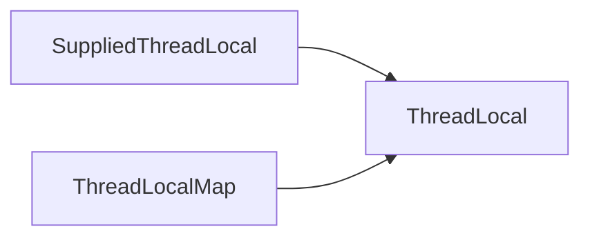

# JavaSE常见面试题

## Integer类

### 看代码说结果

```java
public class IntegerSource {
    public static void main(String[] args) {
        /**
         * Integer 经典面试题
         */
        Integer a = 10000;
        Integer b = new Integer(10000);
        System.out.println(a == b); // 对象和基本类型比较 false

        Integer c = new Integer(100);
        Integer d = new Integer(100);
        System.out.println(c == d); // 两个对象比较 false

        Integer e = 100;
        Integer f = 100;
        System.out.println(e == f); // true 都是同一个缓存 字节码编译后 e = Integer.valueOf(100)  valueOf会先看缓存（IntegerCache中有没有） 緩存的数值范围为-128~127

        Integer g = 1000;
        Integer h = 1000;
        System.out.println(g == h);// false 字节码编译后 e = Integer.valueOf(100)  valueOf会先看缓存（IntegerCache中有没有） 緩存的数值范围为-128~127

    }
}
```

jdk源码

```java
@HotSpotIntrinsicCandidate
public static Integer valueOf(int i) {
    if (i >= IntegerCache.low && i <= IntegerCache.high)
        return IntegerCache.cache[i + (-IntegerCache.low)];
    return new Integer(i);
}
// Integer的缓存。 默认缓存-128~127直接的数据
private static class IntegerCache {
        static final int low = -128;
        static final int high;
        static final Integer cache[]; // 缓存池

        static {
            // high value may be configured by property
            int h = 127;
            String integerCacheHighPropValue =
                VM.getSavedProperty("java.lang.Integer.IntegerCache.high");
            if (integerCacheHighPropValue != null) {
                try {
                    int i = parseInt(integerCacheHighPropValue);
                    i = Math.max(i, 127);
                    // Maximum array size is Integer.MAX_VALUE
                    h = Math.min(i, Integer.MAX_VALUE - (-low) -1);
                } catch( NumberFormatException nfe) {
                    // If the property cannot be parsed into an int, ignore it.
                }
            }
            high = h;

            cache = new Integer[(high - low) + 1];
            int j = low;
            for(int k = 0; k < cache.length; k++)
                cache[k] = new Integer(j++);

            // range [-128, 127] must be interned (JLS7 5.1.7)
            assert IntegerCache.high >= 127;
        }

        private IntegerCache() {}
    }
```

JDK的源码中，被@HotSpotIntrinsicCandidate标注的方法，在HotSpot中都有一套高效的实现，该高效实现基于CPU指令，运行时，HotSpot维护的高效实现会替代JDK的源码实现，从而获得更高的效率。

 jdk的包装类都是final修饰的。

## ThreadLocal

### ThreadLocal的结构

ThreadLocal有两个内部类




Supplied开头的是函数式接口。

Map是ThreadLocal自定义的一个map，主要是为了防止ThreadLocal内存泄漏

### ThreadLocal部分代码解释

```java
public class ThreadLocalSource {
    public static void main(String[] args) {
        ThreadLocal<String> local = new ThreadLocal<>();
        System.out.println(local.get());

        local.set("hello");
        System.out.println(local.get());
    }
}
```

> **get()方法解释**

看不懂。

```java
public T get() {
    //Returns a reference to the currently executing thread object. Returns: the currently executing thread.
    Thread t = Thread.currentThread();
    // 获得当前线程关联的一个Map ThreadLocalMap是一个静态内部类只初始化一次哦！
    ThreadLocalMap map = getMap(t);
    // Map不为空的话
    if (map != null) {
        // 获得key对应的Entry
        ThreadLocalMap.Entry e = map.getEntry(this);
        // Entry不为空
        if (e != null) {
            @SuppressWarnings("unchecked")
            T result = (T)e.value;
            return result;
        }
    }
    // 为空就初始化值
    return setInitialValue();
}
```

> **set()方法解释**

```java
public void set(T value) {
    Thread t = Thread.currentThread();
    ThreadLocalMap map = getMap(t);
    if (map != null) {
        // 通过当前线程获取的map不为空则为当前线程设置值
        map.set(this, value);
    } else {
        createMap(t, value);
    }
}
```

map.set的set方法

```java
private void set(ThreadLocal<?> key, Object value) {

    // We don't use a fast path as with get() because it is at
    // least as common to use set() to create new entries as
    // it is to replace existing ones, in which case, a fast
    // path would fail more often than not.
    // 捷径往往会失败
    Entry[] tab = table; // 这个map用的是开放定址法？
    int len = tab.length;
    int i = key.threadLocalHashCode & (len-1);

    for (Entry e = tab[i];
         e != null;
         e = tab[i = nextIndex(i, len)]) {
        ThreadLocal<?> k = e.get();

        if (k == key) {
            e.value = value;
            return;
        }

        if (k == null) {
            replaceStaleEntry(key, value, i);
            return;
        }
    }

    tab[i] = new Entry(key, value);
    int sz = ++size;
    if (!cleanSomeSlots(i, sz) && sz >= threshold)
        rehash(); // 重新调整hash的大小
}
```

### ThreadLocalMap

ThreadLocalMap为了可从表中删除条目Entry采用了WeakReference

Entry是key。

弱引用，不管内存是否足够，GC时都会把弱虚引用回收掉。