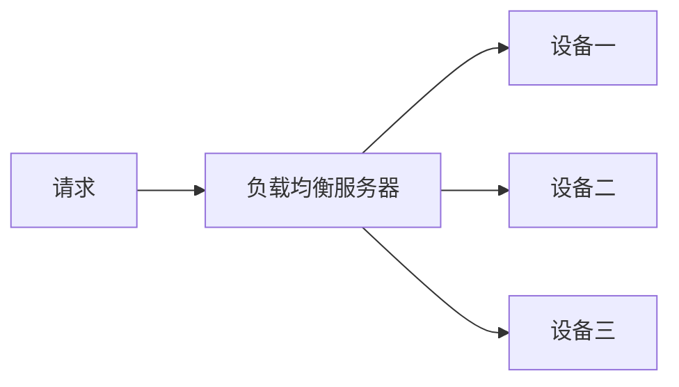
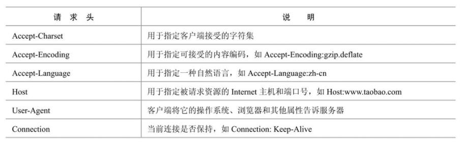
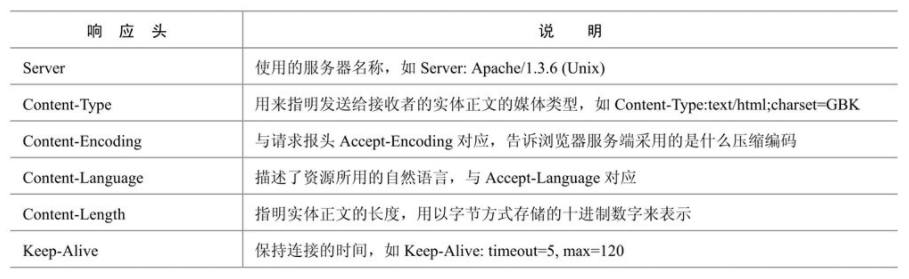
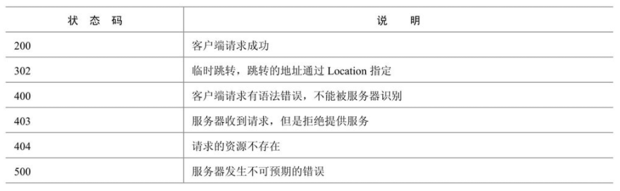
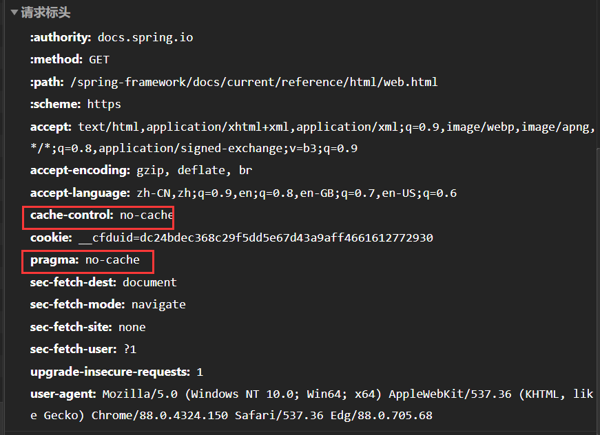

# 第1章 深入Web请求过程

## 引言

> B/S 架构带来了两方面好处

- 客户端使用统一的浏览器（Browser）

- 服务端（Server）基于统一的HTTP协议

都简化了开过程。降低了学习成本。

> 问题

用户使用是否更便捷，是否贴合用户习惯？

开发效率是否更高，软件效率是否更高，版本迭代是否更容易？

## B/S网络架构概述

B/S 网络架构从前端到后端都得到了简化，都基于统一的应用层协议 HTTP 来交互数据，与大多数传统 C/S 互联网应用程序采用的长连接的交互模式不同，HTTP 协议采用无状态的短连接的通信方式。

为什么使用无状态的短链接？

采用这种方式是为了能够同时服务更多的用户，因为当前互联网应用每天都会处理上亿的用户请求，不可能每个用户访问一次后就一直保持住这个连接。我感觉还受数据特点的影响。如果数据需要持续交互还是采用长连接，非持续交互的采用短链接，节省资源。

> <b>浏览器输入地址，发生了什么</b>

- 当一个用户在浏览器里输入 www.taobao.com 这个 URL 时
- 首先它会请求 DNS 把这个域名解析成对应的 IP 地址
- 然后根据这个 IP 地址在互联网上找到对应的服务器，向这个服务器发起一个 get 请求
- 然后服务器决定返回什么数据资源给用户。

对于大型网站，请求 URL 是需要指定到底那台服务器来处理请求；需要负载均衡设备来平均分配用户请求；请求的数据是分布式缓存还是静态文件还是查询数据库。浏览器返回数据时，若有诸如 css、js、图片一类的资源，这些资源又会发起另外的 HTTP 请求，而这些请求很可能会在 CDN 上，那么 CDN 服务器又会处理这个用户的请求。

## 如何发起一个请求

- 根据 URL 的域名 DNS 解析出 IP 地址
- 通过 IP 地址和端口与远程服务器建立 Socket 连接
- 建立连接发送符合 HTTP 请求的数据
- 通过 outputStream.write 发送数据到目标服务器

<b>总而言之：发起一个 HTTP 请求的过程就是建立一个 Socket 通信。</b>

可以用 HttpClient，查阅博客，api 发起一个请求试试。

Linux 的 curl 也可以发起请求，curl 可以用来做压力测试，win10 用户可以安装一个 linux 子系统。

## HTTP协议解析

> <b>常见 HTTP 请求头</b>

> <b>常见 HTTP 响应头</b>

> <b>常见 HTTP 状态码</b>

> <b>浏览器缓存机制</b>

在我们浏览一个页面时发现有异常的情况下，通常考虑的就是是不是浏览器做了缓存

如果是按 Ctrl+F5 组合键刷新页面，那么浏览器会直接向目标 URL 发送请求，而不会使用浏览器缓存的数据；

其次即使请求发送到服务端，也有可能访问到的是缓存的数据

为了保证用户能够看到最新的数据，必须通过 HTTP 协议来控制。

> **查看是否是缓存**

Last-Modified 字段一般用于表示一个服务器上的资源的最后修改时间，通过这个最后修改时间可以判断当前请求的资源是否是最新的。

Cache-Control/Pragma 查看是否是缓存

<b>Etag 字段</b>，这个字段的作用是让服务端给每个页面分配一个唯一的编号，然后通过这个编号来区分当前这个页面是否是最新的。但是在后端的 Web 服务器有多台时比较难处理，因为每个Web服务器都要记住网站的所有资源，否则浏览器返回这个编号就没有意义了。

<b>Expires </b>通常的使用格式是 Expires:Sat, 25 Feb 2012 12:22:17 GMT，后面跟着一个日期和时间，超过这个时间值后，缓存的内容将失效，过期就重新请求数据。

## DNS域名解析

> **解析流程比较复杂，可查阅计算机网络相关书籍**

- 先查本地有没有
- 本地没有就去服务器端查
- 服务器端会先查缓存，缓存没有在解析。
- 域名一级一级的进行解析

> **常用命令**

windows

- 通过ipconfig查询这个地址
- 用nslookup命令来查询域名的解析结果
- 清除缓存的域名，在命令行模式下执行ipconfig /flushdns命令来刷新缓存

linux

- ifconfig 或 cat/etc/resolv.conf
- 用nslookup命令来查询域名的解析结果
- Linux下可以通过/etc/init.d/nscd restart来清除缓存

> **JVM缓存域名**

在Java应用中JVM也会缓存DNS的解析结果，这个缓存是在InetAddress类中完成的，而且这个缓存时间还比较特殊，它有两种缓存策略：一种是正确解析结果缓存，另一种是失败的解析结果缓存。这两个缓存时间由两个配置项控制，配置项是在 %JAVA_HOME%\lib\security\java.security文件中配置的。两个配置项分别是networkaddress.cache. ttl和networkaddress.cache.negative.ttl，它们的默认值分别是-1（永不失效）和10（缓存10秒）。

要修改这两个值同样有几种方式，分别是：直接修改java.security文件中的默认值、在Java的启动参数中增加-Dsun.net.inetaddr.ttl=xxx来修改默认值、通过InetAddress类动态修改。在这里还要特别强调一下，如果我们需要用InetAddress类解析域名时，一定要是单例模式，不然会有严重的性能问题，如果每次都创建InetAddress实例，每次都要进行一次完整的域名解析，非常耗时，这点要特别注意。

## 1.5 CND

> **CND简介**

CDN也就是内容分布网络（Content Delivery Network）它是构筑在现有Internet上的一种先进的流量分配网络。其目的是通过在现有的Internet中增加一层新的网络架构，将网站的内容发布到最接近用户的网络“边缘”，使用户可以就近取得所需的内容，提高用户访问网站的响应速度。

有别于镜像，它比镜像更智能，可以做这样一个比喻：CDN =镜像（Mirror）+ 缓存（Cache）+ 整体负载均衡（GSLB）。因而，CDN可以明显提高Internet中信息流动的效率。

目前CDN主要是缓存静态数据。

> **负载均衡简介**

对工作任务进行平衡、分摊到多个操作单元上执行，如图片服务器、应用服务器等，共同完成工作任务。它可以提高服务器响应速度及利用效率，避免软件或者硬件模块出现单点失效，解决网络拥塞问题，实现地理位置无关性，为用户提供较一致的访问质量。

通常有三种负载均衡架构，分别是

- 链路负载均衡
- 集群负载均衡
- 操作系统负载均衡

所谓链路负载均衡也就是前面提到的通过DNS解析成不同的IP，然后用户根据这个IP来访问不同的目标服务器：DNS解析的优点是用户会直接访问目标服务器，而不需要经过其他的代理服务器，通常访问速度会更快。但是也有缺点，由于DNS在用户本地和Local DNS Server都有缓存，一旦某台Web Server挂掉，那么很难及时更新用户的域名解析结构。如果用户的域名没有及时更新，那么用户将无法访问这个域名，带来的后果非常严重。

硬件负载均衡一般使用一台专门硬件设备来转发请求：硬件负载均衡的关键就是这台价格非常昂贵的设备，如F5，通常为了安全需要一主一备。它的优点很显然就是性能非常好，缺点就是非常贵，一般公司是用不起的，还有就是当访问量陡然增大超出服务极限时，不能进行动态扩容。

软件负载均衡是**使用最普遍**的一种负载方式，它的特点是**使用成本非常低**，直接使用廉价的PC就可以搭建。缺点就是**一般一次访问请求要经过多次代理服务器**，会增加网络延时。

操作系统负载均衡，就是利用操作系统级别的软中断或者硬件中断来达到负载均衡，如可以设置多队列网卡等来实现。

# 第2章 深入分析Java I/O的工作机制

## 2.0 引言

IO是很大的瓶颈。

本章的目的正是分析I/O的内在工作机制，你将了解到Java的I/O类库的基本架构、磁盘I/O工作机制、网络I/O的工作机制。其中以网络I/O为重点介绍Java Socket的工作方式。你还将了解到NIO的工作方式，同步和异步以及阻塞与非阻塞的区别。最后将介绍一些常用的I/O优化技巧。

## 2.1 I/O类库基本架构

> **Java的I/O操作类在包java.io下，大概有将近80个类，这些类大概可以分成如下四组。**

◎ 基于字节操作的I/O接口：InputStream和OutputStream。

◎ 基于字符操作的I/O接口：Writer和Reader。

◎ 基于磁盘操作的I/O接口：File。

◎ 基于网络操作的I/O接口：Socket。

前两组主要是传输数据的数据格式，后两组主要是传输数据的方式，虽然Socket类并不在java.io包下，但是我仍然把它们划分在一起，

因为我个人认为**I/O的核心问题要么是数据格式影响I/O操作，要么是传输方式影响I/O操作，也就是将什么样的数据写到什么地方的问题。**I/O只是人与机器或者机器与机器交互的手段，除了它们能够完成这个交互功能外，我们关注的就是如何提高它的运行效率了，而数据格式和传输方式是影响效率最关键的因素。后面的分析也是基于这两个因素来展开的。

> **基于字节的**

- InputStream
- OutputStream

只定义了读写方式，没说要到那去

> **基于字符的**

- Writer
- Reader

只定义了读写方式，没说要到那去

> **字节与字符的转化接口**

- InputStreamReader类是字节到字符的转化桥梁
- OutputStreamWriter类完成字符到字节的编码过程

## 2.2 磁盘I/O工作机制

