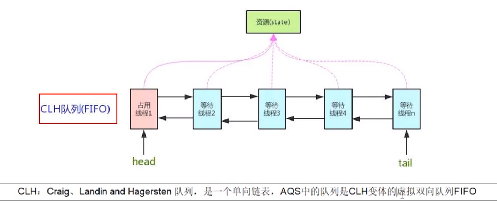
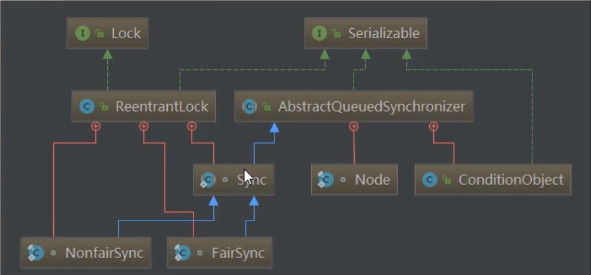
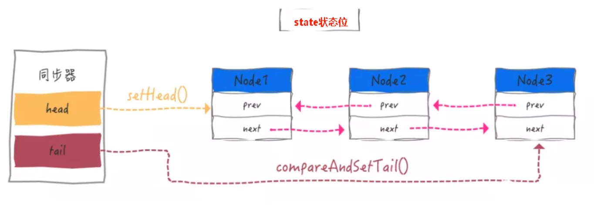

# 一些概念

## 可重入锁

同一个线程，可以多次获得属于自己的同一把锁。

# LockSupport

## 概念+方法

- 为什么要学：
  - JUC--->AQS--->(前置知识。可重入锁、LocSupport)
  - AQS是jdk自带的。
- 是什么
  - 用于创建锁和其他同步类的基本线程阻塞原语。所以它的主要作用就是挂起和唤醒线程，是创建锁和其他同步工具类的基础。
  - 线程等待唤醒机制（wait/notify）
- `LockSupport`类与每个使用它的线程都会关联一个许可证，默认情况下调用`LockSupport`类是不持有许可证的。`LockSupport`是使用Unsafe类实现的。
- 存在的方法
  - `void park`：<span style="color:green">**申请拿许可证，拿不到就阻塞。（阻塞线程）**</span>
  - `void unpark`：如果参数thread线程没有持有thread与`LockSupport`类关联的许可证，则让thread线程持有。如果thread之前因调用park而被挂起，则调用`unpark`后会被唤醒。<span style="color:green">**简单说就是给你许可证；（解除阻塞线程）**</span>
- `LockSupport`类使用许可这种概念来做到阻塞和唤醒线程的功能，<span style="color:green">**许可（Permit）只有两个值1和0，默认是0**</span>

`LockSupport`的通知可以在阻塞之前，因为他是按许可证的数量来决定阻塞还是不阻塞的。故可以先唤醒后等待。且`Park`无需锁化。归根结底，`LockSupport`调用的是`Unsafe`的`native`方法

`ReentrantLock`和基本的wait，notify则不是这样。他们只能先有等待的线程，然后唤醒等待的线程。

<span style="color:red">这种part拿许可证用的是轮询的方式看是否可以拿到锁吗？</span>

### 线程阻塞唤醒的方法

- 使用`Object`中的 `wait()`方法让线程等待，使用Object中的`notify()`方法唤醒线程
- 使用`JUC`包中`Condition`的`await()`方法让线程等待，使用`signal()`方法唤醒线程
- `LockSupport`类可以阻塞当前线程以及唤醒指定被阻塞的线程

-----

`RenntrantLock`是可重入锁，有多少lock就要有多少unlock，不然会无法释放锁。

`RenntrantLock`的`Condition`不满足条件时会进入该条件的阻塞队列。

```java
ReentrantLock lock = new ReentrantLock();
Condition empty = lock.newCondition();
Condition full = lock.newCondition();
empty.await();//当前线程进入empty对象的阻塞队列
full.await();//当前线程进入full对象的阻塞对立

// 具体的测试代码，可运行的。debug看每个条件阻塞队列中有那些线程就可以了~
public void test3() throws InterruptedException {
    ReentrantLock lock = new ReentrantLock();
    Condition empty = lock.newCondition();
    Condition full = lock.newCondition();

    Thread t1 = new Thread(() -> {
        try {
            lock.lock();
            empty.await();
        } catch (Exception e) {
        } finally {
            lock.unlock();
        }
    });

    Thread t2 = new Thread(() -> {
        try {
            lock.lock();
            empty.await();
        } catch (Exception e) {
        } finally {
            lock.unlock();
        }
    });

    Thread t3 = new Thread(() -> {
        try {
            lock.lock();
            empty.await();
        } catch (Exception e) {
        } finally {
            lock.unlock();
        }
    });


    Thread t4 = new Thread(() -> {
        try {
            lock.lock();
            full.await();
        } catch (Exception e) {
        } finally {
            lock.unlock();
        }
    });


    Thread t5 = new Thread(() -> {
        try {
            lock.lock();
            full.await();
        } catch (Exception e) {
        } finally {
            lock.unlock();
        }
    });

    t1.start();
    t2.start();
    t3.start();
    t4.start();
    t5.start();

    TimeUnit.SECONDS.sleep(10);

    System.out.println("123");
    for (; ; ) {

    }
}
```

# AQS

> **`AQS（AbstractQueuedSynchronizer）`抽象队列同步器**

## 前置知识

- 公平锁非公平锁
- 可重入锁
- `LockSupport`
- 自旋锁
- 数据结构链表
- 模板设计模式

## 概念普及

**技术解释：**`AQS`是用来构建锁或者其它同步器组件的重量级基础框架及整个<span style="color:red">`JUC`体系的基石</span>，通过内置的FIFO队列来完成资源获取线程的排队工作，<span style="color:red">并通过一个int型变量表示持有锁的状态。</span>



<span style="color:green">**`AQS`是`JUC`内容中最重要的基石**</span>

- 与`AQS`有关的

  - `ReentrantLock`

  - `CountDownLatch`

  - `ReentraantReadWriteLock`

  - `Semaphore`

  - `CyclicBarrier`

    ```java
    // 这几个里面都有一个内部类Sync 继承了AQS
    // 内部类 Sync
    abstract static class Sync extends AbstractQueuedSynchronizer {
        
    }
    ```

<span style="color:green">**进一步理解锁和同步器的关系**</span>

- 锁，面向锁的<span style="color:red">使用者</span>，用户层面的`API`
- 同步器，面向锁的<span style="color:red">实现者</span>，
  - 比如`DougLee`，提出统一规范并简化了锁的实现，屏蔽了同步状态管理、阻塞线程排队和通知、唤醒机制等。

## 作用

加锁会导致阻塞，有阻塞就需要排队，实现排队必然需要有某种形式的队列来进行管理。

----

抢到资源的线程直接处理业务逻辑，抢占不到资源的线程的必然涉及一种排队等候机制，抢占资源失败的线程继续去等待(类似办理窗口都满了，暂时没有受理窗口的顾客只能去候客区排队等候)，仍然保留获取锁的可能且获取锁流程仍在继续(候客区的顾客也在等着叫号，轮到了再去受理窗口办理业务）。

既然说到了<span  style="color:red">排队等候机制</span>，那么就一定会有某种队列形成，这样的队列是什么数据结构呢?

如果共享资源被占用，<span style="color:red">就需要一定的阻塞等待唤醒机制来保证锁分配</span>。这个机制主要用的是CLH队列的变体实现的，将暂时获取不到锁的线程加入到队列中，这个队列就是**AQS**的抽象表现。它将请求共享资源的线程封装成队列的结点(Node) ，**通过CAS、自旋以及LockSuport.park()的方式，维护state变量的状态，使并发达到同步的效果**。                 


## AQS体系



**AQS自身**

AQS = state + CLH队列

- AQS的int变量：

  - AQS的同步状态State成员变量

    ```java
    /**
     * The synchronization state.
     */
    private volatile int state;
    ```

  - 举例：银行办理业务的受理窗口状态；零就是没人，自由状态可以办理；大于等于1，有人占用窗口，等着去

- `AQS`的`CLH`队列
  - `CLH`队列（三个大牛的名字组成），为一个双向队列
  - 举例：银行侯客区的等待顾客

- 小结：
  - 有阻塞就需要排队，实现排队必然需要队列
  - `state变量+CLH`双端Node队列

**`AQS`的内部类Node**

- Node的int变量
  - Node的等待状态`waitState`成员变量；`volatile int waitStatus `
  - 举例：等候区其它顾客(其它线程)的等待状态；队列中每个排队的个体就是一个Node.

**`AQS`是怎么排队的：**是用`LockSupport.pork()`来进行排队的



## 源码

建议看一下Java并发编程实战的第14章。

### `ReentrantLock`原理

`ReentrantLock`的lock，unlock调用的是它内部那个继承了`AQS`的内部类`Sync`的方法。

`ReentrantLock`可设置是公平锁还是非公平锁，那两个类也是`ReentrantLock`的内部类。

```java
/**
 * Sync object for non-fair locks
*/
static final class NonfairSync extends Sync {
    private static final long serialVersionUID = 7316153563782823691L;
    protected final boolean tryAcquire(int acquires) {
        return nonfairTryAcquire(acquires);
    }
}
```

公平锁和非公平锁的区别在哪里？

```java
// 公平锁
static final class FairSync extends Sync {
    private static final long serialVersionUID = -3000897897090466540L;
    /**
     * Fair version of tryAcquire.  Don't grant access unless
     * recursive call or no waiters or is first.
     */
    @ReservedStackAccess
    protected final boolean tryAcquire(int acquires) {
        final Thread current = Thread.currentThread();
        int c = getState();
        if (c == 0) {
            // 公平锁，先来后到，看阻塞队列中是否有
            if (!hasQueuedPredecessors() &&
                compareAndSetState(0, acquires)) {
                setExclusiveOwnerThread(current);
                return true;
            }
        }
        else if (current == getExclusiveOwnerThread()) {
            int nextc = c + acquires;
            if (nextc < 0)
                throw new Error("Maximum lock count exceeded");
            setState(nextc);
            return true;
        }
        return false;
    }
}
```

```java
static final class NonfairSync extends Sync {
    private static final long serialVersionUID = 7316153563782823691L;
    protected final boolean tryAcquire(int acquires) {
        return nonfairTryAcquire(acquires);
    }
}

// nonfairTryAcquire的代码
/**
  * Performs non-fair tryLock.  tryAcquire is implemented in
  * subclasses, but both need nonfair try for trylock method.
  */
@ReservedStackAccess
final boolean nonfairTryAcquire(int acquires) {
    final Thread current = Thread.currentThread();
    int c = getState();
    if (c == 0) {
        if (compareAndSetState(0, acquires)) {
            setExclusiveOwnerThread(current);
            return true;
        }
    }
    else if (current == getExclusiveOwnerThread()) {
        int nextc = c + acquires;
        if (nextc < 0) // overflow
            throw new Error("Maximum lock count exceeded");
        setState(nextc);
        return true;
    }
    return false;
}
```

### `ReentrantLock`源码

一步一步看下去【基于jdk11，和jdk8有出入~~】

```java
public void test1() {
    ReentrantLock lock = new ReentrantLock(true);
    lock.lock();
}
```

点进lock里面一看,调用了内部类Sync的一个acquire方法。因为我们默认用的`ReentrantLock`的非公平锁。所以看非公平锁的`acquire`的源码

```java
public void lock() {
    sync.acquire(1);
}
```

点进`acqurie`方法一看，直接跳到了`AQS`类里。

```java
public final void acquire(int arg) {
    if (!tryAcquire(arg) &&
        acquireQueued(addWaiter(Node.EXCLUSIVE), arg))
        selfInterrupt();
}
```

去`tryAcquire`方法里看具体代码。这代码不对劲！模板方法！！！ 落地的实现交给子类来处理。

我们真实调用的是子类`NonfairSync`的方法，所以我们要找子类`NonfairSync`的`tryAcquire`方法

```java
protected boolean tryAcquire(int arg) {
    throw new UnsupportedOperationException();
}
```

看下子类`NonfairSync`的`tryAcquire`方法

```java
protected final boolean tryAcquire(int acquires) {
    return nonfairTryAcquire(acquires);
}
```

点进`nonfairTryAcquire`方法一看

```java
@ReservedStackAccess
final boolean nonfairTryAcquire(int acquires) {
    final Thread current = Thread.currentThread();
    int c = getState();
    // 如果当前的锁还没被其他线程拿到的话，去拿锁。
    if (c == 0) {
        // CAS操作了
        if (compareAndSetState(0, acquires)) {
            // 设置当前线程独占
            setExclusiveOwnerThread(current);
            return true;
        }
    }//如果请求锁的线程和持有锁的线程是同一个线程。这不就是可重入锁吗
    else if (current == getExclusiveOwnerThread()) {
        int nextc = c + acquires;
        if (nextc < 0) // overflow
            throw new Error("Maximum lock count exceeded");
        setState(nextc);
        return true;
    }// 未能拿到锁
    return false;
}
```

拿不到锁的话就，return false，会执行&&后面的语句

```java
/**
获取处于独占模式，忽略中断。通过调用至少一次tryAcquire，成功后返回来实现。否则，线程将排队，可能会反复阻塞和解除阻塞，调用tryAcquire直到成功。此方法可用于实现方法Lock.lock。
*/
public final void acquire(int arg) {
    // 假设无法获取到锁，那么
    // tryAcquire返回的是false， 取反后就是true。然后就执行addWaiter方法了~
    if (!tryAcquire(arg) &&
        acquireQueued(addWaiter(Node.EXCLUSIVE), arg))
        selfInterrupt();
}
```

`addWaiter`方法，放入队列等待？

```java
addWaiter(Node.EXCLUSIVE)

/** Marker to indicate a node is waiting in exclusive mode */
/** 指示节点以排他模式等待的标记 */
static final Node EXCLUSIVE = null;
```

```java

/**
* Creates and enqueues node for current thread and given mode.
*
* @param mode Node.EXCLUSIVE for exclusive, Node.SHARED for shared
* @return the new node
*/
private Node addWaiter(Node mode) {
    Node node = new Node(mode);
	// 节点入阻塞队列操作
    for (;;) {
        // 这个是伪节点
        Node oldTail = tail;
        if (oldTail != null) {
            node.setPrevRelaxed(oldTail);
            // 比较并设置头，和jdk1.8比起来好像减小了粒度
            if (compareAndSetTail(oldTail, node)) {
                oldTail.next = node;
                return node;
            }
        } else {
            // 没有元素就初始化阻塞队列
            initializeSyncQueue();
        }
    }
}
```


