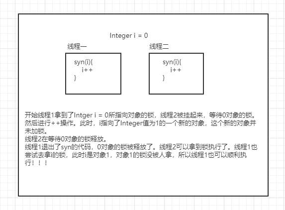

# 概述

某个不知名的小视频的学习笔记，只重要概念。

---

# 第一天 基础

## 概念及创建方式

线程：理解就行

创建方式：

- 传统方式	
  - 继承Thread
  - 实现Runnable
- 新方式
  - 实现Callable接口，通过FutureTask包装器创建
  - 使用ExecutorService、Callable、Future实现有放回结果的线程【使用线程池】
- 一共四种方式

代码题：用传统方式创建线程

## Java线程状态

不要把JVM的线程状态和OS的搞混了。JVM是JVM，OS是OS，虽然JVM的线程最终是要经过OS的（JVM的线程模型有1对1，1对多，多对多，但是常见的还是1对1模型，即一个JVM线程对应一个OS线程）

- 六种状态，自行看源码中对应的枚举类

## 一些基本的API

- sleep 休眠，不释放锁
- yield 让出cpu使用权，进入等待队列（准确说应该是就绪队列，因为它只缺cpu）
- join 线程插队，可以用于指定线程的结束顺序
- getState 获得线程状态
- interrupt 了解即可，只有个别框架的底层为了代码的鲁棒性用了这个。

## Synchronized

### 原理概述

synchroinzed关键字，把字节码反编译，发现其用的是**monitorenter**字节码指令实现的。

从syn锁的对象考虑的话，它是在对象头上用其中的2位表示锁的状态。

### 锁的什么？

- public static syn xxx 锁的是字节码对象
- public syn xx 锁的是this对象，即当前对象

问，字节码对象唯一吗？

一般来说，字节码对象是唯一的，但是若是不同的类加载器，那么就不唯一了，不过，不同的类加载器层面的不归我们管。

## 为什么Integer这些不可变类不能当锁对象

线程一，拿到了0对象的锁。线程二拿不到0对象的锁，被阻塞了。

线程一，对i执行自增操作，i指向了新的对象-->1.此时线程二在等待0对象的锁。

线程一执行完毕后，释放了对象0的锁。

线程二拿到了0对象的锁。然后线程一再次尝试获取i的锁，此时i指向的是1对象，1对象的锁没有被拿到，所以线程一也可以顺利指向。线程一、二都顺利执行。【**个人理解，暂未查阅资料考证**】