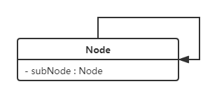
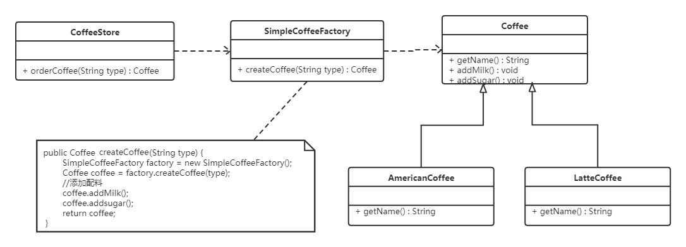
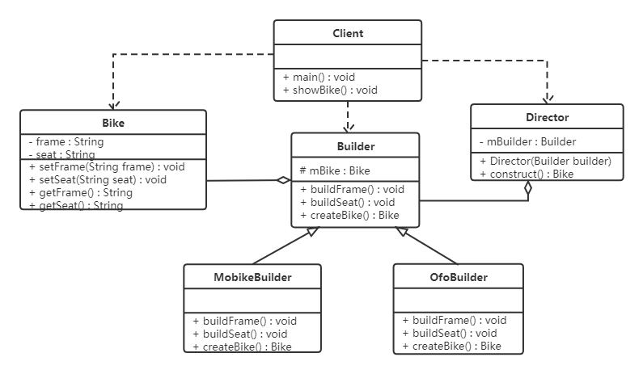
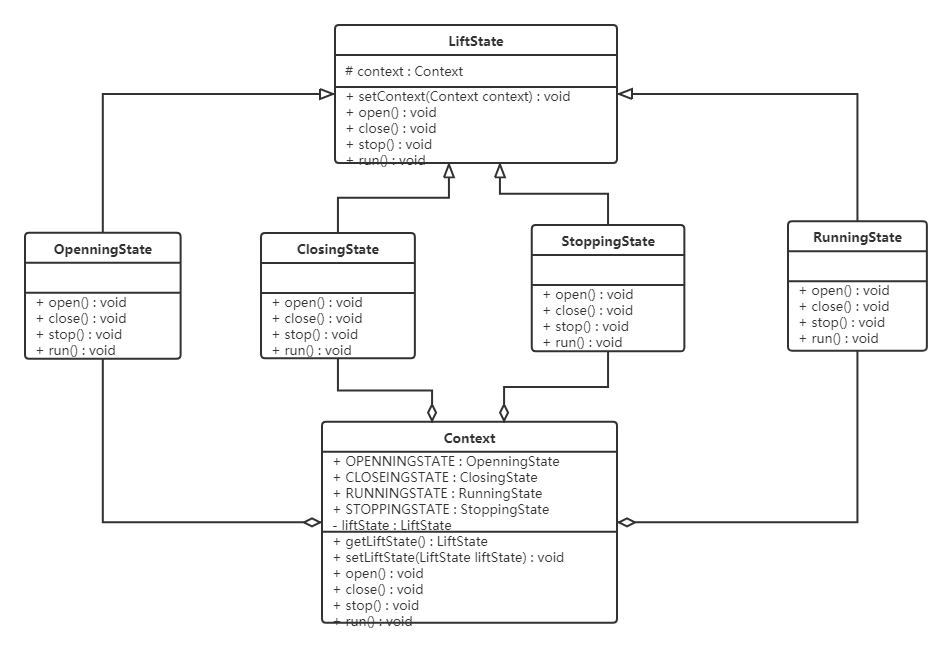
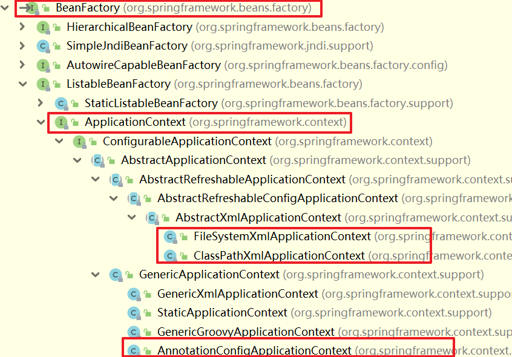
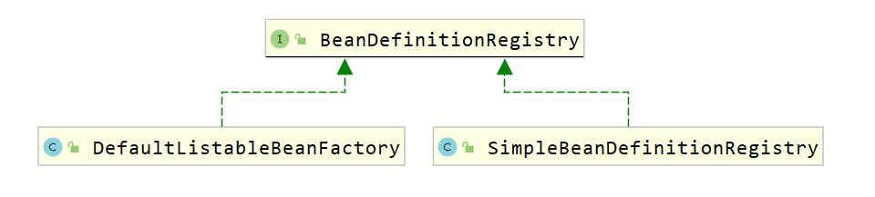

# 设计模式

- 理解软件松耦合设计思想。
- 掌握面向对象设计原则，设计原则比具体的 pattern 更重要。
- 掌握重构技法改善设计，使用重构的方法，将设计模式运用到软件开发中。
- 掌握 GOF 核心设计模式。
- 用重构的眼光看普通代码到设计模式的演变（一步一步的重构，最终变成某种设计模式）

## 软件设计模式的产生背景

"设计模式"最初并不是出现在软件设计中，而是被用于建筑领域的设计中。使用模式，避免重复劳动。

1977年美国著名建筑大师、加利福尼亚大学伯克利分校环境结构中心主任`克里斯托夫·亚历山大 (Christopher Alexander)` 在他的著作《建筑模式语言：城镇、建筑、构造》中描述了一些常见的建筑设计问题，并提出了 253 种关于对城镇、邻里、住宅、花园和房间等进行设计的基本模式。

1990 年软件工程界开始研讨设计模式的话题，后来召开了多次关于设计模式的研讨会。直到 1995 年，艾瑞克·伽马 (ErichGamma) 、理査德·海尔姆 (Richard Helm) 、拉尔夫·约翰森 (Ralph Johnson) 、约翰·威利斯迪斯 (John Vlissides) 等 4 位作者合作出版了《设计模式：可复用面向对象软件的基础》一书，在此书中收录了 23 个设计模式，这是设计模式领域里程碑的事件，导致了软件设计模式的突破。这 4 位作者在软件开发领域里也以他们的“四人组” (Gang of Four，GoF) 著称。   

## 从面向对象谈起

- 底层思维：向下，如何把握机器底层从微观理解对象构造
    - 语言构造
    - 编译转换
    - 内存模型
    - 运行时机制
- 抽象思维：向下，如何将我们的周围世界抽象为程序代码
    - 面向对象
    - 组件封装
    - 设计模式
    - 架构模式


## 深入理解面向对象

<b>向下：深入理解三大面向对象机制</b>，偏重底层思维

- 封装，隐藏内部实现
- 继承，复用现有代码
- 多态，改写对象行为

<b>向上：深刻把握面向对象机制所带来的抽象意义， 理解如和利用这些机制来表达现实世界，掌握什么是“好的面向对象设计”</b>

用了封装、继承、多态的语法并不意味着这就是面向对象设计，评判设计的标准注重的是抽象思维，而非单纯的语法。

## 软件设计固有的复杂性

建筑商从来不会去想给一栋已建好的 100 层高的楼房底下再新修一个小地 下室一这样做花费极大而且注定要失败。然而令人惊奇的是，软件系统的用户在要求作出类似改变时却不会仔细考虑，而且他们认为这只是需要简单编程的事。-- Object-Oriented Analysis and Design with Applications

变化，为软件设计带来了复杂性。客户需求的变化、技术平台的变化、团队的变化、市场环境的变化...

<b>解决复杂性</b>

- 分解，将大问题分解为小问题，逐个处理。增加新功能时，可能需要修改很多地方的代码。需求变化时，在不断的改动代码。
- 抽象，对事物进行抽象，忽略非本质特征，而是处理泛化和理想化的对象模型。增加功能时，需要改动的地方可能更少（重用性得到了很大的提升）。可以用不同设计模型，消除这种变化（修改源代码）

<b>举例</b>

- 分解：画图程序，将其分解为画点，画线，画面。分而治之。
- 抽象：画图程序，用 OOP，统一抽象为 shape，自己画自己。

再增加功能时，用 OOP 的思想，需要改动的地方会更少。

<b>软件设计的目标</b>

什么是好的软件设计?软件设计的金科玉律：复用！

## 软件设计模式的概念

软件设计模式 (Software Design Pattern) ，又称设计模式，是一套被反复使用、多数人知晓的、经过分类编目的、代码设计经验的总结。它描述了在软件设计过程中的一些不断重复发生的问题，以及该问题的解决方案。<span style="color:orange">也就是说，它是解决特定问题的一系列套路，是前辈们的代码设计经验的总结，具有一定的普遍性，可以反复使用。</span>

## 学习设计模式的必要性

- 应对面试中的设计模式相关问题; 
- 告别写被人吐槽的烂代码; 
- 提高复杂代码的设计和开发能力;  
- 让读源码、学框架事半功倍; 
- 为你的职场发展做铺垫

## 评价代码质量

> 为什么评价代码质量难? 

评价代码质量是很难量化。会受工程师的水平，习惯等因素的影响。即对一段代码的质量评价，常常有很强的主观性。

> 代码评价的标准这么多，常用的需要多关注的评价标准有那些? 

几个最常用的、最重要的评价标准：可维护性、可读性、可扩展性、灵活性、简洁性 (简单、复杂) 、可复用性、可测试性。这些标准之间会存在一定的重叠~

> 可维护性

代码易维护就是指，在不破坏原有代码设计、不引入新的 bug 的情况下，能够快速地修改或者添加代码。

那如何来判断代码可维护性的好坏呢? 

如果 bug 容易修复，修改、添加功能能够轻松完成，那我 们就可以主观地认为代码对我们来说易维护。这样的评价方式很主观，正如上面所说的，对一段代码的质量评价，常常有很强的主观性。

> 可读性

可读性可简单理解为：代码是否符合编码规范、命名是否达意、注释是否详尽、函数是否长短合适、模块划分是否清晰、是否符合高内聚低耦合等等。代码的可读性好，维护起来也方便些。

> 可扩展性

代码预留了一些功能扩展点，你可以把新功能代码，直接插到 扩展点上，而不需要因为要添加一个功能而大动干戈，改动大量的原始代码。

从我学习，使用，阅读 Spring 源码、及源码文档上的注释的时候深有体会，Spring 在这点上做的很好！

> 灵活性

很抽象，仅列举场景，请自行思考~

1️⃣当我们添加一个新的功能代码的时候，原有的代码已经预留好了扩展点，我们不需要修改原有的代码，只要在扩展点上添加新的代码即可。这个时候，我们除了可以说代码易扩展，还可以说代码写得好灵活。 

2️⃣当我们要实现一个功能的时候，发现原有代码中，已经抽象出了很多底层可以复用的模块、类等代码，我们可以拿来直接使用。这个时候，我们除了可以说代码易复用之外，还可以说代码写得好灵活。 

3️⃣当我们使用某组接口的时候，如果这组接口可以应对各种使用场景，满足各种不同的需求，我们除了可以说接口易用之外，还可以说这个接口设计得好灵活或者代码写得好灵活。

从刚刚举的场景来看，如果一段代码易扩展、易复用或者易用，我们都可以称这段代码写得比较灵活。所以，灵活这个词的含义非常宽泛，很多场景下都可以使用。

> 简洁性

尽量保持代码简单，同上面的评价标准，很难量化。

> 可复用性

尽量减少重复代码的编写，复用已有的代码。继承、多态的出现很大程度上提高了代码的复用性。

> 可测试性

编写的代码很容易测试。测试很重要！具体原因在重构篇谈~

> 本节重点回顾

1️⃣如何评价代码质量的高低?  

代码质量的评价有很强的主观性，描述代码质量的词汇也有很多，比如可读性、可维护性、 灵活、优雅、简洁等，这些词汇是从不同的维度去评价代码质量的。它们之间有互相作用， 并不是独立的，比如，代码的可读性好、可扩展性好就意味着代码的可维护性好。代码质量 高低是一个综合各种因素得到的结论。我们并不能通过单一的维度去评价一段代码的好坏。 

2️⃣最常用的评价标准有哪几个?  

最常用到几个评判代码质量的标准是：可维护性、可读性、可扩展性、灵活性、简洁性、可 复用性、可测试性。其中，可维护性、可读性、可扩展性又是提到最多的、最重要的三个评价标准。 

3️⃣如何才能写出高质量的代码?  

要写出高质量代码，我们就需要掌握一些更加细化、更加能落地的编程方法论，这就包含面 向对象设计思想、设计原则、设计模式、编码规范、重构技巧等等。 

## 关系

面向对象、设计原则、设计模式、编程规范、重构，这五者有何关系? 

面向对象：面向对象编程因为其具有丰富的特性 (封装、抽象、继承、多态) ，可以实现很多复杂的设计思路，是很多设计原则、设计模式编码实现的基础。

设计原则：设计原则是指导我们代码设计的一些经验总结，且这些原则听起来都比较抽象，定义描述都比较模糊，不同的人会有不同的解读。我们需要掌握的式这些原则的设计初衷~

设计模式：设计模式是针对软件开发中经常遇到的一些设计问题，总结出来的一套解决方案或者设计思 路。大部分设计模式要解决的都是代码的可扩展性问题。我们需要学会的是了解它们都能解决哪些问题，掌握典型的应用场景，并且懂得不过度应用。

编程规范：偏向记忆，照着做即可。

代码重构：是保持代码质量不下降。重构代码的手段就是前面罗列的那些面向对象设计思想、设计原则、设计模式、编码规范。

## 分类

<b>创建型模式</b>

用于描述“怎样创建对象”，它的主要特点是“将对象的创建与使用分离”。GoF (四人组) 书中提供了<span style="color:red">单例、原型、工厂方法、抽象工厂、建造者</span>等 5 种创建型模式。

<b>结构型模式</b>

用于描述如何将类或对象按某种布局组成更大的结构，GoF (四人组) 书中提供了<span style="color:red">代理、适配器、桥接、装饰、外观、享元、组合</span>等 7 种结构型模式。

<b>行为型模式</b>

用于描述类或对象之间怎样相互协作共同完成单个对象无法单独完成的任务，以及怎样分配职责。GoF (四人组) 书中提供了<span style="color:red">模板方法、策略、命令、职责链、状态、观察者、中介者、迭代器、访问者、备忘录、解释器</span>等 11 种行为型模式。

<b>总结</b>

- 设计原则是指导我们代码设计的一些经验总结。
- 设计模式是针对软件开发中经常遇到的一些设计问题，总结出来的一套解决方案或者设计思路。
- 编程规范主要解决的是代码的可读性问题。
- 重构作为保持代码质量不下降的有效手段，利用的就是面向对象、设计原则、设计模式、编码规范这些理论。

<div align="center"></div>

# UML图

统一建模语言 (Unified Modeling Language，UML) 是用来设计软件的可视化建模语言。它的特点是简单、统一、图形化、能表达软件设计中的动态与静态信息。

UML 从目标系统的不同角度出发，定义了用例图、类图、对象图、状态图、活动图、时序图、协作图、构件图、部署图等 9 种图。

## 类图概述

类图 (Class diagram) 是显示了模型的静态结构，特别是模型中存在的类、类的内部结构以及它们与其他类的关系等。类图不显示暂时性的信息。类图是面向对象建模的主要组成部分。

## 类图的作用

* 在软件工程中，类图是一种静态的结构图，描述了系统的类的集合，类的属性和类之间的关系，可以简化了人们对系统的理解; 
* 类图是系统分析和设计阶段的重要产物，是系统编码和测试的重要模型。

## 类图表示法

### 类的表示方式 

在 UML 类图中，类使用包含类名、属性 (field) 和方法 (method) 且带有分割线的矩形来表示，比如下图表示一个 Employee 类，它包含 name，age 和 address 这 3 个属性，以及 work() 方法。 


属性/方法名称前加的加号和减号表示了这个属性/方法的可见性，UML 类图中表示可见性的符号有三种：

* +：表示 public

* -：表示 private

* #：表示 protected

属性的完整表示方式是：<b>可见性  名称 ：类型 [ = 缺省值]</b>  

方法的完整表示方式是：<b>可见性  名称(参数列表) [：返回类型]</b>

> 注意：

1，中括号中的内容表示是可选的

2，也有将类型放在变量名前面，返回值类型放在方法名前面

<b>举例</b>


上图 Demo 类定义了三个方法：

* method() 方法：修饰符为 public，没有参数，没有返回值。
* method1() 方法：修饰符为 private，没有参数，返回值类型为 String。
* method2() 方法：修饰符为 protected，接收两个参数，第一个参数类型为 int，第二个参数类型为 String，返回值类型是 int。

### 类与类之间关系的表示方式

#### 关联关系

<b style="color:orange">关联关系是对象之间的一种引用关系</b>，用于表示一类对象与另一类对象之间的联系，如老师和学生、师傅和徒弟等。<b style="color:orange">关联关系是类与类之间最常用的一种关系，分为<u>一般关联关系、聚合关系和组合关系</u>。</b>我们先介绍一般关联。

关联又可以分为单向关联，双向关联，自关联。

> <b>单向关联</b>

<div align="center"></div>

在 UML 类图中单向关联用一个带箭头的实线表示。上图表示每个顾客都有一个地址，这通过让 Customer 类持有一个类型为 Address 的成员变量类实现。

> <b>双向关联</b>

<div align="center"></div>

从上图中我们很容易看出，<span style="color:orange">所谓的双向关联就是双方各自持有对方类型的成员变量。</span>

在 UML 类图中，双向关联用一个不带箭头的直线表示。上图中在 Customer 类中维护一个 List\<Product>，表示一个顾客可以购买多个商品; 在 Product 类中维护一个 Customer 类型的成员变量表示这个产品被哪个顾客所购买。

> <b>自关联</b>

<div align="center"></div>

自关联在 UML 类图中用一个带有箭头且指向自身的线表示。上图的意思就是 Node 类包含类型为 Node 的成员变量，也就是“自己包含自己”。

#### 聚合关系

<span style="color:orange">聚合关系是关联关系的一种，是强关联关系，是整体和部分之间的关系。</span>

聚合关系也是通过成员对象来实现的，其中成员对象是整体对象的一部分，但是成员对象可以脱离整体对象而独立存在。例如，学校与老师的关系，学校包含老师，但如果学校停办了，老师依然存在。

在 UML 类图中，聚合关系可以用带空心菱形的实线来表示，菱形指向整体。下图所示是大学和教师的关系图.

<div align="center"></div>

#### 组合关系

<span style="color:orange">组合表示类之间的整体与部分的关系，但它是一种更强烈的聚合关系。</span>

在组合关系中，整体对象可以控制部分对象的生命周期，一旦整体对象不存在，部分对象也将不存在，部分对象不能脱离整体对象而存在。例如，头和嘴的关系，没有了头，嘴也就不存在了。

在 UML 类图中，组合关系用带实心菱形的实线来表示，菱形指向整体。下图所示是头和嘴的关系图

<div align="center"></div>


#### 依赖关系

<span style="color:orange">依赖关系是一种使用关系，它是对象之间耦合度最弱的一种关联方式，是临时性的关联。</span>

在代码中，某个类的方法通过局部变量、方法的参数或者对静态方法的调用来访问另一个类 (被依赖类) 中的某些方法来完成一些职责。

在 UML 类图中，依赖关系使用带箭头的虚线来表示，箭头从使用类指向被依赖的类。下图所示是司机和汽车的关系图，司机驾驶汽车：

<div align="center"></div>

#### 继承关系

<span style="color:orange">继承关系是对象之间耦合度最大的一种关系，表示一般与特殊的关系，是父类与子类之间的关系，是一种继承关系。</span>

在 UML 类图中，泛化关系用带空心三角箭头的实线来表示，箭头从子类指向父类。在代码实现时，使用面向对象的继承机制来实现泛化关系。例如，Student 类和 Teacher 类都是 Person 类的子类，其类图如下图所示：

<div align="center"></div>

#### 实现关系

<span style="color:orange">实现关系是接口与实现类之间的关系。在这种关系中，类实现了接口，类中的操作实现了接口中所声明的所有的抽象操作。</span>

在 UML 类图中，实现关系使用带空心三角箭头的虚线来表示，箭头从实现类指向接口。例如，汽车和船实现了交通工具，其类图如图 9 所示。

<div align="center"></div>

# 软件设计原则

在软件开发中，为了提高软件系统的可维护性和可复用性，增加软件的可扩展性和灵活性，程序员要尽量根据 6 条原则来开发程序，从而提高软件开发效率、节约软件开发成本和维护成本。

## 面向对象设计

变化是复用的天敌！面向对象设计最大的优势在于：抵御变化！

### 重新认识面向对象

<b>理解隔离变化</b>

- 从宏观层面来看，面向对象的构建方式更能适应软件的变化，能将变化所带来的影响减为最小。

<b>各司其职</b>

- 从微观层面来看，面向对象的方式更强调各个类的“责任”。
- 由于需求变化导致的新增类型不应该影响原来类型的实现------是所谓各负其责（多态调用，各负其责）。

<b>对象是什么?</b>

- 从语言实现层面来看,对象封装了代码和数据。
- 从规格层面讲，对象是一系列可被使用的公共接口。
- 从概念层面讲，对象是某种拥有责任的抽象。

## 依赖倒转原则

<b>依赖倒置原则的定义是</b>

- 高层模（稳定）不应该依赖低层模块（变化），两者都应该依赖其抽象（稳定）; 
- 抽象（稳定）不应该依赖细节（变化），实现细节应该依赖抽象; 

简单的说就是要求对抽象进行编程，不要对实现进行编程，这样就降低了客户与实现模块间的耦合。

在 Java 中的表现是

- 模块间的依赖通过抽象发生，实现类之间不能发生直接的依赖关系，其依赖关系是通过接口或抽象类产生的。
- 接口或抽象类不依赖于实现类; 
- 实现类依赖接口或抽象类
- <span style="color:orange">简而言之，面向接口编程</span>

面向对象的开发很好的解决了这个问题，一般情况下抽象的变化概率很小，让用户程序依赖于抽象，实现的细节也依赖于抽象。即使实现细节不断变动，只要抽象不变，客户程序就不需要变化。这大大降低了客户程序与实现细节的耦合度。

## 开闭原则

<b>开闭原则的定义是</b>

- <span style="color:orange">对扩展开放，对修改关闭。</span>
- 类模块应该是可扩展的，但是不可修改。

在程序需要进行拓展的时候，不能去修改原有的代码，实现一个热插拔的效果。简言之，是为了使程序的扩展性好，易于维护和升级。

想要达到这样的效果，我们需要使用接口和抽象类。

因为抽象灵活性好，适应性广，只要抽象的合理，可以基本保持软件架构的稳定。而软件中易变的细节可以从抽象派生来的实现类来进行扩展，当软件需要发生变化时，只需要根据需求重新派生一个实现类来扩展就可以了。

## 单一职责原则

<span style="color:orange">做角色访问控制的时候，动作主体 (用户) 与资源的行为 (权限) 分离。</span>

<b>单一职责原则的定义是</b>

- 应该有且仅有一个原因引起类的变更。通俗来说就是一个接口或类只有一个职责，它就负责一件事情。
- 变化的方向隐含着类的责任。

但是单一职责原则最难划分的就是职责，一个职责一个接口，职责该如何量化? 这些都是不可度量的，因项目而异，因环境而异。只能说这个原则尽量遵守，也最容易被打破。

## 里氏代换原则

<span style="color:orange">任何基类可以出现的地方，子类一定可以出现。</span>

<b>里氏替换原则的定义是</b>

- 子类必须能够替换它们的基类（父类，IS-A）『基本的行为要一致吗，这样互相替换旧不会出现问题』
- 继承表达类型抽象

简单说就是子类可以扩展父类的功能，但不能改变父类原有的功能。换句话说，子类继承父类时，除添加新的方法完成新增功能外，尽量不要重写父类的方法。

如果通过重写父类的方法来完成新的功能，这样写起来虽然简单，但是整个继承体系的可复用性会比较差，特别是运用多态比较频繁时，程序运行出错的概率会非常大。

## 接口隔离原则

<b>接口隔离原则的定义是</b>

- 客户端不应该依赖它不需要的接口。依赖它需要的接口，客户端需要什么接口就提供什么接口，把不需要的接口剔除，<span style="color:orange">细化接口，保证接口的纯洁性。</span>
- 接口应该小而完备。

注意：设计是有限度的，不能无限地考虑未来的变更情况，否则会陷入设计的泥潭中而不能自拔。

## 组合而非继承

<b>优先使用对象组合，而不是类继承</b>

- 类继承通常为“白箱复用”，对象组合通常为“黑箱复用”
- 继承在某种程度上破坏了封装性， 子类父类耦合高（父类给子类暴露了过多的东西，而这种东西是不可控的，或者说可控代价高【故意迫使一些父类的方法不可用】）
- 而对象组合则只要求被组合的对象具有良好定义的接口，耦合度低。

## 封装变化

使用封装来创建对象之间的分界层，让设计者可以在分界层的一侧进行修改，而不会对另一侧产生不良的影响，从而实现层次间的松耦合。

## 针对接口编程

针对接口编程，而不是针对实现编程。

- 不将变量类型声明为某个特定的具体类，而是声明为某个接口。
- 客户程序无需获知对象的具体类型，只需要知道对象所具有的接口。
- 减少系统中各部分的依赖关系，从而实现“高内聚、松耦合”的类型设计方案。

## 迪米特法则

<span style="color:orange">迪米特法则又叫最少知识原则。</span>其定义如下：一个对象应该对其他对象有最少的了解。一个类应该对自己需要耦合或调用的类知道的最少，你 (被耦合或调用的类) 的内部多复杂都和我没关系，知道它提供了多少 public 方法即可。

只和你的直接朋友交谈，不跟“陌生人”说话 (Talk only to your immediate friends and not to strangers) 。

其含义是：如果两个软件实体无须直接通信，那么就不应当发生直接的相互调用，可以通过第三方转发该调用。其目的是降低类之间的耦合度，提高模块的相对独立性。

迪米特法则中的“朋友”是指：当前对象本身、当前对象的成员对象、当前对象所创建的对象、当前对象的方法参数等，这些对象同当前对象存在关联、聚合或组合关系，可以直接访问这些对象的方法。

尽量不要对外公布太多的 public 方法和非静态的 public 变量，尽量内敛。

> 案例

```java
public class Wizard {
    private Random rand = new Random(System.currentTimeMillis());

    private int first() {
        System.out.println("first");
        return rand.nextInt(100);
    }

    private int second() {
        System.out.println("second");
        return rand.nextInt(100);
    }

    private int third() {
        System.out.println("third");
        return rand.nextInt(100);
    }

    public void installWizard() {
        int first = this.first();
        if (first > 50) {
            int second = this.second();
            if (second > 50) {
                int third = this.third();
                if (third > 50) {
                    System.out.println("install success");
                }
            }
        }
    }
}
```

## 谈谈接口标准化

产业强盛的标志，接口标准化！

- 秦统一六国，统一兵器及其他的制造标准。
- 活字印刷，统一每个字的标准，排列组合每个字即可印刷。不用重新刻板子，复用了板子。

## 将设计原则提升为设计经验

- 设计习语 Design Idioms，Design Idioms 描述与特定编程语言相关的低层模式，技巧
    惯用法。
- 设计模式Design Patterns，Design Patterns 主要描述的是"类与相互通信的对象之间的组织关系，包括它们的角色、职责、协作方式等方面。
- 架构模式 Architectural Patterns，Architectural Patterns 描述系统中与基本结构组织关系密切的高层模式，包括子系统划分，职责，以及如何组织它们之间关系的规则。

# 设计模式分类

设计模式的条件是，必须要有稳定点，然后去动态实现那些不稳定点（多态实现）。所有东西都稳定时，设计模式也失去了意义。

设计模式是在稳定和变化之间寻找隔离点，从而管理变化。

用向前的眼观看代码（随着时间的推移，需求是否可能发生变化）。

## 划分方式

<b>根据目的划分</b>

- 创建型 (Creational) 模式：将对象的部分创建工作延迟到子类或者其他对象，从而应对需求变化为对象创建时具体类型实现引来的冲击。
- 结构型 (Structural) 模式：通过类继承或者对象组合获得更灵活的结构，从而应对需求变化为对象的结构带来的冲击。
- 行为型 (Behavioral) 模式：通过类继承或者对象组合来划分类与对象间的职责，从而应对需求变化为多个交互的对象带来的冲击。

<b>根据范围划分</b>

- 偏向于继承：类模式处理类与子类的静态关系
- 偏向于组合：对象模式处理对象间的动态关系

<b>从封装变化角度对模式分类</b>

- 组件协作：Template Method、Observer / Event、Strategy
- 对象性能：Singleton、Flyweight
- 单一职责：Decorator、Bridge
- 对象创建：Factory Method、Abstract Factory、Prototype、Builder
- 接口隔离：Facade、Proxy、Mediator、Adapter
- 状态变化：Memento、State
- 数据结构：Composite、Iterator、Chain of Resposibility
- 行为变化：Command、Visitor
- 领域问题：Interpreter

## 重构获得模式 Refactoring to Patterns

面向对象设计模式是“好的面向对象设计”，所谓“好的面向对象设计”指是那些可以满足 “应对变化，提高复用”的设计。

现代软件设计的特征是“需求的频繁变化”。设计模式的要点是“寻找变化点，然后在变化点处应用设计模式，从而来更好地应对需求的变化”。“什么时候、什么地点应用设计模式”比“理解设计模式结构本身”更为重要。

设计模式的应用不宜先入为主，一上来就使用设计模式是对设计模式的最大误用。没有一步到位的设计模式。敏捷软件开发实践提倡的“Refactoring to Patterns”是目前普遍公认的最好的使用设计模式的方法。

没有模式的时候代码是怎么样的，存在什么问题；引入模式后是否解决了这个问题。一步一步分析，而非一上来就用设计模式。

## 推荐书籍

- 重构---改善既有代码的设计
- 重构与模式

## 重构关键技法

- 静态 --> 动态
- 早绑定 --> 晚绑定
- 继承 --> 组合
- 编译时依赖 --> 运行时依赖
- 紧耦合 --> 松耦合

# ==非传统GOF划分==

先用重构的眼光来看设计模式，然后再去学习他们的固定套路/模式。

# 组件协作模式

现代软件专业分工之后的第一个结果是“框架与应用程序的划 分”，“组件协作”模式通过晚期绑定，来实现框架与应用程序之间的松耦合，是二者之间协作时常用的模式。

<b>典型模式</b>

- Template Method
- Observer / Event
- Strategy

## Template Method

### 动机

在软件构建过程中，对于某一项任务，它常常有<b>稳定</b>的整体操作结构，但各个子步骤却有很多<b>改变</b>的需求，或者由于固有的原因（比如框架与应用之间的关系）而无法和任务的整体结构同时实现。

如何在确定<b>稳定操作</b>结构的前提下，来灵活应对各个子步骤的变化或者晚期实现需求？

### 模式定义

定义一个操作中的算法的骨架 (稳定)，而将一些步骤延迟 (变化)到子类中。Template Method 使得子类可以不改变 (复用) 一个算法的结构即可重定义 (override 重写) 该算法的 某些特定步骤。

### 结构

<div align="center"></div>

红圈的是不变的，蓝圈的是变化的。

### 要点总结

- Template Method 模式是一种非常基础性的设计模式，在面向对象系统中有着大量的应用。它用最简洁的机制（虚函数的多态性）为很多应用程序框架提供了灵活的扩展点，是代码复用方面的基本 实现结构。
- 除了可以灵活应对子步骤的变化外，“不要调用我，让我来调用你”的反向控制结构是 Template Method 的典型应用。
- 在具体实现方面，被 Template Method 调用的虚方法可以具有实现，也可以没有任何实现（抽象方法、纯虚方法），但一般推荐将 它们设置为 protected 方法。

## Strategy 策略模式

### 动机

在软件构建过程中，某些对象使用的算法可能多种多样，经常改变。如果将这些算法都编码到对象中，将会使对象变得异常复杂；<u>而且有时候支持不使用的算法也是一个性能负担（多次 if...else... 判断才能结束该程序，但是最终又用不上该代码，strategy 可以缓解这个问题【顺带缓解，不是主要目的】）。</u>

如何在运行时根据需要透明地更改对象的算法？将算法与对象本身解耦，从而避免上述问题？

<b>场景：税收计算，不同国家的税收计算方式不一样。</b>

- 最简单的做法，用 if ... else 判断用什么计算方式。当需要增加计算方式时，需要修改原计算方式。

### 模式定义

定义一系列算法，把它们一个个封装起来，并且使它们可互相替换（变化）。该模式使得算法可独立于使用它的客户程序 (稳定) 而变化（扩展，子类化）。

### 结构

<div align="center"></div>

具体的计算方式是可变的，基类和使用策略的类型是不变的。

### 要点总结

- Strategy 及其子类为组件提供了一系列可重用的算法，从而可以使得类型在<b>运行时</b>方便地根据需要在各个算法之间进行切换。
- Strategy 模式提供了用条件判断语句以外的另一种选择，消除条件判断语句，就是在解耦合。含有许多条件判断语句的代码通常都需要 Strategy 模式（绝对稳定的可以用 if...else...）。
- 如果 Strategy 对象没有实例变量，那么各个上下文可以共享同一个 Strategy 对象，从而节省对象开销。

## Observer 观察者模式

### 动机

在软件构建过程中，我们需要为某些对象建立一种“通知依赖关系” ——一个对象（目标对象）的状态发生改变，所有的依赖对象（观察者对象）都将得到通知。如果这样的依赖关系过于紧密， 将使软件不能很好地抵御变化。

使用面向对象技术，可以将这种依赖关系弱化，并形成一种稳定的依赖关系。从而实现软件体系结构的松耦合。

<b>场景：</b>以文件分割为例，分割大文件进行传输时，给用户展示进度条，当传输了一定量的文件时更新进度条。

如果只支持一个，更新的时候通知即可。如果要支持多个呢？用可变长数组（C++ 的 Vector，Java 的 ArrayList）存储多个观察者，逐一通知。

### 模式定义

定义对象间的一种<u>一对多</u>（变化）的依赖关系，以便当一个对象（Subject）的状态发生改变时，所有依赖于它的对象都得到通知并自动更新。

### 结构

<div align="center"></div>

红色表示稳定部分，蓝色表示变化的部分。核心是抽象的通知关系。发送通知的对象持有需要被通知对象的引用。

### 要点总结

- 使用面向对象的抽象，Observer 模式使得我们可以<u>独立地改变目标与观察者</u>，从而使二者之间的依赖关系达致松耦合。
- 目标发送通知时，<u>无需指定观察者，通知（可以携带通知信息作为参数）会自动传播。</u>
- 观察者自己决定是否需要订阅通知，目标对象对此一无所知。
- Observer 模式是基于事件的 UI 框架中非常常用的设计模式，也是 MVC 模式的一个重要组成部分

# 单一职责模式

在软件组件的设计中，如果责任划分的不清晰，使用继承得到的结果往往是随着需求的变化，子类急剧膨胀，同时充斥着重复代码，这时候的关键是划清责任。

<b>典型模式</b>

- Decorator
- Bridge

这两个模式在责任上的表现特别特别突出，因此在这里归类于单一职责模式的典型模式。

## Decorator 装饰模式

### 动机

在某些情况下我们可能会“过度地使用继承来扩展对象的功能” ， 由于继承为类型引入的静态特质，使得这种扩展方式缺乏灵活性；并且随着子类的增多（扩展功能的增多），各种子类的组合（扩展功能的组合）会导致更多子类的膨胀。

如何使“对象功能的扩展”能够根据需要来动态地实现？同时避免“扩展功能的增多”带来的子类膨胀问题？从而使得任何“功能扩展变化”所导致的影响将为最低？

---

重复的代码，类似的功能，不同代码功能的区别在于 more 比 less 多一个功能，most 比 more 又多一个功能。

假定这样一个场景，有多个 IO 类，有的负责字节流读写，有的负责字符类读写，有些在读写前会进行加密。它们的基本功能都一致，只是某些类会比基本的类多一些功能。

用《重构》一书中的做法逐步进行重构，最后通过组合多个基础的 IO 类，实现了复杂的功能。在简单方法的基础上，增加新的功能（装饰模式）。


### 模式定义

动态（组合）地给一个对象增加一些额外的职责。就增加功 能而言，Decorator 模式比生成子类（继承）更为灵活（消除重复代码 & 减少子类个数）

### 结构

<div align="center"></div>

红色表示稳定部分，蓝色表示变化的部分。

同时有继承 + 组合很可能是装饰模式。

### 要点总结

- 通过采用组合而非继承的手法， Decorator 模式实现了在<u>运行时动态扩展对象功能的能力</u>，而且可以根据需要扩展多个功能。避免 了使用继承带来的“灵活性差”和“多子类衍生问题” 。 
- Decorator 类在接口上表现为 is-a Component 的继承关系，即 Decorator 类继承了 Component 类所具有的接口。但在实现上又表现为 has-a Component 的组合关系，即 Decorator 类又使用了 另外一个 Component 类。 
- Decorator 模式的目的并非解决“多子类衍生的多继承”问题， Decorator 模式应用的要点在于解决“主体类在多个方向上的扩展功能”——是为“装饰”的含义。

## Bridge 桥接模式

### 动机

- 由于某些类型的固有的实现逻辑，使得它们具有两个变化的维度，乃至多个纬度的变化。
- 如何应对这种“多维度的变化”？如何利用面向对象技术来使得类型可以轻松地沿着两个乃至多个方向变化，而不引入额外的复杂度？

以 Message 为例说明

```java
interface Message {
    // 业务相关，有些 Login 在登陆时播放声音，有些不播放
    void Login(String username, String password);
    void sendMessage(String message);
    void sendPicture(String imgName);

    // 平台相关
    void playSound();
    void drawShape();
    void writeText();
    void connect();
}
```

假设业务相关的类有 m 个，平台相关的有 n 个，那么类的数目 = 1 + n + m*n，且有些内容有所重复。

```java
// 平台实现代码
abstract class PCMessageBase implements Message {
    public void playSound() {
        System.out.println("PC 端的声音");
    }

    public void drawShape() {
        System.out.println("PC 端画图");
    }

    public void writeText() {
        System.out.println("PC 端写文本");
    }

    public void connect() {
        System.out.println("PC 端联连接");
    }
}

abstract class MobileMessageBase implements Message {
    public void playSound() {
        System.out.println("Mobile 端的声音");
    }

    public void drawShape() {
        System.out.println("Mobile 端画图");
    }

    public void writeText() {
        System.out.println("Mobile 端写文本");
    }

    public void connect() {
        System.out.println("Mobile 端联连接");
    }
}

// 业务抽象
class PCMessageLite extends PCMessageBase {

    @Override
    public void Login(String username, String password) {
        super.connect();
    }

    @Override
    public void sendMessage(String message) {
        super.writeText();
    }

    @Override
    public void sendPicture(String imgName) {
        super.drawShape();
    }
}

class PCMessagePerfect extends PCMessageBase {

    @Override
    public void Login(String username, String password) {
        super.playSound();
        // ...
        super.connect();
    }

    @Override
    public void sendMessage(String message) {
        super.playSound();
        // ...
        super.writeText();
    }

    @Override
    public void sendPicture(String imgName) {
        super.playSound();
        // ....
        super.drawShape();
    }
}

class MobileMessageLite extends MobileMessageBase {

    @Override
    public void Login(String username, String password) {
        super.connect();
    }

    @Override
    public void sendMessage(String message) {
        super.writeText();
    }

    @Override
    public void sendPicture(String imgName) {
        super.drawShape();
    }
}

class MobileMessagePerfect extends MobileMessageBase {

    @Override
    public void Login(String username, String password) {
        super.playSound();
        // ...
        super.connect();
    }

    @Override
    public void sendMessage(String message) {
        super.playSound();
        // ...
        super.writeText();
    }

    @Override
    public void sendPicture(String imgName) {
        super.playSound();
        // ....
        super.drawShape();
    }
}
```

有些类，调用的方法名都是一样的，比如都是 Connect，调用的顺序也一样，只是调用了不同子类的实现。此时可以通过组合进行改进。

```java
// 类数量膨胀，类的特点为有多个变化的部分，一个变化的部分是平台实现；另一个变化的部分是业务实现。
// 不同的子类针对单个变化的部分进行实现。
// 将变化的部分进行拆分，通过组合的方式减少类的数量。
public class BridgeTwo {
    // 暴露的方法也更少
    public static void main(String[] args) {
        MessageLite messageLite = new MessageLite(new PCMessageBase());
        messageLite.Login("123", "123");
    }
}

// 将变化的部分进行拆分，拆分成两个类 Messager 和 MessageBusiness，然后进行组合。某个类变化的时候，另一个是固定的
// 如 固定平台，变化的就是 lite 和 perfect
abstract class Messager {
    public MessageBusiness business;

    public Messager(MessageBusiness business) {
        this.business = business;
    }

    public abstract void Login(String username, String password);
    public abstract void sendMessage(String message);
    public abstract void sendPicture(String imgName);
}

interface MessageBusiness {
    void playSound();
    void drawShape();
    void writeText();
    void connect();
}

// 平台实现代码
class PCMessageBase implements MessageBusiness {
    public void playSound() {
        System.out.println("PC 端的声音");
    }

    public void drawShape() {
        System.out.println("PC 端画图");
    }

    public void writeText() {
        System.out.println("PC 端写文本");
    }

    public void connect() {
        System.out.println("PC 端联连接");
    }
}

class MobileMessageBase implements MessageBusiness {
    public void playSound() {
        System.out.println("Mobile 端的声音");
    }

    public void drawShape() {
        System.out.println("Mobile 端画图");
    }

    public void writeText() {
        System.out.println("Mobile 端写文本");
    }

    public void connect() {
        System.out.println("Mobile 端联连接");
    }
}

// 业务抽象
class MessageLite extends Messager {
    public MessageLite(MessageBusiness business) {
        super(business);
    }

    public void Login(String username, String password) {
        super.business.connect();
    }

    public void sendMessage(String message) {
        super.business.writeText();
    }

    public void sendPicture(String imgName) {
        super.business.drawShape();
    }
}

class MessagePerfect extends Messager {
    public MessagePerfect(MessageBusiness business) {
        super(business);
    }

    public void Login(String username, String password) {
        super.business.playSound();
        super.business.connect();
    }

    public void sendMessage(String message) {
        super.business.playSound();
        super.business.writeText();
    }

    public void sendPicture(String imgName) {
        super.business.playSound();
        super.business.drawShape();
    }
}
```

### 模式定义

将抽象部分（业务功能）与实现部分（平台实现）分离，使它们都可以独立地变化。

类中有两部分的抽象方法，一部分是业务功能的抽象，随业务子类的变化而变化；一部分是平台的抽象，随平台的变化而变化。结构

<div align="center"></div>

### 要点总结

- Bridge 模式使用“对象间的组合关系”解耦了抽象和实现之间固有的绑定关系，使得抽象和实现可以沿着各自的维度来变化。所谓抽象和实现沿着各自纬度的变化，即“子类化”它们。 
- Bridge 模式有时候类似于多继承方案，但是多继承方案往往违背单一职责原则（即一个类只有一个变化的原因），复用性比较差。 Bridge 模式是比多继承方案更好的解决方法。
- Bridge 模式的应用一般在“两个非常强的变化维度”，有时一个类也有多于两个的变化维度，这时可以使用 Bridge 的扩展模式。

# 对象创建模式

通过对象创建模式绕开 new，来避免对象创建过程中所导致的紧耦合（依赖具体类），从而支持对象创建的稳定。它是接口抽象之后的第一步工作。

典型模式

- Factory Method
- Abstract Factory
- Prototype
- Builder

## Factory Method 工厂方法

### 动机

- 在软件系统中，经常面临着创建对象的工作；由于需求的变化，需要创建的对象的具体类型经常变化。 
- 如何应对这种变化？如何绕过常规的对象创建方法 (new)，提供一 种“封装机制”来避免客户程序和这种“具体对象创建工作”的紧耦合？

面向接口编程建议使用超类来持有子类对象的引用。下面这种做法是超类持有子类对象的引用。

```java
public class Demo{
    public static void main(String[] args){
        // 抽象依赖
        ISplitter splitter = 
            // 细节依赖
            new BinarraySplitter(filePath, number);
        // 依赖倒置原则，依赖抽象而非依赖细节；等号两侧都尽力遵循这个原则。
        // 因此，右侧依赖细节的是不合适的
    }
}
```

但是上面的代码出现了细节上的依赖，依旧是通过 new 具体的子类来实现的（new 带来的细节依赖）。需要将两边都变成依赖抽象，而非依赖具体。如何解决“依赖具体”的问题？

- 用一个方法来返回对象，解决依赖具体的问题。
- 抽象工厂 + 具体工厂。创建对象时传入具体工厂，用抽象工厂引用接收具体工厂，`抽象工厂.抽象方法` 实现 new 的抽象。 
- 抽象工厂定义创建规则，具体工厂负责创建具体对象。不同类型对象也有统一的接口（面向接口编程）

### 模式定义

定义一个用于创建对象的接口，让子类决定实例化哪一个类。 Factory Method 使得一个类的实例化延迟（目的：解耦， 手段：虚函数）到子类。

### 结构

<div align="center"></div>

### 要点总结

- Factory Method 模式用于隔离类对象的使用者和具体类型之间的耦合关系。面对一个经常变化的具体类型，紧耦合关系 (new) 会导致软件的脆弱。
- Factory Method 模式通过面向对象的手法，将所要创建的具体对象工作延迟到子类，从而实现一种扩展（而非更改）的策略，较好地解决了这种紧耦合关系。
- Factory Method 模式解决“单个对象”的需求变化。缺点在于要求创建方法/参数相同。

## Abstract Factory 抽象工厂

### 动机

- 在软件系统中，经常面临着“一系列相互依赖的对象”的创建工作；同时，由于需求的变化，往往存在更多系列对象的创建工作。
- 如何应对这种变化？如何绕过常规的对象创建方法 (new)，提供一 种“封装机制”来避免客户程序和这种“多系列具体对象创建工作”的紧耦合。

<b>什么叫一系列相互依赖的对象？</b>

以数据库访问为例。数据库的访问需要三个步骤，创建连接，预编译对象，获取数据。不同的数据库产品这三个步骤的操作细节有很大的差距。

```java
// 定义这三个步骤的接口
interface IDBConnection{}
interface IDBStatement{}
interface IDataReader{}

// 然后诸多具体的数据库依次实现这些接口。
class MySQLConnection implements IDBConnection{}
class MySQLStatement implements IDBStatement{}
class MySQLDataReader implements IDataReader{}

class OracleConnection implements IDBConnection{}
class OracleStatement implements IDBStatement{}
class OracleDataReader implements IDataReader{}

class EmployeeDao{
    public List<EmployeeDO> getEmployees(){
        IDBConnection connection = new MySQLConnection();
        IDBStatement statement = new MySQLStatement();
        IDataReader dataReader = new MySQLDataReader();
        // 查询数据
    }
}
```

后期想要更换数据库类型时，EmployeeDao 中的代码都要进行修改，不符合开闭原则。用重构的方法去更改上述的代码。

我们可以用工厂方法来修改上述代码

```java
// 定义这三个步骤的接口
interface IDBConnection{}
interface IDBStatement{}
interface IDataReader{}

// 然后诸多具体的数据库依次实现这些接口。
class MySQLConnection implements IDBConnection{}
class MySQLStatement implements IDBStatement{}
class MySQLDataReader implements IDataReader{}

class OracleConnection implements IDBConnection{}
class OracleStatement implements IDBStatement{}
class OracleDataReader implements IDataReader{}

class abstract IDBConnectionFactory{
    public abstract IDBConnection createConnection();
}
// other Abstract Factory...

class MySQLConnectionFactory extends IDBConnectionFactory{
    public IDBConnection createConnection(){
        return new MySQLConnection();
    }
}
// other specific Factory...

class EmployeeDao{
    private IDBConnection connectionFactory;
    private IDBStatement statementFactory;
    private IDataReader dataReaderFactory;
    
    public EmployeeDao(IDBConnection connectionFactory, IDBStatement statementFactory, IDataReader dataReaderFactory){
        this.connectionFactory = connectionFactory;
        this.statementFactory = statementFactory;
        this.dataReaderFactory = dataReaderFactory;
    }
    
    public List<EmployeeDO> getEmployees(){
        IDBConnection connection = connectionFactory.createConnection();
        IDBStatement statement = statementFactory.createStatement();
        IDataReader dataReader = dataReaderFactory.createDataReader();
        // 查询数据
    }
}
```

代入业务逻辑的角度仔细观察上面的代码，connection、statement、dataReader 三个应该是相关联的。MySQL 数据库，这三个应该是配套的；Oracle 数据库，这三个也是配套的；不能 connection 用 MySQL 的，其他用 Oracle 的，这是不符合业务逻辑的，在实际的传参中也有几率错误传参。

我们应该把相关联的聚合到一起，显然，上面的工厂方法不能达到这个目的，而此处介绍的抽象工厂可以应用于“一系列相互依赖的对象”的创建工作，与此处需要重构的地方相契合。我们用重构的角度去逐步将工厂方法的代码重构为抽象工厂。

```java
// 1.将相关联的内容聚合到一起。
interface DB{
    Connection createConnection();
	Statement createStatement();
    DataReader createDataReader();
}

class MySQLDB implements DB{}
class OracleDB implements DB{}

class abstract IDBConnectionFactory{
    public abstract DB createDB();
}
// other Abstract Factory...

class MySQLFactory extends IDBConnectionFactory{
    public DB createMySQL(){
        return new MySQLDB();
    }
}
// other specific Factory...

class EmployeeDao{
    private DB db;
    
    public EmployeeDao(DB db){
        this.db = db;
    }
    
    public List<EmployeeDO> getEmployees(){
		Connection connection = db.createConnection();
        // some code
        Statement statement = db.createStatement();
        // some code
        DataReader dataReader = db.createDataReader();
    }
}
```

将相关或者相互依赖的对象聚合到一起后代码量下降了许多。我们将相关的几个类的创建都塞在了一起，高内聚。也更为直观、清晰；业务逻辑也没那么容易出错（不会出现不合适的类被组合到一起）。同时，对象的创建工作量也小了很多。

### 模式定义

提供一个接口，让该接口负责创建一系列“相关或者相互依赖的对象”，无需指定它们具体的类。

### 结构

<div align="center"></div>

### 要点总结

- 如果没有应对“多系列对象构建”的需求变化，则没有必要使用 Abstract Factory模式，这时候使用简单的工厂完全可以。 
- “系列对象”指的是在某一特定系列下的对象之间有相互依赖、或作用的关系。不同系列的对象之间不能相互依赖。 
- Abstract Factory 模式主要在于应对“新系列”的需求变动。其缺点在于难以应对“新对象”的需求变动。

## Prototype 原型模式

类过于复杂，难创建，用原型模式。

### 动机

- 在软件系统中，经常面临着“某些结构复杂的对象’的创建工作；由于需求的变化，这些对象经常面临着剧烈的变化，但是它们却拥有比较稳定一致的接口。
- 如何应对这种变化？如何向“客户程序（使用这些对象的程序）”隔离出“这些易变对象”，从而使得“依赖这些易变对象的客户程序”不随着需求改变而改变？

### 模式定义

使用原型实例指定创建对象的种类，然后通过拷贝这些原型来创建新的对象。

### 结构

<div align="center"></div>

### 要点总结

- Prototype 模式同样用于隔离类对象的使用者和具体类型 (易变类) 之间的耦合关系，它同样要求这些“易变类”拥有“稳定的接口”。
- Prototype 模式对于“如何创建易变类的实体对象”采用“原型克隆”的方法来做，它使得我们可以非常灵活地动态创建‘拥有某些稳定接口”的新对象一一所需 工作仅仅是注册一个新类的对象 (即原型)，然后在任何需要的地方Clone。
- Prototype 模式中的 Clone 方法可以利用某些框架中的序列化来实现深拷贝。

## Building 构建器模式

### 动机

- 在软件系统中，有时候面临着“一个复杂对象”的创建工作，其通常由各个部分的子对象用一定的算法构成；由于需求的变化，这个复杂对象的各个部分经常面临着剧烈的变化，但是将它们组合在一起的算法却相对稳定。
- 如何应对这种变化？如何提供一种“封装机制”来隔离出“复杂 对象的各个部分”的变化，从而保持系统中的“稳定构建算法”不随着需求改变而改变？

<b>用房屋建造的例子来理解上面的话</b>

```java
abstract class House{
    public void init(){
        this.buildPart1();
        for(int i=0; i<2; i++){
            this.buildPart2();
        }
        boolean flag = this.buildPart3();
        if(flag){
            this.buildPart4();
        }
    }
    
    public abstract void buildPart1();
    public abstract void buildPart2();
    public abstract boolean buildPart3();
    public abstract void buildPart4();
}

class StoneHouse extends House{
    // implements part1~4
}
```

创建对象的流程是固定的，但是具体的步骤依赖于子类的实现。我们可以发现，init 的步骤是固定的，可以把这部分拆分出来，拆成一个 HouseDirector（这部分暂不清楚）

### 模式定义

将一个复杂对象的构建与其表示相分离，使得同样的构建过程（稳定）可以创建不同的表示（变化）

### 结构

<div align="center"></div>

director 和 builder 也可以合并。类越来越复杂就一直拆，类越来越简单就合并。

### 要点总结

- Builder 模式主要用于“分步骤构建一个复杂的对象”。在这其中“分步骤”是一个稳定的算法，而复杂对象的各个部分则经常变化。
- 变化点在哪里，封装哪里—— Builder 模式主要在于应对“复杂对象各个部分”的频繁需求变动。其缺点在于难以应对“分步骤构建算法”的需求变动。
- 在 Builder 模式中，要注意不同语言中构造器内调用虚函数的差别。

# 对象性能模式

面向对象很好地解决了“抽象”的问题，但是必不可免地要付出一定的代价。对于通常情况来讲，面向对象的成本大都可以忽略不计。但是某些情况，面向对象所带来的成本必须谨慎处理。

<b>典型模式</b>

- singletion
- flyweight

## Singletion 单例模式

### 动机

- 在软件系统中，经常有这样一些特殊的类，必须保证它们在系统中只存在一个实例，才能确保它们的逻辑正确性、以及良好的效率。
- 如何绕过常规的构造器，提供一种机制来保证一个类只有一个实例?
- 这应该是类设计者的责任，而不是使用者的责任。

### 模式定义

保证一个类仅有一个实例，并提供一个该实例的全局访问点。

### 结构

### 要点总结

- Singleton 模式中的实例构造器可以设置为 protected 以允许子类派生。
- Singleton 模式一般不要支持拷贝构造函数和 Clone 接口，因为这有可能导致多个对象实例，与 Singleton 模式的初衷违背。
- 如何实现多线程环境下安全的 Singleton？注意对双检查锁的正确实现。

## Flyweight 享元模式

享元模式的写法不固定。JDK 中的包装类用到了享元模式。

### 动机

- 在软件系统采用纯粹对象方案的问题在于大量细粒度的对象会很快充斥在系统中，从而带来很高的运行时代价一主要指内存需求方面的代价。
- 如何在避免大量细粒度对象问题的同时，让外部客户程序仍然能够透明地使用面向对象的方式来进行操作?

### 模式定义

运用共享技术有效地支持大量细粒度的对象。

### 结构

这部分的结构，个人感觉不必太纠结，重点突出一个对象复用，符合设计原则。

### 要点总结

- 面向对象很好地解决了抽象性的问题，但是作为一个运行在机器中的程序实体我们需要考虑对象的代价问题。Flyweight 主要解决面向对象的代价问题,一般不触及面向对象的抽象性问题。
- Flyweight 采用对象共享的做法来降低系统中对象的个数，从而降低细粒度对象给系统带来的内存压力。在具体实现方面，要注意对象状态的处理。
- 对象的数量太大从而导致对象内存开销加大-----什么样的数量才算大？这需要我们仔细的根据具体应用情况进行评估，而不能凭空臆断。

# 接口隔离模式

在组件构建过程中，某些接口之间直接的依赖常常会带来很多问题、甚至根本无法实现。采用添加一层间接（稳定）接口，来隔离本来互相紧密关联的接口是一种常见的解决方案。

<b>典型模式</b>

- Facade
- Proxy
- Adapter
- Mediator

## Facade 门面模式

体现的设计原则，模式的写法多种多样。当系统间耦合的复杂度越来越高，可采用门面模式进行解耦，它更像是一种架构设计。

### 动机

<div align="center"></div>

- 上述 A 方案的问题在于组件的客户和组件中各种复杂的子系统有了过多的耦合，随着外部客户程序和各子系统的演化，这种过多的耦合面临很多变化的挑战。
- 如何简化外部客户程序和系统间的交互接口？如何将外部客户程序的演化和内部子系统的变化之间的依赖相互解耦？

门面模式，提供对各个业务的统一访问接口，不管内部怎么变化，访问方式始终是统一的。

### 模式定义

为子系统中的一组接口提供-个一致（稳定）的界面 Facade 模式定义了三个高层接口，这个接口使得这一子系
统更加容易使用（复用）。

### 结构

<div align="center"></div>

用门面去统一不同子系统类之间的调用方式。

### 要点总结

- 从客户程序的角度来看，Facade 模式简化了整个组件系统的接口对于组件内部与外部客户程序来说，达到了一种“解耦”的效果----内部子系统的任何变化不会影响到 Facade 接口的变化。
- Facade 设计模式更注重从架构的层次去看整个系统，而不是单个类的层次。Facade 很多时候更是一 种架构设计模式。
- Facade 设计模式并非一个集装箱，可以任意地放进任何多个对象。Facade 模式中组件的内部应该是“相互耦合关系比较大的一系列组件” ，而不是一个简单的功能集合。

## Proxy 代理模式

### 动机

- 在面向对象系统中,有些对象由于某种原因（比如对象创建的开销很大，或者某些操作需要安全控制，或者需要进程外的访问等），直接访问会给使用者、或者系统结构带来很多麻烦。
- 如何在不失去透明操作对象的同时来管理/控制这些对象特有的复杂性？增加一层间接层是软件开发中常见的解决方式。

### 模式定义

为其他对象提供一种代理以控制（隔离，使用接口）对这个对象的访问。

### 结构

被代理类不是通过传参来设置的，而是直接带代理类中设置的，代理类全权管理被代理类。

<div align="center"></div>

### 要点总结

- “增加一层间接层”是软件系统中对许多复杂问题的一种常见解决方法。在面向对象系统中直接使用某些对象会带来很多问题作为间接层的 proxy 对象便是解决这一问题的常用手段。
- 具体 proxy 设计模式的实现方法、实现粒度都相差很大，有些可能对单个对象做细粒度的控制如 copy-on-write 技术，有些可能对组件模块提供抽象代理层，在架构层次对对象做 proxy。
- Proxy 并不一定要求保持接口完整的一致性，只要能够实现间接控制，有时候损及一些透明性是可以接受的。

## Adapter 适配器模式

### 动机

- 在软件系统中，由于应用环境的变化，常常需要将“一些现存的对象”放在新的环境中应用，但是新环境要求的接是这些现存对象所不满足的。
- 如何应对这种“迁移的变化”？如何既能利用现有对象的良好实现，同时又能满足新的应用环境所要求的接口?

生活中的适配器有 VGA 转 HDMI 接口的适配器；电源适配器 

```java
// 目标接口（新接口）
interface ITarget{
    void process();
}
// 遗留接口（老接口）
interface IAdaptee{
    void foo();
}

class Adapter implements ITarget{
    IAdaptee adaptee;
    // 省略构造赋值
    public void proces(){
        adaptee.foo();
    }
}
```

### 模式定义

将二个类的接口转换或客户希望的另一个接口。Adapter 模式使得原本由于接口不兼容而不能一起工作的那些类可以一起工作。

### 结构

<div align="center"></div>

### 要点总结

- Adapter 模式主要应用于“希望复用一些现存的类，但是接口又与复用环境要求不一致的情况”，在遗留代码复用、类库迁移等方面非常有用。
- GoF 23 定义了两种 Adapter 模式的实现结构：对象适配器和类适配器。但类适配器采用多继承”的实现方式，一般不推荐使用。对象适配器采用“对象组合”的方式，更符合松耦合精神。
- Adapter 模式可以实现的非常灵活，不必拘泥于 GoF 23 中定义的两种结构。例如完全可以将 Adapter 模式中的“现存对象”作为新的接口方法参数，来达到适配的目的。

## Mediator 中介者模式

用于解决多个对象相互关联，遇到需求更改时，对象引用关系不断变化的场景。

### 动机

- 在软件构建过程中，经常会出现多个对象互相关联交互的情况，对象之间常常会维持一种复杂的弓|用关系，如果遇到一些需求的更改，这种直接的引用关系将面临不断的变化。
- 在这种情况下，我们可使用一个“中介对象”来管理对象间的关联关系，避免相互交互的对象之间的紧耦合引用关系，从而更好地抵御变化。

### 模式定义

用一个中介对象来封装（封装变化）一系列的对象交互。中介者使各对象不需要显式的相互引用（编译时依赖-->运行时依赖），从而使其耦合松散（管理变化），而且可以独立地改变它们之间的交互。

### 结构

<div align="center"></div>

<div align="center"></div>

把直接依赖关系变成间接依赖关系。如果 Mediator 过于复杂，可拆解为多个 Mediator，多个子 Mediator 组合成一个复杂的 Mediator。

### 要点总结

- 将多个对象间复杂的关联关系解耦，Mediator 模式将多个对象间的控制逻辑进行集中管理，变“多个对象互相关联”为“多个对象和一个中介者关联”，简化了系统的维护，抵御了可能的变化。
- 随着控制逻辑的复杂化，Mediator 具体对象的实现可能相当复杂。这时候可以对 Mediator 对象进行分解处理。
- Fagade 模式是解耦系统间（单向）的对象关联关系；Mediator 模式是解耦系统内各个对象之间（双向）的关联关系。

# 状态模式

在组件构建过程中，某些对象的状态经常面临变化，如何对这些变化进行有效的管理？同时又维持高层模块的稳定？“状态变化”模式为这一问题提供了一种解决方案。

<b>典型模式</b>

- State
- Memento

## State 状态模式

### 动机

- 在软件构建过程中，某些对象的状态如果改变，其行为也会随之，而发生变化，比如文档处于只读状态，其支持的行为和读写状态支持的行为就可能完全不同。
- 如何在运行时根据对象的状态来透明地更改对象的行为？而不会为对象操作和状态转化之间引入紧耦合?

<b>以网络状态变化为例进行分析，用重构的观点看设计模式。</b>

```java
import static java.lang.System.out;

public class StateOne {
    public static void main(String[] args) {
        NetWorkProcessor netWorkProcessor = new NetWorkProcessor(NetWorkState.NET_WORK_OPEN);
        netWorkProcessor.operationOne();
        out.println("=========================");
        netWorkProcessor.operationTwo();
    }
}

enum NetWorkState {
    NET_WORK_OPEN,
    NET_WORK_CLOSE,
    NET_WORK_CONNECT
}

class NetWorkProcessor {
    NetWorkState state;

    public NetWorkProcessor(NetWorkState state) {
        this.state = state;
    }

    public void operationOne() {
        if (state == NetWorkState.NET_WORK_OPEN) {
            out.println("current state is open");
            state = NetWorkState.NET_WORK_CLOSE;
            out.println("change to close");
        } else if (state == NetWorkState.NET_WORK_CLOSE) {
            out.println("current state is close");
            state = NetWorkState.NET_WORK_CONNECT;
            out.println("change to connect");
        } else if (state == NetWorkState.NET_WORK_CONNECT) {
            out.println("current state is connect");
            state = NetWorkState.NET_WORK_OPEN;
            out.println("change to open");
        }
    }

    public void operationTwo() {
        if (state == NetWorkState.NET_WORK_OPEN) {
            out.println("current state open");
            state = NetWorkState.NET_WORK_CONNECT;
            out.println("change to connect");
        } else if (state == NetWorkState.NET_WORK_CLOSE) {
            out.println("current state close");
            state = NetWorkState.NET_WORK_OPEN;
            out.println("change to open");
        } else if (state == NetWorkState.NET_WORK_CONNECT) {
            out.println("current state connect");
            state = NetWorkState.NET_WORK_CLOSE;
            out.println("change to close");
        }
    }
}
```

上面的代码，如果新增一种状态（枚举类型）就需要增加 else if，违反了开闭原则。

按照重构的原则，抽象类先提抽象基类。不同枚举类型的状态转换和相关操作是不一样的，这些枚举对象的具体操作方式就是变化的，即抽象。operationOne 负责具体的实现。

```java
// 这里是假定 opration 只有两种，是不变的。（设计模式，提取变的）
// 将枚举类修改为抽象类
abstract class NetWorkState {
    NetWorkState next;
    public abstract void operationOne();
    public abstract void operationTwo();
}

// 每个状态对应的 op 是不一样的，让每个状态继承 NetWorkState
// 打开状态可能的状态转移
class OpenState extends NetWorkState {
    static NetWorkState instance;

    public static NetWorkState getInstance() {
        if (instance == null) instance = new OpenState();
        return instance;
    }

    @Override
    public void operationOne() {
        // some op, 然后状态转换
        next = CloseState.getInstance();
    }

    @Override
    public void operationTwo() {
        // some op, 然后状态转换
        next = CloseState.getInstance();
    }

}

class CloseState extends NetWorkState {
    static NetWorkState instance;

    public static NetWorkState getInstance() {
        if (instance == null) instance = new CloseState();
        return instance;
    }

    @Override
    public void operationOne() {
        // some op, 然后状态转换
        next = OpenState.getInstance();
    }

    @Override
    public void operationTwo() {
        // some op, 然后状态转换
        next = CloseState.getInstance();
    }
}

class ConnectionState extends NetWorkState {/* some code */}

class NetWorkProcessor {
    NetWorkState state;

    public void operationOne() {
        state.operationOne();
        state = state.next;
    }

    public void operationTwo() {
        state.operationTwo();
        state = state.next;
    }
}
```

### 模式定义

允许一个对象在其内部状态改变时改变它的行为。从而使对象看起来似乎修改了其行为。

### 结构

<div align="center"></div>

### 要点总结

- State 模式将所有与一个特定状态相关的行为都放入一个 State 的子类对象中，在对象状态切换时，切换相应的对象；但同时维持 State 的接口，这样实现了具体操作与状态转换之间的解耦。
- 为不同的状态引入不同的对象使得状态转换变得更加明确，而且可以保证不会出现状态不一致的情况，因为转换是原子性的----即要么彻底转换过来，要么不转换。
- 如果 State 对象没有实例变量，那么各个上下文可以共享同一个 State 对象，从而节省对象开销。

## Memento 备忘录模式

在维持封装性的前提下，让程序可以回溯到之前的状态。用快照（备忘录对象）记录当前对象的状态，且原对象有恢复对象状态的方法。

### 动机

- 在软件构建过程中，某些对象的状态在转换过程中，可能由于某种需要，要求程序能够回溯到对象之前处于某个点时的状态。如果使用一些公有接口来让其他对象得到对象的状态，便会暴露对象的细节实现。
- 如何实现对象状态的良好保存与恢复? 但同时又不会因此而破坏对象本身的封装性。

### 模式定义

在不破坏封装性的前提下捕获一个对象的内部状态，并在该对象之外保存这个状态。这样以后就可以将该对象恢复到原先保存的状态。

### 结构

<div align="center"></div>

### 要点总结

- 备忘录（Memento）存储原发器（Originator）对象的内部状态在需要时恢复原发器状态
- Memento 模式的核心是信息隐藏，即 Originator 需要向外接隐藏信息，保持其封装性。但同时又需要将状态保持到外界。
- 由于现代语言运行时（如 C#、Java 等）都具有相当的对象序列化支持，因此往往采用效率较高、又较容易正确实现的序列化方案来实现 Memento 模式。

# 数据结构模式

常常有一些组件在内部具有特定的数据结构;如果让客户程序依赖这些特定的数据结构，将极大地破坏组件的复用。这时候，将这些特定数据结构封装在内部,在外部提供统一的接口，来实现与特定数据结构无关的访问，是一种行之有效的解决方案。

<b>典型模式</b>

- Composite
- Iterator
- Chain of Resposibility

## Composite 组合模式

### 动机

- 在软件在某些情况下，客户代码过多地依赖于对象容器复杂的内部实现结构，对象容器内部实现结构（而非抽象接口）的变化将起客户代码的频繁变化，带来了代码的维护性、扩展性等弊端。

- 如何将“客户代码与复杂的对象容器结构”解耦？让对象容器自己来实现自身的复杂结构，从而使得客户代码就像处理简单对象样来处理复杂的对象容器。

### 模式定义

将对象组合成树形结构以表示“部分-整体”的层次结构。Composite 使得用户对单个对象和组合对象的使用具有一致性（稳定）

### 结构

<div align="center"></div>

### 要点总结

- Composite 模式采用树形结构来实现普遍存在的对象容器从而，将 “一对多” 的关系转化为 “一对一” 的关系使得客户代码可以一致地（复用）处理对象和对象容器，无需关心处理的是单个的对象，还是组合的对象容器。
- 将 “客户代码与复杂的对象容器结构” 解耦是 Composite 的核心思想，解耦之后，客户代码将与纯粹的抽象接口一而非对象容器的内部实现结构二发生依赖，从而更能 “应对变化”。
- Composite 模式在具体实现中，可以让父对象中的子对象反向追溯；如果父对象有频繁的遍历需求，可使用缓存技巧来改善效率。

## Iterator 迭代器


## Chain of Responsibility 职责链

不常用，有时我们用链表来处理数据不会意识到这个就是职责链模式。

### 动机

- 在软件构建过程中，一个请求可能被多个对象处理，但是每个请求在运行时只能有一个接受者，如果显示指定接受者，将必不可少地带来请求发送者与接受者的紧耦合。
- 如何使请求的发送者不需要指定具体的接受者？让请求的接受者自己在运行时决定来处理请求，从而使两者解耦。

```java
package tij.dp.chain;

enum RequestType {
    REQ_HANDLER1,
    REQ_HANDLER2,
    REQ_HANDLER3,
}

class Request {
    RequestType requestType;

    public Request( RequestType requestType) {
        this.requestType = requestType;
    }
}

abstract class ChainHandler {

    private ChainHandler nextChain = null;

    public void setNextChain(ChainHandler nextChain) {
        this.nextChain = nextChain;
    }

    public void sendRequestToNextHandler(Request request) {
        if (nextChain != null) nextChain.handle(request);
    }

    // 如果自己可以处理，就自己处理，不能就把 request 交给下一个请求处理
    public void handle(Request request) {
        if (canHandleRequest(request)) {
            processRequest(request);
        } else {
            sendRequestToNextHandler(request);
        }
    }

    // 这些是变化的内容，交给子类实现
    public abstract boolean canHandleRequest(Request request);
    public abstract void processRequest(Request request);
}

class HandleOne extends ChainHandler {
    @Override
    public boolean canHandleRequest(Request request) {
        return request.requestType == RequestType.REQ_HANDLER1;
    }

    @Override
    public void processRequest(Request request) {
        System.out.println("HandleOne process");
    }
}

class HandleTwo extends ChainHandler {
    @Override
    public boolean canHandleRequest(Request request) {
        return request.requestType == RequestType.REQ_HANDLER2;
    }

    @Override
    public void processRequest(Request request) {
        System.out.println("HandleTwo process");
    }
}

class HandleThree extends ChainHandler {
    @Override
    public boolean canHandleRequest(Request request) {
        return request.requestType == RequestType.REQ_HANDLER3;
    }

    @Override
    public void processRequest(Request request) {
        System.out.println("HandleThree process");
    }
}

public class ChainOfResponsibility {
    public static void main(String[] args) {
        HandleOne one = new HandleOne();
        HandleTwo two = new HandleTwo();
        HandleThree three = new HandleThree();

        one.setNextChain(two);
        two.setNextChain(three);

        one.handle(new Request(RequestType.REQ_HANDLER2));
    }
}
```

### 模式定义

使多个对象都有机会处理请求，从而避免请求的发送者和接收者之间的耦合关系。将这些对象连成一条链，并沿着这条链传递请求，直到有一个对象处理它为止。

### 结构

<div align="center"></div>

### 要点总结

- Chain of Responsibility 模式的应用场合在于“一个请求可能有多个接受者，但是最后真正的接受者只有一个”，这时候请求发送者与接受者的耦合有可能出现“变化脆弱”的症状，职责链的目的就是将二者解耦，从而更好地应对变化。
- 应用了 Chain of Responsibility 模式后，对象的职责分派将更具灵活性。我们可以在运行时动态添加/修改请求的处理职责。
- 如果请求传递到职责链的末尾仍得不到处理，应该有一个合理的缺省机制。这也是每一个接受对象的责任，而不是发出请求的对象的责任。

# ==传统GOF划分==

固定模式套路的学习。

# 创建者模式

<b>创建型模式的主要关注点是“怎样创建对象? ”，它的主要特点是“将对象的创建与使用分离”。</b>这样可以降低系统的耦合度，使用者不需要关注对象的创建细节。

<b>创建型模式分为</b>

* 单例模式
* 工厂方法模式
* 抽象工程模式
* 原型模式
* 建造者模式

## 单例设计模式

单例模式 (Singleton Pattern) 是 Java 中最简单的设计模式之一。这种类型的设计模式属于创建型模式，它提供了一种创建对象的最佳方式。

这种模式涉及到一个单一的类，该类负责创建自己的对象，同时确保只有单个对象被创建。这个类提供了一种访问其唯一的对象的方式，可以直接访问，不需要实例化该类的对象。

### 单例模式的结构

单例模式的主要有以下角色：

* 单例类，只能创建一个实例的类
* 访问类，使用单例类

### 单例模式的实现

> 单例设计模式分类两种：

饿汉式：类加载就会导致该单实例对象被创建	

懒汉式：类加载不会导致该单实例对象被创建，而是首次使用该对象时才会创建

> 饿汉式-方式 1 (静态变量方式) 

```java
/**
 * 饿汉式 -- 静态变量创建类的对象
 */
public class Singleton {
    // 私有构造方法
    private Singleton() {}

    // 在成员位置创建该类的对象
    private static Singleton instance = new Singleton();

    // 对外提供静态方法获取该对象
    public static Singleton getInstance() {
        return instance;
    }
}
```

<font color='red'>说明：</font>该方式在成员位置声明 Singleton 类型的静态变量，并创建 Singleton 类的对象 instance。instance 对象是随着类的加载而创建的。如果该对象足够大的话，而一直没有使用就会造成内存的浪费。

> 饿汉式-方式 2 (静态代码块方式) 

```java
/**
 * 饿汉式 -- 在静态代码块中创建该类对象
 */
public class Singleton {

    //私有构造方法
    private Singleton() {}

    //在成员位置创建该类的对象
    private static Singleton instance;

    static {
        instance = new Singleton();
    }

    //对外提供静态方法获取该对象
    public static Singleton getInstance() {
        return instance;
    }
}
```

<font color='red'>说明：</font>该方式在成员位置声明 Singleton 类型的静态变量，而对象的创建是在静态代码块中，也是对着类的加载而创建。所以和饿汉式的方式 1 基本上一样，当然该方式也存在内存浪费问题。

> 懒汉式-方式 1 (线程不安全) 

```java
/**
 * 懒汉式 -- 线程不安全
 */
public class Singleton {
    //私有构造方法
    private Singleton() {}

    //在成员位置创建该类的对象
    private static Singleton instance;

    //对外提供静态方法获取该对象
    public static Singleton getInstance() {
        if(instance == null) {
            instance = new Singleton();
        }
        return instance;
    }
}
```

<font color='red'>说明：</font>从上面代码我们可以看出该方式在成员位置声明 Singleton 类型的静态变量，并没有进行对象的赋值操作，那么什么时候赋值的呢? 当调用 getInstance() 方法获取 Singleton 类的对象的时候才创建 Singleton 类的对象，这样就实现了懒加载的效果。但是，如果是多线程环境，会出现线程安全问题。

> 懒汉式-方式 2 (线程安全) 

```java
/**
 * 懒汉式 -- 线程安全
 */
public class Singleton {
    //私有构造方法
    private Singleton() {}

    //在成员位置创建该类的对象
    private static Singleton instance;

    //对外提供静态方法获取该对象
    public static synchronized Singleton getInstance() {
        if(instance == null) {
            instance = new Singleton();
        }
        return instance;
    }
}
```

<font color='red'>说明：</font>该方式也实现了懒加载效果，同时又解决了线程安全问题。但是在 getInstance() 方法上添加了 synchronized 关键字，导致该方法的执行效果特别低。从上面代码我们可以看出，其实就是在初始化 instance 的时候才会出现线程安全问题，一旦初始化完成就不存在了。

> 懒汉式-方式 3 (双重检查锁) 

再来讨论一下懒汉模式中加锁的问题，对于 `getInstance()` 方法来说，绝大部分的操作都是读操作，读操作是线程安全的，所以我们没必让每个线程必须持有锁才能调用该方法，我们需要调整加锁的时机。由此也产生了一种新的实现模式：双重检查锁模式

```java
/**
 * 双重检查方式
 */
public class Singleton { 

    //私有构造方法
    private Singleton() {}

    private static Singleton instance;

   //对外提供静态方法获取该对象
    public static Singleton getInstance() {
		//第一次判断，如果instance不为null，不进入抢锁阶段，直接返回实例
        if(instance == null) {
            synchronized (Singleton.class) {
                //抢到锁之后再次判断是否为null
                if(instance == null) {
                    instance = new Singleton();
                }
            }
        }
        return instance;
    }
}
```

双重检查锁模式是一种非常好的单例实现模式，解决了单例、性能、线程安全问题，上面的双重检测锁模式看上去完美无缺，其实是存在问题，在多线程的情况下，可能会出现空指针问题，出现问题的原因是 JVM 在实例化对象的时候会进行优化和指令重排序操作。

要解决双重检查锁模式带来空指针异常的问题，只需要使用 `volatile` 关键字，`volatile` 关键字可以保证可见性和有序性。

```java
/**
 * 双重检查方式
 * 1. 两个线程 A，B。假定没有加 volatile 修饰 instance
 	- A 执行到第二个 if 里面，准备 new 对象，由于指令重排序，先让 instance 不为 null，再给对象赋值
 	- B 执行到第一个 if 里面，判断不为 null，返回了一个没有完全初始化好的对象。
 * 2. 解决办法，加 volatile 修饰
 */
public class Singleton {

    //私有构造方法
    private Singleton() {}

    private static volatile Singleton instance;

   //对外提供静态方法获取该对象
    public static Singleton getInstance() {
		//第一次判断，如果instance不为null，不进入抢锁阶段，直接返回
        if(instance == null) {
            synchronized (Singleton.class) {
                //抢到锁之后再次判断是否为空
                if(instance == null) {
                    instance = new Singleton();
                }
            }
        }
        return instance;
    }
}
```

<font color="red">小结：</font>添加 `volatile` 关键字之后的双重检查锁模式是一种比较好的单例实现模式，能够保证在多线程的情况下线程安全也不会有性能问题。

> 懒汉式-方式 4 (静态内部类方式) 

静态内部类单例模式中实例由内部类创建，由于 JVM 在加载外部类的过程中，是不会加载静态内部类的，只有内部类的属性/方法被调用时才会被加载，并初始化其静态属性。静态属性由于被 `static` 修饰，保证只被实例化一次，并且严格保证实例化顺序。

```java
/**
 * 静态内部类方式
 */
public class Singleton {

    //私有构造方法
    private Singleton() {}

    private static class SingletonHolder {
        private static final Singleton INSTANCE = new Singleton();
    }

    //对外提供静态方法获取该对象
    public static Singleton getInstance() {
        return SingletonHolder.INSTANCE;
    }
}
```

<font color='red'>说明：</font>第一次加载 Singleton 类时不会去初始化 INSTANCE，只有第一次调用 getInstance，虚拟机加载 SingletonHolder，并初始化 INSTANCE，这样不仅能确保线程安全，也能保证 Singleton 类的唯一性。

<b color="red">小结：静态内部类单例模式是一种优秀的单例模式，是开源项目中比较常用的一种单例模式。在没有加任何锁的情况下，保证了多线程下的安全，并且没有任何性能影响和空间的浪费。</b>

> 枚举方式

枚举类实现单例模式是极力推荐的单例实现模式，因为枚举类型是线程安全的，并且只会装载一次，设计者充分的利用了枚举的这个特性来实现单例模式，<span style="color:orange">枚举的写法非常简单，而且枚举类型是所用单例实现中唯一一种不会被破坏的单例实现模式。</span>

```java
/**
 * 枚举方式
 */
public enum Singleton {
    INSTANCE;
}
```

<font color='red'>说明：</font>枚举方式属于饿汉式方式。


### 存在的问题

#### 问题演示

破坏单例模式：

使上面定义的单例类 (Singleton) 可以创建多个对象，枚举方式除外。有两种方式，分别是序列化和反射。

> 序列化反序列化破坏单例模式

<b>Singleton 类：</b>

```java
public class Singleton implements Serializable {

    //私有构造方法
    private Singleton() {}

    private static class SingletonHolder {
        private static final Singleton INSTANCE = new Singleton();
    }

    //对外提供静态方法获取该对象
    public static Singleton getInstance() {
        return SingletonHolder.INSTANCE;
    }
}
```

<b>Test 类：</b>

```java
public class Test {
    public static void main(String[] args) throws Exception {
        //往文件中写对象
        //writeObject2File();
        //从文件中读取对象
        Singleton s1 = readObjectFromFile();
        Singleton s2 = readObjectFromFile();

        //判断两个反序列化后的对象是否是同一个对象
        System.out.println(s1 == s2); // false
    }

    private static Singleton readObjectFromFile() {
        try (ObjectInputStream ois =
                     new ObjectInputStream(new FileInputStream("obj.data"));) {
            //创建对象输入流对象
            Singleton instance = (Singleton) ois.readObject();
            //第一个读取Singleton对象
            return instance;
        } catch (Exception e) {
            throw new RuntimeException(e);
        }
    }

    public static void writeObject2File() {
        try (ObjectOutputStream oos =
                     new ObjectOutputStream(new FileOutputStream("obj.data"));) {
            //获取Singleton类的对象
            Singleton instance = Singleton.getInstance();
            //将instance对象写出到文件中
            oos.writeObject(instance);
        } catch (Exception e) {
            throw new RuntimeException(e);
        }
    }
}
```

上面代码运行结果是 `false`，表明序列化和反序列化已经破坏了单例设计模式。

> 反射破坏单例模式

<b>Singleton 类：</b>

```java
public class Singleton {
    //私有构造方法
    private Singleton() {}
    private static volatile Singleton instance;

    //对外提供静态方法获取该对象
    public static Singleton getInstance() {

        if(instance != null) {
            return instance;
        }

        synchronized (Singleton.class) {
            if(instance != null) {
                return instance;
            }
            instance = new Singleton();
            return instance;
        }
    }
}
```

<b>Test 类：</b>

```java
public class Test {
    public static void main(String[] args) throws Exception {
        //获取Singleton类的字节码对象
        Class clazz = Singleton.class;
        //获取Singleton类的私有无参构造方法对象
        Constructor constructor = clazz.getDeclaredConstructor();
        //取消访问检查
        constructor.setAccessible(true);

        //创建Singleton类的对象s1
        Singleton s1 = (Singleton) constructor.newInstance();
        //创建Singleton类的对象s2
        Singleton s2 = (Singleton) constructor.newInstance();

        //判断通过反射创建的两个Singleton对象是否是同一个对象
        System.out.println(s1 == s2); // false
    }
}
```

上面代码运行结果是 `false`，表明反射已经破坏了单例设计模式。

<font color="red">注意：</font>枚举方式不会出现这两个问题。

#### 问题的解决

序列化、反序列方式破坏单例模式的解决方法

在 Singleton 类中添加 `readResolve()` 方法，在反序列化时被反射调用，如果定义了这个方法，就返回这个方法的值，如果没有定义，则返回新 new 出来的对象。

<b>Singleton 类：</b>

```java
public class Singleton implements Serializable {

    //私有构造方法
    private Singleton() {}

    private static class SingletonHolder {
        private static final Singleton INSTANCE = new Singleton();
    }

    //对外提供静态方法获取该对象
    public static Singleton getInstance() {
        return SingletonHolder.INSTANCE;
    }
    
    /**
     * 下面是为了解决序列化反序列化破解单例模式
     */
    private Object readResolve() {
        return SingletonHolder.INSTANCE;
    }
}
```

<b>源码解析：</b>

ObjectInputStream 类

```java
public final Object readObject() throws IOException，ClassNotFoundException{
    ...
    // if nested read，passHandle contains handle of enclosing object
    int outerHandle = passHandle;
    try {
        Object obj = readObject0(false);//重点查看readObject0方法
    .....
}
    
private Object readObject0(boolean unshared) throws IOException {
	...
    try {
		switch (tc) {
			...
			case TC_OBJECT:
				return checkResolve(readOrdinaryObject(unshared));//重点查看readOrdinaryObject方法
			...
        }
    } finally {
        depth--;
        bin.setBlockDataMode(oldMode);
    }    
}
    
private Object readOrdinaryObject(boolean unshared) throws IOException {
	...
	//isInstantiable 返回true，执行 desc.newInstance()，通过反射创建新的单例类，
    obj = desc.isInstantiable() ? desc.newInstance() ：null; 
    ...
    // 在Singleton类中添加 readResolve 方法后 desc.hasReadResolveMethod() 方法执行结果为true
    if (obj != null && handles.lookupException(passHandle) == null && desc.hasReadResolveMethod()) {
    	// 通过反射调用 Singleton 类中的 readResolve 方法，将返回值赋值给rep变量
    	// 这样多次调用ObjectInputStream类中的readObject方法，继而就会调用我们定义的readResolve方法，所以返回的是同一个对象。
    	Object rep = desc.invokeReadResolve(obj);
     	...
    }
    return obj;
}
```

反射方式破解单例的解决方法

```java
public class Singleton {

    //私有构造方法
    private Singleton() {
        // 反射破解单例模式需要添加的代码
        if(instance != null) {
            throw new RuntimeException();
        }
    }
    
    private static volatile Singleton instance;

    //对外提供静态方法获取该对象
    public static Singleton getInstance() {

        if(instance != null) {
            return instance;
        }

        synchronized (Singleton.class) {
            if(instance != null) {
                return instance;
            }
            instance = new Singleton();
            return instance;
        }
    }
}
```

<font color="red">说明：这种方式比较好理解。当通过反射方式调用构造方法进行创建创建时，直接抛异常。不运行此中操作。</font>

### JDK源码解析-Runtime类

Runtime 类就是使用的单例设计模式。

通过源代码查看使用的是那种单例模式。

```java
public class Runtime {
    private static Runtime currentRuntime = new Runtime();

    /**
     * Returns the runtime object associated with the current Java application.
     * Most of the methods of class <code>Runtime</code> are instance
     * methods and must be invoked with respect to the current runtime object.
     *
     * @return  the <code>Runtime</code> object associated with the current
     *          Java application.
     */
    public static Runtime getRuntime() {
        return currentRuntime;
    }

    /** Don't let anyone else instantiate this class */
    private Runtime() {}
    ...
}
```

从上面源代码中可以看出 Runtime 类使用的是饿汉式 (静态属性) 方式来实现单例模式的。

使用 Runtime 类中的方法，可以使用它执行一部分 shell 命令。

```java
public class RuntimeDemo {
    public static void main(String[] args) throws IOException {
        //获取Runtime类对象
        Runtime runtime = Runtime.getRuntime();

        //返回 Java 虚拟机中的内存总量。
        System.out.println(runtime.totalMemory());
        //返回 Java 虚拟机试图使用的最大内存量。
        System.out.println(runtime.maxMemory());

        //创建一个新的进程执行指定的字符串命令，返回进程对象
        Process process = runtime.exec("ipconfig");
        //获取命令执行后的结果，通过输入流获取
        InputStream inputStream = process.getInputStream();
        byte[] arr = new byte[1024 * 1024* 100];
        int b = inputStream.read(arr);
        System.out.println(new String(arr,0,b,"gbk"));
    }
}
```


## 工厂模式

### 概述

需求：设计一个咖啡店点餐系统。  

设计一个咖啡类 (Coffee) ，并定义其两个子类 (美式咖啡【AmericanCoffee】和拿铁咖啡【LatteCoffee】) ; 再设计一个咖啡店类 (CoffeeStore) ，咖啡店具有点咖啡的功能。

具体类的设计如下：

<div align="center"></div>

在 Java 中，万物皆对象，这些对象都需要创建，如果创建的时候直接 new 该对象，就会对该对象耦合严重，假如我们要更换对象，所有 new 对象的地方都需要修改一遍，这显然违背了软件设计的开闭原则。如果我们使用工厂来生产对象，我们就只和工厂打交道就可以了，彻底和对象解耦，如果要更换对象，直接在工厂里更换该对象即可，达到了与对象解耦的目的; 所以说，工厂模式最大的优点就是<span style="color:orange">解耦</span>。

<b>此处介绍三种工厂的使用</b>

* 简单工厂模式 (不属于 GOF 的 23 种经典设计模式) 
* 工厂方法模式
* 抽象工厂模式

### 简单工厂模式

简单工厂不是一种设计模式，反而比较像是一种编程习惯。

#### 结构

简单工厂包含如下角色：

* 抽象产品：定义了产品的规范，描述了产品的主要特性和功能。
* 具体产品：实现或者继承抽象产品的子类
* 具体工厂：提供了创建产品的方法，调用者通过该方法来获取产品。

#### 实现

现在使用简单工厂对上面案例进行改进，类图如下：

<div align="center"></div>

工厂类代码如下：

```java
public class SimpleCoffeeFactory {

    public Coffee createCoffee(String type) {
        Coffee coffee = null;
        if("americano".equals(type)) {
            coffee = new AmericanoCoffee();
        } else if("latte".equals(type)) {
            coffee = new LatteCoffee();
        }
        return coffee;
    }
}
```

工厂 (factory) 处理创建对象的细节，一旦有了 SimpleCoffeeFactory，CoffeeStore 类中的 orderCoffee() 就变成此对象的客户，后期如果需要 Coffee 对象直接从工厂中获取即可。这样也就解除了和 Coffee 实现类的耦合，同时又产生了新的耦合，CoffeeStore 对象和 SimpleCoffeeFactory 工厂对象的耦合，工厂对象和商品对象的耦合。

后期如果再加新品种的咖啡，我们势必要需求修改 SimpleCoffeeFactory 的代码，违反了开闭原则。工厂类的客户端可能有很多，比如创建美团外卖等，这样只需要修改工厂类的代码，省去其他的修改操作。

#### 优缺点

<b>优点</b>

封装了创建对象的过程，可以通过参数直接获取对象。把对象的创建和业务逻辑层分开，这样以后就避免了修改客户代码，如果要实现新产品直接修改工厂类，而不需要在原代码中修改，这样就降低了客户代码修改的可能性，更加容易扩展。

<b>缺点</b>

增加新产品时还是需要修改工厂类的代码，违背了“开闭原则”。

#### 扩展

<b>静态工厂</b>

在开发中也有一部分人将工厂类中的创建对象的功能定义为静态的，这个就是静态工厂模式，它也不是 23 种设计模式中的。代码如下：

```java
public class SimpleCoffeeFactory {

    public static Coffee createCoffee(String type) {
        Coffee coffee = null;
        if("americano".equals(type)) {
            coffee = new AmericanoCoffee();
        } else if("latte".equals(type)) {
            coffee = new LatteCoffee();
        }
        return coffe;
    }
}
```

### 工厂方法模式

针对上例中的缺点，使用工厂方法模式就可以完美的解决，完全遵循开闭原则。

#### 概念

定义一个用于创建对象的接口，让子类决定实例化哪个产品类对象。（一个抽象的父工厂类，若干具体的子工厂类，子工厂类负责创建对象）工厂方法使一个产品类的实例化延迟到其工厂的子类。

#### 结构

工厂方法模式的主要角色：

* 抽象工厂 (Abstract Factory) ：提供了创建产品的接口，调用者通过它访问具体工厂的工厂方法来创建产品。
* 具体工厂 (ConcreteFactory) ：主要是实现抽象工厂中的抽象方法，完成具体产品的创建。
* 抽象产品 (Product) ：定义了产品的规范，描述了产品的主要特性和功能。
* 具体产品 (ConcreteProduct) ：实现了抽象产品角色所定义的接口，由具体工厂来创建，它同具体工厂之间一一对应。

#### 实现

使用工厂方法模式对上例进行改进，类图如下：

<div align="center"></div>

抽象工厂

```java
public interface CoffeeFactory {
    Coffee createCoffee();
}
```

具体工厂

```java
public class LatteCoffeeFactory implements CoffeeFactory {

    public Coffee createCoffee() {
        return new LatteCoffee();
    }
}

public class AmericanCoffeeFactory implements CoffeeFactory {

    public Coffee createCoffee() {
        return new AmericanCoffee();
    }
}
```

咖啡店类

```java
public class CoffeeStore {

    private CoffeeFactory factory;

    public CoffeeStore(CoffeeFactory factory) {
        this.factory = factory;
    }

    public Coffee orderCoffee(String type) {
        Coffee coffee = factory.createCoffee();
        coffee.addMilk();
        coffee.addsugar();
        return coffee;
    }
}
```

从以上的编写的代码可以看到，要增加产品类时也要相应地增加工厂类，不需要修改工厂类的代码了，这样就解决了简单工厂模式的缺点。工厂方法模式是简单工厂模式的进一步抽象。由于使用了多态性，工厂方法模式保持了简单工厂模式的优点，而且克服了它的缺点。

#### 优缺点

<b>优点</b>

- 用户只需要知道具体工厂的名称就可得到所要的产品，无须知道产品的具体创建过程; 
- 在系统增加新的产品时只需要添加具体产品类和对应的具体工厂类，无须对原工厂进行任何修改，满足开闭原则; 

<b>缺点</b>

* 每增加一个产品就要增加一个具体产品类和一个对应的具体工厂类，这增加了系统的复杂度。

### 抽象工厂模式

前面介绍的工厂方法模式中考虑的是一类产品的生产，如畜牧场只养动物、电视机厂只生产电视机、传智播客只培养计算机软件专业的学生等。

这些工厂只生产同种类产品，同种类产品称为同等级产品，也就是说：工厂方法模式只考虑生产同等级的产品，但是在现实生活中许多工厂是综合型的工厂，能生产多等级 (种类)  的产品，如电器厂既生产电视机又生产洗衣机或空调，大学既有软件专业又有生物专业等。

<span style="color:orange">本节要介绍的抽象工厂模式将考虑多等级产品的生产,</span> 将同一个具体工厂所生产的位于不同等级的一组产品称为一个产品族，下图所示横轴是产品等级，也就是同一类产品; 纵轴是产品族，也就是同一品牌的产品，同一品牌的产品产自同一个工厂。

<div align="center"></div>

<div align="center"></div>

#### 概念

是一种为访问类提供一个创建一组相关或相互依赖对象的接口，且访问类无须指定所要产品的具体类就能得到同族的不同等级的产品的模式结构。

抽象工厂模式是工厂方法模式的升级版本，工厂方法模式只生产一个等级的产品，而抽象工厂模式可生产多个等级的产品。

#### 结构

抽象工厂模式的主要角色如下：

* 抽象工厂 (Abstract Factory) ：提供了创建产品的接口，它包含多个创建产品的方法，可以创建多个不同等级的产品。
* 具体工厂 (Concrete Factory) ：主要是实现抽象工厂中的多个抽象方法，完成具体产品的创建。
* 抽象产品 (Product) ：定义了产品的规范，描述了产品的主要特性和功能，抽象工厂模式有多个抽象产品。
* 具体产品 (ConcreteProduct) ：实现了抽象产品角色所定义的接口，由具体工厂来创建，它同具体工厂之间是多对一的关系。

#### 实现

现咖啡店业务发生改变，不仅要生产咖啡还要生产甜点，如提拉米苏、抹茶慕斯等，要是按照工厂方法模式，需要定义提拉米苏类、抹茶慕斯类、提拉米苏工厂、抹茶慕斯工厂、甜点工厂类，很容易发生类爆炸情况。其中拿铁咖啡、美式咖啡是一个产品等级，都是咖啡; 提拉米苏、抹茶慕斯也是一个产品等级; 拿铁咖啡和提拉米苏是同一产品族 (也就是都属于意大利风味) ，美式咖啡和抹茶慕斯是同一产品族 (也就是都属于美式风味) 。所以这个案例可以使用抽象工厂模式实现。类图如下

<div align="center"></div>

抽象工厂

```java
public interface DessertFactory {
    Coffee createCoffee();
    Dessert createDessert();
}
```

具体工厂

```java
//美式甜点工厂
public class AmericanDessertFactory implements DessertFactory {

    public Coffee createCoffee() {
        return new AmericanCoffee();
    }

    public Dessert createDessert() {
        return new MatchaMousse();
    }
}

//意大利风味甜点工厂
public class ItalyDessertFactory implements DessertFactory {

    public Coffee createCoffee() {
        return new LatteCoffee();
    }

    public Dessert createDessert() {
        return new Tiramisu();
    }
}
```

如果要加同一个产品族的话，只需要再加一个对应的工厂类即可，不需要修改其他的类。

#### 优缺点

<b>优点</b>

当一个产品族中的多个对象被设计成一起工作时，它能保证客户端始终只使用同一个产品族中的对象。

<b>缺点</b>

当产品族中需要增加一个新的产品时，所有的工厂类都需要进行修改。

#### 使用场景

* 当需要创建的对象是一系列相互关联或相互依赖的产品族时，如电器工厂中的电视机、洗衣机、空调等。

* 系统中有多个产品族，但每次只使用其中的某一族产品。如有人只喜欢穿某一个品牌的衣服和鞋。

* 系统中提供了产品的类库，且所有产品的接口相同，客户端不依赖产品实例的创建细节和内部结构。

如：输入法换皮肤，一整套一起换。生成不同操作系统的程序。

### 模式扩展

<b>简单工厂+配置文件解除耦合</b>

可以通过工厂模式+配置文件的方式解除工厂对象和产品对象的耦合。在工厂类中加载配置文件中的全类名，并创建对象进行存储，客户端如果需要对象，直接进行获取即可。

第一步：定义配置文件

为了演示方便，我们使用 properties 文件作为配置文件，名称为 bean.properties

```properties
american=com.dp.config_factory.AmericanCoffee
latte=com.dp.config_factory.LatteCoffee
```

第二步：改进工厂类

```java
public class CoffeeFactory {

    private static Map<String,Coffee> map = new HashMap();

    static {
        Properties p = new Properties();
        InputStream is = CoffeeFactory.class.getClassLoader().getResourceAsStream("bean.properties");
        try {
            p.load(is);
            //遍历Properties集合对象
            Set<Object> keys = p.keySet();
            for (Object key ：keys) {
                //根据键获取值 (全类名) 
                String className = p.getProperty((String) key);
                //获取字节码对象
                Class clazz = Class.forName(className);
                Coffee obj = (Coffee) clazz.newInstance();
                map.put((String)key,obj);
            }
        } catch (Exception e) {
            e.printStackTrace();
        }
    }

    public static Coffee createCoffee(String name) {
        return map.get(name);
    }
}
```

静态成员变量用来存储创建的对象 (键存储的是名称，值存储的是对应的对象) ，而读取配置文件以及创建对象写在静态代码块中，目的就是只需要执行一次。

### JDK源码解析-Collection.iterator方法

```java
public class Demo {
    public static void main(String[] args) {
        List<String> list = new ArrayList<>();
        list.add("令狐冲");
        list.add("风清扬");
        list.add("任我行");

        //获取迭代器对象
        Iterator<String> it = list.iterator();
        //使用迭代器遍历
        while(it.hasNext()) {
            String ele = it.next();
            System.out.println(ele);
        }
    }
}
```

对上面的代码大家应该很熟，使用迭代器遍历集合，获取集合中的元素。而单列集合获取迭代器的方法就使用到了工厂方法模式。我们看通过类图看看结构

<div align="center"></div>

Collection 接口是抽象工厂类，ArrayList 是具体的工厂类; Iterator 接口是抽象商品类，ArrayList 类中的 Iter 内部类是具体的商品类。在具体的工厂类中 iterator() 方法创建具体的商品类的对象。

> 另：
>
> 1,DateForamt 类中的 getInstance() 方法使用的是工厂模式; 
>
> 2,Calendar 类中的 getInstance() 方法使用的是工厂模式; 

## 原型模式

### 概述

用一个已经创建的实例作为原型，通过复制该原型对象来创建一个和原型对象相同的新对象。

### 结构

原型模式包含如下角色：

* 抽象原型类：规定了具体原型对象必须实现的的 clone() 方法。
* 具体原型类：实现抽象原型类的 clone() 方法，它是可被复制的对象。
* 访问类：使用具体原型类中的 clone() 方法来复制新的对象。

接口类图如下：

<div align="center"></div>

### 实现

原型模式的克隆分为浅克隆和深克隆。

> <span style="color:orange">浅克隆：创建一个新对象，新对象的属性和原来对象完全相同，对于非基本类型属性，仍指向原有属性所指向的对象的内存地址。</span>
>
> <span style="color:orange">深克隆：创建一个新对象，属性中引用的其他对象也会被克隆，不再指向原有对象地址。</span>

Java 中的 Object 类中提供了 `clone()` 方法来实现浅克隆。 Cloneable 接口是上面的类图中的抽象原型类，而实现了 Cloneable 接口的子实现类就是具体的原型类。代码如下：

<b>Realizetype (具体的原型类) ：</b>

```java
public class Realizetype implements Cloneable {

    public Realizetype() {
        System.out.println("具体的原型对象创建完成！");
    }

    @Override
    protected Realizetype clone() throws CloneNotSupportedException {
        System.out.println("具体原型复制成功！");
        return (Realizetype) super.clone();
    }
}
```

<b>PrototypeTest (测试访问类) ：</b>

```java
public class PrototypeTest {
    public static void main(String[] args) throws CloneNotSupportedException {
        Realizetype r1 = new Realizetype();
        Realizetype r2 = r1.clone();

        System.out.println("对象r1和r2是同一个对象? " + (r1 == r2));
    }
}
```

### 案例

<b>用原型模式生成“三好学生”奖状</b>

同一学校的“三好学生”奖状除了获奖人姓名不同，其他都相同，可以使用原型模式复制多个“三好学生”奖状出来，然后在修改奖状上的名字即可。

类图如下：

<div align="center"></div>

代码如下：

```java
//奖状类
public class Citation implements Cloneable {
    private String name;

    public void setName(String name) {
        this.name = name;
    }

    public String getName() {
        return (this.name);
    }

    public void show() {
        System.out.println(name + "同学：在2020学年第一学期中表现优秀，被评为三好学生。特发此状！");
    }

    @Override
    public Citation clone() throws CloneNotSupportedException {
        return (Citation) super.clone();
    }
}

//测试访问类
public class CitationTest {
    public static void main(String[] args) throws CloneNotSupportedException {
        Citation c1 = new Citation();
        c1.setName("张三");

        //复制奖状
        Citation c2 = c1.clone();
        //将奖状的名字修改李四
        c2.setName("李四");

        c1.show();
        c2.show();
    }
}
```

### 使用场景

* 对象的创建非常复杂，可以使用原型模式快捷的创建对象。
* 性能和安全要求比较高。

### 扩展 (深克隆) 

将上面的“三好学生”奖状的案例中 Citation 类的 name 属性修改为 Student 类型的属性。代码如下：

```java
//奖状类
public class Citation implements Cloneable {
    private Student stu;

    public Student getStu() {
        return stu;
    }

    public void setStu(Student stu) {
        this.stu = stu;
    }

    void show() {
        System.out.println(stu.getName() + "同学：在2020学年第一学期中表现优秀，被评为三好学生。特发此状！");
    }

    @Override
    public Citation clone() throws CloneNotSupportedException {
        return (Citation) super.clone();
    }
}

//学生类
public class Student {
    private String name;
    private String address;

    public Student(String name，String address) {
        this.name = name;
        this.address = address;
    }

    public Student() {}

    public String getName() {
        return name;
    }

    public void setName(String name) {
        this.name = name;
    }

    public String getAddress() {
        return address;
    }

    public void setAddress(String address) {
        this.address = address;
    }
}

//测试类
public class CitationTest {
    public static void main(String[] args) throws CloneNotSupportedException {

        Citation c1 = new Citation();
        Student stu = new Student("张三"，"西安");
        c1.setStu(stu);

        //复制奖状
        Citation c2 = c1.clone();
        //获取c2奖状所属学生对象
        Student stu1 = c2.getStu();
        stu1.setName("李四");

        //判断stu对象和stu1对象是否是同一个对象
        System.out.println("stu和stu1是同一个对象? " + (stu == stu1));

        c1.show();
        c2.show();
    }
}
```

运行结果为：

<div align="center"></div>

<font color="red">说明：stu 对象和 stu1 对象是同一个对象，就会产生将 stu1 对象中 name 属性值改为“李四”，两个 Citation (奖状) 对象中显示的都是李四。这就是浅克隆的效果，对具体原型类 (Citation) 中的引用类型的属性进行引用的复制。这种情况需要使用深克隆，而进行深克隆需要使用对象流。代码如下：</font>

```java
public class CitationTest1 {
    public static void main(String[] args) throws Exception {
        Citation c1 = new Citation();
        Student stu = new Student("张三"，"西安");
        c1.setStu(stu);

        //创建对象输出流对象
        ObjectOutputStream oos = new ObjectOutputStream(new FileOutputStream("C:\\Users\\Think\\Desktop\\b.txt"));
        //将c1对象写出到文件中
        oos.writeObject(c1);
        oos.close();

        //创建对象出入流对象
        ObjectInputStream ois = new ObjectInputStream(new FileInputStream("C:\\Users\\Think\\Desktop\\b.txt"));
        //读取对象
        Citation c2 = (Citation) ois.readObject();
        //获取c2奖状所属学生对象
        Student stu1 = c2.getStu();
        stu1.setName("李四");

        //判断stu对象和stu1对象是否是同一个对象
        System.out.println("stu和stu1是同一个对象? " + (stu == stu1));

        c1.show();
        c2.show();
    }
}
```

运行结果为：

<div align="center"></div>

使用序列化实现对象的深拷贝，绝了！

> 注意：Citation 类和 Student 类必须实现 Serializable 接口，否则会抛 NotSerializableException 异常。

## 建造者模式

### 概述

<span style="color:orange">将一个复杂对象的构建与表示分离，使得同样的构建过程可以创建不同的表示。</span>

<div align="center"></div>

* 分离了部件的构造 (由 Builder 来负责) 和装配 (由 Director 负责)。 从而可以构造出复杂的对象。这个模式适用于：某个对象的构建过程复杂的情况。
* 由于实现了构建和装配的解耦。不同的构建器，相同的装配，也可以做出不同的对象; 相同的构建器，不同的装配顺序也可以做出不同的对象。也就是实现了构建算法、装配算法的解耦，实现了更好的复用。
* 建造者模式可以将部件和其组装过程分开，一步一步创建一个复杂的对象。用户只需要指定复杂对象的类型就可以得到该对象，而无须知道其内部的具体构造细节。

### 结构

建造者 (Builder) 模式包含如下角色：

* 抽象建造者类 (Builder) ：这个接口规定要实现复杂对象的那些部分的创建，并不涉及具体的部件对象的创建。 

* 具体建造者类 (ConcreteBuilder) ：实现 Builder 接口，完成复杂产品的各个部件的具体创建方法。在构造过程完成后，提供产品的实例。 

* 产品类 (Product) ：要创建的复杂对象。

* 指挥者类 (Director) ：调用具体建造者来创建复杂对象的各个部分，在指导者中不涉及具体产品的信息，只负责保证对象各部分完整创建或按某种顺序创建。 

类图如下：

<div align="center"></div>

### 实例

<b>创建共享单车</b>

生产自行车是一个复杂的过程，它包含了车架，车座等组件的生产。而车架又有碳纤维，铝合金等材质的，车座有橡胶，真皮等材质。对于自行车的生产就可以使用建造者模式。

这里Bike是产品，包含车架，车座等组件; Builder 是抽象建造者，MobikeBuilder 和 OfoBuilder 是具体的建造者; Director 是指挥者。类图如下：

<div align="center"></div>

具体的代码如下：

```java
//自行车类
public class Bike {
    private String frame;
    private String seat;

    public String getFrame() {
        return frame;
    }

    public void setFrame(String frame) {
        this.frame = frame;
    }

    public String getSeat() {
        return seat;
    }

    public void setSeat(String seat) {
        this.seat = seat;
    }
}

// 抽象 builder 类
public abstract class Builder {

    protected Bike mBike = new Bike();

    public abstract void buildFrame();
    public abstract void buildSeat();
    public abstract Bike createBike();
}

// 摩拜单车Builder类
public class MobikeBuilder extends Builder {

    @Override
    public void buildFrame() {
        mBike.setFrame("铝合金车架");
    }

    @Override
    public void buildSeat() {
        mBike.setSeat("真皮车座");
    }

    @Override
    public Bike createBike() {
        return mBike;
    }
}

// ofo单车Builder类
public class OfoBuilder extends Builder {

    @Override
    public void buildFrame() {
        mBike.setFrame("碳纤维车架");
    }

    @Override
    public void buildSeat() {
        mBike.setSeat("橡胶车座");
    }

    @Override
    public Bike createBike() {
        return mBike;
    }
}

//指挥者类
public class Director {
    private Builder mBuilder;

    public Director(Builder builder) {
        mBuilder = builder;
    }

    public Bike construct() {
        mBuilder.buildFrame();
        mBuilder.buildSeat();
        return mBuilder.createBike();
    }
}

//测试类
public class Client {
    public static void main(String[] args) {
        showBike(new OfoBuilder());
        showBike(new MobikeBuilder());
    }
    private static void showBike(Builder builder) {
        Director director = new Director(builder);
        Bike bike = director.construct();
        System.out.println(bike.getFrame());
        System.out.println(bike.getSeat());
    }
}
```

<b>注意</b>

<span style="color:orange">上面示例是 Builder 模式的常规用法，指挥者类 Director 在建造者模式中具有很重要的作用，它用于指导具体构建者如何构建产品，控制调用先后次序，并向调用者返回完整的产品类，但是有些情况下需要简化系统结构，可以把指挥者类和抽象建造者进行结合。</span>

```java
// 抽象 builder 类
public abstract class Builder {

    protected Bike mBike = new Bike();

    public abstract void buildFrame();
    public abstract void buildSeat();
    public abstract Bike createBike();
    
    public Bike construct() {
        this.buildFrame();
        this.BuildSeat();
        return this.createBike();
    }
}
```

<b>说明</b>

这样做确实简化了系统结构，但同时也加重了抽象建造者类的职责，也不是太符合单一职责原则，如果 construct() 过于复杂，建议还是封装到 Director 中。MyBatis 中也用到了建造则模式的思想。

### 优缺点

<b>优点</b>

- 建造者模式的封装性很好。使用建造者模式可以有效的封装变化，在使用建造者模式的场景中，一般产品类和建造者类是比较稳定的，因此，将主要的业务逻辑封装在指挥者类中对整体而言可以取得比较好的稳定性。
- 在建造者模式中，客户端不必知道产品内部组成的细节，将产品本身与产品的创建过程解耦，使得相同的创建过程可以创建不同的产品对象。
- 可以更加精细地控制产品的创建过程。将复杂产品的创建步骤分解在不同的方法中，使得创建过程更加清晰，也更方便使用程序来控制创建过程。
- 建造者模式很容易进行扩展。如果有新的需求，通过实现一个新的建造者类就可以完成，基本上不用修改之前已经测试通过的代码，因此也就不会对原有功能引入风险。符合开闭原则。

<b>缺点</b>

造者模式所创建的产品一般具有较多的共同点，其组成部分相似，如果产品之间的差异性很大，则不适合使用建造者模式，因此其使用范围受到一定的限制。

### 使用场景

建造者 (Builder) 模式创建的是复杂对象，其产品的各个部分经常面临着剧烈的变化，但将它们组合在一起的算法却相对稳定，所以它通常在以下场合使用。

- 创建的对象较复杂，由多个部件构成，各部件面临着复杂的变化，但构件间的建造顺序是稳定的。
- 创建复杂对象的算法独立于该对象的组成部分以及它们的装配方式，即产品的构建过程和最终的表示是独立的。

### 模式扩展

建造者模式除了上面的用途外，在开发中还有一个常用的使用方式，就是当一个类构造器需要传入很多参数时，如果创建这个类的实例，代码可读性会非常差，而且很容易引入错误，此时就可以利用建造者模式进行重构。

重构前代码如下 

```java
public class Phone {
    private String cpu;
    private String screen;
    private String memory;
    private String mainboard;

    public Phone(String cpu，String screen，String memory，String mainboard) {
        this.cpu = cpu;
        this.screen = screen;
        this.memory = memory;
        this.mainboard = mainboard;
    }

    public String getCpu() {
        return cpu;
    }

    public void setCpu(String cpu) {
        this.cpu = cpu;
    }

    public String getScreen() {
        return screen;
    }

    public void setScreen(String screen) {
        this.screen = screen;
    }

    public String getMemory() {
        return memory;
    }

    public void setMemory(String memory) {
        this.memory = memory;
    }

    public String getMainboard() {
        return mainboard;
    }

    public void setMainboard(String mainboard) {
        this.mainboard = mainboard;
    }

    @Override
    public String toString() {
        return "Phone{" +
                "cpu='" + cpu + '\'' +
                "，screen='" + screen + '\'' +
                "，memory='" + memory + '\'' +
                "，mainboard='" + mainboard + '\'' +
                '}';
    }
}

public class Client {
    public static void main(String[] args) {
        //构建Phone对象
        Phone phone = new Phone("intel","三星屏幕","金士顿","华硕");
        System.out.println(phone);
    }
}
```

上面在客户端代码中构建 Phone 对象，传递了四个参数，如果参数更多呢? 代码的可读性及使用的成本就是比较高。

重构后代码

```java
public class Phone {

    private String cpu;
    private String screen;
    private String memory;
    private String mainboard;

    private Phone(Builder builder) {
        cpu = builder.cpu;
        screen = builder.screen;
        memory = builder.memory;
        mainboard = builder.mainboard;
    }

    public static final class Builder {
        private String cpu;
        private String screen;
        private String memory;
        private String mainboard;

        public Builder() {}

        public Builder cpu(String val) {
            cpu = val;
            return this;
        }
        public Builder screen(String val) {
            screen = val;
            return this;
        }
        public Builder memory(String val) {
            memory = val;
            return this;
        }
        public Builder mainboard(String val) {
            mainboard = val;
            return this;
        }
        public Phone build() {
            return new Phone(this);}
    }
    @Override
    public String toString() {
        return "Phone{" +
                "cpu='" + cpu + '\'' +
                "，screen='" + screen + '\'' +
                "，memory='" + memory + '\'' +
                "，mainboard='" + mainboard + '\'' +
                '}';
    }
}

public class Client {
    public static void main(String[] args) {
        Phone phone = new Phone.Builder()
                .cpu("intel")
                .mainboard("华硕")
                .memory("金士顿")
                .screen("三星")
                .build();
        System.out.println(phone);
    }
}
```

重构后的代码在使用起来更方便，某种程度上也可以提高开发效率。从软件设计上，对程序员的要求比较高。

## 创建者模式对比

### 工厂方法模式VS建造者模式

<span style="color:orange">工厂方法模式注重的是整体对象的创建方式；而建造者模式注重的是部件构建的过程，意在通过一步一步地精确构造创建出一个复杂的对象。</span>

我们举个简单例子来说明两者的差异，如要制造一个超人，如果使用工厂方法模式，直接产生出来的就是一个力大无穷、能够飞翔、内裤外穿的超人; 而如果使用建造者模式，则需要组装手、头、脚、躯干等部分，然后再把内裤外穿，于是一个超人就诞生了。

### 抽象工厂模式VS建造者模式

抽象工厂模式实现对产品家族的创建，一个产品家族是这样的一系列产品：具有不同分类维度的产品组合，采用抽象工厂模式则是不需要关心构建过程，只关心什么产品由什么工厂生产即可。

建造者模式则是要求按照指定的蓝图建造产品，它的主要目的是通过组装零配件而产生一个新产品。

如果将抽象工厂模式看成汽车配件生产工厂，生产一个产品族的产品，那么建造者模式就是一个汽车组装工厂，通过对部件的组装可以返回一辆完整的汽车。

# 结构型模式

<b>结构型模式描述如何将类或对象按某种布局组成更大的结构。</b>分为类结构型模式和对象结构型模式，前者采用继承机制来组织接口和类，后者釆用组合或聚合来组合对象。

由于组合关系或聚合关系比继承关系耦合度低，满足“合成复用原则”，所以对象结构型模式比类结构型模式具有更大的灵活性。

结构型模式分为以下 7 种：

* 代理模式
* 适配器模式
* 装饰者模式
* 桥接模式
* 外观模式
* 组合模式
* 享元模式

## 代理模式

### 概述

由于某些原因需要给某对象提供一个代理以控制对该对象的访问。这时，访问对象不适合或者不能直接引用目标对象，代理对象作为访问对象和目标对象之间的中介。

Java 中的代理按照代理类生成时机不同又分为静态代理和动态代理。静态代理代理类在编译期就生成，而动态代理代理类则是在 Java 运行时动态生成。动态代理又有 JDK 代理和 CGLib 代理两种。

### 结构

代理 (Proxy) 模式分为三种角色：

* 抽象主题 (Subject) 类： 通过接口或抽象类声明真实主题和代理对象实现的业务方法。
* 真实主题 (Real Subject) 类： 实现了抽象主题中的具体业务，是代理对象所代表的真实对象，是最终要引用的对象。
* 代理 (Proxy) 类 ： 提供了与真实主题相同的接口，其内部含有对真实主题的引用，它可以访问、控制或扩展真实主题的功能。

### 静态代理

我们通过案例来感受一下静态代理。

【例】火车站卖票

如果要买火车票的话，需要去火车站买票，坐车到火车站，排队等一系列的操作，显然比较麻烦。而火车站在多个地方都有代售点，我们去代售点买票就方便很多了。这个例子其实就是典型的代理模式，火车站是目标对象，代售点是代理对象。类图如下：

<div align="center"></div>

代码如下：

```java
//卖票接口
public interface SellTickets {
    void sell();
}

//火车站  火车站具有卖票功能，所以需要实现SellTickets接口
public class TrainStation implements SellTickets {

    public void sell() {
        System.out.println("火车站卖票");
    }
}

//代售点
public class ProxyPoint implements SellTickets {

    private TrainStation station = new TrainStation();

    public void sell() {
        System.out.println("代理点收取一些服务费用");
        station.sell();
    }
}

//测试类
public class Client {
    public static void main(String[] args) {
        ProxyPoint pp = new ProxyPoint();
        pp.sell();
    }
}
```

从上面代码中可以看出测试类直接访问的是 ProxyPoint 类对象，也就是说 ProxyPoint 作为访问对象和目标对象的中介。同时也对 sell 方法进行了增强 (代理点收取一些服务费用) 。

### JDK动态代理

接下来我们使用动态代理实现上面案例，先说说 JDK 提供的动态代理。Java 中提供了一个动态代理类 Proxy，Proxy 并不是我们上述所说的代理对象的类，而是提供了一个创建代理对象的静态方法 (newProxyInstance 方法) 来获取代理对象。

代码如下

```java
package tij.dp.structure;

import java.lang.reflect.InvocationHandler;
import java.lang.reflect.Method;
import java.lang.reflect.Proxy;
//卖票接口
interface SellTickets {
    void sell();
}

//火车站  火车站具有卖票功能，所以需要实现SellTickets接口
class TrainStation implements SellTickets {
    @Override
    public void sell() {
        System.out.println("卖票");
    }
}

//代理工厂，用来创建代理对象
class ProxyFactory {
    private TrainStation station = new TrainStation();

    private static class MyInvocationHandler implements InvocationHandler {
        private Object target;

        public MyInvocationHandler() {}

        public MyInvocationHandler(Object target) {
            this.target = target;
        }

        @Override
        public Object invoke(Object proxy，Method method，Object[] args) throws Throwable {
            System.out.println("=====代理收取一点服务费用=====");
            System.out.println(proxy.getClass().getName()); // $Proxy0
            System.out.println(target.getClass().getName()); // TrainStation
            Object invoke = method.invoke(this.target，args);
            System.out.println("=====enhance=====");
            return invoke;
        }
    }

    public SellTickets getProxyObject(Object target) {
        /*
         newProxyInstance()方法参数说明:
            ClassLoader loader：类加载器，用于加载代理类，使用真实对象的类加载器即可
            Class<?>[] interfaces：真实对象所实现的接口，代理模式真实对象和代理对象实现相同的接口
            InvocationHandler h：代理对象的调用处理程序
         */
        SellTickets o = (SellTickets) Proxy.newProxyInstance(
            	station.getClass().getClassLoader(),
                station.getClass().getInterfaces(),
                new MyInvocationHandler(target)
        );
        return o;
    }
}

/**
 * JDK 动态代理
 */
public class JDKProxy {
    public static void main(String[] args) {
        ProxyFactory proxyFactory = new ProxyFactory();
        SellTickets proxyObject = proxyFactory.getProxyObject(new TrainStation());
        proxyObject.sell();
    }
}
/**
=====代理收取一点服务费用=====
tij.dp.structure.$Proxy0
tij.dp.structure.TrainStation
卖票
*/
```

<font color="red">使用了动态代理，我们思考下面问题：</font>

ProxyFactory 是代理类吗? 

ProxyFactory 不是代理模式中所说的代理类，而代理类是程序在运行过程中动态的在内存中生成的类。通过阿里巴巴开源的 Java 诊断工具 (Arthas【阿尔萨斯】) 查看代理类的结构：

```java
package com.sun.proxy;

import com.itheima.proxy.dynamic.jdk.SellTickets;
import java.lang.reflect.InvocationHandler;
import java.lang.reflect.Method;
import java.lang.reflect.Proxy;
import java.lang.reflect.UndeclaredThrowableException;

public final class $Proxy0 extends Proxy implements SellTickets {
    private static Method m1;
    private static Method m2;
    private static Method m3;
    private static Method m0;

    public $Proxy0(InvocationHandler invocationHandler) {
        super(invocationHandler);
    }

    static {
        try {
            m1 = Class.forName("java.lang.Object").getMethod("equals"，Class.forName("java.lang.Object"));
            m2 = Class.forName("java.lang.Object").getMethod("toString"，new Class[0]);
            m3 = Class.forName("com.itheima.proxy.dynamic.jdk.SellTickets").getMethod("sell"，new Class[0]);
            m0 = Class.forName("java.lang.Object").getMethod("hashCode"，new Class[0]);
            return;
        }
        catch (NoSuchMethodException noSuchMethodException) {
            throw new NoSuchMethodError(noSuchMethodException.getMessage());
        }
        catch (ClassNotFoundException classNotFoundException) {
            throw new NoClassDefFoundError(classNotFoundException.getMessage());
        }
    }

    public final boolean equals(Object object) {
        try {
            return (Boolean)this.h.invoke(this，m1，new Object[]{object});
        }
        catch (Error | RuntimeException throwable) {
            throw throwable;
        }
        catch (Throwable throwable) {
            throw new UndeclaredThrowableException(throwable);
        }
    }

    public final String toString() {
        try {
            return (String)this.h.invoke(this，m2，null);
        }
        catch (Error | RuntimeException throwable) {
            throw throwable;
        }
        catch (Throwable throwable) {
            throw new UndeclaredThrowableException(throwable);
        }
    }

    public final int hashCode() {
        try {
            return (Integer)this.h.invoke(this，m0，null);
        }
        catch (Error | RuntimeException throwable) {
            throw throwable;
        }
        catch (Throwable throwable) {
            throw new UndeclaredThrowableException(throwable);
        }
    }

    public final void sell() {
        try {
            this.h.invoke(this，m3，null);
            return;
        }
        catch (Error | RuntimeException throwable) {
            throw throwable;
        }
        catch (Throwable throwable) {
            throw new UndeclaredThrowableException(throwable);
        }
    }
}
```

从上面的类中，我们可以看到以下几个信息：

* 代理类 ($Proxy0) 实现了 SellTickets。这也就印证了我们之前说的真实类和代理类实现同样的接口。
* 代理类 ($Proxy0) 将我们提供了的匿名内部类对象传递给了父类。

* 动态代理的执行流程是什么样? 


下面是摘取的重点代码

```java
//程序运行过程中动态生成的代理类
public final class $Proxy0 extends Proxy implements SellTickets {
    private static Method m3;

    public $Proxy0(InvocationHandler invocationHandler) {
        super(invocationHandler);
    }

    static {
        m3 = Class.forName("com.itheima.proxy.dynamic.jdk.SellTickets").getMethod("sell"，new Class[0]);
    }

    public final void sell() {
        this.h.invoke(this，m3，null);
    }
}

//Java提供的动态代理相关类
public class Proxy implements java.io.Serializable {
	protected InvocationHandler h;
	 
	protected Proxy(InvocationHandler h) {
        this.h = h;
    }
}

//代理工厂类
public class ProxyFactory {

    private TrainStation station = new TrainStation();

    public SellTickets getProxyObject(Object target) {
        SellTickets o = (SellTickets) Proxy.newProxyInstance(
            	station.getClass().getClassLoader(),
                station.getClass().getInterfaces(),
                new MyInvocationHandler(target)
        );
        return o;
    }
}


//测试访问类
public class JDKProxy {
    public static void main(String[] args) {
        ProxyFactory proxyFactory = new ProxyFactory();
        SellTickets proxyObject = proxyFactory.getProxyObject(new TrainStation());
        proxyObject.sell();
    }
}
```


执行流程如下：

  1. 在测试类中通过代理对象调用 sell() 方法
  2. 根据多态的特性，执行的是代理类 ($Proxy0) 中的 sell() 方法
  3. 代理类 ($Proxy0) 中的 sell() 方法中又调用了 InvocationHandler 接口的子实现类对象的 invoke 方法
  4. invoke 方法通过反射执行了真实对象所属类 (TrainStation) 中的 sell() 方法

### CGLIB动态代理

同样是上面的案例，我们再次使用 CGLIB 代理实现。

如果没有定义 SellTickets 接口，只定义了 TrainStation (火车站类)。很显然 JDK 代理是无法使用了，因为 JDK 动态代理要求必须定义接口，对接口进行代理。

CGLIB 是一个功能强大，高性能的代码生成包。它为没有实现接口的类提供代理，为 JDK 的动态代理提供了很好的补充。

CGLIB 是第三方提供的包，所以需要引入 jar 包的坐标：

```xml
<dependency>
    <groupId>cglib</groupId>
    <artifactId>cglib</artifactId>
    <version>2.2.2</version>
</dependency>
```

代码如下：

```java
//火车站
public class TrainStation {

    public void sell() {
        System.out.println("火车站卖票");
    }
}

//代理工厂
public class ProxyFactory implements MethodInterceptor {

    private TrainStation target = new TrainStation();

    public TrainStation getProxyObject() {
        //创建Enhancer对象，类似于JDK动态代理的Proxy类，下一步就是设置几个参数
        Enhancer enhancer =new Enhancer();
        //设置父类的字节码对象
        enhancer.setSuperclass(target.getClass());
        //设置回调函数
        enhancer.setCallback(this);
        //创建代理对象
        TrainStation obj = (TrainStation) enhancer.create();
        return obj;
    }

    /*
        intercept方法参数说明：
            o：代理对象
            method：真实对象中的方法的Method实例
            args：实际参数
            methodProxy：代理对象中的方法的method实例
     */
    public TrainStation intercept(Object o，Method method，Object[] args，MethodProxy methodProxy) throws Throwable {
        System.out.println("代理点收取一些服务费用(CGLIB动态代理方式)");
        TrainStation result = (TrainStation) methodProxy.invokeSuper(o，args);
        return result;
    }
}

//测试类
public class Client {
    public static void main(String[] args) {
        //创建代理工厂对象
        ProxyFactory factory = new ProxyFactory();
        //获取代理对象
        TrainStation proxyObject = factory.getProxyObject();

        proxyObject.sell();
    }
}
```

### 三种代理的对比

* JDK 代理和 CGLIB 代理

  使用 CGLib 实现动态代理，CGLib 底层采用 ASM 字节码生成框架，使用字节码技术生成代理类，在 JDK1.6 之前比使用 Java 反射效率要高。唯一需要注意的是，CGLib 不能对声明为 final 的类或者方法进行代理，因为 CGLib 原理是动态生成被代理类的子类。

  在 JDK1.6、JDK1.7、JDK1.8 逐步对 JDK 动态代理优化之后，在调用次数较少的情况下，JDK 代理效率高于 CGLib 代理效率，只有当进行大量调用的时候，JDK1.6 和 JDK1.7 比 CGLib 代理效率低一点，但是到 JDK1.8 的时候，JDK 代理效率高于 CGLib 代理。所以如果有接口使用 JDK 动态代理，如果没有接口使用 CGLIB 代理。

* 动态代理和静态代理

  <span style="color:orange">动态代理与静态代理相比较，最大的好处是接口中声明的所有方法都被转移到调用处理器一个集中的方法中处理 (InvocationHandler.invoke) 。</span>这样，在接口方法数量比较多的时候，我们可以进行灵活处理，而不需要像静态代理那样每一个方法进行中转。

  如果接口增加一个方法，静态代理模式除了所有实现类需要实现这个方法外，所有代理类也需要实现此方法。增加了代码维护的复杂度。而动态代理不会出现该问题

### 优缺点

<b>优点</b>

- 代理模式在客户端与目标对象之间起到一个中介作用和保护目标对象的作用; 
- 代理对象可以扩展目标对象的功能; 
- 代理模式能将客户端与目标对象分离，在一定程度上降低了系统的耦合度; 

<b>缺点</b>

* 增加了系统的复杂度; 

### 使用场景 

* 远程 (Remote) 代理

  本地服务通过网络请求远程服务。为了实现本地到远程的通信，我们需要实现网络通信，处理其中可能的异常。为良好的代码设计和可维护性，我们将网络通信部分隐藏起来，只暴露给本地服务一个接口，通过该接口即可访问远程服务提供的功能，而不必过多关心通信部分的细节。

* 防火墙 (Firewall) 代理

  当你将浏览器配置成使用代理功能时，防火墙就将你的浏览器的请求转给互联网; 当互联网返回响应时，代理服务器再把它转给你的浏览器。

* 保护 (Protect or Access) 代理

  控制对一个对象的访问，如果需要，可以给不同的用户提供不同级别的使用权限。

## 适配器模式

### 概述

如果去欧洲国家去旅游的话，他们的插座如下图最左边，是欧洲标准。而我们使用的插头如下图最右边的。因此我们的笔记本电脑，手机在当地不能直接充电。所以就需要一个插座转换器，转换器第 1 面插入当地的插座，第 2 面供我们充电，这样使得我们的插头在当地能使用。生活中这样的例子很多，手机充电器 (将 220v 转换为 5v 的电压) ，读卡器等，其实就是使用到了适配器模式。

<span style="color:orange">简单说就是做一层转换，让它可用。</span>

<div align="center"></div>

<b>定义</b>

<span style="color:orange">将一个类的接口转换成客户希望的另外一个接口，使得原本由于接口不兼容而不能一起工作的那些类能一起工作。</span>

适配器模式分为类适配器模式和对象适配器模式，前者类之间的耦合度比后者高，且要求程序员了解现有组件库中的相关组件的内部结构，且适配器模式主要用在后期弥补早期设计的不足，所以应用相对较少些。

### 结构

适配器模式 (Adapter) 包含以下主要角色：

* 目标 (Target) 接口：当前系统业务所期待的接口，它可以是抽象类或接口。
* 适配者 (Adaptee) 类：它是被访问和适配的现存组件库中的组件接口。
* 适配器 (Adapter) 类：它是一个转换器，通过继承或引用适配者的对象，把适配者接口转换成目标接口，让客户按目标接口的格式访问适配者。

### 类适配器模式

实现方式：定义一个适配器类来实现当前系统的业务接口，同时又继承现有组件库中已经存在的组件。

【例】读卡器

现有一台电脑只能读取 SD 卡，而要读取 TF 卡中的内容的话就需要使用到适配器模式。创建一个读卡器，将 TF 卡中的内容读取出来。

类图如下：

<div align="center"></div>

代码如下：

```java
//SD卡的接口
public interface SDCard {
    //读取SD卡方法
    String readSD();
    //写入SD卡功能
    void writeSD(String msg);
}

//SD卡实现类
public class SDCardImpl implements SDCard {
    public String readSD() {
        String msg = "sd card read a msg :hello word SD";
        return msg;
    }

    public void writeSD(String msg) {
        System.out.println("sd card write msg ：" + msg);
    }
}

//电脑类
public class Computer {

    public String readSD(SDCard sdCard) {
        if(sdCard == null) {
            throw new NullPointerException("sd card null");
        }
        return sdCard.readSD();
    }
}

//TF卡接口
public interface TFCard {
    //读取TF卡方法
    String readTF();
    //写入TF卡功能
    void writeTF(String msg);
}

//TF卡实现类
public class TFCardImpl implements TFCard {

    public String readTF() {
        String msg ="tf card read msg ：hello word tf card";
        return msg;
    }

    public void writeTF(String msg) {
        System.out.println("tf card write a msg ：" + msg);
    }
}

//定义适配器类 (SD兼容TF) 
public class SDAdapterTF extends TFCardImpl implements SDCard {

    public String readSD() {
        System.out.println("adapter read tf card ");
        return readTF();
    }

    public void writeSD(String msg) {
        System.out.println("adapter write tf card");
        writeTF(msg);
    }
}

//测试类
public class Client {
    public static void main(String[] args) {
        Computer computer = new Computer();
        SDCard sdCard = new SDCardImpl();
        System.out.println(computer.readSD(sdCard));

        System.out.println("------------");

        SDAdapterTF adapter = new SDAdapterTF();
        System.out.println(computer.readSD(adapter));
    }
}
```

类适配器模式违背了合成复用原则。类适配器是客户类有一个接口规范的情况下可用，反之不可用。

### 对象适配器模式

实现方式：对象适配器模式可釆用将现有组件库中已经实现的组件引入适配器类中，该类同时实现当前系统的业务接口。

【例】读卡器

我们使用对象适配器模式将读卡器的案例进行改写。类图如下：

<div align="center"></div>

代码如下：

类适配器模式的代码，我们只需要修改适配器类 (SDAdapterTF) 和测试类。

```java
//创建适配器对象 (SD兼容TF) 
public class SDAdapterTF  implements SDCard {

    private TFCard tfCard;

    public SDAdapterTF(TFCard tfCard) {
        this.tfCard = tfCard;
    }

    public String readSD() {
        System.out.println("adapter read tf card ");
        return tfCard.readTF();
    }

    public void writeSD(String msg) {
        System.out.println("adapter write tf card");
        tfCard.writeTF(msg);
    }
}

//测试类
public class Client {
    public static void main(String[] args) {
        Computer computer = new Computer();
        SDCard sdCard = new SDCardImpl();
        System.out.println(computer.readSD(sdCard));

        System.out.println("------------");

        TFCard tfCard = new TFCardImpl();
        SDAdapterTF adapter = new SDAdapterTF(tfCard);
        System.out.println(computer.readSD(adapter));
    }
}
```

> 注意：还有一个适配器模式是接口适配器模式。当不希望实现一个接口中所有的方法时，可以创建一个抽象类 Adapter ，实现所有方法。而此时我们只需要继承该抽象类即可。

### 应用场景

* 以前开发的系统存在满足新系统功能需求的类，但其接口同新系统的接口不一致。
* 使用第三方提供的组件，但组件接口定义和自己要求的接口定义不同。

### JDK源码解析

Reader (字符流) 、InputStream (字节流) 的适配使用的是 InputStreamReader。

InputStreamReader 继承自 java.io 包中的 Reader，对他中的抽象的未实现的方法给出实现。如：

```java
public int read() throws IOException {
    return sd.read();
}

public int read(char cbuf[]，int offset，int length) throws IOException {
    return sd.read(cbuf，offset，length);
}
```

如上代码中的 sd (StreamDecoder 类对象) ，在 Sun 的 JDK 实现中，实际的方法实现是对 sun.nio.cs.StreamDecoder 类的同名方法的调用封装。类结构图如下：

<div align="center"></div>


从上图可以看出

* InputStreamReader 是对同样实现了 Reader 的 StreamDecoder 的封装。
* StreamDecoder 不是 Java SE API 中的内容，是 Sun  JDK 给出的自身实现。但我们知道他们对构造方法中的字节流类 (InputStream) 进行封装，并通过该类进行了字节流和字符流之间的解码转换。

<b>结论</b>

从表层来看，InputStreamReader 做了 InputStream 字节流类到 Reader 字符流之间的转换。而从如上 Sun JDK 中的实现类关系结构中可以看出，是 StreamDecoder 的设计实现在实际上采用了适配器模式。

## 装饰者模式

### 概述

我们先来看一个快餐店的例子。

快餐店有炒面、炒饭这些快餐，可以额外附加鸡蛋、火腿、培根这些配菜，当然加配菜需要额外加钱，每个配菜的价钱通常不太一样，那么计算总价就会显得比较麻烦。

<div align="center"></div>

使用继承的方式存在的问题：

* 扩展性不好

  如果要再加一种配料 (火腿肠) ，我们就会发现需要给 FriedRice 和 FriedNoodles 分别定义一个子类。如果要新增一个快餐品类 (炒河粉) 的话，就需要定义更多的子类。

* 产生过多的子类

<b>定义</b>

指在不改变现有对象结构的情况下，动态地给该对象增加一些职责 (即增加其额外功能) 的模式。

### 结构

装饰 (Decorator) 模式中的角色：

* 抽象构件 (Component) 角色 ：定义一个抽象接口以规范准备接收附加责任的对象。
* 具体构件 (Concrete  Component) 角色 ：实现抽象构件，通过装饰角色为其添加一些职责。
* 抽象装饰 (Decorator) 角色 ： 继承或实现抽象构件，并包含具体构件的实例，可以通过其子类扩展具体构件的功能。
* 具体装饰 (ConcreteDecorator) 角色 ：实现抽象装饰的相关方法，并给具体构件对象添加附加的责任。

### 案例

我们使用装饰者模式对快餐店案例进行改进，体会装饰者模式的精髓。

类图如下

<div align="center"></div>

代码如下

```java
//快餐接口
public abstract class FastFood {
    private float price;
    private String desc;

    public FastFood() {}

    public FastFood(float price，String desc) {
        this.price = price;
        this.desc = desc;
    }

    public void setPrice(float price) {
        this.price = price;
    }

    public float getPrice() {
        return price;
    }

    public String getDesc() {
        return desc;
    }

    public void setDesc(String desc) {
        this.desc = desc;
    }

    public abstract float cost();  //获取价格
}

//炒饭
public class FriedRice extends FastFood {

    public FriedRice() {
        super(10，"炒饭");
    }

    public float cost() {
        return getPrice();
    }
}

//炒面
public class FriedNoodles extends FastFood {

    public FriedNoodles() {
        super(12，"炒面");
    }

    public float cost() {
        return getPrice();
    }
}

//配料类
public abstract class Garnish extends FastFood {

    private FastFood fastFood;

    public FastFood getFastFood() {
        return fastFood;
    }

    public void setFastFood(FastFood fastFood) {
        this.fastFood = fastFood;
    }

    public Garnish(FastFood fastFood，float price，String desc) {
        super(price,desc);
        this.fastFood = fastFood;
    }
}

//鸡蛋配料
public class Egg extends Garnish {

    public Egg(FastFood fastFood) {
        super(fastFood,1,"鸡蛋");
    }

    public float cost() {
        return getPrice() + getFastFood().getPrice();
    }

    @Override
    public String getDesc() {
        return super.getDesc() + getFastFood().getDesc();
    }
}

//培根配料
public class Bacon extends Garnish {

    public Bacon(FastFood fastFood) {
        super(fastFood,2,"培根");
    }

    @Override
    public float cost() {
        return getPrice() + getFastFood().getPrice();
    }

    @Override
    public String getDesc() {
        return super.getDesc() + getFastFood().getDesc();
    }
}

//测试类
public class Client {
    public static void main(String[] args) {
        //点一份炒饭
        FastFood food = new FriedRice();
        //花费的价格
        System.out.println(food.getDesc() + " " + food.cost() + "元");

        System.out.println("========");
        //点一份加鸡蛋的炒饭
        FastFood food1 = new FriedRice();

        food1 = new Egg(food1);
        //花费的价格
        System.out.println(food1.getDesc() + " " + food1.cost() + "元");

        System.out.println("========");
        //点一份加培根的炒面
        FastFood food2 = new FriedNoodles();
        food2 = new Bacon(food2);
        //花费的价格
        System.out.println(food2.getDesc() + " " + food2.cost() + "元");
    }
}
```

<b>好处</b>

* 装饰者模式可以带来比继承更加灵活性的扩展功能，使用更加方便，可以通过组合不同的装饰者对象来获取具有不同行为状态的多样化的结果。装饰者模式比继承更具良好的扩展性，完美的遵循开闭原则，继承是静态的附加责任，装饰者则是动态的附加责任。

* 装饰类和被装饰类可以独立发展，不会相互耦合，装饰模式是继承的一个替代模式，装饰模式可以动态扩展一个实现类的功能。

### 使用场景

* 当不能采用继承的方式对系统进行扩充或者采用继承不利于系统扩展和维护时。

  不能采用继承的情况主要有两类：

  * 第一类是系统中存在大量独立的扩展，为支持每一种组合将产生大量的子类，使得子类数目呈爆炸性增长; 
  * 第二类是因为类定义不能继承 (如 final 类) 

* 在不影响其他对象的情况下，以动态、透明的方式给单个对象添加职责。

* 当对象的功能要求可以动态地添加，也可以再动态地撤销时。

### JDK源码解析

IO 流中的包装类使用到了装饰者模式。BufferedInputStream，BufferedOutputStream，BufferedReader，BufferedWriter。

我们以 BufferedWriter 举例来说明，先看看如何使用 BufferedWriter

```java
public class Demo {
    public static void main(String[] args) throws Exception{
        //创建BufferedWriter对象
        //创建FileWriter对象
        FileWriter fw = new FileWriter("C:\\Users\\Think\\Desktop\\a.txt");
        BufferedWriter bw = new BufferedWriter(fw);

        //写数据
        bw.write("hello Buffered");
        bw.close();
    }
}
```

使用起来感觉确实像是装饰者模式，接下来看它们的结构：

<div align="center"></div>

<b>小结</b>

BufferedWriter 使用装饰者模式对 Writer 子实现类进行了增强，添加了缓冲区，提高了写数据的效率。

### 代理和装饰者的区别

静态代理和装饰者模式的区别：

* 相同点：
  * 都要实现与目标类相同的业务接口
  * 在两个类中都要声明目标对象
  * 都可以在不修改目标类的前提下增强目标方法
* 不同点：
  * 目的不同
    装饰者是为了增强目标对象
    静态代理是为了保护和隐藏目标对象
  * 获取目标对象构建的地方不同
    装饰者是由外界传递进来，可以通过构造方法传递
    静态代理是在代理类内部创建，以此来隐藏目标对象

## 桥接模式

### 概述

现在有一个需求，需要创建不同的图形，并且每个图形都有可能会有不同的颜色。我们可以利用继承的方式来设计类的关系：

<div align="center"></div>

我们可以发现有很多的类，假如我们再增加一个形状或再增加一种颜色，就需要创建更多的类。

试想，在一个有多种可能会变化的维度的系统中，用继承方式会造成类爆炸，扩展起来不灵活。每次在一个维度上新增一个具体实现都要增加多个子类。为了更加灵活的设计系统，我们此时可以考虑使用桥接模式。

<b>定义</b>

将抽象与实现分离，使它们可以独立变化。它是用组合关系代替继承关系来实现，从而降低了抽象和实现这两个可变维度的耦合度。

### 结构

桥接 (Bridge) 模式包含以下主要角色：

* 抽象化 (Abstraction) 角色 ：定义抽象类，并包含一个对实现化对象的引用。
* 扩展抽象化 (Refined  Abstraction) 角色 ：是抽象化角色的子类，实现父类中的业务方法，并通过组合关系调用实现化角色中的业务方法。
* 实现化 (Implementor) 角色 ：定义实现化角色的接口，供扩展抽象化角色调用。
* 具体实现化 (Concrete Implementor) 角色 ：给出实现化角色接口的具体实现。

### 案例

【例】视频播放器

需要开发一个跨平台视频播放器，可以在不同操作系统平台 (如 Windows、Mac、Linux 等) 上播放多种格式的视频文件，常见的视频格式包括 RMVB、AVI、WMV 等。该播放器包含了两个维度，适合使用桥接模式。

类图如下：

<div align="center"></div>

代码如下

```java
//视频文件
public interface VideoFile {
    void decode(String fileName);
}

//avi文件
public class AVIFile implements VideoFile {
    public void decode(String fileName) {
        System.out.println("avi视频文件："+ fileName);
    }
}

//rmvb文件
public class REVBBFile implements VideoFile {

    public void decode(String fileName) {
        System.out.println("rmvb文件：" + fileName);
    }
}

//操作系统版本
public abstract class OperatingSystemVersion {

    protected VideoFile videoFile;

    public OperatingSystemVersion(VideoFile videoFile) {
        this.videoFile = videoFile;
    }

    public abstract void play(String fileName);
}

//Windows版本
public class Windows extends OperatingSystem {

    public Windows(VideoFile videoFile) {
        super(videoFile);
    }

    public void play(String fileName) {
        videoFile.decode(fileName);
    }
}

//mac版本
public class Mac extends OperatingSystemVersion {

    public Mac(VideoFile videoFile) {
        super(videoFile);
    }

    public void play(String fileName) {
		videoFile.decode(fileName);
    }
}

//测试类
public class Client {
    public static void main(String[] args) {
        OperatingSystem os = new Windows(new AVIFile());
        os.play("战狼3");
    }
}
```

<b>好处</b>

* 桥接模式提高了系统的可扩充性，在两个变化维度中任意扩展一个维度，都不需要修改原有系统。

  如：如果现在还有一种视频文件类型 wmv，我们只需要再定义一个类实现 VideoFile 接口即可，其他类不需要发生变化。

* 实现细节对客户透明

### 使用场景

* 当一个类存在两个独立变化的维度，且这两个维度都需要进行扩展时。
* 当一个系统不希望使用继承或因为多层次继承导致系统类的个数急剧增加时。
* 当一个系统需要在构件的抽象化角色和具体化角色之间增加更多的灵活性时。避免在两个层次之间建立静态的继承联系，通过桥接模式可以使它们在抽象层建立一个关联关系。

## 外观模式

### 概述

有些人可能炒过股票，但其实大部分人都不太懂，这种没有足够了解证券知识的情况下做股票是很容易亏钱的，刚开始炒股肯定都会想，如果有个懂行的帮帮手就好，其实基金就是个好帮手，支付宝里就有许多的基金，它将投资者分散的资金集中起来，交由专业的经理人进行管理，投资于股票、债券、外汇等领域，而基金投资的收益归持有者所有，管理机构收取一定比例的托管管理费用。

<b>定义</b>

又名门面模式，是一种通过为多个复杂的子系统提供一个一致的接口，而使这些子系统更加容易被访问的模式。该模式对外有一个统一接口，外部应用程序不用关心内部子系统的具体的细节，这样会大大降低应用程序的复杂度，提高了程序的可维护性。外观 (Facade) 模式是“迪米特法则”的典型应用。

<div align="center"></div>

### 结构

外观 (Facade) 模式包含以下主要角色：

* 外观 (Facade) 角色：为多个子系统对外提供一个共同的接口。
* 子系统 (Sub System) 角色：实现系统的部分功能，客户可以通过外观角色访问它。

### 案例

【例】智能家电控制

小明的爷爷已经 60 岁了，一个人在家生活：每次都需要打开灯、打开电视、打开空调; 睡觉时关闭灯、关闭电视、关闭空调; 操作起来都比较麻烦。所以小明给爷爷买了智能音箱，可以通过语音直接控制这些智能家电的开启和关闭。类图如下：

<div align="center"></div>

代码如下

```java
//灯类
public class Light {
    public void on() {
        System.out.println("打开了灯....");
    }

    public void off() {
        System.out.println("关闭了灯....");
    }
}

//电视类
public class TV {
    public void on() {
        System.out.println("打开了电视....");
    }

    public void off() {
        System.out.println("关闭了电视....");
    }
}

//控制类
public class AirCondition {
    public void on() {
        System.out.println("打开了空调....");
    }

    public void off() {
        System.out.println("关闭了空调....");
    }
}

//智能音箱
public class SmartAppliancesFacade {

    private Light light;
    private TV tv;
    private AirCondition airCondition;

    public SmartAppliancesFacade() {
        light = new Light();
        tv = new TV();
        airCondition = new AirCondition();
    }

    public void say(String message) {
        if(message.contains("打开")) {
            on();
        } else if(message.contains("关闭")) {
            off();
        } else {
            System.out.println("我还听不懂你说的！！！");
        }
    }

    //起床后一键开电器
    private void on() {
        System.out.println("起床了");
        light.on();
        tv.on();
        airCondition.on();
    }

    //睡觉一键关电器
    private void off() {
        System.out.println("睡觉了");
        light.off();
        tv.off();
        airCondition.off();
    }
}

//测试类
public class Client {
    public static void main(String[] args) {
        //创建外观对象
        SmartAppliancesFacade facade = new SmartAppliancesFacade();
        //客户端直接与外观对象进行交互
        facade.say("打开家电");
        facade.say("关闭家电");
    }
}
```

<b>好处</b>

* 降低了子系统与客户端之间的耦合度，使得子系统的变化不会影响调用它的客户类。
* 对客户屏蔽了子系统组件，减少了客户处理的对象数目，并使得子系统使用起来更加容易。

<b>缺点</b>

* 不符合开闭原则，修改很麻烦

### 使用场景

* 对分层结构系统构建时，使用外观模式定义子系统中每层的入口点可以简化子系统之间的依赖关系。
* 当一个复杂系统的子系统很多时，外观模式可以为系统设计一个简单的接口供外界访问。
* 当客户端与多个子系统之间存在很大的联系时，引入外观模式可将它们分离，从而提高子系统的独立性和可移植性。

### 源码解析

使用 tomcat 作为 web 容器时，接收浏览器发送过来的请求，tomcat 会将请求信息封装成 ServletRequest 对象，如下图①处对象。但是大家想想 ServletRequest 是一个接口，它还有一个子接口 HttpServletRequest，而我们知道该 request 对象肯定是一个 HttpServletRequest 对象的子实现类对象，到底是哪个类的对象呢? 可以通过输出 request 对象，我们就会发现是一个名为 RequestFacade 的类的对象。

<div align="center"></div>

RequestFacade 类就使用了外观模式。先看结构图：

<div align="center"></div>

<b>为什么在此处使用外观模式呢? </b>

定义 RequestFacade 类，分别实现 ServletRequest ，同时定义私有成员变量 Request ，并且方法的实现调用 Request  的实现。然后，将 RequestFacade上转为 ServletRequest  传给 servlet 的 service 方法，这样即使在 servlet 中被下转为 RequestFacade ，也不能访问私有成员变量对象中的方法。既用了 Request ，又能防止其中方法被不合理的访问。

## 组合模式

### 概述

<div align="center"></div>

对于这个图片肯定会非常熟悉，上图我们可以看做是一个文件系统，对于这样的结构我们称之为树形结构。在树形结构中可以通过调用某个方法来遍历整个树，当我们找到某个叶子节点后，就可以对叶子节点进行相关的操作。可以将这颗树理解成一个大的容器，容器里面包含很多的成员对象，这些成员对象即可是容器对象也可以是叶子对象。但是由于容器对象和叶子对象在功能上面的区别，使得我们在使用的过程中必须要区分容器对象和叶子对象，但是这样就会给客户带来不必要的麻烦，作为客户而已，它始终希望能够一致的对待容器对象和叶子对象。

<b>定义 </b>

又名部分整体模式，是用于把一组相似的对象当作一个单一的对象。组合模式依据树形结构来组合对象，用来表示部分以及整体层次。这种类型的设计模式属于结构型模式，它创建了对象组的树形结构。

### 结构

组合模式主要包含三种角色：

* 抽象根节点 (Component) ：定义系统各层次对象的共有方法和属性，可以预先定义一些默认行为和属性。
* 树枝节点 (Composite) ：定义树枝节点的行为，存储子节点，组合树枝节点和叶子节点形成一个树形结构。
* 叶子节点 (Leaf) ：叶子节点对象，其下再无分支，是系统层次遍历的最小单位。

### 案例实现

【例】软件菜单

如下图，我们在访问别的一些管理系统时，经常可以看到类似的菜单。一个菜单可以包含菜单项 (菜单项是指不再包含其他内容的菜单条目) ，也可以包含带有其他菜单项的菜单，因此使用组合模式描述菜单就很恰当，我们的需求是针对一个菜单，打印出其包含的所有菜单以及菜单项的名称。

<div align="center"></div>

要实现该案例，我们先画出类图：

<div align="center"></div>

<b>代码实现</b>

不管是菜单还是菜单项，都应该继承自统一的接口，这里姑且将这个统一的接口称为菜单组件。

```java
//菜单组件  不管是菜单还是菜单项，都应该继承该类
public abstract class MenuComponent {

    protected String name;
    protected int level;

    //添加菜单
    public void add(MenuComponent menuComponent){
        throw new UnsupportedOperationException();
    }

    //移除菜单
    public void remove(MenuComponent menuComponent){
        throw new UnsupportedOperationException();
    }

    //获取指定的子菜单
    public MenuComponent getChild(int i){
        throw new UnsupportedOperationException();
    }

    //获取菜单名称
    public String getName(){
        return name;
    }

    public void print(){
        throw new UnsupportedOperationException();
    }
}
```

这里的 MenuComponent 定义为抽象类，因为有一些共有的属性和行为要在该类中实现，Menu 和 MenuItem 类就可以只覆盖自己感兴趣的方法，而不用搭理不需要或者不感兴趣的方法，举例来说，Menu 类可以包含子菜单，因此需要覆盖 add()、remove()、getChild() 方法，但是 MenuItem 就不应该有这些方法。这里给出的默认实现是抛出异常，你也可以根据自己的需要改写默认实现。

```java
public class Menu extends MenuComponent {

    private List<MenuComponent> menuComponentList;

    public Menu(String name,int level){
        this.level = level;
        this.name = name;
        menuComponentList = new ArrayList<MenuComponent>();
    }

    @Override
    public void add(MenuComponent menuComponent) {
        menuComponentList.add(menuComponent);
    }

    @Override
    public void remove(MenuComponent menuComponent) {
        menuComponentList.remove(menuComponent);
    }

    @Override
    public MenuComponent getChild(int i) {
        return menuComponentList.get(i);
    }

    @Override
    public void print() {

        for (int i = 1; i < level; i++) {
            System.out.print("--");
        }
        System.out.println(name);
        for (MenuComponent menuComponent ：menuComponentList) {
            menuComponent.print();
        }
    }
}
```

Menu 类已经实现了除了 getName 方法的其他所有方法，因为 Menu 类具有添加菜单，移除菜单和获取子菜单的功能。

```java
public class MenuItem extends MenuComponent {

    public MenuItem(String name,int level) {
        this.name = name;
        this.level = level;
    }

    @Override
    public void print() {
        for (int i = 1; i < level; i++) {
            System.out.print("--");
        }
        System.out.println(name);
    }
}
```

MenuItem 是菜单项，不能再有子菜单，所以添加菜单，移除菜单和获取子菜单的功能并不能实现。

### 组合模式的分类

在使用组合模式时，根据抽象构件类的定义形式，我们可将组合模式分为透明组合模式和安全组合模式两种形式。

* 透明组合模式

  透明组合模式中，抽象根节点角色中声明了所有用于管理成员对象的方法，比如在示例中 `MenuComponent` 声明了 `add`、`remove` 、`getChild` 方法，这样做的好处是确保所有的构件类都有相同的接口。透明组合模式也是组合模式的标准形式。

  透明组合模式的缺点是不够安全，因为叶子对象和容器对象在本质上是有区别的，叶子对象不可能有下一个层次的对象，即不可能包含成员对象，因此为其提供 add()、remove() 等方法是没有意义的，这在编译阶段不会出错，但在运行阶段如果调用这些方法可能会出错 (如果没有提供相应的错误处理代码) 

* 安全组合模式

  在安全组合模式中，在抽象构件角色中没有声明任何用于管理成员对象的方法，而是在树枝节点 `Menu` 类中声明并实现这些方法。安全组合模式的缺点是不够透明，因为叶子构件和容器构件具有不同的方法，且容器构件中那些用于管理成员对象的方法没有在抽象构件类中定义，因此客户端不能完全针对抽象编程，必须有区别地对待叶子构件和容器构件。

  <div align="center"></div>

### 优点

* 组合模式可以清楚地定义分层次的复杂对象，表示对象的全部或部分层次，它让客户端忽略了层次的差异，方便对整个层次结构进行控制。
* 客户端可以一致地使用一个组合结构或其中单个对象，不必关心处理的是单个对象还是整个组合结构，简化了客户端代码。
* 在组合模式中增加新的树枝节点和叶子节点都很方便，无须对现有类库进行任何修改，符合“开闭原则”。
* 组合模式为树形结构的面向对象实现提供了一种灵活的解决方案，通过叶子节点和树枝节点的递归组合，可以形成复杂的树形结构，但对树形结构的控制却非常简单。

### 使用场景

组合模式正是应树形结构而生，所以组合模式的使用场景就是出现树形结构的地方。比如：文件目录显示，多级目录呈现等树形结构数据的操作。

## 享元模式

### 概述

<b>定义 </b>

运用共享技术来有效地支持大量细粒度对象的复用。它通过共享已经存在的对象来大幅度减少需要创建的对象数量、避免大量相似对象的开销，从而提高系统资源的利用率。

### 结构

<b>享元 (Flyweight ) 模式中存在以下两种状态</b>

1. 内部状态，即不会随着环境的改变而改变的可共享部分。
2. 外部状态，指随环境改变而改变的不可以共享的部分。享元模式的实现要领就是区分应用中的这两种状态，并将外部状态外部化。

<b>享元模式的主要有以下角色</b>

* 抽象享元角色 (Flyweight) ：通常是一个接口或抽象类，在抽象享元类中声明了具体享元类公共的方法，这些方法可以向外界提供享元对象的内部数据 (内部状态) ，同时也可以通过这些方法来设置外部数据 (外部状态) 。
* 具体享元 (Concrete Flyweight) 角色：它实现了抽象享元类，称为享元对象; 在具体享元类中为内部状态提供了存储空间。通常我们可以结合单例模式来设计具体享元类，为每一个具体享元类提供唯一的享元对象。
* 非享元 (Unsharable Flyweight)角色：并不是所有的抽象享元类的子类都需要被共享，不能被共享的子类可设计为非共享具体享元类; 当需要一个非共享具体享元类的对象时可以直接通过实例化创建。
* 享元工厂 (Flyweight Factory) 角色：负责创建和管理享元角色。当客户对象请求一个享元对象时，享元工厂检査系统中是否存在符合要求的享元对象，如果存在则提供给客户; 如果不存在的话，则创建一个新的享元对象。

### 案例实现

【例】俄罗斯方块

下面的图片是众所周知的俄罗斯方块中的一个个方块，如果在俄罗斯方块这个游戏中，每个不同的方块都是一个实例对象，这些对象就要占用很多的内存空间，下面利用享元模式进行实现。

<div align="center"></div>

<b>先来看类图</b>

<div align="center"></div>

<b>代码如下 </b>

俄罗斯方块有不同的形状，我们可以对这些形状向上抽取出 AbstractBox，用来定义共性的属性和行为。

```java
public abstract class AbstractBox {
    public abstract String getShape();

    public void display(String color) {
        System.out.println("方块形状：" + this.getShape() + " 颜色：" + color);
    }
}
```

接下来就是定义不同的形状了，IBox 类、LBox 类、OBox 类等。

```java
public class IBox extends AbstractBox {
    @Override
    public String getShape() {
        return "I";
    }
}

public class LBox extends AbstractBox {
    @Override
    public String getShape() {
        return "L";
    }
}

public class OBox extends AbstractBox {
    @Override
    public String getShape() {
        return "O";
    }
}
```

提供了一个工厂类 (BoxFactory) ，用来管理享元对象 (也就是 AbstractBox 子类对象) ，该工厂类对象只需要一个，所以可以使用单例模式。并给工厂类提供一个获取形状的方法。

```java
public class BoxFactory {

    private static HashMap<String，AbstractBox> map;

    private BoxFactory() {
        map = new HashMap<String，AbstractBox>();
        AbstractBox iBox = new IBox();
        AbstractBox lBox = new LBox();
        AbstractBox oBox = new OBox();
        map.put("I"，iBox);
        map.put("L"，lBox);
        map.put("O"，oBox);
    }

    public static final BoxFactory getInstance() {
        return SingletonHolder.INSTANCE;
    }

    private static class SingletonHolder {
        private static final BoxFactory INSTANCE = new BoxFactory();
    }

    public AbstractBox getBox(String key) {
        return map.get(key);
    }
}
```

### 优缺点和使用场景

<b>优点</b>

- 极大减少内存中相似或相同对象数量，节约系统资源，提供系统性能
- 享元模式中的外部状态相对独立，且不影响内部状态

<b>缺点</b>

为了使对象可以共享，需要将享元对象的部分状态外部化，分离内部状态和外部状态，使程序逻辑复杂

<b>使用场景</b>

- 一个系统有大量相同或者相似的对象，造成内存的大量耗费。
- 对象的大部分状态都可以外部化，可以将这些外部状态传入对象中。
- 在使用享元模式时需要维护一个存储享元对象的享元池，而这需要耗费一定的系统资源，因此，应当在需要多次重复使用享元对象时才值得使用享元模式。

### JDK源码解析

Integer 类使用了享元模式。我们先看下面的例子：

```java
public class Demo {
    public static void main(String[] args) {
        Integer i1 = 127;
        Integer i2 = 127;

        System.out.println("i1和i2对象是否是同一个对象? " + (i1 == i2));

        Integer i3 = 128;
        Integer i4 = 128;

        System.out.println("i3和i4对象是否是同一个对象? " + (i3 == i4));
    }
}
```

运行上面代码，结果如下：

<div align="center"></div>

为什么第一个输出语句输出的是 true，第二个输出语句输出的是 false? 通过反编译软件进行反编译，代码如下：

```java
public class Demo {
    public static void main(String[] args) {
        Integer i1 = Integer.valueOf((int)127);
        Integer i2 Integer.valueOf((int)127);
        System.out.println((String)new StringBuilder().append((String)"i1\u548ci2\u5bf9\u8c61\u662f\u5426\u662f\u540c\u4e00\u4e2a\u5bf9\u8c61\uff1f").append((boolean)(i1 == i2)).toString());
        Integer i3 = Integer.valueOf((int)128);
        Integer i4 = Integer.valueOf((int)128);
        System.out.println((String)new StringBuilder().append((String)"i3\u548ci4\u5bf9\u8c61\u662f\u5426\u662f\u540c\u4e00\u4e2a\u5bf9\u8c61\uff1f").append((boolean)(i3 == i4)).toString());
    }
}
```

上面代码可以看到，直接给 Integer 类型的变量赋值基本数据类型数据的操作底层使用的是 `valueOf()` ，所以只需要看该方法即可

```java
public final class Integer extends Number implements Comparable<Integer> {
    
	public static Integer valueOf(int i) {
        if (i >= IntegerCache.low && i <= IntegerCache.high)
            return IntegerCache.cache[i + (-IntegerCache.low)];
        return new Integer(i);
    }
    
    private static class IntegerCache {
        static final int low = -128;
        static final int high;
        static final Integer cache[];

        static {
            int h = 127;
            String integerCacheHighPropValue =
                sun.misc.VM.getSavedProperty("java.lang.Integer.IntegerCache.high");
            if (integerCacheHighPropValue != null) {
                try {
                    int i = parseInt(integerCacheHighPropValue);
                    i = Math.max(i，127);
                    // Maximum array size is Integer.MAX_VALUE
                    h = Math.min(i，Integer.MAX_VALUE - (-low) -1);
                } catch( NumberFormatException nfe) {
                }
            }
            high = h;
            cache = new Integer[(high - low) + 1];
            int j = low;
            for(int k = 0; k < cache.length; k++)
                cache[k] = new Integer(j++);
            // range [-128，127] must be interned (JLS7 5.1.7)
            assert IntegerCache.high >= 127;
        }

        private IntegerCache() {}
    }
}
```

可以看到 `Integer` 默认先创建并缓存 `-128 ~ 127` 之间数的 `Integer` 对象，当调用 `valueOf` 时如果参数在 `-128 ~ 127` 之间则计算下标并从缓存中返回，否则创建一个新的 `Integer` 对象。

# 行为型模式

行为型模式用于描述程序在运行时复杂的流程控制，即描述多个类或对象之间怎样相互协作共同完成单个对象都无法单独完成的任务，它涉及算法与对象间职责的分配。

行为型模式分为类行为模式和对象行为模式，前者采用继承机制来在类间分派行为，后者采用组合或聚合在对象间分配行为。由于组合关系或聚合关系比继承关系耦合度低，满足“合成复用原则”，所以对象行为模式比类行为模式具有更大的灵活性。

<b>行为型模式分为</b>

* 模板方法模式
* 策略模式
* 命令模式
* 职责链模式
* 状态模式
* 观察者模式
* 中介者模式
* 迭代器模式
* 访问者模式
* 备忘录模式
* 解释器模式

以上 11 种行为型模式，除了模板方法模式和解释器模式是类行为型模式，其他的全部属于对象行为型模式。

## 模板方法模式

### 概述

在面向对象程序设计过程中，程序员常常会遇到这种情况。设计一个系统时知道了算法所需的关键步骤，而且确定了这些步骤的执行顺序，但某些步骤的具体实现还未知，或者说某些步骤的实现与具体的环境相关。

例如，去银行办理业务一般要经过以下 4 个流程：取号、排队、办理具体业务、对银行工作人员进行评分等，其中取号、排队和对银行工作人员进行评分的业务对每个客户是一样的，可以在父类中实现，但是办理具体业务却因人而异，它可能是存款、取款或者转账等，可以延迟到子类中实现。

<b>定义</b>

定义一个操作中的算法骨架，而将算法的一些步骤延迟到子类中，使得子类可以不改变该算法结构的情况下重定义该算法的某些特定步骤。

###  结构

模板方法 (Template Method) 模式包含以下主要角色：

* 抽象类 (Abstract Class) ：负责给出一个算法的轮廓和骨架。它由一个模板方法和若干个基本方法构成。

  * 模板方法：定义了算法的骨架，按某种顺序调用其包含的基本方法。

  * 基本方法：是实现算法各个步骤的方法，是模板方法的组成部分。基本方法又可以分为三种：

    * 抽象方法(Abstract Method) ：一个抽象方法由抽象类声明、由其具体子类实现。

    * 具体方法(Concrete Method) ：一个具体方法由一个抽象类或具体类声明并实现，其子类可以进行覆盖也可以直接继承。

    * 钩子方法(Hook Method) ：在抽象类中已经实现，包括用于判断的逻辑方法和需要子类重写的空方法两种。

      一般钩子方法是用于判断的逻辑方法，这类方法名一般为isXxx，返回值类型为boolean类型。

* 具体子类 (Concrete Class) ：实现抽象类中所定义的抽象方法和钩子方法，它们是一个顶级逻辑的组成步骤。

### 案例实现

【例】炒菜

炒菜的步骤是固定的，分为倒油、热油、倒蔬菜、倒调料品、翻炒等步骤。现通过模板方法模式来用代码模拟。类图如下：

<div align="center"></div>

代码如下：

```java
public abstract class AbstractClass {
    
    public final void cookProcess() {
        //第一步：倒油
        this.pourOil();
        //第二步：热油
        this.heatOil();
        //第三步：倒蔬菜
        this.pourVegetable();
        //第四步：倒调味料
        this.pourSauce();
        //第五步：翻炒
        this.fry();
    }

    public void pourOil() {
        System.out.println("倒油");
    }

    //第二步：热油是一样的，所以直接实现
    public void heatOil() {
        System.out.println("热油");
    }

    //第三步：倒蔬菜是不一样的 (一个下包菜，一个是下菜心) 
    public abstract void pourVegetable();

    //第四步：倒调味料是不一样
    public abstract void pourSauce();


    //第五步：翻炒是一样的，所以直接实现
    public void fry(){
        System.out.println("炒啊炒啊炒到熟啊");
    }
}

public class ConcreteClass_BaoCai extends AbstractClass {

    @Override
    public void pourVegetable() {
        System.out.println("下锅的蔬菜是包菜");
    }

    @Override
    public void pourSauce() {
        System.out.println("下锅的酱料是辣椒");
    }
}

public class ConcreteClass_CaiXin extends AbstractClass {
    @Override
    public void pourVegetable() {
        System.out.println("下锅的蔬菜是菜心");
    }

    @Override
    public void pourSauce() {
        System.out.println("下锅的酱料是蒜蓉");
    }
}

public class Client {
    public static void main(String[] args) {
        //炒手撕包菜
        ConcreteClass_BaoCai baoCai = new ConcreteClass_BaoCai();
        baoCai.cookProcess();

        //炒蒜蓉菜心
        ConcreteClass_CaiXin caiXin = new ConcreteClass_CaiXin();
        caiXin.cookProcess();
    }
}
```

> <b style="color:red">注意：为防止恶意操作，一般模板方法都加上 final 关键词。</b>

### 优缺点

<b>优点</b>

* 提高代码复用性

  将相同部分的代码放在抽象的父类中，而将不同的代码放入不同的子类中。

* 实现了反向控制

  通过一个父类调用其子类的操作，通过对子类的具体实现扩展不同的行为，实现了反向控制 ，并符合“开闭原则”。

<b>缺点</b>

* 对每个不同的实现都需要定义一个子类，这会导致类的个数增加，系统更加庞大，设计也更加抽象。
* 父类中的抽象方法由子类实现，子类执行的结果会影响父类的结果，这导致一种反向的控制结构，它提高了代码阅读的难度。

### 适用场景

* 算法的整体步骤很固定，但其中个别部分易变时，这时候可以使用模板方法模式，将容易变的部分抽象出来，供子类实现。
* 需要通过子类来决定父类算法中某个步骤是否执行，实现子类对父类的反向控制。

### JDK源码解析

InputStream 类就使用了模板方法模式。在 InputStream 类中定义了多个 `read()` 方法，如下：

```java
public abstract class InputStream implements Closeable {
    //抽象方法，要求子类必须重写
    public abstract int read() throws IOException;

    public int read(byte b[]) throws IOException {
        return read(b，0，b.length);
    }

    public int read(byte b[]，int off，int len) throws IOException {
        if (b == null) {
            throw new NullPointerException();
        } else if (off < 0 || len < 0 || len > b.length - off) {
            throw new IndexOutOfBoundsException();
        } else if (len == 0) {
            return 0;
        }

        int c = read(); //调用了无参的read方法，该方法是每次读取一个字节数据
        if (c == -1) {
            return -1;
        }
        b[off] = (byte)c;

        int i = 1;
        try {
            for (; i < len ; i++) {
                c = read();
                if (c == -1) {
                    break;
                }
                b[off + i] = (byte)c;
            }
        } catch (IOException ee) {
        }
        return i;
    }
}
```

从上面代码可以看到，无参的 `read()` 方法是抽象方法，要求子类必须实现。而 `read(byte b[])` 方法调用了 `read(byte b[]，int off，int len)` 方法，所以在此处重点看的方法是带三个参数的方法。 

在该方法中第 18 行、27 行，可以看到调用了无参的抽象的 `read()` 方法。

总结如下： 在 InputStream 父类中已经定义好了读取一个字节数组数据的方法是每次读取一个字节，并将其存储到数组的第一个索引位置，读取 len 个字节数据。具体如何读取一个字节数据呢? 由子类实现。

## 策略模式

### 概述

先看下面的图片，我们去旅游选择出行模式有很多种，可以骑自行车、可以坐汽车、可以坐火车、可以坐飞机。

<div align="center"></div>

开发需要选择一款开发工具，当然可以进行代码开发的工具有很多，可以选择 Idea 进行开发，也可以使用 eclipse 进行开发，也可以使用其他的一些开发工具。

<div align="center"></div>

<b>定义</b>

该模式定义了一系列算法，并将每个算法封装起来，使它们可以相互替换，且算法的变化不会影响使用算法的客户。策略模式属于对象行为模式，它通过对算法进行封装，<u>把使用算法的责任和算法的实现分割开来</u>，并委派给不同的对象对这些算法进行管理。

### 结构

策略模式的主要角色如下：

* 抽象策略 (Strategy) 类：这是一个抽象角色，通常由一个接口或抽象类实现。此角色给出所有的具体策略类所需的接口。
* 具体策略 (Concrete Strategy) 类：实现了抽象策略定义的接口，提供具体的算法实现或行为。
* 环境 (Context) 类：持有一个策略类的引用，最终给客户端调用。

### 案例实现

【例】促销活动

一家百货公司在定年度的促销活动。针对不同的节日 (春节、中秋节、圣诞节) 推出不同的促销活动，由促销员将促销活动展示给客户。类图如下：

<div align="center"></div>

代码如下 

定义百货公司所有促销活动的共同接口

```java
public interface Strategy {
    void show();
}
```

定义具体策略角色 (Concrete Strategy) ：每个节日具体的促销活动

```java
//为春节准备的促销活动A
public class StrategyA implements Strategy {

    public void show() {
        System.out.println("买一送一");
    }
}

//为中秋准备的促销活动B
public class StrategyB implements Strategy {

    public void show() {
        System.out.println("满200元减50元");
    }
}

//为圣诞准备的促销活动C
public class StrategyC implements Strategy {

    public void show() {
        System.out.println("满1000元加一元换购任意200元以下商品");
    }
}
```

定义环境角色 (Context) ：用于连接上下文，即把促销活动推销给客户，这里可以理解为销售员

```java
public class SalesMan {                        
    //持有抽象策略角色的引用                              
    private Strategy strategy;                 
                                               
    public SalesMan(Strategy strategy) {       
        this.strategy = strategy;              
    }                                          
                                               
    //向客户展示促销活动                                
    public void salesManShow(){                
        strategy.show();                       
    }                                          
}                                              
```

### 优缺点

<b>优点</b>

* 策略类之间可以自由切换

  由于策略类都实现同一个接口，所以使它们之间可以自由切换

* 易于扩展增加一个新的策略只需要添加一个具体的策略类即可，基本不需要改变原有的代码，符合“开闭原则“

* 避免使用多重条件选择语句 (if else) ，充分体现面向对象设计思想

<b>缺点</b>

* 客户端必须知道所有的策略类，并自行决定使用哪一个策略类。
* 策略模式将造成产生很多策略类，可以通过使用享元模式在一定程度上减少对象的数量。

### 使用场景

* 一个系统需要动态地在几种算法中选择一种时，可将每个算法封装到策略类中。
* 一个类定义了多种行为，并且这些行为在这个类的操作中以多个条件语句的形式出现，可将每个条件分支移入它们各自的策略类中以代替这些条件语句。
* 系统中各算法彼此完全独立，且要求对客户隐藏具体算法的实现细节时。
* 系统要求使用算法的客户不应该知道其操作的数据时，可使用策略模式来隐藏与算法相关的数据结构。
* 多个类只区别在表现行为不同，可以使用策略模式，在运行时动态选择具体要执行的行为。

### JDK源码解析

`Comparator` 中的策略模式。在 Arrays 类中有一个 `sort()` 方法，如下：

```java
public class Arrays{
    public static <T> void sort(T[] a，Comparator<? super T> c) {
        if (c == null) {
            sort(a);
        } else {
            if (LegacyMergeSort.userRequested)
                legacyMergeSort(a，c);
            else
                TimSort.sort(a，0，a.length，c，null，0，0);
        }
    }
}
```

Arrays 就是一个环境角色类，这个 sort 方法可以传一个新策略让 Arrays 根据这个策略来进行排序。就比如下面的测试类。

```java
public class demo {
    public static void main(String[] args) {

        Integer[] data = {12，2，3，2，4，5，1};
        // 实现降序排序
        Arrays.sort(data，new Comparator<Integer>() {
            public int compare(Integer o1，Integer o2) {
                return o2 - o1;
            }
        });
        System.out.println(Arrays.toString(data)); //[12，5，4，3，2，2，1]
    }
}
```

这里我们在调用 Arrays 的 sort 方法时，第二个参数传递的是 Comparator 接口的子实现类对象。所以 Comparator 充当的是抽象策略角色，而具体的子实现类充当的是具体策略角色。环境角色类 (Arrays) 应该持有抽象策略的引用来调用。那么，Arrays 类的 sort 方法到底有没有使用 Comparator 子实现类中的 `compare()` 方法吗? 让我们继续查看 TimSort 类的 `sort()` 方法，代码如下：

```java
class TimSort<T> {
    static <T> void sort(T[] a，int lo，int hi，Comparator<? super T> c,
                         T[] work，int workBase，int workLen) {
        assert c != null && a != null && lo >= 0 && lo <= hi && hi <= a.length;

        int nRemaining  = hi - lo;
        if (nRemaining < 2)
            return;  // Arrays of size 0 and 1 are always sorted

        // If array is small，do a "mini-TimSort" with no merges
        if (nRemaining < MIN_MERGE) {
            int initRunLen = countRunAndMakeAscending(a，lo，hi，c);
            binarySort(a，lo，hi，lo + initRunLen，c);
            return;
        }
        ...
    }   
        
    private static <T> int countRunAndMakeAscending(T[] a，int lo，int hi,Comparator<? super T> c) {
        assert lo < hi;
        int runHi = lo + 1;
        if (runHi == hi)
            return 1;

        // Find end of run，and reverse range if descending
        if (c.compare(a[runHi++]，a[lo]) < 0) { // Descending
            while (runHi < hi && c.compare(a[runHi]，a[runHi - 1]) < 0)
                runHi++;
            reverseRange(a，lo，runHi);
        } else {                              // Ascending
            while (runHi < hi && c.compare(a[runHi]，a[runHi - 1]) >= 0)
                runHi++;
        }

        return runHi - lo;
    }
}
```

上面的代码中最终会跑到 `countRunAndMakeAscending()` 这个方法中。我们可以看见，只用了 compare 方法，所以在调用 Arrays.sort 方法只传具体 compare 重写方法的类对象就行，这也是 Comparator 接口中必须要子类实现的一个方法。

## 命令模式

### 概述

日常生活中，我们出去吃饭都会遇到下面的场景。

<div align="center"></div>

<b>定义</b>

将一个请求封装为一个对象，使发出请求的责任和执行请求的责任分割开。这样两者之间通过命令对象进行沟通，这样方便将命令对象进行存储、传递、调用、增加与管理。

### 结构

命令模式包含以下主要角色：

* 抽象命令类 (Command) 角色： 定义命令的接口，声明执行的方法。
* 具体命令 (Concrete  Command) 角色：具体的命令，实现命令接口; 通常会持有接收者，并调用接收者的功能来完成命令要执行的操作。
* 实现者/接收者 (Receiver) 角色： 接收者，真正执行命令的对象。任何类都可能成为一个接收者，只要它能够实现命令要求实现的相应功能。
* 调用者/请求者 (Invoker) 角色：要求命令对象执行请求，通常会持有命令对象，可以持有很多的命令对象。这个是客户端真正触发命令并要求命令执行相应操作的地方，也就是说相当于使用命令对象的入口。

### 案例实现

将上面的案例用代码实现，那我们就需要分析命令模式的角色在该案例中由谁来充当。

服务员：就是调用者角色，由她来发起命令。

资深大厨：就是接收者角色，真正命令执行的对象。

订单：命令中包含订单。

<div align="center"></div>

代码如下

```java
public interface Command {
    void execute();//只需要定义一个统一的执行方法
}

public class OrderCommand implements Command {

    //持有接受者对象
    private SeniorChef receiver;
    private Order order;

    public OrderCommand(SeniorChef receiver，Order order){
        this.receiver = receiver;
        this.order = order;
    }

    public void execute()  {
        System.out.println(order.getDiningTable() + "桌的订单：");
        Set<String> keys = order.getFoodDic().keySet();
        for (String key ：keys) {
            receiver.makeFood(order.getFoodDic().get(key),key);
        }

        try {
            Thread.sleep(100);//停顿一下 模拟做饭的过程
        } catch (InterruptedException e) {
            e.printStackTrace();
        }

        System.out.println(order.getDiningTable() + "桌的饭弄好了");
    }
}

public class Order {
    // 餐桌号码
    private int diningTable;

    // 用来存储餐名并记录份数
    private Map<String，Integer> foodDic = new HashMap<String，Integer>();

    public int getDiningTable() {
        return diningTable;
    }

    public void setDiningTable(int diningTable) {
        this.diningTable = diningTable;
    }

    public Map<String，Integer> getFoodDic() {
        return foodDic;
    }

    public void setFoodDic(String name，int num) {
        foodDic.put(name,num);
    }
}

// 资深大厨类 是命令的Receiver
public class SeniorChef {

    public void makeFood(int num,String foodName) {
        System.out.println(num + "份" + foodName);
    }
}

public class Waitor {

    private ArrayList<Command> commands;//可以持有很多的命令对象

    public Waitor() {
        commands = new ArrayList();
    }
    
    public void setCommand(Command cmd){
        commands.add(cmd);
    }

    // 发出命令 喊 订单来了，厨师开始执行
    public void orderUp() {
        System.out.println("美女服务员：叮咚，大厨，新订单来了.......");
        for (int i = 0; i < commands.size(); i++) {
            Command cmd = commands.get(i);
            if (cmd != null) {
                cmd.execute();
            }
        }
    }
}

public class Client {
    public static void main(String[] args) {
        //创建2个order
        Order order1 = new Order();
        order1.setDiningTable(1);
        order1.getFoodDic().put("西红柿鸡蛋面",1);
        order1.getFoodDic().put("小杯可乐",2);

        Order order2 = new Order();
        order2.setDiningTable(3);
        order2.getFoodDic().put("尖椒肉丝盖饭",1);
        order2.getFoodDic().put("小杯雪碧",1);

        //创建接收者
        SeniorChef receiver=new SeniorChef();
        //将订单和接收者封装成命令对象
        OrderCommand cmd1 = new OrderCommand(receiver，order1);
        OrderCommand cmd2 = new OrderCommand(receiver，order2);
        //创建调用者 waitor
        Waitor invoker = new Waitor();
        invoker.setCommand(cmd1);
        invoker.setCommand(cmd2);

        //将订单带到柜台 并向厨师喊 订单来了
        invoker.orderUp();
    }
}
```

### 优缺点

<b>优点</b>

* 降低系统的耦合度。命令模式能将调用操作的对象与实现该操作的对象解耦。
* 增加或删除命令非常方便。采用命令模式增加与删除命令不会影响其他类，它满足“开闭原则”，对扩展比较灵活。
* 可以实现宏命令。命令模式可以与组合模式结合，将多个命令装配成一个组合命令，即宏命令。
* 方便实现 Undo 和 Redo 操作。命令模式可以与后面介绍的备忘录模式结合，实现命令的撤销与恢复。

<b>缺点</b>

* 使用命令模式可能会导致某些系统有过多的具体命令类。
* 系统结构更加复杂。

### 使用场景

* 系统需要将请求调用者和请求接收者解耦，使得调用者和接收者不直接交互。
* 系统需要在不同的时间指定请求、将请求排队和执行请求。
* 系统需要支持命令的撤销 (Undo) 操作和恢复 (Redo) 操作。

### JDK源码解析

Runable 是一个典型命令模式，Runnable 担当命令的角色，Thread 充当的是调用者， start 方法就是其执行方法

```java
//命令接口(抽象命令角色)
public interface Runnable {
	public abstract void run();
}

//调用者
public class Thread implements Runnable {
    private Runnable target;
    
    public synchronized void start() {
        if (threadStatus != 0)
            throw new IllegalThreadStateException();

        group.add(this);

        boolean started = false;
        try {
            start0();
            started = true;
        } finally {
            try {
                if (!started) {
                    group.threadStartFailed(this);
                }
            } catch (Throwable ignore) {
            }
        }
    }
    
    private native void start0();
}
```

会调用一个 native 方法 start0()，调用系统方法，开启一个线程。而接收者是对程序员开放的，可以自己定义接收者。

```java
/**
 * jdk Runnable 命令模式
 *		TurnOffThread ： 属于具体
 */
public class TurnOffThread implements Runnable{
     private Receiver receiver;
    
     public TurnOffThread(Receiver receiver) {
     	this.receiver = receiver;
     }
     public void run() {
     	receiver.turnOFF();
     }
}
```

```java
/**
 * 测试类
 */
public class Demo {
     public static void main(String[] args) {
         Receiver receiver = new Receiver();
         TurnOffThread turnOffThread = new TurnOffThread(receiver);
         Thread thread = new Thread(turnOffThread);
         thread.start();
     }
}
```

## 责任链模式

### 概述

在现实生活中，常常会出现这样的事例：一个请求有多个对象可以处理，但每个对象的处理条件或权限不同。例如，公司员工请假，可批假的领导有部门负责人、副总经理、总经理等，但每个领导能批准的天数不同，员工必须根据自己要请假的天数去找不同的领导签名，也就是说员工必须记住每个领导的姓名、电话和地址等信息，这增加了难度。这样的例子还有很多，如找领导出差报销、生活中的“击鼓传花”游戏等。

<b>定义</b>

又名职责链模式，为了避免请求发送者与多个请求处理者耦合在一起，将所有请求的处理者通过前一对象记住其下一个对象的引用而连成一条链; 当有请求发生时，可将请求沿着这条链传递，直到有对象处理它为止。（保存一条调用链，依次调用）

### 结构

职责链模式主要包含以下角色

* 抽象处理者 (Handler) 角色：定义一个处理请求的接口，包含抽象处理方法和一个设置后继连接的方法。
* 具体处理者 (Concrete Handler) 角色：实现抽象处理者的处理方法，判断能否处理本次请求，如果可以处理请求则处理，否则将该请求转给它的后继者。
* 客户类 (Client) 角色：创建处理链，并向链头的具体处理者对象提交请求，它不关心处理细节和请求的传递过程。

### 案例实现

现需要开发一个请假流程控制系统。请假一天以下的假只需要小组长同意即可; 请假 1 天到 3 天的假还需要部门经理同意; 请求 3 天到 7 天还需要总经理同意才行。

类图如下：

<div align="center"></div>

代码如下：

```java
//请假条
public class LeaveRequest {
    private String name;//姓名
    private int num;//请假天数
    private String content;//请假内容

    public LeaveRequest(String name，int num，String content) {
        this.name = name;
        this.num = num;
        this.content = content;
    }
	// 省略 set/get 方法
}

//处理者抽象类
public abstract class Handler {
    protected final static int NUM_ONE = 1;
    protected final static int NUM_THREE = 3;
    protected final static int NUM_SEVEN = 7;

    //该领导处理的请假天数区间
    private int numStart;
    private int numEnd;

    //领导上面还有领导
    private Handler nextHandler;

    //设置请假天数范围 上不封顶
    public Handler(int numStart) {
        this.numStart = numStart;
    }

    //设置请假天数范围
    public Handler(int numStart，int numEnd) {
        this.numStart = numStart;
        this.numEnd = numEnd;
    }

    //设置上级领导
    public void setNextHandler(Handler nextHandler){
        this.nextHandler = nextHandler;
    }

    //提交请假条
    public final void submit(LeaveRequest leave){
        if(0 == this.numStart){
            return;
        }

        //如果请假天数达到该领导者的处理要求
        if(leave.getNum() >= this.numStart){
            this.handleLeave(leave);

            //如果还有上级 并且请假天数超过了当前领导的处理范围
            if(null != this.nextHandler && leave.getNum() > numEnd){
                this.nextHandler.submit(leave);//继续提交
            } else {
                System.out.println("流程结束");
            }
        }
    }

    //各级领导处理请假条方法
    protected abstract void handleLeave(LeaveRequest leave);
}

// 具体的 Handler 小组长
public class GroupLeader extends Handler {
    public GroupLeader() {
        //小组长处理1-3天的请假
        super(Handler.NUM_ONE，Handler.NUM_THREE);
    }

    @Override
    protected void handleLeave(LeaveRequest leave) {
        System.out.println(leave.getName() + "请假" + leave.getNum() + "天," + leave.getContent() + "。");
        System.out.println("小组长审批：同意。");
    }
}

// 部门经理
public class Manager extends Handler {
    public Manager() {
        //部门经理处理3-7天的请假
        super(Handler.NUM_THREE，Handler.NUM_SEVEN);
    }

    @Override
    protected void handleLeave(LeaveRequest leave) {
        System.out.println(leave.getName() + "请假" + leave.getNum() + "天," + leave.getContent() + "。");
        System.out.println("部门经理审批：同意。");
    }
}

//总经理
public class GeneralManager extends Handler {
    public GeneralManager() {
        //部门经理处理7天以上的请假
        super(Handler.NUM_SEVEN);
    }

    @Override
    protected void handleLeave(LeaveRequest leave) {
        System.out.println(leave.getName() + "请假" + leave.getNum() + "天," + leave.getContent() + "。");
        System.out.println("总经理审批：同意。");
    }
}

//测试类
public class Client {
    public static void main(String[] args) {
        // 请假条来一张
        LeaveRequest leave = new LeaveRequest("小花",5,"身体不适");

        // 各位领导
        GroupLeader groupLeader = new GroupLeader();
        Manager manager = new Manager();
        GeneralManager generalManager = new GeneralManager();

        groupLeader.setNextHandler(manager);//小组长的领导是部门经理
        manager.setNextHandler(generalManager);//部门经理的领导是总经理
        //之所以在这里设置上级领导，是因为可以根据实际需求来更改设置，如果实战中上级领导人都是固定的，则可以移到领导实现类中。

        //提交申请
        groupLeader.submit(leave);
    }
}
```

### 优缺点

<b>优点</b>

* 降低了对象之间的耦合度

  该模式降低了请求发送者和接收者的耦合度。

* 增强了系统的可扩展性

  可以根据需要增加新的请求处理类，满足开闭原则。

* 增强了给对象指派职责的灵活性

  当工作流程发生变化，可以动态地改变链内的成员或者修改它们的次序，也可动态地新增或者删除责任。

* 责任链简化了对象之间的连接

  一个对象只需保持一个指向其后继者的引用，不需保持其他所有处理者的引用，这避免了使用众多的 if 或者 if···else 语句。

* 责任分担

  每个类只需要处理自己该处理的工作，不能处理的传递给下一个对象完成，明确各类的责任范围，符合类的单一职责原则。

<b>缺点</b>

* 不能保证每个请求一定被处理。由于一个请求没有明确的接收者，所以不能保证它一定会被处理，该请求可能一直传到链的末端都得不到处理。
* 对比较长的职责链，请求的处理可能涉及多个处理对象，系统性能将受到一定影响。
* 职责链建立的合理性要靠客户端来保证，增加了客户端的复杂性，可能会由于职责链的错误设置而导致系统出错，如可能会造成循环调用。

### 源码解析

在 JavaWeb 应用开发中，FilterChain 是职责链 (过滤器) 模式的典型应用，以下是 Filter 的模拟实现分析:

模拟 web 请求 Request 以及 web 响应 Response

```java
public interface Request {}
public interface Response {}
```

模拟 web 过滤器 Filter

```java
public interface Filter {
    public void doFilter(Request req,Response res,FilterChain c);
}
```

模拟实现具体过滤器  

```java
public class FirstFilter implements Filter {
    @Override
    public void doFilter(Request request，Response response，FilterChain chain) {

        System.out.println("过滤器1 前置处理");
        // 先执行所有request再倒序执行所有response
        chain.doFilter(request，response);
        System.out.println("过滤器1 后置处理");
    }
}

public class SecondFilter implements Filter {
    @Override
    public void doFilter(Request request，Response response，FilterChain chain) {

        System.out.println("过滤器2 前置处理");
        // 先执行所有request再倒序执行所有response
        chain.doFilter(request，response);
        System.out.println("过滤器2 后置处理");
    }
}
```

模拟实现过滤器链 FilterChain  

```java
public class FilterChain {

    private List<Filter> filters = new ArrayList<Filter>();
    private int index = 0;

    // 链式调用
    public FilterChain addFilter(Filter filter) {
        this.filters.add(filter);
        return this;
    }

    public void doFilter(Request request，Response response) {
        if (index == filters.size()) {
            return;
        }
        Filter filter = filters.get(index);
        index++;
        filter.doFilter(request，response，this);
    }
}
```

测试类

```java
public class Client {
    public static void main(String[] args) {
        Request  req = null;
        Response res = null ;

        FilterChain filterChain = new FilterChain();
        filterChain.addFilter(new FirstFilter()).addFilter(new SecondFilter());
        filterChain.doFilter(req,res);
    }
}
```

## 状态模式

### 概述

【例】通过按钮来控制一个电梯的状态，一个电梯有开门状态，关门状态，停止状态，运行状态。每一种状态改变，都有可能要根据其他状态来更新处理。例如，如果电梯门现在处于运行时状态，就不能进行开门操作，而如果电梯门是停止状态，就可以执行开门操作。

类图如下：

<div align="center"></div>

代码如下

```java
public interface ILift {
    //电梯的4个状态
    //开门状态
    public final static int OPENING_STATE = 1;
    //关门状态
    public final static int CLOSING_STATE = 2;
    //运行状态
    public final static int RUNNING_STATE = 3;
    //停止状态
    public final static int STOPPING_STATE = 4;

    //设置电梯的状态
    public void setState(int state);

    //电梯的动作
    public void open();
    public void close();
    public void run();
    public void stop();
}

public class Lift implements ILift {
    private int state;

    @Override
    public void setState(int state) {
        this.state = state;
    }

    //执行关门动作
    @Override
    public void close() {
        switch (this.state) {
            case OPENING_STATE:
                System.out.println("电梯关门了。。。");//只有开门状态可以关闭电梯门，可以对应电梯状态表来看
                this.setState(CLOSING_STATE);//关门之后电梯就是关闭状态了
                break;
            case CLOSING_STATE:
                //do nothing //已经是关门状态，不能关门
                break;
            case RUNNING_STATE:
                //do nothing //运行时电梯门是关着的，不能关门
                break;
            case STOPPING_STATE:
                //do nothing //停止时电梯也是关着的，不能关门
                break;
        }
    }

    //执行开门动作
    @Override
    public void open() {
        switch (this.state) {
            case OPENING_STATE://门已经开了，不能再开门了
                //do nothing
                break;
            case CLOSING_STATE://关门状态，门打开:
                System.out.println("电梯门打开了。。。");
                this.setState(OPENING_STATE);
                break;
            case RUNNING_STATE:
                //do nothing 运行时电梯不能开门
                break;
            case STOPPING_STATE:
                System.out.println("电梯门开了。。。");//电梯停了，可以开门了
                this.setState(OPENING_STATE);
                break;
        }
    }

    //执行运行动作
    @Override
    public void run() {
        switch (this.state) {
            case OPENING_STATE://电梯不能开着门就走
                //do nothing
                break;
            case CLOSING_STATE://门关了，可以运行了
                System.out.println("电梯开始运行了。。。");
                this.setState(RUNNING_STATE);//现在是运行状态
                break;
            case RUNNING_STATE:
                //do nothing 已经是运行状态了
                break;
            case STOPPING_STATE:
                System.out.println("电梯开始运行了。。。");
                this.setState(RUNNING_STATE);
                break;
        }
    }

    //执行停止动作
    @Override
    public void stop() {
        switch (this.state) {
            case OPENING_STATE：//开门的电梯已经是是停止的了(正常情况下)
                //do nothing
                break;
            case CLOSING_STATE://关门时才可以停止
                System.out.println("电梯停止了。。。");
                this.setState(STOPPING_STATE);
                break;
            case RUNNING_STATE://运行时当然可以停止了
                System.out.println("电梯停止了。。。");
                this.setState(STOPPING_STATE);
                break;
            case STOPPING_STATE:
                //do nothing
                break;
        }
    }
}

public class Client {
    public static void main(String[] args) {
        Lift lift = new Lift();
        lift.setState(ILift.STOPPING_STATE);//电梯是停止的
        lift.open();//开门
        lift.close();//关门
        lift.run();//运行
        lift.stop();//停止
    }
}
```

<b>问题分析</b>

* 使用了大量的 switch…case 这样的判断 (if…else 也是一样)，使程序的可阅读性变差。
* 扩展性很差。如果新加了断电的状态，我们需要修改上面判断逻辑

<b>定义</b>

对有状态的对象，把复杂的“判断逻辑”提取到不同的状态对象中，允许状态对象在其内部状态发生改变时改变其行为。

### 结构

状态模式包含以下主要角色。

* 环境 (Context) 角色：也称为上下文，它定义了客户程序需要的接口，维护一个当前状态，并将与状态相关的操作委托给当前状态对象来处理。
* 抽象状态 (State) 角色：定义一个接口，用以封装环境对象中的特定状态所对应的行为。
* 具体状态 (Concrete  State) 角色：实现抽象状态所对应的行为。

### 案例实现

对上述电梯的案例使用状态模式进行改进。类图如下：

<div align="center"></div>

代码如下：

```java
//抽象状态类
public abstract class LiftState {
    //定义一个环境角色，也就是封装状态的变化引起的功能变化
    protected Context context;

    public void setContext(Context context) {
        this.context = context;
    }

    //电梯开门动作
    public abstract void open();

    //电梯关门动作
    public abstract void close();

    //电梯运行动作
    public abstract void run();

    //电梯停止动作
    public abstract void stop();
}

//开启状态
public class OpenningState extends LiftState {

    //开启当然可以关闭了，我就想测试一下电梯门开关功能
    @Override
    public void open() {
        System.out.println("电梯门开启...");
    }

    @Override
    public void close() {
        //状态修改
        super.context.setLiftState(Context.closeingState);
        //动作委托为CloseState来执行，也就是委托给了ClosingState子类执行这个动作
        super.context.getLiftState().close();
    }

    //电梯门不能开着就跑，这里什么也不做
    @Override
    public void run() {
        //do nothing
    }

    //开门状态已经是停止的了
    @Override
    public void stop() {
        //do nothing
    }
}

//运行状态
public class RunningState extends LiftState {

    //运行的时候开电梯门? 你疯了！电梯不会给你开的
    @Override
    public void open() {
        //do nothing
    }

    //电梯门关闭? 这是肯定了
    @Override
    public void close() {//虽然可以关门，但这个动作不归我执行
        //do nothing
    }

    //这是在运行状态下要实现的方法
    @Override
    public void run() {
        System.out.println("电梯正在运行...");
    }

    //这个事绝对是合理的，光运行不停止还有谁敢做这个电梯? ！估计只有上帝了
    @Override
    public void stop() {
        super.context.setLiftState(Context.stoppingState);
        super.context.stop();
    }
}

//停止状态
public class StoppingState extends LiftState {

    //停止状态，开门，那是要的！
    @Override
    public void open() {
        //状态修改
        super.context.setLiftState(Context.openningState);
        //动作委托为CloseState来执行，也就是委托给了ClosingState子类执行这个动作
        super.context.getLiftState().open();
    }

    @Override
    public void close() {//虽然可以关门，但这个动作不归我执行
        //状态修改
        super.context.setLiftState(Context.closeingState);
        //动作委托为CloseState来执行，也就是委托给了ClosingState子类执行这个动作
        super.context.getLiftState().close();
    }

    //停止状态再跑起来，正常的很
    @Override
    public void run() {
        //状态修改
        super.context.setLiftState(Context.runningState);
        //动作委托为CloseState来执行，也就是委托给了ClosingState子类执行这个动作
        super.context.getLiftState().run();
    }

    //停止状态是怎么发生的呢? 当然是停止方法执行了
    @Override
    public void stop() {
        System.out.println("电梯停止了...");
    }
}

//关闭状态
public class ClosingState extends LiftState {

    @Override
    //电梯门关闭，这是关闭状态要实现的动作
    public void close() {
        System.out.println("电梯门关闭...");
    }

    //电梯门关了再打开，逗你玩呢，那这个允许呀
    @Override
    public void open() {
        super.context.setLiftState(Context.openningState);
        super.context.open();
    }


    //电梯门关了就跑，这是再正常不过了
    @Override
    public void run() {
        super.context.setLiftState(Context.runningState);
        super.context.run();
    }

    //电梯门关着，我就不按楼层
    @Override
    public void stop() {
        super.context.setLiftState(Context.stoppingState);
        super.context.stop();
    }
}

//环境角色
public class Context {
    //定义出所有的电梯状态
    public final static OpenningState openningState = new OpenningState();//开门状态，这时候电梯只能关闭
    public final static ClosingState closeingState = new ClosingState();//关闭状态，这时候电梯可以运行、停止和开门
    public final static RunningState runningState = new RunningState();//运行状态，这时候电梯只能停止
    public final static StoppingState stoppingState = new StoppingState();//停止状态，这时候电梯可以开门、运行


    //定义一个当前电梯状态
    private LiftState liftState;

    public LiftState getLiftState() {
        return this.liftState;
    }

    public void setLiftState(LiftState liftState) {
        //当前环境改变
        this.liftState = liftState;
        //把当前的环境通知到各个实现类中
        this.liftState.setContext(this);
    }

    public void open() {
        this.liftState.open();
    }

    public void close() {
        this.liftState.close();
    }

    public void run() {
        this.liftState.run();
    }

    public void stop() {
        this.liftState.stop();
    }
}

//测试类
public class Client {
    public static void main(String[] args) {
        Context context = new Context();
        context.setLiftState(new ClosingState());

        context.open();
        context.close();
        context.run();
        context.stop();
    }
}
```

### 优缺点

<b>优点</b>

* 将所有与某个状态有关的行为放到一个类中，并且可以方便地增加新的状态，只需要改变对象状态即可改变对象的行为。
* 允许状态转换逻辑与状态对象合成一体，而不是某一个巨大的条件语句块。

<b>缺点</b>

* 状态模式的使用必然会增加系统类和对象的个数。 
* 状态模式的结构与实现都较为复杂，如果使用不当将导致程序结构和代码的混乱。
* 状态模式对"开闭原则"的支持并不太好。

### 使用场景

- 当一个对象的行为取决于它的状态，并且它必须在运行时根据状态改变它的行为时，就可以考虑使用状态模式。
- 一个操作中含有庞大的分支结构，并且这些分支决定于对象的状态时。

## 观察者模式

### 概述

<b>定义</b>

又被称为发布-订阅 (Publish/Subscribe) 模式，它定义了一种一对多的依赖关系，让多个观察者对象同时监听某一个主题对象。这个主题对象在状态变化时，会通知所有的观察者对象，使他们能够自动更新自己。

简单说就是，观察者申请加入主题对象的容器中，一但主题对象更新了消息，就将更新的内容逐一发送给各个关注了它的对象。由于存储对象的时候需要指定泛型方便方法的调用，因此观察者需要实现一个同一的接口，且通过这个接口获取主题对象发送过来的数据。

### 结构

在观察者模式中有如下角色：

* Subject：抽象主题 (抽象被观察者) ，抽象主题角色把所有观察者对象保存在一个集合里，每个主题都可以有任意数量的观察者，抽象主题提供一个接口，可以增加和删除观察者对象。
* ConcreteSubject：具体主题 (具体被观察者) ，该角色将有关状态存入具体观察者对象，在具体主题的内部状态发生改变时，给所有注册过的观察者发送通知。
* Observer：抽象观察者，是观察者的抽象类，它定义了一个更新接口，使得在得到主题更改通知时更新自己。
* ConcrereObserver：具体观察者，实现抽象观察者定义的更新接口，以便在得到主题更改通知时更新自身的状态。

### 案例实现

【例】微信公众号

在使用微信公众号时，大家都会有这样的体验，当你关注的公众号中有新内容更新的话，它就会推送给关注公众号的微信用户端。我们使用观察者模式来模拟这样的场景，微信用户就是观察者，微信公众号是被观察者，有多个的微信用户关注了程序猿这个公众号。

类图如下：

<div align="center"></div>

代码如下：

定义抽象观察者类，里面定义一个更新的方法

```java
public interface Observer {
    void update(String message);
}
```

定义具体观察者类，微信用户是观察者，里面实现了更新的方法

```java
public class WeixinUser implements Observer {
    // 微信用户名
    private String name;

    public WeixinUser(String name) {
        this.name = name;
    }
    @Override
    public void update(String message) {
        System.out.println(name + "-" + message);
    }
}
```

定义抽象主题类，提供了 attach、detach、notify 三个方法

```java
public interface Subject {
    //增加订阅者
    public void attach(Observer observer);

    //删除订阅者
    public void detach(Observer observer);
    
    //通知订阅者更新消息
    public void notify(String message);
}
```

微信公众号是具体主题 (具体被观察者) ，里面存储了订阅该公众号的微信用户，并实现了抽象主题中的方法

```java
public class SubscriptionSubject implements Subject {
    //储存订阅公众号的微信用户
    private List<Observer> weixinUserlist = new ArrayList<Observer>();

    @Override
    public void attach(Observer observer) {
        weixinUserlist.add(observer);
    }

    @Override
    public void detach(Observer observer) {
        weixinUserlist.remove(observer);
    }

    @Override
    public void notify(String message) {
        for (Observer observer ：weixinUserlist) {
            observer.update(message);
        }
    }
}
```

客户端程序

```java
public class Client {
    public static void main(String[] args) {
        SubscriptionSubject mSubscriptionSubject=new SubscriptionSubject();
        //创建微信用户
        WeixinUser user1=new WeixinUser("孙悟空");
        WeixinUser user2=new WeixinUser("猪悟能");
        WeixinUser user3=new WeixinUser("沙悟净");
        //订阅公众号
        mSubscriptionSubject.attach(user1);
        mSubscriptionSubject.attach(user2);
        mSubscriptionSubject.attach(user3);
        //公众号更新发出消息给订阅的微信用户
        mSubscriptionSubject.notify("传智黑马的专栏更新了");
    }
}
```

### 优缺点

<b>优点</b>

* 降低了目标与观察者之间的耦合关系，两者之间是抽象耦合关系。
* 被观察者发送通知，所有注册的观察者都会收到信息【可以实现广播机制】。

<b>缺点</b>

* 如果观察者非常多的话，那么所有的观察者收到被观察者发送的通知会耗时。
* 如果被观察者有循环依赖的话，那么被观察者发送通知会使观察者循环调用，会导致系统崩溃。

### 使用场景

* 对象间存在一对多关系，一个对象的状态发生改变会影响其他对象。
* 当一个抽象模型有两个方面，其中一个方面依赖于另一方面时。

### JDK中提供的实现

在 Java 中，通过 java.util.Observable 类和 java.util.Observer 接口定义了观察者模式，只要实现它们的子类就可以编写观察者模式实例。

<b> Observable 类</b>

Observable 类是抽象目标类 (被观察者) ，它有一个 Vector 集合成员变量，用于保存所有要通知的观察者对象，下面来介绍它最重要的 3 个方法。

* void addObserver(Observer o) 方法：用于将新的观察者对象添加到集合中。

* void notifyObservers(Object arg) 方法：调用集合中的所有观察者对象的 update方法，通知它们数据发生改变。通常越晚加入集合的观察者越先得到通知。

* void setChange() 方法：用来设置一个 boolean 类型的内部标志，注明目标对象发生了变化。当它为 true 时，notifyObservers() 才会通知观察者。

<b>Observer 接口</b>

Observer 接口是抽象观察者，它监视目标对象的变化，当目标对象发生变化时，观察者得到通知，并调用 update 方法，进行相应的工作。

【例】警察抓小偷

警察抓小偷也可以使用观察者模式来实现，警察是观察者，小偷是被观察者。代码如下：

小偷是一个被观察者，所以需要继承 Observable 类

```java
public class Thief extends Observable {

    private String name;

    public Thief(String name) {
        this.name = name;
    }
    
    public void setName(String name) {
        this.name = name;
    }

    public String getName() {
        return name;
    }

    public void steal() {
        System.out.println("小偷：我偷东西了，有没有人来抓我！！！");
        super.setChanged(); //changed  = true
        super.notifyObservers();
    }
}
```

警察是一个观察者，所以需要让其实现 Observer 接口

```java
public class Policemen implements Observer {

    private String name;

    public Policemen(String name) {
        this.name = name;
    }
    
    public void setName(String name) {
        this.name = name;
    }
    
    public String getName() {
        return name;
    }

    @Override
    public void update(Observable o，Object arg) {
        System.out.println("警察：" + ((Thief) o).getName() + "，我已经盯你很久了，你可以保持沉默，但你所说的将成为呈堂证供！！！");
    }
}
```

客户端代码

```java
public class Client {
    public static void main(String[] args) {
        //创建小偷对象
        Thief t = new Thief("隔壁老王");
        //创建警察对象
        Policemen p = new Policemen("小李");
        //让警察盯着小偷
        t.addObserver(p);
        //小偷偷东西
        t.steal();
    }
}
```

## 中介者模式

### 概述

一般来说，同事类之间的关系是比较复杂的，多个同事类之间互相关联时，他们之间的关系会呈现为复杂的网状结构，这是一种过度耦合的架构，即不利于类的复用，也不稳定。例如在下左图中，有六个同事类对象，假如对象 1 发生变化，那么将会有 4 个对象受到影响。如果对象 2 发生变化，那么将会有 5 个对象受到影响。也就是说，同事类之间直接关联的设计是不好的。

如果引入中介者模式，那么同事类之间的关系将变为星型结构，从下右图中可以看到，任何一个类的变动，只会影响的类本身，以及中介者，这样就减小了系统的耦合。一个好的设计，必定不会把所有的对象关系处理逻辑封装在本类中，而是使用一个专门的类来管理那些不属于自己的行为。

<div align="center"></div>

<b>定义</b>

又叫调停模式，定义一个中介角色来封装一系列对象之间的交互，使原有对象之间的耦合松散，且可以独立地改变它们之间的交互。

### 结构

中介者模式包含以下主要角色：

* 抽象中介者 (Mediator) 角色：它是中介者的接口，提供了同事对象注册与转发同事对象信息的抽象方法。

* 具体中介者 (ConcreteMediator) 角色：实现中介者接口，定义一个 List 来管理同事对象，协调各个同事角色之间的交互关系，因此它依赖于同事角色。
* 抽象同事类 (Colleague) 角色：定义同事类的接口，保存中介者对象，提供同事对象交互的抽象方法，实现所有相互影响的同事类的公共功能。
* 具体同事类 (Concrete Colleague) 角色：是抽象同事类的实现者，当需要与其他同事对象交互时，由中介者对象负责后续的交互。

### 案例实现

【例】租房

现在租房基本都是通过房屋中介，房主将房屋托管给房屋中介，而租房者从房屋中介获取房屋信息。房屋中介充当租房者与房屋所有者之间的中介者。

类图如下：

<div align="center"></div>

代码如下

```java
//抽象中介者
public abstract class Mediator {
    //申明一个联络方法
    public abstract void constact(String message，Person person);
}

//抽象同事类
public abstract class Person {
    protected String name;
    protected Mediator mediator;

    public Person(String name，Mediator mediator){
        this.name = name;
        this.mediator = mediator;
    }
}

//具体同事类 房屋拥有者
public class HouseOwner extends Person {

    public HouseOwner(String name，Mediator mediator) {
        super(name，mediator);
    }

    //与中介者联系
    public void constact(String message){
        mediator.constact(message，this);
    }

    //获取信息
    public void getMessage(String message){
        System.out.println("房主" + name +"获取到的信息：" + message);
    }
}

//具体同事类 承租人
public class Tenant extends Person {
    public Tenant(String name，Mediator mediator) {
        super(name，mediator);
    }

    //与中介者联系
    public void constact(String message){
        mediator.constact(message，this);
    }

    //获取信息
    public void getMessage(String message){
        System.out.println("租房者" + name +"获取到的信息：" + message);
    }
}

//中介机构
public class MediatorStructure extends Mediator {
    //首先中介结构必须知道所有房主和租房者的信息
    private HouseOwner houseOwner;
    private Tenant tenant;

    public HouseOwner getHouseOwner() {
        return houseOwner;
    }

    public void setHouseOwner(HouseOwner houseOwner) {
        this.houseOwner = houseOwner;
    }

    public Tenant getTenant() {
        return tenant;
    }

    public void setTenant(Tenant tenant) {
        this.tenant = tenant;
    }

    public void constact(String message，Person person) {
        if (person == houseOwner) { // 如果是房主，则租房者获得信息
            tenant.getMessage(message);
        } else { // 反之则是房主获得信息
            houseOwner.getMessage(message);
        }
    }
}

//测试类
public class Client {
    public static void main(String[] args) {
        //一个房主、一个租房者、一个中介机构
        MediatorStructure mediator = new MediatorStructure();

        //房主和租房者只需要知道中介机构即可
        HouseOwner houseOwner = new HouseOwner("张三"，mediator);
        Tenant tenant = new Tenant("李四"，mediator);

        //中介结构要知道房主和租房者
        mediator.setHouseOwner(houseOwner);
        mediator.setTenant(tenant);

        tenant.constact("需要租三室的房子");
        houseOwner.constact("我这有三室的房子，你需要租吗? ");
    }
}
```

### 优缺点

<b>优点</b>

* 松散耦合

  中介者模式通过把多个同事对象之间的交互封装到中介者对象里面，从而使得同事对象之间松散耦合，基本上可以做到互补依赖。这样一来，同事对象就可以独立地变化和复用，而不再像以前那样“牵一处而动全身”了。

* 集中控制交互

  多个同事对象的交互，被封装在中介者对象里面集中管理，使得这些交互行为发生变化的时候，只需要修改中介者对象就可以了，当然如果是已经做好的系统，那么就扩展中介者对象，而各个同事类不需要做修改。

* 一对多关联转变为一对一的关联

  没有使用中介者模式的时候，同事对象之间的关系通常是一对多的，引入中介者对象以后，中介者对象和同事对象的关系通常变成双向的一对一，这会让对象的关系更容易理解和实现。

<b>缺点</b>

当同事类太多时，中介者的职责将很大，它会变得复杂而庞大，以至于系统难以维护。

### 使用场景

* 系统中对象之间存在复杂的引用关系，系统结构混乱且难以理解。
* 当想创建一个运行于多个类之间的对象，又不想生成新的子类时。

## 迭代器模式

### 概述

<b>定义</b>

提供一个对象来顺序访问聚合对象中的一系列数据，而不暴露聚合对象的内部表示。 

### 结构

迭代器模式主要包含以下角色：

* 抽象聚合 (Aggregate) 角色：定义存储、添加、删除聚合元素以及创建迭代器对象的接口。

* 具体聚合 (ConcreteAggregate) 角色：实现抽象聚合类，返回一个具体迭代器的实例。
* 抽象迭代器 (Iterator) 角色：定义访问和遍历聚合元素的接口，通常包含 hasNext()、next() 等方法。
* 具体迭代器 (Concretelterator) 角色：实现抽象迭代器接口中所定义的方法，完成对聚合对象的遍历，记录遍历的当前位置。

### 案例实现

【例】定义一个可以存储学生对象的容器对象，将遍历该容器的功能交由迭代器实现，涉及到的类如下：

<div align="center"></div>

定义迭代器接口，声明 hasNext、next 方法

```java
public interface StudentIterator {
    boolean hasNext();
    Student next();
}
```

定义具体的迭代器类，重写所有的抽象方法

```java
public class StudentIteratorImpl implements StudentIterator {
    private List<Student> list;
    private int position = 0;

    public StudentIteratorImpl(List<Student> list) {
        this.list = list;
    }

    @Override
    public boolean hasNext() {
        return position < list.size();
    }

    @Override
    public Student next() {
        Student currentStudent = list.get(position);
        position ++;
        return currentStudent;
    }
}
```

定义抽象容器类，包含添加元素，删除元素，获取迭代器对象的方法

```java
public interface StudentAggregate {
    void addStudent(Student student);

    void removeStudent(Student student);

    StudentIterator getStudentIterator();
}
```

定义具体的容器类，重写所有的方法

```java
public class StudentAggregateImpl implements StudentAggregate {

    private List<Student> list = new ArrayList<Student>();  // 学生列表

    @Override
    public void addStudent(Student student) {
        this.list.add(student);
    }

    @Override
    public void removeStudent(Student student) {
        this.list.remove(student);
    }

    @Override
    public StudentIterator getStudentIterator() {
        return new StudentIteratorImpl(list);
    }
}
```


### 优缺点

<b>优点</b>

* 它支持以不同的方式遍历一个聚合对象，在同一个聚合对象上可以定义多种遍历方式。在迭代器模式中只需要用一个不同的迭代器来替换原有迭代器即可改变遍历算法，我们也可以自己定义迭代器的子类以支持新的遍历方式。
* 迭代器简化了聚合类。由于引入了迭代器，在原有的聚合对象中不需要再自行提供数据遍历等方法，这样可以简化聚合类的设计。
* 在迭代器模式中，由于引入了抽象层，增加新的聚合类和迭代器类都很方便，无须修改原有代码，满足 “开闭原则” 的要求。

<b>缺点</b>

增加了类的个数，这在一定程度上增加了系统的复杂性。

### 使用场景

* 当需要为聚合对象提供多种遍历方式时。
* 当需要为遍历不同的聚合结构提供一个统一的接口时。
* 当访问一个聚合对象的内容而无须暴露其内部细节的表示时。

### JDK源码解析

迭代器模式在 Java 的很多集合类中被广泛应用，接下来看看 Java 源码中是如何使用迭代器模式的。

```java
List<String> list = new ArrayList<>();
Iterator<String> iterator = list.iterator(); //list.iterator()方法返回的肯定是Iterator接口的子实现类对象
while (iterator.hasNext()) {
    System.out.println(iterator.next());
}
```

看完这段代码是不是很熟悉，与我们上面代码基本类似。单列集合都使用到了迭代器，我们以 ArrayList 举例来说明

- List：抽象聚合类
- ArrayList：具体的聚合类
- Iterator：抽象迭代器
- list.iterator()：返回的是实现了 `Iterator` 接口的具体迭代器对象

具体的来看看 ArrayList 的代码实现

```java
public class ArrayList<E> extends AbstractList<E>
        implements List<E>，RandomAccess，Cloneable，java.io.Serializable {
    
    public Iterator<E> iterator() {
        return new Itr();
    }
    
    private class Itr implements Iterator<E> {
        int cursor;       // 下一个要返回元素的索引
        int lastRet = -1; // 上一个返回元素的索引
        int expectedModCount = modCount;

        Itr() {}
		
        //判断是否还有元素
        public boolean hasNext() {
            return cursor != size;
        }

        //获取下一个元素
        public E next() {
            checkForComodification();
            int i = cursor;
            if (i >= size)
                throw new NoSuchElementException();
            Object[] elementData = ArrayList.this.elementData;
            if (i >= elementData.length)
                throw new ConcurrentModificationException();
            cursor = i + 1;
            return (E) elementData[lastRet = i];
        }
        ...
}
```

这部分代码还是比较简单，大致就是在 `iterator` 方法中返回了一个实例化的 `Iterator` 对象。Itr 是一个内部类，它实现了 `Iterator` 接口并重写了其中的抽象方法。

> 注意： 

当我们在使用 Java 开发的时候，想使用迭代器模式的话，只要让我们自己定义的容器类实现 `java.util.Iterable` 并实现其中的 iterator() 方法使其返回一个 `java.util.Iterator` 的实现类就可以了。

## 访问者模式

### 概述

<b>定义</b>

封装一些作用于某种数据结构中的各元素的操作，它可以在不改变这个数据结构的前提下定义作用于这些元素的新的操作。

### 结构

<b>访问者模式包含以下主要角色</b>

* 抽象访问者 (Visitor) 角色：定义了对每一个元素 `(Element)` 访问的行为，它的参数就是可以访问的元素，它的方法个数理论上来讲与元素类个数 (Element 的实现类个数) 是一样的，从这点不难看出，访问者模式要求元素类的个数不能改变。
* 具体访问者 (ConcreteVisitor) 角色：给出对每一个元素类访问时所产生的具体行为。
* 抽象元素 (Element) 角色：定义了一个接受访问者的方法 (`accept`)，其意义是指，每一个元素都要可以被访问者访问。
* 具体元素 (ConcreteElement) 角色： 提供接受访问方法的具体实现，而这个具体的实现，通常情况下是使用访问者提供的访问该元素类的方法。
* 对象结构 (Object Structure) 角色：定义当中所提到的对象结构，对象结构是一个抽象表述，具体点可以理解为一个具有容器性质或者复合对象特性的类，它会含有一组元素 (`Element`) ，并且可以迭代这些元素，供访问者访问。

### 案例实现

【例】给宠物喂食

现在养宠物的人特别多，我们就以这个为例，当然宠物还分为狗，猫等，要给宠物喂食的话，主人可以喂，其他人也可以喂食。

- 访问者角色：给宠物喂食的人
- 具体访问者角色：主人、其他人
- 抽象元素角色：动物抽象类
- 具体元素角色：宠物狗、宠物猫
- 结构对象角色：主人家

类图如下：

<div align="center"></div>

代码如下：

创建抽象访问者接口

```java
public interface Person {
    void feed(Cat cat);
    void feed(Dog dog);
}
```

创建不同的具体访问者角色 (主人和其他人) ，都需要实现 `Person` 接口

```java
public class Owner implements Person {

    @Override
    public void feed(Cat cat) {
        System.out.println("主人喂食猫");
    }

    @Override
    public void feed(Dog dog) {
        System.out.println("主人喂食狗");
    }
}

public class Someone implements Person {
    @Override
    public void feed(Cat cat) {
        System.out.println("其他人喂食猫");
    }

    @Override
    public void feed(Dog dog) {
        System.out.println("其他人喂食狗");
    }
}
```

定义抽象节点 -- 宠物

```java
public interface Animal {
    void accept(Person person);
}
```

定义实现 `Animal` 接口的具体节点 (元素) 

```java
public class Dog implements Animal {

    @Override
    public void accept(Person person) {
        person.feed(this);
        System.out.println("好好吃，汪汪汪！！！");
    }
}

public class Cat implements Animal {

    @Override
    public void accept(Person person) {
        person.feed(this);
        System.out.println("好好吃，喵喵喵！！！");
    }
}
```

定义对象结构，此案例中就是主人的家

```java
public class Home {
    private List<Animal> nodeList = new ArrayList<Animal>();

    public void action(Person person) {
        for (Animal node ：nodeList) {
            node.accept(person);
        }
    }

    //添加操作
    public void add(Animal animal) {
        nodeList.add(animal);
    }
}
```

测试类

```java
public class Client {
    public static void main(String[] args) {
        Home home = new Home();
        home.add(new Dog());
        home.add(new Cat());

        Owner owner = new Owner();
        home.action(owner);

        Someone someone = new Someone();
        home.action(someone);
    }
}
```

### 优缺点

<b>优点</b>

* 扩展性好

  在不修改对象结构中的元素的情况下，为对象结构中的元素添加新的功能。

* 复用性好

  通过访问者来定义整个对象结构通用的功能，从而提高复用程度。

* 分离无关行为

  通过访问者来分离无关的行为，把相关的行为封装在一起，构成一个访问者，这样每一个访问者的功能都比较单一。

<b>缺点</b>

* 对象结构变化很困难

  在访问者模式中，每增加一个新的元素类，都要在每一个具体访问者类中增加相应的具体操作，这违背了“开闭原则”。

* 违反了依赖倒置原则

  访问者模式依赖了具体类，而没有依赖抽象类。

### 使用场景

* 对象结构相对稳定，但其操作算法经常变化的程序。

* 对象结构中的对象需要提供多种不同且不相关的操作，而且要避免让这些操作的变化影响对象的结构。


### 扩展

访问者模式用到了一种双分派的技术。

<b>分派</b>

变量被声明时的类型叫做变量的静态类型，有些人又把静态类型叫做明显类型; 而变量所引用的对象的真实类型又叫做变量的实际类型。比如 `Map map=new HashMap()` ，map 变量的静态类型是 `Map` ，实际类型是 `HashMap` 。根据对象的类型而对方法进行的选择，就是分派 (Dispatch)，分派 (Dispatch) 又分为两种，即静态分派和动态分派。

<b>静态分派 (Static Dispatch)</b> 发生在编译时期，分派根据静态类型信息发生。静态分派对于我们来说并不陌生，方法重载就是静态分派。

<b>动态分派 (Dynamic Dispatch)</b> 发生在运行时期，动态分派动态地置换掉某个方法。Java通过方法的重写支持动态分派。

<b>动态分派</b>

通过方法的重写支持动态分派。

```java
public class Animal {
    public void execute() {
        System.out.println("Animal");
    }
}

public class Dog extends Animal {
    @Override
    public void execute() {
        System.out.println("dog");
    }
}

public class Cat extends Animal {
     @Override
    public void execute() {
        System.out.println("cat");
    }
}

public class Client {
   	public static void main(String[] args) {
        Animal a = new Dog();
        a.execute();
        
        Animal a1 = new Cat();
        a1.execute();
    }
}
```

上面代码的结果大家应该直接可以说出来，这不就是多态吗！运行执行的是子类中的方法。

Java 编译器在编译时期并不总是知道哪些代码会被执行，因为编译器仅仅知道对象的静态类型，而不知道对象的真实类型; 而方法的调用则是根据对象的真实类型，而不是静态类型。

<b>静态分派：</b>

通过方法重载支持静态分派。

```java
public class Animal {}

public class Dog extends Animal {}

public class Cat extends Animal {}

public class Execute {
    public void execute(Animal a) {
        System.out.println("Animal");
    }

    public void execute(Dog d) {
        System.out.println("dog");
    }

    public void execute(Cat c) {
        System.out.println("cat");
    }
}

public class Client {
    public static void main(String[] args) {
        Animal a = new Animal();
        Animal a1 = new Dog();
        Animal a2 = new Cat();

        Execute exe = new Execute();
        exe.execute(a);
        exe.execute(a1);
        exe.execute(a2);
    }
}

// 运行结果
// animal
// animal
// animal
```

这个结果可能出乎一些人的意料了，为什么呢? 

<b>重载方法的分派是根据静态类型进行的，这个分派过程在编译时期就完成了。</b>

<b>双分派：</b>

所谓双分派技术就是在选择一个方法的时候，不仅仅要根据消息接收者 (receiver) 的运行时区别，还要根据参数的运行时区别。

```java
public class Animal {
    public void accept(Execute exe) {
        exe.execute(this);
    }
}

public class Dog extends Animal {
    public void accept(Execute exe) {
        exe.execute(this);
    }
}

public class Cat extends Animal {
    public void accept(Execute exe) {
        exe.execute(this);
    }
}

public class Execute {
    public void execute(Animal a) {
        System.out.println("animal");
    }

    public void execute(Dog d) {
        System.out.println("dog");
    }

    public void execute(Cat c) {
        System.out.println("cat");
    }
}

public class Client {
    public static void main(String[] args) {
        Animal a = new Animal();
        Animal d = new Dog();
        Animal c = new Cat();

        Execute exe = new Execute();
        a.accept(exe);
        d.accept(exe);
        c.accept(exe);
    }
}
```

在上面代码中，客户端将 Execute 对象做为参数传递给 Animal 类型的变量调用的方法，这里完成第一次分派，这里是方法重写，所以是动态分派，也就是执行实际类型中的方法，同时也`将自己this作为参数传递进去，这里就完成了第二次分派`，这里的 Execute 类中有多个重载的方法，而传递进行的是 this，就是具体的实际类型的对象。

说到这里，我们已经明白双分派是怎么回事了，但是它有什么效果呢? 就是可以实现方法的动态绑定，我们可以对上面的程序进行修改。

运行结果如下：

<div align="center"></div>

<b>双分派实现动态绑定的本质，就是在重载方法委派的前面加上了继承体系中覆盖的环节，由于覆盖是动态的，所以重载就是动态的了。</b>

## 备忘录模式

### 概述

备忘录模式提供了一种状态恢复的实现机制，使得用户可以方便地回到一个特定的历史步骤，当新的状态无效或者存在问题时，可以使用暂时存储起来的备忘录将状态复原，很多软件都提供了撤销 (Undo) 操作，如 Word、记事本、Photoshop、IDEA 等软件在编辑时按 Ctrl+Z 组合键时能撤销当前操作，使文档恢复到之前的状态; 还有在 浏览器 中的后退键、数据库事务管理中的回滚操作、玩游戏时的中间结果存档功能、数据库与操作系统的备份操作、棋类游戏中的悔棋功能等都属于这类。

<b>定义</b>

又叫快照模式，在不破坏封装性的前提下，捕获一个对象的内部状态，并在该对象之外保存这个状态，以便以后当需要时能将该对象恢复到原先保存的状态。

### 结构

<b>备忘录模式的主要角色如下</b>

* 发起人 (Originator) 角色：记录当前时刻的内部状态信息，提供创建备忘录和恢复备忘录数据的功能，实现其他业务功能，它可以访问备忘录里的所有信息。
* 备忘录 (Memento) 角色：负责存储发起人的内部状态，在需要的时候提供这些内部状态给发起人。
* 管理者 (Caretaker) 角色：对备忘录进行管理，提供保存与获取备忘录的功能，但其不能对备忘录的内容进行访问与修改。

> 备忘录有两个等效的接口
>
> * <b>窄接口：</b>管理者 (Caretaker) 对象 (和其他发起人对象之外的任何对象) 看到的是备忘录的窄接口 (narror Interface)，这个窄接口只允许他把备忘录对象传给其他的对象。
> * <b>宽接口：</b>与管理者看到的窄接口相反，发起人对象可以看到一个宽接口 (wide Interface)，这个宽接口允许它读取所有的数据，以便根据这些数据恢复这个发起人对象的内部状态。

### 案例实现

【例】游戏挑战 BOSS

游戏中的某个场景，一游戏角色有生命力、攻击力、防御力等数据，在打 Boss 前和后一定会不一样的，我们允许玩家如果感觉与 Boss 决斗的效果不理想可以让游戏恢复到决斗之前的状态。

要实现上述案例，有两种方式：

* “白箱”备忘录模式
* “黑箱”备忘录模式

#### “白箱”备忘录模式

备忘录角色对任何对象都提供一个接口，即宽接口，备忘录角色的内部所存储的状态就对所有对象公开。类图如下：

<div align="center"></div>

代码如下：

```java
//游戏角色类
public class GameRole {
    private int vit; //生命力
    private int atk; //攻击力
    private int def; //防御力

    //初始化状态
    public void initState() {
        this.vit = 100;
        this.atk = 100;
        this.def = 100;
    }

    //战斗
    public void fight() {
        this.vit = 0;
        this.atk = 0;
        this.def = 0;
    }

    //保存角色状态
    public RoleStateMemento saveState() {
        return new RoleStateMemento(vit，atk，def);
    }

    //回复角色状态
    public void recoverState(RoleStateMemento roleStateMemento) {
        this.vit = roleStateMemento.getVit();
        this.atk = roleStateMemento.getAtk();
        this.def = roleStateMemento.getDef();
    }

    public void stateDisplay() {
        System.out.println("角色生命力：" + vit);
        System.out.println("角色攻击力：" + atk);
        System.out.println("角色防御力：" + def);
    }
	// 省略 get/set
}

//游戏状态存储类(备忘录类)
public class RoleStateMemento {
    private int vit;
    private int atk;
    private int def;

    public RoleStateMemento(int vit，int atk，int def) {
        this.vit = vit;
        this.atk = atk;
        this.def = def;
    }
	// 省略 get/set
}

//角色状态管理者类
public class RoleStateCaretaker {
    private RoleStateMemento roleStateMemento;

    public RoleStateMemento getRoleStateMemento() {
        return roleStateMemento;
    }

    public void setRoleStateMemento(RoleStateMemento roleStateMemento) {
        this.roleStateMemento = roleStateMemento;
    }
}

//测试类
public class Client {
    public static void main(String[] args) {
        System.out.println("------------大战Boss前------------");
        //大战Boss前
        GameRole gameRole = new GameRole();
        gameRole.initState();
        gameRole.stateDisplay();

        //保存进度
        RoleStateCaretaker roleStateCaretaker = new RoleStateCaretaker();
        roleStateCaretaker.setRoleStateMemento(gameRole.saveState());

        System.out.println("------------大战Boss后------------");
        //大战Boss时，损耗严重
        gameRole.fight();
        gameRole.stateDisplay();
        System.out.println("------------恢复之前状态------------");
        //恢复之前状态
        gameRole.recoverState(roleStateCaretaker.getRoleStateMemento());
        gameRole.stateDisplay();
    }
}
```

> 分析：白箱备忘录模式是破坏封装性的。但是通过程序员自律，同样可以在一定程度上实现模式的大部分用意。

#### “黑箱”备忘录模式

备忘录角色对发起人对象提供一个宽接口，而为其他对象提供一个窄接口。在 Java 语言中，实现双重接口的办法就是将备忘录类设计成发起人类的内部成员类。

将 `RoleStateMemento` 设为 `GameRole` 的内部类，从而将 `RoleStateMemento` 对象封装在 `GameRole` 里面; 在外面提供一个标识接口 `Memento` 给 `RoleStateCaretaker` 及其他对象使用。这样 `GameRole` 类看到的是 `RoleStateMemento` 所有的接口，而 `RoleStateCaretaker`  及其他对象看到的仅仅是标识接口 `Memento` 所暴露出来的接口，从而维护了封装型。类图如下：

<div align="center"></div>

窄接口 `Memento`，这是一个标识接口，因此没有定义出任何的方法

```java
public interface Memento {}
```

定义发起人类 `GameRole`，并在内部定义备忘录内部类 `RoleStateMemento` (该内部类设置为私有的) 

```java
//游戏角色类
public class GameRole {
    private int vit; //生命力
    private int atk; //攻击力
    private int def; //防御力

    //初始化状态
    public void initState() {
        this.vit = 100;
        this.atk = 100;
        this.def = 100;
    }

    //战斗
    public void fight() {
        this.vit = 0;
        this.atk = 0;
        this.def = 0;
    }

    //保存角色状态
    public Memento saveState() {
        return new RoleStateMemento(vit，atk，def);
    }

    //回复角色状态
    public void recoverState(Memento memento) {
        RoleStateMemento roleStateMemento = (RoleStateMemento) memento;
        this.vit = roleStateMemento.getVit();
        this.atk = roleStateMemento.getAtk();
        this.def = roleStateMemento.getDef();
    }

    public void stateDisplay() {
        System.out.println("角色生命力：" + vit);
        System.out.println("角色攻击力：" + atk);
        System.out.println("角色防御力：" + def);
    }

	// 省略 set/get

    private class RoleStateMemento implements Memento {
        private int vit;
        private int atk;
        private int def;

        public RoleStateMemento(int vit，int atk，int def) {
            this.vit = vit;
            this.atk = atk;
            this.def = def;
        }

		// 省略 set/get
    }
}
```

负责人角色类 `RoleStateCaretaker` 能够得到的备忘录对象是以 `Memento` 为接口的，由于这个接口仅仅是一个标识接口，因此负责人角色不可能改变这个备忘录对象的内容

```java
//角色状态管理者类
public class RoleStateCaretaker {
    private Memento memento;

    public Memento getMemento() {
        return memento;
    }

    public void setMemento(Memento memento) {
        this.memento = memento;
    }
}
```

客户端测试类

```java
public class Client {
    public static void main(String[] args) {
        System.out.println("------------大战Boss前------------");
        //大战Boss前
        GameRole gameRole = new GameRole();
        gameRole.initState();
        gameRole.stateDisplay();

        //保存进度
        RoleStateCaretaker roleStateCaretaker = new RoleStateCaretaker();
        roleStateCaretaker.setMemento(gameRole.saveState());
        
        System.out.println("------------大战Boss后------------");
        //大战Boss时，损耗严重
        gameRole.fight();
        gameRole.stateDisplay();
        System.out.println("------------恢复之前状态------------");
        //恢复之前状态
        gameRole.recoverState(roleStateCaretaker.getMemento());
        gameRole.stateDisplay();
    }
}
```

### 优缺点

<b>优点</b>

- 提供了一种可以恢复状态的机制。当用户需要时能够比较方便地将数据恢复到某个历史的状态。
- 实现了内部状态的封装。除了创建它的发起人之外，其他对象都不能够访问这些状态信息。
- 简化了发起人类。发起人不需要管理和保存其内部状态的各个备份，所有状态信息都保存在备忘录中，并由管理者进行管理，这符合单一职责原则。

<b>缺点</b>

* 资源消耗大。如果要保存的内部状态信息过多或者特别频繁，将会占用比较大的内存资源。

### 使用场景

* 需要保存与恢复数据的场景，如玩游戏时的中间结果的存档功能。
* 需要提供一个可回滚操作的场景，如 Word、记事本、Photoshop，idea 等软件在编辑时按 Ctrl+Z 组合键，还有数据库中事务操作。

## 解释器模式

### 概述

<div align="center"></div>

如上图，设计一个软件用来进行加减计算。我们第一想法就是使用工具类，提供对应的加法和减法的工具方法。

```java
//用于两个整数相加
public static int add(int a,int b){
    return a + b;
}

//用于三个整数相加
public static int add(int a,int b,int c){
    return a + b + c;
}

//用于n个整数相加
public static int add(Integer ... arr) {
    int sum = 0;
    for (Integer i ：arr) {
        sum += i;
    }
    return sum;
}
```

上面的形式比较单一、有限，如果形式变化非常多，这就不符合要求，因为加法和减法运算，两个运算符与数值可以有无限种组合方式。比如 1+2+3+4+5、1+2+3-4 等等。   

显然，现在需要一种翻译识别机器，能够解析由数字以及 + - 符号构成的合法的运算序列。如果把运算符和数字都看作节点的话，能够逐个节点的进行读取解析运算，这就是解释器模式的思维。

<b>定义</b>

给定一个语言，定义它的文法表示，并定义一个解释器，这个解释器使用该标识来解释语言中的句子。

在解释器模式中，我们需要将待解决的问题，提取出规则，抽象为一种“语言”。比如加减法运算，规则为：由数值和 +- 符号组成的合法序列，“1+3-2” 就是这种语言的句子。

解释器就是要解析出来语句的含义。但是如何描述规则呢? 

<b>文法 (语法) 规则</b>

文法是用于描述语言的语法结构的形式规则。

```
expression ::= value | plus | minus
plus ::= expression ‘+’ expression   
minus ::= expression ‘-’ expression  
value ::= integer
```

> 注意： 这里的符号 “::=” 表示“定义为”的意思，竖线 | 表示或，左右的其中一个，引号内为字符本身，引号外为语法。

上面规则描述为

表达式可以是一个值，也可以是 plus 或者 minus 运算，而 plus 和 minus 又是由表达式结合运算符构成，值的类型为整型数。

<b>抽象语法树</b>

在计算机科学中，抽象语法树 (AbstractSyntaxTree，AST) ，或简称语法树 (Syntax tree) ，是源代码语法结构的一种抽象表示。它以树状的形式表现编程语言的语法结构，树上的每个节点都表示源代码中的一种结构。

用树形来表示符合文法规则的句子。

<div align="center"></div>

### 结构

解释器模式包含以下主要角色。

* 抽象表达式 (Abstract Expression) 角色：定义解释器的接口，约定解释器的解释操作，主要包含解释方法 interpret()。

* 终结符表达式 (Terminal  Expression) 角色：是抽象表达式的子类，用来实现文法中与终结符相关的操作，文法中的每一个终结符都有一个具体终结表达式与之相对应。
* 非终结符表达式 (Nonterminal Expression) 角色：也是抽象表达式的子类，用来实现文法中与非终结符相关的操作，文法中的每条规则都对应于一个非终结符表达式。
* 环境 (Context) 角色：通常包含各个解释器需要的数据或是公共的功能，一般用来传递被所有解释器共享的数据，后面的解释器可以从这里获取这些值。
* 客户端 (Client) ：主要任务是将需要分析的句子或表达式转换成使用解释器对象描述的抽象语法树，然后调用解释器的解释方法，当然也可以通过环境角色间接访问解释器的解释方法。

### 案例实现

【例】设计实现加减法的软件

<div align="center"></div>

代码如下：

```java
//抽象角色AbstractExpression
public abstract class AbstractExpression {
    public abstract int interpret(Context context);
}

//终结符表达式角色
public class Value extends AbstractExpression {
    private int value;

    public Value(int value) {
        this.value = value;
    }

    @Override
    public int interpret(Context context) {
        return value;
    }

    @Override
    public String toString() {
        return new Integer(value).toString();
    }
}

//非终结符表达式角色  加法表达式
public class Plus extends AbstractExpression {
    private AbstractExpression left;
    private AbstractExpression right;

    public Plus(AbstractExpression left，AbstractExpression right) {
        this.left = left;
        this.right = right;
    }

    @Override
    public int interpret(Context context) {
        return left.interpret(context) + right.interpret(context);
    }

    @Override
    public String toString() {
        return "(" + left.toString() + " + " + right.toString() + ")";
    }
}

///非终结符表达式角色 减法表达式
public class Minus extends AbstractExpression {
    private AbstractExpression left;
    private AbstractExpression right;

    public Minus(AbstractExpression left，AbstractExpression right) {
        this.left = left;
        this.right = right;
    }

    @Override
    public int interpret(Context context) {
        return left.interpret(context) - right.interpret(context);
    }

    @Override
    public String toString() {
        return "(" + left.toString() + " - " + right.toString() + ")";
    }
}

//终结符表达式角色 变量表达式
public class Variable extends AbstractExpression {
    private String name;

    public Variable(String name) {
        this.name = name;
    }

    @Override
    public int interpret(Context ctx) {
        return ctx.getValue(this);
    }

    @Override
    public String toString() {
        return name;
    }
}

//环境类
public class Context {
    private Map<Variable，Integer> map = new HashMap<Variable，Integer>();

    public void assign(Variable var，Integer value) {
        map.put(var，value);
    }

    public int getValue(Variable var) {
        Integer value = map.get(var);
        return value;
    }
}

//测试类
public class Client {
    public static void main(String[] args) {
        Context context = new Context();

        Variable a = new Variable("a");
        Variable b = new Variable("b");
        Variable c = new Variable("c");
        Variable d = new Variable("d");
        Variable e = new Variable("e");
        //Value v = new Value(1);

        context.assign(a，1);
        context.assign(b，2);
        context.assign(c，3);
        context.assign(d，4);
        context.assign(e，5);

        AbstractExpression expression = new Minus(new Plus(new Plus(new Plus(a，b)，c)，d)，e);

        System.out.println(expression + "= " + expression.interpret(context));
    }
}
```

### 优缺点

<b>优点</b>

* 易于改变和扩展文法。

  由于在解释器模式中使用类来表示语言的文法规则，因此可以通过继承等机制来改变或扩展文法。每一条文法规则都可以表示为一个类，因此可以方便地实现一个简单的语言。

* 实现文法较为容易。

  在抽象语法树中每一个表达式节点类的实现方式都是相似的，这些类的代码编写都不会特别复杂。

* 增加新的解释表达式较为方便。

  如果用户需要增加新的解释表达式只需要对应增加一个新的终结符表达式或非终结符表达式类，原有表达式类代码无须修改，符合 "开闭原则"。

<b>缺点</b>

- 对于复杂文法难以维护。

  在解释器模式中，每一条规则至少需要定义一个类，因此如果一个语言包含太多文法规则，类的个数将会急剧增加，导致系统难以管理和维护。

* 执行效率较低。

  由于在解释器模式中使用了大量的循环和递归调用，因此在解释较为复杂的句子时其速度很慢，而且代码的调试过程也比较麻烦。

### 使用场景

* 当语言的文法较为简单，且执行效率不是关键问题时。

* 当问题重复出现，且可以用一种简单的语言来进行表达时。

* 当一个语言需要解释执行，并且语言中的句子可以表示为一个抽象语法树的时候。

# 仿Spring框架

## Spring使用回顾

自定义 Spring 框架前，先回顾一下 Spring 框架的使用，从而分析 Spring 的核心，并对核心功能进行模拟。

数据访问层。定义 UserDao 接口及其子实现类。

```java
public interface UserDao {
    public void add();
}

public class UserDaoImpl implements UserDao {

    public void add() {
        System.out.println("userDaoImpl ....");
    }
}
```

业务逻辑层。定义 UserService 接口及其子实现类。

```java
public interface UserService {
    public void add();
}

public class UserServiceImpl implements UserService {

    private UserDao userDao;

    public void setUserDao(UserDao userDao) {
        this.userDao = userDao;
    }

    public void add() {
        System.out.println("userServiceImpl ...");
        userDao.add();
    }
}
```

定义 UserController 类，使用 main 方法模拟 controller 层。

```java
public class UserController {
    public static void main(String[] args) {
        //创建Spring容器对象
        ApplicationContext applicationContext = new ClassPathXmlApplicationContext("applicationContext.xml");
        //从IOC容器中获取UserService对象
        UserService userService = applicationContext.getBean("userService"，UserService.class);
        //调用UserService对象的add方法
        userService.add();
    }
}
```

编写配置文件。在类路径下编写一个名为 ApplicationContext.xml 的配置文件。

```xml
<?xml version="1.0" encoding="UTF-8"?>
<beans xmlns:xsi="http://www.w3.org/2001/XMLSchema-instance"
       xmlns="http://www.Springframework.org/schema/beans"
       xmlns:context="http://www.Springframework.org/schema/context"
       xsi:schemaLocation="http://www.Springframework.org/schema/beans
        http://www.Springframework.org/schema/beans/Spring-beans.xsd
        http://www.Springframework.org/schema/context
        http://www.Springframework.org/schema/context/Spring-context.xsd">

    <bean id="userService" class="com.itheima.service.impl.UserServiceImpl">
        <property name="userDao" ref="userDao"></property>
    </bean>

    <bean id="userDao" class="com.itheima.dao.impl.UserDaoImpl"></bean>

</beans>
```

代码运行结果如下：

<div align="center"></div>

通过上面代码及结果可以看出：

* userService 对象是从 applicationContext 容器对象获取到的，也就是 userService 对象交由 Spring 进行管理。
* 上面结果可以看到调用了 UserDao 对象中的 add 方法，也就是说 UserDao 子实现类对象也交由 Spring 管理了。
* UserService 中的 userDao 变量我们并没有进行赋值，但是可以正常使用，说明 Spring 已经将 UserDao 对象赋值给了 userDao 变量。

上面三点体现了 Spring 框架的 IOC (Inversion of Control) 和 DI (Dependency Injection，DI) 

## Spring核心功能结构

Spring 大约有 20 个模块，由 1300 多个不同的文件构成。这些模块可以分为：核心容器、AOP 和设备支持、数据访问与集成、Web 组件、通信报文和集成测试等，下面是 Spring 框架的总体架构图：

<div align="center"></div>


核心容器由 beans、core、context 和 expression (Spring Expression Language，SpEL) 4 个模块组成。

* Spring-beans 和 Spring-core 模块是 Spring 框架的核心模块，包含了控制反转 (Inversion of Control，IOC) 和依赖注入 (Dependency Injection，DI) 。BeanFactory 使用控制反转对应用程序的配置和依赖性规范与实际的应用程序代码进行了分离。BeanFactory 属于延时加载，也就是说在实例化容器对象后并不会自动实例化 Bean，只有当 Bean 被使用时，BeanFactory 才会对该 Bean 进行实例化与依赖关系的装配。
* Spring-context 模块构架于核心模块之上，扩展了 BeanFactory，为它添加了 Bean 生命周期控制、框架事件体系及资源加载透明化等功能。此外，该模块还提供了许多企业级支持，如邮件访问、远程访问、任务调度等，ApplicationContext 是该模块的核心接口，它的超类是 BeanFactory。与BeanFactory 不同，ApplicationContext 实例化后会自动对所有的单实例 Bean 进行实例化与依赖关系的装配，使之处于待用状态。
* Spring-context-support 模块是对 Spring IoC 容器及 IoC 子容器的扩展支持。
* Spring-context-indexer 模块是 Spring 的类管理组件和 Classpath 扫描组件。
* Spring-expression 模块是统一表达式语言 (EL) 的扩展模块，可以查询、管理运行中的对象，同时也可以方便地调用对象方法，以及操作数组、集合等。它的语法类似于传统 EL，但提供了额外的功能，最出色的要数函数调用和简单字符串的模板函数。EL 的特性是基于 Spring 产品的需求而设计的，可以非常方便地同 Spring IoC 进行交互。

### bean概述

Spring 就是面向 `Bean` 的编程 (BOP,Bean Oriented Programming) ，Bean 在 Spring  中处于核心地位。Bean 对于 Spring 的意义就像 Object 对于 OOP 的意义一样，Spring 中没有 Bean 也就没有 Spring 存在的意义。Spring IoC 容器通过配置文件或者注解的方式来管理 bean 对象之间的依赖关系。

Spring 中 bean 用于对一个类进行封装。如下面的配置：

```xml
<bean id="userService" class="com.itheima.service.impl.UserServiceImpl">
    <property name="userDao" ref="userDao"></property>
</bean>
<bean id="userDao" class="com.itheima.dao.impl.UserDaoImpl"></bean>
```

为什么 Bean 如此重要呢? 

* Spring 将 bean 对象交由一个叫 IOC 容器进行管理。
* bean 对象之间的依赖关系在配置文件中体现，并由 Spring 完成。

## Spring IOC相关接口分析

### BeanFactory解析

Spring 中 Bean 的创建是典型的工厂模式，这一系列的 Bean 工厂，即 IoC 容器，为开发者管理对象之间的依赖关系提供了很多便利和基础服务，在 Spring 中有许多 IoC 容器的实现供用户选择，其相互关系如下图所示。

<div align="center"></div>

其中，BeanFactory 作为最顶层的一个接口，定义了 IoC 容器的基本功能规范，BeanFactory 有三个重要的子接口：ListableBeanFactory、HierarchicalBeanFactory 和 AutowireCapableBeanFactory。但是从类图中我们可以发现最终的默认实现类是 DefaultListableBeanFactory，它实现了所有的接口。

那么为何要定义这么多层次的接口呢? 

每个接口都有它的使用场合，主要是为了区分在 Spring 内部操作过程中对象的传递和转化，对对象的数据访问所做的限制。例如，

* ListableBeanFactory 接口表示这些 Bean 可列表化。
* HierarchicalBeanFactory 表示这些 Bean 是有继承关系的，也就是每个 Bean 可能有父 Bean。
* AutowireCapableBeanFactory 接口定义 Bean 的自动装配规则。

这三个接口共同定义了 Bean 的集合、Bean 之间的关系及 Bean 行为。最基本的 IoC 容器接口是 BeanFactory，来看一下它的源码：

```java
public interface BeanFactory {

	String FACTORY_BEAN_PREFIX = "&";

	//根据bean的名称获取IOC容器中的的bean对象
	Object getBean(String name) throws BeansException;
	//根据bean的名称获取IOC容器中的的bean对象，并指定获取到的bean对象的类型，这样我们使用时就不需要进行类型强转了
	<T> T getBean(String name，Class<T> requiredType) throws BeansException;
	Object getBean(String name，Object... args) throws BeansException;
	<T> T getBean(Class<T> requiredType) throws BeansException;
	<T> T getBean(Class<T> requiredType，Object... args) throws BeansException;
	
	<T> ObjectProvider<T> getBeanProvider(Class<T> requiredType);
	<T> ObjectProvider<T> getBeanProvider(ResolvableType requiredType);

	//判断容器中是否包含指定名称的bean对象
	boolean containsBean(String name);
	//根据bean的名称判断是否是单例
	boolean isSingleton(String name) throws NoSuchBeanDefinitionException;
	boolean isPrototype(String name) throws NoSuchBeanDefinitionException;
	boolean isTypeMatch(String name，ResolvableType typeToMatch) throws NoSuchBeanDefinitionException;
	boolean isTypeMatch(String name，Class<?> typeToMatch) throws NoSuchBeanDefinitionException;
	@Nullable
	Class<?> getType(String name) throws NoSuchBeanDefinitionException;
	String[] getAliases(String name);
}
```

在 BeanFactory 里只对 IoC 容器的基本行为做了定义，根本不关心你的 Bean 是如何定义及怎样加载的。正如我们只关心能从工厂里得到什么产品，不关心工厂是怎么生产这些产品的。

BeanFactory 有一个很重要的子接口，就是 ApplicationContext 接口，该接口主要来规范容器中的 bean 对象是非延时加载，即在创建容器对象的时候就对象 bean 进行初始化，并存储到一个容器中。

<div align="center"></div>

要知道工厂是如何产生对象的，我们需要看具体的 IoC 容器实现，Spring 提供了许多 IoC 容器实现，比如：

* ClasspathXmlApplicationContext：根据类路径加载 xml 配置文件，并创建 IOC 容器对象。
* FileSystemXmlApplicationContext：根据系统路径加载 xml 配置文件，并创建 IOC 容器对象。
* AnnotationConfigApplicationContext：加载注解类配置，并创建 IOC 容器。

### BeanDefinition解析

Spring IoC 容器管理我们定义的各种 Bean 对象及其相互关系，而 Bean 对象在 Spring 实现中是以 BeanDefinition 来描述的，如下面配置文件

```xml
<bean id="userDao" class="com.itheima.dao.impl.UserDaoImpl"></bean>

bean 标签还有很多属性：
	scope、init-method、destory-method 等。
```

其继承体系如下图所示。

<div align="center"></div>

### BeanDefinitionReader解析

Bean 的解析过程非常复杂，功能被分得很细，因为这里需要被扩展的地方很多，必须保证足够的灵活性，以应对可能的变化。Bean 的解析主要就是对 Spring 配置文件的解析。这个解析过程主要通过 BeanDefinitionReader 来完成，看看 Spring 中 BeanDefinitionReader 的类结构图，如下图所示。

<div align="center"></div>

看看 BeanDefinitionReader 接口定义的功能来理解它具体的作用：

```java
public interface BeanDefinitionReader {

	//获取BeanDefinitionRegistry注册器对象
	BeanDefinitionRegistry getRegistry();

	@Nullable
	ResourceLoader getResourceLoader();

	@Nullable
	ClassLoader getBeanClassLoader();

	BeanNameGenerator getBeanNameGenerator();


	// 下面的loadBeanDefinitions都是加载bean定义，从指定的资源中
	int loadBeanDefinitions(Resource resource) throws BeanDefinitionStoreException;
	int loadBeanDefinitions(Resource... resources) throws BeanDefinitionStoreException;
	int loadBeanDefinitions(String location) throws BeanDefinitionStoreException;
	int loadBeanDefinitions(String... locations) throws BeanDefinitionStoreException;
}
```

### BeanDefinitionRegistry解析

BeanDefinitionReader 用来解析 bean 定义，并封装 BeanDefinition 对象，而我们定义的配置文件中定义了很多 bean 标签，所以就有一个问题，解析的 BeanDefinition 对象存储到哪儿? 答案就是 BeanDefinition 的注册中心，而该注册中心顶层接口就是 BeanDefinitionRegistry。

```java
public interface BeanDefinitionRegistry extends AliasRegistry {

	//往注册表中注册bean
	void registerBeanDefinition(String beanName，BeanDefinition beanDefinition)
			throws BeanDefinitionStoreException;

	//从注册表中删除指定名称的bean
	void removeBeanDefinition(String beanName) throws NoSuchBeanDefinitionException;

	//获取注册表中指定名称的bean
	BeanDefinition getBeanDefinition(String beanName) throws NoSuchBeanDefinitionException;
    
	//判断注册表中是否已经注册了指定名称的bean
	boolean containsBeanDefinition(String beanName);
    
	//获取注册表中所有的bean的名称
	String[] getBeanDefinitionNames();
    
	int getBeanDefinitionCount();
	boolean isBeanNameInUse(String beanName);
}
```

继承结构图如下：

<div align="center"></div>

从上面类图可以看到 BeanDefinitionRegistry 接口的子实现类主要有以下几个：

* DefaultListableBeanFactory

  在该类中定义了如下代码，就是用来注册 bean

  ```java
  private final Map<String，BeanDefinition> beanDefinitionMap = new ConcurrentHashMap<>(256);
  ```

* SimpleBeanDefinitionRegistry

  在该类中定义了如下代码，就是用来注册 bean

  ```java
  private final Map<String，BeanDefinition> beanDefinitionMap = new ConcurrentHashMap<>(64);
  ```

### 创建容器

ClassPathXmlApplicationContext 对 Bean 配置资源的载入是从 refresh() 方法开始的。refresh() 方法是一个模板方法，规定了 IoC 容器的启动流程，有些逻辑要交给其子类实现。它对 Bean 配置资源进行载入，ClassPathXmlApplicationContext 通过调用其父类 AbstractApplicationContext 的 refresh() 方法启动整个 IoC 容器对 Bean 定义的载入过程。

## 自定义SpringIOC

现要对下面的配置文件进行解析，并自定义 Spring 框架的 IOC 对涉及到的对象进行管理。

```xml
<?xml version="1.0" encoding="UTF-8"?>
<beans>
    <bean id="userService" class="com.itheima.service.impl.UserServiceImpl">
        <property name="userDao" ref="userDao"></property>
    </bean>
    <bean id="userDao" class="com.itheima.dao.impl.UserDaoImpl"></bean>
</beans>
```

### 定义bean相关的pojo类

#### PropertyValue类

用于封装 bean 的属性，体现到上面的配置文件就是封装 bean 标签的子标签 property 标签数据。

```java
public class PropertyValue {

  private String name;
  private String ref;
  private String value;

  public PropertyValue() {}

  public PropertyValue(String name，String ref,String value) {
    this.name = name;
    this.ref = ref;
    this.value = value;
  }

  public String getName() {
    return name;
  }

  public void setName(String name) {
    this.name = name;
  }

  public String getRef() {
    return ref;
  }

  public void setRef(String ref) {
    this.ref = ref;
  }

  public String getValue() {
    return value;
  }

  public void setValue(String value) {
    this.value = value;
  }
}
```

#### MutablePropertyValues类

一个 bean 标签可以有多个 property 子标签，所以再定义一个 MutablePropertyValues 类，用来存储并管理多个 PropertyValue 对象。

```java
public class MutablePropertyValues implements Iterable<PropertyValue> {

    private final List<PropertyValue> propertyValueList;

    public MutablePropertyValues() {
        this.propertyValueList = new ArrayList<PropertyValue>();
    }

    public MutablePropertyValues(List<PropertyValue> propertyValueList) {
        this.propertyValueList = (propertyValueList != null ? propertyValueList ：new ArrayList<PropertyValue>());
    }

    public PropertyValue[] getPropertyValues() {
        return this.propertyValueList.toArray(new PropertyValue[0]);
    }

    public PropertyValue getPropertyValue(String propertyName) {
        for (PropertyValue pv ：this.propertyValueList) {
            if (pv.getName().equals(propertyName)) {
                return pv;
            }
        }
        return null;
    }

    @Override
    public Iterator<PropertyValue> iterator() {
        return propertyValueList.iterator();
    }

    public boolean isEmpty() {
        return this.propertyValueList.isEmpty();
    }

    public MutablePropertyValues addPropertyValue(PropertyValue pv) {
        for (int i = 0; i < this.propertyValueList.size(); i++) {
            PropertyValue currentPv = this.propertyValueList.get(i);
            if (currentPv.getName().equals(pv.getName())) {
                this.propertyValueList.set(i，new PropertyValue(pv.getName(),pv.getRef()，pv.getValue()));
                return this;
            }
        }
        this.propertyValueList.add(pv);
        return this;
    }

    public boolean contains(String propertyName) {
        return getPropertyValue(propertyName) != null;
    }
}
```

#### BeanDefinition类

BeanDefinition 类用来封装 bean 信息的，主要包含 id (即 bean 对象的名称) 、class (需要交由 Spring 管理的类的全类名) 及子标签 property 数据。

```java
public class BeanDefinition {
    private String id;
    private String className;

    private MutablePropertyValues propertyValues;

    public BeanDefinition() {
        propertyValues = new MutablePropertyValues();
    }

    public String getId() {
        return id;
    }

    public void setId(String id) {
        this.id = id;
    }

    public String getClassName() {
        return className;
    }

    public void setClassName(String className) {
        this.className = className;
    }

    public void setPropertyValues(MutablePropertyValues propertyValues) {
        this.propertyValues = propertyValues;
    }

    public MutablePropertyValues getPropertyValues() {
        return propertyValues;
    }
}
```

### 定义注册表相关类

#### BeanDefinitionRegistry接口

BeanDefinitionRegistry 接口定义了注册表的相关操作，定义如下功能：

* 注册 BeanDefinition 对象到注册表中
* 从注册表中删除指定名称的 BeanDefinition 对象
* 根据名称从注册表中获取 BeanDefinition 对象
* 判断注册表中是否包含指定名称的 BeanDefinition 对象
* 获取注册表中 BeanDefinition 对象的个数
* 获取注册表中所有的 BeanDefinition 的名称

```java
public interface BeanDefinitionRegistry {

    //注册BeanDefinition对象到注册表中
    void registerBeanDefinition(String beanName，BeanDefinition beanDefinition);

    //从注册表中删除指定名称的BeanDefinition对象
    void removeBeanDefinition(String beanName) throws Exception;

    //根据名称从注册表中获取BeanDefinition对象
    BeanDefinition getBeanDefinition(String beanName) throws Exception;

    boolean containsBeanDefinition(String beanName);

    int getBeanDefinitionCount();

    String[] getBeanDefinitionNames();
}
```

#### SimpleBeanDefinitionRegistry类

该类实现了 BeanDefinitionRegistry 接口，定义了 Map 集合作为注册表容器。

```java
public class SimpleBeanDefinitionRegistry implements BeanDefinitionRegistry {

    private Map<String，BeanDefinition> beanDefinitionMap = new HashMap<String，BeanDefinition>();

    @Override
    public void registerBeanDefinition(String beanName，BeanDefinition beanDefinition) {
        beanDefinitionMap.put(beanName,beanDefinition);
    }

    @Override
    public void removeBeanDefinition(String beanName) throws Exception {
        beanDefinitionMap.remove(beanName);
    }

    @Override
    public BeanDefinition getBeanDefinition(String beanName) throws Exception {
        return beanDefinitionMap.get(beanName);
    }

    @Override
    public boolean containsBeanDefinition(String beanName) {
        return beanDefinitionMap.containsKey(beanName);
    }

    @Override
    public int getBeanDefinitionCount() {
        return beanDefinitionMap.size();
    }

    @Override
    public String[] getBeanDefinitionNames() {
        return beanDefinitionMap.keySet().toArray(new String[1]);
    }
}
```

### 定义解析器相关类

#### BeanDefinitionReader接口

BeanDefinitionReader 是用来解析配置文件并在注册表中注册 bean 的信息。定义了两个规范：

* 获取注册表的功能，让外界可以通过该对象获取注册表对象。
* 加载配置文件，并注册 bean 数据。

```java
public interface BeanDefinitionReader {

	//获取注册表对象
    BeanDefinitionRegistry getRegistry();
	//加载配置文件并在注册表中进行注册
    void loadBeanDefinitions(String configLocation) throws Exception;
}
```

#### XmlBeanDefinitionReader类

XmlBeanDefinitionReader 类是专门用来解析 xml 配置文件的。该类实现 BeanDefinitionReader 接口并实现接口中的两个功能。

```java
public class XmlBeanDefinitionReader implements BeanDefinitionReader {

    private BeanDefinitionRegistry registry;

    public XmlBeanDefinitionReader() {
        this.registry = new SimpleBeanDefinitionRegistry();
    }

    @Override
    public BeanDefinitionRegistry getRegistry() {
        return registry;
    }

    @Override
    public void loadBeanDefinitions(String configLocation) throws Exception {

        InputStream is = this.getClass().getClassLoader().getResourceAsStream(configLocation);
        SAXReader reader = new SAXReader();
        Document document = reader.read(is);
        Element rootElement = document.getRootElement();
        //解析bean标签
        parseBean(rootElement);
    }

    private void parseBean(Element rootElement) {

        List<Element> elements = rootElement.elements();
        for (Element element ：elements) {
            String id = element.attributeValue("id");
            String className = element.attributeValue("class");
            BeanDefinition beanDefinition = new BeanDefinition();
            beanDefinition.setId(id);
            beanDefinition.setClassName(className);
            List<Element> list = element.elements("property");
            MutablePropertyValues mutablePropertyValues = new MutablePropertyValues();
            for (Element element1 ：list) {
                String name = element1.attributeValue("name");
                String ref = element1.attributeValue("ref");
                String value = element1.attributeValue("value");
                PropertyValue propertyValue = new PropertyValue(name,ref,value);
                mutablePropertyValues.addPropertyValue(propertyValue);
            }
            beanDefinition.setPropertyValues(mutablePropertyValues);

            registry.registerBeanDefinition(id,beanDefinition);
        }
    }
}
```

### IOC容器相关类

#### BeanFactory接口

在该接口中定义 IOC 容器的统一规范即获取 bean 对象。

```java
public interface BeanFactory {
	//根据bean对象的名称获取bean对象
    Object getBean(String name) throws Exception;
	//根据bean对象的名称获取bean对象，并进行类型转换
    <T> T getBean(String name，Class<? extends T> clazz) throws Exception;
}
```

#### ApplicationContext接口

该接口的所以的子实现类对 bean 对象的创建都是非延时的，所以在该接口中定义 `refresh()` 方法，该方法主要完成以下两个功能：

* 加载配置文件。
* 根据注册表中的 BeanDefinition 对象封装的数据进行 bean 对象的创建。

```java
public interface ApplicationContext extends BeanFactory {
	//进行配置文件加载并进行对象创建
    void refresh() throws IllegalStateException，Exception;
}
```

#### AbstractApplicationContext类

* 作为 ApplicationContext 接口的子类，所以该类也是非延时加载，所以需要在该类中定义一个 Map 集合，作为 bean 对象存储的容器。

* 声明 BeanDefinitionReader 类型的变量，用来进行 xml 配置文件的解析，符合单一职责原则。

  BeanDefinitionReader 类型的对象创建交由子类实现，因为只有子类明确到底创建 BeanDefinitionReader 哪儿个子实现类对象。

```java
public abstract class AbstractApplicationContext implements ApplicationContext {

    protected BeanDefinitionReader beanDefinitionReader;
    //用来存储bean对象的容器   key存储的是bean的id值，value存储的是bean对象
    protected Map<String，Object> singletonObjects = new HashMap<String，Object>();

    //存储配置文件的路径
    protected String configLocation;

    public void refresh() throws IllegalStateException，Exception {

        //加载BeanDefinition
        beanDefinitionReader.loadBeanDefinitions(configLocation);

        //初始化bean
        finishBeanInitialization();
    }

    //bean的初始化
    private void finishBeanInitialization() throws Exception {
        BeanDefinitionRegistry registry = beanDefinitionReader.getRegistry();
        String[] beanNames = registry.getBeanDefinitionNames();

        for (String beanName ：beanNames) {
            BeanDefinition beanDefinition = registry.getBeanDefinition(beanName);
            getBean(beanName);
        }
    }
}
```

> 注意：该类 finishBeanInitialization() 方法中调用 getBean() 方法使用到了模板方法模式。

#### ClassPathXmlApplicationContext类

该类主要是加载类路径下的配置文件，并进行 bean 对象的创建，主要完成以下功能：

* 在构造方法中，创建 BeanDefinitionReader 对象。
* 在构造方法中，调用 refresh() 方法，用于进行配置文件加载、创建 bean 对象并存储到容器中。
* 重写父接口中的 getBean() 方法，并实现依赖注入操作。

```java
public class ClassPathXmlApplicationContext extends AbstractApplicationContext{

    public ClassPathXmlApplicationContext(String configLocation) {
        this.configLocation = configLocation;
        //构建XmlBeanDefinitionReader对象
        beanDefinitionReader = new XmlBeanDefinitionReader();
        try {
            this.refresh();
        } catch (Exception e) {
        }
    }

    //根据bean的id属性值获取bean对象
    @Override
    public Object getBean(String name) throws Exception {

        //return singletonObjects.get(name);
        Object obj = singletonObjects.get(name);
        if(obj != null) {
            return obj;
        }

        BeanDefinitionRegistry registry = beanDefinitionReader.getRegistry();
        BeanDefinition beanDefinition = registry.getBeanDefinition(name);
        if(beanDefinition == null) {
            return null;
        }
        String className = beanDefinition.getClassName();
        Class<?> clazz = Class.forName(className);
        Object beanObj = clazz.newInstance();
        MutablePropertyValues propertyValues = beanDefinition.getPropertyValues();
        for (PropertyValue propertyValue ：propertyValues) {
            String propertyName = propertyValue.getName();
            String value = propertyValue.getValue();
            String ref = propertyValue.getRef();
            if(ref != null && !"".equals(ref)) {

                Object bean = getBean(ref);
                String methodName = StringUtils.getSetterMethodNameByFieldName(propertyName);
                Method[] methods = clazz.getMethods();
                for (Method method ：methods) {
                    if(method.getName().equals(methodName)) {
                        method.invoke(beanObj,bean);
                    }
                }
            }

            if(value != null && !"".equals(value)) {
                String methodName = StringUtils.getSetterMethodNameByFieldName(propertyName);
                Method method = clazz.getMethod(methodName，String.class);
                method.invoke(beanObj,value);
            }
        }
        singletonObjects.put(name,beanObj);
        return beanObj;
    }

    @Override
    public <T> T getBean(String name，Class<? extends T> clazz) throws Exception {

        Object bean = getBean(name);
        if(bean != null) {
            return clazz.cast(bean);
        }
        return null;
    }
}
```

### 自定义Spring IOC总结

#### 使用到的设计模式

* 工厂模式。这个使用工厂模式 + 配置文件的方式。
* 单例模式。Spring IOC 管理的 bean 对象都是单例的，此处的单例不是通过构造器进行单例的控制的，而是 Spring 框架对每一个 bean 只创建了一个对象。
* 模板方法模式。AbstractApplicationContext 类中的 finishBeanInitialization() 方法调用了子类的 getBean() 方法，因为 getBean() 的实现和环境息息相关。
* 迭代器模式。对于 MutablePropertyValues 类定义使用到了迭代器模式，因为此类存储并管理 PropertyValue 对象，也属于一个容器，所以给该容器提供一个遍历方式。

Spring 框架其实使用到了很多设计模式，如 AOP 使用到了代理模式，选择 JDK 代理或者 CGLIB 代理使用到了策略模式，还有适配器模式，装饰者模式，观察者模式等。

#### 符合大部分设计原则

#### 整个设计和Spring的设计还是有一定的出入

Spring 框架底层是很复杂的，进行了很深入的封装，并对外提供了很好的扩展性。而我们自定义 SpringIOC 有以下几个目的

* 了解 Spring 底层对对象的大体管理机制。
* 了解设计模式在具体的开发中的使用。
* 以后学习 Spring 源码，通过该案例的实现，可以降低 Spring 学习的入门成本。

# 框架中的设计模式

## Spring

### 简单工厂

BeanFactory。Spring 中的 BeanFactory 就是简单⼯⼚模式的体现，根据传⼊⼀个唯⼀的标识来获得 Bean 对象，但是否是在传⼊参数后创建还是传⼊参数前创建这个要根据具体情况来定。