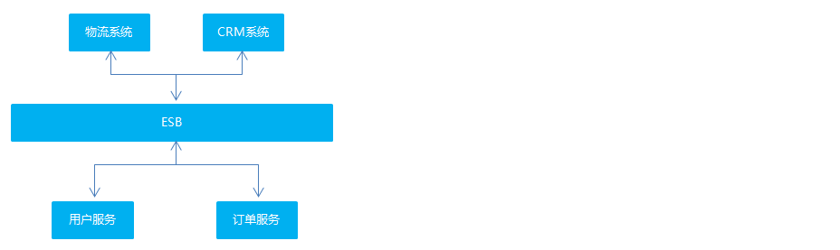
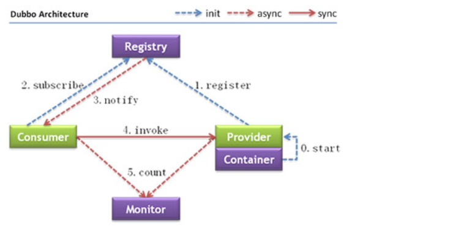
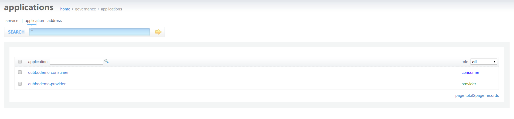
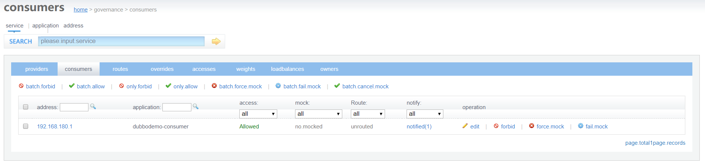
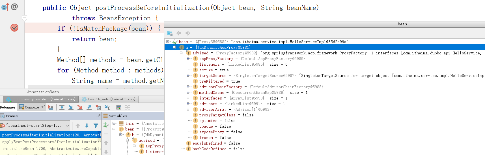
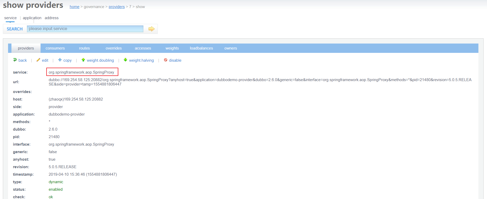

# 分布式RPC框架Apache Dubbo 

## 软件架构的演进过程

软件架构的发展经历了由单体架构、垂直架构、SOA 架构到微服务架构的演进过程，下面我们分别了解一下这几个架构。

### 单体架构

<div align="center"></div>

<b>架构说明</b>全部功能集中在一个项目内（All in one）。

<b>架构优点</b>架构简单，前期开发成本低、开发周期短，适合小型项目。

<b>架构缺点</b>

- 全部功能集成在一个工程中，对于大型项目不易开发、扩展和维护。
- 技术栈受限，只能使用一种语言开发。
- 系统性能扩展只能通过扩展集群节点，成本高。

### 垂直架构

<div align="center"></div>

<b>架构说明</b>按照业务进行切割，形成小的单体项目。

<b>架构优点</b>

- 技术栈可扩展（不同的系统可以用不同的编程语言编写）。
- 系统拆分实现了流量分担，解决了并发问题
- 可以针对不同的模块进行优化
- 方便水平扩展，负载均衡，容错率提高
- 系统间相互独立，互不影响，新的业务迭代时更加高效

<b>架构缺点</b>

- 功能集中在一个项目中，不利于开发、扩展、维护。
- 系统扩张只能通过集群的方式。
- 项目之间功能冗余、数据冗余、耦合性强。

### SOA 架构

SOA 全称为 Service-Oriented Architecture，即面向服务的架构。它可以根据需求通过网络对松散耦合的粗粒度应用组件(服务)进行分布式部署、组合和使用。一个服务通常以独立的形式存在于操作系统进程中。

站在功能的角度，把业务逻辑抽象成可复用的服务，通过服务的编排实现业务的快速再生，目的：把原先固有的业务功能转变为通用的业务服务，实现业务逻辑的快速复用。

<div align="center"></div>

<b>架构说明</b>将重复功能或模块抽取成组件的形式，对外提供服务，在项目与服务之间使用ESB（企业服务总线）的形式作为通信的桥梁。

<b>架构优点</b>重复功能或模块抽取为服务，提高开发效率。可重用性高。可维护性高。

<b>架构缺点</b>

- 各系统之间业务不同，很难确认功能或模块是重复的。
- 抽取服务的粒度大。
- 系统和服务之间耦合度高。

### 微服务架构

<div align="center"></div>

<b>架构说明</b>

- 将系统服务层完全独立出来，抽取为一个一个的微服务。
- 抽取的粒度更细，遵循单一原则。
- 采用轻量级框架协议传输。

<b>架构优点</b>

- 服务拆分粒度更细，有利于提高开发效率。 
- 可以针对不同服务制定对应的优化方案。
- 适用于互联网时代，产品迭代周期更短。

<b>架构缺点</b>

- 粒度太细导致服务太多，维护成本高。
- 分布式系统开发的技术成本高，对团队的挑战大。

## Apache Dubbo 概述

### Dubbo 简介

Apache Dubbo 是一款高性能的 Java RPC 框架。其前身是阿里巴巴公司开源的一个高性能、轻量级的开源 Java RPC 框架，可以和 Spring 框架无缝集成。

<b>什么是RPC？<b>

RPC 全称为 remote procedure call，即<b>远程过程调用<b>。比如两台服务器 A 和 B，A 服务器上部署一个应用，B 服务器上部署一个应用，A 服务器上的应用想调用 B 服务器上的应用提供的方法，由于两个应用不在一个内存空间，不能直接调用，所以需要通过网络来表达调用的语义和传达调用的数据。

需要注意的是 RPC 并不是一个具体的技术，而是指整个网络远程调用过程。

RPC 是一个泛化的概念，严格来说一切远程过程调用手段都属于 RPC 范畴。各种开发语言都有自己的 RPC 框架。Java 中的 RPC 框架比较多，广泛使用的有 RMI、Hessian、Dubbo等。

Dubbo 官网地址：http://dubbo.apache.org

<b>Dubbo 提供了三大核心能力：面向接口的远程方法调用，智能容错和负载均衡，以及服务自动注册和发现。<b>

### Dubbo架构

Dubbo 架构图（Dubbo官方提供）如下：

<div align="center"></div>

节点角色说明：

| 节点        | 角色名称                |
| --------- | ------------------- |
| Provider  | 暴露服务的服务提供方          |
| Consumer  | 调用远程服务的服务消费方        |
| Registry  | 服务注册与发现的注册中心        |
| Monitor   | 统计服务的调用次数和调用时间的监控中心 |
| Container | 服务运行容器              |

虚线都是异步访问，实线都是同步访问。

- 蓝色虚线：在启动时完成的功能
- 红色虚线(实线)：都是程序运行过程中执行的功能

调用关系说明:

0. 服务容器负责启动，加载，运行服务提供者。
1. 服务提供者在启动时，向<b>注册中心<b>注册自己提供的服务。
2. 服务消费者在启动时，向<b>注册中心<b>订阅自己所需的服务。
3. 注册中心返回服务提供者地址列表给消费者，如果有变更，注册中心将基于长连接推送变更数据给消费者。
4. 服务消费者，从提供者地址列表中，基于<b>软负载均衡算法<b>，选一台提供者进行调用，如果调用失败，再选另一台调用。
    1. 软负载均衡算法：软件负载均衡算法，常见的软件负载均衡算法如下：
    2. 平均分配（轮询），加权轮询；ip hash；fair（最小值负载均衡）

5. 服务消费者和提供者，在内存中累计调用次数和调用时间，定时每分钟发送一次统计数据到监控中心。

## 服务注册中心 Zookeeper

通过前面的 Dubbo 架构图可以看到，Registry（服务注册中心）在其中起着至关重要的作用。Dubbo 官方推荐使用 Zookeeper 作为服务注册中心。

### Zookeeper介绍

Zookeeper 是 Apache Hadoop 的子项目，是一个<b>树型的目录服务，支持变更推送<b>，适合作为 Dubbo 服务的注册中心，工业强度较高，可用于生产环境，并推荐使用 。

为了便于理解 Zookeeper 的树型目录服务，我们先来看一下我们电脑的文件系统(也是一个树型目录结构)：

<div align="center"></div>

我的电脑可以分为多个盘符（例如C、D、E等），每个盘符下可以创建多个目录，每个目录下面可以创建文件，也可以创建子目录，最终构成了一个树型结构。通过这种树型结构的目录，我们可以将文件分门别类的进行存放，方便我们后期查找。而且磁盘上的每个文件都有一个唯一的访问路径，例如：C:\Windows\itcast\hello.txt。

Zookeeper 树型目录服务：

<div align="center"></div>

流程说明：

- 服务提供者(Provider)启动时: 向 <b>/dubbo/com.foo.BarService/providers<b> 目录下写入自己的 URL 地址
- 服务消费者(Consumer)启动时: 订阅 <b>/dubbo/com.foo.BarService/providers<b> 目录下的提供者 URL 地址。并向 <b>/dubbo/com.foo.BarService/consumers<b> 目录下写入自己的 URL 地址
- 监控中心(Monitor)启动时: 订阅 <b>/dubbo/com.foo.BarService<b> 目录下的所有提供者和消费者 URL 地址

### 安装Zookeeper

下载地址：http://archive.apache.org/dist/zookeeper/

本课程使用的Zookeeper版本为3.4.6，下载完成后可以获得名称为zookeeper-3.4.6.tar.gz的压缩文件。

安装步骤：

第一步：安装 jdk（略）
第二步：把 zookeeper 的压缩包（zookeeper-3.4.6.tar.gz）上传到 linux 系统
第三步：解压缩压缩包，使用命令 tar -zxvf zookeeper-3.4.6.tar.gz 解压
第四步：进入 zookeeper-3.4.6 目录，创建 data 目录 mkdir data
第五步：进入conf目录 ，把 zoo_sample.cfg 改名为 zoo.cfg
​	cd conf
​	mv zoo_sample.cfg zoo.cfg
第六步：打开 zoo.cfg 文件,  修改 data 属性：dataDir=/root/zookeeper-3.4.6/data

### 启动、停止Zookeeper

进入 Zookeeper 的 bin 目录，启动服务命令 <b>./zkServer.sh start<b>

停止服务命令 <b>./zkServer.sh stop<b>

查看服务状态</b>./zkServer.sh status<b>

## Dubbo快速入门

<b>Dubbo 作为一个 RPC 框架，其最核心的功能就是要实现跨网络的远程调用。<b>本小节就是要创建两个应用，一个作为服务的提供方，一个作为服务的消费方。<b>通过 Dubbo 来实现服务消费方远程调用服务提供方的方法。<b>

### 服务提供方开发

开发步骤：

（1）创建maven工程（打包方式为war）dubbodemo_provider，在pom.xml文件中导入如下坐标

~~~xml
<properties>
  <project.build.sourceEncoding>UTF-8</project.build.sourceEncoding>
  <maven.compiler.source>1.8</maven.compiler.source>
  <maven.compiler.target>1.8</maven.compiler.target>
  <spring.version>5.0.5.RELEASE</spring.version>
</properties>
<dependencies>
  <dependency>
    <groupId>org.springframework</groupId>
    <artifactId>spring-context</artifactId>
    <version>${spring.version}</version>
  </dependency>
  <dependency>
    <groupId>org.springframework</groupId>
    <artifactId>spring-beans</artifactId>
    <version>${spring.version}</version>
  </dependency>
  <dependency>
    <groupId>org.springframework</groupId>
    <artifactId>spring-webmvc</artifactId>
    <version>${spring.version}</version>
  </dependency>
  <dependency>
    <groupId>org.springframework</groupId>
    <artifactId>spring-jdbc</artifactId>
    <version>${spring.version}</version>
  </dependency>
  <dependency>
    <groupId>org.springframework</groupId>
    <artifactId>spring-aspects</artifactId>
    <version>${spring.version}</version>
  </dependency>
  <dependency>
    <groupId>org.springframework</groupId>
    <artifactId>spring-jms</artifactId>
    <version>${spring.version}</version>
  </dependency>
  <dependency>
    <groupId>org.springframework</groupId>
    <artifactId>spring-context-support</artifactId>
    <version>${spring.version}</version>
  </dependency>
  <!-- dubbo相关 -->
  <dependency>
    <groupId>com.alibaba</groupId>
    <artifactId>dubbo</artifactId>
    <version>2.6.0</version>
  </dependency>
  <dependency>
    <groupId>org.apache.zookeeper</groupId>
    <artifactId>zookeeper</artifactId>
    <version>3.4.7</version>
  </dependency>
  <dependency>
    <groupId>com.github.sgroschupf</groupId>
    <artifactId>zkclient</artifactId>
    <version>0.1</version>
  </dependency>
  <dependency>
    <groupId>javassist</groupId>
    <artifactId>javassist</artifactId>
    <version>3.12.1.GA</version>
  </dependency>
  <dependency>
    <groupId>com.alibaba</groupId>
    <artifactId>fastjson</artifactId>
    <version>1.2.47</version>
  </dependency>
</dependencies>
<build>
  <plugins>
    <plugin>
      <groupId>org.apache.maven.plugins</groupId>
      <artifactId>maven-compiler-plugin</artifactId>
      <version>2.3.2</version>
      <configuration>
        <source>1.8</source>
        <target>1.8</target>
      </configuration>
    </plugin>
    <plugin>
      <groupId>org.apache.tomcat.maven</groupId>
      <artifactId>tomcat7-maven-plugin</artifactId>
      <configuration>
        <!-- 指定端口 -->
        <port>8081</port>
        <!-- 请求路径 -->
        <path>/</path>
      </configuration>
    </plugin>
  </plugins>
</build>
~~~

（2）配置web.xml文件

~~~xml
<!DOCTYPE web-app PUBLIC
 "-//Sun Microsystems, Inc.//DTD Web Application 2.3//EN"
 "http://java.sun.com/dtd/web-app_2_3.dtd" >
<web-app>
  <display-name>Archetype Created Web Application</display-name>
  <context-param>
    <param-name>contextConfigLocation</param-name>
    <param-value>classpath:applicationContext*.xml</param-value>
  </context-param>
  <listener>
    <listener-class>org.springframework.web.context.ContextLoaderListener</listener-class>
  </listener>
</web-app>
~~~

（3）创建服务接口

~~~java
package com.itheima.service;
public interface HelloService {
    public String sayHello(String name);
}
~~~

（4）创建服务实现类

~~~java
package com.itheima.service.impl;
import com.alibaba.dubbo.config.annotation.Service;
import com.itheima.service.HelloService;

@Service
public class HelloServiceImpl implements HelloService {
    public String sayHello(String name) {
        return "hello " + name;
    }
}
~~~

注意：服务实现类上使用的 Service 注解是 Dubbo 提供的，用于对外发布服务

（5）在 src/main/resources 下创建 applicationContext-service.xml 

~~~xml
<?xml version="1.0" encoding="UTF-8"?>
<beans xmlns="http://www.springframework.org/schema/beans"
		xmlns:xsi="http://www.w3.org/2001/XMLSchema-instance"
	    xmlns:p="http://www.springframework.org/schema/p"
		xmlns:context="http://www.springframework.org/schema/context"
		xmlns:dubbo="http://code.alibabatech.com/schema/dubbo"
	    xmlns:mvc="http://www.springframework.org/schema/mvc"
		xsi:schemaLocation="http://www.springframework.org/schema/beans
		http://www.springframework.org/schema/beans/spring-beans.xsd
         http://www.springframework.org/schema/mvc
         http://www.springframework.org/schema/mvc/spring-mvc.xsd
         http://code.alibabatech.com/schema/dubbo
         http://code.alibabatech.com/schema/dubbo/dubbo.xsd
         http://www.springframework.org/schema/context
         http://www.springframework.org/schema/context/spring-context.xsd">
	<!-- 当前应用名称，用于注册中心计算应用间依赖关系，注意：消费者和提供者应用名不要一样 -->
	<dubbo:application name="dubbodemo_provider" />
	<!-- 连接服务注册中心zookeeper ip为zookeeper所在服务器的ip地址-->
	<dubbo:registry address="zookeeper://192.168.134.129:2181"/>
	<!-- 注册  协议和port   端口默认是20880 -->
	<dubbo:protocol name="dubbo" port="20881"></dubbo:protocol>
	<!-- 扫描指定包，加入@Service注解的类会被发布为服务  -->
	<dubbo:annotation package="com.itheima.service.impl" />
</beans>
~~~

（6）启动服务，tomcat7:run

### 4.2 服务消费方开发

开发步骤：

（1）创建maven工程（打包方式为 war）dubbodemo_consumer，pom.xml 配置和上面服务提供者相同，只需要将 Tomcat 插件的端口号改为 8082 即可

（2）配置 web.xml 文件

~~~xml
<!DOCTYPE web-app PUBLIC
 "-//Sun Microsystems, Inc.//DTD Web Application 2.3//EN"
 "http://java.sun.com/dtd/web-app_2_3.dtd" >
<web-app>
  <display-name>Archetype Created Web Application</display-name>
  <servlet>
    <servlet-name>springmvc</servlet-name>
    <servlet-class>org.springframework.web.servlet.DispatcherServlet</servlet-class>
    <!-- 指定加载的配置文件 ，通过参数 contextConfigLocation 加载 -->
    <init-param>
      <param-name>contextConfigLocation</param-name>
      <param-value>classpath:applicationContext-web.xml</param-value>
    </init-param>
    <load-on-startup>1</load-on-startup>
  </servlet>
  <servlet-mapping>
    <servlet-name>springmvc</servlet-name>
    <url-pattern>*.do</url-pattern>
  </servlet-mapping>
</web-app>
~~~

（3）将服务提供者工程中的 HelloService 接口复制到当前工程

（4）编写 Controller

~~~java
package com.itheima.controller;
import com.alibaba.dubbo.config.annotation.Reference;
import com.itheima.service.HelloService;
import org.springframework.stereotype.Controller;
import org.springframework.web.bind.annotation.RequestMapping;
import org.springframework.web.bind.annotation.ResponseBody;

@Controller
@RequestMapping("/demo")
public class HelloController {
    @Reference
    private HelloService helloService;

    @RequestMapping("/hello")
    @ResponseBody
    public String getName(String name){
        //远程调用
        String result = helloService.sayHello(name);
        System.out.println(result);
        return result;
    }
}
~~~

注意：Controller 中注入 HelloService 使用的是 Dubbo 提供的 @Reference 注解

（5）在 src/main/resources下创建 applicationContext-web.xml

~~~xml
<?xml version="1.0" encoding="UTF-8"?>
<beans xmlns="http://www.springframework.org/schema/beans"
	xmlns:xsi="http://www.w3.org/2001/XMLSchema-instance"
	xmlns:p="http://www.springframework.org/schema/p"
	xmlns:context="http://www.springframework.org/schema/context"
	xmlns:dubbo="http://code.alibabatech.com/schema/dubbo"
	xmlns:mvc="http://www.springframework.org/schema/mvc"
	xsi:schemaLocation="http://www.springframework.org/schema/beans
			http://www.springframework.org/schema/beans/spring-beans.xsd
			http://www.springframework.org/schema/mvc
			http://www.springframework.org/schema/mvc/spring-mvc.xsd
			http://code.alibabatech.com/schema/dubbo
			http://code.alibabatech.com/schema/dubbo/dubbo.xsd
			http://www.springframework.org/schema/context
			http://www.springframework.org/schema/context/spring-context.xsd">

	<!-- 当前应用名称，用于注册中心计算应用间依赖关系，注意：消费者和提供者应用名不要一样 -->
	<dubbo:application name="dubbodemo-consumer" />
	<!-- 连接服务注册中心zookeeper ip为zookeeper所在服务器的ip地址-->
	<dubbo:registry address="zookeeper://192.168.134.129:2181"/>
	<!-- 扫描的方式暴露接口  -->
	<dubbo:annotation package="com.itheima.controller" />
</beans>
~~~

（6）运行测试，tomcat7:run启动，在浏览器输入http://localhost:8082/demo/hello.do?name=Jack，查看浏览器输出结果

<b>思考一</b>上面的 Dubbo 入门案例中我们是将 HelloService 接口从服务提供者工程(dubbodemo_provider)复制到服务消费者工程(dubbodemo_consumer)中，这种做法是否合适？还有没有更好的方式？

<b>答</b>这种做法显然是不好的，同一个接口被复制了两份，不利于后期维护。更好的方式是单独创建一个 maven 工程，将此接口创建在这个 maven 工程中。需要依赖此接口的工程只需要在自己工程的 pom.xml 文件中引入 maven 坐标即可。

<b>思考二</b>在服务消费者工程(dubbodemo_consumer)中只是引用了 HelloService 接口，并没有提供实现类，Dubbo 是如何做到远程调用的？

<b>答</b>Dubbo 底层是基于代理技术为 HelloService 接口创建代理对象，远程调用是通过此代理对象完成的。可以通过开发工具的 debug 功能查看此代理对象的内部结构。另外，Dubbo 实现网络传输底层是基于 Netty 框架完成的。

<b>思考三</b>上面的 Dubbo 入门案例中我们使用 Zookeeper 作为服务注册中心，服务提供者需要将自己的服务信息注册到 Zookeeper，服务消费者需要从 Zookeeper 订阅自己所需要的服务，此时 Zookeeper 服务就变得非常重要了，那如何防止 Zookeeper 单点故障呢？

<b>答</b>Zookeeper 其实是支持集群模式的，可以配置 Zookeeper 集群来达到 Zookeeper 服务的高可用，防止出现单点故障。

## Dubbo管理控制台

我们在开发时，需要知道 Zookeeper 注册中心都注册了哪些服务，有哪些消费者来消费这些服务。我们可以通过部署一个管理中心来实现。其实管理中心就是一个 web 应用，部署到tomcat 即可。

### 安装

安装步骤：

（1）将资料中的 dubbo-admin-2.6.0.war 文件复制到 tomcat 的 webapps 目录下

（2）启动 tomcat，此 war 文件会自动解压

（3）修改 WEB-INF 下的 dubbo.properties 文件，注意 dubbo.registry.address 对应的值需要对应当前使用的 Zookeeper 的 ip 地址和端口号

​	dubbo.registry.address=zookeeper://192.168.134.129:2181
​	dubbo.admin.root.password=root
​	dubbo.admin.guest.password=guest

（4）重启 tomcat

### 5.2 使用

操作步骤：

（1）访问 http://localhost:8080/dubbo-admin-2.6.0/，输入用户名(root)和密码(root)

<div align="center"></div>

（2）启动服务提供者工程和服务消费者工程，可以在查看到对应的信息

<div align="center"></div>

<div align="center"></div>

<div align="center"></div>

<div align="center"></div>

## Dubbo相关配置说明

### 包扫描

```xml
<dubbo:annotation package="com.itheima.service" />
```

服务提供者和服务消费者都需要配置，表示包扫描，作用是扫描指定包(包括子包)下的类。

如果不使用包扫描，也可以通过如下配置的方式来发布服务：

```xml
<bean id="helloService" class="com.itheima.service.impl.HelloServiceImpl" />
<dubbo:service interface="com.itheima.api.HelloService" ref="helloService" />
```

作为服务消费者，可以通过如下配置来引用服务：

```xml
<!-- 生成远程服务代理，可以和本地bean一样使用helloService -->
<dubbo:reference id="helloService" interface="com.itheima.api.HelloService" />
```

上面这种方式发布和引用服务，一个配置项(<dubbo:service>、<dubbo:reference>)只能发布或者引用一个服务，如果有多个服务，这种方式就比较繁琐了。推荐使用包扫描方式。

### 协议

```xml
<dubbo:protocol name="dubbo" port="20880"/>
```

一般在服务提供者一方配置，可以指定使用的协议名称和端口号。

其中 Dubbo 支持的协议有：dubbo、rmi、hessian、http、webservice、rest、redis 等。

推荐使用的是dubbo 协议。

<b>dubbo 协议采用单一长连接和 NIO 异步通讯，适合于小数据量大并发的服务调用，以及服务消费者机器数远大于服务提供者机器数的情况。不适合传送大数据量的服务，比如传文件，传视频等，除非请求量很低。</b>

也可以在同一个工程中配置多个协议，不同服务可以使用不同的协议，例如：

```xml
<!-- 多协议配置 -->
<dubbo:protocol name="dubbo" port="20880" />
<dubbo:protocol name="rmi" port="1099" />
<!-- 使用dubbo协议暴露服务 -->
<dubbo:service interface="com.itheima.api.HelloService" ref="helloService" protocol="dubbo" />
<!-- 使用rmi协议暴露服务 -->
<dubbo:service interface="com.itheima.api.DemoService" ref="demoService" protocol="rmi" /> 
```

### 启动时检查

```xml
<dubbo:consumer check="false"/>
```

上面这个配置需要配置在服务消费者一方，如果不配置默认 check 值为 true。Dubbo 缺省会在启动时检查依赖的服务是否可用，不可用时会抛出异常，阻止 Spring 初始化完成，以便上线时，能及早发现问题。可以通过将 check 值改为 false 来关闭检查。

建议在开发阶段将 check 值设置为 false，在生产环境下改为 true。

### 负载均衡

负载均衡（Load Balance）：其实就是将请求分摊到多个操作单元上进行执行，从而共同完成工作任务。

在集群负载均衡时，Dubbo 提供了多种均衡策略（包括随机、轮询、最少活跃调用数、一致性 Hash），缺省为 random 随机调用。

配置负载均衡策略，既可以在服务提供者一方配置，也可以在服务消费者一方配置，如下：

```java
@Controller
@RequestMapping("/demo")
public class HelloController {
    //在服务消费者一方配置负载均衡策略
    @Reference(check = false,loadbalance = "random")
    private HelloService helloService;

    @RequestMapping("/hello")
    @ResponseBody
    public String getName(String name){
        //远程调用
        String result = helloService.sayHello(name);
        System.out.println(result);
        return result;
    }
}
```

```java
//在服务提供者一方配置负载均衡
@Service(loadbalance = "random")
public class HelloServiceImpl implements HelloService {
    public String sayHello(String name) {
        return "hello " + name;
    }
}
```

可以通过启动多个服务提供者来观察 Dubbo 负载均衡效果。

注意：因为我们是在一台机器上启动多个服务提供者，所以需要修改 tomcat 的端口号和 Dubbo 服务的端口号来防止端口冲突。

在实际生产环境中，多个服务提供者是分别部署在不同的机器上，所以不存在端口冲突问题。

## 解决Dubbo无法发布被事务代理的Service问题

前面我们已经完成了 Dubbo 的入门案例，通过入门案例我们可以看到通过 Dubbo 提供的标签配置就可以进行包扫描，扫描到 @Service 注解的类就可以被发布为服务。

但是我们如果在服务提供者类上加入 @Transactional 事务控制注解后，服务就发布不成功了。原因是事务控制的底层原理是为服务提供者类创建代理对象，而默认情况下 Spring 是基于 JDK 动态代理方式创建代理对象，而此代理对象的完整类名为 com.sun.proxy.$Proxy42（最后两位数字不是固定的），导致 Dubbo 在发布服务前进行包匹配时无法完成匹配，进而没有进行服务的发布。

### 问题展示

在入门案例的服务提供者 dubbodemo_provider 工程基础上进行展示，操作步骤如下：

（1）在 pom.xml 文件中增加 maven 坐标

~~~xml
<dependency>
  <groupId>mysql</groupId>
  <artifactId>mysql-connector-java</artifactId>
  <version>5.1.47</version>
</dependency>
<dependency>
  <groupId>com.alibaba</groupId>
  <artifactId>druid</artifactId>
  <version>1.1.6</version>
</dependency>
<dependency>
  <groupId>org.mybatis</groupId>
  <artifactId>mybatis-spring</artifactId>
  <version>1.3.2</version>
</dependency>
~~~

（2）在 applicationContext-service.xml 配置文件中加入数据源、事务管理器、开启事务注解的相关配置

~~~xml
<!--数据源-->
<bean id="dataSource" class="com.alibaba.druid.pool.DruidDataSource" destroy-method="close">
  <property name="username" value="root" />
  <property name="password" value="root" />
  <property name="driverClassName" value="com.mysql.jdbc.Driver" />
  <property name="url" value="jdbc:mysql://localhost:3306/test" />
</bean>
<!-- 事务管理器  -->
<bean id="transactionManager" 
      class="org.springframework.jdbc.datasource.DataSourceTransactionManager">
  <property name="dataSource" ref="dataSource"/>
</bean>
<!--开启事务控制的注解支持-->
<tx:annotation-driven transaction-manager="transactionManager"/>
~~~

上面连接的数据库可以自行创建

（3）在 HelloServiceImpl 类上加入 @Transactional 注解

（4）启动服务提供者和服务消费者，并访问

<div align="center"></div>

上面的错误为没有可用的服务提供者

查看 dubbo 管理控制台发现服务并没有发布，如下：

<div align="center"></div>

可以通过断点调试的方式查看 Dubbo 执行过程，Dubbo 通过 AnnotationBean 的 postProcessAfterInitialization 方法进行处理

<div align="center"></div>

<div align="center"></div>

### 解决方案

通过上面的断点调试可以看到，在 HelloServiceImpl 类上加入事务注解后，Spring 会为此类基于 JDK 动态代理技术创建代理对象，创建的代理对象完整类名为 com.sun.proxy.$Proxy35，导致 Dubbo 在进行包匹配时没有成功（因为我们在发布服务时扫描的包为 com.itheima.service），所以后面真正发布服务的代码没有执行。

解决方式操作步骤：

（1）修改 applicationContext-service.xml 配置文件，开启事务控制注解支持时指定 proxy-target-class 属性，值为 true。其作用是使用 cglib 代理方式为 Service 类创建代理对象

~~~xml
<!--开启事务控制的注解支持-->
<tx:annotation-driven transaction-manager="transactionManager" proxy-target-class="true"/>
~~~

<div align="center"></div>

（2）修改 HelloServiceImpl 类，在 Service 注解中加入 interfaceClass 属性，值为 HelloService.class，作用是指定服务的接口类型

~~~java
@Service(interfaceClass = HelloService.class)
@Transactional
public class HelloServiceImpl implements HelloService {
    public String sayHello(String name) {
        return "hello " + name;
    }
}
~~~

此处也是必须要修改的，否则会导致发布的服务接口为 SpringProxy，而不是 HelloService 接口，如下：

<div align="center"></div>

# 对 Dubbo 的一些思考

Dubbo 是一个 RCP 框架，实现服务之间的远程调用。用 Netty 实现的。

## Dubbo 的工作原理

Dubbo 里有服务提供者、服务消费者、负载均衡算法、序列化方式等。其大致的工作流程如下：


原理图如下：<a href="https://img-blog.csdnimg.cn/20190308103242996.png?x-oss-process=image/watermark,type_ZmFuZ3poZW5naGVpdGk,shadow_10,text_aHR0cHM6Ly9ibG9nLmNzZG4ubmV0L3lnbDE5OTIwMTE5,size_16,color_FFFFFF,t_70">来源</a>

<div align="center"></div>

## 注册中心挂了可以继续通信吗？

如果每次 Consumer 请求的服务都要从注册中心查下，那么是不可以继续通信的。但是从执行流程中，我们知道，如果 Provider 发生了变更，注册中心会把变更的信息推送给 Consumer，所以 Consumer 其实是会在本地缓存 Provider 的信息的，所以注册中心挂了可以继续通信。

且注册中心是对等集群，任意一台宕机后，将会切换到另一台；注册中心全部宕机后，服务的提供者和消费者仍能通过本地缓存通讯。服务提供者无状态，任一台宕机后，不影响使用；服务提供者全部宕机，服务消费者会无法使用，并无限次重连等待服务者恢复；挂掉是不要紧的，但前提是你没有增加新的服务，如果你要调用新的服务，则是不能办到的。

## Dubbo 如何保证调用的安全

a.在有注册中心的情况下,可以通过 dubbbo admin 中的路由规则，来指定固定 ip 的消费方来访问

b.在直连的情况下，通过在服务的提供方中设置密码(令牌) token，消费方需要在消费时也输入这 个密码，才能够正确使用。

Dubbo 添加服务 IP 白名单，防止不法调用

## Dubbo的心跳机制

> 心跳机制的作用

心跳机制就是客户端会开启一个<b>定时任务</b>，定时对已经建立连接的对端应用发送请求，服务端则需要特殊处理该请求，返回响应。如果心跳持续多次没有收到响应，客户端会认为连接不可用，主动断开连接。

Dubbo 的心跳机制是为了维持 Provider 和 Consumer 之间的长连接（心跳机制大多是这个目的）。Dubbo 心跳时间 heartbeat 默认是 60s，超过 heartbeat 时间没有收到消息，就发送心跳消息(provider，consumer一样)，如果连着 3 次 (heartbeatTimeout 为 heartbeat*3) 没有收到心跳响应，provider 会关闭 channel，而 consumer 会进行重连；不论是 provider 还是 consumer 的心跳检测都是通过启动定时任务的方式实现。

## Duubo中如何保证分布式事务？

一般情况下，我们尽量将需要事务的方法放在一个 service 中，从而避开分步式事务。Dubbo 用的是 Socket，Socket 通信是一个全双工的方式，如果有多个线程同时进行远程方法调用，这时建立在 client 和 server 之间的 socket 连接上会有很多双方发送的消息传递，前后顺序也可能是乱七八糟的，server 处理完结果后，将结果消息发送给 client，client 收到很多消息，怎么知道哪个消息结果是原先哪个线程调用的？可以使用一个ID，让其唯一，然后传递给服务端，再服务端又回传回来，这样就知道结果是原先哪个线程的了。

# RPC&Dubbo 常见问题

## RPC

### RPC 介绍

<b>RPC（Remote Procedure Call）</b>远程过程调用。

<b>为什么要 RPC？</b> 两个不同的服务器上的服务提供的方法不在一个内存空间，所以，<span style="color:orange">需要通过网络编程才能传递方法调用所需要的参数。</span>并且，方法调用的结果也需要通过网络编程来接收。但是，如果我们自己手动网络编程来实现这个调用过程的话工作量是非常大的，因为，我们需要考虑底层传输方式（TCP 还是UDP）、序列化方式等等方面。而 RPC 框架可以帮助我们调用远程计算机上某个服务的方法，这个过程就像调用本地方法一样简单。并且！我们不需要了解底层网络编程的具体细节。

example：两个不同的服务 A、B 部署在两台不同的机器上，服务 A 如果想要调用服务 B 中的某个方法的话就可以通过 RPC 来做。

<b>RPC 的出现就是为了让你调用远程方法像调用本地方法一样简单。</b>

### RPC 原理

源自 <a href="https://javaguide.cn/distributed-system/rpc/dubbo.html#rpc-的原理是什么">javaguid</a>

我们可以简单的将 RPC 的核心功能看作是下面 6 个部分

- <b>客户端（服务消费端）</b> ：调用远程方法的一端。
- <b>客户端 Stub（桩）</b> ： 这其实就是一代理类。代理类主要做的事情很简单，就是把你调用方法、类、方法参数等信息传递到服务端。
- <b>网络传输</b> ： 网络传输就是你要把你调用的方法的信息比如说参数啊这些东西传输到服务端，然后服务端执行完之后再把返回结果通过网络传输给你传输回来。网络传输的实现方式有很多种比如最近基本的 Socket 或者性能以及封装更加优秀的 Netty（推荐）。
- <b>服务端 Stub（桩）</b> ：这个桩就不是代理类了。我觉得理解为桩实际不太好，大家注意一下就好。这里的服务端 Stub 实际指的就是接收到客户端执行方法的请求后，去指定对应的方法然后返回结果给客户端的类。
- <b>服务端（服务提供端）</b> ：提供远程方法的一端。

<div align="center"></div>

1. 服务消费端（client）以本地调用的方式调用远程服务；
2. 客户端 Stub（client stub） 接收到调用后负责将方法、参数等组装成能够进行网络传输的消息体（序列化）：`RpcRequest`；
3. 客户端 Stub（client stub） 找到远程服务的地址，并将消息发送到服务提供端；
4. 服务端 Stub（桩）收到消息将消息反序列化为Java对象: `RpcRequest`；
5. 服务端 Stub（桩）根据`RpcRequest`中的类、方法、方法参数等信息调用本地的方法；
6. 服务端 Stub（桩）得到方法执行结果并将组装成能够进行网络传输的消息体：`RpcResponse`（序列化）发送至消费方；
7. 客户端 Stub（client stub）接收到消息并将消息反序列化为Java对象:`RpcResponse` ，这样也就得到了最终结果。over!

## 分布式基础

### 什么是分布式

分布式重要的就是面向服务。简单说分布式就是我们把整个系统拆分成不同的服务然后将这些服务放在不同的服务器上减轻单体服务的压力提高并发量和性能。

比如电商系统可以简单地拆分成订单系统、商品系统、登录系统等等，拆分之后的每个服务可以部署在不同的机器上，如果某一个服务的访问量比较大的话也可以将这个服务同时部署在多台机器上。

### 为什么需要分布式

将一个大型系统根据业务拆分成不同的弱相关的子系统，每个团队可以负责一个服务的开发，可以提高开发效率，且将一个大系统拆分成若干个子系统后容易维护和扩展。

并且将系统拆分成分布式之后不光便于系统扩展和维护，更能提高整个系统的性能。把整个系统拆分成不同的服务/系统，然后每个服务/系统 单独部署在一台服务器上。

## Dubbo 介绍

网站规模的增大，用户数量的上涨。单一应用架构 、垂直应用架构无法满足我们的需求，需要使用分布式服务架构。

分布式服务架构下，系统被拆分成不同的服务，如：短信服务、安全服务，每个服务独立提供系统的某个核心服务。

如果服务不多的话，我们可以使用 Java RMI（Java Remote Method Invocation）、Hessian 这种支持远程调用的框架来简单地暴露和引用远程服务。但是，当服务越来越多之后，服务调用关系变得复杂。当应用访问压力越来越大后，负载均衡以及服务监控的需求也迫在眉睫。我们可以用 F5 这类硬件来做负载均衡，但这样增加了成本，并且存在单点故障的风险。

<b>而 Dubbo 可以解决上述问题：</b>

Dubbo 透明化的远程⽅法调⽤，就像调⽤本地⽅法⼀样调⽤远程⽅法，只需简单配置，没有任何 API 侵入。软负载均衡及容错机制，可在内网替代 F5 等硬件负载均衡器，降低成本，减少单点。服务自动注册与发现，不再需要写死服务提供⽅地址，注册中心基于接口名查询服务提供者的 IP 地址，并且能够平滑添加或删除服务提供者。 

### Dubbo 通信框架

默认的通信框架是 netty，也可以选择 mina。服务调用的时候默认是阻塞调用，也可以异步调用，无返回值时可以选择异步调用。

### Dubbo 注册中心

注册中心负责服务地址的注册与查找，相当于目录服务，服务提供者和消费者只在启动时与注册中心交互。

Dubbo 推荐使用 zookeeper 注册中心，还有 Multicast 注册中心, Redis 注册中心, Simple 注册中心。

ZooKeeper 的节点是通过像树⼀样的结构来进⾏维护的，并且每⼀个节点通过路径来标示以及访问。除此之外，每⼀个节点还拥有⾃⾝的⼀些信息，包括：数据、数据⻓度、创建时间、修改时间等等。

服务器如果宕机了，注册中心会立即推送事件通知消费者。

### Dubbo 监控中心

监控中心负责统计各服务调用次数，调用时间等。

如果注册中心和监控中心都宕机的话，服务不会都挂掉的，因为消费者和生产者都有本地缓存，会缓存需要服务的信息。

## Dubbo 架构

### 核心角色

<div align="center"></div>

- <b>Container：</b> 服务运行容器，负责加载、运行服务提供者。必须。
- <b>Provider：</b> 暴露服务的服务提供方，会向注册中心注册自己提供的服务。必须。
- <b>Consumer：</b> 调用远程服务的服务消费方，会向注册中心订阅自己所需的服务。必须。
- <b>Registry：</b> 服务注册与发现的注册中心。注册中心会返回服务提供者地址列表给消费者。非必须。
- <b>Monitor：</b> 统计服务的调用次数和调用时间的监控中心。服务消费者和提供者会定时发送统计数据到监控中心。 非必须。

可以简单看着一个生产者消费者模型，不过在生产者消费者模型的基础上加了一些其他的功能。

### invoker

`Invoker` 是 Dubbo 领域模型中非常重要的一个概念，是 Dubbo 对远程调用的抽象。

<div align="center"></div>

根据 Dubbo 官方介绍，`Invoker` 分为

- 服务提供 `Invoker`
- 服务消费 `Invoker`

Invoker 中实现了远程方法调用的具体细节。

假如我们需要调用一个远程方法，我们需要动态代理来屏蔽远程调用的细节吧！我们屏蔽掉的这些细节就依赖对应的 `Invoker` 实现， `Invoker` 实现了真正的远程服务调用。

### Dubbo SPI 机制

SPI（Service Provider Interface） 机制被大量用在开源项目中，它可以帮助我们动态寻找服务/功能（比如负载均衡策略）的实现。

SPI 的具体原理是这样的：我们将接口的实现类放在配置文件中，我们在程序运行过程中读取配置文件，通过反射加载实现类。这样，我们可以在运行的时候，动态替换接口的实现类。和 IoC 的解耦思想是类似的。

Java 本身就提供了 SPI 机制的实现。不过，Dubbo 没有直接用，而是对 Java原生的 SPI机制进行了增强，以便更好满足自己的需求。

<b>如何扩展 Dubbo 中的默认实现</b>

比如说我们想要实现自己的负载均衡策略，我们创建对应的实现类 `XxxLoadBalance` 实现 `LoadBalance` 接口或者 `AbstractLoadBalance` 类。

```java
package com.xxx;
 
import org.apache.dubbo.rpc.cluster.LoadBalance;
import org.apache.dubbo.rpc.Invoker;
import org.apache.dubbo.rpc.Invocation;
import org.apache.dubbo.rpc.RpcException; 
 
public class XxxLoadBalance implements LoadBalance {
    public <T> Invoker<T> select(List<Invoker<T>> invokers, Invocation invocation) throws RpcException {
        // ...
    }
}
```

我们将这个实现类的路径写入到 `resources` 目录下的 `META-INF/dubbo/org.apache.dubbo.rpc.cluster.LoadBalance`文件中即可。

```shell
src
 |-main
    |-java
        |-com
            |-xxx
                |-XxxLoadBalance.java (实现LoadBalance接口)
    |-resources
        |-META-INF
            |-dubbo
                |-org.apache.dubbo.rpc.cluster.LoadBalance (纯文本文件，内容为：xxx=com.xxx.XxxLoadBalance)
```

org.apache.dubbo.rpc.cluster.LoadBalance

```shell
xxx=com.xxx.XxxLoadBalance
```

更多内容参考 Dubbo 官方文档 <a href="https://dubbo.apache.org/zh/docs/v2.7/dev/impls/">SPI 扩展实现</a>

## Dubbo 负载均衡

### 负载均衡介绍

负载均衡改善了跨多个计算资源（例如计算机，计算机集群，网络链接，中央处理单元或磁盘驱动）的工作负载分布。负载平衡旨在优化资源使用，最大化吞吐量，最小化响应时间，并避免任何单个资源的过载。使用具有负载平衡而不是单个组件的多个组件可以通过冗余提高可靠性和可用性。负载平衡通常涉及专用软件或硬件。

简单说就是：分散客户端的请求到各个服务器上，避免一台或多太机器压力过大而宕机、奔溃等。

### Dubbo 提供的策略

在集群负载均衡时，Dubbo 提供了多种均衡策略，默认为 `random` 随机调用。我们还可以自行扩展负载均衡策略（参考Dubbo SPI机制）。

在 Dubbo 中，所有负载均衡实现类均继承自 `AbstractLoadBalance`，该类实现了 `LoadBalance` 接口，并封装了一些公共的逻辑。

[负载均衡 | Apache Dubbo](https://dubbo.apache.org/zh/docs/v2.7/dev/source/loadbalance/#m-zhdocsv27devsourceloadbalance)

## Dubbo 通信协议

### 支持的通信协议

> dobbo 协议

默认就是⾛ dubbo 协议，单⼀⻓连接，进⾏的是 NIO 异步通信，基于 hessian 作为序列化协议。使⽤的场景是：传输数据量小（每次请求在 100kb 以内），但是并发量很⾼。 

为了要⽀持⾼并发场景，⼀般是服务提供者就⼏台机器，但是服务消费者有上百台，可能每天调⽤量达到上亿次！此时⽤⻓连接 是最合适的，就是跟每个服务消费者维持⼀个⻓连接就可以，可能总共就 100 个连接。然后后⾯直接基于长连接 NIO 异步通信， 可以⽀撑⾼并发请求。

长连接，通俗点说，就是建⽴连接过后可以持续发送请求，⽆须再建⽴连接。

> RMI 协议

走 Java ⼆进制序列化，多个短连接，适合消费者和提供者数量差不多的情况，适⽤于⽂件的传输，⼀般较少⽤。

采⽤ JDK 标准的 rmi 协议实现，传输参数和返回参数对象需要实现 Serializable 接⼝，使⽤ java 标准序列化机制，使⽤阻塞式短连 

接，传输数据包⼤⼩混合，消费者和提供者个数差不多，可传⽂件，传输协议 TCP。 

多个短连接，

TCP 协议传输，同步传输，适⽤常规的远 

程服务调⽤和 rmi 互操作。在依赖低版本的 Common-Collections 包，

java 序列化存在安全漏洞；

> Hessian 协议

走 hessian 序列化协议，多个短连接，适⽤于提供者数量⽐消费者数量还多的情况，适⽤于⽂件的传输，⼀般较少⽤。

> HTTP 协议

走 json 序列化。

> webservice 协议

⾛ SOAP ⽂本

## Dubbo 序列化协议

### 序列化介绍

序列化，就是把数据结构或者是⼀些对象，转换为⼆进制串的过程，⽽反序列化是将在序列化过程中所⽣成的⼆进制串转换成数 据结构或者对象的过程


Dubbo 支持多种序列化方式：JDK 自带的序列化、hessian2、JSON、Kryo、FST、Protostuff，ProtoBuf 等等。

Dubbo 默认使用的序列化方式是 hession2。

一般来说不会直接使用 JDK 自带的序列化方式。主要原因有两个：

- <b>不支持跨语言调用</b>: 如果调用的是其他语言开发的服务的时候就不支持了。
- <b>性能差</b>：相比于其他序列化框架性能更低，主要原因是序列化之后的字节数组体积较大，导致传输成本加大。

JSON 序列化由于性能问题，我们一般也不会考虑使用。

Protostuff，ProtoBuf、hessian2 这些都是跨语言的序列化方式，如果有跨语言需求的话可以考虑使用。

Kryo 和 FST 这两种序列化方式是 Dubbo 后来才引入的，性能非常好。不过，这两者都是专门针对 Java 语言的。

### Hessian 的数据结构

Hessian 的对象序列化机制有 8 种原始类型：

原始⼆进制数据 

- boolean 
- 64-bit date（64 位毫秒值的⽇期） 
- 64-bit double 
- 32-bit int 
- 64-bit long 
- null 
- UTF-8 编码的 string 

另外还包括 3 种递归类型：

- list for lists and arrays 
- map for maps and dictionaries 
- object for objects 

还有⼀种特殊的类型

- ref：⽤来表⽰对共享对象的引用。

### PB & 为什么 PB 的效率是最高的

Protocol Buffer 是 Google 出品的⼀种轻量并且⾼效的结构化数据存储格式，性能⽐ JSON、XML 要⾼很多。 

PB 性能好的原因如下：

- 第⼀，它使⽤ proto 编译器，⾃动进⾏序列化和反序列化，速度⾮常快，应该⽐ XML 和 JSON 快上了 20~100 倍； 
- 第⼆，它的数据压缩效果好，就是说它序列化后的数据量体积⼩。因为体积⼩，传输起来带宽和速度上会有优化。

## 既有 HTTP ,为啥用 RPC 进行服务调用

### RPC 只是一种设计而已

RPC 只是一种概念、一种设计，就是为了解决<b>不同服务之间的调用问题</b>, 它一般会包含有<b>传输协议</b>和<b>序列化协议</b>这两个。

但是，HTTP 是一种协议，RPC 框架可以使用 HTTP 协议作为传输协议或者直接使用 TCP 作为传输协议，使用不同的协议一般也是为了适应不同的场景。

### HTTP 和 TCP

<b>可能现在很多对计算机网络不太熟悉的朋友已经被搞蒙了，要想真正搞懂，还需要来简单复习一下计算机网络基础知识：</b>

> 我们通常谈计算机网络的五层协议的体系结构是指：应用层、传输层、网络层、数据链路层、物理层。
>
> <b>应用层(application-layer）的任务是通过应用进程间的交互来完成特定网络应用。</b> HTTP 属于应用层协议，它会基于TCP/IP通信协议来传递数据（HTML 文件, 图片文件, 查询结果等）。HTTP协议工作于客户端-服务端架构上。浏览器作为HTTP客户端通过 URL 向HTTP服务端即WEB服务器发送所有请求。Web服务器根据接收到的请求后，向客户端发送响应信息。HTTP协议建立在 TCP 协议之上。
>
> <b>传输层(transport layer)的主要任务就是负责向两台主机进程之间的通信提供通用的数据传输服务</b>。TCP是传输层协议，主要解决数据如何在网络中传输。相比于UDP,<b>TCP</b> 提供的是<b>面向连接</b>的，<b>可靠的</b>数据传输服务。

### RPC框架功能更齐全

成熟的 RPC 框架还提供好了“服务自动注册与发现”、"智能负载均衡"、“可视化的服务治理和运维”、“运行期流量调度”等等功能，这些也算是选择 RPC 进行服务注册和发现的一方面原因吧！

<b>相关阅读：</b>

- http://www.ruanyifeng.com/blog/2016/08/http.html （HTTP 协议入门- 阮一峰）

### 一个常见的错误观点

很多文章中还会提到说 HTTP 协议相较于自定义 TCP 报文协议，增加的开销在于连接的建立与断开，但是这个观点已经被否认，下面截取自知乎中一个回答，原回答地址：https://www.zhihu.com/question/41609070/answer/191965937 。

> 首先要否认一点 HTTP 协议相较于自定义 TCP 报文协议，增加的开销在于连接的建立与断开。HTTP 协议是支持连接池复用的，也就是建立一定数量的连接不断开，并不会频繁的创建和销毁连接。二一要说的是 HTTP 也可以使用 Protobuf 这种二进制编码协议对内容进行编码，因此二者最大的区别还是在传输协议上。