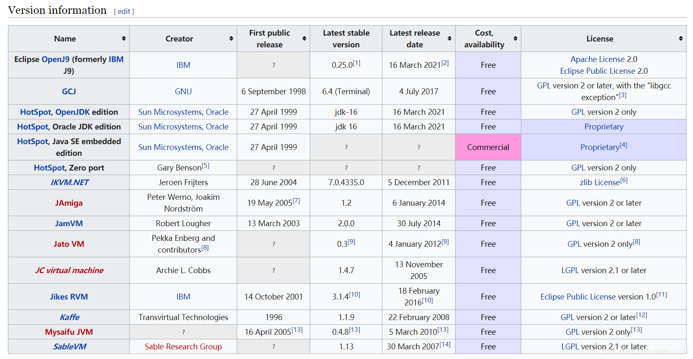

# JVM概述

参考视频：[<b>解密 JVM 【黑马程序员出品】</b>](https://www.bilibili.com/video/BV1yE411Z7AP)

参考书籍：《深入理解 Java 虚拟机》、《Java 虚拟机规范（Java8）》、《垃圾回收的算法与实现》、《Java 性能权威指南》

GC文档：https://docs.oracle.com/en/java/javase/12/gctuning/

调优文档：https://docs.oracle.com/en/java/javase/11/tools/java.html

JCStress：https://www.jb51.net/article/209076.htm

JMH：http://openjdk.java.net/projects/code-tools/jmh/ 

JVM：[JEP 122: Remove the Permanent Generation (java.net)](http://openjdk.java.net/jeps/122)

> 定义

Java Virtual Machine，JAVA 程序的运行环境（JAVA 二进制字节码的运行环境）

> 好处

- 一次编写，到处运行
- 自动内存管理，垃圾回收机制
- 数组下标越界检查，C 语言是没有数组下表越界检查的（越界的话可能会覆盖程序的其他部分，这种错误可能会导致非常严重的后果）。
- 多态。使用虚方法调用的机制实现了多态。

> 用处

- 理解底层的实现原理
- 必备技能

> 常见的 JVM

> 比较：JVM JRE JDK 的区别

> <b>学习路线</b>

