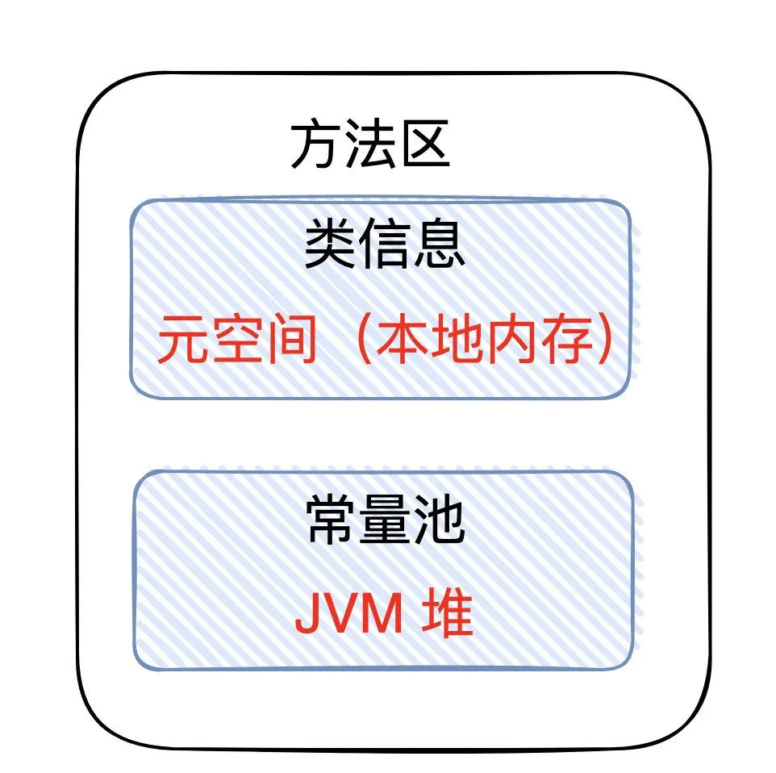

## 常量池存储在那里？

### 常量池

二进制字节码的组成：类的基本信息、常量池、类的方法定义（包含了虚拟机指令），常量池在哪里？

自从在 JDK7 以后，就已经把运行时常量池和静态常量池转移到了堆内存中进行存储。到了 JDK8，终于完全废弃了永久代的概念，改用与 JRockit、J9 一样在本地内存中实现的元空间（Meta-space）来代替，把 JDK7 中永久代还剩余的内容（主要是类型信息）全部移到元空间中。对于物理分区来说运行时常量池和静态常量池就属于堆。（逻辑分区和物理实际存储的位置是不一样的）

## 引用

软引用自身的回收用可以配合引用队列来回收。