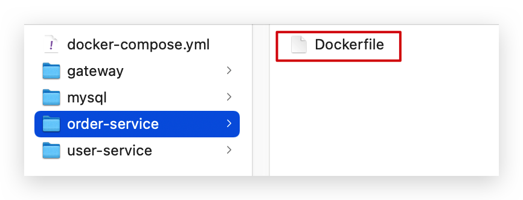

# Docker

## 概述

微服务虽然具备各种各样的优势，但服务的拆分通用给部署带来了很大的麻烦。

- 分布式系统中，依赖的组件非常多，不同组件之间部署时往往会产生一些冲突。
- 在数百上千台服务中重复部署，环境不一定一致，会遇到各种问题

### 问题

大型项目组件较多，运行环境也较为复杂，部署时会碰到一些问题

- 依赖关系复杂，容易出现兼容性问题
- 开发、测试、生产环境有差异

例如一个项目中，部署时需要依赖于 node.js、Redis、RabbitMQ、MySQL 等，这些服务部署时所需要的函数库、依赖项各不相同，甚至会有冲突。给部署带来了极大的困难。

### 依赖兼容

而 Docker 确巧妙的解决了这些问题，Docker 是如何实现的呢？

Docker 为了解决依赖的兼容问题的，采用了两个手段：

- 将应用的 Libs（函数库）、Deps（依赖）、配置与应用一起打包 (以前只是打包代码，现在是代码+环境一起打包)
- 将每个应用放到一个隔离<b>容器</b>去运行，避免互相干扰

<div align="center"></div>

这样打包好的应用包中，既包含应用本身，也保护应用所需要的 Libs、Deps，无需再操作系统上安装这些，自然就不存在不同应用之间的兼容问题了。

虽然解决了不同应用的兼容问题，但是开发、测试等环境会存在差异，操作系统版本也会有差异，怎么解决这些问题呢？

### 操作系统环境差异

要解决不同操作系统环境差异问题，必须先了解操作系统结构。以一个 Ubuntu 操作系统为例，结构如下：

<div align="center"></div>

结构包括：

- 计算机硬件：例如 CPU、内存、磁盘等
- 系统内核：所有 Linux 发行版的内核都是 Linux，例如 CentOS、Ubuntu、Fedora 等。内核可以与计算机硬件交互，对外提供**内核指令**，用于操作计算机硬件。
- 系统应用：操作系统本身提供的应用、函数库。这些函数库是对内核指令的封装，使用更加方便。

应用于计算机交互的流程如下：

1）应用调用操作系统应用（函数库），实现各种功能

2）系统函数库是对内核指令集的封装，会调用内核指令

3）内核指令操作计算机硬件

Ubuntu 和 CentOS 都是基于 Linux 内核，无非是系统应用不同，提供的函数库有差异：

<div align="center"></div>

此时，如果将一个 Ubuntu 版本的 MySQL 应用安装到 CentOS 系统，MySQL 在调用 Ubuntu 函数库时，会发现找不到或者不匹配，就会报错了：

<div align="center"></div>

Docker 如何解决不同系统环境的问题？

- Docker 将用户程序与所需要调用的系统 (比如 Ubuntu) 函数库一起打包。
- Docker 运行到不同操作系统时，直接基于打包的函数库，借助于操作系统的 Linux 内核来运行。

如图：

<div align="center"></div>

### 小结

Docker 如何解决大型项目依赖关系复杂，不同组件依赖的兼容性问题？

- Docker 允许开发中将应用、依赖、函数库、配置一起<b>打包</b>，形成可移植镜像
- Docker 应用运行在容器中，使用沙箱机制，相互<b>隔离</b>

Docker 如何解决开发、测试、生产环境有差异的问题？

- Docker 镜像中包含完整运行环境，包括系统函数库，仅依赖系统的 Linux 内核，因此可以在任意 Linux 操作系统上运行

Docker是一个快速交付应用、运行应用的技术，具备下列优势：

- 可以将程序及其依赖、运行环境一起打包为一个镜像，可以迁移到任意Linux操作系统
- 运行时利用沙箱机制形成隔离容器，各个应用互不干扰
- 启动、移除都可以通过一行命令完成，方便快捷

## Docker&虚拟机

Docker 可以让一个应用在任何操作系统中非常方便的运行。而以前我们接触的虚拟机，也能在一个操作系统中，运行另外一个操作系统，保护系统中的任何应用。

两者的差异在于：<b>虚拟机</b>（virtual machine）是在操作系统中<b>模拟</b>硬件设备，然后运行另一个操作系统，比如在 Windows 系统里面运行 Ubuntu 系统，这样就可以运行任意的 Ubuntu 应用了。而 <b>Docker</b> 仅仅是封装函数库，并没有模拟完整的操作系统，如图：

<div align="center"></div>

| 特性     | Docker    | 虚拟机    |
| -------- | --------- | --------- |
| 特性     | 接近原生  | 性能较差  |
| 磁盘占用 | 一般为 MB | 一般为 GB |
| 启动     | 秒级      | 分钟级    |

Docker 和虚拟机的差异：

- docker 是一个系统进程；直接与操作系统做交互；虚拟机是在操作系统中的操作系统。

- docker 体积小、启动速度快、性能好；虚拟机体积大、启动速度慢、性能一般。

## Docker架构

### 镜像和容器

<b>镜像（Image）</b>：<span style="color:red">Docker 将应用程序及其所需的依赖、函数库、环境、配置等文件打包在一起，称为镜像。</span>

<b>容器（Container）</b>：<span style="color:red">镜像中的应用程序运行后形成的进程就是<b>容器</b></span>，只是 Docker 会给容器进程做隔离，对外不可见。（拷贝一份文件到自己的独立系统中，写数据时写在自己的空间里，不会对其他容器产生影响，也不会对镜像产生影响）

一切应用最终都是代码组成，都是硬盘中的一个个的字节形成的<b>文件</b>。只有运行时，才会加载到内存，形成进程。

- <b>镜像</b>，就是把一个应用在硬盘上的文件、及其运行环境、部分系统函数库文件一起打包形成的文件包。<b>这个文件包是只读的。</b>
- <b>容器</b>，就是将这些文件中编写的程序、函数加载到内存中运行，形成进程，只不过要隔离起来。因此一个镜像可以启动多次，形成多个容器进程。

<div align="center"></div>

例如你下载了一个 QQ，如果我们将 QQ 在磁盘上的运行<b>文件</b>及其运行的操作系统依赖打包，形成 QQ 镜像。然后你可以启动多次，双开、甚至三开 QQ。

### DockerHub

开源应用程序非常多，打包这些应用往往是重复的劳动。为了避免这些重复劳动，人们就会将自己打包的应用镜像，例如 Redis、MySQL 镜像放到网络上，共享使用，就像 GitHub 的代码共享一样。

- DockerHub：DockerHub 是一个官方的 Docker 镜像的托管平台。这样的平台称为 Docker Registry。

- 国内也有类似于 DockerHub 的公开服务，比如[网易云镜像服务](https://c.163yun.com/hub)、[阿里云镜像库](https://cr.console.aliyun.com/)等。

我们一方面可以将自己的镜像共享到 DockerHub，另一方面也可以从 DockerHub 拉取镜像：

<div align="center"></div>

### Docker架构

我们要使用 Docker 来操作镜像、容器，就必须要安装 Docker。

Docker 是一个 CS 架构的程序，由两部分组成：

- 服务端 (server)：Docker 守护进程，负责处理 Docker 指令，管理镜像、容器等。

- 客户端(client)：通过命令或 RestAPI 向 Docker 服务端发送指令。可以在本地或远程向服务端发送指令。

如图：

<div align="center"></div>

### 小结

镜像：将应用程序及其依赖、环境、配置打包在一起

容器：镜像运行起来就是容器，一个镜像可以运行多个容器

Docker 结构：

- 服务端：接收命令或远程请求，操作镜像或容器

- 客户端：发送命令或者请求到 Docker 服务端

DockerHub：一个镜像托管的服务器，类似的还有阿里云镜像服务，统称为 DockerRegistry。

## 安装Docker

企业部署一般都是采用 Linux 操作系统，而 CentOS 发行版占比最多，因此在 CentOS 下安装 Docker。参考文档《安装 Docker》。

## Ubuntu启动Docker

```shell
su root
systemctl enable docker # 设置开机自动启用 docker 服务
systemctl start docker # #启动 docker 服务
```

本机 wsl 的密码设置的是 root。

如果使用 wsl 中的 ubuntu 子系统启动 docker 命令应该是

```shell
service docker start
```

启动其他程序，如 redis、nginx 也是使用 service。service 的具体用法可以通过下列命令查看

```shell
service --status-all
```

# Docker基本操作

## 镜像操作

- 拉取镜像 docker pull 镜像名称:版本
    - 拉取 redis，docker pull redis:6.0.16-bullseye
    - 拉取 mq，docker pull rabbitmq:3.9.13
- 查看拉取到的镜像，docker images
- 导出镜像到磁盘，docker save --help，查看具体怎么做
- 加载本地的镜像，docker load -i nginx.tar
- 删除镜像，docker rmi rabbitmq:3.9.13

### 镜像名称

首先来看下镜像的名称组成：

- 镜名称一般分两部分组成：[repository]:[tag]。
- <span style="color:red">在没有指定 tag 时，默认是 latest，代表最新版本的镜像</span>

<div align="center"></div>

这里的 MySQL 就是 repository，5.7 就是 tag，合一起就是镜像名称，代表 5.7 版本的 MySQL 镜像。

### 镜像命令

常见的镜像操作命令如图：

<div align="center"></div>

### 拉取&查看

需求：从 DockerHub 中拉取一个 nginx 镜像并查看

1）首先去镜像仓库搜索 nginx 镜像，比如 [DockerHub](https://hub.docker.com/):

<div align="center"></div>

2）根据查看到的镜像名称，拉取自己需要的镜像，通过命令：docker pull nginx

```shell
xxx@cv:/home$ docker pull nginx
Using default tag: latest
latest: Pulling from library/nginx
```


3）通过命令：docker images 查看拉取到的镜像

```shell
xxx@cv:/home$ docker images
REPOSITORY    TAG            IMAGE ID       CREATED         SIZE
nginx         latest         1403e55ab369   12 days ago     142MB
redis         latest         87c26977fd90   9 months ago    113MB
rabbitmq      3-management   c8817e468079   10 months ago   254MB
hello-world   latest         feb5d9fea6a5   15 months ago   13.3kB
```

### 保存&导入

需求：利用 docker save 将 nginx 镜像导出磁盘，然后再通过 load 加载回来

1）利用 docker xx --help 命令查看 docker save 和 docker load 的语法

例如，查看 save 命令用法，可以输入命令：

```sh
xxx@cv:/home$ docker save --help

Usage:  docker save [OPTIONS] IMAGE [IMAGE...]

Save one or more images to a tar archive (streamed to STDOUT by default)

Options:
  -o, --output string   Write to a file, instead of STDOUT
```

命令格式：

```shell
docker save -o [保存的目标文件名称] [镜像名称]
```

2）使用 docker save 导出镜像到磁盘 

```sh
docker save -o nginx.tar nginx:latest
xxx@cv:/home$ docker save -o nginx.tar nginx:latest
xxx@cv:/home$  ls
nginx.tar
```

3）使用 docker load 加载镜像

先删除本地的 nginx 镜像：

```sh
docker rmi nginx:latest
```

然后运行命令，加载本地文件：

```sh
docker load -i nginx.tar
xxx@cv:/home$ docker load -i nginx.tar
Loaded image: nginx:latest
```

### 练习

需求：去 DockerHub 搜索并拉取一个 Redis 镜像

目标：

1）去 DockerHub 搜索 Redis 镜像

2）查看 Redis 镜像的名称和版本

3）利用 docker pull 命令拉取镜像

4）利用 docker save 命令将 redis:latest 打包为一个 redis.tar 包

5）利用 docker rmi 删除本地的 redis:latest

6）利用 docker load 重新加载 redis.tar 文件

## 容器操作

- docker run：创建并运行一个容器，处于运行状态
- docker pause：让一个运行的容器暂停
- docker unpause：让一个容器从暂停状态恢复运行
- docker stop：停止一个运行的容器
- docker start：让一个停止的容器再次运行
- docker rm：删除一个容器（释放 CPU、内存、文件系统）
- docker logs imageID：查看容器日志

### 容器相关命令

容器操作的命令如图：

<div align="center"></div>

容器保护三个状态：

- 运行：进程正常运行
- 暂停：进程暂停，CPU 不再运行，并不释放内存
- 停止：进程终止，回收进程占用的内存、CPU 等资源

其中：

- docker run：创建并运行一个容器，处于运行状态
- docker pause：让一个运行的容器暂停
- docker unpause：让一个容器从暂停状态恢复运行
- docker stop：停止一个运行的容器
- docker start：让一个停止的容器再次运行

- docker rm：删除一个容器（释放 CPU、内存、文件系统）

### 案例-创建并运行一个容器

创建并运行 nginx 容器的命令

```sh
docker run --name containerName -p 80:80 -d nginx
```

命令解读

- docker run ：创建并运行一个容器
- --name : 给容器起一个名字，比如叫做 mn
- -p ：将宿主机端口与容器端口映射，冒号左侧是宿主机端口，右侧是容器端口
- -d：后台运行容器
- nginx：镜像名称，例如 nginx

这里的 -p 参数，是将容器端口映射到宿主机端口。

默认情况下，容器是隔离环境，我们直接访问宿主机的 80 端口，肯定访问不到容器中的 nginx。

现在，将容器的 80 与宿主机的 80 关联起来，当我们访问宿主机的 80 端口时，就会被映射到容器的 80，这样就能访问到 nginx 了：

<div align="center"></div>

### 进入容器，修改文件

<b>需求：</b>进入 Nginx 容器，修改 HTML 文件内容，添加“传智教育欢迎您”

<b>提示：</b>进入容器要用到 docker exec 命令。

<b>步骤：</b>

1）进入容器。进入我们刚刚创建的 nginx 容器的命令为：

```sh
docker exec -it mn bash
```

命令解读：

- docker exec ：进入容器内部，执行一个命令

- -it : 给当前进入的容器创建一个标准输入、输出终端，允许我们与容器交互

- mn ：要进入的容器的名称

- bash：进入容器后执行的命令，bash 是一个 linux 终端交互命令

2）进入 nginx 的 HTML 所在目录 /usr/share/nginx/html

容器内部会模拟一个独立的 Linux 文件系统，看起来如同一个 Linux 服务器一样：

```shell
xx@cv:/home$ docker run --name mn -p 80:80 -d nginx
1e3168a57a45d377c1a890b5c815d14fa8a76033f0009745c11ffa0c5a70843f

xx@cv:/home$ docker exec -it mn bash
root@1e3168a57a45:/# ls
bin   dev                  docker-entrypoint.sh  home  lib64  mnt  proc  run   srv  tmp  var
boot  docker-entrypoint.d  etc                   lib   media  opt  root  sbin  sys  usr
root@1e3168a57a45:/#
```

nginx 的环境、配置、运行文件全部都在这个文件系统中，包括我们要修改的 html 文件。

查看 DockerHub 网站中的 nginx 页面，可以知道 nginx 的 html 目录位置在 `/usr/share/nginx/html`

我们执行命令，进入该目录：

```sh
cd /usr/share/nginx/html
```

 查看目录下文件：

```shell
root@1e3168a57a45:/usr/share/nginx/html# ls
50x.html  index.html
root@1e3168a57a45:/usr/share/nginx/html#
```

3）修改 index.html 的内容

容器内没有 vi 命令，无法直接修改，我们用下面的命令来修改：

```sh
sed -i -e 's#Welcome to nginx#docker欢迎你！#g' -e 's#<head>#<head><meta charset="utf-8">#g' index.html
```

在浏览器访问自己的虚拟机地址，例如我的是：http://192.168.150.101，即可看到结果：

```html
docker欢迎你！!
If you see this page, the nginx web server is successfully installed and working. Further configuration is required.

For online documentation and support please refer to nginx.org.
Commercial support is available at nginx.com.

Thank you for using nginx.
```

### 案例-运行 redis

<b>步骤</b>

1）拉取镜像

```bash
docker pull redis:latest
```

2）运行容器

```bash
docker run -d -p 6379:6379 --name docker-redis redis
```

容器取名为 docker-redis

3）查看日志输出

```bash
docker logs docker-redis # 镜像 id
```

4）在容器中运行 Redis CLI

`docker exec -it` 进入容器执行一个命令

```bash
docker exec -it docker-redis /bin/bash
# 或
docker exec -it docker-redis bash
# 或
docker exec -it mr redis-cli
```

执行完上面的命令后运行 redis-cli

```bash
root@07bf18105e35:/data # redis-cli
```

5）然后就可以在容器中进行一些操作了。

6）停止 docker-redis 容器并删除

```bash
docker stop docker-redis
docker rm docker-redis
```

### 小结

docker run 命令的常见参数有哪些？

- --name：指定容器名称
- -p：指定端口映射
- -d：让容器后台运行

查看容器日志的命令：

- docker logs
- 添加 -f 参数可以持续查看日志

查看容器状态：

- docker ps
- docker ps -a 查看所有容器，包括已经停止的

## 数据卷

- docker volume create：创建数据卷
- docker volume ls：查看所有数据卷
- docker volume inspect：查看数据卷详细信息，包括关联的宿主机目录位置
- docker volume rm：删除指定数据卷
- docker volume prune：删除所有未使用的数据卷
- docker run --name mn -v html:/usr/share/nginx/html -p 80:80 -d nginx：将本机的 html 目录与 nginx 内部的  /usr/share/nginx/html 关联起来

数据卷------>容器数据管理

在之前的 nginx 案例中，修改 nginx 的 html 页面时，需要进入 nginx 内部。并且因为没有编辑器，修改文件也很麻烦。

这就是因为容器与数据（容器内文件）耦合带来的后果。

<div align="center"></div>

要解决这个问题，必须将数据与容器解耦，这就要用到数据卷了。

### 什么是数据卷

<b>数据卷（volume）</b>是一个虚拟目录，指向宿主机文件系统中的某个目录。

<div align="center"></div>

一旦完成数据卷挂载，对容器的一切操作都会作用在数据卷对应的宿主机目录了。这样，我们操作宿主机的 `/var/lib/docker/volumes/html` 目录，就等于操作容器内的 `/usr/share/nginx/html` 目录了。

### 数据集操作命令

数据卷操作的基本语法如下：

```bash
docker volume [COMMAND]
```

docker volume 命令是数据卷操作，根据命令后跟随的 command 来确定下一步的操作：

- create 创建一个 volume
- inspect 显示一个或多个 volume 的信息
- ls 列出所有的 volume
- prune 删除未使用的 volume
- rm 删除一个或多个指定的 volume

### 创建和查看数据卷

<b>需求</b>：创建一个数据卷，并查看数据卷在宿主机的目录位置

① 创建数据卷

```sh
docker volume create html
```

② 查看所有数据

```sh
xx@cv:/home$ docker volume ls
DRIVER    VOLUME NAME
local     e588662e987cb0c1627087fc454ab35c800c3039498bd03a8dbea2b04675f09d
local     html
```

③ 查看数据卷详细信息卷

```sh
xx@cv:/home$ docker volume inspect html
[
    {
        "CreatedAt": "2023-01-02T22:35:23+08:00",
        "Driver": "local",
        "Labels": {},
        "Mountpoint": "/var/lib/docker/volumes/html/_data",
        "Name": "html",
        "Options": {},
        "Scope": "local"
    }
]
```

可以看到，我们创建的 html 这个数据卷关联的宿主机目录为 `/var/lib/docker/volumes/html/_data` 目录。

<b>小结</b>

数据卷的作用：

- 将容器与数据分离，解耦合，方便操作容器内数据，保证数据安全

数据卷操作：

- docker volume create：创建数据卷
- docker volume ls：查看所有数据卷
- docker volume inspect：查看数据卷详细信息，包括关联的宿主机目录位置
- docker volume rm：删除指定数据卷
- docker volume prune：删除所有未使用的数据卷

### 挂载数据卷

我们在创建容器时，可以通过 -v 参数来挂载一个数据卷到某个容器内目录，命令格式如下：

```sh
docker run \
  --name mn \
  -v html:/root/html \
  -p 8080:80
  nginx \
```

这里的 -v 就是挂载数据卷的命令：

- `-v html:/root/htm` ：把 html 数据卷挂载到容器内的 /root/html 这个目录中。

### nginx挂载数据卷

<b>需求：</b>创建一个 nginx 容器，修改容器内的 html目录内的 index.html 内容

<b>分析：</b>上个案例中，我们进入 nginx 容器内部，已经知道 nginx 的 html 目录所在位置 /usr/share/nginx/html ，我们需要把这个目录挂载到 html 这个数据卷上，方便操作其中的内容。

<b>提示：</b>运行容器时使用 -v 参数挂载数据卷

① 创建容器并挂载数据卷到容器内的 HTML 目录

```sh
# /usr/share/nginx/html 这个是 dockerhub 官网查到的
docker run --name mn -v html:/usr/share/nginx/html -p 80:80 -d nginx
```

② 进入 html 数据卷所在位置，并修改 HTML 内容

```sh
# 查看html数据卷的位置
docker volume inspect html
# 进入该目录
cd /var/lib/docker/volumes/html/_data
# 修改文件
vi index.html
```

<b style="color:red">PS：如果数据卷不存在，则会自动创建！</b>

### MySQL挂载本地目录

容器不仅仅可以挂载数据卷，也可以直接挂载到宿主机目录上。关联关系如下：

- 带数据卷模式：宿主机目录 --> 数据卷 ---> 容器内目录
- 直接挂载模式：宿主机目录 ---> 容器内目录

<div align="center"></div>

<b>语法</b>

目录挂载与数据卷挂载的语法是类似的：

- -v [宿主机目录]:[容器内目录]
- -v [宿主机文件]:[容器内文件]

<b>需求：</b>创建并运行一个 MySQL 容器，将宿主机目录直接挂载到容器

实现思路如下：

1）在将课前资料中的 mysql.tar 文件上传到虚拟机，通过 load 命令加载为镜像

2）创建目录 /tmp/mysql/data

3）创建目录 /tmp/mysql/conf，将课前资料提供的 hmy.cnf 文件上传到 /tmp/mysql/conf

4）去 DockerHub 查阅资料，创建并运行 MySQL 容器，要求：

① 挂载 /tmp/mysql/data 到 mysql 容器内数据存储目录

② 挂载 /tmp/mysql/conf/hmy.cnf 到 mysql 容器的配置文件

③ 设置 MySQL 密码

```shell
docker run --name mysql 
-e MYSQL_ROOT_PASSWORD=root \
-p 3306:3306 \ 
-v /root/mysql/conf/hmy.cnf:/etc/mysql/conf.d/hmy.cnf \  
-v /root/mysql/data:/var/lib/mysql \
-d mysql:tag \
```

### 小结

docker run 的命令中通过 -v 参数挂载文件或目录到容器中：

- -v volume 名称:容器内目录
- -v 宿主机文件:容器内文
- -v 宿主机目录:容器内目录

数据卷挂载与目录直接挂载的

- 数据卷挂载耦合度低，由 docker 来管理目录，但是目录较深，不好找
- 目录挂载耦合度高，需要我们自己管理目录，不过目录容易寻找查看

# Dockerfile自定义镜像

常见的镜像在 DockerHub 就能找到，但是我们自己写的项目就必须自己构建镜像了。而要自定义镜像，就必须先了解镜像的结构才行。

## 镜像结构

镜像是将应用程序及其需要的系统函数库、环境、配置、依赖打包而成。以 MySQL 为例，来看看镜像的组成结构：

<div align="center"></div>

简单来说，<b>镜像就是在系统函数库、运行环境基础上，添加应用程序文件、配置文件、依赖文件等组合，然后编写好启动脚本打包在一起形成的文件</b>。我们要构建镜像，其实就是实现上述打包的过程。

## Dockerfile语法

构建自定义的镜像时，并不需要一个个文件去拷贝，打包。

我们只需要告诉 Docker，我们的镜像的组成，需要哪些 Base Image、需要拷贝什么文件、需要安装什么依赖、启动脚本是什么，将来 Docker 会帮助我们构建镜像。而描述上述信息的文件就是 Dockerfile 文件。

<b>Dockerfile </b>就是一个文本文件，其中包含一个个的<b>指令 (Instruction)</b>，用指令来说明要执行什么操作来构建镜像。每一个指令都会形成一层 Layer。

| 指令       | 说明                                           | 示例                         |
| ---------- | ---------------------------------------------- | ---------------------------- |
| FROM       | 指定基础精选                                   | FROM centos:6                |
| ENV        | 设置环境变量，可在后面指令使用                 | ENV key value                |
| COPY       | 拷贝本地文件到镜像的指定目录                   | COPY ./mysql-5.7.rpm   /tmp  |
| RUN        | 执行 Linux 的 shell 命令，一般是安装过程的命令 | RUN yum install gcc          |
| EXPOSE     | 指定容器运行时监听的端口，是给镜像使用者看的   | EXPOSE 8080                  |
| ENTRYPOINT | 镜像中应用的启动命令，容器运行时调用           | ENTRYPOINT java -jar xxx.jar |

更新详细语法说明，请参考官网文档： https://docs.docker.com/engine/reference/builder

## 构建Java项目

### 基于Ubuntu构建Java项目

需求：基于 Ubuntu 镜像构建一个新镜像，运行一个 Java 项目

- ① 新建一个空文件夹 docker-demo

  <div align="center"></div>

- ② 拷贝 docker-demo.jar 文件到 docker-demo 这个目录

  <div align="center"></div>

- ③ 拷贝 jdk8.tar.gz 文件到 docker-demo 这个目录

  <div align="center"></div>

- ④ 拷贝 Dockerfile 到 docker-demo 这个目录

  <div align="center"></div>

  其中的内容如下：

  ```dockerfile
  # 指定基础镜像
  FROM ubuntu:16.04
  # 配置环境变量，JDK的安装目录
  ENV JAVA_DIR=/usr/local
  
  # 拷贝jdk和java项目的包
  COPY ./jdk8.tar.gz $JAVA_DIR/
  COPY ./docker-demo.jar /tmp/app.jar
  
  # 安装JDK
  RUN cd $JAVA_DIR \
   && tar -xf ./jdk8.tar.gz \
   && mv ./jdk1.8.0_144 ./java8
  
  # 配置环境变量
  ENV JAVA_HOME=$JAVA_DIR/java8
  ENV PATH=$PATH:$JAVA_HOME/bin
  
  # 暴露端口
  EXPOSE 8090
  # 入口，java项目的启动命令
  ENTRYPOINT java -jar /tmp/app.jar
  ```

- ⑤ 进入 docker-demo

  将准备好的 docker-demo 上传到虚拟机任意目录，然后进入 docker-demo 目录下

- ⑥ 运行命令：. 代表 dockerfile 所在的目录

  ```sh
  docker build -t javaweb:1.0 .
  ```


最后访问 http://192.168.150.101:8090/hello/count，其中的 ip 改成你的虚拟机 ip

### 基于Java8构建Java项目

虽然我们可以基于 Ubuntu 基础镜像，添加任意自己需要的安装包，构建镜像，但是却比较麻烦。所以大多数情况下，我们都可以在一些安装了部分软件的基础镜像上做改造。

例如，构建 Java 项目的镜像，可以在已经准备了 JDK 的基础镜像基础上构建。

需求：基于 java:8-alpine 镜像，将一个 Java 项目构建为镜像

实现思路如下：

- ① 新建一个空的目录，然后在目录中新建一个文件，命名为 Dockerfile

- ② 拷贝任意一个 xxx-demo.jar 到这个目录中

- ③ 编写 Dockerfile 文件：

  - a ）基于 java:8-alpine 作为基础镜像

  - b ）将 app.jar 拷贝到镜像中

  - c ）暴露端口

  - d ）编写入口 ENTRYPOINT

    内容如下：

    ```dockerfile
    FROM java:8-alpine
    COPY ./app.jar /tmp/app.jar
    EXPOSE 8090
    ENTRYPOINT java -jar /tmp/app.jar
    ```

- ④ 使用 docker build 命令构建镜像

- ⑤ 使用 docker run 创建容器并运行

## 小结

小结：

1. Dockerfile 的本质是一个文件，通过指令描述镜像的构建过程

2. Dockerfile 的第一行必须是 FROM，从一个基础镜像来构建

3. 基础镜像可以是基本操作系统，如 Ubuntu。也可以是其他人制作好的镜像，例如：java:8-alpine

# Docker-Compose

Docker Compose 可以基于 Compose 文件帮我们快速的部署分布式应用，而无需手动一个个创建和运行容器！ 

## 初识

Compose 文件是一个文本文件，通过指令定义集群中的每个容器如何运行。格式如下：

```yaml
version: "3.8"
 services:
  mysql:
    image: mysql:5.7.25
    environment:
    MYSQL_ROOT_PASSWORD: 123 
    volumes:
     - "/tmp/mysql/data:/var/lib/mysql"
     - "/tmp/mysql/conf/hmy.cnf:/etc/mysql/conf.d/hmy.cnf"
  web: # 容器名称  docker run --name web -p 8090:8090 -d web:1.0
    build: . # 构建镜像
    ports: # 指定端口
     - "8090:8090"
```

上面的 Compose 文件就描述一个项目，其中包含两个容器：

- mysql：一个基于 `mysql:5.7.25` 镜像构建的容器，并且挂载了两个目录
- web：一个基于 `docker build` 临时构建的镜像容器，映射端口时 8090

DockerCompose 的详细语法参考官网：https://docs.docker.com/compose/compose-file/

其实 DockerCompose 文件可以看做是将多个 docker run 命令写到一个文件，只是语法稍有差异。

## 安装

参考课前资料

## 部署微服务集群

<b>需求：</b>将之前学习的 cloud-demo 微服务集群利用 DockerCompose 部署

<b>实现思路</b>

① 查看课前资料提供的 cloud-demo 文件夹，里面已经编写好了 docker-compose 文件

② 修改自己的 cloud-demo 项目，将数据库、nacos 地址都命名为 docker-compose 中的服务名

③ 使用 maven 打包工具，将项目中的每个微服务都打包为 app.jar

④ 将打包好的 app.jar 拷贝到 cloud-demo 中的每一个对应的子目录中

⑤ 将 cloud-demo 上传至虚拟机，利用 docker-compose up -d 来部署

### compose 文件

查看课前资料提供的 cloud-demo 文件夹，里面已经编写好了 docker-compose 文件，而且每个微服务都准备了一个独立的目录：

<div align="center"></div>

内容如下：

```yaml
version: "3.2"

services:
  nacos:
    image: nacos/nacos-server
    environment:
      MODE: standalone
    ports:
      - "8848:8848"
  mysql:
    image: mysql:5.7.25
    environment:
      MYSQL_ROOT_PASSWORD: 123
    volumes:
      - "$PWD/mysql/data:/var/lib/mysql"
      - "$PWD/mysql/conf:/etc/mysql/conf.d/"
  userservice:
    build: ./user-service
  orderservice:
    build: ./order-service
  gateway:
    build: ./gateway
    ports:
      - "10010:10010"
```

可以看到，其中包含 5 个 service 服务：

- `nacos`：作为注册中心和配置中心
  - `image: nacos/nacos-server`： 基于 nacos/nacos-server 镜像构建
  - `environment`：环境变量
    - `MODE: standalone`：单点模式启动
  - `ports`：端口映射，这里暴露了 8848 端口
- `mysql`：数据库
  - `image: mysql:5.7.25`：镜像版本是mysql:5.7.25
  - `environment`：环境变量
    - `MYSQL_ROOT_PASSWORD: 123`：设置数据库 root 账户的密码为 123
  - `volumes`：数据卷挂载，这里挂载了 mysql 的 data、conf 目录，其中有我提前准备好的数据
- `userservice`、`orderservice`、`gateway`：都是基于 Dockerfile 临时构建的

查看 mysql 目录，可以看到其中已经准备好了 cloud_order、cloud_user 表：

<div align="center"></div>

查看微服务目录，可以看到都包含 Dockerfile 文件：

<div align="center"></div>

内容如下

```dockerfile
FROM java:8-alpine
COPY ./app.jar /tmp/app.jar
ENTRYPOINT java -jar /tmp/app.jar
```

### 修改微服务配置

因为微服务将来要部署为 docker 容器，而容器之间互联不是通过 IP 地址，而是通过容器名。这里我们将 order-service、user-service、gateway 服务的 mysql、nacos 地址都修改为基于容器名的访问。

如下所示：

```yaml
spring:
  datasource:
    url: jdbc:mysql://mysql:3306/cloud_order?useSSL=false
    username: root
    password: 123
    driver-class-name: com.mysql.jdbc.Driver
  application:
    name: orderservice
  cloud:
    nacos:
      server-addr: nacos:8848 # nacos服务地址
```

### 打包

接下来需要将我们的每个微服务都打包。因为之前查看到 Dockerfile 中的 jar 包名称都是 app.jar，因此我们的每个微服务都需要用这个名称。

可以通过修改 pom.xml 中的打包名称来实现，每个微服务都需要修改：

```xml
<build>
  <!-- 服务打包的最终名称 -->
  <finalName>app</finalName>
  <plugins>
    <plugin>
      <groupId>org.springframework.boot</groupId>
      <artifactId>spring-boot-maven-plugin</artifactId>
    </plugin>
  </plugins>
</build>
```

打包后：

<div align="center"></div>

### 拷贝jar包到部署目录

编译打包好的 app.jar 文件，需要放到 Dockerfile 的同级目录中。注意：每个微服务的 app.jar 放到与服务名称对应的目录，别搞错了。

user-service：

<div align="center"></div>

order-service：

<div align="center"></div>

gateway：

<div align="center"></div>

### 部署

最后，我们需要将文件整个 cloud-demo 文件夹上传到虚拟机中，理由 DockerCompose 部署。

上传到任意目录：

<div align="center"></div>

部署：

进入 cloud-demo 目录，然后运行下面的命令：

```sh
docker-compose up -d
```

# Docker镜像仓库 

## 搭建私有镜像仓库

参考《安装 Docker.md》

## 推送、拉取镜像

推送镜像到私有镜像服务必须先 tag，步骤如下：

① 重新 tag 本地镜像，名称前缀为私有仓库的地址：192.168.150.101:8080/

 ```sh
docker tag nginx:latest 192.168.150.101:8080/nginx:1.0 
 ```

② 推送镜像

```sh
docker push 192.168.150.101:8080/nginx:1.0 
```

③ 拉取镜像

```sh
docker pull 192.168.150.101:8080/nginx:1.0 
```
