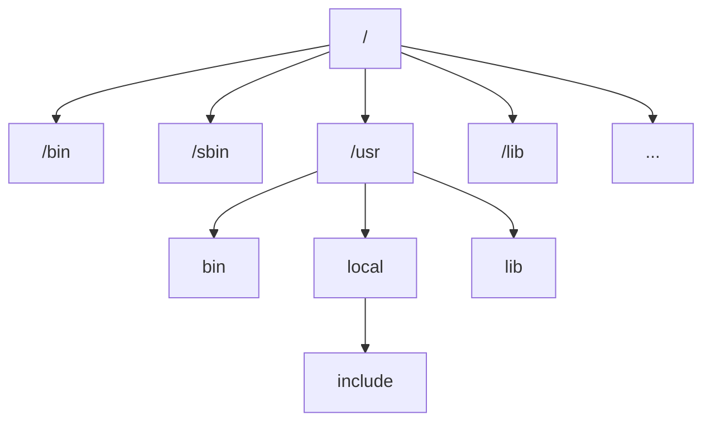

# Linux基本命令

Linux 用户可分为两种

- 超级管理员用户：root， 存放在目录 /root
- 普通用户：存放在目录 /home下，sudo 可以获取 root 权限

## 目录结构

[Linux 系统目录结构 | 菜鸟教程 (runoob.com)](https://www.runoob.com/linux/linux-system-contents.html)

ubuntu 没有盘符这个概念，一切皆文件；Linux 只有一个根目录 `/`，所有文件都在它下面



| 目录                            | 说明                                                         |
| ------------------------------- | ------------------------------------------------------------ |
| /bin                            | 存放了常用的命令，如 ls / cat                                |
| /etc⭐                           | 存放系统管理所需的配置文件和子目录<br>经常需要使用           |
| /home                           | 用户主目录                                                   |
| /lib                            | 存放系统需要的动态链接库<br>如果执行程序的适合提示缺少 so 文件，将 so 文件放到 lib 下对应的目录即可 |
| /lost+found                     | 系统非法关机后这里会存放一些文件                             |
| /mnt⭐                           | 让用户临时挂在文件系统，如插了一个 U 盘或移动硬盘，将其挂在到 /mnt |
| /usr<br>/usr/local⭐<br>/usr/src | 存放用户应用程序<br>用户级程序目录，用户自己编译的软件就放在这里<br>内核源码存放的位置 |
| /opt⭐                           | 用来放一些测试性的，可以随时删除的软件                       |
| /var⭐                           | 存放不断修改的内容，如日志文件                               |

## 命令格式⭐

```shell
command  [-options]  [parameter1]  …
```

- command: 命令名
- [-options]：可选项，对命令进行控制
- parameter1 …：传给命令的参数，可以是零个，一个或多个

```shell
# 显示 home 目录下的文件
# ls 是命令，列出文件
# l 表示使用长列表的格式显示
# h 表示人性化的显示文件大小
# /home 是 parameter，表示列出 /home 目录下的内容
ls -l -h /home
```

如果有多个 options 可以合并在一起

```shell
ls -lh /home
```

| 命令     | 描述                                 |
| -------- | ------------------------------------ |
| pwd      | 显示当前目录的绝对路径               |
| uname    | 查看当前是什么系统                   |
| clear    | 清屏                                 |
| wget url | x下载 url 对应的内容                 |
| ifconfig | 查看网卡信息                         |
| ping     | 测试远程主机连通性                   |
| history  | 查看历史命令，仅能查看近 1000 条命令 |
| >        | 文件重定向，覆盖写入                 |
| >>       | 文件重定向，追加写入                 |

```shell
# 下载百度首页
wget http://www.baidu.com

# 将历史记录写入到 his.log，覆盖写入
history > his.log

# 将历史记录写入到 his.log，追加写入
history >> his.log
```

Linux 支持命令补全，敲了几个字母后按 table 系统会帮我们补全。

## 用户目录&路径⭐

用户目录位于 `/home`

Linux 中进入目录的命令和 Win 类似，也是 cd。

| 命令                     | 说明                                                         |
| ------------------------ | ------------------------------------------------------------ |
| cd ~                     | 进入 /root 目录                                              |
| cd .                     | . 表示当前目录，cd . 进入当前目录                            |
| cd ..                    | .. 表示上级目录，cd .. 返回上级目录<br>cd ../../ 返回上上级目录 |
| cd -                     | 返回到上一次的目录                                           |
| cd /home<br>cd test/code | 进入 home 目录<br>进入 test/code 目录                        |

- `/home` 是根目录下的 home
- `test/code` 是当前目录下的 `test/code` 目录

<b style="color:red">使用 cd 出现的问题</b>

在使用过程中发现 cd 没有权限进入该目录，因为 cd 不是一个应用程序而是 Linux 内建的命令，而 sudo 仅仅只对应用程序起作用。`sudo foo` 只意味着以 root 权限运行 foo 程序。所以，`sudo cd /etc/docker` 会报`sudo: cd：找不到命令`

解决办法是使用 sudo -i 命令提升用户权限。

```shell
sudo -i
cd /var/lib/docker/volumes/
```

## 查看帮助文档⭐

Linux 中查看帮助文档的方式有两种：help 和 man

| 快捷键         | 说明                           |
| -------------- | ------------------------------ |
| Ctrl + L       | 清屏                           |
| 命令 `---help` | 查看命令的用法                 |
| man 命令名称   | 查看命令的用法，更为强大       |
| history        | 显示历史命令，最多显示 1000 条 |

man 设置了如下的功能键

| 功能键     | 功能                 |
| ---------- | -------------------- |
| 空格键     | 显示手册页的下一屏   |
| Enter 键   | 一次滚动手册页的一行 |
| b（back）  | 回滚一屏             |
| f（front） | 前滚一屏             |
| q（quit）  | 退出 man 命令        |
| h          | 列出所有功能键       |
| /word      | 搜索 word 字符串     |

分别使用 help 和 man 查看 ls 命令的文档

```shell
ls --help
man ls
```

man 的显示更好一点，也可以翻页访问。

## 查看文件

Linux 中有许多查看文件信息的命令

| 命令 | 说明                                                 |
| ---- | ---------------------------------------------------- |
| ls   | 列举目录中的内容                                     |
| cat  | 读取、连接和显示文件内容<br>查看文本时是显示所有内容 |
| head | 从头查看文本中的内容                                 |
| tail | 从尾查看文本中的内容                                 |
| more | 查看文本中的内容                                     |
| less | 可分页，可搜索，回翻                                 |

### ls

ls 常用的参数如下

| 参数 | 含义                                         |
| ---- | -------------------------------------------- |
| -a   | 显示指定目录下所有子目录与文件，包括隐藏文件 |
| -l   | 以列表方式显示文件的详细信息                 |
| -h   | 配合 -l 以人性化的方式显示文件大小           |

### cat

cat 主要用于读取、连接和显示文件内容。它可以将多个文件的内容合并并输出到标准输出设备，也可以创建新文件或向现有文件追加内容。

| 命令      | 说明                     |
| --------- | ------------------------ |
| cat f1    | 显示 f1 中的所有内容     |
| cat f1 f2 | 依次显示 f1 和 f2 的内容 |
| cat -n f1 | 给输出的所有行编号       |

### head/tail

head 是从首行开始查看文件，tail 是从尾部开始查看文件，用法基本一样。以 head 为例。

| 命令            | 说明                            |
| --------------- | ------------------------------- |
| head f1         | 查看 f1 前 10 行的内容          |
| head -n 5 f1    | 查看 f1 前 5 行的内容           |
| head -n 3 f1 f2 | 分别查看 f1 和 f2 前 3 行的内容 |

### more⭐

也是用于查看文件的，不过更为灵活，可以逐页浏览文本文件的内容；一般用来查看大文件或长文本流，而无需一次性加载整个文件到内存中。

| 命令                      | 说明                                      |
| ------------------------- | ----------------------------------------- |
| more f1                   | 查看 f1 的内容                            |
| more -10 f1<br>more +2 f1 | 最开始只显示 10 行<br>不显示最前面的 2 行 |
| more +/a f1               | 查找包含特定单词 a 的行并从那里开始显示   |

### less - . -

## 文件检索的通配符⭐⭐

在 Unix/Linux 系统中，允许使用特殊字符来同时引用多个文件名，这些特殊字符被称为通配符。

在进行文件检索的时候，可以使用这些通配符进行批量查找/操作。

以 ls 和 head 为例进行说明

| 通配符    ⭐ | 含义                                                         |
| ----------- | ------------------------------------------------------------ |
| *           | 文件代表文件名中所有字符                                     |
| ls te*      | 查找以 te 开头的文件或目录                                   |
| ls *html    | 查找结尾为 html 的文件或目录                                 |
| ？          | 代表文件名中任意一个字符                                     |
| ls ?.c      | 只找第一个字符任意，后缀为.c的文件                           |
| ls a.?      | 只找只有 3 个字符，前 2 字符为 `a.`，最后一个字符任意的文件  |
| [abc]       | 匹配 a、b、c 中的任意一个                                    |
| [a-f]       | 匹配从 a 到 f 范围内的的任意一个字符                         |
| ls [a-f]*   | 找到从 a~f 范围内的的任意一个字符开头的文件                  |
| ls a-f      | 查找文件名为 `a-f` 的文件，当 “-” 处于方括号之外失去通配符的作用 |
| \           | 如果要使通配符作为普通字符使用，可以在其前面加上转义字符。<br>“?” 和 “*” 处于方括号内时不用使用转义字符就失去通配符的作用。 |
| ls  \\*a    | 查找文件名为 *a 的文件                                       |

## 操作文件

Linux 中常见的创建 / 编辑 / 删除文件的命令

### <b>创建和查看文件</b>

| 命令                     | 说明                  |
| ------------------------ | --------------------- |
| touch demo.py            | 创建一个 demo.py 文件 |
| cat / more / head / tail | 查看 file 中的内容    |

### <b>创建目录</b>

| 命令                     | 说明                               |
| ------------------------ | ---------------------------------- |
| mkdir one                | 创建目录 one                       |
| mkdir one two three      | 同时创建多个目录                   |
| mkdir -p one/two/three   | 创建多级目录                       |

### <b>删除文件和目录</b>

| 命令        | 说明                  |
| ----------- | --------------------- |
| rm filename | 删除文件              |
| rm -r       | 删除目录              |
| rm -rf      | f 表示 force 强制删除 |

快速删除大量文件：

```shell
rsync --delete-before -avH --force -r  /tmp/empty/ 2rural/
```

- /tmp/empty/  是人为创建的一个空目录
- 2rural/ 是需要删除的目录
- 删除速度比 rm -rf 快

### 复制和移动

| 命令 | 说明                           |
| ---- | ------------------------------ |
| cp   | 复制文件或目录                 |
| mv   | 移动文件或目录、文件或目录改名 |

<b>cp 复制</b>

深度学习中经常使用 CP 递归拷贝数据集

| 选项 | 含义                                                         |
| ---- | ------------------------------------------------------------ |
| -a   | 该选项通常在复制目录时使用，它保留链接、文件属性，并递归地复制目录，简单而言，保持文件原有属性。 |
| -f   | 已经存在的目标文件而不提示                                   |
| -i   | 交互式复制，在覆盖目标文件之前将给出提示要求用户确认         |
| -r⭐  | 若给出的源文件是目录文件，则 cp 将递归复制该目录下的所有子目录和文件，目标文件必须为一个目录名。 |
| -v   | 显示拷贝进度                                                 |

<b>mv 移动</b>

知道下面的命令就可以了

```shell
# 把 a.txt 移动到 copy/ 目录下`
mv a.txt copy/
# a.txt 改名为 b.txt
mv a.txt b.txt
```

## 归档/压缩

### tar-归解档

tar 用于归档和接档文件。不是压缩和解压。经常用~

| 参数 | 含义                           |
| ---- | ------------------------------ |
| -c   | 生成档案文件，创建打包文件     |
| -v   | 列出归档过程，显示进度         |
| -f   | 指定文件名，f 后面是 .tar 文件 |
| -x   | 解开档案文件                   |

```shell
# 将file1 2 3 归档成 a.tar
tar -cvf a.tar file1 file2 file3
```

一般结合 gzip 使用，gzip 一般不用，不单独记。

```shell
# 将file1 2 3 归档成 a.tar
# -z 表示启用压缩，打包并压缩文件 file 123 
tar -zcvf a.tar file1 file2 file3

# 解压文件并解档
tar -zxvf a.tar 

# 解压到指定目录，使用 -C 参数，解压到 MyFloder
tar -zxcf a.tar -C MyFloder
```

### zip-解压缩

zip 用于解压和压缩文件，比较简单。

| 命令             | 说明                                 |
| ---------------- | ------------------------------------ |
| zip -r bb.zip bb | 压缩文件/文件夹，压缩包名称为 bb.zip |
| unzip bb.zip     | 解压到当前目录                       |

- tar+gzip 的组合适合压缩大量的小文件；
- zip 在压缩大量小文件的适合效率不如 tar+gzip

<b>习题</b>

① 将用户目录下的所有文件以及目录进行打包压缩，命名为 new.tar.gz 
② 再将其解压到 aa/ 目录下,
③ 查找解压后的 aa/ 目录下以 .txt 结尾的文件,
④ 然后再将这些 .txt 文件删除。

## 文件权限

我们使用 ls 命令查看文件信息的时候可以看到文件的一些信息。

```shell
root@hecs-87621:/home/dir# ll
total 16
drwxr-xr-x 2 root root 4096 Mar 26 20:56 ./
drwxr-xr-x 7 root root 4096 Mar 26 20:55 ../
-rw-r--r-- 1 root root  606 Mar 26 19:28 bb.zip
-rw-r--r-- 1 root root  606 Mar 26 19:29 cpbb.zip
```

### 权限分类

Linux 的文件权限分为：r, w, x

| 权限 | 说明   |
| ---- | ------ |
| r    | 可读   |
| w    | 可写   |
| x    | 可执行 |

Linux 下的用户分为三类：文件所有者，同组用户，其他用户。

以上面的 bb.zip 的权限为例进行说明

	第一组(文件所有者的权限)：rw- 
	第二组(所属用户组的权限)：r--
	第三组(其他用户组的权限): r--

其中 rwx 可以使用数字描述，r(4)，w(2)，x(1)

### 修改权限

chmod 修改文件权限有两种使用格式：字母法与数字法。

<b>字母法：chmod u/g/o/a +/-/= rwx 文件</b>

| [ u/g/o/a ] | 含义                                                      |
| ----------- | --------------------------------------------------------- |
| u           | user 表示该文件的所有者                                   |
| g           | group 表示与该文件的所有者属于同一组( group )者，即用户组 |
| o           | other 表示其他以外的人                                    |
| a           | all 表示这三者皆是                                        |

| [ +  -  = ] | 含义     |
| ----------- | -------- |
| +           | 增加权限 |
| -           | 撤销权限 |
| =           | 设定权限 |

| rwx  | 含义                                                         |
| ---- | ------------------------------------------------------------ |
| r    | read 表示可读取，对于一个目录，如果没有r权限，那么就意味着不能通过ls查看这个目录的内容。 |
| w    | write 表示可写入，对于一个目录，如果没有w权限，那么就意味着不能在目录下创建新的文件。 |
| x    | excute 表示可执行，对于一个目录，如果没有x权限，那么就意味着不能通过cd进入这个目录。 |

> 例如

```shell
touch test.txt
ls -lh
chmod u+x test.txt
ls -lh
```

如果需要同时进行设定拥有者、同组者以及其他人的权限，参考如下：

```shell
chmod u=rw,g=x,o=r test.txt
```

```shell
chmod u=,g=,o=  test.txt
```

如果要递归设置访问权限可以用 `-R`

```shell
chmod u=,g=,o= floder -R # -R加在 chomod -R，或者最后面都可以哟
```

数字法：“rwx” 这些权限也可以用数字来代替**

| 字母 | 说明                         |
| ---- | ---------------------------- |
| r    | 读取权限，数字代号为 "4"     |
| w    | 写入权限，数字代号为 "2"     |
| x    | 执行权限，数字代号为 "1"     |
| -    | 不具任何权限，数字代号为 "0" |

如执行：chmod u=rwx,g=rx,o=r filename 

chmod 751 file：

- 文件所有者：读、写、执行权限
- 同组用户：读、执行的权限
- 其它用户：执行的权限

```shell
chmod 777 test.txt
```

注意：如果想递归所有目录加上相同权限，需要加上参数“ -R ”。 如：chmod 777 test/ -R 递归 test 目录下所有文件加 777 权限


## Vim

### Vim介绍

[Linux vi/vim 简介](https://www.runoob.com/linux/linux-vim.html)

```
Vi有三种基本工作模式：
1. 命令模式
2. 文本输入模式
3. 末行模式
```

vim 模式分类

| 模式             | 切换方式                                                     |
| ---------------- | ------------------------------------------------------------ |
| 进入命令行模式   | 按 ESC 即可进入命令行模式                                    |
| 进入文本输入模式 | 命令模式下输入<br>插入命令 i<br/>附加命令 a <br/>打开命令 o<br>修改命令 c <br/>取代命令 r <br/>替换命令 s |
| 进入末行模式     | 用户按 `:` 键即可进入末行模式下<br>末行模式可以进行字符串替换 |

文本输入模式相关的命令

| 文本输入模式命令 | 说明                                                         |
| ---------------- | ------------------------------------------------------------ |
| 插入命令 i       | 让文本处于可编辑/插入模式                                    |
| 打开命令 o       | 在当前行的下方创建新的一行                                   |
| 修改命令 c       | cw，删除光标后面的单词<br>cc，删除整行的内容<br>c+$，删除光标到行尾的内容<br>c+0，删除光标到行首的内容 |
| 取代命令 r       | 将光标后的内容替换成输入的内容                               |

末行模式相关命令

| 末行模式命令                                     | 说明                                                         |
| ------------------------------------------------ | ------------------------------------------------------------ |
| 替换命令 s --- `%s/old/new/g`                    | %s/old/new/g 将文档中所有的 old 替换成 new<br/>% 表示对整个文档进行操作<br/>g 表示全局替换，不加 g 则只会替换第一次出现的那个 |
| 保存文件 w --- `:w`                              |                                                              |
| 退出文件 q -- `:q`                               | `q! ` 可以强制退出                                           |
| 保存并退出 `:wq 或 :x`                           |                                                              |
| 加密 `:X`<br>解密 `:set key=` 会车，然后保存退出 | 加密会要去你输入加密密码，访问的时候输入密码<br>解密的命令执行后没有任何提示 |
| 创建新的编辑文件 `:sp newfile`                   |                                                              |

### 基础操作

vim是从 vi 发展出来的一个文本编辑器 。代码补全、编译及错误跳转等方便编程的功能特别丰富

<b>插入模式常用命令，进入插入模式执行下面的命令后，会自动进入文本编辑模式</b>

| 插入模式命令 | 说明                                     |
| ------------ | ---------------------------------------- |
| i            | 插入光标前一个字符（在光标当前位置插入） |
| I            | 插入行首                                 |
| a            | 插入光标后一个字符 （光标后移一个位置）  |
| A            | 插入行未                                 |
| o            | 向下新开一行,插入行首                    |
| O            | 向上新开一行,插入行首                    |

<b>按 ESC 从插入模式或末行模式进入命令模式</b>

| 命令模式命令 | 说明                       |
| ------------ | -------------------------- |
| M            | 光标移动到中间行           |
| L            | 光标移动到屏幕最后一行行首 |
| w（小写）    | 向后一次移动一个字（单词） |
| b            | 向前一次移动一个字         |
| {            | 按段移动,上移              |
| }            | 按段移动,下移              |
| gg           | 光标移动文件开头           |
| G            | 光标移动到文件末尾         |

| 命令模式删除文本的命令 | 说明                                       |
| ---------------------- | ------------------------------------------ |
| x（小写）              | 删除光标后一个字符，相当于 Del             |
| X（大写）              | 删除光标前一个字符，相当于 Backspace       |
| dd                     | 删除光标所在行，n dd 删除指定的行数        |
| D                      | 删除光标后本行所有内容，包含光标所在字符   |
| d0                     | 删除光标前本行所有内容，不包含光标所在字符 |

| 命令模式--撤销命令        | 说明                               |
| ------------------------- | ---------------------------------- |
| u                         | 一步一步撤销                       |
| Ctrl＋r                   | 反撤销                             |
| <b>命令模式--撤销命令</b> | <b>说明</b>                        |
| yy                        | 复制当前行，n yy 复制 n 行         |
| p                         | 在光标所在位置向下新开辟一行，粘贴 |

## 后台运行程序

如果想让一个程序在后台运行，只要在执行命令的末尾加上一个&符号就可以了。但是这种方式不是很保险，有些程序当你登出终端后它就会停止。

目前发现了三个命令可以在后台指向程序，关闭终端后程序也不会停止运行。

- screen -- 可以用，但是有时候会挂掉。
- nohub -- 可以用，开发中似乎常用这个命令。
- tmux -- 可以用，我一般用它在后台训练深度学习模型。

### screen

创建：screen -S 名称

查看会话：screen -ls

进入会话：screen -r

- 进入会话后，执行 python app.py，这样退出终端后代码也不会终止

删除 kill -9 194746  `There is a screen on"194746.name` 在 screen -wipe 就可以杀死进程了。

### tmux

一个强大的终端工具，可以分屏，还可以在后台（创建一个 tmux 会话后，只要你不主动杀死会话就会一直运行）运行代码，适合用来训练 Deep Learning 模型。

<b>安装 tmux</b>

| 系统             | 安装方式                  |
| ---------------- | ------------------------- |
| Ubuntu 或 Debian | sudo apt-get install tmux |
| CentOS 或 Fedora | sudo yum install tmux     |
| Mac              | brew install tmux         |

<b>创建 / 进入 / 退出 tmux 会话</b>

| 命令             | 说明                         |
| ---------------- | ---------------------------- |
| tmux             | 启动会话                     |
| tmux new -s ssda | 创建一个名为 ssda 的会话     |
| tmux attach -t ssda | 进入 ssda 会话     |
| tmux ls | 查看有那些会话     |
| 先 ctrl + b 再 d | 退出会话，但不会杀死当前会话 |
| exit 或 ctrl + d  | 杀死会话                     |

<b>杀死会话</b>

| 命令                      | 说明                 |
| ------------------------- | -------------------- |
| tmux kill-session -t ssda | 杀死名为 ssda 的会话 |
| exit 或 ctrl + d          | 杀死当前会话         |

<b>tmux 分屏</b>

tmux 不管是分屏还是切换屏幕，都需要先 Ctrl+B

| 命令                     | 说明         |
| ------------------------ | ------------ |
| 先 ctrl + b 再 shift + % | 左右分屏     |
| 先 ctrl + b 再 shift + “ | 上下分屏     |
| 先 ctrl + b 再 x         | 关闭当前会话 |
| 先 ctrl + b 再 方向键    | 移动光标     |
| 先 ctrl + b 再 o         | 移动光标     |

<b>tmux 查看历史会话</b>

| 命令             | 说明                                               |
| ---------------- | -------------------------------------------------- |
| 先 ctrl + b 再 [ | 查看历史输出信息<br>q 退出；PageUP / PageDown 翻页 |

<b>tmux 退出会话</b>

| 命令             | 说明     |
| ---------------- | -------- |
| 先 ctrl + b 再 d | 退出会话 |

### nohup

<b>nohup</b> 英文全称 no hang up（不挂起），用于在系统后台不挂断地运行命令，退出终端不会影响程序的运行。

安装 nohup 命令： `sudo apt install coreutils`

```java
// 事先准备的 Java 代码
import java.util.concurrent.TimeUnit;
public class Demo{
    public static void main(String[]args) throws Exception{
        new Thread(()->{
            while(true){
                try{
                    TimeUnit.SECONDS.sleep(1);
                    System.out.println("````");
                }catch(Exception e){
                    // pass
                }
            }
        }).start();
    }
}
```

编译运行这段 Java 代码

```shell
javac Demo.java
java Demo
# 关闭终端，在打开另一个终端，jps 命令查看，发现 java 进程被终止了。
```

使用 nohup 命令，后台运行进程，关闭终端不中断进程。

```bash
nohup java Demo # 在后台运行 demo 这个 Java 代码  代码中的输出语句，默认会被重定向到 /home/用户名/nohup.out 文件中

sudo nohup java Demo > ./out.txt # 修改重定向的位置。把输出的内容重定向到 当前目录的 out.txt 文件中。（文件不用我们自己创建，命令自己会创建文件）

nohup java Demo & > ./out.txt # 加上 & 直接在后台运行，不在终端显示。
```

- jobs -l：列出当前在后台执行的命令；或者直接用 jobs 命令
- fg N：将命令进程号码为 N 的命令进程放到前台执行，同 %N
- bg N：将命令进程号码为 N 的命令进程放到后台执行，同 %N，%N 是通过 jobs 命令查到的后台正在执行的命令的序号，不是 pid

## 文件和目录操作

### 进入/查找

- find：查找文件

    - `find . -name "*.c"`   将当前目录及其子目录下所有文件后缀为 **.c** 的文件列出来
    - `find . -ctime -20`   将当前目录及其子目录下所有最近 20 天内更新过的文件列出
    - `find /home -name "*.txt" -ctime -20`  查找 home 目录下 名称为`*.txt` 最近 20 天内更新过的文件列出来
    - `find . -type f`    将目前目录其其下子目录中所有一般文件列出

- file/stat：查找文件类型或文件属性信息

    - `file a.txt`  列出文件a.txt的属性

    - `file -b a.txt`  列出文件a.txt的属性,忽略name

    - `stat a.txt`  查看 a.txt文件的inode内容内容

        ```shell
          File: a.txt
          Size: 29              Blocks: 0          IO Block: 4096   regular file
        Device: 2h/2d   Inode: 6192449487700424  Links: 1
        Access: (0666/-rw-rw-rw-)  Uid: ( 1000/liujiawei)   Gid: ( 1000/liujiawei)
        Access: 2021-07-11 18:28:59.417365700 +0800
        Modify: 2021-07-11 18:28:59.417919200 +0800
        Change: 2021-07-11 18:31:42.793002500 +0800
         Birth: -
        ```

### 统计-wc

- `wc -l filename` 统计文件有多少行内容
- `cat /proc/cpuinfo| grep "processor"| wc -l` 查看逻辑 CPU 个数

数量统计的思路如下

- ls -l 列出当前的文件
  - 如果是文件，则会以 `-` 开头
  - 如果是目录，则会以 `d` 开头
- 使用 grep 找出 `-` 开头的内容
- wc -l 统计行数（列出来的东西是一行一行的）
- 使用管道命令连接上述操作，将前一个命令的输出作为下一个命令的输入

```shell
ls -l | grep "^-" | wc -l
```

1️⃣统计当前目录下文件的个数（不包括目录）

```sh
ls -l | grep "^-" | wc -l
```

2️⃣统计当前目录下文件的个数（包括子目录）

```sh
ls -lR| grep "^-" | wc -l
```

3️⃣查看某目录下文件夹(目录)的个数（包括子目录）

```sh
ls -lR | grep "^d" | wc -l
```

4️⃣统计当前文件夹下叫某某的文件的数量

```sh
find . -name filename | wc -l
```

5️⃣统计当前文件夹下指定类型的文件的数量，例如找 js 文件的数量

```sh
find -name "*.js" | wc -l
```

## 管道命令

将前面的结果给后面的命令，例如：`ls -la | wc`，将 ls 的结果交由 `wc` 命令来统计字数。

## 查看进程

`ps -ef | grep`

- ps 为查看进程情况
- e 表示以扩展格式显示进程信息（显示 父进程 ID、启动时间戳）
- f 表示以详细格式显示进程信息
- `|` 管道符，将前一个命令的输出作为输入

```shell
root@hecs-87621:/home# ps -ef
UID          PID    PPID  C STIME TTY          TIME CMD
root           1       0  0 Jan22 ?        00:01:00 /sbin/init nospectre_v2 nop
root           2       0  0 Jan22 ?        00:00:00 [kthreadd]
root           3       2  0 Jan22 ?        00:00:00 [rcu_gp]
```

- PID 进程 ID
- PPID 父进程 ID

`grep` 以行为单位查找内容

> 终止进程：kill  -9 表示绝对终止

> ps查看进程， grep: 查找指定内容

**参考实例**

```shell
# 查看指定进程：
ps -ef | grep 'firefox'

# 杀死进程： kill -9  pid
kill -9  98977
```

## 上传下载

### SZ&RZ

[Linux rz/sz命令 在终端直接上传下载文件_随波一落叶-CSDN博客](https://blog.csdn.net/BobYuan888/article/details/86603749?spm=1001.2101.3001.6650.1&utm_medium=distribute.pc_relevant.none-task-blog-2~default~CTRLIST~Rate-1.pc_relevant_default&depth_1-utm_source=distribute.pc_relevant.none-task-blog-2~default~CTRLIST~Rate-1.pc_relevant_default&utm_relevant_index=2)

### SSH 下载文件

在 windows terminal 上直接执行命令，将 /root/Manipulator.cpp 文件拷贝到 D:// 目录下。

```bash
scp root@114.132.43.225:/root/Manipulator.cpp D://
```

### SSH 上传文件

同上，只是命令不一样

```bash
scp D:\test.bmp root@114.132.43.225:/root/
```

## 网络管理

### 网络接口相关

`ifconfig`：查看网络接口信息

`ifup/ifdown`：开启或关闭接口

`netstat`：查看网络状态

`tcpdump`：显示本机网络流量的状态

`traceroute`：检测到目的主机所经过的路由器

`host/dig/nslookup`：检测DNS解析

## 安装软件

### 在线安装程序

```shell
# 如果你是root用户，可以不写sudo 【sudo的作用是在非root用户的情况下得到root的安装权限】
sudo apt update 【*】更新源 
sudo apt install package 【*】安装包
sudo apt remove package 【*】删除包
sudo apt remove package --purge 删除包，包括配置文件等
```

安装程序的命令，以安装 Python 为例

```shell
# 第一次更新软件源 
sudo apt update 

sudo apt install python3.10
```

### 离线安装程序

下载了软件包，离线安装（`.deb` 结尾）

```shell
sudo dpkg -i sogoupinyin_2.4.0.3469_amd64.deb
```

### 桌面版Ubuntu

有时候离线安装的命令不好使，这时候如果是桌面版 Ubuntu 可以直接双击文件，安装。

## 进程管理

### 查看进程&杀死

#### 查看进程信息

```bash
# 查看进程
ps # 查看进程的基本信息

man ps # 查看 ps 的帮助文档
EXAMPLES
To see every process on the system using standard syntax: # 标准语法
    ps -e
    ps -ef
    ps -eF
    ps -ely

To see every process on the system using BSD syntax: # BSD 语法。信息更多，可以看到 CPU 和 MEM 使用率
    ps ax
    ps axu

To print a process tree:
    ps -ejH
    ps axjf

To get info about threads:
    ps -eLf
    ps axms

To get security info:
    ps -eo euser,ruser,suser,fuser,f,comm,label
    ps axZ
    ps -eM

To see every process running as root (real & effective ID) in user format:
    ps -U root -u root u

To see every process with a user-defined format:
    ps -eo pid,tid,class,rtprio,ni,pri,psr,pcpu,stat,wchan:14,comm
    ps axo stat,euid,ruid,tty,tpgid,sess,pgrp,ppid,pid,pcpu,comm
    ps -Ao pid,tt,user,fname,tmout,f,wchan

Print only the process IDs of syslogd:
    ps -C syslogd -o pid=

Print only the name of PID 42:
    ps -q 42 -o comm=
```

#### 结合管道命令查看

```bash
man grep # 查看 grep 的帮助手册

ps -ef | grep fzz # ps -ef 查询出信息，然后找出信息中包含 fzz 的进程。更多细致用法请查看帮助手册。
```

#### 杀死进程

kill：kill 命令杀死指定进程 PID 的进程

```bash
# 查找一个top进程，并杀死
www@www:/$ ps -ef| grep top
www+   277   186  0 16:16 pts/1    00:00:00 top
www+   278   240  0 16:16 pts/2    00:00:00 top
www+   279   257  0 16:16 pts/3    00:00:00 top
www+   290   154  0 16:17 pts/0    00:00:00 grep --color=auto top
www@www:/$ kill -9 277
www@www:/$ ps -ef| grep top
www+   278   240  0 16:16 pts/2    00:00:00 top
www+   279   257  0 16:16 pts/3    00:00:00 top
www+   292   154  0 16:17 pts/0    00:00:00 grep --color=auto top
www@www:/$
```

killall：killall 命令用于杀死指定名字的进程（kill processes by name）
- killall -9 top 杀死所有 top 进程。

pkill：pkill 和 killall 差不多，也是用于杀掉指定名称的进程

`ps：查找进程的信息`

`nice和renice：调整进程的优先级`

- `nice -n 1 ls`  将 ls 的优先序加 1 并执行
- `nice ls`  将 ls 的优先序加 10 并执行

`kill：杀死进程`

- `kill pid` 杀死进程
- `kill -KILL 12346`  强制杀死进程

`free：查看内存使用情况`

- `free -m` 以mb为单位查看内存情况
- `free -t`   以总和的形式查询内存的使用信息
- `free -s 10`  每10s 执行一次命令

`top：查看实时刷新的系统进程信息`

作业管理
- jobs：列举额作业号码和名称
- bg：在后台恢复运行
- fg：在前台恢复运行
- ctr+z：暂时停止某个进程

自动任务：
- at
- cron

管理守护进程
- chkconfig
- service
- ntsysv

## 管理用户

### 创建用户

```bash
sudo useradd -m qq # 创建用户 qq  加上参数 -m 会帮助我们自动创建用户的 home 目录
sudo passwd qq # 设置用户 qq 的密码
Enter new UNIX password:
Retype new UNIX password:
passwd: password updated successfully

su qq # 且换到用户 qq

sudo userdel qq # 删除用户 qq
```
