<b>学习目的</b>

- 能够安装部署各种常见应用
- 学习的目的是为了做出某些东西，应用为主，不要求全
- 掌握常用的，不常用的临时查
- 遇到问题要学会自己查

[Typora1](https://blog.csdn.net/qjkewdmgkq/article/details/139335063)

[Typora2](https://blog.csdn.net/weixin_45320660/article/details/135482861)

[Typora3](https://blog.csdn.net/qq_33154343/article/details/106134472)

# Linux入门

- 简单介绍什么是 Linux，Linux 和 Windows 的区别
- VMWare 的安装，如何在 VMWare 里安装 Linux；如何使用 WSL。
- 命令行介绍，为什么要学习命令？
- 认识终端
- 命令行格式介绍
- 第一类命令，帮助

如果出现乱码，设置下系统字符集就行

```shell
LANG=en_US.UTF-8
LANG=zh_CN.UTF-8
```

## Linux

<b>本节目标：了解什么是操作系统，谁开发的 Linux，Linux 系统由什么组成的</b>

在深入学习如何使用 Linux 命令行和 shell 之前，我们先知道下，什么是 Linux、它的起源以及运作方式。

Linux 是一种操作系统，负责管理、分配、调度计算机软件硬件资源的系统软件。Linux 最初是由 Linus 创建的（只是创建了 Linux 系统内核），并没有创建能够运行在内核之上的系统实用工具。这些实用工具是 Linus 开发内核的同时，其他人在 Internet 上同心协力，模仿 Unix 操作系统开发一套标准的计算机系统实用工具。

我们可以认为 Linux 系统 = Linux 内核 + GNU 操作系统实用工具。有时候，Linux 系统也会被称为 GNU/Linux 系统。我们学习 Linux 系统不是学习它的内核源码，而是学习 GNU。

GNU coreutils 软件包由 3 部分构成

- 文件实用工具
- 文本实用工具
- 进程实用工具

## 命令行

<b>命令行是我们与 Linux 系统交互的方式</b>

Linux 操作系统提供两种典型的操作界面：命令行界面（Command Line Interface,CLI）和图形用户界面（Graphical User Interface,GUI）。

在图形化桌面出现之前，和 Unix 系统交互的唯一方式就是通过 shell 提供的文本命令行界面（command line interface，CLI）。CLI 只允许输入文本，而且只能显示文本和基本图形输出。现在很多 Linux 发行版本都有图形化界面，但是我们学习 Linux 主要是学习 Linux 的命令，学习如何使用 CLI。

<b>都有 GUI 了为什么要学习命令行？直接用鼠标在图形化界面操作不可以吗？</b>

- GUI 很消耗资源，因此服务器一般不会安装图形化界面，只有命令行。我们要想使用服务器只能用命令行。
- Linux 下，命令行可以完成很多 GUI 界面难以完成的操作。如，查看大文件日志、启动项目、监控系统状态。
  - 查看大文件日志：直接在 GUI 界面打开大文件，系统会卡死。
  - 启动项目：只能在命令行启动。我们不可能在服务器上安装一个 IDE，然后用 IDE 启动项目。GUI 界面下，想要程序在后台执行也很麻烦。而命令行下则是可以轻松实现程序后台运行。
  - 监控系统状态：Linux 的 GUI 界面有类似于任务管理器的查看工具，但是可以查看的状态有限；使用命令查看则更为全面、简洁。

<b>命令行介绍</b>

前面我们提到过，我们是通过 shell 提供的文本命令行界面来和操作系统进行交互的。我们在文本命令行界面输入指令，shell 分析命令行中的内容调用对应的命令（其实，命令就是运行在 shell 里的程序，类似于 Java 程序跑在 JVM 里）。目前，Linux 系统中使用最普遍的是 bash（Bourne Again SHell）。本课程学习的也是 bash 下的命令。

<b>命令行界面分类</b>

命令行界面又称字符界面，Linux 下有两种字符界面：一种是纯字符界面，另一种是图形界面中的终端（图形化终端仿真器）。

- 纯字符界面是真正的终端，而这个纯字符界面总是可用的——即使在图形界面发生故障或是崩溃。如果系统使用 lightdm 作为显示管理器，纯字符界面可以通过控制键 Ctrl+Alt+Fn（n 从1～6）进行切换。在默认的系统安装下，这六个都是字符界面。从 Ctrl+Alt+F7 之后都是图形界面（除了快捷键外，我们也可以使用 chvt 切换终端。）
- 图形界面的终端是图形界面的一部分，是一个终端模拟器，该终端内只能执行命令。

## 认识终端环境

打开终端后，会看到在光标位置出现如下的提示信息，表示当前所处的环境。

```shell
root@hecs-87821:/home#
py@hecs-87821:/home$
```

- root 和 py 表示用户。
- hecs-87821 表示服务器的名称 (hostname) 。
- /home 表示当前所在的目录（pwd）。
- Linux 命令行结尾的提示符有 # 和 $ 两种不同的符号，`#` 表示 root 用户，`$` 表示普通用户。

## 命令行格式

我们之前学习过 C、Java，接触过如何在控制台执行 C、Java 程序（编写一个 C/Java 程序，用命令行执行）。Linux 的命令格式与这些类似。我们在命令行提示符下输入一行命令，按下回车键，就会开始执行命令。

<b>命令行中命令的一般格式是</b>

```shell
command [options] [arguments]
```

- command 可以是可执行程序，也可以是 shell 的内部命令，或者是其他命令的别名。
- options：选项，选项是指命令的不同功能，不同的选项有不同的功能。
- arguments：参数，把什么东西传递给命令（函数中的参数），如将文件名、路径彻底给命令。

<b>如何开机、关机⭐</b>

Linux 关机、重启的命令非常多，我们了解其中一个即可。

| 重启                            | 关机            | 注销     |
| ------------------------------- | --------------- | -------- |
| reboot                          | halt            | logout   |
| shutdown -r now / shutdown -r 0 | shutdown -h now | ctrl + d |
|                                 | poweroff        |          |
| init 6                          | init 0          |          |

个人更喜欢全部用 shutdown。

```shell
shutdown -h now	# 立即关机
shutdown -r now	# 立即重启
```

shutdown 还可以定期执行，如一分钟后关机、重启

```shell
shutdown -h +1	# 一分钟后关机
shutdown -r 23:59	# 23:59 重启
```

关机的时候，我们最好是在关机前给系统执行下数据同步写入的操作 `sync`，把内存中的数据同步到磁盘中，避免数据丢失。

reboot / half / init 这些命令就不教了。（halt=shutdown -h，half 和 poweroff 都是指向的 /usr/bin/systemctl）

<b>需要好好学习的性能监控命令</b>

- tcpdump
- ab
- jps
- jstack
- jmap
- ps
- netstat
- top
- free
- iostat / iftop

# Linux基础命令⭐

git 里有 bash，支持大多数 Linux 基础命令，也可以用 git 的 bash 来学习基本的 Linux 命令。工欲善其事必先利其器，先来了解下 Linux 命令行的一些快捷键。

| 快捷键                              | 说明                                                         |
| ----------------------------------- | ------------------------------------------------------------ |
| ctrl + c⭐                           | 终止当前命令，并且换行（发送 SIGINT 信号）                   |
| ctrl + \                            | 建立 CORE 文件终止当前命令（发送 SIGINT 信号）               |
| ctrl + u⭐                           | 清空本行命令                                                 |
| ctrl + L                            | 清屏                                                         |
| tab 键⭐                             | 可以补全命令和文件名，如果补全不了快速按两下 tab 键，可以显示备选选项 |
| ctrl + shift + c⭐<br>ctrl + insert  | 可以复制鼠标选中的文本，一般是用 win 远程连接 Linux，第一个用的多。 |
| ctrl + shift + v⭐<br>shift + insert | 可以粘贴剪切板中的文本，一般是用 win 远程连接 Linux，第一个用的多。 |

PS：CORE 文件是程序异常崩溃时生成的文件，它包含了程序在崩溃瞬间的内存状态信息，主要用于调试和分析问题【在 Linux 系统中，我们一般使用调试器工具（如 GDB）来分析核心文件，以便定位和解决问题】

还有一些进程相关的快捷键，我们这里先了解下。

| 快捷键   | 说明         |
| -------- | ------------ |
| ctrl + z | 挂起当前进程 |
| ctrl + d | 退出当前终端 |

PS：可以使用 `jobs` 查看哪些进程被挂起了，使用 `fg number`重新运行挂起的进程。 

<b>查看命令帮助文档</b>

| 查询帮助   | 含义                                                       |
| ---------- | ---------------------------------------------------------- |
| man        | 查询 Linux 大部分命令和配置文件的帮助（`man /etc/hosts`）  |
| cmd --help | 查询简单帮助                                               |
| help cmd   | 查询内置命令帮助                                           |
| info       | 查询命令的详细帮助文档（太详细了，详细到看不懂，用的不多） |

## 帮助文档

### man⭐

我们来学习第一个 Linux 命令 man。man 命令是 Linux 系统中最核心的命令之一，通过它我们可以查看其他 Linux 命令的使用帮助。此外，我们还可以使用 man 查看软件服务配置文件、系统调用、库函数等的帮助信息。

当我们遇到一个命令，忘记用法的时候就可以查询手册，快速了解命令的用法。

<b>基本语法</b>

```shell
man [option] [cmd/file]
```

man 的用法很简单，常见的用法就下面两种

```shell
# 最常用的用法，查看命令的使用帮助
man cmd
# 使用关键字来搜索手册页，查找相关的命令
man -k keyword
```

带着看下 ls 的用法

```shell
LS(1)                       User Commands                               

NAME
	ls - list directory contents

SYNOPSIS
	ls [OPTION]... [FILE]...

DESCRIPTION
	List  in
```

| 信息         | 功能                                 |
| ------------ | ------------------------------------ |
| NAME⭐        | 命令的名称和单行描述                 |
| SYNOPSIS⭐    | 命令的基本使用语法                   |
| DESCRIPTION⭐ | 命令的详细描述，以及相关参数选项说明 |
| EXAMPLES⭐    | 怎样使用命令的例子                   |
| SEE ALSO     | 和命令相关的信息说明（通常是手册页） |
| COPYRIGHT    | 版权信息相关说明                     |
| AUTHOR       | 作者                                 |

LS(1) 中的 1 表示 man 的级别。man 一共有 8 个级别。可以通过 `man man` 查看。

| 级别 | 含义                                     |
| ---- | ---------------------------------------- |
| 1    | User Commands 用户命令帮助（默认，常用） |
| 2    | System calls 系统调用                    |
| 3    | Library calls 库文件调用                 |
| 4    | Special files 特殊文件帮助               |

我们也可以用 man 来看 C 语言标准库函数的用法。我们看下 printf 的用法。

```shell
man 3 printf
```

有时候，我们想用某些命令完成一些特定的功能，但是不记得命令的全称了，只记得部分名称或命令的功能，这时候我们<span style="color:blue">可以使用关键字来搜索手册页，查找相关的命令。</span>

```shell
man -k keyword
```

例如，我们想查找可以合并文件的命令

```shell
man -k "concatenate files"
```

<b>有时候 man 的帮助文档有很多内容，我们可以使用 man 中的一些快捷键快速浏览和查找相关信息。</b>

| 快捷键            | 说明                                                         |
| ----------------- | ------------------------------------------------------------ |
| Page Down / Space | 下一页                                                       |
| Page Up           | 上一页                                                       |
| Home              | 跳到第一页                                                   |
| End               | 跳到最后一页                                                 |
| /str⭐             | 向下一次查找 str 字符串                                      |
| ?str⭐             | 向上查找 str 字符串                                          |
| n,N⭐              | n 表示查找下一个符合条件的字符，/str 后按 n 会向下查找 str，?str 会向上查找下一个符合条件的字符<br>N 表示查找上一个符合条件的字符（不必死记，用的时候按一下就知道了） |

### --help⭐

除了 man 之外，我们还可以使用 --help 查看命令的帮助文档。不过 --help 的文档更简洁。

```shell
cmd --help

ls --help
```

### help

在 Linux 系统里有一些特殊的命令，它们就是 bash 程序的内置命令，例如 cd，这些命令在系统目录里不存在真实的程序文件（存在于 bash 程序里），我们无法使用 man 查看这些命令的帮助的方法，需要使用 help 命令，例如，查看 cd 命令的用法。

```shell
man cd	# 没有文档
whereis cd	# 确实没有 man 帮助文档
```

这时候就需要使用 help / --help 命令。

```shell
cd --help
help cd
```

### info

除了前面的命令外，我们还可以使用 info 获取帮助文档。info 的帮助文档非常非常详细，用到的情况非常少。一般我们只用 help 和 man。info 的用法如下，了解下即可

```shell
info ls
```

实在不想看文档，就百度一下。

## 基本命令⭐

这里讲解的 Linux 中常见的基本命令操作主要是目录、文件相关的命令，包括

- <b>显示所在目录：</b>使用 `pwd` 命令。
- <b>目录切换：</b>使用 `cd` 命令。
- <b>查看已登录的用户：</b>使用 `w` 命令
- <b>查看服务器的名称：</b> 使用 `hostname` 命令
- <b>查看文件或目录的详细信息：</b>使用 `ls` 命令，`ls -l`查看目录下文件的详细信息。
- <b>创建命令的别名和自定义命令：</b>使用 `alias` 命令， `alias lst='ls -alh'`。
- <b>创建文件夹：</b>使用 `mkdir` 命令，`mkdir dirname`
- <b>创建文件：</b>可以使用 `touch` 命令创建空文件。
- <b>删除文件：</b>使用 `rm` 命令。
- <b>删除目录：</b>`rmdir`（只能删除空目录）或 `rm -r`（可删除非空目录）。
- <b>移动文件：</b>通过 `mv` 命令。
- <b>复制文件：</b>用 `cp` 命令。
- <b>复制文件：</b>`rsync` 也是一个复制文件的命令，不过它可以排除指定的文件夹或文件。
- <b>创建文件链接：</b>用 `ln` 命令，`ln s source target`
- <b>查看命令的历史记录：</b>使用 `history` 命令。
- <b>查询命令的用法：</b>使用 `man / help` 命令。
- <b>查看文件内容：</b>使用  `cat` 直接显示文件全部内容，`more` 和 `less` 可以分页查看。
- <b>查看部分内容：</b>`head` 查看前面的内容，`tail` 查看尾部的内容
- <b>输出内容：</b> `echo`
- <b>重定向：</b>`>` `>>`
- <b>管道符：</b>`|`
- <b>过滤出指定的内容：</b>使用 `grep` 筛选出符合条件的内容
- <b>统计：</b>使用 `wc` 统计文件数量、文字行数、字数等
- <b>编辑文件：</b>如 `vi` 或 `vim` 等编辑器，后面单独讲 vim。

### pwd

使用 `pwd` 命令查看当前所在的目录，方便我们确定我们当前所在哪个目录下面。

```shell
pwd
```

看起来，pwd 似乎没什么用，命令行的前缀（提示符）就是当前目录的完整路径。但是默认情况下这个路径显示不全的！

我们可以修改命令行前面的提示符（提示符 PS1）。我们来看下 PS1 的值。

```shell
echo $PS1

\[\e]0;\u@\h: \w\a\]${debian_chroot:+($debian_chroot)}\u@\h:\w\$
```

- \u 当前登录用户名
- \h 当前计算机名称
- \H 当前计算机的域名全程，如（ubuntu.ubuntu.com）
- \w 当前目录的完整路径。家目录会以~代替
- \W 利用 basename 取得工作目录名称，所以只会列出最后一个目录

我们把 w 改成 W 就不会列出完整路径了。上面只是临时修改，如果想要持久化这种修改，需要修改 .bashrc 文件。

```shell
vim .bashrc
```

### cd

cd 命令是 “change directory” 中每个单词的首字母缩写，用于切换目录。在讲解 cd 命令之前，我们来学习下 Linux 的目录结构。

<b>Linux 系统的目录结构如下：</b>

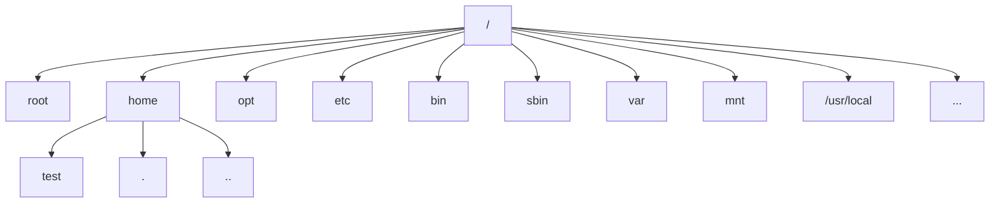

- `/root` root 用户的主目录（超级管理员）
- `/home` 存放普通用户的主目录，Linux 中的每个用户都有一个自己的目录，该目录一般是以用户名的账号命名的
- `/opt` 一般用来存放额外安装的软件。比如我们安装 JDK，就可以安装在 `/opt` 目录下
- `/etc` 存放配置文件的目录，后期安装的一些软件如 JDK、Hadoop 的配置文件一般都在这里
- `/bin` (/usr/bin /usr/local/bin)，这个目录存放着最经常使用的命令
- `/sbin` (/usr/sbin /usr/local/sbin)，这个目录存放着系统管理员使用的系统管理程序
- `/var` 用于存放各种不断扩充的东西，习惯将经常修改的内容放在这个目录下。如日志文件。
- `/mnt` 用于临时挂在其他文件系统的。我们可以将外部的存储挂载在 `/mnt` 上
- `/usr/local` 也是存放额外安装的软件。一般通过源码编译安装的程序就安装在 `/usr/local`

我们现在使用的是 `root` 目录，也是 `root` 用户的家目录 `~`，linux 操作系统中 `/` 表示根目录，根目录下有许多系统所需的目录和文件。

我们在 home 目录下创建一个 test 目录。其中，home 目录下有三块内容，其中 `.` 表示的是当前目录，`..` 表示的上级目录。如果我现在要进入到 `test` 目录，然后回到 `home` 目录，我们可以这样操作

```shell
cd /home/test	# 进入 test 目录
cd ..			# 返回上级
```

| 命令            | 说明                                 |
| --------------- | ------------------------------------ |
| cd 绝对路径     | 切换路径                             |
| cd 相对路径     | 切换路径                             |
| cd ~ 或者 cd    | 回到自己的家目录                     |
| cd -            | 回到上一次所在目录                   |
| cd ..           | 回到当前目录的上一级目录             |
| cd -P（不常用） | 跳转到实际物理路径，而非快捷方式路径 |

### w

显示已登录的用户，以及他们正在做什么。

```shell
w
11:18:05 up 93 days, 19:41,  2 users,  load average: 0.16, 0.26, 0.12
USER     TTY      FROM             LOGIN@   IDLE   JCPU   PCPU WHAT
root     pts/0    120.229.152.164  11:12    5.00s  0.06s  0.00s w
root     pts/1    120.229.152.164  11:14    2:05   0.04s  0.04s -bash 
```

### hostname

hostname 用于查看当前服务器的主机名称。我们也可以通过修改 `/etc/hostname` 来更改主机名。

```shell
vim /etc/hostname
```

### ls

要想知道系统中都有哪些文件，可以使用列表命令（ls），`ls` 会命令列出当前目录下所有文件（蓝色的是文件夹，白色的是普通文件，绿色的是可执行文件）

<b>基本语法</b>

```shell
ls [option] [目录或是文件]
```

ls 命令最基本的形式会显示当前目录下的文件和目录

```shell
root@hecs:/home/demo# ls
a  b  c
```

可以发现，ls 命令输出的列表是按字母排序的。如果我们的终端支持色彩显示，不同类型的文件，颜色会不一样。蓝色的是文件夹，白色的是普通文件，绿色的是可执行文件。

如果终端不支持彩色显示，可以使用 ls 命令的 -F 选项来轻松地区分文件和目录。使用 -F 选项可以得到如下输出

```shell
# 目录后面会有 /
# 可执行文件后面会有 *
# 
```

Linux 中也存在隐藏文件，在 Linux 中，隐藏文件通常是文件名以点号（.）开始的文件。这些文件并不会在 ls 命令的默认输出中出现。我们可以使用 `-a` 参数显示所有的文件，包括隐藏文件。

```shell
ls -a

.  ..  content.html  demo.jar  one  passwd  ssh_config  test.log
```

如果我们想要列出当前目录所包含的子目录中的文件可以使用 `-R` 选项。

<b>常用参数及使用方法如下：</b>

| 命令 | 说明                                                         |
| ---- | ------------------------------------------------------------ |
| -a⭐  | 显示所有文件和目录，包括隐藏文件（以 `.` 开头的文件或目录）  |
| -l⭐  | 以长格式显示详细信息，包括文件权限、所有者、大小、修改时间等。<br>lt 文件的修改时间 <br/>lc 文件状态改变时间 <br/>lu 文件的访问时间 |
| -h⭐  | 与 `-l` 结合使用，以人类可读的方式显示文件大小（如 `K`、`M`、`G` 等） |
| -R   | 递归列出子目录的内容。                                       |
| -t   | 按文件修改时间排序显示                                       |
| -F   | 在每个文件名后附上一个字符以说明文件的类型<br>\* 表示普通文件；/ 表示目录；= 表示套接字； |


列出当前文件夹的所有文件，并以人类可读的方式显示文件大小

```shell
ls -lh

total 865M
-rw-r--r-- 1 root root    0 Jul 19 15:19 data.log
-rw-r--r-- 1 root root  153 Jul 21 19:30 dd.sh
-rw-r--r-- 1 root root   82 Jul 28 16:42 d.sh
...
```

ls 默认的时间显示格式我们看起来不是很舒服，我们也可以通过参数来修改

```shell
ls -l --time-style=long-iso
```

### alias-自定义命令😁

ls 的命令的选项比较多，有些选项是常用的。但是每次执行命令都写一次选项太麻烦了。我们可以为这些命令设置别名，减小命令的长度。

```shell
alias lst='ls -l --time-style=long-iso'
```

在 shell 里配置的 alias 是临时的，如果想配置永久生效，需要修改 .bashrc 文件（位于 `~/` 目录下）。然后让 shell 重新加载 .bashrc 文件。

```shell
# 将配置写入 .bashrc
echo "alias lst='ls -l --time-style=long-iso'" >> ~/.bashrc
# 重新加载 .bashrc 文件
source ~/.bashrc
```

<b>简单介绍下用 vim 编辑文件</b>

当我们需要编辑文件的时候可以使用 `vim` 命令，当我们进入文件编辑以后，有三种模式

- 命令模式（各种快捷键）
- 末行模式（保存、退出、查找）
- 编辑模式（编辑文字）

| 命令模式                                                     | 末行模式                                                     |
| ------------------------------------------------------------ | ------------------------------------------------------------ |
| 1.删除一行：dd<br>2.复制一行：yy<br/>3.粘贴：p<br/>4.到行首：g<br/>5.到行尾：G<br/>6.不保存退出：ZZ | 1.保存：(:w)<br/>2.退出：(:q)<br/>3.强制退出：(:q!)<br/>4.保存退出：(:wq)<br/>5.查找：(/查找的内容) |

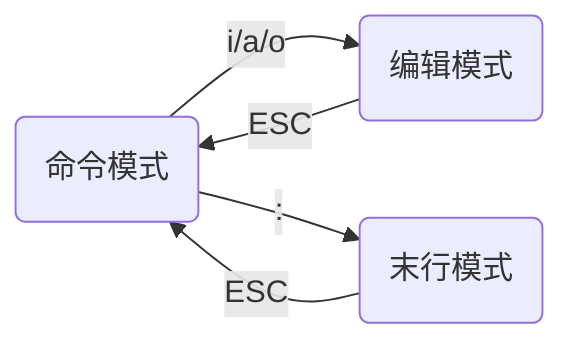

<b>自定义命令</b>

`alias` 除了为命令重命名外还支持调用 `Python/Shell` 脚本，也可以执行各种语言生成的可执行文件。这意味着，我们可以使用 `alias + python` 自定义命令！

比如，我们现在想创建一个每隔 2 秒钟在控制台打印一次时间的命令。

<b>Python 语言自定义命令</b>

先编写 `python` 脚本。

```shell
# 创建 python 脚本，放到合适的位置，这里我放到 /home/mcmd 下。
vim time.py

# 写入下面代码
import time
while True:
	print(time.astime())
	time.sleep(2)
```

编辑 `.bashrc` 文件

```shell
# 加入内容
alias mtime='python3 ~/time.py'
```

然后重新加载 `.bashrc` 文件

```shell
source .bashrc
```

我们可以用其他语言自定义命令吗？比如 Java、Go、C、C++？可以~

<b>C 语言自定义命令</b>

我们用 `C` 语言自定义一个在控制台输出 `Hello World` 的命令。

```shell
# 安装 gcc
apt-get update	# 更新下软件包
apt install gcc
```

编写 `C` 语言代码

```c
# 文件也是放在 ~/mcmd 中
# vim hello.c

#include<stdio.h>
int main(){
	printf("Hello World!");
}
```

编译 `C` 代码

```java
gcc hello.c -o hello
```

给 `C` 的可执行文件配置别名

```shell
vim ~/.bashrc

alias hello='~/mcmd/hello'
```

### 通配符

有时候，我们希望<span style="color:blue">列出符合指定规则的文件/文件夹</span>，这时候就可以使用 Linux 的文件操作通配符来过滤输出列表。

<b>常用的文件操作统配符如下</b>

| 符号   | 含义                                      | 举例                                                         |
| ------ | ----------------------------------------- | ------------------------------------------------------------ |
| `?`    | 匹配任意一个字符                          | `???` 三个字符的文件名                                       |
| `*`    | 匹配任意个字符 ( `.` 开头的隐藏文件除外 ) | `*.c` 以 `.c` 结尾的文件                                     |
| `[ ]`  | 匹配列表中的字符                          | `*[Aa]` 以字符 `A` 或 `a` 结尾的文件名<br>`[A-Z]*` 任意大写字母开头的文件 |
| `^、!` | 不包含                                    | `[^0-9]*` 不以数字开头的文件名                               |
| `{ }`  | 匹配括号中的列表                          | `{*.c,[a-z]*}` 所有以 `.c` 结尾的和以小写字母开头的文件      |

<b>习题</b>

1️⃣查看 file1 file2 ... file9 这些文件的大小

2️⃣列出当前目录下所有 test 开头的文件名

3️⃣列出当前目录下所有的 java 文件名

4️⃣列出当前目录下所有的 cpp 文件名和 java 文件名

5️⃣查找最近更新过的文件

6️⃣查找以 a 或 c 开头的文件

```shell
1️⃣ls -lh file?
2️⃣ls test.*
3️⃣ls *.java
4️⃣ls {*.cpp, *.java}
5️⃣ls -lt
6️⃣ls [ac]*
```

`{}` 后的 mkdir / scp 命令还会用到。

### tree

`tree` 命令的中文意思为“树”，会以树形结构列出指定目录下的所有内容，包括所有文件、子目录及子目录里的目录和文件。如果我们想知道当前目录的文件结构，可以使用 `tree` 命令。`tree` 命令不是 `Linux` 自带的命令，需要安装。

```shell
apt install tree
```

<b>基本语法</b>

```shell
tree [option] [dir]
```

`tree` 命令后面不接任何参数，会显示所在路径的目录结构。

```shell
tree
```

加上 `-a` 可以展示隐藏文件

```shell
tree -a
```

<b>tree 参数选项</b>

| 参数     | 说明                                                     |
| -------- | -------------------------------------------------------- |
| -a⭐      | 显示所有文件，包括隐藏文件（. 开头的文件）               |
| -d       | 只显示目录                                               |
| -f       | 显示每个文件的全路径前缀（相对于执行命令的目录的全路径） |
| -i       | 不显示树枝，一般于 -f 配合使用                           |
| -I⭐      | 过滤不想显示的文件或文件夹                               |
| -L level | 遍历目录的最大深度，level 为大于 0 的整数                |
| -F⭐      | 为不同的文件加上后缀，便于区分文件类型，文件夹以 / 结尾  |

1️⃣以树形结构显示目录下的所有内容

2️⃣列出根目录下第一层目录的结构

3️⃣只显示所有的目录，不列出文件

4️⃣显示当前目录除了 dir 外的所有内容

5️⃣只显示文件，不显示目录⭐

```shell
1️⃣tree -a
2️⃣tree -L 1
3️⃣tree -d
4️⃣tree -I dir

5️⃣只显示文件，不显示目录⭐
tree -F	# 显示所有内容，文件夹会有后缀
# 然后再去除这些有文件夹后缀的内容即可。-v 表示取反 '/$' 表示以 / 结尾
tree -F | grep -v '/$'
```

### stat

查看文件的状态。

```shell
stat /etc/passwd

File: /etc/passwd	#<==文件名
#文件大小				占用的block数量		   #block总大小	# 普通文件
Size: 1916            Blocks: 8          IO Block: 4096   regular file
# 设备编号				# inode 值			# 硬链接数
Device: fc01h/64513d    Inode: 394292      Links: 1
# 文件权限				用户						用户组
Access: (0644/-rw-r--r--)  Uid: (    0/    root)   Gid: (    0/    root)
Access: 2024-08-13 16:53:40.287469178 +0800
Modify: 2024-07-07 12:12:56.059066938 +0800
Change: 2024-07-07 12:12:56.067066938 +0800
 Birth: 2024-07-07 12:12:56.059066938 +0800
```

### mkdir

`mkdir` 命令是 “make directories” 的缩写，用于创建目录，可以创建单个目录，也可以同时创建多个目录，还可以创建多级目录。默认情况下，如果要创建的目录已存在，则会提示此文件已存在；而不会继续创建目录。

<b>基本语法</b>

```shell
mkdir [option] dir
```

<b>mkdir 参数选项</b>

| 选项 | 说明                                   |
| ---- | -------------------------------------- |
| -p⭐  | 递归创建目录；即便目录已存在也不会报错 |
| -v   | 显示创建目录的过程（没什么用）         |
| -m🥶  | 设置新创建目录的默认权限（后面学）     |

创建单个目录，同级下的多个目录

```shell
mkdir test			# 创建目录 test
mkdir t1 t2 t3 		# 创建目录 t1 t2 t3
```

创建多级目录

```shell
mkdir -p aa/bb/cc/dd # 创建多级目录
```

创建多级目录的时候显示创建过程

```shell
mkdir -pv bb/aa/zz

mkdir: created directory 'bb'
mkdir: created directory 'bb/aa'
mkdir: created directory 'bb/aa/zz'
```

<b>同时创建多个目录及多级子目录</b>

有时候我们希望再同一个目录下创建多个子目录，我们可以执行多次 `mkdir` 命令，但是太麻烦了。我们可以使用 `mkdir + {}` 语法。例如，我们要创建 `test` 目录，然后在 `test` 目录下创建 `aa` 和 `bb` 目录。

```shell
mkdir test/{aa,bb}

# aa,bb / 11,22 会排列组合
mkdir test/{aa,bb}/{11,22}
```

还有一种语法 `{}`。例如，我们想创建名为 `dir1~dir5` 的 5 个目录。

```shell
mkdir dir{1..5}
mkdir dir{10..6}
```

<b>克隆目录结构(自己学，不教学生)</b>

对于操作比较复杂的命令，建议先写个 demo 测一下对不对。假定，我们现在有一个目录，结构如下

```shell
tree source -F
source/
├── dir1/
│   ├── dir11/
│   ├── dir12/
│   ├── dir13/
│   └── dir1.log
├── dir2/
├── dir3/
└── one
```

我们要把这个目录结构复制到 target。

- 先得到所有的目录

```shell
tree -d source/
source/
├── dir1
│   ├── dir11
│   ├── dir12
│   └── dir13
├── dir2
└── dir3
```

- 我们需要的是全路径，不需要树枝，所以需要加上参数 f(全路径) 和参数 i(不要树枝)

```shell
tree -dfi source/

# 自己要知道，不教学生
tree -dfi --noreport source/ | xargs -I % mkdir -pv target/%
```

- --noreport 不显示统计结果
- xargs 将管道的内容转为命令行参数
- xargs -I % 将参数用字符串 % 替换

### touch

`windows` 中我们可以使用鼠标点击来创建文件或 `new-item` 命令来创建空文件，而 `Linux` 则是通过 `touch` 命令来创建空文件的，`touch exitFile` 也可以改变已有文件的时间戳属性。

<b>基本语法</b>

```shell
touch [option] [file]
```

| 选项      | 说明                                                     |
| --------- | -------------------------------------------------------- |
| -a⭐       | 更改指定文件的最后访问时间                               |
| -m        | 更改文件的最后修改时间                                   |
| -d String | 使用 String 代表的时间作为模板设置文件的时间属性         |
| -r file   | 将指定文件的时间属性设置为与模版文件 file 的时间属性相同 |
| -t Stamp  | 使用 `YYMMDDhhmm.ss` 格式的时间设置文件的时间属性        |

一般也只用它创建文件。我们创建一个 `main.cpp` 文件

```shell
touch main.cpp
```

除了创建空文件外，`touch` 命令还可用来改变文件的修改时间。该操作不会改变文件内容。

```shell
# 已经存在文件 data 了
touch data	# 会刷新 data 的修改时间
```

### rm

有创建，就有删除，`rm` 就是用于删除普通文件和目录的命令。（`rmdir` 可以用于删除空目录，不常用）

<b>基本语法</b>

```shell
rm [选项] filename
```

| 选项 | 功能                           |
| ---- | ------------------------------ |
| -r   | 递归删除目录中所有内容         |
| -f   | 强制执行删除操作，没有确认提示 |
| -v   | 显示指令的详细执行过程         |
| -i   | 交互式操作                     |

删除文件和文件夹

```shell
rm test		# 删除普通文件; 
rm -r aa	# 删除文件夹
```

强制删除所有文件（-f 表示强制删除 force）

```shell
rm -rf xxx	# 慎用，最好不要用
```

`Ubuntu` 中的 `trash-cli` 工具可以实现文件的安全删除。可以使用以下命令安装 `trash-cli`

```shell
sudo apt install trash-cli
```

安装完成后，可以使用 `trash-put` 命令将文件移动到回收站，并可使用 `trash-empty` 命令来清空回收站。

<b>注意：</b>删除文件尽量不要使用通配符！很危险！容易误删！

### mv

`mv` 可用于移动文件，也可以实现重命名。

<b>基本语法</b>

```shell
mv oldName newName		# 重命名
mv /temp/movefile /targetFolder	# 移动文件
```

将文件 `data.data` 移动到上一级目录

```shell
mv data.data ../data.data
```

我们将 `/home/data.data` 文件移动到 `/home/data2.data` 其实就相当于重命名了。

```shell
mv /home/data.data /home/data2.data
```

### rename

`rename` 从命令的名字看就知道，它是用来做文件重命名的。如果只是单个文件的重命名，我们直接用 `mv` 即可；如果是批量文件的重命名，推荐使用 `rename`。`rename` 可以对目录中的文件进行批量重命名，而且支持 `Perl` 正则表达式，使得重命名操作更加灵活和强大。下面，我们来看下如何使用 `rename` 批量重命名文件。

<b>基本语法</b>

```shell
rename from to file

rename "txt" "md" * # 将所有文件的 txt 替换为 md
rename .jpg	.tif *	# 将所有文件的 .jpg 后缀替换为 .tif 后缀
```

正则表达式用法（可不讲，提一下即可）

```shell
rename [option] 's/old/new/' files
```

- `options`：可选参数，用于控制命令的行为。
- `s/old/new/`：将 `old` 替换为 `new`。
- `files`：要重命名的文件列表，可以使用通配符进行匹配。

<b>将 txt 结尾的文件替换成 md 结尾。</b>

```shell
rename 's/\.md/\.txt/' *.txt
rename 's#\.cpp#\.java#' *.cpp	# .是通配符，需要转义
```

<b>批量添加文件后缀</b>

```shell
rename 's/$/\.txt/' * # 所有的文件名都加上后缀txt
rename 's#$#\.txt#' *
```

- `s`：表示替换操作（substitute）。
- `#`：作为定界符，用来包围正则表达式和替换字符串。
- `$`：在正则表达式中，`$` 匹配字符串的结尾。在这里，它指代文件名的结尾。
- `\.txt`：是要添加到文件名结尾的新字符串。其中的`\.`表示字面意义上的点字符（因为在正则表达式中，点是一个特殊字符，所以需要用反斜杠进行转义），而 `txt` 就是文本字符串。
- **`\*`**：这个星号通配符代表当前目录下的所有文件和目录。不过，由于 `rename` 命令通常会忽略目录，这里主要针对的是文件。

<b>批量添加前缀</b>

```shell
rename 's/^/new_/' *
rename 's#^#new_#' *
```

### cp

有时候，我们需要将文件/目录复制到其他地方，这时候就可以使用 `cp` 命令（可以理解为 `copy` 的缩写）。`cp` 命令也是很常用的命令。

<b>基本语法</b>

```shell
cp [option] 源文件 目标文件
```

- 复制文件：`cp 源文件 目标文件`，将源文件复制到目标文件
- 复制目录：`cp -r 源目录 目标目录`，可以递归复制目录

| 选项 | 功能                         |
| ---- | ---------------------------- |
| -r⭐  | 递归复制                     |
| -n⭐  | 不覆盖已经存在的文件         |
| -u⭐  | 跳过比源文件时间戳更新的文件 |
| -i   | 交互式提醒                   |
| -p   | 保持属性（类型、权限、时间） |

<b>常用命令</b>

| 命令                          | 说明                                                         |
| ----------------------------- | ------------------------------------------------------------ |
| `cp source target`            | 将 source 文件复制成 target 文件                             |
| `cp -r source_dir target_dir` | 将 source 文件/目录复制成 target 文件/目录<br>-r 表示递归复制 |

如果目标文件已存在，复制时会将目标文件覆盖。为了避免误操作，我们在复制的时候可以加上 `-i` 表示交互操作方式。`cp` 命令也可以使用通配符（大多数命令都可以使用哦）

### rsync😁

`rsync` 也是一个复制文件的命令，不过它可以排除指定的文件夹或文件，不进行复制。`rsync` 的典型用法，排除 `ssda_match` 目录下的 `bad` 和 `pretrain` 文件夹中的所有内容。

```shell
rsync -av --exclude='bad' --exclude='pretrain' ssda_match
```

### ln😁

[linux - 一口气搞懂「文件系统」，就靠这 25 张图了 - 个人文章 - SegmentFault 思否](https://segmentfault.com/a/1190000023615225)

有时候，我们需要为 `Linux` 中的文件创建一个快捷方式，方便快捷的访问文件。例如，我们需要跑一个数据，数据存储在 `/data/bigdata/some.data` 下。项目读取数据的代码是这样的。

```shell
data_path = "some.data"	# 默认数据就在项目的根目录（很多开源项目都是这样的）
```

我们有两种方式：一，直接修改项目源代码的数据路径；二，我们可以为这个数据创建一个快捷方式，创建到项目的根目录下。这样，项目就可以通过 `some.data` 的方式访问到数据了。`ln` 正是创建快捷方式的命令。

`Linux` 中链接分为两种

- 软链接 (symbolic link)
- 硬链接 (hard link)

<b>基本语法</b>

```
ln [option] [源文件或目录] [目标文件或目录]
```

删除链接

```shell
rm -rf 链接名		# 不是 rm -rf 链接名/
```

| 选项 | 功能                                           |
| ---- | ---------------------------------------------- |
| -s   | 创建软链接（符号链接）也是最常用的             |
| -f   | 强制执行，覆盖已存在的目标文件                 |
| -i   | 交互模式，文件存在则提示用户是否覆盖           |
| -n   | 把符号链接视为一般目录                         |
| -v   | 显示详细的处理过程（mkdir 的 -v 也是这个作用） |

在 `/home/test/` 下创建文件 `/home/data.data` 的软连接

```shell
ln -s /home/data.data	/home/test/
```

上面的命令去除 `-s` 就是创建硬链接了。

<b>软链接和硬链接</b>

软链接也叫符号链接，在软链接中只保存了被链接文件的路径名，如果文件重命名或者移动了位置，那么软链接也就失效了。删除软连接并不会删除源文件（演示）。

硬链接则是直接复制了文件的 `inode`，硬链接和原文件都指向同一个节点（同一份数据）。这也意味着，源文件修改或移动了位置，都不影响访问数据。硬链接内部采用的是引用计数算法，每多/少一个硬链接，文件的计数就会多/少一，当计数为零时，文件就删除了。

`Linux` 中的文件是由：目录项、`inode`、数据块组成的。目录项中包含文件名和 `inode` 节点号。`inode` 则包含文件的基础信息和数据块的指针。数据块中包含文件的具体内容（演示）。

<b>硬链接的缺点</b>

在 `Linux` 系统上，创建硬链接有两个限制条件：

- 一、不能跨分区，因为在不同分区上的 `inode` 没有相通性；
- 二、不能链接目录，这也是多数操作系统的限制条件，这一点并非技术上不可实现，主要是为了避免造成目录循环，造成循环引用（解释循环引用）。而软链接则没有这些限制。

### history

查看已经执行过历史命令

<b>基本语法</b>

```shell
history
```

### file

在 `windows` 中，我们要想看出文件内容的话需要使用到编辑器，而 `Linux` 中可以直接通过命令来查看文件内容。在显示文件内容之前，应该先了解文件类型。如果我们尝试显示二进制文件，那么屏幕上会出现各种乱码，甚至会把我们的终端仿真器挂起（卡死）。

`file` 命令是一个方便的小工具，能够探测文件的内部并判断文件类型；`file` 的用法也非常简单。

```shell
file filename
```

### >&>>

`>` 和 `>>` 是重定向的符号。我们可以把其他命令的输出结果通过重定向符号，重定向到其他文件中。

- `>` 表示覆盖（先清空再写入）
- `>>` 表示追加。

```shell
ls -al > ls.log
ls -ahl >> ls.log
```

### echo

`echo` 命令能将指定文本显示在 `Linux` 命令行上，或者通过重定向符写入到指定的文件中。

<b>基本语法</b>

```shell
echo [option] [string content]
```

向控制台输出内容。

```shell
echo hello
echo "hello world"

echo -e "hello\nworld"
```

| 选项 | 说明                       |
| ---- | -------------------------- |
| -e   | 启用转义字符               |
| -n   | 不自动换行（默认自动换行） |
| -E   | 不解析转义字符（默认选项） |

向控制台输出内容并重定向到 data.log 里。

```shell
echo "hello world" >> data.log
```

向控制台输出两行内容并重定向到 data.log 里。

```shell
echo -e "hello\nworld" > data.log
```

### cat

`cat` 命令是用来查看单个文件中的内容或连接多个文件并且打印到屏幕输出，一般用来查看比较小的文件（一屏幕能显示全的）。此外，`cat` 看大文件非常耗时，耗带宽。`cat` 命令还可以从标准输入中读取内容并显示，常与重定向或追加符号配合使用。

<b>基本语法</b>

```shell
cat [option] filename
```

查看 data 中的内容。	

```shell
echo "hello" > data
cat data
```

| 选项 | 功能描述                               |
| ---- | -------------------------------------- |
| -n⭐  | 显示所有行的行号，包括空行。           |
| -b   | 与 -n 类似，但是会忽略显示“空白行”行号 |
| -A   | 显示文件中的特殊隐藏符号               |
| -s   | 遇到连续的空白行，将其替换成一行空白行 |
| -E   | 每行的末尾显示 `$` 符                  |

由 `cat` 无法查看某个文件的内容引出 `chmod` 命令。

<b>cat 也可以编辑文件、追加内容到文件尾部</b>

有时候，我们需要创建一个文件向里面编写内容，或者修改配置文件，如果不想使用编辑器（vim/gedit），那我们就可以使用 `cat` 命令进行编辑。

使用 `cat` 编辑文件，向文件中写入 `hello world`。（很少用）

```shell
# > 表示覆盖写
# >> 表示追加写
cat > test.log
hello
world
# 如果想结束编辑，可以使用 ctrl+c 或 ctrl+d 终止编辑。（要先按回车）
```

也可以这样编辑文件

```shell
# > 表示覆盖写
# >> 表示追加写
cat > test.txt << EOF
...content...
EOF # 表示编辑结束了！
```

上面的命令可以理解为

- `cat > test.txt` 就表示将 `cat` 命令的输出从标准输出重定向到指定文件 `test.txt` 中。 
- `test.txt << EOF...EOF` 表示把 `EOF` 中间的内容追加到 `test.txt` 中

<b>cat 联合多个文件信息并重定向到指定文件中</b>

```shell
cat f1.txt f2.txt > f3.txt
```

<b>cat 清空文件内容</b>

`/dev/null` 是系统的默认空文件。把没有东西的信息覆盖到文件中 = 清空文件内容

```shell
cat /dev/null > test.txt
```

### tac🥶

`tac` 是 `cat` 的反向拼写，因此命令的功能为反向显示文件内容。

```shell
tac /etc/passwd
```

### more

`cat` 命令的主要缺点是会整个文件的内容一次性打印到屏幕上，在查看大文件的时候容易导致电脑卡死。为了解决这个问题，开发人员编写了 `more` 命令。`more` 命令是一个基于 `VI` 编辑器的文本过滤器，它以全屏幕的方式，按页显示文本文件的内容，但会在显示每页数据之后暂停下来，我们可以通过 `more` 中内置的快捷键来翻页。<u>【`more` 不会一次性将所有内容都加载到内存中，而是一页一页加载】</u>

<b>基本语法</b>

```shell
more [option] [file]
```

查看文件 `/etc/passwd`

```shell
more /etc/passwd
```

`more` 命令的参数选项及说明

| 参数 | 说明                                 |
| ---- | ------------------------------------ |
| -num | 指定屏幕显示 num 行                  |
| +num | 从 num 行开始显示                    |
| -s   | 将连续的空行合并一行                 |
| -p   | 不滚屏，而是清除屏幕内容后再显示文本 |

`more` 命令常见快捷键

| 快捷键    | 功能说明                 |
| --------- | ------------------------ |
| 空格⭐     | 向下翻一页               |
| 回车⭐     | 向下翻『一行』           |
| q⭐        | 退出 more                |
| [Ctrl+] F | 向下滚动一屏             |
| [Ctrl+] B | 返回上一屏               |
| =         | 输出当前行的行号         |
| :f        | 输出文件名和当前行的行号 |

查看内容较多的文件，练习上面的操作。

### less😁

`less` 与 `more` 类似，但是功能更全。`less` 支持各种显示终端。且，`less` 在显示文件内容时，并不是一次将整个文件加载之后才显示，而是根据显示需要加载内容，<b>对于显示大型文件具有较高的效率。</b>

如果我们确实需要查看大日志文件，`less` 是一个利器（内存够大，2G 以下的日志可以考量用 Vim 看）

<b>基本语法</b>

```shell
less [option] [file]
```

`less` 命令常用参数如下

| 选项 | 说明                 |
| ---- | -------------------- |
| -N   | 显示行号             |
| -i   | 搜索时忽略大小写     |
| -m   | 显示进度百分比       |
| -s   | 将连续的空行合并一行 |

`less` 命令常用的快捷键如下

| 快捷键 | 功能说明                                           |
| ------ | -------------------------------------------------- |
| 空格⭐  | 向下翻一页；                                       |
| 回车⭐  | 向下翻『一行』；                                   |
| q⭐     | 退出 less                                          |
| /字串  | 向下搜寻『字串』的功能；n：向下查找；N：向上查找； |
| ?字串  | 向上搜寻『字串』的功能；n：向上查找；N：向下查找； |

可以说，`less` 命令是 `cat / more / less` 中最强大的命令了！

分别用 `cat more less` 查看 `700MB+` 的大文件。

### head

有时候，我们要查看的数据经常位于文本文件的开头或末尾。如果数据是在一个大型文件的开头，那就只能干等着 `cat` 或 `more` 载入整个文件。如果数据是在文件末尾（比如日志文件），则需翻过成千上万行的文本才能看到最后那部分。好在 `Linux` 有专门的命令可以解决这两个问题：`head` 和 `tail`。

`head` 用于显示文件的开头部分内容，默认情况下 `head` 指令显示文件的前 `10` 行内容。

<b>基本语法</b>

```shell
head 文件			# 查看文件头 10 行内容
head -n 5 文件	# 查看文件头 5 行内容
```

`head` 支持从 `stdin` 读入内容

### tail

`tail`用于输出文件中尾部的内容，默认情况下 `tail` 指令显示文件的后 `10` 行内容。

<b>基本语法</b>

```shell
tail 文件			# 查看文件尾部 10 行内容
tail -n 5 文件	# 查看文件尾部 5 行内容
tail -f 文件		# 实时追踪该文档的所有更新⭐
```

| 选项      | 功能                                 |
| --------- | ------------------------------------ |
| -n <行数> | 输出文件尾部 n 行内容                |
| -f        | 显示文件最新追加的内容，监视文件变化 |

### tailf

`tailf` 命令在工作中的主要使命就是跟踪日志文件，首先将默认输出日志文件的最后 `10` 行，然后实时地显示文件的增加内容。

```shell
tailf web.log

tailf -n 20 web.log
```

`tailf` 命令几乎等同于 `tail -f`，与 `tail -f` 不同的是，如果文件不增长，它不会去访问磁盘文件，也不会更改文件的访问时间。

### |

`|` 管道。管道类似于文件重定向，可以将前一个命令的 `stdout` 重定向到下一个命令的 `stdin`。简单说就是把前一个命令的输出作（stdout）为下一个命令的输入（stdin）

<b>基本语法</b>

```shell
command | command

# 如查找当前文件夹中以 log 结尾的文件
ls -l | grep -E '*.log'
```

- 管道命令仅处理 `stdout`，会忽略 `stderr`。
- 管道右边的命令必须能接受 `stdin`。
- 多个管道命令可以串联。

<b>管道和重定向的区别</b>

- 文件重定向左边为命令，右边为文件。
- 管道左右两边均为命令，左边有 `stdout`，右边有 `stdin`。

### xargs

`xargs` 命令的作用是将管道或 `stdin` (标准输入) 的数据<span style="color:blue">用空格或回车分割成命令行参数传递给命令</span>。比如，我们想要筛选出当前目录以 `log` 结尾的文本，然后查看里面的内容，如果这样写，我们会发现输出的内容并不是我们想要的，为什么呢？

```shell
ls | grep -E '*.log' | cat
```

我们先拆解下每条命令，看看输出是什么==>发现 `ls | grep -E '*.log'` 输出的就是文件名。`...| cat` 是将上一个命令的输出作为输出传递给 `cat` 了。我们再仔细看下 `cat` 命令。

```shell
cat --help
Usage: cat [OPTION]... [FILE]...
Concatenate FILE(s) to standard output.
# 当没有指定文件（FILE），或者指定的文件是 - 时，cat 命令将从标准输入（standard input）读取数据。这意味着我们可以使用管道（|）或其他方式将数据传递给 cat，而无需指定具体的文件名
With no FILE, or when FILE is -, read standard input.
```

这意味着，`cat` 读取到了 `|` 的 `stdin` 然后原封不动的输出 `stdin`。`xargs` 可以将 `stdin` 中的数据分割成命令行参数，这意味着。

`...| xargs cat` 可以完成我们的需求。

```shell
ls | grep -E '*.log' | xargs cat

hello
test auto execute
test auto execute
....
test auto execute
test auto execute
```

统计当前目录下所有 `python` 文件的总行数

```shell
find . -name '*.py' | xargs cat | wc -l
```

- `xargs` 将前一个命令的输出作为 `cat` 命令的参数传递过去

如果没有 `xargs`，`find` 的结果是一堆 `stdout`，把这对 `stdout` 给 `cat`，`cat` 会原样输出。

```shell
find . -name '*.py' | cat
```

如果有 `xargs`，会把 `find` 的输出结果作为参数，一个一个传递给 `cat`，相当于 `cat f1 f2 f3`

```shell
find . -name '*.py' | xargs cat
```

<b>了解了 xargs 的作用，我们再来看看它的语法和常见选项</b>

<b>基本语法</b>

```shell
xargs [option]
```

<b>选项参数</b>

| 选项         | 说明                                                         |
| ------------ | ------------------------------------------------------------ |
| -n           | 指定每行的最大参数量 n，可以将标准输入的文本划分为多行，每行 n 个参数，默认空格分隔 |
| -d           | 自定义分隔符                                                 |
| -i           | 以 {} 替代前面的结果                                         |
| -I (大写 i)  | 指定一个符号替代前面的结果，不用 -i 参数默认的 {}            |
| -p           | 提示让用户确认是否执行后面的命令，y 执行，n 不执行           |
| -0（数字 0） | 用 `null` 替代空格作为分隔符，配合 `find` 命令的 `-print()` 选项的输出使用 |

我们来一个一个看，先来看最基础的用法，`xargs` 读取文本数据，默认是放在同一行的。

```shell
echo -e "1 2 3 4 5\n6 7 8 9 10\n11 12" >> test

cat test
1 2 3 4 5
6 7 8 9 10
11 12

xargs < test
1 2 3 4 5 6 7 8 9 10 11 12
```

如果我们想多行输出，可以使用 `-n` 限制每行输出的参数格式。

```shell
xargs -n 3 < test
1 2 3
4 5 6
7 8 9
10 11 12
```

`xargs` 默认使用空格或制表符（tab）来分割字符，我们也可以 `-d` 自定义分隔符。

```shell
echo "hello;world;shell" | xargs -d ';'
hello world shell
```

如果我们想获取 `xargs` 收到的每个参数，可以使用 `-i` 和 `{}`。

```shell
echo "hello;world;shell" | xargs -d ';' -i echo {}
hello
world
shell

```

我们也可以用 `-I` 选项指定其他字符替代 `{}`。

```shell
echo "hello" > 1.txt
echo "world" > 2.txt
ls *.txt | xargs -I [] cat []
```

`xargs` 一般配合其他命令+管道符使用~

### grep

`grep` 是一个文本搜索工具，可以根据我们指定的过滤条件（模式）对目标文件进行匹配，打印匹配到的行（只会打印【匹配到/符合条件】的内容）。

`grep` 是一个非常重要的命令，它和 `sed`、`awk` 一般被称为 `Linux` 三剑客，是查看、在日志中检索信息的神器。

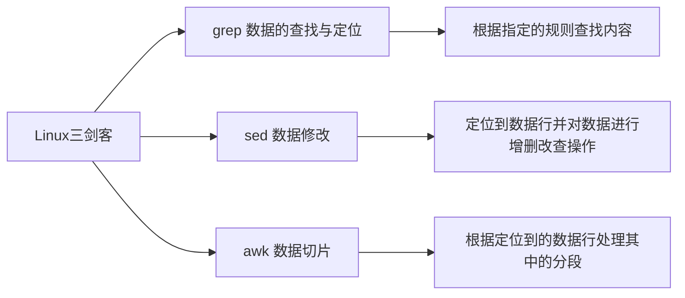

这里我们先简单学习下 `grep`。

<b>基本语法</b>

```shell
grep [option] [pattern] file
	   选项	  过滤条件	文件
# grep 命令默认使用的是基本的正则表达式
```

使用 `grep` 过滤出 `data.log` 中包含 `hello` 的内容

```shell
grep 'hello' data.log
```

使用 `grep` 过滤出 `data.log` 中的错误日志

```shell
grep 'Exception' data.log
```

| 选项       | 说明                                                         |
| ---------- | ------------------------------------------------------------ |
| `-n`:star: | `--line-number` 显示行号                                     |
| `-i`:star: | `ignorecase` 忽略字符的大小写                                |
| `-o`:star: | 只显示匹配到的字符串                                         |
| `-c`:star: | 统计匹配的行数<br>统计当前有多少个 `Java` 服务 `jps | grep -c '**'`<br>统计当前有多少个 `sshd` 服务 `ps -ef |grep -c sshd` |
| `-v`       | `--inver-match` 显示不能被匹配到的行                         |
| `-E`       | 支持使用扩展的正则表达                                       |
| `-q`       | `--quiet, --silent` 精默模式，不输出任何信息                 |

有时候，我们希望知道是第几行的日志出错了（查看错误行的前后发生了什么操作，可以做错误排查），可以使用 `-n` 来定位行号。

```shell
grep -n 'Exception' data.log
7645:2024-10-09 23:45:00 - 赵六 - throws Operation Exception
15002:2024-10-09 23:45:00 - Super Admin - throws Operation Exception
17003:2024-10-09 23:45:00 - 李四 - throws Operation Exception
18526:2024-10-09 23:45:00 - 田七 - throws Operation Exception
```

定位到错误的行号后，我们可以用 `sed` 来筛选出指定范围的日志，用于做错误排查。

```shell
sed -n '7600,7700p' data.log
```

大多数时候，我们并不清楚日志中的异常是 `Exception` 还是 `exception`，这时候，我们可以使用 `-i` 忽略大小写来进行匹配。

```shell
grep -ni 'exception' data.log
```

`grep` 也可以结合其他命令一起使用，例如，我们可以使用 `grep` 查找当前目录中以 `.log` 结尾的文件

```shell
touch a.log aa.log aaa.log alog

# 这个命令对吗？
ls | grep '.log'
```

`grep` 默认开启基础正则 `.` 会被解析为任意字符，这意味 `alog` 也会被匹配到，我们需要使用 `\` 转义。因此，下面这个命令才是对的。

```shell
ls | grep '\.log'
```

<b>习题</b>

这些不只是习题，更是以后经常要用到的命令

- 查找出端口为 `22` 的进程
- 查找出运行中的 `java` 进程
- 查找出用户为 `root` 的进程

1️⃣查找出端口为 `22` 的进程。可以使用 `netstat`

```shell
netstat -antp | grep ':22'	# p 表示 pid
tcp        0      0 0.0.0.0:22              0.0.0.0:*               LISTEN      14111/sshd: /usr/sb
tcp6       0      0 :::22
```

除了 `netstat + 管道 + grep` 外，我们还可以使用 `lsof`（推荐 `lsof`）

```shell
lsof -i :22
COMMAND   PID USER   FD   TYPE DEVICE SIZE/OFF NODE NAME
sshd    14111 root    3u  IPv4  64489      0t0  TCP *:ssh (LISTEN)
sshd    14111 root    4u  IPv6  64500      0t0  TCP *:ssh (LISTEN)
```

2️⃣查找出运行中的 `java` 进程 `top` 和 `ps` 都可以

```shell
top | grep 'java'
117982 root      20   0 2510452 129696  28132 S   0.3   7.1   0:06.17 java
 
ps -aux | grep 'java'
root      117982  9.4  7.1 2510452 129696 pts/0  Sl+  17:19   0:06 java -jar demo.jar
```

看不到 `PID` 怎么办？筛选出包含 `PID` 的行可以了。

```shell
ps -aux | grep -E 'java|PID'	# -E 是扩展型正则，后面我们会讲
USER         PID %CPU %MEM    VSZ   RSS TTY      STAT START   TIME COMMAND
root      117982  2.0  7.1 2510452 129972 pts/0  Sl+  17:19   0:06 java -jar demo.jar
```

还有一个 `JDK` 自带的命令可以看到所有的 `Java` 进程 `jps`

```shell
jps
118310 Jps
117982 demo.jar
```

3️⃣查找出用户为 `root` 的进程

```shell
ps -aux | grep 'root'
```

### sort

`sort` 命令可以将文件进行排序，并将排序结果标准输出。是按列来排序的~

<b>基本语法</b>

```shell
sort [option] [参数]
```

| 选项 | 说明                     |
| ---- | ------------------------ |
| -n   | 依照数值的大小排序       |
| -r   | 以相反的顺序来排序       |
| -t   | 设置排序时所用的分隔字符 |
| -k   | 指定需要排序的列         |

准备数据 t

```shell
hello
world
java
shell
world
hello
```

对数据进行排序

```shell
sort -n t
```

准备数据 tt

```shell
bb:40:5.4
bd:20:4.2
xz:50:2.3
cl:10:3.5
ss:30:1.6
```

按照 `:` 分割后的第三列倒序排序

```shell
sort -t : -nrk 3  data.txt 
bb:40:5.4
bd:20:4.2
cl:10:3.5
xz:50:2.3
ss:30:1.6
```

### diff

`diff` 命令可用于比较两个文件/目录的差异。

<b>基本用法</b>

```shell
diff [ options ] file1 file2
```

`file1` 和 `file2` 可以是文件或目录。在进行目录比较时，`diff` 对两个目录下的同名文件进行比较。

| 选项             | 说明                                      |
| ---------------- | ----------------------------------------- |
| `-r`             | 目录递归⭐                                 |
| `-i`             | 忽略字母大小写⭐                           |
| `-Z`             | 忽略尾部空格⭐                             |
| `-B`             | 忽略空行⭐                                 |
| `-b`             | 忽略多个连续空格的差异⭐                   |
| `-w`             | 忽略所有空格⭐                             |
| `-a`             | 将文件作为文本文件处理（比较二进制文件）⭐ |
| `--color=[WHEN]` | 彩色输出（never、always、auto）⭐          |

比较两个文件的差异

```shell
diff git.sh gitc.sh
15a16
> echo hello
```

- `15a16` 表示在 `git.sh` 文件的第 `15` 行之后，`gitc.sh` 文件新增了一行内容。
- `>` 符号表示新增的行。
- `echo hello` 是新增的具体内容，即在 `gitc.sh` 文件中第 `16` 行的内容是 `echo hello`。

```shell
diff git.sh gitc.sh
15c15
< git commit -m "second update readme.md"
---
> echo hello
```

- `15c15` 表示两个文件在 `15` 行有所不同。
- `<` 符号表示 `git.sh` 文件中的内容。
- `---` 是分隔符，用来区分两个文件的内容。
- `>` 符号表示 `gitc.sh` 文件中的内容。

### cut⭐

`cut` 命令用于在文件中分割出想要的数据。`cut` 命令从文件的每一行剪切字节、字符和字段并将这些字节、字符和字段输出。

<b>基本用法</b>

```shell
cut [option] filename	# 默认分隔符是制表符
```

| 选项参数 | 功能                         |
| -------- | ---------------------------- |
| -f       | 列号，提取第几列             |
| -d       | 分隔符，按照指定分隔符分割列 |
| -c       | 指定具体的字符               |

准备数据

```shell
touch cut.data
vim cut.data
hello world! hello:world
test1 test2 test3
```

按空格分割内容，输出分割后的前两列数据。

```shell
cut -d " " -f 1-2 cut.data
# 按空格来划分列的话，一共有三列
hello world!
test1 test2
```

其他用法

```shell
echo $PATH | cut -d ':' -f 3,5	# 输出 PATH 用`:`分割后第3、5列数据
echo $PATH | cut -d ':' -f 3-5	# 输出PATH用:分割后第3-5列数据
echo $PATH | cut -c 3,5			# 输出PATH的第3、5个字符
echo $PATH | cut -c 3-5			# 输出PATH的第3-5个字符
```

切割 `ifconfig` 后打印的 `IP` 地址

```shell
ifconfig eth0 | grep "broadcast" | cut -d 't' -f2 | cut -d ' ' -f2
192.168.0.102
#  grep 命令的输出中包含多个空格，cut 命令可能会尝试在这些空格处分割文本
```

### wc

`wc`，统计。可以统计行数、单词数、字节数。`wc` 既可以从 `stdin` 中直接读入内容；也可以在命令行参数中传入文件名列表；

<b>基础命令</b>

| 命令    | 说明       |
| ------- | ---------- |
| `wc -l` | 统计行数   |
| `wc -w` | 统计单词数 |
| `wc -c` | 统计字节数 |

一般，我们会结合其他命令、管道，一起使用 `wc`

统计当前目录下 `log` 结尾的文件的行数、单词数

```shell
grep -E "*.log" | xargs cat | wc -l	# 统计行数
grep -E "*.log" | xargs cat | wc -w	# 统计单词数
```

### 其他

| 命令                         | 说明                                             |
| ---------------------------- | ------------------------------------------------ |
| `basename aa/bb/cc/file.txt` | 获取文件的基础名称 `file.txt`                    |
| `dirname file.txt`           | 显示 `file.txt` 所在的目录（当前目录的相对路径） |
| `chattr`                     | 改变文件的扩展属性（需要用到再学）               |
| `lsattr`                     | 查看文件的扩展属性                               |

## 时间日期

### date

`date` 可以用于查看当前时间，推算时间和设置系统时间。

<b>显示当前时间的基本语法</b>

```shell
date [option] ... [+fromat]
date							# 当前时间
date +%Y						# 当前年份
date +%m						# 当前月份
date +%d						# 当前天
date "+%Y-%m-%d%H:%M:%S"		# 年月日时分秒
date "+%Y-%m-%d %H:%M:%S"		# 年月日时分秒
```

<b>推算时间的基本语法</b>

```shell
date -d '1 days'		# 一天后
date -d '-1 days'		# 一天前
# months 同理
```

<b>设置系统时间</b>

```shell
date -s 字符串时间
date -s "2024-07-29 15:08:18"
```

### cal

查看日历

```shell
# 安装
apt install ncal
cal
cal 2023
```

## 文件权限⭐

### chmod

修改文件权限（穿插讲解）

`Linux` 系统是一种典型的多用户系统，不同的用户处于不同的地位，拥有不同的权限。为了保护系统的安全性，`Linux` 对不同用户访问同一文件（包括目录文件）的权限进行了区分。

在 `Linux` 中我们可以使用 `ls -l` 命令来显示一个文件的属性以及文件所属的用户和组。

```shell
文件类型		属主权限		属组权限		其他用户权限
   0		   1 2 3		  4 5 6			  7 8 9
   d		   r w x          r - x           r - x
目录文件		读 写 执行		...				...
```

| -      | 说明                               |
| ------ | ---------------------------------- |
| 0 首位 | 表示类型，d 表示目录，`-` 表示文件 |
| 1-3 位 | 文件的所有者，拥有的权限           |
| 4-6 位 | 所有者的同组用户，拥有的权限       |
| 7-9 位 | 其他用户拥有的权限                 |

`r` 可读、`w` 可写、`x` 可执行，目录的可执行是指可以进入该目录。

<b>基本语法</b>

```shell
chmod  [{ugoa}{+-=}{rwx}] 文件或目录
chmod  [mode=421 ]  [文件或目录]

# eg
chmod u+x test.cpp
chmod 777 test.cpp
```

- `u` 表示所有者，`g` 表示所有组 ，`o` 表示其他人，`a` 表示所有人
- r=4,w=2,x=1, rwx=4+2+1=7

| 命令              | 说明                                 |
| ----------------- | ------------------------------------ |
| chmod +x file     | 给 `file` 添加可执行权限（所有人）   |
| chmod -x file     | 去掉 `file` 的可执行权限（所有人）   |
| chmod 777 file    | 将 `file` 的权限改成 `777`（所有人） |
| chmod 777 file -R | 递归修改整个文件夹的权（所有人）     |

```shell
chmod u+x a.shell	# 给所有者可执行权
chmod 733 a.shell	# 所有者rwx,同组和其他人 wx
```

### chown

`chown` 可以改变所有者。

<b>基本语法</b>

```shell
chown [选项] [最终用户] [文件或目录]
```

<b>修改 test.sh 的所有者</b>

## 文件查找⭐

以下都是在目录中查找指定文件的命令。

### locate

`locate` 可以根据文件名查找文件位置。`locate` 命令会预建一个文件索引数据库。查找文件的时候直接从数据库中快速查询（搜索/检索）文件，可能是查找文件最快的命令了（通常比 `find` 命令快）。但如果数据库没得到及时更新，查找文件就会出错。

安装 `apt install mlocate`。

<b>基本用法</b>

```shell
locate [options] filename
locate [options] pattern
# 查找 good.py 所在的目录
locate good.py
```

| 选项 | 说明                                           |
| ---- | ---------------------------------------------- |
| -i   | 搜索时忽略大小写                               |
| -r   | 使用正则进行匹配                               |
| -u   | 只显示每个匹配项一次（可能被拷贝到过其他地方） |

`locate` 也支持通配符~

- 查找 `cpp` 代码文件
- 不区分大小写查找名为 `log` 的文件
- 使用正则查找 `.txt` 结尾的文件
- 将搜索结果输出到文件中

```shell
locate *.cpp
locate -i log
locate -r '\.txt$'
locate *.cpp >> logs
```

<u>很可惜，locate 默认不支持从指定路径进行查找</u>

我们可以使用 `updatedb` 命令可以创建或者更新 `locate` 命令使用的数据库。`updatedb` 命令会因定时任务定期（每天）执行。

[【Shell 命令集合 文件管理】Linux 快速定位文件和目录 locate命令使用指南-CSDN博客](https://blog.csdn.net/qq_21438461/article/details/131356355)

### whereis

`whereris` 命令用于查找指定命令的可执行文件、源码文件及`man` 帮助文件的路径。其搜索范围包括 `PATH` 环境变量中的目录，默认的源代码（通常是 `/usr/src`或`/usr/local/src`）和手册页（`/usr/share/man`）目录。

<b>基本用法</b>

```shell
whereis name
```

查找 `find` 相关的文件

```shell
whereis find
```

会尝试在系统的 `PATH` 环境变量指定的目录中查找 `find`。`whereis` 命令的输出结果包括所有找到的匹配文件，如果存在多个同名文件，它会列出所有找到的路径。

```shell
whereis find

find: /usr/bin/find /usr/share/man/man1/find.1.gz ...
```

<b>实战：定位 Java 的安装目录</b>

我们忘记了 `Java` 的安装目录，想找到它，这时候就可以用 `whereis / which` 定位了。（因为我们安装 `Java` 会在 `Path` 环境变量中填写 `Java` 的路径）

```shell
whereis java		# 找到 Java
/usr/bin/java	    # bin 下面的是可执行文件
```

接着，定位 `Java` 实际的安装地址

```shell
ls -al /usr/bin/java
lrwxrwxrwx 1 root root 22 Mar 26 16:44 /usr/bin/java -> /etc/alternatives/java	# 从颜色可以看出来，这只是一个软连接

ls -al /etc/alternatives/java
lrwxrwxrwx 1 root root 43 Mar 26 16:44 /etc/alternatives/java -> /usr/lib/jvm/java-11-openjdk-amd64/bin/java		# 从颜色可以看出来，这才是目录
```

<b>whereis 常用参数及使用方法如下：</b>

- `-b`：查找二进制文件
- `-s`：查找源文件
- `-m`：查找手册

### which

which 的功能和 whereis 类似。which 命令主要用于显示命令的全路径。它搜索的是用户的 `PATH` 环境变量中定义的目录，用于找到可以执行的命令。

`which` 搜索的范围仅限于 `PATH` 环境变量中定义的目录，不包含其他系统目录。遇到同名文件，which 指挥显示第一个找到的（找到就停止检索），如果想列出所有找到的文件，可以加上参数 `-a`

```shell
which -a java

/usr/bin/java
/bin/java
```

<b>对比 whereis 与 which</b>

| 对比选项   | whereis                                                      | which                                      |
| ---------- | ------------------------------------------------------------ | ------------------------------------------ |
| 搜索目的   | 检索命令的二进制文件、源代码、手册                           | 检索命令/可执行文件                        |
| 搜索范围   | `PATH` 环境变量中的目录和默认的源代码目录<br>/usr/src ，/usr/local/src，/user/share/man ... | 仅限于`PATH`环境变量中定义的目录           |
| 输出结果   | 显示所有的匹配内容                                           | 默认只显示第一个，可以用 -a 显示所有       |
| 更新数据库 | 依赖于定期更新的数据库查找文件，在查找之前会使用 `updatedb` 命令来更新其数据库？确定？ | 不依赖外部数据库，直接搜索 `PATH` 中的目录 |

### find

前面提到的 locate、whereis、which 只能根据文件名的线索查找，而 find 命令更为强大。

find 命令不仅可以指定查找目录，还可以根据文件名、文件大小、文件时间等各种方式查找文件，并在搜索结果中执行指定的操作，例如删除文件；可以说 find 命令是最常用，最强大的文件查找命令。

<b>基本语法</b>

```shell
find [路径] [匹配条件] [操作语句]
```

匹配条件中可使用的选项有 20+，这里列出最常用的。

| 匹配条件选项           | 命令                                                         | 说明                                                         |
| ---------------------- | ------------------------------------------------------------ | ------------------------------------------------------------ |
| -name pattern          | 查找 txt 后缀的文件<br>-name "*.txt"                         | 按文件名查找，支持通配符 * 和 ?                              |
| -maxdepth num          | -maxdepth 1                                                  | 指定查找深度                                                 |
| -type type             | 查找普通文件<br>-type f                                      | 按文件类型查找，可以是 f（普通文件）、d（目录）、l（符号链接） |
| -size [+-]大小[cwbkMG] | 查找大于100MB的文件<br>-size +100M<br>查找小于100MB的文件<br>-size -100M | 按文件大小查找，+ 或 - 表示大于或小于指定大小。<br>单位可以是 c（字节）、w（字数）、b（块数）、k（KB）、M（MB）、G（GB） |
| -mtime days            | -mtime +10 10天前                                            | 按修改时间查找，支持 + 或 - 表示在指定天数前或后，days 是一个整数表示天数 |
| -user username         | -user root                                                   | 按文件所有者查找                                             |
| -group groupname       | -group sudo                                                  | 按文件所属组查找                                             |

动作可以是删除、执行命令

| 动作    | 命令                                              | 说明                                                         |
| ------- | ------------------------------------------------- | ------------------------------------------------------------ |
| -delete | find . -name "*.txt" -delete                      | 删除找到的文件（是永久性删除）                               |
| -exec   | find . -name "dir*" -type d -exec chmod a+r {} \; | 对找到的每个文件或目录执行操作<br>对每个以 dir 开头的目录赋予可读权限 |

<b>常用命令</b>

| 命令                                                  | 说明                                                         |
| ----------------------------------------------------- | ------------------------------------------------------------ |
| `find /home -name '*.py'`                             | 找到 home 目录下所有 py 结尾的文件                           |
| `find /home -name '*.py' -delete`                     | 找到 home 目录下所有 py 结尾的文件，然后删除                 |
| `find /home -mtime -2`                                | 找到 home 目录下最近两天被修改的文件                         |
| `find /home -size -1000c`<br>`find /home -size +100M` | 查找文件大小 <1000 字节的文件<br>查找文件大小 >100 MB 的文件 |

<span style="color:red">要补充下常用选项，再补充几个 demo</span>

比如，我们想要检索 home 目录下以 `.py` 结尾的文件。

```shell
find /home -name "*.py"
find /home/ -name "*.py"
find /home  -name *.py
```

找出指定文件并删除；（可以先看看找的对不对，找到对了再删除）

```shell
find . -name "*.py" -delete
```

我们也可以结合 find+rm 来删除

```shell
find . -name "*.txt" | xargs rm
```

找出两天内被修改过的文件

```shell
find . -mtime -2 # m 表示 modify 那访问过的呢？atime access 
```

按大小查找文件

```shell
find . -size -1000c	# 查找文件小于 1000 字节的文件
find . -size +100M	# 查找文件大于 100 MB的文件
```

<b>测试不同命令多文件删除的性能</b>

- 创建 20 w 个文件

```shell
for i in $(seq 1 200000)
do
	echo test >>$i.txt
done
```

- 测试 rm 的删除性能。rm 直接拒绝操作

```shell
time rm -f "*.txt"

Argument list too long

real    0m1.168s
user    0m0.936s
sys     0m0.227s
```

- 测试 find 的删除性能

```shell
time find . -name "*.txt" -delete

real    0m4.506s
user    0m0.421s
sys     0m3.623s
```

- 测试 rsync 的删除性能

### ag

ag xxx：搜索当前目录下的所有文件，检索 xxx 字符串

## 实用工具⭐

可以挑着讲：curl、wget、ab、tar、zip 讲下最基本的用法即可。

| 工具     | 作用                                   |
| -------- | -------------------------------------- |
| curl     | 一般用于测试网络接口                   |
| wget     | 一般用于下载文件                       |
| ab       | 压力测试工具                           |
| watch    | 一般配合其他命令使用，用于定期执行命令 |
| tar      | 解档，归档工具（将文件打包在一起）     |
| zip      | 解压，压缩工具                         |
| md5sum   | 计算文件的 md5 值                      |
| time     | 查看一个命令的执行时间                 |
| ipython3 | 交互式的 Python 终端                   |
| tmux     | 分屏工具，也可以在后台运行程序         |
| vim      | 编辑器                                 |

### curl

curl 命令主要用于数据传输，支持多种协议：包括 HTTP、HTTPS、FTP 等。我们可以用 curl 下载文件、发送请求（测接口）。主要还是发送请求。

<b>基本用法</b>

```bash
curl [options] [URL]
```

其中，`[options]` 是控制 `curl` 行为的各种选项，`[URL]` 是你想要访问的网络资源地址。

```shell
curl https://www.baidu.com/
```

带参数的 GET 请求

```bash
curl "https://example.com?param1=value1&param2=value2"
```

发送 POST 请求

```bash
curl -d "param1=value1&param2=value2" https://example.com/post_endpoint
```

保存响应到文件

```bash
curl -o output.txt https://example.com/file
```

curl 还支持很多高级特性，有兴趣的同学可以自己去查资料。

### wget

用于从网络上自动下载文件。它支持通过 HTTP、HTTPS 和 FTP 协议进行下载，并且具有递归下载的功能，可以跟踪 HTML 页面上的链接，从而实现整个网站或特定资源的镜像下载。

最常用的还是用 wget 下载文件。

<b>基本语法</b>

```shell
wget [option] [URL]
```

- option 用于改变 `wget` 的行为
- URL 是下载的地址

<b>常用选项</b>

| 选项       | 说明                       |
| ---------- | -------------------------- |
| `-c`:star: | 断点续传                   |
| `-b`:star: | 后台下载                   |
| `-O`       | 指定下载文件的保存名称     |
| `-P`       | 指定下载文件的保存路径     |
| `-r`       | 递归下载，用于下载整个网站 |

- 下载单个文件
- 断点续传
- 后台下载
- 下载并重命名

```shell
wget https://example.com/file.zip
wget -c https://example.com/file.zip
wget -b https://example.com/file.zip

wget -O newname.zip https://example.com/file.zip
```

下载文件并指定存储路径

```shell
wget -P ./save https://www.baidu.com/
```

下载文件指定文件名和存储路径？（不支持！！）

```shell
wget -O content.html -P /home https://www.baidu.com/
```

<b>wget 批量下载</b>

- 创建一个包含 URLs 的文件 (urls.txt)，每个 URL 占一行

```shell
echo "https://www.baidu.com" > urls.txt
echo "https://www.csdn.net/" >> urls.txt
```

- 使用 `-i` 选项指定这个文件

```shell
wget -i urls.txt
```

还是推荐用 shell 脚本，来下载多个文件。

### ab

ab 命令是 `Apache Bench` 的缩写，是 Apache 自带的压力测试工具。我们可以利用 ab 命令对 Web 服务器/接口进行简单的压力测试。（JMeter [Jmeter 和AB的比较_jmeter ab-CSDN博客](https://blog.csdn.net/u011138533/article/details/76036255)）

安装 ab

```shell
# 我们在终端输入 ab 会提示我们如何安装这个工具
apt install apache2-utils
```

<b>基本用法</b>

```shell
ab [option] [option] addr
```

ab 命令最简单的测试就是

```shell
ab -n 20000 -c 1000 localhost:8080
```

- `-n` 执行 20000 次请求
- `-c` 一次产生 1000 个请求（默认是 1）

| 参数 | 说明                                |
| ---- | ----------------------------------- |
| `-n` | 执行的请求个数，默认时执行一个请求  |
| `-c` | 一次产生的请求个数(并发个数)        |
| `-p` | 模拟 POST 请求                      |
| `-T` | POST 数据使用的 Content-Type 头信息 |

<b>模拟 POST 请求</b>

- 在当前目录下创建一个文件 post_data.txt
- 编辑文件写入请求参数 id=4&type=1，相当于 POST 传递 id 和 type。

```shell
ab -n 100  -c 10 -p 'post_data.txt' \
-T 'application/x-www-form-urlencoded' 'localhost:8080/api/t1'
```

- `-T` 后面的内容表示表单提交

### watch

定时执行命令，可以用于监控系统情况。

```shell
watch [option] [command]
watch -n 0.1 command：每 0.1 秒执行一次 command 命令
```

| 选项    | 说明                                   |
| ------- | -------------------------------------- |
| -n time | 设置命令执行的间隔时间，默认两秒       |
| -d      | 高亮显示命令结果的变动之处             |
| -t      | 关闭顶部显示的时间间隔、命令、当前时间 |

### gzip

`gzip` 是 Linux 下常见的一个压缩工具，用于压缩单个文件，无法将多个文件压缩到一起。

<b>基本语法</b>

```shell
gzip	[选项] 要压缩的内容	 	# 压缩
gunzip  [选项] 要解压缩的内容	# 解压
```

每个压缩命令都可以使用一个 0～9 的数字作为选项，用来指定压缩率指标，数字越大，压缩率越高，同时意味着算法耗时也更多。

| 选项 | 说明                                           |
| ---- | ---------------------------------------------- |
| -r   | 递归压缩单个文件                               |
| 1~9  | 制定压缩率指标，数字越大压缩率越高             |
| -t   | 测试压缩文件的完整性，若文件正常，控制台无输出 |
| -d   | 解压缩文件（`gzip -d xxx.gz = gunzip xxx.gz`） |
| -c   | 合并多个文件然后压缩在一起                     |

- 使用 gzip 单独压缩多个文件

```shell
touch a b c
gzip a b c # ==> a.gz b.gz c.gz
```

- 逐个压缩目录中的文件

```shell
mkdir test
touch test/{a..c}
gzip -r test # ==> test/a.gz test/b.gz test/c.gz
```

- 合并多个文件然后压缩在一起（-c）

```shell
echo "aaa">>a
echo "bbb">>b
gzip -c a b >> concat.gz
gzip -d concat.gz
cat concat # aaa \n bbb
```

### tar

在 Linux 系统中，我们可以使用 tar 命令把多个文件打包在一起，也可以解压打包文件（打包!=压缩）。

<b>基本语法</b>

```shell
tar	[option] XXX.tar.gz  将要打包进去的内容
```

| 选项 | 功能                |
| ---- | ------------------- |
| -z   | 使用 gzip 压缩/解压 |
| -c   | 打包文件            |
| -x   | 解包文件            |
| -v   | 显示详细信息        |
| -f   | 指定归档文件的名称  |

使用 tar 归档文件，然后使用 file 命令查看归档后文件的类型

```shell
mkdir test; touch test/{a..f}
tar -cvf test.gz test
file test.gz # ==> test.gz: POSIX tar archive (GNU)
```

使用 tar 归档文件并压缩，然后使用 file 命令查看归档并压缩文件的类型

```shell
mkdir test; touch test/{a..f}
tar -cvf test.gz test
file test.gz # ==> test.gz: gzip compressed data, from Unix, original size modulo 2^32 10240
```

使用 tar 打包并压缩文件

```shell
tar -zcvf a.tar.gz ./test/
```

使用 tar 解档并解压文件

```shell
tar -zxvf xxx.tar.gz					# 解档
```

PS：其实不管是归档+压缩还是解档+解压，都有 -zvf，唯一的区别就是用 -c 还是 -x。cz 就表示归档+压缩，xz 就表示解档+解压。 

### zip

zip 也是压缩和解压的工具，相比与 gzip，zip 可以将多个文件打包压缩在一起，相比与 tar，zip 用起来更简单。

<b>基本语法</b>

```shell
zip		[选项] file.zip  要压缩的内容	# 压缩
unzip	[选项] file.zip				# 解压
```

| 选项 | 说明     |
| ---- | -------- |
| -r   | 递归压缩 |

- 压缩多个文件

```shell
zip bak.zip data.log dd.sh d.sh	# 压缩多个文件
```

- 压缩目录

```shell
zip -r git_demo.zip git_demo	# 压缩目录
```

- 解压文件到指定目录

```shell
unzip bak.zip -d ./new_dir		# 解压文件到指定目录
```

### md5sum

计算 md5 哈希值

- 可以从 stdin 读入内容
- 也可以在命令行参数中传入文件名列表；

```shell
md5sum file.txt
```

### time

time command，统计 command 命令的执行时间

### ipython3

交互式 python3 环境。可以当做计算器，或者批量管理文件。

### tmux

tmux 和 vim 用我发的配置文件。

安装 tmux `apt install tmux`

[Tmux 使用教程 - 阮一峰的网络日志 (ruanyifeng.com)](https://www.ruanyifeng.com/blog/2019/10/tmux.html)

### vim

当我们需要编辑文件的时候可以使用 `vim` 命令，当我们进入文件编辑以后，有三种模式

- 命令模式（各种快捷键）
- 末行模式（保存、退出、查找）
- 编辑模式（编辑文字）

| 命令模式                                                     | 末行模式                                                     |
| ------------------------------------------------------------ | ------------------------------------------------------------ |
| 1.删除一行：dd<br>2.复制一行：yy<br/>3.粘贴：p<br/>4.到行首：g<br/>5.到行尾：G<br/>6.不保存退出：ZZ | 1.保存：(:w)<br/>2.退出：(:q)<br/>3.强制退出：(:q!)<br/>4.保存退出：(:wq)<br/>5.查找：(/查找的内容) |


# 正则表达式⭐

Linux 下有三个过滤、修改、编辑数据（日志文件）的神器 `sed / awk / grep`，统称为 Linux 三剑客。

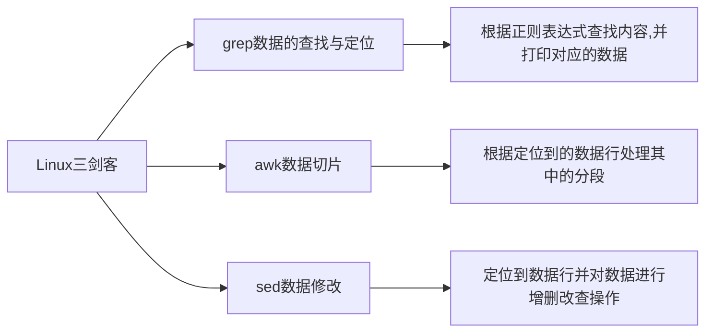

Linux 三剑客经常配合正则使用，因此，这里我们先学习下正则相关的内容。grep、sed、awk 常用来过滤数据，修改、编辑数据，有时候需要对大文件进行操作，逐行去看、查找的话，很麻烦。正则表达式就是帮助我们快速从大日志文件中检索出想要的信息的好工具。（三剑客+正则=高效、快速的查找出想要的内容。）

在 Linux 基础命令部分，我们使用了一些通配符如 `.*`，通配符是大部分普通命令都支持的，用于查找文件或目录，而正则表达式只有 grep、sed、awk 支持。

<b>Linux 三剑客</b>

- grep：文本过滤工具，（模式：pattern）工具
- sed：stream editor，流编辑器；文本编辑工具
- awk：Linux 的文本报告生成器（格式化文本），Linux 上是 gawk

<b>其他说明</b>

- 正则符号都是英文符号
- 推荐使用 grep/egrep 命令，默认设置了别名，有颜色
- [分析正则与正则匹配到的内容](http://nbre.oldboylinux.cn/playground)

环境准备

```shell
vim rg

"A cat sat on the mat."
"The dog barked loudly."
"She sells sea shells by the sea shore."
"He eats eight apples every day."
"They found forty-four fish in the river."
"I have two tickets to the concert tonight."
"She will arrive at the airport at noon."
```

去除 `""`，就是将 `"` 替换成空字符串~

```shell
sed 's/"//g' rg > rg.txt
sed 's#"##g' rg > rg.txt
rm rg; mv rg.txt rg
```

## 正则符号

| 正则表达式 regular expression (reg exp) | 符号                            |
| --------------------------------------- | ------------------------------- |
| 基础正则                                | `^` `$` `.` `*` `.*` `[]` `[^]` |
| 扩展正则                                | `|` `+` `()` `{}` `?`           |
| 其他类型正则                            | perl 语言正则                   |

## 基础正则

三剑客命令默认支持的正则。

| 基础正则 | 说明                                                         |
| -------- | ------------------------------------------------------------ |
| `^`      | 以...开头的行；`^The` 以 The 开头的；                        |
| `$`      | 以...结尾的行；`mm$` 以 mm 结尾的；                          |
| `^$`     | 空行；开头和结尾挨着了，那就是空行了；                       |
| `.`      | 任意一个字符；`.he` 可以匹配到 `The, She` 等；               |
| `\`      | 转义字符，让字符失去它的特殊含义 `\.` 让 `.` 失去它的特殊含义； |
| `*`      | 前一个出现 0 次或 0 次以上。单独用它，过滤不了任何内容；     |
| `.*`     | 所有；任意字符出现 0 次或 0 次以上 = 所有                    |
| `.*$`    | 以任意多个字符结尾                                           |
| `[]`     | `[abc]` a 或 b 或 c，[] 相当于是 1 个字符                    |
| `[^]`    | `[^abc]` 匹配除了a,b,c 之外的内容，[] 相当于是 1 个字符      |

<b>`^` 以...开头的行</b> 

找到以 The 开头的行

```shell
grep '^The' rg
The dog barked loudly.
They found forty-four fish in the river.
```

<b>`$` 以...结尾的行</b>

找到以 `t.` 结尾的行，`.` 是通配符，因此需要转义。

```shell
grep 't\.$' rg
A cat sat on the mat.
I have two tickets to the concert tonight.
She will arrive at the airport at noon.A cat sat on the mat.
```

<b>`^$` 空行，这行中没有任何字符</b>

过滤出空行，并显示行号。我们先给它添加一些空行。

```shell
grep -n '^$' rg
8:
9:
10:
```

如何排除空行呢？

```shell
grep -v '^$' rg
grep -nv '^$' rg	# 排除空行，并显示原始的行号
```

<b>`.` 任意一个字符</b>

找到包含 `任意字符he` 的所有行，并打印。

```shell
grep '.he' rg
A cat sat on the mat.
The dog barked loudly.
She sells sea shells by the sea shore.
They found forty-four fish in the river.
I have two tickets to the concert tonight.
She will arrive at the airport at noon.A cat sat on the mat.
```

`.` 过滤的适合会排除空行，`.` 不会匹配空行。这意味着，我们 `grep '.' rg` 时，是不会匹配到空行的。

<b>`\` 转义字符，去除特殊字符的含义</b>

找出文件中以 `.` 结尾的行。

```shell
grep -n '\.' rg

A cat sat on the mat.
The dog barked loudly.
She sells sea shells by the sea shore.
He eats eight apples every day.
They found forty-four fish in the river.
I have two tickets to the concert tonight.
She will arrive at the airport at noon.A cat sat on the mat.
```

在扩展正则中，`\` 则是让字符具有特殊含义。

<b>`*` 前一个字符串连续出现 0 次或 0 次以上</b>

连续出现 0 次意味着，没出现的也算。过滤不了内容~

```shell
grep 'T*' rg
A cat sat on the mat.
The dog barked loudly.
She sells sea shells by the sea shore.
He eats eight apples every day.
They found forty-four fish in the river.
I have two tickets to the concert tonight.
She will arrive at the airport at noon.A cat sat on the mat.


I am a student!
```

<b>`.*` 所有</b>

- `.` 任意一个字符
- `*` 前一个字符串出现 0 次或 0 次以上
- `.*` 表示所有

以任意开头，但是包含 she 字符的行

```shell
grep '^.*she' rg
She sells sea shells by the sea shore.
```

我们可以观察到，它是匹配到了这些行所有符合要求的内容。这是正则表达式的贪婪性。

<b>`[]` `[abc]` 表示匹配任意 1 个字符，a 或 b 或 c，中括号相当于一个字符</b>

匹配 abc 中的任意一个字符。

```shell
grep '[abc]' rg
A cat sat on the mat.
The dog barked loudly.
She sells sea shells by the sea shore.
He eats eight apples every day.
I have two tickets to the concert tonight.
She will arrive at the airport at noon.A cat sat on the mat.
I am a student!
```

匹配 aa ab bb ba

```shell
grep '[ab][ab]' rg
The dog barked loudly.
```

匹配 x~z 的字符

```shell
grep '[xyz]' rg
grep '[x-z]' rg # 和上面一样。
```

<b>数字和字母的匹配规则</b>

| 规则              | 说明                                                         |
| ----------------- | ------------------------------------------------------------ |
| [0-9]             | 匹配数字                                                     |
| [a-z]             | 匹配小写字母                                                 |
| [A-Z]             | 匹配大写字母                                                 |
| [a-zA-Z]<br>[a-Z] | 匹配大小写字母（中间不要有其他字符！不然也会匹配其他字符！）<br>[a-Z] 有时候用不了，但是 sed awk grep 里可以用 |
| [a-Z0-9]          | 匹配大小写字母+数字                                          |

<span style="color:red">`[]` 中的内容会自动去除符号的特殊意义~</span>

匹配以 `.` 或 `!` 结尾的内容

```shell
grep '[.!]$' rg
```

<b>`[^]` `[^abc]` 表示匹配任意一个字符，排除 a,b,c，中括号相当于一个字符</b>

排除以 A 或 T 或 S 或 H 开头的

```shell
grep '^[^ATSH]' rg
# [^ATSH] 排除 A T S H 
# ^[^ATSH] 排除 A T S H 开头的内容
I have two tickets to the concert tonight.
I am a student!
```

## 扩展正则

扩展正则在 grep 中需要使用 `grep -E` 才会生效。sed 则是使用 `sed -r` 支持，awk 默认支持扩展正则。

- `grep -E == egrep`
- `sed -r`
- awk 默认支持扩展正则

grep 的扩展正则还有一种写法 `grep -E '0+'` = `grep '0\+'`，但是不推荐！！！内容多了，看起来混乱！！！

| 扩展正则   | 说明                                                         |
| ---------- | ------------------------------------------------------------ |
| `+`:star:  | 前一个字符连续出现 1 次或 1 次以上                           |
| `|`:star:  | 或者                                                         |
| `()`:star: | 表示整体；后向引用或反向引用 (sed)                           |
| `{}`       | `a{n,m}` 前一个字符连续至少出现 n 次，最多 m 次              |
| `{}`       | `a{n,}` 前一个字符最少 n 次；`a{,m}` 前一个字符最多 m 次；`a{n}` 前一个字符正好 n 次 |
| `?`        | 前一个字符出现 0 次或 1 次                                   |

<b>`+` 前一个字符连续出现 1 次或 1 次以上</b>

`+` 大部分时候是配合 `[]` 一起使用。

| 命令                  | 说明                   |
| --------------------- | ---------------------- |
| `grep -E '0+'`        | 取出连续出现的 0       |
| `grep -E '[0-9]+'`    | 取出连续出现的数字     |
| `grep -E '[a-zA-Z]+'` | 取出连续出现的字母     |
| `grep -E '[0-9a-Z]+'` | 取出连续出现的数字字母 |

思考：`grep -E '[a-Z]+'` 和 `grep -E '[a-Z]'` 有什么区别？

```shell
...+ 是匹配单词
...  是匹配字母
grep -Eo '[a-Z]'

grep -Eo '[a-Z]+'
```

<b>`|` 或者</b>

找出包含 `She` 或者 `The` 的行。

```shell
grep -E 'She|The' rg
The dog barked loudly.
She sells sea shells by the sea shore.
They found forty-four fish in the river.
She will arrive at the airport at noon.A cat sat on the mat.
```

找出非注释行和非空行的内容

```shell
grep -Evn '^$|#' /etc/ssh/sshd_config	# -v 表示排除
```

<b>`()` 表示一个整体，用于后向引用（sed 中是反向引用）</b>

找到 the 或 The 的内容。`(t|T)he` ==> 表示找 the 或 The【用的不多】

```shell
grep -E '(t|T)he' rg
```

场景：我们线上的系统出 bug 了，我们要从日志中找出错误信息。出现的错误可能是 数据异常错误，操作异常错误，.... 这时候我们就可以用 () 来进行过滤

```shell
grep -E '(数据|操作)异常错误' sys.log
```

<b>`{}` `a{n,m}` 前一个字符连续出现至少 n 次，最多 m 次</b> 

| 格式     | 说明                                                       |
| -------- | ---------------------------------------------------------- |
| `a{n,m}` | 前一个字符连续出现至少 n 次，最多 m 次；表示连续出现的范围 |
| `a{n}`   | 前一个字符连续出现 n 次；匹配固定的次数                    |
| `a{n,}`  | 前一个字符最少连续出现 n 次；                              |
| `a{,m}`  | 前一个字符最多连续出现 m 次；                              |

连续出现 2~5 次的 a

```shell
# 准备数据
echo "hello nihaoya aaaa o sfk aaa dsf aa \n sdfjaklfja sfjsfjl1jlasdf aaaa" >> rg

grep -E 'a{2,5}' rg
```

连续出现 2~3 次的 aa，这时候 aa 是一个整体，因此要用 `()`

```shell
grep -E '(aa){2,3}' rg
```

匹配手机号的正则。手机号的基本规律，11 位数字，1 开头。第二位一般是 3、5、7、8、9。

```shell
echo '13257845214' >> phone.data
echo '14257845210' >> phone.data
echo '16257845212' >> phone.data
echo '182578452' >> phone.data
grep -E '^1[35789][0-9]{9}' phone.data
```

<b style="color:red">复杂的正则，直接百度！</b>

<b>`?` 前一个字符出现 0 次或 1 次</b>

匹配 g 和 d 中间出现 0 次或 1 次 o 的内容

```shell
echo 'gd god good goood gooood' >> phone.data
grep -E 'go?d' phone.data
gd god good goood gooood
```

## Perl 正则

| 符号 | 含义                                      |
| ---- | ----------------------------------------- |
| `\d` | `[0-9]`                                   |
| `\s` | 匹配的空字符 空格 tab 等等 `[\ \t\r\n\f]` |
| `\w` | `[0-9a-zA-Z_]`                            |
| `\D` | `[^0-9]` 排除数字                         |
| `\S` | 非空字符                                  |
| `\W` | 排除数字，大小写字母和 `_`                |

```shell
grep --help

-P, --perl-regexp         PATTERNS are Perl regular expressions
```

## 正则总结

基础正则符号汇总及说明

| 基础正则   | 说明                                                    |
| ---------- | ------------------------------------------------------- |
| `^`:star:  | 以...开头的行                                           |
| `$`:star:  | 以...结尾的行                                           |
| `^$`:star: | 空行                                                    |
| `.`        | 任意一个字符                                            |
| `\`        | 转义字符                                                |
| `*`        | 前一个出现 0 次或 0 次以上                              |
| `.*`:star: | 所有                                                    |
| `[]`:star: | `[abc]` a 或 b 或 c，[] 相当于是 1 个字符               |
| `[^]`      | `[^abc]` 匹配除了a b c 之外的内容，[] 相当于是 1 个字符 |

扩展正则符号汇总及说明

| 扩展正则   | 说明                                            |
| ---------- | ----------------------------------------------- |
| `+`:star:  | 前一个字符连续出现 1 次或 1 次以上              |
| `|`:star:  | 或者                                            |
| `()`:star: | 表示整体；后向引用或反向引用 (sed)              |
| `{}`       | `a{n,m}` 前一个字符连续至少出现 n 次，最多 m 次 |
| `?`        | 前一个字符出现 0 次或 1 次                      |

Perl 正则符号汇总及说明

| 符号 | 含义                                      |
| ---- | ----------------------------------------- |
| `\d` | `[0-9]`                                   |
| `\s` | 匹配的空字符 空格 tab 等等 `[\ \t\r\n\f]` |
| `\w` | `[0-9a-zA-Z_]`                            |
| `\D` | `[^0-9]` 排除数字                         |
| `\S` | 非空字符                                  |
| `\W` | 排除数字，大小写字母和 `_`                |

# Linux三剑客⭐

<b style="color:red">要准备几个日志文件。</b>

此处涉及到的命令均为文件内容处理相关的，包括 diff、sort、grep、sed、awk。diff、sort 可不讲，grep、sed、awk 必讲。

Linux 三剑客：`sed \ awk \ grep`，是查看、在日志中检索信息的神器。


| 三剑客 | 特点                              | 擅长                                                        |
| ------ | --------------------------------- | ----------------------------------------------------------- |
| grep   | 过滤                              | grep 的过滤速度是最快的                                     |
| sed    | 过滤/替换/修改/删除文件内容，取行 | 替换，修改文件内容<br>取出指定范围的内容（取出1~3号的日志） |
| awk    | 取列，统计计算                    | 取列<br>对比，比较<br>统计，计算（awk 数组）                |

## grep⭐

<span style="color:red">【这部分的内容要拓展，要多加一些实用的例子，还要再收集收集】</span>

### grep-介绍

`grep` 是一个强大的文本搜索工具，可以帮助我们在一组文件中查找特定的内容。默认方式下，它直接打印满足匹配条件的文件名。【grep 一般用来做匹配，查找出想要的内容】

<b>基本语法</b>

```shell
grep [option] [pattern] file
	 参数    过滤条件  文件
# grep 命令默认使用的是基本的正则表达式
```

- <b>参数</b>：用于调整 `grep` 命令的行为，比如是否忽略大小写、是否只输出匹配的行号等。
- <b>模式</b>：是要搜索的文本字符串或正则表达式。
- <b>文件</b>：是一个或多个要在其中进行搜索的文件的路径。

例如，我们可以使用 grep 查找出文件中包含指定内容的行。

```shell
grep 'echo' git.sh	# 从 git.sh 中查找包含 echo 的行

echo "hello,this is $dirs readme.md" >> readme.md
echo "first append" >> readme.md
echo "second append" >> readme.md
```

我们也可以在 grep 中使用正则表达式，如，查找包含 e 或 d 的行。

```shell
grep -E 'e|d' git.sh	# -E 表示启用拓展的正则表达式
```

| 参数        | 说明                                                         |
| ----------- | ------------------------------------------------------------ |
| `-n`⭐️       | `--line-number` 显示行号                                     |
| `-i`⭐️       | `ignorecase` 忽略字符的大小写                                |
| `-o`⭐️       | 仅显示匹配到的字符串本身（会逐个输出匹配到的内容）           |
| `-E`⭐️       | 支持使用扩展的正则表达                                       |
| `-v`⭐️       | `--inver-match` 取反（显示未被匹配到的行）<br>ps + grep 的时候，容易把自己也过滤出来，容易导致判断进程状态失败<br>`ps -ef | grep crond | grep -v grep | wc -l` |
| `-c`⭐️       | 统计匹配的行数 `ps -ef | grep -c sshd`                       |
| `-w`        | 精确匹配，不多也不少，精确匹配<br>`echo ha hah haha | grep -w 'ha'` |
|             | 也可以使用 `\b` 或 `\<` `\>` 表示这是边界，从而实现精确匹配<br>`echo ha hah haha |grep '\bha\b'`<br>`\b` 表示边界 `\<` 表示左边界 `\>` 表示右边界，`\bha` 左边界是 `ha` |
| `-r` / `-R` | 递归搜索                                                     |
| `-q`        | `--quiet, --silent` 精默模式，不输出任何信息                 |

### grep-案例

输出匹配行及其在文件中的行号

```shell
grep -n example *.txt
```

忽略大小写检索 the，同时输出行号

```shell
echo -e "The is one\n the is two \n 1231231 the\nsfsafasThe" | grep -in "the"
1:The is one
2: the is two
3: 1231231 the
4:sfsafasThe
```

显示匹配过程

```shell
echo -e "The is one\ntwo \n 123The1231\nsfsafas" | grep -ino "the"
1:The
3:The
```

统计匹配到的总行数（统计日志中，某一天的 bug 出现的次数）

```shell
echo -e "The is one\ntwo \n 123The1231\nsfsafas" | grep -ic "the"
2
```

递归搜索 one 目录下的所有文件（日志分文件夹存储）

```shell
grep -r "dir" one
one/two/one.txt:this is two dir
one/two/one.txt: you konw? two dir?
one/one.txt:this is one dir
one/one.txt: you konw? one dir?
```

检索出端口号为 22 的进程

```shell
lsof -i :22

netstat -antp | grep -w '22'
netstat -antp | grep '\b22\b'
```

统计 sshd 进程的个数

```shell
# 可以根据 sshd 进程的个数判断sshd是否正常运行
# 1. 先找出 sshd 进程
# 2. 统计进程个数

ps -ef | grep -w 'sshd' | wc -l
ps -ef | grep '[s]shd' | wc -l	# grep [s]shd 和 sshd 不匹配

# ps + grep 的时候，容易把自己也过滤出来，容易导致判断进程状态失败，这时候可以过滤掉自身
ps -ef | grep sshd | grep -v grep | wc -l
```

## sed⭐

### sed-介绍

sed 是 Stream Editor（字符流编辑器）的缩写，简称流编辑器。主要用于文本处理，是操作、过滤和转换文本内容的强大工具，在处理复杂的文件操作时经常用到。

sed 的常用功能包括结合正则表达式对文件实现快速增删改查，其中查询的功能
中最常用的两大功能是过滤（过滤指定字符串）、取行（取出指定行）。

- 取行，过滤内容。比如检索日志中的错误信息，排查 bug。
- 替换或修改文件内容。比如修改配置文件。
- 后向引用（语法）

简单说就是可以用 sed 完成对文件的增删改查。

eg：查看大日志文件的时候【如 4G 的日志文件】，是不会直接把日志文件下载到本地，然后用本地的文本编辑器打开的，这样做非常繁琐，而且慢！一般是用 sed、awk 这些来过滤出想看的信息。

<b>基本用法</b>

```shell
sed [option] [sed command] filename

sed -n '3p' rg	# 输出第三行的内容
She sells sea shells by the sea shore.
```

| 命令 | 选项 | sed 命令功能  | 参数（文件） |
| ---- | ---- | ------------- | ------------ |
| sed  | -r   | 's#old#new#g' | test.cpp     |

<b>sed 命令的核心功能就是：增删改查，常用的选项有</b>

| 选项           | 功能                                                        |
| -------------- | ----------------------------------------------------------- |
| `-n`:star:     | 仅打印经过脚本处理后/符合规则的输出结果                     |
| `-i`:star:     | 直接将修改结果写入文件，不用 `-i`，sed 修改的是内存中的数据 |
| `-i.bak`:star: | 先备份（文件名.bak），在编辑备份文件                        |
| `-r`:star:     | 支持扩展正则                                                |
| `-e <script>`  | 多次编辑，不需要管道符了；用处不大                          |
| `-f <script>`  | 从指定的脚本文件读取脚本进行文本处理                        |

<b>sed 的命令功能</b>

| 功能  | 说明                                                         |
| ----- | ------------------------------------------------------------ |
| `s`   | 替换 substitute<br>`sed 's/int/long/g' file` 将所有的 int 换成 long（会自动打印） |
| `p`   | 显示 print<br>`sed -n '2p' file` 打印第 2 行的内容           |
| `d`   | 删除 delete<br>`sed '1d' file` 删除第 1 行                   |
| `cai` | 增加 c, a, i<br>`sed '2c new' file` 将第 2 行的内容换成 new <br>`sed '1a aaa' file` 在第 1 行后面插入 `aaa`<br>`sed '1i before' file` 在第 1 行前面插入 `before` |

### sed-执行过程

作为流编辑器，sed 每次只从文件读入一行，对该行进行指定的处理、输出，接着读入下一行，整个文件像流水一样被逐行处理，然后逐行输出。处理时，当前处理的行存储在临时缓冲区中，该缓冲区称为“模式空间”；处理完成后，缓冲区的内容送往“保留空间”，接着处理下一行，直到整个文件处理完毕。

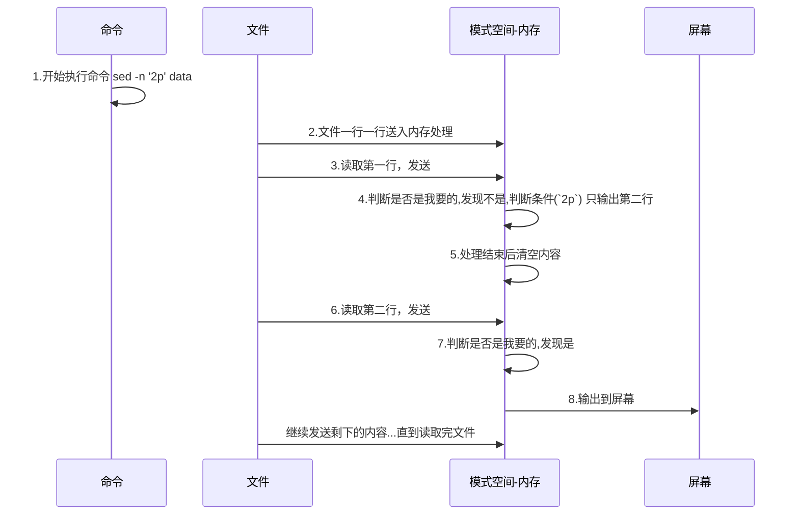

<b>sed 内置命令字符</b>

```shell
sed [option] [command] filename
```

sed 有一些内置的命令字符，使用这些命令字符可以对文件完成增删改查的操作。

| 命令（command）    | 功能描述                                                     |
| ------------------ | ------------------------------------------------------------ |
| `p`                | 打印经过选择的行。通常与 `-n` 参数一起使用，只打印匹配的行   |
|                    | `sed -n '2p' file` 打印第 2 行的内容                         |
| `/pattern/`        | 查找符合 pattern 的内容                                      |
|                    | `sed -n '/pattern/p' file` 查找符合 pattern 的内容并打印     |
| `s/pattern/内容/g` | 使用正则表达式进行文本替换，`s/lod/new/g`，g 表示全局匹配 s=substitute |
|                    | `sed 's/int/long/g' file` 将所有的 int 换成 long（会自动打印） |
| `a`                | 在当前行的下一行添加指定的文本字符串                         |
|                    | `sed '1a insert!!' file` 在第 1 行后面插入 `insert!!!`       |
| `i`                | 在当前行的上一行添加指定的文本字符串；                       |
|                    | `sed '1i insert!!' file` 在第 1 行前面插入 `insert!!!`，即 insert!!! 变成第一行的内容了。 |
| `d`                | 删除指定行                                                   |
|                    | `sed '1d' file` 删除第 1 行                                  |
| `c`                | 用指定的文本字符串替换指定范围内的行                         |
|                    | `sed 'c new' file` 将 file 中所有的内容替换成 new<br>`sed '2c two' file` 将第 2 行的内容换成 two<br>其他的不常用 |

<b>sed 匹配范围的写法</b>

| 范围        | 说明                                                         |
| ----------- | ------------------------------------------------------------ |
| 空地址      | 全文处理                                                     |
| 单地址      | 指定文件某一行                                               |
| `/pattern/` | 被模式匹配到的每一行                                         |
| 范围区间    | 10,20 十到二十行；4,+5 第 4 行向下 5 行，`/pattern1/,/pattern2/` |
| 步长        | `1~2` 表示从 1 开始，步长为 2：`1 3 5 ...`                   |

```shell
sed -n '2p' file	# 打印第2行的内容 n 表示只输出符合规则的数据
sed -n '/hello/' file
```

### sed-查找​p:star:

sed 的查找类似于 grep 命令的过滤，但是比 grep 强，sed 可以查找指定的行号；并且，sed 也支持正则。

| 查找格式               | 说明                                                         |
| ---------------------- | ------------------------------------------------------------ |
| `'1p'` `'2p'`          | 按指定行号查找                                               |
| `1,5p`                 | 按指定范围进行查找                                           |
| `$p`                   | 最后一行                                                     |
| `/hello/p`:star:       | 类似于 grep，过滤，`//` 里可以写正则                         |
| `/start/,/end/p`:star: | 查找 start~end 范围的数据（start 和 end 不在同一行！sed 会一直找到文件的末尾！） |
| `2,/str/`              | 从 2 行开始，直到匹配到 str 的行结束<br>`sed -n '2,/str/p' file` |

准备数据 test.cpp

```cpp
#include <iostream>

int main(){
	int a,b,c;
	cin>>a>>b>>c;
	int ans = a+b+c;
    cout<<b<<endl;
    cout<<c<<endl;
	return ans;
}
```

<b>取出指定行的内容</b>

- 取出文件的第 3 行
- 取出文件的第 5~7 行
- 取出文件的第 5 和第 7 行
- 取出文件的第 7 行到最后一行 `$`

```shell
sed -n 'p3' test.cpp
sed -n '5,7p' test.cpp
sed -n '5p;7p' test.cpp	# 用分号隔开多条命令
sed -n '7,$p' test.cpp
```

<b>过滤出指定的内容</b>

- 找出包含 int 的行
- 找出 int 开头的行
- 找出 `a_b_c` `_` 表示任意字符
- 找出 `data.log` 中 `2024-7-28` 的日志

```shell
# sed -n '/寻找的内容/p' filename
sed -n '/int/p' test.cpp
sed -n '/^int/p' test.cpp
sed -n '/a.b.c/p' test.cpp	
sed -n '/2024-7-28/p' data.log # 写一个生成日志的 jar，上课用。
# 如果涉及到扩展正则，需要加上参数 -r
```

<b>范围过滤</b>

sed 常用来分析日志，如，公司的系统在 2024-7-28 12 点~2024-7-28 17 点出现了故障，我们可以用 sed 来获取指定范围内的日志

```shell
sed -n '/from/, /to/p' sed.txt	# 从 from 来, 到 to 去。
sed -n '/2024-7-28 12:00:00/ , /2024-7-28 17:00:00/p' data.log
```

表示访问过滤的时候，如果结尾的内容没有匹配的，他就会一直找，直到遍历完文件。

学习了上面范围过滤的基本用法，现在，我们来深入了解下范围过滤的原理。

- from，sed 会从第一个包含 from 的行开始打印，直到遇到包含 to 的行，结束这个范围的打印。然后继续寻找下一个 `from~to`。（from 和 to 不是在同一行！）

```shell
1.cout helosaf endl;
2.hello world xxx;endl;
3.endl
4.four;
5.five endl;
```

看命令说结果，解释下为什么是这样？

```shell
echo "cout<<a<<endl;" > data
echo -e "cout<<b<<endl;" >> data
echo -e "ans" >> data


sed -n '/cout/ , /endl/p' test.cpp
cout<<a<<endl;
cout<<b<<endl;
```

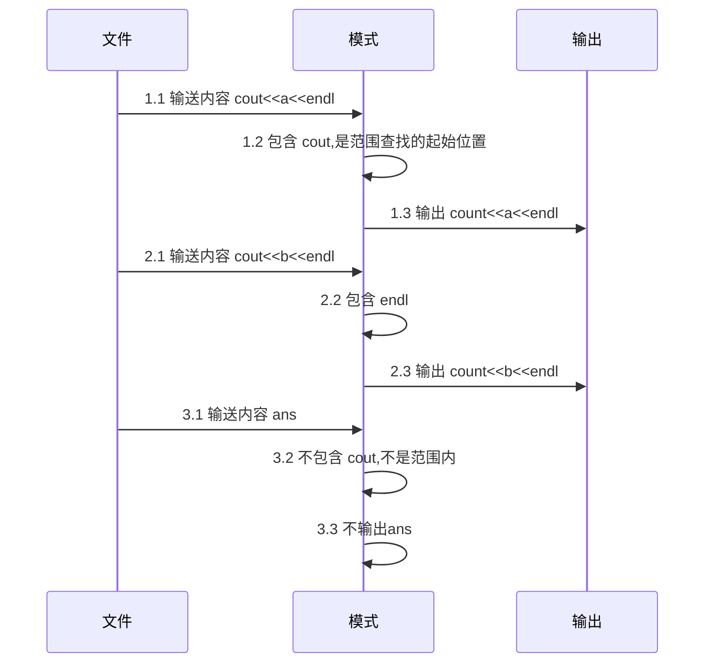

写命令的时候一定要小心，尽可能的精确，尤其是分析日志的命令。日志文件一般非常大，小的也有 1G。

### sed-删除d

找出包含指定内容的行，删除。默认不会修改原文件，如果想修改原文件需要加上参数选项 `-i`。

| 查找格式          | 说明                                                         |
| ----------------- | ------------------------------------------------------------ |
| `'1d`             | 按指定行号查找，删除                                         |
| `1,5p`            | 按指定范围进行查找                                           |
| `/hello/d`⭐️       | 类似于 grep，过滤，`//` 里可以写正则                         |
| `/start/,/end/d`⭐️ | 查找 start~end 范围的数据（start 和 end 不在同一行！sed 会一直找到文件的末尾！） |
| `2,/str/`         | 从 2 行开始，直到匹配到 str 的行结束 `sed -n '2,/str/d' file` |

删除文件中所有包含 cout 的行

```shell
sed '/cout/d' test.cpp

#include<iostream>

int main(){
    int a,b,c;
    cin>>a>>b>>c;
    int ans = a+b+c;
    return ans;
}
```

删除文件中的空行和包含#的行

```shell
echo -e '\n' >> test.cpp
sed -r '/^$|#/d' /etc/ssh/sshd_config	# ^$ 空行；# 井号
sed -nr '/^$|#/!p' /etc/ssh/sshd_config # 不显示空行和包含 # 的行
```

### sed-增加cai

sed 的增加语法不常用。了解即可。

| 指令    | 说明                   |
| ------- | ---------------------- |
| a:star: | 3a 在第 3 行后面加内容 |
| i       | 3i 在第 3 行加内容     |
| c       | 替换指定行的内容       |

在头文件后面插入 `using namespace std;`，打印（不会修改原文件）

```shell
sed '1a using namespace std;' test.cpp

#include<iostream>
using namespace std;

int main(){
    int a,b,c;
    cin>>a>>b>>c;
    int ans = a+b+c;
    cout<<b<<endl;
    cout<<c<<endl;
    return ans;
}
```

如果想要修改原文件，可以加上 `-i`

```shell
sed -i '1a using namespace std;' test.cpp
```

向文件中追加多行内容，如向 sshd_config 这些配置文件里加东西

```shell
cat >> ssh_config << 'EOF'
> 输入内容
> 输入内容
> EOF ==> 表示结束输入

sed -i '$a 输入内容' ssh_config
```

### sed-替换:star:

| 命令 | 功能描述                                                   |
| ---- | ---------------------------------------------------------- |
| `s`  | 使用正则表达式进行文本替换，`s/lod/new/g`，g 表示全局匹配  |
|      | `sed 's/int/long/g' test.cpp` 将 int 替换为 long           |
| `s`  | `s#old#new#g`<br>`s@old@new@g`<br>没特殊含义的字符都有可以 |

g 表示 global，表示全局替换，不加的话，默认只替换<b>每行</b>第一个匹配的。

将 int 替换为 long

```shell
sed 's/int/long/g' test.cpp	# g 表示全局替换
sed 's#int#long#g' test.cpp

#include<iostream>

long main(){
    long a,b,c;
    cin>>a>>b>>c;
    long ans = a+b+c;
    cout<<a<<endl;
    cout<<b<<endl;
    cout<<c<<endl;
    return ans;
}
```

如果是想要将 int 替换为空，可以这样写

```shell
sed 's/int//g' test.cpp
sed 's#int##g' test.cpp
```

<span style="color:red">注意，上面的操作并不会修改原文件，如果想要修改可以加上 `-i`</span>

```shell
# 将 test.cpp 备份成 test.cpp.bak 然后修改备份的文件
sed -i.bak 's/int/long/g' test.cpp
```

也可以直接修改原文件

```shell
sed -i 's/int/long/g' test.cpp
```

将文件中第二行删除，在第一行后面加上 `using namespace std;` 并将 int 替换为 long

```shell
sed -e '2d' -e 's/int/long/g' test.cpp

#include<iostream>
using namespace std;
long main(){
    long a,b,c;
    cin>>a>>b>>c;
    long ans = a+b+c;
    cout<<a<<endl;
    cout<<b<<endl;
    cout<<c<<endl;
    return ans;
}
```

### sed-后向引用

后向引用（先保护起来，再使用），如我们想把这行的内容用 `<>` 包裹起来，就需要用到后向引用。

```sh
echo 123456 | sed -r 's#(.*)#<\1>#g'
# (.*) 匹配所有 () 表示分组,匹配到的所有内容归为一组
# \1 表示取出后向引用中的内容
```

这个 sed 命令就用到了后向引用，其中 `\1` 表示取前面第一组的内容。输出的结果是

```shell
<123456>
```

后向引用一般用于给文档的某些内容加点东西（例如，加个前缀，用 `<>` 包裹内容）。如果内容没有规则，那就用后向引用，有规则的话就可以用 awk。

<b>分组</b>

前面讲到了分组，那是依靠什么进行分组的呢？是依靠 `()` 进行分组的。然后使用 `\数字` 获取前面分组的内容。`\1` 就是获取第一组的内容。 

我们再来看一个例子，了解下是如何分组的。这个例子是去除两个单词中间的 `_`

```shell
echo hello_world | sed -r 's#(^.*)_(.*$)#\1\2#g'
# (^.*) 第 1 组
# _
# (^.*) 第 2 组
```

查看 `(.*{2,3})([0-9]+)` 的分组情况：[查看分组情况](http://nbre.oldboylinux.cn/playground/)

<b>案例：取出本机的 IP</b>

```shell
# 1.先取出IP所在的行
# 2.匹配到 IP,用后向引用定位到 IP

# ^.'*t ' 匹配到 'inet '
# (.*) 匹配到 IP
ifconfig | sed -n '2p' | sed -r 's#^.*t (.*) n.*#\1#g'
```

### sed-其他

```shell
seq 10 | sed -n '1~2p'	# 从第1行开始，每隔2行选择一行
```

## awk编程⭐

awk ==> gawk=gun awk。awk 不能看成一条命令，要作为一门语言来学习，一门脚本语言，我们可以把 awk 看作 C 语言的简易版本。awk 是三剑客中的老大~

### awk-介绍

awk 是一个强大的文本分析工具（三剑客之首），更是是一门编程语言【脚本语言】，支持条件判断、数组、循环等功能。

<b>基本用法</b>

```shell
awk [option] 'BEGIN{action1} pattern{action2} END{action3}' filename
```

- pattern：表示 AWK 在数据中查找的内容，就是匹配模式

- action：在找到匹配内容时所执行的一系列命令。awk 擅长文本格式化，且输出格式化后的结果，因此最常用的动作就是 print 和 printf。
- BEGIN：读取文件之前执行的命令
- END：处理完所有文件中所有内容后执行的命令

注意，是用 `''` 不要用双引号！

| 选项参数 | 功能                 |
| -------- | -------------------- |
| -F       | 指定输入文件折分隔符 |
| -v       | 赋值一个用户定义变量 |

```shell
# 取出 /etc/passwd 中的第一行的第1列、第3列、最后一列
awk -F: 'NR==1{print $1,$3,$NF}' /etc/passwd
# NR=1 第一行
# $1 $3 $NF 1 3 最后 列
```

### awk-执行过程

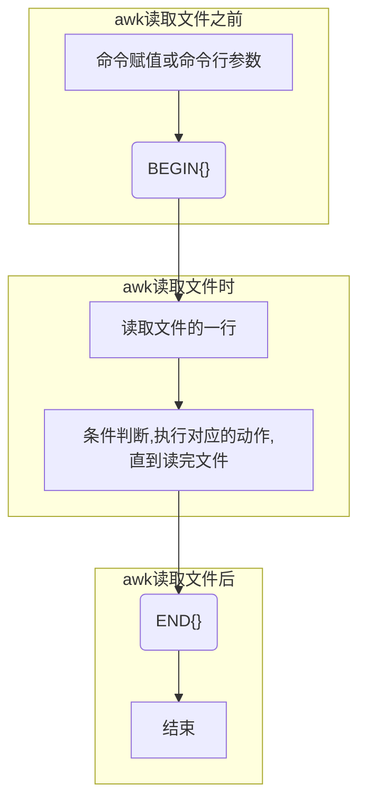

awk 也是把文件逐行的读入，然后以空格为默认分隔符将每行切片，切开的部分再进行分析处理。一条较为完整的 awk 命令如下：

```shell
echo "01,kkx1,231" > data
echo "02,kkx2,232" >> data
echo "03,kkx3,233" >> data
echo "04,kkx4,234" >> data

awk -F, 'BEGIN{print "name"} {print $2} END{print "end of file"}' data
name
kkx1
kkx2
kkx3
kkx4
end of file
```

### awk-内置变量

| 变量           | 说明                                     |
| -------------- | ---------------------------------------- |
| NR             | 已读的记录数                             |
| NR==1          | 取出第 1 行                              |
| NR>=1 && NR<=5 | 取出 1~5 行                              |
| 符号           | `+` `-` `*` `/` `&&` `||` `>=` `!=` `==` |
| FILENAME       | 文件名                                   |
|                |                                          |

### awk-行和列

| 名词 | awk中的叫法    | 说明               |
| ---- | -------------- | ------------------ |
| 行   | 记录 record    | 默认通过回车分割行 |
| 列   | 字段，域 field | 默认通过空格分割列 |

awk 中的行标记和列标记都可以修改。

#### awk-取行

<b>awk 常用的取行命令</b>

| 命令           | 说明                                                         |
| -------------- | ------------------------------------------------------------ |
| awk + NR；     | 取出指定的行，指定范围的行                                   |
|                | `awk 'NR>=2 && NR<=5' passwd`<br>取出 2~5 行的内容           |
| awk + //；     | 过滤                                                         |
|                | `awk '/root|nobody/' passwd` <br>取出包含 root 或 nobody 的内容 |
| awk + 其他变量 | 精确取列                                                     |

<b>准备数据</b>

```shell
cp /etc/passwd /home/
```

1️⃣取出 passwd 中的第一行

```shell
awk 'NR==1{print $0}' passwd
# 可以简写为
awk 'NR==1' passwd
```

- NR Number of Record 记录号，行号
- `{print $0}` 输出整行内容 `$0` 表示当前行的内容

2️⃣取出第 2 行到第 5 行的内容

```shell
awk 'NR>=2 && NR<=5' passwd
```

3️⃣取出第 1 行和第 3 行的内容

```shell
awk 'NR==1 || NR==3' passwd
```

4️⃣过滤出文件中包含 root 或 nobody 的行

```shell
awk '/root|nobody/' passwd
root:x:0:0:root:/root:/bin/bash
nobody:x:65534:65534:nobody:/nonexistent:/usr/sbin/nologin
```

<b>awk 的内置变量</b>

awk 内置了一些变量，帮助我们完成更复杂的检索。

| 变量 | 说明 |
| ---- | ---- |
|      |      |
|      |      |
|      |      |

1️⃣统计 passwd 文件名，每行的行号、列数

```shell
awk -F: '{print "filename:" FILENAME ", linenumber:" NR ",columns:" NF}' passwd
```

2️⃣切割 IP

```shell
ifconfig eth0 | grep "inet" | head -1 | awk -F"inet" '{print $2}' | awk -F " " '{print $1}'
```

3️⃣查询 test.cpp 中空行所在的行号

```shell
awk '/^$/{print NR}' test.cpp
```

#### awk-取列

awk 中 `$数字` 表示取列，`$1` 第 1 列；`$0` 表示这行的所有列，即这行的内容。`$NF` 表示最后一列 NF=Number of Field 每行有多少列

默认情况下，`awk` 使用空白字符（包括空格和制表符）作为字段分隔符。

```shell
netstat -a | head -5
Active Internet connections (servers and established)
Proto Recv-Q Send-Q Local Address           Foreign Address         State
tcp        0      0 0.0.0.0:8999            0.0.0.0:*               LISTEN
tcp        0      0 0.0.0.0:8022            0.0.0.0:*               LISTEN
tcp        0      0 0.0.0.0:2022            0.0.0.0:*               LISTEN
```

查找上述数据中的第 4 列（找 IP 地址）

```shell
netstat -a | head -5 | awk '{print $4}'
(servers
Local
0.0.0.0:8999
0.0.0.0:8022
0.0.0.0:2022

netstat -a | head -5 | awk 'NR>=3 {print $4}'
0.0.0.0:8999
0.0.0.0:8022
0.0.0.0:2022
```

如果是取倒数第 1 列，倒数第 2 列呢？

```shell
netstat -a | head -5 | awk 'NR>=3 {print $(NF-1), $NF}'
0.0.0.0:* LISTEN
0.0.0.0:* LISTEN
0.0.0.0:* LISTEN
```

取出 passwd 中的第 1 列，第 3 列和最后一列

```shell
# 默认情况下，`awk` 使用空白字符（包括空格和制表符）作为字段分隔符。
# 有时候默认分隔符不管用了，需要我们手动指定分隔符（-F）

awk -F: '{print $1,$3,$NF }' passwd

# column -t 输出列对齐
awk -F: '{print $1,$3,$NF }' passwd | column -t
```

取出 ip 地址

```shell
ifconfig eth0 | awk 'NR==2' | awk -F ' ' '{print $2}'
192.168.0.102
```

#### awk-取行与列

```shell
netstat -a | head -5 | awk 'NR>=3 {print $(NF-1), $NF}'
```

取出 passwd 的权限部分 `stat /etc/hosts 的 0644 部分`

```shell
stat /etc/passwd | awk -F '[/(]' 'NR==4{print $2}'
0644
```

### awk-匹配

搜索 passwd 中以 root 关键字开头的所有行，并输出该行的第 4 列。

```shell
# 首先要找到以 root 开头的行
# 然后要对这行的内容进行切分，将其切分成多列
awk -F : '/^root/{print $4}' passwd

0
```

2️⃣搜索 passwd 文件以 root 关键字开头的所有行，并输出该行的第 2 列和第 4 列，中间以 `,` 号分割。

```shell
awk -F: '/^root/{print $2 "," $4}' passwd	# 我这里是为了美观，所以用空格
```

3️⃣只显示 `passwd` 的第 1 列和第 7 列，以逗号分割，且在所有行前面添加列名 user，shell 在最后一行添加 `dlg, /bin/nb`

```shell
awk -F: \
'begin{print "user, shell"}{print $1 "," $7} \
end{print "dlg,/bin/nb"}' passwd
```

- begin{...} 在所有数据读取行之前运行
- end{...} 在所有数据执行后执行

4️⃣将 passwd 文件中的用户 id 增加数值 1 并输出

```shell
awk -v i=1 -F: '{print $3+i}' passwd
```

- `-v i=1` 声明一个变量 i，值为 1

### awk-if/test

### awk-函数

# Linux进程管理⭐

## 进程管理

进程管理命令是进行系统监控和进程管理时的重要工具，常用的进程管理命令有以下几种：

- <b>ps</b>：查看正在运行的进程
- <b>top</b>：动态显示正在运行的进程
- <b>pstree</b>：树状查看正在运行的进程
- <b>pgrep</b>：用于查找进程
- <b>nice</b>：更改进程的优先级
- <b>jobs</b>：显示进程的相关信息
- <b>bg 和 fg</b>：将进程调入后台
- <b>kill</b>：杀死进程
- <b>nvidia-smi</b>：快速查看 GPU 状态、使用情况、温度、内存使用情况、电源使用情况以及运行在 GPU 上的进程等信息

### ps⭐

我们开发人员在 Linux 上做的最多的操作一般是：安装软件、搭建环境、查看系统错误日志、监控系统状态。windows 中我们可以通过任务管理器来监控系统状态，而在 Linux 中则提供了更为强大的 ps 命令来监测系统状态！

ps 可以列出当前系统中的进程状态。使用不同的选项可以显示不同的进程信息。

<b>基本语法</b>

```shell
ps
PID             TTY TIME CMD
3081 pts/0        00:00:00 bash
3209 pts/0        00:00:00 ps
```

在默认情况下，ps 命令并没有提供太多的信息，默认只显示运行在当前终端中属于当前用户的那些进程、运行在哪个终端以及占用的 CPU 时间。（shell 只是运行在系统中的另一个程序而已）

最常用的命令就是 `ps -ef`  和 `ps aux`

```shell
# 通过 man ps，我们可以看到 ps 的一些用法，其中常用的就下面两个命令
ps -ef # 显示系统进程信息
ps aux # 显示系统所有进程的详细信息
```

ps 有很多选项，但是我只需要记住常用的，对我们有用的。这里，大家记住两个 `ps aux` `ps -ef` 即可。

| 选项 | 功能                                           |
| ---- | ---------------------------------------------- |
| a    | 选择所有进程                                   |
| u    | 显示所有用户的所有进程<br>显示 root 用户的进程 |
| x    | 显示没有终端的进程                             |

ps 一般会结合管道一起用

```shell
ps aux | grep nginx	# 筛选 nginx 进程，因为 grep nginx 过滤的是包含 nginx 的命令，因此表头（PID，CPU...）不会显示
root      649279  0.0  0.0  51212  1496 ?        Ss   20:51   0:00 nginx: master process /usr/sbin/nginx -g daemon on; master_process on;
www-data  649280  0.0  0.2  51792  5204 ?        S    20:51   0:00 nginx: worker process
www-data  649281  0.0  0.2  51792  5204 ?        S    20:51   0:00 nginx: worker process
www-data  649282  0.0  0.2  51792  5204 ?        S    20:51   0:00 nginx: worker process
www-data  649283  0.0  0.2  51792  5204 ?        S    20:51   0:00 nginx: worker process
www-data  649284  0.0  0.2  51792  5204 ?        S    20:51   0:00 nginx: worker process
www-data  649285  0.0  0.2  51792  5204 ?        S    20:51   0:00 nginx: worker process
root      649296  0.0  0.0   9032   720 pts/0    S+   20:51   0:00 grep --color=auto nginx
```

```shell
ps -ef | grep nginx
root      649279       1  0 20:51 ?        00:00:00 nginx: master process /usr/sbin/nginx -g daemon on; master_process on;
www-data  649280  649279  0 20:51 ?        00:00:00 nginx: worker process
www-data  649281  649279  0 20:51 ?        00:00:00 nginx: worker process
www-data  649282  649279  0 20:51 ?        00:00:00 nginx: worker process
www-data  649283  649279  0 20:51 ?        00:00:00 nginx: worker process
www-data  649284  649279  0 20:51 ?        00:00:00 nginx: worker process
www-data  649285  649279  0 20:51 ?        00:00:00 nginx: worker process
root      649298  645902  0 20:53 pts/0    00:00:00 grep --color=auto nginx
```

如果想要看到表头信息，可以这样，即筛选包含 nginx 的，也筛选包含 PID 的行。

- -E 表示启用拓展正则
- "|" 表示模式匹配，二者满足其一即匹配

```shell
ps -ef | grep -E "nginx|PID"
UID          PID    PPID  C STIME TTY          TIME CMD
root      649279       1  0 20:51 ?        00:00:00 nginx: master process /usr/sbin/nginx -g daemon on; master_process on;
www-data  649280  649279  0 20:51 ?        00:00:00 nginx: worker process
www-data  649281  649279  0 20:51 ?        00:00:00 nginx: worker process
www-data  649282  649279  0 20:51 ?        00:00:00 nginx: worker process
www-data  649283  649279  0 20:51 ?        00:00:00 nginx: worker process
www-data  649284  649279  0 20:51 ?        00:00:00 nginx: worker process
www-data  649285  649279  0 20:51 ?        00:00:00 nginx: worker process
root      649302  645902  0 20:53 pts/0    00:00:00 grep --color=auto -E nginx|PID
```

也可以用 awk（后面讲）

- NR 表示行，NR==1 表示当前为第一行时
- `/nginx/` 是一个正则表达式，表示匹配包含 "nginx" 的文本行。
- `||` 表示或

```shell
ps aux | awk 'NR==1 || /nginx/'
USER         PID %CPU %MEM    VSZ   RSS TTY      STAT START   TIME COMMAND
root      649279  0.0  0.0  51212  1496 ?        Ss   20:51   0:00 nginx: master process /usr/sbin/nginx -g daemon on; master_process on;
www-data  649280  0.0  0.2  51792  5204 ?        S    20:51   0:00 nginx: worker process
www-data  649281  0.0  0.2  51792  5204 ?        S    20:51   0:00 nginx: worker process
www-data  649282  0.0  0.2  51792  5204 ?        S    20:51   0:00 nginx: worker process
www-data  649283  0.0  0.2  51792  5204 ?        S    20:51   0:00 nginx: worker process
www-data  649284  0.0  0.2  51792  5204 ?        S    20:51   0:00 nginx: worker process
www-data  649285  0.0  0.2  51792  5204 ?        S    20:51   0:00 nginx: worker process
root      649322  0.0  0.1  13928  3136 pts/0    S+   20:57   0:00 awk NR==1 || /nginx/
```

<b>扩展</b>

pstree 显示进程状态树，以树形结构显示进程和进程之间的关系。

### pstree🥶

以树状图的形式显示当前运行的进程及其父子关系。

```shell
pstree  [option]	# 显示进程树
```

| 选项 | 功能               |
| ---- | ------------------ |
| -p   | 显示进程的PID      |
| -u   | 显示进程的所属用户 |

```shell
pstree -p	# 显示进程 id
pstree -u	# 显示进程所属用户
```

### top⭐

ps 命令虽然在收集系统中运行进程的信息时非常有用，但也存在不足之处：只能显示某个特定时间点的信息。如果想观察那些被频繁换入和换出内存的进程，ps 命令就不太方便了。

top 命令则可以实时监测进程。top 命令可以查看所有进程的信息（Linux 的任务管理器）它会实时更新进程列表，显示 CPU 和内存使用率最高的进程。

```shell
top [option]	# 启动top命令，动态显示进程信息
```

在默认情况下，top 命令在启动时会按照 %CPU 值来对进程进行排序，我们可以在 top 命令运行时使用多种交互式命令来重新排序。

| 选项    | 功能                                                         |
| ------- | ------------------------------------------------------------ |
| -d 秒数 | 指定 top 命令每隔几秒更新。默认是 3 秒在 top 命令的交互模式当中可以执行的命令： |
| -i      | 不显示任何闲置或者僵死进程。                                 |
| -p      | 通过指定监控进程 ID 来仅仅监控某个进程的状态。               |

<b>在 top 命令执行的时候，我们可以通过下面的操作改变 top 命令的行为</b>

| 操作 | 功能                            |
| ---- | ------------------------------- |
| P    | 以 CPU 使用率排序，默认就是此项 |
| M    | 以内存的使用率排序              |
| N    | 以 PID 排序                     |
| q    | 退出 top                        |

<b>查询结果字段一共有四行，每行的解释如下</b>

- 第一行信息为任务队列信息

| 内容                             | 说明                                                         |
| -------------------------------- | ------------------------------------------------------------ |
| 12:26:46                         | 系统当前时间                                                 |
| up 1 day, 13:32                  | 系统的运行时间，本机已经运行1天13小时32分钟                  |
| 2 users                          | 当前登录了两个用户                                           |
| load  average:  0.00, 0.00, 0.00 | 系统在之前1分钟，5分钟，15分钟的平均负载。一般认为小于1时，负载较小。如果大于1，系统已经超出负荷。 |

- 第二行为进程信息

| Tasks:  95 total | 系统中的进程总数                          |
| ---------------- | ----------------------------------------- |
| 1 running        | 正在运行的进程数                          |
| 94 sleeping      | 睡眠的进程                                |
| 0 stopped        | 正在停止的进程                            |
| 0 zombie         | 僵尸进程。如果不是0，需要手工检查僵尸进程 |

- 第三行为 CPU 信息

| Cpu(s):  0.1%us | 用户模式占用的CPU百分比                                      |
| --------------- | ------------------------------------------------------------ |
| 0.1%sy          | 系统模式占用的CPU百分比                                      |
| 0.0%ni          | 改变过优先级的用户进程占用的CPU百分比                        |
| 99.7%id         | 空闲CPU的CPU百分比                                           |
| 0.1%wa          | 等待输入/输出的进程的占用CPU百分比                           |
| 0.0%hi          | 硬中断请求服务占用的CPU百分比                                |
| 0.1%si          | 软中断请求服务占用的CPU百分比                                |
| 0.0%st          | st（Steal  time）虚拟时间百分比。就是当有虚拟机时，虚拟CPU等待实际CPU的时间百分比。 |

- 第四行为物理内存信息

| Mem:   625344k total | 物理内存的总量，单位KB                                      |
| -------------------- | ----------------------------------------------------------- |
| 571504k used         | 已经使用的物理内存数量                                      |
| 53840k free          | 空闲的物理内存数量，总共 628MB 内存，只有 53MB 的空闲内存了 |
| 65800k buffers       | 作为缓冲的内存数量                                          |

- 第五行为交换分区信息

| Swap:  524280k total | 交换分区（虚拟内存）的总大小 |
| -------------------- | ---------------------------- |
| 0k used              | 已经使用的交互分区的大小     |
| 524280k free         | 空闲交换分区的大小           |
| 409280k cached       | 作为缓存的交互分区的大小     |

### htop⭐

显示的内容比 top 更全面，更美观，功能更加强大。操作也是基本一样的。

```shell
htop
```

### kill⭐

发送信号到指定的进程，通常用于杀死进程。

<b>基本语法</b>

```shell
kill [option] PID	# 通过进程号杀死进程
```

杀死进程号为 23456 的进程

```shell
kill -9 23456
```

`kill` 命令默认发送 `SIGTERM` 信号，如果进程没有响应，可以使用 `-9` / 使用 `SIGKILL` 信号强制杀死进程。

`SIGTERM`（Signal Termination）信号是 Unix 和类 Unix 操作系统中用于请求进程终止的标准信号。

<b>假设，现在系统变得很卡，请找出并杀死让系统卡顿的程序</b>

```shell
top	# 找出卡顿的程序
kill -9 PID # 杀死
```

<b> SIGTERM 信号</b>

当系统或用户想要优雅地关闭一个进程时，通常会发送这个信号。与 `SIGKILL` 信号不同，`SIGTERM` 信号可以被进程捕获并处理，从而允许进程在退出前进行清理工作（这也意味着，SIGTERM 信号不一定能够杀死进程）。

### pkill

pkill 命令可以使用程序名代替 PID 来终止进程，并且也支持通配符。

```shell
pkill ssh*
```

### killall

通过进程名杀死程序

```shell
killall 进程名		  # 通过进程名称杀死进程，支持通配符，这在系统因负载过大而变得很慢时很有用
```

杀死 firefox 进程

```shell
killall firefox
```

### free

查看内存使用情况

```shell
free -h
free -g
```

### iostat

iostat 是 I/O statistics（输入/输出统计）的缩写，主要是监控系统的磁盘 I/O 情况。它的输出主要是显示磁盘读写操作的统计信息，同时也会给出 CPU 的使用情况。

一般只会用它来观察磁盘 I/O 情况。比如，你在使用一台装有 Ubuntu 的笔记本，发现用起来很卡，你可以排查下是 CPU 占用太高导致的卡顿还是 I/O 导致的卡顿。

### iotop🥶

查看磁盘读写情况。

```shell
apt install iotop
```

```shell
iotop [option]
```

| 选项 | 说明                                            |
| ---- | ----------------------------------------------- |
| -o   | 显示正在使用 I/O 的进程或者线程，默认是显示所有 |
| -d   | 设置显示的间隔秒数                              |
| -p⭐  | 只显示指定 PID 的信息                           |
| -u   | 显示指定用户的信息                              |
| -P   | 只显示进程，一般是显示所有的线程                |
| -a   | 显示从 iotop 启动后每个线程完成了的 IO 总数     |
| -k   | 设置显示单位为 kb                               |
| -t   | 在每一行前添加一个当前的时间                    |

### pgrep🥶

查找匹配条件的进程。可以根据进程名、用户等条件查找进程。

```shell
pgrep -u username  # 查找特定用户的所有进程
```

### nice🥶

更改进程的优先级。`nice` 值越低，进程优先级越高。

```shell
nice -n 10 long-running-command  # 以较低优先级运行一个长时间运行的命令
```

### &

command & 可以让命令在后台运行。

<b>使用 & 在后台运行任务时，如果发生下面两种情况，后台的任务会被强制中断</b>

- 通过远程连接服务器部署项目，突然断网。
- 在终端运行程序后强行关闭终端。

<b>如何确保使用 & 运行的进程不会被中断？</b>

- 通过远程连接服务器部署项目，使用 logout/exit 退出远程登录。
- 在终端运行程序后，不要强制关闭，而是使用 exit/logout 这些命令退出终端。

原理：简单来说，如果我们使用的是 exit 或者 logout 命令正常登出，系统只会向前台任务发送 SIGHUP 信号，& 到后台的任务时不会收到 SIGHUP 信号的。因为突然断网或强行关闭终端，后台运行的进程会被中断。

### nohup

nohup 是一个非常有用的命令，主要用于在用户异常退出登录或强制关闭终端之后继续运行命令。它是 "no hang up" 的缩写，意味着<b style="color:red">不会因为用户注销或网络中断而挂起进程。</b>

<b>基本语法</b>

```shell
nohup command &						# & 表示后台运行
nohup command > project.log &		# 将命令的输出结果重定向到 project.log 中
nohup command > project.log 2>&1 &	# 所有的输出（包括标准输出和标准错误）都会被写入到 output.log 文件中
```

我们编写一个 Java 死循环程序，用 nohup 让它在后台运行。即便用户异常退出了终端或强制关闭了终端，程序也会继续执行。

```java
public class Test{
    public static void main(String[] args){
        for(;;){
            System.out.println(1);
        }
    }
}
```

编译、执行

```shell
javac Test.java
nohup java Test &		# & 表示后台运行
```

----

使用 jobs 查看<u>当前终端会话</u>中的作业列表，包括后台运行的进程。

```shell
jobs -l			# -l 选项会显示作业的详细信息，包括进程ID。
```

如果用户退出可控制台，再次进入，可以使用 ps + 管道 + grep 查找进程。

```shell
ps aux | grep "java Test"		# 查找执行 java Test 命令的进程
```

然后 kill 杀死进程

```shell
kill -9 616511
```

<b style="color:red">在终端执行 nohup java hello，使用 ps top 这些命令查看执行改程序的 command 时，不会显示 nohup java hello，只会显示 java hello</b>

### jobs

显示当前终端会话中的作业列表，包括后台运行的进程。

```shell
jobs  # 列出当前会话的后台作业
```

### bg/fg

`bg` 将挂起的进程放到后台运行，`fg` 将后台进程调回前台运行。

```shell
bg  # 将最近一个挂起的作业放到后台运行
fg  # 将后台作业调到前台运行
```

### nvidia-smi

nvidia-smi 是控制显卡的命令

显示 GPU 状态的摘要信息

```
nvidia-smi
```

显示详细的 GPU 状态信息，这个命令会每1秒更新一次状态信息。

```
nvidia-smi -l 1
```

显示 GPU 的帮助信息

```
nvidia-smi -h
```

列出所有 GPU 并显示它们的 PID 和进程名称

```
nvidia-smi pmon
```

强制结束指定的 GPU 进程

```
nvidia-smi --id=0 --ex_pid=12345
```

这会强制结束 GPU ID 为 0 上的 PID 为 12345 的进程。

设置 GPU 性能模式：

```
nvidia-smi -pm 1
nvidia-smi -i 0 -pm 1
```

第一个命令会为所有 GPU 设置为性能模式，第二个命令只针对 ID 为 0 的 GPU。

- 重启 GPU，这会重启 ID 为 0 的 GPU。

  ```
  nvidia-smi --id=0 -r
  ```

- 显示帮助信息

  ```
  nvidia-smi -h
  ```

### netstat⭐

netstat命令用于显示本机网络的连接状态、运行端口和路由表等信息。我们一般用 netstat 查看进程的网络信息，如占用了哪些端口。

<b>基本语法</b>

```shell
netstat -anp | grep 进程号		# 查看该进程的网络信息
netstat -nlp | grep	端口号		# 查看网络端口号的占用情况
```

| 选项 | 功能                                     |
| ---- | ---------------------------------------- |
| -n   | 拒绝显示别名，能显示数字的全部转化成数字 |
| -l   | 仅列出有在 listen（监听）的服务状态      |
| -p   | 表示显示哪个进程在调用                   |

- netstat -nt：查看所有网络连接（不包括监听状态的连接）
- netstat -ant：查看所有网络连接（包括监听状态的连接）
- netstat -tulpn
  - `-t` (TCP)：显示 TCP 协议的连接。
  - `-u` (UDP)：显示 UDP 协议的连接。
  - `-l` (listening)：仅显示监听状态的端口。
  - `-p`：显示进程标识符和程序名称，需要 root 权限。
  - `-n`：显示 IP 地址和端口号，而不是域名和服务名。

<b>假设，我们现在想要运行一个 web 项目，部署的时候指定该 web 项目运行在 8080 端口，现在该端口被占用了，请找出占用该端口的进程，杀死</b>

```shell
netstat -antp | grep -w '8080'
kill -9 109577
```

ss 命令是类似并将取代 netstat 的工具，它能用来查看网络状态信息，包括 TCP、UDP 连接、端口等。它的优点是能够显示更多更详细的有关网络连接状态的信息，而且比 netstat 更快速更高效。ss 的用法和 netstat 类似。

### lsof⭐

lsof 是 List Open File 的缩写, 它主要用来获取被进程打开文件的信息。

进程描述符的概念：每个进程执行的时候，都有一个对应的进程描述符文件，用来记录进程的状态，控制进程的状态。

<b>lsof 常用命令</b>

| 命令                        | 说明                                            |
| --------------------------- | ----------------------------------------------- |
| `lsof -u tt`                | 列出用户 tt 已经打开的文件                      |
| `lsof -u tt | grep deleted` | 找出打开但已经被删除的文件（占用内存）          |
| `lsof -i 4`                 | 列出所有已经打开的 ipv4 网络文件                |
| `lsof -i:port`              | 列出在指定端口上打开的文件                      |
| `lsof -i TCP/UDP`           | 列出使用了 TCP 或 UDP 协议的文件                |
| `lsof -i TCP:3306`          | 列出使用了 TCP 协议并且端口为 3306 的文件       |
| `lsof -i TCP:1-1024`        | 列出使用了 TCP 协议并且端口范围为 1-1024 的文件 |

常用的就一个，记住这个即可

```shell
lsof -i :80	
```

### w

列出当前登陆的用户

```shell
w
```

### ifconfig

查看当前主机的 IP 地址

```shell
ifconfig

ifconfig eth0	# 查看网卡 0 的IP
```

### ping⭐

检查是否连网

```shell
ping www.baidu.com
```

## 环境变量

环境变量（工作环境变量）是用来存储 shell 会话和工作环境的相关信息。例如，我们安装 JDK 的时候，需要配置 JDK 的环境变量。这样，我们在控制台执行 java 命令的时候，shell 就可以找到 Java 命令的位置，调用命令。Linux 中的很多程序和脚本都是通过环境变量来获取自身需要的信息，这些信息包括：系统信息、存储临时数据和配置信息。此外，我们还可以通过修改环境变量来方便地修改系统配置，如配置系统的默认编辑器（export EDITOR=vim）。

- 环境变量 = 工作环境变量
- 程序运行前或运行时需要用到环境变量

本节，我们主要学习环境变量存储在哪里、如何使用，以及如何创建自己的环境变量。

### 环境变量分类

Linux 中的环境变量分为全局环境变量和局部环境变量。这个程序语言的全局变量和局部变量的概念类似。

<b>Linux 的全局环境变量：</b>父 shell 中创建的变量，所有子 shell 都可以用。并且，Linux 系统在我们启动 bash 会话时就设置好了一些全局环境变量；

<b>Linux 的局部环境变量：</b>只能在定义它的进程中可见（一个命令其实就是一个进程，shell 也是一个进程，可以认为局部变量只在定义变量的 bash 中可见）。

### 查看环境变量

Liunx 可以通过下面三个命令来查看环境变量。

| 命令         | 说明                                             |
| ------------ | ------------------------------------------------ |
| env/printenv | 显示当前用户的变量（全局变量）                   |
| set          | 显示当前 shell 的变量，包括当前用户的变量（env） |
| export       | 显示当前导出成用户变量的 shell 变量              |

输出某个环境变量的值 `echo $SHELL`

### 设置环境变量

我们可以设置全局环境变量，也可设置局部环境变量。（使用 export 设置的变量就成为了环境变量，而没有使用 export 设置的则是自定义变量）

局部变量的设置非常简单，在 shell 里输入 `varname=varvalue` 即可。注意，等号左右两边不要有空格。全局变量则是使用 export 来声明的，在 shell 里输入 `export varname=varvalue` 即可（注意， export 所设置变量的作用域，在案例中体会）。

<b>什么时候需要设置局部变量呢？</b>

```shell
# 这段代码是一个分布式训练的深度学习代码，默认会使用所有的 GPU 进行训练。
https://gitee.com/zhangerguo/offical-swin-transformer/blob/main/main.py
```

然而，我们发现其他人在用显卡 0、1 训练模型。这意味着，当前我们只能用 0 和 1 以外的模型。这时候，就可以为程序设置一个局部变量（因为只是这次不用用显卡 0 和 显卡 1），告诉程序只能用 0 和 1 以外的 GPU。

```shell
CUDA_VISIBLE_DEVICES=2,3,4,5,6,7
```

<b>什么时候需要设置全局变量呢？</b>

我们希望这个变量在任何地方都可用的时候就需要设置全局变量。例如，我们安装 JDK 的时候需要配置 `JAVA_HOME`，其实这就是设置 JDK 的环境变量。我们肯定是希望机器的任何地方都可以用 Java，这时候就需要把 JDK 的环境变量设置成全部变量了。

<b>我们来安装一个 JDK，配置下 JDK 的环境变量。</b>

- 创建一个安装 JDK 的路径。我们存放到 /usr/local/jdk 目录下。
- 进入该目录，[下载 jdk](https://www.oracle.com/cn/java/technologies/downloads/#java17)
  - 注意，需要下载对应架构的 JDK。我们可以使用 lscpu 查看 CPU 的架构。
  - `wget url` 下载 jdk
- 解压缩 jdk
  - `tar -xvf jdk...`
  - 进入 bin 运行 java 是可以的，非 bin 目录无法运行 java，需要配置环境变量。
- 配置全局环境变量
  - `export JAVA_HOME=/usr/local/jdk/jdk-17.0.12`
  - `export PATH=$JAVA_HOME/bin:$PATH`
  - 我们会发现到处都可以执行 java 命令了。但是，如果到了当前 shell 的父级 shell，就不可用了（export 的作用范围）

### 常见环境变量

- HOME：用户的家目录。
- ⭐PATH：可执行文件（命令）的存储路径。路径与路径之间用:分隔。当某个可执行文件同时出现在多个路径中时，会选择从左到右数第一个路径中的执行。下列所有存储路径的环境变量，均采用从左到右的优先顺序。
- LD_LIBRARY_PATH：用于指定动态链接库 (.so 文件) 的路径，其内容是以冒号分隔的路径列表。
- C_INCLUDE_PATH：C 语言的头文件路径，内容是以冒号分隔的路径列表。
- CPLUS_INCLUDE_PATH：CPP 的头文件路径，内容是以冒号分隔的路径列表。
- PYTHONPATH：Python 导入包的路径，内容是以冒号分隔的路径列表。
- JAVA_HOME：JDK 的安装目录。
- CLASSPATH：存放 Java 导入类的路径，内容是以冒号分隔的路径列表。

### 登录shell

当我们登录 Linux 系统时（需要输入用户名和密码的 shell，如我们使用 ssh 连接登录 Linux），bash shell 会作为登录 shell 启动。登录 shell 通常会从 5 个不同的启动文件中读取命令。

- /etc/profile
- $HOME/.bash_profile
- $HOME/.bashrc
- $HOME/.bash_login
- $HOME/.profile

/etc/profile 文件是系统中默认的 bash shell 的主启动文件。系统中的每个用户登录时都会执行这个启动文件。

其余的启动文件都用于同一个目的：提供用户专属的启动文件来定义该用户所用到的环境变量。大多数 Linux 发行版只用这 4 个启动文件中的一两个。Ubuntu 中用到的是 `.bashrc`。

### 全局环境变量持久化

[深入理解Linux环境配置文件：.bashrc、.bash_profile和.profile_.bashrc .profile-CSDN博客](https://blog.csdn.net/weixin_39973810/article/details/137281970)

刚刚我们配置的 JDK 环境变量其实有有问题，一旦退出了设置变量的 shell，环境变量就不可用了。要想这个全局环境变量一直可用，就需要对它进行持久化。

全局变量持久化的方式有两种，第一种是将环境变量添加到 `/etc/profile` 文件，第二种是添加到用户的 `.bashrc` 文件。

- `profile` 中设置的环境变量对所有用户有效，只会在登入的时候执行一次。一般<b>不建议</b>在 `/etc/profile` 文件中添加环境变量，因为在这个文件下的配置会对所有用户生效。
- `.bashrc` 文件是和用户挂钩的，仅对当前用户生效。不同用户之间互相独立。`.bashrc` 对应的用户中设置的环境变量，每次启动 bash，都会先执行对应用户的 ~/.bashrc。『.bashrc 文件只会对指定的 shell 类型起作用，bashrc 只会被 bash shell 调用。』

一般只推荐修改 `.bashrc` 文件，不建议修改 `profile` 文件，因为我们用的版本和其他用户希望用的版本可能不一致。

> <b>安装 JDK，设置全局环境变量持久化</b>

- 创建一个安装 JDK 的路径。我们存放到 /usr/local/jdk 目录下。

- 进入该目录，[下载 jdk](https://www.oracle.com/cn/java/technologies/downloads/#java17)

  - 注意，需要下载对应架构的 JDK。我们可以使用 lscpu 查看 CPU 的架构。
  - `wget url` 下载 jdk

- 解压缩 jdk

  - `tar -xvf jdk...`
  - 进入 bin 运行 java 是可以的，非 bin 目录无法运行 java，需要配置环境变量。

- 配置全局环境变量

  - 打开 .bashrc 文件
  - 追加环境变量

  ```shell
  cat >> .bashrc <<EOF
  >export JAVA_HOME=/usr/local/jdk/jdk-17.0.12
  >export PATH=\$JAVA_HOME/bin:\$PATH
  >EOF
  
  # Linux 中的环境变量是用 “:” 分隔的。
  # 如果不小心覆盖了 ~/.bahsrc 文件，可以利用系统的 .bashrc 备份文件恢复
  cp /etc/skel/.bashrc ~/
  ```

- 刷新配置文件 .bashrc，让配置生效。

<b>注意：</b>修改完 `~/.bashrc` 文件后，记得执行 `source ~/.bashrc`，来将修改应用到当前的 bash 环境下。

> <b>为什么修改后要 `source ~/.bashrc`?</b>

- 修改后 source 相当于在当前 bash 重新执行了一次 `~/.bashrc` 里的内容，重新执行后，修改才会生效。

> <b>修改 `~/.bashrc` 的原因</b> 

- 将修改命令放到 `~/.bashrc` 可以确保修改会影响未来所有的环境。
- 每次启动 bash，都会先执行~/.bashrc。每次 ssh 登陆远程服务器，都会启动一个 bash 命令行给我们。
- 每次 tmux 新开一个 pane，都会启动一个 bash 命令行给我们。
- 所以未来所有新开的环境都会加载我们修改的内容。

><b>选择使用那个文件</b>

通用的配置放在 `.profile` 中，不通用的配置放在 `.bashrc` 中。

# Linux磁盘管理

Linux 磁盘管理是系统管理员的一项重要任务。系统管理员需要监测系统磁盘的使用情况。对于我们而已，我们了解基本的命令即可。在实际的使用，或个人的使用过程中，我们可能遇到的需要处理的情况基本就一种：磁盘满了，找出罪魁祸首，清理掉。

## df

有时需要知道在某台设备上还有多少磁盘空间。df命令可以方便地查看所有已挂载磁盘的使用情况。

df = disk free 空余硬盘，查看硬盘使用情况，常用来查看哪个磁盘存储空间不足。

```shell
df -h	# 以人类可读的方式列出磁盘使用量
```

注意，Linux 系统后台一直有进程在处理文件。df 命令的出值反映的是 Linux 系统认为的当前值。正在运行的进程有可能创建或删除了某个文件，但尚未释放该文件。这个值是不会被计算进闲置空间的。

## du

通过 df 命令，我们很容易发现哪个磁盘存储空间不足。而 du 命令可以显示某个特定目录（默认情况下是当前目录）的磁盘使用情况。这有助于我们快速判断系统中是否存在磁盘占用“大户”。

查看当前目录占用的硬盘空间

```shell
du -h
```

| 选项 | 说明                                                         |
| ---- | ------------------------------------------------------------ |
| -c   | 显示所有已列出文件的总大小                                   |
| -a   | 显示所有文件大小                                             |
| -h   | 按人类易读格式输出大小，分别用K表示千字节、M表示兆字节、G表示吉字节 |
| -s   | 输出每个参数的汇总信息                                       |

## fdisk

查看分区

```shell
fdisk -l	# 查看磁盘分区详情 -l 显示所有硬盘的分区列表
```

| 分区   | 说明          |
| ------ | ------------- |
| Device | 分区序列      |
| Boot   | 引导          |
| Start  | 从 X 磁柱开始 |
| End    | 到 Y 磁柱结束 |
| Blocks | 容量          |
| Id     | 分区类型 ID   |
| System | 分区类型      |

可以用 fdisk 查看所有的磁盘，然后找到那些磁盘未挂载。

```shell
fdusk -l # 2 的
Disk /dev/sdb	1.76TiB
Disk /dev/sdc	1.76TiB
Disk /dev/sdd	1.76TiB
```

## mkfs

mkfs 是用来格式化磁盘的。

```shell
sudo mkfs.ext4 /dev/sdb	# 将 /dev/sdb 格式化成 ext4 格式
```

## mount

<b>基本语法</b>

```shell
mount [-t vfstype] [-o options] device dir	# 挂载设备
umount 设备文件名或挂载点					  # 卸载设备
```

-t 和 -o 会自动被内核识别，是可以省略的

```shell
mount device dir			# 挂载设备
umount 设备文件名或挂载点	  # 卸载设备
```

| 参数       | 功能                                                         |
| ---------- | ------------------------------------------------------------ |
| -t vfstype | 指定文件系统的类型，通常不必指定。mount 会自动选择正确的类型。常用类型有：光盘或光盘镜像：iso9660DOS fat16文件系统：msdos[Windows](http://blog.csdn.net/hancunai0017/article/details/6995284) 9x fat32文件系统：vfatWindows NT ntfs文件系统：ntfsMount Windows文件[网络](http://blog.csdn.net/hancunai0017/article/details/6995284)共享：smbfs[UNIX](http://blog.csdn.net/hancunai0017/article/details/6995284)(LINUX) 文件网络共享：nfs |
| -o options | 主要用来描述设备或档案的挂接方式。常用的参数有：loop：用来把一个文件当成硬盘分区挂接上系统ro：采用只读方式挂接设备rw：采用读写方式挂接设备　  iocharset：指定访问文件系统所用字符集 |
| device     | 要挂接(mount)的设备                                          |
| dir        | 设备在系统上的挂接点(mount point)                            |

<b>最常见的用法，将硬盘挂载到指定位置 /mnt/data</b>

将设备 /dev/nvme1n1p3 挂载到 /mnt/data

```shell
mkdir /mnt/data
sudo mount /dev/nvme1n1p3 /mnt/data
```

设置开机自动挂载 `/dev/nvme1n1p3`

```shell
vim /etc/fstab 
# 加入配置
UUDI=磁盘UUID	挂载的路径	磁盘系统类型	default	0	0
```

我们如何得知磁盘的 UUID 和磁盘类型呢？

```shell
# 可以用 blkid 查看磁盘的详细信息
sudo blkid /dev/nvme1n1p3

/dev/nvme1n1p3: BLOCK_SIZE="512" UUID="12F44ECBF44EB0B1" TYPE="ntfs" PARTLABEL="Basic data partition" PARTUUID="27b007ba-09f3-423b-bb82-973042a27922"

# 也可以用下面的命令
# 获取磁盘的 UUID
cd /dev/disk/by-uuid
ls -alh
# 我们挂载的是 nvme1n1p3 它的 UUID 是 12F44ECBF44EB0B1
lrwxrwxrwx 1 root root  15 10月  4 22:58 12F44ECBF44EB0B1 -> ../../nvme1n1p3
lrwxrwxrwx 1 root root  15 10月  4 22:06 2C88AA4C88AA13FC -> ../../nvme1n1p4
lrwxrwxrwx 1 root root  15 10月  4 22:06 41dcc69f-ae10-4d21-9753-d47952735219 -> ../../nvme0n1p2
lrwxrwxrwx 1 root root  15 10月  4 22:06 8C8E-2573 -> ../../nvme1n1p1
lrwxrwxrwx 1 root root  15 10月  4 22:06 D171-36AD -> ../../nvme0n1p1


# 查看磁盘的类型
df -TH
```

因此，配置文件应该是

```shell
vim /etc/fstab
# 加入配置
UUDI=12F44ECBF44EB0B1	/mnt/data	fuseblk	default	0	0
# UUID=设备名称也可以 eg UUID=/dev/sdb
```

<b>other</b>

将设备 /dev/cdrom 挂载到挂载点

```shell
mkdir /mnt/cdrom/

mount -t iso9660 /dev/cdrom /mnt/cdrom/
```

卸载

```shell
umount /mnt/cdrom
```

# Linux用户管理

缺乏安全性的系统是不完整的系统。系统中必须有一套能够保护文件免遭非授权用户浏览或修改的机制。Linux 安全系统的核心是用户账户。每个能访问 Linux 系统的用户都会被分配一个唯一的用户账户。用户对系统中各种对象的访问权限取决于他们登录系统时所用的账户。我们可以为每个用户授予不同的权限，来确保系统免遭非授权用户浏览或修改。

Linux 系统使用特定的文件和工具来跟踪及管理系统的用户账户。我们知道怎么创建用户，创建用户组即可。

## etc 下的配置

### passwd文件

Linux 系统使用一个专门的文件 /etc/passwd 来匹配登录名与对应的 UID 值。该文件包含了一些与用户有关的信息。

```shell
root:x:0:0:root:/root:/bin/bash
daemon:x:1:1:daemon:/usr/sbin:/usr/sbin/nologin
bin:x:2:2:bin:/bin:/usr/sbin/nologin
sys:x:3:3:sys:/dev:/usr/sbin/nologin
sync:x:4:65534:sync:/bin:/bin/sync
games:x:5:60:games:/usr/games:/usr/sbin/nologin
man:x:6:12:man:/var/cache/man:/usr/sbin/nologin
....
sshd:x:105:65534::/run/sshd:/usr/sbin/nologin
tom:x:1000:1000:tom,tom,,:/home/tom:/bin/bash
```

root 用户账户是 Linux 系统的管理员，为其固定分配的 UID 是 0。如你所见，Linux 系统会为各种各样的功能创建不同的用户账户，而这些账户并非真正的人类用户。我们称其为系统账户，它们是系统中运行的各种服务进程访问资源使用的特殊账户。所有运行在后台的服务都需要通过一个系统用户账户登录到 Linux 系统中。

### shadow文件

以前 /etc/passwd 中会存储用户的密码，现在，绝大多数 Linux 系统将用户密码保存在单独的文件（称为 shadow 文件，位于 /etc/shadow）中。只有特定的程序（比如登录程序）才能访问该文件。

<b>root 用户才能访问 /etc/shadow 文件，比 /etc/passwd 安全许多。</b>

## 用户管理

我们可以使用 w 知道谁在计算机上，命令不仅显示哪些用户正在使用系统，还显示了它们对系统的占用情况。

who 命令则可以显示用户当前的状态信息，whoami 和 id 用于显示本人的信息。

<b>用户管理的相关命令如下</b>

| 前端命令   | 后端命令   | 功能                       |
| ---------- | ---------- | -------------------------- |
| `adduser`  | `useradd`  | 添加用户                   |
| `deluser`  | `userdel`  | 删除用户                   |
|            | `passwd`   | 修改密码                   |
| `addgroup` | `groupadd` | 添加新组，或将用户加入组   |
| `delgroup` | `groupdel` | 删除组，或将用户移除某个组 |

- 前端命令：前端命令一般指在某些特定发行版本中封装了底层命令功能的工具。更易于使用。
- 后端命令：在多个发行版本中通用的基础命令。

前端命令通常是对后端命令的封装，简化了用户操作的流程，用户无需记忆那些复杂的选项和参数~我们这里主要学习<u>前端命令</u>。

<b>用户管理的常用命令如下</b>

| 命令                         | 说明                                                         |
| ---------------------------- | ------------------------------------------------------------ |
| adduser jw                   | 创建用户 jw<br>会自动创建用户目录，将必要的初始化文件复制给该用户，并提示用户设置初始密码。 |
| usermod -aG sudo jw          | 给用户分配用户组到 root， 赋予该用户执行管理员权限的能力     |
| deluser cv                   | 删除 cv 用户，但是只删除 /etc/passwd 和 /etc/group 中的用户信息，不会删除用户主目录的数据。 |
| userdel  cv<br>userdel -r cv | 删除用户但保存用户主目录<br>用户和用户主目录，都删除         |

<b>可以了解下 useradd🥶</b>

```shell
useradd	jw # 添加用户
```

useradd 会使用系统的默认值以及命令行参数来设置用户账户。可以通过 `-D` 选项查看所使用的 Linux 发行版的系统默认值。

```shell
useradd -D
GROUP=100	# 新用户会被添加到GID为100的公共组
HOME=/home	# 新用户的主目录会位于/home/loginname
INACTIVE=-1	# 新用户账户密码在过期后不会被禁用
EXPIRE=	   # 新用户账户不设置过期日期
SHELL=/bin/sh	# 新用户账户将bash shell作为默认shell。
SKEL=/etc/skel	# 系统会将/etc/skel目录的内容复制到用户的$HOME目录
CREATE_MAIL_SPOOL=no	# 系统不会为该用户账户在mail目录下创建一个用于接收邮件的文件
```

我们可以看下 /etc/skel 中有什么内容。

<b>使用 useradd 创建用户，并用新用户登录</b>

```shell
useradd -m sc	# 创建用户，并创建家目录
```

<b>其他</b>

| 命令   | 说明             | 示例                                                     |
| ------ | ---------------- | -------------------------------------------------------- |
| passwd | 设置密码         | passwd 用户名                                            |
| id     | 查看用户是否存在 | id 用户名<br>可以在 /etc/passwd 中查看创建了那些用户     |
| who    | 查看登录用户信息 | whoami 显示自身用户名称<br>who am i 显示登陆用户的用户名 |

## 切换用户

命令 su（switch user 或 substitute user）的作用是切换用户，即以某个用户的用户名作为参数，无参数时表示切换到 root 用户。切换到 root 账户后，提示符是 “#”，以警示用户的操作。

su 的选项 “-c command” 可以直接以目标用户的身份执行 command 命令而无需驻留该用户身份。

Ubuntu 超级用户权限通常使用命令 sudo（switch user do）。如果一个用户属于 sudo 组，它就可以执行 sudo 命令，以自己的密码获得更高权限的操作。

### su

切换用户

<b>基本语法</b>

```shell
$ su 用户名称		# 切换用户，只能获得用户的执行权限，不能获得环境变量
$ su cv -c ls		# 以用户 cv 的身份执行 ls 命令，但是不切换用户
$ su - 用户名称	# 切换到用户并获得该用户的环境变量及执行权限
```

### sudo

设置普通用户具有 root 权限

修改 /etc/sudoers 文件，找到下面一行 (91 行)，在 root 下面添加一行

```shell
root	ALL=(ALL:ALL)     ALL
tttt	ALL=(ALL:ALL)     ALL
```

或者配置成采用 sudo 命令时，不需要输入密码

```shell
root	ALL=(ALL:ALL)     ALL
tttt	ALL=(ALL:ALL)     NOPASSWD:ALL
```

## 用户组

Linux 用户组的信息存储在 /etc/group 文件中。我们知道怎么创建组，修改组即可。

| 命令                       | 说明                       |
| -------------------------- | -------------------------- |
| addgroup g1                | 新增组                     |
| addgroup user sudo         | 将用户 user 添加到 sudo 组 |
| delgroup g1                | 删除组                     |
| modgroup -n 新组名  旧组名 | 用户组重命名               |
| cat /etc/group             | 查看创建了那些用户组       |

创建一个新的用户 tuser 和用户组 tg，将 t 加入 tg 组

```shell
$ adduser tuser
$ addgroup tg
$ addgroup tuser tg
```

<b>usermod</b>

用于修改用户信息的。

```shell
$ usermod -g 用户组 用户名
```

| 选项 | 功能                                                     |
| ---- | -------------------------------------------------------- |
| -g   | 修改用户的初始登录组（主组），给定的组必须存在           |
| -G   | 设置附加组                                               |
| -a   | append，追加，用于修改用户账户属性<br>一般和 -G 一起使用 |
| -i   | 修改用户账户的登录名                                     |
| -p   | 修改账户密码                                             |
| -U   | 解除锁定，恢复用户登录                                   |
| -L   | 锁定账户，使用户无法登录                                 |

修改用户账号的登录名

```shell
$ usermod -l oldname newname
```

修改家目录

```shell
$ usermod -d /home/newhome/ -m username
```

将用户加入 root 用户组

```shell
$ usermod -g root jw
```

# Linux系统管理

Ubuntu 支持两种服务管理方式：service / systemctl。推荐使用 `systemctl`。

## 启动配置🥶

不讲。

## 包管理

Ubuntu 安装包使用 Debian 安装包格式，文件名后缀是 `.deb`。我们可以使用 dpkg（Debian package manager） 安装离线包，也可以使用 apt 安装在线包。我们重点学习如何使用包管理安装、卸载、更新软件。

### dpkg

简单讲一下，会用 dpkg 安装离线包就可以了。

<b>可选</b>

我们把 deb 后缀的文件解压，观察下里面的目录结构。

```shell
$ dpkg -x jdk.deb jdk
```

<b>基本语法</b>

```shell
$ dpkg [option] 包名
```

dpkg 安装 deb 包⭐

```shell
$ dpkg -i 包名
```

删除软件包

```shell
$ dpkg -r 包名
```

需要注意的是，删除软件包的参数是软件名称，而不是文件名称。具体删除过程如下。

- 从已安装软件的保留信息中检查依赖关系，如果尚有其他软件依赖这个软件包，则该软件包不能被删除，删除过程结束。
- 执行 prerm 脚本（如果存在的话）。
- 根据已安装软件的保留信息删除软件包中的文件。
- 执行 postrm 脚本（如果存在的话）。

创建安装包

```shell
$ dpkg -b directory 包名
```

dpkg 能分析软件包之间的依赖关系，但不能主动解决依赖问题。更常用的还是 apt 这个高级软件包管理工具。

### apt⭐

apt 是高级软件包管理的命令行接口，它基于软件源仓库，能自动解决依赖关系：在安装新的软件包时，会同时安装下层依赖软件；在删除一个软件包时，会将不再需要的下层软件提示给管理员。

<b>基本语法</b>

```shell
apt [options] command
```

#### 更新本地数据库

更新本地数据库。在首次使用 apt 安装、查找软件时需要先更新本地数据库。

```shell
apt update
```

#### 查找包

| 命令                    | 说明                               |
| ----------------------- | ---------------------------------- |
| apt list                | 查看仓库中所有可用的软件包         |
| apt search mysql-server | 查找安装包 mysql-server            |
| apt --installed list    | 显示出已经安装在系统中的软件包     |
| apt show mysql-server   | 查找系统中 mysql-server 的详细信息 |

我们可以使用 apt list 查看仓库中所有可用的软件包

```shell
apt list
```

apt --installed list 则只会显示出已经安装在系统中的软件包

```shell
apt --installed list
```

如果我们已经知道系统中的某个软件包，想查看其详细信息，可以使用 show。

```shell
apt show package-name
```

有时候我们只记得某个关键包的关键字，不记得全名，这时候可以用 search 来进行查找。如，我们想查找 jdk 的安装包。

```shell
apt search openjdk-21

openjdk-21-jdk/jammy-security 21.0.4+7-1ubuntu2~22.04 amd64
  OpenJDK Development Kit (JDK)

openjdk-21-jdk-headless/jammy-security,now 21.0.4+7-1ubuntu2~22.04 amd64
  OpenJDK Development Kit (JDK) (headless)
```

如果我们想找到某个软件包安装的所有文件，需要使用 dpkg 命令。

```shell
dpkg -L package-name  # 列出指定软件包 package_name 安装的所有文件
					 # -L 选项表示 list files，列出文件
```

也可以执行相反的操作，即找出特定的文件属于哪个软件包，文件需要使用绝对路径

```shell
$ dpkg --search /bin/getfacl
acl: /bin/getfacl
$
```

#### 安装包

如果我们知道安装包的名称，直接 apt install pacakge-name 安装软件包。例如，安装 sl 命令。

```shell
apt install sl
```

在不知道安装包的具体名称的情况下，我们可以先尝试使用关键字检索软件包，找到对应的软件包后再使用 apt 安装。例如，我们要安装 JDK。

```shell
# 先按关键字进行查找
$ apt search JDK

apt search JDK
Sorting... Done
Full Text Search... Done
default-jdk/focal 2:1.11-72 amd64
  Standard Java or Java compatible Development Kit

default-jdk-doc/focal 2:1.11-72 amd64
  Standard Java or Java compatible Development Kit (documentation)

default-jdk-headless/focal 2:1.11-72 amd64
  Standard Java or Java compatible Development Kit (headless)
....
```

search 命令直接就有通配符搜索的效果。在默认情况下，search 命令显示的是在名称或描述中包含搜索关键字的那些软件包，这有时候会产生误导。如果只想搜索软件包名称，可以加入 --name-only 选项。

```shell
$ apt search JDK --names-only
```

找到后再使用 apt install 安装。

```shell
$ apt install openjdk-17-jdk
```

#### 更新包

虽然 apt 让你免受软件安装之烦，但协调有依赖关系的多个软件包的更新可不是件容易事。upgrade 命令可以使用仓库中的任何新版本安全地升级系统中所有的软件包。

```shell
$ apt upgrade
```

upgrade 命令在升级过程中不会删除任何软件包。如果必须删除某个软件包才能完成升级，可以使用以下命令。

```shell
$ apt full-upgrade
```

#### 卸载包

apt 卸载包的命令非常简单，就三个。

```shell
$ apt remove xxx	# 卸载软件包 xxx
$ apt purge xxx	# 清除指定软件包 xxx，并删除用户配置文件
$ apt auto remove	# 查所有被标记为存在依赖关系且不再被需要的软件包并删除。
```

apt 的 remove 命令可以删除软件包，同时保留数据和配置文件。如果要将软件包以及相关的数据和配置文件全部删除，可以使用 apt purge。有时候，我们使用 apt purge 卸载的时候，apt 会警告我们 xx 软件包存在依赖，不能自动删除，以免其他软件包还有需要。如果确定有依赖关系的软件包不会再有他用，可以使用 apt auto remove 命令将其删除。

#### 汇总

| 命令                   | 说明                                                         |
| ---------------------- | ------------------------------------------------------------ |
| apt search jdk:star:   | 查找关键字中包含 jdk 的软件                                  |
| apt install wget:star: | 安装软件 wget                                                |
| apt remove wget:star:  | 卸载软件包 wget，但是保留数据和配置文件                      |
| apt purge wget:star:   | 清除指定软件包 wget，并删除用户配置文件                      |
| apt auto remove:star:  | 自动删除不再需要的软件包<br>因依赖关系而被自动安装，后因上层软件被删除或者在升级过程中依赖关系发生变化，不再需要这些软件包 |
| apt update:star:       | 更新本地数据库。在安装、查找软件时需要先更新本地数据库       |
| apt upgrade            | 升级所有可升级的软件包                                       |
| apt source wget        | 下载 wget 的源代码压缩包                                     |
| apt list               | 列出当前源中的所有可安装的软件                               |
| apt list --install     | 列出当前已经安装的软件                                       |

## 网络工具

Linux 内核对网络这一概念解释得比较宽泛，像蓝牙、红外、CAN 总线等凡是涉及计算机之间连接的都归入网络子菜单。本节讨论的网络仅局限于因特网。

### ipconfig

普通用户可以用 ifconfig 命令查看网络设备的基本信息。我们用的多的也就是查看服务器的 ip 地址。

### tcpdump:star:

tcpdump 是用来监听网络流量的工具。tcpdump 可以将网络中传送的数据包的“头”完全截获下来以提供分析。它支持针对网络层、协议、主机、端口等的过滤，并支持与、或、非逻辑语句协助过滤有效信息。

```shell
tcpdump [option] [expression]
```

这里只讲解最基础的用法。

直接使用 tcpdump 命令监听网络

```shell
tcpdump
```

精简输出信息

```shell
tcpdump -q
```

监听指定网卡收到的数据包

```shell
tcpdump -i eth0 # -i 指定要监听的网卡
```

监听指定主机的数据包

```shell
tcpdump host 10.0.0.2 # 监听所有 10.0.0.1 主机收到和发送出去的数据包
```

监听指定端口的数据包

```shell
tcpdump port 22
```

监听指定协议的数据包

```shell
tcpdump -n udp
```

监听指定协议指定端口号的数据包

```shell
tcpdump tcp port 80
```

[网络/命令行抓包工具tcpdump详解-CSDN博客](https://blog.csdn.net/ybhuangfugui/article/details/119745385)

学计网的时候可以用它观察三次握手和四次挥手~

### 域名解析🥶

### 防火墙

防火墙（Firewall）是指位于内部网和外部网之间的屏障，它由硬件和软件两部分组成。软件部分按照预设规则，控制网络数据包的进出。这里我们主要学习如何查看 Ubuntu 的防火墙状态，和如何放行端口。

在 Ubuntu 系统进行安装的时候默认安装了 ufw 防火墙。我们开启/关闭防火墙、开放端口都是用 `ufw`。ufw 常用的命令如下：

| 命令                              | 说明                              |
| --------------------------------- | --------------------------------- |
| sudo ufw enable                   | 开启防火墙                        |
| sudo ufw disable                  | 关闭防火墙                        |
| sudo ufw status                   | 查看防火墙的状态                  |
| sudo ufw allow 22                 | 开放 22 端口（重启 ufw 才会生效） |
| sudo ufw delete allow 22          | 关闭 22 端口（重启 ufw 才会生效） |
| sudo ufw reload                   | 重启 ufw 防火墙                   |
| sudo ufw allow from 192.168.121.1 | 开放指定 ip 所有操作              |

常用的也就开启和关闭端口。如果是用的云服务器，端口的开放和关闭直接在 web 系统中配置即可。

### [SCP](#SCP-安全复制)

SCP-安全复制

### SSH

SSH-安全通道协议

## 服务管理

学会如何开启/关闭安装下 Ubuntu 下的系统服务。这里，我们安装一个 nginx。利用 nginx 学习服务管理。

### service

service 属于旧服务器的服务管理命令，了解即可。主要学习 systemctl。

| 命令                    | 说明         |
| ----------------------- | ------------ |
| service  服务名 start   | 开启服务     |
| service  服务名 stop    | 关闭服务     |
| service  服务名 restart | 重新启动服务 |
| service  服务名 status  | 查看服务状态 |

```shell
apt install nginx		# 安装 nginx
service nginx status	# 查看 nginx 状态

service nginx stop
```

### systemctl:star:

| 命令                       | 说明               |
| -------------------------- | ------------------ |
| systemctl start 服务名     | 开启服务           |
| systemctle  stop 服务名    | 关闭服务           |
| systemctl  restart 服务名  | 重新启动服务       |
| systemctl  status 服务名   | 查看服务状态       |
| systemctl  --type  service | 查看正在运行的服务 |

<b>查看服务的方法：/usr/lib/systemd/system</b>

<b>查看 MySQL 的服务状态，然后重启 MySQL 服务</b>

```shell
systemctl status mysql
systemctl restart mysql
```

### 后台服务启动配置

windows 有应用程序自启的功能，Linux 中同样也有，可以通过 `systemctl` 来设置服务的自启。

| 命令                      | 说明                   |
| ------------------------- | ---------------------- |
| systemctl list-unit-files | 查看所有服务器自启配置 |
| systemctl  disable        | 关掉指定服务的自动启动 |
| systemctl  enable         | 开启指定服务的自动启动 |
| systemctl is-enable       | 查看服务开机启动状态   |

<b>关闭防火墙自动启动</b>

```shell
systemctl disable
systemctl is-enable
```

### sync

Linux 系统中为了提高磁盘的读写效率，对磁盘采取了 “预读迟写”操作方式。当用户保存文件时，Linux 核心并不一定立即将保存数据写入物理磁盘中，而是将数据保存在缓冲区中，等缓冲区满时再写入磁盘，这种方式可以极大的提高磁盘写入数据的效率。但是，也带来了安全隐患，如果数据还未写入磁盘时，系统掉电或者其他严重问题出现，则将导致数据丢失。使用 sync 指令可以立即将缓冲区的数据写入磁盘。

```shell
sync
```

### shutdown

Linux 大多是作为服务器用的，很少关机。

| 命令                     | 说明                            |
| ------------------------ | ------------------------------- |
| sync                     | 将数据由内存同步到硬盘中        |
| shutdown -h now          | 立即关闭系统                    |
| shutdown -r now / reboot | 重启                            |
| shutdown [option] 时间   | -h=halt 关机 <br>-r=reboot 重启 |

```shell
shutdown -h 60	# 60秒后关机
shutdown -c 	# 可以取消 shutdown 指令
```

### cron

cron 是一个强大的定时任务调度工具，它允许用户安排并自动执行周期性的任务。

### at

## 系统备份

这里我们介绍下系统备份的几种策略。

- 完全备份 / 全量备份：将系统中所有的数据都备份一次。
- 增量备份：比如，我们在 1 号做了一次全量备份，然后 2、3、4 号系统产生的新的数据，我们把新的数据再做一次备份，这种就是增量备份。增量备份会较为频繁的备份新产生的数据。在很多软件中都有这种备份思想。在恢复数据时，需要从最近的完全备份开始，然后依次应用所有后续的增量备份，直到达到需要恢复的时间点。
- 差异备份：差异备份是备份自上次完全备份以来发生变化的所有数据。比如，1 号做了一次全量备份，5 号做了一次差异备份，它会备份 1~5 号之间发生变化的数据。15 号又做了一次差异备份，它会备份 1~15 号之间发生了变化的数据。在恢复数据时，只需要从最近的完全备份开始，然后应用最后一次差异备份，即可恢复到最新的状态。

## 系统日志

 

 # 工具-tmux⭐

使用为主，常用的请死记硬背。不常用的，遇到模糊的知识点，问大模型或查博客，自己在 Linux 下运行一遍；

<b>tmux 的功能主要是两个</b>

- 1. 分屏
- 2. 允许断开Terminal连接后，继续运行进程。

更推荐使用 tmux 运行后台程序~

## tmux结构

一个 tmux 可以包含多个 session，一个 session 可以包含多个 window，一个 window 可以包含多个 pane。

```
# 实例
tmux:
	session 0:
	|	window 0:
	|	|	pane 0
	|	|	pane 1
	|	|	pane 2
	|	|	...
	|	window 1
	|	window 2
	|	|...
	session 1
	session 2
```

## tmux操作

> <b>新建、挂起 tmux</b>

新建一个 `tmux session`，里面会包含一个 window，window 中包含一个 pane，pane 里打开了一个 shell 对话框。

| 命令                                 | 说明                                                         |
| ------------------------------------ | ------------------------------------------------------------ |
| `tmux`                               | 直接创建一个 session，session 的名字为数字，默认从 0 开始，<br>即第一个 session 的名字为 0，第二个 session 的名字为 1。 |
| `tmux new -s tmux-name`              | 创建名为 `tmux-name` 的 session。                            |
| 按下 `ctrl + a` 后手指松开，然后按 d | 挂起当前 session                                             |

> <b>进入 tmux</b>

| 命令                          | 说明                       |
| ----------------------------- | -------------------------- |
| `tmux a`                      | 打开之前挂起的 session     |
| `tmux ls`                     | 查看 `tmux` 的所有 session |
| `tmux attach -t session-name` | 进入指定名称的 session     |

按下 Ctrl + a 后手指松开，然后按 c，在当前 session 中创建一个新的 window

> <b>关闭 tmux</b>

| 命令                                | 说明                                                         |
| ----------------------------------- | ------------------------------------------------------------ |
| `Ctrl + a`，然后按下 &              | 会话内部（session 中）关闭，关闭时 `tmux` 会询问我们是否关闭该窗口 |
| `tmux kill-session -t session-name` | 会话外部关闭，session-name 是需要关闭的会话的名称            |
| `tmux kill-server`                  | 关闭所有会话，通过关闭 `tmux` 服务器，从而关闭所有会话       |

> <b>创建、关闭 pane</b>

| 命令                                   | 说明                                                         |
| -------------------------------------- | ------------------------------------------------------------ |
| 按下 `Ctrl + a` 后手指松开，然后按 `%` | 将当前 pane 左右平分成两个 pane                              |
| 按下 `Ctrl + a` 后手指松开，然后按 `"` | 将当前 pane 上下平分成两个 pane                              |
| `Ctrl + d`                             | 关闭当前 pane；<br>如果当前 window 的所有 pane 均已关闭，则自动关闭 window；<br>如果当前 session 的所有 window 均已关闭，则自动关闭 session。 |

鼠标点击可以选 pane。

> <b>选择、调整 pane</b>

| 命令                                 | 说明                       |
| ------------------------------------ | -------------------------- |
| `Ctrl + a` 后手指松开，然后按方向键  | 选择相邻的 pane            |
| 鼠标拖动 pane 之间的分割线           | 调整 pane 之间分割线的位置 |
| 按住 `Ctrl + a` 的同时按方向键       | 调整 pane 之间分割线的位置 |
| 按下 `Ctrl + a` 后手指松开，然后按 z | 将当前 pane 全屏/取消全屏  |

> <b>按下 ctrl + a 后手指松开，然后按 s：选择其它 session。</b>

- 方向键 —— 上：选择上一项 session/window/pane
- 方向键 —— 下：选择下一项 session/window/pane
- 方向键 —— 右：展开当前项 session/window
  方向键 —— 左：闭合当前项 session/window

> <b>按下 Ctrl + a 后手指松开，然后按 w：选择其他 window，方向键移动选择光标。</b>

- ctrl + a，w 是展开到 window 这一级。
- ctrl + a，s 是展开到 session 这一级。
- 个人习惯，一个 session 就一个 window，如果需要多个，那不如开多个 session。

> <b>进入 tmux 的预览模式</b>

<b style="color:red">按下 Ctrl + a 后手指松开，然后按 PageUp：翻阅当前 pane 内的内容。</b>

<b style="color:red">按下 ctrl + a，然后按住 [ 也可以预览 tmux 中的文本，按住 q 可以退出预览。</b>

<b style='color:red'>在 .tmux.conf 文件中添加 `set -g mouse on` 会在 tmux 中启用鼠标支持，这样就可以使用鼠标滚轮来翻阅当前 pane 的内容了</b>

> <b>复制、粘贴文本</b> - 其实 windows terminal 可以直接使用鼠标完成复制、粘贴文本的功能

- 使用 windows terminal ssh 连接服务器，使用 tmux 时，直接鼠标选中需要复制的文本，然后鼠标右击，文本就复制到了剪切板里，然后在使用 shift+insert 或直接鼠标右击，即可完成粘贴。
- 在 tmux 中选中文本时，需要按住 shift 键。（仅支持 Windows 和 Linux，不支持 Mac，不过该操作并不是必须的，因此影响不大）
- 在 tmux 中粘贴复制的文本是用：shift + insert 键；

> <b>复制、粘贴多页文本</b>

- tmux 中复制/粘贴文本的通用方式：
  - 按下 Ctrl + a 后松开手指，然后按 `[`，启用浏览模式。
  - 找到起始位置，按下 `Space`，开启选中模式，移动光标选择要复制的内容（被选中的内容会高亮显示）。
  - 选则完毕后粘贴，按下回车，将选中的内容复制到 tmux 的剪切板。按下 Ctrl + a，然后按 `]`，会将剪贴板中的内容粘贴到光标处。
- 我们也可以将 tmux 中复制的内容重定向到文本中。
  - `tmux show-buffer` 查看 tmux 剪切板中的内容。
  - `tmux show-buffer > data.txt`。

## tmux杂项

<b>耗时很长的程序忘记加 nohup / 用 tmux 运行了，想他继续在后台执行怎么办？</b>

```python
# 耗时很长的程序
import time
n = 1000000
while n>0:
    print(n)
    time.sleep(0.01)
    n = n-1
```

- 执行 python 脚本 （程序长时间运行）
- 按下 Ctrl + Z，让程序处于冻结状态，此时程序暂停运行，但仍占用内存，随时可以继续执行。
- 输入 bg，让暂停的程序在后台继续跑起来（如果关闭终端，程序会终止），并且，这时候可以输入命令了。输入 fg 可以把程序拉到前台。
- 输入 disown（终端被关掉后，会给子进程发送 sighup 信号，把子进程关掉。我们可以使用 disown 命令让终端不发送 sighup 信号，这样，后台的子进程就不会关闭了）

# 工具-Vim⭐

## 功能

- 命令行模式下的文本编辑器。
- 根据文件扩展名自动判别编程语言。支持代码缩进、代码高亮等功能。
- 使用方式：vim filename
  - 如果已有该文件，则打开它。
  - 如果没有该文件，则打开个一个新的文件，并命名为 filename

不要用 vim 打开那种大文件。容易卡死。

## 模式

Vim 有三种模式：一般命令模式、编辑模式和命令行模式。|

| 模式         | 说明                                                         |
| ------------ | ------------------------------------------------------------ |
| 一般命令模式 | 默认模式。命令输入方式：类似于打游戏放技能，按不同字符，即可进行不同操作。<br>可以复制、粘贴、删除文本等。 |
| 编辑模式     | 在一般命令模式里按下 `i`，会进入编辑模式。<br>按下 `ESC` 会退出编辑模式，返回到一般命令模式。 |
| 命令行模式   | 在一般命令模式里按下 `:/?` 三个字母中的任意一个，会进入命令行模式。<br>命令行在最下面。可以查找、替换、保存、退出、配置编辑器等。 |

## 操作

> <b>切换模式</b>

| 命令  | 说明             |
| ----- | ---------------- |
| `i`   | 进入编辑模式     |
| `ESC` | 进入一般命令模式 |

> <b>操作光标</b>

| 命令          | 说明                 |
| ------------- | -------------------- |
| h 或 左箭头键 | 光标向左移动一个字符 |
| j 或 向下箭头 | 光标向下移动一个字符 |
| k 或 向上箭头 | 光标向上移动一个字符 |
| l 或 向右箭头 | 光标向右移动一个字符 |

> <b>移动到指定位置</b>

| 命令                 | 说明                                                         |
| -------------------- | ------------------------------------------------------------ |
| `n<Space>`           | n 表示数字，按下数字后再按空格，光标会向右移动这一行的 n 个字符 |
| `0` 或功能键[`Home`] | 光标移动到本行开头                                           |
| `$` 或功能键[`End`]  | 光标移动到本行末尾（最后一个字符前面）                       |
| `G`                  | 光标移动到最后一行                                           |
| `:n` 或 `nG`         | n 为数字，光标移动到第 n 行<br>`:1` 移动到第一行<br>`:10` 移动到第十行，没有第十行就移动到最后一行<br>`:-2` 在当前行的基础上，向上移动 2 行 |
| `gg`                 | 光标移动到第一行，相当于 `1G`，G 是移动到最后一行            |
| `n<Enter>`           | n 为数字，光标向下移动 n 行<br> `2` 向下移动 2 行            |

> <b>字符的查找</b>

| 命令    | 说明                                     |
| ------- | ---------------------------------------- |
| `/word` | 向光标之下寻找第一个值为 word 的字符串。 |
| `?word` | 向光标之上寻找第一个值为 word 的字符串。 |
| `n`     | 重复前一个查找操作                       |
| `N`     | 反向重复前一个查找操作                   |

执行查找命令后，查找到的字符会高亮显示，一般命令模式下输入 `:noh` 可以取消高亮。

> <b>字符串的替换</b>

| 命令                    | 说明                                                         |
| ----------------------- | ------------------------------------------------------------ |
| `:n1,n2s/word1/word2/g` | `n1` 与 `n2` 为数字，在第 `n1` 行与 `n2` 行之间寻找 `word1` 这个字符串<br>并将该字符串替换为 `word2` |
| `:1,$s/word1/word2/g`   | 将全文的 `word1` 替换为 `word2`                              |
| `:1,$s/word1/word2/gc`  | 将全文的 `word1` 替换为 `word2`，且在替换前要求用户确认      |

> <b>操作文本的快捷键</b>

| 命令                   | 说明                                                         |
| ---------------------- | ------------------------------------------------------------ |
| v                      | 选中文本，按两下 `esc` 取消选中                              |
| d<br>`dd`              | 删除选中的文本<br>删除当前行                                 |
| y<br>`yy`              | 复制选中的文本（只是复制，复制后需要按 p 粘贴复制的内容）<br>复制当前行 |
| p                      | 将复制的数据在光标的下一行/下一个位置粘贴                    |
| u                      | 撤销                                                         |
| `Ctrl + r`             | 取消撤销                                                     |
| ><br><                 | 将选中的文本整体向右缩进一次<br>将选中的文本整体向左缩进一次 |
| `:set nu` ；`set nonu` | 显示行号；隐藏行号                                           |
| `gg=G`                 | 将全文代码格式化                                             |
| `:noh`                 | 关闭查找关键词高亮                                           |
| `:set paste`           | 设置成粘贴模式，取消代码自动缩进                             |
| `:set nopaste`         | 取消粘贴模式，开启代码自动缩进                               |

> <b>异常处理</b>

`Ctrl + q`：当 vim 卡死时，可以取消当前正在执行的命令

- 每次用 vim 编辑文件时，会自动创建一个 `.filename.swp` 的临时文件。    
- 如果打开某个文件时，该文件的 `swp` 文件已存在，则会报错。此时解决办法有两种
  - 找到正在打开该文件的程序，并退出
  - 直接删掉该 `swp` 文件即可

# Shell编程

使用 Python 脚本自定义 Linux 命令 [Linux终端自定义命令（超实用技巧）_shell显示自定义-CSDN博客](https://blog.csdn.net/leviopku/article/details/108087765)

## 概述

shell 是用户和 Linux（用户和Linux内核）之间的接口程序（命令行解释器），我们可以通过这个程序和操作系统进行沟通。我们前面学的命令就是 shell 命令。如果我们将多个 shell 命令放在文件中作为程序执行，这些文件就是 shell 脚本。

<b>Linux 中常见的 Shell 解析器有</b>

| shell 解释器       | -                      |
| ------------------ | ---------------------- |
| Bourne Shell       | /usr/bin/sh 或 /bin/sh |
| Bourne Again Shell | /bin/bash              |
| C Shell            | /usr/bin/csh           |
| K Shell            | /usr/bin/ksh           |

Ubuntu / CentOS 默认的 Shell 是 `bash`，因此我们主要学习 bash 中的语法【可以通过 `echo $SHELL` 查看】

<b>学习方式</b>

使用为主，不要死记硬背，遇到模糊的知识点，自己在 Linux 下运行一遍；陌生的知识点，问大模型或查博客。

<b>脚本示例</b>

脚本文件开头需要写 `#! /bin/bash`，指明 bash 为脚本解释器。如果我们创建一个脚本文件但不指定解释器时，系统会按照环境变量 `$SHELL` 的值来决定使用哪个解释器。

新建一个 demo.sh 文件

```shell
#! /bin/bash
echo "Hello World Shell!"
```

<b>运行脚本</b>

作为可执行文件执行。这种执行方式，本质是脚本需要自己执行，所以需要执行权限。

```shell
chmod +x demo.sh  # 给脚本赋予可执行权限
./demo.sh		  # 当前路径下执行脚本
Hello World Shell # 脚本的输出内容
/home/us/demo.sh  # 输入脚本的全路径，执行
```

用解释器执行（不必赋予其可执行权限），是 bash 解析器帮我们执行脚本。

```shell
bash demo.sh
```

## 注释

<b>单行注释</b>

每行中 `#` 之后的内容都是注释

```shell
# 注释1
echo "hello!" # 注释2
```

<b>多行注释</b>

多行注释的定义很自由 <<+其他任意字符开头，然后以<<后面的字符结尾。

```shell
<<!
1
2
!
echo "hello"
```

```shell
<<EOF
122
333
EOF
echo "hello"
```

<b>Tips</b>

一般都是单行注释，多行注释用的少。

## 变量

### 系统变量

SHELL 中常用的系统变量有：`$HOME \ $PWD \ $SHELL \ $USER`

我们可以使用 echo 查看这些系统变量。也可以使用 set 查看 Shell 中的所有变量。

```shell
echo $HOME
set
```

### 自定义变量

<b>基本语法</b>

Shell 定义变量无需声明类型，变量名=值，注意！等号左右不要有空格！

```shell
变量=值		# 定义变量
unset 变量	 # 撤销变量
readonly 变量	 # 声明只读变量，不能用 unset
```

<b>定义普通变量</b>

演示几个错误的例子，引出变量定义规则。

```shell
name='kkx'		# 单引号定义字符串
address="xd"		# 双引号定义字符串
city=px			# 不加引号定义字符串
age=18			# 定义数值
```

<b>变量定义规则</b>

- 变量名称可以由字母、数字和下划线组成，但是不能以数字开头，环境变量名建议大写。
- 等号两侧不能有空格。
- 在bash中，变量默认类型都是字符串类型，无法直接进行数值运算。
- 变量的值如果有空格，需要使用双引号或单引号括起来。

<b>使用变量</b>

读取变量中的值可以使用 `$变量名` 或 `${变量名}`，花括号是可选的，主要是为了帮助解释器识别变量的边界；推荐使用 `${}`。

```shell
name = blue
info = "hello world"	# 字符串中间有空格的话要用 ''  ""
echo $name $info
echo ${info}
echo 你好,${name}
echo hello, "你好"	  # hello, 你好 
```

<b>只读变量</b>

使用 `readonly` 或 `declare -r` 可以将变量声明为只读。

一旦一个变量被声明为 `readonly`，即成为只读变量，在当前 shell （声明只读变量的 shell）它的值就不能被改变，同时也不能被`unset`命令删除。这是 `readonly `属性的核心特性，旨在防止变量的值在后续的脚本执行过程中被修改或删除。

```shell
name=kkx
age=18
readonly name
name=abc			# 报错，name只读
```

也可以定义的时候直接声明为只读

```shell
readonly name2=demo	# 定义的时候赋值
```

也可以使用 declare -r 将变量声明为只读。

```shell
declare age			# 声明变量 age

declare -r age2		# 声明变量 age2 为只读
age2=19				# 报错，age2只读
```

<b>删除变量</b>

使用 unset 可以删除变量

```shell
name=py
unset name
echo $name
```

只读变量可以删除吗？不可以！`readonly` 变量的核心特性就是不可被修改和删除。

声明只读变量的 shell，shell 消失了，变量也就都消失了（演示不同 shell，声明的变量不互通，退出 shell，在该 shell 里定义的变量也就消失了）。

<b>变量类型</b>

- 自定义变量（局部变量），子进程不能访问的变量。
- 环境变量（全局变量），子进程可以访问的变量。

自定义变量改成环境变量

```shell
name=kkx		# 自定义变量
export name		# 改成环境变量
declare -x name # 改成环境变量
```

环境变量改成自定义变量

```shell
export name=kkx		# 定义环境变量
declare +x name		# 改为自定义变量
```

<b>字符串及其操作</b>

字符串可以用单引号，也可以用双引号，也可以不用引号。

单引号与双引号的区别：

- 单引号中的内容会原样输出，不会执行、不会取变量；（纯字符串，里面的所有内容都不会被解析）
- 双引号中的内容可以执行、可以取变量；（里面的表达式会被解析）

```shell
name=kkx
echo 'hello \" $name" '		# 输出 hello \" $name

echo "hello \" $name "		# 输出 hello " kkx
```

获取字符串长度

```shell
name="hello world shell"
echo ${#name}
```

提取子串

```shell
name="hello world shell"
echo ${name:0:5}			# 提取从0开始的5个字符
echo ${name:3:5}			# 提取从3开始的5个字符
```

## 默认变量

在执行 shell 脚本时，可以向脚本传递参数。`$1` 是第一个参数，`$2` 是第二个参数，以此类推。特殊的，`$0` 是文件名（包含路径）。

创建文件 `test.sh`

```shell
#! /bin/bash
echo "文件名: ${0}"
echo "第一个参数: ${1}"
echo "第一个参数: ${2}"
echo "第一个参数: ${3}"
```

执行 shell 脚本

```shell
bash test.sh 10 20 30
文件名: test.sh
第一个参数：10
第二个参数：20
第三个参数：30
```

<b>其他参数相关变量</b>

| 参数         | 说明                                                         |
| ------------ | ------------------------------------------------------------ |
| `$#`         | 代表文件传入的参数个数，如上例中值为 4                       |
| `$*`         | 由所有参数构成的用空格隔开的字符串，如上例中值为<br>`"$1 $2 $3"` |
| `$@`         | 每个参数分别用双引号括起来的字符，如上例中值为<br/>`"$1" "$2" "$3"` |
| `$$`         | 脚本当前运行的进程 ID                                        |
| `$?`         | 上一条命令的退出状态（注意不是 stdout，而是 exit code）。0 表示正常退出，其他值表示错误 |
| `$(command)` | 返回 `command` 这条命令的 stdout（可嵌套）<br>echo \"$(ls)\" |
| `coommand`   | 返回 `command` 这条命令的 stdout（不可嵌套）<br>echo \`ls\` 执行 ls 命令，并用 echo 输出执行的结果 |

## 数组

shell 的数组可以存放多个不同类型的值，不过只支持一维数组，初始化时不需要指明数组大小。数组下标从 0 开始。

<b>定义</b>

数组用小括号表示，元素之间用空格隔开。

```shell
array=(1 2 a b ps)

# 读取数组中元素的值
echo ${array[0]}
```

也可以直接定义数组中的某个元素的值。

```shell
arr[0]=1
arr[1]=2
arr[5]="hello"

# 读取数组中元素的值
echo ${array[4]}	# 没有 4 所以直接是“空”
echo ${array[5]}
```

<b>读取整个数组</b>

```shell
echo ${arr[@]}
echo ${arr[*]}
```

<b>数组长度</b>

```shell
echo ${#arr[@]}
echo ${#arr[*]}
```

## expr命令

### 基本语法

expr 是 shell 的一个外部命令，不是 shell 语法的一部分。shell 中无法执行算术运算，而 expr 命令用于求表达式的值，可以看作是对 shell 算术运算的扩展，其格式为

```shell
expr 表达式
```

<b>表达式语法说明</b>

- 用空格隔开每一项（⭐）
- 用反斜杠放在 shell 特定的字符前面（发现表达式运行错误时，可以试试转义）
- 对包含空格和其他特殊字符的字符串要用引号括起来（⭐）
- expr 会在 stdout 中输出结果。如果为逻辑关系表达式，则结果为真时， stdout 输出 1，否则输出 0。
- expr 的 exit code：如果为逻辑关系表达式，则结果为真时，exit code 为 0，否则为 1。

看文字说明比较抽象，我们来看几个例子。

```shell
str="hello world!"
expr length $str			# 报错。$ 会把 str 解析成 hello world，这样就变成了 expr length hello world, length 只接受一个参数。正确的写法是
expr length "$str"			# ==> expr length "hello world!"
```

```shell
expr substr "$str" 2 3		# 从 index=2 开始，截取 2 个字符
```

### expr 返回值

<b>取 expr 的返回值</b>

<b style="color:red">我们可以使用 \`\` 或 `$()` 取返回值。推荐使用 `$()`。</b>

```shell
# 用其它变量接受 expr 的返回值
var=`expr sub str "$str" 2 3`
var=$(expr sub str "$str" 2 3)

# 注意！不能这样写！
var=expr sub str "str" 2 3
```

### 字符串表达式

前面已经用到了两个字符串表达式：length 和 substr。

假定 `str="hello world java"`

| 表达式              | 命令                             | 说明                             |
| ------------------- | -------------------------------- | -------------------------------- |
| length str          | `echo $(expr length "$str")`     | 返回 str 的长度 16               |
| index str chars     | `echo $(expr index "$str" java)` | 返回 java 在 str 中的起始位置 13 |
| substr str pos  len | `echo $(expr substr "$str" 1 5)` | 截取 str 位置 1 开始的，5 个字符 |

- `length str`，返回 str 的长度
- `index str chars`，返回 chars 中任意单个字符在 str 中最前面的字符位置，下标从 1 开始。如果没有字符在 str 中，则返回 0
- `substr str pos len`，返回 str 字符串中从 pos 开始，长度最大为 len 的子串。如果参数非法，则返回空串（pos 或 len 为负数，0 或非数值）。

代码示例

```shell
str="hello world java!"
echo `expr length "$str"`
```

### 整数表达式

整数表达式（只支持整数）

expr 支持普通的算术操作，表达式运算优先级如下
$$
字符串表达式>算术表达式>逻辑表达式
$$

- `+、-`，两端的参数会转换成整数，如果转换失败则报错
- `* / %`，两端的参数会转换成整数，如果转换失败则报错
- `()`，可以改变优先级，但需要使用反斜杠转义

表达式的计算语法如下

```shell
a=1
b=2
echo `expr $a + $b`		# 输出 3 # 一定要加空格！
echo `expr $a \* $b`	# * 需要转义
echo `expr \( $a + $b \) \* 2`	# 一定要注意空格
# 也可以采用$((运算式))的方式, 不推荐使用 $[]
# ans=$(($a+$b)*2); echo $ans
```

对于需要转义的字符串，也可以用 `''`

```shell
a=1
b=2
echo `expr $a '*' $b`
echo `expr '(' $a + $b ')'`
```

### 逻辑表达式

- `a | b`：第一个参数非空非 0 返回第一个参数，否则执行第二个参数，第二个。如果都不符合要求，则返回 0。
- `a & b`：a 和 b 都是非空非 0 则返回第一个参数。
- `< <= = == != >= >`：比较两端的参数，如果为 true，则返回 1，否则返回 0。”==” 是 ”=” 的同义词。”expr” 首先尝试将两端参数转换为整数，并做算术比较，如果转换失败，则按字符集排序规则做字符比较。
- `()`，改变优先级，但是需要转义（前面使用过）

## read命令

read 命令用于从标准输入中读取单行数据。当读到文件结束符时，exit code为 1，否则为 0。

参数说明

- -p: 后面可以接提示信息
- -t：后面跟秒数，定义输入字符的等待时间，超过等待时间后会自动忽略此命令

```shell
read -p "please input your name in 30 seconds: " -t 30 name
```

-p / -t 的顺序无关紧要

## echo命令

输出字符串 `echo STRING`

<b>显示转义字符</b>

```shell
echo " \"hello\" "  # 注意只能使用双引号，如果使用单引号，则不转义
echo " \"hello\" "	# 也可以省略双引号
```

<b>显示变量</b>

```shell
name=kkx
echo "my name is $kkx"
```

<b>显示换行</b>

```shell
echo -e "Hi\n"	# -e 是开启转义，遇到特定的转义序列时，它会按照转义序列的含义来处理它们
```

<b>将输出结果重定向到文件</b>

```shell
echo "hello world" > output.txt
```

<b>原样输出字符串，不进行转义或取变量</b>

```shell
name=ak
echo '$name'
```

<b>显示命令的执行结果</b>

```shell
echo `date`
echo $(date)
```

## printf命令

printf 命令用于格式化输出，类似于 C/C++ 中的 printf 函数。默认不会在字符串末尾添加换行符。

命令格式

```shell
printf format-string [arguments...]
```

对齐方式

- 默认右对齐
- `-` 左对齐

<b>用法示例</b>

```shell
printf "%10d.\n" 123  # 占10位，右对齐
printf "%-10.2f.\n" 123.123321  # 占10位，保留2位小数，左对齐
printf "My name is %s\n" "yxc"  # 格式化输出字符串
printf "%d * %d = %d\n"  2 3 `expr 2 \* 3` # 表达式的值作为参数

# 输出结果
   		123.
123.12     .
My name is yxc
2 * 3 = 6
```

## 条件判断

Shell 的条件判断有两种方式：`test` 命令和 `[]` 判断符号。我们 `[]` 判断符号用的更多，这里主要讲解 `[]` 判断符号。

### test 命令

test 命令用于判断文件类型，以及对变量做比较，<b>用 exit code 返回结果</b>，返回结果中的 0 表示真，非 0 表示假。在命令行中输入 man test，可以查看 test 命令的用法。

用 test 判断数字大小

```shell
test 2 -lt 3 	# 2<3 为真，返回值为 0
echo $?			# 输出上个命令的返回值，输出 0
```

用 test 比较字符串是否相等 / 比较字符串长度是否一样

```shell
str1="hello"
str2="world"
test $str1 = $str2 # test $str1 == $str2
echo $?

test ${#str1} == ${#str2};echo $?

# 如何字符串没有存储在变量里，如何获取字符串的长度
echo "$(expr length hello)"
```

用 test 判断 data 文件是否存在。然后判断是否是目录

```shell
test -e data
# 如果存在，就再判断下是否是目录
test -d data
```

### []判断符号

<b>判断符号[]</b>

`[]` 与 `test` 用法几乎一模一样，返回值 0 表示真；返回值为 1 表示假；`[]` 更常用于 if 语句中。另外 `[[]]` 是 `[]` 的加强版，支持的特性更多。

例如

```shell
[ 2 -lt 3 ]  # 为真，返回值为0
echo $?  # 输出上个命令的返回值，输出0
```

<b>注意</b>

- `[]` 内的每一项都要用空格隔开
- 中括号内的变量，最好用双引号括起来
- 中括号内的常数，最好用单或双引号括起来

例如

```shell
name="hello world"
[ $name == "hello world" ]  # 错误，等价于 [ hello world == "hello world" ]，参数太多
[ "$name" == "hello world" ]  # 正确
```

判断 t.sh 是否具有可执行权限

```shell
touch t.sh
[ -x t.sh ]; echo $?
```

如果 t.sh 具有可执行权限或可读权限，则输出 OK，否则输出 notOK

```shell
[ -x t.sh -o -w t.sh ] && echo "OK" || echo "notOK"

OK
```

### 判断条件

#### 逻辑运算符

shell 中也有类似其他语言的与和或。&& 表示与，|| 表示或，常用于多条件判断。

- 二者具有短路原则：
  - expr1 && expr2：当 expr1 为假时，直接忽略 expr2
  - expr1 || expr2：当 expr1 为真时，直接忽略 expr2
- 表达式的 exit code 为 0，表示真；为非零，表示假。（与 C/C++ 中的定义相反）
- 简而言之，&& 表示前一条命令执行成功时，才执行后一条命令，|| 表示上一条命令执行失败后，才执行下一条命令

<b>判断某个文件是否存在，如果存在且为文件，则用 cat 命令查看里面的内容</b>

```shell
test -e sources.list && test -f sources.list && cat sources.list
```

<b>如何在 [] 中使用？</b>

假设 a=10，b=20

| 运算符 | 说明       | 举例                                          |
| :----- | :--------- | :-------------------------------------------- |
| &&     | 逻辑的 AND | `[ $a -lt 100 ] && [ $b -gt 100 ]` 返回 false |
| \|\|   | 逻辑的 OR  | `[[ $a -lt 100 || $b -gt 100 ]]` 返回 true    |

```shell
#!/bin/bash

a=10
b=20

if [[ $a -lt 100 && $b -gt 100 ]]
then
   echo "返回 true"
else
   echo "返回 false"
fi

if [[ $a -lt 100 || $b -gt 100 ]]
then
   echo "返回 true"
else
   echo "返回 false"
fi
```

#### 多重条件判断

shell 中也可以使用 -a -o ! 来进行多重条件判断

```shell
test -r filename -a -x filename
```

| 测试参数 | 代表意义                                             |
| -------- | ---------------------------------------------------- |
| -a       | 两条件是否同时成立                                   |
| -o       | 两条件是否至少一个成立                               |
| !        | 取反。如 test ! -x file，当 file 不可执行，返回 true |

#### 整数比较

关系运算符只支持数字，不支持字符串，除非字符串的值是数字~

```shell
test 1 -eq 2; echo $?
```

| 运算符 | 说明                    | 举例                    |
| ------ | ----------------------- | ----------------------- |
| -eq    | 等于；equal             | `test $a -eq $b`, false |
| -ne    | 不等于；not equal       | `test $a -ne $b`, true  |
| -gt    | 大于；greater than      | `test $a -gt $b`, false |
| -lt    | 小于；less than         | `test $a -lt $b`, true  |
| -ge    | 大于等于；greater equal | `test $a -ge $b`, false |
| -le    | 小于等于；less equal    | `test $a -le $b`, true  |

#### 字符串比较

```shell
test -z "hello"
```

| 运算符                      | 说明                                   | 举例                              |
| --------------------------- | -------------------------------------- | --------------------------------- |
| -n str                      | 字符串str 非空返回 true                | `test -n "$strA"`, true           |
| -z str                      | 字符串 str 为空（长度为0）返回 true    | `test -z "$strA"`, false          |
| strA == strB<br>strA = strB | 字符串 strA 和 strB 相同               | `test "$strA" == "$strB"`, false  |
| strA != strB                | 字符串 strA 和 strB 不同               | `test "$strA" != "$strB"`, true   |
| strA '<' strB               | 按字母表顺序，字符串 strA 在 strB 前面 | `test "$strA" '<' "$strB"`, true  |
| stra '>' strB               | 按字母表顺序，字符串 strA 在 strB 后面 | `test "$strA" '>' "$strB"`, false |

比较执行 bash 脚本时，闯入的两个参数是否相同。

```shell
# bash 中的内容
test $1 == $2
echo $? && echo "一样"
```

#### 文件类型判断

用于判断文件类型，根据文件类型来进行操作。

```shell
test -e filename	# 判断文件是否存在
```

| 测试参数        | 说明              | 举例                   |
| --------------- | ----------------- | ---------------------- |
| -e file         | 文件是否存在      | `test -e for.sh`       |
| -f file         | 是否为文件        | `test -d for.sh`       |
| -d file         | 是否为目录        | `test -f for.sh`       |
| fileA -nt fileB | fileA 比 fileB 新 | `test fileA -nt fileB` |
| fileA -ot fileB | fileA 比 fileB 旧 | `test fileA -ot fileB` |

判断是否存在 `aa/bb/cc` 文件夹，如果不存在则创建文件夹，并在里面创建文件 content.txt 向里面输入 `hello test -e filename`。

```shell
test -d aa/bb/cc || mkdir -p aa/bb/cc && cd aa/bb/cc & echo "hello test -e filename">>content.txt
```

#### 文件权限判断

shell 还支持文件权限判断

```shell
test -r filename	# 判断文件是否可读
```

| 测试参数 | 代表意义       |
| -------- | -------------- |
| -r       | 文件是否可读   |
| -w       | 文件是否可写   |
| -x       | 文件是否可执行 |
| -s       | 是否为非空文件 |

判断文件 file.sh 的权限，如果不可执行，则为其赋予可执行的权限，然后执行。

```shell
echo "echo \"hello world\"" >> file.sh
test ! -x file.sh && chmod +x file.sh && ./file.sh

test ! -x file.sh || chmod +x file.sh && ./file.sh
```

## 判断语句

shell 的判断语法就三个

- 单层 if
- 单层 if-else
- 多层 if-elif-elif-else
- case ... esac 形式

### 单层 if

```shell
if [ condition ]
then
	语句1
	语句2
	...
	语句n
fi
```

if 里的 condition 支持比较数字大小，字符串判断，文件判断，复杂逻辑判断等。

<b>复杂逻辑判断</b>

```shell
test -r filename -a -x filename
```

| 测试参数 | 代表意义                                             |
| -------- | ---------------------------------------------------- |
| -a       | 两条件是否同时成立                                   |
| -o       | 两条件是否至少一个成立                               |
| !        | 取反。如 test ! -x file，当 file 不可执行，返回 true |

<b>判断用户的输入内容，根据内容执行对应模型的脚本，如果输入是 resnet18、resnet34 则无输出</b>

```shell
read model
if [ $modelType = "resnet18" ] || [ $modelType = "resnet34" ]
then
	echo "执行 ${modelType} 的训练脚本"
fi
```

<b>根据用户的输入内容，执行对应的脚本（0~50 执行 resnet18）。</b>

```shell
read model
if [ $model -le 50 -a $model -ge 0 ]
then
    echo "执行18的训练脚本"
fi
```

### 单层 if-else

比较 a 和 b 的大小，a > b 就输出 a 大于 b，a < b 就输出 a 小于 b

```shell
read a
read b

if [ "$a" -gt "$b" ]
then
	echo ${a} 大于 ${b}
else
	echo ${a} 小于 ${b}
fi
```

### 多层 if-elif-elif-else

判断用户输入，根据用户的输入执行对应的脚本，如果没有则输出 “无此配置”。

```shell
read model
if [ $model == '18' ]; then
    echo "执行resnet18"
elif [ $model == '34' ]; then
    echo "执行resnet34"
else
    echo "无此配置"
fi
```

### case...esac

类似于 switch 语句

```shell
case $变量名称 in
    值1)		# 值可以是字符串,可以加引号 "hello world"
        语句1
        语句2
        ...
        ;;  # 类似于C/C++/Java中的break
    值2)
        语句1
        语句2
        ...
        ;;
    *)  # 类似于C/C++/Java中的default, 不可以加引号
        语句1
        语句2
        ...
        ;;
esac
```

- case 行尾必须为单词 `in`，每一个模式匹配必须以右括号 `)` 结束。
- 双分号 `;;` 表示命令序列结束，相当于 C/C++/Java 中的 break。
- 最后的 `*)` 表示默认模式，相当于 Java 中的 default，`*` 不可以加双引号。

```shell
a=4

case $a in
    18)
        echo 执行18的训练脚本
        ;;  # ;; 是分支的结束语句
    34)
        echo 执行34的训练脚本
        ;;  
    50)                                                
        echo 执行50的训练脚本
        ;;  
    *)
        echo 无此配置
        ;;  
esac
```

## 循环语句

shell 的循环语句有四种

- `for...in...do...done`
- `for((...;...;...)) do...done`
- `while...do...done`
- `until...do...done`

### for...in...do...done

这种循环类似于 Java 的增强 for；Python 的 for 循环。

```shell
# 遍历 a b c d 四个字母分别输出
for tmp in a b c d
do
	echo $tmp
done
```

输出当前路径下的所有文件名，用 echo 打印文件名，每个文件名一行。

```shell
for tmp in `ls`	# for tmp in $(ls)
do
	echo $tmp
done
```

输出 1~10

```shell
for num in $(seq 1 10)
do
	echo $num
done

for w in {1..10}
do
	echo $w
done
```

输出 a~z

```shell
for w in {a..z}
do
	echo $w
done
```

1~10 求和

```shell
nums=0
for num in {1..10}
do
	nums=$(($num + $nums))
done
echo $nums
```

循环创建文件夹 dir1~dir10

```shell
for i in {1..10}; do mkdir dir$i; done
```

### for((...;...;...)) do...done

```shell
for ((expression; condition; expression))
do
    语句1
    语句2
done
```

输出 1~10

```shell
for ((i=1; i<=10; i++))# C C++ Java，shell的变量是字符串数字的操作 $((var+1))
do
	echo $i
done
```

### while...do...done

```shell
while condition
do
    语句1
    语句2
    ...
done
```

无限读取控制台输入。

```shell
while read name
do
    echo $name
done
```

输入 end 时结束读取

```shell
while read name
do
	if [ "$name" == "end" ]
	then
		break
	fi
    echo $name
done
```

### until...do...done

条件为真时结束

```shell
until condition
do
    语句1
    语句2
    ...
done
```

当用户输入 yes 或者 YES 时结束，否则一直等待读入

```shell
until [ "${word}" == "yes" ] || [ "${word}" == "YES" ]
do
    read -p "Please input yes/YES to stop this program: " word
done
```

### break&continue

break 用于跳出一层循环；但是不能跳出 case 语句。

continue 用于跳出当次（当前）循环。

输出 1~10 的奇数

```shell
for item in $(seq 1 10)
do
    if [ $((item%2)) -eq 0 ]
    then
        continue
    fi
    echo $item
done
```

### 练习

- 找出当前目录中所有名字包含 dir 的文件并删除
- 找出当前系统中占用了 8080、8088端口的进程，终止进程
- 编写一个脚本文件，删除指定目录中小于 1kb 的 txt 文件
- 编写一个对指定文件夹中的 txt 文件批量重命名的 shell 脚本，在文件名前面加上编号

```shell
s=$(find ./ -maxdepth 1 -name “*dir*”)
for item in $s; do rm $item; done
```

```shell
lsof -i:8080
lsof -i:8088
```

```shell
filename=$(find . -maxdepth 1 -name *.txt -size 1k)
for item in $filename; do rm $item; done;
```

```shell
count=0
s=$(ls *.txt)
for item in $s; do mv "$item" "$((count+1))$item"; done;
```

## 函数

bash 中的函数与其他语言的函数类似，都是为了代码复用。不过 bash 函数的返回值返回的是 exit code ∈ [0,255]，0 表示正常结束。

如果想获取函数的输出结果，可以通过 echo 输出到 stdout 中，然后通过 `$(function_name)` 来获取 stdout 中的结果。函数的返回值可以通过 `$?` 获取。

### 系统函数

以后可能经常用到的系统函数就这两个

- basename：获取文件名
- dirname：获取文件所在的目录名

```shell
basename /home/aa/bb
bb

dirname /home/aa/bb
/home/aa
```

什么场景能用到呢？例如，我们要分别跑 5 个场景的数据，这五个数据都在同一级目录，只是每个数据的子目录不同。这样，我们就可以通过获取文件所在的目录，然后通过 `目录名+文件名` 得到其他文件所在的路径。

### 函数语法

除了系统提供的函数外，我们也可以自定义函数，自定义函数的语法如下

```shell
[function] func_name() {  # function关键字可以省略
    语句1
    语句2
    ...
}
```

<b>定义函数并执行</b>

```shell
t1(){
	name="py"
	echo "hello,${name}"
}
t1
```

<b>获取函数的 return 值和 stdout 值（不写 return 时，默认 return 0）</b>

```shell
output=$(t1)
ret=$?

echo $output
hello,py
echo $ret
0
```

### 函数的入参

bash 函数的入参不用写占位符（和 JS 的函数有些相似）。在函数内，`$1` 表示第一个输入参数，`$2` 表示第二个输入参数，依此类推。（`$0` 表示文件名~）

```shell
t2(){
	name="py"
	echo "hello,${name}, Wellcome to $1"
}
t2 px

hello,py, Wellcome to px
```

### 局部变量

`local 变量名=变量值`

```shell
t3(){
	local name="py"
	echo "hello,${name}, Wellcome to $1"
}
t3 nc

hello,py, Wellcome to nc
```

## exit命令

exit 命令用来退出当前 shell 进程，并返回一个退出状态；使用 `$?` 可以接收这个退出状态。exit 命令可以接受一个整数值作为参数，代表退出状态。如果不指定，默认状态值是 0。

PS：exit 退出状态只能是一个介于 0~255 之间的整数，其中只有 0 表示成功，其它值都表示失败。

创建脚本，根据传入的参数判断是否符合要求

```shell
#! /bin/bash

if [ $# -ne 1 ]  # 如果传入参数个数等于1，则正常退出；否则非正常退出。
then
    echo "arguments not valid"
    exit 1
else
    echo "arguments valid"
    exit 0
fi
```

## 文件重定向

每个进程默认打开 3 个文件描述符：

- stdin 标准输入，从命令行读取数据，文件描述符为 0
- stdout 标准输出，向命令行输出数据，文件描述符为 1
- stderr 标准错误输出，向命令行输出数据，文件描述符为 2

可以用文件重定向将这三个文件重定向到其他文件中。

<b>重定向命令列表</b>

| 命令                                      | 说明                                       |
| ----------------------------------------- | ------------------------------------------ |
| command > file<br>echo hello > log.log    | 将 stdout 重定向到 file 中                 |
| command >> file<br/>echo hello >> log.log | 将 stdout 以追加方式重定向到 file 中       |
| command < file<br>echo $(<log.log)        | 将 file 作为 stdin 输入给 command          |
| command n > file                          | 将文件描述符 n 重定向到 file 中；n∈(0,1,2) |
| command n >> file                         | 将文件描述符 n 以追加方式重定向到 file 中  |

<b>用 echo 将内容重定向到文件中</b>⭐

```shell
echo "hello world shell" > log.log		
echo "append somethings" >> log.log	# 追加内容
```

<b>将 file 作为 stdin 输入给 echo</b>

```shell
echo $(<file2)		# $() 会截获 <file2 的输出？
```

<b>从文件中读取数据</b>

```shell
read a < file2
echo $a
```

<b>从 file2 中读取内容，并重复内容两次，然后将内容重定向到 output.txt 里</b>

```shell
#! /bin/bash
read a
echo "${a}${a}" 
```

## 引入外部脚本

类似于 Java/Python 的导包，JS 的引入外部脚本。语法如下

```shell
. filename

或

source filename
```

shell 脚本跳出case 用 `;;`

## 自动执行shell脚本

在 Ubuntu 系统中，有多种方法可以实现开机时自动执行 Shell 脚本。以下是一些常见的方法。

- `/etc/rc.local` 18.04 开始不在默认启用
- `/systemd` 服务⭐
- `/crontab` 主要用于定时任务，可以用它来在系统启动时运行脚本
- `/etc/profile.d/`⭐

### Systemd 服务

在 Ubuntu 18.04 及更高版本中，推荐使用 Systemd 服务来实现开机自启动。我们可以创建一个 Systemd 服务文件，并将其放在 `/etc/systemd/system/` 目录下。然后启用并启动这个服务。

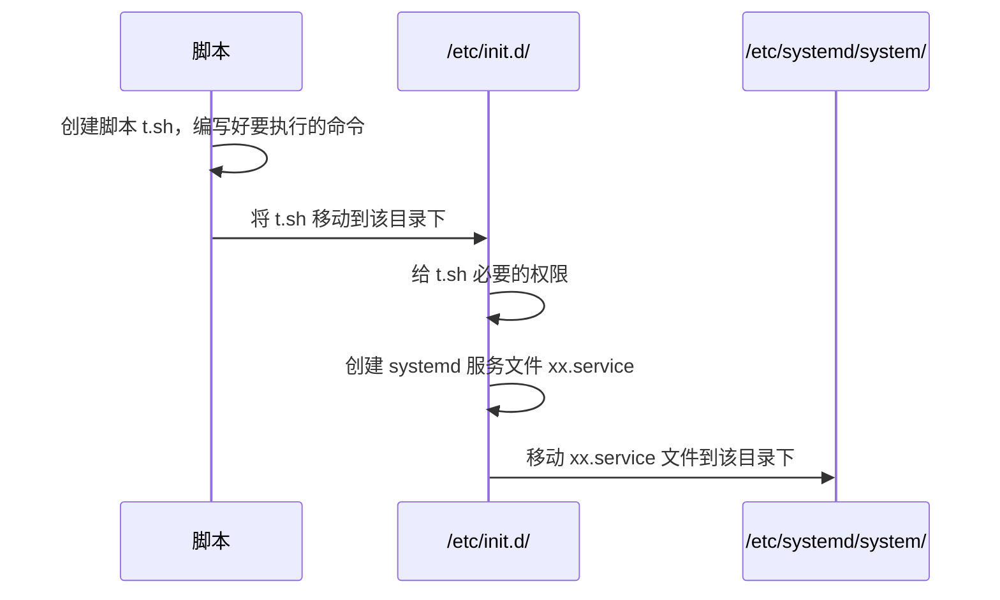

<b>服务文件的内容格式</b>

```shell
[Unit]
Description=My Script Service
After=network.target	

[Service]
ExecStart=/etc/init.d/myscript.sh
Type=forking

[Install]
WantedBy=multi-user.target
```

- After：服务应该在 network.target 之后启动，确保在网络服务可用之后再启动此服务。
- Type：定义了服务的类型。`forking` 类型的含义是，服务启动的进程会 fork 出一个守护进程来在后台运行，而原始的父进程则退出。这适用于那些会自行创建守护进程的传统守护进程脚本。
- WantedBy：这一行指定了服务的安装位置。`multi-user.target` 是一个目标单元，代表多用户系统环境。将服务设置为 `WantedBy=multi-user.target` 意味着当系统进入多用户运行级别时，这个服务会被自动启动。

<b>启用并启动服务</b>

```shell
sudo systemctl enable xx.service
sudo systemctl start xx.service
```

### `/etc/profile.d/`

- 创建 shell 脚本
- 移动到 `/etc/profile.d` 目录
- 修改脚本权限，使其具有执行权限

这种方式，每次有用户登录时，脚本会自动执行。如果有三次用户登录的行为，那脚本就会执行三次。

# SCP-安全复制:star:

`SCP`（Secure Copy）命令是基于 `ssh`（Secure Shell）协议实现的。它使用 `ssh` 提供的加密通道安全地在本地和远程系统之间复制文件和目录。这里我们先学 SCP 再学 SSH（需要借助 SCP 来复制一些东西）

## 上传文件

将本地的文件上传到服务器

<b>基本命令 </b>

```shell
scp [option] location_file server_user@server_ip:server_dir
```

使用 scp 将本地文件上传到服务器

```shell
# 上传单个文件 - 将本地文件 Hello.java 生成到服务器 110.25.36.3 的 /home/pc 目录
scp Hello.java root@110.21.2.3:/home/pc

# 上传多个文件 - 将本地文件 file1 file2 上传到服务器 110.25.36.3 /home/pc 目录
scp file1 file2 root@110.25.36.3:/home/pc/
```

<b>常用选项</b>

| 选项 | 说明                                                    |
| ---- | ------------------------------------------------------- |
| -r   | 递归复制文件夹需要使用到 -r 参数                        |
| -P   | 如果 ssh 的端口不是默认端口（22）需要用 `-P` 指定端口号 |

<b>案例</b>

复制文件夹，将本地的 `tmp` 文件夹复制到 hw 服务器中的 `/home/` 目录下。

```shell
scp -r ~/tmp hw:/home/
```

复制文件夹，将本地的 `tmp` 文件夹复制到 `hw` 服务器的 `~/homework/` 目录下。

```shell
scp -r ~/tmp hw:homework/
```

将服务器中的 /homeowork 文件夹复制到本地的当前路径下。

```shell
scp -r hw:homework .
```

如果 ssh 的端口不是默认端口 22，可以使用 `-P`(大写 P)

```shell
scp -P 22 source1 source2 target
```

<b style="color:red">注意：scp 的 -r -P 等参数尽量加在 source 和 target 之前。</b>

## 下载文件

将服务器的文件下载到本地

<b>基本命令</b>

```shell
scp [option] server_user@server_ip:server_dir 本地路径
```

使用 scp 命令将服务器文件下载到本地

```shell
# 下载单个文件 - 将服务器的 data.txt 下载到本地的 git 目录
scp root@110.25.36.3:/home/data.txt D:/git/

# 下载多个文件 - 下载多个文件需要使用到 {}
scp root@110.25.36.3:~/{data.txt, system.log} D:/git/
```

| 选项 | 说明                                                    |
| ---- | ------------------------------------------------------- |
| -P   | 如果 ssh 的端口不是默认端口（22）需要用 `-P` 指定端口号 |

<b>案例</b>

使用 scp 将服务器的文件下载到本地。

```shell
scp hw:/home/.tmux.conf D:/git/
```

同时下载多个文件

```shell
scp "hw:/home/{.tmux.conf,.vimrc}" D:/git/
```

# SSH-安全通道协议⭐

[SSH 基本知识 - SSH 教程 - 网道](https://wangdoc.com/ssh/basic)

<b>SSH</b> 全称 Secure Shell（安全外壳），它是一种<b>网络安全协议</b>，通过加密和认证机制实现安全的访问和文件传输等业务。SSH 协议通过对网络数据进行加密和验证，在不安全的网络环境中提供了安全的网络服务。

SSH 是（C/S架构）由<b>服务器</b>和<b>客户端</b>组成，为建立安全的 SSH 通道，双方需要先建立 TCP 连接，然后协商使用的版本号和各类算法，并生成相同的<b>会话密钥</b>用于后续的对称加密。在完成用户认证后，双方即可建立会话进行数据交互。

为什么要进行远程连接了？为了远程办公！本地没环境？小问题！直接 ssh 远程服务器进行开发。

<b>准备工作</b>

- 给服务器安装 openssh-server
- 启动 ssh `service ssh start`
- 安装防火墙模块 `sudo apt install ufw`
- 开启防火墙 `sudo ufw enable`
- 防火墙放行 ssh 的默认端口 22 `sudo ufw allow 22`

## SSH 远程连接

打开 windows 或 Linux 的命令行（windows 内置了 ssh 服务）远程登录服务器

```shell
ssh user@hostname
```

- user：服务器用户名
- hostname：服务器的 `IP 地址`/`域名`

```shell
ssh root@110.2.3.123
```

第一次登录时会提示

```ssh
he authenticity of host '134.27.51.123(134.27.51.123)' can't be established.
ECDSA key fingerprint is SHA256:iy237yysfCe013/l+kpDGfEG9xxHxm0dnxnAbJTPpG8.
Are you sure you want to continue connecting (yes/no/[fingerprint])?
```

输入 yes，然后回车即可。这样会将该服务器的信息记录在 `~/.ssh/known_hosts` 文件中（windows 系统是在`C:User\username\.ssh` 下）。然后输入密码即可登录到远程服务器中。

默认登录端口号为 22。如果修改了 ssh 的默认端口，可以使用 -p 来指定登录的端口 2233<span style="color:red">（小写 p）</span>

```shell
ssh user@hostname -p 2233
```

## 快速登录

创建文件 `~/.ssh/config`，然后文件中输入（windows 是在 C:\Users\用户名\\.ssh\  文件夹下创建 config 文件）

```shell
Host hw
	HostName IP地址或域名
	User 用户名
	Port 端口号	# 可选，使用默认端口的话就不用加端口号
    IdentitiesOnly yes
    # 添加这些配置，ssh 不会一分钟就断了。
  	# 保持连接活跃，每隔20秒发送一次请求到服务器
  	ServerAliveInterval 20
  	# 如果服务器没有响应，重试30次
  	ServerAliveCountMax 30
Host hw2
	HostName IP地址或域名
	User 用户名
    Port 端口号	# 可选
```

例如给服务器 10.236.31.2 配置用于快速登录的别名

```shell
Host hw
	HostName 10.236.31.2
	User root
	Port 22
    IdentitiesOnly yes
    # 添加这些配置，ssh 不会一分钟就断了。
  	# 保持连接活跃，每隔20秒发送一次请求到服务器
  	ServerAliveInterval 20
  	# 如果服务器没有响应，重试30次
  	ServerAliveCountMax 30
```

之后再使用服务器时就可以使用别名 `hw` \ `hw2` 了。

## 免密登录

ssh 的 config 文件本身并不用于存储服务器的密码。这是因为 SSH 协议设计之初就考虑到了安全性，因此不推荐在配置文件中明文存储密码。相反，SSH 提供了基于密钥对的认证机制，即使用公钥和私钥来进行身份验证，从而避免了密码在网络中传输的风险。

<b>配置免密登录</b>

1️⃣（本地机器）创建密钥 `ssh-keygen -t rsa`，执行该命令后一直按回车即可。

2️⃣执行结束后，本地机器的 `~/.ssh/` 目录下会多两个文件

- 密钥 `id_rsa`
- 公钥 `id_rsa_pub`

3️⃣将本地机器的公钥传给希望免密登录的服务器即可。

- 如，我们想免密登录 hw 服务器，将公钥中的内容复制到 hw 中的 `~/.ssh/authorized_keys` 文件里即可（`.ssh` 文件夹最开始没有 `authorized_keys` 文件）。
- `scp id_rsa.pub hw:~/.ssh/authorized_keys`。直接上传 authorized_keys 文件会覆盖之前的文件，导致先前配置的免密登录失效。
- 将本地的公钥上次到服务器 `hw` 的 `~/.ssh/authorzed_keys`

- 也可以直接使用这个命令一键添加公钥 `ssh-copy-id hw`（windows 自带的 ssh 没有 ssh-copy-id 命令）

## 执行命令

格式

```shell
ssh user@hostname command
```

例如

```shell
ssh hw ls -a
```

或者执行 shell 脚本

```shell
# 单引号中的 $i 可以求值
ssh hw 'for ((i=0; i<3; i++)) do echo $i; done'
0
1
2
# 双引号中的 $i 不可以求值
ssh hw "for ((i=0; i<3; i++)) do echo $i; done"
```

<b style="color:red">为什么呢？我们用 Linux 服务 A，执行下面的命令</b>

```shell
num=hello
ssh hw "echo $num"
ssh hw 'echo $num'
```

<span style="color:blue">双引号是在本地服务器进行解析了</span>，所以传过去命令不是 `echo $num`，而是 `echo hello`；单引号传过去的是 `echo $num`。

再看这个

```shell
# 单引号中的 $i 可以求值
ssh hw 'for ((i=0; i<3; i++)) do echo $i; done'

ssh hw "for ((i=0; i<3; i++)) do echo $i; done" # 双引号中的内容被提前解析了，发现是空。
```

## 修改端口

SSH 的默认端口是 22 端口。如果我们想修改 ssh 的默认端口，可以编辑 `/etc/ssh/sshd_config` 文件

```shell
# 添加配置, 这样服务器端的 ssh 就会监听 2022 端口了。
Port 2022
```

客户端就可以通过

```shell
ssh server_user@server_ip -p 2022
ssh -p 20222 server_user@server_ip
```

来连接服务器了。不使用默认端口连接也更安全~

## 端口映射

SSH（Secure Shell）的端口映射是一种利用 SSH 连接来转发网络端口的技术，它允许用户通过 SSH 隧道将网络请求从一个网络环境转发到另一个网络环境。


<b>SSH 端口映射分为两种类型</b>

- 本地端口转发：将本地的端口转发到远程服务器上；这样访问本地端口的时候，请求就会被转发到远程服务器了
- 远程端口转发：将远程服务器的端口转发到其他主机上；这样访问远程端口的时候，请求就会被转发到其他主机上了

### 准备工作

确保内网服务器和公网服务器都安装了 `openssh-server`，并且公网服务器和内网服务器都要开放对应的端口。

<b>这里假定</b>

- 内网服务器 inner：安装了 `openssh-server`，开放用到的端口号。
- 公网服务器 remote：安装了 `openssh-server`；`/etc/ssh/sshd_config` 中配置了 `GatewayPorts yes`。

默认情况下，OpenSSH 只允许从服务器主机连接到远程转发端口。能够防止从服务器计算机外部连接到转发端口。设置成 `yes` 后，外部主机就可以连接了。

`GatewayPorts` 设置为 `yes` 时，任何能够访问到远程服务器的主机都可以通过远程服务器上转发的端口访问到本地机器上的服务。就是说远程服务器上的转发端口将对网络中的所有主机开放，如果不设置 `GatewayPorts yes`，这个端口就不对外开放。

<b>安装软件</b>

```shell
apt install openssh-server
service ssh restart

apt install autossh

# ssh 连接
ssh root@xxx -p 22
# autossh 连接，8999端口监听22端口，22断了就重连
autossh -M 8999 root@xxx -p 22
```

ssh 断了不会自动重连，autossh 断了会自动重连。做长期的端口转发的话，推荐使用 ssh。

<b>说明</b>

不设置 `GatewayPorts yes`，也可以。我们让公网服务器的 xx 端口代理那个转发端口也可。 

### 本地端口转发

本地端口转发是将本地计算机上的一个端口映射到远程计算机上的一个端口。这样做可以让用户从本地计算机访问远程计算机上的服务，仿佛这些服务就运行在本地计算机上一样。


例如，我们在某个云开发平台开发了一个 Web 系统，我们需要通过云开发平台的公网 IP 才能在我们自己的浏览器里访问该系统。如果我们做了本地端口转发，将本地计算机的端口映射到云开发平台计算机的端口，就可以直接通过 `localhost` 来访问这个系统。

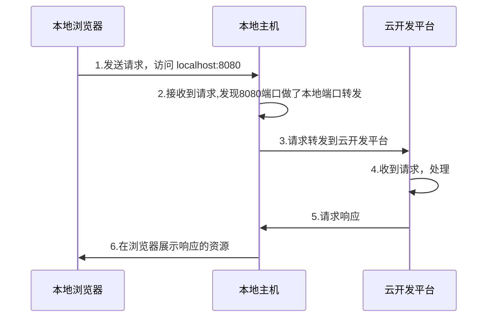

我们在远程服务器上部署一个简单的 Web 应用，然后通过本地端口转发，用 `localhost` 来访问 Web 应用。

我们在本地机器上执行下面的命令。

```shell
ssh -N -L 80:localhost:8083 username@host
```

上面这条命令将本地的 80 端口通过 ssh 隧道转发到远程主机 8083 端口。远程连接时，输入 localhost:80 便连接到了远程主机的 8083 端口。

- `-N` 表示表示不执行远程命令，仅建立连接用于端口转发。
- `-L` 用于指定本地端口转发的设置，后面跟着的参数就是端口转发的具体设置。
- `80:localhost:8083` 表示将本地的 80 端口转发到远程主机的 `localhost:8083` 端口。
- username@host 是远程主机的用户名和 IP 地址。

<b>下面是一条参数更为全面的本地端口转发命令</b>

```shell
ssh -CNg -L 80:localhost:8083 username@host -o StrictHostKeyChecking=no
```

- `-C` 通常用于启用压缩。
- `-N` 表示不执行远程命令，仅建立连接用于端口转发等。
- `-g` 允许远程主机连接到本地转发的端口。
- `-o StrictHostKeyChecking=no`：关闭严格的主机密钥检查，这样可以避免第一次连接时因为未知主机密钥而产生的提示或错误。

准备好一个 SpringBoot 项目，在服务器端执行。通过本机的 `localhost` 访问该 Web 服务。可以正常访问 Spring Boot 项目。

### 远程端口转发

远程端口转发是将远程计算机上的一个端口映射到本地计算机上的一个端口。这允许用户从外部网络通过远程计算机访问本地计算机上的服务。


完成远程端口转发后，就可以通过访问远程主机，来访问内网主机了（这里假定配置了 `GatewaysPorts yes`）。

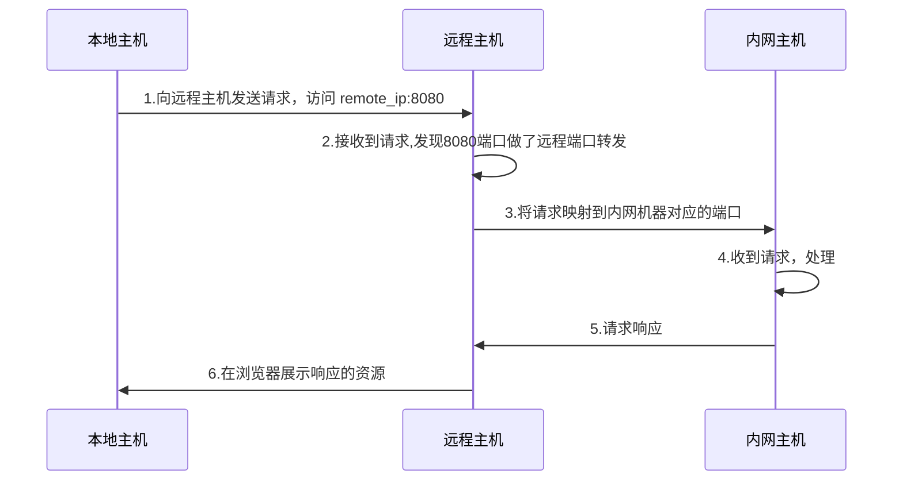

我们在内网主机上执行这条命令

```shell
ssh -N -R [remote_port]:[local_host]:[local_port] [user]@[remote_server]
```

| 参数                         | 说明                                                         |
| ---------------------------- | ------------------------------------------------------------ |
| `-N`                         | 表示不执行远程命令，仅建立连接用于端口转发                   |
| `-R`                         | 用于指定远程（Remote）端口转发的设置，后面跟着的参数就是端口转发的具体设置。 |
| `remote_port:localhost:8083` | 表示将远程主机的 80 端口转发到内网主机的 `localhost:8083` 端口。 |
| `user@remote_server`         | 远程主机的用户名和 IP 地址                                   |

```shell
ssh -N -R 8083:localhost:80 test_user@110.78.26.2
```

一条参数更为全面的转发命令

```shell
ssh -fCNR [公网IP(可省略)]:[公网端口]:[内网IP]:[内网端口] \ 
[公网用户名@公网IP] -p [公网ssh端口]
```

```shell
ssh -fCNR 8083:localhost:80 -o ServerAliveInterval=60 remote_user@remote_server_ip  -p 22 # 这里 root 就是 公网服务器的用户名
# 或者使用autossh:
# autossh -M 8999 -CNR 8022:localhost:22 root@19.168.100.4 -p 22
```

- `-f` 让 `ssh` 在后台运行。更推荐用 tmux 让程序在后台执行。
- `-C` 启用压缩；`-N` 表示不执行远程命令。
- `-R` 指定了反向端口转发的配置。
- `8083:localhost:80` 定义了端口转发的规则，意思是将远程服务器上的 `8083` 端口转发到本地（内网）机器的 `80` 端口。所有发送到远程服务器 `8022` 端口的流量将被转发到本地（内网）机器的 `80` 端口。
- `-o ServerAliveInterval=60` 是 `ssh` 命令的一个选项，用于设置在 SSH 连接中发送心跳包的时间间隔。心跳包（也称为 keep-alive 消息）是用来保持连接活跃的一种机制，以防止由于长时间无活动而导致连接被自动关闭。
- `remote_user@remote_server_ip` 是远程服务器的登录信息。

<b>如果没有设置 `GatewaysPorts yes`</b>

我们让公网服务器的 8888 代理 8083，这里我们连接公网服务器的 8888 端口，这个请求会被代理到 8083 端口（这个端口正好是和内网服务器进行通讯的）。

```shell
# ssh -fCNL [本机IP(可省略)]:[本机端口]:[远端IP]:[远端端口] [远端用户名@远端IP] -p [远端ssh端口(默认22)]
# * 表示接受来自任意 ip 的访问

ssh -fCNL *:8888:localhost:8083 -o ServerAliveInterval=60 root@localhost -p 2222
# 或者使用autossh:
# autossh -M 8999 -CNL *:8023:localhost:8022 root@localhost -p 22
```

### 动态端口转发

[ssh端口转发的三种方式 - tlanyan (itlanyan.com)](https://itlanyan.com/ssh-tunnel-port-forward-ways/#bnp_i_1)

### 实战-SSH内网穿透

我们来使用 ssh 实现一个内网穿透

- 内网服务器 close：安装了 openssh-server，开放了用到的端口。
- 公网服务器 remote：安装了 openssh-server；`/etc/ssh/sshd_config` 中配置了 `GatewayPorts yes`

<b>安装软件的命令</b>

```shell
apt install openssh-server
service ssh restart

apt install autossh

# ssh 连接
ssh root@xxx -p 22
# autossh 连接，8999端口监听22端口，22断了就重连
autossh -M 8999 root@xxx -p 22
```

<b>ssh 远程端口转发，将远程服务器的端口转发到内网服务器。</b>

我们在内网服务器上执行远程端口转发的指令，将远程服务器的 8022 端口转发到内网机器的 22 端口。

```shell
ssh -fCNR 8022:localhost:22 -o ServerAliveInterval=60 root@19.168.100.4	-p 22
```

该命令实现的功能是，让一个远端机器（这里是指公网服务器）的 8022 端口代理自己（这里是指内网服务器）的 22 端口。

我们在远程服务器上执行 `ps aux | grep ssh` 可查看是否成功启动了该进程，看下 8022 是否被监听。

```shell
ps aux | grep ssh
或
netstat -antpul | grep 8022
```

成功建立连接后，就可以使用公网服务器 ssh 连接内网服务器了。

```shell
# -p 端口号 一定要加！因为没采用默认端口(22)
# 我们是通过远程服务器的8022端口和内网服务器建立通信的
ssh 内网用户名@localhost -p 8022 
或
ssh 内网用户名@IP地址 -p 8022
```

我们可以将远程服务器作为连接内网服务器的跳板。

```shell
ssh 内网用户名@远程服务器IP -p 8022
```

<b>如果没有配置 `GatewayPorts yes` 我们让公网服务器的 8023(其他端口也许) 端口代理 8022 端口即可</b>

我们让公网服务器的 8023 代理 8022，这里我们连接公网服务器的 8023 端口，这个请求会被代理到 8022 端口（这个端口正好是和内网服务器进行通讯的）实测不用做正向代理，直接连接服务器的 8022 端口，ssh 连接就会被转发到内网的服务器上。

```shell
# ssh -fCNL [本机IP(可省略)]:[本机端口]:[远端IP]:[远端端口] [远端用户名@远端IP] -p [远端ssh端口]
# * 表示接受来自任意 ip 的访问
ssh -fCNL *:8023:localhost:8022 -o ServerAliveInterval=60 root@localhost -p 22
# 或者使用 autossh:
# autossh -M 8999 -CNL *:8023:localhost:8022 root@localhost -p 22
```

# Git-版本控制工具⭐

- 讲的时候按知识点讲，先讲最基本的 git 命令，然后讲如何关联 github，最后再讲其他常用命令。
- 后面给一个分类汇总的表格。

[GitHub Docs](https://docs.github.com/zh)

[Git学习笔记 | Kisugi Takumi](https://kisugitakumi.com/2022/01/18/Git学习笔记/#Git学习笔记)


Git 是一个开源的分布式版本控制系统，在软件开发领域，大多使用 Git 作为项目的版本控制工具。Git 使得团队成员能够有效地管理和跟踪代码的历史变更，有效、高速地处理从很小到非常大的项目版本管理。

- 不借助任何工作做项目的版本管理（繁琐，要一份一份的复制代码）
- 借助 git 做版本管理的优势（简洁，几个命令即可完成版本控制）

## 版本控制

前面我们提到了，Git 是一个分布式的版本控制软件，这里我们介绍下版本控制方式的种类有哪些，各自的特点是什么。

<b>集中式版本控制工具</b>

- 版本库是集中存放在中央服务器的，team 里每个人工作时从中央服务器下载代码，是必须联网才能工作，局域网或互联网。个人修改后然后提交到中央版本库。【典型的集中式版本控制软件有 SVN】

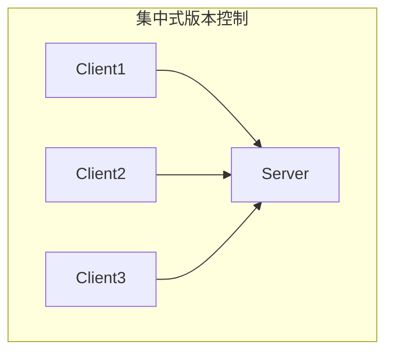

<b>分布式版本控制工具（每个人都有一份副本，那就是分布式啦）</b>

- 分布式版本控制系统没有“中央服务器”，每个人的电脑上都是一个完整的版本库，这样工作的时候无需要联网，因为版本库就在你自己的电脑上。多人协作只需要各自的修改推送给对方，就能互相看到对方的修改了。【典型的分布式版本控制软件有 Git】

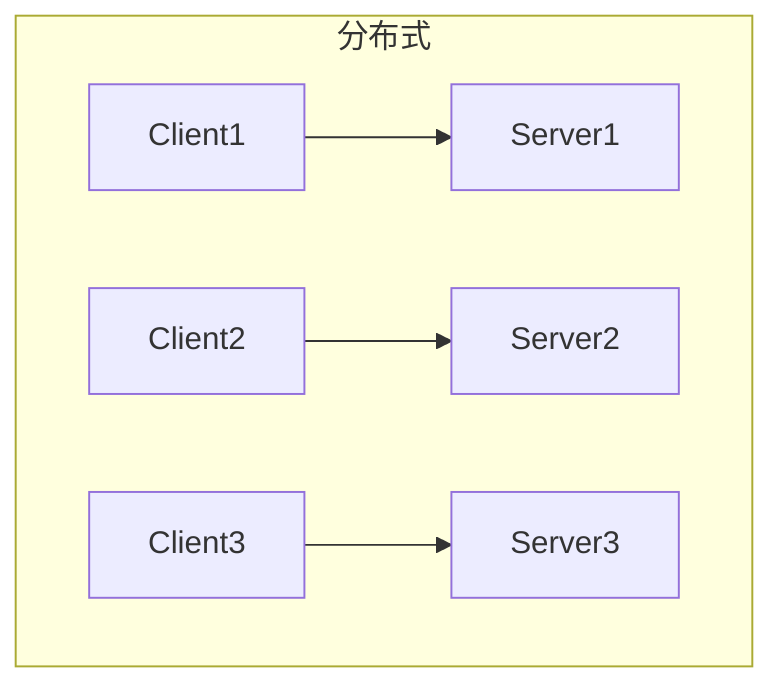

我们叫 git 分布式版本控制工具，是因为它的设计和工作原理充分体现了分布式系统的核心概念：每个人的电脑都是一个完成的版本仓库。

<b>实现机制</b>

| 特性       | 描述                                                         |
| :--------- | :----------------------------------------------------------- |
| 分布式架构 | 与集中式版本控制系统不同，Git 在每个开发者的机器上都存有完整的代码库副本，包括完整的历史记录。这种分布式的特性增强了数据的安全性和获取效率。 |
| 分支管理   | Git 的分支管理功能非常灵活，支持无缝切换到不同的开发线路（分支），并允许独立开发、测试新功能，最终通过合并操作将这些功能稳定地集成到主项目中。 |
| 快照系统   | Git 通过快照而非差异比较来管理数据。每次提交更新时，Git 实际上是在存储一个项目所有文件的快照。如果文件没有变化，Git 只是简单地链接到之前存储的文件快照。 |

## 基本概念

<b>Git 中有三个基本概念：工作区、暂存区和 Git 版本库。理解这三个概念有利于我们学习 Git 的命令。</b>

- <b>工作区：</b>当我们在本地创建一个 Git 项目，或者从 GitHub 上 clone 代码到本地后，项目所在的<u>这个目录就是工作区</u>。这里是我们对项目文件进行编辑和使用的地方。工作区是独立于各个分支的。实际上每个分支都是用的同一个工作区。

- <b>暂存区：</b>从字面上理解，暂存区就是数据暂时存放的区域，我们可以将其认为是工作区写入版本库前的缓存区。暂存区是独立于各个分支的。

- <b>版本库：</b>在项目目录中，.git 隐藏目录不属于工作区，而是 Git 的版本仓库。这个仓库区包含了所有历史版本的完整信息，是 Git 项目的“本体”。`.git` 里存放了所有已经提交到本地仓库的代码版本。


版本结构：树结构，树中每个节点代表一个代码版本。<span style="color:blue">可以认为，git 的最终目的就是让这三个区域的内容保持一致~</span>

<b>为什么要设置暂存区？</b>

Git 设置暂存区主要是为了提供一个缓冲地带，让开发者可以有选择性地提交工作目录中的更改。做更细粒度和干净的提交。

- 选择性提交：可以挑选哪些更改应该被纳入下一次提交。
- 组织提交：有助于创建清晰、有组织的提交历史。
- 避免污染提交：防止不小心将无关或未完成的更改包含在提交中。

<b>为什么要设置暂存区？</b>

Git 设置暂存区主要是为了提供一个缓冲地带，让开发者可以有选择性地提交工作目录中的更改。做更细粒度和干净的提交。

- 选择性提交：可以挑选哪些更改应该被纳入下一次提交。
- 组织提交：有助于创建清晰、有组织的提交历史。
- 避免污染提交：防止不小心将无关或未完成的更改包含在提交中。

<b>还有一个非常重要的概念：文件状态</b>

文件状态是指文件在 Git 工作区（目录）中的状态。

- 已跟踪：文件已被纳入版本控制，根据其是否被修改，可以进一步分为未修改（Unmodified）、已修改（Modified）或已暂存（Staged）。
- 未跟踪：文件存在于工作目录中，但还没被纳入版本控制，也未处于暂存状态。
- `git add file` 命令可以将文件纳入版本控制。

<b>分支</b>是 Git 的一大特性，Git 支持轻量级的分支创建和切换。Git 鼓励频繁使用分支和合并，使得并行开发和错误修正更为高效（团队项目合作，分配好任务，各自独立开发。可以每个人创建一个分支，在自己的分支上开发）

<b>了解了上面的概念，我们再来看下 git 的工作流程图</b>

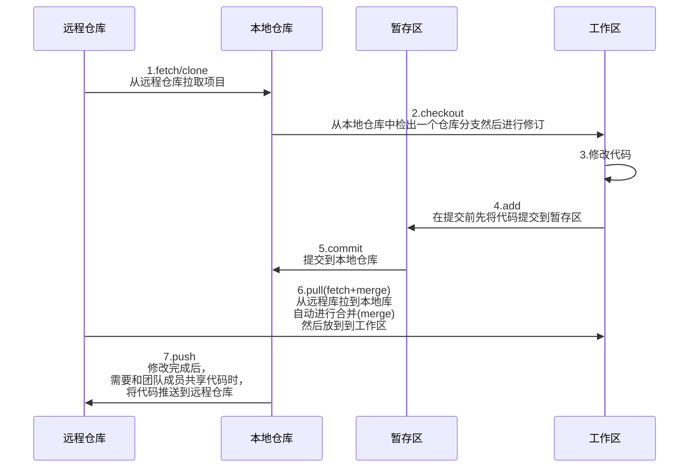

<b>命令解释如下</b>

| 序号 | 命令             | 说明                                                         |
| ---- | ---------------- | ------------------------------------------------------------ |
| 1    | clone (克隆)     | 从远程仓库中克隆代码到本地仓库                               |
| 2    | checkout  (检出) | 从本地仓库中检出一个仓库分支然后进行修订                     |
| 3    | add (添加)       | 在提交前先将代码提交到暂存区                                 |
| 4    | commit (提交)    | 提交到本地仓库。本地仓库中保存修改的各个历史版本             |
| 5    | fetch (抓取)     | 从远程库，抓取到跟踪分支，不进行任何的合并动作，一般操作比较少 |
| 6    | pull (拉取)      | 从远程库拉到本地库，自动进行合并 (merge)，然后放到到工作区，相当于 fetch+merge |
| 7    | push (推送)      | 修改完成后，需要和团队成员共享代码时，将代码推送到远程仓库   |

pull 可以查看本地和远程是否会有冲突，也可以不执行 pull 直接 push；push 过程中如果发现有冲突，会提示我们代码冲突；冲突了再 pull 也可。

<b>git 的作用</b>

| 作用             | 说明                                                         |
| ---------------- | ------------------------------------------------------------ |
| 代码历史记录跟踪 | 我们可以使用 Git 记录每一次代码提交；查看项目的历史版本和变更记录；还原任一时间点的代码（代码版本回滚：迭代系统，加功能，上线 1 天出现 bug，使用 git 找到先前稳定运行的系统代码，重新部署） |
| 协同开发         | Git 提供了合并、分支和版本控制的功能，利用这些功能，我们可以轻松进行多人协作开发项目。 |
| 追溯代码问题     | 如果项目出现了问题，我们可以根据 Git 的提交记录追溯编写人和编写时间，防止甩锅。 |
| 变更审查         | 允许开发者查看代码变更的具体内容，了解谁在何时做了哪些修改，这对于代码审查和质量控制至关重要（开源项目，你提交合并请求，项目审查者是可以看到你的修改内容，提交的内容质量过关就同意合并，质量不过关就拒绝合并） |

<b>基本要求</b>

- 了解 Git 基本概念
- 了解 Git 工作流程
- 熟悉 Git 常用命令

## 安装/配置Git

### 安装Git

<b>Linux 安装 git</b>

Linux 一般自带 git。如果 Linux 上没有 git，可以安装官方文档中的教程来安装 [Git (git-scm.com)](https://git-scm.com/download/linux)

```shell
# Ubuntu 安装 git 的命令
$ sudo apt update	# 先更新下 apt 源
$ sudo apt install git
```

<b>Windows 安装 git</b>

这里主要讲解 windows 下 git 的安装方式。

下载地址： https://git-scm.com/download

安装时：Use git from git bash only... 其他默认下一步。安装成功后鼠标点击右键可以看到。

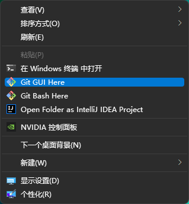

<b>工具说明</b>

| 工具     | 说明                                                         |
| -------- | ------------------------------------------------------------ |
| Git GUI  | Git 提供的图像界面工具                                       |
| Git Bash | Git 提供的命令行工具，提供了一些常见的 Linux 命令，如 curl。 |

当安装 Git 后首先要做的事情是设置用户名称和 email 地址。每次 Git 提交都会使用该用户信息。

### Git托管平台

<b>Git 的托管平台有三种</b>

- Gitee：国内的代码托管平台，提供了代码托管、项目管理、协作开发等功能，对国内开发者来说，访问速度可能更快，也更符合国内的使用习惯。
- Github：是全球最大的代码托管平台之一，拥有丰富的开源项目和活跃的开发者社区。它提供了版本控制、项目管理、协作开发等功能，并支持多种编程语言。
- GitLab：一个自托管或基于云的平台，提供了完整的 DevOps 工具链，包括代码托管、持续集成/持续部署（CI/CD）、问题跟踪等。【一般用于在企业、学校等内部网络搭建 git 私服。】

我们会配合托管平台来使用 Git（使用 Git = Git + 对应的托管平台）。

要想在本地的 Git 上畅通无阻地使用托管平台，需要进行一些配置。让我们的 Git 关联上托管平台。然后就将本地的代码托管到这些平台上了。

### 基本配置

这里我们给 git 配置一下用户信息，这样在提交版本的时候就会记录好是谁进行提交的。

1️⃣点击右键==>选择 Git bash（打开 git 命令行，Linux 下直接打开 terminal 即可）

2️⃣配置全局变量，配置用户信息

3️⃣git config --global user.name "username" 如：`git config --global user.name "csxx"`

4️⃣git config --global user.email "邮箱" 如：`git config --global user.email "12312331@qq.com"`

5️⃣查看配置信息

- `git config --global user.name`
- `git config --global user.email`

除了 git config --global 外，还有其他的命令

```sh
$ git config --local		# local 只对某个仓库有效
$ git config --global		# global 对当前用户所有仓库有效,信息记录在~/.gitconfig文件中
$ git config --system		# system 对系统所有登录的用户有效
```

显示 config 配置，加 --list

```sh
$ git config --list 			# 查看所有的 config 配置
$ git config --list --local
$ git config --list --global
$ git config --list --system
```

### 配置别名

有些常用的指令参数非常多，每次都要输入好多参数，我们可以使用别名。

- 打开用户目录，创建 .bashrc 文件 

- 部分 windows 系统不允许用户创建点号开头的文件，可以打开 gitBash, 执行 `touch ~/.bashrc`

- 在 .bashrc 文件中输入如下内容


```shell
#用于输出git提交日志
$ alias git-log='git log --pretty=oneline --all --graph --abbrev-commit'
#用于输出当前目录所有文件及基本信息
$ alias ll='ls -al'
```

### 解决乱码

打开 GitBash 执行下面命令

```shell
$ git config --global core.quotepath false 
```

在 `${git_home}/etc/bash.bashrc$`  文件后面加入下面两行

```shell
export LANG="zh_CN.UTF-8"
export LC_ALL="zh_CN.UTF-8"
```

### 免密登录:star:

在本地机器输入以下命令 `ssh-keygen -t rsa -C 邮箱`。`ssh-keygen -t rsa -C 695466632@qq.com` 然后一直回车

打开 github 网站 ==> 找到 setting ==> new ssh key，title 任意，key 输入本地生成的 pubkey (公钥) , pubkey 的存放地址请仔细看 Git 控制台的输出。

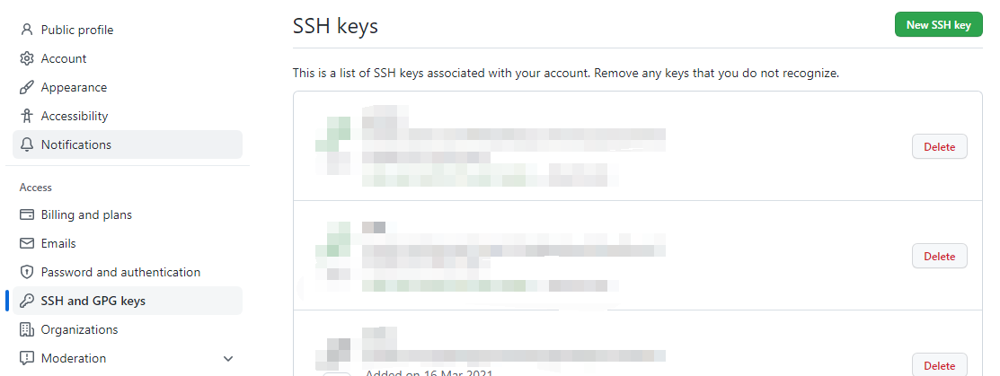

测试连通性 `ssh -T git@github.com` [写死的]

本地和远程成功通信则可以在 `.ssh` 中发现 `known_hosts` 文件，出错就多试几次可能是网络问题。不行就检测建立 `ssh` 时输入的 `pub key`。

## 常用Git命令

下面是我们要学习的 Git 命令。

<b>基础指令</b>

| 指令           | 描述                                       |
| -------------- | ------------------------------------------ |
| `git config`   | 配置用户信息和偏好设置                     |
| `git init`     | 初始化新的 Git 仓库                        |
| `git clone`    | 克隆远程仓库到本地                         |
| `git status`   | 查看仓库当前的状态，显示有变更的文件       |
| `git add`      | 将文件更改添加到暂存区 / 纳入版本跟踪      |
| `git commit`   | 提交暂存区的文件到仓库区                   |
| `git branch`   | 列出、创建或删除分支                       |
| `git checkout` | 切换分支或恢复工作树文件                   |
| `git merge`    | 合并两个或更多的开发历史                   |
| `git pull`     | 从另一仓库获取并合并本地的版本             |
| `git push`     | 更新远程引用和相关的对象                   |
| `git remote`   | 管理跟踪远程仓库的命令                     |
| `git fetch`    | 从远程仓库获取数据到本地仓库，但不自动合并 |

<b>进阶指令</b>

| 指令              | 描述                                                 |
| ----------------- | ---------------------------------------------------- |
| `git stash`       | 暂存当前工作目录的修改，以便稍后恢复                 |
| `git cherry-pick` | 选择一个提交，将其作为新的提交引入                   |
| `git rebase`      | 将提交从一个分支移动到另一个分支                     |
| `git reset`       | 重设当前 HEAD 到指定状态，也可修改工作区和暂存区     |
| `git revert`      | 通过创建一个新的提交来撤销之前的提交                 |
| `git mv`          | 移动或重命名一个文件、目录或符号链接，并自动更新索引 |
| `git rm`          | 从工作区和索引中删除文件                             |

每个指令都有其特定的用途和场景，详细的使用方法和参数可以通过命令行的帮助文档（`git command -h`，例如 `git pull -h`）来获取更多信息。

### 创建本地仓库

<b>创建一个本地仓库</b>

- 在电脑的任意位置创建一个空目录（例如 test）作为我们的本地 Git 仓库
- 进入这个目录中，点击右键打开 Git bash 窗口                                           
- 执行命令 git init，将当前目录配置成 git 仓库
- 如果创建成功后可在文件夹下看到隐藏的 .git 目录，仓库的信息记录在隐藏的 .git 文件夹中

```shell
$ git init
Initialized empty Git repository in /root/test/.git/
```

<b>拉取远端仓库到本地</b>

如果已经有一个远端仓库，我们可以直接 clone 到本地。

```shell
$ git clone <仓库地址> [本地目录]
```

本地目录可以省略，会自动生成一个目录

```shell
$ git clone git@gitee.com:lalala-payphone/test.git
```

<b>git 项目的目录结构</b>

使用 ls -al 查看下当前项目下有那些内容

```shell
drwxr-xr-x  3 root root 4096 Jul 26 16:30 .
drwx------ 11 root root 4096 Jul 26 16:30 ..
drwxr-xr-x  7 root root 4096 Jul 26 16:30 .git
```

进入 `.git` 目录，可以发现有这些内容

```shell
branches  config  description  HEAD  hooks  info  objects  refs
```

我们后期关注下 branches 和 HEAD。

### 基础操作指令:star:

在 Git 的日常使用中，尤其是个人开发（非协作开发）中，最常用的命令有

- add、status、commit、pull、push、branch 六个命令。

<b>在学习这六个命令之前，我们再回顾下 Git 的工作流程</b>

Git 工作目录下对于文件的<b>修改</b>（增加、删除、更新）会存在几个状态，这些<b>修改</b>的状态会随着我们执行 Git 的命令而发生变化。

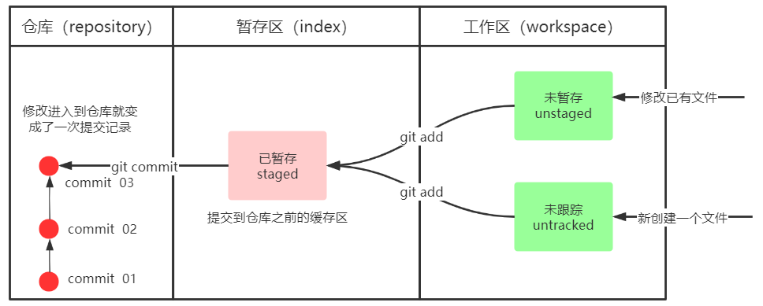

<b>使用命令来控制这些状态之间的转换</b>

① git add (工作区➡️暂存区)

将工作区的改动添加到暂存区，为下一次提交做准备 / 把项目文件纳入 git 的管理。

例如本地写了一个版本，先提交到暂存区；然后写了第二个版本，发现版本一更佳，此时可以把版本一回退到本地，然后提交到仓库。

② git commit (暂存区➡️本地仓库)。

将暂存区的内容提交到本地仓库，形成一个版本库。

#### 添加到暂存区(add)

<b>add 将修改工作区的改动添加到暂存区 / 指定需要追踪的文件</b>

- 作用：添加工作区一个或多个文件的修改到暂存区 / 将文件纳入 git 的版本跟踪。
- 场景举例：我们需要修改多个文件以达成一个目的，可以逐个修改，修改好一个后就添加到暂存区，当该功能的所有文件都以修改完毕则统一提交到版本库。
- 命令形式：git add 单个文件名|通配符。

```shell
$ touch file.txt		# 创建一个文件
$ git add file.txt 	# 将 file.txt 加入暂存区
$ git add . 			# 将所有改动加入暂存区
$ git add -u			# 将已经被追踪（tracked）的文件中被修改（modified）或者删除（deleted）的内容加入到暂存区（staging area），未追踪的文件不会修改
```

可以使用 `git ls-files` 命令查看暂存区目前有什么内容。

#### 查看修改状态(status)

<b>git status 查看修改状态</b>

- 作用：查看修改的状态 (暂存区、工作区) 
- 命令形式：`git status`

```shell
$ git status
On branch master

No commits yet

Changes to be committed:
  (use "git rm --cached <file>..." to unstage)
        new file:   file.txt
```

Changes to be committed 即将被提交，进入了暂存区。

<b>我们来详细了解下 git 文件的状态变化周期</b>

```mermaid
sequenceDiagram
	participant untracked
	participant unmodified
	participant modified
	participant staged
	
    untracked->>staged: add the file
    unmodified->>modified: edit the file
    modified->>staged: stage the file
    staged->>unmodified: commit
    unmodified->>untracked: remove the file

```

<b>我们使用 status 来观察下 git add -u 的作用</b>

创建一个新的 git 仓库用于测试

```shell
mkdir test2
cd test2
git init .
# 创建 file.txt 文件
touch file.txt
# 放入暂存区
git add file.txt
# 查看状态, file.txt 已经放入暂存区了
git status 
# 创建 tmp.txt
touch tmp.txt
# 修改 file.txt
echo "hello" >> file.txt
# 将被追踪并发生了修改的内容放入暂存区
git add -u
```

```shell
# 查看文件状态
git status
On branch master

No commits yet

Changes to be committed:
  (use "git rm --cached <file>..." to unstage)
        new file:   file.txt

Untracked files:
  (use "git add <file>..." to include in what will be committed)
        tmp.txt
```

我们发现，git add -u 只会将已经纳入被追踪的文件的更改纳入暂存区；未追踪的文件不会纳入。

#### 提交到本地仓库(commit)

<b>commit 提交暂存区到本地仓库，形成一个版本</b>

- 作用：提交暂存区内容到本地仓库的当前分支
- 命令形式：git commit -m '注释内容'

```shell
git commit -m"add file.txt"
[master (root-commit) 2891735] add file.txt
 1 file changed, 1 insertion(+)
 create mode 100644 file.txt
```

commit 后，再次查看状态，暂存区中已经没有东西了。

```shell
git status
On branch master
```

git 还有一条命令，可以 add 和 commit 一起执行，但是不推荐使用。这种做法工作区的内容直接添加到了版本历史库里了（高版本 git 无效？）。

```shell
git commit -am 'add xxx' # 高版本 git 没用了
```

<b>修改最近一次提交的 message</b>

有时候我们会发现，commit 的时候，提交的信息写错了或写的有问题，这时候可以用 `git commit --amend -m "新的提交信息"` 来修改最近一次提交的 message。

```shell
$ git commit --amend -m "add file file.txt"
```

<b>用新提交替换旧提交</b>

前面我们讲过如何修改最近一次的提交。但是有时候，我们提交完了发现漏掉了几个文件没有添加，此时，也可以使用 `--amend` 选项用<b>新的提交替换旧的提交</b>。

```shell
# 将漏掉的文件添加进去
$ git add forgotten_file
# 用新提交替换旧提交（旧提交的内容在，新提交补充的内容也在）
$ git commit --amend
```

<b>切换到其他 commit</b> 

git 的每个 commit 都会形成一个版本，如果我们想在不同的版本直接切换，可以使用 `git checkout commit-id` 命令回溯到之前的代码。

```mermaid
gitGraph
commit
commit
checkout main
commit
commit
```

在切换到其他 commit 之前，我们需要先理解下 HEAD 指针。

HEAD 的本质是指向某个 commit 对象的指针，HEAD 指针默认指向当前（分支）最新的提交。在上面的 git 图中，我们进行了四次提交，最新的一次提交是 `3-5b0d470`，因此 HEAD 指针指向的 `3-5b0d470`。我们想切换到其他 commit 只需要将 HEAD 指针移动到对应的 commit，这样仓库就恢复到了对应 commit 的状态了。

利用 `git checkout commit-id` 将 HEAD 指针移动到 `1-841c，git checkout 1-841c`，完成 commit 的切换。git checkout 和 HEAD 有许多用法，后面细讲。

#### 忽略文件(.gitignore)

我们总会有些文件无需纳入 Git 的管理，也不希望它们总出现在未跟踪文件列表。 通常都是些自动生成的文件，比如日志文件，或者编译过程中创建的临时文件等。 在这种情况下，我们可以在工作目录中创建一个名为 `.gitignore` 的文件 (文件名称固定) ，列出要忽略的文件模式。

```.gitignore
*.a # 以 .a 结尾的文件不让 git 管理, 如 demo.a 就会被忽略
*.dSYM/ # 文件夹下的任何文件都不纳入 git 管理, 但是 a.dSYM git 是要管理的。
doc/	# doc 文件夹下的所有文件都不纳入 git 管理
```

#### 分支(branch)

Git 分支是 Git 版本控制系统中的一个核心概念，它允许开发者在主线（通常是 master 或 main 分支）之外进行工作，而不影响主线上的代码。分支可以被看作是代码的一个独立版本，开发者可以在不同分支上并行开发，最后再将它们合并。

```mermaid
gitGraph
	commit id: "main-1"
	commit id: "main-2"
	branch dev1
	branch dev2
	commit id: "dev2-1"
	commit id: "dev2-2"
	commit id: "dev2-3"
	checkout dev1
    commit id: "dev1-1"
	commit id: "dev1-2"
	commit id: "dev1-3"
```

分支的基本用法包括

- 查看分支：git branch 
- 创建分支：git branch new_branch
- 切换分支：git checkout new_branch
- 合并分支：git merge new_branch

### 重命名(mv):star:

`git mv` 是 `git` 自带的对文件进行重命名的命令。git 并不显式跟踪文件移动操作。如果在 `git` 中重命名了某个文件，仓库中存储的元数据并不会体现出这是一次更名操作。

#### git-mv的优点

假如我们想对已经加入仓库的文件进行重命名（file.txt 修改为 readme.md），该怎么做？我们之前学过 Linux 命令，直到可以用 mv 对文件重命名。

> 直接重命名的话，会出现这种情况：git status 变成删除了 readme 文件，然后新增了一个未追踪的文件 readme.md。为什么呢？

git 最终是希望三个区的内容都保持一致的。mv 只是修改了工作区的内容，并未修改暂存区的内容，因此还需要使用 add 将工作区和暂存区的内容进行同步~。

我们复制 test 中的所有内容，直接用 mv 进行重命名。

```shell
$ cp -r test test2
$ cd test2
$ mv file.txt readme.md

$ git add readme.md
$ git status
#============================output============================#
On branch master
Changes to be committed:
  (use "git restore --staged <file>..." to unstage)
        new file:   readme.md

Changes not staged for commit:
  (use "git add/rm <file>..." to update what will be committed)
  (use "git restore <file>..." to discard changes in working directory)
        deleted:    file.txt # 提示我们需要处理 file.txt 文件
#============================output============================#

$ git rm file.txt	# 将 file.txt 从暂存区剔除
$ git status		# 再次查看状态

#============================output============================#
On branch master
Changes to be committed:
  (use "git restore --staged <file>..." to unstage)
        renamed:    file.txt -> readme.md
#============================output============================#
```

可以看出，git 是知道我们进行文件重命名的，但是操作流程却比较繁琐，需要先修改工作区，然后同步到暂存区。。`git mv` 则是可以非常简便的对文件进行重命名，并自动完成工作区和暂存区的同步。

#### git-mv实操

我们先利用 `git reset --hard` 给 Git 仓库来一次“时光倒流”，恢复工作区的内容。

PS：`git reset --hard` 会清理暂存区中所有的工作变更，将工作区恢复到最近一次提交时的状态。(只会清空暂存区的提交，对 commit 无任何影响)

```shell
$ git reset --hard
HEAD is now at 7b9652f add file.txt

$ git status
On branch master
nothing to commit, working tree clean

$ ls
file.txt
```

刚刚上面繁琐的文件名变更过程可以用这条命令替代：`git mv readme readme.md`

```shell
$ git mv file.txt readme.md
$ git status

On branch master
Changes to be committed:
  (use "git restore --staged <file>..." to unstage)
        renamed:    file.txt -> readme.md
```

### 移除文件(rm)

git rm 是用于移除文件的，其用法和作用与 git mv 类似。git rm 有两个基础命令

```shell
$ git rm filename
$ git rm --cached filename 
```

git rm filename 用于删除，如果工作区和暂存区都有名字为 filename 的文件，那么会给出提示是否要强制删除该文件（同意执行后工作区和暂存区该文件都会消失）。

如果工作区中该文件已经删除但暂存区还有，那么该命令直接执行，将从暂存区中删除该文件（此时效果等同于直接 git add .，将工作区更改应用于暂存区）。

git rm --cached filename 仅仅是在暂存区中将该文件删除，取消跟踪（类似于工作区中刚创建该文件还没有 add 到暂存区），工作区没有任何变化。

<b>命令演示</b>

```shell
$ touch a
$ git add a
$ git status

$ git rm --cached a
$ git status
```

如何撤销删除操作？

```shell
Changes to be committed:
  (use "git restore --staged <file>..." to unstage)
        deleted:    aaa
```

如果你不希望提交这个删除操作，你可以使用以下命令将其从暂存区移除

```sh
$ git restore --staged aaa
```

这将撤销对 `aaa` 文件的暂存状态（撤销删除状态），但不会恢复该文件。如果 `aaa` 文件已经被删除并且你想恢复它，你需要使用不同的命令来恢复文件内容。

```sh
# 让工作区的文件恢复成和暂存区一样,都是未删除文件 aaa
$ git restore aaa
```

### 查看提交日志(log):star:

`git log` 是用于查看当前分支的所有版本，每次 commit 都会形成一个版本。

```shell
$ git log

commit 6650768a739d07f78bb22841ae400fd2fa7a47c9 (HEAD -> master)
Author: kkx <ok@qq.com>
Date:   Thu Jul 25 17:29:03 2024 +0800

    update 2 readme.md

commit 5908e93baffd55cfea505dc67869b82de5d91adc
Author: csliujw <695466632@qq.com>
Date:   Thu Jul 25 17:26:36 2024 +0800
```

其中 （HEAD-> master）表示当前的 HEAD 指针执向 master。

也可以查看简短的提交日志

```shell
$ git log --oneline

6650768 (HEAD -> master) update 2 readme.md
5908e93 update readme.md
a292507 add readme.md
7b9652f add file.txt
```

<b>常用命令</b>

| 命令                                | 说明                                                |
| ----------------------------------- | --------------------------------------------------- |
| git log --oneline                   | 简要的显示每个 log，每个 log 仅占一行               |
| git log -n2 --oneline               | 只显示最近的两条 log，每个 log 仅占一行             |
| git log --all                       | 显示所有分支的 log                                  |
| git log --all --graph               | 用图形化的方式显示所有分支的 log                    |
| git log --all --oneline -n4 --graph | 用图形化的方式显示所有分支的前 4 个 log（打组合拳） |
| git log --pretty=oneline            | 将提交信息显示为一行                                |
| git log --abbrev-commit             | 使得输出的 commitId 更简短                          |

### 比较差异(diff)

`git diff` 是一个强大的 Git 命令，用于查看和比较代码的不同变化。它可以展示工作目录中被追踪（放到了暂存区）文件与暂存区（Staging Area）、本地仓库中最后一次提交（commit）或是两个提交之间文件的差异。

```mermaid
graph LR
subgraph "diff,比较差异"
	工作区
	暂存区
	本地仓库
end
```

<b>基础命令</b>

```shell
$ git diff new
$ git diff old new
```

<b>git diff 的常用命令如下</b>

| 命令                                        | 说明                                                         |
| ------------------------------------------- | ------------------------------------------------------------ |
| git diff                                    | 查看尚未缓存的改动（未添加到暂存区）                         |
| git diff --cached / --stated                | 查看暂存区与最后一次 commit 的差异（添加到了缓存区的）       |
| git diff HEAD                               | 查看已缓存的与未缓存的所有改动（add 前后的改动，commit 只会就看不到了） |
| git diff --stat                             | 显示摘要而非整个 diff                                        |
| git diff [first-branch] ... [second-branch] | 对比两次提交的差异                                           |
| git diff  file1 file2 file3                 | 指定只看某个文件的差异                                       |

#### 工作区和暂存区

git diff 比较的对象都是那些已经被放入暂存区的文件。我们先将暂存区的文件提交到本地仓库，然后修改 `readme.md`，用 diff 比较文件差异。

```shell
$ echo hello >> readme.md
$ git diff	# 比较了 readme.md 与本地仓库中 readme.md 的差异

##############################output##############################
diff --git a/readme.md b/readme.md
index e69de29..ce01362 100644
--- a/readme.md
+++ b/readme.md
@@ -0,0 +1 @@
+hello
##############################output##############################
```

我们将 readme.md 添加到暂存区。

```shell
$ git diff readme.md
# 无输出, 因为 git diff 比较的是尚未暂存的修改，即当前工作目录和暂存区的区别
```

#### 暂存区和HEAD

如果想要比较暂存区和 HEAD 的区别，可以使用 `git diff --cached / --staged`

```shell
$ git diff --staged
$ git diff --cached

##############################output##############################
diff --git a/readme.md b/readme.md
index e69de29..ce01362 100644
--- a/readme.md
+++ b/readme.md
@@ -0,0 +1 @@
+hello
##############################output##############################
```

#### 不同提交的差异

也可以比较两个 commit 的差异

```shell
$ git diff old_commid_id1 new_commid_id2
```

这里我们比较两个 commit 的差异，其中 6650 是最新的一个提交，它在 readme.md 中新增了 `hello`

```shell
$ git diff 5908 6650
diff --git a/readme.md b/readme.md
index ce01362..317e967 100644
--- a/readme.md
+++ b/readme.md
@@ -1,2 +1 @@
 hello
+hello
```

<b>diff 输出内容解释</b>

- `diff --git a/readme.md b/readme.md`：这行表明比较的是同一个文件的两个版本，分别位于 `a/` 和 `b/` 目录下。
- `index ce01362..317e967 100644`：这一行显示了文件 `readme.md` 在两个提交中的 blob 对象哈希值。
  - `ce01362` 是新版本的哈希值
  - `317e967` 是旧版本的哈希值
  - 100644 是文件的权限模式，表示是普通文件
- `--- a/readme.md`：这行指定了比较的旧版本
- `+++ b/readme.md`：这行指定了比较的新版本
- `@@ -1,2 +1 @@`：这部分指示了变更发生的上下文。`-1,2` 表示旧版本中从第 1 行开始的 2 行是相关的上下文，`+1` 表示新版本中从第 1 行开始是相关的上下文。
- `hello`：这是未发生变化的内容，出现在两个版本的同一位置。
- `+hello`：这行以加号 `+` 开头，表示这一行是在旧版本中不存在，而在新版本中增加的内容。

### 版本回退(reset&revert):star:

reset 和 revert 都是用于撤销修改内容 / 回退版本。reset 是用于本地仓库，revert 是用于远程仓库，远程仓库这节再讲。

#### reset

- 作用：撤销修改内容 / 回退版本 
- 命令形式

```shell
# git reset 有三种模型
$ git reset --soft commitID	 # 回退到某一版本，并且保留工作区和暂存区的所有修改内容
$ git reset --hard commitID	 # 回退到某一版本，并且丢弃工作区和暂存区的所有修改内容
$ git reset --mixed commitID # 回退到某一版本，并且只保留工作区的修改内容
```

| 命令              | 工作区 | 暂存区 |
| ----------------- | ------ | ------ |
| git reset --soft  | 保存✔️  | 保存✔️  |
| git reset --hard  | 丢弃❌  | 丢弃❌  |
| git reset --mixed | 保存✔️  | 丢弃❌  |

我们来看一下上述三个命令分别有什么作用

```shell
# shell 脚本，用于初始化仓库
mkdir test-reset-hard; cd test-reset-hard
git init
echo 111>>file111
git add .
git commit -m "add file111"
echo 222>>file222
git add .
git commit -m "add file222"
echo 333>>file333
git add .
git commit -m "add file333"

cp -r ../test-reset-hard ../test-reset-soft
cp -r ../test-reset-hard ../test-reset-mixed
```

假设当前有三次提交

```mermaid
gitGraph
	commit id: "abc111"
	commit id: "abc222"
	commit id: "abc333"
```

> git reset --soft

如果我们连续提交了多个版本，又觉得这些提交没有太大意义，可以合并成一个版本的时候，就可以通过这两个参数，回退之后再进行提交。

我们使用 git reset --soft 将提交回退到第一次

```shell
$ cd test-reset-soft
$ git reset --soft abc111
$ # 发现，暂存区和工作区保存了第一次到第三次的所有内容
```

> git reset --mixed

会保留工作区的内容，清除暂存区的内容。和 soft 的区别就是要多做一次 `git add .`，如果是希望某些文件不被纳入版本管理，可以使用 mixed。

```shell
$ cd test-reset-hard
$ git reset --hard abc111
$ # 发现，暂存区的内容都消失了，工作区的依然保留着
```

> git reset --hard

会清除暂存区和工作区的所有内容，慎用！！

```shell
$ cd test-reset-hard
$ git reset --hard abc111
$ # 发现，暂存区和工作区的内容都消失了
```

能不能再回到回退前的版本呢？可以的，只要记得 commit id 就行。

但是我们发现 git log 查不出来 c02c 这个 id 了。如果之前我们没有记住这个 id，是不是就不能恢复了？不是的。可以用 `git reflog` 来查看。

git reflog，把所有的操作记录下来了（记录了 HEAD 指针的移动情况），可以看到已经删除的提交记录。<span style="color:red">git reflog 是用来恢复本地错误操作很重要的一个命令。</span>

<b>使用 git reflog 查看 HEAD 指针的移动历史（包括被回滚的版本）</b>

```shell
$ git reflog --oneline

abc111 (HEAD -> master) HEAD@{0}: reset: moving to abc111
abc333 HEAD@{1}: commit: add file333
abc222 (HEAD -> master) HEAD@{2}: add file222
abc111 HEAD@{3}: commit (initial): add file111
```

可以看到，HEAD 最近的一次移动是 moving to abc111。我们恢复到 `abc333` 这个版本。

```shell
$ git reset --hard abc333
HEAD is now at abc333 add file333

$ cat readme.md

hello,this is test3 readme.md
first append
second append
```

<b>reset 常用命令</b>

| 命令                      | 说明                     |
| ------------------------- | ------------------------ |
| git reset --hard HEAD^    | 将代码库回滚到上一个版本 |
| git reset --hard HEAD~    | 将代码库回滚到上一个版本 |
| git reset --hard HEAD^^   | 往上回滚两次，以此类推   |
| git reset --hard HEAD~100 | 往上回滚 100 个版本      |
| git reset --hard 版本号   | 回滚到某一特定版本       |

<b>reset 的作用</b>

如果有些 commit 我们确实是完全不想要了，可以使用 reset 消除最近的几次提交（只能消除本地的提交，远程的需要用 revert）

```shell
$ git reset --hard commit_id 	#===> 将暂存区、工作区的状态都恢复到 commit_id 这次提交的内容了。
```

### 操作分支(branch):star:

几乎所有的版本控制系统都以某种形式支持分支。 使用分支意味着我们可以把工作从开发主线上分离开来进行重大的 Bug 修改、开发新的功能等，以免影响开发主线。

团队分工合作开发项目，一共三个人负责后端部分。其中后端部分有三个大模块，每个人负责其中一个模块。这时候可以先创建一个项目的基本框架。然后创建三个分支，每个人只在自己的分支里进行项目开发，互不干扰。开发完毕/完成一部分后合并分支。

```mermaid
gitGraph
	commit id: "main-1"
	commit id: "main-2"
	branch dev1
	branch dev2
	commit id: "dev2-1"
	commit id: "dev2-2"
	commit id: "dev2-3"
	checkout dev1
    commit id: "dev1-1"
	commit id: "dev1-2"
	commit id: "dev1-3"
```

<b>分支相关的操作有很多，也是日后开发用的最多的命令之一。</b>

| 命令                                                         | 说明                                                         |
| ------------------------------------------------------------ | ------------------------------------------------------------ |
| git branch                                                   | ⭐查看本地分支                                                |
| git branch 分支名                                            | ⭐创建本地分支                                                |
| git checkout 分支名                                          | ⭐切换分支                                                    |
| git checkout -b 分支名                                       | 创建并切换分支                                               |
| git branch nb eb<br>git checkout -b nb eb                    | 拷贝现有分支 eb，到新分支 nb<br>（可以是不存在的分支，若是不存在的分支会自动创建）； |
| git branch -m new_branch_name<br>git branch -m old_name new_name | 分支重命名。第一行为在当前分支的重命名方式，第二行为不在当前分支的重命名方式 |
| git merge 分支名称                                           | ⭐合并分支                                                    |
| git branch -d b1                                             | 删除分支时，需要做各种检查                                   |
| git branch -D b1                                             | 不做任何检查，强制删除                                       |
| git commit --amend                                           | 修改提交的信息                                               |

#### 查看/创建/切换

查看分支，* 表示当前分支为 master 分支。

```shell
$ git branch
* master
```

创建一个新的分支 `dev`。

```shell
$ git branch dev
$ git branch

  dev
* master
```

切换到 dev 分支。

```shell
$ git checkout dev
Switched to branch 'dev'

$ git branch

* dev
  master
```

创建并切换到 dev2 分支

```shell
$ git checkout -b dev2
Switched to a new branch 'dev2'

$ git branch
  dev
* dev2
  master
```

#### 拷贝现有分支

如果我们需要在原有某个分支的基础上进行特性开发，这时候我们可以根据现有的分支创建出一个新分支，然后将旧分支的内容拷贝过去。也可以直接将旧分支的内容拷贝到一个不存在的分支上（创建+拷贝）。

命令的格式

```shell
$ git branch 新分支 旧分支
$ git checkout -b 新分支 旧分支
$ git branch dev3 dev
$ git checkout -b dev4 dev
```

<b>操作完毕后删除 master、dev 外的所有分支</b>

```shell
$ git checkout master

$ git branch -D dev2 dev3 dev4
```

#### 关联分支

将远程的 branch_name1 分支与本地的 branch_name2 分支对应

```shell
$ git branch --set-upstream-to=origin/branch_name1 branch_name2
```

#### 重命名

在项目开发过程中，有时会涉及到<b>分支的重命名</b>，那么当本地的开发分支还没有推送到远程分支的时候，会在本地进行分支的重命名。

```shell
# 假定当前处于 dev 分支
$ git branch -m <old_name> <new_name>
$ git branch -m dev new_dev
$ git branch -m dev
```

#### 合并分支

一个分支上的提交可以合并到另一个分支。比如 master 分支中有 readme.md 文件，dev 分支有 main.cpp 文件，最终这两个文件需要合并到一个分支中去，这时候可以用 git merge 进行分支合并。

```shell
# 我们先为 dev 分支添加一个 main.cpp 文件
$ git merge branch_name	# 将 branch_name 合并到当前分支
```

下图是一个合并的示意图。main 有若干次提交，dev 分支也有若干次提交。当前分支是 dev 分支，执行 `git merge main` 命令会将 main 合并到 dev 分支。（实际开发时 dev 分支合并到 main 分支）

```mermaid
gitGraph
commit
commit
checkout main
branch dev
commit
commit
checkout main
commit
commit
checkout dev
merge main
```

合并的时候有时候会出现冲突，出现冲突的时候我们要手动解决冲突。前面我们在 dev 分支中创建了一个 main.cpp 文件；现在我们也在 main 分支中创建一个 main.cpp 文件，然后将 dev 分支合并到 main 分支。

<b>合并分支</b>

```shell
$ git merge dev

CONFLICT (add/add): Merge conflict in main.cpp
Auto-merging main.cpp
Automatic merge failed; fix conflicts and then commit the result.
```

提示出现了冲突，冲突的文件是 `main.cpp`

```shell
#include<iostream>
using namespace std;
int main(){
    return 0;
}
```

<b>解决冲突</b>

当两个分支上对文件的修改可能会存在冲突，例如同时修改了同一个文件的同一行，这时就需要手动解决冲突，解决冲突步骤如下：

①处理文件中冲突的地方

②将解决完冲突的文件加入暂存区 (add)

③提交到仓库 (commit)

删除掉多余的内容，然后  `git add .` 即可。

#### 删除分支

当我们开发完了一个分支，并且合并到了主分支后，如果不需要了，可以删除该分支。不过，删除分支的时候不能删除当前分支，只能删除其他分支。

git branch -d b1 删除分支时，需要做各种检查

git branch -D b1 不做任何检查，强制删除

#### 修改提交的消息

如果我们想修改 msg 的最新提交，可以用 `git commit --amend` 命令来修改 msg。

```shell
$ git log --oneline

8f2975d (HEAD -> main) main branch update
c02c2cb second update readme.md
af7564a first update readme.md
14bd3be create readme.md
```

我们觉得 8f29 的 msg 太模糊了，想修改下这个 msg。这时候就可以使用 `git commit --amend` 来修改。

```shell
# 会用默认的编辑器打开文件
export EDITOR=vim	# 设置 vim 为默认编辑器

$ git commit --amend	# 之后会自动打开最近一次 commit 记录的修改页面。
```

如果想修改先前 commit 的 msg，可以使用 [rebase](##变基（rebase）)

#### 查看追踪关系

通过前面的学习我们可以知道

- `git branch` 可以看到本地有什么分支，
- `git branch -v` 可以看到本地分支及其最近的提交信息，
- `git branch -av` 可以看到本地和远程分支

除此之外，我们可以通过 `git branch -vv` 可以看到本地分支和远程分支的<span style="color:blue">追踪关系</span>


#### 文件冲突

当两个分支上对文件的修改可能会存在冲突，例如同时修改了同一个文件的同一行，这时就需要手动解决冲突，解决冲突步骤如下：

①处理文件中冲突的地方

②将解决完冲突的文件加入暂存区 (add)

③提交到仓库 (commit)

<b>文件冲突的各种情况</b>

此处指的都是两个人开发同一个分支

- 不同文件发生了冲突如何处理
- 相同的文件，不同内容发生了冲突如何处理
- 相同的文件，同样的内容发生了冲突如何处理
- 同时变更了文件名和文件内容如何处理
- 把同一文件改成了不同的文件名如何处理

有本地分支 a，还有远端分支 a，对本地分支进行修改，然后拉去远程分支，把远程分支和本地分支进行合并，再把本地分支推送到远程。

> 不同文件的冲突

clone 一个自己的 git 备份项目，模拟下。

- 教程中的做法，clone 一个项目，然后根据远程分支 checkout -b 一个本地分支。
  - 新 git 项目：git checkout -b feature/add_git_commands origin/feature/add_git_commands。
  - 老 git 项目：git fetch xxx 拉取远端分支。
    - git branc -av，可以看到远程分支增加了。
    - git checkout -b feature/add_git_commands origin/feature/add_git_commands，创建一个本地分支和远程分支关联起来。
    - 观察下本地分支和远程分支的指向是否一样。

- 把远端分支 fetch 下来，git branch -av 可以发现本地的分支比远端的分支要新，且远端分支比本地多出一个文件。
- 将本地的分支和远端分支进行合并 merge。（切换到本地分支，然后 git merge xxx/feature/add_git_commands，把远端的合并到本地，然后再 push 到远程分支）

> 同文件不同区域的内容

相同的文件，同样的内容发生了冲突如何处理？

远端的拉到本地，然后做个 merge，再看下内容是否需要人工介入处理，处理完毕后再 push。

> 同文件同区域的内容

相同的文件，同样的内容发生了冲突如何处理？

把最新的仓库 pull 下，然后根据 git 的提示来解决冲突（git 会在冲突文件的前后用 `HEAD<<<<<<` `XX>>>>>>>` 表示是这部分文件冲突了），解决冲突后再 commit 并 push 到远端。

> 有人修改了文件名

A 修改了文件名（index.html --> index.htm）然后提交到了远端。

B 不知道，还在 index.html 中做修改，提交到远端的时候报错了。提示我们要 pull。pull 的时候 git 非常智能的知道了是文件名发生了变化，替我们把本地的 index.html 修改为了 index.htm。而且我们变更的内容也保存到了里面。

如果文件名不同，且内容发生了变更，操作方式和上面的一样。

> 多人修改同一个文件的文件名

A、B 都改了文件名，A 改成了 index1.htm，B 改成了 index2.htm，此时 git 不会处理，需要双方自己协商，协商完毕后再进行更改。

```shell
# 一般会提示我们把 index.html (被修改名字的) 删除，然后选择 index1.htm 或 index2.htm 加入暂存区
$ git rm index.html
$ git add index1.htm
$ git rm index2.htm
$ git commit -m 'decide to v index to index1'
```

#### 危险命令

- reset、revert、push -f 都是危险命令。
- 严禁将公共分支拉到本地做 rebase 操作，可能会导致其他协作人员的 fast-forward rebase 前后不一致。

#### 分支的使用原则与流程

几乎所有的版本控制系统都以某种形式支持分支。 使用分支意味着你可以把你的工作从开发主线上分离开来进行重大的 Bug 修改、开发新的功能，以免影响开发主线。

在开发中，一般有如下分支使用原则与流程：

- master (生产) 分支：线上分支，主分支，中小规模项目作为线上运行的应用对应的分支；
- develop (开发) 分支：是从 master 创建的分支，一般作为开发部门的主要开发分支，如果没有其他并行开发不同期上线要求，都可以在此版本进行开发，阶段开发完成后，需要是合并到 master 分支，准备上线。
- feature/xxxx 分支：从 develop 创建的分支，一般是同期并行开发，但不同期上线时创建的分支，分支上的研发任务完成后合并到 develop 分支。
- hotfifix/xxxx分支：从 master 派生的分支，一般作为线上 bug 修复使用，修复完成后需要合并到 master、test、develop 分支。
- 还有一些其他分支，在此不再详述，例如 test 分支 (用于代码测试) 、pre 分支 (预上线分支) 等等。

### 理解 HEAD 和 Branch

head 可以指向分支，也可以指向具体的 commit，不和任何分支挂钩。

### 文件恢复(reset&restore)

| 命令                    | 说明                             |
| ----------------------- | -------------------------------- |
| git reset HEAD          | 让暂存区恢复成和 HEAD 一样       |
| git restore filename    | 让工作区的文件恢复成和暂存区一样 |
| git reset HEAD filename | 将文件从暂存区域移回工作区       |

<b>暂存区恢复成和 HEAD 一样</b>

修改部分文件，添加到暂存区。然后执行下列命令。

```shell
$ echo "3" >> readme.md
$ git add readme.md
$ git status

On branch master
Changes to be committed:
  (use "git restore --staged <file>..." to unstage)
        modified:   readme.md
        
$ git reset HEAD # 将暂存区恢复成和 HEAD 一样(暂存区提交的内容还原到工作区)
Unstaged changes after reset:
M       readme.md

$ git diff --cached readme.md	# 暂存区确实和 HEAD 一样了
```

<b>工作区的文件恢复成和暂存区一样</b>

有些时候我们做了变更，这部分变更添加到了暂存区，然后工作区继续做变更；但是变更过程中发现工作区的变更不如暂存区好，这时候我们可以使用 restore 将工作区恢复成暂存区的样子。

```shell
$ echo "3" >> readme.md
$ git add readme.md

# 继续修改
$ echo "4455" >> readme.md
# 觉得这次的修改没上一次的好(工作区希望恢复成暂存区的样子, git 提示我们可以使用 git restore)
Changes not staged for commit:
  (use "git add <file>..." to update what will be committed)
  (use "git restore <file>..." to discard changes in working directory)
        modified:   readme.md
        
$ git restore readme.md
$ git diff readme.md		# 对比工作区和暂存区, 没有差异。
```

<b>将文件从暂存区域移回工作区</b>

```shell
$ git reset HEAD filename
```

### 暂存(stash)

git stash 可以将工作区和暂存区中尚未提交的修改存入栈中。

假如之前做的工作被添加到暂存区了，然后开始了新的工作。此时，测试人员反馈刚刚添加到暂存区的代码出现了 bug，需要紧急修复。这时候需要我们放下手头的工作去修复 bug。可以先把手头的工作 stash（存放起来）

<b>stash 常用命令</b>

| 命令            | 说明                                             |
| --------------- | ------------------------------------------------ |
| git stash       | 将手头的工作暂时存放起来                         |
| git stash apply | 将栈顶存储的修改恢复到当前分支，但不删除栈顶元素 |
| git stash drop  | 删除栈顶存储的修改                               |
| git stash pop   | 将栈顶存储的修改恢复到当前分支，同时删除栈顶元素 |
| git stash list  | 查看栈中所有元素                                 |

<b>stash 实战</b>

```shell
$ git status
modified:   README.md

$ git stash		#===>将手头的工作暂时存放起来，去解决 bug
Saved working directory and index state WIP on notes: 8053ebd lg

$ git status
nothing to commit, working tree clean

$ git stash apply	#===>将暂存的内容恢复过来, 暂存区(stash)的内容会保留
$ git stash pop	#===>将暂存的内容恢复过来, 且暂存区(stash)中的内容会弹出/移除。
```

## 远程仓库

### 远程仓库

Git 中存在两种类型的仓库，即本地仓库和远程仓库。比较常用的远程仓库（代码托管服务）有 GitHub、码云、GitLab 等。

```mermaid
sequenceDiagram
	participant local as 本地仓库
	participant remote as 远程仓库
	local->>local:空仓库，什么都没有
    local->>remote:关联远程仓库: git remote add origin git@gitee.com:pay/test.git
    remote->>local:从远程仓库拉取内容: git pull
    local->>local:查看有那些分支：git branch -av
    local->>local:发现只有远程分支：remotes/origin/dev
    
```

> PS：gitee 和 github 让 git 变得更加好用，用户可以便捷的分享自己的 code。可以方便的检索自己想要的开源项目。

### 克隆远程仓库(clone)

git 中是有三个分支的，本地分支，追踪分支，远程分支。

```mermaid
graph TD
 subgraph 本地分支
 	direction LR
 	工作区1
 	暂存区1
 	对象区1
 end
 subgraph 追踪分支
  	direction LR
 	工作区2
 	暂存区2
 	对象区2
 end
 subgraph 远程分支
  	direction LR
 	工作区3
 	暂存区3
 	对象区3
 end
```

追踪分支也叫本地的远程分支，是远程分支在本地的拷贝，作为本地与远程的媒介。

如果我们想拉取远程仓库到本地（克隆），可以使用 `git clone`。克隆的命令格式如下

```shell
$ git clone <resp_url> <directory>
```

`git clone` 克隆仓库时会将仓库的<span style="color:blue">所有分支和提交记录拉取到本地</span>，执行下面的命令会把 java-ee 的所有分支拉取到本地

```shell
$ git clone https://gitee.com/deng-chongshuang/java-ee
```

拉取后使用 `git branch` 查看分支，发现本地分支只有 `Spring-Framework-6`，因为 `git clone` 只会在本地创建默认分支，非默认分支是被拉取到了<span style="color:blue">追踪分支~（remotes 开头的分支）</span>

```shell
$ git branch

* Spring-Framework-6                affc609 Bean 的5个生命周期


$ git branch -av

* Spring-Framework-6                affc609 Bean 的5个生命周期
  remotes/origin/Design-Patterns    02ea04c 设计模式
  remotes/origin/HEAD               -> origin/Spring-Framework-6
  remotes/origin/JVM                b11753a JVM
  remotes/origin/MyBatis-Plus       21f0167 通用分页实体与Mp Page转换
  remotes/origin/Spring-Framework-5 2f30d49 add LICENSE.
  remotes/origin/Spring-Framework-6 affc609 Bean 的5个生命周期
```

使用 `checkout` 可以创建本地分支，并且这个分支被配置为跟踪远程仓库 `origin` 上的同名分支。例如，我们创建本地分支 `JVM` 并跟踪远程仓库 `origin` 上的 `JVM` 分支

```shell
$ git checkout JVM

Branch 'JVM' set up to track remote branch 'JVM' from 'origin'.
Switched to a new branch 'JVM'
```

如果我们希望，拉取项目的时候，本地创建的分支是非默认分支，可以使用 `git clone -b branch_name resp_url`。

```shell
$ git clone -b branch_name resp_url
# 拉取 java-ee 项目的 JVM 分支
$ git clone -b JVM https://gitee.com/deng-chongshuang/java-ee
```

此外，如果后希望将 `java-ee` 的其他分支也拉取到本地，可以使用 `git checkout branch_name` 命令。

```shell
$ git branch -av
* JVM                               b11753a JVM
  remotes/origin/Design-Patterns    02ea04c 设计模式
  remotes/origin/HEAD               -> origin/Spring-Framework-6
  remotes/origin/JVM                b11753a JVM
  remotes/origin/MyBatis-Plus       21f0167 通用分页实体与Mp Page转换
  remotes/origin/Spring-Framework-5 2f30d49 add LICENSE.
  remotes/origin/Spring-Framework-6 affc609 Bean 的5个生命周期
  
$ git checkout MyBatis-Plus
Branch 'MyBatis-Plus' set up to track remote branch 'MyBatis-Plus' from 'origin'.
Switched to a new branch 'MyBatis-Plus'

$ git branch -av
  JVM                               b11753a JVM
* MyBatis-Plus                      21f0167 通用分页实体与Mp Page转换
  remotes/origin/Design-Patterns    02ea04c 设计模式
  remotes/origin/HEAD               -> origin/Spring-Framework-6
  remotes/origin/JVM                b11753a JVM
  remotes/origin/MyBatis-Plus       21f0167 通用分页实体与Mp Page转换
  remotes/origin/Spring-Framework-5 2f30d49 add LICENSE.
  remotes/origin/Spring-Framework-6 affc609 Bean 的5个生命周期
```

从上面可以看到，clone 项目后，本地只有 JVM 分支，remotes 开头的是远程分支；使用 `git checkout MyBatis-Plus` 后，创建本地分支 `MyBatis-Plus`，并且这个分支被配置为跟踪远程仓库 `origin` 上的同名分支。

有时候项目很大，我们可能也只需要使用到其中的一个分支，这时候可以使用 `--single-branch` 选项，只拉取指定的分支

```shell
$ git clone --single-branch -b JVM https://gitee.com/deng-chongshuang/java-ee

$ git branch -av
* JVM                b11753a JVM
  remotes/origin/JVM b11753a JVM
```

如果不需要所有的提交记录，可以使用 `--depth`

```shell
$ git clone --depth 1 https://gitee.com/deng-chongshuang/java-ee
```

### 拉取到本地

#### fetch

fetch 命令可以将远程仓库的分支拉取到本地的跟踪分支，但是不会主动把远程分支拉取到的内容合并到本地分支。

```shell
$ git fetch origin <remote_branch>:<local_branch>
```

如果没有指定将远程分支拉取到本地的那个分支，默认会拉取到对应的跟踪分支上 `remotes/origin/remote_branch`。

<b>将远程分支拉取到本地对应的跟踪分支</b>

```shell
$ git fetch origin master
# 等价于下面的命令
$ git fetch origin master:origin/master
```

<b>此外，也可以将远程分支拉取到指定的分支上</b>

```shell
# 将远程的 master 分支拉取到本地的 mm 分支，如果不存在则会创建 mm 分支
$ git fetch origin master:mm
```

使用 fetch 将远程分支的内容拉取过来后，还需要手动合并到本地对应的分支中。

```shell
$ git fetch origin master
# 或
$ git fetch origin master:origin/master

# 将 fetch 到的内容合并到 master 分支（假定当前是 master 分支）
$ git merge origin/master
```

#### pull

pull 命令：拉取指定的远程分支并将其合并到本地的分支中 = fetch + merge

```shell
$ git pull <远程主机名> <远程分支名>:<本地分支名>
$ git pull origin <remote_branch>:<local_branch>
```

将远程主机的 main 分支拉取到本地的 main 分支

```shell
$ git pull origin main:main
# 如果分支名称一样，可以省略:main
$ git pull origin main
```

### 关联远程仓库(remote)

我们可以从远程仓库拉取内容，也可以将本地的修改推送到远程仓库，不过<span style="color:blue">推送修改需要我们的 git 关联对应的远程仓库。</span>

在 git 中，我们可以使用 remote 命令来关联本地仓库和远程仓库。 

<b>关联远程仓库的命令格式如下</b>

```shell
$ git remote add <远端名称> <仓库地址>
```

- add：表示执行新增远端站点操作；一个本地参考可以关联多个远端仓库。
- 远端名称：默认是 origin，取决于远端服务器设置
- 仓库地址：从远端服务器获取此 url

> 本地仓库关联远程空仓库

我们在 gitee 创建一个 test 仓库，在本地也创建一个名为 test 的仓库

```shell
# 本地创建 test 仓库
$ mkdir test; cd test; git init
$ echo file >>> file
$ git add .
$ git commit -m "add file"
# 关联远程仓库
$ git remote add origin git@gitee.com:lalala-payphone/test.git
```

<b>我们使用命令 `git remote` 查看关联的仓库，显示我们成功关联了 origin。</b>

```shell
$ git remote
origin
```

我们的远程仓库中是有文件（readme.md）的，但是我们本地并没有拿到这些文件，这时候可以使用 `git pull origin branch_name` 将远程仓库中对应的文件拉取并合并到本地分支。

```shell
$ git pull origin master	# 把远程仓库的 master 分支拉到当前分支，如果没有会默认创建一个 master 分支

remote: Enumerating objects: 6, done.
remote: Total 6 (delta 0), reused 0 (delta 0), pack-reused 6
Unpacking objects: 100% (6/6), 1.95 KiB | 1.95 MiB/s, done.
From gitee.com:lalala-payphone/test
 * branch            master     -> FETCH_HEAD
 * [new branch]      master     -> origin/master
 
$ ls

README.en.md  README.md
```

可以看到，文件已经被拉取过来了。现在，我们给文件做一些修改。然后将修改的内容推送到远程仓库中。如果我们想拉取所有的远程分支到本地，可以使用 `git pull`。

### 推送至远程仓库(push)

#### 基本用法

<b>推送到远程仓库的命令</b>

将本地分支的推送到远程分支的命令如下

```shell
$ git push [-f] [--set-upstream] [远端名称] [本地分支名][:远端分支名]
# 可以简写成 git push [-f] -u [远端名称] [本地分支名][:远端分支名]
# -f == --force 表示强制推送本地文件到远程仓库（无视差异，直接用本地的覆盖远程的）
# --set-upstream 表示设置上游分支
```

将本地的 dev 分支推送到远程的 dev 分支

```shell
$ git push origin dev:dev

# 如果本地分支和远程分支名称一样，可以简写

$ git push origin dev
```

#### 上游关系

push 还有一个非常实用的功能，在推送分支时可以设置上游（跟踪）关系。

```shell
$ git push -u origin dev:dev

$ # 设置本地分支 dev 跟踪远程分支 dev

$ git push # 不指定分支时，默认推送到远程的 dev 分支
```

设置分支的跟踪关系后，我们在分支里执行 `git push/pull` 命令就会默认推送到远程的 dev 分支。

- 每个本地分支可以独立设置其上游分支。
- 设置了上游关系后，后续的 `git push` 和 `git pull` 操作可以不指定远程分支，Git 会使用已设置的上游分支。
- 如果你有多个本地分支，并且每个分支都设置了不同的上游分支，那么在每个分支上的 `git push` 和 `git pull` 操作都会针对其各自的上游分支进行

<b>eg</b>

```shell
$ echo hello >> test.md
$ git add test.md
$ git commit -m "add file test.md"

# -f 表示 force 强制推送，不推荐使用
# --set-upstream 会将本地的 master 分支设置为跟踪远程的 master 分支
# 后面再次推送的时候，直接使用 git push 即可
$ git push -f --set-upstream origin master:master

$ git push -f -u origin master # 上面命令的简写
```

后面，如果我们继续在 master 分支修改，需要将修改推送到远程分支

```shell
$ git push
```

查看本地仓库和远程参考都有那些分支

```shell
$ git branch -av
* master                67080bf add file a
  remotes/origin/master 67080bf add file a
```

注意：我们操作的其实都是本地分支，操作完毕后把内容 push 到远程分支上。如果本地分支和远程分支发生了冲突，可以将远程分支合并到本地分支，处理完冲突后再 push。

最简单的方式，直接拉取远程分支的内容到本地分支，处理冲突

```shell
$ git pull

remote: Enumerating objects: 5, done.
remote: Counting objects: 100% (5/5), done.
remote: Compressing objects: 100% (2/2), done.
remote: Total 3 (delta 1), reused 0 (delta 0), pack-reused 0
Unpacking objects: 100% (3/3), 958 bytes | 958.00 KiB/s, done.
From gitee.com:lalala-payphone/test
   67080bf..f56ba1b  master     -> origin/master
Auto-merging a.md
CONFLICT (content): Merge conflict in a.md	# a.md 文件有冲突，处理冲突后提交
Automatic merge failed; fix conflicts and then commit the result.
```

### 仓库同步的两种情况

<b>同步仓库内容有两种情况</b>

- 本地→远程
- 远程→本地

#### 本地→远程

1️⃣本地→远程，本地有 dev 分支，远程没有:star:。

将本地分支关联到远程仓库并同步内容。`-u` 表示关联本地分支和远程分支

```shell
$ git push --set-upstream origin dev
$ git push -u origin dev # 上面命令的简写
```

本地的 dev 分支使用上述命令关联 dev 分支后，后面再推送修改给 remote 就不用指定推送分支的名称了

```shell
# 后面再次推送的话, 直接输入,将远程仓库的当前分支与本地仓库的当前分支合并
$ git push
```

除了上面的方式，还有一种方式（了解）

```shell
# 将本地的分支 local_dev 推送到远程分支 remote_dev,如果remote_dev不存在则自动创建 
$ git push origin local_dev:remote_dev
```

#### 远程→本地

2️⃣远程→本地，远程有 dev 分支，本地没有:star:。

先拉取远程的分支到追踪分支（`origin/xx` `origin` 开头的是追踪分支哦）

```shell
$ git pull
```

创建并切换到本地分支 dev，然后将本地分支和追踪分支关联（一气呵成）

```shell
$ git checkout -b dev origin/dev
$ git checkout -b dev --track origin/dev # 和上面的命令一致
$ git checkout --track origin/dev	# 简写,默认将 dev 分支的名字作为本地分支的名字
$ git checkout -t origin/branch_name	# track 可以简写为 t
```

关联本地和远端仓库后，将本地的推送到远端发生了冲突，需要解决冲突。如果发送了冲突，git 会提示我们如何解决，提示需要 pull xxx，可以用下面的方式解决。

方式一，先将远程分支的改动拉取到 remotes/origin/分支, 然后我们可以手动合并

```shell
$ git fetch 远端仓库名 分支名
```

方式二，自动拉取远端分支到本地分支，自动合并

```shell
$ git push 远端仓库名 分支名
```

如果发现仓库的分支走向不是线性的，可以通过 merge 的手段合并分支，变成线性的（后面讲解）。

### 删除远端分支(branch)

<b>1️⃣直接删除远端分支</b>

一般，本地分支和远端分支是同步的，删除了远端分支，本地分支也应该删除。

先删除本地分支

```shell
$ git branch -d branch_name	
# -d = --delete
```

然后删除远端分支

```shell
$ git push origin -d branch_name
```

<b>2️⃣推送空分支到远程分支（删除远端分支的另一种实现）</b>

```shell
$ git push origin _:远程分支	
$ # _表示空格,用_只是方便告诉你这是空格
$ git push origin _:dev
```

## Git 备份:star:

我们前面接触过怎么使用 gitee 托管我们的代码；其实，我们可以将 gitee 看作是我们的代码备份。Git 备份的常用协议有下面四种

| 常用协议        | 语法格式                                                     | 说明                     |
| --------------- | ------------------------------------------------------------ | ------------------------ |
| 本地协议（1）   | /path/to/repo.git                                            | 哑协议                   |
| 本地协议（2）   | fil:///path/to/repo.git                                      | 智能协议                 |
| http/https 协议 | http://git-server.com:port/path/to/repo.git<br>https://git-server.com:port/path/to/repo.git | 平时接触到的都是智能协议 |
| ssh 协议        | user@git-server.com:path/to/repo.git                         | 工作中最常用的智能协议   |

### 哑协议与智能协议

直观区别：哑协议传输进度不可见；智能协议传输可见。

传输速度：智能协议传输速度 > 哑协议传输速度。

### 仓库备份

- git clone
- git remote
- git push

仓库克隆的命令格式，如果目标目录不存在，这条命令会自动创建目标目录。

```shell
$ git clone [--bare] <git仓库全路径> <目标路径>
```

- `--bare` 表示创建一个裸仓库。裸仓库只含有 `.git` 目录下的内容，不包含 `.git` 同级目录中的工作文件。
- 裸仓库主要作为远程仓库（github 里的仓库不是裸仓库？）

将 test 仓库备份到 back 目录。

```shell
#===> 哑协议备份
$ git clone --bare /root/test back

Cloning into bare repository 'back'...
done.

#===> 智能协议备份
$ git clone --bare file:///root/test back

Cloning into bare repository 'back'...
remote: Enumerating objects: 3, done.
remote: Counting objects: 100% (3/3), done.
Receiving objects: 100% (3/3), 206 bytes | 206.00 KiB/s, done.
remote: Total 3 (delta 0), reused 0 (delta 0)
```

现在，我们就有两个仓库了，分别是 test / back。我们将 back 视为远端仓库，test 视为本地仓库，将 test 关联 back 进行同步。

```shell
$ git remote add back file:///root/back.git

# 查看是否完成关联
$ git remote

back	# 已经关联了 back 仓库

$ git remote -v

back file:///root/back.git (fetch)
back file:///root/back.git (push)
```

解除关联也很简单，将 add 换成 remove，后面再接上仓库名称即可。

```shell
$ git remote remove <仓库名称>
$ git remote remove bach
```

现在，我们在本地仓库 `test` 里做一些改动，然后同步到 `back` 里。

```shell
$ echo hello >> new.md
$ git add .
$ git commit -m "add new.md"

[master c3c70bd] add new.md
 2 files changed, 2 insertions(+)
 create mode 100644 new.md
 
$ git push --set-upstream back master

Enumerating objects: 6, done.
Counting objects: 100% (6/6), done.
Compressing objects: 100% (3/3), done.
Writing objects: 100% (4/4), 306 bytes | 306.00 KiB/s, done.
Total 4 (delta 1), reused 0 (delta 0)
To ../test3_ya
   f226142..c3c70bd  master -> master
Branch 'master' set up to track remote branch 'master' from 'back'.
```

这样，我们就将文件同步到了远程仓库。此时，可以使用 clone 从远程仓库拉取仓库中的内容。

```shell
$ git clone ./back new_resp		# 远程仓库就在当前路径，所以我写 ./back
$ cd new_resp
$ ls

new.md	readme.md
```

## 高级命令

### 分离头指针(HEAD)

分离头指针的意思是，我们工作在一个没有分支的状态下，做的 commit、变更是不会影响到其他分支的。分离头指针的基础命令 `git checkout xx`

#### 应用场景

在分离头指针情况下，可以继续做开发，继续产生 commit，且不会对其他分支有影响。

想做变更，当时只是尝试性的变更，做的不好想扔掉。扔掉的办法就是后面不再理会这些变更。这时候 checkout 到新的分支就可以了。

<b>示例</b>

```shell
$ git checkout 5ae0216
Note: checking out '5ae0216'.

You are in 'detached HEAD' state. You can look around, make experimental
changes and commit them, and you can discard any commits you make in this
state without impacting any branches by performing another checkout.

If you want to create a new branch to retain commits you create, you may
do so (now or later) by using -b with the checkout command again. Example:

  git checkout -b <new-branch-name>

HEAD is now at 5ae0216 add tmp file
```

比如我们想在 tmp 中加内容。

```shell
$ ls -al
total 12
drwxr-xr-x 3 payphone payphone 4096 Mar 28 16:12 .
drwxr-xr-x 3 payphone payphone 4096 Mar 28 11:23 ..
drwxr-xr-x 8 payphone payphone 4096 Mar 28 16:12 .git
-rw-r--r-- 1 payphone payphone    0 Mar 28 14:09 readme.md
-rw-r--r-- 1 payphone payphone    0 Mar 28 16:12 tmp.txt

# 修改 tmp
$ vi tmp.txt

# 查看状态
$ git status
HEAD detached at 5ae0216
Changes not staged for commit:
  (use "git add <file>..." to update what will be committed)
  (use "git checkout -- <file>..." to discard changes in working directory)

        modified:   tmp.txt

no changes added to commit (use "git add" and/or "git commit -a")

# 提交修改
$ git commit -am'attach head'
[detached HEAD f80e735] attach head
 1 file changed, 1 insertion(+)

# 查看日志
$ git log --graph
* commit f80e7354548b70e4ce9ce2b87b894adba2b6077d (HEAD)  # 以前 HEAD 和 分支总是一起出现的，这次这里只有 HEAD，没有分支了。
| Author: csliujw <695466632@qq.com>
| Date:   Tue Mar 28 16:15:38 2023 +0800
|
|     attach head
|
* commit 5ae0216024762e8c7d2c6d7df2d9e465e975895b
| Author: csliujw <695466632@qq.com>
| Date:   Tue Mar 28 14:25:31 2023 +0800
|
|     add tmp file
|
* commit e00307759f3af0a68347df402f58b17e244db52f
| Author: csliujw <695466632@qq.com>
| Date:   Tue Mar 28 14:13:42 2023 +0800
|
|     mv readme to readme.md
|
* commit 2327a82dc944915e1a00d5393f303dad29df1f5e
  Author: csliujw <695466632@qq.com>
  Date:   Tue Mar 28 11:34:50 2023 +0800

      add readme

# 如果我们突然切换出去，那么这次的提交就会丢掉。
$ git checkout master
Warning: you are leaving 1 commit behind, not connected to
any of your branches:

  f80e735 attach head

If you want to keep it by creating a new branch, this may be a good time
to do so with:
	git branch <new-branch-name> f80e735
	
# 如果想要保存，就按提示走
```

### 变基(rebase)

[Git - 变基 - Git 版本控制系统](https://git-scm.cn/book/en/v2/Git-Branching-Rebasing)

- 用 rebase 修改之前 commit 的 msg。
- 用 rebase 把连续的 commit 合并成一个。
- 用 rebase 把不连续的 commit 合并成一个。

不过在讲解之前需要注意，我们可以把 rebase 用在自己负责的分支上，但是如果分支已经被合并了，被其他人所依赖，就不要轻易 rebase 了（会打乱别人的开发）。

<b>在使用 rebase 前，先阅读下 rebase 相关的文档。</b>

```shell
# Rebase e95f195..e95f195 onto e95f195 (1 command)
#
# Commands:
# p, pick <commit> = use commit												===> 使用 commit
# r, reword <commit> = use commit, but edit the commit message				===> 使用 commit, 内容保持不变但是修改 message
# e, edit <commit> = use commit, but stop for amending						
# s, squash <commit> = use commit, but meld into previous commit			===> 使用 commit, 但是把 s 标记的都合并到前一个 commit
# f, fixup [-C | -c] <commit> = like "squash" but keep only the previous
#                    commit's log message, unless -C is used, in which case
#                    keep only this commit's message; -c is same as -C but
#                    opens the editor
# x, exec <command> = run command (the rest of the line) using shell
# b, break = stop here (continue rebase later with 'git rebase --continue')
# d, drop <commit> = remove commit
# l, label <label> = label current HEAD with a name
# t, reset <label> = reset HEAD to a label
# m, merge [-C <commit> | -c <commit>] <label> [# <oneline>]
# .       create a merge commit using the original merge commit's
# .       message (or the oneline, if no original merge commit was
# .       specified); use -c <commit> to reword the commit message
```

#### 修改 msg

<b>修改之前 commit 的 msg</b>

如果想修改当前 commit 的 msg 我们可以用 `git commit --amend`，如果想修改之前记录的 msg 呢？

可以用 rebase，`git rebase -i 选择需要变更提交的父亲`，例如我们需要把 update juc 变更为 update juc note，那么我们需要选择的是 `77deb4` 这个 msg。

```shell
$ git log -n3
commit c8701e8874ed55d611d9a4fcfe0483ccc8705a2e (HEAD -> notes)
Author: csliujw <695466632@qq.com>
Date:   Tue Mar 28 22:50:25 2023 +0800

    update this message

commit 7578d051284349dd408eba9f26792b6e3b175d0e
Author: csliujw <695466632@qq.com>
Date:   Sat Mar 25 23:23:36 2023 +0800

    update juc

commit 77deb477a80df21162dc3d880cdc3e4d8612c609 (origin/notes, origin/HEAD)
Author: csliujw <695466632@qq.com>
Date:   Thu Mar 16 23:05:21 2023 +0800

    update
```

使用 rebase 来变更 msg

```shell
$ git rebase -i 77deb477
pick 7578d05 update juc				
pick c8701e8 update this message

# ==> 修改 update juc==> update juc note. 具体的处理策略可以看 git 的提示, 用 r 表示要重新编辑，然后保存
r 7578d05 update juc				
pick c8701e8 update this message
# ==> 弹出页面
[unix] 30L, 1338B written
update juc notes	#===>在这里填写变更的内容

# Please enter the commit message for your changes. Lines starting
# with '#' will be ignored, and an empty message aborts the commit.
#
# Date:      Sat Mar 25 23:23:36 2023 +0800
#
# interactive rebase in progress; onto 77deb47

#==>修改完毕后再看
git log -n2
commit e95f195b9c41aad66673f7233badf0b2beb10198 (HEAD -> notes)
Author: csliujw <695466632@qq.com>
Date:   Tue Mar 28 22:50:25 2023 +0800

    update this message

commit 4e03c937a7daa0dcf12f66900642fe078757cadc
Author: csliujw <695466632@qq.com>
Date:   Sat Mar 25 23:23:36 2023 +0800

    update juc notes			#===>修改成功了
[detached HEAD 4e03c93] update juc notes #===>可以发现 rebase 其实也是用到了分离头指针的。

# 可以发现，被修改 msg 的提交 7578d05128 不见了，变成了 4e03c937a7
```

#### 合并连续的 commit

<b>压缩 commit</b>

例如，我们将 77deb47 和它的两个父亲 (0b0bc32 和 ebc7606）合并到一起。这时候选择对 d4e2532（选择那三个的祖先） 进行变基。（变基，变基，可以理解为变更祖先吗？）

```shell
$ git log -n6 --oneline
e95f195 (HEAD -> notes) update this message
4e03c93 update juc notes
➡️77deb47 (origin/notes, origin/HEAD) update	#===>合并
0b0bc32 update								#===>合并
ebc7606 内容更新							 #===>合并
d4e2532 整合笔记内容，清理部分无用图片，新增部分读书笔记
```

```shell
$ git rebase -i d4e2532

pick ebc7606 内容更新	  #===>合并		#===>这里面最旧的 commit
pick 0b0bc32 update		#===>合并
pick 77deb47 update		#===>合并
pick 4e03c93 update juc notes
pick e95f195 update this message		#===>最新的 commit
```

此处基于 ebc7606 进行合并。

```shell
pick ebc7606 内容更新	  #===>合并
s 0b0bc32 update		#===>合并
s 77deb47 update		#===>合并 s 表示合到前面的 commit
pick 4e03c93 update juc notes
pick e95f195 update this message		#===>最新的 commit


#===>弹出提示, 为什么要做变更, 进行日志记录

# This is a combination of 3 commits.
# This is the 1st commit message:

内容更新, 合并提交记录

# This is the commit message #2:

update, 合并提交记录

# This is the commit message #3:

update, 合并提交记录
```

#### 合并不连续的 commit

操作也很简单，就是选好一个 commit_id 进行 rebase，然后把需要融合的 commit 的 id 写进去，最老的 commit 写在最前面。比如，我们需要把 commit 修改.

```shell
$ git log -n6 --oneline
3bcb25f (HEAD -> notes) update this message
01f8f98 update juc notes							# 需要合并
188b96c 内容更新, 合并								# 需要合并
d4e2532 整合笔记内容，清理部分无用图片，新增部分读书笔记	# 用它作为基地, 合并不连续的 commit
78f7367 复习并更新mysql笔记						    # 需要合并
3d2fd52 fix gitpage bug			

$ git rebase -i d4e2532
pick 188b96c 内容更新, 合并
pick 01f8f98 update juc notes
pick 3bcb25f update this message

##############==>把最老的需要合并的 commits 写在最前面
pick 78f7367 复习并更新mysql笔记
pick 188b96c 内容更新, 合并
pick 01f8f98 update juc notes
pick 3bcb25f update this message

##############==>进行合并操作
pick 78f7367 复习并更新mysql笔记
s 188b96c 内容更新, 合并				#===> 合并到前一个提交 (78f7367)
s 01f8f98 update juc notes			#===> 合并到前一个提交
pick 3bcb25f update this message	#===> 最新的提交


#############提示有冲突
error: could not apply 78f7367... 复习并更新mysql笔记
Resolve all conflicts manually, mark them as resolved with
"git add/rm <conflicted_files>", then run "git rebase --continue".
You can instead skip this commit: run "git rebase --skip".
To abort and get back to the state before "git rebase", run "git rebase --abort".
Could not apply 78f7367... 复习并更新mysql笔记
Auto-merging 中间件/Redis-实战.md
CONFLICT (content): Merge conflict in 中间件/Redis-实战.md
Auto-merging Database/MySQL-加强.md
CONFLICT (content): Merge conflict in Database/MySQL-加强.md
```

### 标签(tag)

如果我们的项目达到一个重要的阶段，并希望永远记住那个特别的提交快照，就可以给它打上标签 (tag)。比如，我们想为我们的项目发布一个 "1.0" 版本。 我们给最新一次提交打上 (HEAD) "v1.0" 的标签。标签可以理解为项目里程碑的一个标记，一旦打上了这个标记则，表示当前的代码将不允许提交。

```shell
# 打印所有的标签
$ git tag

# 添加轻量标签，指向提交对象的引用，可以指定之前的提交记录
$ git tag <标签名称> [<commit ID>]

# 添加带有描述信息的附注标签，可以指定之前的提交记录
$ git tag -a <标签名称> -m <标签描述信息> [<commit ID>]

# 切换到指定的标签
$ git checkout <标签名称>

# 查看标签的信息
$ git show <标签名称>

# 删除指定的标签
$ git tag -d <标签名称>

# 将指定的标签提交到远程仓库
$ git push <远程仓库的别名> <标签名称>

# 将本地所有的标签全部提交到远程仓库
$ git push <远程仓库的别名> –tags
```

### cherry-pick

cherry-pick 可以用于选择并复制一个或多个提交（commit）到当前分支。

cherry-pick 可以非常灵活地选择特定的提交进行复制，而不需要合并整个分支。这样可以避免不必要的代码冲突和历史记录混乱。此外，git cherry-pick还可以在不同分支之间复制提交，方便开发人员在不同分支上共享和应用代码更改。

<b>git cherry-pick 的应用场景包括但不限于</b>

- 合并特定提交：当需要将其他分支或提交中的特定更改合并到当前分支时，可以使用 git cherry-pick 选择性地复制提交。
- 修复 bug：当发现某个分支上的 bug，并且已经在其他分支上修复了该bug，可以使用 git cherry-pick 将修复提交应用到当前分支上。
- 应用特定功能：当需要将其他分支或提交中的某个特定功能应用到当前分支时，可以使用 git cherry-pick 选择性地复制提交。

## 使用Github

[GitHub Docs](https://docs.github.com/zh)

### 搜索:star:

有高级搜索功能。[Github高级搜索技巧 - 知乎 (zhihu.com)](https://zhuanlan.zhihu.com/p/411634596)

- 按时间。
- 在搜索栏输入 `git Java CPP in:readme`，在 readme 中搜索包含 Java CPP 的仓库。
- 在搜索栏输入 `git Java CPP in:readme stars:>1000`，在 readme 中搜索包含 Java CPP 的仓库，且 star 数大于 1000。
- 在搜索栏输入 `'public'+'static' filename:.Config.java`，搜索带 Config.java 文件的仓库，且文件中包含 public 和 static 字段。
- 高级搜索也有可视化的搜索界面：https://github.com/search/advanced

### 团队协作:star:

- 如何创建仓库，邀请成员参与项目开发
- 给开源项目提 pr（pull request）

<b>参与开源项目</b>

- fork 项目
- 拉取到本地进行修改
- push 到自己的仓库
- 在自己的 github 仓库里选择 pull requests

### CodeReview:star:

设置 Codereview，未经过 CodeView 的代码不能合并到集成分支中，保障代码质量。

项目的 settings==\>branches==>Apply rule to（设保护规则）

```shell
# 例如设置 master 不允许直接做 push
Apply rule t0
|------------------|
| master           |
|------------------|
# 设置需要几个人 review 才可以通过

# 申请 pull request 后设置指定的 review 人员, 请求他来 review 一下。对应账号的邮箱会收到 review 请求。

# review 人员收到请求后，可以选择不合并，点击 close pull request，选择关闭拉取请求而不将其合并到上游分支
```

### issue:star:

#### 启用 issue

setting --> issues√-->set up templates

可以在项目中启用 issue 功能。

#### 管理

可以启用仓库 Projects 的看板功能，将项目现在在做的，打算做的，做完了的在看板中进行归类。用看板有效的管理任务，推进任务。

[Vue 的看板](https://github.com/vuejs/vue/projects/8)

### 工作流-选讲

<b>需要考虑的因素</b>

- 团队人员的组成
- 研发设计能力
- 输出产品的特征（Sass 服务还 Android App）
- 项目的难易程度

#### 主干开发

做出的变更会及时的同步到主干分支。

<b>适用于</b>

- 开发团队系统设计和开发能力强。有一套有效的特性切换的实施机制，保证上线后无需修改代码就能够修改系统行为。需要快速迭代，想获得CI/ CD所有好处。

- 组件开发的团队，成员能力强，人员少，沟通顺畅。用户升级组件成本低的环境。

#### git flow

<b>适用于</b>

不具备主干开发能力（操作成本较高）。有预定的发布周期。需要执行严格的发布流程。

#### gitLab Flow

| 类型       | 适用情况                                                     |
| ---------- | ------------------------------------------------------------ |
| 带生产分支 | 不具备主干开发能力。无法控制准确的发布时间，但又要求不停地集成。 |
| 带环境分支 | 不具备主干开发能力。需要逐个通过各个测试环境的验证才能发布。 |
| 带发布分支 | 不具备主干开发能力。需要对外发布和维护不同版本。（软件要和硬件配合的项目，同一个时间点有多个版本） |

## IDEA中使用Git

### 配置Git

安装好 IntelliJ IDEA 后，如果 Git 安装在默认路径下，那么 IDEA 会自动找到 Git 的位置，如果更改了 Git 的安装位置则需要手动配置下 Git 的路径。选择 File→Settings 打开设置窗口，找到 Version Control 下的 Git 选项


### 使用Git

IDEA 中使用 Git 比较简单。

#### 创建分支


## 命令分类

### 全局设置

git config --global user.name xxx：设置全局用户名，信息记录在~/.gitconfig文件中
git config --global user.email xxx@xxx.com：设置全局邮箱地址，信息记录在~/.gitconfig文件中
git init：将当前目录配置成git仓库，信息记录在隐藏的.git文件夹中

### 常用命令

git add XX ：将XX文件添加到暂存区
git commit -m "给自己看的备注信息"：将暂存区的内容提交到当前分支
git status：查看仓库状态
git log：查看当前分支的所有版本
git push -u （第一次需要-u以后不需要） ：将当前分支推送到远程仓库
git clone git@git.acwing.com:xxx/XXX.git：将远程仓库XXX下载到当前目录下
git branch：查看所有分支和当前所处分支

### 查看命令

git diff XX：查看XX文件相对于暂存区修改了哪些内容，暂存区没有的话会比较当前XX文件和 head 的差异
git status：查看仓库状态
git log：查看当前分支的所有版本
git log --pretty=oneline：用一行来显示
git reflog：查看HEAD指针的移动历史（包括被回滚的版本）
git branch：查看所有分支和当前所处分支
git pull ：将远程仓库的当前分支与本地仓库的当前分支合并

### 删除命令

git rm --cached XX：将文件从仓库索引目录中删掉，不希望管理这个文件
git restore --staged xx：==将xx从暂存区里移除，且不影响工作区该文件的内容==
git checkout — XX或git restore XX：==将XX文件尚未加入暂存区的修改全部撤销==

#### 关于 restore

`git restore readme.txt`

主要用于撤销对 readme.txt 文件的本地修改，将其恢复到最近一次提交时的状态。这个命令会根据文件的不同状态有不同的行为： 

1. 如果 readme.txt 文件自上次提交以来已被修改但尚未添加到暂存区（即还未执行 git add），则该命令会将工作目录中的文件恢复到最近一次提交时的状态，同时保持文件不在暂存区。 
2. 如果 readme.txt 文件已添加到暂存区，则该命令也会将其从暂存区移除，并恢复到最近一次提交时的状态。 

简单来说，git restore readme.txt 命令让开发者有机会撤销对特定文件的更改，无论这些更改是否已经被暂存。这对于在开发过程中发现错误或决定不保留某些更改时非常有用，因为它允许开发者快速恢复到文件的先前状态，而不必担心丢失之前的更改。 

值得注意的是，在执行 git restore 命令之后，所有未提交的更改都会丢失，因此在执行此类操作前应谨慎考虑，并可能先备份当前的更改。此外，如果希望保留工作目录中的更改，同时仅从暂存区移除文件，可以使用 git restore --staged readme.txt 命令。

`git restore --staged filename`

将已经添加到暂存区（staging area）的文件 `readme.txt` 恢复到修改前的状态，即从暂存区移除该文件，但不影响工作目录中该文件的内容。

#### 关于 git rm

git rm filename 用于删除，如果工作区和暂存区都有名字为 filename 的文件，那么会给出提示是否要强制删除该文件（同一执行后工作区和暂存区该文件都会消失），如果工作区中该文件已经删除但暂存区还有，那么该命令直接执行，将从暂存区中删除该文件（此时效果等同于直接 git add .，将工作区更改应用于暂存区）。
另一方面，git rm --cached filename 仅仅是在暂存区中将该文件删除，取消跟踪（类似于工作区中刚创建该文件还没有add到暂存区），工作区没有任何变化。

综上，git restore 用于恢复，数据有两种流向；git rm 用于删除，主要是使用 –cached 参数来删除暂存区的内容。假如目前HEAD所指版本中没有该文件，而 工作区和暂存区都有，那么 git restore --staged 将和 git rm --cached 效果相同。

### 代码回滚

git reset --hard HEAD^ 或git reset --hard HEAD~ ：将代码库回滚到上一个版本
git reset --hard HEAD^^：往上回滚两次，以此类推
git reset --hard HEAD~100：往上回滚100个版本
git reset --hard 版本号：回滚到某一特定版本

### 远程仓库

git remote add origin git@git.acwing.com:xxx/XXX.git：将本地仓库关联到远程仓库
git push -u （第一次需要-u以后不需要） ：将当前分支推送到远程仓库
git push origin branch_name：将本地的某个分支推送到远程仓库
git clone git@git.acwing.com:xxx/XXX.git：将远程仓库XXX下载到当前目录下
git push --set-upstream origin branch_name：设置本地的branch_name分支对应远程仓库的branch_name分支
git push -d origin branch_name：删除远程仓库的branch_name分支
git checkout -t origin/branch_name 将远程的branch_name分支拉取到本地
git pull ：将远程仓库的当前分支与本地仓库的当前分支合并
git pull origin branch_name：将远程仓库的branch_name分支与本地仓库的当前分支合并
git branch --set-upstream-to=origin/branch_name1 branch_name2：将远程的branch_name1分支与本地的branch_name2分支对应

### 分支命令

git branch branch_name：创建新分支
git branch：查看所有分支和当前所处分支
git checkout -b branch_name：创建并切换到branch_name这个分支
git checkout branch_name：切换到branch_name这个分支
git merge branch_name：将分支branch_name合并到当前分支上
git branch -d branch_name：删除本地仓库的branch_name分支
git push --set-upstream origin branch_name：设置本地的branch_name分支对应远程仓库的branch_name分支
git push -d origin branch_name：删除远程仓库的branch_name分支
git checkout -t origin/branch_name 将远程的branch_name分支拉取到本地
git pull ：将远程仓库的当前分支与本地仓库的当前分支合并
git pull origin branch_name：将远程仓库的branch_name分支与本地仓库的当前分支合并
git branch --set-upstream-to=origin/branch_name1 branch_name2：将远程的branch_name1分支与本地的branch_name2分支对应

### stash暂存

git stash：将工作区和暂存区中尚未提交的修改存入栈中
git stash apply：将栈顶存储的修改恢复到当前分支，但不删除栈顶元素
git stash drop：删除栈顶存储的修改
git stash pop：将栈顶存储的修改恢复到当前分支，同时删除栈顶元素
git stash list：查看栈中所有元素

## 积累

```shell
$ git log # 查看提交记录
$ git reset --hard 版本id

# 强制修改分支名称
$ git branch -M [<原分支名称>] <新的分支名称>
# 删除指定的本地分支
$ git branch -d <分支名称>
# 强制删除指定的本地分支
$ git branch -D <分支名称>

# 删除git服务器上的分支
$ git push origin -d BranchName
$ git push origin --delete BranchName

# 回溯分支
$ git clone --recursive -b 8.2-EA https://github.com/onnx/onnx-tensorrt.git
```

# nginx-选讲

[Admin Guide | NGINX Documentation](https://docs.nginx.com/nginx/admin-guide)

[nginx documentation](https://nginx.org/en/docs/)

[01.课程简介_哔哩哔哩_bilibili](https://www.bilibili.com/video/BV1mz4y1n7PQ?p=1&vd_source=44043f19e1b8573aa913d96ddb741e0a)

[一文理清 nginx 中的 location 配置（系列一） - 个人文章 - SegmentFault 思否](https://segmentfault.com/a/1190000022315733)

## 概念

<b>是什么？</b>

Nginx 是一个高性能的 HTTP 和反向代理服务器（目前最流行的 Web 服务器），最开始是由一个叫 igor 的俄罗斯程序员开发的，2019 年 3 月 11 日被美国的 F5 公司收购（6.7 亿美元）。

<b>解决什么问题？</b>

Nginx 旨在解决高并发和高负载问题，它的特点包括轻量级、内存占用少、并发能力强，并且支持热部署和模块扩展。

<b>正向代理</b>

正向代理是代理客户端，而且这个代理客户端是知道的；反向代理就是代理服务端。

```mermaid
graph LR
client-->|太慢了|Server
```

```mermaid
graph LR
Client-->代理服务器-->|替代Client访问服务器|Server
代理服务器-->|返回结果|Client
```

<b>反向代理</b>

反向代理（Reverse Proxy）是一种服务器设计模式，它作为一个中间层，接收来自客户端的请求，然后将这些请求转发给后端的一组服务器，并将后端服务器的响应返回给客户端。

例如，我们使用百度检索信息，虽然百度有很多服务器，但是我们都是通过 www.baidu.com 来进入百度首页，检索信息的。

```mermaid
graph LR
Client-->www.baidu.com-->Server1
www.baidu.com-->Server2
www.baidu.com-->Server3
```

我们的请求会被转发到后面的服务器上，从而隐藏真实服务器的 IP 地址和端口，增强了后端服务的安全性。

----

假定一个商城系统有三个子系统，这三个子系统部署在不同的服务器。这时候我们就可以使用 nginx 给我们做反向代理。

```mermaid
graph LR
nginx-->购物子系统
nginx-->订单子系统
nginx-->用户子系统
```


用户发起登录请求，请求先进入 nginx，nginx 判断请求业务的种类，然后转发给对应的子系统。

```mermaid
graph LR
用户请求-->nginx
nginx---购物子系统
nginx---订单子系统
nginx-->|转发|用户子系统
```

这样其实也隐藏了后端服务器的信息，没有暴露服务器 IP 地址、端口等，增强了后端服务的安全性。

<b>负载均衡</b>

负载均衡（Load Balance）其意思就是分摊到多个操作单元上进行执行，例如 Web 服务器、FTP 服务器、企业关键应用服务器和其它关键任务服务器等，从而共同完成工作任务。

例如，商城系统的购物子系统压力很大，单台机器无法承受，我们需要搭建一个服务器集群（把购物子系统部署到多台服务器上）。这时候就涉及到一个问题，谁帮我们分发请求？怎么分配请求更好？

nginx 提供的负载均衡可以帮我们分发请求，也提供了多种分配方式，如轮询（默认）、权重、ip_hash。

```mermaid
graph LR
nginx-->购物子系统服务器1
nginx-->购物子系统服务器2
nginx-->购物子系统服务器3
```

用户发起请求

```mermaid
graph LR
用户1-->nginx-->|用户1轮询到|购物子系统服务器1
用户2-->nginx
nginx-->|用户2轮询到|购物子系统服务器2
nginx-->购物子系统服务器3
```

## 安装

[nginx: download](https://nginx.org/en/download.html)

我们可以直接通过命令安装 nginx。

```shell
$ sudo apt-get update
$ sudo apt-get install nginx
```

查找 nginx 安装的位置

```shell
$ whereis nginx
```

-  `/usr/sbin/nginx` 可执行文件 nginx 的位置（启动 nginx）
-  `/usr/lib/nginx`  nginx 需要用到的一些模块和库文件
-  `/etc/nginx/` nginx 的配置文件
-  `/usr/share/nginx/` 部署的 html 页面就存放在这里 

也可以直接下载 nginx 的 tar 包解压运行。

查看 nginx 的版本

```shell
$ nginx -v
```

## 启动/停止

我们可以使用 service 或 systemctl 来启动/停止 nginx。

```shell
$ sudo systemctl start nginx  # 启动 Nginx
$ sudo systemctl stop nginx   # 停止 Nginx
$ sudo systemctl restart nginx # 重启 Nginx
$ sudo systemctl reload nginx # 重新加载配置文件
```

也可以使用 nginx 自带的命令来启动和停止服务。

```shell
$ nginx				# 启动 nginx
$ nginx -s stop		# 关闭 nginx
$ nginx -s quit		# 优雅停止
$ nginx -s reload		# 重载配置文件（会启动新的工作进程并优雅地关闭旧的工作进程，实现无缝的配置更新。）
$ nginx -s reopen		# 重新打开日志文件（关闭当前打开的日志文件，并根据配置文件中的设置重新打开新的日志文件）
```

<b>nginx 常用命令</b>

| 命令                   | 描述                                                    |
| ---------------------- | ------------------------------------------------------- |
| `nginx -h`             | 显示帮助信息。                                          |
| `nginx -v`             | 显示 Nginx 的版本号。                                   |
| `nginx -V`             | 显示 Nginx 的版本号和编译时的配置参数。                 |
| `nginx -t`             | 测试配置文件是否有语法错误。                            |
| `nginx -c <file>`      | 指定配置文件的路径。                                    |
| `nginx -s stop`        | 快速停止 Nginx 服务。                                   |
| `nginx -s quit`        | 正常停止 Nginx 服务，等待工作进程完成当前请求后再关闭。 |
| `nginx -s reload`      | 重新加载配置文件，不中断服务。                          |
| `nginx -s reopen`      | 重新打开日志文件。                                      |
| `nginx -p <prefix>`    | 设置 Nginx 的安装前缀路径。                             |
| `nginx -g <directive>` | 在配置文件之外设置全局指令。                            |

```shell
root@hecs-87621:~# nginx -t
nginx: the configuration file /etc/nginx/nginx.conf syntax is ok
nginx: configuration file /etc/nginx/nginx.conf test is successful
```

## 卸载

- 停止 nginx 服务
- 卸载 nginx

```shell
$ sudo apt purge nginx nginx-common nginx-core
```

- 清理残留文件

```shell
$ sudo apt autoclean
$ sudo apt autoremove
```

## 架构

### master-worker

nginx 是由一个 master 进程和多个 worker 进程组成的。很多软件都是这种设计思想，如 MySQL、Redis 集群架构。

```mermaid
graph TB
master-->worker1
master-->worker2
master-->worker3
```

master 进程主要负责读取配置文件、管理和监控 worker 进程；而 worker 进程则负责处理实际的客户端请求。[ master 进程会接收来自外界的信号，并根据这些信号来控制 worker 进程的启动、停止、重启等操作。] worker 的数量可以通过 `nignx.conf` 配置。

```shell
user www-data;
worker_processes auto;
pid /run/nginx.pid;
include /etc/nginx/modules-enabled/*.conf;
```

默认情况下，`worker_processes` 是 `auto` 表示根据我们服务器上的 CPU 核心数来创建相应数量的 worker 进程，这样，每个 worker 进程都可独立地处理请求，充分利用多核 CPU 的性能。

### 修改 worker

我们的服务器是 1 核的，因此只有一个 worker 进程。我们使用 `ps aux | grep nginx` 查看下 nginx 进程，发现只有一个 worker 进程。

```shell
$ ps aux | grep 'nginx'
root      657553  0.0  0.0  51212  1484 ?        Ss   14:53   0:00 nginx: master process /usr/sbin/nginx -g daemon on; master_process on;
www-data  657554  0.0  0.2  51776  5208 ?        S    14:53   0:00 nginx: worker process
```

我们使用 vim 修改 `nginx.conf` 中 worker 的配置。

```shell
worker_processes 4;		# 修改为 4 个 worker 进程
```

重新启动 nginx 或执行 `systemctl reload ngingx` 重新加载配置，就会启动 4 个 worker 进程了。

```shell
$ vim /etc/nginx/nginx.conf
$ systemctl reload nginx
$ ps aux | grep 'nginx'
root      657631  0.0  0.3  51232  5664 ?        Ss   14:56   0:00 nginx: master process /usr/sbin/nginx -g daemon on; master_process on;
www-data  657707  0.0  0.2  51792  5168 ?        S    14:57   0:00 nginx: worker process
www-data  657708  0.0  0.2  51792  5168 ?        S    14:57   0:00 nginx: worker process
www-data  657709  0.0  0.2  51792  5168 ?        S    14:57   0:00 nginx: worker process
www-data  657710  0.0  0.2  51792  5168 ?        S    14:57   0:00 nginx: worker process
```

## 静态网站部署

我们前面知道了 nginx 的配置文件位于哪里。也可以通过 `nginx -V` 找到配置文件所在的位置。

```shell
--conf-path=/etc/nginx/nginx.conf
```

我们来看下这个配置文件，发现配置文件中没有 server 相关的内容。因为我们是用命令安装的。

```shell
user www-data;
worker_processes 4;
pid /run/nginx.pid;
include /etc/nginx/modules-enabled/*.conf;

events {
        worker_connections 768;
        # multi_accept on;
}

http {
	# 省略与静态网站页面无关的配置信息
}
```

用命令安装的 nginx 默认的 server 配置在 `/etc/nginx/sites-enabled/`（实际上是另一个文件的硬链接）里，我们来看下这个文件的内容。

```shell
server {
        listen 808 default_server;
        listen [::]:80 default_server;
		
        root /var/www/html;

        # Add index.php to the list if you are using PHP
        index index.html index.htm index.nginx-debian.html;
        
        server_name _;

        location / {
                # First attempt to serve request as file, then
                # as directory, then fall back to displaying a 404.
                try_files $uri $uri/ =404;
        }
}
```

- `root` 告诉 Nginx 从哪里提供文件
- `index` 指令定义了当请求的是一个目录时，Nginx 应该查找哪些文件作为默认页面。
- eg，请求 `localhost` nginx 会从 `/var/www/html` 里开始找文件，此处没有指定文件，因此会查找默认页面，默认页面指定的是 `index.html index.htm ...`
  - localhost 等价于 localhost/
- eg，请求 `localhost/hello/`，nginx 会从 `/var/www/html/hello` 里开始找文件，此处没有指定文件，因此会查找默认页面，默认页面指定的是 `index.html index.htm ...`
- eg，请求 `localhost/hello`，是找的 `/var/html/` 下的 `hello` 文件，而非目录！ 

我们可以修改 server 中的配置（修改配置文件后使用 `nginx -t` 检查修改后的配置文件是否正确）

```shell
server {
    listen 808 default_server;
    listen [::]:80 default_server;

    # root /var/www/html;

    # Add index.php to the list if you are using PHP
    # index index.html index.htm index.nginx-debian.html;

    server_name _;

    # 当 nginx 代理的服务器出现这些错误时，会返回对应的错误页面
    # 配置错误页面，出现 500 错误时，返回 error.html 页面
    error_page 500	/error.html

    # 配置错误页面，当出现 502 503 504 错误时，返回 50x.html 页面
    error_page 502 503 504 /50x.html;

    # 也可以写成这样。
    location / {
        root /var/www/html;
        index index index.html index.htm index.jsp
        # First attempt to serve request as file, then
        # as directory, then fall back to displaying a 404.
        try_files $uri $uri/ =404;	# 忽略这个指令
    }
}
```

- `location /` 块用于定义处理根 URL（即网站的根目录）请求的规则。
- 访问 `location/hello` ，Nginx 会将 `root` 指令指定的目录（`/var/www/html`）与请求的 URI（`/hello`）结合起来，形成完整的文件路径。因此，它会尝试访问`/var/www/html/hello`。
  - <b>提供文件内容</b>：如果`/var/www/html/hello`是一个存在的文件，Nginx会直接提供这个文件的内容作为响应。文件的内容类型（如HTML、图片、文本等）将根据文件扩展名来确定，并由Nginx自动设置相应的`Content-Type`响应头。
  - <b>错误处理</b>：如果`/var/www/html/hello`文件不存在，Nginx 会根据配置返回 404 Not Found 错误页面。

<b>try_files 指令</b>

我们将配置文件中的 `try_files` 指令注释掉，nginx 依旧可以正常运行并提供文件服务，但是 `try_files` 指令提供了更灵活和强大的控制能力。

具体的用法参看官方文档。

## 配置文件

nginx.conf 是 nginx 的配置文件，位于 `/etc/nginx/nginx.conf`，我们反向代理，负载均衡都是在 `nginx.conf` 进行配置。

下面是一个简单的 `nginx.conf` 配置文件，主要关注下面几个配置

- events
- http
  - upstream backend
  - server

```shell
user www-data;
worker_processes auto;
pid /run/nginx.pid;
include /etc/nginx/modules-enabled/*.conf;

events {
    worker_connections 768;
    # multi_accept on;
}

http {

    //... 省略
    # 文件上传限制
    client_max_body_size 10M;

    # 域名请求限制
    limit_req_zone $binary_remote_addr zone=one:10m rate=1r/s;

    # 反向代理和负载均衡配置
    upstream backend {
        server backend1.localhost;
        server backend2.localhost;
        server backend3.localhost;
        # 可以根据需要添加更多的后端服务器
    }

    server {
        listen 80;
        server_name localhost localhost;

        location / {
            proxy_pass http://backend;
            proxy_set_header Host $host;
            proxy_set_header X-Real-IP $remote_addr;
            proxy_set_header X-Forwarded-For $proxy_add_x_forwarded_for;
            proxy_set_header X-Forwarded-Proto $scheme;

            # 限制请求速率
            limit_req zone=one burst=5;
        }
    }
}
```

我们一部分一部分看。

### 全局配置

最外层的是一些全局配置，如工作进程数。

```shell
user www-data;
worker_processes auto;
pid /run/nginx.pid;
include /etc/nginx/modules-enabled/*.conf;
```

我们关注两个

- `worker_processes` 设置工作进程的个数，auto 表示自适应（几核 CPU 就设置几个工作进程，演示~）。
- `include` 用于将其他配置文件的内容包含到当前配置文件中。Nginx 会自动读取该目录下的所有配置文件，并将它们的内容合并到主配置文件中。

其他内容我们暂不关注（有兴趣的自行查阅资料）

### events

用来控制 nginx 的事件模型和连接处理方式的。如指定网络模型为 epoll，指定每个 worker 进程最多可以同时打开 768 个请求。

```shell
events {
    worker_connections 768;
    # multi_accept on;
    # use epoll
}
```

- `worker_connections 768` 表示，每个 `worker` 进程最多可以打开 768 个并发连接数（默认配置下，nginx 是一个连接一个连接的接收 `[ 可以通过 multi_accept 控制 ]`，接收了当前的连接才会接收下一个，尽可能的确保连接可以被均匀的分到每个 worker 进程里）。
- `multi_accept on` worker 进程尽可能快地接受所有已就绪的连接，而不仅仅是一个。（假设短时间内有 1000 个并发连接，worker 进程数为 2 [A B 两个进程]，这时候 A B 都会尽可能多的接收连接， 如果 A 处理的快些，A 可能会接收到 700 个，B 接收到 300 个；分配不均）
  - <b>如果希望较为均匀的分配，建议设置为 off</b>
- `use epoll` 使用 epoll 模型。

### http

http 是 nginx 修改最频繁的部分，内容也比较多，我们一个一个看

```shell
http {

   	##
    # Basic Settings
    ##

    sendfile on;				# 是否启用 sendfile 系统调用
    tcp_nopush on;				# 
    tcp_nodelay on;
    keepalive_timeout 65;
    keepalive_requests 100;
    
    # 文件上传限制
    client_max_body_size 10M;
    
    # 域名请求限制, 只是定义了限制，并不是启用了。
    # 启用需要在 server 块或 location 中使用 limit_req 指令，并指定 zone 参数为 one
    limit_req_zone $binary_remote_addr zone=one:10m rate=1r/s;   
    # ... 省略
}
```

- `sendfile on` 启用 `sendfile()` 系统调用。该系统调用减少了内核态与用户态之间的数据拷贝，在处理静态文件时，可以显著提高性能。
- `keepalive_timeout 65` 保持连接的超时时间最多 65 秒（TCP 连接复用）。
- `keepalive_requests 100` 在同一个保持活跃的连接上允许的最大请求数为 100。
- `tcp_nopush on‌` 这个指令在 sendfile 开启的情况下，告诉 Nginx 在一个数据包中发送响应头和文件的开始部分，而不是一个接一个地发送。这有助于提高网络传输效率。
- `tcp_nodelay on` 这个指令用于在 keep-alive 连接上启用 TCP_NODELAY 选项，它确保小的数据包会立即发送，而不是等待更大的数据包一起发送。这可以减少延迟，但可能会略微增加网络流量。
- `client_max_body_size`：表示上传文件的最大大小，如果超过了这个大小，nginx 会拒绝请求，并返回一个  413 Request Entity Too Large 的错误。
- `limit_req_zone`：域名请求限制，定义了一个名为 one 的限流区域，限制每个 IP 地址每秒只有一个请求可以到服务器。
  - `$binary_remote_addr`：客户端的 IP 地址的二进制表示，是从客户端和服务器之间建立的 TCP 连接中获取的。
  - `zone=one:10m`：定义一个名为 `one` 的共享内存区域，大小为 10 兆字节。用于存储每个 IP 地址的状态信息，包括它们发送的请求数量和时间戳。
  - `rate=1r/s`：设置了请求的限制速率，1 request / second。

### upstream

```shell
http{
	upstream backend {
        server localhost:8080;
        server localhost:8081;
        # 可以根据需要添加更多的后端服务器
    }
}
```

upstream 指令用于设置一组被反向代理的服务器；backend 代表被反向代理的服务器组的名称。因此，我们可以认为 `upstream backend` 定义了名为 backend 的上游服务器组。其中 `server localhost:8080` 表示添加了一个上游服务器到 `backend` 组。

可以将 upstream 想象成变量类型，backend 想象成变量名，server xxx 想象成变量值。upstream backend { ... } 就是定义了一个类型为 upstream 的变量 backend，变量的值为数组 `{}`，数组中有多个值。

如果每台服务器的性能不一样，我们可以给性能强的服务器设置更大的权重，这样它接收的请求也会多一些。

```shell
http{
	upstream backend {
        server localhost:8080 weight=3;
        server localhost:8081 weight=1;	# 默认就是 1
        # 可以根据需要添加更多的后端服务器
    }
}
```

还可以设置其他负载均衡策略，如 `ip_hash`，根据客户端的 ip 地址进行 hash 然后分发请求，这样同一个客户端的请求就会被发送到同一台服务器，可以解决一部分 session 相关的问题。

```shell
http{
	upstream backend {
		ip_hash;
        server localhost:8080 weight=3;
        server localhost:8081 weight=1;	# 默认就是 1
        # 可以根据需要添加更多的后端服务器
    }
}
```

### server

server 是 nginx 中的虚拟主机。http 中可以包含多个虚拟主机。下面，我们来看下 server 中的一些配置信息。

```shell
http{
	upstream backend {
        server localhost:8080;
        server localhost:8081;
        # 可以根据需要添加更多的后端服务器
    }
    
	server {
        listen 80;
        # 只响应对 localhost 地址的请求
        server_name localhost;

        location / {
            proxy_pass http://backend;
            # 设置 HTTP 请求头 `Host` 的值为原始请求的 `Host` 头部值。
            proxy_set_header Host $host;
            # 设置 HTTP 请求头 `X-Real-IP` 的值为客户端的 IP 地址。
            proxy_set_header X-Real-IP $remote_addr;
            # 设置 HTTP 请求头 `X-Forwarded-For` 的值为客户端的 IP 地址
            proxy_set_header X-Forwarded-For $proxy_add_x_forwarded_for;
            # 设置 HTTP 请求头 `X-Forwarded-Proto` 的值为原始请求的协议
            proxy_set_header X-Forwarded-Proto $scheme;

            # 限制请求速率，使用之前在 `http` 块中定义的 `limit_req_zone` 名称为 `one` 的区域。
            # `burst=5` 允许在短时间内有 5 个额外的请求，超过限制的请求将被延迟处理。
            limit_req zone=one burst=5;
        }
    }
    
    # 我们可以把虚拟主机分散在多个文件里，然后再把这些文件都包含进来
    # 表示把 servers 目录下的所有配置文件包含进来
    include servers/*
}
```

- `listen 80;`：指示 Nginx 在 80 端口监听 HTTP 请求。
- `server_name localhost;`：定义了服务器应该响应的主机名。这意味着，当客户端请求 `localhost` 时，这个 nginx 将会处理这些请求，如果客户端当前服务绑定的其他域名，nginx 则不会有响应。
- `location / { ... }`：定义了如何处理根路径（即 `/`）的请求。这个块中的配置将应用于所有以 `/` 开始的 URL。
  - `proxy_pass http://backend;`，将请求代理到 `http://backend`。这里的 `backend` 是之前在 `upstream` 块中定义的服务器组的名称。这意味着请求将被转发到该组中的一个服务器。
- `location / { ... }` 的匹配
  - 我们访问 localhost/hello 时，nginx 会把请求代理到 `http://backend/hello`，而 `backend` 会被替换成 `backend` 上游服务器组中的任意一个地址。

<b>虚拟主机布置站点</b>

我们可以在一个虚拟主机上布置一个站点，也可以设置多个虚拟主机，布置多个站点。

- 创建一个 servers 目录，存放其他 server 配置信息

- 创建 springboot.conf 配置文件，在里面书写配置（只需要书写 server 的配置即可）

  ```shell
  server {
  	# 这个虚拟主机监听 9999 端口
      listen 9999;
      server_name localhost;
  	
      # 这是一个纯后端项目，无前端页面
      location /api {
      	# 后端服务部署在 http://locahost:8888 端口
      	proxy_pass http://locahost:8888;
      }
  }
  ```

## 反向代理

开 3 个后端服务，演示反向代理。

```shell
user www-data;
worker_processes auto;
pid /run/nginx.pid;
include /etc/nginx/modules-enabled/*.conf;

events {
    worker_connections 768;
}

http {

    # 反向代理和负载均衡配置
    upstream backend {
        server localhost:8000;
        server localhost:8001;
        server localhost:8002;
    }

    server {
        listen 80;
        server_name localhost;
		
        root /var/www/html;

        # Add index.php to the list if you are using PHP
        index index.html index.htm index.nginx-debian.html;
        
		# 以api开头的请求被代理到 backend 服务器组里
		location /api {
			proxy_pass http://backend;
		}
		
    }
}
```

## 部署多个站点

我们可以使用 nginx 部署多个项目。开 2 个后端项目，用两个虚拟主机部署这两个项目。

假定第一个后端项目的虚拟主机写在 `nginx.conf` 配置文件里。

```shell
user www-data;
worker_processes auto;
pid /run/nginx.pid;
include /etc/nginx/modules-enabled/*.conf;

events {
    worker_connections 768;
}

http {
    # 反向代理和负载均衡配置
    upstream backend {
        server localhost:8000;
        server localhost:8001;
        server localhost:8002;
    }

    server {
        listen 80;
        server_name localhost;
		
        root /var/www/html;
        # Add index.php to the list if you are using PHP
        index index.html index.htm index.nginx-debian.html;

		# 以api开头的请求被代理到 backend 服务器组里
		location /api {
			proxy_pass http://backend;
		}
    }
    
    # 这里是加载其他项目虚拟主机的配置（即下文的 sb2.conf）
    include servers/*
}
```

第二个后端项目的配置文件 `sb2.conf`

- 创建一个 servers 目录，存放其他 server 配置信息

- 创建 sb2.conf 配置文件，在里面书写配置（只需要书写 server 的配置即可）

  ```shell
  server {
  	# 这个虚拟主机监听 9999 端口
      listen 9999;
      server_name localhost;
  	
      # 这是一个纯后端项目，无前端页面
      location /api {
      	# 后端服务部署在 http://locahost:8888 端口
      	proxy_pass http://locahost:8888;
      }
  }
  ```

# docker-容器化技术⭐

## 介绍

Docker 是一个基于 Go 语言编写的容器引擎，它遵循 Apache 2.0 许可协议。Docker 容器是一种轻量级的虚拟化技术，它允许应用在隔离的环境中运行，同时共享宿主机的操作系统内核。做为一个开源的容器化平台，它允许开发者将应用程序及其依赖项打包到一个轻量级、可移植的容器中。这些容器可以在任何支持 Docker 的机器上运行，无论是在开发者的笔记本电脑上还是在生产环境的服务器上。Docker 的核心思想是通过容器化技术来简化应用的部署和管理过程。

<b>docker 的主要优点包括</b>

| 优点     | 说明                                                   |
| -------- | ------------------------------------------------------ |
| 轻量级   | 容器启动速度快，资源消耗少                             |
| 一致性   | 开发、测试和生产环境保持一致，减少了环境差异带来的问题 |
| 可移植性 | 容器可以在不同的 Linux 发行版之间无缝迁移（环境隔离）  |
| 易于维护 | 容器化的应用更容易进行版本控制和回滚                   |
| 节省成本 | 相比传统的虚拟机，容器可以更高效地利用服务器资源       |

举例：我们租用的可能是不同厂商的服务器，当我们想把项目部署在 A 厂商服务器的项目重新部署到 B 厂商的服务器上时，会发现很难迁移，因为环境不一致。

假定，现在我们的项目部署在华为云服务器。

```mermaid
graph LR
项目-->华为云1
项目-->华为云2
项目-->华为云3
```

如果我们想扩大项目，把它部署到更多的服务器上，这些云服务厂商提供了一键式的迁移，很方便。

后面，我们发现腾讯云搞活动，更便宜，一年可以剩下一大笔钱，想把项目部署到腾讯云上。但是不同云服务厂商直接的迁移很麻烦，需要你重新配置项目所需的环境。这些厂商的云服务器版本还不一致，配置起来可能会出现很多问题。

```mermaid
graph LR
项目-->|需要gcc版本8.0+|华为云
项目-->|需要gcc版本9.0+|腾讯云
项目-->|需要安装额外的插件|阿里云
```

而 docker 可以帮我们统一项目所需的环境。docker 是在服务器上做了一层隔离，所有配置都是一样的，不管是在什么云服务器上，我们都可以使用同样配置的 docker 镜像运行项目。只需要在这些服务器上安装好 docker 就可以一键迁移项目。

```mermaid
graph LR
华为云-->|安装|docker-->|安装环境,部署|项目
```

<b>docker 中有三个重要的概念</b>

| 概念           | 说明                 |
| -------------- | -------------------- |
| 镜像 image     | 类似于编程语言的类   |
| 容器 container | 类似于编程语言的对象 |
| 仓库 registry  | 集中存放镜像的仓库   |

## 安装

ubuntu 安装 docker 的快捷方式，在 `tmux` 里安装~

```shell
sudo apt-get update

sudo apt install docker.io
```

<b>将当前用户添加到 docker 用户组</b>

为了避免每次使用 docker 命令都需要加上 sudo 权限，可以将当前用户加入安装中自动创建的 docker 用户组（https://docs.docker.com/engine/install/linux-postinstall/）

```shell
sudo usermod -aG docker $USER
```

执行完此操作后，需要退出服务器，再重新登录回来，才可以省去 sudo 权限

<b>更换 docker 镜像源</b>

docker 镜像默认使用的国外的源，下载速度比较慢，这里我们换成阿里云的镜像。

- 在 `/etc/docker/` 文件夹中创建文件 `daemon.json`

- 在 `daemon.json` 中添加

  ```json
  {"registry-mirrors": ["https://9cpn8tt6.mirror.aliyuncs.com"]}
  ```

- 重启 docker

  ```shell
  systemctl daemon-reload		# 重新加载 systemd 守护进程的配置文件
  systemctl restart docker	# 重启 docker
  ```

<b>docker 的启动与关闭</b>

使用 `systemctl` 启动 / 关闭

```shell
systemctl start docker
systemctl stop docker
systemctl restart docker
```

使用 `service` 启动 / 关闭

```shell
service docker start
service docker stop
service docker restart
```

service 和 systemctl 都是用于管理系统服务的命令行工具，但它们在功能和使用场景上有一些区别。

| 对比项   | service命令                          | systemctl命令                                         |
| -------- | ------------------------------------ | ----------------------------------------------------- |
| 使用系统 | 传统 Linux 发行版（如RHEL6）         | 现代 Linux 发行版（如 RHEL7 及以上）                  |
| 管理工具 | init 系统（SysV init）               | 初始化系统（systemd）                                 |
| 功能     | 启动、停止、重启服务，查看服务状态等 | 更多功能，如设置服务开机自启、管理 timers, sockets 等 |
| 语法     | 服务名 start/stop/restart/status     | systemctl [命令] [服务名]                             |

- `service` 命令是基于传统的 SysV init 系统，
- `systemctl` 是基于现代的 `systemd` 系统。
- `systemctl` 相比 `service` 增加了更多功能，支持更多类型的 `systemd` 单元，语法也有所不同。`systemctl` 是目前主流 Linux 发行版中管理服务的事实标准。

## 镜像

docker 镜像提供容器运行时所需的程序、库、资源、配置等文件外，还包含了一些为运行时准备的一些配置参数（如匿名卷、环境变量、用户等）。镜像不包含任何动态数据，其内容在构建之后也不会被改变。

如果我们在 image1 的基础上做了修改，形成了 image2，docker 会对镜像做压缩（和 这个压缩和 git 的版本控制类似）

### 拉取镜像

拉取镜像基础命令：`docker pull image_name[:tag]`

| 操作                     | 说明                                             |
| ------------------------ | ------------------------------------------------ |
| docker pull ubuntu       | 拉取 ubuntu 镜像，不指定 tag 的话默认拉取 latest |
| docker pull ubuntu:20.04 | 拉取 ubuntu 镜像，拉去的版本为 20.04             |

### 删除镜像

删除镜像基础命令：`docker rmi image_name / image_id`

可以根据镜像名称或镜像 id 删除（根据唯一值删除）

| 操作                         | 说明                  |
| ---------------------------- | --------------------- |
| docker image rm ubuntu:20.04 | 删除镜像 ubuntu:20.04 |
| docker rmi ubuntu:20.04      | 删除镜像 ubuntu:20.04 |
| docker rmi 6aba              | 根据镜像 id 删除      |

### 创建镜像

我们可以创建某个 container 的镜像，基础命令：`docker [containerName] commit container image_name:tag`

| 操作                                                     | 说明                                                         |
| -------------------------------------------------------- | ------------------------------------------------------------ |
| `docker [containerName] commit container image_name:tag` | 创建某个 container 的镜像                                    |
| `docker commit app_container app_image:v1`               | 创建某个 container 的镜像<br>将 `app_container` 容器的状态保存下来，并创建一个名为 `app_image` 且标签为 `v1` 的新镜像 |

### 导入导出

将镜像导出到本地的基本命令：`docker save -o export_name.tar image_name`

从本地文件加载镜像的基本命令：`docker load -i name.tar`

| 操作                                           | 说明                                                         |
| ---------------------------------------------- | ------------------------------------------------------------ |
| `docker save -o ubuntu_20_04.tar ubuntu:20.04` | 将镜像 `ubuntu:20.04` 导出到本地文件 `ubuntu_20_04.tar` 中   |
| `docker load -i ubuntu_20_04.tar`              | 将镜像 `ubuntu:20.04` 从本地文件 `ubuntu_20_04.tar` 中加载出来 |

## 容器

容器的实质是进程，但与直接在宿主执行的进程不同，容器进程运行于属于自己的独立的命名空间容器可以被创建、启动、停止、删除和暂停等。

### 创建容器

<b>创建容器的基本命令：`docker [container] create image_name`</b>

创建容器时可以指定很多参数

| 参数                      | 说明                                                         |
| ------------------------- | ------------------------------------------------------------ |
| `-it`                     | 分配一个伪终端，使其处于交互模式<br>`i`，保持标准输入（`stdin`）打开，即使没有附加任何输入。这通常用于需要与容器进行交互的场景，比如运行一个需要用户输入的命令。<br>`t`，分配一个伪终端 |
| `-m` 或 `---memory`       | 这个参数用来限制容器可以使用的最大内存量。例如，`-m 512m` 会限制容器最多使用 512MB 内存。 |
| `-c` 或 `--cpu-shares`    | 这个参数用来设置容器的 CPU 份额。CPU 份额是一种相对权重，决定了容器可以获取的 CPU 时间比例。 |
| `--cpus`                  | 这个参数用来指定容器可以使用的 CPU 核心数。例如，`--cpus 2` 会限制容器最多使用 2 个 CPU 核心。 |
| `--storage-opt size=SIZE` | 这个参数用来限制容器的可写层的大小。这个选项依赖于安装的 Docker 存储驱动是否支持配额功能 |

<b>常见操作示例</b>

| 操作                                                     | 说明                                                         |
| -------------------------------------------------------- | ------------------------------------------------------------ |
| `docker [container] create -it ubuntu:20.04`             | 利用镜像 `ubuntu:20.04` 创建一个容器，一个镜像可以创建多个容器哦！<br>-it，i 表示交互模式，t 表示分配一个伪终端 |
| `docker create -m 512m -it ubuntu:20.04`                 | 创建容器时指定内存大小                                       |
| `docker create -m 512m --name my_container ubuntu:20.04` | 创建容器时指定内存大小和容器名称                             |

### 查看容器

查看容器的基本命令：`docker ps` / `docker ps -a`

| 操作           | 说明               |
| -------------- | ------------------ |
| `docker ps`    | 查看已经启动的容器 |
| `docker ps -a` | 查看所有的容器     |

### 启动/停止/重启/删除容器

启动容器的基本命令：`docker start container_id`

停止容器的基本命令：`docker stop container_id`

重启容器的基本命令：`docker restart container_id`

创建并启动一个容器：`docker run -itd container_id / name`

| 操作                                      | 说明     |
| ----------------------------------------- | -------- |
| `docker [container] start container_id`   | 启动容器 |
| `docker [container] stop container_id`    | 停止容器 |
| `docker [container] restart container_id` | 重启容器 |

### 创建并启动容器

| 操作                                       | 说明                                               |
| ------------------------------------------ | -------------------------------------------------- |
| `docker [contaienr] run -itd ubuntu:20.04` | 创建并启动一个容器<br>-d 表示以后台模式启动容器    |
| `docker run -itd -p 1999:80 image_id`      | 创建并启动一个容器，做好宿主机端口和容器端口的映射 |

端口映射的基本语法

```shell
docker run -p [宿主机端口]:[容器端口] [其他参数] [镜像名]
```

我们拉取一个 nginx 镜像，运行 nginx 容器。如果我们尝试访问 nginx 会发现无法访问。

```shell
docker pull nginx
docker run -itd --name test_ng nginx:latest
curl localhost:80	# curl: (7) Failed to connect to localhost port 80: Connection refused

# 停止容器，删除（Docker 不允许对已经存在的容器重新分配端口映射）
docker run -itd --name test_ng -p 1234:80 nginx:latest
```

然后做好宿主机端口和容器端口的映射，确保可以直接通过宿主机访问容器内的 nginx。

更多参数可以使用 `docker run --help` 查看。

### 进入/挂起容器&执行命令

| 操作                                                 | 说明                                                |
| ---------------------------------------------------- | --------------------------------------------------- |
| `docker [container] attach container_id`             | 进入容器。先按 `Ctrl+p`，再按 `Ctrl+q` 可以挂起容器 |
| `docker [container] exec container_id command`:star: | 在容器中执行命令                                    |
| `docker [container] rm container_id`                 | 删除容器                                            |
| `docker container prune`                             | 删除所有已停止的容器                                |

如果我们直接 `docker attach container_id` 进入容器，进入的是运行程序的命令行界面。例如，我们运行了一个 nginx 容器，使用 `docker attach container_id` 进入容器，是直接进入的 nginx 的执行界面。如果想另执行一个命令行界面，需要使用 `docker exec ...`

```shell
docker exec -it container_id /bin/bash
```

### 容器导入导出

| 操作                                   | 说明                                                         |
| -------------------------------------- | ------------------------------------------------------------ |
| `docker export -o xxx.tar container`   | 将容器 container 导出到本地文件 xxx.tar 中                   |
| `docker import xxx.tar image_name:tag` | 将本地文件 xxx.tar 导入成镜像，并将镜像命名为 image_name:tag |

<b>docker export/import 与 docker save/load 的区别</b>

- export/import 会丢弃历史记录和元数据信息，仅保存容器当时的快照状态
- save/load 会保存完整记录，体积更大

### 查看/修改容器信息

| 操作                                     | 说明                                                     |
| ---------------------------------------- | -------------------------------------------------------- |
| `docker top container`                   | 查看某个容器内的所有进程                                 |
| `docker stats`                           | 查看所有容器的统计信息，包括 CPU、内存、存储、网络等信息 |
| `docker update container --memory 500MB` | 修改容器限制                                             |

### 复制文件

| 操作                                         | 说明                                                |
| -------------------------------------------- | --------------------------------------------------- |
| `docker cp data.tar container:data_copy.tar` | 将本地文件 `data.tar` 复制到容器 `data_copy.tar` 中 |
| `docker cp container:data datat`             | 将容器中的文件 data 复制到本地 data 中              |

### 其他常见操作

| 操作                                                | 说明       |
| --------------------------------------------------- | ---------- |
| `docker rename old_containerName new_containerName` | 重命名容器 |

## 项目部署-选讲

### 拉取并启动 redis

```shell
# 拉取 redis 镜像
docker pull redis
# 运行 redis 容器
docker run --name myredis -d -p6379:6379 redis
# 执行容器中的 redis-cli 可以直接命令行操作 redis
docker exec -it myredis redis-cli
```

### 拉取并启动 MySQL
