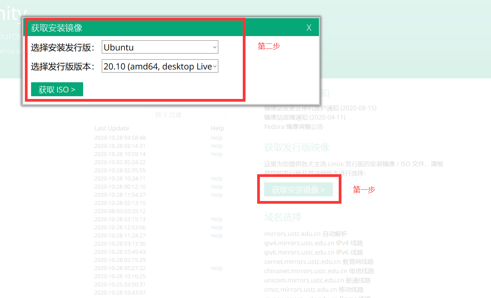
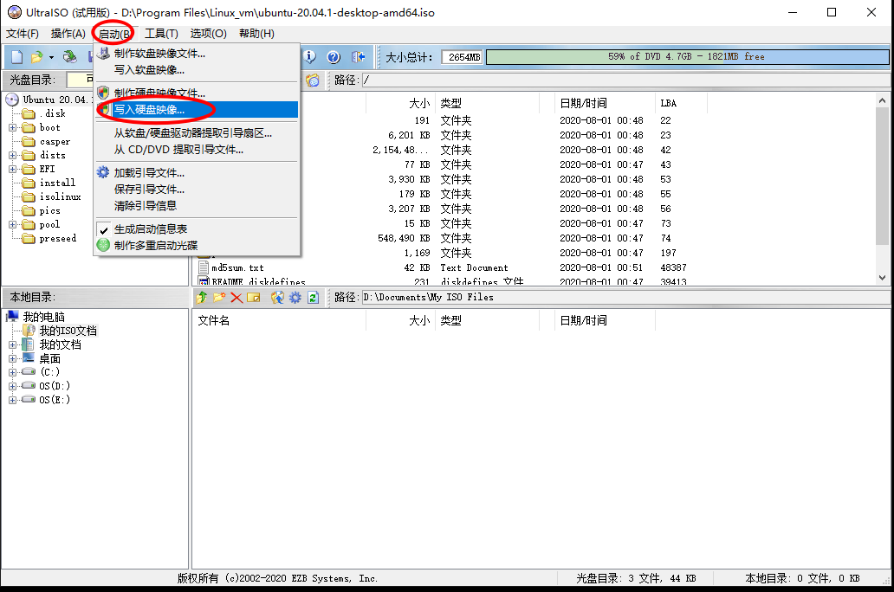
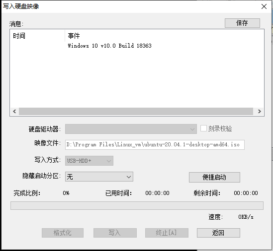
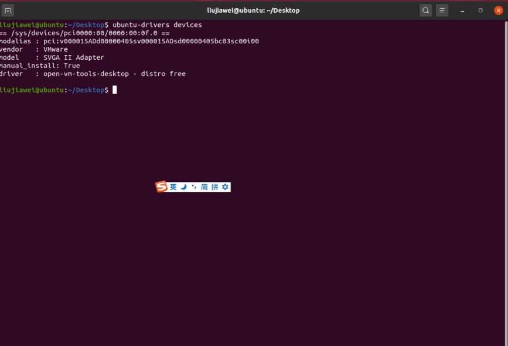
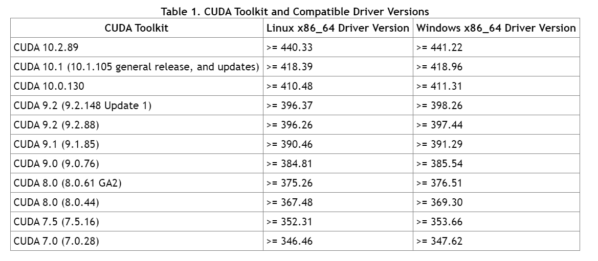
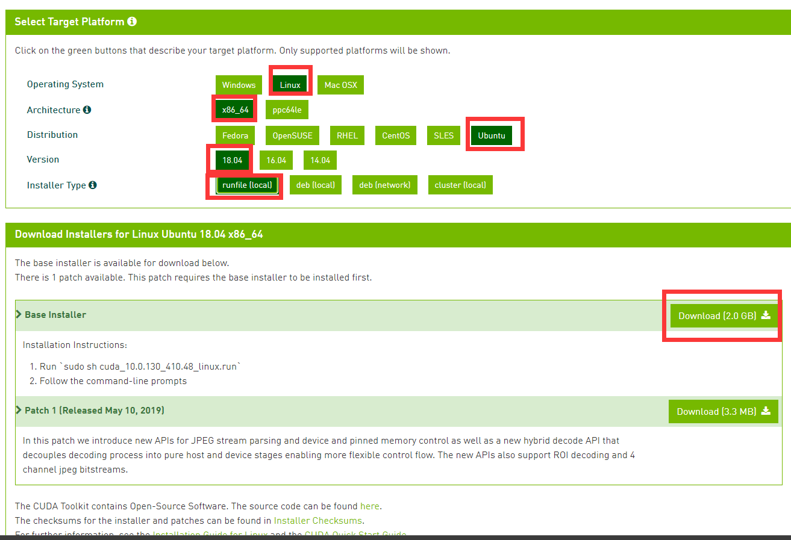
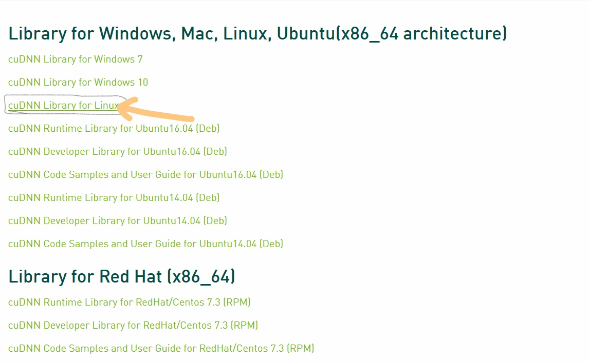

# Linux系统的安装

## 获取镜像

用软通碟，UItraISO。

Ubuntu 镜像去中科大镜像站下载

<a href="http://mirrors.ustc.edu.cn/">科大镜像</a>

- 获取安装镜像
- 选择安装发行版
- 选择发行版本

<div align="center"></div>

##  制作系统盘

- 找到软件 ultraiso，下载安装
- 下载 ubuntu 镜像
- 找到下载好的镜像，双击，默认会以 ultraiso 打开。
- 启动-->写入硬盘映像

<div align="center"></div>

选择磁盘驱动器，其他的按照图里来就行，然后点击写入。

<div align="center"></div>


# CUDA安装

##  大致流程

我先装的 N 卡驱动，再装的 CUDA，然后 CUDNN。

## 先卸载

如果您的机器有安装过相关的驱动和 CUDA，那么可以使用以下命令进行彻底的删除

```shell
sudo apt-get purge nvidia*
sudo apt-get autoremove
sudo apt-get autoclean
sudo rm -rf /usr/local/cuda*
```

##  显卡驱动的安装

如果是安装 CUDA，那么这⼀步可以跳过的，因为在安装 CUDA 的时候会顺带安装显卡驱动，我是先安装显卡驱动再装 CUDA 的。

首先，禁用 Nouveau 驱动（有些是可以跳过这一步的）

```shell
sudo gedit /etc/modprobe.d/blacklist.conf
在最后两⾏添加：
blacklist nouveau
options nouveau modeset=0
sudo update-initramfs -u
sudo reboot
修改后需要重启系统。确认下Nouveau是已经被你干掉，使用命令： 
lsmod | grep nouveau
```

显卡驱动安装⽅式有三种：

- 使⽤ ubuntu 的软件仓库进⾏安装：打开软件与更新->附加驱动，选择对应的进⾏安装； 
- 使⽤ PPA 第三⽅仓库进⾏安装：sudo add-apt-repository ppa:graphics-drivers/ppa，sudo apt update , 查看可⽤的显卡驱动 sudo ubuntu-drivers devices，选择合适的进⾏安装：sudo apt install nvidia-xxx . 
- 去 NVIDIA 官⽹选择对应的进⾏安装：https://www.nvidia.cn/Download/index.aspx?lang=cn，可以通过： lshw -numeric -C display 或者 lspci -vnn | grep VGA 查看显卡型号。

显卡安装后，重启电脑，然后用 nvidia-smi 查看是否安装成功。

如果执行 nvidia-smi 显示了显卡的信息说明安装成功。

<b style="color:green">我个人采用的安装方式是</b>

```shell
#  查看ubuntu合适的安装版本
ubuntu-drivers devices
```

用的虚拟机，所以无法显示合适的显卡驱动，如果是真实的物理机，会显示可用的驱动，安装一个就行。

<div align="center"></div>

CUDA 版本的对应关系如下：



根据自己需要的 cuda 版本下载对应的驱动。

如：我需要 CUDA 10.2.x 那么我的 Driver Version 应该 >=440，那么我可以安装 440 或 450

```shell
sudo apt install # 驱动名称，我安装的是推荐的版本 它给我推荐的是450
```

<b style="color:green">然后重启电脑，再执行，一定要重启电脑！！</b>

```shell
nvidia-smi # 查看驱动是否安装成功
```

## CUDA的安装

<a href="https://developer.nvidia.com/cuda-toolkit-archive">CUDA历史版本下载</a>

理论上 runfile 还是 deb 都是可以的，但是我 deb 安装不成功，所以用的 runfile 文件。

<div align="center"></div>

```shell
sudo sh cuda_10.0.130_410.48_linux.run
```

根据提⽰进⾏安装，如果安装了显卡驱动，这边就不要再选择安装驱动了。runfile，的安装形式可以多 CUDA 共存，推荐这种方式。

安装完 CUDA 都需要设置环境变量： 

```shell
安装完CUDA都需要设置环境变量：
打开.bashrc⽂件： sudo vim ~/.bashrc
在其末尾添加：
export CUDA_HOME=/usr/local/cuda # 这个是用来建立软链接的，通过这个进行多CUDA共存
export PATH=$PATH:$CUDA_HOME/bin 
export LD_LIBRARY_PATH=/usr/local/cuda10.0/lib64${LD_LIBRARY_PATH:+:${LD_LIBRARY_PATH}}

# 生成软链接 /usr/local/cuda-10.0这个是我安装的cuda10.0的目录
sudo ln -s /usr/local/cuda-10.0 /usr/local/cuda
```

> <b>注意对应版本的更改，这个是 cuda 10.0。</b>

更新环境变量： `source ~/.bashrc` 测试 CUDA 是否安装成功：`nvcc -V` 如果不成功，请按 CUDA 多版本共存的说明进行操作!

## CUDA 多版本共存

<a href="https://blog.csdn.net/sinat_36502563/article/details/102866033">参考博客</a>

实现多版本 CUDA 共存的第一步，就是要将先前添加到 .bashrc 里的环境变量路径全部指向 cuda 软链接，也就是环境变量的路径里所有 cuda-x.0 的名字都改成 cuda，如下：

```shell
export CUDA_HOME=/usr/local/cuda 
export PATH=$PATH:$CUDA_HOME/bin 
export LD_LIBRARY_PATH=/usr/local/cuda/lib64${LD_LIBRARY_PATH:+:${LD_LIBRARY_PATH}}
```

原先安装的是 CUDA-9.0，所以 nvcc -V 指令可以获得版本信息：

```shell
nvcc: NVIDIA (R) Cuda compiler driverCopyright (c) 2005-2017 NVIDIA CorporationBuilt on Fri_Sep__1_21:08:03_CDT_2017Cuda compilation tools, release 9.0, V9.0.176
```

安装新的 CUDA-10.0 时记得不要选择安装驱动且不要生成软链接，安装完成后可以在 /usr/local/ 下看到 cuda-9.0 和 cuda-10.0 两个文件夹（cudnn 的安装是把一个 .h 头文件和几个 lib 放到 cuda 的对应目录下面，记得 sudo cp 的时候写到真实的 cuda-10.0 这样的路径下，不要写到 cuda 软链接路径就好，这样不影响版本对应）。

将 cuda-9.0 切换成 cuda-10.0 的过程如下：

```shell
sudo rm -rf /usr/local/cuda  #删除之前生成的软链接sudo ln -s /usr/local/cuda-10.0 /usr/local/cuda #生成新的软链接
```

完成之后即可看到 nvcc -V 输出的 cuda 版本已经变成了 10.0。再想切回 cuda-9.0 只需要再用上述指令给 9.0 的路径生成新的同名软链接即可。

## CUDNN的安装

cudnn 的安装非常简单

### 下载文件

按需求下载 [cudnn的安装文件](https://developer.nvidia.com/rdp/cudnn-archive)：https://developer.nvidia.com/rdp/cudnn-archive

Tar File 的下载如下图所示，选择红方框中的选项进行下载

<div align="center"></div>

下载的是 cudnn-*tgz 的压缩包时，按下方指令进行安装：

首先解压缩下的 cudnn 压缩包文件

```shell
tar -xzvf cudnn-9.0-linux-x64-v7.tgz
```

执行安装，其实就是拷贝头文件和库文件并给予权限

```shell
sudo cp cuda/include/cudnn.h /usr/local/cuda-10.1/include
sudo cp cuda/lib64/libcudnn* /usr/local/cuda-10.1/lib64
sudo chmod a+r /usr/local/cuda-10.1/include/cudnn.h 
sudo chmod a+r /usr/local/cuda-10.1/lib64/libcudnn*
```

（2）验证安装是否成功

```shell
cat /usr/local/cuda/include/cudnn.h | grep CUDNN_MAJOR -A 2
```

如果显示

```shell
#define CUDNN_MAJOR 7#define CUDNN_MINOR 6#define CUDNN_PATCHLEVEL 2--#define CUDNN_VERSION (CUDNN_MAJOR * 1000 + CUDNN_MINOR * 100 + CUDNN_PATCHLEVEL)
```

则 cudnn 安装成功

#  PyTorch安装

按照官网的流程进行按照的话，是无法按照 GPU 版本的，即便选的是 GPU 的安装方式。所以，先通过官网的方式安装一下，看什么版本最合适，然后去清华镜像下载对应版本的 GPU 版本文件，离线安装。

或者直接取清华镜像找对应的 GPU 版本，离线安装。

#  Ubuntu配置常用软件

记录 ubuntu20 配置常用开发软件的流程

# Ubuntu安装&移除

<b>sh 文件</b>

```shell
# 安装
bash xx.sh  或 sh xx.sh
# 移除

```

<b>deb 文件</b>

```shell
# 安装
sudo dpkg -i xxx.deb
# 移除
sudo dpkg -r xxx(package_name)
# 连同配置文件一起删除
sudo dpkg -r --purge xxx.deb
```

<b>sudo 安装</b>

```shell
# 安装软件
sudo apt install softname1 softname2
# 卸载软件 
sudo apt-get remove softname1 softname2 softname3……
# 卸载并清除配置
sudo  apt-get remove --purge softname1
# 同上
sudo apt install softname1
```

# 常用命令

## 解压

## 移动/复制

# 常用快捷键

- 打开搜索页 = Win
- 打开终端窗口 = Ctrl + Alt + T
- 关闭当前窗口 = Alt + F4
- 在当前桌面的不同程序之间切换 = Alt + Tab 
- 启动“平铺”切换模式 = Win + W
- 最大化当前窗口和还原当前窗口 = Ctrl + Win + 上下箭头
- 半最大化当前窗口= Ctrl + Win + 左右箭头
- 将窗口放在相应位置 = Ctrl + Alt + 数字键
- 显示桌面 = Ctrl + Win + D

# git&maven

## git的配置

<b>安装 git</b>

```shell
sudo apt-get install git
```

<b>配置用户信息</b>

```shell
git config --global user.name "Your Name"
git config --global user.email You_eamil@example.com
```

<b>初始化本的仓库(不是必须的)</b>

```shell
git init
```

## 通过SSH连接Github

<b>安装 ssh</b>

```shell
sudo apt-gett install ssh # 我的直接报错，因为有ssh了
"""
正在读取软件包列表... 完成
正在分析软件包的依赖关系树       
正在读取状态信息... 完成       
有一些软件包无法被安装。如果您用的是 unstable 发行版，这也许是
因为系统无法达到您要求的状态造成的。该版本中可能会有一些您需要的软件
包尚未被创建或是它们已被从新到(Incoming)目录移出。
下列信息可能会对解决问题有所帮助：

下列软件包有未满足的依赖关系：
 ssh : 依赖: openssh-server (>= 1:7.6p1-4ubuntu0.4)
E: 无法修正错误，因为您要求某些软件包保持现状，就是它们破坏了软件包间的依赖关系。
"""
```

<b>创建密钥文件</b>

```shell
ssh-keygen -t rsa -C "你的github账号邮箱"
```

我的是在 /home/用户名 目录下的  .ssh 目录下

```shell
(base) xxx@xxx:~$ ls -a
.       音乐           .condarc    .mozilla         snap
..      桌面           .config     notes            .ssh
公共的  anaconda3      .empty      .pki             .sudo_as_admin_successful
模板    .bash_history  .git        .profile         .vscode
视频    .bash_logout   .gitconfig  PycharmProjects
图片    .bashrc        .gnupg      .pylint.d
文档    .cache         .java       python
下载    .conda         .local      .python_history

```

<b>进入 .ssh 找到 id_rsa.pub 公钥，添加到 github 中</b>

- settings--->SSH and GPG keys--->New SSH key--->title 随意，key 就是那个公钥

ssh 测试

```shell
ssh -T git@github.com # 固定写法哦
```

<a href="https://segmentfault.com/a/1190000013154540">参考博客</a>

## maven配置

有空在说

# JetBrains全家桶

## Pycharm

先安装 JDK JDK 的安装看下面好吧

- 下载pycharm

<a href="https://www.jetbrains.com/pycharm/download/#section=linux"><b>下载地址</b></a>

- 拷贝文件到  /opt 目录

```shell
cp 文件所在路径 /opt
# eg
cp /tmp/pycharm-2020.2.2.tar.gz /opt
# 拷贝完后记得删除 原文件哦
```

- 解压 /opt下的文件

```shell
sudo tar -zcvf pycharm.tar.gz
# 解压完后记得删除 原文件哦
```

- 安装（我觉得这只能算是运行，不能说是安装）

```shell
# 进入解压文件的bin目录
# 运行.sh文件
sudo sh pycharm.sh
```

安装的时候先选试用，破解教程如下：

这里面，你如果要更换 Python 解释器的话，我推荐先找到解释器的位置，然后把解释器的位置复制过去。

- 添加快捷方式

打开 Pycharm，Tools --> Create Desktop Entry，然后注销用户重新登入

# JDK&Annconda

## 安装JDK

<a href="https://www.oracle.com/java/technologies/javase-downloads.html"><b>官网下载，现在需要登陆才能下载老版本的 JDK。</b></a>

建议下载 jdk1.8 或 jdk11，这两个是长期稳定版，推荐 jdk11，dep 文件安装方便。

```shell
sudo dpkg -i 下载好的文件包
```

修改环境变量

```shell
# 查看jdk位置。好像dep安装方式才能这样。。
whereis jvm
sudo gedit /etc/profile # 打开配置文件
# 在配置文件末尾追加
export JAVA_HOME=你jdk所在的目录  
#如 export JAVA_HOME=/usr/lib/jvm/jdk-11.0.8
export PATH=$PATH:$JAVA_HOME/bin
export CLASSPATH=$JAVA_HOME/lib
```

使环境变量生效

```shell
source /etc/profile
```

重启电脑

```shell
javac #查看是否成功，没成功的话 换一篇博客试一下
```

## 安装Annconda

# 升级工具

## 升级cmake

- 下载所需版本的 cmake 源码

```shell
wget https://cmake.org/files/v3.22/cmake-3.22.1.tar.gz
```

- 解压

```shell
tar -xvzf cmake-3.22.1.tar.gz
```

- 进入解压目录

```shell
chmod 777 ./configure
./configure
```

- 编译

```shell
make
```

- 安装

```shell
sudo make install
```

- 替换旧版 cmake，中 `/usr/local/bin/cmake` 为新安装的 cmake 目录。

```shell
sudo update-alternatives --install /usr/bin/cmake cmake /usr/local/bin/cmake 1 --force
```

- 试 cmake 版本

```shell
cmake --version
```

如果上述方法不成功则使用下面的方法

[WSL安装最新版的cmake - 知乎 (zhihu.com)](https://zhuanlan.zhihu.com/p/508835872)
