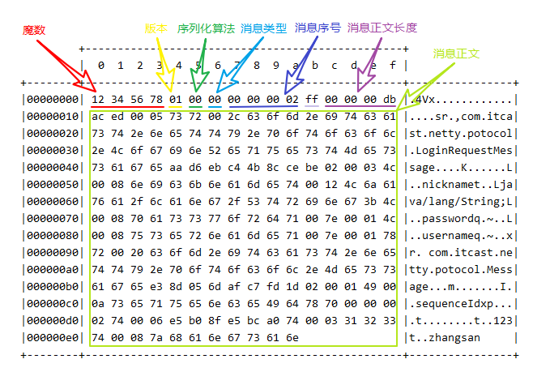

# 三. Netty 进阶

## 1. 粘包与半包

### 1.1 粘包现象

服务端代码

```java
public class HelloWorldServer {
    static final Logger log = LoggerFactory.getLogger(HelloWorldServer.class);
    void start() {
        NioEventLoopGroup boss = new NioEventLoopGroup(1);
        NioEventLoopGroup worker = new NioEventLoopGroup();
        try {
            ServerBootstrap serverBootstrap = new ServerBootstrap();
            serverBootstrap.channel(NioServerSocketChannel.class);
            serverBootstrap.group(boss, worker);
            serverBootstrap.childHandler(new ChannelInitializer<SocketChannel>() {
                @Override
                protected void initChannel(SocketChannel ch) throws Exception {
                    ch.pipeline().addLast(new LoggingHandler(LogLevel.DEBUG));
                    ch.pipeline().addLast(new ChannelInboundHandlerAdapter() {
                        @Override
                        public void channelActive(ChannelHandlerContext ctx) throws Exception {
                            log.debug("connected {}", ctx.channel());
                            super.channelActive(ctx);
                        }

                        @Override
                        public void channelInactive(ChannelHandlerContext ctx) throws Exception {
                            log.debug("disconnect {}", ctx.channel());
                            super.channelInactive(ctx);
                        }
                    });
                }
            });
            ChannelFuture channelFuture = serverBootstrap.bind(8080);
            log.debug("{} binding...", channelFuture.channel());
            channelFuture.sync();
            log.debug("{} bound...", channelFuture.channel());
            channelFuture.channel().closeFuture().sync();
        } catch (InterruptedException e) {
            log.error("server error", e);
        } finally {
            boss.shutdownGracefully();
            worker.shutdownGracefully();
            log.debug("stoped");
        }
    }

    public static void main(String[] args) {
        new HelloWorldServer().start();
    }
}
```

客户端代码希望发送 10 个消息，每个消息是 16 字节

```java
public class HelloWorldClient {
    static final Logger log = LoggerFactory.getLogger(HelloWorldClient.class);
    public static void main(String[] args) {
        NioEventLoopGroup worker = new NioEventLoopGroup();
        try {
            Bootstrap bootstrap = new Bootstrap();
            bootstrap.channel(NioSocketChannel.class);
            bootstrap.group(worker);
            bootstrap.handler(new ChannelInitializer<SocketChannel>() {
                @Override
                protected void initChannel(SocketChannel ch) throws Exception {
                    log.debug("connetted...");
                    ch.pipeline().addLast(new ChannelInboundHandlerAdapter() {
                        @Override
                        public void channelActive(ChannelHandlerContext ctx) throws Exception {
                            log.debug("sending...");
                            Random r = new Random();
                            char c = 'a';
                            for (int i = 0; i < 10; i++) {
                                ByteBuf buffer = ctx.alloc().buffer();
                                buffer.writeBytes(new byte[]{0, 1, 2, 3, 4, 5, 6, 7, 8, 9, 10, 11, 12, 13, 14, 15});
                                ctx.writeAndFlush(buffer);
                            }
                        }
                    });
                }
            });
            ChannelFuture channelFuture = bootstrap.connect("127.0.0.1", 8080).sync();
            channelFuture.channel().closeFuture().sync();

        } catch (InterruptedException e) {
            log.error("client error", e);
        } finally {
            worker.shutdownGracefully();
        }
    }
}
```

服务器端的某次输出，可以看到一次就接收了 160 个字节，而非分 10 次接收

```
08:24:46 [DEBUG] [main] c.i.n.HelloWorldServer - [id: 0x81e0fda5] binding...
08:24:46 [DEBUG] [main] c.i.n.HelloWorldServer - [id: 0x81e0fda5, L:/0:0:0:0:0:0:0:0:8080] bound...
08:24:55 [DEBUG] [nioEventLoopGroup-3-1] i.n.h.l.LoggingHandler - [id: 0x94132411, L:/127.0.0.1:8080 - R:/127.0.0.1:58177] REGISTERED
08:24:55 [DEBUG] [nioEventLoopGroup-3-1] i.n.h.l.LoggingHandler - [id: 0x94132411, L:/127.0.0.1:8080 - R:/127.0.0.1:58177] ACTIVE
08:24:55 [DEBUG] [nioEventLoopGroup-3-1] c.i.n.HelloWorldServer - connected [id: 0x94132411, L:/127.0.0.1:8080 - R:/127.0.0.1:58177]
08:24:55 [DEBUG] [nioEventLoopGroup-3-1] i.n.h.l.LoggingHandler - [id: 0x94132411, L:/127.0.0.1:8080 - R:/127.0.0.1:58177] READ: 160B
         +-------------------------------------------------+
         |  0  1  2  3  4  5  6  7  8  9  a  b  c  d  e  f |
+--------+-------------------------------------------------+----------------+
|00000000| 00 01 02 03 04 05 06 07 08 09 0a 0b 0c 0d 0e 0f |................|
|00000010| 00 01 02 03 04 05 06 07 08 09 0a 0b 0c 0d 0e 0f |................|
|00000020| 00 01 02 03 04 05 06 07 08 09 0a 0b 0c 0d 0e 0f |................|
|00000030| 00 01 02 03 04 05 06 07 08 09 0a 0b 0c 0d 0e 0f |................|
|00000040| 00 01 02 03 04 05 06 07 08 09 0a 0b 0c 0d 0e 0f |................|
|00000050| 00 01 02 03 04 05 06 07 08 09 0a 0b 0c 0d 0e 0f |................|
|00000060| 00 01 02 03 04 05 06 07 08 09 0a 0b 0c 0d 0e 0f |................|
|00000070| 00 01 02 03 04 05 06 07 08 09 0a 0b 0c 0d 0e 0f |................|
|00000080| 00 01 02 03 04 05 06 07 08 09 0a 0b 0c 0d 0e 0f |................|
|00000090| 00 01 02 03 04 05 06 07 08 09 0a 0b 0c 0d 0e 0f |................|
+--------+-------------------------------------------------+----------------+
08:24:55 [DEBUG] [nioEventLoopGroup-3-1] i.n.h.l.LoggingHandler - [id: 0x94132411, L:/127.0.0.1:8080 - R:/127.0.0.1:58177] READ COMPLETE
```

### 1.2 半包现象

客户端代码希望发送 1 个消息，这个消息是 160 字节，代码改为

```java
ByteBuf buffer = ctx.alloc().buffer();
for (int i = 0; i < 10; i++) {
    buffer.writeBytes(new byte[]{0, 1, 2, 3, 4, 5, 6, 7, 8, 9, 10, 11, 12, 13, 14, 15});
}
ctx.writeAndFlush(buffer);
```

为现象明显，服务端修改一下接收缓冲区，其它代码不变

```java
serverBootstrap.option(ChannelOption.SO_RCVBUF, 10);
```

服务器端的某次输出，可以看到接收的消息被分为两节，第一次 20 字节，第二次 140 字节

```
08:43:49 [DEBUG] [main] c.i.n.HelloWorldServer - [id: 0x4d6c6a84] binding...
08:43:49 [DEBUG] [main] c.i.n.HelloWorldServer - [id: 0x4d6c6a84, L:/0:0:0:0:0:0:0:0:8080] bound...
08:44:23 [DEBUG] [nioEventLoopGroup-3-1] i.n.h.l.LoggingHandler - [id: 0x1719abf7, L:/127.0.0.1:8080 - R:/127.0.0.1:59221] REGISTERED
08:44:23 [DEBUG] [nioEventLoopGroup-3-1] i.n.h.l.LoggingHandler - [id: 0x1719abf7, L:/127.0.0.1:8080 - R:/127.0.0.1:59221] ACTIVE
08:44:23 [DEBUG] [nioEventLoopGroup-3-1] c.i.n.HelloWorldServer - connected [id: 0x1719abf7, L:/127.0.0.1:8080 - R:/127.0.0.1:59221]
08:44:24 [DEBUG] [nioEventLoopGroup-3-1] i.n.h.l.LoggingHandler - [id: 0x1719abf7, L:/127.0.0.1:8080 - R:/127.0.0.1:59221] READ: 20B
         +-------------------------------------------------+
         |  0  1  2  3  4  5  6  7  8  9  a  b  c  d  e  f |
+--------+-------------------------------------------------+----------------+
|00000000| 00 01 02 03 04 05 06 07 08 09 0a 0b 0c 0d 0e 0f |................|
|00000010| 00 01 02 03                                     |....            |
+--------+-------------------------------------------------+----------------+
08:44:24 [DEBUG] [nioEventLoopGroup-3-1] i.n.h.l.LoggingHandler - [id: 0x1719abf7, L:/127.0.0.1:8080 - R:/127.0.0.1:59221] READ COMPLETE
08:44:24 [DEBUG] [nioEventLoopGroup-3-1] i.n.h.l.LoggingHandler - [id: 0x1719abf7, L:/127.0.0.1:8080 - R:/127.0.0.1:59221] READ: 140B
         +-------------------------------------------------+
         |  0  1  2  3  4  5  6  7  8  9  a  b  c  d  e  f |
+--------+-------------------------------------------------+----------------+
|00000000| 04 05 06 07 08 09 0a 0b 0c 0d 0e 0f 00 01 02 03 |................|
|00000010| 04 05 06 07 08 09 0a 0b 0c 0d 0e 0f 00 01 02 03 |................|
|00000020| 04 05 06 07 08 09 0a 0b 0c 0d 0e 0f 00 01 02 03 |................|
|00000030| 04 05 06 07 08 09 0a 0b 0c 0d 0e 0f 00 01 02 03 |................|
|00000040| 04 05 06 07 08 09 0a 0b 0c 0d 0e 0f 00 01 02 03 |................|
|00000050| 04 05 06 07 08 09 0a 0b 0c 0d 0e 0f 00 01 02 03 |................|
|00000060| 04 05 06 07 08 09 0a 0b 0c 0d 0e 0f 00 01 02 03 |................|
|00000070| 04 05 06 07 08 09 0a 0b 0c 0d 0e 0f 00 01 02 03 |................|
|00000080| 04 05 06 07 08 09 0a 0b 0c 0d 0e 0f             |............    |
+--------+-------------------------------------------------+----------------+
08:44:24 [DEBUG] [nioEventLoopGroup-3-1] i.n.h.l.LoggingHandler - [id: 0x1719abf7, L:/127.0.0.1:8080 - R:/127.0.0.1:59221] READ COMPLETE
```

> **注意**
>
> serverBootstrap.option(ChannelOption.SO_RCVBUF, 10) 影响的底层接收缓冲区（即滑动窗口）大小，仅决定了 netty 读取的最小单位，netty 实际每次读取的一般是它的整数倍

### 1.3 现象分析

粘包

* 现象，发送 abc def，接收 abcdef
* 原因
  * 应用层：接收方 ByteBuf 设置太大（Netty 默认 1024）
  * 滑动窗口：假设发送方 256 bytes 表示一个完整报文，但由于接收方处理不及时且窗口大小足够大，这 256 bytes 字节就会缓冲在接收方的滑动窗口中，当滑动窗口中缓冲了多个报文就会粘包
  * Nagle 算法：尽可能多的发送数据，但是会造成粘包

半包

* 现象，发送 abcdef，接收 abc def
* 原因
  * 应用层：接收方 ByteBuf 小于实际发送数据量
  * 滑动窗口：假设接收方的窗口只剩了 128 bytes，发送方的报文大小是 256 bytes，这时放不下了，只能先发送前 128 bytes，等待 ack 后才能发送剩余部分，这就造成了半包
  * MSS 限制：当发送的数据超过 MSS 限制后，会将数据切分发送，就会造成半包

**本质是因为 TCP 是流式协议，消息无边界**

> 滑动窗口
>
> * TCP 以一个段（segment）为单位，每发送一个段就需要进行一次确认应答（ack）处理，但如果这么做，缺点是包的往返时间越长性能就越差
>
>   
>
> 
>
> * 为了解决此问题，引入了窗口概念，窗口大小即决定了无需等待应答而可以继续发送的数据最大值
>
>   
>
> * 窗口实际就起到一个缓冲区的作用，同时也能起到流量控制的作用
>
>   * 图中深色的部分即要发送的数据，高亮的部分即窗口
>   * 窗口内的数据才允许被发送，当应答未到达前，窗口必须停止滑动
>   * 如果 1001~2000 这个段的数据 ack 回来了，窗口就可以向前滑动
>   * 接收方也会维护一个窗口，只有落在窗口内的数据才能允许接收
>

>  MSS 限制
>
>  * 链路层对一次能够发送的最大数据有限制，这个限制称之为 MTU（maximum transmission unit），不同的链路设备的 MTU 值也有所不同，例如
>
>   * 以太网的 MTU 是 1500
>   * FDDI（光纤分布式数据接口）的 MTU 是 4352
>   * 本地回环地址的 MTU 是 65535 - 本地测试不走网卡
>
>  * MSS 是最大段长度（maximum segment size），它是 MTU 刨去 tcp 头和 ip 头后剩余能够作为数据传输的字节数
>
>   * ipv4 tcp 头占用 20 bytes，ip 头占用 20 bytes，因此以太网 MSS 的值为 1500 - 40 = 1460
>   * TCP 在传递大量数据时，会按照 MSS 大小将数据进行分割发送
>   * MSS 的值在三次握手时通知对方自己 MSS 的值，然后在两者之间选择一个小值作为 MSS
>
>   

> Nagle 算法
>
> * 即使发送一个字节，也需要加入 tcp 头和 ip 头，也就是总字节数会使用 41 bytes，非常不经济。因此为了提高网络利用率，tcp 希望尽可能发送足够大的数据，这就是 Nagle 算法产生的缘由
> * 该算法是指发送端即使还有应该发送的数据，但如果这部分数据很少的话，则进行延迟发送
>   * 如果 SO_SNDBUF 的数据达到 MSS，则需要发送
>   * 如果 SO_SNDBUF 中含有 FIN（表示需要连接关闭）这时将剩余数据发送，再关闭
>   * 如果 TCP_NODELAY = true，则需要发送
>   * 已发送的数据都收到 ack 时，则需要发送
>   * 上述条件不满足，但发生超时（一般为 200ms）则需要发送
>   * 除上述情况，延迟发送

### 1.4 解决方案

1. 短链接，发一个包建立一次连接，这样连接建立到连接断开之间就是消息的边界，缺点效率太低
2. 每一条消息采用固定长度，缺点浪费空间
3. 每一条消息采用分隔符，例如 \n，缺点需要转义
4. 每一条消息分为 head 和 body，head 中包含 body 的长度

#### 方法1，短链接

> 客户端代码 以解决粘包为例

```java
public class HelloWorldClient {
    static final Logger log = LoggerFactory.getLogger(HelloWorldClient.class);

    public static void main(String[] args) {
        // 分 10 次发送
        for (int i = 0; i < 10; i++) {
            send();
        }
    }

    private static void send() {
        NioEventLoopGroup worker = new NioEventLoopGroup();
        try {
            Bootstrap bootstrap = new Bootstrap();
            bootstrap.channel(NioSocketChannel.class);
            bootstrap.group(worker);
            bootstrap.handler(new ChannelInitializer<SocketChannel>() {
                @Override
                protected void initChannel(SocketChannel ch) throws Exception {
                    log.debug("conneted...");
                    ch.pipeline().addLast(new LoggingHandler(LogLevel.DEBUG));
                    ch.pipeline().addLast(new ChannelInboundHandlerAdapter() {
                        @Override
                        public void channelActive(ChannelHandlerContext ctx) throws Exception {
                            log.debug("sending...");
                            ByteBuf buffer = ctx.alloc().buffer();
                            buffer.writeBytes(new byte[]{0, 1, 2, 3, 4, 5, 6, 7, 8, 9, 10, 11, 12, 13, 14, 15});
                            ctx.writeAndFlush(buffer);
                            // 发完即关
                            ctx.close();
                        }
                    });
                }
            });
            ChannelFuture channelFuture = bootstrap.connect("localhost", 8080).sync();.0000000.
                
            channelFuture.channel().closeFuture().sync();

        } catch (InterruptedException e) {
            log.error("client error", e);
        } finally {
            worker.shutdownGracefully();
        }
    }
}
```

> 服务器端代码

```java
public class HelloWorldServer {
    static final Logger log = LoggerFactory.getLogger(HelloWorldServer.class);

    void start() {
        NioEventLoopGroup boss = new NioEventLoopGroup(1);
        NioEventLoopGroup worker = new NioEventLoopGroup();
        try {
            ServerBootstrap serverBootstrap = new ServerBootstrap();
            serverBootstrap.channel(NioServerSocketChannel.class);
            serverBootstrap.option(ChannelOption.SO_RCVBUF, 10); // 设置默认缓冲区大小。
            serverBootstrap.group(boss, worker);
            serverBootstrap.childHandler(new ChannelInitializer<SocketChannel>() {
                @Override
                protected void initChannel(SocketChannel ch) throws Exception {
                    ch.pipeline().addLast(new LoggingHandler(LogLevel.DEBUG));
                    ch.pipeline().addLast(new ChannelInboundHandlerAdapter() {
                        @Override//连接建立成功后触发 active 事件
                        public void channelActive(ChannelHandlerContext ctx) throws Exception {
                            log.debug("connected {}", ctx.channel());
                            super.channelActive(ctx);
                        }

                        @Override
                        public void channelInactive(ChannelHandlerContext ctx) throws Exception {
                            log.debug("disconnect {}", ctx.channel());
                            super.channelInactive(ctx);
                        }
                    });
                }
            });
            ChannelFuture channelFuture = serverBootstrap.bind(8080);
            log.debug("{} binding...", channelFuture.channel());
            channelFuture.sync();
            log.debug("{} bound...", channelFuture.channel());
            channelFuture.channel().closeFuture().sync();
        } catch (InterruptedException e) {
            log.error("server error", e);
        } finally {
            boss.shutdownGracefully();
            worker.shutdownGracefully();
            log.debug("stopped");
        }
    }

    public static void main(String[] args) {
        new HelloWorldServer().start();
    }
}
```

输出，略

> 半包用这种办法还是不好解决，因为接收方的缓冲区大小是有限的

#### 方法2，固定长度

`FixedLengthFrameDecoder`服务器端代码 让所有数据包长度固定（假设长度为 8 字节），服务器端加入

`ch.pipeline().addLast(new FixedLengthFrameDecoder(10));`

```java
@Slf4j
public class Server2 {
    public static void main(String[] args) throws InterruptedException {
        NioEventLoopGroup boss = new NioEventLoopGroup();
        NioEventLoopGroup worker = new NioEventLoopGroup(2);
        try {

            ServerBootstrap bootstrap = new ServerBootstrap();
            bootstrap.group(boss, worker);
            bootstrap.channel(NioServerSocketChannel.class);
            bootstrap.childOption(ChannelOption.RCVBUF_ALLOCATOR, new AdaptiveRecvByteBufAllocator(16, 16, 16));
            bootstrap.childHandler(new ChannelInitializer<NioSocketChannel>() {

                @Override
                protected void initChannel(NioSocketChannel ch) throws Exception {
                    // 解码器先解码，在打日志，这样拿到的才是解码正确的数据
                    ch.pipeline().addLast(new FixedLengthFrameDecoder(10));
                    ch.pipeline().addLast(new LoggingHandler(LogLevel.DEBUG));
                }
            });
            ChannelFuture sync = bootstrap.bind(8080).sync();
            sync.channel().closeFuture().sync();
        } catch (Exception e) {
            log.error("server error {}", e);
        } finally {
            boss.shutdownGracefully();
            worker.shutdownGracefully();
        }
    }
}
```

> 客户端测试代码，注意, 采用这种方法后，客户端什么时候 flush 都可以

```java
@Slf4j
public class Client2 {
    public static void main(String[] args) throws InterruptedException {
        NioEventLoopGroup worker = new NioEventLoopGroup();
        // Netty 客户端
        try {
            Bootstrap bootstrap = new Bootstrap();
            bootstrap.group(worker);
            bootstrap.channel(NioSocketChannel.class);
            bootstrap.handler(new ChannelInitializer<NioSocketChannel>() {

                @Override
                protected void initChannel(NioSocketChannel ch) throws Exception {
                    ch.pipeline().addLast(new LoggingHandler(LogLevel.DEBUG));
                    ch.pipeline().addLast(new StringEncoder());
                    ch.pipeline().addLast(new ChannelInboundHandlerAdapter() {
                        @Override
                        public void channelActive(ChannelHandlerContext ctx) throws Exception {
                            log.debug("sending");
                            ByteBuf buf = ctx.alloc().buffer();
                            char c = '0';
                            Random random = new Random();
                            for (int i = 0; i < 10; i++) {
                                byte[] bytes = fill0Bytes(c++, random.nextInt(8) + 1, 10);
                                buf.writeBytes(bytes);
                            }
                            ctx.writeAndFlush(buf);
                            log.debug("send over");
                            super.channelActive(ctx);
                        }
                    });
                }
            });
            ChannelFuture channelFuture = bootstrap.connect("127.0.0.1", 8080).sync();
            channelFuture.channel().closeFuture().sync();
        } catch (Exception e) {
            log.error("client error {}", e);
        } finally {
            worker.shutdownGracefully();
        }
    }

    // 返回 len 个 c，len<max 以 _ 替代
    public static byte[] fill0Bytes(char c, int len, int max) {
        byte[] bytes = new byte[max];
        for (int i = 0; i < len; i++) {
            bytes[i] = (byte) c;
        }
        for (int i = len; i < max; i++) {
            bytes[i] = '_';
        }
        return bytes;
    }
}
```

客户端输出

```
21:36:02.262 io.netty.handler.logging.LoggingHandler [nioEventLoopGroup-2-1] - [id: 0x5d4e6f56] REGISTERED
21:36:02.262 io.netty.handler.logging.LoggingHandler [nioEventLoopGroup-2-1] - [id: 0x5d4e6f56] CONNECT: /127.0.0.1:8080
21:36:02.272 io.netty.handler.logging.LoggingHandler [nioEventLoopGroup-2-1] - [id: 0x5d4e6f56, L:/127.0.0.1:13289 - R:/127.0.0.1:8080] ACTIVE
21:36:02.292 io.netty.handler.logging.LoggingHandler [nioEventLoopGroup-2-1] - [id: 0x5d4e6f56, L:/127.0.0.1:13289 - R:/127.0.0.1:8080] WRITE: 100B
         +-------------------------------------------------+
         |  0  1  2  3  4  5  6  7  8  9  a  b  c  d  e  f |
+--------+-------------------------------------------------+----------------+
|00000000| 30 30 30 30 30 30 30 5f 5f 5f 31 31 31 31 31 31 |0000000___111111|
|00000010| 31 5f 5f 5f 32 32 32 32 32 32 5f 5f 5f 5f 33 33 |1___222222____33|
|00000020| 33 5f 5f 5f 5f 5f 5f 5f 34 34 34 5f 5f 5f 5f 5f |3_______444_____|
|00000030| 5f 5f 35 35 35 35 35 35 5f 5f 5f 5f 36 36 5f 5f |__555555____66__|
|00000040| 5f 5f 5f 5f 5f 5f 37 37 37 37 5f 5f 5f 5f 5f 5f |______7777______|
|00000050| 38 38 5f 5f 5f 5f 5f 5f 5f 5f 39 39 39 39 39 39 |88________999999|
|00000060| 39 39 5f 5f                                     |99__            |
+--------+-------------------------------------------------+----------------+
21:36:02.292 io.netty.handler.logging.LoggingHandler [nioEventLoopGroup-2-1] - [id: 0x5d4e6f56, L:/127.0.0.1:13289 - R:/127.0.0.1:8080] FLUSH
```

服务端输出

```
         +-------------------------------------------------+
         |  0  1  2  3  4  5  6  7  8  9  a  b  c  d  e  f |
+--------+-------------------------------------------------+----------------+
|00000000| 30 30 30 30 30 30 30 5f 5f 5f                   |0000000___      |
+--------+-------------------------------------------------+----------------+
21:36:02.292 io.netty.handler.logging.LoggingHandler [nioEventLoopGroup-3-1] - [id: 0x997f5006, L:/127.0.0.1:8080 - R:/127.0.0.1:13289] READ COMPLETE
21:36:02.292 io.netty.handler.logging.LoggingHandler [nioEventLoopGroup-3-1] - [id: 0x997f5006, L:/127.0.0.1:8080 - R:/127.0.0.1:13289] READ: 10B
         +-------------------------------------------------+
         |  0  1  2  3  4  5  6  7  8  9  a  b  c  d  e  f |
+--------+-------------------------------------------------+----------------+
|00000000| 31 31 31 31 31 31 31 5f 5f 5f                   |1111111___      |
+--------+-------------------------------------------------+----------------+
21:36:02.292 io.netty.handler.logging.LoggingHandler [nioEventLoopGroup-3-1] - [id: 0x997f5006, L:/127.0.0.1:8080 - R:/127.0.0.1:13289] READ: 10B
         +-------------------------------------------------+
         |  0  1  2  3  4  5  6  7  8  9  a  b  c  d  e  f |
+--------+-------------------------------------------------+----------------+
|00000000| 32 32 32 32 32 32 5f 5f 5f 5f                   |222222____      |
+--------+-------------------------------------------------+----------------+
21:36:02.292 io.netty.handler.logging.LoggingHandler [nioEventLoopGroup-3-1] - [id: 0x997f5006, L:/127.0.0.1:8080 - R:/127.0.0.1:13289] READ COMPLETE
21:36:02.292 io.netty.handler.logging.LoggingHandler [nioEventLoopGroup-3-1] - [id: 0x997f5006, L:/127.0.0.1:8080 - R:/127.0.0.1:13289] READ: 10B
         +-------------------------------------------------+
         |  0  1  2  3  4  5  6  7  8  9  a  b  c  d  e  f |
+--------+-------------------------------------------------+----------------+
|00000000| 33 33 33 5f 5f 5f 5f 5f 5f 5f                   |333_______      |
+--------+-------------------------------------------------+----------------+
21:36:02.292 io.netty.handler.logging.LoggingHandler [nioEventLoopGroup-3-1] - [id: 0x997f5006, L:/127.0.0.1:8080 - R:/127.0.0.1:13289] READ COMPLETE
21:36:02.292 io.netty.handler.logging.LoggingHandler [nioEventLoopGroup-3-1] - [id: 0x997f5006, L:/127.0.0.1:8080 - R:/127.0.0.1:13289] READ: 10B
         +-------------------------------------------------+
         |  0  1  2  3  4  5  6  7  8  9  a  b  c  d  e  f |
+--------+-------------------------------------------------+----------------+
|00000000| 34 34 34 5f 5f 5f 5f 5f 5f 5f                   |444_______      |
+--------+-------------------------------------------------+----------------+
21:36:02.292 io.netty.handler.logging.LoggingHandler [nioEventLoopGroup-3-1] - [id: 0x997f5006, L:/127.0.0.1:8080 - R:/127.0.0.1:13289] READ: 10B
         +-------------------------------------------------+
         |  0  1  2  3  4  5  6  7  8  9  a  b  c  d  e  f |
+--------+-------------------------------------------------+----------------+
|00000000| 35 35 35 35 35 35 5f 5f 5f 5f                   |555555____      |
+--------+-------------------------------------------------+----------------+
21:36:02.292 io.netty.handler.logging.LoggingHandler [nioEventLoopGroup-3-1] - [id: 0x997f5006, L:/127.0.0.1:8080 - R:/127.0.0.1:13289] READ COMPLETE
21:36:02.292 io.netty.handler.logging.LoggingHandler [nioEventLoopGroup-3-1] - [id: 0x997f5006, L:/127.0.0.1:8080 - R:/127.0.0.1:13289] READ: 10B
         +-------------------------------------------------+
         |  0  1  2  3  4  5  6  7  8  9  a  b  c  d  e  f |
+--------+-------------------------------------------------+----------------+
|00000000| 36 36 5f 5f 5f 5f 5f 5f 5f 5f                   |66________      |
+--------+-------------------------------------------------+----------------+
21:36:02.292 io.netty.handler.logging.LoggingHandler [nioEventLoopGroup-3-1] - [id: 0x997f5006, L:/127.0.0.1:8080 - R:/127.0.0.1:13289] READ: 10B
         +-------------------------------------------------+
         |  0  1  2  3  4  5  6  7  8  9  a  b  c  d  e  f |
+--------+-------------------------------------------------+----------------+
|00000000| 37 37 37 37 5f 5f 5f 5f 5f 5f                   |7777______      |
+--------+-------------------------------------------------+----------------+
21:36:02.292 io.netty.handler.logging.LoggingHandler [nioEventLoopGroup-3-1] - [id: 0x997f5006, L:/127.0.0.1:8080 - R:/127.0.0.1:13289] READ COMPLETE
21:36:02.292 io.netty.handler.logging.LoggingHandler [nioEventLoopGroup-3-1] - [id: 0x997f5006, L:/127.0.0.1:8080 - R:/127.0.0.1:13289] READ: 10B
         +-------------------------------------------------+
         |  0  1  2  3  4  5  6  7  8  9  a  b  c  d  e  f |
+--------+-------------------------------------------------+----------------+
|00000000| 38 38 5f 5f 5f 5f 5f 5f 5f 5f                   |88________      |
+--------+-------------------------------------------------+----------------+
21:36:02.292 io.netty.handler.logging.LoggingHandler [nioEventLoopGroup-3-1] - [id: 0x997f5006, L:/127.0.0.1:8080 - R:/127.0.0.1:13289] READ COMPLETE
21:36:02.292 io.netty.handler.logging.LoggingHandler [nioEventLoopGroup-3-1] - [id: 0x997f5006, L:/127.0.0.1:8080 - R:/127.0.0.1:13289] READ: 10B
         +-------------------------------------------------+
         |  0  1  2  3  4  5  6  7  8  9  a  b  c  d  e  f |
+--------+-------------------------------------------------+----------------+
|00000000| 39 39 39 39 39 39 39 39 5f 5f                   |99999999__      |
+--------+-------------------------------------------------+----------------+
```

缺点是，数据包的大小不好把握

* 长度定的太大，浪费
* 长度定的太小，对某些数据包又显得不够

#### 方法3，固定分隔符

`LineBasedFrameDecoder`

服务端加入，默认以 \n 或 \r\n 作为分隔符，如果超出指定长度仍未出现分隔符，则抛出异常

```java
ch.pipeline().addLast(new LineBasedFrameDecoder(1024));
```

客户端在每条消息之后，加入 \n 分隔符

```java
@Slf4j
public class Client3 {
    public static void main(String[] args) throws InterruptedException {
        NioEventLoopGroup worker = new NioEventLoopGroup();
        // Netty 客户端
        try {
            Bootstrap bootstrap = new Bootstrap();
            bootstrap.group(worker);
            bootstrap.channel(NioSocketChannel.class);
            bootstrap.handler(new ChannelInitializer<NioSocketChannel>() {

                @Override
                protected void initChannel(NioSocketChannel ch) throws Exception {
                    ch.pipeline().addLast(new LoggingHandler(LogLevel.DEBUG));
                    ch.pipeline().addLast(new StringEncoder());
                    ch.pipeline().addLast(new ChannelInboundHandlerAdapter() {
                        @Override
                        public void channelActive(ChannelHandlerContext ctx) throws Exception {
                            log.debug("sending");
                            ByteBuf buf = ctx.alloc().buffer();
                            char c = '0';
                            Random random = new Random();
                            for (int i = 0; i < 10; i++) {
                                byte[] bytes = fill0Bytes(c++, random.nextInt(8) + 1, random.nextInt(5) + 10);
                                buf.writeBytes(bytes);
                                buf.writeByte('\n');
                            }
                            ctx.writeAndFlush(buf);
                            log.debug("send over");
                            super.channelActive(ctx);
                        }
                    });
                }
            });
            ChannelFuture channelFuture = bootstrap.connect("127.0.0.1", 8080).sync();
            channelFuture.channel().closeFuture().sync();
        } catch (Exception e) {
            log.error("client error {}", e);
        } finally {
            worker.shutdownGracefully();
        }
    }

    // 返回 len 个 c，len<max 以 _ 替代
    public static byte[] fill0Bytes(char c, int len, int max) {
        byte[] bytes = new byte[max];
        for (int i = 0; i < len; i++) {
            bytes[i] = (byte) c;
        }
        for (int i = len; i < max; i++) {
            bytes[i] = '_';
        }
        return bytes;
    }
}
```

客户端输出

```
         +-------------------------------------------------+
         |  0  1  2  3  4  5  6  7  8  9  a  b  c  d  e  f |
+--------+-------------------------------------------------+----------------+
|00000000| 30 30 30 30 30 30 5f 5f 5f 5f 0a 31 31 31 5f 5f |000000____.111__|
|00000010| 5f 5f 5f 5f 5f 0a 32 32 32 32 32 32 32 32 5f 5f |_____.22222222__|
|00000020| 5f 5f 5f 0a 33 5f 5f 5f 5f 5f 5f 5f 5f 5f 5f 5f |___.3___________|
|00000030| 5f 5f 0a 34 5f 5f 5f 5f 5f 5f 5f 5f 5f 5f 5f 0a |__.4___________.|
|00000040| 35 35 35 35 5f 5f 5f 5f 5f 5f 5f 5f 0a 36 36 36 |5555________.666|
|00000050| 36 36 36 5f 5f 5f 5f 0a 37 37 37 5f 5f 5f 5f 5f |666____.777_____|
|00000060| 5f 5f 0a 38 38 38 38 38 38 5f 5f 5f 5f 5f 5f 5f |__.888888_______|
|00000070| 0a 39 39 39 39 39 5f 5f 5f 5f 5f 0a             |.99999_____.    |
+--------+-------------------------------------------------+----------------+
<<<<<<< HEAD
14:08:18 [DEBUG] [nioEventLoopGroup-2-1] i.n.h.l.LoggingHandler - [id: 0x1282d755, L:/192.168.0.103:63641 - R:/192.168.0.103:9090] FLUSH
=======
21:50:29.021 io.netty.handler.logging.LoggingHandler [nioEventLoopGroup-2-1] - [id: 0x16c71dae, L:/127.0.0.1:13567 - R:/127.0.0.1:8080] FLUSH

>>>>>>> 8ba13810db4028bb31c8aad18209151b3e9a6b81
```

服务端输出

```
         +-------------------------------------------------+
         |  0  1  2  3  4  5  6  7  8  9  a  b  c  d  e  f |
+--------+-------------------------------------------------+----------------+
|00000000| 30 30 30 30 30 30 5f 5f 5f 5f                   |000000____      |
+--------+-------------------------------------------------+----------------+
21:50:29.021 io.netty.handler.logging.LoggingHandler [nioEventLoopGroup-3-2] - [id: 0x58df9632, L:/127.0.0.1:8080 - R:/127.0.0.1:13567] READ COMPLETE
21:50:29.021 io.netty.handler.logging.LoggingHandler [nioEventLoopGroup-3-2] - [id: 0x58df9632, L:/127.0.0.1:8080 - R:/127.0.0.1:13567] READ: 10B
         +-------------------------------------------------+
         |  0  1  2  3  4  5  6  7  8  9  a  b  c  d  e  f |
+--------+-------------------------------------------------+----------------+
|00000000| 31 31 31 5f 5f 5f 5f 5f 5f 5f                   |111_______      |
+--------+-------------------------------------------------+----------------+
21:50:29.021 io.netty.handler.logging.LoggingHandler [nioEventLoopGroup-3-2] - [id: 0x58df9632, L:/127.0.0.1:8080 - R:/127.0.0.1:13567] READ COMPLETE
21:50:29.021 io.netty.handler.logging.LoggingHandler [nioEventLoopGroup-3-2] - [id: 0x58df9632, L:/127.0.0.1:8080 - R:/127.0.0.1:13567] READ: 13B
         +-------------------------------------------------+
         |  0  1  2  3  4  5  6  7  8  9  a  b  c  d  e  f |
+--------+-------------------------------------------------+----------------+
|00000000| 32 32 32 32 32 32 32 32 5f 5f 5f 5f 5f          |22222222_____   |
+--------+-------------------------------------------------+----------------+
21:50:29.021 io.netty.handler.logging.LoggingHandler [nioEventLoopGroup-3-2] - [id: 0x58df9632, L:/127.0.0.1:8080 - R:/127.0.0.1:13567] READ COMPLETE
21:50:29.021 io.netty.handler.logging.LoggingHandler [nioEventLoopGroup-3-2] - [id: 0x58df9632, L:/127.0.0.1:8080 - R:/127.0.0.1:13567] READ: 14B
         +-------------------------------------------------+
         |  0  1  2  3  4  5  6  7  8  9  a  b  c  d  e  f |
+--------+-------------------------------------------------+----------------+
|00000000| 33 5f 5f 5f 5f 5f 5f 5f 5f 5f 5f 5f 5f 5f       |3_____________  |
+--------+-------------------------------------------------+----------------+
21:50:29.021 io.netty.handler.logging.LoggingHandler [nioEventLoopGroup-3-2] - [id: 0x58df9632, L:/127.0.0.1:8080 - R:/127.0.0.1:13567] READ: 12B
         +-------------------------------------------------+
         |  0  1  2  3  4  5  6  7  8  9  a  b  c  d  e  f |
+--------+-------------------------------------------------+----------------+
|00000000| 34 5f 5f 5f 5f 5f 5f 5f 5f 5f 5f 5f             |4___________    |
+--------+-------------------------------------------------+----------------+
21:50:29.021 io.netty.handler.logging.LoggingHandler [nioEventLoopGroup-3-2] - [id: 0x58df9632, L:/127.0.0.1:8080 - R:/127.0.0.1:13567] READ COMPLETE
21:50:29.021 io.netty.handler.logging.LoggingHandler [nioEventLoopGroup-3-2] - [id: 0x58df9632, L:/127.0.0.1:8080 - R:/127.0.0.1:13567] READ: 12B
         +-------------------------------------------------+
         |  0  1  2  3  4  5  6  7  8  9  a  b  c  d  e  f |
+--------+-------------------------------------------------+----------------+
|00000000| 35 35 35 35 5f 5f 5f 5f 5f 5f 5f 5f             |5555________    |
+--------+-------------------------------------------------+----------------+
21:50:29.021 io.netty.handler.logging.LoggingHandler [nioEventLoopGroup-3-2] - [id: 0x58df9632, L:/127.0.0.1:8080 - R:/127.0.0.1:13567] READ COMPLETE
21:50:29.021 io.netty.handler.logging.LoggingHandler [nioEventLoopGroup-3-2] - [id: 0x58df9632, L:/127.0.0.1:8080 - R:/127.0.0.1:13567] READ: 10B
         +-------------------------------------------------+
         |  0  1  2  3  4  5  6  7  8  9  a  b  c  d  e  f |
+--------+-------------------------------------------------+----------------+
|00000000| 36 36 36 36 36 36 5f 5f 5f 5f                   |666666____      |
+--------+-------------------------------------------------+----------------+
21:50:29.021 io.netty.handler.logging.LoggingHandler [nioEventLoopGroup-3-2] - [id: 0x58df9632, L:/127.0.0.1:8080 - R:/127.0.0.1:13567] READ COMPLETE
21:50:29.021 io.netty.handler.logging.LoggingHandler [nioEventLoopGroup-3-2] - [id: 0x58df9632, L:/127.0.0.1:8080 - R:/127.0.0.1:13567] READ: 10B
         +-------------------------------------------------+
         |  0  1  2  3  4  5  6  7  8  9  a  b  c  d  e  f |
+--------+-------------------------------------------------+----------------+
|00000000| 37 37 37 5f 5f 5f 5f 5f 5f 5f                   |777_______      |
+--------+-------------------------------------------------+----------------+
21:50:29.021 io.netty.handler.logging.LoggingHandler [nioEventLoopGroup-3-2] - [id: 0x58df9632, L:/127.0.0.1:8080 - R:/127.0.0.1:13567] READ COMPLETE
21:50:29.021 io.netty.handler.logging.LoggingHandler [nioEventLoopGroup-3-2] - [id: 0x58df9632, L:/127.0.0.1:8080 - R:/127.0.0.1:13567] READ: 13B
         +-------------------------------------------------+
         |  0  1  2  3  4  5  6  7  8  9  a  b  c  d  e  f |
+--------+-------------------------------------------------+----------------+
|00000000| 38 38 38 38 38 38 5f 5f 5f 5f 5f 5f 5f          |888888_______   |
+--------+-------------------------------------------------+----------------+
21:50:29.021 io.netty.handler.logging.LoggingHandler [nioEventLoopGroup-3-2] - [id: 0x58df9632, L:/127.0.0.1:8080 - R:/127.0.0.1:13567] READ: 10B
         +-------------------------------------------------+
         |  0  1  2  3  4  5  6  7  8  9  a  b  c  d  e  f |
+--------+-------------------------------------------------+----------------+
|00000000| 39 39 39 39 39 5f 5f 5f 5f 5f                   |99999_____      |
+--------+-------------------------------------------------+----------------+
21:50:29.021 io.netty.handler.logging.LoggingHandler [nioEventLoopGroup-3-2] - [id: 0x58df9632, L:/127.0.0.1:8080 - R:/127.0.0.1:13567] READ COMPLETE
```

缺点，处理字符数据比较合适，但如果内容本身包含了分隔符（字节数据常常会有此情况），那么就会解析错误

#### 方法4，预设长度
`LengthFieldBasedFrameDecoder`  看下源码注释就清晰了。

- `lengthFieldOffset` - 长度字段偏移量
- `lengthFieldLength` - 长度字段长度
- `lengthAdjustment` - 从长度字段开始算，还有几个字节是内容
- `initialBytesToStip` - 从头剥离几个字节

```java
/**
 * <pre>
 * <b>lengthFieldOffset</b>   = <b>0</b>
 * <b>lengthFieldLength</b>   = <b>2</b>
 * lengthAdjustment    = 0
 * initialBytesToStrip = 0 (= do not strip header)
 * 消息长度 = Length = 0x000C = 12
 * lengthFieldOffset = 0 消息长度部分从0开始算。
 * lengthFieldLength = 2 用两个字节计算消息长度。
 * 这样就知道实例的消息长度为 14-2=12
 * BEFORE DECODE (14 bytes)         AFTER DECODE (14 bytes)
 * +--------+----------------+      +--------+----------------+
 * | Length | Actual Content |----->| Length | Actual Content |
 * | 0x000C | "HELLO, WORLD" |      | 0x000C | "HELLO, WORLD" |
 * +--------+----------------+      +--------+----------------+
 * </pre>
 *
 * <h3>2 bytes length field at offset 0, strip header</h3>
 *
 * Because we can get the length of the content by calling
 * {@link ByteBuf#readableBytes()}, you might want to strip the length
 * field by specifying <tt>initialBytesToStrip</tt>.  In this example, we
 * specified <tt>2</tt>, that is same with the length of the length field, to
 * strip the first two bytes.
 * <pre>
 * lengthFieldOffset   = 0
 * lengthFieldLength   = 2
 * lengthAdjustment    = 0
 * <b>initialBytesToStrip</b> = <b>2</b> (= the length of the Length field)
 * initialBytesToStrip 剥离消息的长度字段。
 * BEFORE DECODE (14 bytes)         AFTER DECODE (12 bytes)
 * +--------+----------------+      +----------------+
 * | Length | Actual Content |----->| Actual Content |
 * | 0x000C | "HELLO, WORLD" |      | "HELLO, WORLD" |
 * +--------+----------------+      +----------------+
 * </pre>
 *
 *
 * <h3>3 bytes length field at the end of 5 bytes header, do not strip header</h3>
 *
 * The following message is a simple variation of the first example.  An extra
 * header value is prepended to the message.  <tt>lengthAdjustment</tt> is zero
 * again because the decoder always takes the length of the prepended data into
 * account during frame length calculation.
 * <pre>
 * <b>lengthFieldOffset</b>   = <b>2</b> (= the length of Header 1) 长度字段的偏移量 从第二个字节开始（刚刚是从索引0开始）
 * <b>lengthFieldLength</b>   = <b>3</b>  用3个字节记录长度
 * lengthAdjustment    = 0
 * initialBytesToStrip = 0
 * 其实就是 从 2 开始 到 2+3 记录的是消息的长度
 * BEFORE DECODE (17 bytes)                      AFTER DECODE (17 bytes)
 * +----------+----------+----------------+      +----------+----------+----------------+
 * | Header 1 |  Length  | Actual Content |----->| Header 1 |  Length  | Actual Content |
 * |  0xCAFE  | 0x00000C | "HELLO, WORLD" |      |  0xCAFE  | 0x00000C | "HELLO, WORLD" |
 * +----------+----------+----------------+      +----------+----------+----------------+
 * </pre>
 *
 * <h3>3 bytes length field at the beginning of 5 bytes header, do not strip header</h3>
 *
 * This is an advanced example that shows the case where there is an extra
 * header between the length field and the message body.  You have to specify a
 * positive <tt>lengthAdjustment</tt> so that the decoder counts the extra
 * header into the frame length calculation.
 * <pre>
 * lengthFieldOffset   = 0
 * lengthFieldLength   = 3
 * <b>lengthAdjustment</b>    = <b>2</b> (= the length of Header 1) 从长度开始算，跳过两个字节才是消息，
 * initialBytesToStrip = 0
 * 意思就是，从 3+2 开始算，才是要用到的消息内容（Actual Content）。
 * BEFORE DECODE (17 bytes)                      AFTER DECODE (17 bytes)
 * +----------+----------+----------------+      +----------+----------+----------------+
 * |  Length  | Header 1 | Actual Content |----->|  Length  | Header 1 | Actual Content |
 * | 0x00000C |  0xCAFE  | "HELLO, WORLD" |      | 0x00000C |  0xCAFE  | "HELLO, WORLD" |
 * +----------+----------+----------------+      +----------+----------+----------------+
 * </pre>
 *
 * <h3>2 bytes length field at offset 1 in the middle of 4 bytes header,
 *     strip the first header field and the length field</h3>
 *
 * This is a combination of all the examples above.  There are the prepended
 * header before the length field and the extra header after the length field.
 * The prepended header affects the <tt>lengthFieldOffset</tt> and the extra
 * header affects the <tt>lengthAdjustment</tt>.  We also specified a non-zero
 * <tt>initialBytesToStrip</tt> to strip the length field and the prepended
 * header from the frame.  If you don't want to strip the prepended header, you
 * could specify <tt>0</tt> for <tt>initialBytesToSkip</tt>.
 * <pre>
 * lengthFieldOffset   = 1 (= the length of HDR1)
 * lengthFieldLength   = 2
 * <b>lengthAdjustment</b>    = <b>1</b> (= the length of HDR2)
 * <b>initialBytesToStrip</b> = <b>3</b> (= the length of HDR1 + LEN)
 * 长度在中间。 initialBytesToStrip = 3 头三个字节不要。 最后只剩 HDR2 Actual Content
 * BEFORE DECODE (16 bytes)                       AFTER DECODE (13 bytes)
 * +------+--------+------+----------------+      +------+----------------+
 * | HDR1 | Length | HDR2 | Actual Content |----->| HDR2 | Actual Content |
 * | 0xCA | 0x000C | 0xFE | "HELLO, WORLD" |      | 0xFE | "HELLO, WORLD" |
 * +------+--------+------+----------------+      +------+----------------+
 * </pre>
 */
```
在发送消息前，先约定用定长字节表示接下来数据的长度，再填写内容。

```java
	BEFORE DECODE (14 bytes)         AFTER DECODE (12 bytes)
   +--------+----------------+      +----------------+
   | Length | Actual Content |----->| Actual Content |
   | 0x000C | "HELLO, WORLD" |      | "HELLO, WORLD" |
   +--------+----------------+      +----------------+
  	
// 最大长度，长度偏移，长度占用字节，长度调整，剥离字节数
ch.pipeline().addLast(new LengthFieldBasedFrameDecoder(1024, 0, 1, 0, 1));
```

测试代码

```java
public class TestLengthFieldDecoder {
    public static void main(String[] args) {

        EmbeddedChannel embeddedChannel = new EmbeddedChannel(
                new LengthFieldBasedFrameDecoder(1024, 0, 4, 1, 0),
                new LoggingHandler(LogLevel.DEBUG)
        );
        ByteBuf buffer = ByteBufAllocator.DEFAULT.buffer();
        send(buffer, "Hello World");
        send(buffer, "Hi");
        embeddedChannel.writeInbound(buffer);
    }

    private static void send(ByteBuf buffer, String content) {
        byte[] bytes = content.getBytes();
        int len = bytes.length;
        buffer.writeInt(len);
        // 长度之后加了额外内容
        buffer.writeByte(1); // 如果加了额外内容，就需要调整 即设置 lengthAdjustment = 额外的内容长度
        buffer.writeBytes(bytes);
    }
}
客户端输出
```

```
14:37:10 [DEBUG] [nioEventLoopGroup-2-1] c.i.n.HelloWorldClient - connetted...
14:37:10 [DEBUG] [nioEventLoopGroup-2-1] i.n.h.l.LoggingHandler - [id: 0xf0f347b8] REGISTERED
14:37:10 [DEBUG] [nioEventLoopGroup-2-1] i.n.h.l.LoggingHandler - [id: 0xf0f347b8] CONNECT: /192.168.0.103:9090
14:37:10 [DEBUG] [nioEventLoopGroup-2-1] i.n.h.l.LoggingHandler - [id: 0xf0f347b8, L:/192.168.0.103:49979 - R:/192.168.0.103:9090] ACTIVE
14:37:10 [DEBUG] [nioEventLoopGroup-2-1] c.i.n.HelloWorldClient - sending...
14:37:10 [DEBUG] [nioEventLoopGroup-2-1] i.n.h.l.LoggingHandler - [id: 0xf0f347b8, L:/192.168.0.103:49979 - R:/192.168.0.103:9090] WRITE: 97B
         +-------------------------------------------------+
         |  0  1  2  3  4  5  6  7  8  9  a  b  c  d  e  f |
+--------+-------------------------------------------------+----------------+
|00000000| 09 61 61 61 61 61 61 61 61 61 09 62 62 62 62 62 |.aaaaaaaaa.bbbbb|
|00000010| 62 62 62 62 06 63 63 63 63 63 63 08 64 64 64 64 |bbbb.cccccc.dddd|
|00000020| 64 64 64 64 0f 65 65 65 65 65 65 65 65 65 65 65 |dddd.eeeeeeeeeee|
|00000030| 65 65 65 65 0d 66 66 66 66 66 66 66 66 66 66 66 |eeee.fffffffffff|
|00000040| 66 66 02 67 67 02 68 68 0e 69 69 69 69 69 69 69 |ff.gg.hh.iiiiiii|
|00000050| 69 69 69 69 69 69 69 09 6a 6a 6a 6a 6a 6a 6a 6a |iiiiiii.jjjjjjjj|
|00000060| 6a                                              |j               |
+--------+-------------------------------------------------+----------------+
14:37:10 [DEBUG] [nioEventLoopGroup-2-1] i.n.h.l.LoggingHandler - [id: 0xf0f347b8, L:/192.168.0.103:49979 - R:/192.168.0.103:9090] FLUSH
```

服务端输出

```
14:36:50 [DEBUG] [main] c.i.n.HelloWorldServer - [id: 0xdff439d3] binding...
14:36:51 [DEBUG] [main] c.i.n.HelloWorldServer - [id: 0xdff439d3, L:/192.168.0.103:9090] bound...
14:37:10 [DEBUG] [nioEventLoopGroup-3-1] i.n.h.l.LoggingHandler - [id: 0x744f2b47, L:/192.168.0.103:9090 - R:/192.168.0.103:49979] REGISTERED
14:37:10 [DEBUG] [nioEventLoopGroup-3-1] i.n.h.l.LoggingHandler - [id: 0x744f2b47, L:/192.168.0.103:9090 - R:/192.168.0.103:49979] ACTIVE
14:37:10 [DEBUG] [nioEventLoopGroup-3-1] c.i.n.HelloWorldServer - connected [id: 0x744f2b47, L:/192.168.0.103:9090 - R:/192.168.0.103:49979]
14:37:10 [DEBUG] [nioEventLoopGroup-3-1] i.n.h.l.LoggingHandler - [id: 0x744f2b47, L:/192.168.0.103:9090 - R:/192.168.0.103:49979] READ: 9B
         +-------------------------------------------------+
         |  0  1  2  3  4  5  6  7  8  9  a  b  c  d  e  f |
+--------+-------------------------------------------------+----------------+
|00000000| 61 61 61 61 61 61 61 61 61                      |aaaaaaaaa       |
+--------+-------------------------------------------------+----------------+
14:37:10 [DEBUG] [nioEventLoopGroup-3-1] i.n.h.l.LoggingHandler - [id: 0x744f2b47, L:/192.168.0.103:9090 - R:/192.168.0.103:49979] READ: 9B
         +-------------------------------------------------+
         |  0  1  2  3  4  5  6  7  8  9  a  b  c  d  e  f |
+--------+-------------------------------------------------+----------------+
|00000000| 62 62 62 62 62 62 62 62 62                      |bbbbbbbbb       |
+--------+-------------------------------------------------+----------------+
14:37:10 [DEBUG] [nioEventLoopGroup-3-1] i.n.h.l.LoggingHandler - [id: 0x744f2b47, L:/192.168.0.103:9090 - R:/192.168.0.103:49979] READ: 6B
         +-------------------------------------------------+
         |  0  1  2  3  4  5  6  7  8  9  a  b  c  d  e  f |
+--------+-------------------------------------------------+----------------+
|00000000| 63 63 63 63 63 63                               |cccccc          |
+--------+-------------------------------------------------+----------------+
14:37:10 [DEBUG] [nioEventLoopGroup-3-1] i.n.h.l.LoggingHandler - [id: 0x744f2b47, L:/192.168.0.103:9090 - R:/192.168.0.103:49979] READ: 8B
         +-------------------------------------------------+
         |  0  1  2  3  4  5  6  7  8  9  a  b  c  d  e  f |
+--------+-------------------------------------------------+----------------+
|00000000| 64 64 64 64 64 64 64 64                         |dddddddd        |
+--------+-------------------------------------------------+----------------+
14:37:10 [DEBUG] [nioEventLoopGroup-3-1] i.n.h.l.LoggingHandler - [id: 0x744f2b47, L:/192.168.0.103:9090 - R:/192.168.0.103:49979] READ: 15B
         +-------------------------------------------------+
         |  0  1  2  3  4  5  6  7  8  9  a  b  c  d  e  f |
+--------+-------------------------------------------------+----------------+
|00000000| 65 65 65 65 65 65 65 65 65 65 65 65 65 65 65    |eeeeeeeeeeeeeee |
+--------+-------------------------------------------------+----------------+
14:37:10 [DEBUG] [nioEventLoopGroup-3-1] i.n.h.l.LoggingHandler - [id: 0x744f2b47, L:/192.168.0.103:9090 - R:/192.168.0.103:49979] READ: 13B
         +-------------------------------------------------+
         |  0  1  2  3  4  5  6  7  8  9  a  b  c  d  e  f |
+--------+-------------------------------------------------+----------------+
|00000000| 66 66 66 66 66 66 66 66 66 66 66 66 66          |fffffffffffff   |
+--------+-------------------------------------------------+----------------+
14:37:10 [DEBUG] [nioEventLoopGroup-3-1] i.n.h.l.LoggingHandler - [id: 0x744f2b47, L:/192.168.0.103:9090 - R:/192.168.0.103:49979] READ: 2B
         +-------------------------------------------------+
         |  0  1  2  3  4  5  6  7  8  9  a  b  c  d  e  f |
+--------+-------------------------------------------------+----------------+
|00000000| 67 67                                           |gg              |
+--------+-------------------------------------------------+----------------+
14:37:10 [DEBUG] [nioEventLoopGroup-3-1] i.n.h.l.LoggingHandler - [id: 0x744f2b47, L:/192.168.0.103:9090 - R:/192.168.0.103:49979] READ: 2B
         +-------------------------------------------------+
         |  0  1  2  3  4  5  6  7  8  9  a  b  c  d  e  f |
+--------+-------------------------------------------------+----------------+
|00000000| 68 68                                           |hh              |
+--------+-------------------------------------------------+----------------+
14:37:10 [DEBUG] [nioEventLoopGroup-3-1] i.n.h.l.LoggingHandler - [id: 0x744f2b47, L:/192.168.0.103:9090 - R:/192.168.0.103:49979] READ: 14B
         +-------------------------------------------------+
         |  0  1  2  3  4  5  6  7  8  9  a  b  c  d  e  f |
+--------+-------------------------------------------------+----------------+
|00000000| 69 69 69 69 69 69 69 69 69 69 69 69 69 69       |iiiiiiiiiiiiii  |
+--------+-------------------------------------------------+----------------+
14:37:10 [DEBUG] [nioEventLoopGroup-3-1] i.n.h.l.LoggingHandler - [id: 0x744f2b47, L:/192.168.0.103:9090 - R:/192.168.0.103:49979] READ: 9B
         +-------------------------------------------------+
         |  0  1  2  3  4  5  6  7  8  9  a  b  c  d  e  f |
+--------+-------------------------------------------------+----------------+
|00000000| 6a 6a 6a 6a 6a 6a 6a 6a 6a                      |jjjjjjjjj       |
+--------+-------------------------------------------------+----------------+
14:37:10 [DEBUG] [nioEventLoopGroup-3-1] i.n.h.l.LoggingHandler - [id: 0x744f2b47, L:/192.168.0.103:9090 - R:/192.168.0.103:49979] READ COMPLETE

```
## 2. 协议设计与解析

### 2.1 为什么需要协议？

TCP/IP 中消息传输基于流的方式，没有边界。

协议的目的就是划定消息的边界，制定通信双方要共同遵守的通信规则

例如：在网络上传输

```
下雨天留客天留我不留
```

是中文一句著名的无标点符号句子，在没有标点符号情况下，这句话有数种拆解方式，而意思却是完全不同，所以常被用作讲述标点符号的重要性

一种解读

```
下雨天留客，天留，我不留
```

另一种解读

```
下雨天，留客天，留我不？留
```

如何设计协议呢？其实就是给网络传输的信息加上“标点符号”。但通过分隔符来断句不是很好，因为分隔符本身如果用于传输，那么必须加以区分。因此，下面一种协议较为常用

``` 
定长字节表示内容长度 + 实际内容
```

例如，假设一个中文字符长度为 3，按照上述协议的规则，发送信息方式如下，就不会被接收方弄错意思了

```
0f下雨天留客06天留09我不留
```

> 小故事
>
> 很久很久以前，一位私塾先生到一家任教。双方签订了一纸协议：“无鸡鸭亦可无鱼肉亦可白菜豆腐不可少不得束修金”。此后，私塾先生虽然认真教课，但主人家则总是给私塾先生以白菜豆腐为菜，丝毫未见鸡鸭鱼肉的款待。私塾先生先是很不解，可是后来也就想通了：主人把鸡鸭鱼肉的钱都会换为束修金的，也罢。至此双方相安无事。
>
> 年关将至，一个学年段亦告结束。私塾先生临行时，也不见主人家为他交付束修金，遂与主家理论。然主家亦振振有词：“有协议为证——无鸡鸭亦可，无鱼肉亦可，白菜豆腐不可少，不得束修金。这白纸黑字明摆着的，你有什么要说的呢？”
>
> 私塾先生据理力争：“协议是这样的——无鸡，鸭亦可；无鱼，肉亦可；白菜豆腐不可，少不得束修金。”
>
> 双方唇枪舌战，你来我往，真个是不亦乐乎！
>
> 这里的束修金，也作“束脩”，应当是泛指教师应当得到的报酬

### 2.2 redis 协议举例

```java
NioEventLoopGroup worker = new NioEventLoopGroup();
byte[] LINE = {13, 10};
try {
    Bootstrap bootstrap = new Bootstrap();
    bootstrap.channel(NioSocketChannel.class);
    bootstrap.group(worker);
    bootstrap.handler(new ChannelInitializer<SocketChannel>() {
        @Override
        protected void initChannel(SocketChannel ch) {
            ch.pipeline().addLast(new LoggingHandler());
            ch.pipeline().addLast(new ChannelInboundHandlerAdapter() {
                // 会在连接 channel 建立成功后，会触发 active 事件
                @Override
                public void channelActive(ChannelHandlerContext ctx) {
                    set(ctx);
                    get(ctx);
                }
                private void get(ChannelHandlerContext ctx) {
                    ByteBuf buf = ctx.alloc().buffer();
                    buf.writeBytes("*2".getBytes());
                    buf.writeBytes(LINE);
                    buf.writeBytes("$3".getBytes());
                    buf.writeBytes(LINE);
                    buf.writeBytes("get".getBytes());
                    buf.writeBytes(LINE);
                    buf.writeBytes("$3".getBytes());
                    buf.writeBytes(LINE);
                    buf.writeBytes("aaa".getBytes());
                    buf.writeBytes(LINE);
                    ctx.writeAndFlush(buf);
                }
                private void set(ChannelHandlerContext ctx) {
                    ByteBuf buf = ctx.alloc().buffer();
                    buf.writeBytes("*3".getBytes());
                    buf.writeBytes(LINE);
                    buf.writeBytes("$3".getBytes());
                    buf.writeBytes(LINE);
                    buf.writeBytes("set".getBytes());
                    buf.writeBytes(LINE);
                    buf.writeBytes("$3".getBytes());
                    buf.writeBytes(LINE);
                    buf.writeBytes("aaa".getBytes());
                    buf.writeBytes(LINE);
                    buf.writeBytes("$3".getBytes());
                    buf.writeBytes(LINE);
                    buf.writeBytes("bbb".getBytes());
                    buf.writeBytes(LINE);
                    ctx.writeAndFlush(buf);
                }

                @Override
                public void channelRead(ChannelHandlerContext ctx, Object msg) throws Exception {
                    ByteBuf buf = (ByteBuf) msg;
                    System.out.println(buf.toString(Charset.defaultCharset()));
                }
            });
        }
    });
    ChannelFuture channelFuture = bootstrap.connect("localhost", 6379).sync();
    channelFuture.channel().closeFuture().sync();
} catch (InterruptedException e) {
    log.error("client error", e);
} finally {
    worker.shutdownGracefully();
}
```

### 2.3 http 协议举例

与 `redis` 进行交互

```java
public class TestRedis {
    /**
     * set name hello
     * 3个元素，每个命令 键值的长度
     * set 命令是3个字节 $3
     * name 是四个字节 $4
     * hello 是五个字节 $8
     * 多个命令间要用回车换行。
     */
    public static void main(String[] args) {
        final byte[] LINE = new byte[]{13, 10};// 13 回车 10 换行
        NioEventLoopGroup worker = new NioEventLoopGroup();
        try {
            Bootstrap bootstrap = new Bootstrap();
            bootstrap.group(worker);
            bootstrap.channel(NioSocketChannel.class);
            bootstrap.handler(new ChannelInitializer<NioSocketChannel>() {
                @Override
                protected void initChannel(NioSocketChannel ch) throws Exception {
                    ch.pipeline().addLast(new LoggingHandler(LogLevel.DEBUG));
                    ch.pipeline().addLast(
                            new ChannelInboundHandlerAdapter() {
                                // 连接建立就执行，发送数据
                                @Override
                                public void channelActive(ChannelHandlerContext ctx) throws Exception {
                                    ByteBuf buf = ctx.alloc().buffer();
                                    buf.writeBytes("*3".getBytes());
                                    buf.writeBytes(LINE);
                                    buf.writeBytes("$3".getBytes());
                                    buf.writeBytes(LINE);
                                    buf.writeBytes("set".getBytes());
                                    buf.writeBytes(LINE);
                                    buf.writeBytes("$4".getBytes());
                                    buf.writeBytes(LINE);
                                    buf.writeBytes("name".getBytes());
                                    buf.writeBytes(LINE);
                                    buf.writeBytes("$5".getBytes());
                                    buf.writeBytes(LINE);
                                    buf.writeBytes("Hello".getBytes());
                                    buf.writeBytes(LINE);
                                    ctx.writeAndFlush(buf);
                                    super.channelActive(ctx);
                                }

                                @Override
                                // 接收 redis 返回的结果
                                public void channelRead(ChannelHandlerContext ctx, Object msg) throws Exception {
                                    ByteBuf buf = (ByteBuf) msg;
                                    String retVal = buf.toString(Charset.defaultCharset());
                                    System.out.println(retVal);
                                    super.channelRead(ctx, msg);
                                }
                            }
                    );
                }
            });
            ChannelFuture localhost = bootstrap.connect("localhost", 6379).sync();
            localhost.channel().closeFuture().sync();

        } catch (Exception e) {
            e.printStackTrace();
        } finally {
            worker.shutdownGracefully();
        }
    }
}
```

`redis` 返回的结果

```shell
00:49:32.450 io.netty.handler.logging.LoggingHandler [nioEventLoopGroup-2-1] - [id: 0x9a509446] REGISTERED
00:49:32.450 io.netty.handler.logging.LoggingHandler [nioEventLoopGroup-2-1] - [id: 0x9a509446] CONNECT: localhost/127.0.0.1:6379
00:49:32.450 io.netty.handler.logging.LoggingHandler [nioEventLoopGroup-2-1] - [id: 0x9a509446, L:/127.0.0.1:14078 - R:localhost/127.0.0.1:6379] ACTIVE
00:49:32.470 io.netty.handler.logging.LoggingHandler [nioEventLoopGroup-2-1] - [id: 0x9a509446, L:/127.0.0.1:14078 - R:localhost/127.0.0.1:6379] WRITE: 34B
         +-------------------------------------------------+
         |  0  1  2  3  4  5  6  7  8  9  a  b  c  d  e  f |
+--------+-------------------------------------------------+----------------+
|00000000| 2a 33 0d 0a 24 33 0d 0a 73 65 74 0d 0a 24 34 0d |*3..$3..set..$4.|
|00000010| 0a 6e 61 6d 65 0d 0a 24 35 0d 0a 48 65 6c 6c 6f |.name..$5..Hello|
|00000020| 0d 0a                                           |..              |
+--------+-------------------------------------------------+----------------+
00:49:32.470 io.netty.handler.logging.LoggingHandler [nioEventLoopGroup-2-1] - [id: 0x9a509446, L:/127.0.0.1:14078 - R:localhost/127.0.0.1:6379] FLUSH
00:49:32.470 io.netty.handler.logging.LoggingHandler [nioEventLoopGroup-2-1] - [id: 0x9a509446, L:/127.0.0.1:14078 - R:localhost/127.0.0.1:6379] READ: 5B
         +-------------------------------------------------+
         |  0  1  2  3  4  5  6  7  8  9  a  b  c  d  e  f |
+--------+-------------------------------------------------+----------------+
|00000000| 2b 4f 4b 0d 0a                                  |+OK..           |
+--------+-------------------------------------------------+----------------+
+OK

00:49:32.470 io.netty.handler.logging.LoggingHandler [nioEventLoopGroup-2-1] - [id: 0x9a509446, L:/127.0.0.1:14078 - R:localhost/127.0.0.1:6379] READ COMPLETE
```

### 2.3 http 协议举例

- `HttpServerCodec` HTTP 编码解码器
  - `HttpServerCodec extends CombinedChannelDuplexHandler<HttpRequestDecoder, HttpResponseEncoder>`
  - 继承了 `HttpRequest` 编码器和 `HttpResponse` 解码器
- `SimpleChannelInboundHandler` 只关心某种类型的数据。通过泛型限定关心的数据类型。

```java
@Slf4j
public class TestHttp {
    public static void main(String[] args) throws InterruptedException {
        NioEventLoopGroup bossGroup = new NioEventLoopGroup();
        NioEventLoopGroup workerGroup = new NioEventLoopGroup(2);
        try {
            ServerBootstrap serverBootstrap = new ServerBootstrap();
            serverBootstrap.group(bossGroup, workerGroup);
            serverBootstrap.channel(NioServerSocketChannel.class);
            serverBootstrap.childHandler(new ChannelInitializer<NioSocketChannel>() {
                @Override
                protected void initChannel(NioSocketChannel ch) throws Exception {
                    ch.pipeline().addLast(new LoggingHandler(LogLevel.DEBUG));
                    ch.pipeline().addLast(new HttpServerCodec()); // 配置 http 编码解码器
//                    ch.pipeline().addLast(new ChannelInboundHandlerAdapter() {
//                        @Override // 浏览器会发送数据过来，一定会触发读事件。
//                        public void channelRead(ChannelHandlerContext ctx, Object msg) throws Exception {
//                            log.debug("{}", msg.getClass()); // 打印了两个
//                            super.channelRead(ctx, msg);
//                            if (msg instanceof HttpRequest) { // 请求行。请求头
//
//                            } else if (msg instanceof HttpContent) { // 请求体
//
//                            }
//                        }
//                    });
                    ch.pipeline().addLast(new SimpleChannelInboundHandler<HttpRequest>() {
                        @Override
                        protected void channelRead0(ChannelHandlerContext ctx, HttpRequest msg) throws Exception {
                            // 获取请求
                            log.debug(msg.uri());
                            // 返回响应
                            DefaultFullHttpResponse response =
                                    new DefaultFullHttpResponse(msg.protocolVersion(), HttpResponseStatus.OK);
                            byte[] bytes = "<h1>hello world netty http protocol</h1>".getBytes(StandardCharsets.UTF_8);
                            response.headers().setInt(HttpHeaderNames.CONTENT_LENGTH, bytes.length);
                            response.content().writeBytes(bytes);
                            // 要告诉浏览器响应内容多长。这里浏览器知道你要发多少数据过去，就不会一直傻傻等数据了。
                            ctx.writeAndFlush(response);
                        }
                    });
                }
            });
            ChannelFuture channelFuture = serverBootstrap.bind(8080).sync();
            channelFuture.channel().closeFuture().sync();
        } catch (Exception e) {
            e.printStackTrace();
        } finally {
            bossGroup.shutdownGracefully();
            workerGroup.shutdownGracefully();
        }
    }
} 
```

浏览器请求 `localhost:8080`，会输出数据

```html
hello world netty http protocol
```

### 2.4 自定义协议要素

* 魔数，用来在第一时间判定是否是无效数据包
* 版本号，可以支持协议的升级
* 序列化算法，消息正文到底采用哪种序列化反序列化方式，可以由此扩展，例如：json、protobuf、hessian、jdk
* 指令类型，是登录、注册、单聊、群聊... 跟业务相关
* 请求序号，为了双工通信，提供异步能力
* 正文长度
* 消息正文：`json`，`xml`，`对象流`

#### 编解码器

根据上面的要素，设计一个登录请求消息和登录响应消息，并使用 Netty 完成收发

```java
@Slf4j
public class MessageCodec extends ByteToMessageCodec<Message> {

    @Override
    protected void encode(ChannelHandlerContext ctx, Message msg, ByteBuf out) throws Exception {
        // 1. 4 字节的魔数
        out.writeBytes(new byte[]{1, 2, 3, 4});
        // 2. 1 字节的版本,
        out.writeByte(1);
        // 3. 1 字节的序列化方式 jdk 0 , json 1
        out.writeByte(0);
        // 4. 1 字节的指令类型
        out.writeByte(msg.getMessageType());
        // 5. 4 个字节
        out.writeInt(msg.getSequenceId());
        // 无意义，对齐填充
        out.writeByte(0xff);
        // 6. 获取内容的字节数组
        ByteArrayOutputStream bos = new ByteArrayOutputStream();
        ObjectOutputStream oos = new ObjectOutputStream(bos);
        oos.writeObject(msg);
        byte[] bytes = bos.toByteArray();
        // 7. 长度
        out.writeInt(bytes.length);
        // 8. 写入内容
        out.writeBytes(bytes);
    }

    @Override
    protected void decode(ChannelHandlerContext ctx, ByteBuf in, List<Object> out) throws Exception {
        int magicNum = in.readInt();
        byte version = in.readByte();
        byte serializerType = in.readByte();
        byte messageType = in.readByte();
        int sequenceId = in.readInt();
        in.readByte();
        int length = in.readInt();
        byte[] bytes = new byte[length];
        in.readBytes(bytes, 0, length);
        ObjectInputStream ois = new ObjectInputStream(new ByteArrayInputStream(bytes));
        Message message = (Message) ois.readObject();
        log.debug("{}, {}, {}, {}, {}, {}", magicNum, version, serializerType, messageType, sequenceId, length);
        log.debug("{}", message);
        out.add(message);
    }
}
```

测试

```java
EmbeddedChannel channel = new EmbeddedChannel(
    new LoggingHandler(),
    new LengthFieldBasedFrameDecoder(
        1024, 12, 4, 0, 0),
    new MessageCodec()
);
// encode
LoginRequestMessage message = new LoginRequestMessage("zhangsan", "123", "张三");
//        channel.writeOutbound(message);
// decode
ByteBuf buf = ByteBufAllocator.DEFAULT.buffer();
new MessageCodec().encode(null, message, buf);

ByteBuf s1 = buf.slice(0, 100);
ByteBuf s2 = buf.slice(100, buf.readableBytes() - 100);
s1.retain(); // 引用计数 2
channel.writeInbound(s1); // release 1
channel.writeInbound(s2);
```

解读



#### 💡 什么时候可以加 @Sharable

* 当 handler 不保存状态时，就可以安全地在多线程下被共享
* 但要注意对于编解码器类，不能继承 ByteToMessageCodec 或 CombinedChannelDuplexHandler 父类，他们的构造方法对 @Sharable 有限制
* 如果能确保编解码器不会保存状态，可以继承 MessageToMessageCodec 父类

```java
@Slf4j
@ChannelHandler.Sharable
/**
 * 必须和 LengthFieldBasedFrameDecoder 一起使用，确保接到的 ByteBuf 消息是完整的
 */
public class MessageCodecSharable extends MessageToMessageCodec<ByteBuf, Message> {
    @Override
    protected void encode(ChannelHandlerContext ctx, Message msg, List<Object> outList) throws Exception {
        ByteBuf out = ctx.alloc().buffer();
        // 1. 4 字节的魔数
        out.writeBytes(new byte[]{1, 2, 3, 4});
        // 2. 1 字节的版本,
        out.writeByte(1);
        // 3. 1 字节的序列化方式 jdk 0 , json 1
        out.writeByte(0);
        // 4. 1 字节的指令类型
        out.writeByte(msg.getMessageType());
        // 5. 4 个字节
        out.writeInt(msg.getSequenceId());
        // 无意义，对齐填充
        out.writeByte(0xff);
        // 6. 获取内容的字节数组
        ByteArrayOutputStream bos = new ByteArrayOutputStream();
        ObjectOutputStream oos = new ObjectOutputStream(bos);
        oos.writeObject(msg);
        byte[] bytes = bos.toByteArray();
        // 7. 长度
        out.writeInt(bytes.length);
        // 8. 写入内容
        out.writeBytes(bytes);
        outList.add(out);
    }

    @Override
    protected void decode(ChannelHandlerContext ctx, ByteBuf in, List<Object> out) throws Exception {
        int magicNum = in.readInt();
        byte version = in.readByte();
        byte serializerType = in.readByte();
        byte messageType = in.readByte();
        int sequenceId = in.readInt();
        in.readByte();
        int length = in.readInt();
        byte[] bytes = new byte[length];
        in.readBytes(bytes, 0, length);
        ObjectInputStream ois = new ObjectInputStream(new ByteArrayInputStream(bytes));
        Message message = (Message) ois.readObject();
        log.debug("{}, {}, {}, {}, {}, {}", magicNum, version, serializerType, messageType, sequenceId, length);
        log.debug("{}", message);
        out.add(message);
    }
}
```

## 3. 聊天室案例

### 3.1 聊天室业务介绍

```java
/**
 * 用户管理接口
 */
public interface UserService {

    /**
     * 登录
     * @param username 用户名
     * @param password 密码
     * @return 登录成功返回 true, 否则返回 false
     */
    boolean login(String username, String password);
}
```

---

```java
/**
 * 会话管理接口
 */
public interface Session {

    /**
     * 绑定会话
     * @param channel 哪个 channel 要绑定会话
     * @param username 会话绑定用户
     */
    void bind(Channel channel, String username);

    /**
     * 解绑会话
     * @param channel 哪个 channel 要解绑会话
     */
    void unbind(Channel channel);

    /**
     * 获取属性
     * @param channel 哪个 channel
     * @param name 属性名
     * @return 属性值
     */
    Object getAttribute(Channel channel, String name);

    /**
     * 设置属性
     * @param channel 哪个 channel
     * @param name 属性名
     * @param value 属性值
     */
    void setAttribute(Channel channel, String name, Object value);

    /**
     * 根据用户名获取 channel
     * @param username 用户名
     * @return channel
     */
    Channel getChannel(String username);
}
```

---

```java
/**
 * 聊天组会话管理接口
 */
public interface GroupSession {

    /**
     * 创建一个聊天组, 如果不存在才能创建成功, 否则返回 null
     * @param name 组名
     * @param members 成员
     * @return 成功时返回组对象, 失败返回 null
     */
    Group createGroup(String name, Set<String> members);

    /**
     * 加入聊天组
     * @param name 组名
     * @param member 成员名
     * @return 如果组不存在返回 null, 否则返回组对象
     */
    Group joinMember(String name, String member);

    /**
     * 移除组成员
     * @param name 组名
     * @param member 成员名
     * @return 如果组不存在返回 null, 否则返回组对象
     */
    Group removeMember(String name, String member);

    /**
     * 移除聊天组
     * @param name 组名
     * @return 如果组不存在返回 null, 否则返回组对象
     */
    Group removeGroup(String name);

    /**
     * 获取组成员
     * @param name 组名
     * @return 成员集合, 没有成员会返回 empty set
     */
    Set<String> getMembers(String name);

    /**
     * 获取组成员的 channel 集合, 只有在线的 channel 才会返回
     * @param name 组名
     * @return 成员 channel 集合
     */
    List<Channel> getMembersChannel(String name);
}
```

---

### 3.2 聊天室业务-登录

```java
@Slf4j
public class ChatServer {
    public static void main(String[] args) {
        NioEventLoopGroup boss = new NioEventLoopGroup();
        NioEventLoopGroup worker = new NioEventLoopGroup();
        LoggingHandler LOGGING_HANDLER = new LoggingHandler(LogLevel.DEBUG);
        MessageCodecSharable MESSAGE_CODEC = new MessageCodecSharable();
        try {
            ServerBootstrap serverBootstrap = new ServerBootstrap();
            serverBootstrap.channel(NioServerSocketChannel.class);
            serverBootstrap.group(boss, worker);
            serverBootstrap.childHandler(new ChannelInitializer<SocketChannel>() {
                @Override
                protected void initChannel(SocketChannel ch) throws Exception {
                    ch.pipeline().addLast(new ProcotolFrameDecoder());
                    ch.pipeline().addLast(LOGGING_HANDLER);
                    ch.pipeline().addLast(MESSAGE_CODEC);
                    ch.pipeline().addLast(new SimpleChannelInboundHandler<LoginRequestMessage>() {
                        @Override
                        protected void channelRead0(ChannelHandlerContext ctx, LoginRequestMessage msg) throws Exception {
                            String username = msg.getUsername();
                            String password = msg.getPassword();
                            boolean login = UserServiceFactory.getUserService().login(username, password);
                            LoginResponseMessage message;
                            if(login) {
                                message = new LoginResponseMessage(true, "登录成功");
                            } else {
                                message = new LoginResponseMessage(false, "用户名或密码不正确");
                            }
                            ctx.writeAndFlush(message);
                        }
                    });
                }
            });
            Channel channel = serverBootstrap.bind(8080).sync().channel();
            channel.closeFuture().sync();
        } catch (InterruptedException e) {
            log.error("server error", e);
        } finally {
            boss.shutdownGracefully();
            worker.shutdownGracefully();
        }
    }
}
```

---

```java
@Slf4j
public class ChatClient {
    public static void main(String[] args) {
        NioEventLoopGroup group = new NioEventLoopGroup();
        LoggingHandler LOGGING_HANDLER = new LoggingHandler(LogLevel.DEBUG);
        MessageCodecSharable MESSAGE_CODEC = new MessageCodecSharable();
        CountDownLatch WAIT_FOR_LOGIN = new CountDownLatch(1);
        AtomicBoolean LOGIN = new AtomicBoolean(false);
        try {
            Bootstrap bootstrap = new Bootstrap();
            bootstrap.channel(NioSocketChannel.class);
            bootstrap.group(group);
            bootstrap.handler(new ChannelInitializer<SocketChannel>() {
                @Override
                protected void initChannel(SocketChannel ch) throws Exception {
                    ch.pipeline().addLast(new ProcotolFrameDecoder());
//                    ch.pipeline().addLast(LOGGING_HANDLER);
                    ch.pipeline().addLast(MESSAGE_CODEC);
                    ch.pipeline().addLast("client handler", new ChannelInboundHandlerAdapter() {
                        // 接收响应消息
                        @Override
                        public void channelRead(ChannelHandlerContext ctx, Object msg) throws Exception {
                            log.debug("msg: {}", msg);
                            if ((msg instanceof LoginResponseMessage)) {
                                LoginResponseMessage response = (LoginResponseMessage) msg;
                                if (response.isSuccess()) {
                                    // 如果登录成功
                                    LOGIN.set(true);
                                }
                                // 唤醒 system in 线程
                                WAIT_FOR_LOGIN.countDown();
                            }
                        }

                        // 在连接建立后触发 active 事件
                        @Override
                        public void channelActive(ChannelHandlerContext ctx) throws Exception {
                            // 负责接收用户在控制台的输入，负责向服务器发送各种消息
                            new Thread(() -> {
                                Scanner scanner = new Scanner(System.in);
                                System.out.println("请输入用户名:");
                                String username = scanner.nextLine();
                                System.out.println("请输入密码:");
                                String password = scanner.nextLine();
                                // 构造消息对象
                                LoginRequestMessage message = new LoginRequestMessage(username, password);
                                // 发送消息
                                ctx.writeAndFlush(message);
                                System.out.println("等待后续操作...");
                                try {
                                    WAIT_FOR_LOGIN.await();
                                } catch (InterruptedException e) {
                                    e.printStackTrace();
                                }
                                // 如果登录失败
                                if (!LOGIN.get()) {
                                    ctx.channel().close();
                                    return;
                                }
                                while (true) {
                                    System.out.println("==================================");
                                    System.out.println("send [username] [content]");
                                    System.out.println("gsend [group name] [content]");
                                    System.out.println("gcreate [group name] [m1,m2,m3...]");
                                    System.out.println("gmembers [group name]");
                                    System.out.println("gjoin [group name]");
                                    System.out.println("gquit [group name]");
                                    System.out.println("quit");
                                    System.out.println("==================================");
                                    String command = scanner.nextLine();
                                    String[] s = command.split(" ");
                                    switch (s[0]){
                                        case "send":
                                            ctx.writeAndFlush(new ChatRequestMessage(username, s[1], s[2]));
                                            break;
                                        case "gsend":
                                            ctx.writeAndFlush(new GroupChatRequestMessage(username, s[1], s[2]));
                                            break;
                                        case "gcreate":
                                            Set<String> set = new HashSet<>(Arrays.asList(s[2].split(",")));
                                            set.add(username); // 加入自己
                                            ctx.writeAndFlush(new GroupCreateRequestMessage(s[1], set));
                                            break;
                                        case "gmembers":
                                            ctx.writeAndFlush(new GroupMembersRequestMessage(s[1]));
                                            break;
                                        case "gjoin":
                                            ctx.writeAndFlush(new GroupJoinRequestMessage(username, s[1]));
                                            break;
                                        case "gquit":
                                            ctx.writeAndFlush(new GroupQuitRequestMessage(username, s[1]));
                                            break;
                                        case "quit":
                                            ctx.channel().close();
                                            return;
                                    }
                                }
                            }, "system in").start();
                        }
                    });
                }
            });
            Channel channel = bootstrap.connect("localhost", 8080).sync().channel();
            channel.closeFuture().sync();
        } catch (Exception e) {
            log.error("client error", e);
        } finally {
            group.shutdownGracefully();
        }
    }
}
```

---

### 3.3 聊天室业务-单聊

服务器端将 handler 独立出来

登录 handler

```java
@ChannelHandler.Sharable
public class LoginRequestMessageHandler extends SimpleChannelInboundHandler<LoginRequestMessage> {
    @Override
    protected void channelRead0(ChannelHandlerContext ctx, LoginRequestMessage msg) throws Exception {
        String username = msg.getUsername();
        String password = msg.getPassword();
        boolean login = UserServiceFactory.getUserService().login(username, password);
        LoginResponseMessage message;
        if(login) {
            SessionFactory.getSession().bind(ctx.channel(), username);
            message = new LoginResponseMessage(true, "登录成功");
        } else {
            message = new LoginResponseMessage(false, "用户名或密码不正确");
        }
        ctx.writeAndFlush(message);
    }
}
```

单聊 handler

```java
@ChannelHandler.Sharable
public class ChatRequestMessageHandler extends SimpleChannelInboundHandler<ChatRequestMessage> {
    @Override
    protected void channelRead0(ChannelHandlerContext ctx, ChatRequestMessage msg) throws Exception {
        String to = msg.getTo();
        Channel channel = SessionFactory.getSession().getChannel(to);
        // 在线
        if(channel != null) {
            channel.writeAndFlush(new ChatResponseMessage(msg.getFrom(), msg.getContent()));
        }
        // 不在线
        else {
            ctx.writeAndFlush(new ChatResponseMessage(false, "对方用户不存在或者不在线"));
        }
    }
}
```

----

### 3.4 聊天室业务群聊

创建群聊

```java
@ChannelHandler.Sharable
public class GroupCreateRequestMessageHandler extends SimpleChannelInboundHandler<GroupCreateRequestMessage> {
    @Override
    protected void channelRead0(ChannelHandlerContext ctx, GroupCreateRequestMessage msg) throws Exception {
        String groupName = msg.getGroupName();
        Set<String> members = msg.getMembers();
        // 群管理器
        GroupSession groupSession = GroupSessionFactory.getGroupSession();
        Group group = groupSession.createGroup(groupName, members);
        if (group == null) {
            // 发生成功消息
            ctx.writeAndFlush(new GroupCreateResponseMessage(true, groupName + "创建成功"));
            // 发送拉群消息
            List<Channel> channels = groupSession.getMembersChannel(groupName);
            for (Channel channel : channels) {
                channel.writeAndFlush(new GroupCreateResponseMessage(true, "您已被拉入" + groupName));
            }
        } else {
            ctx.writeAndFlush(new GroupCreateResponseMessage(false, groupName + "已经存在"));
        }
    }
}
```

群聊

```java
@ChannelHandler.Sharable
public class GroupChatRequestMessageHandler extends SimpleChannelInboundHandler<GroupChatRequestMessage> {
    @Override
    protected void channelRead0(ChannelHandlerContext ctx, GroupChatRequestMessage msg) throws Exception {
        List<Channel> channels = GroupSessionFactory.getGroupSession()
                .getMembersChannel(msg.getGroupName());

        for (Channel channel : channels) {
            channel.writeAndFlush(new GroupChatResponseMessage(msg.getFrom(), msg.getContent()));
        }
    }
}
```

加入群聊

```java
@ChannelHandler.Sharable
public class GroupJoinRequestMessageHandler extends SimpleChannelInboundHandler<GroupJoinRequestMessage> {
    @Override
    protected void channelRead0(ChannelHandlerContext ctx, GroupJoinRequestMessage msg) throws Exception {
        Group group = GroupSessionFactory.getGroupSession().joinMember(msg.getGroupName(), msg.getUsername());
        if (group != null) {
            ctx.writeAndFlush(new GroupJoinResponseMessage(true, msg.getGroupName() + "群加入成功"));
        } else {
            ctx.writeAndFlush(new GroupJoinResponseMessage(true, msg.getGroupName() + "群不存在"));
        }
    }
}
```

退出群聊

```java
@ChannelHandler.Sharable
public class GroupQuitRequestMessageHandler extends SimpleChannelInboundHandler<GroupQuitRequestMessage> {
    @Override
    protected void channelRead0(ChannelHandlerContext ctx, GroupQuitRequestMessage msg) throws Exception {
        Group group = GroupSessionFactory.getGroupSession().removeMember(msg.getGroupName(), msg.getUsername());
        if (group != null) {
            ctx.writeAndFlush(new GroupJoinResponseMessage(true, "已退出群" + msg.getGroupName()));
        } else {
            ctx.writeAndFlush(new GroupJoinResponseMessage(true, msg.getGroupName() + "群不存在"));
        }
    }
}
```

查看成员

```java
@ChannelHandler.Sharable
public class GroupMembersRequestMessageHandler extends SimpleChannelInboundHandler<GroupMembersRequestMessage> {
    @Override
    protected void channelRead0(ChannelHandlerContext ctx, GroupMembersRequestMessage msg) throws Exception {
        Set<String> members = GroupSessionFactory.getGroupSession()
                .getMembers(msg.getGroupName());
        ctx.writeAndFlush(new GroupMembersResponseMessage(members));
    }
}
```

### 3.5 聊天室业务-退出

```
@Slf4j
@ChannelHandler.Sharable
public class QuitHandler extends ChannelInboundHandlerAdapter {

    // 当连接断开时触发 inactive 事件
    @Override
    public void channelInactive(ChannelHandlerContext ctx) throws Exception {
        SessionFactory.getSession().unbind(ctx.channel());
        log.debug("{} 已经断开", ctx.channel());
    }

	// 当出现异常时触发
    @Override
    public void exceptionCaught(ChannelHandlerContext ctx, Throwable cause) throws Exception {
        SessionFactory.getSession().unbind(ctx.channel());
        log.debug("{} 已经异常断开 异常是{}", ctx.channel(), cause.getMessage());
    }
}
```

### 3.6 聊天室业务-空闲检测

#### 连接假死

原因

* 网络设备出现故障，例如网卡，机房等，底层的 TCP 连接已经断开了，但应用程序没有感知到，仍然占用着资源。
* 公网网络不稳定，出现丢包。如果连续出现丢包，这时现象就是客户端数据发不出去，服务端也一直收不到数据，就这么一直耗着
* 应用程序线程阻塞，无法进行数据读写

问题

* 假死的连接占用的资源不能自动释放
* 向假死的连接发送数据，得到的反馈是发送超时

服务器端解决

* 怎么判断客户端连接是否假死呢？如果能收到客户端数据，说明没有假死。因此策略就可以定为，<span style="color:red">每隔一段时间就检查这段时间内是否接收到客户端数据，没有就可以判定为连接假死</span>

```java
// 用来判断是不是 读空闲时间过长，或 写空闲时间过长
// 5s 内如果没有收到 channel 的数据，会触发一个 IdleState#READER_IDLE 事件
ch.pipeline().addLast(new IdleStateHandler(5, 0, 0));
// ChannelDuplexHandler 可以同时作为入站和出站处理器
ch.pipeline().addLast(new ChannelDuplexHandler() {
    // 用来触发特殊事件
    @Override
    public void userEventTriggered(ChannelHandlerContext ctx, Object evt) throws Exception{
        IdleStateEvent event = (IdleStateEvent) evt;
        // 触发了读空闲事件
        if (event.state() == IdleState.READER_IDLE) {
            log.debug("已经 5s 没有读到数据了");
            ctx.channel().close();
        }
    }
});
```

客户端定时心跳

* 客户端可以定时向服务器端发送数据，只要这个时间间隔小于服务器定义的空闲检测的时间间隔，那么就能防止前面提到的误判，客户端可以定义如下心跳处理器

```java
// 用来判断是不是 读空闲时间过长，或 写空闲时间过长
// 3s 内如果没有向服务器写数据，会触发一个 IdleState#WRITER_IDLE 事件
ch.pipeline().addLast(new IdleStateHandler(0, 3, 0));
// ChannelDuplexHandler 可以同时作为入站和出站处理器
ch.pipeline().addLast(new ChannelDuplexHandler() {
    // 用来触发特殊事件
    @Override
    public void userEventTriggered(ChannelHandlerContext ctx, Object evt) throws Exception{
        IdleStateEvent event = (IdleStateEvent) evt;
        // 触发了写空闲事件
        if (event.state() == IdleState.WRITER_IDLE) {
            //                                log.debug("3s 没有写数据了，发送一个心跳包");
            ctx.writeAndFlush(new PingMessage());
        }
    }
});
```
