# NIO基础

non-blocking io 非阻塞 IO

[《Unix 网络编程》笔记汇总 - CoolGin - 博客园 (cnblogs.com)](https://www.cnblogs.com/Sherry4869/p/16723105.html)

[Netty堆外内存泄露排查 - 美团技术团队 (meituan.com)](https://tech.meituan.com/2018/10/18/netty-direct-memory-screening.html)

## 说明

> 笔记来源

[黑马程序员Netty全套教程，全网最全Netty深入浅出教程，Java网络编程的王者_哔哩哔哩_bilibili](https://www.bilibili.com/video/BV1py4y1E7oA?p=53)

> 学习目的

- 使用 Netty 开发基本网络应用程序
- 彻底理解阻塞、非阻塞的区别，并与 Netty、NIO 的编码联系起来。
- 懂得多路复用在服务器开发时的优势。为什么在此基础上还要加多线程（多路复用，一个线程处理多个连接，减少线程数，避免频繁切换线程；加入多线程是为了充分利用多核 CPU）
- Netty 中是如何实现异步的，异步处理的优势是什么（用多线程实现的异步，不会阻塞当前线程，可以处理更多的内容）
- Netty 中是如何管理线程的，EventLoop 如何运作（Netty4 用 EventLoop 管理线程组的，所有的出站入站处理器都是在线程内部完成的，可以避免加锁解锁）
- Netty 中是如何管理内存的，ByteBuf 的特点和分配时机（申请直接内存的开销很大，采用的内存池避免这种开销）
- 看源码、调试的一些技巧

> 环境搭建

maven 依赖。可能会出现错误，运行的时候报错，找不到 log，将 lombok 的版本调高就好了。

```xml
<?xml version="1.0" encoding="UTF-8"?>
<project xmlns="http://maven.apache.org/POM/4.0.0"
         xmlns:xsi="http://www.w3.org/2001/XMLSchema-instance"
         xsi:schemaLocation="http://maven.apache.org/POM/4.0.0 http://maven.apache.org/xsd/maven-4.0.0.xsd">
    <modelVersion>4.0.0</modelVersion>

    <groupId>org.example</groupId>
    <artifactId>netty-heima</artifactId>
    <version>1.0-SNAPSHOT</version>
    <properties>
        <project.build.sourceEncoding>UTF-8</project.build.sourceEncoding>
        <encoding>UTF-8</encoding>
        <java.version>1.8</java.version>
        <maven.compiler.source>1.8</maven.compiler.source>
        <maven.compiler.target>1.8</maven.compiler.target>
    </properties>
    <dependencies>
        <dependency>
            <groupId>io.netty</groupId>
            <artifactId>netty-all</artifactId>
            <version>4.1.39.Final</version>
        </dependency>
        <dependency>
            <groupId>org.projectlombok</groupId>
            <artifactId>lombok</artifactId>
            <version>1.18.20</version>
        </dependency>
        <dependency>
            <groupId>com.google.code.gson</groupId>
            <artifactId>gson</artifactId>
            <version>2.8.5</version>
        </dependency>
        <dependency>
            <groupId>com.google.guava</groupId>
            <artifactId>guava</artifactId>
            <version>19.0</version>
        </dependency>
        <dependency>
            <groupId>ch.qos.logback</groupId>
            <artifactId>logback-classic</artifactId>
            <version>1.2.3</version>
        </dependency>
        <dependency>
            <groupId>com.google.protobuf</groupId>
            <artifactId>protobuf-java</artifactId>
            <version>3.11.3</version>
        </dependency>
    </dependencies>

</project>
```

logback.xml 配置文件，用于日志输出

```xml
<?xml version="1.0" encoding="UTF-8"?>
<configuration
        xmlns="http://ch.qos.logback/xml/ns/logback"
        xmlns:xsi="http://www.w3.org/2001/XMLSchema-instance"
        xsi:schemaLocation="http://ch.qos.logback/xml/ns/logback logback.xsd">
    <!-- 输出控制，格式控制-->
    <appender name="STDOUT" class="ch.qos.logback.core.ConsoleAppender">
        <encoder>
            <pattern>%date{HH:mm:ss} [%-5level] [%thread] %logger{17} - %m%n </pattern>
        </encoder>
    </appender>
    <!--<appender name="FILE" class="ch.qos.logback.core.rolling.RollingFileAppender">
        &lt;!&ndash; 日志文件名称 &ndash;&gt;
        <file>logFile.log</file>
        <rollingPolicy class="ch.qos.logback.core.rolling.TimeBasedRollingPolicy">
            &lt;!&ndash; 每天产生一个新的日志文件 &ndash;&gt;
            <fileNamePattern>logFile.%d{yyyy-MM-dd}.log</fileNamePattern>
            &lt;!&ndash; 保留 15 天的日志 &ndash;&gt;
            <maxHistory>15</maxHistory>
        </rollingPolicy>
        <encoder>
            <pattern>%date{HH:mm:ss} [%-5level] [%thread] %logger{17} - %m%n </pattern>
        </encoder>
    </appender>-->

    <!-- 用来控制查看那个类的日志内容 (对mybatis name 代表命名空间)   -->
    <logger name="cn.itcast" level="DEBUG" additivity="false">
        <appender-ref ref="STDOUT"/>
    </logger>

    <logger name="io.netty.handler.logging.LoggingHandler" level="DEBUG" additivity="false">
        <appender-ref ref="STDOUT"/>
    </logger>

    <root level="ERROR">
        <appender-ref ref="STDOUT"/>
    </root>
</configuration>
```

简化版日志，日志打印在控制台上

```xml
<?xml version="1.0" encoding="UTF-8"?>

<configuration>
    <appender name="STDOUT" class="ch.qos.logback.core.ConsoleAppender">
        <!-- encoder的默认实现类是ch.qos.logback.classic.encoder.PatternLayoutEncoder -->
        <encoder>
            <pattern>%d{HH:mm:ss.SSS} [%thread] %-5level %logger{5} - %msg%n</pattern>
        </encoder>
    </appender>

    <!-- name值可以是包名或具体的类名：该包 (包括子包)  下的类或该类将采用此logger -->
    <logger name="com.john.logging.b" level="INFO">
        <appender-ref ref="STDOUT" />
    </logger>

    <!-- root的默认level是DEBUG -->
    <root level="DEBUG">
        <appender-ref ref="STDOUT" />
    </root>
</configuration>
```

## 三大组件

### Channel & Buffer

channel 数据的传输通道 (可以想象成一个水管)  。buffer 是内存缓冲区，用来暂存从 channel 中读/写的数据。

channel 有一点类似于 stream，它就是读写数据的<b>双向通道</b>，数据可以是 从 channel-->buffer，也可以是从 buffer-->channel，而之前的 stream 只是单向的，要么是输入，要么是输出。channel 比 stream 更为底层。

```mermaid
flowchart LR
channel <---> buffer,缓冲区
```

<b>常见的 Channel 有</b>

* FileChannel：文件的数据传输通道，高版本 JDK 把 IO 流重写了，可以用 NIO 进行文件流的传输了
* DatagramChannel：UDP 网络编程时的数据传输通道
* SocketChannel：TCP 网络编程时的数据传输通道 (客户端/服务器端)  
* ServerSocketChannel：TCP 网络编程时的数据传输通道 (服务器端)  

<b>buffer 则用来缓冲读写数据，常见的 buffer 有</b>

* ByteBuffer：常用，以字节为单位进行读写，是个抽象类
    * MappedByteBuffer
    * DirectByteBuffer
    * HeapByteBuffer
* ShortBuffer
* IntBuffer
* LongBuffer
* FloatBuffer
* DoubleBuffer
* CharBuffer

### Selector

selector 单从字面意思不好理解，需要结合服务器的设计演化来理解它的用途

#### 多线程版设计

一个线程对应一个 socket 连接。

```mermaid
graph TD
subgraph 多线程版
t1(thread) --> s1(socket1)
t2(thread) --> s2(socket2)
t3(thread) --> s3(socket3)
end
```

连接数少时没什么问题，但是连接数一多的话缺点就体现出来了。

<b>⚠️ 多线程版缺点</b>

* 内存占用高：windows 下默认的线程会占用 1MB 内存。
* 线程上下文切换成本高
* 只适合连接数少的场景

#### 线程池版设计

```mermaid
graph TD
subgraph 线程池版
t4(thread) --> s4(socket1)
t5(thread) --> s5(socket2)
t4(thread) -.-> s6(socket3)
t5(thread) -.-> s7(socket4)
end
```

<b>⚠️ 线程池版缺点</b>

* 阻塞模式下，线程同一时间仅能处理一个 socket 连接
* 仅适合短连接场景，短连接，连接断开了线程就可以腾出手出执行其他任务了。早期的 tomcat 就是用的线程池设计的，适用于 HTTP 这种短连接的请求。

#### selector 版设计

selector 的作用就是配合一个线程来管理多个 channel，获取这些 channel 上发生的事件，<b style="color:orange">这些 channel 工作在非阻塞模式下，不会让线程吊死在一个 channel 上。适合连接数特别多，但流量低的场景 (low traffic，channel 不是频繁的发送读写操作)  </b>，做到了 IO 多路复用。

```mermaid
graph TD
subgraph selector 版
thread --> selector
selector --> c1(channel)
selector --> c2(channel)
selector --> c3(channel)
end
```

调用 selector 的 select() 会阻塞，直到 channel 发生了读写就绪事件，这些事件发生，select 方法就会返回这些事件交给 thread 来处理。从上图看，selector 类似于一个中介，让一个线程可以管理多个 channel。

## ByteBuffer

有一普通文本文件 data.txt，内容为

```
1234567890abcd
```

使用 FileChannel 来读取文件内容并打印

```java
@Slf4j
public class ChannelDemo1 {
    public static void main(String[] args) {
        try (RandomAccessFile file = new RandomAccessFile("helloword/data.txt", "rw")) {
            FileChannel channel = file.getChannel();
            ByteBuffer buffer = ByteBuffer.allocate(10);
            do {
                // 从 channel 读取数据，向 buffer 写入
                int len = channel.read(buffer);
                log.debug("读到字节数：{}", len);
                if (len == -1) {
                    break;
                }
                // 切换 buffer 读模式
                // buffer.flip();一定得有，如果没有，就是从文件最后开始读取的，
                // 当然读出来的都是byte=0时候的字符。通过buffer.flip();这个语句，
                // 就能把buffer的当前位置更改为buffer缓冲区的第一个位置。
                buffer.flip(); // 切换至读模式，如果不切换，就是从文件最后开始读取的。
                while(buffer.hasRemaining()) {
                    log.debug("{}", (char)buffer.get());
                }
                // 切换 buffer 写模式
                buffer.clear();
            } while (true);
        } catch (IOException e) {
            e.printStackTrace();
        }
    }
}
```

输出

```
10:39:03 [DEBUG] [main] c.i.n.ChannelDemo1 - 读到字节数：10
10:39:03 [DEBUG] [main] c.i.n.ChannelDemo1 - 1
10:39:03 [DEBUG] [main] c.i.n.ChannelDemo1 - 2
10:39:03 [DEBUG] [main] c.i.n.ChannelDemo1 - 3
10:39:03 [DEBUG] [main] c.i.n.ChannelDemo1 - 4
10:39:03 [DEBUG] [main] c.i.n.ChannelDemo1 - 5
10:39:03 [DEBUG] [main] c.i.n.ChannelDemo1 - 6
10:39:03 [DEBUG] [main] c.i.n.ChannelDemo1 - 7
10:39:03 [DEBUG] [main] c.i.n.ChannelDemo1 - 8
10:39:03 [DEBUG] [main] c.i.n.ChannelDemo1 - 9
10:39:03 [DEBUG] [main] c.i.n.ChannelDemo1 - 0
10:39:03 [DEBUG] [main] c.i.n.ChannelDemo1 - 读到字节数：4
10:39:03 [DEBUG] [main] c.i.n.ChannelDemo1 - a
10:39:03 [DEBUG] [main] c.i.n.ChannelDemo1 - b
10:39:03 [DEBUG] [main] c.i.n.ChannelDemo1 - c
10:39:03 [DEBUG] [main] c.i.n.ChannelDemo1 - d
10:39:03 [DEBUG] [main] c.i.n.ChannelDemo1 - 读到字节数：-1
```

### ByteBuffer 正确使用姿势

1. 向 buffer 写入数据，例如调用 channel.read(buffer)
2. 调用 flip() 切换至<b>读模式</b> (flip 浏览)  
3. 从 buffer 读取数据，例如调用 buffer.get()
4. 调用 clear() 或 compact() 切换至<b>写模式</b>
5. 重复 1~4 步骤

### ByteBuffer 结构

ByteBuffer 有以下重要属性

* capacity：容量，一共可以装多少数据。
* position：读写指针，即"读/写"到那个位置了。会在 position 的位置进行写入数据或读取数据。
* <b style="color:purple">limit：读/写限制点。</b>
    * 写模式就是最多写到哪个索引。
    * 读模式就是最多读到哪个索引。

一开始，position 指向 index=0，写模式下就是在 index=0 处写入数据，读模式下就是读取 index=0 处的数据。

<div align="center"></div>

写模式下，position 是写入位置，limit 等于容量，下图表示写入了 4 个字节后的状态

<div align="center">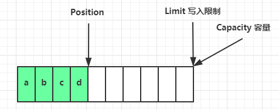</div>

flip 动作发生后，position 切换为读取位置，limit 切换为读取限制

<div align="center"></div>

读取 4 个字节后，状态

<div align="center"></div>

clear 动作发生后，状态

<div align="center"></div>

compact 方法，是把未读完的部分向前压缩，然后切换至写模式。『数据没读完，就切换为写模式』

<div align="center"></div>

<b>总结</b>

- position 和 limit 控制了读写的范围
- flip 切换为读模式，实际上就是给 position、limit 设置读取数据的起点和终点（读取范围）
- clear 切换为写模式，实际上就是还原 position 和 limit
- compact 把未读完的数据向前移动，然后设置 position limit 的值

#### 💡 调试工具类

```java
import io.netty.util.internal.StringUtil;
import java.nio.ByteBuffer;

import static io.netty.util.internal.MathUtil.isOutOfBounds;
import static io.netty.util.internal.StringUtil.NEWLINE;

public class ByteBufferUtil {
    private static final char[] BYTE2CHAR = new char[256];
    private static final char[] HEXDUMP_TABLE = new char[256 * 4];
    private static final String[] HEXPADDING = new String[16];
    private static final String[] HEXDUMP_ROWPREFIXES = new String[65536 >>> 4];
    private static final String[] BYTE2HEX = new String[256];
    private static final String[] BYTEPADDING = new String[16];

    static {
        final char[] DIGITS = "0123456789abcdef".toCharArray();
        for (int i = 0; i < 256; i++) {
            HEXDUMP_TABLE[i << 1] = DIGITS[i >>> 4 & 0x0F];
            HEXDUMP_TABLE[(i << 1) + 1] = DIGITS[i & 0x0F];
        }

        int i;

        // Generate the lookup table for hex dump paddings
        for (i = 0; i < HEXPADDING.length; i++) {
            int padding = HEXPADDING.length - i;
            StringBuilder buf = new StringBuilder(padding * 3);
            for (int j = 0; j < padding; j++) {
                buf.append("   ");
            }
            HEXPADDING[i] = buf.toString();
        }

        // Generate the lookup table for the start-offset header in each row (up to 64KiB).
        for (i = 0; i < HEXDUMP_ROWPREFIXES.length; i++) {
            StringBuilder buf = new StringBuilder(12);
            buf.append(NEWLINE);
            buf.append(Long.toHexString(i << 4 & 0xFFFFFFFFL | 0x100000000L));
            buf.setCharAt(buf.length() - 9, '|');
            buf.append('|');
            HEXDUMP_ROWPREFIXES[i] = buf.toString();
        }

        // Generate the lookup table for byte-to-hex-dump conversion
        for (i = 0; i < BYTE2HEX.length; i++) {
            BYTE2HEX[i] = ' ' + StringUtil.byteToHexStringPadded(i);
        }

        // Generate the lookup table for byte dump paddings
        for (i = 0; i < BYTEPADDING.length; i++) {
            int padding = BYTEPADDING.length - i;
            StringBuilder buf = new StringBuilder(padding);
            for (int j = 0; j < padding; j++) {
                buf.append(' ');
            }
            BYTEPADDING[i] = buf.toString();
        }

        // Generate the lookup table for byte-to-char conversion
        for (i = 0; i < BYTE2CHAR.length; i++) {
            if (i <= 0x1f || i >= 0x7f) {
                BYTE2CHAR[i] = '.';
            } else {
                BYTE2CHAR[i] = (char) i;
            }
        }
    }

    /**
     * 打印所有内容
     *
     * @param buffer
     */
    public static void debugAll(ByteBuffer buffer) {
        int oldlimit = buffer.limit();
        buffer.limit(buffer.capacity());
        StringBuilder origin = new StringBuilder(256);
        appendPrettyHexDump(origin, buffer, 0, buffer.capacity());
        System.out.println("+--------+-------------------- all ------------------------+----------------+");
        System.out.printf("position: [%d], limit: [%d]\n", buffer.position(), oldlimit);
        System.out.println(origin);
        buffer.limit(oldlimit);
    }

    /**
     * 打印可读取内容
     *
     * @param buffer
     */
    public static void debugRead(ByteBuffer buffer) {
        StringBuilder builder = new StringBuilder(256);
        appendPrettyHexDump(builder, buffer, buffer.position(), buffer.limit() - buffer.position());
        System.out.println("+--------+-------------------- read -----------------------+----------------+");
        System.out.printf("position: [%d], limit: [%d]\n", buffer.position(), buffer.limit());
        System.out.println(builder);
    }

    private static void appendPrettyHexDump(StringBuilder dump, ByteBuffer buf, int offset, int length) {
        if (isOutOfBounds(offset, length, buf.capacity())) {
            throw new IndexOutOfBoundsException(
                    "expected: " + "0 <= offset(" + offset + ") <= offset + length(" + length
                            + ") <= " + "buf.capacity(" + buf.capacity() + ')');
        }
        if (length == 0) {
            return;
        }
        dump.append(
                "         +-------------------------------------------------+" +
                        NEWLINE + "         |  0  1  2  3  4  5  6  7  8  9  a.txt  b  c  d  e  f |" +
                        NEWLINE + "+--------+-------------------------------------------------+----------------+");

        final int startIndex = offset;
        final int fullRows = length >>> 4;
        final int remainder = length & 0xF;

        // Dump the rows which have 16 bytes.
        for (int row = 0; row < fullRows; row++) {
            int rowStartIndex = (row << 4) + startIndex;

            // Per-row prefix.
            appendHexDumpRowPrefix(dump, row, rowStartIndex);

            // Hex dump
            int rowEndIndex = rowStartIndex + 16;
            for (int j = rowStartIndex; j < rowEndIndex; j++) {
                dump.append(BYTE2HEX[getUnsignedByte(buf, j)]);
            }
            dump.append(" |");

            // ASCII dump
            for (int j = rowStartIndex; j < rowEndIndex; j++) {
                dump.append(BYTE2CHAR[getUnsignedByte(buf, j)]);
            }
            dump.append('|');
        }

        // Dump the last row which has less than 16 bytes.
        if (remainder != 0) {
            int rowStartIndex = (fullRows << 4) + startIndex;
            appendHexDumpRowPrefix(dump, fullRows, rowStartIndex);

            // Hex dump
            int rowEndIndex = rowStartIndex + remainder;
            for (int j = rowStartIndex; j < rowEndIndex; j++) {
                dump.append(BYTE2HEX[getUnsignedByte(buf, j)]);
            }
            dump.append(HEXPADDING[remainder]);
            dump.append(" |");

            // Ascii dump
            for (int j = rowStartIndex; j < rowEndIndex; j++) {
                dump.append(BYTE2CHAR[getUnsignedByte(buf, j)]);
            }
            dump.append(BYTEPADDING[remainder]);
            dump.append('|');
        }

        dump.append(NEWLINE +
                "+--------+-------------------------------------------------+----------------+");
    }

    private static void appendHexDumpRowPrefix(StringBuilder dump, int row, int rowStartIndex) {
        if (row < HEXDUMP_ROWPREFIXES.length) {
            dump.append(HEXDUMP_ROWPREFIXES[row]);
        } else {
            dump.append(NEWLINE);
            dump.append(Long.toHexString(rowStartIndex & 0xFFFFFFFFL | 0x100000000L));
            dump.setCharAt(dump.length() - 9, '|');
            dump.append('|');
        }
    }

    public static short getUnsignedByte(ByteBuffer buffer, int index) {
        return (short) (buffer.get(index) & 0xFF);
    }
}
```

####  💡 测试方法

ByteBuffer.allocate()：分配指定字节大小的空间

- put：写入数据
- flip：开启读模式 

compact：切换写模式

- 只是把未读取的数据移动到了前面而已，并不会清空数据
- 例如 61 62 63，61 被读取了，然后 compact
- 变成 62 63 64 64

```java
// 前面的那个工具类 ByteBufferUtil
import com.netty.nio.utils.ByteBufferUtil; 
import java.nio.ByteBuffer;

public class TestByteBuffer {
    public static void main(String[] args) {
        ByteBuffer buffer = ByteBuffer.allocate(5);
        // 查看没有放入任何数据的布局
        ByteBufferUtil.debugAll(buffer);
        buffer.put((byte) 1);
        buffer.put((byte) 2);
        buffer.put((byte) 3);
        // 查看放入数据后的布局，position 从 0 变成了 3
        ByteBufferUtil.debugAll(buffer);
        buffer.flip();
        // 且换写模式后 position 的位置从 3 变成了 1
        ByteBufferUtil.debugAll(buffer);
        // 拿一个数据后，position 变成了 1
        byte b = buffer.get();
        ByteBufferUtil.debugAll(buffer);

        // 数据压缩，把未读取的数据移动到前面
        buffer.compact();
        ByteBufferUtil.debugAll(buffer);
    }
}
/*
+--------+-------------------- all ------------------------+----------------+
position: [0], limit: [5]
         +-------------------------------------------------+
         |  0  1  2  3  4  5  6  7  8  9  a.txt  b  c  d  e  f |
+--------+-------------------------------------------------+----------------+
|00000000| 00 00 00 00 00                                  |.....           |
+--------+-------------------------------------------------+----------------+
+--------+-------------------- all ------------------------+----------------+
position: [3], limit: [5]
         +-------------------------------------------------+
         |  0  1  2  3  4  5  6  7  8  9  a.txt  b  c  d  e  f |
+--------+-------------------------------------------------+----------------+
|00000000| 01 02 03 00 00                                  |.....           |
+--------+-------------------------------------------------+----------------+
+--------+-------------------- all ------------------------+----------------+
position: [0], limit: [3]
         +-------------------------------------------------+
         |  0  1  2  3  4  5  6  7  8  9  a.txt  b  c  d  e  f |
+--------+-------------------------------------------------+----------------+
|00000000| 01 02 03 00 00                                  |.....           |
+--------+-------------------------------------------------+----------------+
+--------+-------------------- all ------------------------+----------------+
position: [1], limit: [3]
         +-------------------------------------------------+
         |  0  1  2  3  4  5  6  7  8  9  a.txt  b  c  d  e  f |
+--------+-------------------------------------------------+----------------+
|00000000| 01 02 03 00 00                                  |.....           |
+--------+-------------------------------------------------+----------------+
+--------+-------------------- all ------------------------+----------------+
position: [2], limit: [5]
         +-------------------------------------------------+
         |  0  1  2  3  4  5  6  7  8  9  a.txt  b  c  d  e  f |
+--------+-------------------------------------------------+----------------+
|00000000| 02 03 03 00 00                                  |.....           |
+--------+-------------------------------------------------+----------------+
*/
```

### ByteBuffer 常见方法

JDK 自带的 ByteBuffer 申请的 Buffer 大小是固定的。

#### 分配空间

可以使用 allocate 方法为 ByteBuffer 分配空间，其它 buffer 类也有该方法

```java
Bytebuffer buf = ByteBuffer.allocate(16); // class java.nio.HeapByteBuffer
Bytebuffer dir = ByteBuffer.allocateDirect(10) // class java.nio.DirectByteBuffer
```

`class java.nio.HeapByteBuffer` - Java 堆内存，读写效率低，受到 GC 影响 (GC 算法可能会有内存移动/整理，数据得重新复制，会来回搬迁)  

`class java.nio.DirectByteBuffer` - 直接内存，读写效率高 (少一次拷贝)  ，不会受 GC 影响，分配效率低。但是 netty 为我们设计了一个 Buffer 池，尽可能的提高分配效率，减小内存泄漏的概率。

#### 向 buffer 写入数据

有两种办法

* 调用 channel 的 read 方法
* 调用 buffer 自己的 put 方法

```java
int readBytes = channel.read(buf);
```

```java
buf.put((byte)127);
```

#### 从 buffer 读取数据

同样有两种办法

* 调用 channel 的 write 方法
* 调用 buffer 自己的 get 方法

```java
int writeBytes = channel.write(buf);
```

```java
byte b = buf.get();
```

get 方法会让 position 读指针向后走，如果想重复读取数据

* 可以调用 rewind 方法将 position 重新置为 0
* 或者调用 get(int i) 方法获取索引 i 的内容，它不会移动读指针！

```java
public static void testRead() {
    // 测试重复读写某部分数据
    ByteBuffer buffer = ByteBuffer.allocate(10);
    buffer.put(new byte[]{'a', 'b', 'c', 'd'});
    // 切换读模式
    buffer.flip();
    System.out.println((char) buffer.get());
    buffer.rewind();
    System.out.println((char) buffer.get());
}
/*
a
a
*/
```

#### mark 和 reset

<b style="color:purple">mark 在读取时，会做一个标记，</b>即使 position 改变，只要调用 reset 就能回到 mark 的位置

```java
@Test
public void markAndRest() {
    ByteBuffer allocate = ByteBuffer.allocate(10);
    allocate.put(new byte[]{'a', 'b', 'c', 'd'});
    allocate.flip();
    System.out.println(allocate.get());

    allocate.mark(); // 在 b 加了标记
    System.out.println((char) allocate.get());
    System.out.println((char)allocate.get());
    allocate.reset(); // 重置到 b 处
    System.out.println((char)allocate.get());
    // mark & rest
    // mark 做一个标记，记录 position 位置，rest 将position重置到 mark 的位置。
    // 其实就是对1对 rewind 的增强
}
```

<b style="color:red">注意：rewind 和 flip 都会清除 mark 位置</b>

<b style="color:red">注意：rewind 和 flip 都会清除 mark 位置</b>

#### 字符串与 ByteBuffer 互转

> 字符串===>ByteBuffer

```java
public class TestByteBufferString {
    @Test
    public void String2ByteBuffer() {
        // 写模式 [pos=5 lim=10 cap=10]
        ByteBuffer allocate = ByteBuffer.allocate(10);
        allocate.put("hello".getBytes(StandardCharsets.UTF_8));
        System.out.println(allocate);
    }

    @Test
    public void String2ByteBuffer2() {
        // 自动切换到读模式   [pos=0 lim=5 cap=5]
        ByteBuffer hello = StandardCharsets.UTF_8.encode("hello");
        System.out.println(hello);
    }

    @Test
    public void String2ByteBuffer3() {
        // 自动切换到读模式   [pos=0 lim=5 cap=5]
        ByteBuffer wrap = ByteBuffer.wrap("hello".getBytes(StandardCharsets.UTF_8));
        System.out.println(wrap);
    }
}
```

输出

```
java.nio.HeapByteBuffer[pos=5 lim=10 cap=10]
java.nio.HeapByteBuffer[pos=0 lim=5 cap=5]
java.nio.HeapByteBuffer[pos=0 lim=5 cap=5]
```

> ByteBuffer===>String

```java
public static void testByteBuffer2String() {
    // 默认切换到读模式
    ByteBuffer buffer = ByteBuffer.wrap("hello".getBytes(StandardCharsets.UTF_8));
    CharBuffer decode = StandardCharsets.UTF_8.decode(buffer);
    System.out.println(decode.toString());
}
// hello
```

#### ⚠️ Buffer 的线程安全

> <b style="color:red">Buffer 是非线程安全的</b>

### Scattering Reads

分散读取，有一个文本文件 3parts.txt

```
onetwothree
```

如果长度已知，使用如下方式读取，可以将数据填充至多个 buffer

```java
@Test
public void test() {
    try (FileChannel file = new RandomAccessFile("read.txt", "rw").getChannel()) {
        ByteBuffer buf1 = ByteBuffer.allocate(3);
        ByteBuffer buf2 = ByteBuffer.allocate(4);
        ByteBuffer buf3 = ByteBuffer.allocate(5);
        long read = file.read(new ByteBuffer[]{buf1, buf2, buf3});
        buf1.flip();
        buf2.flip();
        buf3.flip();
        debugAll(buf1);
        debugAll(buf2);
        debugAll(buf3);
    } catch (Exception e) {
        e.printStackTrace();
    }
}
// 结果：都读取到了数据
```

意义：可以重复利用 ByteBuffer；例如，可以使用多个小的 ByteBuffer 来读取较大的数据，避免申请大内存。

### Gathering Writes

使用如下方式写入，可以将多个 buffer 的数据填充至 channel

```java
// 聚集写
public class TestGatheringWrites {
    public static void main(String[] args) {
        try (RandomAccessFile file = new RandomAccessFile("hello.txt", "rw"))  {
            ByteBuffer hello = StandardCharsets.UTF_8.encode("hello");
            ByteBuffer world = StandardCharsets.UTF_8.encode("world");
            ByteBuffer java = StandardCharsets.UTF_8.encode("java");
            file.getChannel().write(new ByteBuffer[]{hello, world, java});
        } catch (Exception e) {
            e.printStackTrace();
        }
    }
}
```

### 练习

网络上有多条数据发送给服务端，数据之间使用 `\n` 进行分隔，但由于某种原因这些数据在接收时，被进行了重新组合，例如原始数据有 3 条为

* Hello,world\n
* I'm zhangsan\n
* How are you?\n

变成了下面的两个 byteBuffer (黏包，半包)

* Hello,World\nJa
* va How are you\n

现在要求你编写程序，将错乱的数据恢复成原始的按 `\n` 分隔的数据。

```java
import java.nio.ByteBuffer;
import java.nio.charset.StandardCharsets;

// 解決粘包，半包问题
public class TestRecordContent {

    public static void main(String[] args) {
        ByteBuffer source = ByteBuffer.allocate(32);
        source.put("Hello,World\nJa".getBytes(StandardCharsets.UTF_8));
        split(source);
        source.put("va How are you\n".getBytes(StandardCharsets.UTF_8));
        split(source);
    }

    private static void split(ByteBuffer source) {
        source.flip(); // 读模式
        for (int i = 0; i < source.limit(); i++) {
            if (source.get(i) == '\n') {
                // 说明找到了一条完整的消息，我们不需要 \n 符号，所以此处不加 1
                int len = i - source.position();
                ByteBuffer target = ByteBuffer.allocate(len);
                for (int j = 0; j < len; j++) {
                    target.put(source.get());
                }
                source.get(); // 去除回车换行符
                target.flip();
                String s = StandardCharsets.UTF_8.decode(target).toString();
                System.out.println(s);
            }
        }
        source.compact();
    }
}
```

## 文件编程

### FileChannel

#### ⚠️ FileChannel 工作模式

> <b style="color:orange">FileChannel 只能工作在阻塞模式下，因此不能配合 Selector 使用，和网络相关的 Channel 才能配合 selector 工作在非阻塞模式下。</b>

#### 获取

不能直接打开 FileChannel，必须通过 FileInputStream、FileOutputStream 或者 RandomAccessFile 来获取 FileChannel，它们都有 getChannel 方法

* 通过 FileInputStream 获取的 channel 只能读
* 通过 FileOutputStream 获取的 channel 只能写
* 通过 RandomAccessFile 是否能读写根据构造 RandomAccessFile 时的读写模式决定

#### 读取

会从 channel 读取数据填充 ByteBuffer，返回值表示读到了多少字节，-1 表示到达了文件的末尾

```java
int readBytes = channel.read(buffer);
```

#### 写入

写入的正确姿势如下，SocketChannel

```java
ByteBuffer buffer = ...;
buffer.put(...); // 存入数据
buffer.flip();   // 切换读模式

while(buffer.hasRemaining()) {
    channel.write(buffer);
}
```

在 while 中调用 channel.write 是因为 write 方法并不能保证一次将 buffer 中的内容全部写入 channel

#### 关闭

channel 必须关闭，不过调用了 FileInputStream、FileOutputStream 或者 RandomAccessFile 的 close 方法会间接地调用 channel 的 close 方法

#### 位置

获取当前位置

```java
long pos = channel.position();
```

设置当前位置

```java
long newPos = ...;
channel.position(newPos);
```

设置当前位置时，如果设置为文件的末尾

* 这时读取会返回 -1 
* 这时写入，会追加内容，但要注意如果 position 超过了文件末尾，再写入时在新内容和原末尾之间会有空洞 (00)  

#### 大小

使用 size 方法获取文件的大小

#### 强制写入

操作系统出于性能的考虑，会将数据缓存，不是立刻写入磁盘。可以调用 force(true)  方法将文件内容和元数据 (文件的权限等信息)  立刻写入磁盘

### 两个 Channel 传输数据

只要是 JDK 中带了 transferTo 的底层都会用操作系统的<b>零拷贝</b>进行优化。注意 `transferTo` 一次最多传 <b>2G</b>

```java
public class TestFileChannelTransferTo {
    public static void main(String[] args) {
        try (FileChannel from = new FileInputStream("from.txt").getChannel();
             FileChannel to = new FileOutputStream("to.txt").getChannel();)  {
            // 起始位置，传多少字节，传到哪里去【效率高】
            from.transferTo(0, from.size(), to);
        } catch (IOException e) {
            e.printStackTrace();
        }
    }
}
```

超过 2G 大小的文件传输，可以进行多次传输。

```java
@Test
public void bigFile() {
    try (FileChannel from = new FileInputStream("D:\\archive.zip").getChannel();
         FileChannel to = new FileOutputStream("D:\\copy.zip").getChannel();)  {
        // 效率高，底层会利用操作系统的零拷贝进行优化
        long size = from.size(); // 4845135158 ≈ 4.6G 就是文件的大小。

        // left 变量代表还剩余多少字节
        for (long left = size; left > 0;)  {
            System.out.println("position:" + (size - left) + " left:" + left);
            // 起始位置，写的数量，目的地
            left -= from.transferTo((size - left), left, to);
        }
    } catch (IOException e) {
        e.printStackTrace();
    }
}
```

实际传输一个超大文件 (4.6G)  

```
=============
4845135158
=============
position:0 left:4845135158
position:2147483647 left:2697651511
position:4294967294 left:550167864
```

### Path

JDK7 引入了 Path 和 Paths 类

* Path 用来表示文件路径
* Paths 是工具类，用来获取 Path 实例

```java
Path source = Paths.get("1.txt"); // 相对路径 使用 user.dir 环境变量来定位 1.txt

Path source = Paths.get("d:\\1.txt"); // 绝对路径 代表了  d:\1.txt

Path source = Paths.get("d:/1.txt"); // 绝对路径 同样代表了  d:\1.txt

Path projects = Paths.get("d:\\data", "projects"); // 代表了  d:\data\projects
```

* `.` 代表了当前路径
* `..` 代表了上一级路径

例如目录结构如下

```
d:
	|- data
		|- projects
			|- a
			|- b
```

代码

```java
Path path = Paths.get("d:\\data\\projects\\a\\..\\b");
System.out.println(path);
System.out.println(path.normalize()); // 正常化路径
// 当前项目的根目录
System.out.println(System.getProperty("user.dir"));
```

会输出

```
d:\data\projects\a\..\b
d:\data\projects\b
```

### Files

#### 基本操作

> <b>检查文件是否存在</b>

```java
Path path = Paths.get("helloword/data.txt");
System.out.println(Files.exists(path));
```

> <b>创建一级目录</b>

```java
Path path = Paths.get("helloword/d1");
Files.createDirectory(path); // 只能创建一级目录
```

* 如果目录已存在，会抛异常 FileAlreadyExistsException
* 不能一次创建多级目录，否则会抛异常 NoSuchFileException

> <b>创建多级目录用</b>

```java
Path path = Paths.get("helloword/d1/d2");
Files.createDirectories(path);
```

> <b>拷贝文件</b>

```java
Path source = Paths.get("helloword/data.txt");
Path target = Paths.get("helloword/target.txt");
// 效率也很高。和 transferTo 效率差不多
Files.copy(source, target);
```

* 如果文件已存在，会抛异常 FileAlreadyExistsException

* 如果希望用 source 覆盖掉 target，需要用 StandardCopyOption 来控制

    `Files.copy(source, target, StandardCopyOption.REPLACE_EXISTING);`

> <b>移动文件</b>

```java
Path source = Paths.get("helloword/data.txt");
Path target = Paths.get("helloword/data.txt");

Files.move(source, target, StandardCopyOption.ATOMIC_MOVE);
```

* StandardCopyOption.ATOMIC_MOVE 保证文件移动的原子性

> <b>删除文件</b>

```java
Path target = Paths.get("helloword/target.txt");

Files.delete(target);
```

* 如果文件不存在，会抛异常 NoSuchFileException

> <b>删除目录</b>

```java
Path target = Paths.get("helloword/d1");

Files.delete(target);
```

* 如果目录还有内容，会抛异常 DirectoryNotEmptyException

#### Files.walk

> <b>遍历目录文件</b>

```java
import org.junit.Test;

import java.io.IOException;
import java.nio.file.*;
import java.nio.file.attribute.BasicFileAttributes;
import java.util.concurrent.atomic.AtomicInteger;

public class TestTravelFilePath {
    @Test
    public void test1() throws IOException {
        AtomicInteger dirCount = new AtomicInteger();
        AtomicInteger fileCount = new AtomicInteger();
        Files.walkFileTree(Paths.get("D:\\Program Files\\Java"),
                new SimpleFileVisitor<Path>() {
                    @Override
                    public FileVisitResult preVisitDirectory(Path dir, BasicFileAttributes attrs) throws IOException {
                        System.out.println("====>" + dir);
                        dirCount.incrementAndGet();
                        return super.preVisitDirectory(dir, attrs);
                    }

                    @Override
                    public FileVisitResult visitFile(Path file, BasicFileAttributes attrs) throws IOException {
                        fileCount.incrementAndGet();
                        return super.visitFile(file, attrs);
                    }
                });
        System.out.format("dir==> %d\n", dirCount.get());
        System.out.format("file==> %d\n", fileCount.get());
    }
}
```

> <b>统计 Java 文件的数目</b>

```java
import org.junit.Test;

import java.io.IOException;
import java.nio.file.*;
import java.nio.file.attribute.BasicFileAttributes;
import java.util.concurrent.atomic.AtomicInteger;

public class TestTravelFilePath {
    @Test
    public void test1() throws IOException {
        AtomicInteger dirCount = new AtomicInteger();
        AtomicInteger fileCount = new AtomicInteger();
        Files.walkFileTree(Paths.get("D:\\Code\\Java"),
                new SimpleFileVisitor<Path>() {
                    @Override
                    public FileVisitResult preVisitDirectory(Path dir, BasicFileAttributes attrs) throws IOException {
                        System.out.println("====>" + dir);
                        dirCount.incrementAndGet();
                        return super.preVisitDirectory(dir, attrs);
                    }

                    @Override
                    public FileVisitResult visitFile(Path file, BasicFileAttributes attrs) throws IOException {
                        if (file.toString().endsWith(".java")) {
                            fileCount.incrementAndGet();
                        }
                        return super.visitFile(file, attrs);
                    }
                });
        System.out.format("dir==> %d\n", dirCount.get());
        System.out.format("Java file count ==> %d\n", fileCount.get());
    }
}
```

> <b>删除多级目录</b>

```java
@Test
public void deleteFileAndDir() throws IOException {
    Files.walkFileTree(Paths.get("D:\\EISeg-main"), new SimpleFileVisitor<Path>() {
        @Override
        public FileVisitResult preVisitDirectory(Path dir, BasicFileAttributes attrs) throws IOException {
            System.out.println("====>" + dir);
            return super.preVisitDirectory(dir, attrs);
        }

        @Override
        public FileVisitResult visitFile(Path file, BasicFileAttributes attrs) throws IOException {
            System.out.println("先删除文件");
            return super.visitFile(file, attrs);
        }

        @Override
        public FileVisitResult postVisitDirectory(Path dir, IOException exc) throws IOException {
            System.out.println("再删除文件夹");
            System.out.println("<====退出" + dir);
            return super.postVisitDirectory(dir, exc);
        }
    });
}
```

#### ⚠️ 删除很危险

> 删除是危险操作，确保要递归删除的文件夹没有重要内容

拷贝多级目录

```java
long start = System.currentTimeMillis();
String source = "D:\\Snipaste-1.16.2-x64";
String target = "D:\\Snipaste-1.16.2-x64aaa";

Files.walk(Paths.get(source)).forEach(path -> {
    try {
        String targetName = path.toString().replace(source, target);
        // 是目录,则创建目录
        if (Files.isDirectory(path)) {
            Files.createDirectory(Paths.get(targetName));
        }
        // 是普通文件,则复制文件
        else if (Files.isRegularFile(path)) {
            Files.copy(path, Paths.get(targetName));
        }
    } catch (IOException e) {
        e.printStackTrace();
    }
});
long end = System.currentTimeMillis();
System.out.println(end - start);
```

## 网络编程

### 非阻塞 vs 阻塞

对代码进行 `debug` 查看阻塞，非阻塞的特点。

#### 阻塞

* 阻塞模式下，相关方法都会导致线程暂停
    * ServerSocketChannel.accept 会在没有连接建立时让线程暂停
    * SocketChannel.read 会在没有数据可读时让线程暂停
    * 阻塞的表现其实就是线程暂停了，暂停期间不会占用 cpu，但线程相当于闲置
* 单线程下，阻塞方法之间相互影响，几乎不能正常工作，需要多线程支持
* 但多线程下，有新的问题，体现在以下方面
    * 32 位 jvm 一个线程 320kb，64 位 jvm 一个线程 1024kb，如果连接数过多，必然导致 OOM，并且线程太多，反而会因为频繁上下文切换导致性能降低
    * 可以采用线程池技术来减少线程数和线程上下文切换，但治标不治本，如果有很多连接建立，但长时间 inactive，会阻塞线程池中所有线程，因此不适合长连接，只适合短连接

> 服务器端

```java
import lombok.extern.slf4j.Slf4j;

import java.io.IOException;
import java.net.InetSocketAddress;
import java.nio.ByteBuffer;
import java.nio.channels.ServerSocketChannel;
import java.nio.channels.SocketChannel;
import java.util.ArrayList;
import java.util.List;

import static com.netty.nio.utils.ByteBufferUtil.debugRead;

// 阻塞 IO
@Slf4j
public class Server {
    public static void main(String[] args) throws IOException {
        // 使用 nio 来理解阻塞模式, 单线程

        // 1. 创建了服务器
        ServerSocketChannel serverSocketChannel = ServerSocketChannel.open();

        // 2. 绑定监听端口
        serverSocketChannel.bind(new InetSocketAddress(10086));
        ByteBuffer buffer = ByteBuffer.allocate(32);

        // 3. 连接集合
        List<SocketChannel> channels = new ArrayList<>();
        while (true) {
            log.debug("connecting...");
            // 4. accept 建立与客户端连接， SocketChannel 用来与客户端之间通信
            SocketChannel accept = serverSocketChannel.accept(); // 阻塞方法，线程停止运行
            log.debug("connected");
            channels.add(accept);
            channels.forEach(channel -> {
                try {
                    log.debug("before read ... {}", channel);
                    channel.read(buffer); // 阻塞方法，线程停止运行
                    buffer.flip();
                    debugRead(buffer);
                    buffer.compact();
                    log.debug("after read... {}", channel);
                } catch (IOException ex) {
                    ex.printStackTrace();
                }
            });
        }
    }
}
```

> 客户端

```java
import java.io.IOException;
import java.net.InetSocketAddress;
import java.nio.channels.SocketChannel;
import java.nio.charset.StandardCharsets;

public class Client {
    public static void main(String[] args) throws IOException {
        SocketChannel client = SocketChannel.open();
        client.connect(new InetSocketAddress("localhost",10086));
		// client.write(StandardCharsets.UTF_8.encode("hello")); // evaluate
        System.out.println("waiting");
    }
}
```

#### 非阻塞

* 非阻塞模式下，相关方法都会不会让线程暂停
    * 在 ServerSocketChannel.accept 在没有连接建立时，会返回 null，继续运行
    * SocketChannel.read 在没有数据可读时，会返回 0，但线程不必阻塞，可以去执行其它 SocketChannel 的 read 或是去执行 ServerSocketChannel.accept 
    * 写数据时，线程只是等待数据写入 Channel 即可，无需等 Channel 通过网络把数据发送出去
* 但非阻塞模式下，即使没有连接建立，和可读数据，线程仍然在不断运行，白白浪费了 cpu
* 数据复制过程中，线程实际还是阻塞的 (AIO 改进的地方)  

服务器端，客户端代码不变

  * 在 `ServerSocketChannel.accept` 在没有连接建立时，会返回 `null`，继续运行
  * `SocketChannel.read` 在没有数据可读时，会返回 0，但线程不必阻塞，可以去执行其它 `SocketChannel` 的 `read` 或是去执行 `ServerSocketChannel.accept` 
  * 写数据时，线程只是等待数据写入 `Channel` 即可，无需等 `Channel` 通过网络把数据发送出去
* 但非阻塞模式下，即使没有连接建立，和可读数据，线程仍然在不断运行，白白浪费了 `cpu`
* 数据复制过程中，线程实际还是阻塞的 (`AIO` 改进的地方)  

<b style="color:orange">服务器端，客户端代码不变。这样写，虽然是非阻塞的，但是即便客户端没有发送数据过来，服务器的线程也要不断进行循环 (因为代码里是 while true)，很消耗 CPU。有读取事件时再进行处理比较好。</b>

```java
// 使用 nio 来理解非阻塞模式, 单线程
// 0. ByteBuffer
ByteBuffer buffer = ByteBuffer.allocate(16);
// 1. 创建了服务器
ServerSocketChannel ssc = ServerSocketChannel.open();
ssc.configureBlocking(false); // 开启非阻塞模式
// 2. 绑定监听端口
ssc.bind(new InetSocketAddress(8080));
// 3. 连接集合
List<SocketChannel> channels = new ArrayList<>();
while (true) {
    // 4. accept 建立与客户端连接， SocketChannel 用来与客户端之间通信
    SocketChannel sc = ssc.accept(); // 非阻塞，线程还会继续运行，如果没有连接建立，但sc是null
    if (sc != null) {
        log.debug("connected... {}", sc);
        sc.configureBlocking(false); // 非阻塞模式
        channels.add(sc);
    }
    for (SocketChannel channel : channels) {
        // 5. 接收客户端发送的数据
        int read = channel.read(buffer);// 非阻塞，线程仍然会继续运行，如果没有读到数据，read 返回 0
        if (read > 0) {
            buffer.flip();
            debugRead(buffer);
            buffer.clear();
            log.debug("after read...{}", channel);
        }
    }
}
```

#### 多路复用

单线程可以配合 Selector 完成对多个 Channel 可读写事件的监控，这称之为多路复用

* 多路复用仅针对网络 IO、普通文件 IO 没法利用多路复用
* 如果不用 Selector 的非阻塞模式，线程大部分时间都在做无用功，而 Selector 能够保证
    * 有可连接事件时才去连接
    * 有可读事件才去读取
    * 有可写事件才去写入，限于网络传输能力，Channel 未必时时可写，一旦 Channel 可写，会触发 Selector 的可写事件

### Selector

```mermaid
graph TD
subgraph selector 版
thread --> selector
selector --> c1(channel)
selector --> c2(channel)
selector --> c3(channel)
end
```

<b>好处</b>

* 一个线程配合 selector 就可以监控多个 channel 的事件，事件发生线程才去处理 (select 会阻塞，有事件发生了就会唤醒)。避免非阻塞模式下所做无用功。
* 让这个线程能够被充分利用
* 节约了线程的数量
* 减少了线程上下文切换

#### 创建

```java
Selector selector = Selector.open();
```

#### 绑定 Channel 事件

也称之为注册事件，绑定的事件 selector 才会关心 

```java
channel.configureBlocking(false);
SelectionKey key = channel.register(selector, 绑定事件);
```

* channel 必须工作在非阻塞模式
* FileChannel 没有非阻塞模式，因此不能配合 selector 一起使用
* <b style="color:green">绑定的事件类型可以有</b>
    * connect - 客户端连接成功时触发
    * accept - 服务器端成功接受连接时触发，有连接请求时触发
    * read - 数据可读入时触发，有因为接收能力弱，数据暂不能读入的情况
    * write - 数据可写出时触发，有因为发送能力弱，数据暂不能写出的情况

#### 监听 Channel 事件

可以通过下面三种方法来监听是否有事件发生，方法的返回值代表有多少 channel 发生了事件

方法 1，阻塞直到绑定事件发生

```java
int count = selector.select();
```

方法 2，阻塞直到绑定事件发生，或是超时 (时间单位为 ms)  

```java
int count = selector.select(long timeout);
```

方法 3，不会阻塞，也就是不管有没有事件，立刻返回，自己根据返回值检查是否有事件

```java
int count = selector.selectNow();
```

#### 💡 select 何时不阻塞

> * 事件发生时
>     * 客户端发起连接请求，会触发 accept 事件
>     * 客户端发送数据过来，客户端正常、异常关闭时，都会触发 read 事件，另外如果发送的数据大于 buffer 缓冲区，会触发多次读取事件
>     * channel 可写，会触发 write 事件
>     * 在 linux 下 nio bug 发生时
> * 调用 selector.wakeup()
> * 调用 selector.close()
> * selector 所在线程 interrupt

#### 处理事件

```java
@Slf4j(topic = "c.Server2")
public class Server2 {
    public static void main(String[] args) throws IOException {
        // 1. 创建 selector 管理多个 channel
        Selector selector = Selector.open();
        ByteBuffer buffer = ByteBuffer.allocate(16);

        ServerSocketChannel serverSocketChannel = ServerSocketChannel.open();
        serverSocketChannel.configureBlocking(false);

        // 2.建立 selector 和 channel 的联系 (注册)  
        // SelectionKey 时将来事件发生后，通过它可以知道事件和哪个channel的事件。
        SelectionKey ssKey = serverSocketChannel.register(selector, 0, null);
        // 3.只关注 accept 事件
        ssKey.interestOps(SelectionKey.OP_ACCEPT);

        log.debug("register key {}", ssKey);

        serverSocketChannel.bind(new InetSocketAddress(8080));

        while (true) {
            // 4. select 方法，没有事件发生，线程阻塞，有事件，线程才会恢复运行。事件未处理时，不会阻塞；事件发生后 要么处理，要么取消，不能置之不理。
            int select = selector.select();
            // 5. 处理事件 拿到所有的可用的事件
            Set<SelectionKey> selectionKeys = selector.selectedKeys();
            Iterator<SelectionKey> iterator = selectionKeys.iterator();
            while (iterator.hasNext()) {
                SelectionKey currentKey = iterator.next();
			// ServerSocketChannel channel = (ServerSocketChannel) currentKey.channel();
			// SocketChannel accept = channel.accept(); // 如果事件不处理，就一直有事件。accept 就是处理事件。
			// log.debug("accept {}", accept);
                currentKey.cancel();
            }
        }
    }
}
```

### 处理 accept 事件

客户端代码为

```java
public class Client {
    public static void main(String[] args) {
        try (Socket socket = new Socket("localhost", 8080)) {
            System.out.println(socket);
            socket.getOutputStream().write("world".getBytes());
            System.in.read();
        } catch (IOException e) {
            e.printStackTrace();
        }
    }
}
```

服务器端代码为

```java
@Slf4j
public class ChannelDemo6 {
    public static void main(String[] args) {
        try (ServerSocketChannel channel = ServerSocketChannel.open()) {
            channel.bind(new InetSocketAddress(8080));
            System.out.println(channel);
            Selector selector = Selector.open();
            channel.configureBlocking(false);
            channel.register(selector, SelectionKey.OP_ACCEPT);

            while (true) {
                int count = selector.select();
				// int count = selector.selectNow();
                log.debug("select count: {}", count);
//                if(count <= 0) {
//                    continue;
//                }

                // 获取所有事件
                Set<SelectionKey> keys = selector.selectedKeys();

                // 遍历所有事件，逐一处理
                Iterator<SelectionKey> iter = keys.iterator();
                while (iter.hasNext()) {
                    SelectionKey key = iter.next();
                    // 判断事件类型
                    if (key.isAcceptable()) {
                        ServerSocketChannel c = (ServerSocketChannel) key.channel();
                        // 必须处理
                        SocketChannel sc = c.accept();
                        log.debug("{}", sc);
                    }
                    // 处理完毕，必须将事件移除
                    iter.remove();
                }
            }
        } catch (IOException e) {
            e.printStackTrace();
        }
    }
}
```

#### 💡 事件发生后能否不处理

> 事件发生后，要么处理，要么取消 (cancel)  ，不能什么都不做，否则下次该事件仍会触发，这是因为 nio 底层使用的是水平触发

### 处理 read 事件

```java
@Slf4j
public class ChannelDemo6 {
    public static void main(String[] args) {
        try (ServerSocketChannel channel = ServerSocketChannel.open()) {
            channel.bind(new InetSocketAddress(8080));
            System.out.println(channel);
            Selector selector = Selector.open();
            channel.configureBlocking(false);
            channel.register(selector, SelectionKey.OP_ACCEPT);

            while (true) {
                int count = selector.select();
//                int count = selector.selectNow();
                log.debug("select count: {}", count);
//                if(count <= 0) {
//                    continue;
//                }

                // 获取所有事件
                Set<SelectionKey> keys = selector.selectedKeys();

                // 遍历所有事件，逐一处理
                Iterator<SelectionKey> iter = keys.iterator();
                while (iter.hasNext()) {
                    SelectionKey key = iter.next();
                    // 判断事件类型
                    if (key.isAcceptable()) {
                        ServerSocketChannel c = (ServerSocketChannel) key.channel();
                        // 必须处理
                        SocketChannel sc = c.accept();
                        // 注册读事件。
                        sc.configureBlocking(false);
                        sc.register(selector, SelectionKey.OP_READ);
                        log.debug("连接已建立: {}", sc);
                    } else if (key.isReadable()) {
                        SocketChannel sc = (SocketChannel) key.channel();
                        ByteBuffer buffer = ByteBuffer.allocate(128);
                        int read = sc.read(buffer);
                        if(read == -1) {
                            key.cancel();
                            sc.close();
                        } else {
                            buffer.flip();
                            debug(buffer);
                        }
                    }
                    // 处理完毕，必须将事件移除
                    iter.remove();
                }
            }
        } catch (IOException e) {
            e.printStackTrace();
        }
    }
}
```

开启两个客户端，修改一下发送文字，输出

```
sun.nio.ch.ServerSocketChannelImpl[/0:0:0:0:0:0:0:0:8080]
21:16:39 [DEBUG] [main] c.i.n.ChannelDemo6 - select count: 1
21:16:39 [DEBUG] [main] c.i.n.ChannelDemo6 - 连接已建立: java.nio.channels.SocketChannel[connected local=/127.0.0.1:8080 remote=/127.0.0.1:60367]
21:16:39 [DEBUG] [main] c.i.n.ChannelDemo6 - select count: 1
         +-------------------------------------------------+
         |  0  1  2  3  4  5  6  7  8  9  a  b  c  d  e  f |
+--------+-------------------------------------------------+----------------+
|00000000| 68 65 6c 6c 6f                                  |hello           |
+--------+-------------------------------------------------+----------------+
21:16:59 [DEBUG] [main] c.i.n.ChannelDemo6 - select count: 1
21:16:59 [DEBUG] [main] c.i.n.ChannelDemo6 - 连接已建立: java.nio.channels.SocketChannel[connected local=/127.0.0.1:8080 remote=/127.0.0.1:60378]
21:16:59 [DEBUG] [main] c.i.n.ChannelDemo6 - select count: 1
         +-------------------------------------------------+
         |  0  1  2  3  4  5  6  7  8  9  a  b  c  d  e  f |
+--------+-------------------------------------------------+----------------+
|00000000| 77 6f 72 6c 64                                  |world           |
+--------+-------------------------------------------------+----------------+
```

#### 💡 为何要 iter.remove()

> 因为 select 在事件发生后，就会将相关的 key 放入 selectedKeys 集合，但不会在处理完后从 selectedKeys 集合中移除，需要我们自己编码删除。例如
>
> * 第一次触发了 ssckey 上的 accept 事件，没有移除 ssckey  (key 会绑定)  
> * 第二次触发了 sckey 上的 read 事件，但这时 selectedKeys 中还有上次的 ssckey ，在处理时因为没有真正的 serverSocket 连上了，就会导致空指针异常

#### 💡 cancel 的作用

> cancel 会取消注册在 selector 上的 channel，并从 keys 集合中删除 key 后续不会再监听事件

#### ⚠️  不处理边界的问题

以前有同学写过这样的代码，思考注释中两个问题，以 bio 为例，其实 nio 道理是一样的

```java
public class Server {
    public static void main(String[] args) throws IOException {
        ServerSocket ss=new ServerSocket(9000);
        while (true) {
            Socket s = ss.accept();
            InputStream in = s.getInputStream();
            // 这里这么写，有没有问题
            byte[] arr = new byte[4];
            while(true) {
                int read = in.read(arr);
                // 这里这么写，有没有问题
                if(read == -1) {
                    break;
                }
                System.out.println(new String(arr, 0, read));
            }
        }
    }
}
```

客户端

```java
public class Client {
    public static void main(String[] args) throws IOException {
        Socket max = new Socket("localhost", 9000);
        OutputStream out = max.getOutputStream();
        out.write("hello".getBytes());
        out.write("world".getBytes());
        out.write("你好".getBytes());
        max.close();
    }
}
```

输出

```
hell
owor
ld�
�好
```

为什么？

#### 处理消息的边界

<div align="center"></div>

* 一种思路是固定消息长度，数据包大小一样，服务器按预定长度读取，缺点是浪费带宽
* 另一种思路是按分隔符拆分，缺点是效率低
* TLV 格式，即 Type 类型、Length 长度、Value 数据，类型和长度已知的情况下，就可以方便获取消息大小，分配合适的 buffer，缺点是 buffer 需要提前分配，如果内容过大，则影响 server 吞吐量
    * Http 1.1 是 TLV 格式
    * Http 2.0 是 LTV 格式

```mermaid
sequenceDiagram 
participant c1 as 客户端1
participant s as 服务器
participant b1 as ByteBuffer1
participant b2 as ByteBuffer2
c1 ->> s: 发送 01234567890abcdef3333\r
s ->> b1: 第一次 read 存入 01234567890abcdef
s ->> b2: 扩容
b1 ->> b2: 拷贝 01234567890abcdef
s ->> b2: 第二次 read 存入 3333\r
b2 ->> b2: 01234567890abcdef3333\r
```

<div align="center">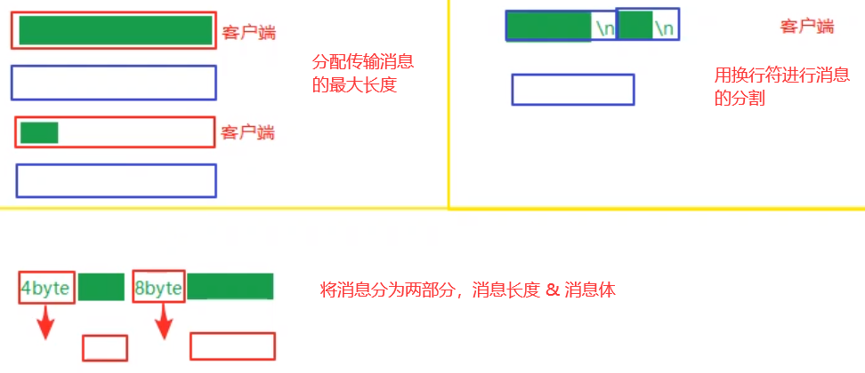</div>

服务器端

```java
private static void split(ByteBuffer source) {
    source.flip();
    for (int i = 0; i < source.limit(); i++) {
        // 找到一条完整消息
        if (source.get(i) == '\n') {
            int length = i + 1 - source.position();
            // 把这条完整消息存入新的 ByteBuffer
            ByteBuffer target = ByteBuffer.allocate(length);
            // 从 source 读，向 target 写
            for (int j = 0; j < length; j++) {
                target.put(source.get());
            }
            debugAll(target);
        }
    }
    source.compact(); // 0123456789abcdef  position 16 limit 16
}

public static void main(String[] args) throws IOException {
    // 1. 创建 selector, 管理多个 channel
    Selector selector = Selector.open();
    ServerSocketChannel ssc = ServerSocketChannel.open();
    ssc.configureBlocking(false);
    // 2. 建立 selector 和 channel 的联系 (注册)  
    // SelectionKey 就是将来事件发生后，通过它可以知道事件和哪个channel的事件
    SelectionKey sscKey = ssc.register(selector, 0, null);
    // key 只关注 accept 事件
    sscKey.interestOps(SelectionKey.OP_ACCEPT);
    log.debug("sscKey:{}", sscKey);
    ssc.bind(new InetSocketAddress(8080));
    while (true) {
        // 3. select 方法, 没有事件发生，线程阻塞，有事件，线程才会恢复运行
        // select 在事件未处理时，它不会阻塞, 事件发生后要么处理，要么取消，不能置之不理
        selector.select();
        // 4. 处理事件, selectedKeys 内部包含了所有发生的事件
        Iterator<SelectionKey> iter = selector.selectedKeys().iterator(); // accept, read
        while (iter.hasNext()) {
            SelectionKey key = iter.next();
            // 处理key 时，要从 selectedKeys 集合中删除，否则下次处理就会有问题
            iter.remove();
            log.debug("key: {}", key);
            // 5. 区分事件类型
            if (key.isAcceptable()) { // 如果是 accept
                ServerSocketChannel channel = (ServerSocketChannel) key.channel();
                SocketChannel sc = channel.accept();
                sc.configureBlocking(false);
                ByteBuffer buffer = ByteBuffer.allocate(16); // attachment
                // 将一个 byteBuffer 作为附件关联到 selectionKey 上
                SelectionKey scKey = sc.register(selector, 0, buffer);
                scKey.interestOps(SelectionKey.OP_READ);
                log.debug("{}", sc);
                log.debug("scKey:{}", scKey);
            } else if (key.isReadable()) { // 如果是 read
                try {
                    SocketChannel channel = (SocketChannel) key.channel(); // 拿到触发事件的channel
                    // 获取 selectionKey 上关联的附件
                    ByteBuffer buffer = (ByteBuffer) key.attachment();
                    int read = channel.read(buffer); // 如果是正常断开，read 的方法的返回值是 -1
                    if(read == -1) {
                        key.cancel();
                    } else {
                        split(buffer);
                        // 需要扩容
                        if (buffer.position() == buffer.limit()) {
                            ByteBuffer newBuffer = ByteBuffer.allocate(buffer.capacity() * 2);
                            buffer.flip();
                            newBuffer.put(buffer); // 0123456789abcdef3333\n
                            key.attach(newBuffer);
                        }
                    }

                } catch (IOException e) {
                    e.printStackTrace();
                    key.cancel();  // 因为客户端断开了,因此需要将 key 取消 (从 selector 的 keys 集合中真正删除 key)  
                }
            }
        }
    }
}
```

客户端

```java
SocketChannel sc = SocketChannel.open();
sc.connect(new InetSocketAddress("localhost", 8080));
SocketAddress address = sc.getLocalAddress();
// sc.write(Charset.defaultCharset().encode("hello\nworld\n"));
sc.write(Charset.defaultCharset().encode("0123\n456789abcdef"));
sc.write(Charset.defaultCharset().encode("0123456789abcdef3333\n"));
System.in.read();
```

#### ByteBuffer 大小分配

* 每个 channel 都需要记录可能被切分的消息，<b>因为 ByteBuffer 不能被多个 channel 共同使用</b>，因此需要为每个 channel 维护一个独立的 ByteBuffer
* ByteBuffer 不能太大，比如一个 ByteBuffer 1Mb 的话，要支持百万连接就要 1Tb 内存，因此需要设计大小可变的 ByteBuffer
    * 一种思路是首先分配一个较小的 buffer，例如 4k，如果发现数据不够，再分配 8k 的 buffer，将 4k buffer 内容拷贝至 8k buffer，优点是消息连续容易处理，缺点是数据拷贝耗费性能，参考实现 [http://tutorials.jenkov.com/java-performance/resizable-array.html](http://tutorials.jenkov.com/java-performance/resizable-array.html)
    * 另一种思路是用多个数组组成 buffer，一个数组不够，把多出来的内容写入新的数组，与前面的区别是消息存储不连续解析复杂，优点是避免了拷贝引起的性能损耗

### 处理 write 事件

#### 一次无法写完例子

* 非阻塞模式下，无法保证把 buffer 中所有数据都写入 channel，因此需要追踪 write 方法的返回值 (代表实际写入字节数)  
* 用 selector 监听所有 channel 的可写事件，每个 channel 都需要一个 key 来跟踪 buffer，但这样又会导致占用内存过多，就有两阶段策略
    * 当消息处理器第一次写入消息时，才将 channel 注册到 selector 上
    * selector 检查 channel 上的可写事件，如果所有的数据写完了，就取消 channel 的注册
    * 如果不取消，会每次可写均会触发 write 事件

```java
public class WriteServer {

    public static void main(String[] args) throws IOException {
        ServerSocketChannel ssc = ServerSocketChannel.open();
        ssc.configureBlocking(false);
        ssc.bind(new InetSocketAddress(8080));

        Selector selector = Selector.open();
        ssc.register(selector, SelectionKey.OP_ACCEPT);

        while(true) {
            selector.select();

            Iterator<SelectionKey> iter = selector.selectedKeys().iterator();
            while (iter.hasNext()) {
                SelectionKey key = iter.next();
                iter.remove();
                if (key.isAcceptable()) {
                    SocketChannel sc = ssc.accept();
                    sc.configureBlocking(false);
                    SelectionKey sckey = sc.register(selector, SelectionKey.OP_READ);
                    // 1. 向客户端发送内容
                    StringBuilder sb = new StringBuilder();
                    for (int i = 0; i < 3000000; i++) {
                        sb.append("a");
                    }
                    ByteBuffer buffer = Charset.defaultCharset().encode(sb.toString());
                    int write = sc.write(buffer);
                    // 3. write 表示实际写了多少字节
                    System.out.println("实际写入字节:" + write);
                    // 4. 如果有剩余未读字节，才需要关注写事件
                    if (buffer.hasRemaining()) {
                        // read 1  write 4
                        // 在原有关注事件的基础上，多关注 写 事件
                        sckey.interestOps(sckey.interestOps() + SelectionKey.OP_WRITE);
                        // 把 buffer 作为附件加入 sckey
                        sckey.attach(buffer);
                    }
                } else if (key.isWritable()) {
                    ByteBuffer buffer = (ByteBuffer) key.attachment();
                    SocketChannel sc = (SocketChannel) key.channel();
                    int write = sc.write(buffer);
                    System.out.println("实际写入字节:" + write);
                    if (!buffer.hasRemaining()) { // 写完了
                        key.interestOps(key.interestOps() - SelectionKey.OP_WRITE); // 不需要关注可写事件。
                        key.attach(null); // help gc
                    }
                }
            }
        }
    }
}
```

客户端

```java
public class WriteClient {
    public static void main(String[] args) throws IOException {
        Selector selector = Selector.open();
        SocketChannel sc = SocketChannel.open();
        sc.configureBlocking(false);
        sc.register(selector, SelectionKey.OP_CONNECT | SelectionKey.OP_READ);
        sc.connect(new InetSocketAddress("localhost", 8080));
        int count = 0;
        while (true) {
            selector.select();
            Iterator<SelectionKey> iter = selector.selectedKeys().iterator();
            while (iter.hasNext()) {
                SelectionKey key = iter.next();
                iter.remove();
                if (key.isConnectable()) {
                    System.out.println(sc.finishConnect());
                } else if (key.isReadable()) {
                    ByteBuffer buffer = ByteBuffer.allocate(1024 * 1024);
                    count += sc.read(buffer);
                    buffer.clear();
                    System.out.println(count);
                }
            }
        }
    }
}
```

#### 💡 write 为何要取消

只要向 channel 发送数据时，socket 缓冲可写，这个事件会频繁触发，因此应当只在 socket 缓冲区写不下时再关注可写事件，数据写完之后再取消关注

### 更进一步

#### 💡 利用多线程优化

> 现在都是多核 CPU，设计时要充分考虑别让 CPU 的力量被白白浪费

前面的代码只有一个选择器，没有充分利用多核 CPU，如何改进呢？用多个线程进行优化。

分两组选择器

* 单线程配一个选择器，专门处理 accept 事件
* 创建 CPU 核心数的线程，每个线程配一个选择器，轮流处理 read 事件

<div align="center">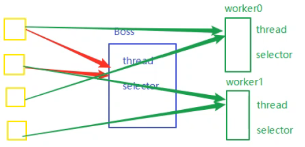</div>

```java
public class ChannelDemo7 {
    public static void main(String[] args) throws IOException {
        new BossEventLoop().register();
    }

    @Slf4j
    // 只负责数据的接待 (accept)  
    static class BossEventLoop implements Runnable {
        private Selector boss;
        private WorkerEventLoop[] workers;
        private volatile boolean start = false;
        AtomicInteger index = new AtomicInteger();

        public void register() throws IOException {
            if (!start) {
                ServerSocketChannel ssc = ServerSocketChannel.open();
                ssc.bind(new InetSocketAddress(8080));
                ssc.configureBlocking(false);
                boss = Selector.open();
                SelectionKey ssckey = ssc.register(boss, 0, null);
                ssckey.interestOps(SelectionKey.OP_ACCEPT);
                workers = initEventLoops();
                new Thread(this, "boss").start();
                log.debug("boss start...");
                start = true;
            }
        }
		
        // 只负责数据的读写
        public WorkerEventLoop[] initEventLoops() {
			// EventLoop[] eventLoops = new EventLoop[Runtime.getRuntime().availableProcessors()];
            WorkerEventLoop[] workerEventLoops = new WorkerEventLoop[2];
            for (int i = 0; i < workerEventLoops.length; i++) {
                workerEventLoops[i] = new WorkerEventLoop(i);
            }
            return workerEventLoops;
        }

        @Override
        public void run() {
            while (true) {
                try {
                    boss.select();
                    Iterator<SelectionKey> iter = boss.selectedKeys().iterator();
                    while (iter.hasNext()) {
                        SelectionKey key = iter.next();
                        iter.remove();
                        if (key.isAcceptable()) {
                            ServerSocketChannel c = (ServerSocketChannel) key.channel();
                            SocketChannel sc = c.accept();
                            sc.configureBlocking(false);
                            log.debug("{} connected", sc.getRemoteAddress());
                            workers[index.getAndIncrement() % workers.length].register(sc);
                        }
                    }
                } catch (IOException e) {
                    e.printStackTrace();
                }
            }
        }
    }

    @Slf4j
    static class WorkerEventLoop implements Runnable {
        private Selector worker;
        private volatile boolean start = false;
        private int index;

        private final ConcurrentLinkedQueue<Runnable> tasks = new ConcurrentLinkedQueue<>();

        public WorkerEventLoop(int index) {
            this.index = index;
        }

        public void register(SocketChannel sc) throws IOException {
            if (!start) {
                worker = Selector.open();
                new Thread(this, "worker-" + index).start();
                start = true;
            }
            tasks.add(() -> {
                try {
                    SelectionKey sckey = sc.register(worker, 0, null);
                    sckey.interestOps(SelectionKey.OP_READ);
                    worker.selectNow();
                } catch (IOException e) {
                    e.printStackTrace();
                }
            });
            worker.wakeup();
        }

        @Override
        public void run() {
            while (true) {
                try {
                    worker.select();
                    Runnable task = tasks.poll();
                    if (task != null) {
                        task.run();
                    }
                    Set<SelectionKey> keys = worker.selectedKeys();
                    Iterator<SelectionKey> iter = keys.iterator();
                    while (iter.hasNext()) {
                        SelectionKey key = iter.next();
                        if (key.isReadable()) {
                            SocketChannel sc = (SocketChannel) key.channel();
                            ByteBuffer buffer = ByteBuffer.allocate(128);
                            try {
                                int read = sc.read(buffer);
                                if (read == -1) {
                                    key.cancel();
                                    sc.close();
                                } else {
                                    buffer.flip();
                                    log.debug("{} message:", sc.getRemoteAddress());
                                    debugAll(buffer);
                                }
                            } catch (IOException e) {
                                e.printStackTrace();
                                key.cancel();
                                sc.close();
                            }
                        }
                        iter.remove();
                    }
                } catch (IOException e) {
                    e.printStackTrace();
                }
            }
        }
    }
}
```

#### 💡 如何拿到 CPU 个数

> * Runtime.getRuntime().availableProcessors() 如果工作在 docker 容器下，因为容器不是物理隔离的，会拿到物理 CPU 个数，而不是容器申请时的个数
> * 这个问题直到 JDK10 才修复，使用 jvm 参数 UseContainerSupport 配置， 默认开启

### UDP

* UDP 是无连接的，client 发送数据不会管 server 是否开启
* server 这边的 receive 方法会将接收到的数据存入 byte buffer，但如果数据报文超过 buffer 大小，多出来的数据会被默默抛弃

首先启动服务器端

```java
public class UdpServer {
    public static void main(String[] args) {
        try (DatagramChannel channel = DatagramChannel.open()) {
            channel.socket().bind(new InetSocketAddress(9999));
            System.out.println("waiting...");
            ByteBuffer buffer = ByteBuffer.allocate(32);
            channel.receive(buffer);
            buffer.flip();
            debug(buffer);
        } catch (IOException e) {
            e.printStackTrace();
        }
    }
}
```

输出

```
waiting...
```

运行客户端

```java
public class UdpClient {
    public static void main(String[] args) {
        try (DatagramChannel channel = DatagramChannel.open()) {
            ByteBuffer buffer = StandardCharsets.UTF_8.encode("hello");
            InetSocketAddress address = new InetSocketAddress("localhost", 9999);
            channel.send(buffer, address);
        } catch (Exception e) {
            e.printStackTrace();
        }
    }
}
```

接下来服务器端输出

```
         +-------------------------------------------------+
         |  0  1  2  3  4  5  6  7  8  9  a  b  c  d  e  f |
+--------+-------------------------------------------------+----------------+
|00000000| 68 65 6c 6c 6f                                  |hello           |
+--------+-------------------------------------------------+----------------+
```

## NIO vs BIO

### stream vs channel

* stream 不会自动缓冲数据，channel 会利用系统提供的发送缓冲区、接收缓冲区 (更为底层)  
* stream 仅支持阻塞 API，channel 同时支持阻塞、非阻塞 API，网络 channel 可配合 selector 实现多路复用
* <b>二者均为全双工，即读写可以同时进行</b>

### IO 模型

<b style="color:green">同步阻塞、同步非阻塞、同步多路复用、异步阻塞 (没有此情况，网上瞎说的)  、异步非阻塞</b>

* 同步：线程自己去获取结果 (一个线程)  
* 异步：线程自己不去获取结果，而是由其它线程送结果 (至少两个线程)  

当调用一次 channel.read 或 stream.read 后，会切换至操作系统内核态来完成真正数据读取，而<b>读取又分为两个阶段</b>，分别为：

* 等待数据阶段
* 复制数据阶段

<div align="center"></div>

* <b style="color:green">阻塞 IO</b>：用户线程被阻塞了，用户线程在读取数据的时候，数据可能没准备好，需要等待。等内核空间处理好数据，可以读取后，用户线程才可以继续运行。在等待数据准备完毕的时候，用户线程什么事都不能做，只能干等着。

    <div align="center">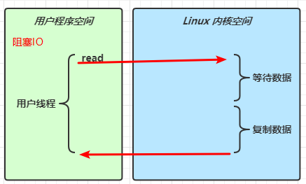</div>

* <b style="color:green">同步非阻塞  IO</b>：读数据时，调用一次 read 方法，这时候数据还没传输过来，会立刻返回，告诉用户线程，我读到了0 (没读到数据)  ，然后回继续调用 read 方法，继续看数据有没有好；用户线程并没有停下来，而是一直在问，数据有没有好。但是，某一次调用时，发现有数据了！这时候就不会立刻返回了，就会去完成第二个阶段<b>赋值数据</b>，赋值数据的时候，用户线程还是会被阻塞。等待数据赋值完毕，返回，用户线程可以继续运行。这里的非阻塞只是等待数据非阻塞的 (这里不就是空转cpu吗，而且牵扯到多次系统空间和用户空间的切换，开销也大)  。

    <div align="center"></div>

* <b style="color:green">同步多路复用</b>：关键在于 select，select 方法先阻塞住，看有没有事件，有事件发生了，内核就会通知 select，用户线程就可以根据 selectKey 拿到 channel，去调用相应的事件。read 期间需要赋值数据了，还是需要阻塞。两个阶段都是阻塞的，但是

    <div align="center">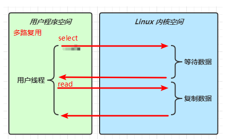</div>

* <b style="color:green">信号驱动</b>

* <b style="color:green">异步 IO</b>：read 是非阻塞的，不用等待 ”等待数据“和”复制数据“的阶段，只是通知 OS 我要读一个数据，什么时候数据准备好了就告诉我。

    <div align="center"></div>

* <b style="color:green">阻塞 IO vs 多路复用</b>

    * 阻塞 IO，做一件事的时候，就不能做另一件事。比如，你在等待连接，那么就不可以进行建立连接。
    * 多路复用，一个 select 可以检测多个 channel 的事件。 select 方法执行后，就在等待事件发生，只要事件发生了，就可以触发 select，让 select 继续向下运行。

    <div align="center"></div>

    <div align="center"></div>

#### 🔖 参考

UNIX 网络编程 - 卷 I

### 零拷贝

#### 传统 IO 问题

传统的 IO 将一个文件通过 socket 写出

```java
File f = new File("helloword/data.txt");
RandomAccessFile file = new RandomAccessFile(file, "r");

byte[] buf = new byte[(int)f.length()];
file.read(buf);

Socket socket = ...;
socket.getOutputStream().write(buf);
```

内部工作流程是这样的：

<div align="center"></div>

1️⃣Java 本身并不具备 IO 读写能力，因此 read 方法调用后，要从 Java 程序的<b>用户态切换至内核态</b>，去调用操作系统 (Kernel)  的读能力，将数据读入<b>内核缓冲区</b>。这期间用户线程阻塞，操作系统使用 DMA (Direct Memory Access)  来实现文件读，其间也不会使用 CPU

> DMA 也可以理解为硬件单元，用来解放 CPU 完成文件 IO

2️⃣从<b>内核态切换回用户态</b>，将数据从<b>内核缓冲区</b>读入<b>用户缓冲区</b> (即 byte[] buf)  ，这期间 CPU 会参与拷贝，无法利用 DMA

3️⃣调用 write 方法，这时将数据从<b>用户缓冲区</b> (byte[] buf)  写入 <b>socket 缓冲区</b>，CPU 会参与拷贝

4️⃣接下来要向网卡写数据，这项能力 Java 又不具备，因此又得从<b>用户态</b>切换至<b>内核态</b>，调用操作系统的写能力，使用 DMA 将 <b>socket 缓冲区</b>的数据写入网卡，不会使用 CPU

可以看到中间环节较多，Java 的 IO 实际不是物理设备级别的读写，而是缓存的复制，底层的真正读写是操作系统来完成的

* 用户态与内核态的切换发生了 3 次，这个操作比较重量级
* 数据拷贝了共 4 次

#### NIO 优化

<span style="color:red">NIO 中的 Buffer 都在用户空间中，包括 DirectBuffer。而 Java NIO 的零拷贝也是在用户态层面的零拷贝不是 OS 中的零拷贝。是指将 JVM 内存映射到堆外内存（用户态内存缓冲区），减少从用户态内存缓冲区-->JVM 内存缓冲区的拷贝。</span>

通过 DirectByteBuf 

* ByteBuffer.allocate(10)  HeapByteBuffer 使用的还是 Java 内存
* ByteBuffer.allocateDirect(10)  DirectByteBuffer 使用的是操作系统内存

<div align="center"></div>

<b>大部分步骤与优化前相同，不再赘述。唯有一点：Java 可以使用 DirectByteBuf 将堆外内存映射到 jvm 内存中来直接访问使用</b>

* 这块内存不受 jvm 垃圾回收的影响，因此<b>内存地址固定，有助于 IO 读写</b>
* Java 中的 DirectByteBuf 对象仅维护了此内存的虚引用，内存回收分成两步
    * DirectByteBuf 对象被垃圾回收，将虚引用加入引用队列
    * 通过专门线程访问引用队列，根据虚引用释放堆外内存
* 减少了一次数据拷贝，用户态与内核态的切换次数没有减少

进一步优化 (底层采用了 linux 2.1 后提供的 sendFile 方法)  ，Java 中对应着两个 channel 调用 transferTo/transferFrom 方法拷贝数据

<div align="center"></div>

1. Java 调用 transferTo 方法后，要从 Java 程序的<b>用户态切换至内核态</b>，使用 DMA 将数据读入<b>内核缓冲区</b>，不会使用 CPU
2. 数据从<b>内核缓冲区</b>传输到 <b>socket 缓冲区</b>，CPU 会参与拷贝
3. 最后使用 DMA 将 <b>socket 缓冲区</b>的数据写入网卡，不会使用 CPU

可以看到

* 只发生了一次用户态与内核态的切换
* 数据拷贝了 3 次

进一步优化 (linux 2.4)  

<div align="center"></div>

1. Java 调用 transferTo 方法后，要从 Java 程序的用户态切换至内核态，使用 DMA 将数据读入内核缓冲区，不会使用 CPU
2. 只会将一些 offset 和 length 信息拷入 socket 缓冲区，几乎无消耗
3. 使用 DMA 将内核缓冲区的数据写入网卡，不会使用 CPU

整个过程仅只发生了一次用户态与内核态的切换，数据拷贝了 2 次。<b style="color:green">所谓的【零拷贝】，并不是真正无拷贝，而是在不会拷贝重复数据到 jvm 内存中</b>，零拷贝的优点有

* 更少的用户态与内核态的切换
* 不利用 CPU 计算，减少 CPU 缓存伪共享
* 零拷贝适合小文件传输，不适合大文件的传输。
    * 如果文件比较大，那需要把大量的数据读到缓冲区去，缓冲区是为了方便反复获取数据，如果文件比较大，要把文件发生到网卡，数据从头到尾只读取了一次，没发挥到缓存的效果，反而因为文件较大，把缓冲区内存都占满了，导致其他文件的读写受到影响。
    * 适合读取频繁的小文件。

### AIO

AIO 用来解决数据复制阶段的阻塞问题

* 同步意味着，在进行读写操作时，线程需要等待结果，还是相当于闲置
* 异步意味着，在进行读写操作时，线程不必等待结果，而是将来由操作系统来通过回调方式由另外的线程来获得结果

> 异步模型需要底层操作系统 (Kernel)  提供支持
>
> * Windows 系统通过 IOCP 实现了真正的异步 IO
> * Linux 系统异步 IO 在 2.6 版本引入，但其底层实现还是用多路复用模拟了异步 IO，性能没有优势

#### 文件 AIO

先来看看 AsynchronousFileChannel

```java
@Slf4j
public class AioDemo1 {
    public static void main(String[] args) throws IOException {
        try{
            AsynchronousFileChannel s = 
                AsynchronousFileChannel.open(
                	Paths.get("1.txt"), StandardOpenOption.READ);
            ByteBuffer buffer = ByteBuffer.allocate(2);
            log.debug("begin...");
            s.read(buffer, 0, null, new CompletionHandler<Integer, ByteBuffer>() {
                // 这是一个守护线程！
                @Override
                public void completed(Integer result, ByteBuffer attachment) {
                    log.debug("read completed...{}", result);
                    buffer.flip();
                    debug(buffer);
                }

                @Override
                public void failed(Throwable exc, ByteBuffer attachment) {
                    log.debug("read failed...");
                }
            });

        } catch (IOException e) {
            e.printStackTrace();
        }
        log.debug("do other things...");
        System.in.read();
    }
}
```

输出

```
13:44:56 [DEBUG] [main] c.i.aio.AioDemo1 - begin...
13:44:56 [DEBUG] [main] c.i.aio.AioDemo1 - do other things...
13:44:56 [DEBUG] [Thread-5] c.i.aio.AioDemo1 - read completed...2
         +-------------------------------------------------+
         |  0  1  2  3  4  5  6  7  8  9  a  b  c  d  e  f |
+--------+-------------------------------------------------+----------------+
|00000000| 61 0d                                           |a.              |
+--------+-------------------------------------------------+----------------+
```

可以看到

* 响应文件读取成功的是另一个线程 Thread-5
* 主线程并没有 IO 操作阻塞

#### 💡 守护线程

默认文件 AIO 使用的线程都是守护线程，所以最后要执行 `System.in.read()` 以避免守护线程意外结束

#### 网络 AIO

```java
public class AioServer {
    public static void main(String[] args) throws IOException {
        AsynchronousServerSocketChannel ssc = AsynchronousServerSocketChannel.open();
        ssc.bind(new InetSocketAddress(8080));
        ssc.accept(null, new AcceptHandler(ssc));
        System.in.read();
    }

    private static void closeChannel(AsynchronousSocketChannel sc) {
        try {
            System.out.printf("[%s] %s close\n", Thread.currentThread().getName(), sc.getRemoteAddress());
            sc.close();
        } catch (IOException e) {
            e.printStackTrace();
        }
    }

    private static class ReadHandler implements CompletionHandler<Integer, ByteBuffer> {
        private final AsynchronousSocketChannel sc;

        public ReadHandler(AsynchronousSocketChannel sc) {
            this.sc = sc;
        }

        @Override
        public void completed(Integer result, ByteBuffer attachment) {
            try {
                if (result == -1) {
                    closeChannel(sc);
                    return;
                }
                System.out.printf("[%s] %s read\n", Thread.currentThread().getName(), sc.getRemoteAddress());
                attachment.flip();
                System.out.println(Charset.defaultCharset().decode(attachment));
                attachment.clear();
                // 处理完第一个 read 时，需要再次调用 read 方法来处理下一个 read 事件
                sc.read(attachment, attachment, this);
            } catch (IOException e) {
                e.printStackTrace();
            }
        }

        @Override
        public void failed(Throwable exc, ByteBuffer attachment) {
            closeChannel(sc);
            exc.printStackTrace();
        }
    }

    private static class WriteHandler implements CompletionHandler<Integer, ByteBuffer> {
        private final AsynchronousSocketChannel sc;

        private WriteHandler(AsynchronousSocketChannel sc) {
            this.sc = sc;
        }

        @Override
        public void completed(Integer result, ByteBuffer attachment) {
            // 如果作为附件的 buffer 还有内容，需要再次 write 写出剩余内容
            if (attachment.hasRemaining()) {
                sc.write(attachment);
            }
        }

        @Override
        public void failed(Throwable exc, ByteBuffer attachment) {
            exc.printStackTrace();
            closeChannel(sc);
        }
    }

    private static class AcceptHandler implements CompletionHandler<AsynchronousSocketChannel, Object> {
        private final AsynchronousServerSocketChannel ssc;

        public AcceptHandler(AsynchronousServerSocketChannel ssc) {
            this.ssc = ssc;
        }

        @Override
        public void completed(AsynchronousSocketChannel sc, Object attachment) {
            try {
                System.out.printf("[%s] %s connected\n", Thread.currentThread().getName(), sc.getRemoteAddress());
            } catch (IOException e) {
                e.printStackTrace();
            }
            ByteBuffer buffer = ByteBuffer.allocate(16);
            // 读事件由 ReadHandler 处理
            sc.read(buffer, buffer, new ReadHandler(sc));
            // 写事件由 WriteHandler 处理
            sc.write(Charset.defaultCharset().encode("server hello!"), ByteBuffer.allocate(16), new WriteHandler(sc));
            // 处理完第一个 accpet 时，需要再次调用 accept 方法来处理下一个 accept 事件
            ssc.accept(null, this);
        }

        @Override
        public void failed(Throwable exc, Object attachment) {
            exc.printStackTrace();
        }
    }
}
```

# Netty入门

## 概述

### Netty是什么	

```
Netty is an asynchronous event-driven network application framework
for rapid development of maintainable high performance protocol servers & clients.
```

Netty 是一个异步的、基于事件驱动的网络应用框架，用于快速开发可维护、高性能的网络服务器和客户端。<b style="color:red">注意：Netty 不是用到异步 IO。说 Netty 是异步框架指的是多线程。</b>

### Netty的作者

<div align="center"></div>

他还是另一个著名网络应用框架 Mina 的重要贡献者

### Netty的地位

Netty 在 Java 网络应用框架中的地位就好比：Spring 框架在 JavaEE 开发中的地位

以下的框架都使用了 Netty，因为它们有网络通信需求！

* Cassandra - nosql 数据库
* Spark - 大数据分布式计算框架
* Hadoop - 大数据分布式存储框架
* RocketMQ - ali 开源的消息队列
* ElasticSearch - 搜索引擎
* gRPC - rpc 框架
* Dubbo - rpc 框架
* Spring 5.x - flux api 完全抛弃了 tomcat ，使用 netty 作为服务器端
* Zookeeper - 分布式协调框架

### Netty的优势

1️⃣Netty vs NIO，工作量大，bug 多

* 需要自己构建协议
* 解决 TCP 传输问题，如粘包、半包
* epoll 空轮询导致 CPU 100% (Linux 多路复用的底层是 epoll，epoll 在 NIO 里有 Bug，NIO 的作者在处理 epoll 的时候有 Bug 会导致 selector 方法在某些情况下阻塞不了。)  
* 对 API 进行增强，使之更易用，如 FastThreadLocal => ThreadLocal，ByteBuf => ByteBuffer

2️⃣Netty vs 其它网络应用框架

* Mina 由 apache 维护，将来 3.x 版本可能会有较大重构，破坏 API 向下兼容性，Netty 的开发迭代更迅速，API 更简洁、文档更优秀
* 久经考验，16 年，Netty 版本
    * 2.x 2004
    * 3.x 2008
    * 4.x 2013
    * 5.x 已废弃 (加入了 AIO，但是没有明显的性能提升，维护成本高)  

> Netty 的注意事项

Netty 中的很多方法都是异步的，遇到这些异步的方法，不能直接在异步后面加方法进行处理，要么同步 (sync 方法阻塞) 关闭，要么配合异步 (addListener 异步关闭) 关闭。

Netty3 容易产生大量内存垃圾，因为 Netty3，大多数时候是在堆上创建对象的，数据需要来回进行内核桃、用户态的拷贝。大多数情况，在编写 socket 的时候，都是希望使用直接内存/本地内存，这样可以减少一次数据拷贝，但是创建直接内存、销毁直接十分耗费性能，而且 Netty3 也没有一个很好的内存池。并且，Netty3 没有对 Linux 做优化。而且 Netty3 的线程模型不太好。Inbound 数据处理是在一个 EventLoop 里，一直是同一个线程，但是 Outbound 写数据却不是这样。基本上 Outbound 的处理始终处于调用线程里。这样就很难理解到底是那个线程在操作那个数据。

Netty4 产生的垃圾更少，而且有一个针对 Linux 做了优化的传输层，通过 JNI 实现的。有一个高性能 buffer pool，这个 buffer pool 是基于 jemalloc paper 实现的。用 Java 重新实现了 Jemalloc。线程模型也得到了优化，Inbound 和 Outbound 都发生在同一个线程中，不用再担心同步问题。

## Netty如何工作的

### Channel

Netty 里有一个 Channel 的概念，Channel 是对 Socket 的抽象。可以认为，当我们使用 TCP 时，一个 Channel 相当于一个连接。

每个 Channel 会对应一个 ChannelPipeline，而 ChannelPipeline 是一个包含了一系列不同的 ChannelHandler 的双向链表。

ChannelHandler 可以处理 Inbound 和 Outbound 事件。

- 在 Inbound 中每次读取一些数据，一个新的连接就被建立了。从头部的 pipeline 一路传播到尾部。
- 在 Outbound 中每次写一些数据是，会从尾部流向 Channel 的头部，也可以选择以当前结点为起点，向前传播。

在 Inbound 和 Outbound 中可以通过 instanceof 检查消息的类型，进行对应的处理，但是这种复杂的类型检测妨碍了 JVM 的 JIT 优化，因为我们总是调用同一个方法来处理不同的 POJO 做各种 instanceof 检查。为了解决这个，Netty 引入了一个轻量级的对象池。

- channelRead，读数据时调用该方法
- channelActive，当文件描述符（fd）被打开时调用
- channelInactive，当文件描述符（fd）被关闭时调用

### 高性能传输

使用 JNI 提供 JDK 目前没有的高级特性。

- 直接操作 Buffer 的指针，可以获取内存地址，进行传递这样比传递对象更轻量。

基于 epoll 的高性能传输（Native Transport epoll based high-performance transport），还有一些 advanced features

- `SO_REUSEPORT`，允许不同的线程和 socket 多次绑定到同一端口。
    - 一般，我们会让 OS 内核来处理线程之间的负载均衡，如果程序需要接收很多并发 socket 只使用一个线程会成为性能瓶颈。我们可以启用多个线程，然后将它们绑定在同一端口上处理不同的连接。甚至可以多次启动同一进程并绑定到同一端口。[(26条消息) Netty服务端option配置SO_REUSEADDR_loophome的博客-CSDN博客](https://blog.csdn.net/loophome/article/details/118579754)
- `TCP_FASTOPEN`，允许在连接第一次握手时就开始发送数据（对 Client 和 Server 都有控制权时）
- `TCP_INFO`，允许获取文件描述符（fd）的统计信息。Ubuntu 20 默认为 4096？
- 直接调用的 JNI 接口，传递内存地址过去。所以不需要生成太多的对象。

### ByteBuf

- API 设计不好，而且每次 get 时都要进行内存地址检查防止越界（ByteBuff#nextGetIndex 方法）。Netty 中有一套自己的 ByteBuff 处理体系可以解决上述问题。
- 比如，Netty 中有一个叫 ForeachByte 的东西，它允许我们传入一个 ByteProcessor，在返回 false 前一直循环，只需要检查一次边界。
- Netty 的读写指针设计的更合理。
- ByteBuffer 的构造方法是 package-private 的，因此我们无法在包以外的地方继承它。如果我们想要多个 ByteBuffer 组合在一起时，只能把多个 ByteBuffer 传递到一个 ByteBuffer 数组里，自己来做遍历，而 Netty 提供了 CompositeByteBuf 类完成这类功能。
- ByteBuffer 的释放是通过引用计数来释放的，需要像写 C 一样自己控制内存的释放，很麻烦。而 Netty 提供了一个 LeakDetector 来帮助检测 ByteBuf 的泄漏。
- Netty 采用内存池的计数来重用 ByteBuf。而且 Java 规范中规定，每次创建 Byte 数组时会对对应的内存区域进行清零，这是有性能损耗的。

### PooledByteBufAllocator

<div align="center">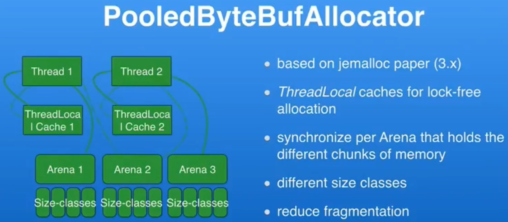</div>

- 用 Java 实现的 Jemalloc 规范。Jemalloc 是 FreeBSD 默认的内存创建机制。
- 有多个线程来创建内存，创建内存时会进入到线程缓存（ThreadLocal）中，如果合适大小的 buffer 存在，则直接拿过来用，无需做同步操作（一个线程中）；
- 如果没有合适的，则会进入一个 Arena 空间，一个我们创建的微型内存区，可以通过配置来设定有多少 Arena。在 Netty 中默认有 2 倍内核数的数量。
- 进入 Arena 后尝试进行创建，在操作时，可能会出现多线程操作同一个 Arena，因此需要进行同步操作。

### Threading-Model

加入一个 Channel 被绑定到 IO-Thread 上后绑定关系将不再改变。这样的好处是，所有的操作会一直处于同一个线程内。这就省去了使用类型 volatile 等线程可见性机制。IO 线程驱动了 InboundHandler 和 OutboundHandler 里的事件。当 ChannelHandler 被多个 Channel 共享时需要注意线程安全问题。

如果在 Netty 的非 IO 线程里进行方法调用，如从外部调用 channelWrite 方法，会检测线程是否是当前的 Eventloop 线程，如果不是会把方法分配到 Eventloop 线程里。而 Eventloop 线程其实就是 Java 里的 Executor。

### Write Semantics

<div align="center">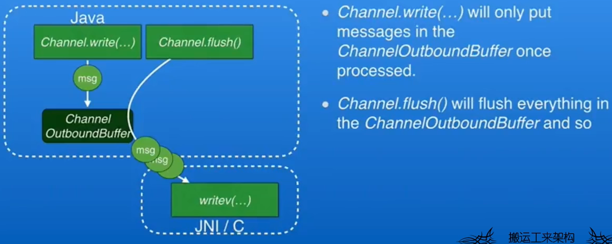</div>

Netty3 write 和 flush 操作时一起的，如果每次只 writeflush 一小部分数据，这样会导致频繁的 JNI 调用和系统调用；Netty4 将 write 和 flush 操作分离，允许积攒多个数据后再 flush，这样可以减少 JNI 调用和系统调用。对于 OutputStream，每次调用 write 它不会进入到 socket，调用 flush 后系统才会保证 outbound 缓冲区里的所有数据都写入到 socket 中。

- channelReadComplete，当 channel 中无数据可读时会调用该方法，可以在该方法中调用 channelFlush 将之前被写入缓存的数据写入到 socket 中进行发送。如果写操作够多的话，可以提升 35% 的性能。
- 如果 socket 缓冲区不够无法一次发送完所有数据时，会尽可能多的发送数据，循环读取，将未完全发送的数据继续发送出去。在调用 flush 的时候要小心它吃掉太多的内存。为了解决这个问题，Netty 提供了 Backpressure 机制。
- Backpressure 机制。Netty 中有一个方法，channelWriteAbilityChange。每次 Channel 从可写变为不可写或者相反都会发送一个事件，可以检查到现在 channel 变为可写了可以继续写，现在变为不可写了可以调用 flush 方法让它继续写，非常灵活。

### Read Semantics

提供了 RecvByteBufAllocator，预估需要使用的内存大小然后给一个相应的 ByteBuf。

其他的没太听懂。

### OpenSSLEngine

Netty 实现了一个 SSLEngine。JDK 自身的 SSLEngine 速度比较慢，而 Netty 自己基于 OpenSSL+JNI 实现了一个。性能比较（用简单的 HTTP 请求进行测试的）如下图所示

<div align="center">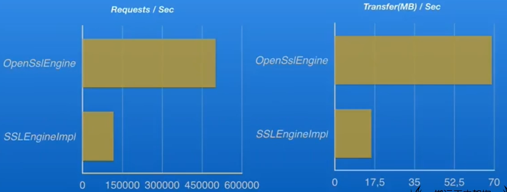</div>

JDK 的 SSLEngineImpl 只有 15万 RPS（每秒请求数），而 Netty 自己实现的则有 50万 RPS。

OpenSSLEngine 内存消耗更少，GC 更少，速度更快。通过代码可进行更替

```java
SslContextBuilder.forServer().sslProvider(SslProvider.OpenSsl)
```

如果不指定的话，Netty 会查找是否存在 OpenSSL 的包，有就有 OpenSSL 没有则用默认的 JDK 实现。

OpenSSL 也可以单独使用，它是基于 Apache Tomcat Native 的。

### JVM与Netty

<b>Netty 释放内存</b>

直接内存管理是通过 JVM 的 finalizer 或 cleaner 来实现的。但是并不好用。因为垃圾回收只有在堆空间耗尽的时候才会进行，但是这样对性能很不友好。

如果编写网络程序的话，大部分时候我们应该知道何时应该释放内存。如当通过 socket 把数据发送出去了就可以释放内存了。

<b>内存布局</b>

- 控制内存布局并不容易
- 伪共享是个很大的问题

JIT 为了避免浪费内存（如存在内存空隙）会自动调整 class 文件的内存布局，而这样可能会造成内存伪共享（False Sharing，cache 部分的知识）。C 语言是通过 padding 来解决伪共享的，早期的 Netty 也是通过填充字段来实现。后面 Java 引入了一个注解来解决伪共享。

## Hello World

```java
public class QuickServer {
    public static void main(String[] args) {
        // 1. 服务器端的启动器。负责组装 netty 组件，启动服务器
        new ServerBootstrap()
                // 2. Group 类似我们前面写的 BoosEventLoop  WorkerEventLoop(selector,thread)
                .group(new NioEventLoopGroup())
                // 3.选择一个 ServerChannel 的实现。 OIO 其实就是 BIO
                .channel(NioServerSocketChannel.class)
                // 4.BOSS 负责处理连接， worker(child) 负责处理读写，决定了 worker(child) 能执行哪些操作
                .childHandler(
                        // 5.代表和客户端进行数据读写的通道。channel 代表和客户端进行数据读写的通道 Initializer 初始化，它是负责添加别的 handler
                        new ChannelInitializer<NioServerSocketChannel>() {
                            @Override
                            protected void initChannel(NioServerSocketChannel ch) throws Exception {
                                // 6.添加具体的 handler
                                ch.pipeline().addLast(new StringDecoder()); // 将 ByteBuf 转换为字符串
                                ch.pipeline().addLast(new ChannelInboundHandlerAdapter() { // 自定义 handler
                                    @Override
                                    public void channelRead(ChannelHandlerContext ctx, Object msg) throws Exception {
                                        System.out.println(msg);
                                    }
                                });
                            }
                        })
                // 7.绑定监听端口
                .bind(8080);
        System.out.println(123);
    }
}

public class QuickClient {
    public static void main(String[] args) throws InterruptedException {
        // 1.启动类
        new Bootstrap()
                // 2.添加 EventLoop
                .group(new NioEventLoopGroup())
                // 3 选择客户端 channel 实现
                .channel(NioSocketChannel.class)
                // 4 添加处理器
                .handler(new ChannelInitializer<NioSocketChannel>() {
                    @Override // 在建立连接后被调用
                    protected void initChannel(NioSocketChannel ch) throws Exception {
                        ch.pipeline().addLast(new StringEncoder());
                    }
                })
                .connect("127.0.0.1", 8080)
                .sync() // 阻塞方法、直到连接建立才执行。
                .channel() // 连接建立好了，拿到了 channel 对象 (连接对象)  。可以读写数据了。
                // 向服务器发送数据
                .writeAndFlush("hello world netty");
    }
}
```

### 目标

开发一个简单的服务器端和客户端

* 客户端向服务器端发送 hello, world
* 服务器仅接收，不返回

加入依赖

```xml
<dependency>
    <groupId>io.netty</groupId>
    <artifactId>netty-all</artifactId>
    <version>4.1.39.Final</version>
</dependency>
```

### 服务器端

注意 ChannelInitializer 的泛型是 NioSocketChannel

```java
import io.netty.bootstrap.ServerBootstrap;
import io.netty.channel.ChannelHandlerContext;
import io.netty.channel.ChannelInboundHandlerAdapter;
import io.netty.channel.ChannelInitializer;
import io.netty.channel.nio.NioEventLoopGroup;
import io.netty.channel.socket.nio.NioServerSocketChannel;
import io.netty.channel.socket.nio.NioSocketChannel;
import io.netty.handler.codec.string.StringDecoder;

public class QuickServer {
    public static void main(String[] args) {
        // 1. 服务器端的启动器。负责组装 netty 组件，启动服务器
        new ServerBootstrap()
                // 2. Group 类似我们前面写的 BoosEventLoop  WorkerEventLoop(selector,thread) 可以简单理解为 线程池 + Selector ，一开始来讲，关心的是 accept 事件。
                .group(new NioEventLoopGroup()) // 
                // 3.选择一个 ServerChannel 的实现。 OIO 其实就是 BIO
                .channel(NioServerSocketChannel.class)
                // 4.BOSS 负责处理连接， worker(child) 负责处理读写，决定了 worker(child) 能执行哪些操作
                .childHandler( //
                        // 5.和客户端进行数据读写的通道。channel 代表和客户端进行数据读写的通道 Initializer 初始化，负责添加别的 handler。这个不是加完后就执行，是在连接建立以后 (accept事件发生后)  他会去执行 initChannel 方法
                        new ChannelInitializer<NioSocketChannel>() {
                            @Override
                            protected void initChannel(NioSocketChannel ch) throws Exception {
                                // 6.添加具体的 handler。 (处理器类)  
                                ch.pipeline().addLast(new StringDecoder()); // 将 ByteBuf 转换为字符串
                                ch.pipeline().addLast(new ChannelInboundHandlerAdapter() {
                                    public void channelRead(ChannelHandlerContext ctx, Object msg) throws Exception {
                                        ctx.fireChannelRead(msg);
                                        System.out.println(msg);
                                    }
                                });
                            }
                        })
                // 7.绑定监听端口
                .bind(8080);
        System.out.println(123);
    }
}
```

> 代码解读

* 1 处，创建 NioEventLoopGroup，可以简单理解为<b>线程池 + Selector</b> 后面会详细展开

* 2 处，选择服务 Scoket 实现类，其中 NioServerSocketChannel 表示基于 NIO 的服务器端实现，其它实现还有

    <div align="center">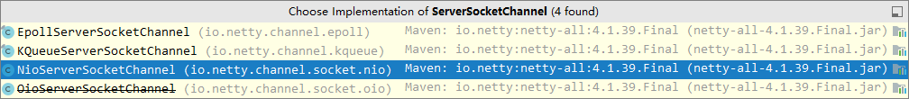</div>

* 3 处，为啥方法叫 childHandler，是接下来添加的处理器都是给 SocketChannel 用的，而不是给 ServerSocketChannel。ChannelInitializer 处理器 (仅执行一次)  ，它的作用是待客户端 SocketChannel 建立连接后，执行 initChannel 以便添加更多的处理器

* 4 处，ServerSocketChannel 绑定的监听端口

* 5 处，SocketChannel 的处理器，解码 ByteBuf => String

* 6 处，SocketChannel 的业务处理器，使用上一个处理器的处理结果

### 客户端

```java
public class QuickClient {
    public static void main(String[] args) throws InterruptedException {
        // 1.启动类
        new Bootstrap()
                // 2.添加 EventLoop
                .group(new NioEventLoopGroup())
                // 3 选择客户端 channel 实现
                .channel(NioSocketChannel.class)
                // 4 添加处理器
                .handler(new ChannelInitializer<NioSocketChannel>() {
                    @Override // 在建立连接后被调用
                    protected void initChannel(NioSocketChannel ch) throws Exception {
                        // 把字符串编码成 ByteBuf。
                        ch.pipeline().addLast(new StringEncoder());
                    }
                })
                .connect("127.0.0.1", 8080)
                .sync() // 阻塞方法、直到连接建立才执行。
                .channel() // 连接建立好了，拿到了 channel 对象 (连接对象)  。可以读写数据了。
                // 向服务器发送数据
                .writeAndFlush("hello world netty");
    }
}
```

>代码解读

* 1 处，创建 NioEventLoopGroup，同 Server

* 2 处，选择客户 Socket 实现类，NioSocketChannel 表示基于 NIO 的客户端实现，其它实现还有

    <div align="center">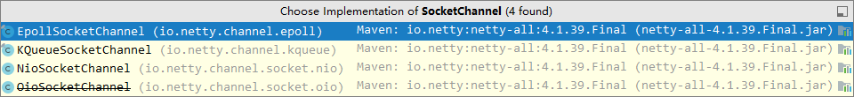</div>

* 3 处，添加 SocketChannel 的处理器，ChannelInitializer 处理器 (仅执行一次)  ，它的作用是待客户端 SocketChannel 建立连接后，执行 initChannel 以便添加更多的处理器

* 4 处，指定要连接的服务器和端口

* 5 处，Netty 中很多方法都是异步的，如 connect，这时需要使用 sync 方法等待 connect 建立连接完毕

* 6 处，获取 channel 对象，它即为通道抽象，可以进行数据读写操作

* 7 处，写入消息并清空缓冲区

* 8 处，消息会经过通道 handler 处理，这里是将 String => ByteBuf 发出

* 数据经过网络传输，到达服务器端，服务器端 5 和 6 处的 handler 先后被触发，走完一个流程

### 流程梳理

<div align="center">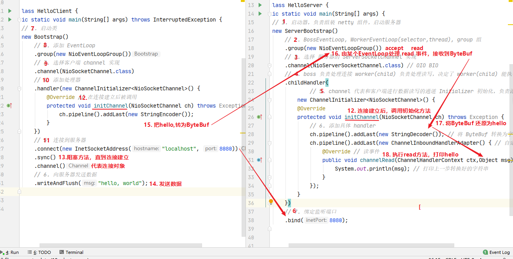</div>

#### 💡 提示

> <b>一开始需要树立正确的观念</b>
>
> * 把 channel 理解为数据的通道
> * 把 msg 理解为流动的数据，最开始输入是 ByteBuf，但经过 pipeline 的加工，会变成其它类型对象，最后输出又变成 ByteBuf
> * 把 handler 理解为数据的处理工序
>     * 工序有多道，合在一起就是 pipeline，pipeline 负责发布事件 (读、读取完成...)  传播给每个 handler， handler 对自己感兴趣的事件进行处理 (重写了相应事件处理方法)  
>     * handler 分 Inbound 和 Outbound 两类
>         * Inbound 入站，数据输/写入时由 Inbound 入站处理器处理
>         * Outbound 出站，数据写出时由 Outbound 出站处理器处理
> * 把 eventLoop 理解为处理数据的工人 (底层使用的单线程的线程池)
>     * 工人可以管理多个 channel 的 io 操作，并且一旦工人负责了某个 channel，就要负责到底 (绑定)  。<span style="color:red">一个 channel 只被一个线程操作，线程安全。</span>
>     * 工人既可以执行 io 操作，也可以进行任务处理，每位工人有任务队列，队列里可以堆放多个 channel 的待处理任务，任务分为普通任务、定时任务
>     * 工人按照 pipeline 顺序，依次按照 handler 的规划 (代码)  处理数据，可以为每道工序指定不同的工人 (非 IO 操作的处理可以换工人)  

## 组件

### EventLoop

事件循环对象

`EventLoop` 本质是一个单线程执行器 (同时维护了一个 `Selector`)  ，里面有 `run` 方法处理 `Channel` 上源源不断的 `io` 事件。

它的继承关系比较复杂

* 一条线是继承自 j.u.c.ScheduledExecutorService 因此包含了线程池中所有的方法
* 另一条线是继承自 netty 自己的 OrderedEventExecutor，
    * 提供了 boolean inEventLoop(Thread thread) 方法判断一个线程是否属于此 EventLoop
    * 提供了 parent 方法来看看自己属于哪个 EventLoopGroup

事件循环组

EventLoopGroup 是一组 EventLoop，Channel 一般会调用 EventLoopGroup 的 register 方法来绑定其中一个 EventLoop，后续这个 Channel 上的 io 事件都由此 EventLoop 来处理 (保证了 io 事件处理时的线程安全)  【把 `Channel` 和其中一个 `EventLoop` 绑定在一起。】

* 继承自 netty 自己的 EventExecutorGroup
    * 实现了 Iterable 接口提供遍历 EventLoop 的能力
    * 另有 next 方法获取集合中下一个 EventLoop
* 一条线是继承自 `j.u.c.ScheduledExecutorService` 因此包含了线程池中所有的方法
* 另一条线是继承自 `netty` 自己的 `OrderedEventExecutor`，
    * 提供了 `boolean inEventLoop(Thread thread)` 方法判断一个线程是否属于此 `EventLoop`
    * 提供了 `parent` 方法来看看自己属于哪个 `EventLoopGroup`

以一个简单的实现为例：

```java
@Slf4j(topic = "c.TestEventLoop")
public class TestEventLoop {
    public static void main(String[] args) {
        // 可以提交 io 事件、普通任务、定时任务
        // nThreads 传入 0 的话，就设置默认的线程数 Math.max(1,可用处理器*2)
        NioEventLoopGroup group = new NioEventLoopGroup(2); 
        // 普通任务、定时任务
        // DefaultEventLoopGroup eventExecutors1 = new DefaultEventLoopGroup();
		// System.out.println(NettyRuntime.availableProcessors())
        // 获取下一个事件的循环
        System.out.println(group.next());
        System.out.println(group.next());
        System.out.println(group.next());
        System.out.println(group.next());
    }
}
/*
io.netty.channel.nio.NioEventLoop@8317c52
io.netty.channel.nio.NioEventLoop@76f2bbc1
io.netty.channel.nio.NioEventLoop@8317c52
io.netty.channel.nio.NioEventLoop@76f2bbc1
轮流用，相当于实现了一个简单的负载均衡
*/
```

也可以使用 for 循环

```java
DefaultEventLoopGroup group = new DefaultEventLoopGroup(2);
for (EventExecutor eventLoop : group) {
    System.out.println(eventLoop);
}
```

#### 💡 优雅关闭

优雅关闭 `shutdownGracefully` 方法。该方法会首先切换 `EventLoopGroup` 到关闭状态从而拒绝新的任务的加入，然后在任务队列的任务都处理完成后，停止线程的运行。从而确保整体应用是在正常有序的状态下退出的

#### 演示 NioEventLoop 处理 io 事件

服务器端两个 nio worker 工人

```java
new ServerBootstrap()
    .group(new NioEventLoopGroup(1), new NioEventLoopGroup(2))
    .channel(NioServerSocketChannel.class)
    .childHandler(new ChannelInitializer<NioSocketChannel>() {
        @Override
        protected void initChannel(NioSocketChannel ch) {
            ch.pipeline().addLast(new ChannelInboundHandlerAdapter() {
                @Override
                public void channelRead(ChannelHandlerContext ctx, Object msg) {
                    ByteBuf byteBuf = msg instanceof ByteBuf ? ((ByteBuf) msg) : null;
                    if (byteBuf != null) {
                        byte[] buf = new byte[16];
                        ByteBuf len = byteBuf.readBytes(buf, 0, byteBuf.readableBytes());
                        log.debug(new String(buf));
                    }
                }
            });
        }
    }).bind(8080).sync();
```

客户端，启动三次，分别修改发送字符串为 zhangsan (第一次)  ，lisi (第二次)  ，wangwu (第三次)  

```java
public static void main(String[] args) throws InterruptedException {
    Channel channel = new Bootstrap()
            .group(new NioEventLoopGroup(1))
            .handler(new ChannelInitializer<NioSocketChannel>() {
                @Override
                protected void initChannel(NioSocketChannel ch) throws Exception {
                    System.out.println("init...");
                    ch.pipeline().addLast(new LoggingHandler(LogLevel.DEBUG));
                }
            })
            .channel(NioSocketChannel.class).connect("localhost", 8080)
            .sync()
            .channel();

    channel.writeAndFlush(ByteBufAllocator.DEFAULT.buffer().writeBytes("wangwu".getBytes()));
    Thread.sleep(2000);
    channel.writeAndFlush(ByteBufAllocator.DEFAULT.buffer().writeBytes("wangwu".getBytes()));
}
```

最后输出

```
22:03:34 [DEBUG] [nioEventLoopGroup-3-1] c.i.o.EventLoopTest - zhangsan       
22:03:36 [DEBUG] [nioEventLoopGroup-3-1] c.i.o.EventLoopTest - zhangsan       
22:05:36 [DEBUG] [nioEventLoopGroup-3-2] c.i.o.EventLoopTest - lisi           
22:05:38 [DEBUG] [nioEventLoopGroup-3-2] c.i.o.EventLoopTest - lisi           
22:06:09 [DEBUG] [nioEventLoopGroup-3-1] c.i.o.EventLoopTest - wangwu        
22:06:11 [DEBUG] [nioEventLoopGroup-3-1] c.i.o.EventLoopTest - wangwu         
```

可以看到两个工人轮流处理 channel，但工人与 channel 之间进行了绑定

<div align="center"></div>

再增加两个非 nio 工人

```java
DefaultEventLoopGroup normalWorkers = new DefaultEventLoopGroup(2);
new ServerBootstrap()
    .group(new NioEventLoopGroup(1), new NioEventLoopGroup(2))
    .channel(NioServerSocketChannel.class)
    .childHandler(new ChannelInitializer<NioSocketChannel>() {
        @Override
        protected void initChannel(NioSocketChannel ch)  {
            ch.pipeline().addLast(new LoggingHandler(LogLevel.DEBUG));
            ch.pipeline().addLast(normalWorkers,"myhandler",
              new ChannelInboundHandlerAdapter() {
                @Override
                public void channelRead(ChannelHandlerContext ctx, Object msg) {
                    ByteBuf byteBuf = msg instanceof ByteBuf ? ((ByteBuf) msg) : null;
                    if (byteBuf != null) {
                        byte[] buf = new byte[16];
                        ByteBuf len = byteBuf.readBytes(buf, 0, byteBuf.readableBytes());
                        log.debug(new String(buf));
                    }
                }
            });
        }
    }).bind(8080).sync();
```

客户端代码不变，启动三次，分别修改发送字符串为 zhangsan (第一次)  ，lisi (第二次)  ，wangwu (第三次)  

输出

```
22:19:48 [DEBUG] [nioEventLoopGroup-4-1] i.n.h.l.LoggingHandler - [id: 0x251562d5, L:/127.0.0.1:8080 - R:/127.0.0.1:52588] REGISTERED
22:19:48 [DEBUG] [nioEventLoopGroup-4-1] i.n.h.l.LoggingHandler - [id: 0x251562d5, L:/127.0.0.1:8080 - R:/127.0.0.1:52588] ACTIVE
22:19:48 [DEBUG] [nioEventLoopGroup-4-1] i.n.h.l.LoggingHandler - [id: 0x251562d5, L:/127.0.0.1:8080 - R:/127.0.0.1:52588] READ: 8B
         +-------------------------------------------------+
         |  0  1  2  3  4  5  6  7  8  9  a  b  c  d  e  f |
+--------+-------------------------------------------------+----------------+
|00000000| 7a 68 61 6e 67 73 61 6e                         |zhangsan        |
+--------+-------------------------------------------------+----------------+
22:19:48 [DEBUG] [nioEventLoopGroup-4-1] i.n.h.l.LoggingHandler - [id: 0x251562d5, L:/127.0.0.1:8080 - R:/127.0.0.1:52588] READ COMPLETE
22:19:48 [DEBUG] [defaultEventLoopGroup-2-1] c.i.o.EventLoopTest - zhangsan        
22:19:50 [DEBUG] [nioEventLoopGroup-4-1] i.n.h.l.LoggingHandler - [id: 0x251562d5, L:/127.0.0.1:8080 - R:/127.0.0.1:52588] READ: 8B
         +-------------------------------------------------+
         |  0  1  2  3  4  5  6  7  8  9  a  b  c  d  e  f |
+--------+-------------------------------------------------+----------------+
|00000000| 7a 68 61 6e 67 73 61 6e                         |zhangsan        |
+--------+-------------------------------------------------+----------------+
22:19:50 [DEBUG] [nioEventLoopGroup-4-1] i.n.h.l.LoggingHandler - [id: 0x251562d5, L:/127.0.0.1:8080 - R:/127.0.0.1:52588] READ COMPLETE
22:19:50 [DEBUG] [defaultEventLoopGroup-2-1] c.i.o.EventLoopTest - zhangsan        
22:20:24 [DEBUG] [nioEventLoopGroup-4-2] i.n.h.l.LoggingHandler - [id: 0x94b2a840, L:/127.0.0.1:8080 - R:/127.0.0.1:52612] REGISTERED
22:20:24 [DEBUG] [nioEventLoopGroup-4-2] i.n.h.l.LoggingHandler - [id: 0x94b2a840, L:/127.0.0.1:8080 - R:/127.0.0.1:52612] ACTIVE
22:20:25 [DEBUG] [nioEventLoopGroup-4-2] i.n.h.l.LoggingHandler - [id: 0x94b2a840, L:/127.0.0.1:8080 - R:/127.0.0.1:52612] READ: 4B
         +-------------------------------------------------+
         |  0  1  2  3  4  5  6  7  8  9  a  b  c  d  e  f |
+--------+-------------------------------------------------+----------------+
|00000000| 6c 69 73 69                                     |lisi            |
+--------+-------------------------------------------------+----------------+
22:20:25 [DEBUG] [nioEventLoopGroup-4-2] i.n.h.l.LoggingHandler - [id: 0x94b2a840, L:/127.0.0.1:8080 - R:/127.0.0.1:52612] READ COMPLETE
22:20:25 [DEBUG] [defaultEventLoopGroup-2-2] c.i.o.EventLoopTest - lisi            
22:20:27 [DEBUG] [nioEventLoopGroup-4-2] i.n.h.l.LoggingHandler - [id: 0x94b2a840, L:/127.0.0.1:8080 - R:/127.0.0.1:52612] READ: 4B
         +-------------------------------------------------+
         |  0  1  2  3  4  5  6  7  8  9  a  b  c  d  e  f |
+--------+-------------------------------------------------+----------------+
|00000000| 6c 69 73 69                                     |lisi            |
+--------+-------------------------------------------------+----------------+
22:20:27 [DEBUG] [nioEventLoopGroup-4-2] i.n.h.l.LoggingHandler - [id: 0x94b2a840, L:/127.0.0.1:8080 - R:/127.0.0.1:52612] READ COMPLETE
22:20:27 [DEBUG] [defaultEventLoopGroup-2-2] c.i.o.EventLoopTest - lisi            
22:20:38 [DEBUG] [nioEventLoopGroup-4-1] i.n.h.l.LoggingHandler - [id: 0x79a26af9, L:/127.0.0.1:8080 - R:/127.0.0.1:52625] REGISTERED
22:20:38 [DEBUG] [nioEventLoopGroup-4-1] i.n.h.l.LoggingHandler - [id: 0x79a26af9, L:/127.0.0.1:8080 - R:/127.0.0.1:52625] ACTIVE
22:20:38 [DEBUG] [nioEventLoopGroup-4-1] i.n.h.l.LoggingHandler - [id: 0x79a26af9, L:/127.0.0.1:8080 - R:/127.0.0.1:52625] READ: 6B
         +-------------------------------------------------+
         |  0  1  2  3  4  5  6  7  8  9  a  b  c  d  e  f |
+--------+-------------------------------------------------+----------------+
|00000000| 77 61 6e 67 77 75                               |wangwu          |
+--------+-------------------------------------------------+----------------+
22:20:38 [DEBUG] [nioEventLoopGroup-4-1] i.n.h.l.LoggingHandler - [id: 0x79a26af9, L:/127.0.0.1:8080 - R:/127.0.0.1:52625] READ COMPLETE
22:20:38 [DEBUG] [defaultEventLoopGroup-2-1] c.i.o.EventLoopTest - wangwu          
22:20:40 [DEBUG] [nioEventLoopGroup-4-1] i.n.h.l.LoggingHandler - [id: 0x79a26af9, L:/127.0.0.1:8080 - R:/127.0.0.1:52625] READ: 6B
         +-------------------------------------------------+
         |  0  1  2  3  4  5  6  7  8  9  a  b  c  d  e  f |
+--------+-------------------------------------------------+----------------+
|00000000| 77 61 6e 67 77 75                               |wangwu          |
+--------+-------------------------------------------------+----------------+
22:20:40 [DEBUG] [nioEventLoopGroup-4-1] i.n.h.l.LoggingHandler - [id: 0x79a26af9, L:/127.0.0.1:8080 - R:/127.0.0.1:52625] READ COMPLETE
22:20:40 [DEBUG] [defaultEventLoopGroup-2-1] c.i.o.EventLoopTest - wangwu          
```

可以看到，nio 工人和 非 nio 工人也分别绑定了 channel (LoggingHandler 由 nio 工人执行，而我们自己的 handler 由非 nio 工人执行)  

<div align="center"></div>

#### 💡 handler 执行中如何换人？

关键代码 `io.netty.channel.AbstractChannelHandlerContext#invokeChannelRead()`

```java
static void invokeChannelRead(final AbstractChannelHandlerContext next, Object msg) {
    final Object m = next.pipeline.touch(ObjectUtil.checkNotNull(msg, "msg"), next);
    // 下一个 handler 的事件循环是否与当前的事件循环是同一个线程
    EventExecutor executor = next.executor();
    
    // 是，直接调用
    if (executor.inEventLoop()) {
        next.invokeChannelRead(m);
    } 
    // 不是，将要执行的代码作为任务提交给下一个事件循环处理 (换人)  
    else {
        executor.execute(new Runnable() {
            @Override
            public void run() {
                next.invokeChannelRead(m);
            }
        });
    }
}
```

* 如果两个 handler 绑定的是同一个线程，那么就直接调用
* 否则，把要调用的代码封装为一个任务对象，由下一个 handler 的线程来调用

#### NioEventLoop 处理普通&定时任务

```java
@Slf4j(topic = "c.TestEventLoop")
public class TestEventLoop {
    public static void main(String[] args) {
        NioEventLoopGroup group = new NioEventLoopGroup(2); // io 事件、普通任务、定时任务
//        DefaultEventLoopGroup eventExecutors1 = new DefaultEventLoopGroup();// 普通任务、定时任务

        // 执行普通事件.把任务提交给了事件循环组的某一个事件循环对象去执行。
        group.next().submit(() -> {
            try {
                TimeUnit.SECONDS.sleep(2);
                log.debug("ok");
            } catch (InterruptedException e) {
                e.printStackTrace();
            }
        });

        // 执行定时任务。启动一个定时任务，以一定的频率执行
        // initialDelay 初始延时事件，线程启动后 1s 才运行。period 2，每隔2s 运行一次
        group.next().scheduleAtFixedRate(() -> {
            log.debug("fixed rate");
        }, 1, 2, TimeUnit.SECONDS);
        log.debug("main");
    }
}
```

#### NioEventLoop 处理 io 事件

服务器端两个 `nio worker` 工人

```java
new ServerBootstrap()
    .group(new NioEventLoopGroup(1), new NioEventLoopGroup(2))
    .channel(NioServerSocketChannel.class)
    .childHandler(new ChannelInitializer<NioSocketChannel>() {
        @Override
        protected void initChannel(NioSocketChannel ch) {
            ch.pipeline().addLast(new ChannelInboundHandlerAdapter() {
                @Override
                public void channelRead(ChannelHandlerContext ctx, Object msg) {
                    ByteBuf byteBuf = msg instanceof ByteBuf ? ((ByteBuf) msg) : null;
                    if (byteBuf != null) {
                        byte[] buf = new byte[16];
                        ByteBuf len = byteBuf.readBytes(buf, 0, byteBuf.readableBytes());
                        log.debug(new String(buf));
                    }
                }
            });
        }
    }).bind(8080).sync();
```

客户端，启动三次，分别修改发送字符串为 `zhangsan` (第一次)  ，`lisi` (第二次)  ，`wangwu` (第三次)  

```java
public static void main(String[] args) throws InterruptedException {
    Channel channel = new Bootstrap()
            .group(new NioEventLoopGroup(1))
            .handler(new ChannelInitializer<NioSocketChannel>() {
                @Override
                protected void initChannel(NioSocketChannel ch) throws Exception {
                    System.out.println("init...");
                    ch.pipeline().addLast(new LoggingHandler(LogLevel.DEBUG));
                }
            })
            .channel(NioSocketChannel.class).connect("localhost", 8080)
            .sync()
            .channel();

    channel.writeAndFlush(ByteBufAllocator.DEFAULT.buffer().writeBytes("wangwu".getBytes()));
    Thread.sleep(2000);
    channel.writeAndFlush(ByteBufAllocator.DEFAULT.buffer().writeBytes("wangwu".getBytes()));
```

最后输出

```
22:03:34 [DEBUG] [nioEventLoopGroup-3-1] c.i.o.EventLoopTest - zhangsan       
22:03:36 [DEBUG] [nioEventLoopGroup-3-1] c.i.o.EventLoopTest - zhangsan       
22:05:36 [DEBUG] [nioEventLoopGroup-3-2] c.i.o.EventLoopTest - lisi           
22:05:38 [DEBUG] [nioEventLoopGroup-3-2] c.i.o.EventLoopTest - lisi           
22:06:09 [DEBUG] [nioEventLoopGroup-3-1] c.i.o.EventLoopTest - wangwu        
22:06:11 [DEBUG] [nioEventLoopGroup-3-1] c.i.o.EventLoopTest - wangwu         
```

可以看到两个工人轮流处理 `channel`，但工人与 `channel` 之间进行了绑定

<div align="center"></div>

再增加两个非 nio 工人

#### NioEventLoop 分工细化

> 将 boss 与 worker 细分下。调用 group 里接收带两个参数的方法即可。

- 第一个参数是 `boss` 只负责处理 `accept` 事件。
    - `NioServerSocketChannel` 只有一个，那我们是不是应该把 boss 的 `EventLoopGroup` 设置为 1 呢？不用的。因为 `NioServerSocketChannel` 只有一个，将来注册事件的时候，也只会在 `EventLoopGroup` 里找一个 `eventLoop` 进行绑定。
- 第二个参数是 worker 只负责 `sockerChannel` 上的读写。

EventLoopGroup 本质上是一个线程池，因此 boss 和第一个 NioEventLoopGroup 中的线程绑定，只会绑定一次。

<b>服务器端代码</b>

```java
@Slf4j(topic = "c.EventLoopServer2")
public class EventLoopServer2 {
    public static void main(String[] args) {
        new ServerBootstrap()
                // boss 只负责 ServerSocketChannel 上的 accept 事件，
                // worker 只负责 socketChannel 上的读写
                .group(new NioEventLoopGroup(), new NioEventLoopGroup(/*根据自己的需求设置*/2))
                // server socket channel 只会和一个 EventLoop 绑定。不可能有更多的 Server Socket。因此第一个 NioEventLoopGroup 不用指定线程数
                .channel(NioServerSocketChannel.class)
                .childHandler(new ChannelInitializer<NioSocketChannel>() {
                    @Override
                    protected void initChannel(NioSocketChannel ch) throws Exception {
                        ch.pipeline().addLast(new ChannelInboundHandlerAdapter() {
                            @Override // ByteBuf 类型
                            public void channelRead(ChannelHandlerContext ctx, Object msg) throws Exception {
                                ByteBuf buf = (ByteBuf) msg;
                                log.debug(buf.toString(StandardCharsets.UTF_8));
                                super.channelRead(ctx, msg);
                            }
                        });
                    }
                }).bind(8080);
    }
}
```

客户端代码

```java
@Slf4j(topic = "c.EventLoopClient")
public class EventLoopClient {
    // Netty的客户端是多线程的。
    public static void main(String[] args) throws InterruptedException, IOException {
        Channel channel = new Bootstrap()
                .group(new NioEventLoopGroup())
                .channel(NioSocketChannel.class)
                .handler(new ChannelInitializer<NioSocketChannel>() {
                    @Override // 在建立连接后被调用
                    protected void initChannel(NioSocketChannel ch) throws Exception {
                        ch.pipeline().addLast(new StringEncoder());
                    }
                })
                .connect("127.0.0.1", 8080)
                .sync()
                .channel();
        System.in.read();
    }
}
```

启动三次，分别修改发送字符串为 `lisi` (第一次)  ，`zhangsan` (第二次)  ，`wangwu` (第三次)  

输出

```
23:12:21.086 c.EventLoopServer [nioEventLoopGroup-3-1] - lisi
23:12:47.260 c.EventLoopServer [nioEventLoopGroup-3-2] - zhangsan
23:13:09.738 c.EventLoopServer [nioEventLoopGroup-3-2] - wangwu        
```

> 某个 handler 执行时间长，最好不要占用 `nio` 的线程，再次进行细分。
>
> - 创建一个新的 `EventLoopGroup` 专门处理耗时长的操作。而不是让 `NIO` 的 `EventLoopGroup` 去执行这些耗时长的操作。
> - 即，把 handler 的执行权交给额外的 group。并且他也会做一个绑定。

<div align="center"></div>

#### 💡 handler 执行中如何换人？

<b>服务器端代码</b>

```java
@Slf4j(topic = "c.EventLoopServer3")
public class EventLoopServer3 {
    public static void main(String[] args) {
        // 创建一个独立的 EventLoopGroup
        DefaultEventLoopGroup group = new DefaultEventLoopGroup();
        new ServerBootstrap()
                // boss 只负责 ServerSocketChannel 上的 accept 事件，
                // worker 只负责 socketChannel 上的读写
                .group(new NioEventLoopGroup(), new NioEventLoopGroup(/*根据自己的需求设置*/2))
                // server socket channel 只和一个 EventLoop 绑定。不可能有更多的 Server Socket。
                .channel(NioServerSocketChannel.class)
                .childHandler(new ChannelInitializer<NioSocketChannel>() {
                    @Override
                    protected void initChannel(NioSocketChannel ch) {
                        ch.pipeline().addLast("handler1", new ChannelInboundHandlerAdapter() {
                            @Override // ByteBuf 类型
                            public void channelRead(ChannelHandlerContext ctx, Object msg) {
                                ByteBuf buf = (ByteBuf) msg;
                                log.debug(buf.toString(StandardCharsets.UTF_8) + " handler1");
                                // 将消息传递给下一个 group！！！！
                                ctx.fireChannelRead(msg);
                            }
                        });
                        // 执行时间过长，用其他 EventLoop 处理
                        ch.pipeline().addLast(group, "handler2", new ChannelInboundHandlerAdapter() {
                            @Override // ByteBuf 类型
                            public void channelRead(ChannelHandlerContext ctx, Object msg) {
                                ByteBuf buf = (ByteBuf) msg;
                                log.debug(buf.toString(StandardCharsets.UTF_8) + " handler2");
                            }
                        });
                    }
                }).bind(8080);
    }
}
```

客户端代码不变。输出结果如下

```shell
23:34:56.400 c.EventLoopServer3 [nioEventLoopGroup-4-1] - 123 handler1
23:34:56.402 c.EventLoopServer3 [defaultEventLoopGroup-2-1] - 123 handler2
```

绑定关系如下图所示：可以看到，nio 工人和 非 nio 工人也分别绑定了 channel (handler1 由 nio 工人执行，而我们自己的 handler2 由非 nio 工人执行)  

<div align="center"></div>

#### 💡 源码分析 handler 执行中如何换人？

就是我们上面写的代码，多个 handler 是不同的 group 如何进行线程的切换。

关键代码 `io.netty.channel.AbstractChannelHandlerContext#invokeChannelRead()`

```java
static void invokeChannelRead(final AbstractChannelHandlerContext next, Object msg) {
    final Object m = next.pipeline.touch(ObjectUtil.checkNotNull(msg, "msg"), next);
    // 下一个 handler 的事件循环是否与当前的事件循环是同一个线程
    EventExecutor executor = next.executor(); // 返回下一个 handler 的 eventLoop。EventExecutor 也是一个 EventLoop
    
    //  当前 handler 中的线程，是否和 eventLoop 是同一个线程。是，直接调用
    if (executor.inEventLoop()) { 
        next.invokeChannelRead(m);
    } 
    // 不是，将要执行的代码作为任务提交给下一个事件循环处理 (换人)  
    else {
        executor.execute(new Runnable() {
            @Override
            public void run() {
                next.invokeChannelRead(m);
            }
        });
    }
}
```

* 如果两个 handler 绑定的是同一个线程，那么就直接调用
* 否则，把要调用的代码封装为一个任务对象，由下一个 handler 的线程来调用

#### 演示 NioEventLoop 处理普通任务

NioEventLoop 除了可以处理 io 事件，同样可以向它提交普通任务

```java
NioEventLoopGroup nioWorkers = new NioEventLoopGroup(2);

log.debug("server start...");
Thread.sleep(2000);
nioWorkers.execute(()->{
    log.debug("normal task...");
});
```

输出

```
22:30:36 [DEBUG] [main] c.i.o.EventLoopTest2 - server start...
22:30:38 [DEBUG] [nioEventLoopGroup-2-1] c.i.o.EventLoopTest2 - normal task...
```

> 可以用来执行耗时较长的任务

#### 演示 NioEventLoop 处理定时任务

```java
NioEventLoopGroup nioWorkers = new NioEventLoopGroup(2);

log.debug("server start...");
Thread.sleep(2000);
nioWorkers.scheduleAtFixedRate(() -> {
    log.debug("running...");
}, 0, 1, TimeUnit.SECONDS);
```

输出

```
22:35:15 [DEBUG] [main] c.i.o.EventLoopTest2 - server start...
22:35:17 [DEBUG] [nioEventLoopGroup-2-1] c.i.o.EventLoopTest2 - running...
22:35:18 [DEBUG] [nioEventLoopGroup-2-1] c.i.o.EventLoopTest2 - running...
22:35:19 [DEBUG] [nioEventLoopGroup-2-1] c.i.o.EventLoopTest2 - running...
22:35:20 [DEBUG] [nioEventLoopGroup-2-1] c.i.o.EventLoopTest2 - running...
...
```

可以用来执行定时任务

### Channel

Cahnnel 的主要作用

* `close()` 可以用来关闭 `channel`
* `closeFuture()` 用来处理 `channel` 的关闭：`close` 执行后，需要进行一些善后的处理的话，可以用 `closeFuture` 完成。
    * `sync` 方法作用是同步等待 `channel` 关闭
    * 而 `addListener` 方法是异步等待 `channel` 关闭
* `pipeline()` 方法添加处理器：加入一个个的 `hander` 处理器，对数据进行处理。
* `write()` 方法将数据写入：但是不会立即发出。
* `writeAndFlush()` 方法将数据写入并刷出：会立即发出数据。

#### ChannelFuture

客户端代码

```java
public class ChannelFutureServer {
    public static void main(String[] args) throws InterruptedException {
        ChannelFuture channelFuture = new Bootstrap()
                .group(new NioEventLoopGroup())
                .channel(NioSocketChannel.class)
                .handler(new ChannelInitializer() {
                    @Override
                    protected void initChannel(Channel ch) throws Exception {
                        ch.pipeline().addLast(new StringEncoder());
                    }
                })
                .connect("localhost", 8080);
        channelFuture.sync();
        Channel channel = channelFuture.channel();
        channel.writeAndFlush("hello");
    }
}
```

现在把 sync 注释了，运行下看看

```java
public class ChannelFutureServer {
    public static void main(String[] args) throws InterruptedException {
        ChannelFuture channelFuture = new Bootstrap()
                .group(new NioEventLoopGroup())
                .channel(NioSocketChannel.class)
                .handler(new ChannelInitializer() {
                    @Override
                    protected void initChannel(Channel ch) throws Exception {
                        ch.pipeline().addLast(new StringEncoder());
                    }
                })
                // 1. 连接到服务器
                // 异步非阻塞， main 发起了调用，真正执行 connect 的是 nio 线程。
                .connect("localhost", 8080);
		// channelFuture.sync();
        // main 执行了 ChannelFuture 对象的创建，但是 ChannelFuture 的 connect 可能并未连接到服务器，只是对象创建了
        // 不加 sync 对代码进行阻塞的话，下面的代码就会无阻塞向下执行，获取 channel；然后向服务器发送数据
        Channel channel = channelFuture.channel();
        channel.writeAndFlush("hello");
    }
}
```

* 1 处返回的是 ChannelFuture 对象，它的作用是利用 channel() 方法来获取 Channel 对象

<b>注意：</b>connect 方法是异步的，意味着不等连接建立，方法执行就返回了。因此 `channelFuture` 对象中不能【立刻】获得到正确的 Channel 对象

实验如下：

```java
public class ChannelFutureClient {
    public static void main(String[] args) throws InterruptedException {
        ChannelFuture channelFuture = new Bootstrap()
                .group(new NioEventLoopGroup())
                .channel(NioSocketChannel.class)
                .handler(new ChannelInitializer() {
                    @Override
                    protected void initChannel(Channel ch) throws Exception {
                        ch.pipeline().addLast(new StringEncoder());
                    }
                })
                // 1. 连接到服务器
                // 异步非阻塞， main 发起了调用，真正执行 connect 的是 nio 线程。
                .connect("localhost", 8080);
        System.out.println(channelFuture.channel()); // 1
        // main 线程在这里等待 channelFuture 完成准备好
        ChannelFuture sync = channelFuture.sync();// 2
        // 然后 main 线程继续运行下面的代码。
        System.out.println(channelFuture.channel()); // 3
        sync.channel().writeAndFlush("hello");
    }
}
```

* 执行到 1 时，连接未建立，打印 `[id: 0x2e1884dd]`
* 执行到 2 时，sync 方法是同步等待连接建立完成
* 执行到 3 时，连接肯定建立了，打印 `[id: 0x2e1884dd, L:/127.0.0.1:57191 - R:/127.0.0.1:8080]`

> 异步调用，主线程做甩手掌柜；等带连接建立，处理结果，都交给另外的线程。

除了用 sync 方法可以让异步操作同步以外，还可以使用回调的方式：

```java
public class ChannelFutureClient {
    public static void main(String[] args) throws InterruptedException {
        ChannelFuture channelFuture = new Bootstrap()
                .group(new NioEventLoopGroup())
                .channel(NioSocketChannel.class)
                .handler(new ChannelInitializer() {
                    @Override
                    protected void initChannel(Channel ch) throws Exception {
                        ch.pipeline().addLast(new StringEncoder());
                    }
                })
                // 1. 连接到服务器
                // 异步非阻塞， main 发起了调用，真正执行 connect 的是 nio 线程。
                .connect("localhost", 8080);
        
        System.out.println(channelFuture.channel()); // 1 [id: 0x077235fb]
        channelFuture.addListener(new ChannelFutureListener() {
            // 在 NIO 线程连接建立好之后，会调用 operationComplete
            @Override
            public void operationComplete(ChannelFuture future) throws Exception {
                Channel channel = future.channel();
                System.out.println(channelFuture.channel()); // 2 [id: 0x077235fb, L:/127.0.0.1:7468 - R:localhost/127.0.0.1:8080]
                System.out.println(channel); // 2 [id: 0x077235fb, L:/127.0.0.1:7468 - R:localhost/127.0.0.1:8080]

                channel.writeAndFlush("Hello, I am addListener");
            }
        });
    }
}
```

* 执行到 1 时，连接未建立，打印 `[id: 0x077235fb]`
* `ChannelFutureListener` 会在连接建立时被调用 (其中 `operationComplete` 方法)  ，因此执行到 2 时，连接肯定建立了，打印 `[id: 0x077235fb, L:/127.0.0.1:7468 - R:localhost/127.0.0.1:8080]`

#### CloseFuture

> 不合理的关闭方式

```java
package netty.quick.channel;

import io.netty.bootstrap.Bootstrap;
import io.netty.channel.Channel;
import io.netty.channel.ChannelFuture;
import io.netty.channel.ChannelInitializer;
import io.netty.channel.nio.NioEventLoopGroup;
import io.netty.channel.socket.nio.NioSocketChannel;
import io.netty.handler.codec.string.StringEncoder;
import io.netty.handler.logging.LogLevel;
import io.netty.handler.logging.LoggingHandler;
import lombok.extern.slf4j.Slf4j;

import java.util.Scanner;
@Slf4j
public class CloseFutureClient {
    public static void main(String[] args) throws InterruptedException {
        ChannelFuture channelFuture = new Bootstrap()
                .group(new NioEventLoopGroup())
                .channel(NioSocketChannel.class)
                .handler(new ChannelInitializer<NioSocketChannel>() {
                    @Override
                    protected void initChannel(NioSocketChannel ch) throws Exception {
                        // 需要在 logback 里进行配置
                        /**
                         *    <logger name="io.netty.handler.logging.LoggingHandler" level="debug" additivity="false">
                         *         <appender-ref ref="STDOUT"/>
                         *     </logger>
                         * */
                        ch.pipeline().addLast(new LoggingHandler(LogLevel.DEBUG));
                        ch.pipeline().addLast(new StringEncoder());
                    }
                }).connect("localhost", 8080);
        Channel channel = channelFuture.sync().channel();

        new Thread(() -> {
            Scanner sc = new Scanner(System.in);
            while (true) {
                String s = sc.nextLine();
                if ("q".equals(s)) {
                    channel.close(); // close 方法也是异步操作
                    log.debug("处理关闭之后的操作");
                    return;
                }
                channel.writeAndFlush(s);
            }
        }, "client-send-msg").start();
    }
}
```

输出：可以看到 `log.debug("处理关闭之后的操作");` 和 `channel.close();` 不是在同一个线程中运行的。两个线程设先谁后不好控制。

```shell
q
14:11:35.006 netty.quick.channel.CloseFutureClient [client-send-msg] - 处理关闭之后的操作
14:11:35.006 io.netty.handler.logging.LoggingHandler [nioEventLoopGroup-2-1] - [id: 0xb52919e8, L:/127.0.0.1:8602 - R:localhost/127.0.0.1:8080] CLOSE
14:11:35.017 io.netty.handler.logging.LoggingHandler [nioEventLoopGroup-2-1] - [id: 0xb52919e8, L:/127.0.0.1:8602 ! R:localhost/127.0.0.1:8080] INACTIVE
14:11:35.017 io.netty.handler.logging.LoggingHandler [nioEventLoopGroup-2-1] - [id: 0xb52919e8, L:/127.0.0.1:8602 ! R:localhost/127.0.0.1:8080] UNREGISTERED
```

> 正确的关闭操作

```java
public class GoodCloseFutureClient {
    public static void main(String[] args) throws InterruptedException {
        ChannelFuture channelFuture = new Bootstrap()
                .group(new NioEventLoopGroup())
                .channel(NioSocketChannel.class)
                .handler(new ChannelInitializer<NioSocketChannel>() {
                    @Override
                    protected void initChannel(NioSocketChannel ch) throws Exception {
                        ch.pipeline().addLast(new LoggingHandler(LogLevel.DEBUG));
                        ch.pipeline().addLast(new StringEncoder());
                    }
                }).connect("localhost", 8080);
        Channel channel = channelFuture.sync().channel();

        new Thread(() -> {
            Scanner sc = new Scanner(System.in);
            while (true) {
                String s = sc.nextLine();
                if ("q".equals(s)) {
                    channel.close();
                    return;
                }
                channel.writeAndFlush(s);
            }
        }, "client-send-msg").start();

        // 获取 ClosedFuture 对象 1)  同步处理器关闭 2)  异步处理器关闭
        ChannelFuture closeFuture = channel.closeFuture();
        System.out.println("waiting close...");
        closeFuture.sync(); // 阻塞住了
        log.debug("处理关闭之后的操作");
    }
}
```

可以看到，`处理关闭之后的操作` 一定是在 close 后执行的

```shell
14:21:30.912 io.netty.handler.logging.LoggingHandler [nioEventLoopGroup-2-1] - [id: 0x901bd13e, L:/127.0.0.1:8670 - R:localhost/127.0.0.1:8080] FLUSH
q
14:21:31.849 io.netty.handler.logging.LoggingHandler [nioEventLoopGroup-2-1] - [id: 0x901bd13e, L:/127.0.0.1:8670 - R:localhost/127.0.0.1:8080] CLOSE
14:21:31.849 netty.quick.channel.GoodCloseFutureClient [main] - 处理关闭之后的操作
14:21:31.849 io.netty.handler.logging.LoggingHandler [nioEventLoopGroup-2-1] - [id: 0x901bd13e, L:/127.0.0.1:8670 ! R:localhost/127.0.0.1:8080] INACTIVE
14:21:31.849 io.netty.handler.logging.LoggingHandler [nioEventLoopGroup-2-1] - [id: 0x901bd13e, L:/127.0.0.1:8670 ! R:localhost/127.0.0.1:8080] UNREGISTERED
```

也可以采用异步的方式

```java
ChannelFuture closeFuture = channel.closeFuture();
closeFuture.addListener(new ChannelFutureListener() {
    @Override
    public void operationComplete(ChannelFuture future) throws Exception {
        log.debug("处理关闭之后的操作");
        // 优雅地关闭客户端。会把 nio group 里所有的线程关闭了。确保整个程序结束。
        group.shutdownGracefully(); // BootStrap 里的 new NioEventLoopGroup(); 被提取出来了。命名为 group。这样可以完全关闭客户端，即关闭 group 里所有的线程。
    }
});
```

#### 💡 异步提升的是什么

* 有些同学看到这里会有疑问：为什么不在一个线程中去执行建立连接、去执行关闭 channel，那样不是也可以吗？非要用这么复杂的异步方式：比如一个线程发起建立连接，另一个线程去真正建立连接

* 还有同学会笼统地回答，因为 netty 异步方式用了多线程、多线程就效率高。其实这些认识都比较片面，多线程和异步所提升的东西和我们想象中的可能会有所不同。

思考下面的场景，4 个医生给人看病，每个病人花费 20 分钟，而且医生看病的过程中是以病人为单位的，一个病人看完了，才能看下一个病人。假设病人源源不断地来，可以计算一下 4 个医生一天工作 8 小时，处理的病人总数是：`4 * 8 * 3 = 96`

<div align="center"></div>

经研究发现，看病可以细分为四个步骤，经拆分后每个步骤需要 5 分钟，如下

<div align="center"></div>

因此可以做如下优化，只有一开始，医生 2、3、4 分别要等待 5、10、15 分钟才能执行工作，但只要后续病人源源不断地来，他们就能够满负荷工作，并且处理病人的能力提高到了 `4 * 8 * 12` 效率几乎是原来的四倍

<div align="center">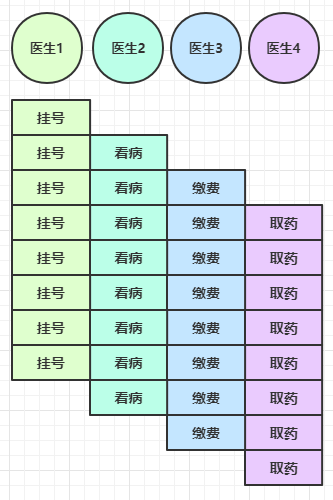</div>

要点

* 单线程没法异步提高效率，必须配合多线程、多核 `CPU` 才能发挥异步的优势
* 异步并没有缩短响应时间，反而有所增加，但是增加了吞吐量。
* 合理进行任务拆分，也是利用异步的关键

### Future & Promise

在异步处理时，经常用到这两个接口

首先要说明 `netty` 中的 `Future` 与 `jdk` 中的 `Future` 同名，但是是两个接口，`netty` 的 `Future` 继承自 `jdk` 的 `Future`，而 `Promise` 又对 `netty` `Future` 进行了扩展

* `jdk Future` 只能同步等待任务结束 (或成功、或失败)  才能得到结果
* `netty Future` 可以同步等待任务结束得到结果，也可以异步方式得到结果，但都是要等任务结束
* `netty Promise` 不仅有 `netty Future` 的功能，而且脱离了任务独立存在，<b>只作为两个线程间传递结果的容器</b>

| 功能/名称    | jdk Future                     | netty Future                                                 | Promise      |
| ------------ | ------------------------------ | ------------------------------------------------------------ | ------------ |
| cancel       | 取消任务                       | -                                                            | -            |
| isCanceled   | 任务是否取消                   | -                                                            | -            |
| isDone       | 任务是否完成，不能区分成功失败 | -                                                            | -            |
| get          | 获取任务结果，阻塞等待         | -                                                            | -            |
| getNow       | -                              | 获取任务结果，非阻塞，还未产生结果时返回 null                | -            |
| await        | -                              | 等待任务结束，如果任务失败，不会抛异常，而是通过 isSuccess 判断 | -            |
| sync         | -                              | 等待任务结束，如果任务失败，抛出异常                         | -            |
| isSuccess    | -                              | 判断任务是否成功                                             | -            |
| cause        | -                              | 获取失败信息，非阻塞，如果没有失败，返回null                 | -            |
| addLinstener | -                              | 添加回调，异步接收结果                                       | -            |
| setSuccess   | -                              | -                                                            | 设置成功结果 |
| setFailure   | -                              | -                                                            | 设置失败结果 |

#### JDK Tuture

```java
package netty.quick.future;

import java.util.concurrent.*;

public class TestJdkFuture {
    public static void main(String[] args) throws ExecutionException, InterruptedException {
        ExecutorService executor = Executors.newFixedThreadPool(1);
        Future<Integer> future = executor.submit(new Callable<Integer>() {
            @Override
            public Integer call() throws Exception {
                TimeUnit.SECONDS.sleep(1);
                return 50;
            }
        });
        // 主线程通过 future 来获取结果
        System.out.println("等待结果");
        // 在线程间传递结果。future 是被动的，由执行任务的线程把结果填到 future 对象中。 (任务给 future，main 等结果)  
        Integer integer = future.get();
        System.out.println(integer);
    }
}
```

#### Netty Future

```java
package netty.quick.future;

import io.netty.channel.EventLoop;
import io.netty.channel.nio.NioEventLoopGroup;
import io.netty.util.concurrent.Future;
import io.netty.util.concurrent.GenericFutureListener;
import lombok.extern.slf4j.Slf4j;

import java.util.concurrent.ExecutionException;
import java.util.concurrent.TimeUnit;

@Slf4j
public class TestNettyFuture {
    public static void main(String[] args) throws ExecutionException, InterruptedException {
        NioEventLoopGroup group = new NioEventLoopGroup();
        EventLoop eventLoop = group.next();
        Future<Integer> future = eventLoop.submit(() -> {
            TimeUnit.SECONDS.sleep(2);
            return 10;
        });
        System.out.println("等待结果");

		// System.out.println(future.get());
        future.addListener(new GenericFutureListener<Future<? super Integer>>() {
            @Override
            public void operationComplete(Future<? super Integer> future) throws Exception {
                log.debug("接收结果{}", future.get());
            }
        });
        log.debug("我是main");
    }

}
```

#### Netty Promise

```java
@Slf4j
public class TestNettyPromise {
    public static void main(String[] args) throws ExecutionException, InterruptedException {
        NioEventLoopGroup group = new NioEventLoopGroup();
        // 两个线程传递数据的容器，JUC 里的一个 SynchronousQueue 类也可以，
        // SynchronousQueue 中不存储数据或者说只能存储一个数据
        DefaultPromise<Integer> promise = new DefaultPromise<>(group.next());
        
        Thread th = new Thread(() -> {
            try {
                // 开启线程，计算完毕后向 promise 填充结果。
                System.out.println("开始计算");
                int i = 1 / 0;
                TimeUnit.SECONDS.sleep(3);
                System.out.println("计算完成");
                // 设置值
                promise.setSuccess(80);
            } catch (InterruptedException e) {
                promise.setFailure(e);
                e.printStackTrace();
            }
        });
        th.start();
        log.debug("等待结果");
        log.debug("结果是{}", promise.get());
    }
}
```

#### 例1

同步处理任务成功

```java
DefaultEventLoop eventExecutors = new DefaultEventLoop();
DefaultPromise<Integer> promise = new DefaultPromise<>(eventExecutors);

eventExecutors.execute(()->{
    try {
        Thread.sleep(1000);
    } catch (InterruptedException e) {
        e.printStackTrace();
    }
    log.debug("set success, {}",10);
    promise.setSuccess(10);
});

log.debug("start...");
log.debug("{}",promise.getNow()); // 还没有结果
log.debug("{}",promise.get());
```

输出

```
11:51:53 [DEBUG] [main] c.i.o.DefaultPromiseTest2 - start...
11:51:53 [DEBUG] [main] c.i.o.DefaultPromiseTest2 - null
11:51:54 [DEBUG] [defaultEventLoop-1-1] c.i.o.DefaultPromiseTest2 - set success, 10
11:51:54 [DEBUG] [main] c.i.o.DefaultPromiseTest2 - 10
```

#### 例2

异步处理任务成功

```java
DefaultEventLoop eventExecutors = new DefaultEventLoop();
DefaultPromise<Integer> promise = new DefaultPromise<>(eventExecutors);

// 设置回调，异步接收结果
promise.addListener(future -> {
    // 这里的 future 就是上面的 promise
    log.debug("{}",future.getNow());
});

// 等待 1000 后设置成功结果
eventExecutors.execute(()->{
    try {
        Thread.sleep(1000);
    } catch (InterruptedException e) {
        e.printStackTrace();
    }
    log.debug("set success, {}",10);
    promise.setSuccess(10);
});

log.debug("start...");
```

输出

```
11:49:30 [DEBUG] [main] c.i.o.DefaultPromiseTest2 - start...
11:49:31 [DEBUG] [defaultEventLoop-1-1] c.i.o.DefaultPromiseTest2 - set success, 10
11:49:31 [DEBUG] [defaultEventLoop-1-1] c.i.o.DefaultPromiseTest2 - 10
```

#### 例3

同步处理任务失败 - sync & get

```java
DefaultEventLoop eventExecutors = new DefaultEventLoop();
        DefaultPromise<Integer> promise = new DefaultPromise<>(eventExecutors);

        eventExecutors.execute(() -> {
            try {
                Thread.sleep(1000);
            } catch (InterruptedException e) {
                e.printStackTrace();
            }
            RuntimeException e = new RuntimeException("error...");
            log.debug("set failure, {}", e.toString());
            promise.setFailure(e);
        });

        log.debug("start...");
        log.debug("{}", promise.getNow());
        promise.get(); // sync() 也会出现异常，只是 get 会再用 ExecutionException 包一层异常
```

输出

```
12:11:07 [DEBUG] [main] c.i.o.DefaultPromiseTest2 - start...
12:11:07 [DEBUG] [main] c.i.o.DefaultPromiseTest2 - null
12:11:08 [DEBUG] [defaultEventLoop-1-1] c.i.o.DefaultPromiseTest2 - set failure, java.lang.RuntimeException: error...
Exception in thread "main" java.util.concurrent.ExecutionException: java.lang.RuntimeException: error...
	at io.netty.util.concurrent.AbstractFuture.get(AbstractFuture.java:41)
	at com.itcast.oio.DefaultPromiseTest2.main(DefaultPromiseTest2.java:34)
Caused by: java.lang.RuntimeException: error...
	at com.itcast.oio.DefaultPromiseTest2.lambda$main$0(DefaultPromiseTest2.java:27)
	at io.netty.channel.DefaultEventLoop.run(DefaultEventLoop.java:54)
	at io.netty.util.concurrent.SingleThreadEventExecutor$5.run(SingleThreadEventExecutor.java:918)
	at io.netty.util.internal.ThreadExecutorMap$2.run(ThreadExecutorMap.java:74)
	at io.netty.util.concurrent.FastThreadLocalRunnable.run(FastThreadLocalRunnable.java:30)
	at java.lang.Thread.run(Thread.java:745)
```

#### 例4

同步处理任务失败 - await

```java
DefaultEventLoop eventExecutors = new DefaultEventLoop();
DefaultPromise<Integer> promise = new DefaultPromise<>(eventExecutors);

eventExecutors.execute(() -> {
    try {
        Thread.sleep(1000);
    } catch (InterruptedException e) {
        e.printStackTrace();
    }
    RuntimeException e = new RuntimeException("error...");
    log.debug("set failure, {}", e.toString());
    promise.setFailure(e);
});

log.debug("start...");
log.debug("{}", promise.getNow());
promise.await(); // 与 sync 和 get 区别在于，不会抛异常
log.debug("result {}", (promise.isSuccess() ? promise.getNow() : promise.cause()).toString());
```

输出

```
12:18:53 [DEBUG] [main] c.i.o.DefaultPromiseTest2 - start...
12:18:53 [DEBUG] [main] c.i.o.DefaultPromiseTest2 - null
12:18:54 [DEBUG] [defaultEventLoop-1-1] c.i.o.DefaultPromiseTest2 - set failure, java.lang.RuntimeException: error...
12:18:54 [DEBUG] [main] c.i.o.DefaultPromiseTest2 - result java.lang.RuntimeException: error...
```

#### 例5

异步处理任务失败

```java
DefaultEventLoop eventExecutors = new DefaultEventLoop();
DefaultPromise<Integer> promise = new DefaultPromise<>(eventExecutors);

promise.addListener(future -> {
    log.debug("result {}", (promise.isSuccess() ? promise.getNow() : promise.cause()).toString());
});

eventExecutors.execute(() -> {
    try {
        Thread.sleep(1000);
    } catch (InterruptedException e) {
        e.printStackTrace();
    }
    RuntimeException e = new RuntimeException("error...");
    log.debug("set failure, {}", e.toString());
    promise.setFailure(e);
});

log.debug("start...");
```

输出

```
12:04:57 [DEBUG] [main] c.i.o.DefaultPromiseTest2 - start...
12:04:58 [DEBUG] [defaultEventLoop-1-1] c.i.o.DefaultPromiseTest2 - set failure, java.lang.RuntimeException: error...
12:04:58 [DEBUG] [defaultEventLoop-1-1] c.i.o.DefaultPromiseTest2 - result java.lang.RuntimeException: error...
```

#### 例6

await 死锁检查

```java
DefaultEventLoop eventExecutors = new DefaultEventLoop();
DefaultPromise<Integer> promise = new DefaultPromise<>(eventExecutors);

eventExecutors.submit(()->{
    System.out.println("1");
    try {
        promise.await();
        // 注意不能仅捕获 InterruptedException 异常
        // 否则 死锁检查抛出的 BlockingOperationException 会继续向上传播
        // 而提交的任务会被包装为 PromiseTask，它的 run 方法中会 catch 所有异常然后设置为 Promise 的失败结果而不会抛出
    } catch (Exception e) { 
        e.printStackTrace();
    }
    System.out.println("2");
});
eventExecutors.submit(()->{
    System.out.println("3");
    try {
        promise.await();
    } catch (Exception e) {
        e.printStackTrace();
    }
    System.out.println("4");
});
```

输出

```
1
2
3
4
io.netty.util.concurrent.BlockingOperationException: DefaultPromise@47499c2a(incomplete)
	at io.netty.util.concurrent.DefaultPromise.checkDeadLock(DefaultPromise.java:384)
	at io.netty.util.concurrent.DefaultPromise.await(DefaultPromise.java:212)
	at com.itcast.oio.DefaultPromiseTest.lambda$main$0(DefaultPromiseTest.java:27)
	at io.netty.util.concurrent.PromiseTask$RunnableAdapter.call(PromiseTask.java:38)
	at io.netty.util.concurrent.PromiseTask.run(PromiseTask.java:73)
	at io.netty.channel.DefaultEventLoop.run(DefaultEventLoop.java:54)
	at io.netty.util.concurrent.SingleThreadEventExecutor$5.run(SingleThreadEventExecutor.java:918)
	at io.netty.util.internal.ThreadExecutorMap$2.run(ThreadExecutorMap.java:74)
	at io.netty.util.concurrent.FastThreadLocalRunnable.run(FastThreadLocalRunnable.java:30)
	at java.lang.Thread.run(Thread.java:745)
io.netty.util.concurrent.BlockingOperationException: DefaultPromise@47499c2a(incomplete)
	at io.netty.util.concurrent.DefaultPromise.checkDeadLock(DefaultPromise.java:384)
	at io.netty.util.concurrent.DefaultPromise.await(DefaultPromise.java:212)
	at com.itcast.oio.DefaultPromiseTest.lambda$main$1(DefaultPromiseTest.java:36)
	at io.netty.util.concurrent.PromiseTask$RunnableAdapter.call(PromiseTask.java:38)
	at io.netty.util.concurrent.PromiseTask.run(PromiseTask.java:73)
	at io.netty.channel.DefaultEventLoop.run(DefaultEventLoop.java:54)
	at io.netty.util.concurrent.SingleThreadEventExecutor$5.run(SingleThreadEventExecutor.java:918)
	at io.netty.util.internal.ThreadExecutorMap$2.run(ThreadExecutorMap.java:74)
	at io.netty.util.concurrent.FastThreadLocalRunnable.run(FastThreadLocalRunnable.java:30)
	at java.lang.Thread.run(Thread.java:745)
```

### Handler & Pipeline


ChannelHandler 用来处理 Channel 上的各种事件，分为入站、出站两种。所有 ChannelHandler 被连成一串，就是 Pipeline。

* 入站处理器通常是 ChannelInboundHandlerAdapter 的子类，主要用来读取客户端数据，写回结果。 (`外部数据-->channel`)  做数据的读取操作。
* 出站处理器通常是 ChannelOutboundHandlerAdapter 的子类，主要对写回结果进行加工。 (`channel-->外部数据`)  做数据的写出操作。

打个比喻，每个 `Channel` 是一个产品的加工车间，Pipeline 是车间中的流水线，`ChannelHandler` 就是流水线上的各道工序，而后面要讲的 `ByteBuf` 是原材料，经过很多工序的加工：先经过一道道入站工序，再经过一道道出站工序最终变成产品

<b style="color:purple">先搞清楚顺序，服务端：客户端发送数据，服务器端接受到数据，用入站处理器 (ChannelInboundHandlerAdapter 子类)  进行处理，在处理完毕后如果需要给一个回执，就在最后一个入站处理器里通过 NioSocketChannel 写出数据。写出数据的出站处理器 (ChannelOutboundHandlerAdapter 子类)  调用顺序是 `tail->head`，在 `tail->head` 的遍历过程中，凡是遇到出站处理器就调用。</b>

```java
package netty.quick.pipeline;

import io.netty.bootstrap.ServerBootstrap;
import io.netty.channel.*;
import io.netty.channel.nio.NioEventLoopGroup;
import io.netty.channel.socket.nio.NioServerSocketChannel;
import io.netty.channel.socket.nio.NioSocketChannel;
import lombok.extern.slf4j.Slf4j;

import java.nio.charset.StandardCharsets;

@Slf4j
public class TestPipelineServer {
    public static void main(String[] args) {
        new ServerBootstrap()
                .group(new NioEventLoopGroup(), new NioEventLoopGroup(2))
                .channel(NioServerSocketChannel.class)
                .childHandler(new ChannelInitializer<NioSocketChannel>() {
                    @Override
                    protected void initChannel(NioSocketChannel ch) throws Exception {
                        // 1. 通过 channel 拿到 pipeline
                        ChannelPipeline pipeline = ch.pipeline();
                        // 2. 默认会添加处理器 head -> tail。加入一个自己的后变成了 head -> h1 -> tail
                        pipeline.addLast("h1", new ChannelInboundHandlerAdapter() {
                            @Override
                            public void channelRead(ChannelHandlerContext ctx, Object msg) throws Exception {
                                log.debug("1");
                                super.channelRead(ctx, msg);
                            }
                        });

                        // head -> h1 ->h2 -> tail
                        pipeline.addLast("h2", new ChannelInboundHandlerAdapter() {
                            @Override
                            public void channelRead(ChannelHandlerContext ctx, Object msg) throws Exception {
                                log.debug("2");
                                super.channelRead(ctx, msg);
                            }
                        });
                        
                        // head -> h1 ->h2 -> h3 -> tail
                        pipeline.addLast("h3", new ChannelInboundHandlerAdapter() {
                            @Override
                            public void channelRead(ChannelHandlerContext ctx, Object msg) throws Exception {
                                log.debug("3");
                                super.channelRead(ctx, msg);
                                // 分配了一个 buf 对象，然后写入一些字节。 (为了触发出站处理器)  ，注意这里用的是 ch(NioSocketChannel)写出数据的。
                                ch.writeAndFlush(ctx.alloc().buffer().writeBytes("hello".getBytes(StandardCharsets.UTF_8)));
                            }
                        });
                        // 出站处理器，只有你向 channel 里写了数据才会触发。出战是从尾巴向前走。
                        // head -> h1 ->h2 -> h3 -> h4 -> tail
                        pipeline.addLast("h4", new ChannelOutboundHandlerAdapter() {
                            @Override
                            public void write(ChannelHandlerContext ctx, Object msg, ChannelPromise promise) throws Exception {
                                log.debug("4");
                                super.write(ctx, msg, promise);
                            }
                        });

                        // head -> h1 ->h2 -> h3 -> h4 -> h5 -> tail
                        pipeline.addLast("h5", new ChannelOutboundHandlerAdapter() {
                            @Override
                            public void write(ChannelHandlerContext ctx, Object msg, ChannelPromise promise) throws Exception {
                                log.debug("5");
                                super.write(ctx, msg, promise);
                            }
                        });
                    }
                })
                .bind(8080);
    }
}
```

客户端

```java
@Slf4j
public class TestPipelineClient {
    public static void main(String[] args) throws InterruptedException {
        NioEventLoopGroup group = new NioEventLoopGroup();
        ChannelFuture channelFuture = new Bootstrap()
                .group(group)
                .channel(NioSocketChannel.class)
                .handler(new ChannelInitializer<NioSocketChannel>() {
                    @Override
                    protected void initChannel(NioSocketChannel ch) throws Exception {
                        ch.pipeline().addLast(new LoggingHandler(LogLevel.DEBUG));
                        ch.pipeline().addLast(new StringEncoder());
                    }
                }).connect("localhost", 8080);
        Channel channel = channelFuture.sync().channel();

        new Thread(() -> {
            Scanner sc = new Scanner(System.in);
            while (true) {
                String s = sc.nextLine();
                if ("q".equals(s)) {
                    channel.close();
                    return;
                }
                channel.writeAndFlush(s);
            }
        }, "client-send-msg").start();

        ChannelFuture closeFuture = channel.closeFuture();
        closeFuture.addListener(new ChannelFutureListener() {
            @Override
            public void operationComplete(ChannelFuture future) throws Exception {
                log.debug("处理关闭之后的操作");
                group.shutdownGracefully();
            }
        });
    }
}
```

服务器端打印：

```
1
2
3
5
4
```

可以看到，`ChannelInboundHandlerAdapter` 是按照 `addLast` 的顺序执行的，而 `ChannelOutboundHandlerAdapter` 是按照 `addLast` 的逆序执行的。`ChannelPipeline` 的实现是一个 `ChannelHandlerContext` (包装了 `ChannelHandler`)   组成的双向链表

<div align="center"></div>

* 入站处理器中，ctx.fireChannelRead(msg) 是<b>调用下一个入站处理器</b>，如果当前是最后一个入站处理器那么就没必要调用了。
    * 如果注释掉 1 处代码，则仅会打印 1
    * 如果注释掉 2 处代码，则仅会打印 1 2
* 3 处的 ctx.channel().write(msg) 会<b>从尾部开始触发</b>后续出站处理器的执行
    * 如果注释掉 3 处代码，则仅会打印 1 2 3
* 类似的，出站处理器中，ctx.write(msg, promise) 的调用也会<b>触发上一个出站处理器</b>
    * 如果注释掉 6 处代码，则仅会打印 1 2 3 6
* <b style="color:purple">ctx.channel().write(msg) vs ctx.write(msg)</b>
    * 都是触发出站处理器的执行
    * ctx.channel().write(msg) 从尾部开始查找出站处理器，即从 tail 找 Out_6
    * ctx.write(msg) 是从当前节点找上一个出站处理器，假定当前结点是 In_3，则 ctx.write(msg) 找的是 In_2 看它是不是出站处理器
    * 3 处的 ctx.channel().write(msg) 如果改为 ctx.write(msg) 仅会打印 1 2 3，因为节点 3 之前没有其它出站处理器了
    * 6 处的 ctx.write(msg, promise) 如果改为 ctx.channel().write(msg) 会打印 1 2 3 6 6 6... 因为 ctx.channel().write() 是从尾部开始查找，结果又是节点6 自己
* 入站处理器中，`ctx.fireChannelRead(msg)` 是<b>调用下一个入站处理器</b>
* `ch.writeAndFlush(ctx.alloc().buffer().writeBytes("xxx".getBytes()));` 分配了一个 `buf` 对象，然后写入一些字节。 (为了触发出站处理器)  ,会从 tail 开始向前找 出站 处理器 一个一个运行
* `ctx.writeAndFlush(ctx.alloc().buffer().writeBytes("xxx".getBytes()));`  只会从当前开始向前找。

图1 - 服务端 pipeline 触发的原始流程，图中数字代表了处理步骤的先后次序

<div align="center"></div>

为什么需要这么多的出站处理器和入站处理器呢？可以一层一层处理数据，然后将当前层处理的数据传递给下一层。伪代码示例：

```java
pipeline.addLast("h1", new ChannelInboundHandlerAdapter() {
    @Override
    public void channelRead(ChannelHandlerContext ctx, Object msg) throws Exception {
        log.debug("1");
        new_msg = 处理后的msg
        super.channelRead(ctx, new_msg);
    }
});

// head -> h1 ->h2 -> tail
pipeline.addLast("h2", new ChannelInboundHandlerAdapter() {
    @Override
    public void channelRead(ChannelHandlerContext ctx, Object msg) throws Exception {
        log.debug("2");
        // 继续处理 msg，由于是最后一个入站处理器，所以不用调用 super.channelRead(ctx,msg) 即 ctx.fireChannelRead(msg); 了
    }
});

// head -> h1 ->h2 -> h3 -> tail
pipeline.addLast("h3", new ChannelOutboundHandlerAdapter() {
    @Override
    public void write(ChannelHandlerContext ctx, Object msg, ChannelPromise promise) throws Exception {
        log.debug("3");
        super.write(ctx, msg, promise);
    }
});

// head -> h1 ->h2 -> h3 -> h4 -> tail
pipeline.addLast("h4", new ChannelOutboundHandlerAdapter() {
    @Override
    public void write(ChannelHandlerContext ctx, Object msg, ChannelPromise promise) throws Exception {
        log.debug("4");
        super.write(ctx, msg, promise);
    }
});
```

### EmbeddedChannel

Netty 提供的用来测试的 channel。这样测试起来就不用启动服务器端和客户端了。

```java
package netty.quick.embeddedchannel;

import io.netty.buffer.ByteBuf;
import io.netty.buffer.ByteBufAllocator;
import io.netty.channel.ChannelHandlerContext;
import io.netty.channel.ChannelInboundHandlerAdapter;
import io.netty.channel.ChannelOutboundHandlerAdapter;
import io.netty.channel.ChannelPromise;
import io.netty.channel.embedded.EmbeddedChannel;
import lombok.extern.slf4j.Slf4j;

import java.nio.charset.Charset;
import java.nio.charset.StandardCharsets;

@Slf4j
public class TestEmbeddedChannel {
    public static void main(String[] args) {
        ChannelInboundHandlerAdapter h1 = new ChannelInboundHandlerAdapter() {
            @Override
            public void channelRead(ChannelHandlerContext ctx, Object msg) throws Exception {
                log.debug("1");
                super.channelRead(ctx, msg);
            }
        };
        ChannelInboundHandlerAdapter h2 = new ChannelInboundHandlerAdapter() {
            @Override
            public void channelRead(ChannelHandlerContext ctx, Object msg) throws Exception {
                log.debug("2");
                super.channelRead(ctx, msg);
            }
        };
        ChannelOutboundHandlerAdapter h3 = new ChannelOutboundHandlerAdapter() {
            @Override
            public void write(ChannelHandlerContext ctx, Object msg, ChannelPromise promise) throws Exception {
                ByteBuf buf = (ByteBuf) msg;
                log.debug("{}", buf.toString(Charset.defaultCharset()));
                super.write(ctx, msg, promise);
            }
        };
        EmbeddedChannel embeddedChannel = new EmbeddedChannel(h1, h2, h3);
        embeddedChannel.writeInbound(ByteBufAllocator.DEFAULT.buffer().writeBytes("hello".getBytes(StandardCharsets.UTF_8)));
        embeddedChannel.writeOutbound(ByteBufAllocator.DEFAULT.buffer().writeBytes("world".getBytes(StandardCharsets.UTF_8)));
    }
}
```

### ByteBuf

ByteBuf 是对 NIO 的 ByteBuffer 的增加，是对字节数据的封装。

#### 1)  创建

下面代码创建了一个默认的 ByteBuf (池化基于直接内存的 ByteBuf)  ，初始容量是 256。

```java
public class TestByteBuf {
    public static void main(String[] args) {
        // 不指定默认是 256 字节，且可以动态扩容。PooledUnsafeDirectByteBuf 是直接内存
        ByteBuf buf = ByteBufAllocator.DEFAULT.buffer();
        // PooledUnsafeDirectByteBuf(ridx: 0, widx: 0, cap: 256)
        // ridx 读指针     widx 写指针
        System.out.println(buf);
        StringBuilder builder = new StringBuilder();
        for (int i = 0; i < 300; i++) {
            builder.append("a");
        }
        buf.writeBytes(builder.toString().getBytes());
        System.out.println(buf);
    }
}
/*
PooledUnsafeDirectByteBuf(ridx: 0, widx: 0, cap: 256)
PooledUnsafeDirectByteBuf(ridx: 0, widx: 300, cap: 512)
*/
```

<b style="color:red">一个更为清晰的例子</b>

```java
import io.netty.buffer.ByteBuf;
import io.netty.buffer.ByteBufAllocator;

import java.nio.charset.StandardCharsets;

import static io.netty.buffer.ByteBufUtil.appendPrettyHexDump;
import static io.netty.util.internal.StringUtil.NEWLINE;

public class TestByteBuf {
    public static void main(String[] args) {
        ByteBuf buffer = ByteBufAllocator.DEFAULT.buffer();
        log(buffer);
        StringBuilder builder = new StringBuilder();
        for (int i = 0; i < 300; i++) {
            builder.append("a");
        }
        buffer.writeBytes(builder.toString().getBytes(StandardCharsets.UTF_8));
        log(buffer);
    }
	
    // 更为清晰的打印数据
    private static void log(ByteBuf buffer) {
        int length = buffer.readableBytes();
        int rows = length / 16 + (length % 15 == 0 ? 0 : 1) + 4;
        StringBuilder buf = new StringBuilder(rows * 80 * 2)
                .append("read index:").append(buffer.readerIndex())
                .append(" write index:").append(buffer.writerIndex())
                .append(" capacity:").append(buffer.capacity())
                .append(NEWLINE);
        appendPrettyHexDump(buf, buffer);
        System.out.println(buf.toString());
    }
}
```

#### 2)  直接内存 vs 堆内存

可以使用下面的代码来创建池化基于堆的 ByteBuf

```java
ByteBuf buffer = ByteBufAllocator.DEFAULT.heapBuffer(10);
```

也可以使用下面的代码来创建池化基于直接内存的 ByteBuf

```java
ByteBuf buffer = ByteBufAllocator.DEFAULT.directBuffer(10);
```

* 直接内存创建和销毁的代价昂贵，但读写性能高 (少一次内存复制)  ，适合配合池化功能一起用
* 直接内存对 GC 压力小，因为这部分内存不受 JVM 垃圾回收的管理，但也要注意及时主动释放

#### 3)  池化 vs 非池化

池化的最大意义在于可以重用 ByteBuf，优点有

* 没有池化，则每次都得创建新的 ByteBuf 实例，这个操作对直接内存代价昂贵，就算是堆内存，也会增加 GC 压力
* 有了池化，则可以重用池中 ByteBuf 实例，并且采用了与 jemalloc 类似的内存分配算法提升分配效率
* 高并发时，池化功能更节约内存，减少内存溢出的可能

池化功能是否开启，可以通过下面的系统环境变量来设置

```java
-Dio.netty.allocator.type={unpooled|pooled}
```

* 4.1 以后，非 Android 平台默认启用池化实现，Android 平台启用非池化实现
* 4.1 之前，池化功能还不成熟，默认是非池化实现

<b style="color:red">池化的引用计数初始化结果是 2，这是为了重复利用这个 ByteBuf，下面是验证的代码。</b>默认情况下，创建的 ByteBuf 是池化的。

```java
import io.netty.buffer.ByteBuf;
import io.netty.buffer.ByteBufAllocator;

public class TestPoolByteBuf {
    public static void main(String[] args) {
        // debug 可以看到 buffer refCnt = 2
        ByteBuf buffer = ByteBufAllocator.DEFAULT.buffer();
        System.out.println(123);
    }
}
```

#### 4)  组成

<b>ByteBuf 由四部分组成：最大容量一般是整数的最大值。</b>

<div align="center"></div>

最开始读写指针都在 0 位置

#### 5)  写入

方法列表，省略一些不重要的方法

| 方法签名                                                     | 含义                   | 备注                                                         |
| ------------------------------------------------------------ | ---------------------- | ------------------------------------------------------------ |
| `writeBoolean(boolean value)`                                | 写入 boolean 值        | <b>用一字节 01 \| 00 代表 true \| false</b>                  |
| `writeByte(int value)`                                       | 写入 byte 值           |                                                              |
| `writeShort(int value)`                                      | 写入 short 值          |                                                              |
| `writeInt(int value)`                                        | 写入 int 值            | Big Endian，即 0x250，写入后 00 00 02 50 (先写高位的 00，再写高位的 00，再写 02，再写 50)  ，<b>网络编程一般都是大端</b>。 |
| `writeIntLE(int value)`                                      | 写入 int 值            | Little Endian，即 0x250，写入后 50 02 00 00 (先写低位的 50，再写 02，再写 00，再写 00)   |
| `writeLong(long value)`                                      | 写入 long 值           |                                                              |
| `writeChar(int value)`                                       | 写入 char 值           |                                                              |
| `writeFloat(float value)`                                    | 写入 float 值          |                                                              |
| `writeDouble(double value)`                                  | 写入 double 值         |                                                              |
| `writeBytes(ByteBuf src)`                                    | 写入 netty 的 ByteBuf  |                                                              |
| `writeBytes(byte[] src)`                                     | 写入 byte[]            |                                                              |
| `writeBytes(ByteBuffer src)`                                 | 写入 nio 的 ByteBuffer |                                                              |
| `int writeCharSequence(CharSequence sequence, Charset charset)` | 写入字符串             |                                                              |

> 注意
>
> * 这些方法的未指明返回值的，其返回值都是 ByteBuf，意味着可以链式调用
> * 网络传输，默认习惯是 Big Endian

先写入 4 个字节

```java
buffer.writeBytes(new byte[]{1, 2, 3, 4});
log(buffer);
```

结果是

```
read index:0 write index:4 capacity:10
         +-------------------------------------------------+
         |  0  1  2  3  4  5  6  7  8  9  a  b  c  d  e  f |
+--------+-------------------------------------------------+----------------+
|00000000| 01 02 03 04                                     |....            |
+--------+-------------------------------------------------+----------------+
```

再写入一个 int 整数，也是 4 个字节

```java
buffer.writeInt(5);
log(buffer);
```

结果是

```
read index:0 write index:8 capacity:10
         +-------------------------------------------------+
         |  0  1  2  3  4  5  6  7  8  9  a  b  c  d  e  f |
+--------+-------------------------------------------------+----------------+
|00000000| 01 02 03 04 00 00 00 05                         |........        |
+--------+-------------------------------------------------+----------------+
```

还有一类方法是 set 开头的一系列方法，也可以写入数据，但不会改变写指针位置

#### 6)  扩容

再写入一个 int 整数时，容量不够了 (初始容量是 10)  ，这时会引发扩容

```java
buffer.writeInt(6);
log(buffer);
```

扩容规则是

* 如何写入后数据大小未超过 512，则选择下一个 16 的整数倍，例如写入后大小为 12 ，则扩容后 capacity 是 16
* 如果写入后数据大小超过 512，则选择下一个 2^n，例如写入后大小为 513，则扩容后 capacity 是 $2^{10}=1024$ ($2^9=512$ 已经不够了)  
* 扩容不能超过 max capacity 会报错

结果是

```
read index:0 write index:12 capacity:16
         +-------------------------------------------------+
         |  0  1  2  3  4  5  6  7  8  9  a  b  c  d  e  f |
+--------+-------------------------------------------------+----------------+
|00000000| 01 02 03 04 00 00 00 05 00 00 00 06             |............    |
+--------+-------------------------------------------------+----------------+
```

#### 7)  读取

例如读了 4 次，每次一个字节

```java
System.out.println(buffer.readByte());
System.out.println(buffer.readByte());
System.out.println(buffer.readByte());
System.out.println(buffer.readByte());
log(buffer);
```

读过的内容，就属于废弃部分了，再读只能读那些尚未读取的部分

```
1
2
3
4
read index:4 write index:12 capacity:16
         +-------------------------------------------------+
         |  0  1  2  3  4  5  6  7  8  9  a  b  c  d  e  f |
+--------+-------------------------------------------------+----------------+
|00000000| 00 00 00 05 00 00 00 06                         |........        |
+--------+-------------------------------------------------+----------------+
```

如果需要重复读取 int 整数 5，怎么办？

可以在 read 前先做个标记 mark

```java
buffer.markReaderIndex();
System.out.println(buffer.readInt());
log(buffer);
```

结果

```
5
read index:8 write index:12 capacity:16
         +-------------------------------------------------+
         |  0  1  2  3  4  5  6  7  8  9  a  b  c  d  e  f |
+--------+-------------------------------------------------+----------------+
|00000000| 00 00 00 06                                     |....            |
+--------+-------------------------------------------------+----------------+
```

这时要重复读取的话，重置到标记位置 reset

```java
buffer.resetReaderIndex();
log(buffer);
```

这时

```
read index:4 write index:12 capacity:16
         +-------------------------------------------------+
         |  0  1  2  3  4  5  6  7  8  9  a  b  c  d  e  f |
+--------+-------------------------------------------------+----------------+
|00000000| 00 00 00 05 00 00 00 06                         |........        |
+--------+-------------------------------------------------+----------------+
```

还有种办法是采用 get 开头的一系列方法，这些方法不会改变 read index

#### 8)  retain & release

由于 Netty 中有堆外内存的 ByteBuf 实现，堆外内存最好是手动来释放，而不是等 GC 垃圾回收。

* UnpooledHeapByteBuf 使用的是 JVM 内存，只需等 GC 回收内存即可
* UnpooledDirectByteBuf 使用的就是直接内存了，也可以等 GC 进行回收，但是内存的释放不及时，<b>一般推荐主动调用特殊的方法来回收内存</b>
* PooledByteBuf 和它的子类使用了池化机制，需要更复杂的规则来回收内存

> 回收内存的源码实现，请关注下面方法的不同实现
>
> `protected abstract void deallocate()`

Netty 这里采用了引用计数法来控制回收内存，每个 ByteBuf 都实现了 ReferenceCounted 接口

* 每个 ByteBuf 对象的初始计数为 1
* 调用 release 方法计数减 1，如果计数为 0，ByteBuf 内存被回收
* 调用 retain 方法计数加 1，表示调用者没用完之前，其它 handler 即使调用了 release 也不会造成回收
* 当计数为 0 时，底层内存会被回收，这时即使 ByteBuf 对象还在，其各个方法均无法正常使用

谁来负责 release 呢？

不是我们想象的 (一般情况下)  

```java
ByteBuf buf = ...
try {
    ...
} finally {
    buf.release();
}
```

请思考，因为 pipeline 的存在，一般需要将 ByteBuf 传递给下一个 ChannelHandler，如果在 finally 中 release 了，就失去了传递性 (当然，如果在这个 ChannelHandler 内这个 ByteBuf 已完成了它的使命，那么便无须再传递)  ，虽然有头和尾管着，但是如果中间就用完了，把 ByteBuf 转为了字符串，后面再传递的就是字符串了，没法当成 ByteBuf 释放了！

<b style="color:green">基本规则是，谁是最后使用 ByteBuf，谁负责 release，详细分析如下：</b>

* 起点，对于 NIO 实现来讲，在 `io.netty.channel.nio.AbstractNioByteChannel.NioByteUnsafe#read` 方法中首次创建 ByteBuf 放入 pipeline (line 163 pipeline.fireChannelRead(byteBuf))  
* 入站 ByteBuf 处理原则
    * 对原始 ByteBuf 不做处理，调用 ctx.fireChannelRead(msg) 向后传递，这时无须 release
    * 将原始 ByteBuf 转换为其它类型的 Java 对象，这时 ByteBuf 就没用了，必须 release
    * 如果不调用 ctx.fireChannelRead(msg) 向后传递，那么也必须 release
    * 注意各种异常，如果 ByteBuf 没有成功传递到下一个 ChannelHandler，必须 release
    * 假设消息一直向后传，那么 TailContext 会负责释放未处理消息 (原始的 ByteBuf)  
* 出站 ByteBuf 处理原则
    * 出站消息最终都会转为 ByteBuf 输出，一直向前传，由 HeadContext flush 后 release
* 异常处理原则
    * 有时候不清楚 ByteBuf 被引用了多少次，但又必须彻底释放，可以循环调用 release 直到返回 true

TailContext 释放未处理消息逻辑

>`TailContext` 源码

`TailContext` 释放未处理消息逻辑：实现了入站接口 (它需要收尾，也得关心入站的信息，所以实现了 `ChannelInboundHandler`)  

```mermaid
graph LR
入站消息-->看TailContext#chanelRead方法-->|调用了|onUnhandledInboundMessage-->|调用了|ReferenceCountUtil#release
```

```java
// io.netty.channel.DefaultChannelPipeline#onUnhandledInboundMessage(java.lang.Object)
protected void onUnhandledInboundMessage(Object msg) {
    try {
        logger.debug(
            "Discarded inbound message {} that reached at the tail of the pipeline. " +
            "Please check your pipeline configuration.", msg);
    } finally {
        ReferenceCountUtil.release(msg);
    }
}
```

具体代码

```java
// io.netty.util.ReferenceCountUtil#release(java.lang.Object)
public static boolean release(Object msg) {
    if (msg instanceof ReferenceCounted) {
        return ((ReferenceCounted) msg).release();
    }
    return false; // 已经是其他类型的消息了，不能释放了。
}
```

> `HeadContext` 源码

```mermaid
graph LR
出站消息-->HeadContext#writer-->|调用|unsafe#write-->|调用|ReferenceCountUtil#release
```

```java
public final void write(Object msg, ChannelPromise promise) {
    assertEventLoop();

    ChannelOutboundBuffer outboundBuffer = this.outboundBuffer;
    if (outboundBuffer == null) {
        // If the outboundBuffer is null we know the channel was closed and so
        // need to fail the future right away. If it is not null the handling of the rest
        // will be done in flush0()
        // See https://github.com/netty/netty/issues/2362
        safeSetFailure(promise, newClosedChannelException(initialCloseCause));
        // release message now to prevent resource-leak
        ReferenceCountUtil.release(msg);
        return;
    }

    int size;
    try {
        msg = filterOutboundMessage(msg);
        size = pipeline.estimatorHandle().size(msg);
        if (size < 0) {
            size = 0;
        }
    } catch (Throwable t) {
        safeSetFailure(promise, t);
        ReferenceCountUtil.release(msg);
        return;
    }

    outboundBuffer.addMessage(msg, size, promise);
}
```

#### 9)  slice

<b>slice 切片是共享内存，但是指针独立。调用完 slice 后需要调用 retain，确保自己的 `buf` 由自己`释放`，且切片后大小就固定了！</b>

【零拷贝】的体现之一 (对数据零拷贝的体系之一，与前面讲的不是不经过 Java 内存，直接到网络设备的零拷贝有点不同)  ，对原始 ByteBuf 进行切片成多个 ByteBuf，切片后的 ByteBuf 并没有发生内存复制，还是使用原始 ByteBuf 的内存，切片后的 ByteBuf 维护独立的 read，write 指针

<div align="center"></div>

例，原始 ByteBuf 进行一些初始操作

```java
ByteBuf origin = ByteBufAllocator.DEFAULT.buffer(10);
origin.writeBytes(new byte[]{1, 2, 3, 4});
origin.readByte();
System.out.println(ByteBufUtil.prettyHexDump(origin));
```

输出

```
         +-------------------------------------------------+
         |  0  1  2  3  4  5  6  7  8  9  a  b  c  d  e  f |
+--------+-------------------------------------------------+----------------+
|00000000| 02 03 04                                        |...             |
+--------+-------------------------------------------------+----------------+
```

<b style="color:red">这时调用 slice 进行切片，无参 slice 是从原始 ByteBuf 的 read index 到 write index 之间的内容进行切片，切片后的 max capacity 被固定为这个区间的大小，因此不能追加 write</b>

```java
ByteBuf slice = origin.slice();
System.out.println(ByteBufUtil.prettyHexDump(slice));
// slice.writeByte(5); 如果执行，会报 IndexOutOfBoundsException 异常
```

输出

```
         +-------------------------------------------------+
         |  0  1  2  3  4  5  6  7  8  9  a  b  c  d  e  f |
+--------+-------------------------------------------------+----------------+
|00000000| 02 03 04                                        |...             |
+--------+-------------------------------------------------+----------------+
```

如果原始 ByteBuf 再次读操作 (又读了一个字节)  

```java
origin.readByte();
System.out.println(ByteBufUtil.prettyHexDump(origin));
```

输出

```
         +-------------------------------------------------+
         |  0  1  2  3  4  5  6  7  8  9  a  b  c  d  e  f |
+--------+-------------------------------------------------+----------------+
|00000000| 03 04                                           |..              |
+--------+-------------------------------------------------+----------------+
```

这时的 slice 不受影响，因为它有独立的读写指针

```java
System.out.println(ByteBufUtil.prettyHexDump(slice));
```

输出

```
         +-------------------------------------------------+
         |  0  1  2  3  4  5  6  7  8  9  a  b  c  d  e  f |
+--------+-------------------------------------------------+----------------+
|00000000| 02 03 04                                        |...             |
+--------+-------------------------------------------------+----------------+
```

如果 slice 的内容发生了更改

```java
slice.setByte(2, 5);
System.out.println(ByteBufUtil.prettyHexDump(slice));
```

输出

```
         +-------------------------------------------------+
         |  0  1  2  3  4  5  6  7  8  9  a  b  c  d  e  f |
+--------+-------------------------------------------------+----------------+
|00000000| 02 03 05                                        |...             |
+--------+-------------------------------------------------+----------------+
```

<b>这时，原始 `ByteBuf` 也会受影响</b>，<b style="color:red">因为底层都是同一块内存</b>

```
System.out.println(ByteBufUtil.prettyHexDump(origin));
```

输出

```
         +-------------------------------------------------+
         |  0  1  2  3  4  5  6  7  8  9  a  b  c  d  e  f |
+--------+-------------------------------------------------+----------------+
|00000000| 03 05                                           |..              |
+--------+-------------------------------------------------+----------------+
```

#### 10)  duplicate

<b>【零拷贝】的体现之一，就好比截取了原始 ByteBuf 所有内容，并且没有 max capacity 的限制，也是与原始 ByteBuf 使用同一块底层内存，只是读写指针是独立的。</b>

<div align="center"></div>


#### 11)  copy

<b style="color:red">会将底层内存数据进行深拷贝，因此无论读写，都与原始 ByteBuf 无关</b>

#### 12)  CompositeByteBuf

【零拷贝】的体现之一，可以将多个 ByteBuf 合并为一个逻辑上的 ByteBuf，避免拷贝。用之后也是建议 retain 一下，让引用计数 +1

有两个 ByteBuf 如下，现在需要一个新的 ByteBuf，内容来自于刚才的 buf1 和 buf2，如何实现？

方法 1：创建一个新的 ByteBuf 然后复制数据。这种方法不太好，进行了数据的内存复制操作

```java
import io.netty.buffer.ByteBuf;
import io.netty.buffer.ByteBufAllocator;

import static io.netty.buffer.ByteBufUtil.appendPrettyHexDump;
import static io.netty.util.internal.StringUtil.NEWLINE;

public class TestCompositeByteBuf {
    public static void main(String[] args) {
        ByteBuf buf1 = ByteBufAllocator.DEFAULT.buffer();
        buf1.writeBytes(new byte[]{'a', 'b', 'c'});
        ByteBuf buf2 = ByteBufAllocator.DEFAULT.buffer();
        buf2.writeBytes(new byte[]{'d', 'e', 'f'});

        ByteBuf total = ByteBufAllocator.DEFAULT.buffer();
        total.writeBytes(buf1).writeBytes(buf2);

        log(total);
    }

    static void log(ByteBuf buffer) {
        int length = buffer.readableBytes();
        int rows = length / 16 + (length % 15 == 0 ? 0 : 1) + 4;
        StringBuilder buf = new StringBuilder(rows * 80 * 2)
                .append("read index:").append(buffer.readerIndex())
                .append(" write index:").append(buffer.writerIndex())
                .append(" capacity:").append(buffer.capacity())
                .append(NEWLINE);
        appendPrettyHexDump(buf, buffer);
        System.out.println(buf.toString());
    }
}
```

输出

```
read index:0 write index:6 capacity:256
         +-------------------------------------------------+
         |  0  1  2  3  4  5  6  7  8  9  a  b  c  d  e  f |
+--------+-------------------------------------------------+----------------+
|00000000| 61 62 63 64 65 66                               |abcdef          |
+--------+-------------------------------------------------+----------------+
```

方法 2：使用 addComponents

```java
public class TestCompositeByteBuf {
    public static void main(String[] args) {
        ByteBuf buf1 = ByteBufAllocator.DEFAULT.buffer();
        buf1.writeBytes(new byte[]{'a', 'b', 'c'});
        ByteBuf buf2 = ByteBufAllocator.DEFAULT.buffer();
        buf2.writeBytes(new byte[]{'d', 'e', 'f'});
	
        // true 表示增加新的 ByteBuf 自动递增 write index, 否则 write index 会始终为 0
        CompositeByteBuf buf3 = ByteBufAllocator.DEFAULT.compositeBuffer();
        buf3.addComponents(true, buf1, buf2);
        log(buf3);
    }
}
```

结果是一样的

```
read index:0 write index:6 capacity:6
         +-------------------------------------------------+
         |  0  1  2  3  4  5  6  7  8  9  a  b  c  d  e  f |
+--------+-------------------------------------------------+----------------+
|00000000| 61 62 63 64 65 66                               |abcdef          |
+--------+-------------------------------------------------+----------------+
```

CompositeByteBuf 是一个组合的 ByteBuf，它内部维护了一个 Component 数组，每个 Component 管理一个 ByteBuf，记录了这个 ByteBuf 相对于整体偏移量等信息，代表着整体中某一段的数据。

* 优点，对外是一个虚拟视图，组合这些 ByteBuf 不会产生内存复制
* 缺点，复杂了很多，多次操作会带来性能的损耗

#### 13)  Unpooled

Unpooled 是一个工具类，类如其名，提供了非池化的 ByteBuf 创建、组合、复制等操作

这里仅介绍其跟【零拷贝】相关的 wrappedBuffer 方法，可以用来包装 ByteBuf

```java
ByteBuf buf1 = ByteBufAllocator.DEFAULT.buffer(5);
buf1.writeBytes(new byte[]{1, 2, 3, 4, 5});
ByteBuf buf2 = ByteBufAllocator.DEFAULT.buffer(5);
buf2.writeBytes(new byte[]{6, 7, 8, 9, 10});

// 当包装 ByteBuf 个数超过一个时, 底层使用了 CompositeByteBuf
ByteBuf buf3 = Unpooled.wrappedBuffer(buf1, buf2);
System.out.println(ByteBufUtil.prettyHexDump(buf3));
```

输出

```
         +-------------------------------------------------+
         |  0  1  2  3  4  5  6  7  8  9  a  b  c  d  e  f |
+--------+-------------------------------------------------+----------------+
|00000000| 01 02 03 04 05 06 07 08 09 0a                   |..........      |
+--------+-------------------------------------------------+----------------+
```

也可以用来包装普通字节数组，底层也不会有拷贝操作

```java
ByteBuf buf4 = Unpooled.wrappedBuffer(new byte[]{1, 2, 3}, new byte[]{4, 5, 6});
System.out.println(buf4.getClass());
System.out.println(ByteBufUtil.prettyHexDump(buf4));
```

输出

```
class io.netty.buffer.CompositeByteBuf
         +-------------------------------------------------+
         |  0  1  2  3  4  5  6  7  8  9  a  b  c  d  e  f |
+--------+-------------------------------------------------+----------------+
|00000000| 01 02 03 04 05 06                               |......          |
+--------+-------------------------------------------------+----------------+
```

#### 💡 ByteBuf 优势

* 池化 - 可以重用池中 ByteBuf 实例，更节约内存，减少内存溢出的可能
* 读写指针分离，不需要像 ByteBuffer 一样切换读写模式
* 可以自动扩容
* 支持链式调用，使用更流畅
* 很多地方体现零拷贝，例如 slice、duplicate、CompositeByteBuf

## 双向通信

### 练习

实现一个 echo server，可以通过 debug 的方式查看思考题中的 ByteBuf 是否会被自动释放。

编写 server

```java
new ServerBootstrap()
    .group(new NioEventLoopGroup())
    .channel(NioServerSocketChannel.class)
    .childHandler(new ChannelInitializer<NioSocketChannel>() {
        @Override
        protected void initChannel(NioSocketChannel ch) {
            ch.pipeline().addLast(new ChannelInboundHandlerAdapter(){
                @Override
                public void channelRead(ChannelHandlerContext ctx, Object msg) {
                    ByteBuf buffer = (ByteBuf) msg;
                    System.out.println(buffer.toString(Charset.defaultCharset()));
                    // 建议使用 ctx.alloc() 创建 ByteBuf
                    ByteBuf response = ctx.alloc().buffer();
                    response.writeBytes(buffer);
                    ctx.writeAndFlush(response);
                    // 思考：需要释放 buffer 吗，需要我们手动释放，因为我们并没有将 buffer 传递给最后的 TailContext 它不会帮我们释放。
                    // 思考：需要释放 response 吗，不需要 HeadContext 会自动释放，我 debug 确实看到了它的 refCnt 从 2 变成 1
                }
            });
        }
    }).bind(8080);
```

编写 client

```java
NioEventLoopGroup group = new NioEventLoopGroup();
Channel channel = new Bootstrap()
    .group(group)
    .channel(NioSocketChannel.class)
    .handler(new ChannelInitializer<NioSocketChannel>() {
        @Override
        protected void initChannel(NioSocketChannel ch) throws Exception {
            ch.pipeline().addLast(new StringEncoder());
            ch.pipeline().addLast(new ChannelInboundHandlerAdapter() {
                @Override
                public void channelRead(ChannelHandlerContext ctx, Object msg) {
                    ByteBuf buffer = (ByteBuf) msg;
                    System.out.println(buffer.toString(Charset.defaultCharset()));
                    // 思考：需要释放 buffer 吗，需要，因为我们并未将 buffer 传递给 TailContext，所以 TailContext 不会帮助我们释放 buffer，需要我们自己手动释放。
                }
            });
        }
    }).connect("127.0.0.1", 8080).sync().channel();

channel.closeFuture().addListener(future -> {
    group.shutdownGracefully();
});

new Thread(() -> {
    Scanner scanner = new Scanner(System.in);
    while (true) {
        String line = scanner.nextLine();
        if ("q".equals(line)) {
            channel.close();
            break;
        }
        channel.writeAndFlush(line);
    }
}).start();
```

### 💡 读和写的误解

我最初在认识上有这样的误区，认为只有在 netty，nio 这样的多路复用 IO 模型时，读写才不会相互阻塞，才可以实现高效的双向通信，但实际上，<b>Java Socket 是全双工的 (读写可以同时进行，发一条数据，不必非得等接收到了响应再处理)  </b>：在任意时刻，线路上存在 `A➡️B` 和 `B➡️A` 的双向信号传输。即使是阻塞 IO，读和写是可以同时进行的，只要分别采用读线程和写线程即可，读不会阻塞写、写也不会阻塞读

例如

```java
public class TestServer {
    public static void main(String[] args) throws IOException {
        ServerSocket ss = new ServerSocket(8888);
        Socket s = ss.accept();

        new Thread(() -> {
            try {
                BufferedReader reader = new BufferedReader(new InputStreamReader(s.getInputStream()));
                while (true) {
                    System.out.println(reader.readLine());
                }
            } catch (IOException e) {
                e.printStackTrace();
            }
        }).start();

        new Thread(() -> {
            try {
                BufferedWriter writer = new BufferedWriter(new OutputStreamWriter(s.getOutputStream()));
                // 例如在这个位置加入 thread 级别断点，可以发现即使不写入数据，也不妨碍前面线程读取客户端数据
                for (int i = 0; i < 100; i++) {
                    writer.write(String.valueOf(i));
                    writer.newLine();
                    writer.flush();
                }
            } catch (IOException e) {
                e.printStackTrace();
            }
        }).start();
    }
}
```

客户端

```java
public class TestClient {
    public static void main(String[] args) throws IOException {
        Socket s = new Socket("localhost", 8888);

        new Thread(() -> {
            try {
                BufferedReader reader = new BufferedReader(new InputStreamReader(s.getInputStream()));
                while (true) {
                    System.out.println(reader.readLine());
                }
            } catch (IOException e) {
                e.printStackTrace();
            }
        }).start();

        new Thread(() -> {
            try {
                BufferedWriter writer = new BufferedWriter(new OutputStreamWriter(s.getOutputStream()));
                for (int i = 0; i < 100; i++) {
                    writer.write(String.valueOf(i));
                    writer.newLine();
                    writer.flush();
                }
            } catch (IOException e) {
                e.printStackTrace();
            }
        }).start();
    }
}
```

# Netty进阶

## 粘包与半包

### 粘包现象

服务端代码

```java
import io.netty.bootstrap.ServerBootstrap;
import io.netty.channel.ChannelFuture;
import io.netty.channel.ChannelInitializer;
import io.netty.channel.nio.NioEventLoopGroup;
import io.netty.channel.socket.nio.NioServerSocketChannel;
import io.netty.channel.socket.nio.NioSocketChannel;
import io.netty.handler.logging.LogLevel;
import io.netty.handler.logging.LoggingHandler;
import lombok.extern.slf4j.Slf4j;

@Slf4j
public class MsgServer {
    public static void main(String[] args) {
        NioEventLoopGroup boss = new NioEventLoopGroup(1);
        NioEventLoopGroup worker = new NioEventLoopGroup(2);
        try {
            ServerBootstrap serverBootstrap = new ServerBootstrap().group(boss, worker)
			serverBootstrap.channel(NioServerSocketChannel.class)
                    .childHandler(new ChannelInitializer<NioSocketChannel>() {
                        @Override
                        protected void initChannel(NioSocketChannel ch) {
                            ch.pipeline().addLast(new LoggingHandler(LogLevel.DEBUG));
                        }
                    });
            ChannelFuture sync = serverBootstrap.bind(8080).sync();
            // 在这里面 sync.channel().closeFuture().sync();这个语句的主要目的是，
            // 如果缺失上述代码，则main方法所在的线程，即主线程会在执行完bind().sync()方法后
            // 会进入finally 代码块，之前的启动的nettyserver也会随之关闭掉，整个程序都结束了。
            sync.channel().closeFuture().sync(); // 简而言之就是不然程序关闭掉。异步的等待 channel 关闭。

            // 如何主动关闭 serverBootstrap 的连接呢？
            // sync.channel().close(); // 关闭绑定的 channel
        } catch (InterruptedException e) {
            log.debug("server error");
        } finally {
            boss.shutdownGracefully();
            worker.shutdownGracefully();
        }
    }
}
```

客户端代码希望发送 10 个消息，每个消息是 16 字节

```java
import io.netty.bootstrap.Bootstrap;
import io.netty.buffer.ByteBuf;
import io.netty.channel.ChannelFuture;
import io.netty.channel.ChannelHandlerContext;
import io.netty.channel.ChannelInboundHandlerAdapter;
import io.netty.channel.ChannelInitializer;
import io.netty.channel.nio.NioEventLoopGroup;
import io.netty.channel.socket.nio.NioSocketChannel;
import lombok.extern.slf4j.Slf4j;

import java.net.InetSocketAddress;

@Slf4j
public class MsgClient {
    public static void main(String[] args) {
        NioEventLoopGroup group = new NioEventLoopGroup();
        try {
            ChannelFuture localhost = new Bootstrap()
                    .group(group)
                    .channel(NioSocketChannel.class)
                    .handler(new ChannelInitializer<NioSocketChannel>() {
                        @Override
                        protected void initChannel(NioSocketChannel ch) throws Exception {
                            ch.pipeline().addLast(new ChannelInboundHandlerAdapter() {
                                @Override
                                // channel 连接成功后就会触发 active 事件，以前是用 sync 方法，sync 连接成功后在拿到 channel 去发消息，
                                // 这里用的是 channelActive
                                public void channelActive(ChannelHandlerContext ctx) throws Exception {
                                    for (int i = 0; i < 10; i++) {
                                        ByteBuf buffer = ctx.alloc().buffer(16);
                                        buffer.writeBytes(new byte[]{'a', 'b', 'c', 'd', 'e', 'f', 'g', 'h', 'j', 'k', 'l', 'm', 'n', 'o', 'p', 'q'});
                                        ch.writeAndFlush(buffer);
                                    }
                                    ctx.fireChannelActive();
                                }
                            });
                        }
                    }).connect(new InetSocketAddress("localhost", 8080));
            localhost.sync();
            // 发送完数据后，客户端就停止了
        } catch (InterruptedException e) {
            log.debug("client error");
        } finally {
            group.shutdownGracefully();
        }
    }
}
```

服务器端的某次输出，可以看到一次就接收了 160 个字节，而非分 10 次接收。

```
15:11:41.301 [nioEventLoopGroup-3-1] DEBUG i.n.h.l.LoggingHandler - [id: 0x0298aba7, L:/127.0.0.1:8080 - R:/127.0.0.1:63910] READ: 160B
         +-------------------------------------------------+
         |  0  1  2  3  4  5  6  7  8  9  a  b  c  d  e  f |
+--------+-------------------------------------------------+----------------+
|00000000| 61 62 63 64 65 66 67 68 6a 6b 6c 6d 6e 6f 70 71 |abcdefghjklmnopq|
|00000010| 61 62 63 64 65 66 67 68 6a 6b 6c 6d 6e 6f 70 71 |abcdefghjklmnopq|
|00000020| 61 62 63 64 65 66 67 68 6a 6b 6c 6d 6e 6f 70 71 |abcdefghjklmnopq|
|00000030| 61 62 63 64 65 66 67 68 6a 6b 6c 6d 6e 6f 70 71 |abcdefghjklmnopq|
|00000040| 61 62 63 64 65 66 67 68 6a 6b 6c 6d 6e 6f 70 71 |abcdefghjklmnopq|
|00000050| 61 62 63 64 65 66 67 68 6a 6b 6c 6d 6e 6f 70 71 |abcdefghjklmnopq|
|00000060| 61 62 63 64 65 66 67 68 6a 6b 6c 6d 6e 6f 70 71 |abcdefghjklmnopq|
|00000070| 61 62 63 64 65 66 67 68 6a 6b 6c 6d 6e 6f 70 71 |abcdefghjklmnopq|
|00000080| 61 62 63 64 65 66 67 68 6a 6b 6c 6d 6e 6f 70 71 |abcdefghjklmnopq|
|00000090| 61 62 63 64 65 66 67 68 6a 6b 6c 6d 6e 6f 70 71 |abcdefghjklmnopq|
+--------+-------------------------------------------------+----------------+
```

### 半包现象

客户端代码希望发送 1 个消息，这个消息是 160 字节，代码改为

```java
ByteBuf buffer = ctx.alloc().buffer();
for (int i = 0; i < 10; i++) {
    buffer.writeBytes(new byte[]{0, 1, 2, 3, 4, 5, 6, 7, 8, 9, 10, 11, 12, 13, 14, 15});
}
ctx.writeAndFlush(buffer);
```

为现象明显，服务端修改一下接收缓冲区，其它代码不变

```java
serverBootstrap.option(ChannelOption.SO_RCVBUF, 10);
```

服务器端的某次输出，可以看到接收的消息被分为两节，第一次 20 字节，第二次 140 字节

```
08:43:49 [DEBUG] [main] c.i.n.HelloWorldServer - [id: 0x4d6c6a84] binding...
08:43:49 [DEBUG] [main] c.i.n.HelloWorldServer - [id: 0x4d6c6a84, L:/0:0:0:0:0:0:0:0:8080] bound...
08:44:23 [DEBUG] [nioEventLoopGroup-3-1] i.n.h.l.LoggingHandler - [id: 0x1719abf7, L:/127.0.0.1:8080 - R:/127.0.0.1:59221] REGISTERED
08:44:23 [DEBUG] [nioEventLoopGroup-3-1] i.n.h.l.LoggingHandler - [id: 0x1719abf7, L:/127.0.0.1:8080 - R:/127.0.0.1:59221] ACTIVE
08:44:23 [DEBUG] [nioEventLoopGroup-3-1] c.i.n.HelloWorldServer - connected [id: 0x1719abf7, L:/127.0.0.1:8080 - R:/127.0.0.1:59221]
08:44:24 [DEBUG] [nioEventLoopGroup-3-1] i.n.h.l.LoggingHandler - [id: 0x1719abf7, L:/127.0.0.1:8080 - R:/127.0.0.1:59221] READ: 20B
         +-------------------------------------------------+
         |  0  1  2  3  4  5  6  7  8  9  a  b  c  d  e  f |
+--------+-------------------------------------------------+----------------+
|00000000| 00 01 02 03 04 05 06 07 08 09 0a 0b 0c 0d 0e 0f |................|
|00000010| 00 01 02 03                                     |....            |
+--------+-------------------------------------------------+----------------+
08:44:24 [DEBUG] [nioEventLoopGroup-3-1] i.n.h.l.LoggingHandler - [id: 0x1719abf7, L:/127.0.0.1:8080 - R:/127.0.0.1:59221] READ COMPLETE
08:44:24 [DEBUG] [nioEventLoopGroup-3-1] i.n.h.l.LoggingHandler - [id: 0x1719abf7, L:/127.0.0.1:8080 - R:/127.0.0.1:59221] READ: 140B
         +-------------------------------------------------+
         |  0  1  2  3  4  5  6  7  8  9  a  b  c  d  e  f |
+--------+-------------------------------------------------+----------------+
|00000000| 04 05 06 07 08 09 0a 0b 0c 0d 0e 0f 00 01 02 03 |................|
|00000010| 04 05 06 07 08 09 0a 0b 0c 0d 0e 0f 00 01 02 03 |................|
|00000020| 04 05 06 07 08 09 0a 0b 0c 0d 0e 0f 00 01 02 03 |................|
|00000030| 04 05 06 07 08 09 0a 0b 0c 0d 0e 0f 00 01 02 03 |................|
|00000040| 04 05 06 07 08 09 0a 0b 0c 0d 0e 0f 00 01 02 03 |................|
|00000050| 04 05 06 07 08 09 0a 0b 0c 0d 0e 0f 00 01 02 03 |................|
|00000060| 04 05 06 07 08 09 0a 0b 0c 0d 0e 0f 00 01 02 03 |................|
|00000070| 04 05 06 07 08 09 0a 0b 0c 0d 0e 0f 00 01 02 03 |................|
|00000080| 04 05 06 07 08 09 0a 0b 0c 0d 0e 0f             |............    |
+--------+-------------------------------------------------+----------------+
08:44:24 [DEBUG] [nioEventLoopGroup-3-1] i.n.h.l.LoggingHandler - [id: 0x1719abf7, L:/127.0.0.1:8080 - R:/127.0.0.1:59221] READ COMPLETE
```

> <b style="color:red">注意</b>
>
> serverBootstrap.option(ChannelOption.SO_RCVBUF, 10) 影响的底层接收缓冲区 (即滑动窗口)  大小，仅决定了 netty 读取的最小单位，netty 实际每次读取的一般是它的整数倍

### 现象分析

<b style="color:red">粘包</b>

* 现象，发送 abc def，接收 abcdef
* 原因
    * 应用层：接收方 ByteBuf 设置太大 (Netty 默认 1024)  
    * 滑动窗口：假设发送方 256 bytes 表示一个完整报文，但由于接收方处理不及时且窗口大小足够大，这 256 bytes 字节就会缓冲在接收方的滑动窗口中，当滑动窗口中缓冲了多个报文就会粘包
    * Nagle 算法：尽可能多的发送数据，但是会造成粘包

<b style="color:red">半包</b>

* 现象，发送 abcdef，接收 abc def
* 原因
    * 应用层：接收方 ByteBuf 小于实际发送数据量
    * 滑动窗口：假设接收方的窗口只剩了 128 bytes，发送方的报文大小是 256 bytes，这时放不下了，只能先发送前 128 bytes，等待 ack 后才能发送剩余部分，这就造成了半包
    * MSS 限制 (链路层的限制嘛)：当发送的数据超过 MSS 限制后，会将数据切分发送，就会造成半包

<b>本质是因为 TCP 是流式协议，消息无边界</b>

> <b style="color:red">滑动窗口</b>
>
> * TCP 以一个段 (segment)  为单位，每发送一个段就需要进行一次确认应答 (ack)  处理，但如果没发送一个数据都要等待一个确认应答 (ack)  后才发送其他消息的话，吞吐量就小了。包的往返时间越长性能就越差。
>
>     <div align="center"></div>
>
> * 为了解决此问题，引入了窗口概念，窗口大小即决定了无需等待应答而可以继续发送的数据最大值。当最前面的数据响应 (ack)  回来了，窗口就会向后移动。
>
>     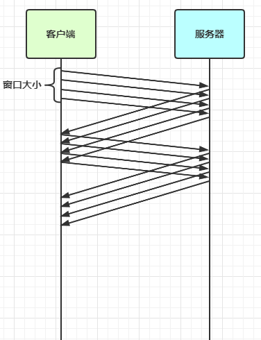
>
> * 窗口实际就起到一个缓冲区的作用，同时也能起到流量控制的作用，不至于让数据发送的太快，也不至于向先前一问一答那样发的太慢。
>
>     * 图中深色的部分即要发送的数据，高亮的部分即窗口
>    * 窗口内的数据才允许被发送，当应答未到达前，窗口必须停止滑动
>     * 如果 1001~2000 这个段的数据 ack 回来了，窗口就可以向前滑动
>     * 接收方也会维护一个窗口，只有落在窗口内的数据才能允许接收

>  <b style="color:red">MSS 限制</b>
>
>  * 链路层对一次能够发送的最大数据有限制，这个限制称之为 MTU (maximum transmission unit)  ，不同的链路设备的 MTU 值也有所不同，例如
>
>   * 以太网的 MTU 是 1500
>   * FDDI (光纤分布式数据接口)  的 MTU 是 4352
>   * 本地回环地址的 MTU 是 65535 - 本地测试不走网卡
>
>  * MSS 是最大段长度 (maximum segment size)  ，它是 MTU 刨去 tcp 头和 ip 头后剩余能够作为数据传输的字节数
>
>   * ipv4 tcp 头占用 20 bytes，ip 头占用 20 bytes，因此以太网 MSS 的值为 1500 - 40 = 1460
>   * TCP 在传递大量数据时，会按照 MSS 大小将数据进行分割发送
>   * MSS 的值在三次握手时通知对方自己 MSS 的值，然后在两者之间选择一个小值作为 MSS
>
>  <div align="center"></div>

> <b style="color:red">Nagle 算法</b>
>
> * 即使发送一个字节，也需要加入 tcp 头 (20 bytes)  和 ip (20 bytes)   头，也就是总字节数会使用 41 bytes，非常不经济。因此为了提高网络利用率，tcp 希望尽可能发送足够大的数据，这就是 Nagle 算法产生的缘由
> * 该算法是指发送端即使还有应该发送的数据，但如果这部分数据很少的话，则进行延迟发送
>     * 如果 SO_SNDBUF 的数据达到 MSS，则需要发送
>     * 如果 SO_SNDBUF 中含有 FIN (表示需要连接关闭)  这时将剩余数据发送，再关闭
>     * 如果 TCP_NODELAY = true，则需要发送
>     * 已发送的数据都收到 ack 时，则需要发送
>     * 上述条件不满足，但发生超时 (一般为 200ms)  则需要发送
>     * 除上述情况，延迟发送

### 解决方案

1. 短链接，发一个包建立一次连接，这样连接建立到连接断开之间就是消息的边界，缺点效率太低
2. 每一条消息采用固定长度，缺点浪费空间
3. 每一条消息采用分隔符，例如 `\n`，缺点需要转义
4. 每一条消息分为 head 和 body，head 中包含 body 的长度

#### 方法1-短链接

> 客户端代码--以解决粘包为例

```java
public class HelloWorldClient {
    static final Logger log = LoggerFactory.getLogger(HelloWorldClient.class);

    public static void main(String[] args) {
        // 分 10 次发送
        for (int i = 0; i < 10; i++) {
            send();
        }
    }

    private static void send() {
        NioEventLoopGroup worker = new NioEventLoopGroup();
        try {
            Bootstrap bootstrap = new Bootstrap();
            bootstrap.channel(NioSocketChannel.class);
            bootstrap.group(worker);
            bootstrap.handler(new ChannelInitializer<SocketChannel>() {
                @Override
                protected void initChannel(SocketChannel ch) throws Exception {
                    log.debug("conneted...");
                    ch.pipeline().addLast(new LoggingHandler(LogLevel.DEBUG));
                    ch.pipeline().addLast(new ChannelInboundHandlerAdapter() {
                        @Override
                        public void channelActive(ChannelHandlerContext ctx) throws Exception {
                            log.debug("sending...");
                            ByteBuf buffer = ctx.alloc().buffer();
                            buffer.writeBytes(new byte[]{0, 1, 2, 3, 4, 5, 6, 7, 8, 9, 10, 11, 12, 13, 14, 15});
                            ctx.writeAndFlush(buffer);
                            // 发完即关
                            ctx.close();
                        }
                    });
                }
            });
            ChannelFuture channelFuture = bootstrap.connect("localhost", 8080).sync();.0000000.
                
            channelFuture.channel().closeFuture().sync();

        } catch (InterruptedException e) {
            log.error("client error", e);
        } finally {
            worker.shutdownGracefully();
        }
    }
}
```

> 服务器端代码

```java
public class HelloWorldServer {
    static final Logger log = LoggerFactory.getLogger(HelloWorldServer.class);

    void start() {
        NioEventLoopGroup boss = new NioEventLoopGroup(1);
        NioEventLoopGroup worker = new NioEventLoopGroup();
        try {
            ServerBootstrap serverBootstrap = new ServerBootstrap();
            serverBootstrap.channel(NioServerSocketChannel.class);
            // 一般不用设置，OS 会自动调整
            // serverBootstrap.option(ChannelOption.SO_RCVBUF, 10); // 设置系统的接受缓冲区 (滑动窗口)  
            // 调整 netty 的接受缓冲区 byteBuf，然后加大发送方一次发送的数据，就会产生半包现象。
            serverBootstrap.childOption(ChannelOption.RCVBUF_ALLOCATOR, new AdaptiveRecvByteBufAllocator(16,16,16))
            serverBootstrap.group(boss, worker);
            serverBootstrap.childHandler(new ChannelInitializer<SocketChannel>() {
                @Override
                protected void initChannel(SocketChannel ch) throws Exception {
                    ch.pipeline().addLast(new LoggingHandler(LogLevel.DEBUG));
                    ch.pipeline().addLast(new ChannelInboundHandlerAdapter() {
                        @Override//连接建立成功后触发 active 事件
                        public void channelActive(ChannelHandlerContext ctx) throws Exception {
                            log.debug("connected {}", ctx.channel());
                            super.channelActive(ctx);
                        }

                        @Override
                        public void channelInactive(ChannelHandlerContext ctx) throws Exception {
                            log.debug("disconnect {}", ctx.channel());
                            super.channelInactive(ctx);
                        }
                    });
                }
            });
            ChannelFuture channelFuture = serverBootstrap.bind(8080);
            log.debug("{} binding...", channelFuture.channel());
            channelFuture.sync();
            log.debug("{} bound...", channelFuture.channel());
            channelFuture.channel().closeFuture().sync();
        } catch (InterruptedException e) {
            log.error("server error", e);
        } finally {
            boss.shutdownGracefully();
            worker.shutdownGracefully();
            log.debug("stopped");
        }
    }

    public static void main(String[] args) {
        new HelloWorldServer().start();
    }
}
```

输出，略

> 半包用这种办法还是不好解决，因为接收方的缓冲区大小是有限的

#### 方法2-固定长度

`FixedLengthFrameDecoder` 服务器端代码让所有数据包长度固定 (假设长度为 3 字节)  

```shell
A decoder that splits the received ByteBufs by the fixed number of bytes. For example, if you received the following four fragmented packets:
+---+----+------+----+
| A | BC | DEFG | HI |
+---+----+------+----+
   
A FixedLengthFrameDecoder(3) will decode them into the following three packets with the fixed length:
+-----+-----+-----+
| ABC | DEF | GHI |
+-----+-----+-----+
```

服务器端加入 `ch.pipeline().addLast(new FixedLengthFrameDecoder(10));`

```java
@Slf4j
public class Server2 {
    public static void main(String[] args) throws InterruptedException {
        NioEventLoopGroup boss = new NioEventLoopGroup();
        NioEventLoopGroup worker = new NioEventLoopGroup(2);
        try {

            ServerBootstrap bootstrap = new ServerBootstrap();
            bootstrap.group(boss, worker);
            bootstrap.channel(NioServerSocketChannel.class);
            bootstrap.childOption(ChannelOption.RCVBUF_ALLOCATOR, new AdaptiveRecvByteBufAllocator(16, 16, 16));
            bootstrap.childHandler(new ChannelInitializer<NioSocketChannel>() {

                @Override
                protected void initChannel(NioSocketChannel ch) throws Exception {
                    // 解码器先解码，在打日志，这样拿到的才是解码正确的数据
                    ch.pipeline().addLast(new FixedLengthFrameDecoder(10));
                    ch.pipeline().addLast(new LoggingHandler(LogLevel.DEBUG));
                }
            });
            ChannelFuture sync = bootstrap.bind(8080).sync();
            sync.channel().closeFuture().sync();
        } catch (Exception e) {
            log.error("server error {}", e);
        } finally {
            boss.shutdownGracefully();
            worker.shutdownGracefully();
        }
    }
}
```

> 客户端测试代码，注意，采用这种方法后，客户端什么时候 flush 都可以

```java
@Slf4j
public class Client2 {
    public static void main(String[] args) throws InterruptedException {
        NioEventLoopGroup worker = new NioEventLoopGroup();
        // Netty 客户端
        try {
            Bootstrap bootstrap = new Bootstrap();
            bootstrap.group(worker);
            bootstrap.channel(NioSocketChannel.class);
            bootstrap.handler(new ChannelInitializer<NioSocketChannel>() {

                @Override
                protected void initChannel(NioSocketChannel ch) throws Exception {
                    ch.pipeline().addLast(new LoggingHandler(LogLevel.DEBUG));
                    ch.pipeline().addLast(new StringEncoder());
                    ch.pipeline().addLast(new ChannelInboundHandlerAdapter() {
                        @Override
                        public void channelActive(ChannelHandlerContext ctx) throws Exception {
                            log.debug("sending");
                            ByteBuf buf = ctx.alloc().buffer();
                            char c = '0';
                            Random random = new Random();
                            for (int i = 0; i < 10; i++) {
                                byte[] bytes = fill0Bytes(c++, random.nextInt(8) + 1, 10);
                                buf.writeBytes(bytes);
                            }
                            ctx.writeAndFlush(buf);
                            log.debug("send over");
                            super.channelActive(ctx);
                        }
                    });
                }
            });
            ChannelFuture channelFuture = bootstrap.connect("127.0.0.1", 8080).sync();
            channelFuture.channel().closeFuture().sync();
        } catch (Exception e) {
            log.error("client error {}", e);
        } finally {
            worker.shutdownGracefully();
        }
    }

    // 返回 len 个 c，len<max 以 _ 替代
    public static byte[] fill0Bytes(char c, int len, int max) {
        byte[] bytes = new byte[max];
        for (int i = 0; i < len; i++) {
            bytes[i] = (byte) c;
        }
        for (int i = len; i < max; i++) {
            bytes[i] = '_';
        }
        return bytes;
    }
}
```

客户端输出

```
21:36:02.262 io.netty.handler.logging.LoggingHandler [nioEventLoopGroup-2-1] - [id: 0x5d4e6f56] REGISTERED
21:36:02.262 io.netty.handler.logging.LoggingHandler [nioEventLoopGroup-2-1] - [id: 0x5d4e6f56] CONNECT: /127.0.0.1:8080
21:36:02.272 io.netty.handler.logging.LoggingHandler [nioEventLoopGroup-2-1] - [id: 0x5d4e6f56, L:/127.0.0.1:13289 - R:/127.0.0.1:8080] ACTIVE
21:36:02.292 io.netty.handler.logging.LoggingHandler [nioEventLoopGroup-2-1] - [id: 0x5d4e6f56, L:/127.0.0.1:13289 - R:/127.0.0.1:8080] WRITE: 100B
         +-------------------------------------------------+
         |  0  1  2  3  4  5  6  7  8  9  a  b  c  d  e  f |
+--------+-------------------------------------------------+----------------+
|00000000| 30 30 30 30 30 30 30 5f 5f 5f 31 31 31 31 31 31 |0000000___111111|
|00000010| 31 5f 5f 5f 32 32 32 32 32 32 5f 5f 5f 5f 33 33 |1___222222____33|
|00000020| 33 5f 5f 5f 5f 5f 5f 5f 34 34 34 5f 5f 5f 5f 5f |3_______444_____|
|00000030| 5f 5f 35 35 35 35 35 35 5f 5f 5f 5f 36 36 5f 5f |__555555____66__|
|00000040| 5f 5f 5f 5f 5f 5f 37 37 37 37 5f 5f 5f 5f 5f 5f |______7777______|
|00000050| 38 38 5f 5f 5f 5f 5f 5f 5f 5f 39 39 39 39 39 39 |88________999999|
|00000060| 39 39 5f 5f                                     |99__            |
+--------+-------------------------------------------------+----------------+
21:36:02.292 io.netty.handler.logging.LoggingHandler [nioEventLoopGroup-2-1] - [id: 0x5d4e6f56, L:/127.0.0.1:13289 - R:/127.0.0.1:8080] FLUSH
```

服务端输出

```
         +-------------------------------------------------+
         |  0  1  2  3  4  5  6  7  8  9  a  b  c  d  e  f |
+--------+-------------------------------------------------+----------------+
|00000000| 30 30 30 30 30 30 30 5f 5f 5f                   |0000000___      |
+--------+-------------------------------------------------+----------------+
21:36:02.292 io.netty.handler.logging.LoggingHandler [nioEventLoopGroup-3-1] - [id: 0x997f5006, L:/127.0.0.1:8080 - R:/127.0.0.1:13289] READ COMPLETE
21:36:02.292 io.netty.handler.logging.LoggingHandler [nioEventLoopGroup-3-1] - [id: 0x997f5006, L:/127.0.0.1:8080 - R:/127.0.0.1:13289] READ: 10B
         +-------------------------------------------------+
         |  0  1  2  3  4  5  6  7  8  9  a  b  c  d  e  f |
+--------+-------------------------------------------------+----------------+
|00000000| 31 31 31 31 31 31 31 5f 5f 5f                   |1111111___      |
+--------+-------------------------------------------------+----------------+
21:36:02.292 io.netty.handler.logging.LoggingHandler [nioEventLoopGroup-3-1] - [id: 0x997f5006, L:/127.0.0.1:8080 - R:/127.0.0.1:13289] READ: 10B
         +-------------------------------------------------+
         |  0  1  2  3  4  5  6  7  8  9  a  b  c  d  e  f |
+--------+-------------------------------------------------+----------------+
|00000000| 32 32 32 32 32 32 5f 5f 5f 5f                   |222222____      |
+--------+-------------------------------------------------+----------------+
21:36:02.292 io.netty.handler.logging.LoggingHandler [nioEventLoopGroup-3-1] - [id: 0x997f5006, L:/127.0.0.1:8080 - R:/127.0.0.1:13289] READ COMPLETE
21:36:02.292 io.netty.handler.logging.LoggingHandler [nioEventLoopGroup-3-1] - [id: 0x997f5006, L:/127.0.0.1:8080 - R:/127.0.0.1:13289] READ: 10B
         +-------------------------------------------------+
         |  0  1  2  3  4  5  6  7  8  9  a  b  c  d  e  f |
+--------+-------------------------------------------------+----------------+
|00000000| 33 33 33 5f 5f 5f 5f 5f 5f 5f                   |333_______      |
+--------+-------------------------------------------------+----------------+
21:36:02.292 io.netty.handler.logging.LoggingHandler [nioEventLoopGroup-3-1] - [id: 0x997f5006, L:/127.0.0.1:8080 - R:/127.0.0.1:13289] READ COMPLETE
21:36:02.292 io.netty.handler.logging.LoggingHandler [nioEventLoopGroup-3-1] - [id: 0x997f5006, L:/127.0.0.1:8080 - R:/127.0.0.1:13289] READ: 10B
         +-------------------------------------------------+
         |  0  1  2  3  4  5  6  7  8  9  a  b  c  d  e  f |
+--------+-------------------------------------------------+----------------+
|00000000| 34 34 34 5f 5f 5f 5f 5f 5f 5f                   |444_______      |
+--------+-------------------------------------------------+----------------+
21:36:02.292 io.netty.handler.logging.LoggingHandler [nioEventLoopGroup-3-1] - [id: 0x997f5006, L:/127.0.0.1:8080 - R:/127.0.0.1:13289] READ: 10B
         +-------------------------------------------------+
         |  0  1  2  3  4  5  6  7  8  9  a  b  c  d  e  f |
+--------+-------------------------------------------------+----------------+
|00000000| 35 35 35 35 35 35 5f 5f 5f 5f                   |555555____      |
+--------+-------------------------------------------------+----------------+
21:36:02.292 io.netty.handler.logging.LoggingHandler [nioEventLoopGroup-3-1] - [id: 0x997f5006, L:/127.0.0.1:8080 - R:/127.0.0.1:13289] READ COMPLETE
21:36:02.292 io.netty.handler.logging.LoggingHandler [nioEventLoopGroup-3-1] - [id: 0x997f5006, L:/127.0.0.1:8080 - R:/127.0.0.1:13289] READ: 10B
         +-------------------------------------------------+
         |  0  1  2  3  4  5  6  7  8  9  a  b  c  d  e  f |
+--------+-------------------------------------------------+----------------+
|00000000| 36 36 5f 5f 5f 5f 5f 5f 5f 5f                   |66________      |
+--------+-------------------------------------------------+----------------+
21:36:02.292 io.netty.handler.logging.LoggingHandler [nioEventLoopGroup-3-1] - [id: 0x997f5006, L:/127.0.0.1:8080 - R:/127.0.0.1:13289] READ: 10B
         +-------------------------------------------------+
         |  0  1  2  3  4  5  6  7  8  9  a  b  c  d  e  f |
+--------+-------------------------------------------------+----------------+
|00000000| 37 37 37 37 5f 5f 5f 5f 5f 5f                   |7777______      |
+--------+-------------------------------------------------+----------------+
21:36:02.292 io.netty.handler.logging.LoggingHandler [nioEventLoopGroup-3-1] - [id: 0x997f5006, L:/127.0.0.1:8080 - R:/127.0.0.1:13289] READ COMPLETE
21:36:02.292 io.netty.handler.logging.LoggingHandler [nioEventLoopGroup-3-1] - [id: 0x997f5006, L:/127.0.0.1:8080 - R:/127.0.0.1:13289] READ: 10B
         +-------------------------------------------------+
         |  0  1  2  3  4  5  6  7  8  9  a  b  c  d  e  f |
+--------+-------------------------------------------------+----------------+
|00000000| 38 38 5f 5f 5f 5f 5f 5f 5f 5f                   |88________      |
+--------+-------------------------------------------------+----------------+
21:36:02.292 io.netty.handler.logging.LoggingHandler [nioEventLoopGroup-3-1] - [id: 0x997f5006, L:/127.0.0.1:8080 - R:/127.0.0.1:13289] READ COMPLETE
21:36:02.292 io.netty.handler.logging.LoggingHandler [nioEventLoopGroup-3-1] - [id: 0x997f5006, L:/127.0.0.1:8080 - R:/127.0.0.1:13289] READ: 10B
         +-------------------------------------------------+
         |  0  1  2  3  4  5  6  7  8  9  a  b  c  d  e  f |
+--------+-------------------------------------------------+----------------+
|00000000| 39 39 39 39 39 39 39 39 5f 5f                   |99999999__      |
+--------+-------------------------------------------------+----------------+
```

缺点是，数据包的大小不好把握

* 长度定的太大，浪费
* 长度定的太小，对某些数据包又显得不够

#### 方法3-固定分隔符

`LineBasedFrameDecoder`

服务端加入，默认以 \n 或 \r\n 作为分隔符，如果超出指定长度仍未出现分隔符，则抛出异常

```java
ch.pipeline().addLast(new LineBasedFrameDecoder(1024));
```

客户端在每条消息之后，加入 \n 分隔符

```java
@Slf4j
public class Client3 {
    public static void main(String[] args) throws InterruptedException {
        NioEventLoopGroup worker = new NioEventLoopGroup();
        // Netty 客户端
        try {
            Bootstrap bootstrap = new Bootstrap();
            bootstrap.group(worker);
            bootstrap.channel(NioSocketChannel.class);
            bootstrap.handler(new ChannelInitializer<NioSocketChannel>() {

                @Override
                protected void initChannel(NioSocketChannel ch) throws Exception {
                    ch.pipeline().addLast(new LoggingHandler(LogLevel.DEBUG));
                    ch.pipeline().addLast(new StringEncoder());
                    ch.pipeline().addLast(new ChannelInboundHandlerAdapter() {
                        @Override
                        public void channelActive(ChannelHandlerContext ctx) throws Exception {
                            log.debug("sending");
                            ByteBuf buf = ctx.alloc().buffer();
                            char c = '0';
                            Random random = new Random();
                            for (int i = 0; i < 10; i++) {
                                byte[] bytes = fill0Bytes(c++, random.nextInt(8) + 1, random.nextInt(5) + 10);
                                buf.writeBytes(bytes);
                                buf.writeByte('\n');
                            }
                            ctx.writeAndFlush(buf);
                            log.debug("send over");
                            super.channelActive(ctx);
                        }
                    });
                }
            });
            ChannelFuture channelFuture = bootstrap.connect("127.0.0.1", 8080).sync();
            channelFuture.channel().closeFuture().sync();
        } catch (Exception e) {
            log.error("client error {}", e);
        } finally {
            worker.shutdownGracefully();
        }
    }

    // 返回 len 个 c，len<max 以 _ 替代
    public static byte[] fill0Bytes(char c, int len, int max) {
        byte[] bytes = new byte[max];
        for (int i = 0; i < len; i++) {
            bytes[i] = (byte) c;
        }
        for (int i = len; i < max; i++) {
            bytes[i] = '_';
        }
        return bytes;
    }
}
```

客户端输出

```
         +-------------------------------------------------+
         |  0  1  2  3  4  5  6  7  8  9  a  b  c  d  e  f |
+--------+-------------------------------------------------+----------------+
|00000000| 30 30 30 30 30 30 5f 5f 5f 5f 0a 31 31 31 5f 5f |000000____.111__|
|00000010| 5f 5f 5f 5f 5f 0a 32 32 32 32 32 32 32 32 5f 5f |_____.22222222__|
|00000020| 5f 5f 5f 0a 33 5f 5f 5f 5f 5f 5f 5f 5f 5f 5f 5f |___.3___________|
|00000030| 5f 5f 0a 34 5f 5f 5f 5f 5f 5f 5f 5f 5f 5f 5f 0a |__.4___________.|
|00000040| 35 35 35 35 5f 5f 5f 5f 5f 5f 5f 5f 0a 36 36 36 |5555________.666|
|00000050| 36 36 36 5f 5f 5f 5f 0a 37 37 37 5f 5f 5f 5f 5f |666____.777_____|
|00000060| 5f 5f 0a 38 38 38 38 38 38 5f 5f 5f 5f 5f 5f 5f |__.888888_______|
|00000070| 0a 39 39 39 39 39 5f 5f 5f 5f 5f 0a             |.99999_____.    |
+--------+-------------------------------------------------+----------------+
14:08:18 [DEBUG] [nioEventLoopGroup-2-1] i.n.h.l.LoggingHandler - [id: 0x1282d755, L:/192.168.0.103:63641 - R:/192.168.0.103:9090] FLUSH
```

服务端输出

```
         +-------------------------------------------------+
         |  0  1  2  3  4  5  6  7  8  9  a  b  c  d  e  f |
+--------+-------------------------------------------------+----------------+
|00000000| 30 30 30 30 30 30 5f 5f 5f 5f                   |000000____      |
+--------+-------------------------------------------------+----------------+
21:50:29.021 io.netty.handler.logging.LoggingHandler [nioEventLoopGroup-3-2] - [id: 0x58df9632, L:/127.0.0.1:8080 - R:/127.0.0.1:13567] READ COMPLETE
21:50:29.021 io.netty.handler.logging.LoggingHandler [nioEventLoopGroup-3-2] - [id: 0x58df9632, L:/127.0.0.1:8080 - R:/127.0.0.1:13567] READ: 10B
         +-------------------------------------------------+
         |  0  1  2  3  4  5  6  7  8  9  a  b  c  d  e  f |
+--------+-------------------------------------------------+----------------+
|00000000| 31 31 31 5f 5f 5f 5f 5f 5f 5f                   |111_______      |
+--------+-------------------------------------------------+----------------+
21:50:29.021 io.netty.handler.logging.LoggingHandler [nioEventLoopGroup-3-2] - [id: 0x58df9632, L:/127.0.0.1:8080 - R:/127.0.0.1:13567] READ COMPLETE
21:50:29.021 io.netty.handler.logging.LoggingHandler [nioEventLoopGroup-3-2] - [id: 0x58df9632, L:/127.0.0.1:8080 - R:/127.0.0.1:13567] READ: 13B
         +-------------------------------------------------+
         |  0  1  2  3  4  5  6  7  8  9  a  b  c  d  e  f |
+--------+-------------------------------------------------+----------------+
|00000000| 32 32 32 32 32 32 32 32 5f 5f 5f 5f 5f          |22222222_____   |
+--------+-------------------------------------------------+----------------+
21:50:29.021 io.netty.handler.logging.LoggingHandler [nioEventLoopGroup-3-2] - [id: 0x58df9632, L:/127.0.0.1:8080 - R:/127.0.0.1:13567] READ COMPLETE
21:50:29.021 io.netty.handler.logging.LoggingHandler [nioEventLoopGroup-3-2] - [id: 0x58df9632, L:/127.0.0.1:8080 - R:/127.0.0.1:13567] READ: 14B
         +-------------------------------------------------+
         |  0  1  2  3  4  5  6  7  8  9  a  b  c  d  e  f |
+--------+-------------------------------------------------+----------------+
|00000000| 33 5f 5f 5f 5f 5f 5f 5f 5f 5f 5f 5f 5f 5f       |3_____________  |
+--------+-------------------------------------------------+----------------+
21:50:29.021 io.netty.handler.logging.LoggingHandler [nioEventLoopGroup-3-2] - [id: 0x58df9632, L:/127.0.0.1:8080 - R:/127.0.0.1:13567] READ: 12B
         +-------------------------------------------------+
         |  0  1  2  3  4  5  6  7  8  9  a  b  c  d  e  f |
+--------+-------------------------------------------------+----------------+
|00000000| 34 5f 5f 5f 5f 5f 5f 5f 5f 5f 5f 5f             |4___________    |
+--------+-------------------------------------------------+----------------+
21:50:29.021 io.netty.handler.logging.LoggingHandler [nioEventLoopGroup-3-2] - [id: 0x58df9632, L:/127.0.0.1:8080 - R:/127.0.0.1:13567] READ COMPLETE
21:50:29.021 io.netty.handler.logging.LoggingHandler [nioEventLoopGroup-3-2] - [id: 0x58df9632, L:/127.0.0.1:8080 - R:/127.0.0.1:13567] READ: 12B
         +-------------------------------------------------+
         |  0  1  2  3  4  5  6  7  8  9  a  b  c  d  e  f |
+--------+-------------------------------------------------+----------------+
|00000000| 35 35 35 35 5f 5f 5f 5f 5f 5f 5f 5f             |5555________    |
+--------+-------------------------------------------------+----------------+
21:50:29.021 io.netty.handler.logging.LoggingHandler [nioEventLoopGroup-3-2] - [id: 0x58df9632, L:/127.0.0.1:8080 - R:/127.0.0.1:13567] READ COMPLETE
21:50:29.021 io.netty.handler.logging.LoggingHandler [nioEventLoopGroup-3-2] - [id: 0x58df9632, L:/127.0.0.1:8080 - R:/127.0.0.1:13567] READ: 10B
         +-------------------------------------------------+
         |  0  1  2  3  4  5  6  7  8  9  a  b  c  d  e  f |
+--------+-------------------------------------------------+----------------+
|00000000| 36 36 36 36 36 36 5f 5f 5f 5f                   |666666____      |
+--------+-------------------------------------------------+----------------+
21:50:29.021 io.netty.handler.logging.LoggingHandler [nioEventLoopGroup-3-2] - [id: 0x58df9632, L:/127.0.0.1:8080 - R:/127.0.0.1:13567] READ COMPLETE
21:50:29.021 io.netty.handler.logging.LoggingHandler [nioEventLoopGroup-3-2] - [id: 0x58df9632, L:/127.0.0.1:8080 - R:/127.0.0.1:13567] READ: 10B
         +-------------------------------------------------+
         |  0  1  2  3  4  5  6  7  8  9  a  b  c  d  e  f |
+--------+-------------------------------------------------+----------------+
|00000000| 37 37 37 5f 5f 5f 5f 5f 5f 5f                   |777_______      |
+--------+-------------------------------------------------+----------------+
21:50:29.021 io.netty.handler.logging.LoggingHandler [nioEventLoopGroup-3-2] - [id: 0x58df9632, L:/127.0.0.1:8080 - R:/127.0.0.1:13567] READ COMPLETE
21:50:29.021 io.netty.handler.logging.LoggingHandler [nioEventLoopGroup-3-2] - [id: 0x58df9632, L:/127.0.0.1:8080 - R:/127.0.0.1:13567] READ: 13B
         +-------------------------------------------------+
         |  0  1  2  3  4  5  6  7  8  9  a  b  c  d  e  f |
+--------+-------------------------------------------------+----------------+
|00000000| 38 38 38 38 38 38 5f 5f 5f 5f 5f 5f 5f          |888888_______   |
+--------+-------------------------------------------------+----------------+
21:50:29.021 io.netty.handler.logging.LoggingHandler [nioEventLoopGroup-3-2] - [id: 0x58df9632, L:/127.0.0.1:8080 - R:/127.0.0.1:13567] READ: 10B
         +-------------------------------------------------+
         |  0  1  2  3  4  5  6  7  8  9  a  b  c  d  e  f |
+--------+-------------------------------------------------+----------------+
|00000000| 39 39 39 39 39 5f 5f 5f 5f 5f                   |99999_____      |
+--------+-------------------------------------------------+----------------+
21:50:29.021 io.netty.handler.logging.LoggingHandler [nioEventLoopGroup-3-2] - [id: 0x58df9632, L:/127.0.0.1:8080 - R:/127.0.0.1:13567] READ COMPLETE
```

缺点，效率比较低，接受到数据后需要一个字节一个字节的判断找出边界。处理字符数据比较合适，但如果内容本身包含了分隔符 (字节数据常常会有此情况)  ，那么就会解析错误

#### 方法4-预设长度

```java
public LengthFieldBasedFrameDecoder(
    int maxFrameLength, // 帧的最大长度
    int lengthFieldOffset, //
    int lengthFieldLength,
    int lengthAdjustment, 
    int initialBytesToStrip) {
    //...
}
```

`LengthFieldBasedFrameDecoder` 看下源码注释就清晰了。发送消息的时候，先发消息内容的长度，并且规定好用开头的多少字节记录 length 的信息。length 记录了消息的长度。

- `lengthFieldOffset` - 长度字段偏移量，就是说从那个字节开始记录了 length 的信息。
- `lengthFieldLength` - 长度字段长度，就是说用几个字节记录 length 的信息。
    - 比如 `lengthFieldOffset=0`，`lengthFieldLength=2`，那么长度部分的偏移量从 0 开始，一共用了两个字节记录，即 0~1 记录了 length 的值。
    - 比如 `lengthFieldOffset=2`，`lengthFieldLength=3`，那么 2~4 就记录了 length 的值。

- `lengthAdjustment` - 从长度字段开始算，还有几个字节是内容
- `initialBytesToStip` - 从头剥离几个字节，比如我们不想要 length 那部分的字节，那么我们把 `initialBytesToStip` 设置成 length 所占用的字节数即可。

```java
/**
 * <pre>
 * <b>lengthFieldOffset</b>   = <b>0</b>
 * <b>lengthFieldLength</b>   = <b>2</b>
 * lengthAdjustment    = 0
 * initialBytesToStrip = 0 (= do not strip header)
 * 消息长度 = Length = 0x000C = 12
 * lengthFieldOffset = 0 消息长度部分从0开始算。
 * lengthFieldLength = 2 用两个字节计算消息长度。
 * 这样就知道实例的消息长度为 14-2=12
 * BEFORE DECODE (14 bytes)         AFTER DECODE (14 bytes)
 * +--------+----------------+      +--------+----------------+
 * | Length | Actual Content |----->| Length | Actual Content |
 * | 0x000C | "HELLO, WORLD" |      | 0x000C | "HELLO, WORLD" |
 * +--------+----------------+      +--------+----------------+
 * </pre>
 *
 * <h3>2 bytes length field at offset 0, strip header</h3>
 *
 * Because we can get the length of the content by calling
 * {@link ByteBuf#readableBytes()}, you might want to strip the length
 * field by specifying <tt>initialBytesToStrip</tt>.  In this example, we
 * specified <tt>2</tt>, that is same with the length of the length field, to
 * strip the first two bytes.
 * <pre>
 * lengthFieldOffset   = 0
 * lengthFieldLength   = 2
 * lengthAdjustment    = 0
 * <b>initialBytesToStrip</b> = <b>2</b> (= the length of the Length field)
 * initialBytesToStrip 剥离消息的长度字段。
 * BEFORE DECODE (14 bytes)         AFTER DECODE (12 bytes)
 * +--------+----------------+      +----------------+
 * | Length | Actual Content |----->| Actual Content |
 * | 0x000C | "HELLO, WORLD" |      | "HELLO, WORLD" |
 * +--------+----------------+      +----------------+
 * </pre>
 *
 *
 * <h3>3 bytes length field at the end of 5 bytes header, do not strip header</h3>
 *
 * The following message is a simple variation of the first example.  An extra
 * header value is prepended to the message.  <tt>lengthAdjustment</tt> is zero
 * again because the decoder always takes the length of the prepended data into
 * account during frame length calculation.
 * <pre>
 * <b>lengthFieldOffset</b>   = <b>2</b> (= the length of Header 1) 长度字段的偏移量 从第二个字节开始 (刚刚是从索引0开始)  
 * <b>lengthFieldLength</b>   = <b>3</b>  用3个字节记录长度
 * lengthAdjustment    = 0
 * initialBytesToStrip = 0 不剥离任何字节
 * 其实就是 从 2 开始 到 2+3 记录的是消息的长度
 * BEFORE DECODE (17 bytes)                      AFTER DECODE (17 bytes)
 * +----------+----------+----------------+      +----------+----------+----------------+
 * | Header 1 |  Length  | Actual Content |----->| Header 1 |  Length  | Actual Content |
 * |  0xCAFE  | 0x00000C | "HELLO, WORLD" |      |  0xCAFE  | 0x00000C | "HELLO, WORLD" |
 * +----------+----------+----------------+      +----------+----------+----------------+
 * </pre>
 *
 * <h3>3 bytes length field at the beginning of 5 bytes header, do not strip header</h3>
 *
 * This is an advanced example that shows the case where there is an extra
 * header between the length field and the message body.  You have to specify a
 * positive <tt>lengthAdjustment</tt> so that the decoder counts the extra
 * header into the frame length calculation.
 * <pre>
 * lengthFieldOffset   = 0
 * lengthFieldLength   = 3
 * <b>lengthAdjustment</b>    = <b>2</b> (= the length of Header 1) 从长度开始算，跳过两个字节才是消息，因为 Header 1 占 2 个字节
 * initialBytesToStrip = 0
 * 意思就是，从 3+2 开始算，才是要用到的消息内容 (Actual Content)  。
 * BEFORE DECODE (17 bytes)                      AFTER DECODE (17 bytes)
 * +----------+----------+----------------+      +----------+----------+----------------+
 * |  Length  | Header 1 | Actual Content |----->|  Length  | Header 1 | Actual Content |
 * | 0x00000C |  0xCAFE  | "HELLO, WORLD" |      | 0x00000C |  0xCAFE  | "HELLO, WORLD" |
 * +----------+----------+----------------+      +----------+----------+----------------+
 * </pre>
 *
 * <h3>2 bytes length field at offset 1 in the middle of 4 bytes header,
 *     strip the first header field and the length field</h3>
 *
 * This is a combination of all the examples above.  There are the prepended
 * header before the length field and the extra header after the length field.
 * The prepended header affects the <tt>lengthFieldOffset</tt> and the extra
 * header affects the <tt>lengthAdjustment</tt>.  We also specified a non-zero
 * <tt>initialBytesToStrip</tt> to strip the length field and the prepended
 * header from the frame.  If you don't want to strip the prepended header, you
 * could specify <tt>0</tt> for <tt>initialBytesToSkip</tt>.
 * <pre>
 * lengthFieldOffset   = 1 (= the length of HDR1)
 * lengthFieldLength   = 2
 * <b>lengthAdjustment</b>    = <b>1</b> (= the length of HDR2)
 * <b>initialBytesToStrip</b> = <b>3</b> (= the length of HDR1 + LEN)
 * 长度在中间。 initialBytesToStrip = 3 头三个字节不要。 最后只剩 HDR2 Actual Content
 * BEFORE DECODE (16 bytes)                       AFTER DECODE (13 bytes)
 * +------+--------+------+----------------+      +------+----------------+
 * | HDR1 | Length | HDR2 | Actual Content |----->| HDR2 | Actual Content |
 * | 0xCA | 0x000C | 0xFE | "HELLO, WORLD" |      | 0xFE | "HELLO, WORLD" |
 * +------+--------+------+----------------+      +------+----------------+
 * </pre>
 */
```

在发送消息前，先约定用定长字节表示接下来数据的长度，再填写内容。

```java
	BEFORE DECODE (14 bytes)         AFTER DECODE (12 bytes)
   +--------+----------------+      +----------------+
   | Length | Actual Content |----->| Actual Content |
   | 0x000C | "HELLO, WORLD" |      | "HELLO, WORLD" |
   +--------+----------------+      +----------------+
  	
// 最大长度，长度偏移，长度占用字节，长度调整，剥离字节数
ch.pipeline().addLast(new LengthFieldBasedFrameDecoder(1024, 0, 1, 0, 1));
```

测试代码

```java
public class TestLengthFieldDecoder {
    public static void main(String[] args) {

        EmbeddedChannel embeddedChannel = new EmbeddedChannel(
                new LengthFieldBasedFrameDecoder(1024, 0, 4, 1, 0),
                new LoggingHandler(LogLevel.DEBUG)
       ) ;
        ByteBuf buffer = ByteBufAllocator.DEFAULT.buffer();
        send(buffer, "Hello World");
        send(buffer, "Hi");
        embeddedChannel.writeInbound(buffer);
    }

    private static void send(ByteBuf buffer, String content) {
        byte[] bytes = content.getBytes();
        int len = bytes.length;
        buffer.writeInt(len);
        // 长度之后加了额外内容
        buffer.writeByte(1); // 如果加了额外内容，就需要调整 即设置 lengthAdjustment = 额外的内容长度
        buffer.writeBytes(bytes);
    }
}
```

客户端输出

```
14:37:10 [DEBUG] [nioEventLoopGroup-2-1] c.i.n.HelloWorldClient - connetted...
14:37:10 [DEBUG] [nioEventLoopGroup-2-1] i.n.h.l.LoggingHandler - [id: 0xf0f347b8] REGISTERED
14:37:10 [DEBUG] [nioEventLoopGroup-2-1] i.n.h.l.LoggingHandler - [id: 0xf0f347b8] CONNECT: /192.168.0.103:9090
14:37:10 [DEBUG] [nioEventLoopGroup-2-1] i.n.h.l.LoggingHandler - [id: 0xf0f347b8, L:/192.168.0.103:49979 - R:/192.168.0.103:9090] ACTIVE
14:37:10 [DEBUG] [nioEventLoopGroup-2-1] c.i.n.HelloWorldClient - sending...
14:37:10 [DEBUG] [nioEventLoopGroup-2-1] i.n.h.l.LoggingHandler - [id: 0xf0f347b8, L:/192.168.0.103:49979 - R:/192.168.0.103:9090] WRITE: 97B
         +-------------------------------------------------+
         |  0  1  2  3  4  5  6  7  8  9  a  b  c  d  e  f |
+--------+-------------------------------------------------+----------------+
|00000000| 09 61 61 61 61 61 61 61 61 61 09 62 62 62 62 62 |.aaaaaaaaa.bbbbb|
|00000010| 62 62 62 62 06 63 63 63 63 63 63 08 64 64 64 64 |bbbb.cccccc.dddd|
|00000020| 64 64 64 64 0f 65 65 65 65 65 65 65 65 65 65 65 |dddd.eeeeeeeeeee|
|00000030| 65 65 65 65 0d 66 66 66 66 66 66 66 66 66 66 66 |eeee.fffffffffff|
|00000040| 66 66 02 67 67 02 68 68 0e 69 69 69 69 69 69 69 |ff.gg.hh.iiiiiii|
|00000050| 69 69 69 69 69 69 69 09 6a 6a 6a 6a 6a 6a 6a 6a |iiiiiii.jjjjjjjj|
|00000060| 6a                                              |j               |
+--------+-------------------------------------------------+----------------+
14:37:10 [DEBUG] [nioEventLoopGroup-2-1] i.n.h.l.LoggingHandler - [id: 0xf0f347b8, L:/192.168.0.103:49979 - R:/192.168.0.103:9090] FLUSH
```

服务端输出

```
14:36:50 [DEBUG] [main] c.i.n.HelloWorldServer - [id: 0xdff439d3] binding...
14:36:51 [DEBUG] [main] c.i.n.HelloWorldServer - [id: 0xdff439d3, L:/192.168.0.103:9090] bound...
14:37:10 [DEBUG] [nioEventLoopGroup-3-1] i.n.h.l.LoggingHandler - [id: 0x744f2b47, L:/192.168.0.103:9090 - R:/192.168.0.103:49979] REGISTERED
14:37:10 [DEBUG] [nioEventLoopGroup-3-1] i.n.h.l.LoggingHandler - [id: 0x744f2b47, L:/192.168.0.103:9090 - R:/192.168.0.103:49979] ACTIVE
14:37:10 [DEBUG] [nioEventLoopGroup-3-1] c.i.n.HelloWorldServer - connected [id: 0x744f2b47, L:/192.168.0.103:9090 - R:/192.168.0.103:49979]
14:37:10 [DEBUG] [nioEventLoopGroup-3-1] i.n.h.l.LoggingHandler - [id: 0x744f2b47, L:/192.168.0.103:9090 - R:/192.168.0.103:49979] READ: 9B
         +-------------------------------------------------+
         |  0  1  2  3  4  5  6  7  8  9  a  b  c  d  e  f |
+--------+-------------------------------------------------+----------------+
|00000000| 61 61 61 61 61 61 61 61 61                      |aaaaaaaaa       |
+--------+-------------------------------------------------+----------------+
14:37:10 [DEBUG] [nioEventLoopGroup-3-1] i.n.h.l.LoggingHandler - [id: 0x744f2b47, L:/192.168.0.103:9090 - R:/192.168.0.103:49979] READ: 9B
         +-------------------------------------------------+
         |  0  1  2  3  4  5  6  7  8  9  a  b  c  d  e  f |
+--------+-------------------------------------------------+----------------+
|00000000| 62 62 62 62 62 62 62 62 62                      |bbbbbbbbb       |
+--------+-------------------------------------------------+----------------+
14:37:10 [DEBUG] [nioEventLoopGroup-3-1] i.n.h.l.LoggingHandler - [id: 0x744f2b47, L:/192.168.0.103:9090 - R:/192.168.0.103:49979] READ: 6B
         +-------------------------------------------------+
         |  0  1  2  3  4  5  6  7  8  9  a  b  c  d  e  f |
+--------+-------------------------------------------------+----------------+
|00000000| 63 63 63 63 63 63                               |cccccc          |
+--------+-------------------------------------------------+----------------+
14:37:10 [DEBUG] [nioEventLoopGroup-3-1] i.n.h.l.LoggingHandler - [id: 0x744f2b47, L:/192.168.0.103:9090 - R:/192.168.0.103:49979] READ: 8B
         +-------------------------------------------------+
         |  0  1  2  3  4  5  6  7  8  9  a  b  c  d  e  f |
+--------+-------------------------------------------------+----------------+
|00000000| 64 64 64 64 64 64 64 64                         |dddddddd        |
+--------+-------------------------------------------------+----------------+
14:37:10 [DEBUG] [nioEventLoopGroup-3-1] i.n.h.l.LoggingHandler - [id: 0x744f2b47, L:/192.168.0.103:9090 - R:/192.168.0.103:49979] READ: 15B
         +-------------------------------------------------+
         |  0  1  2  3  4  5  6  7  8  9  a  b  c  d  e  f |
+--------+-------------------------------------------------+----------------+
|00000000| 65 65 65 65 65 65 65 65 65 65 65 65 65 65 65    |eeeeeeeeeeeeeee |
+--------+-------------------------------------------------+----------------+
14:37:10 [DEBUG] [nioEventLoopGroup-3-1] i.n.h.l.LoggingHandler - [id: 0x744f2b47, L:/192.168.0.103:9090 - R:/192.168.0.103:49979] READ: 13B
         +-------------------------------------------------+
         |  0  1  2  3  4  5  6  7  8  9  a  b  c  d  e  f |
+--------+-------------------------------------------------+----------------+
|00000000| 66 66 66 66 66 66 66 66 66 66 66 66 66          |fffffffffffff   |
+--------+-------------------------------------------------+----------------+
14:37:10 [DEBUG] [nioEventLoopGroup-3-1] i.n.h.l.LoggingHandler - [id: 0x744f2b47, L:/192.168.0.103:9090 - R:/192.168.0.103:49979] READ: 2B
         +-------------------------------------------------+
         |  0  1  2  3  4  5  6  7  8  9  a  b  c  d  e  f |
+--------+-------------------------------------------------+----------------+
|00000000| 67 67                                           |gg              |
+--------+-------------------------------------------------+----------------+
14:37:10 [DEBUG] [nioEventLoopGroup-3-1] i.n.h.l.LoggingHandler - [id: 0x744f2b47, L:/192.168.0.103:9090 - R:/192.168.0.103:49979] READ: 2B
         +-------------------------------------------------+
         |  0  1  2  3  4  5  6  7  8  9  a  b  c  d  e  f |
+--------+-------------------------------------------------+----------------+
|00000000| 68 68                                           |hh              |
+--------+-------------------------------------------------+----------------+
14:37:10 [DEBUG] [nioEventLoopGroup-3-1] i.n.h.l.LoggingHandler - [id: 0x744f2b47, L:/192.168.0.103:9090 - R:/192.168.0.103:49979] READ: 14B
         +-------------------------------------------------+
         |  0  1  2  3  4  5  6  7  8  9  a  b  c  d  e  f |
+--------+-------------------------------------------------+----------------+
|00000000| 69 69 69 69 69 69 69 69 69 69 69 69 69 69       |iiiiiiiiiiiiii  |
+--------+-------------------------------------------------+----------------+
14:37:10 [DEBUG] [nioEventLoopGroup-3-1] i.n.h.l.LoggingHandler - [id: 0x744f2b47, L:/192.168.0.103:9090 - R:/192.168.0.103:49979] READ: 9B
         +-------------------------------------------------+
         |  0  1  2  3  4  5  6  7  8  9  a  b  c  d  e  f |
+--------+-------------------------------------------------+----------------+
|00000000| 6a 6a 6a 6a 6a 6a 6a 6a 6a                      |jjjjjjjjj       |
+--------+-------------------------------------------------+----------------+
14:37:10 [DEBUG] [nioEventLoopGroup-3-1] i.n.h.l.LoggingHandler - [id: 0x744f2b47, L:/192.168.0.103:9090 - R:/192.168.0.103:49979] READ COMPLETE
```

## 协议设计与解析

### 为什么需要协议？

TCP/IP 中消息传输基于流的方式，没有边界。

协议的目的就是划定消息的边界，制定通信双方要共同遵守的通信规则

例如：在网络上传输

```
下雨天留客天留我不留
```

是中文一句著名的无标点符号句子，在没有标点符号情况下，这句话有数种拆解方式，而意思却是完全不同，所以常被用作讲述标点符号的重要性

一种解读

```
下雨天留客，天留，我不留
```

另一种解读

```
下雨天，留客天，留我不？留
```

如何设计协议呢？其实就是给网络传输的信息加上“标点符号”。但通过分隔符来断句不是很好，因为分隔符本身如果用于传输，那么必须加以区分。因此，下面一种协议较为常用

``` 
定长字节表示内容长度 + 实际内容
```

例如，假设一个中文字符长度为 3，按照上述协议的规则，发送信息方式如下，就不会被接收方弄错意思了

```
0f下雨天留客06天留09我不留
```

> 小故事
>
> 很久很久以前，一位私塾先生到一家任教。双方签订了一纸协议：“无鸡鸭亦可无鱼肉亦可白菜豆腐不可少不得束修金”。此后，私塾先生虽然认真教课，但主人家则总是给私塾先生以白菜豆腐为菜，丝毫未见鸡鸭鱼肉的款待。私塾先生先是很不解，可是后来也就想通了：主人把鸡鸭鱼肉的钱都会换为束修金的，也罢。至此双方相安无事。
>
> 年关将至，一个学年段亦告结束。私塾先生临行时，也不见主人家为他交付束修金，遂与主家理论。然主家亦振振有词：“有协议为证——无鸡鸭亦可，无鱼肉亦可，白菜豆腐不可少，不得束修金。这白纸黑字明摆着的，你有什么要说的呢？”
>
> 私塾先生据理力争：“协议是这样的——无鸡，鸭亦可；无鱼，肉亦可；白菜豆腐不可，少不得束修金。”
>
> 双方唇枪舌战，你来我往，真个是不亦乐乎！
>
> 这里的束修金，也作“束脩”，应当是泛指教师应当得到的报酬

### redis协议举例

```java
NioEventLoopGroup worker = new NioEventLoopGroup();
byte[] LINE = {13, 10};
try {
    Bootstrap bootstrap = new Bootstrap();
    bootstrap.channel(NioSocketChannel.class);
    bootstrap.group(worker);
    bootstrap.handler(new ChannelInitializer<SocketChannel>() {
        @Override
        protected void initChannel(SocketChannel ch) {
            ch.pipeline().addLast(new LoggingHandler());
            ch.pipeline().addLast(new ChannelInboundHandlerAdapter() {
                // 会在连接 channel 建立成功后，会触发 active 事件
                @Override
                public void channelActive(ChannelHandlerContext ctx) {
                    set(ctx);
                    get(ctx);
                }
                private void get(ChannelHandlerContext ctx) {
                    ByteBuf buf = ctx.alloc().buffer();
                    buf.writeBytes("*2".getBytes());
                    buf.writeBytes(LINE);
                    buf.writeBytes("$3".getBytes());
                    buf.writeBytes(LINE);
                    buf.writeBytes("get".getBytes());
                    buf.writeBytes(LINE);
                    buf.writeBytes("$3".getBytes());
                    buf.writeBytes(LINE);
                    buf.writeBytes("aaa".getBytes());
                    buf.writeBytes(LINE);
                    ctx.writeAndFlush(buf);
                }
                private void set(ChannelHandlerContext ctx) {
                    ByteBuf buf = ctx.alloc().buffer();
                    buf.writeBytes("*3".getBytes());
                    buf.writeBytes(LINE);
                    buf.writeBytes("$3".getBytes());
                    buf.writeBytes(LINE);
                    buf.writeBytes("set".getBytes());
                    buf.writeBytes(LINE);
                    buf.writeBytes("$3".getBytes());
                    buf.writeBytes(LINE);
                    buf.writeBytes("aaa".getBytes());
                    buf.writeBytes(LINE);
                    buf.writeBytes("$3".getBytes());
                    buf.writeBytes(LINE);
                    buf.writeBytes("bbb".getBytes());
                    buf.writeBytes(LINE);
                    ctx.writeAndFlush(buf);
                }

                @Override
                public void channelRead(ChannelHandlerContext ctx, Object msg) throws Exception {
                    ByteBuf buf = (ByteBuf) msg;
                    System.out.println(buf.toString(Charset.defaultCharset()));
                }
            });
        }
    });
    ChannelFuture channelFuture = bootstrap.connect("localhost", 6379).sync();
    channelFuture.channel().closeFuture().sync();
} catch (InterruptedException e) {
    log.error("client error", e);
} finally {
    worker.shutdownGracefully();
}
```

与 `redis` 进行交互

```java
public class TestRedis {
    /**
     * set name hello
     * 3个元素，每个命令 键值的长度
     * set 命令是3个字节 $3
     * name 是四个字节 $4
     * hello 是五个字节 $8
     * 多个命令间要用回车换行。
     */
    public static void main(String[] args) {
        final byte[] LINE = new byte[]{13, 10};// 13 回车 10 换行
        NioEventLoopGroup worker = new NioEventLoopGroup();
        try {
            Bootstrap bootstrap = new Bootstrap();
            bootstrap.group(worker);
            bootstrap.channel(NioSocketChannel.class);
            bootstrap.handler(new ChannelInitializer<NioSocketChannel>() {
                @Override
                protected void initChannel(NioSocketChannel ch) throws Exception {
                    ch.pipeline().addLast(new LoggingHandler(LogLevel.DEBUG));
                    ch.pipeline().addLast(
                            new ChannelInboundHandlerAdapter() {
                                // 连接建立就执行，发送数据
                                @Override
                                public void channelActive(ChannelHandlerContext ctx) throws Exception {
                                    ByteBuf buf = ctx.alloc().buffer();
                                    buf.writeBytes("*3".getBytes());
                                    buf.writeBytes(LINE);
                                    buf.writeBytes("$3".getBytes());
                                    buf.writeBytes(LINE);
                                    buf.writeBytes("set".getBytes());
                                    buf.writeBytes(LINE);
                                    buf.writeBytes("$4".getBytes());
                                    buf.writeBytes(LINE);
                                    buf.writeBytes("name".getBytes());
                                    buf.writeBytes(LINE);
                                    buf.writeBytes("$5".getBytes());
                                    buf.writeBytes(LINE);
                                    buf.writeBytes("Hello".getBytes());
                                    buf.writeBytes(LINE);
                                    ctx.writeAndFlush(buf);
                                    super.channelActive(ctx);
                                }

                                @Override
                                // 接收 redis 返回的结果
                                public void channelRead(ChannelHandlerContext ctx, Object msg) throws Exception {
                                    ByteBuf buf = (ByteBuf) msg;
                                    String retVal = buf.toString(Charset.defaultCharset());
                                    System.out.println(retVal);
                                    super.channelRead(ctx, msg);
                                }
                            }
                   ) ;
                }
            });
            ChannelFuture localhost = bootstrap.connect("localhost", 6379).sync();
            localhost.channel().closeFuture().sync();

        } catch (Exception e) {
            e.printStackTrace();
        } finally {
            worker.shutdownGracefully();
        }
    }
}
```

`redis` 返回的结果

```shell
00:49:32.450 io.netty.handler.logging.LoggingHandler [nioEventLoopGroup-2-1] - [id: 0x9a509446] REGISTERED
00:49:32.450 io.netty.handler.logging.LoggingHandler [nioEventLoopGroup-2-1] - [id: 0x9a509446] CONNECT: localhost/127.0.0.1:6379
00:49:32.450 io.netty.handler.logging.LoggingHandler [nioEventLoopGroup-2-1] - [id: 0x9a509446, L:/127.0.0.1:14078 - R:localhost/127.0.0.1:6379] ACTIVE
00:49:32.470 io.netty.handler.logging.LoggingHandler [nioEventLoopGroup-2-1] - [id: 0x9a509446, L:/127.0.0.1:14078 - R:localhost/127.0.0.1:6379] WRITE: 34B
         +-------------------------------------------------+
         |  0  1  2  3  4  5  6  7  8  9  a  b  c  d  e  f |
+--------+-------------------------------------------------+----------------+
|00000000| 2a 33 0d 0a 24 33 0d 0a 73 65 74 0d 0a 24 34 0d |*3..$3..set..$4.|
|00000010| 0a 6e 61 6d 65 0d 0a 24 35 0d 0a 48 65 6c 6c 6f |.name..$5..Hello|
|00000020| 0d 0a                                           |..              |
+--------+-------------------------------------------------+----------------+
00:49:32.470 io.netty.handler.logging.LoggingHandler [nioEventLoopGroup-2-1] - [id: 0x9a509446, L:/127.0.0.1:14078 - R:localhost/127.0.0.1:6379] FLUSH
00:49:32.470 io.netty.handler.logging.LoggingHandler [nioEventLoopGroup-2-1] - [id: 0x9a509446, L:/127.0.0.1:14078 - R:localhost/127.0.0.1:6379] READ: 5B
         +-------------------------------------------------+
         |  0  1  2  3  4  5  6  7  8  9  a  b  c  d  e  f |
+--------+-------------------------------------------------+----------------+
|00000000| 2b 4f 4b 0d 0a                                  |+OK..           |
+--------+-------------------------------------------------+----------------+
+OK

00:49:32.470 io.netty.handler.logging.LoggingHandler [nioEventLoopGroup-2-1] - [id: 0x9a509446, L:/127.0.0.1:14078 - R:localhost/127.0.0.1:6379] READ COMPLETE
```

### http协议举例

- `HttpServerCodec` HTTP 编码解码器
    - `HttpServerCodec extends CombinedChannelDuplexHandler<HttpRequestDecoder, HttpResponseEncoder>`
    - 继承了 `HttpRequest` 解码器和 `HttpResponse` 编码器
- `SimpleChannelInboundHandler` 只关心某种类型的数据。通过泛型限定关心的数据类型。

```java
@Slf4j
public class TestHttp {
    public static void main(String[] args) throws InterruptedException {
        NioEventLoopGroup bossGroup = new NioEventLoopGroup();
        NioEventLoopGroup workerGroup = new NioEventLoopGroup(2);
        try {
            ServerBootstrap serverBootstrap = new ServerBootstrap();
            serverBootstrap.group(bossGroup, workerGroup);
            serverBootstrap.channel(NioServerSocketChannel.class);
            serverBootstrap.childHandler(new ChannelInitializer<NioSocketChannel>() {
                @Override
                protected void initChannel(NioSocketChannel ch) throws Exception {
                    ch.pipeline().addLast(new LoggingHandler(LogLevel.DEBUG));
                    ch.pipeline().addLast(new HttpServerCodec()); // 配置 http 编码解码器
//                    ch.pipeline().addLast(new ChannelInboundHandlerAdapter() {
//                        @Override // 浏览器会发送数据过来，一定会触发读事件。
//                        public void channelRead(ChannelHandlerContext ctx, Object msg) throws Exception {
//                            log.debug("{}", msg.getClass()); // 打印了两个
//                            super.channelRead(ctx, msg);
//                            if (msg instanceof HttpRequest) { // 请求行。请求头
//
//                            } else if (msg instanceof HttpContent) { // 请求体
//
//                            }
//                        }
//                    });
                    // 只关注特定类型的消息
                    ch.pipeline().addLast(new SimpleChannelInboundHandler<HttpRequest>() {
                        @Override
                        protected void channelRead0(ChannelHandlerContext ctx, HttpRequest msg) throws Exception {
                            // 获取请求
                            log.debug(msg.uri());
                            // 返回响应
                            DefaultFullHttpResponse response =
                                    new DefaultFullHttpResponse(msg.protocolVersion(), HttpResponseStatus.OK);
                            byte[] bytes = "<h1>hello world netty http protocol</h1>".getBytes(StandardCharsets.UTF_8);
                            // 要告诉浏览器响应内容多长。这里浏览器知道你要发多少数据过去，就不会一直傻傻等数据了。
                            response.headers().setInt(HttpHeaderNames.CONTENT_LENGTH, bytes.length);
                            response.content().writeBytes(bytes);
                            ctx.writeAndFlush(response);
                        }
                    });
                }
            });
            ChannelFuture channelFuture = serverBootstrap.bind(8080).sync();
            channelFuture.channel().closeFuture().sync();
        } catch (Exception e) {
            e.printStackTrace();
        } finally {
            bossGroup.shutdownGracefully();
            workerGroup.shutdownGracefully();
        }
    }
} 
```

浏览器请求 `localhost:8080`，会输出数据

```html
hello world netty http protocol
```

### 自定义协议要素

* 魔数，用来在第一时间判定是否是无效数据包
* 版本号，可以支持协议的升级
* 序列化算法，消息正文到底采用哪种序列化反序列化方式，可以由此扩展，例如：json、protobuf、hessian、jdk
* 指令类型，是登录、注册、单聊、群聊... 跟业务相关
* 请求序号，为了双工通信，提供异步能力
* 正文长度
* 消息正文：`json`，`xml`，`对象流`

#### 编解码器

根据上面的要素，设计一个登录请求消息和登录响应消息，并使用 Netty 完成收发

```java
@Slf4j
public class MessageCodec extends ByteToMessageCodec<Message> {

    @Override
    protected void encode(ChannelHandlerContext ctx, Message msg, ByteBuf out) throws Exception {
        // 1. 4 字节的魔数
        out.writeBytes(new byte[]{1, 2, 3, 4});
        // 2. 1 字节的版本,
        out.writeByte(1);
        // 3. 1 字节的序列化方式 jdk 0 , json 1
        out.writeByte(0);
        // 4. 1 字节的指令类型
        out.writeByte(msg.getMessageType());
        // 5. 4 个字节
        out.writeInt(msg.getSequenceId());
        // 无意义，对齐填充
        out.writeByte(0xff);
        // 6. 获取内容的字节数组
        ByteArrayOutputStream bos = new ByteArrayOutputStream();
        ObjectOutputStream oos = new ObjectOutputStream(bos);
        oos.writeObject(msg);
        byte[] bytes = bos.toByteArray();
        // 7. 长度
        out.writeInt(bytes.length);
        // 8. 写入内容
        out.writeBytes(bytes);
    }

    @Override
    protected void decode(ChannelHandlerContext ctx, ByteBuf in, List<Object> out) throws Exception {
        int magicNum = in.readInt();
        byte version = in.readByte();
        byte serializerType = in.readByte();
        byte messageType = in.readByte();
        int sequenceId = in.readInt();
        in.readByte();
        int length = in.readInt();
        byte[] bytes = new byte[length];
        in.readBytes(bytes, 0, length);
        ObjectInputStream ois = new ObjectInputStream(new ByteArrayInputStream(bytes));
        Message message = (Message) ois.readObject();
        log.debug("{}, {}, {}, {}, {}, {}", magicNum, version, serializerType, messageType, sequenceId, length);
        log.debug("{}", message);
        out.add(message);
    }
}
```

测试

```java
EmbeddedChannel channel = new EmbeddedChannel(
    new LoggingHandler(),
    new LengthFieldBasedFrameDecoder(
        1024, 12, 4, 0, 0), // 接收到的数据不完整的话，就不会把消息传递到后面
    new MessageCodec()
);
// encode
LoginRequestMessage message = new LoginRequestMessage("zhangsan", "123", "张三");
// channel.writeOutbound(message);
// decode
ByteBuf buf = ByteBufAllocator.DEFAULT.buffer();
new MessageCodec().encode(null, message, buf);

// 验证去掉 LengthFieldBasedFrameDecoder 后会出现黏包半包的问题
ByteBuf s1 = buf.slice(0, 100);
ByteBuf s2 = buf.slice(100, buf.readableBytes() - 100);
s1.retain(); // 引用计数 2
channel.writeInbound(s1); // release 1
channel.writeInbound(s2);
```

解读

<div align="center"></div>

#### 💡 什么时候可以加@Sharable

* 当 handler 不保存状态时，就可以安全地在多线程下被共享
* 但要注意对于编解码器类，ByteToMessageCodec 或 CombinedChannelDuplexHandler 的子类不能被标注为 @Sharable，因为他们的构造方法对 @Sharable 有限制
* 如果能确保编解码器不会保存状态，可以继承 MessageToMessageCodec 父类
* 黏包半包的处理器不能在多线程下被共享。

```java
@Slf4j
@ChannelHandler.Sharable
/**
 * 必须和 LengthFieldBasedFrameDecoder 一起使用，确保接到的 ByteBuf 消息是完整的
 * 这样就不会记录上一次的数据
 */
public class MessageCodecSharable extends MessageToMessageCodec<ByteBuf, Message> {
    @Override
    protected void encode(ChannelHandlerContext ctx, Message msg, List<Object> outList) throws Exception {
        ByteBuf out = ctx.alloc().buffer();
        // 1. 4 字节的魔数
        out.writeBytes(new byte[]{1, 2, 3, 4});
        // 2. 1 字节的版本,
        out.writeByte(1);
        // 3. 1 字节的序列化方式 jdk 0 , json 1
        out.writeByte(0);
        // 4. 1 字节的指令类型
        out.writeByte(msg.getMessageType());
        // 5. 4 个字节
        out.writeInt(msg.getSequenceId());
        // 无意义，对齐填充
        out.writeByte(0xff);
        // 6. 获取内容的字节数组
        ByteArrayOutputStream bos = new ByteArrayOutputStream();
        ObjectOutputStream oos = new ObjectOutputStream(bos);
        oos.writeObject(msg);
        byte[] bytes = bos.toByteArray();
        // 7. 长度
        out.writeInt(bytes.length);
        // 8. 写入内容
        out.writeBytes(bytes);
        outList.add(out);
    }

    @Override
    protected void decode(ChannelHandlerContext ctx, ByteBuf in, List<Object> out) throws Exception {
        int magicNum = in.readInt();
        byte version = in.readByte();
        byte serializerType = in.readByte();
        byte messageType = in.readByte();
        int sequenceId = in.readInt();
        in.readByte();
        int length = in.readInt();
        byte[] bytes = new byte[length];
        in.readBytes(bytes, 0, length);
        ObjectInputStream ois = new ObjectInputStream(new ByteArrayInputStream(bytes));
        Message message = (Message) ois.readObject();
        log.debug("{}, {}, {}, {}, {}, {}", magicNum, version, serializerType, messageType, sequenceId, length);
        log.debug("{}", message);
        // netty 里约定了，解码后的结果要存起来
        out.add(message);
    }
}
```

## 聊天室案例

在编写代码的时候，每个 handler 写成一个单独的类，这样写起来比较美观。

### 聊天室业务-介绍

```java
/**
 * 用户管理接口
 */
public interface UserService {

    /**
     * 登录
     * @param username 用户名
     * @param password 密码
     * @return 登录成功返回 true, 否则返回 false
     */
    boolean login(String username, String password);
}
```

---

```java
/**
 * 会话管理接口，记录用户的连接状态。管理用户名和他对应的 Channel 信息。
 */
public interface Session {

    /**
     * 绑定会话
     * @param channel 哪个 channel 要绑定会话
     * @param username 会话绑定用户
     */
    void bind(Channel channel, String username);

    /**
     * 解绑会话
     * @param channel 哪个 channel 要解绑会话
     */
    void unbind(Channel channel);

    /**
     * 获取属性
     * @param channel 哪个 channel
     * @param name 属性名
     * @return 属性值
     */
    Object getAttribute(Channel channel, String name);

    /**
     * 设置属性
     * @param channel 哪个 channel
     * @param name 属性名
     * @param value 属性值
     */
    void setAttribute(Channel channel, String name, Object value);

    /**
     * 根据用户名获取 channel
     * @param username 用户名
     * @return channel
     */
    Channel getChannel(String username);
}
```

---

```java
/**
 * 聊天组会话管理接口
 */
public interface GroupSession {

    /**
     * 创建一个聊天组, 如果不存在才能创建成功, 否则返回 null
     * @param name 组名
     * @param members 成员
     * @return 成功时返回组对象, 失败返回 null
     */
    Group createGroup(String name, Set<String> members);

    /**
     * 加入聊天组
     * @param name 组名
     * @param member 成员名
     * @return 如果组不存在返回 null, 否则返回组对象
     */
    Group joinMember(String name, String member);

    /**
     * 移除组成员
     * @param name 组名
     * @param member 成员名
     * @return 如果组不存在返回 null, 否则返回组对象
     */
    Group removeMember(String name, String member);

    /**
     * 移除聊天组
     * @param name 组名
     * @return 如果组不存在返回 null, 否则返回组对象
     */
    Group removeGroup(String name);

    /**
     * 获取组成员
     * @param name 组名
     * @return 成员集合, 没有成员会返回 empty set
     */
    Set<String> getMembers(String name);

    /**
     * 获取组成员的 channel 集合, 只有在线的 channel 才会返回
     * @param name 组名
     * @return 成员 channel 集合
     */
    List<Channel> getMembersChannel(String name);
}
```

### 聊天室业务-登录

需要开发一个登录的功能，此处的设置是，连接建立之后就向服务器发送登录请求。登录成功则可以进行聊天业务了。登录失败的话，告诉客户端登录失败。

- 任何在建立连接之后就像服务器发送登录请求呢？
    - 建立连接后会触发 active 事件，在 active 代码里写即可。也可以用 sync 方法等到连接建立，建立后再发起登录请求。
    - 用户的登录请求是阻塞的，因此这里另开一个线程等待用户的输入；负责接收用户在控制台的输入，负责向服务器发送各种消息

```java
@Slf4j
public class ChatServer {
    public static void main(String[] args) {
        NioEventLoopGroup boss = new NioEventLoopGroup();
        NioEventLoopGroup worker = new NioEventLoopGroup();
        LoggingHandler LOGGING_HANDLER = new LoggingHandler(LogLevel.DEBUG);
        // MessageCodecSharable 拿到的是完整的消息，不存在拿到某个消息的一个片段，所以可以被共享。
        MessageCodecSharable MESSAGE_CODEC = new MessageCodecSharable();
        try {
            ServerBootstrap serverBootstrap = new ServerBootstrap();
            serverBootstrap.channel(NioServerSocketChannel.class);
            serverBootstrap.group(boss, worker);
            serverBootstrap.childHandler(new ChannelInitializer<SocketChannel>() {
                @Override
                protected void initChannel(SocketChannel ch) throws Exception {
                    ch.pipeline().addLast(new ProcotolFrameDecoder());
                    ch.pipeline().addLast(LOGGING_HANDLER);
                    ch.pipeline().addLast(MESSAGE_CODEC);
                    // 只关心 LoginRequestMessage 消息的处理器
                    ch.pipeline().addLast(new SimpleChannelInboundHandler<LoginRequestMessage>() {
                        @Override
                        // 如果有登录消息过来了，就处理登录消息。
                        protected void channelRead0(ChannelHandlerContext ctx, LoginRequestMessage msg) throws Exception {
                            String username = msg.getUsername();
                            String password = msg.getPassword();
                            boolean login = UserServiceFactory.getUserService().login(username, password);
                            LoginResponseMessage message;
                            if(login) {
                                message = new LoginResponseMessage(true, "登录成功");
                            } else {
                                message = new LoginResponseMessage(false, "用户名或密码不正确");
                            }
                            ctx.writeAndFlush(message);
                        }
                    });
                }
            });
            Channel channel = serverBootstrap.bind(8080).sync().channel();
            channel.closeFuture().sync();
        } catch (InterruptedException e) {
            log.error("server error", e);
        } finally {
            boss.shutdownGracefully();
            worker.shutdownGracefully();
        }
    }
}
```

---

```java
@Slf4j
public class ChatClient {
    public static void main(String[] args) {
        NioEventLoopGroup group = new NioEventLoopGroup();
        LoggingHandler LOGGING_HANDLER = new LoggingHandler(LogLevel.DEBUG);
        MessageCodecSharable MESSAGE_CODEC = new MessageCodecSharable();
        CountDownLatch WAIT_FOR_LOGIN = new CountDownLatch(1);
        AtomicBoolean LOGIN = new AtomicBoolean(false);
        try {
            Bootstrap bootstrap = new Bootstrap();
            bootstrap.channel(NioSocketChannel.class);
            bootstrap.group(group);
            bootstrap.handler(new ChannelInitializer<SocketChannel>() {
                @Override
                protected void initChannel(SocketChannel ch) throws Exception {
                    ch.pipeline().addLast(new ProcotolFrameDecoder());
					// ch.pipeline().addLast(LOGGING_HANDLER);
                    ch.pipeline().addLast(MESSAGE_CODEC);
                    ch.pipeline().addLast("client handler", new ChannelInboundHandlerAdapter() {
                        // 接收响应消息
                        @Override
                        public void channelRead(ChannelHandlerContext ctx, Object msg) throws Exception {
                            log.debug("msg: {}", msg);
                            if ((msg instanceof LoginResponseMessage)) {
                                LoginResponseMessage response = (LoginResponseMessage) msg;
                                if (response.isSuccess()) {
                                    // 如果登录成功
                                    LOGIN.set(true);
                                }
                                // 唤醒 system in 线程
                                WAIT_FOR_LOGIN.countDown();
                            }
                        }

                        // 在连接建立后触发 active 事件
                        @Override
                        public void channelActive(ChannelHandlerContext ctx) throws Exception {
                            // 负责接收用户在控制台的输入，负责向服务器发送各种消息
                            new Thread(() -> {
                                Scanner scanner = new Scanner(System.in);
                                System.out.println("请输入用户名:");
                                String username = scanner.nextLine();
                                System.out.println("请输入密码:");
                                String password = scanner.nextLine();
                                // 构造消息对象
                                LoginRequestMessage message = new LoginRequestMessage(username, password);
                                // 发送消息，数据写入后会触发出站操作，从当前 handler 向上找，第一个就是 MESSAGE_CODEC
                                // 把业务消息转换成符合协议的 ByteBuf 然后用 ProcotolFrameDecoder 对字节进行黏包半包处理。
                                ctx.writeAndFlush(message);
                                System.out.println("等待后续操作...");
                                try {
                                    WAIT_FOR_LOGIN.await();
                                } catch (InterruptedException e) {
                                    e.printStackTrace();
                                }
                                // 如果登录失败
                                if (!LOGIN.get()) {
                                    ctx.channel().close();
                                    return;
                                }
                                while (true) {
                                    System.out.println("==================================");
                                    System.out.println("send [username] [content]");
                                    System.out.println("gsend [group name] [content]");
                                    System.out.println("gcreate [group name] [m1,m2,m3...]");
                                    System.out.println("gmembers [group name]");
                                    System.out.println("gjoin [group name]");
                                    System.out.println("gquit [group name]");
                                    System.out.println("quit");
                                    System.out.println("==================================");
                                    String command = scanner.nextLine();
                                    String[] s = command.split(" ");
                                    switch (s[0]){
                                        case "send":
                                            ctx.writeAndFlush(new ChatRequestMessage(username, s[1], s[2]));
                                            break;
                                        case "gsend":
                                            ctx.writeAndFlush(new GroupChatRequestMessage(username, s[1], s[2]));
                                            break;
                                        case "gcreate":
                                            Set<String> set = new HashSet<>(Arrays.asList(s[2].split(",")));
                                            set.add(username); // 加入自己
                                            ctx.writeAndFlush(new GroupCreateRequestMessage(s[1], set));
                                            break;
                                        case "gmembers":
                                            ctx.writeAndFlush(new GroupMembersRequestMessage(s[1]));
                                            break;
                                        case "gjoin":
                                            ctx.writeAndFlush(new GroupJoinRequestMessage(username, s[1]));
                                            break;
                                        case "gquit":
                                            ctx.writeAndFlush(new GroupQuitRequestMessage(username, s[1]));
                                            break;
                                        case "quit":
                                            ctx.channel().close();
                                            return;
                                    }
                                }
                            }, "system in").start();
                        }
                    });
                }
            });
            Channel channel = bootstrap.connect("localhost", 8080).sync().channel();
            channel.closeFuture().sync();
        } catch (Exception e) {
            log.error("client error", e);
        } finally {
            group.shutdownGracefully();
        }
    }
}
```

### 聊天室业务-单聊

服务器端将 handler 独立出来

登录 handler

```java
@ChannelHandler.Sharable
public class LoginRequestMessageHandler extends SimpleChannelInboundHandler<LoginRequestMessage> {
    @Override
    protected void channelRead0(ChannelHandlerContext ctx, LoginRequestMessage msg) throws Exception {
        String username = msg.getUsername();
        String password = msg.getPassword();
        boolean login = UserServiceFactory.getUserService().login(username, password);
        LoginResponseMessage message;
        if(login) {
            SessionFactory.getSession().bind(ctx.channel(), username);
            message = new LoginResponseMessage(true, "登录成功");
        } else {
            message = new LoginResponseMessage(false, "用户名或密码不正确");
        }
        ctx.writeAndFlush(message);
    }
}
```

单聊 handler，客户端发数据给服务器端，服务器端接受到数据后进行解析，查看客户端 A 想和谁聊天，然后把消息发送出去。

```java
@ChannelHandler.Sharable
public class ChatRequestMessageHandler extends SimpleChannelInboundHandler<ChatRequestMessage> {
    @Override
    protected void channelRead0(ChannelHandlerContext ctx, ChatRequestMessage msg) throws Exception {
        String to = msg.getTo();
        Channel channel = SessionFactory.getSession().getChannel(to);
        // 在线
        if(channel != null) {
            channel.writeAndFlush(new ChatResponseMessage(msg.getFrom(), msg.getContent()));
        }
        // 不在线
        else {
            ctx.writeAndFlush(new ChatResponseMessage(false, "对方用户不存在或者不在线"));
        }
    }
}
```

### 聊天室业务-群聊

创建群聊，指定群成员，创建群聊，创建成功后向每个成员发送一条消息，告诉他他被拉进群聊了。同时支持在群聊中发送消息，加入群聊，推出群聊。

```java
@ChannelHandler.Sharable
public class GroupCreateRequestMessageHandler extends SimpleChannelInboundHandler<GroupCreateRequestMessage> {
    @Override
    protected void channelRead0(ChannelHandlerContext ctx, GroupCreateRequestMessage msg) throws Exception {
        String groupName = msg.getGroupName();
        Set<String> members = msg.getMembers();
        // 群管理器
        GroupSession groupSession = GroupSessionFactory.getGroupSession();
        Group group = groupSession.createGroup(groupName, members);
        if (group == null) {
            // 发生成功消息
            ctx.writeAndFlush(new GroupCreateResponseMessage(true, groupName + "创建成功"));
            // 发送拉群消息
            List<Channel> channels = groupSession.getMembersChannel(groupName);
            for (Channel channel : channels) {
                channel.writeAndFlush(new GroupCreateResponseMessage(true, "您已被拉入" + groupName));
            }
        } else {
            ctx.writeAndFlush(new GroupCreateResponseMessage(false, groupName + "已经存在"));
        }
    }
}
```

群聊

```java
@ChannelHandler.Sharable
public class GroupChatRequestMessageHandler extends SimpleChannelInboundHandler<GroupChatRequestMessage> {
    @Override
    protected void channelRead0(ChannelHandlerContext ctx, GroupChatRequestMessage msg) throws Exception {
        List<Channel> channels = GroupSessionFactory.getGroupSession()
                .getMembersChannel(msg.getGroupName());

        for (Channel channel : channels) {
            channel.writeAndFlush(new GroupChatResponseMessage(msg.getFrom(), msg.getContent()));
        }
    }
}
```

加入群聊

```java
@ChannelHandler.Sharable
public class GroupJoinRequestMessageHandler extends SimpleChannelInboundHandler<GroupJoinRequestMessage> {
    @Override
    protected void channelRead0(ChannelHandlerContext ctx, GroupJoinRequestMessage msg) throws Exception {
        Group group = GroupSessionFactory.getGroupSession().joinMember(msg.getGroupName(), msg.getUsername());
        if (group != null) {
            ctx.writeAndFlush(new GroupJoinResponseMessage(true, msg.getGroupName() + "群加入成功"));
        } else {
            ctx.writeAndFlush(new GroupJoinResponseMessage(true, msg.getGroupName() + "群不存在"));
        }
    }
}
```

退出群聊

```java
@ChannelHandler.Sharable
public class GroupQuitRequestMessageHandler extends SimpleChannelInboundHandler<GroupQuitRequestMessage> {
    @Override
    protected void channelRead0(ChannelHandlerContext ctx, GroupQuitRequestMessage msg) throws Exception {
        Group group = GroupSessionFactory.getGroupSession().removeMember(msg.getGroupName(), msg.getUsername());
        if (group != null) {
            ctx.writeAndFlush(new GroupJoinResponseMessage(true, "已退出群" + msg.getGroupName()));
        } else {
            ctx.writeAndFlush(new GroupJoinResponseMessage(true, msg.getGroupName() + "群不存在"));
        }
    }
}
```

查看成员

```java
@ChannelHandler.Sharable
public class GroupMembersRequestMessageHandler extends SimpleChannelInboundHandler<GroupMembersRequestMessage> {
    @Override
    protected void channelRead0(ChannelHandlerContext ctx, GroupMembersRequestMessage msg) throws Exception {
        Set<String> members = GroupSessionFactory.getGroupSession()
                .getMembers(msg.getGroupName());
        ctx.writeAndFlush(new GroupMembersResponseMessage(members));
    }
}
```

### 聊天室业务-退出

退出不是一个消息，只是触发了一个事件。退出分为正常退出和异常退出。如果是正常退出，会触发 channelInactive 事件，如果是异常退出会触发 exceptionCaught 事件。无论正常退出还是异常退出，都需要将用户的 channel 移除。

```java
@Slf4j
@ChannelHandler.Sharable
// 只是关心两个事件
public class QuitHandler extends ChannelInboundHandlerAdapter {

    // 当连接断开时触发 inactive 事件
    @Override
    public void channelInactive(ChannelHandlerContext ctx) throws Exception {
        SessionFactory.getSession().unbind(ctx.channel());
        log.debug("{} 已经断开", ctx.channel());
    }

	// 当出现异常时触发
    @Override
    public void exceptionCaught(ChannelHandlerContext ctx, Throwable cause) throws Exception {
        SessionFactory.getSession().unbind(ctx.channel());
        log.debug("{} 已经异常断开 异常是{}", ctx.channel(), cause.getMessage());
    }
}
```

### 聊天室业务-空闲检测

#### 连接假死

原因

* 网络设备出现故障，例如网卡，机房等，底层的 TCP 连接已经断开了，但应用程序没有感知到，仍然占用着资源。
* 公网网络不稳定，出现丢包。如果连续出现丢包，这时现象就是客户端数据发不出去，服务端也一直收不到数据，就这么一直耗着
* 应用程序线程阻塞，无法进行数据读写

问题

* 假死的连接占用的资源不能自动释放
* 向假死的连接发送数据，得到的反馈是发送超时

服务器端解决

* 怎么判断客户端连接是否假死呢？如果能收到客户端数据，说明没有假死。因此策略就可以定为，<span style="color:red">每隔一段时间就检查这段时间内是否接收到客户端数据，没有就可以判定为连接假死</span>

```java
// 用来判断是不是 读空闲时间过长，或 写空闲时间过长
// 5s 内如果没有收到 channel 的数据，会触发一个 IdleState#READER_IDLE 事件
ch.pipeline().addLast(new IdleStateHandler(5, 0, 0));
// ChannelDuplexHandler 可以同时作为入站和出站处理器。关心特殊事件，如果发生了特殊事件，则进行处理。
ch.pipeline().addLast(new ChannelDuplexHandler() {
    // 用来触发特殊事件
    @Override
    public void userEventTriggered(ChannelHandlerContext ctx, Object evt) throws Exception{
        IdleStateEvent event = (IdleStateEvent) evt;
        // 触发了读空闲事件
        if (event.state() == IdleState.READER_IDLE) {
            log.debug("已经 5s 没有读到数据了");
            ctx.channel().close();
        }
    }
});
```

客户端定时心跳

* 客户端可以定时向服务器端发送数据，只要这个时间间隔小于服务器定义的空闲检测的时间间隔，那么就能防止前面提到的误判，客户端可以定义如下心跳处理器

```java
// 用来判断是不是 读空闲时间过长，或 写空闲时间过长
// 3s 内如果没有向服务器写数据，会触发一个 IdleState#WRITER_IDLE 事件
ch.pipeline().addLast(new IdleStateHandler(0, 3, 0));
// ChannelDuplexHandler 可以同时作为入站和出站处理器
ch.pipeline().addLast(new ChannelDuplexHandler() {
    // 用来触发特殊事件
    @Override
    public void userEventTriggered(ChannelHandlerContext ctx, Object evt) throws Exception{
        // 改成先判断类型再强转
        IdleStateEvent event = (IdleStateEvent) evt;
        // 触发了写空闲事件
        if (event.state() == IdleState.WRITER_IDLE) {
            // log.debug("3s 没有写数据了，发送一个心跳包");
            ctx.writeAndFlush(new PingMessage());
        }
    }
});
```

# 优化与源码

## 优化

### 扩展序列化算法

序列化，反序列化主要用在消息正文的转换上

* 序列化时，需要将 Java 对象变为要传输的数据 (可以是 byte[]，或 json 等，最终都需要变成 byte[])  
* 反序列化时，需要将传入的正文数据还原成 Java 对象，便于处理

目前的代码仅支持 Java 自带的序列化，反序列化机制，核心代码如下

```java
// 反序列化
byte[] body = new byte[bodyLength];
byteByf.readBytes(body);
ObjectInputStream in = new ObjectInputStream(new ByteArrayInputStream(body));
Message message = (Message) in.readObject();
message.setSequenceId(sequenceId);

// 序列化
ByteArrayOutputStream out = new ByteArrayOutputStream();
new ObjectOutputStream(out).writeObject(message);
byte[] bytes = out.toByteArray();
```

为了支持更多序列化算法，抽象一个 Serializer 接口

```java
public interface Serializer {

    // 反序列化方法
    <T> T deserialize(Class<T> clazz, byte[] bytes);

    // 序列化方法
    <T> byte[] serialize(T object);
}
```

提供两个实现，我这里直接将实现加入了枚举类 Serializer.Algorithm 中

```java
enum SerializerAlgorithm implements Serializer {
	// Java 实现
    Java {
        @Override
        public <T> T deserialize(Class<T> clazz, byte[] bytes) {
            try {
                ObjectInputStream in = 
                    new ObjectInputStream(new ByteArrayInputStream(bytes));
                Object object = in.readObject();
                return (T) object; // 为什么这里可以强转，泛型的类型信息在运行时是不确定的
            } catch (IOException | ClassNotFoundException e) {
                throw new RuntimeException("SerializerAlgorithm.Java 反序列化错误", e);
            }
        }

        @Override
        public <T> byte[] serialize(T object) {
            try {
                ByteArrayOutputStream out = new ByteArrayOutputStream();
                new ObjectOutputStream(out).writeObject(object);
                return out.toByteArray();
            } catch (IOException e) {
                throw new RuntimeException("SerializerAlgorithm.Java 序列化错误", e);
            }
        }
    }, 
    // Json 实现(引入了 Gson 依赖)
    Json {
        @Override
        public <T> T deserialize(Class<T> clazz, byte[] bytes) {
            return new Gson().fromJson(new String(bytes, StandardCharsets.UTF_8), clazz);
        }

        @Override
        public <T> byte[] serialize(T object) {
            return new Gson().toJson(object).getBytes(StandardCharsets.UTF_8);
        }
    };

    // 需要从协议的字节中得到是哪种序列化算法
    public static SerializerAlgorithm getByInt(int type) {
        SerializerAlgorithm[] array = SerializerAlgorithm.values();
        if (type < 0 || type > array.length - 1) {
            throw new IllegalArgumentException("超过 SerializerAlgorithm 范围");
        }
        return array[type];
    }
}
```

增加配置类和配置文件

```java
public abstract class Config {
    static Properties properties;
    static {
        try (InputStream in = Config.class.getResourceAsStream("/application.properties")) {
            properties = new Properties();
            properties.load(in);
        } catch (IOException e) {
            throw new ExceptionInInitializerError(e);
        }
    }
    public static int getServerPort() {
        String value = properties.getProperty("server.port");
        if(value == null) {
            return 8080;
        } else {
            return Integer.parseInt(value);
        }
    }
    public static Serializer.Algorithm getSerializerAlgorithm() {
        String value = properties.getProperty("serializer.algorithm");
        if(value == null) {
            return Serializer.Algorithm.Java;
        } else {
            return Serializer.Algorithm.valueOf(value);
        }
    }
}
```

配置文件

```properties
serializer.algorithm=Json
```

修改编解码器

```java
/**
 * 必须和 LengthFieldBasedFrameDecoder 一起使用，确保接到的 ByteBuf 消息是完整的
 */
public class MessageCodecSharable extends MessageToMessageCodec<ByteBuf, Message> {
    @Override
    public void encode(ChannelHandlerContext ctx, Message msg, List<Object> outList) throws Exception {
        ByteBuf out = ctx.alloc().buffer();
        // 1. 4 字节的魔数
        out.writeBytes(new byte[]{1, 2, 3, 4});
        // 2. 1 字节的版本,
        out.writeByte(1);
        // 3. 1 字节的序列化方式 jdk 0 , json 1
        out.writeByte(Config.getSerializerAlgorithm().ordinal());
        // 4. 1 字节的指令类型
        out.writeByte(msg.getMessageType());
        // 5. 4 个字节
        out.writeInt(msg.getSequenceId());
        // 无意义，对齐填充
        out.writeByte(0xff);
        // 6. 获取内容的字节数组
        byte[] bytes = Config.getSerializerAlgorithm().serialize(msg);
        // 7. 长度
        out.writeInt(bytes.length);
        // 8. 写入内容
        out.writeBytes(bytes);
        outList.add(out);
    }

    @Override
    protected void decode(ChannelHandlerContext ctx, ByteBuf in, List<Object> out) throws Exception {
        int magicNum = in.readInt();
        byte version = in.readByte();
        byte serializerAlgorithm = in.readByte(); // 0 或 1
        byte messageType = in.readByte(); // 0,1,2...
        int sequenceId = in.readInt();
        in.readByte();
        int length = in.readInt();
        byte[] bytes = new byte[length];
        in.readBytes(bytes, 0, length);

        // 找到反序列化算法
        Serializer.Algorithm algorithm = Serializer.Algorithm.values()[serializerAlgorithm];
        // 确定具体消息类型
        Class<? extends Message> messageClass = Message.getMessageClass(messageType);
        Message message = algorithm.deserialize(messageClass, bytes);
//        log.debug("{}, {}, {}, {}, {}, {}", magicNum, version, serializerType, messageType, sequenceId, length);
//        log.debug("{}", message);
        out.add(message);
    }
}
```

其中确定具体消息类型，可以根据`消息类型字节`获取到对应的`消息 class`

```java
@Data
public abstract class Message implements Serializable {

    /**
     * 根据消息类型字节，获得对应的消息 class
     * @param messageType 消息类型字节
     * @return 消息 class
     */
    public static Class<? extends Message> getMessageClass(int messageType) {
        return messageClasses.get(messageType);
    }

    private int sequenceId;

    private int messageType;

    public abstract int getMessageType();

    public static final int LoginRequestMessage = 0;
    public static final int LoginResponseMessage = 1;
    public static final int ChatRequestMessage = 2;
    public static final int ChatResponseMessage = 3;
    public static final int GroupCreateRequestMessage = 4;
    public static final int GroupCreateResponseMessage = 5;
    public static final int GroupJoinRequestMessage = 6;
    public static final int GroupJoinResponseMessage = 7;
    public static final int GroupQuitRequestMessage = 8;
    public static final int GroupQuitResponseMessage = 9;
    public static final int GroupChatRequestMessage = 10;
    public static final int GroupChatResponseMessage = 11;
    public static final int GroupMembersRequestMessage = 12;
    public static final int GroupMembersResponseMessage = 13;
    public static final int PingMessage = 14;
    public static final int PongMessage = 15;
    private static final Map<Integer, Class<? extends Message>> messageClasses = new HashMap<>();

    static {
        messageClasses.put(LoginRequestMessage, LoginRequestMessage.class);
        messageClasses.put(LoginResponseMessage, LoginResponseMessage.class);
        messageClasses.put(ChatRequestMessage, ChatRequestMessage.class);
        messageClasses.put(ChatResponseMessage, ChatResponseMessage.class);
        messageClasses.put(GroupCreateRequestMessage, GroupCreateRequestMessage.class);
        messageClasses.put(GroupCreateResponseMessage, GroupCreateResponseMessage.class);
        messageClasses.put(GroupJoinRequestMessage, GroupJoinRequestMessage.class);
        messageClasses.put(GroupJoinResponseMessage, GroupJoinResponseMessage.class);
        messageClasses.put(GroupQuitRequestMessage, GroupQuitRequestMessage.class);
        messageClasses.put(GroupQuitResponseMessage, GroupQuitResponseMessage.class);
        messageClasses.put(GroupChatRequestMessage, GroupChatRequestMessage.class);
        messageClasses.put(GroupChatResponseMessage, GroupChatResponseMessage.class);
        messageClasses.put(GroupMembersRequestMessage, GroupMembersRequestMessage.class);
        messageClasses.put(GroupMembersResponseMessage, GroupMembersResponseMessage.class);
    }
}
```

### 参数调优

#### CONNECT_TIMEOUT_MILLIS

* 属于 SocketChannal 参数
* 用在客户端建立连接时，如果在指定毫秒内无法连接，会抛出 timeout 异常

* SO_TIMEOUT 主要用在阻塞 IO，阻塞 IO 中 accept，read 等都是无限等待的，如果不希望永远阻塞，可以使用它调整超时时间

```java
@Slf4j
public class TestConnectionTimeout {
    // 客户端通过 .option() 方法配置参数，给 SocketChannel 配置参数
    // 而 childOption 给 SocketChannel 配置参数
    public static void main(String[] args) {
        NioEventLoopGroup group = new NioEventLoopGroup();
        try {
            Bootstrap bootstrap = new Bootstrap()
                    .group(group)
                    .option(ChannelOption.CONNECT_TIMEOUT_MILLIS, 300)
                    .channel(NioSocketChannel.class)
                    .handler(new LoggingHandler());
            ChannelFuture future = bootstrap.connect("127.0.0.1", 8080);
            future.sync().channel().closeFuture().sync(); // 断点1
        } catch (Exception e) {
            e.printStackTrace();
            log.debug("timeout");
        } finally {
            group.shutdownGracefully();
        }
    }
}
```

另外源码部分 `io.netty.channel.nio.AbstractNioChannel.AbstractNioUnsafe#connect`

```java
@Override
public final void connect(
        final SocketAddress remoteAddress, final SocketAddress localAddress, final ChannelPromise promise) {
    // ...
    // Schedule connect timeout.
    int connectTimeoutMillis = config().getConnectTimeoutMillis();
    // 如果超时时间设定 > 0，就会设置一个定时器。指定时间后执行。如果连接成功了，就会取消这个定时任务。
    if (connectTimeoutMillis > 0) { 
        // NIO 线程就是属于一个 eventLoop。判断连接是否超时，使用的是一个定时任务来检测的
        // 如果到了指定的时间还没有成功连接的话，就抛出异常
        connectTimeoutFuture = eventLoop().schedule(new Runnable() {
            @Override
            public void run() {
                ChannelPromise connectPromise = AbstractNioChannel.this.connectPromise;
                ConnectTimeoutException cause =
                    new ConnectTimeoutException("connection timed out: " + remoteAddress); // 断点2
                if (connectPromise != null && connectPromise.tryFailure(cause)) {
                    close(voidPromise());
                }
            }
        }, connectTimeoutMillis, TimeUnit.MILLISECONDS);
    }
	// ...
}
```

#### SO_BACKLOG

* 属于 ServerSocketChannal 参数

```mermaid
sequenceDiagram

participant c as client
participant s as server
participant sq as syns queue 半连接队列
participant aq as accept queue 全连接队列

s ->> s : bind()
s ->> s : listen()
c ->> c : connect()
c ->> s : 1. SYN
Note left of c : SYN_SEND
s ->> sq : put
Note right of s : SYN_RCVD
s ->> c : 2. SYN + ACK
Note left of c : ESTABLISHED
c ->> s : 3. ACK
sq ->> aq : put
Note right of s : ESTABLISHED
aq -->> s : 
s ->> s : accept()
```

1️⃣第一次握手，client 发送 SYN 到 server，状态修改为 SYN_SEND，server 收到数据包后，状态改变为 SYN_REVD，并将该请求放入 sync queue 队列。

2️⃣第二次握手，server 回复自己的 SYN + ACK 给 client，client 收到，状态改变为 ESTABLISHED，并发送 ACK 给 server。

3️⃣第三次握手，server 收到 ACK，状态改变为 ESTABLISHED，将该请求从 sync queue (半连接队列)   放入 accept queue (全连接队列)  。

<b>其中</b>

* 在 linux 2.2 之前，backlog 大小包括了两个队列的大小，在 2.2 之后，分别用下面两个参数来控制

* sync queue - 半连接队列
    * 大小通过 /proc/sys/net/ipv4/tcp_max_syn_backlog 指定，在 `syncookies` 启用的情况下，逻辑上没有最大值限制，这个设置便被忽略。
* accept queue - 全连接队列
    * 其大小通过 /proc/sys/net/core/somaxconn 指定，在使用 listen 函数时，内核会根据传入的 backlog 参数与系统参数，取二者的较小值，这决定了有多少个客户端可以在这个队列里存放。
    * 比如，程序设置的值是 100，系统设置的值是 200，那么最终允许的个数是 100。Ubuntu 18 默认是 4096。
    * 如果 accpet queue 队列满了，server 将发送一个拒绝连接的错误信息到 client

netty 中可以通过 option(ChannelOption.SO_BACKLOG, 值) 来设置大小；可以通过下面源码查看默认大小。

```java
public class DefaultServerSocketChannelConfig extends DefaultChannelConfig
                                              implements ServerSocketChannelConfig {

    private volatile int backlog = NetUtil.SOMAXCONN;
    // ...
}
```

课堂调试关键断点为：`io.netty.channel.nio.NioEventLoop#processSelectedKey`

NioEventLoop#processSelectedKey

```java
// 第 696 行代码
if ((readyOps & (SelectionKey.OP_READ | SelectionKey.OP_ACCEPT)) != 0 || readyOps == 0) {
    unsafe.read();
    //调用了这个方法，相当于调用了 accept 方法。我们在这里打断点，停下来就可以了。
    // 连接信息就会放在全连接队列里了。
}
```

oio 中更容易说明，不用 debug 模式

```java
public class Server {
    public static void main(String[] args) throws IOException {
        // 全连接队列大小设置为 2，而连接是处理不了了才会堆积到队列中。如何验证队列满的情况呢？
        // 调用 accept 的代码是在 NioEventLoop#processSelectedKey 中
        ServerSocket ss = new ServerSocket(8888, 2); 
        Socket accept = ss.accept();
        System.out.println(accept);
        System.in.read();
    }
}
```

客户端启动 4 个

```java
public class Client {
    public static void main(String[] args) throws IOException {
        try {
            Socket s = new Socket();
            System.out.println(new Date()+" connecting...");
            s.connect(new InetSocketAddress("localhost", 8888),1000);
            System.out.println(new Date()+" connected...");
            s.getOutputStream().write(1);
            System.in.read();
        } catch (IOException e) {
            System.out.println(new Date()+" connecting timeout...");
            e.printStackTrace();
        }
    }
}
```

第 1，2，3 个客户端都打印，但除了第一个处于 accpet 外，其它两个都处于 accept queue 中

```java
Tue Apr 21 20:30:28 CST 2020 connecting...
Tue Apr 21 20:30:28 CST 2020 connected...
```

第 4 个客户端连接时

```
Tue Apr 21 20:53:58 CST 2020 connecting...
Tue Apr 21 20:53:59 CST 2020 connecting timeout...
java.net.SocketTimeoutException: connect timed out
```

#### ulimit -n

* 属于操作系统参数，允许一个进程最多可以打开的文件描述符的数量。
* Ubuntu 18.0.4 默认是 1024。
* ulimit -n 2048，允许一个进程最多可以打开 2048 个文件描述符。只是一个临时的参数设置。

#### TCP_NODELAY

* 属于 SocketChannal 参数，netty 中默认为 false，开启 nagle 算法。
* nagle 算法，尽可能多的发送数据，如果有小的数据包，就把小的数据包攒一攒，再发送出去。但是可能会引起延迟。
* 建议设置为 true。

#### SO_SNDBUF & SO_RCVBUF

- 发送缓冲区和接收缓冲区，它们决定了滑动窗口的上限，建议不要调整。现在的 OS 很智能，会自动根据通讯双方的通信能力进行调整。

* SO_SNDBUF 属于 SocketChannal 参数
* SO_RCVBUF 既可用于 SocketChannal 参数，也可以用于 ServerSocketChannal 参数 (建议设置到 ServerSocketChannal 上)  

#### ALLOCATOR

ByteBuf 的分配器

* 属于 SocketChannal 参数
* 用来分配 ByteBuf，ctx.alloc()

<b>服务器端代码，接收消息，然后使用 ByteBuf 分配器分配到一个直接内存</b>

```java
import io.netty.bootstrap.ServerBootstrap;
import io.netty.buffer.ByteBuf;
import io.netty.channel.ChannelHandlerContext;
import io.netty.channel.ChannelInboundHandlerAdapter;
import io.netty.channel.ChannelInitializer;
import io.netty.channel.nio.NioEventLoopGroup;
import io.netty.channel.socket.nio.NioServerSocketChannel;
import io.netty.channel.socket.nio.NioSocketChannel;
import io.netty.handler.logging.LoggingHandler;
import lombok.extern.slf4j.Slf4j;

@Slf4j
public class TestByteBufServer {
    public static void main(String[] args) {
        new ServerBootstrap()
                .channel(NioServerSocketChannel.class)
                .group(new NioEventLoopGroup(), new NioEventLoopGroup())
                .childHandler(new ChannelInitializer<NioSocketChannel>() {
                    @Override
                    protected void initChannel(NioSocketChannel ch) throws Exception {
                        ch.pipeline().addLast(new LoggingHandler());
                        ch.pipeline().addLast(new ChannelInboundHandlerAdapter() {
                            @Override
                            public void channelRead(ChannelHandlerContext ctx, Object msg) throws Exception {
                                ByteBuf buffer = ctx.alloc().buffer();
                                log.debug("alloc buffer {}", buffer);
                                super.channelRead(ctx, msg);
                            }
                        });
                    }
                })
                .bind(8080);
    }
}
/*
         +-------------------------------------------------+
         |  0  1  2  3  4  5  6  7  8  9  a  b  c  d  e  f |
+--------+-------------------------------------------------+----------------+
|00000000| 68 65 6c 6c 6f                                  |hello           |
+--------+-------------------------------------------------+----------------+
20:51:10.666 [nioEventLoopGroup-3-1] DEBUG c.n.p.TestByteBufServer 
- alloc buffer PooledUnsafeDirectByteBuf(ridx: 0, widx: 0, cap: 256)
可以看到，是池化的直接内存。DirectByteBuf
*/
```

<b>客户端代码，发送数据</b>

```java
import io.netty.bootstrap.Bootstrap;
import io.netty.channel.Channel;
import io.netty.channel.ChannelHandlerContext;
import io.netty.channel.ChannelInboundHandlerAdapter;
import io.netty.channel.ChannelInitializer;
import io.netty.channel.nio.NioEventLoopGroup;
import io.netty.channel.socket.nio.NioSocketChannel;
import io.netty.handler.logging.LoggingHandler;

import java.nio.charset.StandardCharsets;

public class TestByteBufClient {
    public static void main(String[] args) throws InterruptedException {
        NioEventLoopGroup group = new NioEventLoopGroup();
        try {
            Channel localhost = new Bootstrap()
                    .group(group)
                    .channel(NioSocketChannel.class)
                    .handler(new ChannelInitializer<NioSocketChannel>() {
                        @Override
                        protected void initChannel(NioSocketChannel ch) throws Exception {
                            ch.pipeline().addLast(new LoggingHandler());
                            ch.pipeline().addLast(new ChannelInboundHandlerAdapter() {
                                @Override
                                public void channelActive(ChannelHandlerContext ctx) throws Exception {
                                    System.out.println("发送消息");
                                    ctx.writeAndFlush(ctx.alloc().buffer().writeBytes("hello".getBytes(StandardCharsets.UTF_8)));
                                }
                            });
                        }
                    })
                    .connect("localhost", 8080)
                    .sync()
                    .channel();
            localhost.closeFuture().sync();
        } finally {
            group.shutdownGracefully();
        }
    }
}
```

可以修改默认配置，查看源码中的注释就知道怎么修改配置了。源码查看的起点类是 `ChannelConfig` 代表 Channel 的配置项。

```mermaid
graph LR
ChannelConfig,接口-->DefaultChannelConfig,基础的配置类
```

可以看到 DefaultChannelConfig 中设置了一个默认的 ByteBufAllocator

```java
private volatile ByteBufAllocator allocator = ByteBufAllocator.DEFAULT;
```

再继续追踪一下

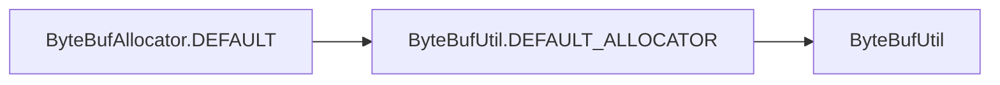

可以在 ByteBufUtil 中发现下面的代码

```java
static final ByteBufAllocator DEFAULT_ALLOCATOR;

static {
    // 通过系统的环境变量来获取分配类型。如果是安装系统用 unpooled
    String allocType = SystemPropertyUtil.get(
        "io.netty.allocator.type", 
        PlatformDependent.isAndroid() ? "unpooled" : "pooled");
    allocType = allocType.toLowerCase(Locale.US).trim();
	// alloc 决定了内存的分配类型
    ByteBufAllocator alloc;
    if ("unpooled".equals(allocType)) {
        alloc = UnpooledByteBufAllocator.DEFAULT;
        logger.debug("-Dio.netty.allocator.type: {}", allocType);
    } else if ("pooled".equals(allocType)) {
        alloc = PooledByteBufAllocator.DEFAULT;
        logger.debug("-Dio.netty.allocator.type: {}", allocType);
    } else {
        alloc = PooledByteBufAllocator.DEFAULT;
        logger.debug("-Dio.netty.allocator.type: pooled (unknown: {})", allocType);
    }

    DEFAULT_ALLOCATOR = alloc;

    THREAD_LOCAL_BUFFER_SIZE = SystemPropertyUtil.getInt("io.netty.threadLocalDirectBufferSize", 0);
    logger.debug("-Dio.netty.threadLocalDirectBufferSize: {}", THREAD_LOCAL_BUFFER_SIZE);

    MAX_CHAR_BUFFER_SIZE = SystemPropertyUtil.getInt("io.netty.maxThreadLocalCharBufferSize", 16 * 1024);
    logger.debug("-Dio.netty.maxThreadLocalCharBufferSize: {}", MAX_CHAR_BUFFER_SIZE);
}
```

我们尝试修改环境变量的值，来看看分配方式是否会改变，修改环境变量可以运行时追加虚拟机参数或者直接用代码设置值。这里我图方便，用代码进行设置

- `-Dio.netty.allocator.type=unpooled`
- `System.setProperty("io.netty.allocator.type", "unpooled");`

```java
import io.netty.bootstrap.ServerBootstrap;
import io.netty.buffer.ByteBuf;
import io.netty.channel.ChannelHandlerContext;
import io.netty.channel.ChannelInboundHandlerAdapter;
import io.netty.channel.ChannelInitializer;
import io.netty.channel.nio.NioEventLoopGroup;
import io.netty.channel.socket.nio.NioServerSocketChannel;
import io.netty.channel.socket.nio.NioSocketChannel;
import io.netty.handler.logging.LoggingHandler;
import lombok.extern.slf4j.Slf4j;

@Slf4j
public class TestByteBufServer {
    public static void main(String[] args) {
        // 加上这个设置即可
        System.setProperty("io.netty.allocator.type", "unpooled");
        new ServerBootstrap()
                .channel(NioServerSocketChannel.class)
                .group(new NioEventLoopGroup(), new NioEventLoopGroup())
                .childHandler(new NioSocketChannelChannelInitializer())
                .bind(8080);
    }

    private static class NioSocketChannelChannelInitializer extends ChannelInitializer<NioSocketChannel> {
        @Override
        protected void initChannel(NioSocketChannel ch) throws Exception {
            ch.pipeline().addLast(new LoggingHandler());
            ch.pipeline().addLast(new ChannelInboundHandlerAdapter() {
                @Override
                public void channelRead(ChannelHandlerContext ctx, Object msg) throws Exception {
                    ByteBuf buffer = ctx.alloc().buffer();
                    log.debug("alloc buffer {}", buffer);
                    super.channelRead(ctx, msg);
                }
            });
        }
    }
}
/*
客户端向发送数据，服务器端打印
         +-------------------------------------------------+
         |  0  1  2  3  4  5  6  7  8  9  a  b  c  d  e  f |
+--------+-------------------------------------------------+----------------+
|00000000| 68 65 6c 6c 6f                                  |hello           |
+--------+-------------------------------------------------+----------------+
21:05:45.064 [nioEventLoopGroup-3-2] DEBUG c.n.p.TestByteBufServer 
- alloc buffer UnpooledByteBufAllocator$InstrumentedUnpooledUnsafeDirectByteBuf(ridx: 0, widx: 0, cap: 256)
可以看到，变成了非池化的 DirectByteBuf
*/
```

那么使用直接内存还是非直接内存又如何配置呢？我们再次追踪下 `ByteBufUtil` 下的 `UnpooledByteBufAllocator.DEFAULT`

```mermaid
graph LR
ByteBufUtil#UnpooledByteBufAllocator.DEFAUL-->UnpooledByteBufAllocator的DEFAULT参数-->PlatformDependent
```

追踪到了 PlatformDependent 代码中的 `DIRECT_BUFFER_PREFERRED` 的赋值

```java
// We should always prefer direct buffers by default if we can use a Cleaner to release direct buffers.
DIRECT_BUFFER_PREFERRED = CLEANER != NOOP
    && !SystemPropertyUtil.getBoolean("io.netty.noPreferDirect", false);
```

在运行时追加参数或者直接通过代码设置环境变量即可进行修改。

- `-Dio.netty.noPreferDirect=true`
- `System.setProperty("io.netty.noPreferDirect", "unpooled");`

修改后的服务器端代码，使用非直接内存

```java
@Slf4j
public class TestByteBufServer {
    public static void main(String[] args) {
        System.setProperty("io.netty.allocator.type", "unpooled");
        // 使用非直接内存
        System.setProperty("io.netty.noPreferDirect", "true");
        new ServerBootstrap()
                .channel(NioServerSocketChannel.class)
                .group(new NioEventLoopGroup(), new NioEventLoopGroup())
                .childHandler(new NioSocketChannelChannelInitializer())
                .bind(8080);
    }

    private static class NioSocketChannelChannelInitializer extends ChannelInitializer<NioSocketChannel> {
        @Override
        protected void initChannel(NioSocketChannel ch) throws Exception {
            ch.pipeline().addLast(new LoggingHandler());
            ch.pipeline().addLast(new ChannelInboundHandlerAdapter() {
                @Override
                public void channelRead(ChannelHandlerContext ctx, Object msg) throws Exception {
                    ByteBuf buffer = ctx.alloc().buffer();
                    log.debug("alloc buffer {}", buffer);
                    super.channelRead(ctx, msg);
                }
            });
        }
    }
}
/*
         +-------------------------------------------------+
         |  0  1  2  3  4  5  6  7  8  9  a  b  c  d  e  f |
+--------+-------------------------------------------------+----------------+
|00000000| 68 65 6c 6c 6f                                  |hello           |
+--------+-------------------------------------------------+----------------+
21:16:22.362 [nioEventLoopGroup-3-1] DEBUG c.n.p.TestByteBufServer 
- alloc buffer UnpooledByteBufAllocator$InstrumentedUnpooledUnsafeHeapByteBuf(ridx: 0, widx: 0, cap: 256)
可以看到 UnpooledUnsafeHeapByteBuf 用的是非池化，堆内存了。
*/
```

#### RCVBUF_ALLOCATOR

* 属于 SocketChannal 参数
* 控制 netty 接收缓冲区大小
* 负责入站数据的分配，决定入站缓冲区的大小 (并可动态调整)  ，统一采用 direct 直接内存，具体池化还是非池化由 allocator 决定

修改下之前服务器端的代码，看下服务器端接收的 ByteBuf 的大小

```java
import io.netty.bootstrap.ServerBootstrap;
import io.netty.channel.ChannelHandlerContext;
import io.netty.channel.ChannelInboundHandlerAdapter;
import io.netty.channel.ChannelInitializer;
import io.netty.channel.nio.NioEventLoopGroup;
import io.netty.channel.socket.nio.NioServerSocketChannel;
import io.netty.channel.socket.nio.NioSocketChannel;
import io.netty.handler.logging.LoggingHandler;
import lombok.extern.slf4j.Slf4j;

@Slf4j
public class TestByteBufServer {
    public static void main(String[] args) {
        System.setProperty("io.netty.allocator.type", "unpooled");
        // 使用非直接内存
        System.setProperty("io.netty.noPreferDirect", "true");
        new ServerBootstrap()
                .channel(NioServerSocketChannel.class)
                .group(new NioEventLoopGroup(), new NioEventLoopGroup())
                .childHandler(new NioSocketChannelChannelInitializer())
                .bind(8080);
    }

    private static class NioSocketChannelChannelInitializer extends ChannelInitializer<NioSocketChannel> {
        @Override
        protected void initChannel(NioSocketChannel ch) throws Exception {
            ch.pipeline().addLast(new LoggingHandler());
            ch.pipeline().addLast(new ChannelInboundHandlerAdapter() {
                @Override
                public void channelRead(ChannelHandlerContext ctx, Object msg) throws Exception {
                    // ByteBuf buffer = ctx.alloc().buffer();
                    // log.debug("alloc buffer {}", buffer);
                    log.debug("alloc buffer {}", msg);
                    super.channelRead(ctx, msg);
                }
            });
        }
    }
}
/*
         +-------------------------------------------------+
         |  0  1  2  3  4  5  6  7  8  9  a  b  c  d  e  f |
+--------+-------------------------------------------------+----------------+
|00000000| 68 65 6c 6c 6f                                  |hello           |
+--------+-------------------------------------------------+----------------+
21:22:11.009 [nioEventLoopGroup-3-1] DEBUG c.n.p.TestByteBufServer 
- alloc buffer UnpooledByteBufAllocator$InstrumentedUnpooledUnsafeDirectByteBuf(ridx: 0, widx: 5, cap: 1024)
虽然设置的是使用堆内存，但是实际上 netty 使用的还是直接内存
*/
```

虽然设置的是使用堆内存，但是实际上 netty 使用的还是直接内存。因为网络传输使用 NIO 直接内存的效率高，因此强制使用的直接内存。使用 ctx 进行分配的话还是可以自行配置的。

而且网络传输的 ByteBuf 默认的大小就是 1024 字节。这个 ByteBuf 是在 `AbstractNioByteChannel#read` 方法中分配的。大概在源码的 147 行。通过 `allocHandle.allocate` 分配的内存。

```java
@Override
public final void read() {
    final ChannelConfig config = config();
    if (shouldBreakReadReady(config)) {
        clearReadPending();
        return;
    }
    final ChannelPipeline pipeline = pipeline();
    // allocator 只管 ByteBuf 是池化还是非池化的
    final ByteBufAllocator allocator = config.getAllocator();
    // 2.创建出 allocHandle，他是 RecvByteBufAllocator 的内部类
    // 负责，是用直接内存还是非直接内存，大小设置为多少
    final RecvByteBufAllocator.Handle allocHandle = recvBufAllocHandle();
    allocHandle.reset(config);

    ByteBuf byteBuf = null;
    boolean close = false;
    try {
        do {
            // 1.创建出 byteBuf。allocHandle 里又传了一个分配器，这两个分配器如何协作的？
            // allocator 只管 ByteBuf 是池化还是非池化的
            // allocHandle 负责
            byteBuf = allocHandle.allocate(allocator);
            allocHandle.lastBytesRead(doReadBytes(byteBuf));
            if (allocHandle.lastBytesRead() <= 0) {
                // nothing was read. release the buffer.
                byteBuf.release();
                byteBuf = null;
                close = allocHandle.lastBytesRead() < 0;
                if (close) {
                    // There is nothing left to read as we received an EOF.
                    readPending = false;
                }
                break;
            }

            allocHandle.incMessagesRead(1);
            readPending = false;
            pipeline.fireChannelRead(byteBuf);
            byteBuf = null;
        } while (allocHandle.continueReading());

        allocHandle.readComplete();
        pipeline.fireChannelReadComplete();

        if (close) {
            closeOnRead(pipeline);
        }
    } catch (Throwable t) {
        handleReadException(pipeline, byteBuf, t, close, allocHandle);
    } finally {
        // Check if there is a readPending which was not processed yet.
        // This could be for two reasons:
        // * The user called Channel.read() or ChannelHandlerContext.read() in channelRead(...) method
        // * The user called Channel.read() or ChannelHandlerContext.read() in channelReadComplete(...) method
        //
        // See https://github.com/netty/netty/issues/2254
        if (!readPending && !config.isAutoRead()) {
            removeReadOp();
        }
    }
}
```

我们来跟踪下如何设置 ByteBuf 的大小。

<div algin="center"></div>

可以看到，使用了传入的 `ByteBufAllocator allocator` 分配内存

```java
@Override
public ByteBuf allocate(ByteBufAllocator alloc) {
    // ioBuffer 表示强制使用直接内存
    // guess 指定内存大小。会根据实际的数据量，来决定这个 ByteBuf 分配多大的内存
    // 如果比上次发的更多，这次就有可能分配一个更大内存的 ByteBuf
    return alloc.ioBuffer(guess());
}
```

而 `RecvByteBufAllocator.Handle allocHandle` 怎么来的？一路追踪代码


DefaultChannelConfig 的构造方法中赋的初始值

```java
public DefaultChannelConfig(Channel channel) {
    this(channel, new AdaptiveRecvByteBufAllocator());
}

protected DefaultChannelConfig(Channel channel, RecvByteBufAllocator allocator) {
    setRecvByteBufAllocator(allocator, channel.metadata());
    this.channel = channel;
}
```

而 AdaptiveRecvByteBufAllocator 类中规定了 ByteBuf 的大小。

```java
static final int DEFAULT_MINIMUM = 64;
static final int DEFAULT_INITIAL = 1024;
static final int DEFAULT_MAXIMUM = 65536;

public AdaptiveRecvByteBufAllocator() {
    this(DEFAULT_MINIMUM, DEFAULT_INITIAL, DEFAULT_MAXIMUM);
}
```

最开始默认是 1024，如果后续数据量比较大就会调大，最大不会超过 65535。如果传过来的数据比较小，就会在 1024 的基础上减小，但是最小不会超过 64 bytes。

### RPC框架

#### 准备工作

这些代码可以认为是现成的，无需从头编写练习

为了简化起见，在原来聊天项目的基础上新增 RPC 请求和响应消息

```java
@Data
public abstract class Message implements Serializable {

    // 省略旧的代码

    public static final int RPC_MESSAGE_TYPE_REQUEST = 101;
    public static final int  RPC_MESSAGE_TYPE_RESPONSE = 102;

    static {
        // ...
        messageClasses.put(RPC_MESSAGE_TYPE_REQUEST, RpcRequestMessage.class);
        messageClasses.put(RPC_MESSAGE_TYPE_RESPONSE, RpcResponseMessage.class);
    }

}
```

<b>请求消息。远程调用需要知道请求方法的接口名，方法名，返回值类型，方法参数类型和方法参数的值。</b>

```java
@Getter
@ToString(callSuper = true)
public class RpcRequestMessage extends Message {

    /**
     * 调用的接口全限定名，服务端根据它找到实现
     */
    private String interfaceName;
    /**
     * 调用接口中的方法名
     */
    private String methodName;
    /**
     * 方法返回类型
     */
    private Class<?> returnType;
    /**
     * 方法参数类型数组
     */
    private Class[] parameterTypes;
    /**
     * 方法参数值数组
     */
    private Object[] parameterValue;

    public RpcRequestMessage(int sequenceId, String interfaceName, String methodName, Class<?> returnType, Class[] parameterTypes, Object[] parameterValue) {
        super.setSequenceId(sequenceId);
        this.interfaceName = interfaceName;
        this.methodName = methodName;
        this.returnType = returnType;
        this.parameterTypes = parameterTypes;
        this.parameterValue = parameterValue;
    }

    @Override
    public int getMessageType() {
        return RPC_MESSAGE_TYPE_REQUEST;
    }
}
```

<b>响应消息。响应消息需要知道方法调用后的返回值和异常值 (是否发生了异常)  。</b>

```java
@Data
@ToString(callSuper = true)
public class RpcResponseMessage extends Message {
    /**
     * 返回值
     */
    private Object returnValue;
    /**
     * 异常值
     */
    private Exception exceptionValue;

    @Override
    public int getMessageType() {
        return RPC_MESSAGE_TYPE_RESPONSE;
    }
}
```

服务器架子：关心 RPC 请求消息

```java
@Slf4j
public class RpcServer {
    public static void main(String[] args) {
        NioEventLoopGroup boss = new NioEventLoopGroup();
        NioEventLoopGroup worker = new NioEventLoopGroup();
        LoggingHandler LOGGING_HANDLER = new LoggingHandler(LogLevel.DEBUG);
        MessageCodecSharable MESSAGE_CODEC = new MessageCodecSharable();
        
        // rpc 请求消息处理器，待实现
        RpcRequestMessageHandler RPC_HANDLER = new RpcRequestMessageHandler();
        try {
            ServerBootstrap serverBootstrap = new ServerBootstrap();
            serverBootstrap.channel(NioServerSocketChannel.class);
            serverBootstrap.group(boss, worker);
            serverBootstrap.childHandler(new ChannelInitializer<SocketChannel>() {
                @Override
                protected void initChannel(SocketChannel ch) throws Exception {
                    ch.pipeline().addLast(new ProcotolFrameDecoder());
                    ch.pipeline().addLast(LOGGING_HANDLER);
                    ch.pipeline().addLast(MESSAGE_CODEC);
                    ch.pipeline().addLast(RPC_HANDLER);
                }
            });
            Channel channel = serverBootstrap.bind(8080).sync().channel();
            channel.closeFuture().sync();
        } catch (InterruptedException e) {
            log.error("server error", e);
        } finally {
            boss.shutdownGracefully();
            worker.shutdownGracefully();
        }
    }
}
```

客户端架子：关心 RPC 响应消息

```java
public class RpcClient {
    public static void main(String[] args) {
        NioEventLoopGroup group = new NioEventLoopGroup();
        LoggingHandler LOGGING_HANDLER = new LoggingHandler(LogLevel.DEBUG);
        MessageCodecSharable MESSAGE_CODEC = new MessageCodecSharable();
        
        // rpc 响应消息处理器，待实现
        RpcResponseMessageHandler RPC_HANDLER = new RpcResponseMessageHandler();
        try {
            Bootstrap bootstrap = new Bootstrap();
            bootstrap.channel(NioSocketChannel.class);
            bootstrap.group(group);
            bootstrap.handler(new ChannelInitializer<SocketChannel>() {
                @Override
                protected void initChannel(SocketChannel ch) throws Exception {
                    ch.pipeline().addLast(new ProcotolFrameDecoder());
                    ch.pipeline().addLast(LOGGING_HANDLER);
                    ch.pipeline().addLast(MESSAGE_CODEC);
                    ch.pipeline().addLast(RPC_HANDLER);
                }
            });
            Channel channel = bootstrap.connect("localhost", 8080).sync().channel();
            channel.closeFuture().sync();
        } catch (Exception e) {
            log.error("client error", e);
        } finally {
            group.shutdownGracefully();
        }
    }
}
```

服务器端的 service 获取

```java
public class ServicesFactory {

    static Properties properties;
    static Map<Class<?>, Object> map = new ConcurrentHashMap<>();

    static {
        try (InputStream in = Config.class.getResourceAsStream("/application.properties")) {
            properties = new Properties();
            properties.load(in);
            Set<String> names = properties.stringPropertyNames();
            for (String name : names) {
                if (name.endsWith("Service")) {
                    Class<?> interfaceClass = Class.forName(name);
                    Class<?> instanceClass = Class.forName(properties.getProperty(name));
                    map.put(interfaceClass, instanceClass.newInstance());
                }
            }
        } catch (IOException | ClassNotFoundException | InstantiationException | IllegalAccessException e) {
            throw new ExceptionInInitializerError(e);
        }
    }

    public static <T> T getService(Class<T> interfaceClass) {
        return (T) map.get(interfaceClass);
    }
}
```

相关配置 application.properties

```properties
serializer.algorithm=Json
cn.itcast.server.service.HelloService=cn.itcast.server.service.HelloServiceImpl
```

#### 服务器handler

```java
@Slf4j
@ChannelHandler.Sharable
public class RpcRequestMessageHandler extends SimpleChannelInboundHandler<RpcRequestMessage> {

    @Override
    protected void channelRead0(ChannelHandlerContext ctx, RpcRequestMessage message) {
        RpcResponseMessage response = new RpcResponseMessage();
        response.setSequenceId(message.getSequenceId());
        try {
            // 获取真正的实现对象
            Object service = ServicesFactory.getService(Class.forName(message.getInterfaceName()));
            // 获取要调用的方法
            Method method = service.getClass().getMethod(message.getMethodName(), message.getParameterTypes());
            // 调用方法
            Object invoke = method.invoke(service, message.getParameterValue());
            // 调用成功
            response.setReturnValue(invoke);
        } catch (Exception e) {
            e.printStackTrace();
            // 调用异常
            response.setExceptionValue(e);
        }
        // 返回结果
        ctx.writeAndFlush(response);
    }
}
```

#### 仅发送消息

<b>客户端代码第一版</b>

```java
@Slf4j
public class RpcClient {
    public static void main(String[] args) {
        NioEventLoopGroup group = new NioEventLoopGroup();
        LoggingHandler LOGGING_HANDLER = new LoggingHandler(LogLevel.DEBUG);
        MessageCodecSharable MESSAGE_CODEC = new MessageCodecSharable();
        RpcResponseMessageHandler RPC_HANDLER = new RpcResponseMessageHandler();
        try {
            Bootstrap bootstrap = new Bootstrap();
            bootstrap.channel(NioSocketChannel.class);
            bootstrap.group(group);
            bootstrap.handler(new ChannelInitializer<SocketChannel>() {
                @Override
                protected void initChannel(SocketChannel ch) throws Exception {
                    ch.pipeline().addLast(new ProcotolFrameDecoder());
                    ch.pipeline().addLast(LOGGING_HANDLER);
                    ch.pipeline().addLast(MESSAGE_CODEC);
                    ch.pipeline().addLast(RPC_HANDLER);
                }
            });
            Channel channel = bootstrap.connect("localhost", 8080).sync().channel();

            ChannelFuture future = channel.writeAndFlush(new RpcRequestMessage(
                    1,
                    "cn.itcast.server.service.HelloService",
                    "sayHello",
                    String.class,
                    new Class[]{String.class},
                    new Object[]{"张三"}
           ) ).addListener(promise -> {
                if (!promise.isSuccess()) {
                    Throwable cause = promise.cause();
                    log.error("error", cause);
                }
            });

            channel.closeFuture().sync();
        } catch (Exception e) {
            log.error("client error", e);
        } finally {
            group.shutdownGracefully();
        }
    }
}
```

运行时会发生，如果使用了 gson 会发生异常

```shell
Exception in thread "main" java.lang.UnsupportedOperationException: Attempted to serialize java.lang.Class: java.lang.String. Forgot to register a type adapter?
	at com.google.gson.internal.bind.TypeAdapters$1.write(TypeAdapters.java:73)
	at com.google.gson.internal.bind.TypeAdapters$1.write(TypeAdapters.java:69)
	at com.google.gson.TypeAdapter$1.write(TypeAdapter.java:191)
	at com.google.gson.Gson.toJson(Gson.java:704)
	at com.google.gson.Gson.toJson(Gson.java:683)
	at com.google.gson.Gson.toJson(Gson.java:638)
	at com.google.gson.Gson.toJson(Gson.java:618)
	at com.netty.chat.rpc.ClassCodec.main(RPCClient.java:82)
```

解决办法如下，修改 messageCodecSharable，Gson 序列化反序列化是使用下面 main 方法中的方式进行。

```java
class ClassCodec implements JsonSerializer<Class<?>>, JsonDeserializer<Class<?>> {
    public static void main(String[] args) {
        // 用这个 gson 去转就没问题
        Gson gson = new GsonBuilder().registerTypeAdapter(Class.class, new ClassCodec()).create();
        System.out.println(gson.toJson(String.class));
    }

    @Override
    public Class<?> deserialize(JsonElement jsonElement, Type type, JsonDeserializationContext jsonDeserializationContext) throws JsonParseException {
        String asString = jsonElement.getAsString();
        try {
            return Class.forName(asString);
        } catch (ClassNotFoundException e) {
            throw new JsonParseException(e);
        }
    }

    @Override
    // src 就是对应的 class。把类的全路径变成字符串即可。
    public JsonElement serialize(Class<?> aClass, Type type, JsonSerializationContext jsonSerializationContext) {
        return new JsonPrimitive(aClass.getName());
    }
}
```

<b>客户端 handler 第一版</b>

```java
@Slf4j
@ChannelHandler.Sharable
public class RpcResponseMessageHandler extends SimpleChannelInboundHandler<RpcResponseMessage> {
    @Override
    protected void channelRead0(ChannelHandlerContext ctx, RpcResponseMessage msg) throws Exception {
        log.debug("{}", msg);
    }
}
```

#### 接收消息

<b>客户端代码 第二版</b>

包括 channel 管理，代理，接收结果。不让用户自己去编写 RequestMessage，通过创建一个代理类完成这个请求发起和参数接收的操作。而客户都如何可以接收到服务器端发送过来的执行结果呢？通过 Promise 用来在多个线程之间交换结果。

- 我们创建一个线程安全的 map，建立 sequenceId 和 Promise 之间的映射关系。客户在发送远程过程调用后，同时创建一个 Promise 对象，将 sequenceId 作为 key，Promise 作为 value 存入 map。
- 调用 Promise 对象的 await 方法，等待方法的调用结果。
- 客户端接收到服务器端的消息后，取出消息 sequenceId 对应的 Promise 为这个 Promise 赋值。
- Promise 赋值后，await 方法就不会在阻塞了，就可以从 Promise 中获取到远程过程调用的结果了。

<div align="center">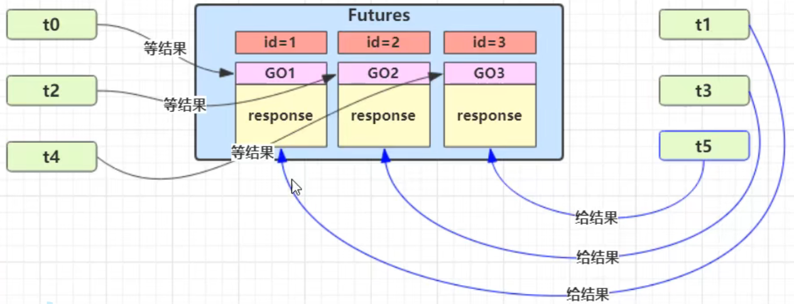</div>

```java
@Slf4j
public class RpcClientManager {

    public static void main(String[] args) {
        HelloService service = getProxyService(HelloService.class);
        System.out.println(service.sayHello("zhangsan"));
    }

    // 创建代理类，通过动态代理进行增强，将繁琐的重复性工作抽取出来。
    public static <T> T getProxyService(Class<T> serviceClass) {
        ClassLoader loader = serviceClass.getClassLoader();
        Class<?>[] interfaces = new Class[]{serviceClass};
 
        Object o = Proxy.newProxyInstance(loader, interfaces, (proxy, method, args) -> {
            // 1. 将方法调用转换为 消息对象
            int sequenceId = SequenceIdGenerator.nextId();
            RpcRequestMessage msg = new RpcRequestMessage(
                    sequenceId,
                    serviceClass.getName(),
                    method.getName(),
                    method.getReturnType(),
                    method.getParameterTypes(),
                    args
           ) ;
            // 2. 将消息对象发送出去
            getChannel().writeAndFlush(msg);

            // 3. 准备一个空 Promise 对象，来接收结果             指定 promise 对象异步接收结果线程
            DefaultPromise<Object> promise = new DefaultPromise<>(getChannel().eventLoop());
            // 存入 map
            RpcResponseMessageHandler.PROMISES.put(sequenceId, promise);

            // 4. 等待 promise 结果
            promise.await();
            if(promise.isSuccess()) {
                // 调用正常
                return promise.getNow();
            } else {
                // 调用失败
                throw new RuntimeException(promise.cause());
            }
        });
        return (T) o;
    }

    private static Channel channel = null;
    private static final Object LOCK = new Object();

    // 获取唯一的 channel 对象
    public static Channel getChannel() {
        if (channel != null) {
            return channel;
        }
        synchronized (LOCK) { //  t2
            if (channel != null) { // t1
                return channel;
            }
            initChannel();
            return channel;
        }
    }

    // 初始化 channel 方法
    private static void initChannel() {
        NioEventLoopGroup group = new NioEventLoopGroup();
        LoggingHandler LOGGING_HANDLER = new LoggingHandler(LogLevel.DEBUG);
        MessageCodecSharable MESSAGE_CODEC = new MessageCodecSharable();
        RpcResponseMessageHandler RPC_HANDLER = new RpcResponseMessageHandler();
        Bootstrap bootstrap = new Bootstrap();
        bootstrap.channel(NioSocketChannel.class);
        bootstrap.group(group);
        bootstrap.handler(new ChannelInitializer<SocketChannel>() {
            @Override
            protected void initChannel(SocketChannel ch) throws Exception {
                ch.pipeline().addLast(new ProcotolFrameDecoder());
                ch.pipeline().addLast(LOGGING_HANDLER);
                ch.pipeline().addLast(MESSAGE_CODEC);
                ch.pipeline().addLast(RPC_HANDLER);
            }
        });
        try {
            channel = bootstrap.connect("localhost", 8080).sync().channel();
            channel.closeFuture().addListener(future -> {
                group.shutdownGracefully();
            });
        } catch (Exception e) {
            log.error("client error", e);
        }
    }
}
```

<b>客户端 handler 第二版</b>

```java
@Slf4j
@ChannelHandler.Sharable
public class RpcResponseMessageHandler extends SimpleChannelInboundHandler<RpcResponseMessage> {

    //                       序号      用来接收结果的 promise 对象
    public static final Map<Integer, Promise<Object>> PROMISES = new ConcurrentHashMap<>();

    @Override

    protected void channelRead0(ChannelHandlerContext ctx, RpcResponseMessage msg) throws Exception {
        log.debug("{}", msg);
        // 拿到空的 promise
        Promise<Object> promise = PROMISES.remove(msg.getSequenceId());
        if (promise != null) {
            Object returnValue = msg.getReturnValue();
            Exception exceptionValue = msg.getExceptionValue();
            if(exceptionValue != null) {
                promise.setFailure(exceptionValue);
            } else {
                promise.setSuccess(returnValue);
            }
        }
        ctx.fireChannelRead(msg);
    }
}
```

## 源码分析

### 启动剖析

我们就来看看 netty 中对下面的代码是怎样进行处理的

```java
//1 netty 中使用 NioEventLoopGroup  (简称 nio boss 线程)  来封装线程和 selector
Selector selector = Selector.open(); 

//2 创建 NioServerSocketChannel，同时会初始化它关联的 handler，以及为原生 ssc 存储 config
NioServerSocketChannel attachment = new NioServerSocketChannel();

//3 创建 NioServerSocketChannel 时，创建了 java 原生的 ServerSocketChannel
ServerSocketChannel serverSocketChannel = ServerSocketChannel.open(); 
serverSocketChannel.configureBlocking(false);

//4 启动 nio boss 线程执行接下来的操作

//5 注册 (仅关联 selector 和 NioServerSocketChannel)  ，未关注事件
SelectionKey selectionKey = serverSocketChannel.register(selector, 0, attachment);

//6 head -> 初始化器 -> ServerBootstrapAcceptor -> tail，初始化器是一次性的，只为添加 acceptor

//7 绑定端口
serverSocketChannel.bind(new InetSocketAddress(8080));

//8 触发 channel active 事件，在 head 中关注 op_accept 事件
selectionKey.interestOps(SelectionKey.OP_ACCEPT);
```

入口 `io.netty.bootstrap.ServerBootstrap#bind`

关键代码 `io.netty.bootstrap.AbstractBootstrap#doBind`

```java
private ChannelFuture doBind(final SocketAddress localAddress) {
	// 1. 执行初始化和注册 regFuture 会由 initAndRegister 设置其是否完成，从而回调 3.2 处代码
    final ChannelFuture regFuture = initAndRegister();
    final Channel channel = regFuture.channel();
    if (regFuture.cause() != null) {
        return regFuture;
    }

    // 2. 因为是 initAndRegister 异步执行，需要分两种情况来看，调试时也需要通过 suspend 断点类型加以区分
    // 2.1 如果已经完成
    if (regFuture.isDone()) {
        ChannelPromise promise = channel.newPromise();
        // 3.1 立刻调用 doBind0
        doBind0(regFuture, channel, localAddress, promise);
        return promise;
    } 
    // 2.2 还没有完成
    else {
        final PendingRegistrationPromise promise = new PendingRegistrationPromise(channel);
        // 3.2 回调 doBind0
        regFuture.addListener(new ChannelFutureListener() {
            @Override
            public void operationComplete(ChannelFuture future) throws Exception {
                Throwable cause = future.cause();
                if (cause != null) {
                    // 处理异常...
                    promise.setFailure(cause);
                } else {
                    promise.registered();
					// 3. 由注册线程去执行 doBind0
                    doBind0(regFuture, channel, localAddress, promise);
                }
            }
        });
        return promise;
    }
}
```

关键代码 `io.netty.bootstrap.AbstractBootstrap#initAndRegister`

```java
final ChannelFuture initAndRegister() {
    Channel channel = null;
    try {
        channel = channelFactory.newChannel();
        // 1.1 初始化 - 做的事就是添加一个初始化器 ChannelInitializer
        init(channel);
    } catch (Throwable t) {
        // 处理异常...
        return new DefaultChannelPromise(new FailedChannel(), GlobalEventExecutor.INSTANCE).setFailure(t);
    }

    // 1.2 注册 - 做的事就是将原生 channel 注册到 selector 上
    ChannelFuture regFuture = config().group().register(channel);
    if (regFuture.cause() != null) {
        // 处理异常...
    }
    return regFuture;
}
```

关键代码 `io.netty.bootstrap.ServerBootstrap#init`

```java
// 这里 channel 实际上是 NioServerSocketChannel
void init(Channel channel) throws Exception {
    final Map<ChannelOption<?>, Object> options = options0();
    synchronized (options) {
        setChannelOptions(channel, options, logger);
    }

    final Map<AttributeKey<?>, Object> attrs = attrs0();
    synchronized (attrs) {
        for (Entry<AttributeKey<?>, Object> e: attrs.entrySet()) {
            @SuppressWarnings("unchecked")
            AttributeKey<Object> key = (AttributeKey<Object>) e.getKey();
            channel.attr(key).set(e.getValue());
        }
    }

    ChannelPipeline p = channel.pipeline();

    final EventLoopGroup currentChildGroup = childGroup;
    final ChannelHandler currentChildHandler = childHandler;
    final Entry<ChannelOption<?>, Object>[] currentChildOptions;
    final Entry<AttributeKey<?>, Object>[] currentChildAttrs;
    synchronized (childOptions) {
        currentChildOptions = childOptions.entrySet().toArray(newOptionArray(0));
    }
    synchronized (childAttrs) {
        currentChildAttrs = childAttrs.entrySet().toArray(newAttrArray(0));
    }
	
    // 为 NioServerSocketChannel 添加初始化器
    p.addLast(new ChannelInitializer<Channel>() {
        @Override
        public void initChannel(final Channel ch) throws Exception {
            final ChannelPipeline pipeline = ch.pipeline();
            ChannelHandler handler = config.handler();
            if (handler != null) {
                pipeline.addLast(handler);
            }

            // 初始化器的职责是将 ServerBootstrapAcceptor 加入至 NioServerSocketChannel
            ch.eventLoop().execute(new Runnable() {
                @Override
                public void run() {
                    pipeline.addLast(new ServerBootstrapAcceptor(
                            ch, currentChildGroup, currentChildHandler, currentChildOptions, currentChildAttrs));
                }
            });
        }
    });
}
```

关键代码 `io.netty.channel.AbstractChannel.AbstractUnsafe#register`

```java
public final void register(EventLoop eventLoop, final ChannelPromise promise) {
    // 一些检查，略...

    AbstractChannel.this.eventLoop = eventLoop;

    if (eventLoop.inEventLoop()) {
        register0(promise);
    } else {
        try {
            // 首次执行 execute 方法时，会启动 nio 线程，之后注册等操作在 nio 线程上执行
            // 因为只有一个 NioServerSocketChannel 因此，也只会有一个 boss nio 线程
            // 这行代码完成的事实是 main -> nio boss 线程的切换
            eventLoop.execute(new Runnable() {
                @Override
                public void run() {
                    register0(promise);
                }
            });
        } catch (Throwable t) {
            // 日志记录...
            closeForcibly();
            closeFuture.setClosed();
            safeSetFailure(promise, t);
        }
    }
}
```

`io.netty.channel.AbstractChannel.AbstractUnsafe#register0`

```java
private void register0(ChannelPromise promise) {
    try {
        if (!promise.setUncancellable() || !ensureOpen(promise)) {
            return;
        }
        boolean firstRegistration = neverRegistered;
        // 1.2.1 原生的 nio channel 绑定到 selector 上，注意此时没有注册 selector 关注事件，附件为 NioServerSocketChannel
        doRegister();
        neverRegistered = false;
        registered = true;

        // 1.2.2 执行 NioServerSocketChannel 初始化器的 initChannel
        pipeline.invokeHandlerAddedIfNeeded();

        // 回调 3.2 io.netty.bootstrap.AbstractBootstrap#doBind0
        safeSetSuccess(promise);
        pipeline.fireChannelRegistered();
        
        // 对应 server socket channel 还未绑定，isActive 为 false
        if (isActive()) {
            if (firstRegistration) {
                pipeline.fireChannelActive();
            } else if (config().isAutoRead()) {
                beginRead();
            }
        }
    } catch (Throwable t) {
        // Close the channel directly to avoid FD leak.
        closeForcibly();
        closeFuture.setClosed();
        safeSetFailure(promise, t);
    }
}
```

关键代码 `io.netty.channel.ChannelInitializer#initChannel`

```java
private boolean initChannel(ChannelHandlerContext ctx) throws Exception {
    if (initMap.add(ctx)) { // Guard against re-entrance.
        try {
            // 1.2.2.1 执行初始化
            initChannel((C) ctx.channel());
        } catch (Throwable cause) {
            exceptionCaught(ctx, cause);
        } finally {
            // 1.2.2.2 移除初始化器
            ChannelPipeline pipeline = ctx.pipeline();
            if (pipeline.context(this) != null) {
                pipeline.remove(this);
            }
        }
        return true;
    }
    return false;
}
```

关键代码 `io.netty.bootstrap.AbstractBootstrap#doBind0`

```java
// 3.1 或 3.2 执行 doBind0
private static void doBind0(
        final ChannelFuture regFuture, final Channel channel,
        final SocketAddress localAddress, final ChannelPromise promise) {

    channel.eventLoop().execute(new Runnable() {
        @Override
        public void run() {
            if (regFuture.isSuccess()) {
                channel.bind(localAddress, promise).addListener(ChannelFutureListener.CLOSE_ON_FAILURE);
            } else {
                promise.setFailure(regFuture.cause());
            }
        }
    });
}
```

关键代码 `io.netty.channel.AbstractChannel.AbstractUnsafe#bind`

```java
public final void bind(final SocketAddress localAddress, final ChannelPromise promise) {
    assertEventLoop();

    if (!promise.setUncancellable() || !ensureOpen(promise)) {
        return;
    }

    if (Boolean.TRUE.equals(config().getOption(ChannelOption.SO_BROADCAST)) &&
        localAddress instanceof InetSocketAddress &&
        !((InetSocketAddress) localAddress).getAddress().isAnyLocalAddress() &&
        !PlatformDependent.isWindows() && !PlatformDependent.maybeSuperUser()) {
        // 记录日志...
    }

    boolean wasActive = isActive();
    try {
        // 3.3 执行端口绑定
        doBind(localAddress);
    } catch (Throwable t) {
        safeSetFailure(promise, t);
        closeIfClosed();
        return;
    }

    if (!wasActive && isActive()) {
        invokeLater(new Runnable() {
            @Override
            public void run() {
                // 3.4 触发 active 事件
                pipeline.fireChannelActive();
            }
        });
    }

    safeSetSuccess(promise);
}
```

3.3 关键代码 `io.netty.channel.socket.nio.NioServerSocketChannel#doBind`

```java
protected void doBind(SocketAddress localAddress) throws Exception {
    if (PlatformDependent.javaVersion() >= 7) {
        javaChannel().bind(localAddress, config.getBacklog());
    } else {
        javaChannel().socket().bind(localAddress, config.getBacklog());
    }
}
```

3.4 关键代码 `io.netty.channel.DefaultChannelPipeline.HeadContext#channelActive`

```java
public void channelActive(ChannelHandlerContext ctx) {
    ctx.fireChannelActive();
	// 触发 read (NioServerSocketChannel 上的 read 不是读取数据，只是为了触发 channel 的事件注册)
    readIfIsAutoRead();
}
```

关键代码 `io.netty.channel.nio.AbstractNioChannel#doBeginRead`

```java
protected void doBeginRead() throws Exception {
    // Channel.read() or ChannelHandlerContext.read() was called
    final SelectionKey selectionKey = this.selectionKey;
    if (!selectionKey.isValid()) {
        return;
    }

    readPending = true;

    final int interestOps = selectionKey.interestOps();
    // readInterestOp 取值是 16，在 NioServerSocketChannel 创建时初始化好，代表关注 accept 事件
    if ((interestOps & readInterestOp) == 0) {
        selectionKey.interestOps(interestOps | readInterestOp);
    }
}
```

### NioEventLoop剖析

NioEventLoop 线程不仅要处理 IO 事件，还要处理 Task (包括普通任务和定时任务)  ，

提交任务代码 `io.netty.util.concurrent.SingleThreadEventExecutor#execute`

```java
public void execute(Runnable task) {
    if (task == null) {
        throw new NullPointerException("task");
    }

    boolean inEventLoop = inEventLoop();
    // 添加任务，其中队列使用了 jctools 提供的 mpsc 无锁队列
    addTask(task);
    if (!inEventLoop) {
        // inEventLoop 如果为 false 表示由其它线程来调用 execute，即首次调用，这时需要向 eventLoop 提交首个任务，启动死循环，会执行到下面的 doStartThread
        startThread();
        if (isShutdown()) {
            // 如果已经 shutdown，做拒绝逻辑，代码略...
        }
    }

    if (!addTaskWakesUp && wakesUpForTask(task)) {
        // 如果线程由于 IO select 阻塞了，添加的任务的线程需要负责唤醒 NioEventLoop 线程
        wakeup(inEventLoop);
    }
}
```

唤醒 select 阻塞线程 `io.netty.channel.nio.NioEventLoop#wakeup`

```java
@Override
protected void wakeup(boolean inEventLoop) {
    if (!inEventLoop && wakenUp.compareAndSet(false, true)) {
        selector.wakeup();
    }
}
```

启动 EventLoop 主循环 `io.netty.util.concurrent.SingleThreadEventExecutor#doStartThread`

```java
private void doStartThread() {
    assert thread == null;
    executor.execute(new Runnable() {
        @Override
        public void run() {
            // 将线程池的当前线程保存在成员变量中，以便后续使用
            thread = Thread.currentThread();
            if (interrupted) {
                thread.interrupt();
            }

            boolean success = false;
            updateLastExecutionTime();
            try {
                // 调用外部类 SingleThreadEventExecutor 的 run 方法，进入死循环，run 方法见下
                SingleThreadEventExecutor.this.run();
                success = true;
            } catch (Throwable t) {
                logger.warn("Unexpected exception from an event executor: ", t);
            } finally {
				// 清理工作，代码略...
            }
        }
    });
}
```

`io.netty.channel.nio.NioEventLoop#run` 主要任务是执行死循环，不断看有没有新任务，有没有 IO 事件

```java
protected void run() {
    for (;;) {
        try {
            try {
                // calculateStrategy 的逻辑如下：
                // 有任务，会执行一次 selectNow，清除上一次的 wakeup 结果，无论有没有 IO 事件，都会跳过 switch
                // 没有任务，会匹配 SelectStrategy.SELECT，看是否应当阻塞
                switch (selectStrategy.calculateStrategy(selectNowSupplier, hasTasks())) {
                    case SelectStrategy.CONTINUE:
                        continue;

                    case SelectStrategy.BUSY_WAIT:

                    case SelectStrategy.SELECT:
                        // 因为 IO 线程和提交任务线程都有可能执行 wakeup，而 wakeup 属于比较昂贵的操作，因此使用了一个原子布尔对象 wakenUp，它取值为 true 时，表示该由当前线程唤醒
                        // 进行 select 阻塞，并设置唤醒状态为 false
                        boolean oldWakenUp = wakenUp.getAndSet(false);
                        
                        // 如果在这个位置，非 EventLoop 线程抢先将 wakenUp 置为 true，并 wakeup
                        // 下面的 select 方法不会阻塞
                        // 等 runAllTasks 处理完成后，到再循环进来这个阶段新增的任务会不会及时执行呢?
                        // 因为 oldWakenUp 为 true，因此下面的 select 方法就会阻塞，直到超时
                        // 才能执行，让 select 方法无谓阻塞
                        select(oldWakenUp);

                        if (wakenUp.get()) {
                            selector.wakeup();
                        }
                    default:
                }
            } catch (IOException e) {
                rebuildSelector0();
                handleLoopException(e);
                continue;
            }

            cancelledKeys = 0;
            needsToSelectAgain = false;
            // ioRatio 默认是 50
            final int ioRatio = this.ioRatio;
            if (ioRatio == 100) {
                try {
                    processSelectedKeys();
                } finally {
                    // ioRatio 为 100 时，总是运行完所有非 IO 任务
                    runAllTasks();
                }
            } else {                
                final long ioStartTime = System.nanoTime();
                try {
                    processSelectedKeys();
                } finally {
                    // 记录 io 事件处理耗时
                    final long ioTime = System.nanoTime() - ioStartTime;
                    // 运行非 IO 任务，一旦超时会退出 runAllTasks
                    runAllTasks(ioTime * (100 - ioRatio) / ioRatio);
                }
            }
        } catch (Throwable t) {
            handleLoopException(t);
        }
        try {
            if (isShuttingDown()) {
                closeAll();
                if (confirmShutdown()) {
                    return;
                }
            }
        } catch (Throwable t) {
            handleLoopException(t);
        }
    }
}
```

#### ⚠️ 注意

> 这里有个费解的地方就是 wakeup，它既可以由提交任务的线程来调用 (比较好理解)  ，也可以由 EventLoop 线程来调用 (比较费解)  ，这里要知道 wakeup 方法的效果：
>
> * 由非 EventLoop 线程调用，会唤醒当前在执行 select 阻塞的 EventLoop 线程
> * 由 EventLoop 自己调用，会本次的 wakeup 会取消下一次的 select 操作

参考下图

<div align="center"></div>

`io.netty.channel.nio.NioEventLoop#select`

```java
private void select(boolean oldWakenUp) throws IOException {
    Selector selector = this.selector;
    try {
        int selectCnt = 0;
        long currentTimeNanos = System.nanoTime();
        // 计算等待时间
        // * 没有 scheduledTask，超时时间为 1s
        // * 有 scheduledTask，超时时间为 `下一个定时任务执行时间 - 当前时间`
        long selectDeadLineNanos = currentTimeNanos + delayNanos(currentTimeNanos);

        for (;;) {
            long timeoutMillis = (selectDeadLineNanos - currentTimeNanos + 500000L) / 1000000L;
            // 如果超时，退出循环
            if (timeoutMillis <= 0) {
                if (selectCnt == 0) {
                    selector.selectNow();
                    selectCnt = 1;
                }
                break;
            }

            // 如果期间又有 task 退出循环，如果没这个判断，那么任务就会等到下次 select 超时时才能被执行
            // wakenUp.compareAndSet(false, true) 是让非 NioEventLoop 不必再执行 wakeup
            if (hasTasks() && wakenUp.compareAndSet(false, true)) {
                selector.selectNow();
                selectCnt = 1;
                break;
            }

            // select 有限时阻塞
            // 注意 nio 有 bug，当 bug 出现时，select 方法即使没有时间发生，也不会阻塞住，导致不断空轮询，cpu 占用 100%
            int selectedKeys = selector.select(timeoutMillis);
            // 计数加 1
            selectCnt ++;

            // 醒来后，如果有 IO 事件、或是由非 EventLoop 线程唤醒，或者有任务，退出循环
            if (selectedKeys != 0 || oldWakenUp || wakenUp.get() || hasTasks() || hasScheduledTasks()) {
                break;
            }
            if (Thread.interrupted()) {
               	// 线程被打断，退出循环
                // 记录日志
                selectCnt = 1;
                break;
            }

            long time = System.nanoTime();
            if (time - TimeUnit.MILLISECONDS.toNanos(timeoutMillis) >= currentTimeNanos) {
                // 如果超时，计数重置为 1，下次循环就会 break
                selectCnt = 1;
            } 
            // 计数超过阈值，由 io.netty.selectorAutoRebuildThreshold 指定，默认 512
            // 这是为了解决 nio 空轮询 bug
            else if (SELECTOR_AUTO_REBUILD_THRESHOLD > 0 &&
                    selectCnt >= SELECTOR_AUTO_REBUILD_THRESHOLD) {
                // 重建 selector
                selector = selectRebuildSelector(selectCnt);
                selectCnt = 1;
                break;
            }

            currentTimeNanos = time;
        }

        if (selectCnt > MIN_PREMATURE_SELECTOR_RETURNS) {
            // 记录日志
        }
    } catch (CancelledKeyException e) {
        // 记录日志
    }
}
```

处理 keys `io.netty.channel.nio.NioEventLoop#processSelectedKeys`

```java
private void processSelectedKeys() {
    if (selectedKeys != null) {
        // 通过反射将 Selector 实现类中的就绪事件集合替换为 SelectedSelectionKeySet 
        // SelectedSelectionKeySet 底层为数组实现，可以提高遍历性能 (原本为 HashSet)  
        processSelectedKeysOptimized();
    } else {
        processSelectedKeysPlain(selector.selectedKeys());
    }
}
```

`io.netty.channel.nio.NioEventLoop#processSelectedKey`

```java
private void processSelectedKey(SelectionKey k, AbstractNioChannel ch) {
    final AbstractNioChannel.NioUnsafe unsafe = ch.unsafe();
    // 当 key 取消或关闭时会导致这个 key 无效
    if (!k.isValid()) {
        // 无效时处理...
        return;
    }

    try {
        int readyOps = k.readyOps();
        // 连接事件
        if ((readyOps & SelectionKey.OP_CONNECT) != 0) {
            int ops = k.interestOps();
            ops &= ~SelectionKey.OP_CONNECT;
            k.interestOps(ops);

            unsafe.finishConnect();
        }

        // 可写事件
        if ((readyOps & SelectionKey.OP_WRITE) != 0) {
            ch.unsafe().forceFlush();
        }

        // 可读或可接入事件
        if ((readyOps & (SelectionKey.OP_READ | SelectionKey.OP_ACCEPT)) != 0 || readyOps == 0) {
            // 如果是可接入 io.netty.channel.nio.AbstractNioMessageChannel.NioMessageUnsafe#read
            // 如果是可读 io.netty.channel.nio.AbstractNioByteChannel.NioByteUnsafe#read
            unsafe.read();
        }
    } catch (CancelledKeyException ignored) {
        unsafe.close(unsafe.voidPromise());
    }
}
```

### accept剖析

nio 中如下代码，在 netty 中的流程

```java
//1 阻塞直到事件发生
selector.select();

Iterator<SelectionKey> iter = selector.selectedKeys().iterator();
while (iter.hasNext()) {    
    //2 拿到一个事件
    SelectionKey key = iter.next();
    
    //3 如果是 accept 事件
    if (key.isAcceptable()) {
        
        //4 执行 accept
        SocketChannel channel = serverSocketChannel.accept();
        channel.configureBlocking(false);
        
        //5 关注 read 事件
        channel.register(selector, SelectionKey.OP_READ);
    }
    // ...
}
```

先来看可接入事件处理 (accept)  

`io.netty.channel.nio.AbstractNioMessageChannel.NioMessageUnsafe#read`

```java
public void read() {
    assert eventLoop().inEventLoop();
    final ChannelConfig config = config();
    final ChannelPipeline pipeline = pipeline();    
    final RecvByteBufAllocator.Handle allocHandle = unsafe().recvBufAllocHandle();
    allocHandle.reset(config);

    boolean closed = false;
    Throwable exception = null;
    try {
        try {
            do {
				// doReadMessages 中执行了 accept 并创建 NioSocketChannel 作为消息放入 readBuf
                // readBuf 是一个 ArrayList 用来缓存消息
                int localRead = doReadMessages(readBuf);
                if (localRead == 0) {
                    break;
                }
                if (localRead < 0) {
                    closed = true;
                    break;
                }
				// localRead 为 1，就一条消息，即接收一个客户端连接
                allocHandle.incMessagesRead(localRead);
            } while (allocHandle.continueReading());
        } catch (Throwable t) {
            exception = t;
        }

        int size = readBuf.size();
        for (int i = 0; i < size; i ++) {
            readPending = false;
            // 触发 read 事件，让 pipeline 上的 handler 处理，这时是处理
            // io.netty.bootstrap.ServerBootstrap.ServerBootstrapAcceptor#channelRead
            pipeline.fireChannelRead(readBuf.get(i));
        }
        readBuf.clear();
        allocHandle.readComplete();
        pipeline.fireChannelReadComplete();

        if (exception != null) {
            closed = closeOnReadError(exception);

            pipeline.fireExceptionCaught(exception);
        }

        if (closed) {
            inputShutdown = true;
            if (isOpen()) {
                close(voidPromise());
            }
        }
    } finally {
        if (!readPending && !config.isAutoRead()) {
            removeReadOp();
        }
    }
}
```

关键代码 `io.netty.bootstrap.ServerBootstrap.ServerBootstrapAcceptor#channelRead`

```java
public void channelRead(ChannelHandlerContext ctx, Object msg) {
    // 这时的 msg 是 NioSocketChannel
    final Channel child = (Channel) msg;

    // NioSocketChannel 添加  childHandler 即初始化器
    child.pipeline().addLast(childHandler);

    // 设置选项
    setChannelOptions(child, childOptions, logger);

    for (Entry<AttributeKey<?>, Object> e: childAttrs) {
        child.attr((AttributeKey<Object>) e.getKey()).set(e.getValue());
    }

    try {
        // 注册 NioSocketChannel 到 nio worker 线程，接下来的处理也移交至 nio worker 线程
        childGroup.register(child).addListener(new ChannelFutureListener() {
            @Override
            public void operationComplete(ChannelFuture future) throws Exception {
                if (!future.isSuccess()) {
                    forceClose(child, future.cause());
                }
            }
        });
    } catch (Throwable t) {
        forceClose(child, t);
    }
}
```

又回到了熟悉的 `io.netty.channel.AbstractChannel.AbstractUnsafe#register`  方法

```java
public final void register(EventLoop eventLoop, final ChannelPromise promise) {
    // 一些检查，略...

    AbstractChannel.this.eventLoop = eventLoop;

    if (eventLoop.inEventLoop()) {
        register0(promise);
    } else {
        try {
            // 这行代码完成的事实是 nio boss -> nio worker 线程的切换
            eventLoop.execute(new Runnable() {
                @Override
                public void run() {
                    register0(promise);
                }
            });
        } catch (Throwable t) {
            // 日志记录...
            closeForcibly();
            closeFuture.setClosed();
            safeSetFailure(promise, t);
        }
    }
}
```

`io.netty.channel.AbstractChannel.AbstractUnsafe#register0`

```java
private void register0(ChannelPromise promise) {
    try {
        if (!promise.setUncancellable() || !ensureOpen(promise)) {
            return;
        }
        boolean firstRegistration = neverRegistered;
        doRegister();
        neverRegistered = false;
        registered = true;
		
        // 执行初始化器，执行前 pipeline 中只有 head -> 初始化器 -> tail
        pipeline.invokeHandlerAddedIfNeeded();
        // 执行后就是 head -> logging handler -> my handler -> tail

        safeSetSuccess(promise);
        pipeline.fireChannelRegistered();
        
        if (isActive()) {
            if (firstRegistration) {
                // 触发 pipeline 上 active 事件
                pipeline.fireChannelActive();
            } else if (config().isAutoRead()) {
                beginRead();
            }
        }
    } catch (Throwable t) {
        closeForcibly();
        closeFuture.setClosed();
        safeSetFailure(promise, t);
    }
}
```

回到了熟悉的代码 `io.netty.channel.DefaultChannelPipeline.HeadContext#channelActive`

```java
public void channelActive(ChannelHandlerContext ctx) {
    ctx.fireChannelActive();
	// 触发 read (NioSocketChannel 这里 read，只是为了触发 channel 的事件注册，还未涉及数据读取)
    readIfIsAutoRead();
}
```

`io.netty.channel.nio.AbstractNioChannel#doBeginRead`

```java
protected void doBeginRead() throws Exception {
    // Channel.read() or ChannelHandlerContext.read() was called
    final SelectionKey selectionKey = this.selectionKey;
    if (!selectionKey.isValid()) {
        return;
    }

    readPending = true;
	// 这时候 interestOps 是 0
    final int interestOps = selectionKey.interestOps();
    if ((interestOps & readInterestOp) == 0) {
        // 关注 read 事件
        selectionKey.interestOps(interestOps | readInterestOp);
    }
}
```

### read剖析

再来看可读事件 `io.netty.channel.nio.AbstractNioByteChannel.NioByteUnsafe#read`，注意发送的数据未必能够一次读完，因此会触发多次 nio read 事件，一次事件内会触发多次 pipeline read，一次事件会触发一次 pipeline read complete

```java
public final void read() {
    final ChannelConfig config = config();
    if (shouldBreakReadReady(config)) {
        clearReadPending();
        return;
    }
    final ChannelPipeline pipeline = pipeline();
    // io.netty.allocator.type 决定 allocator 的实现
    final ByteBufAllocator allocator = config.getAllocator();
    // 用来分配 byteBuf，确定单次读取大小
    final RecvByteBufAllocator.Handle allocHandle = recvBufAllocHandle();
    allocHandle.reset(config);

    ByteBuf byteBuf = null;
    boolean close = false;
    try {
        do {
            byteBuf = allocHandle.allocate(allocator);
            // 读取
            allocHandle.lastBytesRead(doReadBytes(byteBuf));
            if (allocHandle.lastBytesRead() <= 0) {
                byteBuf.release();
                byteBuf = null;
                close = allocHandle.lastBytesRead() < 0;
                if (close) {
                    readPending = false;
                }
                break;
            }

            allocHandle.incMessagesRead(1);
            readPending = false;
            // 触发 read 事件，让 pipeline 上的 handler 处理，这时是处理 NioSocketChannel 上的 handler
            pipeline.fireChannelRead(byteBuf);
            byteBuf = null;
        } 
        // 是否要继续循环
        while (allocHandle.continueReading());

        allocHandle.readComplete();
        // 触发 read complete 事件
        pipeline.fireChannelReadComplete();

        if (close) {
            closeOnRead(pipeline);
        }
    } catch (Throwable t) {
        handleReadException(pipeline, byteBuf, t, close, allocHandle);
    } finally {
        if (!readPending && !config.isAutoRead()) {
            removeReadOp();
        }
    }
}
```

`io.netty.channel.DefaultMaxMessagesRecvByteBufAllocator.MaxMessageHandle#continueReading(io.netty.util.UncheckedBooleanSupplier)`

```java
public boolean continueReading(UncheckedBooleanSupplier maybeMoreDataSupplier) {
    return 
        // 一般为 true
        config.isAutoRead() &&
        // respectMaybeMoreData 默认为 true
        // maybeMoreDataSupplier 的逻辑是如果预期读取字节与实际读取字节相等，返回 true
        (!respectMaybeMoreData || maybeMoreDataSupplier.get()) &&
        // 小于最大次数，maxMessagePerRead 默认 16
        totalMessages < maxMessagePerRead &&
        // 实际读到了数据
        totalBytesRead > 0;
}
```

