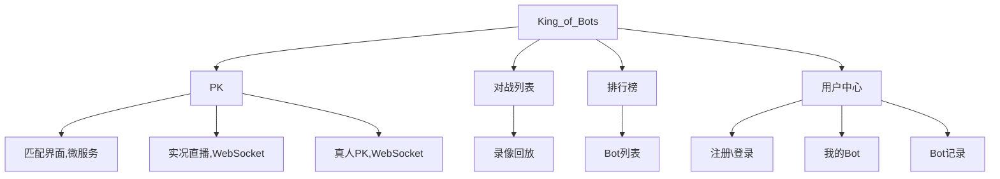

# 整体设计

Bots 指的是运行游戏的一段代码，即通过这段代码控制游戏的运行。

MVC 设计模式

- M - 数据库。
- V - 视图页面。
- C - Controller，负责向用户返回数据的控制器。

# 环境搭建

- 搭建 SpringBoot 后端环境，暂时加入 Web 依赖即可
- 安装 node.js 和 vue3.x
    - npm i -g @vue/cli@5.0.8，建议安装这个版本，避免报错。
    - vue -V 查看版本
    - vue ui 打开图形化界面，创建 vue 项目。报错： ERROR  TypeError: Cannot read properties of undefined (reading 'on')；

## Vue 基本内容

`<router-view>` 显示页面内容，如果想要无刷新且换页面的话，就把 a 链接改成 `<router-link :to{name: 名字}>`

canvas 画图，需要生成一个合法的地图。可以从左下角到右上角；可以从右上角到左下角

vue ref 属性，setup 方法，onMounted 方法