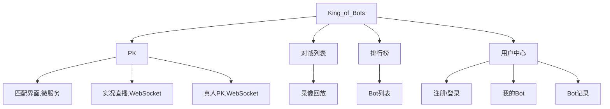

# Vue 基本概念

## script 部分
<b>export default 对象的属性</b>

- name：组件的名称
- components：存储 `<template>` 中用到的所有组件
- props：存储父组件传递给子组件的数据
- watch()：当某个数据发生变化时触发
- computed：动态计算某个数据
- setup(props, context)：初始化变量、函数
    - ref 定义变量，可以用 .value 属性重新赋值
    - reactive 定义对象，不可重新赋值
    - props 存储父组件传递过来的数据
    - context.emit()：触发父组件绑定的函数

<b>template 部分</b>

- `<slot></slot>`，存放父组件传过来的children。
- v-on:click 或 @click 属性，绑定事件
- v-if、v-else、v-else-if 属性，判断
- v-for 属性，循环，:key 循环的每个元素需要有唯一的 key
- `v-bind:` 或 `:`，绑定属性

<b>style 部分</b>

- `<style>` 标签添加 scope 属性后，不同组件间的 css 不会互相影响。

<b>第三方组件</b>

- view-router 包：实现路由功能。
- vuex：存储全局状态，全局唯一。
- state: 存储所有数据，可以用 modules 属性划分成若干模块
- getters：根据 state 中的值计算新的值
- mutations：所有对 state 的修改操作都需要定义在这里，不支持异步，可以通过 `$store.commit()` 触发
- actions：定义对 state 的复杂修改操作，支持异步，可以通过 `$store.dispatch()` 触发。注意不能直接修改 state，只能通过 mutations 修改state。
- modules：定义 state 的子模块

# 整体设计

Bots 指的是运行游戏的一段代码，即通过这段代码控制游戏的运行。



MVC 设计模式

- M - 数据库。
- V - 视图页面。
- C - Controller，负责向用户返回数据的控制器。

# 环境搭建

- 搭建 SpringBoot 后端环境，暂时加入 Web 依赖即可
- 安装 node.js 和 vue3.x
    - npm i -g @vue/cli@5.0.8，建议安装这个版本，避免报错。
    - vue -V 查看版本
    - vue ui 打开图形化界面，创建 vue 项目。报错： ERROR  TypeError: Cannot read properties of undefined (reading 'on')；

## Vue 基本内容

`<router-view>` 显示页面内容，如果想要无刷新且换页面的话，就把 a 链接改成 `<router-link :to{name: 名字}>`

canvas 画图，需要生成一个合法的地图。可以从左下角到右上角；可以从右上角到左下角

vue ref 属性，setup 方法，onMounted 方法

## 前端

常见导航栏组件，用于代码复用。UI 用 BootStrap 或 LayUI

# 创建菜单与游戏界面上

分成导航栏和主体。导航栏拎出来作为一个组件。

组件一般放 components，取名为 NarBar.vue。旧版本 vue 引入组件就不要用 @ 了。

按照功能分出页面。


点击连接，且换页面的功能。用 vue 的 router-view 自动根据地址来变。在  router/index.js 中写好 View 对应的路由，然后导航栏中的 a 链接用 router-link 即可。代码有点问题，拼写错误，自己写的时候要注意。


```js
{
    path:"/:catchAll(.*)" // 匹配任意字符
    redirect:"/404" // 重定向到 404
}
```

用白框框住区域。这可以抽象成一个公共区域。内容填充的话用 slot，不同页面的不同内容通过 slot 渲染到页面中。

选中区域高亮，用 vue 的 computed 试试计算。


<b>绘制游戏地图</b>

游戏中如何实现物体动的？一秒 60 帧，每一帧让物体移动一点然后渲染出来。<b>百度查一下。</b>

抽象出一个父类，每秒绘画自己 60 次。

- 把所有游戏存下来，方便一个一个刷新。
- 前端浏览器函数，requestAnimationFrame 可以传入一个回调函数，这个函数就会在下一帧浏览器刷新之前执行一次，如何让他每一帧都执行呢？写成递归函数（不会栈溢出吗？）

```js
const step = ()=>{
    requestAnimationFrame(step)
}

requestAnimationFrame(step)
```

移动距离移动的是像素，速度涉及到的是时间间隔，由于每一帧之间的时间间隔不一定是均匀的，所以在算距离的时候要让速度乘以时间间隔。

- js of 遍历的是值，in 遍历的是下标

```js
const AC_GAME_OBJECT  = [];

export class AcGameObject{
    constructor(){
        AC_GAME_OBJECT.push(this);
        this.timedelta = 0;
        this.has_called_start = false;
    }

    start(){//只执行一次
    }
    update(){//每一帧执行一次 ，除了第一次
    }
    on_destroy(){ //删除之前执行
    }
    destroy(){
        this.on_destroy(); //删之前调用一下

        for (let i in AC_GAME_OBJECT){
            const obj = AC_GAME_OBJECT[i];
            if (obj === this) {
                AC_GAME_OBJECT.splice(i);
                break;
            }
        }
    }
}
let last_timestamp; //上一次执行的时刻
const step = timesamp => {
    for (let obj of AC_GAME_OBJECT){
        if(!obj.has_called_start){
            obj.has_called_start = true;
            obj.start();
        }else {
            obj.timedelta = timesamp - last_timestamp;
            obj.update();
        }
    }
    last_timestamp = timesamp;
    requestAnimationFrame(step)
}

requestAnimationFrame(step)
```

js export default 的组件，引入的时候不用加 {}；没有 default 修饰的，引入的时候要加 {}。

判断连通情况。有 DFS。

# 创建菜单与游戏界面下

上面创建的地图有些尴尬，可能会出现两条蛇可以同时走到一个格子，平局，这里可以调整下地图的生成，row 为 14，col 为 14。可以接受平局的话就不用调整。后期地图的生成应该在后端创建。

前 10 步，每步🐍的长度+1，后面，每走 3 步，再变长。（扩展，申请调整难度，并让对手同意，僵持不下解散对局）

蛇的运动，尾部不动，在原来头部的位置创建一个虚拟头。然后虚拟头向前移动，其他部分不动。


蛇的运动，需要两条蛇都准备好了，然后一起移动，进入下一回合。如何控制？渲染的时候判断两条蛇的状态是不是都好了，都好了就同时更新它们的运动轨迹。

---

蛇的运动，尾部的运动

# 登录

session 判断用户登录，存在跨域问题。现在用 token 来判断，token 存在本地，更灵活。Spring Security。

前后的分离后，session 验证会有跨域的问题，这用 jwt 进行验证。

传统模式，用 session，跨域比较麻烦，不太好处理。比如，一个用户想用一个登录访问多个后端的话，要么把 session 复制多份到多个后端，要么存储到一个公共区域。不太好处理。


jwt 很容易实现跨域，且不用在服务器端存储。而且 JWT 比较安全，即便是有人篡改了用户数据，但是他不知道如何更改尾部加密的那部分字符串，这样，再服务器端解密的时候就会出错，身份认证就会出现问题。<span style="color:red">如果 JTW Token 被窃取了怎么办？那信息就泄露了。没法子了。</span>

有没有办法可以优化下，尽量避免被窃取？可以发送两个 token，一个 access-token，一个 refresh-token，发送的 token 是 access-token。

- access-token 的时间比较短，每次访问的时候携带这个 token 过去，（get 请求），时间到了就过期。
- refresh-token 的时间比较长。acces-token 过期后，就用 post 发送 refresh-token 用来获取新的 access-token。

jwt 原理搜一下。 

集成 security，集成后每次访问后端都是跳到他默认的登录页面，如何设置成用自己数据库的用户名和密码登录呢（对接数据库）？这就需要配置下了。

```java
package com.payphone.fight.service.impl;

import com.baomidou.mybatisplus.core.conditions.query.QueryWrapper;
import com.payphone.fight.mapper.UserMapper;
import com.payphone.fight.pojo.User;
import org.springframework.beans.factory.annotation.Autowired;
import org.springframework.security.core.userdetails.UserDetails;
import org.springframework.security.core.userdetails.UserDetailsService;
import org.springframework.security.core.userdetails.UsernameNotFoundException;
import org.springframework.stereotype.Service;

@Service
public class UserDetailServiceImpl implements UserDetailsService {
    @Autowired
    private UserMapper userMapper;

    @Override
    public UserDetails loadUserByUsername(String username) throws UsernameNotFoundException {
        var query = new QueryWrapper<User>();
        query.eq("username", username);
        User user = userMapper.selectOne(query);
        if (user == null) {
            throw new RuntimeException("用户不存在");
        }
        // UserDetailsImpl 是实现了 UserDetails 的类
        return new UserDetailsImpl(user);
    }
}
```

security 还需要配置一个密码加密的方式，如果不配置，想用明文存储的话，就在密码前面加 `{noop}`

```java
// 加密
import org.springframework.context.annotation.Bean;
import org.springframework.context.annotation.Configuration;
import org.springframework.security.config.annotation.web.configuration.EnableWebSecurity;
import org.springframework.security.crypto.bcrypt.BCryptPasswordEncoder;
import org.springframework.security.crypto.password.PasswordEncoder;

@Configuration
@EnableWebSecurity
public class SecurityConfig {

    @Bean
    public PasswordEncoder passwordEncoder() {
        return new BCryptPasswordEncoder();
    }
}
```

JWT 对比 session 的优势。session 的使用依赖于 cookie，而 cookie 需要浏览器的支持，但客户端可能不只是浏览器，用 session 就比较麻烦。<span style="color:red">要仔细查查</span>

完成了注册登录，但是数据目前存在 store 里，浏览器一刷新用户就推出登录后，后面存储在 localstore 里就不会这样了。


刷新的时候，默认是重定向到登录页面，所以我们在登录页面的时候判断下 localStore 的内容有没有过期就行。

# 个人页面

- 我的 bot

- CURD，没什么难度

# 匹配系统

## 协议选取

用 HTTP 协议不合适，HTTP 是一问一答的，中间的时间比较短，而游戏匹配的时间可能会比较长。可以使用传统的网络编程进行通信，但是代码的编写比较麻烦。也可以采用 WebSocket 协议。C 端和 B 端都能主动向对方发送请求。

整个游戏，为了避免作弊，大多数操作都放在后服务器后端完成。如，地图的生成，判断蛇是否撞墙，服务器判定完结果后，在把结果返回给前端。

- 用户匹配
- 匹配后生成地图，将地图传送给两个用户

先谈用户验证的注意事项，用户连接 websocket 的时候也要携带 jwt，避免用户身份被盗用，A 用 B 的号去对战。websocket 没有 header 的概念，所以 jwt 的传递直接拼接在 url 后面。可以考虑实现游戏重连。

简单的匹配：如果当前匹配池有两个用户及以上，则匹配其中两个。注意匹配后要使用同一个地图，可以匹配成功后，生成一个地图，发送给双方，并保存这个地图用于后续判断用户的输赢。还有一个问题就是，如果页面且换了，用户应该退出匹配（输了）

---

玩家操控游戏，进行回合制对战。

- 首先，需要确定玩家的位置，谁在前，谁在后；可以傻瓜式确定，第一个在左下角，第二个在右上角。确定好后，将用户的信息（坐标位置），地图信息传递给前端。
- 游戏状态的同步；服务器接收到两名玩家的信息后，再将信息发送给两名玩家（这里有个并发控制。这个控制怎么做？服务器只允许接收一个用户的一次请求，当接收到两个用户的请求后，将信息返回，然后再开启允许接收用户请求）。（这里可以开启一个新的线程用于接收玩家信息，判断输赢。）<span style="color:red">线程的实现代码不太好，改用线程池。</span>
- 等待用户输入这部分，可以按自己的想法改，感觉他写的并不优雅。（他写的这部分，如果前端输入了好几步，新的会覆盖旧的。确实，如果我自己写，也可以让新的覆盖旧的。这部分的多线程问题多思考思考，是一个不错的引导方向。）

# 人机对战

AI 搜索这个可以放在浏览器端来做。

joor 执行代码的话，如果類重名的話只会编译一次，所有为了防止重名，为类名加上随机字符串

# 游戏对战平台

- 暂定游戏
- 贪吃蛇走一走对战
- 贪吃蛇吃东西对战
- 坦克大战对战

  


