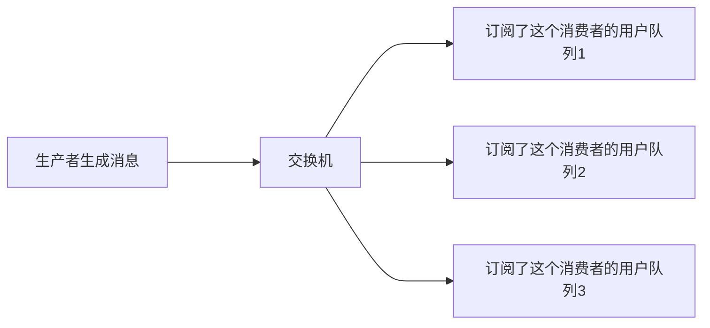
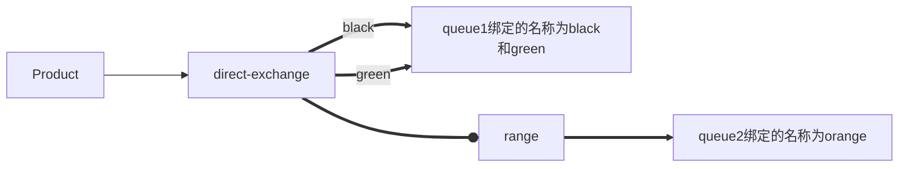
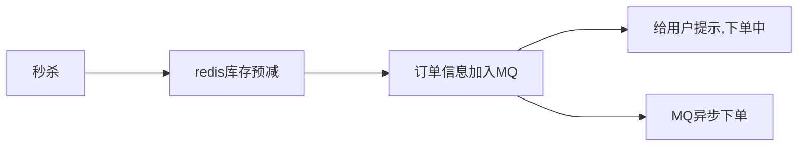

# 概述

应对大并发：

- 如何利用缓存
- 如何使用异步
- 优雅编写代码

> 秒杀

- 分布式会话
- 商品列表页
- 商品详情页
- 订单详情页
- 系统压测
- 缓存优化：先写数据库还是先写缓存。
- 消息队列：RabbitMQ 异步下单。
- 接口安全

## 整体流程

- Spring Boot 环境搭建
    - 继承 thymeleaf（后期改成layui），Result 结果封装
    - 继承 MyBatis + Druid
    - 继承 Jedis + Redis 安装 + 通用缓存 key 封装。
- 实现登录
    - 数据库设计
    - 明文密码两次 MD5
    - JSR303参数校验 + 全局异常处理器
    - 分布式 Session
- 实现秒杀
    - 数据库设计
    - 商品列表页
    - 商品详情页
    - 订单详情页
- JMeter 压测
    - JMeter 入门
    - 自定义变量模拟多用户
    - JMeter命令行使用
    - Spring Boot 打 war 包
- 页面优化技术
    - 页面缓存 + URL缓存 + 对象缓存（减少对数据库的访问）
    - 页面静态化，前后端分离
    - 静态资源优化
    - CDN优化
- 接口优化
    - Redis预减库存减少数据库访问
    - 内存标记减少 Redis 访问
    - RabbitMQ队列缓冲，异步下单，增强用户体验
    - 访问 Nginx 水平扩展
    - 压测
- 安全优化
    - 秒杀接口地址隐藏
    - 数学公式验证码（拉长访问时间）
    - 接口防刷

# 准备工作

## 数据库

```mysql
use miaosha;

/*
Navicat MySQL Data Transfer

Source Server         : miaosha
Source Server Version : 50562
Source Host           : localhost:3306
Source Database       : miaosha

Target Server Type    : MYSQL
Target Server Version : 50562
File Encoding         : 65001

Date: 2019-01-11 22:14:46
*/

SET FOREIGN_KEY_CHECKS=0;

-- ----------------------------
-- Table structure for goods
-- ----------------------------
DROP TABLE IF EXISTS `goods`;
CREATE TABLE `goods` (
  `id` bigint(20) NOT NULL AUTO_INCREMENT COMMENT '商品ID',
  `goods_name` varchar(16) DEFAULT NULL COMMENT '商品名称',
  `goods_title` varchar(64) DEFAULT NULL COMMENT '商品标题',
  `goods_img` varchar(64) DEFAULT NULL COMMENT '商品的图片',
  `goods_detail` longtext COMMENT '商品的详情介绍',
  `goods_price` decimal(10,2) DEFAULT '0.00' COMMENT '商品单价',
  `goods_stock` int(11) DEFAULT '0' COMMENT '商品库存，-1表示没有限制',
  PRIMARY KEY (`id`)
) ENGINE=InnoDB AUTO_INCREMENT=5 DEFAULT CHARSET=utf8mb4;

-- ----------------------------
-- Records of goods
-- ----------------------------
INSERT INTO `goods` VALUES ('1', 'iphoneX', 'Apple iPhone X (A1865) 64GB 银色 移动联通电信4G手机', '/img/iphonex.png', 'Apple iPhone X (A1865) 64GB 银色 移动联通电信4G手机', '8765.00', '10000');
INSERT INTO `goods` VALUES ('2', '华为Meta9', '华为 Mate 9 4GB+32GB版 月光银 移动联通电信4G手机 双卡双待', '/img/meta10.png', '华为 Mate 9 4GB+32GB版 月光银 移动联通电信4G手机 双卡双待', '3212.00', '-1');
INSERT INTO `goods` VALUES ('3', 'iphone8', 'Apple iPhone 8 (A1865) 64GB 银色 移动联通电信4G手机', '/img/iphone8.png', 'Apple iPhone 8 (A1865) 64GB 银色 移动联通电信4G手机', '5589.00', '10000');
INSERT INTO `goods` VALUES ('4', '小米6', '小米6 4GB+32GB版 月光银 移动联通电信4G手机 双卡双待', '/img/mi6.png', '小米6 4GB+32GB版 月光银 移动联通电信4G手机 双卡双待', '3212.00', '10000');

-- ----------------------------
-- Table structure for miaosha_goods
-- ----------------------------
DROP TABLE IF EXISTS `miaosha_goods`;
CREATE TABLE `miaosha_goods` (
  `id` bigint(20) NOT NULL AUTO_INCREMENT COMMENT '秒杀的商品表',
  `goods_id` bigint(20) DEFAULT NULL COMMENT '商品Id',
  `miaosha_price` decimal(10,2) DEFAULT '0.00' COMMENT '秒杀价',
  `stock_count` int(11) DEFAULT NULL COMMENT '库存数量',
  `start_date` datetime DEFAULT NULL COMMENT '秒杀开始时间',
  `end_date` datetime DEFAULT NULL COMMENT '秒杀结束时间',
  PRIMARY KEY (`id`)
) ENGINE=InnoDB AUTO_INCREMENT=5 DEFAULT CHARSET=utf8mb4;

-- ----------------------------
-- Records of miaosha_goods
-- ----------------------------
INSERT INTO `miaosha_goods` VALUES ('1', '1', '0.01', '9', '2017-12-04 21:51:23', '2017-12-31 21:51:27');
INSERT INTO `miaosha_goods` VALUES ('2', '2', '0.01', '9', '2017-12-04 21:40:14', '2017-12-31 14:00:24');
INSERT INTO `miaosha_goods` VALUES ('3', '3', '0.01', '9', '2017-12-04 21:40:14', '2017-12-31 14:00:24');
INSERT INTO `miaosha_goods` VALUES ('4', '4', '0.01', '9', '2017-12-04 21:40:14', '2017-12-31 14:00:24');

-- ----------------------------
-- Table structure for miaosha_message
-- ----------------------------
DROP TABLE IF EXISTS `miaosha_message`;
CREATE TABLE `miaosha_message` (
  `id` bigint(20) NOT NULL AUTO_INCREMENT COMMENT '消息主键',
  `messageid` bigint(20) NOT NULL COMMENT '分布式id',
  `content` text COMMENT '消息内容',
  `create_time` date DEFAULT NULL COMMENT '创建时间',
  `status` int(1) NOT NULL COMMENT '1 有效 2 失效 ',
  `over_time` datetime DEFAULT NULL COMMENT '结束时间',
  `message_type` int(1) DEFAULT '3' COMMENT '0 秒杀消息 1 购买消息 2 推送消息',
  `send_type` int(1) DEFAULT '3' COMMENT '发送类型 0 app 1 pc 2 ios',
  `good_name` varchar(50) DEFAULT '' COMMENT '商品名称',
  `price` decimal(10,2) DEFAULT '0.00' COMMENT '商品价格',
  PRIMARY KEY (`id`)
) ENGINE=InnoDB AUTO_INCREMENT=5 DEFAULT CHARSET=utf8;

-- ----------------------------
-- Records of miaosha_message
-- ----------------------------
INSERT INTO `miaosha_message` VALUES ('1', '533324506110885888', '尊敬的用户你好，你已经成功注册！', null, '0', null, null, '0', null, null);
INSERT INTO `miaosha_message` VALUES ('2', '533324506110885888', '尊敬的用户你好，你已经成功注册！', null, '0', null, null, '0', null, null);
INSERT INTO `miaosha_message` VALUES ('3', '533324506110885888', '尊敬的用户你好，你已经成功注册！', '2019-01-11', '0', null, null, '0', null, null);
INSERT INTO `miaosha_message` VALUES ('4', '533324506110885888', '尊敬的用户你好，你已经成功注册！', '2019-01-11', '0', null, null, '0', null, null);

-- ----------------------------
-- Table structure for miaosha_message_user
-- ----------------------------
DROP TABLE IF EXISTS `miaosha_message_user`;
CREATE TABLE `miaosha_message_user` (
  `id` bigint(20) NOT NULL AUTO_INCREMENT,
  `userid` bigint(20) NOT NULL,
  `messageid` bigint(50) NOT NULL,
  `goodid` int(20) DEFAULT NULL,
  `orderid` int(20) DEFAULT NULL,
  PRIMARY KEY (`id`)
) ENGINE=InnoDB AUTO_INCREMENT=15 DEFAULT CHARSET=utf8;

-- ----------------------------
-- Records of miaosha_message_user
-- ----------------------------
INSERT INTO `miaosha_message_user` VALUES ('1', '1', '222', '22', '2');
INSERT INTO `miaosha_message_user` VALUES ('11', '22', '533324506110885888', null, null);
INSERT INTO `miaosha_message_user` VALUES ('12', '22', '533324506110885888', null, null);
INSERT INTO `miaosha_message_user` VALUES ('13', '22', '533324506110885888', null, null);
INSERT INTO `miaosha_message_user` VALUES ('14', '22', '533324506110885888', null, null);

-- ----------------------------
-- Table structure for miaosha_order
-- ----------------------------
DROP TABLE IF EXISTS `miaosha_order`;
CREATE TABLE `miaosha_order` (
  `id` bigint(20) NOT NULL AUTO_INCREMENT,
  `user_id` bigint(20) DEFAULT NULL COMMENT '用户ID',
  `order_id` bigint(20) DEFAULT NULL COMMENT '订单ID',
  `goods_id` bigint(20) DEFAULT NULL COMMENT '商品ID',
  PRIMARY KEY (`id`),
  UNIQUE KEY `u_uid_gid` (`user_id`,`goods_id`) USING BTREE
) ENGINE=InnoDB AUTO_INCREMENT=1551 DEFAULT CHARSET=utf8mb4;

-- ----------------------------
-- Records of miaosha_order
-- ----------------------------
INSERT INTO `miaosha_order` VALUES ('1547', '18912341234', '1561', '1');
INSERT INTO `miaosha_order` VALUES ('1548', '18912341234', '1562', '2');
INSERT INTO `miaosha_order` VALUES ('1549', '18912341234', '1563', '4');
INSERT INTO `miaosha_order` VALUES ('1550', '18912341234', '1564', '3');

-- ----------------------------
-- Table structure for miaosha_user
-- ----------------------------
DROP TABLE IF EXISTS `miaosha_user`;
CREATE TABLE `miaosha_user` (
  `id` bigint(20) NOT NULL AUTO_INCREMENT COMMENT '用户ID，手机号码',
  `nickname` varchar(255) NOT NULL,
  `password` varchar(32) DEFAULT NULL COMMENT 'MD5(MD5(pass明文+固定salt) + salt)',
  `salt` varchar(10) DEFAULT NULL,
  `head` varchar(128) DEFAULT NULL COMMENT '头像，云存储的ID',
  `register_date` datetime DEFAULT NULL COMMENT '注册时间',
  `last_login_date` datetime DEFAULT NULL COMMENT '上蔟登录时间',
  `login_count` int(11) DEFAULT '0' COMMENT '登录次数',
  PRIMARY KEY (`id`)
) ENGINE=InnoDB AUTO_INCREMENT=18912341246 DEFAULT CHARSET=utf8mb4;

-- ----------------------------
-- Records of miaosha_user
-- ----------------------------
INSERT INTO `miaosha_user` VALUES ('18912341238', '18612766138', 'b7797cce01b4b131b433b6acf4add449', '1a2b3c4d', null, '2019-01-09 17:08:16', null, '0');
INSERT INTO `miaosha_user` VALUES ('18912341239', '18612766139', 'b7797cce01b4b131b433b6acf4add449', '1a2b3c4d', null, '2019-01-09 17:17:21', null, '0');
INSERT INTO `miaosha_user` VALUES ('18912341240', '18612766139', 'b7797cce01b4b131b433b6acf4add449', '1a2b3c4d', null, '2019-01-11 11:35:39', null, '0');
INSERT INTO `miaosha_user` VALUES ('18912341241', '18612766141', 'b7797cce01b4b131b433b6acf4add449', '1a2b3c4d', null, '2019-01-11 11:36:23', null, '0');
INSERT INTO `miaosha_user` VALUES ('18912341242', '18612766145', 'b7797cce01b4b131b433b6acf4add449', '1a2b3c4d', null, '2019-01-11 11:38:29', null, '0');
INSERT INTO `miaosha_user` VALUES ('18912341243', '18612766122', 'b7797cce01b4b131b433b6acf4add449', '1a2b3c4d', null, '2019-01-11 11:41:52', null, '0');
INSERT INTO `miaosha_user` VALUES ('18912341244', '18612766133', 'b7797cce01b4b131b433b6acf4add449', '1a2b3c4d', null, '2019-01-11 11:43:24', null, '0');
INSERT INTO `miaosha_user` VALUES ('18912341245', '18612766444', 'b7797cce01b4b131b433b6acf4add449', '1a2b3c4d', null, '2019-01-11 13:44:29', null, '0');

-- ----------------------------
-- Table structure for order_info
-- ----------------------------
DROP TABLE IF EXISTS `order_info`;
CREATE TABLE `order_info` (
  `id` bigint(20) NOT NULL AUTO_INCREMENT,
  `user_id` bigint(20) DEFAULT NULL COMMENT '用户ID',
  `goods_id` bigint(20) DEFAULT NULL COMMENT '商品ID',
  `delivery_addr_id` bigint(20) DEFAULT NULL COMMENT '收获地址ID',
  `goods_name` varchar(16) DEFAULT NULL COMMENT '冗余过来的商品名称',
  `goods_count` int(11) DEFAULT '0' COMMENT '商品数量',
  `goods_price` decimal(10,2) DEFAULT '0.00' COMMENT '商品单价',
  `order_channel` tinyint(4) DEFAULT '0' COMMENT '1pc，2android，3ios',
  `status` tinyint(4) DEFAULT '0' COMMENT '订单状态，0新建未支付，1已支付，2已发货，3已收货，4已退款，5已完成',
  `create_date` datetime DEFAULT NULL COMMENT '订单的创建时间',
  `pay_date` datetime DEFAULT NULL COMMENT '支付时间',
  PRIMARY KEY (`id`)
) ENGINE=InnoDB AUTO_INCREMENT=1565 DEFAULT CHARSET=utf8mb4;

-- ----------------------------
-- Records of order_info
-- ----------------------------
INSERT INTO `order_info` VALUES ('1561', '18912341234', '1', null, 'iphoneX', '1', '0.01', '1', '0', '2017-12-14 22:49:10', null);
INSERT INTO `order_info` VALUES ('1562', '18912341234', '2', null, '华为Meta9', '1', '0.01', '1', '0', '2017-12-14 22:55:42', null);
INSERT INTO `order_info` VALUES ('1563', '18912341234', '4', null, '小米6', '1', '0.01', '1', '0', '2017-12-16 16:19:23', null);
INSERT INTO `order_info` VALUES ('1564', '18912341234', '3', null, 'iphone8', '1', '0.01', '1', '0', '2017-12-16 16:35:20', null);

-- ----------------------------
-- Table structure for user
-- ----------------------------
DROP TABLE IF EXISTS `user`;
CREATE TABLE `user` (
  `id` int(11) NOT NULL AUTO_INCREMENT,
  `name` varchar(10) DEFAULT NULL,
  PRIMARY KEY (`id`)
) ENGINE=InnoDB AUTO_INCREMENT=2 DEFAULT CHARSET=utf8mb4;

-- ----------------------------
-- Records of user
-- ----------------------------
INSERT INTO `user` VALUES ('1', 'Joshua');
```

## 引入依赖

## Redis


# 登录功能

## 密码加密

- 两次 MD5 做加密。加密的大致流程如下：
    - 用户端：Pass = MD5（明文+固定salt）
    - 服务端：Pass = MD5（用户输入+随机salt），为每个用户生成一个随机 salt
- 具体做法：
    - 用户在注册时，输入自己的信息和密码。密码在传输过程中做一次加密。MD5（明文+固定salt）
    - 服务器端接收到用户注册信息后，为这个用户生成一个随机的 salt，继续做一次加密 MD5（传输过来的+随机生成的salt），然后将用户信息和 salt 一起写入数据库。
    - 后面用户登录的时候，先查询一次用户信息，查询到 salt，在服务端做个判断 MD5（密码+salt） == 数据库存储的密码。

引入MD5 依赖。

```xml
<dependency>
	<groupId>commons-codec</groupId>
    <artifactId>commons-codec</artifactId>
</dependency>
<dependency>
	<groupId>org.apache.commons</groupId>
    <artifactId>commons-lang3</artifactId>
    <version>3.6</version>
</dependency>
```

## JSR 303校验

在 Controller 里写代码校验参数太麻烦了，这里我们采用 JSR303 进行参数校验。我们希望校验下手机号是否正确，JSR303并未提供，我们可以自己定义一个校验规则。

- 定义注解。定义的方式，抄 JSR303 注解就行
-  定义一个注解解析器。也是参考 JSR303 的实现。

jsr303 校验依赖

```xml
<dependency>
	<groupId>org.springframework.boot</groupId>
    <artifactId>spring-boot-starter-validation</artifactId>
</dependency>
```

## 全局异常处理器

- `@ControllerAdvice` 注解 + `@ResponseBody` 注解。操作出现异常的时候，直接抛出异常。抛出异常时，全局处理器会拦截这个异常。

```java
public boolean login(){
    if(xxx){
        throw new GlobalException(CodeMessage.XXX);
    }
    return true;
}
```

## 分布式Session

- 用户登录成功后，为用户生成 Session ID 标识用户，然后写入 cookie 传给客户端，并把用户信息（session id--用户信息）存入一个三方缓存中。客户端每次请求用户的信息时，携带这个UUID给服务器，服务器就可以通过这个 Session ID 查询到用户的信息。
    - 有些手机客户端，不会把 token 放到 cookie 里传过来，而是放到参数里传过来。

- 延迟 cookie 有效期，可以使用 SpringMVC 的内容协商来简化用户信息的获取和 cookie 的延长。

# 秒杀功能

- 数据库设计
- 商品列表页
- 商品详情页
- 订单详情页

正常梳理业务流程，修改&写入数据库。

## 数据库设计

- 商品表（内容稳定）、秒杀商品表（临时选择）
- 订单表、秒杀订单表

# 压测

## JMeter 压测

- 入门
    - 设置中文界面。打开[apache](https://so.csdn.net/so/search?q=apache&spm=1001.2101.3001.7020)-jmeter-5.0\bin\jmeter.properties 文件修改language=zh_CN，重新打开就是中文界面了
- 自定义变量模拟多用户
    - 测试计划 -> 添加配置元件 -> CSV Data Set Config
    - 引用变量 `${}`
- JMeter 命令行使用

> 测试结果

- User 接口 QPS 高，测试发现 redis 连接数不够，调大 redis 连接数。Goods QPS 低，因为它读了缓存和数据库；User QPS 高，因为他只读了缓存。
- 出现了超卖。并发问题。

## Redis 压测

- redis-benchmark -h 127.0.0.1 -p 6379 -c 100 -n 100000   100个并发连接，100000个请求
- redis-benchmark -h 127.0.0.1 -p 6379 -q -d  100，存取大小为 100 字节的数据包

## 打包


# 页面优化

- 页面缓存+URL缓存+对象缓存
- 页面静态化，前后端分离
- 静态资源优化
- CDN优化

## 页面缓存

不是让系统帮我们渲染，而是先从缓存中拿，缓存中没有再渲染。这就需要我们手动渲染模板了，查阅文档，是使用 thymeleafViewResolver 进行渲染的。

GoosKey --> 商品页面缓存。

## URL 缓存

和页面缓存其实一样。只是商品有不同的编号，我用 Goods:1:xxx 缓存1号商品的页面，用 Goods:2:xxx 缓存2号商品的页面。

## 对象缓存

将用户信息缓存在 redis 中。每次取用户信息就取缓存中的，存在则拿，不存在则查数据库再存入缓存。

## 前后端分离

只传输需要变化的数据，减小服务器压力。

## 页面静态化

- 前后端分离，只传动态的数据，减少数据的发送量，减轻服务器压力.
- GET POST的区别:
    - HTTP协议并未规定GET\POST数据的传输量,只是浏览器厂商这么做.
    - GET请求是幂等的,POST不是幂等的.
    - `<a href="/delete?id=13">` 如果是 GET,搜索引擎在搜索页面的时候,会遍历页面中的链接,会执行这些链接.
- 除了前后端分离，还可以通过 cache-controll 告诉浏览器缓存这个页面，下次查询的时候直接查浏览器缓存。
    - Pragma ，HTTP1.0 可用
    - Expire ，HTTP1.1/1.0 可用，带时区的
    - Cache-Control ，HTTP1.1/1.0 可用 `cache-control:max-age 3600`

## 超卖

update 的 sql 语句会加行锁。update xx xxx xx where count>1; 利用数据库的唯一索引（用户id+goods id建立唯一索引），避免重复下单。

生成订单的时候，把订单写到缓存里，然后就不需要查数据库了，查缓存就行。

解决超卖用的 SQL 和唯一索引。有没有其他办法。

## 静态资源优化

- JS/CSS 压缩，减少流量
- 多个JS/CSS组合，减少连接数。由服务器实现->Tengine.
- CND 就近访问，加速数据请求。

# 接口优化

- Redis 预减库存减少数据库访问
- 内存标记减少 Redis 访问
- 请求先入对缓冲，异步下单，增强用户体验
- RabbitMQ 安装与 Spring Boot 集成
- Nginx 水平扩展
- 压测

## 秒杀接口优化

思路：减少数据库访问

- 1.系统初始化，把商品库存数量加载到 Redis
- 2.收到请求，Redis 预减库存，库存不足，直接返回，否则进入3
- 3.请求入队，立即返回排队中（不知道请求成功还是失败，Redis只是做了一个预减）
- 4.请求出队，生成订单，减少库存
- 5.收到排队中的消息后，客户端会轮询，是否秒杀成功

## 集成RabbitMQ

- 安装 MQ，直接用 docker 运行 rabbitmq。
- 启动 docker `sudo service docker start`
- 停止 docker `sudo service docker stop`
- 重启 docker `sudo service docker restart`

在线拉取

``` shell
docker pull rabbitmq:3-management
```

或从本地加载

```sh
docker load -i mq.tar
```

执行下面的命令来运行MQ容器：

```sh
docker run \
 -e RABBITMQ_DEFAULT_USER=itcast \
 -e RABBITMQ_DEFAULT_PASS=123321 \
 --name mq \
 --hostname mq1 \
 -p 15672:15672 \ # 管理信息页面
 -p 5672:5672 \  # 通信端口
 -d \
 rabbitmq:3-management
 
docker run  -e RABBITMQ_DEFAULT_USER=itcast -e RABBITMQ_DEFAULT_PASS=123321 --name mq --hostname mq1 -p 15672:15672 -p 5672:5672 -d rabbitmq:3-management
```

## Spring Boot集成

- 添加依赖 spring-boot-starter-amqp
- 创建消息接收者
- 创建消息发送者

```java
// 消息发送者
@Service
public class MQSender{
    @Autowired
    AmqtTemplate amqtTemplate;
    
    public void send(Object message){
        String msg = message.toString();
        amqtTemplate.convertAndSend(MQConfig.QUEUE,msg);
    }
}

// 消息接收者
@Service
public class MQReceiver{
    @RabbitListener(queues=MQConfig.QUEUE);
    public void receive(String message){
    	System.out.println(message);
    }
}

// 配置
@Configuration
public class MQConfig{
    private final static String QUEUE = "queue";
    @Bean
    public Queue queue(Object message){
        // 把 message 转成 字符串。
        return new Queue(QUEUE,true,msg)
    }
}
```

## RabbitMQ消息传递模型

之前写的那QT个发消息的，用的就是类似消息队列的模式。生产者生成放数据，多个消费者消费数据（发送数据）。

一共有四种模式：direct、topic、headers、fanout。

### fanout

广播模式。一个生产者发送了数据，多个订阅了这个消息的消费者可以接收到。简单的讲，就是把交换机（Exchange）里的消息发送给所有绑定该交换机的[队列](https://so.csdn.net/so/search?q=队列&spm=1001.2101.3001.7020)，**忽略**[routingKey](https://blog.csdn.net/fakerswe/article/details/81455340#lct)。



### direct

直连交换机意思是此交换机需要绑定一个队列，要求**该消息与一个特定的路由键完全匹配**。简单点说就是一对一的，点对点的发送。



```java
@Configuration
public class RabbtMQDirectConfig{
	// 队列在绑定交换机的时候，指定对应的 routingKey
    //（可以认为是Queue的名字，可以有多个）
    // 发送消息的时候，指定交换机和routingKey
    
    rabbitTemplate.converAndSend("exchangeName","black",message);
}
```

### topic

通配符匹配 routingKey。为队列绑定一个通配符名称，如 `#.quque.*`。生产者发送消息的时候，指定具体的 routingKey 名称。然后 exchange 将具体名称和通配符进行匹配，把消息放入可以匹配到的队列中。

- \*(start) can substitute for exactly one word.
- #(hash) can substitute  for zero or more words.

### headers

了解一下。headers 与 direct 的模式不同，不是使用 routingkey 去做绑定。而是通过消息 headers 的键值对匹配。搜下博客。

## Redis 预减库存

先前是否重复秒杀是从 redis 中获取的，减小了 mysql 的压力。但是查询库存是否足够进行秒杀，还是查询的数据库。所以我们可以在秒杀开始之前，就将库存存入 redis 中，在 redis 中预减库存，但是最后还是要在数据库中预减库存的，不过这时候，就可以一批一批订单的减少，而不少一个订单，一个订单的减少。

- 查询库存，是否可以秒杀  
- 生成订单（如果这块有多个操作，可以异步操作，增加吞吐量）

可以 redis 预减库存，库存足够，将请求封装成对象，发给MQ，MQ 慢慢处理任务（前提返回处理中），消息出队，减少数据库中的库存，再生成订单。

## RabbitMQ 秒杀操作

原来的订单操作需要 user 对象和 goods。我们需要将这些封装成消息，以便可以通过 MQ 进行发送。



可以快速给用户响应，提示用户订单生成中，然后 MQ 异步下单（想一下 12306 出单成功/失败的问题）

接收消息时，先判断是否重复抢购，再检查库存是否充足，然后再考虑下单。

判断重复抢购，每次都从 redis 中取太费时间了。如果一共 10w 个用户，抢 100 个商品，这 10w 个用户都从 redis 中查库存，太费时间了。我们可以见商品是否有库存存入内存中。先在自己的内存中判断，内存中提示有再查 redis，内存中提示没有就不查 redis 了。

客户端需要检查订单是否完成。

## Redis 分布式锁

```java
@SpringBootTest
public class SeckillTestApplication{
    @Autowired
    private RedisTemplate redisTemplate;
    @Autowired
    private RedisSCript redisScript;
    
    // 这样会有问题，如果代码执行出现了错误，就可能不会释放锁
    // 我们可以给 key 设置一个超时时间(就算是服务器宕机了，也没事)。但是设置超时时间又会可能导致事物没完成就释放锁。
    // 有可能，A线程代码的执行时间，超过了 key 的超时时间，A线程加的锁失效了，然后B线程又加锁了。A线程把B线程加的锁删除了。
    // 这种情况，我们可以 key 固定，value 用随机值，每次删除锁的时候拿到它的value比较下，看是不是自己加的锁，是自己加的锁才删除。但是释放锁的这几个步骤在redis中又不是原子性的（获得锁，比较锁，释放锁）
    // 我们可以用 lua 脚本，lua 脚本可以将 redis 多个命令以原子性的方式执行。
    /*
    redis 端写好脚本，Java 端发送执行命令。
    Java 端写好脚本，然后发送脚本让 Redis 执行。
    */
    @Test
    public void testLock(){
        ValueOperations valueOperations = redisTemplate.opsForValue();
        Boolean isLock = valueOperations.setIfAbsent("k1","v1",5,TimeUnit.SECONDS); // 如果不存在，则设置成功，如果存在，则设置失败返回 false。
        if(isLock){
 			valueOperations.set("name","xxxx");
            String name = (String)valueOperations.get("name");
            System.out.println("name="+name);
            // 操作结束，删除锁
            redisTemplate.delete("k1");
        }else{
            System.out.println("有线程在使用，请稍后再试");
        }
    }
    
    @Test
    public void testLockLua(){
        ValueOperations valueOperations = redisTemplate.opsForValue();
        String value UUID.randomUUID().toString();
        Boolean isLock = valueOperations.setIfAbsent("k1",value,5,TimeUnit.SECONDS); // 如果不存在，则设置成功，如果存在，则设置失败返回 false。
        if(isLock){
 			valueOperations.set("name","xxxx");
            String name = (String)valueOperations.get("name");
            System.out.println("name="+name);
            // 操作结束，删除锁
            valueOperations.get("k1");
            Boolean result = redisTemplate.execute(script,Collections.singleonList("k1"),value);
            System.out.println("result");
        }else{
            System.out.println("有线程在使用，请稍后再试");
        }
    }
}
```

```lua
if redis.call("get",KEYS[1])==ARGV[1] then
    return redis.call
else
    return 0
end
```

```java
// RedisConfig 中需要再加一个配置
@Configuration
public class RedisConfig{
    // some code
    @Bean
    public DefaultRedisScript<Boolean> script(){
        DefaultRedisScript<Boolean> redisScript = new DefaultRedisScript<>();
        // lock.lua 脚本位置和 application.yaml 放在了同一个位置
        redisScript.setLocaltion(new ClassPathResource("lock.lua")); 
        redusScript.setResultType(Boolean.class);
        return redisScript;
    }
}
```

## 优化 Redis 预减库存

```lua
if (redis.call("exists",KEYS[1])==1) then
    local stock = tonumber(redis.call("get",KEYS[1]))
    if(stock>0) then
        redis.call("incrby",KEYS[1],-1);
        return stock;
	end;
    	return -1;
end;
```

```java
// RedisConfig 中需要再加一个配置
@Configuration
public class RedisConfig{
    // some code
    @Bean
    public DefaultRedisScript<Long> script(){
        DefaultRedisScript<Long> redisScript = new DefaultRedisScript<>();
        // lock.lua 脚本位置和 application.yaml 放在了同一个位置
        redisScript.setLocaltion(new ClassPathResource("stock.lua")); 
        redusScript.setResultType(Long.class);
        return redisScript;
    }
}
```

# 安全优化

隐藏秒杀接口地址：通过A接口来获取真正的秒杀接口，且每个人的地址都不一样（避免别人提前知道接口，用脚本不停的刷。）。

- 随机地址为 key：真实的秒杀地址为value，以此来隐藏真实的秒杀地址。
    - key 的设置：xxx+随机数+userId+goodsId
- 可以为它设置一个过期时间，过期了需要重新获取地址。

限流，每个用户指定时间内只能请求指定次数

验证码隔离，拉长用户的发请求的时间。网上找个开源的就行。

# 限流/防刷

通过限流控制系统的 QPS，保护系统。

- 计数器
- 漏桶
- 令牌桶

它用的 redis 进行计数的。这块不保证原子性也没啥问题吧。

限流规则一般是设置最大 QPS 的 `70%~80%`。如果前面几秒，直接把请求打满了，后面服务器就空闲了，浪费资源。也可能前面直接把服务器打爆了，这时候可以用令牌桶算法。

## 通用限流接口

```java
@Retention(RetentionPolicy.RUNTIME)
@Target(ElementType.METHOD)
public @interface AccessLimit{
    int second();
    int maxCount();
    boolean needLogin() default true;
}
```

用拦截器进行拦截，

```java
import org.springframework.web.method.HandlerMethod;
import org.springframework.web.servlet.HandlerInterceptor;

import javax.servlet.http.HttpServletRequest;
import javax.servlet.http.HttpServletResponse;
@Component
public class AccessLimitInterceptor implements HandlerInterceptor {
    @Override
    public boolean preHandle(HttpServletRequest request, HttpServletResponse response, Object handler) throws Exception {
        if(handler instanceof HandlerMethod){
            // 获取当前用户 具体代码不写了。
            HandlerMethod method = (HandlerMethod) handler;
            AccessLimit accessLimit = method.getMethodAnnotation(AccessLimit.class);
            if(accessLimit==null){
                return true;
            }
            int second = accessLimit.second();
            int maxCount = accessLimit.maxCount();
            boolean needLogin = accessLimit.needLogin();
            String key = request.getRequestURI();
            if(needLogin){
                // 用户未登录提示未登录
                // 登录了，看 用户请求次数是否达到了指定次数，如果还没有值就设置值。
                // 省略业务逻辑代码
            }
        }
        return true;
    }
}
```

将拦截器注入 SpringBoot

```java
@Autowired
AccessLimitInterceptor accessLimitInterceptor

public void addInterceptors(InterceptorRegistry registry){
    registry.addInterceptor(accessLimitInterceptor);
}
```

通过预约估计大概多少人


# 接口幂等性

幂等性原本是数学上的概念，用在接口上就可以理解为：**同一个接口，多次发出同一个请求，必须保证操作只执行一次。** 调用接口发生异常并且重复尝试时，总是会造成系统所无法承受的损失，所以必须阻止这种现象的发生。

## 问题

- 网络波动, 可能会引起重复请求
- 用户重复操作,用户在操作时候可能会无意触发多次下单交易,甚至没有响应而有意触发多次交易应用
- 使用了失效或超时重试机制(Nginx重试、RPC重试或业务层重试等)
- 页面重复刷新
- 使用浏览器后退按钮重复之前的操作,导致重复提交表单
- 使用浏览器历史记录重复提交表单
- 浏览器重复的HTTP请求
- 定时任务重复执行
- 用户双击提交按钮

## 方案一

使用 token 机制。生成唯一ID 放入 redis，要执行操作前先查下 redis 里是否存在，如果相同的 key 已经放过了，则提示不允许此操作。如果是限定了，一定时间内不允许多次点击，redis 中可以设置内容的过期时间。

## 方案二

利用数据库唯一索引机制,当数据重复时,插入数据库会抛出异常,保证不会出现脏数据。
