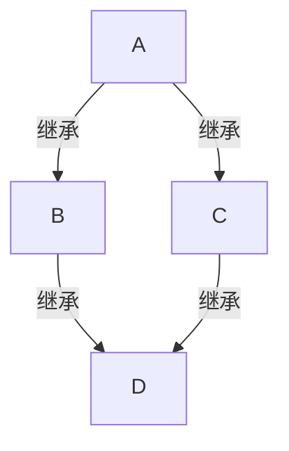

# Python语言基础

> Python 进阶书，有利于理解 Python 语言，介绍的基本都是高级的 Python 用法. 全面了解这个语言的能力边界。

在阅读该书前先温习下 Python 的 OOP。

Linux 环境下：Python 交互式终端清屏（Ctrl + Alt + L）

## 基础语法

介绍 Python 语言的基础语法，和其他语言类似，不过没有自增和自减。

注意！Python 中的一切都是对象！除了 array.array 中的数字！

```python
>>> type(1)
<class 'int'>
>>> type(1.2)
<class 'float'>
>>> type(.2)
<class 'float'>
>>> type(lambda x:x+2)
<class 'function'>
>>> type('hello')
<class 'str'>
```

### 分支结构

- if
- if-elif
- if-elif-else
- pass：没有特殊含义，只起到占位的作用，不影响程序的结构，主要是为了保证语法的完整性。

```python
num = 20
if num > 50:
    pass
```

- break，和其他语言一样，是退出最内层的整个循环

```python
for item in range(0,100):
    if item > 5:
        break # 会退出循环
```

- continue，和其他语言一样，跳出当前循环，继续执行下一次循环。

### 循环结构

- for
- while
- for-esle：仅当 for 循环运行完毕时（即 for 循环没有被 break 语句中止）才运行 else 块
- while-else：仅当 while 循环因为条件为假值而退出时（即 while 循环没有被 break 语句中止）才运行 else 块。

- else 还可以和 try 一起使用：仅当 try 块中没有异常抛出时才运行 else 块。[官方文档](https://docs.python.org/3/reference/compound_stmts.html)还指出，else 子句抛出的异常不会由前面的 except 子句处理。

使用 for 循环计数，当 for 循环正常执行完毕，没有被 break 中断则输出计数完毕

```python
total = 0
for item in range(1, 101):
    total += item
else:
    print(f"计数完毕 total {total}")
```

使用 while-else 改写上面的例子

```python
total = 0
index = 1
while index < 101:
    total += index
    index += 1
else:
    print(f"计数完毕 total {total}")
```

### 数据结构

#### 列表

可以保存不同的数据，会自动扩容

```python
empty_data = []
data = [1,2,3,True,'hello']
data.append('world')
```

<b>列表的访问和遍历</b>，重点记忆下 `enumerate` 的用法

```python
data = [1,2,3,True,'hello']
data[0]
data[0] = 100
data[-1] # 访问最后一个元素
for it in data:
    print(it)
    
for index in range(len(data)):
    print(it)
    
for index, ele in enumerate(data):
    print(index, ele)
```

<b>列表的 + 运算</b>

```python
# 合并列表: 通过 + 实现
list1 = [12,34,6,8,3.13]
list2 = ["荔枝","龙眼","桂圆","榴莲","芒果"]
print(list1,list2)
# 通过 + 实现列表的合并 list + list1， + 会创建一个包含 list 和 list1 元素的新列表
list3 = list1 + list2
```

<b>列表元素重复</b>，是复制地址，让重复的元素指向同一个对象

```python
# 重复输出列表中的元素: 通过 * 实现
l = [1,2,3]
ll = l * 4
print(list1)
print(id(ll[0]), id(ll[3])) # 同样的地址
```

<b>元素判断</b>，判断元素是否在列表中 `in`

```python
#判断指定元素是否在列表中,使用成员运算符检查 in 和 not in 返回值是一个布尔类型 True 和 False
list1 = [12,34,4.12,"haha","lele","hehe"]
print(12 in list1)   # True
```

<b>切片运算</b>，列表可以通过切片来拷贝列表中的数据，切片拷贝使用的是浅拷贝。

```python
list2 = [13,45,2,35,7,9]
# 语法: 列表名[开始下标:结束下标]   特点: 前闭后开  包含开始下标的元素不包含结束下标的元素
print(list2[2:4]) # 2 35，不会切到 index 4 的位置
print(list2[2:-1]) # index2 到 index末尾，结果为 2 35 7
```

验证切片运算是浅拷贝

```python
a = [1,2,3,4]
b = a[:2]
id(a[1]) # 140364673481040
id(b[1]) # 140364673481040
# 地址都一样，拷贝的只是地址值（Python 中数字也是对象）
```

尝试修改不可变对象时会创建一个新的对象，不会影响原对象

```python
b[1] = 200
b # [1, 200]
a # [1, 2, 3, 4]
```

<b>追加多个元素</b>

```python
list2 = [13,45,2,35,7,9]
list2.append(1) # 一次只能追加一个对象
list2.expand([1,2,3,]) # 会依次把 1 2 3追加进去，而非追加一整个列表
```

<b>作为 stack</b>

```python
data = [1,2]
data.append(3) # 1 2 3
data.pop() # 3
```

#### 元组

与列表基本一样，但是元组不可变；元组不可变指的是元组中对象（元素）的地址不可以被修改（变量存储的都是地址值）。

```python
data = (1,2,3)
data[0] = 10 # 错误
data = (1,2,[3])
data[2].append(4) # 正确，[3] 的地址并未改变
```

创建只有一个元素的元组，要记得加逗号哦

```python
data = (1,)
```

也可以使用 + * 来创建新的元组

```python
tup1 = (1,2)
tup2 = (3)
tup3 = tup1 + tup2
tup4 = tup3 * 3
```

除了创建方式和不可变，其他都和列表一样。

#### 字典

其他语言中的 `哈希表 / map`，key-value 形式，同样的 key 最好是不可变的！

<b>创建字典</b>

```python
dict1 = {}
dict2 = dict(price=12, num=20, category='food')

# key-value 数量可以不匹配，以数量少的为准
dict3 = dict( zip(['k1','k2'], ['v1','v2']) )

dict4 = dict( [('k1','v1')] )
```

dict 是内置类型的字典，非 python 实现的

<b>访问元素</b>

- `[]` 访问不存在的报错
- `get` 返回 None

```python
dict2 = dict(price=12, num=20, category='food')
dict2['name'] # error
dict2.get('name') # None
```

<b>遍历</b>

遍历所有 key / value 就不写了。

```python
dict2 = dict(price=12, num=20, category='food')
for index, key in enumerate(dict2):
    print(index, key)

for key, value in dict2.items():
    print(key, value)
```

<b>常用操作</b>

合并 / 删除字典中 key-value

```python
d1 = {'k1':1}
d2 = {'k2':[2]}
d1.update(d2) # {'k1': 1, 'k2': [2]}
d1['k2'].append(3) # {'k2': [2, 3]}
d2 # {'k2': [2, 3]}

d1.pop('k1')
d1.popitem() # 随机删除一个

d1.clear()
```

#### 集合

不允许有重复的元素，其他语言的 set，可以进行交并差，非常有用！

```python
s = set()
s = {1,4,4} # 只有 1,4 两个元素
```

- add 添加元素
- update 一次追加多个，以列表的形式追加
- pop 删除元素，set 是无序的
- remove('指定元素')，不存在会报错
- discard('指定元素')，不存在不会报错！

<b>集合关系的运算</b>

- 差集合，`-`
- 并集合，`|`
- 交集合，`&`
- 包含判断，`set1 > se2`，判断 set1 是否包含 set2 中的所有元素

#### stack & queue

list 可以作为 stack 使用；queue 则是使用的 `collections.deque`

#### 赋值和深浅拷贝

<b>赋值</b>

赋值本身上是将对象的地址赋值给其他变量。

```python
l1 = [1,2,3]
l2 = l1 # 只是让 l2 也指向 l1 列表
l2 = [3] # l2 是 3，l1 依旧是 1，2，3 
```

<b>浅拷贝</b>

浅拷贝即拷贝的是对象的引用

```python
import copy

class D:
    def __init__(self, value):
        self._value = value

l = [D(1), D(2)]
l2 = copy.copy(l)
print(l[0],l2[0]) # 地址值一样
```

Python 中的对象分为可变和不可变，拷贝对象的时候都是拷贝地址值。

但是对于不可变对象，在尝试修改不可变对象时，会创建一个新的对象，不会影响原对象。<span style="color:blue">因此，不管是深拷贝还是浅拷贝，对于不可变对象来说都是一样的。</span>

<b>深拷贝</b>

- 深拷贝性能开销比较大，因为都是创建的新对象，而非复制引用。
- copy 下的 deepcopy 可以解决一部分循环引用的拷贝问题

```python
import copy

class D:
    def __init__(self, value):
        self._value = value

l = [D(1), D(2)]
l2 = copy.deepcopy(l)
print(l[0],l2[0]) # 地址值不一样！！
```

#### 布尔类型

- `'' / [] / {} / () / 0 / 0.0 / None` 转为布尔类型时为 False
- 布尔类型参与运算时，True 转为 1，False 转为 0
- 空值：None，一种特殊的数据类型

### 可变与不可变⭐

int、float、str、bool、元组是不可变的，即，这些变量的地址值不会发生改变，如果发生改变，会直接创建一个新的对象。

元素中可以存储不可变对象。

### 字符串

- r 取消转义字符
- f 格式化输出字符串，支持 {}
- b 表示当前数据类型是 bytes 类型
- u 表示后续内容以 unicode 格式进行编码，一般用于中文前面

```python
print('hello \n world')  # 有换行
print(r'hello \n world') # 无换行

num = 100
print(f'num = {num}')
```

<b>格式化输出</b>

- % 占位符
- %d 整数
- %s 字符串
- %f 小数
- %.3f 保留三位小数

```python
n=1
m=2
print("n = %d" % n)
print("n=%d, m=%d" % (n,m)) # n=1, m=2
```

<b>运算</b>

也支持切片、+ * 拼接和重复，下标访问，各种迭代

<b>常见操作</b>

- "hello".count('ll') 统计 ll 出现的次数
- "hello ccll".center(50) 填充，用到时在查
- 左右填充啥的，用到再查
- 其他大小写、长度，首字母大小写，大小写字母互换就不记了

### 函数

先定义在调用，不能在定义前使用，<span style="color:blue">没有自动提升函数定义位置的功能（C / C++ 现在有这功能吗？）</span>

调用符号 `()`，Python 中的函数可以被赋值给其他变量，然后通过 `()` 进行调用。

```python
def say():
    print(1)
```

#### 参数

Python 的函数参数有必需参数、默认参数、不定长参数

<b>必需参数</b>

```python
def say(n1, n2):
    return n1+n2
```

<b>默认参数</b>

```python
def say(name, age=18):
    return name + str(age)
```

<b>不定长参数</b>

- `*args`：用来接受多个位置参数，得到的参数形式是一个元组
- `**kwargs`：用来接受多个关键字参数，得到的参数形式是一个字典

`*args` 形式

```python
def sums(origin, *args):
    total = origin
    for item in args:
        total += item
    print(type(args))  # <class 'tuple'>
    print(total)

sums(100, 1, 2, 3, 4)
```

`**kwargs` 形式

```python
def get_dict(**kwargs):
    print(kwargs)
    return kwargs

get_dict(a=1, b=2, c=3) # {'a': 1, 'b': 2, 'c': 3}
```

注意，可变长参数要放在最后面！`*args / **kwargs` 都有的话 `*args` 在前。

#### 位置参数和关键字参数⭐

位置参数是指在函数定义和调用时，参数的顺序是固定的。例如，如果我们有一个函数 `def add(a, b)`，那么在调用这个函数时，我们必须按照定义时的顺序提供参数，如 `add(1, 2)`。

关键字参数则允许我们在调用函数时，通过参数名来指定参数值，而不需要关心参数的位置。例如，我们可以这样调用 `add` 函数：`add(b=2, a=1)`。这种方式使得函数调用更加灵活，特别是在有很多参数或者某些参数的顺序容易混淆的情况下。

需要注意的是，关键字参数必须跟在位置参数后面，而且不能有重复的关键字。此外，如果一个参数在函数定义时设置了默认值，那么这个参数就可以被省略，或者在调用时重新赋值。

举个例子：

```python
def example_func(param1, param2='default'):
    print(f"param1: {param1}, param2: {param2}")

example_func('value1')  # param1: value1, param2: default
example_func('value1', 'value2')  # param1: value1, param2: value2
example_func(param2='value2', param1='value1')  # param1: value1, param2: value2
```

在上述例子中，`param1` 是一个位置参数，而 `param2` 是一个带有默认值的关键字参数。在函数调用时，我们可以通过不同的方式来传递这些参数。

#### * 的作用⭐

`*` 可以用来解包，也可以用来限定函数传参是必须指定形参名称

```python
def needs(name, *, age):
    print(name, age)
# 不指定 age 会报错 TypeError: needs() takes 1 positional argument but 2 were given

needs('hello',18) # 错误 age 不能作为位置参数

needs("hello", age=18)
```

#### / 的作用

在 Python 3.8 及以后的版本中，引入了一种新的语法，即在函数定义中使用斜杠（/）来指示哪些参数只能通过位置传递，而不能作为关键字参数。这被称为“仅限位置参数”

```python
def func(a, b, /, c, d):
    print(a, b, c, d)
    
>>> func(1,2,c=3,d=4)
1 2 3 4
>>> func(1,2,3,d=4)
1 2 3 4
>>> func(1,2,d=3,c=4)
1 2 4 3
```

在这个例子中，a 和 b 是仅限位置参数，而 c 和 d 既可以通过位置也可以通过关键字传递。

#### 嵌套

函数套函数。什么时候使用嵌套函数呢？

- 闭包，定义装饰器的时候
- 函数很长，并且包含多个相关的子任务，并且不希望这些代码向外暴露 / 污染全局命名空间，那么可以将这些子任务定义为嵌套函数，以提高代码的可读性和可维护性

```python
def outer():
    def inner():
        print("inner")

    inner()
    print("outer")
    inner()
```

#### 匿名函数

没有定义名称的函数 --> lambda 函数

- lambda 只是一个表达式，比普通函数简单
- lambda 一般情况下只会书写一行，包含参数 / 实现体 / 返回值

使用 lambda 计算三数之和

```python
# 定义了一个没有名称的函数，但是用变量 fn1 持有了函数
fn1 = lambda x, y, z: x + y + z
print(fn1(1, 2, 3))

# 给定一个 base, 然后以 base 为基础计算三数之和
fn2 = lambda x, y, z, base=100: x + y + z + base
print(fn2(1, 2, 3))
```

#### 回调函数

将函数作为参数传递过其他函数使用

```python
def base(n, fun):
    return fun(n) + n

print(base(10, lambda n: n ** 2)) # 110
```

#### 偏函数

固定函数的某些参数 `functools.partial`，避免一直传入重复的值。

固定 int 函数的 base 值

```python
from functools import partial

int2 = partial(int, base=2)
print(int2('100'))
```

### 闭包和装饰器⭐

#### 闭包

如果在一个函数的内部定义另外一个函数，外部的函数叫做外函数，内部的函数叫做内函数。

如果在一个外部函数中定义一个内部函数，内部函数引用外部函数的变量，并且外部函数的返回值是内部函数，就构成了一个闭包，则这个内部函数就被称为闭包 <b>[closure]</b>

<b>实现函数闭包的条件</b>

- 必须是函数嵌套函数
- 内部函数引用外部函数的变量
- 外部函数必须返回内部的函数

<b>一个典型的闭包</b>

```python
def outer():
    data = [0, 1, 2]
	# 闭包一定是内部函数引用了外部的变量
    def inner(insert):
        data.append(insert)

    return inner
```

#### 装饰器

在代码运行期间，可以动态增加函数功能的方式，被称为装饰器【Decorator】可通过闭包函数实现

也就是说，在不修改原函数的基础上，给原函数增加功能

好处：在团队开发中，如果两个或者两个以上的程序员会用到相同的功能，但是功能又有细微的差别，采用装饰器：相互不影响，代码简化

<b>简单装饰器</b>

```python
def test():
print("hello")
# 需求: 给上面的函数test增加一个功能, 输出 I am fine
```

```python
def test():
    print("hello")

def deco(fun):
    # 内部函数引用了外部的变量
    def inner():
        fun()
        print("I am fine")
    return inner

print(test.__name__) # test
test = deco(test)
print(test.__name__) # inner
test() # hello \n I am fine
```

简写装饰器，将装饰器放在被装饰函数上方

```python
@deco
def test():
    print("hello")
```

#### 不定长参数装饰器

```python
def mul_param(func):
    def inner(*args):
        print("result = ", end=' ')
        func(*args)
    return inner

@mul_param
def add(one, two):
    print(one + two)

@mul_param
def sums(one, two, three):
    print(one + two + three)

add(1, 2)
sums(1, 2, 4)
```

如果需要返回值，根据实际业务给出对应的返回值即可，假定上面的方法不是打印，而是要返回计算结果。

```python
def mul_param(func):
    def inner(*args):
        print("result = ", end=' ')
        return func(*args)
    return inner

@mul_param
def add(one, two):
    print(one + two)
    return one + two

add(1, 2)
sums(1, 2, 4)
```

也可以多个装饰器作用在同一个函数上。

#### 作用域分类

局部作用域：L【Local】

函数作用域：E【Enclosing】将变量定义在闭包外的函数中

全局作用域：G【Global】

內建作用域：B【Built-in】在 Python 内置函数中，Python 解释器自己定义的作用域

#### global & nonolocal

global：当内部作用域【局部作用域，函数作用域】想要修改全局变量的作用域的时候。

<b>global</b>

```python
global_num = 10

def test_global():
    print(global_num) # 正常访问
```

再看下面的例子

```python
global_num = 10

def test_global():
    print(global_num) # 报错，提示未定义就使用
    global_num = 10 
```

函数内部 `global_num = 10` 是在函数内部的作用域创建了一个局部变量，而非修改全局变量，如果想修改全局变量的值，要这么写。

```python
global_num = 10

def test_global():
    global global_num
    print(global_num)
    global_num = 10
```

<b>nonlocal：主要用于闭包函数中。</b>

```python
def outer():
 x = 19
 def inner():
     # x = 23
     # global x   # 使用的是 x = 15
     nonlocal x  # 这时候使用的变量是 x = 19
     x += 1
     print("inner:",x)
 return inner
```

如果外函数的局部变量是不可变对象（x=19），当内函数企图修改它的值，此时会创建一个新的对象，这个新对象是位于内函数的局部变量，内函数调用完毕就消失了。

如果想修改后的 x 不变成局部变量，可以使用 nonlocal 让其变成自由变量。

<span style="color:blue">闭包中的内函数能一直使用外函数的局部变量就是因为外函数的局部变量变成了自由变量，绑定在了内函数上。</span>

### 递归

递归中存在隐式循环，如果隐式循环的次数过多，会出现内存泄漏（栈溢出）。在 Python 中默认的递归的次数的限制是 1000 次。

### 推导式/生成式⭐

<b>列表推导式</b>

生成 0~1000 的偶数列表

```python
data = [item for item in range(1001) if item % 2 == 0]
```

<b>字典推导式</b>

生成 0~10 key-value 一致的字典

```python
data_dict = {i:i for i in range(11) }
data_dict = {i:i*2 for i in range(11) }
```

<b>集合推导式</b>

生成 0~10 组成的集合

```python
data_set = {item for item in range(11) }
```

### 生成器⭐

生成器是用来生成数据的，不同于列表一次生成所有数据，生成器中的数据是一个一个产生的，可以节省内存

- 可以 for 循环迭代
- 可以用 next 去生成器的下一个元素，没数据了会输出 StopIteration

生成器可以用生成器表达式和生成器函数产生

- 生成器表达式语法和推导式类似，不过 `[]` 换成了 `()`
- 生成器函数包含 yield 关键字

使用生成器生成 0 ~ 100 的偶数

<b>生成器表达式</b>

```python
data = (item for item in range(0,101) if item%2 == 0 )
```

<b>生成器函数--生成生成器的函数</b>

```python
def gen():
    for item in range(0, 101):
        if item % 2 == 0:
            yield item

# 得到一个生成器
data = gen()
print(next(data))
print(next(data))
print(next(data))
```

### 迭代器⭐

可迭代对象【实体】，可以直接作用于 for 循环的实体【Iterable】

可以直接作用于 for 循环的数据类型：

​	a.list,tuple,dict,set,string	

​	b.generator【() 和 yield】

isinstance：判断一个实体是否是可迭代的对象

```python
# 使用可迭代对象   需要导入collections.abc
from collections.abc import Iterable

# 通过 isinstance:判断一个实体是否是可迭代的对象	   返回值是bool类型,True或者False

from collections.abc import Iterable
# 可迭代对象:能够被 for 循环遍历的实体就是可迭代对象

print(isinstance([], Iterable))   # True
print(isinstance((), Iterable))   # True
print(isinstance({}, Iterable))   # True
print(isinstance("loha", Iterable)) # True
# 生成器
print(isinstance((i for i in range(1,10)),Iterable))  # True

# 列表\元组\字典\字符串\生成器  都是可迭代对象

print(isinstance(11,Iterable))  # False
print(isinstance(True,Iterable))  # False

# 整型\浮点型\布尔类型 都不是可迭代对象
```

可迭代对象可以通过 Iter(可迭代对象) 变成迭代器。

## 常用库

### random

random.choice([x,x,x,x]) # 从列表中随机抽取一个元素

random.uniform(0, 1) # 随机生成一个指定范围内的实数,结果是浮点数

random.shuffle([x,x,x]) # 将列表中的元素进行随机排序，如果是自定义的对象，要实现 setItem 方法哦

### os

平时用到比较多，不过也没什么好记的，用到查就可以了，学 API 用法是最没意思的。

```python
import os

print(os.curdir) # 当前目录

print(os.getcwd())	# 获取当前路径

print(os.path.join('D:/', 'test.py')) # 拼接路径

print(os.path.split(r'C:\software\code\base\main.py'))# 拆分目录和文件名

print(os.path.splitext(r'C:\software\code\base\main.py'))# 拆分文件和后缀名
print(os.path.getsize(r'C:\software\code\base\main.py'))# 获取文件大小
```

一个有意思的 API os.walk，递归遍历指定文件夹下的所有目录和文件

```python
import os

for root, dirs, files in os.walk('example_dir'):
    print(root)  # 当前目录路径
    print(dirs)  # 当前目录下的子目录列表
    print(files)  # 当前目录下的文件列表
```


| 函数                 | 描述                                       |
| -------------------- | ------------------------------------------ |
| `os.listdir()`       | 获取指定路径下的文件夹和文件（是一个列表） |
| `os.mkdir()`         | 创建目录（目录存在，不能创建）             |
| `os.makedirs()`      | 创建多层目录                               |
| `os.rmdir()`         | 删除目录                                   |
| `os.remove()`        | 删除文件                                   |
| `os.rename()`        | 重命名文件或者重命名文件夹                 |
| `os.path.join()`     | 拼接路径                                   |
| `os.path.split()`    | 拆分路径                                   |
| `os.path.splitext()` | 拆分文件名和扩展名                         |
| `os.path.isfile()`   | 判断是否是文件                             |
| `os.path.isdir()`    | 判断是否是目录                             |
| `os.path.exists()`   | 判断文件或者文件夹是否存在                 |
| `os.path.getsize()`  | 获取文件大小                               |

### time

| 函数                | 描述           |
| ------------------- | -------------- |
| time.time()         | 获取当前时间戳 |
| time.perf_counter() | 精确的时间戳   |
| time.sleep(num)     | 休眠指定秒数   |

```python
import time

print(time.time() - time.time()) # 0
print(time.perf_counter() - time.perf_counter()) # 非 0
```

### datetime

对 time 的封装，获取日期，时间，计算时间很方便。

```python
import datetime
# 获取当前的日期对象
date = datetime.datetime.now()
print(date)

# 设置日期对象
date1 = datetime.datetime(year=2022,month=11,day=10,hour=10,minute=23,second=11)
print(date1)
print(type(date1))  # <class 'datetime.datetime'>
print(date1.year,date1.month,date1.day)  # 年  月   日
print(date1.hour,date1.minute,date1.second) # 时  分   秒
print(date1.date()) # 2022-11-10
print(date1.time()) # 10:23:11

# 将datetime.datetime类型转换为字符串

# strftime() 将日期对象转换为字符串
print(type(date1.strftime("%Y-%m-%d %H:%M:%S")))   # <class 'str'>
print(date1.strftime("%Y{}%m{}%d{}").format("年","月","日"))  #2022年11月10日

# strptime() 将字符串转换为日期对象
str1 = "2021-07-27 10:40:21"
print(type(datetime.datetime.strptime(str1,'%Y-%m-%d %H:%M:%S')))  # <class 'datetime.datetime'>

# timestamp()  日期对象转换为时间戳 1668046991.0

# fromtimestamp()  时间戳转换为日期对象
print(datetime.datetime.fromtimestamp(1668046991.0))  # 2022-11-10 10:23:11

# 时间差
d1 = datetime.datetime(2022,1,13)
d2 = datetime.datetime(2021,10,1)
print(d1 - d2)
print(d2 - d1)

# timedelta   代表两个日期之间的时间差
dt = datetime.timedelta(days=5,hours=8)
print(d1 + dt)  #  2022-01-18 08:00:00
print(d1 - dt)  #  2022-01-07 16:00:00

'''
# %y 两位数的年份表示（00-99）
# %Y 四位数的年份表示（0000-9999）
# %m 月份（01-12）
# %d 月内中的一天（0-31）
# %H 24小时制小时数（0-23）
# %I 12小时制小时数（01-12）
# %M 分钟数（00-59）
# %S 秒（00-59）
# %a 本地简化星期名称
# %A 本地完整星期名称
# %b 本地简化的月份名称
# %B 本地完整的月份名称
# %c 本地相应的日期表示和时间表示
# %j 年内的一天（001-366）
# %p 本地A.M.或P.M.的等价符
# %U 一年中的星期数（00-53）星期天为星期的开始
# %w 星期（0-6），星期天为星期的开始
# %W 一年中的星期数（00-53）星期一为星期的开始
# %x 本地相应的日期表示
# %X 本地相应的时间表示
# %% %号本身
'''
```

### hashlib 加密

```python
# 加密模块
import hashlib
'''
md5加密:不可逆的加密算法(只能加密不能解密)   明文和密文一一对应  加盐(随的字符串或者字符)
非对称加密:(公钥和私钥)  通常情况下,公钥用来加密  私钥用来解密  比如 RSA
对称加密:加密和解密使用同一个密钥  比如DES和AES
'''
m = hashlib.md5()
m.update('hello world'.encode()) 
print(m.hexdigest())

print(hashlib.md5("hello".encode).hexdigest())

# 对中文加密
data = "你好"
print(hashlib.md5(data.encode(encoding="UTF-8")).hexdigest())
```


## 包 & 模块⭐s

### 包

包-->文件夹，一种管理 Python 模块的命名空间的形式，采用"点语法" `os.path`

<b>包和文件夹之间的区别</b>

Python 的包中有一个特殊的文件 `__init__.py` 文件，里面可以不写任何内容，包含 `__init__.py` 文件的文件夹，编译器会将这个目录视为一个包。

```python
# 1.包:package
 # 包含了 __init__.py的文件的文件夹叫做包
```

### 模块

每个`.py`文件就被称为一个模块，通过结合包的使用来组织文件。

封装思路:  函数 => 类 => 模块 => 包 => 项目

<b>为什么要使用模块？</b>

- 提高了代码的可维护性
- 提高了代码的复用性【当一个模块被完成之后，可以在多个文件中使用】
- 引用其他的模块【第三方模块】  
- 避免函数名和变量的命名冲突

<b>导入方式</b>

```python
# 模块导入的方式:
# 第一种: import 模块名
# 第二种: from 模块名 import 模块名里面的方法
# 示例:
# 导入内置模块
import os
from random import randint

# 给模块起别名 as
import random as r
```

<b>模块的搜索顺序</b>

如果在当前目录则直接导入，没有则再搜索系统目录。

python 中的每个模块都有一个内置属性 `__file__` 可以查看模块的完整路径

这点上，没有 Java 的安全。Java 的类加载机制保证了类加载和类库调用的安全.

<b>`__init__.py` 的作用</b>

当我们导入一个包时，Python 会自动执行该包中的`__init__.py`文件，这意味着，如果我们需要校验当前包的运行环境是否符合要求，可以在 `__init__.py` 里写代码校验环境是否符合要求。

```python
例如，假设有以下的包结构：

mypackage/
    __init__.py
    one.py

# 在__init__.py文件中可以书写校验环境的代码，不符合要求就抛出异常
# 终于理解一些github开源算法的 init 文件了...

try:
    import numpy
    if numpy.__version__ < '1.21.4':
        raise RuntimeError("numpy version is too low")
except ModuleNotFoundError:
    raise RuntimeError("not found numpy")

from .one import say
```

同时，我们也可以在 `__init__.py` 中将包内部的模块和函数暴露给外部使用，而不需要显式地导入每个模块。

```python
例如，假设你有以下的包结构：

mypackage/
    __init__.py
    module1.py
    module2.py
在__init__.py文件中，你有这样的导入语句：

from .module1 import func1
from .module2 import func2

然后，在你的主程序中，你可以这样做：

import mypackage

mypackage.func1()  # 可以直接访问func1
mypackage.func2()  # 可以直接访问func2
```

### 安装模块

以安装 numpy 为例

- 安装 numpy ==  `pip install numpy`
- 卸载 numpy == `pip uninstall numpy`

## 面向对象基础

目前的三种主流编程方式

- 面向过程：根据业务逻辑从上到下写代码
- 函数式：将某功能代码封装到函数中，日后便无需重复编写，仅调用函数即可
- 面向对象：对函数进行分类和封装，让开发“更快更好更…”

### 面向对象概念

- 类就是一个模板，模板里可以包含多个函数，函数里实现一些功能
- 对象则是根据模板创建的实例，通过实例对象可以执行类中的函数

```python
# 创建Test类,python3 初始类都继承object类
class Test(object):
    # 类属性, 有点像 Java 的静态字段
    desc = "这是一个 Test 类"
    # 类中定义的函数也叫方法
    def demo(self):  # 类中的函数第一个参数必须是self
        print("self=", self)
        print("Method=", dir(self))
        print("Hello")

    def __init__(self, name, age):
        print("初始化变量啦！")
        self.name = name
        self.age = age

    def __new__(cls, *args, **kwargs):
        print("new 对象啦！")
        return super().__new__(cls)
    
# 根据类Test创建对象obj
obj = Test('jerry', 10)  # 类名加括号
obj.demo()  # 执行demo方法
# 获取一个实例的类名
print(obj.__class__.__name__)

# 判断一个对象是否拥有某个属性
if hasattr(obj, 'demo'):
    print("it has demo method")
else:
    print("have no method")
"""
new 对象啦！
初始化变量啦！
self= <__main__.Test object at 0x00000283D943F910>
Method= ['__class__', '__delattr__', '__dict__', '__dir__', '__doc__', ...,]
Hello
Test
it has demo method
"""
```

- Python 创建对象和初始化属性是分开来的，new 负责创建对象，init 负责初始化数据
- self 相当于其他语言的 this
- 和其他语言一样，对象在 heap，方法调用和局部变量在 stack 里，每个对象的成员变量会在堆空间中开辟一份自己的空间，相互之间互不影响

### 封装、继承、多态

- 封装，只暴露出我希望你看到的，不希望你看到的不暴露，封装的本质就是属性私有化的过程
- 继承，子类可以继承父类的内容；Python 支持多继承
- 多态，Python 不支持强类型语言的多态，采用的鸭子类型

### 封装

#### 私有化属性

<span style="color:blue">封装的本质就是属性私有化的过程，Python 的私有化可以使用 `__` 来实现，但是不推荐，Python 社区推荐的做法是使用 `_` 告诉程序员我希望它是私有的，你别用。</span>

<b>`__` 实现私有化</b>

```python
class Test:
    __name = 'unknow'

    def __init__(self):
        self.__age = 10


t = Test()
print(Test.__name)  # 'Test' has no attribute '__name'
print(Test._Test__name) # 可以获取到
print(t._Test__age)
```

`__` 防君子不防小人

#### set or get

Python 中可以像 Java 一样提供 setter / getter 方法访问属性吗？可以提供！但是 Python 更推荐使用 @property 装饰器实现类似于 setter / getter 的功能。

<span style="color:blue">Python 内置的 @property 装饰器可以将一个方法变成属性使用，使得这个方法可以被当作属性那样直接访问，而不是通过调用的方式。</span>

- @property 装饰器：简化 get 函数和 set 函数
- @property 装饰器作用相当于 get 函数，同时，会生成一个新的装饰器
- @属性名.settter，相当于 set 函数的作用

```python
class Dog:
    def __init__(self, name):
        self._name = name

    @property
    def name(self):
        return self._name

    @name.setter
    def name(self, new_name):
        self._name = new_name

jerry = Dog('jerry')
jerry.name = 'jerry2'
print(jerry.name)
```

### 类方法和静态方法

<b>类方法：</b>使用 @classmethod 装饰器修饰的方法，被称为类方法，可以通过类名调用，也可以通过对象调用，但是一般情况下使用类名调用

<b>静态方法：</b>使用 @staticmethod 装饰器修饰的方法，被称为静态方法，可以通过类名调用，也可以通过对象调用，但是一般情况下使用类名调用。

<b>静态方法其实和类没有任何关系，只是恰巧定义在了类中</b>

```python
class Animal():
 # 类属性
 name = "牧羊犬"
 # 对象属性
 def __init__(self,name,sex):
     self.name = name
     self.sex = sex

 ''' 
     类方法:
         1.通过@classmethod装饰器修饰的方法就是类方法
         2.类方法可以使用类名或者对象调用. 但是一般情况下使用类名调用类方法(节省内存)
         3.没有self,在类方法中不可以使用其他对象的属性和方法(包括私有属性和私有方法)
         4.可以调用类属性和其他的类方法,  通过cls来调用
         5.形参的名字cls是class的简写,可以更换,只不过是约定俗成的写法而已
         6.cls表示的是当前类
 '''
 @classmethod
 def run(cls):
     print("我是类方法")
     print(cls.name)
     print(cls == Animal) # cls表示的是当前类

 '''
     静态方法:
         1.通过@staticmethod装饰器修饰的方法就是静态方法
         2.通过类名或者对象名都可以调用静态方法  (推荐使用类名调用)
         3.静态方法形式参数中没有cls, 在静态方法中不建议调用(类属性\类方法\静态方法)
         4.静态方法一般是一个单独的方法,只是写在类中

 '''
 # 静态方法
 @staticmethod
 def eat():
     print("我是静态方法")

Animal.run()  # 类名调用类方法
Animal.eat()  # 类调用静态方法
# 创建对象
dog = Animal('中华土狗','公')
# dog.run()  # 对象调用类方法
```

### 类中的常用属性

<b>`__name__`</b>

通过类名访问，获取类名字符串；不能通过对象访问，否则报错

<b>`__dict__`</b>

通过类名访问，获取指定类的信息【类方法，静态方法，成员方法】，返回的是一个字典；

通过对象访问，获取的该对象的信息【所有的属性和值】，返回的是一个字典

<b>`__bases__`</b>

通过类名访问，查看指定类的所有的父类【基类】

```python
class Animal(object):
    def __init__(self,name,sex):
        self.name = name
        self.sex = sex

    def eat(self):
        print("吃")

animal = Animal("二哈","公狗")
# __name__ 通过类名访问获取当前类的类名,不能通过对象访问
print(Animal.__name__)   # Animal
# __dict__以字典的形式返回类的属性和方法 以及 对象的属性
print(Animal.__dict__)  # 以字典的形式显示类的属性和方法
print(animal.__dict__)  # 以字典的形式显示对象的属性

# __bases__ 获取指定类的父类  返回的是一个元组
print(Animal.__bases__)  # (<class 'object'>,)

```

<b>魔法方法 `__str__ / __repr__`</b>

`__str__` 是给终端用户看的，`__repr__` 是给直接使用 Python shell 的用户看的，如果实现了 `repr` 没有实现 `str`，print 的时候默认打印 `repr`.

```python
# 魔术方法: __str__() 和 __repr__()
class Person(object):
    def __init__(self,name,age):
        self.name = name
        self.age = age

    def swim(self):
        print("游泳的方法")

    # __str__() 触发时机: 当打印对象的时候,自动触发.  
    # 一般用它来以字符串的形式返回对象的相关信息,必须使用return返回数据
    '''
    def __str__(self):
        return f"姓名是:{self.name},年龄是:{self.age}"
        # print("姓名是:{self.name},年龄是:{self.age}")
    '''
    # __repr__()作用和 __str__()类似,若两者都存在,执行 __str__()
    def __repr__(self):
        return f"姓名是:{self.name},年龄是:{self.age}"
        # print("姓名是:{self.name},年龄是:{self.age}")

xiaohong = Person("小红",18)
print(xiaohong)
```

### 单根继承和多继承

#### 单根继承

只继承一个类

```python
class Animal(object):
    def eat(self):
        print('eat')

class Cat(Animal):
    def __init__(self, name):
        super().__init__()
        self.name = name
        self.breed = 'cat'

c = Cat('cat')
```

#### 多继承

Python 的多继承分新式类与经典类，Python3 默认都是新式多继承

```python
class Father(object):
    def __init__(self, surname):
        self.surname = surname

    def make_money(self):
        print("挣钱!")

class Mother(object):
    def __init__(self, height):
        self.height = height

    def eat(self):
        print("干饭!")

# 子类
class Son(Father, Mother):  # 子类继承多个父类时,在括号内写多个父类名称即可
    def __init__(self, surname, height, weight):
        # 继承父类的构造函数
        Father.__init__(self, surname)
        Mother.__init__(self, height)
        self.weight = weight

    def play(self):
        print("play!")

son = Son("jerry", "178", 140)
print(son.surname, son.height, son.weight)
son.make_money()
son.eat()
son.play()
```

### 多继承下的解析顺序

<b>此处解释下 Python 方法的解析顺序</b>

A 继承了 B 和 C，B 和 C 都继承了 D



按照 Python 方法的解析顺序（C3 线性化算法规则），解析顺序是 A B C D, B C 的共同子类会放到 A 继承的最后一个类（C）的后面

Z 继承了 A B C，A 继承了 AF，解析顺序是 A AF B C；因为只有 A 继承了 AF，所以 AF 放到 A 的后面

经典类，按 Python 方法的解析顺序查找，输出 'AF'

```python
class D:
    def bar(self):
        print('D.bar')

class C(D):
    def bar(self):
        print('C.bar')

class B(D):
    pass

class A(B, C):
    pass

a = A()
a.bar() # C

print(A.__mro__)  # A B C D object 的查找顺序
```

```python
class D:
    num = "D"

class C(D):
    num = "C"

class B(D):
    pass

class A(B, C):
    pass

print(A().num)  # C
print(A.__mro__)  # A B C D
```

### 鸭子型

鸭子型实现了和其他 OOP 语言的多态；阅读下面的代码。

尽管 People 不是 Animal 类型的，但是他和 Animal 方法都有 run 方法，可以正常运行，这就是鸭子型。

```python
class Animal(object):
    def run(self):
        print('Animal is running...')

class Dog(Animal):
    def run(self):
        print('Dog is running...')

def run_twice(animal):
    animal.run()

class People(object):
    def run(self):
        print("People is run...")

run_twice(Dog())  # Dog is running...
# people这个类却和animal没有任何关系，但是其中却有run这个方法
run_twice(People())  # People is run...

print(isinstance(Dog(), Animal))  # True
print(isinstance(Animal(), Dog))  # False
```

### 单例模式

Python 的模块就是天然的单例设计模式

<b>模块的工作原理</b>

import xxx 模块被第一次导入的时候，会生成一个 `.pyc` 文件，当第二次导入的时候，会直接加载 `.pyc` 文件，将不会再去执行模块源代码。

<b>使用模块的特点实现单例模式</b>

```python
# singleton.py
class Singleton:
    def __init__(self):
        self.value = None

    def set_value(self, value):
        self.value = value

    def get_value(self):
        return self.value

# 注意：这里我们不直接实例化Singleton类
```

<span style="color:blue">在其他地方导入这个模块，第一次导入模块时，会执行模块中的代码，但是也就只执行一次！而这一次恰好创建了实例对象！</span>

```python
from singleton import Singleton

s1 = Singleton()
s1.set_value('Hello, World!')

s2 = Singleton()
print(s2.get_value())  # 输出：Hello, World!

print(s1 is s2)  # 输出：True
```

在其他地方导入这个模块时，Python 会自动创建一个 `Singleton` 的实例。因此，无论我们导入多少次这个模块，得到的总是同一个 `Singleton` 实例。

<b>使用 `__new__` 实现单例模式</b>

```python
class Person(object):
    # 定义一个类属性,接收创建好的对象
    instance = None

    # __init__ 对象初始化属性时,自动触发
    def __init__(self, name):
        print("__init__")
        self.name = name

    @classmethod
    def __new__(cls, *args, **kwargs):
        print("__new__")
        # 如果类属性的instance == None表示 该类未创建过对象
        if cls.instance == None:
            cls.instance = super().__new__(cls)
        return cls.instance

p = Person("jerry")
p1 = Person("jerry")
print(p == p1) # True
# __new__():在创建对象的时候自动触发
# __init__():在给创建的对象赋值属性的时候触发.dd
```

## 面向对象提高

### 类中的字段

类中的字段包括：普通字段和类字段（类字段与其他语言中的静态变量相似），他们在定义和使用中有所区别，而最本质的区别是内存中保存的位置不同

- <b>普通字段属于对象</b>
- <b>类字段属于类</b>

```python
class Province:
    # 静态字段
    country = '中国'

    def __init__(self, name):
        # 普通字段
        self.name = name

# 直接访问普通字段
obj = Province('河北省')
print(obj.name)

# 直接访问静态字段
print(Province.country)
```

### 类中的方法

类的方法包括：普通方法和类方法，类方法要用 classmethod 装饰器修饰

```python
class MyClass:
    # 这是一个普通方法
    def my_instance_method(self):
        print("This is an instance method.")

    # 这是一个类方法
    @classmethod
    def my_class_method(cls):
        print("This is a class method.")

# 创建一个类的实例
my_instance = MyClass()
# 调用普通方法
my_instance.my_instance_method("Hello", "World")
# 调用类方法
MyClass.my_class_method("Hello", "World")
```

还有抽象方法和静态方法

- 抽象方法类似于 Java 中的抽象方法，Python 的抽象方法需要结合 abc.ABC 和 @abc.abstractmethod 使用
- 静态方法其实就是与类无关的普通方法，只是写在了类里面，需要用到装饰器 @staticmethod

### 类中的属性

Python 中的属性是普通方法的变种，属性有两种定义方式，一种是通过装饰器来定义，一种是静态字段

- 装饰器 即：在方法上应用装饰器
- 类字段 即：在类中定义值为 property 对象的静态字段

装饰器方式：在类的普通方法上应用 @property 装饰器

类字段方式：创建值为 property 对象的静态字段

<b>装饰器方式</b>

```python
class Goods(object):
    def __init__(self):
        self._prices = 100
        self._name = 'milk'

    @property
    def price(self):
        return self._prices, self._name

    @price.setter
    def price(self, value):
        assert len(value) == 2, ValueError('should contains two value')
        self._prices = value[0]
        self._name = value[1]


obj = Goods()
print(obj.price)
obj.price = (200, 'jack')
print(obj.price)
```

属性的定义、调用和赋值要注意一下几点

- 定义时，在普通方法的基础上添加 @property 装饰器；
- 定义时，属性仅有一个 self 参数
- 赋值时，只允许传递一个变量，如果有多个值，可以处理成元组、列表或其他可包含多个值的对象
- 调用时，无需括号

<b>类字段方式</b>

```python
class Foo(object):
    def get_bar(self):
        return 'hello'

    def set_bar(self, value):
        print('Set bar to', value)

    BAR = property(get_bar, set_bar)


obj = Foo()
print(obj.BAR)  # 自动调用get_bar方法，并获取方法的返回值
obj.BAR = 'world'  # 自动调用set_bar方法，并传入参数'world'
print(obj.BAR)  #
"""
hello
Set bar to world
hello
"""
```

property 的构造方法中有个四个参数，要用的时候点击源码看注释即可。

### 实例属性与类属性的关系

实例属性无法更改类属性的引用，只会给自己的实例绑定一个实例属性，具体请看代码。

```python
class A(object):
    x = 7	# 定义了一个类属性

f1 = A()
f2 = A()

f1.x += 7 # 这里是给实例 f1 绑定了一个实例属性，不是更改类属性哦

print(A.x)  # 7
print(f1.x)  # 14
print(getattr(f1, 'x'))  # 14
print(f2.x)  # 7
```

如果类属性和实例属性重名了，可以使用 getattr 访问指定对象的类属性。

<b>特殊的类属性</b>

|        类属性        | 说明 |
| ----------------- | -------- |
| `class.__class__` | 类的类型 |
|  `class.__bases__` |    父类名称      |
|    `class.__dict__` |     类所有属性     |
|  `class.__module__` |     类所在的模块     |
| <b>特殊的实例属性</b> | <b>说明</b> |
| `__class__` | 实例所对应的类 |
| `__dict__` | 实例的属性 |

### 公有与私有

自定义的私有成员命名时，前两个字符是下划线（Python 语言内部规定的魔法方法除外）

- 如果想一个字段，方法变成私有，`__name` 在前面加两个下划线即可
- 方法也是一样

但是这种方式防君子不防小人，可以强制访问私有字段的，如访问私有字段 `__name`，`obj._className__name`

<b>一般，Python 社区约定 `_` 开头的表示私有，告诉大家不要试图去直接访问、修改、使用它。</b>

### 魔法方法

<b>特殊的类的成员</b>

`__module__ 和 __class__`

- `__module__` 表示当前操作的对象在那个模块
- `__class__` 表示当前操作的对象的类是什么

`__init__`

- 构造方法，类创建完对象后，初始化对象的状态，执行 `__new__` 后自动触发执行，Python 的解释器会在创建类的实例后自动调用 `__init__` 方法
- dog = Dog() 的返回值实际上是接收的 `__new__` 的返回值

```python
class MyClass:
    def __new__(cls, arg1, arg2):
        instance = super().__new__(cls)
        instance.x = arg1
        instance.y = arg2
        # 无需手动调用__init__方法, Python 解释器自己会调用
        # instance.__init__(arg1, arg2)
        print(instance)
        return instance

    def __init__(self, arg1, arg2):
        print("init~")
        self.z = arg1 + arg2

obj = MyClass(1, 2)
print(obj)
```

`__del__`

- 析构方法，当对象在内存中被释放时，自动触发执行

<b style="color:blue">`__call__`</b>

- callable，让实例对象可以像方法一样调用

```python
class MyClass:
    def __init__(self, x):
        self.x = x

    def __call__(self, y):
        return self.x + y

obj = MyClass(10)
print(obj(5))  # 输出：15
```

`__dict__`

- 类或对象中的所有成员

```python
class Province:

    country = 'China'

    def __init__(self, name, count):
        self.name = name
        self.count = count

    def func(self, *args, **kwargs):
        print('func')


# 获取类的成员，即：静态字段、方法、
print(Province.__dict__)

obj1 = Province('HeBei', 10000)
print(obj1.__dict__)
# 获取 对象obj1 的成员
# 输出：{'count': 10000, 'name': 'HeBei'}

obj2 = Province('HeNan', 3888)
print(obj2.__dict__)
# 获取 对象obj2 的成员
# 输出：{'count': 3888, 'name': 'HeNan'}
```

` __getitem__ / __setitem__ / __delitem__`

- 用于索引操作，如字典。以上分别表示获取、设置、删除数据
- 实现了 getitem 相当于实现了序列的一部分协议，可以被迭代，为什么呢？
  - 如果被迭代的对象没有实现 `__iter__` 方法，但是实现了 `__getitem__` 方法，Python 会创建一个迭代器（iter 包装一下那个对象），尝试按顺序（从索引 0 开始）获取元素。


```python
class Foo(object):
    def __getitem__(self, key):
        print('__getitem__', key)

    def __setitem__(self, key, value):
        print('__setitem__', key, value)

    def __delitem__(self, key):
        print('__delitem__', key)


obj = Foo()

result = obj['k1']  # 自动触发执行 __getitem__
obj['k1'] = 'tony'  # 自动触发执行 __setitem__
del obj['k1']  # 自动触发执行 __delitem__

print(obj['k1'])  # 自动触发执行 __getitem__
```

`__iter__`

- 用于迭代器，之所以列表、字典、元组可以进行 for 循环，是因为类型内部定义了` __iter__`

```python
class Foo(object):
    pass

class FooX(object):
    def __iter__(self):
        pass

objx = FooX()

class FooY(object):
    def __init__(self, sq):
        self.sq = sq

    def __iter__(self):
        return iter(self.sq)

objy = FooY([11, 22, 33, 44])

for i in objy:
    print(i)

# 11
# 22
# 33
# 44

# 也可也写成
bj = iter([11, 22, 33, 44])

for i in bj:
    print(i)
```

[流畅的python学习笔记-第7章扩展内容 - python深度学习 - SegmentFault 思否](https://segmentfault.com/a/1190000021528367)

## 异常处理

### 异常

当程序在执行的过程中遇到异常，程序将会终止在出现异常的代码处，代码不会继续向下执行

| 异常              | 说明                             |
| ----------------- | -------------------------------- |
| NameError         | 变量未被定义                     |
| TypeError         | 类型错误                         |
| IndexError        | 索引异常                         |
| KeyError          |                                  |
| ValueError        |                                  |
| AttributeError    | 属性异常                         |
| ImportError       | 导入模块的时候路径异常           |
| SyntaxError       | 代码不能编译                     |
| UnboundLocalError | 试图访问一个还未被设置的局部变量 |

### 捕获异常

- try-exception
- try-exception-else
- try-except-finally

```python
# 第二种方式:(常用)
try:
    num = 12 / 0
    print(num)
except Exception as e:
    print(e,type(e))  #division by zero <class 'ZeroDivisionError'>
print("haha")
```


```python
try:
    num = 24 / 1
    print(num)
except Exception as e:
    print("报错了,走这里")
else:
    print("不报错,走这里")

print("lele")
```


```python
try:
    num = 24 / 0
    print(num)
except Exception as e:
    print("报错了,走这里")
finally:
    print("不管你上面对与错,都要来我这报道!")
print("嘿嘿!")
```

### 抛出异常

如果满足特定业务需求时，希望抛出异常，推荐使用 raise 主动抛出一个指定的异常对象、

```python
try:
    num = input("请输入一个数字:")
    # 判断用户输入的是否是数字:
    if num.isdigit():
        raise ValueError("num必须是一个数字!")
except Exception as e:
    print("引发异常", repr(e))
```

密码长度不符合要求则抛出异常

```python
def throw_exception():
    pwd = input("please input you password")
    if len(pwd) >= 8:
        return
    exception = Exception("捕获异常,密码长度不够")
    raise exception
    
if __name__ == '__main__':
    throw_exception()
```

### assert

assert 断言，断言正确继续运行，错误则终止运行

```python
total = 101
assert total > 100, "错误, total 不大于100"
print("success")
```

### 自定义异常

自定义异常最重要的是打印的内容（`__str__` 函数），让别人知道出现了什么异常。

```python
class MyException(Exception):
    def __init__(self, name, code):
        self.name = name
        self.code = code

    def __str__(self):
        return f'This is {self.name} Exception, error code is {self.code}'


try:
    raise MyException("自定义异常", 1001)
except MyException as e:
    print(e)
```

## 函数参数 & 拷贝⭐

### 函数参数

| 参数类型                  | 说明                                          |
| ------------------------- | --------------------------------------------- |
| def func( arg1, *arg2 )   | 可变长参数，带*号的参数会以元组的形式导入     |
| def func( arg1, **arg2 )  | 可变长参数，带**号的参数以字典的形式传入      |
| def func( a , b , * , c ) | 单独出现* 后的参数必须使用关键字传入，看 code |

### 拷贝

<b>不可变</b>

了解拷贝细节前需要先了解下可变对象与不可变对象。

- 不可变数据类型：数据的值发生改变，是开辟了一个新的地址空间，存储改变后的值，原有值还在老空间中呆着（如果没被 `gc` 的话）~
- 可变数据类型：数据的值发生改变，是在原有地址空间中的改变~

区别赋值运算与深浅拷贝

<b style="color:green">赋值运算与深浅拷贝无关</b>【l1 和 l2 是同一个指向】

```python
l1 = [1,2,3,[22,33]]
l2 = l1
l2.append(666)
print(l1) # output [1,2,3,[22,33],666]
print(l2) # output [1,2,3,[22,33],666]
```

<b>深拷贝与浅拷贝</b>

<span style="color:green">浅拷贝</span>

列表是一个个槽位，每个槽位存储的是该对象的内存地址。

```python
l1 = [1,2,[22,33]]
l2 = l1.copy()

l1[2].append(44) 
print(l1) # [1,2,[22,33,44]]
print(l2) # [1,2,[22,33,44]]

# python存在不可变数据类型，当不可变数据类型对应变量的值发送了改变，那么内存地址值就改变了,指向的就不是同一块内存地址空间了~。

l1 = [1,2,[22,33]]
l2 = l1.copy()
l1[0] = 6
# int类型是不可变的，它l1中的0位置指向的内存空间以及变了。l2还是指向原来的数据
print(l1) # [6,2,[22,33]]
print(l2) # [1,2,[22,33]]
```

<span style="color:green">浅拷贝小结</span>

浅拷贝会在内存中新开辟一个空间，存放这个 copy 的列表，但是列表里面的内容还是沿用之前对象的内存地址。

<span style="color:green">深拷贝</span>

全新的副本，互不影响~（可变数据类型在内存中重新创建一份，而不可变沿用之前的，为什么不可变可以沿用之前的？看 Java 不可变类的源码就知道了~）

```python
>>> l1 = [1,2,3,[4,4,4]]
>>> import copy
>>> l2 = copy.deepcopy(l1)
>>> l2[3].append(4)
>>> l2
[1, 2, 3, [4, 4, 4, 4]]
>>> l1
[1, 2, 3, [4, 4, 4]]
>>> l2[0] = 0
>>> l1
[1, 2, 3, [4, 4, 4]]
>>> l2
[0, 2, 3, [4, 4, 4, 4]]
```

<span style="color:green">深拷贝小结</span>

会在内存中开辟新空间，将原列表以及列表里面的可变数据类型重新创建一份，不可变数据类型则沿用之前的~

Python 为什么默认使用浅拷贝

- 时间角度：浅拷贝花费时间更少，不用为元素开辟新的内存空间
- 空间角度：浅拷贝花费内存更少
- 效率角度：浅拷贝只拷贝顶层数据，一般情况下比深拷贝效率高

## 文件读写⭐

```python
with open("b.txt", "r", encoding="utf-8") as fp4:  # fp4就是文件句柄
    print(fp4.read())
```

其他的，直接点进源码看就行。

## 专题-反射

在 Python 中，反射通常涉及到以下几个主要的功能：

1. `getattr` 和 `setattr`：这两个函数允许你动态地获取和设置对象的属性。例如，你可以使用 `getattr` 函数来获取一个对象的某个属性，即使这个属性在定义对象的时候并不存在。
2. `hasattr`：这个函数允许你检查一个对象是否具有某个属性。
3. `delattr`：这个函数允许你删除一个对象的某个属性。
4. `issubclass` 和 `isinstance`：这两个函数允许你检查一个类是否是另一个类的子类，或者一个对象是否是一个类的实例。
5. `getattr` 和 `setattr`：这两个函数允许你动态地获取和设置对象的属性。例如，你可以使用 `getattr` 函数来获取一个对象的某个属性，即使这个属性在定义对象的时候并不存在。
6. `dir`：这个函数返回一个包含对象所有属性和方法的列表。

## 专题-模块

### 导包语法

<b>基础语法</b>

<b>导入单个模块</b>

```python
import module_name
```

<b>导入模块中的特定函数或变量</b>

```python
from module_name import function_name, variable_name
```

<b>导入模块，并为其指定别名</b>

```python
import module_name as alias
```

**高级语法**：

<b>星号(*)用法</b>

```python
from module_name import *
```

这被称为“隐式导入”，它将模块中的所有公共对象导入到当前的命名空间。但不建议使用这种方式，因为它可能会覆盖掉同名的对象，导致难以追踪的错误。

<b>条件式导入</b>

```python
from module_name import function_name if condition else other_function_name
```

这被称为“条件式导入”，它允许你在满足特定条件时才导入特定的函数。

<b>动态导入模块</b>

模块名写全模块名

```python
import importlib

if condition:
    module = importlib.import_module('module_name')
else:
    module = importlib.import_module('alternative_module_name')
```

<b>try-exception 处理导包错误</b>

```python
try:
    import module_name
except ImportError:
    print("Module not found, please install it.")
```

### 创建模块

<b>单文件模块，直接创建 py 文件即可</b>

```shell
--demo(项目名)
    |----test.py(这就是单文件模块)
```

<b>单文件模块，也可以采用包的组织方式，在目录里创建 py 文件</b>

```python
--demo(项目名)
    |--utils
    |--test.py
    |--__init__.py
```

utils 是目录，test.py 有方法、类等代码。多文件模块也是采用包的形式进行管理

### 选择性暴露

<b>from xx import * 语法和 `__all__`</b>

如果在使用 (*) 语法的时候想选择性的导入模块中的部分 function / class 可以用 `__all__` 指定。

```python
# modules/mo.py
__all__ = ['allow']

def allow():
    print("allow")

def not_allow():
    print("not allow")
```

这样，使用 (*) 语法的时候只有 `__all__` 中包含的会导入。

import * 语法不会导入 `_` 开头的变量，函数，对象（约定 `_` 的表示私有）

### `__init__.py`

在 Python 中，`__init__.py` 文件是用于标识一个目录为一个 Python 模块的重要部分。这个文件可以是空的，也可以包含 Python 代码，用于初始化模块或者定义模块级别的变量、函数等。

当使用 `import` 语句导入一个包时，实际上导入的是该包的 `__init__.py` 文件。这个文件可以用来定义包的API，也可以用来组织包内的其他模块。

举个例子，假设你有一个名为 `my_package` 的包，其中包含两个模块 `module1.py` 和 `module2.py`。你可以在 `my_package/__init__.py` 文件中导入这两个模块，然后在其他地方只需导入 `my_package` 即可访问这两个模块。

```python
# my_package/__init__.py
from . import module1
from . import module2
```

这样，当你在其他地方使用 `import my_package` 时，实际上就导入了 `my_package` 包及其下的模块。

此外，`__init__.py` 文件还可以用来执行一些初始化操作，比如在导入包时执行某些设置或校验。

总的来说，`__init__.py` 文件是 Python 包结构中的重要组成部分，它定义了包的入口点，并可以用来组织和管理包内的其他模块。

## 网络通信

网络通信和其他语言类似，这里只简单记一下 TCP / UDP 的通信流程。

### TCP 通信流程

TCP 通信需要三次握手建立连接。

<b>服务器端通信代码</b>

```python
import socket

server = socket.socket(socket.AF_INET, socket.SOCK_STREAM)
server.bind(('localhost', 8888))
server.listen(10)
print("waiting for connection...")
cur, addr = server.accept()

while True:
    data = cur.recv(1024).decode()
    print(f"from {addr}, msg {data} \n")
    if data == 'quit':
        cur.send('bye bye'.encode('utf-8'))
        break
    cur.send('ack'.encode('utf-8'))

cur.close()
```

<b>客户端通信代码</b>

```python
import socket

client = socket.socket(socket.AF_INET, socket.SOCK_STREAM)
client.connect(('localhost', 8888))
while True:
    msg = input('请输入要发送的消息：')
    client.send(msg.encode('utf-8'))
    server_info = client.recv(1024).decode('utf-8')
    print(f'from server msg {server_info}')
    if msg == 'quit':
        break
client.close()
```

### UDP 通信流程

UDP 通信是不会建立连接的，是直接发送数据，所以发送的时候要指定 IP 地址和端口。

<b>服务器端代码</b>

- 绑定地址
- UDP 没有 TCP 那种建立连接的握手过程，所以服务器端不用 accept，直接就是等待客户端的消息
- 服务器端给客户端消息回执也是直接用 server.sendTo

```python
import socket

server = socket.socket(socket.AF_INET, socket.SOCK_DGRAM)
# ADDR = ('172.26.0.1', 8888)
ADDR = ('10.36.102.44', 8888)

server.bind(ADDR)

"""
UDP 直接接收，来自其他客户端的数据
"""
while True:
    data, addr = server.recvfrom(1024)
    print(f"from {addr} get msg: {data.decode('utf-8')}")
    """
    回执的话直接通过 server 发送
    """
    server.sendto('get data'.encode('utf-8'), addr)
```

<b>客户端代码</b>

```python
import socket

client = socket.socket(socket.AF_INET, socket.SOCK_DGRAM)
# ADDR = ('172.26.0.1', 8888)
ADDR = ('10.36.102.50', 5462)

while True:
    msg = input('请输入消息: ')
    client.sendto(msg.encode('utf-8'), ADDR)
    data, addr = client.recvfrom(1024)
    print(f"recv data from server {addr[0]}, msg: {data.decode('utf-8')}")
```

## 发送邮件

- 开启发送方邮件的 SMTP 服务
- 使用 smtplib 包发送邮件

```python
import smtplib
from email.mime.text import MIMEText

AUTHOR = 'NNEM123123fasXHXO32IIA'
from_email = 'xxxx@163.com'
smtp = smtplib.SMTP('smtp.163.com', 25)
smtp.login(from_email, AUTHOR)
email = MIMEText('hello this is first email')
email['Subject'] = 'Notice!'

email['From'] = from_email
email['To'] = 'author'

"""
email 中存储的是邮件相关的消息，
subject 是主题
From 发件人 
To 收件人
"""

smtp.sendmail(from_addr=from_email, to_addrs=[from_email], msg=email.as_string())
print("send successfully")
```

# 第一章Python数据模型


这部分主要介绍了 Python 的魔术方法, 它们经常是两个下划线包围来命名的(比如 `__init__` , `__lt__`, `__len__` ). 这些特殊方法是为了被 Python 解释器调用的, 这些方法会注册到他们的类型中方法集合中, 相当于为 cPython 提供抄近路. 这些方法的速度也比普通方法要快, 当然在自己不清楚这些魔术方法的用途时, 不要随意添加.

关于字符串的表现形式是两种, `__str__` 与 `__repr__` . Python的内置函数 `repr` 就是通过 `__repr__` 这个特殊方法来得到一个对象的字符串表示形式. 这个在交互模式下比较常用, 如果没有实现 `__repr__` , 当控制台打印一个对象时往往是 `<A object at 0x000>` . 而 `__str__` 则是 `str()` 函数时使用的, 或是在 `print` 函数打印一个对象的时候才被调用, 终端用户友好.

两者还有一个区别, 在字符串格式化时, `"%s"` 对应了 `__str__` . 而 `"%r"` 对应了 `__repr__`. `__str__` 和 `__repr__` 在使用上比较推荐的是，前者是给终端用户看，而后者则更方便我们调试和记录日志.

此处给出 `__str__` 与 `__repr__` 的示例代码

```python
class DemoClass(object):
    def __init__(self, name):
        self.name = name

    def __repr__(self):
        # %r 字符串 (采用repr()的显示)
        return "repr My name is %r" % (self.name)

    def __str__(self):
        return "str My name is %s" % (self.name)


demo = DemoClass("tony")
print(demo)  # 返回"str My name is tony"

# 使用repr(obj)的时候，会自动调用__repr__函数
print(repr(demo))  # 返回"repr My name is tony"

demo1 = DemoClass("'tony1")
print(demo1)  # str My name is 'tony1
print(repr(demo1))  # repr My name is "'tony1"
```

值得注意的是，特殊方法的调用大多是隐式的，如 `for i in x` 这个语句，背后其实用的式 iter(x), 而这个函数的背后则是 `x.__iter__()` 方法。当然前提是这个方法在 x 中被实现了。

<b>这里着重介绍下 `__getitem__` 方法和 `__len__` 方法</b>

- `__getitem__`

  - 通过下标找元素
  - 自动支持切片（slicing）操作
  - 可迭代

- `__len__`

  - 返回对象的长度

  ```python
  class D:
      def __len__(self):
          return 10000
  
  print(len(D())) # 10000
  ```

<b>注意：</b>不要自己想当然地随意添加特殊方法

## 特殊方法汇总

<b>跟运算符无关的特殊方法</b>

| 类别 | 方法名 |
| --- | --- |
| 字符串/字节序列 | `__repr__`, `__str__`, `__format__`, `__bytes__` |
| 数值转换 | `__abs__`, `__bool__`, `__complex__`, `__int__`, `__float__`, `__hash__`, `__index__` |
| 集合模拟 | `__len__`, `__getitem__`, `__setitem__`, `__delitem__`, `__contains__` |
| 迭代枚举 | `__iter__`, `__reversed__`, `__next__` |
| 可调用模拟 | `__call__` |
| 上下文管理 | `__enter__`, `__exit__` |
| 实例创建和销毁 | `__new__`, `__init__`, `__del__` |
| 属性管理 | `__getattr__`, `__getattribute__`, `__setattr__`, `__delattr__`, `__dir__` |
| 属性描述符 | `__get__`, `__set__`, `__delete__` |
| 跟类相关的服务 | `__prepare__`, `__instancecheck__`, `__subclasscheck__`, `__mro_entries__` |
| 容器协议 | `__len__`, `__getitem__`, `__setitem__`, `__delitem__`, `__contains__` |

<b>跟运算符有关的特殊方法</b>
| 类别 | 方法名 |
| --- | --- |
|一元运算符| `__neg__ -、__pos__ +、__abs__ abs()`|
|众多比较运算符| `__lt__ <、__le__ <=、__eq__ ==、__ne__ !=、__gt__ >、__ge__ >=`|
|算术运算符| `__add__ +、__sub__ -、__mul__ *、__truediv__ /、__floordiv__ //、__mod__ %、__divmod__ divmod()、__pow__ ** 或 pow()、__round__ round()` |
|反向算术运算符|`__radd__、__rsub__、__rmul__、__rtruediv__、__rfloordiv__、__rmod__、__rdivmod__、__rpow__`|
|增量赋值算术运算符| `__iadd__、__isub__、__imul__、__itruediv__、__ifloordiv__、__imod__、__ipow__` |
|位运算符| `__invert__ ~、__lshift__ <<、__rshift__ >>、__and__ &、__or__ | 、__xor__ ^` |
|反向位运算符| `__rlshift__、__rrshift__、__rand__、__rxor__、__ror__`|
|增量赋值位运算符| `__ilshift__、__irshift__、__iand__、__ixor__、__ior__`|

更多的特殊方法: [https://docs.Python.org/3/reference/datamodel.html](https://link.segmentfault.com/?enc=fTu%2F6envClCH1hc3pb3wPA%3D%3D.YAfEMmtm0jaM2LaU%2BHKZQ3ytdIaghZ1Ob1OssOs5VjDfoWlNa%2BXPdQ7Op7IIERbhLJhzgGZ8UAX79xx%2FPw42Rw%3D%3D)

# 第二章序列构成的数组

这部分主要是介绍序列, 着重介绍数组和元组的一些高级用法.

序列按照容纳数据的类型可以分为:

- `容器序列`: list、tuple 和 collections.deque 这些序列能存放不同类型的数据
- `扁平序列`: str、bytes、bytearray、memoryview 和 array.array，这类序列只能容纳一种类型.

如果按照是否能被修改可以分为:

- `可变序列`: list、bytearray、array.array、collections.deque 和 memoryview
- `不可变序列`: tuple、str 和 bytes

## 列表推导

列表推导是构建列表的快捷方式, 可读性更好且效率更高.

例如, 把一个字符串变成 unicode 的码位列表的例子, 一般:

```python
symbols = '$¢£¥€¤'
codes = []
for symbol in symbols:
    codes.append(ord(symbol))
```

使用列表推导:

```python
symbols = '$¢£¥€¤'
codes = [ord(symbol) for symbol in symbols]

# 列表推导转 unicode + 条件判断
str2unicode_ = [ord(item) for item in "hello" if ord(item) >=104]
```

能用列表推导来创建一个列表, 尽量使用推导, 并且保持它简短.

## 生成器表达式

生成器表达式是能逐个产出元素, 节省内存. 例如:

```Python
color = ['black', 'red']
size = ['Large', 'Mid', 'Small']
dcr = [(c, s) for c in color for s in size if len(c) >= len(s)]
print(dcr)
```

实例中列表元素比较少, 如果是生成 100w 元素的列表, 内存将会占用很大, 而是用生成器表达式就可以帮忙省掉这种内存占用开销.

```python
import sys

# 百万元素的列表
list_10b = [item for item in range(1000000)]
# 迭代器
iter_10b = (item for item in range(1000000))

print(sys.getsizeof(list_10b))  # 8448728
print(sys.getsizeof(iter_10b))  # 104

for item in iter_10b:
    if item > 500000:
        print(sys.getsizeof(iter_10b))  # 104
        break
```

从上面的代码可以看出来迭代器占用的内存要小非常多，而且占用的内存一直都是 104.

<b>内存监控工具</b>

除了使用 sys 外，我们可以使用 `memory_profiler` 分析内存使用情况。

```python
# 如果系统没有这个模块就执行pip install memory_profiler进行安装
from memory_profiler import profile


@profile
def fun_try():
	return [item for item in range(1000000)]

fun_try()
```

## 元组拆包

元组赋值拆包和函数参数传递拆包

```python
#元组拆包
t = (20, 8)
a, b = t

# 如果有不想接收的参数，用占位符即可
a, _ = t
```

```python
# 函数赋值时的拆包
# 元组拆包
print(divmod(1, 2))
test_tuple = (10, 2)
print(divmod(*test_tuple))
print(divmod(*(9, 9)))
```

利用 `*` 获取不确定数量的元素 ( `*` 还有一个左右是用在 function 的形式参数上，强迫在给 `*` 后面的参数赋值时必须指定形参的名称)

```python
# * 获取不确定的元素
one, two, *three = range(6)
print(three)  # list [2,3,4,5,6]
print(*three)  # list 解包
print(*[1, 2, 3, 4])
```

```python
# 利用 * 强迫在给 `*` 后面的参数赋值时必须指定形参的名称
def func(number, *, name):
    print(f"number = {number}, name = {name}")

func(100, "jerry") # TypeError: func() takes 1 positional argument but 2 were given
func(100, name="jerry")
```

嵌套元组拆包

```python
# 嵌套元组拆包
test_tuple2 = (1, 2, ('tom', 'jerry'))
n1, n2, (name1, name2) = test_tuple2
print(name1, name2)
```

## 具名元组

元组经常被作为 `不可变列表` 的代表. 经常只要数字索引获取元素, 但其实它还可以给元素命名 (nametuple).

Nametuple 是类似于元组的数据类型, 但是它有 typename, 很好分辨这个元组是用来做什么的。除了能够用索引来访问数据，还支持用方便的属性名来访问数据。
```python
from collections import namedtuple

# 创建具名元组，元组中包含 name, area; 类似与一个 tiny class/object
city = namedtuple('CityInformation', ['name', 'area'])
city_bj = city_card('beijing', 96)
print(city_bj)

country = namedtuple('Country', 'name area population coord')
china = country('China', 960, 14, (20, 80))
print(china._asdict())  # 转为字典
```

## 切片

列表中是以 0 作为第一个元素的下标, 切片可以根据下标提取某一个片段.

用 `s[a:b:c]` 的形式对 `s` 在 `a` 和 `b` 之间以 `c` 为间隔取值。`c` 的值还可以为负, 负值意味着反向取值.

```python
# 给切片赋值
l = list(range(10)) # 0~9, 不包括 10
print(l[2:6])			 # 切片
l[2:6] = [10, 20]  # 切片赋值 [start:end) 2 3 4 5 的元素被替换为了 10, 20
print(l)
```

## 序列的操作

<b>增量运算</b>

增量运算符 +，* 等其实是调用 `__iadd__/__add__/__imul__/__mul__`方法

- i 开头的表示原地操作，非 i 开头的表示会创建一个新的对象返回
  - `__iadd__` 的方法类似调用 a.extend(b) 的方式，是在原有的对象上进行扩展操作
  - `__add__`的方式类似于 a=a+b，将得到的新的对象在赋值给 a
- 对于可变对象，+ 调用的是 `__iadd__`
- 对于不可变对象，由于其不可变，因此实际上返回的是一个新的对象，调用的是  `__add__` 这种

```python
one = [1, 2, 3]
two = (1, 2, 3)
print(f" one addr = {id(one)}, two addr = {id(two)}")
one += one
two += two
print(f" one addr = {id(one)}, two addr = {id(two)}")
# tuple 的地址发生了变化
```

<b>排序</b>

| 内置排序 | list.sort()            | sorted                 |
| -------- | ---------------------- | ---------------------- |
| 特点     | 就地排序，不复制原列表 | 新建一个列表作为返回值 |

array 没有提供排序的功能，要先转为 list，排序，然后转回 array。

## 令人迷惑的序列复制

先给出结论：在 Python 中，当使用星号 (*) 操作符复制可变对象时，实际上复制的是对象的引用，而不是对象的值。

请看下面这个例子

```python
# ['-'] * 2 是将列表中的元素 '-' 重复两次
tmp = ['-'] * 2
print(id(tmp[0])==id(tmp[1])) # True

board = [['-'] * 2 for i in range(2)]
board[1][1] = 'x'
print(board) # [['-', '-'], ['-', 'x']]

# ['-'] * 2 的解释和上面一样
# [ ['-', '-'] ] * 2 则是将 [...] 这个大的元素重复两次，复制的也是对象地址
board = [['-'] * 2] * 2
board[1][1] = 'x'
print(board) # [['-', 'x'], ['-', 'x']]
```

要理解可变对象和不可变对象。

<b>其他序列</b>

| 序列以及提供序列的库                             | 用途                                                         |
| ------------------------------------------------ | ------------------------------------------------------------ |
| 数组（array.array）                              | 只包含数字的情况下，array 比 list 高效                       |
| 内存视图（memoryview                             | 不复制内容的情况下操作同一个数据结构的不同切片，共享内存     |
| 双向队列（colections.deque）                     | 线程安全，可快速从两端添加或者删除元素的数据类型             |
| queue （（Queue，LifoQueue & PriorityQueue））   | 同步类，用于不同线程利用这些数据类型交换信息                 |
| multiprocessing （Queue）                        | 进程间通信                                                   |
| asyncio （（Queue，LifoQueue & PriorityQueue）） | 异步编程里的任务管理                                         |
| heapq                                            | 没有队列类，只是提供了heappush和heappop，让用户可以把可变序列当作堆队列或者优先队列使用 |

## 数组

Python 中任何东西都是对象，包括定义的 int 变量。虽然传入的是一个 int 数据 1，但是它仍然占据了 28  bytes 的内存空间。

数组在存储 int、float 的时候，并不是以对象来存储的，而是存储的数字，数据量较多时，array 比 list 更节省内存空间。

```python
import sys

alist = [1, 2, 3, 4, 5]
a = 1
print(sys.getsizeof(1))  # 存储的是对象, size = 28
print(sys.getsizeof(a))  # 存储的是对象, size = 28
print(sys.getsizeof(alist))  # size = 120
print(sys.getsizeof(array.array('i', [1])))  # size = 84
print(sys.getsizeof(array.array('i', [1, 2])))  # size = 88, 增加了一个元素只增加了 4 byte
```

## 数组于列表的效率对比

分别用数组和列表生成数据写入 txt 文档。

```python
import time

def list2txt(*, nums):
    with open('list.bin', 'wb') as f:
        stat = time.time()
        for num in nums:
            f.write(struct.pack('i', num))
        end = time.time()
    print(end - stat)


def array2txt(*, nums):
    with open('list.bin', 'wb') as f:
        stat = time.time()
        nums.tofile(f)
        end = time.time()
    print(end - stat)


numbers = [num for num in range(10 ** 7)]
arrays = array.array('d', numbers)
list2txt(nums=numbers) # 1.1925511360168457
array2txt(nums=arrays) # 0.02406907081604004
```

array 读文件也非常快

```python
import time

def txt2array(*, file):
    numbers = array.array('d')
    with open(file, 'rb') as f:
        start = time.time()
        numbers.fromfile(f, 10 ** 7)
        end = time.time()
    print(end - start)
txt2array(file="list.bin") # 0.03528928756713867
```

## memoryview

memoryview 提供了一个高级接口来访问和处理内存中的数据，它允许在不进行数据拷贝的情况直接访问和处理字节数据，可以减少内存的使用和提高效率。

memoryview 对象可以与其他 Python 对象一起使用，例如字节数组、字节对象、数组等。它通过提供一个统一的接口来访问这些对象的底层内存，从而使得对这些数据进行低级别的操作变得可能。

```python
mv = memoryview(bytearray([1, 2, 3, 4, 5]))
print(mv[0])

# memoryview内存视图
# 在不复制内容的情况下操作同一个数组的不同切片
from array import array

# 5个短整型有符号整数的数组，类型码是h
numbers = array('h', [-2, -1, 0, 1, 2])

memv = memoryview(numbers)
print(len(memv))

# 转成B类型，无符号字符
memv_oct = memv.cast('B')
tolist = memv_oct.tolist()
print(tolist)

memv_oct[5] = 4
print(numbers)
```

## pickle模块

将 Python 值转成 byte，机器学习 sklearn 保存模型参数的时候会用到。

```python
try:
    import cPickle as pickle
except:
    import pickle

data = [{'a': 'A', 'b': 2, 'c': 3.0}]

# 编码
data_string = pickle.dumps(data)

print("DATA:", data)
print("PICKLE:", data_string)
print(type(data_string))

# 解码
data_from_string = pickle.loads(data_string)
print(data_from_string)
```

## deque

<b>deque 是双向队列，如果你的业务逻辑里面需要大量的从队列的头或者尾部删除，添加，用 deque 的性能会大幅提高！</b>

如果只是小队列，并且对元素需要随机访问操作，那么 list 会快一些。

```python
from collections import deque

dq = deque([1, 2])

dq.append([1, 2])  # warnings，不建议添加和 dqueue 中元素类型(int)不同的数据(list)
print(dq.popleft()) # 1
print(dq.popleft()) # 2
print(dq.popleft()) # [1, 2]
dq.append(10)
dq.clear()
```

---

<b>总结</b>

1. 列表表达式 和 生成器表达式(元组省内存)很好用
2. 元祖的拆包十分神奇,尤其是*号的存在
3. 具名元组的实例也很节省空间,有点像模拟字典使用,._asdict() 方法来把记录变成 OrderedDict 类型
4. 切片是基本用法,给切片赋值是个好的修改方式
5. +=
   - 增量赋值 += 和 *= 会区别对待可变和不可变序列
   - 在遇到不可变序列时，这两个操作会在背后生成新的序列
   - 但如果被赋值的对象是可变的，那么这个序列会就地修改

1. sorted 函数，只需要一个比较方法 key
2. 纯数字数组用 array.array 比较好，NumPy 和 SciPy 科学计算神奇世界

# 第三章字典和集合

`dict` 类型不但在各种程序里广泛使用, 它也是 `Python` 语言的基石. 正是因为 `dict` 类型的重要, `Python` 对其的实现做了高度的优化, 其中最重要的原因就是背后的「散列表」 set（集合）和 dict 一样, 其实现基础也是依赖于散列表.

散列表也叫哈希表, 对于 dict 类型, 它的 key 必须是可哈希的数据类型. 什么是可哈希的数据类型呢, 官方解释是:

> - 如果一个对象是可散列的，那么在这个对象的生命周期中，它的散列值是不变的
> - 这个对象需要实现 `__hash__()` 方法。
> - 可散列对象还要有`__qe__()` 方法，这样才能跟其他键做比较。
> - 如果两个可散列对象是相等的，那么它们的散列值一定是一样的……

`str`, `bytes`, `frozenset` 和 `数值` 都是可散列类型.

## 字典推导式

```python
DIAL_CODE = [
    (86, 'China'),
    (91, 'India'),
    (7, 'Russia'),
    (81, 'Japan'),
]

## 利用字典推导快速生成字典
country_code = {country: code for code, country in DIAL_CODE}
print(country_code) # {'China': 86, 'India': 91, 'Russia': 7, 'Japan': 81}
```

## setdafault

找不到元素时给默认值

- get 方法
- setdefault 方法 -- 没有则插入

```python
"""get 方法，没有就给默认值 [], 但是并不会改变原 dict 的值"""
my_dict = {'key1': 'value1', 'key2': 'value2'}
my_dict.get('key3', [1])
print(my_dict.get('key3'))  # None
```

```python
"""setdefault 方法"""
my_dict = {'key1': 'value1', 'key2': 'value2'}
# 如果是没有则插入，则采用-- 插入并返回
val = my_dict.setdefault('key4', 'value4')
print(val) # value4
```

## defaultdict

当有 key 不在映射里, 我们希望能得到一个默认值. 可以使用 `defaultdict` , 为所有不存在的 key 设置一个统一的默认值。

`defaultdict` 是属于collections 模块下的一个工厂函数, 也是 `dict` 的子类, 并实现了 `__missing__` 方法. 

- <span style="color:blue">接收一个函数（可调用）对象为作为参数。</span>
- 参数返回的类型是什么，key 对应 value 就是什么类型

```python
import collections
index = collections.defaultdict(list)
for item in range(10):
    key = item % 2  # key 限定在了 0 和 1
    index[key].append(item)
print(index[10])  # [] 参数返回的类型是什么，key 对应 value 就是什么类型
```

值得注意的是，只有在调用 `__getitem__` 方法的时候找不到 key, Python 才会自动调用 `__missing__` 方法。阅读下面的代码，说结果。

```python
import collections

my_default_dict = collections.defaultdict(lambda: "not exists")
print(my_default_dict.get('hello'))  # None
print(my_default_dict['hello'])  		# not exists
```

```python
import collections

my_default_dict = collections.defaultdict(lambda: "not exists")
print(my_default_dict['hello'])   # not exists
print(my_default_dict.get('hello')) # not exists
```

<b>为什么呢？</b>

`__getitem__` 被用于实现对象的索引操作。当一个对象实现了 `__getitem__` 方法后，就可以使用 `[]` 来访问其元素。

因此 `d['xx']` 实际上是调用了 getitem 方法，getitem 方法被调用后，如果发现 key 缺失，则会将它存储到字典并为其赋予事先设置的统一默认值 `not exist`

<b>使用 defaultdict 的理由</b>

- 有缺省值非常安全，如果访问不存在的 key，不会报错
- Pyhon 性能会大幅提高，仅仅换了字典数据结构，性能就大幅的提高了很多

## 字典的变种

标准库里 `collections` 模块中，除了 `defaultdict` 之外的不同映射类型:

- <b>OrderDict：</b>这个类型在添加键的时候，会保存顺序，因此键的迭代顺序总是一致的
- <b>ChainMap：</b>该类型可以容纳数个不同的映射对像，在进行键的查找时，这些对象会被当做一个整体逐个查找，直到键被找到为止 `pylookup = ChainMap(locals(), globals())`
- <b>Counter：</b>这个映射类型会给键准备一个整数技术器，每次更行一个键的时候都会增加这个计数器，所以这个类型可以用来给散列表对象计数，或者当成多重集来用.

```python
import collections

string = "aaabbbc"

ct = collections.Counter(string)
print(ct)  # Counter({'a': 3, 'b': 3, 'c': 1})
print(dict(ct))  # {'a': 3, 'b': 3, 'c': 1}

ct.update('abcdef')
print(dict(ct))  # {'a': 4, 'b': 4, 'c': 2, 'd': 1, 'e': 1, 'f': 1}
```

- <b>UserDict：</b>这个类其实就是把标准 dict 用纯 Python 又实现了一遍

```Python
import collections
class StrKeyDict(collections.UserDict):
    def __missing__(self, key):
        if isinstance(key, str):
            raise KeyError(key)
        return self[str(key)]
        
    def __contains__(self, key):
        return str(key) in self.data
        
    def __setitem__(self, key, item):
        self.data[str(key)] = item
```

## 不可变映射类型

说到不可变, 第一想到的肯定是元组, 但是对于字典来说, 要将 key 和 value 的对应关系变成不可变, `types` 模块的 `MappingProxyType` 可以做到:

```python
from types import MappingProxyType
d = {1:'A'}
d_proxy = MappingProxyType(d)
d_proxy[1]='B' # TypeError: 'mappingproxy' object does not support item assignment

d[2] = 'B'
print(d_proxy) # mappingproxy({1: 'A', 2: 'B'})
```

`d_proxy` 是动态的, 也就是说对 `d` 所做的任何改动都会反馈到它上面.

## 集合论

集合的本质是许多唯一对象的聚集. 因此, 集合可以用于去重. 集合中的元素必须是可散列的, 但是 `set` 本身是不可散列的, 而 `frozenset` 本身可以散列.

集合具有唯一性, 与此同时, 集合还实现了很多基础的中缀运算符. 给定两个集合 a 和 b, `a | b` 返回的是它们的合集, `a & b` 得到的是交集, 而 `a - b` 得到的是差集.

合理的利用这些特性, 不仅能减少代码的数量, 更能增加运行效率.

```java
# 集合的创建
s = set([1, 2, 2, 3])

# 空集合
s = set()

# 集合字面量
s = {1, 2}

# 集合推导
s = {chr(i) for i in range(23, 45)}
```

---

<b>总结</b>

- 标准库里的所有映射类型都是利用 dict 来实现
- 只有可散列的数据类型才能用作这些映射里的键(值不用)
- 字典推导
- 用setdefault处理找不到的键
- defaultdict找不到键返回某种默认值
- 底层是 getitem 与 miss 调用实现的

| 特点     | 字典                                           | 集合                               |
| -------- | ---------------------------------------------- | ---------------------------------- |
| 可散列   | 键必须可散列                                   | 元素必须可散列                     |
| 内存     | 开销大，空间效率低，因为散列表稀疏             | 耗内存                             |
| 查询     | 快                                             | 快                                 |
| 次序     | 键次序，取决于添加顺序和散列冲突的情况         | 元素顺序取决于被添加到集合里的次序 |
| 添加元素 | 可能改变已有键顺序，所以迭代和修改不要同时进行 | 可能改变元素已有顺序               |

# 第四章文本和字节序列

本章讨论了文本字符串和字节序列, 以及一些编码上的转换. 本章讨论的 `str` 指的是Python3下的.

## 字符问题

字符串是个比较简单的概念: 一个字符串是一个字符序列. 但是关于 `"字符"` 的定义却五花八门, 其中, `"字符"` 的最佳定义是 `Unicode 字符` . 因此, Python3 中的 `str` 对象中获得的元素就是 unicode 字符.

把码位转换成字节序列的过程就是 `编码`, 把字节序列转换成码位的过程就是 `解码`

```Python-repl
>>> s = 'café'
>>> len(s)
4 
>>> b = s.encode('utf8') 
>>> b
b'caf\xc3\xa9'
>>> len(b)
5 
>>> b.decode('utf8') #'café
```

码位可以认为是人类可读的文本, 而字符序列则可以认为是对机器更友好. 所以要区分 `.decode()` 和 `.encode()` 也很简单. 从字节序列到人类能理解的文本就是解码(decode). 而把人类能理解的变成人类不好理解的字节序列就是编码(encode).

## 字节概要

Python3 有两种字节序列, 不可变的 `bytes` 类型和可变的 `bytearray` 类型. 字节序列中的各个元素都是介于 `[0, 255]` 之间的整数.

## 处理编码问题

Python 自带了超过 100 中编解码器. 每个编解码器都有一个名称, 甚至有的会有一些别名, 如 `utf_8` 就有 `utf8`, `utf-8`, `U8` 这些别名.

如果字符序列和预期不符, 在进行解码或编码时容易抛出 `Unicode*Error` 的异常. 造成这种错误是因为目标编码中没有定义某个字符(没有定义某个码位对应的字符), 这里说说解决这类问题的方式.

- 使用 Python3, Python3 可以避免 95% 的字符问题.
- 主流编码尝试下: latin1, cp1252, cp437, gb2312, utf-8, utf-16le
- 留意 BOM 头部 `b'\xff\xfe'` , UTF-16 编码的序列开头也会有这几个额外字节.
- 找出序列的编码, 建议使用 `codecs` 模块

## 规范化unicode字符串

```ini
s1 = 'café'
s2 = 'caf\u00e9'
```

这两行代码完全等价. 而有一种是要避免的是, 在Unicode标准中 `é` 和 `e\u0301` 这样的序列叫 `"标准等价物"`. 这种情况用NFC使用最少的码位构成等价的字符串:

```Python-repl
>>> s1 = 'café'
>>> s2 = 'cafe\u0301'
>>> s1, s2
('café', 'café')
>>> len(s1), len(s2)
(4, 5)
>>> s1 == s2
False
```

改进后:

```Python-repl
>>> from unicodedata import normalize
>>> s1 = 'café' # 把"e"和重音符组合在一起
>>> s2 = 'cafe\u0301' # 分解成"e"和重音符
>>> len(s1), len(s2)
(4, 5)
>>> len(normalize('NFC', s1)), len(normalize('NFC', s2))
(4, 4)
>>> len(normalize('NFD', s1)), len(normalize('NFD', s2))
(5, 5)
>>> normalize('NFC', s1) == normalize('NFC', s2)
True
>>> normalize('NFD', s1) == normalize('NFD', s2)
True
```

## unicode文本排序

对于字符串来说, 比较的码位. 所以在非 ascii 字符时, 得到的结果可能会不尽人意.

## format

Python 的 `format` 语法是用于字符串格式化的方法，它允许你在字符串中使用占位符，然后在字符串外提供相应的值。这种方法比旧的 `%` 格式化方法更加灵活和强大。

`format` 的基本语法如下：

```python
"{}".format(value)
```

在这里，`{}` 是占位符，`value` 是要插入的字符串。`format` 方法会将 `value` 插入到占位符的位置。

你还可以使用数字来指定占位符的顺序：

```python
"{0} {1}".format("apple", "banana")
```

这将输出 `"apple banana"`，其中 `"apple"` 插入到第一个占位符的位置，`"banana"` 插入到第二个占位符的位置。

你还可以使用关键字来指定占位符：

```python
"{fruit}".format(fruit="banana")
```

这将输出 `"banana"`，其中 `"banana"` 插入到关键字为 `fruit` 的占位符的位置。

`format` 方法还可以接受一个字典作为参数，你可以使用字典的键作为占位符：

```python
"{fruit}".format(**{"fruit": "banana"})
```

这将输出 `"banana"`，其中 `"banana"` 插入到关键字为 `fruit` 的占位符的位置。

## chardet

chardet 模块可用于检测读取出来的 str 是什么编码格式的

```python
# rawdata 是 bytes 类型的
rawdata = urlopen('http://www.baidu.com').read()
chr = chardet.detect(rawdata)
print(f"charset encode is {chr}")
```

## Json

Json = JavaScript Object Notation

| 方法  | 介绍                                                         |
| ----- | ------------------------------------------------------------ |
| dumps | 它的作用是将一个 Python 对象转换（或者说编码）为一个 JSON 格式的字符串。 |
| dump  | 将一个 Python 对象转换为 JSON 格式的字符串，并将结果写入到一个文件中。 |
| loads | 将一个 JSON 格式的字符串转为 Python 对象                     |
| load  | 从一个文件中读取 JSON 数据，并将其解析为一个 Python 对象。   |

<span style="color:blue">带 s 的是对字符操作，不带 s 的是对文件对像的处理</span>

```python
import json
import chardet

dict1 = {"haha": "哈哈"}

# json.dumps 默认ascii编码
print(json.dumps(dict1))  # {"haha": "\u54c8\u54c8"}

# 禁止ascii编码后默认utf-8
print(json.dumps(dict1, ensure_ascii=False))  # {"haha": "哈哈"}

# ascii
ss = chardet.detect(json.dumps(dict1).encode())
print(ss)  # {'encoding': 'ascii', 'confidence': 1.0, 'language': ''}

# utf-8
ss = chardet.detect(json.dumps(dict1, ensure_ascii=False).encode())
print(ss)  # {'encoding': 'utf-8', 'confidence': 0.7525, 'language': ''}
```

操作文件

```python
import json
from io import StringIO

# 创建文件流对象
io = StringIO()

# 把 json编码数据导向到此文件对象
json.dump(['streaming API'], io)

# 取得文件流对象的内容
print(io.getvalue())  # ["streaming API"]
```


# 第五章一等函数

在 Python 中, 函数是一等对象. 编程语言把 `"一等对象"` 定义为满足下列条件:

- 在运行时创建
- 能赋值给变量或数据结构中的元素
- 能作为参数传给函数
- 能作为函数的返回结果

在 Python 中, 整数, 字符串, 列表, 字典都是一等对象.

## 把函数视作对象

python 的函数其实就是 function 类的实例, 是对象。

Python 即可以函数式编程，也可以面向对象编程. 这里我们创建了一个函数, 然后读取它的 `__doc__` 属性, 并且确定函数对象其实是 `function` 类的实例:

```Python
def factorial(n):
    """it is function doc"""
    return 1 if n < 2 else n * factorial(n - 1)


print(type(factorial))    # <class 'function'>
print(factorial.__doc__)   # """it is function doc"""
print(factorial.__name__)   # factorial。

fab = factorial # 让其他变量持有 function 实例的引用
print(fab(5))
```

## 高阶函数

接受函数为参数，或者把函数作为结果返回的函数是高阶函数。

- 如 `map`, `filter` , `reduce`, `sorted` 等.
- map、filter、reduce, 前两个被列表推导式替代, reduce 没有 sum 好用
- 这三个高阶函数的返回值都是迭代器

调用 `sorted` 时, 将 `len` 作为参数传递:

```python
fruits = ['strawberry', 'fig', 'apple', 'cherry', 'raspberry', 'banana']
new_fruits = sorted(fruits, key=len)
print(new_fruits)
```

- map 接受一个函数和一个可迭代的对象 (实现了 getitem 的就是可迭代的)

```python
numbers = range(1, 5)
# map 接受一个函数和一个可迭代对象
data = map(lambda x: x * 2, numbers)
print(list(data))
```

可能会用到的内置归约函数（reduce，归约）

- all(iterable)：如果 iterable 的每个元素都是真值，返回 True；all([]) 返回 True。
- any(iterable)：只要 iterable 中有元素是真值，就返回 True；any([]) 返回 False

## 匿名函数

Python 简单的句法限制了 lambda 函数的定义体只能使用纯表达式。换句话说，lambda 函数的定义体中不能赋值，也不能使用 while 和 try 等 Python 语句。

```python
g = lambda x: x * 2
print(g(3))

# 相等于下面的表达式
print((lambda x: x * 2)(3))

D = {'jack': 23, 'rose': 21, 'flank': 22}

value_sort = sorted(D.items(), key=lambda d: d[1])  # 值(value)排序
print(value_sort)
# [('rose', 21), ('flank', 22), ('jack', 23)]

key_sort = sorted(D.items(), key=lambda d: d[0])  # 按键(key)排序按
print(key_sort)
# [('flank', 22), ('jack', 23), ('rose', 21)]

key_reverse = sorted(D.items(), key=lambda d: d[0], reverse=True)  # 按键(key)降序
print(key_reverse)
# [('rose', 21), ('jack', 23), ('flank', 22)]

# 值(value)降序
value_reverse = sorted(D.items(), key=lambda d: d[1], reverse=True)
print(value_reverse)
# [('jack', 23), ('flank', 22), ('rose', 21)]
```

一般只有在给高阶函数传函数的时候才用 lambda

## 可调用对象-()

我们可以把函数当做对象，也可以像调用函数那样调用类，只需要重写类中的 `__call__` 就可以了。

<span style="color:blue">如果想要判断对象能否调用，最安全的方法是使用内置的 callable() 函数。</span>

下面我们来实现一个可以通过 () 调用的类。

```python
class TestCall:
    def __init__(self) -> None:
        pass

    def say(self):
        print("TestCall say")

    def __call__(self):
        self.say()


test_call = TestCall()
test_call()  # TestCall say
```

Python 创建对象的过程

- 先调用 `__new__` 创建一个实例
- 然后运行 `__init__` 方法初始化变量

```python
class MyClass(object):
    def __new__(cls, *args, **kwargs):
        # 在这里，你可以添加一些自定义的逻辑
        # 例如，你可以检查传递给构造函数的参数
        print("this is new")
        if 'special_arg' in kwargs:
            return super().__new__(cls)  # 如果有特殊参数，就正常创建实例
        else:
            return super().__new__(cls)  # 如果没有特殊参数，也正常创建实例

    def __init__(self, value):
        print("this is init")
        self.value = value


# 先执行 new, 再执行 init
obj = MyClass(value=10)
```

## 函数内容-dir

可以用 dir(func) 的方法进行查看，重点关注下面四个

- __dict__
- __defaults__
- __code__
-  __annotations__

<b>提取函数参数的信息</b>

使用 inspect 模块

```python
from clip import clip
from inspect import signature
sig = signature(clip)

print(sig)
print(str(sig))

for name, param in sig.parameters.items():
    print(param.kind, ':', name, '=', param.default)

```

[流畅的python读书笔记-第五章 一等函数 - 个人文章 - SegmentFault 思否](https://segmentfault.com/a/1190000014676694)

## 从位参数到仅限关键字参数

就是可变参数和关键字参数:

```kotlin
def fun(name, age, *args, **kwargs):
    pass
```

其中 `*args` 和 `**kwargs` 都是可迭代对象, 展开后映射到单个参数. args 是个元组, kwargs 是字典.

```python
# 仅限关键字参数，用 * 限制 other 的传参只能通过 other= 的形式传递参数
def my_func(min, max=10, *, other):
    print(other)

my_func(100, 500, other=700)

# *data 表示 data 会接受多个数据，数据以元组的形式包装起来
# 由于 data 可以接受不定数量的参数，因此 other 需要指定参数
def my_func2(min, *data, other):
    print(f"min:{min}, data:{data}, other:{other}")

my_func2(10, 11, 12, other=13)

# ** 映射到单个参数，参数的名称就是 key，值为 value
def my_func3(min, **kdict):
    print(f"min:{min}, kdict:{kdict}")


my_dict = {'key': '1', 'key2': '2'}
my_func3(10, key='value', key2='value2')
my_func3(10, **my_dict)
```

## 冻结部分参数-partial

从 functools 模块中导入 partial 函数，使用该函数固定 mul 函数的部分参数，返回一个新的函数。

```python
from operator import mul
from functools import partial

print(mul(3, 7))
# 第一个函数, 第二个固定的参数
triple = partial(mul, 3)
print(list(map(triple, range(1, 10))))
```

## 函数注解，提高代码可阅读性

Python 3 提供了一种句法，用于为函数声明中的参数和返回值附加元数据
Python 不做检查、不做强制、不做验证，什么操作都不做

```python
# def test(text, max_len=5):
# 下面是python3 新写法
def test(text: str, max_len: 'int>0' = 5) -> str:
    if len(text) > max_len:
        return "OK"

text = "hello world"

# print(len(text))
a = test(text)
print(a, type(a))

print(test.__annotations__)
#{'text': <class 'str'>, 'max_len': 'int>0', 'return': <class 'str'>}
```


# 第六章-设计模式

虽然设计模式与语言无关, 但这并不意味着每一个模式都能在每一个语言中使用. Gamma 等人合著的 `《设计模式：可复用面向对象软件的基础》` 一书中有 `23` 个模式, 其中有 `16` 个在动态语言中"不见了, 或者简化了".

Python 由于一等函数的存在可以简化某些设计模式。

<b>为什么说一等函数可以简化设计模式呢？</b>

以策略模式为例。经典的 OOP 语言，诸如 C++、Java 等是不能让其他变量指向函数的，为了确保可以多态调用方法，只能通过设计基类、子类的形式来实现多态。而 python function 实际上就是一个类，可以用其他变量指向函数，因此不必在设计一个基类，派生多个子类；确保 function 一致即可。简化基类、派生类的写法。

<b>这里以订单业务举例，分别使用纯 OOP 和一等函数实现策略模式。</b>

假如一个网店制定了下述折扣规则。

- 有 1000 或以上积分的顾客，每个订单享 5% 折扣。
- 同一订单中，单个商品的数量达到 20 个或以上，享 10% 折扣。
- 订单中的不同商品达到 10 个或以上，享 7% 折扣。

简单起见，我们假定一个订单一次只能享用一个折扣。

- 具体策略由上下文类的客户选择。
- 实例化订单之前，系统会以某种方式选择一种促销折扣策略，
- 然后把它传给 Order 构造方法。
- 具体怎么选择策略，不在这个模式的职责范围内。

纯 OOP 需要借助多态才可以实现策略模式

```python
from abc import ABC, abstractmethod
from collections import namedtuple
customer = namedtuple('Customer', 'name fidelity')

"""产品类"""


class Item:
    def __init__(self, product, quantity, price) -> None:
        self.product = product
        self.quantity = quantity
        self.price = price

    def total(self):
        return self.price * self.quantity


"""
折扣策略类, 传入订单参数返回折扣金额
"""


class Promotion(ABC):
    @abstractmethod
    def discount(self, order):
        pass


class FidelityPromo(Promotion):
    def __init__(self) -> None:
        super().__init__()

    def discount(self, order):
        return order.total() * 0.05 if order.customer.fidelity > 1000 else 0


class BulkItemPromo(Promotion):
    def discount(self, order):
        discount = 0
        for item in order.cart:
            if item.quantity >= 20:
                discount += item.total() * 0.1
        return discount


"""
订单类，可用于统计订单总价, 
折扣价和非折扣价是区分开来的,
total 表示非折扣价, due 表示折扣价
"""


class Order:
    """
    客户、购物车、销售策略
    """

    def __init__(self, customer, cart, promotion=None) -> None:
        self.customer = customer
        self.cart = list(cart)
        self.promotion = promotion

    def total(self):
        """hasattr 判断是否有该变量,有则赋值,懒赋值吧"""
        if not hasattr(self, '__total'):
            self.__total = sum([item.total() for item in self.cart])
        return self.__total

    def due(self):
        if self.promotion is None:
            discount = 0
        else:
            discount = self.promotion.discount(self)
        return self.total() - discount

    """重写 toString 方法"""

    def __repr__(self) -> str:
        return f"total price {self.total()}, after due price {self.due()}"


if __name__ == "__main__":
    """第一个参数指定这个元组模板的名称, 后面的name fidelity 是客户名和积分"""
    tom = customer('tom',1200)
    tom_cart = [Item("牛奶", 2, 21.2), Item("鸡蛋", 20, 1), Item("巧克力", 5, 2)]
    tom_order = Order(tom, tom_cart, FidelityPromo())
    print(tom_order)


    jerry = customer('jerry', 900)
    jerry_cart = [Item("牛奶", 2, 21.2), Item("鸡蛋", 20, 1), Item("巧克力", 5, 2)]
    jerry_order = Order(jerry, jerry_cart, BulkItemPromo())
    print(jerry_order)
    """
    上述代码并未使用一等函数
    """
```

一等函数无需借助多态实现策略模式，使用鸭子型即可，看起来像就行。

```python
from abc import ABC, abstractmethod
from collections import namedtuple
customer = namedtuple('Customer', 'name fidelity')

"""产品类"""


class Item:
    def __init__(self, product, quantity, price) -> None:
        self.product = product
        self.quantity = quantity
        self.price = price

    def total(self):
        return self.price * self.quantity


"""
折扣策略类, 传入订单参数返回折扣金额, 由于 Python 中函数的引用可以被指向其他变量, 因此策略这块并不需要使用 class
"""


def fidelityPromo(order):
    return order.total() * 0.05 if order.customer.fidelity > 1000 else 0


def bulkItemPromo(order):
    discount = 0
    for item in order.cart:
        if item.quantity >= 20:
            discount += item.total() * 0.1
    return discount


"""
订单类，可用于统计订单总价, 
折扣价和非折扣价是区分开来的,
total 表示非折扣价, due 表示折扣价
"""


class Order:
    """
    客户、购物车、销售策略
    """

    def __init__(self, customer, cart, promotion=None) -> None:
        self.customer = customer
        self.cart = list(cart)
        self.promotion = promotion

    def total(self):
        """hasattr 判断是否有该变量,有则赋值,懒赋值吧"""
        if not hasattr(self, '__total'):
            self.__total = sum([item.total() for item in self.cart])
        return self.__total

    def due(self):
        if self.promotion is None:
            discount = 0
        else:
            discount = self.promotion(self)
        return self.total() - discount

    """重写 toString 方法"""

    def __repr__(self) -> str:
        return f"total price {self.total()}, after due price {self.due()}"


if __name__ == "__main__":
    """第一个参数指定这个元组模板的名称, 后面的name fidelity 是客户名和积分"""
    tom = customer('tom', 1200)
    tom_cart = [Item("牛奶", 2, 21.2), Item("鸡蛋", 20, 1), Item("巧克力", 5, 2)]
    tom_order = Order(tom, tom_cart, fidelityPromo)
    print(tom_order)

    jerry = customer('jerry', 900)
    jerry_cart = [Item("牛奶", 2, 21.2), Item("鸡蛋", 20, 1), Item("巧克力", 5, 2)]
    jerry_order = Order(jerry, jerry_cart, bulkItemPromo)
    print(jerry_order)
    """
    上述代码使用了一等函数, 策略的写法变得更为简洁
    """
```

这块书里的内容太少了，关于设计模式更详细的内容，<a href="https://segmentfault.com/a/1190000021528338">思否</a>

# 第七章-函数装饰器和闭包

函数装饰器用于在源码中“标记”函数，以某种方式增强函数的行为。修饰器本质上是一个接受函数作为参数并返回一个新函数的闭包。

## 闭包

### 理解闭包

闭包是指延申了作用域的函数，只有涉及嵌套函数时才有闭包问题。

闭包可以访问定义体之外定义的非全局变量，为了确保外部函数调用结束后，仍能访问外部函数的非全局变量，闭包会保留定义函数时存在的变量，将其作为自由变量绑定在自己身上，这样调用函数时，虽然定义作用域不可用了，但是仍能使用那些绑定。

<b>注意：只有涉及嵌套函数时才有闭包问题，它能访问定义体之外定义的非全局变量，理解了自由变量，就理解了闭包。</b>

我们使用高阶函数来实现一个求均值的 avg 函数

```python
def make_avg():
    data = []

    def avg(new_value):
        series.append(new_value)
        total = sum(data)
        return total / len(data)

    return averager
```

make_avg 调用结束后 make_avg 的本地作用域也一去不复返了。为什么 avg 还能访问 make_avg 的局部变量？

make_avg 的局部变量 data 被 avg 使用了成为了自由变量。

<b>自由变量存储在哪里？</b>

Python 在 `__code__` 属性（表示编译后的函数定义体）中保存局部变量和自由变量的名称，自由变量就存储在这里。

```python
# 存储了 avg2 自己的局部变量名称
print(avg2.__code__.co_varnames)
# 存储了和 avg2 相关的自由变量名称
print(avg2.__code__.co_freevars)
# 自由变量绑定在 __closure__ 中
print(avg2.__closure__)
# 存储了自由变量中的值[10, 12]
print(avg2.__closure__[0].cell_contents) 
```

从自由变量于函数的绑定我们可以看出来，其实闭包就是<b>名字空间与函数捆绑后的结果，被称为一个闭包(closure).</b>

### 闭包中的不可变-使用nonlocal

为提高 avg 函数的效率，我们修改它的代码。

```python
def make_avg():
    count = 0
    total = 0

    def avg(new_value):
        count += 1
        total += new_value
        return total / count

    return averager
```

由于 Python 中的 int、float 是不可变对象，因此在进行 count+=1 操作后，count 变成了一个新的对象，成了局部变量。

```python
count+=1 ==> count = count + 1 # 创建了一个新的对象
```

这样，count 就不是自由变量了，因此不会保存在闭包中。

<b>解决方案</b>

为了解决这个问题，Python 3 引入了 nonlocal 声明。它的作用是把变量标记为自由变量，即使在函数中为变量赋予新值了，也会变成自由变量。如果为 nonlocal 声明的变量赋予新值，闭包中保存的绑定会更新。

```python
def make_avg():
    count = 0
    total = 0

    def avg(new_value):
        nonlocal count, total
        count += 1
        total += new_value
        return total / count

    return averager
```

### 变量作用域规则

在 Python 中, 一个变量的查找顺序是 `LEGB` (L：Local 局部环境，E：Enclosing 闭包，G：Global 全局，B：Built-in 内建).

```csharp
base = 20
def get_compare():
    base = 10
    def real_compare(value):
        return value > base
    return real_compare
    
compare_10 = get_compare()
print(compare_10(5))
```

在闭包的函数 `real_compare` 中, 使用的变量 `base` 其实是 `base = 10` 的. 因为 base 这个变量在闭包中就能命中, 而不需要去 `global` 中获取.

### 理解 Global

为了理解 global，请先看下面的例子。

```python
a = 100

def func(b):
    print(b)
    print(a)

func(200) # 输出 200, 100
```

再看下面的例子

```python
out = 100

def func(inner):
    print(inner)
    print(out)
    out = 9

func(2000) # UnboundLocalError: local variable 'out' referenced before assignment
```

Python 编译函数的定义体时，2发现在函数中给 out 赋值了，判定其为局部变量，在定义前使用了局部变量，报错。

如果本意是为了给 global 变量赋值，那可以使用 global 声明，操作的是 global 变量。

```python
out = 100

def func(inner):
    global
    print(inner)
    print(out)
    out = 9

func(2000) # 正常执行
print(out) # 9
```

## 装饰器基础知识

装饰器是可调用的对象，其作用是为已经存在的对象添加额外的功能。

装饰器可以用在 function 上，也可以用在 class 上。

### function 上的装饰器

function 上的装饰器可用于增强 function, 如使用装饰器增强 add 方法, 在计算结果前打印文字。

```python
def deco_add(func):
    def inner(a, b):
        print("计算结果是: ", end='')
        func(a, b)
    return inner

def add(one, two):
    print(one + two)

cal_add = deco_add(add)
cal_add(10, 20)
```

装饰器也可以简写成

```python
def deco_add(func):
    def inner(a, b):
        print("计算结果是: ", end='')
        func(a, b)
    return inner

@deco_add
def add(one, two):
    print(one + two)

add(1, 2)
```

一般情况下装饰函数都会将某个函数作为返回值。

<b>装饰器分类</b>

装饰器分为无参数 decorator，有参数 decorator

- 无其他参数的装饰器：第一个形式参数是被传入的函数 function
- 有其他参数 (非 func) 的装饰器：用一个高阶函数生成装饰器，高阶函数接受参数，高阶函数内部生成的装饰器形参为 func

<b>装饰器有参/无参，函数有参/无参，组合共 4 种</b>

- 无参数装饰器 – 包装无参数函数==>用装饰器注册函数

```python
registry = []

def register(func):
    print('running register(%s)' % func)
    registry.append(func)
    return func

@register
def f1():
    print('running f1()')

# f1 定义后就被注册到了 registry 中
print('registry ->', registry)
```

- 无参数装饰器 – 包装带参数函数==>增强 add 方法

```python
def show_result(func):
    def inner(*args): # 这里没有不确定的 **kwargs, 所以没加 **kwargs
        print("计算结果是:", end=" ")
    return inner

@show_result
def sums(a, b, constant=None):
    print(a + b + constant)

sums(1, 2, 3)
```

- 带参数装饰器 – 包装无参数函数 ==> 按需求注册 function

```python
def register(active=True):
    def decorate(func):
        if active:
            registry.add(func)
        else:
            registry.discard(func)
    # 返回创建的装饰器
    return decorate

@register(active=True)
def fr1():
    return 'register fr1'

@register(active=False)
def fr2():
    return 'register fr2'

print("=================参数化的装饰器=================")
print(registry)
print("=================参数化的装饰器=================")
```

- 带参数装饰器 – 包装带参数函数

```python
def shows(active=True):
    def hand_func(func):
        def hand_args(*args):
            print("result = ", end='') if active else None
            func(*args)

        return hand_args
    return hand_func

@shows(active=True)
def adds(one, two):
    print(one + two)

@shows(active=False)
def subs(one, two):
    print(one - two)

adds(1, 2) # result = 3
subs(2, 3) # -1
```

<b>关于函数返回值的说明：我们是需要执行最内部的函数用来增强原 function 的，因此最内部的函数需要作为返回值 return 出去，确保用 () 调用符时可以调用到增强 function 的那个方法。</b>

### class 上的装饰器

待补充

## 何时执行装饰器

- 被装饰的函数定义之后立即运行

```python
# 运行下面的代码，即使没有运行 function, 但是由于 f1 f2 已经定义好了，这两个函数依旧是会被装饰器注册到 registry 中
# test_time.py
registry = []

def register(func):
    print('running register(%s)' % func)
    registry.append(func)
    return func

@register
def f1():
    print('running f1()')

@register
def f2():
    print('running f2()')

def f3():
    print('running f3()')
```

- 导包时

```python
import test_time
# 运行下面的代码，test_time 中的装饰器会将 f1 f2 注册到 registry 中
```

## 标准库中的装饰器

Python 内置了三个用于装饰方法的函数: `property` 、 `classmethod` 和 `staticmethod` 这些是用来丰富类的.

- property：将一个方法转换成属性访问的形式，可以告诉应用开发人员，我不想暴露这个属性，所以用方法的形式让它只读。
- classmethod：标记为类函数
- staticmethod：标记为普通函数，与类无关的函数
- abstractmethod：标记为抽象方法，需要类继承 abc.ABC

标准库 `functools.lru_cache` 还有两个非常实用的装饰器

- lru_cache 实现了备忘功能，缓存结果，利用缓存减少计算次数，可以用于优化递归计算
- singledispatch 让 Python实现函数分发（类似于其他语言的重载）

<b>property</b>

```python
# 注意在使用 `@property` 装饰器时，只能定义一个形式参数
class Color:
    def __init__(self, color_name, red, green, blue):
        self.color_name = color_name
        self._red = red
        self._green = green
        self._blue = blue

    @property
    def rgb(self):
        return (self._red, self._green, self._blue)

    @rgb.setter
    def rgb(self, r):
        assert len(r) == 3, ValueError("传入的数据错误,需要一个包含三个元素的序列")
        self._red, self._green, self._blue = r


c = Color('un', 10, 50, 150)
print(c.rgb)
c.rgb = [20, 50, 90]
print(c.rgb)
```

<b>abstractmethod</b>

```python
import abc

class D(abc.ABC):
    @abc.abstractmethod
    def say(self):
        pass
```

<b>lru_cache 提升 fib 的计算速度</b>

```python
# 利用 lru_cache 加速 fib 的计算
    def cal_time(*args):
        start = time.perf_counter()
        result = func(*args)
        end = time.perf_counter()
        fn = func.__name__
        print(f"{fn}_{args} cost {end - start}")
        return result
    return cal_time


@clock
@functools.lru_cache()
def fib(n):
    return fib(n - 1) * fib(n - 2) if n > 2 else 1

# 加了 lru_cache  0.0002
# 不加 lru_cache  0.05+
fib(20)
```

<b>singledispatch 分发函数，实现类似于重载的功能</b>

```python
"""
代码解释
➊ @singledispatch 标记处理 object 类型的基函数。
➋ 各个专门函数使用 @«base_function».register(«type») 装饰。
➌ 专门函数的名称无关紧要；_ 是个不错的选择，简单明了。
➍ 为每个需要特殊处理的类型注册一个函数。numbers.Integral 是 int 的虚拟超类。
➎ 可以叠放多个 register 装饰器，让同一个函数支持不同类型。
"""

@singledispatch  # 1
def htmlize(obj):
    content = html.escape(repr(obj))
    return '<pre>{}</pre>'.format(content)


@htmlize.register(str)  # 2
def _(text):  # 3
    content = html.escape(text).replace('\n', '<br>\n')
    return '<p>{0}</p>'.format(content)


@htmlize.register(numbers.Integral)  # 4
def _(n):
    return '<pre>{0} (0x{0:x})</pre>'.format(n)


@htmlize.register(tuple)  # 5
# MutableSequence 是继承自 Sequence 的抽象类
@htmlize.register(abc.MutableSequence)
def _(seq):
    inner = '</li>\n<li>'.join(htmlize(item) for item in seq)
    return '<ul>\n<li>' + inner + '</li>\n</ul>'


print(htmlize(1))
print(htmlize("hello"))
print(htmlize(['this', 'is', 'list']))
```

## 叠放装饰器

```python
@d1
@d2
def f():
    print('f')
```

等同于

```python
def f():
    print('f')
f = d1(d2(f))
```

## 总结

<b>装饰器</b>

- 定义：函数装饰器用于标记函数，增强函数的行为。

- 装饰方法：可能会处理被装饰的函数，然后把他返回。或者将其替换成另一个函数或者可调用对象

- 用法

  ```python
  @decorate
  def decorated_function_name():
      funtion_content
  
  def decorat(func):
      decoration_content
  ```

- 执行时机：被装饰函数定义后；模块导入时；

- 标准库中的装饰器：property、classmethod、staticmethod、functools 中的 lru_cache 和 functools 中的 singledispatch

- 叠放装饰器

- 参数化装饰器：装饰器分为有参数和无参数

<b>变量作用域</b>

- 查找顺序：局部>闭包>全局
- 全局变量，需要使用 global 关键字声明

<b>闭包</b>

- 解决的问题：闭包函数是涉及嵌套函数时产生的问题。

- 定义：闭包是延伸了作用域的函数，其中包含函数定义体中引用，函数是不是匿名的没有关系，关键是他能访问定义体之外定义的非全局变量。

- nonlocal：把变量标记为自由变量

- 形式

  ```ruby
  def outer_func():
      local_varaible
      def inner_func(parameter):
          inner_func_content
      return inner_func
  ```

# 第八章-对象引用、可变性和垃圾回收

## 变量不是盒子

很多人把变量理解为盒子，要存什么数据往盒子里扔就行了，但这样无法解释 Python 中的赋值；应该把变量视作便利贴。

```python
a = [1,2,3]
b = a 
a.append(4)
print(b) # [1, 2, 3, 4]
```

变量 `a` 和 `b` 引用同一个列表, 而不是那个列表的副本. 因此赋值语句应该理解为将变量和值进行引用的关系而已.


## 可变与不可变

注意，Python 中的一切都是对象，但是分为可变对象和不可变对象，当试图更改一个不可变对象时会创建一个新的对象。

Python 中 int、float、str 都是不可变对象。

## 标识、相等性和别名

要知道变量 a 和 b 是否是同一个对象（指向同一个对象）, 可以用 `is` 来进行判断:

```Python
a = b = [4,5]
c = [4,5]
print(a is b) # True
print(a is c)	# False
```

如果两个变量都是指向同一个对象, 我们通常会说变量是另一个变量的 `别名`

要判断变量的所保存的值是否相等，可以用 == 进行判断。

```python
a = [4,5]
c = [4,5]
print(a==c) # True， a 和 c 包含的元素值是相等的
```

<span style="color:blue">如果是对象呢？如果将 `==` 用于对象，会调用对象的 `__eq__` 方法，这个方法默认是比较两个对象的地址值。</span>

<b>在 == 和 is 之间选择</b>

`==` 比较对象的内容；而 `is` 比较对象的身份（地址）。

## 默认做浅复制

```Python
l1 = [3, [55, 44]]

l2 = list(l1) # 通过构造方法进行复制 
l2 = l1[:]  # 也可以这样写
>>> l2 == l1
True
>>> l2 is l1
False
>> l1[0] = 100
>> l1 == l2
False
>>l1[1].append(33)
>>l2
[55, 44, 33]
```

<span style="color:blue">Python 默认做浅复制，意思是在复制对象的时候，都是复制的对象地址。</span>

## 深复制

有时候需要引用一样，指向同一个对象，浅拷贝就可以了；有时候只是需要值一样的，而非持有同一个对象的引用，这时候需要使用深拷贝。

Python 标准库中提供了两个工具 `copy` 和 `deepcopy` . 分别用于浅拷贝与深拷贝

```python
class Bus:
    def __init__(self, passengers=None) -> None:
        if passengers is None:
            self.passengers = []
        else:
            self.passengers = list(passengers)

    def pick(self, name):
        self.passengers.append(name)

    def drop(self, name):
        self.passengers.remove(name)


bus1 = Bus(['Alice', 'Bill', 'Bob'])
bus2 = copy.copy(bus1)
print(id(bus1.passengers), id(bus2.passengers)) # 地址值一样

# 深复制，拷贝的只有数据而非持有引用
bus3 = copy.deepcopy(bus1)
print(id(bus1.passengers), id(bus3.passengers)) # 地址值不一样！
```

<b>循环引用</b>

如果对象有循环引用，朴素的算法会进入无限循环。但 deepcopy 函数会记住已经复制的对象，因此能优雅地处理循环引用。但它并不能处理所有的循环引用情况。特别是当循环引用涉及到自定义对象，而这些对象没有正确地实现 `__copy__` 或 `__deepcopy__` 方法时，`deepcopy` 可能会失败。

<b>深复制的缺点</b>

- 性能开销大，资源消耗大
- 无法处理所有的循环引用

## 函数的参数传递

和其他语言一样，函数的参数传递也是采用的值传递，对于对象，传递的都是它的地址值。

```python
def f1(num, obj):
    print(f"num addr = {id(num)}, obj addr = {id(obj)}")


num = 100
obj = list[1, 2, 3]
# 两个 print 的结果一模一样
print(f"num addr = {id(num)}, obj addr = {id(obj)}")
# 复制 num 和 obj 的地址值，传递过去
f1(num=num, obj=obj)
```

如果试图在函数中改变 num 和 obj 的指向，这种改变不会影响外部的 num 和 obj，因为函数内部只是外部变量地址值的副本。

## 可变类型作为参数默认值的危害

避免使用可变对象作为参数默认值. 如果参数默认值是可变对象, 而且修改了它的内容, 那么后续的函数调用上都会受到影响.

<span style="color:blue">Python中, 函数和方法的默认参数值只在函数或方法定义时被评估一次, 这意味着无论你创建多少个 HauntedBus 的实例, 它们都会共享同一个 [] 列表。</span>

```python
class HauntedBus:
    def __init__(self, passengers=[]):
        print(id(passengers))
        self.passengers = passengers
        print(id(self.passengers))

    def pick(self, name):
        self.passengers.append(name)

    def drop(self, name):
        self.passengers.remove(name)

"""
为什么 bus2 和 bus3 会共享同一个 list?
Python中, 函数和方法的默认参数值只在函数或方法定义时被评估一次, 这意味着无论你创建多少个HauntedBus的实例, 它们都会共享同一个[]列表。
"""
bus2 = HauntedBus()
bus2.pick('jerry')
bus3 = HauntedBus()
print(bus3.passengers)
print(id([]))
print(id([]))
```

## 防御性编程

在编程时，如果类内部需要用到外部的可变类型（如 list），要理解能否接受当前类实例以外的地方更改可变对象，如果不接受，可以拷贝该可变类型。是深拷贝还是浅拷贝，按实际情况定。

```python
class TwilightBus:
    """正常的校车"""

    def __init__(self, passengers=None):

        if passengers is None:
            self.passengers = []
        else:
            self.passengers = list(passengers) ##这里会产生副本(list 中都是不可变对象，浅拷贝就可以)

    def pick(self, name):
        self.passengers.append(name)

    def drop(self, name):
        self.passengers.remove(name)


bus1 = TwilightBus(("sfs", 'sdf'))
bus2 = TwilightBus(["sdfsdfsfd111"])

bus1.pick("ppxia")
bus1.drop("sfs")
print(bus1.passengers)

bus2.drop("sdfsdfsfd111")
print(bus2.passengers)
```


## del和垃圾回收

在 Python 中, 当一个对象失去了最后一个引用时, 会当做垃圾, 然后被回收掉. 虽然 Python 提供了 `del` 语句用来删除变量. 但实际上只是删除了变量和对象之间的引用, 并不一定能让对象进行回收, 因为这个对象可能还存在其他引用.

在 CPython 中, 垃圾回收主要用的是引用计数的算法. 每个对象都会统计有多少引用指向自己. 当引用计数归零时, 意味着这个对象没有在使用, 对象就会被立即销毁，CPython 会在对象上调用__del__ 方法（如果定义了），然后释放分配给对象的内存。

<b>弱引用</b>

Python 中存在弱引用，引用不会增加对性的引用数量，引用的目标对象称为所指对象。使用方法时调用 weakref.ref()

WeakValueDictionary 实现的是一种可变映射，里面的值时对象的弱引用，被引用的对象在程序中的其他地方被当作垃圾回收后，对应的键会自动从 WeakValueDictionary 中删除。所以 WeakValueDictionary 经常用于缓存

- 正是因为有引用，对象才会在内存中存在。当对象的引用数量归零后，垃圾回收程序会把对象销毁。但是，有时需要引用对象，而不让对象存在的时间超过所需时间。
- 弱引用不会增加对象的引用数量。引用的目标对象称为所指对象（referent）。因此，弱引用不会妨碍所指对象被当作垃圾回收。
- 弱引用在缓存应用中很有用，因为有时我们不想仅因为被缓存引用着而始终保存缓存对象。

## 总结

1. 变量的不是盒子，是便利贴
2. == 比较的是内容，is 比较的是对象是否相同
3. 默认是浅复制，复制地址值；深复制会有一些过深危险 (可以重写特殊方法 `__copy__` 和 `__deepcopy__`
4. 尽量别用可变类型做默认参数值, 实在要用, 必须使其产生副本
5. 实际上，每个对象都会统计有多少引用指向自己。 Cpython中, 当引用计数归零时，对象立即就被销毁：CPython 会在对象上调用 `__del__` 方法（如果定义了），然后释放分配给对象的内存

# 第九章-符合Python风格的对象

绝对不要使用两个前导下划线，这是很烦人的自私行为 -- Ian Bicking

> 得益于 Python 数据模型，自定义类型的行为可以像内置类型那样自然。实现如此自然的行为，靠的不是继承，而是鸭子类型（duck typing）

鸭子型（duck typing）我们只需按照预定行为实现对象所
需的方法即可。

这块的内容比较陌生，列一个提纲

- 支持用于生成对象其他表示形式的内置函数（如 repr()、bytes()，等等）
- 使用一个类方法实现备选构造方法★★★
- 扩展内置的 format() 函数和 str.format() 方法使用的格式微语言
- 实现只读属性（property）
- 把对象变为可散列的，以便在集合中及作为 dict 的键使用
- 利用 `__slots__` 节省内存

## 对象表示形式

每门面向对象的语言至少都有一种获取对象的字符串表示形式的标准方式。Python 提供了两种方式。

- `repr()`，以便于开发者理解的方式返回对象的字符串表示形式。
- `str()`，以便于用户理解的方式返回对象的字符串表示形式。

在 Python 3 中，`__repr__`、`__str__` 和 `__format__` 都必须返回 Unicode 字符串（str 类型）。只有 `__bytes__` 方法应该返回字节序列（bytes 类型）

## 实现 Vector

<b>以 Vector 为例，根据下面的需求实现 Vector</b>

- Vector2d 实例的分量可以直接通过属性访问（无需调用读值方法）。
- Vector2d 实例可以拆包成变量元组。
- repr 函数调用 Vector2d 实例，得到的结果类似于构建实例的源码，并使用 eval 验证字符串的正确性。
- Vector2d 实例支持使用 == 比较；这样便于测试。
- print 函数会调用 str 函数，对 Vector2d 来说，输出的是一个有序对。
- bytes 函数会调用 __bytes__ 方法，生成实例的二进制表示形式。
- abs 函数会调用 __abs__ 方法，返回 Vector2d 实例的模。
- bool 函数会调用 __bool__ 方法，如果 Vector2d 实例的模为零，返回 False，否则返回 True。

```python
class Vector2d:
    typecode = 'd'

    def __init__(self, x, y) -> None:
        self.x = float(x)
        self.y = float(y)

    def __iter__(self):
        return (i for i in (self.x, self.y))

    def __repr__(self) -> str:
        class_name = type(self).__name__
        return "{}({!r},{!r})".format(class_name, *self)

    def __str__(self) -> str:
        return str(tuple(self))

    def __bytes__(self):
        return (bytes([ord(self.typecode)]) +
                bytes(array(self.typecode, self)))

    def __eq__(self, other):
        """值比较，非地址比较"""
        return tuple(self) == tuple(other)

    def __abs__(self):
        return math.hypot(self.x, self.y)

    def __bool__(self):
        return bool(abs(self))
    
vec = eval(repr(Vector2d(1.0, 2.0)))
print(vec)  # (1.0, 2.0)
```

<b>实现一个方法将实例转换成字节序列，需求如下</b>

- 从第一个字节中读取 typecode
- 使用传入的 octets 字节序列创建一个 memoryview，然后使用 typecode 转换
- 拆包转换后的 memoryview，得到构造方法所需的一对参数

需要使用到 classmethod（前言中有介绍）

```python
@classmethod
def from_bytes(cls, octets):
    typecode = chr(octets[0])
    memv = memoryview(octets[1:]).cast(typecode)
    return cls(*memv) # * 表示可以传入任意多的非 key-value 的参数
```

此处解释下 cls，`cls` 通常用作类方法的参数，代表当前类的类型。它可以帮助我们在类方法内部创建新的实例，或者在需要的情况下获取类的相关信息。

```python
class MyClass:
    @classmethod
    def create_instance(cls, arg1, arg2):
        return cls(arg1, arg2)

obj = MyClass.create_instance(1, 2)
print(obj.x, obj.y)  # 输出：1 2
```

## classmethod 与 staticmethod

这两个都是 Python 内置提供了装饰器. 这两个都是在类 `class` 定义中使用的, 一般情况下, class 里面定义的函数是与其类的实例进行绑定的. 而这两个装饰器则可以改变这种调用方式.

- `classmethod` 这个装饰器表示方法属于类，非实例的方法, 并且将类本身作为第一个参数.
- `staticmethod` 装饰器也会改变方法的调用方式, 它就是一个普通的函数, 只是恰巧定义在类里面。

```python
class Demo:
    # 类级别的变量
    class_variable = 10

    @classmethod
    def klassmeth(cls, *args):
        # 相当于 Java 的 static 修饰的 method
        # 类级别的方法可以作为备用的构造方法
        return args

    @staticmethod
    def statmeth(*args):
        return args

print(Demo.class_variable) # 10
print(Demo.klassmeth(1, 2))	# (1,2)
print(Demo.statmeth(5, 5, )) # (5,5)
```

## 格式化显示

内置的 `format()` 函数和 `str.format()` 方法把各个类型的格式化方式委托给相应的 `.__format__(format_spec)` 方法. `format_spec` 是格式说明符，它是：

- `format(my_obj, format_spec)` 的第二个参数
- `str.format()` 方法的格式字符串，{} 里代换字段中冒号后面的部分

语法部分见第四章#format

## 属性--@property装饰器

- 将一个方法转为属性，下面的类将 value 方法视为一个属性使用 obj.value
- 为了创建一个可写的属性，我们需要定义一个额外的装饰器@value.setter。
  这个装饰器告诉 Python 如何设置属性的值

```python
class TestProperty:
    def __init__(self, value) -> None:
        self._value = value

    @property
    def value(self):
        return self._value

    @value.setter
    def value(self, new_value):
        self._value = new_value


tp = TestProperty(10)
print(tp.value)
tp.value = 200
print(tp.value)
```

## 私有属性和"受保护的"属性

Python 实例变量没有像 `private` 这样的修饰符来创建私有属性, 在 Python 中, 有一个简单的机制来处理私有属性.

```python
class Dog:
    def __init__(self, name) -> None:
        self.__name = name

dog = Dog('tom')
print(dog.__name) # AttributeError: 'Dog' object has no attribute '__name'
print(dog._Dog__name)# tom
```

如果属性以 `__name` 的 `两个下划线为前缀, 尾部最多一个下划线` 命名的实例属性, Python会把它名称前面加一个下划线加类名, 再放入 `__dict__` 中, 以 `__name` 为例, 就会变成 `_A__name` .

名称改写算是一种安全措施, 但是不能保证万无一失, 它能避免意外访问, 但不能阻止故意做坏事.

只要知道私有属性的机制, 任何人都能直接读取和改写私有属性. 因此很多 Python 程序员严格规定：`遵守使用一个下划线标记对象的私有属性` . 

Python 解释器不会对使用单个下划线的属性名做特殊处理, 由程序员自行控制, 不在类外部访问这些属性. 这种方法也是所推荐的, 两个下划线的那种方式就不要再用了.

<b>Python 社区规定：使用一个下划线前缀标记的属性称为"受保护的"属性</b>

## 使用 slots 类属性节省空间

Python 在各个实例中名为 `__dict__` 的字典里存储实例属性，字典虽然访问速度快但是会消耗大量内存。

如果要处理数百万个<b>属性不多的实例</b>，通过 `__slots__` 类属性，能节省大量内存，`__slots__` 是让解释器在元组中存储实例属性，而不用字典。

```python
class Vector2d:
    __slots__ = ('__x', '__y')
    typecode = 'd'
    # 下面是各个方法（因排版需要而省略了）
```

<b>slots 的副作用</b>

类实例没有办法再自由添加属性，这是副作用，而非目的。

如果不把 `'__weakref__'` 加入 `__slots__`，实例就不能作为弱引用的目标。

每个子类要单独定义 slot 属性，因为解释器不会继承 slot，如果父类定义了 slots 但是子类没定义，那么子类依旧是使用 `__dict__`，可以自由添加属性。

## 覆盖类属性

类中可以定义类级别的属性，这样所有的实例都可以访问同一个属性。但是如果后面实例对象自己创建了一个一模一样的变量，那么会优先读取实例对象自己的属性。

```python
class Dog:
    type = 'dog'

d1 = Dog()
d2 = Dog()
print(d1.type)
print(d2.type)
d2.type = 'dog2'
print(d2.type)
```

如果还想访问类属性，可以使用 `getattr` 方法，使用 type 获得实例对象属于那个类，然后用 getattr 获取类对应的属性。

```python
print(getattr( type(d2), 'type') ) # dog2
```

# 第十章-序列的修改/散列/切片

## 协议和鸭子类型

在 Python 中, 序列类型不需要使用继承, 只需要符合序列协议的方法即可. 这里的协议就是实现 `__len__` 和 `__getitem__` 两个方法. 任何类, 只要实现了这两个方法, 它就满足了序列操作, 因为它的行为像序列.

<b>把协议当作正式接口，理解协议和鸭子类型的关系，对自定义类型的影响</b>

- Python 的序列协议只需要 __len__ 和 __getitem__ 两个方法。只要实现了这两个方法，就可以作为序列使用。如 PyTorch 的 DataLoader；这就是鸭子类型。像即可。
- 协议是非正式的, 没有强制力, 因此你知道类的具体使用场景, 通常只要实现一个协议的部分. 例如, 为了支持迭代, 只需实现 `__getitem__` 方法, 没必要提供 `__len__` 方法, 这也就解释了 `鸭子类型`.( 实现 `__getitem__` 或 `__iter__` 对象就具备迭代的功能了)

> <b>鸭子型：</b>当看到一只鸟走起来像鸭子、游泳起来像鸭子、叫起来也像鸭子，那么这只鸟就可以被称为鸭子

## 可切片的序列

切片 (Slice) 是用来获取序列某一段范围的元素. 切片操作也是通过 `__getitem__` 来完成的.

```python
from array import array
import reprlib
import math


class Vector:
    typecode = 'd'

    def __init__(self, components):
        self._components = array(self.typecode, components)

    def __getitem__(self, item):
        return self._components[item]

    def __len__(self):
        return len(self._components)
    
    def __iter__(self):
        return iter(self._components)

    def __repr__(self):
        # 将对象转为字符串表示："array('d', [10.0, 11.0, 12.0, 13.0, 14.0, ...])"
        components = reprlib.repr(self._components)
        # 11:-1, -1 表示最后一个元素, 切片语法是 [start:end] 不包括 end
        components = components[components.find('['):-1]
        # 'Vector([10.0, 11.0, 12.0, 13.0, 14.0, ...])'
        return 'Vector({})'.format(components)

    def __str__(self):
        """print obj 会走 str 这个魔法方法"""
        return str(tuple(self))

    def __bytes__(self):
        # 将 vector 转成 bytes, 包括了 vector 的 typecode 和 data
        return (bytes([ord(self.typecode)]) +
                bytes(self._components))

    def __eq__(self, other):
        return tuple(self) == tuple(other)

    def __abs__(self):
        # 求一维向量的绝对值, 求和开方
        return math.sqrt(sum(x * x for x in self))

    def __bool__(self):
        return bool(abs(self))

    @classmethod
    def from_bytes(cls, octets):
        """根据 bytes 的内容恢复 Vector, 首个 byte 表示 typecode"""
        typecode = chr(octets[0])
        memv = memoryview(octets[1:]).cast(typecode)
        return cls(memv)

vector = Vector(list(range(10, 20)))
print(vector[1:4])
v2 = Vector.frombytes(bytes([ord('b'), *range(10, 20)]))
print(v2)
```

虽然实现了切片的功能，但是返回的是 list，一般序列切片后返回的应该是一个新的序列对象，而非 list。如何返回序列对象呢？

<b>切片原理</b>

实际上是调用的 slice 方法

```python
>>> class MySeq:
...     def __getitem__(self, index):
...             return index
...
>>> s = MySeq()
>>> s[1]
1
>>> s[1:4]
slice(1, 4, None)
>>> s[1:4:2]
slice(1, 4, 2)
>>> s[1:4:2,9]
(slice(1, 4, 2), 9)
```

- 其他的没什么好解释的，主要关注含逗号的切片
- 如果 [] 中有逗号，那么 `__getitem__` 收到的是元组。

## slice function

- dir(slice) 观察 slice 的作用
- slice --> 切片 start,end,stop
- 如何确保我们的序列切片后返回的仍然是序列？
  - 创建一个新的对象即可
- 如果是访问的单个元素, 传入 item 的是单个 int 值
- 如果访问的是切片，则传入的是 slice！根据这个判断即可！

```Python
# 修改 __getitem__ 方法
def __getitem__(self, index):
  cls = type(self)
  # 访问单个元素和切片的语法都是 data[index]
  if isinstance(index, int):
    return self._components[index]
  elif isinstance(index, slice):
    return cls(self._components[index])
  else:
    raise ValueError
```

## 动态存取属性

如果我们希望动态的为 Vector 设置一些属性（xyzt），让 xyzt 分别对应0~3 index 的值，这时候可以实现 `__getattr__` 方法。

- 查找属性时，先从实例里找，在找类，再沿着继承树找，还没有就调用类中定义的 `__getattr__` 方法，传入 self 和属性名称的字符串形式（openmmlab 好像用了挺多, convnext 里也用了很多）

通过访问分量名来获取属性

```Python
shortcut_names = 'xyzt'
def __getattr__(self, name):
    cls = type(self)
    if len(name) == 1:
        pos = cls.shortcut_names.find(name)
        if 0 <= pos < len(cls.shortcut_names):
            return self._components[pos]
        raise AttributeError(
            f"{cls} not exists attribute {cls.shortcut_names[pos]}")

test = Vector([3, 4, 5])
print(test.x)
print(test.y)
print(test.z)
```

<b>setattr 和 getattr</b>

- Vector 类实现的 `__getattr__` 方法可以通过 getattr 显示调用
- 同理，`__setattr__` 方法可以通过 setattr 显示调用

```python
class MyClass:

    def __getattr__(self, item):
        return super().__getattr__(item)

    def __setattr__(self, key, value):
        print(f"set attr: {key} to {value}")
        object.__setattr__(self, key, value)

obj = MyClass()
setattr(obj, 'attr', 'value')  # set attr: attr to value
print(getattr(obj, 'attr')) # value
```

多数时候，如果实现了 `__getattr__` 方法，那么也要定义 `__setattr__` 方法，以防对象的行为不一致。

## 散列和快速等值测试

实现 `__hash__` 方法。加上现有的 `__eq__` 方法，这会把实例变成可散列的对象.

当序列是多维是时候, 我们有一个效率更高的方法:

```Python
def __eq__(self, other):
    if len(self) != len(other):  # 首先判断长度是否相等
        return False
        for a, b in zip(self, other):  # 接着逐一判断每个元素是否相等
            if a != b:
                return False
    return True

def __hash__(self):
    hashes = (hash(x) for x in self._components)
    return functools.reduce(operator.xor, hashes, 0)

def __eq__(self, other):
    return (len(self) == len(other)) and all(a == b for a, b in zip(self, other))
```

# 第十一章-接口：从协议到抽象基类

协议是接口, 但不是正式的，这些规定并不是强制性的, 一个类可能只实现部分接口, 其他语言如 Java 使用继承、重写和向上转型这三个必要条件来实现多态，而 Python 使用协议来实现类似与多态的功能。

## 序列协议

序列协议是 Python 最基础的协议之一。即便对象只实现了那个协议最基本的一部分，解释器也会负责任地处理.

```python
class Foo:
    def __getitem__(self, pos):
        return range(0, 30, 10)[pos]
f = Foo()

# 如果没有 __iter__ 和 __contains__ 方法，Python 会调用
# __getitem__ 方法，设法让迭代和 in 运算符可用
for i in f:
    print(i)
```

## 猴子补丁

猴子补丁，在运行时实现协议，即在运行的时候给对象添加方法让其支持某种协议。

random 的 shuffle 函数需要序列实现 `__setitem__` 才能进行打乱，这时我们可以使用猴子补丁。

```python
from random import shuffle

class FrenchDeck():
    def __init__(self, data=None) -> None:
        self.data = list(data)

    def __getitem__(self, index):
        return self.data[index]

    def __len__(self):
        return len(self.data)
    
    def __str__(self) -> str:
        return str(self.data)

deck = FrenchDeck([1, 2, 3, 4, 5, 6, 7, 8])
def set_data(deck, index, value):
    deck.data[index] = value
# 注意，这里是为类赋值
# 为 FrenchDeck 打猴子补丁，把它变成可变的，让 random.shuffle 函数能处理
FrenchDeck.__setitem__ = set_data
shuffle(deck)
print(deck) # 正常运行了
```

猴子补丁的名声不太好。如果滥用，会导致系统难以理解和维护。补丁通常与目标紧密耦合，因此很脆弱。另一个问题是，打了猴子补丁的两个库可能相互牵绊，因为第二个库可能撤销了第一个库的补丁。

## isinstance 和 issubclass

isinstance 和 issubclass 可以用来测试鸭子类型；还可以用来测试抽象基类。

<b>测试鸭子类型</b>

```python
class Dog:
    def __len__(self):
        return 0

from collections import abc

print(isinstance(Dog(), abc.Sized)) # True
```

结果为 True，因为 Dog 包含和 abc.Size 相同的方法 `__len__`。

- isinstance 和 issubclass 之前是用来测试鸭子类型的
- 如果需要强制执行 API 契约，可以用 isinstance 进行检查

## abc.ABC类

除了非正式的协议, 还有有正式的协议（抽象基类）, 抽象基类就是一种强制性的协议.

抽象基类要求其子类需要实现定义的某个接口, 且抽象基类不能实例化.

<b>自定义抽象基类</b>

```python
# 抽象类语法，定义一个抽象类
import abc

# 自己定义的抽象基类要继承 abc.ABC

class Tombola(abc.ABC):
    # 抽象方法使用 @abstractmethod 装饰器标记
    # 在函数上堆叠装饰器的顺序通常很重要，@abstractmethod 的文档就特别指出
    # @abstractmethod 应该位于最里层
    @abc.abstractmethod
    def load(self, iterable):
        """"""
    @abc.abstractmethod
    def pick(self):
        """"""

    def strs(self):
        return "Tombola"

class TombolaA(Tombola):
    def load(self, iterable):
        for item in iterable:
            print(item)

    def pick(self):
        print("pick")


ta = TombolaA()
ta.load([1, 2, 3, 4, 5, 6])
print(ta.strs()) # Tombola
```

- 不要随意定义 python 的抽象类（抽象基类）

## 虚拟子类

我们保证注册的类忠实地实现了抽象基类定义的接口，而 Python 会相信我们，从而不做检查。如果我们说谎了，那么常规的运行时异常会把我们捕获。

注册虚拟子类的方式是在抽象基类上调用 register 方法。这么做之后，注册的类会变成抽象基类的虚拟子类，而且 issubclass 和 isinstance 等函数都能识别，但是注册的类不会从抽象基类中继承任何方法或属性。

```python
# 抽象类语法，定义一个抽象类
import abc

# 自己定义的抽象基类要继承 abc.ABC
class Tombola(abc.ABC):
    # @abstractmethod 应该位于最里层
    @abc.abstractmethod
    def load(self, iterable):
        """"""
    @abc.abstractmethod
    def pick(self):
        """"""

@Tombola.register
class TombolaB:
  def load(self, iterable):
    for item in iterable:
      print(item, end=',')

  def pick(self):
    print("pickB")

tb = TombolaB()
tb.load([111, 22, 33])

print(isinstance(tb, Tombola)) # True
```

## 标准库中的抽象基类

大多数的标准库的抽象基类在 `collections.abc` 模块中定义. 少部分在 `numbers` 和 `io` 包中有一些抽象基类. 标准库中有两个 `abc` 模块, 这里只讨论 `collections.abc` .

这个模块中定义了 16 个抽象基类.

<b>Iterable、Container 和 Sized</b>

各个集合应该继承这三个抽象基类，或者至少实现兼容的协议。`Iterable` 通过 `__iter__` 方法支持迭代，Container 通过 `__contains__` 方法支持 in 运算符，Sized
通过 `__len__` 方法支持 len() 函数。

<b>Sequence、Mapping 和 Set</b>

这三个是主要的不可变集合类型，而且各自都有可变的子类。

<b>MappingView</b>

在 Python3 中，映射方法 `.items()`、`.keys()` 和 `.values()` 返回的对象分别是 ItemsView、KeysView 和 ValuesView 的实例。前两个类还从 Set 类继承了丰富的接口。

<b>Callable 和 Hashable</b>

这两个抽象基类与集合没有太大的关系，只不过因为 `collections.abc` 是标准库中定义抽象基类的第一个模块，而它们又太重要了，因此才把它们放到 `collections.abc` 模块中。我从未见过 `Callable` 或 `Hashable` 的子类。这两个抽象基类的主要作用是为内置函数 `isinstance` 提供支持，以一种安全的方式判断对象能不能调用或散列。

<b>Iterator</b>

注意它是 Iterable 的子类。

# 第十二章-继承的优缺点

推出继承的初衷是让新手顺利使用只有专家才能设计出来的框架	——Alan Kay

## super

使用 super 调用超类的方法。

```python
class Demo(OrderedDict):
    def __setitem__(self, key, value):
        super().__setitem__(key, value)
        self.move_to_end(key)
```

Python2 需要向 super 传递参数

```python
class Demo(OrderedDict):
    def __setitem__(self, key, value):
        super(OrderedDict, self).__setitem__(key, value)
        self.move_to_end(key)
```

Python3 字节码编译器通过 super() 调用周围的上下文自动提供那两个参数，两个参数的作用如下

- type：从哪里开设搜索实现所需方法的超类，默认为调用 super 的类
- object_or_type：接受方法调用的对象或类，默认为 self

## 不要试图子类化内置类型

<b>为什么不要试图子类化内置类型</b>

- 直接子类化内置类型（如 dict、list 或 str）容易出错，因为内置类型是 C 语言实现的，不会调用用户覆盖的方法
- 不要子类化内置类型，用户自己定义的类应该继承 collections 模块的类，例如 UserDict、UserList 和  UserString，这些类做了特殊设计，因此易于扩展。

自定义 dict，要求传入的 value 被复制一次，若 value 为 1，那存入 dict 的 value 应该为 [1, 1]

```python
import collections

class DoppelDict(dict):
    def __setitem__(self, key, value):
        super().__setitem__(key, [value] * 2)

dd = DoppelDict()
dd['one'] = 1
dd.update(three=3) # 并不会调用我们覆盖的方法
print(dd)  # {'one': [1, 1], 'three': 3}
print("==================")
```

<b>使用 UserDict 会正常调用我们覆盖的方法</b>

```python
import collections

class DoppelDict(collections.UserDict):
    def __setitem__(self, key, value):
        super().__setitem__(key, [value] * 2)


dd = DoppelDict()
dd['one'] = 1
dd.update(three=3)
print(dd)  # {'one': [1, 1], 'three': [3, 3]}
print("==================")
```

- 综上，本节所述的问题只发生在 C 语言实现的内置类型内部的方法委托上，而且只影响 直接继承内置类型的用户自定义类。
- 如果子类化使用 Python 编写的类，如 UserDict 或 MutableMapping，就不会受此影响。

## 多重继承和方法解析顺序

任何实现多重继承的语言都要处理潜在的命名冲突，这种冲突由不相关的祖先类实现同名方法引起。这种冲突称为“菱形问题”。

Python 会按照特定的顺序遍历继承图。这个顺序叫方法解析顺序（Method Resolution Order，MRO），<b>采用的 C3 线性化算法</b>。类都有一个名为 mro 的属性，它的值是一个元组，按照方法解析顺序列出各个超类，从当前类一直向上，直到 object 类。

具体的解析顺序请看[多继承下的解析顺序](FluentPython.md#前言)

# 第十三章-正确重载运算符

在Python中, 大多数的运算符是可以重载的, 如 `==` 对应了 `__eq__` , `+` 对应 `__add__`

某些运算符不能重载, 如 `is, and, or, and`.

特别需要注意的是 `@`，`@` 运算符由特殊方法 `__matmul__ / __rmatmul__ / __imatmul__` 支持（矩阵乘法），Python 3.5 起，解释器可以识别（3.4 中 a@b 是错误语法）

Python 3.10 的 zip：可以通过设置 strict 的值，若可迭代对象长度不同，直接抛出 ValueError，默认为 False。

# 第十四章-可迭代的对象、迭代器和生成器

Python 中的序列都是可迭代的，实现了和序列相同协议的对象也可以迭代。如果数据非常大，可以采用惰性获取数据的方式，即按需一次获取一个数据。这就是 `迭代器模式`。

在 Python 中，大多数时候都把迭代器和生成器作同一概念。


Python 中有 `yield` 关键字, 用于构建 `生成器(generator)`, 其作用用于迭代器一样. 所有的生成器都是迭代器, 因为生成器完全实现了迭代器的接口. 在 Python 社区中，大多数时候都把迭代器和生成器视作同一概念。

## 为什么序列可迭代

<b>解释器需要迭代对象 x 时，会自动调用 iter(x)</b>

内置的 iter 函数有以下作用。

- 检查对象是否实现了 __iter__ 方法，如果实现了就调用它，获取一个迭代器。
- 如果没有实现 __iter__ 方法，但是实现了 __getitem__ 方法，Python 会创建一个迭代器，尝试按顺序（从索引 0 开始）获取元素。
- 如果尝试失败，Python 抛出 TypeError 异常，通常会提示“C object is not iterable”（C 对象不可迭代），其中 C 是目标对象所属的类。

任何 Python 序列都可迭代的原因是，它们都实现了 __getitem__ 方法。其实，标准的序列也都实现了 __iter__ 方法，我们也应该这么做。之所以对 __getitem__ 方法做特殊处理，是为了向后兼容。

<b>如何检查对象是否可迭代？</b>

检查对象 x 是否迭代, 最准确的方法是调用 `iter(x)` , 如果不可迭代, 则抛出 `TypeError` 异常. 这个方法比 `isinstance(x, abc.Iterable)` 更准确, 因为它还考虑到遗留的 `__getitem__` 方法.

## 可迭代的对象与迭代器

<b>可迭代对象</b>

- 对象实现了能返回迭代器的 <b>iter</b> 方法，那么对象就是可迭代的。序列都可以迭代；
- 实现了 <b>getitem</b> 方法，而且其参数是从零开始的索引，这种对象也可以迭代。

<b>可迭代对象和迭代器之间的关系</b>

- Python 从可迭代的对象中获取迭代器。

<b>标准的迭代器接口有两个方法</b>

- `__next__`，返回下一个可用的元素, 如果没有元素了, 抛出 `StopIteration` 异常.
- `__iter__`，返回 `self`, 以便咋应该使用可迭代对象的地方使用迭代器.

## 典型的迭代器

可迭代对象是会生成一个迭代器

- 在代码中的体现就是实现了`__iter__` 方法；
- 但是不能实现 `__next__` 方法，为什么？

而迭代器则是实现了 `__next__ / __iter__` 方法。

- `__next__` 方法返回下一个可用的元素，没有元素了则抛出 StopIteration 异常
- `__iter__` 返回 self

```Python
import re
import reprlib

RE_WORD = re.compile('\w+')

class Sentence:

    def __init__(self, text):
        self.text = text
        # 返回一个字符串列表、元素为正则所匹配到的非重叠匹配】
        self.words = RE_WORD.findall(text)

    def __repr__(self):
        # 该函数用于生成大型数据结构的简略字符串的表现形式
        return 'Sentence(%s)' % reprlib.repr(self.text)

    def __iter__(self):
        '''明确表明该类型是可以迭代的'''
        return SentenceIterator(self.words) # 创建一个迭代器

    
class SentenceIterator:
    def __init__(self, words):
        self.words = words  # 该迭代器实例应用单词列表
        self.index = 0      # 用于定位下一个元素

    def __next__(self):
        """实现了 __next__ 这是迭代器"""
        try:
            word = self.words[self.index] # 返回当前的元素
        except IndexError:
            raise StopIteration()
        self.index += 1 # 索引+1
        return word # 返回单词

    def __iter__(self):
        return self     # 返回self
```

这个例子主要是为了区分可迭代对象和迭代器, 这种情况工作量一般比较大, 程序员也不愿这样写.

构建可迭代对象和迭代器经常会出现错误, 原因是混淆了二者. 可迭代的对象有个 `__iter__` 方法, 每次都实例化一个新的迭代器; 而迭代器是要实现 `__next__` 方法, 返回单个元素, 同时还要提供 `__iter__` 方法返回迭代器本身.

可迭代对象一定不能是自身的迭代器. 也就是说, 可迭代对象必须实现 `__iter__` 方法, 但不能实现 `__next__` 方法.

<b>迭代器可以迭代, 但是可迭代对象不是迭代器.</b>

## 典型的生成器

生成器在 Python 中是一个概念，在 Python 社区中生成器和迭代器默认是相同的概念，但是迭代器不会像列表一次性生成所有的值。

<b>生成器的定义主要有两种方式</b>

- 生成器函数
  - 使用 `yield` 关键字定义的函数
- 生成器函数的原理
  - 每次调用 `next()` 方法时，函数会从上次离开的地方继续执行，直到遇到 `yield` 语句
  - `yield` 语句会将函数的执行挂起并返回指定的值，等待下一次的唤醒
- 生成器表达式
  - 和列表推导式的写法类似，不过把 `[]` 换成了 `()`

生成器函数可以让你定义复杂的逻辑来控制值的产生，而生成器表达式则更加简洁和直观。

生成器的一个常见用途是创建一个无限的序列。例如，下面的生成器会产生无限的斐波那契数列：

```python
def fibonacci():
    a, b = 0, 1
    while True:
        yield a
        a, b = b, a + b

fib = fibonacci()
for i in range(10):  # 输出前10个斐波那契数
    print(next(fib))
```

生成器则适用于产生无限序列或其他大型数据集的情况，省内存~

### 生成器函数

Python 中更习惯用生成器代替迭代器 `SentenceIterator`。

<b>如何创建 Python 生成器函数呢？</b>

只要 Python 函数中包含关键字 yield，该函数就是生成器函数。

```python
def iter_num(start, end):
    for ele in range(start, end + 1):
        print(f"yield item {ele}~")
        yield ele


for item in iter_num(1, 100):
    print(item)
```

接下来我们编写一个生成器版本的 Sentence

```Python
import re
import reprlib

RE_WORD = re.compile('\w+')

class Sentence:

    def __init__(self, text):
        self.text = text
        # 返回一个字符串列表、元素为正则所匹配到的非重叠匹配】
        self.words = RE_WORD.findall(text)

    def __repr__(self):
        # 该函数用于生成大型数据结构的简略字符串的表现形式
        return 'Sentence(%s)' % reprlib.repr(self.text)

    def __iter__(self):
        '''生成器版本'''
        for word in self.words:  # 迭代实例的words
            yield word  # 生成单词
        return # 可以不写
```

不管有没有 return 语句，生成器函数都不会抛出 StopIteration 异常，而是在生成完全部值之后会直接退出。

在这个例子中, 迭代器其实就是生成器对象, 每次调用 `__iter__` 都会自动创建, 因为这里的 `__iter__` 方法是生成器函数（有 yield）.

### 惰性实现

惰性的方式就是是一次只生成一个；re.finditer 函数是 re.findall 函数的惰性版本，返回的不是列表，而是一个生成器。

下面是惰性版本的生成器。

```python
import re
import reprlib

RE_WORD = re.compile('\w+')

class Sentence:

    def __init__(self, text):
        self.text = text
        self.words = RE_WORD.findall(text)

    def __repr__(self):
        return 'Sentence(%s)' % reprlib.repr(self.text)

    def __iter__(self):
        for match in RE_WORD.finditer(self.text):
            yield match.group()
```

### 生成器表达式

生成器表达式可以理解为列表推导的惰性版本：不会迫切地构建列表, 而是返回一个生成器, 按需惰性生成元素.

如果列表推导是产出列表的工厂, 那么生成器表达式就是产出生成器的工厂

```python
def gen_AB():
    print('start')
    yield 'A'
    print('continue')
    yield 'B'
    print('end.')

res1 = [x*3 for x in gen_AB()]
for i in res1:
    print('-->', i)
```

可以看出, 生成器表达式会产出生成器, 因此可以使用生成器表达式减少代码

```python
import re
import reprlib

RE_WORD = re.compile('\w+')

class Sentence:

    def __init__(self, text):
        self.text = text
        self.words = RE_WORD.findall(text)

    def __repr__(self):
        return 'Sentence(%s)' % reprlib.repr(self.text)

    def __iter__(self):
        return (match.group() for match in RE_WORD.finditer(self.text))
```

这里的 `__iter__` 不是生成器函数了, 而是使用生成器表达式构建生成器, 最终的效果一样. 调用 `__iter__` 方法会得到一个生成器对象.

生成器表达式是语法糖, 完全可以替换生成器函数.

## 标准库中的生成器函数

标准库提供了很多生成器, 有用于逐行迭代纯文本文件的对象, 还有出色的 `os.walk` 函数. 这个函数在遍历目录树的过程中产出文件名, 因此递归搜索文件系统像 for 循环那样简单.

标准库中的生成器大多在 `itertools` 和 `functools` 中, 表格中列举了部分生成器函数.

<b>用于过滤的生成器函数</b>

| 模块      | 函数                      | 说明                                                         |
| --------- | ------------------------- | ------------------------------------------------------------ |
| itertools | compress(it, selector_it) | 并行处理两个可迭代的对象；如果 selector_it 中的元素是真值，产出 it 中对应的元素 |
| itertools | dropwhile(predicate, it)  | 处理 it，跳过 predicate 的计算结果为真值的元素，然后产出剩下的各个元素（不再进一步检查） |
| （内置）  | filter(predicate, it)     | 把 it 中的各个元素传给 predicate，如果 predicate(item) 返回真值，那么产出对应的元素；如果 predicate 是 None，那么只产出真值元素 |

<b>用于映射的生成器函数</b>

| 模块      | 函数                            | 说明                                                         |
| --------- | ------------------------------- | ------------------------------------------------------------ |
| itertools | accumulate(it, [func])          | 产出累积的总和；如果提供了 func，那么把前两个元素传给它，然后把计算结果和下一个元素传给它，以此类推，最后产出结果 |
| （内置）  | enumerate(iterable, start=0)    | 产出由两个元素组成的元组，结构是 (index, item)，其中 index 从 start 开始计数，item 则从 iterable 中获取 |
| （内置）  | map(func, it1, [it2, ..., itN]) | 把 it 中的各个元素传给func，产出结果；如果传入 N 个可迭代的对象，那么 func 必须能接受 N 个参数，而且要并行处理各个可迭代的对象 |

<b>合并多个可迭代对象的生成器函数</b>

| 模块      | 函数                    | 说明                                                         |
| --------- | ----------------------- | ------------------------------------------------------------ |
| itertools | chain(it1, ..., itN)    | 先产出 it1 中的所有元素，然后产出 it2 中的所有元素，以此类推，无缝连接在一起 |
| itertools | chain.from_iterable(it) | 产出 it 生成的各个可迭代对象中的元素，一个接一个，无缝连接在一起；it 应该产出可迭代的元素，例如可迭代的对象列表 |
| （内置）  | zip(it1, ..., itN)      | 并行从输入的各个可迭代对象中获取元素，产出由 N 个元素组成的元组，只要有一个可迭代的对象到头了，就默默地停止 |

## 新的句法：yield from

如果生成器函数需要产出另一个`生成器/迭代器`生成的值, 传统的方式是嵌套的 for 循环, 例如, 我们要自己实现 `chain` 生成器

```Python
def chain(*iterables):
    for it in iterables:
        for i in it:
            yield i

# python 中迭代器和生成器的概念往往相同
s = (item for item in "ABC")
t = range(3)
print(list(chain(s, t)))
```

`chain` 生成器函数把操作依次交给接收到的可迭代对象处理. 而改用 `yield from` 语句可以简化:

```Python
def chain(*iterables):
    for it in iterables:
        yield from it

s = (item for item in "ABC")
t = range(3)
print(list(chain(s, t)))
```

可以看出, `yield from i` 取代一个 for 循环. 并且让代码读起来更流畅.

## 可迭代的归约函数

有些函数接受可迭代对象, 但仅返回单个结果, 这类函数叫规约函数.

| 模块      | 函数                        | 说明                                                         |
| --------- | --------------------------- | ------------------------------------------------------------ |
| （内置）  | sum(it, start=0)            | it 中所有元素的总和，如果提供可选的 start，会把它加上（计算浮点数的加法时，可以使用 math.fsum 函数提高精度） |
| （内置）  | all(it)                     | it 中的所有元素都为真值时返回 True，否则返回 False；all([]) 返回 True |
| （内置）  | any(it)                     | 只要 it 中有元素为真值就返回 True，否则返回 False；any([]) 返回 False |
| （内置）  | max(it, [key=,] [default=]) | 返回 it 中值最大的元素；*key 是排序函数，与 sorted 函数中的一样；如果可迭代的对象为空，返回 default |
| functools | reduce(func, it, [initial]) | 把前两个元素传给 func，然后把计算结果和第三个元素传给 func，以此类推，返回最后的结果；如果提供了 initial，把它当作第一个元素传入；不如 sum 好用 |

# 第十五章-上下文管理器和 else 块

本章讨论的是其他语言不常见的流程控制特性，这些特性往往容易被忽视或没有被充分使用。下面讨论的特性有：

- with 语句和上下文管理器
- for while try 语句的 else 子句

<b>`with` 语句</b>

- 设置一个临时的上下文, 交给上下文管理器对象控制, 并且负责清理上下文. 
- 能避免错误并减少代码量, 因此 API 更安全,
- 更易于使用

<b>`else` 子句</b>

- 和 for 一起使用：仅当 for 循环运行完毕时（即 for 循环没有被 break 语句中止）才运行 else 块。
- 和 while 一起使用：仅当 while 循环因为条件为假值而退出时（即 while 循环没有被 break 语句中止）才运行 else 块。
- 和 try 一起使用：仅当 try 块中没有异常抛出时才运行 else 块。[官方文档](https://docs.python.org/3/reference/compound_stmts.html)还指出，else 子句抛出的异常不会由前面的 except 子句处理。

## if语句之外的else块

这里的 else 不是在 if 语句中使用的, 而是在 for while try 语句中使用的.

```stylus
for i in lst:
    if i > 10:
        break
else:
    print("no num bigger than 10")
```

`else` 子句的行为如下:

- `for` : 仅当 for 循环运行完毕时（即 for 循环没有被 `break` 语句中止）才运行 else 块。
- `while` : 仅当 while 循环因为条件为假值而退出时（即 while 循环没有被 `break` 语句中止）才运行 else 块。
- `try` : 仅当 try 块中没有异常抛出时才运行 else 块。

在所有情况下, 如果异常或者 `return` , `break` 或 `continue` 语句导致控制权跳到了复合语句的住块外, `else` 子句也会被跳过.

这一些情况下, 使用 else 子句通常让代码更便于阅读, 而且能省去一些麻烦, 不用设置控制标志作用的变量和额外的if判断.

## 上下文管理器和with块

上下文管理器对象的目的就是管理 `with` 语句, with 语句的目的是简化 `try/finally` 模式. 这种模式用于保证一段代码运行完毕后执行某项操作, 即便那段代码由于异常, `return` 或者 `sys.exit()` 调用而终止, 也会执行执行的操作. `finally` 子句中的代码通常用于释放重要的资源, 或者还原临时变更的状态.

<b>上下文管理器原理</b>

上下文管理器协议包含 `__enter__` 和 `__exit__` 两个方法. with 语句开始运行时, 会在上下文管理器上调用 `__enter__` 方法, 待 with 语句运行结束后, 再调用 `__exit__` 方法, 以此扮演了 `finally` 子句的角色.

上下文管理器调用 `__enter__` 没有参数, 而调用 `__exit__` 时, 会传入3个参数:

- `exc_type` : 异常类（例如 ZeroDivisionError）
- `exc_value` : 异常实例。有时会有参数传给异常构造方法，例如错误消息，这些参数可以使用 `exc_value.args` 获取
- `traceback` : `traceback` 对象

<b>with 常见用法--确保关闭文件对象</b>

无需我们手动关闭 IO 流

```python
with open('tmp.txt', 'a+') as f:
    f.write("hello")
```

## contextlib模块中的实用工具

在 Python 的标准库中, contextlib 模块中还有一些类和其他函数，使用范围更广。

- `closing`: 如果对象提供了 `close()` 方法，但没有实现 `__enter__/__exit__` 协议，那么可以使用这个函数构建上下文管理器。
- `suppress`: 构建临时忽略指定异常的上下文管理器。
- `@contextmanager`: 这个装饰器把简单的生成器函数变成上下文管理器，这样就不用创建类去实现管理器协议了。
- `ContextDecorator`: 这是个基类，用于定义基于类的上下文管理器。这种上下文管理器也能用于装饰函数，在受管理的上下文中运行整个函数。
- `ExitStack`: 这个上下文管理器能进入多个上下文管理器。with 块结束时，ExitStack 按照后进先出的顺序调用栈中各个上下文管理器的 `__exit__` 方法。如果事先不知道 with 块要进入多少个上下文管理器，可以使用这个类。例如，同时打开任意一个文件列表中的所有文件。

显然，在这些实用工具中，使用最广泛的是 `@contextmanager` 装饰器，因此要格外留心。这个装饰器也有迷惑人的一面，因为它与迭代无关，却要使用 yield 语句。

## 使用@contextmanager

@contextmanager 装饰器能减少创建上下文管理器的样板代码量, 因为不用定义 `__enter__` 和 `__exit__` 方法, 只需要实现一个 `yield` 语句的生成器.

```Python
import sys
import contextlib

@contextlib.contextmanager
def looking_glass():

    original_write = sys.stdout.write
    def reverse_write(text):
        original_write(text[::-1])
    sys.stdout.write = reverse_write
    yield 'JABBERWOCKY'
    sys.stdout.write = original_write

with looking_glass() as f:
    print(f)        # YKCOWREBBAJ
    print("ABCD")   # DCBA
```

`yield` 语句起到了分割的作用, yield 语句前面的所有代码在 with 块开始时（即解释器调用 `__enter__` 方法时）执行， yield 语句后面的代码在 with 块结束时（即调用 `__exit__` 方法时）执行.

# 第十六章-协程

为了理解协程的概念, 先从 `yield` 来说. `yield item` 会产出一个值, 提供给 `next(...)` 调用方; 此外还会做出让步, 暂停执行生成器, 让调用方继续工作, 直到需要使用另一个值时再调用 `next(...)` 从暂停的地方继续执行.

从句子语法上看, 协程与生成器类似, 都是通过 `yield` 关键字的函数. 可是, 在协程中, `yield` 通常出现在表达式的右边(datum = yield), 可以产出值, 也可以不产出 (如果 yield 后面没有表达式, 那么会产出 None). 协程可能会从调用方接收数据, 不过调用方把数据提供给协程使用的是 `.send(datum)` 方法. 而不是 `next(...)` . 通常, 调用方会把值推送给协程.

生成器调用方是一直索要数据, 而协程这是调用方可以想它传入数据, 协程也不一定要产出数据.

不管数据如何流动, `yield` 都是一种流程控制工具, 使用它可以实现写作式多任务: 协程可以把控制器让步给中心调度程序, 从而激活其他的协程.

## 生成器如何进化成协程

协程的底层框架实现后, 生成器API中增加了 `.send(value)` 方法. 生成器的调用方可以使用 `.send(...)` 来发送数据, 发送的数据会变成生成器函数中 `yield` 表达式的值. 因此, 生成器可以作为协程使用. 除了 `.send(...)` 方法, 还添加了 `.throw(...)` 和 `.close()` 方法, 用来让调用方抛出异常和终止生成器.

## 用作协程的生成器的基本行为

```Python
>>> def simple_coroutine():
...     print('-> coroutine started')
...     x = yield
...     print('-> coroutine received:', x)
...
>>> my_coro = simple_coroutine()
>>> my_coro
<generator object simple_coroutine at 0x100c2be10>
>>> next(my_coro)
-> coroutine started
>>> my_coro.send(42)
-> coroutine received: 42
Traceback (most recent call last):
...
StopIteration
```

在 `yield` 表达式中, 如果协程只需从调用那接受数据, 那么产出的值是 `None` . 与创建生成器的方式一样, 调用函数得到生成器对象. 协程都要先调用 `next(...)` 函数, 因为生成器还没启动, 没在 yield 出暂定, 所以一开始无法发送数据. 如果控制器流动到协程定义体末尾, 会像迭代器一样抛出 `StopIteration` 异常.

使用协程的好处是不用加锁, 因为所有协程只在一个线程中运行, 他们是非抢占式的. 协程也有一些状态, 可以调用 `inspect.getgeneratorstate(...)` 来获得, 协程都是这4个状态中的一种:

- `'GEN_CREATED'` 等待开始执行。
- `'GEN_RUNNING'` 解释器正在执行。
- `'GEN_SUSPENDED'` 在 yield 表达式处暂停。
- `'GEN_CLOSED'` 执行结束。

只有在多线程应用中才能看到这个状态。此外，生成器对象在自己身上调用 `getgeneratorstate` 函数也行，不过这样做没什么用。

为了更好理解继承的行为, 来看看产生两个值的协程:

```Python
>>> from inspect import getgeneratorstate
>>> def simple_coro2(a):
...     print('-> Started: a =', a)
...     b = yield a
...     print('-> Received: b =', b)
...     c = yield a + b
...     print('-> Received: c =', c)
...
>>> my_coro2 = simple_coro2(14)
>>> getgeneratorstate(my_coro2) # 协程处于未启动的状态
'GEN_CREATED'
>>> next(my_coro2)              # 向前执行到yield表达式, 产出值 a, 暂停并等待 b 赋值
-> Started: a = 14
14
>>> getgeneratorstate(my_coro2) # 协程处于暂停状态
'GEN_SUSPENDED'
>>> my_coro2.send(28)           # 数字28发给协程, yield 表达式中 b 得到28, 协程向前执行, 产出 a + b 值
-> Received: b = 28
42
>>> my_coro2.send(99)           # 同理, c 得到 99, 但是由于协程终止, 导致生成器对象抛出 StopIteration 异常
-> Received: c = 99
Traceback (most recent call last):
File "<stdin>", line 1, in <module>
StopIteration
>>> getgeneratorstate(my_coro2) # 协程处于终止状态
'GEN_CLOSED'
```

关键的一点是, 协程在 `yield` 关键字所在的位置暂停执行. 对于 `b = yield a` 这行代码来说, 等到客户端代码再激活协程时才会设定 b 的值. 这种方式要花点时间才能习惯, 理解了这个, 才能弄懂异步编程中 `yield` 的作用. 对于实例的代码中函数 `simple_coro2` 的执行过程可以分为三个阶段

## 示例-使用协程计算移动平均值

```python
def averager():
    total = 0.0
    count = 0
    average = None
    while True:
        term = yield average
        total += term
        count += 1
        average = total/count
```

这是一个动态计算平均值的协程代码, 这个无限循环表明, 它会一直接收值然后生成结果. 只有当调用方在协程上调用 `.close()` 方法, 或者没有该协程的引用时, 协程才会终止.

协程的好处是, 无需使用实例属性或者闭包, 在多次调用之间都能保持上下文.

## 预激协程的装饰器

如果没有执行 `next(...)` , 协程没什么用. 为了简化协程的用法, 有时会使用一个预激装饰器.

```Python
from functools import wraps
def coroutine(func):
    """装饰器：向前执行到第一个`yield`表达式，预激`func`"""
    @wraps(func)
    def primer(*args,**kwargs): # 调用 primer 函数时，返回预激后的生成器
        gen = func(*args,**kwargs) # 调用被装饰的函数，获取生成器对象。
        next(gen)               # 预激生成器
        return gen              # 返回生成器
    return primer
```

## 终止协程和异常处理

协程中未处理的异常会向上冒泡, 传给 `next()` 函数或者 `send()` 的调用方. 如果这个异常没有处理, 会导致协程终止.

```python
>>> coro_avg.send(40)
40.0
>>> coro_avg.send(50)
45.0
>>> coro_avg.send('spam') # 传入会产生异常的值
Traceback (most recent call last):
...
TypeError: unsupported operand type(s) for +=: 'float' and 'str'
>>> coro_avg.send(60)
Traceback (most recent call last):
File "<stdin>", line 1, in <module>
StopIteration
```

这要求在协程内部要处理这些异常, 另外, 客户端代码也可以显示的发送异常给协程, 方法是 `throw` 和 `close` :

```python
coro_avg.throw(ZeroDivisionError)
```

协程内部如果不能处理这个异常, 就会导致协程终止.

而 `close` 是致使在暂停的 `yield` 表达式处抛出 `GeneratorExit` 异常. 协程内部当然允许处理这个异常, 但收到这个异常时一定不能产出值, 不然解释器会抛出 `RuntimeError` 异常.

## 让协程返回值

```Python
def averager():
    total = 0.0
    count = 0
    average = None
    while True:
        term = yield
        if term is None:
            break
        total += term
        count += 1
        average = total/count
        return (count, average)

coro_avg = averager()
next(coro_avg)
coro_avg.send(10)
coro_avg.send(30)
try:
    coro_avg.send(None)         # 发送 None 让协程终止
except StopIteration as exc:
    result = exc.value
```

为了返回值, 协程必须正常终止, 而正常终止的的协程会抛出 `StopIteration` 异常, 因此需要调用方处理这个异常.

## 使用yield from

`yield from` 是全新的语法结构. 它的作用比 `yield` 多很多.

```python
>>> def gen():
...     for c in 'AB':
...         yield c
...     for i in range(1, 3):
...         yield i
...
>>> list(gen())
['A', 'B', 1, 2]
```

可以改写成:

```python
>>> def gen():
...     yield from 'AB'
...     yield from range(1, 3)
...
>>> list(gen())
['A', 'B', 1, 2]
```

在生成器 `gen` 中使用 `yield form subgen()` 时, subgen 会得到控制权, 把产出的值传给 gen 的调用方, 既调用方可以直接调用 subgen. 而此时, gen 会阻塞, 等待 subgen 终止.

`yield from x` 表达式对 `x` 对象所做的第一件事是, 调用 `iter(x)` 获得迭代器. 因此, x 对象可以是任何可迭代对象.

这个语义过于复杂, 来看看作者 `Greg Ewing` 的解释:

> “把迭代器当作生成器使用，相当于把子生成器的定义体内联在 yield from 表达式
> 中。此外，子生成器可以执行 return 语句，返回一个值，而返回的值会成为 yield
> from 表达式的值。”

子生成器是从 `yield from <iterable>` 中获得的生成器. 而后, 如果调用方使用 `send()` 方法, 其实也是直接传给子生成器. 如果发送的是 `None` , 那么会调用子生成器的 `__next__()` 方法. 如果不是 `None` , 那么会调用子生成器的 `send()` 方法. 当子生成器抛出 `StopIteration` 异常, 那么委派生成器恢复运行. 任何其他异常都会向上冒泡, 传给委派生成器.

生成器在 `return expr` 表达式中会触发 `StopIteration` 异常.

# 第十七章-使用future处理并发

`"期物"` 是什么概念呢? 期物指一种对象, 表示异步执行的操作. 这个概念是 `concurrent.futures` 模块和 `asyncio` 包的基础.

## 示例-网络下载的三种风格

为了高效处理网络io, 需要使用并发, 因为网络有很高的延迟, 所以为了不浪费 CPU 周期去等待.

以一个下载网络 20 个图片的程序看, 串行下载的耗时 7.18s . 多线程的下载耗时 1.40s, asyncio的耗时 1.35s . 两个并发下载的脚本之间差异不大, 当对于串行的来说, 快了很多.

## 阻塞型I/O和GIL

CPython 解释器不是线程安全的, 因此有全局解释锁 (GIL), 一次只允许使用一个线程执行 Python 字节码, 所以一个 Python 进程不能同时使用多个 CPU 核心.

Python 程序员编写代码时无法控制 GIL, 然而, 在标准库中所有执行阻塞型 I/O 操作的函数, 在登台操作系统返回结果时都会释放 GIL. 这意味着 IO 密集型 Python 程序能从中受益.

## 使用concurrent.futures模块启动进程

一个Python进程只有一个 GIL. 多个Python进程就能绕开GIL, 因此这种方法就能利用所有的 CPU 核心. `concurrent.futures` 模块就实现了真正的并行计算, 因为它使用 `ProcessPoolExecutor` 把工作交个多个Python进程处理.

`ProcessPoolExecutor` 和 `ThreadPoolExecutor` 类都实现了通用的 `Executor` 接口, 因此使用 `concurrent.futures` 能很轻松把基于线程的方案转成基于进程的方案.

```Python
def download_many(cc_list):
    workers = min(MAX_WORKERS, len(cc_list))
    with futures.ThreadPoolExecutor(workers) as executor:
        res = executor.map(download_one, sorted(cc_list))
```

改成:

```Python
def download_many(cc_list):
    with futures.ProcessPoolExecutor() as executor:
        res = executor.map(download_one, sorted(cc_list))
```

`ThreadPoolExecutor.__init__` 方法需要 `max_workers` 参数，指定线程池中线程的数量; 在 `ProcessPoolExecutor` 类中, 这个参数是可选的.

# 第十八章-使用 asyncio 包处理并发

> 并发是指一次处理多件事。
> 并行是指一次做多件事。
> 二者不同，但是有联系。
> 一个关于结构，一个关于执行。
> 并发用于制定方案，用来解决可能（但未必）并行的问题。—— Rob Pike Go 语言的创造者之一

并行是指两个或者多个事件在同一时刻发生, 而并发是指两个或多个事件在同一时间间隔发生. 真正运行并行需要多个核心, 现在笔记本一般有 4 个 CPU 核心, 但是通常就有超过 100 个进程同时运行. 因此, 实际上大多数进程都是并发处理的, 而不是并行处理. 计算机始终运行着 100 多个进程, 确保每个进程都有机会取得发展, 不过 CPU 本身同时做的事情不会超过四件.

本章介绍 `asyncio` 包, 这个包使用事件循环驱动的协程实现并发. 这个库有龟叔亲自操刀. `asyncio` 大量使用 `yield from` 表达式, 因此不兼容 Python3.3 以下的版本.

## 线程与协程对比

一个借由 `threading` 模块使用线程, 一个借由 `asyncio` 包使用协程实现来进行比对.

```Python
import threading
import itertools
import time

def spin(msg, done):  # 这个函数会在单独的线程中运行
    for char in itertools.cycle('|/-\\'):  # 这其实是个无限循环，因为 itertools.cycle 函数会从指定的序列中反复不断地生成元素
        status = char + ' ' + msg
        print(status)
        if done.wait(.1):  # 如果进程被通知等待, 那就退出循环
            break

def slow_function():  # 假设这是耗时的计算
    # pretend waiting a long time for I/O
    time.sleep(3)  # 调用 sleep 函数会阻塞主线程，不过一定要这么做，以便释放 GIL，创建从属线程
    return 42

def supervisor():  # 这个函数设置从属线程，显示线程对象，运行耗时的计算，最后杀死线程。
    done = threading.Event()
    spinner = threading.Thread(target=spin,
                               args=('thinking!', done))
    print('spinner object:', spinner)  # 显示从属线程对象。输出类似于 <Thread(Thread-1, initial)>
    spinner.start()  # 启动从属线程
    result = slow_function()  # 运行 slow_function 函数，阻塞主线程。同时，从属线程以动画形式显示旋转指针
    done.set()  # 改变 signal 的状态；这会终止 spin 函数中的那个 for 循环
    spinner.join()  # 等待 spinner 线程结束
    return result

if __name__ == '__main__':
    result = supervisor()
    print('Answer:', result)
```

这是使用 `threading` 的案例, 让子线程在 3 秒内不断打印, 在Python中, 没有提供终止线程的API. 若想关闭线程, 必须给线程发送消息.

下面看看使用 `@asyncio.coroutine` 装饰器替代协程, 实现相同的行为:

```Python
import asyncio
import itertools

@asyncio.coroutine  # 交给 asyncio 处理的协程要使用 @asyncio.coroutine 装饰
def spin(msg):
    for char in itertools.cycle('|/-\\'):
        status = char + ' ' + msg
        print(status)
        try:
            yield from asyncio.sleep(.1)  # 使用 yield from asyncio.sleep(.1) 代替 time.sleep(.1)，这样的休眠不会阻塞事件循环。
        except asyncio.CancelledError:  # 如果 spin 函数苏醒后抛出 asyncio.CancelledError 异常，其原因是发出了取消请求，因此退出循环。
            break

@asyncio.coroutine
def slow_function():  # slow_function 函数是协程，在用休眠假装进行 I/O 操作时，使用 yield from 继续执行事件循环。
    # pretend waiting a long time for I/O
    yield from asyncio.sleep(3)  # yield from asyncio.sleep(3) 表达式把控制权交给主循环，在休眠结束后恢复这个协程。
    return 42

@asyncio.coroutine
def supervisor():  # supervisor 函数也是协程
    spinner = asyncio.async(spin('thinking!'))  # asyncio.async(...) 函数排定 spin 协程的运行时间，使用一个 Task 对象包装spin 协程，并立即返回。
    print('spinner object:', spinner)
    result = yield from slow_function()  # 驱动 slow_function() 函数。结束后，获取返回值。
                                         # 同时，事件循环继续运行，因为slow_function 函数最后使用 yield from asyncio.sleep(3) 表达式把控制权交回给了主循环。
    spinner.cancel()  # Task 对象可以取消；取消后会在协程当前暂停的 yield 处抛出 asyncio.CancelledError 异常。协程可以捕获这个异常，也可以延迟取消，甚至拒绝取消。
    return result

if __name__ == '__main__':
    loop = asyncio.get_event_loop()  # 获取事件循环的引用
    result = loop.run_until_complete(supervisor())  # 驱动 supervisor 协程，让它运行完毕；这个协程的返回值是这次调用的返回值。
    loop.close()
    print('Answer:', result)
```

`asyncio` 包使用的协程是比较严格的定义, 适合 asyncio API 的协程在定义体中必须使用 `yield from` , 而不是使用 `yield` . 此外, `asyncio` 的协程要由调用方驱动, 例如 `asyncio.async(...)` , 从而驱动协程. 最后由 `@asyncio.coroutine` 装饰器应用在协程上.

这两种 `supervisor` 实现之间的主要区别概述如下:

- `asyncio.Task` 对象差不多与 `threading.Thread` 对象等效。“Task对象像是实现协作式多任务的库（例如 gevent）中的绿色线程（green thread）”。
- `Task` 对象用于驱动协程，`Thread` 对象用于调用可调用的对象。
- `Task` 对象不由自己动手实例化，而是通过把协程传给 `asyncio.async(...)` 函数或 `loop.create_task(...)` 方法获取。
- 获取的 `Task` 对象已经排定了运行时间（例如，由 `asyncio.async` 函数排定）；Thread 实例则必须调用 start 方法，明确告知让它运行。
- 在线程版 `supervisor` 函数中，`slow_function` 函数是普通的函数，直接由线程调用。在异步版 `supervisor` 函数中，`slow_function` 函数是协程，由 `yield from` 驱动。
- 没有 API 能从外部终止线程，因为线程随时可能被中断，导致系统处于无效状态。如果想终止任务，可以使用 `Task.cancel()` 实例方法，在协程内部抛出 `CancelledError` 异常。协程可以在暂停的 `yield` 处捕获这个异常，处理终止请求。
- `supervisor` 协程必须在 `main` 函数中由 `loop.run_until_complete` 方法执行。

多线程编程是比较困难的, 因为调度程序任何时候都能中断线程, 必须记住保留锁, 去保护程序中重要部分, 防止多线程在执行的过程中断.

而协程默认会做好全方位保护, 以防止中断. 我们必须显示产出才能让程序的余下部分运行. 对协程来说, 无需保留锁, 而在多个线程之间同步操作, 协程自身就会同步, 因为在任意时刻, 只有一个协程运行.

## 从期物、任务和协程中产出

在 `asyncio` 包中, 期物和协程关系紧密, 因为可以使用 `yield from` 从 `asyncio.Future` 对象中产出结果. 也就是说, 如果 `foo` 是协程函数, 或者是返回 `Future` 或 `Task` 实例的普通函数, 那么可以用 `res = yield from foo()` .

为了执行这个操作, 必须排定协程的运行时间, 然后使用 `asyncio.Task` 对象包装协程. 对协程来说, 获取 `Task` 对象主要有两种方式:

- `asyncio.async(coro_or_future, *, loop=None)` : 这个函数统一了协程和期物：第一个参数可以是二者中的任何一个。如果是 Future 或 Task 对象，那就原封不动地返回。如果是协程，那么 async 函数会调用 `loop.create_task(...)` 方法创建 Task 对象。loop 关键字参数是可选的，用于传入事件循环；如果没有传入，那么 async 函数会通过调用 `asyncio.get_event_loop()` 函数获取循环对象。
- `BaseEventLoop.create_task(coro)` : 这个方法排定协程的执行时间，返回一个 `asyncio.Task` 对象。如果在自定义的 `BaseEventLoop` 子类上调用，返回的对象可能是外部库（如 Tornado）中与 Task 类兼容的某个类的实例。

`asyncio` 包中有多个函数会自动(使用 `asyncio.async` 函数) 把参数指定的协程包装在 `asyncio.Task` 对象中.

## 使用asyncio和aiohttp包下载

`asyncio` 包只直接支持 TCP 和 UDP. 如果像使用 HTTP 或其他协议, 就需要借助第三方包. 使用的几乎都是 `aiohttp` 包. 以下载图片为例:

```Python
import asyncio
import aiohttp
from flags import BASE_URL, save_flag, show, main

@asyncio.coroutine
def get_flag(cc): # 协程应该使用 @asyncio.coroutine 装饰。
    url = '{}/{cc}/{cc}.gif'.format(BASE_URL, cc=cc.lower())
    resp = yield from aiohttp.request('GET', url) # 阻塞的操作通过协程实现
    image = yield from resp.read()                # 读取响应内容是一项单独的异步操作
    return image

@asyncio.coroutine
def download_one(cc): # download_one 函数也必须是协程，因为用到了 yield from
    image = yield from get_flag(cc)
    show(cc)
    save_flag(image, cc.lower() + '.gif')
    return cc
def download_many(cc_list):
    loop = asyncio.get_event_loop() # 获取事件循环底层实现的引用
    to_do = [download_one(cc) for cc in sorted(cc_list)] # 调用 download_one 函数获取各个国旗，然后构建一个生成器对象列表
    wait_coro = asyncio.wait(to_do) # 虽然函数的名称是 wait，但它不是阻塞型函数。wait 是一个协程，等传给它的所有协程运行完毕后结束
    res, _ = loop.run_until_complete(wait_coro) # 执行事件循环，直到 wait_coro 运行结束
    loop.close()  # 关闭事件循环
    return len(res)
if __name__ == '__main__':
    main(download_many)
```

`asyncio.wait(...)` 协程参数是一个由期物或协程构成的可迭代对象, wait 会分别把各个协程装进一个 `Task` 对象. 最终的结果是, wait 处理的所有对象都通过某种方式变成 `Future` 类的实例. wait 是协程函数, 因此返回的是一个协程或生成器对象. 为了驱动协程, 我们把协程传给 `loop.run_until_complete(...)` 方法.

`loop.run_until_complete` 方法的参数是一个期物或协程. 如果是协程, `run_until_complete` 方法与 wait 函数一样, 把协程包装进一个 `Task` 对象中. 因为协程都是由 `yield from` 驱动, 这正是 `run_until_complete` 对 wait 返回返回的 wait_coro 对象所做的事. 运行结束后返回两个元素, 第一个是是结束的期物, 第二个是未结束的期物.

## 避免阻塞型调用

有两种方法能避免阻塞型调用中止整个应用程序的进程:

- 在单独的线程中运行各个阻塞型操作
- 把每个阻塞型操作转换成非阻塞的异步调用使用

多线程是可以的, 但是会消耗比较大的内存. 为了降低内存的消耗, 通常使用回调来实现异步调用. 这是一种底层概念, 类似所有并发机制中最古老最原始的那种--硬件中断. 使用回调时, 我们不等待响应, 而是注册一个函数, 在发生某件事时调用. 这样, 所有的调用都是非阻塞的.

异步应用程序底层的事件循环能依靠基础设置的中断, 线程, 轮询和后台进程等待等, 确保多个并发请求能取得进展并最终完成, 这样才能使用回调. 事件循环获得响应后, 会回过头来调用我们指定的回调. 如果做法正确, 事件循环和应用代码公共的主线程绝不会阻塞.

把生成器当做协程使用是异步编程的另一种方式. 对事件循环来说, 调用回调与在暂停的协程上调用 `.send()` 效果差不多.

## 使用Executor对象，防止阻塞事件循环

访问本地文件会阻塞, 而CPython底层在阻塞型I/O调用时会释放 GIL, 因此另一个线程可以继续.

因为 `asyncio` 事件不是通过多线程来完成, 因此 `save_flag` 用来保存图片的函数阻塞了与 `asyncio` 事件循环共用的唯一线程, 因此保存文件时, 真个应用程序都会冻结. 这个问题的解决办法是, 使用事件循环对象的 `run_in_executor` 方法.

`asyncio` 的事件循环背后维护者一个 `ThreadPoolExecutor` 对象, 我们可以调用 `run_in_executor` 方法, 把可调用的对象发给它执行:

```Python
@asyncio.coroutine
    def download_one(cc, base_url, semaphore, verbose):
    try:
        with (yield from semaphore):
            image = yield from get_flag(base_url, cc)
    except web.HTTPNotFound:
        status = HTTPStatus.not_found
        msg = 'not found'
    except Exception as exc:
        raise FetchError(cc) from exc
    else:
        loop = asyncio.get_event_loop() # 获取事件循环对象的引用
        loop.run_in_executor(None, # run_in_executor 方法的第一个参数是 Executor 实例；如果设为 None，使用事件循环的默认 ThreadPoolExecutor 实例。
        save_flag, image, cc.lower() + '.gif') # 余下的参数是可调用的对象，以及可调用对象的位置参数 
        status = HTTPStatus.ok
        msg = 'OK'
    if verbose and msg:
        print(cc, msg)
    return Result(status, cc)
```

# 第十九章-动态属性和特性

在Python中, 数据的属性和处理数据的方法都可以称为 `属性` . 除了属性, Python 还提供了丰富的 API, 用于控制属性的访问权限, 以及实现动态属性, 如 `obj.attr` 方式和 `__getattr__` 计算属性.

动态创建属性是一种元编程,

## 使用动态属性转换数据

通常, 解析后的 json 数据需要形如 `feed['Schedule']['events'][40]['name']` 形式访问, 必要情况下我们可以将它换成以属性访问方式 `feed.Schedule.events[40].name` 获得那个值.

```Python
from collections import abc
class FrozenJSON:
    """一个只读接口，使用属性表示法访问JSON类对象
    """
    def __init__(self, mapping):
        self.__data = dict(mapping)
    def __getattr__(self, name):
        if hasattr(self.__data, name):
            return getattr(self.__data, name)
        else:
            return FrozenJSON.build(self.__data[name]) # 从 self.__data 中获取 name 键对应的元素
    @classmethod
    def build(cls, obj):
        if isinstance(obj, abc.Mapping):
            return cls(obj)
        elif isinstance(obj, abc.MutableSequence):
            return [cls.build(item) for item in obj]
        else: # 如果既不是字典也不是列表，那么原封不动地返回元素
            return obj
```

## 使用 **new** 方法以灵活的方式创建对象

我们通常把 `__init__` 成为构造方法, 这是从其他语言借鉴过来的术语. 其实, 用于构造实例的特殊方法是 `__new__` : 这是个类方法, 必须返回一个实例. 返回的实例将作为以后的 `self` 传给 `__init__` 方法.

# 第二十章-属性描述符

描述符是实现了特性协议的类, 这个协议包括 `__get__`, `__set__` 和 `__delete__` 方法. 通常, 可以实现部分协议.

## 覆盖型与非覆盖型描述符对比

Python存取属性的方式是不对等的. 通过实例读取属性时, 通常返回的是实例中定义的属性, 但是, 如果实例中没有指定的属性, 那么会从获取类属性. 而实例中属性赋值时, 通常会在实例中创建属性, 根本不影响类.

这种不对等的处理方式对描述符也有影响. 根据是否定义 `__set__` 方法, 描述符可分为两大类: 覆盖型描述符和与非覆盖型描述符.

实现 `__set__` 方法的描述符属于覆盖型描述符, 因为虽然描述符是类属性, 但是实现 `__set__` 方法的话, 会覆盖对实例属性的赋值操作. 因此作为类方法的 `__set__` 需要传入一个实例 `instance` . 看个例子:

```python
def print_args(*args): # 打印功能
    print(args)

class Overriding:  # 设置了 __set__ 和 __get__
    def __get__(self, instance, owner):
        print_args('get', self, instance, owner)

    def __set__(self, instance, value):
        print_args('set', self, instance, value)

class OverridingNoGet:  # 没有 __get__ 方法的覆盖型描述符
    def __set__(self, instance, value):
        print_args('set', self, instance, value)

class NonOverriding:  # 没有 __set__ 方法，所以这是非覆盖型描述符
    def __get__(self, instance, owner):
        print_args('get', self, instance, owner)

class Managed:  # 托管类，使用各个描述符类的一个实例
    over = Overriding()
    over_no_get = OverridingNoGet()
    non_over = NonOverriding()
    
    def spam(self):
        print('-> Managed.spam({})'.format(repr(self)))
```

**覆盖型描述符**

```pgsql
obj = Managed()
obj.over        # ('get', <__main__.Overriding object>, <__main__.Managed object>, <class '__main__.Managed'>)
obj.over = 7    # ('set', <__main__.Overriding object>, <__main__.Managed object>, 7)
obj.over        # ('get', <__main__.Overriding object>, <__main__.Managed object>, <class '__main__.Managed'>)
```

名为 `over` 的实例属性, 会覆盖读取和赋值 `obj.over` 的行为.

**没有 `__get__` 方法的覆盖型描述符**

```python
obj = Managed()
obj.over_no_get
obj.over_no_get = 7  # ('set', <__main__.OverridingNoGet object>, <__main__.Managed object>, 7)
obj.over_no_get
```

只有在赋值操作的时候才回覆盖行为.

## 方法是描述符

Python的类中定义的函数属于绑定方法, 如果用户定义的函数都有 `__get__` 方法, 所以依附到类上, 就相当于描述符.

`obj.spam` 和 `Managed.spam` 获取的是不同的对象. 前者是 `<class method>` 后者是 `<class function>` .

函数都是非覆盖型描述符. 在函数上调用 `__get__` 方法时传入实例作为 `self` , 得到的是绑定到那个实例的方法. 调用函数的 `__get__` 时传入的 instance 是 `None` , 那么得到的是函数本身. 这就是形参 `self` 的隐式绑定方式.

## 描述符用法建议

**使用特性以保持简单**
内置的 `property` 类创建的是覆盖型描述符, `__set__` 和 `__get__` 都实现了.

**只读描述符必须有 \**set\** 方法**
如果要实现只读属性, `__get__` 和 `__set__` 两个方法必须都定义, 柔则, 实例的同名属性会覆盖描述符.

**用于验证的描述符可以只有 \**set\** 方法**
什么是用于验证的描述符, 比方有个年龄属性, 但它只能被设置为数字, 这时候就可以只定义 `__set__` 来验证值是否合法. 这种情况不需要设置 `__get__` , 因为实例属性直接从 `__dict__` 中获取, 而不用去触发 `__get__` 方法.

# 第二十一章-类元编程

类元编程是指在运行时创建或定制类的技艺. 在Python中, 类是一等对象, 因此任何时候都可以使用函数创建类, 而无需使用 `class` 关键字. 类装饰器也是函数, 不过能够审查, 修改, 甚至把被装饰的类替换成其他类.

元类是类元编程最高级的工具. 什么是元类呢? 比如说 `str` 是创建字符串的类, `int` 是创建整数的类. 那么元类就是创建类的类. 所有的类都由元类创建. 其他 `class` 只是原来的"实例".

本章讨论如何在运行时创建类.

## 类工厂函数

标准库中就有一个例子是类工厂函数--具名元组( `collections.namedtuple` ). 我们把一个类名和几个属性传给这个函数, 它会创建一个 `tuple` 的子类, 其中的元素通过名称获取.

假设我们创建一个 `record_factory` , 与具名元组具有相似的功能:

```Python
>>> Dog = record_factory('Dog', 'name weight owner')
>>> rex = Dog('Rex', 30, 'Bob')
>>> rex
Dog(name='Rex', weight=30, owner='Bob')
>>> rex.weight = 32
>>> Dog.__mro__
(<class 'factories.Dog'>, <class 'object'>)
```

我们要做一个在运行时创建类的, 类工厂函数:

```Python
def record_factory(cls_name, field_names):
    try:
        field_names = field_names.replace(',', ' ').split()  # 属性拆分
    except AttributeError:  # no .replace or .split
        pass  # assume it's already a sequence of identifiers
    field_names = tuple(field_names)  # 使用属性名构建元组，这将成为新建类的 __slots__ 属性

    def __init__(self, *args, **kwargs):  # 这个函数将成为新建类的 __init__ 方法
        attrs = dict(zip(self.__slots__, args))
        attrs.update(kwargs)
        for name, value in attrs.items():
            setattr(self, name, value)

    def __iter__(self):  # 实现 __iter__ 函数, 变成可迭代对象
        for name in self.__slots__:
            yield getattr(self, name)

    def __repr__(self):  # 生成友好的字符串表示形式
        values = ', '.join('{}={!r}'.format(*i) for i
                           in zip(self.__slots__, self))
        return '{}({})'.format(self.__class__.__name__, values)

    cls_attrs = dict(__slots__ = field_names,  # 组建类属性字典
                     __init__  = __init__,
                     __iter__  = __iter__,
                     __repr__  = __repr__)

    return type(cls_name, (object,), cls_attrs)  # 调用元类 type 构造方法，构建新类，然后将其返回
```

`type` 就是元类, 实例的最后一行会构造一个类, 类名是 `cls_name`, 唯一直接的超类是 `object` .

在Python中做元编程时, 最好不要用 `exec` 和 `eval` 函数. 这两个函数会带来严重的安全风险.

## 元类基础知识

元类是制造类的工厂, 不过不是函数, 本身也是类. **元类是用于构建类的类**.

为了避免无限回溯, `type` 是其自身的实例. `object` 类和 `type` 类关系很独特, `object` 是 `type` 的实例, 而 `type` 是 `object` 的子类.

## 元类的特殊方法 **prepare**

`type` 构造方法以及元类的 `__new__` 和 `__init__` 方法都会收到要计算的类的定义体, 形式是名称到属性的映像. 在默认情况下, 这个映射是字典, 属性在类的定义体中顺序会丢失. 这个问题的解决办法是, 使用Python3引入的特殊方法 `__prepare__` , 这个方法只在元类中有用, 而且必须声明为类方法(即要使用 `@classmethod` 装饰器定义). 解释器调用元类的 `__new__` 方法之前会先调用 `__prepare__` 方法, 使用类定义体中的属性创建映射.

`__prepare__` 的第一个参数是元类, 随后两个参数分别是要构建类的名称和基类组成的原则, 返回值必须是映射.

```Python
class EntityMeta(type):
    """Metaclass for business entities with validated fields"""

    @classmethod
    def __prepare__(cls, name, bases):
        return collections.OrderedDict()  # 返回一个空的 OrderedDict 实例，类属性将存储在里面。

    def __init__(cls, name, bases, attr_dict):
        super().__init__(name, bases, attr_dict)
        cls._field_names = []  # 中创建一个 _field_names 属性
        for key, attr in attr_dict.items():
            if isinstance(attr, Validated):
                type_name = type(attr).__name__
                attr.storage_name = '_{}#{}'.format(type_name, key)
                cls._field_names.append(key)

class Entity(metaclass=EntityMeta):
    """Business entity with validated fields"""

    @classmethod
    def field_names(cls):  # field_names 类方法的作用简单：按照添加字段的顺序产出字段的名称
        for name in cls._field_names:
            yield name
```

# 补充-并发编程

Python 中存在 GIL 全局解释器锁，GIL 是为了保证 Python 解释器线程安全的机制，它会在每个线程执行字节码前锁定解释器，
导致同一时间只能有一个线程执行字节码。

<b>区分 GIL 与普通的锁（lock）</b>

- GIL 是粗粒度的锁，确保只有一个线程在执行字节码
- lock 是细粒度的锁，用来保护特定的共享资源

假定 thread1 和 thread2 同时执行一个加法运算

```python
thread1
num = 0
while num<10:
    num++   --> num++ 被拆成了四个字节码操作，执行到一般时切成了 thread2

thread2
while num<10:
    num++ # 判断还是小于 10，执行自增

最后出现了数据并发问题
```

## 并发编程基础

### 多进程

Python 中要想利用多 CPU 执行代码需要使用到多进程；多进程下，每个进程都会有一个全局解释器，因此不要在多进程的代码中修改全局变量。

注意：多进程的代码要在 main 函数中运行

```python
import multiprocessing
import os
import time


def iter_number(n, sleep_time):
    cur_pid = os.getpid()
    print(f"[PID {cur_pid}] 启动")
    for item in range(n):
        print(f"[PID {cur_pid} get {item}]")
        time.sleep(sleep_time)


if __name__ == '__main__':
    process1 = multiprocessing.Process(target=iter_number, args=(10, 1))
    process2 = multiprocessing.Process(target=iter_number, args=(10, 1.2))

    process1.start()
    process2.start()

    process1.join()
    process2.join()

    p1_code = process1.exitcode
    p2_code = process2.exitcode

    print(p1_code)
    print(p2_code)
```

### 多线程

使用 conncurrent.futures#ThreadPoolExecutor

```python
import threading
from concurrent.futures import ThreadPoolExecutor
import os
import time

total = 0

def add(time_sleep):
    global total
    data = threading.get_native_id()
    for item in range(50):
        print(data)
        time.sleep(time_sleep)


if __name__ == '__main__':
    for item in range(500):
        with ThreadPoolExecutor(max_workers=50) as executor:
            # f1 = executor.submit(iter_number, n=5, sleep_time=6)
            # f2 = executor.submit(iter_number, n=5, sleep_time=6)
            f1 = executor.submit(add, time_sleep=0.1)
            f2 = executor.submit(add, time_sleep=0.14)
        print(total)
```


