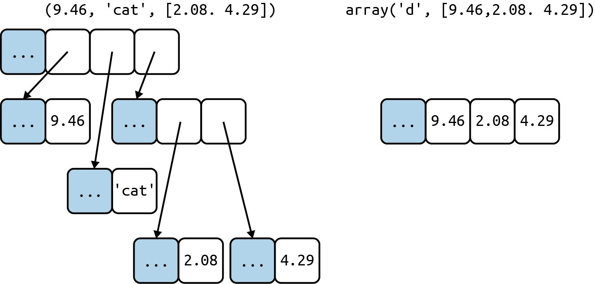
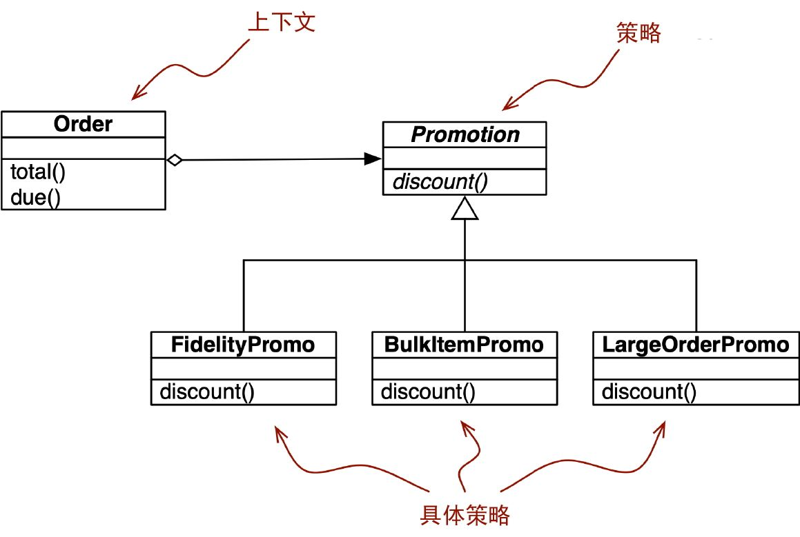
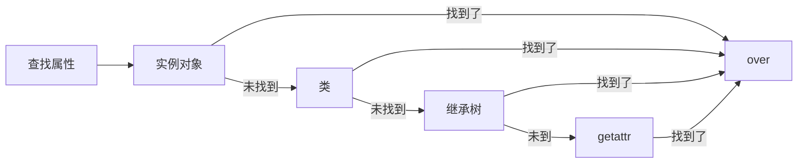

# 内容概述

《Fluent Python》Python 进阶书，有利于理解 Python 语言，全面了解这个语言的能力边界。该书介绍的基本都是 Python 的高级用法。

<b>书中一共有五个主题</b>

- 数据结构⭐
- 函数即对象⭐
- 类和协议⭐
- 控制流
- 元编程（高级技术，设计框架的时候需要接触）

看这个之前，先看 [Python语言基础](Python基础.md)。

⚠️表示要加强，要再看一遍书。

## 数据结构

介绍 Python 数据模型，说明为什么特殊方法（`__repr__`）是所有类型的对象在行为上保持一致的关键。

介绍各种容器类型，包括序列（sequence）、映射（mapping）和集合（set），另外还涉及字符串（str）和字节序列（bytes）的区别。

涉及到了标准库中的高级类构建器：具名元组工厂和 @dataclass 装饰器。Python 3.10 新引入的模式匹配也有讨论，涉及序列模式、映射模式和类模式。最后关注对象的生命周期：引用、可变性和垃圾回收。

<b>这部分的模式匹配、类型注解和高级类构建器是难点。</b>

## 函数即对象

探讨了函数作为一等对象带来的影响，如何利用闭包实现函数装饰器。这一部分还涉及 Python 中可调用对象的概念、函数属性、内省（introspection）、参数注解，以及 Python 3 新引入的 nonlocal 声明。此外，还介绍了重要的新功能：类型提示在函数签名中的使用。

<b>这部分需要理解闭包，重点掌握函数装饰器，明白类型提示在函数签名中的使用</b>

## 类和协议

这部分重点讲解如何构建自己符合 Python 风格的对象，如何构建一个自己的容器、抽象基类和协议，以及如何处理多继承，何时需要实现运算符重载；类型提示。

<b>这部分整体难度较高，第一次学要重点理解协议和鸭子型</b>

## 控制流

涉及生成器、上下文管理器（with 语法的实现）、协程和一些强大的语法糖。同时讲解了 Python 并发和并行处理的各种方案和局限性，重点讲解了异步编程。

<b>这部分整体难度较高，基本都是重点，都需要了解；如果涉及不到并发编程，并发编程部分可以不看。</b>

## 元编程

逐步实现一个字段验证库，以此来学习元编程中的内容。

<b>这部分的重点是：类装饰器和元类（metaclass），纯高级内容，如果涉及不到类库开发可以不看。</b>

# ➡️第一部分-数据结构

# 数据模型

## 什么是数据模型？

Python 数据模型，社区中也称之为对象模型。我们借助《深度探索 C++ 对象模型》一书的话来理解 Python 的对象模型。

>有两个概念可以解释 C++ 对象模型
>
>- 语言中直接支持面向对象程序设计的部分
>- 对于各种支持的底层实现机制

在 Python 中，数据模型 / 对象模型也是类似的概念，那些用以支持 / 实现 Python 面向对象和各种功能的底层实现机制。<b>Python 数据模型定义了对象的行为和属性。</b>

- Python 是怎么支持对象可迭代的？
- len、str、repr 方法是如何获取对象长度，将对象转为字符串的？

这些功能的底层实现机制就是 Python 数据模型的一部分。这部分介绍的内容主要是 Python 中的魔法方法，如何定义对象的行为和属性（如何在 Python 层面定义对象的属性和行为，内部是如何调用这些方法的）

## 特殊方法

<b>这部分主要介绍 Python 的特殊方法（magic method，魔术/法方法）</b>

魔法方法是两个下划线包围来命名的（如 `__init__` , `__lt__`, `__len__`）这些特殊方法是为了被 Python 解释器调用的（不要自己调用魔法方法），会被注册到它们所属类型的方法集中。Python 解释器直接调用 magic method 速度更快哦。

因为，在 Python 的解释器中，这些方法相当于提供了一些快捷方式，让解释器能够更高效地处理某些常见的操作。由于这些方法是由解释器直接调用的，它们通常会比普通的用户定义方法运行得更快，因为它们避免了常规的函数调用开销。（相当于为 cPython 提供抄近路。这些方法的速度比普通方法要快）

<b>不过，在不清楚这些魔术方法的用途时，不要随意添加。</b>

Python 是如何实现对象的字符串表示的？

Python 中关于字符串的表现形式有两种：`__str__` 与 `__repr__` 。

- Python 的内置函数 `repr` 就是通过 `__repr__` 这个特殊方法来得到一个对象的字符串表示形式。这个在交互模式和调试器（pydev debugger）上比较常用，如果没有实现 `__repr__` ，当控制台（交互模式的控制台）打印一个对象时往往是 `<A object at 0x000>`。
- `__str__` 则是使用 `str()` 函数时使用的，或是在 `print` 函数打印一个对象的时候才被调用，终端用户友好。

PyCharm debugger 实测：Python debugger 对象时，会以 `__repr__` 的返回值来显示对象，其次才是根据  `__str__` 的返回值来显示对象。

```python
class D:
    def __str__(self):
        return "hello"

    def __repr__(self):
        return "hello repr"


d = D()
print(d)
```

注意，PyCharm 的 Evaluate 是通过调用对象的 `__repr__` 或 `__str__` 方法来实现的，会优先执行 `__repr__` 方法。

<b>优先选择实现 `__repr__` 而非 `__str__`</b>

在字符串格式化时，`"%s"` 对应了 `__str__`，而 `"%r"` 对应了 `__repr__`。`__str__` 和 `__repr__` 在使用上比较推荐的是，前者是给终端用户看，而后者则更方便我们调试和记录日志，如果要二选一实现一个魔法方法，优先实现 `__repr__`，因为它对开发和调试工作非常重要。

此处给出 `__str__` 与 `__repr__` 的示例代码

```python
class DemoClass(object):
    def __init__(self, name):
        self.name = name

    def __repr__(self):
        # %r 字符串 (采用repr()的显示)
        return "repr My name is %r" % (self.name)

    def __str__(self):
        return "str My name is %s" % (self.name)


demo = DemoClass("tony")
print(demo)  # 返回"str My name is tony"

# 使用repr(obj)的时候，会自动调用__repr__函数
print(repr(demo))  # 返回"repr My name is tony"

demo1 = DemoClass("'tony1")
print(demo1)  # str My name is 'tony1
print(repr(demo1))  # repr My name is "'tony1"
```

值得注意的是，特殊方法的调用大多是隐式的，如 `for i in x` 这个语句，背后其实用的是 iter(x)，而这个函数的背后则是 `x.__iter__()` 方法。当然前提是这个方法在 x 中被实现了。

<b>这里着重介绍下 `__getitem__` 方法和 `__len__` 方法</b>

- `__getitem__`

  - 通过下标找元素
  - 自动支持切片（slicing）操作
  - 可迭代

- `__len__`

  - 返回对象的长度

  ```python
  class D:
      def __len__(self):
          return 10000
  
  print(len(D())) # 10000
  ```

<b>注意：</b>不要自己想当然地随意添加特殊方法

## 特殊方法汇总

<b>跟运算符无关的特殊方法</b>

| 类别 | 方法名 |
| --- | --- |
| 字符串/字节序列 | `__repr__`, `__str__`, `__format__`, `__bytes__` |
| 数值转换 | `__abs__`, `__bool__`, `__complex__`, `__int__`, `__float__`, `__hash__`, `__index__` |
| 集合模拟 | `__len__`, `__getitem__`, `__setitem__`, `__delitem__`, `__contains__` |
| 迭代枚举 | `__iter__`, `__reversed__`, `__next__` |
| 可调用模拟 | `__call__` |
| 上下文管理 | `__enter__`, `__exit__` |
| 实例创建和销毁 | `__new__`, `__init__`, `__del__` |
| 属性管理 | `__getattr__`, `__getattribute__`, `__setattr__`, `__delattr__`, `__dir__` |
| 属性描述符 | `__get__`, `__set__`, `__delete__` |
| 跟类相关的服务 | `__prepare__`, `__instancecheck__`, `__subclasscheck__`, `__mro_entries__` |
| 容器协议 | `__len__`, `__getitem__`, `__setitem__`, `__delitem__`, `__contains__` |

<b>跟运算符有关的特殊方法</b>
| 类别 | 方法名 |
| --- | --- |
|一元运算符| `__neg__ -、__pos__ +、__abs__ abs()`|
|众多比较运算符| `__lt__ <、__le__ <=、__eq__ ==、__ne__ !=、__gt__ >、__ge__ >=`|
|算术运算符| `__add__ +、__sub__ -、__mul__ *、__truediv__ /、__floordiv__ //、__mod__ %、__divmod__ divmod()、__pow__ ** 或 pow()、__round__ round()` |
|反向算术运算符|`__radd__、__rsub__、__rmul__、__rtruediv__、__rfloordiv__、__rmod__、__rdivmod__、__rpow__`|
|增量赋值算术运算符| `__iadd__、__isub__、__imul__、__itruediv__、__ifloordiv__、__imod__、__ipow__` |
|位运算符| `__invert__ ~、__lshift__ <<、__rshift__ >>、__and__ &、__or__ | 、__xor__ ^` |
|反向位运算符| `__rlshift__、__rrshift__、__rand__、__rxor__、__ror__`|
|增量赋值位运算符| `__ilshift__、__irshift__、__iand__、__ixor__、__ior__`|

更多的特殊方法: 

[https://docs.Python.org/3/reference/datamodel.html](https://link.segmentfault.com/?enc=fTu%2F6envClCH1hc3pb3wPA%3D%3D.YAfEMmtm0jaM2LaU%2BHKZQ3ytdIaghZ1Ob1OssOs5VjDfoWlNa%2BXPdQ7Op7IIERbhLJhzgGZ8UAX79xx%2FPw42Rw%3D%3D)

# 序列和数组

这部分主要是介绍序列，着重介绍数组和元组的一些高级用法，以深入理解 Python 中不同的序列类型。

Python 使用 C 语言实现了丰富的序列类型，由于是使用 C 来实现的，因此，尝试继承这些序列，重写它们的方法时，会有意想不到的结果。[不要试图子类化内置类型](##不要试图子类化内置类型)。

<b>序列按照容纳数据的类型可以分为</b>

- 容器序列：list、tuple 和 collections.deque 这些序列存放的是所包含对象的引用，对象可以是任何类型。
- 扁平序列：str、bytes、bytearray、memoryview 和 array.array，这类序列在自己的内存空间中存储所含内容的值，而不是各自不同的 Python 对象。<span style="color:blue">因此，扁平序列更加紧凑，但是只能存放原始机器值，例如字节、整数和浮点数。</span>

<div align="center"></div>

图中展示的是一个元组和一个数组的内存简图，它们各有 3 项。灰色方块（未按比例绘制）表示各个 Python 对象的内存标头。元组中的每一项都是引用，引用的是不同的 Python 对象，对象中还可以存放其他 Python 对象的引用，例如那个包含两个项的列表。相比之下，Python 中的数组整体是一个对象，存放一个 C 语言数组，包含 3 个双精度数。

<b>如果按照是否能被修改可以分为</b>

- 可变序列：list、bytearray、array.array、collections.deque 和 memoryview
- 不可变序列：tuple、str 和 bytes

可变序列继承不可变序列的所有方法，另外还多实现了几个方法。内置的具体序列类型其实不是 Sequence 和 MutableSequence 抽象基类的子类，而是一种虚拟子类（virtual subclass），使用这两个抽象基类注册（Python 3.10 测试，MutableSequence 是 False）

## 列表推导

列表推导是构建列表的快捷方式，可读性更好且效率更高。

例如，我们需要把一个字符串变成 unicode 的码位列表。我们可以直接使用 for 循环迭代，将每个字符存入列表。

```python
symbols = '$¢£¥€¤'
codes = []
for symbol in symbols:
    codes.append(ord(symbol))
```

也可以使用列表推导完成上述功能

```python
symbols = '$¢£¥€¤'
codes = [ord(symbol) for symbol in symbols]

# 列表推导转 unicode + 条件判断
str2unicode_ = [ord(item) for item in "hello" if ord(item) >=104]
```

能用列表推导来创建一个列表，就尽量使用推导，因为列表推导式的性能远高于 for 循环。在书写的时候保持列表推导式的简短，如果超过两行，那么最好把语句拆开，或者使用传统的 for 循环重写。

如果希望列表推导式中的变量可以在列表推导式外依旧可以访问，可以使用海象运算符 `:=`

```python
# last 在列表推导式结束后依旧可以使用
codes = [last := ord(c) for c in t]
print(codes, last)
```

<b>map 和 filter 不一定比列表推导式快，Python 中推荐使用列表推导式而非 map 和 filter。</b>

## 生成器表达式

生成器表达式是使用迭代器协议逐个产出元素，而非构建整个列表；因此，生成器表达式占用的内存更少。

```Python
color = ['black', 'red']
size = ['Large', 'Mid', 'Small']
dcr = [(c, s) for c in color for s in size if len(c) >= len(s)]
print(dcr)
```

实例中列表元素比较少，如果是生成 100w 元素的列表，内存将会占用很大；使用生成器表达式的话可以节省这种内存占用开销。

```python
import sys

# 百万元素的列表
list_10b = [item for item in range(1000000)]
# 迭代器
iter_10b = (item for item in range(1000000))

print(sys.getsizeof(list_10b))  # 8448728
print(sys.getsizeof(iter_10b))  # 104

for item in iter_10b:
    if item > 500000:
        print(sys.getsizeof(iter_10b))  # 104
        break
```

从上面的代码可以看出来迭代器占用的内存要小非常多，而且占用的内存一直都是 104

<b>内存监控工具</b>

除了使用 sys 外，我们可以使用 `memory_profiler` 分析内存使用情况。

```python
# 如果系统没有这个模块就执行pip install memory_profiler进行安装
from memory_profiler import profile


@profile
def fun_try():
	return [item for item in range(1000000)]

fun_try()
```

## 元组

元组的作用一般有两种

- 作为不可变的列表
- 作为没有字段名称的记录，如  `(’jerry‘, '18')` 作为一条记录

元素的用法与列表类似，但是元组是使用 `()`。<b style="color:red">切记，使用元组时不要企图在里面存放可变的项，这会产生一些奇怪的行为。</b>

## 拆包

元组、序列和可迭代对象的拆包

<b>以元组为例演示拆包，序列、可迭代的拆包方式也是一样的</b>

元组拆包，多个变量接收元组内的数据

```python
#元组拆包
t = (20, 8)
a, b = t

# 如果有不想接收的参数，用占位符即可
a, _ = t
```

函数传参中的拆包

```python
# 函数赋值时的拆包
# 元组拆包
print(divmod(1, 2))
test_tuple = (10, 2)
print(divmod(*test_tuple))
print(divmod(*(9, 9)))
```

利用 `*` 获取不确定数量的元素 ( `*` 还有一个左右是用在 function 的形式参数上，强迫在给 `*` 后面的参数赋值时必须指定形参的名称)

```python
# * 获取不确定的元素
one, two, *three = range(6)
print(three)  # list [2,3,4,5,6]
print(*three)  # list 解包
print(*[1, 2, 3, 4])
```

```python
# 利用 * 强迫在给 `*` 后面的参数赋值时必须指定形参的名称
def func(number, *, name):
    print(f"number = {number}, name = {name}")

func(100, "jerry") # TypeError: func() takes 1 positional argument but 2 were given
func(100, name="jerry")
```

嵌套元组拆包

```python
# 嵌套元组拆包
test_tuple2 = (1, 2, ('tom', 'jerry'))
n1, n2, (name1, name2) = test_tuple2
print(name1, name2)
```

## 具名元组

元组经常被作为 `不可变列表` 的代表. 经常只要数字索引获取元素, 但其实它还可以给元素命名 (nametuple).

Nametuple 是类似于元组的数据类型, 但是它有 typename, 很好分辨这个元组是用来做什么的。除了能够用索引来访问数据，还支持用方便的属性名来访问数据。
```python
from collections import namedtuple

# 创建具名元组，元组中包含 name, area; 类似与一个 tiny class/object
city = namedtuple('CityInformation', ['name', 'area'])
city_bj = city_card('beijing', 96)
print(city_bj)

country = namedtuple('Country', 'name area population coord')
china = country('China', 960, 14, (20, 80))
print(china._asdict())  # 转为字典
```

### 序列模式匹配

3.10 新增的语法，序列模式匹配与其他语言的 switch 有些类似，但是功能更为强大。序列模式匹配是用在序列上的，语法为 match-case-卫语句

<b>序列匹配的基础用法</b>

假设现在有个序列有三个值，我们希望通过序列中的第一个值判断执行何种方法，其他两个值作为 function 的参数。

```python
def f1(n1, n2):
    print("f1(n1, n2)=", (n1, n2))


def f2(n1, n2):
    print("f2(n1, n2)=", (n1, n2))


def f3(n1, n2):
    print("f3(n1, n2)=", (n1, n2))


def handle_command(message):
    match message:
        # 使用 *n1 接收多个变量
        case ['f1', *n1]:
            f1(*n1)
        case ['f2', n1, n2]:
            f2(n1, n2)
        case _: # 默认的 case 子句，前面所有模式都不匹配时执行
            raise ValueError("无匹配值")


handle_command(['f1', 1, 1])
# 无匹配值
# handle_command(['f3', 1, 1])
```

在 match/case 上下文中，str、bytes 和 bytearray 实例不作为序列处理，如果我们像根据电话的字符串来匹配对于的地区呢？

```python
def matchs(phone: str):
    match tuple(phone):
        case ['1', *rest]:
            print("A 地区")
		# 这里使用了 | 表示 2 3 有一个匹配即可
        case ['2' | '3', *rest]:
            print("B 地区")


matchs("10086")
matchs("20086")
```

如果像忽略某些项，使用 `_` 即可，匹配相应位置上的任何一项，但不绑定匹配项的值

```python
def get_addr(addr: str):
    match tuple(addr):
        case ['北', '京', _, *rest]:
            print(*rest)
        case _:
            print("not exist")


get_addr("北京-五环")
```

<b>高级用法</b>

匹配任何以字符串开头、以嵌套两个浮点数的序列结尾的序列，则可以使用如下模式

```python
case [str(name), *_, (float(lat), float(lon))]:
```

使用卫语句筛选，满足 lon > 1 的才是符合条件的匹配项

```python
def get_seq(seq: list):
    match seq:
        case [str(name), *_, float(lat), float(lon)] if lon > 1:
            print(f"{name}-{lat}-{lon} is ok")
        case _:
            print("not found")

get_seq(["jerry", "223", "ssf", 12.5, 11.])
```

如果最后的两个数据不是 float 类型而是 int 类型，匹配不到第一个 case。

<b>高端操作</b>

使用 Python 的模式匹配序列可以简便的实现一个解释器，判断变量的定义是否合法。

```python
"""
利用模式匹配序列校验数据类型定义的语法，规定
int a;
float a;
double a;
String a;
char a;
这种语法才是正确的，以变量类型开头，中间一个空格 后面是任意的以字母开头的变量，最后是分号
"""

def test(judge: list):
    match judge:
        case ['int' | 'float' | 'char' | 'String' | 'double', ' ', name, ';'] if name[0].isalpha():
            print(f"{judge} 合法")
        case _:
            print(f"{judge} 非法")


test(['int', ' ', 'a', ';'])
test(['float', ' ', 'a', ';'])
test(['int', ' ', 'a', ','])
```

## 切片

列表中是以 0 作为第一个元素的下标，切片则可以根据下标提取某一个片段。在 Python 中，列表、元组、字符串等所有序列类型都支持切片操作。

切片的典型语法：用 `s[a:b:c]` 的形式对 `s` 在 `a` 和 `b` 之间以 `c` 为间隔取值。`c` 的值还可以为负, 负值意味着反向取值.

```python
# 给切片赋值
l = list(range(10)) # 0~9, 不包括 10
print(l[2:6])			 # 切片
l[2:6] = [10, 20]  # 切片赋值 [start:end) 2 3 4 5 的元素被替换为了 10, 20
print(l)
```

### 切片区间排除最后一项的原因

切片和区间排除最后一项是一种 Python 风格约定，理由如下

- 在仅指定停止位置时，容易判断切片或区间的长度；
  - range(3) 和 my_list[:3] 我们很容易就看出它是取了三个元素
  - 同时指定起始和停止位置时，容易计算切片或区间的长度，做个减法即可：stop - start。
- 方便在索引 x 处把一个序列拆分成两部分而不产生重叠，直接使用 my_list[:x]  和 my_list[x:] 即可

### 为切片赋值

在赋值语句的左侧使用切片表示法，或者作为 del 语句的目标，可以就地移植、切除或以其他方式修改可变序列

```python
l = list(range(6))
# l[2:5] = 10 # TypeError: can only assign an iterable
# l[2:5] = [10] # [0, 1, 10, 5]
# del l[2:5] # [0, 1, 5]
```

如果赋值目标是一个切片，则右边必须是一个可迭代对象。

## 序列的操作

<b>增量运算</b>

增量运算符 +，* 等其实是调用 `__iadd__/__add__/__imul__/__mul__`方法

- i 开头的表示原地操作，非 i 开头的表示会创建一个新的对象返回
  - `__iadd__` 的方法类似调用 a.extend(b) 的方式，是在原有的对象上进行扩展操作
  - `__add__`的方式类似于 a=a+b，将得到的新的对象在赋值给 a
- 对于可变对象，+ 调用的是 `__iadd__`
- 对于不可变对象，由于其不可变，因此实际上返回的是一个新的对象，调用的是  `__add__` 这种

```python
one = [1, 2, 3]
two = (1, 2, 3)
print(f" one addr = {id(one)}, two addr = {id(two)}")
one += one
two += two
print(f" one addr = {id(one)}, two addr = {id(two)}")
# tuple 的地址发生了变化
```

<b>排序</b>

| 内置排序 | list.sort()            | sorted                 |
| -------- | ---------------------- | ---------------------- |
| 特点     | 就地排序，不复制原列表 | 新建一个列表作为返回值 |

array 没有提供排序的功能，要先转为 list，排序，然后转回 array。

<b>令人迷惑的元组</b>

我们在控制台执行下面的代码，会报错，提示元组不可变，不可以给它修改值；但是最后元组中列表又被成功修改了。

```python
>>> t = (1,2, [30,40])
>>> t[2]+=[50,60]
Traceback (most recent call last):
  File "<stdin>", line 1, in <module>
TypeError: 'tuple' object does not support item assignment
>>> t
(1, 2, [30, 40, 50, 60])
>>>
```

我们看下 `t[2]+=[50,60]` 的字节码

```shell
>>> dis.dis('t[2]+=[50,60]')
  1           0 LOAD_NAME                0 (t)
              2 LOAD_CONST               0 (2)
              4 DUP_TOP_TWO
              6 BINARY_SUBSCR
              8 LOAD_CONST               1 (50)
             10 LOAD_CONST               2 (60)
             12 BUILD_LIST               2
             14 INPLACE_ADD
             16 ROT_THREE
             18 STORE_SUBSCR # 将栈顶的元素存储到第二个栈顶元素指定的位置这个操作尝试给元组赋值，报错了
             20 LOAD_CONST               3 (None)
             22 RETURN_VALUE
```

再次强调，<b>不要在元组中存放可变的项。</b>

## 迷惑的序列复制

先给出结论：在 Python 中，当使用星号 `*` 操作符复制可变对象时，实际上复制的是对象的引用，而不是对象的值。

请看下面这个例子

```python
# ['-'] * 2 是将列表中的元素 '-' 重复两次
tmp = ['-'] * 2
print(id(tmp[0])==id(tmp[1])) # True

board = [['-'] * 2 for i in range(2)]
board[1][1] = 'x'
print(board) # [['-', '-'], ['-', 'x']]

# ['-'] * 2 的解释和上面一样
# [ ['-', '-'] ] * 2 则是将 [...] 这个大的元素重复两次，复制的也是对象地址
board = [['-'] * 2] * 2
board[1][1] = 'x'
print(board) # [['-', 'x'], ['-', 'x']]
```

要理解可变对象和不可变对象。

<b>其他序列</b>

| 序列以及提供序列的库                             | 用途                                                         |
| ------------------------------------------------ | ------------------------------------------------------------ |
| 数组（array.array）                              | 只包含数字的情况下，array 比 list 高效                       |
| 内存视图（memoryview                             | 不复制内容的情况下操作同一个数据结构的不同切片，共享内存     |
| 双向队列（colections.deque）                     | 线程安全，可快速从两端添加或者删除元素的数据类型             |
| queue （（Queue，LifoQueue & PriorityQueue））   | 同步类，用于不同线程利用这些数据类型交换信息                 |
| multiprocessing （Queue）                        | 进程间通信                                                   |
| asyncio （（Queue，LifoQueue & PriorityQueue）） | 异步编程里的任务管理                                         |
| heapq                                            | 没有队列类，只是提供了 heappush 和heappop，让用户可以把可变序列当作堆队列或者优先队列使用 |

## 数组

### 节省内存的数组

Python 中任何东西都是对象，包括定义的 int 变量。虽然传入的是一个 int 数据 1，但是它仍然占据了 28  bytes 的内存空间，这非常耗费内存空间。为了减低内存消耗，Python 引入了数组。

数组在存储 int、float 的时候，并不是以对象来存储的，而是存储的数字，数据量较多时，array 比 list 更节省内存空间。

```python
import sys

alist = [1, 2, 3, 4, 5]
a = 1
print(sys.getsizeof(1))  # 存储的是对象, size = 28
print(sys.getsizeof(a))  # 存储的是对象, size = 28
print(sys.getsizeof(alist))  # size = 120
print(sys.getsizeof(array.array('i', [1])))  # size = 84
print(sys.getsizeof(array.array('i', [1, 2])))  # size = 88, 增加了一个元素只增加了 4 byte
```

str、bytes 和 array.array 等扁平序列存储的不是引用，而是在连续的内存中存储内容本身（字符、字节序列和数值），更节省内存空间。

### 数组与列表的效率对比

分别用数组和列表生成数据写入 txt 文档。

```python
import time

def list2txt(*, nums):
    with open('list.bin', 'wb') as f:
        stat = time.time()
        for num in nums:
            f.write(struct.pack('i', num))
        end = time.time()
    print(end - stat)


def array2txt(*, nums):
    with open('list.bin', 'wb') as f:
        stat = time.time()
        nums.tofile(f)
        end = time.time()
    print(end - stat)


numbers = [num for num in range(10 ** 7)]
arrays = array.array('d', numbers)
list2txt(nums=numbers) # 1.1925511360168457
array2txt(nums=arrays) # 0.02406907081604004
```

array 读文件也非常快

```python
import time

def txt2array(*, file):
    numbers = array.array('d')
    with open(file, 'rb') as f:
        start = time.time()
        numbers.fromfile(f, 10 ** 7)
        end = time.time()
    print(end - start)
txt2array(file="list.bin") # 0.03528928756713867
```

## memoryview

内置的 memoryview 类是一种共享内存的序列类型，可在不复制字节的情况下处理数组的切片，可以减少内存的使用和提高效率。

memoryview 对象可以与其他 Python 对象一起使用，例如字节数组、字节对象、数组等。它通过提供一个统一的接口来访问这些对象的底层内存，从而使得对这些数据进行低级别的操作变得可能。

```python
mv = memoryview(bytearray([1, 2, 3, 4, 5]))
print(mv[0])

# memoryview内存视图
# 在不复制内容的情况下操作同一个数组的不同切片
from array import array

# 5个短整型有符号整数的数组，类型码是h
numbers = array('h', [-2, -1, 0, 1, 2])

memv = memoryview(numbers)
print(len(memv))

# 转成B类型，无符号字符
memv_oct = memv.cast('B')
tolist = memv_oct.tolist()
print(tolist)

memv_oct[5] = 4
print(numbers)
```

## pickle模块

将 Python 值转成 byte，机器学习 sklearn 保存模型参数的时候会用到。

```python
try:
    import cPickle as pickle
except:
    import pickle

data = [{'a': 'A', 'b': 2, 'c': 3.0}]

# 编码
data_string = pickle.dumps(data)

print("DATA:", data)
print("PICKLE:", data_string)
print(type(data_string))

# 解码
data_from_string = pickle.loads(data_string)
print(data_from_string)
```

## deque

<b>deque 是双向队列，如果业务逻辑中需要大量的从队头或尾部删除、添加元素，用 deque 的性能会大幅提高！</b>

如果只是小队列，并且对元素需要随机访问操作，那么 list 会快一些。

```python
from collections import deque

dq = deque([1, 2])

dq.append([1, 2])  # warnings，不建议添加和 dqueue 中元素类型(int)不同的数据(list)
print(dq.popleft()) # 1
print(dq.popleft()) # 2
print(dq.popleft()) # [1, 2]
dq.append(10)
dq.clear()
```

---

<b>总结</b>

1. 列表表达式 和 生成器表达式(元组省内存)很好用
2. 元组的拆包十分神奇，尤其是 * 号的存在
3. 具名元组的实例也很节省空间，有点像模拟字典使用 ._asdict() 方法来把记录变成 OrderedDict 类型
4. 切片是基本用法,给切片赋值是个好的修改方式
5. +=
   - 增量赋值 += 和 *= 会区别对待可变和不可变序列
   - 在遇到不可变序列时，这两个操作会在背后生成新的序列
   - 但如果被赋值的对象是可变的，那么这个序列会就地修改

1. sorted 函数，只需要一个比较方法 key
2. 纯数字数组用 array.array 比较好，NumPy 和 SciPy 科学计算神奇世界

# 字典和集合

`dict` 类型不但在各种程序里广泛使用，它也是 `Python` 语言的基石。正是因为 `dict` 类型的重要，`Python` 对其的实现做了高度的优化。Python 3.6 起，dict 的代码有两项重要的优化，节省了内存，还能保留键的插入顺序。其中最重要的原因就是背后的「散列表」 set（集合）和 dict 一样, 其实现基础也是依赖于散列表.

散列表也叫哈希表，对于 dict 类型，它的 key 必须是可哈希的数据类型。官方对可哈希的解释是

> - 如果一个对象是可散列的，那么在这个对象的生命周期中，它的散列值是不变的
> - 这个对象需要实现 `__hash__()` 方法。
> - 可散列对象还要有 `__qe__()` 方法，这样才能跟其他键做比较。
> - 如果两个可散列对象是相等的，那么它们的散列值一定是一样的……

`str`, `bytes`, `frozenset` 和 数值 都是可散列类型.

## 字典推导式

```python
DIAL_CODE = [
    (86, 'China'),
    (91, 'India'),
    (7, 'Russia'),
    (81, 'Japan'),
]

## 利用字典推导快速生成字典
country_code = {country: code for code, country in DIAL_CODE}
print(country_code) # {'China': 86, 'India': 91, 'Russia': 7, 'Japan': 81}
```

## 映射拆包

Python 3.5 增强了映射拆包功能

- 1️⃣调用函数时，不止一个参数可以使用 **。但是，所有键都要是字符串，而且在所有参数中是唯一的（因为关键字参数不可重复）
- 2️⃣** 可在 dict 字面量中使用，同样可以多次使用。这种情况下允许键重复，后面的键覆盖前面的键

1️⃣调用函数时

```python
def test(**kwargs):
    return kwargs

test(**{'x': 1}, y=50, **{'z': 10})
```

2️⃣在 dict 字面量中使用

```python
t = {**{'x': 1}, 'y': 50, **{'z': 10}}
```

## 合并 dict |

Python 3.9 支持使用 | 和 |= 合并映射

```python
t1 = {'x': 1}
t2 = {'z': 10}
print(t1 | t2)

t1 |= t2
```

## 使用模式匹配处理映射

模式匹配也同样支持 dict，且模式中键的顺序无关紧要。

```python
def get_creators(record: dict) -> list:
    match record:
        case {'type': 'book', 'api': 2, 'authors': [*names]}:
            print("one")
            return names
        case {'type': 'book', 'api': 1, 'author': name}:
            print("two")
            return [name]
        case {'type': 'book'}:
            raise ValueError(f"Invalid 'book' record: {record!r}")
        case {'type': 'movie', 'director': name}:
            return [name]
        case _:
            raise ValueError(f'Invalid record: {record!r}')


record = {'type': 'book', 'api': 2, 'authors': [1, 2, 3], 'title': 'hello'}
get_creators(record) # one
```

与序列模式不同，就算只有部分匹配，映射模式也算成功匹配。所有的 case 中都没有 title，但是依旧成功匹配了。

如果我们想把多出的键值对捕获到一个 dict 中，可以在一个变量前面加上 ，不过必须放在模式最后，`**_ ` 是无效的。

```python
case {'type': 'book', 'api': 2, 'authors': [*names], **extra}
```

## setdafault

非常好用的一个方法，它用于在字典中查找指定键。如果 key 存在，则返回对应的值；如果不存在添加该 key 设置默认值并返回。

- get 方法
- setdefault 方法 -- 没有则插入，始终返回 value

```python
"""get 方法，没有就给默认值 [], 但是并不会改变原 dict 的值"""
my_dict = {'key1': 'value1', 'key2': 'value2'}
my_dict.get('key3', [1])
print(my_dict.get('key3'))  # None
```

```python
"""setdefault 方法"""
my_dict = {'key1': 'value1', 'key2': 'value2'}
# 如果是没有则插入，则采用-- 插入并返回
val = my_dict.setdefault('key4', 'value4')
print(val) # value4
```

## defaultdict

当有 key 不在映射里，我们希望能得到一个默认值。可以使用 `defaultdict`，为所有不存在的 key 设置一个统一的默认值。

`defaultdict` 是属于collections 模块下的一个工厂函数，也是 `dict` 的子类，并实现了 `__missing__` 方法。

- <span style="color:blue">接收一个函数（可调用）对象为作为参数。</span>
- 参数返回的类型是什么，key 对应 value 就是什么类型

```python
import collections
index = collections.defaultdict(list)
for item in range(10):
    key = item % 2  # key 限定在了 0 和 1
    index[key].append(item)
print(index[10])  # [] 参数返回的类型是什么，key 对应 value 就是什么类型
```

值得注意的是，只有在调用 `__getitem__` 方法的时候找不到 key，Python 才会自动调用 `__missing__` 方法。阅读下面的代码，说结果。

```python
import collections

my_default_dict = collections.defaultdict(lambda: "not exists")
print(my_default_dict.get('hello'))  # None
print(my_default_dict['hello'])  		# not exists
```

```python
import collections

my_default_dict = collections.defaultdict(lambda: "not exists")
print(my_default_dict['hello'])   # not exists
print(my_default_dict.get('hello')) # not exists
```

<b>为什么呢？</b>

`__getitem__` 被用于实现对象的索引操作。当一个对象实现了 `__getitem__` 方法后，就可以使用 `[]` 来访问其元素。

因此 `d['xx']` 实际上是调用了 getitem 方法，getitem 方法被调用后，如果发现 key 缺失，则会将它存储到字典并为其赋予事先设置的统一默认值 `not exist`

<b>使用 defaultdict 的理由</b>

- 有缺省值非常安全，如果访问不存在的 key，不会报错
- Pyhon 性能会大幅提高，仅仅换了字典数据结构，性能就大幅的提高了很多

## 字典的变种

标准库里 `collections` 模块中，除了 `defaultdict` 之外的不同映射类型:

- <b>OrderDict：</b>这个类型在添加键的时候，会保存顺序，因此键的迭代顺序总是一致的
- <b>ChainMap：</b>该类型可以容纳数个不同的映射对像，在进行键的查找时，这些对象会被当做一个整体逐个查找，直到键被找到为止 `pylookup = ChainMap(locals(), globals())`
- <b>Counter：</b>这个映射类型会给键准备一个整数技术器，每次更行一个键的时候都会增加这个计数器，所以这个类型可以用来给散列表对象计数，或者当成多重集来用.

```python
import collections

string = "aaabbbc"

ct = collections.Counter(string)
print(ct)  # Counter({'a': 3, 'b': 3, 'c': 1})
print(dict(ct))  # {'a': 3, 'b': 3, 'c': 1}

ct.update('abcdef')
print(dict(ct))  # {'a': 4, 'b': 4, 'c': 2, 'd': 1, 'e': 1, 'f': 1}
```

- <b>UserDict：</b>这个类其实就是把标准 dict 用纯 Python 又实现了一遍

```Python
import collections
class StrKeyDict(collections.UserDict):
    def __missing__(self, key):
        if isinstance(key, str):
            raise KeyError(key)
        return self[str(key)]
        
    def __contains__(self, key):
        return str(key) in self.data
        
    def __setitem__(self, key, item):
        self.data[str(key)] = item
```

## 不可变映射类型

说到不可变, 第一想到的肯定是元组, 但是对于字典来说, 要将 key 和 value 的对应关系变成不可变, `types` 模块的 `MappingProxyType` 可以做到:

```python
from types import MappingProxyType
d = {1:'A'}
d_proxy = MappingProxyType(d)
d_proxy[1]='B' # TypeError: 'mappingproxy' object does not support item assignment

d[2] = 'B'
print(d_proxy) # mappingproxy({1: 'A', 2: 'B'})
```

`d_proxy` 是动态的, 也就是说对 `d` 所做的任何改动都会反馈到它上面.

## 字典视图

dict 的实例方法 .keys()、.values() 和 .items() 分别返回 dict_keys、dict_values 和 dict_items 类的实例。这些字典视图是 dict 内部实现使用的数据结构的只读投影。我们不能使用 [] 获取视图中的项。

```python
item = {'name': 'John', 'age': 22}
val = item.values()
# print(val[0]) # TypeError: 'dict_values' object is not subscriptable
for it in val:
    print(it)
```

通过 debugger 我们可以看到 val 视图有个 mapping 属性，他是 mappingproxy 类型的。因为视图对象是动态代理的，这也意味着更新原 dict 对象后，现有视图立即就能看到变化。

如果我们在迭代视图的时候，修改原字典，可能会出现运行时异常`RuntimeError: dictionary changed size during iteration`，可以自己写代码 debugger 测试下。

## 字典的缺点

Python 的字典和其他语言类似，也是使用哈希表来实现的，查找效率很高，但是这意味着 key 必须是可哈希的，字典的内存开销也会比较大；

不过在 CPython 3.6 中，dict 的内存布局更为紧凑，顺带的一个副作用是键的顺序得以保留。即便 CPython 3.6+ dict 的内存布局更加紧凑，但是至少需要把哈希表中三分之一的行留空。

我们知道，Python 会在 `__dict__` 属性中存储实例属性，正是以字典形式存储实例属性的。Python 3.3 为了节省内存，实现了 `PEP 412- Key-Sharing Dictionary`，如果类实例的属性一样就共用一个哈希表，随类一起存储。如果新实例在 `__init__` 方法执行后又添加了新的实例属性，Python 就得为这个实例的 `__dict__` 属性创建一个新哈希表。

因此，尽量避免在 `__init__` 后创建新的实例属性。

## 集合论

集合的本质是许多唯一对象的聚集. 因此, 集合可以用于去重. 集合中的元素必须是可散列的, 但是 `set` 本身是不可散列的, 而 `frozenset` 本身可以散列.

集合具有唯一性, 与此同时, 集合还实现了很多基础的中缀运算符. 给定两个集合 a 和 b, `a | b` 返回的是它们的合集, `a & b` 得到的是交集, 而 `a - b` 得到的是差集.

合理的利用这些特性, 不仅能减少代码的数量, 更能增加运行效率.

```java
# 集合的创建
s = set([1, 2, 2, 3])

# 空集合
s = set()

# 集合字面量
s = {1, 2}

# 集合推导
s = {chr(i) for i in range(23, 45)}
```

---

<b>总结</b>

- 标准库里的所有映射类型都是利用 dict 来实现
- 只有可散列的数据类型才能用作这些映射里的键(值不用)
- 字典推导
- 用setdefault处理找不到的键
- defaultdict找不到键返回某种默认值
- 底层是 getitem 与 miss 调用实现的

| 特点     | 字典                                           | 集合                               |
| -------- | ---------------------------------------------- | ---------------------------------- |
| 可散列   | 键必须可散列                                   | 元素必须可散列                     |
| 内存     | 开销大，空间效率低，因为散列表稀疏             | 耗内存                             |
| 查询     | 快                                             | 快                                 |
| 次序     | 键次序，取决于添加顺序和散列冲突的情况         | 元素顺序取决于被添加到集合里的次序 |
| 添加元素 | 可能改变已有键顺序，所以迭代和修改不要同时进行 | 可能改变元素已有顺序               |

# 文本和字节序列

本章讨论了文本字符串和字节序列，以及一些编码上的转换。本章讨论的 `str` 指的是 Python3 下的

<b>编码和解码</b>

编码，将信息（如文本、声音、图像等）从一种格式或表示方式转换为另一种格式或表示方式的过程。

解码，将经过编码的信息还原为原来的格式或表示方式（一般是转成我们可读的内容）

## 字符问题

字符串是个比较简单的概念: 一个字符串是一个字符序列. 但是关于 `"字符"` 的定义却五花八门, 其中, `"字符"` 的最佳定义是 `Unicode 字符` . 因此, Python3 中的 `str` 对象中获得的元素就是 unicode 字符.

把码位转换成字节序列的过程就是 `编码`, 把字节序列转换成码位的过程就是 `解码`

```Python-repl
>>> s = 'café'
>>> len(s)
4 
>>> b = s.encode('utf8') 
>>> b
b'caf\xc3\xa9'
>>> len(b)
5 
>>> b.decode('utf8') #'café
```

码位可以认为是人类可读的文本, 而字符序列则可以认为是对机器更友好. 所以要区分 `.decode()` 和 `.encode()` 也很简单. 从字节序列到人类能理解的文本就是解码(decode). 而把人类能理解的变成人类不好理解的字节序列就是编码(encode).

## 字节概要

Python3 有两种字节序列, 不可变的 `bytes` 类型和可变的 `bytearray` 类型. 字节序列中的各个元素都是介于 `[0, 255]` 之间的整数.

## 处理编码问题

Python 自带了超过 100 中编解码器. 每个编解码器都有一个名称, 甚至有的会有一些别名, 如 `utf_8` 就有 `utf8`, `utf-8`, `U8` 这些别名.

如果字符序列和预期不符, 在进行解码或编码时容易抛出 `Unicode*Error` 的异常. 造成这种错误是因为目标编码中没有定义某个字符(没有定义某个码位对应的字符), 这里说说解决这类问题的方式.

- 使用 Python3, Python3 可以避免 95% 的字符问题.
- 主流编码尝试下: latin1, cp1252, cp437, gb2312, utf-8, utf-16le
- 留意 BOM 头部 `b'\xff\xfe'` , UTF-16 编码的序列开头也会有这几个额外字节.
- 找出序列的编码, 建议使用 `codecs` 模块

## 规范化unicode字符串

```ini
s1 = 'café'
s2 = 'caf\u00e9'
```

这两行代码完全等价. 而有一种是要避免的是, 在Unicode标准中 `é` 和 `e\u0301` 这样的序列叫 `"标准等价物"`. 这种情况用NFC使用最少的码位构成等价的字符串:

```Python-repl
>>> s1 = 'café'
>>> s2 = 'cafe\u0301'
>>> s1, s2
('café', 'café')
>>> len(s1), len(s2)
(4, 5)
>>> s1 == s2
False
```

改进后:

```Python-repl
>>> from unicodedata import normalize
>>> s1 = 'café' # 把"e"和重音符组合在一起
>>> s2 = 'cafe\u0301' # 分解成"e"和重音符
>>> len(s1), len(s2)
(4, 5)
>>> len(normalize('NFC', s1)), len(normalize('NFC', s2))
(4, 4)
>>> len(normalize('NFD', s1)), len(normalize('NFD', s2))
(5, 5)
>>> normalize('NFC', s1) == normalize('NFC', s2)
True
>>> normalize('NFD', s1) == normalize('NFD', s2)
True
```

## unicode文本排序

对于字符串来说, 比较的码位. 所以在非 ascii 字符时, 得到的结果可能会不尽人意.

## format

Python 的 `format` 语法是用于字符串格式化的方法，它允许你在字符串中使用占位符，然后在字符串外提供相应的值。这种方法比旧的 `%` 格式化方法更加灵活和强大。

`format` 的基本语法如下：

```python
"{}".format(value)
```

在这里，`{}` 是占位符，`value` 是要插入的字符串。`format` 方法会将 `value` 插入到占位符的位置。

你还可以使用数字来指定占位符的顺序：

```python
"{0} {1}".format("apple", "banana")
```

这将输出 `"apple banana"`，其中 `"apple"` 插入到第一个占位符的位置，`"banana"` 插入到第二个占位符的位置。

你还可以使用关键字来指定占位符：

```python
"{fruit}".format(fruit="banana")
```

这将输出 `"banana"`，其中 `"banana"` 插入到关键字为 `fruit` 的占位符的位置。

`format` 方法还可以接受一个字典作为参数，你可以使用字典的键作为占位符：

```python
"{fruit}".format(**{"fruit": "banana"})
```

这将输出 `"banana"`，其中 `"banana"` 插入到关键字为 `fruit` 的占位符的位置。

## chardet

chardet 模块可用于检测读取出来的 str 是什么编码格式的

```python
# rawdata 是 bytes 类型的
rawdata = urlopen('http://www.baidu.com').read()
chr = chardet.detect(rawdata)
print(f"charset encode is {chr}")
```

## Json

Json = JavaScript Object Notation

| 方法  | 介绍                                                         |
| ----- | ------------------------------------------------------------ |
| dumps | 它的作用是将一个 Python 对象转换（或者说编码）为一个 JSON 格式的字符串。 |
| dump  | 将一个 Python 对象转换为 JSON 格式的字符串，并将结果写入到一个文件中。 |
| loads | 将一个 JSON 格式的字符串转为 Python 对象                     |
| load  | 从一个文件中读取 JSON 数据，并将其解析为一个 Python 对象。   |

<span style="color:blue">带 s 的是对字符操作，不带 s 的是对文件对像的处理</span>

```python
import json
import chardet

dict1 = {"haha": "哈哈"}

# json.dumps 默认ascii编码
print(json.dumps(dict1))  # {"haha": "\u54c8\u54c8"}

# 禁止ascii编码后默认utf-8
print(json.dumps(dict1, ensure_ascii=False))  # {"haha": "哈哈"}

# ascii
ss = chardet.detect(json.dumps(dict1).encode())
print(ss)  # {'encoding': 'ascii', 'confidence': 1.0, 'language': ''}

# utf-8
ss = chardet.detect(json.dumps(dict1, ensure_ascii=False).encode())
print(ss)  # {'encoding': 'utf-8', 'confidence': 0.7525, 'language': ''}
```

操作文件

```python
import json
from io import StringIO

# 创建文件流对象
io = StringIO()

# 把 json编码数据导向到此文件对象
json.dump(['streaming API'], io)

# 取得文件流对象的内容
print(io.getvalue())  # ["streaming API"]
```


# 数据类构建器⚠️⚠️

## 数据类构建器介绍

数据类构建器：构建一个只是字段集合（存储数据）的简单类，除此之外，这个类几乎没有其他额外的功能。

为什么需要数据类构建器呢？当我们希望使用一个类来存储数据时，我们往往是只希望它存储数据（如将数据库中查询出的数据存储到类中），使用普通的类存在严重的重复复编码的问题。

<b>我们来构建一个简单的代表经纬度坐标的类来理解为什么要提出数据类构建器，它是怎么解决重复编码问题的</b>

这是一个代表经纬度坐标的类

```python
class Coordinate:
    def __init__(self, lat, lon):
        self.lat = lat
        self.lon = lon
```

这种写法，每个属性我们都要写三次，存在严重的重复编码，而且它也没有给我们提供人性化的打印方式和比较数据的方式，都需要我们自行实现。

直接打印经纬度对象是这样的

```python
moscow = Coordinate(55.76, 37.62)
moscow # 继承自object的 __repr__ 函数并不是很有帮助
<__main__.Coordinate at 0x7ff60c0a2740>
```

比较对象的操作也是无意义的

```python
location = Coordinate(55.76, 37.62)
location == moscow # False 无意义的==操作，继承自object的__eq__方法只是比较对象ID

(location.lat, location.lon) == (moscow.lat, moscow.lon) # 需要显示比较每个属性
```

<span style="color:blue">而数据类构建器可以很好的解决上述问题，不希望需要我们手动编写这么多代码。下面是通过 namedtuple 构建的 Coordinate 类例子</span>

```python
from collections import namedtuple

Coordinate = namedtuple('Coordinate', 'lat lon')
issubclass(Coordinate, tuple) # 继承自元组

moscow = Coordinate(55.756, 37.617)
moscow # 有意义的__repr__

moscow == Coordinate(lat=55.756, lon=37.617) # True 支持根据属性比较
```

<b>除了 namedtuple 外，Python 还提供了 typing.NamedTuple 和 dataclass 作为数据构建器</b>

typing.NamedTuple 提供了一些功能，可以为每个字段添加类型注解

```python
import typing

Coordinate = typing.NamedTuple('Coordinate', [('lat', float), ('lon', float)])
# 也可以这样构造 Coordinate = typing.NamedTuple('Coordinate', lat=float, lon=float)
issubclass(Coordinate, tuple) # True

typing.get_type_hints(Coordinate) # {'lat': float, 'lon': float}
```

自 Python3.6 之后，typing.NamedTuple 也能用于类声明中。这种方式可读性更好，而且很容易重写或增加方法。

```python
class Coordinate(NamedTuple):
    lat: float
    lon: float


Coordinate(1, 2) # Coordinate(lat=1, lon=2)
```

虽然 NamedTuple 看起来是父类，但其实不是，NamedTuple 是一个 function，是使用元类这一高级功能来创建用户类的。

```python
from typing import NamedTuple

class D(NamedTuple):
    lat: float

# print(issubclass(D, typing.NamedTuple)) # 抛出异常
print(type(NamedTuple)) # <class 'function'>
```

在 typing.NamedTuple 生成的 `__init__` 方法中，字段作为参数出现的顺序与它们在 class 语句中出现的顺序相同。

与 typing.NamedTuple 一样，dataclass 装饰器支持 PEP 526 语法来定义实例属性。装饰器读取变量注释，自动为构建类生成方法。

```python
from dataclasses import dataclass

@dataclass(frozen=True)
class Coordinate:
    lat: float
    lon: float
```

<b>类装饰器和元类提供了超越继承的功能，方便我们定制类的行为。</b>

## 使用数据类构建器的理由

<b>Python 数据类构建器的方式有三种</b>

- 具名元组 collections.namedtuple，构建的是内容不可变的数据类
- typing.NamedTuple，[collections.namedtuple()](https://docs.python.org/zh-cn/3/library/collections.html#collections.namedtuple) 的类型版本，需要为字段添加类型提示，构建的是内容不可变的数据类
- @dataclasses.dataclass [官方介绍](https://peps.python.org/pep-0557/)，相比于前两种方式，可以实现更为复杂的功能；可以构建内容可变的数据类

<b>Python 为什么要提出数据类构建器呢？</b>

从上一节的内容我们可以看出：数据类构建器是为了解决编写类时的样板代码的问题。传统的类需要手动编写许多特殊方法，如编写 `__init__()` 方法为属性赋值，编写 `__repr__()` 展示类中的数据。

这些方法的编写往往涉及到大量的重复工作，而且容易出错。数据类构建器通过自动生成这些特殊方法，简化了类的创建过程，使开发者可以将更多精力集中在业务逻辑的实现上。

<b>数据类构建器的实际应用 -- Fluent Python</b>

数据类可用于构建将要导出为 JSON 或其他交换格式的记录，也可用于存储刚刚从其他系统导入的数据。Python 中的数据类构建器都提供了把实例转换为普通字典的方法或函数，而且构造函数全部支持通过关键字参数提供一个字典（非常接近 JSON 记录），再使用 ** 展开。

<span style="color:blue">我们在使用数据类时，应该将其实例当作不可变对象处理，即使字段是可变的，也不应该修改。</span>倘若更改，把数据和行为结合在一起的巨大优势就没有了。假如导入或导出时需要更改值，应该自己实现构建器方法，而不是使用数据类构建器提供的“用作字典”方法或常规的构造函数。

<b>x._asdict() 将数据类构造器转为 dict，转 JSON 格式的数据</b>

## 主要功能

| -                | namedtuple        | NamedTuple          | dataclass                                        |
| ---------------- | ----------------- | ------------------- | ------------------------------------------------ |
| 可变实例         | 否                | 否                  | 是                                               |
| class 语句语法   | 是                | 是                  | 是                                               |
| 构造字典         | x._asdict()       | x._asdict()         | dataclasses.asdict(x)                            |
| 获取默认值       | x._field_defaults | x._field_defaults   | [ f.default for f in <br>dataclasses.fields(x) ] |
| 获取字段类型     | 不支持字段类型    | `x.__annotations__` | `x.__annotations__`                              |
| 更改后创建新实例 | x._replace(...)   | x._replace(...)     | x._replace(...)                                  |
| 运行时定义新类   | namedtuple(...)   | NamedTuple(...)     | dataclasses.make_dataclass(...)                  |

下面分别讨论这些主要功能

<b>可变实例</b>

3 个数据类构建器之间主要的区别在于，collections.namedtuple 和 typing.NamedTuple 构建的类是 tuple 的子类（<span style="color:blue">NamedTuple 类型的写法并非继承自 NamedTuple，而是使用元类这一高级功能创建用户类的。PS：NamedTuple 是一个 function。</span>），因此实例是不可变的。@dataclass 默认构建可变的类。不过，@dataclass 装饰器接受一个关键字参数frozen，指定 frozen=True，初始化实例之后，如果为字段赋值，则抛出异常。

<b>class 语句语法</b>

只有 typing.NamedTuple 和 dataclass 支持常规的 class 语句句法，方便为构建的类添加方法和文档字符串。

<b>构造字典</b>

两种具名元组都提供了构造 dict 对象的实例方法（._asdict），可根据数据类实例的字段构造字典。dataclasses 模块也提供了构造字典的函数，即 dataclasses.asdict。

<b>获取字段名称和默认值</b>

3 个类构建器都支持获取字段名称和可能配置的默认值。对于具名元组类，这些元数据在类属性 .\_fields 和 .\_fields_defaults 中。对于使用 dataclass 装饰器构建的类，这些元数据使用 dataclasses 模块中的 fields 函数获取。fields 函数返回一个由 Field 对象构成的元组，Field 对象有几个属性，包括 name 和 default。

<b>获取字段类型</b>

typing.NamedTuple 和 @dataclass 定义的类有一个 `__annotations__` 类属性，值为字段名称到类型的映射。前面说过，不要直接读取 `__annotations__` 属性，而要使用 typing.get_type_hints 函数。

<b>更改后创建新实例</b>

对于具名元组实例 x，x._replace(\*\*kwargs) 根据指定的关键字参数替换某些属性的值，返回一个新实例。模块级函数 dataclasses.replace(x, \*\*kwargs) 与 dataclass 装饰的类具有相同的作用

<b>运行时定义新类</b>

class 句法虽然可读性更高，但毕竟还是硬编码的。框架可能需要在运行时动态构建数据类，<span style="color:blue">如根据程序运行产生的一些条件动态修改类</span>。为此，可以使用默认的函数调用句法，collections.namedtuple 和 typing.NamedTuple 都支持。dataclasses 模块提供的make_dataclass 函数也是出于这个目的。

## 类型提示⚠️

类型提示（也叫类型注解）声明函数参数、返回值、变量和属性的预期类型。Python 的类型提示可以看作“供 IDE 和类型检查工具验证类型的文档”。因为类型提示对 Python 程序的运行时行为没有任何影响。

#### 变量注解句法

变量注解的基本语法 var_name: some_type

定义数据类时，最常使用以下类型

- 一个具体类，如 str 或 FrenchDeck
- 一个参数化容器类型，如 list[int]、tuple[str, float] 等
- typing.Optional，如 Optional[str]，声明一个字段的类型可以是 str 或 None

另外，还可以为变量指定初始值。在 typing.NamedTuple 和 @dataclass 声明中，指定的初始值作为属性的默认值，防止调用构造函数时没有提供对应的参数。

`var_name: some_type = a_value`

#### 变量注解的意义

类型提示在运行时没有作用。但是，Python 在导入时（加载模块时）会读取类型提示，构建 `__annotations__` 字典，供 typing.NamedTuple 和 @dataclass 使用，增强类的功能。

<b>在普通类上使用类型提示</b>

```python
class D:
    a: int  		#1️⃣
    b: float = 10  	#2️⃣
    c = 'cc'		#3️⃣
dir(D) #[..., '__weakref__', 'b', 'c']

❶ a 出现在 __annotations__ 中，但被抛弃了，因为该类没有名为
a 的属性
```

1️⃣a 出现在了 `__annotations__` 中，但是这个类型注解并未实际创建一个名为 a 的属性，这种行为被称为 ”被抛弃了“。尽管类型注解存在，但它并没有导致创建相应的属性或字段。

2️⃣b 作为注解记录在案，并且是一个类属性，值为 1.1

3️⃣c 是普通的类属性，没有注解

为什么 a 不是类属性，b、c 是类属性？因为它们在类中，且绑定了值。

<span style="color:blue">我们尝试访问 D 中的 a 会抛出异常 AttributeError: type object 'D' has no attribute 'a'</span>

```python
class D:
    a: int  # 1️⃣
    b: float = 10  # 2️⃣
    c = 'cc'  # 3️⃣

print(D.__annotations__)
# print(D.a)  # error
print(D.b, D.c)
```

<b>在 typing.NamedTuple 上类型注解的表现和普通类有所不同</b>

```python
import typing
class DemoTNClass(typing.NamedTuple):
    a: int			#1️⃣
    b: float = 1.1	#2️⃣
    c = 'span'		#3️⃣

print(DemoTNClass.__annotations__)
print(dir(DemoTNClass))
print(DemoTNClass.a)
```

1️⃣2️⃣3️⃣都是注解，也都是实例属性 (使用 dir 查看)。

a 和 b 还是实例属性，创建 DemoTNClass 实例对象的时候，实例对象会有 a b 两个实例属性~

```python
d = DemoTNClass(a=1, b=1.)
```

<span style="color:red">具体的细节涉及到元编程，目前可以把描述符理解为特性（property）读值（getter）方法</span>

<b> dataclass 装饰的类，类型注解的表现</b>

```python
from dataclasses import dataclass
@dataclass(frozen=False)
class DemoDataClass:
    a: int			#1️⃣
    b: float = 1.1	#2️⃣
    c = 'span'		#3️⃣

print(DemoDataClass.__annotations__) # {'a': <class 'int'>, 'b': <class 'float'>}
# print(DemoDataClass.a) # error
d = DemoDataClass(a=1, b=1.)
print(d.a)
```

1️⃣是注解和实例属性，不是类属性！！！

2️⃣是注解，类属性和实例属性

3️⃣是类属性

#### dataclass 中的细节

dataclass 中有两个参数，forzen 和 order。frozen=True 可以防止意外更改类的实例。order=True 允许排序数据类的实例。

Python 中规定，带默认值的参数一定要在无默认值参数的后面。但是当我们在 @dataclass 装饰的类中给属性可变默认值时会抛出异常。

```python
from dataclasses import dataclass, field
@dataclass
class ClubMember:
    name: str
    guests: list = [] 1️⃣
```

1️⃣这种行为是不允许的 `ValueError: mutable default <class 'list'> for field guests is not allowed: use default_factory`

应该修改为使用 default_factory 赋予默认值

```python
from dataclasses import dataclass, field
@dataclass
class ClubMember:
    name: str
    guests: list = field(default_factory=list)
```

共用往往导致 bug。这样，我们可以确保每个 ClubMember 实例都有自己的一个 list，而不是所有实例共用同一个 list。

<b>@dataclass 提供了一个 `__post_init__` 方法，该方法会在执行 `__init__` 后自动调用，可用于校验数据，或根据已有字段计算其他字段</b>

如果想定义一个非实例的字段，可以使用 InitVar，它会阻止 @dataclass 把 database 视为床柜字段，不会被设为实例属性。

```python
from dataclasses import dataclass, InitVar

@dataclass
class C:
    i: int  # 实例属性，而非类属性
    has_database: bool = None
    database: InitVar[list] = None

    def __post_init__(self, database):
        if database is not None:
            self.has_database = True
        else:
            self.has_database = False

print('i' in dir(C))
c = C(i=10, database=[1, 2, 3])
print(c.has_database)
```


<b style="color:red">再看一遍书里的 5.5 节</b>

## 具名元组-nametuple

[namedtuple 介绍](https://docs.python.org/zh-cn/3/library/collections.html#collections.namedtuple)

具名元组解决了上面代码冗余的问题，无需多次书写属性，且具名元组的 `__eq__/__repr__` 是有意义的，可以用于比较数据是否一样，以人性化的方式打印数据。

```python
template = namedtuple('Person', ['name', 'age'])
jerry1 = template("jerry", 18)
jerry2 = template("jerry", 18)
print(jerry1, jerry1 == jerry2) # Person(name='jerry', age=18) True
```

语法简洁，人性化打印数据，并且元组也具备名称，见名知意。

也可以基于已创建的元组创建新的元组

```python
jerry3 = jerry2._replace(name='tom')
print(jerry3)
```

## 具名元组-NamedTuple

Python 3.5（也可能是 3.6） 引入了一个新的具名元组，是 namedtuple 的类型版，位于 `typing.NamedTuple`，它可以为属性添加类型注解。

[NamedTuple 介绍](https://docs.python.org/zh-cn/3/library/typing.html#typing.NamedTuple)

<b>非类型的 NamedTuple 用法</b>

```python
from typing import NamedTuple

# Python < 3.5
# Person = NamedTuple('Person', [('name', str), ('age', int)])

# 也可以通过关键字参数指定字段
Person = NamedTuple('Person', name=str, age=int)

# IDE 提示时会告诉你需要上面类型的数据
p1 = Person('jerry', 10)
print(p1)
```

<b>类型的 NamedTuple 用法</b>

```python
class T(NamedTuple):
    name: str
    age: int


print(T("jerry", 120))
```

<b>collections.namedtuple 和 typing.NamedTuple 构建的类是 tuple 的子类，因此实例是不可变的</b>

# 对象引用/可变性/GC

## 变量不是盒子

很多人把变量理解为盒子，要存什么数据往盒子里扔就行了，但这样无法解释 Python 中的赋值；应该把变量视作便利贴。

```python
a = [1,2,3]
b = a 
a.append(4)
print(b) # [1, 2, 3, 4]
```

变量 `a` 和 `b` 引用同一个列表，而不是那个列表的副本。


因此，b = a 语句不是把 a 盒子中的内容复制到 b 盒子中，而是在标注为 a 的对象上再贴一个标注 b。

## 可变与不可变

注意，Python 中的一切都是对象，但是分为可变对象和不可变对象，当试图更改一个不可变对象时会创建一个新的对象。Python 中 int、float、str 都是不可变对象。

## 同一性/相等性/别名

### 同一性判断

要知道变量 a 和 b 是否是同一个对象（指向同一个对象）, 可以用 `is` 来进行判断

```Python
a = b = [4,5]
c = [4,5]
print(a is b) # True
print(a is c)	# False
```

如果两个变量都是指向同一个对象，我们通常会说变量是另一个变量的 `别名`

### 相等性判断

要判断变量的所保存的值是否相等，可以用 == 进行判断。

```python
a = [4,5]
c = [4,5]
print(a==c) # True， a 和 c 包含的元素值是相等的
```

<span style="color:blue">如果是对象呢？如果将 `==` 用于对象，会调用对象的 `__eq__` 方法，这个方法默认是比较两个对象的地址值。</span>

### == 和 is

<b>在 == 和 is 之间选择</b>

`==` 比较对象的内容；而 `is` 比较对象的身份（地址）。is 运算符比 == 速度快，因为它不能重载，所以 Python 不用寻找要调用的特殊方法，而是直接比较两个整数 id。

### 元组的相对不可变

元组与多数 Python 容器（列表、字典、集合等）一样，存储的是对象的引用。如果引用的项是可变的，即便元组本身不可变，项依然可以更改。也就是说，元组的不可变性其实是指 tuple 数据结构的物理内容（即存储的引用）不可变，与引用的对象无关。

## 拷贝对象

拷贝，即创建一个新的对象，然后将旧对象的内容拷贝到新对象中；

### 默认做浅拷贝

列表可以使用构造函数和切片语法快速创建副本，不过这种创建方式是浅拷贝。

```Python
l1 = [3, [55, 44]]

l2 = list(l1) # 通过构造方法进行复制 
l2 = l1[:]  # 也可以这样写

>>> l2 == l1
True
>>> l2 is l1
False
>> l1[0] = 100
>> l1 == l2
False
>>l1[1].append(33)
>>l2
[55, 44, 33]
```

<span style="color:blue">Python 默认做浅复制，意思是在复制对象的时候，都是复制的对象地址。</span>

### 深拷贝

有时候需要引用一样，浅拷贝就可以了；有时候是需要值一样的，而非持有同一个对象的引用，这时候需要使用深拷贝。

Python 标准库中提供了两个工具 `copy` 和 `deepcopy`，分别用于浅拷贝与深拷贝

```python
class Bus:
    def __init__(self, passengers=None) -> None:
        if passengers is None:
            self.passengers = []
        else:
            self.passengers = list(passengers)

    def pick(self, name):
        self.passengers.append(name)

    def drop(self, name):
        self.passengers.remove(name)


bus1 = Bus(['Alice', 'Bill', 'Bob'])
bus2 = copy.copy(bus1)
print(id(bus1.passengers), id(bus2.passengers)) # 地址值一样

# 深复制，拷贝的只有数据而非持有引用
bus3 = copy.deepcopy(bus1)
print(id(bus1.passengers), id(bus3.passengers)) # 地址值不一样！
```

<b>循环引用</b>

如果对象有循环引用，朴素的算法会进入无限循环。但 deepcopy 函数会记住已经复制的对象，因此能优雅地处理循环引用。但它并不能处理所有的循环引用情况。特别是当循环引用涉及到自定义对象，而这些对象没有正确地实现 `__copy__` 或 `__deepcopy__` 方法时，`deepcopy` 可能会失败。

<b>深复制的缺点</b>

- 性能开销大，资源消耗大
- 无法处理所有的循环引用

## 函数的参数传递

和其他语言一样，函数的参数传递也是采用的值传递，对于对象，传递的都是它的地址值。

```python
def f1(num, obj):
    print(f"num addr = {id(num)}, obj addr = {id(obj)}")


num = 100
obj = list[1, 2, 3]
# 两个 print 的结果一模一样
print(f"num addr = {id(num)}, obj addr = {id(obj)}")
# 复制 num 和 obj 的地址值，传递过去
f1(num=num, obj=obj)
```

如果试图在函数中改变 num 和 obj 的指向，这种改变不会影响外部的 num 和 obj，因为函数内部只是外部变量地址值的副本。

## 可变类型作为参数默认值的危害

避免使用可变对象作为参数默认值。如果参数的默认值是可变对象，而且某个位置修改了它的内容，那么该函数的后续调用都会受到影响。

```python
class HauntedBus:
    def __init__(self, passengers=[]):
        print(id(passengers))
        self.passengers = passengers
        print(id(self.passengers))

    def pick(self, name):
        self.passengers.append(name)

    def drop(self, name):
        self.passengers.remove(name)


"""
为什么 bus 和 buz 会共享同一个 list?
"""
bus = HauntedBus()
bus.pick('jerry')
buz = HauntedBus()
print(buz.passengers) # ['jerry']
```

<span style="color:blue">函数和方法的默认参数值只在函数或方法定义时被评估一次，这意味着无论你创建多少个 HauntedBus 的实例，它们都会共享同一个 [] 列表。</span>

<b>Fluent Python 中的解释：</b>默认值在定义函数时求解（通常在加载模块时），因此默认值变成了函数对象的属性。所以，如果默认值是可变对象，而且修改了它的值，那么后续的函数调用都会受到影响。

## 防御可变参数

在编程时，如果类内部需要用到外部的可变类型（如 list），要充分判断可否接受在当前实例以外的地方更改可变对象；如果不允许在其他地方更改可变对象，可以拷贝该可变类型。至于是深拷贝还是浅拷贝，按实际情况定。

```python
class TwilightBus:
    """正常的校车"""

    def __init__(self, passengers=None):

        if passengers is None:
            self.passengers = []
        else:
            self.passengers = list(passengers)  ##这里会产生副本(list 中都是不可变对象，浅拷贝就可以)

    def pick(self, name):
        self.passengers.append(name)

    def drop(self, name):
        self.passengers.remove(name)


bus1 = TwilightBus(("tom", 'jerry'))
bus2 = TwilightBus(["bili"])

bus1.pick("odk")
bus1.drop("tom")
print(bus1.passengers) # ['jerry', 'odk']

bus2.drop("bili")
print(bus2.passengers) # []
```

## del & GC⭐

### del

对象绝不会自行销毁；但是，当对象不可达时（对象失去了最后一个引用时），可能会被当作垃圾回收。==> 对象可达性分析。

虽然 Python 提供了 `del` 语句用来删除变量，但只是删除了变量和对象之间的引用，并不一定能确保对象被回收，因为这个对象可能还存在其他引用。

### GC 的时间点

<b>如果这个对象的引用为 0 了，会被 gc 吗？</b>

在 CPython 中，垃圾回收主要用的是引用计数算法。每个对象都会统计有多少引用指向自己。当引用计数归零时，意味着这个对象没有被使用了，对象会被立即销毁，CPython 会在对象上调用 `__del__` 方法（如果定义了），然后释放分配给对象的内存。

<b>CPython 实现细节</b>

 一个引用循环可以阻止对象的引用计数归零。 在这种情况下，循环将稍后被检测到并被 [循环垃圾回收器](https://docs.python.org/zh-cn/3/glossary.html#term-garbage-collection) 删除。 导致引用循环的一个常见原因是当一个异常在局部变量中被捕获。 帧的局部变量将会引用该异常，这将引用它自己的回溯信息，它会又引用在回溯中捕获的所有帧的局部变量。

<b>CPython 2.0 的 GC</b>

CPython 2.0 增加了分代垃圾回收算法，用于检测引用循环中涉及的对象组——如果一组对象之间全是相互引用，那么即使再出色的引用方式也会导致组中的对象不可达。有些 Python 的实现，垃圾回收程序更复杂，不依赖引用计数，这意味着对象的引用计数为零时可能不会立即调用 `__del__` 方法。

我们可以通过下面的代码查看是 CPython 的什么版本

```python
import platform
platform.python_implementation() # CPython 
```

<b>测试 Python 对象的回收时机，验证上面的说法（CPython）</b>

使用 psutil 查看当前程序占用的内存 `pip install psutil`

```python
import psutil
import os

class TestDel:
    def __init__(self):
        self.list = list(range(50000))

    def __del__(self):
        print("我要被回收啦~")


def test_gc():
    cur_pid = os.getpid()
    process = psutil.Process(cur_pid)
    # 创建大对象
    obj = TestDel()

    # 获取当前占用的内存两3
    cur_memory = process.memory_info()
    print(f"当前内存为：{cur_memory.rss / 1024 ** 2:.2f}")

    input("按下任意键回收内存")
    del obj
    print("delete big object")

    cur_memory = process.memory_info()
    print(f"当前内存为：{cur_memory.rss / 1024 ** 2:.2f}")
    input()

test_gc()
```

输出

```python
当前内存为：42.26
按下任意键回收内存
我要被回收啦~
delete big object
当前内存为：41.28

当前内存为：41.28
```

测试结果表明，被 del 后，由于引用计数为 0 了，因此调用了 `__del__` 方法，大对象占用的内存也被回收了 ==> 引用计数为 0，回收内存。

<b>备注</b>

`del x` 并不直接调用 `x.__del__()` --- 前者会将 `x` 的引用计数减一，而后者仅会在 `x` 的引用计数变为零时被调用。

### 弱引用

Python 中存在弱引用，引用不会增加对性的引用数量，引用的目标对象称为所指对象。使用方法时调用 weakref.ref()

WeakValueDictionary 实现的是一种可变映射，里面的值时对象的弱引用，被引用的对象在程序中的其他地方被当作垃圾回收后，对应的键会自动从 WeakValueDictionary 中删除。所以 WeakValueDictionary 经常用于缓存

- 正是因为有引用，对象才会在内存中存在。当对象的引用数量归零后，垃圾回收程序会把对象销毁。但是，有时需要引用对象，而不让对象存在的时间超过所需时间。
- 弱引用不会增加对象的引用数量。引用的目标对象称为所指对象（referent）。因此，弱引用不会妨碍所指对象被当作垃圾回收。
- 弱引用在缓存应用中很有用，因为有时我们不想仅因为被缓存引用着而始终保存缓存对象。

## 令人迷惑的不可变

这小节的代码使用 Python 3.10 进行测试的。

对于元组，`t[:]` 不创建副本，而是返回同一个对象的地址，`tuple(t)` 获取的也是同一个元组的地址。

```python
>>> t1 = (1,2,3)
>>> t2 = t1[:]
>>> t3 = tuple(t1)
>>> t1 is t2
True
>>> t2 is t3
True
```

字符串字面量可能会创建共享的对象

```python
>>> s1 = "A"
>>> s2 = "A"
>>> s1 is s2
True
```

共享字符串字面量是 CPython 的一种优化措施，称为<b>驻留</b>。CPython 还会在小的整数上使用这个优化措施，防止重复创建“热门”数值，例如 0、1、-1 等。注意，CPython 不会驻留所有字符串和整数，驻留的条件是实现细节，而且没有文档说明。

不要依赖字符串或整数的驻留行为！比较字符串或整数是否相等时，应该使用 ==，而不是 is（可以用来炫技）。

## 总结

1. 变量的不是盒子，是便利贴
2. == 比较的是内容，is 比较的是对象是否相同
3. 默认是浅复制，复制地址值；深复制会有一些过深危险 (可以重写特殊方法 `__copy__` 和 `__deepcopy__`
4. 尽量别用可变类型做默认参数值, 实在要用, 必须使其产生副本
5. 实际上，每个对象都会统计有多少引用指向自己。 Cpython中, 当引用计数归零时，对象立即就被销毁：CPython 会在对象上调用 `__del__` 方法（如果定义了），然后释放分配给对象的内存

第一部分最后一章书的总结。

# ➡️第二部分-函数即对象

# 函数是一等对象

在 Python 中，函数是一等对象，编程语言研究人员把“一等对象”定义为满足以下条件的程序实体

- 在运行时创建
- 能赋值给变量或数据结构中的元素
- 能作为参数传给函数
- 能作为函数的返回结果

在 Python 中整数/字符串/列表/字典都是一等对象.

## 把函数视作对象

Python 的函数其实就是 function 类的实例，是对象。

这里我们创建了一个函数，然后读取它的 `__doc__` 属性，并且确定函数对象其实是 `function` 类的实例。

```python
def factorial(n):
    """it is function doc"""
    return 1 if n < 2 else n * factorial(n - 1)


print(type(factorial))    # <class 'function'>
print(factorial.__doc__)   # """it is function doc"""
print(factorial.__name__)   # factorial。

fab = factorial # 让其他变量持有 function 实例的引用
print(fab(5))
```

从上面的代码可以看出，我们还可以将函数赋值给其他变量，然后通过其他变量调用函数。

<b>Python 函数式编程</b>

虽然 Python 的创造者 Guido 不认为 Python 是函数式编程语言，但是由于 Python 函数就是对象的特点，这使得 Python 即可以面向对象编程，也可以函数式编程。

## 高阶函数

接受函数为参数，或者把函数作为结果返回的函数是<b>高阶函数</b>。

- 如 `map`, `filter` , `reduce`, `sorted` 等
- map、filter 返回的是生成器，可以被生成器表达式替代，reduce 大多数场景没有 sum 好用，效率也没 sum 高

sorted 也是一个高阶函数，调用 sorted 时，我们可以将 len 函数作为参数传递

```python
fruits = ['strawberry', 'fig', 'apple', 'cherry', 'raspberry', 'banana']
new_fruits = sorted(fruits, key=len)
print(new_fruits)
```

- map 接受一个函数和一个可迭代的对象 (实现了 getitem 的就是可迭代的)

```python
from collections.abc import Iterator

# map 接受一个函数和一个可迭代对象
data = map(lambda x: x * 2, range(1, 5))
print(isinstance(data, Iterator)) # True 返回的是迭代器
```

可能会用到的内置归约函数（reduce，归约）

- `all(iterable)`：如果 iterable 的每个元素都是真值，返回 True；all([]) 返回 True。
- `any(iterable)`：只要 iterable 中有元素是真值，就返回 True；any([]) 返回 False

## 匿名函数

Python 简单的句法限制了 lambda 函数的定义体只能使用纯表达式。换句话说，lambda 函数的定义体中不能赋值，也不能使用 while 和 try 等 Python 语句。

```python
g = lambda x: x * 2
print(g(3))

# 相等于下面的表达式
print((lambda x: x * 2)(3))

D = {'jack': 23, 'rose': 21, 'flank': 22}

value_sort = sorted(D.items(), key=lambda d: d[1])  # 值(value)排序
print(value_sort)
# [('rose', 21), ('flank', 22), ('jack', 23)]

key_sort = sorted(D.items(), key=lambda d: d[0])  # 按键(key)排序按
print(key_sort)
# [('flank', 22), ('jack', 23), ('rose', 21)]

key_reverse = sorted(D.items(), key=lambda d: d[0], reverse=True)  # 按键(key)降序
print(key_reverse)
# [('rose', 21), ('jack', 23), ('flank', 22)]

# 值(value)降序
value_reverse = sorted(D.items(), key=lambda d: d[1], reverse=True)
print(value_reverse)
# [('jack', 23), ('flank', 22), ('rose', 21)]
```

一般只有在给高阶函数传函数的时候才用 lambda

## 可调用对象-()

我们可以把函数当做对象，也可以像调用函数那样调用类，只需要重写类中的 `__call__` 就可以了。

<span style="color:blue">如果想要判断对象能否调用，最安全的方法是使用内置的 callable() 函数。</span>

下面我们来实现一个可以通过 () 调用的类。

```python
class TestCall:
    def __init__(self) -> None:
        pass

    def say(self):
        print("TestCall say")

    def __call__(self):
        self.say()


test_call = TestCall()
test_call()  # TestCall say
```

<b>Python 创建对象的过程</b>

- 先调用 `__new__` 创建一个实例
- 然后运行 `__init__` 方法初始化变量

```python
class MyClass(object):
    def __new__(cls, *args, **kwargs):
        # 在这里，你可以添加一些自定义的逻辑
        # 例如，你可以检查传递给构造函数的参数
        print("this is new")
        if 'special_arg' in kwargs:
            return super().__new__(cls)  # 如果有特殊参数，就正常创建实例
        else:
            return super().__new__(cls)  # 如果没有特殊参数，也正常创建实例

    def __init__(self, value):
        print("this is init")
        self.value = value


# 先执行 new, 再执行 init
obj = MyClass(value=10)
```

## 函数内容-dir

可以用 dir(func) 查看对象的所有属性和方法，重点关注下面四个

- `__dict__`
- `__defaults__`
- `__code__`
-  `__annotations__`

<b>我们可以使用 inspect 模块提取函数参数的信息（元编程）</b>

```python
from clip import clip
from inspect import signature
sig = signature(clip)

print(sig)
print(str(sig))

for name, param in sig.parameters.items():
    print(param.kind, ':', name, '=', param.default)
```

[流畅的python读书笔记-第五章 一等函数 - 个人文章 - SegmentFault 思否](https://segmentfault.com/a/1190000014676694)

## 从位置参数到仅限关键字参数

[请看这个文档：Python的参数类型，写的非常详细~](Python基础.md###函数)

```kotlin
def fun(name, age, *args, **kwargs):
    pass
```

fun 中的 `*args` 和 `**kwargs` 都是可迭代对象，展开后映射到单个参数。args 是个元组，kwargs 是字典。

 <b>*args 不定长的可变长位置参数</b>

```python
# *data 表示 data 会接受多个数据，数据以元组的形式包装起来
# 由于 data 可以接受不定数量的参数，因此 other 需要指定参数
def my_func2(min, *data, other):
    print(f"min:{min}, data:{data}, other:{other}")

my_func2(10, 11, 12, other=13)
```

<b>**kwargs 不定长仅限关键字参数</b>

```python
# ** 映射到单个参数，参数的名称就是 key，值为 value
def my_func3(min, **kdict):
    print(f"min:{min}, kdict:{kdict}")


my_dict = {'key': '1', 'key2': '2'}
my_func3(10, key='value', key2='value2')
my_func3(10, **my_dict)
```

<b>仅限关键字参数</b>

Python 可以用 * 限制，* 后面参数的传参只能使用关键字参数。

```python
# 用 * 限制 other 的传参只能通过 other= 的形式传递参数
def my_func(min, max=10, *, other):
    print(other)

my_func(100, 500, other=700)
```

<b>仅限位置参数</b>

从 Python 3.8 开始，用户定义的函数签名可以使用 `/` 指定仅限位置参数，`/` 前面的都只能通过位置参数的方式进行传递。

```python
def only_position(a, b, /, c, d):
    print(a + b + c + d)

# error a,b 只能通过位置参数的方式进行传递，不能使用关键字参数
only_position(a=1, b=2, c=3, d=4)
# error a,b 是第一个和第二个
only_position(c=3, d=4, 1, 2)
# 正确
only_position(1, 2, c=3, d=4)
```

<b>官方文档对 keyword arguments 的总结</b>

```python
def f(pos1, pos2, /, pos_or_kwd, *, kwd1, kwd2):
      -----------    ----------     ----------
        |             |                  |
        |        Positional or keyword   |
        |                                - Keyword only
         -- Positional only
```

## operator & functools

### functools

<b>functools 中比较有用的方法有 reduce、map、filter 和 partial。</b>

- partial 一般用于冻结函数的参数，将原函数改造成需要更少参数的回调的 API。
- map 和 filter 大多数情况可以被生成器表达式替代，生成器表达式的性能更高，代码也更简洁。
- reduce 在用于求和时可以被 sum 替代，sum 的性能高于 reduce。

<b>reduce 代码示例，求乘积</b>

```python
t = reduce(lambda x, y: x * y, range(1, 5)) # 24
```

<b>map 代码示例，data 转换</b>

```python
from collections.abc import Iterator

m = map(lambda x: str(x ** 2), range(1, 5))
print(isinstance(m, Iterator)) # True 返回的是迭代器
```

<b>filter 代码示例，数据过滤</b>

```python
from collections.abc import Iterator

f = filter(lambda x: x ** 2 > 5, range(1, 5))
print(isinstance(f, Iterator)) # True 返回的是迭代器
```

### operator

operator 中提供了很多操作供函数式编程使用，如利用 map 求数据的绝对值序列。

```python
import operator

map(operator.abs, range(-10, -2)) # 返回的是一个生成器
```

其他方法要用到时再查。

### 冻结部分参数-functools#partial

有时候我们调用其他类库中的方法时，希望某些固定某些参数的值（我们不会直接修改他人类库中的方法，没法给参数默认值）这时候就可以使用 partial，将原函数改造成需要更少参数的回调的 API。

从 functools 模块中导入 partial 函数，使用该函数固定 mul 函数的部分参数，返回一个新的函数。

```python
from operator import mul
from functools import partial

print(mul(3, 7))
# 第一个函数, 第二个固定的参数
triple = partial(mul, 3)
print(list(map(triple, range(1, 10))))
```

我们也可以指定固定那个参数，<b>不过调用的时候需要用关键字参数进行调用</b>

```python
from functools import partial

def say(n1, n2, n3):
    print(n1, n2, n3)

my_say = partial(say, n2="I am partial n2")
my_say(n1="n1", n3="n3")
```

## 函数注解-提高代码可阅读性

Python 3 提供了一种句法，用于为函数声明中的参数和返回值附加元数据。Python 不做检查、不做强制、不做验证，什么操作都不做。不过编译器和一些检查工具会根据注解来检查你的代码是否合法。具体的内容请看[类型提示](#函数中的类型提示)

```python
# def test(text, max_len=5):
# 下面是python3 新写法
def test(text: str, max_len: 'int>0' = 5) -> str:
    if len(text) > max_len:
        return "OK"

text = "hello world"

# print(len(text))
a = test(text)
print(a, type(a))

print(test.__annotations__)
#{'text': <class 'str'>, 'max_len': 'int>0', 'return': <class 'str'>}
```

# 函数中的类型提示

<b>为什么要引入类型提示？</b>

Python 3.5 引入了类型提示，它允许开发人员在代码中显示地声明类型信息。但是这种提示不是前置的，也不会影响 Python 解释器的运行，它的作用是为类型检测工具（如 Mypy）IDE（如 PyCharm）等分析代码。

这里我们使用 mypy 分析代码中的类型提示 `pip install mypy`，`mypy source.py --check-untyped-defs` 可以检测代码的类型是否正确

<b>个人认为，类型提示不是必须的，而是可选的。</b>

2020 年看过一个 swin-deeplabv3 模型的代码，作者在类，函数等地方都用了类型提示，可读性确实强了很多，代码也臃肿了很多。

如果确实需要使用类型提示再考虑使用。就像我们在复用类的功能是，到底是使用继承还是组合呢？只有当继承是必须的，且带来的收益高于付出时才考虑使用它。

如果你确实需要类型提示，可以看这部分的内容。

[Python类型提示_mob604756f99da6的技术博客_51CTO博客](https://blog.51cto.com/u_15127617/3264887)

[《流畅的Python第二版》读书笔记——函数中的类型注解_12570095的技术博客_51CTO博客](https://blog.51cto.com/greyfoss/5825587)


## 类型提示的基本语法

<b>类型提示的语法格式</b>

1️⃣对于变量：`var_name: type =`

2️⃣对于函数形参：`var_name: type = `

3️⃣对于函数返回值：`-> type`

<b>我们来看下如何对变量、函数参数、函数返回值中使用类型提示</b>

定义变量时使用类型提示。注意 Python 的变量不能只定义不赋值~

```python
# check_type.py
a: int	# 定义 int 类型的变量 a
a = 10	# 为其赋值

b: float = 20	# 定义 float 类型的变量 b，赋值为 20

"""
检查代码的类型是否正确
mypy check_type.py --check-untyped-defs

Success: no issues found in 1 source file
"""
```

我们再给出一个错误的类型操作，使用 mypy 进行类型检测

```python
a: int = 10
b: str = "hello"
c: str = a + b
"""
mypy check_type.py --check-untyped-defs
check_type.py:3: error: Incompatible types in assignment (expression has type "int", variable has type "str")  [assignment]
check_type.py:3: error: Unsupported operand types for + ("int" and "str")  [operator]
Found 2 errors in 1 file (checked 1 source file)
"""
```

从上面的代码可以看出，类型检查确实可以为我们发现一些潜在的错误。

在函数的形参和返回值上使用类型提示

```python
def test_function(a: str, b: float = 10.)->float:
    return a+str(b)
"""
mypy check_type.py --check-untyped-defs
Success: no issues found in 1 source file
"""
```

如果接受任意类型的参数或返回值可以使用 Any

```python
from typing import Any

def test_any(a: Any) -> Any:
    return a


test_any(1)
test_any("1")
"""
mypy check_type.py --check-untyped-defs
Success: no issues found in 1 source file
"""
```

## 类型声明

类型声明包含这几种：基本类型、嵌套类型、自定义类型、复合类型、Any、别名。

### <b>基本类型</b>

对于 Python 的内置基本类型 int、float、str 和 byte 等，可以直接使用类型本身进行类型提示。

```python
# 直接定义
age: int = 1

# 声明后定义
name: str
naem = "jerry"

def greet(name: str) -> str:
    return f"Hello, my name is {name}!"

def even_number(x: int) -> bool:
    return x % 2 == 0

def encode_data(data: str) -> bytes:
    return data.encode('utf-8')
```

### <b>容器类型</b>

我们可以指定变量的容器类型

```python
names: tuple
names = (1,2,3,'jerry')
# 或
names: tuple = (1,2,3,'jerry')
"""
mypy check_type.py --check-untyped-defs
Success: no issues found in 1 source file
"""
```

也可以限定容器中的元素类型，可以使用 `list[str]` 表明 list 中只接收 str 类型的数据，3.6 以下的 Python 可以使用 typing 标准库来声明类型及元素类型。

```python
from typing import Tuple, List, Dict

person: Tuple[str, int] = ('kkx', 18)	#1️⃣
ages: List[int] = [1, 2, 3, 4, 5]		#2️⃣
k_v: Dict[str, int] = {'age': 12, 'sex': 1}	#3️⃣
"""
mypy check_type.py --check-untyped-defs
Success: no issues found in 1 source file
"""
```

1️⃣限定了元组的第一个元素为 str 类型，第二个为 int 类型。<span style="color:blue">注意，元组中的所有元素都要指定类型。</span>

2️⃣限定了列表中的元素都要为 int 类型

3️⃣限定了字典的 key 要为 str 类型，value 要为 int 类型

<b>元组指定类型元素的简写方式</b>

如果元组中存储了很多元素，我们可以使用 `tuple[x,...]` 的方式表明所有的元素都是 x 类型的。

```python
ages: tuple[int, ...] = (1, 2, 3)
```


<b>list[str]</b>

 Python 3.7 和 Python 3.8，需要从 `__future__` 中导入相关内容，才能在内置容器（例如 list）后面使用 [] 表示法。

```python
from __future__ import annotations

names: list[str] = ['11']
```

3.9 及其以后的版本可以直接使用。

### <b>自定义类型</b>

Python 也支持对自定义类进行类型提示，用法和上面两种方式一样。

```python
from dataclasses import dataclass
from typing import List

@dataclass
class Person:
    name: str
    age: int

customer: List[Person] = [Person('jerry', 10), Person('john', 20)]

print(customer[0])
"""
mypy check_type.py --check-untyped-defs
Success: no issues found in 1 source file
"""
```

### 复合类型-Union/Optional

<b>Union：</b>如果类型是可变的，即可能是多种类型中的一种，可以使用 Union。

```python
def four_type_sum(value: Union[int, float, List[int | float], Tuple[int, int]]) -> int | float:
    if isinstance(value, int | float):
        return value * 2
    if isinstance(value, List | Tuple):
        return sum(value) * 2
    return -1


four_type_sum(1)
four_type_sum(2)
four_type_sum([1, 2, 3, 4.5])
four_type_sum((1, 2))
```

我们在 Union 中使用了 `|` 这是 Python 3.10 支持的语法，`Union[float | int] 等价于 Union[float, int]`，`|` 语法的语义更加清晰。

<b>Optional 表示类型可以是 Optional 中的任何一个或 None。</b>

```python
Python 文档中的注释
Optional[X] is equivalent to Union[X, None]
```

```python
from typing import Optional

def test_option(name: Optional[str]) -> Optional[str]:
    return name

test_option(None)
```

Union 和 Optional 也可以一起使用，诸如 `Optional[Union[int,float]]`

### Callable

Callable 类型提示用于表示一个可调用对象，例如函数、类或对象等。Callable 类型提示接受两个类型提示参数：第一个参数表示函数的参数类型，第二个参数表示函数的返回类型。

```python
import math
from typing import Callable


def test_callable(func: Callable[[float, float], float], x: float, y: float) -> float:
    return func(x, y)


test_callable(math.pow, 1, 2)
```

### Any/NoReturn

Any 类型表示一个任意类型，它可以用于函数参数、函数返回值和变量等。使用 Any 类型时，我们可以省略类型注释，使变量类型更加灵活。

```python
def test_return(value: Union[int | float]) -> Any:
    if isinstance(value, int):
        return str(value)
    elif isinstance(value, float):
        return value
    else:
        return type(value)
"""
mypy test_check.py 
Success: no issues found in 1 source file
"""
```

NoReturn 类型表示函数不会返回任何值。这个类型通常用于标识那些没有返回值的函数。但是，Python 的函数默认会返回 None。mypy 在检测 NoReturn 时会提示错误。

```python
from typing import NoReturn

def test_return() -> NoReturn:
    print("hello")
"""
mypy test_check.py 
test_check.py:7: error: Implicit return in function which does not return  [misc]
"""
```

### 仅限位置参数和关键字参数

对于仅限位置参数和关键字参数，类型的指定方式和普通变量一致。

```python
def t(a: int, b: int, /, *content: str, **key: str) -> Any:
    print(a, b, content, key)


t(1, 2, "3", "4", name="jerry")
```

这里我们指定了可变长参数的类型都要是 str，关键字参数类型都要是 str。

## 鸭子型与名义类型

<b>鸭子型</b>

鸭子类型（Duck typing）这种观点被 Smalltalk — 首创的面向对象语言 — 以及Pyhton、JS、Ruby 采纳。

在鸭子类型中，对象本身需要明确其类型，但变量（包括函数参数）却是无类型的。实际上，对象声明的类型并不重要，关键在于它实际支持的操作。例如，如果我们能够调用 birdie.quack() 方法，那么在当前上下文中，birdie 就是一个“鸭子”。

根据定义，只有在运行时尝试对对象进行操作时才强制鸭子类型。这比名义类型更灵活，但代价是在运行时允许更多的错误。

<b>名义类型</b>

名义类型（Nominal typing）被 C++、Java 和 C# 等语言采纳，也被注解的 Python 支持。在名义类型系统中，对象和变量都具有明确的类型。

名义类型描述了一种类型系统，其中每个值都有一个唯一的类型标识符，而这种类型标识符与值的内部结构无关。名义类型系统的核心特征在于其类型安全性完全依赖于类型的命名，而非值的内部结构。这意味着即使两个值的内部结构完全相同，只要它们的类型标识符不同，它们就被视为不同的类型。

<b>鸭子型的优缺点</b>

鸭子型最大的优点就是灵活，我们不必过分关注对象的类型，只要它们实现了相同的协议就可以互换（里氏替换原则）；和名义类型牵制要求类型相比，代码更加简洁、灵活。

鸭子型的缺点也很明显。由于类型检查在运行时进行，这可能导致运行时错误，而这些错误往往难以预测和调试。

<b>名义类型的优缺点</b>

名义类型的优点是，它提供了编译时的类型安全保证，可以帮助编译器在编译时捕获许多潜在的错误，提高代码的可靠性。

其缺点在于它的类型固化性。一旦定义了一个类型，就很难改变其行为。名义类型难以支持鸭子类型那样的动态行为，在需要高度灵活性的场景中可能是个劣势。

# 函数装饰器和闭包

函数装饰器允许在源码中”标记”函数，以某种方式增强函数的行为。<b>装饰器本质上是一种可调用对象，其参数是另一个函数（被装饰的函数）。</b>某些装饰器用到了闭包，因此，想要掌握装饰器，必须理解闭包（捕获函数主体外部定义的变量）

## 闭包

### 理解闭包

闭包是指延申了作用域的函数，只有涉及嵌套函数，并且嵌套函数使用了自己以外的非局部变量时才有闭包问题。

```python
# 一个典型的闭包
def outer():
    content = [] #1️⃣
    # print(id(content)) 2112
    def inner(value):#2️⃣
        content.append(value)
        # print(id(content)) 2112，可以看出，是同一个变量
        return content
    return inner

t = outer()
t(1)
t(2)
print(t(3))#3️⃣ [1,2,3]
```

闭包可以访问定义体（自己）之外定义的非全局变量1️⃣。为了确保外部函数调用结束后，内部函数仍能访问外部函数的非全局变量，2️⃣会保留自己用到的非全局变量，将其作为自由变量绑定在自己身上。这样，调用函数时，虽然外函数的作用域不可用了，但是仍能使用那些自由变量3️⃣。

<b>注意：只有涉及嵌套函数时才有闭包问题，它能访问定义体之外定义的非全局变量，理解了自由变量，就理解了闭包。</b>

### 自由变量

我们使用高阶函数来实现一个求均值的 avg 函数，通过它来探索自由变量的存储位置。

```python
def make_avg():
    data = []#1️⃣

    def avg(new_value):
        series.append(new_value)
        total = sum(data)
        return total / len(data)

    return avg
avg = make_avg()
avg(1)
avg(2)
avg(3)
```

make_avg 调用结束后 make_avg 的本地作用域1️⃣也一去不复返了。为什么 avg 还能访问 make_avg 的局部变量1️⃣呢？

make_avg 的局部变量 data 被 avg 使用了，成为了自由变量。

<b>自由变量存储在哪里？</b>

Python 在 `__code__` 属性（表示编译后的函数定义体）中保存了局部变量和自由变量的名称，自由变量就存储在这里。

| 属性                                | 说明                             |
| ----------------------------------- | -------------------------------- |
| `avg2.__code__.co_varnames`         | 存储了 avg2 自己的局部变量名称   |
| `avg2.__code__.co_freevars`         | 存储了和 avg2 相关的自由变量名称 |
| `avg2.__closure__`                  | 自由变量绑定在 `__closure__` 中  |
| `avg2.__closure__[0].cell_contents` | 存储了自由变量中的值[10, 12]     |

从自由变量于函数的绑定我们可以看出来，其实闭包就是<b>名字空间与函数捆绑后的结果，被称为一个闭包 (closure).</b>

### 闭包中的不可变-nonlocal

为提高 avg 函数的效率，我们修改它的代码。

```python
def make_avg():
    count = 0
    total = 0

    def avg(new_value):
        count += 1
        total += new_value
        return total / count

    return averager
```

由于 Python 中的 int、float 是不可变对象，因此在进行 count+=1 操作后，count 变成了一个新的对象，成了局部变量。

```python
count+=1 ==> count = count + 1 # 创建了一个新的对象
```

这样，count 就不是自由变量了，因此不会保存在闭包中。

<b>解决方案</b>

为了解决这个问题，Python 3 引入了 nonlocal 声明。它的作用是把变量标记为自由变量，即使在函数中为变量赋予新值了，也会变成自由变量。如果为 nonlocal 声明的变量赋予新值，闭包中保存的绑定会更新。

```python
def make_avg():
    count = 0
    total = 0

    def avg(new_value):
        nonlocal count, total
        count += 1
        total += new_value
        return total / count

    return averager
```

### 变量作用域规则

在 Python 中, 一个变量的查找顺序是 `LEGB`

(L：Local 局部环境，E：Enclosing 闭包，G：Global 全局，B：Built-in 内建).

```csharp
base = 20
def get_compare():
    base = 10
    def real_compare(value):
        return value > base
    return real_compare
    
compare_10 = get_compare()
print(compare_10(5))
```

在闭包的函数 `real_compare` 中, 使用的变量 `base` 其实是 `base = 10` 的. 因为 base 这个变量在闭包中就能命中, 而不需要去 `global` 中获取.

### 理解 Global

为了理解 global，请先看下面的例子。

```python
a = 100

def func(b):
    print(b)
    print(a)

func(200) # 输出 200, 100
```

再看下面的例子

```python
out = 100

def func(inner):
    print(inner)
    print(out)
    out = 9 1️⃣

func(2000) # UnboundLocalError: local variable 'out' referenced before assignment
```

Python 编译函数的定义体时，1️⃣给 out 赋值了，out 被判定为局部变量；由于在定义前使用了局部变量（尝试打印 out），报错。

如果本意是为了给 global 变量赋值，那需要先使用 global 声明，这样操作的才是 global 变量。

```python
out = 100

def func(inner):
    global
    print(inner)
    print(out)
    out = 9

func(2000) # 正常执行
print(out) # 9
```

## 装饰器基础知识

装饰器是一种可调用的对象，其参数是另一个函数（被装饰的函数）。

装饰器可能会对被装饰的函数做些处理，然后返回函数，或者把函数替换成另一个函数或可调用对象。

装饰器可以用在 function 上（function 也是对象），也可以用在 class 上。

### function 上的装饰器

function 上的装饰器可用于增强 function。如，使用装饰器增强 add 方法，在计算结果前打印文字。

```python
def deco(func):
    print("execute deco ~ ")
    def inner(a, b):
        print("计算结果是: ", end='')
        func(a, b)
    return inner

def add(one, two):
    print(one + two)

cal_add = deco_add(add)
cal_add(10, 20)
```

装饰器也可以简写成

```python
def deco(func):
    print("execute deco ~ ")
    def inner(a, b):
        print("计算结果是: ", end='')
        func(a, b)
    return inner # 将 func 替换为 inner

@deco
def add(one, two):
    print(one + two)

add(1, 2)
```

一般情况下，装饰器会把一个函数替换成另一个函数。

<b>从上面的例子可以看出，装饰器有以下三个基本性质</b>

- 装饰器是一个函数或其他可调用对象。
- 装饰器可以把被装饰的函数替换成别的函数。
- 装饰器在加载模块时立即执行。

### 装饰器分类

<b>装饰器分为无参数 decorator，有参数 decorator</b>

- 无其他参数的装饰器：第一个形式参数是被传入的函数 function
- 有其他参数 (非 func) 的装饰器：用一个高阶函数生成装饰器，高阶函数接受参数，高阶函数内部生成的装饰器形参为 func

其实很好理解，先看一个无参 decorator 和无参 function

```python
def out(func):
    def inner():
        print("~~~~~~~~~~")
        func()
        print("~~~~~~~~~~")
	return inner
```

- 函数有参无参，在 inner 中添加可变参数即可 `inner(*args, **kwargs)`

<b>如何理解有参装饰器？</b>

我们来看下有参装饰器的定义和使用

```python
# 装饰器的定义
def log(active=True):
    def decorator(func):
        def wrapper(*args, **kwargs):
            if active:
                print("计算结果是：", end=' ')
            func(*args, **kwargs)

        return wrapper

    return decorator
```

装饰器的使用

```python
@log(active=True)
def add(number1, number2):
    print(number1 + number2)

@log(active=False)
def sub(number1, number2):
    print(number1 - number2)

add(1, 2) # 计算结果是：  3
sub(1, 2) # 计算结果是： -1
```

根据上面的代码，我们可以看出

- 定义有参装饰器时，写了三个 function
- 使用有参装饰器时，使用了调用运算符 `()`

`()` 意味着，我们是执行了 log 函数，然后得到了 log 函数的返回值，这就意味着

```python
@log(active=False) ==> @decorator
```

先执行 log 函数，然后用它的返回值 decorator 函数来装饰对象；log 其实就是一个装饰器工厂 / 装饰器生成器，用来生成装饰器的。

<b>下面是一些装饰器有参/无参，函数有参/无参的例子，共 4 种</b>

- 无参数装饰器 - 包装无参数函数 ==> 用装饰器注册函数

```python
registry = []

def register(func):
    print('running register(%s)' % func)
    registry.append(func)
    return func

@register
def f1():
    print('running f1()')

# f1 定义后就被注册到了 registry 中
print('registry ->', registry)
```

- 无参数装饰器 – 包装带参数函数 ==> 增强 add 方法

```python
def show_result(func):
    def inner(*args): # 这里没有不确定的 **kwargs, 所以没加 **kwargs
        print("计算结果是:", end=" ")
    return inner

@show_result
def sums(a, b, constant=None):
    print(a + b + constant)

sums(1, 2, 3)
```

- 带参数装饰器 – 包装无参数函数 ==> 按需求注册 function

```python
def register(active=True):
    def decorate(func):
        if active:
            registry.add(func)
        else:
            registry.discard(func)
    # 返回创建的装饰器
    return decorate

@register(active=True)
def fr1():
    return 'register fr1'

@register(active=False)
def fr2():
    return 'register fr2'

print("=================参数化的装饰器=================")
print(registry)
print("=================参数化的装饰器=================")
```

- 带参数装饰器 – 包装带参数函数

```python
def shows(active=True):
    def hand_func(func):
        def hand_args(*args):
            print("result = ", end='') if active else None
            func(*args)

        return hand_args
    return hand_func

@shows(active=True)
def adds(one, two):
    print(one + two)

@shows(active=False)
def subs(one, two):
    print(one - two)

adds(1, 2) # result = 3
subs(2, 3) # -1
```

<b>关于函数返回值的说明：我们是需要执行最内部的函数用来增强原 function 的，因此最内部的函数需要作为返回值 return 出去，确保用 () 调用符时可以调用到增强 function 的那个方法。</b>

### class 上的装饰器

待补充

## 何时执行装饰器

装饰器在被装饰的函数定义之后立即运行

```python
# 运行下面的代码，即使没有运行 function, 但是由于 f1 f2 已经定义好了，这两个函数依旧是会被装饰器注册到 registry 中
# test_time.py
registry = []

def register(func):
    print('running register(%s)' % func)
    registry.append(func)
    return func

@register
def f1():
    print('running f1()')

@register
def f2():
    print('running f2()')

def f3():
    print('running f3()')
```

- 导包时

```python
import test_time
# 运行下面的代码，test_time 中的装饰器会将 f1 f2 注册到 registry 中
```

## 装饰器的实际用法

- 装饰器通常在一个模块中定义，然后再应用到其他模块中的函数上。
- register 装饰器返回的函数与通过参数传入的函数相同。实际上，大多数装饰器会在内部定义一个函数，然后将其返回。

## 标准库中的装饰器

Python 内置了三个用于装饰方法的函数：`property` 、 `classmethod` 和 `staticmethod` 这些是用来丰富类的。

- property：将一个方法转换成属性访问的形式，可以告诉应用开发人员，我不想暴露这个属性，所以用方法的形式让它只读。
- classmethod：标记为类函数
- staticmethod：标记为普通函数，与类无关的函数
- abstractmethod：标记为抽象方法，需要类继承 abc.ABC

标准库 `functools` 有三个非常实用的装饰器

- lru_cache 实现了备忘功能，缓存结果，利用缓存减少计算次数，可以用于优化递归计算
- cache，对 lru_cache 的简单包装，功能和 lru_cache 一样
- singledispatch 让 Python实现函数分发（类似于其他语言的重载）

### property

```python
# 注意在使用 `@property` 装饰器时，只能定义一个形式参数
class Color:
    def __init__(self, color_name, red, green, blue):
        self.color_name = color_name
        self._red = red
        self._green = green
        self._blue = blue

    @property
    def rgb(self):
        return (self._red, self._green, self._blue)

    @rgb.setter
    def rgb(self, r):
        assert len(r) == 3, ValueError("传入的数据错误,需要一个包含三个元素的序列")
        self._red, self._green, self._blue = r


c = Color('un', 10, 50, 150)
print(c.rgb)
c.rgb = [20, 50, 90]
print(c.rgb)
```

### abstractmethod

```python
import abc

class D(abc.ABC):
    @abc.abstractmethod
    def say(self):
        pass
```

### lru_cache

lru_cache 比 cache 更为灵活，这里只介绍 lru_cache，cache 的用法可以自己去看文档注释。

<b>lru_cache 提升 fib 的计算速度</b>

```python
# 利用 lru_cache 加速 fib 的计算
    def cal_time(*args):
        start = time.perf_counter()
        result = func(*args)
        end = time.perf_counter()
        fn = func.__name__
        print(f"{fn}_{args} cost {end - start}")
        return result
    return cal_time


@clock
@functools.lru_cache()
def fib(n):
    return fib(n - 1) * fib(n - 2) if n > 2 else 1

# 加了 lru_cache  0.0002
# 不加 lru_cache  0.05+
fib(20)
```

### singledispatch

<b>singledispatch 分发函数，实现类似于重载的功能</b>

```python
"""
代码解释
➊ @singledispatch 标记处理 object 类型的基函数。
➋ 各个专门函数使用 @«base_function».register(«type») 装饰。
➌ 专门函数的名称无关紧要；_ 是个不错的选择，简单明了。
➍ 为每个需要特殊处理的类型注册一个函数。numbers.Integral 是 int 的虚拟超类。
➎ 可以叠放多个 register 装饰器，让同一个函数支持不同类型。
"""

@singledispatch  # 1
def htmlize(obj):
    content = html.escape(repr(obj))
    return '<pre>{}</pre>'.format(content)


@htmlize.register(str)  # 2
def _(text):  # 3
    content = html.escape(text).replace('\n', '<br>\n')
    return '<p>{0}</p>'.format(content)


@htmlize.register(numbers.Integral)  # 4
def _(n):
    return '<pre>{0} (0x{0:x})</pre>'.format(n)


@htmlize.register(tuple)  # 5
# MutableSequence 是继承自 Sequence 的抽象类
@htmlize.register(abc.MutableSequence)
def _(seq):
    inner = '</li>\n<li>'.join(htmlize(item) for item in seq)
    return '<ul>\n<li>' + inner + '</li>\n</ul>'


print(htmlize(1))
print(htmlize("hello"))
print(htmlize(['this', 'is', 'list']))
```

## 叠放装饰器

装饰器可以叠放使用

```python
@d1
@d2
def f():
    print('f')
```

等同于

```python
def f():
    print('f')
f = d1(d2(f))
```

## functools#wraps

`functools.wraps` 是一个装饰器，它的主要作用是在使用装饰器时保留原始函数的元信息，如函数名、文档字符串、注释等。

当我们在一个函数上使用装饰器时，装饰器通常会创建一个新的函数来包装原始函数。这个新的函数会覆盖原始函数的元信息，导致一些问题，比如函数的名称会变成内部函数名，文档字符串也会丢失。

使用 `functools.wraps` 可以避免这些问题。它会将原始函数的元信息复制到新的函数上，使得新的函数看起来就像是原始函数一样。

以下是一个使用`functools.wraps`的例子：

```python
from functools import wraps


def decorator(func):
    @wraps(func)
    def wrapper(*args, **kwargs):
        print("Before function call")
        result = func(*args, **kwargs)
        print("After function call")
        return result

    return wrapper


@decorator
def say_hello(name):
    """Say hello to the person with the given name."""
    print(f"Hello, {name}!")


print(say_hello.__name__)  # 输出: say_hello
print(say_hello.__doc__)  # 输出: Say hello to the person with the given name.
```

我们使用 `@wraps(func)` 来装饰内部的 `wrapper` 函数，这使得 `say_hello` 函数的名称和文档字符串都被正确地保留了下来（将原函数的一些信息赋值给了新函数？）

## 总结

<b>装饰器</b>

- 定义：函数装饰器用于标记函数，增强函数的行为。

- 装饰方法：可能会处理被装饰的函数，然后把他返回。或者将其替换成另一个函数或者可调用对象

- 用法

  ```python
  @decorate
  def decorated_function_name():
      funtion_content
  
  def decorat(func):
      decoration_content
  ```

- 执行时机：被装饰函数定义后；模块导入时；

- 标准库中的装饰器：property、classmethod、staticmethod、functools 中的 lru_cache 和 functools 中的 singledispatch

- 叠放装饰器

- 参数化装饰器：装饰器分为有参数和无参数

<b>变量作用域</b>

- 查找顺序：局部>闭包>全局
- 全局变量，需要使用 global 关键字声明

<b>闭包</b>

- 解决的问题：闭包函数是涉及嵌套函数时产生的问题。

- 定义：闭包是延伸了作用域的函数，其中包含函数定义体中引用，函数是不是匿名的没有关系，关键是他能访问定义体之外定义的非全局变量。

- nonlocal：把变量标记为自由变量

- 形式

  ```ruby
  def outer_func():
      local_varaible
      def inner_func(parameter):
          inner_func_content
      return inner_func
  ```

# 使用一等函数实现设计模式

在软件工程中，设计模式指解决常见设计问题的一般性方案。

符合模式并不表示做得对 --- Ralph Johnson 经典著作《设计模式》的作者之一

## 一等函数与设计模式

虽然设计模式与语言无关，但这并不意味着每一个模式都能在每一门语言中使用。Gamma 等人合著的《设计模式：可复用面向对象软件的基础》一书中有 `23` 个模式，其中有 `16` 个在动态语言中"不见了，或者简化了"。<span style="color:blue">迭代器模式深植于 Python 语言中，在 Python 中模仿迭代器模式毫无意义；同时，由于一等函数的存在，Python 可以简化某些设计模式；</span>

<b>为什么说一等函数可以简化设计模式呢？</b>

以策略模式为例。经典的 OOP 语言，诸如 C++ / Java 等是不能让其他变量指向函数的。而 Python 的函数实际上就是 function 类的实例对象，可以让其他变量指向函数。

设计模式的基石是多态。C++ / Java 等语言只能通过设计基类、子类的形式来实现多态；而 Python 不必设计一个基类，派生多个子类，只需要确保函数的行为一致即可。正是借助于这种特性，简化了设计模式的写法。

<b>所用的语言决定了哪些模式可用</b>

GoF 一书中有 `23` 个模式，其中有 `16` 个在动态语言中"不见了，或者简化了。这表明，语言的特性可以简化设计模式的写法，甚至是有些设计模式直接变成了语言的特点。

这告诫我们，在学习设计模式的时候，应该关注它们解决了说明问题，不应该过于注重模式的形式（写法）。模式，本质上还是对多态的合理运用。

<b>重新审视设计模式</b>

在有一等函数的语言中，我们应该重新审视『策略/命令/模板方法/访问者』等经典模式。

## 策略模式

<b>这里以订单业务举例，分别使用纯 OOP 和一等函数实现策略模式。模式的 UML 图如下：</b>

<div align="center"></div>

<span style="color:blue">假如一个网店制定了下述折扣规则。</span>

- 有 1000 或以上积分的顾客，每个订单享 5% 折扣。
- 同一订单中，单个商品的数量达到 20 个或以上，享 10% 折扣。
- 订单中的不同商品达到 10 个或以上，享 7% 折扣。

<span style="color:blue">简单起见，我们假定一个订单一次只能享用一个折扣。</span>

- 具体策略由上下文类的客户选择（一个基类，多个派生类）。
- 实例化订单之前，系统会以某种方式选择一种促销折扣策略，然后把它传给 Order 构造方法。
- 具体怎么选择策略，不在这个模式的职责范围内。

<b>纯 OOP 需要借助多态才可以实现策略模式</b>

用数据类构建器实现数据类 Customer / Item / Order

- Customer 包含客户的信息，name 和 fidelity（积分）
- Item 包含商品的信息，name / price / quantity 和一个计算总价的方法
- Order 包含 customer（客户） / cart（购物车） / promotion（折扣策略）和计算订单原价的方法，计算订单折后价格的方法

```python
import collections
from typing import NamedTuple, Tuple, Optional
from abc import ABC, abstractmethod


class Customer(NamedTuple):
    """客户信息"""
    name: str
    fidelity: int

    
class Item(NamedTuple):
    """商品信息"""
    name: str
    price: float
    quantity: int  # 数量

    def total(self) -> float:
        return self.price * self.quantity


class Order(NamedTuple):
    """
    统计原价和折扣价
    """
    customer: Customer
    cart: Tuple[Item, ...]
    promotion: Optional['Promotion'] = None

    def __post_init__(self):
        print(len(self.cart))

    def total(self) -> float:
        totals = (item.total() for item in self.cart)
        return sum(totals)

    def due(self) -> float:
        if self.promotion is None:
            discount = 0.
        else:
            discount = self.promotion.discount(self)
        return self.total() - discount

    def __repr__(self):
        return f'Order( total: {self.total():.2f}, due: {self.due():.2f})'
```

定义一个父类 Promotion，并继承父类实现三种折扣策略

```python
class Promotion(ABC):

    @abstractmethod
    def discount(self, order: Order) -> float:
        """返回折扣金额"""


class FidelityPromo(Promotion):
    def discount(self, order: Order) -> float:
        if order.customer.fidelity >= 1000:
            return order.total() * 0.05
        return 0.0


class BulkPromo(Promotion):
    def discount(self, order: Order) -> float:
        discount = 0.0
        for item in order.cart:
            if item.quantity >= 20:
                discount += item.total() * 0.1
        return discount


class LargeOrderPromo(Promotion):
    def discount(self, order: Order) -> float:
        distinct_item = {item.name for item in order.cart}
        if len(distinct_item) >= 10:
            return order.total() * 0.07
        return 0.0
```

测试代码

```python
jerry = Customer('jerry', 0)
tom = Customer('tom', 1000)
cart = (Item('apple', 10, 20), Item('banana', 2, 4), Item('orange', 4, 20))

print(Order(jerry, cart, FidelityPromo()))
print(Order(tom, cart, FidelityPromo()))
```

## 重构策略模式

我们可以把具体策略换成简单的函数，只要这些策略的行为一样，都像折扣策略即可（三个策略的形参和返回值一样），这样可以去掉了抽象类 Promotion。Order 类需要修改，但改动不大。

```python
from typing import NamedTuple, Tuple, Optional, Callable

class Customer(NamedTuple):
    """客户信息"""

class Item(NamedTuple):
    """商品信息"""

class Order(NamedTuple):
    """
    统计原价和折扣价
    """
    customer: Customer
    cart: Tuple[Item, ...]
    promotion: Optional[Callable[['Order'], float]] = None

    def __post_init__(self):
        print(len(self.cart))

    def total(self) -> float:
        totals = (item.total() for item in self.cart)
        return sum(totals)

    def due(self) -> float:
        if self.promotion is None:
            discount = 0.
        else:
            discount = self.promotion(self)
        return self.total() - discount

    def __repr__(self):
        return f'Order( total: {self.total():.2f}, due: {self.due():.2f})'


def fidelity_promo_discount(order: Order) -> float:
    if order.customer.fidelity >= 1000:
        return order.total() * 0.05
    return 0.0


def bulk_promo_discount(order: Order) -> float:
    discount = 0.0
    for item in order.cart:
        if item.quantity >= 20:
            discount += item.total() * 0.1
    return discount


def large_order_promo_discount(order: Order) -> float:
    distinct_item = {item.name for item in order.cart}
    if len(distinct_item) >= 10:
        return order.total() * 0.07
    return 0.0


jerry = Customer('jerry', 0)
tom = Customer('tom', 1000)
cart = (Item('apple', 10, 20), Item('banana', 2, 4), Item('orange', 4, 20))

print(Order(jerry, cart, fidelity_promo_discount))
print(Order(tom, cart, fidelity_promo_discount))
```

这块，书里的内容太少了，关于设计模式更详细的内容可参考：<a href="https://segmentfault.com/a/1190000021528338">思否</a>

# ➡️第三部分-类和协议

# 符合 Python 风格的对象

<b style="color:red">绝对不要使用两个前导下划线，这是很烦人的自私行为 -- Ian Bicking</b>

> 得益于 Python 数据模型，自定义类型的行为可以像内置类型那样自然。实现如此自然的行为，靠的不是继承，而是鸭子类型（duck typing）

> <b>鸭子型（duck typing）：</b>我们只需按照预定行为实现对象所需的方法即可。

<b>这块的内容比较陌生，列一个提纲</b>

- 让对象支持内置函数的行为，如使用 repr() / bytes() / complex() 将对象转为字符串、字节、complex 等
- 使用一个类方法实现备选构造方法★★★
- 扩展内置的 format() 函数和 str.format() 方法使用的格式微语言
- 实现只读属性（property）
- 把对象变为可散列的，以便在集合中及作为 dict 的键使用
- 利用 `__slots__` 节省内存 => 『Python 默认用 dict 存储属性，dict 用哈希表实现的，费内存』

## 对象表示形式

每门面向对象的语言至少都有一种获取对象的字符串表示形式的标准方式。而 Python 提供了两种方式。

| 方式     | 说明                                                         |
| -------- | ------------------------------------------------------------ |
| `repr()` | 以便于开发者理解的方式返回对象的字符串表示形式。<br>Python 控制台或调试器在显示对象时采用这种方式。 |
| `str()`  | 以便于用户理解的方式返回对象的字符串表示形式。<br>使用print() 打印对象时采用这种方式。 |

在 Python 3 中，`__repr__`、`__str__` 和 `__format__` 都必须返回 Unicode 字符串（str 类型）。只有 `__bytes__` 方法应该返回字节序列（bytes 类型）

## 实现 Vector

<b>以 Vector 为例，根据下面的需求实现 Vector</b>

- Vector2d 实例的分量可以直接通过属性访问（无需调用读值方法）。
- Vector2d 实例可以拆包成变量元组。
- repr 函数调用 Vector2d 实例，得到的结果类似于构建实例的源码，并使用 eval 验证字符串的正确性。
- Vector2d 实例支持使用 == 比较；这样便于测试。
- print 函数会调用 str 函数，对 Vector2d 来说，输出的是一个有序对。
- bytes 函数会调用 `__bytes__` 方法，生成实例的二进制表示形式。
- abs 函数会调用 `__abs__` 方法，返回 Vector2d 实例的模。
- bool 函数会调用 `__bool__` 方法，如果 Vector2d 实例的模为零，返回 False，否则返回 True。

```python
import math
from array import array

class Vector2d:
    typecode = 'd' # 1️⃣

    def __init__(self, x, y) -> None:
        self.x = float(x)
        self.y = float(y)

    def __iter__(self):
        return (i for i in (self.x, self.y))

    def __repr__(self) -> str: # 2️⃣
        class_name = type(self).__name__
        return "{}({!r},{!r})".format(class_name, *self)

    def __str__(self) -> str:
        return str(tuple(self))

    def __bytes__(self): # 3️⃣
        return (bytes([ord(self.typecode)]) +
                bytes(array(self.typecode, self)))

    def __eq__(self, other):
        """值比较，非地址比较"""
        return tuple(self) == tuple(other)

    def __abs__(self):
        return math.hypot(self.x, self.y)

    def __bool__(self):
        return bool(abs(self))


vec = eval(repr(Vector2d(1.0, 2.0)))
print(vec)  # (1.0, 2.0)
```

1️⃣typecode 是类属性，在 Vector2d 实例和字节序列之间转换时使用。

2️⃣`__repr__`使用 `{!r}` 获取各个分量的表示形式，然后插值，构成一个字符串。

3️⃣迭代 Vector2d 实例，得到一个数组，再把数组转换成字节序列

<b>实现一个方法将实例转换成字节序列，需求如下</b>

- 从第一个字节中读取 typecode
- 使用传入的 octets 字节序列创建一个 memoryview，然后使用 typecode 转换
- 拆包转换后的 memoryview，得到构造方法所需的一对参数

需要使用到 classmethod（前言中有介绍）

```python
@classmethod
def from_bytes(cls, octets):
    typecode = chr(octets[0])
    memv = memoryview(octets[1:]).cast(typecode)
    return cls(*memv) # * 表示可以传入任意多的非 key-value 的参数
```

此处解释下 cls，cls 通常用作类方法的参数，代表当前类的类型。可以用于在类方法内部创建新的实例，获取类的相关信息。

```python
class MyClass:
    @classmethod
    def create_instance(cls, arg1, arg2):
        return cls(arg1, arg2)

obj = MyClass.create_instance(1, 2)
print(obj.x, obj.y)  # 输出：1 2
```

## classmethod 与 staticmethod

这两个都是 Python 内置的装饰器，都是在类 `class` 定义中使用的。一般情况下，class 里面定义的函数是与其类的实例进行绑定的，而这两个装饰器则可以改变这种调用方式。

- `classmethod` 这个装饰器表示方法属于类，非实例的方法，classmethod 修饰的函数会将类本身（cls）作为第一个参数.
- `staticmethod` 装饰器也会改变方法的调用方式，staticmethod 修饰的函数就是一个普通的函数，只是恰巧定义在类里面。

```python
class Demo:
    # 类级别的变量
    class_variable = 10

    @classmethod
    def klassmeth(cls, *args):
        # 相当于 Java 的 static 修饰的 method
        # 类级别的方法可以作为备用的构造方法
        return args

    @staticmethod
    def statmeth(*args):
        return args

print(Demo.class_variable) # 10
print(Demo.klassmeth(1, 2))	# (1,2)
print(Demo.statmeth(5, 5, )) # (5,5)
```

## 格式化显示

f 字符串、内置函数 format() 和 str.format() 方法会把各种类型的格式化方式委托给相应的 `.__format__(format_spec)` 方法。format_spec 是格式说明符，它是：`format(my_obj, format_spec)` 的第二个参数

我们来看下 Python 中的几种格式化字符串方式

- 内置函数 format 格式化
- str.format 格式化
- f 字符串

```python
num = 1 / 3
format(num, '.2f')
"{rate:.2f}".format(rate=num)	# 1️⃣ .2f 是格式说明符, rate 作为 format 中的关键字参数
f"{num:.2f}"								 # 2️⃣	.2f 是格式说明符
```

注意下怎么使用 str.format 和 f 字符串保留指定的小数位。

1️⃣2️⃣格式化字符串使用到了 `:`，`:` 左边的是字段名，右边的是格式说明符，Python 中常用的格式说明符说明：b 和 x 分别表示二进制和十六进制的 int 类型，f 表示小数形式的 float 类型，而 % 表示百分数形式。

格式说明符使用的表示法叫格式规范微语言，我们可以自行扩展。datatime 就扩展了自己的格式规范（重写 `__format__`）。

```python
>>> from datetime import datetime
>>> now = datetime.now()
>>> format(now, '%H:%M')
'13:47'
>>> format(now, '%H:%M:%S')
'13:47:28'
```

## 属性--@property装饰器

- 将一个方法转为属性，下面的类将 value 方法视为一个属性使用 obj.value
- 为了创建一个可写的属性，我们需要定义一个额外的装饰器 @value.setter。这个装饰器告诉 Python 如何设置属性的值

```python
class TestProperty:
    def __init__(self, value) -> None:
        self._value = value

    @property
    def value(self):
        return self._value

    @value.setter
    def value(self, new_value):
        self._value = new_value


tp = TestProperty(10)
print(tp.value)
tp.value = 200
print(tp.value)
```

## 可哈希

如果我们希望一个对象可哈希，不一定要实现特性，也不一定要保护实例属性，正确实现 `__hash__` 方法和 `__eq__` 方法即可。但是，可哈希对象的值绝不应该变化。

特殊方法 `__hash__` 的文档建议根据元组的分量计算哈希值。

```python
# 在Vector2d类中定义

def __hash__(self):
    return hash((self.x, self.y))
```

## 私有属性和"受保护的"属性

Python 不能像 Java 那样使用 private 修饰符创建私有属性，但是它有一个简单的机制（`__`），能避免子类意外覆盖“私有”属性。

我们使用 `__` 来创建类私有属性和实例私有属性。

```python
class TP:
    __name = 'jerry'

    def __init__(self, age):
        self.__age = age


tp = TP(18)
print(tp.__age)			# AttributeError
print(tp.__name)		# AttributeError
```

现在，我们似乎无法在类外面访问私有属性了。但是，只要知道私有属性的机制，任何人都能直接读取和改写私有属性。

以两个下划线为前缀（尾部最多一个下划线）命名的属性，Python 会在它们的名称前面加上 `_类名`，再放入 `__dict__` 中，以 `__name` 为例, 就会变成 `_TP__name`

```python
print(tp._TP__age)	# 可以访问了
print(tp._TP__name)# 可以访问了
```

因此，名称改写算是一种安全措施，但是不能保证万无一失，它能避免意外访问，防君子不防小人。只要知道私有属性的机制，任何人都能直接读取和改写私有属性。因此 Python 社区规定：使用一个下划线标记对象的私有属性。

Python 解释器不会对使用单个下划线的属性名做特殊处理，由程序员自行克制，不在类外部访问这些属性。使用两个下划线命名属性/方法是非常自私的行为。

<b>Python 社区规定：使用一个下划线前缀标记的属性称为"受保护的"属性</b>

## 使用 slots 类属性节省空间

默认情况下 Python 将实例属性存储在名为 `__dict__` 的字典中，可以快速访问里面的属性。字典虽然访问速度快但是会消耗大量内存。

如果定义一个名为 `__slots__` 的类属性，Python 会以序列的形式存储属性名称，不再使用字典存储属性，可以减小内存开销。

```python
class Pixel:
    # 限定了 Pixel 只有三个属性
    # __slots__ = ["x", "y", "value"]
    __slots__ = ("x", "y", "value")

p = Pixel() 

p.x = 10
p.y = 20 # 1️⃣
p.color = 'red' # 2️⃣AttributeError: 'Pixel' object has no attribute 'color'
# print(p.__dict__)  # 3️⃣AttributeError: 'Pixel' object has no attribute '__dict__'.
```

- 1️⃣我们只能给他绑定 `__slots__` 中出现的属性
- 2️⃣无法绑定 `__slots__` 中未现的属性
- 3️⃣不会创建 `__dict__` 了

如果要处理数百万个<b>属性不多的实例</b>，通过 `__slots__` 类属性，能节省大量内存，`__slots__` 是让解释器在元组/列表中存储实例属性，而非字典。

```python
class Vector2d:
    __slots__ = ('__x', '__y')
    typecode = 'd'
    # 下面是各个方法（因排版需要而省略了）
```

<b>父类声明了 `__slots__`，子类也建议声明一个 `__slots__`</b>

我们来看下这份代码

```python
class Pixel:
    __slots__ = ('__x', '__y', 'value')

class MyPixel(Pixel):
    pass

mp = MyPixel()
mp.name = 'jerry'
print(mp.__dict__) # {'name': 'jerry'}
```

子类只继承 `__slots__` 的部分效果。为了确保子类的实例也没有 `__dict__` 属性，必须在子类中再次声明 `__slots__` 属性。

```python
class Pixel:
    __slots__ = ('__x', '__y', 'value')

class MyPixel(Pixel):
    __slots__ = ()

mp = MyPixel()
mp.x = 100
mp.name = 'jerry'  # AttributeError: 'MyPixel' object has no attribute 'name'
```

如果在子类中声明 `__slots__ = ()`（一个空元组），则子类的实例将没有`__dict__` 属性，而且只接受基类的 `__slots__` 属性列出的属性名称。

如果子类需要额外属性，则在子类的 `__slots__` 属性中列出来

```python
class Pixel:
    __slots__ = ('__x', '__y', 'value')

class MyPixel(Pixel):
    __slots__ = ('name',)

mp = MyPixel()
mp.x = 100
mp.name = 'jerry'  # AttributeError: 'MyPixel' object has no attribute 'name'
```

<b>slots 的副作用</b>

类实例没有办法再自由添加属性，这是副作用，而非目的。

每个子类都要重新声明 `__slots__` 属性，如果父类定义了 `__slots__` 但是子类没定义，那么子类依旧是使用 `__dict__`，可以自由添加属性。

如果不把 `'__weakref__'` 加入 `__slots__`，实例就不能作为弱引用的目标。

有 `__slots__` 的类不能使用 @cached_property 装饰器，除非把 `__dict__` 加入 `__slots__` 中

## 覆盖类属性

类中可以定义类级别的属性，这样所有的实例都可以访问同一个属性。但是如果后面实例对象自己创建了一个一模一样的变量，那么会优先读取实例对象自己的属性。

```python
class Dog:
    type = 'dog'

d1 = Dog()
d2 = Dog()
print(d1.type)
print(d2.type)
d2.type = 'dog2'
print(d2.type)
```

## 对私有的思考

Java 的 private 修饰符和 protected 修饰符往往只是为了防止意外发生（一种安全措施）。只有使用 SecurityManager 部署 Java 应用程序时才能保障绝对安全，防止恶意访问。

Java 中的访问控制修饰符基本上也是安全措施，不能保证万无一失，至少在实践中是这样。因此，安心享受 Python 提供的强大功能，放心去用吧。

# 序列的特殊方法

## 协议和鸭子类型

在 Python 中，自定义序列无需使用继承，符合序列协议即可。这里的协议就是实现 `__len__` 和 `__getitem__` 两个方法。任何类，只要实现了这两个方法，它就满足了序列操作，因为它的行为像序列。

<b>把协议当作正式接口，理解协议和鸭子类型的关系，对自定义类型的影响</b>

- 实现了 `__len__` 和 `__getitem__` 方法，就可以作为序列使用。如 PyTorch 的 DataLoader；这就是鸭子类型，像即可。
- 协议是非正式的，没有强制力。因此，如果我们可以根据具体的需求来决定，是实现完整的协议还是实现部分协议。例如，为了支持迭代，实现 `__getitem__` 方法即可，无需提供 `__len__` 方法。( 实现 `__getitem__` 或 `__iter__` 对象就具备迭代的功能了)

<b>鸭子型：</b>当看到一只鸟走起来像鸭子、游泳起来像鸭子、叫起来也像鸭子，那么这只鸟就可以被称为鸭子。

## 可切片的序列

切片 (Slice) 是用来获取序列某一段范围的元素。切片操作也是通过 `__getitem__` 来完成的。

```python
from array import array
import reprlib
import math


class Vector:
    typecode = 'd'

    def __init__(self, components):
        self._components = array(self.typecode, components)

    def __getitem__(self, item):
        return self._components[item]

    def __len__(self):
        return len(self._components)
    
    def __iter__(self):
        return iter(self._components)

    def __repr__(self):
        # 将对象转为字符串表示："array('d', [10.0, 11.0, 12.0, 13.0, 14.0, ...])"
        components = reprlib.repr(self._components)
        # 11:-1, -1 表示最后一个元素, 切片语法是 [start:end] 不包括 end
        components = components[components.find('['):-1]
        # 'Vector([10.0, 11.0, 12.0, 13.0, 14.0, ...])'
        return 'Vector({})'.format(components)

    def __str__(self):
        """print obj 会走 str 这个魔法方法"""
        return str(tuple(self))

    def __bytes__(self):
        # 将 vector 转成 bytes, 包括了 vector 的 typecode 和 data
        return (bytes([ord(self.typecode)]) +
                bytes(self._components))

    def __eq__(self, other):
        return tuple(self) == tuple(other)

    def __abs__(self):
        # 求一维向量的绝对值, 求和开方
        return math.sqrt(sum(x * x for x in self))

    def __bool__(self):
        return bool(abs(self))

    @classmethod
    def from_bytes(cls, octets):
        """根据 bytes 的内容恢复 Vector, 首个 byte 表示 typecode"""
        typecode = chr(octets[0])
        memv = memoryview(octets[1:]).cast(typecode)
        return cls(memv)

vector = Vector(list(range(10, 20)))
print(vector[1:4])
v2 = Vector.frombytes(bytes([ord('b'), *range(10, 20)]))
print(v2)
```

虽然实现了切片的功能，但是返回的是 list，一般序列切片后返回的应该是一个新的序列对象，而非 list。如何返回序列对象呢？

<b>切片原理</b>

实际上是调用的 slice 方法

```python
>>> class MySeq:
...     def __getitem__(self, index):
...             return index
...
>>> s = MySeq()
>>> s[1]
1
>>> s[1:4]
slice(1, 4, None)
>>> s[1:4:2]
slice(1, 4, 2)
>>> s[1:4:2,9]
(slice(1, 4, 2), 9)
```

- 其他的没什么好解释的，主要关注含逗号的切片
- 如果 [] 中有逗号，那么 `__getitem__` 收到的是元组。

## slice function

- dir(slice) 观察 slice 的作用
- slice --> 切片 start,end,stop
- 如何确保我们的序列切片后返回的仍然是序列？
  - 创建一个新的对象即可
- 如果是访问的单个元素, 传入 item 的是单个 int 值
- 如果访问的是切片，则传入的是 slice！根据这个判断即可！

```Python
# 修改 __getitem__ 方法
def __getitem__(self, index):
  cls = type(self)
  # 访问单个元素和切片的语法都是 data[index]
  if isinstance(index, int):
    return self._components[index]
  elif isinstance(index, slice):
    return cls(self._components[index])
  else:
    raise ValueError
```

## 动态存取属性

如果我们希望动态的为 Vector 设置一些属性（xyzt），让 xyzt 分别对应 0~3 index 的值，我们可以利用 @property 设置只读属性，但是过于麻烦。另一种策略是，实现 `__getattr__` 方法。

查找属性时，先从实例里找，在找类，再沿着继承树找，还没有就调用类中定义的 `__getattr__` 方法（openmmlab 好像用了挺多，convnext 里也用了很多）


```mermaid
graph LR
查找属性-->实例对象-->|找到了|over
实例对象-->|未找到|类
类-->|找到了|over
类-->|未找到|继承树
继承树-->|找到了|over
继承树-->|未到|getattr
getattr-->|找到了|over
```

通过访问分量名来获取属性

```Python
shortcut_names = 'xyzt'
# 传入 self 和属性名称的字符串形式
def __getattr__(self, name):
    cls = type(self)
    if len(name) == 1:
        pos = cls.shortcut_names.find(name)
        if 0 <= pos < len(cls.shortcut_names):
            return self._components[pos]
        raise AttributeError(
            f"{cls} not exists attribute {cls.shortcut_names[pos]}")

test = Vector([3, 4, 5])
print(test.x)
print(test.y)
print(test.z)
```

<b>setattr 和 getattr</b>

- Vector 类实现的 `__getattr__` 方法可以通过 getattr 显示调用
- 同理，`__setattr__` 方法可以通过 setattr 显示调用

```python
class MyClass:

    def __getattr__(self, item):
        return super().__getattr__(item)

    def __setattr__(self, key, value):
        print(f"set attr: {key} to {value}")
        object.__setattr__(self, key, value)

obj = MyClass()
setattr(obj, 'attr', 'value')  # set attr: attr to value
print(getattr(obj, 'attr')) # value
```

多数时候，如果实现了 `__getattr__` 方法，那么也要定义 `__setattr__` 方法，以防对象的行为不一致。

## 散列和快速等值测试

实现 `__hash__` 方法。加上现有的 `__eq__` 方法，这会把实例变成可散列的对象。

当序列是多维是时候，我们有一个效率更高的方法

```Python
def __eq__(self, other):
    if len(self) != len(other):  # 首先判断长度是否相等
        return False
        for a, b in zip(self, other):  # 接着逐一判断每个元素是否相等
            if a != b:
                return False
    return True

def __hash__(self):
    hashes = (hash(x) for x in self._components)
    return functools.reduce(operator.xor, hashes, 0)

def __eq__(self, other):
    return (len(self) == len(other)) and all(a == b for a, b in zip(self, other))
```

# 从协议到抽象基类

协议是非正式的接口，非正式意味着这些规定并不是强制性的，我们可以只实现协议的部分要求。Java / C# 等语言使用继承、重写和向上转型这三个必要条件来实现多态，而 Python 则是使用协议来实现类似与多态的功能。

## 序列协议

序列协议是 Python 最基础的协议之一。即便对象只实现了那个协议最基本的一部分，解释器也会负责任地处理。

```python
class Foo:
    def __getitem__(self, pos):
        return range(0, 30, 10)[pos]
f = Foo()

# 如果没有 __iter__ 和 __contains__ 方法，Python 会调用
# __getitem__ 方法，设法让迭代和 in 运算符可用
for i in f:
    print(i)
```

## 猴子补丁

猴子补丁可以在运行时修改类或模块，而不改动源码。例如，在运行的时候给对象添加方法让其支持某种协议。

random 的 shuffle 函数需要序列实现 `__setitem__` 才能进行打乱，这时我们可以使用猴子补丁。

```python
from random import shuffle

class FrenchDeck():
    def __init__(self, data=None) -> None:
        self.data = list(data)

    def __getitem__(self, index):
        return self.data[index]

    def __len__(self):
        return len(self.data)
    
    def __str__(self) -> str:
        return str(self.data)

deck = FrenchDeck([1, 2, 3, 4, 5, 6, 7, 8])
def set_data(deck, index, value):
    deck.data[index] = value
# 注意，这里是为类赋值
# 为 FrenchDeck 打猴子补丁，把它变成可变的，让 random.shuffle 函数能处理
FrenchDeck.__setitem__ = set_data
shuffle(deck)
print(deck) # 正常运行了
```

虽然猴子补丁很强大，但是打补丁的代码与被打补丁的程序耦合十分紧密，非必要情况，不要使用。

## isinstance 和 issubclass

isinstance 和 issubclass 可以用来测试鸭子类型；还可以用来测试抽象基类。

<b>测试鸭子类型</b>

```python
class Dog:
    def __len__(self):
        return 0

from collections import abc

print(isinstance(Dog(), abc.Sized)) # True
```

结果为 True，因为 Dog 包含和 abc.Size 相同的方法 `__len__`。

- isinstance 和 issubclass 之前是用来测试鸭子类型的
- 如果需要强制执行 API 契约，可以用 isinstance 进行检查

## abc.ABC类

除了非正式的协议，还有有正式的协议（抽象基类），抽象基类就是一种强制性的协议。

抽象基类要求其子类需要实现定义的某个接口，且抽象基类不能实例化。

<b>自定义抽象基类</b>

```python
# 抽象类语法，定义一个抽象类
import abc

# 自己定义的抽象基类要继承 abc.ABC

class Tombola(abc.ABC):
    # 抽象方法使用 @abstractmethod 装饰器标记
    # 在函数上堆叠装饰器的顺序通常很重要，@abstractmethod 的文档就特别指出
    # @abstractmethod 应该位于最里层
    @abc.abstractmethod
    def load(self, iterable):
        """"""
    @abc.abstractmethod
    def pick(self):
        """"""

    def strs(self):
        return "Tombola"

class TombolaA(Tombola):
    def load(self, iterable):
        for item in iterable:
            print(item)

    def pick(self):
        print("pick")


ta = TombolaA()
ta.load([1, 2, 3, 4, 5, 6])
print(ta.strs()) # Tombola
```

不要随意定义 python 的抽象类（抽象基类）

## 虚拟子类

即便不继承，也有办法把一个类注册为抽象基类的虚拟子类。只要我们承诺注册的类实现了抽象基类定义的接口即可，而 Python 会相信我们，不再检查。如果我们说谎了，那么常规的运行时异常会把我们捕获。

注册虚拟子类的方式是在抽象基类上调用 register 方法。这么做之后，注册的类会变成抽象基类的虚拟子类，而且 issubclass 和 isinstance 等函数都能识别，但是注册的类不会从抽象基类中继承任何方法或属性。

```python
# 抽象类语法，定义一个抽象类
import abc

# 自己定义的抽象基类要继承 abc.ABC
class Tombola(abc.ABC):
    # @abstractmethod 应该位于最里层
    @abc.abstractmethod
    def load(self, iterable):
        """"""
    @abc.abstractmethod
    def pick(self):
        """"""

@Tombola.register
class TombolaB:
  def load(self, iterable):
    for item in iterable:
      print(item, end=',')

  def pick(self):
    print("pickB")

tb = TombolaB()
tb.load([111, 22, 33])

print(isinstance(tb, Tombola)) # True
```

## 标准库中的抽象基类

大多数的标准库的抽象基类在 `collections.abc` 模块中定义. 少部分在 `numbers` 和 `io` 包中有一些抽象基类. 标准库中有两个 `abc` 模块, 这里只讨论 `collections.abc` .

这个模块中定义了 16 个抽象基类.

<b>Iterable、Container 和 Sized</b>

各个集合应该继承这三个抽象基类，或者至少实现兼容的协议。`Iterable` 通过 `__iter__` 方法支持迭代，Container 通过 `__contains__` 方法支持 in 运算符，Sized
通过 `__len__` 方法支持 len() 函数。

<b>Sequence、Mapping 和 Set</b>

这三个是主要的不可变集合类型，而且各自都有可变的子类。

<b>MappingView</b>

在 Python3 中，映射方法 `.items()`、`.keys()` 和 `.values()` 返回的对象分别是 ItemsView、KeysView 和 ValuesView 的实例。前两个类还从 Set 类继承了丰富的接口。

<b>Callable 和 Hashable</b>

这两个抽象基类与集合没有太大的关系，只不过因为 `collections.abc` 是标准库中定义抽象基类的第一个模块，而它们又太重要了，因此才把它们放到 `collections.abc` 模块中。我从未见过 `Callable` 或 `Hashable` 的子类。这两个抽象基类的主要作用是为内置函数 `isinstance` 提供支持，以一种安全的方式判断对象能不能调用或散列。

<b>Iterator</b>

注意它是 Iterable 的子类。

# 继承的优缺点

推出继承的初衷是让新手顺利使用只有专家才能设计出来的框架	——Alan Kay

## super

使用 super 调用超类的方法。

```python
class Demo(OrderedDict):
    def __setitem__(self, key, value):
        super().__setitem__(key, value)
        self.move_to_end(key)
```

Python2 需要向 super 传递参数

```python
class Demo(OrderedDict):
    def __setitem__(self, key, value):
        super(OrderedDict, self).__setitem__(key, value)
        self.move_to_end(key)
```

Python3 字节码编译器通过 super() 调用周围的上下文自动提供那两个参数，两个参数的作用如下

- type：从哪里开设搜索实现所需方法的超类，默认为调用 super 的类
- object_or_type：接受方法调用的对象或类，默认为 self

## 不要试图子类化内置类型

<b>为什么不要试图子类化内置类型</b>

- 直接子类化内置类型（如 dict、list 或 str）容易出错，因为内置类型是 C 语言实现的，不会调用用户覆盖的方法
- 不要子类化内置类型，用户自己定义的类应该继承 collections 模块的类，例如 UserDict、UserList 和  UserString，这些类做了特殊设计，因此易于扩展。

自定义 dict，要求传入的 value 被复制一次，若 value 为 1，那存入 dict 的 value 应该为 [1, 1]

```python
import collections

class DoppelDict(dict):
    def __setitem__(self, key, value):
        super().__setitem__(key, [value] * 2)

dd = DoppelDict()
dd['one'] = 1
dd.update(three=3) # 并不会调用我们覆盖的方法
print(dd)  # {'one': [1, 1], 'three': 3}
print("==================")
```

<b>使用 UserDict 会正常调用我们覆盖的方法</b>

```python
import collections

class DoppelDict(collections.UserDict):
    def __setitem__(self, key, value):
        super().__setitem__(key, [value] * 2)


dd = DoppelDict()
dd['one'] = 1
dd.update(three=3)
print(dd)  # {'one': [1, 1], 'three': [3, 3]}
print("==================")
```

- 综上，本节所述的问题只发生在 C 语言实现的内置类型内部的方法委托上，而且只影响 直接继承内置类型的用户自定义类。
- 如果子类化使用 Python 编写的类，如 UserDict 或 MutableMapping，就不会受此影响。

## 多重继承和方法解析顺序

任何实现多重继承的语言都要处理潜在的命名冲突，这种冲突由不相关的祖先类实现同名方法引起。这种冲突称为“菱形问题”。

Python 会按照特定的顺序遍历继承图。这个顺序叫方法解析顺序（Method Resolution Order，MRO），<b>采用的 C3 线性化算法</b>。类都有一个名为 mro 的属性，它的值是一个元组，按照方法解析顺序列出各个超类，从当前类一直向上，直到 object 类。

具体的解析顺序请看[多继承下的解析顺序](FluentPython.md#前言)

# 正确重载运算符

在Python中, 大多数的运算符是可以重载的, 如 `==` 对应了 `__eq__` , `+` 对应 `__add__`

某些运算符不能重载, 如 `is, and, or, and`.

特别需要注意的是 `@`，`@` 运算符由特殊方法 `__matmul__ / __rmatmul__ / __imatmul__` 支持（矩阵乘法），Python 3.5 起，解释器可以识别（3.4 中 a@b 是错误语法）

Python 3.10 的 zip：可以通过设置 strict 的值，若可迭代对象长度不同，直接抛出 ValueError，默认为 False。

# ➡️第四部分-控制流

# 可迭代的对象、迭代器和生成器

Python 中的序列都是可迭代的，实现了和序列相同协议的对象也可以迭代。如果数据非常大，可以采用惰性获取数据的方式，即按需一次获取一个数据。这就是 `迭代器模式`。

在 Python 中，大多数时候都把迭代器和生成器作同一概念。


Python 中有 `yield` 关键字, 用于构建 `生成器(generator)`, 其作用用于迭代器一样. 所有的生成器都是迭代器, 因为生成器完全实现了迭代器的接口. 在 Python 社区中，大多数时候都把迭代器和生成器视作同一概念。

## 为什么序列可迭代

<b>解释器需要迭代对象 x 时，会自动调用 iter(x)</b>

内置的 iter 函数有以下作用。

- 检查对象是否实现了 __iter__ 方法，如果实现了就调用它，获取一个迭代器。
- 如果没有实现 __iter__ 方法，但是实现了 __getitem__ 方法，Python 会创建一个迭代器，尝试按顺序（从索引 0 开始）获取元素。
- 如果尝试失败，Python 抛出 TypeError 异常，通常会提示“C object is not iterable”（C 对象不可迭代），其中 C 是目标对象所属的类。

任何 Python 序列都可迭代的原因是，它们都实现了 __getitem__ 方法。其实，标准的序列也都实现了 __iter__ 方法，我们也应该这么做。之所以对 __getitem__ 方法做特殊处理，是为了向后兼容。

<b>如何检查对象是否可迭代？</b>

检查对象 x 是否迭代, 最准确的方法是调用 `iter(x)` , 如果不可迭代, 则抛出 `TypeError` 异常. 这个方法比 `isinstance(x, abc.Iterable)` 更准确, 因为它还考虑到遗留的 `__getitem__` 方法.

## 可迭代的对象与迭代器

<b>可迭代对象</b>

- 对象实现了能返回迭代器的 <b>iter</b> 方法，那么对象就是可迭代的。序列都可以迭代；
- 实现了 <b>getitem</b> 方法，而且其参数是从零开始的索引，这种对象也可以迭代。

<b>可迭代对象和迭代器之间的关系</b>

- Python 从可迭代的对象中获取迭代器。

<b>标准的迭代器接口有两个方法</b>

- `__next__`，返回下一个可用的元素, 如果没有元素了, 抛出 `StopIteration` 异常.
- `__iter__`，返回 `self`, 以便咋应该使用可迭代对象的地方使用迭代器.

## 典型的迭代器

可迭代对象是会生成一个迭代器

- 在代码中的体现就是实现了`__iter__` 方法；
- 但是不能实现 `__next__` 方法，为什么？

而迭代器则是实现了 `__next__ / __iter__` 方法。

- `__next__` 方法返回下一个可用的元素，没有元素了则抛出 StopIteration 异常
- `__iter__` 返回 self

```Python
import re
import reprlib

RE_WORD = re.compile('\w+')

class Sentence:

    def __init__(self, text):
        self.text = text
        # 返回一个字符串列表、元素为正则所匹配到的非重叠匹配】
        self.words = RE_WORD.findall(text)

    def __repr__(self):
        # 该函数用于生成大型数据结构的简略字符串的表现形式
        return 'Sentence(%s)' % reprlib.repr(self.text)

    def __iter__(self):
        '''明确表明该类型是可以迭代的'''
        return SentenceIterator(self.words) # 创建一个迭代器

    
class SentenceIterator:
    def __init__(self, words):
        self.words = words  # 该迭代器实例应用单词列表
        self.index = 0      # 用于定位下一个元素

    def __next__(self):
        """实现了 __next__ 这是迭代器"""
        try:
            word = self.words[self.index] # 返回当前的元素
        except IndexError:
            raise StopIteration()
        self.index += 1 # 索引+1
        return word # 返回单词

    def __iter__(self):
        return self     # 返回self
```

这个例子主要是为了区分可迭代对象和迭代器, 这种情况工作量一般比较大, 程序员也不愿这样写.

构建可迭代对象和迭代器经常会出现错误, 原因是混淆了二者. 可迭代的对象有个 `__iter__` 方法, 每次都实例化一个新的迭代器; 而迭代器是要实现 `__next__` 方法, 返回单个元素, 同时还要提供 `__iter__` 方法返回迭代器本身.

可迭代对象一定不能是自身的迭代器. 也就是说, 可迭代对象必须实现 `__iter__` 方法, 但不能实现 `__next__` 方法.

<b>迭代器可以迭代, 但是可迭代对象不是迭代器.</b>

## 典型的生成器

生成器在 Python 中是一个概念，在 Python 社区中生成器和迭代器默认是相同的概念，但是迭代器不会像列表一次性生成所有的值。

<b>生成器的定义主要有两种方式</b>

- 生成器函数
  - 使用 `yield` 关键字定义的函数
- 生成器函数的原理
  - 每次调用 `next()` 方法时，函数会从上次离开的地方继续执行，直到遇到 `yield` 语句
  - `yield` 语句会将函数的执行挂起并返回指定的值，等待下一次的唤醒
- 生成器表达式
  - 和列表推导式的写法类似，不过把 `[]` 换成了 `()`

生成器函数可以让你定义复杂的逻辑来控制值的产生，而生成器表达式则更加简洁和直观。

生成器的一个常见用途是创建一个无限的序列。例如，下面的生成器会产生无限的斐波那契数列：

```python
def fibonacci():
    a, b = 0, 1
    while True:
        yield a
        a, b = b, a + b

fib = fibonacci()
for i in range(10):  # 输出前10个斐波那契数
    print(next(fib))
```

生成器则适用于产生无限序列或其他大型数据集的情况，省内存~

### 生成器函数

Python 中更习惯用生成器代替迭代器 `SentenceIterator`。

<b>如何创建 Python 生成器函数呢？</b>

只要 Python 函数中包含关键字 yield，该函数就是生成器函数。

```python
def iter_num(start, end):
    for ele in range(start, end + 1):
        print(f"yield item {ele}~")
        yield ele


for item in iter_num(1, 100):
    print(item)
```

接下来我们编写一个生成器版本的 Sentence

```Python
import re
import reprlib

RE_WORD = re.compile('\w+')

class Sentence:

    def __init__(self, text):
        self.text = text
        # 返回一个字符串列表、元素为正则所匹配到的非重叠匹配】
        self.words = RE_WORD.findall(text)

    def __repr__(self):
        # 该函数用于生成大型数据结构的简略字符串的表现形式
        return 'Sentence(%s)' % reprlib.repr(self.text)

    def __iter__(self):
        '''生成器版本'''
        for word in self.words:  # 迭代实例的words
            yield word  # 生成单词
        return # 可以不写
```

不管有没有 return 语句，生成器函数都不会抛出 StopIteration 异常，而是在生成完全部值之后会直接退出。

在这个例子中, 迭代器其实就是生成器对象, 每次调用 `__iter__` 都会自动创建, 因为这里的 `__iter__` 方法是生成器函数（有 yield）.

### 惰性实现

惰性的方式就是是一次只生成一个；re.finditer 函数是 re.findall 函数的惰性版本，返回的不是列表，而是一个生成器。

下面是惰性版本的生成器。

```python
import re
import reprlib

RE_WORD = re.compile('\w+')

class Sentence:

    def __init__(self, text):
        self.text = text
        self.words = RE_WORD.findall(text)

    def __repr__(self):
        return 'Sentence(%s)' % reprlib.repr(self.text)

    def __iter__(self):
        for match in RE_WORD.finditer(self.text):
            yield match.group()
```

### 生成器表达式

生成器表达式可以理解为列表推导的惰性版本：不会迫切地构建列表, 而是返回一个生成器, 按需惰性生成元素.

如果列表推导是产出列表的工厂, 那么生成器表达式就是产出生成器的工厂

```python
def gen_AB():
    print('start')
    yield 'A'
    print('continue')
    yield 'B'
    print('end.')

res1 = [x*3 for x in gen_AB()]
for i in res1:
    print('-->', i)
```

可以看出, 生成器表达式会产出生成器, 因此可以使用生成器表达式减少代码

```python
import re
import reprlib

RE_WORD = re.compile('\w+')

class Sentence:

    def __init__(self, text):
        self.text = text
        self.words = RE_WORD.findall(text)

    def __repr__(self):
        return 'Sentence(%s)' % reprlib.repr(self.text)

    def __iter__(self):
        return (match.group() for match in RE_WORD.finditer(self.text))
```

这里的 `__iter__` 不是生成器函数了, 而是使用生成器表达式构建生成器, 最终的效果一样. 调用 `__iter__` 方法会得到一个生成器对象.

生成器表达式是语法糖, 完全可以替换生成器函数.

## 标准库中的生成器函数

标准库提供了很多生成器, 有用于逐行迭代纯文本文件的对象, 还有出色的 `os.walk` 函数. 这个函数在遍历目录树的过程中产出文件名, 因此递归搜索文件系统像 for 循环那样简单.

标准库中的生成器大多在 `itertools` 和 `functools` 中, 表格中列举了部分生成器函数.

<b>用于过滤的生成器函数</b>

| 模块      | 函数                      | 说明                                                         |
| --------- | ------------------------- | ------------------------------------------------------------ |
| itertools | compress(it, selector_it) | 并行处理两个可迭代的对象；如果 selector_it 中的元素是真值，产出 it 中对应的元素 |
| itertools | dropwhile(predicate, it)  | 处理 it，跳过 predicate 的计算结果为真值的元素，然后产出剩下的各个元素（不再进一步检查） |
| （内置）  | filter(predicate, it)     | 把 it 中的各个元素传给 predicate，如果 predicate(item) 返回真值，那么产出对应的元素；如果 predicate 是 None，那么只产出真值元素 |

<b>用于映射的生成器函数</b>

| 模块      | 函数                            | 说明                                                         |
| --------- | ------------------------------- | ------------------------------------------------------------ |
| itertools | accumulate(it, [func])          | 产出累积的总和；如果提供了 func，那么把前两个元素传给它，然后把计算结果和下一个元素传给它，以此类推，最后产出结果 |
| （内置）  | enumerate(iterable, start=0)    | 产出由两个元素组成的元组，结构是 (index, item)，其中 index 从 start 开始计数，item 则从 iterable 中获取 |
| （内置）  | map(func, it1, [it2, ..., itN]) | 把 it 中的各个元素传给func，产出结果；如果传入 N 个可迭代的对象，那么 func 必须能接受 N 个参数，而且要并行处理各个可迭代的对象 |

<b>合并多个可迭代对象的生成器函数</b>

| 模块      | 函数                    | 说明                                                         |
| --------- | ----------------------- | ------------------------------------------------------------ |
| itertools | chain(it1, ..., itN)    | 先产出 it1 中的所有元素，然后产出 it2 中的所有元素，以此类推，无缝连接在一起 |
| itertools | chain.from_iterable(it) | 产出 it 生成的各个可迭代对象中的元素，一个接一个，无缝连接在一起；it 应该产出可迭代的元素，例如可迭代的对象列表 |
| （内置）  | zip(it1, ..., itN)      | 并行从输入的各个可迭代对象中获取元素，产出由 N 个元素组成的元组，只要有一个可迭代的对象到头了，就默默地停止 |

## 新的句法：yield from

如果生成器函数需要产出另一个`生成器/迭代器`生成的值, 传统的方式是嵌套的 for 循环, 例如, 我们要自己实现 `chain` 生成器

```Python
def chain(*iterables):
    for it in iterables:
        for i in it:
            yield i

# python 中迭代器和生成器的概念往往相同
s = (item for item in "ABC")
t = range(3)
print(list(chain(s, t)))
```

`chain` 生成器函数把操作依次交给接收到的可迭代对象处理. 而改用 `yield from` 语句可以简化:

```Python
def chain(*iterables):
    for it in iterables:
        yield from it

s = (item for item in "ABC")
t = range(3)
print(list(chain(s, t)))
```

可以看出, `yield from i` 取代一个 for 循环. 并且让代码读起来更流畅.

## 可迭代的归约函数

有些函数接受可迭代对象, 但仅返回单个结果, 这类函数叫规约函数.

| 模块      | 函数                        | 说明                                                         |
| --------- | --------------------------- | ------------------------------------------------------------ |
| （内置）  | sum(it, start=0)            | it 中所有元素的总和，如果提供可选的 start，会把它加上（计算浮点数的加法时，可以使用 math.fsum 函数提高精度） |
| （内置）  | all(it)                     | it 中的所有元素都为真值时返回 True，否则返回 False；all([]) 返回 True |
| （内置）  | any(it)                     | 只要 it 中有元素为真值就返回 True，否则返回 False；any([]) 返回 False |
| （内置）  | max(it, [key=,] [default=]) | 返回 it 中值最大的元素；*key 是排序函数，与 sorted 函数中的一样；如果可迭代的对象为空，返回 default |
| functools | reduce(func, it, [initial]) | 把前两个元素传给 func，然后把计算结果和第三个元素传给 func，以此类推，返回最后的结果；如果提供了 initial，把它当作第一个元素传入；不如 sum 好用 |

# 上下文管理器和 else 块

本章讨论的是其他语言不常见的流程控制特性，这些特性往往容易被忽视或没有被充分使用。下面讨论的特性有：

- with 语句和上下文管理器
- for while try 语句的 else 子句

<b>`with` 语句</b>

- 设置一个临时的上下文, 交给上下文管理器对象控制, 并且负责清理上下文. 
- 能避免错误并减少代码量, 因此 API 更安全,
- 更易于使用

<b>`else` 子句</b>

- 和 for 一起使用：仅当 for 循环运行完毕时（即 for 循环没有被 break 语句中止）才运行 else 块。
- 和 while 一起使用：仅当 while 循环因为条件为假值而退出时（即 while 循环没有被 break 语句中止）才运行 else 块。
- 和 try 一起使用：仅当 try 块中没有异常抛出时才运行 else 块。[官方文档](https://docs.python.org/3/reference/compound_stmts.html)还指出，else 子句抛出的异常不会由前面的 except 子句处理。

## if语句之外的else块

这里的 else 不是在 if 语句中使用的, 而是在 for while try 语句中使用的.

```stylus
for i in lst:
    if i > 10:
        break
else:
    print("no num bigger than 10")
```

`else` 子句的行为如下:

- `for` : 仅当 for 循环运行完毕时（即 for 循环没有被 `break` 语句中止）才运行 else 块。
- `while` : 仅当 while 循环因为条件为假值而退出时（即 while 循环没有被 `break` 语句中止）才运行 else 块。
- `try` : 仅当 try 块中没有异常抛出时才运行 else 块。

在所有情况下, 如果异常或者 `return` , `break` 或 `continue` 语句导致控制权跳到了复合语句的住块外, `else` 子句也会被跳过.

这一些情况下, 使用 else 子句通常让代码更便于阅读, 而且能省去一些麻烦, 不用设置控制标志作用的变量和额外的if判断.

## 上下文管理器和with块

上下文管理器对象的目的就是管理 `with` 语句, with 语句的目的是简化 `try/finally` 模式. 这种模式用于保证一段代码运行完毕后执行某项操作, 即便那段代码由于异常, `return` 或者 `sys.exit()` 调用而终止, 也会执行执行的操作. `finally` 子句中的代码通常用于释放重要的资源, 或者还原临时变更的状态.

<b>上下文管理器原理</b>

上下文管理器协议包含 `__enter__` 和 `__exit__` 两个方法. with 语句开始运行时, 会在上下文管理器上调用 `__enter__` 方法, 待 with 语句运行结束后, 再调用 `__exit__` 方法, 以此扮演了 `finally` 子句的角色.

上下文管理器调用 `__enter__` 没有参数, 而调用 `__exit__` 时, 会传入3个参数:

- `exc_type` : 异常类（例如 ZeroDivisionError）
- `exc_value` : 异常实例。有时会有参数传给异常构造方法，例如错误消息，这些参数可以使用 `exc_value.args` 获取
- `traceback` : `traceback` 对象

<b>with 常见用法--确保关闭文件对象</b>

无需我们手动关闭 IO 流

```python
with open('tmp.txt', 'a+') as f:
    f.write("hello")
```

## contextlib模块中的实用工具

在 Python 的标准库中, contextlib 模块中还有一些类和其他函数，使用范围更广。

- `closing`: 如果对象提供了 `close()` 方法，但没有实现 `__enter__/__exit__` 协议，那么可以使用这个函数构建上下文管理器。
- `suppress`: 构建临时忽略指定异常的上下文管理器。
- `@contextmanager`: 这个装饰器把简单的生成器函数变成上下文管理器，这样就不用创建类去实现管理器协议了。
- `ContextDecorator`: 这是个基类，用于定义基于类的上下文管理器。这种上下文管理器也能用于装饰函数，在受管理的上下文中运行整个函数。
- `ExitStack`: 这个上下文管理器能进入多个上下文管理器。with 块结束时，ExitStack 按照后进先出的顺序调用栈中各个上下文管理器的 `__exit__` 方法。如果事先不知道 with 块要进入多少个上下文管理器，可以使用这个类。例如，同时打开任意一个文件列表中的所有文件。

显然，在这些实用工具中，使用最广泛的是 `@contextmanager` 装饰器，因此要格外留心。这个装饰器也有迷惑人的一面，因为它与迭代无关，却要使用 yield 语句。

## 使用@contextmanager

@contextmanager 装饰器能减少创建上下文管理器的样板代码量, 因为不用定义 `__enter__` 和 `__exit__` 方法, 只需要实现一个 `yield` 语句的生成器.

```Python
import sys
import contextlib

@contextlib.contextmanager
def looking_glass():

    original_write = sys.stdout.write
    def reverse_write(text):
        original_write(text[::-1])
    sys.stdout.write = reverse_write
    yield 'JABBERWOCKY'
    sys.stdout.write = original_write

with looking_glass() as f:
    print(f)        # YKCOWREBBAJ
    print("ABCD")   # DCBA
```

`yield` 语句起到了分割的作用, yield 语句前面的所有代码在 with 块开始时（即解释器调用 `__enter__` 方法时）执行， yield 语句后面的代码在 with 块结束时（即调用 `__exit__` 方法时）执行.

# 协程

为了理解协程的概念, 先从 `yield` 来说. `yield item` 会产出一个值, 提供给 `next(...)` 调用方; 此外还会做出让步, 暂停执行生成器, 让调用方继续工作, 直到需要使用另一个值时再调用 `next(...)` 从暂停的地方继续执行.

从句子语法上看, 协程与生成器类似, 都是通过 `yield` 关键字的函数. 可是, 在协程中, `yield` 通常出现在表达式的右边(datum = yield), 可以产出值, 也可以不产出 (如果 yield 后面没有表达式, 那么会产出 None). 协程可能会从调用方接收数据, 不过调用方把数据提供给协程使用的是 `.send(datum)` 方法. 而不是 `next(...)` . 通常, 调用方会把值推送给协程.

生成器调用方是一直索要数据, 而协程这是调用方可以想它传入数据, 协程也不一定要产出数据.

不管数据如何流动, `yield` 都是一种流程控制工具, 使用它可以实现写作式多任务: 协程可以把控制器让步给中心调度程序, 从而激活其他的协程.

## 生成器如何进化成协程

协程的底层框架实现后, 生成器API中增加了 `.send(value)` 方法. 生成器的调用方可以使用 `.send(...)` 来发送数据, 发送的数据会变成生成器函数中 `yield` 表达式的值. 因此, 生成器可以作为协程使用. 除了 `.send(...)` 方法, 还添加了 `.throw(...)` 和 `.close()` 方法, 用来让调用方抛出异常和终止生成器.

## 用作协程的生成器的基本行为

```Python
>>> def simple_coroutine():
...     print('-> coroutine started')
...     x = yield
...     print('-> coroutine received:', x)
...
>>> my_coro = simple_coroutine()
>>> my_coro
<generator object simple_coroutine at 0x100c2be10>
>>> next(my_coro)
-> coroutine started
>>> my_coro.send(42)
-> coroutine received: 42
Traceback (most recent call last):
...
StopIteration
```

在 `yield` 表达式中, 如果协程只需从调用那接受数据, 那么产出的值是 `None` . 与创建生成器的方式一样, 调用函数得到生成器对象. 协程都要先调用 `next(...)` 函数, 因为生成器还没启动, 没在 yield 出暂定, 所以一开始无法发送数据. 如果控制器流动到协程定义体末尾, 会像迭代器一样抛出 `StopIteration` 异常.

使用协程的好处是不用加锁, 因为所有协程只在一个线程中运行, 他们是非抢占式的. 协程也有一些状态, 可以调用 `inspect.getgeneratorstate(...)` 来获得, 协程都是这4个状态中的一种:

- `'GEN_CREATED'` 等待开始执行。
- `'GEN_RUNNING'` 解释器正在执行。
- `'GEN_SUSPENDED'` 在 yield 表达式处暂停。
- `'GEN_CLOSED'` 执行结束。

只有在多线程应用中才能看到这个状态。此外，生成器对象在自己身上调用 `getgeneratorstate` 函数也行，不过这样做没什么用。

为了更好理解继承的行为, 来看看产生两个值的协程:

```Python
>>> from inspect import getgeneratorstate
>>> def simple_coro2(a):
...     print('-> Started: a =', a)
...     b = yield a
...     print('-> Received: b =', b)
...     c = yield a + b
...     print('-> Received: c =', c)
...
>>> my_coro2 = simple_coro2(14)
>>> getgeneratorstate(my_coro2) # 协程处于未启动的状态
'GEN_CREATED'
>>> next(my_coro2)              # 向前执行到yield表达式, 产出值 a, 暂停并等待 b 赋值
-> Started: a = 14
14
>>> getgeneratorstate(my_coro2) # 协程处于暂停状态
'GEN_SUSPENDED'
>>> my_coro2.send(28)           # 数字28发给协程, yield 表达式中 b 得到28, 协程向前执行, 产出 a + b 值
-> Received: b = 28
42
>>> my_coro2.send(99)           # 同理, c 得到 99, 但是由于协程终止, 导致生成器对象抛出 StopIteration 异常
-> Received: c = 99
Traceback (most recent call last):
File "<stdin>", line 1, in <module>
StopIteration
>>> getgeneratorstate(my_coro2) # 协程处于终止状态
'GEN_CLOSED'
```

关键的一点是, 协程在 `yield` 关键字所在的位置暂停执行. 对于 `b = yield a` 这行代码来说, 等到客户端代码再激活协程时才会设定 b 的值. 这种方式要花点时间才能习惯, 理解了这个, 才能弄懂异步编程中 `yield` 的作用. 对于实例的代码中函数 `simple_coro2` 的执行过程可以分为三个阶段

## 示例-使用协程计算移动平均值

```python
def averager():
    total = 0.0
    count = 0
    average = None
    while True:
        term = yield average
        total += term
        count += 1
        average = total/count
```

这是一个动态计算平均值的协程代码, 这个无限循环表明, 它会一直接收值然后生成结果. 只有当调用方在协程上调用 `.close()` 方法, 或者没有该协程的引用时, 协程才会终止.

协程的好处是, 无需使用实例属性或者闭包, 在多次调用之间都能保持上下文.

## 预激协程的装饰器

如果没有执行 `next(...)` , 协程没什么用. 为了简化协程的用法, 有时会使用一个预激装饰器.

```Python
from functools import wraps
def coroutine(func):
    """装饰器：向前执行到第一个`yield`表达式，预激`func`"""
    @wraps(func)
    def primer(*args,**kwargs): # 调用 primer 函数时，返回预激后的生成器
        gen = func(*args,**kwargs) # 调用被装饰的函数，获取生成器对象。
        next(gen)               # 预激生成器
        return gen              # 返回生成器
    return primer
```

## 终止协程和异常处理

协程中未处理的异常会向上冒泡, 传给 `next()` 函数或者 `send()` 的调用方. 如果这个异常没有处理, 会导致协程终止.

```python
>>> coro_avg.send(40)
40.0
>>> coro_avg.send(50)
45.0
>>> coro_avg.send('spam') # 传入会产生异常的值
Traceback (most recent call last):
...
TypeError: unsupported operand type(s) for +=: 'float' and 'str'
>>> coro_avg.send(60)
Traceback (most recent call last):
File "<stdin>", line 1, in <module>
StopIteration
```

这要求在协程内部要处理这些异常, 另外, 客户端代码也可以显示的发送异常给协程, 方法是 `throw` 和 `close` :

```python
coro_avg.throw(ZeroDivisionError)
```

协程内部如果不能处理这个异常, 就会导致协程终止.

而 `close` 是致使在暂停的 `yield` 表达式处抛出 `GeneratorExit` 异常. 协程内部当然允许处理这个异常, 但收到这个异常时一定不能产出值, 不然解释器会抛出 `RuntimeError` 异常.

## 让协程返回值

```Python
def averager():
    total = 0.0
    count = 0
    average = None
    while True:
        term = yield
        if term is None:
            break
        total += term
        count += 1
        average = total/count
        return (count, average)

coro_avg = averager()
next(coro_avg)
coro_avg.send(10)
coro_avg.send(30)
try:
    coro_avg.send(None)         # 发送 None 让协程终止
except StopIteration as exc:
    result = exc.value
```

为了返回值, 协程必须正常终止, 而正常终止的的协程会抛出 `StopIteration` 异常, 因此需要调用方处理这个异常.

## 使用yield from

`yield from` 是全新的语法结构. 它的作用比 `yield` 多很多.

```python
>>> def gen():
...     for c in 'AB':
...         yield c
...     for i in range(1, 3):
...         yield i
...
>>> list(gen())
['A', 'B', 1, 2]
```

可以改写成:

```python
>>> def gen():
...     yield from 'AB'
...     yield from range(1, 3)
...
>>> list(gen())
['A', 'B', 1, 2]
```

在生成器 `gen` 中使用 `yield form subgen()` 时, subgen 会得到控制权, 把产出的值传给 gen 的调用方, 既调用方可以直接调用 subgen. 而此时, gen 会阻塞, 等待 subgen 终止.

`yield from x` 表达式对 `x` 对象所做的第一件事是, 调用 `iter(x)` 获得迭代器. 因此, x 对象可以是任何可迭代对象.

这个语义过于复杂, 来看看作者 `Greg Ewing` 的解释:

> “把迭代器当作生成器使用，相当于把子生成器的定义体内联在 yield from 表达式
> 中。此外，子生成器可以执行 return 语句，返回一个值，而返回的值会成为 yield
> from 表达式的值。”

子生成器是从 `yield from <iterable>` 中获得的生成器. 而后, 如果调用方使用 `send()` 方法, 其实也是直接传给子生成器. 如果发送的是 `None` , 那么会调用子生成器的 `__next__()` 方法. 如果不是 `None` , 那么会调用子生成器的 `send()` 方法. 当子生成器抛出 `StopIteration` 异常, 那么委派生成器恢复运行. 任何其他异常都会向上冒泡, 传给委派生成器.

生成器在 `return expr` 表达式中会触发 `StopIteration` 异常.

# 使用future处理并发

`"期物"` 是什么概念呢? 期物指一种对象, 表示异步执行的操作. 这个概念是 `concurrent.futures` 模块和 `asyncio` 包的基础.

## 示例-网络下载的三种风格

为了高效处理网络io, 需要使用并发, 因为网络有很高的延迟, 所以为了不浪费 CPU 周期去等待.

以一个下载网络 20 个图片的程序看, 串行下载的耗时 7.18s . 多线程的下载耗时 1.40s, asyncio的耗时 1.35s . 两个并发下载的脚本之间差异不大, 当对于串行的来说, 快了很多.

## 阻塞型I/O和GIL

CPython 解释器不是线程安全的, 因此有全局解释锁 (GIL), 一次只允许使用一个线程执行 Python 字节码, 所以一个 Python 进程不能同时使用多个 CPU 核心.

Python 程序员编写代码时无法控制 GIL, 然而, 在标准库中所有执行阻塞型 I/O 操作的函数, 在登台操作系统返回结果时都会释放 GIL. 这意味着 IO 密集型 Python 程序能从中受益.

## 使用concurrent.futures模块启动进程

一个Python进程只有一个 GIL. 多个Python进程就能绕开GIL, 因此这种方法就能利用所有的 CPU 核心. `concurrent.futures` 模块就实现了真正的并行计算, 因为它使用 `ProcessPoolExecutor` 把工作交个多个Python进程处理.

`ProcessPoolExecutor` 和 `ThreadPoolExecutor` 类都实现了通用的 `Executor` 接口, 因此使用 `concurrent.futures` 能很轻松把基于线程的方案转成基于进程的方案.

```Python
def download_many(cc_list):
    workers = min(MAX_WORKERS, len(cc_list))
    with futures.ThreadPoolExecutor(workers) as executor:
        res = executor.map(download_one, sorted(cc_list))
```

改成:

```Python
def download_many(cc_list):
    with futures.ProcessPoolExecutor() as executor:
        res = executor.map(download_one, sorted(cc_list))
```

`ThreadPoolExecutor.__init__` 方法需要 `max_workers` 参数，指定线程池中线程的数量; 在 `ProcessPoolExecutor` 类中, 这个参数是可选的.

# 使用 asyncio 包处理并发

> 并发是指一次处理多件事。
> 并行是指一次做多件事。
> 二者不同，但是有联系。
> 一个关于结构，一个关于执行。
> 并发用于制定方案，用来解决可能（但未必）并行的问题。—— Rob Pike Go 语言的创造者之一

并行是指两个或者多个事件在同一时刻发生, 而并发是指两个或多个事件在同一时间间隔发生. 真正运行并行需要多个核心, 现在笔记本一般有 4 个 CPU 核心, 但是通常就有超过 100 个进程同时运行. 因此, 实际上大多数进程都是并发处理的, 而不是并行处理. 计算机始终运行着 100 多个进程, 确保每个进程都有机会取得发展, 不过 CPU 本身同时做的事情不会超过四件.

本章介绍 `asyncio` 包, 这个包使用事件循环驱动的协程实现并发. 这个库有龟叔亲自操刀. `asyncio` 大量使用 `yield from` 表达式, 因此不兼容 Python3.3 以下的版本.

## 线程与协程对比

一个借由 `threading` 模块使用线程, 一个借由 `asyncio` 包使用协程实现来进行比对.

```Python
import threading
import itertools
import time

def spin(msg, done):  # 这个函数会在单独的线程中运行
    for char in itertools.cycle('|/-\\'):  # 这其实是个无限循环，因为 itertools.cycle 函数会从指定的序列中反复不断地生成元素
        status = char + ' ' + msg
        print(status)
        if done.wait(.1):  # 如果进程被通知等待, 那就退出循环
            break

def slow_function():  # 假设这是耗时的计算
    # pretend waiting a long time for I/O
    time.sleep(3)  # 调用 sleep 函数会阻塞主线程，不过一定要这么做，以便释放 GIL，创建从属线程
    return 42

def supervisor():  # 这个函数设置从属线程，显示线程对象，运行耗时的计算，最后杀死线程。
    done = threading.Event()
    spinner = threading.Thread(target=spin,
                               args=('thinking!', done))
    print('spinner object:', spinner)  # 显示从属线程对象。输出类似于 <Thread(Thread-1, initial)>
    spinner.start()  # 启动从属线程
    result = slow_function()  # 运行 slow_function 函数，阻塞主线程。同时，从属线程以动画形式显示旋转指针
    done.set()  # 改变 signal 的状态；这会终止 spin 函数中的那个 for 循环
    spinner.join()  # 等待 spinner 线程结束
    return result

if __name__ == '__main__':
    result = supervisor()
    print('Answer:', result)
```

这是使用 `threading` 的案例, 让子线程在 3 秒内不断打印, 在Python中, 没有提供终止线程的API. 若想关闭线程, 必须给线程发送消息.

下面看看使用 `@asyncio.coroutine` 装饰器替代协程, 实现相同的行为:

```Python
import asyncio
import itertools

@asyncio.coroutine  # 交给 asyncio 处理的协程要使用 @asyncio.coroutine 装饰
def spin(msg):
    for char in itertools.cycle('|/-\\'):
        status = char + ' ' + msg
        print(status)
        try:
            yield from asyncio.sleep(.1)  # 使用 yield from asyncio.sleep(.1) 代替 time.sleep(.1)，这样的休眠不会阻塞事件循环。
        except asyncio.CancelledError:  # 如果 spin 函数苏醒后抛出 asyncio.CancelledError 异常，其原因是发出了取消请求，因此退出循环。
            break

@asyncio.coroutine
def slow_function():  # slow_function 函数是协程，在用休眠假装进行 I/O 操作时，使用 yield from 继续执行事件循环。
    # pretend waiting a long time for I/O
    yield from asyncio.sleep(3)  # yield from asyncio.sleep(3) 表达式把控制权交给主循环，在休眠结束后恢复这个协程。
    return 42

@asyncio.coroutine
def supervisor():  # supervisor 函数也是协程
    spinner = asyncio.async(spin('thinking!'))  # asyncio.async(...) 函数排定 spin 协程的运行时间，使用一个 Task 对象包装spin 协程，并立即返回。
    print('spinner object:', spinner)
    result = yield from slow_function()  # 驱动 slow_function() 函数。结束后，获取返回值。
                                         # 同时，事件循环继续运行，因为slow_function 函数最后使用 yield from asyncio.sleep(3) 表达式把控制权交回给了主循环。
    spinner.cancel()  # Task 对象可以取消；取消后会在协程当前暂停的 yield 处抛出 asyncio.CancelledError 异常。协程可以捕获这个异常，也可以延迟取消，甚至拒绝取消。
    return result

if __name__ == '__main__':
    loop = asyncio.get_event_loop()  # 获取事件循环的引用
    result = loop.run_until_complete(supervisor())  # 驱动 supervisor 协程，让它运行完毕；这个协程的返回值是这次调用的返回值。
    loop.close()
    print('Answer:', result)
```

`asyncio` 包使用的协程是比较严格的定义, 适合 asyncio API 的协程在定义体中必须使用 `yield from` , 而不是使用 `yield` . 此外, `asyncio` 的协程要由调用方驱动, 例如 `asyncio.async(...)` , 从而驱动协程. 最后由 `@asyncio.coroutine` 装饰器应用在协程上.

这两种 `supervisor` 实现之间的主要区别概述如下:

- `asyncio.Task` 对象差不多与 `threading.Thread` 对象等效。“Task对象像是实现协作式多任务的库（例如 gevent）中的绿色线程（green thread）”。
- `Task` 对象用于驱动协程，`Thread` 对象用于调用可调用的对象。
- `Task` 对象不由自己动手实例化，而是通过把协程传给 `asyncio.async(...)` 函数或 `loop.create_task(...)` 方法获取。
- 获取的 `Task` 对象已经排定了运行时间（例如，由 `asyncio.async` 函数排定）；Thread 实例则必须调用 start 方法，明确告知让它运行。
- 在线程版 `supervisor` 函数中，`slow_function` 函数是普通的函数，直接由线程调用。在异步版 `supervisor` 函数中，`slow_function` 函数是协程，由 `yield from` 驱动。
- 没有 API 能从外部终止线程，因为线程随时可能被中断，导致系统处于无效状态。如果想终止任务，可以使用 `Task.cancel()` 实例方法，在协程内部抛出 `CancelledError` 异常。协程可以在暂停的 `yield` 处捕获这个异常，处理终止请求。
- `supervisor` 协程必须在 `main` 函数中由 `loop.run_until_complete` 方法执行。

多线程编程是比较困难的, 因为调度程序任何时候都能中断线程, 必须记住保留锁, 去保护程序中重要部分, 防止多线程在执行的过程中断.

而协程默认会做好全方位保护, 以防止中断. 我们必须显示产出才能让程序的余下部分运行. 对协程来说, 无需保留锁, 而在多个线程之间同步操作, 协程自身就会同步, 因为在任意时刻, 只有一个协程运行.

## 从期物、任务和协程中产出

在 `asyncio` 包中, 期物和协程关系紧密, 因为可以使用 `yield from` 从 `asyncio.Future` 对象中产出结果. 也就是说, 如果 `foo` 是协程函数, 或者是返回 `Future` 或 `Task` 实例的普通函数, 那么可以用 `res = yield from foo()` .

为了执行这个操作, 必须排定协程的运行时间, 然后使用 `asyncio.Task` 对象包装协程. 对协程来说, 获取 `Task` 对象主要有两种方式:

- `asyncio.async(coro_or_future, *, loop=None)` : 这个函数统一了协程和期物：第一个参数可以是二者中的任何一个。如果是 Future 或 Task 对象，那就原封不动地返回。如果是协程，那么 async 函数会调用 `loop.create_task(...)` 方法创建 Task 对象。loop 关键字参数是可选的，用于传入事件循环；如果没有传入，那么 async 函数会通过调用 `asyncio.get_event_loop()` 函数获取循环对象。
- `BaseEventLoop.create_task(coro)` : 这个方法排定协程的执行时间，返回一个 `asyncio.Task` 对象。如果在自定义的 `BaseEventLoop` 子类上调用，返回的对象可能是外部库（如 Tornado）中与 Task 类兼容的某个类的实例。

`asyncio` 包中有多个函数会自动(使用 `asyncio.async` 函数) 把参数指定的协程包装在 `asyncio.Task` 对象中.

## 使用asyncio和aiohttp包下载

`asyncio` 包只直接支持 TCP 和 UDP. 如果像使用 HTTP 或其他协议, 就需要借助第三方包. 使用的几乎都是 `aiohttp` 包. 以下载图片为例:

```Python
import asyncio
import aiohttp
from flags import BASE_URL, save_flag, show, main

@asyncio.coroutine
def get_flag(cc): # 协程应该使用 @asyncio.coroutine 装饰。
    url = '{}/{cc}/{cc}.gif'.format(BASE_URL, cc=cc.lower())
    resp = yield from aiohttp.request('GET', url) # 阻塞的操作通过协程实现
    image = yield from resp.read()                # 读取响应内容是一项单独的异步操作
    return image

@asyncio.coroutine
def download_one(cc): # download_one 函数也必须是协程，因为用到了 yield from
    image = yield from get_flag(cc)
    show(cc)
    save_flag(image, cc.lower() + '.gif')
    return cc
def download_many(cc_list):
    loop = asyncio.get_event_loop() # 获取事件循环底层实现的引用
    to_do = [download_one(cc) for cc in sorted(cc_list)] # 调用 download_one 函数获取各个国旗，然后构建一个生成器对象列表
    wait_coro = asyncio.wait(to_do) # 虽然函数的名称是 wait，但它不是阻塞型函数。wait 是一个协程，等传给它的所有协程运行完毕后结束
    res, _ = loop.run_until_complete(wait_coro) # 执行事件循环，直到 wait_coro 运行结束
    loop.close()  # 关闭事件循环
    return len(res)
if __name__ == '__main__':
    main(download_many)
```

`asyncio.wait(...)` 协程参数是一个由期物或协程构成的可迭代对象, wait 会分别把各个协程装进一个 `Task` 对象. 最终的结果是, wait 处理的所有对象都通过某种方式变成 `Future` 类的实例. wait 是协程函数, 因此返回的是一个协程或生成器对象. 为了驱动协程, 我们把协程传给 `loop.run_until_complete(...)` 方法.

`loop.run_until_complete` 方法的参数是一个期物或协程. 如果是协程, `run_until_complete` 方法与 wait 函数一样, 把协程包装进一个 `Task` 对象中. 因为协程都是由 `yield from` 驱动, 这正是 `run_until_complete` 对 wait 返回返回的 wait_coro 对象所做的事. 运行结束后返回两个元素, 第一个是是结束的期物, 第二个是未结束的期物.

## 避免阻塞型调用

有两种方法能避免阻塞型调用中止整个应用程序的进程:

- 在单独的线程中运行各个阻塞型操作
- 把每个阻塞型操作转换成非阻塞的异步调用使用

多线程是可以的, 但是会消耗比较大的内存. 为了降低内存的消耗, 通常使用回调来实现异步调用. 这是一种底层概念, 类似所有并发机制中最古老最原始的那种--硬件中断. 使用回调时, 我们不等待响应, 而是注册一个函数, 在发生某件事时调用. 这样, 所有的调用都是非阻塞的.

异步应用程序底层的事件循环能依靠基础设置的中断, 线程, 轮询和后台进程等待等, 确保多个并发请求能取得进展并最终完成, 这样才能使用回调. 事件循环获得响应后, 会回过头来调用我们指定的回调. 如果做法正确, 事件循环和应用代码公共的主线程绝不会阻塞.

把生成器当做协程使用是异步编程的另一种方式. 对事件循环来说, 调用回调与在暂停的协程上调用 `.send()` 效果差不多.

## 使用Executor对象，防止阻塞事件循环

访问本地文件会阻塞, 而CPython底层在阻塞型I/O调用时会释放 GIL, 因此另一个线程可以继续.

因为 `asyncio` 事件不是通过多线程来完成, 因此 `save_flag` 用来保存图片的函数阻塞了与 `asyncio` 事件循环共用的唯一线程, 因此保存文件时, 真个应用程序都会冻结. 这个问题的解决办法是, 使用事件循环对象的 `run_in_executor` 方法.

`asyncio` 的事件循环背后维护者一个 `ThreadPoolExecutor` 对象, 我们可以调用 `run_in_executor` 方法, 把可调用的对象发给它执行:

```Python
@asyncio.coroutine
    def download_one(cc, base_url, semaphore, verbose):
    try:
        with (yield from semaphore):
            image = yield from get_flag(base_url, cc)
    except web.HTTPNotFound:
        status = HTTPStatus.not_found
        msg = 'not found'
    except Exception as exc:
        raise FetchError(cc) from exc
    else:
        loop = asyncio.get_event_loop() # 获取事件循环对象的引用
        loop.run_in_executor(None, # run_in_executor 方法的第一个参数是 Executor 实例；如果设为 None，使用事件循环的默认 ThreadPoolExecutor 实例。
        save_flag, image, cc.lower() + '.gif') # 余下的参数是可调用的对象，以及可调用对象的位置参数 
        status = HTTPStatus.ok
        msg = 'OK'
    if verbose and msg:
        print(cc, msg)
    return Result(status, cc)
```

# ➡️第五部分-元编程

# 动态属性和特性

在Python中, 数据的属性和处理数据的方法都可以称为 `属性` . 除了属性, Python 还提供了丰富的 API, 用于控制属性的访问权限, 以及实现动态属性, 如 `obj.attr` 方式和 `__getattr__` 计算属性.

动态创建属性是一种元编程,

## 使用动态属性转换数据

通常, 解析后的 json 数据需要形如 `feed['Schedule']['events'][40]['name']` 形式访问, 必要情况下我们可以将它换成以属性访问方式 `feed.Schedule.events[40].name` 获得那个值.

```Python
from collections import abc
class FrozenJSON:
    """一个只读接口，使用属性表示法访问JSON类对象
    """
    def __init__(self, mapping):
        self.__data = dict(mapping)
    def __getattr__(self, name):
        if hasattr(self.__data, name):
            return getattr(self.__data, name)
        else:
            return FrozenJSON.build(self.__data[name]) # 从 self.__data 中获取 name 键对应的元素
    @classmethod
    def build(cls, obj):
        if isinstance(obj, abc.Mapping):
            return cls(obj)
        elif isinstance(obj, abc.MutableSequence):
            return [cls.build(item) for item in obj]
        else: # 如果既不是字典也不是列表，那么原封不动地返回元素
            return obj
```

## 使用 **new** 方法以灵活的方式创建对象

我们通常把 `__init__` 成为构造方法, 这是从其他语言借鉴过来的术语. 其实, 用于构造实例的特殊方法是 `__new__` : 这是个类方法, 必须返回一个实例. 返回的实例将作为以后的 `self` 传给 `__init__` 方法.

# 属性描述符

描述符是实现了特性协议的类, 这个协议包括 `__get__`, `__set__` 和 `__delete__` 方法. 通常, 可以实现部分协议.

## 覆盖型与非覆盖型描述符对比

Python存取属性的方式是不对等的. 通过实例读取属性时, 通常返回的是实例中定义的属性, 但是, 如果实例中没有指定的属性, 那么会从获取类属性. 而实例中属性赋值时, 通常会在实例中创建属性, 根本不影响类.

这种不对等的处理方式对描述符也有影响. 根据是否定义 `__set__` 方法, 描述符可分为两大类: 覆盖型描述符和与非覆盖型描述符.

实现 `__set__` 方法的描述符属于覆盖型描述符, 因为虽然描述符是类属性, 但是实现 `__set__` 方法的话, 会覆盖对实例属性的赋值操作. 因此作为类方法的 `__set__` 需要传入一个实例 `instance` . 看个例子:

```python
def print_args(*args): # 打印功能
    print(args)

class Overriding:  # 设置了 __set__ 和 __get__
    def __get__(self, instance, owner):
        print_args('get', self, instance, owner)

    def __set__(self, instance, value):
        print_args('set', self, instance, value)

class OverridingNoGet:  # 没有 __get__ 方法的覆盖型描述符
    def __set__(self, instance, value):
        print_args('set', self, instance, value)

class NonOverriding:  # 没有 __set__ 方法，所以这是非覆盖型描述符
    def __get__(self, instance, owner):
        print_args('get', self, instance, owner)

class Managed:  # 托管类，使用各个描述符类的一个实例
    over = Overriding()
    over_no_get = OverridingNoGet()
    non_over = NonOverriding()
    
    def spam(self):
        print('-> Managed.spam({})'.format(repr(self)))
```

**覆盖型描述符**

```pgsql
obj = Managed()
obj.over        # ('get', <__main__.Overriding object>, <__main__.Managed object>, <class '__main__.Managed'>)
obj.over = 7    # ('set', <__main__.Overriding object>, <__main__.Managed object>, 7)
obj.over        # ('get', <__main__.Overriding object>, <__main__.Managed object>, <class '__main__.Managed'>)
```

名为 `over` 的实例属性, 会覆盖读取和赋值 `obj.over` 的行为.

**没有 `__get__` 方法的覆盖型描述符**

```python
obj = Managed()
obj.over_no_get
obj.over_no_get = 7  # ('set', <__main__.OverridingNoGet object>, <__main__.Managed object>, 7)
obj.over_no_get
```

只有在赋值操作的时候才回覆盖行为.

## 方法是描述符

Python的类中定义的函数属于绑定方法, 如果用户定义的函数都有 `__get__` 方法, 所以依附到类上, 就相当于描述符.

`obj.spam` 和 `Managed.spam` 获取的是不同的对象. 前者是 `<class method>` 后者是 `<class function>` .

函数都是非覆盖型描述符. 在函数上调用 `__get__` 方法时传入实例作为 `self` , 得到的是绑定到那个实例的方法. 调用函数的 `__get__` 时传入的 instance 是 `None` , 那么得到的是函数本身. 这就是形参 `self` 的隐式绑定方式.

## 描述符用法建议

**使用特性以保持简单**
内置的 `property` 类创建的是覆盖型描述符, `__set__` 和 `__get__` 都实现了.

**只读描述符必须有 \**set\** 方法**
如果要实现只读属性, `__get__` 和 `__set__` 两个方法必须都定义, 柔则, 实例的同名属性会覆盖描述符.

**用于验证的描述符可以只有 \**set\** 方法**
什么是用于验证的描述符, 比方有个年龄属性, 但它只能被设置为数字, 这时候就可以只定义 `__set__` 来验证值是否合法. 这种情况不需要设置 `__get__` , 因为实例属性直接从 `__dict__` 中获取, 而不用去触发 `__get__` 方法.

# 类元编程

类元编程是指在运行时创建或定制类的技艺. 在Python中, 类是一等对象, 因此任何时候都可以使用函数创建类, 而无需使用 `class` 关键字. 类装饰器也是函数, 不过能够审查, 修改, 甚至把被装饰的类替换成其他类.

元类是类元编程最高级的工具. 什么是元类呢? 比如说 `str` 是创建字符串的类, `int` 是创建整数的类. 那么元类就是创建类的类. 所有的类都由元类创建. 其他 `class` 只是原来的"实例".

本章讨论如何在运行时创建类.

## 类工厂函数

标准库中就有一个例子是类工厂函数--具名元组( `collections.namedtuple` ). 我们把一个类名和几个属性传给这个函数, 它会创建一个 `tuple` 的子类, 其中的元素通过名称获取.

假设我们创建一个 `record_factory` , 与具名元组具有相似的功能:

```Python
>>> Dog = record_factory('Dog', 'name weight owner')
>>> rex = Dog('Rex', 30, 'Bob')
>>> rex
Dog(name='Rex', weight=30, owner='Bob')
>>> rex.weight = 32
>>> Dog.__mro__
(<class 'factories.Dog'>, <class 'object'>)
```

我们要做一个在运行时创建类的, 类工厂函数:

```Python
def record_factory(cls_name, field_names):
    try:
        field_names = field_names.replace(',', ' ').split()  # 属性拆分
    except AttributeError:  # no .replace or .split
        pass  # assume it's already a sequence of identifiers
    field_names = tuple(field_names)  # 使用属性名构建元组，这将成为新建类的 __slots__ 属性

    def __init__(self, *args, **kwargs):  # 这个函数将成为新建类的 __init__ 方法
        attrs = dict(zip(self.__slots__, args))
        attrs.update(kwargs)
        for name, value in attrs.items():
            setattr(self, name, value)

    def __iter__(self):  # 实现 __iter__ 函数, 变成可迭代对象
        for name in self.__slots__:
            yield getattr(self, name)

    def __repr__(self):  # 生成友好的字符串表示形式
        values = ', '.join('{}={!r}'.format(*i) for i
                           in zip(self.__slots__, self))
        return '{}({})'.format(self.__class__.__name__, values)

    cls_attrs = dict(__slots__ = field_names,  # 组建类属性字典
                     __init__  = __init__,
                     __iter__  = __iter__,
                     __repr__  = __repr__)

    return type(cls_name, (object,), cls_attrs)  # 调用元类 type 构造方法，构建新类，然后将其返回
```

`type` 就是元类, 实例的最后一行会构造一个类, 类名是 `cls_name`, 唯一直接的超类是 `object` .

在Python中做元编程时, 最好不要用 `exec` 和 `eval` 函数. 这两个函数会带来严重的安全风险.

## 元类基础知识

元类是制造类的工厂, 不过不是函数, 本身也是类. **元类是用于构建类的类**.

为了避免无限回溯, `type` 是其自身的实例. `object` 类和 `type` 类关系很独特, `object` 是 `type` 的实例, 而 `type` 是 `object` 的子类.

## 元类的特殊方法 **prepare**

`type` 构造方法以及元类的 `__new__` 和 `__init__` 方法都会收到要计算的类的定义体, 形式是名称到属性的映像. 在默认情况下, 这个映射是字典, 属性在类的定义体中顺序会丢失. 这个问题的解决办法是, 使用Python3引入的特殊方法 `__prepare__` , 这个方法只在元类中有用, 而且必须声明为类方法(即要使用 `@classmethod` 装饰器定义). 解释器调用元类的 `__new__` 方法之前会先调用 `__prepare__` 方法, 使用类定义体中的属性创建映射.

`__prepare__` 的第一个参数是元类, 随后两个参数分别是要构建类的名称和基类组成的原则, 返回值必须是映射.

```Python
class EntityMeta(type):
    """Metaclass for business entities with validated fields"""

    @classmethod
    def __prepare__(cls, name, bases):
        return collections.OrderedDict()  # 返回一个空的 OrderedDict 实例，类属性将存储在里面。

    def __init__(cls, name, bases, attr_dict):
        super().__init__(name, bases, attr_dict)
        cls._field_names = []  # 中创建一个 _field_names 属性
        for key, attr in attr_dict.items():
            if isinstance(attr, Validated):
                type_name = type(attr).__name__
                attr.storage_name = '_{}#{}'.format(type_name, key)
                cls._field_names.append(key)

class Entity(metaclass=EntityMeta):
    """Business entity with validated fields"""

    @classmethod
    def field_names(cls):  # field_names 类方法的作用简单：按照添加字段的顺序产出字段的名称
        for name in cls._field_names:
            yield name
```

# 补充-并发编程

Python 中存在 GIL 全局解释器锁，GIL 是为了保证 Python 解释器线程安全的机制，它会在每个线程执行字节码前锁定解释器，
导致同一时间只能有一个线程执行字节码。

<b>区分 GIL 与普通的锁（lock）</b>

- GIL 是粗粒度的锁，确保只有一个线程在执行字节码
- lock 是细粒度的锁，用来保护特定的共享资源

假定 thread1 和 thread2 同时执行一个加法运算

```python
thread1
num = 0
while num<10:
    num++   --> num++ 被拆成了四个字节码操作，执行到一般时切成了 thread2

thread2
while num<10:
    num++ # 判断还是小于 10，执行自增

最后出现了数据并发问题
```

## 并发编程基础

### 多进程

Python 中要想利用多 CPU 执行代码需要使用到多进程；多进程下，每个进程都会有一个全局解释器，因此不要在多进程的代码中修改全局变量。

注意：多进程的代码要在 main 函数中运行

```python
import multiprocessing
import os
import time


def iter_number(n, sleep_time):
    cur_pid = os.getpid()
    print(f"[PID {cur_pid}] 启动")
    for item in range(n):
        print(f"[PID {cur_pid} get {item}]")
        time.sleep(sleep_time)


if __name__ == '__main__':
    process1 = multiprocessing.Process(target=iter_number, args=(10, 1))
    process2 = multiprocessing.Process(target=iter_number, args=(10, 1.2))

    process1.start()
    process2.start()

    process1.join()
    process2.join()

    p1_code = process1.exitcode
    p2_code = process2.exitcode

    print(p1_code)
    print(p2_code)
```

### 多线程

使用 conncurrent.futures#ThreadPoolExecutor

```python
import threading
from concurrent.futures import ThreadPoolExecutor
import os
import time

total = 0

def add(time_sleep):
    global total
    data = threading.get_native_id()
    for item in range(50):
        print(data)
        time.sleep(time_sleep)


if __name__ == '__main__':
    for item in range(500):
        with ThreadPoolExecutor(max_workers=50) as executor:
            # f1 = executor.submit(iter_number, n=5, sleep_time=6)
            # f2 = executor.submit(iter_number, n=5, sleep_time=6)
            f1 = executor.submit(add, time_sleep=0.1)
            f2 = executor.submit(add, time_sleep=0.14)
        print(total)
```


