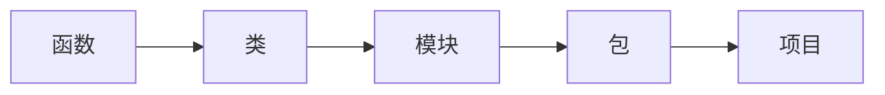
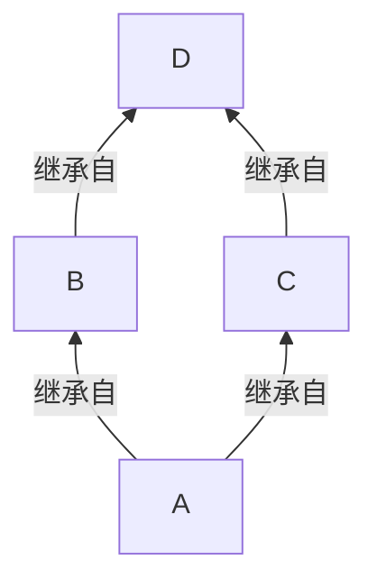
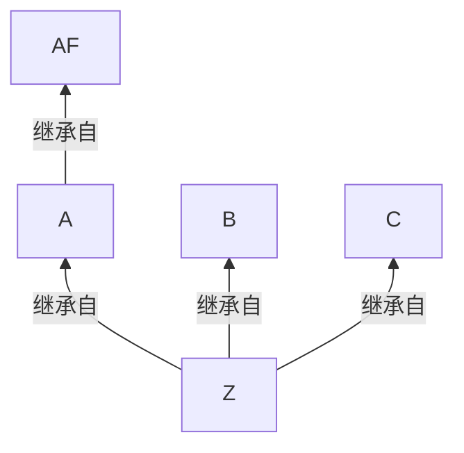

# Python-语言基础

Linux 环境下：Python 交互式终端清屏（Ctrl + Alt + L）

[Python 语言参考手册 — Python 3.12.2 文档](https://docs.python.org/zh-cn/3/reference/index.html)

## 基础语法

介绍 Python 语言的基础语法，和其他语言类似，不过没有自增和自减。

注意！Python 中的一切都是对象！除了 array.array 中的数字！

```python
>>> type(1)
<class 'int'>
>>> type(1.2)
<class 'float'>
>>> type(.2)
<class 'float'>
>>> type(lambda x:x+2)
<class 'function'>
>>> type('hello')
<class 'str'>
```

### 变量

Python 中的变量是定义的时候就要赋值，不能只定义不赋值~

### 分支结构

- if
- if-elif
- if-elif-else
- pass：没有特殊含义，只起到占位的作用，不影响程序的结构，主要是为了保证语法的完整性。

```python
num = 20
if num > 50:
    pass
```

- break，和其他语言一样，退出最内层的整个循环

```python
for item in range(0,100):
    if item > 5:
        break # 会退出循环
```

- continue，和其他语言一样，跳出当前循环，继续执行下一次循环。

### 循环结构

- for
- while
- for-esle：仅当 for 循环运行完毕时（即 for 循环没有被 break 语句中止）才运行 else 块，应当避免使用它。
- while-else：仅当 while 循环因为条件为假值而退出时（即 while 循环没有被 break 语句中止）才运行 else 块，应当避免使用它。

- else 还可以和 try 一起使用：仅当 try 块中没有异常抛出时才运行 else 块。[官方文档](https://docs.python.org/3/reference/compound_stmts.html)还指出，else 子句抛出的异常不会由前面的 except 子句处理。

使用 for 循环计数，当 for 循环正常执行完毕，没有被 break 中断则输出计数完毕

```python
total = 0
for item in range(1, 101):
    total += item
else:
    print(f"计数完毕 total {total}")
```

使用 while-else 改写上面的例子

```python
total = 0
index = 1
while index < 101:
    total += index
    index += 1
else:
    print(f"计数完毕 total {total}")
```

<b>Effective Python：避免使用 for-else，while-else，这种写法会让代码难以阅读</b>

## 数据结构

### 列表

Python 中的列表可以保存不同类型的数据，并且会自动扩容

```python
empty_data = []
data = [1,2,3,True,'hello']
data.append('world')
```

| 方法                  | 说明                            |
| --------------------- | ------------------------------- |
| range / enumerate     | 遍历列表，推荐使用 enumerate    |
| list1 + list2 + list3 | 合并多个列表的元素              |
| list1 * 4             | 重复列表中的所有元素 4 次       |
| ele in lst            | 判断 ele 是否在 lst 中          |
| append(ele)           | 追加单个元素                    |
| lst.expand(nlst)      | 把 nlst 中的数据都追加到 lst 中 |

<b>列表的访问和遍历</b>，重点记忆下 `enumerate` 的用法

<b>Effective Python：使用 enumerate 而非 range</b>

```python
data = [1,2,3,True,'hello']
data[0]
data[0] = 100
data[-1] # 访问最后一个元素
for it in data:
    print(it)
    
for index in range(len(data)):
    print(it)
    
for index, ele in enumerate(data):
    print(index, ele)
```

<b>使用列表的 + 运算，合并多个列表</b>

```python
# 合并列表: 通过 + 实现
list1 = [12,34,6,8,3.13]
list2 = ["荔枝","龙眼","桂圆","榴莲","芒果"]
print(list1,list2)
# 通过 + 实现列表的合并 list + list1， + 会创建一个包含 list 和 list1 元素的新列表
list3 = list1 + list2
```

<b>重复列表中的元素</b>，注意，这种复制是<u>潜复制</u>，复制的是地址值，这意味着，重复的元素会指向同一个对象。

```python
# 重复输出列表中的元素: 通过 * 实现
l = [1,2,3]
ll = l * 4
print(list1)
print(id(ll[0]), id(ll[3])) # 同样的地址 3728，3728
```

<b>使用 in 判断列表中是否存在某个元素</b>。

```python
#判断指定元素是否在列表中,使用成员运算符检查 in 和 not in 返回值是一个布尔类型 True 和 False
list1 = [12,34,4.12,"haha","lele","hehe"]
print(12 in list1)   # True
```

<b>切片运算</b>，列表可以通过切片来拷贝列表中的数据，切片拷贝使用的是浅拷贝。

```python
list2 = [13,45,2,35,7,9]
# 语法: 列表名[开始下标:结束下标]   特点: 前闭后开  包含开始下标的元素不包含结束下标的元素
print(list2[2:4]) # 2 35，不会切到 index 4 的位置，Python 中基本都是左闭，右开
print(list2[2:-1]) # index2 到 index末尾，结果为 2 35 7
```

验证切片运算是浅拷贝。

```python
a = [1,2,3,4]
b = a[:2]
id(a[1]) # 140364673481040
id(b[1]) # 140364673481040
# 地址都一样，拷贝的只是地址值（Python 中数字也是对象）
```

尝试修改不可变对象时会创建一个新的对象，不会影响原对象。

```python
b[1] = 200
b # [1, 200]
a # [1, 2, 3, 4]
```

<b>追加多个元素。</b>

```python
list2 = [13,45,2,35,7,9]
list2.append(1) # 一次只能追加一个对象
list2.expand([1,2,3,]) # 会依次把 1 2 3追加进去，而非追加一整个列表
```

<b>列表也可以作为 stack 使用</b>。

```python
data = [1,2]
data.append(3) # 1 2 3
data.pop() # 3
```

### 元组

元组的用法与列表基本一样，但是元组不可变（列表用 `[]`，元组用 `()`）；

<b>元组的相对不可变</b>

元组与多数 Python 容器（列表、字典、集合等）一样，存储的是对象的引用。如果引用的项是可变的，即便元组本身不可变，项依然可以更改。也就是说，元组的不可变性其实是指 tuple 数据结构的物理内容（即存储的引用）不可变，与引用的对象无关。

```python
data = (1,2,3)
data[0] = 10 # 错误
data = (1,2,[3])
data[2].append(4) # 正确，[3] 的地址并未改变
```

创建只有一个元素的元组，要记得加逗号哦

```python
data = (1,)
```

也可以使用 + * 来创建新的元组

```python
tup1 = (1,2)
tup2 = (3)
tup3 = tup1 + tup2
tup4 = tup3 * 3
```

除了创建方式和不可变，其他都和列表一样。

### 字典

其他语言中的 `哈希表 / map`，key-value 形式，字典中的 key 最好是不可变的！

<b>创建字典</b>

```python
dict1 = {}
dict2 = dict(price=12, num=20, category='food')

# key-value 数量可以不匹配，以数量少的为准
dict3 = dict( zip(['k1','k2'], ['v1','v2']) )

dict4 = dict( [('k1','v1')] )
```

dict 是内置类型的字典，非 python 实现的，如果想实现一个自己的字典，不要试图继承 dict 类，应该继承由 Python 语言实现的类，如：UserDict.

[为什么应该继承自 Python 语言实现的类](FluentPython.md##不要试图子类化内置类型)

<b>访问元素</b>

- `[]` 访问不存在的报错
- `get` 返回 None
- setdefault 方法 -- 没有则插入，始终返回 value

```python
dict2 = dict(price=12, num=20, category='food')
dict2['name'] # error
dict2.get('name') # None
dc.setdefault("price",20) # 12, 由于 price 存在，因此输出 12
```

<b>遍历</b>

遍历所有 key / value 就不写了。

```python
dict2 = dict(price=12, num=20, category='food')
for index, key in enumerate(dict2):
    print(index, key)

for key, value in dict2.items():
    print(key, value)
```

<b>常用操作</b>

合并 / 删除字典中 key-value

```python
d1 = {'k1':1}
d2 = {'k2':[2]}
d1.update(d2) # {'k1': 1, 'k2': [2]}
d1['k2'].append(3) # {'k2': [2, 3]}
d2 # {'k2': [2, 3]}

d1.pop('k1')
d1.popitem() # 随机删除一个

d1.clear()
```

Python 3.9 支持使用 | 和 |= 合并映射

```python
t1 = {'x': 1}
t2 = {'z': 10}
print(t1 | t2)

t1 |= t2
```

### 集合

不允许有重复的元素，其他语言的 set，可以进行交并差，非常有用！

```python
s = set()
s = {1,4,4} # 只有 1,4 两个元素
```

| 方法                | 说明                           |
| ------------------- | ------------------------------ |
| add                 | 添加元素                       |
| update              | 一次追加多个，以列表的形式追加 |
| pop                 | 删除元素，set 是无序的         |
| remove('指定元素')  | 元素不存在会报错               |
| discard('指定元素') | 不存在不会报错！               |

<b>集合关系的运算</b>

| 运算         | 说明                                           |
| ------------ | ---------------------------------------------- |
| `-`          | 差集合                                         |
| `|`          | 并集合                                         |
| `&`          | 交集合                                         |
| `set1 > se2` | 包含判断，判断 set1 是否包含 set2 中的所有元素 |

### 比较元组/字典/集合

当我们使用 == 比较元组、字典和集合时，比较的是它们的内容是否一样，而非比较地址值。

```python
[1] == [1]			# True
{1} == {1}			# True
(1,) == (1,)			# True
{'1':1} == {'1':1}	# True
```

如果想比较地址值，使用 is

```python
[1] is [1]			# True
{1} is {1}			# True
(1,) is (1,)		# True
{'1':1} is {'1':1}	# True
```

### stack & queue

list 可以作为 stack 使用；queue 则是使用的 `collections.deque`

### 赋值和深浅拷贝

<b>赋值</b>

赋值本身上是将对象的地址赋值给其他变量。

```python
l1 = [1,2,3]
l2 = l1 # 只是让 l2 也指向 l1 列表
l2 = [3] # l2 是 3，l1 依旧是 1，2，3 
```

<b>浅拷贝</b>

浅拷贝即拷贝的是对象的地址

```python
import copy

class D:
    def __init__(self, value):
        self._value = value

l = [D(1), D(2)]
l2 = copy.copy(l)
print(l[0],l2[0]) # 地址值一样
```

Python 中的对象分为可变和不可变，拷贝对象的时候都是拷贝地址值。

但是对于不可变对象，在尝试修改不可变对象时，会创建一个新的对象，不会影响原对象。<span style="color:blue">因此，不管是深拷贝还是浅拷贝，对于不可变对象来说都是一样的。</span>

<b>深拷贝</b>

- 深拷贝性能开销比较大，因为都是创建的新对象，而非复制引用。
- copy 下的 deepcopy 可以解决一部分循环引用的拷贝问题

```python
import copy

class D:
    def __init__(self, value):
        self._value = value

l = [D(1), D(2)]
l2 = copy.deepcopy(l)
print(l[0],l2[0]) # 地址值不一样！！
```

### 布尔类型

- `'' / [] / {} / () / 0 / 0.0 / None` 转为布尔类型时为 False
- 布尔类型参与运算时，True 转为 1，False 转为 0
- 空值：None，一种特殊的数据类型

<b>易错题</b>

```python
x = True and "Hello "
y = "Jerry" or "Tom"
z = x + y # Hello Jerry
```

### 可变与不可变⭐

int、float、str、bool、元组是不可变的，即，这些变量的地址值不会发生改变，如果发生改变，会直接创建一个新的对象。

元素中可以存储不可变对象。

### 推导式/生成式⭐

<b>列表推导式</b>

生成 0~1000 的偶数列表。

```python
data = [item for item in range(1001) if item % 2 == 0]
```

<b>字典推导式</b>

生成 0~10 key-value 一致的字典。

```python
data_dict = {i:i for i in range(11) }
data_dict = {i:i*2 for i in range(11) }
```

<b>集合推导式</b>

生成 0~10 组成的集合。

```python
data_set = {item for item in range(11) }
```

## 字符串

- r 取消转义字符
- f 格式化输出字符串，支持 {}
- b 表示当前数据类型是 bytes 类型
- u 表示后续内容以 unicode 格式进行编码，一般用于中文前面

```python
print('hello \n world')  # 有换行
print(r'hello \n world') # 无换行

num = 100
print(f'num = {num}')
```

<b>格式化输出</b>

- % 占位符
- %d 整数
- %s 字符串
- %f 小数
- %.3f 保留三位小数

```python
n=1
m=2
print("n = %d" % n)
print("n=%d, m=%d" % (n,m)) # n=1, m=2
```

<b>运算</b>

也支持切片、+ * 拼接和重复，下标访问，各种迭代

<b>常见操作</b>

- "hello".count('ll') 统计 ll 出现的次数
- "hello ccll".center(50) 填充，用到时再查
- 左右填充啥的，用到再查
- 其他大小写、长度，首字母大小写，大小写字母互换就不记了

## 函数

Python 的函数需要先定义在调用，不能在定义前使用，<span style="color:blue">没有自动提升函数定义位置的功能（C / C++ 现在有这功能吗？）</span>

调用符号 `()`，Python 中的函数可以被赋值给其他变量，然后通过 `()` 进行调用。

```python
def say():
    print(1)
```

### 参数⭐

Python 的函数参数除了形参和实参外，还有：默认参数、位置参数、关键字参数和不定长参数

| 参数类型   | 示例                                 | 说明                                                         |
| ---------- | ------------------------------------ | ------------------------------------------------------------ |
| 默认参数   | def func(name=None)                  | 定义函数时，为形参提供了默认值<br>默认参数必须在最右边       |
| 位置参数   | 运行时的概念                         | 调用函数时传入实际参数的数量和位置<br>都必须和定义函数时保持一致 |
| 关键字参数 | 运行时的概念                         | 调用函数时使用的时键值对的方式<br>key=values，混合传参时关键字参数必须在位置参数之后 |
| 不定长参数 | def fn(\*args)<br>def fn(\*\*kwargs) | 可变长参数，带 \* 号的参数会以<u>元组</u>的形式导入<br>可变长参数，带 \*\* 号的参数以<u>字典</u>的形式传入 |

<b>默认参数</b>

调用函数的时候如果没有传入实参，则取默认参数，传入了实参，则取实参。

```python
def say(name, age=18):
    return name + str(age)

say('jerry')
```

<b>位置参数</b>

位置参数是一个运行时概念，出现在函数调用的时候。

```python
def say(n1, n2, nn=None):
    print(n1, n2, nn)

say(1, 2, 3)		# 按位置参数分配 n1=1,n2=2,nn=3
say(1, nn=3, n2=2)	# 先按位置参数分配 n1=1, 在按关键字参数分配 nn=3, n2=2
say(1, nn=3, n1=2)	# 错误，先按位置参数分配应该是 n1=1, 再按关键字参数分配 nn=3, n1=2, n1 重复赋值，n2 未赋值，因此报错
```

位置参数的位置，在函数调用时要和最初的位置保持一致，如果不一致，会抛出 TypeError 异常。

<b>关键字参数</b>

关键字参数就是指在函数调用时指定参数的名称的参数，我们实现一个装饰器，用来获取那些参数是函数运行时的关键字参数。

```python
def capture_kwargs(func):
    @functools.wraps(func)
    def wrapper(*args, **kwargs):
        print(f"captured keyword arguments:{kwargs}")
        return func(*args, **kwargs)
    return wrapper

@capture_kwargs
def say(n1, n2, nn=None):
    pass

say(1, 2, 3)		# captured keyword arguments:{}, 都是按位置参数进行分配的
say(1, nn=3, n2=2)	# captured keyword arguments:{'nn': 3, 'n2': 2}, nn 和 n2 是按关键字参数进行分配的
```

从上面的代码可以看出来，只要调用函数的时候是：形参名称=数据，那么这个参数就是关键字参数。

需要注意的是，关键字参数必须跟在位置参数后面，而且不能有重复的关键字。

<b>不定长参数</b>

- `*args`：用来接受多个位置参数，得到的参数形式是一个元组
- `**kwargs`：用来接受多个关键字参数，得到的参数形式是一个字典

`*args` 形式

```python
def sums(origin, *args):
    total = origin
    for item in args:
        total += item
    print(type(args))  # <class 'tuple'>
    print(total)

sums(100, 1, 2, 3, 4)
```

`**kwargs` 形式

```python
def get_dict(**kwargs):
    print(kwargs)
    return kwargs

get_dict(a=1, b=2, c=3) # {'a': 1, 'b': 2, 'c': 3}
```

注意，可变长参数要放在最后面！`*args / **kwargs` 都有的话 `*args` 在前。

### 位置参数和关键字参数

如果位置参数和关键字参数混用，那么关键字参数必须要在位置参数的后面，且位置参数的顺序要和函数定义时形参的顺序一致。

```python
def say(n1, n2, nn=None):
    pass

say(1, nn=3, n2=2)
```

混用时，关键字参数必须在位置参数后面，且位置参数的顺序要和函数定义时形参的顺序一样，即 say 的第一个位置参数是赋值给 n1 的，其他参数的赋值是按关键字参数赋值的。

如果这样调用

```python
say(1, nn=3, n1=2)
```

会抛出 TypeError 异常，say() got multiple values for arguments 'n1'，因为位置参数是按顺序进行赋值的，1 是赋值给 n1 的，后面的位置参数 n1=2 又给 n1 赋值了，n1 就得到了多个值。

#### * 的作用⭐

`*` 可以用来解包，也可以用来限定参数只能为关键字参数。

<u>若函数形参中使用 `*`，则 `*` 后面的参数会作为且只能作为关键字参数，必须通过：形参名=值的形式赋值。</u>

```python
def needs(name, *, age):
    print(name, age)
# 不指定 age 会报错 TypeError: needs() takes 1 positional argument but 2 were given

needs('hello',18) # 错误 age 不能作为位置参数，只能作为关键字参数
needs("hello", age=18)	# 正确
```

### / 的作用⭐

在 Python 3.8 及以后的版本中，引入了一种新的语法，即在函数定义中使用斜杠（/）来指示， / 前面的参数只能通过位置传递，而不能作为关键字参数。这被称为“仅限位置参数”。

```python
def func(a, b, /, c, d):
    print(a, b, c, d)

# 错误，a b 只能作为位置参数，不能作为关键字参数
func(a=1, b=1, c=1, d=1)

# 都是正确的， / 后面的即可作为位置参数，又可作为关键字参数
func(1, 2, c=3, d=4)
func(1, 2, 3, d=4)
func(1, 2, d=3, c=4)
```

在这个例子中，a 和 b 是仅限位置参数，而 c 和 d 既可以通过位置也可以通过关键字传递。

### keyword Arguments⭐

官方文档中对 keyword arguments 的总结

```python
def f(pos1, pos2, /, pos_or_kwd, *, kwd1, kwd2):
      -----------    ----------     ----------
        |             |                  |
        |        Positional or keyword   |
        |                                - Keyword only
         -- Positional only
```

### 嵌套

嵌套即函数套函数。什么时候使用嵌套函数呢？

- 闭包 / 定义装饰器的时候。
- 函数很长，并且包含多个相关的子任务，并且不希望这些代码向外暴露 / 污染全局命名空间，那么可以将这些子任务定义为嵌套函数，以提高代码的可读性和可维护性。

```python
def outer():
    def inner():
        print("inner")

    inner()
    print("outer")
    inner()
```

### 匿名函数

> 没有定义名称的函数 --> lambda 函数

- lambda 只是一个表达式，比普通函数简单
- lambda 一般情况下只会书写一行，包含参数 / 实现体 / 返回值

使用 lambda 计算三数之和

```python
# 定义了一个没有名称的函数，但是用变量 fn1 持有了函数
fn1 = lambda x, y, z: x + y + z
print(fn1(1, 2, 3))

# 给定一个 base, 然后以 base 为基础计算三数之和
fn2 = lambda x, y, z, base=100: x + y + z + base
print(fn2(1, 2, 3))
```

### 回调函数

将函数作为参数传递过其他函数使用

```python
def base(n, fun):
    return fun(n) + n

print(base(10, lambda n: n ** 2)) # 110
```

### 偏函数

固定函数的某些参数 `functools.partial`，避免一直传入重复的值。

固定 int 函数的 base 值

```python
from functools import partial

int2 = partial(int, base=2)
print(int2('100'))
```

### 递归

递归中存在隐式循环，如果隐式循环的次数过多，会出现内存泄漏（栈溢出）。在 Python 中默认的递归的次数的限制是 1000 次。

## 闭包和装饰器⭐

### 闭包

如果在一个函数的内部定义另外一个函数，外部的函数叫做外函数，内部的函数叫做内函数。

```python
def out():
    print("out")
    def inner(): # 内函数
        print("inner")
```

内部函数引用外部函数的变量，且外部函数的返回值是内部函数，就构成了一个闭包，则这个内部函数就被称为闭包 <b>[closure]</b>

<b>实现函数闭包的条件</b>

- 必须是函数嵌套函数
- 内部函数引用外部函数的变量
- 外部函数必须返回内部的函数

<span style="color:purple">简而言之，闭包就是延申了作用域的函数；</span>只有函数套函数，且内函数用了外函数的变量，在外函数的外部调用内函数才会出现作用域延申。

<b>一个典型的闭包</b>

```python
def outer():
    data = [0, 1, 2]
	# 闭包一定是内函数引用了外函数的变量
    def inner(insert):
        data.append(insert)

    return inner
```

### 装饰器

在代码运行期间，可以动态增强函数功能的方式，被称为装饰器【Decorator】，也就是说，在不修改原函数的基础上，给原函数增加功能。

好处：在团队开发中，如果两个或者两个以上的程序员会用到相同的功能，但是功能又有细微的差别，采用装饰器：相互不影响，简化代码

<b>简单装饰器</b>

装饰器的语法也很简洁，一般由外函数和内函数组成，外函数的参数一定是被装饰的 `function`，内函数用于增强被装饰的 `function`。类似于 Java 的注解开发，不过 Python 的装饰器更为简洁。

需求：给上面的 test 函数增加一个功能, 输出 I am fine

```python
def test():
	print("hello")
```

装饰器

```python
def deco(fun):
    # 内部函数引用了外部的变量
    def inner():
        fun()
        print("I am fine")
    return inner

print(test.__name__) # test
test = deco(test)
print(test.__name__) # inner
test() # hello \n I am fine
```

简写装饰器，将装饰器放在被装饰函数上方

```python
@deco
def test():
    print("hello")
```

实际开发中，装饰器通常集中定义在一个模块中，然后再应用到其他模块中的函数上。

### 不定长参数装饰器

Python 中的不定长参数的语法是 `*args`，适用于被装饰函数有形参的情况

```python
def mul_param(func):
    def inner(*args):
        print("result = ", end=' ')
        func(*args)
    return inner

@mul_param
def add(one, two):
    print(one + two)

@mul_param
def sums(one, two, three):
    print(one + two + three)

add(1, 2)
sums(1, 2, 4)
```

如果需要返回值，根据实际业务给出对应的返回值即可，假定上面的方法不是打印，而是要返回计算结果。

```python
def mul_param(func):
    def inner(*args):
        print("result = ", end=' ')
        return func(*args)
    return inner

@mul_param
def add(one, two):
    print(one + two)
    return one + two

add(1, 2)
sums(1, 2, 4)
```

也可以多个装饰器作用在同一个函数上。

### 作用域分类

局部作用域：L【Local】

函数作用域：E【Enclosing】将变量定义在闭包外的函数中

全局作用域：G【Global】

內建作用域：B【Built-in】在 Python 内置函数中，Python 解释器自己定义的作用域

### global & nonolocal

global：当内部作用域【局部作用域，函数作用域】<u>想要修改全局变量</u>的时候，需要使用 global，否则会被当成局部变量。

<b>global</b>

```python
global_num = 10

def test_global():
    print(global_num) # 正常访问
```

再看下面的例子

```python
global_num = 10

def test_global():
    print(global_num) # 报错，提示未定义就使用。
    global_num = 10 
```

因为没有对 global_num 使用 global 关键字，下方又定义了一个局部变量 `global_num = 10`。此时，会认为函数内部的 global_num 是局部变量。由于在定义前使用了 global_num，代码报错提示未定义就使用。

```python
global_num = 10

def test_global():
    global global_num
    print(global_num)
    global_num = 10
```

<b>nonlocal：主要用于闭包函数中，将外部函数的变量绑定在内部函数上，可以一直使用。</b>

- 实现计数器：将外部函数的变量绑定在内部函数上，内部函数就可以一直使用这个自由变量了。

```python
def outer():
    x = 0
    def inner():
        # x = 23
        # global x   # 使用的是 x = 15
        nonlocal x  # 这时候使用的变量是 x = 19
        x += 1
        print("inner:",x)
    return inner

counter = outer()
counter() # 1
counter() # 2
counter() # 3
```

`inner` 函数通过 `nonlocal x` 声明是 `x` 变成了自由变量绑定在了内函数上，此时内函数修改的是 `outer` 函数中的 `x`，而不是创建一个新的局部变量 `x`。

如果不使用 `nonlocal`，外函数的局部变量（x=19）是不可变对象，当内函数企图修改 x 的值，此时会创建一个新的对象，这个新对象是位于内函数的局部变量，内函数调用完毕就消失了。

<span style="color:blue">闭包中的内函数能一直使用外函数的局部变量就是因为外函数的局部变量变成了自由变量，绑定在了内函数上。</span>

## 生成器 & 迭代器

### 生成器⭐

> 生成器是用来生成数据的，不同于列表一次生成所有数据，<u>生成器中的数据是一个一个产生的，可以节省内存</u>。

- 可以 for 循环迭代
- 可以用 next 去生成器的下一个元素，没数据了会输出 StopIteration

> 生成器可以用生成器表达式和生成器函数产生。

- 生成器表达式语法和推导式类似，不过 `[]` 换成了 `()`
- 生成器函数包含 yield 关键字

> 使用生成器生成 0~100 的偶数

<b>生成器表达式</b>

```python
data = (item for item in range(0,101) if item%2 == 0 )
```

<b>生成器函数--生成生成器的函数</b>

```python
def gen():
    for item in range(0, 101):
        if item % 2 == 0:
            yield item

# 得到一个生成器
data = gen()
print(next(data))
print(next(data))
print(next(data))
```

> 对比生成器和普通列表的内存消耗

```python
# 普通列表 - 约 1.5G 内存
data = [i for i in range(100000000) if i%2==0 ]
for item in data:
    import time
    time.sleep(100)
    print(item)
    
# 生成器 - 约 0G 内存
data = (i for i in range(100000000) if i%2==0)
for item in data:
    import time
    time.sleep(100)
    print(item)
```

### 迭代器⭐

可迭代对象【实体】，可以直接作用于 for 循环的实体【Iterable】

可以直接作用于 for 循环的数据类型：list, tuple, dict, set, string, generator【() 和 yield】

isinstance：判断一个实体是否是可迭代的对象

```python
# 使用可迭代对象   需要导入collections.abc
from collections.abc import Iterable

# 通过 isinstance:判断一个实体是否是可迭代的对象	   返回值是bool类型,True或者False

from collections.abc import Iterable
# 可迭代对象:能够被 for 循环遍历的实体就是可迭代对象

print(isinstance([], Iterable))   # True
print(isinstance((), Iterable))   # True
print(isinstance({}, Iterable))   # True
print(isinstance("loha", Iterable)) # True
# 生成器
print(isinstance((i for i in range(1,10)),Iterable))  # True

# 列表\元组\字典\字符串\生成器  都是可迭代对象

print(isinstance(11,Iterable))  # False
print(isinstance(True,Iterable))  # False

# 整型\浮点型\布尔类型 都不是可迭代对象
```

可迭代对象可以通过 Iter(可迭代对象) 变成迭代器。有啥用呢？好像有没啥用。原本的可迭代对象内存占用非常大的话，转成迭代器原先的对象也不会消失。除非手动 del + 手动 gc。

## 常用库

### random

| 方法                     | 作用                                                         |
| ------------------------ | ------------------------------------------------------------ |
| random.choice([x,x,x,x]) | 从列表中随机抽取一个元素                                     |
| random.uniform(0, 1)     | 随机生成一个指定范围内的实数,结果是浮点数                    |
| random.shuffle([x,x,x])  | 将列表中的元素进行随机排序，如果是自定义的对象，要实现 setItem 方法哦 |

### os

平时用到比较多，不过也没什么好记的，用到查就可以了，学 API 用法是最没意思的。

```python
import os

print(os.curdir) # 当前目录

print(os.getcwd())	# 获取当前路径

print(os.path.join('D:/', 'test.py')) # 拼接路径

print(os.path.split(r'C:\software\code\base\main.py'))# 拆分目录和文件名

print(os.path.splitext(r'C:\software\code\base\main.py'))# 拆分文件和后缀名
print(os.path.getsize(r'C:\software\code\base\main.py'))# 获取文件大小
```

一个有意思的 API `os.walk`，递归遍历指定文件夹下的所有目录和文件

```python
import os

for root, dirs, files in os.walk('example_dir'):
    print(root)  # 当前目录路径
    print(dirs)  # 当前目录下的子目录列表
    print(files)  # 当前目录下的文件列表
```

> os 常用方法

| 函数                 | 描述                                       |
| -------------------- | ------------------------------------------ |
| `os.listdir()`       | 获取指定路径下的文件夹和文件（是一个列表） |
| `os.mkdir()`         | 创建目录（目录存在，不能创建）             |
| `os.makedirs()`      | 创建多层目录                               |
| `os.rmdir()`         | 删除目录                                   |
| `os.remove()`        | 删除文件                                   |
| `os.rename()`        | 重命名文件或者重命名文件夹                 |
| `os.path.join()`     | 拼接路径                                   |
| `os.path.split()`    | 拆分路径                                   |
| `os.path.splitext()` | 拆分文件名和扩展名                         |
| `os.path.isfile()`   | 判断是否是文件                             |
| `os.path.isdir()`    | 判断是否是目录                             |
| `os.path.exists()`   | 判断文件或者文件夹是否存在                 |
| `os.path.getsize()`  | 获取文件大小                               |

### time

| 函数                | 描述           |
| ------------------- | -------------- |
| time.time()         | 获取当前时间戳 |
| time.perf_counter() | 精确的时间戳   |
| time.sleep(num)     | 休眠指定秒数   |

```python
import time

print(time.time() - time.time()) # 0
print(time.perf_counter() - time.perf_counter()) # 非 0
```

### datetime

对 time 的封装，获取日期，时间，计算时间很方便。

```python
import datetime
# 获取当前的日期对象
date = datetime.datetime.now()
print(date)

# 设置日期对象
date1 = datetime.datetime(year=2022,month=11,day=10,hour=10,minute=23,second=11)
print(date1)
print(type(date1))  # <class 'datetime.datetime'>
print(date1.year,date1.month,date1.day)  # 年  月   日
print(date1.hour,date1.minute,date1.second) # 时  分   秒
print(date1.date()) # 2022-11-10
print(date1.time()) # 10:23:11

# 将datetime.datetime类型转换为字符串

# strftime() 将日期对象转换为字符串
print(type(date1.strftime("%Y-%m-%d %H:%M:%S")))   # <class 'str'>
print(date1.strftime("%Y{}%m{}%d{}").format("年","月","日"))  #2022年11月10日

# strptime() 将字符串转换为日期对象
str1 = "2021-07-27 10:40:21"
print(type(datetime.datetime.strptime(str1,'%Y-%m-%d %H:%M:%S')))  # <class 'datetime.datetime'>

# timestamp()  日期对象转换为时间戳 1668046991.0

# fromtimestamp()  时间戳转换为日期对象
print(datetime.datetime.fromtimestamp(1668046991.0))  # 2022-11-10 10:23:11

# 时间差
d1 = datetime.datetime(2022,1,13)
d2 = datetime.datetime(2021,10,1)
print(d1 - d2)
print(d2 - d1)

# timedelta   代表两个日期之间的时间差
dt = datetime.timedelta(days=5,hours=8)
print(d1 + dt)  #  2022-01-18 08:00:00
print(d1 - dt)  #  2022-01-07 16:00:00

'''
# %y 两位数的年份表示（00-99）
# %Y 四位数的年份表示（0000-9999）
# %m 月份（01-12）
# %d 月内中的一天（0-31）
# %H 24小时制小时数（0-23）
# %I 12小时制小时数（01-12）
# %M 分钟数（00-59）
# %S 秒（00-59）
# %a 本地简化星期名称
# %A 本地完整星期名称
# %b 本地简化的月份名称
# %B 本地完整的月份名称
# %c 本地相应的日期表示和时间表示
# %j 年内的一天（001-366）
# %p 本地A.M.或P.M.的等价符
# %U 一年中的星期数（00-53）星期天为星期的开始
# %w 星期（0-6），星期天为星期的开始
# %W 一年中的星期数（00-53）星期一为星期的开始
# %x 本地相应的日期表示
# %X 本地相应的时间表示
# %% %号本身
'''
```

### hashlib 加密

```python
# 加密模块
import hashlib
'''
md5加密:不可逆的加密算法(只能加密不能解密)   明文和密文一一对应  加盐(随的字符串或者字符)
非对称加密:(公钥和私钥)  通常情况下,公钥用来加密  私钥用来解密  比如 RSA
对称加密:加密和解密使用同一个密钥  比如DES和AES
'''
m = hashlib.md5()
m.update('hello world'.encode()) 
print(m.hexdigest())

print(hashlib.md5("hello".encode).hexdigest())

# 对中文加密
data = "你好"
print(hashlib.md5(data.encode(encoding="UTF-8")).hexdigest())
```

### json

在 Python 中，可以使用 json 库实现字典和 JSON 格式字符串之间的互相转换。json 模块中的四个方法。

| 方法  | 说明                                       |
| ----- | ------------------------------------------ |
| dump  | 将 Python 对象按照 JSON 格式序列化到文件中 |
| dumps | 将 Python 对象处理成 JSON 格式的字符串     |
| load  | 将文件中的 JSON 数据反序列化成对象         |
| loads | 将字符串的内容反序列化成 Python 对象       |

带 s 的表示是对字符串进行操作或操作结果是字符串。

```python
import json

my_dict = {
    'name': '骆昊',
    'age': 40,
    'friends': ['王大锤', '白元芳'],
    'cars': [
        {'brand': 'BMW', 'max_speed': 240},
        {'brand': 'Audi', 'max_speed': 280},
    ]
}
# 将字典转为 json 字符串
str = json.dumps(my_dict)
#将 json 字符串转为字典 
obj = json.loads(str)
```

### request

获取网络上的数据（HTTP 协议）

```python
import requests

resp = requests.get('http://api.tianapi.com/guonei/?key=APIKey&num=10')
if resp.status_code == 200:
    data_model = resp.json()
    for news in data_model['newslist']:
        print(news['title'])
        print(news['url'])
        print('-' * 60)
```

## 包 & 模块⭐

### 包

包（文件夹），一种管理 Python 模块的命名空间的形式，采用"点语法" `os.path`。

<b>包和文件夹之间的区别</b>

Python 的包中有一个特殊的文件 `__init__.py` 文件，里面可以不写任何内容，包含 `__init__.py` 文件的文件夹，编译器会将这个目录视为一个包。

```python
# 1.包:package
 # 包含了 __init__.py的文件的文件夹叫做包
```

### 模块

每个 `.py` 文件就被称为一个模块，通过结合包的使用来组织文件。

> 封装思路



<b>为什么要使用模块？</b>

- 可提高代码的可维护性
- 可提高代码的复用性【当一个模块被完成之后，可以在多个文件中使用】
- 引用其他的模块【第三方模块】  
- 避免函数名和变量的命名冲突

<b>导入方式</b>

```python
# 模块导入的方式:
# 第一种: import 模块名
# 第二种: from 模块名 import 模块名里面的方法
# 示例:
# 导入内置模块
import os
from random import randint

# 给模块起别名 as
import random as r
```

<b>模块的搜索顺序</b>

如果在当前目录则直接导入，没有则搜索系统目录。

python 中的每个模块都有一个内置属性 `__file__` 可以查看模块的完整路径

<b>`__init__.py` 的作用</b>

当我们导入一个包时，Python 会自动执行该包中的 `__init__.py` 文件，这意味着，如果我们需要校验当前包的运行环境是否符合要求，可以在 `__init__.py` 里写代码校验环境是否符合要求。

```python
例如，假设有以下的包结构：

mypackage/
    __init__.py
    one.py
```

```python
# 在__init__.py文件中可以书写校验环境的代码，不符合要求就抛出异常
# 终于理解一些github开源算法的 init 文件了...

try:
    import numpy
    if numpy.__version__ < '1.21.4':
        raise RuntimeError("numpy version is too low")
except ModuleNotFoundError:
    raise RuntimeError("not found numpy")

from .one import say
```

同时，我们也可以在 `__init__.py` 中将包内部的模块和函数暴露给外部使用，而不需要显式地导入每个模块。

```python
例如，假设你有以下的包结构：

mypackage/
    __init__.py
    module1.py
    module2.py
在__init__.py文件中，你有这样的导入语句：
```

```python
from .module1 import func1
from .module2 import func2
```

在其他 package 中导入 mypackage

```python
# 然后，在你的主程序中，你可以这样做：

import mypackage

mypackage.func1()  # 可以直接访问 func1
mypackage.func2()  # 可以直接访问 func2
```

### 安装模块

以安装 numpy 为例

- 安装 numpy ==  `pip install numpy`
- 卸载 numpy == `pip uninstall numpy`

## 面向对象基础

目前的三种主流编程方式

- 面向过程：根据业务逻辑从上到下写代码
- 函数式：将某功能代码封装到函数中，日后便无需重复编写，仅调用函数即可
- 面向对象：对函数进行分类和封装，让开发“更快更好更…”

### 面向对象

#### 面向对象概念

- 类就是一个模板，模板里可以包含多个函数，函数里实现一些功能
- 对象则是根据模板创建的实例，通过实例对象可以执行类中的函数

```python
# 创建Test类,python3 初始类都继承object类
class Test(object):
    
    # 类属性, 有点像 Java 的静态字段
    desc = "这是一个 Test 类"
    
    # 类中定义的函数也叫方法
    def demo(self):  # 类中的函数第一个参数必须是self
        print("self=", self)
        print("Method=", dir(self))
        print("Hello")

    def __init__(self, name, age):
        print("初始化变量啦！")
        self.name = name
        self.age = age

    def __new__(cls, *args, **kwargs):
        print("new 对象啦！")
        return super().__new__(cls)
    	# Python2 需要手动传入两个参数，Python3 会自动捕获这些参数
        # 不用显示传参
        # return super(Test, cls).__new__(cls)

# 获取 obj 的所有属性
print(dir(obj))

# 查看 Test 类的所有超类
print(Test.__bases__)

# 根据类 Test 创建对象 obj
obj = Test('jerry', 10)  # 类名加括号
obj.demo()  # 执行 demo 方法

# 获取一个实例的类名
print(obj.__class__.__name__)

# 判断一个对象是否拥有某个属性
if hasattr(obj, 'demo'):
    print("it has demo method")
else:
    print("have no method")
"""
new 对象啦！	===> 先执行 new 方法
初始化变量啦！	  ===> 再执行 init 方法
self= <__main__.Test object at 0x00000283D943F910>
Method= ['__class__', '__delattr__', '__dict__', '__dir__', '__doc__', ...,]
Hello
Test
it has demo method
"""
```

- Python 创建对象和初始化属性是分开来的，new 负责创建对象，init 负责初始化数据。
- self 相当于其他语言的 this。
- 和其他语言一样，对象在 heap，方法调用和局部变量在 stack 里，每个对象的成员变量会在堆空间中开辟一份自己的空间，相互之间互不影响。

#### 封装、继承、多态

- 封装，只暴露出我希望你看到的，不希望你看到的不暴露，封装的本质就是属性私有化的过程。
- 继承，子类可以继承父类的内容；Python 支持多继承。
- 多态，Python 不支持强类型语言的多态，采用的鸭子类型。

### 一切皆对象

<b>Python 中的所有内容都是对象，除了 array.array 中存储的数据。</b>

验证 array.array 中的数据不是对象。

```python
import array
import sys

t = array.array('i', [1, 2, 3, 4, 5]).tobytes()
print(sys.getsizeof(t))     # 53
print(sys.getsizeof(1))     # 28
```

对于小整数，Python 解释器会使用一个整数池来缓存这些值，以便重复使用，这种机制被称为“小整数优化”（用的享元模式吗？）

具体来说，当整数值位于 [-x, y] 的范围内时，Python 解释器会将这些值对应的整数对象缓存起来，直接使用缓存的对象。这样做可以减少创建对象的开销和内存分配的次数，提高程序的运行效率。

具体的范围是多少呢？在 Python Shell 中测试了下，[-5, +∞] 似乎都会被缓存。

```shell
id(-6)	# 4608
id(-6)	# 4864
```

使用 PyCharm 的话，会缓存很小的负数。

```python
c = -2000000
d = -2000000
print("=" * 20)
print(id(c))	# 1024
print(id(d))	# 1024
```

### 封装

#### 私有化属性

<span style="color:blue">封装的本质就是属性私有化的过程，Python 的私有化可以使用 `__` 来实现，但是不推荐，Python 社区推荐的做法是使用 `_` 告诉程序员我希望它是私有的，请不要使用。</span>

<b>`__` 实现私有化</b>

```python
class Test:
    __name = 'unknow'

    def __init__(self):
        self.__age = 10


t = Test()
print(Test.__name)  # 'Test' has no attribute '__name'
print(Test._Test__name) # 可以获取到
print(t._Test__age)
```

由于 `__` 防君子不防小人，因此 Python 更推荐使用 `_` 来表明字段是私有的，请你不要访问。

#### set or get

Python 中可以像 Java 一样提供 setter / getter 方法访问属性吗？可以提供！但是 Python 更推荐使用 @property 装饰器实现类似于 setter / getter 的功能。

<span style="color:blue">Python 内置的 @property 装饰器可以将一个方法变成属性使用，使得这个方法可以被当作属性那样直接访问，而不是通过调用的方式。</span>

- @property 装饰器：简化 get 函数和 set 函数
- @property 装饰器作用相当于 get 函数，同时，会生成一个新的装饰器
- @属性名.settter，相当于 set 函数的作用

```python
class Dog:
    def __init__(self, name):
        self._name = name

    @property
    def name(self):
        return self._name

    @name.setter
    def name(self, new_name):
        self._name = new_name

jerry = Dog('jerry')
jerry.name = 'jerry2'
print(jerry.name)
```

### 类方法和静态方法

<b>类方法：</b>使用 @classmethod 装饰器修饰的方法，被称为类方法，可以通过类名调用，也可以通过对象调用，但是一般情况下使用类名调用

<b>静态方法：</b>使用 @staticmethod 装饰器修饰的方法，被称为静态方法，可以通过类名调用，也可以通过对象调用，但是一般情况下使用类名调用。

<b style="color:red">静态方法其实和类没有任何关系，只是恰巧定义在了类中</b>

```python
class Animal():
    # 类属性
    name = "牧羊犬"
    # 对象属性
    def __init__(self,name,sex):
        self.name = name
        self.sex = sex

    ''' 
         类方法:
             1.通过@classmethod装饰器修饰的方法就是类方法
             2.类方法可以使用类名或者对象调用. 但是一般情况下使用类名调用类方法(节省内存)
             3.没有self,在类方法中不可以使用其他对象的属性和方法(包括私有属性和私有方法)
             4.可以调用类属性和其他的类方法,  通过cls来调用
             5.形参的名字cls是class的简写,可以更换,只不过是约定俗成的写法而已
             6.cls表示的是当前类
     '''
        @classmethod
        def run(cls):
            print("我是类方法")
            print(cls.name)
            print(cls == Animal) # cls表示的是当前类

            '''
     静态方法:
         1.通过@staticmethod装饰器修饰的方法就是静态方法
         2.通过类名或者对象名都可以调用静态方法  (推荐使用类名调用)
         3.静态方法形式参数中没有cls, 在静态方法中不建议调用(类属性\类方法\静态方法)
         4.静态方法一般是一个单独的方法,只是写在类中
 '''
            # 静态方法, 与类没有任何关系
            @staticmethod
            def eat():
                print("我是静态方法")

                Animal.run()  # 类名调用类方法
                Animal.eat()  # 类调用静态方法
                # 创建对象
                dog = Animal('中华土狗','公')
                # dog.run()  # 对象调用类方法
```

### 类的属性

我们可以在<u>类中定义属性，这类似于 Java 中的静态变量</u>。

```python
class T:
    a = 10
    b = 20
    def __init__(self):
        print("create class T")
```

<b style="color:red">注意：Python 的变量一定是要定义的时候赋值！！不能只定义，不赋值！！</b>

### 类中的常用属性

| 属性               | 说明                                                         |
| ------------------ | ------------------------------------------------------------ |
| <b>`__name__`</b>  | 通过类名访问，获取类名字符串；不能通过对象访问，否则报错     |
| <b>`__dict__`</b>  | 通过类名访问，获取指定类的信息【类方法，静态方法，成员方法】，返回的是一个字典；<br>通过对象访问，获取的该对象的信息【所有的属性和值】，返回的是一个字典 |
| <b>`__bases__`</b> | 通过类名访问，查看指定类的所有的父类【基类】                 |

测试代码

```python
class Animal(object):
    def __init__(self,name,sex):
        self.name = name
        self.sex = sex

    def eat(self):
        print("吃")

animal = Animal("二哈","公狗")
# __name__ 通过类名访问获取当前类的类名,不能通过对象访问
print(Animal.__name__)   # Animal
# __dict__以字典的形式返回类的属性和方法 以及 对象的属性
print(Animal.__dict__)  # 以字典的形式显示类的属性和方法
print(animal.__dict__)  # 以字典的形式显示对象的属性

# __bases__ 获取指定类的父类  返回的是一个元组
print(Animal.__bases__)  # (<class 'object'>,)
```

<b>魔法方法 `__str__ / __repr__`</b>

`__str__` 是给终端用户看的，`__repr__` 是给直接使用 Python shell 的用户看的，如果实现了 `repr` 没有实现 `str`，print 的时候默认打印 `repr`.

```python
# 魔术方法: __str__() 和 __repr__()
class Person(object):
    def __init__(self,name,age):
        self.name = name
        self.age = age

    def swim(self):
        print("游泳的方法")

    # __str__() 触发时机: 当打印对象的时候,自动触发.  
    # 一般用它来以字符串的形式返回对象的相关信息,必须使用return返回数据
    '''
    def __str__(self):
        return f"姓名是:{self.name},年龄是:{self.age}"
        # print("姓名是:{self.name},年龄是:{self.age}")
    '''
    # __repr__()作用和 __str__()类似,若两者都存在,执行 __str__()
    def __repr__(self):
        return f"姓名是:{self.name},年龄是:{self.age}"
        # print("姓名是:{self.name},年龄是:{self.age}")

xiaohong = Person("小红",18)
print(xiaohong)
```

### 单根继承

单根继承即只继承一个类

```python
class Animal(object):
    def eat(self):
        print('eat')

class Cat(Animal):
    def __init__(self, name):
        super().__init__()
        self.name = name
        self.breed = 'cat'

c = Cat('cat')
```

### 多继承

多继承是指可以继承多个类，Python 的多继承分新式类与经典类，Python3 默认都是新式多继承。

```python
class Father(object):
    def __init__(self, surname):
        self.surname = surname

    def make_money(self):
        print("挣钱!")

class Mother(object):
    def __init__(self, height):
        self.height = height

    def eat(self):
        print("干饭!")

# 子类继承多个父类时,在括号内写多个父类名称即可
class Son(Father, Mother):  
    def __init__(self, surname, height, weight):
        # 继承父类的构造函数
        Father.__init__(self, surname)
        Mother.__init__(self, height)
        self.weight = weight

    def play(self):
        print("play!")

        
son = Son("jerry", "178", 140)
print(son.surname, son.height, son.weight)

son.make_money()
son.eat()
son.play()
```

### 多继承下的解析顺序

<b>此处解释下 Python 方法的解析顺序</b>

以下图 A、B、C、D 的继承关系为例进行说明：A 继承了 B 和 C，B 和 C 都继承了 D。



按照 Python 方法的解析顺序（C3 线性化算法规则），解析顺序是 A B C D, B C 的共同子类会放到 A 继承的最后一个类（C）的后面

再看一个例子，Z 继承 A B C，A 继承 AF



解析顺序是 A、AF、B、C；因为只有 A 继承了 AF，所以 AF 放到 A 的后面

经典类，按 Python 方法的解析顺序查找，输出 'AF'

```python
class D:
    def bar(self):
        print('D.bar')

class C(D):
    def bar(self):
        print('C.bar')

class B(D):
    pass

class A(B, C):
    pass

a = A()
a.bar() # C

print(A.__mro__)  # A B C D object 的查找顺序
```

```python
class D:
    num = "D"

class C(D):
    num = "C"

class B(D):
    pass

class A(B, C):
    pass

print(A().num)  # C
print(A.__mro__)  # A B C D
```

### 鸭子型

Python 是通过使用鸭子型来实现其他 OOP 语言的多态；下面的代码展示了 Python 的鸭子型

```python
class Animal(object):
    def run(self):
        print('Animal is running...')


class Dog(Animal):
    def run(self):
        print('Dog is running...')


class People(object):
    def run(self):
        print("People is run...")


def run_twice(animal):
    animal.run()


run_twice(Dog())  # Dog is running...
# people 这个类却和 animal 没有任何关系，但是其中却有 run 这个方法
run_twice(People())  # People is run...

print(isinstance(Dog(), Animal))  # True
print(isinstance(Animal(), Dog))  # False
```

尽管 People 不是 Animal 类型的，但是他和 Animal 方法都有 run 方法，可以正常运行，这就是鸭子型，<u>行为看起来像鸭子就行。</u>

### 单例模式

单例模式是指，确保某个类的对象始终只有一个，Python 的模块就是天然的单例设计模式。

<b>模块的工作原理</b>

import xxx 模块被第一次导入的时候，会生成一个 `.pyc` 文件，当第二次导入的时候，会直接加载 `.pyc` 文件，将不会再去执行模块源代码。

<b>使用模块的特点实现单例模式，不推荐，只是演示下模块只会被执行一次</b>

```python
# singleton.py
class Singleton:
    def __init__(self):
        self.value = None

    def set_value(self, value):
        self.value = value

    def get_value(self):
        return self.value

# 这里我们直接实例化Singleton类
singletion = Singletion();
```

<span style="color:blue">在其他地方导入这个模块，第一次导入模块时，会执行模块中的代码，但是也就只执行一次！而这一次恰好创建了实例对象！我们使用的时候就不再手动 new 对象，而是直接导入现成的 singletion 对象</span>

```python
# 从 singleton.py 中导入 singletion 变量
from singleton import singletion

s1 = singletion
s1.set_value('Hello, World!')

s2 = singletion
print(s2.get_value())  # 输出：Hello, World!
print(s1 is s2)  # 输出：True
```

在其他地方导入这个模块时，Python 会自动创建一个 `Singleton` 的实例。因此，无论我们导入多少次这个模块，得到的总是同一个 `Singleton` 实例。

<b>使用 `__new__` 实现单例模式</b>

```python
class Person(object):
    # 定义一个类属性,接收创建好的对象
    instance = None

    # __init__ 对象初始化属性时,自动触发
    def __init__(self, name):
        print("__init__")
        self.name = name

    @classmethod
    def __new__(cls, *args, **kwargs):
        print("__new__")
        # 如果类属性的instance == None表示 该类未创建过对象
        if cls.instance == None:
            cls.instance = super().__new__(cls)
        return cls.instance

p = Person("jerry")
p1 = Person("jerry")
print(p == p1) # True
# __new__():在创建对象的时候自动触发
# __init__():在给创建的对象赋值属性的时候触发.dd
```

视频中提了一句单例模式在数据库中的应用：数据库连接池操作`==>`应用程序中多处需要连接到数据库`==>`只需要创建一个连接池即可，避免资源的浪费。

## 面向对象提高

### 类中的字段

类中的字段包括：普通字段和类字段（类字段与其他语言中的静态变量相似），他们在定义和使用中有所区别，而最本质的区别是内存中保存的位置不同

- <b>普通字段属于对象</b>
- <b>类字段属于类</b>

```python
class Province:
    # 类字段（Java中的静态变量）
    country = '中国'

    def __init__(self, name):
        # 普通字段
        self.name = name

# 直接访问普通字段
obj = Province('河北省')
print(obj.name)

# 直接访问静态字段
print(Province.country)
```

### 类中的方法

类的方法包括：普通方法和类方法，类方法要用 classmethod 装饰器修饰。

```python
class MyClass:
    # 这是一个普通方法
    def my_instance_method(self):
        print("This is an instance method.")

    # 这是一个类方法
    @classmethod
    def my_class_method(cls):
        print("This is a class method.")

# 创建一个类的实例
my_instance = MyClass()
# 调用普通方法
my_instance.my_instance_method("Hello", "World")
# 调用类方法
MyClass.my_class_method("Hello", "World")
```

> 还有抽象方法和静态方法

- 抽象方法类似于 Java 中的抽象方法，Python 的抽象方法需要结合 abc.ABC 和 @abc.abstractmethod 使用。
- 静态方法其实就是与类无关的普通方法，只是写在了类里面，需要用到装饰器 @staticmethod。

### 类中的属性

Python 中的属性是普通方法的变种，属性有两种定义方式，一种是通过装饰器来定义，一种是静态字段。

- 装饰器 即：在方法上应用装饰器
- 类字段 即：在类中定义值为 property 对象的静态字段

装饰器方式：在类的普通方法上应用 @property 装饰器

类字段方式：创建值为 property 对象的静态字段

<b>装饰器方式</b>

```python
class Goods(object):
    def __init__(self):
        self._prices = 100
        self._name = 'milk'

    @property
    def price(self):
        return self._prices, self._name

    @price.setter
    def price(self, value):
        assert len(value) == 2, ValueError('should contains two value')
        self._prices = value[0]
        self._name = value[1]


obj = Goods()
print(obj.price)
obj.price = (200, 'jack')
print(obj.price)
```

属性的定义、调用和赋值要注意一下几点

- 定义时，在普通方法的基础上添加 @property 装饰器；
- 定义时，属性仅有一个 self 参数
- 赋值时，只允许传递一个变量，如果有多个值，可以处理成元组、列表或其他可包含多个值的对象
- 调用时，无需括号

<b>类字段方式</b>

```python
class Foo(object):
    def get_bar(self):
        return 'hello'

    def set_bar(self, value):
        print('Set bar to', value)

    BAR = property(get_bar, set_bar)


obj = Foo()
print(obj.BAR)  # 自动调用get_bar方法，并获取方法的返回值
obj.BAR = 'world'  # 自动调用set_bar方法，并传入参数'world'
print(obj.BAR)  #
"""
hello
Set bar to world
hello
"""
```

property 的构造方法中有个四个参数，要用的时候点击源码看注释即可。

### 实例属性与类属性的关系

实例属性无法更改类属性的引用，只会给自己的实例绑定一个实例属性，具体请看代码。

```python
class A(object):
    x = 7 # 定义了一个类属性

f1 = A()
f2 = A()

# 这里是给实例 f1 绑定了一个实例属性，属性的值是 A.x + 7
f1.x += 7 

print(A.x)  # 7
print(f1.x)  # 14  getattr(f1, 'x') 和 f1.x 效果一样
print(f2.x)  # 7
```

如果类属性和实例属性重名了，可以使用<b>类名</b>访问指定对象的类属性。

<b>特殊的类属性</b>

| 类属性                | 说明           |
| --------------------- | -------------- |
| `class.__class__`     | 类的类型       |
| `class.__bases__`     | 父类名称       |
| `class.__dict__`      | 类所有属性     |
| `class.__module__`    | 类所在的模块   |
| <b>特殊的实例属性</b> | <b>说明</b>    |
| `__class__`           | 实例所对应的类 |
| `__dict__`            | 实例的属性     |

### 公有与私有

自定义的私有成员命名时，前两个字符是下划线（Python 语言内部规定的魔法方法除外，魔法方法是方法前后都是 `__`）

- 如果想一个字段，方法变成私有，`__name` 在前面加两个下划线即可

但是这种方式防君子不防小人，可以强制访问私有字段的，如访问私有字段 `__name`，`obj._className__name`

<b>一般，Python 社区约定 `_` 开头的表示私有，告诉大家不要试图去直接访问、修改、使用它。</b>

### 魔法方法

<b>特殊的类的成员</b>

`__module__ 和 __class__`

- `__module__` 表示当前操作的对象在那个模块
- `__class__` 表示当前操作的对象的类是什么

<b>Python 对象的实例化</b>

Python 对象的创建和变量的初始化是分开的，创建对象是调用的 `__new__` 方法，初始化变量调用的是 `__init__` 方法。

`__new__`

创建对象，dog = Dog() 的返回值实际上是接收的 `__new__` 的返回值

`__init__`

init 是构造方法，当类创建完对象后，用于初始化对象的状态，执行 `__new__` 后自动触发执行，Python 的解释器会在创建类的实例后自动调用 `__init__` 方法

```python
class MyClass:
    def __new__(cls, arg1, arg2):
        instance = super().__new__(cls)
        instance.x = arg1
        instance.y = arg2
        # 无需手动调用__init__方法, Python 解释器自己会调用
        # instance.__init__(arg1, arg2)
        print(instance)
        return instance

    def __init__(self, arg1, arg2):
        print("init~")
        self.z = arg1 + arg2

obj = MyClass(1, 2)
print(obj)
```

<b>Python 中的析构函数</b>

`__del__`

- 析构方法，当对象在内存中被释放时，自动触发执行

<b>让实例对象可以像方法一样调用</b>

<b style="color:blue">`__call__`</b>

- callable，让实例对象可以像方法一样调用。可以看成 `__call__` 是重写了调用符 `()`，当我们使用 `实例对象()` 的时候，实际上是调用的 `__call__` 方法。

```python
class MyClass:
    def __init__(self, x):
        self.x = x

    def __call__(self, y):
        return self.x + y

obj = MyClass(10)
print(obj(5))  # 输出：15
```

`__dict__`

- 类或对象中的所有成员

```python
class Province:

    country = 'China'

    def __init__(self, name, count):
        self.name = name
        self.count = count

    def func(self, *args, **kwargs):
        print('func')


# 获取类的成员，即：静态字段、方法、
print(Province.__dict__)

obj1 = Province('HeBei', 10000)
print(obj1.__dict__)
# 获取 对象obj1 的成员
# 输出：{'count': 10000, 'name': 'HeBei'}

obj2 = Province('HeNan', 3888)
print(obj2.__dict__)
# 获取 对象obj2 的成员
# 输出：{'count': 3888, 'name': 'HeNan'}
```

<b>迭代器魔法方法，实现迭代器协议</b>

`__iter__` 魔法方法，从字面上看，这是一个迭代器，实现了迭代器魔法方法（迭代协议）那么这个对象就可以被迭代

列表、字典、元组可以使用诸如 for 循环之类的操作进行迭代，是因为类型内部实现了 ` __iter__`（可以去 list 源码里看看定义了那些方法）

```python
class FooY(object):
    def __init__(self, sq):
        self.sq = sq

    def __iter__(self):
        return iter(self.sq)


objy = FooY([11, 22, 33, 44])

for i in objy:
    print(i)

# 11
# 22
# 33
# 44

# 也可也写成
bj = iter([11, 22, 33, 44])

for i in bj:
    print(i)
```

<b>让类可以迭代 / 支持切片、索引等的魔法方法</b>

` __getitem__ / __setitem__ / __delitem__`

- 上面的三个魔法方法分别表示获取、设置、删除数据
- 如果一个类实现了 getitem 相当于实现了序列的一部分协议，这个类就可以被迭代，不必非得实现 `__iter__` 方法，为什么呢？
- 如果被迭代的对象没有实现 `__iter__` 方法，但是实现了 `__getitem__` 方法，Python 会创建一个迭代器（iter 包装一下那个对象），尝试按顺序（从索引 0 开始）获取元素。


```python
class Foo(object):
    def __getitem__(self, key):
        print('__getitem__', key)

    def __setitem__(self, key, value):
        print('__setitem__', key, value)

    def __delitem__(self, key):
        print('__delitem__', key)


obj = Foo()

result = obj['k1']  # 自动触发执行 __getitem__
obj['k1'] = 'tony'  # 自动触发执行 __setitem__
del obj['k1']  # 自动触发执行 __delitem__

print(obj['k1'])  # 自动触发执行 __getitem__

# 同样可以使用循环进行迭代
for item in obj:
    print(item)
```

[流畅的python学习笔记-第7章扩展内容 - python深度学习 - SegmentFault 思否](https://segmentfault.com/a/1190000021528367)

## 异常处理⭐

### 异常

当程序在执行的过程中遇到异常，程序会终止在出现异常的代码处，代码不会继续向下执行

| 异常              | 说明                             |
| ----------------- | -------------------------------- |
| NameError         | 变量未被定义                     |
| TypeError         | 类型错误                         |
| IndexError        | 索引异常                         |
| KeyError          | 试图访问不存在的 key             |
| ValueError        | 试图访问不存在的 value           |
| AttributeError    | 属性异常                         |
| ImportError       | 导入模块的时候路径异常           |
| SyntaxError       | 代码不能编译                     |
| UnboundLocalError | 试图访问一个还未被设置的局部变量 |

### 捕获异常

- try-exception
- try-exception-else
- try-except-finally

<b>try-exception</b>

```python
# 第二种方式:(常用)
try:
    num = 12 / 0
    print(num)
except Exception as e:
    print(e,type(e))  #division by zero <class 'ZeroDivisionError'>
print("haha")
```

<b>try-exception-else，没报错就走 else</b>

```python
try:
    num = 24 / 1
    print(num)
except Exception as e:
    print("报错了,走这里")
else:
    print("不报错,走这里")

print("lalalala")
```

<b>try-except-finally，最后执行 finally</b>

```python
try:
    num = 24 / 0
    print(num)
except Exception as e:
    print("报错了,走这里")
finally:
    print("不管你上面对与错,都要来我这报道!")
```

### 抛出异常

有时候我们希望主动抛出异常，这时候可以使用 raise 主动抛出一个指定的异常对象

```python
try:
    num = input("请输入一个数字:")
    # 判断用户输入的是否是数字:
    if num.isdigit():
        raise ValueError("num必须是一个数字!")
except Exception as e:
    print("引发异常", repr(e))
```

eg：密码长度不符合要求则抛出异常

```python
def throw_exception():
    pwd = input("please input you password")
    if len(pwd) >= 8:
        return
    exception = Exception("捕获异常,密码长度不够")
    raise exception
    
if __name__ == '__main__':
    throw_exception()
```

### assert⭐⭐

assert 断言，断言正确继续运行，错误则终止运行

```python
total = 101
assert total > 100, "错误, total 不大于100"
print("success")
```

### 自定义异常

自定义异常最重要的是类命名和重写打印的内容（`__str__` 函数），让别人知道这是什么异常，异常信息是什么。

```python
class MyException(Exception):
    def __init__(self, code):
        self.code = code

    def __str__(self):
        return f'This is {MyException.__name__}, error code is {self.code}'


try:
    raise MyException(1001)
except MyException as e:
    print(e)
```

## 拷贝⭐

### 不可变

了解拷贝细节前需要先了解可变对象与不可变对象。

- 不可变数据类型：数据的值发生改变，是开辟了一个新的地址空间，存储改变后的值，原有值还在老空间中呆着（如果没被 `gc` 的话）~
- 可变数据类型：数据的值发生改变，是在原有地址空间中的改变~

区别赋值运算与深浅拷贝

<b style="color:green">赋值运算与深浅拷贝无关，深浅拷贝，拷贝会创建新的对象</b>【l1 和 l2 是同一个指向】

赋值操作仅仅是复制了对象的引用，而浅拷贝则创建了一个新的对象，但是这个新对象中的容器元素仍然是原始对象的引用。因此赋值操作不会创建数据的副本，而浅拷贝则创建了一个不完全独立的数据副本。

```python
l1 = [1,2,3,[22,33]]
l2 = l1
l2.append(666)
print(l1) # output [1,2,3,[22,33],666]
print(l2) # output [1,2,3,[22,33],666]
```

### 深拷贝与浅拷贝

<b >浅拷贝</b>

列表是一个个槽位，每个槽位存储的是该对象的内存地址。

```python
l1 = [1,2,[22,33]]
l2 = l1.copy()

print(l1) # [1,2,[22,33]]
print(l2) # [1,2,[22,33]]

print(id(l1), id(l2)) # 4608， 5440

# index=2 的位置是一个列表，我们向列表中追加元素会影响到 copy 的列表
l1[2].append(44)
print(l1) # [1,2,[22,33,44]]
print(l2) # [1,2,[22,33,44]]
```

<span style="color:green">浅拷贝小结</span>

浅拷贝会在内存中新开辟一个空间，存放这个 copy 的列表，但是列表里面的内容还是沿用之前对象的内存地址。

<b >深拷贝</b>

全新的副本，互不影响~（可变数据类型在内存中重新创建一份，而不可变沿用之前的，为什么不可变可以沿用之前的？看 Java 不可变类的源码就知道了~）

```python
>>> l1 = [1,2,3,[4,4,4]]
>>> import copy
>>> l2 = copy.deepcopy(l1)
>>> l2[3].append(4)
>>> l2
[1, 2, 3, [4, 4, 4, 4]]
>>> l1
[1, 2, 3, [4, 4, 4]]
>>> l2[0] = 0
>>> l1
[1, 2, 3, [4, 4, 4]]
>>> l2
[0, 2, 3, [4, 4, 4, 4]]
```

<span style="color:green">深拷贝小结</span>

会在内存中开辟新空间，将原列表以及列表里面的可变数据类型重新创建一份，不可变数据类型则沿用之前的~

Python 为什么默认使用浅拷贝

- 时间角度：浅拷贝花费时间更少，不用为元素开辟新的内存空间
- 空间角度：浅拷贝花费内存更少
- 效率角度：浅拷贝只拷贝顶层数据，一般情况下比深拷贝效率高

## 文件读写⭐

```python
with open("b.txt", "r", encoding="utf-8") as fp4:  # fp4就是文件句柄
    print(fp4.read())
```

其他的，直接点进源码看就行。

## 专题-反射

在 Python 中，反射通常涉及到以下几个主要的功能：

1. `getattr` 和 `setattr`：这两个函数允许你动态地获取和设置对象的属性。例如，你可以使用 `getattr` 函数来获取一个对象的某个属性，即使这个属性在定义对象的时候并不存在。
2. `hasattr`：这个函数允许你检查一个对象是否具有某个属性。
3. `delattr`：这个函数允许你删除一个对象的某个属性。
4. `issubclass` 和 `isinstance`：这两个函数允许你检查一个类是否是另一个类的子类，或者一个对象是否是一个类的实例。
5. `getattr` 和 `setattr`：这两个函数允许你动态地获取和设置对象的属性。例如，你可以使用 `getattr` 函数来获取一个对象的某个属性，即使这个属性在定义对象的时候并不存在。
6. `dir`：这个函数返回一个包含对象所有属性和方法的列表。

## 专题-模块

### 导包语法

<b>导入单个模块</b>

```python
import module_name
```

<b>导入模块中的特定函数或变量</b>

```python
from module_name import function_name, variable_name
```

<b>导入模块，并为其指定别名</b>

```python
import module_name as alias
```

### 高级语法

<b>星号(*)用法</b>

```python
from module_name import *
```

这被称为“隐式导入”，它将模块中的所有公共对象导入到当前的命名空间。但不建议使用这种方式，因为它可能会覆盖掉同名的对象，导致难以追踪的错误。

<b>条件式导入</b>

```python
from module_name import function_name if condition else other_function_name
```

这被称为“条件式导入”，它允许你在满足特定条件时才导入特定的函数。

<b>动态导入模块</b>

模块名写全模块名

```python
import importlib

if condition:
    module = importlib.import_module('module_name')
else:
    module = importlib.import_module('alternative_module_name')
```

<b>try-exception 处理导包错误</b>

```python
try:
    import module_name
except ImportError:
    print("Module not found, please install it.")
```

### 创建模块

<b>单文件模块，直接创建 py 文件即可</b>

```shell
--demo(项目名)
    |----test.py(这就是单文件模块)
```

<b>单文件模块，也可以采用包的组织方式，在目录里创建 py 文件</b>

```python
--demo(项目名)
    |--utils
    |--test.py
    |--__init__.py
```

utils 是目录，test.py 有方法、类等代码。多文件模块也是采用包的形式进行管理

### 选择性暴露

<b>from xx import * 语法和 `__all__`</b>

如果在使用 (*) 语法的时候想选择性的导入模块中的部分 function / class 可以用 `__all__` 指定。

```python
# modules/mo.py
__all__ = ['allow']

def allow():
    print("allow")

def not_allow():
    print("not allow")
```

这样，使用 (*) 语法的时候只有 `__all__` 中包含的会导入。

import * 语法不会导入 `_` 开头的变量，函数，对象（约定 `_` 的表示私有）

### `__init__.py`

在 Python 中，`__init__.py` 文件是用于标识一个目录为一个 Python 模块的重要部分。这个文件可以是空的，也可以包含 Python 代码，用于初始化模块或者定义模块级别的变量、函数等。

当使用 `import` 语句导入一个包时，实际上导入的是该包的 `__init__.py` 文件。这个文件可以用来定义包的API，也可以用来组织包内的其他模块。

举个例子，假设你有一个名为 `my_package` 的包，其中包含两个模块 `module1.py` 和 `module2.py`。你可以在 `my_package/__init__.py` 文件中导入这两个模块，然后在其他地方只需导入 `my_package` 即可访问这两个模块。

```python
# my_package/__init__.py
from . import module1
from . import module2
```

这样，当你在其他地方使用 `import my_package` 时，实际上就导入了 `my_package` 包及其下的模块。

此外，`__init__.py` 文件还可以用来执行一些初始化操作，比如在导入包时执行某些设置或校验。

总的来说，`__init__.py` 文件是 Python 包结构中的重要组成部分，它定义了包的入口点，并可以用来组织和管理包内的其他模块。

## 网络通信

网络通信和其他语言类似，这里只简单记一下 TCP / UDP 的通信流程。

### TCP 通信流程

TCP 通信需要三次握手建立连接。

<b>服务器端通信代码</b>

```python
import socket

server = socket.socket(socket.AF_INET, socket.SOCK_STREAM)
server.bind(('localhost', 8888))
server.listen(10)
print("waiting for connection...")
cur, addr = server.accept()

while True:
    data = cur.recv(1024).decode()
    print(f"from {addr}, msg {data} \n")
    if data == 'quit':
        cur.send('bye bye'.encode('utf-8'))
        break
    cur.send('ack'.encode('utf-8'))

cur.close()
```

<b>客户端通信代码</b>

```python
import socket

client = socket.socket(socket.AF_INET, socket.SOCK_STREAM)
client.connect(('localhost', 8888))
while True:
    msg = input('请输入要发送的消息：')
    client.send(msg.encode('utf-8'))
    server_info = client.recv(1024).decode('utf-8')
    print(f'from server msg {server_info}')
    if msg == 'quit':
        break
client.close()
```

### UDP 通信流程

UDP 通信是不会建立连接的，是直接发送数据，所以发送的时候要指定 IP 地址和端口。

<b>服务器端代码</b>

- 绑定地址
- UDP 没有 TCP 那种建立连接的握手过程，所以服务器端不用 accept，直接就是等待客户端的消息
- 服务器端给客户端消息回执也是直接用 server.sendTo

```python
import socket

server = socket.socket(socket.AF_INET, socket.SOCK_DGRAM)
# ADDR = ('172.26.0.1', 8888)
ADDR = ('10.36.102.44', 8888)

server.bind(ADDR)

"""
UDP 直接接收，来自其他客户端的数据
"""
while True:
    data, addr = server.recvfrom(1024)
    print(f"from {addr} get msg: {data.decode('utf-8')}")
    """
    回执的话直接通过 server 发送
    """
    server.sendto('get data'.encode('utf-8'), addr)
```

<b>客户端代码</b>

```python
import socket

client = socket.socket(socket.AF_INET, socket.SOCK_DGRAM)
# ADDR = ('172.26.0.1', 8888)
ADDR = ('10.36.102.50', 5462)

while True:
    msg = input('请输入消息: ')
    client.sendto(msg.encode('utf-8'), ADDR)
    data, addr = client.recvfrom(1024)
    print(f"recv data from server {addr[0]}, msg: {data.decode('utf-8')}")
```

## 邮件发送

- 开启发送方邮件的 SMTP 服务
- 使用 smtplib 包发送邮件

```python
import smtplib
from email.mime.text import MIMEText

AUTHOR = 'NNEM123123fasXHXO32IIA'
from_email = 'xxxx@163.com'
smtp = smtplib.SMTP('smtp.163.com', 25)
smtp.login(from_email, AUTHOR)
email = MIMEText('hello this is first email')
email['Subject'] = 'Notice!'

email['From'] = from_email
email['To'] = 'author'

"""
email 中存储的是邮件相关的消息，
subject 是主题
From 发件人 
To 收件人
"""

smtp.sendmail(from_addr=from_email, to_addrs=[from_email], msg=email.as_string())
print("send successfully")
```

