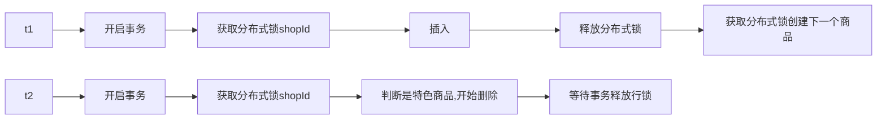

# 高并发问题

## CPU飙高、服务失败率高、逐渐崩溃

- 是否和先前发布的代码有关？
- 服务没有完全宕机，是逐渐奔溃的，重启服务器后失败率从 0-->70% 大概花了 10 分钟。

CPU 飙高，大概率是触发了 CPU 密集型任务。服务是逐渐奔溃的，一个一个没掉，大概率是应用服务的问题。如果是共享资源的问题，所有节点会大面积同时崩溃。

CPU 飙高，但是服务中没有什么 CPU 密集型运算。那还有什么情况会导致 CPU 飙高呢？只能是 JVM 本身了，频繁触发 GC。

查 JVM 日志，发现频繁发生 Full GC，STW 的时间长达 5~6s。发生 Full GC 的时间和监控报警，整个服务失败率的飙升是一致的。因此猜测是 Full GC 导致的。但是服务限流和监控都是很完善的，为什么直到 Full GC 飙高之后才发现了问题的严重性。

先前发布的代码涉及到了一些业务上的东西。简单说就是提供了一个 RPC 接口，根据上游传递来的参数，去写入底层的一张表。为了处理这个业务，设置了一个线程池，线程数为 5，阻塞队列大小为 100，拒绝策略为在主线程执行。但是队列还没打满内存就奔溃了。查看 SQL 日志，在执行这个批量插入的时候 SQL 执行的比较慢。

<b>慢 SQL 和 Full GC 又有什么关系？</b>

SQL 执行过慢，阻塞队列被打满，队列中都是大对象，导致线程池一直阻塞，触发 GC。

<b>为什么做了限流仍然没有防住这种情况?</b>

限流为什么没有限住？

- 和 QPS 的特点有关，上午参数比较小，下午参数比较大。通过 TPS 限流限不住。TPS 并没有明显增加，只是参数大小的变化。上午扛得住这些小参数，下午处理这些大参数时扛不住了。 
- 因此 TPS 限流限不住。只是说上午的参数它的长度会更大一些。

<b>为什么上游的熔断也没有起效果？</b>

- 由于内部启动的是异步的线程池，RT 也没有明显增加，熔断也被绕过了。
- 队列逐渐递增，发现老年代空间不够用了，触发 Full GC。

<b>总结</b>

- 增加慢 SQL 的实时监控，可以提前感知到这种错误。
- 设置线程池时，同时并行的线程数不能过多，导致 CPU 飙高，也要考虑到是否会引用到一些大对象。
- 代码没有 Full GC 的问题，大多数情况是通过加节点扩容来解决。
- 梳理业务场景，参数是否会非常大。能提前感知的话也不会发生上述的问题。
- 大多数情况是代码写的不规范，没考虑到业务上的一些细节。没有到优化 JVM 的程度。

## Redis 内存报警

最高优先级是恢复线上业务不受影响，因此第一反应是回滚。

报警原因：上游开发了一个对账系统，将 Redis 中所有的数据和其他系统里的数据进行对账。由于对账的是所有的数据，不停的轮询了 Redis 的数据；开始是热点数据，能从 Redis 中查到，后面轮询到的是冷数据，Redis 中没有存，加载到 Redis。由于线上没有配置淘汰策略，Redis 就直接崩了。

解决：检查淘汰策略；监控 Redis 内存增长情况；上游做技术方案时，涉及到核心链路，需要各方通知，看看方案是否合理（跑数据的时间点和数据范围都不太合理，比如分配一个从库，优先级做成最低，至少不会影响核心链路）。

# 测试问题

## 项目启动过慢

[【Java高级】本地单测性能优化！如何修改源码！本地缓存思想！_哔哩哔哩_bilibili](https://www.bilibili.com/video/BV1jk4y1t78W/?spm_id_from=333.999.0.0&vd_source=cb8bc4312b30b416beadaad7244940ac)

[Java系列 | 远程热部署在美团的落地实践 - 美团技术团队 (meituan.com)](https://tech.meituan.com/2022/03/17/java-hotswap-sonic.html)

项目启动耗时很大的点：1，数据库连接池初始化；2，获取到数据库元数据的初始化。底层都是分库分表，因此耗时特别大。跑本地测试的时候，只需要覆盖到几张表就可以了。

针对这两个问题可以修改类库的代码。

- 用的 Druid 做的数据源，将 Druid 数据库连接池的创建设置为懒加载。
- Sharding JDBC 加载元数据过慢。将元数据持久化成本地 JSON 数据，覆盖这个类，改成从本地 JSON 读取元数据。（该的方式也简单，新建一个和该类同样的包名同样的类，这样就可以覆盖了）
- 实现环境隔离，确保只是测试环境会开启上面的内容。

# 死锁问题

死锁场景伪代码

```java
@Transcactional
public void createProductList(Long shopId, List<Product> productList){
    productList.forEach(product -> {
        // shopId 是店铺 id
        createProduct(shopId, product);
    });
}

private void createProduct(Long shopId, Product product) {
    distributedLock.lock(shopId);
    if (product.version == Version.premium) {
        product.deLete(Version.stardard) ;
    }
    insert (product);
    distributedLock.unLock(shopId);
}
```

上述代码可能存在数据库行锁和分布式锁死锁的场景，互相等待对方解锁。具体场景为：在创建某一个特定商品的时候，会删除前面创建的一个商品；如先创建了一个商品的标准版，后面又创建了高级版，在创建高级版的时候会先删除标准版。



在 t1 准备获取分布式锁创建下一个商品时，t2 获取到了分布式锁，判断商品为特色商品，准备删除（在两个这两个事务开启前该商品就已经在数据库中了），期待获得数据库的行锁，然而 t1 的事务（一个很大的事务）还没有提交，数据库的行锁还未释放：

- t2 等待 t1 释放数据库行锁。<b>在事务执行过程中，如果有加锁操作，这个锁需要等事务提交时释放。</b>
- t1 等待 t2 释放分布式锁

两个锁互相等待。


