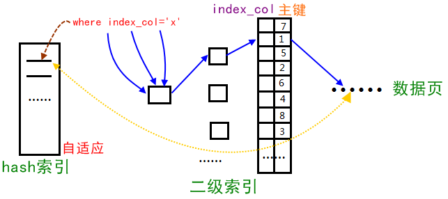

# MySQL InnoDB存储引擎

记录读书过程中感觉重要的部分内容。

<span style="color:green">**PS：非DBer，故不会太细致，主要学习原理。**</span>

## B/B+ Tree

B树也称B-树/平衡多路查找树。

B Tree 定义如下：

- 根节点至少有两个子节点
- 每个节点有M-1个key，并且以升序排序
- 位于M-1和M key的子节点的值位于M-1和M key对应的value之间。
- 其他节点至少有M/2个子节点
- 所有叶子结点位于同一层

因为B树的中间节点存储了数据，所以整个树的每一层都有可能查找到要查找的数据，查询性能不稳定，如：查询数据可能只要读一次磁盘块，可能要读100次磁盘块，数据量一大，平均IO次数就很大，不适合做索引。

B+ Tree 

- B+ Tree 是B Tree的变形，与B Tree的差异在于有n棵子树的结点中含有n个关键字，每个关键字不保存数据，只用来索引，所有数据都保存在叶子节点。
- 所有的叶子结点中包含了全部关键字的信息，及指向含这些关键字记录的指针，且叶子结点本身依关键字的大小自小而大顺序链接（B+Tree千万级别的数据量只需要查3-4次磁盘块）
- 所有的非终端结点可以看成是索引部分，结点中仅含其子树（根结点）中的最大（或最小）关键字。
- 所有叶子结点都连成了一条链表，便于区间查找和遍历

B+ Tree 应用场景

数据库索引就采用了B+ Tree。B+树索引数据有序，能够进行范围查询，且IO次数少，一般千万级别的数据量最多也仅3次I/O即可找到数据。B+ Tree的结点一般会铺满一个磁盘块。

## MySQL索引数据结构

InnoDB支持的几种常见的索引

- B+ 树索引
- 全文索引
- 哈希索引（InnoDB的哈希索引是自适应的，会根据表的使用自动生成哈希索引，不能人为干预是否在一张表中生成哈希索引）

### 数据结构演变

二分查找--> 二叉查找树 --> AVL树 --> B Tree --> B+ Tree

- 二分查找：有序表的快速查找
- 二叉查找树：有序的二叉树。
- AVL树：符合二叉查找树的性质，且任何节点的两个子树高度差最大为1.
- B Tree：几乎不用的
- B+ Tree：为磁盘或其他直接存取辅助设备设计的一种平衡查找树。
  - 所有节点都是按键值得大小顺序存放在同一层得叶子节点上。各叶子节点连成链表。
  - 插入、删除复杂，不记。
  - B+ Tree索引：即B+ Tree在数据库中的实现。在数据库中，B+ Tree的高度一般在$2到4层$，查找某一键值的行记录时最多只需要2到4次I/O。

### B+Tree索引

分为**聚集索引（clustered index）**和**辅助索引（secondary index）**

聚集索引和辅助索引的区别时，叶子节点存放的是否是一整行的信息。

#### 聚集索引

按照每张表的主键构造一棵B+Tree。叶子节点存放的即为整张表的行记录数据。由于实际的数据页只能按照一颗B+Tree进行排序，因此<span style="color:green">**每张表只能拥有一个聚集索引**</span>。

聚集索引对于主键的排序查找和范围查找速度非常快。

#### 辅助索引

叶子节点并<span style="color:red">不包含记录的全部数据</span>。叶子节点中的索引行中还包含一个书签（InnoDB存储引擎的书签就是相应行数据的聚集索引键）

辅助索引不影响聚集索引。可以通过辅助索引，找到对应数据的指向主键索引的主键。然后通过主键索引来找到一个完整的行记录（辅助索引存数据的主键，然后通过主键索引找完整记录？？）

**eg：** 主键是id 有 id ，age，name三个字段。如果查询用到了辅助索引。

```mysql
select * from user where age = 18. 
# 通过辅助索引找到age=18对应的主键索引
# 然后通过主键索引找到完整的数据
```

**书上的eg：**在一棵高为3的辅助索引树种查找数据，需要对这棵辅助索引树遍历3次找到指定主键，如果聚集索引树的高度同样为3，那么还需要对聚集索引进行3次查找，最终找到一个完整的行数据所在的页，一共需要6次逻辑IO访问以得到最终的一个数据页。

### 哈希算法

就是哈希表的那个。

InnoDB存储引擎种的哈希算法。

- 关键字转换成成自然数。
- 除法散列 $h(k)= k \ \ mod \ \ m$。
- 冲突用拉链法解决。

常用的散列有：除法散列，乘法散列或全域散列。

# MySQL体系结构和存储引擎

## 体系结构

- MySQL 单进程多线程架构；MySQL数据库实例在系统上的表现就是一个进程
- MySQL区别于其他数据库的最重要的特点：
  - 插件式的表存储引擎
  - MySQL的存储引擎是基于表的，而不是数据库

## 存储引擎

### InnoDB存储引擎

-  支持事务、行锁设计、支持外键（从5.5.8开始，InnoDB为默认存储引擎）
- 提供插入缓冲（insert buffer）、二次写（double  write）、自适应哈希索引（adaptive hash index）、预读（read ahead）等高性能和高可用的功能
- 表中数据的存储，InnoDB采用聚集的方式【什么意思？】
- 1.2的InnoDB也支持全文索引了~

### MyISAM存储引擎

- 不支持事务、表锁设计、支持全文索引，主要面向一些OLAP数据库应用
- MyISAM存储引擎的缓冲池只缓存索引文件，不缓冲数据文件。
- 数据库应用类型如下：
  - 对于SQL开发人员来说，必须先要了解进行SQL编程的对象类型，即要开发的数据库应用是哪种类型。一般来说，可将数据库的应用类型分为OLTP（OnLine Transaction Processing，联机事务处理）和OLAP（OnLine Analysis Processing，联机分析处理）两种。
  - OLTP是传统关系型数据库的主要应用，其主要面向基本的、日常的事务处理，例如银行交易。
  - OLAP是数据仓库系统的主要应用，支持复杂的分析操作，侧重决策支持，并且提供直观易懂的查询结果。

### Memory存储引擎

- 表中数据存放在内存中，适用于存储临时数据的临时表。
- 速度快，但是限制也很多，只支持表锁，并发性能较差。

### 命令汇总

- 查看存储引擎  `show engines\G;`

- 连接mysql  `mysql -hip地址  -u用户名 -p密码`

  eg：`mysql -h27.0.0.1 -uroot -proot`

- 查看mysql权限视图

  eg：`use mysql`

  ​		`select host,user,password from user;`

## 行锁和表锁

# InnoDB存储引擎

## 概述

- 第一个完整支持ACID事务的MySQL存储引擎
- 行锁设计、支持MVCC、支持外键、提供一致性非锁定读
- 被设计用来最有效地利用以及使用内存和CPU

## InnoDB体系架构

有多个内存块，内存块组成一个大地内存池。

有后台线程，主要负责刷新内存池中的数据。

### 后台线程

> **Master Thread**

Master Thread是一个非常核心的后台线程，主要负责将缓冲池中的数据异步刷新到磁盘，保证数据的一致性，包括脏页的刷新、合并插入缓冲（INSERTBUFFER）、UNDO页的回收等。

> **IO Thread**

在InnoDB存储引擎中大量使用了AIO（Async IO）来处理写IO请求，这样可以极大提高数据库的性能。而IO Thread的工作主要是负责这些IO请求的回调（callback）处理。

> **Purge Thread**

事务被提交后，其所使用的`undolog`可能不再需要，因此需`Purge Thread`来回收已经使用并分配的`undo`页。在`InnoDB 1.1`版本之前，`purge`操作仅在`InnoDB`存储引擎的`Master Thread`中完成。而从`InnoDB 1.1`版本开始，`purge`操作可以独立到单独的线程中进行，以此来减轻`Master Thread`的工作，从而提高`CPU`的使用率以及提升存储引擎的性能。用户可以在`MySQL`数据库的配置文件中添加如下命令来启用独立的`Purge Thread：`

```shell
[mysqld]
innodb_purge_thrreads = 1
```

> **Page Cleaner Thread**

`Page Cleaner Thread`是在`InnoDB 1.2.x`版本中引入的。其作用是将之前版本中脏页的刷新操作都放入到单独的线程中来完成。而其目的是为了减轻原`MasterThread`的工作及对于用户查询线程的阻塞，进一步提高`InnoDB`存储引擎的性能

### 内存

#### 缓冲池

CPU速度与磁盘速度之间差距过大，基于磁盘的数据库系统通常用缓冲池技术来提高数据库的整体性能。

> **重要内容提及**

在数据库中读取页的操作：先将从磁盘读取到页放入缓冲池中，这个过程称为将页“FIX”在缓冲池。下一次读取时，先在缓冲池中找。（与OS的页面查找类似）

对数据库中页的修改，先改缓冲池中的页，再以一定的频率刷新到磁盘上。以一种称之为<span style="color:green">**`Checkpoint`**</span>的机制刷新回磁盘。

<span style="color:green">**缓存池中缓存的数据页类型：**</span>索引页、数据页、插入缓冲、自适应哈希索引、InnoDB存储的锁信息、数据字典信息等。不过缓存索引页和数据页占缓冲池很大的一部分~

<span style="color:green">**从InnoDB 1.0.x开始，允许多个缓冲池实例**</span>

#### LRU

<span style="color:green">MySQL InnoDB的LRU并非传统的LRU，新数据是存在midpoint位置而非首部。</span>

数据库中的缓冲池是通过LRU（Latest Recent Used，最近最少使用）算法来进行管理的。

MySQL InnoDB的LRU并非传统的LRU，新数据是存在midpoint位置。这个算法在InnoDB存储引擎下称为midpoint insertion strategy。默认配置下在LRU列表长度的5/8处。midpoint之后的列表称为old列表，之前的列表称为new列表。可简单理解为，midpoint之前的都是最为活跃的热点数据。

当前数据可能只是这次要用到，如果直接把数据放到链表的首部，那么可能会让真正的热点数据丢失，因此引入了midpoint机制。

用户可以对midpoint的值进行调整，比如用户预估自己的热点数据高达90%，则可以调整midpoint的值。

```shell
# 数据插入到链表尾部10%的位置
set global innodb_old_blocks_pct = 10 
```

## Checkpoin技术

挖坑，后面填

## InnoDB关键特性

### 概述

- 插入缓冲（Insert Buffer）
- 两次写（Double Write）
- 自适应哈希索引（Adaptive Hash Index）
- 异步IO（Async IO）
- 刷新邻接页（Flush Neighbor Page）

**自适应哈希索引原理：**



Innodb存储引擎会监控对表上二级索引的查找，如果发现某二级索引被频繁访问，二级索引成为热数据，建立哈希索引可以带来速度的提升，则：

1、自适应hash索引功能被打开

```mysql
mysql> show variables like '%ap%hash_index';
+----------------------------+-------+
| Variable_name              | Value |
+----------------------------+-------+
| innodb_adaptive_hash_index | ON    |
+----------------------------+-------+
1 row in set (0.01 sec)
```

2、经常访问的二级索引数据会自动被生成到hash索引里面去(最近连续被访问三次的数据)，自适应哈希索引通过缓冲池的B+树构造而来（缓冲池就是内存区域中的数据），因此建立的速度很快。

3、缺陷

- hash自适应索引会占用innodb buffer pool；

- 自适应hash索引只适合搜索等值的查询，如select * from table where index_col='xxx'，而对于其他查找类型，如范围查找，是不能使用的；

- 极端情况下，自适应hash索引才有比较大的意义，可以降低逻辑读；

4、自适应哈希索引的控制

　　由于innodb不支持hash索引，但是在某些情况下hash索引的效率很高，于是出现了adaptive hash index功能，但是通过上面的状态监控，可以计算其收益以及付出，控制该功能开启与否。

　　默认开启，建议关掉，意义不大。可以通过 set global innodb_adaptive_hash_index=off/on 关闭和打开该功能。


