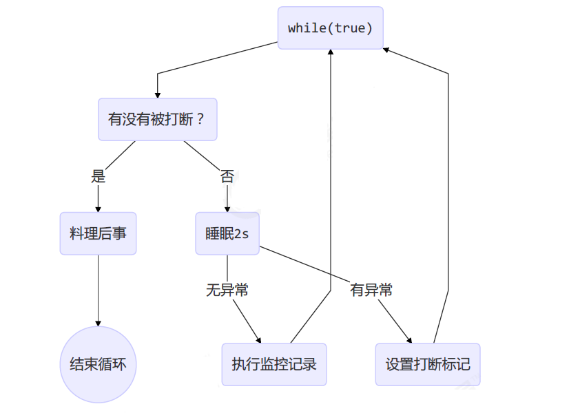

# 两阶段终止模式

定义一个类，里面包含 start 和 stop 方法。start 里停止线程运行是，用 Interrupted 温柔的终止线程。

## 模式示意图



## Coding

我们可以在任意时间打断线程，但是终止线程需要确定好何时终止。比如资源读取类线程，被打断了，我们不能立即终止线程，应该在资源读取完毕后，在根据打断标记决定是否终止。

```java
/**
 * 两阶段终止模式。日志监控 Demo
 */
@Slf4j(topic = "c.TwoPhaseTermination")
public class TwoPhaseTermination {
    public static void main(String[] args) throws InterruptedException {
        TwoPhaseTermination twoPhaseTermination = new TwoPhaseTermination();
        twoPhaseTermination.start();
        TimeUnit.SECONDS.sleep(10);
        twoPhaseTermination.stop();
    }

    private Thread monitor;

    public void stop() {
        monitor.interrupt();
    }

    public void start() {
        monitor = new Thread(() -> {
            log.debug("start logging~~");
            Thread current = Thread.currentThread();
            while (true) {
                if (current.isInterrupted()) {
                    log.debug("over！");
                    return;
                }
                try {
                    TimeUnit.SECONDS.sleep(2);
                    log.debug("start logging~~");
                } catch (InterruptedException e) {
                    // 睡眠过程中被打断。会走 exception。然后将打断标记置为  true。打断完一次 sleep 后再打断就是打断正常线程了。
                    current.interrupt();
                    log.debug("料理后事");
                    e.printStackTrace();
                }
            }
        });
        monitor.start();
    }
}
```

