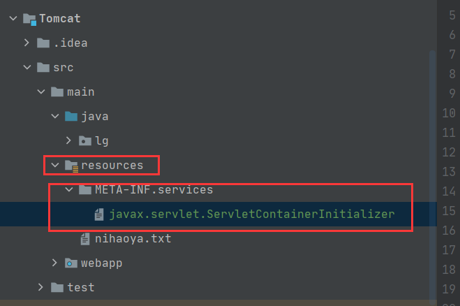

# 概述

## 学习内容

> 容器

- `AnnotationConfigApplicationContext`
- 组件添加
- 组件赋值
- 组件注入
- `AOP`
- 声明式事务

> 扩展原理

- `BeanFactoryPostProcessor`
- `BeanDefinitionRegistryPostProcessor`
- `ApplicationListener`
- Spring容器创建过程

> web

- `servlet3.0`请求
- 异步请求

<a href="https://docs.spring.io/spring-framework/docs/current/spring-framework-reference/core.html#beans-factory-extension">如何扩展Spring的功能</a>

> 配置文件注意点

- 配置文件需要放在源码文件夹，这样合并的时候才会出现在bin目录下
- 目录层级关系

   src|

  ​	  |com 类所在的包名

  conf 配置文件所在的文件夹，与src目录同级别

## maven报错

这个报错了，怎么办？

```xml
<plugin>
    <artifactId>maven-project-info-reports-plugin</artifactId>
    <version>3.0.0</version>
</plugin>
```

引入这个依赖就行！

```xml
<dependency>
    <groupId>org.apache.maven.plugins</groupId>
    <artifactId>maven-project-info-reports-plugin</artifactId>
    <version>3.0.0</version>
    <type>maven-plugin</type>
</dependency>
```

# 组件注解

## 导包

导入spring-context包后，其他一些包也会自动导入哦~ 即核心容器所依赖的所有环境也会被导入。

```xml
<!-- https://mvnrepository.com/artifact/org.springframework/spring-context -->
<dependency>
    <groupId>org.springframework</groupId>
    <artifactId>spring-context</artifactId>
    <version>5.3.3</version>
</dependency>
```

## 原始的 xml 方式写法

- POJO 对象

```java
package org.example.pojo;

public class Person {
    private String name;
    private Integer age;

    public Person() {
    }

    public Person(String name) {
        this.name = name;
    }

    public String getName() {
        return name;
    }

    public void setName(String name) {
        this.name = name;
    }

    public Integer getAge() {
        return age;
    }

    public void setAge(Integer age) {
        this.age = age;
    }

    @Override
    public String toString() { return this.name; }
}

```

- 获取bean

```java
package org.example;

import org.example.pojo.Person;
import org.springframework.context.support.ClassPathXmlApplicationContext;

public class BeanXMLTest {
    public static void main(String[] args) {
        ClassPathXmlApplicationContext context = new ClassPathXmlApplicationContext("bean.xml");
        Person person = (Person) context.getBean("person");
        Person person2 = (Person)context.getBean("person2");
        System.out.println(person2);
        context.close();
    }
}
```

- `xml` 配置文件。在 maven 的 `resrouce` 目录下。resource 目录下的资源最后会变成项目根目录下的文件。所以是直接 `Classxxx("bean.xml")`
- `JavaSE` 的项目和 `JavaEE` 项目最后的输出路径好像都是 classes，但是 `JavaEE` 里写的路径是 `classpath`！

## 用注解配置类

- `@Configuration` 可以替代 XML，进行类的配置。典型的应用有三方jar包，我们需要把它交给Spring容器进行管理，于是用 `@Configuration` 的方式把这个类注入到Spring中。

`JavaConfig` 配置类

```java
package org.example.configuration;

import org.example.pojo.Person;
import org.springframework.context.annotation.Bean;
import org.springframework.context.annotation.Configuration;

@Configuration
public class MainConfiguration {
    // 给容器中注册一个Bean  默认是以方法名为bean的名称，如果不想要方法名可以这样 @Bean("person") 或 @Bean({"person1","person2"})
    // 具体看看源码注释 一目了然。
    // value 与 name之间 好像是别名关系
    @Bean("person3")
    public Person person() {
        return new Person();
    }
}
```

测试代码

```java
public class BeanXMLTest {
    public static void main(String[] args) {
        AnnotationConfigApplicationContext context2 = new AnnotationConfigApplicationContext(MainConfiguration.class);
        Person person21 = (Person) context2.getBean( "person3");
        System.out.println(person21);
    }
}

// =============================================================================
public class BeanXMLTest {
    public static void main(String[] args) {
        AnnotationConfigApplicationContext context2 = new AnnotationConfigApplicationContext(MainConfiguration.class);
        String[] beanNamesForType = context2.getBeanNamesForType(Person.class);
        String[] beanDefinitionNames = context2.getBeanDefinitionNames();
        for (int i = 0; i < beanDefinitionNames.length; i++) {
            System.out.println(beanDefinitionNames[i]);
        }
        System.out.println("===========");
        for (int i = 0; i < beanNamesForType.length; i++) {
            // 同一个类的多个别名好像只会输出其中一个。
            System.out.println(beanNamesForType[i]);
        }
    }
}
```

## 包扫描

用到的注解有

- `@Configuration`
- `@ComponentScan`，如果是 `jdk8`，它被设置成了重复注解，可以重复用。

- `xml` 的配置方式

  ```xml
  <!-- 配置包扫描 , 只要标注了@Controller、@Service、@Repository、@Component的都会被自动的扫描加入容器中-->
  <context:component-scan base-package="org.example"></context:component-scan>
  ```

- 注解方式，按指定类型排除

  ```java
  // excludeFilters指定排除那些  用@Filter指定排除那些
  // includeFilters指定包含那些  用@Filter指定包含那些
  // 要让includeFilters生效需要设置@ComponentScan的useDefaultFilters=false，默认过滤器会导入所有的。
  // MainConfiguration的配置对象不会被排除的
  @Configuration
  @ComponentScan(basePackages = "org.example", excludeFilters = {
          @ComponentScan.Filter(type = FilterType.ANNOTATION, classes = {Controller.class, Service.class})
  })
  public class MainConfiguration {
      // 给容器中注册一个Bean
      @Bean(name = {"person1", "person2", "person3"})
      public Person person() {
          return new Person();
      }
  
      @Bean
      public Person person007() {
          return new Person();
      }
  }
  ```

- 注解方式，按指定规则包含

  ```java
  // IncludeConfiguration的配置对象是也会包含的。
  @Configuration
  @ComponentScan(basePackages = "org.example", includeFilters = {
          @ComponentScan.Filter(type = FilterType.ASSIGNABLE_TYPE, classes = DemoService.class)
  }, useDefaultFilters = false)
  public class IncludeConfiguration {
      // 给容器中注册一个Bean
      @Bean(name = {"person1", "person2", "person3"})
      public Person person() {
          return new Person();
      }
  
      @Bean
      public Person person007() {
          return new Person();
      }
  }
  ```
```java
  public class ScanTest {
  
      @Test
      public void test1() {
          AnnotationConfigApplicationContext anno = new AnnotationConfigApplicationContext(MainConfiguration.class);
          String[] beanDefinitionNames = anno.getBeanDefinitionNames();
          for (int i = 0; i < beanDefinitionNames.length; i++) {
              System.out.println(beanDefinitionNames[i]);
          }
      }
  
      @Test
      public void test2() {
          AnnotationConfigApplicationContext anno = new AnnotationConfigApplicationContext(IncludeConfiguration.class);
          String[] beanDefinitionNames = anno.getBeanDefinitionNames();
          for (int i = 0; i < beanDefinitionNames.length; i++) {
              System.out.println(beanDefinitionNames[i]);
          }
      }
  }
```

## @Filter自定义过滤规则

- 自定义过滤规则的代码

  ```java
  package org.example.configuration;
  
  import org.springframework.context.annotation.ComponentScan;
  import org.springframework.context.annotation.Configuration;
  import org.springframework.context.annotation.FilterType;
  import org.springframework.core.io.Resource;
  import org.springframework.core.type.AnnotationMetadata;
  import org.springframework.core.type.ClassMetadata;
  import org.springframework.core.type.classreading.MetadataReader;
  import org.springframework.core.type.classreading.MetadataReaderFactory;
  import org.springframework.core.type.filter.TypeFilter;
  
  import java.io.IOException;
  
  @Configuration
  @ComponentScan(basePackages = "org.example", includeFilters = {
          @ComponentScan.Filter(type = FilterType.CUSTOM, classes = {DefineFilter.class})
  }, useDefaultFilters = false)
  public class DefineFilterConfiguration {
  }
  
  class DefineFilter implements TypeFilter {
      // 自定义匹配规则
      @Override
      public boolean match(MetadataReader metadataReader, MetadataReaderFactory metadataReaderFactory) throws IOException {
          AnnotationMetadata annotationMetadata = metadataReader.getAnnotationMetadata();
          // 获得当前正在扫描的类信息
          ClassMetadata classMetadata = metadataReader.getClassMetadata();
          // 获得当前类资源（类路径）
          Resource resource = metadataReader.getResource();
          // 类名
          String className = classMetadata.getClassName();
          System.out.println("---->" + className);
          if (className.contains("Dao")) {
              return true;
          }
          return false;
      }
  }
  ```

- 测试代码

  ```java
  package org.example;
  
  import org.example.configuration.DefineFilterConfiguration;
  import org.example.configuration.IncludeConfiguration;
  import org.example.configuration.MainConfiguration;
  import org.junit.Test;
  import org.springframework.context.annotation.AnnotationConfigApplicationContext;
  
  
  public class ScanTest {
  
      @Test
      public void test3() {
          AnnotationConfigApplicationContext anno = new AnnotationConfigApplicationContext(DefineFilterConfiguration.class);
          String[] beanDefinitionNames = anno.getBeanDefinitionNames();
          for (int i = 0; i < beanDefinitionNames.length; i++) {
              System.out.println(beanDefinitionNames[i]);
          }
      }
  }
  ```

## Spring单元测试

引入依赖，需要的 `JUnit` 的版本有点高

[Spring测试官方文档](https://docs.spring.io/spring-framework/docs/current/reference/html/testing.html)

```xml
<dependency>
    <groupId>org.springframework</groupId>
    <artifactId>spring-context</artifactId>
    <version>5.3.3</version>
</dependency>

<dependency>
    <groupId>junit</groupId>
    <artifactId>junit</artifactId>
    <version>4.13.1</version>
    <scope>test</scope>
</dependency>

<dependency>
    <groupId>org.springframework</groupId>
    <artifactId>spring-test</artifactId>
    <version>5.3.3</version>
    <scope>test</scope>
</dependency>
```

编写测试代码 (注入的测试类就不贴代码了)

```java
@ContextConfiguration(classes = ScopeConfiguration.class)
@RunWith(SpringJUnit4ClassRunner.class)
public class ScopeConfigurationTest {

    @Autowired
    Person person1;

    @Autowired
    Person person2;

    @Autowired
    Person person3;

    @Test
    public void test1() {
        System.out.println(person1 == person2);
        System.out.println(person1 == person3);
    }
}
```

## Bean作用域范围

- singleton 单例
- prototype 多例
- request 
- session
- global-session

## 懒加载

- @Lazy ，针对单实例容器启动时不创建对象，第一次获取 bean 时再进行初始化。
- 验证代码如下

```java
@Configuration
public class LazyConfiguration {
    @Scope("prototype")
    @Bean
    @Lazy
    public Person person() {
        System.out.println("Create Person");
        return new Person();
    }

    @Bean
    public Person getP() {
        System.out.println("Create getP");
        return new Person();
    }
}
```

## 按条件注入

> @Conditional

```java
@Target({ElementType.TYPE, ElementType.METHOD}) // 方法
@Retention(RetentionPolicy.RUNTIME)
@Documented
public @interface Conditional {

	/**
	 * All {@link Condition} classes that must {@linkplain Condition#matches match}
	 * in order for the component to be registered.
	 */
	Class<? extends Condition>[] value();

}

// 再看Class<? exntends Condition>[] 中的Condition
@FunctionalInterface
public interface Condition {

	/**
	 * Determine if the condition matches.
	 * @param context the condition context
	 * @param metadata the metadata of the {@link org.springframework.core.type.AnnotationMetadata class}
	 * or {@link org.springframework.core.type.MethodMetadata method} being checked
	 * @return {@code true} if the condition matches and the component can be registered,
	 * or {@code false} to veto the annotated component's registration
	 */
	boolean matches(ConditionContext context, AnnotatedTypeMetadata metadata);

}
// 由此可看出，Conditional传入的是Condition数组
```

> 按条件注入具体Demo

```java
package org.example.configuration;

import org.example.pojo.Person;
import org.springframework.beans.factory.support.BeanDefinitionRegistry;
import org.springframework.context.annotation.*;
import org.springframework.core.type.AnnotatedTypeMetadata;

class LinuxCondition implements Condition {

    /**
     * @param context  判断能使用的上下文环境
     * @param metadata 当前标注了Condtion注解的标注信息
     * @return
     */
    @Override
    public boolean matches(ConditionContext context, AnnotatedTypeMetadata metadata) {
        String property = context.getEnvironment().getProperty("os.name");
        if (property != null && property.contains("linux"))
            return true;
        return false;
    }
}

class WindowsCondition implements Condition {

    @Override
    public boolean matches(ConditionContext context, AnnotatedTypeMetadata metadata) {
        String property = context.getEnvironment().getProperty("os.name");
        if (property != null && property.contains("Window"))
            return true;
        return false;
    }
}

/**
 * 包含某个bean才xxx
 */
class ConditionDemo implements Condition {

    @Override
    public boolean matches(ConditionContext context, AnnotatedTypeMetadata metadata) {
        context.getBeanFactory();
        context.getClassLoader();
        context.getEnvironment();
        BeanDefinitionRegistry registry = context.getRegistry();
        boolean windows = registry.containsBeanDefinition("windows");
        if (windows)
            return true;
        return false;
        // bean的注冊还未学习
    }
}


@Configuration
public class ConditionConfiguration {

    @Bean("linux")
    @Conditional(value = {LinuxCondition.class})
    public Person getLinux() {
        return new Person("linux");
    }

    @Bean("windows")
    @Conditional(value = {WindowsCondition.class})
    public Person getWindows() {
        return new Person("windows");
    }

    // 包含指定的Bean才注入此obj对象
    @Bean("obj")
    @Conditional(value = {ConditionDemo.class})
    public Object getObj() {
        return new Object();
    }
}
```

> 测试代码

```java
package org.example;

import org.example.configuration.ConditionConfiguration;
import org.example.pojo.Person;
import org.junit.Test;
import org.junit.runner.RunWith;
import org.springframework.beans.factory.annotation.Autowired;
import org.springframework.context.ApplicationContext;
import org.springframework.test.context.ContextConfiguration;
import org.springframework.test.context.junit4.SpringJUnit4ClassRunner;

import java.util.stream.Stream;

@RunWith(SpringJUnit4ClassRunner.class)
@ContextConfiguration(classes = ConditionConfiguration.class)
public class ConditionTest {

    @Autowired
    ApplicationContext context;

    @Test
    public void test1() {
        String[] beanNamesForType = context.getBeanNamesForType(Person.class);
        Stream.of(beanNamesForType).forEach(System.out::println);
    }

    @Test
    public void test2() {
        String[] beanDefinitionNames = context.getBeanDefinitionNames();
        Stream.of(beanDefinitionNames).forEach(System.out::println);
    }
}
```

## @Import导入另一组件

### 容器注入组件

- 包扫描+组件标注注解（`@Controller / @Service / @Repository / @Component`）,局限于我们自己写的类
- `@Bean` [导入的第三方包里面的组件]，xml 的 bean 配置方式也可以做到。 
- `@Import` [快速给容器中导入一个组件]，xml 也有对应的引入方式。
  - `@ImportSelector`[导入的选择器,返回需要导入的组件的全类名数组]
  - `@ImportBeanDefinitionRegistrar`[也是一个接口]
- 使用Spring提供的 `FactoryBean`
  - 默认获取到的是工厂bean调用 `getObject` 创建的对象
  - 要获取工厂 Bean 本身，我们需要给 id 前面加一个& 如：`&ColorFactoryBean`
  - 这个的特点或者是优势到底是什么？为什么会提供这种方法？

import注解的具体定义及注释

```java
public @interface Import {

	/**
	 * {@link Configuration @Configuration}, {@link ImportSelector},
	 * {@link ImportBeanDefinitionRegistrar}, or regular component classes to import.
	 */
	Class<?>[] value();

}
```

#### Import的基本用法

```java
package org.example.configuration;

import org.example.pojo.Person;
import org.springframework.context.annotation.Bean;
import org.springframework.context.annotation.Configuration;
import org.springframework.context.annotation.Import;

@Configuration
@Import(Color.class)
public class ImportConfiguration {

    @Bean
    public Person person() {
        return new Person();
    }
}

// 这个Color什么注解都不用加！太棒了！！
class Color {
}

```

测试代码

```java
// 测试代码
package org.example;

import org.example.configuration.ImportConfiguration;
import org.junit.Test;
import org.junit.runner.RunWith;
import org.springframework.beans.factory.annotation.Autowired;
import org.springframework.context.ApplicationContext;
import org.springframework.test.context.ContextConfiguration;
import org.springframework.test.context.junit4.SpringJUnit4ClassRunner;

import java.util.stream.Stream;

@RunWith(SpringJUnit4ClassRunner.class)
@ContextConfiguration(classes = ImportConfiguration.class)
public class ImportTest {

    @Autowired
    ApplicationContext context;

    @Test
    public void test1() {
        String[] beanDefinitionNames = context.getBeanDefinitionNames();
        Stream.of(beanDefinitionNames).forEach(System.out::println);
    }
}
```

#### Import的高级用法一

- `ImportSelector`

```java

/**
 * Interface to be implemented by types that determine which @{@link Configuration}
 * class(es) should be imported based on a given selection criteria, usually one or
 * more annotation attributes.
 *
 * <p>An {@link ImportSelector} may implement any of the following
 * {@link org.springframework.beans.factory.Aware Aware} interfaces,
 * and their respective methods will be called prior to {@link #selectImports}:
 * <ul>
 * <li>{@link org.springframework.context.EnvironmentAware EnvironmentAware}</li>
 * <li>{@link org.springframework.beans.factory.BeanFactoryAware BeanFactoryAware}</li>
 * <li>{@link org.springframework.beans.factory.BeanClassLoaderAware BeanClassLoaderAware}</li>
 * <li>{@link org.springframework.context.ResourceLoaderAware ResourceLoaderAware}</li>
 * </ul>
 *
 * <p>Alternatively, the class may provide a single constructor with one or more of
 * the following supported parameter types:
 * <ul>
 * <li>{@link org.springframework.core.env.Environment Environment}</li>
 * <li>{@link org.springframework.beans.factory.BeanFactory BeanFactory}</li>
 * <li>{@link java.lang.ClassLoader ClassLoader}</li>
 * <li>{@link org.springframework.core.io.ResourceLoader ResourceLoader}</li>
 * </ul>
 *
 * <p>{@code ImportSelector} implementations are usually processed in the same way
 * as regular {@code @Import} annotations, however, it is also possible to defer
 * selection of imports until all {@code @Configuration} classes have been processed
 * (see {@link DeferredImportSelector} for details).
 *
 * @author Chris Beams
 * @author Juergen Hoeller
 * @since 3.1
 * @see DeferredImportSelector
 * @see Import
 * @see ImportBeanDefinitionRegistrar
 * @see Configuration
 */
public interface ImportSelector {

	/**
	 * Select and return the names of which class(es) should be imported based on
	 * the {@link AnnotationMetadata} of the importing @{@link Configuration} class.
	 * @return the class names, or an empty array if none
	 */
	String[] selectImports(AnnotationMetadata importingClassMetadata);

	/**
	 * Return a predicate for excluding classes from the import candidates, to be
	 * transitively applied to all classes found through this selector's imports.
	 * <p>If this predicate returns {@code true} for a given fully-qualified
	 * class name, said class will not be considered as an imported configuration
	 * class, bypassing class file loading as well as metadata introspection.
	 * @return the filter predicate for fully-qualified candidate class names
	 * of transitively imported configuration classes, or {@code null} if none
	 * @since 5.2.4
	 */
	@Nullable
	default Predicate<String> getExclusionFilter() {
		return null;
	}

}
```


```java
package org.example.configuration;

import org.springframework.context.annotation.Bean;
import org.springframework.context.annotation.Configuration;
import org.springframework.context.annotation.Import;
import org.springframework.context.annotation.ImportSelector;
import org.springframework.core.type.AnnotationMetadata;

import java.util.ArrayList;
import java.util.Set;

@Configuration
@Import({ImportSelectorDemo.class})
public class ImportSelectorConfiguration {
    @Bean
    public Object getObj() {
        return new Object();
    }
}

class ImportSelectorDemo implements ImportSelector {

    /**
     * @param importingClassMetadata 当前标注@Import注解的类的所有注解信息，
     *                               简而言之，可以获取到Import注解和其他注解的信息
     * @return 要导入到组件的全类名
     */
    @Override
    public String[] selectImports(AnnotationMetadata importingClassMetadata) {
        Set<String> annotationTypes = importingClassMetadata.getAnnotationTypes();
        ArrayList<String> list = new ArrayList<String>();
        String[] strings = new String[annotationTypes.size()];
        for (int i = 0; i < list.size(); i++) {
            strings[i] = list.get(i);
        }
        return strings;
    }

}

class SelectorClassDemo {

}

```

```java
// 单元测试代码
package org.example;

import org.example.configuration.ImportSelectorConfiguration;
import org.junit.Test;
import org.junit.runner.RunWith;
import org.springframework.beans.factory.annotation.Autowired;
import org.springframework.context.ApplicationContext;
import org.springframework.test.context.ContextConfiguration;
import org.springframework.test.context.junit4.SpringJUnit4ClassRunner;

import java.util.stream.Stream;

@RunWith(SpringJUnit4ClassRunner.class)
@ContextConfiguration(classes = ImportSelectorConfiguration.class)
public class ImportSelectorTest {

    @Autowired
    ApplicationContext context;

    @Test
    public void test1() {
        String[] beanDefinitionNames = context.getBeanDefinitionNames();
        Stream.of(beanDefinitionNames).forEach(System.out::println);
    }
}
```

#### Import的高级用法二

- ImportBeanDefinitionRegistrar接口

```java
public interface ImportBeanDefinitionRegistrar {

	/**
	 * Register bean definitions as necessary based on the given annotation metadata of
	 * the importing {@code @Configuration} class.
	 * <p>Note that {@link BeanDefinitionRegistryPostProcessor} types may <em>not</em> be
	 * registered here, due to lifecycle constraints related to {@code @Configuration}
	 * class processing.
	 * <p>The default implementation delegates to
	 * {@link #registerBeanDefinitions(AnnotationMetadata, BeanDefinitionRegistry)}.
	 * @param importingClassMetadata annotation metadata of the importing class
	 * @param registry current bean definition registry
	 * @param importBeanNameGenerator the bean name generator strategy for imported beans:
	 * {@link ConfigurationClassPostProcessor#IMPORT_BEAN_NAME_GENERATOR} by default, or a
	 * user-provided one if {@link ConfigurationClassPostProcessor#setBeanNameGenerator}
	 * has been set. In the latter case, the passed-in strategy will be the same used for
	 * component scanning in the containing application context (otherwise, the default
	 * component-scan naming strategy is {@link AnnotationBeanNameGenerator#INSTANCE}).
	 * @since 5.2
	 * @see ConfigurationClassPostProcessor#IMPORT_BEAN_NAME_GENERATOR
	 * @see ConfigurationClassPostProcessor#setBeanNameGenerator
	 */
	default void registerBeanDefinitions(AnnotationMetadata importingClassMetadata, BeanDefinitionRegistry registry,
			BeanNameGenerator importBeanNameGenerator) {

		registerBeanDefinitions(importingClassMetadata, registry);
	}

	/**
	 * Register bean definitions as necessary based on the given annotation metadata of
	 * the importing {@code @Configuration} class.
	 * <p>Note that {@link BeanDefinitionRegistryPostProcessor} types may <em>not</em> be
	 * registered here, due to lifecycle constraints related to {@code @Configuration}
	 * class processing.
	 * <p>The default implementation is empty.
	 * @param importingClassMetadata annotation metadata of the importing class
	 * @param registry current bean definition registry
	 */
    /**
    通过调这个方法，给容器自己添加一些组件
    AnnotationMetadata 是当前类的注解信息
    BeanDefinitionRegistry Bean定义的注册类，通过它给容器注册Bean
    */
    
	default void registerBeanDefinitions(AnnotationMetadata importingClassMetadata, BeanDefinitionRegistry registry) {
	}

}
```

如果存在xxbean，就把oobean注册进去

- JavaConfig代码

```java
package org.example.configuration;

import org.springframework.beans.factory.support.BeanDefinitionRegistry;
import org.springframework.beans.factory.support.RootBeanDefinition;
import org.springframework.context.annotation.Bean;
import org.springframework.context.annotation.Configuration;
import org.springframework.context.annotation.Import;
import org.springframework.context.annotation.ImportBeanDefinitionRegistrar;
import org.springframework.core.type.AnnotationMetadata;

@Configuration
@Import({ImportBeanDefinitionDemo.class})
public class ImportBeanDefinitionRegistrarConfiguration {

    @Bean("red")
    public Red red() {
        return new Red();
    }

}

class ImportBeanDefinitionDemo implements ImportBeanDefinitionRegistrar {
    @Override
    public void registerBeanDefinitions(AnnotationMetadata importingClassMetadata, BeanDefinitionRegistry registry) {
        boolean red = registry.containsBeanDefinition("red");
        if (red) {
            RootBeanDefinition rootBeanDefinition = new RootBeanDefinition(Rain.class);
            registry.registerBeanDefinition("Rain", rootBeanDefinition);
        }
    }
}

class Red {

}

class Rain {

}
```

- 测试代码

```java
package org.example;

import org.example.configuration.ImportBeanDefinitionRegistrarConfiguration;
import org.junit.Test;
import org.junit.runner.RunWith;
import org.springframework.beans.factory.annotation.Autowired;
import org.springframework.context.ApplicationContext;
import org.springframework.test.context.ContextConfiguration;
import org.springframework.test.context.junit4.SpringJUnit4ClassRunner;

import java.util.stream.Stream;

@RunWith(SpringJUnit4ClassRunner.class)
@ContextConfiguration(classes = ImportBeanDefinitionRegistrarConfiguration.class)
public class ImportBeanDefinitionTest {
    @Autowired
    ApplicationContext context;

    @Test
    public void test1() {
        String[] beanDefinitionNames = context.getBeanDefinitionNames();
        Stream.of(beanDefinitionNames).forEach(System.out::println);
    }
}
```

## FactoryBean创建

使用Spring提供的 `FactoryBean`

- 默认获取到的是工厂 bean 调用 `getObject` 创建的对象
- 要获取工厂 Bean 本身，我们需要给 id 前面加一个& 如：`&ColorFactoryBean`
- 这个的特点或者是优势到底是什么？为什么会提供这种方法？

代码

```java
package org.example.configuration;

import org.example.pojo.Person;
import org.springframework.beans.factory.FactoryBean;

public class FactoryBeanConfiguration implements FactoryBean<Person> {
    @Override
    public Person getObject() throws Exception {
        return new Person();
    }

    @Override
    public Class<?> getObjectType() {
        return Person.class;
    }

    /**
     * @return true 单实例 容器中只保存一份
     * false 多实例 每次调用创建新对象
     */
    @Override
    public boolean isSingleton() {
        return false;
    }
}
```

测试代码

```java
@RunWith(SpringJUnit4ClassRunner.class)
@ContextConfiguration(classes = FactoryBeanConfiguration.class)
public class FactoryBeanTest {
    @Autowired
    ApplicationContext context;

    @Test
    public void test1() {
        Object factoryBeanDemo = context.getBean("factoryBeanDemo");
        System.out.println(factoryBeanDemo.getClass());
        // 加上&符号 获取的是工厂对象 而非getObject返回的Bean
        Object bean = context.getBean("&factoryBeanDemo");
        System.out.println(bean.getClass());
    }
}
```

解释，请看源码

```java
public interface BeanFactory {

	/**
	 * Used to dereference a {@link FactoryBean} instance and distinguish it from
	 * beans <i>created</i> by the FactoryBean. For example, if the bean named
	 * {@code myJndiObject} is a FactoryBean, getting {@code &myJndiObject}
	 * will return the factory, not the instance returned by the factory.
	 */
	String FACTORY_BEAN_PREFIX = "&";
}
```

# 生命周期

## Bean指定初始化和销毁方法

- `@Bean(initMethod = "init", destroyMethod = "destroy")`

- 原本在 xml 中的配置方式

```xml
<?xml version="1.0" encoding="UTF-8"?>
<beans xmlns="http://www.springframework.org/schema/beans"
       xmlns:xsi="http://www.w3.org/2001/XMLSchema-instance"
       xmlns:context="http://www.springframework.org/schema/context"
       xsi:schemaLocation="http://www.springframework.org/schema/beans http://www.springframework.org/schema/beans/spring-beans.xsd http://www.springframework.org/schema/context https://www.springframework.org/schema/context/spring-context.xsd">
    <bean id="demo" class="org.example.pojo.Person" init-method="toString" destroy-method="toString"></bean>
    <!-- 配置包扫描 -->
    <context:component-scan base-package="org.example"></context:component-scan>
</beans>
```

- pojo类

```java
package org.example.pojo;

public class Car {
    public Car() {
        System.out.println("Car constructor...");
    }

    public void init() {
        System.out.println("car ... init");
    }

    public void destroy() {
        System.out.println("car ... destroy");
    }
}

```

- JavaConfig

```java
package org.example.configuration.lifecycle;

import org.example.pojo.Car;
import org.springframework.context.annotation.AnnotationConfigApplicationContext;
import org.springframework.context.annotation.Bean;
import org.springframework.context.annotation.Configuration;
import org.springframework.context.annotation.Scope;

@Configuration
public class LifeCycleConfiguration {

    // 可以在自定义数据源，用init和destroy进行数据源的初始化和关闭
    @Scope("prototype")
    @Bean(initMethod = "init", destroyMethod = "destroy")
    public Car car() {
        return new Car();
    }

    public static void main(String[] args) {
        AnnotationConfigApplicationContext annotationConfigApplicationContext = new AnnotationConfigApplicationContext(LifeCycleConfiguration.class);
//        Object car = annotationConfigApplicationContext.getBean("car");
//        annotationConfigApplicationContext.close();
        // 多实例的bean在获取时才创建对象
    }
}
```

## Bean实现接口

通过实现接口，自定义初始化和销毁的逻辑

```java
package org.example.pojo;

import org.springframework.beans.factory.DisposableBean;
import org.springframework.beans.factory.InitializingBean;

public class Car2 implements InitializingBean, DisposableBean {

    @Override
    public void destroy() throws Exception {
        System.out.println("car2 destroy");
    }

    @Override
    public void afterPropertiesSet() throws Exception {
        System.out.println("car2 init afterPropertiesSet");
    }
}

package org.example.configuration.lifecycle;

import org.example.pojo.Car;
import org.example.pojo.Car2;
import org.springframework.context.annotation.AnnotationConfigApplicationContext;
import org.springframework.context.annotation.Bean;
import org.springframework.context.annotation.Configuration;
import org.springframework.context.annotation.Scope;

@Configuration
public class LifeCycleConfiguration {

    // 可以在自定义数据源，用init和destroy进行数据源的初始化和关闭
    @Scope("prototype")
    @Bean(initMethod = "init", destroyMethod = "destroy")
    public Car car() {
        return new Car();
    }

    @Bean
    public Car2 car2(){
        return new Car2();
    }
    public static void main(String[] args) {
        AnnotationConfigApplicationContext context = new AnnotationConfigApplicationContext(LifeCycleConfiguration.class);
        Object car2 = context.getBean("car2");

//        Object car = annotationConfigApplicationContext.getBean("car");
//        annotationConfigApplicationContext.close();
        // 多实例的bean在获取时才创建对象
    }
}

```

## JS250规范定义的注解

- `@PostConstruct`, 在 bean 创建完成并属性赋值完成，来执行初始化方法
- `@PreDestroy`，在容器销毁 bean 之前通知我们进行清理操作
- 这几个注解是 Java 提供的，好像是需要提供 J2EE 的依赖。

```java
package org.example.pojo;

import javax.annotation.PostConstruct;
import javax.annotation.PreDestroy;

public class Car3 {
    public Car3() {
        System.out.println("car3 construct");
    }

    @PostConstruct
    public void init() {
        System.out.println("PostConstruct");
    }

    @PreDestroy
    public void destroy() {
        System.out.println("PreDestroy");
    }

}
```

test code

```java
package org.example.configuration.lifecycle;

import org.example.pojo.Car;
import org.example.pojo.Car2;
import org.example.pojo.Car3;
import org.springframework.context.annotation.AnnotationConfigApplicationContext;
import org.springframework.context.annotation.Bean;
import org.springframework.context.annotation.Configuration;
import org.springframework.context.annotation.Scope;

@Configuration
public class LifeCycleConfiguration {

    // 可以在自定义数据源，用init和destroy进行数据源的初始化和关闭
    @Scope("prototype")
    @Bean(initMethod = "init", destroyMethod = "destroy")
    public Car car() {
        return new Car();
    }

    @Bean
    public Car2 car2(){
        return new Car2();
    }

    @Bean Car3 car3(){
        return new Car3();
    }
    public static void main(String[] args) {
        AnnotationConfigApplicationContext context = new AnnotationConfigApplicationContext(LifeCycleConfiguration.class);
        Object car2 = context.getBean("car2");
        Object car3 = context.getBean("car3");
        context.close();
//        Object car = annotationConfigApplicationContext.getBean("car");
//        annotationConfigApplicationContext.close();
        // 多实例的bean在获取时才创建对象
    }
}
```

## Bean后置处理器

- `interface BeanPostProcessor`：bean的后置处理器；在bean初始化前后进行一些处理工作
  - `postProcessBeforeInitialization`：初始化之前工作
  - `postProcessAfterInitialization`：初始化之后工作

### 用法

源码注释如下

```java
public interface BeanPostProcessor {

	/**
	 * Apply this {@code BeanPostProcessor} to the given new bean instance <i>before</i> any bean
	 * initialization callbacks (like InitializingBean's {@code afterPropertiesSet} 
	 * or a custom init-method). The bean will already be populated with property values.
	 * The returned bean instance may be a wrapper around the original.
	 * <p>The default implementation returns the given {@code bean} as-is.
	 * @param bean the new bean instance
	 * @param beanName the name of the bean
	 * @return the bean instance to use, either the original or a wrapped one;
	 * if {@code null}, no subsequent BeanPostProcessors will be invoked
	 * @throws org.springframework.beans.BeansException in case of errors
	 * @see org.springframework.beans.factory.InitializingBean#afterPropertiesSet
	 */
	@Nullable
	default Object postProcessBeforeInitialization(Object bean, String beanName) throws BeansException {
		return bean;
	}

	/**
	 * Apply this {@code BeanPostProcessor} to the given new bean instance <i>after</i> any bean
	 * initialization callbacks (like InitializingBean's {@code afterPropertiesSet}
	 * or a custom init-method). The bean will already be populated with property values.
	 * The returned bean instance may be a wrapper around the original.
	 * <p>In case of a FactoryBean, this callback will be invoked for both the FactoryBean
	 * instance and the objects created by the FactoryBean (as of Spring 2.0). The
	 * post-processor can decide whether to apply to either the FactoryBean or created
	 * objects or both through corresponding {@code bean instanceof FactoryBean} checks.
	 * <p>This callback will also be invoked after a short-circuiting triggered by a
	 * {@link InstantiationAwareBeanPostProcessor#postProcessBeforeInstantiation} method,
	 * in contrast to all other {@code BeanPostProcessor} callbacks.
	 * <p>The default implementation returns the given {@code bean} as-is.
	 * @param bean the new bean instance
	 * @param beanName the name of the bean
	 * @return the bean instance to use, either the original or a wrapped one;
	 * if {@code null}, no subsequent BeanPostProcessors will be invoked
	 * @throws org.springframework.beans.BeansException in case of errors
	 * @see org.springframework.beans.factory.InitializingBean#afterPropertiesSet
	 * @see org.springframework.beans.factory.FactoryBean
	 */
	@Nullable
	default Object postProcessAfterInitialization(Object bean, String beanName) throws BeansException {
		return bean;
	}

}
```

我测试了一下，`@Configuration 的@Bean注解注册的Bean，用下面实现接口的方式无效`

```java
package org.example.configuration.lifecycle;

import org.springframework.beans.BeansException;
import org.springframework.beans.factory.config.BeanPostProcessor;
import org.springframework.context.annotation.AnnotationConfigApplicationContext;
import org.springframework.context.annotation.ComponentScan;
import org.springframework.context.annotation.Configuration;
import org.springframework.stereotype.Component;

@Configuration
@ComponentScan(basePackages = "org.example.configuration.lifecycle")
public class BeanPostProcessConfiguration {

    public static void main(String[] args) {
        AnnotationConfigApplicationContext context = new AnnotationConfigApplicationContext(BeanPostProcessConfiguration.class);
        context.close();
    }
}

@Component
class BeanPostProcessDemo implements BeanPostProcessor {
    public BeanPostProcessDemo() {
        System.out.println("construct");
    }

    @Override
    public Object postProcessBeforeInitialization(Object bean, String beanName) throws BeansException {
        System.out.println("before initialization");
        return bean;
    }

    @Override
    public Object postProcessAfterInitialization(Object bean, String beanName) throws BeansException {
        System.out.println("after initialization");
        return bean;
    }

}
```

### 原理

原理那两个视频没看，记得补 `P16&17`

```java
 遍历得到容器中所有的BeanPostProcessor；挨个执行beforeInitialization
 一旦返回null，跳出for循环，不会执行后面的BeanPostProcess.postProcessors
 BeanPostProcessor的大致执行流程
 populateBean(beanName, mbd, instanceWrapper);给bean进行属性赋值
 initializeBean{
 applyBeanPostProcessorsBeforeInitialization//for循环得到全部beanPost
 invokeInitMethods(beanName, wrappedBean, mbd);//初始化方法
 applyBeanPostProcessorsAfterInitialization//for循环得到全部beanPost
}
```

# 属性赋值

## `@Value`

Value的用法，请看源码注释！这个注解还可作用于字段上。

```java
@Target({ElementType.FIELD, ElementType.METHOD, ElementType.PARAMETER, ElementType.ANNOTATION_TYPE})
@Retention(RetentionPolicy.RUNTIME)
@Documented
public @interface Value {

	/**
	 * The actual value expression such as <code>#{systemProperties.myProp}</code>
	 * or property placeholder such as <code>${my.app.myProp}</code>.
	 */
	String value();

}
```

----

使用`@Value`赋值

- 基本数值
- 可以写SpEL；#{}
- 可以写${}; 取出配置文件中的值（在运行环境变量里面的值）；**properties配置文件，放在resource目录下！！**
- pojo对象

```java
package org.example.pojo;

import org.springframework.beans.factory.annotation.Value;

public class Person {
    // 使用@Value赋值
    // 1 基本数值
    // 2 可以写SpEL， #{}，取出配置文件中的值
    @Value("张三")
    private String name;
    @Value("#{20-5}")
    private Integer age;

    public Person() {
    }

    public Person(String name) {
        this.name = name;
    }

    public String getName() {
        return name;
    }

    public void setName(String name) {
        this.name = name;
    }

    public Integer getAge() {
        return age;
    }

    public void setAge(Integer age) {
        this.age = age;
    }

    @Override
    public String toString() {
        return "Person{" +
                "name='" + name + '\'' +
                ", age=" + age +
                '}';
    }
}

```

JavaConfig

```java
package org.example.configuration.assign;

import org.example.pojo.Person;
import org.springframework.context.annotation.AnnotationConfigApplicationContext;
import org.springframework.context.annotation.Bean;
import org.springframework.context.annotation.Configuration;

@Configuration
public class ValueConfig {
    @Bean
    public Person person() {
        return new Person();
    }

    public static void main(String[] args) {
        AnnotationConfigApplicationContext context = new AnnotationConfigApplicationContext(ValueConfig.class);
        Person person = (Person) context.getBean("person");
        System.out.println(person);
    }
}
// output  Person{name='张三', age=15} 赋值成功
```


## `@propertySource`

properties配置文件，在resource根目录下哦

```properties
person.name=zhangsan
```

为什么是在根目录下？请看该注解的注释！！

```java
@Target(ElementType.TYPE)
@Retention(RetentionPolicy.RUNTIME)
@Documented
@Repeatable(PropertySources.class)
public @interface PropertySource {

	/**
	 * Indicate the name of this property source. If omitted, the {@link #factory}
	 * will generate a name based on the underlying resource (in the case of
	 * {@link org.springframework.core.io.support.DefaultPropertySourceFactory}:
	 * derived from the resource description through a corresponding name-less
	 * {@link org.springframework.core.io.support.ResourcePropertySource} constructor).
	 * @see org.springframework.core.env.PropertySource#getName()
	 * @see org.springframework.core.io.Resource#getDescription()
	 */
	String name() default "";

	/**
	 * Indicate the resource location(s) of the properties file to be loaded.
	 * <p>Both traditional and XML-based properties file formats are supported
	 * &mdash; for example, {@code "classpath:/com/myco/app.properties"}
	 * or {@code "file:/path/to/file.xml"}.
	 * <p>Resource location wildcards (e.g. *&#42;/*.properties) are not permitted;
	 * each location must evaluate to exactly one {@code .properties} or {@code .xml}
	 * resource.
	 * <p>${...} placeholders will be resolved against any/all property sources already
	 * registered with the {@code Environment}. See {@linkplain PropertySource above}
	 * for examples.
	 * <p>Each location will be added to the enclosing {@code Environment} as its own
	 * property source, and in the order declared.
	 */
	String[] value();

	/**
	 * Indicate if a failure to find a {@link #value property resource} should be
	 * ignored.
	 * <p>{@code true} is appropriate if the properties file is completely optional.
	 * <p>Default is {@code false}.
	 * @since 4.0
	 */
	boolean ignoreResourceNotFound() default false;

	/**
	 * A specific character encoding for the given resources, e.g. "UTF-8".
	 * @since 4.3
	 */
	String encoding() default "";

	/**
	 * Specify a custom {@link PropertySourceFactory}, if any.
	 * <p>By default, a default factory for standard resource files will be used.
	 * @since 4.3
	 * @see org.springframework.core.io.support.DefaultPropertySourceFactory
	 * @see org.springframework.core.io.support.ResourcePropertySource
	 */
	Class<? extends PropertySourceFactory> factory() default PropertySourceFactory.class;

}
```

----

pojo

```java
package org.example.pojo;

import org.springframework.beans.factory.annotation.Value;

public class Person {
    // 使用@Value赋值
    // 1 基本数值
    // 2 可以写SpEL， #{}，取出配置文件中的值
    @Value("${person.name}")
    private String name;
    @Value("#{20-5}")
    private Integer age;


    public Person() {
    }

    public Person(String name) {
        this.name = name;
    }

    public String getName() {
        return name;
    }

    public void setName(String name) {
        this.name = name;
    }

    public Integer getAge() {
        return age;
    }

    public void setAge(Integer age) {
        this.age = age;
    }

    @Override
    public String toString() {
        return "Person{" +
                "name='" + name + '\'' +
                ", age=" + age +
                '}';
    }
}
```

JavaConfig

```java
package org.example.configuration.assign;

import org.example.pojo.Person;
import org.springframework.context.annotation.AnnotationConfigApplicationContext;
import org.springframework.context.annotation.Bean;
import org.springframework.context.annotation.Configuration;
import org.springframework.context.annotation.PropertySource;

@Configuration
// 使用@PropertySource读取外部配置文件中的k/v保存到运行的环境中
@PropertySource(value = {"classpath:/person.properties"})
public class PropertySourceConfig {

    @Bean
    public Person person() {
        return new Person();
    }

    public static void main(String[] args) {
        AnnotationConfigApplicationContext context = new AnnotationConfigApplicationContext(PropertySourceConfig.class);
        ConfigurableEnvironment environment = context.getEnvironment();
        System.out.println(environment.getProperty("person.name"));
        Person person = context.getBean(Person.class, "person");
        System.out.println(person);
    }
}
```

# 自动装配

## 自动装配概述

**Spring利用依赖注入（DI），完成对IOC容器中各个组件的依赖关系赋值；**

* 1、`@AutoWired`：自动注入【Spring定义的】
    * 默认按照类型去容器中找对应的组件 `applicationContext.getBean(BookService.class)`，找到就赋值
    * 如果找到相同类型的组件，再将属性的名称作为组件的id去容器中查找 `applicationContext.getBean("bookDao")`
* 2、`@Qualifier("bookDao")`：使用该注解来指定需要装配的组件的 id，而不是使用属性名
* 3、自动装配默认一定要将属性赋值好，没有就会报错，可通过在 `Autowire` 的注解中将 required=false 来使该配置设置为非必需
* 4、`@Primary`：让 Spring 进行自动装配的时候，默认使用首选的 bean, 也可以继续使用 @Qualifier 来指定需要装配的bean

**Spring还支持使用@Resource（JSR250）和@Inject（JSR330）【java规范】**

 * @Resource：
     *              可以和 `@Autowired` 一样实现自动装配功能；默认是按照组件名称进行装配的；没有能支持 `@Primary` 的功能以及 `@Autowired（required=false）`的功能
 * @Inject（需要导入依赖）：
     *              导入 `javax.inject` 的包，和 `Autowired` 的功能一样，没有 required=false 的功能

## `@Autowired`

<span style="color:red">先按类型来，找到就赋值；如果找到相同类型的组件，再将属性名作为组件的id去容器中查找。</span>

<span style="color:red">以前常见的一个错误，如果是按接口注入，找到了很多相同类型的组件，且属性名查找失败，则会提示`NoUniqueBeanDefinitionException`</span>

- `@Autowired`
- `@Autowired(required=false)` 能装配上就装，不能就不装

```java
@Configuration
@ComponentScan(basePackages = "org.example")
public class AutowiredConfig {

    public static void main(String[] args) {
        AnnotationConfigApplicationContext context = new AnnotationConfigApplicationContext(AutowiredConfig.class);
        Book book = context.getBean(Book.class, "book");
        System.out.println("book's person name is " + book.person);
    }
}

@Service
class Book {
    @Autowired
    public Person person;
}
```

## `@Qualifier`

与@Autowired结合，指定装配什么名称的Bean

## @Primary

首选的，主要的注解；让Spring进行自动装配时，默认使用首选的Bean

```java
@Configuration
@ComponentScan(basePackages = "org.example")
public class AutowiredConfig {

    @Bean("p1")
    public Person person() {
        return new Person("1");
    }

    @Bean("p2")
    @Primary // 首选装配这个bean
    public Person person2() {
        return new Person("2");
    }

    public static void main(String[] args) {
        AnnotationConfigApplicationContext context = new AnnotationConfigApplicationContext(AutowiredConfig.class);
        Books book = context.getBean(Books.class, "book");
        System.out.println("book's person name is " + book.person);
    }
}

@Service("book")
class Books {
    @Autowired(required = false)
    public Person person;
}
```

## JSR250 @Resource

@Resource是Java规范。

@Resource(name="p1")

## JSR330 @Inject

@Inject是Java规范

@Inject Autowired的功能一样，没有required=false的功能，支持@Primary，但是没有required=false的功能

## @Autowired还是JSRxxx

JSRxx是会被其他IOC框架支持的，使用JSR的，脱离了Spring，换其他IOC框架也可。（JSR是规范！！）

## 自动装配功能原理

`AutowiredAnnotationBeanPostProcessor` 解析完成自动装配功能

- AutowiredAnnotationBeanProcessor 类

```java
public class AutowiredAnnotationBeanPostProcessor implements SmartInstantiationAwareBeanPostProcessor,
		MergedBeanDefinitionPostProcessor, PriorityOrdered, BeanFactoryAware {
  	public AutowiredAnnotationBeanPostProcessor() {
		this.autowiredAnnotationTypes.add(Autowired.class);
		this.autowiredAnnotationTypes.add(Value.class);
		try {
			this.autowiredAnnotationTypes.add((Class<? extends Annotation>)
					ClassUtils.forName("javax.inject.Inject", AutowiredAnnotationBeanPostProcessor.class.getClassLoader()));
			logger.trace("JSR-330 'javax.inject.Inject' annotation found and supported for autowiring");
		}
		catch (ClassNotFoundException ex) {
			// JSR-330 API not available - simply skip.
		}
	}
}
```

## 方法、构造器位置

### 方法

`@Autowired`：构造器，参数，方法，属性

- **标注在方法位置：**标注在方法，Spring 容器创建当前对象，就会调用方法，完成赋值，方法使用的参数，自定义类型的值从 IOC 容器中获取, @Bean 标注的方法创建对象的时侯，方法参数的值默认从 IOC 容器中获取，默认不写Autowired，效果是一样的。

 *        **标注在构造器位置：**默认加在 IOC 容器中的组件，容器启动会调用无参构造器创建对象，再进行初始化赋值等操作。标注在构造器上可以默认调用该方法，方法中用的参数同样从 IOC 容器中获取，如果容器只有一个有参构造器，这个有参构造器的 Autowired 可以省略，参数位置的组件还是可以自动从容器中获取
 *        **标注在参数位置：**从 IOC 容器中获取参数组件的值

### 构造器

@Component注解。

默认再加载 IOC 容器中的组件，容器启动会调用无参构造器创建对象，再进行初始化赋值等操作。

如果当前类只有一个有参构造器，那么 Autowired 是可以省略的。@Bean 注入，若只有一个有参构造则也是可以省略的。

```java
@Component
public class Boss{
    private Car car;
    
    public Boss(@Autowired Car car){
        this.car = car;
    }
}

// 等价于
@Component
public class Boss{
    private Car car;
    
    public Boss(Car car){
        this.car = car;
    }
}
```

P23 Spring注解驱动

## Aware注入Spring底层原理

### 概述

自定义组件想要使用Spring容器底层的一些组件（ApplicationContext，BeanFactory，xxx）

只需要让自定义组件实现 xxxAware接口：在创建对象的时候，会调用接口规定的方法注入相关组件

基本Demo

```java
package org.example.configuration.automatically;

import org.springframework.beans.BeansException;
import org.springframework.context.ApplicationContext;
import org.springframework.context.ApplicationContextAware;
import org.springframework.context.annotation.AnnotationConfigApplicationContext;
import org.springframework.context.annotation.ComponentScan;
import org.springframework.context.annotation.Configuration;
import org.springframework.stereotype.Component;

import javax.annotation.PostConstruct;
import javax.annotation.PreDestroy;


@Configuration
@ComponentScan(basePackages = "org.example.configuration.automatically")
public class AwareConfig {

    public static void main(String[] args) {
        AnnotationConfigApplicationContext context = new AnnotationConfigApplicationContext(AwareConfig.class);
        Dog bean = context.getBean(Dog.class);
//        context.close();
    }

}

@Component
class Dog implements ApplicationContextAware {


    private ApplicationContext context;

    /**
     * 再IOC创建启动dog对象时，这个方法会被调用
     *
     * @param context
     * @throws BeansException
     */
    @Override
    public void setApplicationContext(ApplicationContext context) throws BeansException {
        this.context = context;
        System.out.println("context hashcode is" + context);
    }

    public Dog() {
        System.out.println("class dog construct");
    }

    @PostConstruct
    public void init() {
        System.out.println("class dog post construct");
    }

    @PreDestroy
    public void destroy() {
        System.out.println("class dog destroy construct");
    }
}
```

### 常用的Aware接口

- 1、`ApplicationContextAware` 设置ApplicationContext对象
- 2、`BeanNameAware` 设置BeanName
- 3、`EmbeddedValueResolverAware` 解析字符用
- 4、字符串解析，如解析`#{} ${}`，表达式解析？【占位符解析】
    - `${}`取出环境变量中的值。`#{}`Spring的表达式语言
- 使用`xxxProcessor`进行处理的，每个`xxxAware`都有对应的`xxxProcessor`，
    - 利用后置处理器，判断这个Bean。是这个Aware接口，然后把组件传过来。

```java
package org.example.configuration.automatically;

import org.springframework.beans.BeansException;
import org.springframework.beans.factory.BeanNameAware;
import org.springframework.context.ApplicationContext;
import org.springframework.context.ApplicationContextAware;
import org.springframework.context.EmbeddedValueResolverAware;
import org.springframework.context.annotation.AnnotationConfigApplicationContext;
import org.springframework.context.annotation.ComponentScan;
import org.springframework.context.annotation.Configuration;
import org.springframework.stereotype.Component;
import org.springframework.util.StringValueResolver;

/**
 * 常用的Aware接口
 */
@Configuration
@ComponentScan(basePackages = "org.example.configuration.automatically")
public class AwareCommonConfig {
    public static void main(String[] args) {
        AnnotationConfigApplicationContext context = new AnnotationConfigApplicationContext(AwareCommonConfig.class);
        AwareCommonDemo bean = context.getBean(AwareCommonDemo.class);
        System.out.println(bean);
    }
}

@Component
class AwareCommonDemo implements ApplicationContextAware, BeanNameAware, EmbeddedValueResolverAware {
    private ApplicationContext context;

    @Override
    public void setBeanName(String name) {
        // 设置bean的名字
        System.out.println("setBeanName is " + name);
    }

    @Override
    public void setApplicationContext(ApplicationContext context) throws BeansException {
        this.context = context;
        System.out.println("setApplicationContext " + context);
    }

    @Override
    public void setEmbeddedValueResolver(StringValueResolver resolver) {
        String s = resolver.resolveStringValue("os.name is ${os.name} Spring EL #{12-5}");
        System.out.println("setEmbeddedValueResolver is " + s);
    }
}
```

## Profile注解

### 概述

可根据当前环境，动态激活和切换一系列组件的功能。环境被激活了，才可用。如何激活？【使用命令参数 】

- 开发环境
- 测试环境
- 生产环境

如不同环境的数据库不一样。可用数据源切换达成。

- 写在方法上，在指定环境中方法注入的Bean才生效
- 写在类上，在指定环境中，该类的相关信息和配置信息才生效

```java
@Target({ElementType.TYPE, ElementType.METHOD})
@Retention(RetentionPolicy.RUNTIME)
@Documented
@Conditional(ProfileCondition.class)
public @interface Profile {

	/**
	 * The set of profiles for which the annotated component should be registered.
	 */
	String[] value();

}
```

### 数据源切换

- 添加C3P0数据源

```xml
<dependency>
    <groupId>c3p0</groupId>
    <artifactId>c3p0</artifactId>
    <version>0.9.1.2</version>
</dependency>
```

- 注册数据源

```java
package org.example.configuration.automatically;

import com.mchange.v2.c3p0.ComboPooledDataSource;
import org.springframework.beans.factory.annotation.Value;
import org.springframework.context.EmbeddedValueResolverAware;
import org.springframework.context.annotation.*;
import org.springframework.util.StringValueResolver;

import javax.sql.DataSource;
import java.beans.PropertyVetoException;
import java.util.stream.Stream;

@Configuration
public class ProfileConfig {

    public static void test1() {
        AnnotationConfigApplicationContext context = new AnnotationConfigApplicationContext(ProfileDemo.class);
        String[] beanNamesForType = context.getBeanNamesForType(DataSource.class);
        Stream.of(beanNamesForType).forEach(System.out::println);
    }

    public static void main(String[] args) {
        test1();
    }
}

@PropertySource("classpath:/dbconfig.properties")
class ProfileDemo implements EmbeddedValueResolverAware {

    private StringValueResolver resolver;

    @Value("${db.user}")
    private String user;
    @Value("${db.password}")
    private String password;
    @Value("${db.driverClass}")
    private String driverClass;

    @Profile("test")
    @Bean("testDataSource")
    public DataSource dataSourceTest() throws PropertyVetoException {
        ComboPooledDataSource dataSource = new ComboPooledDataSource();
        dataSource.setUser(user);
        dataSource.setPassword(password);
        dataSource.setDriverClass(driverClass);
        dataSource.setJdbcUrl("jdbc:mysql://localhost:3306/mybatis?serverTimezone=UTC");
        return dataSource;
    }

    @Profile("dev")
    @Bean("devDataSource")
    public DataSource dataSourceDev() throws PropertyVetoException {
        ComboPooledDataSource dataSource = new ComboPooledDataSource();
        dataSource.setUser(user);
        dataSource.setPassword(password);
        String driverClassString = resolver.resolveStringValue("${db.driverClass}");
        dataSource.setDriverClass(driverClassString);
        dataSource.setJdbcUrl("jdbc:mysql://localhost:3306/mybatis05?serverTimezone=UTC");
        return dataSource;
    }

    @Profile("prod")
    @Bean("prodDataSource")
    public DataSource dataSourceProd() throws PropertyVetoException {
        ComboPooledDataSource dataSource = new ComboPooledDataSource();
        dataSource.setUser(user);
        dataSource.setPassword(password);
        dataSource.setDriverClass(driverClass);
        dataSource.setJdbcUrl("jdbc:mysql://localhost:3306/mysql_book?serverTimezone=UTC");
        return dataSource;
    }

    @Override
    public void setEmbeddedValueResolver(StringValueResolver resolver) {
        this.resolver = resolver;
    }
}
```

- **激活环境后bean才有效。如何激活？**

- 1、使用命令行动态参数：在虚拟机参数位置加载 `-Dspring.profiles.active=test`

    - IDEA是在`VM options`里面写参数`-Dspring.profiles.active=test`
    - `Eclipse`是在`VM arguments`里面写参数

- 2、使用代码：

    - 以前我使用注解用的是有参构造器

        ```java
        public AnnotationConfigApplicationContext(Class<?>... componentClasses) {
            this();
            register(componentClasses);
            refresh();
        }
        ```

    - 要用代码的方式的话，就不能有有参构造器。**比起有参，它在注册前多了一个设置环境的步骤！！**

    ```java
    package org.example.configuration.automatically;
    
    import com.mchange.v2.c3p0.ComboPooledDataSource;
    import org.springframework.beans.factory.annotation.Value;
    import org.springframework.context.EmbeddedValueResolverAware;
    import org.springframework.context.annotation.*;
    import org.springframework.util.StringValueResolver;
    
    import javax.sql.DataSource;
    import java.beans.PropertyVetoException;
    import java.util.stream.Stream;
    
    public class ProfileConfig {
    
        public static void main(String[] args) {
            AnnotationConfigApplicationContext context = new AnnotationConfigApplicationContext();
            context.getEnvironment().setActiveProfiles("test", "prod");
            context.register(ProfileDemo.class);
            context.refresh();
            String[] beanNamesForType = context.getBeanNamesForType(DataSource.class);
            Stream.of(beanNamesForType).forEach(System.out::println);
        }
    }
    
    @PropertySource("classpath:/dbconfig.properties")
    @Configuration
    class ProfileDemo implements EmbeddedValueResolverAware {
    
        private StringValueResolver resolver;
    
        @Value("${db.user}")
        private String user;
        @Value("${db.password}")
        private String password;
        @Value("${db.driverClass}")
        private String driverClass;
    
        @Profile("test")
        @Bean("testDataSource")
        public DataSource dataSourceTest() throws PropertyVetoException {
            ComboPooledDataSource dataSource = new ComboPooledDataSource();
            dataSource.setUser(user);
            dataSource.setPassword(password);
            dataSource.setDriverClass(driverClass);
            dataSource.setJdbcUrl("jdbc:mysql://localhost:3306/mybatis?serverTimezone=UTC");
            return dataSource;
        }
    
        @Profile("dev")
        @Bean("devDataSource")
        public DataSource dataSourceDev() throws PropertyVetoException {
            ComboPooledDataSource dataSource = new ComboPooledDataSource();
            dataSource.setUser(user);
            dataSource.setPassword(password);
            String driverClassString = resolver.resolveStringValue("${db.driverClass}");
            dataSource.setDriverClass(driverClassString);
            dataSource.setJdbcUrl("jdbc:mysql://localhost:3306/mybatis05?serverTimezone=UTC");
            return dataSource;
        }
    
        @Profile("prod")
        @Bean("prodDataSource")
        public DataSource dataSourceProd() throws PropertyVetoException {
            ComboPooledDataSource dataSource = new ComboPooledDataSource();
            dataSource.setUser(user);
            dataSource.setPassword(password);
            dataSource.setDriverClass(driverClass);
            dataSource.setJdbcUrl("jdbc:mysql://localhost:3306/mysql_book?serverTimezone=UTC");
            return dataSource;
        }
    
        @Override
        public void setEmbeddedValueResolver(StringValueResolver resolver) {
            this.resolver = resolver;
        }
    }
    ```

# 带泛型的 DI

父类类型 com.xxx.xxx.BaseService

带泛型的父类类型	com.xxx.xxx.BaseService<com.xx.Book>

Spring可以用带泛型的父类类型来确定这个子类的类型

obj.getClass.getGeneriSuperclass()

泛型依赖注入，注入一个组件的时候，他的泛型也是参考标准。

# IOC小结

## 容器

- `AnnotationConfigApplicationContext`
- 组件添加
    - @ComponentScan
    - @Bean
    - @Configuration
    - @Component
    - @Service
    - @Controller
    - @Repository
    - @Conditional  ★
    - @Primary
    - @Lazy
    - @Scope 
    - @Import ★
    - `ImportSelector`
    - 工厂模式
- 组件赋值
    - @Value [ ${} 读properties文件  #{} 表达式语言 ]
    - @Autowired
        - @Qualifier
        - 其他方式 [ @Resource (JSR250)  @Inject (JSR330,需要导入 javax.inject) ]
    - @PropertySource
    - @PropertySources
    - @Prifile
        - Environment
        - -Dspring.profiles.active=test
- 组件注入
    - 方法参数 
    - 构造器注入
    - ApplicationContextAware --> ApplicationContextAwareProcessor
    - xxxAware
- AOP
- 声明式事务

## 扩展原理

- `BeanFactoryPostProcessor`
- `BeanDefinitionRegistryPostProcessor`
- `ApplicationListener`
- `Spring容器创建过程`

## 其他

IOC是一个容器，棒我们管理所有的组件

1）依赖注入：@Autowired 自动赋值

2）某个组件要使用Spring提供的更多（IOC、AOP）必须加入到容器中

3）容器启动。创建所有单实例Bean

4）autowired自动装配的时候，是从容器中找这些符合要求的bean。

5）ioc.getBean("bookServlet")；也是从容器中找到这个bean

6）容器中包含了所有的bean

7）探索，单实例的bean都保存到了哪个map中了。【源码-扩展】

8）源码调试思路：

​	从HelloWorld开始；给HelloWorld每一个关键步骤打上断点，进去看里面都做了些什么工作。

​	怎么知道哪些方法都是干什么的

​	1、翻译方法名称，猜猜是做什么的

​	2、放行这个方法，看控制台

​	3、看方法注释

学到的一点：1）规范注释；2）规范方法和类名

9）创建Java对象做了那些事？

 - 实例化
   	- 在堆空间中申请一块空间，对象的属性值都是默认的。
 - 初始化
   	- 填充属性
      	- 调用初始化方法

# AOP

## 概述

AOP：面向切面编程

OOP：面向对象编程

面向切面编程：基于OOP基础之上新的编程思想；

指在程序运行期间，<span style="color:red">将某段代码</span><span style="color:green">动态的切入</span>到<span style="color:red">指定方法</span>的<span style="color:red">指定位置</span>进行运行的这种编程方式，面向切面编程；

> 使用场景：

==>日志记录

==>事务控制

## AOP概念

> 几种通知

```java
try{
    @Before
    method.invoke(obj,args);
    @AfterReturning
}catch(e){
    @AftreThrowing
}finally{
    @After
}
/*
通知注解
@Before：在目标方法之前运行				前置通知
@After：在目标方法结束之后				后置通知
@AfterReturning：在目标方法正常返回之后		返回通知
@AftreThrowing：在目标方法抛出异常之后运行	异常通知
@Around：环绕							环绕通知
*/
```

<span style="color:red">通知只是告知执行的时机</span>，那到底在那些方法上进行增强呢？<span style="color:red">用切入点表达式告知对那些方法进行增强</span>。

> 重要概念图


## AOP代码

> **如何使用注解AOP？**

点进`@EnableAspectJAutoProxy`注解里，会发现文档注释里给了很详细的用法！！！

> **三步走**

- 在业务逻辑组件和切面类都加入到容器中，告诉Spring哪个是切面类（<span  style="color:green">**@Aspect注解标注**</span>）
- 在切面类上的每一个通知方法上标注通知注解，告诉Spring何时何地运行（<span  style="color:green">**切入点表达式**</span>）
    - @After("public int com.cc.ClassName.method(int,int)")
- 开启基于注解的`aop`模式：`@EnableAspectJAutoProxy`

> **基本Demo**

- 配置环境

```xml
<!-- aop需要再额外导入 切面包 -->
<dependency>
    <groupId>org.springframework</groupId>
    <artifactId>spring-aspects</artifactId>
    <version>5.3.3</version>
</dependency>
```

- JavaConfig

```java
package org.example.configuration.aop;

import com.google.inject.internal.util.Join;
import org.aspectj.lang.JoinPoint;
import org.aspectj.lang.Signature;
import org.aspectj.lang.annotation.*;
import org.springframework.context.annotation.AnnotationConfigApplicationContext;
import org.springframework.context.annotation.Bean;
import org.springframework.context.annotation.Configuration;
import org.springframework.context.annotation.EnableAspectJAutoProxy;

import java.util.Arrays;

/**
 * AOP[动态代理]
 * 指程序运行期间动态的将某段代码切入到指定位置进行运行的编程方式
 * 1、导入AOP模块：Spring AOP（spring-aspects）
 * 2、定义一个业务逻辑类（MathCalculator），在业务逻辑运行的时候将日志进行打印（方法运行之前，方法运行之后，方法出现异常，xxx）。
 * 3、定义一个日志切面类（logAspects），切面里面的方法需要动态感知    MathCalculator.div运行到了哪里，然后执行。
 * --------通知方法：
 * -----------前置通知(@Before)：logStart 在目标方法（div） 运行之前运行
 * -----------后置通知(@After)：logEbd 在目标方法（div） 运行结束之后运行
 * -----------返回通知(@AfterReturning)：logReturn 在目标方法（div） 正常返回之后
 * -----------异常通知(@AfterThrowing)：logException 在目标方法（div） 出现异常以后运行
 * -----------环绕通知(@Around)：动态代理，手动推进目标方法运行（joinPoint.procced()）
 * 4、给切面类的目标方法标准何时何地运行(通知注解)
 * 5、将切面类和业务逻辑类（目标方法所在类）都加入到容器中
 * 6、必须告诉Spring，那个类是切面类（给切面类加注解）
 * 7、给配置类中加 @EnableAspectJAutoProxy [开启基于注解的AOP模式]
 * 在Spring中 EnableXxx都是开启某项功能的。
 */
@EnableAspectJAutoProxy
@Configuration
public class MainConfigOfAOP {

    @Bean
    public MathCalculator calculator() {
        return new MathCalculator();
    }

    @Bean
    public LogAspects logAspects() {
        return new LogAspects();
    }

    public static void main(String[] args) {
        AnnotationConfigApplicationContext context = new AnnotationConfigApplicationContext(MainConfigOfAOP.class);
        MathCalculator bean = context.getBean(MathCalculator.class);
        bean.div(2, 3);
    }
}


/**
 * 用AOP做个日志
 */
class MathCalculator {
    public int div(int i, int j) {
        System.out.println("div method");
        int s = 2 / 0;
        return i / j;
    }
}

@Aspect
//告诉Spring容器 当前类是一个切面类
class LogAspects {
    /**
     * 抽取公共的表达式 需要使用execution
     */
    @Pointcut("execution(public int org.example.configuration.aop.MathCalculator.*(..))")
    public void pointCut() {
    }

    // 指定只切入某个方法 @Before("public int org.example.configuration.aop.MathCalculator.div(int,int)")
    // 指定切入该类的所有方法..任意多参数 @Before("public int org.example.configuration.aop.MathCalculator.*(..)")
    @Before("pointCut()")
    // JoinPoint一定要出现在参数列表的第一位
    public void logStart(JoinPoint joinPoint) {
        Signature signature = joinPoint.getSignature();
        Object[] args = joinPoint.getArgs();
        System.out.println("log Start 的方法签名是" + signature + " 参数列表是：" + Arrays.asList(args));
    }

    @After("pointCut()")
    public void logEnd() {
        System.out.println("log End");
    }

    @AfterReturning(value = "pointCut()", returning = "res")
    public void logReturn(Object res) {
        System.out.println("log Return, 运行结果是" + res);
    }

    @AfterThrowing(value = "pointCut()", throwing = "exc")
    public void logException(JoinPoint joinPoint, Exception exc) {
        System.out.println("log Exception, 方法签名是" + joinPoint.getSignature().getName() + ",异常是：" + exc);
    }
}
```

AOP创建的是代理对象 不是创建原有的Object对象，而是创建它的代理对象ObjectProxy。IOC中有代理对象，但是没有原对象！

## 通知方法的执行顺序

正常执行：@Before（前置通知）---- @After（后置通知）---- @AfterReturning（正常返回）

异常执行：@Before（前置通知）---- @After（后置通知）---- @AfterThrowing（方法异常）

## 其他细节

> JoinPoint获取目标方法的信息

> throwing return接收返回值

`@AfterReturning` 注解上赋值

> 告诉Spring哪个参数是用来接受异常

```java
// JoinPoint在第一位！ Exception用最大的异常来接收！
public static void sfasf(JoinPoint join, Exception ex){
    // do somethings
}
```

> 环绕通知

其实就是动态代理的一次简单封装

```java
/*
@Around：环绕
try{
	// 前置通知
	method.invoke(obj,args);
	// 返回通知
}cache(e){
	// 异常通知
}finally{
	// 后置通知
}
// 四合一就是环绕通知！
*/
```

环绕通知和其他通知共同作用的情况下：

环绕通知先运行，且环绕通知把异常处理了，其他方法就感受不到异常了！为了能让外界知道这个异常，这个异常一定要抛出去！`throw new RuntimeException()`

要是写动态代理的话，可以用环绕通知。

执行顺序总结：（前置的执行顺序可能不一样，无所谓）

```java
[普通前置]
{
    try{
        环绕前置
        环绕执行
        环绕返回
    }catch(){
        环绕出现异常
    }finally{
        环绕后置
    }
}
[普通后置]
[普通方法返回/方法异常]
```

多切面运行的话，可以用@Order注解改变切面顺序！

```java
@Aspect
@Component
@Order(1)//使用Order改变切面顺序
```


## AOP源码解析

### 概述

原理：看给容器中注册了什么组件，这个组件什么时候工作，组件工作时的功能。

- 1）`@EnableAspectJAutoProxy`

- 2）`AspectJAutoProxyRegistrar`
- 3）`AnnotationAspectJA`
- 4）`AnnotationAwareAspect`

### @EnableAspectJAutoProxy注解

加了这个注解才有AOP，先研究这个。

- @EnableAspectJAutoProxy源码

```java
@Target(ElementType.TYPE)
@Retention(RetentionPolicy.RUNTIME)
@Documented
@Import(AspectJAutoProxyRegistrar.class)
public @interface EnableAspectJAutoProxy {

	/**
	 * Indicate whether subclass-based (CGLIB) proxies are to be created as opposed
	 * to standard Java interface-based proxies. The default is {@code false}.
	 */
	boolean proxyTargetClass() default false;

	/**
	 * Indicate that the proxy should be exposed by the AOP framework as a {@code ThreadLocal}
	 * for retrieval via the {@link org.springframework.aop.framework.AopContext} class.
	 * Off by default, i.e. no guarantees that {@code AopContext} access will work.
	 * @since 4.3.1
	 */
	boolean exposeProxy() default false;

}
```

然后去看AspectJAutoProxyRegistrar的源码，对注册bean哪里debug运行看一下

```java
package org.springframework.context.annotation;

/**
 * Registers an {@link org.springframework.aop.aspectj.annotation.AnnotationAwareAspectJAutoProxyCreator
 * AnnotationAwareAspectJAutoProxyCreator} against the current {@link BeanDefinitionRegistry}
 * as appropriate based on a given @{@link EnableAspectJAutoProxy} annotation.
 *
 * @author Chris Beams
 * @author Juergen Hoeller
 * @since 3.1
 * @see EnableAspectJAutoProxy
 */
class AspectJAutoProxyRegistrar implements ImportBeanDefinitionRegistrar {

	/**
	 * Register, escalate, and configure the AspectJ auto proxy creator based on the value
	 * of the @{@link EnableAspectJAutoProxy#proxyTargetClass()} attribute on the importing
	 * {@code @Configuration} class.
	 */
	@Override
	public void registerBeanDefinitions(
			AnnotationMetadata importingClassMetadata, BeanDefinitionRegistry registry) {

// 注册这样一个组件，如果需要的话。我们点进去看一下。
		AopConfigUtils.registerAspectJAnnotationAutoProxyCreatorIfNecessary(registry);

		AnnotationAttributes enableAspectJAutoProxy =
				AnnotationConfigUtils.attributesFor(importingClassMetadata, EnableAspectJAutoProxy.class);
		if (enableAspectJAutoProxy != null) {
			if (enableAspectJAutoProxy.getBoolean("proxyTargetClass")) {
				AopConfigUtils.forceAutoProxyCreatorToUseClassProxying(registry);
			}
			if (enableAspectJAutoProxy.getBoolean("exposeProxy")) {
				AopConfigUtils.forceAutoProxyCreatorToExposeProxy(registry);
			}
		}
	}

}
```

# 事务控制

## 声明式事务概述

告诉Spring哪个方法是事务即可。

Spring自动进行事务控制。

## 编程式事务概述

```java
// 用过滤器控制事务！秒啊！
TransactionFilter{
    try{
        // 获取连接
        // 设置非自动提交
        chain.doFilter();
        // 提交
    }catch(Exception e){
        // 回滚
    }finally{
        // 提交
    }
}
```

事务管理代码的固定模式作为一种横切关注点，可以通过AOP方法模块化，进而借助Spring AOP框架实现声明式事务管理。

自己要写这个切面还是很麻烦；且这个切面已经有了；（事务切面，事务管理）

## 事务控制

> Spring支持的事务控制


```java
package com.atguigu.service;

import java.io.FileInputStream;
import java.io.FileNotFoundException;

import org.springframework.beans.factory.annotation.Autowired;
import org.springframework.stereotype.Service;
import org.springframework.transaction.annotation.Isolation;
import org.springframework.transaction.annotation.Propagation;
import org.springframework.transaction.annotation.Transactional;

import com.atguigu.dao.BookDao;

@Service
public class BookService {
	
	@Autowired
	BookDao bookDao;
	
//	@Autowired
//	BookService bookService;
	
	/**
	 * 事务细节：
	 * isolation-Isolation：事务的隔离级别;
	 * 
	 * 
	 * 
	 * noRollbackFor-Class[]：哪些异常事务可以不回滚
	 * noRollbackForClassName-String[]（String全类名）:
	 * 
	 * rollbackFor-Class[]:哪些异常事务需要回滚；
	 * rollbackForClassName-String[]:
	 * 
	 * 异常分类：
	 * 		运行时异常（非检查异常）：可以不用处理；默认都回滚；
	 * 		编译时异常（检查异常）：要么try-catch，要么在方法上声明throws
	 * 				默认不回滚；
	 * 
	 * 事务的回滚：默认发生运行时异常都 回滚，发生编译时异常不会回滚；
	 * noRollbackFor:哪些异常事务可以不回滚;（可以让原来默认回滚的异常给他不回滚）
	 * 	noRollbackFor={ArithmeticException.class,NullPointerException.class}
	 * noRollbackForClassName
	 * 
	 * rollbackFor：原本不回滚（原本编译时异常是不回滚的）的异常指定让其回滚；
	 * 
	 * readOnly-boolean：设置事务为只读事务：
	 * 		可以进行事务优化；
	 * 		readOnly=true：加快查询速度；不用管事务那一堆操作了。
	 * 
	 * timeout-int（秒为单位）：超时：事务超出指定执行时长后自动终止并回滚
	 * @throws FileNotFoundException 
	 * 
	 * 
	 * propagation-Propagation：事务的传播行为;
	 * 	传播行为（事务的传播+事务的行为）；
	 * 		如果有多个事务进行嵌套运行，子事务是否要和大事务共用一个事务；
	 * 传播行为:
	 * AService{
	 * 		tx_a(){
	 * 			//a的一些方法
	 * 			tx_b(){
	 * 			}
	 * 			tx_c(){
	 * 			}
	 * 		}
	 * }
	 */
	@Transactional(propagation=Propagation.REQUIRES_NEW)
	public void checkout(String username,String isbn){
		//1、减库存
		bookDao.updateStock(isbn);
		
		int price = bookDao.getPrice(isbn);
//		try {
//			Thread.sleep(3000);
//		} catch (InterruptedException e) {
//			e.printStackTrace();
//		}
		//2、减余额
		bookDao.updateBalance(username, price);
		
		//int i = 10/0;
		//new FileInputStream("D://hahahahha.aa");
	}
	
	@Transactional(propagation=Propagation.REQUIRES_NEW)
	public void updatePrice(String isbn,int price){
		bookDao.updatePrice(isbn, price);
	}
	
	/**
	 * 根据业务的特性；进行调整
	 * isolation=Isolation.READ_UNCOMMITTED:读出脏数据
	 * 
	 * 
	 * 		READ_COMMITTED；实际上业务逻辑中用的最多的也是这个；
	 * 		REPEATABLEP_READ；
	 * @param isbn
	 * @return
	 */
	@Transactional(readOnly=true)
	public int getPrice(String isbn){
		return bookDao.getPrice(isbn);
	}
	
	@Transactional
	public void mulTx(){
		
		//ioc.getBean("BookSerice");
		checkout("Tom", "ISBN-001");
		
		updatePrice("ISBN-002", 998);
		
		int i=10/0;
	}
}

//===============================
@Service
public class MulService {
	
	@Autowired
	private BookService bookService;
	
	@Transactional
	public void mulTx(){
		//都是可以设置的；
		//传播行为来设置这个事务方法是不是和之前的大事务共享一个事务（使用同一条连接）；
		//REQUIRED  
		bookService.checkout("Tom", "ISBN-001");
		
		//REQUIRED   REQUIRES_NEW
		bookService.updatePrice("ISBN-002", 998);
		
		//int i = 10/0;
	}
}
```

## 事务隔离级别

数据库事务并发问题：
1.脏读：读到了未提交的数据
2.不可重复读：两次读取数据不一样（第一次读到了原来的数据；接下来数据更新了；第二次又读了这个数据，数据不一样了，因为更新了）
3.幻读：多读了，或少读了数据

事务的隔离级别是需要根据业务的特性进行调整

```java
@Transactional(isolation+Isolation.READ_UNCOMMITTED)
```

> 嵌套事务


本类方法的嵌套调用是一个事务

# 扩展原理

## BeanFactoryPostProcessor

### 概述

- BeanPostProcessor：bean后置处理器，bean创建对象初始话前后进行拦截工作的。

- `BeanFactoryPostProcessor：beanFactory`的后置处理器，可以在`beanFactory`初始化后进行一些操作

    - 在`BeanFactory`标准初始化之后调用；所有的bean定义已经保存加载到`beanFactory`中，**但是bean的实例还未创建。**

    - BeanFactoryPostProcessor的源码注释“

        - ```java
            Modify the application context's internal bean factory after its standard
            initialization. All bean definitions will have been loaded, but no beans
            will have been instantiated yet.
            ```

        - 在bean factory标准初始化后执行。所有的bean的定义信息已经加载了，但是bean没有初始化！

### 原理

- 1）IOC容器创建对象
- 2）invokeBeanFactoryPostProcessor（beanFactory）
    - 如何找到所有的BeanFactoryPostProcessor并执行他们的方法？
        - 直接在`BeanFactory`中找到所有类型是`BeanFactoryPostProcessor`的组件，并执行他们的方法
        - 在初始化创建其他组件前面执行
- 3）学到的一种写法，用接口表示排序规则，获取类时，查看它是否实现了xxx接口，以此判断执行顺序。

## BeanDefinitionegistryPostProcessor

### 概述

`BeanDefinitionegistryPostProcessor`是`BeanFactoryPostProcessor`的子接口

```java
public interface BeanDefinitionRegistryPostProcessor extends BeanFactoryPostProcessor {

	/**
	 * Modify the application context's internal bean definition registry after its
	 * standard initialization. All regular bean definitions will have been loaded,
	 * but no beans will have been instantiated yet. This allows for adding further
	 * bean definitions before the next post-processing phase kicks in.
	 * @param registry the bean definition registry used by the application context
	 * @throws org.springframework.beans.BeansException in case of errors
	 */
	void postProcessBeanstDefinitionRegistry(BeanDefinitionRegistry registry) throws BeansException;

}
```

`postProcessBeanstDefinitionRegistry()` 在所有bean定义信息将要被加载，bean实例还未创建的时候执行。

先给结论：

- `BeanDefinitionRegistryPostProcessor()`优于`BeanFactoryPostProcessor`执行。
- 我们可以利用`BeanDefinitionRegistryPostProcessor()`给容器中再额外添加一些组件。
- 可以在如下代码的两个方法中打断点，看看执行流程。

验证代码如下

```java
package org.example.configuration.ext;


import org.springframework.beans.BeansException;
import org.springframework.beans.factory.config.ConfigurableListableBeanFactory;
import org.springframework.beans.factory.support.BeanDefinitionRegistry;
import org.springframework.beans.factory.support.BeanDefinitionRegistryPostProcessor;
import org.springframework.beans.factory.support.RootBeanDefinition;
import org.springframework.context.annotation.AnnotationConfigApplicationContext;
import org.springframework.context.annotation.Bean;
import org.springframework.context.annotation.Configuration;

@Configuration
public class BeanDefinitionRegistryPostProcessorConfig {

    @Bean
    public MyBeanDefinitionRegistryPostProcessor get() {
        return new MyBeanDefinitionRegistryPostProcessor();
    }


    public static void main(String[] args) {
        /**
         * 这个测试流程如下：
         *  postProcessBeanDefinitionRegistry 获取到的注册的bean数目为 7，有注册一个后 为 8
         *  postProcessBeanFactory 获取到的注册的bean数目  为 8.
         *  这说明了  Registry先执行于Factory
         */
        AnnotationConfigApplicationContext context = new AnnotationConfigApplicationContext(BeanDefinitionRegistryPostProcessorConfig.class);
        context.close();
    }
}

class MyBeanDefinitionRegistryPostProcessor implements BeanDefinitionRegistryPostProcessor {

    @Override
    public void postProcessBeanDefinitionRegistry(BeanDefinitionRegistry registry) throws BeansException {
        System.out.println(String.format("postProcessBeanDefinitionRegistry拥有的类数量为 %d", registry.getBeanDefinitionCount()));
        // 可在这里进行bean的注册
        RootBeanDefinition beanDefinition = new RootBeanDefinition(Blue.class);
        registry.registerBeanDefinition("blue", beanDefinition);
        System.out.println(String.format("postProcessBeanDefinitionRegistry又注册了一个bean %s", "blue"));
    }

    @Override
    public void postProcessBeanFactory(ConfigurableListableBeanFactory beanFactory) throws BeansException {
        System.out.println(String.format("postProcessBeanFactory拥有的bean数量 %d", beanFactory.getBeanDefinitionCount()));
    }
}
```

### 原理

- 1）ioc创建对象
- 2）`refresh()-->invokeBeanFactoryPostProcssors(beanFactory)`
- 3）从容器中获取所有的`BeanDefinitionRegistryPostProcessor`组件
    - 1、依次触发所有的`postProessBeanDefinitionRegistry()`方法
    - 2、再来触发`postProcessBeanFactory()`方法【该方法位于`BeanFactoryPostProcessor`类里】
- 4）再来从容器中找到`BeanFactoryPostProcessor`组件，然后依次触发`postProcessBeanFactory()`方法

## ApplicationListener

### 概述

监听容器中发布的事件。事件驱动模型开发。

- 容器关闭事件

- 容器刷新事件

- 容器开始事件

- 容器停止事件

----

要想实现事件监听机制，我们需要这样做：

我们要写一个类实现如下监听器接口

`public interface ApplicationListener<E extends ApplicationEvent> extends EventListener {}`

这个接口，它所带的泛型就是我们要监听的事件。即它会监听`ApplicationEvent`及下面的子事件。

然后重写接口中的`onApplicationEvent()`方法即可

----

**容器事件监听步骤**

1）写一个监听器来监听某个事件（ApplicationEvent及其子类）

2）把监听器加入到容器

3）只要容器中有相关事件的发布，我们就能监听到这个事件

- `ContextRefreshedEvent`：容器刷新完成（所有bean都完全创建）会发布这个事件。
- `ContextClosedEvent`：关闭容器会发布这个事件。
- 我们也可以自定义事件！

4）发布一个事件

```java
package org.example.configuration.ext;

import org.springframework.context.ApplicationEvent;
import org.springframework.context.ApplicationListener;
import org.springframework.context.annotation.AnnotationConfigApplicationContext;
import org.springframework.context.annotation.Bean;
import org.springframework.context.annotation.Configuration;
// 代码中含义Spring自己定义的一些事件的发布，也有我们自定义事件的发布。
@Configuration
public class ApplicationEventConfig {

    @Bean
    public MyApplicationEvent event() {
        return new MyApplicationEvent();
    }

    public static void main(String[] args) {
        AnnotationConfigApplicationContext context = new AnnotationConfigApplicationContext(ApplicationEventConfig.class);
        // 自定义事件发布
        context.publishEvent(new ApplicationEvent(new String("123")) {
        });
        context.close();
    }

}

// Spring中的事件的发布
class MyApplicationEvent implements ApplicationListener<ApplicationEvent> {
    // 当容器中发布此事件以后，方法触发
    @Override
    public void onApplicationEvent(ApplicationEvent event) {
        System.out.println(String.format("收到事件 %s", event));
    }
}

```

---

**自己发布事件**

1）写一个监听器来监听这个世界（`ApplicationEvent`及其子类）。

2）把监听器加入到容器。

3）只要容器中有相关事件的发布，我们就能监听到这个事件。

## SmartInitializingSingleton

## Spring容器的创建过程

# 源码总结

# Servlet3.0

## Servlet的运行时插件能力

### 概述

Shared libraries（共享库） / `runtimes pluggability`（运行时插件能力）

1）`Servlet`容器启动会扫描，当前应用里面每一个jar包的`ServletContainerInitServletContainerIntiializer`的实现

2）提供`ServletContainerInitializer`的实现类；

- 必须绑定在，`META-INF/services/javax.servlet.ServletContainerInitializer`文件中
    - maven项目中，META-INF/services 这个目录是以resources为根目录的。即目录全名为：`resources/META-INF/services`
    - `javax.servlet.ServletContainerInitializer`是一个没有后缀的文件哦！
- 文件的内容就是`ServletContainerInitServletContainerIntiializer`实现类的全类名

**总结：**

- 容器在启动应用的时候，会扫描当前应用每一个jar包里面

     `META-INF/services/javax.servlet.ServletContainerInitializer`

    指定的实现类，启动并运行这个实现类的方法；传入感兴趣的类型。`SpringMVC`也是通过这种原理来实现的！！！

**代码示例**

maven工厂，`JavaWeb`项目，工程目录结构如下：



```java
package lg;

import javax.servlet.ServletContainerInitializer;
import javax.servlet.ServletContext;
import javax.servlet.ServletException;
import javax.servlet.annotation.HandlesTypes;
import java.util.Set;

// 容器启动的时候会将@HandlesTypes指定的这个类型下面的子类（实现类）传递过来
// 写一个感兴趣的类型.
@HandlesTypes(value = {Hello.class})
public class MyServletContainerInitializer implements ServletContainerInitializer {
    /**
     * @param c   感兴趣的类型的所有子类型
     * @param ctx 代表当前web应用的ServletContext：一个web应用一个ServletContext
     * 使用 ServletContext注册web组件（Servlet、Filter、Listener）
     * @throws ServletException
     */
    @Override
    public void onStartup(Set<Class<?>> c, ServletContext ctx) throws ServletException {
        System.out.println("感兴趣的类型");
        for (Class<?> clazz : c) {
            // 会输出  class lg.Demo
            System.out.println(clazz);
        }
    }
}

interface Hello {

}

class Demo implements Hello {
    public Demo() {
        System.out.println("Demo");
    }
}
```

## 用上述代码注册JavaWeb三大组件

PS：Servlet，Filter，XxxListener的实现类要是public修饰的！！！不然会失败！！

- 例子：你直接 `class Servlet xxx` 这样注册组件，添加范围路径访问的话，浏览器会显示`no this function`!!

> `ServletContainerInitializer`实现类

```java
package lg;

import javax.servlet.*;
import javax.servlet.annotation.HandlesTypes;
import javax.servlet.http.HttpServlet;
import javax.servlet.http.HttpServletRequest;
import javax.servlet.http.HttpServletResponse;
import java.io.IOException;
import java.util.EnumSet;
import java.util.Set;

// 容器启动的时候会将@HandlesTypes指定的这个类型下面的子类（实现类）传递过来
// 写一个感兴趣的类型.
@HandlesTypes(value = {Hello.class})
public class MyServletContainerInitializer implements ServletContainerInitializer {
    /**
     * @param c   感兴趣的类型的所有子类型
     * @param ctx 代表当前web应用的ServletContext：一个web应用一个ServletContext
     * @throws ServletException
     */
    @Override
    public void onStartup(Set<Class<?>> c, ServletContext ctx) throws ServletException {
        System.out.println("感兴趣的类型");
        for (Class<?> clazz : c) {
            System.out.println(clazz);
        }
        // 注册 Servlet 組件
        ServletRegistration.Dynamic userServlet = ctx.addServlet("userServlet", UserServlet.class);
        // 配置Servlet的映射信息
        userServlet.addMapping("/userServlet");

        ServletRegistration.Dynamic demo = ctx.addServlet("demo", Demos.class);
        demo.addMapping("/demo");
        // 注冊监听器
        ctx.addListener("lg.UserListener");
        FilterRegistration.Dynamic userFilter = ctx.addFilter("userFilter", UserFilter.class);
        // userFilter.addMappingForServletNames(); // 专门拦截xxx Servlet
        userFilter.addMappingForUrlPatterns(EnumSet.of(DispatcherType.REQUEST), true, "/*"); // 按路径拦截
    }
}

interface Hello {
}

class Demo implements Hello {
    public Demo() {
        System.out.println("Demo");
    }
}
// 这是演示错误的servlet。正确的需要public 修饰！！
class Demos extends HttpServlet {
    @Override
    protected void doGet(HttpServletRequest req, HttpServletResponse resp) throws ServletException, IOException {
        resp.getWriter().write("!@#");
    }
}
```

> Servlet实现类

```java
package lg;

import javax.servlet.ServletException;
import javax.servlet.http.HttpServlet;
import javax.servlet.http.HttpServletRequest;
import javax.servlet.http.HttpServletResponse;
import java.io.IOException;

public class UserServlet extends HttpServlet implements Hello {
    @Override
    protected void doGet(HttpServletRequest req, HttpServletResponse resp) throws ServletException, IOException {
        resp.getWriter().write("UserServlet");
    }
}
```

> Filter实现类

```java
package lg;

import javax.servlet.*;
import java.io.IOException;

public class UserFilter implements Filter {

    @Override
    public void init(FilterConfig filterConfig) throws ServletException {
        System.out.println("UserFilter init");
    }

    @Override
    public void doFilter(ServletRequest request, ServletResponse response, FilterChain chain) throws IOException, ServletException {
        System.out.println("UserFilter doFilter");
        chain.doFilter(request, response);
    }

    @Override
    public void destroy() {
        System.out.println("UserFilter destroy");
    }
}
```

> ServletContextListener实现类

```java
package lg;

import javax.servlet.ServletContextEvent;
import javax.servlet.ServletContextListener;

public class UserListener implements ServletContextListener, Hello {

    @Override
    public void contextInitialized(ServletContextEvent sce) {
        System.out.println("UserListener init");
    }

    @Override
    public void contextDestroyed(ServletContextEvent sce) {
        System.out.println("UserListener destroy");
    }
}
```

# SpringMVC

## 概述

SpringMVC文件中指定了SpringServletContainerInitializer


用监听器启动Spring的配置（配置ContextLoaderListener加载Spring的配置启动Spring容器）
启动SpringMVC的配置（配置DispatcherServlet启动SpringMVC，配好映射）

看一下`SpringServletContainerInitializer`的源码：

```java
@HandlesTypes(WebApplicationInitializer.class) // 对WebApplicationInitializer及其子类感兴趣
public class SpringServletContainerInitializer implements ServletContainerInitializer {

	@Override
	public void onStartup(Set<Class<?>> webAppInitializerClasses, ServletContext servletContext) throws ServletException {

		List<WebApplicationInitializer> initializers = new LinkedList<WebApplicationInitializer>();

		if (webAppInitializerClasses != null) {
            // 拿到感兴趣的类型集合，挨个遍历
			for (Class<?> waiClass : webAppInitializerClasses) {
				// Be defensive: Some servlet containers provide us with invalid classes,
                //【防止抽象类，接口啥的吧】
				// no matter what @HandlesTypes says...
				if (!waiClass.isInterface() && !Modifier.isAbstract(waiClass.getModifiers()) &&
						WebApplicationInitializer.class.isAssignableFrom(waiClass)) {
					try {
						initializers.add((WebApplicationInitializer) waiClass.newInstance());
					}
					catch (Throwable ex) {
						throw new ServletException("Failed to instantiate WebApplicationInitializer class", ex);
					}
				}
			}
		}

		if (initializers.isEmpty()) {
			servletContext.log("No Spring WebApplicationInitializer types detected on classpath");
			return;
		}

		servletContext.log(initializers.size() + " Spring WebApplicationInitializers detected on classpath");
		AnnotationAwareOrderComparator.sort(initializers);
		for (WebApplicationInitializer initializer : initializers) {
			initializer.onStartup(servletContext);
		}
	}

}
```

---

**梳理一下：**

1.web容器在启动的时候，会扫描每个jar包下的 META-INFO/services/javax.servlet.ServletContainerInitializer

2.加载这个文件指定的类`SpringServletContainerInitializer`

3.Spring应用一启动就会加载感兴趣的WebAppleicationInitializer下的所有组件

4.并且为这些组件创建对象（组件不是接口，不是抽象类，从源码里看的哦），下面让我看看WebAppleicationInitializer的子类。

- ```java
    public abstract class AbstractContextLoaderInitializer{}
    // 作用是createRootApplicationContext() 创建根容器
    ```

- ```java
    public abstract class AbstractContextLoaderInitializer{}
    ```

- ```java
    public abstract class AbstractDispatcherServletInitializer{} 
    // 看registerDispatcherServlet方法里的代码
    // 创建一个web的ioc容器：createServletApplicationContext
    // 创建一个DispatcherServlet：createDispatcherServlet
    // 然后根据ServletContext的api，把创建的Servlet添加到web容器中/ 将创建的DispatcherServlet添加到Servletcontext中
    ```

    - ```java
        // 注解方式的配置的DispatcherServlet初始化器
        public abstract class AbstractAnnotationConfigDispatcherServletInitializer{
        	// 创建根容器：createRootApplicationContext
        	protected WebApplicationContext createRootApplicationContext() {
                // 获得配置类
        		Class<?>[] configClasses = getRootConfigClasses();
        		if (!ObjectUtils.isEmpty(configClasses)) {
        			AnnotationConfigWebApplicationContext rootAppContext = new AnnotationConfigWebApplicationContext();
                    // 把配置类注册到根容器中
        			rootAppContext.register(configClasses);
        			return rootAppContext;
        		}
        		else {
        			return null;
        		}
        	}
            // 创建Web的ioc容器
            protected WebApplicationContext createServletApplicationContext() {
                AnnotationConfigWebApplicationContext servletAppContext = new AnnotationConfigWebApplicationContext();
                Class<?>[] configClasses = getServletConfigClasses();
                if (!ObjectUtils.isEmpty(configClasses)) {
                    servletAppContext.register(configClasses);
                }
                return servletAppContext;
            }
        }
        ```

**总结**

以注解方式来启动SpringMVC；继承AbstractAnnotationConfigDispatcherServletInitializer；实现抽象方法指定DispatcherServlet的配置信息。

## 基本整合

[SpringMVC文档](https://docs.spring.io/spring-framework/docs/current/reference/html/web.html#mvc-servlet-context-hierarchy)

> **简单介绍**

- org.example.config
    - AppConfig.java	配置controller的扫描
    - MyWebApplicationInitializer.java   Web容器启动的时候创建对象；调用方法来初始化容器前端控制器
    - RootConfig.java  根容器的配置。也就是Spring的，如配置datasource，service，middle-tier
- controller
    - HelloController.java
- service
    - HelloService.java

### 配置文件代码

> **AppConfig代码**

```java
package org.example.config;

import org.springframework.context.annotation.ComponentScan;
import org.springframework.context.annotation.FilterType;
import org.springframework.stereotype.Controller;

// Spring容器不扫描 controller
// useDefaultFilters = false 禁用默认的过滤规则，默认是扫描所有的。
@ComponentScan(basePackages = "org.example", includeFilters = {
        @ComponentScan.Filter(type = FilterType.ANNOTATION, classes = Controller.class)
},useDefaultFilters = false)
public class AppConfig {
}
```

>**MyWebApplicationInitializer代码**

```java
package org.example.config;

import org.springframework.web.servlet.support.AbstractAnnotationConfigDispatcherServletInitializer;

// Web容器启动的时候创建对象；调用方法来初始化容器前端控制器
public class MyWebApplicationInitializer extends AbstractAnnotationConfigDispatcherServletInitializer {
    // 获取根容器的配置类; （以前是利用Spring的配置文件的方式，创建出一个父容器）
    protected Class<?>[] getRootConfigClasses() {

        return new Class[]{RootConfig.class};
    }

    // 获取web容器的配置类，相当于SpringMVC配置文件。
    protected Class<?>[] getServletConfigClasses() {
        return new Class[]{AppConfig.class};
    }

    // 获取DispatcherServlet的映射信息
    protected String[] getServletMappings() {
        // /    拦截所有资源，包括静态文件，但是不包括*.jsp
        // /*    拦截所有资源，包括静态文件和*.jsp；jsp页面是tomcat的jsp引擎解析的。
        return new String[]{"/"};
    }
}
```

> **RootConfig代码**

```java
package org.example.config;

import org.springframework.context.annotation.ComponentScan;
import org.springframework.context.annotation.FilterType;
import org.springframework.stereotype.Controller;

/**
 * 这个是 Root WebApplicationContext；根容器的配置。也就是Spring的
 * 如datasource、services、middle-tier
 */
@ComponentScan(basePackages = "org.example", excludeFilters = {
        // 排除所有的Controller
        @ComponentScan.Filter(type = FilterType.ANNOTATION, classes = {Controller.class})
})
public class RootConfig {
}
```

### 其他代码

> HelloService代码

```java
package org.example.service;

import org.springframework.stereotype.Service;

@Service
public class HelloService {
    public String sayHello(String name) {
        return "Hello " + name;
    }
}
```

> **HelloController代码**

```java
package org.example.controller;

import org.example.service.HelloService;
import org.springframework.beans.factory.annotation.Autowired;
import org.springframework.stereotype.Controller;
import org.springframework.web.bind.annotation.RequestMapping;
import org.springframework.web.bind.annotation.ResponseBody;

@Controller
public class HelloController {

    @Autowired
    HelloService helloService;

    @ResponseBody
    @RequestMapping("/hello")
    public String hello() {
        String tomcat = helloService.sayHello("tomcat");
        return tomcat;
    }
}
```

## mvc定制整合

### 概述

> **xml配置方式**

```xml
<!-- 将SpringMVC处理不了的请求交给tomcat；专门针对静态资源的，用这个配置，静态资源就可以访问了。 -->
<mvc:default-servlet-handler />
<!-- SpringMVC的高级功能开启 -->
<mvc:annotation-drivern />
<!-- 拦截器 -->
<mvc:interceptors></mvc:interceptors>
<mvc:view-controller path="" />
```

> **注解配置方式**

[SpringMVC 注解配置官方文档](https://docs.spring.io/spring-framework/docs/current/reference/html/web.html#mvc-config)

1）`@EnableWebMvc`：开启SpringMVC定制配置功能；相当于xml中的`<mvc:annotation-drivern />`

2）配置组件（视图解析器、视图映射、静态资源映射、拦截器...）

3）实现`WebMvcConfigurer`类，但是这个类的所有方法都要实现，有时候我们用不了这么多方法！怎么办？？

- SpringMVC在这里用了一个设计模式，有一个实现了`WebMvcConfigurer`的抽象子类`WebMvcConfigurerAdapter`，这个子类实现了它的所有方法，不过都是空方法！我们可以继承这个类哦！

4）具体代码看github吧。不贴代码了。

> **SpringMVC maven目录结构说明**

1）java目录放的java文件；最后都是输出到classes文件夹下

2）resources放的资源文件；最后也是输出到classes文件夹下

3）webapp是web目录；WEB-INF目录下的最后是输出到WEB-INF。static与webapp的WEB-INF同级，那么它也会与最终输出文件的WEB-INF同级。


# 原生异步请求

Servlet 3.0 异步请求

## 概述


## 代码

```java
package org.example;


import javax.servlet.AsyncContext;
import javax.servlet.ServletException;
import javax.servlet.annotation.WebServlet;
import javax.servlet.http.HttpServlet;
import javax.servlet.http.HttpServletRequest;
import javax.servlet.http.HttpServletResponse;
import java.io.IOException;
import java.io.PrintWriter;
import java.util.concurrent.TimeUnit;

@WebServlet(urlPatterns = "/async", asyncSupported = true)
public class AsyncController extends HttpServlet {

    @Override
    protected void doGet(HttpServletRequest req, HttpServletResponse resp) throws ServletException, IOException {
         // 不设置响应类型就无法异步
        resp.setContentType("text/html");
        
        // 1. 支持异步处理 asyncSupported = true
        // 2. 开启异步模式
        AsyncContext asyncContext = req.startAsync(req, resp);
        asyncContext.start(() -> {
            try {
                PrintWriter writer = asyncContext.getResponse().getWriter();
                for (int i = 0; i < 10; i++) {
                    TimeUnit.SECONDS.sleep(1);
                    writer.write("123"); writer.flush();
                }
            } catch (IOException | InterruptedException e) {
                e.printStackTrace();
            } finally {
                asyncContext.complete();
            }
        });
    }
}
```

# SpringMVC异步请求

##  返回Callable

```java
@Controller
public class AsyncController {

    @ResponseBody
    @RequestMapping("/async")
    /**
     * 1、控制器返回Callable
     * 2、Spring异步处理，将Callable 提交道TaskExecutor 使用一个隔离的线程进行执行。
     * 3、DispatcherServlet和所有的Filter退出web容器的线程，但是response 保持打开状态。
     * 4、Callable返回结果，SpringMVC将重新发送请求。
     * 5、根据Callable返回的结果。SpringMVC继续进行视图渲染流程等。（从收请求 -> 视图渲染）
     *
     * 控制台输出 验证了上述的说法
     * preHandle
     * 主线程开始是...http-nio-8080-exec-2 ==> 1611740780382
     * 主线程结束是...http-nio-8080-exec-2 ==> 1611740780382
     * ===============DispatcherServlet及所有的Filter退出线程===============
     *
     * ===============等待Callable执行完成===============
     * 副线程是...MvcAsync1 ==> 1611740780394
     * 副线程是...MvcAsync1 ==> 1611740782395
     *
     * ===============Callable执行完成后又发送了一次请求===============
     * preHandle
     * postHandle
     * afterCompletion
     *
     *
     * -----------------------------
     * 异步请求拦截器：
     *      - 原生api：AsyncListener
     *      - SpringMVC；实现AsyncHandlerInterceptor
     */
    public Callable<String> async() {
        System.out.println(String.format("主线程开始是...%s ==> %s", Thread.currentThread().getName(), System.currentTimeMillis()));
        Callable<String> callable = () -> {
            System.out.println(String.format("副线程是...%s ==> %s", Thread.currentThread().getName(), System.currentTimeMillis()));
            TimeUnit.SECONDS.sleep(2);
            System.out.println(String.format("副线程是...%s ==> %s", Thread.currentThread().getName(), System.currentTimeMillis()));
            return "Callable<String> async";
        };
        System.out.println(String.format("主线程结束是...%s ==> %s", Thread.currentThread().getName(), System.currentTimeMillis()));
        return callable;
    }
}
```

## 真实场景用法

```java
package org.example.controller;

import org.springframework.stereotype.Controller;
import org.springframework.web.bind.annotation.RequestMapping;
import org.springframework.web.bind.annotation.ResponseBody;
import org.springframework.web.context.request.async.DeferredResult;

import java.util.Queue;
import java.util.UUID;
import java.util.concurrent.ConcurrentLinkedDeque;

@Controller
public class GroundTrueAsyncController {

    @RequestMapping("/createOrder")
    @ResponseBody
    public DeferredResult<Object> createOrder() {
        // 假设我们是指定了3秒内要完成，没完成就抛出错误 create fail
        // 他需要有人设置值才算成功         deferredResult.setResult("value")
        DeferredResult<Object> deferredResult = new DeferredResult<>(10000L, "create fail");
        DeferredResultQueue.save(deferredResult);
        return deferredResult;
    }

    @RequestMapping("/create")
    @ResponseBody
    public String create() {
        // 生成订单id
        String s = UUID.randomUUID().toString();
        DeferredResult<Object> deferredResult = DeferredResultQueue.get();
        // 存入订单id
        deferredResult.setResult(s);
        return "success==>" + s;
    }
}

class DeferredResultQueue {
    private static Queue<DeferredResult<Object>> queue = new ConcurrentLinkedDeque<>();

    public static void save(DeferredResult<Object> deferredResult) {
        queue.add(deferredResult);
    }

    public static DeferredResult<Object> get() {
        return queue.poll();
    }
}
```

# Spring 5 新特性

## 新功能

- 代码基于Java8，运行时兼容Java 9，把不建议的代码、库删除了。
- 自带通用日志封装
  - Spring 5 移除了Log4jConfigListener，官方建议使用Log4j2
  - Spring 5框架整合Log4j2

- 核心容器
  - 支持@Nullable注解
    - 可以使用在方法、属性、参数上
    - 方法：返回值可以为空
    - 属性：属性可以为空
    - 参数值：参数值可以为空

