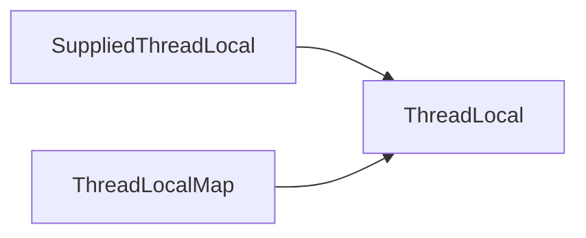

# 概述

- 修改idea配置
  
- Build，Execution，Deployment --> Debugger --> Stepping 的Do not step into the classes不要勾选
  
- 把jdk的源码，解压，然后放在项目的目录下，不要放在src下就行，非项目目录也可以，然后idea源码关联改成我们解压后的那些文件，这样就可以修改源码注释了。

  

  Spring源码关联

  

----

<span style="color:red">**JDK8核心源码目录说明**</span>

- java.applet：applet所必须的类
- java.awt：创建用户界面和绘制图形图像的所有类
- java.beans：包含与开发javabeans有关的类

- <span style="color:red">**java.lang：**</span>Java基础类【类装载（Class等）】、反射、字符串、线程类
- java.math：主要是BigInteger、BigDecimal这两个的源码
- java.net：网络应用出现提供类（阻塞式）
- <span style="color:red">**java.nio：**</span>多路的、无阻塞的I/O
- java.rmi：远程方法调用相关
-  java.security：安全框架类和接口
- java.sql：操作数据库，闲得无聊可以看看
- <span style="color:red">**java.util：**</span>重要的有：集合、JUC（Atomic、Lock、concurrent）、Stream（函数式操作）、工具类
- java.text：处理文本、日期、数字和消息的类和接口（常见DataFormat、SimpleDataFormat）
- java.time：日期时间工具库
- javax.java：java扩展包，为了保持版本兼容，但有了更好的解决方案。如swing
- launcher：和底层交互的c代码
- org：其他企业组织提供的java类库，大部分不是oracle公司提供的。如w3c提供的对xml解析类和接口
- com.sun：hotspot虚拟机中java.* 和javax.*的实现类，其他jdk中没有，这些类可能不向后兼容。

Java native方法是用c c++实现的，无法查看到代码~要看的话去下open jdk的源码

<span style="color:red">**用open jdk的源码。**</span>

- corba：不流行的多语言、分布式通讯接口
- hotspot：Java虚拟机
- hotspot-cpu：CPU相关代码（汇编器、模版解释器、部分runtime函数）
- hotspot-os：操作系统相关代码
- hotspot-os_cpu：操作系统+CPU的代码
- hotspot-share：平台无关的通用代码
- jaxp：xml处理
- jaxws：一组XML web services的Java API
- <span style="color:green">**jdk**</span>：Java开发工具包（share\class Java的实现 share\native目录里的是C++的实现）
- langtools：Java语言工具
- nashorn：JVM上的JavaScript运行时

https://mp.weixin.qq.com/s/2yke6e-bfEYGtTHxH-31HQ

# 源码阅读专项

## Integer类

### 看代码说结果

```java
public class IntegerSource {
    public static void main(String[] args) {
        /**
         * Integer 经典面试题
         */
        Integer a = 10000;
        Integer b = new Integer(10000);
        System.out.println(a == b); // 对象和基本类型比较 false

        Integer c = new Integer(100);
        Integer d = new Integer(100);
        System.out.println(c == d); // 两个对象比较 false

        Integer e = 100;
        Integer f = 100;
        System.out.println(e == f); // true 都是同一个缓存 字节码编译后 e = Integer.valueOf(100)  valueOf会先看缓存（IntegerCache中有没有） 緩存的数值范围为-128~127

        Integer g = 1000;
        Integer h = 1000;
        System.out.println(g == h);// false 字节码编译后 e = Integer.valueOf(100)  valueOf会先看缓存（IntegerCache中有没有） 緩存的数值范围为-128~127

    }
}
```

jdk源码

```java
@HotSpotIntrinsicCandidate
public static Integer valueOf(int i) {
    if (i >= IntegerCache.low && i <= IntegerCache.high)
        return IntegerCache.cache[i + (-IntegerCache.low)];
    return new Integer(i);
}
// Integer的缓存。 默认缓存-128~127直接的数据
private static class IntegerCache {
    static final int low = -128;
    static final int high;
    static final Integer cache[]; // 缓存池

    static {
        // high value may be configured by property
        int h = 127;
        String integerCacheHighPropValue =
            VM.getSavedProperty("java.lang.Integer.IntegerCache.high");
        if (integerCacheHighPropValue != null) {
            try {
                int i = parseInt(integerCacheHighPropValue);
                i = Math.max(i, 127);
                // Maximum array size is Integer.MAX_VALUE
                h = Math.min(i, Integer.MAX_VALUE - (-low) -1);
            } catch( NumberFormatException nfe) {
                // If the property cannot be parsed into an int, ignore it.
            }
        }
        high = h;

        cache = new Integer[(high - low) + 1];
        int j = low;
        for(int k = 0; k < cache.length; k++)
            cache[k] = new Integer(j++);

        // range [-128, 127] must be interned (JLS7 5.1.7)
        assert IntegerCache.high >= 127;
    }

    private IntegerCache() {}
}
```

JDK的源码中，被@HotSpotIntrinsicCandidate标注的方法，在HotSpot中都有一套高效的实现，该高效实现基于CPU指令，运行时，HotSpot维护的高效实现会替代JDK的源码实现，从而获得更高的效率。

 jdk的包装类都是final修饰的。

## ThreadLocal

### ThreadLocal的结构

ThreadLocal有两个内部类




Supplied开头的是函数式接口。

Map是ThreadLocal自定义的一个map，主要是为了防止ThreadLocal内存泄漏

### ThreadLocal部分代码解释

```java
public class ThreadLocalSource {
    public static void main(String[] args) {
        ThreadLocal<String> local = new ThreadLocal<>();
        System.out.println(local.get());

        local.set("hello");
        System.out.println(local.get());
    }
}
```

> **get()方法解释**

看不懂。

```java
public T get() {
    //Returns a reference to the currently executing thread object. Returns: the currently executing thread.
    Thread t = Thread.currentThread();
    // 获得当前线程关联的一个Map ThreadLocalMap是一个静态内部类只初始化一次哦！
    ThreadLocalMap map = getMap(t);
    // Map不为空的话
    if (map != null) {
        // 获得key对应的Entry
        ThreadLocalMap.Entry e = map.getEntry(this);
        // Entry不为空
        if (e != null) {
            @SuppressWarnings("unchecked")
            T result = (T)e.value;
            return result;
        }
    }
    // 为空就初始化值
    return setInitialValue();
}
```

> **set()方法解释**

```java
public void set(T value) {
    Thread t = Thread.currentThread();
    ThreadLocalMap map = getMap(t);
    if (map != null) {
        // 通过当前线程获取的map不为空则为当前线程设置值
        map.set(this, value);
    } else {
        createMap(t, value);
    }
}
```

map.set的set方法

```java
private void set(ThreadLocal<?> key, Object value) {

    // We don't use a fast path as with get() because it is at
    // least as common to use set() to create new entries as
    // it is to replace existing ones, in which case, a fast
    // path would fail more often than not.
    // 捷径往往会失败
    Entry[] tab = table; // 这个map用的是开放定址法？
    int len = tab.length;
    int i = key.threadLocalHashCode & (len-1);

    for (Entry e = tab[i];
         e != null;
         e = tab[i = nextIndex(i, len)]) {
        ThreadLocal<?> k = e.get();

        if (k == key) {
            e.value = value;
            return;
        }

        if (k == null) {
            replaceStaleEntry(key, value, i);
            return;
        }
    }

    tab[i] = new Entry(key, value);
    int sz = ++size;
    if (!cleanSomeSlots(i, sz) && sz >= threshold)
        rehash(); // 重新调整hash的大小
}
```

### ThreadLocalMap

ThreadLocalMap为了可从表中删除条目Entry采用了WeakReference

Entry是key。

弱引用，不管内存是否足够，GC时都会把弱虚引用回收掉。

## JVM优化？？

**`@HotSpotIntrinsicCandidate`**

昨天在看源码的时候看到了很多这个注解，应该是Java 9引入的新特性，作用如下：

JDK的源码中，被@HotSpotIntrinsicCandidate标注的方法，在HotSpot中都有一套高效的实现，==该高效实现基于CPU指令==，运行时，HotSpot维护的高效实现会替代JDK的源码实现，从而==获得更高的效率==。

## 并发List

## LockSupport

## AQS★

抽象同步锁，并发包底层锁的实现，高版本JDK好像用了不少synchronized [ synchronized就是牛！不愧是亲儿子，一直在优化它的性能！ ]

# 集合相关源码

## 迭代器相关

```java
import java.util.ArrayList;
import java.util.Iterator;
import java.util.ListIterator;

public class IteratorSource {
    // 抛出异常 Exception in thread "main" java.util.ConcurrentModificationException
    public static void t1() {
        ArrayList<Integer> list = new ArrayList<>();
        list.add(1);
        list.add(2);
        list.add(3);
        Iterator<Integer> iterator = list.iterator();
        System.out.println(iterator.hasNext() ? iterator.next() : "null");
        System.out.println(iterator.hasNext() ? iterator.next() : "null");
        list.add(1); // throws exception
        list.remove(1);
        System.out.println(iterator.hasNext() ? iterator.next() : "null");
    }
    // 正常运行。
    public static void t2() {
        ArrayList<Integer> list = new ArrayList<>();
        list.add(1);
        list.add(2);
        list.add(3);
        ListIterator<Integer> iterator = list.listIterator();
        System.out.println(iterator.hasNext() ? iterator.next() : "null");
        System.out.println(iterator.hasNext() ? iterator.next() : "null");
        iterator.add(12313);
        iterator.add(123);
        list.remove(1);
        System.out.println(iterator.hasNext() ? iterator.next() : "null");
    }

    public static void main(String[] args) {
        t1();
        t2();
    }
}
```

>ArrayList的iterator源码

```java
    public Iterator<E> iterator() {
        return new Itr();
    }

    /**
     * An optimized version of AbstractList.Itr
     */
    private class Itr implements Iterator<E> {
        int cursor;       // index of next element to return
        int lastRet = -1; // index of last element returned; -1 if no such
        int expectedModCount = modCount; // 如果这两个值不相等就会抛出异常。 期待的操作次数 和 实际的操作次数要相等。ArrayList的add操作和remove操作都会让modCount的值进行变化。

        // prevent creating a synthetic constructor
        Itr() {}

        public boolean hasNext() {
            return cursor != size;
        }

        @SuppressWarnings("unchecked")
        public E next() {
            checkForComodification();
            int i = cursor;
            if (i >= size)
                throw new NoSuchElementException();
            Object[] elementData = ArrayList.this.elementData;
            if (i >= elementData.length)
                throw new ConcurrentModificationException();
            cursor = i + 1;
            return (E) elementData[lastRet = i];
        }

        public void remove() {
            if (lastRet < 0)
                throw new IllegalStateException();
            checkForComodification();

            try {
                ArrayList.this.remove(lastRet);
                cursor = lastRet;
                lastRet = -1;
                // remove函数中的这个操作确保了这两个值是一致的。
                expectedModCount = modCount;
            } catch (IndexOutOfBoundsException ex) {
                throw new ConcurrentModificationException();
            }
        }

        @Override
        public void forEachRemaining(Consumer<? super E> action) {
            Objects.requireNonNull(action);
            final int size = ArrayList.this.size;
            int i = cursor;
            if (i < size) {
                final Object[] es = elementData;
                if (i >= es.length)
                    throw new ConcurrentModificationException();
                for (; i < size && modCount == expectedModCount; i++)
                    action.accept(elementAt(es, i));
                // update once at end to reduce heap write traffic
                cursor = i;
                lastRet = i - 1;
                checkForComodification();
            }
        }

        final void checkForComodification() {
            if (modCount != expectedModCount)
                throw new ConcurrentModificationException();
        }
    }
```


> ArrayList的listIterator源码

```java
private class ListItr extends Itr implements ListIterator<E> {
        ListItr(int index) {
            super();
            cursor = index;
        }

        public boolean hasPrevious() {
            return cursor != 0;
        }

        public int nextIndex() {
            return cursor;
        }

        public int previousIndex() {
            return cursor - 1;
        }

        @SuppressWarnings("unchecked")
        public E previous() {
            checkForComodification();
            int i = cursor - 1;
            if (i < 0)
                throw new NoSuchElementException();
            Object[] elementData = ArrayList.this.elementData;
            if (i >= elementData.length)
                throw new ConcurrentModificationException();
            cursor = i;
            return (E) elementData[lastRet = i];
        }

        public void set(E e) {
            if (lastRet < 0)
                throw new IllegalStateException();
            checkForComodification();

            try {
                ArrayList.this.set(lastRet, e);
            } catch (IndexOutOfBoundsException ex) {
                throw new ConcurrentModificationException();
            }
        }
        public void add(E e) {
            checkForComodification();
            try {
                int i = cursor;
                ArrayList.this.add(i, e);
                cursor = i + 1;
                lastRet = -1;
 		// add函数中的这个操作确保了这两个值是一致的。
                expectedModCount = modCount;
            } catch (IndexOutOfBoundsException ex) {
                throw new ConcurrentModificationException();
            }
        }
    }
```

