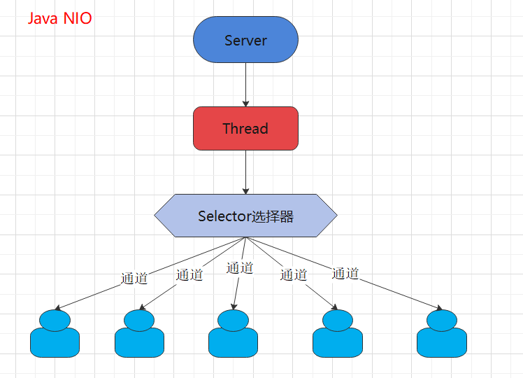
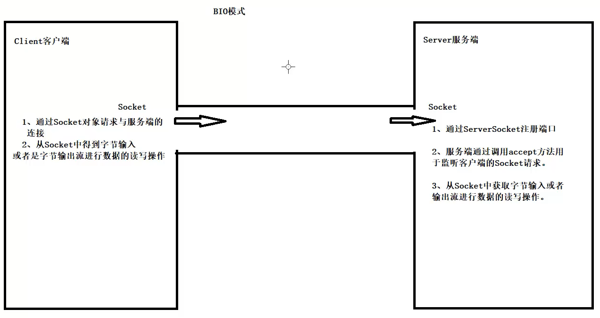
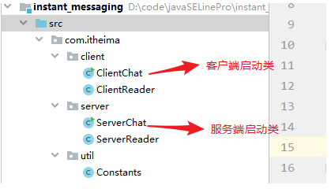
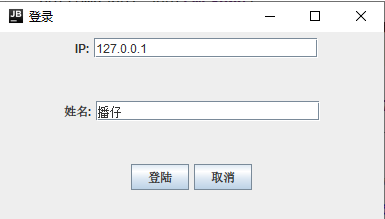
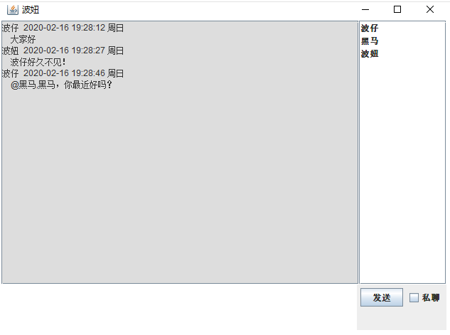
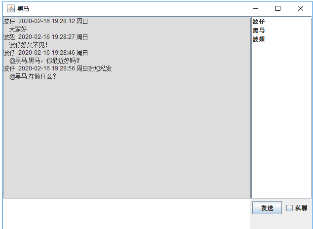
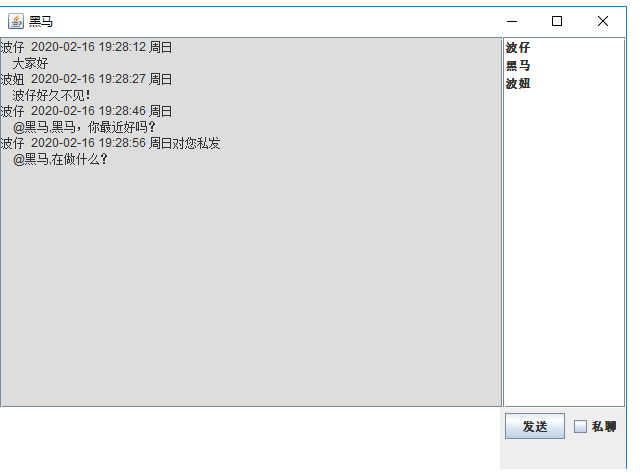
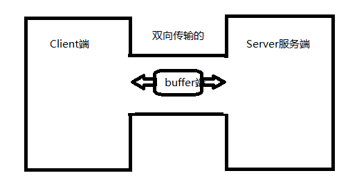
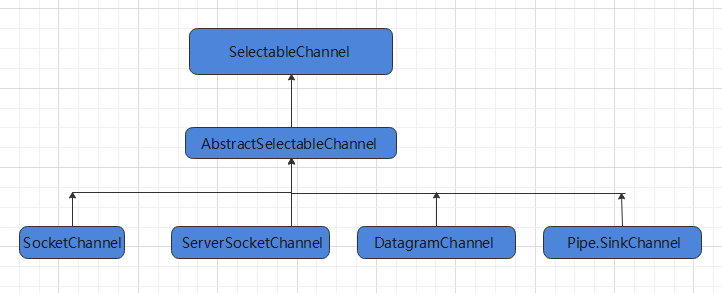
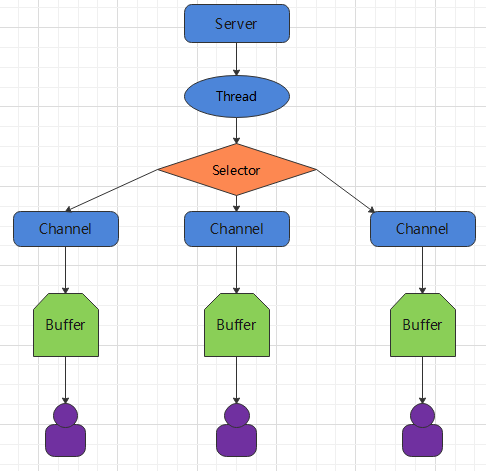

# NIO基本梳理

NIO JDK1.4引入。

## NIO与传统IO的区别

传统IO是一次一个字节地处理数据，NIO是以块的形式处理数据（操作系统IO部分）。NIO可以实现非阻塞，传统IO只能是阻塞的。IO的实际场景是文件IO和网络IO，NIO在网络IO场景下提升尤其明显。

Java NIO有三个核心部分：Buffer（缓冲区）、Channel（管道）、Selector（选择器）

- Buffer：存储数据的地方。
- Channel：运输数据的载体。
- Selector：用于检查多个Channel的状态变更情况。

## NIO Demo

服务端接收图片后保存，能通知客户端已经收到图片、而客户端发送图片给客户端，并接收服务端的响应。

> ==服务端==

```java
public class NoBlockServer {

    public static void main(String[] args) throws IOException {

        // 1.获取通道
        ServerSocketChannel server = ServerSocketChannel.open();

        // 2.切换成非阻塞模式
        server.configureBlocking(false);

        // 3. 绑定连接
        server.bind(new InetSocketAddress(6666));

        // 4. 获取选择器
        Selector selector = Selector.open();

        // 4.1将通道注册到选择器上，指定接收“监听通道”事件
        server.register(selector, SelectionKey.OP_ACCEPT);

        // 5. 轮训地获取选择器上已“就绪”的事件--->只要select()>0，说明已就绪
        while (selector.select() > 0) {
            // 6. 获取当前选择器所有注册的“选择键”(已就绪的监听事件)
            Iterator<SelectionKey> iterator = selector.selectedKeys().iterator();

            // 7. 获取已“就绪”的事件，(不同的事件做不同的事)
            while (iterator.hasNext()) {

                SelectionKey selectionKey = iterator.next();

                // 接收事件就绪
                if (selectionKey.isAcceptable()) {

                    // 8. 获取客户端的链接
                    SocketChannel client = server.accept();

                    // 8.1 切换成非阻塞状态
                    client.configureBlocking(false);

                    // 8.2 注册到选择器上-->拿到客户端的连接为了读取通道的数据(监听读就绪事件)
                    client.register(selector, SelectionKey.OP_READ);

                } else if (selectionKey.isReadable()) { // 读事件就绪

                    // 9. 获取当前选择器读就绪状态的通道
                    SocketChannel client = (SocketChannel) selectionKey.channel();

                    // 9.1读取数据
                    ByteBuffer buffer = ByteBuffer.allocate(1024);

                    // 9.2得到文件通道，将客户端传递过来的图片写到本地项目下(写模式、没有则创建)
                    FileChannel outChannel = FileChannel.open(Paths.get("2.png"), StandardOpenOption.WRITE, StandardOpenOption.CREATE);

                    while (client.read(buffer) > 0) {
                        // 在读之前都要切换成读模式
                        buffer.flip();

                        outChannel.write(buffer);

                        // 读完切换成写模式，能让管道继续读取文件的数据
                        buffer.clear();
                    }
                }
                // 10. 取消选择键(已经处理过的事件，就应该取消掉了)
                iterator.remove();
            }
        }

    }
}
```

> ==客户端==

```java
public class NoBlockClient {

    public static void main(String[] args) throws IOException {

        // 1. 获取通道
        SocketChannel socketChannel = SocketChannel.open(new InetSocketAddress("127.0.0.1", 6666));

        // 1.1切换成非阻塞模式
        socketChannel.configureBlocking(false);

        // 1.2获取选择器
        Selector selector = Selector.open();

        // 1.3将通道注册到选择器中，获取服务端返回的数据
        socketChannel.register(selector, SelectionKey.OP_READ);

        // 2. 发送一张图片给服务端吧
        FileChannel fileChannel = FileChannel.open(Paths.get("X:\\Users\\ozc\\Desktop\\面试造火箭\\1.png"), StandardOpenOption.READ);

        // 3.要使用NIO，有了Channel，就必然要有Buffer，Buffer是与数据打交道的呢
        ByteBuffer buffer = ByteBuffer.allocate(1024);

        // 4.读取本地文件(图片)，发送到服务器
        while (fileChannel.read(buffer) != -1) {
            // 在读之前都要切换成读模式
            buffer.flip();
            socketChannel.write(buffer);
            // 读完切换成写模式，能让管道继续读取文件的数据
            buffer.clear();
        }

        // 5. 轮训地获取选择器上已“就绪”的事件--->只要select()>0，说明已就绪
        // 轮询，查看事件是否已经就绪了。Python NIO 也这样？p
        while (selector.select() > 0) {
            // 6. 获取当前选择器所有注册的“选择键”(已就绪的监听事件)
            Iterator<SelectionKey> iterator = selector.selectedKeys().iterator();

            // 7. 获取已“就绪”的事件，(不同的事件做不同的事)
            while (iterator.hasNext()) {

                SelectionKey selectionKey = iterator.next();

                // 8. 读事件就绪
                if (selectionKey.isReadable()) {

                    // 8.1得到对应的通道
                    SocketChannel channel = (SocketChannel) selectionKey.channel();

                    ByteBuffer responseBuffer = ByteBuffer.allocate(1024);

                    // 9. 知道服务端要返回响应的数据给客户端，客户端在这里接收
                    int readBytes = channel.read(responseBuffer);

                    if (readBytes > 0) {
                        // 切换读模式
                        responseBuffer.flip();
                        System.out.println(new String(responseBuffer.array(), 0, readBytes));
                    }
                }
                // 10. 取消选择键(已经处理过的事件，就应该取消掉了)
                iterator.remove();
            }
        }
    }
}
```

## I/O模型

- 阻塞IO、非阻塞IO、IO复用、信号驱动以及异步I/O。
- 开发中碰得最多的就是阻塞I/O、非阻塞I/O以及I/O复用

### 阻塞IO

客户端是否有数据传输，相应的线程都需要进行等待（阻塞了）

### 非阻塞IO

空着

### IO复用模型

以Linux系统为例，Linux对文件的操作实际上就是通过文件描述符（fd）。IO复用模型指的是，通过一个进程监听多个文件描述符，一旦某个文件描述符准备就绪，就去通知程序做相对应的处理。这种以通知的方式，优势并不是对于单个连接能处理得更快，而是在于它能处理更多的连接。

==在Linux下IO复用模型用的函数有select/poll和epoll。==

> select

select 函数它支持最大的连接数是1024或2018，因为在 select 函数下要传入 fd_set 参数，这个 fd_set 的大小要么1024或2048（看OS的位数）。fd_set 是 bitmap 的数据结构，可以简单理解为只要位为0，那说明还没数据到缓冲区，只要位为1，那么说明数据已经到缓冲区。==select 函数做的就是每次将 fd_set 遍历，判断标志位有没有发送变化，如果有变化则通知程序做中断处理。==

> epoll

epoll 是在 Linux 2.6 内核正式提出，完善了 select 的一些缺点。它定义了 epoll_event 结构体来处理，不存在最大连接数的限制。它不像 select 函数每次把所有的文件描述符（fd）都遍历，简单理解就是 epoll 把就绪的文件描述符（fd）专门维护了一块空间，每次从就绪列表里边拿就好了，不再进行对所有文件描述符（fd）进行遍历。

### 零拷贝

以读操作为例，假设用户程序发起一次读请求。其实会调用read相关的【系统函数】，然后会从用户态切换到内核态，随后CPU会告诉DMA去磁盘把数据拷贝到内核空间。等到【内核缓冲区】有数据后CPU会把【内核缓冲区】拷贝到【用户缓冲区】，最终用户程序才能获取到。

简单说就是 DMA磁盘数据-->内核空间  内核缓冲区-->用户缓冲区。

==一次读操作会让DMA将磁盘数据拷贝到内核缓冲区，CPU将内核缓冲区数据拷贝到用户缓冲区。所谓的零拷贝就是将这次CPU拷贝给省去，来提高效率和性能。==

**常见的零拷贝技术有mmap（内核缓冲区与用户缓冲区的共享）、sendfile（系统底层函数支持）**

# 第一章 BIO、NIO、AIO

## 1.1 说明

对于高性能场景，同步阻塞式I/O通信（BIO）性能低下。Java 2002年开始支持非阻塞式I/O通信技术（NIO）。

通过大量案例，从最基础的BIO开始到NIO、AIO。清晰了解阻塞、同步、异步的现象、概念和特征及其优缺点。

## 1.2 前置知识

- 掌握JavaSE（Java多线程、Java IO流编程、Java网络基础知识），常用Java设计模式
- 熟练掌握OOP。

## 1.3 可解决的问题

- 局域网内的通信要求
- 多系统间底层消息传递机制
- 高并发下、大数据量的通信场景需要
- 游戏服务器端（手游、端游）

# 第二章 IO演变

## 2.1 I/O模型基本说明


## 2.2 I/O模型

### Java BIO

客户端是否有数据传输，相应的线程都需要进行等待（阻塞了）


### Java NIO

多路复用器会自动轮询所有的管道，去看那些管道有数据请求操作，有才会分配新的线程去处理管道通信，如果管道没有数据请求，那么线程可以去做其他的事情，不用等待。【依然需要轮询访问通道，但是通道无数据的时候，线程无需等待】



### Java AIO

Java AIO(NIO.2) ： 异步 异步非阻塞，服务器实现模式为一个有效请求一个线程，客户端的I/O请求都是由OS先完成了再通知服务器应用去启动线程进行处理，一般适用于连接数较 多且连接时间较长的应用。

客户端的数据都是通过OS进行处理，OS处理完数据后才会通知相应的服务端的线程进行数据的接收。


## 2.3 BIO、NIO、AIO适用场景

1、**BIO** 方式`适用于连接数目比较小且固定的架构`，这种方式对服务器资源要求比较高（每次请求都要创建一个线程进行处理，线程无数据可处理的时候还要进行等待），`并发局限于应用中`，JDK1.4以前的唯一选择，但程序简单易理解。

2、**NIO** 方式`适用于连接数目多且连接比较短（轻操作）的架构`（**NIO造成系统资源浪费哪里没听懂！！！**，如果通道的资源少，那么解决起来就快，就可以很快地把资源释放给其他通道用。如果一直占据，会造成并发，资源浪费。AIO是OS充分干预，适用于长连接一类的。），比如聊天服务器，弹幕系统，服务器间通讯等。 编程比较复杂，JDK1.4 开始支持。

3、**AIO** 方式`适用于连接数目多且连接比较长（重操作）的架构`，比如相册服务器，`充分调用 OS 参与并发操作`（注册客户端通道，客户端的数据交由操作系统处理，操作系统处理完后再通过回调机制通知我们的服务器进行数据的接收处理）， 编程比较复杂，JDK7 开始支持。

# 第三章 Java BIO深入剖析

## 3.1 Java BIO基本介绍

- Java BIO 就是传统的 java io 编程，其相关的类和接口在 java.io
- BIO(blocking I/O) ： 同步阻塞，服务器实现模式为一个连接一个线程，即客户端有连接请求时服务器端就需要启动一个线程进行处理，如果这个连接不做任何事情会造成不必要的线程开销，可以通过线程池机制改善(实现多个客户连接服务器).

## 3.2 Java BIO 工作机制



对BIO编程流程的梳理

1. 服务器端启动一个 **ServerSocket**，注册端口，调用accpet方法监听客户端的Socket连接。
2. 客户端启动 **Socket** 对服务器进行通信（`Socket端与Socket端之间会形成一个虚拟管道，用于数据传输`），默认情况下服务器端需要对每个客户 建立一个线程与之通讯

## 3.3 传统的BIO编程实例回顾

网络编程的基本模型是Client/Server模型，也就是两个进程之间进行相互通信，其中服务端提供位置信（绑定IP地址和端口），客户端通过连接操作向服务端监听的端口地址发起连接请求，基于TCP协议下进行三次握手连接，连接成功后，双方通过网络套接字（Socket）进行通信。

传统的同步阻塞模型开发中，服务端ServerSocket负责绑定IP地址，启动监听端口；客户端Socket负责发起连接操作。连接成功后，双方通过输入和输出流进行同步阻塞式通信。 基于BIO模式下的通信，客户端 - 服务端是完全同步，完全耦合的。

### 客户端案例如下

```java
package com.itheima._02bio01;

import java.io.OutputStream;
import java.io.PrintStream;
import java.net.Socket;
/**
    目标: Socket网络编程。

    Java提供了一个包：java.net下的类都是用于网络通信。
    Java提供了基于套接字（端口）Socket的网络通信模式，我们基于这种模式就可以直接实现TCP通信。
    只要用Socket通信，那么就是基于TCP可靠传输通信。

    功能1：客户端发送一个消息，服务端接口一个消息，通信结束！！

    创建客户端对象：
        （1）创建一个Socket的通信管道，请求与服务端的端口连接。
        （2）从Socket管道中得到一个字节输出流。
        （3）把字节流改装成自己需要的流进行数据的发送
    创建服务端对象：
        （1）注册端口
        （2）开始等待接收客户端的连接,得到一个端到端的Socket管道
        （3）从Socket管道中得到一个字节输入流。
        （4）把字节输入流包装成自己需要的流进行数据的读取。

    Socket的使用：
        构造器：public Socket(String host, int port)
        方法：  public OutputStream getOutputStream()：获取字节输出流
               public InputStream getInputStream() :获取字节输入流

    ServerSocket的使用：
        构造器：public ServerSocket(int port)

    小结：
        通信是很严格的，对方怎么发你就怎么收，对方发多少你就只能收多少！！

 */
public class ClientDemo {
    public static void main(String[] args) throws Exception {
        System.out.println("==客户端的启动==");
        // （1）创建一个Socket的通信管道，请求与服务端的端口连接。
        Socket socket = new Socket("127.0.0.1",8888);
        // （2）从Socket通信管道中得到一个字节输出流。
        OutputStream os = socket.getOutputStream();
        // （3）把字节流改装成自己需要的流进行数据的发送
        PrintStream ps = new PrintStream(os);
        // （4）开始发送消息
        ps.println("我是客户端，我想约你吃小龙虾！！！");
        ps.flush();
    }
}
```

### 服务端案例如下

```java
package com.itheima._02bio01;

import java.io.BufferedReader;
import java.io.InputStream;
import java.io.InputStreamReader;
import java.net.ServerSocket;
import java.net.Socket;

/**
 * 服务端
 */
public class ServerDemo {
    public static void main(String[] args) throws Exception {
        System.out.println("==服务器的启动==");
        // （1）注册端口
        ServerSocket serverSocket = new ServerSocket(8888);
        //（2）开始在这里暂停等待接收客户端的连接,得到一个端到端的Socket管道
        Socket socket = serverSocket.accept();
        //（3）从Socket管道中得到一个字节输入流。
        InputStream is = socket.getInputStream();
        //（4）把字节输入流包装成自己需要的流进行数据的读取。
        BufferedReader br = new BufferedReader(new InputStreamReader(is));
        //（5）读取数据
        String line ;
        while((line = br.readLine())!=null){
            System.out.println("服务端收到："+line);
        }
    }
}
```

### 小结

- 在以上通信中，服务端会一致等待客户端的消息，如果客户端没有进行消息的发送，服务端将一直进入阻塞状态。
- 同时服务端是按照行获取消息的，这意味着客户端也必须按照行进行消息的发送，否则服务端将进入等待消息的阻塞状态！

## 3.4 BIO模式下多发和多收消息

 在1.3的案例中，**只能实现客户端发送消息，服务端接收消息**，并不能实现反复的收消息和反复的发消息，我们只需要在客户端案例中，加上反复按照行发送消息的逻辑即可！案例代码如下：

### 客户端代码如下

```java
package com.itheima._03bio02;

import java.io.OutputStream;
import java.io.PrintStream;
import java.net.Socket;
import java.util.Scanner;

/**
    目标: Socket网络编程。

    功能1：客户端可以反复发消息，服务端可以反复收消息

    小结：
        通信是很严格的，对方怎么发你就怎么收，对方发多少你就只能收多少！！

 */
public class ClientDemo {
    public static void main(String[] args) throws Exception {
        System.out.println("==客户端的启动==");
        // （1）创建一个Socket的通信管道，请求与服务端的端口连接。
        Socket socket = new Socket("127.0.0.1",8888);
        // （2）从Socket通信管道中得到一个字节输出流。
        OutputStream os = socket.getOutputStream();
        // （3）把字节流改装成自己需要的流进行数据的发送
        PrintStream ps = new PrintStream(os);
        // （4）开始发送消息
        Scanner sc = new Scanner(System.in);
        while(true){
            System.out.print("请说:");
            String msg = sc.nextLine();
            ps.println(msg);
            ps.flush();
        }
    }
}
```

### 服务端代码如下

```java
package com.itheima._03bio02;

import java.io.BufferedReader;
import java.io.InputStream;
import java.io.InputStreamReader;
import java.net.ServerSocket;
import java.net.Socket;

/**
 * 服务端
 */
public class ServerDemo {
    public static void main(String[] args) throws Exception {
        System.out.println("==服务器的启动==");
        //（1）注册端口
        ServerSocket serverSocket = new ServerSocket(8888);
        //（2）开始在这里暂停等待接收客户端的连接,得到一个端到端的Socket管道
        Socket socket = serverSocket.accept();
        //（3）从Socket管道中得到一个字节输入流。
        InputStream is = socket.getInputStream();
        //（4）把字节输入流包装成  自己需要的流进行数据的读取。
        BufferedReader br = new BufferedReader(new InputStreamReader(is));
        //（5）读取数据
        String line ;
        while((line = br.readLine())!=null){
            System.out.println("服务端收到："+line);
        }
        bufferedReader.close();
        inputStream.close();
    }
}
```

### 小结

- 本案例中确实可以实现客户端多发多收
- 但是服务端只能处理一个客户端的请求，因为服务端是单线程的。一次只能与一个客户端进行消息通信。

## 3.5 BIO模式下接收多个客户端

### 概述

 在上述的案例中，一个服务端只能接收一个客户端的通信请求，**那么如果服务端需要处理很多个客户端的消息通信请求应该如何处理呢**，此时我们就需要在服务端引入线程了，也就是说客户端每发起一个请求，服务端就创建一个新的线程来处理这个客户端的请求，这样就实现了一个客户端一个线程的模型，图解模式如下：


### 客户端案例代码如下

```java
/**
    目标: Socket网络编程。
    功能1：客户端可以反复发，一个服务端可以接收无数个客户端的消息！！
    小结：
         服务器如果想要接收多个客户端，那么必须引入线程，一个客户端一个线程处理！！
 */
public class ClientDemo {
    public static void main(String[] args) throws Exception {
        System.out.println("==客户端的启动==");
        // （1）创建一个Socket的通信管道，请求与服务端的端口连接。
        Socket socket = new Socket("127.0.0.1",7777);
        // （2）从Socket通信管道中得到一个字节输出流。
        OutputStream os = socket.getOutputStream();
        // （3）把字节流改装成自己需要的流进行数据的发送
        PrintStream ps = new PrintStream(os);
        // （4）开始发送消息
        Scanner sc = new Scanner(System.in);
        while(true){
            System.out.print("请说:");
            String msg = sc.nextLine();
            ps.println(msg);
            ps.flush();
        }
    }
}
```

### 服务端案例代码如下

```java
package io.v4;

import java.io.BufferedReader;
import java.io.IOException;
import java.io.InputStream;
import java.io.InputStreamReader;
import java.net.ServerSocket;
import java.net.Socket;

// 服务器端 因为只一次accept 只接受到了一个客户端的请求，所以只能接受到一个客户端的消息。
// 我们为每个客户端创建一个线程，就可以一个服务器 连接多个客户端了！
public class BIOServer {
    public static void main(String[] args) throws IOException {
        System.out.println("========服务端启动========");
        // 1. 定义一个ServerSocket对象进行服务器的端口注册
        ServerSocket serverSocket = new ServerSocket(9999);
        while (true) {
            // 2. 开始在这里暂停等待接收客户端的连接,得到一个端到端的Socket管道
            Socket accept = serverSocket.accept();
            new Thread(new DealClient(accept)).start();
        }
    }
}

class DealClient implements Runnable {
    private Socket socket = null;

    public DealClient(Socket socket) {
        this.socket = socket;
    }

    @Override
    public void run() {
        InputStream inputStream = null;
        BufferedReader bufferedReader = null;
        try {
            // 3. 从Socket管道中得到一个字节输入流。
            inputStream = socket.getInputStream();
            // 4. 把字节输入流包装成自己需要的流进行数据的读取。
            bufferedReader = new BufferedReader(new InputStreamReader(inputStream));
            // 5. 读取数据
            String msg = "";
            while ((msg = bufferedReader.readLine()) != null) {
                System.out.println("服务器端接收到：" + socket.getRemoteSocketAddress() + ":\t" + msg);
            }
        } catch (Exception e) {
            e.printStackTrace();
        } finally {
            try {
                bufferedReader.close();
                inputStream.close();
            } catch (IOException e) {
                e.printStackTrace();
            }
        }
    }
}
```

### 小结

- `1.`每个Socket接收到，都会创建一个线程，线程的竞争、切换上下文影响性能；
- `2.`每个线程都会占用栈空间和CPU资源（并发的资源消耗）；
- `3.`并不是每个socket都进行IO操作，无意义的线程处理；
- `4.`客户端的并发访问增加时。服务端将呈现1:1的线程开销，访问量越大，系统将发生线程栈溢出，线程创建失败，最终导致进程宕机或者僵死，从而不能对外提供服务。

## 3.6 伪异步I/O编程

### 概述

 `在上述案例中：客户端的并发访问增加时。服务端将呈现1:1的线程开销，访问量越大，系统将发生线程栈溢出，线程创建失败，最终导致进程宕机或者僵死，从而不能对外提供服务。`

`接下来我们采用一个伪异步I/O的通信框架，采用线程池和任务队列实现，`当客户端接入时，将客户端的Socket封装成一个Task（该任务实现java.lang.Runnable线程任务接口）交给后端的线程池中进行处理。`JDK的线程池维护一个消息队列和N个活跃的线程，对消息队列中Socket任务进行处理`，由于线程池可以设置消息队列的大小和最大线程数，因此，它的资源占用是可控的，无论多少个客户端并发访问，都不会导致资源的耗尽和宕机。

 图示如下:


### 线程池介绍

我自己加的内容

### 客户端源码分析

```java
package io.v5;

import java.io.IOException;
import java.io.OutputStream;
import java.io.PrintStream;
import java.net.Socket;
import java.util.Scanner;

// 客户端 启动多个客户端 给通过一个服务器发送消息
public class Client {
    public static void main(String[] args) throws IOException {
        // 1.建立一个与服务端的Socket对象：套接字
        Socket socket = new Socket("127.0.0.1", 8888);
        // 2.从socket管道中获取一个输出流，写数据给服务端
        OutputStream outputStream = socket.getOutputStream();
        // 3.把输出流包装成一个打印流 
        PrintStream printStream = new PrintStream(outputStream);
        Scanner scanner = new Scanner(System.in);
        while (true) {
            System.out.println("please input:");
            String msg = scanner.nextLine();
            printStream.println(msg);
            printStream.flush();
        }
    }
}
```

### 服务端源码分析

```java
package io.v5;

import java.io.BufferedReader;
import java.io.IOException;
import java.io.InputStream;
import java.io.InputStreamReader;
import java.net.ServerSocket;
import java.net.Socket;
import java.util.concurrent.ArrayBlockingQueue;
import java.util.concurrent.ExecutorService;
import java.util.concurrent.ThreadPoolExecutor;
import java.util.concurrent.TimeUnit;

/**
 * 实现伪异步通信架构
 */
public class Server {
    public static void main(String[] args) throws IOException {
        // 1、注册端口
        ServerSocket serverSocket = new ServerSocket(8888);
        // 把socket对象包装成一个任务，交给线程池进行处理。
        HandlerSocketServerPool handlerSocketServerPool = new HandlerSocketServerPool(6, 10);
        // 初始化一个线程池对象
        while (true) {
            // 2、定义一个循环接收客户端的Socket链接请求
            Socket accept = serverSocket.accept();
            // 3、把socket封装成任务对象，交由线程池处理
            ServerRunnableTarget serverRunnableTarget = new ServerRunnableTarget(accept);
            // 线程池一旦有空闲的线程，就会执行。
            handlerSocketServerPool.execute(serverRunnableTarget);
        }
    }
}

class HandlerSocketServerPool {
    // 1、创建一个线程池的成员变量用于存储一个线程池对象。
    private ExecutorService executorService;

    /**
     * public ThreadPoolExecutor(int corePoolSize, 核心线程的数目
     * int maximumPoolSize, 最大线程数量
     * long keepAliveTime,    线程的空闲时间
     * TimeUnit unit, 空闲时间的时间单位
     * BlockingQueue<Runnable> workQueue) { 任务队列
     *
     * @param maxThreadNumber
     * @param taskQueueSize
     */
    public HandlerSocketServerPool(int maxThreadNumber, int taskQueueSize) {
        // 最多三个线程。
        // 阻塞队列的最大数目为 taskQueueSize
        executorService = new ThreadPoolExecutor(3, maxThreadNumber,
                120, TimeUnit.SECONDS,
                new ArrayBlockingQueue<Runnable>(taskQueueSize));
    }

    public void execute(Runnable target) {
        executorService.execute(target);
    }
}

class ServerRunnableTarget implements Runnable {
    private Socket socket;

    public ServerRunnableTarget(Socket socket) {
        this.socket = socket;
    }

    @Override
    public void run() {
        // 处理接收到的客户端Socket通信需求
        try {
            InputStream inputStream = socket.getInputStream();
            BufferedReader bufferedReader = new BufferedReader(new InputStreamReader(inputStream));
            String msg;
            while ((msg = bufferedReader.readLine()) != null) {
                System.out.println("服务端接收到：" + msg);
            }
        } catch (Exception e) {
            e.printStackTrace();
        }
    }
}
```

### 小结

- `伪异步io采用了线程池实现，因此避免了为每个请求创建一个独立线程造成线程资源耗尽的问题，但由于底层依然是采用的同步阻塞模型，因此无法从根本上解决问题。`
- `如果单个消息处理的缓慢，或者服务器线程池中的全部线程都被阻塞，那么后续socket的i/o消息都将在队列中排队。新的Socket请求将被拒绝，客户端会发生大量连接超时。`

## 3.7 基于BIO形式下的文件上传

### 目标

支持任意类型文件形式的上传。

### 客户端开发

```java
package io.bio.v6;

import java.io.DataOutputStream;
import java.io.FileInputStream;
import java.net.Socket;

/**
 * 实现任意文件的上传
 */
public class Client {
    public static void main(String[] args) {
        try {
            // 1. 请求与服务端的socket连接
            Socket socket = new Socket("127.0.0.1", 9999);
            DataOutputStream dataOutputStream = new DataOutputStream(socket.getOutputStream());
            dataOutputStream.writeUTF(".pdf");
            FileInputStream inputStream = new FileInputStream("D:\\file.pdf");
            byte[] buffer = new byte[1024];
            int len;
            while ((len = inputStream.read(buffer)) != -1) {
                dataOutputStream.write(buffer, 0, len);
            }
            dataOutputStream.flush();
            // 流正常关闭就行，不必非得shutdownOutput()
            socket.shutdownOutput();
            dataOutputStream.close();
        } catch (Exception e) {
            e.printStackTrace();
        }
    }
}
```

### 服务端开发

```java
package io.bio.v6;

import java.io.*;
import java.net.ServerSocket;
import java.net.Socket;

public class Server {
    public static void main(String[] args) throws IOException {
        ServerSocket serverSocket = new ServerSocket(9999);
        while (true) {
            Socket accept = serverSocket.accept();
            new Thread(() -> {
                try {
                    DataInputStream dataInputStream = new DataInputStream(accept.getInputStream());
                    String suffix = dataInputStream.readUTF();
                    FileOutputStream fileOutputStream = new FileOutputStream("D:\\demo" + suffix);
                    byte[] buffer = new byte[1024];
                    int len = 0;
                    while ((len = dataInputStream.read(buffer)) != -1) {
                        fileOutputStream.write(buffer, 0, len);
                    }
                    fileOutputStream.close();
                    dataInputStream.close();
                } catch (Exception e) {

                }
            }).start();
        }
    }
}
```

### 小结

客户端怎么发，服务端就怎么接收

## 3.8 Java BIO模式下的端口转发思想

需求：需要实现一个客户端的消息可以发送给所有的客户端去接收。（类似于群聊实现）


大致流程梳理：

- 客户端发送一条数据过去，服务端接收到后需要转发给所有的客户端。 

- 如何转发呢？

- 客户端发送数据，所有的客户端socket都在一个集合里，服务端遍历集合，把数据一个一个发过去就行。 

### 客户端开发

```java
package io.bio.v8;

import java.io.*;
import java.net.Socket;
import java.util.Scanner;

public class Client {
    public static void main(String[] args) {
        try {
            // 1、创建于服务端的Socket链接
            Socket socket = new Socket("127.0.0.1", 9999);
            // 4、分配一个线程为客户端socket服务接收服务端发来的消息
            new ClientReaderThread(socket).start();

            // 2、从当前socket管道中得到一个字节输出流对应的打印流
            PrintStream ps = new PrintStream(socket.getOutputStream());
            // 3、接收用户输入的消息发送出去
            Scanner sc = new Scanner(System.in);
            while (true) {
                String msg = sc.nextLine();
                ps.println("波妞：" + msg);
                ps.flush();
            }
        } catch (Exception e) {
            e.printStackTrace();
        }
    }
}


class ClientReaderThread extends Thread {
    private Socket socket;

    public ClientReaderThread(Socket socket) {
        this.socket = socket;
    }

    @Override
    public void run() {
        try {
            BufferedReader br = new BufferedReader(new InputStreamReader(socket.getInputStream()));
            String msg;
            while ((msg = br.readLine()) != null) {
                System.out.println(msg);
            }
        } catch (Exception e) {
            e.printStackTrace();
        }
    }
}
```

### 服务端实现

```java
package io.bio.v8;

import java.io.BufferedReader;
import java.io.InputStreamReader;
import java.io.PrintStream;
import java.net.ServerSocket;
import java.net.Socket;
import java.util.ArrayList;

/**
 * 目标：BIO模式下的端口转发思想-服务端实现
 * 服务端实现的需求：
 * 1.注册端口
 * 2.接收客户端的socket连接，交给一个独立的线程来处理
 * 3.把当前连接的客户端socket存入到一个所谓的在线socket集合中保存
 * 4.接收客户端的消息，然后推送给当前所有在线的socket接收
 */
public class Server {
    public static ArrayList<Socket> onLineSocket = new ArrayList<>(16);

    public static void main(String[] args) {
        try {
            ServerSocket serverSocket = new ServerSocket(9999);
            while (true) {
                Socket accept = serverSocket.accept();
                // 把登录的客户端存入到一个在线集合中。
                onLineSocket.add(accept);
                // 为登录成功的socket分配一个线程进行处理
                new Thread(new ServerReaderThread(accept)).start();
            }
        } catch (Exception e) {

        }
    }
}

class ServerReaderThread implements Runnable {
    private Socket socket;

    public ServerReaderThread() {

    }

    public ServerReaderThread(Socket socket) {
        this.socket = socket;
    }

    @Override
    public void run() {
        try {
            BufferedReader bufferedReader = new BufferedReader(new InputStreamReader(socket.getInputStream()));
            String msg;
            while ((msg = bufferedReader.readLine()) != null) {
                // 服务端接收到数据后，把消息传给所有的在线用户
                sendMsgToAllClient(msg);
            }
        } catch (Exception e) {
            System.out.println("有人下线");
            Server.onLineSocket.remove(socket);
            e.printStackTrace();
        }
    }

    private void sendMsgToAllClient(String msg) {
        try {
            for (Socket sk : Server.onLineSocket) {
                if (sk == socket) continue;
                // 包装一下，用PrintStream的方式传递数据。知道是哪个socket，就可以直接给这个socket发送数据了。
                PrintStream printStream = new PrintStream(sk.getOutputStream());
                printStream.println(msg);
                printStream.flush();
            }
        } catch (Exception e) {
            e.printStackTrace();
        }
    }
}
```


### 小结

## 3.9 基于BIO模式下即时通信

基于BIO模式下的即时通信，我们需要解决客户端到客户端的通信，也就是需要实现客户端与客户端的端口消息转发逻辑。

###  项目功能演示

#### 项目案例说明

本项目案例为即时通信的软件项目，适合基础加强的大案例，具备综合性。学习本项目案例至少需要具备如下Java SE技术点:

* 1. Java 面向对象设计，语法设计。
* 2. 多线程技术。
* 3. IO流技术。
* 4. 网络通信相关技术。
* 5. 集合框架。
* 6. 项目开发思维。
* 7. Java 常用 api 使用。

​    ......

#### 功能清单简单说明：

**1.客户端登陆功能**

* 可以启动客户端进行登录，客户端登陆只需要输入用户名和服务端ip地址即可。

**2.在线人数实时更新。**

* 客户端用户户登陆以后，需要同步更新所有客户端的联系人信息栏。

**3.离线人数更新**

* 检测到有客户端下线后，需要同步更新所有客户端的联系人信息栏。

**4.群聊**

* 任意一个客户端的消息，可以推送给当前所有客户端接收。

**5.私聊**

* 可以选择某个员工，点击私聊按钮，然后发出的消息可以被该客户端单独接收。

**6.@消息**

* 可以选择某个员工，然后发出的消息可以@该用户，但是其他所有人都能

**7.消息用户和消息时间点**

* 服务端可以实时记录该用户的消息时间点，然后进行消息的多路转发或者选择。

#### 项目启动与演示

**项目代码结构演示。**



**项目启动步骤：**

* 1.首先需要启动服务端，点击ServerChat类直接右键启动，显示服务端启动成功！
* 2.其次，点击客户端类ClientChat类，在弹出的方框中输入服务端的ip和当前客户端的昵称



* 3.登陆进入后的聊天界面如下，即可进行相关操作。

  * 如果直接点击发送，默认发送群聊消息

* 如果选中右侧在线列表某个用户，默认发送@消息

  * 如果选中右侧在线列表某个用户，然后选择右下侧私聊按钮默，认发送私聊消息。

  

  


#### 技术选型分析

本项目案例涉及到Java基础加强的案例，具体涉及到的技术点如下：

* 1. Java 面向对象设计，语法设计。

* 2. 多线程技术。

* 3. IO流技术。

* 4. 网络通信相关技术。

* 5. 集合框架。

* 6. 项目开发思维。

* 7. Java 常用 api 使用。

  ......

### 服务端设计

#### 服务端接收多个客户端逻辑

##### 目标 

服务端需要接收多个客户端的接入。

##### 实现步骤

* 1.服务端需要接收多个客户端，目前我们采取的策略是一个客户端对应一个服务端线程。
* 2.服务端除了要注册端口以外，还需要为每个客户端分配一个独立线程处理与之通信。

##### 代码实现

* 服务端主体代码，主要进行端口注册，和接收客户端，分配线程处理该客户端请求

```java
public class ServerChat {
    
    /** 定义一个集合存放所有在线的socket  */
	public static Map<Socket, String> onLineSockets = new HashMap<>();

   public static void main(String[] args) {
      try {
         /** 1.注册端口   */
         ServerSocket serverSocket = new ServerSocket(Constants.PORT);

         /** 2.循环一直等待所有可能的客户端连接 */
         while(true){
            Socket socket = serverSocket.accept();
            /**3. 把客户端的socket管道单独配置一个线程来处理 */
            new ServerReader(socket).start();
         }
      } catch (Exception e) {
         e.printStackTrace();
      }
   }
}
```

* 服务端分配的独立线程类负责处理该客户端Socket的管道请求。

```java
class ServerReader extends Thread {
   private Socket socket;
   public ServerReader(Socket socket) {
      this.socket = socket;
   }
   @Override
   public void run() {
      try {
       
      } catch (Exception e) {
            e.printStackTrace();
      }
   }
}
```

常量包负责做端口配置

```java
public class Constants {
   /** 常量 */
   public static final int PORT = 7778 ;

}
```

##### 小结

​	本节实现了服务端可以接收多个客户端请求。

#### 服务端接收登陆消息以及监测离线

##### 目标

在上节我们实现了服务端可以接收多个客户端，然后服务端可以接收多个客户端连接，接下来我们要接收客户端的登陆消息。

##### 实现步骤

* 需要在服务端处理客户端的线程的登陆消息。
* 需要注意的是，服务端需要接收客户端的消息可能有很多种。
  * 分别是登陆消息，群聊消息，私聊消息 和@消息。
  * 这里需要约定如果客户端发送消息之前需要先发送消息的类型，类型我们使用信号值标志（1，2，3）。
    * 1代表接收的是登陆消息
    * 2代表群发| @消息
    * 3代表了私聊消息
* 服务端的线程中有异常校验机制，一旦发现客户端下线会在异常机制中处理，然后移除当前客户端用户，把最新的用户列表发回给全部客户端进行在线人数更新。

##### 代码实现

```java
public class ServerReader extends Thread {
	private Socket socket;
	public ServerReader(Socket socket) {
		this.socket = socket;
	}

	@Override
	public void run() {
		DataInputStream dis = null;
		try {
			dis = new DataInputStream(socket.getInputStream());
			/** 1.循环一直等待客户端的消息 */
			while(true){
				/** 2.读取当前的消息类型 ：登录,群发,私聊 , @消息 */
				int flag = dis.readInt();
				if(flag == 1){
					/** 先将当前登录的客户端socket存到在线人数的socket集合中   */
					String name = dis.readUTF() ;
					System.out.println(name+"---->"+socket.getRemoteSocketAddress());
					ServerChat.onLineSockets.put(socket, name);
				}
				writeMsg(flag,dis);
			}
		} catch (Exception e) {
			System.out.println("--有人下线了--");
			// 从在线人数中将当前socket移出去  
			ServerChat.onLineSockets.remove(socket);
			try {
				// 从新更新在线人数并发给所有客户端 
				writeMsg(1,dis);
			} catch (Exception e1) {
				e1.printStackTrace();
			}
		}

	}

	private void writeMsg(int flag, DataInputStream dis) throws Exception {
        // DataOutputStream dos = new DataOutputStream(socket.getOutputStream()); 
		// 定义一个变量存放最终的消息形式 
		String msg = null ;
		if(flag == 1){
			/** 读取所有在线人数发给所有客户端去更新自己的在线人数列表 */
			/** onlineNames = [波仔,zhangsan,波妞]*/
			StringBuilder rs = new StringBuilder();
			Collection<String> onlineNames = ServerChat.onLineSockets.values();
			// 判断是否存在在线人数 
			if(onlineNames != null && onlineNames.size() > 0){
				for(String name : onlineNames){
					rs.append(name+ Constants.SPILIT);
				}
				// 波仔003197♣♣㏘♣④④♣zhangsan003197♣♣㏘♣④④♣波妞003197♣♣㏘♣④④♣
				// 去掉最后的一个分隔符 
				msg = rs.substring(0, rs.lastIndexOf(Constants.SPILIT));

				/** 将消息发送给所有的客户端 */
				sendMsgToAll(flag,msg);
			}
		}else if(flag == 2 || flag == 3){
			
			}
		}
	}
	
	private void sendMsgToAll(int flag, String msg) throws Exception {
		// 拿到所有的在线socket管道 给这些管道写出消息
		Set<Socket> allOnLineSockets = ServerChat.onLineSockets.keySet();
		for(Socket sk :  allOnLineSockets){
			DataOutputStream dos = new DataOutputStream(sk.getOutputStream());
			dos.writeInt(flag); // 消息类型
			dos.writeUTF(msg);
			dos.flush();
		}
	}
}
```

##### 小结

* 此处实现了接收客户端的登陆消息，然后提取当前在线的全部的用户名称和当前登陆的用户名称发送给全部在线用户更新自己的在线人数列表。

#### 服务端接收群聊消息

##### 目标

在上节实现了接收客户端的登陆消息，然后提取当前在线的全部的用户名称和当前登陆的用户名称发送给全部在线用户更新自己的在线人数列表。接下来要接收客户端发来的群聊消息推送给当前在线的所有客户端

##### 实现步骤

* 接下来要接收客户端发来的群聊消息。
* 需要注意的是，服务端需要接收客户端的消息可能有很多种。
  * 分别是登陆消息，群聊消息，私聊消息 和@消息。
  * 这里需要约定如果客户端发送消息之前需要先发送消息的类型，类型我们使用信号值标志（1，2，3）。
    * 1代表接收的是登陆消息
    * 2代表群发| @消息
    * 3代表了私聊消息

##### 代码实现

```java
public class ServerReader extends Thread {
	private Socket socket;
	public ServerReader(Socket socket) {
		this.socket = socket;
	}

	@Override
	public void run() {
		DataInputStream dis = null;
		try {
			dis = new DataInputStream(socket.getInputStream());
			/** 1.循环一直等待客户端的消息 */
			while(true){
				/** 2.读取当前的消息类型 ：登录,群发,私聊 , @消息 */
				int flag = dis.readInt();
				if(flag == 1){
					/** 先将当前登录的客户端socket存到在线人数的socket集合中   */
					String name = dis.readUTF() ;
					System.out.println(name+"---->"+socket.getRemoteSocketAddress());
					ServerChat.onLineSockets.put(socket, name);
				}
				writeMsg(flag,dis);
			}
		} catch (Exception e) {
			System.out.println("--有人下线了--");
			// 从在线人数中将当前socket移出去  
			ServerChat.onLineSockets.remove(socket);
			try {
				// 从新更新在线人数并发给所有客户端 
				writeMsg(1,dis);
			} catch (Exception e1) {
				e1.printStackTrace();
			}
		}

	}

	private void writeMsg(int flag, DataInputStream dis) throws Exception {
        // DataOutputStream dos = new DataOutputStream(socket.getOutputStream()); 
		// 定义一个变量存放最终的消息形式 
		String msg = null ;
		if(flag == 1){
			/** 读取所有在线人数发给所有客户端去更新自己的在线人数列表 */
			/** onlineNames = [波仔,zhangsan,波妞]*/
			StringBuilder rs = new StringBuilder();
			Collection<String> onlineNames = ServerChat.onLineSockets.values();
			// 判断是否存在在线人数 
			if(onlineNames != null && onlineNames.size() > 0){
				for(String name : onlineNames){
					rs.append(name+ Constants.SPILIT);
				}
				// 波仔003197♣♣㏘♣④④♣zhangsan003197♣♣㏘♣④④♣波妞003197♣♣㏘♣④④♣
				// 去掉最后的一个分隔符 
				msg = rs.substring(0, rs.lastIndexOf(Constants.SPILIT));

				/** 将消息发送给所有的客户端 */
				sendMsgToAll(flag,msg);
			}
		}else if(flag == 2 || flag == 3){
			// 读到消息  群发的 或者 @消息
			String newMsg = dis.readUTF() ; // 消息
			// 得到发件人 
			String sendName = ServerChat.onLineSockets.get(socket);
	
			// 内容
			StringBuilder msgFinal = new StringBuilder();
			// 时间  
			SimpleDateFormat sdf = new SimpleDateFormat("yyyy-MM-dd HH:mm:ss EEE");
			if(flag == 2){
				msgFinal.append(sendName).append("  ").append(sdf.format(System.currentTimeMillis())).append("\r\n");
				msgFinal.append("    ").append(newMsg).append("\r\n");
				sendMsgToAll(flag,msgFinal.toString());
			}else if(flag == 3){
	
			}
		}
	}
	

	private void sendMsgToAll(int flag, String msg) throws Exception {
		// 拿到所有的在线socket管道 给这些管道写出消息
		Set<Socket> allOnLineSockets = ServerChat.onLineSockets.keySet();
		for(Socket sk :  allOnLineSockets){
			DataOutputStream dos = new DataOutputStream(sk.getOutputStream());
			dos.writeInt(flag); // 消息类型
			dos.writeUTF(msg);
			dos.flush();
		}
	}
}
```

##### 小结

* 此处根据消息的类型判断为群聊消息，然后把群聊消息推送给当前在线的所有客户端。

#### 服务端接收私聊消息

##### 目标

在上节我们接收了客户端发来的群聊消息推送给当前在线的所有客户端，接下来要解决私聊消息的推送逻辑

##### 实现步骤

* 解决私聊消息的推送逻辑，私聊消息需要知道推送给某个具体的客户端
* 我们可以接收到客户端发来的私聊用户名称，根据用户名称定位该用户的Socket管道，然后单独推送消息给该Socket管道。
* 需要注意的是，服务端需要接收客户端的消息可能有很多种。
  * 分别是登陆消息，群聊消息，私聊消息 和@消息。
  * 这里需要约定如果客户端发送消息之前需要先发送消息的类型，类型我们使用信号值标志（1，2，3）。
    * 1代表接收的是登陆消息
    * 2代表群发| @消息
    * 3代表了私聊消息

##### 代码实现

```java
public class ServerReader extends Thread {
	private Socket socket;
	public ServerReader(Socket socket) {
		this.socket = socket;
	}

	@Override
	public void run() {
		DataInputStream dis = null;
		try {
			dis = new DataInputStream(socket.getInputStream());
			/** 1.循环一直等待客户端的消息 */
			while(true){
				/** 2.读取当前的消息类型 ：登录,群发,私聊 , @消息 */
				int flag = dis.readInt();
				if(flag == 1){
					/** 先将当前登录的客户端socket存到在线人数的socket集合中   */
					String name = dis.readUTF() ;
					System.out.println(name+"---->"+socket.getRemoteSocketAddress());
					ServerChat.onLineSockets.put(socket, name);
				}
				writeMsg(flag,dis);
			}
		} catch (Exception e) {
			System.out.println("--有人下线了--");
			// 从在线人数中将当前socket移出去  
			ServerChat.onLineSockets.remove(socket);
			try {
				// 从新更新在线人数并发给所有客户端 
				writeMsg(1,dis);
			} catch (Exception e1) {
				e1.printStackTrace();
			}
		}

	}

	private void writeMsg(int flag, DataInputStream dis) throws Exception {
        // DataOutputStream dos = new DataOutputStream(socket.getOutputStream()); 
		// 定义一个变量存放最终的消息形式 
		String msg = null ;
		if(flag == 1){
			/** 读取所有在线人数发给所有客户端去更新自己的在线人数列表 */
			/** onlineNames = [波仔,zhangsan,波妞]*/
			StringBuilder rs = new StringBuilder();
			Collection<String> onlineNames = ServerChat.onLineSockets.values();
			// 判断是否存在在线人数 
			if(onlineNames != null && onlineNames.size() > 0){
				for(String name : onlineNames){
					rs.append(name+ Constants.SPILIT);
				}
				// 波仔003197♣♣㏘♣④④♣zhangsan003197♣♣㏘♣④④♣波妞003197♣♣㏘♣④④♣
				// 去掉最后的一个分隔符 
				msg = rs.substring(0, rs.lastIndexOf(Constants.SPILIT));

				/** 将消息发送给所有的客户端 */
				sendMsgToAll(flag,msg);
			}
		}else if(flag == 2 || flag == 3){
			// 读到消息  群发的 或者 @消息
			String newMsg = dis.readUTF() ; // 消息
			// 得到发件人 
			String sendName = ServerChat.onLineSockets.get(socket);
	
			// 内容
			StringBuilder msgFinal = new StringBuilder();
			// 时间  
			SimpleDateFormat sdf = new SimpleDateFormat("yyyy-MM-dd HH:mm:ss EEE");
			if(flag == 2){
				msgFinal.append(sendName).append("  ").append(sdf.format(System.currentTimeMillis())).append("\r\n");
				msgFinal.append("    ").append(newMsg).append("\r\n");
				sendMsgToAll(flag,msgFinal.toString());
			}else if(flag == 3){
			msgFinal.append(sendName).append("  ").append(sdf.format(System.currentTimeMillis())).append("对您私发\r\n");
				msgFinal.append("    ").append(newMsg).append("\r\n");
				// 私发 
				// 得到给谁私发 
				String destName = dis.readUTF();
				sendMsgToOne(destName,msgFinal.toString());
			}
		}
	}
	/**
	 * @param destName 对谁私发 
	 * @param msg 发的消息内容 
	 * @throws Exception
	 */
	private void sendMsgToOne(String destName, String msg) throws Exception {
		// 拿到所有的在线socket管道 给这些管道写出消息
		Set<Socket> allOnLineSockets = ServerChat.onLineSockets.keySet();
		for(Socket sk :  allOnLineSockets){
			// 得到当前需要私发的socket 
			// 只对这个名字对应的socket私发消息
			if(ServerChat.onLineSockets.get(sk).trim().equals(destName)){
				DataOutputStream dos = new DataOutputStream(sk.getOutputStream());
				dos.writeInt(2); // 消息类型
				dos.writeUTF(msg);
				dos.flush();
			}
		}

	}
	

	private void sendMsgToAll(int flag, String msg) throws Exception {
		// 拿到所有的在线socket管道 给这些管道写出消息
		Set<Socket> allOnLineSockets = ServerChat.onLineSockets.keySet();
		for(Socket sk :  allOnLineSockets){
			DataOutputStream dos = new DataOutputStream(sk.getOutputStream());
			dos.writeInt(flag); // 消息类型
			dos.writeUTF(msg);
			dos.flush();
		}
	}
}
```

##### 小结

* 本节我们解决了私聊消息的推送逻辑，私聊消息需要知道推送给某个具体的客户端Socket管道
* 我们可以接收到客户端发来的私聊用户名称，根据用户名称定位该用户的Socket管道，然后单独推送消息给该Socket管道。

### 客户端设计

#### 启动客户端界面 ,登陆，刷新在线

##### 目标

**启动客户端界面**，登陆，刷新在线人数列表

##### 实现步骤

* 客户端界面主要是GUI设计，主体页面分为登陆界面和聊天窗口，以及在线用户列表。
* GUI界面读者可以自行复制使用。
* 登陆输入服务端ip和用户名后，要请求与服务端的登陆，然后立即为当前客户端分配一个读线程处理客户端的读数据消息。因为客户端可能随时会接收到服务端那边转发过来的各种即时消息信息。
* 客户端登陆完成，服务端收到登陆的用户名后，会立即发来最新的用户列表给客户端更新。

##### 代码实现

**客户端主体代码：**

```java
public class ClientChat implements ActionListener {
   /** 1.设计界面  */
   private JFrame win = new JFrame();
   /** 2.消息内容框架 */
   public JTextArea smsContent =new JTextArea(23 , 50);
   /** 3.发送消息的框  */
   private JTextArea smsSend = new JTextArea(4,40);
   /** 4.在线人数的区域  */
   /** 存放人的数据 */
   /** 展示在线人数的窗口 */
   public JList<String> onLineUsers = new JList<>();

   // 是否私聊按钮
   private JCheckBox isPrivateBn = new JCheckBox("私聊");
   // 消息按钮
   private JButton sendBn  = new JButton("发送");

   // 登录界面
   private JFrame loginView;

   private JTextField ipEt , nameEt , idEt;

   private Socket socket ;

   public static void main(String[] args) {
      new ClientChat().initView();

   }

   private void initView() {
      /** 初始化聊天窗口的界面 */
      win.setSize(650, 600);

      /** 展示登录界面  */
      displayLoginView();

      /** 展示聊天界面 */
      //displayChatView();

   }

   private void displayChatView() {

      JPanel bottomPanel = new JPanel(new BorderLayout());
      //-----------------------------------------------
      // 将消息框和按钮 添加到窗口的底端
      win.add(bottomPanel, BorderLayout.SOUTH);
      bottomPanel.add(smsSend);
      JPanel btns = new JPanel(new FlowLayout(FlowLayout.LEFT));
      btns.add(sendBn);
      btns.add(isPrivateBn);
      bottomPanel.add(btns, BorderLayout.EAST);
      //-----------------------------------------------
      // 给发送消息按钮绑定点击事件监听器
      // 将展示消息区centerPanel添加到窗口的中间
      smsContent.setBackground(new Color(0xdd,0xdd,0xdd));
      // 让展示消息区可以滚动。
      win.add(new JScrollPane(smsContent), BorderLayout.CENTER);
      smsContent.setEditable(false);
      //-----------------------------------------------
      // 用户列表和是否私聊放到窗口的最右边
      Box rightBox = new Box(BoxLayout.Y_AXIS);
      onLineUsers.setFixedCellWidth(120);
      onLineUsers.setVisibleRowCount(13);
      rightBox.add(new JScrollPane(onLineUsers));
      win.add(rightBox, BorderLayout.EAST);
      //-----------------------------------------------
      // 关闭窗口退出当前程序
      win.setDefaultCloseOperation(JFrame.EXIT_ON_CLOSE);
      win.pack();  // swing 加上这句 就可以拥有关闭窗口的功能
      /** 设置窗口居中,显示出来  */
      setWindowCenter(win,650,600,true);
      // 发送按钮绑定点击事件
      sendBn.addActionListener(this);
   }

   private void displayLoginView(){

      /** 先让用户进行登录
       *  服务端ip
       *  用户名
       *  id
       *  */
      /** 显示一个qq的登录框     */
      loginView = new JFrame("登录");
      loginView.setLayout(new GridLayout(3, 1));
      loginView.setSize(400, 230);

      JPanel ip = new JPanel();
      JLabel label = new JLabel("   IP:");
      ip.add(label);
      ipEt = new JTextField(20);
      ip.add(ipEt);
      loginView.add(ip);

      JPanel name = new JPanel();
      JLabel label1 = new JLabel("姓名:");
      name.add(label1);
      nameEt = new JTextField(20);
      name.add(nameEt);
      loginView.add(name);

      JPanel btnView = new JPanel();
      JButton login = new JButton("登陆");
      btnView.add(login);
      JButton cancle = new JButton("取消");
      btnView.add(cancle);
      loginView.add(btnView);
      // 关闭窗口退出当前程序
      loginView.setDefaultCloseOperation(JFrame.EXIT_ON_CLOSE);
      setWindowCenter(loginView,400,260,true);

      /** 给登录和取消绑定点击事件 */
      login.addActionListener(this);
      cancle.addActionListener(this);

   }

   private static void setWindowCenter(JFrame frame, int width , int height, boolean flag) {
      /** 得到所在系统所在屏幕的宽高 */
      Dimension ds = frame.getToolkit().getScreenSize();

      /** 拿到电脑的宽 */
      int width1 = ds.width;
      /** 高 */
      int height1 = ds.height ;

      System.out.println(width1 +"*" + height1);
      /** 设置窗口的左上角坐标 */
      frame.setLocation(width1/2 - width/2, height1/2 -height/2);
      frame.setVisible(flag);
   }

   @Override
   public void actionPerformed(ActionEvent e) {
      /** 得到点击的事件源 */
      JButton btn = (JButton) e.getSource();
      switch(btn.getText()){
         case "登陆":
            String ip = ipEt.getText().toString();
            String name = nameEt.getText().toString();
            // 校验参数是否为空
            // 错误提示
            String msg = "" ;
            // 12.1.2.0
            // \d{1,3}\.\d{1,3}\.\d{1,3}\.\d{1,3}\
            if(ip==null || !ip.matches("\\d{1,3}\\.\\d{1,3}\\.\\d{1,3}\\.\\d{1,3}")){
               msg = "请输入合法的服务端ip地址";
            }else if(name==null || !name.matches("\\S{1,}")){
               msg = "姓名必须1个字符以上";
            }

            if(!msg.equals("")){
               /** msg有内容说明参数有为空 */
               // 参数一：弹出放到哪个窗口里面
               JOptionPane.showMessageDialog(loginView, msg);
            }else{
               try {
                  // 参数都合法了
                  // 当前登录的用户,去服务端登陆
                  /** 先把当前用户的名称展示到界面 */
                  win.setTitle(name);
                  // 去服务端登陆连接一个socket管道
                  socket = new Socket(ip, Constants.PORT);

                  //为客户端的socket分配一个线程 专门负责收消息
                  new ClientReader(this,socket).start();

                  // 带上用户信息过去
                  DataOutputStream dos = new DataOutputStream(socket.getOutputStream());
                  dos.writeInt(1); // 登录消息
                  dos.writeUTF(name.trim());
                  dos.flush();

                  // 关系当前窗口 弹出聊天界面
                  loginView.dispose(); // 登录窗口销毁
                  displayChatView(); // 展示了聊天窗口了


               } catch (Exception e1) {
                  e1.printStackTrace();
               }
            }
            break;
         case "取消":
            /** 退出系统 */
            System.exit(0);
            break;
         case "发送":
            
            break;

      }

   }
}
```

**客户端socket处理线程：**

```java
public class ClientReader extends Thread {

   private Socket socket;
    // 接收客户端界面，方便收到消息后，更新界面数据。
   private ClientChat clientChat ;

   public ClientReader(ClientChat clientChat, Socket socket) {
      this.clientChat = clientChat;
      this.socket = socket;
   }

   @Override
   public void run() {
      try {
         DataInputStream dis = new DataInputStream(socket.getInputStream());
         /** 循环一直等待客户端的消息 */
         while(true){
            /** 读取当前的消息类型 ：登录,群发,私聊 , @消息 */
            int flag = dis.readInt();
            if(flag == 1){
               // 在线人数消息回来了
               String nameDatas = dis.readUTF();
               // 展示到在线人数的界面
               String[] names = nameDatas.split(Constants.SPILIT);

               clientChat.onLineUsers.setListData(names);
            }else if(flag == 2){
              
            }
         }
      } catch (Exception e) {
         e.printStackTrace();
      }
   }
}
```

##### 小结

* 此处说明了如果启动客户端界面，以及登陆功能后，服务端收到新的登陆消息后，会响应一个在线列表用户回来给客户端更新在线人数！

#### 客户端发送消息逻辑

##### 目标

客户端发送群聊消息，@消息，以及私聊消息。

##### 实现步骤

* 客户端启动后，在聊天界面需要通过发送按钮推送群聊消息，@消息，以及私聊消息。
* 
* 如果直接点击发送，默认发送群聊消息
* 如果选中右侧在线列表某个用户，默认发送@消息
* 如果选中右侧在线列表某个用户，然后选择右下侧私聊按钮默，认发送私聊消息。

##### 代码实现

**客户端主体代码：**

```java
public class ClientChat implements ActionListener {
	/** 1.设计界面  */
	private JFrame win = new JFrame();
	/** 2.消息内容框架 */
	public JTextArea smsContent =new JTextArea(23 , 50);
	/** 3.发送消息的框  */
	private JTextArea smsSend = new JTextArea(4,40);
	/** 4.在线人数的区域  */
	/** 存放人的数据 */
	/** 展示在线人数的窗口 */
	public JList<String> onLineUsers = new JList<>();

	// 是否私聊按钮
	private JCheckBox isPrivateBn = new JCheckBox("私聊");
	// 消息按钮
	private JButton sendBn  = new JButton("发送");

	// 登录界面
	private JFrame loginView;

	private JTextField ipEt , nameEt , idEt;

	private Socket socket ;

	public static void main(String[] args) {
		new ClientChat().initView();

	}

	private void initView() {
		/** 初始化聊天窗口的界面 */
		win.setSize(650, 600);

		/** 展示登录界面  */
		displayLoginView();

		/** 展示聊天界面 */
		//displayChatView();

	}

	private void displayChatView() {

		JPanel bottomPanel = new JPanel(new BorderLayout());
		//-----------------------------------------------
		// 将消息框和按钮 添加到窗口的底端
		win.add(bottomPanel, BorderLayout.SOUTH);
		bottomPanel.add(smsSend);
		JPanel btns = new JPanel(new FlowLayout(FlowLayout.LEFT));
		btns.add(sendBn);
		btns.add(isPrivateBn);
		bottomPanel.add(btns, BorderLayout.EAST);
		//-----------------------------------------------
		// 给发送消息按钮绑定点击事件监听器
		// 将展示消息区centerPanel添加到窗口的中间
		smsContent.setBackground(new Color(0xdd,0xdd,0xdd));
		// 让展示消息区可以滚动。
		win.add(new JScrollPane(smsContent), BorderLayout.CENTER);
		smsContent.setEditable(false);
		//-----------------------------------------------
		// 用户列表和是否私聊放到窗口的最右边
		Box rightBox = new Box(BoxLayout.Y_AXIS);
		onLineUsers.setFixedCellWidth(120);
		onLineUsers.setVisibleRowCount(13);
		rightBox.add(new JScrollPane(onLineUsers));
		win.add(rightBox, BorderLayout.EAST);
		//-----------------------------------------------
		// 关闭窗口退出当前程序
		win.setDefaultCloseOperation(JFrame.EXIT_ON_CLOSE);
		win.pack();  // swing 加上这句 就可以拥有关闭窗口的功能
		/** 设置窗口居中,显示出来  */
		setWindowCenter(win,650,600,true);
		// 发送按钮绑定点击事件
		sendBn.addActionListener(this);
	}

	private void displayLoginView(){

		/** 先让用户进行登录
		 *  服务端ip
		 *  用户名
		 *  id
		 *  */
		/** 显示一个qq的登录框     */
		loginView = new JFrame("登录");
		loginView.setLayout(new GridLayout(3, 1));
		loginView.setSize(400, 230);

		JPanel ip = new JPanel();
		JLabel label = new JLabel("   IP:");
		ip.add(label);
		ipEt = new JTextField(20);
		ip.add(ipEt);
		loginView.add(ip);

		JPanel name = new JPanel();
		JLabel label1 = new JLabel("姓名:");
		name.add(label1);
		nameEt = new JTextField(20);
		name.add(nameEt);
		loginView.add(name);

		JPanel btnView = new JPanel();
		JButton login = new JButton("登陆");
		btnView.add(login);
		JButton cancle = new JButton("取消");
		btnView.add(cancle);
		loginView.add(btnView);
		// 关闭窗口退出当前程序
		loginView.setDefaultCloseOperation(JFrame.EXIT_ON_CLOSE);
		setWindowCenter(loginView,400,260,true);

		/** 给登录和取消绑定点击事件 */
		login.addActionListener(this);
		cancle.addActionListener(this);

	}

	private static void setWindowCenter(JFrame frame, int width , int height, boolean flag) {
		/** 得到所在系统所在屏幕的宽高 */
		Dimension ds = frame.getToolkit().getScreenSize();

		/** 拿到电脑的宽 */
		int width1 = ds.width;
		/** 高 */
		int height1 = ds.height ;

		System.out.println(width1 +"*" + height1);
		/** 设置窗口的左上角坐标 */
		frame.setLocation(width1/2 - width/2, height1/2 -height/2);
		frame.setVisible(flag);
	}

	@Override
	public void actionPerformed(ActionEvent e) {
		/** 得到点击的事件源 */
		JButton btn = (JButton) e.getSource();
		switch(btn.getText()){
			case "登陆":
				String ip = ipEt.getText().toString();
				String name = nameEt.getText().toString();
				// 校验参数是否为空
				// 错误提示
				String msg = "" ;
				// 12.1.2.0
				// \d{1,3}\.\d{1,3}\.\d{1,3}\.\d{1,3}\
				if(ip==null || !ip.matches("\\d{1,3}\\.\\d{1,3}\\.\\d{1,3}\\.\\d{1,3}")){
					msg = "请输入合法的服务端ip地址";
				}else if(name==null || !name.matches("\\S{1,}")){
					msg = "姓名必须1个字符以上";
				}

				if(!msg.equals("")){
					/** msg有内容说明参数有为空 */
					// 参数一：弹出放到哪个窗口里面
					JOptionPane.showMessageDialog(loginView, msg);
				}else{
					try {
						// 参数都合法了
						// 当前登录的用户,去服务端登陆
						/** 先把当前用户的名称展示到界面 */
						win.setTitle(name);
						// 去服务端登陆连接一个socket管道
						socket = new Socket(ip, Constants.PORT);

						//为客户端的socket分配一个线程 专门负责收消息
						new ClientReader(this,socket).start();

						// 带上用户信息过去
						DataOutputStream dos = new DataOutputStream(socket.getOutputStream());
						dos.writeInt(1); // 登录消息
						dos.writeUTF(name.trim());
						dos.flush();

						// 关系当前窗口 弹出聊天界面
						loginView.dispose(); // 登录窗口销毁
						displayChatView(); // 展示了聊天窗口了


					} catch (Exception e1) {
						e1.printStackTrace();
					}
				}
				break;
			case "取消":
				/** 退出系统 */
				System.exit(0);
				break;
			case "发送":
				// 得到发送消息的内容
				String msgSend = smsSend.getText().toString();
				if(!msgSend.trim().equals("")){
					/** 发消息给服务端 */
					try {
						// 判断是否对谁发消息
						String selectName = onLineUsers.getSelectedValue();
						int flag = 2 ;// 群发 @消息
						if(selectName!=null&&!selectName.equals("")){
							msgSend =("@"+selectName+","+msgSend);
							/** 判断是否选中了私法 */
							if(isPrivateBn.isSelected()){
								/** 私法 */
								flag = 3 ;//私发消息
							}

						}

						DataOutputStream dos = new DataOutputStream(socket.getOutputStream());
						dos.writeInt(flag); // 群发消息  发送给所有人
						dos.writeUTF(msgSend);
						if(flag == 3){
							// 告诉服务端我对谁私发
							dos.writeUTF(selectName.trim());
						}
						dos.flush();

					} catch (Exception e1) {
						e1.printStackTrace();
					}

				}
				smsSend.setText(null);
				break;

		}

	}
}
```

**客户端socket处理线程：**

```java
class ClientReader extends Thread {

	private Socket socket;
	private ClientChat clientChat ;

	public ClientReader(ClientChat clientChat, Socket socket) {
		this.clientChat = clientChat;
		this.socket = socket;
	}

	@Override
	public void run() {
		try {
			DataInputStream dis = new DataInputStream(socket.getInputStream());
			/** 循环一直等待客户端的消息 */
			while(true){
				/** 读取当前的消息类型 ：登录,群发,私聊 , @消息 */
				int flag = dis.readInt();
				if(flag == 1){
					// 在线人数消息回来了
					String nameDatas = dis.readUTF();
					// 展示到在线人数的界面
					String[] names = nameDatas.split(Constants.SPILIT);

					clientChat.onLineUsers.setListData(names);
				}else if(flag == 2){
					//群发,私聊 , @消息 都是直接显示的。
					String msg = dis.readUTF() ;
					clientChat.smsContent.append(msg);
					// 让消息界面滾動到底端
					clientChat.smsContent.setCaretPosition(clientChat.smsContent.getText().length());
				}
			}
		} catch (Exception e) {
			e.printStackTrace();
		}
	}
}
```

##### 小结

* 此处实现了客户端发送群聊消息，@消息，以及私聊消息。
* 如果直接点击发送，默认发送群聊消息
* 如果选中右侧在线列表某个用户，默认发送@消息
* 如果选中右侧在线列表某个用户，然后选择右下侧私聊按钮默，认发送私聊消息。

# 第四章 JAVA NIO深入剖析

在讲解利用NIO实现通信架构之前，我们需要先来了解一下NIO的基本特点和使用。

## 4.1 Java NIO 基本介绍

- Java NIO（New IO）也有人称之为 java non-blocking IO是从Java 1.4版本开始引入的一个新的IO API，可以替代标准的Java IO API。NIO与原来的IO有同样的作用和目的，但是使用的方式完全不同，NIO支持面**向缓冲区**的、基于**通道**的IO操作。NIO将以更加高效的方式进行文件的读写操作。NIO可以理解为非阻塞IO,传统的IO的read和write只能阻塞执行，线程在读写IO期间不能干其他事情，比如调用socket.read()时，如果服务器一直没有数据传输过来，线程就一直阻塞，而NIO中可以配置socket为非阻塞模式。
- NIO 相关类都被放在 java.nio 包及子包下，并且对原 java.io 包中的很多类进行改写。
- NIO 有三大核心部分：`Channel(通道)`，`Buffer(缓冲区)`，`Selector(选择器)`
- Java NIO 的非阻塞模式，使一个线程从某通道发送请求或者读取数据，但是它仅能得到目前可用的数据，如果目前没有数据可用时，就什么都不会获取，而不是保持线程阻塞，所以直至数据变的可以读取之前，该线程可以继续做其他的事情。 非阻塞写也是如此，一个线程请求写入一些数据到某通道，但不需要等待它完全写入，这个线程同时可以去做别的事情。`（基于通道进行数据读取的，通道中没有数据，线程不会进行阻塞，会去做其他事情，有数据时再来读取。很像OS的线程中断驱动I/O；DMA的I/O）`
  * ==中断驱动I/O：==等待数据传输完成的过程中，CPU去做其他事。数据传输完成后，用中断进行通知。中断驱动I/O的缺点是I/O发生在每一个字符上。
  * ==DMA的I/O：==DMA负责I/O请求，CPU不用管事。DMA速度比CPU执行速度慢很多，如果CPU在等待DMA的同时没有其他的事要做，那么采用中断驱动I/O或程序控制I/O可能会更好。
- 通俗理解：NIO 是可以做到用一个线程来处理多个操作的。假设有 1000 个请求过来,根据实际情况，可以分配20 或者 80个线程来处理。不像之前的阻塞 IO 那样，非得分配 1000 个。

## 4.2 NIO 和 BIO 的比较

* BIO 以流的方式处理数据,而 `NIO 以块的方式处理数据`,块 I/O 的效率比流 I/O 高很多
  * 中断驱动I/O：一个字符一个字符产生中断
  * DMA：一个块的传输结束后产生中断
* BIO 是阻塞的，NIO 则是非阻塞的
  * 程序控制I/O是阻塞的。
  * 中断、DMA是非阻塞的。
* BIO 基于字节流和字符流进行操作，而 NIO 基于 Channel(通道)和 Buffer(缓冲区)进行操作，数据总是从通道
  读取到缓冲区中，或者从缓冲区写入到通道中。Selector(选择器)用于监听多个通道的事件（比如：连接请求，数据到达等），因此使用单个线程就可以监听多个客户端通道

| NIO                       | BIO                 |
| ------------------------- | ------------------- |
| 面向缓冲区（Buffer）      | 面向流（Stream）    |
| 非阻塞（Non Blocking IO） | 阻塞IO(Blocking IO) |
| 选择器（Selectors）       |                     |

> NIO示意图



## 4.3 NIO 三大核心原理示意图

NIO 有三大核心部分：**Channel( 通道) ，Buffer( 缓冲区), Selector( 选择器)**

### Buffer缓冲区

缓冲区本质上是一块可以写入数据，然后可以从中读取数据的内存。这块内存被包装成NIO Buffer对象，并提供了一组方法，用来方便的访问该块内存。相比较直接对数组的操作，Buffer API更加容易操作和管理。

### Channel（通道）

Java NIO的通道类似流，但又有些不同：既可以从通道中读取数据，又可以写数据到通道。但流的（input或output)读写通常是单向的。 通道可以非阻塞读取和写入通道，通道可以支持读取或写入缓冲区，也支持异步地读写。

### Selector选择器

Selector是 一个Java NIO组件，可以能够检查一个或多个 NIO 通道，并确定哪些通道已经准备好进行读取或写入。这样，一个单独的线程可以管理多个channel，从而管理多个网络连接，提高效率


- 每个 channel 都会对应一个 Buffer
- 一个线程对应Selector ， 一个Selector对应多个 channel(连接)
- 程序切换到哪个 channel 是由事件决定的
- Selector 会根据不同的事件，在各个通道上切换
- Buffer 就是一个内存块 ， 底层是一个数组
- 数据的读取写入是通过 Buffer完成的 , BIO 中要么是输入流，或者是输出流, 不能双向，但是 NIO 的 Buffer 是可以读也可以写。
- Java NIO系统的核心在于：通道(Channel)和缓冲区 (Buffer)。通道表示打开到 IO 设备(例如：文件、 套接字)的连接。若需要使用 NIO 系统，需要获取 用于连接 IO 设备的通道以及用于容纳数据的缓冲 区。然后操作缓冲区，对数据进行处理。简而言之，Channel 负责传输， Buffer 负责存取数据

## 4.4 NIO核心一：缓冲区(Buffer)

### 缓冲区（Buffer）

一个用于特定基本数据类 型的容器。由 java.nio 包定义的，所有缓冲区 都是 Buffer 抽象类的子类.。Java NIO 中的 Buffer 主要用于与 NIO 通道进行 交互，数据是从通道读入缓冲区，从缓冲区写入通道中的


### **Buffer 类及其子类**

**Buffer** 就像一个数组，可以保存多个相同类型的数据。根 据数据类型不同 ，有以下 Buffer 常用子类：

- ByteBuffer
- CharBuffer
- ShortBuffer
- IntBuffer
- LongBuffer
- FloatBuffer
- DoubleBuffer

上述 Buffer 类 他们都采用相似的方法进行管理数据，只是各自 管理的数据类型不同而已。都是通过如下方法获取一个 Buffer 对象：

```java
static XxxBuffer allocate(int capacity) : 创建一个容量为capacity 的 XxxBuffer 对象
```

### 缓冲区的基本属性

Buffer 中的重要概念：

- **容量 (capacity)** ：作为一个内存块，Buffer具有一定的固定大小，也称为"容量"，缓冲区容量不能为负，并且创建后不能更改。
- **限制 (limit)**：表示缓冲区中可以操作数据的大小（limit 后数据不能进行读写）。缓冲区的限制不能为负，并且不能大于其容量。 **写入模式，限制等于buffer的容量。读取模式下，limit等于写入的数据量**。
- **位置 (position)**：下一个要读取或写入的数据的索引。缓冲区的位置不能为 负，并且不能大于其限制
- **标记 (mark)与重置 (reset)**：标记是一个索引，通过 Buffer 中的 mark() 方法 指定 Buffer 中一个特定的 position，之后可以通过调用 reset() 方法恢复到这 个 position. **标记、位置、限制、容量遵守以下不变式： 0 <= mark <= position <= limit <= capacity**
- **图示:**


### Buffer常见方法

```java
Buffer clear() 清空缓冲区并返回对缓冲区的引用
Buffer flip() 为 将缓冲区的界限设置为当前位置，并将当前位置充值为 0
int capacity() 返回 Buffer 的 capacity 大小
boolean hasRemaining() 判断缓冲区中是否还有元素
int limit() 返回 Buffer 的界限(limit) 的位置
Buffer limit(int n) 将设置缓冲区界限为 n, 并返回一个具有新 limit 的缓冲区对象
Buffer mark() 对缓冲区设置标记
int position() 返回缓冲区的当前位置 position
Buffer position(int n) 将设置缓冲区的当前位置为 n , 并返回修改后的 Buffer 对象
int remaining() 返回 position 和 limit 之间的元素个数
Buffer reset() 将位置 position 转到以前设置的 mark 所在的位置
Buffer rewind() 将位置设为为 0， 取消设置的 mark
```

### 缓冲区的数据操作

```java
Buffer 所有子类提供了两个用于数据操作的方法：get()put() 方法
取获取 Buffer中的数据
get() ：读取单个字节
get(byte[] dst)：批量读取多个字节到 dst 中
get(int index)：读取指定索引位置的字节(不会移动 position)
    
放到 入数据到 Buffer 中 中
put(byte b)：将给定单个字节写入缓冲区的当前位置
put(byte[] src)：将 src 中的字节写入缓冲区的当前位置
put(int index, byte b)：将指定字节写入缓冲区的索引位置(不会移动 position)
```

**使用Buffer读写数据一般遵循以下四个步骤：**

- 1.写入数据到Buffer
- 2.调用flip()方法，转换为读取模式
- 3.从Buffer中读取数据
- 4.调用buffer.clear()方法或者buffer.compact()方法清除缓冲区

### 案例演示

```java
public class TestBuffer {
   @Test
   public void test3(){
      //分配直接缓冲区
      ByteBuffer buf = ByteBuffer.allocateDirect(1024);
      System.out.println(buf.isDirect());
   }
   
   @Test
   public void test2(){
      String str = "itheima";
      
      ByteBuffer buf = ByteBuffer.allocate(1024);
      
      buf.put(str.getBytes());
      
      buf.flip();
      
      byte[] dst = new byte[buf.limit()];
      buf.get(dst, 0, 2);
      System.out.println(new String(dst, 0, 2));
      System.out.println(buf.position());
      
      //mark() : 标记
      buf.mark();
      
      buf.get(dst, 2, 2);
      System.out.println(new String(dst, 2, 2));
      System.out.println(buf.position());
      
      //reset() : 恢复到 mark 的位置
      buf.reset();
      System.out.println(buf.position());
      
      //判断缓冲区中是否还有剩余数据
      if(buf.hasRemaining()){
         //获取缓冲区中可以操作的数量
         System.out.println(buf.remaining());
      }
   }
    
   @Test
   public void test1(){
      String str = "itheima";
      //1. 分配一个指定大小的缓冲区
      ByteBuffer buf = ByteBuffer.allocate(1024);
      System.out.println("-----------------allocate()----------------");
      System.out.println(buf.position());
      System.out.println(buf.limit());
      System.out.println(buf.capacity());
      
      //2. 利用 put() 存入数据到缓冲区中
      buf.put(str.getBytes());
      System.out.println("-----------------put()----------------");
      System.out.println(buf.position());
      System.out.println(buf.limit());
      System.out.println(buf.capacity());
      
      //3. 切换读取数据模式
      buf.flip();
      System.out.println("-----------------flip()----------------");
      System.out.println(buf.position());
      System.out.println(buf.limit());
      System.out.println(buf.capacity());
      
      //4. 利用 get() 读取缓冲区中的数据
      byte[] dst = new byte[buf.limit()];
      buf.get(dst);
      System.out.println(new String(dst, 0, dst.length));

      System.out.println("-----------------get()----------------");
      System.out.println(buf.position());
      System.out.println(buf.limit());
      System.out.println(buf.capacity());
      //5. rewind() : 可重复读
      buf.rewind();
      System.out.println("-----------------rewind()----------------");
      System.out.println(buf.position());
      System.out.println(buf.limit());
      System.out.println(buf.capacity());
      
      //6. clear() : 清空缓冲区. 但是缓冲区中的数据依然存在，但是处于“被遗忘”状态
      buf.clear();
      System.out.println("-----------------clear()----------------");
      System.out.println(buf.position());
      System.out.println(buf.limit());
      System.out.println(buf.capacity());
      System.out.println((char)buf.get());
      
   }

}
```

### 直接与非直接缓冲区

什么是直接内存与非直接内存

根据官方文档的描述：

`byte byffer`可以是两种类型，一种是基于直接内存（也就是非堆内存）；另一种是非直接内存（也就是堆内存）。对于直接内存来说，JVM将会在IO操作上具有更高的性能，因为它直接作用于本地系统的IO操作。而非直接内存，也就是堆内存中的数据，如果要作IO操作，会先从本进程内存复制到直接内存，再利用本地IO处理。

从数据流的角度，非直接内存是下面这样的作用链：

```java
本地IO-->直接内存-->非直接内存-->直接内存-->本地IO
```

而直接内存是：

```java
本地IO-->直接内存-->本地IO
```

很明显，在做IO处理时，比如网络发送大量数据时，直接内存会具有更高的效率。直接内存使用allocateDirect创建，但是它比申请普通的堆内存需要耗费更高的性能。不过，这部分的数据是在JVM之外的，因此它不会占用应用的内存。所以呢，当你有很大的数据要缓存，并且它的生命周期又很长，那么就比较适合使用直接内存。只是一般来说，如果不是能带来很明显的性能提升，还是推荐直接使用堆内存。字节缓冲区是直接缓冲区还是非直接缓冲区可通过调用其 isDirect() 方法来确定。

**使用场景**

- 1 有很大的数据需要存储，它的生命周期又很长
- 2 适合频繁的IO操作，比如网络并发场景

## 4.5 NIO核心二：通道(Channel)

### 通道Channe概述

通道（Channel）：由 java.nio.channels 包定义 的。Channel 表示 IO 源与目标打开的连接。 Channel 类似于传统的“流”。只不过 Channel 本身不能直接访问数据，Channel 只能与 Buffer 进行交互。

1、 NIO 的通道类似于流，但有些区别如下：

- 通道可以同时进行读写，而流只能读或者只能写
- 通道可以实现异步读写数据
- 通道可以从缓冲读数据，也可以写数据到缓冲:

2、BIO 中的 stream 是单向的，例如 FileInputStream 对象只能进行读取数据的操作，而 NIO 中的通道(Channel) 是双向的，可以读操作，也可以写操作。

3、Channel 在 NIO 中是一个接口

```java
public interface Channel extends Closeable{}
```

### 常用的Channel实现类

- FileChannel：用于读取、写入、映射和操作文件的通道。
- DatagramChannel：通过 UDP 读写网络中的数据通道。
- SocketChannel：通过 TCP 读写网络中的数据。
- ServerSocketChannel：可以监听新进来的 TCP 连接，对每一个新进来的连接都会创建一个 SocketChannel。 【ServerSocketChanne 类似 ServerSocket , SocketChannel 类似 Socket】

### FileChannel 类

获取通道的一种方式是对支持通道的对象调用getChannel() 方法。支持通道的类如下：

- FileInputStream
- FileOutputStream
- RandomAccessFile
- DatagramSocket
- Socket
- ServerSocket 获取通道的其他方式是使用 Files 类的静态方法 newByteChannel() 获取字节通道。或者通过通道的静态方法 open() 打开并返回指定通道

### FileChannel的常用方法

```java
int read(ByteBuffer dst) 从 从  Channel 到 中读取数据到  ByteBuffer
long  read(ByteBuffer[] dsts) 将 将  Channel 到 中的数据“分散”到  ByteBuffer[]
int  write(ByteBuffer src) 将 将  ByteBuffer 到 中的数据写入到  Channel
long write(ByteBuffer[] srcs) 将 将  ByteBuffer[] 到 中的数据“聚集”到  Channel
long position() 返回此通道的文件位置
FileChannel position(long p) 设置此通道的文件位置
long size() 返回此通道的文件的当前大小
FileChannel truncate(long s) 将此通道的文件截取为给定大小
void force(boolean metaData) 强制将所有对此通道的文件更新写入到存储设备中
```

### 案例1-本地文件写数据

需求：使用前面学习后的 ByteBuffer(缓冲) 和 FileChannel(通道)， 将 "hello,黑马Java程序员！" 写入到 data.txt 中.

```java
package com.itheima;


import org.junit.Test;

import java.io.FileNotFoundException;
import java.io.FileOutputStream;
import java.io.OutputStream;
import java.nio.ByteBuffer;
import java.nio.channels.FileChannel;

public class ChannelTest {
    @Test
    public void write(){
        try {
            // 1、字节输出流通向目标文件
            FileOutputStream fos = new FileOutputStream("data01.txt");
            // 2、得到字节输出流对应的通道Channel
            FileChannel channel = fos.getChannel();
            // 3、分配缓冲区
            ByteBuffer buffer = ByteBuffer.allocate(1024);
            buffer.put("hello,黑马Java程序员！".getBytes());
            // 4、把缓冲区切换成写出模式
            buffer.flip();
            channel.write(buffer);
            channel.close();
            System.out.println("写数据到文件中！");
        } catch (Exception e) {
            e.printStackTrace();
        }
    }
}
```

### 案例2-本地文件读数据

需求：使用前面学习后的 ByteBuffer(缓冲) 和 FileChannel(通道)， 将 data01.txt 中的数据读入到程序，并显示在控制台屏幕

```java
public class ChannelTest {

    @Test
    public void read() throws Exception {
        // 1、定义一个文件字节输入流与源文件接通
        FileInputStream is = new FileInputStream("data01.txt");
        // 2、需要得到文件字节输入流的文件通道
        FileChannel channel = is.getChannel();
        // 3、定义一个缓冲区
        ByteBuffer buffer = ByteBuffer.allocate(1024);
        // 4、读取数据到缓冲区
        channel.read(buffer);
        buffer.flip();
        // 5、读取出缓冲区中的数据并输出即可
        String rs = new String(buffer.array(),0,buffer.remaining());
        System.out.println(rs);
    }
}
```

### 案例3-使用Buffer完成文件复制

使用 FileChannel(通道) ，完成文件的拷贝。

```java
@Test
public void copy() throws Exception {
    // 源文件
    File srcFile = new File("C:\\Users\\dlei\\Desktop\\BIO,NIO,AIO\\文件\\壁纸.jpg");
    File destFile = new File("C:\\Users\\dlei\\Desktop\\BIO,NIO,AIO\\文件\\壁纸new.jpg");
    // 得到一个字节字节输入流
    FileInputStream fis = new FileInputStream(srcFile);
    // 得到一个字节输出流
    FileOutputStream fos = new FileOutputStream(destFile);
    // 得到的是文件通道
    FileChannel isChannel = fis.getChannel();
    FileChannel osChannel = fos.getChannel();
    // 分配缓冲区
    ByteBuffer buffer = ByteBuffer.allocate(1024);
    while(true){
        // 必须先清空缓冲然后再写入数据到缓冲区
        buffer.clear();
        // 开始读取一次数据
        int flag = isChannel.read(buffer);
        if(flag == -1){
            break;
        }
        // 已经读取了数据 ，把缓冲区的模式切换成可读模式
        buffer.flip();
        // 把数据写出到
        osChannel.write(buffer);
    }
    isChannel.close();
    osChannel.close();
    System.out.println("复制完成！");
}
```

### 案例4-分散 (Scatter) 和聚集 (Gather)

分散读取（Scatter ）:是指把Channel通道的数据读入到多个缓冲区中去

聚集写入（Gathering ）是指将多个 Buffer 中的数据“聚集”到 Channel。

```java
//分散和聚集
@Test
public void test() throws IOException{
		RandomAccessFile raf1 = new RandomAccessFile("1.txt", "rw");
	//1. 获取通道
	FileChannel channel1 = raf1.getChannel();
	
	//2. 分配指定大小的缓冲区
	ByteBuffer buf1 = ByteBuffer.allocate(100);
	ByteBuffer buf2 = ByteBuffer.allocate(1024);
	
	//3. 分散读取
	ByteBuffer[] bufs = {buf1, buf2};
	channel1.read(bufs);
	
	for (ByteBuffer byteBuffer : bufs) {
		byteBuffer.flip();
	}
	
	System.out.println(new String(bufs[0].array(), 0, bufs[0].limit()));
	System.out.println("-----------------");
	System.out.println(new String(bufs[1].array(), 0, bufs[1].limit()));
	
	//4. 聚集写入
	RandomAccessFile raf2 = new RandomAccessFile("2.txt", "rw");
	FileChannel channel2 = raf2.getChannel();
	
	channel2.write(bufs);
}
```

### 案例5-transferFrom()

从目标通道中去复制原通道数据

```java
@Test
public void test02() throws Exception {
    // 1、字节输入管道
    FileInputStream is = new FileInputStream("data01.txt");
    FileChannel isChannel = is.getChannel();
    // 2、字节输出流管道
    FileOutputStream fos = new FileOutputStream("data03.txt");
    FileChannel osChannel = fos.getChannel();
    // 3、复制
    osChannel.transferFrom(isChannel,isChannel.position(),isChannel.size());
    isChannel.close();
    osChannel.close();
}
```

### 案例6-transferTo()

把原通道数据复制到目标通道

```java
@Test
public void test02() throws Exception {
    // 1、字节输入管道
    FileInputStream is = new FileInputStream("data01.txt");
    FileChannel isChannel = is.getChannel();
    // 2、字节输出流管道
    FileOutputStream fos = new FileOutputStream("data04.txt");
    FileChannel osChannel = fos.getChannel();
    // 3、复制
    isChannel.transferTo(isChannel.position() , isChannel.size() , osChannel);
    isChannel.close();
    osChannel.close();
}
```

## 4.6 NIO核心三：选择器(Selector)

### 选择器(Selector)概述

选择器（Selector） 是 SelectableChannle 对象的多路复用器，Selector 可以同时监控多个 SelectableChannel 的 IO 状况，也就是说，利用 Selector可使一个单独的线程管理多个 Channel。Selector 是非阻塞 IO 的核心



- Java 的 NIO，用非阻塞的 IO 方式。可以用一个线程，处理多个的客户端连接，就会使用到 Selector(选择器)
- Selector 能够检测多个注册的通道上是否有事件发生(注意:多个 Channel 以事件的方式可以注册到同一个 Selector)，如果有事件发生，便获取事件然后针对每个事件进行相应的处理。这样就可以只用一个单线程去管 理多个通道，也就是管理多个连接和请求。
- 只有在 连接/通道 真正有读写事件发生时，才会进行读写，就大大地减少了系统开销，并且不必为每个连接都 创建一个线程，不用去维护多个线程
- 避免了多线程之间的上下文切换导致的开销

### 选择 器（Selector）的应用

创建 Selector ：通过调用 Selector.open() 方法创建一个 Selector。

```java
Selector selector = Selector.open();
```

向选择器注册通道：SelectableChannel.register(Selector sel, int ops)

```java
//1. 获取通道
ServerSocketChannel ssChannel = ServerSocketChannel.open();
//2. 切换非阻塞模式
ssChannel.configureBlocking(false);
//3. 绑定连接
ssChannel.bind(new InetSocketAddress(9898));
//4. 获取选择器
Selector selector = Selector.open();
//5. 将通道注册到选择器上, 并且指定“监听接收事件”
ssChannel.register(selector, SelectionKey.OP_ACCEPT);
```

当调用 register(Selector sel, int ops) 将通道注册选择器时，选择器对通道的监听事件，需要通过第二个参数 ops 指定。可以监听的事件类型（用 可使用 SelectionKey 的四个常量 表示）：

- 读 : SelectionKey.OP_READ （1）
- 写 : SelectionKey.OP_WRITE （4）
- 连接 : SelectionKey.OP_CONNECT （8）
- 接收 : SelectionKey.OP_ACCEPT （16）
- 若注册时不止监听一个事件，则可以使用“位或”操作符连接。

```java
int interestSet = SelectionKey.OP_READ|SelectionKey.OP_WRITE 
```

## 4.7 NIO非阻塞式网络通信原理分析

### Selector 示意图和特点说明

Selector可以实现： 一个 I/O 线程可以并发处理 N 个客户端连接和读写操作，这从根本上解决了传统同步阻塞 I/O 一连接一线程模型，架构的性能、弹性伸缩能力和可靠性都得到了极大的提升。



### 服务端流程

- 1、当客户端连接服务端时，服务端会通过 ServerSocketChannel 得到 SocketChannel：1. 获取通道

    ```java
     ServerSocketChannel ssChannel = ServerSocketChannel.open();
    ```

- 2、切换非阻塞模式

    ```java
     ssChannel.configureBlocking(false);
    ```

- 3、绑定连接

    ```java
     ssChannel.bind(new InetSocketAddress(9999));
    ```

- 4、 获取选择器

    ```java
    Selector selector = Selector.open();
    ```

- 5、 将通道注册到选择器上, 并且指定“监听接收事件”

    ```java
    ssChannel.register(selector, SelectionKey.OP_ACCEPT);
    ```

- 1. 轮询式的获取选择器上已经“准备就绪”的事件

- ```java
    //轮询式的获取选择器上已经“准备就绪”的事件
     while (selector.select() > 0) {
            System.out.println("轮一轮");
            //7. 获取当前选择器中所有注册的“选择键(已就绪的监听事件)”
            Iterator<SelectionKey> it = selector.selectedKeys().iterator();
            while (it.hasNext()) {
                //8. 获取准备“就绪”的是事件
                SelectionKey sk = it.next();
                //9. 判断具体是什么事件准备就绪
                if (sk.isAcceptable()) {
                    //10. 若“接收就绪”，获取客户端连接
                    SocketChannel sChannel = ssChannel.accept();
                    //11. 切换非阻塞模式
                    sChannel.configureBlocking(false);
                    //12. 将该通道注册到选择器上
                    sChannel.register(selector, SelectionKey.OP_READ);
                } else if (sk.isReadable()) {
                    //13. 获取当前选择器上“读就绪”状态的通道
                    SocketChannel sChannel = (SocketChannel) sk.channel();
                    //14. 读取数据
                    ByteBuffer buf = ByteBuffer.allocate(1024);
                    int len = 0;
                    while ((len = sChannel.read(buf)) > 0) {
                        buf.flip();
                        System.out.println(new String(buf.array(), 0, len));
                        buf.clear();
                    }
                }
                //15. 取消选择键 SelectionKey
                it.remove();
            }
        }
    }
    ```

### 客户端流程

- 1. 获取通道

        ```java
        SocketChannel sChannel = SocketChannel.open(new InetSocketAddress("127.0.0.1", 9999));
        ```

- 1. 切换非阻塞模式

        ```java
        sChannel.configureBlocking(false);
        ```

- 1. 分配指定大小的缓冲区

    ```java
    ByteBuffer buf = ByteBuffer.allocate(1024);
    ```

- 1. 发送数据给服务端

        Scanner scan = new Scanner(System.in); while(scan.hasNext()){ String str = scan.nextLine(); buf.put((new SimpleDateFormat("yyyy/MM/dd HH:mm:ss").format(System.currentTimeMillis()) + "\n" + str).getBytes()); buf.flip(); sChannel.write(buf); buf.clear(); } //关闭通道 sChannel.close();

## 4.8 NIO非阻塞式网络通信入门案例

需求：服务端接收客户端的连接请求，并接收多个客户端发送过来的事件。

### 代码案例

```java
/**
  客户端
 */
public class Client {

	public static void main(String[] args) throws Exception {
		//1. 获取通道
		SocketChannel sChannel = SocketChannel.open(new InetSocketAddress("127.0.0.1", 9999));
		//2. 切换非阻塞模式
		sChannel.configureBlocking(false);
		//3. 分配指定大小的缓冲区
		ByteBuffer buf = ByteBuffer.allocate(1024);
		//4. 发送数据给服务端
		Scanner scan = new Scanner(System.in);
		while(scan.hasNext()){
			String str = scan.nextLine();
			buf.put((new SimpleDateFormat("yyyy/MM/dd HH:mm:ss").format(System.currentTimeMillis())
					+ "\n" + str).getBytes());
			buf.flip();
			sChannel.write(buf);
			buf.clear();
		}
		//5. 关闭通道
		sChannel.close();
	}
}

/**
 服务端
 */
public class Server {
    public static void main(String[] args) throws IOException {
        //1. 获取通道
        ServerSocketChannel ssChannel = ServerSocketChannel.open();
        //2. 切换非阻塞模式
        ssChannel.configureBlocking(false);
        //3. 绑定连接
        ssChannel.bind(new InetSocketAddress(9999));
        //4. 获取选择器
        Selector selector = Selector.open();
        //5. 将通道注册到选择器上, 并且指定“监听接收事件”
        ssChannel.register(selector, SelectionKey.OP_ACCEPT);
        //6. 轮询式的获取选择器上已经“准备就绪”的事件
        while (selector.select() > 0) {
            System.out.println("轮一轮");
            //7. 获取当前选择器中所有注册的“选择键(已就绪的监听事件)”
            Iterator<SelectionKey> it = selector.selectedKeys().iterator();
            while (it.hasNext()) {
                //8. 获取准备“就绪”的是事件
                SelectionKey sk = it.next();
                //9. 判断具体是什么事件准备就绪
                if (sk.isAcceptable()) {
                    //10. 若“接收就绪”，获取客户端连接
                    SocketChannel sChannel = ssChannel.accept();
                    //11. 切换非阻塞模式
                    sChannel.configureBlocking(false);
                    //12. 将该通道注册到选择器上
                    sChannel.register(selector, SelectionKey.OP_READ);
                } else if (sk.isReadable()) {
                    //13. 获取当前选择器上“读就绪”状态的通道
                    SocketChannel sChannel = (SocketChannel) sk.channel();
                    //14. 读取数据
                    ByteBuffer buf = ByteBuffer.allocate(1024);
                    int len = 0;
                    while ((len = sChannel.read(buf)) > 0) {
                        buf.flip();
                        System.out.println(new String(buf.array(), 0, len));
                        buf.clear();
                    }
                }
                //15. 取消选择键 SelectionKey
                it.remove();
            }
        }
    }
}
```

## 4.9 NIO 网络编程应用实例-群聊系统

### 目标

**需求:进一步理解 NIO 非阻塞网络编程机制，实现多人群聊**

- 编写一个 NIO 群聊系统，实现客户端与客户端的通信需求（非阻塞）
- 服务器端：可以监测用户上线，离线，并实现消息转发功能
- 客户端：通过 channel 可以无阻塞发送消息给其它所有客户端用户，同时可以接受其它客户端用户通过服务端转发来的消息

### 服务端代码实现

```java
public class Server {
    //定义属性
    private Selector selector;
    private ServerSocketChannel ssChannel;
    private static final int PORT = 9999;
    //构造器
    //初始化工作
    public Server() {
        try {
            // 1、获取通道
            ssChannel = ServerSocketChannel.open();
            // 2、切换为非阻塞模式
            ssChannel.configureBlocking(false);
            // 3、绑定连接的端口
            ssChannel.bind(new InetSocketAddress(PORT));
            // 4、获取选择器Selector
            selector = Selector.open();
            // 5、将通道都注册到选择器上去，并且开始指定监听接收事件
            ssChannel.register(selector , SelectionKey.OP_ACCEPT);
        }catch (IOException e) {
            e.printStackTrace();
        }
    }
    //监听
    public void listen() {
        System.out.println("监听线程: " + Thread.currentThread().getName());
        try {
            while (selector.select() > 0){
                System.out.println("开始一轮事件处理~~~");
                // 7、获取选择器中的所有注册的通道中已经就绪好的事件
                Iterator<SelectionKey> it = selector.selectedKeys().iterator();
                // 8、开始遍历这些准备好的事件
                while (it.hasNext()){
                    // 提取当前这个事件
                    SelectionKey sk = it.next();
                    // 9、判断这个事件具体是什么
                    if(sk.isAcceptable()){
                        // 10、直接获取当前接入的客户端通道
                        SocketChannel schannel = ssChannel.accept();
                        // 11 、切换成非阻塞模式
                        schannel.configureBlocking(false);
                        // 12、将本客户端通道注册到选择器
                        System.out.println(schannel.getRemoteAddress() + " 上线 ");
                        schannel.register(selector , SelectionKey.OP_READ);
                        //提示
                    }else if(sk.isReadable()){
                        //处理读 (专门写方法..)
                        readData(sk);
                    }

                    it.remove(); // 处理完毕之后需要移除当前事件
                }
            }
        }catch (Exception e) {
            e.printStackTrace();
        }finally {
            //发生异常处理....

        }
    }

    //读取客户端消息
    private void readData(SelectionKey key) {
        //取到关联的channle
        SocketChannel channel = null;
        try {
           //得到channel
            channel = (SocketChannel) key.channel();
            //创建buffer
            ByteBuffer buffer = ByteBuffer.allocate(1024);
            int count = channel.read(buffer);
            //根据count的值做处理
            if(count > 0) {
                //把缓存区的数据转成字符串
                String msg = new String(buffer.array());
                //输出该消息
                System.out.println("form 客户端: " + msg);
                //向其它的客户端转发消息(去掉自己), 专门写一个方法来处理
                sendInfoToOtherClients(msg, channel);
            }
        }catch (IOException e) {
            try {
                System.out.println(channel.getRemoteAddress() + " 离线了..");
                e.printStackTrace();
                //取消注册
                key.cancel();
                //关闭通道
                channel.close();
            }catch (IOException e2) {
                e2.printStackTrace();;
            }
        }
    }

    //转发消息给其它客户(通道)
    private void sendInfoToOtherClients(String msg, SocketChannel self ) throws  IOException{
        System.out.println("服务器转发消息中...");
        System.out.println("服务器转发数据给客户端线程: " + Thread.currentThread().getName());
        //遍历 所有注册到selector 上的 SocketChannel,并排除 self
        for(SelectionKey key: selector.keys()) {
            //通过 key  取出对应的 SocketChannel
            Channel targetChannel = key.channel();
            //排除自己
            if(targetChannel instanceof  SocketChannel && targetChannel != self) {
                //转型
                SocketChannel dest = (SocketChannel)targetChannel;
                //将msg 存储到buffer
                ByteBuffer buffer = ByteBuffer.wrap(msg.getBytes());
                //将buffer 的数据写入 通道
                dest.write(buffer);
            }
        }
    }

    public static void main(String[] args) {
        //创建服务器对象
        Server groupChatServer = new Server();
        groupChatServer.listen();
    }
}
```

### 客户端代码实现

```java
package com.itheima.chat;

import java.io.IOException;
import java.net.InetSocketAddress;
import java.nio.ByteBuffer;
import java.nio.channels.SelectionKey;
import java.nio.channels.Selector;
import java.nio.channels.SocketChannel;
import java.util.Iterator;
import java.util.Scanner;

public class Client {
    //定义相关的属性
    private final String HOST = "127.0.0.1"; // 服务器的ip
    private final int PORT = 9999; //服务器端口
    private Selector selector;
    private SocketChannel socketChannel;
    private String username;

    //构造器, 完成初始化工作
    public Client() throws IOException {

        selector = Selector.open();
        //连接服务器
        socketChannel = socketChannel.open(new InetSocketAddress("127.0.0.1", PORT));
        //设置非阻塞
        socketChannel.configureBlocking(false);
        //将channel 注册到selector
        socketChannel.register(selector, SelectionKey.OP_READ);
        //得到username
        username = socketChannel.getLocalAddress().toString().substring(1);
        System.out.println(username + " is ok...");

    }

    //向服务器发送消息
    public void sendInfo(String info) {
        info = username + " 说：" + info;
        try {
            socketChannel.write(ByteBuffer.wrap(info.getBytes()));
        }catch (IOException e) {
            e.printStackTrace();
        }
    }

    //读取从服务器端回复的消息
    public void readInfo() {
        try {

            int readChannels = selector.select();
            if(readChannels > 0) {//有可以用的通道

                Iterator<SelectionKey> iterator = selector.selectedKeys().iterator();
                while (iterator.hasNext()) {

                    SelectionKey key = iterator.next();
                    if(key.isReadable()) {
                        //得到相关的通道
                       SocketChannel sc = (SocketChannel) key.channel();
                       //得到一个Buffer
                        ByteBuffer buffer = ByteBuffer.allocate(1024);
                        //读取
                        sc.read(buffer);
                        //把读到的缓冲区的数据转成字符串
                        String msg = new String(buffer.array());
                        System.out.println(msg.trim());
                    }
                }
                iterator.remove(); //删除当前的selectionKey, 防止重复操作
            } else {
                //System.out.println("没有可以用的通道...");

            }

        }catch (Exception e) {
            e.printStackTrace();
        }
    }

    public static void main(String[] args) throws Exception {
        //启动我们客户端
        Client chatClient = new Client();
        //启动一个线程, 每个3秒，读取从服务器发送数据
        new Thread() {
            public void run() {

                while (true) {
                    chatClient.readInfo();
                    try {
                        Thread.currentThread().sleep(3000);
                    }catch (InterruptedException e) {
                        e.printStackTrace();
                    }
                }
            }
        }.start();

        //发送数据给服务器端
        Scanner scanner = new Scanner(System.in);

        while (scanner.hasNextLine()) {
            String s = scanner.nextLine();
            chatClient.sendInfo(s);
        }
    }
}
```

### 小结

# 第五章 JAVA AIO深入剖析

## 5.1 AIO编程

- Java AIO(NIO.2) ： 异步非阻塞，服务器实现模式为一个有效请求一个线程，客户端的I/O请求都是由OS先完成了再通知服务器应用去启动线程进行处理。

```java
AIO
异步非阻塞，基于NIO的，可以称之为NIO2.0
BIO                         NIO                              		AIO        
Socket                	SocketChannel                    	AsynchronousSocketChannel
ServerSocket          ServerSocketChannel	          AsynchronousServerSocketChannel
```

与NIO不同，当进行读写操作时，只须直接调用API的read或write方法即可, 这两种方法均为异步的，对于读操作而言，当有流可读取时，操作系统会将可读的流传入read方法的缓冲区,对于写操作而言，当操作系统将write方法传递的流写入完毕时，操作系统主动通知应用程序

即可以理解为，read/write方法都是异步的，完成后会主动调用回调函数。在JDK1.7中，这部分内容被称作NIO.2，主要在Java.nio.channels包下增加了下面四个异步通道：

```
AsynchronousSocketChannel
AsynchronousServerSocketChannel
AsynchronousFileChannel
AsynchronousDatagramChannel
```

# 第六章 BIO,NIO,AIO课程总结

**BIO、NIO、AIO：**

- Java BIO ： 同步并阻塞，服务器实现模式为一个连接一个线程，即客户端有连接请求时服务器端就需要启动一个线程进行处理，如果这个连接不做任何事情会造成不必要的线程开销，当然可以通过线程池机制改善。
- Java NIO ： 同步非阻塞，服务器实现模式为一个请求一个线程，即客户端发送的连接请求都会注册到多路复用器上，多路复用器轮询到连接有I/O请求时才启动一个线程进行处理。
- Java AIO(NIO.2) ： 异步非阻塞，服务器实现模式为一个有效请求一个线程，客户端的I/O请求都是由OS先完成了再通知服务器应用去启动线程进行处理。

**BIO、NIO、AIO适用场景分析:**

- BIO方式适用于连接数目比较小且固定的架构，这种方式对服务器资源要求比较高，并发局限于应用中，JDK1.4以前的唯一选择，但程序直观简单易理解。
- NIO方式适用于连接数目多且连接比较短（轻操作）的架构，比如聊天服务器，并发局限于应用中，编程比较复杂，JDK1.4开始支持。
- AIO方式使用于连接数目多且连接比较长（重操作）的架构，比如相册服务器，充分调用OS参与并发操作，编程比较复杂，JDK7开始支持。Netty!