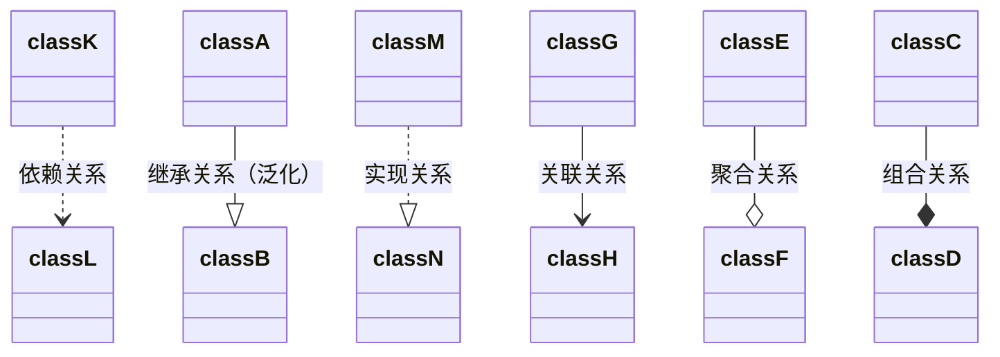

# 类图之间的关系

## 泛化关系 (Generalization)

用来描述继承关系，在 Java 中使用 extends 关键字。




以下类图使用 [PlantUML](https://www.planttext.com/) 绘制，更多语法及使用请参考：http://plantuml.com/ 。

## 泛化关系 (Generalization)

用来描述继承关系，在 Java 中使用 extends 关键字。

[](https://camo.githubusercontent.com/9bf544d6658e9a1a50f222e10ccd816e98b7d34e/68747470733a2f2f63732d6e6f7465732d313235363130393739362e636f732e61702d6775616e677a686f752e6d7971636c6f75642e636f6d2f63303837346530612d646261332d343637652d396338362d6464393331336530383433652e6a7067)


```
@startuml

title Generalization

class Vihical
class Car
class Trunck

Vihical <|-- Car
Vihical <|-- Trunck

@enduml
```

## 实现关系 (Realization)

用来实现一个接口，在 Java 中使用 implements 关键字。

[](https://camo.githubusercontent.com/d94060f6a651585cfce2592538d0acae65e29d29/68747470733a2f2f63732d6e6f7465732d313235363130393739362e636f732e61702d6775616e677a686f752e6d7971636c6f75642e636f6d2f38336434363662642d393436622d343433302d383534612d6366376230363936643463382e6a7067)


```
@startuml

title Realization

interface MoveBehavior
class Fly
class Run

MoveBehavior <|.. Fly
MoveBehavior <|.. Run

@enduml
```

## 聚合关系 (Aggregation)

表示整体由部分组成，但是整体和部分不是强依赖的，整体不存在了部分还是会存在。

[](https://camo.githubusercontent.com/09c2469e99072158765ebe0ad80885b66e894dcf/68747470733a2f2f63732d6e6f7465732d313235363130393739362e636f732e61702d6775616e677a686f752e6d7971636c6f75642e636f6d2f61306365343362372d616661382d343339372d613936652d3563313261303730663261652e6a7067)


```
@startuml

title Aggregation

class Computer
class Keyboard
class Mouse
class Screen

Computer o-- Keyboard
Computer o-- Mouse
Computer o-- Screen

@enduml
```

## 组合关系 (Composition)

和聚合不同，组合中整体和部分是强依赖的，整体不存在了部分也不存在了。比如公司和部门，公司没了部门就不存在了。但是公司和员工就属于聚合关系了，因为公司没了员工还在。只能通过语义（语言层面的意思）进行分析。

[](https://camo.githubusercontent.com/df45f2c0dfd19aa29e90a5bbcc25ff4b04573b11/68747470733a2f2f63732d6e6f7465732d313235363130393739362e636f732e61702d6775616e677a686f752e6d7971636c6f75642e636f6d2f36613838613339382d633439342d343166352d626236322d3966376662383131646637632e6a7067)


```
@startuml

title Composition

class Company
class DepartmentA
class DepartmentB

Company *-- DepartmentA
Company *-- DepartmentB

@enduml
```

## 关联关系 (Association)

表示不同类对象之间有关联，这是一种静态关系，与运行过程的状态无关，在最开始就可以确定。因此也可以用 1 对 1、多对 1、多对多这种关联关系来表示。比如学生和学校就是一种关联关系，一个学校可以有很多学生，但是一个学生只属于一个学校，因此这是一种多对一的关系，在运行开始之前就可以确定。

[](https://camo.githubusercontent.com/abe57bb2cdca7e4c3a9c12bc7c4c7454f872d53f/68747470733a2f2f63732d6e6f7465732d313235363130393739362e636f732e61702d6775616e677a686f752e6d7971636c6f75642e636f6d2f61336534646336322d306461352d346432322d393466322d3134303037383238313831322e6a7067)


```
@startuml

title Association

class School
class Student

School "1" - "n" Student

@enduml
```

## 依赖关系 (Dependency)

和关联关系不同的是，依赖关系是在运行过程中起作用的。A 类和 B 类是依赖关系主要有三种形式：

- A 类是 B 类方法的局部变量；
- A 类是 B 类方法的参数；
- A 类向 B 类发送消息，从而影响 B 类发生变化。

[](https://camo.githubusercontent.com/96545f54d2a635babfda9b87e7ec645207a8d900/68747470733a2f2f63732d6e6f7465732d313235363130393739362e636f732e61702d6775616e677a686f752e6d7971636c6f75642e636f6d2f33373934343463392d663164312d343563642d623761612d6230633138343237643338382e6a7067)


```
@startuml

title Dependency

class Vihicle {
    move(MoveBehavior)
}

interface MoveBehavior {
    move()
}

note "MoveBehavior.move()" as N

Vihicle ..> MoveBehavior

Vihicle .. N

@enduml
```

# 设计原则

## S.O.L.I.D

| 简写 | 全拼                                | 中文翻译     |
| ---- | ----------------------------------- | ------------ |
| SRP  | The Single Responsibility Principle | 单一责任原则 |
| OCP  | The Open Closed Principle           | 开放封闭原则 |
| LSP  | The Liskov Substitution Principle   | 里氏替换原则 |
| ISP  | The Interface Segregation Principle | 接口分离原则 |
| DIP  | The Dependency Inversion Principle  | 依赖倒置原则 |

### 1. 单一责任原则

> **修改一个类的原因应该只有一个。**

换句话说就是让一个类只负责一件事，当这个类需要做过多事情的时候，就需要分解这个类。【简而言之，类的方法太多了，应该进行分解】

如果一个类承担的职责过多，就等于把这些职责耦合在了一起，一个职责的变化可能会削弱这个类完成其它职责的能力。

### 2. 开放封闭原则

> **类应该对扩展开放，对修改关闭。**

扩展就是添加新功能的意思，因此该原则要求在添加新功能时不需要修改代码。

符合开闭原则最典型的设计模式是装饰者模式，它可以动态地将责任附加到对象上，而不用去修改类的代码。

### 3. 里氏替换原则

> **子类对象必须能够替换掉所有父类对象。**

继承是一种 IS-A 关系，子类需要能够当成父类来使用，并且需要比父类更特殊。

如果不满足这个原则，那么各个子类的行为上就会有很大差异，增加继承体系的复杂度。

### 4. 接口分离原则

> **不应该强迫客户依赖于它们不用的方法。**

因此使用多个专门的接口比使用单一的总接口要好。

### 5. 依赖倒置原则

> **高层模块不应该依赖于低层模块，二者都应该依赖于抽象；**
> **抽象不应该依赖于细节，细节应该依赖于抽象。**

高层模块包含一个应用程序中重要的策略选择和业务模块，如果高层模块依赖于低层模块，那么低层模块的改动就会直接影响到高层模块，从而迫使高层模块也需要改动。

依赖于抽象意味着：

- 任何变量都不应该持有一个指向具体类的指针或者引用；
- 任何类都不应该从具体类派生；
- 任何方法都不应该覆写它的任何基类中的已经实现的方法。

## 其他常见原则

除了上述的经典原则，在实际开发中还有下面这些常见的设计原则。

| 简写 | 全拼                              | 中文翻译     |
| ---- | --------------------------------- | ------------ |
| LOD  | The Law of Demeter                | 迪米特法则   |
| CRP  | The Composite Reuse Principle     | 合成复用原则 |
| CCP  | The Common Closure Principle      | 共同封闭原则 |
| SAP  | The Stable Abstractions Principle | 稳定抽象原则 |
| SDP  | The Stable Dependencies Principle | 稳定依赖原则 |

### 1. 迪米特法则

迪米特法则又叫作最少知识原则（Least Knowledge Principle，简写 LKP），就是说一个对象应当对其他对象有尽可能少的了解，不和陌生人说话。

### 2. 合成复用原则

尽量使用对象组合，而不是通过继承来达到复用的目的。

### 3. 共同封闭原则

一起修改的类，应该组合在一起（同一个包里）。如果必须修改应用程序里的代码，我们希望所有的修改都发生在一个包里（修改关闭），而不是遍布在很多包里。

### 4. 稳定抽象原则

最稳定的包应该是最抽象的包，不稳定的包应该是具体的包，即包的抽象程度跟它的稳定性成正比。

### 5. 稳定依赖原则

包之间的依赖关系都应该是稳定方向依赖的，包要依赖的包要比自己更具有稳定性。