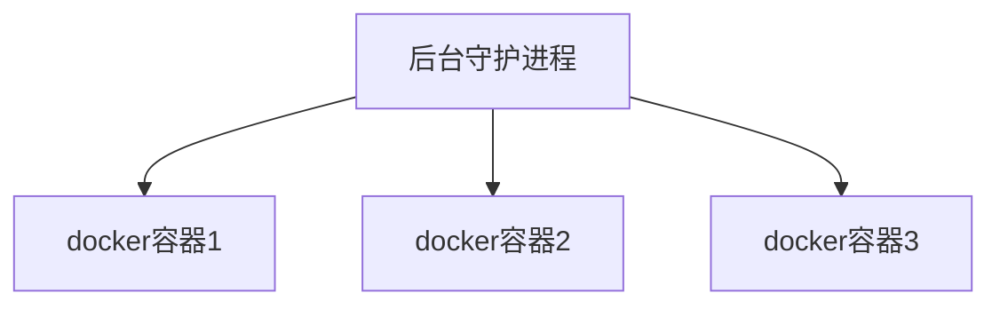

# 1.Docker简介

## 学习目标

- 掌握Docker基础知识，理解Docker镜像与容器的概念
- 完成Docker的安装与启动
- 掌握Docker镜像与容器相关命令
- 掌握Tomcat `Nginx`等软件的常用应用的安装
- 掌握Docker迁移与备份相关命令
- 运用`dockerfile`编写创建容器的脚本
- 搭建与使用Docker私有仓库

<span style="color:green">**会用只是第一步，了解/懂得原理，设计思想才是重点。**</span>

## 为什么要Docker

产品的开发到上线，从环境搭建到应用配置，有很多需要注意的地方。因此开发和运维之间的协作显得很重要。特别是版本的迭代，对运维人员来说是种考验。

Docker给出了一个标准化的解决方案。以前只是搬代码，现在是把代码+配置一起搬过去直接运行，把原始环境一模一样的复制过来，把软件和它的运行环境一起带过来安装。

Docker 一次构建 处处运行。

简而言之：Docker是一个解决了运行环境和配置问题的软件容器，方便做持续集成 并有助于整体发布的容器虚拟化技术。Docker仅包含业务运行所需的runtime环境。

可以把容器看做是一个简易版的Linux环境。

## 为什么选择Docker

- 上手快，启动快，性能高。
- 职责的逻辑分类：开发任意关系容器中运行的出现，运维人员关系管理容器即可。
- 快速高效的开发生命周期：直接给你把部署环境都打包好了。
- 鼓励使用面向服务的架构：推荐单个容器只运行一个应用出现或者进程，这样就形成了一个分布式的应用程序模型。

## 容器与虚拟机的比较（背）

Docker 模拟的不是一个完整的操作系统，而是对进程进行隔离。

- 传统虚拟机技术是虚拟出一套硬件后，在其上运行一个完整的OS，在该系统上再运行所需应用进程。
- 而容器内的应用进程直接运行于宿主的内核，容器没有自己的内容，而且也没有进行硬件虚拟。因此容器要比传统VM更为轻便。
- 每个容器之间互相隔离，每个容器有自己的文件系统，容器之间进程不会相互影响，能区分计算资源。

## Docker三要素

- 仓库：存放镜像的地方。我们可以把镜像发布到仓库中，需要时再从仓库里下载。
- 镜像：一个模板。image文件生成的容器实例，本身也是一个文件，称为镜像文件。
- 容器：镜像的实例就是容器。一个容器运行一种服务，当我们需要的时候，就可以通过docker客户端创建一个对应的运行实例，即容器。

<span style="color:green">**镜像相对于类，容器相对于对象**</span>

从仓库里下载镜像，用下载到的镜像得到一个一个的实例（容器）。一个模板生成多个实例。

Docker是一个开源的应用容器引擎，基于Go语言并遵循Apache2.0协议开源。

Docker可以让开发者打包他们的应用以及依赖包到一个轻量级、可移植的容器中，然后发布到任何流行的Linux机器上，也可实现虚拟化。

Docker容器使用的是沙箱机制，相互之间不会有任何接口，更重要的是容器性能开销极低。

大概意思是：Docker可以集成很多软件，然后把软件弄成镜像，让使用者可以直接用镜像，无需再安装软件。

运行中的这个镜像成为容器，容器的启动很迅速。

**注册中心：保存用户构建的镜像。**

- 私有，公有。

# 2.核心概念

Docker主机：安装了Docker程序的机器。Docker是直接安装在OS上的。

Docker客户端：连接Docker主机进行操作。

Docker仓库：用来保存各种打包好的软件镜像。

Docker镜像：软件打包好的镜像，放在仓库中。

Docker容器：镜像启动后的实例，称为一个容器。tomcat镜像运行五次，就会有五个容器，就有5个tomcat了。

使用Docker的步骤：

- 安装docker
- 去docker仓库找到软件对应的镜像
- 直接使用docker运行这个镜像，这个镜像就会生成一个docker容器
- 停止容器就是停止软件。一个容器对应一个软件。

# 3.安装Docker

## 安装虚拟机

- 安装虚拟机VM[收费] 或 VirtualBox[免费哦]

- 下载CentOS7 建议去中国科学技术大学下载镜像文件<a href="http://mirrors.ustc.edu.cn/">地址</a>

- 导入虚拟机文件，安装OS

- 使用客户端连接linux服务器。挑一个自己熟悉的就行。

- 设置虚拟机网络

  - 请看VM安装这个笔记
  
- 防火墙

  - 查看防火墙状态：`service status firewalld.service`
  - 关闭防火墙：`service firewalld stop`
  - 然后 输入命令 `service network restart` 【centos 7】

- 查看Linux的IP地址

  - ```shell
    ip addr 找到 inet 的地址
    ```

## 安装Docker

- `docker`要求内核版本高于3.10
  - 查看内核版本 `uname -r`
  - 不是的话，用 `yum update`更新
  
- 安装需要的软件包，yum-util提供yum-config-manager功能，另外两个是devicemapper驱动依赖的。

  - `sudo yum install -y yum-utils device-mapper-persistent-data lvm2`

- 设置yum源为阿里云

  ```shell
  sudo yum-config-manager --add-repo http://mirrors.aliyun.com/docker-ce/linux/centos/docker-ce.repo
  ```

- 安装： `sudo yum install docker-ce`
- 查看docker版本 `docker -v`

<a hre="https://docs.docker.com/engine/install/centos/">官方安装文档</a>

## 更改镜像地址

设置ustc的镜像

ustc docker mirror无需注册。

https://lug.ustc.edu.cn/wiki/mirrors/help/docker

```shell
vim /etc/docker/daemon.json
```

在文件中输入如下内容[没有这个文件的话，就创建 然后添加内容]

```shell
{
	"registry-mirrors":["https://docker.mirrors.ustc.edu.cn"]
}
```

## 安装与启动

- 启动：`systemctl start docker`
  - `docker -v` 查看docker版本号
  - 这里我出现了问题，看了这篇<a href="https://blog.csdn.net/E09620126/article/details/86577917?utm_medium=distribute.pc_relevant_t0.none-task-blog-BlogCommendFromMachineLearnPai2-1.channel_param&depth_1-utm_source=distribute.pc_relevant_t0.none-task-blog-BlogCommendFromMachineLearnPai2-1.channel_param">博客</a>解决了问题
- 状态：`systemctl status docker`
- 停止：`systemctl stop docker`
- 重启：`systemctl restart docker`
- 开机自启：`systemctl enable docker`
- 查看信息：`docker info`
- 查看文档：`docker --help`

## 安装软件

- 搜索mysql镜像：`docker search mysql`
  - 其实就是去docker hub仓库里搜索mysql镜像
- 拉取mysql镜像：`docker pull mysql`不加标签，默认用最新的。
  - 指定标签 `docker pull mysql:5.5`
- 查看所有镜像：`docker images` 
- 删除镜像：`docker rmi image-id`【传镜像id】 [rmi= remove image]

## Docker容器操作

- 得到软件镜像====运行镜像====产生一个容器
- 示例
  - 搜索镜像：`docker search tomcat`
  - 拉取镜像：`docker pull tomcat`
  - 查看镜像：`docker images`
  - 运行镜像：`docker run --name container-name -d image-name`
    - eg：`docker run --name mytomcat-d tomcat.`
    - --name 自定义容器名
    - -d 后台运行
    - image-name 指定镜像模板
  - 查看运行的镜像：`docker ps`
  - 停止当前容器：`docker stop TAINER ID 或 容器名称`
  - 启动容器：`docker run container-id`
  - 删除一个容器：`docker rm container-id`
- 我们想访问docker中的tomcat是访问不了的。我们访问虚拟机里的8080，我们访问不到docker里的8080.我们要做一个映射。
- 停掉，重新安装tomcat
  - 停止容器：`docker stop xsafsf[TAINER ID]`

- 端口映射：`docker run -d -p 8888:8080 --name mytomcat tomcat` [把主机的8888映射到容器的8080]  可以简写`docker run -d -p 8888:8080 tomcat`，会自动为我们取名
  - -p：把主机端口映射到容器内部的端口  主机端口：容器内部端口
  - -d：后台启动。
- 我们需要关闭Linux的防火墙，才可以访问！
  - 查看防火墙状态：`service status firewalld.service`
  - 关闭防火墙：`service firewalld stop`
- 查看容器日志：`docker logs`
- 更多请看官网文档<a href="https://hub.docker.com/">地址</a>

# 4.Docker命令

## 入门

- `docker run hello-world`
  - 本地没有hello-world所有会去仓库拉，把镜像下载下来然后运行镜像得到容器。
- run做了什么？
  - 本机中寻找镜像，没有就去仓库下载
  - 仓库中有，就下载到本地，并根据镜像，运行它得到实例【容器】
  - 没有，就报错。

## 底层原理

Docker C/S结构。 Docker的守护进程运行在主机上，然后通过Socket连接从客户端访问，守护进程从客户端接收命令并管理运行在主机上的容器。

容器是一个运行时环境。



虚拟机 = 软件+硬件 是一个完整的OS

docker：比vm 更少的抽象层，不需要Hypervisor实现硬件资源虚拟化，运行在docker容器上的程序直接使用的都是实际物理机的硬件资源。因此docker在cpu、内存利用效率上，会有明显优势。

docker是利用宿主机的内核，不需要Guest OS，docker无须想vm一样加载os内核。

## 常用镜像命令

### 镜像相关

#### 查看

docker images 查看有那些镜像

```html
REPOSITORY   TAG       IMAGE ID   CREATED   SIZE
镜像名称	  版本	   镜像id		 创建时间	镜像大小
```

#### 搜索

docker search 镜像名称 - 搜索镜像

```shell
docker search centos
```

#### 拉取

docker pull 拉取镜像

不指定的话，默认拉取latest版本的镜像。要指定的话就 docker pull tutum/centos:7 这样

```shell
docker pull tutum/centos
```

#### 删除

docker rmi 删除镜像

```shell
docker rmi 镜像ID
```

删除所有镜像

```shell
# 把docker images -q 这个命令的结果 作为docker rmi的参数
docker rmi `docker images -q`
```

### 容器相关

#### 查看容器

查看正在运行的容器

```shell
docker ps
```

查看所有容器

```shell
dcoker ps -a
```

查看最后一次运行的容器

```shell
docker ps -l
```

查看停止的容器

```shell
docker ps -f status=exited
```

#### 创建与启动容器

**参数说明**

创建容器命令：docker run

-i ：表示运行容器

-t（terminal）：表示容器启动后会进入其命令行。加入这两个参数后，容器创建就能登录进去。即分配一个伪终端。

--name：为创建的容器命名

-v：表示目录映射关系（前者是宿主机目录，后者是映射到宿主机上的目录），可以使用多个-v做多个目录或文件映射。注意：最好做目录映射，在宿主机上做修改，然后共享到容器上。

-d（daemon）：在run后面加上-d参数，则<span style="color:green">会创建一个守护式容器**在后台运行**</span>（这样创建容器不会自动登录容器，如果只加-i-t两个参数，创建后就会自动进入容器）

-p：表示端口映射，前者是宿主机端口，后者是容器内的映射端口

----

PS：**宿主机：**装docker的电脑

-----

**交互式方式创建容器**

```shell
docker run -it --name=容器名称 镜像名称:标签 /bin/bash 
# 好像可以不加 /bin/bash
```

通过`docker  ps`命令查看运行中的容器

退出当前容器用`exit`

**守护式方式创建容器**

```shell
docker run -di --name=容器名称 镜像名称:标签
# 创建成功后会返回容器的id
# 如何进入创建的容器呢？
docker exec -it 容器名称 /bin/bash
# 退出的话，容器依旧是运行的！！！
exit
```

> 总结：守护式创建的进程，exit后，容器不会退出！！！

#### 停止与启动容器

**停止容器**

```shell
docker stop 容器名称（或容器id）
```

**启动容器**

```shell
docker start 容器名称（或容器id）
```

#### 文件拷贝

将文件拷贝到容器可使用cp命令。文件--->容器内

```shell
docker cp 需要拷贝的文件or目录  容器名称:容器目录
```

也可以将文件从容器内拷贝出来。容器内---->外面

```shell
docker cp 容器名称:容器目录 需要拷贝的文件或目录
```

#### 目录挂载

创建容器的时候，<span style="color:green">将宿主机的目录与容器内的目录进行映射</span>，这样我们就可以通过修改宿主机某个目录的文件从而影响容器.

<span style="color:red">创建容器 添加-v参数 后边为 宿主机目录:容器目录</span>，eg：

```shell
docker run -di -v  /usr/local/mythm:/usr/local/mythml --name=mycentos3 centos:7
```

#### 查看容器IP地址

通过如下命令查看容器运行的各种数据

```shell
docker inspect 容器名称（容器id）
```

输出ip地址

```shell
docker inspect --format='{{.NetworkSetting.IPAddress}}' 容器名称（容器ID）
```

#### 删除容器

```shell
docker rm 容器名称（容器ID）
```

----


- docker info 查看docker的信息
- docker --help 查看帮助文档
- **docker images** 查看本机的镜像
  - docker images -a 查看所有镜像（含中间映像层）
  - docker images -q 只显示镜像id
  - docker images --disgests 显示镜像的摘要信息
  - docker images --no-trunc 显示完整的镜像信息
- **docker search xxx** 查询xxx
  - 去<a href="https://hub.docker.com/">官网</a>搜镜像 
  - docker search -s 点赞数  镜像名
    - docker search -s 30 tomcat 查找点赞数超过30k的tomcat镜像
  - docker search --no-trunc 显示完整的镜像描述
  - docker search --automated 只列出automated build类型的镜像。
- **docker pull xxx** 拉取xxx镜像
  - `docker pull tomcat 等价于 docker pull tomcat:latest`
- **docker rmi xxx** 删除镜像
  - `docker rmi tomcat 等价于 docker rmi tomcat:laster`
  - `docker rmi -f tomcat 强制删除`
  - `docker rmi -f hello nginx 级联删除，同时删除多个`
  - `docker rmi -f $(docker images -qa) 删除全部`

## 常用容器命令（一）

> **docker run   [OPTIONS]    IMAGE   [COMMAND]   [ARG...]**

- OPTIONS说明【常用】：有些是一个减号，有些事两个减号。
  - --name=“容器新名字”       为容器指定一个名称
  - -d   后台运行容器，并返回容器ID，即启动守护式容器
  - -i    以交互式模式运行容器，通常与-t同时使用
  - -t    为容器重新分配一个伪输入终端，通常与-i同时使用
  - -p   随机端口映射
    - 指定端口映射，有以下四种格式
    - `ip:hostPort:containerPort`
    - `ip:containerPort`
    - `hostPort:containerPort`
    - `containerPort`
- eg：`docker run -it 7e6257c9f8d8[这个是centos镜像的id]`
  - -it   i一交互式模式运行容器 t----为容器分配一个伪终端
  - 退出容器用 exit 或 <span style="color:red">ctrl + p + q【正常退出不关闭容器】</span>
    - exit  <span style="color:red">容器停止 退出</span>
    - ctrl+p+q <span style="color:red">容器不停止退出</span>
  - 启动容器：docker start 容器id/容器名
  - 重新启动容器：docker restart 容器id/容器名
  - 停止容器：docker stop 容器id/容器名   【温柔的，慢慢的关闭】
    - docker kill 容器id/容器名  强制停止，直接拔电源。
  - 删除容器：docker rm 容器id/容器名
    - docker rm -f 容器id/容器名字 强制
    - docker rm  $(docker ps -a -q)  因为不是强制的，所以只能删除未运行的容器！
- **docker ps** 列出容器[正在运行的容器]
  - `docker ps -a` 列出所有容器【运行中的+历史运行的】
  - `docker ps -n 3` 列出上三次运行的容器
  - `docker ps -l` 上次运行的容器
  - `docker ps -lq` 上次运行的容器，且只显示id
- eg: `docker run -it --name mycontainer centos`
  - 创建centos容器，名称为mycontainer，以交互式模式运行且为其分配一个伪终端。
  - `docker run -it --name mycontainer2 -d centos`

## 常用容器命令（二）

> **使用镜像centos:7 以后台模式启动一个容器**

- `docker run -d centos`
  
  - `docker ps -a` 查看，发现容器已经退出。
  
  - <span style="color:red">**docker容器后台运行，必须要有一个前台进程！！**</span> 容器的命令如果不是那些一直挂起的命令（如top tail）就会自动退出。
  
  - 所以可以这样运行。
  
    - ```shell
      docker run -d centos /bin/sh -c 'while true;do echo hello xx;sleep 2; done'
      ```
- docker logs -f -t --tail 容器id  查看容器日志
  - -t 是加入时间戳
  - -f 跟随最新的日志打印
  - --tail 数字显示最后多少条

----

# 5.应用部署

## MySQL部署

查找镜像

```shell
docker search mysql
```

拉取镜像

```shell
docker pull centos/mysql-57-centos7
```

创建容器

```shell
docker run -di --name=tensquare_mysql -p 33306:3306 -e MYSQL_ROOT_PASSWORD=123456 mysql
```

-p：代表端口映射，格式为 宿主机端口映射：容器运行端口

-e：代表添加环境变量 MYSQL_ROOT_PASSWORD 是root用户名的登录密码

进入MySQL容器

```shell
docker exec -it tensquare_mysql /bin/bash
```

登录MySQL

```shell
mysql -uroot -p123456
```

远程登录MySQL

连接宿主机的IP，指定端口为`33306`

查看日志，看错误原因 【docker logs 对应容器的id】

----

## tomcat部署

查找镜像

```shell
docker search tomcat
```

拉取镜像

```shell
docker pull tomcat:7-jre7
```

创建容器

```shell
docker run -di --name=mytomcat -p 9000:8080 -v /usr/local/webapps:/usr/local/tomcat/webapps tomcat:7-jre7
```

-p：代表端口映射，格式为 宿主机端口映射：容器运行端口

-v：表示目录映射关系（前者是宿主机目录，后者是映射到宿主机上的目录），可以使用多个-v做多个目录或文件映射。注意：最好做目录映射，在宿主机上做修改，然后共享到容器上。

## Nginx部署

查找镜像

```shell
docker search nginx
```

拉取镜像

```shell
docker pull nginx
```

创建Nginx容器

```shell
docker run -di --name=mynginx -p 80:80 nginx
```

## Redis部署

查找镜像

```shell
docker search redis
```

拉取镜像

```shell
docker pull redis
```

创建容器

```shell
docker  run -di --name=myredis -p 6379:6379 redis
```

# 6.迁移与备份

## 容器保存为镜像

将容器保存为镜像（我们对容器进行了一些修改，希望以后可以继续用~）

```shell
docker commit mynginx myngnix_i
```

## 镜像备份

将镜像保存为tar文件

```shell
docker save -o mynginx.tar myngnix_i
```

## 镜像恢复与迁移

先删除myngnix_i镜像，再执行下面的命令

```shell
docker load -i myngnix.tar
```

-i 输入的文件

执行后再次查看镜像，可以看到镜像已恢复。

# 7.Dockerfile

## 解释

Dockerfile 是一个用来构建镜像的文本文件，文本内容包含了一条条构建镜像所需的指令和说明。这些命令应用于基础镜像并最终创建一个新的镜像。

- 开发人员：可以为开发团队提供一个完全一直的开发环境
- 测试人员：直接拿开发时所构建的镜像或者通过Dockerfile文件构建一个新的镜像开始工作
- 运维人员：部署时，可实现应用的无缝移植。

## 常用命令

| 命令                                    | 作用                                                         |
| --------------------------------------- | ------------------------------------------------------------ |
| FROM image_name:tag                     | 定义了使用那个基础镜像启动构建流程                           |
| MAINTAINER user_name                    | 声明镜像的创建者                                             |
| ENV    key value                        | 设置环境变量（可写多条）                                     |
| RUN   command                           | dockerfile的核心部分（可写多条）；用于执行后面跟着的命令行命令。 |
| ADD   source_dir/fie      dest_dir/file | 将宿主机的文件复制到容器内，如果是一个压缩文件，将会在复制后**自动解压** |
| COPY source_dir/file   dest_dir/file    | 和ADD相似，但是如果有压缩文件并不能解压                      |
| WORKDIR path_dir                        | 设置工作目录                                                 |

## 构建Java8镜像

把jdk文件上传到服务器

创建存放jdk的多级目录

```shell
mkdir -p /usr/local/dockerjdk8
```

把jdk移动到指定目录

```shell
mv jdkxxxxxx  /usr/local/dockerjdk8
```

编辑Dockerfile文件

```shell
gedit Dockerfile # 没有则创建 注意，这个文件的名称是固定的！！！
```

```shell
FROM centos:7  # 基础镜像，本地必须存在，如果不存在则会下载
MAINTAINER payphone # 指定创建者的信息
WORK_DIR /usr # 设置当前目录
RUN mkdir /usr/local/java # 用来执行指令，在local下创建一个目录
ADD jdk-8u171-linux-x64.tar.gz /usr/local/java/ # 把xx文件复制到  /usr/local/java/目录下

ENV JAVA_HOME /usr/local/java/jdk1.8.0_171
ENV JRE_HOME $JAVA_HOME/jre
ENV CLASSPATH $JAVA_HOME/bin/dt.jar:$JAVA_HOME$/lib/tools.jar:$JRE_HOME/lib:$CLASSPATH
ENV PATH $JAVA_HOME/bin:$PATH
```

执行构建命令

```shell
docker build -t='jdk1.8' . # .表示指定当前目录
```

注意后面的空格和点！！！

# 8.私有仓库

## 搭建与配置

拉取私有仓库镜像

```shell
docker pull registry
```

启动私有仓库容器

```shell
docker run -di --name=reistry -p 5000:5000 registry
```

打开浏览器 输入地址 http:// ip地址:5000/v2/_catalog 看到`{repositories:[]}`表示私有仓库搭建成功并且内容为空

-----

修改daemon.json

```shell
vi /etc/docker/daemon.json
```

添加以下内容，保存退出

```shell
{"insecure-registries":["ip地址:5000"]}
# 因为之前改过，所以最后是这些内容
{
	"registry-mirrors":["https://docker.mirrors.ustc.deu.cn"],
	"insecure-registries":["ip地址:5000"]
}
# 要想配置生效需要重启docker
systemctl restart docker
```

此步用于让docker信任私有仓库地址

## 镜像上传到私有仓库

在上传前，要把私服启动起来。

```shell
# tag是把一个原来的镜像打包成一个新的镜像 新镜像的名字是私服地址:端口/jdk1.8
docker tag jdk1.8 私服地址:端口/jdk1.8
# 推送到私服
docker push 新镜像的名字
```

