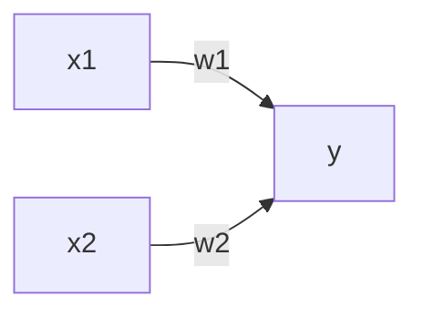

# 实用文档

[深度学习基础理论--PaddlePaddle](https://www.paddlepaddle.org.cn/tutorials)

# 深度学习基础知识回顾

## 感知机

输入多个输入信号，输出一个信号。感知机的信号只有 0 和 1。



- 感知机是具有输入和输出的算法。给定一个输入后，将输出一个既定的值。
- 感知机将权值和偏执设定为参数。
- 感知机可以表示门和或门逻辑电路。
- 2层感知机可以表示异或门
- 单层感知机只能表示线性空间，多层感知机可以表示非线性空间。

## 神经网络

感知机的参数/权值需要人为确定，很麻烦。而神经网络可以自动的从数据中学到合适的权重参数。

激活函数会将输入信号的总和转换为输出信号。

阶跃函数：超过 0 输出 1，未超过 0 输出 0。

<b>sigmoid 函数</b>：比阶跃函数平滑，输出随着输入发生连续的变化，阶跃函数则是急剧性变化。$sigmoid = \frac{1}{(1+e^{-x})}$，求导后，最大值为 $\frac{1}{4}$，当 x 很大或很小时，导数趋近于 0. 而且 sigmoid 求导涉及除法和指数，计算量大。

注意：神经网络的激活函数必须要是非线性函数，如果是线性函数的话，会出现：将 h(x) = cx 作为激活函数，多次激活后 $h(h(x)) =c*c*x$，等价于 $g(x)=ax$，中间的隐藏神经元可以被一层神经元替代。

<b>ReLU 函数</b>，sigmoid 函数会有饱和倾向（两侧的梯度小，变化慢），ReLU 就不会有饱和倾向，不会有特别小的梯度出现。并且，ReLU 会使一部分神经元的输出为 0，这样就造成了网络的稀疏性，并且减少了参数的相互依存关系，缓解了过拟合问题的发生。

<b>softmax</b>，将数据转化为概率值，用于计算损失函数。预测的话，可以直接用 argmax 来求，不必做 softmax。写 softmax 函数的时候要注意数据溢出的问题。

```python
# 实现softmax
import numpy as np
# 分子分母同时乘以一个常数结果不变，再把常数带入 exp 中。
# 为了避免移除，我们用 data 的 max 作为这个常数。
def softmax(data: np.ndarray) -> np.ndarray:
    biggest = np.max(data)
    exp_ret = np.exp(data - biggest)
    return exp_ret / np.sum(exp_ret)


if __name__ == '__main__':
    print(softmax(np.array([0.3, 2.9, 4.0])))
    """
    [0.01821127 0.24519181 0.73659691]
    """
```

<b>损失函数</b>，评价网络性能的，损失越小越好。常见的损失函数有交叉熵损失函数和平方损失函数。

$y_k$ 是预测的概率值，$t_k$ 为 one-hot 编码的标签
$$
E = \frac{1}{2}\sum_K(y_{k}-t_{k})^2
$$

$$
CE=-\sum_{k}t_{k}log(y_k)
$$

```python
import numpy as np

def mse(gt: np.ndarray, pred: np.ndarray) -> np.ndarray:
    return np.mean((gt - pred) ** 2) * 0.5

def ce(y: np.ndarray, t: np.ndarray) -> np.ndarray:
    """
    :param y: 置信度值
    :param t: one-hot 编码。
    :return:
    y*log(Pred)
    """
    delta = 1e-7
    return -np.sum(t * np.log(y + delta))

if __name__ == '__main__':
    t = np.array([0, 0, 1, 0, 0, 0, 0, 0, 0, 0])
    y = np.array([0.1, 0.05, 0.6, 0.0, 0.05, 0.1, 0.0, 0.1, 0.0, 0.0])
    print(ce(y, t)) # 0.510825457099338
```

<b>为什么用损失函数?</b>

目标是获得高精度的模型，那为什么不用精度作为指标，而是用损失函数？

对权值参数的损失函数求导时，如果导数的值为负，通过使该权重参数向正方向改变，可以减少损失函数的值；反过来则向负方向改变。只有当导数为 0 是，无论权重参数向什么地方变化，损失函数的值都不会改变。

采用精度作为指标的话，大多数地方的倒数都会变为 0，导致参数无法更新。假定 100 支笔，精度为 32%，如果精度以识别精度为指标，即使稍微改变权重参数，精度变化不会太大，即便是变化也不会像 32.0041 这样连续变化，而是 33 34 这种。识别精度对微小的参数变化基本没什么反应，即便有反应也是不连续的突然的变化。

负梯度方向是梯度法中变量的更新方向。在公式上的体现就是
$$
x_0 = x_0 - η*\frac{\partial f}{\partial x_0}
$$
梯度上升还是梯度下降就看 loss 的符号了，loss 为正就是梯度下降，loss 为负就是梯度上升。网络模型的参数是怎么更新的呢？也是算出每个参数的梯度，然后参数减去对应的 $η*梯度$

<b style="color:red">查下对抗学习的梯度反转</b>

## 误差反向传播

数值微分计算网络权重参数的梯度（损失函数关于权重参数的梯度），但是计算比较费时间。误差反向传播可以高效计算权重参数的梯度。

反向传播可以简化问题，通过很多小问题组装成一个复杂的问题。再利用计算图保持每个小问题的计算结果。由于保存了每个小问题的计算结果，可以通过反向传播高效计算出导数。

正向传播算一遍，累积梯度，反向传播算一遍，反向传播算的时候会用到正向传播的累加梯度，可以节省计算时间。可以避免每次从头开始计算xx对oo的导数。相当于做了一个缓存，可以快速查到需要用到的值。

## 网络学习相关技巧

- 涉及优化器、权值衰减、Droupout、normalization

### 优化器

<a href="https://pytorch.org/docs/stable/optim.html#">PyTorch中的优化器文档</a>

常用优化器都在 `torch.optim`

> <b>基本使用</b>

```python
from torch import optim
# 或
import torch.optim as optim

optimizer = optim.Adagrad(params, lr=0.01, lr_decay=0, weight_decay=0, initial_accumulator_value=0, eps=1e-10)

optimizer = optim.Adam(params, lr=0.001, betas=(0.9, 0.999), eps=1e-08, weight_decay=0, amsgrad=False)

optimizer = AdamW(params, lr=0.001, betas=(0.9, 0.999), eps=1e-08, weight_decay=0.01, amsgrad=False)

optimizer = optim.ASGD(params, lr=0.01, lambd=0.0001, alpha=0.75, t0=1000000.0, weight_decay=0)

optimizer = optim.RMSprop(params, lr=0.01, alpha=0.99, eps=1e-08, weight_decay=0, momentum=0, centered=False)

optimizer = optim.SGD(params, lr=<required parameter>, momentum=0, dampening=0, weight_decay=0, nesterov=False)
```

网络模型参数优化的过程其实就是最优化过程。模型的参数优化是通过优化器来完成的。计算网络梯度，优化器优化参数。常用的优化器有 SGD、AdaGrad、Adam、AdamW 等。

#### SGD算法

使用参数的梯度，沿梯度方向更新参数，并重复这个步骤多次，从而逐渐靠近最优参数，这个过程称为随机梯度下降法。

缺点：SGD 的取值可视化查看一般都是呈“之”字形移动，这是一个相当低效的路径。即 SGD 的缺点是，如果函数的形状非均匀向，比如呈延伸状，搜索的路径就会非常低效。根本原因在于，梯度的方向并没有指向最小值的方向。

改进：加上动量，会减轻“之”字型的程度。

SGD 的示意公式：$W$ 为权重参数，η 为学习率。
$$
W - η\frac{\partial L}{\partial W} \to W
$$

```python
class SGD:
    def __init__(self, lr=0.01):
        self.lr = lr
	
    def update(self, param, grads):
        for key in params.keys():
            params[key] -= self.lr * grads[key]
"""
用 PyTorch 框架自定优化器应该也是这样做
"""
```

SGD 的缺点在于优化过程会比较抖动（呈“之”字形优化），梯度的方向并没有指向最小值的方向。

带动量的 SGD 可以缓解这种问题。
$$
v \leftarrow av - η \frac{\partial L}{\partial}W \\ W \leftarrow W + v 
$$
用一个量 moment 去约束优化的方向

#### AdaGrad算法

传统梯度下降算法对学习率这个超参数非常敏感，难以驾驭，对参数空间的某些方向也没有很好的方法。<span  style="color:red">AdaGrad 算法通过参数来调整合适的学习率 lr，能独立地自动调整模型参数的学习率，对稀疏参数进行大幅更新和对频繁参数进行小幅更新。因此 AdaGrad 算法非常适合处理稀疏数据。</span>
$$
h \leftarrow h+ \frac{\partial L}{\partial W} \odot \frac{\partial L}{\partial W} \\ W \leftarrow W - η \frac{1}{\sqrt h} \frac{\partial L}{\partial W}
$$


h 保存了以前所有梯度的平方和，参数的元素中变动较大（被大幅度更新）的元素的学习率将变小

<b>缺点：</b>

- 可能因其累积梯度平方导致学习率过早或过量的减少。

- AdaGrad 会记录过去所有梯度地平方和。因此，学习越深入，更新的幅度就越小。如果无止境地学习，更新量就会变为 0，完全不再更新。为改善这个问题，可以使用 RMRSProp 方法。RMRSProp 采用指数移动平均发来累加梯度，再累加的过程中会逐渐忘记之前的梯度。

#### RMSProp算法

通过修改 AdaGrad 算法而来，其目的是在非凸背景下效果更好。不将过去所有的梯度都一视同仁地相加，而是逐渐忘记过去的梯度，在做加法运算时将梯度的信息更多地反映出来。这种操作称为“指数平均移动”，呈指数函数式地减小过去的梯度的尺寸。为了使移动平均，还引入了一个新的超参数，来控制移动平均的长度范围。（实际使用，使用 RMSProp 用的显存更小）

#### Adam算法

融合了 Momentum 和 AdaGrad 的方法。组合前两个方法的优点，有望实现参数空间的高效搜索。此外还会进行超参数的“偏置校正”。

它利用梯度的一阶矩估计和二阶矩估计动态调整每个参数的学习速率。但是 Adam 如果超参数设置的不合理容易过拟合。

### 批大小选择

批量大小一般不影响随机梯度的期望，但是会影响随机梯度的方差，批大小越大，随机梯度的方差越小，引入的噪声也越小，训练更稳定；因此批大小大时 lr 可以设置的大一些，批量大小小时 lr 设置的小一些，否则模型不会收敛。

学习率与批量大小的变化关系一般可以是，批大小增大/减小多少倍，lr 就相应的增大/减小多少倍。

### 学习率调整

常用的学习率调整策略有：学习率衰减、学习率预热、周期性学习率调整；

学习率衰减：指数衰减，自然指数衰减，余弦衰减（周期性变化，可以尽量避免局部极值）

学习率预热：大的 batch size 开始训练的时候，梯度往往比较大，这时候如果学习率设置的比较大训练会不稳定，可以在最开始的几个 epoch 的时候，用较小的学习率，后面再慢慢增大，预热结束后，再慢慢降低。

### 参数初始化

- 预训练初始化：我常用这个。跑的模型基本都有 backbone 的预训练参数
- 随机初始化：基于固定方差的随机初始化、基于方差缩放的参数初始化、正交初始化
- 固定值初始化

### 数据预处理

归一化：把数据特征转化为相同尺度的方法，如。将数据特征映射到 [0, 1] 或 [-1, 1] 区间内。

最小最大值归一化：$\frac{X-X_{min}}{X_{max}-X_{min}}$

标准化：将每一个特征都调整为均值为 0 ，方差为 1.

计算均值和方差：$x = \frac{x-μ}{σ}$

PAC 降维

### 归一化

#### Batch Normalization

对一批数据中的每个通道应用批量规范化（PyTorch 官方文档注释）

- 可以提高优化效率，使学习快速进行（可以增大学习率），还可以作为一种隐形的正则化方法，抑制过拟合（降低 Droupout 的必要性）
- 不那么依赖初始值（对初始值没那么敏感）
- 归一化可以使得大部分神经层的输入处于不饱和区域，从而避免梯度爆炸、梯度消失的问题

Batch Normalization 调整各层的激活值分布，使其拥有适当的广度。但是不适合用在递归神经网络中，因此有人提出了 Layer Normalization。


Batch Normalization 最直观的做法是计算均值方法后直接归一化，这样会使取值集中再 0 附近，如果使用 sigmoid 激活函数，这个取值区间刚好是接近线性变换的区间，减弱了神经网络的非线性性质。因此，为了使得归一化不对网络的表示能力造成负面影响，可以通过一个附加的缩放和平移操作来改变区间取值。

<b>一般 bn 要加在仿射变化之后，激活函数之前</b>

#### Layer Normalization

批量归一化是对一个中间层的单个神经元进行归一化操作，因此要求小批量样本的数量不能太小，否则难以计算单个神经元的统计信息。此外，如果一个神经元的净输入的分布在神经网络中是动态变化的（是说数据的长度不一样吗），如循环神经网络，那么就无法应用批量归一化操作。

将批处理归一化转化为层归一化，即，计算一个特征通道的均值、方差做归一化。

PS：rnn，因为它是一个动态的网络结构，同一个 batch 中训练实例有长有短，导致每一个时间步长必须维持各自的统计量，这使得BN并不能正确的使用，因为重复的rescaling会导致梯度爆炸

| 方法（特点）                                              | 归一化范围 |
| --------------------------------------------------------- | ---------- |
| Batch Normalization（通用）                               | $N*H*W$    |
| Layer Normalization（适合非特定长输入）                   | $C*H*W$    |
| Group Normalization （适合小的batch输入）                 | $G*H*W$    |
| Instance Normalization （适合图像生成以及风格迁移类应用） | $H*W$      |

## 损失函数

### 介绍

- <b>sigmod</b> 是一个阶跃函数，用于二分类。
- <b>softmax</b> 计算每个数据可能的概率，里面概率最大就是预测值。
- <b>logsoftmax</b> 是对 softmax 进行了一个与 log 等价的操作，但不是直接 log。
- <span style="color:red"><b>博客回答：</b></span>我的理解是这样的：理论上对于单标签多分类问题，直接经过 softmax 求出概率分布，然后把这个概率分布用 crossentropy 做一个似然估计误差。但是 softmax 求出来的概率分布，每一个概率都是 (0,1) 的，这就会导致有些概率过小，导致下溢。 考虑到这个概率分布总归是要经过 crossentropy 的，而 crossentropy 的计算是把概率分布外面套一个 -log 来似然，那么直接在计算概率分布的时候加上log, 把概率从（0，1）变为（-∞，0），这样就防止中间会有下溢出。 所以 log_softmax 说白了就是将本来应该由 crossentropy 做的套 log 的工作提到预测概率分布来，跳过了中间的存储步骤，防止中间数值会有下溢出，使得数据更加稳定。 正是由于把 log 这一步从计算误差提到前面，所以用 log_softmax 之后，下游的计算误差的 function 就应该变成 NLLLoss (它没有套 log 这一步，直接将输入取反，然后计算和 label 的乘积求和平均)

### 常见损失函数汇总

```python
# 均方误差损失函数 用于回归问题
torch.nn.MSELoss(size_average=None, reduce=None, reduction: str = 'mean')

# 与BCELoss的不同：将sigmoid函数和BCELoss方法结合到一个类中
torch.nn.BCEWithLogitsLoss(weight=None, size_average=None, reduce=None, reduction='mean', pos_weight=None)


# NLLLoss的全称是Negative Log Likelihood Loss，也就是最大似然函数。 用于多分类问题
torch.nn.NLLLoss(weight: Optional[torch.Tensor] = None, size_average=None, ignore_index: int = -100, reduce=None, reduction: str = 'mean')

# CrossEntropyLoss 交叉熵损失函数，适用于多分类问题  This criterion combines nn.LogSoftmax() and nn.NLLLoss() in one single class.
torch.nn.CrossEntropyLoss(weight: Optional[torch.Tensor] = None, size_average=None, ignore_index: int = -100, reduce=None, reduction: str = 'mean')
```

PS：当使用 sigmoid 作为激活函数的时候，常用<b>交叉熵损失函数</b>而不用<b>均方误差损失函数</b>，因为它可以<b>完美解决平方损失函数权重更新过慢</b>的问题，具有“误差大的时候，权重更新快；误差小的时候，权重更新慢”的良好性质。

### BCELoss

二分类

```python
CLASS torch.nn.BCELoss(weight=None, size_average=None, reduce=None, reduction='mean')
```

创建一个衡量目标和输出之间二进制交叉熵的 criterion

- 参数
    - <b>weight</b> (*Tensor,可选) – 每批元素损失的手工重标权重。如果给定，则必须是一个大小为 “nbatch” 的张量。
    - <b>reduction</b> (*string,可选) – 指定要应用于输出的 `reduction` 操作：' none ' | 'mean' | ' sum '。“none”：表示不进行任何`reduction`，“mean”：输出的和除以输出中的元素数，即求平均值，“sum”：输出求和。
    - 其他的被弃用了

```python
import torch.nn

input = torch.tensor([
    [0.3585, 0.5973, -0.4429, -0.0270, 0.2480, 0.3332, -2.0774, 0.1682,
                       1.5812, -1.5677],
    [0.3585, 0.5973, -0.4429, -0.0270, 0.2480, 0.3332, -2.0774, 0.1682,
                       1.1252, -1.5677]
])
target = torch.tensor([[1., 0., 0., 0., 1., 0., 0., 0., 0., 0.], [1., 0., 0., 0., 1., 0., 0., 0., 0., 0.]])


# 可以一个一个标记的算
def test1(input, target):
    """
    :param input: 单纯的数据
    :param target: 数据对应的标签
    :return:
    """
    loss = torch.nn.BCELoss()
    out = loss(torch.sigmoid(input), target)
    return out.data


# 也可以批处理算
def test2(input, target):
    """
    批量计算 一次处理batch_size数目的data
    :param input: [batch_size , data]
    :param target:[batch_size , data]
    :return:
    """
    loss = torch.nn.BCELoss()
    out = loss(torch.sigmoid(input), target)
    print(out.data)


if __name__ == '__main__':
    count = 0.0
    for epoch in range(input.shape[0]):
        for i, t in zip(input[epoch], target[epoch]):
            count += test1(i, t)
    print(count / 20)
    test2(input, target)
    print(input.shape)
```

### BCEWithLogitsLoss

二分类

```python
torch.nn.BCEWithLogitsLoss(weight=None, size_average=None, reduce=None, reduction='mean', pos_weight=None)
```

与 BCELoss 的不同：

将 sigmoid 函数和 BCELoss 方法结合到一个类中

这个版本在数值上比使用一个带着 BCELoss 损失函数的简单的 Sigmoid 函数更稳定，通过将操作合并到一层中，我们利用 log-sum-exp 技巧来实现数值稳定性。

- 多出的参数
    - <b>pos_weight</b>–正值例子的权重，必须是有着与分类数目相同的长度的向量

```python
import torch
import torch.nn as nn

m = nn.Sigmoid()
loss = nn.BCELoss()
input = torch.randn(3, requires_grad=True)
target = torch.empty(3).random_(2)
output = loss(m(input), target)
print(output)

loss = nn.BCEWithLogitsLoss()
input = torch.randn(3,requires_grad=True)
target = torch.empty(3).random_(2)
output = loss(input, target)
print(output)
```

```python
import torch
import torch.nn as nn

import torch.nn

input = torch.tensor([
    [0.3585, 0.5973, -0.4429, -0.0270, 0.2480, 0.3332, -2.0774, 0.1682,
     1.5812, -1.5677],
    [0.3585, 0.5973, -0.4429, -0.0270, 0.2480, 0.3332, -2.0774, 0.1682,
     1.1252, -1.5677]
])
target = torch.tensor([[1., 0., 0., 0., 1., 0., 0., 0., 0., 0.], [1., 0., 0., 0., 1., 0., 0., 0., 0., 0.]])


# 可以一个一个标记的算
def test1(input, target):
    """
    :param input: 单纯的数据
    :param target: 数据对应的标签
    :return:
    """
    loss = torch.nn.BCEWithLogitsLoss()
    out = loss(input, target)
    return out.data


# 也可以批处理算
def test2(input, target):
    """
    批量计算 一次处理batch_size数目的data
    :param input: [batch_size , data]
    :param target:[batch_size , data]
    :return:
    """
    loss = torch.nn.BCEWithLogitsLoss()
    out = loss(input, target)
    print(out.data)


if __name__ == '__main__':
    count = 0.0
    for epoch in range(input.shape[0]):
        for i, t in zip(input[epoch], target[epoch]):
            count += test1(i, t)
    print(count / 20)
    test2(input, target)
    print(input.shape)
```

### NLLLoss

NLLLoss 的全称是 Negative Log Likelihood Loss，也就是最大似然函数。

<a href="https://blog.csdn.net/qq_22210253/article/details/85229988">博客</a>

多分类

```python
CLASS torch.nn.NLLLoss(weight=None, size_average=None, ignore_index=-100, reduce=None, reduction='mean')
```

多出参数：

- <b>ignore_index</b>– 指定一个被忽略的目标值，该目标值不影响输入梯度。当 size_average 为真时，对非忽略目标的损失进行平均。

 形状：

- 输入：(N,C), C 代表类别的数量；或者在计算高维损失函数例子中输入大小为(N,C,d1,d2,...,dK)，k>=1
- 目标：(N)，与输入拥有同样的形状，每一个值大小为为 0≤targets[i]≤C−1 ；或者在计算高维损失函数例子中输入大小为 (N,C,d1,d2,...,dK)，k>=1
- 输出：标量 scalar。如果 reduction='none', 则其大小与目标相同，为 (N) 或 (N,C,d1,d2,...,dK)，k>=1

## 激活函数

神经网络层数不多，选择 sigmoid、tanh、relu、softmax 都可以。如果搭建的网络层次较多，激活函数选择不当可能会导致梯度消失问题。此时一般不宜选择 sigmoid、tanh 激活函数，因为它们的导数都小于 1，尤其是 sigmoid 的导数在 0~1/4 之间。导数过小的容易梯度消失，导数过大的容易梯度爆炸，层数多的选择导数为 1 的激活函数是比较合适的如 $relu$ 函数。

激活函数输入维度与输出维度是一样的。激活函数的输入维度一般包括批量数 N，即输入数据的维度一般是 4 维，如$(N,C,W,H)$

<a href="https://pytorch.org/docs/stable/nn.functional.html#non-linear-activation-functions">torch中实现的激活函数</a>

> 将线性函数变为非线性函数。如果不用激活函数进行激活的话，多层神经网络最后是可以用一层来表示的。这样设置多层网络的意义就存在了。所有要用非线性的激活函数进行激活。所以<span style="color:red">激活函数必须为非线性函数</span>

> <b>sigmoid</b>

公式如下：$σ(x) = \frac{1}{1+e^{-x}}$

- 优点
    - 便于求导的平滑函数
    - 能压缩数据，保证数据幅度不会有问题
    - 适合用于前向传播
- 缺点
    - 容易出现<span style="color:red">梯度消失的现象</span>：当激活函数接近饱和区时，变化太缓慢，导数接近 0，根据后向传递的数学依据是微积分求导的链式法则，当前导数需要之前各层导数的乘积，几个比较小的数相乘，导数结果很接近 0，从而无法完成深层网络的训练。
    - Sigmoid 的输出不是 0 均值（zero-centered）的：这会导致后层的神经元的输入是非0均值的信号，这会对梯度产生影响。以 f=sigmoid(wx+b) 为例， 假设输入均为正数（或负数），那么对 w 的导数总是正数（或负数），这样在反向传播过程中要么都往正方向更新，要么都往负方向更新，导致有一种捆绑效果，使得收敛缓慢。

> <b>tanh</b>

公式如下：$tanhx = \frac{e^x -e^{-x}}{e^x+e^{-x}}$

tanh 函数将输入值压缩到 -1~1 的范围，因此它是 0 均值的，解决了 Sigmoid 函数的非 zero-centered 问题，但是它也存在梯度消失和幂运算的问题。

> <b>ReLU</b>

公式：$ReLU = max(0,x)$

- 优点
    - ReLu 的收敛速度比 sigmoid 和 tanh 快；（梯度不会饱和，解决了梯度消失问题）
    - 计算复杂度低，不需要进行指数运算；
    - 适合用于后向传播。
- 缺点
    - ReLU 的输出不是 zero-centered；
    - Dead  ReLU  Problem（神经元坏死现象）：某些神经元可能永远不会被激活，导致相应参数永远不会被更新（在负数部分，梯度为 0）。产生这种现象的两个原因：参数初始化问题；learning  rate太高导致在训练过程中参数更新太大。 解决方法：采用 Xavier 初始化方法，以及避免将 learning  rate 设置太大或使用adagrad等自动调节 learning  rate 的算法。【<b>这个所谓的缺点，也是其优点，丢弃一些参数，加快收敛。</b>】
    - ReLU 不会对数据做幅度压缩，所以数据的幅度会随着模型层数的增加不断扩张。

> <b>Leakly ReLU</b>

公式：$f(x) = max(0.01x,x)$

此激活函数的提出是<span style="color:red">用来解决ReLU带来的神经元坏死的问题</span>，可以将 0.01设置成一个变量 a，其中a可以由后向传播学习。<span style="color:red">但是其表现并不一定比 ReLU 好</span>

> <b>ELU函数（指数线性函数）</b>

$f(x) = x \  \ if \  x>0$

$f(x) = a(e^x-1), \ otherwise$

ELU 有 ReLU 的所有优点，并且不会有 Dead  ReLU 问题，输出的均值接近 0（zero-centered）。但是计算量大，其表现并不一定比 ReLU 好。

## 正则化

机器学习中容易发送过拟合，过拟合的原因主要有这两个

- 模型拥有大量参数、表现力强
- 训练数据少

权值衰减常被用来抑制过拟合。该方法通过在学习过程中对最大权值进行惩罚，来抑制过拟合。很多过拟合原本就是因为权值参数取值过大才发生的。

为损失函数加权重的 L2 范数的权值衰减方法。该方法可以简单地实现，在某种程度上能够抑制过拟合，但是如果模型复杂，只用权值衰减就很难应付了。这时候可以用正则化。

### Dropout

学习过程中随机删除一些神经元。减少参数的数量，加快收敛速度，避免过拟合。一般好像是设置成丢弃 50% 的数据。

### L1/L2 范数

<span style="color:orange">奥卡姆剃刀原理：如无必要，勿增实体”，即凡事都要遵从“简单有效”的原则。</span>

[深入理解L1、L2正则化 - ZingpLiu - 博客园 (cnblogs.com)](https://www.cnblogs.com/zingp/p/10375691.html)、

- <b>正则化(Regularization)</b>是机器学习中对原始损失函数引入额外信息，以便防止过拟合和提高模型泛化性能的一类方法的统称。也就是目标函数变成了<b>原始损失函数+额外项</b>，常用的额外项一般有两种，英文称作 ℓ1−norm 和 ℓ2−norm，中文称作<b>L1 正则化</b>和 <b>L2 正则化</b>，或者 L1 范数和 L2 范数（实际是 L2 范数的平方）。
    - L1 正则化是指权值向量 w 中各个元素的绝对值之和，通常表示为 $‖w‖_1$。
    - L2 正则化是指权值向量 w 中各个元素的平方和然后再求平方根（可以看到 Ridge 回归的 L2 正则化项有平方符号），通常表示为 $‖w‖^2_2$

<b>正则化的作用</b>

- 选择出一个经验风险和模型复杂度同时较小的模型。L1 正则化可以使得参数稀疏化(<a href="https://zhuanlan.zhihu.com/p/343204033">解释</a>，我在《百面机器学习》里写了笔记)，即得到的参数是一个稀疏矩阵，相当于进行了一次特征选择，只留下一些比较重要的特征，提高模型的泛化能力。特征稀疏还有利于模型的部署，用更少的特征完成相同的功能。
- <b>稀疏性</b>，就是模型的很多参数是 0。通常机器学习中特征数量很多，例如文本处理时，如果将一个词组（term）作为一个特征，那么特征数量会达到上万个（bigram）。在预测或分类时，那么多特征显然难以选择，但是如果代入这些特征得到的模型是一个稀疏模型，很多参数是 0，<span style="color:orange">表示只有少数特征对这个模型有贡献，绝大部分特征是没有贡献的，即使去掉对模型也没有什么影响，此时我们就可以只关注系数是非零值的特征。这相当于对模型进行了一次特征选择，只留下一些比较重要的特征，提高模型的泛化能力，降低过拟合的可能。</span>
- L2 正则化可以防止模型过拟合（overfitting）；一定程度上， L1 也可以防止过拟合。

PRML 中提到 L2 正则化会定义一个圆形的解空间，L1 正则化会定义一个多边形的解空间。那么为什么加入正则项就是定义了一个解空间约束？百面机器学习 P165

在实际使用中，如果特征是高维稀疏的，则使用 L1 正则；如果特征是低维稠密的，则使用 L2 正则。

L1 和 L2 正则先验分别服从什么分布，L1 是<a href="https://www.bbsmax.com/A/MyJxXODMJn/">拉普拉斯分布</a>，L2 是高斯分布。

## 注意力机制

从大量输入信息中选出一小部分有用的信息。CV 中出现过的注意力机制有 SE-Block 及其变种。

## 自注意力模型

自注意力模型经常采用 查询-键-值（Query-Key-Value，QKV）的模式。（K=V 时就是普通的注意力机制）

利用 Q K 打分，计算 V 中每个特征的得分。常见的打分函数有如下三种：

- 加性模型 $s(x,q)=v^T tanh(Wx+Uq)$
- 点模型：$s(x,q)=x^Tq$
- 缩放点积模型：$s(x,q)=\frac{x^Tq}{\sqrt{D}}$
- 双线性模型：$s(x,q)=x^TWq$

加性模型和点模型计算效率差不多，但是点模型可以更好的利用矩阵乘积，实际的计算效率更高。

当输入向量的维度 D 比较高是，点积模型的值通常有比较大的方差，从而导致 softmax 函数的梯度会比较小，缩放点积模型通过除以一个平方根项来平滑分数数值，也相当于平滑最终的注意力分布，缓解这个问题。

为什么较大的方差会导致 softmax 函数的梯度比较小？

方差大，数据分布差异就大，强的更强，弱的更弱。然后再结合 softmax 的求导看，[损失函数\]Softmax求导_急流勇进的博客-CSDN博客_softmax损失函数求导](https://blog.csdn.net/weixin_44538273/article/details/86671655)

# 常见问题

## Transformer encoder 的组成

self-Attention 和 feed forward 组成，中间穿插残差⽹络

残差⽹络的作⽤：缓解层数加深带来的信息损失，采⽤两个线性变换激活函数为 relu，同等层数的前提下残差⽹络也收敛得更快。

为什么说残差网络可以缓解梯度消失的问题呢？ResNet 有一个连接操作，x+F(x)，输入 x 通过跨层连接，携带了更多的数据信息，能更快的向前传播数据，向后传播梯度。这种连接操作也相当于再每层的末尾注入了一个梯度，对比之前的网络，可以更好的解决梯度弥散的问题。

<a href="飞桨PaddlePaddle-源于产业实践的开源深度学习平台](https://www.paddlepaddle.org.cn/tutorials/projectdetail/4464926#anchor-10">残差网络</a>

Transformer in CV，核心就一点，将图片编码为序列。

## self-Attentaion 的组成和作用

对每⼀个 token 分别与三个权重矩阵相乘，⽣成 q,k,v 三个向量，维度是 64

计算得分，以句⼦中的第⼀个词为例，拿输入句子中的每个词的 k 去点积 q1，这个分数决定了在编码第⼀个词的过程中有多重视句子的其他部分

将分数除以键向量维度的平⽅根（根号 dk），这可以使梯度更稳定

**为什么要除以根号 dk？**

深度学习与神经网络

## Batch Normalization 与 Layer Normalization


## 梯度消失与梯度爆炸

梯度爆炸：设置⼀个梯度剪切阈值，然后更新梯度的时候，如果梯度超过这个阈值，那么就将其强制限制在这个范围之内。这可以防止梯度爆炸

梯度消失：预训练加微调、使用 relu、残差网络、batchnorm（backward 时，每一层的梯度都会乘以该层的权重（未知数的系数），因此权重的大小会影响梯度的消失和爆炸，batchnorm 通过对每一层的输出做 scale 和 shift，把上一次的输入的分布强行拉回到接近 0-1 正态分布的范围，使得激活函数输入值落在非线性函数对输入比较敏感的区域，这也输入的小变化就会导致损失函数较大的变化，使得梯度变大，避免梯度消失）

## 机器学习中的问题

### batch size 与学习率


n 是批量大小（batch size）η 是学习率（lr）。除了梯度本身，lr 和 batch size 都会对模型的权值更新有影响，是影响模型收敛的重要参数。

学习率影响模型收敛状态，batch size 影响模型泛化性。

- lr 越大，权值更新的跨度越大，模型参数调整变化越快。
- batch size 越大，可以提高稳定性，大的 batch size 梯度的计算更加文档，模型的训练曲线会更加平衡，微调的时候，大的 batch size 可能会取得更好的结果。
- batch size 越大，模型泛化性会减低 https://www.cnblogs.com/hansjorn/p/12108282.html

### 评估指标

ROC 与 AUC

1. ROC 要计算 FPR 和 TPR，曲线上的每个点代表不同阈值时的 FPR 和 TPR 在正负样本数量不均衡的时候，比如负样本的数量增加到原来的 10 倍，那 TPR 不受影响，FPR 的各项也是成比例的增加，并不会有太大的变化。因此，在样本不均衡的情况下，同样 ROC 曲线仍然能较好地评价分类器的性能，这是 ROC 的⼀个优良特性，也是为什么⼀般 ROC 曲线使用更多的原因。
2. AUC https://www.zhihu.com/search?type=content&q=正负样本比例变化 auc

### L1 正则化和 L2 正则化

如果需要稀疏性就用 L1 正则化，因为 L1 的梯度是 1 或 -1，所以每次更新都稳步向 0 趋近。

⼀般用 L2 用的多，因为计算方便“求导置零解方程”，L2 只有最好的⼀条预测线而 L1 可能有多个最优解。

L1 鲁棒性更强对异常值不敏感
### 归一化、标准化

<b>归⼀化</b>：对不同特征维度的伸缩变换的目的是使各个特征维度对目标函数的影响权重是⼀致的，即使得那些扁平分布的数据伸缩变换成类圆形。这也就改变了原始数据的⼀个分布。

好处：提高迭代求解的收敛速度和求解精度，不归一化梯度可能会震荡

**标准化**：对不同特征维度的伸缩变换的目的是使得不同度量之间的特征具有可比性。同时不改变原始数据的分布。

好处：使得不同度量之间的特征具有可比性，对目标函数的影响体现几何分布上，⽽不是数值上；不改变原始数据的分布。如将体重的度量从以 m 为单位变成以 cm 为单位。

### 逻辑回归

逻辑回归假设数据服从伯努利分布，通过极大化似然函数的方法，利用梯度下降求解参数，来达到将数据⼆分类的目的。

极大似然的核心思想是如果现有样本可以代表总体，那么极⼤似然估计就是找到⼀组参数使得出现现有样本的可能性最大。

逻辑回归的 sigmoid 的输出可以表示概率么？

sigmoid 本身不能赋予输出概率意义，而 cross entropy 这样有概率意义的损失函数，才让输出可以解释成概率。

逻辑回归为什么用 sigmoid？

由广义线性模型模型做⼆分类，变量服从伯努利分布，最后推到可以得到 sigmoid 的形式，得出结论，当因变量服从伯努利分布时，广义线性模型就为逻辑回归。

### SVM

- SVM 本质是在求⽀持向量到超平⾯的几何间隔的最大值

- SVM 适合解决小样本、非线性、高纬度的问题

- 核函数：样本集在低维空间线性不可分时，核函数将原始数据映射到高维空间，或者增加数据维度，使得样本线性可分。

- 常用核函数：
    - 线性核：不增加数据维度，而是余弦计算内积，提高速度
    - 多项式核：增加多项式特征，提升数据维度，并计算内积
    - 高斯核（默认BRF）：将样本映射到⽆限维空间，使原来不可分的样本线性可分

SVM 的目标函数（硬间隔）

有两个目标：第⼀个是使间隔最大化，第⼆个是使样本正确分类，具体看统计学习方法。

SVM 软间隔

不管直接在原特征空间，还是在映射的高维空间，我们都假设样本是线性可分的。虽然理论上我们总能找到⼀个高维映射使数据线性可分，但在实际任务中，寻找⼀个合适的核函数核很困难。此外，由于数据通常有噪声存在，⼀味追求数据线性可分可能会使模型陷入过拟合，因此，我们放宽对样本的要求，允许少量样本分类错误。这样的想法就意味着对目标函数的改变，之前推导的目标函数里不允许任何错误，并且让间隔最大，现在给之前的目标函数加上⼀个误差，就相当于允许原先的目标出错，引⼊松弛变量 εi≥0，公式变为


松弛变最开始试图用 0，1 损失去计算，但 0，1 损失函数并不连续，求最值时求导的时候不好求，所以引入合页损失（hinge loss）：
$$
l_{hinge}(z)=max(0,1-z)
$$
具体推导还是看统计学习方法

### 对比 SVM 和 LR

- LR 与 SVM 的相同点：
    - 都是有监督的分类算法；
    - 如果不考虑核函数，LR 和 SVM 都是线性分类算法。
    - 它们的分类决策面都是线性的。
    - LR 和 SVM 都是判别式模型。

- LR 与 SVM 的不同点：
    - 本质上是 loss 函数不同，或者说分类的原理理不不同。
    - SVM 是结构风险最小化（经验+正则），LR 则是经验风险最小化。
    - SVM 只考虑分界面附近的少数点，而 LR 则考虑所有点。
    - 在解决非线性问题时，SVM 可采用核函数的机制，而 LR 通常不采用核函数的方法。
    - SVM 计算复杂，但效果比 LR 好，适合小数据集；LR 计算简单，适合大数据集，可以在线训练。

### 优化器

#### 梯度下降

- 批量梯度下降

在每次更新时用所有样本，要留意，在梯度下降中，对于 θ 的更新，所有的样本都有贡献，也就是参与调整 θ。其计算得到的是⼀个标准梯度，对于最优化问题，凸问题，也肯定可以达到⼀个全局最优。因而理论上来说⼀次更新的幅度是比较大的。如果样本不多的情况下，当然是这样收敛的速度会更快。如过样本很多，更新⼀次要很久。

- 随机梯度下降

在每次更新时用 1 个样本，可以看到多了随机两个字，随机也就是说我们用样本中的⼀个例⼦来近似我所有的样本，来调整 θ，因而随机梯度下降是会带来⼀定的问题，因为计算得到的并不是准确的⼀个梯度，<b>对于最优化问题，凸问题</b>，虽然不是每次迭代得到的损失函数都向着全局最优方向， 但是大的整体的方向是向全局最优解的，最终的结果往往是在全局最优解附近。但是相比于批量梯度，这样的方法更快，更快收敛，虽然不是全局最优，但很多时候是我们可以接受的。

- 小批量梯度下降

每次更新用一小部分样本，是批量梯度下降的折中，用一小部分样本来近似全部的样本。批量可以反应样本一个大致的分布情况。收敛速度也不慢，收敛的局部最优也可以接受。

#### 引入动量

SGD 方法中的高方差振荡使得网络很难稳定收敛，所以有研究者提出了⼀种称为动量（Momentum）的技术，通过优化相关方向的训练和弱化无关方向的振荡，来加速 SGD 训练。换句话说，这种新⽅法将上个步骤中更新向量的分量 γ 添加到当前更新向量。

在参数更新过程中，其原理类似：

- 使网络能更优和更稳定的收敛；
- 减少振荡过程。

当其梯度指向实际移动方向时，动量项 γ 增⼤；当梯度与实际移动⽅向相反时，γ 减小。这种方式意味着动量项只对相关样本进行参数更新，减少了不必要的参数更新，从而得到更快且稳定的收敛，也减少了振荡过程。

#### Adagrad


与普通的 SGD 算法差别就在于标黄的哪部分，采取了累积平方梯度。简单来讲，设置全局学习率之后，每次通过，全局学习率逐参数的除以历史梯度平方和的平方根，使得每个参数的学习率不同。

起到的效果是在参数空间更为平缓的方向，会取得更大的进步（因为平缓，所以历史梯度平方和较小，对应学习下降的幅度较小[学习率比不平缓的方向大]），并且能够使得陡峭的方向变得平缓，从而加快训练速度。

Adagrad 方法的主要好处是，不需要手工来调整学习率。⼤多数参数使用了默认值 0.01，且保持不变。主要缺点是，学习率 η 总是在降低和衰减。

#### AdaDelta

解决了 Adagrad 学习率总是在降低衰减的缺点

AdaDelta 方法的另⼀个优点是，已经不需要设置⼀个默认的学习率。

[(19条消息) AdaDelta算法_XiangJiaoJun_的博客-CSDN博客_adadelta](https://blog.csdn.net/XiangJiaoJun_/article/details/83960136)

#### Adam

容易过拟合。

#### AdamW

解决了 Adam 容易过拟合的问题。

### Kmeans

keams 的过程

- ⾸先输⼊k的值，即我们希望将数据集经过聚类得到k个分组。
- 从数据集中随机选择k个数据点作为质心
- 对集合中每⼀个样本，计算与每⼀个质心的距离，离哪个质心距离近，就分类为该质心的类别。
- 这时每⼀个质心都聚集了一部分样本，再从每⼀群样本中选出新的质心。
- 如果新质心和老质心之间的距离小于某⼀个设置的阈值（表示重新计算的质心的位置变化不大，趋于稳定，或者说收敛），可以认为我们进行的聚类已经达到期望的结果，算法终止。
- 如果新质心和老质心距离变化很大，需要迭代 3~5 步骤

### KNN

对未知类别属性的数据集中的每个点依次执行以下操作:

- 计算已知类别数据集中的点与当前点之间的距离;
- 按照距离递增次序排序;
- 选取与当前点距离最小的 k 个点;
- 确定前 k 个点所在类别的出现频率;
- 返回前 k 个点出现频率最高的类别作为当前点的预测分类。

### XGBoost

XGBoost 是大规模并行 boosting tree 的⼯具，是目前最快最好的开源 boosting tree 工具包

<b>优点</b>

1. 精度更⾼：GBDT 只用到⼀阶泰勒展开，而 XGBoost 对损失函数进行了⼆阶泰勒展开。XGBoost 引⼊⼆阶导一方面是为了增加精度，另一方面也是为了能够自定义损失函数，⼆阶泰勒展开可以近似大量损失函数；

2. 灵活性更强：GBDT 以 CART 作为基分类器，XGBoost 不仅⽀持 CART 还支持线性分类器，（使用线性分类器的 XGBoost 相当于带 L1 和 L2 正则化项的逻辑斯蒂回归（分类问题）或者线性回归（回归问题））。此外，XGBoost 工具支持自定义损失函数，只需函数支持⼀阶和⼆阶求导；

3. 正则化：XGBoost 在目标函数中加⼊了正则项，用于控制模型的复杂度。正则项⾥包含了树的叶子节点个数、叶⼦节点权重的 L2 范式。正则项降低了模型的方差，使学习出来的模型更加简单，有助于防止过拟合；

4. Shrinkage（缩减）：相当于学习速率。XGBoost 在进行完⼀次迭代后，会将叶子节点的权重乘上该系数，主要是为了削弱每棵树的影响，让后面有更⼤的学习空间；

5. 列抽样：XGBoost 借鉴了随机森林的做法，支持列抽样，不仅能降低过拟合，还能减少计算；

6. 缺失值处理：XGBoost 采用的稀疏感知算法极⼤的加快了节点分裂的速度；

7. 可以并行化操作：块结构可以很好的支持并行计算。

<b>缺点</b>

1. 虽然利用预排序和近似算法可以降低寻找最佳分裂点的计算量，但在节点分裂过程中仍需要遍历数据集；

2. 预排序过程的空间复杂度过高，不仅需要存储特征值，还需要存储特征对应样本的梯度统计值的索引，相当于消耗了两倍的内存。