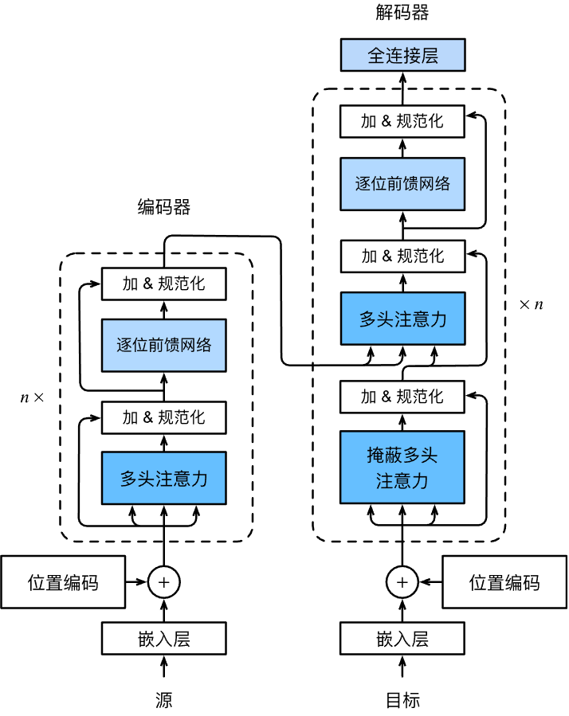

# 实用文档

[深度学习基础理论--PaddlePaddle](https://www.paddlepaddle.org.cn/tutorials)

[动手学深度学习 2.0.0-beta1 documentation (d2l.ai)](http://zh-v2.d2l.ai/chapter_introduction/index.html)

# 深度学习基础知识

## 感知机

输入多个输入信号，输出一个信号。感知机的信号只有 0 和 1。


- 感知机是具有输入和输出的算法。给定一个输入后，将输出一个既定的值。
- 感知机将权值和偏执设定为参数。
- 感知机可以表示门和或门逻辑电路。
- 2 层感知机可以表示异或门。
- 单层感知机只能表示线性空间，多层感知机可以表示非线性空间。

## 神经网络

感知机的参数/权值需要人为确定，很麻烦。而神经网络可以自动的从数据中学到合适的权重参数。

激活函数会将输入信号的总和转换为输出信号。

阶跃函数：超过 0 输出 1，未超过 0 输出 0。

<b>sigmoid 函数</b>：比阶跃函数平滑，输出随着输入发生连续的变化，阶跃函数则是急剧性变化。$sigmoid = \frac{1}{(1+e^{-x})}$，求导后，最大值为 $\frac{1}{4}$，当 x 很大或很小时，导数趋近于 0. 而且 sigmoid 求导涉及除法和指数，计算量大。

注意：神经网络的激活函数必须要是非线性函数，如果是线性函数的话，会出现：将 $h(x) = cx$ 作为激活函数，多次激活后 $h(h(x)) =c*c*x$，等价于 $g(x)=ax$，中间的隐藏神经元可以被一层神经元替代。

<b>ReLU 函数</b>，sigmoid 函数会有饱和倾向（两侧的梯度小，变化慢），ReLU 就不会有饱和倾向，不会有特别小的梯度出现。并且，ReLU 会使一部分神经元的输出为 0，这样就造成了网络的稀疏性，并且减少了参数的相互依存关系，缓解了过拟合问题的发生。

<b>softmax</b>，将数据转化为概率值，用于计算损失函数。预测的话，可以直接用 argmax 来求，不必做 softmax。写 softmax 函数的时候要注意数据溢出的问题。

```python
# 实现softmax
import numpy as np
# 分子分母同时乘以一个常数结果不变，再把常数带入 exp 中。
# 为了避免移除，我们用 data 的 max 作为这个常数。
def softmax(data: np.ndarray) -> np.ndarray:
    biggest = np.max(data)
    exp_ret = np.exp(data - biggest)
    return exp_ret / np.sum(exp_ret)


if __name__ == '__main__':
    print(softmax(np.array([0.3, 2.9, 4.0])))
    """
    [0.01821127 0.24519181 0.73659691]
    """
```

<b>损失函数</b>，评价网络性能的，损失越小越好。常见的损失函数有交叉熵损失函数和平方损失函数。

$y_k$ 是预测的概率值，$t_k$ 为 one-hot 编码的标签
$$
E = \frac{1}{2}\sum_K(y_{k}-t_{k})^2 \\ CE=-\sum_{k}t_{k}log(y_k)
$$

```python
import numpy as np

def mse(gt: np.ndarray, pred: np.ndarray) -> np.ndarray:
    return np.mean((gt - pred) ** 2) * 0.5

def ce(y: np.ndarray, t: np.ndarray) -> np.ndarray:
    """
    :param y: 置信度值
    :param t: one-hot 编码。
    :return:
    y*log(Pred)
    """
    delta = 1e-7
    return -np.sum(t * np.log(y + delta))

if __name__ == '__main__':
    t = np.array([0, 0, 1, 0, 0, 0, 0, 0, 0, 0])
    y = np.array([0.1, 0.05, 0.6, 0.0, 0.05, 0.1, 0.0, 0.1, 0.0, 0.0])
    print(ce(y, t)) # 0.510825457099338
```

<b>为什么用损失函数?</b>

我们的目标是获得高精度的模型，那为什么不用精度作为指标，而是用损失函数？<span style="color:orange">（简单说：如果用精度作为指标衡量的话，网络模型的参数改变了一点，精度可能还是保持不变，精度不变就很难估计参数往那个方向更新可以优化模型了。）</span>

对权值参数的损失函数求导时，如果导数的值为负，通过使该权重参数向正方向改变，可以减少损失函数的值；反过来则向负方向改变。只有当导数为 0 是，无论权重参数向什么地方变化，损失函数的值都不会改变。

采用精度作为指标的话，大多数地方的导数都会变为 0，导致参数无法更新。假定 100 支笔，精度为 32%，如果以识别精度为指标，即使稍微改变权重参数，精度变化不会太大，即便是变化也不会像 32.0041 这样连续变化，而是 33 34 这种。识别精度对微小的参数变化基本没什么反应，即便有反应也是不连续的突然的变化。

负梯度方向是梯度法中变量的更新方向。在公式上的体现就是
$$
x_0 = x_0 - η*\frac{\partial f}{\partial x_0}
$$
梯度上升还是梯度下降就看 loss 的符号了，loss 为正就是梯度下降，loss 为负就是梯度上升。网络模型的参数是怎么更新的呢？也是算出每个参数的梯度，然后参数减去对应的 $η*梯度$

<b style="color:red">查下对抗学习的梯度反转</b>

## 误差反向传播

数值微分计算网络权重参数的梯度（损失函数关于权重参数的梯度），但是计算比较费时间。误差反向传播可以高效计算权重参数的梯度。

反向传播可以简化问题，通过很多小问题组装成一个复杂的问题。再利用计算图保持每个小问题的计算结果。由于保存了每个小问题的计算结果，可以通过反向传播高效计算出导数。

正向传播算一遍，累积梯度，反向传播算一遍，反向传播算的时候会用到正向传播的累加梯度，可以节省计算时间。可以避免每次从头开始计算xx对oo的导数。相当于做了一个缓存，可以快速查到需要用到的值。

## 网络学习相关技巧

- 涉及优化器、权值衰减、Droupout、normalization

### 优化器

<a href="https://pytorch.org/docs/stable/optim.html#">PyTorch中的优化器文档</a>

常用优化器都在 `torch.optim`

> <b>基本使用</b>

```python
from torch import optim
# 或
import torch.optim as optim

optimizer = optim.Adagrad(params, lr=0.01, lr_decay=0, weight_decay=0, initial_accumulator_value=0, eps=1e-10)

optimizer = optim.Adam(params, lr=0.001, betas=(0.9, 0.999), eps=1e-08, weight_decay=0, amsgrad=False)

optimizer = AdamW(params, lr=0.001, betas=(0.9, 0.999), eps=1e-08, weight_decay=0.01, amsgrad=False)

optimizer = optim.ASGD(params, lr=0.01, lambd=0.0001, alpha=0.75, t0=1000000.0, weight_decay=0)

optimizer = optim.RMSprop(params, lr=0.01, alpha=0.99, eps=1e-08, weight_decay=0, momentum=0, centered=False)

optimizer = optim.SGD(params, lr=<required parameter>, momentum=0, dampening=0, weight_decay=0, nesterov=False)
```

网络模型参数优化的过程其实就是最优化过程。模型的参数优化是通过优化器来完成的。计算网络梯度，优化器优化参数。常用的优化器有 SGD、AdaGrad、Adam、AdamW 等。

#### SGD算法

使用参数的梯度，沿梯度方向更新参数，并重复这个步骤多次，从而逐渐靠近最优参数，这个过程称为随机梯度下降法。

缺点：SGD 的取值可视化查看一般都是呈“之”字形移动，这是一个相当低效的路径。即 SGD 的缺点是，如果函数的形状非均匀向，比如呈延伸状，搜索的路径就会非常低效。根本原因在于，梯度的方向并没有指向最小值的方向。

改进：加上动量，会减轻“之”字型的程度。

SGD 的示意公式：$W$ 为权重参数，η 为学习率。
$$
W \leftarrow W - η\frac{\partial L}{\partial W}
$$

```python
class SGD:
    def __init__(self, lr=0.01):
        self.lr = lr
	
    def update(self, param, grads):
        for key in params.keys():
            params[key] -= self.lr * grads[key]
"""
用 PyTorch 框架自定优化器应该也是这样做
"""
```

SGD 的缺点在于优化过程会比较抖动（呈“之”字形优化），梯度的方向并没有指向最小值的方向。

带动量的 SGD 可以缓解这种问题。
$$
v \leftarrow av - η \frac{\partial L}{\partial}W \\ W \leftarrow W + v
$$
用一个量 moment 去约束优化的方向

#### AdaGrad算法

传统梯度下降算法对学习率这个超参数非常敏感，难以驾驭，对参数空间的某些方向也没有很好的方法。<span  style="color:red">AdaGrad 算法通过参数来调整合适的学习率 lr，能独立地自动调整模型参数的学习率，对稀疏参数进行大幅更新和对频繁参数进行小幅更新。因此 AdaGrad 算法非常适合处理稀疏数据。</span>
$$
h \leftarrow h+ \frac{\partial L}{\partial W} \odot \frac{\partial L}{\partial W} \\ W \leftarrow W - η \frac{1}{\sqrt h} \frac{\partial L}{\partial W}
$$


h 保存了以前所有梯度的平方和，参数的元素中变动较大（被大幅度更新）的元素的学习率将变小

<b>缺点：</b>

- 可能因其累积梯度平方导致学习率过早或过量的减少。

- AdaGrad 会记录过去所有梯度地平方和。因此，学习越深入，更新的幅度就越小。如果无止境地学习，更新量就会变为 0，完全不再更新。为改善这个问题，可以使用 RMRSProp 方法。RMRSProp 采用指数移动平均法来累加梯度，在累加的过程中会逐渐忘记之前的梯度。

#### RMSProp算法

通过修改 AdaGrad 算法而来，其目的是在非凸背景下效果更好。不将过去所有的梯度都一视同仁地相加，而是逐渐忘记过去的梯度，在做加法运算时将梯度的信息更多地反映出来。这种操作称为“指数平均移动”，呈指数函数式地减小过去的梯度的尺寸。为了使移动平均，还引入了一个新的超参数，来控制移动平均的长度范围。（实际使用，使用 RMSProp 用的显存更小）

#### Adam算法

融合了 Momentum 和 AdaGrad 的方法。组合前两个方法的优点，有望实现参数空间的高效搜索。此外还会进行超参数的“偏置校正”。

它利用梯度的一阶矩估计和二阶矩估计动态调整每个参数的学习速率。但是 Adam 如果超参数设置的不合理容易过拟合。

### 批大小选择

批量大小一般不影响随机梯度的期望，但是会影响随机梯度的方差，批大小越大，随机梯度的方差越小，引入的噪声也越小，训练更稳定；因此批大小大时 lr 可以设置的大一些，批量大小小时 lr 设置的小一些，否则模型不会收敛。

学习率与批量大小的变化关系一般可以是，批大小增大/减小多少倍，lr 就相应的增大/减小多少倍。

### 学习率调整

常用的学习率调整策略有：学习率衰减、学习率预热、周期性学习率调整；

学习率衰减：指数衰减，自然指数衰减，余弦衰减（周期性变化，可以尽量避免局部极值）

学习率预热：大的 batch size 开始训练的时候，梯度往往比较大，这时候如果学习率设置的比较大训练会不稳定，可以在最开始的几个 epoch 的时候，用较小的学习率，后面再慢慢增大，预热结束后，再慢慢降低。

### 参数初始化

- 预训练初始化：我常用这个。跑的模型基本都有 backbone 的预训练参数
- 随机初始化：基于固定方差的随机初始化、基于方差缩放的参数初始化、正交初始化
- 固定值初始化

### 数据预处理

归一化：把数据特征转化为相同尺度的方法，如。将数据特征映射到 [0, 1] 或 [-1, 1] 区间内。

最小最大值归一化：$\frac{X-X_{min}}{X_{max}-X_{min}}$

标准化：将每一个特征都调整为均值为 0 ，方差为 1.

计算均值和方差：$x = \frac{x-μ}{σ}$

PAC 降维

### 归一化

#### Batch Normalization

对一批数据中的每个通道应用批量规范化（PyTorch 官方文档注释）

- 可以提高优化效率，使学习快速进行（可以增大学习率），还可以作为一种隐式的正则化方法，抑制过拟合（降低 Droupout 的必要性）
- 不那么依赖初始值（对初始值没那么敏感）
- 归一化可以使得大部分神经层的输入处于不饱和区域，从而避免梯度爆炸、梯度消失的问题

Batch Normalization 调整各层的激活值分布，使其拥有适当的广度。但是不适合用在递归神经网络中，因此有人提出了 Layer Normalization。


Batch Normalization 最直观的做法是计算均值方法后直接归一化，这样会使取值集中再 0 附近，如果使用 sigmoid 激活函数，这个取值区间刚好是接近线性变换的区间，减弱了神经网络的非线性性质。因此，为了使得归一化不对网络的表示能力造成负面影响，可以通过一个附加的缩放和平移操作来改变区间取值。

<b>一般 bn 要加在仿射变化之后，激活函数之前</b>

#### Layer Normalization

批量归一化是对一个中间层的单个神经元进行归一化操作，因此要求小批量样本的数量不能太小，否则难以计算单个神经元的统计信息。此外，如果一个神经元的净输入的分布在神经网络中是动态变化的（是说数据的长度不一样），如循环神经网络，那么就无法应用批量归一化操作。

将批处理归一化转化为层归一化，即，计算一个特征通道的均值、方差做归一化。

PS：rnn，因为它是一个动态的网络结构，同一个 batch 中训练实例有长有短，导致每一个时间步长必须维持各自的统计量，这使得 BN 并不能正确的使用，因为重复的 rescaling 会导致梯度爆炸

| 方法（特点）                                              | 归一化范围 |
| --------------------------------------------------------- | ---------- |
| Batch Normalization（通用）                               | $N*H*W$    |
| Layer Normalization（适合非特定长输入）                   | $C*H*W$    |
| Group Normalization （适合小的 batch 输入）               | $G*H*W$    |
| Instance Normalization （适合图像生成以及风格迁移类应用） | $H*W$      |

## 损失函数

### 介绍

- <b>sigmod</b> 是一个阶跃函数，用于二分类。
- <b>softmax</b> 计算每个数据可能的概率，里面概率最大就是预测值。
- <b>logsoftmax</b> 是对 softmax 进行了一个与 log 等价的操作，但不是直接 log。
- <span style="color:red"><b>博客回答：</b></span>我的理解是这样的：理论上对于单标签多分类问题，直接经过 softmax 求出概率分布，然后把这个概率分布用 crossentropy 做一个似然估计误差。但是 softmax 求出来的概率分布，每一个概率都是 (0,1) 的，这就会导致有些概率过小，导致下溢。 考虑到这个概率分布总归是要经过 crossentropy 的，而 crossentropy 的计算是把概率分布外面套一个 -log 来似然，那么直接在计算概率分布的时候加上log, 把概率从（0，1）变为（-∞，0），这样就防止中间会有下溢出。 所以 log_softmax 说白了就是将本来应该由 crossentropy 做的套 log 的工作提到预测概率分布来，跳过了中间的存储步骤，防止中间数值会有下溢出，使得数据更加稳定。 正是由于把 log 这一步从计算误差提到前面，所以用 log_softmax 之后，下游的计算误差的 function 就应该变成 NLLLoss (它没有套 log 这一步，直接将输入取反，然后计算和 label 的乘积求和平均)

### 常见损失函数汇总

```python
# 均方误差损失函数 用于回归问题
torch.nn.MSELoss(size_average=None, reduce=None, reduction: str = 'mean')

# 与BCELoss的不同：将sigmoid函数和BCELoss方法结合到一个类中
torch.nn.BCEWithLogitsLoss(weight=None, size_average=None, reduce=None, reduction='mean', pos_weight=None)

# NLLLoss的全称是Negative Log Likelihood Loss，也就是最大似然函数。 用于多分类问题
torch.nn.NLLLoss(weight: Optional[torch.Tensor] = None, size_average=None, ignore_index: int = -100, reduce=None, reduction: str = 'mean')

# CrossEntropyLoss 交叉熵损失函数，适用于多分类问题  This criterion combines nn.LogSoftmax() and nn.NLLLoss() in one single class.
torch.nn.CrossEntropyLoss(weight: Optional[torch.Tensor] = None, size_average=None, ignore_index: int = -100, reduce=None, reduction: str = 'mean')
```

PS：当使用 sigmoid 作为激活函数的时候，常用<b>交叉熵损失函数</b>而不用<b>均方误差损失函数</b>，因为它可以<b>完美解决平方损失函数权重更新过慢</b>的问题，具有“误差大的时候，权重更新快；误差小的时候，权重更新慢”的良好性质。

### BCELoss

二分类

```python
CLASS torch.nn.BCELoss(weight=None, size_average=None, reduce=None, reduction='mean')
```

创建一个衡量目标和输出之间二进制交叉熵的 criterion

- 参数
    - <b>weight</b> (*Tensor,可选) – 每批元素损失的手工重标权重。如果给定，则必须是一个大小为 “nbatch” 的张量。
    - <b>reduction</b> (*string,可选) – 指定要应用于输出的 `reduction` 操作：' none ' | 'mean' | ' sum '。“none”：表示不进行任何 `reduction`，“mean”：输出的和除以输出中的元素数，即求平均值，“sum”：输出求和。
    - 其他的被弃用了

```python
import torch.nn

input = torch.tensor([
    [0.3585, 0.5973, -0.4429, -0.0270, 0.2480, 0.3332, -2.0774, 0.1682,
                       1.5812, -1.5677],
    [0.3585, 0.5973, -0.4429, -0.0270, 0.2480, 0.3332, -2.0774, 0.1682,
                       1.1252, -1.5677]
])
target = torch.tensor([[1., 0., 0., 0., 1., 0., 0., 0., 0., 0.], [1., 0., 0., 0., 1., 0., 0., 0., 0., 0.]])


# 可以一个一个标记的算
def test1(input, target):
    """
    :param input: 单纯的数据
    :param target: 数据对应的标签
    :return:
    """
    loss = torch.nn.BCELoss()
    out = loss(torch.sigmoid(input), target)
    return out.data


# 也可以批处理算
def test2(input, target):
    """
    批量计算 一次处理batch_size数目的data
    :param input: [batch_size , data]
    :param target:[batch_size , data]
    :return:
    """
    loss = torch.nn.BCELoss()
    out = loss(torch.sigmoid(input), target)
    print(out.data)


if __name__ == '__main__':
    count = 0.0
    for epoch in range(input.shape[0]):
        for i, t in zip(input[epoch], target[epoch]):
            count += test1(i, t)
    print(count / 20)
    test2(input, target)
    print(input.shape)
```

### BCEWithLogitsLoss

二分类

```python
torch.nn.BCEWithLogitsLoss(weight=None, size_average=None, reduce=None, reduction='mean', pos_weight=None)
```

与 BCELoss 的不同：

将 sigmoid 函数和 BCELoss 方法结合到一个类中

这个版本在数值上比使用一个带着 BCELoss 损失函数的简单的 Sigmoid 函数更稳定，通过将操作合并到一层中，我们利用 log-sum-exp 技巧来实现数值稳定性。

- 多出的参数
    - <b>pos_weight</b>–正值例子的权重，必须是有着与分类数目相同的长度的向量

```python
import torch
import torch.nn as nn

m = nn.Sigmoid()
loss = nn.BCELoss()
input = torch.randn(3, requires_grad=True)
target = torch.empty(3).random_(2)
output = loss(m(input), target)
print(output)

loss = nn.BCEWithLogitsLoss()
input = torch.randn(3,requires_grad=True)
target = torch.empty(3).random_(2)
output = loss(input, target)
print(output)
```

```python
import torch
import torch.nn as nn

import torch.nn

input = torch.tensor([
    [0.3585, 0.5973, -0.4429, -0.0270, 0.2480, 0.3332, -2.0774, 0.1682,
     1.5812, -1.5677],
    [0.3585, 0.5973, -0.4429, -0.0270, 0.2480, 0.3332, -2.0774, 0.1682,
     1.1252, -1.5677]
])
target = torch.tensor([[1., 0., 0., 0., 1., 0., 0., 0., 0., 0.], [1., 0., 0., 0., 1., 0., 0., 0., 0., 0.]])


# 可以一个一个标记的算
def test1(input, target):
    """
    :param input: 单纯的数据
    :param target: 数据对应的标签
    :return:
    """
    loss = torch.nn.BCEWithLogitsLoss()
    out = loss(input, target)
    return out.data


# 也可以批处理算
def test2(input, target):
    """
    批量计算 一次处理batch_size数目的data
    :param input: [batch_size , data]
    :param target:[batch_size , data]
    :return:
    """
    loss = torch.nn.BCEWithLogitsLoss()
    out = loss(input, target)
    print(out.data)


if __name__ == '__main__':
    count = 0.0
    for epoch in range(input.shape[0]):
        for i, t in zip(input[epoch], target[epoch]):
            count += test1(i, t)
    print(count / 20)
    test2(input, target)
    print(input.shape)
```

### NLLLoss

NLLLoss 的全称是 Negative Log Likelihood Loss，也就是最大似然函数。

<a href="https://blog.csdn.net/qq_22210253/article/details/85229988">博客</a>

多分类

```python
CLASS torch.nn.NLLLoss(weight=None, size_average=None, ignore_index=-100, reduce=None, reduction='mean')
```

多出参数：

- <b>ignore_index</b>– 指定一个被忽略的目标值，该目标值不影响输入梯度。当 size_average 为真时，对非忽略目标的损失进行平均。

 形状：

- 输入：(N,C), C 代表类别的数量；或者在计算高维损失函数例子中输入大小为 (N,C,d1,d2,...,dK)，k>=1
- 目标：(N)，与输入拥有同样的形状，每一个值大小为为 0≤targets[i]≤C−1 ；或者在计算高维损失函数例子中输入大小为 (N,C,d1,d2,...,dK)，k>=1
- 输出：标量 scalar。如果 reduction='none', 则其大小与目标相同，为 (N) 或 (N,C,d1,d2,...,dK)，k>=1

## 激活函数

神经网络层数不多，选择 sigmoid、tanh、relu、softmax 都可以。如果搭建的网络层次较多，激活函数选择不当可能会导致梯度消失问题。此时一般不宜选择 sigmoid、tanh 激活函数，因为它们的导数都小于 1，尤其是 sigmoid 的导数在 0~1/4 之间。导数过小的容易梯度消失，导数过大的容易梯度爆炸，层数多的选择导数为 1 的激活函数是比较合适的如 $relu$ 函数。

激活函数输入维度与输出维度是一样的。激活函数的输入维度一般包括批量数 N，即输入数据的维度一般是 4 维，如$(N,C,W,H)$

<a href="https://pytorch.org/docs/stable/nn.functional.html#non-linear-activation-functions">torch中实现的激活函数</a>

> 将线性函数变为非线性函数。如果不用激活函数进行激活的话，多层神经网络最后是可以用一层来表示的。这样设置多层网络的意义就存在了。所有要用非线性的激活函数进行激活。所以<span style="color:red">激活函数必须为非线性函数</span>

> <b>sigmoid</b>

公式如下：$σ(x) = \frac{1}{1+e^{-x}}$

- 优点
    - 便于求导的平滑函数
    - 能压缩数据，保证数据幅度不会有问题
    - 适合用于前向传播
- 缺点
    - 容易出现<span style="color:red">梯度消失的现象</span>：当激活函数接近饱和区时，变化太缓慢，导数接近 0，根据后向传递的数学依据是微积分求导的链式法则，当前导数需要之前各层导数的乘积，几个比较小的数相乘，导数结果很接近 0，从而无法完成深层网络的训练。
    - sigmoid 含有幂函数，求导复杂，比较难算。
    - Sigmoid 的输出不是 0 均值（zero-centered）的，就是它的平均值不是 0，任何数都是大于 0 的：这会导致后层的神经元的输入是非 0 均值的信号，这会对梯度产生影响。以 f=sigmoid(wx+b) 为例， 假设输入均为正数（或负数），那么对 w 的导数总是正数（或负数），这导致了在反向传播过程中要么都往正方向更新，要么都往负方向更新，有一种捆绑效果。如果 w 中含有 w1 和 w2，我们希望 w1 不断增加，w2 不断减小，sigmoid 的 zero-centered 会得收敛缓慢。

> <b>tanh</b>

公式如下：$tanhx = \frac{e^x -e^{-x}}{e^x+e^{-x}}$

tanh 函数将输入值压缩到 -1~1 的范围，因此它是 0 均值的，解决了 Sigmoid 函数的非 zero-centered 问题，但是它也存在梯度消失和幂运算的问题。

> <b>ReLU</b>

公式：$ReLU = max(0,x)$

- 优点
    - ReLu 的收敛速度比 sigmoid 和 tanh 快；（梯度不会饱和，解决了梯度消失问题）
    - 计算复杂度低，不需要进行指数运算；
    - 适合用于后向传播。
- 缺点
    - ReLU 的输出不是 zero-centered；
    - Dead  ReLU  Problem（神经元坏死现象）：某些神经元可能永远不会被激活，导致相应参数永远不会被更新（在负数部分，梯度为 0）。产生这种现象的两个原因：参数初始化问题；learning  rate 太高导致在训练过程中参数更新太大。 解决方法：采用 Xavier 初始化方法，以及避免将 learning  rate 设置太大或使用 adagrad 等自动调节 learning  rate 的算法。【<b>这个所谓的缺点，也是其优点，丢弃一些参数，加快收敛。</b>】
    - ReLU 不会对数据做幅度压缩，所以数据的幅度会随着模型层数的增加不断扩张。

> <b>Leakly ReLU</b>

公式：$f(x) = max(0.01x,x)$

此激活函数的提出是<span style="color:red">用来解决 ReLU 带来的神经元坏死的问题</span>，可以将 0.01 设置成一个变量 a，其中 a 可以由后向传播学习。<span style="color:red">但是其表现并不一定比 ReLU 好</span>

> <b>ELU函数（指数线性函数）</b>

$f(x) = x \  \ if \  x>0$

$f(x) = a(e^x-1), \ otherwise$

ELU 有 ReLU 的所有优点，并且不会有 Dead  ReLU 问题，输出的均值接近 0（zero-centered）。但是计算量大，其表现并不一定比 ReLU 好。

## 优化算法

对于深度学习问题，我们通常会先定义*损失函数*。一旦我们有了损失函数，我们就可以使用优化算法来尝试最小化损失。在优化中，损失函数通常被称为优化问题的*目标函数*。按照传统和惯则，大多数优化算法都关注的是*最小化*。<span style="color:orange">如果我们需要最大化目标，那么有一个简单的解决方案：在目标函数前加负号即可。</span>

### 局部最小&全局最小

<div align="center"></div>

### 凸和非凸的例子

凸: 线性回归 $f(x)=||Wx-b||^2_2$;  softmax 回归

非凸: MLP, CNN, RNN, attention ...

### 梯度下降

梯度下降需要用到所有样本, 是对所有样本损失的平均, 训练成本大. 一般都是用小批量随机梯度下降

<div align="center">
    
    
</div>

### 随机梯度下降

因为随机梯度下降样本是随机取的, 但是所选取的样本的平均期望(所有随机取的样本的期望)可以近似为全部样本的期望

<div align="center">
	
    
</div>

### 小批量随机梯度下降

<div align="center">
	
    
</div>

### moment

维护一个惯性,结合当前梯度的方向和过去的梯度一起判断下一步往什么方向更新,让方向变化的不要太快,太剧烈.

<div align="center">
	
</div>

### Adam

Adam 会对梯度做平滑,且对梯度各个维度值做重新调整, 因此对学习率不敏感.

## 正则化

机器学习中容易发送过拟合，过拟合的原因主要有这两个

- 模型拥有大量参数、表现力强
- 训练数据少

常见的解决办法有下面几个：

- Droupout
- 正则化 L1、L2
- 增大数据集
- 在损失函数中，weight decay 是放在正则项（regularization）前面的一个系数，正则项一般指示模型的复杂度，所以 weight decay 的作用是调节模型复杂度对损失函数的影响，若 weight decay 很大，则复杂的模型损失函数的值也就大。

### Dropout

学习过程中随机删除一些神经元。减少参数的数量，加快收敛速度，避免过拟合。一般好像是设置成丢弃 50% 的数据。

### L1/L2 范数

<span style="color:orange">奥卡姆剃刀原理：如无必要，勿增实体”，即凡事都要遵从“简单有效”的原则。</span>

[深入理解 L1、L2 正则化 - ZingpLiu - 博客园 (cnblogs.com)](https://www.cnblogs.com/zingp/p/10375691.html)、

- <b>正则化(Regularization)</b>是机器学习中对原始损失函数引入额外信息，以便防止过拟合和提高模型泛化性能的一类方法的统称。也就是目标函数变成了<b>原始损失函数+额外项</b>，常用的额外项一般有两种，英文称作 ℓ1−norm 和 ℓ2−norm，中文称作 <b>L1 正则化</b>和 <b>L2 正则化</b>，或者 L1 范数和 L2 范数（实际是 L2 范数的平方）。
    - L1 正则化是指权值向量 w 中各个元素的绝对值之和，通常表示为 $‖w‖_1$。
    - L2 正则化是指权值向量 w 中各个元素的平方和然后再求平方根（可以看到 Ridge 回归的 L2 正则化项有平方符号），通常表示为 $‖w‖^2_2$

<b>正则化的作用</b>

- 选择出一个经验风险和模型复杂度同时较小的模型。L1 正则化可以使得参数稀疏化(<a href="https://zhuanlan.zhihu.com/p/343204033">解释</a>，我在《百面机器学习》里写了笔记)，即得到的参数是一个稀疏矩阵，相当于进行了一次特征选择，只留下一些比较重要的特征，提高模型的泛化能力。特征稀疏还有利于模型的部署，用更少的特征完成相同的功能。
- <b>稀疏性</b>，就是模型的很多参数是 0。通常机器学习中特征数量很多，例如文本处理时，如果将一个词组（term）作为一个特征，那么特征数量会达到上万个（bigram）。在预测或分类时，那么多特征显然难以选择，但是如果代入这些特征得到的模型是一个稀疏模型，很多参数是 0，<span style="color:orange">表示只有少数特征对这个模型有贡献，绝大部分特征是没有贡献的，即使去掉对模型也没有什么影响，此时我们就可以只关注系数是非零值的特征。这相当于对模型进行了一次特征选择，只留下一些比较重要的特征，提高模型的泛化能力，降低过拟合的可能。</span>
- L2 正则化可以防止模型过拟合（overfitting）；一定程度上， L1 也可以防止过拟合。

PRML 中提到 L2 正则化会定义一个圆形的解空间，L1 正则化会定义一个多边形的解空间。那么为什么加入正则项就是定义了一个解空间约束？百面机器学习 P165

在实际使用中，如果特征是高维稀疏的，则使用 L1 正则；如果特征是低维稠密的，则使用 L2 正则。

L1 和 L2 正则先验分别服从什么分布，L1 是<a href="https://www.bbsmax.com/A/MyJxXODMJn/">拉普拉斯分布</a>，L2 是高斯分布。

## 权重衰退

weight_decay：用于处理过拟合

我们控制模型容量的方式一般有两种：

- 一种是减小模型的参数，把模型变小
- 使每个参数选取的值的范围比较小，通过限制参数值的选择范围来控制模型容量。
- $min\ l(w,b) \ \ \ subject \ \ to \ \ ||w||^2≤θ$ 加入限制 subject to，使得权重的每个项的平方和小于 θ。小的 θ 意味着更强的正则项。w 的每个元素的值，都要小于 θ 的开根号。强行让每个值不会太大。而我们不会限制偏移 b，对实际结果不会产生影响（偏移 b 是对整个数据的偏移）。（如果训练数据差异过大，那么 w 的差异也会很大，用这个来限制 w 之间的差异，也就限制住了过拟合）

<div align="center"></div>

黄色等高线是加入权重衰退约束后的等高线，再没有加入权重衰退约束强，假定最优化的在绿色点，在绿色点处的损失是最小的。加入约束项后，绿色点的不再是损失最小的点，需要超黄色等高线方向移动：l(loss) 的值会变大一点，而惩罚项 w(取值范围变小，模型复杂度降低) 的值会变小。为了保证两个都尽可能的小，就取两者的交点。

参数更新法则如下：

为什么叫权重衰退？

<div align="center"></div>

如果没有加入二次罚项，那么是不会有 η纳姆拉 的，主要的变化在，每一次更新的时候先把 $w_t$ 变小一点点，再在更新的方向走一点。

权重衰退通过 L2 正则项使得模型参数不会过大，从而控制模型复杂度。正则项权重是控制模型复杂度的超参数。

为什么限制模型只在一个很小的范围内取参数，模型的空间就变小，学得的曲线会比较平稳。如果模型的空间大，参数可以取的很大很小的话，可能会学得一个比较陡峭的曲线，去拟合所有的点，那么模型的复杂度就比较低。

实践中权重衰减一般可以设置成：0.1 0.01 0.001，会有一点效果，但是效果提升不会太大。一般取个 e-3 就行。如果模型真的很复杂，那么效果可能没什么提升。

<span style="color:orange">为什么要把 w 往小拉？如果最优解的 w 就是比较大的数，那么权重衰减是不是会有反作用？假设上图的绿色点就是最优解，但是数据里是有噪音的，我们是学不到这个点的，可能会距离最优解很远，比如在 w 的右边，那么，把 w 往小拉可以更接近最优解。如果数据没有噪音，那么网络就不会去拟合噪音了，也就不需要纳姆塔了。</span>

## 丢弃法 Droupout

动机：一个好的模型，需要对输入数据的扰动有很好的鲁棒性。

- 使用有噪音的数据等价于 Tikhonov 正则。
- 丢弃法：在层之间加入噪音。

<div align="center"></div>

除以 1-p 是希望 droupout 后“期望”不变化

通常将丢弃法作用在隐藏全连接层的输出上。

<b>推理中的丢弃法</b>

- 正则项只在训练中使用：他们影响模型参数的更新
- 在推理过程中，丢弃法直接返回输入 $h=dropout(h)$
- 这也能保证确定性的输出。

<b>总结</b>

- 丢弃法将一些输出项随机置 0 来控制模型复杂度
- 常作用在多层感知机的隐藏层输出上
- 丢弃概率是控制模型复杂度的超参数

Droupout 每次随机选择几个子网络，最后做平均的做法类似于随机森林多决策树做投票这种思想。

可以认为 Droupout 是一种正则化项。Droupout 可能比 weight_decay 更好调参一些，很直观，0.5/0.1/0.9

Droupout 可能会使参数收敛更慢（实际使用没太大的感觉），但是 Droupout 对 lr 的影响似乎是没有的，调整 Droupout 不用调整 lr，因为期望是差不多的。学习率主要是对期望和方差敏感一点。

transformer 可以看作一个核方法？

## 数值稳定性

数值稳定性有两个常见的问题：梯度爆炸核梯度消失。

梯度爆炸：$1.5^{100}≈4*10^{17}$

梯度消失：$0.8^{100}≈2*10^{-10}$

### 梯度爆炸问题

- 值超出值域（infinity），对于 16 位浮点数尤为严重（数值区间 6e-5~6e4）
- 对学习率敏感
    - 如果学习率太大 -> 大参数值 -> 更大的梯度
    - 如果学习率太小 -> 训练无进展
    - 我们可能要在训练的过程中不断调整学习率

使用 sigmoid 作为激活函数，sigmoid 的导数的最大值也就 1/4，在坐标轴原点两侧，距离原点越远，导数的值越接近 0，容易造成梯度消失。ReLU 就可以缓解这种问题，而且也是非线性的。

<b>总结</b>

- 当数值过大或者过小时会导致数值问题
- 常发生在深度模型中，因为其会对 n 个数累乘

## 模型初始化核激活函数

如何让训练更加稳定？

- 让梯度在合理范围内，如【1e-6，1e3】
- 将乘法变加法：ResNet，LSTM；
- 归一化
    - 梯度归一化，梯度裁剪
- 合理的权重初始和激活函数

## 卷积(交叉)层

- 平移不变性：我们识别一个物体不会因为他位置的改变而识别不出，这叫平移不变性。卷积核的核参数体现了平移不变性。卷积核的参数不变，不管图片的位置在哪，都是用同样的核参数来计算。
- 局部性：找个这个物体我们不用看太多的信息，看到他局部的信息就行。卷积核的大小就体现了局部性的特征（感受野不是越大越好嘛？为什么看局部就行？）

对全连接层使用平移不变性和局部性得到卷积层（不是很理解）

卷积层变成深层后，实际上是整张图的视野都有，所以卷积核的大小在后面显得没那么重要了。而且，感受野相同的情况下，越深的模型比越胖的模型要好（卷积核大的），同时具备了更强的非线性。

<b>分组卷积</b>

将输入通道和输出通道都划分为同样的组数，

## 填充&步幅

- 给定（$32*32$）输入图像
- 应用 $5*5$ 大小的卷积核
    - 第一层得到的输出大小是 $32-5+1=28$
    - 第七层得到的输出大小是 $4*4$

卷积核超参数的设定：一般核大小是奇数（填充的时候方便，是对称的，填充的大小一般是 kernel size - 1，两边各分一半 (kernel_size - 1)/2 ），步幅一般取一，如果计算量太大了，希望计算量变小一点，步幅就取大一些。

在实际使用的时候，一般都是采用经典的网络结构（resnet），除非数据的输入很特殊，比如 $20*2000$，那么就需要自己稍微调整下网络的结构。

机器学习算法可以看作一个压缩信息的过程（保留重要的信息，丢弃不那么重要的信息），在压缩的过程中是会丢失一些信息的。

## 多个输入通道

彩色图像有 RGB 三个通道，转为灰度图会丢失信息。

多个输入通道又是如何做卷积的呢？假设输入通道为 2，总的 $shape=2*H*W$；输出通道为 4，那么就会有 4 个卷积核，每个卷积核的大小是 $2*kernel \ size*kernel \ size$

每个通道都有一个对应的卷积参数，结果是所有通道卷积结果的和。（下图是一个通道数为 2 的输入数据，输出通道是 1，卷积核大小是 $2*2*2$）

<div align="center">
    <div align="center">
        输入通道数为 2，输出通道为 1 的卷积操作示意图
        <br>
    </div>
    <br>
    <div align="center">
        输入通道数为 3，输出通道为 1 的卷积操作示意图
        <br>
    </div>
	
</div>

<b>多个输入通道</b>

- 输入 X：$c_i * n_h * n_w$
- 核 W：$c_i*k_h*k_w$
- 输出 Y：$m_h*m_w$ ==> $Y=\sum^{c_i}_{i=0} X_{i,:,:}★W_{i,:,:}$

<b>多个输出通道</b>

- 无论有多少输入通道，到目前位置我们只得到了单输出通道
- 可以用多个三维卷积核，每个核生成一个输出通道
- 输入 X：$c_i * n_h * n_w$
- 核 W：$c_0*c_i*k_h*k_w$
- 输出 Y：$c_0*m_h*m_w$ ==> $Y=\sum^{c_i}_{i=0} X_{i,:,:}★W_{i,:,:}$

<span style="color:orange">可以认为，每个输出通道都识别出了一个特定的模式。</span>

“输入通道核”识别并组合“输入中的模式”，比如组合后，这个通道识别出了猫胡须的纹理，另一个通道识别出了猫眼睛的纹理，通过各种通道纹理的组合，判断出这是一只猫。这就是要多个输入输出的原因，分别识别出不同的纹理，然后组合判断。

<b>常用的卷积有：</b>

- 上面所说的普通的卷积
- 分组卷积，将输入通道进行分组数，然后每组都有一个与之对应的卷积核；假设分成了 g 组，则有 g 个对应的卷积核（卷积核的 channel 大小和分组后特征的 channel 一样）。在获得同等通道数的情况下，分组卷积的计算量更小，为普通卷积的 $\frac{1}{g}$。在移动设备的小型网络上常使用这种结构。除了这种方式节省计算量外，用 $3*1 \ 和\ 1*3$ 的卷积替代 $3*3$ 的卷积也可以减少计算量。
- 深度可分离卷积，一个卷积核只对应一个通道，只在一个通道上做卷积。[深度可分离卷积 - 知乎 (zhihu.com)](https://zhuanlan.zhihu.com/p/92134485)
- 可变形卷积，卷积核大小不再是固定不变而是可变性的，网络会为卷积学一个偏移量，让卷积核变形到它感兴趣的位置。
- 空洞卷积，在标准的卷积核中注入空洞（每隔 x 个像元取一个值用于卷积计算），以此增加卷积核的感受野。空洞卷积可以在不做 pooling 损失信息的情况下，加大了感受野，让每个卷积输出都包含较大范围的信息。

<b>1*1 卷积</b>

它不识别空间模式，只是融合通道（降低通道维度，降低计算量）。

网络越深，Padding 0 越多，是否会影响性能？计算性能是会有一点影响的，对于模型性能来说，不会影响模型性能。0 乘以一个数结果是 0，而 bias 的话是一个常数，对模型没什么影响。

卷积对位置很敏感的，卷积后第 $(i,j)$ 位置的元素就是对于卷积前位置 $(i,j)$ 附近的元素。（加入池化层后，可以对位置不那么敏感）

## 池化层

卷积对位置非常敏感，卷积后第 $(i,j)$ 位置的元素就是对于卷积前位置 $(i,j)$ 附近的元素。但是对位置太敏感不是一件好事。我们希望在不同照明，不同物体位置，比例和外观等因素的影响下，网络仍然可以识别出物体，这就需要一定程度的平移不变性了。而池化层可以让网络具备一定的平移不变性。

$2*2$ 最大池化可容忍 1 个像素的移位。

- 池化层和卷积层类似，都有填充，步幅和多个通道
- 池化层没有可学习的参数
- 输入通道 = 输出通道

最大池化层，输出每个窗口中最强的信号。

平均池化层，则是平均窗口内的值。

都是用来缓解卷积对位置的敏感性。

池化后计算量不一定变小，如果没有 padding，步幅和池化大小一样，是可以减少计算量的；如果步幅是一，有 padding 那么不会减少计算量。

为什么池化层用的越来越少了？（ConvNeXt 没有用池化层）池化层让卷积对位置没那么敏感，而且可以减小一定的计算量。但是通常现在可以用卷积 + stride(步幅) 来实现；而且我们会做数据增强，对数据本身做位置的扰动操作，是卷积神经网络对位置不那么敏感，不过拟合到某个位置。

池化层是一种正则嘛？正则是为解加上空间约束，池化层似乎并没有为解加上空间约束，不大像。

## 经典卷积神经网络

### LeNet

卷积+池化+卷积+池化+两个全连接+Gauss

一维卷积也可以用于时序数据（做分类）如文本分类，池化的话可以用也可以不用，得自己试试才知道。

一般数据的压缩方式是。高宽减半，通道加两倍，增加通道数是为了可以匹配更多的模式（把一些模式分离到更多的通道中？）；整体的数据信息是缩小了的。

### AlexNet

- 是一个更大更深的 LeNet
- 主要改进：丢弃法、ReLu、MaxPooling、数据增强

更大的池化，更大的卷积核和步幅。

AlexNet 最后用两个相同的全连接层（4096）是因为前面抽取的特征不够深，而 4096 的全连接层是一个非常厉害的模型，可以用这两个全连接层（Dense）来抽深层次特征；去掉一个的话，精度会降低。可以自己试试。

给数据多增加了一些数据增强，效果变成很正常，数据增强也是一个超参数需要调参。

有些网络前置要去数据大小为某个值，这样的话我们就需要 resize，这个 resize 是有讲究的，是把短边 reszie 到固定值后，在把长边等比缩放，然后再缩放后的图片里裁剪一个固定大小的图，这样的影响其实是不大的；大不了多裁几次。

### VGG

使用可重复使用的卷积块来构建深度卷积神经网络；采用连续的几个 $3*3$ 的卷积核代替 AlexNet 中的较大卷积核（11x11，7x7，5x5）。多层非线性层可以增加网络深度来保证学习更复杂的模式，而且代价还比较小（参数更少）。

不同的卷积块个数和超参数可以得到不同复杂度的变种。

### NIN

Network in Network，出自新加坡国立大学2014年的论文 [Network In Network](https://arxiv.org/abs/1312.4400)。该设计后来为 [ResNet](https://so.csdn.net/so/search?q=ResNet&spm=1001.2101.3001.7020) 和 Inception 等网络模型所借鉴。

<b>全连接层的问题</b>

- 卷积层需要较少的参数 $c_i*c_0*k^2$
- 但卷积层后的第一个全连接层的参数
    - LeNet $16*5*5*120=48k$
    - AlexNet $256*5*5*4096=26M$
    - VGG $512*7*7*4096=102M$

<b>NiN 块</b>

- 一个卷积层后跟两个 $1*1$ 的卷积层，步幅为 1，无填充，也不会改变通道数。
- $1*1$ 卷积起到全连接层的作用

<b>NiN架构</b>

- 无全连接层
- 交替使用 NiN 块和步幅为 2 的最大池化层，逐步减小高宽和增大通道数
- 最后使用全局平均池化层替代 VGG 和 AlexNet 中的全连接层得到输出，其输入通道数就是类别数；这样不容易过拟合（全局平均池化没有参数可以学习），且参数量更小。

### GoogleNet/Inception

<b>Inception 块</b>

对输入特征，用 4 个路径，从不同层面抽取信息，然后在输出通道维合并。

<div align="center"></div>

<div align="center"></div>

为什么这么分呢？估计是试出来的。

和单 $3*3$ 或 $5*5$ 卷积比，Inception 块有更少的参数个数和计算复杂度。

| -          | #parameters | FLOPS |
| ---------- | ----------- | ----- |
| Inception  | 0.16M       | 128M  |
| $3*3$ Conv | 0.44M       | 346M  |
| $5*5$ Conv | 1.22M       | 963M  |

<div align="center"></div>

<b>Inception 各种变种</b>

- Inception-BN（v2）- 使用 batch normalization
- Inception-V3 - 修改了 Inception 块
    - 替换 $5*5$ 为多个 $3*3$ 卷积层
    - 替换 $5*5$ 为 $1*7$ 和 $7*1$ 卷积层
    - 替换 $3*3$ 为 $1*3$ 和 $3*1$ 卷积层
    - 更深
- Inception-V4 - 使用残差连接

img\image-20220910200644599.png)

img\image-20220910200601993.png)

img\image-20220910200714535.png)

ResNeSt: Split-Attention Networks，在迁移学习上效果很好。模型很重要，但是训练的 trick 也非常重要。

## 批量归一化

损失出现在最后。正向传播时，梯度是从数据->损失，反向传播时是从损失->梯度，梯度在上面(损失的位置)的时候比较大，梯度越到下面越小；这样越靠近损失部分的梯度越大，距离损失越远的梯度越小，会导致靠近损失部分的训练起来更快，而底部的(靠近数据)的训练较慢。

如果底部的数据发生变化，后面所有的都得跟着变，最后那些层（靠近损失部分的层）的参数需要重新学习多次，这样会导致网络收敛缓慢。如何避免在学习底部（靠近数据部分）特征的时候避免顶部（靠近损失部分）不断重新的训练？

<div align="center"></div>

批量归一化可以解决这种问题。让输入数据的变化不那么剧烈。

- 固定小批量里面的均值和方差，确保网络中的各层，即使参数发生了变化，其输入/输出数据的分布也不能产生较大变化，让训练过程更加稳定，对初始值不那么敏感。
- 然后再做额外的调整（可学习的参数）

<div align="center"></div>

γ 和 β 是为了防止，直接将数据变为服从均值为 0 方差为 1 的分布可能不太合适（<span style="color:orange">这样是会影响到本层网络 A 所学习到的特征的。打个比方，比如网络中间某一层学习到特征数据本身就分布在 S 型激活函数的两侧，你强制把它给我归一化处理、标准差也限制在了 1，把数据变换成分布于 S 函数的中间部分，这样就相当于我这一层网络所学习到的特征分布被你搞坏了</span>），就设置两个可以学习的参数去调整。但是会限定 γ 和 β 的变化不要过于猛烈。

- 批量归一化作用在
    - 全连接层和卷积层的输出上，激活函数之前
    - 全连接层和卷积层输入上
- 对于全连接层，作用在特征维上
- 对于卷积层，作用在通道维上；

<b>总结</b>

- 批量归一化固定小批量中的均值和方差，然后学习出适合的偏移和缩放
- 可以加速收敛速度，但一般不会改变模型精度

## 分类中的全连接

分类任务中网络末尾几层一般都是用两层全连接。全连接对于小模型的作用在于，小模型拟合数据的能力可能不强，而全连接层具有非常强的数据拟合能力（因为一把都是用全连接把数据映射到 1024/2048 维）可以增强模型的拟合能力。如果我们去掉其中一层全连接层，最后分类的结果可能不会太好。

还有就是，卷积考虑的往往是局部的信息，对于分类任务，我们不仅要考虑图像中各个元素，还要考虑它们之间的关联，而全连接正好可以起到这个作用。

最近几年，最后一层通常会采用全局平均池化来做。它的作用于全连接类似（可以提取全局信息）；但是它的参数俩非常小。

## 全局平均池化

Network In Network 论文中提出的概念。

论文链接：https://arxiv.org/pdf/1312.4400.pdf，3.2 节。

- 和全连接层相比，使用全局平均池化技术，对于建立特征图和类别之间的关系，是一种更朴素的卷积结构选择。
- 全局平均池化层不需要参数，避免在该层产生过拟合。
- 全局平均池化对空间信息进行求和，对输入的空间变化的鲁棒性更强。

## ResNet

给网络加更多的层总是会提高精度吗？

$f^*$ 是最优解，$F1 \to F_6$ 模型越来越大，但是最大的模型 $F_6$ 所学的解（红点处）并没有更小的模型 $F_3$ 所学的解更靠近最优解。

<div align="center"></div>

如果我们学得的模型包含子模型的话，那我们大模型所学到的解至少不会比小模型更差

<div align="center"></div>

包含子模型这个想法，就是 ResNet 的出发点；加更多的层，至少不会让模型变差（注入一个梯度）；具体做法如下：g(x) 是我们新学到的内容，最差的情况是 g(x) 什么也没学到，那么模型的能力就退回到了上一个子网络的能力。

<div align="center"></div>

ResNet 块细节，如果虚线框内做卷积的时候，需要改变通道数，那么 x 就不能直接加上去，需要用 $1*1 \ Conv$ 改变 x 的通道后在相加。

<div align="center"></div>

ResNet 也显示了各种模块常见的堆叠方式 $Conv \to Batch Norm \to ReLu \to Conv \to Batch Norm$

<div align="center"></div>

一般就用 34 和 50 了，除非是刷榜。

<b>总结</b>

- 残差块使得很深的网络更加容易训练，甚至可以训练一千层的网络
- 残差网络对随后的深层神经网络设计产生了深远影响，无论是卷积类网络还是全连接类网络

<b>QA</b>

LeNet batch size 大于 1000 的话，会存在很多相似的图片，多样性没那么大，收敛慢。

f(x) = x + g(x)，为什么这样可以保证至少不会变坏？如果模型训练的时候发现 g(x) 没有起到优化左右，那么 g(x) 的梯度会很小甚至是拿不到梯度，就不会被更新，g(x) 的权重就会变得非常小，没有什么影响。所以 ResNet 加深的时候，通常不会让你的模型变坏。

cos 学习率还是很好用的，可以试试。

残差这个概念体现在什么地方？fit 函数的时候，先会 fit 小模型，然后才会 fit 大模型。比如训练 ResNet 152，会先 fit ResNet 18 在 fit ResNet 34 ....，即先学一个平滑的大致可以拟合数据的模型，再用更深层次的去拟合这些数据，学习上一个浅层网络没学好的东西。

inplace：原地替换数据，节省内存。

ResNet 如何处理梯度消失的？请看下图：红框处，做的加法，即便深层次的模型 g(x) 的梯度很小，模型也可进行优化，因为我们还加上了上一层 x 的梯度。

<div align="center"></div>

## 单机多卡并行

- 一台机器可以按照多个 GPU
- 在训练和预测的时候，我们可以把一个小批量计算切分到多个 GPU 上进行运算，从而达到加速的目的。
- 常用切分方案：数据并行、模型并行、通道并行（数据+模型并行）

数据并行：将小批量分成 n 块，每个 GPU 拿到完整参数计算一块数据的梯度，通常性能会更好

模型并行：将模型分成 n 块，每个 GPU 拿到一块模型计算它的前向和反向结果，通常用户模型大到单 GPU 放不下的时候；

<b>QA</b>

小批量分到多 GPU 计算后，每个 GPU 计算一部分样本，计算完毕后再把梯度加起来，进行反向传播。

## 多GPU训练/分布式计算

### 多GPU训练

```python
net = nn.DataParallel(net, device_ids=devices) # 说实话，我只用过单机多卡
```

由于数据存在通信开销，所以 GPU 翻倍，训练时间并不能砍半。

### 分布式计算

网络通讯通常是瓶颈。

## 数据增强

albumentation 使用起来不错。                                                                                                                                                                                                                                                                                                                                                                                                                                                                                                                                                                                                                                                                                                                                                                                                                                                                                                                                                                                                                                                                                                                                                                                                                                                                                                                                                                                                                                                                                                                                                                                                                                                                                                                                                                                                                                                                                                                                                                                                                                                                                                                                                                                                                                                                                                                                                                                                                                                                                                                                                                                                                                                                                                                                                                                                                                                                                                                                                                                                                                                                                                                                                                                                                                                                                                                                                                                                                                                                                                                                                                                                                                                                                                                                                                                                                                                                                                                                                                                                                                                                                                                                                                                                                                                                                                                                                                                                                                                                                                                                                                                                                                                                                                                                                                                                                                                                                                                                                              

对现有数据进行各种转换：旋转、增加噪声、改变颜色和形状等。一般是在线生成数据，做随机的数据增强。如左右、上下反转。但是数据增强也要根据数据的特点来。如，建筑物你做上下反转就不合适。

常见的数据增强方式：旋转、加噪声、改变颜色、随机裁剪（我们可以根据实际情况下数据会有什么变化，然后反推出我们应该在训练集中如何进行数据增强）

```python
torchvision.transforms.RandomHorizontalFlip() # 随机左右翻转
torchvision.transforms.RandomVerticalFlip()	  # 随机上下翻转
# 随机 Crop 然后再 Resize，Crop 的范围在(0.1,1),ratio 是高宽比，要是是 1:2，要么是 2:1, 最后 Resize 成 200*200 的。
torchvision.transforms.RandomResizedCrop((200, 200), scale=(0.1, 1), ratio=(0.5, 2)) 
torchvision.transforms.ColorJitter(brightness=0.5, contrast=0, saturation=0, hue=0)
```

理论上如果原始样本足够多，就不用做增广了。

如果数据集的数据是极度偏斜数据，可以考虑重采样，数据增广，或者用其他模型，异常检测。异常检测的思想是，用正例样本去训练数据，用负例样本去验证模型。可以通过判断样本计算出的特征是否和正例样本一样，来进行分类。

如果做完数据增广后，训练精度下降，还可以继续训练，减少 gap。

数据增广会改变数据的分布吗？应该不会。只是增加了数据的多样性。

## 微调

微调，即迁移学习的一种。

一般，神经网络可以分成两块：特征抽取和线性分类器。在大数据上训练出的模型的 backbone 的参数，对我的数据集应该也行。至少应该比随机初始化好（用预训练和不用预训练，精度差异还是有的，之前跑模型，跑过一个分割网络，不用预训练 mIoU 只有 60 左右，用预训练 mIoU 差不多可以到 80）。

源数据集远复杂于目标数据，通常微调的效果更好。如果源数据集没有目前数据复杂，那么不如重新训练。

<b>总结</b>

- 微调通过使用在大数据上得到的预训练好的模型来初始化模型权重来完成提升精度
- 预训练模型质量很重要
- 微调通常速度更快、精度更高

```python
finetune_net = torchvision.models.resnet18(pretrained=True)
finetune_net.fc = nn.Linear(finetune_net.fc.in_features, 2) # 修改最后的分类层
nn.init.xavier_uniform_(finetune_net.fc.weight); # 用 xavier 方式随机初始化参数
```

```python
# 如果param_group=True，输出层中的模型参数将使用十倍的学习率
def train_fine_tuning(net, learning_rate, batch_size=128, num_epochs=5,
                      param_group=True):
    train_iter = torch.utils.data.DataLoader(torchvision.datasets.ImageFolder(
        os.path.join(data_dir, 'train'), transform=train_augs),
        batch_size=batch_size, shuffle=True)
    test_iter = torch.utils.data.DataLoader(torchvision.datasets.ImageFolder(
        os.path.join(data_dir, 'test'), transform=test_augs),
        batch_size=batch_size)
    devices = d2l.try_all_gpus()
    loss = nn.CrossEntropyLoss(reduction="none")
    if param_group:
        params_1x = [param for name, param in net.named_parameters()
             if name not in ["fc.weight", "fc.bias"]]
        trainer = torch.optim.SGD([{'params': params_1x}, # backbone 设置较小的学习率
                                   {'params': net.fc.parameters(), # 分类层设置较大的学习率，希望它快速收敛
                                    'lr': learning_rate * 10}],
                                lr=learning_rate, weight_decay=0.001)
    else:
        trainer = torch.optim.SGD(net.parameters(), lr=learning_rate,
                                  weight_decay=0.001)
    d2l.train_ch13(net, train_iter, test_iter, loss, trainer, num_epochs,
                   devices)
```

<b>QA</b>

- 数据不平衡对特征提取影响不大，对最后的分类层影响较大。
- 如果预训练的数据和自己的数据差异过大（比如 ImageNet 和 医学图片）可能还是从头开始训练比较好。
- 微调对学习率不敏感，设置一个较小的学习率就好。

## 目标检测

https://blog.csdn.net/weixin_44538273/article/details/86671655)

很多时候图像里有多个我们感兴趣的目标，我们不仅想知道它们的类别，还想得到它们在图像中的具体位置。 在计算机视觉里，我们将这类任务称为目标检测（object detection）或目标识别（object recognition）。

<b>边缘框(bounding box)</b>

- 边缘框一般有两种格式
    - (左上 x, 左上 y, 右下 x, 右下 y)
    - (左上 x, 左上 y, 宽, 高)

<b>数据集说明</b>

- 目标检测领域没有像 MNIST 和 Fashion-MNIST 那样的小数据集
- 目标检测的数据集通常来说比图片分类的数据集小很多，因为标注的成本很高
- 对于图片分类来说，最简单的就是给定一个 CSV 文件（图片与标号一一对应）或者是给定一个文件夹（每个类对应一个子文件夹，对应标号的图片放在子文件夹下）
- 对于目标检测来说就不能简单的用文件夹的形式，因为一张图片中可能存在多个类，所以就不能放在子文件夹中，所以通常来说目标检测的数据集的标号需要额外存储
- 假设使用文本文件存储的话，每一行表示一个物体，每一行分别由图片文件名（因为一张图片中可能有多个物体，所以同一个文件名可能会出现多次）、物体类别（标号）、边缘框（图片中物体的位置）组成，每一行一共有 6（1+1+4）个值

<b>coco 数据集</b>

- 目标检测中比较常见的数据集，类似于 Imagenet 在图片分类中的地位
- 访问地址：**https://cocodataset.org/#home**
- COCO数据集中有 <b>80 个类别，330k 图片，1.5M 物体</b>（每张图片中有多个物体）

<b>数据标注</b>

常用数据标注工具 labelme。

<span style="color:orange">数据标注的话，最简单粗暴的是从头标到尾。但是实际上，我们可以先标一小部分数据，然后用预训练去微调模型，然后再去把置信度不高的那些数据重新标注。</span>

数据集过小的话，就用迁移学习。

## 锚框

一类目标检测算法是基于锚框的。

<b>锚框</b>

- 提出多个被称为锚框的区域（边缘框）
- 预测每个锚框里是否含有关注的物体
- 如果是，预测从这个锚框到真实边缘框的偏移

目标检测，只有分类有置信度，锚框是一个回归问题，没有置信度。

<b>IoU 交并比</b>

- IoU 用来计算两个框之间的相似度
- 0 表示无重叠，1 表示重合
- 这是 Jacquard 指数的一个特殊情况
- 给定两个集合 A 和 B ==> $J(A,B) = \frac{|A∩B|}{|A∪B|}$

<b>赋予锚框标号</b>

- 每个锚框都是一个训练样本
- 将每个锚框，要么标注成背景，要么关联上一个真实边缘框
- 我们可能会生成大量的锚框，这可能会导致大量的负类样本

<b>NMS</b>

NMS 非极大值抑制。

- 每个锚框预测一个边缘框，同一个物体可能会有多个预测框。
- NMS 可以合并相似的预测
    - 选中的是非背景类的最大预测值
    - 去掉所有其它和它(选中的最大预测的框) IoU 值大于 θ(一般是 0.5) 的预测
    - 重复上述过程直到所有预测要么被选中，要么被去掉

<b>QA</b>

标记锚框后，偏移量是如何计算的？

nms 的做法：把所有的类，把背景的类丢掉，再把剩下的放在一起，每次取最大的，把相似度去掉；对每个类的所有的预测值，按预测值排序，按每个类别做 nms。

one stage 算法是锚框和分类同时预测；two stage 是分开预测的。

锚框的损失函数就是一个回归问题，计算预测框和真实框的差值。

## 单步模型和两步模型

目标检测中的单步模型是指没有独立的、显示的提取候选框区域，直接由输入图像得到物体的类别和位置信息。典型的单步模型由 SSD、YOLO（You only look once）。目前检测的两步模型有 R-CNN 系列，R-CNN、Fast R-CNN、Faster R-CNN、Mask R-CNN。

单步模型和两步模型速度和精度的差异在于（一般是这么认为的）：

- 单步模型是利用预设的锚框来捕捉可能存在物体的位置，锚框数量过多，实际物体数量可能较少，会造成正负样本极度不平衡，这回导致分类器的训练结果不佳。不过，Focal Loss 可以缓解这个问题。
- 两步模型有独立的候选区域提取过程，在这个过程中可以预先筛选掉很多负样本，然后再对候选区域进行修正（可以提供更高精度的定位，但是也增加了模型复杂度），送给分类器进行分类时正负样本比例就比较均衡了。

## 目标检测算法-R-CNN系列

R-CNN、Fast R-CNN、Faster R-CNN、Mask R-CNN [目标检测网络R-CNN 系列-阿里云开发者社区 (aliyun.com)](https://developer.aliyun.com/article/979845#:~:text=R-CNN 系列目标检测网络，是深度学习在目标检测领域的首个系列网络，作为典型的 Two-Stage 目标检测网络。 该系列包括,R-CNN、Fast R-CNN、Faster R-CNN，就像它们的名字一样，一代比一代速度快，主要是因为 Two-Stage 网络的特点就是精度高，速度慢。)

yolo 系列 [你一定从未看过如此通俗易懂的YOLO系列(从v1到v5)模型解读 (中) - 知乎 (zhihu.com)](https://zhuanlan.zhihu.com/p/183781646)

SSD

### R-CNN

- 使用启发式搜索算法来选择锚框，然后将锚框看作一个分类问题
- 使用预训练模型来对每个锚框抽取特征
- 训练一个 SVM 来对类别分类
- 训练一个线性回归模型来预测边缘框偏移，看我们选择的锚框和真实框直接的偏移

可能每个锚框的大小不一样，那么我们如何使得选定的不同的锚框也可以用相同的 shape 输出呢？

<b>感兴趣区域（RoI）池化层</b>

- 给定一个锚框，均匀分割成 $n*m$ 块，输出每块里的最大值。
- 不管锚框多大，总是输出 nm 个值。

### Fast R-CNN

Fast RCNN 与 R-CNN 的区别在于，Fast RCNN 不再对每个特征做锚框的抽取，而是先用 CNN 抽取特征，然后把在图片上抽取的锚框等比映射到抽取好的特征图上，节省计算时间。

- 用 select 这个算法抽取锚框太费时间了，Fast RCNN 是使用 CNN 抽取特征，在对结果进行 anchor（计算量小一些？因为图片被压缩了？）
- 使用 RoI 池化层对每个锚框生成固定长度特征

并且 Fast R-CNN 分类层使用的是全连接，不再是 SVM 了。

### Faster R-CNN

two stage 目标检测，先用 RPN（Region Proposal Network，区域候选网络） 做一个粗糙的预测，再做一次更精准的预测。

使用一个区域提议网络来替代启发式搜索来获得更好的锚框。

对精度十分关心时，用 Faster R-CNN。

### Mask R-CNN

如果有像素级别的标号，使用 FCN 来利用这些信息，提高检测精度。Mask R-CNN 还提出了一个 RoI align，不再像 RoI Pooling 那样不均匀的切分了，这种不均匀的切分可能会导致检测框有一定的偏移；RoI align 采用的是均匀切分；比如 $3*3$ 的格子别切成 4 个 $1.5*1.5$ 的块，而那个只有 1/4 格子的块的权重怎么办呢？那就取原来格子权重的 1/4，

## 目标检测算法-SSD系列

R-CNN 系列需要做两次预测，预测锚框和分类。

### SSD

<b>生成锚框</b>

- 对每个像素，生成多个以它为中心的锚框。
- 给定 n 个大小 $s_1,...s_n$ 和 $m$ 个高宽比，那么生成 $n+m-1$ 个锚框，其大小和宽高比分别为：$(s_1,r_1),(s_2,r_1),...,(s_n,r_1),...,(s_1,r_m)$

用一个基础网络来抽取特征，然后多个卷积层块来减半高宽

在每段都生成锚框

底部段来拟合小物体，顶部段来拟合大物体

对每个锚框预测类被和边缘框

<b>总结</b>

- SSD 通过单神经网络来检测模型
- 以每个像素为中心的产生多个锚框
- 在多个段的输出上进行多尺度的检测

### YOLO

- SSD 中锚框大量重叠，因此浪费了很多计算，那我就尽量让锚框不重叠。
- YOLO 将图片均匀分成 $S*S$ 个锚框。
- 每个锚框预测 B 个边缘框。如果一个锚框只预测一个边缘框（一个物体的真实框），如果一个锚框内有多个物体，只预测一个的话就会丢弃一些物体，所以会预测多个。
- 后续版本 V2，V3，V4 ... 持续改进

YOLO 的基本思想是使用一个端到端的卷积神经网络直接预测目标的类别和位置。相对于两步模型，YOLO 实时性高，但检测精度稍低。YOLO 将输入图片划分成 $S*S$ 的方格，每个方格需要检测出中心点位于该方格内的物体。在具体实施时，每个方格会预测 B 个边界框（包括位置、尺寸和置信度）。YOLO 的主体网络结构参考 GoogLeNet，由 24 个卷积核 2 个全连接层组成。

YOLOV2 针对 YOLO 的两个缺点，即召回率低和低定位准确率，进行了一系列改进。

- YOLOV2 在卷积后添加了批归一化，加快收敛速度

- YOLOV2 的特征提取器在进行检测任务前，会先在高精度的图片上调优 10 个 batch，这样可以使检测模型提前适应高分辨率图像（有些类似先接触一些东西，避免后面训练过程中难以学好，DAFormer 的过采样思想和这个也类似）

- YOLOV2 采用 k-means 算法进行聚类获取先验锚框，并且聚类没有采用欧式距离，而是针对性地改进了距离的定义，使其更适合检测任务。
    $$
    d(box,centorid) = 1 - IOU(box,centorid)
    $$

- YOLOV2 直接在预先设定的锚框上提取特征（为什么不是先提取特征，在把锚框等比映射到特征上呢）。YOLO 使用 CNN 提取特征，在 CNN 后加上全连接层来预测边界框的中心位置、大小和置信度；YOLO 借鉴了 Faster R-CNN 的思路，用 CNN 直接在锚点框上预测偏移量和置信度，该方法比 YOLO 更简单、更容易学。

- 将输入图像尺寸从 $448*448 \to 416*416$，$416*416$ 生成的特征图大小最后是 $13*13$ 更容易找出中心点。

- backbone 替换为了 DarkNet-19

YOLOV3，在 V2 的基础上进行了一些小改动来优化模型。采用了更深的网络模型 DarkNet-53；使用三个大小不同的特征图进行联合训练，提高在小物体上的检测精度。

### YOLOV4

2020 CVPR

网络结构：

- Backbone：CSPDarknet53，提高计算速度，节省显存
- Neck：SPP，PAN
    - SPP（空间金字塔池化），使用三个不同 MaxPool2d，并通过填充使池化后的 shape 保持一致，然后再 concat；可以再一定程度上解决多尺度问题。
    - PAN：
- Head：YOLOv3

优化策略：

- Eliminate grid sensitivity
- Mosaic data augmentation
- IoU threshold(match posotive samples)
- CIOU

## 语义分割

像素级别的分类，像素属于什么类别。

常见数据集：Pascal VOC 2007/2012、Cityscape、ADE20K、GTA5

### 转置卷积

- 卷积不会增大输入的宽高，通常要么不变、要么减半
- 转置卷积则可以用来增大输入宽高

<div align="center"></div>

<b>为什么叫转置卷积呢？</b>

- 对于卷积 $Y = X★W$
    - 可以对 W 构造一个 V，使得卷积等价于矩阵乘法 $Y'=VX'$
    - 这里 $Y',X'$ 是 Y，X 对于的向量版本
- 转置卷积则等价于 $Y'=V^TX'$
- 如果卷积将输入从 (h,w) 变成了 (h',w')，同样超参数的转置卷积则从 (h',w') 变成 (h,w)

<b>QA</b>

转置卷积只是还原形状，不是还原值。语义分割是预测每个像素的标号，不是还原图片的 RGB 值。

转置卷积很少用在神经网络中。转置卷积不等同于数学上的反卷积!

### FCN

第一个用深度神经网络做语义分割的?

用转置卷积替换了 CNN 最后的全连接层,从而实现对每个像素的预测.

<div align="center"></div>

<b>QA</b>

网络中间 $1*1$ 卷积,将 $7*7*512$ 压缩到 $7*7*class\_num$ 会造成信息损失,为什么还这么做呢?主要是为了速度考虑.

### Deeplab 系列

Deeplab 系列是谷歌提出的。

#### Deeplabv1

提出了语义分割中存在的问题：下采样会导致图像分辨率降低；对空间不敏感；

v1 的创新点有两个，分别是空洞卷积和全连接条件随机场（计算时间成本高，v3 开始就不使用了）。v1 在论文中有一个多尺度的消融实验，能提高一定的精度。

#### Deeplabv2

v2 争对目标多尺度问题进行了改进。v2 提出了空洞空间金字塔池化（ASPP），并将 v1 的 VGG 换成了 ResNet。ASPP 可以解决不同检测目标大小差异的问题，在给定的特征图上使用不同扩展率的空洞卷积，进行多尺度的检测。小的空洞卷积有利于检测小物体，大的空洞卷积感受野大有利于检测大物体。

还有一个学习率的迭代策略：$lr*(1-\frac{iter}{max\_iter})^{power}$，power = 0.9，小 batch size 模型泛化性更强。

#### Deeplabv3

由于 CRF 的提升很小，且非常耗时，V3 就没有继续使用了。DeepLabV3 有两种模型结构：一种是“级联模型”

<div align="center"></div>

一种是 ASPP 模型

<div align="center">

两者的精度差不多，但是 ASPP 稍好一点。

<b>训练细节</b>

- 随机裁剪的图片尺寸更大
- 先上采样回原图大小在计算损失
- fine-tuning batch normalization，冻结 bn 在微调

### FPN 和 UNet

FPN 和 UNet 的跳跃连接看起来有些像，但是 FPN 是对特征做加法，UNet 是把特征 concat 到一起然后用 $1*1$ 卷积减少通道，做降维处理。FPN 是会对每个 stage 做一次预测，解决多尺度目标检测问题。

PPM，空间池化模块，UperNet 中提出的一个模块，使用不同大小的卷积进行特征提取，然后统一缩放到一个尺寸 concat，然后再进行预测。结合多尺度信息，细化预测结果。

<div align="center"></div>

### 语义分割发展路线

从 FCN 说起。先前做语义分割任务会将最后得到的特征图展平然后在做分类，这种将特征展平的操作会丢失图片的空间信息（图片是二维的）不利于像素级的分类。FCN 将全连接层换成了卷积层，实现了一个端到端的图像分割网络。在对对象进行上采样的时候，为了提高精度采用了跳跃连接，融合深层特征和浅层特征，捕获更丰富的语义信息。

另一个常见的端到端的语义分割模型就是 UNet，它和 FCN 有点类似，也是采用编码-解码和跳跃连接的结构。但是它的跳跃连接是对称的类似于 U 型，所以叫 UNet。UNet 的在医疗影像分割中的效果很好，在少量样本的数据集上可以得到不错的精度。UNet 也有一系列的变种网络，大多都是修改跳跃连接的方式，融合更多的语义信息，从而提高精度。

提起融合多种语义信息提高精度就不得不提下 HRNet。HRNet 在 github 上的 star 数很高，有适用于各种任务的变种，检测、分割、姿态估计等。一些具有开创性的网络，比如 VGG、ResNet、ViT、Swin Transformer 都是从分类任务着手的，然后再将任务前移到视觉下游任务，如：分割、检测。但是 HRNet 则是直接从下游任务着手的。下游视觉任务相对于图片分类，是更为细粒度的分类，需要更高分辨率的特征。HRNet 解决的是如何学习高分辨率特征的问题。常用的解决办法是跳跃连接，如 UNet 把深层次，低分辨率的特征慢慢恢复到高分辨率的特征中去。但是，在特征恢复的时候是会丢失信息的，对位置的敏感度不够。HRNet 的目的就是为了学习一个对空间敏感度比较强的高分辨率特征。整个过程都维护一个高分辨率特征；有三路特征，高分辨率，中等分辨率，低分辨率三路并行，然后三路特征不断的交互，即保证的高分辨率的特征，又可以学到深层次的语义信息。

还有一些论文是从提升感受野出发的：如 Deeplab 系列提出的空洞卷积，在不改变特征图大小的情况下提高 CNN 的感受野；

有些论文是考虑的小物体的检测：典型的有 Inception 系列网络中进行不同尺度特征提取的操作。

最近比较火热的 Transformer 在计算机视觉的许多任务中霸榜了。Swin Transformer 一定程度上也是从感受野和 patch 与 patch 之间的关系进行建模的，挖掘出它们之间的关联。

大多数网络都是从感受野，像元之间的关系建模出发，来对网络进行改进的。

目前的问题：边缘像素的分割问题，分割速度与精度；

目前全监督分割做的很好，但是实际情况能得到的有标签的数据不会很多很多，更多的情况下是一部分数据有标签，大多数数据无标签；半监督语义分割是未来也是更为贴近现实的发展方向。

## 序列模型

<b>序列数据</b>

- 实际中很多数据都是有时序结构的
- 如,电影的评价会随时间变化而变化
    - 拿奖后评分上升
    - 季节性:贺岁片\暑期档
    - 导演和演员的负面报道导致评分变低
- 大地震发生后,很可能会有几次较小的余震

<span style="color:orange">马尔可夫假设,假定当前数据只跟 $\tau$ 个过去数据点相关. 那么预测第 k 个数据时,就只用看前 $\tau$ 的数据.</span>
$$
P(x_t|x_1,...x_{t-1}) = P(x_t|x_{t-\tau},...x_{t-1})
$$
<b>潜变量模型</b>
$$
p(X)=p(x_1)*p(x_2|x_1)*p(x_3|x_1,x_2)*...p(x_T|x_1,...,x_{T-1})
$$
引入潜变量 $h_t$ 来表示过去信息 $h_t=f(x_1,...,x_{t-1})$,这样 $x_t$ 发生的概率就是 $x_t=p(x_t|h_t)$

<div align="center"></div>

X' 发生的概率就是由 X 和 h' 决定了,这样计算就更加简便了. RNN 就是一个潜变量模型.

## 文本处理

quick start

先预处理文本,去除停用词,切分单词,然后将词组映射为索引.

训练和预测的 vocabulary 是不可以变的. 一定要保持一致.

## RNN

### 潜变量自回归模型

使用潜变量 $h_t$ 总结过去的信息
$$
p(X)=p(x_1)*p(x_2|x_1)*p(x_3|x_1,x_2)*...p(x_T|x_1,...,x_{T-1})
$$
引入潜变量 $h_t$ 来表示过去信息 $h_t=f(x_1,...,x_{t-1})$,这样 $x_t$ 发生的概率就是 $x_t=p(x_t|h_t)$

<div align="center"></div>

X' 发生的概率就是由 X 和 h' 决定了,这样计算就更加简便了. RNN 就是一个潜变量模型.

## LSTM

长短期记忆网络 LSTM，效果是和 GLU 差不多，但是更复杂点。

- 忘记门：将值朝 0 减少
- 输入门：决定是不是忽略掉输入数据
- 输出门：决定是不是使用隐状态

<div align="center"></div>

- $F_t$ 忘记门，将值朝 0 减少
- $I_t$ 输入门，决定是不是忽略掉输入数据
- $O_t$ 输出门，决定是不是使用隐状态

<b>候选记忆单元</b>

<div align="center"></div>

<b>记忆单元</b>

<div align="center"></div>

<b>隐状态</b>

<div align="center"></div>

## Transformer

### 结构图

RNN 是时序模型，难以并行。而 Transformer 可以并行计算，速度比 RNN 快很多。卷积的一个输出通道可以认为是一个不同的输出模式，transformer 也想要这种多输出通道的效果，于是提出了多头注意力机制，模拟 CNN 多输出的一个效果。

<div align="center"></div>

transformer 是一个编码解码的结构，编码器块重复 N 次，解码器块也重复 N 次。其中 Add & Norm 表示残差连接后在执行 LayerNorm $LayerNorm(x+Sublayer(x))$，因为残差连接需要两个连接的维度一样，所以会做一次变化，让它们的维度保持一致。

### LayerNorm

什么是 LayerNorm 为什么变长的序列不用 BatchNorm？

BatchNorm 是对每个 mini-batch 中的特征做归一化（ (数据-均值) / 方差 ），而 LayerNorm 是对每个样本的特征做归一化，比如计算 i 样本的所有特征的均值和方差，然后做归一化。由于在持续的序列模型中，每个样本的长度可能会发生变化，没有的东西一般是用 0 填充，如果样本长度变化比较大时，每次做小批量的 BatchNorm 算出来的均值和方差抖动会比较大。而且，我们做预测的时候，要把全局的均值和方差记录下来，全局的均值和方差，如果碰到一个新的预测样本，特别长，之前算的均值和方差可能没那么好用。而 LayerNorm 则没有这个限制，因为它是用当前样本来算的均值和方差，无需存储全局的均值和方差，稳定一些。

### Encoder & Decoder

解码器做的是一个自回归，也就是说你当前的输出的输入集是上面一些时刻（t 时刻）的输出。所以我们不能把 t 时刻之后的输出。但是在注意力机制里，你每一次都能看到整个完整的输入，所以要避免这个情况。即确保解码器在预测第 t 个时刻的数据时，是不会看到 t 时刻之后的那些输入的，具体的做法就是给那些不希望看到的输入一个非常小的参数，使得它们做完 softmax 后得分非常小，这就是 Masked Multi-Head Attention 中 Masked 的作用。

### Attention

注意力函数是一个将 query 和 key-value 对映射成输出的函数。output 是 value 的加权和。权重怎么来的呢？权重是来自 value 对应的 key 和 query 的相似度：

```
假设有三个 V 和 K
0  0  0   V
0  0  0   K
现在给一个 query，它和第一个第二个 key 比较近，那么输出就是这三个 V 的加权和。
```

### Scaled Dot-Product Attention

缩放点击注意力：向量做内积作为相似度。缩放点积分模型可以很好的利用矩阵乘积，计算效率更高。除以 $\sqrt{d_k}$ 是为了防止 softmax 梯度过小，难以优化。如果 $d_k$ 很小，那么除不除无所谓，如果 $d_k$ 很大，内积的结果可能很大，也可能很小，这样的话数据直接的相对差距过大，会导致 softmax 的结果向两端靠拢，这样的话算梯度的时候就会过小，难以优化。（softmax 是希望置信的地方靠近 1，不置信的靠近 0，这样就收敛的差不多了，梯度就会比较小，跑不动）
$$
Attention(Q,K,V) = softmax(\frac{QK^T}{\sqrt d_k})V
$$

### Multi-Head Attention

<div align="center"></div>

使用线性层，把 Q K V 投影到一个较低的维度，做 H 次缩放点击然后 Concat 到一起，在做 Linear。

为了识别出不一样的模式，希望可能有一些不一样的计算方式，所以先让数据投影到低维（参数记为 w），这个投影是可以学习的，给你 h 次机会，希望你可以投影学到不一样的投影方法，从而生成不同的匹配模式。有些像卷积中多个输出通道。

如果是用的加性模型的话，是有一些可以学习的参数的（具体的就不晓得了）

### 具体细节

#### 输入数据

<div align="center"></div>

在编码器部分，三个输入是 key，value，query，同一份数据复制三份输入 Multi-Head Attention，即 QKV 其实是一份东西。

解码器部分，有两个输入来自编码器，这两个分别是 key 和 value，而解码器的 query 来自于 解码器的输入。有效的把编码器的输出，根据我想要的东西给它拎出来。

#### 位置编码

attention 是不会有时序信息的，放到图片里就是会丧失图片的位置信息（CNN 天然带有位置信息的）。attention 的输出是一个 value 的加权和，权重是 query 和 key 之间的距离，这和时序信息无关。给你一句话，把顺序打乱，计算出来的与对应元素的权重还是一样的，加权和也是一样的，顺序会变，但是值不会变。

我们在输入里加入时序信息（对应图像则是位置信息），
$$
PE_{(pos,2i)} = sin(pos/10000^{2i/d_{model}}) \\ PE_{(pos,2i+1)} = cos(pos/10000^{2i/d_{model}})
$$
大致思路是：

Swin Transformer 用的相对位置编码

## Swin Transformer


## 注意力机制

动物会在复杂环境下有效关注值得注意的点。在神经网络中的体现则是：从大量输入信息中选出一小部分有用的信息进行特别关注。CV 中出现过的注意力机制有 SE-Block 及其变种。

先前提到过的卷积，全连接，池化层都不会刻意关注某些特征。而注意力机制是刻意挑选出某些更具价值的特征，有偏向性的选择某些输入。在注意力机制中，通过 query(随意的线索) 和 key (刻意的线索) 来有偏向性的选择输入。而图像中的 attention 用到的是自注意力机制.

### 注意力分数

利用 Q K 打分，计算 V 中每个特征的得分。常见的打分函数有如下三种：[ 自注意力模型经常采用“查询-键-值（Query-Key-Value，QKV）”的模式。（K=V 时就是普通的注意力机制）]

- 加性模型 $s(x,q)=v^T tanh(Wx+Uq)$
- 点模型：$s(x,q)=x^Tq$
- 缩放点积模型：$s(x,q)=\frac{x^Tq}{\sqrt{D}}$
- 双线性模型：$s(x,q)=x^TWq$

加性模型和点模型计算效率差不多，但是点模型可以更好的利用矩阵乘积，实际的计算效率更高。

当输入向量的维度 D 比较高时，点积模型的值通常有比较大的方差，从而导致 softmax 函数的梯度会比较小，缩放点积模型通过除以一个平方根项来平滑分数数值，也相当于平滑最终的注意力分布，缓解这个问题。

为什么较大的方差会导致 softmax 函数的梯度比较小？

方差大，数据分布差异就大，强的更强，弱的更弱。然后再结合 softmax 的求导看，[损失函数\]Softmax求导_急流勇进的博客-CSDN博客_softmax损失函数求导](

<b>QA</b>

我们用相似度做为 query 和 key 的注意力分数 (注意力权重是分数的 softmax 结果.)

如果序列中有一些填充的元素, 比如句子长度为 10, 但是实际上只有两个词后面八个都是填充, 那么在计算 masked softmax 的时候如何忽略那些填充的呢? 把它设置成一个很小的值, 使它 softmax 后的值变得非常小就行.

### 自注意力

Q，K，V 到底怎么选择。自注意力机制有一套自己的选法。

- 给定序列 $x_1,...,x_n,\forall x_i \in \mathbb{R}^d$

- 自注意力池化层将 $x_i$ 当作 key，value，query 来对序列抽取特征得到 $y_1,...,y_n$，这里
    $$
    y_i=f(x_i,(x_1,x_1),...,(x_n,x_n)) \in \mathbb{R}^d
    $$
    
- 自注意力机制和 CNN/RNN 不同，它没有记录位置信息。（CNN 的话是用窗口进行计算的，所有最后的输出还原到上一层的位置的话，就是在当前点的附近，是有位置信息的，RNN 就是一个序列的东西）。输入的位置随机打乱，对输出的每个向量的内容没有影响，但是没有了位置信息。如果想用纯自注意力机制做序列模型的话，没有位置信息会有问题。一个加入位置信息的办法是位置编码。

- 位置编码将位置信息注入到输入里（它不是把位置信息加入模型里）

    - 假设长度为 n 的序列是 $X \in \mathbb{R}^{n*d}$，那么使用位置编码矩阵 $P \in \mathbb{R}^{n*d}$ 来输出 $X+P$ 作为自编码输入

    - P 的元素计算如下：
        $$
        p_{i,2j} = sin(\frac{1}{10000^{(2j/d)}}), \ \ \ p_{i,2j+1}=cos(\frac{i}{1000^{2j/d}})
        $$

    - 给数据加上一点值作为位置信息，使得自注意力机制能够记忆位置信息。（为每个位置不同的数据，加了一个独特的值进来，换下一个句子，每个样本，不同的位置加的还是同一个东西）

### Transformer

- 基于编码器-解码器架构来处理序列对
- 和使用注意力的 seq2seq 不同，Transformer 是纯基于注意力的

<div align="center"></div>

#### 多头注意力机制

可以做多个 attention。

- 对同一 key，value，query，希望可以抽取到不同的信息
- 多头注意力使用 h 个独立的注意力池化，然后合并各个头（head）输出得到最终输出

<div align="center"></div>

#### 有掩码的多头注意力

- 解码器对序列中一个元素输出是，不应该考虑该元素之后的元素
- 可以通过掩码来计算，也就是计算 $x_i$ 输出时，假装当前序列长度为 $i$，算 softmax 的时候掩住后面的东西，不去算它的权重（为后面的数赋值一个很小的数就行，这样 softmax 后的结果约等于 0）

#### 基于位置的前馈网络

说白了就是全连接层。

- 将输入形状由 (b,n,d) 变成 (bn, d)
- 作用两个全连接层
- 输出形状由 (bn, d) 变回 (b,n,d)
- 等价于两层核窗口为 1 的一维卷积层

#### 层归一化

- 批量归一化对每个特征/通道里元素进行归一化（比如对样本 0 1 2 第 n 个通道一起求均值，方差，然后归一化），但是它不适合序列长度会变得 NLP
- 层归一化对每个样本里的元素进行归一化

#### 信息传递

- 编码器中的输出 $y_1,...,y_n$
- 将其作为解码中第 i 个 Transformer 块中多头注意力的 key 和 value，而多头注意力的 query 来自目标序列
- 意味着编码器和解码器中块的个数和输出维度都是一样的

## 语义分割系列

### Deeplav 系列


Deeplab 系列（空洞卷积）[(19条消息) DeepLab系列总结_fanxuelian的博客-CSDN博客](https://blog.csdn.net/fanxuelian/article/details/85145558)

UNet

BiSeNetV1 V2  [(19条消息) 论文导读：实时语义分割网络BiSeNetV1和v2_hjxu2016的博客-CSDN博客_实时语义分割网络](https://blog.csdn.net/hjxu2016/article/details/121938910)

## 轻量级网络

EffectiveNet [(19条消息) EfficientNet详解：当前最强网络_AI人工智能与大数据的博客-CSDN博客](https://blog.csdn.net/guanxs/article/details/105060925)

MobileNet [CNN模型之MobileNet - 知乎 (zhihu.com)](https://zhuanlan.zhihu.com/p/31551004)

ShuffleNet V1 V2。[ShuffleNet深度学习网络-结构简介 - 大海在倾听 - 博客园 (cnblogs.com)](https://www.cnblogs.com/gujiangtaoFuture/articles/12190771.html#:~:text=ShuffleNet V1. 该网络提出于2017年，论文为《 ShuffleNet%3A An Extremely Efficient Convolutional,》。. 由于Xception和ResNeXt中存在大量密集的1*1卷积，导致网络十分低效。. 因此，旷世提出了 pointwise group convolutions 来减少1*1卷积的计算复杂度。. 但是，这样会带来副作用：通道间的信息没有得到很好的交流融合。.)

# 机器学习基础知识

## 特征工程

为什么要特征工程呢？因为机器学习喜欢定义的比较好处理的，而且是固定长度的输入和输出。而且提取的特征的质量对机器学习算法的精度有十分大的影响。不同机器学习算法之间的精度差异不大，特征工程对精度的影响会比算法更大。绝大多数时间是考虑如何抽取出好的特征而非在算法的选取上。

那么如何做特征工程呢？如果是数值类的数据，那么可以直接用，如果是非数值的需要先转换成数值。如果我们的数据是一个表格，那么我们可能需要做特征抽取，用机器学习算法进行训练。

## 数据标注

- 找人工来进行数据标注（简称众包）
- 用半监督方法进行数据标注；先用一部分数据训练一个模型，然后用这个模型去预测数据，那些预测置信度高的纳入有标签数据，剩下的置信度低的继续进行人工标注。
- 如果要提升数据质量的话，那就需要进行数据预处理了。先观察数据长什么样子，有噪音的话就需要进行数据清理。
- 我们是侧重数据量还是侧重数据的质量呢，要根据所选的算法进行权衡。
- 数据尽量要多样性，包含我们所关心的场景；数据采样的时候要平衡。

## 机器学习模型简介

- 监督学习（Supervised）：用有标签的数据进行训练。
- 自/半监督学习（Semi-supervised）：一部分数据含义标签，大多数数据没有标签。
- 无监督学习（Unsupervised）：数据都没有标签。常见的算法有聚类算法，根据数据的特征，将特征相似的数据聚集在一起，进行分类。
- 强化学习（Reinforce）：强化学习有一个环境，一个模型和环境进行交互，然后从环境中获取一些观察点，然后再进行学习，做出一些行为；得到环境的一个反馈，然后继续进行学习（如，机器人）最大化一个奖励。

<b>模型训练</b>

- 模型本身。
- 损失函数，计算预测值和 gt 的差别。
- 优化目标函数（最小化损失）
- 学习参数

<b>监督学习模型</b>

- 决策树：使用树来做决定
- 线性模型：根据输入的线性组合来做决定
- 核方法：用核函数来衡量样本特征之间的相似度
- 神经网络：用多层的神经网络来学习一个特征表示

## 树模型

### 决策树模型

用决策树来做决定。

决策树的好处在于它可以解释，模型训练完毕后可以看出这个叶子结点是什么东西，决策是一步一步怎么做下来的。这是机器学习中为数不多的可以把它用来解释的一个模型。被大量用在银行业，保险业。

决策树也可用于处理数值类的特征。再某个区间范围内的就归为一类。缺点在于决策树是对整个数据，利用特征进行不断地分裂，非常不稳定。数据里产生了一定的噪音后，可能整棵树构建出来的样子就不一样了。如果数据特别复杂的话，会生成一颗特别复杂的树，容易过拟合。解决办法就是剪枝，或者多决策树判断（随机森林）。还有就是并行计算不太好。

### 随机森林

一个决策树不够的话就生成多个决策树来提升算法的稳定性。每棵树进行独立的训练。如果是分类任务的话就进行投票，回归任务就取均值。随机森林是集成学习的一种。集成学习需要算法模型有一定的随机性。（bagging，有放回的采样）

随机森林具有一定的随机性，假设有 10 个样本，每次训练取 5 个样本的话，拿出一个数据后，把他放回，继续采样。eg [1,2,3,4,5] -> [1,2,2,3,4]

另一个让随机森林具有随机性的原因是，每次从样本中随机抽取 n 个特征进行不用整个特征。

所以每棵树的训练不管是从样本来说还是数据来说和其它树来说都可能是不一样的。

### Gradient Boostring Decision Trees

梯度提升树。我们仍然要训练多棵树，但是这棵树不再是独立的完成，而是顺序的完成。这些树一起合成一个比较大的模型。

- 按顺序训练多个树
- $F_t(x_i)$ 表示在 t 时间过去（前面训练出来的 t-1 棵树，就是每个函数输出的结果加起来）所有树训练起来的一个和（这个地方我们是求和，不是投票也不是平均）。
    - 然后在时间 t 里面训练一颗新的树，假设叫做 $f_t$ ，它是在一个残差数据上训练的：$\{(x_i,y_i-F_t(x_i))\}_{i=1}$，残差的意思是，特征 $x_i$ 不变，但是标号变了，从 $y_i$ 变成了 $y_i-F_t(x_i)$，继续学习那些还没有做好的那一块（叫残差）。
    - $F_{t+1}(x)=F_t(x)+f_t(x)$

为什么叫残差呢？残差等价于 $- \partial L/\partial F$ 预测值和真实值之间的均方误差，然后在对它做梯度，取负号。

为什么梯度提升树有效？因为每棵树都是在学习上一棵树没有学好的东西。

### 总结

- 树模型是机器学习中为数不多的可解释的模型，可以做分类，也可以做回归
- 树模型不是很稳定，对噪声数据非常敏感，可以用多棵树一起来降低偏移和方差，避免过拟合

## 线性模型

### 线性回归

一个简单的房价预测 (线性回归问题)

- 假设有三个特征：$x_1=beds,x_2=baths,x_3=living \ sqft$
- 预测价格是 $y=w_1x_1+w_2x_2+w_3x_3+b$
- $w_1,w_2,w_3 和偏置 b 是可学习的参数$

- 给定数据 $x=[x_1,x_2,...,x_p],$ 线性回归预测可表示为 $y=w_1x_1+w_2x_2+...+w_px_p + b = <W,X>+b$

- 可训练的权值是 $W=[w_1,w_2,...,w_p]$ 和偏置 b

- 一共有 n 个训练样本 $X=[x_1,x_1,...,x_n]^T ∈ \mathbb{R}^{n*p}$，标签为 $Y=[y_1,...,y_n]^T∈\mathbb{R}^{n*p}$

- 目标函数，最小化均方误差（MSE）
    $$
    w^*,b^*=argmin_{w,b} \ l(X,Y,w,b) \\ = argmin_{w,b} \frac{1}{n}\sum^n_{i=1}||y_i-\langle x_i,w \rangle-b||^2
    $$

### 线性回归多分类

- 输出的向量，i-th 表示它属于第 i 个类别的置信度值。
- 为每个类别学习一个线性模型 $o_i=\langle X,W_i \rangle+b_i$
- 标签 $Y=[y_1,y_2,...,y_m]$ 当 $y_i=1 \ 且 \ i=y$ ，否则为 0 （就是一个 one-hot 编码）
- 最小化 MSE 损失 $\frac{1}{m}||o-y||^2_2$
- 预测 label $argmax \ x_i\{o_i\}^m_{i=1}$

### softmax 回归

我们做分类的时候，我们关心的只是对于真实类的置信度够大，其他的不管了。但是 MSE 会关注许多我们不需要关注的内容，而且计算量太大。所以我们然模型专注到把正确的那个置信度变大就行，别的不关心。

- 我们把预测的值转为一个分数
    $$
    \hat y=softmax(o) \ where \ \hat y_i = \frac{exp(o_i)}{\sum^m_{k=1}exp(o_k)}
    $$

- 用交叉熵计算预测和真实值之间的分布
    $$
    H(y,\hat y) = \sum_i \ -y_i*log(\hat y_i) = -log \ \hat y_y
    $$
    

## 模型评估

在训练集上精度高，不代表在一个新的数据集上效果也很好，这之间有个 gap。那我们如何衡量模型的好坏呢？

模型的好坏是通过指标来评估的：如 loss 的值，accuracy，mAP，mIoU。

- accuracy：correct predictions / examples

    sum(y == y_hat) / size

- precision：correct predicted as class i / predicted as class i, 精准率

    sum(( y_hat == 1) & ( y == 1 )) / sum(y_hat == 1)

- Recall：correctly predicted as class i / examples in class i, 召回率

    sum((y_hat == 1) & ( y == 1 )) / sum(y == 1)

- F1：Balance precision and recall
    $$
    \frac{2*p*r}{p+r}
    $$

### AUC & ROC

在广告里，我们比较关心的是这个模型能否把两个类区分开来。怎么进行衡量呢。

- 选择一个变量 θ
- 如果 $\hat y ≥ θ$ 则判断它为正类，小于它则为负类。（正负样本平衡的话取 0.5，如果不平衡的话，要根据业务来选择）
- 比如，我们关心广告预测的精度要高，那就把 θ 弄大一点，但是我们的召回率会低一点。那我们看调节 θ 后会变成怎么样呢？用 ROC 曲线。

<div align="center"></div>

ROC 的 x 轴是 FPR（False Positive Rate，假阳率）；y 轴是 TPR（True Positive Rate，真阳率）

ROC 曲线和 x 轴形成的面积就是 AUC。在精准率和召回率之间做个平衡。AUC = 0.5 的时候，模型完全无法区分两个类别。 AUC = 1 时，模型可以非常好的区分两个类别。

<div align="center"></div>

最好的办法：把训练出的模型，部署到线上，用实际的数据观察下商业指标。如果商业指标达标那就可以上线了。《推荐系统实战》

## 过拟合

模型将训练样本自身的一些特点当作了所有潜在样本都有的一般性质。这回导致模型的泛化性降低。

eg：训练误差很高，泛化误差很低，可能训练样本过难；<span style="color:orange">训练误差很低，泛化误差很高，过拟合了，过多的去看训练数据了。</span>

数据复杂的话，模型也应该选较复杂的模型，数据复杂度和模型复杂度应该匹配，如果不匹配就会发生过拟合/欠拟合的现象。

### 模型复杂度

模型复杂度是指能够拟合各种各样函数的能力。但是不同的算法是不好比较它们之间的复杂度的。比如，我们想比较简单树模型和简单神经网络之间的复杂度，不太好比较的，因为它们的机理是不一样的。如果相比较的两个模型是在同一个类里，比如都是神经网络还是可以做相对比较的。

- <span style="color:orange">可学习参数多的模型通常是比可学习参数少的模型更复杂。</span>
- 可学习参数的取值范围也是判断模型复杂度的一种比较方式，有值限制的模型的复杂度会比无值限制的模型复杂度低一些。比如正则化，给模型的解增加一个约束，约束它的解空间大小，从而降低模型复杂度。

### 模型选择

根据数据集的复杂程度来选取模型。如果数据比较简单就选取简单的模型，如果数据比较复杂就选取复杂的模型；还有就是要符合商业指标。

### 数据集划分

数据集一般分为训练集、验证集、测试集，用测试集来近似我们的泛化误差；测试集一般只用一次（Kaggal 比赛会有一个私榜，最后会在私版上进行一次精度的测试，作为最后的结果）。

数据集如果服从独立同分布，那么就可以随机划分；但是真实世界的数据可能不服从独立同分布。比如股票数据，它具备时序信息，因此你不能随机划分。含有时序信息的数据一般是取后半段为验证集，比如 $0 \to 200$ 是训练集，$201 \to 300$ 是验证集。

如果类别不平衡，那么切分的时候也不能随机。对于小类，采样取验证集的时候，采样的概率要高一些。

### K-flod 交叉验证

常用的生成验证集的方法之一。

- 将数据分成 K 份，每次取 1 份作为验证集，剩下的作为训练集。
- 训练 K 次（第一次取 0，第二次取 1，....）
- 取 K 次训练结果的平均值作为最终结果

### 常见错误

要小心，验证集和训练集不要重合！如果原始样本中有重复的，在划分的时候，它们可能被划分到不同的集合中。

比如你想验证下在 ImageNet 上训练出的模型的精度，你去网上爬一些图片作为验证集，发现精度很高。提交对测试集的预测结果时却发现精度差异大。很有可能是训练集和验证集重合了。因为 ImageNet 的好多数据都是从网上爬过来的。

### 训练/泛化误差

- 训练误差：模型在训练集上的误差
- 泛化误差：模型在新数据集上的误差

## 方差和偏差

在统计学习中，我们经常用方差和偏差来衡量一个模型。如果我们所学习的模型落在了可容忍区域范围内（真实解附近），那么可以说这个模型是低偏差和低方差的。

- 偏差是指：我们学习到的模型和真实点之间的位移。（与真实解的距离）
- 方差是指：每次学习的东西，它的差别多大。（离散程度）

### Bias-Variance Decomposition

- 假定数据可以通过 $y=f(x)+\epsilon$ 得到它的标签，数据记为 $D=\{(x_1,y_1),...,(x_n,y_n)\}$，$\epsilon$ 是噪音
- 我们通过最小化 MSE 从 D 中学习函数 $\hat f$，使得它和 $f(x)$ 尽可能的接近。并且，我们希望它也可以很好的泛化到那些没有出现在 D 中的数据。我们希望的是，不管怎么从数据集 D 中采样，期望 $E_D$ 都不要很大。


<div align="center"></div>

$$
E[XY] = E[X]*E[Y] \\ E[\epsilon] = 0, \ Var[\epsilon] = \sigma ^2 \\ \epsilon \ 是独立于 \hat f \ 的，并假设它的期望为 0 方差为 \sigma
$$

模型比较简单时，可能由于模型过于简单，学不到我们希望它可以表达的东西，偏差比较大。当模型越来越复杂时，模型可以学到的东西越来越多，偏差（与真实解的距离）也就变低了。随着模型越来越复杂，可以拟合的东西也越来越大，过多的去看了数据中的噪音，导致方差逐渐变大（数据离散程度变高）。

<div align="center"></div>

### Reduce Bias & Variance

如果我们要最小的泛化误差的话，就是让这三项都尽可能往下减。

- 减小偏差
    - 使用更复杂的模型（如，增加神经网络的隐藏层）
    - Boosting
    - Stacking
- 减小方差
    - 使用简单的模型
    - 正则化，如 $L_1,L_2$ 限制模型参数可以学习的范围。
    - Bagging
    - Stacking
- 减低 $\sigma ^2$
    - 提升数据质量，但是通常比较难

### 总结

- 在统计学习中，我们可以把模型的泛化误差分解成方差、偏差的平方和数据的误差
- 集成学习可以通过联合多个模型来减低偏差和方差

## 集成学习

### Bagging

Bagging - Bootstrap AGGratING

- 并行训练 n 个模型。
- 得到 n 个模型后，如果是分类问题就进行投票，回归问题就取输出结果的平均。

模型是如何训练出的呢？

- 通过 boostrap sampling 选出的数据集进行训练得到的。
- boostrap sampling 过程（保证集成学习中的每个模型都有各自的特点，符合集成学习的特点）
    - 假设有 m 个训练样本，随机从 m 个样本中选出一部分作为训练集（有放回的采样）。
    - 大约是 $1-1/e≈63\%$ 的样本会被采样。可以用剩下的样本作为验证集评估模型。

#### Random Forest

- 使用决策树作为基础的学习器
- 会为每个学习器随机选择一部分特征用于训练，随机采样用于训练的特征可以避免过拟合，并且可以增加每颗决策树的差异性。

从下图可以看出，随着决策树的增加，模型的训练误差和验证误差都在下降；从图中可以看出，随着决策树的增加，valid 的误差没有增加，这说明增加决策树减低了方差，但是没有增加偏差。

<div align="center"></div>


#### Unstable Learners

- Bagging 主要是减小方差，特别是对应不稳定的学习。

- 方差比较大时，通过取均值下降的效果比较好，比较大方差的模型叫不稳定的模型。

- 考虑简单的线性回归情况，给定一个 ground truth $f$ 和 base learner $h$，bagging：$\hat f(x)=E[h(x)]$

- 由 $(E[x])^2≤E[x^2]$，我们可以得到
    $$
    (f(x)-\hat f(x))^2 ≤E[(f(x)-h(x))^2] \iff (E[h(x)])^2 ≤ \mathbb{E}[h(x)^2]
    $$

如果方差很小（预测差异小）那就可以近似取等号，那么做不做 bagging 都一样，就没什么效果；如果差异大，那么做 bagging 就有效果了。

## Boosting

<span style="color:orange">将多个弱模型联合在一起组成一个强的模型。主要是减小 bias。</span>

顺序的学习 n 个弱学习器

- 训练一个弱学习器 $h_i$，评估它的误差 $\epsilon_t$
- 根据 $\epsilon_t$ 对数据重采样，让模型关注于那些训练的不好的样本
- 一直迭代

### Gradient Boostring

- 假设 $H_t(x)$ 表示 t 时刻训练的模型，最开始 $H_1(x)=0$
- t = 1 时
    - 在残差结构上 $\{(x_i,y_i-H_t(x_i))\}_{i=1,...,m}$ 训练一个新的模型 $h_t$ ，去拟合之前的模型没有拟合好的部分。
    - $H_{t+1}(x) = H_t(x)+\eta f_t(x)$，构成下一个模型。
    - 通过收缩学习率 $\eta$ 来对模型做正则化
- 如果使用 MSE 损失的话，残差等同于 $-\partial L/\partial H$；其他的梯度提升算法也。

### GRadient Boostring Decision Trees

- 使用决策树作为弱模型
    - 决策树拟合能力较强，如何避免它过拟合？可以通过给他一个小的深度和一个随机划分的特征。
    - 顺序构造树，这个过程需要较长的时间。可以使用流行的计算算法库进行构造，如 XGBoost，lightGBM

## Stacking

将多个 base learners 放在一起降低方差。用同样的数据训练不同的模型。

- base learners 可以是多个不同类型的算法
- 通过学习的参数线性组合 base learners 的输出
- 竞赛中常用
- 和 bagging 相比，bagging 是
    - 使用相同类型的模型
    - 使用 bootstrap 让训练出的模型具备多样性，从而减小方差

### Stacking

Stacking 示意图，这个 concat 可以直接是多个模型的输出投票/取均值，或者用一个全连接层进行训练。（固定梯度/冻结部分模型，仅对 concat 进行训练）

<div align="center"></div>

### 多层 stacking

$L1,L2,L3$ 是指层数，不是正则化项。输入数据使用多个模型预测，得到输出结果，然后把输出结果 concat 到一起做为特征再用模型进行一次预测，然后再 concat 到一起，用全连接做一次分类。第二层用第一次训练后的特征进行预测，会更容易，也容易过拟合。【第二层的输入也可以是<span style="color:orange">原始的特征+第一层的输出</span>】

<div align="center"></div>

多层的 stacking 非常容易过拟合，相当于我们对同一份数据进行了多次训练，会很容易把之前没学好的，是噪音的地方重新学习，导致过拟合。最后一层还好是个全连接，参数可能不多，但是中间的这些模型可能是一些很大的模型。

### 减轻过拟合

<b>最简单的方法是，第一层训练的数据和第二层训练的数据不应该是同一份数据。</b>

- 把训练数据集分为 A 和 B，在第一层用 A 数据进行训练
- 然后预测 B 数据的结果，将 B 数据预测结果作为第二层的输入。
- 但是每层只用到了一部分数据，比较亏。

<b>另一种办法就是重复的 k-fold 交叉验证</b>

- 使用 k 折交叉验证训练多个模型
- 然后每个模型分别对未参加训练的数据进行预测
- 组合预测结果，作为第二层的输入。这样在第二层训练的时候就用到了完整的数据集。

### 总结

- stacking 联合多个学习器减少方差
- 多层 stacking 能够把多层的模型合并起来，每一层在下一层的基础上更好的拟合数据，来降低偏差，但是非常容易过拟合。

生成式网络（自编码器）和判别式网络（对比学习）

## 模型调参

### 调参

使用工具包中的默认参数，虽然可能不是最好的，但大多数情况下是一个不错的开始。如果训练的模型和论文中的类似，那么可以使用论文中的超参数，一般情况下都不错。

有了一个较好的起始点后，每次再调一个值，看精度咋样。多次重复，凭借直觉判断那些超参数比较重要。

- 那些超参数是重要的
- 模型对那些超参数比较敏感
- 超参数在那个范围比较好，比如学习率依次取 (0.1, 0.01, 0.001) 然后再那个区域内继续调参。

<span style="color:orange">重复调参，然后大致了解每个参数的效果，在针对性调参。</span>

### 实验记录

用 excel 管理你调参后的结果，方便查阅，对比。

代码做好版本控制，用好 git，尤其是多台服务器跑代码的时候。

要不要固定随机数种子呢？要避免换一个随机数种子，模型精度波动较大。

### 工具自动调参

AutoML 可以自动调参。

## 超参数优化

<div align="center"></div>

# 常见问题

## Transformer encoder 的组成

self-Attention 和 feed forward 组成，中间穿插残差⽹络

残差⽹络的作⽤：缓解层数加深带来的信息损失，采⽤两个线性变换激活函数为 relu，同等层数的前提下残差⽹络也收敛得更快。

为什么说残差网络可以缓解梯度消失的问题呢？ResNet 有一个连接操作，x+F(x)，输入 x 通过跨层连接，携带了更多的数据信息，能更快的向前传播数据，向后传播梯度。这种连接操作也相当于再每层的末尾注入了一个梯度，对比之前的网络，可以更好的解决梯度弥散的问题。

<a href="飞桨PaddlePaddle-源于产业实践的开源深度学习平台](https://www.paddlepaddle.org.cn/tutorials/projectdetail/4464926#anchor-10">残差网络</a>

Transformer in CV，核心就一点，将图片编码为序列。

## self-Attentaion 的组成和作用

对每⼀个 token 分别与三个权重矩阵相乘，⽣成 q,k,v 三个向量，维度是 64

计算得分，以句⼦中的第⼀个词为例，拿输入句子中的每个词的 k 去点积 q1，这个分数决定了在编码第⼀个词的过程中有多重视句子的其他部分

将分数除以键向量维度的平⽅根（根号 dk）计算出的值分布不会太陡峭，这可以使梯度更稳定。（方差大，梯度）

为什么要除以根号 dk？

深度学习与神经网络

## 梯度消失与梯度爆炸

梯度爆炸：设置⼀个梯度剪切阈值，然后更新梯度的时候，如果梯度超过这个阈值，那么就将其强制限制在这个范围之内。这可以防止梯度爆炸

梯度消失：预训练加微调、使用 relu、残差网络、batchnorm（backward 时，每一层的梯度都会乘以该层的权重（未知数的系数），因此权重的大小会影响梯度的消失和爆炸，batchnorm 通过对每一层的输出做 scale 和 shift，把上一次的输入的分布强行拉回到接近 0-1 正态分布的范围，使得激活函数输入值落在非线性函数对输入比较敏感的区域，这也输入的小变化就会导致损失函数较大的变化，使得梯度变大，避免梯度消失）

## 机器学习中的问题

### batch size 与学习率


n 是批量大小（batch size）η 是学习率（lr）。除了梯度本身，lr 和 batch size 都会对模型的权值更新有影响，是影响模型收敛的重要参数。

学习率影响模型收敛状态，batch size 影响模型泛化性。

- lr 越大，权值更新的跨度越大，模型参数调整变化越快。
- batch size 越大，可以提高稳定性，大的 batch size 梯度的计算更加文档，模型的训练曲线会更加平衡，微调的时候，大的 batch size 可能会取得更好的结果。
- batch size 越大，模型泛化性会减低 https://www.cnblogs.com/hansjorn/p/12108282.html

### 评估指标

ROC 与 AUC

1. ROC 要计算 FPR 和 TPR，曲线上的每个点代表不同阈值时的 FPR 和 TPR 在正负样本数量不均衡的时候，比如负样本的数量增加到原来的 10 倍，那 TPR 不受影响，FPR 的各项也是成比例的增加，并不会有太大的变化。因此，在样本不均衡的情况下，同样 ROC 曲线仍然能较好地评价分类器的性能，这是 ROC 的⼀个优良特性，也是为什么⼀般 ROC 曲线使用更多的原因。
2. AUC https://www.zhihu.com/search?type=content&q=正负样本比例变化 auc

### L1 正则化和 L2 正则化

如果需要稀疏性就用 L1 正则化，因为 L1 的梯度是 1 或 -1，所以每次更新都稳步向 0 趋近。

⼀般用 L2 用的多，因为计算方便“求导置零解方程”，L2 只有最好的⼀条预测线而 L1 可能有多个最优解。

L1 鲁棒性更强对异常值不敏感
### 归一化、标准化

<b>归⼀化</b>：对不同特征维度的伸缩变换的目的是使各个特征维度对目标函数的影响权重是⼀致的，即使得那些扁平分布的数据伸缩变换成类圆形。这也就改变了原始数据的⼀个分布。

好处：提高迭代求解的收敛速度和求解精度，不归一化梯度可能会震荡

**标准化**：对不同特征维度的伸缩变换的目的是使得不同度量之间的特征具有可比性。同时不改变原始数据的分布。

好处：使得不同度量之间的特征具有可比性，对目标函数的影响体现几何分布上，⽽不是数值上；不改变原始数据的分布。如将体重的度量从以 m 为单位变成以 cm 为单位。

### 逻辑回归

逻辑回归假设数据服从伯努利分布，通过极大化似然函数的方法，利用梯度下降求解参数，来达到将数据⼆分类的目的。

极大似然的核心思想是如果现有样本可以代表总体，那么极⼤似然估计就是找到⼀组参数使得出现现有样本的可能性最大。

逻辑回归的 sigmoid 的输出可以表示概率么？

sigmoid 本身不能赋予输出概率意义，而 cross entropy 这样有概率意义的损失函数，才让输出可以解释成概率。

逻辑回归为什么用 sigmoid？

由广义线性模型模型做⼆分类，变量服从伯努利分布，最后推到可以得到 sigmoid 的形式，得出结论，当因变量服从伯努利分布时，广义线性模型就为逻辑回归。

### SVM

- SVM 本质是在求⽀持向量到超平⾯的几何间隔的最大值

- SVM 适合解决小样本、非线性、高纬度的问题

- 核函数：样本集在低维空间线性不可分时，核函数将原始数据映射到高维空间，或者增加数据维度，使得样本线性可分。

- 常用核函数：
    - 线性核：不增加数据维度，而是余弦计算内积，提高速度
    - 多项式核：增加多项式特征，提升数据维度，并计算内积
    - 高斯核（默认BRF）：将样本映射到⽆限维空间，使原来不可分的样本线性可分

SVM 的目标函数（硬间隔）

有两个目标：第⼀个是使间隔最大化，第⼆个是使样本正确分类，具体看统计学习方法。

SVM 软间隔

不管直接在原特征空间，还是在映射的高维空间，我们都假设样本是线性可分的。虽然理论上我们总能找到⼀个高维映射使数据线性可分，但在实际任务中，寻找⼀个合适的核函数核很困难。此外，由于数据通常有噪声存在，⼀味追求数据线性可分可能会使模型陷入过拟合，因此，我们放宽对样本的要求，允许少量样本分类错误。这样的想法就意味着对目标函数的改变，之前推导的目标函数里不允许任何错误，并且让间隔最大，现在给之前的目标函数加上⼀个误差，就相当于允许原先的目标出错，引⼊松弛变量 εi≥0，公式变为


松弛变最开始试图用 0，1 损失去计算，但 0，1 损失函数并不连续，求最值时求导的时候不好求，所以引入合页损失（hinge loss）：
$$
l_{hinge}(z)=max(0,1-z)
$$
具体推导还是看统计学习方法

### 对比 SVM 和 LR

- LR 与 SVM 的相同点：
    - 都是有监督的分类算法；
    - 如果不考虑核函数，LR 和 SVM 都是线性分类算法。
    - 它们的分类决策面都是线性的。
    - LR 和 SVM 都是判别式模型。

- LR 与 SVM 的不同点：
    - 本质上是 loss 函数不同，或者说分类的原理理不不同。
    - SVM 是结构风险最小化（经验+正则），LR 则是经验风险最小化。
    - SVM 只考虑分界面附近的少数点，而 LR 则考虑所有点。
    - 在解决非线性问题时，SVM 可采用核函数的机制，而 LR 通常不采用核函数的方法。
    - SVM 计算复杂，但效果比 LR 好，适合小数据集；LR 计算简单，适合大数据集，可以在线训练。

### 优化器

#### 梯度下降

- 批量梯度下降

在每次更新时用所有样本，要留意，在梯度下降中，对于 θ 的更新，所有的样本都有贡献，也就是参与调整 θ。其计算得到的是⼀个标准梯度，对于最优化问题，凸问题，也肯定可以达到⼀个全局最优。因而理论上来说⼀次更新的幅度是比较大的。如果样本不多的情况下，当然是这样收敛的速度会更快。如过样本很多，更新⼀次要很久。

- 随机梯度下降

在每次更新时用 1 个样本，可以看到多了随机两个字，随机也就是说我们用样本中的⼀个例⼦来近似我所有的样本，来调整 θ，因而随机梯度下降是会带来⼀定的问题，因为计算得到的并不是准确的⼀个梯度，<b>对于最优化问题，凸问题</b>，虽然不是每次迭代得到的损失函数都向着全局最优方向， 但是大的整体的方向是向全局最优解的，最终的结果往往是在全局最优解附近。但是相比于批量梯度，这样的方法更快，更快收敛，虽然不是全局最优，但很多时候是我们可以接受的。

- 小批量梯度下降

每次更新用一小部分样本，是批量梯度下降的折中，用一小部分样本来近似全部的样本。批量可以反应样本一个大致的分布情况。收敛速度也不慢，收敛的局部最优也可以接受。

#### 引入动量

SGD 方法中的高方差振荡使得网络很难稳定收敛，所以有研究者提出了⼀种称为动量（Momentum）的技术，通过优化相关方向的训练和弱化无关方向的振荡，来加速 SGD 训练。换句话说，这种新⽅法将上个步骤中更新向量的分量 γ 添加到当前更新向量。

在参数更新过程中，其原理类似：

- 使网络能更优和更稳定的收敛；
- 减少振荡过程。

当其梯度指向实际移动方向时，动量项 γ 增⼤；当梯度与实际移动⽅向相反时，γ 减小。这种方式意味着动量项只对相关样本进行参数更新，减少了不必要的参数更新，从而得到更快且稳定的收敛，也减少了振荡过程。

#### Adagrad


与普通的 SGD 算法差别就在于标黄的哪部分，采取了累积平方梯度。简单来讲，设置全局学习率之后，每次通过，全局学习率逐参数的除以历史梯度平方和的平方根，使得每个参数的学习率不同。

起到的效果是在参数空间更为平缓的方向，会取得更大的进步（因为平缓，所以历史梯度平方和较小，对应学习下降的幅度较小[学习率比不平缓的方向大]），并且能够使得陡峭的方向变得平缓，从而加快训练速度。

Adagrad 方法的主要好处是，不需要手工来调整学习率。⼤多数参数使用了默认值 0.01，且保持不变。主要缺点是，学习率 η 总是在降低和衰减。

#### AdaDelta

解决了 Adagrad 学习率总是在降低衰减的缺点

AdaDelta 方法的另⼀个优点是，已经不需要设置⼀个默认的学习率。

[(19条消息) AdaDelta算法_XiangJiaoJun_的博客-CSDN博客_adadelta](https://blog.csdn.net/XiangJiaoJun_/article/details/83960136)

#### Adam

容易过拟合。

#### AdamW

解决了 Adam 容易过拟合的问题。

### Kmeans

keams 的过程

- ⾸先输⼊ k 的值，即我们希望将数据集经过聚类得到 k 个分组。
- 从数据集中随机选择 k 个数据点作为质心
- 对集合中每⼀个样本，计算与每⼀个质心的距离，离哪个质心距离近，就分类为该质心的类别。
- 这时每⼀个质心都聚集了一部分样本，再从每⼀群样本中选出新的质心。
- 如果新质心和老质心之间的距离小于某⼀个设置的阈值（表示重新计算的质心的位置变化不大，趋于稳定，或者说收敛），可以认为我们进行的聚类已经达到期望的结果，算法终止。
- 如果新质心和老质心距离变化很大，需要迭代 3~5 步骤

### KNN

对未知类别属性的数据集中的每个点依次执行以下操作:

- 计算已知类别数据集中的点与当前点之间的距离;
- 按照距离递增次序排序;
- 选取与当前点距离最小的 k 个点;
- 确定前 k 个点所在类别的出现频率;
- 返回前 k 个点出现频率最高的类别作为当前点的预测分类。

### 决策树

决策树是一种自上而下，通过数据的特征对样本数据进行分类的过程。树的非叶子节点表示特征/属性，叶子节点表示最终的分类结果。决策树的生成包括特征选择、树的构造、树的剪枝三个过程。

决策树学习的本质是为了从训练数据集中归纳出一组分类规则。与训练集不矛盾的决策树可能有多个也可能一个都没有。我们需要的是一个与训练数据矛盾较小的决策树，同时具备很好的泛化性。

#### 特征选择

决策树特征选择的准则是<b>信息增益</b>或<b>信息增益比</b>。

熵越大，随机变量的不确定性越大。当熵和条件熵中的概率由数据估计（特别是极大似然估计）得到时，所对应的熵与条件熵分别称为条件熵和经验条件熵。如果有 0 概率，另 $0log0=0$。

对于样本集合 D，类别数为 K，数据集 D 的经验熵表示为
$$
H(D) = -\sum^K_{k=1}\frac{|C_k|}{|D|} log_2\frac{|C_k|}{|D|} \ \ 经验熵
$$
经验熵的计算：$H(D) = -\frac{9}{15}log_2\frac{9}{15} - \frac{6}{15}log_2\frac{6}{15} $ 计算的是总和。

<b>信息增益</b>：得到特征 X 的信息后，使得类别 Y 的信息不确定性减少的程度（简单说就是，多了一个条件的话，不确定性减小的程度）
$$
g(D,A) = H(D) - H(D|A) \ \ \ 也称为互信息
$$
决策树学习应用信息增益准则选择特征。信息增益依赖于特征，不同的特征往往具有不同的信息增益。信息增益大的特征往往有更强的分类能力。

<b>信息增益比</b>：以信息增益作为划分训练数据集的特征，存在偏向于选取值较多的特征的问题。使用信息增益比可以对这一问题进行校正。

特征 A 对训练数据集 D 的信息增益比 $g_R(D,A)$ 定义为其信息增益 $g(D,A)$ 与训练数据集 D 关于特征 A 的值的熵 $H_A(D)$ 之比，即
$$
g_R(D,A) = \frac{g(D,A)}{H_A(D)} \\ 除以一个总和，可以缓解偏向于选取值较多的特征的问题，相当于取了各个特征比分的均值
$$
其中，$H_A(D) = -\sum^n_{i=1}\frac{|D_i|}{D}log_2\frac{|D_i|}{|D|}$，n 是特征 A 取值的个数。

#### 决策树的生成

##### ID3 算法

在决策树各个结点上应用信息增益准则选择特征，递归构建决策树。具体做法：从根节点开始，对结点计算所有可能的特征的信息增益，选择信息熵最大的特征作为结点特征，在根据这个特征可能的取值建立子节点（下图为一个决策树的构建，每个特征有两种选择）；直到所有特征的信息增益都很小或没有可以选择的特征为止。ID3 相当于用极大似然法进行概率模型的选择。<span style="color:red">（损失怎么计算的呢？怎么优化选择的？）</span>


- ID3 算法只有树的生成，没有剪枝策略，所以该算法生成的树容易过拟合。
- 信息增益准则对可取值数目较多的特征有所偏好，类似“编号”的特征其信息增益接近于 1；
- 只能用于处理离散分布的特征；
- 没有考虑缺失值。

##### C4.5

使用信息增益比来选择特征。

<b>剪枝策略：</b>

预剪枝

在节点划分前来确定是否继续增⻓，及早停止增长的主要⽅法有：

- 节点内数据样本低于某⼀阈值；
- 所有节点特征都已分裂；
- 节点划分前准确率⽐划分后准确率高。

预剪枝不仅可以降低过拟合的风险而且还可以减少训练时间，但另一方面它是基于“贪心”策略，会带来欠拟合风。

后剪枝

在已经生成的决策树上进行剪枝，从而得到简化版的剪枝决策树。

C4.5 采用的<b>悲观剪枝方法</b>，用递归的方式从低往上针对每⼀个非叶子节点，评估用⼀个最佳叶⼦节点去代替这棵子树是否有益。如果剪枝后与剪枝前相比其错误率是保持或者下降，则这棵⼦树就可以被替换掉。C4.5 通过训练数据集上的错误分类数来估算未知样本上的错误率。

后剪枝决策树的欠拟合风险很小，泛化性能往往优于预剪枝决策树。但同时其训练时间会大的多。

缺点：

- 剪枝策略可以再优化；
- C4.5 用的是多叉树，用⼆叉树效率更高；
- C4.5 只能用于分类；
- C4.5 使用的熵模型拥有大量耗时的对数运算，连续值还有排序运算；
- C4.5 在构造树的过程中，对数值属性值需要按照其大小进行排序，从中选择⼀个分割点，所以只适合于能够
- 驻留于内存的数据集，当训练集⼤得⽆法在内存容纳时，程序无法运行。

##### CART

根据基尼指数分类，生成二叉树。基尼系数描述的是数据的纯度，与熵相似。基尼系数越大，信息的不确定性也就越大。
$$
Gini(D) = 1-\sum^n_{k=1}(\frac{C_k}{D})
$$
CART 在每一次迭代的时候，都会选择基尼系数最小的特征及其对应的切分点进行分类。但是与 ID3、C4.5 不同，CART 是一颗二叉树，采用二元分割法，<span style="color:orange">每一步将数据按特征 A 的取值切分成两份，分别进入左右子树。</span>特征 A 的 Gini 指数定义为：
$$
Gini(D|A) = \sum^n_{i=1}\frac{|D_i|}{|D|}Gini(D_i)
$$

- CART 使用 Gini 系数作为特征选择的评价标准，减少了大量的对数运算

##### 差异总结

ID3 采用的信息增益作为评价指标，会倾向于取值较多的特征。因为信息增益反映的是给定条件以后不确定性减少的程度，特征取值越多就意味着确定性更高，条件熵越小，信息增益越大。这在实际应用中是一个较大的缺陷。比如，我们引入特征“DNA”，每个人的 DNA 都不同，如果 ID3 安装 “DNA” 这个特征进行划分一定是最优的（条件熵为 0，带入 H(D) 的公式计算，结果就是0），但分类的泛化能力会非常弱。

C4.5 实际上是对 ID3 进行优化，通过引入信息增益比，一定程度上对取值比较多的特征进行惩罚，一定程度上避免了 ID3 的过拟合。

ID3 只能处理离散的变量，而 C4.5 和 CART 都可以处理连续变量。C4.5 处理连续型变量时，通过对数据排序之后找到类别不同的分割线作为切分点，在根据切分点把数据转为布尔值。而 CART，由于其构建时每次都会对特征进行二值划分，因此可以很好的用于连续性变量。

应用角度：ID3 和 C4.5 只能用于分类问题；CART 可以用于回归问题（回归的损失函数用的时最小均方误差）。

实现细节、优化过程：ID3 对样本的缺失值敏感，而 C4.5 和 CART 可以对缺失值进行不同的处理；ID3 和 C4.5 可以产生多叉树，每个特征只会用一次；CART 只能生成二叉树，特征可以重复利用。

#### 剪枝

提高模型泛化性。

- 预剪枝：在生成决策树过程中提前停止树的增长。
- 后剪枝：在已生成的过拟合的决策树上进行剪枝，得到简化版的决策树。

##### 预剪枝

在树中的结点进行扩展前，先计算当前的划分能否带来模型泛化能力的提升，如果不能，则不再继续生长子树。此时可能存在不同类别的样本同时存于结点，按照多数投票的原则判断该结点所属类别。预剪枝停止决策树生长的判断方法有下面几种

- 当树达到一定深度时，停止树的生长（sklearn 调参）
- 当到达当前结点的样本数量小于某个阈值时，xxx
- 计算每次分裂对测试集的准确度提升，当小于某个阈值的时候，不再继续扩展。

预剪枝简单、高效，适合解决大规模问题。但是如何停止生长，选用什么策略停止，需要经验判断。且预剪枝存在欠拟合的风险。

##### 后剪枝

在已生成的过拟合的决策树上进行剪枝，得到简化版的决策树。具体的内容，后面再补。

### PCA

在一些高维的数据特征中，包含很多的冗余和噪声。我们可以通过降维来寻找数据内部的特性，提升特征的表达能力，降低模型的训练复杂度。

PCA 降维旨在找到数据中的主成分，用这些主成分表征原始数据，从而达到降维。

### XGBoost

XGBoost 是大规模并行 boosting tree 的⼯具，是目前最快最好的开源 boosting tree 工具包

<b>优点</b>

1. 精度更⾼：GBDT 只用到⼀阶泰勒展开，而 XGBoost 对损失函数进行了⼆阶泰勒展开。XGBoost 引⼊⼆阶导一方面是为了增加精度，另一方面也是为了能够自定义损失函数，⼆阶泰勒展开可以近似大量损失函数；

2. 灵活性更强：GBDT 以 CART 作为基分类器，XGBoost 不仅⽀持 CART 还支持线性分类器，（使用线性分类器的 XGBoost 相当于带 L1 和 L2 正则化项的逻辑斯蒂回归（分类问题）或者线性回归（回归问题））。此外，XGBoost 工具支持自定义损失函数，只需函数支持⼀阶和⼆阶求导；

3. 正则化：XGBoost 在目标函数中加⼊了正则项，用于控制模型的复杂度。正则项⾥包含了树的叶子节点个数、叶⼦节点权重的 L2 范式。正则项降低了模型的方差，使学习出来的模型更加简单，有助于防止过拟合；

4. Shrinkage（缩减）：相当于学习速率。XGBoost 在进行完⼀次迭代后，会将叶子节点的权重乘上该系数，主要是为了削弱每棵树的影响，让后面有更⼤的学习空间；

5. 列抽样：XGBoost 借鉴了随机森林的做法，支持列抽样，不仅能降低过拟合，还能减少计算；

6. 缺失值处理：XGBoost 采用的稀疏感知算法极⼤的加快了节点分裂的速度；

7. 可以并行化操作：块结构可以很好的支持并行计算。

<b>缺点</b>

1. 虽然利用预排序和近似算法可以降低寻找最佳分裂点的计算量，但在节点分裂过程中仍需要遍历数据集；

2. 预排序过程的空间复杂度过高，不仅需要存储特征值，还需要存储特征对应样本的梯度统计值的索引，相当于消耗了两倍的内存。