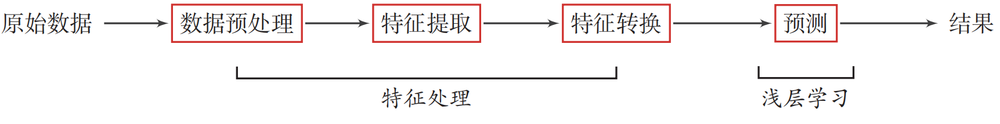
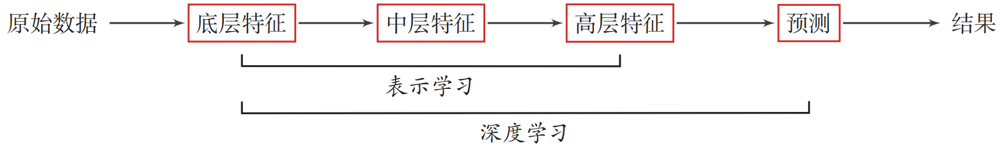
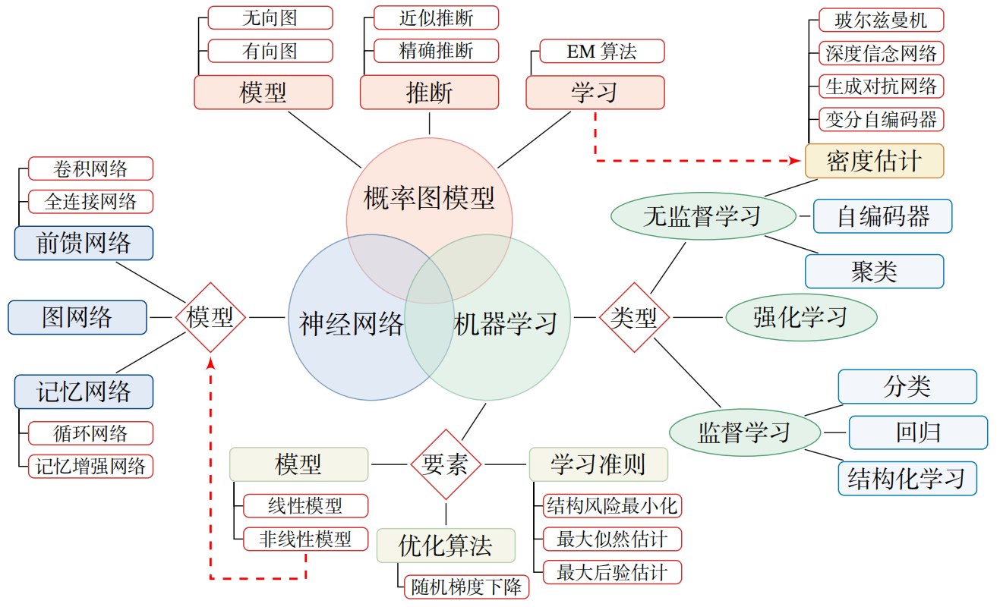
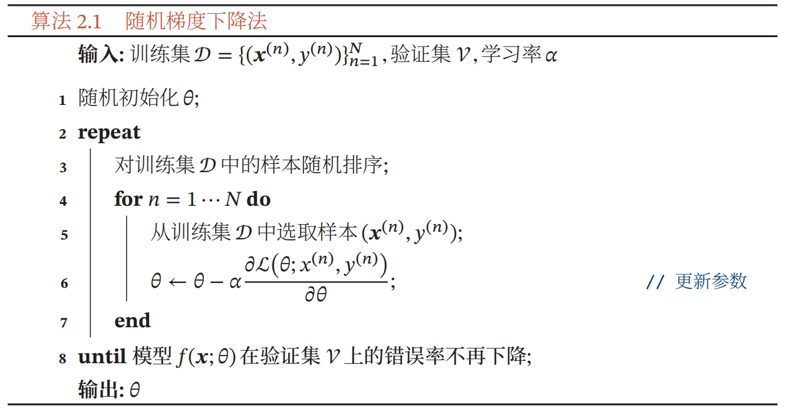

神经网络与深度学习读书笔记

# 机器学习基础

## 绪论

深度学习问题是一个机器学习问题，指从有限样例中通过算法总结出一般性的规律，并可以应用到新的未知数据上．比如，我们可以从一些历史病例的集合中总结出症状和疾病之间的规律．这样当有新的病人时，我们可以利用总结出来的规律，来判断这个病人得了什么疾病．

机器学习（Machine Learning，ML）是指从有限的观测数据中学习（或“猜测”）出具有一般性的规律，并利用这些规律对未知数据进行预测的方法.

在实际任务中使用机器学习模型一般会包含以下几个步骤

（1） 数据预处理：对数据的原始形式进行初步的数据清理（比如去掉一些有缺失特征的样本，或去掉一些冗余的数据特征等）和加工（对数值特征进行缩放和归一化等），并构建成可用于训练机器学习模型的数据集． 

（2） 特征提取：从数据的原始特征中提取一些对特定机器学习任务有用的高质量特征．比如在图像分类中提取边缘、尺度不变特征变换（Scale Invariant Feature Transform，SIFT）特征，在文本分类中去除停用词等． 

（3） 特征转换：对特征进行进一步的加工，比如降维和升维．降维包括特征抽取（Feature Extraction）和特征选择（Feature Selection）两种途径．常用的特征转换方法有主成分分析（Principal Components Analysis，PCA）、 线性判别分析（Linear Discriminant Analysis，LDA）等． 

（4） 预测：机器学习的核心部分，学习一个函数并进行预测．

    
	传统机器学习的数据处理流程

> 表示学习：学习一种好的高层语义表示

    
    深度学习的数据处理流程

> 深度学习：是将原始的数据特征通过多步的特征转换得到一种特征表示，并进一步输入到预测函数得到最终结果．和“浅层学习”不同，深度学习需要解决的关键问题是贡献度分配问题（Credit Assignment Problem，CAP）[Minsky,1961]，即一个系统中不同的组件（component）或其参数对最终系统输出结果的贡献或影响．而误差反向传播算法，从而可以比较好地解决贡献度分配问题.

> 端到端学习：端到端学习（End-to-End Learning），也称端到端训练，是指在学习过程中不进行分模块或分阶段训练，直接优化任务的总体目标

编程框架静态的和动态图的区别：[PaddlePaddle/fluid: 静态图 vs. 动态图 - 简书 (jianshu.com)](https://www.jianshu.com/p/744cfa2bcff4)

<b>总结</b>

在传统机器学习中，除了模型和学习算法外，特征或表示也是影
 响最终学习效果的重要因素，甚至在很多的任务上比算法更重要．因此，要开发一个实际的机器学习系统，人们往往需要花费大量的精力去尝试设计不同的特征以及特征组合，来提高最终的系统能力，这就是所谓的特征工程问题．

## 机器学习

机器学习（Machine Learning，ML）就是让计算机从数据中进行自动学习，得到某种知识（或规律）．作为一门学科，机器学习通常指一类问题以及解决这类问题的方法，即如何从观测数据（样本）中寻找规律，并利用学习到的规律（模型）对未知或无法观测的数据进行预测

### 基本概念

举例说明：我们从市场上随机选取一些芒果，列出每个芒果的特征（Feature），包括颜色、大小、形状、产地、品牌，以及我们需要预测的标签（Label）．标签可以是连续值（比如关于芒果的甜度、水分以及成熟度的综合打分），也可以是离散值（比如“好”“坏”两类标签）．这里，每个芒果的标签可以通过直接品尝来获得，也可以通过请一些经验丰富的专家来进行标记．

我们可以将一个标记好特征以及标签的芒果看作一个样本（Sample），也经常称为示例（Instance）．

通常用一个𝐷 维向量 $𝒙 = [𝑥1 , 𝑥2 , ⋯ , 𝑥𝐷]^T $表示一个芒果的所有特征构成的向量，称为特征向量（Feature Vector），其中每一维表示一个特征．而芒果的标签通常用标量 𝑦 来表示。

### 机器学习三要素

模型、学习准则、优化算法。模型不做记录了，主要记录学习准则和优化算法

#### 学习准则

一个好的模型 𝑓(𝒙, 𝜃∗) 应该在所有 (𝒙, 𝑦) 的可能取值上都与真实映射函数 𝑦 = 𝑔(𝒙) 一致，即

|𝑓(𝒙, 𝜃∗ ) − 𝑦| < 𝜖, ∀(𝒙, 𝑦) ∈ 𝒳 × 𝒴,

或与真实条件概率分布 $𝑝_𝑟 (𝑦|𝒙)$一致，即
$$
|𝑓_𝑦 (𝒙, 𝜃∗ ) − 𝑝_𝑟 (𝑦|𝒙)| < 𝜖, ∀(𝒙, 𝑦) ∈ 𝒳 × 𝒴,
$$
其中 𝜖 是一个很小的正数，$𝑓_𝑦 (𝒙, 𝜃∗)$ 为模型预测的条件概率分布中 𝑦 对应的概率.

模型 𝑓(𝒙; 𝜃) 的好坏可以通过期望风险（Expected Risk）ℛ(𝜃) 来衡量，其定义为
$$
R(𝜃) = 𝔼_{(𝒙,𝑦)∼𝑝_𝑟
(𝒙,𝑦)}[L(𝑦, 𝑓(𝒙; 𝜃))],
$$
其中 $𝑝_𝑟 (𝒙, 𝑦)$ 为真实的数据分布，L(𝑦, 𝑓(𝒙; 𝜃)) 为损失函数，用来量化两个变量之间的差异.

##### 常见损失函数

损失函数是一个非负实数函数，用来量化模型预测和真实标签之间的差异．

P27 页

##### 风险最小化准则

一个好的模型  𝑓(𝒙; 𝜃) 应当有一个比较小的期望错误，但由于不知道真实的数据分布和映射函数，实际上无法计算其期望风险  ℛ(𝜃)．给定一个训练集 $D={(𝒙(𝑛), 𝑦(𝑛))}^𝑁_{𝑛=1}$，我们可以计算的是经验风险（Empirical Risk），即在训练集上的平均损失：
$$
R_D^{𝑒𝑚𝑝}(𝜃) = \frac{1}{𝑁}∑^N_{𝑛=1}L(𝑦(𝑛), 𝑓(𝒙^{(𝑛)}; 𝜃))
$$
因此，一个切实可行的学习准则是找到一组参数𝜃∗ 使得经验风险最小，即
$$
𝜃^∗ = arg \ min_𝜃 R_D^{𝑒𝑚𝑝}(𝜃),
$$
这就是经验风险最小化（Empirical Risk Minimization，ERM）准则.

<b>过拟合</b>

根据大数定理可知，当训练集大小  |𝒟| 趋向于无穷大时，经验风险就趋向于期望风险．然而通常情况下，我们无法获取无限的训练样本，并且训练样本往往是真实数据的一个很小的子集或者包含一定的噪声数据，不能很好地反映全部数据的真实分布．经验风险最小化原则很容易导致模型在训练集上错误率很低，但是在未知数据上错误率很高．这就是所谓的过拟合（Overfitting）

> 定义– 过拟合
>
> 给定一个假设空间 ℱ，一个假设 𝑓 属于 ℱ，如果存在其他的假设 𝑓′ 也属于 ℱ, 使得在训练集上 𝑓 的损失比 𝑓′ 的损失小，但在整个样本空间上 𝑓′ 的损失比 𝑓 的损失小，那么就说假设
>
> 𝑓 过度拟合训练数据 [Mitchell, 1997]

过拟合问题往往是由于训练数据少和噪声以及模型能力强等原因造成的．为了解决过拟合问题，一般在经验风险最小化的基础上再引入参数的正则化（Regularization）来限制模型能力，使其不要过度地最小化经验风险．这种准则就是结构风险最小化（Structure Risk Minimization，SRM）准则
$$
𝜃^∗ = arg_𝜃 \ min R_D^{𝑠𝑡𝑟𝑢𝑐𝑡}(𝜃) \\
= arg_𝜃 \ min R_D^{emp}(𝜃) + \frac{1}{2} 𝜆‖𝜃‖^2 \\
= arg_𝜃 \ min \frac{1}{𝑁}∑^N_{𝑛=1}L(𝑦(𝑛), 𝑓(𝒙^{(𝑛)}; 𝜃))+ \frac{1}{2} 𝜆‖𝜃‖^2 
$$
其中 ‖𝜃‖ 是 ℓ2 范数的正则化项，用来减少参数空间，避免过拟合；𝜆 用来控制正则化的强度

正则化项也可以使用其他函数，比如 ℓ1 范数．ℓ1 范数的引入通常会使得参数有一定稀疏性，因此在很多算法中也经常使用． 从贝叶斯学习的角度来讲，正则化是引入了参数的先验分布，使其不完全依赖训练数据

<b>欠拟合</b>

欠拟合（Underfitting）是与过拟合相反的概念，即模型不能很好地拟合训练数据，在训练集上的错误率比较高．欠拟合一般是由于模型能力不足造成的

#### 优化算法

在确定了训练集 𝒟、假设空间 ℱ 以及学习准则后，如何找到最优的模型 $𝑓(𝒙, 𝜃^∗)$ 就成了一个最优化（Optimization）问题．机器学习的训练过程其实就是最优化问题的求解过程．

<b>梯度下降法</b>

首先初始化参数 $𝜃_0$，然后按下面的迭代公式来计算训练集 𝒟 上风险函数的最小值
$$
𝜃_{𝑡+1} = 𝜃_𝑡 − 𝛼\frac{𝜕R_d(𝜃)}{𝜕𝜃} \\
=𝜃_𝑡 − 𝛼 \frac{1}{𝑁} ∑^N_{𝑛=1}\frac{𝜕L(𝑦
^{(𝑛)}, 𝑓(^{𝒙(𝑛)}; 𝜃))}{𝜕𝜃 },
$$

其中 $𝜃_𝑡$ 为第 𝑡 次迭代时的参数值，𝛼 为搜索步长．在机器学习中，𝛼 一般称为学习率（Learning Rate）

<b>提前停止</b>

如果模型在验证集上的错误率不再下降（比如 2000 个 batch size 内错误率都不再下降），就停止迭代，这种策略叫提前停止。

<b>随机梯度下降法</b>

在梯度下降法中，目标函数是整个训练集上的风险函数，这种方式称为批量梯度下降法（Batch Gradient Descent，BGD）．批量梯度下降法在每次迭代时需要计算每个样本上损失函数的梯度并求和．当训练集中的样本数量 𝑁 很大时，空间复杂度比较高，每次迭代的计算开销也很大．

在机器学习中，我们假设每个样本都是独立同分布地从真实数据分布中随机抽取出来的，真正的优化目标是期望风险最小．批量梯度下降法相当于是从真实数据分布中采集 𝑁 个样本，并由它们计算出来的经验风险的梯度来近似期望风险的梯度．为了减少每次迭代的计算复杂度，我们也可以在每次迭代时只采集一个样本，计算这个样本损失函数的梯度并更新参数，即随机梯度下降法（Stochastic Gradient Descent，SGD）．当经过足够次数的迭代时，也可以收敛到局部最优解[Nemirovski et al., 2009]．

批量梯度下降和随机梯度下降之间的区别在于，每次迭代的优化目标是对所有样本的平均损失函数还是对单个样本的损失函数．由于随机梯度下降实现简单，收敛速度也非常快，因此使用非常广泛．随机梯度下降相当于在批量梯度下降的梯度上引入了随机噪声．在非凸优化问题中，随机梯度下降更容易逃离局部最优点．

<b>小批量随机梯度下降法</b>

随机梯度下降法的一个缺点是无法充分利用计算机的并行计算能力．小批量梯度下降法（Mini-Batch Gradient Descent）是批量梯度下降和随机梯度下降的折中．每次迭代时，我们随机选取一小部分训练样本来计算梯度并更新参数，这样既可以兼顾随机梯度下降法的优点，也可以提高训练效率．第 𝑡 次迭代时，随机选取一个包含 𝐾 个样本的子集 𝒮𝑡，计算这个子集上每个样本损失函数的梯度并进行平均，然后再进行参数更新
$$
𝜃_{𝑡+1} ← 𝜃_𝑡 − 𝛼\frac{1}{𝐾} ∑_{(𝒙,𝑦)∈S_𝑡}
\frac{𝜕L(𝑦, 𝑓(𝒙; 𝜃))}{𝜕𝜃} .
$$
在实际应用中，小批量随机梯度下降法有收敛快、计算开销小的优点，因此逐渐成为大规模的机器学习中的主要优化算法 [Bottou, 2010]．

### 理论和定理

#### PAC学习理论

#### 没有免费午餐定理

没有免费午餐定理（No Free Lunch Theorem，NFL）是由 Wolpert 和 Macerday 在最优化理论中提出的．没有免费午餐定理证明：对于基于迭代的最优化算法，不存在某种算法对所有问题（有限的搜索空间内）都有效．如果一个算法对某些问题有效，那么它一定在另外一些问题上比纯随机搜索算法更差．也就是说，不能脱离具体问题来谈论算法的优劣，任何算法都有局限性．必须要“具体问题具体分析”．

#### 奥卡姆剃刀原理

### 习题

> 为什么 MSE 不适合用在分类问题上

https://blog.csdn.net/u013385018/article/details/115355701

1️⃣从损失函数公式的物理含义来说

> MSE 衡量的是预测值和目标值的欧式距离。

而交叉熵是一个信息论的概念，交叉熵能够衡量同一个随机变量中的两个不同概率分布的差异程度，在机器学习中就表示为真实概率分布与预测概率分布之间的差异。交叉熵的值越小，模型预测效果就越好。

所以交叉熵本质上是概率问题，表征真实概率分布与预测概率分布差异，和几何上的欧氏距离无关，在回归中才有欧氏距离的说法，

而在分类问题中label的值大小在欧氏空间中是没有意义的。所以分类问题不能用mse作为损失函数。

> 强行使用的话，可能带来的后果

MSE（均方误差）对于每一个输出的结果都非常看重(让正确分类变大的同时，也让错误分类变得平均)，而交叉熵只对正确分类的结果看重。

例如：在一个三分类模型中，模型的输出结果为（a,b,c)，而真实的输出结果为 (1,0,0)，那么 MSE 与 cross-entropy 相对应的损失函数的值如下：

MSE：
$$
c=(a-1)^2+(b-0)^2+(c-0)^2=(a-1)^2+b^2+c^2
$$
cross-entropy：
$$
c=(-1)log(a) - 0log(b)+0log(c)=-log(a)
$$

从上述的公式可以看出，交叉熵的损失函数只和分类正确的预测结果有关系，而 MSE 的损失函数还和错误的分类有关系，该分类函数除了让正确的分类尽量变大，还会让错误的分类变得平均，但实际在分类问题中这个调整是没有必要的。但是对于回归问题来说，这样的考虑就显得很重要了。所以，回归问题熵使用交叉上并不合适。

2️⃣从优化求解角度来说

> 非凸有多个极值点，不合适做损失函数

分类问题是逻辑回归，必须有激活函数这个非线性单元在，比如sigmoid（也可以是其他非线性激活函数），而如果还用 mse 做损失函数的话：

mse 已经是非凸函数了，有多个极值点，所以不适用做损失函数了。

> 求解过程中可能梯度消失(不是主要原因)

mse 作为损失函数，求导的时候都会有对激活函数的求导连乘运算，对于 sigmoid、tanh，有很大区域导数为 0 的。

该激活函数的输入很可能直接就在平坦区域，那么导数就几乎是0，梯度就几乎不会被反向传递，梯度直接消失了。所以 mse 做损失函数的时候最后一层不能用 sigmoid 做激活函数，其他层可以用 sigmoid 做激活函数。

当然，用其他损失函数只能保证在第一步不会直接死掉，反向传播如果激活函数和归一化做得不好，同样会梯度消失。所以从梯度这个原因说 mse 不好不是很正确。

