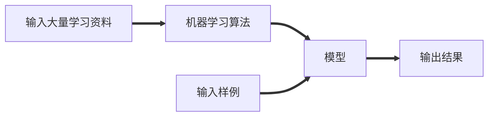
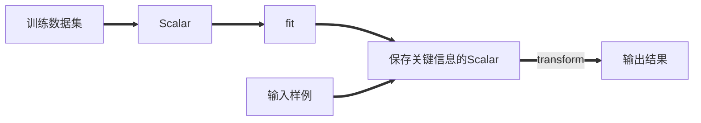

# 一、机器学习基础

## 实用工具

> 数据标注工具

库：`labelimg`

> 采用的文件格式

- `xml`
- `json`
- `yaml`

> 均值滤波器

- 存在边缘模糊的情况
- 适用于处理随机噪声

> `sklearn`官网

<a href="https://scikit-learn.org/stable/">sklearn官网</a>

> **按可解决的问题**

## 分类问题

- 二分类问题：是xx，不是xx；两种情况
- 多分类问题：多种情况可供选择
- 多标签分类：

一些算法只支持完成二分类的任务

但是多分类的任务可以转换为二分类的任务

有一些算法天然可以完成多分类任务

## 回归任务

> 结果是一个连续数字的值，而非一个列表

如房屋价格；市场分析；学生成绩；股票价格

有些算法只能解决回归问题

有些算法只能解决分类问题

有一些算法的思路既能解决回归问题，又能解决分类问题。

一些情况，回归任务可以简化为分类任务

> **机器学习算法分类**

## 监督学习

> 机器的训练数据拥有标记或答案

## 非监督学习

> 对没有标记的数据进行分类 - 聚类分析

- 对数据进行降维处理，方便可视化。
- 特征提取：信用卡的信用评级和人的胖瘦无关？
- 特征压缩：`PCA`

可用来对异常数据进行检测。

## 半监督学习

> 一部分数据有标记或答案，另一部分数据没有

各种原因产生的标记缺失。

通常先使用无监督学习手段对数据做处理，之后使用监督学习手段做模型的训练和预测。

## 增强学习

> 根据周围环境的情况，采取行动，根据采取行动的结果，学习行动方式。

- 无人驾驶
- 机器人

监督学习和半监督学习是基础！

> **从其他维度看机器学习的分类方式**

## 在线学习和批量学习（离线学习）

**批量学习**：只用当时输入的学习资料进行学习，之后的使用，该算法模型都不会变化。

优点：简单

问题：如何适应环境变化

解决方案：定时重新批量学习

缺点：每次重新批量学习，运算量巨大；在某些环境变化非常快的情况下，甚至不可能。

----

**在线学习**：输入的样例以学习资料的形式迭代进学习算法中，还在不断训练算法。

优点：及时反映新的环境变化

问题：新的数据带来不好的变化？

解决方案：需要加强对数据进行监控

其他：也适用于数据量巨大，完全无法批量学习的环境。

## 参数学习和非参数学习

**参数学习**：一旦学到了参数，就不再需要原有的数据集。

如通过学习，得到了一个方程，将x带入就可以得到y了。

**非参数学习**：不对模型进行过多假设；非参数不等于没参数！

## 哲学思考

没有免费的午餐定理：可以严格地数学推导出，任意两个算法，他们的期望性能是相同的！

具体到某个特定问题，有些算法可能更好。

但是没有一种算法，绝对比另一种算法好。

脱离具体问题，谈那个算法好是没有意义的。

在面对一个具体问题的时候，尝试使用更多种算法进行对比实验，是必要的。

## 环境搭建

- 安装anaconda
- 直接在`cmd`下输入”`jupyter notebook`”,系统将自动弹出notebook窗口。【我之前安装过】
- 如果选择其他盘的话，先进入xx盘，再执行命令！

使用的主要三方库

`numpy；matplotlib；sklearn；pandas`

# 二、基本`API`/工具使用

## Jupyter的使用

Run cells 运行代码

添加单元格 a，向前添加；b，向后添加；光标要蓝色的时候哦！

按m变成markdown语法，按y变成code；也要在蓝色光标下哦！

## Jupyter魔法命令

- `%run py`文件的目录，将该python文件加载进了`jupyter notebook`

- `%timeit` 后面接语句

  - `%timeit L = [i**2 for i in range(1000)]` 测试一句话的运行效率

  - `%%time` 程序段；测试一段程序的效率

    ```python
    %%timeit
    L = []
    for n in range(1000):
        L.append(n**2)
    ```

- `%time L = [i**2 for i in range(1000)]` 测试一句话的运行效率，只测了一次！

- 其他魔法命令 `%lsmagic`

- %run?

  - 看run的命令文档

## numpy的基本使用

### numpy.array基础

> **生成array对象**

```python
# 查看版本
numpy.__version__
# python的list是一个对类型不做具体限定的；list种每个元素可以是不同元素；缺点是效率低，对于每个元素都要检测是什么类型。
# array则元素类型要统一
import array
arr = array.array('i',[i for i in range(10)])
# output array('i',[0,1,2,3,4,5,6,7,8,9])

# numpy.array
nparr = np.array([i for i in range(10)])
# output array([0,1,2,3,4,5,6,7,8,9])
```

> **查看array中的元素类型**

```python
# 且array中的类型要一致
nparr.dtype # 查看类型，会有隐式的类型转换
```

> **创建指定值和形状的矩阵**

```python
# 创建大小为10的全是0的数组；默认是float64
np.zeros(10)

# 创建int类型
np.zeros(10,dtype=int)

# 创建三行五列，值为0的矩阵
np.zeos((3,5))
np.zeros(shape=(3,5),dtype=int)

# 创建元素全为1的
np.ones(10)

# 创建三行五列；元素全为1
np.ones(shape=(3,5))

# 创建为指定值的,若fill_value=666.0则为浮点型
np.full(shape=(3,5),fill_value=666)
```

>**按步长创建array**

```python
# arange
# 创建0-20且步长为2的一个列表
[i for i in range(0,20,2)]
# 意思同上，不过步长可为浮点数
np.arange(0,20,2)

#linspace
# 从0-20截取 10个数构成等差数列 范围[0-20]
np.inspace(0,20,10)
```

> **用随机数创建array对象**

```python


#random
# 生成一个0-10的随机数；不包括10
np.random.randint(0,10)
# 生成 10 个4-8的随机数
np.random.randint(4,8,size=10)
# 生成一个3*5的矩阵
np.random.randint(4,8,size=(3,5))

# 设置随机种子
np.random.seed(666)
# 这样生成的随机数就是一样的了

# 生成浮点数,默认是0-1，不包括1
np.random.random(10)
```

> **创建符合正态分布的array**

```python
# 生成符合正态分布的浮点数
np.random.normal()
# 生成均值为10，方差为100的随机数
np.random.normal(10,100)
# 指定shape
np.random.normal(10,100,(3,5))
```

> **查看文档，查阅用法**

```python
# 查看对应方法的文档
np.random.normal?
```

> **array的基本属性**

```python
# 15个元素，并reshape为3*5的矩阵
x = np.arange(15).reshape(3,5)

# 维数，几维数组
x.ndim

# 形状，返回的是元组
x.shape

# 元素数目
x.size
```

> **array的数据访问**

```python
x[0][0] # 不推荐
x[2,2] # 推荐
x[0:5] # 切片 从0-5，不包括5
x[5:] # 从5到最后
x[::2] # 开始到结尾 步长为2
x[::-1] # 倒序访问
x[:2,:3] # 前两行，前三列
x[:2,::2] # 前两行，列步长为2
x[::-1,::-1] # 全部访问
x[:,0] # 取所有行，每列只取索引为0的

python的list创建的切片是一个新的矩阵！但是在numpy中切片用的是矩阵！
# 创建不相关的矩阵
subX = x[:2,:3].copy()
```

> **array的Reshape**

```python
# 变成2*5的矩阵，但是x本身不会改变
A = x.reshape(2,5)

# x=[0,1,2,3,4,5]变成 6行，每行只有一列的数据;x是不会改变的哦 -1表示列数有函数自己处理
A = x.reshape(6,-1)
```

> **array的合并操作**

```python
x = np.array([1,2,3,4])
y = np.array([4,3,2,1])
A = np.concatenate([x,y])
print(A)
#output: [1 2 3 4 4 3 2 1]

# 按列拼接
print(np.concatenate([A,A],axis=1))
"""
[[1 2 3 1 2 3]
 [4 5 6 4 5 6]]
"""

# 不同维度拼接
z = np.array([i for i in range(5)])
a = np.full(shape=(3,5),fill_value=5)
np.concatenate([a,z.reshape(1,-2)])
"""
array([[5, 5, 5, 5, 5],
       [5, 5, 5, 5, 5],
       [5, 5, 5, 5, 5],
       [0, 1, 2, 3, 4]])
"""
# 垂直叠加 （行顺序） vertical 垂直
np.vstack([a,z])
# 水平叠加 （列顺序） horizontal 水平
np.hstack([x,y])
```

> **array的分割操作**

```python
x = np.array([2,35,345,23,345,56,123,445,66,778,89])
# 切成3段
x1,x2,x3 = np.split(x,[3,7])
# x1 = [  2  35 345]
# x2 = [ 23 345  56 123]
# x3 = [445  66 778  89]
```

```python
A = np.arange(16).reshape(4,4)
# 以索引2为点，进行分割
A1,A2 = np.split(A,[2])
print(A1)
"""
默认以行为维度
[[0 1 2 3]
 [4 5 6 7]]
"""
# axis 默认为0，以行；axis = 1 以列
A1,A2 = np.split(A,[2]，axis=1)
```

```python
# 垂直叠加 （行顺序）
up,down = np.vsplit(A,[2])
# 水平叠加 （列顺序）
left,right = np.hsplit(A,[2])
```

### array的运算

> 不同于list，它支持直接加减乘除

```python
A = np.arange(16).reshape(4,4)
A+3
array([[ 3,  4,  5,  6],
       [ 7,  8,  9, 10],
       [11, 12, 13, 14],
       [15, 16, 17, 18]])
# 求3的x次方
np.power(3,x)
# 以e为底
np.log(x)
# 以2为底
np.log2(x)
```

> **矩阵运算**

```python
# 矩阵A*B的结果
A.dot(B)
# 求转置
A.T
# 
```

> **向量和矩阵的运算**

```python
v = np.array([1,2])
A = ([[0,1],
      [2,3]])
v + A
array([[1,2],
       [3,4]])
# 这样计算不合理，可以先把向量填充成矩阵哦！
np.vstack([v] * A.shape[0])
# shape[0] 多少行，shape[1] 多少列
np.vstack([v]*A.shape[0]) + A
# v的行向量堆叠2次，列向量堆叠1次
np.tile(v,(2,1))
"""
v = [1,2]
A = [[0,1],
	[2,3]]
"""
v.dot(A)
[1,2] * [0,1],  = [4,7]
		[2,3]
# output [4,7]

# 会自动判别那个乘法符合
A.dot(v)
[0,1], * [1] = [2]
[2,3]	 [2]   [8]
```

> **矩阵的逆**

```python
np.linalg.inv(A)
```

> **伪逆矩阵**

```python
pinvX = np.linalg.pinv(x)# x是8*2的矩阵
```

### 聚合操作

> 一组值变成一个值

```python
L是np创建的矩阵
np.sum(L)
# axis=0代表行，沿着行这个维度进行计算
np.sum(x,axis=0)
# axis=1代表列，沿着列这个维度进行计算
np.sum(x,axis=1)

# x中所有元素的乘积
np.prod(x)
# x中所有元素+1 然后再计算乘积
np.prod(x+1)
# 平均值
np.mean(x)
# 中位数
np.median(x)
# 求百分位
np.percentile(x,q=50)
# 求方差
np.var(x)
# 求标准差
x = np.std(x)
```

### arg运算

```python
# x中最小数所在的索引
np.argmin(x)
# 同理xxx
np.argmax(x)
```

> **排序和索引**

```python
x = np.arange(16)
np.random.shuffle(x)
# 返回一个排好序的数组
np.sort(x)
# 对数组本身进行排序
x.sort()

# 对二维数组而言，是对每一行中的元素进行排序
np.sort(mirx,axis=0)
np.sort(mirx,axis=1)

# 排序后返回所有元素的索引位置
np.argsort(x)
```

```python
# 大于3的放左边，小于三的放右边
np.partition(x,3)
# 返回的是索引
np.argpartition(x,3)
# 按x还是y进行排序
np.argsort(x,axis=1)
```

### 比较和`fancyindex`

```python
index = [3,5,8]
list = [i**2 for i in range(100)]
list = np.array(list)
# 访问索引为 3 5 8的元素
list[index]
```

```python
row = np.array([0,1,2])
col = np.array([0,1,2])
x = np.array([i for i in range(16)]).reshape(4,4)
# 得到了[0,0] [1,1] [2,2]位置的数据
x[row,col]
```

> **存放布尔值的数组**

```python
col = [True,True,False,False]
# 意思时x坐标满足切片1:3,y取值为Treu表示对该数据感兴趣
x[1:3,col]
"""
array([[4, 5],
       [8, 9]])
"""
```

> **大小比较**

```python
x = np.array([1,2,3,4,5,56,7,8])
# 把x中所有的元素与3比较，得到一个布尔数组
x<3 
```

> **统计非0个数**

```python
np.count_nonzero(x)
```

> **是否有0**

```python
np.any(x==0)
```

> **是所有元素都符合条件【为True】**

```python
np.all(x>0)
# 沿着列的方向，看每一行是否都大于0
np.all(x>0,axis=1)
```

> **统计符合要求的元素**

```python
np.sum(x%2,axis=0)
# 不是&&，使用的是位运算。我们需要的是对应索引的元素的比较。索引为1的，看它是否大于3小于10
np.sum( (x>3) & (x<10) )
np.sum( (x%2==0) | (x>10) )
np.sum( ~(x==0) )
```

> **布尔数组作为索引**

```python
x[x<5]
x[x%2==0]
```

# `matplotlib`

> **基本使用**

```python
import matplotlib.pyplot as mpl
import numpy as np
line = np.linspace(1,50,200)
value = np.sin(line)
# 绘制折线图
mpl.plot(line,value)
mpl.show()
```

> **一个表绘制多个图**

```python
mpl.plot(line,value1)
mpl.plot(line,value2)
```

> **改变颜色和线条样式**

```
'b'	蓝色
'g'	绿色
'r'	红色
'c'	青色
'm'	品红色
'y'	黄色
'k'	黑色
'w'	白色
```

----

```
'-'	实线样式
'--'	短横线样式
'-.'	点划线样式
':'	虚线样式
```

> **限制坐标轴范围**

```python
mpl.plot(line,value1)
mpl.plot(line,value2)
mpl.xlim(0,15)
# x范围-11~11 y范围 -2~11
# mpl.axis([-1,11,-2,11])
mpl.show()
```

> **设置x，y的`lable`**

```python
mpl.plot(line,value1)
mpl.plot(line,value2)
mpl.xlable("x xxx")
# 加上图示
mpl.legend()
# 加上标题
mpl.title("welcome to the ml world!")
mpl.show()
```

> **绘制散点图**

```python
# 一般二维特征用散点图
mpl.scatter(x,sinx)
plt.show()
```

> **绘制标准正态分布散点图**

```python
import matplotlib.pyplot as plt
import numpy as np
x = np.random.normal(0,1,1000)
y = np.random.normal(0,1,1000)
# 设置半透明
plt.scatter(x,y,alpha=0.5)
plt.legend()
plt.xlabel('x axis')
plt.ylabel('y axis')
```

## 数据加载

```python
import numpy as np
import matplotlib.pyplot as plt
from sklearn import datasets

iris = datasets.load_iris()
iris.keys()
# output dict_keys(['data', 'target', 'target_names', 'DESCR', 'feature_names', 'filename'])

# 数据集描述
iris.DESCR
# 数据集特征的名称
iris.feature_names
# 数据集的标记
iris.target
iris.target.shape
# 数据集标记的含义
iris.target_names

x = iris.data[:,:2]
plt.scatter(x[:,0],x[:,1])

y = iris.target
# 绘制散点图
# 筛选出符合y==0的xxx
plt.scatter(x[y==0,0],x[y==0,1],color='red')
plt.scatter(x[y==1,0],x[y==1,1],color='blue',marker='+')
plt.scatter(x[y==2,0],x[y==2,1],color='black')
```

# 四、`KNN`算法

回顾：什么是机器学习



> **K近邻算法**

- 计算欧式距离，并存入数组
- 将距离数组进行排序，并得到排序后的索引数组
- 求距离样本最近的K个点
- 统计这k个点中，什么类别最多
- 该类别就是分类结果

`KNN`算法非常特殊，可认为是没有模型的算法

为了和其他算法统一，可以认为训练数据集就是模型本身！

## 手写`KNN`

```python
import numpy as np
import matplotlib.pyplot as plt
from math import sqrt
from collections import Counter

# 数据集
raw_data_x = [
             [3.3333,2.3333],
             [3.1111,1.1781],
             [1.3456,3.3686],
             [3.5822,4.6791],
             [2.2800,2.8666],
             [7.4234,4.6965],
             [5.7450,3.5339],
             [9.1711,2.5111],
             [7.7927,3.4240],
             [7.9398,0.7916]
            ]
# 数据集对应的标记
raw_data_y = [0,0,0,0,0,1,1,1,1,1]

#转为numpy的array对象 方便计算
x_train = np.array(raw_data_x)
y_train = np.array(raw_data_y)

# 绘制散点图预览数据
# numpy的布尔切片
plt.scatter(x_train[y_train==0,0],x_train[y_train==0,1],color='g')
plt.scatter(x_train[y_train==1,0],x_train[y_train==1,1],color='r')
plt.show();

# 待分类的点
wait = np.array([8.997,3.456])
# 存储计算出的欧式距离
distance = []

for x in x_train:
    # 求每个二维向量的欧式距离
    # 相当于 [(x[0]-wait[0])^2 +(x[1]-wait[1])^2]^(1/2)
    d = sqrt(np.sum((x-wait)**2))
    distance.append(d)
# 列表生成式的写法 可替代上面的for循环
# distance=[sqrt(np.sum((x-wait)**2)) for x in x_train]
# 距离wati从近到远的点
nearest = np.argsort(distance)

# 对distance进行排序，并返回原序列的索引 
# 排序规则：距离wati从近到远的点
nearest = np.argsort(distance)
# 假设KNN中的K为6
k = 6
# 求距离wait最近的6个点
topK_y = [y_train[i] for i in nearest[:k]]
# 统计相同值出现的次数
votes = Counter(topK_y)
# 查看频次前x的几个
votes.most_common(1) # [(1, 5)]
# 存储预测结果
predict_y = votes.most_common(1)[0][0]
```

## `sklearn`的`knn`

```python
from sklearn.neighbors import KNeighborsClassifier
import numpy as np
knn = KNeighborsClassifier(n_neighbors=6)

# 初始数据
row_x_data = [
             [3.3333,2.3333],
             [3.1111,1.1781],
             [1.3456,3.3686],
             [3.5822,4.6791],
             [2.2800,2.8666],
             [7.4234,4.6965],
             [5.7450,3.5339],
             [9.1711,2.5111],
             [7.7927,3.4240],
             [7.9398,0.7916]
            ]
row_y_data = [0,0,0,0,0,1,1,1,1,1]

# 处理数据
x_train = np.array(row_x_data)
y_train = np.array(row_y_data)
# 待分类数据 sklearn要求传入矩阵我们把向量改成矩阵 -1表示有函数自己决定列数
wait = np.array([8.997,3.456]).reshape(1,-1)
# 训练算法
knn.fit(x_train,y_train)
# 得到预测结果
knn.predict(wait)
```

## 模仿`sklearn`封装`KNN`

```python
import numpy as np
from math import sqrt
from collections import Counter
from .metrics import accuracy_score

class KNNClassifier:

    def __init__(self, k):
        """初始化kNN分类器"""
        assert k >= 1, "k must be valid"
        self.k = k
        self._X_train = None
        self._y_train = None

    def fit(self, X_train, y_train):
        """根据训练数据集X_train和y_train训练kNN分类器"""
        assert X_train.shape[0] == y_train.shape[0], \
            "the size of X_train must be equal to the size of y_train"
        assert self.k <= X_train.shape[0], \
            "the size of X_train must be at least k."

        self._X_train = X_train
        self._y_train = y_train
        return self

    def predict(self, X_predict):
        """给定待预测数据集X_predict，返回表示X_predict的结果向量"""
        assert self._X_train is not None and self._y_train is not None, \
                "must fit before predict!"
        assert X_predict.shape[1] == self._X_train.shape[1], \
                "the feature number of X_predict must be equal to X_train"

        y_predict = [self._predict(x) for x in X_predict]
        return np.array(y_predict)

    def _predict(self, x):
        """给定单个待预测数据x，返回x的预测结果值"""
        assert x.shape[0] == self._X_train.shape[1], \
            "the feature number of x must be equal to X_train"

        distances = [sqrt(np.sum((x_train - x) ** 2))
                     for x_train in self._X_train]
        nearest = np.argsort(distances)

        topK_y = [self._y_train[i] for i in nearest[:self.k]]
        votes = Counter(topK_y)

        return votes.most_common(1)[0][0]

    def score(self, X_test, y_test):
        """根据测试数据集 X_test 和 y_test 确定当前模型的准确度"""
        y_predict = self.predict(X_test)
        return accuracy_score(y_test, y_predict)

    def __repr__(self):
        return "KNN(k=%d)" % self.k
```

# 五、算法性能

## 判断算法性能

我们需要判断算法的性能，所以需要对训练的数据集进行进一步的划分。

- 可划分了train set 和 validation set. 
- 进行随机划分，比例一般为`9:1`或者`8:2`或者`7:3`

`sklearn`采用的数据集和package

- `from sklearn datasets`
- `from sklearn.neighbords import KNeighborsClassifier`

训练数据和测试数据的划分。

```python
import numpy as np
import matplotlib.pyplot as plt
from sklearn import datasets
from sklearn.neighbors import KNeighborsClassifier

# 加载数据集
iris = datasets.load_iris()
# 获得数据和标记
x = iris.data
y = iris.target

# 将数据集中的索引随机排列，方便划分训练集和测试集
shuffle_index = np.random.permutation(len(x))

# 设置测试集的比例
test_ration = 0.2
test_size = int(len(x)*test_ration)

# 得到划分的索引
test_index = shuffle_index[:test_size]
train_index = shuffle_index[test_size:]

# 用索引进行切片，获得数据
x_train = x[train_index] # 原始数据
y_train = y[train_index] # 原始数对应的label
x_test = x[test_index]
y_test = y[test_index]

knn = KNeighborsClassifier(n_neighbors=6)
knn.fit(x_train,y_train)
y_predict = knn.predict(x_test)
# 统计预测值符合真实值的比例
np.sum(y_predict==y_test)/len(y_test)
```

## sklearn`的划分

```python
from sklearn.model_selection import train_test_split
# test_size 测试集所占的比例  random_state是随机数种子
x_train,x_test,y_train,y_test = train_test_split(x,y,test_size=0.2,random_state=666)
```

## 分类的准确度

测试集中的结果与期望结果的对比，并统计符合预期的结果，把符合预期的结果/总的测试结果。

简而言之：符合预期/总数

> **`sklearn`中的划分**

```python
from sklearn.metrics import accuracy_score
# y_pretice是预测的结果 y_test是测试集的正确结果 顺序无所谓！
accuracy_score(y_pretice,y_test)
```

## 超参数和模型参数

超参数：在算法运行前需要决定的参数

模型参数：算法过程中学习的参数

KNN没有模型参数，只有超参数

一般我们调参，调的是超参数~

**寻找好的参数**

一般通过如下的知识进行寻找

- 领域知识
- 经验数值
- 实验搜索

> **KNN如何寻找最好的K？**

循环测试，找到最好的K，如果K在搜索范围的边缘取得最好值，则需要考虑扩大搜索范围。

> **KNN有什么超参数？**

- K的取值。

- distance的权重，一般情況是取distance的倒数。

- 默认使用的欧式距离，可以考虑使用其他距离，如曼哈顿距离，明可夫斯基距离。相当于我们又获得了一个超参数P.

  $明可夫斯距离 (\sum|X_i^{(a)}-X_i^{(b)}|^p)^{\frac{1}{p}}$

我们自己测试使用的是for循环（网格搜索），`sklearn`为我们封装了网格搜索。

更多的距离定义

- 向量空间余弦相似度Cosine Similarity
- 调整余弦相似度 Adjusted Cosine Similarity
- 皮尔森相关系数 Pearson Correlation Coefficient
- `Jaccard`相似系数 `Jaccard` Coefficient

`sklearn`的metric可以指定使用何种距离，具体可以看官方文档~~

### `sklearn`的网格搜索

<a href="https://scikit-learn.org/stable/modules/generated/sklearn.model_selection.GridSearchCV.html?highlight=grid#sklearn.model_selection.GridSearchCV">API链接</a>

```python
param_grid = [
    {
        'weights':['uniform'],
        'n_neighbors':[i for i in range(1,11)]
    },
    {
        'weights':['distance'],
        'n_neighbors':[i for i in range(1,11)],
        'p':[i for i in range(1,6)]
    }
]

knn = KNeighborsClassifier()
from sklearn.modle_selection import GridSearchCV
# n_jobs 意思时计算机中用几个核去跑
grid_search = GridSearchCV(knn, param_grid, n_jobs = 2)

grid_search.best_params_ #[使用的交叉验证获得的最合适的超参数]
best_knn = grid_search.best_estimator_  #[返回最合适的分类器]

```

## 数据归一化

> **将所有数据映射到同一尺度**

> **为什么要进行归一化/标准化。**

- 特征的单位或者大小相差较大，或者某特征的方差比其他的特征要大出几个数量级，容易影响目标结果，使得一些算法无法学习到其他的特征。
- 比如：有三个条件，同等重要，但是数量级不同，则进行归一化/标注化【理科，文科排名比较，标准分】。

> **例子说明：**

| .      | 肿瘤大小（厘米） | 发现时间（天） |
| ------ | ---------------- | -------------- |
| 样本一 | 1                | 200            |
| 样本二 | 5                | 100            |

这些值之间的差距过大，计算的话很不友好，值被发现天数所主导。我们可以将其进行归一化处理~

200天 = 0.55年；100天 = 0.27年；这样数据又被肿瘤大小主导；因此我们要把数据进行归一化处理。把所有数据映射到同一尺度~

**最值归一化**[normalization]：把所有数据映射到0-1之间

$X_scale = \frac{X-X_{min}}{X_{max}-X_{min}}$

<span style="color:green">适用于分布有明显边界的情况；</span>==但是受`outlier`影响较大，极端值会影响结果！==

`eg：`多数人的收入是5000~10000，个别人收入是100w+，那么使用最值归一化就显得很不合理了。我们期望的是数据的分布尽量均匀

对于每一个特征，求出他的最大值最小值。由于每个样本的特征值是一行一行存储的，所以每种特征的最大值是要按列进行筛选的！


**均值方差归一化**[standardization]：把所有数据归一到均值为0方差为1的分布中

$X_{scale} = \frac{X-X_{mean}}{S}$

适用于数据分布没有明显边界；有可能存在极端数据值，但由于数据量大，个别极端数据带来的影响可忽略不记。

> **Coding**

```python
import numpy as np
import matplotlib.pyplot as plt


def test1():
    # 50条数据，每条数据2种特征。
    x = np.random.randint(low=0, high=100, size=50)
    x = np.array(x, dtype=float)
    x_nor = (x - np.min(x)) / (np.max(x) - np.min(x))
    print(x_nor)


def test2():
    # 50条数据，每条数据2种特征。我们要对每一维特征分别进行归一化处理
    x = np.random.randint(low=0, high=100, size=(50, 2))
    x = np.array(x, dtype=float)
    # 实话实说，计算过程很容易乱
    for i in range(x.shape[1]):
        x[:, i] = (x[:, i] - np.min(x[:, i])) / (np.max(x[:, i]) - np.min(x[:, i]))
    print(f"第0列 mean is {np.mean(x[:, 0])} std is {np.std(x[:, 0])}")
    print(f"第1列 mean is {np.mean(x[:, 1])} std is {np.std(x[:, 0])}")
    plt.figure()
    plt.scatter(x[:, 0], x[:, 1], c='r')
    plt.show()


"""均值方差归一化"""


def test3():
    x = np.random.randint(low=0, high=100, size=(500, 2))
    x = np.array(x, dtype=float)
    for i in range(x.shape[1]):
        x[:, i] = (x[:, i] - np.mean(x[:, i])) / np.std(x[:, i])
    print(f"第0列 mean is {np.mean(x[:, 0])} std is {np.std(x[:, 0])}")
    print(f"第1列 mean is {np.mean(x[:, 1])} std is {np.std(x[:, 0])}")
    plt.figure()
    plt.scatter(x[:, 0], x[:, 1], c='r')
    plt.show()

if __name__ == '__main__':
    test3()
```

> **`sklearn`中的数据归一化处理**

对测试数据集如何归一化？

训练数据：mean_train, std_train

测试数据：很难得到测试的mean和std，所以测试数据集的归一化处理是使用mean_train和std_train而不是算测试的mean和std。

原因：

- 测试数据是模拟真实环境
  - 真实环境很有可能无法得到所有测试数据的均值和方差
  - 对数据的归一化也是算法的一部分

我们需要保存训练数据集得到的均值和方差



**总结**

- 对于<span style="color:green">**最值归一化**</span>：如果出现异常点，影响了最大值最小值，那么结果显然会发生改变。
- 对于**<span style="color:green">均值方差归一</span>**：如果出现异常点，由于具有一定数据量，少量的异常点对平均值的影响并不大，从而方差改变较小。

# 六、`KNN`及ML流程总结

`KNN`可解决分类问题，且天然可解决多分类问题，思想简单，效果强大。

- `KNN`最大的缺点是效率低下。若训练集中有m个样本，n个特征，则预测每一个新数据需要$O(m*n)$

  可采用树结构就行优化：`KD-Tree`，`Ball-Tree`

- 高度数据相关

- 预测结果不具有可解释性

- 维数灾难

  随着维度的增加，看似相近的两个点之间的距离越来越大

  可用降维的方法解决。【`PCA`】

流程回顾图：视频截图哦~

# 六、线性回归算法

## 概述

- 解决回归问题
- 思想简单，实现容易
- 许多强大的非线性模型的基础
- 结果具有很好的可解释性
- 蕴含机器学习中的很多重要思想

## 简单线性回归

样本特征只有一个，称为简单线性回归~

### 理论讲解

 使差距（损失Loss）尽量小

目标：找到a和b，使得$\sum_{i=1}^{m}{(y^{(i)}-ax^{(i)}-b)^2}$尽可能小，我们称之为损失函数（loss function），如果是度量拟合程度，我们称之为效用函数（utility function）

通过分析问题，确定问题的损失函数或者效用函数；

通过最优化损失函数或者效用函数，获得机器学习的模型。

近乎所有参数学习算法都是这样的套路~

- 线性回归~
- 多项式回归~
- 逻辑回归~
- `SVM~`
- 神经网络~
- 最优化原理~
- 凸优化~

目标：找到a和b，使得$\sum_{i=1}^{m}{(y^{(i)}-ax^{(i)}-b)^2}$尽可能小

典型的最小二乘法问题：最小化误差的平方

$a = \frac{\sum_{i=1}^m(x^{(i)}-\overline{x})(y^{(i)}*\overline{y})}{\sum_{i=1}^m(x^{(i)}-\overline{x})^2}$

$b = \overline{y} - a\overline{x}$

注意哦，a和b是未知数，我们要求a和b。

### 代码实现

#### 简陋版

```python
import numpy as np
import matplotlib.pyplot as plt

# fake data
x = np.array([1., 2., 3., 4., 5.])
y = np.array([1., 3., 2., 3., 5.])


def show():
    plt.figure()
    plt.scatter(x, y, c='g')
    plt.show()

"""知道公式，求解a和b的值~ 强力的理论支撑"""
def test1():
    x_mean = np.mean(x)
    y_mean = np.mean(y)
    num = 0.0
    d = 0.0
    for x_i, y_i in zip(x, y):
        num += (x_i - x_mean) * (y_i - y_mean)
        d += (x_i - x_mean) ** 2
    # 求解出a 和 b
    a = num / d
    b = y_mean - a * x_mean
    # 用求解出的a和b 求出 y_hat (预测值)
    y_hat = a * x + b
    plt.figure()
    plt.scatter(x, y, c='g') 
    plt.plot(x, y_hat, c='r')
    plt.show()

if __name__ == '__main__':
    test1()
```

### 向量化运算

将$\sum(x^{(i)}-\overline x)$用向量表示；$\sum(y^{(i)}-\overline y)$用向量表示，利用`np`的向量运算快速实现运算。速度得到了极大的提升！！

```python
import numpy as np

class SimpleLinearRegression2:
    def __init__(self):
        """初始化simple linear regression模型"""
        self.a_ = None
        self.b_ = None

    def fit(self, x_train, y_train):
        assert x_train.ndim == 1, "Simple linear regression can not only solve single feature training data"
        assert len(x_train) == len(y_train), "the size of x_train must be equal to the size of y_train"

        x_mean = np.mean(x_train)
        y_mean = np.mean(y_train)

        num = 0.0
        d = 0.0
        """
        使用向量化运算
        numpy.dot() 
        对于两个一维的数组，计算的是这两个数组对应下标元素的乘积和(数学上称之为内积)；
        对于二维数组，计算的是两个数组的矩阵乘积；
        """
        num = (x_train - x_mean).dot(y_train - y_mean)
        d = (x_train - x_mean).dot(x_train - x_mean)
        # for x, y in zip(x_train, y_train):
        #     num += (x - x_mean) * (y - y_mean)
        #     d += (x - x_mean) ** 2
        self.a_ = num / d
        self.b_ = y_mean - self.a_ * x_mean
        return self

    def predict(self, x_predict):
        assert x_predict.ndim == 1, "Simple linear regression can not only solve single feature training data"
        assert self.a_ is not None and self.b_ is not None, "must fit before predict"

        return np.array([self._predict(x) for x in x_predict])

    def _predict(self, x_single):
        return self.a_ * x_single + self.b_

    def __repr__(self):
        return "simpleLinearRegression1"
```

### 回归算法的评价

 这个衡量标准和m有关，故我们取均值，1/m 更为合理（让衡量标准与测试样本数无关）

<span style="color:green">**衡量标准：均方误差MSE（Mean Squared Error）**</span>

$\frac{1}{m} \sum(y_{test}^{(i)} - \hat y_{test}^{(i)})^2$

<span style="color:green">**衡量标准：均方根误差RMSE（Root Mean Squared Error）**</span>

- 可以放大预测结果很真实结果之间较大差距的趋势。
- **我们尽量让`RMSE`更小**，即可以让误差大的数据尽量的缩小误差。
- **一般我们是用`RMSE`而非MAE~**

$\sqrt{\frac{1}{m} \sum(y_{test}^{(i)} - \hat y_{test}^{(i)})^2}$

<span style="color:green">**衡量标准：平均绝对误差MAE（Mean Absolute Error）**</span>

$\frac{1}{m} \sum|y_{test}^{(i)} - \hat y_{test}^{(i)}|$

<span style="color:red">**我们评价算法的标准和训练模型时最优化的目标函数是可以完全不一致的！！！**</span>

PS：$\hat y$是预测值 $y$ 是真实值

PS：`python`模块导入问题，文件名和类目不是一一对应。

```python
from 包名.文件名 import 类名
```

-----

问题：分类的准确度：1最好，0最差

<span style="color:green">**R Squared**</span>

$R^2 = 1 - \frac{SS_{residual}}{SS_{total}}$

$R^2 = 1- \frac{\sum(\hat y^{(i)} -y^{(i)})^2} {\sum(\overline y - y^{(i)})^2}$

 ${\sum(\overline y - y^{(i)})^2}$ 我们可以把它理解成一个模型，这个模型就是$y = \overline y$, 这个模型与$x$无关，不管来什么$x$ 我都预测这个结果就是样本的均值。这是一个非常朴素的预测结果，我们称之为`Baseline Model`，这个的错误是比较多的，因为我们没有考虑$x$,直接生硬的预测$x$的值都等于均值，我们的模型预测产生的错误是比较少的，因为我们考虑了输入的$x$.

<span style="color:green">**把回归问题的衡量结果规约到0~1之间。**</span>

<span style="color:red">**$R^2$这个还是没理解。。。**</span>

**百度搜了一下：**

$R^2$越接近1，说明回归方程对于样本数据点的拟合优度越高；反之，$R^2$越接近0，说明回归方程对于样本数据点的拟合优度越低.

- $R^2<=1$
- $R^2$ 越大越好。当我们的预测模型不犯任何错误时，$R^2$得到最大值1
- 当我们的模型等于基准模型时，（$\hat y^{(i)} = \overline y$）,$R^2$为0，
- 如果$R^2<0$，说明我们学习到的模型还不如基准模型。此时很有可能我们的数据不存在任何线性关系。不该使用线性回归法进行预测~

$Var(y)$ 指的是方差。$y$是原始值，$\hat y$是预测值，$\overline y$是均值。

$\sigma ^2 = \frac{\sum{(X-\mu)^2}}{N}$    $\sigma 为总体方差，X为变量，\mu 为总体均值， N为总体例数$

<span style="color:green">**$R^2$衡量的是我们的模型，对比基准模型的效果~**</span>

```python
"""我们自己算R^2"""
    """sklearn中的库"""
    from sklearn.metrics import mean_squared_error, mean_absolute_error
    R = 1 - mean_squared_error(y_test, y_predict) / np.var(y_test)
    print("=================")
    print(R)
    print("=================")
```

```python
"""sklearn库"""
    """sklearn计算 R Square"""
    from sklearn.metrics import r2_score

    """
    def r2_score(y_true, y_pred, *, sample_weight=None,
            multioutput="uniform_average"):
    """
    r2 = r2_score(y_test, y_predict)
    print(f"r^2 is {r2}")
```

`sklearn.linear_model.LinearRegression`的`score`默认是 $  R^2  $

## 多元线性回归

### 理论讲解

求解问题的思路和简单线性回归一样。

-----

目标：使$\sum(y^{(i)}-\hat y^{(i)})^2$尽可能小

$\hat y$是预测值*

具体推导看统计学习方法或西瓜书吧~

`KNN`的数据需要进行归一化，线性回归的数据不用进行归一化。

### 代码实现

我们为了形式上的统一，引入了一个$X_0 \equiv 1$. $\theta_0 * X_0 = \theta_0$

每个系数都对应数据中的一个特征。

在实际的代码编写中，截距$\theta_0$和系数可能会分开返回。因为$\theta_0$只是一个偏移量，不是特征，对最终样本贡献的程度不一样。故把这两部分分开。

# 七、梯度下降

## 概述

**最小化损失函数的最常用的方法。**

- 不是一个机器学习算法
- 是一种基于搜索的最优化方法
- 作用：最小化一个损失函数
- 梯度上升法：最大化一个效用函数
- 凸优化问题，梯度法是可以找到最优解的。

-----

- 在直线方程中，导数代表斜率    $\frac{dJ}{d\theta}$
- 在曲线方程中，导数代表切线斜率    $\frac{dJ}{d\theta}$
- 导数代表$\theta$单位变化时，$J$相应的变化  $\frac{dJ}{d\theta}$
- 此时，导数小于零，向$\theta$增大的地方前进，损失函数$J$的值会变小。
- 导数可以代表方向，对应$J$增大的方向，导数是负值，所以$J$增大的方向是在$X$轴的负方向。
- 希望点向$J$减小的方向移动。我们求出导数后就知道$J$增大的方向，但是我们要$J$减小。

导数小于0，$-\eta \frac{dJ}{d\theta} \gt 0$  向$\theta$增大的方向移动，找他的极值点

导数大于0，$-\eta \frac{dJ}{d\theta} \lt 0$  向$\theta$减小的方向移动，找他的极值点

直到两次迭代之间的差值足够小，则说明已经到达局部最小值。

<span  style="color:green">**直观解释如下：**</span>

**梯度下降，向梯度相反的方向移动。 梯度$\frac{dJ}{d\theta}<0$ 则向梯度的反方向移动，即向x轴正向走。梯度$\frac{dJ}{d\theta}>0$ 则向梯度的反方向移动，即向x轴负向走。$x \leftarrow  x- \eta \frac{dJ}{d \theta}$ 就会变小**

梯度下降，下降，所以是 $-\eta \frac{dJ}{d\theta}$吗？梯度上升就是$+\eta \frac{dJ}{d\theta}$吗？

<span  style="color:green">**$\eta$的解释和取值**</span>

- $\eta$称为学习率（learning rate）
- $\eta$的取值影响获得最优解的速度
- $\eta$取值不合适，甚至得不到最优解
    - $\eta$太小，收敛速度太慢
    - $\eta$过大，可能导致不收敛
- $\eta$是梯度下降法的一个超参数

- 并不是所有函数都有唯一的极值点

- 解决方案（SGD随机梯度下降）
  - 多次运行，随机初始化点
  - 梯度下降法的初始点也是一个超参数

----

## 模拟梯度下降

线性回归法的损失函数具有唯一的最优解。

```python
import numpy as np
import matplotlib.pyplot as plt

"""
J对x求导
dJ/dx = 2(x-2.5)
"""
plt_x = np.linspace(-1, 6, 100)
# 我们要求plt_y的最小值，ptl_y的表达式就是需要最小化的，即损失函数
plt_y = (plt_x - 2.5) ** 2


def show():
    plt.plot(plt_x, plt_y)
    plt.show()


def dJ(x):
    return 2 * (x - 2.5)


def loss(x):
    return (x - 2.5) ** 2 - 1


def train():
    # 初始化x的值，即梯度下降的起始点进行梯度下降
    x = 0.0
    # 学习率
    eta = 0.8
    # 梯度接近这个值是 说明我们基本到最小值了
    epsilon = 1e-8
    # 记录损失值的历史记录
    loss_history = [x]
    while True:
        gradient = dJ(x)
        last_x = x
        x = x - eta * gradient
        loss_history.append(x)
        # 直到两次迭代之间的差值足够小，则说明已经到达局部最小值。
        if abs(loss(x) - loss(last_x)) < epsilon:
            break
    print(x)
    print(loss(x))
    plt.plot(plt_x, loss(plt_x))
    plt.plot(np.array(loss_history), loss(np.array(loss_history)), color='r', marker='+')
    plt.show()


if __name__ == '__main__':
    train()
```

----

## 线性回归中的梯度下降法

**梯度就是$J$对每一个方向求偏导。数一考题：求梯度，，，不就是求偏导，然后偏导组成向量吗。。**

----

<span style="color:red">我们为了形式上的统一，又引入了一个$X_0 \equiv 1$. $\theta_0 * X_0 = \theta_0$，把$\theta 与 X_{i}$的乘积变成了向量形式</span>

再次说明！！$X_1^{(i)}$的值都是1，是为了形式上的统一，好写出向量的乘法！！

```python
# 代码
"""
在线性回归中使用梯度下降法
"""
import numpy as np
import matplotlib.pyplot as plt

np.random.seed(1)
x = 2 * np.random.random(size=100)
y = x * 3. + 4. + np.random.normal(size=100)

# 变成 100行 1列
X = x.reshape(-1, 1)
Y = y.reshape(-1, 1)

plt.scatter(X, Y)
plt.show()

# 照着图片的公式敲代码
def loss(theta, X_b, y):
    try:
        return np.sum((y - X_b.dot(theta)) ** 2) / len(X_b)
    except:
        return float('inf')


def dJ(theta, X_b, y):
    """J对每一个维度求偏导"""
    retVal = np.empty(len(theta))
    retVal[0] = np.sum(X_b.dot(theta) - y)
    for i in range(1, len(theta)):
        retVal[i] = (X_b.dot(theta) - y).dot(X_b[:, i])
    return retVal * 2 / len(X_b)


def gradient_descent(X_b, y, initial_theta, eta, n_iters=1e4, epsilon=1e-9):
    theta = initial_theta
    i_iter = 0
    theta_history = [initial_theta]
    while i_iter < n_iters:
        gradient = dJ(theta, X_b, y)
        last_theta = theta
        theta = theta - eta * gradient

        if abs(loss(theta, X_b, y) - loss(last_theta, X_b, y)) < epsilon:
            break
        i_iter += 1
    return theta


def train():
    X_b = np.hstack([np.ones((len(x), 1)), x.reshape(-1, 1)])
    initial_theta = np.zeros(X_b.shape[1])
    eta = 0.0005

    theta = gradient_descent(X_b, y, initial_theta, eta)
    print(theta)


if __name__ == '__main__':
    train()
```

## 数据标准化

在训练前进行数据标准化

## 随机梯度下降法

直接使用sklearn的SGD了。

# 机构笔记

## 机器学习

### 概述

#### 什么是机器学习

机器学习是一门能够让编程计算机从数据中学习的计算机科学。
一个计算机程序在完成任务T之后，获得经验E，其表现效果为P，如果任务T的性能表现，也就是用以衡量的P，随着E增加而增加，那么这样计算机程序就被称为机器学习系统。
自我完善，自我增进，自我适应。

#### 为什么需要机器学习

* 自动化的升级和维护
* 解决那些算法过于复杂甚至跟本就没有已知算法的问题
* 在机器学习的过程中协助人类获得对事物的洞见

#### 机器学习的问题

1. 建模问题
    所谓机器学习，在形式上可这样理解：在数据对象中通过统计或推理的方法，寻找一个接受特定输入X，并给出预期输出Y的功能函数f，即Y=f(X)。
2. 评估问题
    针对已知的输入，函数给出的输出(预测值)与实际输出(目标值)之间存在一定的误差，因此需要构建一个评估体系，根据误差的大小判定函数的优劣。
3. 优化问题
    学习的核心在于改善性能，通过数据对算法的反复锤炼，不断提升函数预测的准确性，直至获得能够满足实际需求的最优解，这个过程就是机器学习。

#### 机器学习的种类

**监督学习、无监督学习、半监督学习、强化学习**

1. 有监督学习：用已知输出评估模型的性能。
2. 无监督学习：在没有已知输出的情况下，仅仅根据输入信息的相关性，进行类别的划分。
3. 半监督学习：先通过无监督学习划分类别，再根据人工标记通过有监督学习预测输出。
4. 强化学习：通过对不同决策结果的奖励和惩罚，使机器学习系统在经过足够长时间的训练以后，越来越倾向于给出接近期望结果的输出。

**批量学习和增量学习**

1. 批量学习：将学习的过程和应用的过程截然分开，用全部的训练数据训练模型，然后再在应用场景中实现预测，当预测结果不够理想时，重新回到学习过程，如此循环。
2. 增量学习：将学习的过程和应用的过程统一起来，在应用的同时以增量的方式，不断学习新的内容，边训练边预测。

**基于实例的学习和基于模型的学习**

1. 根据以往的经验，寻找与待预测输入最接近的样本，以其输出作为预测结果。

    | 年龄 | 学历 | 经验 | 性别 | 月薪  |
    | ---- | ---- | ---- | ---- | ----- |
    | 25   | 硕士 | 2    | 女   | 10000 |
    | 20   | 本科 | 3    |      | 8000  |
    | ...  | ...  | ...  | ...  | ...   |
    | 20   | 本科 | 3    | 男   | ？    |

2. 基于模型的学习：根据以往的经验，建立用于联系输出和输入的某种数学模型，将待预测输入代入该模型，预测其结果。
    输入 -> 输出
    1           2
    2           4
    3           6   Y = 2 * X
    ...
    9           ?    -> 18

#### 机器学习的一般过程

**数据处理**

1. 数据收集 （数据检索、数据挖掘、爬虫）
2. 数据清洗

**机器学习**

1. 选择模型 （算法）
2. 训练模型 （算法）
3. 评估模型 （工具、框架、算法知识）
4. 测试模型

**业务运维**

1. 应用模型
2. 维护模型

#### 机器学习的典型应用

股价预测、推荐引擎、自然语言识别、语音识别、图像识别、人脸识别

#### 机器学习的基本问题

1)回归问题：根据已知的输入和输出寻找某种性能最佳的模型，将未知输出的输入代入模型，得到连续的输出。

2)分类问题：根据已知的输入和输出寻找某种性能最佳的模型，将未知输出的输入代入模型，得到离散的输出。

3)聚类问题：根据已知输入的相似程度，将其划分为不同的群落。

4)降维问题：在性能损失尽可能小的前提下，降低数据的复杂度。

### 数据预处理

数据预处理的过程： 输入数据 -> 模型 -> 输出数据

数据样本矩阵

| 年龄 | 学历 | 经验 | 性别 | 月薪  |
| ---- | ---- | ---- | ---- | ----- |
| 25   | 硕士 | 2    | 女   | 10000 |
| 20   | 本科 | 3    | 男   | 8000  |
| ...  | ...  | ...  | ...  | ...   |

一行一样本，一列一特征。

**数据预处理相关库**

```python
# 解决机器学习问题的科学计算工具包
import sklearn.preprocessing as sp
```

#### 均值移除(标准化)

由于一个样本的不同特征值差异较大，不利于使用现有机器学习算法进行样本处理。**均值移除**可以让样本矩阵中的每一列的平均值为0，标准差为1。

如何使样本矩阵中的每一列的平均值为0呢？

```
例如有一列特征值表示年龄： 17, 20, 23
mean = (17 + 20 + 23)/3 = 20
a' = -3
b' =  0
c' =  3
完成！
```

如何使样本矩阵中的每一列的标准差为1呢？

```
a' = -3
b' =  0
c' =  3
s' = std(a', b', c') 
[a'/s',  b'/s',  c'/s']
```

均值移除API：

```python
import sklearn.preprocessing as sp
# scale函数用于对函数进行预处理，实现均值移除。
# array为原数组，返回A为均值移除后的结果。
A = sp.scale(array)
```

案例：

```python
import numpy as np
import sklearn.preprocessing as sp
raw_samples = np.array([
    [17., 100., 4000],
    [20., 80., 5000],
    [23., 75., 5500]])

std_samples = sp.scale(raw_samples)
print(std_samples)
print(std_samples.mean(axis=0))
print(std_samples.std(axis=0))
```

#### 范围缩放

将样本矩阵中的每一列的最小值和最大值设定为相同的区间，统一各列特征值的范围。一般情况下会把特征值缩放至[0, 1]区间。

如何使一组特征值的最小值为0呢？

```python
例如有一列特征值表示年龄： [17, 20, 23]
每个元素减去特征值数组所有元素的最小值即可：[0, 3, 6]
```

如何使一组特征值的最大值为1呢？

```python
[0, 3, 6]
把特征值数组的每个元素除以最大值即可：[0, 1/2, 1]
```

范围缩放API：

```python
# 创建MinMax缩放器
mms = sp.MinMaxScaler(feature_range=(0, 1))
# 调用mms对象的方法执行缩放操作, 返回缩放过后的结果
result = mms.fit_transform(原始样本矩阵)
```

案例：

```python
import numpy as np
import sklearn.preprocessing as sp
raw_samples = np.array([
    [17., 100., 4000],
    [20., 80., 5000],
    [23., 75., 5500]])
print(raw_samples)
mms_samples = raw_samples.copy()
for col in mms_samples.T:
    col_min = col.min()
    col_max = col.max()
    a = np.array([
        [col_min, 1],
        [col_max, 1]])
    b = np.array([0, 1])
    x = np.linalg.solve(a, b)
    col *= x[0]
    col += x[1]
print(mms_samples)
# 根据给定范围创建一个范围缩放器
mms = sp.MinMaxScaler(feature_range=(0, 1))
# 用范围缩放器实现特征值的范围缩放
mms_samples = mms.fit_transform(raw_samples)
print(mms_samples)
```

#### 归一化

有些情况每个样本的每个特征值具体的值并不重要，但是每个样本特征值的占比更加重要。

|      | Python | Java | PHP  |
| ---- | ------ | ---- | ---- |
| 2017 | 10     | 20   | 5    |
| 2018 | 8      | 5    | 0    |

所以归一化即是用每个样本的每个特征值除以该样本各个特征值绝对值的总和。变换后的样本矩阵，每个样本的特征值绝对值之和为1。

归一化相关API：

```python
# array 原始样本矩阵
# norm  范数
#    l1 - l1范数，向量中个元素绝对值之和
#    l2 - l2范数，向量中个元素平方之和
# 返回归一化预处理后的样本矩阵
sp.normalize(array, norm='l1')
```

案例：

```python
import numpy as np
import sklearn.preprocessing as sp
raw_samples = np.array([
    [17., 100., 4000],
    [20., 80., 5000],
    [23., 75., 5500]])
print(raw_samples)
nor_samples = raw_samples.copy()
for row in nor_samples:
    row /= abs(row).sum()
print(nor_samples)
print(abs(nor_samples).sum(axis=1))
# 归一化预处理
nor_samples = sp.normalize(raw_samples, norm='l1')
print(nor_samples)
print(abs(nor_samples).sum(axis=1))
```

#### 二值化

有些业务并不需要分析矩阵的详细完整数据（比如图像边缘识别只需要分析出图像边缘即可），可以根据一个事先给定的阈值，用0和1表示特征值不高于或高于阈值。二值化后的数组中每个元素非0即1，达到简化数学模型的目的。

二值化相关API：

```python
# 给出阈值, 获取二值化器
bin = sp.Binarizer(threshold=阈值)
# 调用transform方法对原始样本矩阵进行二值化预处理操作
result = bin.transform(原始样本矩阵)
```

案例：

```python
import numpy as np
import sklearn.preprocessing as sp
raw_samples = np.array([
    [17., 100., 4000],
    [20., 80., 5000],
    [23., 75., 5500]])
print(raw_samples)
bin_samples = raw_samples.copy()
bin_samples[bin_samples <= 80] = 0
bin_samples[bin_samples > 80] = 1
print(bin_samples)
# 根据给定的阈值创建一个二值化器
bin = sp.Binarizer(threshold=80)
# 通过二值化器进行二值化预处理
bin_samples = bin.transform(raw_samples)
print(bin_samples)
```

#### 独热编码

为样本特征的每个值建立一个由一个1和若干个0组成的序列，用该序列对所有的特征值进行编码。

```
两个数   三个数	四个数
1		3		2
7		5		4
1		8		6  
7		3		9
为每一个数字进行独热编码：
1-10    3-100	2-1000
7-01    5-010   4-0100
        8-001   6-0010
                9-0001
编码完毕后得到最终经过独热编码后的样本矩阵：
101001000
010100100
100010010
011000001
```

独热编码相关API：

```python
# 创建一个独热编码器
# sparse： 是否使用紧缩格式（稀疏矩阵）
# dtyle：  数据类型
ohe = sp.OneHotEncoder(sparse=是否采用紧缩格式, dtype=数据类型)
# 对原始样本矩阵进行处理，返回独热编码后的样本矩阵。
result = ohe.fit_transform(原始样本矩阵)
```

```python
ohe = sp.OneHotEncoder(sparse=是否采用紧缩格式, dtype=数据类型)
# 对原始样本矩阵进行训练，得到编码字典
encode_dict = ohe.fit(原始样本矩阵)
# 调用encode_dict字典的transform方法 对数据样本矩阵进行独热编码
result = encode_dict.transform(原始样本矩阵)
```

案例：

```python
import numpy as np
import sklearn.preprocessing as sp
raw_samples = np.array([
    [17., 100., 4000],
    [20., 80., 5000],
    [23., 75., 5500]])
# 创建独热编码器
ohe = sp.OneHotEncoder(sparse=False, dtype=int)
# 用独特编码器对原始样本矩阵做独热编码
ohe_dict = ohe.fit(raw_samples)
ohe_samples = ohe_dict.transform(raw_samples)

ohe_samples = ohe.fit_transform(raw_samples)
print(ohe_samples)
```


#### 标签编码

根据字符串形式的特征值在特征序列中的位置，为其指定一个数字标签，用于提供给基于数值算法的学习模型。

标签编码相关API：

```python
# 获取标签编码器
lbe = sp.LabelEncoder()
# 调用标签编码器的fit_transform方法训练并且为原始样本矩阵进行标签编码
result = lbe.fit_transform(原始样本矩阵)
# 根据标签编码的结果矩阵反查字典 得到原始数据矩阵
samples = lbe.inverse_transform(result)
```

案例：

```python
import numpy as np
import sklearn.preprocessing as sp
raw_samples = np.array([
    'audi', 'ford', 'audi', 'toyota',
    'ford', 'bmw', 'toyota', 'ford',
    'audi'])
print(raw_samples)
lbe = sp.LabelEncoder()
lbe_samples = lbe.fit_transform(raw_samples)
print(lbe_samples)
inv_samples = lbe.inverse_transform(lbe_samples)
print(inv_samples)
```

### 线性回归

```
输入		输出
0.5      5.0
0.6      5.5
0.8      6.0
1.1      6.8
1.4      7.0
...
y = f(x)
```

预测函数：y = w<sub>0</sub>+w<sub>1</sub>x
x: 输入
y: 输出
w<sub>0</sub>和w<sub>1</sub>: 模型参数

**所谓模型训练，就是根据已知的x和y，找到最佳的模型参数w<sub>0</sub> 和 w<sub>1</sub>，尽可能精确地描述出输入和输出的关系。**

5.0 = w<sub>0</sub> + w<sub>1</sub> &times; 0.5
5.5 = w<sub>0</sub> + w<sub>1</sub> &times; 0.6

单样本误差：

根据预测函数求出输入为x时的预测值：y' = w<sub>0</sub> + w<sub>1</sub>x，单样本误差为1/2(y' - y)<sup>2</sup>。

总样本误差：

把所有单样本误差相加即是总样本误差：1/2 &Sigma;(y' - y)<sup>2</sup>

损失函数：

loss = 1/2 &Sigma;(w<sub>0</sub> + w<sub>1</sub>x - y)<sup>2</sup>

所以损失函数就是总样本误差关于模型参数的函数，该函数属于三维数学模型，即需要找到一组w<sub>0</sub>  w<sub>1</sub>使得loss取极小值。

案例：画图模拟梯度下降的过程

1. 整理训练集数据，自定义梯度下降算法规则，求出w<sub>0</sub> ， w<sub>1</sub> ，绘制回归线。

```python
import numpy as np
import matplotlib.pyplot as mp
train_x = np.array([0.5, 0.6, 0.8, 1.1, 1.4])
train_y = np.array([5.0, 5.5, 6.0, 6.8, 7.0])
test_x = np.array([0.45, 0.55, 1.0, 1.3, 1.5])
test_y = np.array([4.8, 5.3, 6.4, 6.9, 7.3])

times = 1000	# 定义梯度下降次数
lrate = 0.01	# 记录每次梯度下降参数变化率
epoches = []	# 记录每次梯度下降的索引
w0, w1, losses = [1], [1], []
for i in range(1, times + 1):
    epoches.append(i)
    loss = (((w0[-1] + w1[-1] * train_x) - train_y) ** 2).sum() / 2
    losses.append(loss)
    d0 = ((w0[-1] + w1[-1] * train_x) - train_y).sum()
    d1 = (((w0[-1] + w1[-1] * train_x) - train_y) * train_x).sum()
    print('{:4}> w0={:.8f}, w1={:.8f}, loss={:.8f}'.format(epoches[-1], w0[-1], w1[-1], losses[-1]))
    w0.append(w0[-1] - lrate * d0)
    w1.append(w1[-1] - lrate * d1)

pred_test_y = w0[-1] + w1[-1] * test_x
mp.figure('Linear Regression', facecolor='lightgray')
mp.title('Linear Regression', fontsize=20)
mp.xlabel('x', fontsize=14)
mp.ylabel('y', fontsize=14)
mp.tick_params(labelsize=10)
mp.grid(linestyle=':')
mp.scatter(train_x, train_y, marker='s', c='dodgerblue', alpha=0.5, s=80, label='Training')
mp.scatter(test_x, test_y, marker='D', c='orangered', alpha=0.5, s=60, label='Testing')
mp.scatter(test_x, pred_test_y, c='orangered', alpha=0.5, s=80, label='Predicted')
mp.plot(test_x, pred_test_y, '--', c='limegreen', label='Regression', linewidth=1)
mp.legend()
mp.show()
```

2. 绘制随着每次梯度下降，w<sub>0</sub>，w<sub>1</sub>，loss的变化曲线。

```python
w0 = w0[:-1]
w1 = w1[:-1]

mp.figure('Training Progress', facecolor='lightgray')
mp.subplot(311)
mp.title('Training Progress', fontsize=20)
mp.ylabel('w0', fontsize=14)
mp.gca().xaxis.set_major_locator(mp.MultipleLocator(100))
mp.tick_params(labelsize=10)
mp.grid(linestyle=':')
mp.plot(epoches, w0, c='dodgerblue', label='w0')
mp.legend()
mp.subplot(312)
mp.ylabel('w1', fontsize=14)
mp.gca().xaxis.set_major_locator(mp.MultipleLocator(100))
mp.tick_params(labelsize=10)
mp.grid(linestyle=':')
mp.plot(epoches, w1, c='limegreen', label='w1')
mp.legend()

mp.subplot(313)
mp.xlabel('epoch', fontsize=14)
mp.ylabel('loss', fontsize=14)
mp.gca().xaxis.set_major_locator(mp.MultipleLocator(100))
mp.tick_params(labelsize=10)
mp.grid(linestyle=':')
mp.plot(epoches, losses, c='orangered', label='loss')
mp.legend()
```

3. 基于三维曲面绘制梯度下降过程中的每一个点。

```python
import mpl_toolkits.mplot3d as axes3d

grid_w0, grid_w1 = np.meshgrid(
    np.linspace(0, 9, 500),
    np.linspace(0, 3.5, 500))

grid_loss = np.zeros_like(grid_w0)
for x, y in zip(train_x, train_y):
    grid_loss += ((grid_w0 + x*grid_w1 - y) ** 2) / 2

mp.figure('Loss Function')
ax = mp.gca(projection='3d')
mp.title('Loss Function', fontsize=20)
ax.set_xlabel('w0', fontsize=14)
ax.set_ylabel('w1', fontsize=14)
ax.set_zlabel('loss', fontsize=14)
ax.plot_surface(grid_w0, grid_w1, grid_loss, rstride=10, cstride=10, cmap='jet')
ax.plot(w0, w1, losses, 'o-', c='orangered', label='BGD')
mp.legend()
```

4. 以等高线的方式绘制梯度下降的过程。

```python
mp.figure('Batch Gradient Descent', facecolor='lightgray')
mp.title('Batch Gradient Descent', fontsize=20)
mp.xlabel('x', fontsize=14)
mp.ylabel('y', fontsize=14)
mp.tick_params(labelsize=10)
mp.grid(linestyle=':')
mp.contourf(grid_w0, grid_w1, grid_loss, 10, cmap='jet')
cntr = mp.contour(grid_w0, grid_w1, grid_loss, 10,
                  colors='black', linewidths=0.5)
mp.clabel(cntr, inline_spacing=0.1, fmt='%.2f',
          fontsize=8)
mp.plot(w0, w1, 'o-', c='orangered', label='BGD')
mp.legend()
mp.show()

```

### 线性回归

线性回归相关API：

```python
import sklearn.linear_model as lm
# 创建模型
model = lm.LinearRegression()
# 训练模型
# 输入为一个二维数组表示的样本矩阵
# 输出为每个样本最终的结果
model.fit(输入, 输出) # 通过梯度下降法计算模型参数
# 预测输出  
# 输入array是一个二维数组，每一行是一个样本，每一列是一个特征。
result = model.predict(array)
```

案例：基于线性回归训练single.txt中的训练样本，使用模型预测测试样本。

```python
import numpy as np
import sklearn.linear_model as lm
import matplotlib.pyplot as mp
# 采集数据
x, y = np.loadtxt('../data/single.txt', delimiter=',', usecols=(0,1), unpack=True)
x = x.reshape(-1, 1)
# 创建模型
model = lm.LinearRegression()  # 线性回归
# 训练模型
model.fit(x, y)
# 根据输入预测输出
pred_y = model.predict(x)
mp.figure('Linear Regression', facecolor='lightgray')
mp.title('Linear Regression', fontsize=20)
mp.xlabel('x', fontsize=14)
mp.ylabel('y', fontsize=14)
mp.tick_params(labelsize=10)
mp.grid(linestyle=':')
mp.scatter(x, y, c='dodgerblue', alpha=0.75, s=60, label='Sample')
mp.plot(x, pred_y, c='orangered', label='Regression')
mp.legend()
mp.show()
```

#### 评估训练结果误差（metrics）

线性回归模型训练完毕后，可以利用测试集评估训练结果误差。sklearn.metrics提供了计算模型误差的几个常用算法：

```python
import sklearn.metrics as sm

# 平均绝对值误差：1/m∑|实际输出-预测输出|
sm.mean_absolute_error(y, pred_y)
# 平均平方误差：SQRT(1/mΣ(实际输出-预测输出)^2)
sm.mean_squared_error(y, pred_y)
# 中位绝对值误差：MEDIAN(|实际输出-预测输出|)
sm.median_absolute_error(y, pred_y)
# R2得分，(0,1]区间的分值。分数越高，误差越小。
sm.r2_score(y, pred_y)
```

案例：在上一个案例中使用sm评估模型误差。

```python
# 平均绝对值误差：1/m∑|实际输出-预测输出|
print(sm.mean_absolute_error(y, pred_y))
# 平均平方误差：SQRT(1/mΣ(实际输出-预测输 出)^2)
print(sm.mean_squared_error(y, pred_y))
# 中位绝对值误差：MEDIAN(|实际输出-预测输出|)
print(sm.median_absolute_error(y, pred_y))
# R2得分，(0,1]区间的分值。分数越高，误差越小。
print(sm.r2_score(y, pred_y))
```

#### 模型的保存和加载

模型训练是一个耗时的过程，一个优秀的机器学习是非常宝贵的。可以模型保存到磁盘中，也可以在需要使用的时候从磁盘中重新加载模型即可。不需要重新训练。

模型保存和加载相关API：

```python
import pickle
pickle.dump(内存对象, 磁盘文件) # 保存模型
model = pickle.load(磁盘文件)  # 加载模型
```

案例：把训练好的模型保存到磁盘中。

```python
# 将训练好的模型对象保存到磁盘文件中
with open('../../data/linear.pkl', 'wb') as f:
    pickle.dump(model, f)
    
# 从磁盘文件中加载模型对象
with open('../../data/linear.pkl', 'rb') as f:
    model = pickle.load(f)
# 根据输入预测输出
pred_y = model.predict(x)
```

#### 岭回归

普通线性回归模型使用基于梯度下降的最小二乘法，在最小化损失函数的前提下，寻找最优模型参数，于此过程中，包括少数异常样本在内的全部训练数据都会对最终模型参数造成程度相等的影响，异常值对模型所带来影响无法在训练过程中被识别出来。为此，岭回归在模型迭代过程所依据的损失函数中增加了正则项，以限制模型参数对异常样本的匹配程度，进而提高模型面对多数正常样本的拟合精度。

```python
import sklearn.linear_model as lm
# 创建模型
model = lm.Ridge(正则强度，fit_intercept=是否训练截距, max_iter=最大迭代次数)
# 训练模型
# 输入为一个二维数组表示的样本矩阵
# 输出为每个样本最终的结果
model.fit(输入, 输出)
# 预测输出  
# 输入array是一个二维数组，每一行是一个样本，每一列是一个特征。
result = model.predict(array)
```

案例：加载abnormal.txt文件中的数据，基于岭回归算法训练回归模型。

```python
import numpy as np
import sklearn.linear_model as lm
import matplotlib.pyplot as mp
# 采集数据
x, y = np.loadtxt('../data/single.txt', delimiter=',', usecols=(0,1), unpack=True)
x = x.reshape(-1, 1)
# 创建线性回归模型
model = lm.LinearRegression() 
# 训练模型
model.fit(x, y)
# 根据输入预测输出
pred_y1 = model.predict(x)
# 创建岭回归模型
model = lm.Ridge(150, fit_intercept=True, max_iter=10000) 
# 训练模型
model.fit(x, y)
# 根据输入预测输出
pred_y2 = model.predict(x)

mp.figure('Linear & Ridge', facecolor='lightgray')
mp.title('Linear & Ridge', fontsize=20)
mp.xlabel('x', fontsize=14)
mp.ylabel('y', fontsize=14)
mp.tick_params(labelsize=10)
mp.grid(linestyle=':')
mp.scatter(x, y, c='dodgerblue', alpha=0.75,
           s=60, label='Sample')
sorted_indices = x.T[0].argsort()
mp.plot(x[sorted_indices], pred_y1[sorted_indices],
        c='orangered', label='Linear')
mp.plot(x[sorted_indices], pred_y2[sorted_indices],
        c='limegreen', label='Ridge')
mp.legend()
mp.show()
```

### 多项式回归

若希望回归模型更好的拟合训练样本数据，可以使用多项式回归器。

**一元多项式回归**

y=w<sub>0</sub> + w<sub>1</sub> x + w<sub>2</sub> x<sup>2</sup> + w<sub>3</sub> x<sup>3</sup> + ... + w<sub>d</sub> x<sup>d</sup>

将高次项看做对一次项特征的扩展得到：

y=w<sub>0</sub> + w<sub>1</sub> x<sub>1</sub>  + w<sub>2</sub> x<sub>2</sub>  + w<sub>3</sub> x<sub>3</sub>  + ... + w<sub>d</sub> x<sub>d</sub> 

那么一元多项式回归即可以看做为多元线性回归，可以使用LinearRegression模型对样本数据进行模型训练。

所以一元多项式回归的实现需要两个步骤：

1. 将一元多项式回归问题转换为多元线性回归问题（只需给出多项式最高次数即可）。
2. 将1步骤得到多项式的结果中 w<sub>1</sub>  w<sub>2</sub>  .. 当做样本特征，交给线性回归器训练多元线性模型。

使用sklearn提供的**数据管线**实现两个步骤的顺序执行：

```python
import sklearn.pipeline as pl
import sklearn.preprocessing as sp
import sklearn.linear_model as lm

model = pl.make_pipeline(
    sp.PolynomialFeatures(10),  # 多项式特征扩展器
    lm.LinearRegression())      # 线性回归器
```

案例：

```python
import numpy as np
import sklearn.pipeline as pl
import sklearn.preprocessing as sp
import sklearn.linear_model as lm
import sklearn.metrics as sm
import matplotlib.pyplot as mp
# 采集数据
x, y = np.loadtxt('../data/single.txt', delimiter=',', usecols=(0,1), unpack=True)
x = x.reshape(-1, 1)
# 创建模型(管线)
model = pl.make_pipeline(
    sp.PolynomialFeatures(10),  # 多项式特征扩展器
    lm.LinearRegression())      # 线性回归器
# 训练模型
model.fit(x, y)
# 根据输入预测输出
pred_y = model.predict(x)
test_x = np.linspace(x.min(), x.max(), 1000).reshape(-1, 1)
pred_test_y = model.predict(test_x)
mp.figure('Polynomial Regression', facecolor='lightgray')
mp.title('Polynomial Regression', fontsize=20)
mp.xlabel('x', fontsize=14)
mp.ylabel('y', fontsize=14)
mp.tick_params(labelsize=10)
mp.grid(linestyle=':')
mp.scatter(x, y, c='dodgerblue', alpha=0.75, s=60, label='Sample')
mp.plot(test_x, pred_test_y, c='orangered', label='Regression')
mp.legend()
mp.show()
```

过于简单的模型，无论对于训练数据还是测试数据都无法给出足够高的预测精度，这种现象叫做欠拟合。

过于复杂的模型，对于训练数据可以得到较高的预测精度，但对于测试数据通常精度较低，这种现象叫做过拟合。

一个性能可以接受的学习模型应该对训练数据和测试数据都有接近的预测精度，而且精度不能太低。

```
训练集R2   测试集R2
0.3        0.4        欠拟合：过于简单，无法反映数据的规则
0.9        0.2        过拟合：过于复杂，太特殊，缺乏一般性
0.7        0.6        可接受：复杂度适中，既反映数据的规则，同时又不失一般性
```

### 决策树

#### 基本算法原理

核心思想：相似的输入必会产生相似的输出。例如预测某人薪资：

年龄：1-青年，2-中年，3-老年
学历：1-本科，2-硕士，3-博士
经历：1-出道，2-一般，3-老手，4-骨灰
性别：1-男性，2-女性

| 年龄 | 学历 | 经历 | 性别 | ==>  | 薪资        |
| ---- | ---- | ---- | ---- | ---- | ----------- |
| 1    | 1    | 1    | 1    | ==>  | 6000（低）  |
| 2    | 1    | 3    | 1    | ==>  | 10000（中） |
| 3    | 3    | 4    | 1    | ==>  | 50000（高） |
| ...  | ...  | ...  | ...  | ==>  | ...         |
| 1    | 3    | 2    | 2    | ==>  | ?           |

为了提高搜索效率，使用树形数据结构处理样本数据：
$$
年龄=1\left\{
\begin{aligned}
学历1 \\
学历2 \\
学历3 \\
\end{aligned}
\right.
\quad\quad
年龄=2\left\{
\begin{aligned}
学历1 \\
学历2 \\
学历3 \\
\end{aligned}
\right.
\quad\quad
年龄=3\left\{
\begin{aligned}
学历1 \\
学历2 \\
学历3 \\
\end{aligned}
\right.
$$
首先从训练样本矩阵中选择第一个特征进行子表划分，使每个子表中该特征的值全部相同，然后再在每个子表中选择下一个特征按照同样的规则继续划分更小的子表，不断重复直到所有的特征全部使用完为止，此时便得到叶级子表，其中所有样本的特征值全部相同。对于待预测样本，根据其每一个特征的值，选择对应的子表，逐一匹配，直到找到与之完全匹配的叶级子表，用该子表中样本的输出，通过平均(回归)或者投票(分类)为待预测样本提供输出。

随着子表的划分，信息熵（信息的混乱程度）越来越小，信息越来越纯，数据越来越有序。

决策树回归器模型相关API：

```python
import sklearn.tree as st

# 创建决策树回归器模型  决策树的最大深度为4
model = st.DecisionTreeRegressor(max_depth=4)
# 训练模型  
# train_x： 二维数组样本数据
# train_y： 训练集中对应每行样本的结果
model.fit(train_x, train_y)
# 测试模型
pred_test_y = model.predict(test_x)
```

案例：预测波士顿地区房屋价格。

1. 读取数据，打断原始数据集。 划分训练集和测试集。

```python
import sklearn.datasets as sd
import sklearn.utils as su
# 加载波士顿地区房价数据集
boston = sd.load_boston()
print(boston.feature_names)
# |CRIM|ZN|INDUS|CHAS|NOX|RM|AGE|DIS|RAD|TAX|PTRATIO|B|LSTAT|
# 犯罪率|住宅用地比例|商业用地比例|是否靠河|空气质量|房间数|年限|距中心区距离|路网密度|房产税|师生比|黑人比例|低地位人口比例|
# 打乱原始数据集的输入和输出
x, y = su.shuffle(boston.data, boston.target, random_state=7)
# 划分训练集和测试集
train_size = int(len(x) * 0.8)
train_x, test_x, train_y, test_y = \
    x[:train_size], x[train_size:], \
    y[:train_size], y[train_size:]
```

1. 创建决策树回归器模型，使用训练集训练模型。使用测试集测试模型。

```python
import sklearn.tree as st
import sklearn.metrics as sm

# 创建决策树回归模型
model = st.DecisionTreeRegressor(max_depth=4)
# 训练模型
model.fit(train_x, train_y)
# 测试模型
pred_test_y = model.predict(test_x)
print(sm.r2_score(test_y, pred_test_y))
```

#### 工程优化

不必用尽所有的特征，叶级子表中允许混杂不同的特征值，以此降低决策树的层数，在精度牺牲可接受的前提下，提高模型的性能。通常情况下，可以优先选择使<b style='color:red;'>信息熵</b>减少量最大的特征作为划分子表的依据。

#### 集合算法

根据多个不同模型给出的预测结果，利用平均(回归)或者投票(分类)的方法，得出最终预测结果。

基于决策树的集合算法，就是按照某种规则，构建多棵彼此不同的决策树模型，分别给出针对未知样本的预测结果，最后通过平均或投票得到相对综合的结论。

##### 正向激励

首先为样本矩阵中的样本随机分配初始权重，由此构建一棵带有权重的决策树，在由该决策树提供预测输出时，通过加权平均或者加权投票的方式产生预测值。将训练样本代入模型，预测其输出，对那些预测值与实际值不同的样本，提高其权重，由此形成第二棵决策树。重复以上过程，构建出不同权重的若干棵决策树。

正向激励相关API：

```python
import sklearn.tree as st
import sklearn.ensemble as se
# model: 决策树模型（一颗）
model = st.DecisionTreeRegressor(max_depth=4)
# 自适应增强决策树回归模型	
# n_estimators：构建400棵不同权重的决策树，训练模型
model = se.AdaBoostRegressor(model, n_estimators=400, random_state=7)
# 训练模型
model.fit(train_x, train_y)
# 测试模型
pred_test_y = model.predict(test_x)
```

案例：基于正向激励训练预测波士顿地区房屋价格的模型。

```python
# 创建基于决策树的正向激励回归器模型
model = se.AdaBoostRegressor(
	st.DecisionTreeRegressor(max_depth=4), n_estimators=400, random_state=7)
# 训练模型
model.fit(train_x, train_y)
# 测试模型
pred_test_y = model.predict(test_x)
print(sm.r2_score(test_y, pred_test_y))
```

**特征重要性**

作为决策树模型训练过程的副产品，根据每个特征划分子表前后的信息熵减少量就标志了该特征的重要程度，此即为该特征重要性指标。训练得到的模型对象提供了属性：feature_importances_来存储每个特征的重要性。

获取样本矩阵特征重要性属性：

```python
model.fit(train_x, train_y)
fi = model.feature_importances_
```

案例：获取普通决策树与正向激励决策树训练的两个模型的特征重要性值，按照从大到小顺序输出绘图。

```python
import matplotlib.pyplot as mp

model = st.DecisionTreeRegressor(max_depth=4)
model.fit(train_x, train_y)
# 决策树回归器给出的特征重要性
fi_dt = model.feature_importances_
model = se.AdaBoostRegressor(
    st.DecisionTreeRegressor(max_depth=4), n_estimators=400, random_state=7)
model.fit(train_x, train_y)
# 基于决策树的正向激励回归器给出的特征重要性
fi_ab = model.feature_importances_

mp.figure('Feature Importance', facecolor='lightgray')
mp.subplot(211)
mp.title('Decision Tree', fontsize=16)
mp.ylabel('Importance', fontsize=12)
mp.tick_params(labelsize=10)
mp.grid(axis='y', linestyle=':')
sorted_indices = fi_dt.argsort()[::-1]
pos = np.arange(sorted_indices.size)
mp.bar(pos, fi_dt[sorted_indices], facecolor='deepskyblue', edgecolor='steelblue')
mp.xticks(pos, feature_names[sorted_indices], rotation=30)
mp.subplot(212)
mp.title('AdaBoost Decision Tree', fontsize=16)
mp.ylabel('Importance', fontsize=12)
mp.tick_params(labelsize=10)
mp.grid(axis='y', linestyle=':')
sorted_indices = fi_ab.argsort()[::-1]
pos = np.arange(sorted_indices.size)
mp.bar(pos, fi_ab[sorted_indices], facecolor='lightcoral', edgecolor='indianred')
mp.xticks(pos, feature_names[sorted_indices], rotation=30)
mp.tight_layout()
mp.show()
```

##### 自助聚合

每次从总样本矩阵中以有放回抽样的方式随机抽取部分样本构建决策树，这样形成多棵包含不同训练样本的决策树，以削弱某些强势样本对模型预测结果的影响，提高模型的泛化特性。

##### 随机森林

在自助聚合的基础上，每次构建决策树模型时，不仅随机选择部分样本，而且还随机选择部分特征，这样的集合算法，不仅规避了强势样本对预测结果的影响，而且也削弱了强势特征的影响，使模型的预测能力更加泛化。

随机森林相关API：

```python
import sklearn.ensemble as se
# 随机森林回归模型	（属于集合算法的一种）
# max_depth：决策树最大深度10
# n_estimators：构建1000棵决策树，训练模型
# min_samples_split: 子表中最小样本数 若小于这个数字，则不再继续向下拆分
model = se.RandomForestRegressor(max_depth=10, n_estimators=1000, min_samples_split=2)
```

案例：分析共享单车的需求，从而判断如何进行共享单车的投放。

```python
import numpy as np
import sklearn.utils as su
import sklearn.ensemble as se
import sklearn.metrics as sm
import matplotlib.pyplot as mp

data = np.loadtxt('../data/bike_day.csv', unpack=False, dtype='U20', delimiter=',')
day_headers = data[0, 2:13]
x = np.array(data[1:, 2:13], dtype=float)
y = np.array(data[1:, -1], dtype=float)

x, y = su.shuffle(x, y, random_state=7)
print(x.shape, y.shape)
train_size = int(len(x) * 0.9)
train_x, test_x, train_y, test_y = \
    x[:train_size], x[train_size:], y[:train_size], y[train_size:]
# 随机森林回归器
model = se.RandomForestRegressor( max_depth=10, n_estimators=1000, min_samples_split=2)
model.fit(train_x, train_y)
# 基于“天”数据集的特征重要性
fi_dy = model.feature_importances_
pred_test_y = model.predict(test_x)
print(sm.r2_score(test_y, pred_test_y))

data = np.loadtxt('../data/bike_hour.csv', unpack=False, dtype='U20', delimiter=',')
hour_headers = data[0, 2:13]
x = np.array(data[1:, 2:13], dtype=float)
y = np.array(data[1:, -1], dtype=float)
x, y = su.shuffle(x, y, random_state=7)
train_size = int(len(x) * 0.9)
train_x, test_x, train_y, test_y = \
    x[:train_size], x[train_size:], \
    y[:train_size], y[train_size:]
# 随机森林回归器
model = se.RandomForestRegressor(
    max_depth=10, n_estimators=1000,
    min_samples_split=2)
model.fit(train_x, train_y)
# 基于“小时”数据集的特征重要性
fi_hr = model.feature_importances_
pred_test_y = model.predict(test_x)
print(sm.r2_score(test_y, pred_test_y))
```

画图显示两组样本数据的特征重要性：

```python
mp.figure('Bike', facecolor='lightgray')
mp.subplot(211)
mp.title('Day', fontsize=16)
mp.ylabel('Importance', fontsize=12)
mp.tick_params(labelsize=10)
mp.grid(axis='y', linestyle=':')
sorted_indices = fi_dy.argsort()[::-1]
pos = np.arange(sorted_indices.size)
mp.bar(pos, fi_dy[sorted_indices], facecolor='deepskyblue', edgecolor='steelblue')
mp.xticks(pos, day_headers[sorted_indices], rotation=30)

mp.subplot(212)
mp.title('Hour', fontsize=16)
mp.ylabel('Importance', fontsize=12)
mp.tick_params(labelsize=10)
mp.grid(axis='y', linestyle=':')
sorted_indices = fi_hr.argsort()[::-1]
pos = np.arange(sorted_indices.size)
mp.bar(pos, fi_hr[sorted_indices], facecolor='lightcoral', edgecolor='indianred')
mp.xticks(pos, hour_headers[sorted_indices], rotation=30)
mp.tight_layout()
mp.show()
```

### 人工分类

| 特征1 | 特征2 | 输出 |
| ----- | ----- | ---- |
| 3     | 1     | 0    |
| 2     | 5     | 1    |
| 1     | 8     | 1    |
| 6     | 4     | 0    |
| 5     | 2     | 0    |
| 3     | 5     | 1    |
| 4     | 7     | 1    |
| 4     | -1    | 0    |
| ...   | ...   | ...  |
| 6     | 8     | 1    |
| 5     | 1     | 0    |

案例：

```python
import numpy as np
import matplotlib.pyplot as mp
x = np.array([
    [3, 1],
    [2, 5],
    [1, 8],
    [6, 4],
    [5, 2],
    [3, 5],
    [4, 7],
    [4, -1]])
y = np.array([0, 1, 1, 0, 0, 1, 1, 0])
l, r = x[:, 0].min() - 1, x[:, 0].max() + 1
b, t = x[:, 1].min() - 1, x[:, 1].max() + 1
n = 500
grid_x, grid_y = np.meshgrid(np.linspace(l, r, n), np.linspace(b, t, n))
grid_z = np.piecewise(grid_x, [grid_x>grid_y, grid_x<grid_y], [1, 0])

mp.figure('Simple Classification', facecolor='lightgray')
mp.title('Simple Classification', fontsize=20)
mp.xlabel('x', fontsize=14)
mp.ylabel('y', fontsize=14)
mp.tick_params(labelsize=10)
mp.pcolormesh(grid_x, grid_y, grid_z, cmap='gray')
mp.scatter(x[:, 0], x[:, 1], c=y, cmap='brg', s=80)
mp.show()
```

### 逻辑分类

通过输入的样本数据，基于多元线型回归模型求出线性预测方程。

y = w<sub>0</sub>+w<sub>1</sub>x<sub>1</sub>+w<sub>2</sub>x<sub>2</sub>

但通过线型回归方程返回的是连续值，不可以直接用于分类业务模型，所以急需一种方式使得把连续的预测值->离散的预测值。   [-oo, +oo]->{0, 1} 
$$
逻辑函数：y = \frac{1}{1+e^{-x}}
$$
该逻辑函数当x>0，y>0.5；当x<0, y<0.5； 可以把样本数据经过线性预测模型求得的值带入逻辑函数的x，即将预测函数的输出看做输入被划分为1类的概率，择概率大的类别作为预测结果，可以根据函数值确定两个分类。这是线性函数非线性化的一种方式。

逻辑回归相关API：

```python
import sklearn.linear_model as lm
# 构建逻辑回归器 
# solver：逻辑函数中指数的函数关系（liblinear为线型函数关系）
# C：参数代表正则强度，为了防止过拟合。正则越大拟合效果越小。
model = lm.LogisticRegression(solver='liblinear', C=正则强度)
model.fit(训练输入集，训练输出集)
result = model.predict(带预测输入集)
```

案例：基于逻辑回归器绘制网格化坐标颜色矩阵。

```python
import numpy as np
import sklearn.linear_model as lm
import matplotlib.pyplot as mp
x = np.array([
    [3, 1],
    [2, 5],
    [1, 8],
    [6, 4],
    [5, 2],
    [3, 5],
    [4, 7],
    [4, -1]])
y = np.array([0, 1, 1, 0, 0, 1, 1, 0])`
# 逻辑分类器
model = lm.LogisticRegression(solver='liblinear', C=1)
model.fit(x, y)
l, r = x[:, 0].min() - 1, x[:, 0].max() + 1
b, t = x[:, 1].min() - 1, x[:, 1].max() + 1
n = 500
grid_x, grid_y = np.meshgrid(np.linspace(l, r, n), np.linspace(b, t, n))
samples = np.column_stack((grid_x.ravel(), grid_y.ravel()))

grid_z = model.predict(samples)
grid_z = grid_z.reshape(grid_x.shape)
mp.figure('Logistic Classification', facecolor='lightgray')
mp.title('Logistic Classification', fontsize=20)
mp.xlabel('x', fontsize=14)
mp.ylabel('y', fontsize=14)
mp.tick_params(labelsize=10)
mp.pcolormesh(grid_x, grid_y, grid_z, cmap='gray')
mp.scatter(x[:, 0], x[:, 1], c=y, cmap='brg', s=80)
mp.show()
```

**多元分类**

通过多个二元分类器解决多元分类问题。

| 特征1 | 特征2 | ==>  | 所属类别 |
| ----- | ----- | ---- | -------- |
| 4     | 7     | ==>  | A        |
| 3.5   | 8     | ==>  | A        |
| 1.2   | 1.9   | ==>  | B        |
| 5.4   | 2.2   | ==>  | C        |

若拿到一组新的样本，可以基于二元逻辑分类训练出一个模型判断属于A类别的概率。再使用同样的方法训练出两个模型分别判断属于B、C类型的概率，最终选择概率最高的类别作为新样本的分类结果。

案例：基于逻辑分类模型的多元分类。

```python
import numpy as np
import sklearn.linear_model as lm
import matplotlib.pyplot as mp
x = np.array([
    [4, 7],
    [3.5, 8],
    [3.1, 6.2],
    [0.5, 1],
    [1, 2],
    [1.2, 1.9],
    [6, 2],
    [5.7, 1.5],
    [5.4, 2.2]])
y = np.array([0, 0, 0, 1, 1, 1, 2, 2, 2])
# 逻辑分类器
model = lm.LogisticRegression(solver='liblinear', C=1000)
model.fit(x, y)
l, r = x[:, 0].min() - 1, x[:, 0].max() + 1
b, t = x[:, 1].min() - 1, x[:, 1].max() + 1
n = 500
grid_x, grid_y = np.meshgrid(np.linspace(l, r, n), np.linspace(b, t, n))
samples = np.column_stack((grid_x.ravel(), grid_y.ravel()))
grid_z = model.predict(samples)
print(grid_z)
grid_z = grid_z.reshape(grid_x.shape)

mp.figure('Logistic Classification', facecolor='lightgray')
mp.title('Logistic Classification', fontsize=20)
mp.xlabel('x', fontsize=14)
mp.ylabel('y', fontsize=14)
mp.tick_params(labelsize=10)
mp.pcolormesh(grid_x, grid_y, grid_z, cmap='gray')
mp.scatter(x[:, 0], x[:, 1], c=y, cmap='brg', s=80)
mp.show()
```

### 朴素贝叶斯分类  

朴素贝叶斯分类是一种依据统计概率理论而实现的一种分类方式。观察这组数据：

| 天气情况  | 穿衣风格  | 约女朋友  | ==>  | 心情      |
| --------- | --------- | --------- | ---- | --------- |
| 0（晴天） | 0（休闲） | 0（约了） | ==>  | 0（高兴） |
| 0         | 1（风骚） | 1（没约） | ==>  | 0         |
| 1（多云） | 1         | 0         | ==>  | 0         |
| 0         | 2（破旧） | 1         | ==>  | 1（郁闷） |
| 2（下雨） | 2         | 0         | ==>  | 0         |
| ...       | ...       | ...       | ==>  | ...       |
| 0         | 1         | 0         | ==>  | ？        |

通过上述训练样本如何预测：晴天、穿着休闲、没有约女朋友时的心情？可以整理相同特征值的样本，计算属于某类别的概率即可。但是如果在样本空间没有完全匹配的数据该如何预测？

**贝叶斯定理：P(A|B)=P(B|A)P(A)/P(B)      <==     *P(A, B) = P(A) P(B|A) = P(B) P(A|B)***       

例如：

假设一个学校里有60%男生和4 0%女生.女生穿裤子的人数和穿裙子的人数相等,所有男生穿裤子.一个人在远处随机看到了一个穿裤子的学生.那么这个学生是女生的概率是多少?

```
P(女) = 0.4
P(裤子|女) = 0.5
P(裤子) = 0.6 + 0.2 = 0.8
P(女|裤子) = P(裤子|女) * P(女) / P(裤子) = 0.5 * 0.4 / 0.8 = 0.25
```

根据贝叶斯定理，如何预测：晴天、穿着休闲、没有约女朋友时的心情？

```
P(晴天,休闲,没约,高兴) 
= P(晴天|休闲,没约,高兴) P(休闲,没约,高兴) 
= P(晴天|休闲,没约,高兴) P(休闲|没约,高兴) P(没约,高兴)
= P(晴天|休闲,没约,高兴) P(休闲|没约,高兴) P(没约|高兴)P(高兴)
（ 朴素：条件独立，特征值之间没有因果关系）
= P(晴天|高兴) P(休闲|高兴) P(没约|高兴)P(高兴)
```

由此可得，统计总样本空间中晴天、穿着休闲、没有约女朋友时高兴的概率，与晴天、穿着休闲、没有约女朋友时不高兴的概率，择其大者为最终结果。

高斯贝叶斯分类器相关API：

```python
# 创建高斯分布朴素贝叶斯分类器
model = nb.GaussianNB()
model.fit(x, y)
result = model.predict(samples)
```

案例：

```python
import numpy as np
import sklearn.naive_bayes as nb
import matplotlib.pyplot as mp

data = np.loadtxt('../data/multiple1.txt', unpack=False, dtype='U20', delimiter=',')
print(data.shape)
x = np.array(data[:, :-1], dtype=float)
y = np.array(data[:, -1], dtype=float)

# 创建高斯分布朴素贝叶斯分类器
model = nb.GaussianNB()
model.fit(x, y)
l, r = x[:, 0].min() - 1, x[:, 0].max() + 1
b, t = x[:, 1].min() - 1, x[:, 1].max() + 1
n = 500
grid_x, grid_y = np.meshgrid(np.linspace(l, r, n), np.linspace(b, t, n))
samples = np.column_stack((grid_x.ravel(), grid_y.ravel()))
grid_z = model.predict(samples)
grid_z = grid_z.reshape(grid_x.shape)

mp.figure('Naive Bayes Classification', facecolor='lightgray')
mp.title('Naive Bayes Classification', fontsize=20)
mp.xlabel('x', fontsize=14)
mp.ylabel('y', fontsize=14)
mp.tick_params(labelsize=10)
mp.pcolormesh(grid_x, grid_y, grid_z, cmap='gray')
mp.scatter(x[:, 0], x[:, 1], c=y, cmap='brg', s=80)
mp.show()
```

#### 数据集划分

对于分类问题训练集和测试集的划分不应该用整个样本空间的特定百分比作为训练数据，而应该在其每一个类别的样本中抽取特定百分比作为训练数据。sklearn模块提供了数据集划分相关方法，可以方便的划分训练集与测试集数据，使用不同数据集训练或测试模型，达到提高分类可信度。

数据集划分相关API：

```python
import sklearn.model_selection as ms

ms.train_test_split(输入集, 输出集, test_size=测试集占比, random_state=随机种子)
    ->训练输入, 测试输入, 训练输出, 测试输出
```

案例：

```python
import numpy as np
import sklearn.model_selection as ms
import sklearn.naive_bayes as nb
import matplotlib.pyplot as mp
data = np.loadtxt('../data/multiple1.txt', unpack=False, dtype='U20', delimiter=',')
print(data.shape)
x = np.array(data[:, :-1], dtype=float)
y = np.array(data[:, -1], dtype=float)
# 划分训练集和测试集
train_x, test_x, train_y, test_y = \
    ms.train_test_split( x, y, test_size=0.25, random_state=7)
# 朴素贝叶斯分类器
model = nb.GaussianNB()
# 用训练集训练模型
model.fit(train_x, train_y)

l, r = x[:, 0].min() - 1, x[:, 0].max() + 1
b, t = x[:, 1].min() - 1, x[:, 1].max() + 1
n = 500
grid_x, grid_y = np.meshgrid(np.linspace(l, r, n), np.linspace(b, t, n))
samples = np.column_stack((grid_x.ravel(), grid_y.ravel()))
grid_z = model.predict(samples)
grid_z = grid_z.reshape(grid_x.shape)

pred_test_y = model.predict(test_x)
# 计算并打印预测输出的精确度
print((test_y == pred_test_y).sum() / pred_test_y.size)

mp.figure('Naive Bayes Classification', facecolor='lightgray')
mp.title('Naive Bayes Classification', fontsize=20)
mp.xlabel('x', fontsize=14)
mp.ylabel('y', fontsize=14)
mp.tick_params(labelsize=10)
mp.pcolormesh(grid_x, grid_y, grid_z, cmap='gray')
mp.scatter(test_x[:,0], test_x[:,1], c=test_y, cmap='brg', s=80)
mp.show()
```

#### 交叉验证

由于数据集的划分有不确定性，若随机划分的样本正好处于某类特殊样本，则得到的训练模型所预测的结果的可信度将受到质疑。所以需要进行多次交叉验证，把样本空间中的所有样本均分成n份，使用不同的训练集训练模型，对不同的测试集进行测试时输出指标得分。sklearn提供了交叉验证相关API：

```python
import sklearn.model_selection as ms
ms.cross_val_score(模型, 输入集, 输出集, cv=折叠数, scoring=指标名)->指标值数组
```

案例：使用交叉验证，输出分类器的精确度：

```python
# 划分训练集和测试集
train_x, test_x, train_y, test_y = \
    ms.train_test_split(
        x, y, test_size=0.25, random_state=7)
# 朴素贝叶斯分类器
model = nb.GaussianNB()
# 交叉验证
# 精确度
ac = ms.cross_val_score( model, train_x, train_y, cv=5, scoring='accuracy')
print(ac.mean())
#用训练集训练模型
model.fit(train_x, train_y)
```

**交叉验证指标**

1. 精确度(accuracy)：分类正确的样本数/总样本数

2. 查准率(precision_weighted)：针对每一个类别，预测正确的样本数比上预测出来的样本数

3. 召回率(recall_weighted)：针对每一个类别，预测正确的样本数比上实际存在的样本数

4. f1得分(f1_weighted)：

    2x查准率x召回率/(查准率+召回率)

在交叉验证过程中，针对每一次交叉验证，计算所有类别的查准率、召回率或者f1得分，然后取各类别相应指标值的平均数，作为这一次交叉验证的评估指标，然后再将所有交叉验证的评估指标以数组的形式返回调用者。

```python
# 交叉验证
# 精确度
ac = ms.cross_val_score( model, train_x, train_y, cv=5, scoring='accuracy')
print(ac.mean())
# 查准率
pw = ms.cross_val_score( model, train_x, train_y, cv=5, scoring='precision_weighted')
print(pw.mean())
# 召回率
rw = ms.cross_val_score( model, train_x, train_y, cv=5, scoring='recall_weighted')
print(rw.mean())
# f1得分
fw = ms.cross_val_score( model, train_x, train_y, cv=5, scoring='f1_weighted')
print(fw.mean())
```

#### 混淆矩阵

每一行和每一列分别对应样本输出中的每一个类别，行表示实际类别，列表示预测类别。

|       | A类别 | B类别 | C类别 |
| ----- | ----- | ----- | ----- |
| A类别 | 5     | 0     | 0     |
| B类别 | 0     | 6     | 0     |
| C类别 | 0     | 0     | 7     |

上述矩阵即为理想的混淆矩阵。不理想的混淆矩阵如下：

|       | A类别 | B类别 | C类别 |
| ----- | ----- | ----- | ----- |
| A类别 | 3     | 1     | 1     |
| B类别 | 0     | 4     | 2     |
| C类别 | 0     | 0     | 7     |

 查准率 = 主对角线上的值 / 该值所在列的和 

召回率 = 主对角线上的值 / 该值所在行的和

获取模型分类结果的混淆矩阵的相关API：

```python
import sklearn.metrics as sm
sm.confusion_matrix(实际输出, 预测输出)->混淆矩阵
```

案例：输出分类结果的混淆矩阵。

```python
#输出混淆矩阵并绘制混淆矩阵图谱
cm = sm.confusion_matrix(test_y, pred_test_y)
print(cm)
mp.figure('Confusion Matrix', facecolor='lightgray')
mp.title('Confusion Matrix', fontsize=20)
mp.xlabel('Predicted Class', fontsize=14)
mp.ylabel('True Class', fontsize=14)
mp.xticks(np.unique(pred_test_y))
mp.yticks(np.unique(test_y))
mp.tick_params(labelsize=10)
mp.imshow(cm, interpolation='nearest', cmap='jet')
mp.show()
```

#### 分类报告

sklearn.metrics提供了分类报告相关API，不仅可以得到混淆矩阵，还可以得到交叉验证查准率、召回率、f1得分的结果，可以方便的分析出哪些样本是异常样本。

```python
# 获取分类报告
cr = sm.classification_report(实际输出, 预测输出)
```

案例：输出分类报告：

```python
# 获取分类报告
cr = sm.classification_report(test_y, pred_test_y)
print(cr)
```

### 决策树分类

决策树分类模型会找到与样本特征匹配的叶子节点然后以投票的方式进行分类。在样本文件中统计了小汽车的常见特征信息及小汽车的分类，使用这些数据基于决策树分类算法训练模型预测小汽车等级。

| 汽车价格 | 维修费用 | 车门数量 | 载客数 | 后备箱 | 安全性 | 汽车级别 |
| -------- | -------- | -------- | ------ | ------ | ------ | -------- |
|          |          |          |        |        |        |          |

案例：基于决策树分类算法训练模型预测小汽车等级。

1. 读取文本数据，对每列进行标签编码，基于随机森林分类器进行模型训练，进行交叉验证。

```python
import numpy as np
import sklearn.preprocessing as sp
import sklearn.ensemble as se
import sklearn.model_selection as ms

data = np.loadtxt('../data/car.txt', delimiter=',', dtype='U10')
data = data.T
encoders = []
train_x, train_y = [],[]
for row in range(len(data)):
    encoder = sp.LabelEncoder()
    if row < len(data) - 1:
        train_x.append(encoder.fit_transform(data[row]))
    else:
        train_y = encoder.fit_transform(data[row])
    encoders.append(encoder)
train_x = np.array(train_x).T
# 随机森林分类器
model = se.RandomForestClassifier(max_depth=6, n_estimators=200, random_state=7)
print(ms.cross_val_score(model, train_x, train_y, cv=4, scoring='f1_weighted').mean())
model.fit(train_x, train_y)
```

1. 自定义测试集，使用已训练的模型对测试集进行测试，输出结果。

```python
data = [
    ['high', 'med', '5more', '4', 'big', 'low', 'unacc'],
    ['high', 'high', '4', '4', 'med', 'med', 'acc'],
    ['low', 'low', '2', '4', 'small', 'high', 'good'],
    ['low', 'med', '3', '4', 'med', 'high', 'vgood']]

data = np.array(data).T
test_x, test_y = [],[]
for row in range(len(data)):
    encoder = encoders[row]
    if row < len(data) - 1:
        test_x.append(encoder.transform(data[row]))
    else:
        test_y = encoder.transform(data[row])
test_x = np.array(test_x).T
pred_test_y = model.predict(test_x)
print((pred_test_y == test_y).sum() / pred_test_y.size)
print(encoders[-1].inverse_transform(test_y))
print(encoders[-1].inverse_transform(pred_test_y))
```

### 验证曲线

验证曲线：模型性能 = f(超参数)

验证曲线所需API：

```python
train_scores, test_scores = ms.validation_curve(
    model,		# 模型 
    输入集, 输出集, 
    'n_estimators', 		#超参数名
    np.arange(50, 550, 50),	#超参数序列
    cv=5		#折叠数
)
```

train_scores的结构:

| 超参数取值 | 第一次折叠 | 第二次折叠 | 第三次折叠 | 第四次折叠 | 第五次折叠 |
| ---------- | ---------- | ---------- | ---------- | ---------- | ---------- |
| 50         | 0.91823444 | 0.91968162 | 0.92619392 | 0.91244573 | 0.91040462 |
| 100        | 0.91968162 | 0.91823444 | 0.91244573 | 0.92619392 | 0.91244573 |
| ...        | ...        | ...        | ...        | ...        | ...        |

test_scores的结构与train_scores的结构相同。

案例：在小汽车评级案例中使用验证曲线选择较优参数。

```python
# 获得关于n_estimators的验证曲线
model = se.RandomForestClassifier(max_depth=6, random_state=7)
n_estimators = np.arange(50, 550, 50)
train_scores, test_scores = ms.validation_curve(model, train_x, train_y, 'n_estimators', n_estimators, cv=5)
print(train_scores, test_scores)
train_means1 = train_scores.mean(axis=1)
for param, score in zip(n_estimators, train_means1):
    print(param, '->', score)

mp.figure('n_estimators', facecolor='lightgray')
mp.title('n_estimators', fontsize=20)
mp.xlabel('n_estimators', fontsize=14)
mp.ylabel('F1 Score', fontsize=14)
mp.tick_params(labelsize=10)
mp.grid(linestyle=':')
mp.plot(n_estimators, train_means1, 'o-', c='dodgerblue', label='Training')
mp.legend()
mp.show()
```

```python
# 获得关于max_depth的验证曲线
model = se.RandomForestClassifier(n_estimators=200, random_state=7)
max_depth = np.arange(1, 11)
train_scores, test_scores = ms.validation_curve(
    model, train_x, train_y, 'max_depth', max_depth, cv=5)
train_means2 = train_scores.mean(axis=1)
for param, score in zip(max_depth, train_means2):
    print(param, '->', score)

mp.figure('max_depth', facecolor='lightgray')
mp.title('max_depth', fontsize=20)
mp.xlabel('max_depth', fontsize=14)
mp.ylabel('F1 Score', fontsize=14)
mp.tick_params(labelsize=10)
mp.grid(linestyle=':')
mp.plot(max_depth, train_means2, 'o-', c='dodgerblue', label='Training')
mp.legend()
mp.show()
```

### 学习曲线

学习曲线：模型性能 = f(训练集大小)

学习曲线所需API：

```python
_, train_scores, test_scores = ms.learning_curve(
    model,		# 模型 
    输入集, 输出集, 
    [0.9, 0.8, 0.7],	# 训练集大小序列
    cv=5		# 折叠数
)
```

train_scores的结构:

案例：在小汽车评级案例中使用学习曲线选择训练集大小最优参数。

```python
# 获得学习曲线
model = se.RandomForestClassifier( max_depth=9, n_estimators=200, random_state=7)
train_sizes = np.linspace(0.1, 1, 10)
_, train_scores, test_scores = ms.learning_curve(
    model, x, y, train_sizes=train_sizes, cv=5)
test_means = test_scores.mean(axis=1)
for size, score in zip(train_sizes, train_means):
    print(size, '->', score)
mp.figure('Learning Curve', facecolor='lightgray')
mp.title('Learning Curve', fontsize=20)
mp.xlabel('train_size', fontsize=14)
mp.ylabel('F1 Score', fontsize=14)
mp.tick_params(labelsize=10)
mp.grid(linestyle=':')
mp.plot(train_sizes, test_means, 'o-', c='dodgerblue', label='Training')
mp.legend()
mp.show()
```

案例：预测工人工资收入。

读取adult.txt，针对不同形式的特征选择不同类型的编码器，训练模型，预测工人工资收入。

1. 自定义标签编码器，若为数字字符串，则使用该编码器，保留特征数字值的意义。

```python
class DigitEncoder():

    def fit_transform(self, y):
        return y.astype(int)

    def transform(self, y):
        return y.astype(int)

    def inverse_transform(self, y):
        return y.astype(str)
```

1. 读取文件，整理样本数据，对样本矩阵中的每一列进行标签编码。

```python
num_less, num_more, max_each = 0, 0, 7500
data = []

txt = np.loadtxt('../data/adult.txt', dtype='U20', delimiter=', ')
for row in txt:
    if(' ?' in row):
        continue
    elif(str(row[-1]) == '<=50K'):
        num_less += 1
        data.append(row)
    elif(str(row[-1]) == '>50K'):
        num_more += 1
        data.append(row)
   
data = np.array(data).T
encoders, x = [], []
for row in range(len(data)):
    if str(data[row, 0]).isdigit():
        encoder = DigitEncoder()
    else:
        encoder = sp.LabelEncoder()
    if row < len(data) - 1:
        x.append(encoder.fit_transform(data[row]))
    else:
        y = encoder.fit_transform(data[row])
    encoders.append(encoder)
```

1. 划分训练集与测试集，基于朴素贝叶斯分类算法构建学习模型，输出交叉验证分数，验证测试集。

```python
x = np.array(x).T
train_x, test_x, train_y, test_y = ms.train_test_split(
    x, y, test_size=0.25, random_state=5)
model = nb.GaussianNB()
print(ms.cross_val_score(
    model, x, y, cv=10, scoring='f1_weighted').mean())
model.fit(train_x, train_y)
pred_test_y = model.predict(test_x)
print((pred_test_y == test_y).sum() / pred_test_y.size)
```

1. 模拟样本数据，预测收入级别。

```python
data = [['39', 'State-gov', '77516', 'Bachelors',
         '13', 'Never-married', 'Adm-clerical', 'Not-in-family',
         'White', 'Male', '2174', '0', '40', 'United-States']]
data = np.array(data).T
x = []
for row in range(len(data)):
    encoder = encoders[row]
    x.append(encoder.transform(data[row]))
x = np.array(x).T
pred_y = model.predict(x)
print(encoders[-1].inverse_transform(pred_y))
```

### 支持向量机(SVM)

#### 支持向量机原理

1. **寻求最优分类边界**

    正确：对大部分样本可以正确地划分类别。

    泛化：最大化支持向量间距。

    公平：与支持向量等距。

    简单：线性，直线或平面，分割超平面。

2. **基于核函数的升维变换**

    通过名为核函数的特征变换，增加新的特征，使得低维度空间中的线性不可分问题变为高维度空间中的线性可分问题。 

    **线性核函数**：linear，不通过核函数进行维度提升，仅在原始维度空间中寻求线性分类边界。

    基于线性核函数的SVM分类相关API：

    ```python
    model = svm.SVC(kernel='linear')
    model.fit(train_x, train_y)
    ```

    案例：对simple2.txt中的数据进行分类。

    ```python
    import numpy as np
    import sklearn.model_selection as ms
    import sklearn.svm as svm
    import sklearn.metrics as sm
    import matplotlib.pyplot as mp
    x, y = [], []
    data = np.loadtxt('../data/multiple2.txt', delimiter=',', dtype='f8')
    x = data[:, :-1]
    y = data[:, -1]
    train_x, test_x, train_y, test_y = \
        ms.train_test_split(x, y, test_size=0.25, random_state=5)
    # 基于线性核函数的支持向量机分类器
    model = svm.SVC(kernel='linear')
    model.fit(train_x, train_y)
    n = 500
    l, r = x[:, 0].min() - 1, x[:, 0].max() + 1
    b, t = x[:, 1].min() - 1, x[:, 1].max() + 1
    grid_x = np.meshgrid(np.linspace(l, r, n),
                         np.linspace(b, t, n))
    flat_x = np.column_stack((grid_x[0].ravel(), grid_x[1].ravel()))    
    flat_y = model.predict(flat_x)
    grid_y = flat_y.reshape(grid_x[0].shape)
    pred_test_y = model.predict(test_x)
    cr = sm.classification_report(test_y, pred_test_y)
    print(cr)
    mp.figure('SVM Linear Classification', facecolor='lightgray')
    mp.title('SVM Linear Classification', fontsize=20)
    mp.xlabel('x', fontsize=14)
    mp.ylabel('y', fontsize=14)
    mp.tick_params(labelsize=10)
    mp.pcolormesh(grid_x[0], grid_x[1], grid_y, cmap='gray')
    mp.scatter(test_x[:, 0], test_x[:, 1], c=test_y, cmap='brg', s=80)
    mp.show()
    ```

    **多项式核函数**：poly，通过多项式函数增加原始样本特征的高次方幂
    $$
    y = x_1+x_2 \\
    y = x_1^2 + 2x_1x_2 + x_2^2 \\
    y = x_1^3 + 3x_1^2x_2 + 3x_1x_2^2 + x_2^3
    $$
    案例，基于多项式核函数训练sample2.txt中的样本数据。

    ```python
    # 基于线性核函数的支持向量机分类器
    model = svm.SVC(kernel='poly', degree=3)
    model.fit(train_x, train_y)
    ```

    **径向基核函数**：rbf，通过高斯分布函数增加原始样本特征的分布概率

    案例，基于径向基核函数训练sample2.txt中的样本数据。

    ```python
    # 基于径向基核函数的支持向量机分类器
    # C：正则强度
    # gamma：正态分布曲线的标准差
    model = svm.SVC(kernel='rbf', C=600, gamma=0.01)
    model.fit(train_x, train_y)
    ```

#### 样本类别均衡化

通过类别权重的均衡化，使所占比例较小的样本权重较高，而所占比例较大的样本权重较低，以此平均化不同类别样本对分类模型的贡献，提高模型性能。

样本类别均衡化相关API：

```python
model = svm.SVC(kernel='linear', class_weight='balanced')
model.fit(train_x, train_y)
```

案例：修改线性核函数的支持向量机案例，基于样本类别均衡化读取imbalance.txt训练模型。

```python
... ...
... ...
data = np.loadtxt('../data/imbalance.txt', delimiter=',', dtype='f8')
x = data[:, :-1]
y = data[:, -1]
train_x, test_x, train_y, test_y = \
    ms.train_test_split(x, y, test_size=0.25, random_state=5)
# 基于线性核函数的支持向量机分类器
model = svm.SVC(kernel='linear', class_weight='balanced')
model.fit(train_x, train_y)
... ...
... ...
```

#### 置信概率

根据样本与分类边界的距离远近，对其预测类别的可信程度进行量化，离边界越近的样本，置信概率越低，反之，离边界越远的样本，置信概率高。

获取每个样本的置信概率相关API：

```python
# 在获取模型时，给出超参数probability=True
model = svm.SVC(kernel='rbf', C=600, gamma=0.01, probability=True)
预测结果 = model.predict(输入样本矩阵)
# 调用model.predict_proba(样本矩阵)可以获取每个样本的置信概率矩阵
置信概率矩阵 = model.predict_proba(输入样本矩阵)
```

置信概率矩阵格式如下：

|       | 类别1 | 类别2 |
| ----- | ----- | ----- |
| 样本1 | 0.8   | 0.2   |
| 样本2 | 0.9   | 0.1   |
| 样本3 | 0.5   | 0.5   |

案例：修改基于径向基核函数的SVM案例，新增测试样本，输出每个测试样本的执行概率，并给出标注。

```python
# 整理测试样本
prob_x = np.array([
    [2, 1.5],
    [8, 9],
    [4.8, 5.2],
    [4, 4],
    [2.5, 7],
    [7.6, 2],
    [5.4, 5.9]])
pred_prob_y = model.predict(prob_x)
probs = model.predict_proba(prob_x)
print(probs)

# 绘制每个测试样本，并给出标注
mp.scatter(prob_x[:,0], prob_x[:,1], c=pred_prob_y, cmap='jet_r', s=80, marker='D')
for i in range(len(probs)):
    mp.annotate(
        '{}% {}%'.format(
            round(probs[i, 0] * 100, 2),
            round(probs[i, 1] * 100, 2)),
        xy=(prob_x[i, 0], prob_x[i, 1]),
        xytext=(12, -12),
        textcoords='offset points',
        horizontalalignment='left',
        verticalalignment='top',
        fontsize=9,
        bbox={'boxstyle': 'round,pad=0.6',
              'fc': 'orange', 'alpha': 0.8})
```

#### 网格搜索

获取一个最优超参数的方式可以绘制验证曲线，但是验证曲线只能每次获取一个最优超参数。如果多个超参数有很多排列组合的话，就可以使用网格搜索寻求最优超参数组合。

针对超参数组合列表中的每一个超参数组合，实例化给定的模型，做cv次交叉验证，将其中平均f1得分最高的超参数组合作为最佳选择，实例化模型对象。

网格搜索相关API：

```python
import sklearn.model_selection as ms
model = ms.GridSearchCV(模型, 超参数组合列表, cv=折叠数)
model.fit(输入集，输出集)
# 获取网格搜索每个参数组合
model.cv_results_['params']
# 获取网格搜索每个参数组合所对应的平均测试分值
model.cv_results_['mean_test_score']
# 获取最好的参数
model.best_params_
model.best_score_
model.best_estimator_
```

案例：修改置信概率案例，基于网格搜索得到最优超参数。

```python
# 基于径向基核函数的支持向量机分类器
params = [{'kernel':['linear'], 'C':[1, 10, 100, 1000]},
    {'kernel':['poly'], 'C':[1], 'degree':[2, 3]}, 
    {'kernel':['rbf'], 'C':[1,10,100,1000], 'gamma':[1, 0.1, 0.01, 0.001]}]
model = ms.GridSearchCV(svm.SVC(probability=True), params, cv=5)
model.fit(train_x, train_y)
for p, s in zip(model.cv_results_['params'],
        model.cv_results_['mean_test_score']):
    print(p, s)
# 获取得分最优的的超参数信息
print(model.best_params_)
# 获取最优得分
print(model.best_score_)
# 获取最优模型的信息
print(model.best_estimator_)
```

### 案例：事件预测

加载event.txt，预测某个时间段是否会出现特殊事件。

案例：

```python
import numpy as np
import sklearn.preprocessing as sp
import sklearn.model_selection as ms
import sklearn.svm as svm

class DigitEncoder():
    def fit_transform(self, y):
        return y.astype(int)

    def transform(self, y):
        return y.astype(int)

    def inverse_transform(self, y):
        return y.astype(str)

# 多元分类
data = np.loadtxt('../data/event.txt', delimiter=',', dtype='U10')
data = np.delete(data.T, 1, axis=0)
print(data)
encoders, x = [], []
for row in range(len(data)):
    if data[row][0].isdigit():
        encoder = DigitEncoder()
    else:
        encoder = sp.LabelEncoder()
    if row < len(data) - 1:
        x.append(encoder.fit_transform(data[row]))
    else:
        y = encoder.fit_transform(data[row])
    encoders.append(encoder)
x = np.array(x).T
train_x, test_x, train_y, test_y = \
    ms.train_test_split(x, y, test_size=0.25, random_state=5)
model = svm.SVC(kernel='rbf', class_weight='balanced')
print(ms.cross_val_score( model, train_x, train_y, cv=3, scoring='accuracy').mean())
model.fit(train_x, train_y)
pred_test_y = model.predict(test_x)
print((pred_test_y == test_y).sum() / pred_test_y.size)
data = [['Tuesday', '13:30:00', '21', '23']]
data = np.array(data).T
x = []
for row in range(len(data)):
    encoder = encoders[row]
    x.append(encoder.transform(data[row]))
x = np.array(x).T
pred_y = model.predict(x) 
print(encoders[-1].inverse_transform(pred_y))
```

### 案例：交通流量预测(回归)

加载traffic.txt，预测在某个时间段某个交通路口的车流量。

```python
import numpy as np
import sklearn.preprocessing as sp
import sklearn.model_selection as ms
import sklearn.svm as svm
import sklearn.metrics as sm

 class DigitEncoder():
    def fit_transform(self, y):
        return y.astype(int)

    def transform(self, y):
        return y.astype(int)

    def inverse_transform(self, y):
        return y.astype(str)

data = []
# 回归
data = np.loadtxt('../data/traffic.txt', delimiter=',', dtype='U10')
data = data.T
encoders, x = [], []
for row in range(len(data)):
    if data[row][0].isdigit():
        encoder = DigitEncoder()
    else:
        encoder = sp.LabelEncoder()
    if row < len(data) - 1:
        x.append(encoder.fit_transform(data[row]))
    else:
        y = encoder.fit_transform(data[row])
    encoders.append(encoder)
x = np.array(x).T
train_x, test_x, train_y, test_y = \
    ms.train_test_split(x, y, test_size=0.25, random_state=5)
# 支持向量机回归器
model = svm.SVR(kernel='rbf', C=10, epsilon=0.2)
model.fit(train_x, train_y)
pred_test_y = model.predict(test_x)
print(sm.r2_score(test_y, pred_test_y))
data = [['Tuesday', '13:35', 'San Franci', 'yes']]
data = np.array(data).T
x = []
for row in range(len(data)):
    encoder = encoders[row]
    x.append(encoder.transform(data[row]))
x = np.array(x).T
pred_y = model.predict(x)
print(int(pred_y))
```

### 聚类

分类（class）与聚类（cluster）不同，分类是有监督学习模型，聚类属于无监督学习模型。聚类讲究使用一些算法把样本划分为n个群落。一般情况下，这种算法都需要计算欧氏距离。

欧氏距离即欧几里得距离。
$$
P(x_1) - Q(x_2): |x_1-x_2| = \sqrt{(x_1-x_2)^2} \\
P(x_1,y_1) - Q(x_2,y_2): \sqrt{x_1-x_2)^2+(y_1-y_2)^2} \\
P(x_1,y_1,z_1) - Q(x_2,y_2,z_2): \sqrt{(x_1-x_2)^2+(y_1-y_2)^2+(z_1-z_2)^2} \\
$$
用两个样本对应特征值之差的平方和之平方根，即欧氏距离，来表示这两个样本的相似性。

#### K均值算法

第一步：随机选择k个样本作为k个聚类的中心，计算每个样本到各个聚类中心的欧氏距离，将该样本分配到与之距离最近的聚类中心所在的类别中。

第二步：根据第一步所得到的聚类划分，分别计算每个聚类的几何中心，将几何中心作为新的聚类中心，重复第一步，直到计算所得几何中心与聚类中心重合或接近重合为止。

**注意：**

1. 聚类数k必须事先已知。借助某些评估指标，优选最好的聚类数。
2. 聚类中心的初始选择会影响到最终聚类划分的结果。初始中心尽量选择距离较远的样本。

K均值算法相关API：

```python
import sklearn.cluster as sc
# n_clusters: 聚类数
model = sc.KMeans(n_clusters=4)
# 不断调整聚类中心，知道最终聚类中心稳定则聚类完成
model.fit(x)
# 获取训练结果的聚类中心
centers = model.cluster_centers_
```

案例：加载multiple3.txt，基于K均值算法完成样本的聚类。

```python
import numpy as np
import sklearn.cluster as sc
import matplotlib.pyplot as mp
x = np.loadtxt('../data/multiple3.txt', delimiter=',')
# K均值聚类器
model = sc.KMeans(n_clusters=4)
model.fit(x)
centers = model.cluster_centers_
n = 500
l, r = x[:, 0].min() - 1, x[:, 0].max() + 1
b, t = x[:, 1].min() - 1, x[:, 1].max() + 1
grid_x = np.meshgrid(np.linspace(l, r, n),
                     np.linspace(b, t, n))
flat_x = np.column_stack((grid_x[0].ravel(), grid_x[1].ravel()))    
flat_y = model.predict(flat_x)
grid_y = flat_y.reshape(grid_x[0].shape)
pred_y = model.predict(x)
mp.figure('K-Means Cluster', facecolor='lightgray')
mp.title('K-Means Cluster', fontsize=20)
mp.xlabel('x', fontsize=14)
mp.ylabel('y', fontsize=14)
mp.tick_params(labelsize=10)
mp.pcolormesh(grid_x[0], grid_x[1], grid_y, cmap='gray')
mp.scatter(x[:, 0], x[:, 1], c=pred_y, cmap='brg', s=80)
mp.scatter(centers[:, 0], centers[:, 1], marker='+', c='gold', s=1000, linewidth=1)
mp.show()
```

#### 图像量化

KMeans聚类算法可以应用于图像量化领域。通过KMeans算法可以把一张图像所包含的颜色值进行聚类划分，求每一类别的平均值后再重新生成新的图像。可以达到图像降维的目的。这个过程称为图像量化。图像量化可以更好的保留图像的轮廓，降低机器识别图像轮廓的难度。

案例：

```python
import numpy as np
import scipy.misc as sm
import scipy.ndimage as sn
import sklearn.cluster as sc
import matplotlib.pyplot as mp


# 通过K均值聚类量化图像中的颜色
def quant(image, n_clusters):
    x = image.reshape(-1, 1)
    model = sc.KMeans(n_clusters=n_clusters)
    model.fit(x)
    y = model.labels_
    centers = model.cluster_centers_.ravel()
    return centers[y].reshape(image.shape)


original = sm.imread('../data/lily.jpg', True)
quant4 = quant(original, 4)
quant3 = quant(original, 3)
quant2 = quant(original, 2)
mp.figure('Image Quant', facecolor='lightgray')
mp.subplot(221)
mp.title('Original', fontsize=16)
mp.axis('off')
mp.imshow(original, cmap='gray')
mp.subplot(222)
mp.title('Quant-4', fontsize=16)
mp.axis('off')
mp.imshow(quant4, cmap='gray')
mp.subplot(223)
mp.title('Quant-3', fontsize=16)
mp.axis('off')
mp.imshow(quant3, cmap='gray')
mp.subplot(224)
mp.title('Quant-2', fontsize=16)
mp.axis('off')
mp.imshow(quant2, cmap='gray')
mp.tight_layout()
mp.show()
```

#### 均值漂移算法

首先假定样本空间中的每个聚类均服从某种已知的概率分布规则，然后用不同的概率密度函数拟合样本中的统计直方图，不断移动密度函数的中心(均值)的位置，直到获得最佳拟合效果为止。这些概率密度函数的峰值点就是聚类的中心，再根据每个样本距离各个中心的距离，选择最近聚类中心所属的类别作为该样本的类别。

均值漂移算法的特点：

1. 聚类数不必事先已知，算法会自动识别出统计直方图的中心数量。
2. 聚类中心不依据于最初假定，聚类划分的结果相对稳定。
3. 样本空间应该服从某种概率分布规则，否则算法的准确性会大打折扣。

均值漂移算法相关API：

```python
# 量化带宽，决定每次调整概率密度函数的步进量
# n_samples：样本数量
# quantile：量化宽度（直方图一条的宽度）
bw = sc.estimate_bandwidth(x, n_samples=len(x), quantile=0.1)
# 均值漂移聚类器
model = sc.MeanShift(bandwidth=bw, bin_seeding=True)
model.fit(x)
```

案例：加载multiple3.txt，使用均值漂移算法对样本完成聚类划分。

```python
import numpy as np
import sklearn.cluster as sc
import matplotlib.pyplot as mp

x = np.loadtxt('../data/multiple3.txt', delimiter=',')
# 量化带宽，决定每次调整概率密度函数的步进量
bw = sc.estimate_bandwidth(x, n_samples=len(x), quantile=0.2)
# 均值漂移聚类器
model = sc.MeanShift(bandwidth=bw, bin_seeding=True)
model.fit(x)
centers = model.cluster_centers_
n = 500
l,  r = x[:, 0].min() - 1, x[:, 0].max() + 1
b,  t = x[:, 1].min() - 1, x[:, 1].max() + 1
grid_x = np.meshgrid(np.linspace(l, r, n),
                     np.linspace(b, t, n))
flat_x = np.column_stack((grid_x[0].ravel(), grid_x[1].ravel()))
flat_y = model.predict(flat_x)
grid_y = flat_y.reshape(grid_x[0].shape)
pred_y = model.predict(x)
mp.figure('Mean Shift Cluster', facecolor='lightgray')
mp.title('Mean Shift Cluster', fontsize=20)
mp.xlabel('x', fontsize=14)
mp.ylabel('y', fontsize=14)
mp.tick_params(labelsize=10)
mp.pcolormesh(grid_x[0], grid_x[1], grid_y, cmap='gray')
mp.scatter(x[:, 0], x[:, 1], c=pred_y, cmap='brg', s=80)
mp.scatter(centers[:, 0], centers[:, 1], marker='+', c='gold', s=1000, linewidth=1)
mp.show()
```

#### 凝聚层次算法

首先假定每个样本都是一个独立的聚类，如果统计出来的聚类数大于期望的聚类数，则从每个样本出发寻找离自己最近的另一个样本，与之聚集，形成更大的聚类，同时令总聚类数减少，不断重复以上过程，直到统计出来的聚类数达到期望值为止。

凝聚层次算法的特点：

1. 聚类数k必须事先已知。借助某些评估指标，优选最好的聚类数。
2. 没有聚类中心的概念，因此只能在训练集中划分聚类，但不能对训练集以外的未知样本确定其聚类归属。
3. 在确定被凝聚的样本时，除了以距离作为条件以外，还可以根据连续性来确定被聚集的样本。

凝聚层次算法相关API：

```python
# 凝聚层次聚类器
model = sc.AgglomerativeClustering(n_clusters=4)
pred_y = model.fit_predict(x)
```

案例：重新加载multiple3.txt，使用凝聚层次算法进行聚类划分。 

```python
import numpy as np
import sklearn.cluster as sc
import matplotlib.pyplot as mp
x = np.loadtxt('../data/multiple3.txt', delimiter=',')
# 凝聚层次聚类器
model = sc.AgglomerativeClustering(n_clusters=4)
pred_y = model.fit_predict(x)
mp.figure('Agglomerative Cluster', facecolor='lightgray')
mp.title('Agglomerative Cluster', fontsize=20)
mp.xlabel('x', fontsize=14)
mp.ylabel('y', fontsize=14)
mp.tick_params(labelsize=10)
mp.scatter(x[:, 0], x[:, 1], c=pred_y, cmap='brg', s=80)
mp.show()
```

在确定被凝聚的样本时，除了以距离作为条件以外，还可以根据连续性来确定被聚集的样本。

```python
import numpy as np
import sklearn.cluster as sc
import sklearn.neighbors as nb
import matplotlib.pyplot as mp
n_samples = 500
x = np.linspace(-1, 1, n_samples)
y = np.sin(x * 2 * np.pi)
n = 0.3 * np.random.rand(n_samples, 2)
x = np.column_stack((x, y)) + n
# 无连续性的凝聚层次聚类器
model_nonc = sc.AgglomerativeClustering( linkage='average', n_clusters=3)
pred_y_nonc = model_nonc.fit_predict(x)
# 近邻筛选器
conn = nb.kneighbors_graph( x, 10, include_self=False)
# 有连续性的凝聚层次聚类器
model_conn = sc.AgglomerativeClustering(
    linkage='average', n_clusters=3, connectivity=conn)
pred_y_conn = model_conn.fit_predict(x)
mp.figure('Nonconnectivity', facecolor='lightgray')
mp.title('Nonconnectivity', fontsize=20)
mp.xlabel('x', fontsize=14)
mp.ylabel('y', fontsize=14)
mp.tick_params(labelsize=10)
mp.scatter(x[:, 0], x[:, 1], c=pred_y_nonc, cmap='brg', alpha=0.5, s=30)
mp.figure('Connectivity', facecolor='lightgray')
mp.title('Connectivity', fontsize=20)
mp.xlabel('x', fontsize=14)
mp.ylabel('y', fontsize=14)
mp.tick_params(labelsize=10)
mp.scatter(x[:, 0], x[:, 1], c=pred_y_conn, cmap='brg', alpha=0.5, s=30)
mp.show()

```

### 聚类

#### 轮廓系数

好的聚类：内密外疏，同一个聚类内部的样本要足够密集，不同聚类之间样本要足够疏远。

轮廓系数计算规则：针对样本空间中的一个特定样本，计算它与所在聚类其它样本的平均距离a，以及该样本与距离最近的另一个聚类中所有样本的平均距离b，该样本的轮廓系数为(b-a)/max(a, b)，将整个样本空间中所有样本的轮廓系数取算数平均值，作为聚类划分的性能指标s。

轮廓系数的区间为：[-1, 1]。 -1代表分类效果差，1代表分类效果好。0代表聚类重叠，没有很好的划分聚类。

轮廓系数相关API：

```python
import sklearn.metrics as sm
# v：平均轮廓系数
# metric：距离算法：使用欧几里得距离(euclidean)
v = sm.silhouette_score(输入集, 输出集, sample_size=样本数, metric=距离算法)
```

案例：输出KMeans算法聚类划分后的轮廓系数。

```python
# 打印平均轮廓系数
print(sm.silhouette_score( x, pred_y, sample_size=len(x), metric='euclidean'))
```

#### DBSCAN算法

从样本空间中任意选择一个样本，以事先给定的半径做圆，凡被该圆圈中的样本都视为与该样本处于相同的聚类，以这些被圈中的样本为圆心继续做圆，重复以上过程，不断扩大被圈中样本的规模，直到再也没有新的样本加入为止，至此即得到一个聚类。于剩余样本中，重复以上过程，直到耗尽样本空间中的所有样本为止。

DBSCAN算法的特点：

1. 事先给定的半径会影响最后的聚类效果，可以借助轮廓系数选择较优的方案。

2. 根据聚类的形成过程，把样本细分为以下三类：

    外周样本：被其它样本聚集到某个聚类中，但无法再引入新样本的样本。

    孤立样本：聚类中的样本数低于所设定的下限，则不称其为聚类，反之称其为孤立样本。

    核心样本：除了外周样本和孤立样本以外的样本。

DBSCAN聚类算法相关API：

```python
# DBSCAN聚类器
# eps：半径
# min_samples：聚类样本数的下限，若低于该数值，则称为孤立样本
model = sc.DBSCAN(eps=epsilon, min_samples=5)
model.fit(x)
```

案例：修改凝聚层次聚类案例，基于DBSCAN聚类算法进行聚类划分，选择最优半径。

```python
import numpy as np
import sklearn.cluster as sc
import sklearn.metrics as sm
import matplotlib.pyplot as mp

x = np.loadtxt('../data/perf.txt', delimiter=',')
epsilons, scores, models = np.linspace(0.3, 1.2, 10), [], []
for epsilon in epsilons:
    # DBSCAN聚类器
    model = sc.DBSCAN(eps=epsilon, min_samples=5)
    model.fit(x)
    score = sm.silhouette_score(
        x, model.labels_, sample_size=len(x), metric='euclidean')
    scores.append(score)
    models.append(model)
scores = np.array(scores)
best_index = scores.argmax()
best_epsilon = epsilons[best_index]
print(best_epsilon)
best_score = scores[best_index]
print(best_score)
best_model = models[best_index]
```

案例：获取核心样本、外周样本、孤立样本。并且使用不同的点型绘图。

```python
best_model = models[best_index]
pred_y = best_model.fit_predict(x)
core_mask = np.zeros(len(x), dtype=bool)
core_mask[best_model.core_sample_indices_] = True
offset_mask = best_model.labels_ == -1
periphery_mask = ~(core_mask | offset_mask)
mp.figure('DBSCAN Cluster', facecolor='lightgray')
mp.title('DBSCAN Cluster', fontsize=20)
mp.xlabel('x', fontsize=14)
mp.ylabel('y', fontsize=14)
mp.tick_params(labelsize=10)
labels = best_model.labels_
mp.scatter(x[core_mask][:, 0], x[core_mask][:, 1], c=labels[core_mask], 
           cmap='brg', s=80, label='Core')
mp.scatter(x[periphery_mask][:, 0], x[periphery_mask][:, 1], alpha=0.5,
           c=labels[periphery_mask], cmap='brg', marker='s', s=80, label='Periphery')
mp.scatter(x[offset_mask][:, 0], x[offset_mask][:, 1],
           c=labels[offset_mask], cmap='brg', marker='x', s=80, label='Offset')
mp.legend()
mp.show()
```

### 推荐引擎

推荐引擎意在把最需要的推荐给用户。

在不同的机器学习场景中通常需要分析相似样本。而统计相似样本的方式可以基于欧氏距离分数，也可基于皮氏距离分数。

**欧氏距离分数**
$$
欧氏距离分数 = \frac{1}{1+欧氏距离}
$$
计算所得欧氏距离分数区间处于：[0, 1]，越趋于0样本间的欧氏距离越远，样本越不相似；越趋于1，样本间的欧氏距离越近，越相似。

构建样本之间的欧氏距离得分矩阵：
$$
\left[
 \begin{array}{c}
  	  & a & b & c & d & .. \\
  	a & 1 & 0.2 & 0.3 & 0.4 & .. \\
  	b & 0.2 & 1 & x & x & .. \\
  	c & 0.3 & x & 1 & x & .. \\
  	d & 0.4 & x & x & 1 & .. \\
  	.. & .. & .. & .. & .. & .. \\

  \end{array}
  \right]
$$
案例：解析ratings.json，根据每个用户对已观看电影的打分计算样本间的欧氏距离，输出欧氏距离得分矩阵。

```python
import json
import numpy as np

with open('../data/ratings.json', 'r') as f:
    ratings = json.loads(f.read())
users, scmat = list(ratings.keys()), []
for user1 in users:
    scrow = []
    for user2 in users:
        movies = set()
        for movie in ratings[user1]:
            if movie in ratings[user2]:
                movies.add(movie)
        if len(movies) == 0:
            score = 0
        else:
            x, y = [], []
            for movie in movies:
                x.append(ratings[user1][movie])
                y.append(ratings[user2][movie])
            x = np.array(x)
            y = np.array(y)
            score = 1 / (1 + np.sqrt(((x - y) ** 2).sum()))
        scrow.append(score)
    scmat.append(scrow)
users = np.array(users)
scmat = np.array(scmat)
for scrow in scmat:
    print('  '.join('{:.2f}'.format(score) for score in scrow)) 
```

**皮尔逊相关系数**

```
A = [1,2,3,1,2] 
B = [3,4,5,3,4] 
m = np.corrcoef(A, B)
```

皮尔逊相关系数 = 协方差 / 标准差之积

相关系数处于[-1, 1]区间。越靠近-1代表两组样本反相关，越靠近1代表两组样本正相关。

案例：使用皮尔逊相关系数计算两用户对一组电影评分的相关性。

```python
score = np.corrcoef(x, y)[0, 1]
```

**按照相似度从高到低排列每个用户的相似用户**

```python
# scmat矩阵中每一行为 每一个用户对所有用户的皮尔逊相关系数
for i, user in enumerate(users):
    # 拿到所有相似用户与相似用户所对应的皮尔逊相关系数
    sorted_indices = scmat[i].argsort()[::-1]
    sorted_indices = sorted_indices[sorted_indices != i]
    similar_users = users[sorted_indices]
    similar_scores = scmat[i, sorted_indices]
    print(user, similar_users, similar_scores, sep='\n')
```

**生成推荐清单**

1. 找到所有皮尔逊系数正相关的用户
2. 遍历当前用户的每个相似用户，拿到相似用户看过但是当前用户没有看过的电影作为推荐电影
3. 多个相似用户有可能推荐同一部电影，则取每个相似用户对该电影的评分得均值作为推荐度。
4. 可以把相似用户的皮尔逊系数作为权重，皮尔逊系数越大，推荐度越高。

```python
    # 找到所有皮尔逊系数正相关的用户
    positive_mask = similar_scores > 0
    similar_users = similar_users[positive_mask]
    # 相似用户对应的皮尔逊相关系数
    similar_scores = similar_scores[positive_mask]
    #存储对于当前用户所推荐的电影以及电影的推荐度(推荐电影的平均分)
    recomm_movies = {}
    #遍历当前用户的每个相似用户
    for i, similar_user in enumerate(similar_users):
        #拿到相似用户看过但是当前用户没有看过的电影
        for movie, score in ratings[similar_user].items():
            if (movie not in ratings[user].keys()):
                if movie not in recomm_movies:
                    recomm_movies[movie] = []
                else:
                    recomm_movies[movie].append(score)
                    
    print(user)
    movie_list = sorted(recomm_movies.items(), key=lambda x:np.average(x[1]), reverse=True)
    print(movie_list)
```


### 自然语言处理（NLP）

Siri的工作流程：1. 听  2.懂  3.思考  4.组织语言   5.回答

1. 语音识别
2. 自然语言处理 - 语义分析
3. 逻辑分析 - 结合业务场景与上下文
4. 自然语言处理 - 分析结果生成自然语言文本
5. 语音合成

自然语言处理的常用处理过程：

先针对训练文本进行分词处理（词干提取、原型提取），统计词频，通过词频-逆文档频率算法获得该词对样本语义的贡献，根据每个词的贡献力度，构建有监督分类学习模型。把测试样本交给模型处理，得到测试样本的语义类别。

自然语言工具包 - NLTK

#### 文本分词

分词处理相关API：

```python
import nltk.tokenize as tk
# 把样本按句子进行拆分  sent_list:句子列表
sent_list = tk.sent_tokenize(text)
# 把样本按单词进行拆分  word_list:单词列表
word_list = tk.word_tokenize(text)
#  把样本按单词进行拆分 punctTokenizer：分词器对象
punctTokenizer = tk.WordPunctTokenizer() 
word_list = punctTokenizer.tokenize(text)
```

案例：

```python
import nltk.tokenize as tk
doc = "Are you curious about tokenization? " \
      "Let's see how it works! " \
      "We need to analyze a couple of sentences " \
      "with punctuations to see it in action."
print(doc)	
tokens = tk.sent_tokenize(doc)
for i, token in enumerate(tokens):
    print("%2d" % (i + 1), token)
print('-' * 15)
tokens = tk.word_tokenize(doc)
for i, token in enumerate(tokens):
    print("%2d" % (i + 1), token)
print('-' * 15)
tokenizer = tk.WordPunctTokenizer()
tokens = tokenizer.tokenize(doc)
for i, token in enumerate(tokens):
    print("%2d" % (i + 1), token)
```

#### 词干提取

文本样本中的单词的词性与时态对于语义分析并无太大影响，所以需要对单词进行词干提取。

词干提取相关API：

```python
import nltk.stem.porter as pt
import nltk.stem.lancaster as lc
import nltk.stem.snowball as sb

stemmer = pt.PorterStemmer() # 波特词干提取器，偏宽松
stemmer = lc.LancasterStemmer() # 朗卡斯特词干提取器，偏严格
stemmer = sb.SnowballStemmer('english') # 思诺博词干提取器，偏中庸
r = stemmer.stem('playing') # 提取单词playing的词干
```

案例：

```python
import nltk.stem.porter as pt
import nltk.stem.lancaster as lc
import nltk.stem.snowball as sb

words = ['table', 'probably', 'wolves', 'playing',
         'is', 'dog', 'the', 'beaches', 'grounded',
         'dreamt', 'envision']
pt_stemmer = pt.PorterStemmer()
lc_stemmer = lc.LancasterStemmer()
sb_stemmer = sb.SnowballStemmer('english')
for word in words:
    pt_stem = pt_stemmer.stem(word)
    lc_stem = lc_stemmer.stem(word)
    sb_stem = sb_stemmer.stem(word)
    print('%8s %8s %8s %8s' % (
        word, pt_stem, lc_stem, sb_stem))
```

#### 词性还原

与词干提取的作用类似，词性还原更利于人工二次处理。因为有些词干并非正确的单词，人工阅读更麻烦。词性还原可以把名词复数形式恢复为单数形式，动词分词形式恢复为原型形式。

词性还原相关API：

```python
import nltk.stem as ns
# 获取词性还原器对象
lemmatizer = ns.WordNetLemmatizer()
# 把单词word按照名词进行还原
n_lemma = lemmatizer.lemmatize(word, pos='n')
# 把单词word按照动词进行还原
v_lemma = lemmatizer.lemmatize(word, pos='v')
```

案例：

```python
import nltk.stem as ns
words = ['table', 'probably', 'wolves', 'playing',
         'is', 'dog', 'the', 'beaches', 'grounded',
         'dreamt', 'envision']
lemmatizer = ns.WordNetLemmatizer()
for word in words:
    n_lemma = lemmatizer.lemmatize(word, pos='n')
    v_lemma = lemmatizer.lemmatize(word, pos='v')
    print('%8s %8s %8s' % (word, n_lemma, v_lemma))
```

#### 词袋模型

一句话的语义很大程度取决于某个单词出现的次数，所以可以把句子中所有可能出现的单词作为特征名，每一个句子为一个样本，单词在句子中出现的次数为特征值构建数学模型，称为词袋模型。

The brown dog is running. The black dog is in the black room. Running in the room is forbidden.

1 The brown dog is running
2 The black dog is in the black room
3 Running in the room is forbidden

| the  | brown | dog  | is   | running | black | in   | room | forbidden |
| ---- | ----- | ---- | ---- | ------- | ----- | ---- | ---- | --------- |
| 1    | 1     | 1    | 1    | 1       | 0     | 0    | 0    | 0         |
| 2    | 0     | 1    | 1    | 0       | 2     | 1    | 1    | 0         |
| 1    | 0     | 0    | 1    | 1       | 0     | 1    | 1    | 1         |

词袋模型化相关API：

```python
import sklearn.feature_extraction.text as ft

# 构建词袋模型对象
cv = ft.CountVectorizer()
# 训练模型，把句子中所有可能出现的单词作为特征名，每一个句子为一个样本，单词在句子中出现的次数为特征值。
bow = cv.fit_transform(sentences).toarray()
print(bow)
# 获取所有特征名
words = cv.get_feature_names()
```

案例：

```python
import nltk.tokenize as tk
import sklearn.feature_extraction.text as ft
doc = 'The brown dog is running. ' \
      'The black dog is in the black room. ' \
      'Running in the room is forbidden.'
print(doc)
sentences = tk.sent_tokenize(doc)
print(sentences)
cv = ft.CountVectorizer()
bow = cv.fit_transform(sentences).toarray()
print(bow)
words = cv.get_feature_names()
print(words)

```

#### 词频（TF）

单词在句子中出现的次数除以句子的总词数称为词频。即一个单词在一个句子中出现的频率。词频相比单词的出现次数可以更加客观的评估单词对一句话的语义的贡献度。词频越高，对语义的贡献度越大。对词袋矩阵归一化即可得到词频。

案例：对词袋矩阵进行归一化

```python
import nltk.tokenize as tk
import sklearn.feature_extraction.text as ft
import sklearn.preprocessing as sp
doc = 'The brown dog is running. ' \
      'The black dog is in the black room. ' \
      'Running in the room is forbidden.'
print(doc)
sentences = tk.sent_tokenize(doc)
print(sentences)
cv = ft.CountVectorizer()
bow = cv.fit_transform(sentences).toarray()
print(bow)
words = cv.get_feature_names()
print(words)
tf = sp.normalize(bow, norm='l1')
print(tf)
```

#### 文档频率（DF）

含有某个单词的文档样本数/总文档样本数

#### 逆文档频率（IDF）

总样本数/含有某个单词的样本数

#### 词频-逆文档频率(TF-IDF)

词频矩阵中的每一个元素乘以相应单词的逆文档频率，其值越大说明该词对样本语义的贡献越大，根据每个词的贡献力度，构建学习模型。

获取词频逆文档频率（TF-IDF）矩阵相关API：

```python
# 获取词袋模型
cv = ft.CountVectorizer()
bow = cv.fit_transform(sentences).toarray()
# 获取TF-IDF模型训练器
tt = ft.TfidfTransformer()
tfidf = tt.fit_transform(bow).toarray()
```

案例：获取TF_IDF矩阵：

```python
import nltk.tokenize as tk
import sklearn.feature_extraction.text as ft

doc = 'The brown dog is running. ' \
      'The black dog is in the black room. ' \
      'Running in the room is forbidden.'
print(doc)
sentences = tk.sent_tokenize(doc)
print(sentences)
cv = ft.CountVectorizer()
bow = cv.fit_transform(sentences).toarray()
print(bow)
words = cv.get_feature_names()
print(words)
tt = ft.TfidfTransformer()
tfidf = tt.fit_transform(bow).toarray()
print(tfidf)
```

#### 文本分类(主题识别)

使用给定的文本数据集进行主题识别训练，自定义测试集测试模型准确性。

案例：

```python
import sklearn.datasets as sd
import sklearn.feature_extraction.text as ft
import sklearn.naive_bayes as nb

train = sd.load_files('../data/20news', encoding='latin1',
    shuffle=True, random_state=7)
# 20news 下的文件夹名即是相应子文件的主题类别名
# train.data 返回每个文件的字符串内容
# train.target 返回每个文件的父目录名（主题类别名）
train_data = train.data
train_y = train.target
categories = train.target_names
cv = ft.CountVectorizer()
train_bow = cv.fit_transform(train_data)
tt = ft.TfidfTransformer()
train_x = tt.fit_transform(train_bow)
model = nb.MultinomialNB()
model.fit(train_x, train_y)
test_data = [
    'The curveballs of right handed pitchers tend to curve to the left',
    'Caesar cipher is an ancient form of encryption',
    'This two-wheeler is really good on slippery roads']
test_bow = cv.transform(test_data)
test_x = tt.transform(test_bow)
pred_test_y = model.predict(test_x)
for sentence, index in zip(test_data, pred_test_y):
    print(sentence, '->', categories[index])

```

#### 性别识别

使用nltk提供的分类器对语料库中英文男名与女名文本进行性别划分训练，最终进行性别验证。

nltk提供的语料库及分类方法相关API：

```python
import nltk.corpus as nc
import nltk.classify as cf

# 读取语料库中names文件夹里的male.txt文件，并且进行分词
male_names = nc.names.words('male.txt')

'''
train_data的格式不再是样本矩阵，nltk要求的数据格式如下：
[ ({'age': 15, 'score1': 95, 'score2': 95}, 'good'),
  ({'age': 15, 'score1': 45, 'score2': 55}, 'bad') ]
'''
# 基于朴素贝叶斯分类器训练测试数据 
model = cf.NaiveBayesClassifier.train(train_data)
# 使用测试数据计算分类器精确度得分（测试数据格式与训练数据一致）
ac = cf.accuracy(model, test_data)
# 对具体的某个样本进行类别划分
feature = {'age': 15, 'score1': 95, 'score2': 95}
gender = model.classify(feature)
```

案例：

```python
import random
import numpy as np
import nltk.corpus as nc
import nltk.classify as cf
male_names = nc.names.words('male.txt')
female_names = nc.names.words('female.txt')

data = []
for male_name in male_names:
    feature = {'feature': male_name[-2:].lower()}
    data.append((feature, 'male'))
for female_name in female_names:
    feature = {'feature': female_name[-2:].lower()}
    data.append((feature, 'female'))
random.seed(7)
random.shuffle(data)
train_data = data[:int(len(data) / 2)]
test_data = data[int(len(data) / 2):]
model = cf.NaiveBayesClassifier.train(train_data)
ac = cf.accuracy(model, test_data)

names, genders = ['Leonardo', 'Amy', 'Sam', 'Tom', 'Katherine', 'Taylor', 'Susanne'], []
for name in names:
    feature = {'feature': name[-2:].lower()}
    gender = model.classify(feature)
    genders.append(gender)
for name, gender in zip(names, genders):
    print(name, '->', gender)

```

### 自然语言处理（NLP）

#### nltk分类器

nltk提供了朴素贝叶斯分类器方便的处理自然语言相关的分类问题，并且可以自动处理词袋，完成IFIDF矩阵的整理，完成模型训练，最终实现类别预测。使用方法如下：

```python
import nltk.classify as cf
import nltk.classify.util as cu
'''
train_data的格式不再是样本矩阵，nltk要求的数据格式如下：
[ ({'age': 15, 'score1': 95, 'score2': 95}, 'good'),
  ({'age': 15, 'score1': 45, 'score2': 55}, 'bad') ]
'''
# 基于朴素贝叶斯分类器训练测试数据 
model = cf.NaiveBayesClassifier.train(train_data)
ac = cu.accuracy(model, test_data)
print(ac)
```

#### 情感分析

分析语料库中movie_reviews文档，通过正面及负面评价进行自然语言训练，实现情感分析。

```python
import nltk.corpus as nc
import nltk.classify as cf
import nltk.classify.util as cu
pdata = []

# pos文件夹中的每个文件的路径
fileids = nc.movie_reviews.fileids('pos')
# 整理所有正面评论单词，存入pdata列表
for fileid in fileids:
    sample = {}
    words = nc.movie_reviews.words(fileid)
    for word in words:
        sample[word] = True
    pdata.append((sample, 'POSITIVE'))
# 整理所有正面评论单词，存入ndata列表
ndata = []
fileids = nc.movie_reviews.fileids('neg')
for fileid in fileids:
    sample = {}
    words = nc.movie_reviews.words(fileid)
    for word in words:
        sample[word] = True
    ndata.append((sample, 'NEGATIVE'))

# 拆分测试集与训练集数量（80%作为训练集）
pnumb, nnumb = int(0.8 * len(pdata)), int(0.8 * len(ndata))
train_data = pdata[:pnumb] + ndata[:nnumb]
test_data = pdata[pnumb:] + ndata[nnumb:]
# 基于朴素贝叶斯分类器训练测试数据 
model = cf.NaiveBayesClassifier.train(train_data)
ac = cu.accuracy(model, test_data)
print(ac)

# 模拟业务场景
reviews = [
    'It is an amazing movie.',
    'This is a dull movie. I would never recommend it to anyone.',
    'The cinematography is pretty great in this movie.',
    'The direction was terrible and the story was all over the place.']
sents, probs = [], []
for review in reviews:
    sample = {}
    words = review.split()
    for word in words:
        sample[word] = True
    pcls = model.classify(sample)
    print(review, '->', pcls)
```

#### 主题抽取

经过分词、单词清洗、词干提取后，基于TF-IDF算法可以抽取一段文本中的核心主题词汇，从而判断出当前文本的主题。属于无监督学习。gensim模块提供了主题抽取的常用工具 。

主题抽取相关API：

```python
import gensim.models.ldamodel as gm
import gensim.corpora as gc

# 把lines_tokens中出现的单词都存入gc提供的词典对象，对每一个单词做编码。
line_tokens = ['hello', 'world', ...]
dic = gc.Dictionary(line_tokens)
# 通过字典构建词袋
bow = dic.doc2bow(line_tokens) 

# 构建LDA模型
# bow: 词袋
# num_topics: 分类数
# id2word: 词典
# passes: 每个主题保留的最大主题词个数
model = gm.LdaModel(bow, num_topics=n_topics, id2word=dic, passes=25)
# 输出每个类别中对类别贡献最大的4个主题词
topics = model.print_topics(num_topics=n_topics, num_words=4)
```

案例：

```python
import nltk.tokenize as tk
import nltk.corpus as nc
import nltk.stem.snowball as sb
import gensim.models.ldamodel as gm
import gensim.corpora as gc
doc = []
with open('../data/topic.txt', 'r') as f:
    for line in f.readlines():
        doc.append(line[:-1])
tokenizer = tk.WordPunctTokenizer() 
stopwords = nc.stopwords.words('english')
signs = [',', '.', '!']
stemmer = sb.SnowballStemmer('english')
lines_tokens = []
for line in doc:
    tokens = tokenizer.tokenize(line.lower())
    line_tokens = []
    for token in tokens:
        if token not in stopwords and token not in signs:
            token = stemmer.stem(token)
            line_tokens.append(token)
    lines_tokens.append(line_tokens)
# 把lines_tokens中出现的单词都存入gc提供的词典对象，对每一个单词做编码。
dic = gc.Dictionary(lines_tokens)
# 遍历每一行，构建词袋列表
bow = []
for line_tokens in lines_tokens:
    row = dic.doc2bow(line_tokens)
    bow.append(row)
n_topics = 2
# 通过词袋、分类数、词典、每个主题保留的最大主题词个数构建LDA模型
model = gm.LdaModel(bow, num_topics=n_topics, id2word=dic, passes=25)
# 输出每个类别中对类别贡献最大的4个主题词
topics = model.print_topics(num_topics=n_topics, num_words=4)
print(topics)
```

### 语音识别

声音的本质是震动，震动的本质是位移关于时间的函数，波形文件(.wav)中记录了不同采样时刻的位移。

通过傅里叶变换，可以将时间域的声音函数分解为一系列不同频率的正弦函数的叠加，通过频率谱线的特殊分布，建立音频内容和文本的对应关系，以此作为模型训练的基础。

案例：

```python
import numpy as np
import numpy.fft as nf
import scipy.io.wavfile as wf
import matplotlib.pyplot as mp

sample_rate, sigs = wf.read('../data/freq.wav')
print(sample_rate)
print(sigs.shape, sigs.dtype)
sigs = sigs / 2 ** 15
times = np.arange(len(sigs)) / sample_rate
freqs = nf.fftfreq(sigs.size, 1 / sample_rate)
ffts = nf.fft(sigs)
pows = np.abs(ffts)
mp.figure('Audio', facecolor='lightgray')
mp.subplot(121)
mp.title('Time Domain', fontsize=16)
mp.xlabel('Time', fontsize=12)
mp.ylabel('Signal', fontsize=12)
mp.tick_params(labelsize=10)
mp.grid(linestyle=':')
mp.plot(times, sigs, c='dodgerblue', label='Signal')
mp.legend()
mp.subplot(122)
mp.title('Frequency Domain', fontsize=16)
mp.xlabel('Frequency', fontsize=12)
mp.ylabel('Power', fontsize=12)
mp.tick_params(labelsize=10)
mp.grid(linestyle=':')
mp.plot(freqs[freqs >= 0], pows[freqs >= 0], c='orangered', label='Power')
mp.legend()
mp.tight_layout()
mp.show()
```

#### 语音识别

梅尔频率倒谱系数(MFCC)通过与声音内容密切相关的13个特殊频率所对应的能量分布，可以使用梅尔频率倒谱系数矩阵作为语音识别的特征。基于隐形马尔科夫模型进行模式识别，找到测试样本最匹配的声音模型，从而识别语音内容。

梅尔频率倒谱系数相关API：

```python
import scipy.io.wavfile as wf
import python_speech_features as sf

sample_rate, sigs = wf.read('../data/freq.wav')
mfcc = sf.mfcc(sigs, sample_rate)
```

案例：

```python -m pip install python_speech_features```

```python

```

隐马尔科夫模型相关API：

```python
import hmmlearn.hmm as hl
# n_components: 用几个高斯分布函数拟合样本数据
# covariance_type: 相关矩阵的辅对角线进行相关性比较
# n_iter: 最大迭代上限
model = hl.GaussianHMM(n_components=4, covariance_type='diag', n_iter=1000)
model.fit(mfccs)
# 使用模型匹配测试mfcc矩阵的分值
score = model.score(test_mfccs)
```

案例：

```python

```

#### 声音合成

根据需求获取某个声音的模型频域数据，根据业务需要可以修改模型数据，逆向生成时域数据，完成声音的合成。

案例：

```python
import json
import numpy as np
import scipy.io.wavfile as wf
with open('../data/12.json', 'r') as f:
    freqs = json.loads(f.read())
tones = [
    ('G5', 1.5),
    ('A5', 0.5),
    ('G5', 1.5),
    ('E5', 0.5),
    ('D5', 0.5),
    ('E5', 0.25),
    ('D5', 0.25),
    ('C5', 0.5),
    ('A4', 0.5),
    ('C5', 0.75)]
sample_rate = 44100
music = np.empty(shape=1)
for tone, duration in tones:
    times = np.linspace(0, duration, duration * sample_rate)
    sound = np.sin(2 * np.pi * freqs[tone] * times)
    music = np.append(music, sound)
music *= 2 ** 15
music = music.astype(np.int16)
wf.write('../data/music.wav', sample_rate, music)
```

### 图像识别

#### OpenCV基础

OpenCV是一个开源的计算机视觉库。提供了很多图像处理常用的工具。

案例：

```python
import numpy as np
import cv2 as cv
# 读取图片并显示
original = cv.imread('../data/forest.jpg')
cv.imshow('Original', original)
# 显示图片某个颜色通道的图像
blue = np.zeros_like(original)
blue[:, :, 0] = original[:, :, 0]  # 0 - 蓝色通道
cv.imshow('Blue', blue)
green = np.zeros_like(original)
green[:, :, 1] = original[:, :, 1]  # 1 - 绿色通道
cv.imshow('Green', green)
red = np.zeros_like(original)
red[:, :, 2] = original[:, :, 2]  # 2 - 红色通道
cv.imshow('Red', red)
# 图像裁剪
h, w = original.shape[:2]
l, t = int(w / 4), int(h / 4)
r, b = int(w * 3 / 4), int(h * 3 / 4)
cropped = original[t:b, l:r]
cv.imshow('Cropped', cropped)
#图像缩放 interpolation=线型插值
scaled1 = cv.resize(original, (int(w / 4), int(h / 4)),
    interpolation=cv.INTER_LINEAR)
cv.imshow('Scaled1', scaled1)
scaled2 = cv.resize(
    scaled1, None, fx=4, fy=4,
    interpolation=cv.INTER_LINEAR)
cv.imshow('Scaled2', scaled2)
cv.waitKey()
# 图像文件保存
cv.imwrite('../../data/blue.jpg', blue)
cv.imwrite('../../data/green.jpg', green)
cv.imwrite('../../data/red.jpg', red)
cv.imwrite('../../data/cropped.jpg', cropped)
cv.imwrite('../../data/scaled1.jpg', scaled1)
cv.imwrite('../../data/scaled2.jpg', scaled2)
```

#### 边缘检测

物体的边缘检测是物体识别常用的手段。边缘检测常用亮度梯度方法。通过识别亮度梯度变化最大的像素点从而检测出物体的边缘。

常用边缘检测算法相关API：

```python
# 索贝尔边缘识别
# cv.CV_64F：卷积运算使用数据类型为64位浮点型（保证微分的精度）
# 1：水平方向索贝尔偏微分
# 0：垂直方向索贝尔偏微分
# ksize：卷积核为5*5的方阵
cv.Sobel(original, cv.CV_64F, 1, 0, ksize=5)
# 拉普拉斯边缘识别
cv.Laplacian(original, cv.CV_64F)
# Canny边缘识别
# 50:水平方向阈值  240:垂直方向阈值
cv.Canny(original, 50, 240)
```

案例：

```python
import cv2 as cv

original = cv.imread( '../data/chair.jpg', cv.IMREAD_GRAYSCALE)
cv.imshow('Original', original)
hsobel = cv.Sobel(original, cv.CV_64F, 1, 0, ksize=5)
cv.imshow('H-Sobel', hsobel)
vsobel = cv.Sobel(original, cv.CV_64F, 0, 1, ksize=5)
cv.imshow('V-Sobel', vsobel)
sobel = cv.Sobel(original, cv.CV_64F, 1, 1, ksize=5)
cv.imshow('Sobel', sobel)
laplacian = cv.Laplacian(original, cv.CV_64F)
cv.imshow('Laplacian', laplacian)
canny = cv.Canny(original, 50, 240)
cv.imshow('Canny', canny)
cv.waitKey()

```

#### 亮度提升

OpenCV提供了直方图均衡化的方式实现亮度提升，更有利于边缘识别与物体识别模型的训练。

OpenCV直方图均衡化相关API：

```python
# 彩色图转为灰度图
gray = cv.cvtColor(original, cv.COLOR_BGR2GRAY)
# 直方图均衡化
equalized_gray = cv.equalizeHist(gray)
```

案例：

```python
import cv2 as cv

original = cv.imread('../../data/sunrise.jpg')
cv.imshow('Original', original)
gray = cv.cvtColor(original, cv.COLOR_BGR2GRAY)
cv.imshow('Gray', gray)
equalized_gray = cv.equalizeHist(gray)
cv.imshow('Equalized Gray', equalized_gray)
# YUV：亮度，色度，饱和度
yuv = cv.cvtColor(original, cv.COLOR_BGR2YUV)
yuv[..., 0] = cv.equalizeHist(yuv[..., 0])
equalized_color = cv.cvtColor(yuv, cv.COLOR_YUV2BGR)
cv.imshow('Equalized Color', equalized_color)
cv.waitKey()
```

#### 角点检测

平直棱线的交汇点（颜色梯度方向改变的像素点的位置）

OpenCV提供的角点检测相关API：

```python
gray = cv.cvtColor(original, cv.COLOR_BGR2GRAY)
# Harris角点检测器
# 边缘水平方向、垂直方向颜色值改变超过阈值7、5时即为边缘
# 边缘线方向改变超过阈值0.04弧度即为一个角点。
corners = cv.cornerHarris(gray, 7, 5, 0.04)
```

案例：

```python
import cv2 as cv

original = cv.imread('../data/box.png')
cv.imshow('Original', original)
gray = cv.cvtColor(original, cv.COLOR_BGR2GRAY)
cv.imshow('Gray', gray)
corners = cv.cornerHarris(gray, 7, 5, 0.04)
mixture = original.copy()
mixture[corners > corners.max() * 0.01] = [0, 0, 255]
cv.imshow('Corner', mixture)
cv.waitKey()
```

### 图像识别

#### 特征点检测

常用特征点检测有：STAR特征点检测 / SIFT特征点检测

特征点检测结合了边缘检测与角点检测从而识别出图形的特征点。

STAR特征点检测相关API如下：

```python
import cv2 as cv
# 创建STAR特征点检测器
star = cv.xfeatures2d.StarDetector_create()
# 检测出gray图像所有的特征点
keypoints = star.detect(gray)
# drawKeypoints方法可以把所有的特征点绘制在mixture图像中
cv.drawKeypoints(original, keypoints, mixture,
    			 flags=cv.DRAW_MATCHES_FLAGS_DRAW_RICH_KEYPOINTS)
cv.imshow('Mixture', mixture)
```

案例：

```python
import cv2 as cv
original = cv.imread('../data/table.jpg')
cv.imshow('Original', original)
gray = cv.cvtColor(original, cv.COLOR_BGR2GRAY)
cv.imshow('Gray', gray)
star = cv.xfeatures2d.StarDetector_create()
keypoints = star.detect(gray)
mixture = original.copy()
cv.drawKeypoints(
    original, keypoints, mixture,
    flags=cv.DRAW_MATCHES_FLAGS_DRAW_RICH_KEYPOINTS)
cv.imshow('Mixture', mixture)
cv.waitKey()
```

SIFT特征点检测相关API：

```python
import cv2 as cv

# 创建SIFT特征点检测器
sift = cv.xfeatures2d.SIFT_create()
keypoints = sift.detect(gray)
```

案例：

```python
import cv2 as cv

original = cv.imread('../data/table.jpg')
cv.imshow('Original', original)
gray = cv.cvtColor(original, cv.COLOR_BGR2GRAY)
cv.imshow('Gray', gray)
sift = cv.xfeatures2d.SIFT_create()
keypoints = sift.detect(gray)
mixture = original.copy()
cv.drawKeypoints(original, keypoints, mixture,
    flags=cv.DRAW_MATCHES_FLAGS_DRAW_RICH_KEYPOINTS)
cv.imshow('Mixture', mixture)
cv.waitKey()
```

#### 特征值矩阵

图像特征值矩阵（描述）记录了图像的特征点以及每个特征点的梯度信息，相似图像的特征值矩阵也相似。这样只要有足够多的样本，就可以基于隐马尔科夫模型进行图像内容的识别。

特征值矩阵相关API：

```python
sift = cv.xfeatures2d.SIFT_create()
keypoints = sift.detect(gray)
_, desc = sift.compute(gray, keypoints)
```

案例：

```python
import cv2 as cv

import matplotlib.pyplot as mp
original = cv.imread('../data/table.jpg')
cv.imshow('Original', original)
gray = cv.cvtColor(original, cv.COLOR_BGR2GRAY)
cv.imshow('Gray', gray)
sift = cv.xfeatures2d.SIFT_create()
keypoints = sift.detect(gray)
_, desc = sift.compute(gray, keypoints)
print(desc.shape)
mp.matshow(desc, cmap='jet', fignum='Description')
mp.title('Description', fontsize=20)
mp.xlabel('Feature', fontsize=14)
mp.ylabel('Sample', fontsize=14)
mp.tick_params(which='both', top=False, labeltop=False, labelbottom=True, labelsize=10)
mp.show()
```

#### 物体识别

```python
import os
import numpy as np
import cv2 as cv
import hmmlearn.hmm as hl

def search_files(directory):
    directory = os.path.normpath(directory)

    objects = {}
    for curdir, subdirs, files in os.walk(directory):
        for file in files:
            if(file.endswith('.jpg')):
                label = curdir.split(os.path.sep)[-1]
                if label not in objects:
                    objects[label] = []
                path = os.path.join(curdir, file)
                objects[label].append(path)
    return objects
	
#加载训练集样本数据，训练模型，模型存储
train_objects = search_files('../data/objects/training')
train_x, train_y = [], []
for label, filenames in train_objects.items():
    descs = np.array([])
    for filename in filenames:
        image = cv.imread(filename)
        gray = cv.cvtColor(image, cv.COLOR_BGR2GRAY)
        #范围缩放，使特征描述矩阵样本数量一致
        h, w = gray.shape[:2]
        f = 200 / min(h, w)
        gray = cv.resize(gray, None, fx=f, fy=f)
        sift = cv.xfeatures2d.SIFT_create()
        keypoints = sift.detect(gray)
        _, desc = sift.compute(gray, keypoints)
        if len(descs) == 0:
            descs = desc
        else:
            descs = np.append(descs, desc, axis=0)
    train_x.append(descs)
    train_y.append(label)
models = {}
for descs, label in zip(train_x, train_y):
    model = hl.GaussianHMM(n_components=4, covariance_type='diag', n_iter=100)
    models[label] = model.fit(descs)


#测试模型
test_objects = search_files('../data/objects/testing')
test_x, test_y = [], []
for label, filenames in test_objects.items():
    descs = np.array([])
    for filename in filenames:
        image = cv.imread(filename)
        gray = cv.cvtColor(image, cv.COLOR_BGR2GRAY)
        sift = cv.xfeatures2d.SIFT_create()
        keypoints = sift.detect(gray)
        _, desc = sift.compute(gray, keypoints)
        if len(descs) == 0:
            descs = desc
        else:
            descs = np.append(descs, desc, axis=0)
    test_x.append(descs)
    test_y.append(label)

# 遍历所有测试样本  使用model匹配测试样本查看每个模型的匹配分数
for descs, test_label in zip(test_x, test_y):
    for pred_label, model in models.items():
        score = model.score(descs)
        print(test_label, '->', pred_label, score)
```

### 人脸识别

人脸识别与图像识别的区别在于人脸识别需要识别出两个人的不同点。 

#### 视频捕捉

通过OpenCV访问视频捕捉设备（视频头），从而获取图像帧。

视频捕捉相关API：

```python
import cv2 as cv

# 获取视频捕捉设备
video_capture = cv.VideoCapture(0)
# 读取一帧
frame = video_capture.read()[1]
cv.imshow('VideoCapture', frame)
# 释放视频捕捉设备
video_capture.release()
# 销毁cv的所有窗口
cv.destroyAllWindows()
```

案例：

```python
import cv2 as cv
vc = cv.VideoCapture(0)
while True:
    frame = vc.read()[1]
    cv.imshow('VideoCapture', frame)
    if cv.waitKey(33) == 27:
        break
vc.release()
cv.destroyAllWindows()
```

#### 人脸定位

哈尔级联人脸定位

```python
import cv2 as cv
# 通过特征描述文件构建哈尔级联人脸识别器
fd = cv.CascadeClassifier('../data/haar/face.xml')
# 从一个图像中识别出所有的人脸区域
# 	1.3：为最小的人脸尺寸
# 	5：最多找5张脸
# 返回：
# 	faces: 抓取人脸（矩形区域）列表 [(l,t,w,h),(),()..]
faces = fd.detectMultiScale(frame, 1.3, 5)
face = faces[0] # 第一张脸
# 绘制椭圆
cv.ellipse(
    face, 				# 图像
    (l + a, t + b), 	# 椭圆心
    (a, b), 			# 半径
    0, 					# 椭圆旋转角度
    0, 360, 			# 起始角, 终止角
    (255, 0, 255), 		# 颜色
    2					# 线宽
)
```

案例：

```python
import cv2 as cv
# 哈尔级联人脸定位器
fd = cv.CascadeClassifier('../../data/haar/face.xml')
ed = cv.CascadeClassifier('../../data/haar/eye.xml')
nd = cv.CascadeClassifier('../../data/haar/nose.xml')
vc = cv.VideoCapture(0)
while True:
    frame = vc.read()[1]
    faces = fd.detectMultiScale(frame, 1.3, 5)
    for l, t, w, h in faces:
        a, b = int(w / 2), int(h / 2)
        cv.ellipse(frame, (l + a, t + b), (a, b), 0, 0, 360, (255, 0, 255), 2)
        face = frame[t:t + h, l:l + w]
        eyes = ed.detectMultiScale(face, 1.3, 5)
        for l, t, w, h in eyes:
            a, b = int(w / 2), int(h / 2)
            cv.ellipse(face, (l + a, t + b), (a, b), 0, 0, 360, (0, 255, 0), 2)
        noses = nd.detectMultiScale(face, 1.3, 5)
        for l, t, w, h in noses:
            a, b = int(w / 2), int(h / 2)
            cv.ellipse(face, (l + a, t + b), (a, b), 0, 0, 360, (0, 255, 255), 2)
    cv.imshow('VideoCapture', frame)
    if cv.waitKey(33) == 27:
        break
vc.release()
cv.destroyAllWindows()
```

#### 人脸识别

简单人脸识别：OpenCV的LBPH(局部二值模式直方图)

```python
# -*- coding: utf-8 -*-
from __future__ import unicode_literals
import os
import numpy as np
import cv2 as cv
import sklearn.preprocessing as sp
fd = cv.CascadeClassifier('../../data/haar/face.xml')


def search_faces(directory):
    directory = os.path.normpath(directory)

    faces = {}
    for curdir, subdirs, files in os.walk(directory):
        for jpeg in (file for file in files
                     if file.endswith('.jpg')):
            path = os.path.join(curdir, jpeg)
            label = path.split(os.path.sep)[-2]
            if label not in faces:
                faces[label] = []
            faces[label].append(path)
    return faces


train_faces = search_faces(
    '../../data/faces/training')
codec = sp.LabelEncoder()
codec.fit(list(train_faces.keys()))
train_x, train_y = [], []
for label, filenames in train_faces.items():
    for filename in filenames:
        image = cv.imread(filename)
        gray = cv.cvtColor(image, cv.COLOR_BGR2GRAY)
        faces = fd.detectMultiScale(gray, 1.1, 2,
                                    minSize=(100, 100))
        for l, t, w, h in faces:
            train_x.append(
                gray[t:t + h, l:l + w])
            train_y.append(
                codec.transform([label])[0])
train_y = np.array(train_y)
# 局部二值模式直方图人脸识别分类器
model = cv.face.LBPHFaceRecognizer_create()
model.train(train_x, train_y)
test_faces = search_faces(
    '../../data/faces/testing')
test_x, test_y, test_z = [], [], []
for label, filenames in test_faces.items():
    for filename in filenames:
        image = cv.imread(filename)
        gray = cv.cvtColor(image, cv.COLOR_BGR2GRAY)
        faces = fd.detectMultiScale(gray, 1.1, 2,
                                    minSize=(100, 100))
        for l, t, w, h in faces:
            test_x.append(
                gray[t:t + h, l:l + w])
            test_y.append(
                codec.transform([label])[0])
            a, b = int(w / 2), int(h / 2)
            cv.ellipse(image, (l + a, t + b),
                       (a, b), 0, 0, 360,
                       (255, 0, 255), 2)
            test_z.append(image)
test_y = np.array(test_y)
pred_test_y = []
for face in test_x:
    pred_code = model.predict(face)[0]
    pred_test_y.append(pred_code)
escape = False
while not escape:
    for code, pred_code, image in zip(
            test_y, pred_test_y, test_z):
        label, pred_label = \
            codec.inverse_transform([code, pred_code])
        text = '{} {} {}'.format(
            label,
            '==' if code == pred_code else '!=',
            pred_label)
        cv.putText(image, text, (10, 60),
                   cv.FONT_HERSHEY_SIMPLEX, 2,
                   (255, 255, 255), 6)
        cv.imshow('Recognizing...', image)
        if cv.waitKey(1000) == 27:
            escape = True
            break
```

