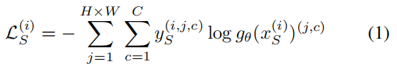
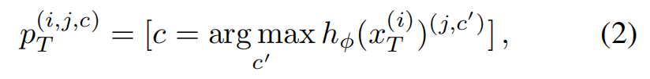
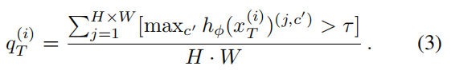
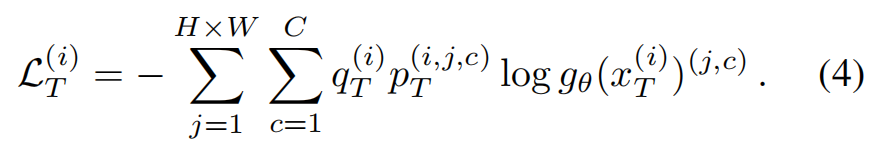
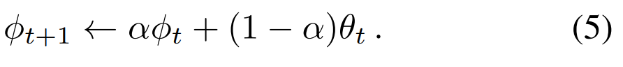
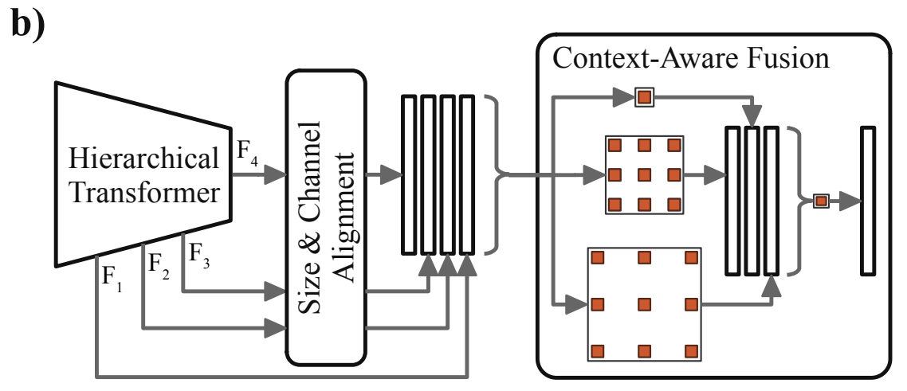
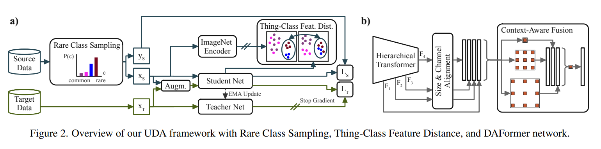

# DAFormer

# Abstract

用一些性能更好的 backbone 做 UDA。设计了一个基于 Transformer 的编码器和基于 multi-level context-aware 特征融合的解码器。设计了三个做法简单但是却很关键的策略避免过拟合 source domain。性能对比其他 UDA 方法，在 GTA->Cityscapes 提高了 10.8，Synthia-> Cityscapes 提高了 5.4

# Introduce

现在的一些 UDA 方法为了方便和先前的 sota 比较，都是采用 deeplabv2 + resnet 的网络结构。deeplabv2 + resnet 的结果在精度上并不如现如今提出来的一些网络。deeplabv2 + resnet 在 Cityscapes 上的精度是 65，现在的一些新网络已经达到了 85。 这种巨大的进度差异会不会限制了 UDA 的性能，我们就此进行了一些讨论。

使用那些性能更强的网络可能导致过拟合 source domain。通过研究不同的分割网络结构，我们设计除了一个基于 transformer 的新的 UDA 架构，与 CNN 相比，它的鲁棒性更强。

并且通过 multi-level feature fusion 增强 UDA 的性能。

网络可能因为不稳定的训练而过拟合，为此我们提出了三种策略，来减少这种过拟合。

- Rare Class Sampling(RCS) 稀有类采样，以解决 source domain 的长尾分布。（target 同样需要考虑，即便 target 本身不是长尾分布，但是总是存在难学习的样本，感觉也是要考虑长尾分布的，这种长尾分布最好是可以动态变化的）通过频繁的对那些稀有类别进行采样，可以让网络的训练更加稳定。
    - 有些文章写的是，从易到难的学习。
    - 这篇文章总感觉是平均下学习难度，让学习难度不那么陡峭。
- we propose a Thing-Class ImageNet Feature Distance, which distills knowledge from diverse and expressive ImageNet features in order to regularize the source training.
    - 提出了一个 Ting-Class ImageNet Feature 距离，从 ImageNet 特征中提取只是，规范源域的训练（规范化预训练的特征？让他变的更加适合当前的数据？）
    - 具体做法细看下文章。
    - 因为源域一些类别和目标域的类别差距很大（域偏移），Without FD this would result in learning less expressive and source-domain-specific features（没有 FD 的话，网络只能学到较少的特征和source domain 上一些特定的特征，即泛化能力弱）
- 新的学习率预热策略，通过线性增加学习率达到早期训练的value。这样的话，学习过程稳定，ImageNet 预训练的特征可以更好地转移到语义分割中。（**更好的迁移**）

# Related Work

目前还没人系统研究过，新出现的网络架构对 UDA 性能的影响。

语义分割常用编码解码的结构，为克服低分辨率的问题，采用跳跃连接、扩展卷积等保留分辨率结构。有的则利用上下文信息进行更进一步的改进。

UDA 中常用的方法有两种，一种的是基于对抗学习的，一种是基于自训练的。

- 对抗训练：在 GAN 框架中对齐输入、特征、输出或补丁级别的源域和目标域的分布. 为鉴别器使用多个尺度或类别信息可以改进对齐方式。
- 自训练：大多数 UDA 方法预先离线计算伪标签，训练模型，然后重复该过程。 或者，可以在训练期间在线计算伪标签。 为了避免训练不稳定性，使用基于数据增强或域混合的伪标签原型或一致性正则化。

数据集常常是类别不平衡且符合长尾分布的，在解决长尾分布的任务上，常用的方法有重新加权和类平衡采用。**本文将类平衡抽样从分类扩展到语义分割，并提出了稀有类抽样，它解决了单个语义分割样本中稀有和常见类的共现问题**

本文还利用了知识蒸馏作为正则化器（ [43] 已经表明，来自旧任务的知识蒸馏 [29] 可以作为新任务的正则化器），并且通过实验表明。它对 Transformer 特别有效。（通过正则化避免过拟合）

# Method

## Self-Training for UDA

先给一个不同网络的 UDA 的 Baseline。

公式含义

$g_θ$ 表示仅通过 source domain 训练得到的网络。在源域上用 CE 训练网络 $g_θ$。

由于 domain shift 在 target domain 上得不到好的效果。为了提高 target 上的性能，本文采用自训练的方式（AD 不稳定，且效果略差于自训练）。为了进行更好的知识迁移，本文使用 teacher 网络生成 pseudo label。

`[]  Iverson bracket` 满足条件为1，不满足为0。教师网络不会有 backpropagated。

 Here, we use the ratio of pixels exceeding a threshold *τ* of the maximum softmax probability

q ，小于指定阈值的时候为0，大于指定阈值的时候为1，即不计算那些低置信度的伪标签损失。P 是伪标签。log gθ 是预测结果。

在训练过程中，将 hφ 的权值设为每个训练步骤 t 后 gθ 的权值的指数移动平均。

数据增强的方式采用了 颜色抖动，高斯模糊和 ClassMix [文献56]。

##  DAFormer Network Architecture

本文设计了一个网络结构

将图像分割为 $4*4$ 的块,为语义分割保留细节。为了解决高特征分辨率的问题，在自注意块中采用了序列约简。编码器设计生成多级特征图，特征图的下采样通过重叠 patch 合并实现[86]，以保持局部连续性。

在解码器上，采用的[深度可分离卷积](https://zhuanlan.zhihu.com/p/166736637)(有效避免过拟合)

## Training Strategies for UDA

为 UDA 训练一个更有能力的架构的一个挑战是对源域的过度拟合。为了解决这个问题，文章引入了三种策略来稳定和正则化 UDA 训练: **稀有类抽样**、**Thing-Class ImageNet 特征距离**和**学习率预热**。总体 UDA 框架如图2 (a)所示。

**Rare Class Sampling（RCS）：**通过实验发现，那些 Rare Class 在训练过程中出现的越晚，训练结束时的表现就越差。可能的原因是，网络在不断的学习后偏向 common class 很用很少的样本去学习那些 rare class。通过使用教师网络的自训练，进一步的证实了这种观点。为了解决这个问题，文章提出了罕见类抽样 (RCS)。它更经常地从源域中采样带有稀有类的图像，以便在训练期间(早期)学习它们。根据c类像素的个数，可以计算出源数据集中每个 c 类像素的频率 fc。