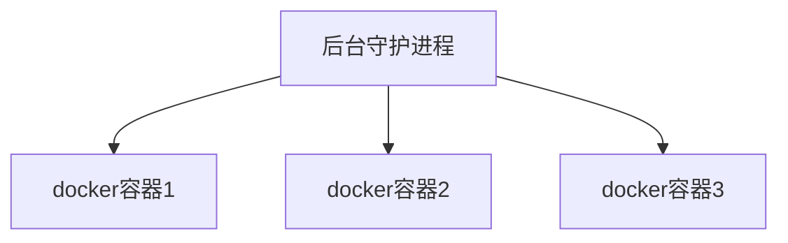

# Docker简介

## 学习目标

- 掌握 Docker 基础知识，理解 Docker 镜像与容器的概念
- 完成 Docker 的安装与启动
- 掌握 Docker 镜像与容器相关命令
- 掌握 Tomcat、Nginx 等软件的常用应用的安装
- 掌握 Docker 迁移与备份相关命令
- 运用 dockerfile 编写创建容器的脚本
- 搭建与使用 Docker 私有仓库

<span style="color:green">会用只是第一步，了解/懂得原理，设计思想才是重点。</span>

## 为什么要Docker

产品的开发到上线，从环境搭建到应用配置，有很多需要注意的地方。因此开发和运维之间的协作显得很重要。特别是版本的迭代，对运维人员来说是种考验。

Docker 给出了一个标准化的解决方案。<b>以前只是搬代码，现在是把代码+配置一起搬过去直接运行，把原始环境一模一样的复制过来，把软件和它的运行环境一起带过来安装。</b>

Docker 一次构建处处运行。

<b>简而言之 Docker 是一个解决了运行环境和配置问题的软件容器，方便做持续集成 并有助于整体发布的容器虚拟化技术。Docker 仅包含业务运行所需的 runtime 环境。可以把容器看做是一个简易版的 Linux 环境。</b> 

## 为什么选择Docker

- 上手快，启动快，性能高。
- 职责的逻辑分类：开发任意关系容器中运行的出现，运维人员关系管理容器即可。
- 快速高效的开发生命周期：直接给你把部署环境都打包好了。
- 鼓励使用面向服务的架构：推荐单个容器只运行一个应用出现或者进程，这样就形成了一个分布式的应用程序模型。

## 容器与虚拟机的比较（背）

Docker 模拟的不是一个完整的操作系统，而是对进程进行隔离。

- 传统虚拟机技术是虚拟出一套硬件后，在其上运行一个完整的 OS，在该系统上再运行所需应用进程。
- 而容器内的应用进程直接运行于宿主的内核，容器没有自己的内容，而且也没有进行硬件虚拟。因此容器要比传统 VM 更为轻便。
- 每个容器之间互相隔离，每个容器有自己的文件系统，容器之间进程不会相互影响，能区分计算资源。

## Docker三要素

- <span style="color:orange"><b>仓库：存放镜像的地方。我们可以把镜像发布到仓库中，需要时再从仓库里下载。</b></span>
- <span style="color:orange"><b>镜像：一个模板。image 文件生成的容器实例，本身也是一个文件，称为镜像文件。</b></span>
- <span style="color:orange"><b>容器：镜像的实例就是容器。一个容器运行一种服务，当我们需要的时候，就可以通过docker客户端创建一个对应的运行实例，即容器。</b></span>

<span style="color:green">**镜像相对于类，容器相对于对象**</span>

从仓库里下载镜像，用下载到的镜像得到一个一个的实例（容器）。一个模板生成多个实例。

Docker 是一个开源的应用容器引擎，基于 Go 语言并遵循 Apache2.0 协议开源。

Docker 可以让开发者打包他们的应用以及依赖包到一个轻量级、可移植的容器中，然后发布到任何流行的Linux机器上，也可实现虚拟化。

Docker 容器使用的是沙箱机制，相互之间不会有任何接口，更重要的是容器性能开销极低。

<b>大概意思是</b>：Docker 可以集成很多软件，然后把软件弄成镜像，让使用者可以直接用镜像，无需再安装软件。运行中的这个镜像成为容器，容器的启动很迅速。

<b>注册中心：保存用户构建的镜像。</b>

- 私有，公有。

## 核心概念

Docker 主机：安装了 Docker 程序的机器。Docker 是直接安装在 OS 上的。

Docker 客户端：连接 Docker 主机进行操作。

Docker 仓库：用来保存各种打包好的软件镜像。

Docker 镜像：软件打包好的镜像，放在仓库中。

Docker 容器：镜像启动后的实例，称为一个容器。tomcat 镜像运行五次，就会有五个容器，就有 5 个 tomcat 了。

使用 Docker 的步骤：

- 安装 docker
- 去 docker 仓库找到软件对应的镜像
- 直接使用 docker 运行这个镜像，这个镜像就会生成一个 docker 容器
- 停止容器就是停止软件。一个容器对应一个软件。

# Docker安装

## 安装Docker

```shell
# ubuntu自带的源
sudo apt-get update
sudo apt-get install -y docker.io

# 从docker官网中安装最新的。
# 去docker官网看怎么安装就行了，不用记忆。
```

<a href="https://docs.docker.com/engine/install/ubuntu/">docker官网</a>

PS：Docker 的命令按 tab 键会自动补全的

# Docker镜像

与 docker 命令有所重复

## 获取镜像

```shell
sudo docker pull ubuntu # 默认拉取最新的镜像
sudo docker pull ubuntu:14.04 #拉取指定版本
sudo docker pull dl.dockerpool.com:5000/ubuntu # 从其他注册服务器的仓库下载
sudo docker run -t -i ubuntu /bin/bash # 利用镜像创建一个容器，在其中运行bash应用
```

## 查看镜像

```shell
sudo docker images # 查看本地主机中已有的docker镜像
"""
REPOSITORY   TAG      IMAGE ID        CREATED       SIZE
ubuntu       latest   d70eaf7277ea    4 weeks ago   72.9MB
"""
```

- REPOSITORY：来自于那个仓库
- TAG：镜像的标签信息，来自统一仓库的不同镜像
- IMAGE ID：镜像的 id，唯一！
- CREATED：创建时间
- SIZE：大小

**为已有镜像添加标签**

```shell
sudo docker tag ubuntu:latest ubuntuxxx
# sudo docker tag 已有的镜像 新的镜像标签
# 新的镜像标签和已有镜像的标签是一致的~~ 可以理解为一个快捷方式
```

**查看镜像的详细信息**

```shell
sudo docker inspect image_id
sudo docker inspect -f 查看指定参数，不会，用的时候再查
```

## 搜寻镜像

`sudo docker search 镜像名称`

```shell
sudo docker search mysql
sudo docker search mysql --filter=stars=3 # 查询stars大于3k的镜像
```

**几个重要的参数**

- --automated=false 仅显示自动创建的镜像
- --no-trunc=false 输出信息不截断显示

## 删除镜像

`sudo docker rmi IMAGE` IMAGE可以是标签（tag）或ID

```shell
sudo docker rmi dl.asf.com/ubuntu:latest
# sudo docker rmi respository:tag
```

正确步骤：

- 先删除依赖该镜像的容器 `sudo docker rm 容器ID`
- 然后删除镜像

## 创建镜像

###  基于已有容器创建

```shell
sudo docker run -ti ubuntu:latest /bin/bash
touch test
exit

# 记住容器的id
sudo docker commit -m "some message" -a "author message" container_id test_image
```

### 基于本地模版导入

## 存入存出镜像

```shell
# 存出
sudo docker save -o xxx.tar ubuntu:latest
# 载入
sudo docker load --input xxx.tar
```

# Docker容器

与 docker 命令有所重复

## 创建容器

```shell
# 这种方式创建的不会启动。
sudo docker create -it imageName
sudo docker create -it unbunt:latest
# 启动create创建的容器
sudo docker  start container_id
```

## 容器的各种操作

- 下面的创建方式，输出一句 Hello 后容器就终止了
    - `sudo docker run ubuntu:latest /bin/echo 'Hello'`
- 启动一个终端，并允许用户进行交互
    - `sudo docker run -t -i ubuntu:latest /bin/bash`
        - -t 分配一个伪终端
        - -i 让容器的标准输入保持打开

- 查看运行中容器
    - `sudo docker ps`
- 查看所有的容器
    - 运行中的和终止了的
    - `sudo docker ps -a`
- 容器以守护态运行
    - 守护态的运行取决于后面的shell语句。
    - -d，此时容器会在后台运行并不会把输出的结果 (STDOUT) 打印到宿主机上面(输出结果可以用 `docker logs` 查看)。
        - `sudo docker run -d ubuntu /bin/sh -c "while true; do echo hello world; sleep 1; done"`
    - 查看容器的输出信息
        - `sudo docker logs 8c`
    - 停止容器
        - `sudo docker stop 8c`
    - 启动终止态的容器
        - 最开始命令用了-it 启动就关闭了，但是 start 的时候，会在后台一直执行。
        - `sudo docker start container_id`
    - 重启一个容器
        - `sudo docker restart container_id`
- **进入容器**
    - 常用命令
        - attach：多个窗口同时attach到同一个容器的时候，所有窗口都会同步显示，一个窗口被阻塞了，其他的窗口也无法执行操作。
        - exec：`sudo docker exec -ti container_id /bin/bash`
        - nsenter：不学
- **导入导出容器：**（给容器装一些软件，然后导出一直用）
    - 导出容器
        - `sudo docker export container_id  > xxx.tar`
    - 导入容器
        - `cat x.tar | sudo docker import - tt/ubuntu:v1`
        - `cat x.tar | sudo docker import - reporsitory:tag `

# Docker命令

## 入门

- `docker run hello-world`
    - 本地没有 hello-world 所有会去仓库拉，把镜像下载下来然后运行镜像得到容器。
- run 做了什么？
    - 本机中寻找镜像，没有就去仓库下载
    - 仓库中有，就下载到本地，并根据镜像，运行它得到实例【容器】
    - 没有，就报错。

## 底层原理

Docker C/S 结构。 Docker 的守护进程运行在主机上，然后通过 Socket 连接从客户端访问，守护进程从客户端接收命令并管理运行在主机上的容器。

容器是一个运行时环境。



虚拟机 = 软件+硬件 是一个完整的 OS

docker：比 vm 更少的抽象层，不需要 Hypervisor 实现硬件资源虚拟化，运行在 docker 容器上的程序直接使用的都是实际物理机的硬件资源。因此 docker 在 CPU、内存利用效率上，会有明显优势。

docker 是利用宿主机的内核，不需要 Guest OS，docker 无须像 vm一样加载 OS 内核。

## 常用镜像命令

### 镜像相关

#### 查看

docker images 查看有那些镜像

```html
REPOSITORY   TAG       IMAGE ID   CREATED   SIZE
镜像名称	   版本	     镜像id		 创建时间	镜像大小
```

#### 搜索

docker search 镜像名称 - 搜索镜像

```shell
docker search centos
```

#### 拉取

docker pull 拉取镜像

不指定的话，默认拉取 latest 版本的镜像。要指定的话就 docker pull tutum/centos:7 这样

```shell
docker pull tutum/centos
```

#### 删除

docker rmi 删除镜像

```shell
docker rmi 镜像ID
```

删除所有镜像

```shell
# 把docker images -q 这个命令的结果 作为docker rmi的参数
docker rmi `docker images -q`
```

### 容器相关

#### 查看容器

查看正在运行的容器

```shell
docker ps
```

查看所有容器

```shell
dcoker ps -a
```

查看最后一次运行的容器

```shell
docker ps -l
```

查看停止的容器

```shell
docker ps -f status=exited
```

#### 创建与启动容器

<b>参数说明</b>

创建容器命令：docker run

-i ：表示运行容器

-t（terminal）：表示容器启动后会进入其命令行。加入这两个参数后，容器创建就能登录进去。即分配一个伪终端。

--name：为创建的容器命名

-v：表示目录映射关系（前者是宿主机目录，后者是映射到宿主机上的目录），可以使用多个-v做多个目录或文件映射。注意：最好做目录映射，在宿主机上做修改，然后共享到容器上。

-d（daemon）：在 run 后面加上 -d 参数，则<span style="color:green">会创建一个守护式容器**在后台运行**</span>（这样创建容器不会自动登录容器，如果只加 -i-t 两个参数，创建后就会自动进入容器）

-p：表示端口映射，前者是宿主机端口，后者是容器内的映射端口

宿主机：装 docker 的电脑

<b>交互式方式创建容器</b>

```shell
docker run -it --name=容器名称 镜像名称:标签 /bin/bash 
# 好像可以不加 /bin/bash
```

通过 `docker  ps ` 命令查看运行中的容器

退出当前容器用 `exit`

<b>守护式方式创建容器</b>

```shell
docker run -di --name=容器名称 镜像名称:标签
# 创建成功后会返回容器的id
# 如何进入创建的容器呢？
docker exec -it 容器名称 /bin/bash
# 退出的话，容器依旧是运行的！！！
exit
```

> 总结：守护式创建的进程，exit 后，容器不会退出！！！

#### 停止与启动容器

**停止容器**

```shell
docker stop 容器名称（或容器id）
```

**启动容器**

```shell
docker start 容器名称（或容器id）
```

<b>重新启动容器</b>

```shell
docker restart <container_id>
```

#### 文件拷贝

将文件拷贝到容器可使用 cp 命令。文件--->容器内

```shell
docker cp 需要拷贝的文件or目录  容器名称:容器目录
```

也可以将文件从容器内拷贝出来。容器内---->外面

```shell
docker cp 容器名称:容器目录 需要拷贝的文件或目录
```

#### 目录挂载

创建容器的时候，<span style="color:green">将宿主机的目录与容器内的目录进行映射</span>，这样我们就可以通过修改宿主机某个目录的文件从而影响容器.

<span style="color:red">创建容器 添加 -v 参数 后边为 宿主机目录:容器目录</span>，eg：

```shell
docker run -di -v  /usr/local/mythm:/usr/local/mythml --name=mycentos3 centos:7
```

#### 查看容器IP地址

通过如下命令查看容器运行的各种数据

```shell
docker inspect 容器名称（容器id）
```

输出 ip 地址

```shell
docker inspect --format='{{.NetworkSetting.IPAddress}}' 容器名称（容器ID）
```

#### 删除容器

```shell
docker rm 容器名称（容器ID）
```

- docker info 查看 docker 的信息
- docker --help 查看帮助文档
- **docker images** 查看本机的镜像
    - docker images -a 查看所有镜像（含中间映像层）
    - docker images -q 只显示镜像 id
    - docker images --disgests 显示镜像的摘要信息
    - docker images --no-trunc 显示完整的镜像信息
- **docker search xxx** 查询xxx
    - 去<a href="https://hub.docker.com/">官网</a>搜镜像 
    - docker search -s 点赞数  镜像名
        - docker search -s 30 tomcat 查找点赞数超过 30k 的 tomcat 镜像
    - docker search --no-trunc 显示完整的镜像描述
    - docker search --automated 只列出 automated build 类型的镜像。
- **docker pull xxx** 拉取 xxx 镜像
    - `docker pull tomcat 等价于 docker pull tomcat:latest`
- **docker rmi xxx** 删除镜像
    - `docker rmi tomcat 等价于 docker rmi tomcat:laster`
    - `docker rmi -f tomcat 强制删除`
    - `docker rmi -f hello nginx 级联删除，同时删除多个`
    - `docker rmi -f $(docker images -qa) 删除全部`

## 常用容器命令（一）

<b>docker run   [OPTIONS]    IMAGE   [COMMAND]   [ARG...]</b>

- OPTIONS说明【常用】：有些是一个减号，有些事两个减号。
    - --name="容器新名字" 为容器指定一个名称
    - -d   后台运行容器，并返回容器 ID，即启动守护式容器
    - -i    以交互式模式运行容器，通常与 -t 同时使用
    - -t    为容器重新分配一个伪输入终端，通常与-i同时使用
    - -p   随机端口映射
        - 指定端口映射，有以下四种格式
        - `ip:hostPort:containerPort`
        - `ip:containerPort`
        - `hostPort:containerPort`
        - `containerPort`
- eg：`docker run -it 7e6257c9f8d8 [这个是centos镜像的id]`
    - -it  -i 交互式模式运行容器 t---- 为容器分配一个伪终端
    - 退出容器用 exit 或 <span style="color:red">ctrl + p + q【正常退出不关闭容器】</span>
        - exit  <span style="color:red">容器停止 退出</span>
        - ctrl+p+q <span style="color:red">容器不停止退出</span>
    - 启动容器：docker start 容器 id/容器名
    - 重新启动容器：docker restart 容器 id/容器名
    - 停止容器：docker stop 容器 id/容器名   【温柔的，慢慢的关闭】
        - docker kill 容器 id/容器名  强制停止，直接拔电源。
    - 删除容器：docker rm 容器 id/容器名
        - docker rm -f 容器 id/容器名字 强制
        - docker rm  $(docker ps -a -q)  因为不是强制的，所以只能删除未运行的容器！
- **docker ps** 列出容器[正在运行的容器]
    - `docker ps -a` 列出所有容器【运行中的+历史运行的】
    - `docker ps -n 3` 列出上三次运行的容器
    - `docker ps -l` 上次运行的容器
    - `docker ps -lq` 上次运行的容器，且只显示id
- eg: `docker run -it --name mycontainer centos`
    - 创建centos容器，名称为mycontainer，以交互式模式运行且为其分配一个伪终端。
    - `docker run -it --name mycontainer2 -d centos`

## 常用容器命令（二）

<b>使用镜像 centos:7 以后台模式启动一个容器</b>

- `docker run -d centos`

    - `docker ps -a` 查看，发现容器已经退出。

    - <span style="color:red">**docker容器后台运行，必须要有一个前台进程！！**</span> 容器的命令如果不是那些一直挂起的命令（如top tail）就会自动退出。

    - 所以可以这样运行。docker run -d centos /bin/sh -c 'while true;do echo hello xx;sleep 2; done'

- docker logs -f -t --tail 容器 id  查看容器日志
    - -t 是加入时间戳
    - -f 跟随最新的日志打印
    - --tail 数字显示最后多少条

# 应用部署

## MySQL部署

查找镜像

```shell
docker search mysql
```

拉取镜像

```shell
docker pull centos/mysql-57-centos7
```

创建容器

```shell
docker run -di --name=tensquare_mysql -p 33306:3306 -e MYSQL_ROOT_PASSWORD=123456 mysql
```

-p：代表端口映射，格式为 宿主机端口映射：容器运行端口

-e：代表添加环境变量 MYSQL_ROOT_PASSWORD 是 root 用户名的登录密码

进入 MySQL 容器

```shell
docker exec -it tensquare_mysql /bin/bash
```

登录 MySQL

```shell
mysql -uroot -p123456
```

远程登录 MySQL

连接宿主机的 IP，指定端口为 `33306`

查看日志，看错误原因 【docker logs 对应容器的id】

----

## tomcat部署

查找镜像

```shell
docker search tomcat
```

拉取镜像

```shell
docker pull tomcat:7-jre7
```

创建容器

```shell
docker run -di --name=mytomcat -p 9000:8080 -v /usr/local/webapps:/usr/local/tomcat/webapps tomcat:7-jre7
```

-p：代表端口映射，格式为 宿主机端口映射：容器运行端口

-v：表示目录映射关系（前者是宿主机目录，后者是映射到宿主机上的目录），可以使用多个 -v 做多个目录或文件映射。注意：最好做目录映射，在宿主机上做修改，然后共享到容器上。

## Nginx部署

查找镜像

```shell
docker search nginx
```

拉取镜像

```shell
docker pull nginx
```

创建Nginx容器

```shell
docker run -di --name=mynginx -p 80:80 nginx
```

## Redis部署

查找镜像

```shell
docker search redis
```

拉取镜像

```shell
docker pull redis
```

创建容器

```shell
docker  run -di --name=myredis -p 6379:6379 redis
```

# 迁移与备份

## 容器保存为镜像

将容器保存为镜像（我们对容器进行了一些修改，希望以后可以继续用~）

```shell
docker commit mynginx myngnix_i
```

## 镜像备份

将镜像保存为 tar 文件

```shell
docker save -o mynginx.tar myngnix_i
```

## 镜像恢复与迁移

先删除myngnix_i镜像，再执行下面的命令

```shell
docker load -i myngnix.tar
```

-i 输入的文件

执行后再次查看镜像，可以看到镜像已恢复。

# 网络基础配置

映射容器端口到宿主主机和容器互联机制来为容器提供网络服务。

**就是：容器端口 ---> 宿主主机**

## 端口映射实现访问容器

### 一个自带的映射demo

```shell
# 远程docker仓库中有的例子
sudo docker run -d -P training/webapp python app.py 
sudo docker ps -l
"""
CONTAINER ID|IMAGE          |COMMAND        |PORTS  
fbc5d6bca5f7|training/webapp|"python app.py"|0.0.0.0:32768-5000/tcp   
"""
```

**本机端口 32768 映射到了容器的 5000 端口**

**查看应用信息**

```shell
sudo docker logs -f 容器name
sudo docker logs -f nostalgic_morse
```

### 指定映射端口

- 映射到所有接口地址

```shell
# -p 主机端口:容器端口
sudo docker run -d -p 5000:5000 training/webapp python app.py
# 映射到多个端口
sudo docker run -d -p 5000:5000 -p 3000:80 training/webapp python app.py
```

- 映射到指定地址的指定端口

```shell
# 本机的127.0.0.1：5000映射到容器的5000端口
sudo docker run -d -p 127.0.0.1:5000:5000 training/webapp python app.py
```

- 映射到指定地址的任意端口

```shell
# 本机会任意分配一个端口给容器 用sudo docker ps -l 查看具体映射到了哪里
sudo docekr run -d -p 127.0.0.1::5000 training/webapp python 
```

- 标记指定udp端口

```shell
sudo docker run -d -p 127.0.0.1:5000:5000/udp training/webapp python 
```

- 查看映射端口配置

`sudo docker port stoic_diffie 5000`

```shell
# 查看
sudo docker ps -l
# 查看端口映射配置
sudo docker port stoic_diffie 5000
# output 127.0.0.1:32768
```

##  容器互联实现容器通信☆☆☆

开启一个web应用，开启一个mysql服务，web应用需要用到mysql服务，两个容器需要进行交互。

### 自定义容器命名

```shell
sudo docker run -d -P --name newName training/webapp python app.py
```

### 容器互联

使用 `--link` 参数让容器之间安全的进行交互 <span style="color:green">**docker官方并不推荐**</span>

```shell
# 建议先删除之前的容器
sudo docker rm -f xxx
sudo docker run -d --name web_site training/webapp python app.py 
sudo docker run -d --name db training/postgres
```

# Dockerfile

Dockerfile 是一个用来构建镜像的文本文件，文本内容包含了一条条构建镜像所需的指令和说明。这些命令应用于基础镜像并最终创建一个新的镜像。

- 开发人员：可以为开发团队提供一个完全一直的开发环境
- 测试人员：直接拿开发时所构建的镜像或者通过Dockerfile文件构建一个新的镜像开始工作
- 运维人员：部署时，可实现应用的无缝移植。

## 基本结构

- 基础镜像
- 维护者信息
- 镜像操作指令
- 容器启动时执行指令

**基本Demo**

```shell
# This dockerfile uses the ubuntu image
# VERSION 2 - EDITION 1
# Author: docker_user
# Command format: Instruction [arguments / command] ..
# 第一行必须指定基于的基础镜像
FROM ubuntu

# 维护者信息
MAINTAINER docker_user docker_user@email.com

# 镜像操作指令
RUN echo ""

# 容器启动时执行指令
CMD /usr/sbin/nginx
```

## 常用命令

| 命令                                    | 作用                                                         |
| --------------------------------------- | ------------------------------------------------------------ |
| FROM image_name:tag                     | 定义了使用那个基础镜像启动构建流程                           |
| MAINTAINER user_name                    | 声明镜像的创建者                                             |
| ENV    key value                        | 设置环境变量（可写多条）                                     |
| RUN   command                           | dockerfile的核心部分（可写多条）；用于执行后面跟着的命令行命令。 |
| ADD   source_dir/fie      dest_dir/file | 将宿主机的文件复制到容器内，如果是一个压缩文件，将会在复制后**自动解压** |
| COPY source_dir/file   dest_dir/file    | 和ADD相似，但是如果有压缩文件并不能解压                      |
| WORKDIR path_dir                        | 设置工作目录                                                 |

## 构建Java8镜像

把jdk文件上传到服务器

创建存放jdk的多级目录

```shell
mkdir -p /usr/local/dockerjdk8
```

把jdk移动到指定目录

```shell
mv jdkxxxxxx  /usr/local/dockerjdk8
```

编辑Dockerfile文件

```shell
gedit Dockerfile # 没有则创建 注意，这个文件的名称是固定的！！！
```

```shell
FROM centos:7  # 基础镜像，本地必须存在，如果不存在则会下载
MAINTAINER payphone # 指定创建者的信息
WORK_DIR /usr # 设置当前目录
RUN mkdir /usr/local/java # 用来执行指令，在local下创建一个目录
ADD jdk-8u171-linux-x64.tar.gz /usr/local/java/ # 把xx文件复制到  /usr/local/java/目录下

ENV JAVA_HOME /usr/local/java/jdk1.8.0_171
ENV JRE_HOME $JAVA_HOME/jre
ENV CLASSPATH $JAVA_HOME/bin/dt.jar:$JAVA_HOME$/lib/tools.jar:$JRE_HOME/lib:$CLASSPATH
ENV PATH $JAVA_HOME/bin:$PATH
```

执行构建命令

```shell
docker build -t='jdk1.8' . # .表示指定当前目录
```

注意后面的空格和点！！！

# 私有仓库

## 搭建与配置

拉取私有仓库镜像

```shell
docker pull registry
```

启动私有仓库容器

```shell
docker run -di --name=reistry -p 5000:5000 registry
```

打开浏览器 输入地址 http://ip地址:5000/v2/_catalog 看到 `{repositories:[]}` 表示私有仓库搭建成功并且内容为空

修改 daemon.json

```shell
vi /etc/docker/daemon.json
```

添加以下内容，保存退出

```shell
{"insecure-registries":["ip地址:5000"]}
# 因为之前改过，所以最后是这些内容
{
	"registry-mirrors":["https://docker.mirrors.ustc.deu.cn"],
	"insecure-registries":["ip地址:5000"]
}
# 要想配置生效需要重启docker
systemctl restart docker
```

此步用于让docker信任私有仓库地址

## 镜像上传到私有仓库

在上传前，要把私服启动起来。

```shell
# tag是把一个原来的镜像打包成一个新的镜像 新镜像的名字是私服地址:端口/jdk1.8
docker tag jdk1.8 私服地址:端口/jdk1.8
# 推送到私服
docker push 新镜像的名字
```

