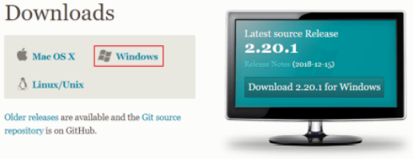

# Git分布式版本控制工具


## 概述

- [x] 了解Git基本概念
- [x] 了解Git工作流程
- [x] 熟悉Git常用命令
- [x] 熟悉IDEA中Git的使用

> Git的作用

- [x] 代码备份：代码备份到GitHub上。
- [x] 代码还原：Git上记录了代码的提交内容，可以还原任一时间点的代码。
- [x] 协同开发：多人协作开发项目，通过Git协同开发，记录，分享所写代码。
- [x] 追溯代码问题，编写人和编写时间

> 版本控制方式

- 集中式版本控制工具 集中式版本控制工具

    - 版本库是集中存放在中央服务器的，team 里每个人 work 时从中央服务器下载代码，是必须联网才能工作，局域网或互联网。个人修改后然后提交到中央版本库。
    -  举例：SVN 和 CVS b

- 分布式版本控制工具 

    - 分布式版本控制系统没有“中央服务器”，每个人的电脑上都是一个完整的版本库，这样工作的时候，无 需要联网了，因为版本库就在你自己的电脑上。多人协作只需要各自的修改推送给对方，就能互相看到对方的修改了。
    -  举例：Git

> Git

Git 是分布式的, Git 不需要有中心服务器，我们每台电脑拥有的东西都是一样的。我们使用 Git 并且有个中心服务器，仅仅是为了方便交换大家的修改，但是这个服务器的地位和我们每个人的 PC 是一样的。我们可以把它当做一个开发者的 PC 就可以了，中心服务器就是为了方便大家交换代码。没有它大家一样可以工作，只不过“交换”修改不方便而已。 

Git 是一个开源的分布式版本控制系统，可以有效、高速地处理从很小到非常大的项目版本管理。Git 是 Linus Torvalds 为了帮助管理 Linux 内核开发而开发的一个开放源码的版本控制软件。 同生活中的许多伟大事物一样，Git 诞生于一个极富纷争大举创新的年代。Linux 内核开源项目有着为数众多的参与者。 绝大多数的 Linux 内核维护工作都花在了提交补丁和保存归档的繁琐事务上（1991－2002 年间）。 到 2002 年，整个项目组开始启用一个专有的分布式版本控制系统 BitKeeper 来管理和维护代 码。 

到了 2005 年，开发 BitKeeper 的商业公司同 Linux 内核开源社区的合作关系结束，他们收回了 Linux 内核社区免费使用 BitKeeper 的权力。 这就迫使 Linux 开源社区（特别是 Linux 的缔造者 Linus Torvalds）基于使用 BitKeeper 时的经验教训，开发出自己的版本系统。 他们对新的系统制订 了若干目标： 

- 速度
- 简单的设计
- 对非线性开发模式的强力支持（允许成千上万个并行开发的分支） 
- 完全分布式
- 有能力高效管理类似 Linux 内核一样的超大规模项目（速度和数量）


## 工作流程图


> 命令如下：

- clone（克隆）：从远程仓库中克隆代码到本地仓库 
- checkout （检出）:从本地仓库中检出一个仓库分支然后进行修订 
- add（添加）: 在提交前先将代码提交到暂存区 
- commit（提交）: 提交到本地仓库。本地仓库中保存修改的各个历史版本 
- fetch (抓取) ： 从远程库，抓取到本地仓库，不进行任何的合并动作，一般操作比较少。
- pull (拉取) ： 从远程库拉到本地库，自动进行合并(merge)，然后放到到工作区，相当于 fetch+merge 
- push（推送） : 修改完成后，需要和团队成员共享代码时，将代码推送到远程仓库

## 安装

### 常见Linux命令

- ls/ll 查看当前目录 
- cat 查看文件内容 
- touch 创建文件 
- vi vi 编辑器（使用vi编辑器是为了方便展示效果，学员可以记事本、editPlus、notPad++等其它编 辑器）

### 安装

下载地址： https://git-scm.com/download



安装时：Use git from git bash only... 其他默认下一步。安装成功后鼠标点击右键可以看到。


备注：

Git GUI：Git 提供的图像界面工具

Git Bash：Git 提供的命令行工具，提供了一些常见的 Linux 命令，如 curl。

当安装 Git 后首先要做的事情是设置用户名称和 email 地址。每次 Git 提交都会使用该用户信息

### 基本配置

- 点击右键 选择 Git bash
- 配置全局变量
- git config -- global user.name "username" 如：git config -- global user.name "csxx"
- git config --global user.email "邮箱" 如：git config --global user.email "12312331@qq.com"
- 查看配置信息
    - git config --global user.name
    - git config --global user.email


### 为常用指令配置别名

有些常用的指令参数非常多，每次都要输入好多参数，我们可以使用别名。

- 打开用户目录，创建 .bashrc 文件 

- 部分 windows 系统不允许用户创建点号开头的文件，可以打开 gitBash, 执行 `touch ~/.bashrc`

- 在 .bashrc 文件中输入如下内容

    ```shell
    #用于输出git提交日志
    alias git-log='git log --pretty=oneline --all --graph --abbrev-commit'
    #用于输出当前目录所有文件及基本信息
    alias ll='ls -al'
    ```

### Git乱码

打开 GitBash 执行下面命令

```shell
git config --global core.quotepath false 
```

在 `${git_home}/etc/bash.bashrc$`  文件后面加入下面两行

```shell
export LANG="zh_CN.UTF-8"
export LC_ALL="zh_CN.UTF-8"
```

### 配置免密登录

配置 ssh：先在本地配置，发送给远程

输入以下命令 ssh-keygen -t rsa -C 邮箱 如：ssh-keygen -t rsa -C 695466632@qq.com 然后一直回车

打开 github 网站 找到 setting --> new ssh - title任意/key 输入本地生成的 pubkey（公钥）, pubkey 的存放地址请仔细看 Git 控制台的输出。


测试连通性 ssh -T git@github.com[写死的]

本地和远程成功通信则可以在 .ssh 中发现 known_hosts 文件，出错就多试几次可能是网络问题。不行就检测建立 ssh 时输入的 pub key。

## Git常用命令

### 获取本地仓库

- 在电脑的任意位置创建一个空目录（例如 test）作为我们的本地 Git 仓库
- 进入这个目录中，点击右键打开 Git bash 窗口                                           
- 执行命令 git init 
- 如果创建成功后可在文件夹下看到隐藏的 .git 目录。


### 基础操作指令

Git 工作目录下对于文件的<b>修改</b>(增加、删除、更新)会存在几个状态，这些<b>修改</b>的状态会随着我们执行 Git 的命令而发生变化。


本章节主要讲解如何使用命令来控制这些状态之间的转换：

- ① git add (工作区 —> 暂存区)
- ② git commit (暂存区 —> 本地仓库)

#### status查看修改状态

- 作用：查看修改的状态（暂存区、工作区）
- 命令形式：

```shell
git status
```

#### add添加工作到暂存区

- 作用：添加工作区一个或多个文件的修改到暂存区
- 命令形式：git add 单个文件名|通配符

```shell
git add file.txt # 添加单个文件
git add . # 将所有新建的文件 和 修改的文件加入暂存区
```


Changes to be committed 即将被提交，进入了暂存区。

#### commit提交暂存区到本地仓库

- 作用：提交暂存区内容到本地仓库的当前分支
- 命令形式：git commit -m ‘注释内容’

```shell
git commit -m "add test.md"
```


commit 后，再次查看状态，暂存区中已经没有东西了。

#### log查看提交日志

- 配置的别名 git-log 就包含了这些参数，所以后续可以直接使用指令 git-log
- 作用：查看提交记录
- 命令形式：git log [option] 或者 git-log
    - all 显示所有分支
    - pretty=oneline 将提交信息显示为一行
    - abbrev-commit 使得输出的commitId更简短
    - graph 以图的形式显示


git log 查看日志信息，可以看到提交记录，谁？什么时间段提交的内容。


#### 版本回退

- 作用：版本切换
- 命令形式

```shell
git reset --hard commitID # commitID 可以使用 git-log 或 git log 指令查看
```


能不能再回到回退前的版本呢？可以的，只要记得 commit id 就行。


可以发现 git log 查不出来 obb6 这个 id 了。如果之前我们没有记住这个 id，是不是就不能恢复了？不是的。可以用 git reflog 来查看。

git reflog，把所有的操作记录下来了，可以看到已经删除的提交记录。


#### 添加文件至忽略列表

一般我们总会有些文件无需纳入 Git 的管理，也不希望它们总出现在未跟踪文件列表。 通常都是些自动生成的文件，比如日志文件，或者编译过程中创建的临时文件等。 在这种情况下，我们可以在工作目录中创建一个名为 .gitignore 的文件（文件名称固定），列出要忽略的文件模式。

```shell
*.a # 以 a 结尾的文件不让 git 管理
```

#### 练习：基础操作

```shell
#####################仓库初始化###################### 
# 创建目录（git_test01）并在目录下打开gitbash 
# 初始化git仓库 
git init 
#####################创建文件并提交##################### 
# 目录下创建文件 file01.txt 
# 将修改加入暂存区 
git add . 
# 将修改提交到本地仓库，提交记录内容为：commit 001 
git commit -m 'commit 001' 
# 查看日志 
git log 
####################修改文件并提交###################### 
# 修改file01的内容为：count=1 
# 将修改加入暂存区 
git add . 
# # 将修改提交到本地仓库，提交记录内容为：update file01 
git commit --m 'update file01' 
# 查看日志 
git log 
# 以精简的方式显示提交记录 git-log 是配置的别名
git-log 
####################将最后一次修改还原################## 
# 查看提交记录 
git-log 
# 找到倒数第2次提交的commitID 
# 版本回退 
git reset commitID --hard
```

### 分支

几乎所有的版本控制系统都以某种形式支持分支。 使用分支意味着你可以把你的工作从开发主线上分离开来进行重大的 Bug 修改、开发新的功能，以免影响开发主线。

#### 查看本地分支

- 命令：git branch

#### 创建本地分支

- 命令：git branch 分支名

#### 切换分支

- 命令：git checkout 分支名

我们还可以直接切换到一个不存在的分支（创建并切换）

- 命令：git checkout -b 分支名

#### 合并分支

一个分支上的提交可以合并到另一个分支。比如 master 分支中有 demo.md 文件，dev 分支有 publish.md 文件，最终这两个文件需要合并到一个分支中去，这时候可以用 git merge 进行分支合并。

命令：git merge 分支名称


#### 删除分支

不能删除当前分支，只能删除其他分支

git branch -d b1 删除分支时，需要做各种检查

git branch -D b1 不做任何检查，强制删除

#### 解决冲突

当两个分支上对文件的修改可能会存在冲突，例如同时修改了同一个文件的同一行，这时就需要手动解决冲突，解决冲突步骤如下：

①处理文件中冲突的地方

②将解决完冲突的文件加入暂存区(add)

③提交到仓库(commit)

冲突部分的内容处理如下所示：

dev 分支中 test.md 的内容是 dev，master 分支中的 test.md 的内容是 master。合并的时候会发生冲突。 


冲突的内容可以再 test.md 中看到

```text
<<<<<<< HEAD
master
=======
dev
>>>>>>> dev
```

删除掉一些内容即可，然后 git add .

```text
master
```


#### 使用原则与流程

几乎所有的版本控制系统都以某种形式支持分支。 使用分支意味着你可以把你的工作从开发主线上分离开来进行重大的 Bug 修改、开发新的功能，以免影响开发主线。

在开发中，一般有如下分支使用原则与流程：

- master （生产） 分支：线上分支，主分支，中小规模项目作为线上运行的应用对应的分支；
- develop（开发）分支：是从 master 创建的分支，一般作为开发部门的主要开发分支，如果没有其他并行开发不同期上线要求，都可以在此版本进行开发，阶段开发完成后，需要是合并到 master 分支,准备上线。
- feature/xxxx 分支：从 develop 创建的分支，一般是同期并行开发，但不同期上线时创建的分支，分支上的研发任务完成后合并到 develop 分支。
- hotfifix/xxxx分支：从 master 派生的分支，一般作为线上 bug 修复使用，修复完成后需要合并到 master、test、develop 分支。
- 还有一些其他分支，在此不再详述，例如 test 分支（用于代码测试）、pre 分支（预上线分支）等等。


#### 练习

```shell
###########################创建并切换到dev01分支，在dev01分支提交 
# [master]创建分支dev01
git branch dev01 
# [master]切换到dev01
git checkout dev01 
# [dev01]创建文件file02.txt 
# [dev01]将修改加入暂存区并提交到仓库,提交记录内容为：add file02 on dev 
git add . git commit -m 'add file02 on dev' 
# [dev01]以精简的方式显示提交记录 git-log ###########################切换到master分支，将dev01合并到master分支 
# [dev01]切换到master分支 
git checkout master 
# [master]合并dev01到master分支 
git merge dev01 
# [master]以精简的方式显示提交记录 
git-log 
# [master]查看文件变化(目录下也出现了file02.txt) ##########################删除dev01分支 
# [master]删除dev01分支 
git branch -d dev01 
# [master]以精简的方式显示提交记录 
git-log
```

### 标签tag

如果我们的项目达到一个重要的阶段，并希望永远记住那个特别的提交快照，就可以给它打上标签(tag)。比如，我们想为我们的项目发布一个"1.0"版本。 我们给最新一次提交打上（HEAD）"v1.0"的标签。标签可以理解为项目里程碑的一个标记，一旦打上了这个标记则,表示当前的代码将不允许提交。

```shell
# 打印所有的标签
$ git tag

# 添加轻量标签，指向提交对象的引用，可以指定之前的提交记录
$ git tag <标签名称> [<commit ID>]

# 添加带有描述信息的附注标签，可以指定之前的提交记录
$ git tag -a <标签名称> -m <标签描述信息> [<commit ID>]

# 切换到指定的标签
$ git checkout <标签名称>

# 查看标签的信息
$ git show <标签名称>

# 删除指定的标签
$ git tag -d <标签名称>

# 将指定的标签提交到远程仓库
$ git push <远程仓库的别名> <标签名称>

# 将本地所有的标签全部提交到远程仓库
$ git push <远程仓库的别名> –tags
```

## Git远程仓库

### 常用的托管服务

前面我们已经知道了 Git 中存在两种类型的仓库，即本地仓库和远程仓库。那么我们如何搭建 Git 远程仓库呢？我们可以借助互联网上提供的一些代码托管服务来实现，其中比较常用的有 GitHub、码云、GitLab 等。

GitHub（ 地址：https://github.com/ ）是一个面向开源及私有软件项目的托管平台，因为只支持 Git 作为唯一的版本库格式进行托管，故名 GitHub

码云（地址： https://gitee.com/ ）是国内的一个代码托管平台，由于服务器在国内，所以相比于  GitHub，码云速度会更快

GitLab （地址： https://about.gitlab.com/ ）是一个用于仓库管理系统的开源项目，使用 Git 作为代码管理工具，并在此基础上搭建起来的 web 服务，一般用于在企业、学校等内部网络搭建 git 私服。

### 操作远程仓库

#### 添加远程仓库

此操作是先初始化本地库，然后与已创建的远程库进行对接。

- 命令：
    - 远端名称：默认是origin，取决于远端服务器设置
    - 仓库地址：从远端服务器获取此url

```shell
git remote add <远端名称> <仓库地址>
```

例如

```shell
git remote add origin git@gitee.com:csliujw/git_test.git
```

#### 查看远程仓库

命令

```shell
git remote
```

推送到远程仓库

```shell
git push [-f] [--set-upstream] [远端名称] [本地分支名][:远端分支名]
```

#### 从远程仓库克隆

如果已经有一个远端仓库，我们可以直接 clone 到本地。

```shell
git clone <仓库地址> [本地目录]
```

本地目录可以省略，会自动生成一个目录

### 练习

> 基本命令介绍

```powershell
# 初始化git项目
git init

# 关联git仓库
git remote add origin '项目的免密地址'
# 例如
git remote add origin git@github.com:csliujw/JavaEE.git

# 添加
git add .

# 提交
git commit .  # 或者 git commit -m"提交的内容说明"

# 存入仓库
git push origin master

# 如果push失败提示这些内容
To github.com:liujiaweiReal/layui.git
 ! [rejected]        master -> master (non-fast-forward)
error: failed to push some refs to 'git@github.com:liujiaweiReal/layui.git'

# 则使用 这个命令同步下本地仓库和git仓库
git pull origin master --allow-unrelated-histories

# 再存入仓库
git push origin master

# 从仓库中拉取项目
git pull
```

> 使用案例

```powershell
# 第一次下载项目（远程-本地）
git clone git@github.com:yanqun/mygitremote.git

# 提交(本地-远程)
# (在当前工作目录 右键-git bash)
git add.
git commit -m"提交到分支"
git push origin master

# 更新(远程-本地)
git pull
# 从远程仓库中把代码拉过来！
git pull origin master
```

## IDEA中使用Git

### 配置Git

安装好 IntelliJ IDEA 后，如果 Git 安装在默认路径下，那么 IDEA 会自动找到 Git 的位置，如果更改了 Git 的安装位置则需要手动配置下 Git 的路径。选择 File→Settings 打开设置窗口，找到 Version Control 下的 Git 选项


### 使用Git

IDEA 中使用 Git 比较简单，主要记录下自己目前不太常用的几个功能。

#### 创建分支


# 常用Git命令汇总

## 日常积累

```shell
git log # 查看提交记录
git reset --hard 版本id

# 强制修改分支名称
$ git branch -M [<原分支名称>] <新的分支名称>
# 删除指定的本地分支
$ git branch -d <分支名称>
# 强制删除指定的本地分支
$ git branch -D <分支名称>

# 删除git服务器上的分支
git push origin -d BranchName
git push origin --delete BranchName
```

## Git命令大全

### git config

配置 Git 的相关参数。

Git 一共有3个配置文件：

1. 仓库级的配置文件：在仓库的 `.git/.gitconfig`，该配置文件只对所在的仓库有效。
2. 全局配置文件：Mac 系统在 `~/.gitconfig`，Windows 系统在 `C:\Users\<用户名>\.gitconfig`。
3. 系统级的配置文件：在 Git 的安装目录下（Mac 系统下安装目录在 `/usr/local/git`）的 `etc` 文件夹中的 `gitconfig`。

```ruby
# 查看配置信息
# --local：仓库级，--global：全局级，--system：系统级
$ git config <--local | --global | --system> -l

# 查看当前生效的配置信息
$ git config -l

# 编辑配置文件
# --local：仓库级，--global：全局级，--system：系统级
$ git config <--local | --global | --system> -e

# 添加配置项
# --local：仓库级，--global：全局级，--system：系统级
$ git config <--local | --global | --system> --add <name> <value>

# 获取配置项
$ git config <--local | --global | --system> --get <name>

# 删除配置项
$ git config <--local | --global | --system> --unset <name>

# 配置提交记录中的用户信息
$ git config --global user.name <用户名>
$ git config --global user.email <邮箱地址>

# 更改Git缓存区的大小
# 如果提交的内容较大，默认缓存较小，提交会失败
# 缓存大小单位：B，例如：524288000（500MB）
$ git config --global http.postBuffer <缓存大小>

# 调用 git status/git diff 命令时以高亮或彩色方式显示改动状态
$ git config --global color.ui true

# 配置可以缓存密码，默认缓存时间15分钟
$ git config --global credential.helper cache

# 配置密码的缓存时间
# 缓存时间单位：秒
$ git config --global credential.helper 'cache --timeout=<缓存时间>'

# 配置长期存储密码
$ git config --global credential.helper store
```

### git clone

从远程仓库克隆一个版本库到本地。

```bash
# 默认在当前目录下创建和版本库名相同的文件夹并下载版本到该文件夹下
$ git clone <远程仓库的网址>

# 指定本地仓库的目录
$ git clone <远程仓库的网址> <本地目录>

# -b 指定要克隆的分支，默认是master分支
$ git clone <远程仓库的网址> -b <分支名称> <本地目录>
```

### git init

初始化项目所在目录，初始化后会在当前目录下出现一个名为 .git 的目录。

```ruby
# 初始化本地仓库，在当前目录下生成 .git 文件夹
$ git init
```

### git status

查看本地仓库的状态。

```ruby
# 查看本地仓库的状态
$ git status

# 以简短模式查看本地仓库的状态
# 会显示两列，第一列是文件的状态，第二列是对应的文件
# 文件状态：A 新增，M 修改，D 删除，?? 未添加到Git中
$ git status -s
```

### git remote

操作远程库。

```ruby
# 列出已经存在的远程仓库
$ git remote

# 列出远程仓库的详细信息，在别名后面列出URL地址
$ git remote -v
$ git remote --verbose

# 添加远程仓库
$ git remote add <远程仓库的别名> <远程仓库的URL地址>

# 修改远程仓库的别名
$ git remote rename <原远程仓库的别名> <新的别名>

# 删除指定名称的远程仓库
$ git remote remove <远程仓库的别名>

# 修改远程仓库的 URL 地址
$ git remote set-url <远程仓库的别名> <新的远程仓库URL地址>
```

### git branch

操作 Git 的分支命令。

```ruby
# 列出本地的所有分支，当前所在分支以 "*" 标出
$ git branch

# 列出本地的所有分支并显示最后一次提交，当前所在分支以 "*" 标出
$ git branch -v

# 创建新分支，新的分支基于上一次提交建立
$ git branch <分支名>

# 修改分支名称
# 如果不指定原分支名称则为当前所在分支
$ git branch -m [<原分支名称>] <新的分支名称>
# 强制修改分支名称
$ git branch -M [<原分支名称>] <新的分支名称>

# 删除指定的本地分支
$ git branch -d <分支名称>

# 强制删除指定的本地分支
$ git branch -D <分支名称>
```

```shell
# 删除git服务器上的分支
git push origin -d BranchName
git push origin --delete BranchName
```

### git checkout

检出命令，用于创建、切换分支等。

```ruby
# 切换到已存在的指定分支
$ git checkout <分支名称>

# 创建并切换到指定的分支，保留所有的提交记录
# 等同于 "git branch" 和 "git checkout" 两个命令合并
$ git checkout -b <分支名称>

# 创建并切换到指定的分支，删除所有的提交记录
$ git checkout --orphan <分支名称>

# 替换掉本地的改动，新增的文件和已经添加到暂存区的内容不受影响
$ git checkout <文件路径>
```

### git cherry-pick

把已经提交的记录合并到当前分支。

```ruby
# 把已经提交的记录合并到当前分支
$ git cherry-pick <commit ID>
```

### git add

把要提交的文件的信息添加到暂存区中。当使用 git commit 时，将依据暂存区中的内容来进行文件的提交。

```csharp
# 把指定的文件添加到暂存区中
$ git add <文件路径>

# 添加所有修改、已删除的文件到暂存区中
$ git add -u [<文件路径>]
$ git add --update [<文件路径>]

# 添加所有修改、已删除、新增的文件到暂存区中，省略 <文件路径> 即为当前目录
$ git add -A [<文件路径>]
$ git add --all [<文件路径>]

# 查看所有修改、已删除但没有提交的文件，进入一个子命令系统
$ git add -i [<文件路径>]
$ git add --interactive [<文件路径>]
```

### git commit

将暂存区中的文件提交到本地仓库中。

```ruby
# 把暂存区中的文件提交到本地仓库，调用文本编辑器输入该次提交的描述信息
$ git commit

# 把暂存区中的文件提交到本地仓库中并添加描述信息
$ git commit -m "<提交的描述信息>"

# 把所有修改、已删除的文件提交到本地仓库中
# 不包括未被版本库跟踪的文件，等同于先调用了 "git add -u"
$ git commit -a -m "<提交的描述信息>"

# 修改上次提交的描述信息
$ git commit --amend
```

### git fetch

从远程仓库获取最新的版本到本地的 tmp 分支上。

```ruby
# 将远程仓库所有分支的最新版本全部取回到本地
$ git fetch <远程仓库的别名>

# 将远程仓库指定分支的最新版本取回到本地
$ git fetch <远程主机名> <分支名>
```

### git merge

合并分支。

```ruby
# 把指定的分支合并到当前所在的分支下
$ git merge <分支名称>
```

### git diff

比较版本之间的差异。

```ruby
# 比较当前文件和暂存区中文件的差异，显示没有暂存起来的更改
$ git diff

# 比较暂存区中的文件和上次提交时的差异
$ git diff --cached
$ git diff --staged

# 比较当前文件和上次提交时的差异
$ git diff HEAD

# 查看从指定的版本之后改动的内容
$ git diff <commit ID>

# 比较两个分支之间的差异
$ git diff <分支名称> <分支名称>

# 查看两个分支分开后各自的改动内容
$ git diff <分支名称>...<分支名称>
```

### git pull

从远程仓库获取最新版本并合并到本地。
首先会执行 `git fetch`，然后执行 `git merge`，把获取的分支的 HEAD 合并到当前分支。

```ruby
# 从远程仓库获取最新版本。
$ git pull
```

### git push

把本地仓库的提交推送到远程仓库。

```ruby
# 把本地仓库的分支推送到远程仓库的指定分支
$ git push <远程仓库的别名> <本地分支名>:<远程分支名>

# 删除指定的远程仓库的分支
$ git push <远程仓库的别名> :<远程分支名>
$ git push <远程仓库的别名> --delete <远程分支名>
```

### git log

显示提交的记录。

```bash
# 打印所有的提交记录
$ git log

# 打印从第一次提交到指定的提交的记录
$ git log <commit ID>

# 打印指定数量的最新提交的记录
$ git log -<指定的数量>
```

### git reset

还原提交记录。

```ruby
# 重置暂存区，但文件不受影响
# 相当于将用 "git add" 命令更新到暂存区的内容撤出暂存区，可以指定文件
# 没有指定 commit ID 则默认为当前 HEAD
$ git reset [<文件路径>]
$ git reset --mixed [<文件路径>]

# 将 HEAD 的指向改变，撤销到指定的提交记录，文件未修改
$ git reset <commit ID>
$ git reset --mixed <commit ID>

# 将 HEAD 的指向改变，撤销到指定的提交记录，文件未修改
# 相当于调用 "git reset --mixed" 命令后又做了一次 "git add"
$ git reset --soft <commit ID>

# 将 HEAD 的指向改变，撤销到指定的提交记录，文件也修改了
$ git reset --hard <commit ID>
```

### git revert

生成一个新的提交来撤销某次提交，此次提交之前的所有提交都会被保留。

```ruby
# 生成一个新的提交来撤销某次提交
$ git revert <commit ID>
```

### git tag

操作标签的命令。

```ruby
# 打印所有的标签
$ git tag

# 添加轻量标签，指向提交对象的引用，可以指定之前的提交记录
$ git tag <标签名称> [<commit ID>]

# 添加带有描述信息的附注标签，可以指定之前的提交记录
$ git tag -a <标签名称> -m <标签描述信息> [<commit ID>]

# 切换到指定的标签
$ git checkout <标签名称>

# 查看标签的信息
$ git show <标签名称>

# 删除指定的标签
$ git tag -d <标签名称>

# 将指定的标签提交到远程仓库
$ git push <远程仓库的别名> <标签名称>

# 将本地所有的标签全部提交到远程仓库
$ git push <远程仓库的别名> –tags
```

### git mv

重命名文件或者文件夹。

```ruby
# 重命名指定的文件或者文件夹
$ git mv <源文件/文件夹> <目标文件/文件夹>
```

### git rm

删除文件或者文件夹。

```ruby
# 移除跟踪指定的文件，并从本地仓库的文件夹中删除
$ git rm <文件路径>

# 移除跟踪指定的文件夹，并从本地仓库的文件夹中删除
$ git rm -r <文件夹路径>

# 移除跟踪指定的文件，在本地仓库的文件夹中保留该文件
$ git rm --cached
```

### Git操作场景示例

#### 1. 删除掉本地不存在的远程分支

多人合作开发时，如果远程的分支被其他开发删除掉，在本地执行 `git branch --all` 依然会显示该远程分支，可使用下列的命令进行删除：

```ruby
# 使用 pull 命令，添加 -p 参数
$ git pull -p

# 等同于下面的命令
$ git fetch -p
$ git fetch --prune origin
```

## Git收藏

原文地址：http://rogerdudler.github.io/git-guide/index.zh.html

> 说 git 简单的人，要么只会那几行命令，要么只是纸上谈兵。
>
> 再或者直接用图形化界面，一句命令都不会。
>
> 这是在 github 一篇非常不错的 git 指南，未来可能会无法访问，所以转载收藏。

### 安装

[下载 git OSX 版](http://git-scm.com/download/mac)

[下载 git Windows 版](http://git-for-windows.github.io/)

[下载 git Linux 版](http://book.git-scm.com/2_installing_git.html)

### 操作命令表


### 创建新仓库

创建新文件夹，打开，然后执行

```
git init
```

以创建新的 git 仓库。

### 检出仓库

执行如下命令以创建一个本地仓库的克隆版本：

```
git clone /path/to/repository
```

如果是远端服务器上的仓库，你的命令会是这个样子：

```
git clone username@host:/path/to/repository
```

当你需要选择分支时，

```
git clone -b 分支名称 地址
```

### 工作流

你的本地仓库由 git 维护的三棵“树”组成。第一个是你的 `工作目录`，它持有实际文件；第二个是 `暂存区（Index）`，它像个缓存区域，临时保存你的改动；最后是 `HEAD`，它指向你最后一次提交的结果。

[](https://cdn.jsdelivr.net/gh/lexinhu/Image/img/2021/20210124195758.png)

### 添加和提交

你可以提出更改（把它们添加到暂存区），使用如下命令：

```
git add <filename>
```

`git add *`
这是 git 基本工作流程的第一步；使用如下命令以实际提交改动：

```
git commit -m "代码提交信息"
```

现在，你的改动已经提交到了 **HEAD**，但是还没到你的远端仓库。

### 推送改动

你的改动现在已经在本地仓库的 **HEAD** 中了。执行如下命令以将这些改动提交到远端仓库：

```
git push origin master
```

可以把 *master* 换成你想要推送的任何分支。

如果你还没有克隆现有仓库，并欲将你的仓库连接到某个远程服务器，你可以使用如下命令添加：

```
git remote add origin <server>
```

如此你就能够将你的改动推送到所添加的服务器上去了。

### 分支

分支是用来将特性开发绝缘开来的。在你创建仓库的时候，*master* 是“默认的”分支。在其他分支上进行开发，完成后再将它们合并到主分支上。

[](https://cdn.jsdelivr.net/gh/lexinhu/Image/img/2021/20210124195725.png)

创建一个叫做“**feature_x**”的分支，并切换过去：

```
git checkout -b feature_x
```

切换回主分支：

```
git checkout master
```

再把新建的分支删掉：
`git branch -d feature_x`

除非你将分支推送到远端仓库，不然该分支就是 *不为他人所见的*：

```
git push origin <branch>
```

### 更新与合并

要更新你的本地仓库至最新改动，执行：

```
git pull
```

以在你的工作目录中 *获取（fetch）* 并 *合并（merge）* 远端的改动。

要合并其他分支到你的当前分支（例如 master），执行：

```
git merge <branch>
```

在这两种情况下，git 都会尝试去自动合并改动。遗憾的是，这可能并非每次都成功，并可能出现*冲突（conflicts）*。 这时候就需要你修改这些文件来手动合并这些*冲突（conflicts）*。改完之后，你需要执行如下命令以将它们标记为合并成功：

```
git add <filename>
```

在合并改动之前，你可以使用如下命令预览差异：

```
git diff <source_branch> <target_branch>
```

### 标签

为软件发布创建标签是推荐的。这个概念早已存在，在 SVN 中也有。你可以执行如下命令创建一个叫做 *1.0.0* 的标签：

```
git tag 1.0.0 1b2e1d63ff
```

*1b2e1d63ff* 是你想要标记的提交 ID 的前 10 位字符。可以使用下列命令获取提交 ID：

```
git log
```

你也可以使用少一点的提交 ID 前几位，只要它的指向具有唯一性。

### log

如果你想了解本地仓库的历史记录，最简单的命令就是使用：

```
git log
```

你可以添加一些参数来修改他的输出，从而得到自己想要的结果。 只看某一个人的提交记录：

`git log --author=bob`
一个压缩后的每一条提交记录只占一行的输出：

`git log --pretty=oneline`
或者你想通过 ASCII 艺术的树形结构来展示所有的分支, 每个分支都标示了他的名字和标签：

```
git log --graph --oneline --decorate --all
```

看看哪些文件改变了：

```
git log --name-status
```

这些只是你可以使用的参数中很小的一部分。更多的信息，参考：

```
git log --help
```

### 替换本地改动

假如你操作失误（当然，这最好永远不要发生），你可以使用如下命令替换掉本地改动：

```
git checkout -- <filename>
```

此命令会使用 HEAD 中的最新内容替换掉你的工作目录中的文件。已添加到暂存区的改动以及新文件都不会受到影响。

假如你想丢弃你在本地的所有改动与提交，可以到服务器上获取最新的版本历史，并将你本地主分支指向它：

```
git fetch origin
git reset --hard origin/master
```

### 图形化客户端

- [GitX (L) (OSX, 开源软件)](http://gitx.laullon.com/)
- [Tower (OSX)](http://www.git-tower.com/)
- [Source Tree (OSX, 免费)](http://www.sourcetreeapp.com/)
- [GitHub for Mac (OSX, 免费)](http://mac.github.com/)
- [GitBox (OSX, App Store)](https://itunes.apple.com/gb/app/gitbox/id403388357?mt=12)
