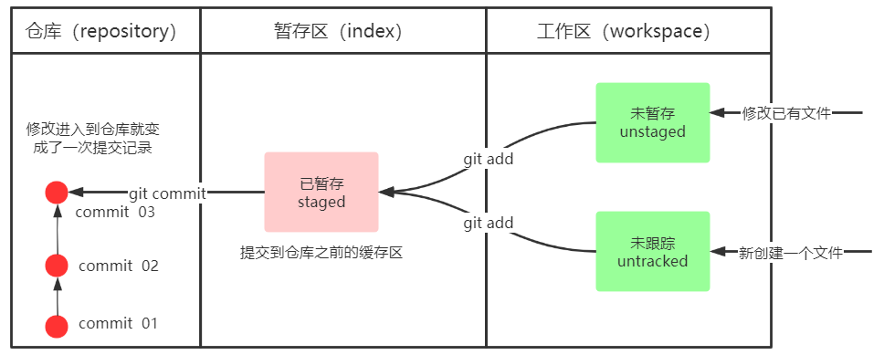

# Git分布式版本控制工具

[Git学习笔记 | Kisugi Takumi](https://kisugitakumi.com/2022/01/18/Git学习笔记/#Git学习笔记)


## 概述

- [x] 了解 Git 基本概念
- [x] 了解 Git 工作流程
- [x] 熟悉 Git 常用命令
- [x] 熟悉 IDEA 中 Git 的使用

### 版本控制的方式

- 集中式版本控制工具

    - 版本库是集中存放在中央服务器的，team 里每个人 work 时从中央服务器下载代码，是必须联网才能工作，局域网或互联网。个人修改后然后提交到中央版本库。
    - 举例：SVN 和 CVS

- 分布式版本控制工具 

    - 分布式版本控制系统没有“中央服务器”，每个人的电脑上都是一个完整的版本库，这样工作的时候无需要联网，因为版本库就在你自己的电脑上。多人协作只需要各自的修改推送给对方，就能互相看到对方的修改了。
    - 举例：Git

### git 的作用

- [x] 代码备份：代码备份到 GitHub 上。
- [x] 代码还原：Git 上记录了代码的提交内容，可以还原任一时间点的代码。
- [x] 协同开发：多人协作开发项目，通过 Git 协同开发，记录，分享所写代码。
- [x] 追溯代码问题，编写人和编写时间

### git 简介

Git 是分布式的，不需要有中心服务器，我们每台电脑拥有的东西都是一样的。我们使用 Git 并且有个中心服务器，中心服务器就是为了方便大家交换代码。没有它大家一样可以工作，只不过“交换”修改不方便而已。 

<span style="color:red">Git 是一个开源的分布式版本控制系统，可以有效、高速地处理从很小到非常大的项目版本管理。</span>

Git 是 Linus Torvalds 为了帮助管理 Linux 内核开发而开发的一个开放源码的版本控制软件。 同生活中的许多伟大事物一样，Git 诞生于一个极富纷争大举创新的年代。Linux 内核开源项目有着为数众多的参与者。 绝大多数的 Linux 内核维护工作都花在了提交补丁和保存归档的繁琐事务上 (1991－2002 年间) 。 到 2002 年，整个项目组开始启用一个专有的分布式版本控制系统 BitKeeper 来管理和维护代 码。 

到了 2005 年，开发 BitKeeper 的商业公司同 Linux 内核开源社区的合作关系结束，他们收回了 Linux 内核社区免费使用 BitKeeper 的权力。 这就迫使 Linux 开源社区 (特别是 Linux 的缔造者 Linus Torvalds) 基于使用 BitKeeper 时的经验教训，开发出自己的版本系统。 他们对新的系统制订了若干目标： 

- 速度
- 简单的设计
- 对非线性开发模式的强力支持 (允许成千上万个并行开发的分支)  
- 完全分布式
- 有能力高效管理类似 Linux 内核一样的超大规模项目 (速度和数量) 

<div align="center"></div>

### 工作流程图

<div align="center"></div>

> <b>常见命令如下</b>

- clone (克隆) ：从远程仓库中克隆代码到本地仓库 
- checkout  (检出) ：从本地仓库中检出一个仓库分支然后进行修订 
- add (添加) ：在提交前先将代码提交到暂存区 
- commit (提交) ：提交到本地仓库。本地仓库中保存修改的各个历史版本 
- fetch (抓取) ：从远程库，抓取到本地仓库，不进行任何的合并动作，一般操作比较少。
- pull (拉取) ：从远程库拉到本地库，自动进行合并(merge)，然后放到到工作区，相当于 fetch+merge 
- push (推送) ：修改完成后，需要和团队成员共享代码时，将代码推送到远程仓库

## 安装 git

### 常见Linux命令

- ls/ll 查看当前目录 
- cat 查看文件内容 
- touch 创建文件 
- vi vim 编辑器

### 安装

下载地址： https://git-scm.com/download

安装时：Use git from git bash only... 其他默认下一步。安装成功后鼠标点击右键可以看到。


<b>工具说明</b>

Git GUI：Git 提供的图像界面工具

Git Bash：Git 提供的命令行工具，提供了一些常见的 Linux 命令，如 curl。

当安装 Git 后首先要做的事情是设置用户名称和 email 地址。每次 Git 提交都会使用该用户信息

### 基本配置

- 点击右键==>选择 Git bash
- 配置全局变量，配置用户信息，这样在提交版本的时候就会记录好是谁进行的这次提交
- git config --global user.name "username" 如：`git config --global user.name "csxx"`
- git config --global user.email "邮箱" 如：`git config --global user.email "12312331@qq.com"`
- 查看配置信息
    - git config --global user.name
    - git config --global user.email

除了 git config --global 外，还有其他的命令

```sh
git config --local		# local 只对某个仓库有效
git config --global		# global 对当前用户所有仓库有效
git config --system		# system 对系统所有登录的用户有效
```

显示 config 配置，加 --list

```sh
git config --list 			# 查看所有的 config 配置
git config --list --local
git config --list --global
git config --list --system
```


### 为常用指令配置别名

有些常用的指令参数非常多，每次都要输入好多参数，我们可以使用别名。

- 打开用户目录，创建 .bashrc 文件 

- 部分 windows 系统不允许用户创建点号开头的文件，可以打开 gitBash, 执行 `touch ~/.bashrc`

- 在 .bashrc 文件中输入如下内容


```shell
#用于输出git提交日志
alias git-log='git log --pretty=oneline --all --graph --abbrev-commit'
#用于输出当前目录所有文件及基本信息
alias ll='ls -al'
```

### Git乱码

打开 GitBash 执行下面命令

```shell
git config --global core.quotepath false 
```

在 `${git_home}/etc/bash.bashrc$`  文件后面加入下面两行

```shell
export LANG="zh_CN.UTF-8"
export LC_ALL="zh_CN.UTF-8"
```

### 配置免密登录

配置 ssh：先在本地配置，发送给远程

输入以下命令 ssh-keygen -t rsa -C 邮箱 如：`ssh-keygen -t rsa -C 695466632@qq.com` 然后一直回车

打开 github 网站 =\=> 找到 setting =\=> new ssh key，title任意，key 输入本地生成的 pubkey (公钥) , pubkey 的存放地址请仔细看 Git 控制台的输出。


测试连通性 ssh -T git@github.com[写死的]

本地和远程成功通信则可以在 .ssh 中发现 known_hosts 文件，出错就多试几次可能是网络问题。不行就检测建立 ssh 时输入的 pub key。

## 常用命令

### 获取本地仓库

- 在电脑的任意位置创建一个空目录 (例如 test) 作为我们的本地 Git 仓库
- 进入这个目录中，点击右键打开 Git bash 窗口                                           
- 执行命令 git init 
- 如果创建成功后可在文件夹下看到隐藏的 .git 目录。

```shell
$ git init
Initialized empty Git repository in D:/front/.git/
```

### 基础操作指令

Git 工作目录下对于文件的<b>修改</b>(增加、删除、更新)会存在几个状态，这些<b>修改</b>的状态会随着我们执行 Git 的命令而发生变化。



使用命令来控制这些状态之间的转换

- ① git add (工作区 —> 暂存区)，把项目文件纳入 git 的管理。例如本地写了一个版本，先提交到暂存区；然后写了第二个版本，发现版本一更佳，此时可以把版本一回退到本地，然后提交到仓库。
- ② git commit (暂存区 —> 本地仓库)

#### status 查看修改状态

- 作用：查看修改的状态 (暂存区、工作区) 
- 命令形式：`git status`

#### add 添加工作到暂存区

- 作用：添加工作区一个或多个文件的修改到暂存区
- 场景举例：我们需要修改多个文件以达成一个目的，可以逐个修改，修改好一个后就添加到暂存区，当该功能的所有文件都以修改完毕则统一提交到版本库。
- 命令形式：git add 单个文件名|通配符

```shell
git add file.txt # 添加单个文件
git add . # 将所有新建的文件 和 修改的文件加入暂存区
```


Changes to be committed 即将被提交，进入了暂存区。

```shell
git add -u		# 整个工作树中的所有跟踪文件都将更新
```

#### commit 提交暂存区到本地仓库

- 作用：提交暂存区内容到本地仓库的当前分支
- 命令形式：git commit -m ‘注释内容’

```shell
git commit -m "add test.md"
git commit -am 'add xxx'  # add 和 commit 一起执行。但是不推荐使用。这种做法工作区的内容直接添加到了版本历史库里了。
```


commit 后，再次查看状态，暂存区中已经没有东西了。

#### 文件重命名

加入我们想对已经加入仓库的文件进行重命名（readme 修改为 readme.md），该怎么做？

<b>方式一：</b>直接用 mv 对文件重命名。但是会出现下面的情况。git status 变为删除了 readme 文件，然后新增了一个未追踪的文件 readme.md。

下面的执行流程展示了整个操作的过程。可以看出，git 是知道我们进行文件重命名的，但是操作流程却比较繁琐。

```shell
git init
Initialized empty Git repository in xxx
touch readme
git add readme
git commit -m"add readme"
[master (root-commit) 2327a82] add readme
 1 file changed, 0 insertions(+), 0 deletions(-)
 create mode 100644 readme
mv readme readme.md
git status
On branch master
Changes not staged for commit:
  (use "git add/rm <file>..." to update what will be committed)
  (use "git checkout -- <file>..." to discard changes in working directory)

        deleted:    readme

Untracked files:
  (use "git add <file>..." to include in what will be committed)

        readme.md

no changes added to commit (use "git add" and/or "git commit -a")
git add readme.md
git rm readme
rm 'readme'
git status
On branch master
Changes to be committed:
  (use "git reset HEAD <file>..." to unstage)

        renamed:    readme -> readme.md
```

git reset --hard 暂存区中所有的工作变更都会被清理掉。(只会清空暂存区的提交，对 commit 无任何影响)

刚刚上面繁琐的文件名变更过程可以用这条命令替代：`git mv readme readme.md`

```shell
git mv readme readme.md
git status
On branch master
Changes to be committed:
  (use "git reset HEAD <file>..." to unstage)
        renamed:    readme -> readme.md

git commit -m "mv readme to readme.md"
[master e003077] mv readme to readme.md
 1 file changed, 0 insertions(+), 0 deletions(-)
 rename readme => readme.md (100%)
```

### 查看提交日志（log）

- 配置的别名 git-log 就包含了这些参数，所以后续可以直接使用指令 git-log
- 作用：查看提交记录
- 命令形式：git log [option] 或者 git-log
    - `git log --oneline`，简要的显示每个 log，每个 log 仅占一行。
    - `git log -n2 --oneline`，只显示最近的两条 log，每个 log 仅占一行。
    - `git log --all` 显示所有分支的 log
    - `git log --all --graph` 用图形化的方式显示所有分支的 log
    - `git log --all --oneline -n4 --graph` 用图形化的方式显示所有分支的前 4 个 log。
    - `git log --pretty=oneline` 将提交信息显示为一行
    - `git log --abbrev-commit` 使得输出的 commitId 更简短


git log 查看日志信息，可以看到提交记录，谁？什么时间段提交的内容。


git branch -v，查看本地到底有多少分支

```shell
git branch -v
* master e003077 mv readme to readme.md

# 为了演示 log 的更多用法，这里创建一个临时的分支
# 额外加几个 commit 操作
git log --oneline
0ccac2a (HEAD -> master) add tmp2 file
5ae0216 add tmp file
e003077 mv readme to readme.md
2327a82 add readme

# 创建临时分支
git checkout -b temp 5ae0216

git branch -v
  master 0ccac2a add tmp2 file
* temp   5ae0216 add tmp file
```

### 版本回退（reset）

- 作用：版本切换
- 命令形式

```shell
# commitID 可以使用 git-log 或 git log 指令查看
git reset --hard commitID 
```


能不能再回到回退前的版本呢？可以的，只要记得 commit id 就行。


可以发现 git log 查不出来 obb6 这个 id 了。如果之前我们没有记住这个 id，是不是就不能恢复了？不是的。可以用 git reflog 来查看。

git reflog，把所有的操作记录下来了，可以看到已经删除的提交记录。<span style="color:red">git reflog 是用来恢复本地错误操作很重要的一个命令。</span>


<b>练习</b>

```shell
#####################仓库初始化###################### 
# 创建目录 (git_test01) 并在目录下打开gitbash 
# 初始化git仓库 
git init 

#####################创建文件并提交##################### 
# 目录下创建文件 file01.txt 
# 将修改加入暂存区 
git add . 
# 将修改提交到本地仓库，提交记录内容为：commit 001 
git commit -m 'commit 001' 
# 查看日志 
git log 

####################修改文件并提交###################### 
# 修改file01的内容为：count=1 
# 将修改加入暂存区 
git add . 
# # 将修改提交到本地仓库，提交记录内容为：update file01 
git commit --m 'update file01' 
# 查看日志 
git log 
# 以精简的方式显示提交记录 git-log 是配置的别名
git-log 

####################将最后一次修改还原################## 
# 查看提交记录 
git-log 
# 找到倒数第2次提交的commitID 
# 版本回退 
git reset commitID --hard
```

### 文件说明（.git）

#### 目录说明

.git 文件中包含许多信息

```shell
ls -al
total 56
drwxr-xr-x  8 payphone payphone 4096 Mar 28 14:30 .
drwxr-xr-x  3 payphone payphone 4096 Mar 28 14:27 ..
-rw-r--r--  1 payphone payphone   15 Mar 28 14:30 COMMIT_EDITMSG
-rw-r--r--  1 payphone payphone   21 Mar 28 14:26 HEAD
-rw-r--r--  1 payphone payphone   41 Mar 28 14:09 ORIG_HEAD
drwxr-xr-x  2 payphone payphone 4096 Mar 28 11:34 branches
-rw-r--r--  1 payphone payphone   92 Mar 28 11:34 config
-rw-r--r--  1 payphone payphone   73 Mar 28 11:34 description
drwxr-xr-x  2 payphone payphone 4096 Mar 28 11:34 hooks
-rw-r--r--  1 payphone payphone  209 Mar 28 14:30 index
drwxr-xr-x  2 payphone payphone 4096 Mar 28 11:34 info
drwxr-xr-x  3 payphone payphone 4096 Mar 28 11:34 logs
drwxr-xr-x 14 payphone payphone 4096 Mar 28 14:30 objects
drwxr-xr-x  4 payphone payphone 4096 Mar 28 11:34 refs
```

- HEAD，一个指向分支的引用，告诉我们现在工作在那个分支上。

```shell
cat HEAD
ref: refs/heads/temp
```

- config 一些本仓库的配置信息

```shell
cat config
[core]
        repositoryformatversion = 0
        filemode = true
        bare = false
        logallrefupdates = true
```

- refs，存储指向数据（分支、标签）的提交对象的指针的目录。即，refs 中存储的是指向数据的指针。
    - heads 对于分支，master 中存储的是 master 指针指向那个 commit
    - tags 是标签，tags 中存储的是各种 tag，tag 中存储的是 tag 指针指向的那个 哈希值，而哈希值中存储的是 Object，这个 Object 对象是 commit。
    - git cat-file -t 哈希值，查看类型
    - git cat-file -p 哈希值，查看内容

```shell
.git/refs$ tree
.
├── heads
│   ├── master
│   └── temp
└── tags

cat master
0ccac2a08996bae2bdf94c3dc0fb1b820836262e
git cat-file -t  0ccac2
commit
```

#### 对象说明

git 中有三种对象，commit、blob、tree。

只要任何文件的文件内容相同，那么就是唯一的 blob，节省磁盘空间和版本管理的开销==>只同步不同的内容。

commit 包含 tree，tree 包含 blob

```shell
# 查看前3条记录
git log -n3 --oneline
861ca4e (HEAD -> temp) modify tmp.txt
5ae0216 add tmp file
e003077 mv readme to readme.md

# 查看文件内容
git cat-file -p 5ae0216
tree 8726bf4f81fad6a51d32716c1407660b35205990
parent e00307759f3af0a68347df402f58b17e244db52f
author csliujw <695466632@qq.com> 1679984731 +0800
committer csliujw <695466632@qq.com> 1679984731 +0800

add tmp file

# 查看 tree 的内容
git cat-file -p 8726bf4
100644 blob e69de29bb2d1d6434b8b29ae775ad8c2e48c5391    readme.md
100644 blob e69de29bb2d1d6434b8b29ae775ad8c2e48c5391    tmp.txt

# 查看 blob 的内容
git cat-file -p e69de29bb2d1d6434b8b29ae775ad8c2e48c5391
```

新的东西加入到暂存区，git 就会主动把暂存区的东西创建出 blob。`.git/objects` 中会有一个对象。当把暂存区的内容提交到仓库时会创建多个对象。具体的内容可以自行创建文件，添加到暂存区后去 objects 目录看多了那些。commit 后有多了那些。多出的对象是什么类型，对象中的内容是什么。

### 分离头指针（HEAD）

git checkout xx

```shell
git checkout 5ae0216
Note: checking out '5ae0216'.

You are in 'detached HEAD' state. You can look around, make experimental
changes and commit them, and you can discard any commits you make in this
state without impacting any branches by performing another checkout.

If you want to create a new branch to retain commits you create, you may
do so (now or later) by using -b with the checkout command again. Example:

  git checkout -b <new-branch-name>

HEAD is now at 5ae0216 add tmp file
```

在分离头指针情况下，可以继续做开发，继续产生 commit，且不会对其他分支有影响。分离头指针的意思是，我们工作在一个没有分支的状态下，做的 commit、变更是不会影响到其他分支的。

想做变更，当时只是尝试性的变更，做的不好想扔掉。扔掉的办法就是后面不再理会这些变更。这时候 checkout 到新的分支就可以了。

比如我们想在 tmp 中加内容。

```shell
ls -al
total 12
drwxr-xr-x 3 payphone payphone 4096 Mar 28 16:12 .
drwxr-xr-x 3 payphone payphone 4096 Mar 28 11:23 ..
drwxr-xr-x 8 payphone payphone 4096 Mar 28 16:12 .git
-rw-r--r-- 1 payphone payphone    0 Mar 28 14:09 readme.md
-rw-r--r-- 1 payphone payphone    0 Mar 28 16:12 tmp.txt

# 修改 tmp
vi tmp.txt

# 查看状态
git status
HEAD detached at 5ae0216
Changes not staged for commit:
  (use "git add <file>..." to update what will be committed)
  (use "git checkout -- <file>..." to discard changes in working directory)

        modified:   tmp.txt

no changes added to commit (use "git add" and/or "git commit -a")

# 提交修改
git commit -am'attach head'
[detached HEAD f80e735] attach head
 1 file changed, 1 insertion(+)

# 查看日志
git log --graph
* commit f80e7354548b70e4ce9ce2b87b894adba2b6077d (HEAD)  # 以前 HEAD 和 分支总是一起出现的，这次这里只有 HEAD，没有分支了。
| Author: csliujw <695466632@qq.com>
| Date:   Tue Mar 28 16:15:38 2023 +0800
|
|     attach head
|
* commit 5ae0216024762e8c7d2c6d7df2d9e465e975895b
| Author: csliujw <695466632@qq.com>
| Date:   Tue Mar 28 14:25:31 2023 +0800
|
|     add tmp file
|
* commit e00307759f3af0a68347df402f58b17e244db52f
| Author: csliujw <695466632@qq.com>
| Date:   Tue Mar 28 14:13:42 2023 +0800
|
|     mv readme to readme.md
|
* commit 2327a82dc944915e1a00d5393f303dad29df1f5e
  Author: csliujw <695466632@qq.com>
  Date:   Tue Mar 28 11:34:50 2023 +0800

      add readme

# 如果我们突然切换出去，那么这次的提交就会丢掉。
git checkout master
Warning: you are leaving 1 commit behind, not connected to
any of your branches:

  f80e735 attach head

If you want to keep it by creating a new branch, this may be a good time
to do so with:
	git branch <new-branch-name> f80e735
	
# 如果想要保存，就按提示走
```


### 操作分支（branch）

几乎所有的版本控制系统都以某种形式支持分支。 使用分支意味着你可以把你的工作从开发主线上分离开来进行重大的 Bug 修改、开发新的功能，以免影响开发主线。

#### 查看本地分支

- 命令：git branch

#### 创建本地分支

- 命令：git branch 分支名

#### 切换分支

- 命令：git checkout 分支名

我们还可以直接切换到一个不存在的分支 (创建并切换) 

- 命令：git checkout -b 分支名

#### 拷贝现有分支

我们可以根据现有的分支创建出一个新分支。

`git branch copy master`

`git checkout -b copy2 master`

#### 合并分支

一个分支上的提交可以合并到另一个分支。比如 master 分支中有 demo.md 文件，dev 分支有 publish.md 文件，最终这两个文件需要合并到一个分支中去，这时候可以用 git merge 进行分支合并。

命令：git merge 分支名称


假定合并后的内容如下

```cpp
<<<<<<< HEAD
hello world test main branch
=======
hello world test I am test branch
>>>>>>> test
```

```shell
<<<<<<< HEAD
hello world test main branch
=======
# 上面的表示是主分支的内容

# 下面的是 test 分支和主分支不一致的内容，选择一个进行保留即可。
hello world test I am test branch
>>>>>>> test
```

#### 删除分支

不能删除当前分支，只能删除其他分支

git branch -d b1 删除分支时，需要做各种检查

git branch -D b1 不做任何检查，强制删除

#### 修改提交的msg

如果我们想修改 msg 的最新提交，可以用 `git commit --amend` 命令来修改 msg。

如果想修改先前 commit 的 msg，可以使用 [rebase](##变基（rebase）)


#### 解决冲突

当两个分支上对文件的修改可能会存在冲突，例如同时修改了同一个文件的同一行，这时就需要手动解决冲突，解决冲突步骤如下：

①处理文件中冲突的地方

②将解决完冲突的文件加入暂存区 (add)

③提交到仓库 (commit)

冲突部分的内容处理如下所示：

dev 分支中 test.md 的内容是 dev，master 分支中的 test.md 的内容是 master。合并的时候会发生冲突。 


冲突的内容可以再 test.md 中看到

```text
<<<<<<< HEAD
master
=======
dev
>>>>>>> dev
```

删除掉一些内容即可，然后 `git add .`

```text
master
```


#### 使用原则与流程

几乎所有的版本控制系统都以某种形式支持分支。 使用分支意味着你可以把你的工作从开发主线上分离开来进行重大的 Bug 修改、开发新的功能，以免影响开发主线。

在开发中，一般有如下分支使用原则与流程：

- master (生产) 分支：线上分支，主分支，中小规模项目作为线上运行的应用对应的分支；
- develop (开发) 分支：是从 master 创建的分支，一般作为开发部门的主要开发分支，如果没有其他并行开发不同期上线要求，都可以在此版本进行开发，阶段开发完成后，需要是合并到 master 分支，准备上线。
- feature/xxxx 分支：从 develop 创建的分支，一般是同期并行开发，但不同期上线时创建的分支，分支上的研发任务完成后合并到 develop 分支。
- hotfifix/xxxx分支：从 master 派生的分支，一般作为线上 bug 修复使用，修复完成后需要合并到 master、test、develop 分支。
- 还有一些其他分支，在此不再详述，例如 test 分支 (用于代码测试) 、pre 分支 (预上线分支) 等等。


#### 练习

```shell
###########################创建并切换到dev01分支，在dev01分支提交 
# [master]创建分支dev01
git branch dev01 
# [master]切换到dev01
git checkout dev01 
# [dev01]创建文件file02.txt 
# [dev01]将修改加入暂存区并提交到仓库,提交记录内容为：add file02 on dev 
git add . git commit -m 'add file02 on dev' 
# [dev01]以精简的方式显示提交记录 git-log ###########################切换到master分支，将dev01合并到master分支 
# [dev01]切换到master分支 
git checkout master 
# [master]合并dev01到master分支 
git merge dev01 
# [master]以精简的方式显示提交记录 
git-log 
# [master]查看文件变化(目录下也出现了file02.txt) ##########################删除dev01分支 
# [master]删除dev01分支 
git branch -d dev01 
# [master]以精简的方式显示提交记录 
git-log
```

### 变基（rebase）

- 我们可以用 rebase 修改之前 commit 的 msg
- 也可以用 rebase 把连续的 commit 合并成一个。
- 也可以用 rebase 把不连续的 commit 合并成一个。

不过在讲解之前需要注意，我们可以把 rebase 用在自己负责的分支上，但是如果分支已经被合并了，被其他人所依赖，就不要轻易 rebase 了（会打乱别人的开发） 。

<b>在使用 rebase 前，先阅读下 rebase 相关的文档。</b>

```shell
# Rebase e95f195..e95f195 onto e95f195 (1 command)
#
# Commands:
# p, pick <commit> = use commit												===> 使用 commit
# r, reword <commit> = use commit, but edit the commit message				===> 使用 commit, 内容保持不变但是修改 message
# e, edit <commit> = use commit, but stop for amending						
# s, squash <commit> = use commit, but meld into previous commit			===> 使用 commit, 但是把 s 标记的都合并到前一个 commit
# f, fixup [-C | -c] <commit> = like "squash" but keep only the previous
#                    commit's log message, unless -C is used, in which case
#                    keep only this commit's message; -c is same as -C but
#                    opens the editor
# x, exec <command> = run command (the rest of the line) using shell
# b, break = stop here (continue rebase later with 'git rebase --continue')
# d, drop <commit> = remove commit
# l, label <label> = label current HEAD with a name
# t, reset <label> = reset HEAD to a label
# m, merge [-C <commit> | -c <commit>] <label> [# <oneline>]
# .       create a merge commit using the original merge commit's
# .       message (or the oneline, if no original merge commit was
# .       specified); use -c <commit> to reword the commit message
```

#### 修改 msg

<b>修改之前 commit 的 msg</b>

如果想修改当前 commit 的 msg 我们可以用 `git commit -amend`，如果想修改之前记录的 msg 呢？可以用 rebase，`git rebase -i 选择需要变更提交的父亲`，例如我们需要把 update juc 变更为 update juc note，那么我们需要选择的是 `77deb4` 这个 msg。

```shell
git log -n3
commit c8701e8874ed55d611d9a4fcfe0483ccc8705a2e (HEAD -> notes)
Author: csliujw <695466632@qq.com>
Date:   Tue Mar 28 22:50:25 2023 +0800

    update this message

commit 7578d051284349dd408eba9f26792b6e3b175d0e
Author: csliujw <695466632@qq.com>
Date:   Sat Mar 25 23:23:36 2023 +0800

    update juc

commit 77deb477a80df21162dc3d880cdc3e4d8612c609 (origin/notes, origin/HEAD)
Author: csliujw <695466632@qq.com>
Date:   Thu Mar 16 23:05:21 2023 +0800

    update
```

使用 rebase 来变更 msg

```shell
git rebase -i 77deb477
pick 7578d05 update juc				
pick c8701e8 update this message

# ==> 修改 update juc==> update juc note. 具体的处理策略可以看 git 的提示, 用 r 表示要重新编辑，然后保存
r 7578d05 update juc				
pick c8701e8 update this message
# ==> 弹出页面
[unix] 30L, 1338B written
update juc notes	#===>在这里填写变更的内容

# Please enter the commit message for your changes. Lines starting
# with '#' will be ignored, and an empty message aborts the commit.
#
# Date:      Sat Mar 25 23:23:36 2023 +0800
#
# interactive rebase in progress; onto 77deb47

#==>修改完毕后再看
git log -n2
commit e95f195b9c41aad66673f7233badf0b2beb10198 (HEAD -> notes)
Author: csliujw <695466632@qq.com>
Date:   Tue Mar 28 22:50:25 2023 +0800

    update this message

commit 4e03c937a7daa0dcf12f66900642fe078757cadc
Author: csliujw <695466632@qq.com>
Date:   Sat Mar 25 23:23:36 2023 +0800

    update juc notes			#===>修改成功了
[detached HEAD 4e03c93] update juc notes #===>可以发现 rebase 其实也是用到了分离头指针的。

# 可以发现，被修改 msg 的提交 7578d05128 不见了，变成了 4e03c937a7
```

#### 合并连续的 commit

<b>压缩 commit</b>

例如，我们将 77deb47 和它的两个父亲 (0b0bc32 和 ebc7606）合并到一起。这时候选择对 d4e2532（选择那三个的祖先） 进行变基。（变基，变基，可以理解为变更祖先吗？）

```shell
git log -n6 --oneline
e95f195 (HEAD -> notes) update this message
4e03c93 update juc notes
77deb47 (origin/notes, origin/HEAD) update	#===>合并
0b0bc32 update								#===>合并
ebc7606 内容更新							 #===>合并
d4e2532 整合笔记内容，清理部分无用图片，新增部分读书笔记
```

```shell
git rebase -i d4e2532

pick ebc7606 内容更新	  #===>合并		#===>这里面最旧的 commit
pick 0b0bc32 update		#===>合并
pick 77deb47 update		#===>合并
pick 4e03c93 update juc notes
pick e95f195 update this message		#===>最新的 commit
```

此处基于 ebc7606 进行合并。

```shell
pick ebc7606 内容更新	  #===>合并
s 0b0bc32 update		#===>合并
s 77deb47 update		#===>合并 s 表示合到前面的 commit
pick 4e03c93 update juc notes
pick e95f195 update this message		#===>最新的 commit


#===>弹出提示, 为什么要做变更, 进行日志记录

# This is a combination of 3 commits.
# This is the 1st commit message:

内容更新, 合并提交记录

# This is the commit message #2:

update, 合并提交记录

# This is the commit message #3:

update, 合并提交记录
```

#### 合并不连续的 commit

操作也很简单，就是选好一个 commit_id 进行 rebase，然后把需要融合的 commit 的 id 写进去，最老的 commit 写在最前面。比如，我们需要把 commit 修改.

```shell
git log -n6 --oneline
3bcb25f (HEAD -> notes) update this message
01f8f98 update juc notes							# 需要合并
188b96c 内容更新, 合并								# 需要合并
d4e2532 整合笔记内容，清理部分无用图片，新增部分读书笔记	# 用它作为基地, 合并不连续的 commit
78f7367 复习并更新mysql笔记						    # 需要合并
3d2fd52 fix gitpage bug			

git rebase -i d4e2532
pick 188b96c 内容更新, 合并
pick 01f8f98 update juc notes
pick 3bcb25f update this message

##############==>把最老的需要合并的 commits 写在最前面
pick 78f7367 复习并更新mysql笔记
pick 188b96c 内容更新, 合并
pick 01f8f98 update juc notes
pick 3bcb25f update this message

##############==>进行合并操作
pick 78f7367 复习并更新mysql笔记
s 188b96c 内容更新, 合并				#===> 合并到前一个提交 (78f7367)
s 01f8f98 update juc notes			#===> 合并到前一个提交
pick 3bcb25f update this message	#===> 最新的提交


#############提示有冲突
error: could not apply 78f7367... 复习并更新mysql笔记
Resolve all conflicts manually, mark them as resolved with
"git add/rm <conflicted_files>", then run "git rebase --continue".
You can instead skip this commit: run "git rebase --skip".
To abort and get back to the state before "git rebase", run "git rebase --abort".
Could not apply 78f7367... 复习并更新mysql笔记
Auto-merging 中间件/Redis-实战.md
CONFLICT (content): Merge conflict in 中间件/Redis-实战.md
Auto-merging Database/MySQL-加强.md
CONFLICT (content): Merge conflict in Database/MySQL-加强.md
```

### 比较差异（diff）

实际使用的时候，我们需要考虑，到暂存区的东西是不是可以提交过去。这时候需要我们比较下暂存区和最近一次提交之间的差异（diff），来判断下那些是要作为新的提交加入进去的。此外，还可以通过 git diff 来比较下列内容的差异。常用的命令如下：

- 尚未缓存的改动（未添加到暂存区）：`git diff`
- 查看已缓存的改动（添加到了缓存区的）： `git diff --cached`
- 查看已缓存的与未缓存的所有改动（add 前后的改动，commit 只会就看不到了）：`git diff HEAD`
- 显示摘要而非整个 diff：`git diff --stat`
- 对比两次提交的改动： `git diff [first-branch] ... [second-branch]`，显示 first 和 second 之间的差异。
- 也可以指定只看某个文件的差异：`git diff -- file1 file2 file3`

```shell
git diff befcc00 7578d05

# --- 表示 a 提交的
# +++ 表示 b 提交的
diff --git a/Solution/git实用技巧.md b/Solution/git实用技巧.md
index cf1798e..94f4081 100644
--- a/Solution/git实用技巧.md
+++ b/Solution/git实用技巧.md
@@ -1,35 +1,8 @@
-# Why Learn Git
+# Learn Git Branch
```

#### 暂存区和HEAD

修改某个文件的内容，然后加入暂存区，再比较暂存区和 HEAD 之间的区别。

```shell
# windows 用 notepad 启动记事本, Linux 可以直接用 vi/vim
notepad .\好用的符号.md
git add 好用的符号.md
git diff --cached 	# 比较暂存区和 HEAD 的区别
diff --git a/好用的符号.md b/好用的符号.md
index c42a004..b121d30 100644
--- a/好用的符号.md
+++ b/好用的符号.md
@@ -14,4 +14,5 @@

 『』

-iCloud + Mweb + Typora 还是好用。
\ No newline at end of file
+iCloud + Mweb + Typora 还是好用。
+OKK，Add some message
\ No newline at end of file

# git reset --hard 清除暂存区中的内容, 修改的内容也会丢失。
```

#### 工作区和暂存区

在工作区中修改文件，但是不加入暂存区。(`git diff` 默认比较的就是工作区和暂存区的区别)

```shell
git diff
diff --git a/好用的符号.md b/好用的符号.md
index c42a004..dd993ab 100644
--- a/好用的符号.md
+++ b/好用的符号.md
@@ -14,4 +14,5 @@

 『』

-iCloud + Mweb + Typora 还是好用。
\ No newline at end of file
+iCloud + Mweb + Typora 还是好用。
+modify
\ No newline at end of file
```

#### 不同提交的差异

如果我们想查看两个分支之间的差异或两个分支之间某个文件的差异可以用 `git diff commit_id1, commit_id2 -- file1`

```shell
git log -n4 --oneline
8053ebd (HEAD -> notes) lg
e63db2a update this message
99fe85a 整合笔记内容，清理部分无用图片，新增部分读书笔记
78f7367 复习并更新mysql笔记

git diff e63db2a 78f7367 -- C++/调用三方库.md
diff --git a/C++/调用三方库.md b/C++/调用三方库.md
deleted file mode 100644
index d610344..0000000
--- a/C++/调用三方库.md
+++ /dev/null
@@ -1,6 +0,0 @@
-# C++调用三方库
-
-- 打包静态/动态连接库
```


### 文件恢复（reset）

- 让暂存区恢复成和 HEAD 一样
- 让工作区的文件恢复成和暂存区一样
- 取消暂存区部分文件的更改

#### 暂存区恢复成和 HEAD 一样

修改部分文件，添加到暂存区。然后执行下列命令。

```shell
git add .			#===> 加入暂存区
	
git status			#===> 查看状态
On branch notes
Your branch and 'origin/notes' have diverged,
and have 3 and 4 different commits each, respectively.
  (use "git pull" to merge the remote branch into yours)

Changes to be committed:
  (use "git restore --staged <file>..." to unstage)
        modified:   README.md
        
git reset HEAD		#===> 将暂存区恢复成和 HEAD 一样, 暂存区提交的内容还原到工作区
Unstaged changes after reset:
M       README.md

git diff --cached	#===> 暂存区确实和 HEAD 一样了。
#===> 查看文件, 确实修改还在, 只是不在暂存区了.
```

#### 工作区的文件恢复成和暂存区一样

有些时候我们做了变更，这部分变更添加到了暂存区，然后工作区继续做变更；但是变更过程中发现工作区的变更不如暂存区好，这时候希望恢复成暂存区的样子。

```shell
# 变更过一次
git add .

git diff
diff --git a/README.md b/README.md
index 10884a7..4a429bd 100644
--- a/README.md
+++ b/README.md
@@ -1,5 +1,5 @@
 # 内容速查
-111
+111222^M
 ## 📚学习计划

# 继续修改
git status
On branch notes
Your branch and 'origin/notes' have diverged,
and have 3 and 4 different commits each, respectively.
  (use "git pull" to merge the remote branch into yours)

Changes to be committed:
  (use "git restore --staged <file>..." to unstage)
        modified:   README.md

Changes not staged for commit:
  (use "git add <file>..." to update what will be committed)
  (use "git restore <file>..." to discard changes in working directory)
        modified:   README.md
# 工作区希望恢复成暂存区的样子, git 提示我们可以使用 "git restore <file>..." to discard changes
git restore .\README.md

git diff .\README.md		#===> 对比工作区和暂存区, 没有差异。完美解决。
```

#### 取消暂存区部分文件的更改

```shell
git reset HEAD -- 文件名
```

### 消除最近的几次提交

如果有些 commit 我们确实是完全不想要了，可以使用 reset 消除最近的几次提交（只能消除本地的提交，远程的需要用 revert）

``` shell
git reset --hard commit_id 	#===> 将暂存区、工作区的状态都恢复到 commit_id 这次提交的内容了。
```

### 删除文件

`git rm file`，git 会直接把文件的删除情况放到暂存区，就不需要先在工作区删除，在从暂存区删除了。

```shell
# 删除 git 文件
#===>直接删除
rm file
git status

xxx deleted:	file

git rm file

#===>直接使用 git rm 删除文件, 更方便, 和前面的效果一样
git rm file
```

### 临时加塞紧急任务（stash）

假如之前做的工作被添加到暂存区了，然后开始了新的工作。此时，测试人员反馈刚刚添加到暂存区的代码出现了 bug，需要紧急修复。这时候需要我们放下手头的工作去修复 bug。可以先把手头的工作 stash（存放起来）

```shell
git status
modified:   README.md

git stash		#===>将手头的工作暂时存放起来，去解决 bug
Saved working directory and index state WIP on notes: 8053ebd lg

git status
nothing to commit, working tree clean

git stash apply	#===>将暂存的内容恢复过来, 暂存区的内容会保留
git stash pop	#===>将暂存的内容恢复过来, 且暂存区中的内容会弹出。
```


### 标签（tag）

如果我们的项目达到一个重要的阶段，并希望永远记住那个特别的提交快照，就可以给它打上标签 (tag)。比如，我们想为我们的项目发布一个 "1.0" 版本。 我们给最新一次提交打上 (HEAD) "v1.0" 的标签。标签可以理解为项目里程碑的一个标记，一旦打上了这个标记则，表示当前的代码将不允许提交。

```shell
# 打印所有的标签
$ git tag

# 添加轻量标签，指向提交对象的引用，可以指定之前的提交记录
$ git tag <标签名称> [<commit ID>]

# 添加带有描述信息的附注标签，可以指定之前的提交记录
$ git tag -a <标签名称> -m <标签描述信息> [<commit ID>]

# 切换到指定的标签
$ git checkout <标签名称>

# 查看标签的信息
$ git show <标签名称>

# 删除指定的标签
$ git tag -d <标签名称>

# 将指定的标签提交到远程仓库
$ git push <远程仓库的别名> <标签名称>

# 将本地所有的标签全部提交到远程仓库
$ git push <远程仓库的别名> –tags
```

### 理解 HEAD 和 Branch

head 可以指向分支，也可以指向具体的 commit，不和任何分支挂钩。

### 回退操作（reset&revert）

如果我们希望 git 回退到某个状态，并且这个状态之后的提交都丢掉，那么可以用 `git reset --hard befcc` 将暂存区和 commit 的内容都恢复到 befcc。 

### 忽略文件（ignore）

一般我们总会有些文件无需纳入 Git 的管理，也不希望它们总出现在未跟踪文件列表。 通常都是些自动生成的文件，比如日志文件，或者编译过程中创建的临时文件等。 在这种情况下，我们可以在工作目录中创建一个名为 .gitignore 的文件 (文件名称固定) ，列出要忽略的文件模式。

```shell
*.a # 以 .a 结尾的文件不让 git 管理, 如 demo.a 就会被忽略
*.dSYM/ # 文件夹下的任何文件都不纳入 git 管理, 但是 a.dSYM git 是要管理的。

doc/	# doc 文件夹下的所有文件都不纳入 git 管理
```

### Git 备份

将 Git 仓库备份到本地。

| 常用协议        | 语法格式                                                     | 说明                     |
| --------------- | ------------------------------------------------------------ | ------------------------ |
| 本地协议（1）   | /path/to/repo.git                                            | 哑协议                   |
| 本地协议（2）   | fil:///path/to/repo.git                                      | 智能协议                 |
| http/https 协议 | http://git-server.com:port/path/to/repo.git<br>https://git-server.com:port/path/to/repo.git | 平时接触到的都是智能协议 |
| ssh 协议        | user@git-server.com:path/to/repo.git                         | 工作中最常用的智能协议   |

#### 哑协议与智能协议

直观区别：哑协议传输进度不可见;智能协议传输可见。

传输速度：智能协议比哑协议传输速度快。

#### 仓库备份

- git clone
- git remote
- git push

先将当前的参考备份到 back 目录。

```shell
# 创建备份目录,进入目录执行 clone 备份仓库

#===> 哑协议备份
PS C:\development\note\back> git clone --bare C:\development\note\learning_git\.git ya.git
Cloning into bare repository 'ya.git'...
done.

#===> 智能协议备份
PS C:\development\note\back> git clone --bare file://C:\development\note\learning_git\.git zhineng.git
Cloning into bare repository 'zhineng.git'...
remote: Enumerating objects: 12501, done.
remote: Counting objects: 100% (12501/12501), done.
remote: Compressing objects: 100% (7521/7521), done.
Receiving objects:  100% (12501/12501)
```

把当前的 learning_git 仓库关联远端仓库，进行同步。

```shell
PS C:\development\note\learning_git> git remote add zhineng file://C:\development\note\back\zhineng.git
PS C:\development\note\learning_git> git remote -v
origin  git@github.com:csliujw/CodeNotes.git (fetch)
origin  git@github.com:csliujw/CodeNotes.git (push)
zhineng file://C:\development\note\back\zhineng.git (fetch)
zhineng file://C:\development\note\back\zhineng.git (push)

# 给参考做一些变更，然后 push 到其他参考做备份。
PS C:\development\note\learning_git> mkdir aa
PS C:\development\note\learning_git> git add .
PS C:\development\note\learning_git> git commit -m "update aa"

PS C:\development\note\learning_git> git push zhineng	#===>将git同步到其他仓库。

To file://C:\development\note\back\zhineng.git
   8053ebd..dcd0a96  notes -> notes
PS C:\development\note\learning_git>
```

## Git远程仓库

### 常用的托管服务

前面我们已经知道了 Git 中存在两种类型的仓库，即本地仓库和远程仓库。那么我们如何搭建 Git 远程仓库呢？我们可以借助互联网上提供的一些代码托管服务来实现，其中比较常用的有 GitHub、码云、GitLab 等。

GitHub ( 地址：https://github.com/ ) 是一个面向开源及私有软件项目的托管平台，因为只支持 Git 作为唯一的版本库格式进行托管，故名 GitHub

码云 (地址： https://gitee.com/ ) 是国内的一个代码托管平台，由于服务器在国内，所以相比于  GitHub，码云速度会更快

GitLab  (地址： https://about.gitlab.com/ ) 是一个用于仓库管理系统的开源项目，使用 Git 作为代码管理工具，并在此基础上搭建起来的 web 服务，一般用于在企业、学校等内部网络搭建 git 私服。

### 操作远程仓库

创建仓库时记得注意选择何种开源协议。

#### 添加远程仓库

此操作是先初始化本地库，然后与已创建的远程库进行对接。

命令格式如下：
- 远端名称：默认是 origin，取决于远端服务器设置
- 仓库地址：从远端服务器获取此 url

```shell
git remote add <远端名称> <仓库地址>  #===> add 新增远端站点, 一个本地参考可以关联多个远端仓库。
```

例如

```shell
git remote add origin git@gitee.com:csliujw/git_test.git
```

#### 查看远程仓库

命令

```shell
git remote
```

推送到远程仓库

```shell
git push [-f] [--set-upstream] [远端名称] [本地分支名][:远端分支名]
```

查看本地仓库和远程参考都有那些分支

```shell
git branch -av
* notes                 dcd0a96 [ahead 4, behind 4] update aa
  remotes/origin/HEAD   -> origin/notes
  remotes/origin/notes  77deb47 update
  remotes/zhineng/notes dcd0a96 update aa
```

注意：我们操作的其实都是本地分支，操作完毕后把内容 push 到远程分支上。如果本地分支和远程分支发生了冲突，可以将远程分支合并到本地分支，处理完冲突后再 push。

#### 从远程仓库克隆

如果已经有一个远端仓库，我们可以直接 clone 到本地。

```shell
git clone <仓库地址> [本地目录]
```

本地目录可以省略，会自动生成一个目录

#### 同步仓库内容

如果关联本地和远端仓库后，将本地的推送到远端发生了冲突，提示需要 pull xxx，可以用下面的方式解决。

```shell
git fetch 远端仓库名 分支名
git push 远端仓库名 分支名
```

如果发现仓库的分支走向不是线性的，可以通过 merge 的手段合并分支，变成线性的（后面体会）。

### 文件冲突★

此处指的都是两个人开发同一个分支

- 不同文件发生了冲突如何处理
- 相同的文件，不同内容发生了冲突如何处理
- 相同的文件，同样的内容发生了冲突如何处理
- 同时变更了文件名和文件内容如何处理
- 把同一文件改成了不同的文件名如何处理

有本地分支 a，还有远端分支 a，对本地分支进行修改，然后拉去远程分支，把远程分支和本地分支进行合并，再把本地分支推送到远程。

#### 不同文件的冲突

clone 一个自己的 git 备份项目，模拟下。

- 教程中的做法，clone 一个项目，然后根据远程分支 checkout -b 一个本地分支。
    - 新 git 项目：git checkout -b feature/add_git_commands origin/feature/add_git_commands。
    - 老 git 项目：git fetch xxx 拉取远端分支。
        - git branc -av，可以看到远程分支增加了。
        - git checkout -b feature/add_git_commands origin/feature/add_git_commands，创建一个本地分支和远程分支关联起来。
        - 观察下本地分支和远程分支的指向是否一样。

- 把远端分支 fetch 下来，git branch -av 可以发现本地的分支比远端的分支要新，且远端分支比本地多出一个文件。
- 将本地的分支和远端分支进行合并 merge。（切换到本地分支，然后 git merge xxx/feature/add_git_commands，把远端的合并到本地，然后再 push 到远程分支）

#### 同文件不同区域的内容

相同的文件，同样的内容发生了冲突如何处理？

远端的拉到本地，然后做个 merge，再看下内容是否需要人工介入处理，处理完毕后再 push。

#### 同文件同区域的内容

相同的文件，同样的内容发生了冲突如何处理？

把最新的仓库 pull 下，然后根据 git 的提示来解决冲突（git 会在冲突文件的前后用 `HEAD<<<<<<` `XX>>>>>>>` 表示是这部分文件冲突了），解决冲突后再 commit 并 push 到远端。

#### 有人修改了文件名

A 修改了文件名（index.html --> index.htm）然后提交到了远端。

B 不知道，还在 index.html 中做修改，提交到远端的时候报错了。提示我们要 pull。pull 的时候 git 非常智能的知道了是文件名发生了变化，替我们把本地的 index.html 修改为了 index.htm。而且我们变更的内容也保存到了里面。

如果文件名不同，且内容发生了变更，操作方式和上面的一样。

#### 多人修改同一个文件的文件名

A、B 都改了文件名，A 改成了 index1.htm，B 改成了 index2.htm，此时 git 不会处理，需要双方自己协商，协商完毕后再进行更改。

```shell
# 一般会提示我们把 index.html (被修改名字的) 删除，然后选择 index1.htm 或 index2.htm 加入暂存区
git rm index.html
git add index1.htm
git rm index2.htm
git commit -m 'decide to v index to index1'
```

### 危险命令

- reset、revert、push -f 都是危险命令。
- 严禁将公共分支拉到本地做 rebase 操作，可能会导致其他协作人员的 fast-forward rebase 前后不一致。

### github

让 git 变得更加好用，用户可以便捷的分享自己的 code。可以方便的检索自己想要的开源项目。

### 练习

> 基本命令介绍

```powershell
# 初始化git项目
git init

# 关联git仓库
git remote add origin '项目的免密地址'
# 例如
git remote add origin git@github.com:csliujw/JavaEE.git

# 添加
git add .

# 提交
git commit .  # 或者 git commit -m"提交的内容说明"

# 存入仓库
git push origin master

# 如果push失败提示这些内容
To github.com:liujiaweiReal/layui.git
 ! [rejected]        master -> master (non-fast-forward)
error: failed to push some refs to 'git@github.com:liujiaweiReal/layui.git'

# 则使用 这个命令同步下本地仓库和git仓库
git pull origin master --allow-unrelated-histories

# 再存入仓库
git push origin master

# 从仓库中拉取项目
git pull
```

> 使用案例

```powershell
# 第一次下载项目 (远程-本地) 
git clone git@github.com:yanqun/mygitremote.git

# 提交(本地-远程)
# (在当前工作目录 右键-git bash)
git add.
git commit -m"提交到分支"
git push origin master

# 更新(远程-本地)
git pull
# 从远程仓库中把代码拉过来！
git pull origin master
```

## 使用Github

[GitHub Docs](https://docs.github.com/zh)

### 搜索

有高级搜索功能。[Github高级搜索技巧 - 知乎 (zhihu.com)](https://zhuanlan.zhihu.com/p/411634596)

- 按时间。
- 在搜索栏输入 `git Java CPP in:readme`，在 readme 中搜索包含 Java CPP 的仓库。
- 在搜索栏输入 `git Java CPP in:readme stars:>1000`，在 readme 中搜索包含 Java CPP 的仓库，且 star 数大于 1000。
- 在搜索栏输入 `'public'+'static' filename:.Config.java`，搜索带 Config.java 文件的仓库，且文件中包含 public 和 static 字段。
- 高级搜索也有可视化的搜索界面：https://github.com/search/advanced

## IDEA中使用Git

### 配置Git

安装好 IntelliJ IDEA 后，如果 Git 安装在默认路径下，那么 IDEA 会自动找到 Git 的位置，如果更改了 Git 的安装位置则需要手动配置下 Git 的路径。选择 File→Settings 打开设置窗口，找到 Version Control 下的 Git 选项


### 使用Git

IDEA 中使用 Git 比较简单，主要记录下自己目前不太常用的几个功能。

#### 创建分支


# 常用Git命令汇总

## 日常积累

```shell
git log # 查看提交记录
git reset --hard 版本id

# 强制修改分支名称
$ git branch -M [<原分支名称>] <新的分支名称>
# 删除指定的本地分支
$ git branch -d <分支名称>
# 强制删除指定的本地分支
$ git branch -D <分支名称>

# 删除git服务器上的分支
git push origin -d BranchName
git push origin --delete BranchName

# 回溯分支
git clone --recursive -b 8.2-EA https://github.com/onnx/onnx-tensorrt.git
```

## Git命令大全

### git config

配置 Git 的相关参数。

Git 一共有 3 个配置文件：

1. 仓库级的配置文件：在仓库的 `.git/.gitconfig`，该配置文件只对所在的仓库有效。
2. 全局配置文件：Mac 系统在 `~/.gitconfig`，Windows 系统在 `C:\Users\<用户名>\.gitconfig`。
3. 系统级的配置文件：在 Git 的安装目录下 (Mac 系统下安装目录在 `/usr/local/git`) 的 `etc` 文件夹中的 `gitconfig`。

```ruby
# 查看配置信息
# --local：仓库级，--global：全局级，--system：系统级
$ git config <--local | --global | --system> -l

# 查看当前生效的配置信息
$ git config -l

# 编辑配置文件
# --local：仓库级，--global：全局级，--system：系统级
$ git config <--local | --global | --system> -e

# 添加配置项
# --local：仓库级，--global：全局级，--system：系统级
$ git config <--local | --global | --system> --add <name> <value>

# 获取配置项
$ git config <--local | --global | --system> --get <name>

# 删除配置项
$ git config <--local | --global | --system> --unset <name>

# 配置提交记录中的用户信息
$ git config --global user.name <用户名>
$ git config --global user.email <邮箱地址>

# 更改Git缓存区的大小
# 如果提交的内容较大，默认缓存较小，提交会失败
# 缓存大小单位：B，例如：524288000 (500MB) 
$ git config --global http.postBuffer <缓存大小>

# 调用 git status/git diff 命令时以高亮或彩色方式显示改动状态
$ git config --global color.ui true

# 配置可以缓存密码，默认缓存时间15分钟
$ git config --global credential.helper cache

# 配置密码的缓存时间
# 缓存时间单位：秒
$ git config --global credential.helper 'cache --timeout=<缓存时间>'

# 配置长期存储密码
$ git config --global credential.helper store
```

### git clone

从远程仓库克隆一个版本库到本地。

```bash
# 默认在当前目录下创建和版本库名相同的文件夹并下载版本到该文件夹下
$ git clone <远程仓库的网址>

# 指定本地仓库的目录
$ git clone <远程仓库的网址> <本地目录>

# -b 指定要克隆的分支，默认是master分支
$ git clone <远程仓库的网址> -b <分支名称> <本地目录>
```

### git init

初始化项目所在目录，初始化后会在当前目录下出现一个名为 .git 的目录。

```ruby
# 初始化本地仓库，在当前目录下生成 .git 文件夹
$ git init
```

### git status

查看本地仓库的状态。

```ruby
# 查看本地仓库的状态
$ git status

# 以简短模式查看本地仓库的状态
# 会显示两列，第一列是文件的状态，第二列是对应的文件
# 文件状态：A 新增，M 修改，D 删除，?? 未添加到Git中
$ git status -s
```

### git remote

操作远程库。

```ruby
# 列出已经存在的远程仓库
$ git remote

# 列出远程仓库的详细信息，在别名后面列出URL地址
$ git remote -v
$ git remote --verbose

# 添加远程仓库
$ git remote add <远程仓库的别名> <远程仓库的URL地址>

# 修改远程仓库的别名
$ git remote rename <原远程仓库的别名> <新的别名>

# 删除指定名称的远程仓库
$ git remote remove <远程仓库的别名>

# 修改远程仓库的 URL 地址
$ git remote set-url <远程仓库的别名> <新的远程仓库URL地址>
```

### git branch

操作 Git 的分支命令。

```ruby
# 列出本地的所有分支，当前所在分支以 "*" 标出
$ git branch

# 列出本地的所有分支并显示最后一次提交，当前所在分支以 "*" 标出
$ git branch -v

# 创建新分支，新的分支基于上一次提交建立
$ git branch <分支名>

# 修改分支名称
# 如果不指定原分支名称则为当前所在分支
$ git branch -m [<原分支名称>] <新的分支名称>
# 强制修改分支名称
$ git branch -M [<原分支名称>] <新的分支名称>

# 删除指定的本地分支
$ git branch -d <分支名称>

# 强制删除指定的本地分支
$ git branch -D <分支名称>
```

```shell
# 删除git服务器上的分支
git push origin -d BranchName
git push origin --delete BranchName
```

### git checkout

检出命令，用于创建、切换分支等。

```ruby
# 切换到已存在的指定分支
$ git checkout <分支名称>

# 创建并切换到指定的分支，保留所有的提交记录
# 等同于 "git branch" 和 "git checkout" 两个命令合并
$ git checkout -b <分支名称>

# 创建并切换到指定的分支，删除所有的提交记录
$ git checkout --orphan <分支名称>

# 替换掉本地的改动，新增的文件和已经添加到暂存区的内容不受影响
$ git checkout <文件路径>
```

### git cherry-pick

把已经提交的记录合并到当前分支。

```ruby
# 把已经提交的记录合并到当前分支
$ git cherry-pick <commit ID>
```

### git add

把要提交的文件的信息添加到暂存区中。当使用 git commit 时，将依据暂存区中的内容来进行文件的提交。

```ruby
# 把指定的文件添加到暂存区中
$ git add <文件路径>

# 添加所有修改、已删除的文件到暂存区中
$ git add -u [<文件路径>]
$ git add --update [<文件路径>]

# 添加所有修改、已删除、新增的文件到暂存区中，省略 <文件路径> 即为当前目录
$ git add -A [<文件路径>]
$ git add --all [<文件路径>]

# 查看所有修改、已删除但没有提交的文件，进入一个子命令系统
$ git add -i [<文件路径>]
$ git add --interactive [<文件路径>]
```

### git commit

将暂存区中的文件提交到本地仓库中。

```ruby
# 把暂存区中的文件提交到本地仓库，调用文本编辑器输入该次提交的描述信息
$ git commit

# 把暂存区中的文件提交到本地仓库中并添加描述信息
$ git commit -m "<提交的描述信息>"

# 把所有修改、已删除的文件提交到本地仓库中
# 不包括未被版本库跟踪的文件，等同于先调用了 "git add -u"
$ git commit -a -m "<提交的描述信息>"

# 修改上次提交的描述信息
$ git commit --amend
```

### git fetch

从远程仓库获取最新的版本到本地的 tmp 分支上。

```ruby
# 将远程仓库所有分支的最新版本全部取回到本地
$ git fetch <远程仓库的别名>

# 将远程仓库指定分支的最新版本取回到本地
$ git fetch <远程主机名> <分支名>
```

### git diff

比较版本之间的差异。

```ruby
# 比较当前文件和暂存区中文件的差异，显示没有暂存起来的更改
$ git diff

# 比较暂存区中的文件和上次提交时的差异
$ git diff --cached
$ git diff --staged

# 比较当前文件和上次提交时的差异
$ git diff HEAD

# 查看从指定的版本之后改动的内容
$ git diff <commit ID>

# 比较两个分支之间的差异
$ git diff <分支名称> <分支名称>

# 查看两个分支分开后各自的改动内容
$ git diff <分支名称>...<分支名称>
```

### git pull

从远程仓库获取最新版本并合并到本地。首先会执行 `git fetch`，然后执行 `git merge`，把获取的分支的 HEAD 合并到当前分支。

```ruby
# 从远程仓库获取最新版本。
$ git pull
```

### git push

把本地仓库的提交推送到远程仓库。

```ruby
# 把本地仓库的分支推送到远程仓库的指定分支
$ git push <远程仓库的别名> <本地分支名>:<远程分支名>

# 删除指定的远程仓库的分支
$ git push <远程仓库的别名> :<远程分支名>
$ git push <远程仓库的别名> --delete <远程分支名>
```

### git log

显示提交的记录。

```bash
# 打印所有的提交记录
$ git log

# 打印从第一次提交到指定的提交的记录
$ git log <commit ID>

# 打印指定数量的最新提交的记录
$ git log -<指定的数量>
```

### git reset

还原提交记录。还原点之后提交的 commit 都会消失。比如一共 100 个 commit，执行了 git reset 第 50 个 commit，则后面 51~100 的 commit 都会消失。

```ruby
# 重置暂存区，但文件不受影响
# 相当于将用 "git add" 命令更新到暂存区的内容撤出暂存区，可以指定文件
# 没有指定 commit ID 则默认为当前 HEAD
$ git reset [<文件路径>]
$ git reset --mixed [<文件路径>]

# 将 HEAD 的指向改变，撤销到指定的提交记录，文件未修改
$ git reset <commit ID>
$ git reset --mixed <commit ID>

# 将 HEAD 的指向改变，撤销到指定的提交记录，文件未修改
# 相当于调用 "git reset --mixed" 命令后又做了一次 "git add"
$ git reset --soft <commit ID>

# 将 HEAD 的指向改变，撤销到指定的提交记录，文件也修改了
$ git reset --hard <commit ID>
```

### git revert

生成一个新的提交来撤销某次提交，此次提交之前的所有提交都会被保留，相当于生成一个新的内容，然后将新的内容提交过去。

```ruby
# 生成一个新的提交来撤销某次提交
$ git revert <commit ID>
```

### git rebase

合并 commit。只推荐合并本地的 commit，如果要合并远程的 commit，需要确保合并的 commit 不是别人使用的分支，否则容易造成错误。

```bash
$ git rebase -i <commit ID> # 从这个 ID 开始
$ git rebase -i HEAD~100 # 从当前开始，向前找 100 个 commit
```

如果是远程 commit 合并，则按照提示 rebase 后需要执行

```bash
$ git push -f origin 分支名称 # 强制提交过去
```

因为要强制提交才可以合并远程的分支，使用不当容易造成混乱，因此不推荐远程 commit 合并。

### git merge

合并分支。

```ruby
# 把指定的分支合并到当前所在的分支下
$ git merge <分支名称>
```

### git tag

操作标签的命令。

```ruby
# 打印所有的标签
$ git tag

# 添加轻量标签，指向提交对象的引用，可以指定之前的提交记录
$ git tag <标签名称> [<commit ID>]

# 添加带有描述信息的附注标签，可以指定之前的提交记录
$ git tag -a <标签名称> -m <标签描述信息> [<commit ID>]

# 切换到指定的标签
$ git checkout <标签名称>

# 查看标签的信息
$ git show <标签名称>

# 删除指定的标签
$ git tag -d <标签名称>

# 将指定的标签提交到远程仓库
$ git push <远程仓库的别名> <标签名称>

# 将本地所有的标签全部提交到远程仓库
$ git push <远程仓库的别名> –tags
```

### git mv

重命名文件或者文件夹。

```ruby
# 重命名指定的文件或者文件夹
$ git mv <源文件/文件夹> <目标文件/文件夹>
```

### git rm

删除文件或者文件夹。

```ruby
# 移除跟踪指定的文件，并从本地仓库的文件夹中删除
$ git rm <文件路径>

# 移除跟踪指定的文件夹，并从本地仓库的文件夹中删除
$ git rm -r <文件夹路径>

# 移除跟踪指定的文件，在本地仓库的文件夹中保留该文件
$ git rm --cached
```

### 操作场景示例

#### 删除掉本地不存在的远程分支

多人合作开发时，如果远程的分支被其他开发删除掉，在本地执行 `git branch --all` 依然会显示该远程分支，可使用下列的命令进行删除：

```ruby
# 使用 pull 命令，添加 -p 参数
$ git pull -p

# 等同于下面的命令
$ git fetch -p
$ git fetch --prune origin
```

## Git收藏

原文地址：http://rogerdudler.github.io/git-guide/index.zh.html

> 说 git 简单的人，要么只会那几行命令，要么只是纸上谈兵。
>
> 再或者直接用图形化界面，一句命令都不会。
>
> 这是在 github 一篇非常不错的 git 指南，未来可能会无法访问，所以转载收藏。

### 安装

[下载 git OSX 版](http://git-scm.com/download/mac)

[下载 git Windows 版](http://git-for-windows.github.io/)

[下载 git Linux 版](http://book.git-scm.com/2_installing_git.html)

### 操作命令表


### 创建新仓库

创建新文件夹，打开，然后执行

```bash
git init
```

以创建新的 git 仓库。

### 检出仓库

执行如下命令以创建一个本地仓库的克隆版本

```bash
git clone /path/to/repository
```

如果是远端服务器上的仓库，你的命令会是这个样子

```bash
git clone username@host:/path/to/repository
```

当你需要选择分支时，

```bash
git clone -b 分支名称 地址
```

### 工作流

你的本地仓库由 git 维护的三棵“树”组成。第一个是你的 `工作目录`，它持有实际文件；第二个是 `暂存区 (Index) `，它像个缓存区域，临时保存你的改动；最后是 `HEAD`，它指向你最后一次提交的结果。

### 添加和提交

你可以提出更改 (把它们添加到暂存区) ，使用如下命令

```bash
git add <filename>
```

`git add *`
这是 git 基本工作流程的第一步；使用如下命令以实际提交改动

```bash
git commit -m "代码提交信息"
```

现在，你的改动已经提交到了 HEAD，但是还没到你的远端仓库。

### 推送改动

你的改动现在已经在本地仓库的 HEAD 中了。执行如下命令以将这些改动提交到远端仓库：

```bash
git push origin master
```

可以把 *master* 换成你想要推送的任何分支。

如果你还没有克隆现有仓库，并欲将你的仓库连接到某个远程服务器，你可以使用如下命令添加：

```bash
git remote add origin <server>
```

如此你就能够将你的改动推送到所添加的服务器上去了。

### 分支

分支是用来将特性开发绝缘开来的。在你创建仓库的时候，master 是“默认的”分支。在其他分支上进行开发，完成后再将它们合并到主分支上。

创建一个叫做 `feature_x` 的分支，并切换过去

```bash
git checkout -b feature_x
```

切换回主分支

```bash
git checkout master
```

再把新建的分支删掉

```bash
git branch -d feature_x
```

除非你将分支推送到远端仓库，不然该分支就是不为他人所见的

```bash
git push origin <branch>
```

### 更新与合并

要更新你的本地仓库至最新改动，执行：

```bash
git pull
```

以在你的工作目录中获取 (fetch) 并合并 (merge) 远端的改动。

要合并其他分支到你的当前分支 (例如 master) ，执行：

```
git merge <branch>
```

在这两种情况下，git 都会尝试去自动合并改动。遗憾的是，这可能并非每次都成功，并可能出现冲突 (conflicts) 。 这时候就需要你修改这些文件来手动合并这些冲突 (conflicts) 。改完之后，你需要执行如下命令以将它们标记为合并成功：

```bash
git add <filename>
```

在合并改动之前，你可以使用如下命令预览差异：

```bash
git diff <source_branch> <target_branch>
```

### 标签

为软件发布创建标签是推荐的。这个概念早已存在，在 SVN 中也有。你可以执行如下命令创建一个叫做 1.0.0 的标签：

```
git tag 1.0.0 1b2e1d63ff
```

1b2e1d63ff 是你想要标记的提交 ID 的前 10 位字符。可以使用下列命令获取提交 ID：

```
git log
```

你也可以使用少一点的提交 ID 前几位，只要它的指向具有唯一性。

### log

如果你想了解本地仓库的历史记录，最简单的命令就是使用：

```
git log
```

你可以添加一些参数来修改他的输出，从而得到自己想要的结果。 只看某一个人的提交记录

`git log --author=bob`

一个压缩后的每一条提交记录只占一行的输出

`git log --pretty=oneline`
或者你想通过 ASCII 艺术的树形结构来展示所有的分支, 每个分支都标示了他的名字和标签

```
git log --graph --oneline --decorate --all
```

看看哪些文件改变了

```
git log --name-status
```

这些只是你可以使用的参数中很小的一部分。更多的信息，参考

```
git log --help
```

### 替换本地改动

假如你操作失误 (当然，这最好永远不要发生) ，你可以使用如下命令替换掉本地改动：

```
git checkout --<filename>
```

此命令会使用 HEAD 中的最新内容替换掉你的工作目录中的文件。已添加到暂存区的改动以及新文件都不会受到影响。

假如你想丢弃你在本地的所有改动与提交，可以到服务器上获取最新的版本历史，并将你本地主分支指向它：

```
git fetch origin
git reset --hard origin/master
```

### 图形化客户端

- [GitX (L) (OSX, 开源软件)](http://gitx.laullon.com/)
- [Tower (OSX)](http://www.git-tower.com/)
- [Source Tree (OSX, 免费)](http://www.sourcetreeapp.com/)
- [GitHub for Mac (OSX, 免费)](http://mac.github.com/)
- [GitBox (OSX, App Store)](https://itunes.apple.com/gb/app/gitbox/id403388357?mt=12)
