# 基础

Git 仓库中的提交记录保存的是你的目录下所有文件的快照，就像是把整个目录复制，然后再粘贴一样，但比复制粘贴优雅许多！

Git 希望提交记录尽可能地轻量，因此在你每次进行提交时，它并不会盲目地复制整个目录。条件允许的情况下，它会将当前版本与仓库中的上一个版本进行对比，并把所有的差异打包到一起作为一个提交记录。

Git 还保存了提交的历史记录。这也是为什么大多数提交记录的上面都有父节点的原因 —— 我们会在图示中用箭头来表示这种关系。对于项目组的成员来说，维护提交历史对大家都有好处。

## commmit

```sh
git init # 初始化一个 git 仓库
touch temp.txt # 创建一个文件
git commit -m "add temp.txt to resp" # 向仓库中添加文件
```

## Branch

Git 的分支也非常轻量。它们只是简单地指向某个提交纪录 —— 仅此而已。所以许多 Git 爱好者传颂：早建分支！多用分支！

这是因为即使创建再多的分支也不会造成储存或内存上的开销，并且按逻辑分解工作到不同的分支要比维护那些特别臃肿的分支简单多了。

在将分支和提交记录结合起来后，我们会看到两者如何协作。现在只要记住使用分支其实就相当于在说：“我想基于这个提交以及它所有的父提交进行新的工作。”

```sh
git branch dev 		# 创建一个名为 dev 的分支	   ①
git checkout dev 	# 切换到 dev 分支			  ②
git commit -m "xx" 	# 向 dev 分支中添加内容			③

git checkout -b dev	# 可以替代 ①②, 创建 dev 分支并切换到 dev
```

git 2.23 引入了命令 `git switch`，最终会取代 `git checkout`，因为 `checkout` 作为单个命令有点超载（功能过多）

下面我们来创建一个名为 bugFix 的分支，然后且换过去。

下图为当前的 git 状态，有一个主分支和两个提交记录，c0 和 c1，主分支指向 c1，* 表示当前的分支是主分支。

<div align="center">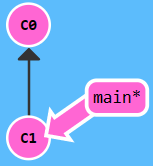</div>

执行命令

```sh
git checkout -b bugFix # 创建 bugFix 分支并切换到 bugFix 分支
```

<div align="center">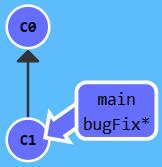</div>

如果想要删除 bugFix 分支可以使用下面的命令

```sh
git checkout main # 先要切换到其他分支，然后才能删除 bugFix 分支
git branch -d bugFix
```

## merge

merge，将两个分支合并到一起。就是说我们新建一个分支，在其上开发某个新功能，开发完成后再合并回主线

先学习下 `git merge`。在 Git 中合并两个分支时会产生一个特殊的提交记录，它有两个父节点。假定现在 git 的状态如下图所示，我们需要把 bugFix 分支合并到 main 里。

<div align="center">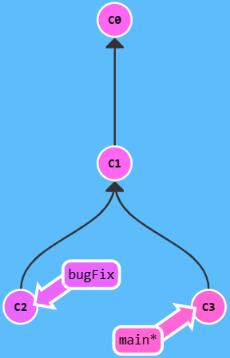</div>

在 main 分支里执行 `git merge bugFix`，会把 bugFix 合并到 main 里并生成一个新的节点，这个节点包含了 bugFix 和 main 里的所有内容。

<div align="center">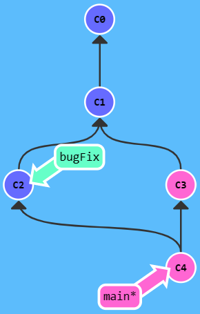</div>

如果想要 bugFix 分支也包含 main 分支中的修改，可以将当前分支修改为 bugFix 然后把 main 分支合并到 bugFix 中。

```sh
git checkout bugFix
git merge main
```

<div align="center">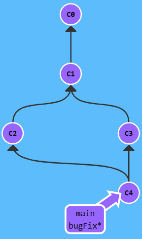</div>

因为 `main` 继承自 `bugFix`，Git 什么都不用做，只是简单地把 `bugFix` 移动到 `main` 所指向的那个提交记录。

现在所有提交记录的颜色都一样了，这表明每一个分支都包含了代码库的所有修改！大功告成！

<b>练习</b>

- 创建新分支 `bugFix`
- 用 `git checkout bugFix` 命令切换到该分支
- 提交一次
- 用 `git checkout main` 切换回 `main`
- 再提交一次
- 用 `git merge` 把 `bugFix` 合并到 `main`

分支的初始状态如下图所示。

<div align="center"></div>

执行下列命令

```sh
git checkout -b bugFix
git commit -m "bugFix msg"
git checkout main
git commit -m "main msg"
git merge bugFix
```

<div align="center">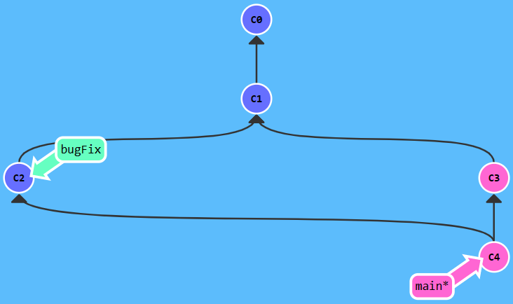</div>

## rebase

第二种合并分支的方法是 `git rebase`。Rebase 实际上就是取出一系列的提交记录，“复制”它们，然后在另外一个地方逐个的放下去。

Rebase 的优势就是可以创造更线性的提交历史，如果只允许使用 Rebase 的话，代码库的提交历史将会变得异常清晰。下图展示了 rebase 是如何创建更线性的提交历史。

- ① rebase 前的 git 状态，我们想要把 bugFix 分支里的工作直接移到 main 分支上，可以使用 git rebase main，把当前分支的工作内容 rebase 到 main 分支上。

<div align="center">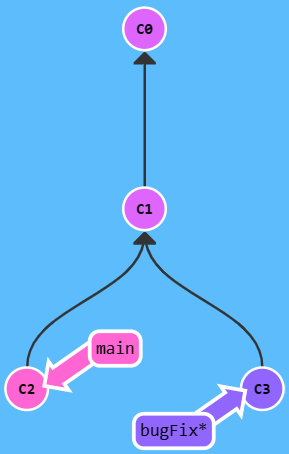</div>

- ② 执行 `git rebase main` 后的状态如下图所示，C2 的提交早于 C3，因此 C2 是 C3' 的父节点

image-20230326161229321.png

- ③ 现在切换到了 `main` 上。把它 rebase 到 `bugFix` 分支上，由于 `bugFix` 继承自 `main`，所以 Git 只是简单的把 `main` 分支的引用向前移动了一下而已。

image-20230326161430775.png

<b>练习</b>

- 新建并切换到 `bugFix` 分支
- 提交一次
- 切换回 main 分支再提交一次
- 再次切换到 bugFix 分支，rebase 到 main 上

分支的初始状态如下图所示。

<div align="center"></div>

执行下列命令

```sh
git checkout -b bugFix
git commit -m "bugFix msg"
git checkout main
git commit -m "main msg"
git checkout bugFix # 切换到 bugFix 分支
git rebase main		# 把 bugFix 中的内容 rebase 到 main 分支中
```

<div align="center">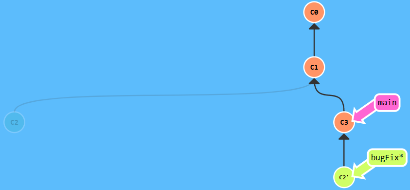</div>

# 高级

git 里一些更高级的特性。

## 分离 head

这部分的学习可以让我们学会如何在项目的提交树上前后移动。

HEAD 是一个对当前所在分支的符号引用 —— 也就是指向你正在其基础上进行工作的提交记录。

HEAD 总是指向当前分支上最近一次提交记录。大多数修改提交树的 Git 命令都是从改变 HEAD 的指向开始的。

HEAD 通常情况下是指向分支名的（如 bugFix）。在你提交时，改变了 bugFix 的状态，这一变化通过 HEAD 变得可见。

<div align="center"></div>

执行下列命令，查看 head 的变化

```sh
git checkout C1 	# 切换到 id 为 C1 的记录, 此时 head 指向 C1
git checkout main	# 切换到 main 分支, 此时 head 指向 main
git commit -m "add some file to main"
git checkout C2		# 切换到 id 为 C2 的记录, 此时 head 指向 C2
git show head		# 查看当前 head 的指向
```

<div align="center">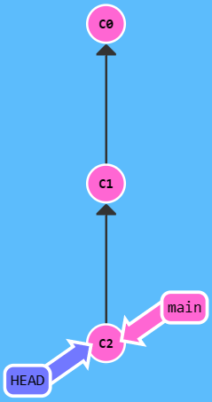</div>

<b>练习</b>

从 `bugFix` 分支中分离出 HEAD 并让其指向提交记录 C4。通过哈希值指定提交记录。每个提交记录的哈希值显示在代表提交记录的圆圈中。

分支的初始状态如下。

<div align="center">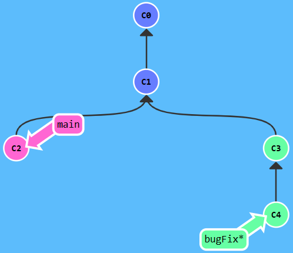</div>

执行下列命令

```sh
git checkout C4		# 让 head 指向 C4
```

<div align="center">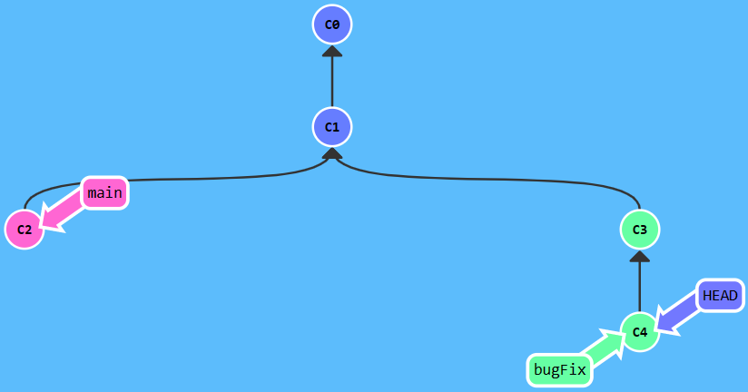</div>

## 相对引用 ^

通过指定提交记录哈希值的方式在 Git 中移动不太方便。在实际应用时，并没有这么漂亮的可视化提交树供我们参考，所以我们就不得不用 `git log` 来查查看提交记录的哈希值。并且哈希值在真实的 Git 世界中也会更长（基于 SHA-1，共 40 位）。例如前一关的介绍中的提交记录的哈希值可能是 `fed2da64c0efc5293610bdd892f82a58e8cbc5d8`。

比较令人欣慰的是，Git 对哈希的处理很智能。你只需要提供能够唯一标识提交记录的前几个字符即可。因此可以仅输入`fed2` 而不是上面的一长串字符。

通过哈希值指定提交记录很不方便，所以 Git 引入了相对引用。使用相对引用的话，可以从一个易于记忆的地方（比如 `bugFix` 分支或 `HEAD`）开始计算。

相对引用非常给力，这里介绍两个简单的用法：

- 使用 `^` 向上移动 1 个提交记录
- 使用 `~<num>` 向上移动多个提交记录，如 `~3`

下图是一个 ^ 前后的状态变化。原本 HEAD 指向的是 C2，在执行 `git checkout main^` 后 head 向上移动了 1 个提交记录。

<div align="center">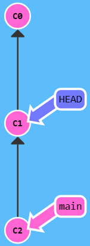</div>

我们也可以将 head 作为相对引用的参照。最开始 HEAD 是位于 main 分支的，执行下面的命令后变成下图的状态。

```sh
git checkout C3
git checkout HEAD^
git checkout HEAD^
git checkout HEAD^
```

<div align="center">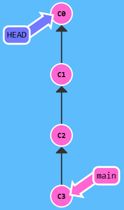</div>

<b>练习</b>

切换到 `bugFix` 的父节点。git 的初始状态如下图所示。

<div align="center">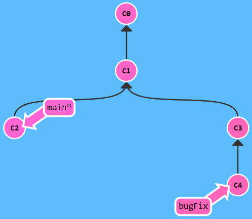</div>

执行下列命令，让 head 执行 bugFix 的父节点 C3

```sh
git checkout C4
git checkout HEAD^
```

<div align="center">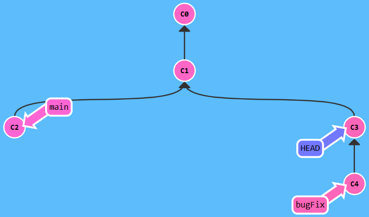</div>

## 相对引用 ~

如果我们想在提交树中向上移动很多步的话，敲那么多 `^` 貌似也挺烦人的，Git 当然也考虑到了这一点，于是又引入了操作符 `~`。

该操作符后面可以跟一个数字（可选，不跟数字时与 `^` 相同，向上移动一次），指定向上移动多少次。下图是 `git checkout HEAD~4` 运行后的结果图，开的时候 HEAD 位于 main 分支。

<div align="center">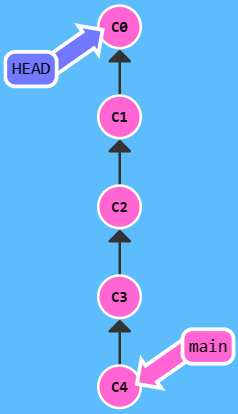</div>

相对引用 ~ 也允许我们将分支强制移动到其他位置，下图展示了 `git branch -f main HEAD~3` 的用法，最开始 main 分支和 bugFix 分支位于同一位置，执行命令后 main 分支被强制移动到了 C1。

<div align="center">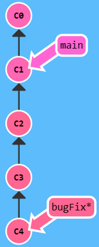</div>

<b>练习</b>

移动 `HEAD`，`main` 和 `bugFix` 到 C1，C6 和 C0

<div align="center"></div>

执行下列命令

```sh
git branch -f main C6		# 将 main 分支强制移动到 C6
git branch -f bugFix C0		# 将 bugFix 分支强制移动到 C0
git checkout HEAD~			# 将 HEAD 移动到 C1
```


<div align="center">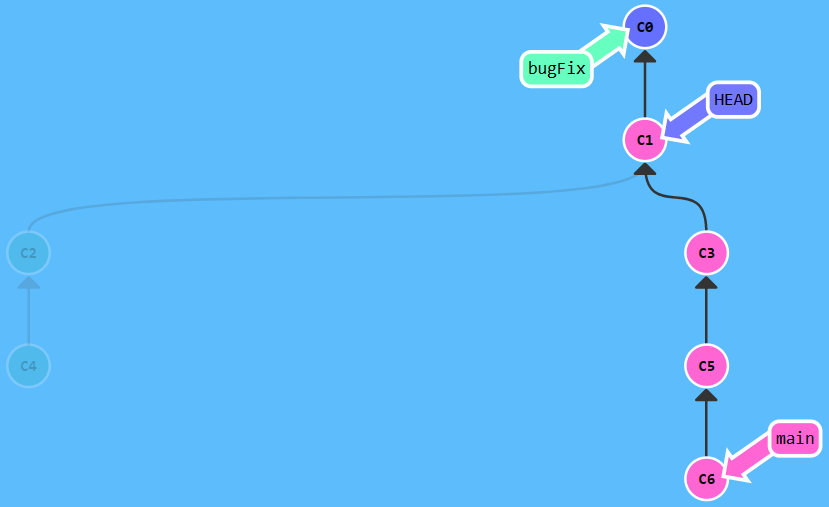</div>

## 版本回退

版本回退/撤销变更，git 主要用两种版本回退的方法：`git reset` 和 `git revert`。

- `git reset:` 通过将分支记录回退几个提交记录来实现撤销改动。这种做法只对本地分支有效，<b>对远程分支无效。</b>
    - git reset HEAD~ 将分支回滚到 HEAD（C1） 之前的一次提交（C0）。
- `git revert:` 撤销更改并分享给其他协作人员，<b>对远程分支有效！</b>
    - git revert HEAD 撤销当前（HEAD）这次的 commit（）
    - git revert HEAD^ 撤销当前（HEAD）这次的再上一次的 commit

下面的图分别展示了 reset 和 revert 的用法，git 最初的状态都是 main 位于 C2 节点。

<div align="center">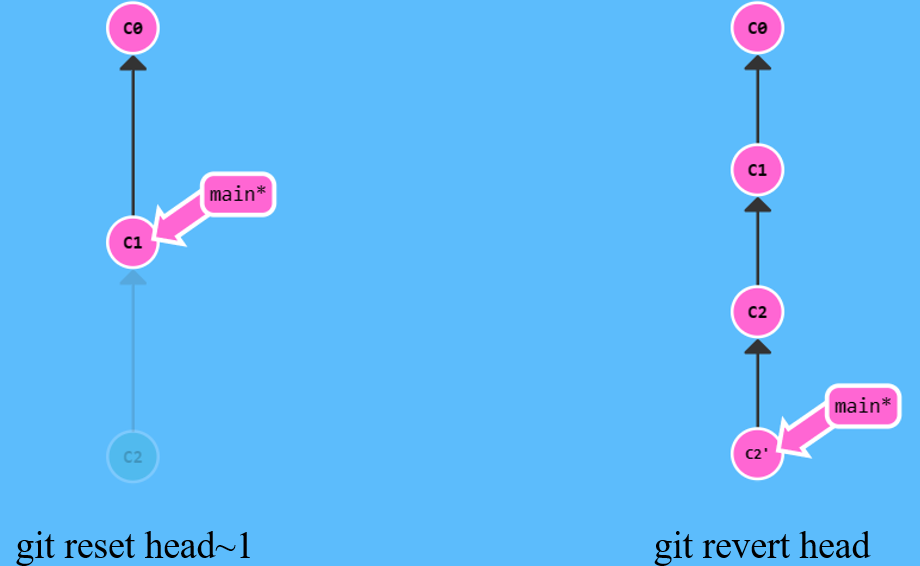</div>

<b>revert 和 reset 的区别</b>

- git revert 是用一次新的 commit 来回滚之前的 commit，git reset 是直接删除指定的 commit。

<b>练习</b>

分别撤销 `local` 分支和 `pushed` 分支上的最近一次提交。共需要撤销两个提交（每个分支一个）。其中，`pushed` 是远程分支，`local` 是本地分支。下图是 git 的初始状态。

<div align="center">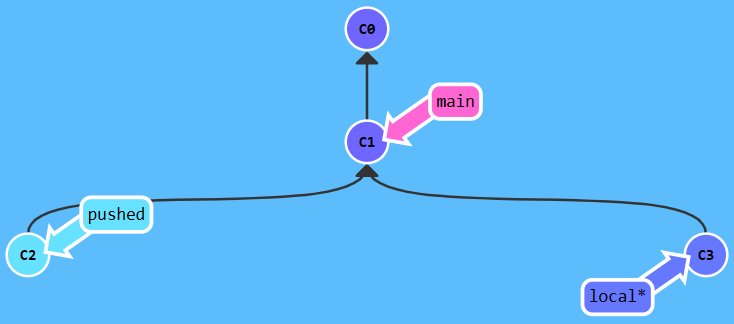</div>

执行下列命令

```sh
git reset HEAD~		# local 分支回退, 回退到 c3 之前的一次提交 c1 了
					# 或执行 git reset local~ 或 git reset local~1
git checkout pushed
git revert HEAD		# 撤销 HEAD 指向的这次提交 (撤销 C2 这次提交)。
					# 或执行 git revert pushed
					# 不要错误执行了 git revert HEAD~, HEAD~ 指的是 HEAD 之前的一次提交, 而非 HEAD 这次的提交
```

<div align="center">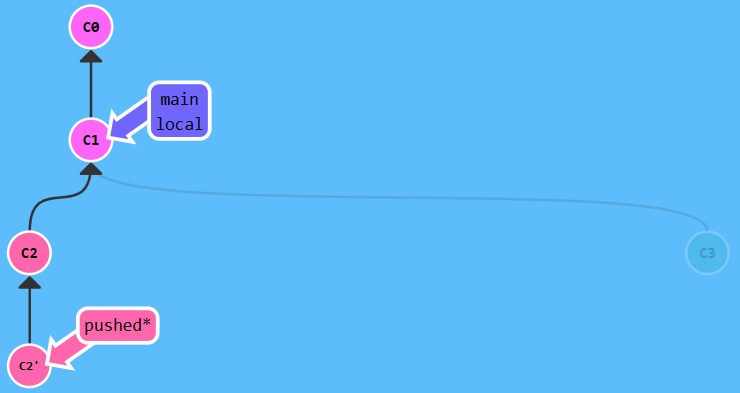</div>

# 移动提交记录

## cherry-pick

自由修改提交树，整理提交记录。`git cherry-pick`

- `git cherry-pick <提交号>...`
- 如果我们想将一些提交复制到当前所在的位置（`HEAD`）下面的话， Cherry-pick 是最直接的方式了。

下图是 `git cherry-pick C2 C4` 的执行结果图。通过执行这个命令，我将 side 分支上的 C2 和 C4 工作复制到了 main 分支。

<div align="center">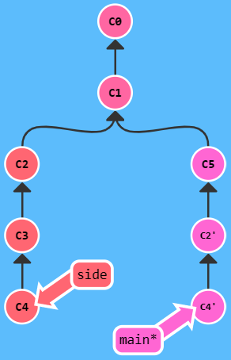</div>

<b>练习</b>

将三个分支中的提交记录复制到 main 上。git 的初始状态如下。

<div align="center">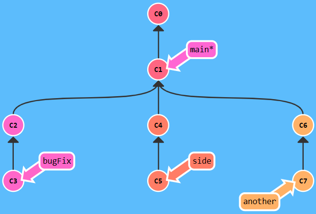</div>

执行下列命令

```sh
git checkout main			# 切换到 main 分支
git cherry-pick C3 C4 C7	# 将 C3 C5 C7 复制到 main 分支上
```

<div align="center">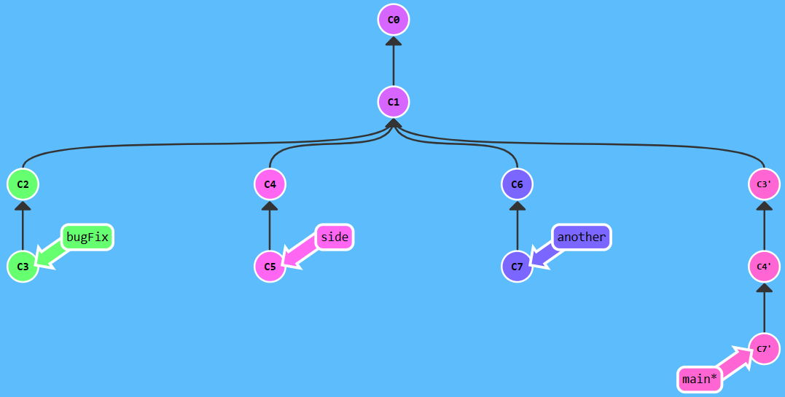</div>

## 交互式 rebase

当我们知道所需要的提交记录（并且还知道这些提交记录的哈希值）时, 用 cherry-pick 再好不过了 —— 没有比这更简单的方式了。

但是如果我们不清楚你想要的提交记录的哈希值呢？我们可以利用交互式的 rebase —— 如果我们想从一系列的提交记录中找到想要的记录, 这就是最好的方法了。

交互式 rebase 指的是使用带参数 `--interactive` 的 rebase 命令, 简写为 `-i`

当 rebase UI 界面打开时，我们能做 3 件事：

- 调整提交记录的顺序（通过鼠标拖放来完成）
- 删除你不想要的提交（通过切换 `pick` 的状态来完成，关闭就意味着你不想要这个提交记录）
- 合并提交。

# 杂项

## 本地栈式提交

来看一个在开发中经常会遇到的情况：我正在解决某个特别棘手的 Bug，为了便于调试而在代码中添加了一些调试命令并向控制台打印了一些信息。

这些调试和打印语句都在它们各自的提交记录里。最后我终于找到了造成这个 Bug 的根本原因，解决掉以后觉得沾沾自喜！

最后就差把 `bugFix` 分支里的工作合并回 `main` 分支了。你可以选择通过 fast-forward 快速合并到 `main` 分支上，但这样的话 `main` 分支就会包含我这些调试语句了。你肯定不想这样，应该还有更好的方式。

实际我们只要让 Git 复制解决问题的那一个提交记录就可以了。跟之前我们在“整理提交记录”中学到的一样，我们可以使用

- `git rebase -i`
- `git cherry-pick`

来达到目的。

# 高级话题