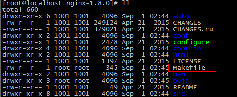
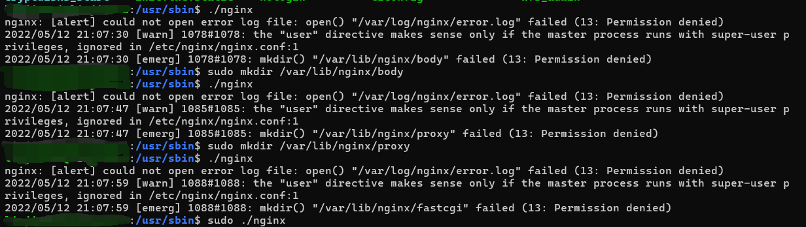
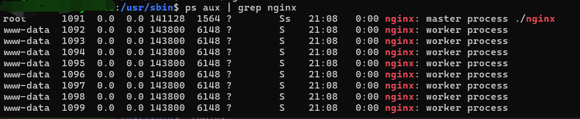

# Nginx快速入门

学习 nginx 的安装、静态网站的部署、nginx 的反向代理和负载均衡

Nginx 是一款高性能的 http 服务器/反向代理服务器及电子邮件（IMAP/POP3）代理服务器。由俄罗斯的程序设计师伊戈尔·西索夫（Igor Sysoev）所开发，官方测试 nginx 能够支支撑 5 万并发链接，并且 CPU、内存等资源消耗却非常低，运行非常稳定。

[ubuntu安装nginx - 冯坤大神 - 博客园 (cnblogs.com)](https://www.cnblogs.com/fengkun125/p/14142912.html)

## 应用场景

1、http 服务器。Nginx 是一个 http 服务器，可以独立提供 http 服务。可以做网页静态服务器。

2、虚拟主机。可以实现在一台服务器虚拟出多个网站。例如个人网站使用的虚拟主机。

3、反向代理，负载均衡。当网站的访问量达到一定程度后，单台服务器不能满足用户的请求时，需要用多台服务器集群可以使用 nginx 做反向代理。并且多台服务器可以平均分担负载，不会因为某台服务器负载高宕机而某台服务器闲置的情况。  

## 安装

- 安装 gcc，`yum install gcc-c++`

- 安装 pcre，PCRE(Perl Compatible Regular Expressions)是一个 Perl 库，包括 perl 兼容的正则表达式库。nginx 的 http 模块使用 pcre 来解析正则表达式，所以需要在 linux 上安装 pcre 库。`yum install -y pcre pcre-devel`

- 安装 zlib，zlib 库提供了很多种压缩和解压缩的方式，nginx 使用 zlib 对 http 包的内容进行 gzip，所以需要在 linux 上安装 zlib 库。`yum install -y zlib zlib-devel`

- 安装 OpenSSL，OpenSSL 是一个强大的安全套接字层密码库，囊括主要的密码算法、常用的密钥和证书封装管理功能及 SSL 协议，并提供丰富的应用程序供测试或其它目的使用。nginx 不仅支持 http 协议，还支持 https（即在 ssl 协议上传输 http），所以需要在 linux安装 openssl 库。`yum install -y openssl openssl-devel`

- 下载 nginx 压缩包。`http://nginx.org`。

- 解压缩 `tar zxvf nginx-1.8.0.tar.gz`

- 进入 nginx-1.8.0 目录，使用 configure 命令创建一个 makefile 文件

    ```shell
    ./configure \
    --prefix=/usr/local/nginx \
    --pid-path=/var/run/nginx/nginx.pid \
    --lock-path=/var/lock/nginx.lock \
    --error-log-path=/var/log/nginx/error.log \
    --http-log-path=/var/log/nginx/access.log \
    --with-http_gzip_static_module \
    --http-client-body-temp-path=/var/temp/nginx/client \
    --http-proxy-temp-path=/var/temp/nginx/proxy \
    --http-fastcgi-temp-path=/var/temp/nginx/fastcgi \
    --http-uwsgi-temp-path=/var/temp/nginx/uwsgi \
    --http-scgi-temp-path=/var/temp/nginx/scgi
    ```

执行后可以看到 Makefile 文件



Makefile 是一种配置文件， Makefile 一个工程中的源文件不计数，其按类型、功能、模块分别放在若干个目录中，makefile 定义了一系列的规则来指定，哪些文件需要先编译，哪些文件需要后编译，哪些文件需要重新编译，甚至于进行更复杂的功能操作，因为 makefile 就像一个 Shell 脚本一样，其中也可以执行操作系统的命令。

命令解释

```shell
configure参数
./configure \
--prefix=/usr \                                                        指向安装目录
--sbin-path=/usr/sbin/nginx \                                 指向（执行）程序文件（nginx）
--conf-path=/etc/nginx/nginx.conf \                      指向配置文件
--error-log-path=/var/log/nginx/error.log \              指向log
--http-log-path=/var/log/nginx/access.log \            指向http-log
--pid-path=/var/run/nginx/nginx.pid \                      指向pid
--lock-path=/var/lock/nginx.lock \                         （安装文件锁定，防止安装文件被别人利用，或自己误操作。）
--user=nginx \
--group=nginx \
--with-http_ssl_module \                      启用ngx_http_ssl_module支持（使支持https请求，需已安装openssl）
--with-http_flv_module \                       启用ngx_http_flv_module支持（提供寻求内存使用基于时间的偏移量文件）
--with-http_stub_status_module \     启用ngx_http_stub_status_module支持（获取nginx自上次启动以来的工作状态）
--with-http_gzip_static_module \   启用ngx_http_gzip_static_module支持（在线实时压缩输出数据流）
--http-client-body-temp-path=/var/tmp/nginx/client/ \ 设定http客户端请求临时文件路径
--http-proxy-temp-path=/var/tmp/nginx/proxy/ \ 设定http代理临时文件路径
--http-fastcgi-temp-path=/var/tmp/nginx/fcgi/ \ 设定http fastcgi临时文件路径
--http-uwsgi-temp-path=/var/tmp/nginx/uwsgi \ 设定http uwsgi临时文件路径
--http-scgi-temp-path=/var/tmp/nginx/scgi \ 设定http scgi临时文件路径
--with-pcre 启用pcre库
```

- 编译 `make`
- 安装 `make install`

## 启动与访问

注意：启动 nginx 之前，需要创建一些目录，当我们进入 nginx 所在的目录时（Ubuntu 是 /usr/sbin），启动 nginx 时会提示要创建一些文件，可以通过 sudo ./nginx 一次性全部创建完。



启动后查看进程 `ps aux | grep nginx`



地址栏输入 IP 即可访问（默认为 80 端口）

关闭 nginx：`./nginx -s stop` 或者 `./nginx -s quit`

重启 nginx：先关闭后启动

刷新配置文件：`./nginx -s reload`

## 静态网站部署

CentOS nginx 的静态文件是在 /usr/local/nginx/html 下；windows 的 WSL 是在 /usr/share/nginx/html 下即可访问

## 配置虚拟主机

虚拟主机，也叫“网站空间”，就是把一台运行在互联网上的物理服务器划分成多个“虚拟”服务器。虚拟主机技术极大的促进了网络技术的应用和普及。同时虚拟主机的租用服务也成了网络时代的一种新型经济形式。

### 端口绑定

（1）上传静态网站：

- 将/资料/静态页面 /index 目录上传至  /usr/local/nginx/index 下
- 将/资料/静态页面 /regist 目录上传至  /usr/local/nginx/regist 下

（2）修改 Nginx 的配置文件：/usr/local/nginx/conf/nginx.conf

```shell
server {
        listen       81; # 监听的端口
        server_name  localhost; # 域名或ip
        location / {	# 访问路径配置
            root   index;# 根目录
            index  index.html index.htm; # 默认首页
        }
        error_page   500 502 503 504  /50x.html;	# 错误页面
        location = /50x.html {
            root   html;
        }
    }


     server {
        listen       82; # 监听的端口
        server_name  localhost; # 域名或ip
        location / {	# 访问路径配置
            root   regist;# 根目录
            index  regist.html; # 默认首页
        }
        error_page   500 502 503 504  /50x.html;	# 错误页面
        location = /50x.html {
            root   html;
        }

        
    }
```

（3）访问测试：

地址栏输入http://192.168.177.129/:81 可以看到首页面

地址栏输入http://192.168.177.129/:82 可以看到注册页面

### 域名绑定

一个域名对应一个 ip 地址，一个 ip 地址可以被多个域名绑定。

本地测试可以修改 hosts 文件（C:\Windows\System32\drivers\etc）

可以配置域名和 ip 的映射关系，如果 hosts 文件中配置了域名和 ip 的对应关系，不需要走 dns 服务器。

192.168.177.129	www.hmtravel.com

192.168.177.129	regist.hmtravel.com

做好域名指向后，修改 nginx 配置文件

```shell
    server {
        listen       80;
        server_name  www.hmtravel.com;
        location / {
            root   cart;
            index  cart.html;
        }
    }
    server {
        listen       80;
        server_name  regist.hmtravel.com;
        location / {
            root   search;
            index  search.html;
        }
    }
```

执行以下命令，刷新配置

[root@localhost sbin]# ./nginx -s reload

测试：地址栏输入 http://www.hmtravel.com/

## 反向代理和负载均衡

### 反向代理

反向代理（Reverse Proxy）方式是指以[代理服务器](http://baike.baidu.com/item/代理服务器)来接受 internet 上的连接请求，然后将请求转发给内部网络上的服务器，并将从服务器上得到的结果返回给 internet 上请求连接的客户端，此时代理服务器对外就表现为一个反向代理服务器。

先理解下正向代理，如下图：


正向代理是针对你的客户端，而反向代理是针对服务器的，如下图


#### 配置反向代理-准备工作

（1） 将 travel 案例部署到 tomcat 中（ROOT 目录），上传到服务器。

（2）启动 TOMCAT，输入网址 http://192.168.177.129:8080 可以看到网站首页

#### 配置反向代理

（1）在 Nginx 主机修改 Nginx 配置文件

```shell
   upstream tomcat-travel{
	   server 192.168.177.129:8080;
    }

    server {
        listen       80; # 监听的端口
        server_name  www.hmtravel.com; # 域名或ip
        location / {	# 访问路径配置
            # root   index;# 根目录
	    proxy_pass http://tomcat-travel;
            index  index.html index.htm; # 默认首页
        }
}
```

（2）重新启动 Nginx  然后用浏览器测试：http://www.hmtravel.com （此域名须配置域名指向）

### 负载均衡

#### 什么是负载均衡

负载均衡建立在现有网络结构之上，它提供了一种廉价有效透明的方法扩展[网络设备](http://baike.baidu.com/item/网络设备)和[服务器](http://baike.baidu.com/item/服务器)的带宽、增加[吞吐量](http://baike.baidu.com/item/吞吐量)、加强网络数据处理能力、提高网络的灵活性和可用性。

负载均衡，英文名称为 Load Balance，其意思就是分摊到多个操作单元上进行执行，例如 Web [服务器](http://baike.baidu.com/item/服务器)、[FTP 服务器](http://baike.baidu.com/item/FTP服务器)、[企业](http://baike.baidu.com/item/企业)关键应用服务器和其它关键任务服务器等，从而共同完成工作任务。

#### 配置负载均衡-准备工作

（1）将任意工程的 tomcat 复制三份，修改端口分别为 8080 ，8081，8082 。

（2）分别启动这三个 tomcat 服务。

（3）为了能够区分是访问哪个服务器的网站，可以在首页标题加上标记以便区分。

#### 配置负载均衡

修改 Nginx 配置文件：

```
  upstream tomcat-travel {
	   server 192.168.177.129:8080;
	   server 192.168.177.129:8081;
	   server 192.168.177.129:8082;
    }

    server {
        listen       80; # 监听的端口
        server_name  www.hmtravel.com; # 域名或ip
        location / {	# 访问路径配置
            # root   index;# 根目录
	    proxy_pass http://tomcat-travel;

            index  index.html index.htm; # 默认首页
        }
        error_page   500 502 503 504  /50x.html;	# 错误页面
        location = /50x.html {
            root   html;
        }
    }
```

地址栏输入http:// www.hmtravel.com /  刷新观察每个网页的标题，看是否不同。

经过测试，三台服务器出现的概率各为 33.3333333%，交替显示。

如果其中一台服务器性能比较好，想让其承担更多的压力，可以设置权重。

 比如想让 NO.1 出现次数是其它服务器的 2 倍，则修改配置如下：

 ```shell
 upstream tomcat-travel {
     server 192.168.177.129:8080;
     server 192.168.177.129:8081 weight=2;
     server 192.168.177.129:8082;
 }
 ```

经过测试，每刷新四次，有两次是8081