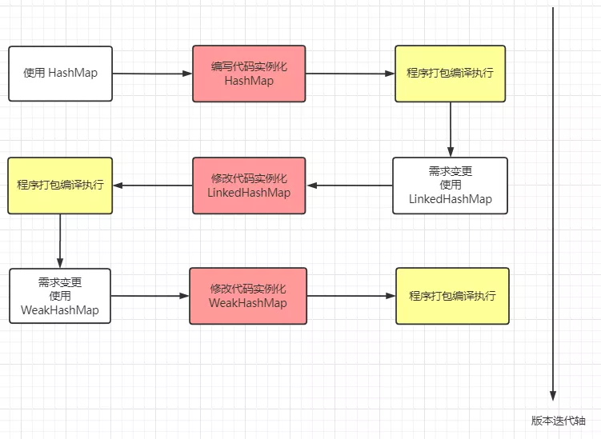

## 概述

反射是一个非常重要的知识点，在学习`Spring 框架`时，Bean的初始化用到了反射，在`破坏单例模式`时也用到了反射，在`获取标注的注解`时也会用到反射······

当然了，反射在日常开发中，我们没碰到过多少，至少我没怎么用过。但面试是**<span style="color:green">造火箭</span>**现场，可爱的面试官们又怎会轻易地放过我们呢？反射是开源框架中的一个重要设计理念，在源码分析中少不了它的身影，所以，今天我会尽量用浅显易懂的语言，让你去理解下面这几点：

（1）反射的思想以及它的作用: **<span style="color:green">概念篇</span>**

（2）反射的基本使用及应用场景: **<span style="color:green">应用篇</span>**

（3）使用反射能给我们编码时带来的优势以及存在的缺陷: **<span style="color:green">分析篇</span>**

## 反射的思想及作用

在学习反射之前，先来了解**正射**是什么。我们平常用的最多的 `new` 方式实例化对象的方式就是一种正射的体现。假如我需要实例化一个`HashMap`，代码就会是这样子。

```java
Map<Integer, Integer> map = new HashMap<>();
map.put(1, 1);
```

某一天发现，该段程序不适合用 HashMap 存储键值对，更倾向于用`LinkedHashMap`存储。重新编写代码后变成下面这个样子。

```java
Map<Integer, Integer> map = new LinkedHashMap<>();
map.put(1, 1);
```

假如又有一天，发现数据还是适合用 HashMap来存储，难道又要重新修改源码吗？

> 发现问题了吗？我们每次改变一种需求，都要去重新**修改源码**，然后对代码进行编译，打包，再到 JVM 上重启项目。这么些步骤下来，效率非常低。



对于这种**<span style="color:green">需求频繁变更但变更不大</span>**的场景，频繁地更改源码肯定是一种不允许的操作，我们可以使用一个`开关`，判断什么时候使用哪一种数据结构。

```java
public Map<Integer, Integer> getMap(String param) {
    Map<Integer, Integer> map = null;
    if (param.equals("HashMap")) {
        map = new HashMap<>();
    } else if (param.equals("LinkedHashMap")) {
        map = new LinkedHashMap<>();
    } else if (param.equals("WeakHashMap")) {
        map = new WeakHashMap<>();
    }
    return map;
}
```

通过传入参数`param`决定使用哪一种数据结构，可以在项目运行时，通过**<span style="color:green">动态传入参数</span>**决定使用哪一个数据结构。

如果某一天还想用`TreeMap`，还是避免不了修改源码，重新编译执行的弊端。这个时候，**<span style="color:green">反射</span>**就派上用场了。

在代码运行之前，我们**不确定**将来会使用哪一种数据结构，只有在程序**运行时才决定**使用哪一个数据类，而`反射`可以在**<span style="color:green">程序运行过程</span>**中动态**获取类信息**和**调用类方法**。通过反射构造类实例，代码会演变成下面这样。

```java
public Map<Integer, Integer> getMap(String className) {
    Class clazz = Class.forName(className);
    Consructor con = clazz.getConstructor();
    return (Map<Integer, Integer>) con.newInstance();
}
```

无论使用什么 Map，只要实现了`Map接口`，就可以使用`全类名路径`传入到方法中，获得对应的 Map 实例。例如java.util.HashMap / java.util.LinkedHashMap····如果要创建其它类例如`WeakHashMap`，我也**不需要修改上面这段源码**。

用多态不也一样？传参不就行了？感觉写的好垃圾。。。。。。。。。。。