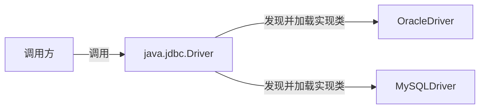

# Java SPI

[【IT老齐200】扩展能力超群，利用Java SPI机制实现可插拔的应用插件_哔哩哔哩_bilibili](https://www.bilibili.com/video/BV12B4y157vR/?spm_id_from=333.337.search-card.all.click&vd_source=cb8bc4312b30b416beadaad7244940ac)

Service Provider Interface，基于接口的动态扩展机制。Java 提供标准的接口，然后第三方实现接口来完成功能扩展。

程序在运行的时候，会根据配置信息动态加载第三方实现的类，进而完成功能的动态扩展。

SPI 机制的典型例子就是数据库驱动 java.jdbc.Driver。JDK 里面定义了数据库驱动类 Driver，它是一个接口，JDK 并没有提供实现。

具体的实现是由第三方数据库厂商来完成的。在程序运行的时候，会根据我们声明的驱动类型，来动态加载对应的扩展实现，从而完成数据库的连接。



当服务的提供者提供了一种接口的实现之后，需要在 classpath 下的`META-INF/services/` 目录里创建一个以服务接口命名的文件，这个文件里的内容就是这个接口的具体的实现类。

JDK 中查找服务的实现的工具类是：java.util.ServiceLoader。

配置文件为什么要放在 META-INF/services 下面？可以打开 ServiceLoader 的代码，里面定义了文件的 PREFIX 如下：

```java
private final class LazyClassPathLookupIterator<T>
    implements Iterator<Provider<T>>
{
    static final String PREFIX = "META-INF/services/";
}
```

<b>JDBC 驱动的加载流程</b>

- Driver 接口是 Java 提供的标准接口，经代码测试，是使用 PlatformClassLoader 加载的。
- MySQL 对 Driver 的实现类是三方平台提供的，是使用 AppClassLoader 加载的。

判断 ClassA 是否是 ClassB的子类的前提是，两个类由同一个类加载器加载，此时 MySQL 对 Driver 的实现类和 Driver 接口由不同的类加载器加载，如何判断是不是 Driver 接口的实现类？

- Java 使用 ServiceLoader#load 加载 Driver 接口（使用线程类加载器加载）

  ```java
  AccessController.doPrivileged(new PrivilegedAction<Void>() {
      public Void run() {
          // load 方法返回了一个 ServiceLoader，该 load 会用线程类加载器加载对象
          ServiceLoader<Driver> loadedDrivers = ServiceLoader.load(Driver.class);
          // LazyClassPathLookupIterator 找到 META-INF/services 下的类全名
          // debug 进去看，仔细对 1295行的 new LazyClassPathLookupIterator<>(); debug
          Iterator<Driver> driversIterator = loadedDrivers.iterator();
          try {
              // 仔细对 hasNext debug ==> hasNextService 
              // ==> service.isAssignableFrom(clazz) 判断父子关系
              while (driversIterator.hasNext()) {
                  driversIterator.next();
              }
          } catch (Throwable t) {
              // Do nothing
          }
          return null;
      }
  ```

- 通过 isAssignableFrom 判断加载的 Driver 实现类是不是 java.sql.Driver 接口的子类。

  - <b>JDK11 出现的 isAssignableFrom，即便是由不同的类加载器加载的字节码，仍然可以判断父子关系！！</b>
  - 经过测试，子类和父类要在不同的包（文件夹），才可以正确判断父子关系。
  - 内部可能是对比文件，查看文件中是否导入了父类（全类名一致），而 Java11 如果出现和 lib 中全类名一样的类，是不会被加载的。所以上述做法的安全性是可以保证的。