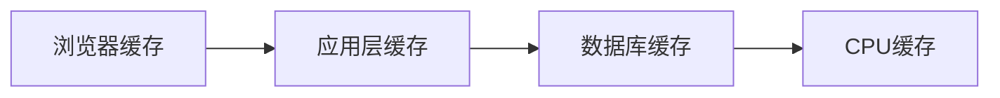

# Redis快速回顾

[黑马程序员Redis入门到实战教程，全面透析redis底层原理+redis分布式锁+企业解决方案+redis实战_哔哩哔哩_bilibili](https://www.bilibili.com/video/BV1cr4y1671t?p=24)

## 特点

| -        | SQL                                                        | NoSQL                                                        |
| -------- | ---------------------------------------------------------- | ------------------------------------------------------------ |
| 数据结构 | 结构化（Structured）                                       | 非结构化                                                     |
| 数据关联 | 关联的（Relational）                                       | 无关联的                                                     |
| 查询方式 | SQL 查询                                                   | 非 SQL                                                       |
| 事务特性 | ACID                                                       | BASE                                                         |
| 存储方式 | 磁盘                                                       | 内存                                                         |
| 扩展性   | 垂直                                                       | 水平                                                         |
| 使用场景 | 1) 数据结构固定<br>2) 相关业务对数据安全性、一致性要求较高 | 1) 数据结构不固定<br>2) 对一致性、安全性要求不高<br>3) 对性能要求高 |

NoSQL 具体有 

- 键值类型（Redis）
- 文档类型（MongoBD）
- 列类型（HBase）
- Graph 类型（Neo4j）

Redis 介绍：诞生于 2009 年，全称是 Remote Dictionary Server，远程字典服务器，是一个基于内存的键值型 NoSQL 数据库。

特点

- key-value 类型，value 支持多种不同的数据结构，功能丰富。
- 单线程，每个命令具备原子性（类似 6.0 的多线程仅仅是在请求处理这块，核心的命令执行仍是当线程的）
- 低延迟，速度快（基于内存、IO 多路复用、良好的编码）
- 支持数据持久化
- 支持主从集群、分片集群
    - 主从集群：从节点可以去备份主节点
    - 分片集群：进行数据拆分，比如把 1T 的数据切分成多分存储在不同的服务器上
    - 支持多语言客户端

## 安装

在 docker 中安装 redis。

## 数据结构

Redis 是一个 key-value 的数据库，key 一般是 String 类型，不过 value 的类型多种多样。

五大基本类型

- String 类型 =\=\> "hello"
- Hash 类型 =\=\> {name: "Jack", age: 21}
- List 类型 =\=\> [A -> B -> C -> C]
- Set 类型 =\=\> {A, B, C}
- SortedSet 类型 =\=\> {A: 1, B: 2, C: 3}

特殊类型

- GEO =\=\> {A:（120.3， 30.5）}
- BitMap =\=\> 0110110101110101011
- HyperLog =\=\> 0110110101110101011

## 命令

Redis 的命令可以在<a href="https://redis.io/commands">官网</a>查询到，也可以通过在 Redis 客户端输入 `help @命令类型` 如 `help @generic` 查询通用命令的使用方式。

### 通用命令

通用指令是部分数据类型的，都可以使用的指令，常见的有：

- KEYS：查看符合模板的所有 key，<span style="color:blue">不建议在生产环境设备上使用</span>

- DEL：删除一个指定的 key

- EXISTS：判断 key 是否存在
- EXPIRE：给一个 key 设置有效期，有效期到期时该 key 会被自动删除，不设置时间的话默认是永久有效
- TTL：查看一个KEY的剩余有效期（它怎么统计有效期的呢？）

通过 help [command] 可以查看一个命令的具体用法，例如：

<div align="center"></div>

### String类型

String 类型，也就是字符串类型，是 Redis 中最简单的存储类型。其 value 是字符串，不过根据字符串的格式不同，又可以分为3类：

- string：普通字符串
- int：整数类型，可以做自增、自减操作
- float：浮点类型，可以做自增、自减操作

不管是哪种格式，底层都是字节数组形式存储，只不过是编码方式不同。字符串类型的最大空间不能超过 512m。

| key   | value       |
| ----- | ----------- |
| msg   | hello world |
| num   | 10          |
| score | 92.6        |

String 的常见命令有：

- SET：添加或者修改已经存在的一个 String 类型的键值对
- GET：根据 key 获取 String 类型的 value
- MSET：批量添加多个 String 类型的键值对
- MGET：根据多个 key 获取多个 String 类型的 value
- INCR：让一个整型的 key 自增1
- INCRBY：让一个整型的 key 自增并指定步长，例如：incrby num 2 让 num 值自增 2
- INCRBYFLOAT：让一个浮点类型的数字自增并指定步长
- SETNX：添加一个 String 类型的键值对，前提是这个 key 不存在，否则不执行（返回 0 表示存在了，未添加成功）
- SETEX：添加一个 String 类型的键值对，并且指定有效期

### Hash类型

Hash 类型，也叫散列，其 value 是一个无序字典，类似于 Java 中的HashMap 结构。

String 结构是将对象序列化为 JSON 字符串后存储，当需要修改对象某个字段时很不方便，而 Hash 结构可以将对象中的每个字段独立存储，可以针对单个字段做 CRUD。

<div align="center"></div>

Hash 的常见命令有：

- HSET key field value：添加或者修改 hash 类型 key 的 field 的值
- HGET key field：获取一个 hash 类型 key 的 field 的值
- HMSET：批量添加多个 hash 类型 key 的 field 的值
- HMGET：批量获取多个 hash 类型 key 的 field 的值
- HGETALL：获取一个 hash 类型的 key 中的所有的 field 和 value
- HKEYS：获取一个 hash 类型的 key 中的所有的 field
- HVALS：获取一个 hash 类型的 key 中的所有的 value
- HINCRBY：让一个 hash 类型 key 的字段值自增并指定步长
- HSETNX：添加一个 hash 类型的 key 的 field 值，前提是这个 field 不存在，否则不执行

### List类型

Redis 中的 List 类型与 Java 中的 LinkedList 类似，可以看做是一个双向链表结构。既可以支持正向检索和也可以支持反向检索。

特征也与 LinkedList 类似：

- 有序
- 元素可以重复
- 插入和删除快
- 查询速度一般

常用来存储一个有序数据，例如：朋友圈点赞列表，评论列表等。

List的常见命令有：

- LPUSH key element ... ：向列表左侧插入一个或多个元素
- LPOP key：移除并返回列表左侧的第一个元素，没有则返回nil
- RPUSH key element ... ：向列表右侧插入一个或多个元素
- RPOP key：移除并返回列表右侧的第一个元素
- LRANGE key star end：返回一段角标范围内的所有元素
- <span style="color:green">BLPOP 和 BRPOP：与 LPOP 和 RPOP 类似，只不过在没有元素时会等待指定的时间，而不是直接返回 nil，有点类似于阻塞队列。Timeout 时间是以秒为单位</span>

<div align="center"></div>

可以用 List 结构模拟 stack、queue 和 blockingkqueue。

### Set类型

Redis 的 Set 结构与 Java 中的 HashSet 类似，可以看做是一个 value 为 null 的 HashMap。因为也是一个 hash 表，因此具备与 HashSet 类似的特征：

- 无序
- 元素不可重复
- 查找快
- 支持交集、并集、差集等功能（寻找共同好友）

String 的常见命令有：

- SADD key member ... ：向 set 中添加一个或多个元素
- SREM key member ... : 移除 set 中的指定元素
- SCARD key： 返回 set 中元素的个数
- SISMEMBER key member：判断一个元素是否存在于 set 中
- SMEMBERS：获取 set 中的所有元素
- lSINTER key1 key2 ... ：求 key1 与 key2 的交集 S1，S2 的交（B、C）
- lSDIFF key1 key2 ... ：求 key1 与 key2 的差集，S1，S2 的差（A）
- lSUNION key1 key2 ..：求 key1 和 key2 的并集，S1，S2 的并（A、B、C、D）

<div align="center"></div>

> 练习

将下列数据用 Redis 的 Set 集合来存储：

- 张三的好友有：李四、王五、赵六
- 李四的好友有：王五、麻子、二狗

利用Set的命令实现下列功能：

- 计算张三的好友有几人
- 计算张三和李四有哪些共同好友
- 查询哪些人是张三的好友却不是李四的好友
- 查询张三和李四的好友总共有哪些人
- 判断李四是否是张三的好友
- 判断张三是否是李四的好友
- 将李四从张三的好友列表中移除

### SortedSet类型

Redis 的 SortedSet 是一个可排序的 set 集合，与 Java 中的 TreeSet 有些类似，但底层数据结构却差别很大。SortedSet 中的每一个元素都带有一个 score 属性，可以基于 score 属性对元素排序，底层的实现是一个跳表（SkipList，用来排序的）加 hash 表。

SortedSet 具备下列特性：

- 可排序
- 元素不重复
- 查询速度快

因为 SortedSet 的可排序特性，经常被用来实现排行榜这样的功能。

SortedSet 的常见命令有：默认都是升序排名。

- ZADD key score member：添加一个或多个元素到 sorted set ，如果已经存在则更新其 score 值

- ZREM key member：删除 sorted set 中的一个指定元素

- ZSCORE key member : 获取 sorted set 中的指定元素的 score 值

- ZRANK key member：获取 sorted set 中的指定元素的排名
- ZCARD key：获取 sorted set 中的元素个数
- ZCOUNT key min max：统计 score 值在给定范围内的所有元素的个数
- ZINCRBY key increment member：让 sorted set 中的指定元素自增，步长为指定的 increment 值，比如自增 increment（自增1）。
- ZRANGE key min max：按照 score 排序后，获取指定排名范围内的元素 （zrange age 0 9 ，取排名前 10 的元素）
- ZRANGEBYSCORE key min max：按照 score 排序后，获取指定 score 范围内的元素
- ZDIFF、ZINTER、ZUNION：求差集、交集、并集

注意：所有的排名默认都是升序，如果要降序则在命令的 Z 后面添加REV 即可：ZREVRange 就是降序了

> 练习

将班级的下列学生得分存入 Redis 的 SortedSet 中：

- Jack 85, Lucy 89, Rose 82, Tom 95, Jerry 78, Amy 92, Miles 76

并实现下列功能：

- 删除 Tom 同学
- 获取 Amy 同学的分数
- 获取 Rose 同学的排名
- 查询 80 分以下有几个学生
- 给Amy同学加 2 分
- 查出成绩前 3 名的同学
- 查出成绩 80 分以下的所有同学

## 设计KEY

Redis 没有类似 MySQL 中的 Table 的概念，我们该如何区分不同类型的key呢？例如，需要存储用户、商品信息到 redis，有一个用户 id 是1，有一个商品 id 恰好也是 1。

<span style="color:orange">可以采用 `项目名:业务名:类型:id` 这种多个单词形成层级结构，单词间用 ':' 隔开的方式设计 key。</span>

- <span style="color:orange">user 相关的 key：`project_name:user:1`</span>

- <span style="color:orange">product 相关的 key：`project_name:product:1`</span>

在 redis 内部，最后会以层级关系显示这些数据。

如果 Value 是一个 Java 对象，如一个 User 对象，则可以将对象序列化为 JSON 字符串后存储。

| key       | value                                     |
| --------- | ----------------------------------------- |
| user:1    | {"id":1, "name": "Jack", "age": 21}       |
| product:1 | {"id":1, "name": "小米11", "price": 4999} |

`Redis 的 key 的格式=\=\>[项目名]:[业务名]:[类型]:[id]`

## Java客户端

在 Redis 官网中提供了各种语言的客户端，地址：https://redis.io/clients

<div align="center"></div>

### Jedis

① 引入依赖

```xml
<!-- jedis 客户端-->
<dependency>
    <groupId>redis.clients</groupId>
    <artifactId>jedis</artifactId>
</dependency>
```

② 建立连接

```java
jedis = new Jedis("192.168.160.44", 6379);
```

③ 使用 Jedis

```java
jedis.set("name", "hahah");
```

④ 释放资源

```java
jedis.close();
```

完整代码

```java
import org.junit.After;
import org.junit.Before;
import org.junit.Test;
import org.springframework.boot.test.context.SpringBootTest;
import redis.clients.jedis.Jedis;

@SpringBootTest
public class TestJedis {
    private Jedis jedis;

    @Before
    public void setUp() {
        jedis = new Jedis("192.168.160.44", 6379);
    }

    @Test
    public void test() {
        jedis.set("name", "hahah");
    }

    @After
    public void close() {
        jedis.close();
    }
}
```

Jedis 本身是线程不安全的，并且频繁的创建和销毁连接会有性能损耗，因此推荐使用 Jedis 连接池代替 Jedis 的直连方式。

```java
// Jedis 连接池
import redis.clients.jedis.Jedis;
import redis.clients.jedis.JedisPool;
import redis.clients.jedis.JedisPoolConfig;

public class JedisUtils {
    private static final JedisPool jedisPool;

    static {
        JedisPoolConfig config = new JedisPoolConfig();
        config.setMaxIdle(10);
        config.setMinIdle(5);
        config.setMaxTotal(20);
        config.setMaxWaitMillis(1000);
        jedisPool = new JedisPool(config, "192.168.2.240");
    }

    public static Jedis getJedis() {
        return jedisPool.getResource();
    }

    public static void close(Jedis jedis){
        jedis.close(); // 有连接池则归还到池中，没有则直接关闭
    }
}
```

```java
@SpringBootTest
public class TestJedis {
    private Jedis jedis;

    @Before
    public void setUp() {
        jedis = JedisUtils.getJedis();
    }

    @Test
    public void test() {
        jedis.set("name", "hahah");
        String name = jedis.get("name");
        System.out.println(name);
    }

    @After
    public void close() {
        jedis.close();
    }
}
```

这里解释下为什么说 Jedis 是线程不安全的。 

[jedis非线程安全 - 简书 (jianshu.com)](https://www.jianshu.com/p/5e4a1f92c88f)

简单说就是，Jedis 共享了 Socket。Jedis 类中有 RedisInputStream和 RedisOutputStream 两个属性，而发送命令和获取返回值都是使用这两个成员变量，这很容易引发多线程问题。Jedis 执行命令前需要创建一个 conneciton 连接：

```java
public void connect() {
    // 如果 socket 连接关闭了的话，创建一个新的连接。
    if (!this.isConnected()) {
        try {
            this.socket = this.jedisSocketFactory.createSocket();
            this.outputStream = new RedisOutputStream(this.socket.getOutputStream());
            this.inputStream = new RedisInputStream(this.socket.getInputStream());
        } catch (IOException var2) {
            this.broken = true;
            throw new JedisConnectionException("Failed connecting to " + this.jedisSocketFactory.getDescription(), var2);
        }
    }
}
```

可能两个线程出现这种情况：


### SpringDataRedis

SpringData 是 Spring 中数据操作的模块，包含对各种数据库的集成，其中对 Redis 的集成模块就叫做 SpringDataRedis

官网地址：https://spring.io/projects/spring-data-redis

- 提供了对不同 Redis 客户端的整合（Lettuce 和 Jedis）
- 提供了 RedisTemplate 统一 API 来操作 Redis
- 支持 Redis 的发布订阅模型
- 支持 Redis 哨兵和 Redis 集群
- 支持基于 Lettuce 的响应式编程
- 支持基于 JDK、JSON、字符串、Spring 对象的数据序列化及反序列化
- 支持基于 Redis 的 JDKCollection 实现

> 快速入门

SpringDataRedis 中提供了 RedisTemplate 工具类，其中封装了各种对 Redis 的操作。并且将不同数据类型的操作 API 封装到了不同的类型中：

| API                                | 返回值类型      | 说明                    |
| ---------------------------------- | --------------- | ----------------------- |
| <b>redisTemplate</b>.opsForValue() | ValueOperations | 操作 String 类型数据    |
| <b>redisTemplate</b>.opsForHash()  | HashOperations  | 操作 Hash 类型数据      |
| <b>redisTemplate</b>.opsForList()  | ListOperations  | 操作 List 类型数据      |
| <b>redisTemplate</b>.opsForSet()   | SetOperations   | 操作 Set 类型数据       |
| <b>redisTemplate</b>.opsForZSet()  | ZSetOperations  | 操作 SortedSet 类型数据 |
| <b>redisTemplate</b>               |                 | 通用的命令              |

① 引入一来就，redis 启动的坐标和连接池依赖

```xml
<dependency>
    <groupId>org.springframework.boot</groupId>
    <artifactId>spring-boot-starter-data-redis</artifactId>
</dependency>
<dependency>
    <groupId>org.apache.commons</groupId>
    <artifactId>commons-pool2</artifactId>
</dependency>
```

② redis 相关配置文件

```yaml
spring:
  redis:
    host: 192.168.160.44
    port: 6379
    lettuce:
      pool:
        max-active: 10
        max-idle: 10
        min-idle: 1
        time-between-eviction-runs: 10s
```

③ 注入 RedisTemplate

```java
@Autowired
RedisTemplate redisTemplate;
```

④ 测试

```java
@SpringBootTest(classes = HmDianPingApplication.class)
@SuppressWarnings("all")
@RunWith(SpringRunner.class) // JUnit4 需要加这句
public class RedisTemplateTest {
    @Autowired
    RedisTemplate redisTemplate;

    @Test
    public void test() {
        // 插入一条string类型数据，如果采用默认的序列化机制的话，
        // name 会被当成一个 Java 对象进行序列化，
        // 默认采用 JDK 序列化，序列化为字节形式。
        redisTemplate.opsForValue().set("name", "hello-world");
        redisTemplate.opsForValue().setIfAbsent("name", "hello");
    }
}
```

>序列化方式

RedisTemplate 可以接收任意 Object 作为值写入 Redis，只不过写入前会把 Object 序列化为字节形式，默认是采用 JDK 序列化，得到的结果是这样的

<div align="center"></div>

Spring 默认提供了一个 StringRedisTemplate 类，它的 key 和 value 的序列化方式默认就是 String 方式。省去了我们自定义 RedisTemplate 的过程，我们不用自己定义序列化反序列化的配置参数了。

```java
@SpringBootTest
@RunWith(SpringRunner.class) // JUnit4 需要加这句
public class RedisTemplateTest {
    @Autowired
    StringRedisTemplate redisTemplate;

    @Test
    public void test() {
        redisTemplate.opsForValue().set("name", "hello-world");
        redisTemplate.opsForValue().setIfAbsent("name", "hello");
    }
}
```

# Redis场景实战

[黑马程序员Redis入门到实战教程，全面透析redis底层原理+redis分布式锁+企业解决方案+redis实战_哔哩哔哩_bilibili](https://www.bilibili.com/video/BV1cr4y1671t?p=24)

## 内容概述

- 短信登录：Redis 共享 session 的应用
- 商品缓存查询：缓存使用技巧；缓存雪崩、穿透等问题
- 优惠券秒杀：Redis 计数器、Lua 脚本实现 Redis 分布式锁、Redis 的三种消息队列
- 达人探店：基于 List 的点赞列表、基于 SortedSet 的点赞排行榜
- 好友关注：基于 Set 集合的关注、取关、共同关注、消息推送等功能
- 附件的商户：Redis 的 GenHash 的应用
- 用户签到：Redis 的 BitMap 数据统计功能
- UV 统计：Redis 的 HyperLogLog 的统计功能（一般大数据量下的话不会用这个）

导入 SQL 文件

<div align="center"></div>

SQL 中包含如下的表

- tb_user：用户表
- tb_user_info：用户详情表
- tb_shop：商户信息表
- tb_shop_type：商户类型表
- tb_blog：用户日记表（达人探店日记）
- tb_follow：用户关注表
- tb_voucher：优惠券表
- tb_voucher_order：优惠券的订单表

项目的运行流程如下：

这是一个前后端分离的项目，用 ngnix 进行方向代理，访问 tomcat 集群。Redis 和 MySQL 也有相应的集群。 

<div align="center"></div>

项目的访问路径是：http://localhost:8081/shop-type/list，如果可以看到数据则证明运行没有问题。

PS：需要修改 application.yaml 文件中的 MySQL、Redis 的地址信息。资料中提供了一个 nginx，复制到任意目录，在控制台输入 `start nginx.exe` 启动 nginx。然后访问: [http://127.0.0.1:8080](http://127.0.0.1:8080/) ，即可看到页面。

## 短信登录

### 基于Session实现登录

具体的流程如下。

<div align="center">

我们需要在一些操作上判断用户是否登录。一种方式是在特定的操作上加判断，另一种方式是写一个过滤器，当访问特定的 url 路径时，判断是否登录。显然，用过滤器的方式更好。我们需要把拦截器拦截到的用户信息传递到 Controller 里去，并且要保证线程安全（一条完整的 HTTP 请求对应一个线程，如果共享数据，如用同一个 ArrayList 存储，会出现并发安全问题）。我们可以使用 ThreadLocal，可以确保线程之间安全的使用自己线程中的数据。

拦截器的两个方法

- preHandler 在业务处理器处理请求之前被调用。
- afterCompletion 完全处理请求之后被调用，可用于清理资源。

### 集群的session共享问题

<b>session 共享问题</b>：多台 Tomcat 并不共享 session 存储空间，当请求切换到不同 Tomcat 服务时导致数据丢失的问题。Tomcat 后面虽然提供了 session 拷贝的解决办法，但是太浪费内存空间了，数据拷贝是有延迟的。

session的替代方案应该满足：

- 数据共享
- 内存存储
- key、value 结构
- ---> redis

这里，我们使用 Redis 充当缓存，解决 Session 共享问题。

### 基于Redis实现共享session登录

<div align="center"></div>


<div align="center"></div>

注意，拦截器类是我们手动 new 出来放到 IOC 里面的，所以拦截器里注入 StringRedisTemplate 需要用构造函数手动给对象赋值。然后添加自定义的拦截器又是在 Configurate 类中做的， StringRedisTemplate 可以通过依赖注入实例化。

保存登录的用户信息，可以用 String 结构，以 JSON 字符串来保存，比较直观。

| key         | value                   |
| ----------- | ----------------------- |
| shop:user:1 | {name: "Jack", age: 21} |
| shop:user:2 | {name: "Pose", age: 18} |

哈希结构可以将对象中的每个字段独立存储，可以针对单个字段做 CRUD，并且内存占用更少

<div align="center"></div>

### 总结

Redis 代替 session 需要考虑的问题：

- 选择合适的数据结构
- 选择合适的 key
- 选择合适的存储粒度

登录拦截器的优化

拦截器的执行顺序有个先后关系，可以通过 Order 来设置。Order 的值越小，执行计划等级越高。

<div align="center"></div>

## 商品查询缓存

- 添加 Redis 缓存
- 缓存更新策略
- 缓存穿透
- 缓存雪崩
- 缓存击穿
- 缓存工具封装

### 缓存

<b>缓存</b>就是数据交换的缓冲区（称作Cache [ kæʃ ] ），是存贮数据的临时地方，一般读写性能较高。



- 缓存的作用：
    - 降低后端负载
    - 提高读写效率，降低响应时间
- 缓存的成本
    - 数据一致性成本
    - 代码维护成本
    - 运维成本

### 添加Redis缓存

<div align="center">

<div align="center"></div>

修改 ShopTypeController 中的 queryTypeList 方法，添加查询缓存

<div align="center"></div>

### 缓存更新策略

|    -     | 内存淘汰                                                     | 超时剔除                                                     | 主动更新                                     |
| :------: | ------------------------------------------------------------ | ------------------------------------------------------------ | -------------------------------------------- |
|   说明   | 不用自己维护，利用Redis的内存淘汰机制，当内存不足时自动淘汰部分数据。下次查询时更新缓存。 | 给缓存数据添加TTL时间，到期后自动删除缓存。下次查询时更新缓存。 | 编写业务逻辑，在修改数据库的同时，更新缓存。 |
|  一致性  | 差                                                           | 一般                                                         | 好                                           |
| 维护成本 | 无                                                           | 低                                                           | 高                                           |

业务场景：

- 低一致性需求：使用内存淘汰机制。例如店铺类型的查询缓存
- 高一致性需求：主动更新，并以超时剔除作为兜底方案。例如店铺详情查询的缓存

#### 主动更新策略

- <b>Cache Aside Pattern</b>：由缓存的调用这，在更新数据库的同时更新缓存。【推荐这个】
- <b>Read/Write Through Pattern</b>：缓存与数据库整合为一个服务，由服务来维护一致性。调用者调用该服务，无需关系缓存一致性问题。
- <b>Write Behind Caching Pattern</b>：调用者只操作缓存，由其他线程异步的将缓存数据持久化到数据库，保证最终一致性。

操作缓存和数据库时有三个问题需要考虑：

操作缓存和数据库时有三个问题需要考虑：

1.删除缓存还是更新缓存？

- 更新缓存：每次更新数据库都更新缓存，无效写操作较多
- 删除缓存：更新数据库时让缓存失效，查询时再更新缓存

2.如何保证缓存与数据库的操作的同时成功或失败？

- 单体系统，将缓存与数据库操作放在一个事务
- 分布式系统，利用 TCC 等分布式事务方案

3.先操作缓存还是先操作数据库？

- 先删除缓存，再操作数据库
- 先操作数据库，再删除缓存

先操作数据库，再删除缓存。√

先删除缓存，再操作数据库。×

缓存更新策略的最佳实践方案：

1.低一致性需求：使用Redis自带的内存淘汰机制

2.高一致性需求：主动更新，并以超时剔除作为兜底方案

- 读操作：
    - 缓存命中则直接返回
    - 缓存未命中则查询数据库，并写入缓存，设定超时时间

- 写操作：
    - 先写数据库，然后再删除缓存
    - 要确保数据库与缓存操作的原子性

> 给查询商铺的缓存添加超时剔除和主动更新的策略

修改 ShopController 中的业务逻辑，满足下面的需求：

① 根据 id 查询店铺时，如果缓存未命中，则查询数据库，将数据库结果写入缓存，并设置超时时间

② 根据 id 修改店铺时，先修改数据库，再删除缓存

### 缓存穿透

<b>缓存穿透是指客户端请求的数据在缓存中和数据库中都不存在，这样缓存永远不会生效，这些请求都会打到数据库。</b>

常见的解决方案有两种：

1️⃣缓存空对象

- 优点：实现简单，维护方便
- 缺点：额外的内存消耗；可能造成短期的不一致

2️⃣布隆过滤

- 优点：内存占用较少，没有多余 key
- 缺点：实现复杂；存在误判可能

<div align="center"></div>

> 缓存穿透产生的原因是什么？

用户请求的数据在缓存中和数据库中都不存在，不断发起这样的请求，给数据库带来巨大压力

> 缓存穿透的解决方案有哪些？

<div align="center"></div>

- 缓存 null 值：会带来额外的内存存储压力和短暂的不一致性。
- 布隆过滤：基于布隆算法，准确性无法保证，实现复杂。
- 增强 id 的复杂度，避免被猜测 id 规律
- 做好数据的基础格式校验
- 加强用户权限校验
- <b>做好热点参数的限流</b>

### 缓存雪崩

缓存雪崩是指在同一时段大量的缓存 key 同时失效或者 Redis 服务宕机，导致大量请求到达数据库，带来巨大压力。

<b>常见的解决方案有：</b>

1️⃣给不同的 Key 的 TTL 添加随机值，比如原先设置的 20，那么我们再加一个随机的 1~10 的值

2️⃣利用 Redis 集群提高服务的可用性（很严重），尽可能的避免宕机。宕机的话，可以用 redis 的哨兵机制，监控服务。搭建 Redis 服务形成主从，如果有机器 宕机（如主宕机了，会随机从一个从机器里选一个替代主）

3️⃣给缓存业务添加降级限流策略

4️⃣给业务添加多级缓存

### 缓存穿透

<span style="color:red">缓存击穿问题也叫热点 Key 问题，就是一个被高并发访问并且缓存重建业务较复杂的 key 突然失效了，无数的请求访问会在瞬间给数据库带来巨大的冲击。</span>

假定有多个线程（1，2，3，4）查询到了一个失效的缓存，线程 1 发现缓存失效了，开始走重建缓存的流程。此时缓存还未重建完毕，线程 2，3，4 也发现缓存失效了，也走了重建缓存的流程（没有必要）。

<div align="center"></div>

常见的解决方案有：互斥锁和逻辑过期。利用互斥锁，让其中一个线程重建缓存即可了。


互斥锁需要互相等待，1000 个线程来了，一个负责重建，其他的只能等待。如果重建时间长的话，系统性能会很差。可以为数据设置一个逻辑过期，解决等待的问题。


| 解决方案        | 优点                                         | 缺点                                         |
| --------------- | -------------------------------------------- | -------------------------------------------- |
| <b>互斥锁</b>   | 没有额外的内存消耗<br>保证一致性<br>实现简单 | 线程需要等待，性能受影响<br>可能有死锁风险   |
| <b>逻辑过期</b> | 线程无需等待，性能较好                       | 不保证一致性<br>有额外的内存消耗<br>实现复杂 |

> 基于互斥锁解决缓存击穿问题

需求：修改根据 id 查询商铺的业务，基于互斥锁（redis 的 setnx）方式来解决缓存击穿问题。

<div align="center"></div>

```java
private boolean tryLock(String key){
    Boolean flag = stringRedisTemplate.opsForValue().setIfAbsent(key,"1",10,TimeUnit.SECONDS);
    return flag==null?false:true;
}

private void unlock(String key){
    stringRedisTemplate.delete(key);
}
```

获取锁成功后，应该再次检测 redis 缓存是否存在，做 doubleCheck，如果存在则无需重建缓存。

> 基于逻辑过期方式解决缓存击穿问题

需求：修改根据 id 查询商铺的业务，基于互斥锁方式来解决缓存击穿问题。


### 缓存工具封装

<b>基于 StringRedisTemplate 封装一个缓存工具类，满足下列需求：</b>

方法 1：将任意 Java 对象序列化为 json 并存储在 string 类型的 key 中，并且可以设置 TTL 过期时间

方法 2：将任意 Java 对象序列化为 json 并存储在 string 类型的 key 中，并且可以设置逻辑过期时间，用于处理缓存击穿问题

方法 3：根据指定的 key 查询缓存，并反序列化为指定类型，利用缓存空值的方式解决缓存穿透问题

方法 4：根据指定的 key 查询缓存，并反序列化为指定类型，需要利用逻辑过期解决缓存击穿问题

在更新缓存的时候，不知道数据库查询的具体操作，采用 lambda 由用户传入具体的操作。

## 优惠券秒杀

- 全局唯一 ID
- 实现优惠券秒杀下单
- 超卖问题
- 一人一单
- 分布式锁
- Redis 优化秒杀
- Redis 消息队列实现异步秒杀

### 全局唯一 ID

每个店铺都可以发布优惠券

当用户抢购时，就会生成订单并保存到 tb_voucher_order 这张表中，而订单表如果使用数据库自增ID就存在一些问题：

- id 的规律性太明显
- 受单表数据量的限制

全局 ID 生成器，是一种在分布式系统下用来生成全局唯一ID的工具，一般要满足下列特性：唯一性、高可用、高性能、递增性、安全性

为了增加 ID 的安全性，我们不直接使用 Redis 自增的数值，而是拼接一些其它信息


ID 的组成部分

- 符号位：1bit，永远为 0
- 时间戳：31bit，以秒为单位，可以使用 69 年
- 序列号：32bit，秒内的计数器，支持每秒产生 $2^{32}$ 个不同 ID `A << COUNT_BIT | count`

> 全局唯一 ID 生成策略

- UUID
- Redis 自增
- snowflake 算法
- 数据库自增

> Redis 自增 ID 策略：

- 每天一个 key，方便统计订单量
- ID 构造是时间戳 + 计数器

> 案例：生成全局唯一 ID

```java
private static final int COUNT_BIT = 32;
public long nextId(String keyPrefix){
    // 1.生成时间戳
    LocalDateTime now = LocalDateTime.now();
    long nowSecond = new.toEpochSecond(ZoneOffset.UTC);
    long timestamp = nowSecond - BEGIN_TIMESTAMP;
    
    // 2.生成序列号
    // 2.1 获取当前日期，精确到天
    String date = now.format(DateTimeFormatter.ofPattern("yyy:MM:dd"));
    // 2.2 自增长（不会存在空指针的，如果key不存在会自动给你重建一个，然后+1返回1给你）
    Long count = stringRedisTemplate.opsForValue().increment("icr:"+keyPrefix+":"+date);
    
    // 拼接返回
   	// 符号位 时间戳 序列化
    // 用位运算。
    return (timestamp<<COUNT_BIT)|count
}
```

### 优惠券秒杀下单

每个店铺都可以发布优惠券，分为平价券和特价券。平价券可以任意购买，而特价券需要秒杀抢购：

tb_voucher：优惠券的基本信息，优惠金额、使用规则等
tb_seckill_voucher：优惠券的库存、开始抢购时间，结束抢购时间。特价优惠券才需要填写这些信息

下单时需要判断两点：

- 秒杀是否开始或结束，如果尚未开始或已经结束则无法下单
- 库存是否充足，不足则无法下单


### 超卖问题

超卖问题是典型的多线程安全问题，针对这一问题的常见解决方案就是加锁。

认为线程安全问题一定会发生，因此在操作数据之前先获取锁，确保线程串行执行。例如 Synchronized、Lock 都属于悲观锁

认为线程安全问题不一定会发生，因此不加锁，只是在更新数据时去判断有没有其它线程对数据做了修改。如果没有修改则认为是安全的，自己才更新数据。如果已经被其它线程修改说明发生了安全问题，此时可以重试或异常。

> 乐观锁

乐观锁的关键是判断之前查询得到的数据是否有被修改过，常见的方式有两种，版本号法和 CAS。

版本号法，加一个版本字段，先查下数据的库存和版本，修改时判断版本是否一致，不一致说明被改过，重新查询库存，修改库存。可以直接用库存作为版本号。直接判断版本号是否一致的话，商品卖出的成功率太低，直接判断库存是否大于零更合适。

有时候只能通过数据是否变化来判断是否可以卖出，这种时候为了提高并发度可以采用分段锁的思想。将数据分为多个段，让多个线程可以并发处理。

> 悲观锁

加重量级锁

如果觉得并发粒度不够，可以采用分段锁的思想。

| 方案                                             | 优点     | 缺点               |
| ------------------------------------------------ | -------- | ------------------ |
| 悲观锁，添加同步锁，让线程串行执行               | 简单粗暴 | 性能一般           |
| 乐观锁，不加锁，在更新时判断是否有其它线程在修改 | 性能好   | 存在成功率低的问题 |

### 一人一单

修改秒杀业务，要求同一个优惠券，一个用户只能下一单。可以直接用联合主键完成，也可以代码里写逻辑。

- 查询订单
- 判断是否存在，不存在则扣减库存，创建订单。

查询订单和扣减库存这块会出现并发问题，因为查询和创建不是原子性的。在加锁的时候需要注意锁的范围和事务的范围。


```java
@Transactional
public Result createVoucherOrder(Long voucherId){
    Long userId = UserHolder.getUser().getId();
    synchronized(userId.toString().intern()){
        // 业务代码
    }
    // 会出现，锁已经释放了，但是事务还没有提交。数据没有刷新到数据库中，导致其他事务查询到的还是未更新的数据，导致数据不一致。
    // 为了避免这种问题，需要加大锁的范围
}
```

加大锁的范围

```java
@Transactional
public Result createVoucherOrder(Long voucherId){
    Long userId = UserHolder.getUser().getId();
    // 业务代码
}

// 加大锁的范围,让锁锁住事务 Spring 事务失效的集中情况
public XX KK(){
    // some code
    Long userId = UserHolder.getUser().getId();
    // Spring 的事务是通过代理对象实现的，直接调用 createVoucherOrder 是不会走代理对象的，所以我们需要改成用代理对象调用
    synchronized(userId.toString().intern()){
    	IVoucherOrderService proxy = AopContext.currentProxy();
        return proxy.createVoucherOrder(userId); // createVoucherOrder 是接口 IVoucherOrderService 中的方法
    }
}
```

通过加锁可以解决在单机情况下的一人一单安全问题，但是在集群模式下就不行了。假定下面两个线程访问的是不同的服务器：


模拟集群模型：

1.将服务启动两份，端口分别为 8081 和 8082


2.修改 nginx 的 conf 目录下的 nginx.conf 文件，配置反向代理和负载均衡。


3.jmeter 并发访问，出现并发安全问题，并未实现一人一单。

分布式锁可以解决上述问题。当然也可以直接用数据库的联合主键解决一人一单的问题。

### 分布式锁

分布式锁是满足分布式系统或集群模式下多进程可见并且互斥的锁。

分布式锁的核心是实现多进程之间互斥，而满足这一点的方式有很多，常见的有三种

|        | **MySQL**                   | **Redis**                 | **Zookeeper**                    |
| ------ | --------------------------- | ------------------------- | -------------------------------- |
| 互斥   | 利用 mysql 本身的互斥锁机制 | 利用 setnx 这样的互斥命令 | 利用节点的唯一性和有序性实现互斥 |
| 高可用 | 好                          | 好                        | 好                               |
| 高性能 | 一般                        | 好                        | 一般                             |
| 安全性 | 断开连接，自动释放锁        | 利用锁超时时间，到期释放  | 临时节点，断开连接自动释放       |

> 基于 Redis 的分布式锁

实现分布式锁时需要实现的两个基本方法：

- 获取锁：

    - 互斥，确保只能有一个线程获取锁

        `setnx lock thread1`

        `expire lock 10` 添加锁过期时间，避免服务器宕机引起死锁

    - 非阻塞：尝试一次，成功返回 true，失败返回 false


- 释放锁：

    - 手动释放

    - 超时释放：获取锁时添加一个超时时间

        `del key`


```java
public interface ILock{
    boolean tryLock(long timeoutsec){};
    void unlock();
}
```

