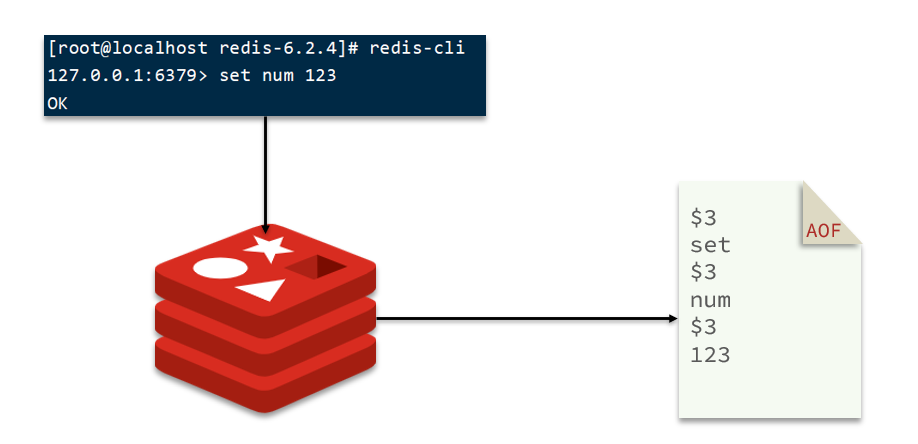
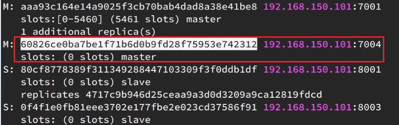
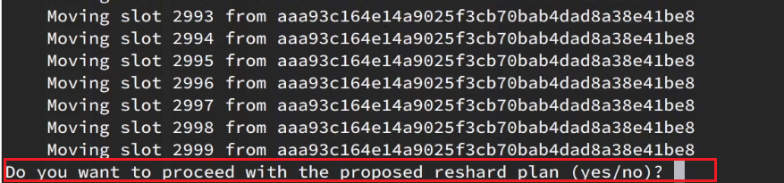
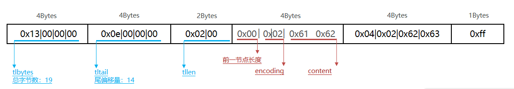
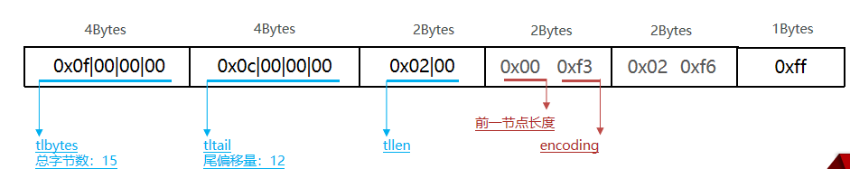
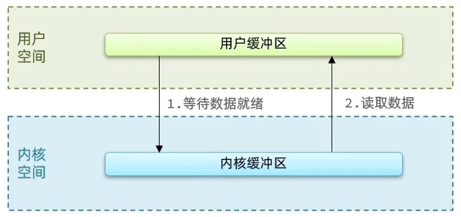
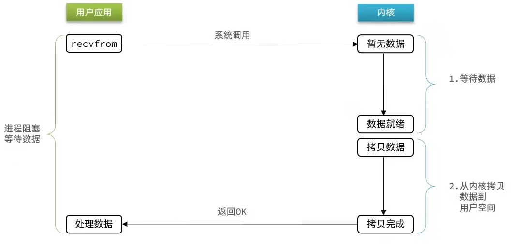
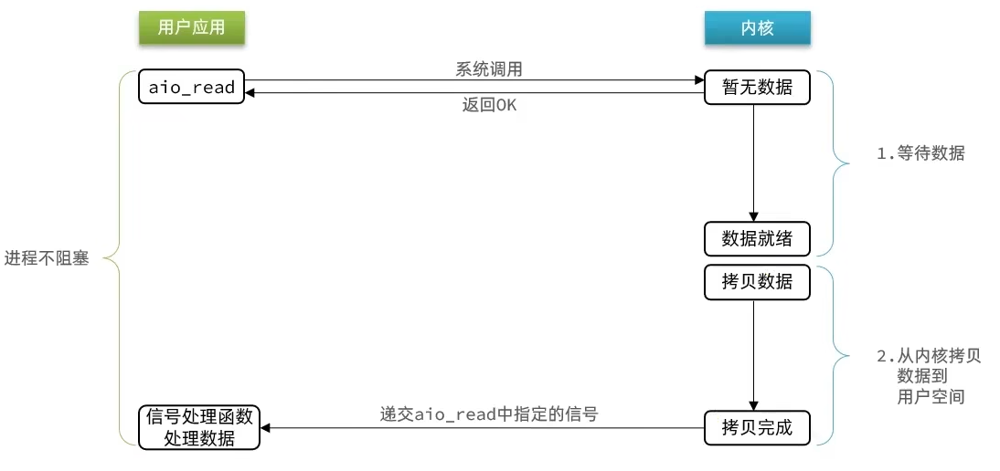

# 快速回顾

[黑马程序员 Redis 入门到实战教程，全面透析 redis 底层原理+redis分布式锁+企业解决方案+redis实战_哔哩哔哩_bilibili](https://www.bilibili.com/video/BV1cr4y1671t?p=24)

## 特点

| -        | SQL                                                        | NoSQL                                                        |
| -------- | ---------------------------------------------------------- | ------------------------------------------------------------ |
| 数据结构 | 结构化（Structured）                                       | 非结构化                                                     |
| 数据关联 | 关联的（Relational）                                       | 无关联的                                                     |
| 查询方式 | SQL 查询                                                   | 非 SQL                                                       |
| 事务特性 | ACID                                                       | BASE                                                         |
| 存储方式 | 磁盘                                                       | 内存                                                         |
| 扩展性   | 垂直                                                       | 水平                                                         |
| 使用场景 | 1) 数据结构固定<br>2) 相关业务对数据安全性、一致性要求较高 | 1) 数据结构不固定<br>2) 对一致性、安全性要求不高<br>3) 对性能要求高 |

NoSQL 具体有 

- 键值类型（Redis）
- 文档类型（MongoBD）
- 列类型（HBase）
- Graph 类型（Neo4j）

Redis 介绍：诞生于 2009 年，全称是 Remote Dictionary Server，远程字典服务器，是一个基于内存的键值型 NoSQL 数据库。

特点

- key-value 类型，value 支持多种不同的数据结构，功能丰富。
- 单线程，每个命令具备原子性（类似 6.0 的多线程仅仅是在请求处理这块，核心的命令执行仍是当线程的）
- 低延迟，速度快（基于内存、IO 多路复用、良好的编码）
- 支持数据持久化
- 支持主从集群、分片集群
    - 主从集群：从节点可以去备份主节点
    - 分片集群：进行数据拆分，比如把 1T 的数据切分成多分存储在不同的服务器上
    - 支持多语言客户端

## 安装

在 docker 中安装 redis。

docker 中进入后台运行的 redis：docker exec -it ae7c /bin/bash。然后再输入 redis-cli 启动交互模式。

## 数据结构

Redis 是一个 key-value 的数据库，key 一般是 String 类型，不过 value 的类型多种多样。

五大基本类型

- String 类型 =\=\> "hello"
- Hash 类型 =\=\> {name: "Jack", age: 21}
- List 类型 =\=\> [A -> B -> C -> C]
- Set 类型 =\=\> {A, B, C}
- SortedSet 类型 =\=\> {A: 1, B: 2, C: 3}

特殊类型

- GEO =\=\> {A:（120.3， 30.5）}
- BitMap =\=\> 0110110101110101011
- HyperLog =\=\> 0110110101110101011

## 命令

Redis 的命令可以在<a href="https://redis.io/commands">官网</a>查询到，也可以通过在 Redis 客户端输入 `help @命令类型` 如 `help @generic` 查询通用命令的使用方式。

### 通用命令

通用指令是部分数据类型的，都可以使用的指令，常见的有：

- KEYS：查看符合模板的所有 key，<span style="color:blue">不建议在生产环境设备上使用</span>

- DEL：删除一个指定的 key

- EXISTS：判断 key 是否存在
- EXPIRE：给一个 key 设置有效期，有效期到期时该 key 会被自动删除，不设置时间的话默认是永久有效
- TTL：查看一个KEY的剩余有效期（它怎么统计有效期的呢？）

通过 help [command] 可以查看一个命令的具体用法，例如：

<div align="center"></div>

### String类型

String 类型，也就是字符串类型，是 Redis 中最简单的存储类型。其 value 是字符串，不过根据字符串的格式不同，又可以分为3类：

- string：普通字符串
- int：整数类型，可以做自增、自减操作
- float：浮点类型，可以做自增、自减操作

不管是哪种格式，底层都是字节数组形式存储，只不过是编码方式不同。字符串类型的最大空间不能超过 512m。

| key   | value       |
| ----- | ----------- |
| msg   | hello world |
| num   | 10          |
| score | 92.6        |

String 的常见命令有：

- SET：添加或者修改已经存在的一个 String 类型的键值对
- GET：根据 key 获取 String 类型的 value
- MSET：批量添加多个 String 类型的键值对
- MGET：根据多个 key 获取多个 String 类型的 value
- INCR：让一个整型的 key 自增1
- INCRBY：让一个整型的 key 自增并指定步长，例如：incrby num 2 让 num 值自增 2
- INCRBYFLOAT：让一个浮点类型的数字自增并指定步长
- SETNX：添加一个 String 类型的键值对，前提是这个 key 不存在，否则不执行（返回 0 表示存在了，未添加成功）
- SETEX：添加一个 String 类型的键值对，并且指定有效期

### Hash类型

Hash 类型，也叫散列，其 value 是一个无序字典，类似于 Java 中的HashMap 结构。

String 结构是将对象序列化为 JSON 字符串后存储，当需要修改对象某个字段时很不方便，而 Hash 结构可以将对象中的每个字段独立存储，可以针对单个字段做 CRUD。

<div align="center"></div>

Hash 的常见命令有：

- HSET key field value：添加或者修改 hash 类型 key 的 field 的值
- HGET key field：获取一个 hash 类型 key 的 field 的值
- HMSET：批量添加多个 hash 类型 key 的 field 的值
- HMGET：批量获取多个 hash 类型 key 的 field 的值
- HGETALL：获取一个 hash 类型的 key 中的所有的 field 和 value
- HKEYS：获取一个 hash 类型的 key 中的所有的 field
- HVALS：获取一个 hash 类型的 key 中的所有的 value
- HINCRBY：让一个 hash 类型 key 的字段值自增并指定步长
- HSETNX：添加一个 hash 类型的 key 的 field 值，前提是这个 field 不存在，否则不执行

### List类型

Redis 中的 List 类型与 Java 中的 LinkedList 类似，可以看做是一个双向链表结构。既可以支持正向检索和也可以支持反向检索。

特征也与 LinkedList 类似：

- 有序
- 元素可以重复
- 插入和删除快
- 查询速度一般

常用来存储一个有序数据，例如：朋友圈点赞列表，评论列表等。

List的常见命令有：

- LPUSH key element ... ：向列表左侧插入一个或多个元素
- LPOP key：移除并返回列表左侧的第一个元素，没有则返回nil
- RPUSH key element ... ：向列表右侧插入一个或多个元素
- RPOP key：移除并返回列表右侧的第一个元素
- LRANGE key star end：返回一段角标范围内的所有元素
- <span style="color:green">BLPOP 和 BRPOP：与 LPOP 和 RPOP 类似，只不过在没有元素时会等待指定的时间，而不是直接返回 nil，有点类似于阻塞队列。Timeout 时间是以秒为单位</span>

<div align="center"></div>

可以用 List 结构模拟 stack、queue 和 blockingkqueue。

### Set类型

Redis 的 Set 结构与 Java 中的 HashSet 类似，可以看做是一个 value 为 null 的 HashMap。因为也是一个 hash 表，因此具备与 HashSet 类似的特征：

- 无序
- 元素不可重复
- 查找快
- 支持交集、并集、差集等功能（寻找共同好友）

String 的常见命令有：

- SADD key member ... ：向 set 中添加一个或多个元素
- SREM key member ... : 移除 set 中的指定元素
- SCARD key： 返回 set 中元素的个数
- SISMEMBER key member：判断一个元素是否存在于 set 中
- SMEMBERS：获取 set 中的所有元素
- lSINTER key1 key2 ... ：求 key1 与 key2 的交集 S1，S2 的交（B、C）
- lSDIFF key1 key2 ... ：求 key1 与 key2 的差集，S1，S2 的差（A）
- lSUNION key1 key2 ..：求 key1 和 key2 的并集，S1，S2 的并（A、B、C、D）

<div align="center"></div>

> 练习

将下列数据用 Redis 的 Set 集合来存储：

- 张三的好友有：李四、王五、赵六
- 李四的好友有：王五、麻子、二狗

利用Set的命令实现下列功能：

- 计算张三的好友有几人
- 计算张三和李四有哪些共同好友
- 查询哪些人是张三的好友却不是李四的好友
- 查询张三和李四的好友总共有哪些人
- 判断李四是否是张三的好友
- 判断张三是否是李四的好友
- 将李四从张三的好友列表中移除

### SortedSet类型

Redis 的 SortedSet 是一个可排序的 set 集合，与 Java 中的 TreeSet 有些类似，但底层数据结构却差别很大。SortedSet 中的每一个元素都带有一个 score 属性，可以基于 score 属性对元素排序，底层的实现是一个跳表（SkipList，用来排序的）加 hash 表。

SortedSet 具备下列特性：

- 可排序
- 元素不重复
- 查询速度快

因为 SortedSet 的可排序特性，经常被用来实现排行榜这样的功能。

SortedSet 的常见命令有：默认都是升序排名。

- ZADD key score member：添加一个或多个元素到 sorted set ，如果已经存在则更新其 score 值

- ZREM key member：删除 sorted set 中的一个指定元素

- ZSCORE key member : 获取 sorted set 中的指定元素的 score 值

- ZRANK key member：获取 sorted set 中的指定元素的排名
- ZCARD key：获取 sorted set 中的元素个数
- ZCOUNT key min max：统计 score 值在给定范围内的所有元素的个数
- ZINCRBY key increment member：让 sorted set 中的指定元素自增，步长为指定的 increment 值，比如自增 increment（自增1）。
- ZRANGE key min max：按照 score 排序后，获取指定排名范围内的元素 （zrange age 0 9 ，取排名前 10 的元素）
- ZRANGEBYSCORE key min max：按照 score 排序后，获取指定 score 范围内的元素
- ZDIFF、ZINTER、ZUNION：求差集、交集、并集

注意：所有的排名默认都是升序，如果要降序则在命令的 Z 后面添加REV 即可：ZREVRange 就是降序了

> 练习

将班级的下列学生得分存入 Redis 的 SortedSet 中：

- Jack 85, Lucy 89, Rose 82, Tom 95, Jerry 78, Amy 92, Miles 76

并实现下列功能：

- 删除 Tom 同学
- 获取 Amy 同学的分数
- 获取 Rose 同学的排名
- 查询 80 分以下有几个学生
- 给Amy同学加 2 分
- 查出成绩前 3 名的同学
- 查出成绩 80 分以下的所有同学

## 设计KEY

Redis 没有类似 MySQL 中的 Table 的概念，我们该如何区分不同类型的key呢？例如，需要存储用户、商品信息到 redis，有一个用户 id 是1，有一个商品 id 恰好也是 1。

<span style="color:orange">可以采用 `项目名:业务名:类型:id` 这种多个单词形成层级结构，单词间用 ':' 隔开的方式设计 key。</span>

- <span style="color:orange">user 相关的 key：`project_name:user:1`</span>

- <span style="color:orange">product 相关的 key：`project_name:product:1`</span>

在 redis 内部，最后会以层级关系显示这些数据。

如果 Value 是一个 Java 对象，如一个 User 对象，则可以将对象序列化为 JSON 字符串后存储。

| key       | value                                     |
| --------- | ----------------------------------------- |
| user:1    | {"id":1, "name": "Jack", "age": 21}       |
| product:1 | {"id":1, "name": "小米11", "price": 4999} |

`Redis 的 key 的格式=\=\>[项目名]:[业务名]:[类型]:[id]`

## Java客户端

在 Redis 官网中提供了各种语言的客户端，地址：https://redis.io/clients

<div align="center"></div>

### Jedis

① 引入依赖

```xml
<!-- jedis 客户端-->
<dependency>
    <groupId>redis.clients</groupId>
    <artifactId>jedis</artifactId>
</dependency>
```

② 建立连接

```java
jedis = new Jedis("192.168.160.44", 6379);
```

③ 使用 Jedis

```java
jedis.set("name", "hahah");
```

④ 释放资源

```java
jedis.close();
```

完整代码

```java
import org.junit.After;
import org.junit.Before;
import org.junit.Test;
import org.springframework.boot.test.context.SpringBootTest;
import redis.clients.jedis.Jedis;

@SpringBootTest
public class TestJedis {
    private Jedis jedis;

    @Before
    public void setUp() {
        jedis = new Jedis("192.168.160.44", 6379);
    }

    @Test
    public void test() {
        jedis.set("name", "hahah");
    }

    @After
    public void close() {
        jedis.close();
    }
}
```

Jedis 本身是线程不安全的，并且频繁的创建和销毁连接会有性能损耗，因此推荐使用 Jedis 连接池代替 Jedis 的直连方式。

```java
// Jedis 连接池
import redis.clients.jedis.Jedis;
import redis.clients.jedis.JedisPool;
import redis.clients.jedis.JedisPoolConfig;

public class JedisUtils {
    private static final JedisPool jedisPool;

    static {
        JedisPoolConfig config = new JedisPoolConfig();
        config.setMaxIdle(10);
        config.setMinIdle(5);
        config.setMaxTotal(20);
        config.setMaxWaitMillis(1000);
        jedisPool = new JedisPool(config, "192.168.2.240");
    }

    public static Jedis getJedis() {
        return jedisPool.getResource();
    }

    public static void close(Jedis jedis){
        jedis.close(); // 有连接池则归还到池中，没有则直接关闭
    }
}
```

```java
@SpringBootTest
public class TestJedis {
    private Jedis jedis;

    @Before
    public void setUp() {
        jedis = JedisUtils.getJedis();
    }

    @Test
    public void test() {
        jedis.set("name", "hahah");
        String name = jedis.get("name");
        System.out.println(name);
    }

    @After
    public void close() {
        jedis.close();
    }
}
```

这里解释下为什么说 Jedis 是线程不安全的。 

[jedis非线程安全 - 简书 (jianshu.com)](https://www.jianshu.com/p/5e4a1f92c88f)

简单说就是，Jedis 共享了 Socket。Jedis 类中有 RedisInputStream和 RedisOutputStream 两个属性，而发送命令和获取返回值都是使用这两个成员变量，这很容易引发多线程问题。Jedis 执行命令前需要创建一个 conneciton 连接：

```java
public void connect() {
    // 如果 socket 连接关闭了的话，创建一个新的连接。
    if (!this.isConnected()) {
        try {
            this.socket = this.jedisSocketFactory.createSocket();
            this.outputStream = new RedisOutputStream(this.socket.getOutputStream());
            this.inputStream = new RedisInputStream(this.socket.getInputStream());
        } catch (IOException var2) {
            this.broken = true;
            throw new JedisConnectionException("Failed connecting to " + this.jedisSocketFactory.getDescription(), var2);
        }
    }
}
```

可能两个线程出现这种情况：


### SpringDataRedis

SpringData 是 Spring 中数据操作的模块，包含对各种数据库的集成，其中对 Redis 的集成模块就叫做 SpringDataRedis

官网地址：https://spring.io/projects/spring-data-redis

- 提供了对不同 Redis 客户端的整合（Lettuce 和 Jedis）
- 提供了 RedisTemplate 统一 API 来操作 Redis
- 支持 Redis 的发布订阅模型
- 支持 Redis 哨兵和 Redis 集群
- 支持基于 Lettuce 的响应式编程
- 支持基于 JDK、JSON、字符串、Spring 对象的数据序列化及反序列化
- 支持基于 Redis 的 JDKCollection 实现

> 快速入门

SpringDataRedis 中提供了 RedisTemplate 工具类，其中封装了各种对 Redis 的操作。并且将不同数据类型的操作 API 封装到了不同的类型中：

| API                                | 返回值类型      | 说明                    |
| ---------------------------------- | --------------- | ----------------------- |
| <b>redisTemplate</b>.opsForValue() | ValueOperations | 操作 String 类型数据    |
| <b>redisTemplate</b>.opsForHash()  | HashOperations  | 操作 Hash 类型数据      |
| <b>redisTemplate</b>.opsForList()  | ListOperations  | 操作 List 类型数据      |
| <b>redisTemplate</b>.opsForSet()   | SetOperations   | 操作 Set 类型数据       |
| <b>redisTemplate</b>.opsForZSet()  | ZSetOperations  | 操作 SortedSet 类型数据 |
| <b>redisTemplate</b>               |                 | 通用的命令              |

① 引入一来就，redis 启动的坐标和连接池依赖

```xml
<dependency>
    <groupId>org.springframework.boot</groupId>
    <artifactId>spring-boot-starter-data-redis</artifactId>
</dependency>
<dependency>
    <groupId>org.apache.commons</groupId>
    <artifactId>commons-pool2</artifactId>
</dependency>
```

② redis 相关配置文件

```yaml
spring:
  redis:
    host: 192.168.160.44
    port: 6379
    lettuce:
      pool:
        max-active: 10
        max-idle: 10
        min-idle: 1
        time-between-eviction-runs: 10s
```

③ 注入 RedisTemplate

```java
@Autowired
RedisTemplate redisTemplate;
```

④ 测试

```java
@SpringBootTest(classes = HmDianPingApplication.class)
@SuppressWarnings("all")
@RunWith(SpringRunner.class) // JUnit4 需要加这句
public class RedisTemplateTest {
    @Autowired
    RedisTemplate redisTemplate;

    @Test
    public void test() {
        // 插入一条string类型数据，如果采用默认的序列化机制的话，
        // name 会被当成一个 Java 对象进行序列化，
        // 默认采用 JDK 序列化，序列化为字节形式。
        redisTemplate.opsForValue().set("name", "hello-world");
        redisTemplate.opsForValue().setIfAbsent("name", "hello");
    }
}
```

>序列化方式

RedisTemplate 可以接收任意 Object 作为值写入 Redis，只不过写入前会把 Object 序列化为字节形式，默认是采用 JDK 序列化，得到的结果是这样的

<div align="center"></div>

Spring 默认提供了一个 StringRedisTemplate 类，它的 key 和 value 的序列化方式默认就是 String 方式。省去了我们自定义 RedisTemplate 的过程，我们不用自己定义序列化反序列化的配置参数了。

```java
@SpringBootTest
@RunWith(SpringRunner.class) // JUnit4 需要加这句
public class RedisTemplateTest {
    @Autowired
    StringRedisTemplate redisTemplate;

    @Test
    public void test() {
        redisTemplate.opsForValue().set("name", "hello-world");
        redisTemplate.opsForValue().setIfAbsent("name", "hello");
    }
}
```

# 场景实战

[黑马程序员Redis入门到实战教程，全面透析redis底层原理+redis分布式锁+企业解决方案+redis实战_哔哩哔哩_bilibili](https://www.bilibili.com/video/BV1cr4y1671t?p=24)

## 内容概述

- 短信登录：Redis 共享 session 的应用
- 商品缓存查询：缓存使用技巧；缓存雪崩、穿透等问题
- 优惠券秒杀：Redis 计数器、Lua 脚本实现 Redis 分布式锁、Redis 的三种消息队列
- 达人探店：基于 List 的点赞列表、基于 SortedSet 的点赞排行榜
- 好友关注：基于 Set 集合的关注、取关、共同关注、消息推送等功能
- 附件的商户：Redis 的 GenHash 的应用
- 用户签到：Redis 的 BitMap 数据统计功能
- UV 统计：Redis 的 HyperLogLog 的统计功能（一般大数据量下的话不会用这个）

导入 SQL 文件

<div align="center"></div>

SQL 中包含如下的表

- tb_user：用户表
- tb_user_info：用户详情表
- tb_shop：商户信息表
- tb_shop_type：商户类型表
- tb_blog：用户日记表（达人探店日记）
- tb_follow：用户关注表
- tb_voucher：优惠券表
- tb_voucher_order：优惠券的订单表

项目的运行流程如下：

这是一个前后端分离的项目，用 ngnix 进行方向代理，访问 tomcat 集群。Redis 和 MySQL 也有相应的集群。 

<div align="center"></div>

项目的访问路径是：http://localhost:8081/shop-type/list，如果可以看到数据则证明运行没有问题。

PS：需要修改 application.yaml 文件中的 MySQL、Redis 的地址信息。资料中提供了一个 nginx，复制到任意目录，在控制台输入 `start nginx.exe` 启动 nginx。然后访问: [http://127.0.0.1:8080](http://127.0.0.1:8080/) ，即可看到页面。

## 短信登录

### 基于Session实现登录

具体的流程如下。

<div align="center"></div>

我们需要在一些操作上判断用户是否登录。一种方式是在特定的操作上加判断，另一种方式是写一个过滤器，当访问特定的 url 路径时，判断是否登录。显然，用过滤器的方式更好。我们需要把拦截器拦截到的用户信息传递到 Controller 里去，并且要保证线程安全（一条完整的 HTTP 请求对应一个线程，如果共享数据，如用同一个 ArrayList 存储，会出现并发安全问题）。我们可以使用 ThreadLocal，可以确保线程之间安全的使用自己线程中的数据。

拦截器的两个方法

- preHandler 在业务处理器处理请求之前被调用。
- afterCompletion 完全处理请求之后被调用，可用于清理资源。

### 集群的session共享问题

<b>session 共享问题</b>：多台 Tomcat 并不共享 session 存储空间，当请求切换到不同 Tomcat 服务时导致数据丢失的问题。Tomcat 后面虽然提供了 session 拷贝的解决办法，但是太浪费内存空间了，数据拷贝是有延迟的。

session的替代方案应该满足：

- 数据共享
- 内存存储
- key、value 结构
- ---> redis

这里，我们使用 Redis 充当缓存，解决 Session 共享问题。

### 基于Redis实现共享session登录

<div align="center"></div>


<div align="center"></div>

注意，拦截器类是我们手动 new 出来放到 IOC 里面的，所以拦截器里注入 StringRedisTemplate 需要用构造函数手动给对象赋值。然后添加自定义的拦截器又是在 Configurate 类中做的， StringRedisTemplate 可以通过依赖注入实例化。

保存登录的用户信息，可以用 String 结构，以 JSON 字符串来保存，比较直观。

| key         | value                   |
| ----------- | ----------------------- |
| shop:user:1 | {name: "Jack", age: 21} |
| shop:user:2 | {name: "Pose", age: 18} |

哈希结构可以将对象中的每个字段独立存储，可以针对单个字段做 CRUD，并且内存占用更少

<div align="center"></div>

### 总结

Redis 代替 session 需要考虑的问题：

- 选择合适的数据结构
- 选择合适的 key
- 选择合适的存储粒度

登录拦截器的优化

拦截器的执行顺序有个先后关系，可以通过 Order 来设置。Order 的值越小，执行计划等级越高。

<div align="center"></div>

## 商品查询缓存

- 添加 Redis 缓存
- 缓存更新策略
- 缓存穿透
- 缓存雪崩
- 缓存击穿
- 缓存工具封装

### 缓存

<b>缓存</b>就是数据交换的缓冲区（称作Cache [ kæʃ ] ），是存贮数据的临时地方，一般读写性能较高。


- 缓存的作用：
    - 降低后端负载
    - 提高读写效率，降低响应时间
- 缓存的成本
    - 数据一致性成本
    - 代码维护成本
    - 运维成本

### 添加Redis缓存

<div align="center"></div>


<div align="center"></div>

修改 ShopTypeController 中的 queryTypeList 方法，添加查询缓存

<div align="center"></div>

### 缓存更新策略

|    -     | 内存淘汰                                                     | 超时剔除                                                     | 主动更新                                     |
| :------: | ------------------------------------------------------------ | ------------------------------------------------------------ | -------------------------------------------- |
|   说明   | 不用自己维护，利用Redis的内存淘汰机制，当内存不足时自动淘汰部分数据。下次查询时更新缓存。 | 给缓存数据添加TTL时间，到期后自动删除缓存。下次查询时更新缓存。 | 编写业务逻辑，在修改数据库的同时，更新缓存。 |
|  一致性  | 差                                                           | 一般                                                         | 好                                           |
| 维护成本 | 无                                                           | 低                                                           | 高                                           |

业务场景：

- 低一致性需求：使用内存淘汰机制。例如店铺类型的查询缓存
- 高一致性需求：主动更新，并以超时剔除作为兜底方案。例如店铺详情查询的缓存

#### 主动更新策略

- <b>Cache Aside Pattern</b>：由缓存的调用这，在更新数据库的同时更新缓存。【推荐这个】
- <b>Read/Write Through Pattern</b>：缓存与数据库整合为一个服务，由服务来维护一致性。调用者调用该服务，无需关系缓存一致性问题。
- <b>Write Behind Caching Pattern</b>：调用者只操作缓存，由其他线程异步的将缓存数据持久化到数据库，保证最终一致性。

操作缓存和数据库时有三个问题需要考虑：

操作缓存和数据库时有三个问题需要考虑：

1.删除缓存还是更新缓存？

- 更新缓存：每次更新数据库都更新缓存，无效写操作较多
- 删除缓存：更新数据库时让缓存失效，查询时再更新缓存

2.如何保证缓存与数据库的操作的同时成功或失败？

- 单体系统，将缓存与数据库操作放在一个事务
- 分布式系统，利用 TCC 等分布式事务方案

3.先操作缓存还是先操作数据库？

- 先删除缓存，再操作数据库
- 先操作数据库，再删除缓存

先操作数据库，再删除缓存。√

先删除缓存，再操作数据库。×

缓存更新策略的最佳实践方案：

1.低一致性需求：使用Redis自带的内存淘汰机制

2.高一致性需求：主动更新，并以超时剔除作为兜底方案

- 读操作：
    - 缓存命中则直接返回
    - 缓存未命中则查询数据库，并写入缓存，设定超时时间

- 写操作：
    - 先写数据库，然后再删除缓存
    - 要确保数据库与缓存操作的原子性

> 给查询商铺的缓存添加超时剔除和主动更新的策略

修改 ShopController 中的业务逻辑，满足下面的需求：

① 根据 id 查询店铺时，如果缓存未命中，则查询数据库，将数据库结果写入缓存，并设置超时时间

② 根据 id 修改店铺时，先修改数据库，再删除缓存

### 缓存穿透

<b>缓存穿透是指客户端请求的数据在缓存中和数据库中都不存在，这样缓存永远不会生效，这些请求都会打到数据库。</b>

常见的解决方案有两种：

1️⃣缓存空对象

- 优点：实现简单，维护方便
- 缺点：额外的内存消耗；可能造成短期的不一致

2️⃣布隆过滤

- 优点：内存占用较少，没有多余 key
- 缺点：实现复杂；存在误判可能

<div align="center"></div>

> 缓存穿透产生的原因是什么？

用户请求的数据在缓存中和数据库中都不存在，不断发起这样的请求，给数据库带来巨大压力

> 缓存穿透的解决方案有哪些？

<div align="center"></div>

- 缓存 null 值：会带来额外的内存存储压力和短暂的不一致性。
- 布隆过滤：基于布隆算法，准确性无法保证，实现复杂。
- 增强 id 的复杂度，避免被猜测 id 规律
- 做好数据的基础格式校验
- 加强用户权限校验
- <b>做好热点参数的限流</b>

### 缓存雪崩

缓存雪崩是指在同一时段大量的缓存 key 同时失效或者 Redis 服务宕机，导致大量请求到达数据库，带来巨大压力。

<b>常见的解决方案有：</b>

1️⃣给不同的 Key 的 TTL 添加随机值，比如原先设置的 20，那么我们再加一个随机的 1~10 的值

2️⃣利用 Redis 集群提高服务的可用性（很严重），尽可能的避免宕机。宕机的话，可以用 redis 的哨兵机制，监控服务。搭建 Redis 服务形成主从，如果有机器 宕机（如主宕机了，会随机从一个从机器里选一个替代主）

3️⃣给缓存业务添加降级限流策略

4️⃣给业务添加多级缓存

### 缓存穿透

<span style="color:red">缓存击穿问题也叫热点 Key 问题，就是一个被高并发访问并且缓存重建业务较复杂的 key 突然失效了，无数的请求访问会在瞬间给数据库带来巨大的冲击。</span>

假定有多个线程（1，2，3，4）查询到了一个失效的缓存，线程 1 发现缓存失效了，开始走重建缓存的流程。此时缓存还未重建完毕，线程 2，3，4 也发现缓存失效了，也走了重建缓存的流程（没有必要）。

<div align="center"></div>

常见的解决方案有：互斥锁和逻辑过期。利用互斥锁，让其中一个线程重建缓存即可了。

<div align="center"></div>

互斥锁需要互相等待，1000 个线程来了，一个负责重建，其他的只能等待。如果重建时间长的话，系统性能会很差。可以为数据设置一个逻辑过期，解决等待的问题。

<div align="center"></div>

| 解决方案        | 优点                                         | 缺点                                         |
| --------------- | -------------------------------------------- | -------------------------------------------- |
| <b>互斥锁</b>   | 没有额外的内存消耗<br>保证一致性<br>实现简单 | 线程需要等待，性能受影响<br>可能有死锁风险   |
| <b>逻辑过期</b> | 线程无需等待，性能较好                       | 不保证一致性<br>有额外的内存消耗<br>实现复杂 |

> 基于互斥锁解决缓存击穿问题

需求：修改根据 id 查询商铺的业务，基于互斥锁（redis 的 setnx）方式来解决缓存击穿问题。

<div align="center"></div>

```java
private boolean tryLock(String key){
    Boolean flag = stringRedisTemplate.opsForValue().setIfAbsent(key,"1",10,TimeUnit.SECONDS);
    return flag==null?false:true;
}

private void unlock(String key){
    stringRedisTemplate.delete(key);
}
```

获取锁成功后，应该再次检测 redis 缓存是否存在，做 doubleCheck，如果存在则无需重建缓存。

> 基于逻辑过期方式解决缓存击穿问题

需求：修改根据 id 查询商铺的业务，基于互斥锁方式来解决缓存击穿问题。

<div align="center"></div>

### 缓存工具封装

<b>基于 StringRedisTemplate 封装一个缓存工具类，满足下列需求：</b>

方法 1：将任意 Java 对象序列化为 json 并存储在 string 类型的 key 中，并且可以设置 TTL 过期时间

方法 2：将任意 Java 对象序列化为 json 并存储在 string 类型的 key 中，并且可以设置逻辑过期时间，用于处理缓存击穿问题

方法 3：根据指定的 key 查询缓存，并反序列化为指定类型，利用缓存空值的方式解决缓存穿透问题

方法 4：根据指定的 key 查询缓存，并反序列化为指定类型，需要利用逻辑过期解决缓存击穿问题

在更新缓存的时候，不知道数据库查询的具体操作，采用 lambda 由用户传入具体的操作。

## 优惠券秒杀

- 全局唯一 ID
- 实现优惠券秒杀下单
- 超卖问题
- 一人一单
- 分布式锁
- Redis 优化秒杀
- Redis 消息队列实现异步秒杀

### 全局唯一 ID

每个店铺都可以发布优惠券

当用户抢购时，就会生成订单并保存到 tb_voucher_order 这张表中，而订单表如果使用数据库自增ID就存在一些问题：

- id 的规律性太明显
- 受单表数据量的限制

全局 ID 生成器，是一种在分布式系统下用来生成全局唯一ID的工具，一般要满足下列特性：唯一性、高可用、高性能、递增性、安全性

为了增加 ID 的安全性，我们不直接使用 Redis 自增的数值，而是拼接一些其它信息


ID 的组成部分

- 符号位：1bit，永远为 0
- 时间戳：31bit，以秒为单位，可以使用 69 年
- 序列号：32bit，秒内的计数器，支持每秒产生 $2^{32}$ 个不同 ID `A << COUNT_BIT | count`

> 全局唯一 ID 生成策略

- UUID
- Redis 自增
- snowflake 算法
- 数据库自增

> Redis 自增 ID 策略：

- 每天一个 key，方便统计订单量
- ID 构造是时间戳 + 计数器

> 案例：生成全局唯一 ID

```java
private static final int COUNT_BIT = 32;
public long nextId(String keyPrefix){
    // 1.生成时间戳
    LocalDateTime now = LocalDateTime.now();
    long nowSecond = new.toEpochSecond(ZoneOffset.UTC);
    long timestamp = nowSecond - BEGIN_TIMESTAMP;
    
    // 2.生成序列号
    // 2.1 获取当前日期，精确到天
    String date = now.format(DateTimeFormatter.ofPattern("yyy:MM:dd"));
    // 2.2 自增长（不会存在空指针的，如果key不存在会自动给你重建一个，然后+1返回1给你）
    Long count = stringRedisTemplate.opsForValue().increment("icr:"+keyPrefix+":"+date);
    
    // 拼接返回
   	// 符号位 时间戳 序列化
    // 用位运算。
    return (timestamp<<COUNT_BIT)|count
}
```

### 优惠券秒杀下单

每个店铺都可以发布优惠券，分为平价券和特价券。平价券可以任意购买，而特价券需要秒杀抢购：

tb_voucher：优惠券的基本信息，优惠金额、使用规则等
tb_seckill_voucher：优惠券的库存、开始抢购时间，结束抢购时间。特价优惠券才需要填写这些信息

下单时需要判断两点：

- 秒杀是否开始或结束，如果尚未开始或已经结束则无法下单
- 库存是否充足，不足则无法下单

<div align="center"></div>

### 超卖问题

超卖问题是典型的多线程安全问题，针对这一问题的常见解决方案就是加锁。

认为线程安全问题一定会发生，因此在操作数据之前先获取锁，确保线程串行执行。例如 Synchronized、Lock 都属于悲观锁

认为线程安全问题不一定会发生，因此不加锁，只是在更新数据时去判断有没有其它线程对数据做了修改。如果没有修改则认为是安全的，自己才更新数据。如果已经被其它线程修改说明发生了安全问题，此时可以重试或异常。

> 乐观锁

乐观锁的关键是判断之前查询得到的数据是否有被修改过，常见的方式有两种，版本号法和 CAS。

版本号法，加一个版本字段，先查下数据的库存和版本，修改时判断版本是否一致，不一致说明被改过，重新查询库存，修改库存。可以直接用库存作为版本号。直接判断版本号是否一致的话，商品卖出的成功率太低，直接判断库存是否大于零更合适。

有时候只能通过数据是否变化来判断是否可以卖出，这种时候为了提高并发度可以采用分段锁的思想。将数据分为多个段，让多个线程可以并发处理。

> 悲观锁

加重量级锁

如果觉得并发粒度不够，可以采用分段锁的思想。

| 方案                                             | 优点     | 缺点               |
| ------------------------------------------------ | -------- | ------------------ |
| 悲观锁，添加同步锁，让线程串行执行               | 简单粗暴 | 性能一般           |
| 乐观锁，不加锁，在更新时判断是否有其它线程在修改 | 性能好   | 存在成功率低的问题 |

### 一人一单

修改秒杀业务，要求同一个优惠券，一个用户只能下一单。可以直接用联合主键完成，也可以代码里写逻辑。

- 查询订单
- 判断是否存在，不存在则扣减库存，创建订单。

查询订单和扣减库存这块会出现并发问题，因为查询和创建不是原子性的。在加锁的时候需要注意锁的范围和事务的范围。

<div align="center"></div>

```java
@Transactional
public Result createVoucherOrder(Long voucherId){
    Long userId = UserHolder.getUser().getId();
    synchronized(userId.toString().intern()){
        // 业务代码
    }
    // 会出现，锁已经释放了，但是事务还没有提交。数据没有刷新到数据库中，导致其他事务查询到的还是未更新的数据，导致数据不一致。
    // 为了避免这种问题，需要加大锁的范围
}
```

加大锁的范围

```java
@Transactional
public Result createVoucherOrder(Long voucherId){
    Long userId = UserHolder.getUser().getId();
    // 业务代码
}

// 加大锁的范围,让锁锁住事务 Spring 事务失效的集中情况
public XX KK(){
    // some code
    Long userId = UserHolder.getUser().getId();
    // Spring 的事务是通过代理对象实现的，直接调用 createVoucherOrder 是不会走代理对象的，所以我们需要改成用代理对象调用
    synchronized(userId.toString().intern()){
    	IVoucherOrderService proxy = AopContext.currentProxy();
        return proxy.createVoucherOrder(userId); // createVoucherOrder 是接口 IVoucherOrderService 中的方法
    }
}
```

通过加锁可以解决在单机情况下的一人一单安全问题，但是在集群模式下就不行了。假定下面两个线程访问的是不同的服务器：

<div align="center"></div>

模拟集群模型：

1.将服务启动两份，端口分别为 8081 和 8082

<div align="center"></div>

2.修改 nginx 的 conf 目录下的 nginx.conf 文件，配置反向代理和负载均衡。

<div align="center"></div>

3.jmeter 并发访问，出现并发安全问题，并未实现一人一单。

分布式锁可以解决上述问题。当然也可以直接用数据库的联合主键解决一人一单的问题。

### 分布式锁

分布式锁是满足分布式系统或集群模式下多进程可见并且互斥的锁。

分布式锁的核心是实现多进程之间互斥，而满足这一点的方式有很多，常见的有三种

|        | **MySQL**                   | **Redis**                 | **Zookeeper**                    |
| ------ | --------------------------- | ------------------------- | -------------------------------- |
| 互斥   | 利用 mysql 本身的互斥锁机制 | 利用 setnx 这样的互斥命令 | 利用节点的唯一性和有序性实现互斥 |
| 高可用 | 好                          | 好                        | 好                               |
| 高性能 | 一般                        | 好                        | 一般                             |
| 安全性 | 断开连接，自动释放锁        | 利用锁超时时间，到期释放  | 临时节点，断开连接自动释放       |

> 基于 Redis 的分布式锁

在代码中，我们为了实现分布式锁时定义了两个基本方法：

- 获取锁方法：

    - 互斥，确保只能有一个线程获取锁

        `setnx lock thread1`，并通过 `expire lock 10` 添加锁过期时间，避免服务器宕机引起死锁

    - 非阻塞：尝试一次，成功返回 true，失败返回 false


- 释放锁方法：

    - 手动释放
    - 超时释放：获取锁时添加一个超时时间 `del key`


```java
public interface ILock{
    // timeoutsec 表示锁的持有时间，过期后自动释放。
    boolean tryLock(long timeoutsec){};
    void unlock();
}
```

<div align="center"></div>

上述的方案存在一个问题，如果两个线程争抢锁，线程 1 抢到了，但是由于执行业务的时间太长了，致使锁超时释放。此时线程2 拿到了锁执行业务。在线程 2 执行业务的时候，线程 1 业务执行完毕了，释放了锁（释放了线程 2 加的锁），线程 3 在线程 2 为完成业务，且锁未超时的情况下拿到了锁。

<div align="center"></div>

为了解决这个问题，我们需要在释放锁之前判断一下，是不是自己加的锁，是自己加的锁才要释放。

> 改进 Redis 的分布式锁

需求：修改之前的分布式锁实现，满足：

- 在获取锁时存入线程标示（可以用 UUID 表示）
- 在释放锁时先获取锁中的线程标示，判断是否与当前线程标示一致
    - 如果一致则释放锁
    - 如果不一致则不释放锁


<span style="color:red">但是这种方案仍然存在问题</span>

判断锁标识和释放锁不是原子性的，会有并发问题。线程 1 判断锁标识，发现一致，在释放锁时发送了阻塞（如 GC）。在阻塞过程中，其他服务器的线程 2 获取到了锁，并开始执行业务。在线程 2 执行业务时，线程 1 把线程 2 的锁释放了。如果有其他线程也来抢锁，是可以拿到锁的。

<div align="center"></div>

### Lua 脚本

<span style="color:orange">前面的核心问题在与，判断锁和释放锁不是原子性的操作，而 Lua 脚本可以解决这种问题。</span>

Redis 提供了 Lua 脚本功能，在一个脚本中编写多条 Redis 命令，确保多条命令执行时的原子性。Lua 是一种编程语言，它的基本语法可以参考网站：https://www.runoob.com/lua/lua-tutorial.html
这里重点介绍 Redis 提供的调用函数，语法如下：

```shell
# 执行redis命令
redis.call('命令名称', 'key', '其它参数', ...)
```

例如，我们要执行 set name jack，则脚本是这样

```shell
# 执行 set name jack
redis.call('set', 'name', 'jack')
```

例如，我们要先执行 set name Rose，再执行 get name，则脚本如下

```shell
# 先执行 set name jack
redis.call('set', 'name', 'jack')
# 再执行 get name
local name = redis.call('get', 'name')
# 返回
return name
```

写好脚本以后，需要用 Redis 命令来调用脚本，调用脚本的常见命令如下

<div align="center"></div>

例如，我们要执行 redis.call('set', 'name', 'jack') 这个脚本，语法如下

<div align="center"></div>

如果脚本中的 key、value 不想写死，可以作为参数传递。key 类型参数会放入 KEYS 数组，其它参数会放入 ARGV 数组，在脚本中可以从 KEYS 和 ARGV 数组获取这些参数：

```shell
eval "return redis.call('set', KEYS[1],ARGV[1])" 1 name rose
```

### Lua 改进分布式锁

释放锁的业务流程是这样的：

- 1.获取锁中的线程标示
- 2.判断是否与指定的标示（当前线程标示）一致
- 3.如果一致则释放锁（删除）
- 4.如果不一致则什么都不做
- 5.如果用 Lua 脚本来表示则是这样的：

```mysql
-- 这里的 KEYS[1] 就是锁的key，这里的ARGV[1] 就是当前线程标示
-- 获取锁中的标示，判断是否与当前线程标示一致
if (redis.call('GET', KEYS[1]) == ARGV[1]) then
  -- 一致，则删除锁
  return redis.call('DEL', KEYS[1])
end
-- 不一致，则直接返回
return 0
```

需求：基于 Lua 脚本实现分布式锁的释放锁逻辑
提示：RedisTemplate 调用 Lua 脚本的 API 如下：

```java
/**
 script：脚本
 keys：对应 KEYG
 args：对应 ARGV
*/
public <T> execute(RedisScript<T> script, List<K> kyes, Object... args){
    return scriptExecutor.execute(script,keys,args);
}
```

假定，我们将 lua 脚本放在 resources 根目录下

```java
private static final DefaultRedisScript<Long> UNLOCK_SCRIPT;
statIC{
    UNLOCK_SCRIPT = new DefaultRedisScript<>();
	UNLOCK_SCRIPT.setLocation(new ClassPathResource("unlock.lua"));
    UNLOCK_SCRIPT.setResultType(Long.class);
}

public static unlock(){
    stringRedisTemplate.execute(
    	UNLOCK_SCRIPT,
        Collections.singletionList(KEY_PREFIX+name),
        ID_PREFIX+Thread.currentThread().getId()
    );
}
```

基于 Redis 的分布式锁实现思路：

- 利用 set nx ex 获取锁，并设置过期时间，保存线程标示
- 释放锁时先判断线程标示是否与自己一致，一致则删除锁

特性：

- 利用 set nx 满足互斥性
- 利用 set ex 保证故障时锁依然能释放，避免死锁，提高安全性
- 利用 Redis 集群保证高可用和高并发特性

> 基于 setnx 实现的分布式锁存在下面的问题：

- 不可重入：同一个线程无法多次获取同一把锁
- 不可重试：获取锁只尝试一次就返回 false，没有重试机制
- 超时释放：锁超时释放虽然可以避免死锁，但如果是业务执行耗时较长，也会导致锁释放，存在安全隐患
- 主从一致性：如果 Redis 提供了主从集群，主从同步存在延迟，当主宕机时，如果从没有同步主中的锁数据，则会出现锁失效。

### Redisson

Redisson 是一个在 Redis 的基础上实现的 Java 驻内存数据网格（In-Memory Data Grid）。它不仅提供了一系列的分布式的 Java 常用对象，还提供了许多分布式服务，其中就包含了各种分布式锁的实现。

<div align="center"></div>

官网地址： https://redisson.org
GitHub 地址： https://github.com/redisson/redisson

为了避免 Redission 里的配置把 SpringBoot 里的覆盖了，这里就采用映入 redisson，自己配置 Redission 的方式。

> 引入依赖

```xml
<dependency>
	<groupId>org.redisson</groupId>
    <artifactId>redisson</artifactId>
    <version>3.13.6</version>
</dependency>
```

> 配置客户端

```java
@Configuration
public class RedisConfig{
    @Bean
    public RedissonClient redissonClient(){
        Config config = new Config();
        // 添加redis地址，这里添加了单点的地址，也可以使用config.useClusterServers()添加集群地址 
        config.useSingleServer()
            .setAddress("redis://192.168.1.101:6379")
            .setPassword("123");
        return Redission.create(config);
    }
}
```

> 使用 Redisson 分布式锁

```java
@Resource
private RedissonClient redissonClient;
@Test
void testRedisson() throws InterruptedException {
    // 获取锁（可重入），指定锁的名称
    RLock lock = redissonClient.getLock("anyLock");
    // 尝试获取锁，参数分别是：获取锁的最大等待时间（期间会重试），锁自动释放时间，时间单位
    boolean isLock = lock.tryLock(1, 10, TimeUnit.SECONDS);
    // 判断释放获取成功
    if(isLock){
        try {
            System.out.println("执行业务");
        }finally {
            // 释放锁
            lock.unlock();
        }
    }
}
```

> 原理

<div align="center"></div>

释放锁的 lua 脚本

```lua
local key = KEYS[1]; 
-- 锁的key
local threadId = ARGV[1]; 
-- 线程唯一标识
local releaseTime = ARGV[2]; 
-- 锁的自动释放时间
-- 判断当前锁是否还是被自己持有
if (redis.call('HEXISTS', key, threadId) == 0) then
    return nil; 
    -- 如果已经不是自己，则直接返回
end;
-- 是自己的锁，则重入次数-1
local count = redis.call('HINCRBY', key, threadId, -1);
-- 判断是否重入次数是否已经为0 
if (count > 0) then
    -- 大于0说明不能释放锁，重置有效期然后返回
    redis.call('EXPIRE', key, releaseTime);
    return nil;
else  -- 等于0说明可以释放锁，直接删除
    redis.call('DEL', key);
    return nil;
end;
```

Redisson 分布式锁原理：

- 可重入：利用 hash 结构记录线程 id 和重入次数
- 可重试：利用信号量和 PubSub 功能实现等待、唤醒，获取锁失败的重试机制
- 超时续约：利用 watchDog，每隔一段时间（releaseTime / 3），重置超时时间

<div align="center"></div>

### Redisson分布式锁主从一致问题

再刷下视频

1）不可重入 Redis 分布式锁：
原理：利用 setnx 的互斥性；利用 ex 避免死锁；释放锁时判断线程标示
缺陷：不可重入、无法重试、锁超时失效
2）可重入的 Redis 分布式锁：
原理：利用 hash 结构，记录线程标示和重入次数；利用 watchDog 延续锁时间；利用信号量控制锁重试等待
缺陷：redis 宕机引起锁失效问题
3）Redisson 的 multiLock：
原理：多个独立的 Redis 节点，必须在所有节点都获取重入锁，才算获取锁成功
缺陷：运维成本高、实现复杂

## Redis 优化秒杀

<div align="center"><h5>原始架构</h5></div>
<div align="center"></div>

<div align="center"><h5>Redis优化后</h5></div>
<div align="center"></div>


> 改进秒杀业务，提高并发性能

- 新增秒杀优惠券的同时，将优惠券信息保存到 Redis 中
- 基于 Lua 脚本，判断秒杀库存、一人一单，决定用户是否抢购成功
- 如果抢购成功，将优惠券 id 和用户 id 封装后存入阻塞队列
- 开启线程任务，不断从阻塞队列中获取信息，实现异步下单功能

> 秒杀优化思路

- 先利用 Redis 完成库存余量、一人一单判断，完成抢单业务
- 再将下单业务放入阻塞队列，利用独立线程异步下单
- 基于阻塞队列的异步秒杀存在哪些问题？
    - 内存限制问题
    - 数据安全问题

## Redis消息队列实现异步秒杀

用 RabbitMQ 这些更好

消息队列（Message Queue），字面意思就是存放消息的队列。最简单的消息队列模型包括 3 个角色：

- 消息队列：存储和管理消息，也被称为消息代理（Message Broker）
- 生产者：发送消息到消息队列
- 消费者：从消息队列获取消息并处理消息

<div align="center"></div>


Redis 提供了三种不同的方式来实现消息队列：

- list 结构：基于 List 结构模拟消息队列
- PubSub：基本的点对点消息模型
- Stream：比较完善的消息队列模型

### 基于List的消息队列

消息队列（Message Queue），字面意思就是存放消息的队列。而 Redis 的 list 数据结构是一个双向链表，很容易模拟出队列效果。队列是入口和出口不在一边，因此我们可以利用：LPUSH 结合 RPOP、或者  RPUSH 结合 LPOP 来实现。不过要注意的是，当队列中没有消息时 RPOP 或 LPOP 操作会返回null，并不像 JVM 的阻塞队列那样会阻塞并等待消息。因此这里应该使用 BRPOP 或者 BLPOP 来实现阻塞效果。

> 基于 List 的消息队列有哪些优缺点？

优点：利用 Redis 存储，不受限于 JVM 内存上限；基于 Redis 的持久化机制，数据安全性有保证；可以满足消息有序性

缺点：无法避免消息丢失；只支持单消费者

### 基于PubSub的消息队列

PubSub（发布订阅）是 Redis2.0 版本引入的消息传递模型。顾名思义，消费者可以订阅一个或多个 channel，生产者向对应 channel 发送消息后，所有订阅者都能收到相关消息。

- SUBSCRIBE channel [channel] ：订阅一个或多个频道
- PUBLISH channel msg ：向一个频道发送消息
- PSUBSCRIBE pattern[pattern] ：订阅与 pattern 格式匹配的所有频道

<div align="center"></div>

> 基于 PubSub 的消息队列

优点：采用发布订阅模型，支持多生产、多消费

缺点：不支持数据持久化；无法避免消息丢失；消息堆积有上限，超出时数据丢失

### 基于Stream的消息队列

Stream 是 Redis 5.0 引入的一种新数据类型，可以实现一个功能非常完善的消息队列。

发送消息的命令：

<div align="center">
    
    
    
</div>

读取消息的方式之一：XREAD

<div align="center"></div>

例如，使用 XREAD 读取第一个消息

<div align="center"></div>

XREAD 阻塞方式，读取最新的消息

<div align="center"></div>

在业务开发中，我们可以循环的调用 XREAD 阻塞方式来查询最新消息，从而实现持续监听队列的效果，伪代码如下：

<div align="center"></div>

当我们指定起始 ID 为 $ 时，代表读取最新的消息，如果我们处理一条消息的过程中，又有超过 1 条以上的消息到达队列，则下次获取时也只能获取到最新的一条，会出现漏读消息的问题。

> Stream 消息队列的 XREAD 命令特点
>
> - 消息可回溯
> - 一个消息可以被多个消费者读取
> - 可以阻塞读取
> - 有消息漏读的风险

### 基于Stream的消息队列-消费者组

消费者组（Consumer Group）：将多个消费者划分到一个组中，监听同一个队列。具备下列特点：

- 消息分流：队列中的消息会分流给组内的不同消费者，而不是重复消费，从而加快消息处理的速度
- 消息标示：消费者组会维护一个标示，记录最后一个被处理的消息，哪怕消费者宕机重启，还会从标示之后读取消息。确保每一个消息都会被消费
- 消息确认：消费者获取消息后，消息处于 pending 状态，并存入一个 pending-list。当处理完成后需要通过 XACK 来确认消息，标记消息为已处理，才会从 pending-list 移除。

创建消费者组：

```bash
XGROUP CREATE  key groupName ID [MKSTREAM]
```

- key：队列名称
- groupName：消费者组名称
- ID：起始 ID 标示，$ 代表队列中最后一个消息，0 则代表队列中第一个消息
- MKSTREAM：队列不存在时自动创建队列

其他常见命令

```shell
# 删除指定的消费者组
XGROUP DESTORY key groupName

# 给指定的消费者组添加消费者
XGROUP CREATECONSUMER key groupname consumername

# 删除消费者组中的指定消费者
XGROUP DELCONSUMER key groupname consumername
```

从消费者组读消息

```shell
XREADGROUP GROUP group consumer [COUNT count] [BLOCK milliseconds] [NOACK] STREAMS key [key ...] ID [ID ...]
```

- group：消费组名称
- consumer：消费者名称，如果消费者不存在，会自动创建一个消费者
- count：本次查询的最大数量
- BLOCK milliseconds：当没有消息时最长等待时间
- NOACK：无需手动 ACK，获取到消息后自动确认
- STREAMS key：指定队列名称
- ID：获取消息的起始 ID：
    - ">"：从下一个未消费的消息开始
    - 其它：根据指定 id 从 pending-list 中获取已消费但未确认的消息，例如 0，是从 pending-list 中的第一个消息开始

消费者监听消息的基本思路：

<div align="center"></div>

> Stream 消息队列 XREADGROUP 命令特点

- 消息可回溯
- 可以多消费者争抢消息，加快消费速度
- 可以阻塞读取
- 没有消息漏读的风险
- 有消息确认机制，保证消息至少被消费一次

### Redis 消息队列总结

|                     | List                                     | PubSub             | Stream                                                 |
| ------------------- | ---------------------------------------- | ------------------ | ------------------------------------------------------ |
| <b>消息持久化</b>   | 支持                                     | 不支持             | 支持                                                   |
| <b>阻塞读取</b>     | 支持                                     | 支持               | 支持                                                   |
| <b>消息堆积处理</b> | 受限于内存空间，可以利用多消费者加快处理 | 受限于消费者缓冲区 | 受限于队列长度，可以利用消费者组提高消费速度，减少堆积 |
| <b>消息确认机制</b> | 不支持                                   | 不支持             | 支持                                                   |
| <b>消息回溯</b>     | 不支持                                   | 不支持             | 支持                                                   |

### 案例练习

基于 Redis 的 Stream 结构作为消息队列，实现异步秒杀下单

1. 创建一个 Stream 类型的消息队列，名为 stream.orders
2. 修改之前的秒杀下单 Lua 脚本，在认定有抢购资格后，直接向 stream.orders 中添加消息，内容包含 voucherId、userId、orderId
3. 项目启动时，开启一个线程任务，尝试获取 stream.orders 中的消息，完成下单

## 达人探店

这部分主要练习业务。

- 发布笔记
- 点赞
- 点赞排行

### 发布笔记

探店笔记类似点评网站的评价，往往是图文结合。对应的表有两个：

- tb_blog：探店笔记表，包含笔记中的标题、文字、图片等
- tb_blog_comments：其他用户对探店笔记的评价

<div align="center"></div>

需要注意部分是文件上传的设置。文件上传的路径要设置好，此处需要设置为 Nginx 目录

```java
public class SystemConstants{
    // 设置为 nginx 的目录
    public static final String IMAGE_UPLOAD_DIR = "D:\\xx\\nginx-1.18.0\\html\\xx\imgs\\";
    public static final String USER_NICK_NAME_PREFIX = "user_";
    public static final int DEFAULT_PAGE_SIZE = 5;
    public static final int MAX_PAGE_SIZE = 10;
}
```

### 点赞

需求如下：

- 同一个用户只能点赞一次，再次点击则取消点赞
- 如果当前用户已经点赞，则点赞按钮高亮显示（前端已实现，判断字段 Blog 类的 isLike 属性）

实现步骤：

- 给 Blog 类中添加一个 isLike 字段，标示是否被当前用户点赞
- 修改点赞功能，利用 Redis 的 set 集合判断是否点赞过，未点赞过则点赞数 +1，已点赞过则点赞数 -1
- 修改根据 id 查询 Blog 的业务，判断当前登录用户是否点赞过，赋值给 isLike字段
- 修改分页查询 Blog 业务，判断当前登录用户是否点赞过，赋值给 isLike 字段

### 点赞排行榜

点赞排行榜/游戏排行榜 etc...

需求：按照点赞时间先后排序，返回 Top5 的用户

|                 | List                 | Set          | SortedSet       |
| --------------- | -------------------- | ------------ | --------------- |
| <b>排序方式</b> | 按添加顺序排序       | 无法排序     | 根据score值排序 |
| <b>唯一性</b>   | 不唯一               | 唯一         | 唯一            |
| <b>查找方式</b> | 按索引查找或首尾查找 | 根据元素查找 | 根据元素查找    |

## 好友关注

- 关注和取关
- 共同关注
- 关注推送

### 关注和取关

关注是 User 之间的关系，是博主与粉丝的关系，在数据库中可以用一张 tb_follow 表来标示

<div align="center"></div>

### 共同关注

利用 Redis 中恰当的数据结构（如 Set 集合），实现共同关注功能。在博主个人页面展示出当前用户与博主的共同好友。

### 关注推送

关注推送也叫做 Feed 流，直译为投喂。为用户持续的提供“沉浸式”的体验，通过无限下拉刷新获取新的信息。传统模式是用户寻找内容，而 Feed 模式是内容匹配用户


#### Feed 流的模式

Feed 流产品有两种常见模式

- Timeline：不做内容筛选，简单的按照内容发布时间排序，常用于好友或关注。例如朋友圈
    - 优点：信息全面，不会有缺失。并且实现也相对简单
    - 缺点：信息噪音较多，用户不一定感兴趣，内容获取效率低
- 智能排序：利用智能算法屏蔽掉违规的、用户不感兴趣的内容。推送用户感兴趣信息来吸引用户
    - 优点：投喂用户感兴趣信息，用户粘度很高，容易沉迷
    - 缺点：如果算法不精准，可能起到反作用

<b style="color:orange">本例中的个人页面，是基于关注的好友来做 Feed 流，因此采用 Timeline 的模式。该模式的实现方案有三种：</b>

- 拉模式：带上时间戳，按时间戳排序显示消息。假定 p4 关注了p1 和 p2，因此 p4 会把关注人的消息拉去到自己的收件箱。收件箱读完后就清理掉，因此比较节省内存（只保存一份消息）。但是每次读取的时候都重新去拉起消息做排序，比较耗时。如果关注的人多，这个耗时就更久了。

    ```mermaid
    graph LR
    p1-->发件箱1[发件箱 msg-16666]
    p2-->发件箱2[发件箱 msg-16667]
    p3-->发件箱3[发件箱 msg-16668]
    p4---|手动拉取|收件箱4[msg-16666/16667]
    ```

- 推模式：主动把消息推送到粉丝的收件箱。内存占用比较大，每个消息好发送给好多人。

    ```mermaid
    graph LR
    张三-->|主动推送|粉丝1-->收件箱1[收件箱: msg-1666]
    李四-->|主动推送|粉丝2-->收件箱2[收件箱: msg-1669]
    ```

- 推拉结合：普通人粉丝少，用推模式。大 V 活跃粉丝人少，可以用推模式，人少，内存耗费不是很高，速度也快；普通粉丝人少，不适合用推模式，采用拉模式。

|                  | 拉模式   | **推模式**                             | 推拉结合           |
| ---------------- | -------- | -------------------------------------- | ---------------------- |
| 写比例       | 低       | 高                                     | 中                     |
| 读比例       | 高       | 低                                     | 中                     |
| 用户读取延迟 | 高       | 低                                     | 低                     |
| 实现难度     | 复杂     | 简单                                   | 很复杂                 |
| 使用场景     | 很少使用 | 用户量少、没有大 V（用户量在千万以下） | 过千万的用户量，有大 V |

#### 案例

基于推模式实现关注推送功能

① 修改探店笔记的业务，在保存 blog 到数据库的同时，推送到粉丝的收件箱

② 收件箱满足可以根据时间戳排序（List、Sorted），必须用 Redis 的数据结构实现

③ 查询收件箱数据时，可以实现分页查询

Feed 流中的数据会不断更新，所以数据的角标也在变化，因此不能采用传统的分页模式。可以采用滚动分页的模式：每次记录当前查询的最后一条记录，下一页就从最后一条记录开始查询。

<div align="center"></div>

部分代码

```java
/**
保存笔记
查询笔记作者所有粉丝
推送笔记 id 给粉丝
返回 id
主要是推送的代码
*/
for(Follow follow : follows){
    Long userId = follow.getUserId();
    String key = "feed:"+userId;
    stringRedisTemplate.opsForZSet().add(key,blog.getId().toString(),System.currentTimeMillis());
}
```

拉取代码逻辑

```java
/**
zreverangebyscore z1 5 0 withscores limit 1 3
滚动分页查询参数
max：当前时间戳 | 上一次查询的最小时间戳
min：0
offset：0 | 在上一次的结果中，与最小值一样的元素个数
count：3
*/
public Result queryBlogOfFollow(Long max,Integer offset){
    Long userId = xxx;
    String key = "feed:"+userId;
    Set<ZSetOperations.TypedTuple<String>> typedTuples = stringRedisTemplate.opsForZSet()
        .reverseRangeByScoreWithScores(key,0,max,offset,2);
    //...
    // 解析数据
    long minTime = 0;
    int os = 1;
    for(ZSetOperations.TypedTule<String> tuple : typedTuples){
        ids.add(Long.valueOf(tuple.getValue()));
        long time = tuple.getScore().longValue();
        if(time == minTime){
            os++;
        }else{
            minTime = time;
            os = 1;
        }
    }
    // 返回数据
}
```

## 附件商户

### GEO数据结构

GEO 就是 Geolocation 的简写形式，代表地理坐标。Redis 在 3.2 版本中加入了对 GEO 的支持，允许存储地理坐标信息，帮助我们根据经纬度来检索数据。常见的命令有：

- GEOADD：添加一个地理空间信息，包含：经度（longitude）、纬度（latitude）、值（member）
- GEODIST：计算指定的两个点之间的距离并返回
- GEOHASH：将指定 member 的坐标转为 hash 字符串形式并返回
- GEOPOS：返回指定 member 的坐标
- GEORADIUS：指定圆心、半径，找到该圆内包含的所有 member，并按照与圆心之间的距离排序后返回。6.2 以后已废弃
- GEOSEARCH：在指定范围内搜索 member，并按照与指定点之间的距离排序后返回。范围可以是圆形或矩形。6.2. 新功能
- GEOSEARCHSTORE：与 GEOSEARCH 功能一致，不过可以把结果存储到一个指定的 key。 6.2. 新功能

> 练习

添加下面几条数据：

- 北京南站（ 116.378248 39.865275 ）
- 北京站（ 116.42803 39.903738 ）
- 北京西站（ 116.322287 39.893729 ）

计算北京西站到北京站的距离

搜索天安门（ 116.397904 39.909005 ）附近 10km 内的所有火车站，并按照距离升序排序

```bash
geoadd g1 116.378248 39.865275 bjn 116.42803 39.903738  116.322287 39.893729 bjz bjx

geodist g1 bjn bjx

geosearch g1 fromlonlat 116.397904 39.909005 byradius 10 km withdist # 默认是升序的
"""
123
"""
```

### 附件商户搜索

假定：在首页中点击某个频道，即可看到频道下的商户。

我们可以按照商户类型做分组，类型相同的商户作为同一组，以 typeId 为 key 存入同一个 GEO 集合中即可

| key           | value | score |
| ------------- | ----- | ----- |
| shop:geo:food | xxx   | xxx   |
|               | xxx   | xxx   |
| shop:geo:tax  | qqq   | www   |

SpringDataRedis 的 2.3.9 版本并不支持 Redis 6.2 提供的 GEOSEARCH 命令，因此我们需要提示其版本，修改自己的 POM 文件，内容如下：

```xml
<dependency>
    <groupId>org.springframework.boot</groupId>
    <artifactId>spring-boot-starter-data-redis</artifactId>
    <exclusions>
        <exclusion>
            <groupId>org.springframework.data</groupId>
            <artifactId>spring-data-redis</artifactId>
        </exclusion>
        <exclusion>
            <artifactId>lettuce-core</artifactId>
            <groupId>io.lettuce</groupId>
        </exclusion>
    </exclusions>
</dependency>
<dependency>
    <groupId>org.springframework.data</groupId>
    <artifactId>spring-data-redis</artifactId>
    <version>2.6.2</version>
</dependency>
<dependency>
    <artifactId>lettuce-core</artifactId>
    <groupId>io.lettuce</groupId>
    <version>6.1.6.RELEASE</version>
</dependency>
```

## 用户签到

- BitMap 用法
- 签到功能
- 签到统计

### BitMap用法

假如我们用一张表来存储用户签到信息，其结构应该如下：

<div align="center"></div>

假如有 1000 万用户，平均每人每年签到次数为 10 次，则这张表一年的数据量为 1 亿条

每签到一次需要使用（8 + 8 + 1 + 1 + 3 + 1）共 22 字节的内存，一个月则最多需要 600 多字节

我们按月来统计用户签到信息，签到记录为 1，未签到则记录为 0.

把每一个 bit 位对应当月的每一天，形成了映射关系。用 0 和 1 标示业务状态，这种思路就称为位图（BitMap）。

Redis 中是利用 string 类型数据结构实现 BitMap，因此最大上限是 512M，转换为bit则是 $2^{32}$个 bit 位。

BitMap 的操作命令有：

- SETBIT：向指定位置（offset）存入一个 0 或 1
- GETBIT ：获取指定位置（offset）的 bit 值
- BITCOUNT ：统计 BitMap 中值为 1 的 bit 位的数量
- BITFIELD ：操作（查询、修改、自增）BitMap 中 bit 数组中的指定位置（offset）的值
- BITFIELD_RO ：获取 BitMap 中 bit 数组，并以十进制形式返回
- BITOP ：将多个 BitMap 的结果做位运算（与 、或、异或）
- BITPOS ：查找 bit 数组中指定范围内第一个 0 或 1 出现的位置

### 签到功能

需求：实现签到接口，将当前用户当天签到信息保存到Redis中。因为BitMap底层是基于String数据结构，因此其操作也都封装在字符串相关操作中了。

### 签到统计

> 什么叫连续签到天数？

从最后一次签到开始向前统计，直到遇到第一次未签到为止，计算总的签到次数，就是连续签到天数。我们可以用 redis 的 bitmap 来实现连续签到功能。

<div align="center"></div>

需求：用 redis 命令实现一个月签到的功能。

 ```shell
 # 初始化签到数（设置一个数据，所有bit位初始化为0）
 setbit count 0 0
 
 # 签到（第一天就将offset=0的bit位设置为1）
 setbit count 0 1
 
 # 查看你第一天(offset=0)是否签到
 getbit count 0
 
 # 统计签到的总天数
 bitcount count
 
 # 统计指定范围内的签到天数（0字节到~0字节的签到天数，就是统计了8个bit位）
 bitcount count 0 0
 ```

> 如何得到本月到今天为止的所有签到数据?

BITFIELD key GET u[dayOfMonth] 0

> 如何从后向前遍历每个 bit 位？

与 1 做与运算，就能得到最后一个 bit 位。随后右移 1 位，下一个 bit 位就成为了最后一个 bit 位。

## UV统计

- HyperLogLog 用法
- 实现 UV 统计

### HyperLogLog用法

首先我们搞懂两个概念：

- UV：全称 Unique Visitor，也叫独立访客量，是指通过互联网访问、浏览这个网页的自然人。1 天内同一个用户多次访问该网站，只记录 1 次。
- PV：全称 Page View，也叫页面访问量或点击量，用户每访问网站的一个页面，记录 1 次 PV，用户多次打开页面，则记录多次 PV。往往用来衡量网站的流量。

UV 统计在服务端做会比较麻烦，因为要判断该用户是否已经统计过了，需要将统计过的用户信息保存。但是如果每个访问的用户都保存到 Redis 中，数据量会非常恐怖。

Hyperloglog(HLL) 是从 Loglog 算法派生的概率算法，用于确定非常大的集合的基数，而不需要存储其所有值。相关算法原理可以参考：https://juejin.cn/post/6844903785744056333#heading-0

Redis 中的 HLL 是基于 string 结构实现的，单个 HLL 的内存永远小于 16kb，内存占用低的令人发指！作为代价，其测量结果是概率性的，有小于 0.81％ 的误差。不过对于 UV 统计来说，这完全可以忽略。

<div align="center"></div>

### 实现UV统计

我们直接利用单元测试，向 HyperLogLog 中添加 100 万条数据，看看内存占用和统计效果如何

```java
@Test
void testHyperLogLog() {
    // 准备数组，装用户数据
    String[] users = new String[1000];
    // 数组角标
    int index = 0;
    for (int i = 1; i <= 1000000; i++) {
        // 赋值
        users[index++] = "user_" + i;
        // 每1000条发送一次
        if (i % 1000 == 0) {
            index = 0;
            stringRedisTemplate.opsForHyperLogLog().add("hll1", users);
        }
    }
    // 统计数量
    Long size = stringRedisTemplate.opsForHyperLogLog().size("hll1");
    System.out.println("size = " + size); // 997593
}
```

> HyperLogLog 的作用
>
> - 做海量数据的统计工作
> - HyperLogLog 的优点：内存占用极低；性能非常好
> - HyperLogLog 的缺点：有一定的误差

> Pipeline 导入数据

如果要导入大量数据到 Redis 中，可以有多种方式：

- 每次一条，for 循环写入
- 每次多条，批量写入

# 分布式缓存

单点 Redis 的问题：

- 数据丢失问题，服务器重启可能会丢失数据；Redis 数据持久化可以解决该问题
- 并发能力问题，单节点的 Redis 无法满足高并发场景；搭建主从集群，实现读写分离
- 故障回复问题，如果 Redis 宕机，则服务不可用，需要一种自动的故障恢复手段；利用 Redis 哨兵，实现健康检测和自动恢复
- 存储能力问题，Redis 基于内存，单节点的存储难以满足海里数据需求；搭建分片集群，利用插槽机制实现动态扩容

## Redis的持久化

- RDB 持久化
- AOF 持久化

### RDB持久化

RDB 全称 Redis Database Backup file（Redis 数据备份文件），也被叫做 Redis 数据快照。简单来说就是把内存中的所有数据都记录到磁盘中。当 Redis 实例故障重启后，从磁盘读取快照文件，恢复数据。快照文件称为 RDB 文件，默认是保存在当前运行目录。

#### 执行时机

RDB 持久化在四种情况下会执行：

- 执行 save 命令
- 执行 bgsave 命令
- Redis 停机时
- 触发 RDB 条件时

<b>1）save命令</b>

执行下面的命令，可以立即执行一次 RDB：

<div align="center"></div>

save 命令会导致主进程执行 RDB，这个过程中其它所有命令都会被阻塞。适合用在 Redis 即将停止时，比如在数据迁移时可能用到。

<b>2）bgsave 命令</b>

下面的命令可以异步执行 RDB：

<div align="center"></div>

这个命令执行后会开启独立进程完成 RDB，主进程可以持续处理用户请求，不受影响。

<b>3）停机时</b>

Redis 停机时会执行一次 save 命令，实现 RDB 持久化。

<b>4）触发 RDB 条件</b>

Redis 内部有触发 RDB 的机制，可以在 redis.conf 文件中找到，格式如下：

```properties
# 900秒内，如果至少有1个key被修改，则执行bgsave ， 如果是save "" 则表示禁用RDB
save 900 1  
save 300 10  
save 60 10000 
```

RDB 的其它配置也可以在 redis.conf 文件中设置：

```properties
# 是否压缩 ,建议不开启，压缩也会消耗cpu，磁盘的话不值钱
rdbcompression yes

# RDB文件名称
dbfilename dump.rdb  

# 文件保存的路径目录
dir ./ 
```

RDB 的频率不要太高，频率太高会一直处于写入数据的状态，影响性能，一般用默认的就好。

#### RDB原理

bgsave 开始时会 fork 主进程得到子进程，子进程共享主进程的内存数据。完成 fork 后读取内存数据并写入 RDB 文件。注意：fork 这个操作过程是阻塞的。

fork 采用的是 copy-on-write 技术：

- 当主进程执行读操作时，访问共享内存；
- 当主进程执行写操作时，则会拷贝一份数据，执行写操作。

<div align="center"></div>

Linux 中，所有的进程都没办法直接操作物理内存而是由操作系统给每个进程分配一个虚拟内存，主进程操作虚拟内存，操作系统维护一个虚拟内存与物理内存直接的映射关系（页表）。fork 主进程实际上是 fork 页表（页表中保存了物理内存与虚拟内存的映射关系）的过程，让子进程和主进程拥有一样的映射关系。这样就实现了子进程和主进程一样的内存共享。这样就无需拷贝内存中的数据，直接实现数据共享。

但这样会有一个问题，就是一个读一个写，会有并发问题。如果子进程在拷贝数据的时候，主进程还在写怎么办？fork 底层会采用 copy-on-write 的技术。然源数据只读，如果需要修改就复制一份数据，在复制的数据中进行修改（后面好像是等持久化结束后，在写入源数据。MySQL 也有一个类似的操作，查下 MySQL 的笔记）

#### 小结

RDB 方式 bgsave 的基本流程？

- fork 主进程得到一个子进程，共享内存空间
- 子进程读取内存数据并写入新的 RDB 文件
- 用新 RDB 文件替换旧的 RDB 文件

RDB 会在什么时候执行？save 60 1000 代表什么含义？

- 默认是服务停止时才会执行
- 代表 60 秒内至少执行 1000 次修改则触发 RDB

RDB 的缺点？

- RDB 执行间隔时间长，两次 RDB 之间写入数据有丢失的风险（要速度快的话就牺牲数据的一致性）
- fork 子进程、压缩、写出 RDB 文件都比较耗时

### AOF持久化

AOF 全称为 Append Only File（追加文件）。Redis 处理的每一个写命令都会记录在 AOF 文件，可以看做是命令日志文件。

<div align="center"></div>

#### AOF配置

AOF 默认是关闭的，需要修改 redis.conf 配置文件来开启 AOF：

```properties
# 是否开启AOF功能，默认是no
appendonly yes
# AOF文件的名称
appendfilename "appendonly.aof"
```

AOF 的命令记录的频率也可以通过 redis.conf 文件来配：

```properties
# 表示每执行一次写命令，立即记录到AOF文件，Redis 主进程完成磁盘写入操作。
appendfsync always 
# 写命令执行完先放入AOF缓冲区，然后表示每隔1秒将缓冲区数据写到AOF文件，是默认方案，子进程完成磁盘写入操作
appendfsync everysec 
# 写命令执行完先放入AOF缓冲区，由操作系统决定何时将缓冲区内容写回磁盘
appendfsync no
```

三种策略对比：

<div align="center"></div>

#### AOF文件重写

因为是记录命令，AOF 文件会比 RDB 文件大的多。而且 AOF 会记录对同一个 key 的多次写操作，但只有最后一次写操作才有意义。通过执行 bgrewriteaof 命令，可以让 AOF 文件执行重写功能，用最少的命令达到相同效果。

<div align="center"></div>

如图，AOF 原本有三个命令，但是 `set num 123 和 set num 666` 都是对 num 的操作，第二次会覆盖第一次的值，因此第一个命令记录下来没有意义。

所以重写命令后，AOF 文件内容就是：`mset name jack num 666`

Redis 也会在触发阈值时自动去重写 AOF 文件。阈值也可以在 redis.conf 中配置：

```properties
# AOF文件比上次文件增长超过 100%（翻了一倍）则触发重写
auto-aof-rewrite-percentage 100
# AOF文件体积超过 64mb 就触发重写 
auto-aof-rewrite-min-size 64mb 
```

### 混合RDB和AOF

Redis 4.0 中提出了一个混合使用 AOF 日志和内存快照的方法。内存快照以一定的频率执行，在两次快照之间，使用 AOF 日志记录这期间的所有命令操作。这样，不用频繁执行快照，避免了频繁 fork 对主线程的影响。且，AOF 日志也只用记录两次快照间的操作，无需记录所有操作了，不会出现文件过大的情况，也可以避免重写开销。如下图所示，T1 和 T2 时刻的修改，用 AOF 日志记录，等到第二次做全量快照时，就可以清空 AOF 日志，因为此时的修改都已经记录到快照中了，恢复时就不再用日志了。

<div align="center"></div>

### RDB与AOF对比

RDB 和 AOF 各有自己的优缺点，如果对数据安全性要求较高，在实际开发中往往会<b>结合</b>两者来使用。

<div align="center"></div>

## Redis主从

### 搭建主从架构

单节点 Redis 的并发能力是有上限的，要进一步提高 Redis 的并发能力，就需要搭建主从集群，实现读写分离。

<div align="center"></div>

多个从结点承担读的请求，Redis 读取数据的能力可以得到极大的提升。

### 主从同步原理

#### 全量同步

主从第一次建立连接时，会执行<b>全量同步</b>，将 master 节点的所有数据都拷贝给 slave 节点，流程：

<div align="center"></div>

这里有一个问题，master 如何得知 salve 是第一次来连接呢？？

有几个概念，可以作为判断依据：

- <b>Replication Id</b>：简称 replid，是数据集的标记，id 一致则说明是同一数据集。每一个 master 都有唯一的 replid，slave 则会继承 master 节点的 replid
- <b>offset</b>：偏移量，随着记录在 repl_baklog 中的数据增多而逐渐增大。slave 完成同步时也会记录当前同步的 offset。如果 slave 的 offset 小于 master 的 offset，说明 slave 数据落后于 master，需要更新。

因此 slave 做数据同步，必须向 master 声明自己的 replication id  和 offset，master 才可以判断到底需要同步哪些数据。

因为 slave 原本也是一个 master，有自己的 replid 和 offset，当第一次变成 slave，与 master 建立连接时，发送的 replid 和 offset 是自己的 replid 和 offset。

master 判断发现 slave 发送来的 replid 与自己的不一致，说明这是一个全新的 slave，就知道要做全量同步了。

master 会将自己的 replid 和 offset 都发送给这个 slave，slave 保存这些信息。以后 slave 的 replid 就与 master 一致了。

因此，<b>master 判断一个节点是否是第一次同步的依据，就是看 replid 是否一致</b>。

<div align="center"></div>

完整流程描述：

- slave 节点请求增量同步
- master 节点判断 replid，发现不一致，拒绝增量同步
- master 将完整内存数据生成 RDB，发送 RDB 到 slave
- slave 清空本地数据，加载 master 的 RDB
- master 将 RDB 期间的命令记录在 repl_baklog，并持续将 log 中的命令发送给 slave
- slave 执行接收到的命令，保持与 master 之间的同步

#### 增量同步

全量同步需要先做 RDB，然后将 RDB 文件通过网络传输个 slave，成本太高了。因此除了第一次做全量同步，其它大多数时候 slave 与 master 都是做<b>增量同步</b>。

增量同步就是只更新 slave 与 master 存在差异的部分数据。如图：

<div align="center"></div>

那么 master 怎么知道 slave 与自己的数据差异在哪里呢？简单来说是根据 master 和 slave 的 offset 的差值来判断的，如果 master 和 slave 的 offset 不一样，则说明主从需要进行同步。如果 master 的 offset 覆盖了未同步的数据，就得进行全增量同步了。具体原理请看 “repl_backlog 原理”

#### repl_backlog原理

master 怎么知道 slave 与自己的数据差异在哪里呢？这就要靠全量同步时的 repl_baklog 文件了。

这个文件是一个固定大小的数组，只不过数组是环形，也就是说<b>角标到达数组末尾后，会再次从 0 开始读写</b>，这样数组头部的数据就会被覆盖。

repl_baklog 中会记录 Redis 处理过的命令日志及 offset，包括 master 当前的 offset，和 slave 已经拷贝到的 offset：

<div align="center"></div>

slave 与 master 的 offset 之间的差异，就是 salve 需要增量拷贝的数据了。随着不断有数据写入，master 的 offset 逐渐变大， slave 也不断的拷贝，追赶 master 的 offset

<div align="center"></div>

直到数组被填满

<div align="center"></div>

此时，如果有新的数据写入，就会覆盖数组中的旧数据。不过，旧的数据只要是绿色的，说明是已经被同步到 slave 的数据，即便被覆盖了也没什么影响。因为未同步的仅仅是红色部分。

但是，如果 slave 出现网络阻塞，导致 master 的 offset 远远超过了 slave 的 offset： 

<div align="center">
</div>

如果 master 继续写入新数据，其 offset 就会覆盖旧的数据，直到将 slave 现在的 offset 也覆盖：

<div align="center"></div>

棕色框中的红色部分，就是尚未同步，但是却已经被覆盖的数据。此时如果 slave 恢复，需要同步，却发现自己的 offset 都没有了，无法完成增量同步了。只能做全量同步。

<div align="center"></div>

### 主从同步优化

主从同步可以保证主从数据的一致性，非常重要。

可以从以下几个方面来优化 Redis 主从就集群：

- 在 master 中配置 repl-diskless-sync yes 启用无磁盘复制，<span style="color:orange">（即，不是先在磁盘中生成 RDB 然后再通过网络发送出去，而是直接通过网络发送，不再经过磁盘了。适合磁盘 IO 速度慢，网络速度快。）</span>，避免全量同步时的磁盘 IO。
- Redis 单节点上的内存占用不要太大，减少 RDB 导致的过多磁盘 IO

上面两个都是在提高全量同步的性能，下面两点是从减少全量同步出发的。

- 适当提高 repl_baklog 的大小，允许主从数据的差异更大，就可以减少全量同步发生的几率了。发现 slave 宕机时尽快实现故障恢复，尽可能避免全量同步
- 限制一个 master 上的 slave 节点数量，如果实在是太多 slave，则可以采用主-从-从链式结构，减少 master 压力<span style="color:orange">（后面的 slave 同步中间的 slave 的数据）</span>

<div align="center"></div>

### 小结

<b>简述全量同步和增量同步区别？</b>

- 全量同步：master 将完整内存数据生成 RDB，发送 RDB 到slave。后续命令则记录在 repl_baklog，逐个发送给 slave。
- 增量同步：slave 提交自己的 offset 到 master，master 获取 repl_baklog 中从 offset 之后的命令给 slave

<b>什么时候执行全量同步？</b>

- slave 节点第一次连接 master 节点时
- slave 节点断开时间太久，repl_baklog 中的 offset 已经被覆盖时

<b>什么时候执行增量同步？</b>

- slave 节点断开又恢复，并且在 repl_baklog 中能找到 offset 时

<b>实际使用是全量同步+增量同步一起使用。</b>

## Redis哨兵

slave 节点宕机恢复后可以找 master 节点同步数据，那 master 节点宕机该如何处理？

Redis 提供了哨兵（Sentinel）机制来实现主从集群的自动故障恢复。哨兵是用于监控整个集群做故障恢复的。

- 哨兵的作用和原理
- 搭建哨兵集群
- RedisTemplate 的哨兵模式

### 哨兵原理

#### 集群的结构和作用

<b style="color:red">哨兵的作用如下：</b>

- <b>监控</b>：Sentinel 会不断检查您的 master 和 slave 是否按预期工作。
- <b>自动故障恢复</b>：如果 master 故障，Sentinel 会将一个 slave 提升为 master。当故障实例恢复后也以新的 master 为主。
- <b>通知</b>：Sentinel 充当 Redis 客户端的服务发现来源，当集群发生故障转移时，会将最新信息推送给 Redis 的客户端。<span style="color:orange">（Redis 客户端找主从服务的时候，是从 Sentinel 中找的，由 Sentinel 告诉客户端主的地址在哪里，从的地址在哪里；此时 Sentinel 就充当了 Redis 客户端服务发现的来源了。）</span>

<div align="center"></div>

#### 服务状态监控

Sentinel 基于心跳机制监测服务状态，每隔 1 秒向集群的每个实例发送 ping 命令：

- 主观下线：如果某 sentinel 节点发现某实例未在规定时间响应，则认为该实例<b>主观下线</b>，sentinel 认为你下线了，所以是主观下线。
- 客观下线：若超过指定数量（quorum）的 sentinel 都认为该实例主观下线，则该实例<b>客观下线</b>。 quorum 值最好超过 Sentinel 实例数量的一半。

<div align="center"></div>

#### 故障恢复原理

一旦发现 master 故障，sentinel 需要在 slave 中选择一个作为新的 master，选择依据是这样的：

- 首先会判断 slave 节点与 master 节点断开时间长短，如果超过指定值（down-after-milliseconds * 10）则会排除该 slave 节点<span style="color:orange">（断开时间越长，未同步的数据就越多，这样的节点就不具备选举的资格）</span>
- 然后判断 slave 节点的 slave-priority 值（默认都是 1），越小优先级越高，如果是 0 则永不参与选举
- 如果 slave-prority 一样，则判断 slave 节点的 offset 值，越大说明数据越新，优先级越高
- 最后是判断 slave 节点的运行 id 大小，越小优先级越高。（是为了避免 offset 都一样，难以抉择，因此依靠 id 随便选一个）

当选出一个新的 master 后，该如何实现切换呢？流程如下：

- sentinel 给备选的 slave1 节点发送 slaveof no one 命令，让该节点成为 master
- sentinel 给所有其它 slave 发送 slaveof 192.168.150.101 7002 命令，让这些 slave 成为新 master 的从节点，开始从新的 master 上同步数据。
- 最后，sentinel 将故障节点标记为 slave，当故障节点恢复后会自动成为新的 master 的 slave 节点

<div align="center"></div>

#### 小结

Sentinel 的三个作用是什么？

- 监控
- 故障转移
- 通知

Sentinel 如何判断一个 redis 实例是否健康？

- 每隔 1 秒发送一次 ping 命令，如果超过一定时间没有相向则认为是主观下线
- 如果大多数 sentinel 都认为实例主观下线，则判定服务下线

故障转移步骤有哪些？

- 首先选定一个 slave 作为新的 master，执行 slaveof no one（自己不再是 slave，要变成 master）
- 然后让所有节点都执行 slaveof 新 master
- 修改故障节点配置，添加 slaveof 新 master

### 搭建哨兵集群

~ 这部分没有实践过，先记个笔记，后面再说。

### RedisTemplate

在 Sentinel 集群监管下的 Redis 主从集群，其节点会因为自动故障转移而发生变化，Redis 的客户端必须感知这种变化，及时更新连接信息。Spring 的 RedisTemplate 底层利用 lettuce 实现了节点的感知和自动切换。

#### 导入Demo工程

redis-demo 这个文件夹

#### 引入依赖

在项目的 pom 文件中引入依赖：

```xml
<dependency>
    <groupId>org.springframework.boot</groupId>
    <artifactId>spring-boot-starter-data-redis</artifactId>
</dependency>
```

#### 配置Redis地址

在配置文件 application.yml 中指定 redis 的 sentinel 相关信息：

```yaml
spring:
  redis:
    sentinel:
      master: mymaster
      nodes:
        - 192.168.150.101:27001
        - 192.168.150.101:27002
        - 192.168.150.101:27003
```

#### 配置读写分离

在项目的启动类中，添加一个新的 bean：

```java
@Bean
public LettuceClientConfigurationBuilderCustomizer clientConfigurationBuilderCustomizer(){
    return clientConfigurationBuilder -> clientConfigurationBuilder.readFrom(ReadFrom.REPLICA_PREFERRED);
}
```

这个 bean 中配置的就是读写策略，包括四种：

- MASTER：从主节点读取
- MASTER_PREFERRED：优先从 master 节点读取，master 不可用才读取 replica
- REPLICA：从 slave（replica）节点读取
- REPLICA _PREFERRED：优先从 slave（replica）节点读取，所有的 slave 都不可用才读取 master

## Redis分片集群

- 搭建分片集群
- 散列插槽
- 集群伸缩
- 故障转移
- RedisTemplate 访问分片集群

### 搭建分片集群

主从和哨兵可以解决高可用、高并发读的问题。但是依然有两个问题没有解决：

- 海量数据存储问题

- 高并发写的问题

使用分片集群可以解决上述问题，如图：

<div align="center"></div>

分片集群特征：

- 集群中有多个 master，每个 master 保存不同数据

- 每个 master 都可以有多个 slave 节点

- master 之间通过 ping 监测彼此健康状态

- 客户端请求可以访问集群任意节点，最终都会被转发到正确节点

### 散列插槽

#### 插槽原理

Redis 会把每一个 master 节点映射到 0~16383 共 16384 个插槽（hash slot）上，查看集群信息时就能看到：

<div align="center"></div>

数据 key 不是与节点绑定，而是与插槽绑定。redis 会根据 key 的有效部分计算插槽值。<span style="color:red">简单说就是根据 key 的哈希映射判断，这个 key 存储在哪里。</span>

key 的有效部分分两种情况：

- key 中包含 "{}"，且 “{}” 中至少包含 1 个字符，“{}” 中的部分是有效部分
- key 中不包含 “{}”，整个 key 都是有效部分

例如：key 是 num，那么就根据 num 计算，如果是 {itcast} num，则根据 itcast 计算。计算方式是利用 CRC16 算法得到一个 hash 值，然后对 16384 取余，得到的结果就是 slot 值。

<div align="center"></div>

如图，在 7001 这个节点执行 set a 1 时，对 a 做 hash 运算，对 16384 取余，得到的结果是 15495，因此要存储到 103 节点。

到了 7003 后，执行 `get num` 时，对 num 做 hash 运算，对 16384 取余，得到的结果是 2765 插槽的范围不在 7003 内，而是在 7001 的插槽范围内，因此需要切换到 7001 节点。

为什么 Redis 的 key 要和插槽绑定而不是直接和 Redis 实例绑定呢？因为 Redis 的实例可能会宕机，key 直接和实例绑定的话，宕机了 key 就没有对应的实例了。如果和插槽绑定的话，插槽对应的实例是可以进行更替（更方便）的，数据跟着插槽走，永远都可以找到插槽的位置。

#### 小结

Redis 如何判断某个 key 应该在哪个实例？

- 将 16384 个插槽分配到不同的实例
- 根据 key 的有效部分计算哈希值，对 16384 取余
- 余数作为插槽，寻找插槽所在实例即可

如何将同一类数据固定的保存在同一个 Redis 实例？

- 这一类数据使用相同的有效部分，例如 key 都以 {typeId} 为前缀

  ```sh
  set {a}num 111 # 让他们拥有相同的有效部分
  ```

### 集群伸缩

redis-cli --cluster 提供了很多操作集群的命令，可以通过下面方式查看：

<div align="center"></div>

添加节点的命令

<div align="center"></div>

#### 需求分析

需求：向集群中添加一个新的 master 节点，并向其中存储 num = 10

- 启动一个新的 redis 实例，端口为 7004
- 添加 7004 到之前的集群，并作为一个 master 节点
- 给 7004 节点分配插槽，使得 num 这个 key 可以存储到 7004 实例

这里需要两个新的功能：

- 添加一个节点到集群中
- 将部分插槽分配到新插槽

<b>创建 Redis 实例</b>

创建一个文件夹：

```sh
mkdir 7004
```

拷贝配置文件：

```sh
cp redis.conf /7004
```

修改配置文件：

```sh
sed /s/6379/7004/g 7004/redis.conf
```

启动

```sh
redis-server 7004/redis.conf
```

<b>添加新节点到 redis</b>

<div align="center"></div>

执行命令：

```sh
redis-cli --cluster add-node  192.168.150.101:7004 192.168.150.101:7001
```

通过命令查看集群状态：

```sh
redis-cli -p 7001 cluster nodes
```

如图，7004 加入了集群，并且默认是一个 master 节点：

<div align="center"></div>

但是，可以看到 7004 节点的插槽数量为 0，因此没有任何数据可以存储到 7004 上

<b>转移插槽</b>

我们要将 num 存储到 7004 节点，因此需要先看看 num 的插槽是多少：

<div align="center"></div>

如上图所示，num 的插槽为 2765.

我们可以将 0~3000 的插槽从 7001 转移到 7004，命令格式如下：

<div align="center"></div>

具体命令如下：

建立连接：

<div align="center"></div>

得到下面的反馈：

<div align="center"></div>

询问要移动多少个插槽，我们计划是 3000 个：

新的问题来了：

<div align="center"></div>

那个 node 来接收这些插槽？？

显然是 7004，那么 7004 节点的 id 是多少呢？

<div align="center"></div>

复制这个 id，然后拷贝到刚才的控制台后：

<div align="center"></div>

这里询问，你的插槽是从哪里移动过来的？

- all：代表全部，也就是三个节点各转移一部分
- 具体的 id：目标节点的 id
- done：没有了

这里我们要从 7001 获取，因此填写 7001 的 id：

<div align="center"></div>

填完后，点击 done，这样插槽转移就准备好了：

<div align="center"></div>

确认要转移吗？输入 yes：

然后，通过命令查看结果：

<div align="center"></div>

可以看到： 

<div align="center"></div>

目的达成。

### 故障转移

集群初识状态是这样的：

<div align="center"></div>

其中 7001、7002、7003 都是 master，我们计划让 7002 宕机。

#### 自动故障转移

当集群中有一个master宕机会发生什么呢？比如直接停止一个 redis 实例，例如 7002：

```sh
redis-cli -p 7002 shutdown
```

1）首先是该实例与其它实例失去连接

2）然后是疑似宕机：

<div align="center"></div>

3）最后是确定下线，自动提升一个 slave 为新的 master：

<div align="center"></div>

4）当 7002 再次启动，就会变为一个 slave 节点了：

<div align="center"></div>

#### 手动故障转移

利用 cluster failover 命令可以手动让集群中的某个 master 宕机，切换到执行 cluster failover 命令的这个 slave 节点，实现无感知的数据迁移。其流程如下：

<div align="center"></div>

这种 failover 命令可以指定三种模式：

- 缺省：默认的流程，如图 1~6 歩
- force：省略了对 offset 的一致性校验
- takeover：直接执行第 5 歩，忽略数据一致性、忽略 master 状态和其它 master 的意见

<b>案例需求</b>：在 7002 这个 slave 节点执行手动故障转移，重新夺回 master 地位。

步骤如下：

1）利用 redis-cli 连接 7002 这个节点

2）执行 cluster failover 命令

如图：

<div align="center"></div>

效果：

<div align="center"></div>

### RedisTemplate访问分片集群

RedisTemplate 底层同样基于 lettuce 实现了分片集群的支持，而使用的步骤与哨兵模式基本一致：

1）引入 redis 的 starter 依赖

2）配置分片集群地址

3）配置读写分离

与哨兵模式相比，其中只有分片集群的配置方式略有差异，如下：

```yaml
spring:
  redis:
    cluster:
      nodes:
        - 192.168.150.101:7001
        - 192.168.150.101:7002
        - 192.168.150.101:7003
        - 192.168.150.101:8001
        - 192.168.150.101:8002
        - 192.168.150.101:8003
```

# 最佳实践

- Redis 键值设计
- 批处理优化
- 服务端优化
- 集群

## 键值设计

### 优雅的Key设计

Redis 的 key 虽然可以自定义，但最好遵循下面的几个最佳实践约定：

- 遵循基本格式：`[业务名称]:[数据名]:[id]`
- 长度不超过 44 字节，节省内存。
- 不包含特殊字符

例如：登录业务，保存用户信息，key 可以这样设计 `login:user:10`

<b>优点</b>

- 可读性强、
- 避免 key 冲突、
- 方便管理
- 更节省内存：key 是 string 类型，底层编码包含 int、embstr 和 raw 三种。embstr 在小于 44 字节使用，采用连续内存空间，内存占用更小。

```shell
# 示例 如果是 4.0 版本以下的 redis embstr 的长度限制是 39 字节
set name 123
type num # string
object encoding num # "int" 类型

set name Jack
object encoding name # "embstr"
type name # string

set name aaaaaaaaaaaaaaaaaaaaaaaaaaaaaaaaaaaaaaaaaaaa # 44 字节
object encoding name # "embstr"

set name aaaaaaaaaaaaaaaaaaaaaaaaaaaaaaaaaaaaaaaaaaaaa # 45 字节
object encoding name # "raw"
```

### 慎用BigKey

BigKey 通常以 Key 的大小和 key 中的成员的数量来综合判断的，如：

- Key 本身的数据量过大：一个 String 类型的 key，它的值为 5MB
- Key 中的成员数过多：一个 ZSET 类型的 Key，它的成员数量为 10,000 个
- Key 中成员的数据量过大：一个 Hash 类型的 key，它的成员数量虽然只有 1000 个，但这些成员的 value 总大小为 100MB

推荐值：

- 单个 key 的 value 小于 10KB
- 对于集合类型的 key，建议元素数量小于 1000

```shell
memory usage name # 衡量 key 占用的字节大小，不推荐使用，耗费 CPU，实践上预估一下就行。
# 字符串看长度，集合看大小，大致估计
```

<b>BigKey 的危害</b>

- 网络阻塞：对 BigKey 进行请求时，少量的 QPS 就可能导致带宽使用率被占满，导致 Redis 实例，甚至是物理机变慢
- 数据倾斜：BigKey 所在的 Redis 实例内存使用率远超其他实例，无法使数据分片的内存资源达到平衡
- Redis 阻塞：对元素较多的 hash、list、zset 等做运算会耗时较久，使主线程被阻塞
- CPU 压力：对 BigKey 的数据序列化和反序列化会导致 CPU 的使用率飙升，影像 Redis 实例和本机其他应用

<b>如何发现 BigKey</b>

- `redis-cli --bigkeys` 利用 redis-cli 提供的 --bigkeys 参数，可以遍历分析所有 key，并返回 key 的整体统计信息与每个数据的 Top1 的 big key
- `scan 扫描` 自行编程，利用 scan 扫描 Redis 中的所有 key，利用 strlen、hlen 等命令判断 key 的长度（不推荐使用 MEMORY USAGE，十分耗费 CPU）
- `第三方工具` 利用三方工具，如 Redis-Rdb-Tools 分析 RDB 快照文件，全面分析内存使用情况
- `网络监控` 自定义工具，监控进出 Redis 的网络数据，超出预警值时主动告警

<b>删除 BigKey</b>

BigKey 内存占用较多，删除这些 key 也需要耗费很长的时间，导致 Redis 主线程阻塞，引发一系列问题。

- redis 3.0 及以下版本，如果是集合类型，则遍历 BigKey 的元素，先逐个删除子元素，最后删除 BigKey
- redis 4.0 以后可以使用 unlink 异步删除 `unlink key`

### 恰当的数据类型

BigKey 往往都是业务设计不恰当导致的，选择更合适的数据类型，避免 BigKey。

<b>比如，存储一个 User 对象，我们有三种存储方式</b>

- json 字符串，实现简单，但是数据耦合强，不灵活，需要修改或获取部分字段的话需要传输所有的数据。

    |user:1|{"name":"Jack", "age":21}|

- 字段打散，可以灵活访问，但是原本一个 key 可以解决的，现在却需要多个 key，占用空间大（key 占用的空间）

    |user:1:name|Jack|	|user:1:age|21|

- hash，只需要一个 key，并且内部的 value 也是哈希结构的，并且内部的 value 采用的也是压缩链表，空间占用小，可以灵活访问对象的任意字段，缺点是代码相对复杂。

每一次存储 key，value 的时候，在 redis 内部是有很多元信息要保存的，原本一个 key 可以解决的，你用多个 key，元信息的内存消耗就上来了。

<b>假如有 hash 类型的 key，其中有 100 万对 field 和 value，field 是自增 id，这个 key 存在什么问题？如何优化？</b>

方案一：修改 hash entry 的数量上限

- 存在的问题：hash 的 entry 数量超过 500 时，会使用哈希表而不是 ZipList，内存占用较多。
- 可以通过 hash-max-ziplist-entries 配置 entry 上限。但是如果 entry 过多就会导致 BigKey。

```shell
config get hash-max-ziplist-entries # 获取配置的最大值

config set hash-max-ziplist-entries 1000 # 设置最大值为 1000
```

方案二：拆分为 string 类型

- 存在的问题：string 底层没有太多内存优化，内存占用较多（大量的 key 会产生大量与数据无关的元学习，占用内存空间）
- 想要批量获取数据比较麻烦

方案三：把一个大的 hash 拆分为小的 hash，分开存储<span style="color:orange">（数据分片）</span>。

- 比如，将 id/100 作为 key，这样数据就会分散到 100 个哈希中，将 id % 100 作为 field，这样每 100 个元素作为一个 Hash

hash、set、hashset 这些的 key 有内存优化（ziplist），推荐使用。临时存储信息，占用存储空间小的用 string 还是挺合适的，比如短信验证码。

### 总结

key 的最佳实践

- 固定格式：`[业务名]:[数据名]:[id]`
- 足够简短：不超过 44 字节
- 不包含特殊字符

value 的最佳实践

- 合理的拆分数据，拒绝 BigKey
- 选择合适的数据结构
- Hash 结构的 entry 数量不要超过 1000（默认是 500，可进行配置）
- 设置合理的超时时间

## 批处理优化

- pipeline
- 集群下的批处理

### Pipeline

大数据量的导入。

<b>单个命令的执行流程</b>

一次命令的响应时间 = 1 次往返的网络传输耗时 + 1 次 Redis 执行命令耗时

<b>N 条命令批量执行</b>

N 次命令的响应时间 = 1 次往返的网络传输耗时 + N 次 Redis 执行命令耗时

<b>批处理方案</b>

较少网络耗时，使用 mset、hmset 这些命令，如利用 mset 批量插入 10 万条数据，每次插入 1k 条。但是，不要在一次批处理中传输太多命令，否则单次命令占用带宽过多，会导致网络阻塞。

MSET 这些命令虽然可以进行批处理操作，但是只能操作部分数据类型，因此如果有对复杂数据类型的批处理需求，可以使用 Pipeline。

```java
void test(){
    Pipeline pipeline = jedis.pipelined();
    for(int i=1; i<= 100000; i++){
        pipeline.set("test:key_"+i,"value_"+i);
        // pipelien.zaddXX
        if(i%1000 == 0){
            // 每放入 1000 条命令，批量执行
            pipeline.sync();
        }
    }
}
```

M 操作比 Pipeline 快，因为 M 操作是 Redis 内置的操作，Redis 会把 M 操作的多组 key 和 value 作为一个原子性操作，一次性执行完；而 Pipeline 是把所有命令一起发过去，但未必是一起执行。

<b>总结</b>

批处理方案

- 原生 M 操作
- Pipeline 批处理操作

注意事项

- 批处理时不建议一次携带太多命令
- Pipeline 的多个命令直接不具备原子性

### 集群下的批处理

如 MSET 或 Pipeline 这样的批处理需要在一次请求中携带多条命令，而此时如果 Redis 是一个集群，那批处理命令的多个 key 必须落在一个插槽中，否则会导致执行失败。

| -        | 串行命令                       | 串行 slot                                                    | 并行 slot                                                    | hash_tag                                                     |
| -------- | ------------------------------ | ------------------------------------------------------------ | ------------------------------------------------------------ | ------------------------------------------------------------ |
| 实现思路 | for 循环遍历，依次执行每个命令 | 在客户端计算每个 key 的 slot，将 slot 一致分为一组，每组都利用 Pipelien 批处理。串行执行各组命令。 | 在客户端计算每个 key 的 slot，将 slot 一致分为一组，每组都利用 Pipelien 批处理。并行执行各组命令。 | 将所有 key 设置相同的 hash_tag，则所有 key 的 slot 一定相同。 |
| 耗时     | N 次网络耗时+N 次命令耗时      | m 次网络耗时 + N 次命令耗时 <br>m = key 的 slot 个数         | 1 次网络耗时+N 次命令耗时                                    | 1 次网络耗时+N 次命令耗时                                    |
| 优点     | 实现简单                       | 耗时较短                                                     | 耗时非常短                                                   | 耗时非常短，实现简单                                         |
| 缺点     | 耗时非常久                     | 实现稍复杂 <br> slot 越多，耗时越久                          | 实现复杂                                                     | 容易出现数据倾斜                                             |

# 原理

后面再看 《Reids 深度历险》《Redis 设计与实现》补充。

## 数据结构

### 动态字符串

我们都知道 Redis 中保存的 Key 是字符串，value 往往是字符串或者字符串的集合。可见字符串是 Redis 中最常用的一种数据结构。不过 Redis 没有直接使用 C 语言中的字符串，因为 C 语言字符串存在很多问题：
- 获取字符串长度的需要通过运算
- 非二进制安全
- 不可修改
Redis 构建了一种新的字符串结构，称为简单动态字符串 (Simple Dynamic String)，简称 SDS。

例如，我们执行命令：

<div align="center"></div>

那么 Redis 将在底层创建两个 SDS，其中一个是包含 “name” 的 SDS，另一个是包含“虎哥”的 SDS。

Redis 是 C 语言实现的，其中 SDS 是一个结构体，源码如下：

<div align="center"></div>

例如，一个包含字符串 “name” 的 sds 结构如下：

<div align="center"></div>

SDS 之所以叫做动态字符串，是因为它具备动态扩容的能力，例如一个内容为 “hi” 的 SDS：

<div align="center"></div>

假如我们要给 SDS 追加一段字符串 “,Amy”，这里首先会申请新内存空间：

如果新字符串小于 1M，则新空间为扩展后字符串长度的两倍 +1；

如果新字符串大于 1M，则新空间为扩展后字符串长度 +1M+1。称为内存预分配。

<div align="center"></div>

<div align="center"></div>

### intset

IntSet 是 Redis 中 set 集合的一种实现方式，基于整数数组来实现，并且具备长度可变、有序等特征。其结构如下：

<div align="center"></div>

int8_t 中存储的不是元素。因为 Redis 的数组并未使用 C 语言相关的定义，所有的增删改查操作都是自己定义的，所有数组中内容的定义 int8_t 并不是元素的实际类型，元素的编码类型实际上是 encoding 属性来决定的。<span style="color:green">其中的 encoding 包含三种模式，表示存储的整数大小不同：</span>

<div align="center"></div>

为了方便查找，Redis 会将 intset 中所有的整数按照升序依次保存在 contents 数组中，结构如图：

<div align="center"></div>

现在，数组中每个数字都在 int16_t 的范围内，因此采用的编码方式是 INTSET_ENC_INT16，每部分占用的字节大小为：
- encoding：4 字节
- length：4 字节
- contents：2 字节 \* 3 = 6 字节

统一编码格式是为了方便基于数组角标进行寻址。

<div align="center"></div>

我们向该其中添加一个数字：50000，这个数字超出了 int16_t 的范围，intset 会自动升级编码方式到合适的大小。以当前案例来说流程如下：

- 升级编码为 INTSET_ENC_INT32, 每个整数占 4 字节，并按照新的编码方式及元素个数扩容数组
- 倒序依次将数组中的元素拷贝到扩容后的正确位置
- 将待添加的元素放入数组末尾
- 最后，将 inset 的 encoding 属性改为 INTSET_ENC_INT32，将 length 属性改为 4

<div align="center"></div>

源码如下：

<div align="center"></div>

<div align="center"></div>

<b>总结：</b>

Intset 可以看做是特殊的整数数组，具备一些特点：

- Redis 会确保 intset 中的元素唯一、有序
- 具备类型升级机制，可以节省内存空间
- 底层采用二分查找方式来查询

### Dict

Redis 是一个键值型（Key-Value Pair）的数据库，我们可以根据键实现快速的增删改查。而键与值的映射关系正是通过 Dict 来实现的。而 Dict 由三部分组成，分别是：哈希表（DictHashTable）、哈希节点（DictEntry）、字典（Dict）

<div align="center"></div>

当我们向 Dict 添加键值对时，Redis 首先根据 key 计算出 hash 值（h），然后利用 h & sizemask 来计算元素应该存储到数组中的哪个索引位置。我们存储 k1=v1，假设 k1 的哈希值 h=1，则 1&3=1，因此 k1=v1 要存储到数组角标 1 位置。

为什么 h & sizemask 可以取到余数呢？因为 size 是 2 的 n 次方，sizemask = size-1，用位运算可以取到余数，比如 size = 4，则 sizemask = 1，要求 4 放在那个索引位置，则 4 & 3 = (0100 & 0011 = 0000) ，应该放在索引为 0 的位置，可以拿到余数的部分。

<div align="center"></div>

Dict 由三部分组成，分别是：哈希表（DictHashTable）、哈希节点（DictEntry）、字典（Dict）

<div align="center"></div>

<div align="center"></div>

<div align="center"></div>

<b>Dict 的扩容</b>

- Dict 中的 HashTable 就是数组结合单向链表的实现，当集合中元素较多时，必然导致哈希冲突增多，链表过长，则查询效率会大大降低。
- Dict 在每次新增键值对时都会检查负载因子（LoadFactor = used/size） used 是指元素个数，满足以下两种情况时会触发哈希表扩容：
    - 哈希表的 LoadFactor >= 1，并且服务器没有执行 BGSAVE 或者 BGREWRITEAOF 等后台进程；后台进程对 CPU 的使用非常高，会影响 rehash 操作。
    - 哈希表的 LoadFactor > 5 ；

<div align="center"></div>

Dict 除了扩容以外，每次删除元素时，也会对负载因子做检查，当 LoadFactor < 0.1 时，会做哈希表收缩：

<div align="center"></div>

<b>Dict 的 rehash</b>

不管是扩容还是收缩，必定会创建新的哈希表，导致哈希表的 size 和 sizemask 变化，而 key 的查询与 sizemask 有关。因此必须对哈希表中的每一个 key 重新计算索引，插入新的哈希表，这个过程称为 rehash。过程是这样的：

- 计算新 hash 表的 realeSize，值取决于当前要做的是扩容还是收缩：
    - 如果是扩容，则新 size 为第一个大于等于 dict.ht[0].used + 1 的 $2^n$
    - 如果是收缩，则新 size 为第一个大于等于 dict.ht[0].used 的 $2^n$ （不得小于 4）

- 按照新的 realeSize 申请内存空间，创建 dictht，并赋值给 dict.ht[1]
- 设置 dict.rehashidx=0，标示开始 rehash
- <span style="color:red">每次执行新增、查询、修改、删除操作时，都检查一下 dict.rehashidx 是否大于 -1，如果是则将 dict.ht[0].table[reshashidx] 的 entry 链表 rehash 到 dict.ht[1]，并且将 rehashidx++。直到 dict.ht[0] 的所有数据都 rehash 到 dict.ht[1]</span>
- 将 dict.ht[1] 赋值给 dict.ht[0]，给 dict.ht[1] 初始化为空哈希表，释放原来的 dict.ht[0] 的内存
- 将 rehashidx 赋值为 -1，代表 rehash 结束
- 在 rehash 过程中，新增操作，则直接写入 ht[1]，查询、修改和删除则会在 dict.ht[0] 和 dict.ht[1] 依次查找并执行。这样可以确保 ht[0] 的数据只减不增，随着 rehash 最终为空

整个过程可以描述成：

<div align="center"></div>

rehash 是在做增删改的时候判断的，增删往往是由主线程来操作的，如果 hash 中有大量元素，一次性 rehash 所有元素的话，会导致主线程阻塞。因此 Dict 的 rehash 并不是一次性完成的，而是渐进式的。

<b>总结：</b>

Dict 的结构：

- 类似 java 的 HashTable，底层是数组加链表来解决哈希冲突
- Dict 包含两个哈希表，ht[0] 平常用，ht[1] 用来 rehash

Dict 的伸缩：

- 当 LoadFactor 大于 5 或者 LoadFactor 大于 1 并且没有子进程任务时，Dict 扩容
- 当 LoadFactor 小于 0.1 时，Dict 收缩
- 扩容大小为第一个大于等于 used + 1 的 $2^n$
- 收缩大小为第一个大于等于 used 的 $2^n$
- Dict 采用渐进式 rehash，每次访问 Dict 时执行一次 rehash
- rehash 时 ht[0] 只减不增，新增操作只在 ht[1] 执行，其它操作在两个哈希表

### ZipList

ZipList 是一种特殊的“双端链表” ，由一系列特殊编码的<b>连续内存块</b>组成。可以在任意一端进行压入/弹出操作, 并且该操作的时间复杂度为 O(1)。

<div align="center"></div>


<div align="center"></div>

| 属性 | 类型 | 长度 | 用途                                          |
| -------- | -------- | -------- | ------------------------------------------------------------ |
| zlbytes  | uint32_t | 4 字节   | 记录整个压缩列表占用的内存字节数                             |
| zltail   | uint32_t | 4 字节   | 记录压缩列表表尾节点距离压缩列表的起始地址有多少字节，通过这个偏移量，可以确定表尾节点的地址。 |
| zllen    | uint16_t | 2 字节   | 记录了压缩列表包含的节点数量。 最大值为 UINT16_MAX （65534），如果超过这个值，此处会记录为 65535，<br>但节点的真实数量需要遍历整个压缩列表才能计算得出。 |
| entry    | 列表节点 | 不定     | 压缩列表包含的各个节点，节点的长度由节点保存的内容决定。     |
| zlend    | uint8_t  | 1 字节   | 特殊值 0xFF （十进制 255 ），用于标记压缩列表的末端。        |

不是说是连续的内存空间吗？为什么 entry 还不固定？这是为了节省内存空间，因为存入压缩链表的不同数据，占用的内存空间不同，如存数字 1 和数字 200 万，entry 会进行动态调整，以便节省内存。

<b>ZipListEntry</b>

ZipList 中的 Entry 并不像普通链表那样记录前后节点的指针，因为记录两个指针要占用 16 个字节，浪费内存。而是采用了下面的结构：

<div align="center"></div>

- previous_entry_length：前一节点的长度，占 1 个或 5 个字节。
    - 如果前一节点的长度小于 254 字节，则采用 1 个字节来保存这个长度值
    - 如果前一节点的长度大于 254 字节，则采用 5 个字节来保存这个长度值，第一个字节为 0xfe，后四个字节才是真实长度数据

- encoding：编码属性，记录 content 的数据类型（字符串还是整数）以及长度，占用 1 个、2 个或 5 个字节<span style="color:orange">（一共记录了两部分数据，一个是数据类型，一个是 content 长度）</span>
- contents：负责保存节点的数据，可以是字符串或整数

这样 ZipList 既可以通过 `previous_entry_length` 知道上一个结点的位置，也可以通过计算出当前 entry 的长度（previous_entry_length + encoding 记录的长度信息）得到下一个结点的位置，但是这样就无法随机存取了。<span style="color:orange">注意：ZipList 中所有存储长度的数值均采用小端字节序，即低位字节在前，高位字节在后。例如：数值 0x1234，采用小端字节序后实际存储值为：0x3412</span>

<b>Encoding 编码</b>

ZipListEntry 中的 encoding 编码分为字符串和整数两种，如果 encoding 是以 “00”、“01” 或者 “10” 开头，则证明 content 是字符串。编码长度是指 encoding 这个属性的长度，这个属性中记录了“编码的格式”（字符串/整数）和“内容的大小”

| <b>编码</b>                                             | <b>编码长度</b> | <b>字符串大小</b>      |
| ---------------------------------------------------- | ------------ | ------------------- |
| \|00pppppp\|                                         | 1 bytes      | <= 63 bytes         |
| \|01pppppp\|qqqqqqqq\|                               | 2 bytes      | <= 16383 bytes      |
| \|10000000\|qqqqqqqq\|rrrrrrrr\|ssssssss\|tttttttt\| | 5 bytes      | <= 4294967295 bytes |

例如，我们要保存字符串：“ab” 和 “bc”

<div align="center"></div>

ZipListEntry 中的 encoding 编码分为字符串和整数两种：

整数：如果 encoding 是以 “11” 开始，则证明 content 是整数，且 encoding 固定只占用 1 个字节

| <b>编码</b> | <b>编码长度</b> | <b>整数类型</b>                                               |
| -------- | ------------ | ---------------------------------------------------------- |
| 11000000 | 1            | int16_t（2 bytes）                                         |
| 11010000 | 1            | int32_t（4 bytes）                                         |
| 11100000 | 1            | int64_t（8 bytes）                                         |
| 11110000 | 1            | 24 位有符整数(3 bytes)                                      |
| 11111110 | 1            | 8 位有符整数(1 bytes)                                       |
| 1111xxxx | 1            | 直接在 xxxx 位置保存数值，范围从 0001~1101，减 1 后结果为实际值 |

<div align="center"></div>

<div align="center"></div>


### ZipList的连锁更新问题

ZipList 的每个 Entry 都包含 previous_entry_length 来记录上一个节点的大小，长度是 1 个或 5 个字节，在更新 ZipList 中的数据时，如果记录的内容长度从 254 字节以内变成 254 字节以上，那么 previous_entry_length 长度会变为 5 字节，那么该 entry 会增加四个字节，后面的又要记录该 entry 的长度，就要更新，后的也要更新，导致连锁更新。
- 如果前一节点的长度小于 254 字节，则采用1个字节来保存这个长度值
- 如果前一节点的长度大于等于 254 字节，则采用 5 个字节来保存这个长度值，第一个字节为 0xfe，后四个字节才是真实长度数据

现在，假设我们有 N 个连续的、长度为 250~253 字节之间的 entry，因此 entry 的 previous_entry_length 属性用 1 个字节即可表示，如图所示：

<div align="center"></div>

ZipList 这种特殊情况下产生的连续多次空间扩展操作称之为连锁更新（Cascade Update）。新增、删除都可能导致连锁更新的发生。

<b>ZipList 特性总结：</b>

- 压缩列表的可以看做一种连续内存空间的"双向链表"
- 列表的节点之间不是通过指针连接，而是记录上一节点和本节点长度来寻址，内存占用较低
- 如果列表数据过多，导致链表过长，可能影响查询性能
- 增或删较大数据时有可能发生连续更新问题

### QuickList

问题1：ZipList 虽然节省内存，但申请内存必须是连续空间，如果 ZipList 内存占用较多，那申请内存的效率可能会很低。因为 OS 的内存是碎片化，很难找到一个大内存（如果是空闲链表法一类的内存分配算法，需要遍历链表查找合适的内存块），如果没有的话 OS 就需要进行内存紧凑，内存紧凑的开销是很大的。

   答：为了缓解这个问题，我们必须限制 ZipList 的长度和 entry 大小。

问题2：但是我们要存储大量数据，超出了 ZipList 最佳的上限该怎么办？

   答：可以利用数据分片的思想，创建多个 ZipList 来分片存储数据

问题3：数据拆分后比较分散，不方便管理和查找，这多个 ZipList 如何建立联系？

   答：Redis 在 3.2 版本引入了新的数据结构 QuickList，它是一个双端链表，只不过链表中的每个节点都是一个 ZipList。

<div align="center"></div>

为了避免 QuickList 中的每个 ZipList 中 entry 过多，Redis 提供了一个配置项：list-max-ziplist-size 来限制。

- 如果值为正，则代表 ZipList 的允许的 entry 个数的最大值

- 如果值为负，则代表 ZipList 的最大内存大小，分 5 种情况：

    - -1：每个 ZipList 的内存占用不能超过 4kb

    - -2：每个 ZipList 的内存占用不能超过 8kb

    - -3：每个 ZipList 的内存占用不能超过 16kb

    - -4：每个 ZipList 的内存占用不能超过 32kb

    - -5：每个 ZipList 的内存占用不能超过 64kb


其默认值为 -2：

<div align="center"></div>

除了控制 ZipList 的大小，QuickList 还可以对节点的 ZipList 做压缩。通过配置项 list-compress-depth 来控制。因为链表一般都是从首尾访问较多，所以首尾是不压缩的。list-compress-depth 可以控制首尾不压缩的节点个数：

- 0：特殊值，代表不压缩
- 1：表示 QuickList 的首尾各有 1 个节点不压缩，中间节点压缩
- 2：表示 QuickList 的首尾各有 2 个节点不压缩，中间节点压缩
- 以此类推

list-compress-depth 默认值为 0，如果中间的节点访问的频率较低，可以开启节点压缩，节省内存空间。

以下是 QuickList 的和 QuickListNode 的结构源码：

<div align="center"></div>

我们接下来用一段流程图来描述当前的这个结构

<div align="center"></div>

<b>QuickList 特点总结：</b>

- 是一个节点为 ZipList 的双端链表
- 节点采用 ZipList，解决了传统链表的内存占用问题
- 控制了 ZipList 大小，解决连续内存空间申请效率问题（ZipList 小。所需要的内存空间就小，如果内存分配方式是空闲链表法这种的话，分配效率就越高。）
- 中间节点可以压缩，进一步节省了内存

### SkipList

如果需要从中间随机查询数据，那么查询性能就比较差了。而 SkipList 可以解决这个问题。SkipList（跳表）首先是链表，但与传统链表相比有几点差异：

- 元素按照升序排列存储（配合特定的数据结构，提供了二分查找的机会）
- 节点可能包含多个指针，指针跨度不同。最多允许 32 级指针。查询速度和红黑树差不多，但是编写难度比红黑树低不少，所以作者采用的跳表而非红黑树。

<div align="center"></div>

SkipList 的结构体定义如下

<div align="center"></div>

<div align="center"></div>

<b>SkipList 特点总结：</b>

* 跳跃表是一个双向链表，每个节点都包含 score 和 ele 值
* 节点按照 score 值排序，score 值一样则按照 ele 字典排序
* 每个节点都可以包含多层指针，层数是 1 到 32 之间的随机数
* 不同层指针到下一个节点的跨度不同，层级越高，跨度越大
* 增删改查效率与红黑树基本一致，实现却更简单

### RedisObject

Redis 中的任意数据类型的键和值都会被封装为一个 RedisObject，也叫做 Redis 对象，源码如下：

<div align="center"></div>

占用字节数：4+4+24=32 bit = 4 字节，refcount 占 4 字节，prt 一般占 8 字节；redisObject 一共占 16 字节（不包含指针指向的字节）。我们从对象头占用的字节数来分析下 string 的开销。如果用 set，hash 这种，用一个对象头就可以存储很多键值对了；用 string 则需要很多额外的对象头信息，内存占用较大。

<b>什么是 redisObject：</b>

从 Redis 的使用者的角度来看，⼀个 Redis 节点包含多个 database（非 cluster 模式下默认是 16 个，cluster 模式下只能是 1 个），而一个 database 维护了从 key space 到 object space 的映射关系。这个映射关系的 key 是 string 类型，⽽ value 可以是多种数据类型，比如：string, list, hash、set、sorted set 等。我们可以看到，key 的类型固定是 string，而 value 可能的类型是多个。而从 Redis 内部实现的⾓度来看，database 内的这个映射关系是用⼀个 dict 来维护的。dict 的 key 固定用⼀种数据结构来表达就够了，这就是动态字符串 sds。而 value 则比较复杂，为了在同⼀个 dict 内能够存储不同类型的 value，这就需要⼀个通⽤的数据结构，这个通用的数据结构就是 robj，全名是 redisObject。

Redis 的编码方式，Redis 中会根据存储的数据类型不同，选择不同的编码方式，共包含 11 种不同类型：

| 编号 | 编码方式                | 说明                    |
| ---- | ----------------------- | ----------------------- |
| 0    | OBJ_ENCODING_RAW        | raw 编码动态字符串      |
| 1    | OBJ_ENCODING_INT        | long 类型的整数的字符串 |
| 2    | OBJ_ENCODING_HT         | hash 表（字典 dict）    |
| 3    | OBJ_ENCODING_ZIPMAP     | 已废弃                  |
| 4    | OBJ_ENCODING_LINKEDLIST | 双端链表                |
| 5    | OBJ_ENCODING_ZIPLIST    | 压缩列表                |
| 6    | OBJ_ENCODING_INTSET     | 整数集合                |
| 7    | OBJ_ENCODING_SKIPLIST   | 跳表                    |
| 8    | OBJ_ENCODING_EMBSTR     | embstr 的动态字符串     |
| 9    | OBJ_ENCODING_QUICKLIST  | 快速列表                |
| 10   | OBJ_ENCODING_STREAM     | Stream 流               |

五种数据结构，Redis 中会根据存储的数据类型不同，选择不同的编码方式。每种数据类型的使用的编码方式如下：

| 数据类型   | 编码方式                                               |
| ---------- | ------------------------------------------------------ |
| OBJ_STRING | int、embstr、raw                                       |
| OBJ_LIST   | LinkedList 和 ZipList (3.2 以前)、QuickList (3.2 以后) |
| OBJ_SET    | intset、HT（哈希表）                                   |
| OBJ_ZSET   | ZipList、HT、SkipList                                  |
| OBJ_HASH   | ZipList、HT                                            |

### String

String 是 Redis 中最常见的数据存储类型：

- 其基本编码方式是 <b>RAW</b>，基于简单动态字符串（SDS）实现，存储上限为 512mb。
- 如果存储的 SDS 长度小于 44 字节，则会采用 <b>EMBSTR</b> 编码，此时 object head 与 SDS 是一段连续空间。申请内存时只需要调用一次内存分配函数，效率更高。
- 如果存储的字符串是整数值，并且大小在 LONG_MAX 范围内，则会采用 INT 编码：直接将数据保存在 RedisObject 的 ptr 指针位置（刚好 8 字节），不再需要 SDS 了。

String 底层实现方式采用的是动态字符串 sds 或者 long。String 的内部存储结构⼀般是 sds（Simple Dynamic String，可以动态扩展内存），但是如果⼀个 String 类型的 value 的值是数字，那么 Redis 内部会把它转成long类型来存储，从而减少内存的使用。

<div align="center"></div>

44 字节，变成连续编码。连续编码的优势在于，只需申请一次内存，效率更高。内存分配涉及到用户态和内核态的切换，少一次分配就少一次切换。

<div align="center"></div>

len - 8 bit；alloc - 8 bit；flag - char，占一个字节；尾部标记 '/0' 占一个字节；共 16+1+1+1+44+1=64 字节；Redis 底层默认采用的内存分配的算法是 jemalloc（可选的分配器还有：glibe、tcmalloc）会以 $2^n$ 分配内存，而 64 恰好是 $2^6$ 因此也不会尝试内存碎片，因此以 44 作为限制。在 Redis 中使用 String 类型时，尽量不要让字符串超过 44 字节。

<div align="center"></div>

<b>String 类型数据的三种存储方式小结</b>

<div align="center"></div>

String 在 Redis 中是用⼀个 robj 来表示的。用来表示 String 的 robj 可能编码成 3 种内部表示

- OBJ_ENCODING_RAW，
- OBJ_ENCODING_EMBSTR，
- OBJ_ENCODING_INT。

其中前两种编码使用的是 sds 来存储，最后⼀种 OBJ_ENCODING_INT 编码直接把 string 存成了 long 型。在对 string 进行 incr, decr 等操作的时候，如果它内部是  OBJ_ENCODING_INT 编码，那么可以直接行加减操作；如果它内部是 OBJ_ENCODING_RAW 或 OBJ_ENCODING_EMBSTR 编码，那么 Redis 会先试图把 sds 存储的字符串转成 long 型，如果能转成功，再进行加减操作。对⼀个内部表示成 long 型的 string 执行 append, setbit, getrange 这些命令，针对的仍然是 string 的值（即十进制表示的字符串），而不是针对内部表⽰的 long 型进行操作。比如字符串 ”32”，如果按照字符数组来解释，它包含两个字符，它们的 ASCII 码分别是 0x33 和 0x32。当我们执行命令 setbit key 7 0 的时候，相当于把字符 0x33 变成了 0x32，这样字符串的值就变成了 ”22”。而如果将字符串 ”32” 按照内部的 64 位 long 型来解释，那么它是 0x0000000000000020，在这个基础上执行 setbit 位操作，结果就完全不对了。因此，在这些命令的实现中，会把 long 型先转成字符串再进行相应的操作。

### List

Redis 的 List 类型可以从首、尾操作列表中的元素：

<div align="center"></div>

哪一个数据结构能满足上述特征？

* LinkedList ：普通链表，可以从双端访问，内存占用较高，内存碎片较多
* ZipList ：压缩列表，使用连续的内存空间，可以从双端访问，内存占用低，存储上限低
* QuickList：LinkedList + ZipList，可以从双端访问，内存占用较低，包含多个 ZipList，存储上限高

Redis 的 List 结构类似一个双端链表，可以从首、尾操作列表中的元素：

- 在 3.2 版本之前，Redis 采用 ZipList 和 LinkedList 来实现 List，当元素数量 $X＜512$ 且单个元素的大小 $x＜64$ 字节时采用 ZipList 编码，超过则采用 LinkedList 编码。
- 在 3.2 版本之后，Redis 统一采用 QuickList 来实现 List：

<div align="center"></div>

### Set

Set 是 Redis 中的单列集合，满足下列特点：

* 不保证有序性
* 保证元素唯一
* 求交集、并集、差集

<div align="center"></div>

可以看出，Set 对查询元素的效率要求非常高，思考一下，什么样的数据结构可以满足？HashTable，也就是 Redis 中的 Dict，不过 Dict 是双列集合（可以存键、值对）；跳表也可以实现快速查找的功能，但是跳表有个排序的功能，Set 并不需要。

Set 是 Redis 中的集合，不一定确保元素有序，可以满足元素唯一、查询效率要求极高。

- 为了查询效率和唯一性，set 采用 HT 编码（Dict）。Dict 中的 key 用来存储元素，value 统一为null。
- 但是 HT 编码的话，每个 entry 都是一个独立的内存空间，这样会造成内存空间碎片化，又存在大量指针，内存占用比较大。因此，当存储的所有数据都是整数，并且元素数量不超过 set-max-intset-entries 时，Set 会采用 IntSet 编码，以节省内存。内部的话会对数据进行排序，以便使用二分查找快速查找数据。有点时间换空间的意思了。  

<div align="center"></div>

结构如下：

   <div align="center"></div>

### ZSET

ZSet 也就是 SortedSet，其中每一个元素都需要指定一个 score 值和 member 值：

* 可以根据 score 值排序后
* member 必须唯一
* 可以根据 member 查询分数

<div align="center"></div>

因此，zset 底层数据结构必须满足键值存储、键必须唯一、可排序这几个需求。之前学习的哪种编码结构可以满足？

* SkipList：可以排序，并且可以同时存储 score 和 ele 值（member），但是查找效率没哈希表高。
* HT（Dict）：可以键值存储，并且可以根据 key 找 value，但是不能做排序。
* Redis 是结合了这两种数据结构，而非只用一种。

<div align="center"></div>

ZSET 结构示意图：采用了 dict + skiplist 的模式，如果只是查找元素，直接通过 dict 进行查找，如果需要排序的信息，就先从 skiplist 中查找指定范围内的元素，然后在用 key 从 dict 中查找对应的 value。

<div align="center"></div>

当元素数量不多时，HT 和 SkipList 的优势不明显，而且更耗内存。因此，当元素数量不多时查询速度也不会慢，此时 zset 还会采用 ZipList 结构来节省内存，不过需要同时满足两个条件：

* 元素数量小于 zset_max_ziplist_entries，默认值 128
* 每个元素都小于 zset_max_ziplist_value 字节，默认值 64

ziplist 本身没有排序功能，而且没有键值对的概念，因此需要有 zset 通过编码实现：

* ZipList 是连续内存，因此 score 和 element 是紧挨在一起的两个 entry， element 在前，score 在后
* score 越小越接近队首，score 越大越接近队尾，按照 score 值升序排列

<div align="center"></div>

<div align="center"></div>

### Hash

Hash 结构与 Redis 中的 Zset 非常类似：

* 都是键值存储
* 都需求根据键获取值
* 键必须唯一

区别如下：

* zset 的键是 member，值是 score；hash 的键和值都是任意值
* zset 要根据 score 排序；hash 则无需排序

因此，Hash 底层采用的编码与 Zset 基本一致，只需要把排序有关的 SkipList 去掉即可。

- Hash 结构默认采用 ZipList 编码，节省内存。ZipList 中相邻的两个 entry 分别保存 field 和 value。
- 当数据量交大时，Hash 结构会转为 HT 编码，触发条件有两个
    - ZipList 中的元素数量超过了 hash-max-ziplist-entries（默认 512）
    - ZipList 中的任意 entry 大小超过了 hash-max-ziplist-value（默认 64 字节）

<div align="center"></div>

<div align="center"></div>

当满足上面两个条件其中之⼀的时候，Redis 就使用 dict 字典来实现 hash。Redis 的 hash 之所以这样设计，是因为当 ziplist 变得很大的时候，它有如下几个缺点：

* 每次插入或修改引发的 realloc 操作会有更⼤的概率造成内存拷贝，从而降低性能。
* ⼀旦发生内存拷贝，内存拷贝的成本也相应增加，因为要拷贝更⼤的⼀块数据。
* 当 ziplist 数据项过多的时候，在它上面查找指定的数据项就会性能变得很低，因为 ziplist 上的查找需要进行遍历。

总之，ziplist 本来就设计为各个数据项挨在⼀起组成连续的内存空间，这种结构并不擅长做修改操作。⼀旦数据发⽣改动，就会引发内存 realloc，可能导致内存拷贝。

## 网络模型

### 用户空间和内核态空间

为了避免用户应用导致冲突/内核崩溃，用户应用与内核是分离的：

- 进程程的寻址空间划分成两部分：<b>内核空间、用户空间。</b>
- 用户空间只能执行受限的命令（Ring3），而且不能直接调用系统资源，必须通过内核提供的接口来访问
- 内核空间可以执行特权命令（Ring0），调用一切系统资源

---

补充知识：寻址空间和 Linux 权限分级~

<b>寻址空间</b>

什么是寻址空间呢？我们的应用程序也好，还是内核空间也好，都是没有办法直接去物理内存的，而是通过分配一些虚拟内存映射到物理内存中，我们的内核和应用程序去访问虚拟内存的时候，就需要一个虚拟地址，这个地址是一个无符号的整数，比如一个 32 位的操作系统，他的带宽就是 32，他的虚拟地址就是 2 的 32 次方，也就是说他寻址的范围就是 0~2 的 32 次方， 这片寻址空间对应的就是 2 的 32 个字节，就是 4GB，这个 4GB，会有 3 个 GB 分给用户空间，会有 1GB 给内核系统

<div align="center"></div>

<b>Linux 权限分级</b>

Linux 权限分成两个等级，0 和 3，用户空间只能执行受限的命令（Ring3），而且不能直接调用系统资源，必须通过内核提供的接口来访问内核空间可以执行特权命令（Ring0），调用一切系统资源，所以一般情况下，用户的操作是运行在用户空间，而内核运行的数据是在内核空间的，而有的情况下，一个应用程序需要去调用一些特权资源，去调用一些内核空间的操作，所以此时他俩需要在用户态和内核态之间进行切换。比如：

- Linux 系统为了提高 IO 效率，会在用户空间和内核空间都加入缓冲区：
- 写数据时，要把用户缓冲数据拷贝到内核缓冲区，然后写入设备
- 读数据时，要从设备读取数据到内核缓冲区，然后拷贝到用户缓冲区

针对这个操作：我们的用户在写读数据时，会去向内核态申请，想要读取内核的数据，而内核数据要去等待驱动程序从硬件上读取数据，当从磁盘上加载到数据之后，内核会将数据写入到内核的缓冲区中，然后再将数据拷贝到用户态的 buffer 中，然后再返回给应用程序，整体而言，速度慢，就是这个原因，为了加速，我们希望 read 也好，还是 wait for data 也最好都不要等待，或者时间尽量的短。

<div align="center"></div>

### 阻塞IO

在《UNIX 网络编程》一书中，总结归纳了 5 种 IO 模型：

* 阻塞 IO（Blocking IO）
* 非阻塞 IO（Nonblocking IO）
* IO 多路复用（IO Multiplexing）
* 信号驱动 IO（Signal Driven IO）
* 异步 IO（Asynchronous IO）

应用程序想要去读取数据，他是无法直接去读取磁盘数据的，他需要先到内核里边去等待内核操作硬件拿到数据，这个过程就是1，是需要等待的，等到内核从磁盘上把数据加载出来之后，再把这个数据写给用户的缓存区，这个过程是 2，如果是阻塞 IO，那么整个过程中，用户从发起读请求开始，一直到读取到数据，都是一个阻塞状态。具体流程如下图：

<div align="center"></div>

用户去读取数据时，会去先发起 recvform 一个命令，去尝试从内核上加载数据，如果内核没有数据，那么用户就会等待，此时内核会去从硬件上读取数据，内核读取数据之后，会把数据拷贝到用户态，并且返回 ok，整个过程，都是阻塞等待的，这就是阻塞 IO

<b>阶段一：</b>

- 用户进程尝试读取数据（比如网卡数据）
- 此时数据尚未到达，内核需要等待数据
- 此时用户进程也处于阻塞状态

<b>阶段二：</b>

* 数据到达并拷贝到内核缓冲区，代表已就绪
* 将内核数据拷贝到用户缓冲区
* 拷贝过程中，用户进程依然阻塞等待
* 拷贝完成，用户进程解除阻塞，处理数据

可以看到，阻塞 IO 模型中，用户进程在两个阶段都是阻塞状态。

<div align="center"></div>

### 非阻塞IO

顾名思义，非阻塞 IO 的 recvfrom 操作会立即返回结果而不是阻塞用户进程。

<b>阶段一：</b>

* 用户进程尝试读取数据（比如网卡数据）
* 此时数据尚未到达，内核需要等待数据
* 返回异常给用户进程
* 用户进程拿到 error 后，再次尝试读取
* 循环往复，直到数据就绪

<b>阶段二：</b>

* 将内核数据拷贝到用户缓冲区
* 拷贝过程中，用户进程依然阻塞等待
* 拷贝完成，用户进程解除阻塞，处理数据

可以看到，非阻塞 IO 模型中，用户进程在第一个阶段是非阻塞，第二个阶段是阻塞状态。虽然是非阻塞，但性能并没有得到提高。而且忙等机制会导致 CPU 空转，CPU 使用率暴增。

<div align="center"></div>

### IO多路复用

无论是阻塞 IO 还是非阻塞 IO，用户应用在一阶段都需要调用 recvfrom 来获取数据，差别在于无数据时的处理方案：

- 如果调用 recvfrom 时，恰好没有数据，阻塞 IO 会使 CPU 阻塞，非阻塞 IO 使 CPU 空转，都不能充分发挥 CPU 的作用。
- 如果调用 recvfrom 时，恰好有数据，则用户进程可以直接进入第二阶段，读取并处理数据

所以怎么看起来以上两种方式性能都不好。而且，在单线程情况下，只能依次处理 IO 事件，如果正在处理的 IO 事件恰好未就绪（数据不可读或不可写），线程就会被阻塞，所有 IO 事件都必须等待，性能自然会很差。就比如服务员给顾客点餐，<b>分两步</b>：

* 顾客思考要吃什么（等待数据就绪）
* 顾客想好了，开始点餐（读取数据）

要提高效率有几种办法？①多线程；②不排队，数据就绪了，用户应用就去读取数据。用户进程如何知道内核中数据是否就绪？多路复用模型就是解决这个问题的。

<b>文件描述符（File Descriptor）</b>简称 FD，是一个从 0 开始的无符号整数，用来关联 Linux 中的一个文件。在 Linux 中，一切皆文件，例如常规文件、视频、硬件设备等，当然也包括网络套接字（Socket）。

<b>IO 多路复用：</b>利用单个线程同时监听多个 FD，并在某个 FD 可读、可写时得到通知，从而避免无效等待，充分利用 CPU 资源。而 IO 多路复用常见的方式有三种：select、poll、epoll

> <b>select 方式的 IO 多路复用</b>

<b>阶段一：</b>

* 用户进程调用 select，指定要监听的 FD 集合
* 核监听 FD 对应的多个 socket
* 任意一个或多个 socket 数据就绪则返回 readable
* 此过程中用户进程阻塞

<b>阶段二：</b>

* 用户进程找到就绪的 socket
* 依次调用 recvfrom 读取数据
* 内核将数据拷贝到用户空间
* 用户进程处理数据

<div align="center"></div>

当用户去读取数据的时候，不再去直接调用 recvfrom 了，而是调用 select 的函数，select 函数会将需要监听的数据交给内核，由内核去检查这些数据是否就绪了，如果说这个数据就绪了，就会通知应用程序数据就绪，然后来读取数据，再从内核中把数据拷贝给用户态，完成数据处理，如果 N 多个 FD 一个都没处理完，此时就进行等待。用 IO 复用模式，可以确保去读数据的时候，数据是一定存在的，他的效率比原来的阻塞 IO 和非阻塞 IO 性能都要高

其中 select 和 poll 相当于是当被监听的数据准备好之后，他会把你监听的 FD 整个数据都发给你，你需要到整个 FD 中去找，哪些是处理好了的，需要通过遍历的方式，所以性能也并不是那么好。而 epoll，则相当于内核准备好了之后，他会把准备好的数据，直接发给你，省去了遍历的动作。

#### select方式

select 是 Linux 最早是由的 I/O 多路复用技术。简单说，就是我们把需要处理的数据封装成 FD，然后在用户态时创建一个 fd 的集合（这个集合的大小是要监听的那个 FD 的最大值+1，但是大小整体是有限制的 ），这个集合的长度大小是有限制的，同时在这个集合中，标明出来我们要控制哪些数据。比如要监听的数据，是 1,2,5 三个数据，此时会执行 select 函数，<span style="color:orange">然后将整个 fd 发给内核态</span>，内核态会去遍历用户态传递过来的数据，如果发现这里边都数据都没有就绪，就休眠，直到有数据准备好时，就会被唤醒，唤醒之后，再次遍历一遍，看看谁准备好了，然后再将处理掉没有准备好的数据，最后再将这个 FD 集合写回到用户态中去，此时用户态就知道了，奥，有人准备好了，但是对于用户态而言，并不知道谁处理好了，所以用户态也需要去进行遍历，然后找到对应准备好数据的节点，再去发起读请求，我们会发现，这种模式下他虽然比阻塞 IO 和非阻塞 IO 好，<span style="color:orange">但是依然有些麻烦的事情， 比如说频繁的传递 fd 集合，频繁的去遍历 FD 等问题。</span>

<div align="center"></div>

<b>select 模式存在的问题</b>

- 需要将整个 `fd_set` 从用户空间拷贝到内核空间，select 结束还要再次拷贝回用户空间
- select 无法得知具体是那个 fd 就绪，需要遍历整个 `fd_set`
- `fd_set` 监听的 fd 数量不能超过 1024

#### poll模式

[(21条消息) poll函数详解_青季的博客-CSDN博客_poll函数](https://blog.csdn.net/skypeng57/article/details/82743681)

poll 模式对 select 模式做了简单改进，但性能提升不明显，部分关键代码如下：

<div align="center"></div>

IO 流程：

* 创建 pollfd 数组，向其中添加关注的 fd 信息，数组大小自定义
* 调用 poll 函数，将 pollfd 数组拷贝到内核空间，转链表存储，无上限
* 内核遍历 fd，判断是否就绪
* 数据就绪或超时后，拷贝 pollfd 数组到用户空间，返回就绪 fd 数量 n
* 用户进程判断 n 是否大于 0, 大于 0 则遍历 pollfd 数组，找到就绪的 fd

与 select 对比：

* select 模式中的 fd_set 大小固定为 1024，而 pollfd 在内核中采用链表，理论上无上限
* 监听 FD 越多，每次遍历消耗时间也越久，性能反而会下降

#### epoll函数

epoll 模式是对 select 和 poll 的改进，它提供了三个函数：

第一个是：eventpoll 的函数，他内部包含两个东西：一个是红黑树记录的事要监听的 FD；一个是链表记录的是就绪的 FD。紧接着调用 epoll_ctl 操作，将要监听的数据添加到红黑树上去，并且给每个 fd 设置一个监听函数，这个函数会在 fd 数据就绪时触发，就是准备好了，现在就把 fd 把数据添加到 list_head 中去。

<div align="center"></div>

<div align="center"></div>

<div align="center"></div>

调用 epoll_wait 函数就去等待，在用户态创建一个空的 events 数组，当就绪之后，我们的回调函数会把数据添加到 list_head 中去，当调用这个函数的时候，会去检查 list_head，当然这个过程需要参考配置的等待时间，可以等一定时间，也可以一直等， 如果在此过程中，检查到了 list_head 中有数据会将数据添加到链表中，<span style="color:orange">此时将数据放入到 events 数组中（内核空态可以操作用户态的 events 数组，在内核态下直接将就绪的事件写入 event 数组，避免就绪事件来回拷贝的开销）</span>，并且返回对应的操作的数量，用户态的此时收到响应后，从 events 中拿到对应准备好的数据的节点，再去调用方法去拿数据。

<b>select 模式存在的三个问题：</b>

* 能监听的 FD 最大不超过 1024
* 每次 select 都需要把所有要监听的 FD 都拷贝到内核空间
* 每次都要遍历所有 FD 来判断就绪状态

<b>poll 模式的问题：</b>

* poll 利用链表解决了 select 中监听 FD 上限的问题，但依然要遍历所有 FD，如果监听较多，性能会下降

<b>epoll 模式中如何解决这些问题的？</b>

* 基于 epoll 实例中的红黑树保存要监听的 FD，理论上无上限，而且增删改查效率都非常高
* 每个 FD 只需要执行一次 epoll_ctl 添加到红黑树，以后每次 epol_wait 无需传递任何参数，无需重复拷贝 FD 到内核空间
* 利用 ep_poll_callback 机制来监听 FD 状态，无需遍历所有 FD，因此性能不会随监听的 FD 数量增多而下降

### epoll中的ET和LT

当 FD 有数据可读时，我们调用 epoll_wait（或者 select、poll）可以得到通知。但是事件通知的模式有两种：

* LevelTriggered：简称 LT，也叫做水平触发。当 FD 中有数据可读时，会重复通知多次，直至数据处理完成。每次调用 epoll_wait 都会得到通知。
* EdgeTriggered：简称 ET，也叫做边沿触发。当 FD 中有数据可读时，只会通知一次，不管数据是否处理完成。调用 epoll_wait 才会被通知。

举个栗子：

* 1️⃣假设一个客户端 socket 对应的 FD 已经注册到了 epoll 实例中
* 2️⃣客户端 socket 发送了 2kb 的数据
* 3️⃣服务端调用 epoll_wait，得到通知说 FD 就绪
* 4️⃣服务端从 FD 读取了 1kb 数据
* 5️⃣回到步骤 3️⃣(再次调用 epoll_wait，形成循环)，如果是 LT 模式，那么会继续给未读取的数据发通知；如果是 ET 模式，那么这没读取到的 1kb 数据就丢失了。

如果我们采用 LT 模式，因为 FD 中仍有 1kb 数据，则第⑤步依然会返回结果，并且得到通知

如果我们采用 ET 模式，因为第③步已经消费了 FD 可读事件，第⑤步 FD 状态没有变化，因此 epoll_wait 不会返回，数据无法读取，客户端响应超时。

如果我们想要使用 ET 模式，在读取方式上做一些改变可以解决它数据无法读取的问题。

- LT 模式是拷贝完后要把事件重新添加会 `list_head`，而 ET 不会添加回去。我们可以手动添加！在第一次读完数据之后，再手动的把 FD 添加回去（`epoll_ctl` 函数），这样就又变回 LT 模式了。
- 另一种方案是，读数据时一次读完所有的，注意，要使用非阻塞 IO 读取数据，避免阻塞操作5️⃣。

<b>LT 模式的缺点</b>

- LT 这种重复的通知对性能有影响（重复读取）；
- LT 可能会出现惊群现象。假设有 n 个不同的进程都监听到了 epoll 中的某个 FD，并且它们都在调用 epoll_wait 尝试获取就绪的 FD，此时 FD 就绪了，就会去通知进程。LT 模式下，通知完进程后，FD 还会存在于 list_head 中，这就导致了所有监听 FD 的进程最后都会被通知到。一个 FD 就绪，所有的进程都会被唤醒。真正处理的时候，可能前面的一两个进程就能把 FD 的所有数据处理完，后面的进程其实也就没有必要唤醒了。用 LT 的话相当于多通知了一部分进程，多耗费了资源。而 ET 模式就不会出现这种现象，第一次通知完就移除该 FD，后续的进程也就不会被通知了。

<b>总结</b>

- ET 模式避免了 LT 模式可能出现的惊群现象
- ET 模式最好结合非阻塞 IO 读取 FD 数据，相比 LT 会复杂一点

### 基于epoll的服务器端流程

服务器启动以后，服务端会去调用 epoll_create，创建一个 epoll 实例，epoll 实例中包含两个数据

1、红黑树（为空）：rb_root 用来去记录需要被监听的 FD

2、链表（为空）：list_head，用来存放已经就绪的 FD

创建好了之后，会去调用 epoll_ctl 函数，此函数会会将需要监听的数据添加到 rb_root 中去，并且对当前这些存在于红黑树的节点设置回调函数，当这些被监听的数据一旦准备完成，就会被调用，而调用的结果就是将红黑树的 fd 添加到 list_head 中去(但是此时并没有完成)

3、当第二步完成后，就会调用 epoll_wait 函数，这个函数会去校验是否有数据准备完毕（因为数据一旦准备就绪，就会被回调函数添加到 list_head 中），在等待了一段时间后(可以进行配置)，如果等够了超时时间，则返回没有数据，如果有，则进一步判断当前是什么事件，如果是建立连接时间，则调用 accept() 接受客户端 socket，拿到建立连接的 socket，然后建立起来连接，如果是其他事件，则把数据进行写出

<div align="center"></div>

### 信号驱动

信号驱动 IO 是与内核建立 SIGIO 的信号关联并设置回调，当内核有 FD 就绪时，会发出 SIGIO 信号通知用户，期间用户应用可以执行其它业务，无需阻塞等待。

<b>阶段一：</b>

* 用户进程调用 sigaction，注册信号处理函数
* 内核返回成功，开始监听 FD
* 用户进程不阻塞等待，可以执行其它业务
* 当内核数据就绪后，回调用户进程的 SIGIO 处理函数

<b>阶段二：</b>

* 收到 SIGIO 回调信号
* 调用 recvfrom，读取
* 内核将数据拷贝到用户空间
* 用户进程处理数据

<div align="center"></div>

当有大量 IO 操作时，信号较多，SIGIO 处理函数不能及时处理可能导致信号队列溢出，而且内核空间与用户空间的频繁信号交互性能也较低。

#### 异步IO

这种方式，不仅仅是用户态在试图读取数据后，不阻塞，而且当内核的数据准备完成后，也不会阻塞。

他会由内核将所有数据处理完成后，由内核将数据写入到用户态中，然后才算完成，所以性能极高，不会有任何阻塞，全部都由内核完成，可以看到，异步 IO 模型中，用户进程在两个阶段都是非阻塞状态。

<div align="center"></div>

#### 对比

<div align="center"></div>

### Redis的单线程

<b>Redis到底是单线程还是多线程？</b>

* 如果仅仅聊 Redis 的核心业务部分（命令处理），答案是单线程
* 如果是聊整个 Redis，那么答案就是多线程

在 Redis 版本迭代过程中，在两个重要的时间节点上引入了多线程的支持：

* Redis v4.0：引入多线程异步处理一些耗时较旧的任务，例如异步删除命令 unlink
* Redis v6.0：在核心网络模型中引入 多线程，进一步提高对于多核 CPU 的利用率

因此，对于 Redis 的核心网络模型，在 Redis 6.0 之前确实都是单线程。是利用 epoll（Linux 系统）这样的 IO 多路复用技术在事件循环中不断处理客户端情况。

<b>为什么 Redis 要选择单线程？</b>

* 抛开持久化不谈，Redis 是纯内存操作，执行速度非常快，它的性能瓶颈是网络延迟而不是执行速度，因此多线程并不会带来巨大的性能提升。
* 多线程会导致过多的上下文切换，带来不必要的开销
* 引入多线程会面临线程安全问题，必然要引入线程锁这样的安全手段，实现复杂度增高，而且性能也会大打折扣

### 单线程和多线程网络模型变更

<div align="center"></div>

当我们的客户端想要去连接我们服务器，会去先到 IO 多路复用模型去进行排队，会有一个连接应答处理器，他会去接受读请求，然后又把读请求注册到具体模型中去，此时这些建立起来的连接，如果是客户端请求处理器去进行执行命令时，他会去把数据读取出来，然后把数据放入到 client 中， clinet 去解析当前的命令转化为 redis 认识的命令，接下来就开始处理这些命令，从 redis 中的 command 中找到这些命令，然后就真正的去操作对应的数据了，当数据操作完成后，会去找到命令回复处理器，再由他将数据写出。

## 通信协议-RESP协议

Redis 是一个 CS 架构的软件，通信一般分两步（不包括 pipeline 和 PubSub）：

客户端（client）向服务端（server）发送一条命令

服务端解析并执行命令，返回响应结果给客户端

因此客户端发送命令的格式、服务端响应结果的格式必须有一个规范，这个规范就是通信协议。

而在 Redis 中采用的是 RESP（Redis Serialization Protocol）协议：

Redis 1.2 版本引入了 RESP 协议

Redis 2.0 版本中成为与 Redis 服务端通信的标准，称为 RESP2

Redis 6.0 版本中，从 RESP2 升级到了 RESP3 协议，增加了更多数据类型并且支持 6.0 的新特性--客户端缓存

但目前，默认使用的依然是RESP2协议，也是我们要学习的协议版本（以下简称 RESP）。

在 RESP 中，通过首字节的字符来区分不同数据类型，常用的数据类型包括 5 种：

单行字符串：首字节是 ‘+’ ，后面跟上单行字符串，以 CRLF（ "\r\n" ）结尾。例如返回 "OK"： "+OK\r\n"

错误（Errors）：首字节是 ‘-’ ，与单行字符串格式一样，只是字符串是异常信息，例如："-Error message\r\n"

数值：首字节是 ‘:’ ，后面跟上数字格式的字符串，以 CRLF 结尾。例如：":10\r\n"

多行字符串：首字节是 ‘$’ ，表示二进制安全的字符串，最大支持 512MB：

如果大小为 0，则代表空字符串："$0\r\n\r\n"

如果大小为 -1，则代表不存在："$-1\r\n"

数组：首字节是 ‘*’，后面跟上数组元素个数，再跟上元素，元素数据类型不限:

<div align="center"></div>

### 基于Socket自定义Redis的客户端

Redis 支持 TCP 通信，因此我们可以使用 Socket 来模拟客户端，与 Redis 服务端建立连接：

```java
public class Main {

    static Socket s;
    static PrintWriter writer;
    static BufferedReader reader;

    public static void main(String[] args) {
        try {
            // 1.建立连接
            String host = "192.168.150.101";
            int port = 6379;
            s = new Socket(host, port);
            // 2.获取输出流、输入流
            writer = new PrintWriter(new OutputStreamWriter(s.getOutputStream(), StandardCharsets.UTF_8));
            reader = new BufferedReader(new InputStreamReader(s.getInputStream(), StandardCharsets.UTF_8));

            // 3.发出请求
            // 3.1.获取授权 auth 123321
            sendRequest("auth", "123321");
            Object obj = handleResponse();
            System.out.println("obj = " + obj);

            // 3.2.set name 虎哥
            sendRequest("set", "name", "虎哥");
            // 4.解析响应
            obj = handleResponse();
            System.out.println("obj = " + obj);

            // 3.2.set name 虎哥
            sendRequest("get", "name");
            // 4.解析响应
            obj = handleResponse();
            System.out.println("obj = " + obj);

            // 3.2.set name 虎哥
            sendRequest("mget", "name", "num", "msg");
            // 4.解析响应
            obj = handleResponse();
            System.out.println("obj = " + obj);
        } catch (IOException e) {
            e.printStackTrace();
        } finally {
            // 5.释放连接
            try {
                if (reader != null) reader.close();
                if (writer != null) writer.close();
                if (s != null) s.close();
            } catch (IOException e) {
                e.printStackTrace();
            }
        }
    }

    private static Object handleResponse() throws IOException {
        // 读取首字节
        int prefix = reader.read();
        // 判断数据类型标示
        switch (prefix) {
            case '+': // 单行字符串，直接读一行
                return reader.readLine();
            case '-': // 异常，也读一行
                throw new RuntimeException(reader.readLine());
            case ':': // 数字
                return Long.parseLong(reader.readLine());
            case '$': // 多行字符串
                // 先读长度
                int len = Integer.parseInt(reader.readLine());
                if (len == -1) {
                    return null;
                }
                if (len == 0) {
                    return "";
                }
                // 再读数据,读len个字节。我们假设没有特殊字符，所以读一行（简化）
                return reader.readLine();
            case '*':
                return readBulkString();
            default:
                throw new RuntimeException("错误的数据格式！");
        }
    }

    private static Object readBulkString() throws IOException {
        // 获取数组大小
        int len = Integer.parseInt(reader.readLine());
        if (len <= 0) {
            return null;
        }
        // 定义集合，接收多个元素
        List<Object> list = new ArrayList<>(len);
        // 遍历，依次读取每个元素
        for (int i = 0; i < len; i++) {
            list.add(handleResponse());
        }
        return list;
    }

    // set name 虎哥
    private static void sendRequest(String ... args) {
        writer.println("*" + args.length);
        for (String arg : args) {
            writer.println("$" + arg.getBytes(StandardCharsets.UTF_8).length);
            writer.println(arg);
        }
        writer.flush();
    }
}
、
```

## 内存淘汰策略

### 过期key处理

Redis 之所以性能强，最主要的原因就是基于内存存储。然而单节点的 Redis 其内存大小不宜过大，会影响持久化或主从同步性能。我们可以通过修改配置文件来设置 Redis 的最大内存：

<div align="center"></div>

当内存使用达到上限时，就无法存储更多数据了。为了解决这个问题，Redis 提供了一些策略实现内存回收。在学习 Redis 缓存的我们可以通过 expire 命令给 Redis 的 key 设置 TTL（存活时间）

<div align="center"></div>

可以发现，当 key 的 TTL 到期以后，再次访问 name 返回的是 nil，说明这个 key 已经不存在了，对应的内存也得到释放。从而起到内存回收的目的。这里有两个问题需要我们思考：

- <span style="color:orange">Redis 是如何知道一个 key 是否过期呢？</span>
    - 利用两个 Dict 分别记录 key-value 对及 key-ttl 对
- <span style="color:orange">是不是 TTL 到期就立即删除了呢？</span>
    - 为每个 key 设置定义器做判断，如果 key 比较少还好，如果 key 很多就不太现实，开销太大了。
    - redis 采用的是惰性删除和定期删除。

这里需要先谈一下 Redis 的底层结构。Redis 本身是一个典型的 key-value 内存存储数据库，因此所有的 key、value 都保存在之前学习过的 Dict 结构中。不过在其 database 结构体中，有两个 Dict：一个用来记录 key-value；另一个用来记录 key-TTL。

<div align="center"></div>


<div align="center"></div>

<b>惰性删除</b>

惰性删除：顾明思议并不是在 TTL 到期后就立刻删除，而是在访问一个 key 的时候，检查该 key 的存活时间，如果已经过期才执行删除。

<div align="center"></div>

<b>周期删除</b>

周期删除：顾明思议是通过一个定时任务，周期性的抽样部分过期的 key，然后执行删除。执行周期有两种：

- Redis 服务初始化函数 initServer() 中设置定时任务，按照 server.hz 的频率来执行过期 key 清理，模式为 SLOW (执行时间长，但是频率低)
- Redis 的每个事件循环前会调用 beforeSleep() 函数，执行过期 key 清理，模式为 FAST

<b>SLOW 模式规则：</b>

* 执行频率受 server.hz 影响，默认为 10，即每秒执行 10 次，每个执行周期 100ms。
* 执行清理耗时不超过一次执行周期的 25%. 默认 slow 模式耗时不超过 25ms
* 逐个遍历 db，逐个遍历 db 中的 bucket（可以理解为哈希表每个数组的角标，一个角标可能有多个元素），抽取 20 个 key 判断是否过期，如果当前角标的元素不足 20，就继续从其他角标中找。
* 如果没达到时间上限（25ms）并且过期 key 比例大于 10%；如果过期 key 的比例低于 10% 过期 key 比例太低，进行抽样的意义不大，结束。

<b>FAST 模式规则（过期 key 比例小于 10% 不执行 ）：</b>

* 执行频率受 beforeSleep() 调用频率影响，但两次 FAST 模式间隔不低于 2ms
* 执行清理耗时不超过 1ms
* 逐个遍历 db，逐个遍历 db 中的 bucket，抽取 20 个 key 判断是否过期
* 如果没达到时间上限（1ms）并且过期 key 比例大于 10%，再进行一次抽样，否则结束

<b style="color:orange">总结：</b>

RedisKey 的 TTL 记录方式：

- 在 RedisDB 中通过一个 Dict 记录每个 Key 的 TTL 时间

过期 key 的删除策略：

- 惰性清理：每次查找 key 时判断是否过期，如果过期则删除，如果一个 key 永远不被访问，就会一直占着内存。
- 定期清理：定期抽样部分 key，判断是否过期，如果过期则删除，随着时间的推移，整个数据库都会被抽取到，可以确保所有的过期 key 都可以被清理。

定期清理的两种模式：
- SLOW 模式执行频率默认为 10，每次不超过 25ms
- FAST 模式执行频率不固定，但两次间隔不低于 2ms，每次耗时不超过 1ms

### 内存淘汰策略

内存淘汰：就是当 Redis 内存使用达到设置的上限时，主动挑选部分 key 删除以释放更多内存的流程。执行 Redis 命令之前会检查一下内存够不够，不够则进行清理。Redis 会在处理客户端命令的方法 processCommand() 中尝试做内存淘汰：

<div align="center"></div>

 Redis 支持 8 种不同策略来选择要删除的 key：

* noeviction： 不淘汰任何 key，但是内存满时不允许写入新数据，默认就是这种策略
* volatile-ttl： 对设置了 TTL 的 key，比较 key 的剩余 TTL 值，TTL 越小越先被淘汰
* allkeys-random：对全体 key ，随机进行淘汰。也就是直接从 db->dict 中随机挑选
* volatile-random：对设置了 TTL 的 key ，随机进行淘汰。也就是从 db->expires 中随机挑选。
* allkeys-lru： 对全体 key，基于 LRU 算法进行淘汰
* volatile-lru： 对设置了 TTL 的 key，基于 LRU 算法进行淘汰
* allkeys-lfu： 对全体 key，基于 LFU 算法进行淘汰
* volatile-lfu： 对设置了 TTL 的 key，基于 LFI 算法进行淘汰

比较容易混淆的有两个：

* LRU（Least Recently Used），最少最近使用。用当前时间减去最后一次访问时间，这个值越大则淘汰优先级越高。
* LFU（Least Frequently Used），最少频率使用。会统计每个 key 的访问频率，值越小淘汰优先级越高。

要想使用 LRU 和 LFU 算法进行 key 的淘汰，我们需要得到 key 最后一次访问的时间/访问的频率，这又从何得知呢？这就需要我们去了解 Redis 如何去统计 key 最近访问的时间和频率了。这涉及到了 Redis 的 RedisObject 结构。Redis 的数据都会被封装为 RedisObject 结构：

<div align="center"></div>

LFU 的访问次数之所以叫做逻辑访问次数，是因为并不是每次 key 被访问都计数，而是通过运算：

* 生成 0~1 之间的随机数 R
* 计算 1/(旧次数 * lfu_log_factor + 1)，记录为 P
* 如果 R < P ，则计数器 + 1，且最大不超过 255
* 访问次数会随时间衰减，距离上一次访问时间每隔 lfu_decay_time 分钟，计数器 -1

用一副图来描述当前的这个流程

<div align="center"></div>


