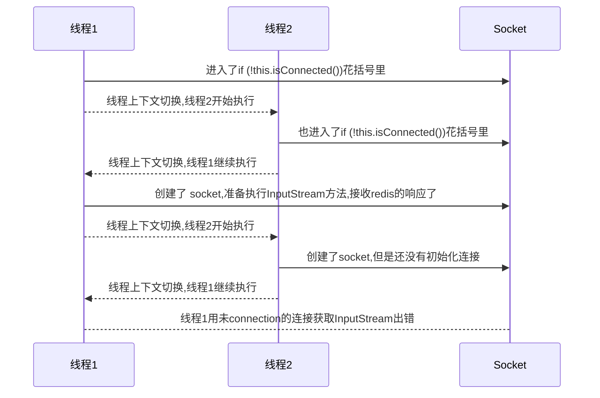

# 回顾

## 特点

| -        | SQL                                                        | NoSQL                                                        |
| -------- | ---------------------------------------------------------- | ------------------------------------------------------------ |
| 数据结构 | 结构化（Structured）                                       | 非结构化                                                     |
| 数据关联 | 关联的（Relational）                                       | 无关联的                                                     |
| 查询方式 | SQL查询                                                    | 非SQL                                                        |
| 事务特性 | ACID                                                       | BASE                                                         |
| 存储方式 | 磁盘                                                       | 内存                                                         |
| 扩展性   | 垂直                                                       | 水平                                                         |
| 使用场景 | 1) 数据结构固定<br>2) 相关业务对数据安全性、一致性要求较高 | 1) 数据结构不固定<br>2) 对一致性、安全性要求不高<br>3) 对性能要求高 |

NoSQL 具体有 

- 键值类型（Redis）
- 文档类型（MongoBD）
- 列类型（HBase）
- Graph 类型（Neo4j）

Redis 介绍：诞生于 2009 年，全称是 Remote Dictionary Server，远程字典服务器，是一个基于内存的键值型 NoSQL 数据库。

特点

- key-value 类型，value 支持多种不同的数据结构，功能丰富。
- 单线程，每个命令具备原子性（类似 6.0 的多线程仅仅是在请求处理这块，核心的命令执行仍是当线程的）
- 低延迟，速度快（基于内存、IO 多路复用、良好的编码）
- 支持数据持久化
- 支持主从集群、分片集群
    - 主从集群：从节点可以去备份主节点
    - 分片集群：进行数据拆分，比如把 1T 的数据切分成多分存储在不同的服务器上
    - 支持多语言客户端

## 安装

在 docker 中安装 redis。

## 数据结构

Redis 是一个 key-value 的数据库，key 一般是 String 类型，不过 value 的类型多种多样。

五大基本类型

- String 类型 =\=\> "hello"
- Hash 类型 =\=\> {name: "Jack", age: 21}
- List 类型 =\=\> [A -> B -> C -> C]
- Set 类型 =\=\> {A, B, C}
- SortedSet 类型 =\=\> {A: 1, B: 2, C: 3}

特殊类型

- GEO =\=\> {A:（120.3， 30.5）}
- BitMap =\=\> 0110110101110101011
- HyperLog =\=\> 0110110101110101011

## 命令

Redis 的命令可以在<a href="https://redis.io/commands">官网</a>查询到，也可以通过在 Redis 客户端输入 `help @命令类型` 如 `help @generic` 查询通用命令的使用方式。

### 通用命令

通用指令是部分数据类型的，都可以使用的指令，常见的有：

- KEYS：查看符合模板的所有 key，<span style="color:blue">不建议在生产环境设备上使用</span>

- DEL：删除一个指定的 key

- EXISTS：判断 key 是否存在
- EXPIRE：给一个 key 设置有效期，有效期到期时该 key 会被自动删除，不设置时间的话默认是永久有效
- TTL：查看一个KEY的剩余有效期（它怎么统计有效期的呢？）

通过 help [command] 可以查看一个命令的具体用法，例如：


### String类型

String 类型，也就是字符串类型，是 Redis 中最简单的存储类型。其 value 是字符串，不过根据字符串的格式不同，又可以分为3类：

- string：普通字符串
- int：整数类型，可以做自增、自减操作
- float：浮点类型，可以做自增、自减操作

不管是哪种格式，底层都是字节数组形式存储，只不过是编码方式不同。字符串类型的最大空间不能超过 512m。

| key   | value       |
| ----- | ----------- |
| msg   | hello world |
| num   | 10          |
| score | 92.6        |

String 的常见命令有：

- SET：添加或者修改已经存在的一个 String 类型的键值对
- GET：根据 key 获取 String 类型的 value
- MSET：批量添加多个 String 类型的键值对
- MGET：根据多个 key 获取多个 String 类型的 value
- INCR：让一个整型的 key 自增1
- INCRBY：让一个整型的 key 自增并指定步长，例如：incrby num 2 让 num 值自增 2
- INCRBYFLOAT：让一个浮点类型的数字自增并指定步长
- SETNX：添加一个 String 类型的键值对，前提是这个 key 不存在，否则不执行（返回 0 表示存在了，未添加成功）
- SETEX：添加一个 String 类型的键值对，并且指定有效期

### Hash类型

Hash 类型，也叫散列，其 value 是一个无序字典，类似于 Java 中的HashMap 结构。

String 结构是将对象序列化为 JSON 字符串后存储，当需要修改对象某个字段时很不方便，而 Hash 结构可以将对象中的每个字段独立存储，可以针对单个字段做 CRUD。


Hash 的常见命令有：

- HSET key field value：添加或者修改 hash 类型 key 的 field 的值
- HGET key field：获取一个 hash 类型 key 的 field 的值
- HMSET：批量添加多个 hash 类型 key 的 field 的值
- HMGET：批量获取多个 hash 类型 key 的 field 的值
- HGETALL：获取一个 hash 类型的 key 中的所有的 field 和 value
- HKEYS：获取一个 hash 类型的 key 中的所有的 field
- HVALS：获取一个 hash 类型的 key 中的所有的 value
- HINCRBY：让一个 hash 类型 key 的字段值自增并指定步长
- HSETNX：添加一个 hash 类型的 key 的 field 值，前提是这个 field 不存在，否则不执行

### List类型

Redis 中的 List 类型与 Java 中的 LinkedList 类似，可以看做是一个双向链表结构。既可以支持正向检索和也可以支持反向检索。

特征也与 LinkedList 类似：

- 有序
- 元素可以重复
- 插入和删除快
- 查询速度一般

常用来存储一个有序数据，例如：朋友圈点赞列表，评论列表等。

List的常见命令有：

- LPUSH key element ... ：向列表左侧插入一个或多个元素
- LPOP key：移除并返回列表左侧的第一个元素，没有则返回nil
- RPUSH key element ... ：向列表右侧插入一个或多个元素
- RPOP key：移除并返回列表右侧的第一个元素
- LRANGE key star end：返回一段角标范围内的所有元素
- <span style="color:green">BLPOP 和 BRPOP：与 LPOP 和 RPOP 类似，只不过在没有元素时会等待指定的时间，而不是直接返回 nil，有点类似于阻塞队列。Timeout 时间是以秒为单位</span>


可以用 List 结构模拟 stack、queue 和 blockingkqueue。

### Set类型

Redis 的 Set 结构与 Java 中的 HashSet 类似，可以看做是一个 value 为 null 的 HashMap。因为也是一个 hash 表，因此具备与 HashSet 类似的特征：

- 无序
- 元素不可重复
- 查找快
- 支持交集、并集、差集等功能（寻找共同好友）

String 的常见命令有：

- SADD key member ... ：向 set 中添加一个或多个元素
- SREM key member ... : 移除 set 中的指定元素
- SCARD key： 返回 set 中元素的个数
- SISMEMBER key member：判断一个元素是否存在于 set 中
- SMEMBERS：获取 set 中的所有元素
- lSINTER key1 key2 ... ：求key1与key2的交集S1，S2的交（B、C）
- lSDIFF key1 key2 ... ：求key1与key2的差集，S1，S2的差（A）
- lSUNION key1 key2 ..：求key1和key2的并集，S1，S2的并（A、B、C、D）


> 练习

将下列数据用Redis的Set集合来存储：

- 张三的好友有：李四、王五、赵六
- 李四的好友有：王五、麻子、二狗

利用Set的命令实现下列功能：

- 计算张三的好友有几人
- 计算张三和李四有哪些共同好友
- 查询哪些人是张三的好友却不是李四的好友
- 查询张三和李四的好友总共有哪些人
- 判断李四是否是张三的好友
- 判断张三是否是李四的好友
- 将李四从张三的好友列表中移除

### SortedSet类型

Redis 的 SortedSet 是一个可排序的 set 集合，与 Java 中的 TreeSet 有些类似，但底层数据结构却差别很大。SortedSet 中的每一个元素都带有一个 score 属性，可以基于 score 属性对元素排序，底层的实现是一个跳表（SkipList，用来排序的）加 hash 表。

SortedSet 具备下列特性：

- 可排序
- 元素不重复
- 查询速度快

因为 SortedSet 的可排序特性，经常被用来实现排行榜这样的功能。

SortedSet的常见命令有：默认都是升序排名。

- ZADD key score member：添加一个或多个元素到 sorted set ，如果已经存在则更新其 score 值

- ZREM key member：删除 sorted set 中的一个指定元素

- ZSCORE key member : 获取 sorted set 中的指定元素的 score 值

- ZRANK key member：获取 sorted set 中的指定元素的排名
- ZCARD key：获取 sorted set 中的元素个数
- ZCOUNT key min max：统计 score 值在给定范围内的所有元素的个数
- ZINCRBY key increment member：让 sorted set 中的指定元素自增，步长为指定的 increment 值，比如自增 increment（自增1）。
- ZRANGE key min max：按照 score 排序后，获取指定排名范围内的元素 （zrange age 0 9 ，取排名前 10 的元素）
- ZRANGEBYSCORE key min max：按照 score 排序后，获取指定 score 范围内的元素
- ZDIFF、ZINTER、ZUNION：求差集、交集、并集

注意：所有的排名默认都是升序，如果要降序则在命令的 Z 后面添加REV 即可：ZREVRange 就是降序了

> 练习

将班级的下列学生得分存入 Redis 的 SortedSet 中：

- Jack 85, Lucy 89, Rose 82, Tom 95, Jerry 78, Amy 92, Miles 76

并实现下列功能：

- 删除 Tom 同学
- 获取 Amy 同学的分数
- 获取 Rose 同学的排名
- 查询 80 分以下有几个学生
- 给Amy同学加 2 分
- 查出成绩前 3 名的同学
- 查出成绩 80 分以下的所有同学

## 设计KEY

Redis 没有类似 MySQL 中的 Table 的概念，我们该如何区分不同类型的key呢？例如，需要存储用户、商品信息到 redis，有一个用户 id 是1，有一个商品 id 恰好也是 1。

我们可以采用 `项目名:业务名:类型:id` 这种多个单词形成层级结构，单词间用':'隔开的方式设计 key。

- user 相关的 key：`project_name:user:1`

- product 相关的 key：`project_name:product:1`

在 redis 内部，最后会以层级关系显示这些数据。

如果 Value 是一个 Java 对象，如一个 User 对象，则可以将对象序列化为 JSON 字符串后存储。

| key       | value                                     |
| --------- | ----------------------------------------- |
| user:1    | {"id":1, "name": "Jack", "age": 21}       |
| product:1 | {"id":1, "name": "小米11", "price": 4999} |

`Redis 的 key 的格式=\=\>[项目名]:[业务名]:[类型]:[id]`

## Java客户端

在 Redis 官网中提供了各种语言的客户端，地址：https://redis.io/clients


### Jedis

①引入依赖

```xml
<!-- jedis 客户端-->
<dependency>
    <groupId>redis.clients</groupId>
    <artifactId>jedis</artifactId>
</dependency>
```

②建立连接

```java
jedis = new Jedis("192.168.160.44", 6379);
```

③使用 Jedis

```java
jedis.set("name", "hahah");
```

④释放资源

```java
jedis.close();
```

完整代码

```java
import org.junit.After;
import org.junit.Before;
import org.junit.Test;
import org.springframework.boot.test.context.SpringBootTest;
import redis.clients.jedis.Jedis;

@SpringBootTest
public class TestJedis {
    private Jedis jedis;

    @Before
    public void setUp() {
        jedis = new Jedis("192.168.160.44", 6379);
    }

    @Test
    public void test() {
        jedis.set("name", "hahah");
    }

    @After
    public void close() {
        jedis.close();
    }
}
```

Jedis 本身是线程不安全的，并且频繁的创建和销毁连接会有性能损耗，因此我们推荐大家使用 Jedis 连接池代替 Jedis 的直连方式。

```java
// Jedis 连接池
import redis.clients.jedis.Jedis;
import redis.clients.jedis.JedisPool;
import redis.clients.jedis.JedisPoolConfig;

public class JedisUtils {
    private static final JedisPool jedisPool;

    static {
        JedisPoolConfig config = new JedisPoolConfig();
        config.setMaxIdle(10);
        config.setMinIdle(5);
        config.setMaxTotal(20);
        config.setMaxWaitMillis(1000);
        jedisPool = new JedisPool(config, "192.168.2.240");
    }

    public static Jedis getJedis() {
        return jedisPool.getResource();
    }

    public static void close(Jedis jedis){
        jedis.close(); // 有连接池则归还到池中，没有则直接关闭
    }
}
```

```java
@SpringBootTest
public class TestJedis {
    private Jedis jedis;

    @Before
    public void setUp() {
        jedis = JedisUtils.getJedis();
    }

    @Test
    public void test() {
        jedis.set("name", "hahah");
        String name = jedis.get("name");
        System.out.println(name);
    }

    @After
    public void close() {
        jedis.close();
    }
}
```

这里解释下为什么说 Jedis 是线程不安全的。 

[jedis非线程安全 - 简书 (jianshu.com)](https://www.jianshu.com/p/5e4a1f92c88f)

简单说就是，Jedis 共享了 Socket。Jedis 类中有 RedisInputStream和 RedisOutputStream 两个属性，而发送命令和获取返回值都是使用这两个成员变量，这很容易引发多线程问题。Jedis 执行命令前需要创建一个 conneciton 连接：

```java
public void connect() {
    // 如果 socket 连接关闭了的话，创建一个新的连接。
    if (!this.isConnected()) {
        try {
            this.socket = this.jedisSocketFactory.createSocket();
            this.outputStream = new RedisOutputStream(this.socket.getOutputStream());
            this.inputStream = new RedisInputStream(this.socket.getInputStream());
        } catch (IOException var2) {
            this.broken = true;
            throw new JedisConnectionException("Failed connecting to " + this.jedisSocketFactory.getDescription(), var2);
        }
    }
}
```

可能两个线程出现这种情况：



### SpringDataRedis

SpringData 是 Spring 中数据操作的模块，包含对各种数据库的集成，其中对 Redis 的集成模块就叫做 SpringDataRedis

官网地址：https://spring.io/projects/spring-data-redis

- 提供了对不同Redis客户端的整合（Lettuce 和 Jedis）
- 提供了 RedisTemplate 统一 API 来操作 Redis
- 支持 Redis 的发布订阅模型
- 支持 Redis 哨兵和 Redis 集群
- 支持基于 Lettuce 的响应式编程
- 支持基于 JDK、JSON、字符串、Spring 对象的数据序列化及反序列化
- 支持基于 Redis 的 JDKCollection 实现

> 快速入门

SpringDataRedis 中提供了 RedisTemplate 工具类，其中封装了各种对 Redis 的操作。并且将不同数据类型的操作 API 封装到了不同的类型中：

| **API**                         | **返回值类型**  | **说明**              |
| ------------------------------- | --------------- | --------------------- |
| **redisTemplate**.opsForValue() | ValueOperations | 操作String类型数据    |
| **redisTemplate**.opsForHash()  | HashOperations  | 操作Hash类型数据      |
| **redisTemplate**.opsForList()  | ListOperations  | 操作List类型数据      |
| **redisTemplate**.opsForSet()   | SetOperations   | 操作Set类型数据       |
| **redisTemplate**.opsForZSet()  | ZSetOperations  | 操作SortedSet类型数据 |
| **redisTemplate**               |                 | 通用的命令            |

①引入一来就，redis 启动的坐标和连接池依赖

```xml
<dependency>
    <groupId>org.springframework.boot</groupId>
    <artifactId>spring-boot-starter-data-redis</artifactId>
</dependency>
<dependency>
    <groupId>org.apache.commons</groupId>
    <artifactId>commons-pool2</artifactId>
</dependency>
```

②redis 相关配置文件

```yaml
spring:
  redis:
    host: 192.168.160.44
    port: 6379
    lettuce:
      pool:
        max-active: 10
        max-idle: 10
        min-idle: 1
        time-between-eviction-runs: 10s
```

③注入 RedisTemplate

```java
@Autowired
RedisTemplate redisTemplate;
```

④测试

```java
@SpringBootTest(classes = HmDianPingApplication.class)
@SuppressWarnings("all")
@RunWith(SpringRunner.class) // JUnit4 需要加这句
public class RedisTemplateTest {
    @Autowired
    RedisTemplate redisTemplate;

    @Test
    public void test() {
        // 插入一条string类型数据，如果采用默认的序列化机制的话，
        // name 会被当成一个 Java 对象进行序列化，
        // 默认采用 JDK 序列化，序列化为字节形式。
        redisTemplate.opsForValue().set("name", "hello-world");
        redisTemplate.opsForValue().setIfAbsent("name", "hello");
    }
}
```

>序列化方式

RedisTemplate 可以接收任意 Object 作为值写入 Redis，只不过写入前会把 Object 序列化为字节形式，默认是采用 JDK 序列化，得到的结果是这样的


Spring 默认提供了一个 StringRedisTemplate 类，它的 key 和 value 的序列化方式默认就是 String 方式。省去了我们自定义 RedisTemplate 的过程，我们不用自己定义序列化反序列化的配置参数了。

```java
@SpringBootTest
@RunWith(SpringRunner.class) // JUnit4 需要加这句
public class RedisTemplateTest {
    @Autowired
    StringRedisTemplate redisTemplate;

    @Test
    public void test() {
        redisTemplate.opsForValue().set("name", "hello-world");
        redisTemplate.opsForValue().setIfAbsent("name", "hello");
    }
}
```


