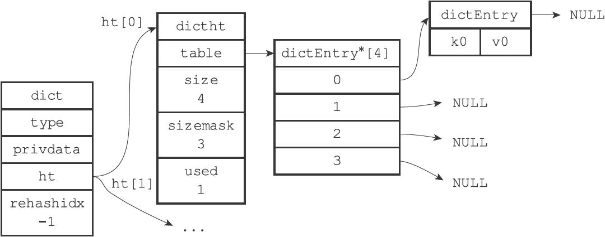
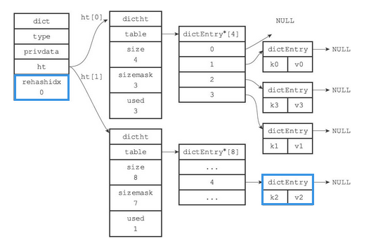
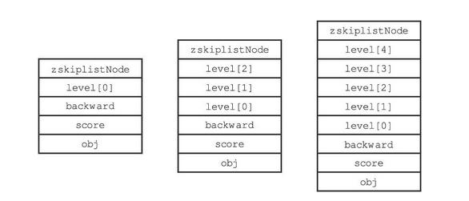
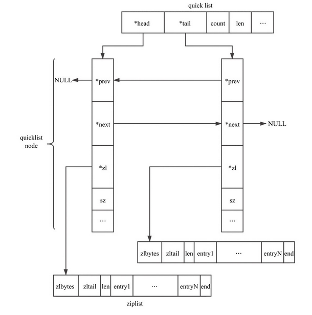

# Redis设计与实现

参考资料：

- 《Redis设计与实现》
- [Redis设计与实现 - Nyima's Blog (gitee.io)](https://nyimac.gitee.io/2020/11/08/Redis设计与实现/#Redis设计与实现) 基于此博客的内容进行修正，填充，删除。
- Redis 深度历险
- Redis 6.2.x 源码

# 数据结构

## 简单动态字符串

与 Java 的 ArrayList 的实现有些类似。比起 C 字符串，SDS 有以下优点：

- 1）常数复杂度获取字符串长度。
- 2）杜绝缓冲区溢出。
- 3）减少修改字符串长度时所需的内存重分配次数。
- 4）二进制安全。
- 5）兼容部分 C 字符串函数。

### SDS的定义

SDS 又称为简单动态字符串（Simple Dynamic String），SDS 的定义如下图所示。


如果将一个值为 “Redis” 的字符串放入 SDS 中，它的存储状态如下


- buf 是一个 char 类型的数组。
- len 记录了 buf 的长度（保存空字符 `['\0']` 的 1 字节空间不计算在 len 属性里，C 以 '\0' 判断字符串是不是结束了）
    - 该值使得获取字符串的长度的时间复杂度降为了 O(1)
    - 设置和更新 SDS 长度的工作是由 SDS 的 API 在执行时自动完成的，使用 SDS 无须进行任何手动修改长度的工作。
- free 中保存了额外申请的空间
- 在进行字符串拼接时
    - 如果空间充足，会直接使用之前额外申请的空间
    - 如果空间不足（free < 拼接字符串的长度）会申请额外的空间。若所需的空间<b>小于 1M</b>，会额外申请和 len 值相同的空间（如进行修改之后 SDS 的 len 变成了 13 字节，那么程序也会 13 字节的未使用空间，总空间 = 13 + 13 +1（'\0'））。<b style="color:red">若所需空间大于等于 1M，则额外申请 1M 的空间。</b>
- 在进行字符串裁剪时
    - 多出来的空间会被记录在 free 中，方便再次使用

### 与C语言字符串的差别

| C 语言字符串                                                 | SDS                                                          | 解释                                                       |
| ------------------------------------------------------------ | ------------------------------------------------------------ | ---------------------------------------------------------- |
| 获取长度的时间复杂度为 O(n)                                  | 获取长度的时间复杂度为 O(1)                                  | SDS 中 len 属性保存了字符串的长度                          |
| API 是不安全的，可能会造成缓冲区溢出 `char *strcat(char *dest, const char *src)` | API 是安全的，不会造成缓冲区溢出                             | SDS 中若 free 空间不足以存放字符串的内容，会进行自动扩容。 |
| 修改字符串 n 次<span style="color:red">必定</span>执行 n 次内存分配 | 修改字符串<span style="color:red">最多</span>执行 n 次内存分配 | SDS 会分配额外的空间，额外空间大小由 free 记录             |
| 只能保存文本数据                                             | 可以保存文本数据或者二进制数据                               | SDS 使用 buf 来保存一系列二进制数据                        |
| 可以使用 <string.h> 库中所有的函数                           | 可以使用 <string.h> 中部分函数                               | SDS 中的 buf 相当于字符串                                  |

### 优化策略

内存重分配涉及复杂的算法，并且可能需要执行系统调用，所以它通常是一个比较耗时的操作。Redis 作为数据库需要频繁的进行数据修改。每次修改字符串都进行内存分配和释放的话，会损耗 Redis 的性能。

为改进这种不足，SDS 有空间预分配和惰性空间释放两种优化策略。

#### 空间预分配

当需要对 SDS 的空间进行扩展的时候，程序不仅会为 SDS 分配修改所必须要的空间，还会为 SDS 分配额外的未使用空间。

额外分配的未使用空间数量公式如下：

- 如果进行了内存分配，则 free = 修改后字符串的 len(不计算'\0')。例如：进行修改后，SDS 的 len 变成了 13 字节，那么程序也会分配 13 字节的未使用空间。SDS 的 buf 数组实际长度则为 13+13+1 = 27 字节（'\0' 并未计算到 len中。）
- 如果对 SDS 进行修改之后，SDS 的长度将大于等于 1MB，那么程序会分配 1MB 的未使用空间。例如：进行修改之后，SDS 的 len 将变成 30MB，那么程序会分配 1MB 的未使用空间，SDS 的 buf 数组的实际长度将为 30MB+1MB+1byte。
- 如果 SDS 空间充足够用，会直接使用未使用的空间，不会执行内存分配。

#### 惰性空间释放

不立即释放缩短后多出来的字节，而是先用 free 暂存。

惰性空间释放用于优化 SDS 的字符串缩短操作：当 SDS 的 API 需要缩短 SDS 保存的字符串时，程序并不立即使用内存重分配来回收缩短后多出来的字节，而是使用 free 属性将这些字节的数量记录起来，并等待将来使用。

SDS 也提供了相应的 API，让我们可以在有需要时，真正地释放 SDS 的未使用空间，所以不用担心惰性空间释放策略会造成内存浪费。

### 二进制安全

<span style="color:orange">为了确保 Redis 可以适用于各种不同的使用场景，SDS 的 API 都是二进制安全的（binary-safe），所有 SDS API 都会以处理二进制的方式来处理 SDS 存放在 buf 数组里的数据，程序不会对其中的数据做任何限制、过滤、或者假设，数据在写入时是什么样的，它被读取时就是什么样。因此我们称 buf 为字节数组</span>

## 链表

- 链表被广泛用于实现 Redis 的各种功能，比如列表键、发布与订阅、慢查询、监视器等。
- 每个链表节点由一个 listNode 结构来表示，每个节点都有一个指向前置节点和后置节点的指针，所以 Redis 的链表实现是双向链表。
- 每个链表使用一个 list 结构来表示，这个结构带有表头节点指针、表尾节点指针，以及链表长度等信息。
- 通过为链表设置不同的类型特定函数，Redis 的链表可以用于保存各种不同类型的值。

### Redis中的链表

链表在 Redis 中的应用非常广泛，比如列表键的底层实现之一就是链表。当一个列表键包含了数量比较多的元素，又或者列表中包含的元素都是比较长的字符串时，Redis 就会使用链表作为列表键的底层实现。

除了链表键之外，发布与订阅、慢查询、监视器等功能也用到了链表，Redis 服务器本身还使用链表来保存多个客户端的状态信息，以及使用链表来构建客户端输出缓冲区。

Redis 中的链表节点定义如下

```c
typedef struct listNode{
    // 前置节点
    struct listNode *prev;
    // 后置节点
    struct listNode *next;
    // 节点的值
    void *value;
}listNode;
```


Redis 中将节点放在了 list 中

```c
typedef struct list{
    // 表头节点
    listNode *head;
    // 表尾节点
    listNode *tail;
    // 链表所包含的节点数量
    unsigned long len;
    // 节点复制函数
    void *(*dump)(void *ptr);
    // 节点释放函数
    void (*free)(void *ptr);
    // 节点值对比函数
    int (*match) void(void *ptr, void *key);
}list;
```

list 结构为链表提供了表头指针 head、表尾指针 tail，以及链表长度计数器 len

dup、free 和 match 成员则是用于实现多态链表所需的类型特定函数

- dup 函数用于复制链表节点所保存的
- free 函数用于释放链表节点所保存的值
- match 函数则用于对比链表节点所保存的值和另一个输入值是否相等

一个 list 结构和三个 listNode 结构组成的链表：


### Redis中链表的特性

| 特性         | 说明                                                         |
| ------------ | ------------------------------------------------------------ |
| 双链表       | 可方便地获取一个节点的前驱节点或后继节点                     |
| 带头尾指针   | list 中的 head 与 tail 分别保存了链表的头结点和尾节点        |
| 获取长度方便 | list 中的 len 属性使得获取链表长度的时间复杂度变为了 O(1)    |
| 多态         | 链表节点使用 `void*` 指针来保存节点值，并且可以通过 list 结构的 dup、free、match 三个属性为节点值设置类型特定函数，所以链表可以用于保存各种不同类型的值 |

## 字典

字典：一种用于保存键值对（key-value pair）的抽象数据结构。

### Redis中字典的实现

Redis 的字典使用<b>哈希表</b>作为底层实现，一个哈希表里面可以有<b>多个</b>哈希表节点，而每个哈希表节点就保存了字典中的<b>一个</b>键值对。

<span style="color:orange">字典在 Redis 中的应用相当广泛，比如 Redis 的数据库就是使用字典来作为底层实现的，对数据库的增、删、查、改操作也是构建在对字典的操作之上的。</span>

#### 哈希表

Redis 中的哈希表实现如下

```c
typedef struct dictht {
    // 哈希表数组
    // 类似于Java中HashMap的transient Node<K,V>[] table;
    dictEntry **table;
    
    // 哈希表大小
    unsigned long size;
    
    // 哈希表掩码，用于计算索引值，大小为size-1
    unsigned long sizemask;
    
    // 哈希表中已有的节点数
    unsigned long used;
} dictht;
```

- table 为一个 dictEntry 类型的数组
    - 数组中的每个元素都是一个指向 dict.h/dictEntry 结构的指针，每个 dictEntry 结构保存着一个键值对。
- size 记录了哈希表的大小
- sizemask 为 size-1，用于哈希计算，决定一个键应该被放到哪个桶中
- used 记录了哈希表目前已有节点（<b>键值对</b>）的数量

一个空的哈希表。


#### 哈希节点

Redis 中哈希节点的实现如下，最新的 redis 在 union 里多了一个 double d

```c
typedef struct dictEntry{
    // 键
    void *key;
    // 值
    union{
        void *val;
        uint64_tu64;
        int64_ts64;
    }v;
    // 指向下个哈希表节点，形成链表
    struct dictEntry *next;
}dictEntry;
```

类似于 Java 中 HashMap 的 Node

```java
static class Node<K,V> implements Map.Entry<K,V> {
    final int hash;
    final K key;
    V value;
    Node<K,V> next;
    ...
}
```

- key 保存了键值对中键的值
- value 保存了键值对中值的值，其中值可以为指针类型，uint64_tu64、int64_t64
- next 用于解决哈希冲突，使用拉链法


#### 字典

Redis 中的字典由 dict.h/dict 结构表示：

```c
typedef struct dict {
    // 类型特定函数
    dictType *type;
    // 私有数据
    void *privdata;
    // 哈希表
    dictht ht[2];
    // rehash索引，当rehash不在进行时，值为-1
    long rehashidx; /* rehashing not in progress if rehashidx == -1 */
    unsigned long iterators; /* number of iterators currently running */
} dict;
```

- type 属性是一个指向 dictType 结构的指针，每个 dictType 结构保存了一簇用于操作特定类型键值对的函数，Redis 会为用途不同的字典设置不同的类型特定函数
- 而 privdata 属性则保存了需要传给那些类型特定函数的可选参数

```c
typedef struct dictType {
    // 计算哈希值的函数
    uint64_t (*hashFunction)(const void *key);
    
    // 复制键的函数
    void *(*keyDup)(void *privdata, const void *key);
    
    // 复制值的函数
    void *(*valDup)(void *privdata, const void *obj);
    
    // 对比键的函数
    int (*keyCompare)(void *privdata, const void *key1, const void *key2);
    
    // 销毁键的函数
    void (*keyDestructor)(void *privdata, void *key);
    
   	// 销毁值的函数
    void (*valDestructor)(void *privdata, void *obj);
} dictType;
```

- ht 属性为包含了两个 ditht 元素的数组
    - 一般情况下，只是用 ht[0] 作为哈希表，ht[1] 只会在对 ht[0] 进行 rehash 时才会使用
- rehashidx 是除了 ht[1] 以外，另一个与 rehash 有关的属性，它记录了 rehash 目前的进度，如果没有 rehash，那么它的值为 -1

<b>一个普通状态下（未进行 rehash）的字典</b>


### 字典中的算法

- 字典被广泛用于实现 Redis 的各种功能，其中包括数据库和哈希键。
- Redis 中的字典使用哈希表作为底层实现，每个字典带有两个哈希表，一个平时使用，另一个仅在进行 rehash 时使用。
- <span style="color:orange">当字典被用作数据库的底层实现，或者哈希键的底层实现时，Redis 使用 MurmurHash2 算法来计算键的哈希值。</span>
- 哈希表使用链地址法来解决键冲突，被分配到同一个索引上的多个键值对会连接成一个单向链表。
- 在对哈希表进行扩展或者收缩操作时，程序需要将现有哈希表包含的所有键值对 rehash 到新哈希表里面，并且这个 rehash 过程并不是一次性地完成的，而是渐进式地完成的。

#### 哈希算法

当要将一个新的键值对添加到字典里面时，程序需要先根据键值对的键计算出哈希值和索引值，然后再根据索引值，将包含新键值对的哈希表节点放到哈希表数组的指定索引上面。

<b>Redis计算哈希值和索引值的方法如下：</b>


- 将 key 通过 hashFunction 方法计算出对应的 hash 值
- 再结合 sizemask (值为 size-1)，获得该 key 对应的索引值

<b>例如：</b>我们要将一个键值对为 k0，v0 添加到容量为 4 字典里面，那么程序会先使用语句

```c
hash = dict->type->hashFunction(key0);
```

计算出对应的 hash 值

假设计算的 hash 值为 8，则再通过 sizemask（值为 3）来计算出索引

```c
index = hash & dict->ht[x].sizemask; // 8 & 3 = 0
```

计算出 key0 的索引值为 0，放入对应的位置上



<span style="color:orange">Redis 底层使用 MurmurHash2 算法来计算键的哈希值，这种算法的优点在于，即使输入的键是有规律的，算法仍能给出一个很好的随机分布性，并且算法的计算速度也非常快。</span>

```c
uint32_t MurmurHash2 ( const void * key, int len, uint32_t seed )
{
  // 'm' and 'r' are mixing constants generated offline.
  // They're not really 'magic', they just happen to work well.
 
  const uint32_t m = 0x5bd1e995;
  const int r = 24;
 
  // Initialize the hash to a 'random' value
 
  uint32_t h = seed ^ len;
 
  // Mix 4 bytes at a time into the hash
 
  const unsigned char * data = (const unsigned char *)key;
 
  while(len >= 4)
  {
    uint32_t k = *(uint32_t*)data;
 
    k *= m;
    k ^= k >> r;
    k *= m;
 
    h *= m;
    h ^= k;
 
    data += 4;
    len -= 4;
  }
 
  // Handle the last few bytes of the input array
 
  switch(len)
  {
  case 3: h ^= data[2] << 16;
  case 2: h ^= data[1] << 8;
  case 1: h ^= data[0];
      h *= m;
  };
 
  // Do a few final mixes of the hash to ensure the last few
  // bytes are well-incorporated.
 
  h ^= h >> 13;
  h *= m;
  h ^= h >> 15;
 
  return h;
}
```

#### 哈希冲突的解决方法

当有两个或以上数量的键被分配到了哈希表数组的同一个索引上面时，我们称这些键发生了冲突（collision）。

Redis 的哈希表使用拉链法（separate chaining）来解决键冲突。每个哈希表节点都有一个 next 指针，多个哈希表节点可以用 next 指针构成一个单向链表，被分配到同一个索引上的多个节点可以用这个单向链表连接起来，这就解决了键冲突的问题。<span style="color:orange">拉链法采用的头插法插入新节点，因为 dictEntry 数字没有记录链表的尾指针。</span>

<b>冲突前</b>


<b>冲突后</b>


#### rehash

随着操作的不断执行，哈希表保存的键值对会逐渐地增多或者减少，为了让哈希表的负载因子（load_factor）维持在一个合理的范围之内（可以减少出现哈希冲突的几率），当哈希表保存的键值对数量太多或者太少时，程序需要对哈希表的大小进行相应的扩展或者收缩。<span style="color:red">而扩展和收缩哈希表的工作可以通过执行 <b>rehash（重新散列）</b>操作来完成，Redis 对字典的哈希表执行 rehash 的步骤如下：</span>

- 为字典的 ht[1] 哈希表分配空间，这个哈希表的空间大小取决于要执行的操作，以及 ht[0] 当前包含的键值对数量（dictht.used 的大小）

    - 如果执行的是扩展操作，那么 ht[1] 的大小为第一个大于 ht[0].used\*2 的 2n （和 Java 中的 HashMap 一样，这样可以保证 sizemask 的值必定为 11…11）

    - 如果执行的是收缩操作，那么 ht[1] 的大小为第一个小于 ht[0].used 的 2n

- 将保存在 ht[0] 中的所有键值对 rehash 到 ht[1] 上面

    - rehash 指的是重新计算键的哈希值和索引值，然后将键值对放置到 ht[1] 哈希表的指定位置上

- 当 ht[0] 包含的所有键值对都迁移到了 ht[1] 之后（ht[0] 变为空表），释放 ht[0]，将 ht[1] 设置为 ht[0]，并在 ht[1] 新创建一个空白哈希表，为下一次 rehash 做准备

    - 上面有两步有点像垃圾回收算法中的标记-复制算法（FROM-TO，然后交换 FROM 和 TO）

<b>举例说明</b>

假设程序要对下图所示字典的 ht[0] 进行扩展操作，那么程序将执行以下步骤：


- ht[0].used 当前的值为 4，$4*2=8$，所以程序会将 ht[1] 哈希表的大小设置为 8。下图展示了 ht[1] 在分配空间之后，字典的样子


- 将 ht[0] 包含的四个键值对都 rehash 到 ht[1]


- 释放 ht[0]，并将 ht[1] 设置为 ht[0]，然后为 ht[1] 分配一个空白哈希表，如下图所示。至此，对哈希表的扩展操作执行完毕，程序成功将哈希表的大小从原来的 4 改为了现在的 8


<b>哈希表的扩展与收缩</b>

当以下条件中的任意一个被满足时，程序会自动开始对哈希表执行扩展操作

- 服务器目前没有在执行 BGSAVE 命令或者 BGREWRITEAOF 命令，并且哈希表的负载因子大于等于 1
- 服务器目前正在执行 BGSAVE 命令或者 BGREWRITEAOF 命令，并且哈希表的负载因子大于等于 5
    - 负载因子的计算方法如下 $load\_factory = ht[0].used/ht[0].size$

根据 BGSAVE 命令或 BGREWRITEAOF 命令是否正在执行，服务器执行扩展操作所需的负载因子并不相同，这是因为在执行 BGSAVE 命令或 BGREWRITEAOF 命令的过程中，Redis 需要创建当前服务器进程的子进程，而大多数操作系统都采用写时复制（copy-on-write）技术来优化子进程的使用效率，所以在子进程存在期间，服务器会提高执行扩展操作所需的负载因子，<span style="color:orange">从而尽可能地避免在子进程存在期间进行哈希表扩展操作，这可以避免不必要的内存写入操作，最大限度地节约内存。</span>

另一方面，当哈希表的负载因子小于 0.1 时，程序自动开始对哈希表执行收缩操作。

#### 渐进rehash

数据量很大时，一次性将 ht[0] 里面的所有键值对 rehash 到 ht[1] 里面，庞大的计算量可能会导致服务器在一段时间内停止服务。因此，reshash 采用的是分多次、渐进式地完成的。因为在数据量较大时，如果一次性，集中式地完成，会影响 Redis 的吞吐量。

<b>详细步骤</b>

- 为 ht[1] 分配空间，让字典同时持有 ht[0] 和 ht[1] 两个哈希表
- 在字典中维持一个索引计数器变量 rehashidx，并将它的值设置为 0，表示 rehash 工作正式开始（<span style="color:orange">索引计数器用于记录 rehash 到哪个索引了</span>）
- 在 rehash 进行期间，每次对字典执行添加、删除、查找或者更新操作时，程序除了执行指定的操作以外，还会顺带将 ht[0] 哈希表在 rehashidx 索引上的键值对 rehash 到 ht[1]，当rehash 工作完成之后，程序将 rehashidx 属性的值增一（指向下一个索引）
- 随着字典操作的不断执行，最终在某个时间点上，ht[0] 的所有键值对都会被 rehash 至 ht[1]，这时程序将 rehashidx 属性的值设为 -1，表示 rehash 操作已完成

<b>下图为一次完整的渐进式 rehash 过程，注意观察在整个 rehash 过程中，字典的 rehashidx 属性的变化。</b>

- 准备开始 rehash


- 开始 rehash，rehash 索引为 0 的键值对



- rehash 索引为 1 的键值对


- ......
- rehash 完成，rehashidx 再次变为 -1


<b>在进行渐进式 rehash 的过程中，字典会同时使用 ht[0] 和 ht[1] 两个哈希表</b>，因此在渐进式 rehash 进行期间，字典的删除（delete）、查找（find）、更新（update）等操作会在两个哈希表上进行

 例如，要在字典里面查找一个键的话，程序会先在 ht[0] 里面进行查找，如果没找到的话，就会继续到 ht[1] 里面进行查找，诸如此类

另外，在渐进式 rehash 执行期间，<span style="color:orange">新添加到字典的键值对一律会被保存到 ht[1] 里面</span>，而 ht[0] 则不再进行任何添加操作，这一措施保证了 ht[0] 包含的键值对数量会只减不增，并随着rehash 操作的执行而最终变成空表

## 跳跃表

跳跃表（skiplist）是一种有序数据结构，它通过在每个节点中维持多个指向其他节点的指针，从而达到快速访问节点的目的。

跳跃表支持平均 $O(logN)$、最坏 $O(N)$ 复杂度的节点查找，还可以通过顺序性操作来批量处理节点。

在大部分情况下，跳跃表的效率可以和平衡树相媲美，并且因为跳跃表的实现比平衡树要来得更为简单，所以有不少程序都使用跳跃表来代替平衡树。

Redis 使用跳跃表作为有序集合键的底层实现之一，如果一个有序集合包含的元素数量比较多，又或者有序集合中元素的成员（member）是比较长的字符串时，Redis 就会使用跳跃表来作为有序集合键的底层实现。

<b style="color:orange">Redis 只在两个地方用到了跳跃表，一个是实现有序集合键，另一个是在集群节点中用作内部数据结构，除此之外，跳跃表在 Redis 里面没有其他用途。</b>

> Redis 中的跳跃表

- 跳跃表是有序集合的底层实现之一。
- Redis 的跳跃表实现由 zskiplist 和 zskiplistNode 两个结构组成，其中 zskiplist 用于保存跳跃表信息（比如表头节点、表尾节点、长度），而 zskiplistNode 则用于表示跳跃表节点。
- 每个跳跃表节点的层高都是 1 至 32 之间的随机数。
- 在同一个跳跃表中，多个节点可以包含相同的分值，但每个节点的成员对象必须是唯一的。
- 跳跃表中的节点按照分值大小进行排序，当分值相同时，节点按照成员对象的大小进行排序。

### 跳跃表原理

#### 查询链表的时间复杂度

<b>搜索链表中的元素时，无论链表中的元素是否有序，时间复杂度都为 O(n)</b>，如下图，搜索 103 需要查询 9 次才能找到该节点


但是能够提高搜索的其他数据结构，如：二叉排序树、红黑树、B 树、B+ 树等等的实现又过于复杂。有没有一种相对简单，同时又能提搜索效率的数据结构呢？跳跃表就是这样一种数据结构。

<b>Redis 中使用跳跃表的原因</b>

- 一是 B+ 树的实现过于复杂，
- 二是 Redis 只涉及内存读写，所以最后选择了跳跃表。

#### 跳跃表实现——搜索

为了能够更快的查找元素，我们可以在该链表之上，再添加一个新链表，新链表中保存了部分旧链表中的节点，以加快搜索的速度。如下图所示


我们搜索元素时，从最上层的链表开始搜索。当找到某个节点大于目标值或其后继节点为空时，从该节点向下层链表搜寻，然后顺着该节点到下一层继续搜索。

比如我们要找 103 这个元素，则会经历：2->23->54->87->103

这样还是查找了 5 次，当我们再将链表的层数增高以后，查找的次数会明显降低，如下图所示。3 次便找到了目标元素 103


<b>代码中实现的跳表结构如下图所示</b>

一个节点拥有多个指针，指向不同的节点


#### 跳跃表实现——插入

跳跃表的插入策略如下

- 先找到合适的位置以便插入元素

- 找到后，将该元素插入到最底层的链表中，并且

    抛掷硬币（1/2 的概率）

    - 若硬币为正面，则将该元素晋升到上一层链表中，<b>并再抛一次</b>
    - 若硬币为反面，则插入过程结束

- 为了避免以下情况，需要在每个链表的头部设置一个负无穷的元素


设置负无穷后，若要查找元素 2，过程如下图所示


<b>插入图解</b>

- 若我们要将 45 插入到跳跃表中

    

- 先找到插入位置，将 45 插入到合适的位置

    

- 抛掷硬币：<b>为正，晋升</b>

    

- 假设硬币一直为正，插入元素一路晋升，当晋升的次数超过跳跃表的层数时，<b>需要再创建新的链表以放入晋升的插入元素。新创建的链表的头结点为负无穷</b>

    

### Redis中的跳跃表

#### 为什么Redis要使用跳跃表而不是用B+树

There are a few reasons:
- They are not very memory intensive. It's up to you basically. Changing parameters about the probability of a node to have a given number of levels will make then less memory intensive than btrees.
- A sorted set is often target of many ZRANGE or ZREVRANGE operations, that is, traversing the skip list as a linked list. With this operation the cache locality of skip lists is at least as good as with other kind of balanced trees.
- They are simpler to implement, debug, and so forth. For instance thanks to the skip list simplicity I received a patch (already in Redis master) with augmented skip lists implementing ZRANK in O(log(N)). It required little changes to the code.

MySQL 使用 B+ 树的是因为：**叶子节点存储数据，非叶子节点存储索引**，B+ 树的每个节点可以存储多个关键字，它将节点大小设置为磁盘页的大小，**充分利用了磁盘预读的功能**。每次读取磁盘页时就会读取一整个节点，每个叶子节点还有指向前后节点的指针，为的是最大限度的降低磁盘的IO；因为数据在内存中读取耗费的时间是从磁盘的 IO 读取的百万分之一。

而 Redis 是内存中读取数据，不涉及 IO，因此使用了跳跃表

既然提到了 Redis 是对内存操作的，那么再讨论一个问题：为什么 Redis 是单线程的还这么快呢？

#### Redis使用单线程效率还很高的原因

假设有两个任务 A 和 B，分别有两种方法来执行他们

- ①两个线程并发执行：先执行 A 一段时间，然后切换到 B 再执行一段时间，然后又切换回 A 执行… 直到 A 和 B 都执行完毕
- ②两个线程串行执行：先执行 A，A 执行完了再执行 B

对于单核 CPU 来说，②的执行时间更短，效率更高。因为单核 CPU 下的并发操作，会导致上下文的切换，需要保存切换线程的信息，这段时间 CPU 无法去执行任何任务中的指令，时间白白浪费了

<b>对于 I/O 操作，并发执行效率更高</b>

因为 I/O 操作主要有以下两个过程

- 等待 I/O 准备就绪
- 真正操作 I/O 资源

等待 I/O 准备就绪这个阶段，CPU 是空闲的，这时便可以去执行其他任务，这样也就提高了 CPU 的利用率。

而 Redis 是基于内存的操作，没有 I/O 操作，所以单线程执行效率更高。

### Redis中跳表的实现

Redis 中的 sort_set 主要由跳表实现，sort_set 的添加语句如下

```shell
zadd key score1 member1 score2 member2 ...
```

Redis 中的跳表结构如下


Redis 中的跳表主要由节点 zskiplistNode 和跳表 zskiplist 来实现，他们的源码如下

#### zskiplistNode

```c
typedef struct zskiplistNode {
    // 存储的元素 就是语句中的member
    sds ele;
    
    // 分值,就是语句中的score
    double score;
    
    // 指向前驱节点
    struct zskiplistNode *backward;
    
    // 层，每个节点有1~32个层，除头结点外（32层），其他节点的层数是随机的
    struct zskiplistLevel {
        // 每个层都保存了该节点的后继节点
        struct zskiplistNode *forward;
        
        // 跨度，用于记录该节点与forward指向的节点之间，隔了多少各节点。主要用于计算Rank
        unsigned long span;
    } level[];
} zskiplistNode;
```

<b>各个属性的详细解释</b>

- ele：sds 变量，保存 member。

- score：double 变量，用于保存 score
    - 注意：score 和 ele 共同来决定一个元素在跳表中的顺序。score 不同则根据 score 进行排序，score 相同则根据 ele 来进行排序
    - 跳表中 score 是可以相同的，而 ele 是肯定不同的

- backward：前驱指针，用于保存节点的前驱节点，每个节点只有一个 backward
    - 例：如果要从第四层的节点访问第三层的节点，则可以通过 backward 直接访问


- level[]：节点的层，每个节点拥有 1~32 个层，除头结点外（32 层），其他节点的层数是随机的。
- <b>注意：Redis 中没有使用抛硬币的晋升策略，而是直接随机一个层数值。下图展示了层数不同的几个节点</b>



- level：保存了该节点指向的下一个节点，但是不一定是紧挨着的节点。还保存了两个节点之间的跨度

- forward：后继节点，该节点指向的下一个节点，但是不一定是紧挨着的节点

- span：跨度，用于记录从该节点到 forward 指向的节点之间，要走多少步。主要用于计算 Rank
- rank：排位，头节点开始到目标节点的跨度，由沿途的 span 相加获得

#### zskiplist

zskiplist 的源码如下

```c
typedef struct zskiplist {
    // 头尾指针，用于保存头结点和尾节点
    struct zskiplistNode *header, *tail;
    
    // 跳跃表的长度，即除头结点以外的节点数
    unsigned long length;
    
    // 最大层数，保存了节点中拥有的最大层数（不包括头结点）
    int level;
} zskiplist;
```

#### 遍历过程

遍历需要访问跳表中的每个节点，直接走底层的节点即可依次访问

#### 搜索过程

如我们要访问该跳表中 $score = 2.0$ 的节点


从高层依次向下层遍历

- 头结点的 L6~L32 的 forward 都为空，从 L5 开始访问
- 头结点 L5 的 forward 的指向的 node3 的 score 为 3.0，小于 2.0，返回头结点
- 从头结点 L4 的 forward 指向的 node1 开始访问，节点的 score = 1.0，继续向下执行
- 从 node1 的 L4 开始访问，为 node3，返回 node1
- 从 node1 的 L3 开始访问，为 node3，返回 node1
- 从 node1 的 L2 开始访问，为 node2，score = 2.0，即为所要的节点

#### 插入过程

插入节点时，需要找到节点的插入位置。并给节点的各个属性赋值。插入后判断是否需要拓展上层。

## 整数集合

整数集合（intset）是集合键的底层实现之一，<b>当一个集合只包含整数值元素，并且这个集合的元素数量不多时，Redis 就会使用整数集合作为集合键的底层实现。</b>

- 整数集合的底层实现为数组，这个数组以有序、无重复的方式保存集合元素，在有需要时，程序会根据新添加元素的类型，改变这个数组的类型。
- 升级操作为整数集合带来了操作上的灵活性，并且尽可能地节约了内存。
- 整数集合只支持升级操作，不支持降级操作。

### 整数集合的实现

整数集合（intset）是 Redis 用于保存整数值的集合抽象数据结构，它可以保存类型为 int16_t、int32_t 或者 int64_t 的整数值，并且保证集合中不会出现重复元素且按照从小到大的顺序排列


- length：记录了整数集合包含的元素数量，也即是 contents 数组的长度。

- contents：为 intset 的底层实现，用于存放不重复的元素，且元素按照从小到大的顺序排列。数组类型由 encoding 决定，与 int8_t 无关

    - 如果 encoding 属性的值为 INTSET_ENC_INT16，那么 contents 就是一个 int16_t 类型的数组，数组里的每个项都是一个 int16_t 类型的整数值
    - 如果 encoding 属性的值为 INTSET_ENC_INT32，那么 contents 就是一个 int32_t 类型的数组，数组里的每个项都是一个 int32_t 类型的整数值
    - 如果 encoding 属性的值为 INTSET_ENC_INT64，那么 contents 就是一个 int64_t 类型的数组，数组里的每个项都是一个 int64_t 类型的整数值

<b>图解示例</b>


- 该整数解中有 5 个元素，contents 的类型为 int16_t

### 升级

每当我们要将一个新元素添加到整数集合里面，并且新元素的类型比整数集合现有所有元素的类型都要长时，整数集合需要先进行升级（upgrade），然后才能将新元素添加到整数集合里面

#### 具体过程

- 根据新元素的类型，扩展整数集合底层数组的空间大小，并为新元素分配空间

- 将底层数组 (contents[]) 现有的所有元素都转换成与新元素相同的类型，并将类型转换后的元素放置到正确的位上，而且在放置元素的过程中，需要继续维持底层数组的有序性质不变

- 将新元素添加到底层数组里面

    - 因为新元素的长度大于数组中所有其他元素的长度，所以

        该元素要么是最小的，要么是最大的

        - 若为最小值，放在数组开头
        - 若为最大值，放在数组末尾

<b>图解</b>

- 假设现在有一个 INTSET_ENC_INT16 编码的整数集合，集合中包含三个 int16_t 类型的元素


- 因为 contents 中的元素都是 16 位的，3 个数组共占用空间 48 位，如下


- 这时，需要将 65535 添加到整数集合里面，因为 int16_t 能够表示的范围为 (-32768~32767)，无法容纳该数字，所以需要升级。升级过程如下

    - 扩展 content 的分配的内存空间，由 3x16 扩展为 3x32


- 将数组中的元素类型改为 int32_t，并放入扩展后的 contents 中。最后添加新插入的元素。


- 改变 intset 中，encoding 和 length 的值
    - encoding 由 INTSET_ENC_INT16 改为 INTSET_ENC_INT32
    - lentg 由 3 改为 4
- 插入完成后，intset 的结构如下


#### 升级的好处

- <b>自适应：</b>会根据 contents 中的元素位数选择最合适的类型，来进行内存的分配
- <b>节约内存：</b>基于自适应，不会为一个位数较少的整数分配较大的空间

### 降级

整数集合不支持降级操作，一旦对数组进行了升级，编码就会一直保持升级后的状态。

即使我们将集合里唯一一个真正需要使用 int64_t 类型来保存的元素 4294967295 删除了，整数集合的编码仍然会维持 INTSET_ENC_INT64，底层数组也仍然会是 int64_t 类型的。


删除 4294967295 后


## 压缩列表

### 简介

压缩列表（ziplist）是列表键（list）和哈希键（hash）的底层实现之一

- 当一个列表键（list）只包含少量列表项，并且每个列表项要么就是小整数值，要么就是长度比较短的字符串，那么 Redis 就会使用压缩列表来做列表键的底层实现

- 当一个哈希键只包含少量键值对，比且每个键值对的键和值要么就是小整数值，要么就是长度比较短的字符串，那么 Redis 就会使用压缩列表来做哈希键的底层实现

哈希键里面包含的所有键和值都是小整数值或者短字符串。

### 压缩列表的组成

压缩列表是 Redis 为了节约内存而开发的，是由一系列特殊编码的连续内存块组成的顺序型（sequential）数据结构。一个压缩列表可以包含任意多个节点（entry），每个节点可以保存一个字节数组或者一个整数值。具体组成如下


#### 属性介绍

- zlbytes：表示压缩列表占用的内存（单位：字节）。
- zltail：压缩列表其实指针到尾节点的偏移量。
    - 如果我们有一个指向压缩列表起始地址的指针 p，通过 p+zltail 就能直接访问压缩列表的最后一个节点。
- zllen：压缩列表中的节点数。
- entryX：压缩列表中的节点。
- zlend：特殊值 0XFF（十进制255），用于标记压缩列表的末端。

### 压缩列表中的节点

每个压缩列表节点都由 <b>previous_entry_length、encoding、content</b> 三个部分组成，如下图


```c
typedef struct zlentry {
    unsigned int prevrawlensize; 
    unsigned int prevrawlen;     
    unsigned int lensize;        
    unsigned int len;           
    unsigned int headersize;     
    unsigned char encoding;      
    unsigned char *p;          
} zlentry;
```

#### previous_entry_length

节点的 previous_entry_length 属性以字节为单位，记录了压缩列表中前一个节点的长度，其值长度为 1 个字节或者 5 个字节

- 如果前一节点的长度小于 254 字节，那么 previous_entry_length 属性的长度为 1 字节
    - 前一节点的长度就保存在这一个字节里面
- 如果前一节点的长度大于等于 254 字节，那么 previous_entry_length 属性的长度为 5 字节
    - 其中属性的第一字节会被设置为 0xFE（十进制值 254），而之后的四个字节则用于保存前一节点的长度

若前一个节点的长度为 5 个字节，那么压缩列表的 previous_entry_length 属性为 0x05（1 个字节保存长度）

若前一个节点的长度为 10086 (0x2766)，那么压缩列表中 previous_entry_length 属性为 0xFE00002766（后 4 个字节保存长度）

通过 previous_entry_length 属性，可以方便地访问当前节点的前一个节点

#### encoding

节点的 encoding 属性记录了<b>节点的 content 属性所保存数据的类型以及长度</b>

#### content

节点的content属性负责保存节点的值，<b>节点值可以是一个字节数组或者整数，值的类型和长度由节点的 encoding 属性决定</b>

## 快表

### 简介

quicklist 是 Redis 3.2 中新引入的数据结构，<span style="color:orange">能够在时间效率和空间效率间实现较好的折中。</span>Redis 中对 quciklist 的注释为 A doubly linked list of ziplists。顾名思义，quicklist 是一个双向链表，链表中的每个节点是一个 ziplist 结构。quicklist 可以看成是用双向链表将若干小型的 ziplist 连接到一起组成的一种数据结构。当 ziplist 节点个数过多，quicklist 退化为双向链表，一个极端的情况就是每个 ziplist 节点只包含一个 entry，即只有一个元素。当 ziplist 元素个数过少时，quicklist 可退化为 ziplist，一种极端的情况就是 quicklist 中只有一个 ziplist 节点

### 快表的结构

quicklist 是由 quicklist node 组成的双向链表，quicklist node 中又由 ziplist 充当节点。quicklist 的存储结构如图



#### quicklist结构体

```c
typedef struct quicklist {
    quicklistNode *head;
    quicklistNode *tail;
    unsigned long count;        /* total count of all entries in all ziplists */
    unsigned long len;          /* number of quicklistNodes */
    int fill : QL_FILL_BITS;              /* fill factor for individual nodes */
    unsigned int compress : QL_COMP_BITS; /* depth of end nodes not to compress;0=off */
    unsigned int bookmark_count: QL_BM_BITS;
    quicklistBookmark bookmarks[];
} quicklist;
```

> head 和 tail：head 和 tail 分别指向快表的首位节点
>
> count：count 为 quicklist 中元素总数
>
> len：len 为 quicklist Node（节点）个数
>
> fill：fill 用来指明每个 quicklistNode 中 ziplist 长度
>

#### **quicklistNode**

```c
typedef struct quicklistNode {
    struct quicklistNode *prev;
    struct quicklistNode *next;
    unsigned char *zl;  		 /* 指向压缩列表的指针 */
    unsigned int sz;             /* ziplist size in bytes */
    unsigned int count : 16;     /* count of items in ziplist */
    unsigned int encoding : 2;   /* RAW==1 or LZF==2 */
    unsigned int container : 2;  /* NONE==1 or ZIPLIST==2 */
    unsigned int recompress : 1; /* was this node previous compressed? */
    unsigned int attempted_compress : 1; /* node can't compress; too small */
    unsigned int extra : 10; /* more bits to steal for future usage */
} quicklistNode;
```

- prev 和 next：因为 quicklist 为双向链表，所以有 prev 和 next 指针，分别指向前驱节点和后继节点
- zl：zl 指向该节点对应的 ziplist 结构
- encoding：encoding 代表采用的编码方式；1 代表是原生的 ziplist（未进行再次压缩）；2 代表使用 LZF 进行压缩
- container：container 为 quicklistNode 节点 zl 指向的容器类型；1 代表 none；2 代表使用 ziplist 存储数据
- recompress：recompress 代表这个节点之前是否是压缩节点，若是，则在使用压缩节点前先进行解压缩，使用后需要重新压缩，此外为 1，代表是压缩节点
- attempted_compress：attempted_compress 测试时使用
- extra：extra 为预留

#### quickLZF

quicklist 允许 ziplist 进行再次压缩。当我们对 ziplist 利用 LZF 算法进行压缩时，quicklistNode 节点指向的结构为 quicklistLZF。其中 sz 表示 compressed 所占字节大小，quicklistLZF 结构如下所示

```c
typedef struct quicklistLZF {
    unsigned int sz; /* LZF size in bytes*/
    char compressed[];
} quicklistLZF;
```

#### quicklistEntry

当我们使用 quicklistNode 中 ziplist 中的一个节点时，Redis 提供了 quicklistEntry 结构以便于使用，该结构如下

可以理解为其为 ziplist 中的一个节点，只不过记录了更详细的信息

```c
typedef struct quicklistEntry {
    // 指向当前元素所在的quicklist
    const quicklist *quicklist;
    
    // 指向当前元素所在的quicklistNode结构
    quicklistNode *node;
    
    // 指向当前元素所在的ziplist
    unsigned char *zi;
    
    // 指向该节点的字符串内容
    unsigned char *value;
    
    // 该节点的整型值
    long long longval;
    
    // 该节点的大小
    unsigned int sz;
    
    // 该节点相对于整个ziplist的偏移量，即该节点是ziplist第多少个entry
    int offset;
} quicklistEntry;
```

### 基本操作

#### 初始化

初始化是构建 quicklist 结构的第一步，由 quicklistCreate 函数完成，该函数的主要功能就是初始化 quicklist 结构。初始化后的 quicklist 如下图所示


#### 插入操作

插入操作有

- 插入 quicklist node
- 插入 ziplist 中的节点

插入时可以选择头插和尾插，对应 list 的 lpush 和 rpush，底层调用的是 quicklistPushHead 与 quicklistPushTail 方法

- quicklistPushHead 的基本思路是：查看 quicklist 原有的 head 节点是否可以插入，如果可以就直接利用 ziplist 的接口进行插入，否则新建 quicklistNode 节点进行插入。函数的入参为待插入的 quicklist，需要插入的数据 value 及其大小 sz；函数返回值代表是否新建了 head 节点，0 代表没有新建，1 代表新建了 head

当 quicklist 中只有一个节点时，其结构如下图所示


具体的插入（zlentry）情况如下

- 当前插入位置所在的 quicklistNode 仍然可以继续插入，此时可以直接插入

- 当前插入位置所在的 quicklistNode 不能继续插入，此时可以分为如下几种情况

    - 需要向当前 quicklistNode 第一个元素（entry1）前面插入元素，当前 ziplist 所在的 quicklistNode 的前一个 quicklistNode 可以插入，则将数据插入到前一个 quicklistNode。如果前一个 quicklistNode 不能插入（不包含前一个节点为空的情况），则新建一个 quicklistNode 插入到当前 quicklistNode 前面
    - 需要向当前 quicklistNode 的最后一个元素（entryN）后面插入元素，当前 ziplist 所在的 quicklistNode 的后一个 quicklistNode 可以插入，则直接将数据插入到后一个quicklistNode。如果后一个 quicklistNode 不能插入（不包含为后一个节点为空的情况），则新建一个 quicklistNode 插入到当前 quicklistNode 的后面
    - 不满足前面 2 个条件的所有其他种情况，将当前所在的 quicklistNode 以当前待插入位置为基准，拆分成左右两个 quicklistNode，之后将需要插入的数据插入到其中一个拆分出来的quicklistNode 中

#### 查找操作

quicklist 查找元素主要是针对 index，即通过元素在链表中的下标查找对应元素。基本思路是，首先找到 index 对应的数据所在的 quicklistNode 节点，之后调用 ziplist 的接口函数 ziplistGet 得到 index 对应的数据。简而言之就是：定位 quicklistNode，再在 quicklistNode 中的 ziplist 中寻找目标节点。

## 对象

Redis 并没有直接使用简单动态字符串（SDS）、双端链表、字典、压缩列表、整数集合等等这些数据结构来实现键值对数据库，而是基于这些数据结构创建了一个对象系统，这个系统包含字符串对象、列表对象、哈希对象、集合对象和有序集合对象这五种类型的对象

> 使用对象的好处

- 通过这五种不同类型的对象，Redis 可以在执行命令之前，根据对象的类型来判断一个对象是否可以执行给定的命令
- 我们可以针对不同的使用场景，为对象设置多种不同的数据结构实现，从而优化对象在不同场景下的使用效率。

> 对象的回收—引用计数法

Redis 的对象系统还实现了基于引用计数技术的内存回收机制

Redis 还通过引用计数技术实现了对象共享机制，这一机制可以在适当的条件下，通过让多个数据库键共享同一个对象来节约内存。

Redis 的对象带有访问时机记录信息，该信息可以用于计算数据库键的空转时长，在服务器启用了 maxmemory 功能的情况下，空转时间较长的那些 key 可能会被服务器优先删除。

### 对象的类型与编码

Redis 使用对象来表示数据库中的键和值，每次当我们在Redis的数据库中新创建一个键值对时，<span style="color:orange">至少会创建两个对象</span>，一个对象用作 key，另一个对象用作 val，如

```shell
set hello "hello world"
```

key 就是一个包含了字符串值 “hello” 的对象，而 value 则是一个包含了字符串值 “hello world” 的对象

Redis 中的每个对象都由一个 redisObject 结构表示，该结构中和保存数据有关的三个属性分别是 type 属性、encoding 属性和 ptr 属性

```c
// server.h 674 行(redis 6.2)
typedef struct redisObject {
    // 类型(对象类型)
    unsigned type:4;
    // 编码(对象底层使用的数据结构)
    unsigned encoding:4;
    // 缓存策略
    unsigned lru:LRU_BITS;
    // 指向底层数据结构的指针
    void *ptr;
    // 引用数
    int refcount;
} robj;
```

#### 类型

对象的 type 属性记录了对象的类型，这个属性的值可以是下标所示的值

| 类型常量     | 对象名称     |
| ------------ | ------------ |
| REDIS_STRING | 字符串对象   |
| REDIS_LIST   | 列表对象     |
| REDIS_HASH   | 哈希对象     |
| REDIS_SET    | 集合对象     |
| REDIS_ZSET   | 有序集合对象 |

对于 Redis 数据库保存的键值对来说，<span style="color:orange">key 总是一个字符串对象，而 value 则可以是字符串对象、列表对象、哈希对象、集合对象或者有序集合对象的其中一种</span>，因此

- 当我们称呼一个数据库键为字符串键时，我们指的是这个数据库键所对应的值为字符串对象
- 当我们称呼一个键为列表键时，我们指的是这个数据库键所对应的值为列表对象

TYPE 命令的实现方式也与此类似，当我们对一个数据库键执行 TYPE 命令时，命令返回的结果为数据库键对应的值对象的类型，而不是键对象的类型，如

```shell
127.0.0.1：6379> type list
list
```

#### 编码转换

对象的 ptr 指针指向对象的底层实现数据结构，而这些数据结构由对象的 encoding 属性决定

encoding 属性记录了对象所使用的编码，不同的 encoding 属性对应不同的数据结构实现

| 编码常量                | 编码所对应的底层数据结构    |
| ----------------------- | --------------------------- |
| OBJ_ENCODING_INT        | long 类型的整数             |
| OBJ_ENCODING_EMBSTR     | embstr 编码的简单动态字符串 |
| OBJ_ENCODING_RAW        | 简单动态字符串              |
| OBJ_ENCODING_HT         | 字典                        |
| OBJ_ENCODING_LINKEDLIST | 双向链表                    |
| OBJ_ENCODING_ZIPLIST    | 压缩列表                    |
| OBJ_ENCODING_INTSET     | 整数集合                    |
| OBJ_ENCODING_SKIPLIST   | 跳跃表                      |
| OBJ_ENCODING_QUICKLIST  | 快表                        |
| OBJ_ENCODING_ZIPMAP     | 压缩哈希表                  |
| OBJ_ENCODING_STREAM     | 消息流（用于消息队列）      |

```c
#define OBJ_ENCODING_RAW 0     /* Raw representation */
#define OBJ_ENCODING_INT 1     /* Encoded as integer */
#define OBJ_ENCODING_HT 2      /* Encoded as hash table */
#define OBJ_ENCODING_ZIPMAP 3  /* Encoded as zipmap */
#define OBJ_ENCODING_LINKEDLIST 4 /* No longer used: old list encoding. */
#define OBJ_ENCODING_ZIPLIST 5 /* Encoded as ziplist */
#define OBJ_ENCODING_INTSET 6  /* Encoded as intset */
#define OBJ_ENCODING_SKIPLIST 7  /* Encoded as skiplist */
#define OBJ_ENCODING_EMBSTR 8  /* Embedded sds string encoding */
#define OBJ_ENCODING_QUICKLIST 9 /* Encoded as linked list of ziplists */
#define OBJ_ENCODING_STREAM 10 /* Encoded as a radix tree of listpacks */Copy
```

<span style="color:orange">每种类型的对象都至少使用了两种不同的编码，可以通过 `OBJECT ENCODING key` 指令来查看</span> 

```shell
127.0.0.1:6379> set name kkx
OK
127.0.0.1:6379> OBJECT encoding name
"embstr"
```

> <b>使用不同编码带来的好处</b>
>
> <span style="color:orange">通过 encoding 属性来设定对象所使用的编码，而不是为特定类型的对象关联一种固定的编码，极大地提升了 Redis 的灵活性和效率，因为 Redis 可以根据不同的使用场景来为一个对象设置不同的编码，从而优化对象在某一场景下的效率。</span>

### 字符串对象

<span style="color:orange">字符串对象的编码可以是 int、raw 或者 embstr</span>

```shell
127.0.0.1:6379> set name kkx
OK
127.0.0.1:6379> OBJECT encoding name
"embstr"

127.0.0.1:6379> set age 1
OK
127.0.0.1:6379> OBJECT encoding age
"int"

# 字符串长度 45，如果是 44 的话就是 embstr
127.0.0.1:6379> set address aaaaaaaaa|aaaaaaaaa|aaaaaaaaa|aaaaaaaaa|aaaaa
OK
127.0.0.1:6379> OBJECT encoding address
"raw"
```

#### int

<span style="color:orange">如果一个字符串对象保存的是整数值，并且这个整数值可以用 long 类型来表示，那么字符串对象会将整数值保存在字符串对象结构的 ptr 属性里面（将void* 转换成 long），并将字符串对象的编码设置为 int。</span>


#### embstr

<span style="color:orange">embstr 编码是专门用于保存短字符串的一种优化编码方式。这种编码和 raw 编码一样，都使用 redisObject 结构和 sdshdr 结构来表示字符串对象，但 raw 编码会调用两次内存分配函数来分别创建 redisObject 结构和 sdshdr 结构，而 embstr 编码则通过调用一次内存分配函数来分配一块连续的空间，空间中依次包含 redisObject 和 sdshdr 两个结构。</span>


raw 和 embstr 都是用来保存字符串的。字符串长度较短时使用 embstr，较长时使用 raw

- raw 的 redisObject 和 sdshdr 是分别分配空间的，通过 redisObject 的 ptr 指针联系起来，需要进行两次内存分配。
- embstr 的 redisObject 和 sdshdr 则是一起分配空间的，在内存中是一段连续的区域，只需进行一次内存分配。
- embstr 内存的分配和释放都只用一次，而且是连续内存，可以更好的使用缓存带来的优势。

#### raw

<span style="color:orange">如果字符串对象保存的是一个字符串值，并且这个字符串值的长度大于 44 字节，那么字符串对象将使用一个简单动态字符串（SDS）来保存这个字符串值，并将对象的编码设置为 raw。</span>

为什么是 44 字节呢？因为 Redis 中内存是统一控制分配的，通常是 2、4、8、16、32、64 等；`64-19-1=44` 就是原因。

#### 浮点数的编码

浮点数在 Redis 中使用 embstr 或者 raw 进行编码

#### 编码转换

int 编码的字符串对象和 embstr 编码的字符串对象在条件满足的情况下，会被转换为 raw 编码的字符串对象（int/embstr->raw）

> int 转 raw

编码为 int 的字符串在进行 append 操作后编码会转换为 raw

```shell
127.0.0.1:6379> set age 1
OK
127.0.0.1:6379> object encoding age
"int"

127.0.0.1:6379> append age 2
(integer) 2
127.0.0.1:6379> object encoding age
"raw"
```

> embstr 转 raw

编码为 embstr 的字符串进行 append 操作后编码会转换为 raw

```shell
127.0.0.1:6379> set name kkx
OK
127.0.0.1:6379> object encoding name
"embstr"

127.0.0.1:6379> append name 1
(integer) 4
127.0.0.1:6379> object encoding name
"raw"
127.0.0.1:6379>
```

### 列表对象

列表对象的编码可以是 ziplist 或者 linkedlist。

#### 类型

ziplist 编码的列表对象使用压缩列表作为底层实现，每个压缩列表节点（entry）保存了一个列表元素。如果我们执行以下 RPUSH 命令，那么服务器将创建一个列表对象作为 numbers 键的值。

```shell
127.0.0.1:6379> RPUSH numbers 1 "three" 5
(integer) 3
```

如果 numbers 键的值对象使用的是 ziplist 编码如下图


如果 numbers 键创建的列表对象使用的 linkedlist 编码，那么 numbers 键的值对象如下图


注意：linkedlist 编码的列表对象使用双端链表作为底层实现，每个双端链表节点（node）都保存了一个字符串对象，而每个字符串对象都保存了一个列表元素。为了简化字符串对象的表示，在图中使用了一个带有 StringObject 字样的格子来表示一个字符串对象，而 StringObject 字样下面的是字符串对象所保存的值。

#### 编码转换

- 在 3.2 版本之前，Redis 采用 ZipList 和 LinkedList 来实现 List，当元素数量 $X＜512$ 且单个元素的大小 $x＜64$ 字节时采用 ZipList 编码，超过则采用 LinkedList 编码。
- 在 3.2 版本之后，Redis 统一采用 QuickList (LinkedList + ZipList) 来实现 List。

<div align="center"></div>

* LinkedList：普通链表，可以从双端访问，内存占用较高，内存碎片较多
* ZipList：压缩列表，使用连续的内存空间，可以从双端访问，内存占用低，存储上限低
* QuickList：LinkedList + ZipList，可以从双端访问，内存占用较低，包含多个 ZipList，存储上限高

### 哈希对象

哈希对象的编码可以是压缩列表或者字典。

#### 类型

ziplist 编码的哈希对象使用压缩列表作为底层实现，每当有新的键值对要加入到哈希对象时，程序会先将保存了键的压缩列表节点推入到压缩列表表尾，然后再将保存了值的压缩列表节点推入到压缩列表表尾，因此：

- 保存了同一键值对的两个节点总是紧挨在一起，保存键的节点在前，保存值的节点在后；
- 先添加到哈希对象中的键值对会被放在压缩列表的表头方向，而后来添加到哈希对象中的键值对会被放在压缩列表的表尾方向。

```shell
127.0.0.1:6379> hset profile name Tom
(integer) 1
127.0.0.1:6379> hset profile age 25
(integer) 1
127.0.0.1:6379> hset profile career Programmer
(integer) 1
```

如果 profile 键的值对象使用的是 ziplist 编码，那么值对象如图所示


压缩链表的底层实现


hashtable 编码的哈希对象使用字典作为底层实现，哈希对象中的每个键值对都使用一个字典键值对来保存。

- 字典的每个键都是一个字符串对象，对象中保存了键值对的键；
- 字典的每个值都是一个字符串对象，对象中保存了键值对的值。


#### 编码转换

当哈希对象可以同时满足以下两个条件时，哈希对象使用 ziplist 编码：

- 哈希对象保存的所有键值对的键和值的字符串长度都小于 64 字节；
- 哈希对象保存的键值对数量小于 512 个；

不能满足这两个条件的哈希对象需要使用 hashtable 编码。

> 哈希对象的 ziplist 编码类型

```shell
127.0.0.1:6379> hset profile name tom
(integer) 1
127.0.0.1:6379> hset profile age 25
(integer) 1
127.0.0.1:6379> hset profile career programmer
(integer) 1
127.0.0.1:6379> OBJECT encoding profile
"ziplist"
```

> 哈希对象的 hashtable 编码类型

```shell
127.0.0.1:6379> hset profile other 1111111111.. # 65 个字符
(integer) 1
127.0.0.1:6379> OBJECT encoding profile
"hashtable"
```

### 集合对象

集合对象的编码可以是 intset 或者 hashtable。

#### 类型

以下代码将创建一个如图所示的 intset 编码集合对象

```shell
127.0.0.1:6379> sadd numbers 1 3 5
(integer) 3
127.0.0.1:6379> object encoding numbers
"intset"
```


以下代码将创建一个如图所示的 hashtable 编码集合对象

```shell
127.0.0.1:6379> sadd numbers "ad" "ef"
(integer) 2
127.0.0.1:6379> object encoding numbers
"hashtable"
```


#### 编码转换

当集合对象可以同时满足以下两个条件时，对象使用 intset 编码：

- 集合对象保存的所有元素都是整数值；
- 集合对象保存的元素数量不超过 512 个。

不能满足这两个条件的集合对象需要使用 hashtable 编码。

第二个条件的上限值是可以修改的，具体请看配置文件中关于 set-max-intset-entries 选项的说明。

### 有序集合

有序集合的编码可以是 ziplist 或者 skiplist。

#### 类型

ziplist 编码的压缩列表对象使用压缩列表作为底层实现，<span style="color:red">每个集合元素使用两个紧挨在一起的压缩列表节点来保存。</span>

- 第一个节点保存元素的成员（member）
- 第二个节点保存元素的分值（score）。

压缩列表内的集合元素按分值从小到大进行排序，分值较小的元素被放置在靠近表头的方向，而分值较大的元素则被放置在靠近表尾的方向。

> 执行下列命令将生成一个 ziplist 编码类型的有序集合

```shell
127.0.0.1:6379> zadd price 8 apple 5 banan
(integer) 2
127.0.0.1:6379> object encoding price
"ziplist"
```


> 执行下列命令将生成一个 skiplist 编码类型的有序集合

```shell
127.0.0.1:6379> zadd price 8 apple 5 b...fasf # 65 个字符
(integer) 1
127.0.0.1:6379> object encoding price
"skiplist"
```

skiplist 编码的有序集合对象使用 zset 结构作为底层实现，一个 zset 结构同时包含一个字典和一个跳跃表

```c
typedef struct zset {
    dict *dict;
    zskiplist *zsl;
} zset;
```

使用 skiplist 根据 score 对元素进行排序，使用 dict 快速定位某个 key 的 score。确保每个操作时间复杂度尽可能的低。

#### 编码转换

当有序集合对象可以同时满足以下两个条件时，对象使用 ziplist 编码：

- 有序集合保存的元素数量小于 128 个；
- 有序集合保存的所有元素成员的长度都小于 64 字节；

不能满足以上两个条件的有序集合对象将使用 skiplist 编码。

以上两个条件的上限值是可以修改的，具体请看配置文件中关于 zset-max-ziplist-entries 选项和 zset-max-ziplist-value 选项的说明

### 内存回收

C 语言不具备自动内存回收功能，所以 Redis 在自己的对象系统中构建了一个引用计数（reference counting）技术实现的内存回收机制，通过这一机制，程序可以通过跟踪对象的引用计数信息，在适当的时候自动释放对象并进行内存回收。

每个对象的引用计数信息由 redisObject 结构的 refcount 属性记录

```c
typedef struct redisObject {
    // ...
    //引用计数
    int refcount;
    // ...
} robj;
```

对象的引用计数信息会随着对象的使用状态而不断变化：

- 在创建一个新对象时，引用计数的值会被初始化为 1；
- 当对象被一个新程序使用时，它的引用计数值会被增一；
- 当对象不再被一个程序使用时，它的引用计数值会被减一；
- 当对象的引用计数值变为 0 时，对象所占用的内存会被释放。

### 对象共享

除了用于实现引用计数内存回收机制之外，对象的引用计数属性还带有对象共享的作用。

在 Redis 中，让多个键共享同一个值对象需要执行以下两个步骤：

- 将数据库键的值指针指向一个现有的值对象；
- 将被共享的值对象的引用计数增一。

Redis 会在初始化服务器时，创建一万个字符串对象，这些对象包含了从 0 到 9999 的所有整数值，当服务器需要用到值为 0 到 9999 的字符串对象时，服务器就会使用这些共享对象，而不是新创建对象。

创建共享字符串对象的数量可以通过修改 `redis.h/REDIS_SHARED_INTEGERS` 常量来修改。

# 功能实现

## 过期删除策略

Redis 过期删除策略有三种

- <b>定时删除：</b>在设置键的过期时间的同时，创建一个定时器（timer），让定时器在键的过期时间来临时，立即执行对键的删除操作。
- <b>惰性删除：</b>放任键过期不管，但是每次从键空间中获取键时，都检查取得的键是否过期，如果过期的话，就删除该键；如果没有过期，就返回该键。
- <b>定期删除：</b>每隔一段时间，程序就对数据库进行一次检查，删除里面的过期键。至于要删除多少过期键，以及要检查多少个数据库，则由算法决定。

###  定时删除

定时删除策略对内存是最友好的：通过使用定时器，定时删除策略可以保证过期键会尽可能快地被删除，并释放过期键所占用的内存。

定时删除策略的缺点是，它对 CPU 时间是最不友好的：在过期键比较多的情况下，删除过期键这一行为可能会占用相当一部分 CPU 时间，在内存不紧张但是 CPU 时间非常紧张的情况下，将 CPU 时间用在删除和当前任务无关的过期键上，无疑会对服务器的响应时间和吞吐量造成影响。

如，如果正有大量的命令请求在等待服务器处理，并且服务器当前不缺少内存，那么服务器应该优先将 CPU 时间用在处理客户端的命令请求上面，而不是用在删除过期键上面。

除此之外，创建一个定时器需要用到 Redis 服务器中的时间事件，而当前时间事件的实现方式——无序链表，查找一个事件的时间复杂度为 O(N) —并不能高效地处理大量时间事件。

因此，要让服务器创建大量的定时器，从而实现定时删除策略，在现阶段来说并不现实。

### 惰性删除

惰性删除策略对 CPU 时间来说是最友好的：程序只会在取出键时才对键进行过期检查，这可以保证删除过期键的操作只会在非做不可的情况下进行，并且删除的目标仅限于当前处理的键，这个策略不会在删除其他无关的过期键上花费任何 CPU 时间。

惰性删除策略的缺点是，它对内存是最不友好的：如果一个键已经过期，而这个键又仍然保留在数据库中，那么只要这个过期键不被删除，它所占用的内存就不会释放。

在使用惰性删除策略时，如果数据库中有非常多的过期键，而这些过期键又恰好没有被访问到的话，那么它们也许永远也不会被删除（除非用户手动执行 FLUSHDB），我们甚至可以将这种情况看作是一种内存泄漏——无用的垃圾数据占用了大量的内存，而服务器却不会自己去释放它们，这对于运行状态非常依赖于内存的 Redis 服务器来说，肯定不是一个好消息。

例如对于一些和时间有关的数据，比如日志 (log)，在某个时间点之后，对它们的访问就会大大减少，甚至不再访问，如果这类过期数据大量地积压在数据库中，用户以为服务器已经自动将它们删除了，但实际上这些键仍然存在，而且键所占用的内存也没有释放，那么造成的后果肯定是非常严重的。

### 定期删除

从上面对定时删除和惰性删除的讨论来看，这两种删除方式在单一使用时都有明显的缺陷：

- 定时删除占用太多 CPU 时间，影响服务器的响应时间和吞吐量。
- 惰性删除浪费太多内存，有内存泄漏的危险。

> 定期删除策略是前两种策略的一种整合和折中

- 定期删除策略每隔一段时间执行一次删除过期键操作，并通过限制删除操作执行的时长和频率来减少删除操作对 CPU 时间的影响。
- 除此之外，通过定期删除过期键，定期删除策略有效地减少了因为过期键而带来的内存浪费。

> 定期删除策略的难点是确定删除操作执行的时长和频率

- 如果删除操作执行得太频繁，或者执行的时间太长，定期删除策略就会退化成定时删除策略，以至于将 CPU 时间过多地消耗在删除过期键上面。
- 如果删除操作执行得太少，或者执行的时间太短，定期删除策略又会和惰性删除策略一样，出现浪费内存的情况。

----

因此，如果采用定期删除策略的话，服务器必须根据情况，合理地设置删除操作的执行时长和执行频率。
