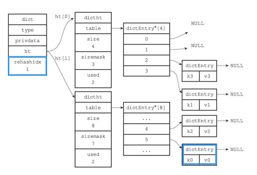
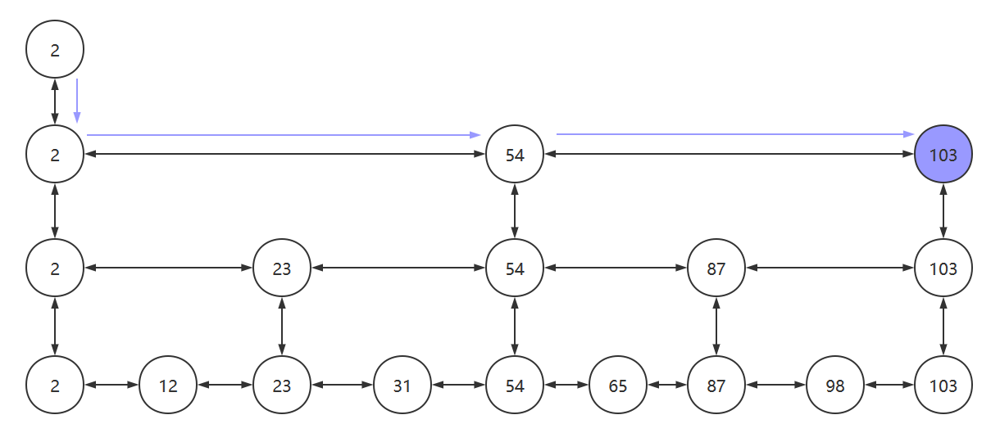

Redis设计与实现

参考资料：

- 《Redis设计与实现》
- [Redis设计与实现 - Nyima's Blog (gitee.io)](https://nyimac.gitee.io/2020/11/08/Redis设计与实现/#Redis设计与实现) 基于此博客的内容进行修正，填充，删除。

# Redis中的数据结构

## 一、简单动态字符串

与Java的ArrayList的实现有些类似。比起C字符串，SDS有以下优点：

- 1）常数复杂度获取字符串长度。
- 2）杜绝缓冲区溢出。
- 3）减少修改字符串长度时所需的内存重分配次数。
- 4）二进制安全。
- 5）兼容部分C字符串函数。

### SDS的定义

SDS又称为简单动态字符串（Simple Dynamic String），SDS的定义如下图所示


如果将一个值为“Redis”的字符串放入SDS中，它的存储状态如下


- buf 是一个char类型的数组。
- len 记录了buf的长度（保存空字符 `['\0']` 的1字节空间不计算在len属性里，C以 '\0' 判断字符串是不是结束了）
    - 该值使得**获取字符串的长度的时间复杂度降为了O(1)**
    - 设置和更新SDS长度的工作是由SDS的API在执行时自动完成的，使用SDS无须进行任何手动修改长度的工作。
- free 中保存了额外申请的空间
- 在进行字符串拼接时
    - 如果空间充足，会直接使用之前额外申请的空间
    - 如果空间不足（free < 拼接字符串的长度）会申请额外的空间。若所需的空间**小于1M**，会额外申请和 len 值相同的空间（如申请13个字符，则free也为13）。<span style="color:red">**若所需空间大于等于1M，则额外申请1M的空间。**</span>
- 在进行字符串裁剪时
    - 多出来的空间会被记录在free中，方便再次使用

### 与C语言字符串的差别

| C语言字符串                                                  | SDS                               | 解释                                                    |
| ------------------------------------------------------------ | --------------------------------- | ------------------------------------------------------- |
| 获取长度的时间复杂度为O(n)                                   | 获取长度的时间复杂度为O(1)        | SDS中len属性保存了字符串的长度                          |
| API是不安全的，可能会造成缓冲区溢出`char *strcat(char *dest, const char *src)` | API是安全的，不会造成缓冲区溢出   | SDS中若free空间不足以存放字符串的内容，会进行自动扩容。 |
| 修改字符串n次**必定**执行n次内存分配                         | 修改字符串**最多**执行n次内存分配 | SDS会分配额外的空间，额外空间大小由free记录             |
| 只能保存文本数据                                             | 可以保存文本数据或者二进制数据    | SDS使用buf来保存一系列二进制数据                        |
| 可以使用<string.h>库中所有的函数                             | 可以使用<string.h>中部分函数      | SDS中的buf相当于字符串                                  |

### 优化策略

内存重分配涉及复杂的算法，并且可能需要执行系统调用，所以它通常是一个比较耗时的操作。Redis作为数据库需要频繁的进行数据修改。每次修改字符串都进行内存分配和释放的话，会损耗Redis的性能。

为改进这种不足，SDS有空间预分配和惰性空间释放两种优化策略。

#### 空间预分配

当需要对SDS的空间进行扩展的时候，程序不仅会为SDS分配修改所必须要的空间，还会为SDS分配额外的未使用空间。

额外分配的未使用空间数量公式如下：

- 如果进行了内存分配，则 free = 修改后字符串的len(不计算'\0')。例如：进行修改后，SDS的len变成了13字节，那么程序也会分配13字节的未使用空间。SDS的buf数组实际长度则为 13+13+1 = 27字节（'\0'并未计算到len中。）
- 如果对SDS进行修改之后，SDS的长度将大于等于1MB，那么程序会分配1MB的未使用空间。例如：进行修改之后，SDS的len将变成30MB，那么程序会分配1MB的未使用空间，SDS的buf数组的实际长度将为30MB+1MB+1byte。
- 如果SDS空间充足够用，会直接使用未使用的空间，不会执行内存分配。

#### 惰性空间释放

不立即释放缩短后多出来的字节，而是先用free暂存。

惰性空间释放用于优化SDS的字符串缩短操作：当SDS的API需要缩短SDS保存的字符串时，程序并不立即使用内存重分配来回收缩短后多出来的字节，而是使用free属性将这些字节的数量记录起来，并等待将来使用。

SDS也提供了相应的API，让我们可以在有需要时，真正地释放SDS的未使用空间，所以不用担心惰性空间释放策略会造成内存浪费。

### 二进制安全

为了确保Redis可以适用于各种不同的使用场景，SDS的API都是二进制安全的（binary-safe），所有SDS API都会以处理二进制的方式来处理SDS存放在buf数组里的数据，程序不会对其中的数据做任何限制、过滤、或者假设，数据在写入时是什么样的，它被读取时就是什么样。<span style="color:red">**因此我们称 buf 为字节数组**</span>

## 二、链表

- 链表被广泛用于实现Redis的各种功能，比如列表键、发布与订阅、慢查询、监视器等。
- 每个链表节点由一个listNode结构来表示，每个节点都有一个指向前置节点和后置节点的指针，所以Redis的链表实现是双向链表。
- 每个链表使用一个list结构来表示，这个结构带有表头节点指针、表尾节点指针，以及链表长度等信息。
- 通过为链表设置不同的类型特定函数，Redis的链表可以用于保存各种不同类型的值。

### Redis中的链表

链表在Redis中的应用非常广泛，比如列表键的底层实现之一就是链表。当一个列表键包含了数量比较多的元素，又或者列表中包含的元素都是比较长的字符串时，Redis就会使用链表作为列表键的底层实现。

除了链表键之外，发布与订阅、慢查询、监视器等功能也用到了链表，Redis服务器本身还使用链表来保存多个客户端的状态信息，以及使用链表来构建客户端输出缓冲区。（outputbuffer）

Redis中的**链表节点**定义如下


Redis中将节点放在了list中


list结构为链表提供了表头指针head、表尾指针tail，以及链表长度计数器len

dup、free和match成员则是用于实现多态链表所需的类型特定函数

- dup函数用于复制链表节点所保存的
- free函数用于释放链表节点所保存的值
- match函数则用于对比链表节点所保存的值和另一个输入值是否相等

一个list结构和三个listNode结构组成的链表：


### Redis中链表的特性

- **双链表**，可方便地获取一个节点的前驱节点或后继节点
- **带头尾指针**，list中的head与tail分别保存了链表的头结点和尾节点
- **获取长度方便**，list中的len属性使得获取链表长度的时间复杂度变为了O(1)
- **多态**，链表节点使用`void*`指针来保存节点值，并且可以通过list结构的dup、free、match三个属性为节点值设置类型特定函数，所以链表可以用于保存各种不同类型的值

## 三、字典

字典：一种用于保存键值对（key-value pair）的抽象数据结构。

### Redis中字典的实现

Redis的字典使用**哈希表**作为底层实现，一个哈希表里面可以有**多个**哈希表节点，而每个哈希表节点就保存了字典中的**一个**键值对。

字典在Redis中的应用相当广泛，比如Redis的数据库就是使用字典来作为底层实现的，对数据库的增、删、查、改操作也是构建在对字典的操作之上的。

#### 哈希表

Redis中的哈希表实现如下

```c
typedef struct dictht {
    // 哈希表数组
    // 类似于Java中HashMap的transient Node<K,V>[] table;
    dictEntry **table;
    
    // 哈希表大小
    unsigned long size;
    
    // 哈希表掩码，用于计算索引值，大小为size-1
    unsigned long sizemask;
    
    // 哈希表中已有的节点数
    unsigned long used;
} dictht;
```

- table为一个dictEntry类型的数组
    - 数组中的每个元素都是一个指向dict.h/dictEntry结构的指针，每个dictEntry结构保存着一个键值对。
- size记录了哈希表的大小
- sizemask为size-1，用于哈希计算，决定一个键应该被放到哪个桶中
- used记录了哈希表目前已有节点（**键值对**）的数量

一个空的哈希表。


#### 哈希节点

Redis中哈希节点的实现如下，最新的redis在union里多了一个double d.


类似于Java中HashMap的Node

```java
static class Node<K,V> implements Map.Entry<K,V> {
    final int hash;
    final K key;
    V value;
    Node<K,V> next;
    ...
}
```

- key保存了键值对中键的值
- value保存了键值对中值的值，其中值可以为指针类型，uint64_tu64、int64_t64
- next 用于解决哈希冲突，使用拉链法


#### 字典

Redis中的字典由dict.h/dict结构表示：

```c
typedef struct dict {
    // 类型特定函数
    dictType *type;
    // 私有数据
    void *privdata;
    // 哈希表
    dictht ht[2];
    // rehash索引，当rehash不在进行时，值为-1
    long rehashidx; /* rehashing not in progress if rehashidx == -1 */
    unsigned long iterators; /* number of iterators currently running */
} dict;
```

- type属性是一个指向**dictType**结构的指针，每个dictType结构保存了一簇用于操作特定类型键值对的函数，Redis会为用途不同的字典设置不同的类型特定函数
- 而privdata属性则保存了需要传给那些类型特定函数的可选参数

```c
typedef struct dictType {
    // 计算哈希值的函数
    uint64_t (*hashFunction)(const void *key);
    
    // 复制键的函数
    void *(*keyDup)(void *privdata, const void *key);
    
    // 复制值的函数
    void *(*valDup)(void *privdata, const void *obj);
    
    // 对比键的函数
    int (*keyCompare)(void *privdata, const void *key1, const void *key2);
    
    // 销毁键的函数
    void (*keyDestructor)(void *privdata, void *key);
    
   	// 销毁值的函数
    void (*valDestructor)(void *privdata, void *obj);
} dictType;
```

- ht属性为包含了两个ditht元素的数组
    - 一般情况下，只是用ht[0]作为哈希表，ht[1]只会在对ht[0]进行rehash时才会使用
- rehashidx是除了ht[1]以外，另一个与rehash有关的属性，它**记录了rehash目前的进度**，如果没有rehash，那么它的值为-1

**一个普通状态下（未进行rehash）的字典**


### 字典中的算法

- 字典被广泛用于实现Redis的各种功能，其中包括数据库和哈希键。
- Redis中的字典使用哈希表作为底层实现，每个字典带有两个哈希表，一个平时使用，另一个仅在进行rehash时使用。
- 当字典被用作数据库的底层实现，或者哈希键的底层实现时，Redis使用MurmurHash2算法来计算键的哈希值。
- 哈希表使用链地址法来解决键冲突，被分配到同一个索引上的多个键值对会连接成一个单向链表。
- 在对哈希表进行扩展或者收缩操作时，程序需要将现有哈希表包含的所有键值对rehash到新哈希表里面，并且这个rehash过程并不是一次性地完成的，而是渐进式地完成的。

#### 哈希算法

当要将一个新的键值对添加到字典里面时，程序需要先根据键值对的键计算出哈希值和索引值，然后再根据索引值，将包含新键值对的哈希表节点放到哈希表数组的指定索引上面。

**Redis计算哈希值和索引值的方法如下**：


- 将key通过hashFunction方法计算出对应的hash值
- 再结合sizemask(值为size-1)，获得该key对应的索引值

**例如**：我们要将一个键值对为 k0，v0 添加到容量为4字典里面，那么程序会先使用语句：

```c
hash = dict->type->hashFunction(key0);
```

计算出对应的hash值

假设计算的hash值为8，则再通过sizemask（值为3）来计算出索引

```c
index = hash & dict->ht[x].sizemask; // 8 & 3 = 0
```

计算出key0的索引值为0，放入对应的位置上


Redis底层使用MurmurHash2算法来计算键的哈希值，这种算法的优点在于，即使输入的键是有规律的，算法仍能给出一个很好的随机分布性，并且算法的计算速度也非常快。

```c
uint32_t MurmurHash2 ( const void * key, int len, uint32_t seed )
{
  // 'm' and 'r' are mixing constants generated offline.
  // They're not really 'magic', they just happen to work well.
 
  const uint32_t m = 0x5bd1e995;
  const int r = 24;
 
  // Initialize the hash to a 'random' value
 
  uint32_t h = seed ^ len;
 
  // Mix 4 bytes at a time into the hash
 
  const unsigned char * data = (const unsigned char *)key;
 
  while(len >= 4)
  {
    uint32_t k = *(uint32_t*)data;
 
    k *= m;
    k ^= k >> r;
    k *= m;
 
    h *= m;
    h ^= k;
 
    data += 4;
    len -= 4;
  }
 
  // Handle the last few bytes of the input array
 
  switch(len)
  {
  case 3: h ^= data[2] << 16;
  case 2: h ^= data[1] << 8;
  case 1: h ^= data[0];
      h *= m;
  };
 
  // Do a few final mixes of the hash to ensure the last few
  // bytes are well-incorporated.
 
  h ^= h >> 13;
  h *= m;
  h ^= h >> 15;
 
  return h;
}
```

#### 哈希冲突的解决方法

当有两个或以上数量的键被分配到了哈希表数组的同一个索引上面时，我们称这些键发生了冲突（collision）。

Redis的哈希表使用**拉链法**（separate chaining）来解决键冲突，每个哈希表节点都有一个next指针，多个哈希表节点可以用next指针构成一个**单向链表**，被分配到同一个索引上的多个节点可以用这个单向链表连接起来，这就解决了键冲突的问题。拉链法采用的头插法插入新节点，因为dictEntry数字没有记录链表的尾指针。

**冲突前**


**冲突后**


#### rehash

随着操作的不断执行，哈希表保存的键值对会逐渐地增多或者减少，为了让哈希表的负载因子（load_factor）维持在一个合理的范围之内（可以减少出现哈希冲突的几率），当哈希表保存的键值对数量太多或者太少时，程序需要对哈希表的大小进行相应的**扩展或者收缩**。<span style="color:red">而扩展和收缩哈希表的工作可以通过执行**rehash（重新散列）**操作来完成，Redis对字典的哈希表执行rehash的步骤如下：</span>

- 为字典的ht[1]哈希表分配空间，这个哈希表的空间大小取决于要执行的操作，以及ht[0]当前包含的键值对数量（dictht.used的大小）

    - 如果执行的是**扩展操作**，那么ht[1]的大小为**第一个**大于ht[0].used*2 的 2n （和Java 中的 HashMap一样，这样可以保证sizemask的值必定为11…11）

    - 如果执行的是收缩操作，那么ht[1]的大小为第一个小于ht[0].used的 2

        n

- 将保存在ht[0]中的所有键值对rehash到ht[1]上面

    - rehash指的是重新计算键的哈希值和索引值，然后将键值对放置到ht[1]哈希表的指定位置上

- 当ht[0]包含的所有键值对都迁移到了ht[1]之后（ht[0]变为空表），释放ht[0]，将ht[1]设置为ht[0]，并在ht[1]新创建一个空白哈希表，为下一次rehash做准备

    - 上面有两步有点像垃圾回收算法中的**标记-复制算法**（FROM-TO，然后交换FROM 和 TO）

**举例说明**

假设程序要对下图所示字典的ht[0]进行**扩展操作**，那么程序将执行以下步骤：


- ht[0].used当前的值为4，4*2=8，所以程序会将ht[1]哈希表的大小设置为8。下图展示了ht[1]在分配空间之后，字典的样子


- 将ht[0]包含的四个键值对都**rehash**到ht[1]


- 释放ht[0]，并将ht[1]设置为ht[0]，然后为ht[1]分配一个空白哈希表，如下图所示。至此，对哈希表的扩展操作执行完毕，程序成功将哈希表的大小从原来的4改为了现在的8


**哈希表的扩展与收缩**

当以下条件中的任意一个被满足时，程序会自动开始对哈希表执行扩展操作

- 服务器目前**没有在执行**BGSAVE命令或者BGREWRITEAOF命令，并且哈希表的负载因子大于等于1
- 服务器目前**正在执行**BGSAVE命令或者BGREWRITEAOF命令，并且哈希表的负载因子大于等于5
    - 负载因子的计算方法如下 
        `load_factory = ht[0].used/ht[0].sizeCopy`

根据BGSAVE命令或BGREWRITEAOF命令是否正在执行，服务器执行扩展操作所需的负载因子并不相同，这是因为在执行BGSAVE命令或BGREWRITEAOF命令的过程中，Redis需要创建当前服务器进程的子进程，而大多数操作系统都采用写时复制（copy-on-write）技术来优化子进程的使用效率，所以在子进程存在期间，服务器会提高执行扩展操作所需的负载因子，从而**尽可能地避免在子进程存在期间进行哈希表扩展操作，这可以避免不必要的内存写入操作，最大限度地节约内存**。

另一方面，**当哈希表的负载因子小于0.1时，程序自动开始对哈希表执行收缩操作**。

#### 渐进rehash

数据量很大时，一次性将ht[0]里面的所有键值对rehash到ht[1]里面，庞大的计算量可能会导致服务器在一段时间内停止服务。因此，**reshash采用的是分多次、渐进式地完成的。**这样做主要因为在数据量较大时，如果一次性，集中式地完成，

**详细步骤**

- 为ht[1]分配空间，让字典同时持有ht[0]和ht[1]两个哈希表
- 在字典中维持一个索引计数器变量rehashidx，并将它的值设置为0，表示rehash工作正式开始（<span style="color:green">**索引计数器用于记录rehash到哪个索引了**</span>）
- 在rehash进行期间，每次对字典执行添加、删除、查找或者更新操作时，程序除了执行指定的操作以外，还会顺带将ht[0]哈希表在rehashidx索引上的键值对rehash到ht[1]，当rehash工作完成之后，程序将rehashidx属性的值增一（指向下一个索引）
- 随着字典操作的不断执行，最终在某个时间点上，ht[0]的所有键值对都会被rehash至ht[1]，这时程序将rehashidx属性的值设为-1，表示rehash操作已完成

**下图为一次完整的渐进式rehash过程，注意观察在整个rehash过程中，字典的rehashidx属性的变化。**

- 准备开始rehash


- 开始rehash，rehash索引为0的键值对


- rehash索引为1的键值对



- ......
- rehash完成，rehashidx再次变为-1


**在进行渐进式rehash的过程中，字典会同时使用ht[0]和ht[1]两个哈希表**，因此在渐进式rehash进行期间，字典的删除（delete）、查找（find）、更新（update）等操作会**在两个哈希表上进行**

 例如，要在字典里面查找一个键的话，程序会先在ht[0]里面进行查找，如果没找到的话，就会继续到ht[1]里面进行查找，诸如此类

另外，在渐进式rehash执行期间，<span style="color:red">**新添加到字典的键值对一律会被保存到ht[1]里面**</span>，而ht[0]则不再进行任何添加操作，这一措施保证了ht[0]包含的键值对数量会只减不增，并随着rehash操作的执行而最终变成空表

## 四、跳跃表

跳跃表（skiplist）是一种有序数据结构，它通过在每个节点中维持多个指向其他节点的指针，从而达到快速访问节点的目的。

跳跃表支持平均O（logN）、最坏O（N）复杂度的节点查找，还可以通过顺序性操作来批量处理节点。

在大部分情况下，跳跃表的效率可以和平衡树相媲美，并且因为跳跃表的实现比平衡树要来得更为简单，所以有不少程序都使用跳跃表来代替平衡树。

Redis使用跳跃表作为有序集合键的底层实现之一，如果一个有序集合包含的元素数量比较多，又或者有序集合中元素的成员（member）是比较长的字符串时，Redis就会使用跳跃表来作为有序集合键的底层实现。

<span style="color:red">**Redis只在两个地方用到了跳跃表，一个是实现有序集合键，另一个是在集群节点中用作内部数据结构，除此之外，跳跃表在Redis里面没有其他用途。**</span>

> Redis中的跳跃表

❑跳跃表是有序集合的底层实现之一。

❑Redis的跳跃表实现由zskiplist和zskiplistNode两个结构组成，其中zskiplist用于保存跳跃表信息（比如表头节点、表尾节点、长度），而zskiplistNode则用于表示跳跃表节点。

❑每个跳跃表节点的层高都是1至32之间的随机数。

❑在同一个跳跃表中，多个节点可以包含相同的分值，但每个节点的成员对象必须是唯一的。

❑跳跃表中的节点按照分值大小进行排序，当分值相同时，节点按照成员对象的大小进行排序。

### 跳跃表原理

#### 查询链表的时间复杂度

**搜索链表中的元素时，无论链表中的元素是否有序，时间复杂度都为O(n)**，如下图，搜索103需要查询9次才能找到该节点


但是能够提高搜索的其他数据结构，如：二叉排序树、红黑树、B树、B+树等等的实现又过于复杂。有没有一种相对简单，同时又能提搜索效率的数据结构呢，跳跃表就是这样一种数据结构。

Redis中使用跳跃表好像就是因为一是B+树的实现过于复杂，二是Redis只涉及内存读写，所以最后选择了跳跃表。

#### 跳跃表实现——搜索

为了能够更快的查找元素，我们可以在该链表之上，再添加一个新链表，新链表中保存了部分旧链表中的节点，以加快搜索的速度。如下图所示


我们搜索元素时，从最上层的链表开始搜索。当找到某个节点大于目标值或其后继节点为空时，从该节点向下层链表搜寻，然后顺着该节点到下一层继续搜索。

比如我们要找103这个元素，则会经历：2->23->54->87->103

这样还是查找了5次，当我们再将链表的层数增高以后，查找的次数会明显降低，如下图所示。3次便找到了目标元素103



**代码中实现的跳表结构如下图所示**

一个节点拥有多个指针，指向不同的节点


#### 跳跃表实现——插入

跳跃表的插入策略如下

- 先找到合适的位置以便插入元素

- 找到后，将该元素插入到最底层的链表中，并且

    抛掷硬币（1/2的概率）

    - 若硬币为正面，则将该元素晋升到上一层链表中，**并再抛一次**
    - 若硬币为反面，则插入过程结束

- 为了避免以下情况，需要在每个链表的头部设置一个 **负无穷** 的元素


设置负无穷后，若要查找元素2，过程如下图所示


**插入图解**

- 若我们要将45插入到跳跃表中

    

- 先找到插入位置，将45插入到合适的位置

    

- 抛掷硬币：**为正**，晋升

    

- 假设硬币一直为正，插入元素一路晋升，当晋升的次数超过跳跃表的层数时，**需要再创建新的链表以放入晋升的插入元素。新创建的链表的头结点为负无穷**

    

### Redis中的跳跃表

#### 为什么Redis要使用跳跃表而不是用B+树

There are a few reasons:
- They are not very memory intensive. It's up to you basically. Changing parameters about the probability of a node to have a given number of levels will make then less memory intensive than btrees.
- A sorted set is often target of many ZRANGE or ZREVRANGE operations, that is, traversing the skip list as a linked list. With this operation the cache locality of skip lists is at least as good as with other kind of balanced trees.
- They are simpler to implement, debug, and so forth. For instance thanks to the skip list simplicity I received a patch (already in Redis master) with augmented skip lists implementing ZRANK in O(log(N)). It required little changes to the code.

MySQL使用B+树的是因为：**叶子节点存储数据，非叶子节点存储索引**，B+树的每个节点可以存储多个关键字，它将节点大小设置为磁盘页的大小，**充分利用了磁盘预读的功能**。每次读取磁盘页时就会读取一整个节点,每个叶子节点还有指向前后节点的指针，为的是最大限度的降低磁盘的IO;因为数据在内存中读取耗费的时间是从磁盘的IO读取的百万分之一

而Redis是**内存中读取数据，不涉及IO，因此使用了跳跃表**

既然提到了Redis是对**内存操作**的，那么再讨论一个问题：**为什么Redis是单线程的还这么快呢**

#### **Redis使用单线程效率还很高的原因**

假设有两个任务A和B，分别有两种方法来执行他们

- 两个线程并发执行：先执行A一段时间，然后切换到B再执行一段时间，然后又切换回A执行… 直到A和B都执行完毕
- 两个线程串行执行：先执行A，A执行完了在执行B

对于单核CPU来说，第二种方法的执行时间更短，效率更高。因为单核CPU下的并发操作，会导致上下文的切换，需要保存切换线程的信息，这段时间CPU无法去执行任何任务中的指令，时间白白浪费了

**对于I/O操作，并发执行效率更高**

因为I/O操作主要有以下两个过程

- 等待I/O准备就绪
- 真正操作I/O资源

**等待I/O准备就绪**这个阶段，CPU是空闲的，这时便可以去执行其他任务，这样也就提高了CPU的利用率

**而Redis是基于内存的操作，没有I/O操作，所以单线程执行效率更高**

### Redis中跳表的实现

Redis中的sort_set主要由跳表实现，sort_set的添加语句如下

```shell
zadd key score1 member1 score2 member2 ...
```

Redis中的跳表结构如下


Redis中的跳表主要由节点**zskiplistNode**和跳表**zskiplist**来实现，他们的源码如下

#### zskiplistNode

```c
typedef struct zskiplistNode {
    // 存储的元素 就是语句中的member
    sds ele;
    
    // 分值,就是语句中的score
    double score;
    
    // 指向前驱节点
    struct zskiplistNode *backward;
    
    // 层，每个节点有1~32个层，除头结点外（32层），其他节点的层数是随机的
    struct zskiplistLevel {
        // 每个层都保存了该节点的后继节点
        struct zskiplistNode *forward;
        
        // 跨度，用于记录该节点与forward指向的节点之间，隔了多少各节点。主要用于计算Rank
        unsigned long span;
    } level[];
} zskiplistNode;
```

**各个属性的详细解释**

- ele：sds变量，保存member。

- score：double变量，用于保存score
    - **注意**：**score和ele共同来决定一个元素在跳表中的顺序**。score不同则根据score进行排序，score相同则根据ele来进行排序
    - **跳表中score是可以相同的，而ele是肯定不同的**

- backward：前驱指针，用于保存节点的前驱节点，**每个节点只有一个backward**
    - 例：如果要从第四层的节点访问第三层的节点，则可以通过backward直接访问


- level[]：节点的层，每个节点拥有1~32个层，除头结点外（32层），其他节点的层数是随机的。**注意**：Redis中没有使用抛硬币的晋升策略，而是直接随机一个层数值。下图展示了层数不同的几个节点


- level：保存了该节点指向的下一个节点，但是不一定是紧挨着的节点。还保存了两个节点之间的跨度

- forward：后继节点，该节点指向的下一个节点，但是不一定是紧挨着的节点

- span：跨度，用于记录从该节点到forward指向的节点之间，要走多少步。主要用于计算Rank
    - rank：排位，头节点开始到目标节点的跨度，由沿途的span相加获得

#### **zskiplist**

zskiplist的源码如下

```c
typedef struct zskiplist {
    // 头尾指针，用于保存头结点和尾节点
    struct zskiplistNode *header, *tail;
    
    // 跳跃表的长度，即除头结点以外的节点数
    unsigned long length;
    
    // 最大层数，保存了节点中拥有的最大层数（不包括头结点）
    int level;
} zskiplist;
```

#### 遍历过程

遍历需要访问跳表中的每个节点，直接走底层的节点即可依次访问

#### 搜索过程

如我们要访问该跳表中score = 2.0的节点


从高层依次向下层遍历

- 头结点的L6~L32的 forward 都为空，从L5开始访问
- 头结点L5的 forward 的指向的node3的score为3.0，小于2.0，返回头结点
- 从头结点L4 的 forward 指向的node1开始访问，节点的score = 1.0，继续向下执行
- 从node1的 L4 开始访问，为node3，返回node1
- 从node1的L3开始访问，为node3，返回node1
- 从node1的L2开始访问，为node2，score = 2.0，即为所要的节点

#### 插入过程

插入节点时，需要找到节点的插入位置。并给节点的各个属性赋值。插入后判断是否需要拓展上层。

## 五、整数集合

整数集合（intset）是集合键的底层实现之一，**当一个集合只包含整数值元素，并且这个集合的元素数量不多时**，Redis就会使用整数集合作为集合键的底层实现。

❑整数集合的底层实现为数组，这个数组以有序、无重复的方式保存集合元素，在有需要时，程序会根据新添加元素的类型，改变这个数组的类型。

❑升级操作为整数集合带来了操作上的灵活性，并且尽可能地节约了内存。

❑整数集合只支持升级操作，不支持降级操作。

### 整数集合的实现

整数集合（intset）是Redis用于保存整数值的集合抽象数据结构，它可以保存类型为int16_t、int32_t或者int64_t的整数值，并且**保证集合中不会出现重复元素且按照从小到大的顺序排列**


- length：记录了整数集合包含的元素数量，也即是contents数组的长度。

- contents：为intset的底层实现，用于存放不重复的元素，且**元素按照从小到大的顺序排列。数组类型由encoding决定，与int8_t无关**

    - 如果encoding属性的值为INTSET_ENC_INT16，那么contents就是一个int16_t类型的数组，数组里的每个项都是一个int16_t类型的整数值
    - 如果encoding属性的值为INTSET_ENC_INT32，那么contents就是一个int32_t类型的数组，数组里的每个项都是一个int32_t类型的整数值
    - 如果encoding属性的值为INTSET_ENC_INT64，那么contents就是一个int64_t类型的数组，数组里的每个项都是一个int64_t类型的整数值

**图解示例**


- 该整数解中有5个元素，contents的类型为int16_t

### 升级

每当我们要将一个新元素添加到整数集合里面，并且**新元素的类型比整数集合现有所有元素的类型都要长时**，整数集合需要先进行**升级**（upgrade），然后才能将新元素添加到整数集合里面

#### 具体过程

- 根据新元素的类型，**扩展**整数集合底层数组的空间大小，并为新元素**分配空间**

- 将底层数组(contents[])现有的所有元素都**转换**成与新元素相同的类型，并将类型转换后的元素放置到正确的位上，而且在放置元素的过程中，需要继续维持底层数组的**有序性质不变**

- 将新元素添加到底层数组里面

    - 因为新元素的长度大于数组中所有其他元素的长度，所以

        该元素要么是最小的，要么是最大的

        - 若为最小值，放在数组开头
        - 若为最大值，放在数组末尾

**图解**

- 假设现在有一个INTSET_ENC_INT16编码的整数集合，**集合中包含三个int16_t类型的元素**


    - 因为contents中的元素都是16位的，3个数组共占用空间48位，如下


- 这时，需要将65535添加到整数集合里面，因为int16_t能够表示的范围为(-32768~32767)，无法容纳该数字，所以**需要升级**。升级过程如下

    - 扩展content的分配的内存空间，由3x16 扩展为 3x32


- 将数组中的元素**类型改为int32_t**，并放入扩展后的contents中。最后添加新插入的元素。


- 改变intset中，encoding和length的值
    - encoding由INTSET_ENC_INT16改为INTSET_ENC_INT32
    - lentg由3改为4
- 插入完成后，intset的结构如下


#### 升级的好处

- **自适应**：会根据contents中的元素位数选择最合适的类型，来进行内存的分配
- **节约内存**：基于自适应，不会为一个位数较少的整数分配较大的空间

### 降级

整数集合不支持降级操作，一旦对数组进行了升级，编码就会一直保持升级后的状态。

即使我们将集合里唯一一个真正需要使用int64_t类型来保存的元素4294967295删除了，整数集合的编码仍然会维持INTSET_ENC_INT64，底层数组也仍然会是int64_t类型的。


删除 4294967295 后


## 六、压缩列表

### 简介

压缩列表（ziplist）是列表键(list)和哈希键(hash)的底层实现之一

- 当**一个列表键（list）只包含少量列表项，并且每个列表项要么就是小整数值，要么就是长度比较短的字符串**，那么Redis就会使用压缩列表来做列表键的底层实现

- 当**一个哈希键只包含少量键值对，比且每个键值对的键和值要么就是小整数值，要么就是长度比较短的字符串**，那么Redis就会使用压缩列表来做哈希键的底层实现

哈希键里面包含的所有键和值都是小整数值或者短字符串。

### 压缩列表的组成

压缩列表是Redis为了**节约内存**而开发的，是由一系列特殊编码的连续内存块组成的顺序型（sequential）数据结构。一个压缩列表可以包含任意多个节点（entry），每个节点可以保存**一个字节数组**或者**一个整数值**。具体组成如下

[](https://nyimapicture.oss-cn-beijing.aliyuncs.com/img/20201113163516.png)

#### 属性介绍

- zlbytes：表示压缩列表占用的内存（单位：字节）。
- zltail：压缩列表其实指针到尾节点的偏移量。
    - 如果我们有一个指向压缩列表起始地址的指针p，通过p+zltail就能直接访问压缩列表的最后一个节点。
- zllen：压缩列表中的**节点数**。
- entryX：压缩列表中的节点。
- zlend：特殊值0XFF（十进制255），用于标记压缩列表的末端。

### 压缩列表中的节点

每个压缩列表节点都由**previous_entry_length、encoding、content**三个部分组成，如下图

[](https://nyimapicture.oss-cn-beijing.aliyuncs.com/img/20201113164801.png)

```c
typedef struct zlentry {
    unsigned int prevrawlensize; 
    unsigned int prevrawlen;     
    unsigned int lensize;        
    unsigned int len;           
    unsigned int headersize;     
    unsigned char encoding;      
    unsigned char *p;          
} zlentry;
```

#### previous_entry_length

节点的previous_entry_length属性以**字节为单位，记录了压缩列表中前一个节点的长度**，其值长度为1个字节**或者**5个字节

- 如果前一节点的长度小于254字节，那么previous_entry_length属性的长度为1字节
    - 前一节点的长度就保存在这一个字节里面
- 如果前一节点的长度大于等于254字节，那么previous_entry_length属性的长度为5字节
    - 其中属性的第一字节会被设置为0xFE（十进制值254），而之后的四个字节则用于保存前一节点的长度

若前一个节点的长度为5个字节，那么压缩列表的previous_entry_length属性为0x05（1个字节保存长度）

若前一个节点的长度为10086(0x2766)，那么压缩列表中previous_entry_length属性为0xFE00002766（后4个字节保存长度）

通过previous_entry_length属性，可以方便地访问当前节点的前一个节点

#### encoding

节点的encoding属性记录了**节点的content属性所保存数据的类型以及长度**

#### content

节点的content属性负责保存节点的值，**节点值可以是一个字节数组或者整数，值的类型和长度由节点的encoding属性决定**

## 七、快表

### 简介

quicklist是Redis 3.2中新引入的数据结构，**能够在时间效率和空间效率间实现较好的折中**。Redis中对quciklist的注释为A doubly linked list of ziplists。顾名思义，quicklist是一个双向链表，链表中的每个节点是一个ziplist结构。quicklist可以看成是用双向链表将若干小型的ziplist连接到一起组成的一种数据结构。当ziplist节点个数过多，quicklist退化为双向链表，一个极端的情况就是每个ziplist节点只包含一个entry，即只有一个元素。当ziplist元素个数过少时，quicklist可退化为ziplist，一种极端的情况就是quicklist中只有一个ziplist节点

### 快表的结构

quicklist是由quicklist node组成的双向链表，quicklist node中又由ziplist充当节点。quicklist的存储结构如图


#### **quicklist结构体**

```c
typedef struct quicklist {
    quicklistNode *head;
    quicklistNode *tail;
    unsigned long count;        /* total count of all entries in all ziplists */
    unsigned long len;          /* number of quicklistNodes */
    int fill : QL_FILL_BITS;              /* fill factor for individual nodes */
    unsigned int compress : QL_COMP_BITS; /* depth of end nodes not to compress;0=off */
    unsigned int bookmark_count: QL_BM_BITS;
    quicklistBookmark bookmarks[];
} quicklist;
```

**head和tail**

- head和tail分别指向快表的首位节点

**count**

- count为quicklist中元素总数

**len**

- len为quicklist Node（节点）个数

**fill**

fill用来指明每个quicklistNode中ziplist长度

#### **quicklistNode**

```c
typedef struct quicklistNode {
    struct quicklistNode *prev;
    struct quicklistNode *next;
    unsigned char *zl;  		 /* 指向压缩列表的指针 */
    unsigned int sz;             /* ziplist size in bytes */
    unsigned int count : 16;     /* count of items in ziplist */
    unsigned int encoding : 2;   /* RAW==1 or LZF==2 */
    unsigned int container : 2;  /* NONE==1 or ZIPLIST==2 */
    unsigned int recompress : 1; /* was this node previous compressed? */
    unsigned int attempted_compress : 1; /* node can't compress; too small */
    unsigned int extra : 10; /* more bits to steal for future usage */
} quicklistNode;
```

- prev和next：因为quicklist为双向链表，所以有prev和next指针，分别指向前驱节点和后继节点
- zl：zl指向该节点对应的**ziplist结构**
- encoding：encoding代表采用的编码方式；1代表是原生的ziplist（未进行再次压缩）；2代表使用LZF进行压缩
- container：container为quicklistNode节点zl指向的容器类型；1代表none；2代表使用ziplist存储数据
- recompress：recompress代表这个节点之前是否是压缩节点，若是，则在使用压缩节点前先进行解压缩，使用后需要重新压缩，此外为1，代表是压缩节点
- attempted_compress：attempted_compress测试时使用
- extra：extra为预留

#### quickLZF

**quicklist允许ziplist进行再次压缩**。当我们对ziplist利用LZF算法进行压缩时，quicklistNode节点指向的结构为**quicklistLZF**。其中sz表示compressed所占字节大小，quicklistLZF结构如下所示

```c
typedef struct quicklistLZF {
    unsigned int sz; /* LZF size in bytes*/
    char compressed[];
} quicklistLZF;
```

#### **quicklistEntry**

当我们使用quicklistNode中**ziplist中的一个节点**时，Redis提供了quicklistEntry结构以便于使用，该结构如下

可以理解为其为**ziplist中的一个节点**，只不过记录了更详细的信息

```c
typedef struct quicklistEntry {
    // 指向当前元素所在的quicklist
    const quicklist *quicklist;
    
    // 指向当前元素所在的quicklistNode结构
    quicklistNode *node;
    
    // 指向当前元素所在的ziplist
    unsigned char *zi;
    
    // 指向该节点的字符串内容
    unsigned char *value;
    
    // 该节点的整型值
    long long longval;
    
    // 该节点的大小
    unsigned int sz;
    
    // 该节点相对于整个ziplist的偏移量，即该节点是ziplist第多少个entry
    int offset;
} quicklistEntry;
```

### 基本操作

#### 初始化

初始化是构建quicklist结构的第一步，由quicklistCreate函数完成，该函数的主要功能就是初始化quicklist结构。初始化后的quicklist如下图所示


#### 插入操作

插入操作有

- 插入quicklist node
- 插入ziplist中的节点

插入时可以选择头插和尾插，对应list的lpush和rpush，底层调用的是quicklistPushHead与quicklistPushTail方法

- quicklistPushHead的**基本思路**是：查看quicklist原有的head节点是否可以插入，如果可以就直接利用ziplist的接口进行插入，否则新建quicklistNode节点进行插入。函数的入参为待插入的quicklist，需要插入的数据value及其大小sz；函数返回值代表是否新建了head节点，0代表没有新建，1代表新建了head

当quicklist中只有一个节点时，其结构如下图所示


具体的插入（zlentry）情况如下

- 当前插入位置所在的quicklistNode仍然**可以继续插入**，此时可以直接插入

- 当前插入位置所在的quicklistNode不能继续插入，此时可以分为如下几种情况

    - 需要向当前quicklistNode第一个元素（entry1）前面插入元素，当前ziplist所在的quicklistNode的**前一个**quicklistNode可以插入，则将数据插入到前一个quicklistNode。如果**前一个quicklistNode不能插入**（不包含前一个节点为空的情况），则**新建**一个quicklistNode插入到当前quicklistNode**前面**
    - 需要向当前quicklistNode的最后一个元素（entryN）后面插入元素，当前ziplist所在的quicklistNode的**后一个**quicklistNode可以插入，则直接将数据插入到后一个quicklistNode。如果**后一个quicklistNode不能插入**（不包含为后一个节点为空的情况），则**新建**一个quicklistNode插入到当前quicklistNode的**后面**
    - **不满足前面2个条件的所有其他种情况**，将当前所在的quicklistNode以当前待插入位置为基准，拆分成左右两个quicklistNode，之后将需要插入的数据插入到其中一个拆分出来的quicklistNode中

#### 查找操作

quicklist查找元素主要是针对index，即通过元素在链表中的下标查找对应元素。基本思路是，**首先找到index对应的数据所在的quicklistNode节点，之后调用ziplist的接口函数ziplistGet得到index对应的数据**。简而言之就是：定位quicklistNode，再在quicklistNode 中的ziplist中寻找目标节点
