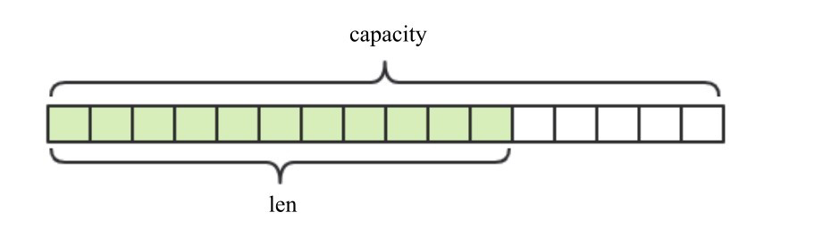

# 一、Redis简介

## 1.1 基本概念普及

> **概念： redis是一款高性能的NoSQL系列的非关系型数据库**

> **什么是NoSQL**

NoSQL(NoSQL = Not Only SQL)，意即“不仅仅是SQL”，是一项全新的数据库理念，泛指非关系型的数据库。

超大规模和高并发的SNS类型的web2.0纯动态网站力不从心，暴露了很多难以克服的问题，而非关系型的数据库则由于其本身的特点得到了非常迅速的发展。NoSQL数据库的产生就是为了解决大规模数据集合多重数据种类带来的挑战，尤其是大数据应用难题。

## 1.2 NoSQL和关系型数据库比较

### 1.2.1 NoSQL的优点

- 成本：nosql数据库简单易部署，基本都是开源软件，不需要像使用oracle那样花费大量成本购买使用，相比关系型数据库价格便宜。
- 查询速度：nosql数据库将数据存储于缓存之中，关系型数据库将数据存储在硬盘中，自然查询速度远不及nosql数据库。
- 存储数据的格式：nosql的存储格式是key,value形式、文档形式、图片形式等等，所以可以存储基础类型以及对象或者是集合等各种格式，而数据库则只支持基础类型。
- 扩展性：关系型数据库有类似join这样的多表查询机制的限制导致扩展很艰难。

### 1.2.2 NoSQL的缺点

- 维护的工具和资料有限，因为nosql是属于新的技术，不能和关系型数据库10几年的技术同日而语。
- 不提供对sql的支持，如果不支持sql这样的工业标准，将产生一定用户的学习和使用成本。
- 不提供关系型数据库对事务的处理。

### 1.2.3 非关系型数据库的优势

- **性能NOSQL是基于键值对的，可以想象成表中的主键和值的对应关系，而且不需要经过SQL层的解析，所以性能非常高。**
- 可扩展性同样也是因为基于键值对，数据之间没有耦合性，所以非常容易水平扩展。

### 1.2.4 关系型数据库的优势
- 复杂查询可以用SQL语句方便的在一个表以及多个表之间做非常复杂的数据查询。
- 事务支持使得对于安全性能很高的数据访问要求得以实现。对于这两类数据库，对方的优势就是自己的弱势，反之亦然。

### 1.2.5 总结
<u>关系型数据库与NoSQL数据库并非对立而是互补的关系</u>，即通常情况下使用关系型数据库，在适合使用NoSQL的时候使用NoSQL数据库，让NoSQL数据库对关系型数据库的不足进行弥补。一般会将数据存储在关系型数据库中，在nosql数据库中备份存储关系型数据库的数据

## 1.3 主流的NOSQL产品

### 1.3.1 键值(Key-Value)存储数据库
- 相关产品： Tokyo Cabinet/Tyrant、Redis、Voldemort、Berkeley DB
- 典型应用： 内容缓存，主要用于处理大量数据的高访问负载。 
- 数据模型： 一系列键值对
- <span style="color:red">优势： 快速查询</span>
- <span style="color:red">劣势： 存储的数据缺少结构化</span>

### 1.3.2 列存储数据库
- 相关产品：Cassandra, HBase, Riak
- 典型应用：分布式的文件系统
- 数据模型：以列簇式存储，将同一列数据存在一起
- 优势：查找速度快，可扩展性强，更容易进行分布式扩展
- 劣势：功能相对局限

### 1.3.3 文档型数据库
- 相关产品：CouchDB、MongoDB
- 典型应用：Web应用（与Key-Value类似，Value是结构化的）
- 数据模型： 一系列键值对
- <span style="color:red">优势：数据结构要求不严格</span>
- <span style="color:red">劣势： 查询性能不高，而且缺乏统一的查询语法</span>

### 1.3.4 图形(Graph)数据库
- 相关数据库：Neo4J、InfoGrid、Infinite Graph
- 典型应用：社交网络
- 数据模型：图结构
- 优势：利用图结构相关算法。
- 劣势：需要对整个图做计算才能得出结果，不容易做分布式的集群方案。

## 1.4 什么是Redis

### 1.4.1 简介

Redis是用C语言开发的一个开源的高性能键值对（key-value）数据库，官方提供测试数据，50个并发执行100000个请求,读的速度是110000次/s,写的速度是81000次/s ，且Redis通过提供多种键值数据类型来适应不同场景下的存储需求，目前为止Redis支持的键值数据类型如下：

- 1) 字符串类型 string：
- 2) 哈希类型 hash：渐进式哈希
- 3) 列表类型 list
- 4) 集合类型 set
- 5) 有序集合类型 sortedset

### 1.4.2 redis的应用场景
- 缓存（数据查询、短连接、新闻内容、商品内容等等）
- 聊天室的在线好友列表
- 任务队列。（秒杀、抢购、12306等等）
- 应用排行榜
- 网站访问统计
- 数据过期处理（可以精确到毫秒）
- 分布式集群架构中的session分离

## 1.5 小结

Redis 是键值对存取的，它的数据保存在内存中。如果仅仅是从内存中访问数据，那么我们自己定义一个 Map 也行，但是 Redis 支持一个程序同时使用好几台服务器的内存，比 Map 强。而且 Redis 可限定内存的使用，内存达到容量后会采用指定的替换算法对数据进行替换【常采用的算法是 LRU 算法】

# 二、Redis的安装

## windows 安装

1. 官网：https://redis.io
2. 中文网：http://www.redis.net.cn/
3. 解压直接可以使用：
	  redis.windows.conf：配置文件
	redis-cli.exe：redis的客户端
	redis-server.exe：redis服务器端

## Docker 安装

```shell
# 拉取 redis 镜像
docker pull redis
# 运行 redis 容器
docker run --name myredis -d -p6379:6379 redis
# 执行容器中的 redis-cli 可以直接命令行操作 redis
docker exec -it myredis redis-cli
```


## 直接安装

```shell
apt-get install redis
# 运行客户端
redis-cli
```

# 三、Redis的操作

## 3.1 数据结构

>  redis 存储的是：key, value 格式的数据，其中 key 都是字符串，value 有 5 种不同的数据结构

**value的数据结构：**

- 字符串类型 string
-  哈希类型 hash ： map格式
- 列表类型 list ： linkedlist格式，支持重复元素
- 集合类型 set  ： 不允许重复元素
- 有序集合类型 zset：不允许重复元素，且元素有顺序

## 3.2 操作

### 字符串类型 string

内部表示是一个字符数组。常用来缓存用户信息。将用户信息用 JSON 序列化成字符串，然后将序列化后的字符塞进 redis 来缓存。

redis 的字符串是动态字符串，是可以修改的字符串，采用预分配冗余空间的方式来减少内存的频繁分配。



#### 键值对

存储： set key value

```mysql
set key value
127.0.0.1:6379> set username zhangsan
OK
```

获取： 

```mysql
get key
127.0.0.1:6379> get username
"zhangsan"
```

删除： 

```mysql
del key
127.0.0.1:6379> del age
(integer) 1
```

查看是否存在

```shell
127.0.0.1:6379> exists username
```

#### 批量键值对

对多个字符串进行批量读写，节省网络耗时开销。

```shell
127.0.0.1:6379> mset name1 ljwsf1 name2 ljwsf2
OK
127.0.0.1:6379> mget name1 name2 name3
1) "liujiawe1"
2) "liujiawei2"
3) (nil)
127.0.0.1:6379>
```

#### 过期和 set 命令扩展

对 key 设置过期时间，到期自动删除，常用来控制缓存的失效时间。

```shell
127.0.0.1:6379> set name ljwsf
OK
127.0.0.1:6379> expire name 5 # 5秒后过期
(integer) 1
127.0.0.1:6379> get name
(nil)
127.0.0.1:6379> SETEX name 5 ljwsf # 5秒后过期
OK
127.0.0.1:6379> get name
(nil)
127.0.0.1:6379>
```

不存在则创建，存在则不创建

```shell
127.0.0.1:6379> SETNX name ll
(integer) 1
127.0.0.1:6379> setnx name 11
(integer) 0
127.0.0.1:6379>
```

#### 计数

value 如果是数字的话，可以自增。自增的范围是 signed long 的最大值和最小值。

```shell
127.0.0.1:6379> set age "30"
OK
127.0.0.1:6379> incr age
(integer) 31
127.0.0.1:6379> incrby age 20
(integer) 51
127.0.0.1:6379> incrby age -5
(integer) 46
127.0.0.1:6379>
```

### 列表 list

由链表实现。双向链表实现的？

redis 的列表结构常用来做异步队列使用。将需要延后处理的任务结构体序列化成字符串，塞进 redis 的列表，另一个线程从这个列表中轮询数据进行处理。

#### 右边进左边出：队列

先进先出，常用于消息排队和异步逻辑处理，可以确保元素访问顺序性。

#### 左边进右边出：栈

做栈的应用场景不多。

**哈希类型 hash** 

存储：

```mysql
hset key field value
127.0.0.1:6379> hset myhash username lisi
(integer) 1
127.0.0.1:6379> hset myhash password 123
(integer) 1
```

获取： 

```mysql
hget key field: 获取指定的field对应的值
127.0.0.1:6379> hget myhash username
"lisi"

hgetall key：获取所有的field和value
127.0.0.1:6379> hgetall myhash
1) "username"
2) "lisi"
3) "password"
4) "123"

127.0.0.1:6379> hget myhash username
"lisi"
hgetall key：获取所有的field和value
```

删除：

```mysql
hdel key field
127.0.0.1:6379> hdel myhash username
(integer) 1
```

> **列表类型 list**：可以添加一个元素到列表的头部（左边）或者尾部（右边）

添加

```mysql
lpush key value: 将元素加入列表左表   把value加入名为key的链表中
rpush key value：将元素加入列表右边
127.0.0.1:6379> lpush myList a
(integer) 1
127.0.0.1:6379> lpush myList b
(integer) 2
127.0.0.1:6379> rpush myList c
(integer) 3
```

获取

```mysql
lrange key start end ：范围获取
127.0.0.1:6379> lrange myList 0 -1
1) "b"
2) "a"
3) "c"
```

删除

```mysql
lpop key： 删除列表最左边的元素，并将元素返回
rpop key： 删除列表最右边的元素，并将元素返回
```

> **集合类型 set** 

存储：sadd key value

```mysql
127.0.0.1:6379> sadd myset a
(integer) 1
127.0.0.1:6379> sadd myset a
(integer) 0
```

获取：smembers key:获取set集合中所有元素

```mysql
127.0.0.1:6379> smembers myset
1) "a"
```

srem key value:删除set集合中的某个元素	

```mysql
127.0.0.1:6379> srem myset a
(integer) 
```

> **有序集合类型 sortedset：**

不允许重复元素，且元素有顺序.每个元素都会关联一个double类型的分数。redis正是通过分数来为集合中的成员进行从小到大的排序。

存储：zadd key score value  把value加入到键值为key的集合中，并规定分数score，根据score进行排序【从小到大】

```mysql
127.0.0.1:6379> zadd mysort 60 zhangsan
(integer) 1
127.0.0.1:6379> zadd mysort 50 lisi
(integer) 1
127.0.0.1:6379> zadd mysort 80 wangwu
(integer) 1
```

获取：zrange key start end [withscores]

```mysql
127.0.0.1:6379> zrange mysort 0 -1
1) "lisi"
2) "zhangsan"
3) "wangwu"

127.0.0.1:6379> zrange mysort 0 -1 withscores
1) "zhangsan"
2) "60"
3) "wangwu"
4) "80"
5) "lisi"
6) "500"
```

删除：zrem key value

```mysql
127.0.0.1:6379> zrem mysort lisi
(integer) 1
```

> 通用命令

```mysql
keys * ：查询所有的键 【*可以替换为正则表达式】
type key：获取键对应的value的类型
del key：删除指定的key value
```

# 四、Redis的持久化

redis 是一个内存数据库，当 redis 服务器重启，获取电脑重启，数据会丢失，我们可以将 redis 内存中的数据持久化保存到硬盘的文件中。

## 4.1 redis持久化机制

> **有RDB和AOF两种方式。持久化策略有四种！**

- RDB：默认方式，不需要进行配置，默认就使用这种机制
  在一定的间隔时间中，检测key的变化情况，然后持久化数据
  
  - 编辑redis.windwos.conf文件
  
    ```shell
    after 900 sec (15 min) if at least 1 key changed
    
    save 900 1
    
    after 300 sec (5 min) if at least 10 keys changed
    
    save 300 10
    
    after 60 sec if at least 10000 keys changed
    
    save 60 10000
    ```
  
  - 重新启动redis服务器，并指定配置文件名称
  
    ```shell
    D:\JavaWeb2018\day23_redis\资料\redis\windows-64\redis-2.8.9>redis-server.exe redis.windows.conf	
    ```
  
- AOF：日志记录的方式，可以记录每一条命令的操作。可以每一次命令操作后，持久化数据
  - 编辑redis.windwos.conf文件

    ```shell
    appendonly no（关闭aof） --> appendonly yes （开启aof）
    
    appendfsync always ： 每一次操作都进行持久化
    
    appendfsync everysec ： 每隔一秒进行一次持久化
    
    appendfsync no	 ： 不进行持久化
    ```

# 五、Java与Jedis

> **Jedis: 一款java操作redis数据库的工具。**

## 5.1 基本开发步骤

- 下载jedis的jar包
-  获取连接`Jedis jedis = new Jedis("localhost",6379);`
- 操作`jedis.set("username","zhangsan");`
- 关闭连接`jedis.close();`

## 5.2 Jedis操作redis

> **基本上见名知意**

```java
package com.bbxx.demo;

import com.fasterxml.jackson.core.JsonProcessingException;
import com.fasterxml.jackson.databind.ObjectMapper;
import org.junit.Before;
import org.junit.Test;
import redis.clients.jedis.Client;
import redis.clients.jedis.Jedis;

import java.util.ArrayList;
import java.util.List;
import java.util.Set;

public class JedisDemo {
    Jedis jedis = null;
    @Before
    public void initConfig(){
        jedis = new Jedis("localhost",6379);
    }

    /**
     * 测试连接
     */
    @Test
    public void connection(){
        jedis.set("111","1");
        // 设置超时时间
        jedis.expire("1111",30);
        jedis.close();
        Client client = jedis.getClient();
    }

    @Test
    /**
     * 存储String
     */
    public void saveString() throws JsonProcessingException {
        Person p1 = new Person("刘家伟1", "18", "nan", 88, "1997-11-11");
        Person p2 = new Person("刘家伟2", "18", "nan", 88, "1997-11-11");
        Person p3 = new Person("刘家伟3", "18", "nan", 88, "1997-11-11");
        ArrayList<Person> list = new ArrayList<>();
        list.add(p1);
        list.add(p2);
        list.add(p3);
        ObjectMapper obj = new ObjectMapper();
        String json = obj.writeValueAsString(list);
        jedis.set("data",json);
        jedis.expire("data",300);
        String data = jedis.get("data");
        System.out.println(data);
        jedis.close();
    }

    @Test
    /**
     * 操作List
     */
    public void saveList(){
        jedis.lpush("mylist","a");
        jedis.lpush("mylist","aa");
        jedis.lpush("mylist","aaa");
        jedis.lpush("mylist","aaaa");
        List<String> mylist = jedis.lrange("mylist", 0, -1);
        mylist.stream().forEach(System.out::println);
        jedis.close();
    }

    @Test
    /**
     * 操作set，不包括重复元素
     */
    public void saveSet(){
        jedis.sadd("setdemo","1","2","3","4");
        jedis.sadd("setdemo","1","5","7","1");
        Set<String> setdemo = jedis.smembers("setdemo");
        setdemo.stream().forEach(System.out::println);
        jedis.srem("setdemo","1","2","3","4","5");
        jedis.close();
    }
}
```

## 5.3 jedis连接池

>  jedis连接池： JedisPool，Redis自带的

- 创建JedisPool连接池对象
- 调用方法 getResource()方法获取Jedis连接
  - JedisPoolConfig config = new JedisPoolConfig();
  - config.setMaxTotal(50);
  - config.setMaxIdle(10);
- 创建Jedis连接池对象，JedisPool jedisPool = new JedisPool(config,"localhost",6379);
- 获取连接，Jedis jedis = jedisPool.getResource();
- 使用
- 关闭连接

```java
package cn.itcast.jedis.util;

import redis.clients.jedis.Jedis;
import redis.clients.jedis.JedisPool;
import redis.clients.jedis.JedisPoolConfig;

import java.io.IOException;
import java.io.InputStream;
import java.util.Properties;

/**
 JedisPool工具类
    加载配置文件，配置连接池的参数
    提供获取连接的方法

 */
public class JedisPoolUtils {

    private static JedisPool jedisPool;

    static{
        //读取配置文件
        InputStream is = JedisPoolUtils.class.getClassLoader().getResourceAsStream("jedis.properties");
        //创建Properties对象
        Properties pro = new Properties();
        //关联文件
        try {
            pro.load(is);
        } catch (IOException e) {
            e.printStackTrace();
        }
        //获取数据，设置到JedisPoolConfig中
        JedisPoolConfig config = new JedisPoolConfig();
        config.setMaxTotal(Integer.parseInt(pro.getProperty("maxTotal")));
        config.setMaxIdle(Integer.parseInt(pro.getProperty("maxIdle")));

        String host = pro.getProperty("host");
        int port = Integer.parseInt(pro.getProperty("port"))
        //初始化JedisPool
        jedisPool = new JedisPool(config,host,);

    }

    /**
     * 获取连接方法
     */
    public static Jedis getJedis(){
        return jedisPool.getResource();
    }
}
```

```properties
host=127.0.0.1
port=6379
maxTotal=50
maxIdle=10
```


