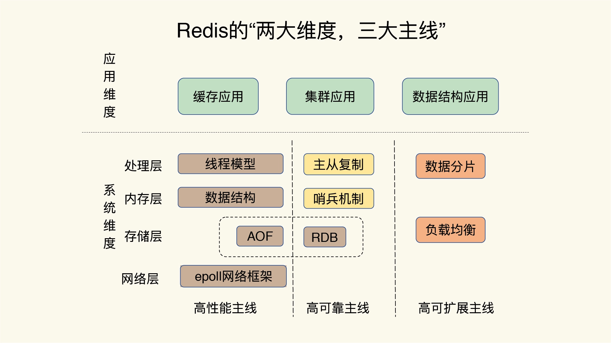
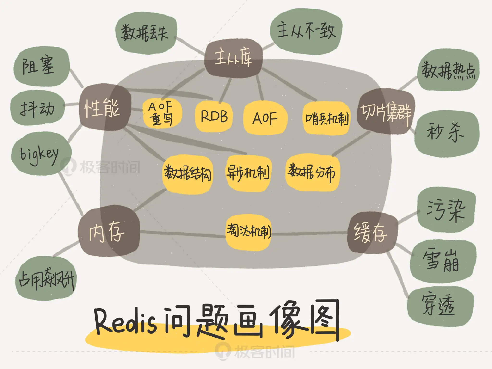
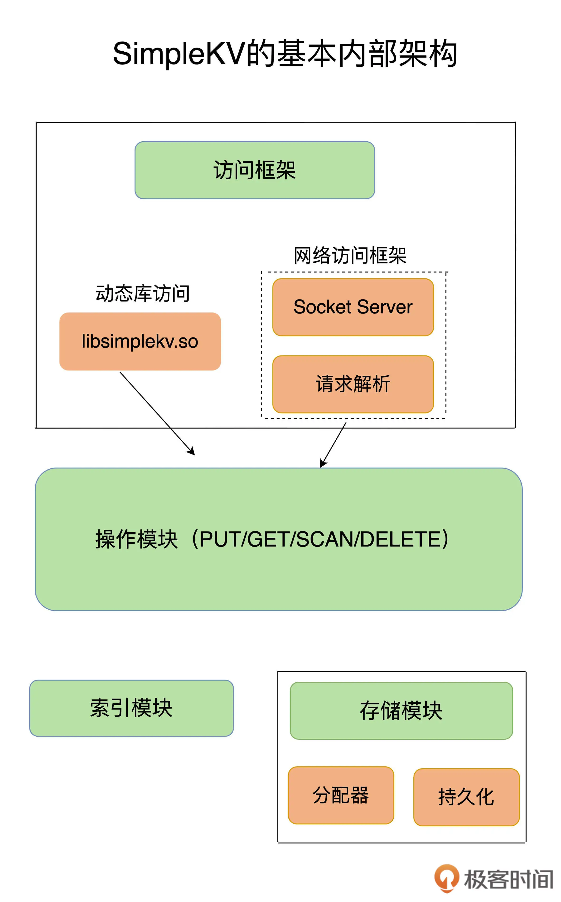
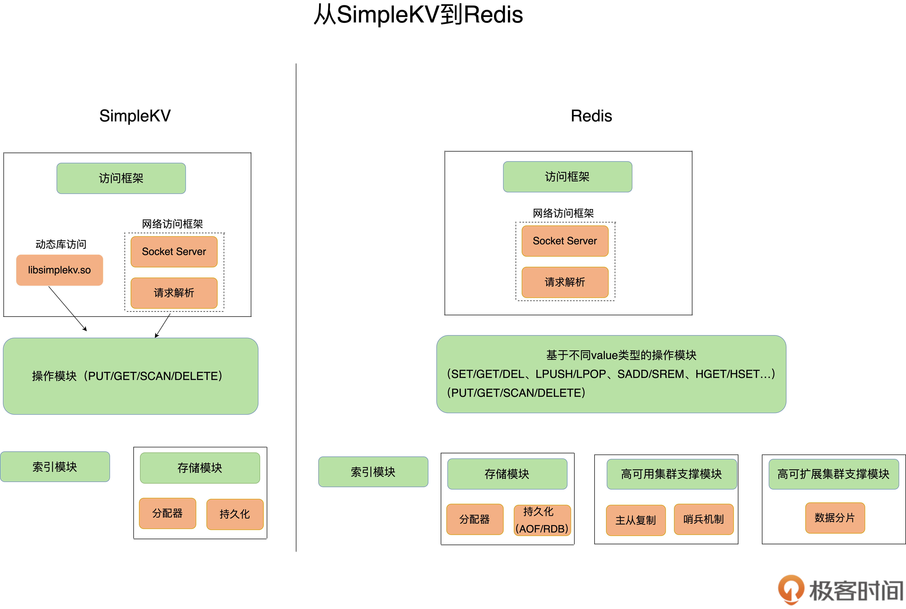
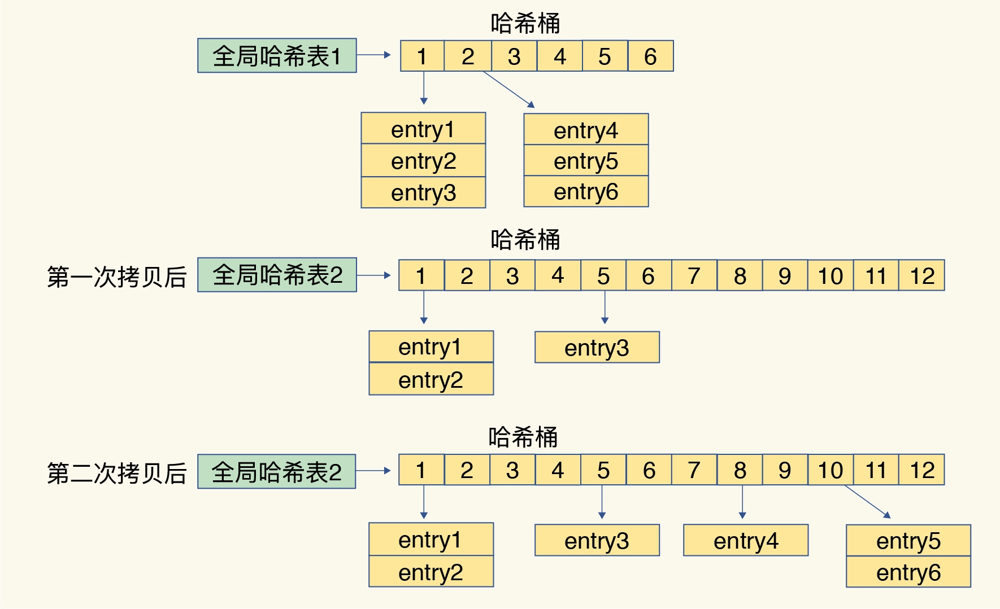
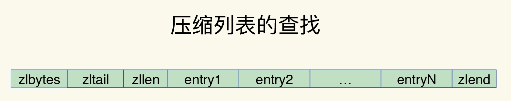
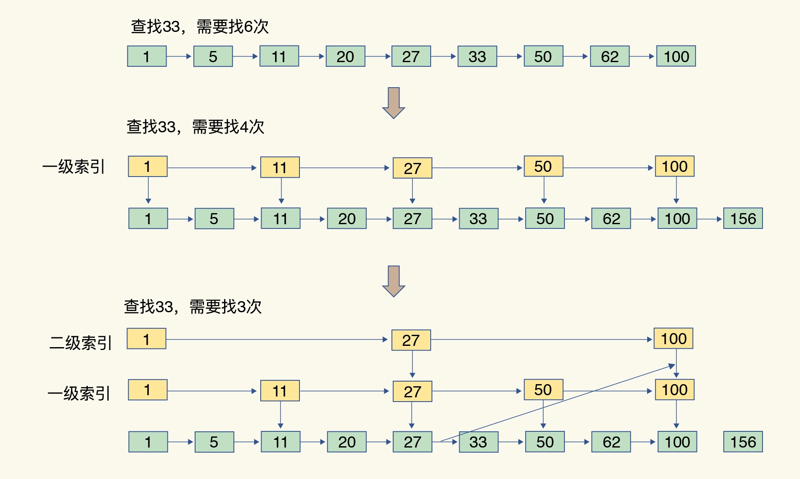
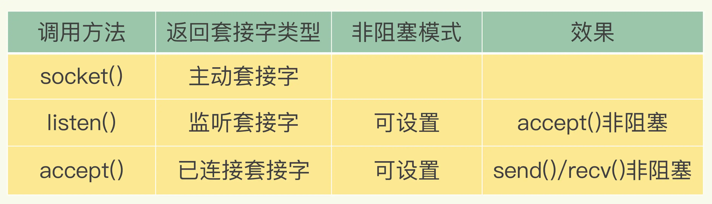
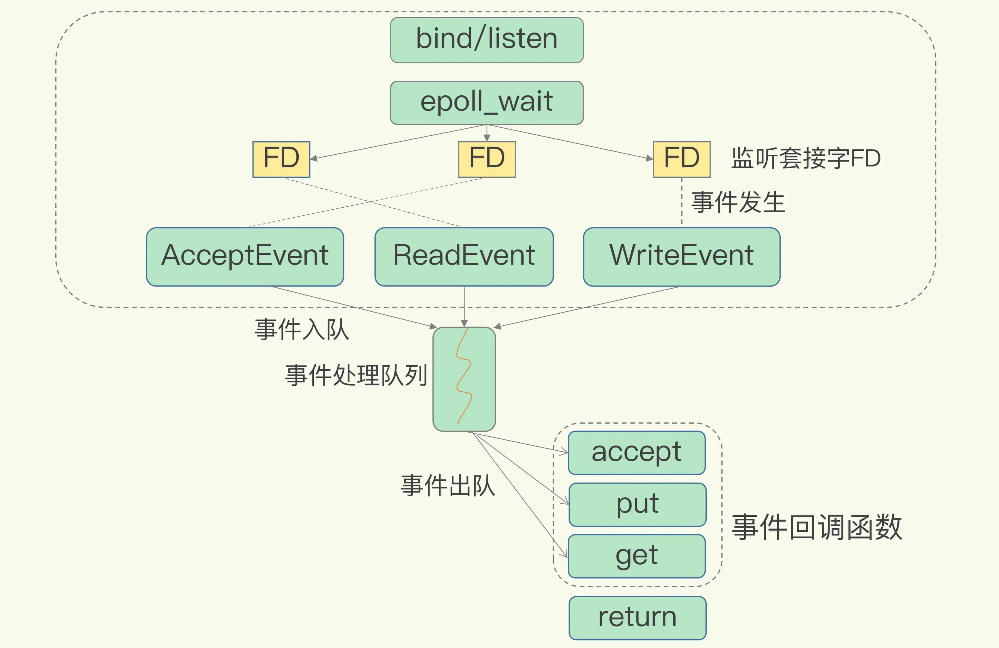
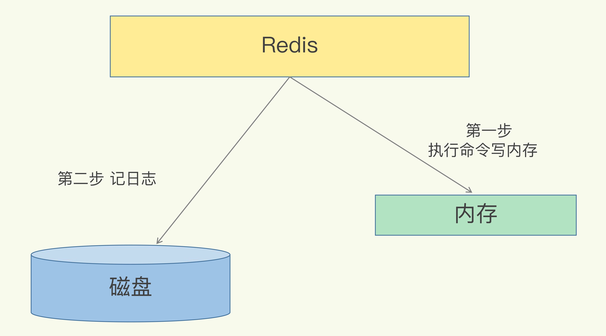

# Redis核心技术与实战

极客时间读书笔记：[开篇词 | 这样学Redis，才能技高一筹 (geekbang.org)](https://time.geekbang.org/column/article/268247)

# 基础篇

## 学习Redis

作为键值数据库，Redis 的应用非常广泛，相关的性能问题也有很多。比如说，为了保证数据的可靠性，Redis 需要在磁盘上读写 AOF 和 RDB，但在高并发场景里，这就会直接带来两个新问题：一个是写 AOF 和 RDB 会造成 Redis 性能抖动，另一个是 Redis 集群数据同步和实例恢复时，读 RDB 比较慢，限制了同步和恢复速度。

那这个问题有没有好的解决方法呢？一个可行的解决方案就是使用非易失内存 NVM，因为它既能保证高速的读写，又能快速持久化数据。

有用 Redis 做缓存的，有做数据库的，也有用做分布式锁的。在用 Redis 时会遇见的“坑”总体来说集中在这四个方面：

- <b>CPU 使用上的“坑”，例如数据结构的复杂度、跨 CPU 核的访问；</b>
- <b>内存使用上的“坑”，例如主从同步和 AOF 的内存竞争；</b>
- <b>存储持久化上的“坑”，例如在 SSD 上做快照的性能抖动；</b>
- <b>网络通信上的“坑”，例如多实例时的异常网络丢包。</b>

只关注零散的技术点，没有建立起一套完整的知识框架，缺乏系统观，但是，系统观其实是至关重要的。从某种程度上说，在解决问题时，拥有了系统观，就意味着你能有依据、有章法地定位和解决问题。

现在，很多大厂的 Redis 服务面临的请求规模很大，因此，在评估性能时，仅仅看平均延迟已经不够了。简单举个例子，假设 Redis 处理了 100 个请求，99 个请求的响应时间都是 1s，而有一个请求的响应时间是 100s。那么，如果看平均延迟，这 100 个请求的平均延迟是 1.99s，但是对于这个响应时间是 100s 的请求而言，它对应的用户体验将是非常糟糕的。如果有 100 万个请求，哪怕只有 1% 的请求是 100s，这也对应了 1 万个糟糕的用户体验。这 1% 的请求延迟就属于长尾延迟。

> 如果要把 Redis 的长尾延迟维持在一定阈值以下。你可以想一下，如果是你，你会怎么做呢？

首先，对 Redis 的线程模型做了分析。对于单线程的 Redis 而言，任何阻塞性操作都会导致长尾延迟的产生。接着，继续开始寻找可能导致阻塞的关键因素，

- 网络阻塞， Redis 网络 IO 使用了 IO 复用机制，并不会阻塞在单个客户端上。
- 键值对数据结构、持久化机制下的 fork 调用、主从库同步时的 AOF 重写，缓冲区溢出等。



- <b>高性能主线</b>，包括线程模型、数据结构、持久化网络框架；
- <b>高可靠主线</b>，包括主从复制、哨兵机制；
- <b>高可扩展主线</b>，包括数据分片、负载均衡。



学习 Redis 的整体结构可以先了解它整体的架构，了解它为什么快，哪里会存在瓶颈，然后再学习具体的应用。

## 构建一个K-V数据库

开始构造 SimpleKV 时，首先就要考虑里面可以存什么样的数据，对数据可以做什么样的操作，也就是数据模型和操作接口。它们看似简单，实际上却是我们理解 Redis 经常被用于缓存、秒杀、分布式锁等场景的重要基础。

理解了数据模型，就会明白，为什么在有些场景下，原先使用关系型数据库保存的数据，也可以用键值数据库保存。例如，用户信息（用户 ID、姓名、年龄、性别等）通常用关系型数据库保存，在这个场景下，一个用户 ID 对应一个用户信息集合，这就是键值数据库的一种数据模型，它同样能完成这一存储需求。

同时我们要了解操作接口，这样才能理解，为什么在有些场景中，使用键值数据库又不合适了。例如，同样是在上面的场景中，如果你要对多个用户的年龄计算均值，键值数据库就无法完成了。<span style="color:red">因为 K-V 只提供简单的操作接口，无法支持复杂的聚合计算。</span>

对于 Redis 来说，它到底能做什么，不能做什么呢？只有先搞懂它的数据模型和操作接口（支持什么类型的操作）才能用好。

### 可以存什么数据

对于键值数据库而言，基本的数据模型是 key-value 模型。 例如，"hello:world" 就是一个基本的 K-V 对，其中，“hello”是 key，“world”是 value。在 SimpleKV 中，key 是 String 类型，而 value 是基本数据类型，例如 String、整型等。

此处讨论的 SimpleKV 是一个简单的键值数据库，对于实际生产环境中的键值数据库来说，value 类型还可以是复杂类型。

<span style="color:red">不同键值数据库支持的 key 类型一般差异不大，而 value 类型则有较大差别。</span>我们在对键值数据库进行选型时，一个重要的考虑因素是<b>它支持的 value 类型</b>。例如，Memcached 支持的 value 类型仅为 String 类型，而 Redis 支持的 value 类型包括了 String、哈希表、列表、集合等。<b>Redis 能够在实际业务场景中得到广泛的应用，就是得益于支持多样化类型的 value。</b>

<span style="color:red">从使用的角度来说，不同 value 类型的实现，不仅可以支撑不同业务的数据需求，而且也隐含着不同数据结构在性能、空间效率等方面的差异，从而导致不同的 value 操作之间存在着差异。</span>

深入地理解了这背后的原理后，我们才能在选择 Redis value 类型和优化 Redis 性能时，做到游刃有余。

### 可以做什么操作

SimpleKV 是一个简单的键值数据库，因此，基本操作无外乎增删改查。

- PUT：新写入或更新一个 key-value 对；
- GET：根据一个 key 读取相应的 value 值；
- DELETE：根据一个 key 删除整个 key-value 对。

需要注意的是，<b>有些键值数据库的新写 / 更新操作叫 SET。</b>新写入和更新虽然是用一个操作接口，但在实际执行时，会根据 key 是否存在而执行相应的新写或更新流程。

在实际的业务场景中，我们经常会碰到这种情况：查询一个用户在一段时间内的访问记录。这种操作在键值数据库中属于 SCAN 操作，<b>即根据一段 key 的范围返回相应的 value 值。因此，PUT/GET/DELETE/SCAN 是一个键值数据库的基本操作集合。</b>

此外，实际业务场景通常还有更加丰富的需求，例如，在黑白名单应用中，需要判断某个用户是否存在。如果将该用户的 ID 作为 key，那么，可以增加 EXISTS 操作接口，用于判断某个 key 是否存在。对于一个具体的键值数据库而言，你可以通过查看操作文档，了解其详细的操作接口。

当然，当一个键值数据库的 value 类型多样化时，就需要包含相应的操作接口。例如，Redis 的 value 有列表类型，因此它的接口就要包括对列表 value 的操作。后面我也会具体介绍，不同操作对 Redis 访问效率的影响。

<b span style="color:red">键值对保存在内存还是外存？</b>

内存访问速度快，但是断电数据就消失了；外存访问速度慢，但是可以持久化保存数据。因此，如何进行设计选择，我们通常需要考虑键值数据库的主要应用场景。<b>比如，缓存场景下的数据需要能快速访问但允许丢失，那么，用于此场景的键值数据库通常采用内存保存键值数据。</b>

此处，SimpleKV 采用内存保存键值数据。

大体来说，一个键值数据库包括了<b>访问框架、索引模块、操作模块和存储模块</b>四部分（见下图）。接下来，我们就从这四个部分入手，继续构建我们的 SimpleKV。



### 采用什么访问模式

访问模式通常有两种：一种是通过函数库调用的方式供外部应用使用，比如，上图中的 libsimplekv.so，就是以动态链接库的形式链接到我们自己的程序中，提供键值存储功能；另一种是通过网络框架以 Socket 通信的形式对外提供键值对操作，这种形式可以提供广泛的键值存储服务。在上图中，我们可以看到，网络框架中包括 Socket Server 和协议解析。

不同的键值数据库服务器和客户端交互的协议并不相同，我们在对键值数据库进行二次开发、新增功能时，必须要了解和掌握键值数据库的通信协议，这样才能开发出兼容的客户端。

实际的键值数据库也基本采用上述两种方式，例如，RocksDB 以动态链接库的形式使用，而 Memcached 和 Redis 则是通过网络框架访问。后面我还会给你介绍 Redis 现有的客户端和通信协议。

通过网络框架提供键值存储服务，一方面扩大了键值数据库的受用面，但另一方面，也给键值数据库的性能、运行模型提供了不同的设计选择，带来了一些潜在的问题。

举个例子，当客户端发送一个如下的命令后，该命令会被封装在网络包中发送给键值数据库：

```http
PUT hello world
```

键值数据库网络框架接收到网络包，并按照相应的协议进行解析之后，就可以知道，客户端想写入一个键值对，并开始实际的写入流程。此时，我们会遇到一个系统设计上的问题，简单来说，就是网络连接的处理、网络请求的解析，以及数据存取的处理，是用一个线程、多个线程，还是多个进程来交互处理呢？该如何进行设计和取舍呢？我们一般把这个问题称为 I/O 模型设计。不同的 I/O 模型对键值数据库的性能和可扩展性会有不同的影响。

举个例子，如果一个线程既要处理网络连接、解析请求，又要完成数据存取，一旦某一步操作发生阻塞，整个线程就会阻塞住，这就降低了系统响应速度。如果我们采用不同线程处理不同操作，那么，某个线程被阻塞时，其他线程还能正常运行。但是，不同线程间如果需要访问共享资源，那又会产生线程竞争，也会影响系统效率，这又该怎么办呢？所以，这的确是个“两难”选择，需要我们进行精心的设计。

你可能经常听说 Redis 是单线程，那么，Redis 又是如何做到“单线程，高性能”的呢？后面我再和你好好聊一聊。

### 如何定位键值对的位置

当 SimpleKV 解析了客户端发来的请求，知道了要进行的键值对操作，此时，SimpleKV 需要查找所要操作的键值对是否存在，这依赖于键值数据库的索引模块。<b>索引的作用是让键值数据库根据 key 找到相应 value 的存储位置，进而执行操作。</b>

索引的类型有很多，常见的有哈希表、B+ 树、字典树等。不同的索引结构在性能、空间消耗、并发控制等方面具有不同的特征。如果你看过其他键值数据库，就会发现，不同键值数据库采用的索引并不相同，例如，Memcached 和 Redis 采用哈希表作为 key-value 索引，而 RocksDB 则采用跳表作为内存中 key-value 的索引。

一般而言，内存键值数据库（例如 Redis）采用哈希表作为索引，很大一部分原因在于，其键值数据基本都是保存在内存中的，而内存的高性能随机访问特性可以很好地与哈希表 O(1) 的操作复杂度相匹配。

SimpleKV 的索引根据 key 找到 value 的存储位置即可。但是，和 SimpleKV 不同，对于 Redis 而言，很有意思的一点是，它的 value 支持多种类型，当我们通过索引找到一个 key 所对应的 value 后，仍然需要从 value 的复杂结构（例如集合和列表）中进一步找到我们实际需要的数据，这个操作的效率本身就依赖于它们的实现结构。

Redis 的 value 采用的也是一些常见的高效的数据结构，这为 Redis 实现高性能访问提供了良好的支撑。

### 不同操作的具体逻辑是怎样的

SimpleKV 的<b>索引模块负责根据 key 找到相应的 value 的存储位置。</b>对于不同的操作来说，找到存储位置之后，需要进一步执行的操作的具体逻辑会有所差异。SimpleKV 的操作模块就实现了不同操作的具体逻辑：

- 对于 GET/SCAN 操作而言，此时根据 value 的存储位置返回 value 值即可；
- 对于 PUT 一个新的键值对数据而言，SimpleKV 需要为该键值对分配内存空间；
- 对于 DELETE 操作，SimpleKV 需要删除键值对，并释放相应的内存空间，这个过程由分配器完成。

对于 PUT 和 DELETE 两种操作来说，除了新写入和删除键值对，还需要分配和释放内存。

### 如何实现重启后快速提供服务

SimpleKV 采用了常用的内存分配器 glibc 的 malloc 和 free，因此，SimpleKV 并不需要特别考虑内存空间的管理问题。但是，键值数据库的键值对通常大小不一，glibc 的分配器在处理随机的大小内存块分配时，表现并不好。一旦保存的键值对数据规模过大，就可能会造成较严重的内存碎片问题。

因此，分配器是键值数据库中的一个关键因素。对于以内存存储为主的 Redis 而言，这点尤为重要。Redis 的内存分配器提供了多种选择，分配效率也不一样。

SimpleKV 虽然依赖于内存保存数据，提供快速访问，但是，我们也希望 SimpleKV 重启后能快速重新提供服务，所以，我们需要 SimpleKV 的存储模块中增加持久化功能。

不过，鉴于磁盘管理要比内存管理复杂，SimpleKV 就直接采用了文件形式，将键值数据通过调用本地文件系统的操作接口保存在磁盘上。此时，SimpleKV 只需要考虑何时将内存中的键值数据保存到文件中，就可以了。

一种方式是，对于每一个键值对，SimpleKV 都对其进行落盘保存，这虽然让 SimpleKV 的数据更加可靠，但是，因为每次都要写盘，SimpleKV 的性能会受到很大影响。

另一种方式是，SimpleKV 只是周期性地把内存中的键值数据保存到文件中，这样可以避免频繁写盘操作的性能影响。但是，一个潜在的代价是 SimpleKV 的数据仍然有丢失的风险。

和 SimpleKV 一样，Redis 也提供了持久化功能。不过，为了适应不同的业务场景，Redis 为持久化提供了诸多的执行机制和优化改进，后面再讨论 Redis 在持久化机制中的关键设计考虑。

### 小结

前面两步我们是从应用的角度进行设计的，也就是应用视角；后面四步其实就是 SimpleKV 完整的内部构造，可谓是麻雀虽小，五脏俱全。

SimpleKV 包含了一个键值数据库的基本组件，对这些组件有了了解之后，后面在学习 Redis 这个丰富版的 SimpleKV 时，就会轻松很多。

为了支持更加丰富的业务场景，Redis 对这些组件或者功能进行了扩展，或者说是进行了精细优化，从而满足了功能和性能等方面的要求。



- Redis 主要通过网络框架进行访问，而不再是动态库了，这也使得 Redis 可以作为一个基础性的网络服务进行访问，扩大了 Redis 的应用范围。
- Redis 数据模型中的 value 类型很丰富，因此也带来了更多的操作接口，例如面向列表的 LPUSH/LPOP，面向集合的 SADD/SREM 等。它们对 Redis 性能的影响非常大。
- Redis 的持久化模块能支持两种方式：日志（AOF）和快照（RDB），这两种持久化方式具有不同的优劣势，影响到 Redis 的访问性能和可靠性。
- SimpleKV 是个简单的单机键值数据库，但是，Redis 支持高可靠集群和高可扩展集群，因此，Redis 中包含了相应的集群功能支撑模块。

> SimpleKV 和 Redis 的对比

- 数据结构上：缺乏广泛的数据结构支持：比如支持范围查询的 SkipList，和 Stream 等等数据结构 
- 高可用上：缺乏哨兵或者 master-slaver 模式的高可用设计 
- 横向扩展上：缺乏集群和分片功能 
- 在内存安全性上：缺乏内存过载时候的 key 淘汰算法的支持 
- 内存利用率上：没有充分对数据结构优化提高内存利用率，例如使用压缩性的数据结构 
- 不具备事务性：无法保证多个操作的原子性
- 内存分配器：SimpleKV 就是 glibc，Redis 的分配器选择更多。

## 快速的Redis有那些慢操作

Redis 基于内存，且 Redis 使用了很多高效的数据结构，因此操作很快。<b>基于内存和高效的数据结构是 Redis 快速处理数据的基础。</b>

Redis 的底层数据结构一共有 6 种，分别是简单动态字符串、双向链表、压缩列表、哈希表、跳表和整数数组


String 类型的底层实现只有一种数据结构，也就是简单动态字符串。而 List、Hash、Set 和 Sorted Set 这四种数据类型，都有两种底层实现结构。通常情况下，我们会把这四种类型称为集合类型，它们的特点是一个键对应了一个集合的数据。

- 这些数据结构都是值的底层实现，键和值本身之间用什么结构组织？
- 为什么集合类型有那么多的底层结构，它们都是怎么组织数据的，都很快吗？
- 什么是简单动态字符串，和常用的字符串是一回事吗？

### 键值的组织结构

Redis 是一个键值对的内存数据库，其内部的存储方式采用的是哈希表。用哈希表存储 K-V 并进行快速查找。由于 Redis 的 Value 也可能是一个复杂的数据结构，因此，Value 存储的只是一个指针，一个指向数据结构的指针。不管值是 String，还是集合类型，哈希表中的元素都是指向它们的指针。


哈希表的最大好处很明显，就是让我们可以用 O(1) 的时间复杂度来快速查找到键值对——我们只需要计算键的哈希值，就可以知道它所对应的哈希桶位置，然后就可以访问相应的 entry 元素。

虽然哈希表中的查找仅依赖于哈希计算，<b>但是如果哈希表发生了冲突或者是 rehash，可能会导致操作阻塞。</b>

哈希冲突一般用拉链法进行解决。


如果冲突的元素很多，链表长度很长，那么查找元素的时间也会变得很长。因此，Redis 会对哈希表做 rehash 操作，即增加哈希桶的数量，并让逐渐增多的 entry 元素能分散报错，减少单个桶中的元素数量，减少桶中的冲突。

为了确保 rehash 操作的高效性，Redis 使用了两个全局哈希表：table1 和 table2。最开始，插入数据时，默认使用 table1，此时 table2 并未被分配空间。随着数据逐步增多，Redis 开始执行 rehash，这个过程分为三步：

- 给 table2 分配更大的空间，比如，是 table1 两倍的空间。
- 把 table1 中的数据重新映射到 table2 中。
- 释放 table1 的空间。

<span style="color:orange">用 table2 保存更多的数据，table1 则留作下一次 rehash 扩容备用。然而，一次性将大量数据映射到另一个 table 中，会造成 Redis 线程阻塞，无法服务其他请求。为了避免这个问题，Redis 采用了渐进式 rehash。</span>

> 渐进式 rehash 又是如何进行的呢？

在拷贝数据的时候，Redis 仍然正常处理客户端请求，每处理一个请求时，从 table1 中的第一个索引位置开始，顺带将这个索引位置上的所有 entries 拷贝到 table2 中；等处理下一个请求时，再顺带拷贝 table2 中下一个索引位置的 entries。Redis本身还会有一个定时任务在执行rehash，如果没有键值对操作时，这个定时任务会周期性地（例如每100ms一次）搬移一些数据到新的哈希表中，这样可以缩短整个rehash的过程。



<span style="color:orange">这样就巧妙地把一次性大量拷贝的开销，分摊到了多次处理请求的过程中，避免了耗时操作，保证了数据的快速访问。</span>

对于集合类型来说，即使找到哈希桶了，还要在集合中再进一步操作。接下来，我们来看集合类型的操作效率又是怎样的。

### 集合数据操作效率

和 String 类型不同，一个集合类型的值，第一步是通过全局哈希表找到对应的哈希桶位置，第二步是在集合中再增删改查。那么，集合的操作效率和哪些因素相关呢？

首先，与集合的底层数据结构有关。例如，使用哈希表实现的集合，要比使用链表实现的集合访问效率更高。其次，操作效率和这些操作本身的执行特点有关，比如读写一个元素的操作要比读写所有元素的效率高。

### 底层数据结构

集合类型的底层数据结构主要有 5 种：整数数组、双向链表、哈希表、压缩列表和跳表。此处重点介绍<b>压缩列表和跳表</b>。

#### 压缩链表

压缩列表实际上类似于一个数组，数组中的每一个元素都对应保存一个数据。和数组不同的是，压缩列表在表头有三个字段 zlbytes、zltail 和 zllen，分别表示列表长度、列表尾的偏移量和列表中的 entry 个数；压缩列表在表尾还有一个 zlend，表示列表结束。



在压缩列表中，如果我们要查找定位第一个元素和最后一个元素，可以通过表头三个字段的长度直接定位，复杂度是 O(1)。而查找其他元素时，就没有这么高效了，只能逐个查找，此时的复杂度就是 O(N) 了。本质上可以认为是 C 语言实现了一个直到长度和元素个数的数组。

#### 跳表

有序链表只能逐一查找元素，导致操作起来非常缓慢，于是就出现了跳表。具体来说，<b>跳表在链表的基础上，增加了多级索引，通过索引位置的几个跳转，实现数据的快速定位</b>，如下图所示：



如果我们要在链表中查找 33 这个元素，只能从头开始遍历链表，查找 6 次，直到找到 33 为止。此时，复杂度是 O(N)，查找效率很低。

为了提高查找速度，我们来增加一级索引：从第一个元素开始，每两个元素选一个出来作为索引。这些索引再通过指针指向原始的链表。例如，从前两个元素中抽取元素 1 作为一级索引，从第三、四个元素中抽取元素 11 作为一级索引。此时，我们只需要 4 次查找就能定位到元素 33 了。

如果我们还想再快，可以再增加二级索引：从一级索引中，再抽取部分元素作为二级索引。例如，从一级索引中抽取 1、27、100 作为二级索引，二级索引指向一级索引。这样，我们只需要 3 次查找，就能定位到元素 33 了。

这个查找过程就是在多级索引上跳来跳去，最后定位到元素。这也正好符合“跳”表的叫法。当数据量很大时，跳表的查找复杂度就是 O(logN)。

#### 时间复杂度

| 名称     | 时间复杂度 |
| -------- | ---------- |
| 哈希表   | $O(1)$     |
| 跳表     | $O(logN)$  |
| 双向链表 | $O(N)$     |
| 压缩列表 | $O(N)$     |
| 整数数组 | $O(N)$     |

### 不同操作的复杂度

集合类型的操作类型很多，有读写单个集合元素的，例如 HGET、HSET，也有操作多个元素的，例如 SADD，还有对整个集合进行遍历操作的，例如 SMEMBERS。这么多操作，它们的复杂度也各不相同。而复杂度的高低又是我们选择集合类型的重要依据。

- 单元素操作是基础；
- 范围操作非常耗时；
- 统计操作通常高效；
- 例外情况只有几个。

<b>第一，单元素操作，是指每一种集合类型对单个数据实现的增删改查操作。</b>例如，Hash 类型的 HGET、HSET 和 HDEL，Set 类型的 SADD、SREM、SRANDMEMBER 等。这些操作的复杂度由集合采用的数据结构决定，例如，HGET、HSET 和 HDEL 是对哈希表做操作，所以它们的复杂度都是 O(1)；Set 类型用哈希表作为底层数据结构时，它的 SADD、SREM、SRANDMEMBER 复杂度也是 O(1)。

集合类型支持同时对多个元素进行增删改查，例如 Hash 类型的 HMGET 和 HMSET，Set 类型的 SADD 也支持同时增加多个元素。此时，这些操作的复杂度，就是由单个元素操作复杂度和元素个数决定的。例如，HMSET 增加 M 个元素时，复杂度就从 O(1) 变成 O(M) 了。

<b>第二，范围操作，是指集合类型中的遍历操作，可以返回集合中的所有数据</b>，比如 Hash 类型的 HGETALL 和 Set 类型的 SMEMBERS，或者返回一个范围内的部分数据，比如 List 类型的 LRANGE 和 ZSet 类型的 ZRANGE。<b>这类操作的复杂度一般是 O(N)，比较耗时，我们应该尽量避免。</b>

不过，Redis 从 2.8 版本开始提供了 SCAN 系列操作（包括 HSCAN，SSCAN 和 ZSCAN），这类操作实现了渐进式遍历，每次只返回有限数量的数据。这样一来，相比于 HGETALL、SMEMBERS 这类操作来说，就避免了一次性返回所有元素而导致的 Redis 阻塞。

<b>第三，统计操作，是指集合类型对集合中所有元素个数的记录，例如 LLEN 和 SCARD</b>。这类操作复杂度只有 O(1)，这是因为当集合类型采用压缩列表、双向链表、整数数组这些数据结构时，这些结构中专门记录了元素的个数统计，因此可以高效地完成相关操作

第四，例外情况，是指某些数据结构的特殊记录，例如<b>压缩列表和双向链表都会记录表头和表尾的偏移量</b>。这样一来，对于 List 类型的 LPOP、RPOP、LPUSH、RPUSH 这四个操作来说，它们是在列表的头尾增删元素，这就可以通过偏移量直接定位，所以它们的复杂度也只有 O(1)，可以实现快速操作。

### 补充

SCAN 命令是一个基于游标的迭代器，每次被调用之后， 都会向用户返回一个新的游标， 用户在下次迭代时需要使用这个新游标作为 SCAN 命令的游标参数， 以此来延续之前的迭代过程。在查找指定范围的数据时，可以使用 SCAN 命令逐步获取数据，避免 Redis 阻塞。

## 为什么Redis快

通常说，Redis 是单线程，主要是指 Redis 的网络 IO 和键值对读写是由一个线程来完成的，这也是 Redis 对外提供键值存储服务的主要流程。但 Redis 的其他功能，比如持久化、异步删除、集群数据同步等，其实是由额外的线程执行的。所以，严格来说，Redis 并不是单线程，但是我们一般把 Redis 称为单线程高性能。

### Redis为什么用单线程

要更好地理解 Redis 为什么用单线程，就要先了解多线程的开销。

在资源合理分配的情况下，多线程可以提高系统吞吐量。但是如果采用了多线程，如果没有良好的系统设计，多线程可能会拉低系统的吞吐量。

当有多个线程要修改这个共享资源时，为了保证共享资源的正确性，就需要有额外的机制进行保证，而这个额外的机制，就会带来额外的开销。比如，多线程访问同一个 list，就要进行并发控制，线程上下文切换或者自旋等操作。

并发访问控制一直是多线程开发中的一个难点问题，如果没有精细的设计，比如说，只是简单地采用一个粗粒度互斥锁，就会出现不理想的结果：即使增加了线程，大部分线程也在等待获取访问共享资源的互斥锁，并行变串行，系统吞吐率并没有随着线程的增加而增加。

而且，采用多线程开发一般会引入同步原语来保护共享资源的并发访问，这也会降低系统代码的易调试性和可维护性。为了避免这些问题，Redis 直接采用了单线程模式。

### 单线程Redis为什么快

<b>通常来说，单线程的处理能力要比多线程差很多，但是 Redis 却能使用单线程模型达到每秒数十万级别的处理能力</b>，这是为什么呢？其实，这是 Redis 多方面设计选择的一个综合结果。

一方面，Redis 的大部分操作在内存上完成，再加上它采用了高效的数据结构，例如哈希表和跳表，这是它实现高性能的一个重要原因。另一方面，就是 <b>Redis 采用了多路复用机制，使其在网络 IO 操作中能并发处理大量的客户端请求，实现高吞吐率</b>。

首先，我们要弄明白网络操作的基本 IO 模型和潜在的阻塞点。毕竟，Redis 采用单线程进行 IO，如果线程被阻塞了，就无法进行多路复用了。

### 基本IO模型与阻塞点


在网络 IO 操作中，<span style="color:red">有潜在的阻塞点，分别是 accept() 和 recv()。</span>当 Redis 监听到一个客户端有连接请求，但一直未能成功建立起连接时，会阻塞在 accept() 函数这里，导致其他客户端无法和 Redis 建立连接。类似的，当 Redis 通过 recv() 从一个客户端读取数据时，如果数据一直没有到达，Redis 也会一直阻塞在 recv()。

这就导致 Redis 整个线程阻塞，无法处理其他客户端请求，效率很低。不过，幸运的是，socket 网络模型本身支持非阻塞模式。

### 非阻塞模式



设置非阻塞模式的 accept，如果 Redis 调用 accept 一直未有连接请求达到，Redis 线程可以返回处理其他操作，不用一直等待。

Redis 线程可以不用继续等待，但是会有一个机制继续在监听套接字上等待后续连接请求，并在有请求时通知 Redis。

recv 的非阻塞模式也是类似的。

### 基于多路复用的高性能 I/O 模型

Linux 中的 IO 多路复用机制是指一个线程处理多个 IO 流，就是我们经常听到的 select/epoll 机制。简单来说，在 Redis 只运行单线程的情况下，该机制允许内核中，同时存在多个监听套接字和已连接套接字。内核会一直监听这些套接字上的连接请求或数据请求。一旦有请求到达，就会交给 Redis 线程处理，这就实现了一个 Redis 线程处理多个 IO 流的效果。

下图就是基于多路复用的 Redis IO 模型。图中的多个 FD 就是刚才所说的多个套接字。Redis 网络框架调用 epoll 机制，让内核监听这些套接字。此时，Redis 线程不会阻塞在某一个套接字上。因此，Redis 可以同时监听多个请求，并及时处理请求。



select/epoll 提供了基于事件的回调机制，可以在请求到达时通知 Redis 线程。即针对不同事件的发生，调用相应的处理函数。

那么，回调机制是怎么工作的呢？其实，select/epoll 一旦监测到 FD 上有请求到达时，就会触发相应的事件。

这些事件会被放进一个事件队列，Redis 单线程对该事件队列不断进行处理。这样一来，Redis 无需一直轮询是否有请求实际发生，这就可以避免造成 CPU 资源浪费。同时，Redis 在对事件队列中的事件进行处理时，会调用相应的处理函数，这就实现了基于事件的回调。因为 Redis 一直在对事件队列进行处理，所以能及时响应客户端请求，提升 Redis 的响应性能。

Redis 单线程是指它对网络 IO 和数据读写的操作采用了一个线程，而采用单线程的一个核心原因是避免多线程开发的并发控制问题。单线程的 Redis 也能获得高性能，跟多路复用的 IO 模型密切相关，因为这避免了 accept() 和 send()/recv() 潜在的网络 IO 操作阻塞点。 

## AOF日志

用 Redis 做缓存，如果 Redis 服务器宕机了，内存中的数据会全部丢失。如果从后端数据库恢复这些数据，成本高，性能低。

- 需要频繁访问数据库，会给数据库带来巨大的压力。
- 这些数据是从慢速数据库中读取出来的，读取速度慢，在加载完数据到 Redis 前系统响应会很慢。

Redis 提供了数据持久化机制，避免从后端数据库中进行恢复。

<span style="color:orange">目前，Redis 的持久化主要有两大机制，即 AOF（Append Only File）日志和 RDB 快照。</span>

### AOF日志的实现

我们比较熟悉的是数据库的写前日志（Write Ahead Log, WAL），也就是说，在实际写数据前，先把修改的数据记到日志文件中（MySQL 的 redo log，实现事务的持久性），以便故障时进行恢复。不过，<span style="color:red">AOF 日志正好相反，它是写后日志，“写后”的意思是 Redis 是先执行命令，把数据写入内存，然后才记录日志</span>，如下图所示：



传统数据库的日志，例如 redo log（重做日志），记录的是修改后的数据，而 AOF 里记录的是 Redis 收到的每一条命令，这些命令是以文本形式保存的