# Redis核心技术与实战

极客时间读书笔记：[开篇词 | 这样学Redis，才能技高一筹 (geekbang.org)](https://time.geekbang.org/column/article/268247)

# 基础篇

## Redis介绍

作为键值数据库，Redis 的应用非常广泛，相关的性能问题也有很多。比如说，为了保证数据的可靠性，Redis 需要在磁盘上读写 AOF 和 RDB，但在高并发场景里，这就会直接带来两个新问题：一个是写 AOF 和 RDB 会造成 Redis 性能抖动，另一个是 Redis 集群数据同步和实例恢复时，读 RDB 比较慢，限制了同步和恢复速度。

那这个问题有没有好的解决方法呢？一个可行的解决方案就是使用非易失内存 NVM，因为它既能保证高速的读写，又能快速持久化数据。

有用 Redis 做缓存的，有做数据库的，也有用做分布式锁的。在用 Redis 时会遇见的“坑”总体来说集中在这四个方面：

- <b>CPU 使用上的“坑”，例如数据结构的复杂度、跨 CPU 核的访问；</b>
- <b>内存使用上的“坑”，例如主从同步和 AOF 的内存竞争；</b>
- <b>存储持久化上的“坑”，例如在 SSD 上做快照的性能抖动；</b>
- <b>网络通信上的“坑”，例如多实例时的异常网络丢包。</b>

只关注零散的技术点，没有建立起一套完整的知识框架，缺乏系统观，但是，系统观其实是至关重要的。从某种程度上说，在解决问题时，拥有了系统观，就意味着你能有依据、有章法地定位和解决问题。

现在，很多大厂的 Redis 服务面临的请求规模很大，因此，在评估性能时，仅仅看平均延迟已经不够了。简单举个例子，假设 Redis 处理了 100 个请求，99 个请求的响应时间都是 1s，而有一个请求的响应时间是 100s。那么，如果看平均延迟，这 100 个请求的平均延迟是 1.99s，但是对于这个响应时间是 100s 的请求而言，它对应的用户体验将是非常糟糕的。如果有 100 万个请求，哪怕只有 1% 的请求是 100s，这也对应了 1 万个糟糕的用户体验。这 1% 的请求延迟就属于长尾延迟。

> 如果要把 Redis 的长尾延迟维持在一定阈值以下。你可以想一下，如果是你，你会怎么做呢？

首先，对 Redis 的线程模型做了分析。对于单线程的 Redis 而言，任何阻塞性操作都会导致长尾延迟的产生。接着，继续开始寻找可能导致阻塞的关键因素，

- 网络阻塞， Redis 网络 IO 使用了 IO 复用机制，并不会阻塞在单个客户端上。
- 键值对数据结构、持久化机制下的 fork 调用、主从库同步时的 AOF 重写，缓冲区溢出等。


- <b>高性能主线</b>，包括线程模型、数据结构、持久化网络框架；
- <b>高可靠主线</b>，包括主从复制、哨兵机制；
- <b>高可扩展主线</b>，包括数据分片、负载均衡。


学习 Redis 的整体结构可以先了解它整体的架构，了解它为什么快，哪里会存在瓶颈，然后再学习具体的应用。

## 构建一个K-V数据库

开始构造 SimpleKV 时，首先就要考虑里面可以存什么样的数据，对数据可以做什么样的操作，也就是数据模型和操作接口。它们看似简单，实际上却是我们理解 Redis 经常被用于缓存、秒杀、分布式锁等场景的重要基础。

理解了数据模型，就会明白，为什么在有些场景下，原先使用关系型数据库保存的数据，也可以用键值数据库保存。例如，用户信息（用户 ID、姓名、年龄、性别等）通常用关系型数据库保存，在这个场景下，一个用户 ID 对应一个用户信息集合，这就是键值数据库的一种数据模型，它同样能完成这一存储需求。

同时我们要了解操作接口，这样才能理解，为什么在有些场景中，使用键值数据库又不合适了。例如，同样是在上面的场景中，如果你要对多个用户的年龄计算均值，键值数据库就无法完成了。<span style="color:red">因为 K-V 只提供简单的操作接口，无法支持复杂的聚合计算。</span>

对于 Redis 来说，它到底能做什么，不能做什么呢？只有先搞懂它的数据模型和操作接口（支持什么类型的操作）才能用好。

### 可以存什么数据

对于键值数据库而言，基本的数据模型是 key-value 模型。 例如，"hello:world" 就是一个基本的 K-V 对，其中，“hello”是 key，“world”是 value。在 SimpleKV 中，key 是 String 类型，而 value 是基本数据类型，例如 String、整型等。

此处讨论的 SimpleKV 是一个简单的键值数据库，对于实际生产环境中的键值数据库来说，value 类型还可以是复杂类型。

<span style="color:red">不同键值数据库支持的 key 类型一般差异不大，而 value 类型则有较大差别。</span>我们在对键值数据库进行选型时，一个重要的考虑因素是<b>它支持的 value 类型</b>。例如，Memcached 支持的 value 类型仅为 String 类型，而 Redis 支持的 value 类型包括了 String、哈希表、列表、集合等。<b>Redis 能够在实际业务场景中得到广泛的应用，就是得益于支持多样化类型的 value。</b>

<span style="color:red">从使用的角度来说，不同 value 类型的实现，不仅可以支撑不同业务的数据需求，而且也隐含着不同数据结构在性能、空间效率等方面的差异，从而导致不同的 value 操作之间存在着差异。</span>

深入地理解了这背后的原理后，我们才能在选择 Redis value 类型和优化 Redis 性能时，做到游刃有余。

### 可以做什么操作

SimpleKV 是一个简单的键值数据库，因此，基本操作无外乎增删改查。

- PUT：新写入或更新一个 key-value 对；
- GET：根据一个 key 读取相应的 value 值；
- DELETE：根据一个 key 删除整个 key-value 对。

需要注意的是，<b>有些键值数据库的新写 / 更新操作叫 SET。</b>新写入和更新虽然是用一个操作接口，但在实际执行时，会根据 key 是否存在而执行相应的新写或更新流程。

在实际的业务场景中，我们经常会碰到这种情况：查询一个用户在一段时间内的访问记录。这种操作在键值数据库中属于 SCAN 操作，<b>即根据一段 key 的范围返回相应的 value 值。因此，PUT/GET/DELETE/SCAN 是一个键值数据库的基本操作集合。</b>

此外，实际业务场景通常还有更加丰富的需求，例如，在黑白名单应用中，需要判断某个用户是否存在。如果将该用户的 ID 作为 key，那么，可以增加 EXISTS 操作接口，用于判断某个 key 是否存在。对于一个具体的键值数据库而言，你可以通过查看操作文档，了解其详细的操作接口。

当然，当一个键值数据库的 value 类型多样化时，就需要包含相应的操作接口。例如，Redis 的 value 有列表类型，因此它的接口就要包括对列表 value 的操作。后面我也会具体介绍，不同操作对 Redis 访问效率的影响。

<b span style="color:red">键值对保存在内存还是外存？</b>

内存访问速度快，但是断电数据就消失了；外存访问速度慢，但是可以持久化保存数据。因此，如何进行设计选择，我们通常需要考虑键值数据库的主要应用场景。<b>比如，缓存场景下的数据需要能快速访问但允许丢失，那么，用于此场景的键值数据库通常采用内存保存键值数据。</b>

此处，SimpleKV 采用内存保存键值数据。

大体来说，一个键值数据库包括了<b>访问框架、索引模块、操作模块和存储模块</b>四部分（见下图）。接下来，我们就从这四个部分入手，继续构建我们的 SimpleKV。


### 采用什么访问模式

访问模式通常有两种：一种是通过函数库调用的方式供外部应用使用，比如，上图中的 libsimplekv.so，就是以动态链接库的形式链接到我们自己的程序中，提供键值存储功能；另一种是通过网络框架以 Socket 通信的形式对外提供键值对操作，这种形式可以提供广泛的键值存储服务。在上图中，我们可以看到，网络框架中包括 Socket Server 和协议解析。

不同的键值数据库服务器和客户端交互的协议并不相同，我们在对键值数据库进行二次开发、新增功能时，必须要了解和掌握键值数据库的通信协议，这样才能开发出兼容的客户端。

实际的键值数据库也基本采用上述两种方式，例如，RocksDB 以动态链接库的形式使用，而 Memcached 和 Redis 则是通过网络框架访问。后面我还会给你介绍 Redis 现有的客户端和通信协议。

通过网络框架提供键值存储服务，一方面扩大了键值数据库的受用面，但另一方面，也给键值数据库的性能、运行模型提供了不同的设计选择，带来了一些潜在的问题。

举个例子，当客户端发送一个如下的命令后，该命令会被封装在网络包中发送给键值数据库：

```http
PUT hello world
```

键值数据库网络框架接收到网络包，并按照相应的协议进行解析之后，就可以知道，客户端想写入一个键值对，并开始实际的写入流程。此时，我们会遇到一个系统设计上的问题，简单来说，就是网络连接的处理、网络请求的解析，以及数据存取的处理，是用一个线程、多个线程，还是多个进程来交互处理呢？该如何进行设计和取舍呢？我们一般把这个问题称为 I/O 模型设计。不同的 I/O 模型对键值数据库的性能和可扩展性会有不同的影响。

举个例子，如果一个线程既要处理网络连接、解析请求，又要完成数据存取，一旦某一步操作发生阻塞，整个线程就会阻塞住，这就降低了系统响应速度。如果我们采用不同线程处理不同操作，那么，某个线程被阻塞时，其他线程还能正常运行。但是，不同线程间如果需要访问共享资源，那又会产生线程竞争，也会影响系统效率，这又该怎么办呢？所以，这的确是个“两难”选择，需要我们进行精心的设计。

### 如何定位键值对的位置

当 SimpleKV 解析了客户端发来的请求，知道了要进行的键值对操作，此时，SimpleKV 需要查找所要操作的键值对是否存在，这依赖于键值数据库的索引模块。<b>索引的作用是让键值数据库根据 key 找到相应 value 的存储位置，进而执行操作。</b>

索引的类型有很多，常见的有哈希表、B+ 树、字典树等。不同的索引结构在性能、空间消耗、并发控制等方面具有不同的特征。如果你看过其他键值数据库，就会发现，不同键值数据库采用的索引并不相同，例如，Memcached 和 Redis 采用哈希表作为 key-value 索引，而 RocksDB 则采用跳表作为内存中 key-value 的索引。

一般而言，内存键值数据库（例如 Redis）采用哈希表作为索引，很大一部分原因在于，其键值数据基本都是保存在内存中的，而内存的高性能随机访问特性可以很好地与哈希表 O(1) 的操作复杂度相匹配。

SimpleKV 的索引根据 key 找到 value 的存储位置即可。但是，和 SimpleKV 不同，对于 Redis 而言，很有意思的一点是，它的 value 支持多种类型，当我们通过索引找到一个 key 所对应的 value 后，仍然需要从 value 的复杂结构（例如集合和列表）中进一步找到我们实际需要的数据，这个操作的效率本身就依赖于它们的实现结构。

Redis 的 value 采用的也是一些常见的高效的数据结构，这为 Redis 实现高性能访问提供了良好的支撑。

### 不同操作的具体逻辑是怎样的

SimpleKV 的<b>索引模块负责根据 key 找到相应的 value 的存储位置。</b>对于不同的操作来说，找到存储位置之后，需要进一步执行的操作的具体逻辑会有所差异。SimpleKV 的操作模块就实现了不同操作的具体逻辑：

- 对于 GET/SCAN 操作而言，此时根据 value 的存储位置返回 value 值即可；
- 对于 PUT 一个新的键值对数据而言，SimpleKV 需要为该键值对分配内存空间；
- 对于 DELETE 操作，SimpleKV 需要删除键值对，并释放相应的内存空间，这个过程由分配器完成。

对于 PUT 和 DELETE 两种操作来说，除了新写入和删除键值对，还需要分配和释放内存。

### 如何实现重启后快速提供服务

SimpleKV 采用了常用的内存分配器 glibc 的 malloc 和 free，因此，SimpleKV 并不需要特别考虑内存空间的管理问题。但是，键值数据库的键值对通常大小不一，glibc 的分配器在处理随机的大小内存块分配时，表现并不好。一旦保存的键值对数据规模过大，就可能会造成较严重的内存碎片问题。因此，分配器是键值数据库中的一个关键因素。对于以内存存储为主的 Redis 而言，这点尤为重要。Redis 的内存分配器提供了多种选择，分配效率也不一样。

SimpleKV 虽然依赖于内存保存数据，提供快速访问，但是，我们也希望 SimpleKV 重启后能快速重新提供服务，所以，我们需要 SimpleKV 的存储模块中增加持久化功能。

不过，鉴于磁盘管理要比内存管理复杂，SimpleKV 就直接采用了文件形式，将键值数据通过调用本地文件系统的操作接口保存在磁盘上。此时，SimpleKV 只需要考虑何时将内存中的键值数据保存到文件中，就可以了。

- 一种方式是，对于每一个键值对，SimpleKV 都对其进行落盘保存，这虽然让 SimpleKV 的数据更加可靠，但是，因为每次都要写盘，SimpleKV 的性能会受到很大影响。
- 另一种方式是，SimpleKV 只是周期性地把内存中的键值数据保存到文件中，这样可以避免频繁写盘操作的性能影响。但是，一个潜在的代价是 SimpleKV 的数据仍然有丢失的风险。

Redis 也提供了持久化功能。不过，为了适应不同的业务场景，Redis 为持久化提供了诸多的执行机制和优化改进，[Redis 持久化](###AOF日志)。

### 小结

前面两步我们是从应用的角度进行设计的，也就是应用视角；后面四步其实就是 SimpleKV 完整的内部构造，可谓是麻雀虽小，五脏俱全。

SimpleKV 包含了一个键值数据库的基本组件，对这些组件有了了解之后，后面在学习 Redis 这个丰富版的 SimpleKV 时，就会轻松很多。

为了支持更加丰富的业务场景，Redis 对这些组件或者功能进行了扩展，或者说是进行了精细优化，从而满足了功能和性能等方面的要求。


- Redis 主要通过网络框架进行访问，而不再是动态库了，这也使得 Redis 可以作为一个基础性的网络服务进行访问，扩大了 Redis 的应用范围。
- Redis 数据模型中的 value 类型很丰富，因此也带来了更多的操作接口，例如面向列表的 LPUSH/LPOP，面向集合的 SADD/SREM 等。它们对 Redis 性能的影响非常大。
- Redis 的持久化模块能支持两种方式：日志（AOF）和快照（RDB），这两种持久化方式具有不同的优劣势，影响到 Redis 的访问性能和可靠性。
- SimpleKV 是个简单的单机键值数据库，但是，Redis 支持高可靠集群和高可扩展集群，因此，Redis 中包含了相应的集群功能支撑模块。

> SimpleKV 和 Redis 的对比

- 数据结构上：缺乏广泛的数据结构支持：比如支持范围查询的 SkipList，和 Stream 等等数据结构 
- 高可用上：缺乏哨兵或者 master-slaver 模式的高可用设计 
- 横向扩展上：缺乏集群和分片功能 
- 在内存安全性上：缺乏内存过载时候的 key 淘汰算法的支持 
- 内存利用率上：没有充分对数据结构优化提高内存利用率，例如使用压缩性的数据结构 
- 不具备事务性：无法保证多个操作的原子性
- 内存分配器：SimpleKV 就是 glibc，Redis 的分配器选择更多。

## 快速的Redis有那些慢操作

Redis 基于内存，且 Redis 使用了很多高效的数据结构，因此操作很快。<b>基于内存和高效的数据结构是 Redis 快速处理数据的基础。</b>

Redis 的底层数据结构一共有 6 种，分别是简单动态字符串、双向链表、压缩列表、哈希表、跳表和整数数组


String 类型的底层实现只有一种数据结构，也就是简单动态字符串。而 List、Hash、Set 和 Sorted Set 这四种数据类型，都有两种底层实现结构。通常情况下，我们会把这四种类型称为集合类型，它们的特点是一个键对应了一个集合的数据。

- 这些数据结构都是值的底层实现，键和值本身之间用什么结构组织？
- 为什么集合类型有那么多的底层结构，它们都是怎么组织数据的，都很快吗？
- 什么是简单动态字符串，和常用的字符串是一回事吗？

### 键值的组织结构

Redis 是一个键值对的内存数据库，其内部的存储方式采用的是哈希表。用哈希表存储 K-V 并进行快速查找。由于 Redis 的 Value 也可能是一个复杂的数据结构，因此，Value 存储的只是一个指针，一个指向数据结构的指针。不管值是 String，还是集合类型，哈希表中的元素都是指向它们的指针。


哈希表的最大好处很明显，就是让我们可以用 O(1) 的时间复杂度来快速查找到键值对——我们只需要计算键的哈希值，就可以知道它所对应的哈希桶位置，然后就可以访问相应的 entry 元素。

虽然哈希表中的查找仅依赖于哈希计算，<b>但是如果哈希表发生了冲突或者是 rehash，可能会导致操作阻塞。</b>

哈希冲突一般用拉链法进行解决。


如果冲突的元素很多，链表长度很长，那么查找元素的时间也会变得很长。因此，Redis 会对哈希表做 rehash 操作，即增加哈希桶的数量，并让逐渐增多的 entry 元素能分散报错，减少单个桶中的元素数量，减少桶中的冲突。

为了确保 rehash 操作的高效性，Redis 使用了两个全局哈希表：table1 和 table2。最开始，插入数据时，默认使用 table1，此时 table2 并未被分配空间。随着数据逐步增多，Redis 开始执行 rehash，这个过程分为三步：

- 给 table2 分配更大的空间，比如，是 table1 两倍的空间。
- 把 table1 中的数据重新映射到 table2 中。
- 释放 table1 的空间。

<span style="color:orange">用 table2 保存更多的数据，table1 则留作下一次 rehash 扩容备用。然而，一次性将大量数据映射到另一个 table 中，会造成 Redis 线程阻塞，无法服务其他请求。为了避免这个问题，Redis 采用了渐进式 rehash。</span>

> 渐进式 rehash 又是如何进行的呢？

在拷贝数据的时候，Redis 仍然正常处理客户端请求，每处理一个请求时，从 table1 中的第一个索引位置开始，顺带将这个索引位置上的所有 entries 拷贝到 table2 中；等处理下一个请求时，再顺带拷贝 table2 中下一个索引位置的 entries。Redis本身还会有一个定时任务在执行rehash，如果没有键值对操作时，这个定时任务会周期性地（例如每100ms一次）搬移一些数据到新的哈希表中，这样可以缩短整个rehash的过程。


<span style="color:orange">这样就巧妙地把一次性大量拷贝的开销，分摊到了多次处理请求的过程中，避免了耗时操作，保证了数据的快速访问。</span>

对于集合类型来说，即使找到哈希桶了，还要在集合中再进一步操作。接下来，我们来看集合类型的操作效率又是怎样的。

### 集合数据操作效率

和 String 类型不同，一个集合类型的值，第一步是通过全局哈希表找到对应的哈希桶位置，第二步是在集合中再增删改查。那么，集合的操作效率和哪些因素相关呢？

首先，与集合的底层数据结构有关。例如，使用哈希表实现的集合，要比使用链表实现的集合访问效率更高。其次，操作效率和这些操作本身的执行特点有关，比如读写一个元素的操作要比读写所有元素的效率高。

### 底层数据结构

集合类型的底层数据结构主要有 5 种：整数数组、双向链表、哈希表、压缩列表和跳表。此处重点介绍<b>压缩列表和跳表</b>。

#### 压缩链表

压缩列表实际上类似于一个数组，数组中的每一个元素都对应保存一个数据。和数组不同的是，压缩列表在表头有三个字段 zlbytes、zltail 和 zllen，分别表示列表长度、列表尾的偏移量和列表中的 entry 个数；压缩列表在表尾还有一个 zlend，表示列表结束。


在压缩列表中，如果我们要查找定位第一个元素和最后一个元素，可以通过表头三个字段的长度直接定位，复杂度是 O(1)。而查找其他元素时，就没有这么高效了，只能逐个查找，此时的复杂度就是 O(N) 了。本质上可以认为是 C 语言实现了一个直到长度和元素个数的数组。

#### 跳表

有序链表只能逐一查找元素，导致操作起来非常缓慢，于是就出现了跳表。具体来说，<b>跳表在链表的基础上，增加了多级索引，通过索引位置的几个跳转，实现数据的快速定位</b>，如下图所示：


如果我们要在链表中查找 33 这个元素，只能从头开始遍历链表，查找 6 次，直到找到 33 为止。此时，复杂度是 O(N)，查找效率很低。

为了提高查找速度，我们来增加一级索引：从第一个元素开始，每两个元素选一个出来作为索引。这些索引再通过指针指向原始的链表。例如，从前两个元素中抽取元素 1 作为一级索引，从第三、四个元素中抽取元素 11 作为一级索引。此时，我们只需要 4 次查找就能定位到元素 33 了。

如果我们还想再快，可以再增加二级索引：从一级索引中，再抽取部分元素作为二级索引。例如，从一级索引中抽取 1、27、100 作为二级索引，二级索引指向一级索引。这样，我们只需要 3 次查找，就能定位到元素 33 了。

这个查找过程就是在多级索引上跳来跳去，最后定位到元素。这也正好符合“跳”表的叫法。当数据量很大时，跳表的查找复杂度就是 O(logN)。

#### 时间复杂度

| 名称     | 时间复杂度 |
| -------- | ---------- |
| 哈希表   | $O(1)$     |
| 跳表     | $O(logN)$  |
| 双向链表 | $O(N)$     |
| 压缩列表 | $O(N)$     |
| 整数数组 | $O(N)$     |

### 不同操作的复杂度

集合类型的操作类型很多，有读写单个集合元素的，例如 HGET、HSET，也有操作多个元素的，例如 SADD，还有对整个集合进行遍历操作的，例如 SMEMBERS。这么多操作，它们的复杂度也各不相同。而复杂度的高低又是我们选择集合类型的重要依据。

- 单元素操作是基础；
- 范围操作非常耗时；
- 统计操作通常高效；
- 例外情况只有几个。

<b>第一，单元素操作，是指每一种集合类型对单个数据实现的增删改查操作。</b>例如，Hash 类型的 HGET、HSET 和 HDEL，Set 类型的 SADD、SREM、SRANDMEMBER 等。这些操作的复杂度由集合采用的数据结构决定，例如，HGET、HSET 和 HDEL 是对哈希表做操作，所以它们的复杂度都是 O(1)；Set 类型用哈希表作为底层数据结构时，它的 SADD、SREM、SRANDMEMBER 复杂度也是 O(1)。

集合类型支持同时对多个元素进行增删改查，例如 Hash 类型的 HMGET 和 HMSET，Set 类型的 SADD 也支持同时增加多个元素。此时，这些操作的复杂度，就是由单个元素操作复杂度和元素个数决定的。例如，HMSET 增加 M 个元素时，复杂度就从 O(1) 变成 O(M) 了。

<b>第二，范围操作，是指集合类型中的遍历操作，可以返回集合中的所有数据</b>，比如 Hash 类型的 HGETALL 和 Set 类型的 SMEMBERS，或者返回一个范围内的部分数据，比如 List 类型的 LRANGE 和 ZSet 类型的 ZRANGE。<b>这类操作的复杂度一般是 O(N)，比较耗时，我们应该尽量避免。</b>

不过，Redis 从 2.8 版本开始提供了 SCAN 系列操作（包括 HSCAN，SSCAN 和 ZSCAN），这类操作实现了渐进式遍历，每次只返回有限数量的数据。这样一来，相比于 HGETALL、SMEMBERS 这类操作来说，就避免了一次性返回所有元素而导致的 Redis 阻塞。

<b>第三，统计操作，是指集合类型对集合中所有元素个数的记录，例如 LLEN 和 SCARD</b>。这类操作复杂度只有 O(1)，这是因为当集合类型采用压缩列表、双向链表、整数数组这些数据结构时，这些结构中专门记录了元素的个数统计，因此可以高效地完成相关操作

第四，例外情况，是指某些数据结构的特殊记录，例如<b>压缩列表和双向链表都会记录表头和表尾的偏移量</b>。这样一来，对于 List 类型的 LPOP、RPOP、LPUSH、RPUSH 这四个操作来说，它们是在列表的头尾增删元素，这就可以通过偏移量直接定位，所以它们的复杂度也只有 O(1)，可以实现快速操作。

### 补充

SCAN 命令是一个基于游标的迭代器，每次被调用之后， 都会向用户返回一个新的游标， 用户在下次迭代时需要使用这个新游标作为 SCAN 命令的游标参数， 以此来延续之前的迭代过程。在查找指定范围的数据时，可以使用 SCAN 命令逐步获取数据，避免 Redis 阻塞。

## 为什么Redis快

通常说，Redis 是单线程，主要是指 Redis 的网络 IO 和键值对读写是由一个线程来完成的，这也是 Redis 对外提供键值存储服务的主要流程。但 Redis 的其他功能，比如持久化、异步删除、集群数据同步等，其实是由额外的线程执行的。所以，严格来说，Redis 并不是单线程，但是我们一般把 Redis 称为单线程高性能。

### Redis为什么用单线程

要更好地理解 Redis 为什么用单线程，就要先了解多线程的开销。

在资源合理分配的情况下，多线程可以提高系统吞吐量。但是如果采用了多线程，如果没有良好的系统设计，多线程可能会拉低系统的吞吐量。

当有多个线程要修改这个共享资源时，为了保证共享资源的正确性，就需要有额外的机制进行保证，而这个额外的机制，就会带来额外的开销。比如，多线程访问同一个 list，就要进行并发控制，线程上下文切换或者自旋等操作。

并发访问控制一直是多线程开发中的一个难点问题，如果没有精细的设计，比如说，只是简单地采用一个粗粒度互斥锁，就会出现不理想的结果：即使增加了线程，大部分线程也在等待获取访问共享资源的互斥锁，并行变串行，系统吞吐率并没有随着线程的增加而增加。

而且，采用多线程开发一般会引入同步原语来保护共享资源的并发访问，这也会降低系统代码的易调试性和可维护性。为了避免这些问题，Redis 直接采用了单线程模式。

### 单线程Redis为什么快

<b>通常来说，单线程的处理能力要比多线程差很多，但是 Redis 却能使用单线程模型达到每秒数十万级别的处理能力</b>，这是为什么呢？其实，这是 Redis 多方面设计选择的一个综合结果。

一方面，Redis 的大部分操作在内存上完成，再加上它采用了高效的数据结构，例如哈希表和跳表，这是它实现高性能的一个重要原因。另一方面，就是 <b>Redis 采用了多路复用机制，使其在网络 IO 操作中能并发处理大量的客户端请求，实现高吞吐率</b>。

首先，我们要弄明白网络操作的基本 IO 模型和潜在的阻塞点。毕竟，Redis 采用单线程进行 IO，如果线程被阻塞了，就无法进行多路复用了。

### 基本IO模型与阻塞点

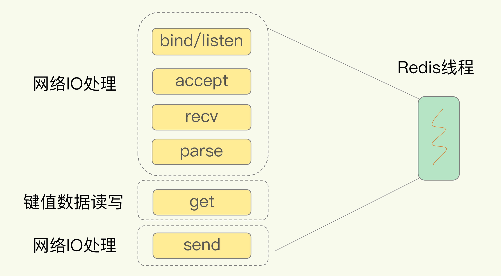

在网络 IO 操作中，<span style="color:red">有潜在的阻塞点，分别是 accept() 和 recv()。</span>当 Redis 监听到一个客户端有连接请求，但一直未能成功建立起连接时，会阻塞在 accept() 函数这里，导致其他客户端无法和 Redis 建立连接。类似的，当 Redis 通过 recv() 从一个客户端读取数据时，如果数据一直没有到达，Redis 也会一直阻塞在 recv()。

这就导致 Redis 整个线程阻塞，无法处理其他客户端请求，效率很低。不过，幸运的是，socket 网络模型本身支持非阻塞模式。

### 非阻塞模式


设置非阻塞模式的 accept，如果 Redis 调用 accept 一直未有连接请求达到，Redis 线程可以返回处理其他操作，不用一直等待。

Redis 线程可以不用继续等待，但是会有一个机制继续在监听套接字上等待后续连接请求，并在有请求时通知 Redis。

recv 的非阻塞模式也是类似的。

### 基于多路复用的高性能 I/O 模型

Linux 中的 IO 多路复用机制是指一个线程处理多个 IO 流，就是我们经常听到的 select/epoll 机制。简单来说，在 Redis 只运行单线程的情况下，该机制允许内核中，同时存在多个监听套接字和已连接套接字。内核会一直监听这些套接字上的连接请求或数据请求。一旦有请求到达，就会交给 Redis 线程处理，这就实现了一个 Redis 线程处理多个 IO 流的效果。

下图就是基于多路复用的 Redis IO 模型。图中的多个 FD 就是刚才所说的多个套接字。Redis 网络框架调用 epoll 机制，让内核监听这些套接字。此时，Redis 线程不会阻塞在某一个套接字上。因此，Redis 可以同时监听多个请求，并及时处理请求。


select/epoll 提供了基于事件的回调机制，可以在请求到达时通知 Redis 线程。即针对不同事件的发生，调用相应的处理函数。

那么，回调机制是怎么工作的呢？其实，select/epoll 一旦监测到 FD 上有请求到达时，就会触发相应的事件。

这些事件会被放进一个事件队列，Redis 单线程对该事件队列不断进行处理。这样一来，Redis 无需一直轮询是否有请求实际发生，这就可以避免造成 CPU 资源浪费。同时，Redis 在对事件队列中的事件进行处理时，会调用相应的处理函数，这就实现了基于事件的回调。因为 Redis 一直在对事件队列进行处理，所以能及时响应客户端请求，提升 Redis 的响应性能。

Redis 单线程是指它对网络 IO 和数据读写的操作采用了一个线程，而采用单线程的一个核心原因是避免多线程开发的并发控制问题。单线程的 Redis 也能获得高性能，跟多路复用的 IO 模型密切相关，因为这避免了 accept() 和 send()/recv() 潜在的网络 IO 操作阻塞点。 

## AOF日志

用 Redis 做缓存，如果 Redis 服务器宕机了，内存中的数据会全部丢失。如果从后端数据库恢复这些数据，成本高，性能低。

- 需要频繁访问数据库，会给数据库带来巨大的压力。
- 这些数据是从慢速数据库中读取出来的，读取速度慢，在加载完数据到 Redis 前系统响应会很慢。

Redis 提供了数据持久化机制，可以避免从后端数据库中进行恢复。

<span style="color:orange">目前，Redis 的持久化主要有两大机制，即 AOF（Append Only File）日志和 RDB 快照。</span>

### AOF日志的实现

我们比较熟悉的是数据库的写前日志（Write Ahead Log, WAL），也就是说，在实际写数据前，先把修改的数据记到日志文件中（MySQL 的 redo log，实现事务的持久性），以便故障时进行恢复。不过，<span style="color:red">AOF 日志正好相反，它是写后日志，“写后”的意思是 Redis 是先执行命令，把数据写入内存，然后才记录日志。因为写后再记录命令可以确保命令是真确的。如果希望先写日志，再执行命令，那就要对指令的合法性进行分析，这是一个耗时的操作，为了保证性能，Redis 采用了“写后日志”的方式。</span>，如下图所示：


传统数据库的日志，例如 redo log（重做日志），记录的是修改后的数据，而 AOF 里记录的是 Redis 收到的每一条命令，这些命令是以文本形式保存的。

以一条 Redis 命令 “set testkey testvalue” 举例进行说明：

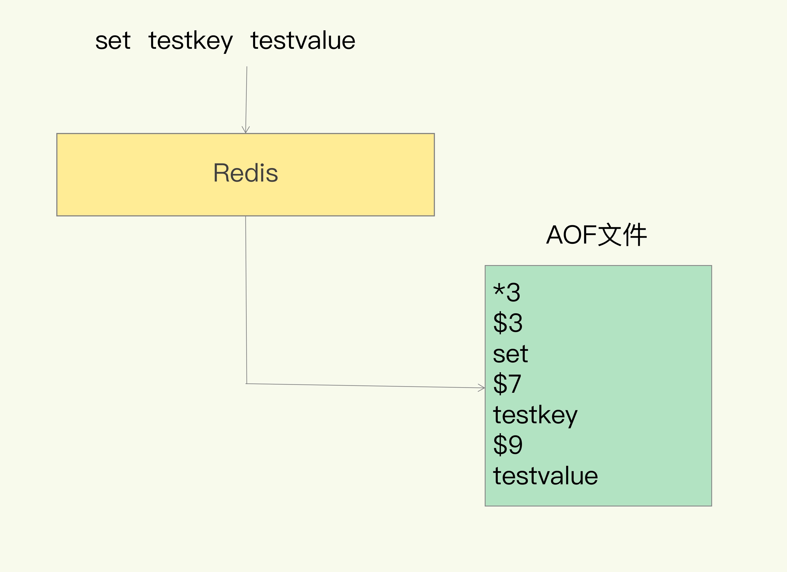

`*3` 表示命令由三部分组成。每部分由 `$+数字` 开头，后面紧跟着具体的命令、键或值。

如 `$3` 表示这部分中的命令 `set` 一共三个字节，`$7` 表示这部分中的键 7 个字节。

### <b style="color:orange">AOF的优缺点</b>

优点

- 先执行命令后写入日志，可以不用检查指令的合法性，节省开销。
- 不会阻塞当前的写操作。

缺点/风险

- 如果刚执行完一个命令，还没有来得及记日志就宕机了，那么这个命令和相应的数据就有丢失的风险。
- AOF 虽然避免了对当前命令的阻塞，但可能会给下一个操作带来阻塞风险。这是因为，<span style="color:red">AOF 日志也是在主线程中执行的</span>，如果在把日志文件写入磁盘时，磁盘写压力大，就会导致写盘很慢，进而导致后续的操作也无法执行了。

这两个风险都是和 AOF 写回磁盘的时机相关的。如果我们能够控制一个写命令执行完后 AOF 日志写回磁盘的时机，这两个风险就解除了。

### <b style="color:orange">三种写回策略</b>

AOF 机制给我们提供了三个选择，也就是 AOF 配置项 appendfsync 的三个可选值。

- Always，同步写回：每个写命令执行完，立马同步地将日志写回磁盘。| 基本不丢数据 |
- Everysec，每秒写回：每个写命令执行完，只是先把日志写到 AOF 文件的内存缓冲区，每隔一秒把缓冲区中的内容写入磁盘。| 最多丢失一秒的数据 |
- No，操作系统控制的写回：每个写命令执行完，只是先把日志写到 AOF 文件的内存缓冲区，由操作系统决定何时将缓冲区内容写回磁盘。| 数据丢失可能是最严重的 |

针对避免主线程阻塞和减少数据丢失问题，这三种写回策略都无法做到两全其美。

- “同步写回”可以做到基本不丢数据，但是它在每一个写命令后都有一个慢速的落盘操作，不可避免地会影响主线程性能；
- 虽然“操作系统控制的写回”在写完缓冲区后，就可以继续执行后续的命令，但是落盘的时机已经不在 Redis 手中了，只要 AOF 记录没有写回磁盘，一旦宕机对应的数据就丢失了；
- <span style="color:orange">“每秒写回”采用一秒写回一次的频率，避免了“同步写回”的性能开销，虽然减少了对系统性能的影响，但是如果发生宕机，上一秒内未落盘的命令操作仍然会丢失。所以，这只能算是，在避免影响主线程性能和避免数据丢失两者间取了个折中。</span>

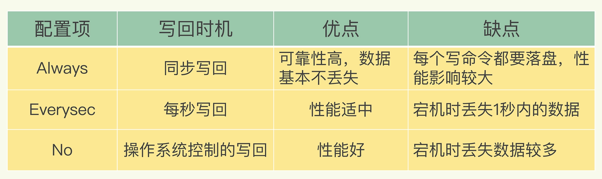

想要获得高性能，就选择 No 策略；如果想要得到高可靠性保证，就选择 Always 策略；如果允许数据有一点丢失，又希望性能别受太大影响的话，那么就选择 Everysec 策略。

### <b style="color:orange">AOF文件大小的影响</b>

AOF 是以文件的形式来记录接收到的所有写命令。记录的命令越多，AOF 文件会越来越大，而文件过大会带来性能问题。

- 文件系统本身对文件大小有限制，无法保存过大的文件；
- 如果文件太大，之后再往里面追加命令记录的话，效率也会变低；
- 如果发生宕机，AOF 中记录的命令要一个个被重新执行，用于故障恢复，如果日志文件太大，整个恢复过程就会非常缓慢，会影响到 Redis 的正常使用

### <b style="color:orange">AOF重写机制</b>

AOF 重写机制：在重写时，Redis 根据数据库的现状创建一个新的 AOF 文件。即，读取数据库中的所有键值对，然后对每一个键值对用一条命令记录它的写入。比如，当读取了键值对 “testkey”: “testvalue” 之后，重写机制会记录 set testkey testvalue 这条命令。这样，当需要恢复时，可以重新执行该命令，实现 “testkey”: “testvalue” 的写入。

AOF 的重写机制还可以将日志文件变小。旧日志文件中的多条命令，在重写后的新日志中变成了一条命令。Redis 中 key 对应的 value 可能会被频繁的修改，插入，此时 AOF 中会记录对应的操纵命令。但是，在重写时，知识根据 k-v 的最新状态，为他们生成对应的写入命令。因此，可以将日志文件变小。

虽然 AOF 重写后，日志文件会缩小，但是，要把整个数据库的最新数据的操作日志都写回磁盘，仍然是一个非常耗时的过程。那么问题来了，AOF 重写会阻塞吗？答案肯定是不会阻塞。

<b style="color:orange">AOF 重写的过程</b>

和 AOF 日志由主线程写回不同，重写过程是由后台子进程 bgrewriteaof 来完成的，这是为了避免阻塞主线程，导致数据库性能下降。下图概括了 AOF 的整个过程。


每次执行重写时，主线程 fork 出后台的 bgrewriteaof 子进程。即 AOF 重写的时候，子进程会先 fork 父进程必要的数据结构包括内存页表，这个 fork 过程一定会阻塞线程的，完成了这个操作就可以进行重写，只不过父子进程这个时候指向的是同一个内存，在子进程重写过程中若父进程操作了已有的 key，则会重新申请新的内存，这样父子进程就逐渐的拥有独自的内存空间。

<b>总结</b>：每次 AOF 重写时，Redis 会先 fork 一个子进程用于重写；然后，使用两个日志保证在重写过程中，新写入的数据不会丢失（要看采用的策略，Redis 宕机的话会丢失 AOF 缓存的数据的）。在重写的时候，有新操作来了，会被记录到 AOF 缓存中，而且，因为 Redis 采用额外的线程进行数据重写，所以，这个过程并不会阻塞主线程。

> 问题

- AOF 日志重写的时候，是由 bgrewriteaof 子进程来完成的，不用主线程参与，我们今天说的非阻塞也是指子进程的执行不阻塞主线程。但是，你觉得，这个重写过程有没有其他潜在的阻塞风险呢？如果有的话，会在哪里阻塞？
- AOF 重写也有一个重写日志，为什么它不共享使用 AOF 本身的日志呢？

<b>问题 1</b>，Redis 采用 fork 子进程重写 AOF 文件时，潜在的阻塞风险包括：fork 子进程和 AOF 重写过程中父进程产生写入的场景，下面依次介绍。

a、fork 子进程，fork 这个瞬间一定是会阻塞主线程的（注意，fork 时并不会一次性拷贝所有内存数据给子进程），fork 采用操作系统提供的写实复制 (Copy On Write) 机制，就是为了避免一次性拷贝大量内存数据给子进程造成的长时间阻塞问题，但 fork 子进程需要拷贝进程必要的数据结构，其中有一项就是拷贝内存页表（虚拟内存和物理内存的映射索引表），这个拷贝过程会消耗大量 CPU 资源，拷贝完成之前整个进程是会阻塞的，阻塞时间取决于整个实例的内存大小，实例越大，内存页表越大，fork 阻塞时间越久。拷贝内存页表完成后，子进程与父进程指向相同的内存地址空间，也就是说此时虽然产生了子进程，但是并没有申请与父进程相同的内存大小。那什么时候父子进程才会真正内存分离呢？“写实复制”顾名思义，就是在写发生时，才真正拷贝内存真正的数据，这个过程中，父进程也可能会产生阻塞的风险，就是下面介绍的场景。 	

b、fork 出的子进程指向与父进程相同的内存地址空间，此时子进程就可以执行 AOF 重写，把内存中的所有数据写入到 AOF 文件中。但是此时父进程依旧是会有流量写入的，如果父进程操作的是一个已经存在的 key，那么这个时候父进程就会真正拷贝这个 key 对应的内存数据，申请新的内存空间，这样逐渐地，父子进程内存数据开始分离，父子进程逐渐拥有各自独立的内存空间。因为内存分配是以页为单位进行分配的，默认 4k，如果父进程此时操作的是一个 bigkey，重新申请大块内存耗时会变长，可能会产阻塞风险。另外，如果操作系统开启了内存大页机制 (Huge Page，页面大小 2M)，那么父进程申请内存时阻塞的概率将会大大提高，所以在 Redis 机器上需要关闭 Huge Page 机制。Redis 每次 fork 生成 RDB 或 AOF 重写完成后，都可以在 Redis log 中看到父进程重新申请了多大的内存空间。 

<b>问题 2</b>，AOF 重写不复用A OF 本身的日志，一个原因是父子进程写同一个文件必然会产生竞争问题，控制竞争就意味着会影响父进程的性能。二是如果 AOF 重写过程中失败了，那么原本的 AOF 文件相当于被污染了，无法做恢复使用。所以 Redis AOF 重写一个新文件，重写失败的话，直接删除这个文件就好了，不会对原先的 AOF 文件产生影响。等重写完成之后，直接替换旧文件即可。

## 内存快照

用 AOF 方法进行故障恢复的时候，需要逐一把操作日志都执行一遍。如果操作日志非常多，Redis 就会恢复得很缓慢，影响到正常使用。Redis 还提供了一种既可以保证可靠性，还能在宕机时实现快速恢复的方法内存快照。

所谓内存快照，就是指内存中的数据在某一个时刻的状态记录。对 Redis 来说，它实现类似照片记录效果的方式，就是把某一时刻的状态以文件的形式写到磁盘上，也就是快照。这样一来，即使宕机，快照文件也不会丢失，数据的可靠性也就得到了保证。这个快照文件就称为 RDB 文件，其中，<span style="color:orange">RDB 就是 Redis DataBase 的缩写</span>。

与 AOF 相比，RDB 记录的是某一时刻的数据，并不是操作，所以，在做数据恢复时，我们可以直接把 RDB 文件读入内存，很快地完成恢复。如果使用 RDB 的话，我们需要思考两个问题：

- 对哪些数据做快照？这关系到快照的执行效率问题；
- 做快照时，数据还能被增删改吗？这关系到 Redis 是否被阻塞，能否同时正常处理请求。

### 给那些内存数据做快照

RDB 采用的是全量快照，把内存中所有的数据都记录到磁盘中。Redis 是单线程执行命令的，我们需要经历避免会阻塞主线程的操作。那么 RDB 文件的生成是否会阻塞主线程？

- save：在主线程中执行，会导致阻塞；
- bgsave：创建一个子进程，专门用于写入 RDB 文件，避免了主线程的阻塞，这也是 Redis RDB 文件生成的默认配置。

### 快照时数据能修改吗

假定在时刻 t 给内存做快照，假设内存数据量是 4GB，磁盘的写入带宽是 0.2GB/s，则至少需要 20s（4/0.2 = 20）才能做完。如果在时刻 t+5s 时，一个还没有被写入磁盘的内存数据 A，被修改成了 A’，那么就会破坏快照的完整性，因为 A’ 不是时刻 t 时的状态。因此，在执行快照的时候，并不希望数据会被修改，但是我们也不能阻塞数据的修改。

为了快照而暂停写操作，肯定是不能接受的。所以这个时候，Redis 就会借助操作系统提供的写时复制技术（Copy-On-Write, COW），在执行快照的同时，正常处理写操作。

bgsave 子进程是由主线程 fork 生成的，可以共享主线程的所有内存数据。bgsave 子进程运行后，开始读取主线程的内存数据，并把它们写入 RDB 文件。此时，如果主线程对这些数据也都是读操作（例如图中的键值对 A），那么，主线程和 bgsave 子进程相互不影响。但是，如果主线程要修改一块数据（例如图中的键值对 C），那么，这块数据就会被复制一份，生成该数据的副本（键值对 C’）。然后，主线程在这个数据副本上进行修改。同时，bgsave 子进程可以继续把原来的数据（键值对 C）写入 RDB 文件。

<span style="color:orange">对数据副本的解释："这块数据就会被复制一份，生成该数据的副本"，这个操作在实际执行过程中，是子进程复制了主线程的页表，所以通过页表映射，能读到主线程的原始数据，而当有新数据写入或数据修改时，主线程会把新数据或修改后的数据写到一个新的物理内存地址上，并修改主线程自己的页表映射。所以，子进程读到的类似于原始数据的一个副本，而主线程也可以正常进行修改。</span>


这既保证了快照的完整性，也允许主线程同时对数据进行修改，避免了对正常业务的影响。

### 多久做一次快照

频繁做快照可以尽量避免数据丢失，但是，如果频繁地执行全量快照，也会带来两方面的开销。

- 一方面，频繁将全量数据写入磁盘，会给磁盘带来很大压力，多个快照竞争有限的磁盘带宽，前一个快照还没有做完，后一个又开始做了，容易造成恶性循环。
- 另一方面，bgsave 子进程需要通过 fork 操作从主线程创建出来。虽然，子进程在创建后不会再阻塞主线程，但是，fork 这个创建过程本身会阻塞主线程，而且主线程的内存越大，需要辅助的页表结构也就越大，阻塞时间就越长。如果频繁 fork 出 bgsave 子进程，这就会频繁阻塞主线程了（所以，在 Redis 中如果有一个 bgsave 在运行，就不会再启动第二个 bgsave 子进程）。

<b span style="color:red">有什么办法可以既可以尽量避免丢失数据，又节省开销吗？</b>

可以做增量快照。增量快照是指，做了一次全量快照后，后续的快照只对修改的数据进行快照记录，这样可以避免每次全量快照的开销。

在第一次做完"全量快照"后，T1 和 T2 时刻如果再做快照，只需要将被修改的数据写入快照文件就行。但是，这么做的前提是，需要记住哪些数据被修改了。这需要使用额外的元数据信息去记录哪些数据被修改了，但是会带来额外的空间开销问题。如下图所示：

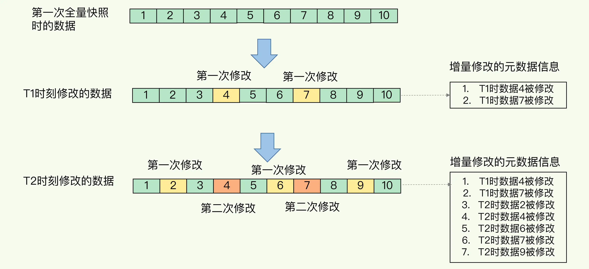

如果我们对每一个键值对的修改，都做个记录，那么，如果有 1 万个被修改的键值对，我们就需要有 1 万条额外的记录。而且，有的时候，键值对非常小，比如只有 32 字节，而记录它被修改的元数据信息，可能就需要 8 字节，这样的画，为了“记住”修改，引入的额外空间开销比较大。这对于内存资源宝贵的 Redis 来说，有些得不偿失。

虽然跟 AOF 相比，快照的恢复速度快，但是，快照的频率不好把握，如果频率太低，两次快照间一旦宕机，就可能有比较多的数据丢失。如果频率太高，又会产生额外开销，那么，还有什么方法既能利用 RDB 的快速恢复，又能以较小的开销做到尽量少丢数据呢？

Redis 4.0 中提出了一个混合使用 AOF 日志和内存快照的方法。内存快照以一定的频率执行，在两次快照之间，使用 AOF 日志记录这期间的所有命令操作。这样，不用频繁执行快照，避免了频繁 fork 对主线程的影响。且，AOF 日志也只用记录两次快照间的操作，无需记录所有操作了，不会出现文件过大的情况，也可以避免重写开销。如下图所示，T1 和 T2 时刻的修改，用 AOF 日志记录，等到第二次做全量快照时，就可以清空 AOF 日志，因为此时的修改都已经记录到快照中了，恢复时就不再用日志了。


### 小结

学习了 Redis 用于避免数据丢失的内存快照方法。RDB 可以快速恢复数据库，把 RDB 文件直接读入内存即可，避免了 AOF 需要顺序、逐一重新执行操作命令带来的低效性能问题。

但是 RDB 耗时耗力。虽然，Redis 设计了 bgsave 和写时复制方式，尽可能减少了内存快照对正常读写的影响，但是，频繁快照仍然是不太能接受的。而混合使用 RDB 和 AOF，正好可以取两者之长，避两者之短，以较小的性能开销保证数据可靠性和性能。

AOF 和 RDB 的选择

- 数据不能丢失时，内存快照和 AOF 的混合使用是一个很好的选择；
- 如果允许分钟级别的数据丢失，可以只使用 RDB；
- 如果只用 AOF，优先使用 everysec 的配置选项，因为它在可靠性和性能之间取了一个平衡。

### 问题

<b>场景题：我们使用一个 2 核 CPU、4GB 内存、500GB 磁盘的云主机运行 Redis，Redis 数据库的数据量大小差不多是 2GB，我们使用了 RDB 做持久化保证。当时 Redis 的运行负载以修改操作为主，写读比例差不多在 8:2 左右，也就是说，如果有 100 个请求，80 个请求执行的是修改操作。你觉得，在这个场景下，用 RDB 做持久化有什么风险吗？</b>

2 核 CPU、4GB 内存、500G 磁盘，Redis 实例占用 2GB，写读比例为 8:2，此时做 RDB 持久化，产生的风险主要在于 CPU 资源和内存资源这2方面：

- 内存资源风险：Redis fork 子进程做 RDB 持久化，由于写的比例为 80%，那么在持久化过程中，“写实复制”会重新分配整个实例 80% 的内存副本，大约需要重新分配 1.6GB 内存空间，这样整个系统的内存使用接近饱和，如果此时父进程又有大量新 key 写入，很快机器内存就会被吃光，如果机器开启了 Swap 机制，那么 Redis 会有一部分数据被换到磁盘上，当 Redis 访问这部分在磁盘上的数据时，性能会急剧下降，已经达不到高性能的标准。如果机器没有开启 Swap，会直接触发 OOM，父子进程会面临被系统 kill 掉的风险。 	
- CPU 资源风险：虽然子进程在做 RDB 持久化，但生成 RDB 快照过程会消耗大量的 CPU 资源，虽然 Redis 处理处理请求是单线程的，但 Redis Server 还有其他线程在后台工作，例如 AOF 每秒刷盘、异步关闭文件描述符这些操作。由于机器只有 2 核 CPU，这也就意味着父进程占用了超过一半的 CPU 资源，此时子进程做 RDB 持久化，可能会产生 CPU 竞争，导致的结果就是父进程处理请求延迟增大，子进程生成 RDB 快照的时间也会变长，整个 Redis Server 性能下降。 	
- 延伸，如果 Redis 进程是否绑定了 CPU，那么子进程会继承父进程的 CPU 亲和性属性，子进程必然会与父进程争夺同一个 CPU 资源，整个 Redis Server 的性能必然会受到影响！所以如果 Redis 需要开启定时 RDB 和 AOF 重写，进程一定不要绑定 CPU。

## 主从一致

先复习下什么叫高可靠。高可靠是指数据尽量少丢失，服务尽量少中断。AOF 和 RDB 保证了数据尽量少丢失，而为 Redis 增加副本冗余量可以尽量减少服务中断。

多实例保存同一份数据需要考虑一个问题，即副本直接的数据一致性如何保证？数据读写操作可以发给所有的实例吗？

Redis 提供了主从库模式，以保证数据副本的一致，主从库之间采用的是读写分离的方式。

- <b>读操作</b>：主库、从库都可以接收；
- <b>写操作</b>：首先到主库执行，然后，主库将写操作同步给从库。


不采用读写分离，如果客户端对同一个数据（例如 k1）前后修改了三次，每一次的修改请求都发送到不同的实例上，在不同的实例上执行，那么，这个数据在这三个实例上的副本就不一致了（分别是 v1、v2 和 v3）。在读取这个数据的时候，就可能读取到旧的值。如果要保持这个数据在三个实例上一致，就要涉及到加锁、实例间协商是否完成修改等一系列操作，会带来巨额的开销。

而主从库模式一旦采用了读写分离，所有数据的修改只会在主库上进行，不用协调三个实例。主库有了最新的数据后，会同步给从库，这样，主从库的数据就是一致的。

不采用读写分离，数据同步麻烦，并且读到旧值的概率很大，除非加锁，保证数据同步的原子性，而这种加锁又可能会导致一系列问题。如 A 更新了数据，要同步给 B、C，而 B、C 也插入了数据，这势必就有一个等待的操作，开销大。采用读写分离的话，所有的写操作都在一台机器上，数据同步相对简单，开销也小一些。

<span style="color:red">主从库同步是如何完成的呢？主库数据是一次性传给从库，还是分批同步？要是主从库间的网络断连了，数据还能保持一致吗？</span>

### 主从同步

当我们启动多个 Redis 实例的时候，它们相互之间就可以通 replicaof（Redis 5.0 之前使用 slaveof）命令形成主库和从库的关系，之后会按照三个阶段完成数据的第一次同步。

例如，现在有实例 1（ip：172.16.19.3）和实例 2（ip：172.16.19.5），在实例 2 上执行以下这个命令后，实例 2 就变成了实例 1 的从库，并从实例 1 上复制数据：

```
replicaof  172.16.19.3  6379
```

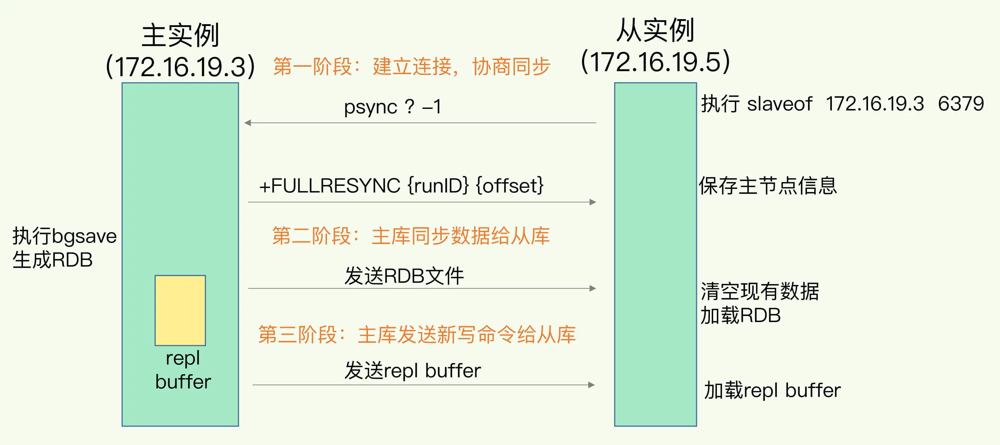

- <span style="color:orange">第一阶段是主从库间建立连接、协商同步的过程，主要是为全量复制做准备。在这一步，从库和主库建立起连接，并告诉主库即将进行同步，主库确认回复后，主从库间就可以开始同步了。</span>
    - 从库发送命令 `psync` 希望进行数据同步。主库收到命令后，根据命令的参数来启动赋值。psync 命令包含了主库的 runID 和复制进度 offset 两个参数。
        - runID，是每个 Redis 实例启动时都会自动生成的一个随机 ID，用来唯一标记这个实例。当从库和主库第一次复制时，因为不知道主库的 runID，所以将 runID 设为“？”。
        - offset，此时设为 -1，表示第一次复制。
    - 主库收到 psync 命令后，会用 `FULLRESYNC` 响应命令带上两个参数：主库 runID 和主库目前的复制进度 offset，返回给从库。从库收到响应后，会记录下这两个参数。
    - FULLRESYNC 响应表示第一次复制采用的全量复制，也就是说，主库会把当前所有的数据都复制给从库
- <span style="color:orange">第二阶段，主库将所有数据同步给从库。从库收到数据后，在本地完成数据加载。这个过程依赖于内存快照生成的 RDB 文件。</span>
    - 主库执行 bgsave 命令，生成 RDB 文件，接着将文件发给从库。从库接收到 RDB 文件后，会先清空当前数据库，然后加载 RDB 文件。这是因为从库在通过 replicaof 命令开始和主库同步前，可能保存了其他数据。为了避免之前数据的影响，从库需要先把当前数据库清空。
    - 在主库将数据同步给从库的过程中，主库不会被阻塞，仍然可以正常接收请求。否则，Redis 的服务就被中断了。但是，这些请求中的写操作并没有记录到刚刚生成的 RDB 文件中。<b>为了保证主从库的数据一致性，主库会在内存中用专门的 <span style="color:red">replication buffer</span>，记录 RDB 文件生成后收到的所有写操作。</b>
- <span style="color:orange">第三个阶段，主库会把第二阶段执行过程中新收到的写命令，再发送给从库。具体的操作是，当主库完成 RDB 文件发送后，就会把此时 replication buffer 中的修改操作发给从库，从库再重新执行这些操作。这样一来，主从库就实现同步了。</span>

### 主从级联模式分担全量复制时的主库压力

一次全量复制中，对于主库来说，需要完成两个耗时的操作：生成 RDB 文件和传输 RDB 文件。如果从库数量很多，主库需要进行很多次 `fork 子进程生成 RDB 文件，进行数据全量同步`的操作。fork 这个操作会阻塞主线程处理正常请求，从而导致主库响应应用程序的请求速度变慢。同时，传输 RDB 文件也会占用主库的网络带宽，同样会给主库的资源使用带来压力。

可以通过“主 - 从 - 从”模式将主库生成 RDB 和传输 RDB 的压力，以级联的方式分散到从库上。

在部署主从集群的时候，可以手动选择一个从库（比如选择内存资源配置较高的从库），用于级联其他的从库。然后，可以再选择一些从库（例如三分之一的从库），在这些从库上执行如下命令，让它们和刚才所选的从库，建立起主从关系。具体的主从关系请看下图

```
replicaof  所选从库的IP 6379
```

这样一来，这些从库就会知道，在进行同步时，不用再和主库进行交互了，只要和级联的从库进行写操作同步就行了，这就可以减轻主库上的压力。


一旦主从库完成了全量复制，它们之间就会一直维护一个网络连接，主库会通过这个连接将后续陆续收到的命令操作再同步给从库，这个过程也称为基于长连接的命令传播，可以避免频繁建立连接的开销。

如果网络断连，主从库之间就无法进行命令传播了，从库的数据自然也就没办法和主库保持一致了，客户端就可能从从库读到旧数据。网络断连后又会如何进行数据同步呢？

### 主从库间网络断了怎么办

<span style="color:orange">在 Redis 2.8 之前，如果主从库在命令传播时出现了网络闪断，那么，从库就会和主库重新进行一次全量复制，开销非常大。从 Redis 2.8 开始，网络断了之后，主从库会采用增量复制的方式继续同步，开销比全量复制小很多。</span>

增量复制时，主从库之间具体是怎么保持同步？使用 repl_backlog_buffer 缓冲区。

当主从库断连后，主库会把断连期间收到的写操作命令，写入 replication buffer，同时也会把这些操作命令也写入 repl_backlog_buffer 这个缓冲区。<span style="color:orange">repl_backlog_buffer 是一个环形缓冲区，主库会记录自己写到的位置，从库则会记录自己已经读到的位置。</span>

刚开始的时候，主库和从库的写读位置在一起，这算是它们的起始位置。随着主库不断接收新的写操作，它在缓冲区中的写位置会逐步偏离起始位置，<span style="color:red">通常用偏移量来衡量这个偏移距离的大小</span>，对主库来说，对应的偏移量就是 master_repl_offset。主库接收的新写操作越多，这个值就会越大。

同样，从库在复制完写操作命令后，它在缓冲区中的读位置也开始逐步偏移刚才的起始位置，此时，从库已复制的偏移量 slave_repl_offset 也在不断增加。正常情况下，这两个偏移量基本相等。


<span style="color:red">主从库的连接恢复之后，从库首先会给主库发送 psync 命令，并把自己当前的 slave_repl_offset 发给主库，主库会判断自己的 master_repl_offset 和 slave_repl_offset 之间的差距。</span>

在网络断连阶段，主库可能会收到新的写操作命令，所以，一般来说，master_repl_offset 会大于 slave_repl_offset。此时，主库只用把 master_repl_offset 和 slave_repl_offset 之间的命令操作同步给从库就行。

就像刚刚示意图的中间部分，主库和从库之间相差了 put d e 和 put d f 两个操作，在增量复制时，主库只需要把它们同步给从库，就行了。

<b>Redis 增量复制流程</b>


需要注意的是，因为 repl_backlog_buffer 是一个环形缓冲区，所以在缓冲区写满后，主库会继续写入，此时，就会覆盖掉之前写入的操作。<b>如果从库的读取速度比较慢，就有可能导致从库还未读取的操作被主库新写的操作覆盖了，这会导致主从库间的数据不一致。</b>

- 一个从库如果和主库断连时间过长，造成它在主库 repl_backlog_buffer 的 slave_repl_offset 位置上的数据已经被覆盖掉了，此时从库和主库间将进行全量复制。
- 每个从库会记录自己的 slave_repl_offset，每个从库的复制进度也不一定相同。在和主库重连进行恢复时，从库会通过 psync 命令把自己记录的 slave_repl_offset 发给主库，主库会根据从库各自的复制进度，来决定这个从库可以进行增量复制，还是全量复制。

我们要想办法避免这一情况，一般而言，可以调整 repl_backlog_size 这个参数。这个参数和所需的缓冲空间大小有关。缓冲空间的计算公式是：缓冲空间大小 = 主库写入命令速度 \* 操作大小 - 主从库间网络传输命令速度 \* 操作大小。在实际应用中，考虑到可能存在一些突发的请求压力，我们通常需要把这个缓冲空间扩大一倍，即 repl_backlog_size = 缓冲空间大小 \* 2，这也就是 repl_backlog_size 的最终值。

举个例子，如果主库每秒写入 2000 个操作，每个操作的大小为 2KB，网络每秒能传输 1000 个操作，那么，有 1000 个操作需要缓冲起来，这就至少需要 2MB 的缓冲空间。否则，新写的命令就会覆盖掉旧操作了。为了应对可能的突发压力，我们最终把 repl_backlog_size 设为 4MB。

这样一来，增量复制时主从库的数据不一致风险就降低了。不过，如果并发请求量非常大，连两倍的缓冲空间都存不下新操作请求的话，此时，主从库数据仍然可能不一致。

针对这种情况，一方面，你可以根据 Redis 所在服务器的内存资源再适当增加 repl_backlog_size 值，比如说设置成缓冲空间大小的 4 倍，也可以考虑使用切片集群来分担单个主库的请求压力。

### 小结

 Redis 的主从库同步的基本原理，总结来说，有三种模式：全量复制、基于长连接的命令传播，以及增量复制。

- 全量复制虽然耗时，但是对于从库来说，如果是第一次同步，全量复制是无法避免的。在建立 Redis 实例的时候，数据库不要太大，一个实例大小在几 GB 级别比较合适，这样可以减少 RDB 文件生成、传输和重新加载的开销。另外，为了避免多个从库同时和主库进行全量复制，给主库过大的同步压力，也可以采用“主 - 从 - 从”这一级联模式，来缓解主库的压力。
- 长连接复制是主从库正常运行后的常规同步阶段。在这个阶段中，主从库之间通过命令传播实现同步。不过，这期间如果遇到了网络断连，增量复制就派上用场了。我们需要合理配置 repl_backlog_size 这个参数。<b style="color:red">如果它配置得过小，在增量复制阶段，可能会导致从库的复制进度赶不上主库，进而导致从库重新进行全量复制。</b>调大这个参数，可以减少从库在网络断连时全量复制的风险。

不过，主从库模式使用读写分离虽然避免了同时写多个实例带来的数据不一致问题，但是还面临主库故障的潜在风险。主库故障了从库该怎么办，数据还能保持一致吗，Redis 还能正常提供服务吗？具体请看下一节。

### 问题

主从库间的数据复制同步使用的是 RDB 文件，AOF 记录的操作命令更全，相比于 RDB 丢失的数据更少。那么，为什么主从库间的复制不使用 AOF 呢？

## 哨兵机制

在主从集群模式下，如果从库发送了故障，客户端可以请求其他从库，如果主库出故障或者是宕机了呢？Redis 的哨兵机制可以实现主从库的自动切换，可以解决主库故障带来的问题。

### 哨兵机制的基本流程

哨兵其实就是一个运行在特殊模式下的 Redis 进程，主从库实例运行的同时，它也在运行。哨兵主要负责的就是三个任务：监控、选主（选择主库）和通知。

- 监控：通过 PING 来监控主从，如果在指定时间内没有响应哨兵的 PING 命令，就将它标记为”下线状态“。
- 选主：主库挂了，在从库中按一定的机制选择一个新主库。
- 通知：把新主库的连接信息发给其他从库，让它们执行 replicaof 命令，和新主库建立连接，并进行数据复制。同时，哨兵会把新主库的连接信息通知给客户端，让它们把请求操作发到新主库上。

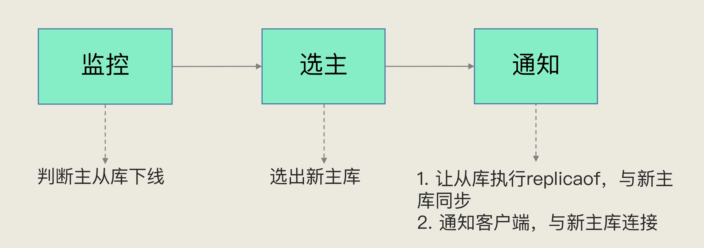

- 在监控任务中，哨兵需要判断主库是否处于下线状态；
- 在选主任务中，哨兵也要决定选择哪个从库实例作为主库。

那么如何判断主库是否下线了呢？

### 主观下线和客观下线

<span style="color:red">哨兵对主库的下线判断有“主观下线”和“客观下线”两种。</span>

<b>主观下线</b>：哨兵进程会使用 PING 命令检测它自己和主、从库的网络连接情况，用来判断实例的状态。如果哨兵发现主库或从库对 PING 命令的响应超时了，那么，哨兵就会先把它标记为“主观下线”。

如果检测的是从库，那么，哨兵简单地把它标记为“主观下线”就行了，因为从库的下线影响一般不太大，集群的对外服务不会间断。

如果检测的是主库，不能仅仅同 PING 响应超时判断是否下线，因为可能是网络状态不佳导致的超时，主库并未发生故障。一旦启动了主从切换，后续的选主和通知操作都会带来额外的计算和通信开销。

为了尽可能避免这种误判，哨兵机制通常会采用多实例组成的集群模式进行部署，即哨兵集群，引入多个哨兵一起判断，一起决策。<b>只有大多数的哨兵实例，都判断主库已经“主观下线”了，主库才会被标记为“客观下线”。</b>

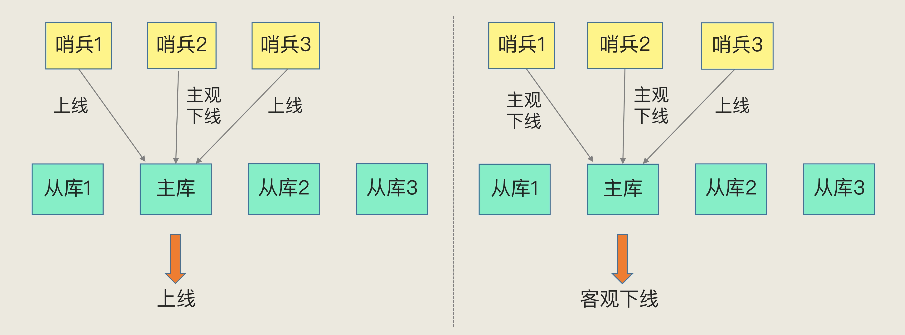

<b>客观下线</b>：当有 N 个哨兵实例时，最好要有 N/2 + 1 个实例判断主库为“主观下线”，才能最终判定主库为“客观下线”。这个数量比例可以由 Redis 管理员进行设定。

### 如何选定新主库

<b>筛选条件如下</b>

- 从库在运行。
- 先前的网络连接状态要好。如果这个从库之前总和主库断连，且断连次数超出了一定的阈值就排除掉这个选项。
- 使用配置项 down-after-milliseconds * 10。其中，down-after-milliseconds 是我们认定主从库断连的最大连接超时时间。如果在 down-after-milliseconds 毫秒内，主从节点都没有通过网络联系上，我们就可以认为主从节点断连了。如果发生断连的次数超过了 10 次，就说明这个从库的网络状况不好，不适合作为新主库。新建 sentinal.conf 文件进行配置，不在 redis.conf 中。

<b>打分选出最合适的主库</b>

- ①优先级最奥的从库得分高。
    - 用户可以通过 slave-priority 配置项，给不同的从库设置不同优先级。如手动给内存大的实例设置一个高优先级。在选主时，哨兵会给优先级高的从库打高分，如果有一个从库优先级最高，那么它就是新主库了。如果从库的优先级都一样，那么哨兵开始第二轮打分。

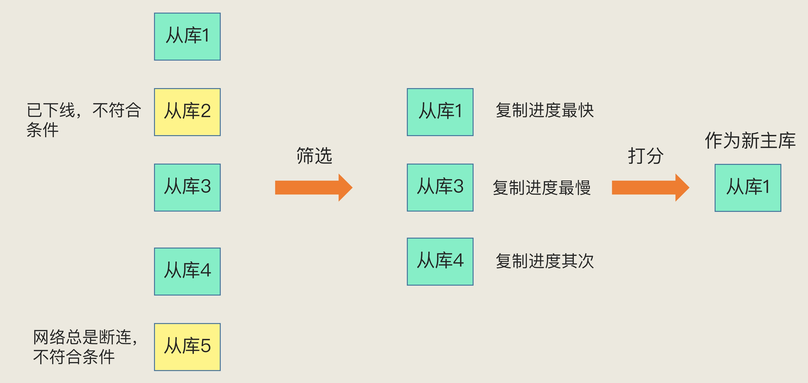

- ②和旧主库同步程度最接近的从库得分高。
    - 主库会用 master_repl_offset 记录当前的最新写操作在 repl_backlog_buffer 中的位置，而从库会用 slave_repl_offset 这个值记录当前的复制进度。slave_repl_offset 进度快的得分就高。下图中，从库 2 的 slave_repl_offset 的值最大，复制进度最快，因此选从库 2。如果有从库 slave_repl_offset 大小一样，则需要进行第三轮打分。

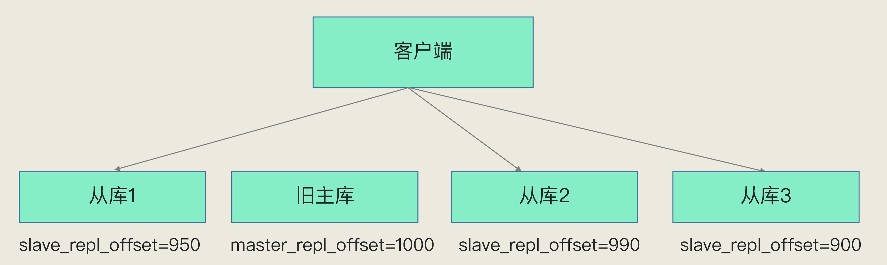

- ③ID 号小的从库得分高。
    - 每个实例都会有一个 ID，这个 ID 就类似于这里的从库的编号。目前，Redis 在选主库时，有一个默认的规定：<b>在优先级和复制进度都相同的情况下，ID 号最小的从库得分最高，会被选为新主库。</b>

> 总结：首先，哨兵会按照在线状态、网络状态，筛选过滤掉一部分不符合要求的从库，然后，依次按照优先级、复制进度、ID 号大小再对剩余的从库进行打分，只要有得分最高的从库出现，就把它选为新主库。

### 小结

Redis 的哨兵机制自动完成了以下三大功能，从而实现了主从库的自动切换，可以降低 Redis 集群的运维开销：

- 监控主库运行状态，并判断主库是否客观下线；
- 在主库客观下线后，选取新主库；
- 选出新主库后，通知从库和客户端。

为了降低误判率，在实际应用时，哨兵机制通常采用多实例的方式进行部署，多个哨兵实例通过“少数服从多数”的原则，来判断主库是否客观下线。一般来说，我们可以部署三个哨兵，如果有两个哨兵认定主库“主观下线”，就可以开始切换过程。当然，如果你希望进一步提升判断准确率，也可以再适当增加哨兵个数，比如说使用五个哨兵。

但是，使用多个哨兵实例来降低误判率，其实相当于组成了一个哨兵集群，我们会因此面临着一些新的挑战，例如：

哨兵集群中有实例挂了，怎么办，会影响主库状态判断和选主吗？哨兵集群多数实例达成共识，判断出主库“客观下线”后，由哪个实例来执行主从切换呢？具体请看下节。

### 问题

通过哨兵机制，可以实现主从库的自动切换，这是实现服务不间断的关键支撑，同时，主从库切换是需要一定时间的。所以，请思考，在这个切换过程中，客户端能否正常地进行请求操作呢？如果想要应用程序不感知服务的中断，还需要哨兵或需要客户端再做些什么吗？

## 哨兵集群

<span style="color:orange">如果有哨兵实例在运行时发生了故障，主从库还能正常切换吗？</span>

如果是多个实例组成的哨兵集群，即使某几个哨兵实例出现故障挂掉了，其他哨兵还能继续协作完成主从库切换的工作（判定主库是不是处于下线状态，选择新主库，以及通知从库和客户端。）

在配置哨兵的信息时，我们只需要用到下面的这个配置项，设置主库的 IP 和端口，并没有配置其他哨兵的连接信息。

```shell
sentinel monitor <master-name> <ip> <redis-port> <quorum>
```

<span style="color:orange">没有显示的配置其他哨兵的连接信息，那么哨兵之间是怎么组成集群的？</span>

### 内容概览

<b style="color:orange">讲了哨兵集群的工作机制</b>

- 哨兵之间互通机制：基于 pub/sub 机制，在主库中有一个 `__sentinel__:hello_` 的频道，哨兵之间互相发现通信。
- 哨兵与主从库互通机制：哨兵向主库发送 INFO 指令，可以获取所有从库的信息，实现对主库、从库的监控。
- 哨兵判断主库异常机制：哨兵集群中任意一个实例都可以发起主库异常“投票仲裁”流程。

<b style="color:orange">亮点&要点</b>

- 亮点 1：哨兵之间的互动是通过发布订阅机制完成的，利用自身的特性来实现。
- 要点 1：哨兵之间通信不是哨兵之间之间联系，而是通过订阅主库的同一频道来获取彼此的信息
- 要点 2：哨兵是通过 INFO 指令，从主库获取从库信息，并与每个从库建立连接，监控所有主从库状态
- 要点 3：哨兵是一个特殊的 redis 实例，所以客户端可以订阅哨兵的指定频道获得 redis 主从库的信息
- 要点 4：哨兵集群执行主从切换机制：谁发现，谁就发起投票流程，谁获得多数票，谁就是哨兵 Leader，由 Leader 负责主从库切换
- 要点 5：哨兵集群 Leader 选举成功与否，依赖于网络通信状况，网络拥塞会导致选举失败，重新进行新一轮选举

<b style="color:orange">哨兵投票机制</b>

- a：哨兵实例只有在自己判定主库下线时，才会给自己投票，而其他的哨兵实例会把票投给第一个来要票的请求，其后的都拒绝
- b：如果出现多个哨兵同时发现主库下线并给自己投票，导致投票选举失败，就会触发新一轮投票，直至成功

哨兵Leader切换主从库的机制：

- 哨兵成为 Leader 的必要条件：a：获得半数以上的票数，b：得到的票数要达到配置的 quorum 阀值
- 主从切换只能由 Leader 执行，而成为 Leader 有两个必要的条件，所以当哨兵集群中实例异常过多时，会导致主从库无法切换

### 基于 pub/sub 机制的哨兵集群组成

哨兵实例之间通过 redis 的发布/订阅机制，每个哨兵都把自己的信息发送给主库，然后从主库订阅其他哨兵的消息，这样就可以互相知道其他哨兵的地址了。

使用发布/订阅的功能时，需要可以区分消息的种类，即这个消息是普通的消息，还是哨兵的消息。为了区分消息的种类，Redis 会以频道的形式对消息进行分类管理，同种类别的消息属于一个频道，<span style="color:orange">只有订阅了同一个频道的应用才能通过发布的消息进行信息交换。</span>

在主从集群中，主库上有一个名为 `__sentinel__:hello` 的频道，不同哨兵就是通过它来相互发现，实现互相通信的。

在下图中，哨兵 1 把自己的 IP（172.16.19.3）和端口（26579）发布到 `__sentinel__:hello` 频道上，哨兵 2 和 3 订阅了该频道。那么此时，哨兵 2 和 3 就可以从这个频道直接获取哨兵 1 的 IP 地址和端口号。

然后，哨兵 2、3 可以和哨兵 1 建立网络连接。通过这个方式，哨兵 2 和 3 也可以建立网络连接，这样一来，哨兵集群就形成了。它们相互间可以通过网络连接进行通信，比如说对主库有没有下线这件事儿进行判断和协商。


哨兵除了彼此之间建立起连接形成集群外，还需要和从库建立连接。在哨兵的监控任务中，它需要对主从库都进行心跳判断，而且在主从库切换完成后，它还需要通知从库，让它们和新主库进行同步。

<span style="color:red">那么，哨兵是如何知道从库的 IP 地址和端口的呢？</span>

哨兵向主库发送 INFO 命令得到从库的 IP 地址和端口。哨兵就可以根据从库列表中的连接信息，和每个从库建立连接，并在这个连接上持续地对从库进行监控。

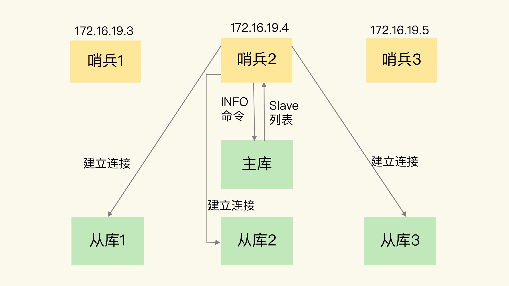

主从切换后，我们需要告诉客户端新的主库是谁，从库是那些，而告知客户端新主库的操作也是由哨兵完成的。

### 基于 pub/sub 机制的客户端事件通知

主从切换的时候如何在客户端通过监控了解哨兵进行主从切换的过程呢？这要求，客户端能够获取到哨兵集群在监控、选主、切换这个过程中发生的各种事件。而这些也可以通过 pub/sub 机制来获取。


让客户端订阅需要的消息，就可以获取主从切换的过程了。

具体的操作步骤是，客户端读取哨兵的配置文件后，可以获得哨兵的地址和端口，和哨兵建立网络连接。然后，我们可以在客户端执行订阅命令，来获取不同的事件消息。

```bash
SUBSCRIBE +odown # 订阅“所有实例进入客观下线状态的事件”
PSUBSCRIBE  * # 订阅所有的事件
```

### 主从切换

主库故障以后，哨兵集群有多个实例，那怎么确定由哪个哨兵来进行实际的主从切换呢？

确定由哪个哨兵执行主从切换的过程，和主库“客观下线”的判断过程类似，也是一个“投票仲裁”的过程。

哨兵集群判定主库“客观下线”后，哨兵会给其他哨兵发送命令，表明希望由自己来执行主从切换，并让所有其他哨兵进行投票。这个投票过程称为 Leader  选举。

在投票过程中，任何一个想成为 Leader 的哨兵，要满足两个条件：

- 第一，拿到半数以上的赞成票；
- 第二，拿到的票数同时还需要大于等于哨兵配置文件中的 quorum 值。

以 3 个哨兵为例，假设此时的 quorum 设置为 2，那么，任何一个想成为 Leader 的哨兵只要拿到 2 张赞成票，就可以了。

<span style="color:orange">为了避免多个哨兵同时发出希望自己成为 Leader 的请求，哨兵会有一种机制尽量避免这种情况。</span>

哨兵会定时对主从库进行的在线状态检查等操作，用一个定时器来完成，一般来说每 100ms 执行一次这些事件。每个哨兵的定时器执行周期都会加上一个小小的随机时间偏移，目的是让每个哨兵执行上述操作的时间能稍微错开些，也是为了避免它们都同时判定主库下线，同时选举 Leader。并且，实际应用中，不同哨兵的网络状况也不一样，同时选举 Leader 的几率就更小了。如果这次没有选出 Leader 哨兵会停一段时间（一般是故障转移超时时间 failover_timeout 的 2 倍），然后再进行下一轮投票。

需要注意的是，如果哨兵集群只有 2 个实例，此时，一个哨兵要想成为 Leader，必须获得 2 票，而不是 1 票。所以，如果有个哨兵挂掉了，那么，此时的集群是无法进行主从库切换的。因此，通常我们至少会配置 3 个哨兵实例。

## 切片集群

场景：要用 Redis 保存 5000 万个键值对，每个键值对大约是 512B，该如何选择主机的内存容量？这些键值对所占的内存空间大约是 25GB（5000 万 *512B）考虑用一台 32 GB 内存的主机来部署 Redis。能保存所有数据，还留有 7GB，可以保证系统的正常运行。采用 RDB 对数据做持久化，以确保 Redis 实例故障后，还能从 RDB 恢复数据。

在使用的过程中发现，Redis 的响应有时会非常慢。使用 INFO 命令查看 Redis 的 latest_fork_usec 指标值（表示最近一次 fork 的耗时），结果显示这个指标值快到秒级别了。

这跟 Redis 的持久化机制有关系。<span style="color:orange">在使用 RDB 进行持久化时，Redis 会 fork 子进程来完成，fork 操作的用时和 Redis 的数据量是正相关的，而 fork 在执行时会阻塞主线程。数据量越大，fork 操作造成的主线程阻塞的时间越长。所以，在使用 RDB 对 25GB 的数据进行持久化时，数据量较大，后台运行的子进程在 fork 创建时阻塞了主线程，于是就导致 Redis 响应变慢了。</span>

Redis 的切片集群。可以保存大量数据，而且对 Redis 主线程的阻塞影响较小。如果把 25GB 的数据平均分成 5 份（当然，也可以不做均分），使用 5 个实例来保存，每个实例只需要保存 5GB 数据。


在切片集群中，实例在为 5GB 数据生成 RDB 时，数据量就小了很多，fork 子进程一般不会给主线程带来较长时间的阻塞。采用多个实例保存数据切片后，我们既能保存 25GB 数据，又避免了 fork 子进程阻塞主线程而导致的响应突然变慢。

### 内容速览

本节讲的内容是切片集群。 从一个案例入手，讲到单实例内存过大在数据备份时会导致 Redis 性能下降，引出 redis 分片集群来解决大数据量，高性能的设计。

<b>问题</b>

数据分片与实例间如何建立对应关系；客户端如何知晓去哪个实例中获取数据

<b>要点&亮点</b>

- 亮点 1：Redis 扩容中的纵向扩容和横向扩容的真实含义和区别
- 要点 1：数据分片和实例的对应关系建立：按照 CRC16 算法计算一个 key 的 16bit 的值，在将这值对 16384 取模
- 要点 2：一个切片集群的槽位是固定的 16384 个，可手动分配每个实例的槽位，但必须将槽位全部分完
- 要点 3：客户端如何确定要访问那个实例获取数据：
  - 从任意个实例获取并缓存在自己本地，
  - 重定向机制
- 要点 4：重定向机制：客户端访问的实例没有数据，被访问实例响应 move命令，告诉客户端指向新的实例地址
- 要点 5：ASK命令
  - 表明数据正在迁移
  - 告知客户端数据所在的实例 
- 要点 6：ASK 命令和 MOVE 命令的区别
  - move 命令是在数据迁移完毕后被响应，客户端会更新本地缓存。                    
  - ASK 命令是在数据迁移中被响应，不会让客户端更新缓存。

<b>映射方式</b>

Redis Cluster 不采用直接把 key 映射到实例，而采用哈希槽的方式原因：可用使 Redis 集群设计：简洁，高效，有弹性

- 不使用的劣势
  - ①：集群中的 key 无法预估，直接存 key 对应实例的映射关系，需占用的内存空间不可控
  - ②：Cluster 是去中心化设计，所有实例都需保存完整的映射关系，                            采用直接的映射，会导致节点间信息交换成本高昂
  - ③：key 与实例直接映射，在集群扩缩容时，需要数据迁移，所有的 key 都需要重新映射
- 使用的好处
  - ①：在中间增加一层哈希槽，可以将数据与节点解耦，使数据分配均匀                         key 通过 hsah 计算在取模，可以把数据打的更散，只需要关心映射到了哪个哈希槽，通过哈希槽映射表找到对应的实例
  - ②：增加哈希槽可以使得映射表比较小，有利于客户端和服务端保存，节点间信息交换
  - ③：集群扩缩容，数据均衡时，操作单位是哈希槽，可以简化操作难度        

Redis 集群方案的两个关键问题：①：请求路由；②：数据迁移

### Redis扩展

 Redis 应对数据量增多有两种扩展方案：纵向扩展（scale up）和横向扩展（scale out）。

<span style="color:orange">纵向扩展</span>：升级单个 Redis 实例的资源配置，包括增加内存容量、增加磁盘容量、使用更高配置的 CPU。就像下图中，原来的实例内存是 8GB，硬盘是 50GB，纵向扩展后，内存增加到 24GB，磁盘增加到 150GB。

<span style="color:orange">横向扩展</span>：横向增加当前 Redis 实例的个数，就像下图中，原来使用 1 个 8GB 内存、50GB 磁盘的实例，现在使用三个相同配置的实例。

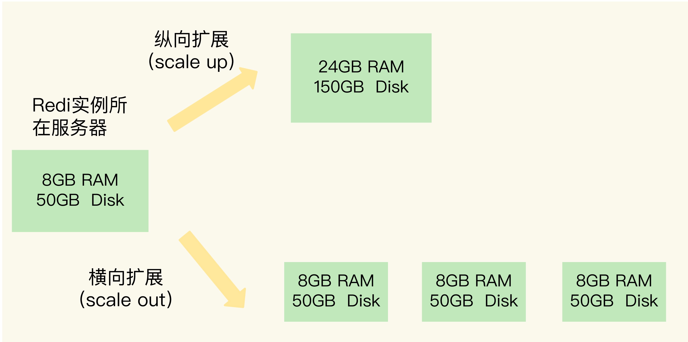

<span style="color:orange">纵向扩展</span>：实施起来简单、直接，但是存在两个问题

- 第一个问题是，当使用 RDB 对数据进行持久化时，如果数据量增加，需要的内存也会增加，主线程 fork 子进程时就可能会阻塞（比如刚刚的例子中的情况）。不过，如果你不要求持久化保存 Redis 数据，那么，纵向扩展会是一个不错的选择。
- 纵向扩展会受到硬件和成本的限制。这很容易理解，毕竟，把内存从 32GB 扩展到 64GB 还算容易，但是，要想扩充到 1TB，就会面临硬件容量和成本上的限制了。

<span style="color:orange">横向扩展</span>：扩展性更好，只用增加 Redis 的实例个数就行了，不用担心单个实例的硬件和成本限制。在面向百万、千万级别的用户规模时，横向扩展的 Redis 切片集群会是一个非常好的选择。

在只使用单个实例的时候，数据的存储和客户端的访问都很明确。但是，切片集群不可避免地涉及到多个实例的分布式管理问题。要想把切片集群用起来，需要解决两大问题：

- 数据切片后，在多个实例之间如何分布？
- 客户端怎么确定想要访问的数据在哪个实例上？

### 数据切片和实例的对应分布关系

Redis Cluster 方案采用哈希槽（Hash Slot，简称 Slot），来处理数据和实例之间的映射关系。在 Redis Cluster 方案中，一个切片集群共有 16384 个哈希槽，这些哈希槽类似于数据分区，每个键值对都会根据它的 key，被映射到一个哈希槽中。

> 映射方式

先根据键值对的 key，按照 <a href="https://en.wikipedia.org/wiki/Cyclic_redundancy_check>CRC16</a> 算法计算一个 16 bit 的值；然后，再用这个 16bit 值对 16384 取模，得到 0~16383 范围内的模数，每个模数代表一个相应编号的哈希槽。

> 哈希槽映射到 Redis 实例

在部署 Redis Cluster 方案时，可以使用 cluster create 命令创建集群，此时，Redis 会自动把这些槽平均分布在集群实例上。例如，如果集群中有 N 个实例，那么，每个实例上的槽个数为 16384/N 个。

也可以使用 cluster meet 命令手动建立实例间的连接，形成集群，再使用 cluster addslots 命令，指定每个实例上的哈希槽个数。

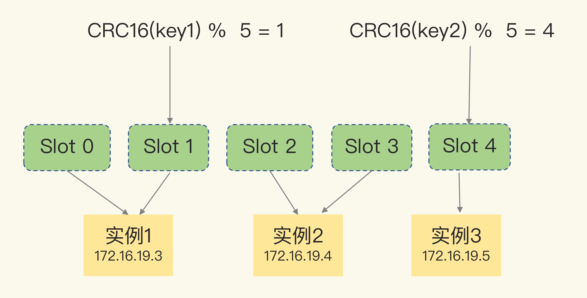

```shell
redis-cli -h 172.16.19.3 –p 6379 cluster addslots 0,1 # 保存 0，1 两个哈希槽
redis-cli -h 172.16.19.4 –p 6379 cluster addslots 2,3
redis-cli -h 172.16.19.5 –p 6379 cluster addslots 4
```

在手动分配哈希槽时，需要把 16384 个槽都分配完，否则 Redis 集群无法正常工作。

### 客户端定位数据

通过 CRC16 算法计算 key 可以得到哈希槽位置，但是如何定位哈希槽分配到哪个实例了呢？

Redis 实例会把自己的哈希槽信息分享给和它相连接的其它实例，来完成哈希槽分配信息的扩散。当实例之间相互连接后，每个实例就有所有哈希槽的映射关系了。客户端和集群实例建立连接后，实例就会把哈希槽的分配信息发给客户端。

客户端收到哈希槽信息后，会把哈希槽信息缓存在本地。当客户端请求键值对时，会先计算键所对应的哈希槽，然后就可以给相应的实例发送请求了。

但是，在集群中，实例和哈希槽的对应关系并不是一成不变的，最常见的变化有两个

- 在集群中，实例有新增或删除，Redis 需要重新分配哈希槽；
- 为了负载均衡，Redis 需要把哈希槽在所有实例上重新分布一遍。

<span style="color:orange">实例之间可以通过相互传递消息，获得最新的哈希槽分配信息，但是，客户端是无法主动感知这些变化的。这就会导致，它缓存的哈希槽分配信息和最新的哈希槽分配信息不一致。</span>

Redis Cluster 提供了一种重定向机制，当一个客户端给一个实例发送数据读写操作时，如果这个实例上并没有这个键值对映射的哈希槽，这个实例就会给客户端返回下面的 MOVED 命令响应结果，告诉客户端，13320 这个哈希槽中的数据应该去 `172.16.19.5:6379` 获取。

```shell
GET hello:key
(error) MOVED 13320 172.16.19.5:6379
```

这样，客户端就知道自己该访问那个新实例了。

> 定位数据


Slot 2 中的数据已经从实例 2 迁移到了实例 3，但是，客户端缓存仍然记录着“Slot 2 在实例 2”的信息，所以会给实例 2 发送命令。实例 2 给客户端返回一条 MOVED 命令，把 Slot  2 的最新位置（也就是在实例 3 上），返回给客户端，客户端就会再次向实例 3 发送请求，同时还会更新本地缓存，把 Slot  2 与实例的对应关系更新过来。

如果 Slot 2 中的数据比较多，就可能会出现一种情况：客户端向实例 2 发送请求，但此时，Slot 2 中的数据只有一部分迁移到了实例 3，还有部分数据没有迁移。在这种迁移部分完成的情况下，客户端就会收到一条 ASK 报错信息

```shell
GET hello:key
(error) ASK 13320 172.16.19.5:6379
```

这个结果中的 ASK 命令就表示，客户端请求的键值对所在的哈希槽 13320，在 172.16.19.5 这个实例上，但是这个哈希槽正在迁移。此时，客户端需要先给 172.16.19.5 这个实例发送一个 ASKING 命令。这个命令的意思是，让这个实例允许执行客户端接下来发送的命令。然后，客户端再向这个实例发送 GET 命令，以读取数据。

在下图中，Slot 2 正在从实例 2 往实例 3 迁移，key1 和 key2 已经迁移过去，key3 和 key4 还在实例 2。客户端向实例 2 请求 key2 后，就会收到实例 2 返回的 ASK 命令。

ASK 命令表示两层含义：第一，表明 Slot 数据还在迁移中；第二，ASK 命令把客户端所请求数据的最新实例地址返回给客户端，此时，客户端需要给实例 3 发送 ASKING 命令，然后再发送操作命令。

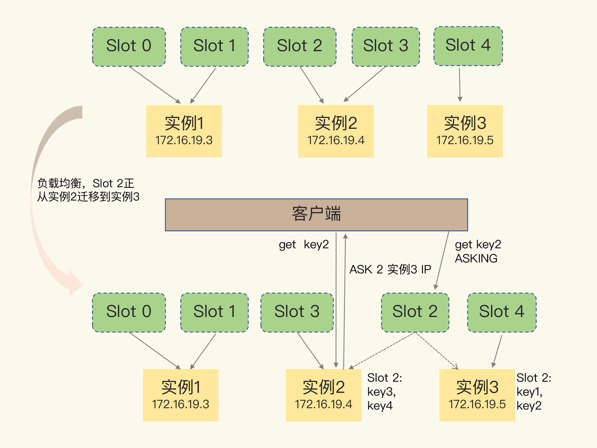

和 MOVED 命令不同，ASK 命令并不会更新客户端缓存的哈希槽分配信息。所以，在上图中，如果客户端再次请求 Slot 2 中的数据，它还是会给实例 2 发送请求。这也就是说，ASK 命令的作用只是让客户端能给新实例发送一次请求，而不像 MOVED 命令那样，会更改本地缓存，让后续所有命令都发往新实例。

## 习题&解答

> 问题：和跟 Redis 相比，SimpleKV 还缺少什么？

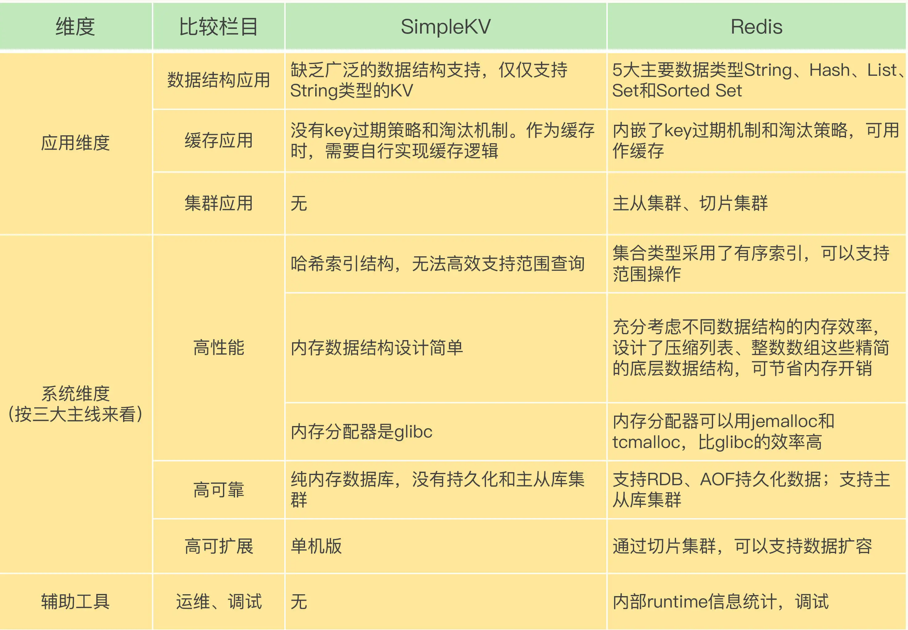

> 问题：整数数组和压缩列表作为底层数据结构的优势是什么？

整数数组和压缩列表的设计，充分体现了 Redis“又快又省”特点中的“省”，也就是节省内存空间。整数数组和压缩列表都是在内存中分配一块地址连续的空间，然后把集合中的元素一个接一个地放在这块空间内，非常紧凑。因为元素是挨个连续放置的，我们不用再通过额外的指针把元素串接起来，这就避免了额外指针带来的空间开销。

Redis 之所以采用不同的数据结构，其实是在性能和内存使用效率之间进行的平衡。

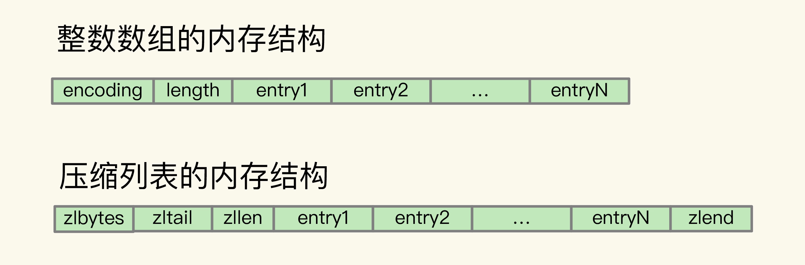

> 问题：Redis 基本 IO 模型中还有哪些潜在的性能瓶颈？

在 Redis 基本 IO 模型中，主要是主线程在执行操作，任何耗时的操作，例如 bigkey、全量返回等操作，都是潜在的性能瓶颈。

> AOF 重写过程中有没有其他潜在的阻塞风险？

风险一：Redis 主线程 fork 创建 bgrewriteaof 子进程时，内核需要创建用于管理子进程的相关数据结构，这些数据结构在操作系统中通常叫作进程控制块（Process Control Block，简称为 PCB）。内核要把主线程的 PCB 内容拷贝给子进程。这个创建和拷贝过程由内核执行，是会阻塞主线程的。而且，在拷贝过程中，子进程要拷贝父进程的页表，这个过程的耗时和 Redis 实例的内存大小有关。如果 Redis 实例内存大，页表就会大，fork 执行时间就会长，这就会给主线程带来阻塞风险。

风险二：bgrewriteaof 子进程会和主线程共享内存。当主线程收到新写或修改的操作时，主线程会申请新的内存空间，用来保存新写或修改的数据，如果操作的是 bigkey，也就是数据量大的集合类型数据，那么，主线程会因为申请大空间而面临阻塞风险。因为操作系统在分配内存空间时，有查找和锁的开销，这就会导致阻塞。

> AOF 重写为什么不共享使用 AOF 本身的日志？

如果都用 AOF 日志的话，主线程要写，bgrewriteaof 子进程也要写，这两者会竞争文件系统的锁，这就会对 Redis 主线程的性能造成影响。

> 问题：使用一个 2 核 CPU、4GB 内存、500GB 磁盘的云主机运行 Redis，Redis 数据库的数据量大小差不多是 2GB。当时 Redis 主要以修改操作为主，写读比例差不多在 8:2 左右，也就是说，如果有 100 个请求，80 个请求执行的是修改操作。在这个场景下，用 RDB 做持久化有什么风险吗？

<b>内存不足的风险</b>：Redis fork 一个 bgsave 子进程进行 RDB 写入，如果主线程再接收到写操作，就会采用写时复制。写时复制需要给写操作的数据分配新的内存空间。本问题中写的比例为 80%，那么，在持久化过程中，为了保存 80% 写操作涉及的数据，写时复制机制会在实例内存中，为这些数据再分配新内存空间，分配的内存量相当于整个实例数据量的 80%，大约是 1.6GB，这样一来，整个系统内存的使用量就接近饱和了。此时，如果实例还有大量的新 key 写入或 key 修改，云主机内存很快就会被吃光。如果云主机开启了 Swap 机制，就会有一部分数据被换到磁盘上，当访问磁盘上的这部分数据时，性能会急剧下降。如果云主机没有开启 Swap，会直接触发 OOM，整个 Redis 实例会面临被系统 kill 掉的风险。

<b>主线程和子进程竞争使用 CPU 的风险</b>：生成 RDB 的子进程需要 CPU 核运行，主线程本身也需要 CPU 核运行，而且，如果 Redis 还启用了后台线程，此时，主线程、子进程和后台线程都会竞争 CPU 资源。由于云主机只有 2 核 CPU，这就会影响到主线程处理请求的速度。

# 实战篇

## String类型的内存空间消耗

