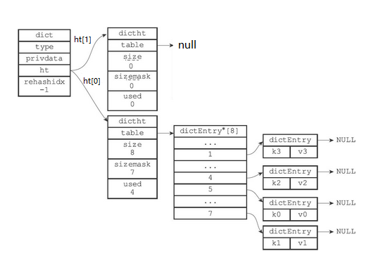

Redis设计与实现

参考资料：

- 《Redis设计与实现》
- [Redis设计与实现 - Nyima's Blog (gitee.io)](https://nyimac.gitee.io/2020/11/08/Redis设计与实现/#Redis设计与实现) 基于此博客的内容进行修正，填充，删除。

# Redis中的数据结构

## 一、简单动态字符串

与Java的ArrayList的实现有些类似。比起C字符串，SDS有以下优点：

- 1）常数复杂度获取字符串长度。
- 2）杜绝缓冲区溢出。
- 3）减少修改字符串长度时所需的内存重分配次数。
- 4）二进制安全。
- 5）兼容部分C字符串函数。

### SDS的定义

SDS又称为简单动态字符串（Simple Dynamic String），SDS的定义如下图所示


如果将一个值为“Redis”的字符串放入SDS中，它的存储状态如下


- buf 是一个char类型的数组。
- len 记录了buf的长度（保存空字符 `['\0']` 的1字节空间不计算在len属性里，C以 '\0' 判断字符串是不是结束了）
    - 该值使得**获取字符串的长度的时间复杂度降为了O(1)**
    - 设置和更新SDS长度的工作是由SDS的API在执行时自动完成的，使用SDS无须进行任何手动修改长度的工作。
- free 中保存了额外申请的空间
- 在进行字符串拼接时
    - 如果空间充足，会直接使用之前额外申请的空间
    - 如果空间不足（free < 拼接字符串的长度）会申请额外的空间。若所需的空间**小于1M**，会额外申请和 len 值相同的空间（如申请13个字符，则free也为13）。<span style="color:red">**若所需空间大于等于1M，则额外申请1M的空间。**</span>
- 在进行字符串裁剪时
    - 多出来的空间会被记录在free中，方便再次使用

### 与C语言字符串的差别

| C语言字符串                                                  | SDS                               | 解释                                                    |
| ------------------------------------------------------------ | --------------------------------- | ------------------------------------------------------- |
| 获取长度的时间复杂度为O(n)                                   | 获取长度的时间复杂度为O(1)        | SDS中len属性保存了字符串的长度                          |
| API是不安全的，可能会造成缓冲区溢出`char *strcat(char *dest, const char *src)` | API是安全的，不会造成缓冲区溢出   | SDS中若free空间不足以存放字符串的内容，会进行自动扩容。 |
| 修改字符串n次**必定**执行n次内存分配                         | 修改字符串**最多**执行n次内存分配 | SDS会分配额外的空间，额外空间大小由free记录             |
| 只能保存文本数据                                             | 可以保存文本数据或者二进制数据    | SDS使用buf来保存一系列二进制数据                        |
| 可以使用<string.h>库中所有的函数                             | 可以使用<string.h>中部分函数      | SDS中的buf相当于字符串                                  |

### 优化策略

内存重分配涉及复杂的算法，并且可能需要执行系统调用，所以它通常是一个比较耗时的操作。Redis作为数据库需要频繁的进行数据修改。每次修改字符串都进行内存分配和释放的话，会损耗Redis的性能。

为改进这种不足，SDS有空间预分配和惰性空间释放两种优化策略。

#### 空间预分配

当需要对SDS的空间进行扩展的时候，程序不仅会为SDS分配修改所必须要的空间，还会为SDS分配额外的未使用空间。

额外分配的未使用空间数量公式如下：

- 如果进行了内存分配，则 free = 修改后字符串的len(不计算'\0')。例如：进行修改后，SDS的len变成了13字节，那么程序也会分配13字节的未使用空间。SDS的buf数组实际长度则为 13+13+1 = 27字节（'\0'并未计算到len中。）
- 如果对SDS进行修改之后，SDS的长度将大于等于1MB，那么程序会分配1MB的未使用空间。例如：进行修改之后，SDS的len将变成30MB，那么程序会分配1MB的未使用空间，SDS的buf数组的实际长度将为30MB+1MB+1byte。
- 如果SDS空间充足够用，会直接使用未使用的空间，不会执行内存分配。

#### 惰性空间释放

不立即释放缩短后多出来的字节，而是先用free暂存。

惰性空间释放用于优化SDS的字符串缩短操作：当SDS的API需要缩短SDS保存的字符串时，程序并不立即使用内存重分配来回收缩短后多出来的字节，而是使用free属性将这些字节的数量记录起来，并等待将来使用。

SDS也提供了相应的API，让我们可以在有需要时，真正地释放SDS的未使用空间，所以不用担心惰性空间释放策略会造成内存浪费。

### 二进制安全

为了确保Redis可以适用于各种不同的使用场景，SDS的API都是二进制安全的（binary-safe），所有SDS API都会以处理二进制的方式来处理SDS存放在buf数组里的数据，程序不会对其中的数据做任何限制、过滤、或者假设，数据在写入时是什么样的，它被读取时就是什么样。<span style="color:red">**因此我们称 buf 为字节数组**</span>

## 二、链表

- 链表被广泛用于实现Redis的各种功能，比如列表键、发布与订阅、慢查询、监视器等。
- 每个链表节点由一个listNode结构来表示，每个节点都有一个指向前置节点和后置节点的指针，所以Redis的链表实现是双向链表。
- 每个链表使用一个list结构来表示，这个结构带有表头节点指针、表尾节点指针，以及链表长度等信息。
- 通过为链表设置不同的类型特定函数，Redis的链表可以用于保存各种不同类型的值。

### Redis中的链表

链表在Redis中的应用非常广泛，比如列表键的底层实现之一就是链表。当一个列表键包含了数量比较多的元素，又或者列表中包含的元素都是比较长的字符串时，Redis就会使用链表作为列表键的底层实现。

除了链表键之外，发布与订阅、慢查询、监视器等功能也用到了链表，Redis服务器本身还使用链表来保存多个客户端的状态信息，以及使用链表来构建客户端输出缓冲区。（outputbuffer）

Redis中的**链表节点**定义如下


Redis中将节点放在了list中


list结构为链表提供了表头指针head、表尾指针tail，以及链表长度计数器len

dup、free和match成员则是用于实现多态链表所需的类型特定函数

- dup函数用于复制链表节点所保存的
- free函数用于释放链表节点所保存的值
- match函数则用于对比链表节点所保存的值和另一个输入值是否相等

一个list结构和三个listNode结构组成的链表：


### Redis中链表的特性

- **双链表**，可方便地获取一个节点的前驱节点或后继节点
- **带头尾指针**，list中的head与tail分别保存了链表的头结点和尾节点
- **获取长度方便**，list中的len属性使得获取链表长度的时间复杂度变为了O(1)
- **多态**，链表节点使用`void*`指针来保存节点值，并且可以通过list结构的dup、free、match三个属性为节点值设置类型特定函数，所以链表可以用于保存各种不同类型的值

## 三、字典

字典：一种用于保存键值对（key-value pair）的抽象数据结构。

### Redis中字典的实现

Redis的字典使用**哈希表**作为底层实现，一个哈希表里面可以有**多个**哈希表节点，而每个哈希表节点就保存了字典中的**一个**键值对。

字典在Redis中的应用相当广泛，比如Redis的数据库就是使用字典来作为底层实现的，对数据库的增、删、查、改操作也是构建在对字典的操作之上的。

#### 哈希表

Redis中的哈希表实现如下

```c
typedef struct dictht {
    // 哈希表数组
    // 类似于Java中HashMap的transient Node<K,V>[] table;
    dictEntry **table;
    
    // 哈希表大小
    unsigned long size;
    
    // 哈希表掩码，用于计算索引值，大小为size-1
    unsigned long sizemask;
    
    // 哈希表中已有的节点数
    unsigned long used;
} dictht;
```

- table为一个dictEntry类型的数组
    - 数组中的每个元素都是一个指向dict.h/dictEntry结构的指针，每个dictEntry结构保存着一个键值对。
- size记录了哈希表的大小
- sizemask为size-1，用于哈希计算，决定一个键应该被放到哪个桶中
- used记录了哈希表目前已有节点（**键值对**）的数量

一个空的哈希表。


#### 哈希节点

Redis中哈希节点的实现如下，最新的redis在union里多了一个double d.


类似于Java中HashMap的Node

```java
static class Node<K,V> implements Map.Entry<K,V> {
    final int hash;
    final K key;
    V value;
    Node<K,V> next;
    ...
}
```

- key保存了键值对中键的值
- value保存了键值对中值的值，其中值可以为指针类型，uint64_tu64、int64_t64
- next 用于解决哈希冲突，使用拉链法


#### 字典

Redis中的字典由dict.h/dict结构表示：

```c
typedef struct dict {
    // 类型特定函数
    dictType *type;
    // 私有数据
    void *privdata;
    // 哈希表
    dictht ht[2];
    // rehash索引，当rehash不在进行时，值为-1
    long rehashidx; /* rehashing not in progress if rehashidx == -1 */
    unsigned long iterators; /* number of iterators currently running */
} dict;
```

- type属性是一个指向**dictType**结构的指针，每个dictType结构保存了一簇用于操作特定类型键值对的函数，Redis会为用途不同的字典设置不同的类型特定函数
- 而privdata属性则保存了需要传给那些类型特定函数的可选参数

```c
typedef struct dictType {
    // 计算哈希值的函数
    uint64_t (*hashFunction)(const void *key);
    
    // 复制键的函数
    void *(*keyDup)(void *privdata, const void *key);
    
    // 复制值的函数
    void *(*valDup)(void *privdata, const void *obj);
    
    // 对比键的函数
    int (*keyCompare)(void *privdata, const void *key1, const void *key2);
    
    // 销毁键的函数
    void (*keyDestructor)(void *privdata, void *key);
    
   	// 销毁值的函数
    void (*valDestructor)(void *privdata, void *obj);
} dictType;
```

- ht属性为包含了两个ditht元素的数组
    - 一般情况下，只是用ht[0]作为哈希表，ht[1]只会在对ht[0]进行rehash时才会使用
- rehashidx是除了ht[1]以外，另一个与rehash有关的属性，它**记录了rehash目前的进度**，如果没有rehash，那么它的值为-1

**一个普通状态下（未进行rehash）的字典**


### 字典中的算法

- 字典被广泛用于实现Redis的各种功能，其中包括数据库和哈希键。
- Redis中的字典使用哈希表作为底层实现，每个字典带有两个哈希表，一个平时使用，另一个仅在进行rehash时使用。
- 当字典被用作数据库的底层实现，或者哈希键的底层实现时，Redis使用MurmurHash2算法来计算键的哈希值。
- 哈希表使用链地址法来解决键冲突，被分配到同一个索引上的多个键值对会连接成一个单向链表。
- 在对哈希表进行扩展或者收缩操作时，程序需要将现有哈希表包含的所有键值对rehash到新哈希表里面，并且这个rehash过程并不是一次性地完成的，而是渐进式地完成的。

#### 哈希算法

当要将一个新的键值对添加到字典里面时，程序需要先根据键值对的键计算出哈希值和索引值，然后再根据索引值，将包含新键值对的哈希表节点放到哈希表数组的指定索引上面。

**Redis计算哈希值和索引值的方法如下**：


- 将key通过hashFunction方法计算出对应的hash值
- 再结合sizemask(值为size-1)，获得该key对应的索引值

**例如**：我们要将一个键值对为 k0，v0 添加到容量为4字典里面，那么程序会先使用语句：

```c
hash = dict->type->hashFunction(key0);
```

计算出对应的hash值

假设计算的hash值为8，则再通过sizemask（值为3）来计算出索引

```c
index = hash & dict->ht[x].sizemask; // 8 & 3 = 0
```

计算出key0的索引值为0，放入对应的位置上


Redis底层使用MurmurHash2算法来计算键的哈希值，这种算法的优点在于，即使输入的键是有规律的，算法仍能给出一个很好的随机分布性，并且算法的计算速度也非常快。

```c
uint32_t MurmurHash2 ( const void * key, int len, uint32_t seed )
{
  // 'm' and 'r' are mixing constants generated offline.
  // They're not really 'magic', they just happen to work well.
 
  const uint32_t m = 0x5bd1e995;
  const int r = 24;
 
  // Initialize the hash to a 'random' value
 
  uint32_t h = seed ^ len;
 
  // Mix 4 bytes at a time into the hash
 
  const unsigned char * data = (const unsigned char *)key;
 
  while(len >= 4)
  {
    uint32_t k = *(uint32_t*)data;
 
    k *= m;
    k ^= k >> r;
    k *= m;
 
    h *= m;
    h ^= k;
 
    data += 4;
    len -= 4;
  }
 
  // Handle the last few bytes of the input array
 
  switch(len)
  {
  case 3: h ^= data[2] << 16;
  case 2: h ^= data[1] << 8;
  case 1: h ^= data[0];
      h *= m;
  };
 
  // Do a few final mixes of the hash to ensure the last few
  // bytes are well-incorporated.
 
  h ^= h >> 13;
  h *= m;
  h ^= h >> 15;
 
  return h;
}
```

#### 哈希冲突的解决方法

当有两个或以上数量的键被分配到了哈希表数组的同一个索引上面时，我们称这些键发生了冲突（collision）。

Redis的哈希表使用**拉链法**（separate chaining）来解决键冲突，每个哈希表节点都有一个next指针，多个哈希表节点可以用next指针构成一个**单向链表**，被分配到同一个索引上的多个节点可以用这个单向链表连接起来，这就解决了键冲突的问题。拉链法采用的头插法插入新节点，因为dictEntry数字没有记录链表的尾指针。

**冲突前**


**冲突后**


#### rehash

随着操作的不断执行，哈希表保存的键值对会逐渐地增多或者减少，为了让哈希表的负载因子（load_factor）维持在一个合理的范围之内（可以减少出现哈希冲突的几率），当哈希表保存的键值对数量太多或者太少时，程序需要对哈希表的大小进行相应的**扩展或者收缩**。<span style="color:red">而扩展和收缩哈希表的工作可以通过执行**rehash（重新散列）**操作来完成，Redis对字典的哈希表执行rehash的步骤如下：</span>

- 为字典的ht[1]哈希表分配空间，这个哈希表的空间大小取决于要执行的操作，以及ht[0]当前包含的键值对数量（dictht.used的大小）

    - 如果执行的是**扩展操作**，那么ht[1]的大小为**第一个**大于ht[0].used*2 的 2n （和Java 中的 HashMap一样，这样可以保证sizemask的值必定为11…11）

    - 如果执行的是收缩操作，那么ht[1]的大小为第一个小于ht[0].used的 2

        n

- 将保存在ht[0]中的所有键值对rehash到ht[1]上面

    - rehash指的是重新计算键的哈希值和索引值，然后将键值对放置到ht[1]哈希表的指定位置上

- 当ht[0]包含的所有键值对都迁移到了ht[1]之后（ht[0]变为空表），释放ht[0]，将ht[1]设置为ht[0]，并在ht[1]新创建一个空白哈希表，为下一次rehash做准备

    - 上面有两步有点像垃圾回收算法中的**标记-复制算法**（FROM-TO，然后交换FROM 和 TO）

**举例说明**

假设程序要对下图所示字典的ht[0]进行**扩展操作**，那么程序将执行以下步骤：


- ht[0].used当前的值为4，4*2=8，所以程序会将ht[1]哈希表的大小设置为8。下图展示了ht[1]在分配空间之后，字典的样子


- 将ht[0]包含的四个键值对都**rehash**到ht[1]


- 释放ht[0]，并将ht[1]设置为ht[0]，然后为ht[1]分配一个空白哈希表，如下图所示。至此，对哈希表的扩展操作执行完毕，程序成功将哈希表的大小从原来的4改为了现在的8



**哈希表的扩展与收缩**

当以下条件中的任意一个被满足时，程序会自动开始对哈希表执行扩展操作

- 服务器目前**没有在执行**BGSAVE命令或者BGREWRITEAOF命令，并且哈希表的负载因子大于等于1
- 服务器目前**正在执行**BGSAVE命令或者BGREWRITEAOF命令，并且哈希表的负载因子大于等于5
    - 负载因子的计算方法如下 
        `load_factory = ht[0].used/ht[0].sizeCopy`

根据BGSAVE命令或BGREWRITEAOF命令是否正在执行，服务器执行扩展操作所需的负载因子并不相同，这是因为在执行BGSAVE命令或BGREWRITEAOF命令的过程中，Redis需要创建当前服务器进程的子进程，而大多数操作系统都采用写时复制（copy-on-write）技术来优化子进程的使用效率，所以在子进程存在期间，服务器会提高执行扩展操作所需的负载因子，从而**尽可能地避免在子进程存在期间进行哈希表扩展操作，这可以避免不必要的内存写入操作，最大限度地节约内存**。

另一方面，**当哈希表的负载因子小于0.1时，程序自动开始对哈希表执行收缩操作**。

#### 渐进rehash

数据量很大时，一次性将ht[0]里面的所有键值对rehash到ht[1]里面，庞大的计算量可能会导致服务器在一段时间内停止服务。因此，**reshash采用的是分多次、渐进式地完成的。**这样做主要因为在数据量较大时，如果一次性，集中式地完成，

**详细步骤**

- 为ht[1]分配空间，让字典同时持有ht[0]和ht[1]两个哈希表
- 在字典中维持一个索引计数器变量rehashidx，并将它的值设置为0，表示rehash工作正式开始（<span style="color:green">**索引计数器用于记录rehash到哪个索引了**</span>）
- 在rehash进行期间，每次对字典执行添加、删除、查找或者更新操作时，程序除了执行指定的操作以外，还会顺带将ht[0]哈希表在rehashidx索引上的键值对rehash到ht[1]，当rehash工作完成之后，程序将rehashidx属性的值增一（指向下一个索引）
- 随着字典操作的不断执行，最终在某个时间点上，ht[0]的所有键值对都会被rehash至ht[1]，这时程序将rehashidx属性的值设为-1，表示rehash操作已完成

**下图为一次完整的渐进式rehash过程，注意观察在整个rehash过程中，字典的rehashidx属性的变化。**

- 准备开始rehash


- 开始rehash，rehash索引为0的键值对


- rehash索引为1的键值对


- ......
- rehash完成，rehashidx再次变为-1


**在进行渐进式rehash的过程中，字典会同时使用ht[0]和ht[1]两个哈希表**，因此在渐进式rehash进行期间，字典的删除（delete）、查找（find）、更新（update）等操作会**在两个哈希表上进行**

 例如，要在字典里面查找一个键的话，程序会先在ht[0]里面进行查找，如果没找到的话，就会继续到ht[1]里面进行查找，诸如此类

另外，在渐进式rehash执行期间，<span style="color:red">**新添加到字典的键值对一律会被保存到ht[1]里面**</span>，而ht[0]则不再进行任何添加操作，这一措施保证了ht[0]包含的键值对数量会只减不增，并随着rehash操作的执行而最终变成空表

## 四、跳跃表

跳跃表（skiplist）是一种有序数据结构，它通过在每个节点中维持多个指向其他节点的指针，从而达到快速访问节点的目的。

跳跃表支持平均O（logN）、最坏O（N）复杂度的节点查找，还可以通过顺序性操作来批量处理节点。

在大部分情况下，跳跃表的效率可以和平衡树相媲美，并且因为跳跃表的实现比平衡树要来得更为简单，所以有不少程序都使用跳跃表来代替平衡树。

Redis使用跳跃表作为有序集合键的底层实现之一，如果一个有序集合包含的元素数量比较多，又或者有序集合中元素的成员（member）是比较长的字符串时，Redis就会使用跳跃表来作为有序集合键的底层实现。

<span style="color:red">**Redis只在两个地方用到了跳跃表，一个是实现有序集合键，另一个是在集群节点中用作内部数据结构，除此之外，跳跃表在Redis里面没有其他用途。**</span>

> Redis中的跳跃表

❑跳跃表是有序集合的底层实现之一。

❑Redis的跳跃表实现由zskiplist和zskiplistNode两个结构组成，其中zskiplist用于保存跳跃表信息（比如表头节点、表尾节点、长度），而zskiplistNode则用于表示跳跃表节点。

❑每个跳跃表节点的层高都是1至32之间的随机数。

❑在同一个跳跃表中，多个节点可以包含相同的分值，但每个节点的成员对象必须是唯一的。

❑跳跃表中的节点按照分值大小进行排序，当分值相同时，节点按照成员对象的大小进行排序。

### 跳跃表原理

#### 查询链表的时间复杂度

**搜索链表中的元素时，无论链表中的元素是否有序，时间复杂度都为O(n)**，如下图，搜索103需要查询9次才能找到该节点

[](https://nyimapicture.oss-cn-beijing.aliyuncs.com/img/20201107211857.png)

但是能够提高搜索的其他数据结构，如：二叉排序树、红黑树、B树、B+树等等的实现又过于复杂。有没有一种相对简单，同时又能提搜索效率的数据结构呢，跳跃表就是这样一种数据结构。

Redis中使用跳跃表好像就是因为一是B+树的实现过于复杂，二是Redis只涉及内存读写，所以最后选择了跳跃表。

#### 跳跃表实现——搜索

为了能够更快的查找元素，我们可以在该链表之上，再添加一个新链表，新链表中保存了部分旧链表中的节点，以加快搜索的速度。如下图所示

[](https://nyimapicture.oss-cn-beijing.aliyuncs.com/img/20201107212138.png)

我们搜索元素时，从最上层的链表开始搜索。当找到某个节点大于目标值或其后继节点为空时，从该节点向下层链表搜寻，然后顺着该节点到下一层继续搜索。

比如我们要找103这个元素，则会经历：2->23->54->87->103

这样还是查找了5次，当我们再将链表的层数增高以后，查找的次数会明显降低，如下图所示。3次便找到了目标元素103

[](https://nyimapicture.oss-cn-beijing.aliyuncs.com/img/20201107212157.png)

**代码中实现的跳表结构如下图所示**

一个节点拥有多个指针，指向不同的节点

[](https://nyimapicture.oss-cn-beijing.aliyuncs.com/img/20201108152446.png)

#### 跳跃表实现——插入

跳跃表的插入策略如下

- 先找到合适的位置以便插入元素

- 找到后，将该元素插入到最底层的链表中，并且

    抛掷硬币（1/2的概率）

    - 若硬币为正面，则将该元素晋升到上一层链表中，**并再抛一次**
    - 若硬币为反面，则插入过程结束

- 为了避免以下情况，需要在每个链表的头部设置一个 **负无穷** 的元素

[](https://nyimapicture.oss-cn-beijing.aliyuncs.com/img/20201108100544.png)

设置负无穷后，若要查找元素2，过程如下图所示

[](https://nyimapicture.oss-cn-beijing.aliyuncs.com/img/20201108100641.png)

**插入图解**

- 若我们要将45插入到跳跃表中[](https://nyimapicture.oss-cn-beijing.aliyuncs.com/img/20201107214001.png)
- 先找到插入位置，将45插入到合适的位置[](https://nyimapicture.oss-cn-beijing.aliyuncs.com/img/20201107214125.png)
- 抛掷硬币：**为正**，晋升[](https://nyimapicture.oss-cn-beijing.aliyuncs.com/img/20201107214603.png)
- 假设硬币一直为正，插入元素一路晋升，当晋升的次数超过跳跃表的层数时，**需要再创建新的链表以放入晋升的插入元素。新创建的链表的头结点为负无穷**[](https://nyimapicture.oss-cn-beijing.aliyuncs.com/img/20201107214928.png)

**以上便是跳跃表的插入过程**

### Redis中的跳跃表

#### 为什么Redis要使用跳跃表而不是用B+树

引用Redis作者 antirez 的原话

- There are a few reasons:
    - They are not very memory intensive. It's up to you basically. Changing parameters about the probability of a node to have a given number of levels will make then less memory intensive than btrees.
    - A sorted set is often target of many ZRANGE or ZREVRANGE operations, that is, traversing the skip list as a linked list. With this operation the cache locality of skip lists is at least as good as with other kind of balanced trees.
    - They are simpler to implement, debug, and so forth. For instance thanks to the skip list simplicity I received a patch (already in Redis master) with augmented skip lists implementing ZRANK in O(log(N)). It required little changes to the code.

MySQL使用B+树的是因为：**叶子节点存储数据，非叶子节点存储索引**，B+树的每个节点可以存储多个关键字，它将节点大小设置为磁盘页的大小，**充分利用了磁盘预读的功能**。每次读取磁盘页时就会读取一整个节点,每个叶子节点还有指向前后节点的指针，为的是最大限度的降低磁盘的IO;因为数据在内存中读取耗费的时间是从磁盘的IO读取的百万分之一

而Redis是**内存中读取数据，不涉及IO，因此使用了跳跃表**

既然提到了Redis是对**内存操作**的，那么再讨论一个问题：**为什么Redis是单线程的还这么快呢**

#### **Redis使用单线程效率还很高的原因**

假设有两个任务A和B，分别有两种方法来执行他们

- 两个线程并发执行：先执行A一段时间，然后切换到B再执行一段时间，然后又切换回A执行… 直到A和B都执行完毕
- 两个线程串行执行：先执行A，A执行完了在执行B

对于单核CPU来说，第二种方法的执行时间更短，效率更高。因为单核CPU下的并发操作，会导致上下文的切换，需要保存切换线程的信息，这段时间CPU无法去执行任何任务中的指令，时间白白浪费了

**对于I/O操作，并发执行效率更高**

因为I/O操作主要有以下两个过程

- 等待I/O准备就绪
- 真正操作I/O资源

**等待I/O准备就绪**这个阶段，CPU是空闲的，这时便可以去执行其他任务，这样也就提高了CPU的利用率

**而Redis是基于内存的操作，没有I/O操作，所以单线程执行效率更高**

### Redis中跳表的实现

Redis中的sort_set主要由跳表实现，sort_set的添加语句如下

```shell
zadd key score1 member1 score2 member2 ...
```

Redis中的跳表结构如下

[](https://nyimapicture.oss-cn-beijing.aliyuncs.com/img/20201108155128.png)

Redis中的跳表主要由节点**zskiplistNode**和跳表**zskiplist**来实现，他们的源码如下

#### zskiplistNode

```c
typedef struct zskiplistNode {
    // 存储的元素 就是语句中的member
    sds ele;
    
    // 分值,就是语句中的score
    double score;
    
    // 指向前驱节点
    struct zskiplistNode *backward;
    
    // 层，每个节点有1~32个层，除头结点外（32层），其他节点的层数是随机的
    struct zskiplistLevel {
        // 每个层都保存了该节点的后继节点
        struct zskiplistNode *forward;
        
        // 跨度，用于记录该节点与forward指向的节点之间，隔了多少各节点。主要用于计算Rank
        unsigned long span;
    } level[];
} zskiplistNode;
```

**各个属性的详细解释**

- ele：sds变量，保存member。
- score：double变量，用于保存score
    - **注意**：**score和ele共同来决定一个元素在跳表中的顺序**。score不同则根据score进行排序，score相同则根据ele来进行排序
    - **跳表中score是可以相同的，而ele是肯定不同的**
- backward：前驱指针，用于保存节点的前驱节点，**每个节点只有一个backward**
    - 例：如果要从第四层的节点访问第三层的节点，则可以通过backward直接访问[](https://nyimapicture.oss-cn-beijing.aliyuncs.com/img/20201108160050.png)
- level[]：节点的层，每个节点拥有1~32个层，除头结点外（32层），其他节点的层数是随机的。**注意**：Redis中没有使用抛硬币的晋升策略，而是直接随机一个层数值。下图展示了层数不同的几个节点[](https://nyimapicture.oss-cn-beijing.aliyuncs.com/img/20201108160122.png)
    - level：保存了该节点指向的下一个节点，但是不一定是紧挨着的节点。还保存了两个节点之间的跨度
        - forward：后继节点，该节点指向的下一个节点，但是不一定是紧挨着的节点
        - span：跨度，用于记录从该节点到forward指向的节点之间，要走多少步。主要用于计算Rank
            - rank：排位，头节点开始到目标节点的跨度，由沿途的span相加获得

#### **zskiplist**

zskiplist的源码如下

```c
typedef struct zskiplist {
    // 头尾指针，用于保存头结点和尾节点
    struct zskiplistNode *header, *tail;
    
    // 跳跃表的长度，即除头结点以外的节点数
    unsigned long length;
    
    // 最大层数，保存了节点中拥有的最大层数（不包括头结点）
    int level;
} zskiplist;
```

#### 遍历过程

遍历需要访问跳表中的每个节点，直接走底层的节点即可依次访问

#### 搜索过程

如我们要访问该跳表中score = 2.0的节点

[](https://nyimapicture.oss-cn-beijing.aliyuncs.com/img/20201108162654.png)

从高层依次向下层遍历

- 头结点的L6~L32的 forward 都为空，从L5开始访问
- 头结点L5的 forward 的指向的node3的score为3.0，小于2.0，返回头结点
- 从头结点L4 的 forward 指向的node1开始访问，节点的score = 1.0，继续向下执行
- 从node1的 L4 开始访问，为node3，返回node1
- 从node1的L3开始访问，为node3，返回node1
- 从node1的L2开始访问，为node2，score = 2.0，即为所要的节点

#### 插入过程

插入节点时，需要找到节点的插入位置。并给节点的各个属性赋值。插入后判断是否需要拓展上层

## 五、整数集合

### 简介

整数集合（intset）是集合键的底层实现之一，**当一个集合只包含整数值元素，并且这个集合的元素数量不多时**，Redis就会使用整数集合作为集合键的底层实现，例如

[](https://nyimapicture.oss-cn-beijing.aliyuncs.com/img/20201113112602.png)

### 整数集合的实现

整数集合（intset）是Redis用于保存整数值的集合抽象数据结构，它可以保存类型为int16_t、int32_t或者int64_t的整数值，并且**保证集合中不会出现重复元素且按照从小到大的顺序排列**

```
typedef struct intset {
    // 编码方式
    uint32_t encoding;
    // contents数组的长度
    uint32_t length;
    // 保存元素的数组，也就是set集合
    int8_t contents[];
} intset;Copy
```

- length：记录了contents数组中元素的个数

- contents：为intset的底层实现，用于存放不重复的元素，且**元素按照从小到大的顺序排列。数组类型由encoding决定，与int8_t无关**

    [](https://nyimapicture.oss-cn-beijing.aliyuncs.com/img/20201113113802.png)

    - 如果encoding属性的值为INTSET_ENC_INT16，那么contents就是一个int16_t类型的数组，数组里的每个项都是一个int16_t类型的整数值
    - 如果encoding属性的值为INTSET_ENC_INT32，那么contents就是一个int32_t类型的数组，数组里的每个项都是一个int32_t类型的整数值
    - 如果encoding属性的值为INTSET_ENC_INT64，那么contents就是一个int64_t类型的数组，数组里的每个项都是一个int64_t类型的整数值

**图解**

[](https://nyimapicture.oss-cn-beijing.aliyuncs.com/img/20201113113502.png)

- 该整数解中有5个元素，contents的类型为int16_t

### 升级

每当我们要将一个新元素添加到整数集合里面，并且**新元素的类型比整数集合现有所有元素的类型都要长时**，整数集合需要先进行**升级**（upgrade），然后才能将新元素添加到整数集合里面

#### 具体过程

- 根据新元素的类型，**扩展**整数集合底层数组的空间大小，并为新元素**分配空间**

- 将底层数组(contents[])现有的所有元素都**转换**成与新元素相同的类型，并将类型转换后的元素放置到正确的位上，而且在放置元素的过程中，需要继续维持底层数组的**有序性质不变**

- 将新元素添加到底层数组里面

    - 因为新元素的长度大于数组中所有其他元素的长度，所以

        该元素要么是最小的，要么是最大的

        - 若为最小值，放在数组开头
        - 若为最大值，放在数组末尾

**图解**

- 假设现在有一个INTSET_ENC_INT16编码的整数集合，**集合中包含三个int16_t类型的元素**

    [](https://nyimapicture.oss-cn-beijing.aliyuncs.com/img/20201113114715.png)

    - 因为contents中的元素都是16位的，3个数组共占用空间48位，如下

    [](https://nyimapicture.oss-cn-beijing.aliyuncs.com/img/20201113114838.png)

- 这时，需要将65535添加到整数集合里面，因为int16_t能够表示的范围为(-32768~32767)，无法容纳该数字，所以**需要升级**。升级过程如下

    - 扩展content的分配的内存空间，由3x16 扩展为 3x32

    [](https://nyimapicture.oss-cn-beijing.aliyuncs.com/img/20201113115436.png)

    - 将数组中的元素**类型改为int32_t**，并放入扩展后的contents中。最后添加新插入的元素。[](https://nyimapicture.oss-cn-beijing.aliyuncs.com/img/20201113115536.png))[](https://nyimapicture.oss-cn-beijing.aliyuncs.com/img/20201113115550.png))[](https://nyimapicture.oss-cn-beijing.aliyuncs.com/img/20201113115604.png))[](https://nyimapicture.oss-cn-beijing.aliyuncs.com/img/20201113115811.png)
    - 改变intset中，encoding和length的值
        - encoding由INTSET_ENC_INT16改为INTSET_ENC_INT32
        - lentg由3改为4

- 插入完成后，intset的结构如下

[](https://nyimapicture.oss-cn-beijing.aliyuncs.com/img/20201113115909.png)

#### 升级的好处

- **自适应**：会根据contents中的元素位数选择最合适的类型，来进行内存的分配
- **节约内存**：基于自适应，不会为一个位数较少的整数分配较大的空间

## 六、压缩列表

### 简介

压缩列表（ziplist）是列表键(list)和哈希键(hash)的底层实现之一

- 当**一个列表键（list）只包含少量列表项，并且每个列表项要么就是小整数值，要么就是长度比较短的字符串**，那么Redis就会使用压缩列表来做列表键的底层实现

    - 注意：这一点没有验证出来。根据书上的例子，底层使用的是quicklist

    [](https://nyimapicture.oss-cn-beijing.aliyuncs.com/img/20201113162812.png)

- 当**一个哈希键只包含少量键值对，比且每个键值对的键和值要么就是小整数值，要么就是长度比较短的字符串**，那么Redis就会使用压缩列表来做哈希键的底层实现

[](https://nyimapicture.oss-cn-beijing.aliyuncs.com/img/20201113162843.png)

### 压缩列表的组成

压缩列表是Redis为了**节约内存**而开发的，是由一系列特殊编码的连续内存块组成的顺序型（sequential）数据结构。一个压缩列表可以包含任意多个节点（entry），每个节点可以保存**一个字节数组**或者**一个整数值**。具体组成如下

[](https://nyimapicture.oss-cn-beijing.aliyuncs.com/img/20201113163516.png)

#### 属性介绍

- zlbytes：表示压缩列表占用的内存（单位：字节）
- zltail：压缩列表其实指针到尾节点的偏移量
    - 如果我们有一个指向压缩列表起始地址的指针p，通过p+zltail就能直接访问压缩列表的最后一个节点
- zllen：压缩列表中的**节点数**
- entry：压缩列表中的节点

### 压缩列表中的节点

每个压缩列表节点都由**previous_entry_length、encoding、content**三个部分组成，如下图

[](https://nyimapicture.oss-cn-beijing.aliyuncs.com/img/20201113164801.png)

```
typedef struct zlentry {
    unsigned int prevrawlensize; 
    unsigned int prevrawlen;     
    unsigned int lensize;        
    unsigned int len;           
    unsigned int headersize;     
    unsigned char encoding;      
    unsigned char *p;          
} zlentry;Copy
```

#### previous_entry_length

节点的previous_entry_length属性以**字节为单位，记录了压缩列表中前一个节点的长度**，其值长度为1个字节**或者**5个字节

- 如果前一节点的长度小于254字节，那么previous_entry_length属性的长度为1字节
    - 前一节点的长度就保存在这一个字节里面
- 如果前一节点的长度大于等于254字节，那么previous_entry_length属性的长度为5字节
    - 其中属性的第一字节会被设置为0xFE（十进制值254），而之后的四个字节则用于保存前一节点的长度

若前一个节点的长度为5个字节，那么压缩列表的previous_entry_length属性为0x05（1个字节保存长度）

若前一个节点的长度为10086(0x2766)，那么压缩列表中previous_entry_length属性为0xFE00002766（后4个字节保存长度）

通过previous_entry_length属性，可以方便地访问当前节点的前一个节点

#### encoding

节点的encoding属性记录了**节点的content属性所保存数据的类型以及长度**

#### content

节点的content属性负责保存节点的值，**节点值可以是一个字节数组或者整数，值的类型和长度由节点的encoding属性决定**

## 七、快表

### 简介

quicklist是Redis 3.2中新引入的数据结构，**能够在时间效率和空间效率间实现较好的折中**。Redis中对quciklist的注释为A doubly linked list of ziplists。顾名思义，quicklist是一个双向链表，链表中的每个节点是一个ziplist结构。quicklist可以看成是用双向链表将若干小型的ziplist连接到一起组成的一种数据结构。当ziplist节点个数过多，quicklist退化为双向链表，一个极端的情况就是每个ziplist节点只包含一个entry，即只有一个元素。当ziplist元素个数过少时，quicklist可退化为ziplist，一种极端的情况就是quicklist中只有一个ziplist节点

### 快表的结构

quicklist是由quicklist node组成的双向链表，quicklist node中又由ziplist充当节点。quicklist的存储结构如图

[](https://nyimapicture.oss-cn-beijing.aliyuncs.com/img/20201116193058.png)

#### **quicklist**

```
typedef struct quicklist {
    quicklistNode *head;
    quicklistNode *tail;
    unsigned long count;        /* total count of all entries in all ziplists */
    unsigned long len;          /* number of quicklistNodes */
    int fill : QL_FILL_BITS;              /* fill factor for individual nodes */
    unsigned int compress : QL_COMP_BITS; /* depth of end nodes not to compress;0=off */
    unsigned int bookmark_count: QL_BM_BITS;
    quicklistBookmark bookmarks[];
} quicklist;Copy
```

**head和tail**

- head和tail分别指向快表的首位节点

**count**

- count为quicklist中元素总数

**len**

- len为quicklist Node（节点）个数

**fill**

fill用来指明每个quicklistNode中ziplist长度

#### **quicklistNode**

```
typedef struct quicklistNode {
    struct quicklistNode *prev;
    struct quicklistNode *next;
    unsigned char *zl;  		 /* 指向压缩列表的指针 */
    unsigned int sz;             /* ziplist size in bytes */
    unsigned int count : 16;     /* count of items in ziplist */
    unsigned int encoding : 2;   /* RAW==1 or LZF==2 */
    unsigned int container : 2;  /* NONE==1 or ZIPLIST==2 */
    unsigned int recompress : 1; /* was this node previous compressed? */
    unsigned int attempted_compress : 1; /* node can't compress; too small */
    unsigned int extra : 10; /* more bits to steal for future usage */
} quicklistNode;Copy
```

**prev和next**

- 因为quicklist为双向链表，所以有prev和next指针，分别指向前驱节点和后继节点

**zl**

- zl指向该节点对应的**ziplist结构**

**encoding**

- encoding代表采用的编码方式
    - 1代表是原生的ziplist（未进行再次压缩）
    - 2代表使用LZF进行压缩

**container**

- container为quicklistNode节点zl指向的容器类型
    - 1代表none
    - 2代表使用ziplist存储数据

**recompress**

- recompress代表这个节点之前是否是压缩节点，若是，则在使用压缩节点前先进行解压缩，使用后需要重新压缩，此外为1，代表是压缩节点

**attempted_compress**

- attempted_compress测试时使用

**extra**

- extra为预留

#### quickLZF

**quicklist允许ziplist进行再次压缩**。当我们对ziplist利用LZF算法进行压缩时，quicklistNode节点指向的结构为**quicklistLZF**。其中sz表示compressed所占字节大小，quicklistLZF结构如下所示

```
typedef struct quicklistLZF {
    unsigned int sz; /* LZF size in bytes*/
    char compressed[];
} quicklistLZF;Copy
```

#### **quicklistEntry**

当我们使用quicklistNode中**ziplist中的一个节点**时，Redis提供了quicklistEntry结构以便于使用，该结构如下

可以理解为其为**ziplist中的一个节点**，只不过记录了更详细的信息

```
typedef struct quicklistEntry {
    // 指向当前元素所在的quicklist
    const quicklist *quicklist;
    
    // 指向当前元素所在的quicklistNode结构
    quicklistNode *node;
    
    // 指向当前元素所在的ziplist
    unsigned char *zi;
    
    // 指向该节点的字符串内容
    unsigned char *value;
    
    // 该节点的整型值
    long long longval;
    
    // 该节点的大小
    unsigned int sz;
    
    // 该节点相对于整个ziplist的偏移量，即该节点是ziplist第多少个entry
    int offset;
} quicklistEntry;Copy
```

### 基本操作

#### 初始化

初始化是构建quicklist结构的第一步，由quicklistCreate函数完成，该函数的主要功能就是初始化quicklist结构。初始化后的quicklist如下图所示

[](https://nyimapicture.oss-cn-beijing.aliyuncs.com/img/20201117210043.png)

#### 插入操作

插入操作有

- 插入quicklist node
- 插入ziplist中的节点

插入时可以选择头插和尾插，对应list的lpush和rpush，底层调用的是quicklistPushHead与quicklistPushTail方法

- quicklistPushHead的**基本思路**是：查看quicklist原有的head节点是否可以插入，如果可以就直接利用ziplist的接口进行插入，否则新建quicklistNode节点进行插入。函数的入参为待插入的quicklist，需要插入的数据value及其大小sz；函数返回值代表是否新建了head节点，0代表没有新建，1代表新建了head

当quicklist中只有一个节点时，其结构如下图所示

[](https://nyimapicture.oss-cn-beijing.aliyuncs.com/img/20201117210218.png)

具体的插入（zlentry）情况如下

- 当前插入位置所在的quicklistNode仍然**可以继续插入**，此时可以直接插入

- 当前插入位置所在的quicklistNode

    不能继续插入

    ，此时可以分为如下几种情况

    - 需要向当前quicklistNode第一个元素（entry1）前面插入元素，当前ziplist所在的quicklistNode的**前一个**quicklistNode可以插入，则将数据插入到前一个quicklistNode。如果**前一个quicklistNode不能插入**（不包含前一个节点为空的情况），则**新建**一个quicklistNode插入到当前quicklistNode**前面**
    - 需要向当前quicklistNode的最后一个元素（entryN）后面插入元素，当前ziplist所在的quicklistNode的**后一个**quicklistNode可以插入，则直接将数据插入到后一个quicklistNode。如果**后一个quicklistNode不能插入**（不包含为后一个节点为空的情况），则**新建**一个quicklistNode插入到当前quicklistNode的**后面**
    - **不满足前面2个条件的所有其他种情况**，将当前所在的quicklistNode以当前待插入位置为基准，拆分成左右两个quicklistNode，之后将需要插入的数据插入到其中一个拆分出来的quicklistNode中

#### 查找操作

quicklist查找元素主要是针对index，即通过元素在链表中的下标查找对应元素。基本思路是，**首先找到index对应的数据所在的quicklistNode节点，之后调用ziplist的接口函数ziplistGet得到index对应的数据**。简而言之就是：定位quicklistNode，再在quicklistNode中的ziplist中寻找目标节点

## 八、对象

### 简介

#### 基本数据结构与对象的关系

Redis**并没有直接使用**简单动态字符串（SDS）、双端链表、字典、压缩列表、整数集合等等这些数据结构来实现键值对数据库，而是基于这些数据结构创建了一个对象系统，这个系统包含**字符串对象、列表对象、哈希对象、集合对象和有序集合对象**这五种类型的对象

#### 使用对象的好处

- 通过这五种不同类型的对象，Redis可以在执行命令之前，根据对象的类型来判断一个对象是否可以执行给定的命令
- 我们可以针对不同的使用场景，为对象设置多种不同的数据结构实现，从而**优化对象在不同场景下的使用效率**

#### 对象的回收——引用计数法

Redis的对象系统还实现了基于**引用计数**技术的内存回收机制

Redis还**通过引用计数技术实现了对象共享机制**，这一机制可以在适当的条件下，通过让多个数据库键共享同一个对象来节约内存

### 对象的类型与编码

Redis使用对象来表示数据库中的键和值，每次当我们在Redis的数据库中新创建一个键值对时，我们**至少会创建两个对象**，一个对象用作键值对的键（键对象），另一个对象用作键值对的值（值对象），如

```
set hello "hello world"Copy
```

其中键值对的**键**是一个包含了字符串值”hello”的对象，而键值对的**值**则是一个包含了字符串值”hello world”的对象

Redis中的每个对象都由一个**redisObject**结构表示，该结构中和保存数据有关的三个属性分别是type属性、encoding属性和ptr属性

```
typedef struct redisObject {
    // 类型(对象类型)
    unsigned type:4;
    // 编码(对象底层使用的数据结构)
    unsigned encoding:4;
    // 指向底层数据结构的指针
    void *ptr;
    
    ....
        
} robj;Copy
```

#### 类型

对象的type属性记录了对象的类型，这个属性的值可以是下标所示的值

| 类型常量     | 对象名称     |
| ------------ | ------------ |
| REDIS_STRING | 字符串对象   |
| REDIS_LIST   | 列表对象     |
| REDIS_HASH   | 哈希对象     |
| REDIS_SET    | 集合对象     |
| REDIS_ZSET   | 有序集合对象 |

对于Redis数据库保存的键值对来说，**键总是一个字符串对象**，而值**则可以是字符串对象、列表对象、哈希对象、集合对象或者有序集合对象的其中一种**，因此

- 当我们称呼一个数据库键为**字符串**键时，我们指的是这个数据库键所对应的**值为字符串对象**
- 当我们称呼一个键为**列表键**时，我们指的是这个数据库键所对应的值为**列表对象**

TYPE命令的实现方式也与此类似，当我们对一个数据库键执行TYPE命令时，**命令返回的结果为数据库键对应的值对象的类型**，而不是键对象的类型，如

[](https://nyimapicture.oss-cn-beijing.aliyuncs.com/img/20201116090708.png)

#### 编码

对象的ptr指针指向对象的底层实现数据结构，而这些数据结构由对象的encoding属性决定

**encoding属性记录了对象所使用的编码**，也即是说这个对象使用了什么数据结构作为对象的底层实现

| 编码常量                | 编码所对应的底层数据结构   |
| ----------------------- | -------------------------- |
| OBJ_ENCODING_INT        | long类型的整数             |
| OBJ_ENCODING_EMBSTR     | embstr编码的简单动态字符串 |
| OBJ_ENCODING_RAW        | 简单动态字符串             |
| OBJ_ENCODING_HT         | 字典                       |
| OBJ_ENCODING_LINKEDLIST | 双向链表                   |
| OBJ_ENCODING_ZIPLIST    | 压缩列表                   |
| OBJ_ENCODING_INTSET     | 整数集合                   |
| OBJ_ENCODING_SKIPLIST   | 跳跃表                     |
| OBJ_ENCODING_QUICKLIST  | 快表                       |
| OBJ_ENCODING_ZIPMAP     | 压缩哈希表                 |
| OBJ_ENCODING_STREAM     | 消息流（用于消息队列）     |

```
#define OBJ_ENCODING_RAW 0     /* Raw representation */
#define OBJ_ENCODING_INT 1     /* Encoded as integer */
#define OBJ_ENCODING_HT 2      /* Encoded as hash table */
#define OBJ_ENCODING_ZIPMAP 3  /* Encoded as zipmap */
#define OBJ_ENCODING_LINKEDLIST 4 /* No longer used: old list encoding. */
#define OBJ_ENCODING_ZIPLIST 5 /* Encoded as ziplist */
#define OBJ_ENCODING_INTSET 6  /* Encoded as intset */
#define OBJ_ENCODING_SKIPLIST 7  /* Encoded as skiplist */
#define OBJ_ENCODING_EMBSTR 8  /* Embedded sds string encoding */
#define OBJ_ENCODING_QUICKLIST 9 /* Encoded as linked list of ziplists */
#define OBJ_ENCODING_STREAM 10 /* Encoded as a radix tree of listpacks */Copy
```

每种类型的对象都**至少使用了两种**不同的编码，可以通过

```
OBJECT ENCODING keyCopy
```

指令来查看

**使用不同编码带来的好处**

通过encoding属性来设定对象所使用的编码，而不是为特定类型的对象关联一种固定的编码，**极大地提升了Redis的灵活性和效率**，因为Redis可以根据不同的使用场景来为一个对象设置不同的编码，从而优化对象在某一场景下的效率

### 字符串对象

字符串对象的编码可以是**int、raw或者embstr**

[](https://nyimapicture.oss-cn-beijing.aliyuncs.com/img/20201116154658.png)

#### int

如果一个字符串对象保存的是**整数值**，并且这个整数值**可以用long类型来表示**，那么字符串对象会将整数值保存在字符串对象结构的ptr属性里面（将void*转换成long），并将字符串对象的编码设置为int

[](https://nyimapicture.oss-cn-beijing.aliyuncs.com/img/20201116153722.png)

#### raw

如果字符串对象保存的是一个**字符串值**，并且这个字符串值的**长度大于32字节**，那么字符串对象将使用一个简单动态字符串（SDS）来保存这个字符串值，并将对象的编码设置为raw

[](https://nyimapicture.oss-cn-beijing.aliyuncs.com/img/20201116153707.png)

#### embstr

embstr编码是专门用于保存**短字符串**的一种优化编码方式。这种编码和raw编码一样，都使用redisObject结构和sdshdr结构来表示字符串对象，但raw编码会调用两次内存分配函数来分别创建redisObject结构和sdshdr结构，而**embstr编码则通过调用一次内存分配函数来分配一块连续的空间**，空间中依次包含redisObject和sdshdr两个结构

[](https://nyimapicture.oss-cn-beijing.aliyuncs.com/img/20201116154107.png)

简单来说，raw和embstr都是用来保存字符串的。字符串长度较短时使用embstr，较长时使用raw

- raw的redisObject和sdshdr是分别分配空间的，通过redisObject的ptr指针联系起来
- embstr的redisObject和sdshdr则是一起分配空间的，在内存中是一段连续的区域

#### 浮点数的编码

浮点数在Redis中使用embstr或者raw进行编码

#### 编码的转换

int编码的字符串对象和embstr编码的字符串对象在条件满足的情况下，会被转换为raw编码的字符串对象（**int/embstr -> raw**）

**int转raw**

编码为int的字符串，在**进行append操作后**，编码会转换为raw

[](https://nyimapicture.oss-cn-beijing.aliyuncs.com/img/20201116155237.png)

**embstr转raw**

编码为embstr的字符串，**进行append操作后**，编码会转换为raw

[](https://nyimapicture.oss-cn-beijing.aliyuncs.com/img/20201116155653.png)

### 列表对象

列表对象的编码是quicklist，quicklist在上面部分已经介绍过了，在此不再赘述

[](https://nyimapicture.oss-cn-beijing.aliyuncs.com/img/20201117214036.png)

### 哈希对象

哈希对象的编码可以是ziplist或者hashtable

#### ziplist

**ziplist编码**的哈希对象使用压缩列表作为底层实现，每当有新的键值对要加入到哈希对象时，程序会先将保存了**键**的压缩列表节点推入到压缩列表表尾，然后再将保存了**值**的压缩列表节点推入到压缩列表表尾，因此

- 保存了同一键值对的两个节点总是紧挨在一起，保存**键的节点在前**，保存**值的节点在后**
- **先**添加到哈希对象中的键值对会被放在压缩列表的表头方向，而**后**来添加到哈希对象中的键值对会被放在压缩列表的表尾方向

如果我们依次向哈希表中添加一下元素，那么哈希对象中的压缩列表结构如下图所示

[](https://nyimapicture.oss-cn-beijing.aliyuncs.com/img/20201117215013.png)

[](https://nyimapicture.oss-cn-beijing.aliyuncs.com/img/20201117215302.png)

#### hashtable

hashtable编码的哈希对象使用字典作为底层实现，哈希对象中的每个键值对都使用一个字典键值对来保存

- 字典的每个键都是一个**字符串对象**，对象中保存了键值对的键
- 字典的每个值都是一个**字符串对象**，对象中保存了键值对的值

如果前面profile键创建的不是ziplist编码的哈希对象，而是**hashtable编码**的哈希对象，结构则如下图所示

[](https://nyimapicture.oss-cn-beijing.aliyuncs.com/img/20201117215430.png)

#### 编码转换

当哈希对象可以**同时满足**以下两个条件时，哈希对象使用**ziplist编码**

- 哈希对象保存的所有键值对的**键和值的字符串长度都小于64字节**
- 哈希对象保存的键值对**数量小于512个**

不能满足这两个条件的哈希对象需要使用hashtable编码

**使用ziplist**

[](https://nyimapicture.oss-cn-beijing.aliyuncs.com/img/20201117215556.png)

**使用hashtable**

[](https://nyimapicture.oss-cn-beijing.aliyuncs.com/img/20201117215637.png)

### 集合(set)对象

集合对象的编码可以是intset或者hashtable

#### intset

intset编码的集合对象使用整数集合作为底层实现，集合对象包含的所有元素都被保存在整数集合里面

[](https://nyimapicture.oss-cn-beijing.aliyuncs.com/img/20201118192800.png)

其结构如下图所示

[](https://nyimapicture.oss-cn-beijing.aliyuncs.com/img/20201118192819.png)

#### hashtable

hashtable编码的集合对象使用字典作为底层实现，字典的每个**键都是一个字符串对象**，每个字符串对象包含了一个集合元素，而字典的值则全部被设置为NULL

[](https://nyimapicture.oss-cn-beijing.aliyuncs.com/img/20201118192946.png)

其结构如下图所示

[](https://nyimapicture.oss-cn-beijing.aliyuncs.com/img/20201118193015.png)

#### 编码转换

当集合对象可以**同时满足**以下两个条件时，对象使用intset编码

- 集合对象保存的**所有元素都是整数值**
- 集合对象保存的元素数量不超过512个

不能满足这两个条件的集合对象需要使用hashtable编码

### 有序(sorted_set)集合

有序集合的编码可以是ziplist或者skiplist

#### ziplist

ziplist编码的压缩列表对象使用压缩列表作为底层实现，每个集合元素**使用两个紧挨在一起的压缩列表节点来保存**，第一个节点保存元素的成员（member），而第二个元素则保存元素的分值（score）

[](https://nyimapicture.oss-cn-beijing.aliyuncs.com/img/20201118194654.png)

其结构如下图所示

[](https://nyimapicture.oss-cn-beijing.aliyuncs.com/img/20201118194930.png)

#### skiplist

skiplist编码的有序集合对象使用zset结构作为底层实现，一个zset结构同时包含一个跳跃表和一个字典

```
typedef struct zset {
    // 跳跃表
    zskiplist *zsl;
    
    // 字典
    dict *dict
} zset;Copy
```

其结构如下图所示

[](https://nyimapicture.oss-cn-beijing.aliyuncs.com/img/20201118201719.png)

**字典和跳表中的数据**

[](https://nyimapicture.oss-cn-beijing.aliyuncs.com/img/20201118201736.png)

**注意**：上图在字典和跳跃表中重复展示了各个元素的成员和分值，但在实际中，**字典和跳跃表会共享元素的成员和分值**，所以并不会造成任何数据重复，也不会因此而浪费任何内存

zset结构中的zsl跳跃表按分值(score)**从小到大保存了所有集合元素**，每个跳跃表节点都保存了一个集合元素：跳跃表节点的object属性保存了元素的成员，而跳跃表节点的score属性则保存了元素的分值

其结构如下图所示

[](https://nyimapicture.oss-cn-beijing.aliyuncs.com/img/20201118200641.png)

除此之外，zset结构中的**dict字典为有序集合创建了一个从成员到分值的映射**，字典中的每个键值对都保存了一个集合元素：字典的键保存了元素的成员，而字典的值则保存了元素的分值。通过这个字典，**程序可以用O（1）复杂度查找给定成员的分值**，ZSCORE命令就是根据这一特性实现的，而很多其他有序集合命令都在实现的内部用到了这一特性

**为何sorted_set同时使用字典和跳表来作为底层的数据结构**

**字典**可以保证查询效率为O(1)，但是对于范围查询就无能为力了

**跳表**可以保证数据是有序的，范围查询效率较高，但是单个查询效率较低

### 内存回收

因为C语言并不具备自动内存回收功能，所以Redis在自己的对象系统中构建了一个**引用计数**（reference counting）技术实现的内存回收机制，通过这一机制，程序可以通过跟踪对象的引用计数信息，在适当的时候自动释放对象并进行内存回收

每个对象的引用计数信息由redisObject结构的**refcount**属性记录

```
typedef struct redisObject {
    unsigned type:4;
    unsigned encoding:4;
    unsigned lru:LRU_BITS; 
    
    // 引用计数
    int refcount;
    void *ptr;
} robj;Copy
```

对象的引用计数信息会随着对象的使用状态而不断变化

- 在创建一个新对象时，引用计数的值会被初始化为1
- 当对象被一个新程序使用时，它的引用计数值会被增一
- 当对象不再被一个程序使用时，它的引用计数值会被减一
- 当对象的引用计数值变为0时，对象所占用的内存会被释放

# Redis的功能实现

## 一、RDB持久化

### 简介

因为**Redis是内存数据库**，它将自己的数据库状态储存在内存里面，所以如果不想办法将储存在内存中的数据库状态保存到磁盘里面，那么一旦服务器进程退出，服务器中的数据库状态也会消失不见。为了解决这个问题，**Redis提供了RDB持久化功能**，这个功能可以将Redis在内存中的数据库状态保存到磁盘里面，避免数据意外丢失

更多关于RDB持久化的操作可以查看[**Redis学习文档——RDB**](https://nyimac.gitee.io/2020/06/07/Redis学习文档/#2、RDB)

### RDB文件的创建与载入

有两个Redis命令可以用于生成RDB文件，一个是save，另一个是bgsave

- save命令会**阻塞Redis服务器进程**，直到RDB文件创建完毕为止，在服务器进程阻塞期间，服务器不能处理任何命令请求
- bgsave命令会**派生出一个子进程**，然后由子进程负责创建RDB文件，服务器进程（父进程）继续处理命令请求

#### save命令执行时的服务器状态

当save命令执行时，Redis服务器会被阻塞，所以当save命令正在执行时，客户端发送的所有命令请求都会被拒绝

只有在服务器执行完save命令、重新开始接受命令请求之后，客户端发送的命令才会被处理

#### bgsave命令执行时的服务器状态

因为bgsave命令的保存工作是由子进程执行的，所以在子进程创建RDB文件的过程中，Redis服务器仍然可以继续处理客户端的命令请求，但是，**在bgsave命令执行期间**，服务器处理save、bgsave、bgrewriteaof三个命令的方式会和平时有所不同

- 在bgsave命令执行期间，客户端发送的save命令会被服务器拒绝，服务器禁止save命令和bgsave命令同时执行是为了避免父进程（服务器进程）和子进程同时执行两个rdbSave调用，**防止产生竞争条件**
- 在bgsave命令执行期间，客户端发送的bgsave命令会被服务器拒绝，因为同时执行两个bgsave命令也**会产生竞争条件**
- bgwriteaof和bgsave两个命令不能同时执行
    - 如果bgsave命令正在执行，那么客户端发送的bgwriteaof命令会被延迟到bgsave命令执行完毕之后执行
    - 如果bgwriteaof命令正在执行，那么客户端发送的bgsave命令**会被服务器拒绝**

### 自动间隔性保存

用户可以通过save选项设置多个保存条件，但只要其中任意一个条件被满足，服务器就会执行bgsave命令，如果我们向服务器提供以下配置

[](https://nyimapicture.oss-cn-beijing.aliyuncs.com/img/20201119143917.png)

- 900秒内修改1次数据，则保存
- 300秒内修改10次数据，则保存
- 60秒内修改10000次数据，则保存

#### **saveparams数组**

服务器程序会根据save选项所设置的保存条件，设置服务器状态redisServer结构的**saveparams**属性

```
struct redisServer {
    ...
    // 保存save配置参数
    struct saveparam *saveparams;
    ...
};Copy
```

saveparams属性是一个数组，数组中的每个元素都是一个saveparam结构，每个saveparam结构都保存了一个save选项设置的保存条件。saveparam的结构如下

```
struct saveparam {
  	// 设定的秒数
    time_t seconds;
    // 规定时间内的修改次数
    int changes;
};Copy
```

如果save的设定为

[](https://nyimapicture.oss-cn-beijing.aliyuncs.com/img/20201119144559.png)

那么，redisServer中的saveparams数组的结构如下

[](https://nyimapicture.oss-cn-beijing.aliyuncs.com/img/20201119144621.png)

#### **dirty计数器和lastsave属性**

- dirty计数器记录距离上一次成功执行save命令或者bgsave命令之后，服务器对数据库状态（服务器中的所有数据库）**进行了多少次修改**（包括写入、删除、更新等操作）
- lastsave属性是一个UNIX时间戳，记录了服务器上一次成功执行save命令或者bgsave命令的**时间**

```
struct redisServer {
    ...
    // 上次save到现在Redis中数据修改的次数
    long long dirty;                /* Changes to DB from the last save */
    
    // 上一次成功save到现在所经过的时间
    time_t lastsave;                /* Unix time of last successful save */
    ...
};Copy
```

#### 检查保存条件是否满足

Redis的服务器周期性操作函数**serverCron**默认每隔100毫秒就会执行一次，该函数用于对正在运行的服务器进行维护，它的其中一项工作就是**检查save选项所设置的保存条件是否已经满足**，如果满足的话，就执行bgsave命令

## 二、AOF持久化

### 简介

除了RDB持久化功能之外，Redis还提供了AOF（Append Only File）持久化功能。与RDB持久化通过保存数据库中的键值对来记录数据库状态不同，**AOF持久化是通过保存Redis服务器所执行的写命令来记录数据库状态的**，如图下图所示

[](https://nyimapicture.oss-cn-beijing.aliyuncs.com/img/20201119150042.png)

更多关于AOF持久化的操作可以查[**Redis学习文档——AOF**](https://nyimac.gitee.io/2020/06/07/Redis学习文档/#3、AOF)

### 实现

AOF持久化功能的实现可以分为**命令追加**（append）、**文件写入**、**文件同步**（sync）三个步骤

#### 命令追加

当AOF持久化功能处于打开状态时，服务器在执行完一个写命令之后，会以协议格式**将被执行的写命令追加到服务器状态的aof_buf缓冲区的末尾**

```
struct redisServer {
    ...
    // 缓冲区，本质上是一个动态字符串
  	sds aof_buf;      /* AOF buffer, written before entering the event loop */
    ...
};Copy
```

**步骤解析**

如果客户端向服务器发送以下命令

```
set key valueCopy
```

那么服务器在执行这个SET命令之后，会将以下**协议内容追加到aof_buf缓冲区的末尾**

[](https://nyimapicture.oss-cn-beijing.aliyuncs.com/img/20201119150935.png)

#### 写入

Redis的服务器进程就是一个事件循环（loop），这个循环中的**文件事件**负责接收客户端的命令请求，以及向客户端发送命令回复，而**时间事件**则负责执行像serverCron函数这样需要定时运行的函数

因为服务器在处理文件事件时可能会执行写命令，使得一些内容被追加到aof_buf缓冲区里面，所以在服务器**每次结束一个事件循环之前，它都会调用flushAppendOnlyFile函数**，考虑是否需要将aof_buf缓冲区中的内容写入和保存到AOF文件里面

### 文件的载入与数据还原

因为AOF文件里面包含了重建数据库状态所需的所有写命令，所以**服务器只要读入并重新执行一遍AOF文件里面保存的写命令，就可以还原服务器关闭之前的数据库状态**

#### 还原步骤

- 创建一个**不带网络连接**的伪客户端（fake client）
    - 因为Redis的命令只能在客户端上下文中执行，而载入AOF文件时所使用的命令直接来源于AOF文件而不是网络连接，所以服务器使用了一个没有网络连接的伪客户端来执行AOF文件保存的写命令，伪客户端执行命令的效果和带网络连接的客户端执行命令的效果完全一样
- 从AOF文件中分析并读取出一条写命令
- 使用伪客户端执行被读出的写命令
- 一直执行上面两步，直到AOF文件中的所有写命令都被处理完毕为止

**以上过程的流程图如下**

[](https://nyimapicture.oss-cn-beijing.aliyuncs.com/img/20201119153503.png)

### 重写

#### 为什么需要重写

因为AOF持久化是通过保存被执行的写命令来记录数据库状态的，**所以随着服务器运行时间的流逝，AOF文件中的内容会越来越多**，文件的体积也会越来越大，如果不加以控制的话，体积过大的AOF文件很可能对Redis服务器、甚至整个宿主计算机造成影响，并且AOF文件的体积越大，使用AOF文件来进行数据还原所需的时间就越多

比如下面执行的命令，都是对list的操作，如果不加以重写，则会将4条操作语句都写入AOF文件中，导致AOF文件体积增大

[](https://nyimapicture.oss-cn-beijing.aliyuncs.com/img/20201119154720.png)

#### 重写的实现

**Redis将生成新AOF文件替换旧AOF文件的功能命名为“AOF文件重写”**，但实际上，AOF文件重写并**不需要对现有的AOF文件进行任何读取、分析或者写入操作**，这个功能是**通过读取服务器当前的数据库状态来实现的**

例如上面执行的语句，**通过重写可以合并为一条语句**

```
rpush list b a c dCopy
```

执行该语句后，Redis数据库中数据的状态和执行上面4条语句以后的状态是一样的，但是写入AOF文件时只需写入一条语句，这就大大缩小了AOF文件的体积

**重写过程的伪代码**

重写过程伪代码如下

[](https://nyimapicture.oss-cn-beijing.aliyuncs.com/img/20201119155315.png)

[](https://nyimapicture.oss-cn-beijing.aliyuncs.com/img/20201119155330.png)

[](https://nyimapicture.oss-cn-beijing.aliyuncs.com/img/20201119155427.png)

[](https://nyimapicture.oss-cn-beijing.aliyuncs.com/img/20201119155437.png)

因为aof_rewrite函数生成的新AOF文件只包含还原当前数据库状态所必须的命令，所以**新AOF文件不会浪费任何硬盘空间**

#### 后台重写（bgrewriteaof）

为了避免出现AOF重写出现服务器无法处理请求的情况，所以Redis决定**将AOF重写程序放到子进程里执行**，这样做可以有以下两个目的

- 子进程进行AOF重写期间，服务器进程（父进程）可以继续处理命令请求
- 子进程带有服务器进程的数据副本，使用子进程而不是线程，可以在避免使用锁的情况下，保证数据的安全性

不过，使用子进程也有一个问题需要解决，因为子进程在进行AOF重写期间，服务器进程还需要继续处理命令请求，而**新的命令可能会对现有的数据库状态进行修改，从而使得服务器当前的数据库状态和重写后的AOF文件所保存的数据库状态不一致**（有点像CMS垃圾回收期，在并发清理期间产生的垃圾，没法在本次GC中得到回收）

为了解决这种数据不一致问题，Redis服务器设置了一个**AOF重写缓冲区**（保存了子进程在重写过程中，主进程执行的操作），这个缓冲区在服务器创建子进程之后开始使用，**当Redis服务器执行完一个写命令之后，它会同时将这个写命令发送给AOF缓冲区和AOF重写缓冲区**，如下图所示

[](https://nyimapicture.oss-cn-beijing.aliyuncs.com/img/20201119160522.png)

在子进程执行AOF重写期间，**服务器进程需要执行以下三个工作**

- 执行客户端发来的命令
- 将执行后的写命令追加到**AOF缓冲区**
- 将执行后的写命令追加到**AOF重写缓冲区**

当子进程完成AOF重写工作之后，它会向父进程发送一个信号，父进程在接到该信号之后，会调用一个信号处理函数，并执行以下工作

- 将**AOF重写缓冲区**中的所有内容写入到新AOF文件中，**这时新AOF文件所保存的数据库状态将和服务器当前的数据库状态一致**
- 对新的AOF文件进行改名，**原子地（atomic）覆盖现有的AOF文件**，完成新旧两个AOF文件的替换

[](https://nyimapicture.oss-cn-beijing.aliyuncs.com/img/20201119201211.png)

## 三、数据库

### 服务器中的数据库

Redis服务器将所有数据库都保存在服务器状态redisServer结构的**db数组**中，db数组的每个项都是一个redisDb结构，每个redisDb结构代表一个数据库。在初始化服务器时，程序会根据服务器状态的**dbnum属性来决定应该创建多少个数据库**，默认为16个

```
struct redisServer {
	...
    
    // 数据库
    redisDb *db;
     
    // 数据库的数量
    int dbnum;                      /* Total number of configured DBs */

    ...    
}Copy
typedef struct redisDb {
    // 数据库键空间
    dict *dict;                 /* The keyspace for this DB */
    // 过期字典
    dict *expires;              /* Timeout of keys with a timeout set */
    dict *blocking_keys;        /* Keys with clients waiting for data (BLPOP)*/
    dict *ready_keys;           /* Blocked keys that received a PUSH */
    dict *watched_keys;         /* WATCHED keys for MULTI/EXEC CAS */
    int id;                     /* Database ID */
    long long avg_ttl;          /* Average TTL, just for stats */
    unsigned long expires_cursor; /* Cursor of the active expire cycle. */
    list *defrag_later;         /* List of key names to attempt to defrag one by one, gradually. */
} redisDb;Copy
```

### 数据库键空间

Redis是一个键值对（key-value pair）数据库服务器，服务器中的每个数据库都由一个redisDb结构表示，其中，redisDb结构的**dict字典保存了数据库中的所有键值对**，我们将这个字典称为键空间（key space）

**键空间和用户所见的数据库是直接对应的**

- 键空间的键也就是数据库的键，每个键都是一个字符串对象
- 键空间的值也就是数据库的值，每个值可以是字符串对象、列表对象、哈希表对象、集合对象和有序集合对象中的任意一种Redis对象

如果我们在空白的数据库中执行以下命令

[](https://nyimapicture.oss-cn-beijing.aliyuncs.com/img/20201122141436.png)

那么在这些命令执行之后，数据库的键空间的结构如下

[](https://nyimapicture.oss-cn-beijing.aliyuncs.com/img/20201122141457.png)

### 设置键的生存时间或过期时间

通过**EXPIRE**命令或者**PEXPIRE**命令，客户端可以以秒或者毫秒精度为数据库中的某个键设置生存时间（Time To Live，TTL），在经过指定的秒数或者毫秒数之后，服务器就会自动删除生存时间为0的键

[](https://nyimapicture.oss-cn-beijing.aliyuncs.com/img/20201122141849.png)

通过**EXPIREAT**和**PEXPIREAT**命令，可以设定一个时间戳，该过期时间是一个UNIX时间戳，当键的过期时间来临时，服务器就会自动从数据库中删除这个键，可以通过**TIME**命令查看UNIX的时间

[](https://nyimapicture.oss-cn-beijing.aliyuncs.com/img/20201122143212.png)

**TTL**命令和**PTTL**命令接受一个带有生存时间或者过期时间的键，返回这个键的剩余生存时间，也就是，返回距离这个键被服务器自动删除还有多长时间

#### 设置过期时间

通过上面的例子，可以看出Redis有四个不同的命令可以用于设置键的生存时间（键可以存在多久）或过期时间（键什么时候会被删除）

- EXPIRE＜key＞＜ttl＞命令用于将键key的生存时间设置为ttl秒
- PEXPIRE＜key＞＜ttl＞命令用于将键key的生存时间设置为ttl毫秒
- EXPIREAT＜key＞＜timestamp＞命令用于将键key的过期时间设置为timestamp所指定的秒数时间戳
- PEXPIREAT＜key＞＜timestamp＞命令用于将键key的过期时间设置为timestamp所指定的毫秒数时间戳

虽然有多种不同单位和不同形式的设置命令，但实际上EXPIRE、PEXPIRE、EXPIREAT三个命令**都是使用PEXPIREAT命令来实现的**

- 无论客户端执行的是以上四个命令中的哪一个，经过转换之后，**最终的执行效果都和执行PEXPIREAT命令一样**

[](https://nyimapicture.oss-cn-beijing.aliyuncs.com/img/20201122143614.png)

#### 保存过期时间

redisDb结构的**expires**字典保存了数据库中所有键的过期时间，我们称这个字典为**过期字典**

```c
typedef struct redisDb {
    ...
        
    // 过期字典，用于存放有过期时间的对象
    dict *expires;              /* Timeout of keys with a timeout set */
   
    ...
        
} redisDb;
```

- 过期字典的**键**是一个指针，这个指针**指向键空间中的某个键对象**（也即是某个数据库键）
- 过期字典的**值**是一个long long类型的整数，这个整数**保存了键所指向的数据库键的过期时间**——一个毫秒精度的UNIX时间戳

#### 计算并返回剩余生存时间

TTL命令以**秒**为单位返回键的剩余生存时间，而PTTL命令则以**毫秒**为单位返回键的剩余生存时间。这两个命令都是**通过计算键的过期时间和当前时间之间的差来实现的**

#### 过期键的判定

通过过期字典，程序可以用以下步骤检查一个给定键是否过期

- 检查给定键是否存在于过期字典
    - 如果存在，那么取得键的过期时间
- 检查当前UNIX时间戳是否大于键的过期时间
    - 是的话，那么键已经过期
    - 不是的话，键未过期

### 删除策略

通过上面的知识，我们知道了数据库键的过期时间都保存在过期字典中，又知道了如何根据过期时间去判断一个键是否过期，现在剩下的问题是：**如果一个键过期了，那么它什么时候会被删除呢？**

有以下三种删除策略

- 定时删除
    - 在设置键的过期时间的同时，创建一个定时器（timer），让定时器在键的过期时间来临时，**立即执行对键的删除操作**
- 惰性删除
    - 放任键过期不管，但是每次从键空间中**获取键时**，都检查取得的键是否过期，如果过期的话，就删除该键；如果没有过期，就返回该键
- 定期删除
    - **每隔一段时间，程序就对数据库进行一次检查，删除里面的过期键**。至于要删除多少过期键，以及要检查多少个数据库，则由算法决定

#### 定时删除

**优点**

- 定时删除策略

    对内存是最友好的

    - 通过使用定时器，定时删除策略可以保证过期键会尽可能快地被删除，并释放过期键所占用的内存

**缺点**

- 它对

    CPU时间是最不友好的

    - 在过期键比较多的情况下，**删除过期键这一行为可能会占用相当一部分CPU时间**，在内存不紧张但是CPU时间非常紧张的情况下，将CPU时间用在删除和当前任务无关的过期键上，无疑会对服务器的响应时间和吞吐量造成影响

- 创建一个定时器需要用到Redis服务器中的时间事件，而当前时间事件的实现方式——无序链表，查找一个事件的时间复杂度为O（N）——**并不能高效地处理大量时间事件**

#### 惰性删除

惰性删除的优缺点和定时删除恰恰相反

**优点**

- 惰性删除策略对CPU时间来说是最友好的
    - 程序只会在取出键时才对键进行过期检查，这可以保证删除过期键的操作**只会在非做不可的情况下进行**，并且删除的目标仅限于当前处理的键，这个策略不会在删除其他无关的过期键上花费任何CPU时间
- 它对内存是最不友好的
    - 如果一个键已经过期，而这个键又仍然保留在数据库中，那么只要这个过期键不被删除，它所占用的内存就不会释放

#### 定期删除

定期删除是一种较为综合的删除策略，能够兼顾CPU与内存

- 定期删除策略**每隔一段时间执行一次删除过期键操作**，并通过限制删除操作执行的时长和频率来**减少删除操作对CPU时间的影响**
- 通过定期删除过期键，定期删除策略**有效地减少了**因为过期键而带来的**内存浪费**

### Redis中的删除策略

Redis服务器实际使用的是**惰性删除**和**定期删除**两种策略

#### 惰性删除策略的实现

过期键的惰性删除策略由**expireIfNeeded**函数实现，所有读写数据库的Redis命令在执行之前都会调用expireIfNeeded函数对输入键进行检查

- 如果输入键已经过期，那么expireIfNeeded函数将输入键从数据库中删除
- 如果输入键未过期，那么expireIfNeeded函数不做动作

#### 定期删除策略的实现

过期键的定期删除策略由**activeExpireCycle**函数实现，每当Redis的服务器周期性操作serverCron函数执行时，activeExpireCycle函数就会被调用，它在规定的时间内，**分多次遍历服务器中的各个数据库，从数据库的expires字典中随机检查一部分键的过期时间，并删除其中的过期键**

activeExpireCycle函数的工作模式可以总结如下

- 函数每次运行时，都从一定数量的数据库中取出一定数量的随机键进行检查，并删除其中的过期键
- 全局变量current_db会记录当前activeExpireCycle函数检查的进度，并在下一次activeExpireCycle函数调用时，接着上一次的进度进行处理。比如说，如果当前activeExpireCycle函数在遍历10号数据库时返回了，那么下次activeExpireCycle函数执行时，将从11号数据库开始查找并删除过期键
- 随着activeExpireCycle函数的不断执行，服务器中的所有数据库都会被检查一遍，这时函数将current_db变量重置为0，然后再次开始新一轮的检查工作

## 四、事件

### 简介

Redis服务器是一个事件驱动程序，服务器需要处理以下两类事件

- 文件事件

    （file event）

    - Redis服务器通过套接字与客户端（或者其他Redis服务器）进行连接，而文件事件就是服务器对套接字操作的抽象。服务器与客户端（或者其他服务器）的通信会产生相应的文件事件，而服务器则通过监听并处理这些事件来完成一系列网络通信操作

- 时间事件

    （time event）

    - Redis服务器中的一些操作（比如serverCron函数）需要在给定的时间点执行，而时间事件就是服务器对这类定时操作的抽象

**这部分读起来有点难度，后面再进行补充**

## 五、复制

### 简介

在Redis中，用户可以通过执行SLAVEOF命令或者设置slaveof选项，让一个服务器去复制（replicate）另一个服务器，我们称呼被复制的服务器为主服务器（master），而对主服务器进行复制的服务器则被称为从服务器（slave）

[](https://nyimapicture.oss-cn-beijing.aliyuncs.com/img/20201119202229.png)

假设现在有两个Redis服务器，地址分别为127.0.0.1:6379和127.0.0.1:1111，如果我们向服务器127.0.0.1:1111发送以下命令

```
slaveof 127.0.0.1 1111Copy
```

那么服务器127.0.0.1:1111将成为127.0.0.1:6379的从服务器，而服务器127.0.0.1:6379则会成为127.0.0.1:1111的主服务器

进行复制中的主从服务器双方的数据库将保存相同的数据，概念上将这种现象称作“**数据库状态一致**”，或者简称“一致”

### 主从复制实现（旧版）

Redis的复制功能分为**同步**（sync）和**命令传播**（command propagate）两个操作：

- 同步操作用于**将从服务器的数据库状态更新至主服务器当前所处的数据库状态**
- 命令传播操作则用于在**主服务器的数据库状态被修改，导致主从服务器的数据库状态出现不一致时，让主从服务器的数据库重新回到一致状态**

#### 同步

当客户端向从服务器发送SLAVEOF命令，要求从服务器复制主服务器时，从服务器**首先需要执行同步操作**，也即是，将从服务器的数据库状态更新至主服务器当前所处的数据库状态

从服务器对主服务器的同步操作需要通过向主服务器发送**SYNC**命令来完成，SYNC命令的执行步骤如下

- 从服务器向主服务器发送SYNC命令
- 收到SYNC命令的主服务器执行BGSAVE命令，在后台生成一个RDB文件，**并使用一个缓冲区记录从现在开始执行的所有写命令**
- 当主服务器的BGSAVE命令执行完毕时，主服务器会将BGSAVE命令生成的RDB文件发送给从服务器，从服务器接收并载入这个RDB文件，**从服务器将自己的数据库状态更新至主服务器执行BGSAVE命令时的数据库状态**
- 主服务器将记录在**缓冲区里面的所有写命令发送给从服务器**，从服务器执行这些写命令，将自己的数据库状态更新至主服务器数据库当前所处的状态

[](https://nyimapicture.oss-cn-beijing.aliyuncs.com/img/20201119213618.png)

**虽然SYNC指令可以完成主从复制，但是该指令执行是十分消耗资源的！**

每次执行SYNC命令，主从服务器需要执行以下动作

- 主服务器需要执行BGSAVE命令来生成RDB文件，这个生成操作会耗费主服务器大量的CPU、内存和磁盘I/O资源
- 主服务器需要将自己生成的RDB文件发送给从服务器，这个发送操作会耗费主从服务器大量的网络资源（带宽和流量），并对主服务器响应命令请求的时间产生影响
- 接收到RDB文件的从服务器需要载入主服务器发来的RDB文件，并且在载入期间，从服务器会因为阻塞而没办法处理命令请求。因为SYNC命令是一个如此耗费资源的操作

**所以Redis有必要保证在真正有需要时才执行SYNC命令**

#### 命令传播

在同步操作执行完毕之后，主从服务器两者的数据库将达到一致状态，但这种一致并不是一成不变的，**每当主服务器执行客户端发送的写命令时，主服务器的数据库就有可能会被修改，并导致主从服务器状态不再一致**

例如下面这种情况

假设一个主服务器和一个从服务器刚刚完成同步操作，它们的数据库都保存了相同的五个键k1至k5，如下图所示

[](https://nyimapicture.oss-cn-beijing.aliyuncs.com/img/20201119205735.png)

这时，**客户端向主服务器发送命令DEL k3**，那么主服务器在执行完这个DEL命令之后，主从服务器的数据库将出现不一致，如下图所示

- 主服务器的数据库已经不再包含键k3，但这个键却仍然包含在从服务器的数据库里面

[](https://nyimapicture.oss-cn-beijing.aliyuncs.com/img/20201119205814.png)

为了让主从服务器再次回到一致状态，主服务器需要对从服务器执行**命令传播**操作

- **主服务器会将自己执行的写命令**，也即是造成主从服务器不一致的那条写命令，**发送给从服务器执行**，当从服务器执行了相同的写命令之后，主从服务器将再次回到一致状态

在上面的例子中，**主服务器因为执行了命令DEL k3而导致主从服务器不一致**，所以主服务器将向从服务器发送相同的命令DEL k3。当从服务器执行完这个命令之后，主从服务器将再次回到一致状态，现在主从服务器两者的数据库都不再包含键k3了，如下图所示

[](https://nyimapicture.oss-cn-beijing.aliyuncs.com/img/20201119205917.png)

#### 缺陷

在Redis中，从服务器对主服务器的复制可以分为以下两种情况

- 初次复制
    - 从服务器以前没有复制过任何主服务器，或者从服务器当前要复制的主服务器和上一次复制的主服务器不同
- 断线后重复制
    - 处于命令传播阶段的主从服务器因为网络原因而中断了复制，但从服务器通过自动重连接重新连上了主服务器，并**继续复制主服务器**

对于初次复制来说，旧版复制功能能够很好地完成任务，但**对于断线后重复制来说，旧版复制功能虽然也能让主从服务器重新回到一致状态，但效率却非常低**

**例如下面这种断线重连情况**

| 时间  | 主服务器                                                     | 从服务器                                        |
| ----- | ------------------------------------------------------------ | ----------------------------------------------- |
| T1    | 主从服务器完成同步                                           | 主从服务器完成同步                              |
| T2    | 执行命令并传播SET key1 val1                                  | 接收主服务器传来的命令并执行SET key1 set1       |
| T3    | 执行命令并传播SET key2 val2                                  | 接收主服务器传来的命令并执行SET key2 set2       |
| …     | …                                                            | …                                               |
| T1111 | 执行命令并传播SET key1111 val1111                            | 接收主服务器传来的命令并执行SET key1111 set1111 |
| T1112 | **主从服务器断开连接**                                       | **主从服务器断开连接**                          |
| T1113 | 执行命令并传播SET key1112 val1112                            | 断线中，尝试重连                                |
| T1114 | 执行命令并传播SET key1113 val1113                            | 断线中，尝试重连                                |
| T1115 | **主从服务器重新建立连接**                                   | **主从服务器重新建立连接**                      |
| T1116 |                                                              | 发送SYNC指令                                    |
| T1117 | 接收SYNC指令，先进行BGSAVE生成RDB文件，**此文件中包含了key1~key1113**。生成后将RDB文件发送给从服务器，并将此期间执行的操作记录在缓冲区中 |                                                 |
| T1118 |                                                              | 接收到RDB文件，进行恢复                         |
| T1119 | 主从服务器再次完成同步                                       | 主从服务器再次完成同步                          |

主从服务器断开连接后，在T1115秒再次建立连接。但**因为这时主从服务器的状态已经不再一致，所以从服务器将向主服务器发送SYNC命令**，而**主服务器会将包含键key1至键key1113的RDB文件发送给从服务器**，从服务器通过接收和载入这个RDB文件来将自己的数据库更新至主服务器数据库当前所处的状态

虽然再次发送SYNC命令可以让主从服务器重新回到一致状态，但**传送RDB文件这一步实际上并不是非做不可的**

- 主从服务器在时间T0至时间T1110中一直处于一致状态，**这两个服务器保存的数据大部分都是相同的**
- 从服务器想要将自己更新至主服务器当前所处的状态，真正需要的是主从服务器连接中断期间，主服务器新添加的key1112、key1113这两个键的数据
- 但旧版复制功能并没有利用以上列举的两点条件，而是继续让主服务器生成并向从服务器发送包含键k1至键k1112的RDB文件，但**实际上RDB文件包含的键k1至键k10086的数据对于从服务器来说都是不必要的**。并且如上面所说，SYNC操作是非常消耗资源的一种操作，所以要尽量避免不必要的同步操作

### 主从复制实现（新版）

为了解决旧版复制功能在处理断线重复制情况时的低效问题，Redis从2.8版本开始，使用**PSYNC**命令代替SYNC命令来执行复制时的同步操作

PSYNC命令具有**完整重同步**（full resynchronization）和**部分重同步**（partialresynchronization）两种模式

- 完整重同步用于处理初次复制情况
    - 完整重同步的执行步骤和SYNC命令的执行步骤基本一样，它们都是通过让主服务器创建并发送RDB文件，以及向从服务器发送保存在缓冲区里面的写命令来进行同步
- 部分重同步则用于处理断线后重复制情况
    - 当从服务器在断线后重新连接主服务器时，如果条件允许，**主服务器可以将主从服务器连接断开期间执行的写命令发送给从服务器**，从服务器只要接收并执行这些写命令，就可以将数据库更新至主服务器当前所处的状态

如上面所提到的情况，在新版的主从复制中的流程如下

| 时间  | 主服务器                                                     | 从服务器                                        |
| ----- | ------------------------------------------------------------ | ----------------------------------------------- |
| T1    | 主从服务器完成同步                                           | 主从服务器完成同步                              |
| T2    | 执行命令并传播SET key1 val1                                  | 接收主服务器传来的命令并执行SET key1 set1       |
| T3    | 执行命令并传播SET key2 val2                                  | 接收主服务器传来的命令并执行SET key2 set2       |
| …     | …                                                            | …                                               |
| T1111 | 执行命令并传播SET key1111 val1111                            | 接收主服务器传来的命令并执行SET key1111 set1111 |
| T1112 | **主从服务器断开连接**                                       | **主从服务器断开连接**                          |
| T1113 | 执行命令并传播SET key1112 val1112                            | 断线中，尝试重连                                |
| T1114 | 执行命令并传播SET key1113 val1113                            | 断线中，尝试重连                                |
| T1115 | **主从服务器重新建立连接**                                   | **主从服务器重新建立连接**                      |
| T1116 |                                                              | **发送PSYNC指令**                               |
| T1117 | 向从服务器返回+CONTINUE回复，表示执行部分重同步              |                                                 |
| T1118 |                                                              | 接收+CONTINUE回复，准备部分重同步               |
| T1119 | 向从服务器发送SET key1112 val1112和SET key1113 val1113两条指令 |                                                 |
| T1120 |                                                              | 接收发送过来的两条SET指令，并执行               |
| T1121 | 主从服务器再次完成同步                                       | 主从服务器再次完成同步                          |

[](https://nyimapicture.oss-cn-beijing.aliyuncs.com/img/20201120165728.png)

### 部分重同步的实现

部分重同步功能由以下三个部分构成

- 主服务器的**复制偏移量**（replication offset）和从服务器的**复制偏移量**
- 主服务器的**复制积压缓冲区**（replication backlog）
- 服务器的运行ID（run ID）

#### 复制偏移量

执行复制的双方——主服务器和从服务器会分别维护一个复制偏移量

- **主服务器**每次向从服务器传播N个字节的数据时，就将自己的复制偏移量的值加上N
- **从服务器**每次收到主服务器传播来的N个字节的数据时，就将自己的复制偏移量的值加上N

例如下图，主从服务器拥有相同的偏移量

[](https://nyimapicture.oss-cn-beijing.aliyuncs.com/img/20201120170641.png)

如果这时主服务器向三个从服务器传播长度为33字节的数据，那么主服务器的复制偏移量将更新为10086+33=10119，而三个从服务器在接收到主服务器传播的数据之后，也会将复制偏移量更新为10119，如下图所示

[](https://nyimapicture.oss-cn-beijing.aliyuncs.com/img/20201120170747.png)

通过对比主从服务器的复制偏移量，程序可以很容易地知道主从服务器是否处于一致状态

- 如果主从服务器处于**一致状态**，那么主从服务器两者的**偏移量总是相同的**
- 相反，如果主从服务器两者的**偏移量并不相同**，那么说明主从服务器并**未处于一致状态**

如果在主服务器要向从服务器传播长度为33字节的数据之前，从**服务器A断线了**，那么主服务器传播的数据将只有从服务器B和从服务器C能收到，在这之后，主服务器、从服务器B和从服务器C三个服务器的复制偏移量都将更新为10119，而断线的从服务器A的复制偏移量仍然停留在10086，这说明从服务器A与主服务器并不一致，如下图

[](https://nyimapicture.oss-cn-beijing.aliyuncs.com/img/20201120171043.png)

假设从服务器A在断线之后就立即重新连接主服务器，并且成功，那么接下来，从服务器将向主服务器发送PSYNC命令，报告从服务器A当前的复制偏移量为10086，那么这时，主服务器应该对从服务器执行完整重同步还是部分重同步呢？如果执行部分重同步的话，主服务器又如何补偿从服务器A在断线期间丢失的那部分数据呢？以上问题的答案都和**复制积压缓冲区**有关

#### 复制积压缓冲区

复制积压缓冲区是由主服务器维护的一个固定长度（fixed-size）先进先出（FIFO）队列，默认大小为1MB。当主服务器进行命令传播时，**它不仅会将写命令发送给所有从服务器，还会将写命令入队到复制积压缓冲区里面**，如下图

[](https://nyimapicture.oss-cn-beijing.aliyuncs.com/img/20201120171229.png)

因此，主服务器的复制积压缓冲区里面会保存着一部分最近传播的写命令，并且**复制积压缓冲区会为队列中的每个字节记录相应的复制偏移量**，如下

| 偏移量     | …    | 1111 | 1112 | 1113 | 1114 | 1115 | 1116 | 1117 | …    |
| ---------- | ---- | ---- | ---- | ---- | ---- | ---- | ---- | ---- | ---- |
| **字节值** | …    | ‘a’  | ‘b’  | ‘c’  | ‘d’  | ‘e’  | ‘\n’ | ‘f’  | …    |

当从服务器重新连上主服务器时，从服务器会通过PSYNC命令将自己的复制偏移量offset发送给主服务器，主服务器会根据这个复制偏移量来决定对从服务器执行何种同步操作

- 如果offset偏移量之后的**数据**（也即是偏移量offset+1开始的数据）**仍然存在于复制积压缓冲区里面**，那么主服务器将对从服务器执行部分重同步操作
- 相反，如果offset偏移量之后的**数据已经不存在于复制积压缓冲区**，那么主服务器将对从服务器执行**完整重同步**操作

像上面的例子，从服务器A断线重连，向主服务器发送PSYNC指令后，主服务器接受从服务器的偏移量后，检查复制积压缓冲区中是否有偏移量之后的数据。如果有，就将这部分数据发送给从服务，如下图所示

[](https://nyimapicture.oss-cn-beijing.aliyuncs.com/img/20201120171742.png)

#### 服务器运行ID

除了复制偏移量和复制积压缓冲区之外，实现部分重同步还需要用到服务器运行ID（run ID）

- 每个Redis服务器，不论主服务器还是从服务，都会有自己的运行ID
- 运行ID在服务器启动时自动生成，由40个随机的十六进制字符组成，例如53b9b28df8042fdc9ab5e3fcbbbabff1d5dce2b3

可以通过以下指令查看

```
info serverCopy
```

[](https://nyimapicture.oss-cn-beijing.aliyuncs.com/img/20201121084911.png)

当从服务器对主服务器进行初次复制时，**主服务器会将自己的运行ID传送给从服务器**，而从服务器则会将这个运行ID保存起来

当从服务器**断线并重新连**上一个主服务器时，**从服务器将向当前连接的主服务器发送之前保存的运行ID**，这主要是用于验证从服务器当前所连的主服务器是否为断线前所连的那个主服务器

- 如果从服务器保存的运行ID和当前连接的主服务器的运行**ID相同**，那么说明从服务器断线之前复制的就是当前连接的这个主服务器，主服务器可以继续尝试执行**部分重同步**操作
- 相反地，如果从服务器保存的运行ID和当前连接的主服务器的运行**ID并不相同**，那么说明从服务器断线之前复制的主服务器并不是当前连接的这个主服务器，主服务器将对从服务器执行**完整重同步**操作

#### 总结图解

从服务器与主服务器建立连接后，**主服务器会将自己的id发送给从服务器**，从服务器会保存主服务器的id

[](https://nyimapicture.oss-cn-beijing.aliyuncs.com/img/20201120175242.png)

因为是第一次连接，所以会进行**完整重同步**，从服务器发送SYNC指令，主服务器执行BGSAVE，并将RDB文件发送给从服务。发送后再将缓冲区中的数据发送给从服务器

[](https://nyimapicture.oss-cn-beijing.aliyuncs.com/img/20201120175357.png)

完全重同步后，主从服务器的偏移量相同，此后开始**命令传播**过程

[](https://nyimapicture.oss-cn-beijing.aliyuncs.com/img/20201120175428.png)

[](https://nyimapicture.oss-cn-beijing.aliyuncs.com/img/20201120175455.png)

命令传播过程中，**从服务器A与主服务器断开连接了**，但是主服务器依然在执行客户端发来的指令，依然进行着命令传播

[](https://nyimapicture.oss-cn-beijing.aliyuncs.com/img/20201120175525.png)

从服务器A尝试重连主服务器，某个时刻成功连上了。但是**它需要确定连上的主服务器是不是之前的主服务器**

[](https://nyimapicture.oss-cn-beijing.aliyuncs.com/img/20201120191548.png)

确认是之前的主服务器后，开始**部分复制**操作

[](https://nyimapicture.oss-cn-beijing.aliyuncs.com/img/20201120175130.png)

**复制完成**

#### PSYNC命令

PSYNC命令的调用方法有两种，主服务器通过**PSYNC所带的参数**来判断具体执行哪种重同步操作

- 如果**从服务器以前没有复制过任何主服务器**，或者之前执行过SLAVEOF no one命令，那么从服务器在开始一次新的复制时将向主服务器发送**PSYNC ? -1**命令，主动请求主服务器进行**完整重同步**（因为这时不可能执行部分重同步）

- 如果

    从服务器已经复制过某个主服务器

    ，那么从服务器在开始一次新的复制时将向主服务器发送

    PSYNC ＜runid＞ ＜offset＞

    命令

    - 其中runid是上一次复制的主服务器的运行ID，而offset则是从服务器当前的复制偏移量，接收到这个命令的主服务器会通过这两个参数来判断应该对从服务器执行哪种同步操作

根据情况，接收到PSYNC命令的主服务器会向从服务器返回以下三种回复的其中一种

- 如果主服务器返回+**FULLRESYNC** ＜runid＞ ＜offset＞回复，那么表示主服务器将与从服务器执行**完整重同步**操作
    - 其中runid是这个主服务器的运行ID，从服务器会将这个ID保存起来，在下一次发送PSYNC命令时使用；而offset则是主服务器当前的复制偏移量，**从服务器会将这个值作为自己的初始化偏移量**
- 如果主服务器返回+**CONTINUE**回复，那么表示主服务器将与从服务器执行**部分重同步**操作，从服务器只要等着主服务器将自己缺少的那部分数据发送过来就可以了
- 如果主服务器返回-**ERR**回复，那么表示主服务器的版本低于Redis 2.8，它识别不了PSYNC命令，从服务器将向主服务器发送SYNC命令，并与主服务器执行完整同步操作

**流程图如下**

[](https://nyimapicture.oss-cn-beijing.aliyuncs.com/img/20201120192712.png)

### 心跳检测

在命令传播阶段，从服务器默认会以每秒一次的频率，向主服务器发送命令，以确保主从服务器连接正常

```
REPLCONE ACK <replication_offset>Copy
```

其中replication_offset是**从服务器当前的复制偏移量**

发送REPLCONF ACK命令对于主从服务器有**三个作用**

- 检测主从服务器的网络连接状态
- 辅助实现min-slaves选项
- 检测命令丢失

#### 检测主从服务器的网络连接状态

主从服务器可以通过发送和接收REPLCONF ACK命令来检查两者之间的网络连接是否正常

如果主服务器**超过一秒钟**没有收到从服务器发来的REPLCONF ACK命令，那么主服务器就知道主从服务器之间的连接出现问题了

- 通过向主服务器发送**INFO replication**命令，在列出的从服务器列表的**lag**一栏中，我们可以看到相应从服务器最后一次向主服务器发送REPLCONF ACK命令距离现在过了多少秒

[](https://nyimapicture.oss-cn-beijing.aliyuncs.com/img/20201120194014.png)

在一般情况下，**lag的值应该在0秒或者1秒之间跳动**，如果超过1秒的话，那么说明主从服务器之间的连接出现了故障

#### 辅助实现min-slaves配置选项

Redis的**min-slaves-to-write**和**min-slaves-max-lag**两个选项可以防止主服务器在不安全的情况下执行写命令

比如下面的参数设置

```
min-slaves-to-write 3
min-slaves-max-lag 10Copy
```

那么在从服务器的数量少于3个，或者三个从服务器的延迟（lag）值都大于或等于10秒时，**主服务器将拒绝执行写命令**，这里的延迟值就是上面提到的INFOreplication命令的lag值

#### 检测命令丢失

如果因为网络故障，**主服务器传播给从服务器的写命令在半路丢失**，那么当从服务器向主服务器发送**REPLCONF ACK**命令时，主服务器将发觉从服务器当前的复制偏移量少于自己的复制偏移量，然后主服务器就会根据从服务器提交的复制偏移量，在复制积压缓冲区里面找到从服务器缺少的数据，并将这些数据重新发送给从服务器

## 六、Sentinel(哨兵)

### 简介

Sentinel（哨岗、哨兵）是Redis的高可用性（high availability）解决方案

- 由一个或多个Sentinel实例（instance）组成的Sentinel系统（system）可以监视任意多个主服务器，以及这些主服务器属下的所有从服务器，并在被监视的主服务器进入下线状态时，自动将下线主服务器属下的某个从服务器升级为新的主服务器，然后由新的主服务器代替已下线的主服务器继续处理命令请求

[](https://nyimapicture.oss-cn-beijing.aliyuncs.com/img/20201120200325.png)

其中**sever1为主服务器**，剩下的为从服务器

假设这时，主服务器server1进入下线状态，那么从服务器server2、server3、server4**对主服务器的复制操作将被中止**，并且Sentinel系统会察觉到server1已下线，如下图（下线的服务器用虚线表示）

[](https://nyimapicture.oss-cn-beijing.aliyuncs.com/img/20201120200431.png)

当server1的下线时长超过用户设定的下线时长上限时，Sentinel系统就会对server1执行**故障转移操作**，具体操作如下

- Sentinel系统会挑选server1属下的其中一个从服务器，并将这个被选中的**从服务器升级为新的主服务器**
- Sentinel系统会向server1属下的所有从服务器发送新的复制指令，让它们成为新的主服务器的从服务器，当所有从服务器都开始**复制新的主服务器**时，故障转移操作执行完毕
- Sentinel还会**继续监视已下线的server1，并在它重新上线时，将它设置为新的主服务器的从服务器**

若server1下线，Sentinel系统选择新的主服务器的过程如下

[](https://nyimapicture.oss-cn-beijing.aliyuncs.com/img/20201120200930.png)

如果此期间server1重新上线了，那么**它会降级成为从服务器**

[](https://nyimapicture.oss-cn-beijing.aliyuncs.com/img/20201120201001.png)

### 启动与初始化

当一个Sentinel启动时，它需要执行以下步骤

- 初始化服务器
- 将普通Redis服务器使用的代码**替换成Sentinel专用代码**
- 初始化Sentinel状态
- 根据给定的配置文件，初始化Sentinel的监视主服务器列表
- 创建连向主服务器的网络连接

#### 初始化服务器

Sentinel**本质上只是一个运行在特殊模式下的Redis服务器**，所以启动Sentinel的第一步，就是初始化一个普通的Redis服务器。不过，因为Sentinel执行的工作和普通Redis服务器执行的工作不同，所以Sentinel的初始化过程和普通Redis服务器的初始化过程**并不完全相同**

例如：普通服务器在初始化时会通过载入RDB文件或者AOF文件来还原数据库状态，但是因为**Sentinel并不使用数据库**，所以初始化Sentinel时就不会载入RDB文件或者AOF文件

#### 使用Sentinel专用代码

启动Sentinel的第二个步骤就是将一部分普通Redis服务器使用的代码**替换成Sentinel专用代码**。比如说，普通Redis服务器使用redis.h/REDIS_SERVERPORT常量的值作为服务器端口

```
# define REDIS_SERVERPORT 6379Copy
```

而Sentinel则使用sentinel.c/REDIS_SENTINEL_PORT常量的值作为服务器端口

```
# define REDIS_SENTINEL_PORT 6379Copy
```

#### 初始化Sentinel状态

在应用了Sentinel的专用代码之后，接下来，服务器会初始化一个**sentinelState结构**（后面简称“Sentinel状态”），这个结构保存了服务器中所有和Sentinel功能有关的状态（服务器的一般状态仍然由redisServer结构保存）。其代码如下

```c
struct sentinelState {
    char myid[CONFIG_RUN_ID_SIZE+1]; /* This sentinel ID. */
    // 当前纪元，用于故障转移
    uint64_t current_epoch;         /* Current epoch. */
    
    // 保存了被该哨兵监视的主服务器（多个）
    // 使用字典，键是主服务器的名字，值是指向主服务器的指针
    dict *masters;      /* Dictionary of master sentinelRedisInstances.
                           Key is the instance name, value is the
                           sentinelRedisInstance structure pointer. */
    int tilt;           /* Are we in TILT mode? */
    int running_scripts;    /* Number of scripts in execution right now. */
    mstime_t tilt_start_time;       /* When TITL started. */
    mstime_t previous_time;         /* Last time we ran the time handler. */
    list *scripts_queue;            /* Queue of user scripts to execute. */
    char *announce_ip;  /* IP addr that is gossiped to other sentinels if
                           not NULL. */
    int announce_port;  /* Port that is gossiped to other sentinels if
                           non zero. */
    unsigned long simfailure_flags; /* Failures simulation. */
    int deny_scripts_reconfig; /* Allow SENTINEL SET ... to change script
                                  paths at runtime? */
    char *sentinel_auth_pass;    /* Password to use for AUTH against other sentinel */
    char *sentinel_auth_user;    /* Username for ACLs AUTH against other sentinel. */
} sentinel;
```

#### 初始化Sentinel状态的masters属性

Sentinel状态中的**masters字典**记录了所有被Sentinel监视的主服务器的相关信息，其中

- 字典的键是被监视主服务器的名字
- 字典的值是指向被监视的主服务器的指针

每个sentinelRedisInstance结构（后面简称“**实例结构**”）代表一个**被Sentinel监视的Redis服务器实例**（instance），这个实例可以是主服务器、从服务器，或者另外一个Sentinel

**sentinelRedisInstance结构的代码如下**

```
typedef struct sentinelRedisInstance {
    int flags;      /* See SRI_... defines */
    
    // 实例的名字
    char *name;     /* Master name from the point of view of this sentinel. */
    
    // 实例的运行时id
    char *runid;    /* Run ID of this instance, or unique ID if is a Sentinel.*/
    uint64_t config_epoch;  /* Configuration epoch. */
    
    // 实例的运行时地址。通过该变量来寻找主服务器
    sentinelAddr *addr; /* Master host. */
    
    ...
        
    // 从服务器的字典
    dict *slaves;       /* Slaves for this master instance. */

    // 其他哨兵的字典
    dict *sentinels;    /* Other sentinels monitoring the same master. */ 
} sentinelRedisInstance;Copy
```

其中的addr为一个sentinelAddr类型的指针，sentinelAddr的代码如下

```
typedef struct sentinelAddr {
    // 实例的ip
    char *ip;
    // 实例的端口号
    int port;
} sentinelAddr;Copy
```

若让哨兵分别监视两个主服务器的实例master1和master2，那么他们的结构如下图所示

两个主服务器的**实例**

[](https://nyimapicture.oss-cn-beijing.aliyuncs.com/img/20201122104850.png)

[](https://nyimapicture.oss-cn-beijing.aliyuncs.com/img/20201122104856.png)

Sentinel状态以及masters**字典**

[](https://nyimapicture.oss-cn-beijing.aliyuncs.com/img/20201122104917.png)

#### 创建连向主服务器的网络连接

对于每个被Sentinel监视的主服务器来说，Sentinel会创建**两个**连向主服务器的异步网络连接

- 一个是**命令连接**，这个连接专门用于向主服务器发送命令，并接收命令回复
- 一个是**订阅连接**，这个连接专门用于订阅主服务器的**sentinel**:hello频道

**为什么有两个连接？**

一方面，在Redis目前的发布与订阅功能中，被发送的信息都不会保存在Redis服务器里面，如果在信息发送时，想要接收信息的客户端不在线或者断线，那么这个客户端就会丢失这条信息。因此，为了不丢失**sentinel**:hello频道的任何信息，Sentinel必须专门用一个订阅连接来接收该频道的信息

另一方面，除了订阅频道之外，Sentinel还必须向主服务器发送命令，以此来与主服务器进行通信，所以Sentinel还必须向主服务器创建命令连接

[](https://nyimapicture.oss-cn-beijing.aliyuncs.com/img/20201122105405.png)

### 获取主服务器信息

Sentinel默认会以每十秒一次的频率，通过命令连接**向被监视的主服务器发送INFO命令**，并通过分析INFO命令的**回复**来获取主服务器的当前信息

[](https://nyimapicture.oss-cn-beijing.aliyuncs.com/img/20201122110153.png)

通过分析**主服务器返回的INFO命令回复**，Sentinel可以获取以下两方面的信息

- 一方面是关于主服务器本身的信息，包括run_id域记录的服务器运行ID，以及role域记录的服务器角色
- 另一方面是关于主服务器属下所有从服务器的信息，每个**从服务器都由一个”slave”字符串开头的行记录**，每行的ip=域记录了从服务器的IP地址，而port=域则记录了从服务器的端口号。根据这些IP地址和端口号，Sentinel无须用户提供从服务器的地址信息，就可以自动发现从服务器

Sentinel在分析INFO命令中包含的**从服务器**信息时，会检查从服务器对应的实例结构是否已经存在于slaves字典

- 如果从服务器对应的实例结构已经存在，那么Sentinel对从服务器的实例结构进行更新
- 如果从服务器对应的实例结构不存在，那么说明这个从服务器是新发现的从服务器，Sentinel会在slaves字典中为这个从服务器新创建一个实例结构

[](https://nyimapicture.oss-cn-beijing.aliyuncs.com/img/20201122110831.png)

### 获取从服务器信息

当Sentinel发现主服务器有**新的从服务器**出现时，Sentinel除了会为这个新的从服务器创建相应的实例结构之外，Sentinel还会创建连接到从服务器的**命令连接和订阅连接**

举个例子，对于下图所示的主从服务器关系来说

[](https://nyimapicture.oss-cn-beijing.aliyuncs.com/img/20201122110153.png)

Sentinel将对slave0、slave1和slave2**三个从服务器分别创建命令连接和订阅连接**，如下图所示

[](https://nyimapicture.oss-cn-beijing.aliyuncs.com/img/20201122111758.png)

### 接收主从服务器的频道信息

当Sentinel与一个主服务器或者从服务器建立起**订阅连接**之后，Sentinel就会通过订阅连接，向服务器发送以下命令

[](https://nyimapicture.oss-cn-beijing.aliyuncs.com/img/20201122111958.png)

Sentinel对**sentinel**:hello频道的订阅会一直持续到Sentinel与服务器的连接断开为止

这也就是说，对于每个与Sentinel连接的服务器，Sentinel既通过**命令连接**向服务器的**sentinel**:hello频道发送信息，又通过**订阅连接**从服务器的**sentinel**:hello频道接收信息

[](https://nyimapicture.oss-cn-beijing.aliyuncs.com/img/20201122112131.png)

对于监视同一个服务器的多个Sentinel来说，一个Sentinel发送的信息会被其他Sentinel接收到，这些信息会被用于**更新其他Sentinel对发送信息Sentinel的认知，也会被用于更新其他Sentinel对被监视服务器的认知**

举个例子，假设现在有sentinel1、sentinel2、sentinel3**三个Sentinel**在监视同一个服务器，那么当sentinel1向服务器的**sentinel**:hello频道发送一条信息时，**所有**订阅了**sentinel**:hello频道的Sentinel（包括sentinel1自己在内）都会收到这条信息，如图下图所示

[](https://nyimapicture.oss-cn-beijing.aliyuncs.com/img/20201122112310.png)

#### 更新sentinels字典

Sentinel为主服务器创建的实例结构中的sentinels字典保存了除Sentinel本身之外，还保存了**所有同样监视这个主服务器的其他Sentinel的资料**

- 键是其中一个Sentinel的名字，格式为ip:port
- 值则是键所对应Sentinel的实例结构

当一个Sentinel接收到其他Sentinel发来的信息时（我们称呼发送信息的Sentinel为**源Sentinel**，接收信息的Sentinel为**目标Sentinel**），目标Sentinel会从信息中分析并提取出以下**两方面参数**

- 与Sentinel有关的参数
    - 源Sentinel的IP地址、端口号、运行ID和配置纪元
- 与主服务器有关的参数
    - 源Sentinel正在监视的主服务器的名字、IP地址、端口号和配置纪元

根据信息中提取出的主服务器参数，目标Sentinel会在自己的Sentinel状态的masters字典中查找相应的主服务器实例结构，然后根据提取出的Sentinel参数，检查主服务器实例结构的sentinels字典中，源Sentinel的实例结构是否存在

因为一个Sentinel可以通过分析接收到的频道信息来获知其他Sentinel的存在，并通过发送频道信息来让其他Sentinel知道自己的存在，所以用户在使用Sentinel的时候并不需要提供各个Sentinel的地址信息，**监视同一个主服务器的多个Sentinel可以自动发现对方**

#### 创建Sentinel之间的命令连接

当Sentinel通过频道信息发现一个新的Sentinel时，它不仅会为新Sentinel在sentinels字典中创建相应的实例结构，还**会创建一个连向新Sentinel的命令连接，而新Sentinel也同样会创建连向这个Sentinel的命令连接**（互相连接）。**这是为了能够让多个哨兵中保存的主从服务器信息一致**。最终监视同一主服务器的多个Sentinel将形成相互连接的网络，如下图所示

[](https://nyimapicture.oss-cn-beijing.aliyuncs.com/img/20201122124243.png)

**注意：Sentinel之间不会创建订阅连接**

### 出现故障的解决方案

### 检测主观下线状态

在默认情况下，Sentinel会以每秒一次的频率向所有与它创建了命令连接的实例（包括主服务器、从服务器、其他Sentinel在内）发送PING命令，并通过实例返回的PING命令回复来判断实例是否在线

[](https://nyimapicture.oss-cn-beijing.aliyuncs.com/img/20201122125242.png)

实例对PING命令的**回复**可以分为以下两种情况

- 有效回复
    - 实例返回+PONG、-LOADING、-MASTERDOWN三种回复的其中一种
- 无效回复
    - 实例返回除+PONG、-LOADING、-MASTERDOWN三种回复**之外**的其他回复，或者在指定时限内没有返回任何回复

Sentinel配置文件中的down-after-milliseconds选项指定了Sentinel判断实例进入主观下线所需的时间长度：如果一个实例在down-after-milliseconds毫秒内，连续向Sentinel返回无效回复，那么Sentinel会修改这个实例所对应的实例结构，在结构的flags属性中打开SRI_S_DOWN标识，以此来表示这个实例已经**进入主观下线状态**

### 检查客观下线状态

当Sentinel将一个主服务器判断为主观下线之后，为了确认这个主服务器是否真的下线了，**它会向同样监视这一主服务器的其他Sentinel进行询问，看它们是否也认为主服务器已经进入了下线状态**（可以是主观下线或者客观下线）。当Sentinel从其他Sentinel那里接收到足够数量的已下线判断之后，Sentinel就会将从服务器判定为客观下线，并对主服务器执行故障转移操作

[](https://nyimapicture.oss-cn-beijing.aliyuncs.com/img/20201122130223.png)

### 选举领头Sentinel

当一个主服务器被判断为客观下线时，监视这个下线主服务器的各个Sentinel会进行协商，**选举出一个领头Sentinel，并由领头Sentinel对下线主服务器执行故障转移操作**

选举规则如下

- 所有在线的Sentinel都有被选为领头Sentinel的资格，换句话说，监视同一个主服务器的多个在线Sentinel中的任意一个都有可能成为领头Sentinel
- 每次进行领头Sentinel**选举之后**，不论选举是否成功，所有Sentinel的配置纪元（configuration epoch）的值都会自增一次。配置纪元实际上就是一个计数器，并没有什么特别的
- 在一个配置纪元里面，**所有Sentinel都有一次将某个Sentinel设置为局部领头Sentinel的机会**，并且局部领头一旦设置，在这个配置纪元里面就不能再更改
- 每个**发现主服务器进入客观下线**的Sentinel都会要求其他Sentinel将自己设置为局部领头Sentinel
- 当一个Sentinel（源Sentinel）向另一个Sentinel（目标Sentinel）发送SENTINEL is-master-down-by-addr命令，并且命令中的runid参数不是*符号而是源Sentinel的运行ID时，这表示源Sentinel要求目标Sentinel将前者设置为后者的局部领头Sentinel
- Sentinel设置局部领头Sentinel的规则是**先到先得**
    - 最先向目标Sentinel发送设置要求的源Sentinel将成为目标Sentinel的局部领头Sentinel，而之后接收到的所有设置要求都会被目标Sentinel拒绝
- 目标Sentinel在接收到SENTINEL is-master-down-by-addr命令之后，将向源Sentinel返回一条命令回复，回复中的leader_runid参数和leader_epoch参数分别记录了目标Sentinel的局部领头Sentinel的运行ID和配置纪元
- 源Sentinel在接收到目标Sentinel返回的命令回复之后，会检查回复中leader_epoch参数的值和自己的配置纪元是否相同，如果相同的话，那么源Sentinel继续取出回复中的leader_runid参数，如果leader_runid参数的值和源Sentinel的运行ID一致，那么表示目标Sentinel将源Sentinel设置成了局部领头Sentinel
- 如果有**某个Sentinel被半数以上的Sentinel设置成了局部领头Sentinel**，那么这个Sentinel成为领头Sentinel
    - 举个例子，在一个由10个Sentinel组成的Sentinel系统里面，只要有大于等于10/2+1=6个Sentinel将某个Sentinel设置为局部领头Sentinel，那么被设置的那个Sentinel就会成为领头Sentinel
- 因为领头Sentinel的产生需要半数以上Sentinel的支持，并且每个Sentinel在每个配置纪元里面只能设置一次局部领头Sentinel，所以在一个配置纪元里面，只会出现一个领头Sentinel
- 如果在给定时限内，没有一个Sentinel被选举为领头Sentinel，那么各个Sentinel将在一段时间之后**再次进行选举，直到选出领头Sentinel为止**

### 故障转移

在选举产生出领头Sentinel之后，**领头Sentinel将对已下线的主服务器执行故障转移操作**，该操作包含以下三个步骤

- 在已下线主服务器**属下**的所有从服务器里面，**挑选出一个从服务器，并将其转换为主服务器**
- 让已下线主服务器属下的所有从服务器改为复制新的主服务器
- 将已下线主服务器设置为新的主服务器的从服务器，当这个旧的主服务器重新上线时，它就会成为新的主服务器的从服务器

#### 选出新的主服务器

故障转移操作第一步要做的就是在已下线主服务器属下的所有从服务器中，挑选出一个状态良好、数据完整的从服务器，然后向这个从服务器发送SLAVEOF no one命令（断开与主服务器的连接），**将这个从服务器转换为主服务器**

领头Sentinel筛选新主服务器的规则如下

- **删除列表中所有处于下线或者断线状态的从服务器**，这可以保证列表中剩余的从服务器都是正常在线的
- **删除列表中所有最近五秒内没有回复过领头Sentinel的INFO命令的从服务器**，这可以保证列表中剩余的从服务器都是最近成功进行过通信的
- 删除所有与已下线主服务器连接断开超过down-after-milliseconds*10毫秒的从服务器

之后，领头Sentinel将根据从服务器的**优先级**，对列表中剩余的从服务器进行排序，并选出其中优先级最高的从服务器

#### 修改从服务器的复制目标

当新的主服务器出现之后，领头Sentinel下一步要做的就是，让已下线主服务器属下的**所有从服务器去复制新的主服务器**，这一动作可以通过向从服务器发送**SLAVEOF**命令来实现

#### 将旧的主服务器变为从服务器

因为旧的主服务器已经下线，所以这种设置是保存在server1对应的实例结构里面的，当**server1重新上线**时，Sentinel就会向它发送SLAVEOF命令，让它成为server2的从服务器

## 七、事务

[**Redis事务的基本使用**](https://nyimac.gitee.io/2020/06/07/Redis学习文档/#五、Redis事务)

### 简介

Redis通过**MULTI、EXEC、WATCH**等命令来实现事务（transaction）功能。事务提供了一种将多个命令请求打包，然后一次性、按顺序地执行多个命令的机制，并且**在事务执行期间，服务器不会中断事务而改去执行其他客户端的命令请求**，它会将事务中的所有命令都执行完毕，然后才去处理其他客户端的命令请求

### 事务的实现

一个事务从开始到结束通常会经历以下**三个阶段**

- 事务开始
- 命令入队
- 事务执行

#### 事务开始

**MULTI**命令的执行标志着事务的开始

[](https://nyimapicture.oss-cn-beijing.aliyuncs.com/img/20201123095602.png)

MULTI命令可以将执行该命令的客户端从非事务状态切换至事务状态，这一切换是通过在**客户端状态的flags**属性中打开REDIS_MULTI标识来完成的

#### 命令入队

当一个客户端处于**非事务状态**时，这个客户端发送的命令会立即被服务器执行。但是当切换为**事务状态**后，服务器会根据这个客户端发来的不同命令执行不同的操作

- 如果客户端发送的命令为**EXEC、DISCARD、WATCH、MULTI**四个命令的其中一个，那么服务器立即执行这个命令
- 如果客户端发送的命令是EXEC、DISCARD、WATCH、MULTI四个命令**以外的其他命令**，那么服务器并不立即执行这个命令，而是将这个**命令放入一个事务队列里面，然后向客户端返回QUEUED回复**

服务器判断命令是该入队还是该立即执行的过程如下

[](https://nyimapicture.oss-cn-beijing.aliyuncs.com/img/20201123095940.png)

#### 事务队列

每个Redis客户端都有自己的事务状态，这个事务状态保存在客户端状态的**mstate**属性里面

```
typedef struct client {
    
    ...
        
    // 事务状态    
    multiState mstate;      /* MULTI/EXEC state */
    
    ...
        
} client;Copy
```

事务状态包含一个**事务队列**，以及一个已入队命令的**计数器**（也可以说是事务队列的长度）

```
typedef struct multiState {
    // 事务队列，存放MULTI命令之后的命令
    multiCmd *commands;     /* Array of MULTI commands */
    
    // 命令的数量
    int count;              /* Total number of MULTI commands */
    
    int cmd_flags;          /* The accumulated command flags OR-ed together.
                               So if at least a command has a given flag, it
                               will be set in this field. */
    int cmd_inv_flags;      /* Same as cmd_flags, OR-ing the ~flags. so that it
                               is possible to know if all the commands have a
                               certain flag. */
    int minreplicas;        /* MINREPLICAS for synchronous replication */
    time_t minreplicas_timeout; /* MINREPLICAS timeout as unixtime. */
} multiState;Copy
```

事务队列是一个multiCmd类型的数组，数组中的每个multiCmd结构都保存了一个已入队命令的相关信息，包括指向命令实现函数的指针、命令的参数，以及参数的数量

```
typedef struct multiCmd {
    // 参数
    robj **argv;
    
    // 命令数量
    int argc;
    
    // 命令指针
    struct redisCommand *cmd;
} multiCmd;Copy
```

事务队列以先进先出（FIFO）的方式保存入队的命令，较先入队的命令会被放到数组的前面，而较后入队的命令则会被放到数组的后面

**例如**以下指令在执行后，事务队列的结构如下

[](https://nyimapicture.oss-cn-beijing.aliyuncs.com/img/20201123101417.png)

**结构**

[](https://nyimapicture.oss-cn-beijing.aliyuncs.com/img/20201123101433.png)

#### 执行事务

当一个处于**事务状态的客户端向服务器发送EXEC命令时**，这个EXEC命令将立即被服务器执行。服务器会遍历这个客户端的事务队列，执行队列中保存的所有命令，最后将执行命令所得的结果全部返回给客户端

### WATCH命令的实现

WATCH命令是一个**乐观锁**（optimistic locking），它可以在EXEC命令执行之前，监视任意数量的数据库键，并在EXEC命令执行时，检查被监视的键**是否至少有一个已经被修改过了**，如果是的话，服务器将拒绝执行事务，并向客户端返回代表事务执行失败的空回复

如此出，执行watch指令监视name，监视期间name被另一个客户端所修改。**该客户端执行事务失败**

[](https://nyimapicture.oss-cn-beijing.aliyuncs.com/img/20201123102913.png)

#### 使用WATCH命令监视数据库键

每个Redis数据库都保存着一个**watched_keys**字典，这个字典的键是某个被WATCH命令监视的数据库键，而字典的值则是一个链表，链表中记录了所有监视相应数据库键的客户端

```
typedef struct redisDb {
    
    ...
        
    // 被监视的键    
    dict *watched_keys;         /* WATCHED keys for MULTI/EXEC CAS */
    
    ...
        
} redisDb;Copy
```

通过watched_keys字典，服务器可以清楚地知道哪些数据库键正在被监视，以及哪些客户端正在监视这些数据库键

#### 监视机制的触发

所有对数据库进行修改的命令，比如SET、LPUSH、SADD、ZREM、DEL、FLUSHDB等等，在执行之后都会调用**touchWatchKey**函数对watched_keys字典进行检查，查看是否有客户端正在**监视**刚刚被命令**修改过的数据库键**，如果有的话，那么touchWatchKey函数会将监视被修改键的客户端的**REDIS_DIRTY_CAS标识打开**，表示该客户端的事务安全性已经被破坏

touchWatchKey的伪代码如下

[](https://nyimapicture.oss-cn-beijing.aliyuncs.com/img/20201123103628.png)

#### 判断事务是否安全

当服务器接收到一个客户端发来的EXEC命令时，服务器会根据这个客户端**是否打开了REDIS_DIRTY_CAS标识**来决定是否执行事务

- 如果客户端的REDIS_DIRTY_CAS标识已经被打开，那么说明客户端所监视的键当中，**至少有一个键已经被修改过了**，在这种情况下，客户端提交的事务已经**不再安全**，所以服务器会拒绝执行客户端提交的事务
- 如果客户端的REDIS_DIRTY_CAS标识没有被打开，那么说明客户端监视的所有键都没有被修改过（或者客户端没有监视任何键），事务仍然是安全的，服务器将执行客户端提交的这个事务

根据REDIS_DIRTY_CAS表示来判断是否执行事务的流程图如下

[](https://nyimapicture.oss-cn-beijing.aliyuncs.com/img/20201123103819.png)


