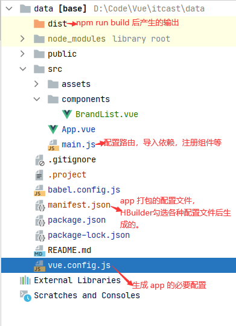

# 学习提要

## 必备插件

VSCode 开发安装插件

- Vetur  -- Pine Wu
- Vue 3 Snippets -- hollowtree

## 学习内容

后端开发人员学 Vue，因此重点在学会怎么用，学会常用的组件库。

- Vue 的基本语法，生命周期，各种属性的含义
- 为 DOM 绑定事件，给绑定的方法传递参数
- 不同 vue 组件的参数传递 
    - 父组件传递数据给子组件 -- props 属性
    - 子组件传递数据给父组件 -- `this.$emit` 触发父组件的事件，通过触发事件，将参数传递给事件的函数，从而进行参数传递。
    - 兄弟组件传递数据 -- 单独将状态提出来做管理或者 vuex，pinia。
- 路由组件 -- vue-router
- 全局状态管理组件 -- vue-router
- 缓存（StoreSession）
- 如何发起 ajax 请求

## 版本选择

- 开发版本，有完整的警告和调试模式
- 生成版本，删除了警告
- CDN，用于快速学习

## ESLint

- 声明但是未使用的变量会报错
- 空行不能连续大于等于 2
- 在行结尾处，多余的空格不允许
- 多余的分号，不允许
- 字符串要使用单引号，不能使用双引号
- 在方法名和形参列表的小括号之间，必须有一个空格
- 在单行注释的 // 之后，必须有一个空格
- 在每一个文件的结尾处，必须有一个空行
- import 语句必须放到最顶部
- etc...

# vue2入门

## 入门例子

下面为 vue2 的一个基本示例，展示了如何创建 Vue 对象，将 Vue 绑定到 DOM 上，以及 if-else，for 的语法。

```html
<!DOCTYPE html>
<html lang="en">

<head>
    <meta charset="UTF-8">
    <meta name="viewport" content="width=device-width, initial-scale=1.0">
    <title>Document</title>
</head>

<body>
    <div id="app">
        <h4>{{message}}</h4>
        <li>
            <!-- 就是 if-else -->
            <span v-if="!item.del">未删除 {{item.title}}</span>
            <span v-else>删除了 {{item.title}}</span> <br />
            <!-- 为 true 就显示 -->
            <span v-show="item.show">显示！</span>
        </li>
        <h4>for 循环用法</h4>
        <!-- 循环遍历 -->
        <li v-for=" item in list">
            <span>{{item.name}}</span><br>
        </li>
    </div>
</body>
<script src="https://cdn.jsdelivr.net/npm/vue/dist/vue.js"></script>
<script>
    // 创建一个 vue 对象，这个对象绑定到 id 为 app 的 dom 上
    // data 为在 dom 中需要使用的数据
    const vm = new Vue({
        el: '#app',
        data: {
            message: 'hello world',
            item: {
                title: 'some',
                del: false,
                show: true
            },
            list: [{
                name: 'tom'
            }, {
                name: 'jetty'
            }]
        }
    })
</script>

</html>
```

## 组件注册

如果我们在 html 中需要多次用到同样的东西，我们可以把它抽取成一个『组件』，然后进行 html 块的复用。

- 使用 Vue.component('组件名', {  }); 注册组件
- 在 html 中直接通过 <组件名></组件名> 使用标签

组件的定义及使用如下。

```html
<body>
    <div id="app">
        <h4>组件</h4>
        <div v-for=" item in list">
            <todo-item :title="item.name" :del="true" :show="true"></todo-item>
        </div>
    </div>
</body>
<script src="https://cdn.jsdelivr.net/npm/vue/dist/vue.js"></script>
<script>
    Vue.component('todo-item', {
        // 组件中的具体内容（即 html）
        template: `<li><span v-if="!del">未删除 {{title}}</span><span v-else>删除了 {{title}}</span> <br /></li>`,
        // 为组件定义一些属性（为类定义属性值），直接传递属性给组件
        props: {
            title: String,
            del: {
                type: Boolean,
                default: false
            },
        },
        // 组件内部的数据, 要返回（return），也可以 data(){ return{} } 这样写，一样的效果。
        data: function() {
            return { name: '123'};
        },
        // 组件内部用到的一些方法，如点击事件
        methods: {},
    })
    const vm = new Vue({
        el: '#app',
        data: {
            message: 'hello world',
            list: [{ name: 'tom'}, { name: 'jetty' }]
        }
    })
</script>

</html>
```

## 绑定事件

- 给原生 DOM 绑定事件 -- @click=‘function'，很简单，就不写 Demo 了。
- 给组件绑定事件并调用，调用涉及到父子通信，需要用到 `this.$emit` 方法。此处假定的逻辑是，子组件触发 click 方法后，调用父组件的 @delete 将两个参数传递给父组件。

```html
<body>
    <div id="app">
        <h4>组件</h4>
        <todo-list></todo-list>
    </div>
</body>
<script>
    // 子组件
    Vue.component('todo-item', {
        // 组件中的具体内容（即 html）
        template: `<li><span>{{title}}</span><button @click='delData'>删除</button></li>`,
        props: { title: String },
        // 组件内部用到的一些方法，如点击事件
        methods: {
            delData(args) {
                console.log("删除数据", args);
                // 假定处理逻辑是：子组件点击删除事件后，触发父组件的 delete 事件
                this.$emit('delete', 1, 2);
            }
        },
    });

    // 父组件
    Vue.component('todo-list', {
        // 父组件通过 :title 把自己的数据传递给子组件
        template: `<div><todo-item @delete='handleDel' v-for="item in list" :title="item.name"></todo-item></div>`,
        data() {
            return {
                list: [{ name: 'tom' }, { name: 'jetty' }]
            }
        },
        methods: {
            handleDel(arg1, arg2) {
                console.log("触发了父组件的 @delete 事件", arg1, arg2);
            }
        }
    })

    const vm = new Vue({
        el: '#app',
        data: {
            message: 'hello world',
        }
    });
</script>

</html>
```

<b>事件修饰符</b>

[事件处理 — Vue.js (vuejs.org)](https://v2.cn.vuejs.org/v2/guide/events.html)

## 插槽（填充标签）

插槽：定义子组件的时候，在子组件内刨了一个坑，父组件想办法往坑里填内容。

例如，我们用 todo-item 组件，我们希望可以在这个标签填充一些其他标签。

```html
<todo-item>
    <!-- vue 2.6 的用法 -->
    <template v-slot:pre-icon>前置</template>
    <template v-slot:suf-icon>后置</template>
</todo-item>

<script>
    Vue.component('todo-item', {
        // 组件中的具体内容（即 html）
        template: `<li> 
												<slot name='pre-icon'></slot>
												<span>{{title}}</span>
												<slot name='suf-icon'></slot>
												<button @click='delData'>删除</button>
            		</li>`,
        props: {
            title: String,
        },
        methods: {
            delData(args) {
                console.log("删除数据", args);
                // 子组件点击删除事件后，触发父组件的 delete 事件，删除 todo-item
                this.$emit('delete', 1, 2);
            }
        },
</script>
```

完整代码

```html
<body>
    <div id="app">
        <todo-list></todo-list>
    </div>
</body>
<script>
    // 子组件
    Vue.component('todo-item', {
        // 组件中的具体内容（即 html）
        template: `<li> 
                        <slot name='pre-icon'></slot>
                        <span>{{title}}</span>
                        <slot name='suf-icon'></slot>
                        <button @click='delData'>删除</button>
            		</li>`,
        props: {
            title: String,
        },

        methods: {
            delData(args) {
                console.log("删除数据", args);
                // 子组件点击删除事件后，触发父组件的 delete 事件，删除 todo-item
                this.$emit('delete', 1, 2);
            }
        },
    });

    // 父组件
    Vue.component('todo-list', {
        template: `<div>
                        <todo-item @delete='handleDel' v-for="item in list" :title="item.name">
                            <template v-slot:pre-icon>前置</template>
                            <template v-slot:suf-icon>后置</template>
                        </todo-item>
                    </div>`,
        data() {
            return {
                list: [{ name: 'tom' }, { name: 'jetty'}]
            };
        },
        methods: {
            handleDel(arg1, arg2) {
                console.log("触发了父组件的 @delete 事件", arg1, arg2);
            }
        }
    })

    const vm = new Vue({
        el: '#app',
        data: {
            message: 'hello world',
        }
    });
</script>

</html>
```

我们也可以向插槽传递属性（父组件向子组件的插槽传递属性）

```html
<!DOCTYPE html>
<html lang="en">

<head>
    <meta charset="UTF-8">
    <meta name="viewport" content="width=device-width, initial-scale=1.0">
    <title>Document</title>
    <script src="https://cdn.jsdelivr.net/npm/vue/dist/vue.js"></script>

</head>

<body>
    <div id="app">
        <todo-list></todo-list>
    </div>
</body>
<script>
    // 子组件
    Vue.component('todo-item', {
        // 组件中的具体内容（即 html）
        template: `<li> 
                    <slot name='pre-icon' :value='123'></slot>
                    <span>{{title}}</span>
            	</li>`,

        props: {
            title: String,
        }
    });

    // 父组件, 注意写法 v-slot:pre-icon='{value}' 这是为了后面 {{}} 取出 value 值用。
    Vue.component('todo-list', {
        template: `<div>
                        <todo-item v-for="item in list" :title="item.name">
                            <template v-slot:pre-icon='{value}'>前置{{value}}</template>
                        </todo-item>
                    </div>`,
        data() {
            return {
                list: [{ name: 'tom'}, { name: 'jetty'}]
            };
        }
    })

    const vm = new Vue({
        el: '#app',
        data: {
            message: 'hello world',
        }
    });
</script>

</html>
```

## 单文件组件

<b>优点</b>

- 有语法高亮
- 便于管理（名字不容易冲突）
- 支持 CSS
- 有构建步骤，可以使用预处理器

### <b>ES6 导入导出</b>

- 默认导入和导出

```js
//xxx.js
let a = 10
```

```js
// 默认导入
import m1 from './js/xxx.js'
// 在webpack中，每个js文件都是独立的模块
// 每个模块都有独立的作用域
// 其他模块，默认无法直接访问当前模块中定义的成员。
console.log(m1)
```

```js
//xxx.js
let a = 10
let b = 20
// 这个export default{} 语法叫做默认导出。
// 在一个模块中，仅允许导出一次
export default {
    a: a,
    // 属性值和属性名一直可以简写。
    b,
    say(){
        console.log("hello")
    }
}
```

- 按需导入和导出

```js
// 按需导入
import { 成员名称 } from '模块名'

//eg
import m2,{xx} from "xxx.js"

// as 取别名
import m2,{test1 as myTest} from "xx.js"
```

```js
// 按需导出
export var a = 10
```

### 单文件组件开发

- 安装 node，百度即可

- 安装 vue cli

    ```shell
    npm install -g @vue/cli # -g 表示全局安装
    # or
    yarn global add @vue/cli
    ```


- 创建 vue 项目 -- 命令行创建

    ```cmd
    vue create vue-project
    # 选择默认模式
    #========================================
    Vue CLI v5.0.8
    ? Please pick a preset:
      Default ([Vue 3] babel, eslint)
    > Default ([Vue 2] babel, eslint)
      Manually select features
    #========================================
    
    ```

- 创建 vue 项目 -- ui 创建

    ```cmd
    vue ui
    🚀  Starting GUI...
    🌠  Ready on http://localhost:8000
    ```

    然后按根据页面的提示创建项目就行

### Vue 文件结构说明

每个 .Vue 文件，都是一个 vue 组件（叫做单文件组件），它由三部分组成：

- template 结构
- script 行为
- style 样式

> 定义组件 Demo

```vue
<template>
  <div>
    <h3>这是组件Home {{ msg }}</h3>
  </div>
</template>

<script>
export default {
  name: "Home",
  data() {
    return { msg: "hello vue" }
  },
  methods: {},
  filters: {}
}
</script>

<style scoped>
h3 {
  color: bisque;
}
</style>
```

### 定义组件

- 声明一个Vue文件


```vue
<template>
  <div>
    <h3>这是Son 组件</h3>
  </div>
</template>

<script>
export default {
  name: "Son"
}
</script>
```

- 把这个组件注册为全局组件或私有组件


<b>全局组件</b>

```js
import Home from "@/components/Home";
import Vue from "vue";

Vue.component('Home', Home)
```

<b>私有组件</b>

```js
import Son from "./Son"

console.log(Son.name);
export default {
  name: "Home",
  data() {
    return { msg: "hello vue" }
  },
  methods: {},
  filters: {},
  // 定义私有组件
  components: {
    'my-son': Son
  }
}
```

### 组件化Vue

可以认为组件是特殊的 Vue 实例

组件和实例的相同和区别：

- 组件的 data 必须是一个 function 并 return 一个 字面量对象； 在 Vue 实例中，实例的 data 既可以是对象，也可以是方法；
- 组件中，直接通过 template 属性来指定组件的 UI 结构； 在 Vue 实例中，通过 el 属性来指定实例控制的区域；但是实例也可以使用 template；
- 组件和实例，都有自己的生命周期函数，私有的过滤器，methods 处理函数；

<b>为什么组件中的 data 必须定义为一个方法并返回一个对象</b>

因为这样，能够保证每次创建的组件实例，都有自己的一块唯一的数据内存，防止组件之间数据的干扰。

## 组件样式控制

父组件的样式会影响子组件，如何解决？

默认情况下，组件中定义的样式是全局生效的。如何样式只在当前组件内生效？

给 style 加上 scope 属性，即可。如何做到的？只要为组件添加了 scope 那么当前组件（不包括引入的组件）所有的 标签 都会使用同一个属性。

```css
<style scope> </style>
```

## 组件数据通信

### 父传子

在父组件中，以标签形式使用子组件时，可以通过属性绑定，为子组件传递数据。

在子组件中，如果向父组件传递过来的数据，必须先定义 props 数组来接收

接收完 props 数据，可以直接在子组件的 template 区域使用

----

> 代码

**子组件**

```vue
<template>
  <div>
    <button @click="objFromParent.a++">a自增</button>
    <h1>子组件---->{{ infoFormParent }}-----> {{ objFromParent }}</h1>
  </div>
</template>

<script>
import _ from 'loadsh'

export default {
  name: "Son",
  // 而 data 中的数据 可读可写
  data() {
    // 建议使用转存的数据，以便满足修改的请求。
    // 对于对象类型的数据， 存储的是地址值，我们需要把数据拷贝一份，不修改源数据。
    // 深拷贝 安装 lodash npm install lodash -S
    return {
      infoFormParent: this.pmsg,
      objFromParent: _.cloneDeep(this.obj)
    }
  },
  // 子组件需要使用 props 数组，接收外界传递过来的数据，接收到的数据可以直接在Son中使用
  // 通过 props 接收的数据，是只读的。不要为它们重新赋值。
  props: ['pmsg', 'obj']
}
</script>
```

**父组件**

```vue
<template>
  <div>
    <h1>父组件</h1>
    <button @click="sendData">发送数组给子组件</button>
    <!--在使用组件的时候，通过 属性绑定，把数据传递给子组件-->
    <my-son :pmsg="parentMsg" :obj="obj"></my-son>
  </div>
</template>

<script>
import Son from "@/components/Father2Son/Son";

export default {
  name: "Parent",
  data() {
    return {
      parentMsg: '继承我的花呗',
      obj: { a: 10, b: 20 }
    }
  },
  methods: {
    sendData() {}
  },
  components: {
    'my-son': Son
  }
}
</script>
```

**渲染调用**

```vue
<template>
  <div id="app">
    <Parent></Parent>
  </div>
</template>

<script>
import Parent from "@/components/Father2Son/Parent";
import Vue from "vue";
Vue.component('Parent', Parent)

export default {
  components: {Parent}
}

</script>
```

### 子传父

> 通过事件绑定机制，子传数据给父

父为子绑定事件，然后子把自己的数据传递过去。

父亲调用方法会接收到子的数据，这时候就得到了子的数据。

> 代码Demo

子组件

```vue
<template>
  <div>
    <h1>子组件</h1>
    <button @click="btnHandler">触发func事件</button>
    <button @click="btnHandler2">触发func2事件，带参数</button>
  </div>
</template>

<script>
export default {
  name: "Son",
  data() {
    return {
      msg: ': 我是子组件的值'
    }
  },
  methods: {
    btnHandler() {
      //$emit表示触发事件 , 在子组件中，通过  this.$emit() 触发父组件 为子组件绑定的 func 事件。
      // func 是父组件为子组件绑定的事件。
      this.$emit('func') // 调用父组件给子组件的事件 func
    },
    btnHandler2() {
      this.$emit('func2', this.msg) // 调用父组件给子组件的事件 func
    }
  }
}
</script>
```

父组件

```vue
<template>
  <div>
    <h1>父组件</h1>
    <!--在使用组件的时候，通过 属性绑定，把数据传递给子组件-->
    <my-son @func="show" @func2="show2"></my-son>
  </div>
</template>

<script>
import Son from "@/components/Son2Father/Son";

export default {
  name: "Parent",
  data() {
    return {}
  },
  methods: {
    show(){
      console.log("有人调用了父组件的show方法！")
    },
    show2(args){
      console.log("父组件的 show2 带有参数"+args)
    }
  },
  components: {
    'my-son': Son
  }
}
</script>
```

### 兄弟传兄弟

> 思路

定义一个公共的Vue实例，如 bus.js 实例名称为 bus。

数据发送方，调用 `bus.$emit()` 触发 bus 上的某个事件，从而把数据发送出去。

在数据接收方，使用 `bus.$on()` 自定义事件，并指定事件处理函数。

----

> 代码示例

**公共Vue实例 bus.js**

```js
import Vue from 'vue'

const bus = new Vue()
export default bus
```

**发送数据方**

```vue
<template>
  <div>
    <h1>哥哥</h1>
    <button @click="sendMsgToDD">哥哥给弟弟数据</button>
  </div>
</template>

<script>
import bus from './bus'

export default {
  name: "GG",
  data() {
    return {
      msg: '哥哥有糖给弟弟'
    }
  },
  methods: {
    sendMsgToDD() {
      // 在数据发送方，调用bus.$emit() 触发 bus 上的某个事件，从而把数据发送出去
      bus.$emit('ooo', this.msg)
    }
  }
}
</script>
```

**接收数据方**

```vue
<template>
  <div>
    <h3>弟弟</h3>
  </div>
</template>

<script>
import bus from './bus'

export default {
  name: "DD",
  data() {
    return {}
  },
  created() {
    // 在数据接收方 使用 bus.$on 自定义事件，并指定事件处理函数
    bus.$on('ooo', data => {
      console.log("弟弟拿到了哥哥的数据，哥哥的数据是："+data)
    })
  }
}
</script>
```

### 使用 this.$refs 来获取元素和组件

> 基本使用

1.把要获取的 DOM 元素，添加 ref 属性，创建一个 DOM 对象的引用，指定的值，就是引用的名称

```html
<p ref="myP">这是父组件</p>
```

2.如果要获取某个引用所对应的 DOM 对象，则直接使用 `this.$refs.引用名称`

```js
console.log(this.$refs.myP)
```

3.也可使用 ref 为组件添加引用；可以使用 `this.$refs.组件名称`，拿到组件的引用，从而调用组件上的方法和获取组件 data 上的数据

> this.$refs 获取 DOM

```vue
<template>
  <div>
    <!--  通过 ref 获取到的 DOM 元素的引用，就是一个元素的 DOM 对象  -->
    <h3 id="h3" @click="getContent" ref="myh3">123</h3>
  </div>
</template>

<script>
export default {
  name: "Home1",
  methods: {
    getContent() {
      // 不要在vue中操作 DOM
      // console.log(document.getElementById("h3").innerHTML);
      console.log(this.$refs.myh3)
    }
  }
}
</script>
```

> ref 直接引用组件并调用组件的方法和数据 ★★★★★

可以使用 ref 属性直接调用子组件的方法属性！

实现父调用子的方法

```vue
<template>
  <div>
    <!--  通过 ref 获取到的 DOM 元素的引用，就是一个元素的 DOM 对象  -->
    <h3 id="h3" @click="getContent" ref="myh3">123</h3>
    <my-son ref="son"></my-son>
  </div>
</template>

<script>
import Son from "@/components/GetDocumnet/Son"

export default {
  name: "Home1",
  methods: {
    getContent() {
      // 不要在vue中操作 DOM
      // console.log(document.getElementById("h3").innerHTML);
      console.log(this.$refs.myh3)
      this.$refs.son.add()
    }
  },
  components: {
    "my-son": Son
  }
}
</script>
```

---

```vue
<template>
  <div>
    <h3>这是Son组件 {{ sonMsg }}</h3>
  </div>
</template>

<script>
export default {
  name: "Son",
  data() {
    return {
      sonMsg: 0
    }
  },
  methods: {
    add() {
      this.sonMsg++;
    }
  }
}
</script>
```

### 触发组件更新（原理）

<b>Vue 是如何触发组件更新的？</b>

Vue 是数据驱动的，数据改变的时候视图才会改变。

<b>状态 data vs 属性 props</b>

- 状态是组件自身的数据（即 data() { return {} }）
- 属性是来自父组件的数据（子组件定义属性，然后父组件通过 `:属性名` 将父组件的值传递给子组件）
- 状态的改变未必会触发更新（只有状态在 DOM 中才会触发更新）
- 属性的改变未必会触发更新（只有属性在 DOM 中才会触发更新）

<b>响应式更新</b>

<div align="center"></div>

vue 在实例化的时候，会对 data 下的数据做一个 getter/setter 的转换。即，在操作数据的时候，都会经过一个代理层，而代理层是通过 getter/setter 操作数据的。

每个组件实例都对应一个 <b>watcher</b> 实例，它会在组件渲染的过程中（<b>虚拟 DOM 中用到的数据</b>）把“接触”过的数据 property 记录为依赖。之后当依赖项的 setter 触发时，会通知 watcher，从而使它关联的组件重新渲染。

例如，下面的代码就会触发组件重新渲染。

```html
<template>
  <div id="app">
    <!-- DOM 里用到了 num，因此会触发 updated 方法 -->
    <div :data="num"></div>
    <button @click="cc">111</button>
    <!-- DOM 没有用到 c，因此不会触发 updated 方法 -->  
    <button @click="cc2">222</button>
  </div>
</template>

<script>
export default {
  name: 'App',
  components: { HelloWorld },
  data() { return { num: 1 } },
  updated() { console.log("触发了更新"); },
  methods: {
    cc(){
      console.log("click");
      this.num = 2;
    },    
    cc2() {
      console.log("click");
      this.c = 2;
    }
  }
}
</script>
```

### 单文件组件的注册

- 全局注册，一般写在 main.js 里，导入组件后使用 Vue.component('todo-list',TodoList) 注册组件。
- 局部注册，仅在当前组件内有效，直接在 components 里注册，注册组件 `TodoList.vue` 后，可以通过 `<todo-list></todo-list>` 标签使用。

定义全局组件

```js
// 全局组件注册
import Vue from "./js/vue.js"
// 名称尽量小写，中间用-隔开
Vue.component("my-test", {
    template: `<div> 这是我定义的组件 </div>`
})
const vm = new Vue({
    el: '#app',
    data: { msg: 'hello ' }
})
```

```html
<!DOCTYPE html>
<html lang="en">
<head>
    <meta charset="UTF-8">
    <meta http-equiv="X-UA-Compatible" content="IE=edge">
    <meta name="viewport" content="width=device-width, initial-scale=1.0">
    <title>Document</title>
</head>

<body>
    <div id="app">
        <h5>{{msg}}</h5>
        <my-test></my-test>
    </div>
</body>

</html>
```

定义私有组件

```js
const vm = new Vue({
    el: '#app2',
    data: {
        info: '000'
    },
    components: {
        // '组件名称':{/* 组件配置对象 */}
        'my-test2':{
            tenplate: `<div>这是私有组件my-test2</div>`
        }
    }
})
```

### <b>@ 的作用</b>

- @ 实际上是配置了 @ 指向项目根目录中的 src 文件夹

- '@' : path.join( __dirname, './src' )

<b>组件化：</b>从页面 UI 的角度分析，把页面中可复用的 UI 结构，抽离为单独的组件；实现 UI 的复用。

## 双向数据绑定

v-model 指令双向数据绑定，只要 vm 监听到 data 中任何一条数据的变化，都会重新执行 el 区域的所有指令。

```html
<input v-mode="in_val">
```

[表单输入绑定 | Vue.js (vuejs.org)](https://cn.vuejs.org/guide/essentials/forms.html#text)

## 虚拟DOM

Vue 使用的虚拟 DOM，使用树形结构组织标签之前的曾经关系。在进行 for 遍历的时候，会要求绑定一个 key，如下

```html
<div>
    <li v-for="item in list" :key='item.somekey'>
        <span>{{item.name}}</span><br>
    </li>
</div>
```

有时会有人写成这种

```html
<div>
    <li v-for="(item, index) in list" :key='index'>
        <span>{{item.name}}</span><br>
    </li>
</div>
```

如果会对 list 中的数据进行添加删除，意味着每个 li 的 index 可能会发生变化，需要频繁修改 for 中的产生的 DOM，降低性能。建议在只需展示数据（数据不会变动）的场景下用 index 作为 key，其他情况下不要使用值会变动的 key。

## 操作DOM

## 计算属性和监听器

### computed

必须是响应式数据才行

- 减少模板中计算逻辑
- 数据缓存
- 依赖固定的数据类型（应式数据）
- 适用场景，购物车求总价。

下面的例子展示了计算属性的优点

```html
<!-- 在模板中写逻辑 -->
<div id="example">
  {{ message.split('').reverse().join('') }}
</div>

<!-- 使用计算属性 -->
<div id="example">
  <p>Original message: "{{ message }}"</p>
  <p>Computed reversed message: "{{ reversedMessage }}"</p>
</div>
<script>
let vm = new Vue({
  el: '#example',
  data: { message: 'Hello' },
  computed: {
    // 计算属性的 getter
    reversedMessage: function () {
      // `this` 指向 vm 实例
      return this.message.split('').reverse().join('')
    }
  }
})
</script>
```

使用方法也可以达成上述目的，但是计算属性会对结果进行缓存，<b>计算属性是基于它们的响应式依赖进行缓存的。</b>只在相关响应式依赖发生改变时它们才会重新求值。如果没有发生改变不会重新计算，而方法每次都要进行计算。

[计算属性 getter 和 setter](https://v2.cn.vuejs.org/v2/guide/computed.html#计算属性的-setter)

### watch

监听数据是否发生变化（通过监听变化，来书写响应的逻辑，如密码长度检测）

```html
<div id="watch-example">
	<input v-model="question">
</div>

<script src="https://cdn.jsdelivr.net/npm/axios@0.12.0/dist/axios.min.js"></script>
<script src="https://cdn.jsdelivr.net/npm/lodash@4.13.1/lodash.min.js"></script>
<script>
var watchExampleVM = new Vue({
  el: '#watch-example',
  data: {
    question: '',
  },
  watch: {
    // 如果 `question` 发生改变，这个函数就会运行
    question: function (newQuestion, oldQuestion) {
       // question 发生变化的话，就执行下列代码
       // some code
    }
  },
})
</script>
```

### computed vs watch

- computed 能做的，watch 都能做，反之则不行（watch 更强大）
- 能用 computed 的尽量用 computed，computed 更简洁，清爽。

## 生命周期

<b>生命周期：</b>实例的生命周期，就是一个阶段，从创建到运行，再到销毁的阶段。
<b>生命周期函数：</b>在实例的生命周期中，在特定阶段执行的一些特定的事件，这些事件，叫做生命周期函数；

生命周期函数 = 生命周期钩子 = 生命周期事件

### 生命周期函数

- 创建期间的生命周期函数：（特点：每个实例一辈子只执行一次）
  - `beforeCreate`：创建之前，此时 data 和 methods 尚未初始化
  - created（第一个重要的函数，此时，data 和 methods 已经创建好了，可以被访问了，首页数据的请求一般在这里发起！）
  - `beforeMount`：挂在模板结构之前，此时，页面还没有被渲染到浏览器中（如果想初始化一些第三方的 JS 插件，必须在 mounted 中进行初始化。比如 echarts，它需要在初始化完毕的 dom 中进行操作）
  - mounted（第二个重要的函数，此时，页面刚被渲染出来；如果需要操作 DOM 元素，最好在这个阶段；如使用三方插件，该插件需要 DOM 初始化完毕！）

- 运行期间的生命周期函数：（特点：按需被调用至少 0 次，最多 N 次）
  - beforeUpdate：数据是最新的，页面是旧的。
  - updated：页面和数据都是最新的。
- 销毁期间的生命周期函数：（特点：每个实例一辈子只执行一次）
  - beforeDestory：销毁之前，实例还是正常可用。
  - destoryed：销毁之后，实例已经不在工作了。

[生命周期钩子 | Vue.js (vuejs.org)](https://cn.vuejs.org/guide/essentials/lifecycle.html#lifecycle-diagram)

### 函数式组件

- functional: true
- 无状态、无实例、没有 this 上下文、无生命周期

## 指令

### 常见指令

vue 中的指令，只有 `{{}}` 是用在内容节点中的，其它所有的指令，都是用在属性节点中的。

- 内容节点 `<div>{{msg}}</div>`
- 属性节点 `<div v-html='msg'></div>`

> 数据模板

```html
<script>
    const vm = new Vue({
        el: '#app',
        data: {
            msg: "hello",
            array: [1, 2, 3, 4, 5],
            elem: "<span style='color:red'>Hello</span>"
        },
        method: {
            show: function(){
                console.log("ok");
            }
        }
    });
</script>
```

> v-text 基本不用

会把原来的内容清空。插值表达式只会把占位符处的数据进行解析替换。

```html
<h3 v-text="msg">
    12313
</h3>
// 显示 hello。12313会被覆盖掉的。
```

v-text 中使用简单的语句

```html
<h3 v-text="msg + 666">
    12313
</h3>
// 显示hello666

<h3 v-text="msg + 'abc' ">
</h3>
// 显示 hellabc    
```

v-text 不存在闪烁问题。

场景：向元素的内容区域中，渲染指定的文本。

> v-html

```html
<h3 v-html="elem">
    // 可以解析html标签
</h3>
```

> v-bind：属性绑定；用的很频繁

为 html 属性节点动态绑定数据的，如：

`<buttuon v-bind:title="mytitle">按钮</button>`

应用场景：如果元素的属性值，需要动态地进行绑定，则需要使用 v-bind：指令

简写形式：

- v-bind 可以简写为 `:`，如
- `<buttuon :title="mytitle">按钮</button>`
- `` boo是布尔值，img1/2 是图片链接，以此动态切换图片路径

> v-on：事件绑定

`<div v-on:click="show">按钮</div>`   绑定事件不传参

`<div v-on:click="show('hello')">按钮</div>`   绑定事件传参

`<div @click="show('hello')">按钮</div>`   简写

> v-model：双向数据绑定

<a href="https://segmentfault.com/a/1190000006599500">几种实现双向绑定的做法</a>

<a href="https://www.cnblogs.com/kidney/p/6052935.html">csdn</a>

> v-bind

> v-for

> v-if /v-show

### 自定义指令

vue 可以自定义指令，但是不推荐使用。

[自定义指令 | Vue.js (vuejs.org)](https://cn.vuejs.org/guide/reusability/custom-directives.html#object-literals)

```js
// Vue.component('全局组件名称',{/* 指令的配置对象 */})
// Vue.directive("focus", { /* 指令的配置对象 */ }
```

> 自定义指令

- bind：只要指令被解析指令了，就会调用指令中的 bind 方法，其中 el 是 DOM 对象。bind 表示指令第一次被解析执行时候调用，此时，这个 DOM 元素，还没有被 append 到父节点中；
- inserted：inserted会在元素被插入到父节点后，执行，其中 el 是 DOM 对象。
- 其他诸如 updated 一类的请看官方文档。

总结：CSS 样式这类操作写在 bind 中，JS 这类操作写在 inserted 中。

```js
Vue.directive("focus", {
    bind: function (el) {
        // el.focus();
        // doing something
        console.log(el)
    },
    inserted: function(el){
        el.focus()
    }
})
```

> 自定义指令传参

通过第二个占位符传递参数，获得参数的值通过 **.value** 获取

```js
Vue.directive("focus", {
    bind: function (el, param) {
        // el.focus();
        // doing something
        el.style.color = param.value
    }
})
```

## 跨层级组件获取

后期补充

# 常规用法

定义使用过滤器：处理文本显示格式

了解实例生命周期和生命周期函数

使用 axios 发起 Ajax 请求

- ES6 中的 Promise
- ES7 中的 async 和 await

带数据交互的案例

Vue 常见的过渡动画（不重要）

## 过滤器

- 过滤器的作用示例：“2020-01-23T:10:02.945Z” => 2020-01-23
- 概念：过滤器本质上是一个函数，可被用作一些常见的文本格式化。
- 过滤器只可以用在两个地方：mustache 插值表达式和 v-bind 表达式
- 过滤器应该被添加在 JavaScript 表达式的尾部，由管道符指示；

### 全局过滤器

- 使用全局过滤器语法

    - `<span>{{ dt | 过滤器名称 }}</span>`

- 定义全局过滤器语法

    ```js
    Vue.filter('过滤器名称',function(originVal){
    	// doing something 对数据进行处理
    	return 处理结果;
    })
    ```

- 使用过滤器的注意事项

    - 如果想拿管道符前面的值，通过 function 的第一个形参来拿。
    - 过滤器中，一定要返回一个处理的结果，否则就是一个无效的过滤器
    - 在调用过滤器的时候，直接通过() 调用就能传参；从过滤器处理函数的第二个形参开始接收传递过来的参数。
    - 可多次使用 | 管道符，一次调用多个过滤器

> 全局过滤器代码示例

```html
<!DOCTYPE html>
<html lang="en">

<head>
    <meta charset="UTF-8">
    <meta http-equiv="X-UA-Compatible" content="IE=edge">
    <meta name="viewport" content="width=device-width, initial-scale=1.0">
    <title>Document</title>
    <script src="js/vue.js"></script>
</head>

<body>
    <div id="app">
        传入的参数是 time，然后调用方法 dataFormat
        <h3>{{time | dataFormat}}</h3>
    </div>
</body>
<script>
    Vue.filter('dataFormat', function (originVal) {
        const date = new Date(originVal);
        let years = date.getFullYear()
        let month = date.getMonth() + 1
        let day = date.getDay()
        // 魔法字符串${}是占位符
        return `${years}-${month}-${day}`;
    });

    const vm = new Vue({
        el: '#app',
        data: {
            time: '2020-01-22 23:11:23'
        }
    });
</script>
</html>
```

## Promise、async、await

### Promise

> 概念：

ES6 中的新语法，Promise 是一个构造函数；每个 new 出来的 Promise 实例对象，都代表一个异步操作。

JS 解析引擎是单线程的；宿主环境（浏览器、Node 环境）是多线程的。

异步的任务会放到异步回调函数的队列中。当 js 把自己栈中的任务执行完后，才会执行异步回调函数队列中的任务。

> 作用

解决了回调地狱的问题；

- 回调地狱，指的是回调函数中，嵌套回调函数的代码形式；如果嵌套的层级很深，就是回调地狱。
- 回调地狱，不利于代码的阅读、维护和后期的扩展。

### Promise用法

异步代码回顾

```js
/**
JS解析引擎是单线程的；宿主环境（浏览器、Node环境）是多线程的。

异步的任务会放到异步回调函数的队列中。当js把自己栈中的任务执行完后，才会执行异步回调函数队列中的任务。
*/
```

回调地狱代码示例：`node.js`

```js
const fs = require('fs')

fs.readFile('./files/1.txt', 'utf-8', (err, dataStr1) => {
    if (err) return console.log(err.message);
    console.log(dataStr1);
    fs.readFile('./files/2.txt', 'utf-8', (err, dataStr1) => {
        if (err) return console.log(err.message);
        console.log(dataStr1);
        fs.readFile('./files/3.txt', 'utf-8', (err, dataStr1) => {
            if (err) return console.log(err.message);
            console.log(dataStr1);
        })
    })
})
```

Promise 不会减少代码量，但是可以解决回调地狱的问题。

创建形式上的异步操作

```js
const p = new Promise()
```

创建具体的异步操作；只要 new 了就会立即执行！

```js
// 只要new了，就会立即执行！
const p = new Promise(function(successCb,errorCb){
    // 定义具体的异步操作
})
// 定义成功和失败的回调
p.then(successCallback,errorCallback);
```

查看下 Promise 的原型链

prototype
- catch：function catch()
- constructor：function Promise()
- finally：function finally()
- then：function then()  为 Promise 示例对象，.then() 方法最多需要两个参数，成功和失败的回调函数；它的返回值是 Promise 对象。
- catch：function catch() 捕获前面所有 .then() 中发生的错误，集中处理。

```js
const fs = require('fs')

//==================无效写法================
function getContentByPath(fPath) {
    // js主线程只负责new出这个Promise，具体的执行交给浏览器执行了
    const p = new Promise(function () {
        fs.readFile(fPath, 'utf-8', (err, dataStr1) => {
            if (err) return console.log(err.message);
            console.log(dataStr1);
            // return dataStr1; 所以这个返回值是无效的。
        })
    })
}
getContentByPath('./files/1.txt')
//==================无效写法================


//==================有效写法================
function getContentByPath2(fPath) {
    // js主线程只负责new出这个Promise，具体的执行交给浏览器执行了.回调函数从哪里来？
    const p = new Promise(function (successCallback, errorCallback) {
        fs.readFile(fPath, 'utf-8', (err, dataStr1) => {
            if (err) return errorCallback(err);
            successCallback(dataStr1)
        })
    });
    return p;
}

const r1 = getContentByPath2('./files/1.txt')
// 成功回调  失败回调
r1.then(function (info) { console.log(info); console.log("success"); }, function (err) { console.log(err); });
//==================有效写法================
```

实际我们不会自己封装 Promise，会使用其他人封装的方法。

### async和await

> ES7 中 async 和 await 可以简化 Promise 调用，提高 Promise 代码的阅读性和理解性。

- 如果某个方法的返回值是 Promise 对象，那么，就可以用 await 关键字，来修饰 promise 实例
- 如果一个方法内部用了 await 那么这个方法必须修饰为 async 异步方法
    - 精简：await 只能用在被 async 修饰的方法中

```js
function getContentByPath(fpath){
    return new Promise(function(successCb,errorCb){
        fs.readFile(fpath, 'utf-8',(err,data)=>{
            if(err) return errorCb(err)
            successCb(data)
        })
    })
}

const data = await getContentByPath("./fs.txt")

// 如果一个方法内部用了await那么这个方法必须修饰为async
async function test(){
	const data = await getContentByPath("./fs.txt")
}
```

## axios

> 之前发起请求的方式

- 最开始封装 XMLHttpRequest 对象发起 Ajax 请求。
- 使用 Jquery 中提供的工具函数：
    - `$.ajax({配置对象})`
    - `$.post(url地址, function(){})`
    - `$.get(url地址，处理函数)`
- 现在，用 axios 发起 Ajax 请求。
    - 只支持 get 和 post 请求，无法发起 JSONP 请求。
    - 如果涉及到 JSONP 请求，让后端启用 cors 跨域资源共享即可。
- 在 Vue 中使用 vue-resource 发起数据请求
    - 支持 get post jsonp ，vue 官方不推荐。

### axios的使用

- 测试数据地址
    - get 测试地址 http://www.liulongbin.top:3005/api/get
    - post 测试地址 http://www.liulongbin.top:3005/api/post
- 使用 axios.get() 和 axios.post() 发起请求。
- 使用拦截器实现 loading 效果
- 使用 async 和 await 结合 axios 发起 Ajax 请求 

#### get请求

> 使用 axios 发起 get 请求

```html
<!DOCTYPE html>
<html lang="en">

<head>
    <meta charset="UTF-8">
    <meta http-equiv="X-UA-Compatible" content="IE=edge">
    <meta name="viewport" content="width=device-width, initial-scale=1.0">
    <title>Document</title>
    <script src="js/vue.js"></script>
    <script src="js/axios.js"></script>
</head>

<body>
    <div id="app">
        <button @click='getInfo'>GET</button>
    </div>
    <script>
        const vm = new Vue({
            el: '#app',
            methods: {
                getInfo() {
                    const result = axios.get('http://www.liulongbin.top:3005/api/get', { params: { name: 'zs', age: 20 } });
                    result.then(function (res) {
                        console.log(res);
                    })
                }
            }
        });
    </script>
</body>
</html>
```

> 结合 async await

```html
<!DOCTYPE html>
<html lang="en">

<head>
    <meta charset="UTF-8">
    <meta http-equiv="X-UA-Compatible" content="IE=edge">
    <meta name="viewport" content="width=device-width, initial-scale=1.0">
    <title>Document</title>
    <script src="js/vue.js"></script>
    <script src="js/axios.js"></script>
</head>

<body>
    <div id="app">
        <button @click='getInfo'>GET</button>
    </div>
    <script>
        const vm = new Vue({
            el: '#app',
            methods: {
                async getInfo() {
                    const result = await axios.get('http://www.liulongbin.top:3005/api/get', {
                        params: {
                            name: 'zs',
                            age: 20
                        }
                    });
                    console.log(result);
                }
            }
        });
    </script>
</body>
</html>
```

> 解构赋值

```js
const user = {
    name: 'zs',
    age: 20,
    gender: 'man'
}

// 把name属性解放出来，当作常量去使用。
// const { name } = user
// console.log(name);

// 给age取别名：userage
const { name, age: userage } = user
console.log(name, userage);
```

这样我们获取数据的时候，就可以用解构赋值，只得到我们想要的那部分数据了！

```js
async function getInfo() {
    const {data:retVal} = await axios.get('http://www.liulongbin.top:3005/api/get', {
        params: {
            name: 'zs',
            age: 20
        }
    });
    console.log(result);
}
```

#### post请求

```js
async postInfo() {
    const { data: retVal } = await axios.post('http://www.liulongbin.top:3005/api/post', { name: 'ls', gender: 'man' })
    console.log(retVal.data);
}
```

#### Vue推荐用法

```html
<!DOCTYPE html>
<html lang="en">

<head>
    <meta charset="UTF-8">
    <meta http-equiv="X-UA-Compatible" content="IE=edge">
    <meta name="viewport" content="width=device-width, initial-scale=1.0">
    <title>Document</title>
    <script src="js/vue.js"></script>
    <script src="js/axios.js"></script>
</head>

<body>
    <div id="app">
        <button @click='getInfo'>GET</button>
        <button @click='postInfo'>POST</button>
    </div>
    <script>
        // 通过这个属性，全局设置 请求的 根路径。
        axios.defaults.baseURL = 'http://www.liulongbin.top:3005'
        Vue.prototype.$http = axios;
        const vm = new Vue({
            el: '#app',
            methods: {
                async getInfo() {
                    // 请求数据的时候会。 baseURL + 路径 = 'http://www.liulongbin.top:3005' + '/api/get'
                    const { data: retVal } = await this.$http.get('/api/get', {
                        params: {
                            name: 'zs',
                            age: 20
                        }
                    });
                    console.log(retVal.data);
                },
                async postInfo() {
                    const { data: retVal } = await this.$http.post('/api/post', { name: 'ls', gender: 'man' })
                    console.log(retVal.data);
                }
            }
        });
    </script>
</body>
</html>
```

### axois的传参

```js
this.$http.get('/user/10',{params:{name:'zs',age:22}}) // ===> http://127.0.0.1:8080/user/10?name=zs&age=2
```

## 案例

带有数据库的品牌管理案例

```html
<!DOCTYPE html>
<html lang="en">

<head>
    <meta charset="UTF-8">
    <meta http-equiv="X-UA-Compatible" content="IE=edge">
    <meta name="viewport" content="width=device-width, initial-scale=1.0">
    <title>Document</title>
    <script src="js/vue.js"></script>
    <script src="js/axios.js"></script>
    <link rel="stylesheet" href="css/bootstrap.css">
</head>

<body>
    <div id="app">

        <div class="panel panel-primary inline">
            <div class="panel-heading inline">
                <h3 class="panel-title">添加新品牌</h3>
            </div>

            <div class="panel-body form-inline">
                <div class="input-group">
                    <div class="input-group-addon">品牌名称</div>
                    <input type="text" class="form-control" v-model='name'>
                </div>

                <div class="input-group">
                    <button class="btn btn-primary" @click='add'>添加</button>
                </div>

                <div class="input-group">
                    <div class="input-group-addon">按名称搜索</div>
                    <input type="text" class="form-control" v-model='keywords'>
                </div>
            </div>
        </div>

        <table class="table table-bordered">
            <thead>
                <tr>
                    <th>ID</th>
                    <th>name</th>
                    <th>time</th>
                    <th>operate</th>
                </tr>
            </thead>
            <tbody>
                <!-- 很巧妙啊 in search() search用来过滤 -->
                <tr v-for="item in search()" :key='item.id'>
                    <td>{{item.id}}</td>
                    <td>{{item.name}}</td>
                    <td>{{item.ctime | dataFormat}}</td>
                    <td><a href="#" @click.prevent="remove(item.id)">删除</a></td>
                </tr>
            </tbody>
        </table>
    </div>
</body>
<script>
    axios.defaults.baseURL = 'http://liulongbin.top:3005';
    Vue.prototype.$http = axios;

    // 定义全局过滤器
    Vue.filter('dataFormat', function (originVal) {
        const dt = new Date(originVal);
        const y = dt.getFullYear();
        const m = (dt.getMonth() + 1 + '').padStart(2, '0');
        const d = (dt.getDay() + '').padStart(2, '0');
        return `${y}-${m}-${d}`
    })

    const vm = new Vue({
        el: '#app',
        data: {
            brandList: [],
            name: '',
            keywords: ''
        },
        created() {
            //在created中发起首屏数据的请求
            this.getBandList()
        },
        methods: {
            async getBandList() {
                const { data: res } = await this.$http.get('/api/getprodlist');
                // console.log(res);
                // return res.message; 返回的是一个promise对象。
                // 应该这么写
                this.brandList = res.message;
            },
            
            async add() {
                const { data: res } = await this.$http.post('/api/addproduct', { name: this.name });
                if (res.status !== 0) return alert('添加失败！');
                this.getBandList();
                this.name = '';
            },
            
            search() {
                return this.brandList.filter(item=>item.name.includes(this.keywords))
            },
            
            async remove(id) {
                const { data: res } = await this.$http.get('/api/delproduct/' + id);
                if (res.status !== 0) return alert('删除失败');
                else this.getBandList();
            }
        }
    });
</script>

</html>
```

### Demo

```html
<!DOCTYPE html>
<html lang="en">

<head>
    <meta charset="UTF-8">
    <meta http-equiv="X-UA-Compatible" content="IE=edge">
    <meta name="viewport" content="width=device-width, initial-scale=1.0">
    <title>Document</title>
    <script src="js/vue.js"></script>
</head>
<style>
    /* 定义入场之前和离场之后的样式 */
    .v-enter,
    .v-leave-to {
        transform: translateX(150px);
    }

    /* 定义入场阶段和离场阶段的样式 */
    .v-enter-active,
    .v-leave-active {
        transition: all 0.8s ease;
    }
</style>

<body>
    <div id="app">
        <button @click='flag=!flag'>toggle</button>
        <!-- 1.使用vue提供的transition标签 包裹需要添加动画的元素 name默认以v为前缀。 -->
        <transition name='v'>
            <h3 v-if='flag'>asfaf</h3>
        </transition>
    </div>
    <script>
        const vm = new Vue({
            el: '#app',
            data: { flag: true },
            methods: { }
        })
    </script>
</body>

</html>
```

### 三方动画库

Vue 不支持 animate4.0

- 把需要添加动画的元素，使用 v-if 或 v-show 进行控制。
- 把需要添加动画的元素，使用 Vue 提供的元素 `<transition></transition>` 包裹起来
- 为 `<transition></transition>` 添加两个属性类 `enter-active-class,leave-active-class`
- 把需求添加动画的元素，添加一个 class='animated'

```html
<!DOCTYPE html>
<html lang="en">

<head>
    <meta charset="UTF-8">
    <meta http-equiv="X-UA-Compatible" content="IE=edge">
    <meta name="viewport" content="width=device-width, initial-scale=1.0">
    <link rel="stylesheet" href="css/animate.min.css">
    <script src="js/vue.js"></script>
</head>

<body>
    <div id="app">
        <button @click='flag=!flag'>toggle</button>
        <!-- 1.使用vue提供的transition标签 包裹需要添加动画的元素 -->
        <transition enter-active-class="bounceInDown" leave-active-class="bounceOutDown">
            <h3 v-show='flag' class="animated">aasffasfsasfasfsfaf</h3>
        </transition>
    </div>
    <script>
        const vm = new Vue({
            el: '#app',
            data: {
                flag: true
            }
        })
    </script>
</body>

</html>
```

### v-for的列表过渡

- 把 v-for 循环渲染的元素，添加 `:key` 属性【注意：如果为列表项添加动画效果，一定要指定 key，并且，key 的值不能为索引】

- 在 v-for 循环渲染的元素外层，包裹 `<transition-group>` 标签

- 添加两组类即可：


```css
.v-enter,
.v-leave-to{
    opacity:0,
    transform:translateY(100px);
}

.v-enter-active,
.v-leave-active{
    transition:all 0.8s ease;
}
```

> 具体 Demo

```html
<!DOCTYPE html>
<html lang="en">

<head>
    <meta charset="UTF-8">
    <meta http-equiv="X-UA-Compatible" content="IE=edge">
    <meta name="viewport" content="width=device-width, initial-scale=1.0">
    <title>Document</title>
    <link rel="stylesheet" href="css/animate.min.css">
    <script src="js/vue.js"></script>
</head>

<body>
    <div id="app">
        <input v-model="name"> <button @click="add">添加</button>
        <!-- 默认会用span 包裹 li。我们指定tag的话，就会用我们指定的tag包裹 -->
        <transition-group tag='ul' enter-active-class="bounceInDown" leave-active-class="bounceOutDown">
            <li v-for="item in list" :key="item.id" @click="del(item.id)" class="animated">{{item.name}}</li>
        </transition-group>
    </div>

</body>
<script>
    const vm = new Vue({
        el: "#app",
        data: {
            list: [
                { "id": 1, "name": 'd1' },
                { "id": 2, "name": 'd2' },
                { "id": 3, "name": 'd3' }
            ],
            newId: 4,
            name: "123"
        },
        methods: {
            add() {
                const newInfo = { "id": this.newId++, "name": this.name }
                console.log(name);
                this.list.push(newInfo);
                this.name = ''
            },
            // 有问题，不过没事，就了解一下。
            del(id) {
                const i = this.list.findIndex(item=>item.id===id);
                this.list.splice(i, 1);
            }
        },
    })
</script>

</html>
```


# SPA

## component组件

通过 component 的 is 属性，动态指定要渲染的组件。

```vue
<template>
  <div id="app">
    <h1>App 根组件</h1>
    <!--  注意 是字符串 'GG' 按字符串名称来搜索的！  -->
    <component :is="'GG'"></component>
  </div>
</template>

<script>
// import Parent from "@/components/Father2Son/Parent";
import GG from '@/components/Son2Son/GG'
import DD from '@/components/Son2Son/DD'
import Vue from "vue";

Vue.component('GG', GG)
Vue.component('DD', DD)
export default {}
</script>
```

----

```vue
<template>
  <div id="app">
    <h1>App 根组件</h1>
    <button @click="comName='GG'">GG</button> &nbsp;&nbsp;&nbsp;
    <button @click="comName='DD'">DD</button>
    <!--  注意 是字符串 'GG' 按字符串名称来搜索的！  -->
    <component :is="comName"></component>
  </div>
</template>

<script>
// import Parent from "@/components/Father2Son/Parent";
import GG from '@/components/Son2Son/GG'
import DD from '@/components/Son2Son/DD'
import Vue from "vue";

Vue.component('GG', GG)
Vue.component('DD', DD)
export default {
  data() {
    return {
      comName: 'GG'
    }
  },
  methods: {}
}
</script>
```

## 锚链接及常规url的区别

1.普通的 URL 地址：会刷新整个页面；会追加浏览历史记录；

2.锚链接：不会触发页面的整体刷新；会追加浏览历史记录；（锚链接时页面内的跳转）

## SPA相关概念

- 概念定义：SPA --> Single Page Application，单页面应用程序；即只有一个Web页面的网站，网站的所有功能都在这个唯一的页面上进行展示与切换。
- 特点
    - 只有一个页面
    - 浏览器一开始请求这个页面，必须加载对应的 HTML，CSS，JavaScript
    - 用户的所有操作，都在这唯一的页面上完成
    - 页面数据都是用Ajax请求回来的
- 好处
    - 实现了前后端分离开发，各司其职；提高了开发效率；
    - 用户体验好、快，内容的改变无需重新加载整个页面；
- 缺点
    - 对 SEO 不是很友好，因为页面数据是 Ajax 渲染出来的；（SSR）服务器端渲染；
    - 刚开始的时候加载速度可能比较慢；项目开发完毕后，可以单独对首屏页面的加载时间做优化；
    - 页面复杂的比较高，对程序员的能力要求较高；

## 原始实现SPA

使用 component 标签的 `:is` 属性来切换组件

总结：单页面应用程序中，实现组件切换的根本技术点，就是==监听 window.onhashchange 事件==；

- window.location.hash 获得 hash 值
- window.onhashchange 监听 hash 的变化
- 能用 `=>` 函数就用，可以解决 `this` 的指向问题

# 路由

> 路由常用属性

- path 要匹配的 hash 地址
- component 要展示的组件
- redirect 要重定向到的地址
- props 开启 props 传参
- children 嵌套路由

```js
import Vue from 'vue'
import App from './App.vue'
import VueRouter from 'vue-router'


Vue.use(VueRouter)
// 创建路由规则
const router = new VueRouter({
    // 路由规则的数组
    routes: [
        // 每一个路由规则，都是一个对象，这个对象中，必须有 path 属性和 component 属性
        // 其中path 是 hash 地址，component 是前面 hash 地址对应要展示的组件。
        {path: '/home', component: Home},
        {path: '/about', component: About},
        // 在某个路由规则中嵌套子路由规则？ path.component有个同级属性 children属性
        {
            path: '/movie',
            component: Movie,
            children: [{path: '/movie/tab1', component: tab1}, {path: '/movie/tab2', component: tab2}]
        },
        {path: '/', component: About},

    ],
    linkActiveClass: 'my-active'
})
```

## 什么是路由

路由就是对应关系；

1. 后端路由的定义：URL 地址到后端处理函数之间的关系
2. 前端路由的定义：hash 到组件之间的对应关系
3. 前端路由的目的：为了实现单页面应用程序的开发
4. 前端路由的三个组成部分
    1. 链接
    2. 组件
    3. 链接 和 组件之间的对应关系

## Vue中使用 vue-router ★

> 安装导入并注册路由模块

- 运行 npm i vue-router -S 安装路由模块

- 在 index.js 导入并注册路由模块

    ```js
    // 导入路由模块
    import VueRouter from 'vue-router'
    // 注册路由模块
    Vue.use(VueRouter)
    ```

> 创建路由链接

```vue
<!--  router-link 就是 第一步，创建路由的 hash 链接的  -->
<!--  to 属性，表示点击此链接，要跳转到哪个 hash 地址，注意：to 属性中，大家不需要以 # 开头  -->
<router-link to="/home">首页</router-link>
<router-link to="/move">电影</router-link>
```

> 创建并在 main.js 中导入路由相关组件

```js
import Vue from 'vue'
import App from './App.vue'

import VueRouter from 'vue-router'
import Home from '@/components/router/Home'
import About from '@/components/router/About'
import Movie from '@/components/router/Movie'

Vue.use(VueRouter)
// 创建路由规则
const router = new VueRouter({
    // 路由规则的数组
    routes: [
        // 每一个路由规则，都是一个对象，这个对象中，必须有 path 属性和 component 属性
        // 其中path 是 hash 地址，component 是前面 hash 地址对应要展示的组件。
        { path: '/home', component: Home },
        { path: '/about', component: About },
        { path: '/movie', component: Movie },
        { path: '/', component: About },
    ]
})

Vue.config.productionTip = false
new Vue({
    render: h => h(App),
    // 指定路由规则对象
    router: router
}).$mount('#app')
```

> 创建路由规则

```js
// 创建路由规则
const router = new VueRouter({
    // 路由规则的数组
    routes: [
        // 每一个路由规则，都是一个对象，这个对象中，必须有 path 属性和 component 属性
        // 其中path 是 hash 地址，component 是前面 hash 地址对应要展示的组件。
        {path: '/home', component: Home},
        {path: '/about', component: About},
        {path: '/movie', component: Movie},
        {path: '/', component: About},
    ]
})
```

> 在页面上放路由容器

```vue
<!-- 这是路由容器，将来通过路由规则，匹配到的组件，都会被展示到这个 容器中 -->
<router-view></router-view>
```

----

```vue
<template>
  <div id="app">
    <h1>App 根组件</h1>
    <hr>
    <router-link to="/home">首页</router-link>
    <router-link to="/about">关于</router-link>
    <router-link to="/movie">电影</router-link>
    <!--  路由容器组件，路由匹配到的组件 会被替换到 router-view里显示  -->
    <router-view></router-view>
  </div>
</template>
```

> 路由高亮

- 方法一：通过路由默认提供的 router-link-activate，为这个类添加自己的高亮样式即可

```css
<style scoped>
.router-link-active {
  color: red;
  font-weight: bold;
}
</style>
```

- 方法二：通过路由构造函数，在传递路由配置对象的时候，==提供 linkActivateClass 属性==，来覆盖默认的高亮类样式。适用于：用到的 UI组件库中提供了默认的高亮效果。

```js
const router = new VueRouter({
    // 路由规则的数组
    routes: [
        // 每一个路由规则，都是一个对象，这个对象中，必须有 path 属性和 component 属性
        // 其中path 是 hash 地址，component 是前面 hash 地址对应要展示的组件。
        {path: '/home', component: Home},
        {path: '/about', component: About},
        {path: '/movie', component: Movie},
        {path: '/', component: About},
    ],
	// 用到的 UI组件库中提供了默认的高亮效果，用这个
    linkActiveClass: 'my-active'
})
```

## 嵌套路由

App.vue有 `<router-link to="/movie">电影</router-link>`和`<router-view></router-view>`

App.vue 下的 Move.vue 也有，那么路由的写法如下：

```js
import Vue from 'vue'
import App from './App.vue'

import VueRouter from 'vue-router'
import Home from '@/components/router/Home'
import About from '@/components/router/About'
import Movie from '@/components/router/Movie'
import tab1 from '@/components/router/tab/Tab1'
import tab2 from '@/components/router/tab/Tab2'

Vue.use(VueRouter)
// 创建路由规则
const router = new VueRouter({
    // 路由规则的数组
    routes: [
        // 每一个路由规则，都是一个对象，这个对象中，必须有 path 属性和 component 属性
        // 其中path 是 hash 地址，component 是前面 hash 地址对应要展示的组件。
        {path: '/home', component: Home},
        {path: '/about', component: About},
        // 在某个路由规则中嵌套子路由规则？ path.component有个同级属性 children属性
        {
            path: '/movie',
            component: Movie,
            children: [{path: '/movie/tab1', component: tab1}, {path: '/movie/tab2', component: tab2}]
        },
        {path: '/', component: About},

    ],
    linkActiveClass: 'my-active'
})

Vue.config.productionTip = false
new Vue({
    render: h => h(App),
    // 指定路由规则对象
    router: router
}).$mount('#app')
```

## redirect 重定向

在路由规则中，通过 redirect 属性，指向一个新地址，就能够实现路由的重定向

```js
// 创建路由规则
const router = new VueRouter({

    routes: [
        // 重定向，实现根地址的默认选择
        { path: '/', redirect: '/home' },
        { path: '/home', component: Home },
        { path: '/about', component: About },
        {
            path: '/movie',
            component: Movie,
            redirect: '/move/tab1'
            children: [ { path: '/movie/tab1', component: tab1 }, { path: '/movie/tab2', component: tab2 } ]
        },
    ],
    linkActiveClass: 'my-active'
})
```

## 路由传参

在路由后面加上冒号实现路由传参。

==当 router-link 的 to 地址，要动态进行拼接的时候，一定要把 to 设置呈属性绑定的形式==

```vue
<template>
  <div> <ul> <router-link tag="li" v-for="item in mlist" :key="item.id" :to="'/mdetail/' +item.id">{{ item.name }} </router-link> </ul> </div>
</template>

<script>
export default {
  name: "MoveList",
  data() {
    return {
      mlist: [
        { id: 1, name: '雷神' },
        { id: 2, name: '死侍' },
        { id: 3, name: '钢铁侠' },
      ]
    }
  }
}
</script>
<style scoped>
li {
  cursor: pointer;
}
</style>
```

---

```js
import Vue from 'vue'
import App from './App.vue'

import VueRouter from 'vue-router'
import MoveList from "@/components/router/MoveList";
import MoveDetail from "@/components/router/MoveDetail";

Vue.use(VueRouter)

const router = new VueRouter({
    routes: [
        { path: '/', component: MoveList },
        // 把路由规则中，参数项位置，前面加上 : 表示这是一个参数项
        { path: '/mdetail/:id', component: MoveDetail },
    ]
})
Vue.config.productionTip = false
new Vue({
    render: h => h(App),
    // 指定路由规则对象
    router: router
}).$mount('#app')
```

模板字符串传递参数

```vue
<router-link tag="li" v-for="item in mlist" :key="item.id" :to='`/mdetail/${item.id}/${item.name}`'> {{ item.name }} </router-link>
```

```js
const router = new VueRouter({
    routes: [
        { path: '/', component: MoveList },
        { path: '/mdetail/:id', component: MoveDetail },
        { path: '/mdetail/:id/:name', component: MoveDetail },
    ]
})
```

## 获得路由参数

> 思路

路由规则中开启路由传参数 ==props:true==

页面设置 props 属性接收数据 ==props:['id','name']==

props:[] 外界传递过来的数据，数据都是只读的。

> 代码

```js
import Vue from 'vue'
import App from './App.vue'

import VueRouter from 'vue-router'
import MoveList from "@/components/router/MoveList";
import MoveDetail from "@/components/router/MoveDetail";

Vue.use(VueRouter)

const router = new VueRouter({
    routes: [
        { path: '/', component: MoveList },
        // props true 表示，为当前路由规则，开启 props 传参
        { path: '/mdetail/:id/:name', component: MoveDetail, props: true },
    ]
})
Vue.config.productionTip = false
new Vue({
    render: h => h(App),
    // 指定路由规则对象
    router: router
}).$mount('#app')
```

获得参数

```vue
<template>
  <div>
    电影详情
    <h4>{{ id }}=={{ name }}</h4>
  </div>
</template>

<script>
export default {
  name: "MoveDetail",
  // 接收 路由传递过来的参数
  props: ['id', 'name']
}
</script>
```

> 其它方式：不推荐使用！

直接使用 `this.$route.params` 来获取参数；写起来太麻烦，不推荐。

## 命名路由

什么是命名路由：就是为路由规则，添加了一个 name。

> 思路

为路由添加一个 name 属性，如`name:'movedetail'`

在 router-link 添加 `:to="{name:'movedetail',params:{id:item.id,name:item.name}}"`

> 代码示例

```vue
<router-link tag="li" v-for="item in mlist" :key="item.id" :to="{name:'movedetail',params:{id:item.id,name:item.name}}">{{item.name}}</router-link>
```

----

```js
import Vue from 'vue'
import App from './App.vue'

import VueRouter from 'vue-router'
import MoveList from "@/components/router/MoveList";
import MoveDetail from "@/components/router/MoveDetail";

Vue.use(VueRouter)

const router = new VueRouter({
    routes: [
        { path: '/', component: MoveList },
        // props true 表示，为当前路由规则，开启 props 传参
        { path: '/mdetail/:id/:name', component: MoveDetail, props: true,name:'movedetail' },
    ]
})
Vue.config.productionTip = false
new Vue({
    render: h => h(App),
    // 指定路由规则对象
    router: router
}).$mount('#app')
```

## 编程式（JS）导航

### 概念普及

之前所学的 `router-link` 是标签跳转

除了使用 `router-link` 是标签跳转之外，还可以使用 JavaScript 来实现路由的跳转

----

什么是编程式导航：使用 vue-router 提供的 JS API 实现路由跳转的方式，叫做编程式导航；

编程式导航的用法：

- `this.$router.push('路径的地址')`
- `this.$router.go(n)`
- `this.$router.forward()`
- `this.$router.back()`

----

this.$route 路由参数对象

this.$router 是路由导航对象

vm 实例上的 router 属性，是来挂载路由对象的

在 new VueRouter({/* 配置对象 */}) 的时候，配置对象中，有一个 routes 属性，是来创建路由规则的。

### 跳转路由

----

> 思路

为标签绑定点击事件：`@click="getDetail"`

点击事件中使用：```this.$router.push(`/mdetail/${item.id}/${item.name}`)js``` /mdetail 是路由地址，后面的是传过去的参数

参数接收的方式 还是通过 props

> 代码

```vue
<template>
  <div> <li tag="li" v-for="item in mlist" :key="item.id" @click="getData(item)">{{ item.name }} </li> </div>
</template>

<script>
export default {
  name: "JSDaoHan",
  data() {
    return {
      mlist:
          [ {id: 1, name: '雷神'},
            {id: 2, name: '死侍'},
            {id: 3, name: '钢铁侠'},]
    }
  },
  methods: {
    getData(item) {
      this.$router.push(`/mdetail/${item.id}/${item.name}`)
    }
  }
}
</script>
```

---

```js
const router = new VueRouter({
    routes: [
        { path: '/', component: JSDaoHan },
        // props true 表示，为当前路由规则，开启 props 传参
        { path: '/mdetail/:id/:name', component: MoveDetail, props: true },
    ]
})
```

### 路由后退

- this.$router.back()     退后一步
- this.$router.go(-1)     -1 退后一步，-2 退后两步
- this.$router.go(-1)     -1 退后一步，-2 退后两步
- this.$router.forward()     前进一步

## 路由导航守卫

### 介绍

检测用户有无权限！提供了一层拦截！

案例需求：只允许登录的情况下访问 后台首页，如果不登录，默认跳转回登录页面；

API 语法

```js
const router = new VueRouter({
    routes: [
        { path: '/', component: JSDaoHan },
        { path: '/mdetail/:id/:name', component: MoveDetail, props: true },
    ]
})
// 在访问这个路由对象，每一个路由规则之前，都需要先调用 指定的回调函数，如果回调函数放行了，就看得到想看的组件，反之，就无法看到。
// to: 是要去的哪个页面路由相关的参数
// from: 从哪个页面即将离开
// next: 一个函数，相对于 node 里面 express 中的 next 函数
router.beforeEach( (to, from, next)=>{ /* 导航守卫 处理逻辑 */ } )
```

### 实现登录拦截

路由代码

```js
import Vue from 'vue'
import App from './App.vue'

import VueRouter from 'vue-router'
import Login from "@/components/routerShouWei/Login";
import Home from "@/components/routerShouWei/Home";

Vue.use(VueRouter)

const router = new VueRouter({
    routes: [
        { path: '/', redirect: '/login' },
        { path: '/login', component: Login },
        { path: '/home', component: Home },
    ]
})
router.beforeEach((to, from, next) => {
    // to.path 表示我们下一刻要访问哪个地址
    // from.path 表示我们上一刻，所访问的是哪个地址
    // 如果访问 /login 说明要登录，没必要拦截
    if (to.path === '/login') return next()
    // 拿到 token 看用户是否登录
    const token = window.sessionStorage.getItem('user')
    // 未登录则跳转到登录页面
    if (!token) return next('/login')
    // 登录了则放行
    next()
})
Vue.config.productionTip = false
new Vue({
    render: h => h(App),
    // 指定路由规则对象
    router: router
}).$mount('#app')
```

登录页面

```vue
<template>
  <div>
    <p>姓名：<input type="text" v-model="name"></p>
    <p>密码：<input type="text" v-model="password"></p>
    <button @click="login">登录</button>
  </div>
</template>

<script>
export default {
  name: "Login",
  data() {
    return {
      'name': '',
      'password': ''
    }
  },
  methods: {
    login() {
      if (this.name == "123" && this.password == "123") {
        // 登录成功保存token
        // eslint-disable-next-line no-unused-vars
        const token = "sfasfjaskfaskfhaasjkfhasjkfhaskfasfs";
        window.sessionStorage.setItem("user", token)
        this.$router.push("/home")
      } else {
        alert("用户名 或 密码错误")
      }
    }
  }
}
</script>
```

登录后的页面

```vue
<template>
  <div> <h3>后台主页，不等于不允许访问！</h3> </div>
</template>

<script>
export default {
  name: "Home"
}
</script>
```

# 案例

> 数据列表组件

```vue
<template>
  <div>
    <h1>品牌列表案例</h1>
    <el-button type="primary" @click="addDialogShow">添加新品牌</el-button>
    <!--  品牌列表数据  -->
    <el-table :data="brandList" border stripe style="width:100%">
      <el-table-column type="index" label="索引" width="100%"></el-table-column>
      <el-table-column prop="id" label="编号"></el-table-column>
      <el-table-column prop="name" label="品牌名称"></el-table-column>
      <el-table-column prop="ctime" label="创建时间">
        <template slot-scope="scope">
          {{ scope.row.ctime | dataFormat }}
        </template>
      </el-table-column>

      <el-table-column label="操作">
        <template slot-scope="scope">
          <!--    如果在 表格的 column 渲染数据，必须使用 作用域插槽才行    -->
          <el-button type="primary" :search="scope.row.id">查询</el-button>
          <el-button type="success" :search="scope.row.id">修改</el-button>
          <el-button @click="deleteData(scope.row.id)" type="danger" :search="scope.row.id">删除</el-button>
        </template>
      </el-table-column>

    </el-table>

    <!--  添加新品牌的对话框  -->
    <el-dialog title="添加品牌" :visible.sync="add" width="50%">
      <el-form :model="addForm" :rules="addFormRules" ref="addFormRef" label-width="100px">
        <el-form-item label="品牌名称" prop="name">
          <el-input v-model="addForm.name" v-focus></el-input>
        </el-form-item>
      </el-form>

      <span slot="footer" class="dialog-footer">
        <el-button @click="add = false">取 消</el-button>
        <el-button type="primary" @click="addNewBrand">确 定</el-button>
      </span>
    </el-dialog>
  </div>
</template>

<script>
export default {
  name: "BrandList",
  data() {
    return {
      // 品牌列表数据
      brandList: [
        {id: 1, name: '123', ctime: '2020-11-11'},
        {id: 2, name: '1234', ctime: '2020-11-5'}

      ],
      add: false,
      addForm: {
        name: '',
        ctime: new Date()
      },
      addFormRules: {
        name: [
          {required: true, message: '请输入活动名称', trigger: 'blur'},
          {min: 2, max: 55, message: '长度在 2 到 55 个字符', trigger: 'blur'}
        ]
      }
    }
  },

  methods: {
    async getBrandList() {
      const {data: res} = await this.$http.get("/api/getprodlist")
      if (res.status != 0) return alert("数据获取失败")
      // 数据获取成功
      this.brandList = res.message
    },
    addDialogShow() {
      this.add = true
    },
    addDialogClosed() {
      this.$refs.addFormRef.resetFields()
    },
    addNewBrand() {
      this.$refs.addFormRef.validate(async valid => {
        if (!valid) return
        const {data: res} = await this.$http.post('/api/addproduct', {name: this.addForm.name})
        if (res.status !== 0) return this.$message.error("添加失败！")
        this.$message.success("添加成功！")
        this.add = false
        this.getBrandList()
      })
    },
    // 删除
    async deleteData(id) {
      const data = await this.$confirm('此操作将永久删除该文件, 是否继续?', '提示', {
        confirmButtonText: '确定',
        cancelButtonText: '取消',
        type: 'warning'
      }).catch(err => err)
      if (data !== 'confirm') return this.$message.error("取消删除")
      const {data: res} = await this.$http.get("/api/delproduct/" + id)
      if (res.status !== 0) return this.$message.error("删除失败")
      this.$message.success("删除成功")
      this.getBrandList()
    }
  },

  created() {
    this.getBrandList();
  }
}
</script>

<style scoped>
.el-button {
  margin-bottom: 10px;
}
</style>
```

> 根组件数据展示

```vue
<template>
  <div id="app">
    <router-view></router-view>
  </div>
</template>
<script>
export default {
  name: 'App'
}
</script>
```

> 路由配置

```js
import Vue from 'vue'
import App from './App.vue'
import Router from "vue-router"
import BrandList from "./components/BrandList";
import axios from "axios"
import ElementUI from 'element-ui';
import 'element-ui/lib/theme-chalk/index.css';


Vue.use(ElementUI);

axios.defaults.baseURL = "http://www.liulongbin.top:3005"
Vue.prototype.$http = axios
Vue.use(Router)

const routes = new Router({
    routes: [
        {path: '/', component: BrandList}
    ],
    mode: 'hash'
})

Vue.config.productionTip = false


// 定义全局过滤器
Vue.filter('dataFormat', (originVal) => {
    const dt = new Date(originVal)

    const y = dt.getFullYear();
    const m = (dt.getMonth() + 1 + '').padStart(2, '0');
    const d = (dt.getDate() + '').padStart(2, '0');
    return `${y}-${m}-${d}`
})

// 定义全局聚焦指令
Vue.directive('focus', {
    // 当被绑定的元素插入到 DOM 中时……
    inserted: function (el) {
        // 聚焦元素
        console.log(el);
        el.children[0].focus()
    }
})

new Vue({
    render: h => h(App),
    router: routes
}).$mount('#app')
```

> app打包需要添加这个 vue.config.js

防止打包后的页面一片空白。

vue的路由模式需要改为 `mode: 'hash'`，保证路由可正确跳转。

```js
module.exports = {
    assetsDir: 'static',
    parallel: false,
    publicPath: './',
}
```

执行打包命令 `npm run build` 打包到了 dist 文件下，用 HBuilder 创建一个 H5+APP 的项目，把 dist 中的内容拷贝过去，然后打包为 app 。

> 总的目录结构



# 项目中的问题

## 骨架屏

[Vue页面骨架屏 - SegmentFault 思否](https://segmentfault.com/a/1190000014963269) 可以用 vv-ui

## 图片过大，上传过慢

Vue+Vant 压缩图片，提高上传速度。

```vue
<van-uploader :max-size="4 * 1024 * 1024" capture="camera" class="uploader" accept="image/*"
              :after-read="afterRead">
    <van-swipe-item>
        <van-button plain type="info" icon="plus" class="re-btn">
            拍照识别
        </van-button>
    </van-swipe-item>
</van-uploader>
```

```javascript
 // base64 转 file
    dataURLtoFile(dataurl, filename) {
      var arr = dataurl.split(','), mime = arr[0].match(/:(.*?);/)[1],
        bstr = atob(arr[1]), n = bstr.length, u8arr = new Uint8Array(n);
      while (n--) {
        u8arr[n] = bstr.charCodeAt(n);
      }
      return new File([u8arr], filename, {type: mime});
    },
    afterRead(file) {
      console.log(file)
      // 图片大于500kb就压缩
      if (file.file.size > 512000) {
        let canvas = document.createElement('canvas') // 创建Canvas对象(画布)
        let context = canvas.getContext('2d')
        let img = new Image()
        img.src = file.content // 指定图片的DataURL(图片的base64编码数据)
        let files = file;
        img.onload = () => {
          let size = files.file.size / 512000
          canvas.width = img.naturalWidth / Math.sqrt(size)
          canvas.height = img.naturalHeight / Math.sqrt(size)
          context.drawImage(img, 0, 0, canvas.width, canvas.height)
          files.content = canvas.toDataURL(files.file.type, 0.92) // 0.92为默认压缩质量
          let myFile = this.dataURLtoFile(files.content, files.file.name)//dataURLtoFile为自己封装的函数，将base64转为file
          console.log(files)
          let formDatas = new FormData()
          formDatas.append('file', myFile)
          this.upload(formDatas)//上传的封装函数
        }
      } else { //小于10M直接上传
        let formData = new FormData()
        formData.append('file', file.file)
        console.log(formData)
        this.upload(formData)//上传的封装函数
      }
    },
    async upload(formData) {
      const {data: response} = await this.$http.post('/upload', formData)
      if (response.code == 200) {
        Toast.success(response.msg);
        window.sessionStorage.setItem("classify_result", JSON.stringify(response))
        window.sessionStorage.getItem("classify_result")// 此处获得 图片回显的 url 地址。
        this.$router.push("/result/classify")
      } else {
        Toast.fail(response.msg);
      }
    },
```

## axios 等网络请求出现异常

```javascript
try{
    // 处理异常，才发现 js 有 try catch
}catch(error){ 
}
// =====================
async upload(formData) {
    try {
        const {data: response} = await this.$http.post('/upload', formData)
        if (response.code == 200) {
            Toast.success(response.msg);
            window.sessionStorage.setItem("classify_result", JSON.stringify(response))
            window.sessionStorage.getItem("classify_result")// 此处获得 图片回显的 url 地址。
            this.$router.push("/result/classify")
        } else {
            Toast.fail(response.msg);
        }
    } catch (error) {
        Toast("请求未响应，请检查网络是否正常！");
    }
}
```

## 跨域问题

后端已经允许跨域了，也响应成功了，但是前端无法接受到数据，提示跨域错误。（为什么？好像是前端接受数据的时候发现后端传过来的数据和自己不是同源，所以依旧是跨域错误，取消凭证即可）

```javascript
axios.defaults.crossDomain = false
axios.defaults.withCredentials = false // 不用凭证
axios.defaults.headers.post['Content-Type'] = 'application/x-www-form-urlencoded'
```

